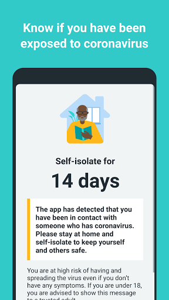
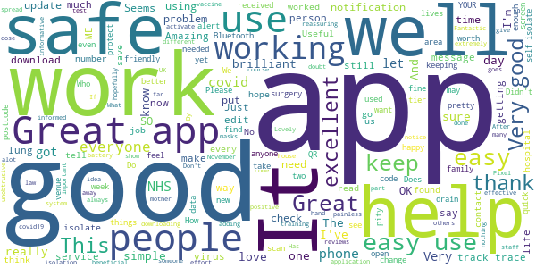
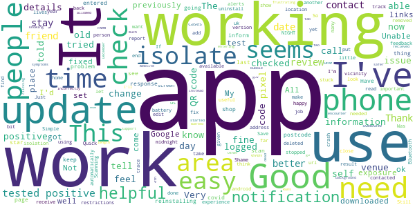
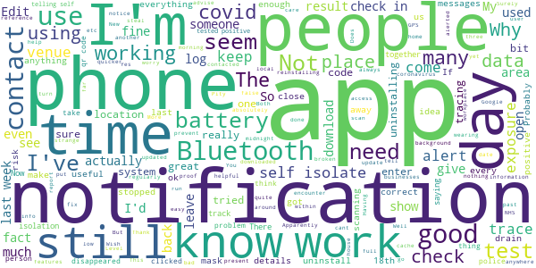
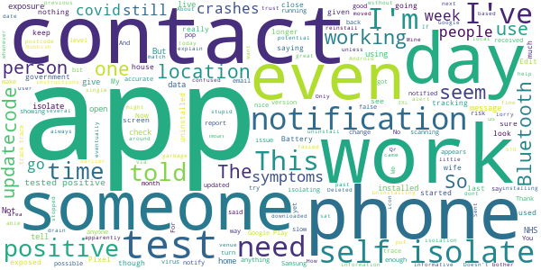
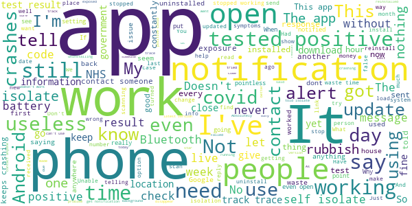

# NHS COVID-19
App version ``3.12.2 (114)``

Analyzed with [covid-apps-observer](http://github.com/covid-apps-observer) project, version ``0.1``

## App overview
| | |
|-------------------------|-------------------------| 
| **Name**&nbsp;&nbsp;&nbsp;&nbsp;&nbsp;&nbsp;&nbsp;&nbsp;&nbsp;&nbsp;&nbsp;&nbsp;&nbsp;&nbsp;&nbsp;&nbsp;&nbsp;&nbsp;&nbsp;&nbsp;&nbsp;&nbsp;&nbsp;&nbsp;&nbsp;&nbsp;&nbsp;&nbsp;&nbsp;&nbsp;&nbsp;&nbsp;&nbsp;&nbsp;&nbsp;&nbsp;&nbsp;&nbsp;&nbsp;&nbsp;  | NHS COVID-19 |
| **Unique identifier** | uk.nhs.covid19.production |
| **Link to Google Play** | [https://play.google.com/store/apps/details?id=uk.nhs.covid19.production](https://play.google.com/store/apps/details?id=uk.nhs.covid19.production) |
| **Summary**  | Protect your loved ones with the NHS contact tracing app for England and Wales. |
| **Privacy policy** | [https://covid19.nhs.uk/our-policies.html](https://covid19.nhs.uk/our-policies.html) |
| **Latest version** | 3.12.2 (114) |
| **Last update** | 2020-12-01 13:51:40 |
| **Recent changes** | Bug fixes. |
| **Installs**  | 5,000,000+ |
| **Category** | Medical |
| **First release** | Aug 12, 2020 |
| **Size**  | 8.1M |
| **Supported Android version**  | 6.0 and up |

### Description
> The NHS COVID-19 app is the official contact tracing app for England and Wales. 
 It is the fastest way of knowing when you’re at risk from coronavirus. The quicker you know, the quicker you can alert your loved ones, and your community. 
 The more of us that use it, the better we can control coronavirus. 
 The app runs on proven software developed by Apple and Google, designed so that nobody will know who or where you are. And you can delete your data, or the app, at any time.
 It has a number of features: 
 - Trace: Find out when you’ve been near other app users who have tested positive for coronavirus
 - Alert: Lets you know the level of coronavirus risk in your postcode district. 
 - Check-in: Use our simple QR code scanner to check-in to venues like bars and restaurants. You will get alerted if you have visited a venue where you may have come into contact with coronavirus.
 - Symptoms: Check if you have coronavirus symptoms and see if you need to order a test. 
 - Test: Helps you order a test if you need to.
 - Isolate: Keep track of your self-isolation countdown and access relevant advice.
 Available in English, Welsh, Arabic (Modern Standard), Bengali, Chinese (Simplified), Gujarati, Polish, Punjabi (Gurmukhi script), Romanian, Somali, Turkish and Urdu.
 The app can be used across UK borders in England, Wales, Scotland, Northern Ireland, Jersey and Gibraltar, detecting all relevant contact tracing app users (regardless of them using different official apps), alerting them if they have been in contact with coronavirus. 
 The app has been built in collaboration with some of the most innovative organisations in the world. We have worked with medical experts, privacy groups, at-risk communities and we’ve shared knowledge with the teams working on similar apps in many countries.
 Protect your loved ones. Please download the app. 
 The App is CE marked as a class I medical device in the United Kingdom and developed in compliance with European Commission Directive 93/42/EEC for class I devices.

### User interface
The developers of the app provide the following screenshots in the Google play store.
| | | |
|:-------------------------:|:-------------------------:|:-------------------------:|
 |   |   |   | 
 |   |  

## Development team
In the following we report the main information provided by the development team in the Google play store.

| | |
|-------------------------|-------------------------|
| **Developer**  | Department of Health and Social Care |
| **Website**  | [https://covid19.nhs.uk/](https://covid19.nhs.uk/) |
| **Email** | NHSCovid-19AppStoreSupport@nhsbsa.nhs.uk |
| **Physical address**  | - |
| **Other developed apps**  | [https://play.google.com/store/apps/developer?id=Department+of+Health+and+Social+Care](https://play.google.com/store/apps/developer?id=Department+of+Health+and+Social+Care) |

## Android support

| | |
|-------------------------|-------------------------|
| **Declared target Android version**  | Android10, version 10 (API level 29) |
| **Effective target Android version**  | Android10, version 10 (API level 29) |
| **Minimum supported Android version**  | Marshmallow, version 6.0 (API level 23) |
| **Maximum target Android version**  | - |

The larger the difference between the minimum and maximum supported Android versions, the better. A larger difference means a wider audience. For example, old phones have a very low Android version, so a high minimum supported Android version means that the app cannot be used by users with old phones, thus leading to accessibility problems. 

## Requested permissions

In the following we report the complete list of the permissions requested by the app. 

| **Permission** | **Protection level** | **Description** | 
|-------------------------|-------------------------|-------------------------|
 **android.permission ACCESS_NETWORK_STATE** | Normal | Allows applications to access information about networks. 
 **android.permission BLUETOOTH** | Normal | Allows applications to connect to paired bluetooth devices. 
 **android.permission CAMERA** | :warning:**Dangerous** | Required to be able to access the camera device. 
 **android.permission FOREGROUND_SERVICE** | Normal | Allows a regular application to use Service.startForeground. 
 **android.permission INTERNET** | Normal | Allows applications to open network sockets. 
 **android.permission RECEIVE_BOOT_COMPLETED** | Normal | Allows an application to receive the Intent.ACTION_BOOT_COMPLETED that is broadcast after the system finishes booting. 
 **android.permission WAKE_LOCK** | Normal | Allows using PowerManager WakeLocks to keep processor from sleeping or screen from dimming. 

## Mentioned servers

| **Server** | **Registrant** | **Registrant country** | **Creation date** | 
|-------------------------|-------------------------|-------------------------|-------------------------|
 | google.com | Google LLC | :us: US | 1997-09-15 04:00:00 |
 | ietf.org | IETF Trust | :us: US | 1995-03-11 05:00:00 |
 | googleapis.com | Google LLC | :us: US | 2005-01-25 17:52:26 |
 | apache.org | The Apache Software Foundation | :us: US | 1995-04-11 04:00:00 |

## Security analysis 

Below we report the main security warnings raised by our execution of the [Androwarn](https://github.com/maaaaz/androwarn) security analysis tool.

**Connection interfaces exfiltration**
> - This application reads details about the currently active data network 
> - This application tries to find out if the currently active data network is metered 

**Suspicious connection establishment**
> - This application opens a Socket and connects it to the remote address ' returned no addresses for  ; port is out of range' on the 'N/A' port  
> - This application opens a Socket and connects it to the remote address '' on the 'N/A' port  
> - This application opens a Socket and connects it to the remote address 'Ljava/lang/StringBuilder;->toString()Ljava/lang/String;' on the 'N/A' port  
> - This application opens a Socket and connects it to the remote address 'Ljava/net/Proxy;->type()Ljava/net/Proxy$Type;' on the 'N/A' port  
> - This application opens a Socket and connects it to the remote address 'timeout' on the 'N/A' port  

**Code execution**
> - This application loads a native library 
> - This application loads a native library: 'Ljava/lang/String;->valueOf(Ljava/lang/Object;)Ljava/lang/String;' 

## User ratings and reviews

Below we provide information about how end users are reacting to the app in terms of ratings and reviews in the Google Play store.

### Ratings

The NHS COVID-19 app has been installed by more than **5000000** times. At this time, **91414** rated the app and its average score is **3.9573503**. Below we show the distribution of the ratings across the usual star-based rating of Google Play

:star::star::star::star::star:: 53561

:star::star::star::star:: 12904

:star::star::star:: 6995

:star::star:: 3401

:star:: 14553

### Reviews 

#### 5-star reviews

> Good application to help keep you safe  :date: __2020-12-05 17:36:42__

> simple to use  :date: __2020-12-05 16:25:07__

> Amazing shop, great produce and the most friendly and helpful staff that you can have!  :date: __2020-12-05 15:38:47__

> great should have been sooner and should have been explained in lamain terms so that every person understood how the app works clearly I'm a nurse and I'm still getting used to it  :date: __2020-12-05 15:33:32__

> greeter at door; seating people in their bubbles 👍😁  :date: __2020-12-05 14:40:56__

> I have been using this app to check in at venues but also for my own venue where I check in each day. It is a legal obligation I am more than happy to comply with. The app is straight forward to use. I have a copy in my waiting area and treatment room.  :date: __2020-12-05 10:22:32__

> Life saver,good job NHS.  :date: __2020-12-04 18:49:51__

> Great app more people need to get this.  :date: __2020-12-04 16:35:05__

> No experiêncie at all  :date: __2020-12-04 14:17:26__

> I believe it works, is beneficial and reassuring as I have had no reason to make me doubt it.  :date: __2020-12-04 13:51:09__

#### 4-star reviews

> Incorrectly reports self isolation end date when entering test result The app uses the positive test date to show your isolation length, instead of the date you started to show symptoms.  :date: __2020-12-05 14:47:00__

> Good app, however when I had a positive encounter previously it didn't tell me where or when, which was a bit frustrating as I'd been out to two shops with my support bubble (mum) and wanted to be able to tell her if she needed to isolate too. Other than that, has been working fine. Feel much safer having this app on and knowing if I've been in contact with someone who tested positive, I'll know about it.  :date: __2020-12-05 11:46:21__

> Not dead yet.  :date: __2020-12-05 08:53:23__

> Got there in the end. Works well.  :date: __2020-12-05 01:36:15__

> I use the app all the time because it tells me where I am allowed to go by clicking on the restrictions tab and I have recieved exposure notifications. Very happy with this app  :date: __2020-12-04 23:30:53__

> Runs in the background, no problems, with links to gov.uk website for up to date information. if you can, use it update 4th December , now not working at all  :date: __2020-12-04 19:46:29__

> Keeps crashing  :date: __2020-12-03 21:54:19__

> I've fixed it, I deleted app then restarted my phone and downloaded it again  :date: __2020-12-03 20:42:27__

> Finally functioning now!  :date: __2020-12-03 14:32:12__

> My experience with this app did work. I was notified that I had to self isolate, followed by a phone call from work that there had been 2 people who had tested positive In our department (I must admit, the app would be better if the app told you where you was suspected to have come in contact with someone who had reported their results).  :date: __2020-12-03 08:29:51__

#### 3-star reviews

> A bit simple. Some extra features would be really helpful, like zoom when capturing a QR code or looking one up from a photo. Both could help reduce the time lingering over a single sign at the establishment.  :date: __2020-12-05 16:09:40__

> Having Bluetooth on runs my phone battery down quicker  :date: __2020-12-05 13:36:06__

> My phone is making a strange huuuu sound when I'm on the venue check-in  :date: __2020-12-05 08:45:46__

> No code in result email or SMS to enter test result in app?  :date: __2020-12-05 00:02:42__

> How do I know if it's any good?  :date: __2020-12-03 22:13:12__

> The app was working absolutely fine up until the past few days where it keeps crashing. I even tried uninstalling and reinstalling the app but to no avail!! Very frustrating.  :date: __2020-12-03 19:23:32__

> You still can't change your location from within the app. You have to reinstall it if you move to another part of the country for significant time.  :date: __2020-12-02 17:34:01__

> New Tier system ( 2/12/2020 ) does not show my local authority... Torbay is missing from the available list. Thank you for your quick response and help.  :date: __2020-12-02 12:12:59__

> Good  :date: __2020-12-02 10:29:25__

> Not great. Apparently I've had no exposure checks since 5 October. So I'm pretty sure it's not working. Bluetooth is on and Contact tracing enabled. Edit. Having cleared all data and cache and stopped and restarted the app, it started working again. Even without the latest update.  :date: __2020-12-02 10:11:21__

#### 2-star reviews

> It does not help at all  :date: __2020-12-05 14:25:50__

> After misgivings about potential abuse of personal data from the NHSX COVID19 app, I installed it. Today, it's demanding further location information (& won't proceed unless I supply it). For me it has been rendered non-functional, as they've had all I'm prepared to give. Uninstalling...  :date: __2020-12-05 13:16:44__

> How can an app.beat the Beast?  :date: __2020-12-05 10:17:31__

> Good in theory but I'm finding it highly concerning that upon checking my exposure notifications it claims the last check for potential exposure was October 16th and we are now in December  :date: __2020-12-05 02:01:30__

> Received a message which promptly disappeared.  :date: __2020-12-04 16:35:04__

> Hi Team, Am using Google Pixel 3XL and after installing the app it just opens and closes itself without going to home page, please advise what might be the issue here. Thanks.  :date: __2020-12-04 01:12:55__

> Had to uninstall, this app has been draining my phone battery for the past week  :date: __2020-12-03 19:17:48__

> It is very hard to download and once downloaded it loses itself and it cannot be retrieved  :date: __2020-12-02 11:03:34__

> No way to change address once you moved house. Don't want to clear app data because I'm not sure if that will remove my collected hashes, so I might not get notified if I reset it...  :date: __2020-12-02 03:11:33__

> Have downloaded for 3 time now on my pixel 3 and it keeps stopping working  :date: __2020-11-30 11:45:39__

#### 1-star reviews

> Update 5/12 app doesn't work on Android 11 pixel4xl. Instant crashes  :date: __2020-12-05 17:12:25__

> Drains battery 🔋 like it's blackpool iluminations, role on vaccination 💉 roll out then no vaccination no entry? Pubs, cinemas, restaurants, football matches, concerts? Welcome to 1984 George Orwell?  :date: __2020-12-05 16:41:43__

> Can't even open the app now, keeps crashing.  :date: __2020-12-05 13:15:43__

> App keeps crashing so I can't use it. Is there an alternative?  :date: __2020-12-05 11:39:49__

> Livingston, Scotland. A current Tier 4 district is not a recognised post code. "Ay yes, good app"  :date: __2020-12-05 02:42:31__

> Nonsense  :date: __2020-12-05 02:23:52__

> Doesn't run (Android). Just says another app is using the same technology. I spent ages giving it all the permissions and checking my settings, but nothing. Wouldn't care if it wasn't so important.  :date: __2020-12-05 00:58:10__

> Rubbish, gave me a false reading. Not impressed  :date: __2020-12-04 22:17:03__

> Terrible app, 10 million pounds spent on an app which 90% ineffective or wrong  :date: __2020-12-04 22:12:39__

> Stopped working today. Uninstalling and reinstalling made no difference. No change to my phone or anything. Just the app packed up.  :date: __2020-12-04 19:06:48__

