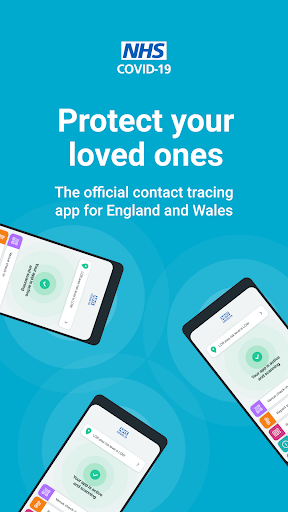
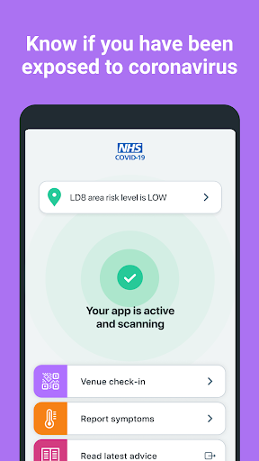
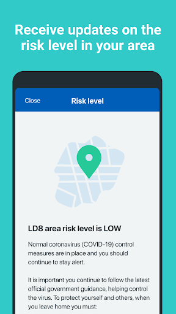
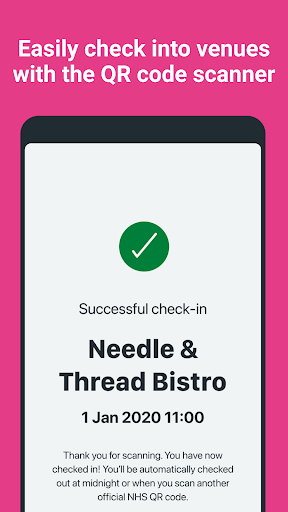
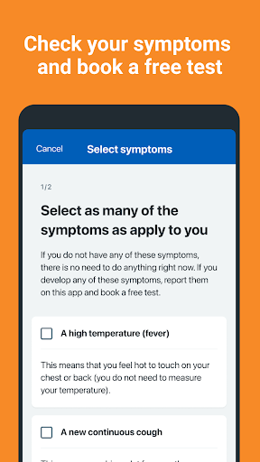
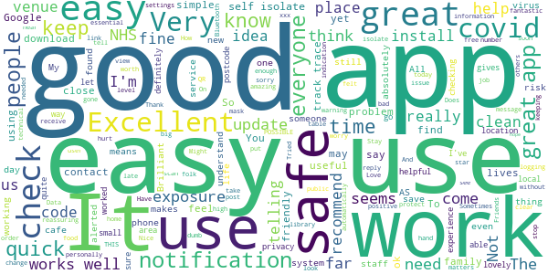
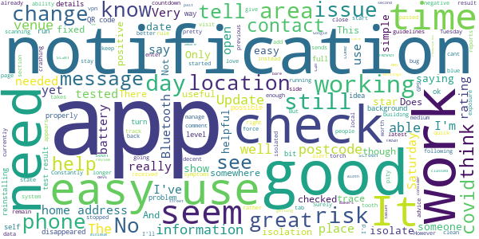
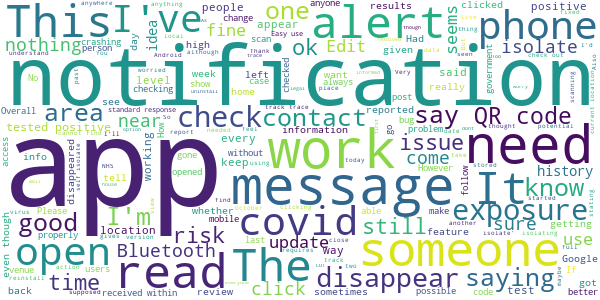
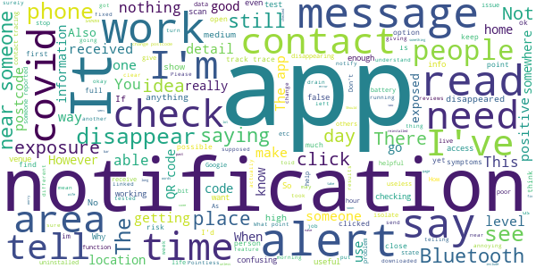

# NHS COVID-19
App version ``3.7.2 (85)``

Analyzed with [covid-apps-observer](http://github.com/covid-apps-observer) project, version ``0.1``

## App overview
| | |
|-------------------------|-------------------------| 
| **Name**&nbsp;&nbsp;&nbsp;&nbsp;&nbsp;&nbsp;&nbsp;&nbsp;&nbsp;&nbsp;&nbsp;&nbsp;&nbsp;&nbsp;&nbsp;&nbsp;&nbsp;&nbsp;&nbsp;&nbsp;&nbsp;&nbsp;&nbsp;&nbsp;&nbsp;&nbsp;&nbsp;&nbsp;&nbsp;&nbsp;&nbsp;&nbsp;&nbsp;&nbsp;&nbsp;&nbsp;&nbsp;&nbsp;&nbsp;&nbsp;  | NHS COVID-19 |
| **Unique identifier** | uk.nhs.covid19.production |
| **Link to Google Play** | [https://play.google.com/store/apps/details?id=uk.nhs.covid19.production](https://play.google.com/store/apps/details?id=uk.nhs.covid19.production) |
| **Summary**  | Protect your loved ones with the NHS contact tracing app for England and Wales. |
| **Privacy policy** | [https://covid19.nhs.uk/our-policies.html](https://covid19.nhs.uk/our-policies.html) |
| **Latest version** | 3.7.2 (85) |
| **Last update** | 2020-10-14 17:54:55 |
| **Recent changes** | Bug fixes. |
| **Installs**  | 5,000,000+ |
| **Category** | Medical |
| **First release** | Aug 12, 2020 |
| **Size**  | 7.1M |
| **Supported Android version**  | 6.0 and up |

### Description
> The new NHS COVID-19 app is the Official NHS contact tracing app for England and Wales. 
 It is the fastest way of knowing when you’re at risk from Coronavirus. The quicker you know, the quicker you can alert your loved ones, and your community. 
 The more of us that use it, the better we can control coronavirus. 
 The app runs on proven software developed by Apple and Google, designed so that nobody will know who or where you are. And you can delete your data, or the app, at any time.
 It has a number of features: 
 - Trace: Find out when you’ve been near other app users who have tested positive for coronavirus
 - Alert: Lets you know the level of coronavirus risk in your postcode district. 
 - Check-in: Get alerted if you have visited a venue where you may have come into contact with coronavirus, using a simple QR code scanner. No more form filling. 
 - Symptoms: Check if you have coronavirus symptoms and see if you need to order a test. 
 - Test: Helps you order a test if you need to.
 - Isolate: Keep track of your self-isolation countdown and access relevant advice.
 Available in English, Welsh, Bengali, Urdu, Gujarati, Punjabi (Gurmukhi script), Chinese (Simplified), Romanian, Turkish and Arabic (Modern Standard). Additional languages and refinements will follow.
 The app has been built in collaboration with some of the most innovative organisations in the world. We have worked with medical experts, privacy groups, at-risk communities and we’ve shared knowledge with the teams working on similar apps in many countries.
 Protect your loved ones. Please download the app.
 The App is CE marked as a class I medical device in the United Kingdom and developed in compliance with European Commission Directive 93/42/EEC for class I devices.

### User interface
The developers of the app provide the following screenshots in the Google play store.
| | | |
|:-------------------------:|:-------------------------:|:-------------------------:|
 |   |   |   | 
 |   |  

## Development team
In the following we report the main information provided by the development team in the Google play store.

| | |
|-------------------------|-------------------------|
| **Developer**  | Department of Health and Social Care |
| **Website**  | [https://covid19.nhs.uk/](https://covid19.nhs.uk/) |
| **Email** | NHSCovid-19AppStoreSupport@nhsbsa.nhs.uk |
| **Physical address**  | - |
| **Other developed apps**  | [https://play.google.com/store/apps/developer?id=Department+of+Health+and+Social+Care](https://play.google.com/store/apps/developer?id=Department+of+Health+and+Social+Care) |

## Android support

| | |
|-------------------------|-------------------------|
| **Declared target Android version**  | Android10, version 10 (API level 29) |
| **Effective target Android version**  | Android10, version 10 (API level 29) |
| **Minimum supported Android version**  | Marshmallow, version 6.0 (API level 23) |
| **Maximum target Android version**  | - |

The larger the difference between the minimum and maximum supported Android versions, the better. A larger difference means a wider audience. For example, old phones have a very low Android version, so a high minimum supported Android version means that the app cannot be used by users with old phones, thus leading to accessibility problems. 

## Requested permissions

In the following we report the complete list of the permissions requested by the app. 

| **Permission** | **Protection level** | **Description** | 
|-------------------------|-------------------------|-------------------------|
 **android.permission ACCESS_NETWORK_STATE** | Normal | Allows applications to access information about networks. 
 **android.permission BLUETOOTH** | Normal | Allows applications to connect to paired bluetooth devices. 
 **android.permission CAMERA** | :warning:**Dangerous** | Required to be able to access the camera device. 
 **android.permission FOREGROUND_SERVICE** | Normal | Allows a regular application to use Service.startForeground. 
 **android.permission INTERNET** | Normal | Allows applications to open network sockets. 
 **android.permission RECEIVE_BOOT_COMPLETED** | Normal | Allows an application to receive the Intent.ACTION_BOOT_COMPLETED that is broadcast after the system finishes booting. 
 **android.permission WAKE_LOCK** | Normal | Allows using PowerManager WakeLocks to keep processor from sleeping or screen from dimming. 

## Mentioned servers

| **Server** | **Registrant** | **Registrant country** | **Creation date** | 
|-------------------------|-------------------------|-------------------------|-------------------------|
 | google.com | Google LLC | :us: US | 1997-09-15 04:00:00 |
 | ietf.org | IETF Trust | :us: US | 1995-03-11 05:00:00 |
 | googleapis.com | Google LLC | :us: US | 2005-01-25 17:52:26 |

## Security analysis 

Below we report the main security warnings raised by our execution of the [Androwarn](https://github.com/maaaaz/androwarn) security analysis tool.

**Connection interfaces exfiltration**
> - This application reads details about the currently active data network 
> - This application tries to find out if the currently active data network is metered 

**Suspicious connection establishment**
> - This application opens a Socket and connects it to the remote address ' returned no addresses for  ; port is out of range' on the 'N/A' port  
> - This application opens a Socket and connects it to the remote address '' on the 'N/A' port  
> - This application opens a Socket and connects it to the remote address 'Ljava/lang/StringBuilder;->toString()Ljava/lang/String;' on the 'N/A' port  
> - This application opens a Socket and connects it to the remote address 'Ljava/net/Proxy;->type()Ljava/net/Proxy$Type;' on the 'N/A' port  
> - This application opens a Socket and connects it to the remote address 'timeout' on the 'N/A' port  

**Code execution**
> - This application loads a native library 
> - This application loads a native library: 'Ljava/lang/String;->valueOf(Ljava/lang/Object;)Ljava/lang/String;' 

## User ratings and reviews

Below we provide information about how end users are reacting to the app in terms of ratings and reviews in the Google Play store.

### Ratings

The NHS COVID-19 app has been installed by more than **5000000** times. At this time, **69244** rated the app and its average score is **4.1758432**. Below we show the distribution of the ratings across the usual star-based rating of Google Play

:star::star::star::star::star:: 43895

:star::star::star::star:: 10213

:star::star::star:: 5549

:star::star:: 2596

:star:: 6991

### Reviews 

#### 5-star reviews

> Looks good, hope others use it too. Might be slightly late...  :date: __2020-10-24 08:41:26__

> A weapon to win the war against SARS-CoV-2  :date: __2020-10-24 01:29:31__

> How do you check the exposure  :date: __2020-10-24 00:43:27__

> So far so good  :date: __2020-10-24 00:16:56__

> Good , no sorry. Excellent 👌 work 👍 so far so good. Proud (VERY) and so you should be. My nephew passed away, few months back, big family so ? Not everyone could attend :-(. Via video-link which I personally could not take. Please keep up the good work, promise.  :date: __2020-10-23 23:11:59__

> Brilliant idea & it keep Family & Friends Safe 😊👍  :date: __2020-10-23 22:34:42__

> very good initiative by NHS  :date: __2020-10-23 21:04:57__

> As far as I'm concerned the app is doing its job and I am glad that I have loaded it on a number of units.  :date: __2020-10-23 19:44:49__

> very handy for quick entry!  :date: __2020-10-23 19:40:40__

> works forme  :date: __2020-10-23 19:18:12__

#### 4-star reviews

> looking ok to me 👍  :date: __2020-10-24 08:21:43__

> always feel safe here  :date: __2020-10-23 18:54:26__

> Good up to now  :date: __2020-10-23 15:36:13__

> Doesn't background properly in all situations. better than nothing.  :date: __2020-10-23 15:23:11__

> The qr scan thing works, couldn't say about what else it's supposed to do  :date: __2020-10-23 15:18:19__

> Ok so far. Only had it over a week. Live nr Elephant and Castle SE1. No hiccups. Doing it's job flashing away, scans ok. 👍  :date: __2020-10-23 14:35:26__

> Wish we could input more than one postcode as i stay with my boyfriend for a week each month and he lives under a different council so i cant input his postcode.  :date: __2020-10-23 12:54:48__

> Had a notification come up went to read and it disappeared, now can't find out what it said. Thank you for the update.  :date: __2020-10-23 11:01:31__

> Was not accepted at Blenheim palace today, had to download the Llber track and trace app to be be allowed in. Update just been down to Exeter and Torquay, the QR code posters displayed at many shops/hotels etc scanned in quickly, doubly useful as we have a list of places we visted on holiday.  :date: __2020-10-23 10:06:09__

> It would be really good if the notifications received were stored so that we could refer back to them with their date and time. Now as soon as you click on the push notifications they're gone, you're only redirected to the app.  :date: __2020-10-22 22:26:42__

#### 3-star reviews

> Update 24th October I've reinstalled the app and it is now not crashing. I will review the stability throughout the week and see if the bug comes back. If it doesn't, I'll update the review to 5*. Kudos to the dev team👍 Keeps crashing when the app opens. It was previously working. I'll update this review every week to keep people informed about whether bug have been fixed/issue resolved. Every time I'll uninstall it and then reinstall. As of 21st of October the issue is still happening.  :date: __2020-10-24 09:39:35__

> Get a possible exposure risk message then another saying risk assessment says ok nothing to worry about. How about checking risk first then send relevant message  :date: __2020-10-24 09:31:14__

> Could not use any of my other apps. Too big for my phone.  :date: __2020-10-24 09:08:27__

> This app NEEDS a check-out option to say you have left a site that you have checked into! To investigate, the time everyone LEAVES a venue, as well as the time they arrive, would save a LOT of unnecessary work! I don't want a legal responsibility to isolate because someone, who checked in after I have left a venue, tests positive! I suppose I can deinstall. Without a check-out feature, how will Track and Trace know whether I had left before the person who tested positive arrived or not?  :date: __2020-10-23 22:42:05__

> App is good ish but notifications are a nightmare as u cant open to read them and they dont always come though as have on two phones in the house  :date: __2020-10-23 22:26:56__

> Difficult to configure Android mobile to enable QR code scanning. Installation should enable by default. Check in to location in low light does not work because app does not switch on the mobile camera's flash.  :date: __2020-10-23 21:18:09__

> I've had test in June was negative but didn't get a code  :date: __2020-10-23 20:38:42__

> All items relating to information and links are inaccessable. Each one has a square and a small arrow pointing out from it, when pressed nothing happens.  :date: __2020-10-23 20:20:36__

> Good app ,So far ,  :date: __2020-10-23 19:37:53__

> The app works, but it stops a load of other apps working properly, such as Hiya, SystmOnline and Airmid UK. Probably not a Bluetooth issue, as other Bluetooth apps don't do this. Then, after about ten minutes, it goes on to block all WiFi access and mobile data access, even though they both still show as "on" and "connected". It's frustrating that I can't use this app and NHS hospital WiFi at the same time. But then again, when did any two parts of the NHS ever work together seamlessly?  :date: __2020-10-23 19:24:17__

#### 2-star reviews

> You get alerts come up on your phone, yet they aren't stored on the app and you can't read them. When you click on them to read the whole msg they just vanish.  :date: __2020-10-24 09:41:12__

> Not that great keep getting messages then go off before even have time to read them pretty much seems a waste of time  :date: __2020-10-24 01:04:01__

> I'd like to be able to read the notifications in the app  :date: __2020-10-23 20:01:24__

> Important message flashes, you touch it to read and it goes. Just flashed "someone tested positive clo" and I couldnt read the whole thing?  :date: __2020-10-23 19:45:24__

> Seems to check at random times, even with bluetooth turned off. Noticed more battery drain than usual. More useful to see area risk than anything else, unfortunately.  :date: __2020-10-23 19:13:20__

> Pathetic. When an alery comes in there is no where to read it! I warning message appears in the top notification area, you click on it and it opens the app but there is nowhere for messages! The first few words say don't worry, you have been near somebody.... but what, somebody with Covington? If so where, when? Would be nice to know so I don't go back to that area! Rubbish at keeping you informed  :date: __2020-10-23 18:33:16__

> I've received two notifications about a possible close contact with someone tested positive. The notification says that my data (date, time of exposure) has been saved but I'm not able to see this data neither on the notification nor inside the application. I think its important to see that info to know if it was a real contact, when it happens or if its a neighbour, but there is no way to do it. Also, I always go out with my boyfriend, never alone and he has not received any notification  :date: __2020-10-23 17:17:50__

> Its OK. But I don't understand why there isn't an option to log when you leave a venue. It appears if I enter somewhere it logs me till midnight or until I log on somewhere else?  :date: __2020-10-23 17:05:26__

> Fesperately needs to show notifications on the app itself including a history of when near someone with symptoms. I had 2 notifications within the last 24hrs and because I tapped on them they've disappeared before I had a chance to finish reading them. Please look to add this asap  :date: __2020-10-23 16:17:20__

> I appreciate it exists, but this program is far, from perfect. Similar to others, I received the infamous "potential covid exposure" alert, followed by the NHS app telling me that I'm ok, don't worry - and that's it. No extra info, not even a log about the alerts. I know that in the background, on the system level, the tracing works by collecting Bluetooth ids (MAC addresses, probably) from other devices, but this mean what if I'm in a traffic jam, I'll pick up the people around me, regardless of being fairly well shielded from the rest. Apparently the first notification - the exposure one - comes from the system level whenever it makes makes a match against the encountered vs the downloaded and known to be sick database - and sends the alert immediate. The NHS app then dives into the data, and checks the potential distance and exposure time; if it's bad, the app will tell you to self-isolate; if not, you'll get nothing, but another notification, that practically says "false alarm, you're ok". Recommendations to the engineers: - clicks on any of the notifications should take the user to a log of events - these events should have a timestamp at least and, if recorded, a location, about when and where the exposure might have happened - information on why the NHS app decided that this potential exposure is not a risk Without these it's very easy to get stressed and frightened.  :date: __2020-10-23 16:14:29__

#### 1-star reviews

> Notifications dissapear before you have chance to read; no log or record  :date: __2020-10-24 09:42:36__

> Same as others notifications to say exposure, when you click them they vanish. Nowhere in the app to find this information. It's pointless at best!  :date: __2020-10-24 09:39:16__

> Got a Covid notification. Clicked on it & it disappeared. Don't know what the message was. I can't see the point in messages that you can't read, so I uninstalled the app.  :date: __2020-10-24 08:10:56__

> Only use it because we are forced to. Why the nhs logo? When can I put my negative result in?  :date: __2020-10-24 08:02:12__

> Random pop ups about being in close contact with a Covid +ve person and no further details about it. Been to Sainsburys at 4 in the afternoon and pop up comes in at 23.30! Not useful at all!  :date: __2020-10-24 08:00:37__

> Notifications are not held in the app. I got a notification and clicked on it and the notification disappeared. . But have no idea what it said as I cant find the message in the app. I see previous review responses say that if it was important the app would tell me. I feel the app should still show me the message so I know what it was trying to say even if it was a safe message.  :date: __2020-10-24 07:55:37__

> You have to click on the app to get a notification.  :date: __2020-10-24 06:59:27__

> Worst app ever, if there was an alternative would definitely use instead of this. First issue, you can check-in to a location, but no option to check-out when you leave it, second and biggest issue, messages only show in notification bar, if accidentally dismissed, it's gone forever. Should at the very least be able to view the message from within the app, or better yet, have the ability to view the history of messages with dates and time.  :date: __2020-10-24 05:10:24__

> Awakened at 1am with a message telling me that the risk level nearby has changed. A three year old could write better software.  :date: __2020-10-24 01:46:40__

> Can't even see if I'm safe going to school stupid  :date: __2020-10-24 01:23:59__

