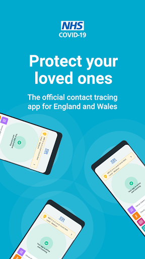
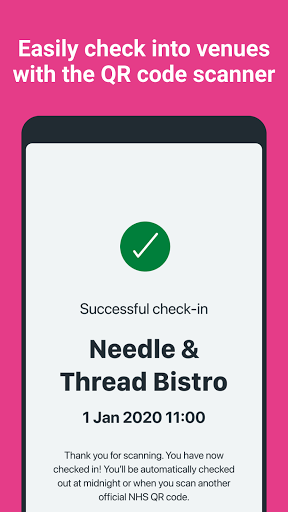
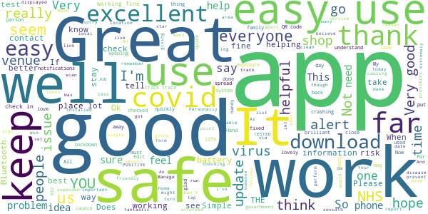
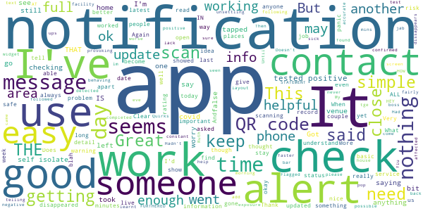
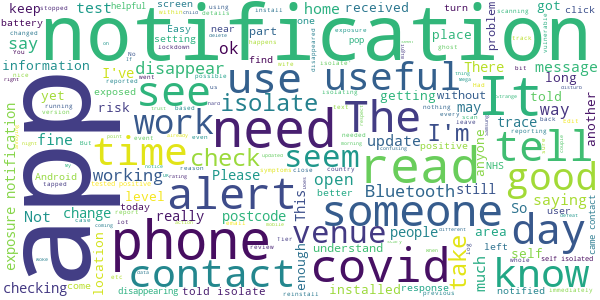
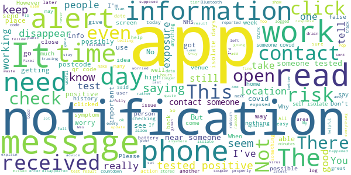
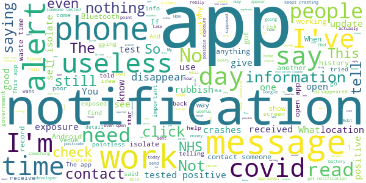

# NHS COVID-19
App version ``3.9 (96)``

Analyzed with [covid-apps-observer](http://github.com/covid-apps-observer) project, version ``0.1``

## App overview
| | |
|-------------------------|-------------------------| 
| **Name**&nbsp;&nbsp;&nbsp;&nbsp;&nbsp;&nbsp;&nbsp;&nbsp;&nbsp;&nbsp;&nbsp;&nbsp;&nbsp;&nbsp;&nbsp;&nbsp;&nbsp;&nbsp;&nbsp;&nbsp;&nbsp;&nbsp;&nbsp;&nbsp;&nbsp;&nbsp;&nbsp;&nbsp;&nbsp;&nbsp;&nbsp;&nbsp;&nbsp;&nbsp;&nbsp;&nbsp;&nbsp;&nbsp;&nbsp;&nbsp;  | NHS COVID-19 |
| **Unique identifier** | uk.nhs.covid19.production |
| **Link to Google Play** | [https://play.google.com/store/apps/details?id=uk.nhs.covid19.production](https://play.google.com/store/apps/details?id=uk.nhs.covid19.production) |
| **Summary**  | Protect your loved ones with the NHS contact tracing app for England and Wales. |
| **Privacy policy** | [https://covid19.nhs.uk/our-policies.html](https://covid19.nhs.uk/our-policies.html) |
| **Latest version** | 3.9 (96) |
| **Last update** | 2020-10-27 21:23:16 |
| **Recent changes** | Feature enhancements to venue check-in, postal district alert, encounter detection and exposure notification and refined testing app logic as well as overall UI and accessibility optimisations. |
| **Installs**  | 5,000,000+ |
| **Category** | Medical |
| **First release** | Aug 12, 2020 |
| **Size**  | 8.0M |
| **Supported Android version**  | 6.0 and up |

### Description
> The new NHS COVID-19 app is the Official NHS contact tracing app for England and Wales. 
 It is the fastest way of knowing when you’re at risk from Coronavirus. The quicker you know, the quicker you can alert your loved ones, and your community. 
 The more of us that use it, the better we can control coronavirus. 
 The app runs on proven software developed by Apple and Google, designed so that nobody will know who or where you are. And you can delete your data, or the app, at any time.
 It has a number of features: 
 - Trace: Find out when you’ve been near other app users who have tested positive for coronavirus
 - Alert: Lets you know the level of coronavirus risk in your postcode district. 
 - Check-in: Get alerted if you have visited a venue where you may have come into contact with coronavirus, using a simple QR code scanner. No more form filling. 
 - Symptoms: Check if you have coronavirus symptoms and see if you need to order a test. 
 - Test: Helps you order a test if you need to.
 - Isolate: Keep track of your self-isolation countdown and access relevant advice.
 Available in English, Arabic (Modern Standard), Bengali, Chinese (Simplified), Gujarati, Polish, Punjabi (Gurmukhi script), Romanian, Somali, Turkish, Urdu and Welsh.
 The app has been built in collaboration with some of the most innovative organisations in the world. We have worked with medical experts, privacy groups, at-risk communities and we’ve shared knowledge with the teams working on similar apps in many countries.
 Protect your loved ones. Please download the app. 
 The App is CE marked as a class I medical device in the United Kingdom and developed in compliance with European Commission Directive 93/42/EEC for class I devices.

### User interface
The developers of the app provide the following screenshots in the Google play store.
| | | |
|:-------------------------:|:-------------------------:|:-------------------------:|
 |   |   |   | 
 |   |  

## Development team
In the following we report the main information provided by the development team in the Google play store.

| | |
|-------------------------|-------------------------|
| **Developer**  | Department of Health and Social Care |
| **Website**  | [https://covid19.nhs.uk/](https://covid19.nhs.uk/) |
| **Email** | NHSCovid-19AppStoreSupport@nhsbsa.nhs.uk |
| **Physical address**  | - |
| **Other developed apps**  | [https://play.google.com/store/apps/developer?id=Department+of+Health+and+Social+Care](https://play.google.com/store/apps/developer?id=Department+of+Health+and+Social+Care) |

## Android support

| | |
|-------------------------|-------------------------|
| **Declared target Android version**  | Android10, version 10 (API level 29) |
| **Effective target Android version**  | Android10, version 10 (API level 29) |
| **Minimum supported Android version**  | Marshmallow, version 6.0 (API level 23) |
| **Maximum target Android version**  | - |

The larger the difference between the minimum and maximum supported Android versions, the better. A larger difference means a wider audience. For example, old phones have a very low Android version, so a high minimum supported Android version means that the app cannot be used by users with old phones, thus leading to accessibility problems. 

## Requested permissions

In the following we report the complete list of the permissions requested by the app. 

| **Permission** | **Protection level** | **Description** | 
|-------------------------|-------------------------|-------------------------|
 **android.permission ACCESS_NETWORK_STATE** | Normal | Allows applications to access information about networks. 
 **android.permission BLUETOOTH** | Normal | Allows applications to connect to paired bluetooth devices. 
 **android.permission CAMERA** | :warning:**Dangerous** | Required to be able to access the camera device. 
 **android.permission FOREGROUND_SERVICE** | Normal | Allows a regular application to use Service.startForeground. 
 **android.permission INTERNET** | Normal | Allows applications to open network sockets. 
 **android.permission RECEIVE_BOOT_COMPLETED** | Normal | Allows an application to receive the Intent.ACTION_BOOT_COMPLETED that is broadcast after the system finishes booting. 
 **android.permission WAKE_LOCK** | Normal | Allows using PowerManager WakeLocks to keep processor from sleeping or screen from dimming. 

## Mentioned servers

| **Server** | **Registrant** | **Registrant country** | **Creation date** | 
|-------------------------|-------------------------|-------------------------|-------------------------|
 | google.com | Google LLC | :us: US | 1997-09-15 04:00:00 |
 | ietf.org | IETF Trust | :us: US | 1995-03-11 05:00:00 |
 | googleapis.com | Google LLC | :us: US | 2005-01-25 17:52:26 |

## Security analysis 

Below we report the main security warnings raised by our execution of the [Androwarn](https://github.com/maaaaz/androwarn) security analysis tool.

**Connection interfaces exfiltration**
> - This application reads details about the currently active data network 
> - This application tries to find out if the currently active data network is metered 

**Suspicious connection establishment**
> - This application opens a Socket and connects it to the remote address ' returned no addresses for  ; port is out of range' on the 'N/A' port  
> - This application opens a Socket and connects it to the remote address '' on the 'N/A' port  
> - This application opens a Socket and connects it to the remote address 'Ljava/lang/StringBuilder;->toString()Ljava/lang/String;' on the 'N/A' port  
> - This application opens a Socket and connects it to the remote address 'Ljava/net/Proxy;->type()Ljava/net/Proxy$Type;' on the 'N/A' port  
> - This application opens a Socket and connects it to the remote address 'timeout' on the 'N/A' port  

**Code execution**
> - This application loads a native library 
> - This application loads a native library: 'Ljava/lang/String;->valueOf(Ljava/lang/Object;)Ljava/lang/String;' 

## User ratings and reviews

Below we provide information about how end users are reacting to the app in terms of ratings and reviews in the Google Play store.

### Ratings

The NHS COVID-19 app has been installed by more than **5000000** times. At this time, **83764** rated the app and its average score is **4.071302**. Below we show the distribution of the ratings across the usual star-based rating of Google Play

:star::star::star::star::star:: 51213

:star::star::star::star:: 11919

:star::star::star:: 6784

:star::star:: 3091

:star:: 10757

### Reviews 

#### 5-star reviews

> Great app but cant find how to put it on my menu.  :date: __2020-11-08 13:02:00__

> Good app  :date: __2020-11-08 04:48:42__

> Very nice  :date: __2020-11-07 22:28:04__

> Keeps you upto date and you need it to sign in to some venues.  :date: __2020-11-07 20:01:57__

> Very good app  :date: __2020-11-07 15:02:24__

> Great to have the app knowing if ya been in contact with someone who as tested positive ya get told and u can isolate people will always find something to moan about 😁  :date: __2020-11-07 11:24:41__

> Great and helps me to keep safe  :date: __2020-11-07 01:14:39__

> Several establishment in north wales do not have the QR codes displayed for venue check in.  :date: __2020-11-07 00:34:44__

> It is a very good app to.have on your phone, easy to use and read worth having.  :date: __2020-11-06 23:22:34__

> good  :date: __2020-11-06 20:54:37__

#### 4-star reviews

> Only one thing why is it that the exposure checks are about 5 hours apart when u can walk outside get covid of someone and pass it around for the next 5 hour with out knowing  :date: __2020-11-08 08:50:52__

> 6mins  :date: __2020-11-07 14:59:47__

> from symptoms to test and results was 48 hrs. track and Trace telehphoned me on my 3rd or 4th day of isolation and then throughout asking if I was ok needed any help. I had a good experience  :date: __2020-11-07 04:22:44__

> Appears to work as expected, the dissapearing OS notifications have now been fixed. I think to improve user faith in the app it would be good to include some limited stats like number of users encountered each day. At the moment it's hard to tell if it's working and the log viewable in the OS is opaque. I have received an isolate notification but it would be much more helpful if the app also gave me the timestamp of the encounter so that I know if it happene while out with my kids!  :date: __2020-11-07 00:25:52__

> I received a notification to say I had been near someone who has tested positive and had to isolate, but it doesnt tell me when, where or who. I have no idea of tracing this at all.  :date: __2020-11-06 14:35:24__

> Good  :date: __2020-11-06 12:19:21__

> The notifications vanish as soon as you click on them so you can't see the info. What use is this app! This said, following the feedback below and updating the App to the latest version - it seems to of resolved the issue now.  :date: __2020-11-05 17:59:54__

> good app, however, it doesnt show the status of where you are, only your post code status. \*\**Update (after response from developer) shows your home location wherever you are so you're aware of your home districts status.  :date: __2020-11-05 00:09:04__

> Fine. But should warn if Bluetooth has been turned off.  :date: __2020-11-04 19:16:12__

> it works as intended  :date: __2020-11-04 18:47:06__

#### 3-star reviews

> hard to tell whether this is any use.. on the other hand, it seems wise to use and does no harm...  :date: __2020-11-07 14:54:35__

> I got a match on my Google app but not on my nhs app what should I do next  :date: __2020-11-07 12:10:26__

> I have been told to isolate and currently isolating but the app still just says its scanning and active how do I change to see how long i have left, I have no symptoms and was only exposed to someone who had it  :date: __2020-11-07 10:57:48__

> It's a good app but turns off my blue tooth constantly throughout the day. Am happy to use when checking in to venues  :date: __2020-11-07 09:51:53__

> If I changed location, I have to delete and reinstall the app for my postcode to be updated...  :date: __2020-11-06 21:01:14__

> Confused i had a message to self isolate for 8 days as have come into close contact with someone and now a risk to others. I would love to know where this happened as I potentially had a child under 11 with me when I came into contact. Obviously I'm following guidence ( bored already) but don't know if my child should isolate aswell as the location where I came into contact can't be found is there anyway of finding out?  :date: __2020-11-06 20:52:54__

> Unbale to install on my Samsung J3 mobile why is that, it states incompatible with my device, but it installed on my wife's mobile which is the same.  :date: __2020-11-06 17:03:27__

> would be useful if it saved locations  :date: __2020-11-06 15:52:21__

> OK not needed yet thank god  :date: __2020-11-06 14:40:40__

> Normally don't notice it running but now keep getting notifications on my phone advising that the app has stopped which is getting annoying...... Other than that seems okay  :date: __2020-11-05 18:37:54__

#### 2-star reviews

> Uninstalled the app. Makes my phone run slow.  :date: __2020-11-08 09:40:43__

> Wouldn't let me input my code for positive result, got 26 notifications saying I had been next to someone while I was on 10 day lockdown an not near anyone following my positive result. Went shopping an a coffee an was not with anyone within 2 metre an got message saying I needed to isate for 11 days ! Bluetooth sometimes works upto 20 metre + like when your car is still connected to phone in house, how can this be accurate?  :date: __2020-11-08 02:12:16__

> Does the basics, but its not user oriented, and that is a turn off. It needs users to be effective but it has a bad bedside manner. Push notifications dont display full message, and dont click through to anything in the app so once you click on them you cant read them again - dont miss it! The app doesnt let you use it without bluetooth and location on, which you may want to do if you want to read information. Another (big) minus there.  :date: __2020-11-08 01:17:07__

> I received a message to self isolate for 8 days but I don't know why as I have spoke to one friend who has not had a test and not had covid 19 and I don't usually carry my phone with me  :date: __2020-11-07 12:40:33__

> Can check in at venues but it does NOT tell you if you have been in contact with anyone who has had Covid therefore pointless  :date: __2020-11-07 09:44:05__

> I've received a notification saying that I have been in " close contact with someone with corona virus" yet I havent left my house. My husband and 2 sons haven't had a notification through??? I haven't been anywhere alone? Could you shed any light on this. Only last week a notication the same also pinged up yet when I checked on the app there was nothing there. Neither 111 or 119 can advise what I am now supposed to do?! So I have to self isolate when I've been no where?! I find this very odd  :date: __2020-11-06 23:56:21__

> This appears to have ignored Do Not Disturb settings and caused an audible alert at 1am when the national lockdown came into effect. I don't think we need to be informed of such information _immediately_, so please respect Do Not Disturb settings in future.  :date: __2020-11-06 19:57:15__

> app works ok but constantly sending me ghost notifications that say loading and then just disappear  :date: __2020-11-06 14:13:58__

> Worked ok but now won't open just crashes, unistalled and reinstalled but no joy.  :date: __2020-11-05 23:24:46__

> Not many shops have the track and trace so its not really going to do much to help  :date: __2020-11-05 18:38:27__

#### 1-star reviews

> Getting notifications at least 8 days after been in contact with someone who has the virus, so for at least 8 days I could be passing on the virus to family and friends, and then get told to self isolate for 10 days, absolute joke  :date: __2020-11-08 14:31:55__

> Kills battery  :date: __2020-11-08 14:20:08__

> Crashes on my Pixel 4 XL since update  :date: __2020-11-08 12:52:13__

> The app used to work but now doesn't even open. I can't use the track and trace feature to sign in anywhere as I can't open the app. I get no alerts so am unaware if I have been in contact with anybody or need to isolate. I constantly (2-5 times per day) receive a notification saying NHS COVID-19 app has stopped despite not being able to open the app. I have tried forcing stop, updating the app, and even uninstalling and reinstalling but to no avail.  :date: __2020-11-08 10:56:56__

> Notifications disappear when you look at them. My partner got 3 separate notifications to say he had been/ was near someone with coronavirus?? Not clear- as the notifications vanished before he could read them and no further info or advice.. All this app does is cause uncertainty and anxiety and clearly not fit for purpose. I've read responses to similar complaints that anything important will show in the app.. where??? Why send notifications at all if no one can read them?  :date: __2020-11-08 10:17:07__

> App keeps stopping. So I've had to uninstall it. Won't work on my new Google phone.  :date: __2020-11-08 09:53:31__

> Can't actually read the notifications. Click on them and it closes them before you can see what they say.  :date: __2020-11-08 07:38:32__

> So +5M geniuses downloaded it. Enough said  :date: __2020-11-08 04:23:29__

> Just plain stupid  :date: __2020-11-08 02:43:54__

> My app won't open  :date: __2020-11-08 00:39:59__

