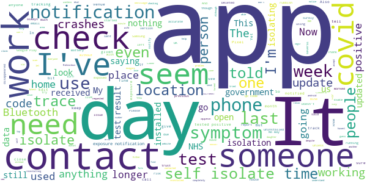
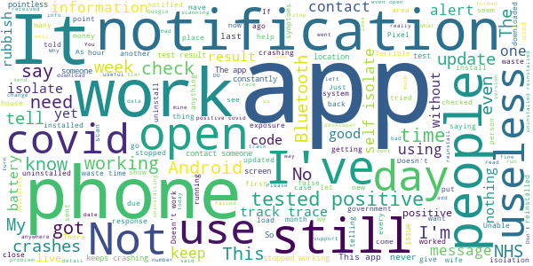

# NHS COVID-19
App version ``4.0.1 (118)``

Analyzed with [covid-apps-observer](http://github.com/covid-apps-observer) project, version ``0.1``

## App overview
| | |
|-------------------------|-------------------------| 
| **Name**&nbsp;&nbsp;&nbsp;&nbsp;&nbsp;&nbsp;&nbsp;&nbsp;&nbsp;&nbsp;&nbsp;&nbsp;&nbsp;&nbsp;&nbsp;&nbsp;&nbsp;&nbsp;&nbsp;&nbsp;&nbsp;&nbsp;&nbsp;&nbsp;&nbsp;&nbsp;&nbsp;&nbsp;&nbsp;&nbsp;&nbsp;&nbsp;&nbsp;&nbsp;&nbsp;&nbsp;&nbsp;&nbsp;&nbsp;&nbsp;  | NHS COVID-19 |
| **Unique identifier** | uk.nhs.covid19.production |
| **Link to Google Play** | [https://play.google.com/store/apps/details?id=uk.nhs.covid19.production](https://play.google.com/store/apps/details?id=uk.nhs.covid19.production) |
| **Summary**  | Protect your loved ones with the NHS contact tracing app for England and Wales. |
| **Privacy policy** | [https://covid19.nhs.uk/our-policies.html](https://covid19.nhs.uk/our-policies.html) |
| **Latest version** | 4.0.1 (118) |
| **Last update** | 2020-12-11 10:44:14 |
| **Recent changes** | Bug fixes. |
| **Installs**  | 5,000,000+ |
| **Category** | Medical |
| **First release** | Aug 12, 2020 |
| **Size**  | 8.2M |
| **Supported Android version**  | 6.0 and up |

### Description
> The NHS COVID-19 app is the official contact tracing app for England and Wales. 
 It is the fastest way of knowing when you’re at risk from coronavirus. The quicker you know, the quicker you can alert your loved ones, and your community. 
 The more of us that use it, the better we can control coronavirus. 
 The app runs on proven software developed by Apple and Google, designed so that nobody will know who or where you are. And you can delete your data, or the app, at any time.
 It has a number of features: 
 - Trace: Find out when you’ve been near other app users who have tested positive for coronavirus
 - Alert: Lets you know the level of coronavirus risk in your postcode district. 
 - Check-in: Use our simple QR code scanner to check-in to venues like bars and restaurants. You will get alerted if you have visited a venue where you may have come into contact with coronavirus.
 - Symptoms: Check if you have coronavirus symptoms and see if you need to order a test. 
 - Test: Helps you order a test if you need to.
 - Isolate: Keep track of your self-isolation countdown and access relevant advice.
 Available in English, Welsh, Arabic (Modern Standard), Bengali, Chinese (Simplified), Gujarati, Polish, Punjabi (Gurmukhi script), Romanian, Somali, Turkish and Urdu.
 The app can be used across UK borders in England, Wales, Scotland, Northern Ireland, Jersey and Gibraltar, detecting all relevant contact tracing app users (regardless of them using different official apps), alerting them if they have been in contact with coronavirus. 
 The app has been built in collaboration with some of the most innovative organisations in the world. We have worked with medical experts, privacy groups, at-risk communities and we’ve shared knowledge with the teams working on similar apps in many countries.
 Protect your loved ones. Please download the app. 
 The App is CE marked as a class I medical device in the United Kingdom and developed in compliance with European Commission Directive 93/42/EEC for class I devices.

### User interface
The developers of the app provide the following screenshots in the Google play store.
| | | |
|:-------------------------:|:-------------------------:|:-------------------------:|
 |   |   |   | 
 |   |  

## Development team
In the following we report the main information provided by the development team in the Google play store.

| | |
|-------------------------|-------------------------|
| **Developer**  | Department of Health and Social Care |
| **Website**  | [https://covid19.nhs.uk/](https://covid19.nhs.uk/) |
| **Email** | NHSCovid-19AppStoreSupport@nhsbsa.nhs.uk |
| **Physical address**  | - |
| **Other developed apps**  | [https://play.google.com/store/apps/developer?id=Department+of+Health+and+Social+Care](https://play.google.com/store/apps/developer?id=Department+of+Health+and+Social+Care) |

## Android support

| | |
|-------------------------|-------------------------|
| **Declared target Android version**  | Android10, version 10 (API level 29) |
| **Effective target Android version**  | Android10, version 10 (API level 29) |
| **Minimum supported Android version**  | Marshmallow, version 6.0 (API level 23) |
| **Maximum target Android version**  | - |

The larger the difference between the minimum and maximum supported Android versions, the better. A larger difference means a wider audience. For example, old phones have a very low Android version, so a high minimum supported Android version means that the app cannot be used by users with old phones, thus leading to accessibility problems. 

## Requested permissions

In the following we report the complete list of the permissions requested by the app. 

| **Permission** | **Protection level** | **Description** | 
|-------------------------|-------------------------|-------------------------|
 **android.permission ACCESS_NETWORK_STATE** | Normal | Allows applications to access information about networks. 
 **android.permission BLUETOOTH** | Normal | Allows applications to connect to paired bluetooth devices. 
 **android.permission CAMERA** | :warning:**Dangerous** | Required to be able to access the camera device. 
 **android.permission FOREGROUND_SERVICE** | Normal | Allows a regular application to use Service.startForeground. 
 **android.permission INTERNET** | Normal | Allows applications to open network sockets. 
 **android.permission RECEIVE_BOOT_COMPLETED** | Normal | Allows an application to receive the Intent.ACTION_BOOT_COMPLETED that is broadcast after the system finishes booting. 
 **android.permission WAKE_LOCK** | Normal | Allows using PowerManager WakeLocks to keep processor from sleeping or screen from dimming. 

## Mentioned servers

| **Server** | **Registrant** | **Registrant country** | **Creation date** | 
|-------------------------|-------------------------|-------------------------|-------------------------|
 | google.com | Google LLC | :us: US | 1997-09-15 04:00:00 |
 | ietf.org | IETF Trust | :us: US | 1995-03-11 05:00:00 |
 | googleapis.com | Google LLC | :us: US | 2005-01-25 17:52:26 |
 | apache.org | The Apache Software Foundation | :us: US | 1995-04-11 04:00:00 |

## Security analysis 

Below we report the main security warnings raised by our execution of the [Androwarn](https://github.com/maaaaz/androwarn) security analysis tool.

**Connection interfaces exfiltration**
> - This application reads details about the currently active data network 
> - This application tries to find out if the currently active data network is metered 

**Suspicious connection establishment**
> - This application opens a Socket and connects it to the remote address ' returned no addresses for  ; port is out of range' on the 'N/A' port  
> - This application opens a Socket and connects it to the remote address '' on the 'N/A' port  
> - This application opens a Socket and connects it to the remote address 'Ljava/lang/StringBuilder;->toString()Ljava/lang/String;' on the 'N/A' port  
> - This application opens a Socket and connects it to the remote address 'Ljava/net/Proxy;->type()Ljava/net/Proxy$Type;' on the 'N/A' port  
> - This application opens a Socket and connects it to the remote address 'timeout' on the 'N/A' port  

**Code execution**
> - This application loads a native library 
> - This application loads a native library: 'Ljava/lang/String;->valueOf(Ljava/lang/Object;)Ljava/lang/String;' 

## User ratings and reviews

Below we provide information about how end users are reacting to the app in terms of ratings and reviews in the Google Play store.

### Ratings

The NHS COVID-19 app has been installed by more than **5000000** times. At this time, **92937** rated the app and its average score is **3.9733403**. Below we show the distribution of the ratings across the usual star-based rating of Google Play

:star::star::star::star::star:: 55122

:star::star::star::star:: 12864

:star::star::star:: 6966

:star::star:: 3323

:star:: 14662

### Reviews 

#### 5-star reviews

> Excellent app  :date: __2020-12-13 19:37:31__

> Excellent  :date: __2020-12-13 10:35:03__

> Good to see the uk goverment and NHS enter the realm of cyberspace to further protect citizens from this dreadful virus.  :date: __2020-12-13 08:50:21__

> I'm glad and feel much safer knowing the NHS , maybe Gov are looking after me  :date: __2020-12-13 02:14:30__

> Difficult to rate because it just sits there... but I keep it updated and trust it's doing it's thing. I believe in the concept, but I fear it has not been adopted enough for it to be truly as effective as the initial hype was portrayed. It took way too long to develop. It should have been with us and on everyone's phone by month 3 of the pandemic. They could have debugged it in situ.  :date: __2020-12-12 22:55:40__

> let's me get into maccies  :date: __2020-12-12 11:58:02__

> Simple to use.  :date: __2020-12-12 11:00:50__

> So far so good, working quietly in the background.  :date: __2020-12-12 10:59:09__

> This is a real good app. Works like it should. You should add a feature where you can check out of a venue.  :date: __2020-12-12 07:48:36__

> It seems to be doing it's job although don't keep on at home and I'm not sure how much battery it takes up when in use but my phone don't seem to last that long but bearing in mind I do have many apps on phone some already built in what don't really need so sure they take up battery time but still I recommend it if it's going to help save life's better the battery dead then my self or others so yes I'd say defently get the app more people the better just hope this awful covid19 hurry up and go  :date: __2020-12-12 02:55:11__

#### 4-star reviews

> venue check in great, easy to use. wish there was a simple way to check whether any messages have been sent to me from track & trace.?  :date: __2020-12-13 17:09:19__

> Every now and then I receive a notification I have a message, yet upon opening the app theres nothing there. Otherwise trusted.  :date: __2020-12-13 11:13:08__

> Good app BUT if I have a postal test I don't get a code so can't report test. Deducting one star for that. Please allow me to report all tests. I'm helping with Zoe/Imperial college research so test monthly at home.  :date: __2020-12-12 11:38:20__

> Seems to work ok apart from it doesn't auto-update even though it's set to. Not sure if this is an issue with the app or the app store?  :date: __2020-12-11 19:36:20__

> can't check all locations while in app as this would help us know area to area Covid-19 issues before traveling or to do personal shopping  :date: __2020-12-11 17:46:30__

> H4  :date: __2020-12-11 10:52:39__

> Working again after previous issues and reinstalling the app after a month or so.  :date: __2020-12-10 19:35:13__

> Kept me informed during my isolation  :date: __2020-12-10 19:11:47__

> Not dead yet. And still haven't had any friend requests either, rubbish social networking app.  :date: __2020-12-10 16:29:52__

> Aha the responses to issues on this pretty much matches the NHS attitude towards patients. We understand that I software doesn't work but it's your fault for not understanding the software. Get a grip you lot, if people are making simple mistakes then you need to redesign your UI and user road maps. An app this simple should take about 3 weeks for 1 person to develop, not several months with most of it still not working. ---- What further information? You want me to quote you for a new app?  :date: __2020-12-10 14:24:42__

#### 3-star reviews

> When it works it's great. This morning I went to open it and it wouldn't. So uninstalled then reinstalled, same thing. Went to send the error report and initially it tells me I have no data connection- well I am showing full WiFi connection, when that's off I've got full 4G connection, and I just downloaded the app for the second time so I think I DO have a data connection thanks! Anyway, needs fixing peeps please!!  :date: __2020-12-12 12:49:19__

> Not working well enough yet. Needs practice alerts to give users confidence  :date: __2020-12-11 17:19:06__

> On the news it said an update would include how to apply for the 500 pounds if you have to isolate. Not on my app.  :date: __2020-12-11 16:32:21__

> My iPhone alerts me to updates but when I look at the app on my Android phone it is still the OLD version and when you go to the Google playstore to try and update it , it has no updates! Why does iPhone update and android doesn't? Clearly not helpful to someone who only has android and is using an out of date version.  :date: __2020-12-11 12:20:25__

> Unfortunately, since national lockdown ended the app has not been working. I got repeated pop ups saying it had stopped working so I uninstalled and reinstalled it. Now I just get a hanging blue screen and it won't open. I have a Pixel 3 with Android 11. I would like to go out some time but would prefer to have the app working first.  :date: __2020-12-11 08:58:01__

> Every few days the app reports it's stopped working/crashed. Otherwise, it's an OK app. Does what it states.  :date: __2020-12-10 09:53:25__

> I mean, it does what it needs to. But I now have a "Loading..." notification that I can't get rid of. It's been there for 46 minutes so far and WON'T GO AWAY.  :date: __2020-12-09 18:19:46__

> Don't know if it's actually working or not.  :date: __2020-12-09 01:24:38__

> Conspiracy  :date: __2020-12-08 13:34:25__

> This app desperately needs a 'notification history' feature so we can read full notification messages (regardless of their importance). I got an exposure notification last month that looked urgent but only partially displayed in my phone's notification bar. When I tapped on it to read the full thing it disappeared into the ether, essentially making the whole app unfit for purpose. I've no way of knowing what the app is trying to tell me from the notification bar alone.  :date: __2020-12-08 10:10:56__

#### 2-star reviews

> Game play kinda sucks and the graphics are terrible. I thought this would be like Pokemon and was trying to catch them all.  :date: __2020-12-13 04:38:36__

> Now uninstalled- I no longer trust the private companies providing Test & Trace services to the UK Government due to lack of transparency on effectiveness.  :date: __2020-12-12 16:57:56__

> Won't let me type in my test result batch number  :date: __2020-12-12 11:48:10__

> I've been told to isolate, but I know the person who I've been in contact with, and I saw them 5 days before her symptoms. Yet there is nothing I can do, apart from lose another weeks wages. In top of the 4 weeks wages I lost at the last lockdown. What an absolute joke.  :date: __2020-12-12 10:33:36__

> Do not understand it  :date: __2020-12-12 09:47:46__

> No way to report/write who I've been in contact with. Ridiculous considering these people NEED to be contacted officially so they can claim loss wages due to isolating. I need the NHS for call and trace (i missed call on accidental). Please help, and PLEASE do not sent me 'a link to a website that gives information'  :date: __2020-12-11 23:11:53__

> Broken since the update. It won't load up and just crashes.  :date: __2020-12-11 16:50:38__

> It worked for a while but now just crashes when you start it even after reinstalling.  :date: __2020-12-11 14:03:16__

> I wanted to check how the app works and while doing so I pressed one of the symptoms on the app not for myself but someone else an now it says to self isolate an doesnt seem to have enter your symptoms on the app??  :date: __2020-12-11 08:58:39__

> Pinged me on day 12 of 14 when I should've been isolating but the minute my test result came through on the last day, the isolation requirement completely disappeared. Ridiculous.  :date: __2020-12-11 00:20:01__

#### 1-star reviews

> Doesn't work, won't open  :date: __2020-12-13 18:21:07__

> COVID is a glorified flu! Only attention hos have it  :date: __2020-12-13 17:16:41__

> Failed to notify me  :date: __2020-12-13 16:41:30__

> Load of rubbish, the app and NHS Not talking to each other, NHS don't talk to each other. The people at track and trace bully and harassing will not answer 0300 numbers!!!  :date: __2020-12-13 16:35:18__

> This app keeps crashing my phone remove it not very helpful  :date: __2020-12-13 15:02:51__

> App doesn't work The app won't load on my phone for me to put my details in. Just tells me my phone is not compatible which is helpful  :date: __2020-12-13 13:25:19__

> Doesn't open. I'm using a pixel 3 with Android 11. Gets stuck trying to open  :date: __2020-12-13 13:21:51__

> Has the app been updated to reflect Wales isolation moving to 10 days?, I currently have 7 days left and need to know  :date: __2020-12-13 13:21:34__

> Won't open  :date: __2020-12-13 13:17:33__

> Keeps crashing on startup for pixel 3  :date: __2020-12-13 12:54:59__

