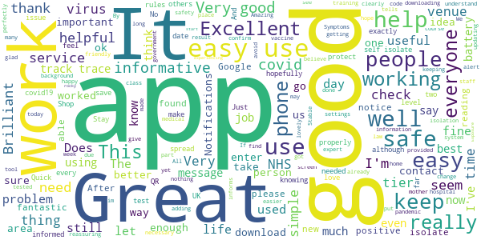
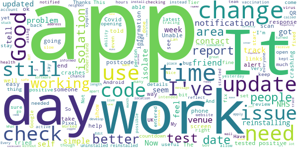
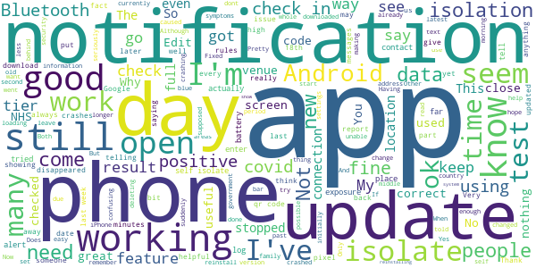
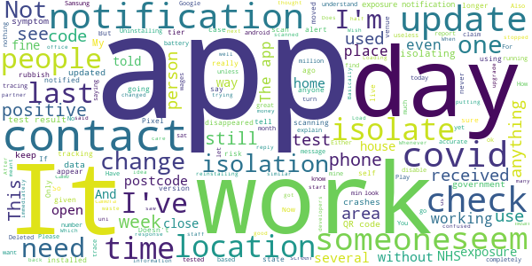
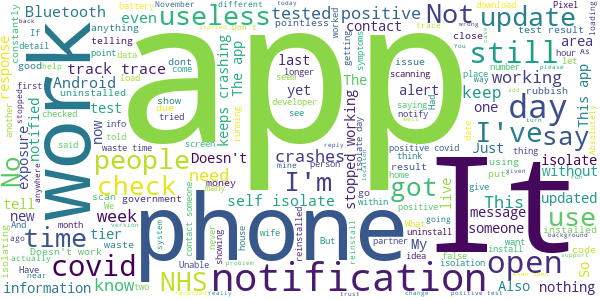

# NHS COVID-19
App version ``4.1 (123)``

Analyzed with [covid-apps-observer](http://github.com/covid-apps-observer) project, version ``0.1``

## App overview
| | |
|-------------------------|-------------------------| 
| **Name**&nbsp;&nbsp;&nbsp;&nbsp;&nbsp;&nbsp;&nbsp;&nbsp;&nbsp;&nbsp;&nbsp;&nbsp;&nbsp;&nbsp;&nbsp;&nbsp;&nbsp;&nbsp;&nbsp;&nbsp;&nbsp;&nbsp;&nbsp;&nbsp;&nbsp;&nbsp;&nbsp;&nbsp;&nbsp;&nbsp;&nbsp;&nbsp;&nbsp;&nbsp;&nbsp;&nbsp;&nbsp;&nbsp;&nbsp;&nbsp;  | NHS COVID-19 |
| **Unique identifier** | uk.nhs.covid19.production |
| **Link to Google Play** | [https://play.google.com/store/apps/details?id=uk.nhs.covid19.production](https://play.google.com/store/apps/details?id=uk.nhs.covid19.production) |
| **Summary**  | Protect your loved ones with the NHS contact tracing app for England and Wales. |
| **Privacy policy** | [https://covid19.nhs.uk/our-policies.html](https://covid19.nhs.uk/our-policies.html) |
| **Latest version** | 4.1 (123) |
| **Last update** | 2020-12-17 16:46:52 |
| **Recent changes** | Updates to the tiers and advice in England to include information on new government guidelines for your local authority. The app now maps the postcode district to a local authority to ensure the best information and guidance is provided. Overall UI, language and accessibility optimisations. |
| **Installs**  | 5,000,000+ |
| **Category** | Medical |
| **First release** | Aug 12, 2020 |
| **Size**  | 8.2M |
| **Supported Android version**  | 6.0 and up |

### Description
> The NHS COVID-19 app is the official contact tracing app for England and Wales. 
 It is the fastest way of knowing when you’re at risk from coronavirus. The quicker you know, the quicker you can alert your loved ones, and your community. 
 The more of us that use it, the better we can control coronavirus. 
 The app runs on proven software developed by Apple and Google, designed so that nobody will know who or where you are. And you can delete your data, or the app, at any time.
 It has a number of features: 
 Trace: Find out when you’ve been near other app users who have tested positive for coronavirus
 Alert: Lets you know the level of coronavirus risk in your postcode district. 
 Check-in: Use our simple QR code scanner to check-in to venues like bars and restaurants. You will get alerted if you have visited a venue where you may have come into contact with coronavirus.
 Symptoms: Check if you have coronavirus symptoms and see if you need to order a test. 
 Test: Helps you order a test if you need to.
 Isolate: Keep track of your self-isolation countdown and access relevant advice.
 Available in English, Welsh, Arabic (Modern Standard), Bengali, Chinese (Simplified), Gujarati, Polish, Punjabi (Gurmukhi script), Romanian, Somali, Turkish and Urdu.
 The app can be used across UK borders in England, Wales, Scotland, Northern Ireland, Jersey and Gibraltar, detecting all relevant contact tracing app users (regardless of them using different official apps), alerting them if they have been in contact with coronavirus. 
 The app has been built in collaboration with some of the most innovative organisations in the world. We have worked with medical experts, privacy groups, at-risk communities and we’ve shared knowledge with the teams working on similar apps in many countries.
 Protect your loved ones. Please download the app. 
 The App is CE marked as a class I medical device in the United Kingdom and developed in compliance with European Commission Directive 93/42/EEC for class I devices.

### User interface
The developers of the app provide the following screenshots in the Google play store.
| | | |
|:-------------------------:|:-------------------------:|:-------------------------:|
 |   |   |   | 
 |   |  

## Development team
In the following we report the main information provided by the development team in the Google play store.

| | |
|-------------------------|-------------------------|
| **Developer**  | Department of Health and Social Care |
| **Website**  | [https://covid19.nhs.uk/](https://covid19.nhs.uk/) |
| **Email** | NHSCovid-19AppStoreSupport@nhsbsa.nhs.uk |
| **Physical address**  | - |
| **Other developed apps**  | [https://play.google.com/store/apps/developer?id=Department+of+Health+and+Social+Care](https://play.google.com/store/apps/developer?id=Department+of+Health+and+Social+Care) |

## Android support

| | |
|-------------------------|-------------------------|
| **Declared target Android version**  | Android10, version 10 (API level 29) |
| **Effective target Android version**  | Android10, version 10 (API level 29) |
| **Minimum supported Android version**  | Marshmallow, version 6.0 (API level 23) |
| **Maximum target Android version**  | - |

The larger the difference between the minimum and maximum supported Android versions, the better. A larger difference means a wider audience. For example, old phones have a very low Android version, so a high minimum supported Android version means that the app cannot be used by users with old phones, thus leading to accessibility problems. 

## Requested permissions

In the following we report the complete list of the permissions requested by the app. 

| **Permission** | **Protection level** | **Description** | 
|-------------------------|-------------------------|-------------------------|
 **android.permission ACCESS_NETWORK_STATE** | Normal | Allows applications to access information about networks. 
 **android.permission BLUETOOTH** | Normal | Allows applications to connect to paired bluetooth devices. 
 **android.permission CAMERA** | :warning:**Dangerous** | Required to be able to access the camera device. 
 **android.permission FOREGROUND_SERVICE** | Normal | Allows a regular application to use Service.startForeground. 
 **android.permission INTERNET** | Normal | Allows applications to open network sockets. 
 **android.permission RECEIVE_BOOT_COMPLETED** | Normal | Allows an application to receive the Intent.ACTION_BOOT_COMPLETED that is broadcast after the system finishes booting. 
 **android.permission WAKE_LOCK** | Normal | Allows using PowerManager WakeLocks to keep processor from sleeping or screen from dimming. 

## Mentioned servers

| **Server** | **Registrant** | **Registrant country** | **Creation date** | 
|-------------------------|-------------------------|-------------------------|-------------------------|
 | google.com | Google LLC | :us: US | 1997-09-15 04:00:00 |
 | ietf.org | IETF Trust | :us: US | 1995-03-11 05:00:00 |
 | googleapis.com | Google LLC | :us: US | 2005-01-25 17:52:26 |
 | apache.org | The Apache Software Foundation | :us: US | 1995-04-11 04:00:00 |

## Security analysis 

Below we report the main security warnings raised by our execution of the [Androwarn](https://github.com/maaaaz/androwarn) security analysis tool.

**Connection interfaces exfiltration**
> - This application reads details about the currently active data network 
> - This application tries to find out if the currently active data network is metered 

**Suspicious connection establishment**
> - This application opens a Socket and connects it to the remote address ' returned no addresses for  ; port is out of range' on the 'N/A' port  
> - This application opens a Socket and connects it to the remote address '' on the 'N/A' port  
> - This application opens a Socket and connects it to the remote address 'Ljava/lang/StringBuilder;->toString()Ljava/lang/String;' on the 'N/A' port  
> - This application opens a Socket and connects it to the remote address 'Ljava/net/Proxy;->type()Ljava/net/Proxy$Type;' on the 'N/A' port  
> - This application opens a Socket and connects it to the remote address 'timeout' on the 'N/A' port  

**Code execution**
> - This application loads a native library 
> - This application loads a native library: 'Ljava/lang/String;->valueOf(Ljava/lang/Object;)Ljava/lang/String;' 

## User ratings and reviews

Below we provide information about how end users are reacting to the app in terms of ratings and reviews in the Google Play store.

### Ratings

The NHS COVID-19 app has been installed by more than **5000000** times. At this time, **94207** rated the app and its average score is **3.9729486**. Below we show the distribution of the ratings across the usual star-based rating of Google Play

:star::star::star::star::star:: 56114

:star::star::star::star:: 12789

:star::star::star:: 6909

:star::star:: 3435

:star:: 14960

### Reviews 

#### 5-star reviews

> Good  :date: __2020-12-20 15:14:56__

> After a rocky start now working perfectly.  :date: __2020-12-20 10:25:39__

> VERY good TO THANK  :date: __2020-12-20 08:52:09__

> I was experiencing problems with not being able to find "Exposure Notifications" in Google settings on my new phone. After contacting Motorola & Google Play Services the problem is now resolved The app is up & running fine now the Notifications have appeared in Google settings. Probably even more important now a new strain has been found.  :date: __2020-12-20 02:53:41__

> works fine, don't notice any drain on my phone's performance. if it helps with covid then that's just fine  :date: __2020-12-19 23:23:26__

> Absolutely necessary  :date: __2020-12-19 21:56:33__

> Seems to work, simple enough to use.  :date: __2020-12-19 15:17:10__

> Cant seem to get messages fromyou i have had 2covid tests but no results to my phone?  :date: __2020-12-19 14:58:54__

> app works well  :date: __2020-12-19 14:50:54__

> Does what it says. Very easy to use & informative.  :date: __2020-12-19 14:13:12__

#### 4-star reviews

> App has started crashing, before latest update. Worked fine yesterday, and I have tried rebooting  :date: __2020-12-20 16:35:00__

> Does the app allow change in areas?? I moved houses but I don't see how to change areas... help  :date: __2020-12-20 12:30:32__

> Need to be able to change postcode to check areas you may need to visit.  :date: __2020-12-20 10:50:22__

> Useful app but slow in updating. Still showing as being in Tier 3 when it should be Tier 4. The links to the Gov.UK site are very useful.  :date: __2020-12-20 07:58:02__

> Appears to work as intended  :date: __2020-12-19 23:13:44__

> Edited review. Thanks for the response from the NHS app team. I didn't get chance to report problem but eventually, even though I kept checking, my mobile updated and it all worked again. Apologies for the bad review before but the response helped me change this 👍  :date: __2020-12-19 19:32:05__

> Countdown to end of isolation only takes into account date of test, not start of symptoms which is when the 10 day countdown should be. Very confusing when in a stressful situation. No contact tracing advice, which I had expected more of.  :date: __2020-12-19 15:37:29__

> Not notified of anything yet  :date: __2020-12-19 10:39:29__

> It would help if you could record that you have had the vaccination.  :date: __2020-12-19 09:28:04__

> Getting better all the time, is there any chance now that you are asking about vaccinations that we can get a count of how many people have been done by percentage or quantity. The Moe that number grows the better peoples mindsets will get.  :date: __2020-12-18 22:02:04__

#### 3-star reviews

> Edit... it seems to be working ok now after an update. It says my Samsung S10+ does not support the venue check-in feature. You would expect a modern high spec phone with the latest Android software and updates installed, to be compatible with the app. Yes the camera permission is set to 'allowed.  :date: __2020-12-20 17:48:07__

> Used to work fine but now it kist crashes if I try to open it.  :date: __2020-12-20 13:44:20__

> Good app, but currently showing as being in tier 4, my wife is beside me and hers is showing tier 2 for Uttlesford, which is correct.  :date: __2020-12-20 10:18:11__

> Ok  :date: __2020-12-20 06:00:21__

> Like many other reviews say, on the pixel 5 this app gets stuck on the splash screen then crashes. Worked great on my old phone however completely useless on this device  :date: __2020-12-20 02:09:34__

> I'm already part way through self isolation due to family member having symptoms, however, when their positive result came back my app tells me to isolate for 10 days from their positive test and not from the start of their symptoms as per gov covid rules.  :date: __2020-12-19 13:47:23__

> Why not build a option in app to check other locations on the Covid-19 but on other country app the have that it's more accurate e.g Turkey, Germany and many other to just by putting in the street or address of your relatives to the Covid-19 cases but that what could improve the app doesn't have to be just put an address but just changeable post code so that people can see the rates before heading anywhere but because were tier 3 it seem just to late to get it done, i hope you can see it  :date: __2020-12-19 00:13:54__

> Doing my bit and using the app whenever I can. Just had a confusing warning asking me to self isolate for 3 days!? No way of finding out why only 3 days and when this 'close encounter' occurred. Very confusing and unbelievable as advice.  :date: __2020-12-18 18:40:44__

> My parents keep getting notifications saying to isolate which soon disappears, so they go on the app and nothing is there to say to isolate!  :date: __2020-12-18 17:16:32__

> since national lockdown ended the app has not been working. I got repeated pop ups saying it had stopped working so I uninstalled and reinstalled it. Now I just get a hanging blue screen and it won't open. I have a Pixel 3 with Android 11. I reported this on 09/10 - nine days later and about to have a tier change & it still hangs on the loading screen.  :date: __2020-12-18 14:22:35__

#### 2-star reviews

> I had message saying to isolate for 3 days, I mean I am confused as I thought it was 10 or 14, so why is it now saying 3 days to go whwn only got the alert today.. I saw it needed update and now its not showing with needing to isolate, so no idea. I rang nhs 111 as the covid one wasn't open at the time at the time as I was abouting to start work at 3am, they wasn't sure as they aint heard of 3 days isolation. I don't care about going out, but want to work. Not liking this app its confusing  :date: __2020-12-20 14:31:22__

> Does not upgrade tiers  :date: __2020-12-20 13:48:25__

> Only ever used this for scanning QR Codes. Wish you could change the postcode without uninstalling and reinstalling the app, would be useful.  :date: __2020-12-19 21:48:39__

> can't find how to change my postcode now that I've moved back home (tier 2) from uni (tier 4) for Christmas?  :date: __2020-12-19 20:28:20__

> Doesn't scan all codes. Also, I had several colleagues who have tested positive for covid from my office and the app has remained unchanged. How do I use the app to know how much exposure I have had in my daily life? Without feedback from the app I have discovered that many people assume it doesn't work and have stopped using it. Poorly designed.  :date: __2020-12-19 10:23:11__

> App is ok but my partner has been told to isolate for 5 days. After trying to find out why it is so short there isn't anything or explanation to why. I was on the understanding it's 14 days which has recently changed to 10 but this still doesn't explain why she has to only do half that?????????? So either the app is wrong or its putting other people at risk if she was to develop symptoms.  :date: __2020-12-19 01:25:04__

> Still has 14days on it, really frustrating  :date: __2020-12-18 23:49:52__

> This app seems to completely ignore people sometimes move. Which I did. And realised there is no way to update my location, so I only get notifications for my old borough.  :date: __2020-12-18 23:29:14__

> Total garbage.. I work in a school where 4 classes are off with covid.. staff and children proved positive, yet I haven't had one single alert.. rubbish and being deleted. Having received a reply, well I really see how the gov can waste millions of tax payers money employing amateurs  :date: __2020-12-18 17:25:10__

> Since the last update I now have a persistent notification displaying "Loading..." When I open or close this app it remains.  :date: __2020-12-18 16:03:22__

#### 1-star reviews

> Not interested in this. Too much Miss-Info on it. They Love telling us about all who have caught it, and how many have sadly died. No Info given at all regarding those who have recovered to lift our Spirits just a bit. I did Google this point and there is a Big Fat O where recovery figures should be. Not Impressed by handling of Covid 19.  :date: __2020-12-20 19:05:22__

> App doesn't open anymore. Constantly crashes as a background process multiple times per day, battery life has dwindled since this started. No wonder everyone is ending up in higher tiers when the technology is as bad as this. Uninstalled as useless.  :date: __2020-12-20 18:18:54__

> I have received 2 notifications in the last week about possible exposure. When i click on the notification, it disappears and nothing is stored on the app. Is this a glitch?  :date: __2020-12-20 16:40:54__

> tells me I need to isolate but is using a base of 14 days not 10. when I check instructions within the app it say 10 days and that the app was updated to show this but there is no update when I check. NOT impressed!  :date: __2020-12-20 16:36:09__

> Since last update no longer opens on my Pixel 3XL, constantly hangs. Stock Android 11 / Dec 20 update - what's doing developers?  :date: __2020-12-20 12:49:55__

> NHS would have done it better than Serco  :date: __2020-12-20 12:43:09__

> Blooming thing keeps crashing!  :date: __2020-12-20 12:01:27__

> This app recon it needs location services turned on before the bluetooth can detect nearby devices. That is pure BS and i will not turn location services on on my phone. This app will not work without location services turned on which is stupid.  :date: __2020-12-20 11:38:49__

> Just keeps crashing honestly just a joke of an app and a waste of money  :date: __2020-12-20 11:20:58__

> I keep downloading it but it fails to open.  :date: __2020-12-20 10:44:06__

