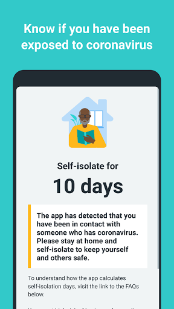
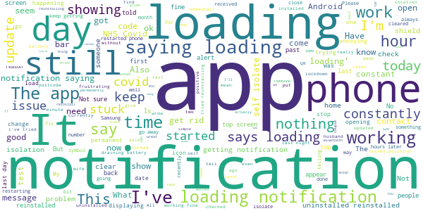

# NHS COVID-19
App version ``4.1.1 (124)``

Analyzed with [covid-apps-observer](http://github.com/covid-apps-observer) project, version ``0.1``

## App overview
| | |
|-------------------------|-------------------------| 
| **Name**                                          | NHS COVID-19 |
| **Unique identifier** | uk.nhs.covid19.production |
| **Link to Google Play** | [https://play.google.com/store/apps/details?id=uk.nhs.covid19.production](https://play.google.com/store/apps/details?id=uk.nhs.covid19.production) |
| **Summary**  | Protect your loved ones with the NHS contact tracing app for England and Wales. |
| **Privacy policy** | [https://covid19.nhs.uk/our-policies.html](https://covid19.nhs.uk/our-policies.html) |
| **Latest version** | 4.1.1 (124) |
| **Last update** | 2020-12-18 15:54:37 |
| **Recent changes** | Bug Fixes. |
| **Installs**  | 5,000,000+ |
| **Category** | Medical |
| **First release** | Aug 12, 2020 |
| **Size**  | 8.2M |
| **Supported Android version**  | 6.0 and up |

### Description
> The NHS COVID-19 app is the official contact tracing app for England and Wales. 
 It is the fastest way of knowing when you’re at risk from coronavirus. The quicker you know, the quicker you can alert your loved ones, and your community. 
 The more of us that use it, the better we can control coronavirus. 
 The app runs on proven software developed by Apple and Google, designed so that nobody will know who or where you are. And you can delete your data, or the app, at any time.
 It has a number of features: 
 Trace: Find out when you’ve been near other app users who have tested positive for coronavirus
 Alert: Lets you know the level of coronavirus risk in your postcode district. 
 Check-in: Use our simple QR code scanner to check-in to venues like bars and restaurants. You will get alerted if you have visited a venue where you may have come into contact with coronavirus.
 Symptoms: Check if you have coronavirus symptoms and see if you need to order a test. 
 Test: Helps you order a test if you need to.
 Isolate: Keep track of your self-isolation countdown and access relevant advice.
 Available in English, Welsh, Arabic (Modern Standard), Bengali, Chinese (Simplified), Gujarati, Polish, Punjabi (Gurmukhi script), Romanian, Somali, Turkish and Urdu.
 The app can be used across UK borders in England, Wales, Scotland, Northern Ireland, Jersey and Gibraltar, detecting all relevant contact tracing app users (regardless of them using different official apps), alerting them if they have been in contact with coronavirus. 
 The app has been built in collaboration with some of the most innovative organisations in the world. We have worked with medical experts, privacy groups, at-risk communities and we’ve shared knowledge with the teams working on similar apps in many countries.
 Protect your loved ones. Please download the app. 
 The App is CE marked as a class I medical device in the United Kingdom and developed in compliance with European Commission Directive 93/42/EEC for class I devices.

### User interface
The developers of the app provide the following screenshots in the Google play store.
| | | |
|:-------------------------:|:-------------------------:|:-------------------------:|
 |   |   |   | 
 |   |  

## Development team
In the following we report the main information provided by the development team in the Google play store.

| | |
|-------------------------|-------------------------|
| **Developer**  | Department of Health and Social Care |
| **Website**  | [https://covid19.nhs.uk/](https://covid19.nhs.uk/) |
| **Email** | NHSCovid-19AppStoreSupport@nhsbsa.nhs.uk |
| **Physical address**  | - |
| **Other developed apps**  | [https://play.google.com/store/apps/developer?id=Department+of+Health+and+Social+Care](https://play.google.com/store/apps/developer?id=Department+of+Health+and+Social+Care) |

## Android support

| | |
|-------------------------|-------------------------|
| **Declared target Android version**  | Android10, version 10 (API level 29) |
| **Effective target Android version**  | Android10, version 10 (API level 29) |
| **Minimum supported Android version**  | Marshmallow, version 6.0 (API level 23) |
| **Maximum target Android version**  | - |

The larger the difference between the minimum and maximum supported Android versions, the better. A larger difference means a wider audience. For example, old phones have a very low Android version, so a high minimum supported Android version means that the app cannot be used by users with old phones, thus leading to accessibility problems. 

## Requested permissions

In the following we report the complete list of the permissions requested by the app. 

| **Permission** | **Protection level** | **Description** | 
|-------------------------|-------------------------|-------------------------|
 **android.permission ACCESS_NETWORK_STATE** | Normal | Allows applications to access information about networks. 
 **android.permission BLUETOOTH** | Normal | Allows applications to connect to paired bluetooth devices. 
 **android.permission CAMERA** | :warning:**Dangerous** | Required to be able to access the camera device. 
 **android.permission FOREGROUND_SERVICE** | Normal | Allows a regular application to use Service.startForeground. 
 **android.permission INTERNET** | Normal | Allows applications to open network sockets. 
 **android.permission RECEIVE_BOOT_COMPLETED** | Normal | Allows an application to receive the Intent.ACTION_BOOT_COMPLETED that is broadcast after the system finishes booting. 
 **android.permission WAKE_LOCK** | Normal | Allows using PowerManager WakeLocks to keep processor from sleeping or screen from dimming. 

## Mentioned servers

| **Server** | **Registrant** | **Registrant country** | **Creation date** | 
|-------------------------|-------------------------|-------------------------|-------------------------|
 | google.com | Google LLC | :us: US | 1997-09-15 04:00:00 |
 | ietf.org | IETF Trust | :us: US | 1995-03-11 05:00:00 |
 | googleapis.com | Google LLC | :us: US | 2005-01-25 17:52:26 |
 | apache.org | The Apache Software Foundation | :us: US | 1995-04-11 04:00:00 |

## Security analysis 

Below we report the main security warnings raised by our execution of the [Androwarn](https://github.com/maaaaz/androwarn) security analysis tool.

**Connection interfaces exfiltration**
> - This application reads details about the currently active data network 
> - This application tries to find out if the currently active data network is metered 

**Suspicious connection establishment**
> - This application opens a Socket and connects it to the remote address ' returned no addresses for  ; port is out of range' on the 'N/A' port  
> - This application opens a Socket and connects it to the remote address '' on the 'N/A' port  
> - This application opens a Socket and connects it to the remote address 'Ljava/lang/StringBuilder;->toString()Ljava/lang/String;' on the 'N/A' port  
> - This application opens a Socket and connects it to the remote address 'Ljava/net/Proxy;->type()Ljava/net/Proxy$Type;' on the 'N/A' port  
> - This application opens a Socket and connects it to the remote address 'timeout' on the 'N/A' port  

**Code execution**
> - This application loads a native library 
> - This application loads a native library: 'Ljava/lang/String;->valueOf(Ljava/lang/Object;)Ljava/lang/String;' 

## User ratings and reviews

Below we provide information about how end users are reacting to the app in terms of ratings and reviews in the Google Play store.

### Ratings

The NHS COVID-19 app has been installed by more than **5000000** times. At this time, **95001** rated the app and its average score is **3.9574847**. Below we show the distribution of the ratings across the usual star-based rating of Google Play

:star::star::star::star::star:: 56378

:star::star::star::star:: 12680

:star::star::star:: 6932

:star::star:: 3550

:star:: 15461

### Reviews 

#### 5-star reviews

> A very good app to help me know and understand the Covid-19 virus. Plus alerts if there is a change in the level of the virus..  :date: __2021-01-16 18:02:40__

> Easy to use  :date: __2021-01-16 16:52:53__

> great app but only works when you use it and follow it  :date: __2021-01-16 16:17:39__

> Good  :date: __2021-01-16 13:34:08__

> VERY VERY GOOD  :date: __2021-01-16 12:59:32__

> My are  :date: __2021-01-16 00:26:35__

> Very good app  :date: __2021-01-15 21:05:46__

> Doesn't seem to notify. Worker next to me positive test but no notifications  :date: __2021-01-15 18:36:21__

> Keeps me safe  :date: __2021-01-15 14:19:30__

> Very pleased to have this app on my phone. Excellent service, easy to upload and simple instructions to go forward with a contact notification.  :date: __2021-01-15 11:29:58__

#### 4-star reviews

> Abit hard to use  :date: __2021-01-16 17:07:14__

> The app has worked really well but I have noticed over the past 24 hrs that I have a notification sign on it but thew app keeps on saying that it loading, WiFi is strong both at home and work but still does not load what ever it is its trying to  :date: __2021-01-15 22:33:50__

> Regarding the loading message. The only way to get rid of it is to unistall and reinstall.  :date: __2021-01-15 15:32:18__

> Notification permanently says, "Loading...". So i am forced to turn off notifications thus making the app almost useless. NHS Tech team ask me to send screen shots on a form that does not take attachments!  :date: __2021-01-15 10:54:37__

> *Sorted now.* Had the app ages and seems to work fine but today I have a notification on my home screen that just says 'loading'. I have a number 1 by the icon for the app which suggests I have some message or notification but I can't see anything when I go onto the app. I have uninstalled and reinstalled and have the same notifications still there. I don't know if this means a notification has been sent , if an update hasn't loaded fully or something different. Any advice gratefully received.  :date: __2021-01-14 21:56:57__

> Have changed to Nokia phone having trouble loading app, worked well on previous phone  :date: __2021-01-14 19:24:44__

> Thank you, the notification issue is now resolved 😃  :date: __2021-01-14 19:01:34__

> Unfortunately the app keeps trying to load in the notification over and over again. I tried uninstalling and reinstalling, to no avail. Also, your comment here regarding 15 minutes in a supermarket is a misguided. If somebody in a shop near you is infected with the Coronavirus and they cough or sneeze (removing mask) and you are in the droplet zone then a good chance you will contract Covid 19. Stores should have this check-in to identify where you got sick.  :date: __2021-01-14 13:00:14__

> The app is constantly showing as loading on my phone . I turn it off and on but makes no difference . Apart from that its good . It alerted me to the need to self isolate last week and updated my negative test immediately. Thank you for your prompt response  :date: __2021-01-14 13:00:01__

> Seems to be causing the odd issue now. Constantly states 'loading' on the app notification, didn't until the last few days. Restarts etc do not fix that... ... Subsequently, seems to now be fixed and functioning as it was again. Responsive support too, thanks!  :date: __2021-01-14 12:02:26__

#### 3-star reviews

> Am trying this again so hopefully I will not get a link saying that it is loading every time I reconnect to wi fi  :date: __2021-01-15 21:10:03__

> Still having issues since the problem on 12th January affecting Android - I no longer have the 'Loading...' notification but for the past 2 days my phone has buzzed repeatedly with the shield notification for the app, but it then disappears instantly.  :date: __2021-01-15 18:41:27__

> Bit of a let down.  :date: __2021-01-15 18:16:23__

> I do support the use of this app, but I'm not very convinced about the accuracy of it. I've just been told to self-isolate for 8 days because of a close contact, but I've not been within 2m of *anyone* outside my house for more than a couple of minutes for months now.  :date: __2021-01-15 14:06:03__

> My wife and I are always careful but the app has just told us to self isolate because of different events on two separate days. Have the alert criteria been changed under the hood? I received no alert and by accident found that my countdown had started one day ago , my wife's IOS app countdown started 2 days ago. I too have seen the Android "Loading..." message but that disappeared a few days ago, which is perhaps why I didn't receive a timely warning. The app should at least tell me where the "contact" happened.  :date: __2021-01-15 13:22:34__

> Not explicit enough  :date: __2021-01-15 02:42:12__

> Rubbish  :date: __2021-01-14 22:01:16__

> There is a permanent 'flag' at the top of my screen advising the 'app' is loading which will not cancel. Please advise?  :date: __2021-01-14 21:56:43__

> Alerts are delayed by up to 8 days. Logged on and it said that I had 2 days remaining from my 10 days isolation but I was not informed that I needed to be in isolation. Checked the app the previous day.  :date: __2021-01-14 17:13:31__

> Lately it has started displaying partial notifications without fully loading and showing a notification on the app list that does not lead to anything when loaded. This can only worry people unnecessarily.  :date: __2021-01-14 16:44:10__

#### 2-star reviews

> Not dead yet. And still haven't had any friend requests either, rubbish social networking app. Actually (some months after installing), it's rather annoying, it gives a permanent notification message that just says "Loading..." which is starting to get on my nips, can you fix it? Lesser mortals may just uninstall it because of this, and we don't want that. I have restarted my phone several times as well.  :date: __2021-01-16 16:51:52__

> Ive been told to self isolation but dont no when i came into contact with someone and only received the message Wednesday after ive been to work. And it told me to do it for 7 days.  :date: __2021-01-16 16:37:49__

> The app instructs you to isolate without asking when symptoms started which gives the wrong answer!! Why would you write the app to assert that someone must isolate for the wrong amount of time? Why isn't it linked to the test and trace system?  :date: __2021-01-15 11:08:26__

> Very buggy  :date: __2021-01-15 00:26:42__

> Seems to be a fault got a notification there but constantly just says loading go to app nothing there my dad died from covid I find this worrying not good when I have anxiety anyway Update to reply but you don't let people know when anxiety levels are high  :date: __2021-01-14 21:27:17__

> I have an updated app on android and still can't access all features  :date: __2021-01-14 15:51:44__

> Husband told to isolate on 27 th Dec. He had only been to a supermarket in the week leading up to 27th. No contact with any one. Followed social distancing rules do why the notice yo isolate. He did isolate, but why told to in the first place.  :date: __2021-01-14 12:48:20__

> I have been having this app on OnePlus 8 Pro and never have received any notifications. As of today I seem to be getting a notification when my phone is locked but upon unlocking there is no notification. Never got any details if I had to self isolate - the app for me has always been quiet and have used it to check in for venues but thats as far as it has been active.  :date: __2021-01-14 12:03:22__

> Keeps trying to upload/download every few days, takes forever, I've had to uninstall 3 times in past week, not happy. Plus its so slow at telling you to isolate, when you've already been in isolation for 7 days, then, it says you have to isolate. Mmmm. Slow!!!!!  :date: __2021-01-14 11:03:10__

> All the money that was spent on this app for it not to work is disgraceful  :date: __2021-01-14 09:50:22__

#### 1-star reviews

> Does not work  :date: __2021-01-16 17:59:39__

> I don't think it works ..  :date: __2021-01-16 16:18:45__

> Doesn't work for me, it doesn't scan when it says your app is active and scanning  :date: __2021-01-16 14:25:27__

> Had to uninstall as it messed with the microphone on my phone, callers couldn't hear me, even when i turned bluetooth off. My phone is fine now i've uninstalled this app  :date: __2021-01-16 13:16:44__

> The app is constantly loading? Why?  :date: __2021-01-16 11:59:01__

> Sugar  :date: __2021-01-16 04:55:52__

> Today I received notification to isolate for 1 day. Yes 1 day, when I looked into when the encounter date was I was already in the middle of a 10 day isolation period. I have not seen anybody had no deliveries nothing. How are we meant to trust this app when it does this....its hard enough having to work with the public during this pandemic. Would be very helpful if the app could give you a time of when we encountered happened so your able to work out where you was.  :date: __2021-01-16 00:03:08__

> Useless app. Had it on my phone for about 4 months but its always loading and nothing happens. So I deleted it today :) questioning where all those development money went through...  :date: __2021-01-15 23:45:42__

> Not currently recording any potential exposures. Problem after problem. Useless  :date: __2021-01-15 22:30:48__

> Absolutely rubbish. Apparently i can view my covid test results in this app but that is rubbish. It wont even let me type my reference number into the enter test result bar. Absolute waste of time and data downloading this stupid app. Will delete now.  :date: __2021-01-15 21:44:03__

