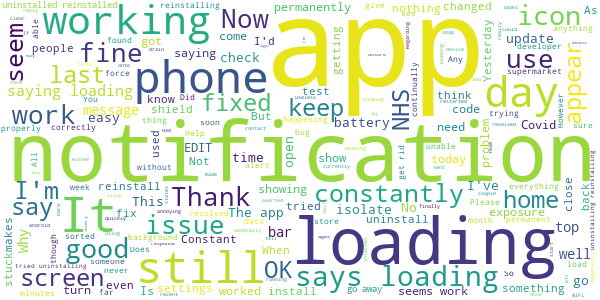
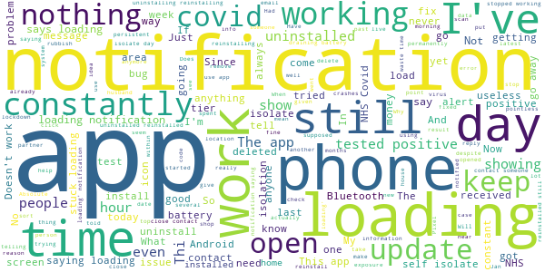

# NHS COVID-19
App version ``4.1.1 (124)``

Analyzed with [covid-apps-observer](http://github.com/covid-apps-observer) project, version ``0.1``

## App overview
| | |
|-------------------------|-------------------------| 
| **Name**                                          | NHS COVID-19 |
| **Unique identifier** | uk.nhs.covid19.production |
| **Link to Google Play** | [https://play.google.com/store/apps/details?id=uk.nhs.covid19.production](https://play.google.com/store/apps/details?id=uk.nhs.covid19.production) |
| **Summary**  | Protect your loved ones with the NHS contact tracing app for England and Wales. |
| **Privacy policy** | [https://covid19.nhs.uk/our-policies.html](https://covid19.nhs.uk/our-policies.html) |
| **Latest version** | 4.1.1 (124) |
| **Last update** | 2020-12-18 15:54:37 |
| **Recent changes** | Bug Fixes. |
| **Installs**  | 5,000,000+ |
| **Category** | Medical |
| **First release** | Aug 12, 2020 |
| **Size**  | 8.2M |
| **Supported Android version**  | 6.0 and up |

### Description
> The NHS COVID-19 app is the official contact tracing app for England and Wales. 
 It is the fastest way of knowing when you’re at risk from coronavirus. The quicker you know, the quicker you can alert your loved ones, and your community. 
 The more of us that use it, the better we can control coronavirus. 
 The app runs on proven software developed by Apple and Google, designed so that nobody will know who or where you are. And you can delete your data, or the app, at any time.
 It has a number of features: 
 Trace: Find out when you’ve been near other app users who have tested positive for coronavirus
 Alert: Lets you know the level of coronavirus risk in your postcode district. 
 Check-in: Use our simple QR code scanner to check-in to venues like bars and restaurants. You will get alerted if you have visited a venue where you may have come into contact with coronavirus.
 Symptoms: Check if you have coronavirus symptoms and see if you need to order a test. 
 Test: Helps you order a test if you need to.
 Isolate: Keep track of your self-isolation countdown and access relevant advice.
 Available in English, Welsh, Arabic (Modern Standard), Bengali, Chinese (Simplified), Gujarati, Polish, Punjabi (Gurmukhi script), Romanian, Somali, Turkish and Urdu.
 The app can be used across UK borders in England, Wales, Scotland, Northern Ireland, Jersey and Gibraltar, detecting all relevant contact tracing app users (regardless of them using different official apps), alerting them if they have been in contact with coronavirus. 
 The app has been built in collaboration with some of the most innovative organisations in the world. We have worked with medical experts, privacy groups, at-risk communities and we’ve shared knowledge with the teams working on similar apps in many countries.
 Protect your loved ones. Please download the app. 
 The App is CE marked as a class I medical device in the United Kingdom and developed in compliance with European Commission Directive 93/42/EEC for class I devices.

### User interface
The developers of the app provide the following screenshots in the Google play store.
| | | |
|:-------------------------:|:-------------------------:|:-------------------------:|
 |   |   |   | 
 |   |  

## Development team
In the following we report the main information provided by the development team in the Google play store.

| | |
|-------------------------|-------------------------|
| **Developer**  | Department of Health and Social Care |
| **Website**  | [https://covid19.nhs.uk/](https://covid19.nhs.uk/) |
| **Email** | NHSCovid-19AppStoreSupport@nhsbsa.nhs.uk |
| **Physical address**  | - |
| **Other developed apps**  | [https://play.google.com/store/apps/developer?id=Department+of+Health+and+Social+Care](https://play.google.com/store/apps/developer?id=Department+of+Health+and+Social+Care) |

## Android support

| | |
|-------------------------|-------------------------|
| **Declared target Android version**  | Android10, version 10 (API level 29) |
| **Effective target Android version**  | Android10, version 10 (API level 29) |
| **Minimum supported Android version**  | Marshmallow, version 6.0 (API level 23) |
| **Maximum target Android version**  | - |

The larger the difference between the minimum and maximum supported Android versions, the better. A larger difference means a wider audience. For example, old phones have a very low Android version, so a high minimum supported Android version means that the app cannot be used by users with old phones, thus leading to accessibility problems. 

## Requested permissions

In the following we report the complete list of the permissions requested by the app. 

| **Permission** | **Protection level** | **Description** | 
|-------------------------|-------------------------|-------------------------|
 **android.permission ACCESS_NETWORK_STATE** | Normal | Allows applications to access information about networks. 
 **android.permission BLUETOOTH** | Normal | Allows applications to connect to paired bluetooth devices. 
 **android.permission CAMERA** | :warning:**Dangerous** | Required to be able to access the camera device. 
 **android.permission FOREGROUND_SERVICE** | Normal | Allows a regular application to use Service.startForeground. 
 **android.permission INTERNET** | Normal | Allows applications to open network sockets. 
 **android.permission RECEIVE_BOOT_COMPLETED** | Normal | Allows an application to receive the Intent.ACTION_BOOT_COMPLETED that is broadcast after the system finishes booting. 
 **android.permission WAKE_LOCK** | Normal | Allows using PowerManager WakeLocks to keep processor from sleeping or screen from dimming. 

## Mentioned servers

| **Server** | **Registrant** | **Registrant country** | **Creation date** | 
|-------------------------|-------------------------|-------------------------|-------------------------|
 | google.com | Google LLC | :us: US | 1997-09-15 04:00:00 |
 | ietf.org | IETF Trust | :us: US | 1995-03-11 05:00:00 |
 | googleapis.com | Google LLC | :us: US | 2005-01-25 17:52:26 |
 | apache.org | The Apache Software Foundation | :us: US | 1995-04-11 04:00:00 |

## Security analysis 

Below we report the main security warnings raised by our execution of the [Androwarn](https://github.com/maaaaz/androwarn) security analysis tool.

**Connection interfaces exfiltration**
> - This application reads details about the currently active data network 
> - This application tries to find out if the currently active data network is metered 

**Suspicious connection establishment**
> - This application opens a Socket and connects it to the remote address ' returned no addresses for  ; port is out of range' on the 'N/A' port  
> - This application opens a Socket and connects it to the remote address '' on the 'N/A' port  
> - This application opens a Socket and connects it to the remote address 'Ljava/lang/StringBuilder;->toString()Ljava/lang/String;' on the 'N/A' port  
> - This application opens a Socket and connects it to the remote address 'Ljava/net/Proxy;->type()Ljava/net/Proxy$Type;' on the 'N/A' port  
> - This application opens a Socket and connects it to the remote address 'timeout' on the 'N/A' port  

**Code execution**
> - This application loads a native library 
> - This application loads a native library: 'Ljava/lang/String;->valueOf(Ljava/lang/Object;)Ljava/lang/String;' 

## User ratings and reviews

Below we provide information about how end users are reacting to the app in terms of ratings and reviews in the Google Play store.

### Ratings

The NHS COVID-19 app has been installed by more than **5000000** times. At this time, **95001** rated the app and its average score is **3.9574847**. Below we show the distribution of the ratings across the usual star-based rating of Google Play

:star::star::star::star::star:: 56378

:star::star::star::star:: 12680

:star::star::star:: 6932

:star::star:: 3550

:star:: 15461

### Reviews 

#### 5-star reviews

> I like the idea of the app, it keeps me on the alert. (Thanks)  :date: __2021-01-03 11:47:44__

> Very good as it tells if someone has corona  :date: __2021-01-02 20:49:15__

> I'm always using this app, I find it strange that the large supermarket and small shop selling food haven't got a a QR code to scan that people have been in the store.?  :date: __2021-01-02 17:00:11__

> great scary feature  :date: __2021-01-02 13:46:57__

> Seems to do the job. Had it since september, hasnt given me a false notification. However had close contact with 2 people that had unknowingly got covid. After they tested positive it did its thing very efficiently. Tells you when you need to isolate till with a countdown and there seems to be lots of help and information when you get an alert. Of course it does rely on people inputting test results but if they do a great little app. Full marks.  :date: __2021-01-02 13:00:10__

> Really good app and so easy to use.  :date: __2021-01-02 11:02:33__

> Brilliant safe and secure.  :date: __2021-01-01 18:02:04__

> Does what it says on the tin more than happy with it.  :date: __2021-01-01 13:10:13__

> Everybody should have this om there fone its a censual to  :date: __2021-01-01 13:07:30__

> Someone at work tested positive. Later that day I had a notification with exposure date matching the last time I saw them. Isolated from family, and 4 days later had mild symptoms tested positive. Hopefully those 4 days isolating in a single room will be enough to spare my wife and daughter.  :date: __2021-01-01 11:01:42__

#### 4-star reviews

> I think it works I do my part  :date: __2021-01-02 22:43:44__

> Hi, can I suggest an option where this app functions as a proximity detector. So when two users get too close beyond a certain amount of time eg 2 minutes, the app would alarm and warn the users to move apart. Prevention is better than cure.  :date: __2021-01-01 21:50:45__

> Very good  :date: __2021-01-01 16:11:57__

> Managed to get things sorted with second covid test.  :date: __2020-12-31 15:14:59__

> My son was alerted through the app to self control which he did .I have the app as well but am shielding at the moment. We were pleased to get notified as it meant we took extra precautions at home  :date: __2020-12-31 14:49:16__

> The app has improved dramatically since it was first introduced, they need to fine tune it (ie more urgency on notifications) but it's notified my family & friends to self isolate who had been due unfortunate circumstances  :date: __2020-12-31 06:02:09__

> Found app useful to a degree as things are not always easy to find. App is telling me to self isolate for 5 days as been in contact with a positive case. To get support payment you need your CTAS account ID number which apparently is on a link in the app.....can't find it?  :date: __2020-12-29 21:56:50__

> Easy to install and use .  :date: __2020-12-27 16:13:40__

> The app didn't really seem to have much stuff on it other than just telling people what tier in the UK they're areas are in. Did uninstall after. I also don't see the point for it having to use Bluetooth for it to work, it just doesn't make any sense at all, like it's not like it has to connect to some physical device or something.  :date: __2020-12-27 03:24:12__

> It has worked fine for me so far. Very useful for checking my local restrictions. I have never booked a test or been told to self isolate via this app so I cannot comment on those features. However, from what I have experienced, an all round good app. It will become more effective the more people install it.  :date: __2020-12-26 21:56:13__

#### 3-star reviews

> In tier 4 yet the app tells me I'm still in tier 3  :date: __2021-01-03 12:20:34__

> Worked fine until today. Now crashes on load, every time. Pixel 3XL Android version 11  :date: __2021-01-03 10:13:27__

> OK I'm prepared to accept using this app for the benefit of helping defeat covid. However it needs to allow you to read notifications without having to turn on location and Bluetooth. I won't turn on location at home since I don't wish to share such info with all the other snooping apps. I can't see why the NHS app needs location for you to read a notification? Edit 02.01.21.Your response didn't answer the question or the point made. I was referring to how the app works not your privacy policy.  :date: __2021-01-03 03:38:07__

> Some useful info in it but I'm very dubious as to whether the notifications actually work as intended, and I regular get a notification that the app is loading but nothing discernible happens afterward.  :date: __2021-01-02 20:43:32__

> Keeps crashing. Since first installing this app when it was initially released I have had to reinstall it twice because it crashed completely. Surely all these months on it though to be stable by now?!  :date: __2021-01-02 18:38:26__

> Not very accurate, mine says I'm in tear 3 and my mates say tear 4 ??????? I wouldn't mind but we live in the same house.  :date: __2021-01-02 15:30:04__

> Did not update tier 3 to 4 automatically  :date: __2021-01-02 11:46:59__

> Open question: is this app still working? I haven't received any proximity notification in the last 2+ months. It is a good thing, but it makes me wonder if the app is doing what it should.  :date: __2021-01-02 10:43:36__

> I have a constant message on my phone saying NHS Covid 19 Loading. Other than thst i think it is working  :date: __2021-01-02 07:42:37__

> Too many glitches, doesn't retain venue locations.would be better if it used Google maps location finder software Good try though  :date: __2021-01-01 07:42:24__

#### 2-star reviews

> Impossible to enter a test result, it's asking for a code which was provided in my results email and text, there was no code in the email. Therefore it's still telling me to isolate when in fact I've had a negative result. I was under the impression that this was an early problem which had been fixed. Obviously not.  :date: __2021-01-02 23:47:44__

> So my wife as tested positive for covid we put her test code into the app on her phone showing how many days left and in red but my question is why ain't my app informed me of being near her yet and that test was done on the 28th its now the 2nd (ps we are self isolating for 10 day so not a problem and my app and hers is always on )  :date: __2021-01-02 20:03:29__

> This now needs an update. Used to work fine but now it keeps tying itself up in knots and just says "app is loading" all the time so I've no idea if its actually working now. Only way to clear it is reset the phone. Using an S20+ with the latest software update  :date: __2021-01-02 19:34:53__

> Wanted to add in my test results but it wouldn't let me type my test code  :date: __2021-01-02 19:24:56__

> 03/01/2021 - I have had an icon on the app, and also as a notification, telling me its updating something, and it's been in for the past week. Nothing has changed, not even when I thought it'd refresh with the whole tier 4 announcement. Had to uninstall/reinstall.  :date: __2021-01-02 18:08:59__

> Very unreliable. I get a notification almost every day that I've been exposed to someone positive, but don't have to do anything. I don't leave the house... I have no idea what this app thinks I'm doing, but it's clearly unreliable!  :date: __2021-01-02 02:28:49__

> Not updating real time, requires location and Bluetooth on(take time to secure connection via Bluetooth ensuring no one can connect to you via other apps you might have installed and not checked T&C's and permissions required - media and storage ), no updates when reception is not available ei. At work. Useful? Just to tell you what tier you are in. Just stay away from others and keep yourself safe people, stay safe :)  :date: __2021-01-02 01:17:30__

> My area is now in tier 4 my app says we are in tier 3 why is this i have updated the app  :date: __2021-01-01 19:17:17__

> It's not updating the tiers, it says I'm in tier 2, there are no tier 2 areas at this time. Other than that I have no reason not to trust it, but thats probably enough. Send out an update and fix the bugs please.  :date: __2021-01-01 12:58:51__

> Keeps saying I have a notification but all I see is message saying 'loading'?!  :date: __2021-01-01 12:50:00__

#### 1-star reviews

> Says it's not compatible with my phone (xiaomi)!!  :date: __2021-01-03 16:00:46__

> I've had this app since the day it was released to the public and updated it every time there's been a new update, but it hasn't done a potential exposure check since 8th October! So for months this app has been useless other than for the check ins  :date: __2021-01-03 15:02:42__

> Funny app hhhhhh after two weeks we been in tier 4 give me notification after 2 weeks hhhh  :date: __2021-01-03 14:01:39__

> It keeps telling me it's not working and when I open it it just has a black screen with NHS Covid 19 on it then it closes. I've uninstalled and reinstalled and still doesn't work  :date: __2021-01-03 13:36:03__

> The app doesn't open anymore, tried uninstalling and reinstalling but still doesn't work. Not sure if this is to do with my phone now running Android 11.  :date: __2021-01-03 13:01:22__

> Had to unisall, just spent time "updating covid" and running my battery down, pretty much useless, good job getting your friends a job BoJo  :date: __2021-01-03 12:03:14__

> Can't download it, stuck on pending. Plenty of memory space, have tried deleting other apps and photos/videos to make room, left it overnight still pending.......  :date: __2021-01-03 11:06:19__

> Have uninstalled this app. it is pretty useless since it gave me a contact point 2 days after a supposed event. Using my Google location history there is no way I could have been in contact with someone, less than 2m,>15mins, other than when my phone was left in a locker during swimming so unless the app can provide a time & location it is useless and doesn't properly assess the risk as personal protective measures were in use at all other times - less than 2m, >15mins cumulative.  :date: __2021-01-03 10:57:29__

> Hate this app. Flags of and you get a £100 a week to pay a house and feed your family. And no1 helps you out. 😡  :date: __2021-01-03 10:55:45__

> Choppy not simple or procise confusing  :date: __2021-01-03 10:54:49__

