# NHS COVID-19
App version ``4.10 (189)``

Analyzed with [covid-apps-observer](http://github.com/covid-apps-observer) project, version ``0.1``

## App overview
| | |
|-------------------------|-------------------------| 
| **Name**&nbsp;&nbsp;&nbsp;&nbsp;&nbsp;&nbsp;&nbsp;&nbsp;&nbsp;&nbsp;&nbsp;&nbsp;&nbsp;&nbsp;&nbsp;&nbsp;&nbsp;&nbsp;&nbsp;&nbsp;&nbsp;&nbsp;&nbsp;&nbsp;&nbsp;&nbsp;&nbsp;&nbsp;&nbsp;&nbsp;&nbsp;&nbsp;&nbsp;&nbsp;&nbsp;&nbsp;&nbsp;&nbsp;&nbsp;&nbsp;  | NHS COVID-19 |
| **Unique identifier** | uk.nhs.covid19.production |
| **Link to Google Play** | [https://play.google.com/store/apps/details?id=uk.nhs.covid19.production](https://play.google.com/store/apps/details?id=uk.nhs.covid19.production) |
| **Summary**  | Protect your loved ones with the NHS contact tracing app for England and Wales. |
| **Privacy policy** | [https://covid19.nhs.uk/our-policies.html](https://covid19.nhs.uk/our-policies.html) |
| **Latest version** | 4.10 (189) |
| **Last update** | 2021-05-07 13:29:34 |
| **Recent changes** | You can now use the app on all Android tablets, as long as it has a mobile connection such as 4G or 5G. We have changed how you pause contact tracing to make it clearer when to do this. There are also accessibility improvements when using VoiceOver or Talkback with the app. |
| **Installs**  | 10,000,000+ |
| **Category** | Medical |
| **First release** | Aug 12, 2020 |
| **Size**  | 9.2M |
| **Supported Android version**  | 6.0 and up |

### Description
> The NHS COVID-19 app is the official contact tracing app for England and Wales. 
 It is the fastest way of knowing when you’re at risk from coronavirus. The quicker you know, the quicker you can alert your loved ones, and your community. 
 The more of us that use it, the better we can control coronavirus. 
 The app runs on proven software developed by Apple and Google, designed so that nobody will know who or where you are. And you can delete your data, or the app, at any time.
 It has a number of features: 
 Trace: Find out when you’ve been near other app users who have tested positive for coronavirus
 Alert: Lets you know the level of coronavirus risk in your postcode district. 
 Check-in: Use our simple QR code scanner to check-in to venues like bars and restaurants. You will get alerted if you have visited a venue where you may have come into contact with coronavirus.
 Symptoms: Check if you have coronavirus symptoms and see if you need to order a test. 
 Test: Helps you order a test if you need to.
 Isolate: Keep track of your self-isolation countdown and access relevant advice.
 Available in English, Welsh, Arabic (Modern Standard), Bengali, Chinese (Simplified), Gujarati, Polish, Punjabi (Gurmukhi script), Romanian, Somali, Turkish and Urdu.
 The app can be used across UK borders in England, Wales, Scotland, Northern Ireland, Jersey and Gibraltar, detecting all relevant contact tracing app users (regardless of them using different official apps), alerting them if they have been in contact with coronavirus. 
 The app has been built in collaboration with some of the most innovative organisations in the world. We have worked with medical experts, privacy groups, at-risk communities and we’ve shared knowledge with the teams working on similar apps in many countries.
 Protect your loved ones. Please download the app. 
 The app is UKCA marked as Class I medical device in the United Kingdom and developed in compliance with Medical Devices Regulations 2002 (SI 2002 No 618, as amended).

### User interface
The developers of the app provide the following screenshots in the Google play store.
| | | |
|:-------------------------:|:-------------------------:|:-------------------------:|
 |   | 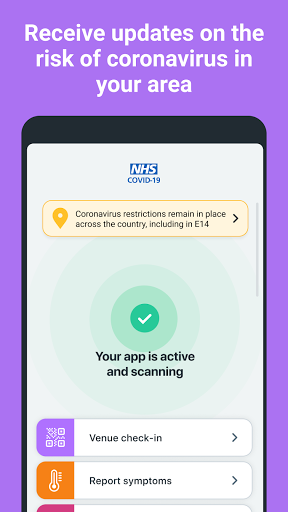  | 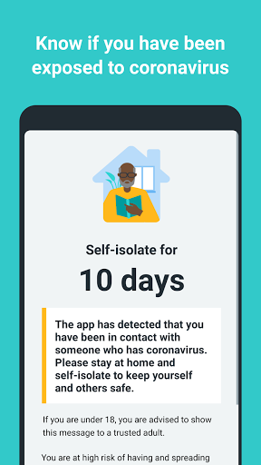  | 
 |   |   |   | 
 | 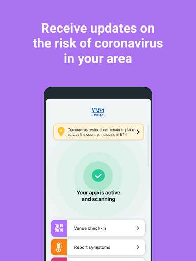  | 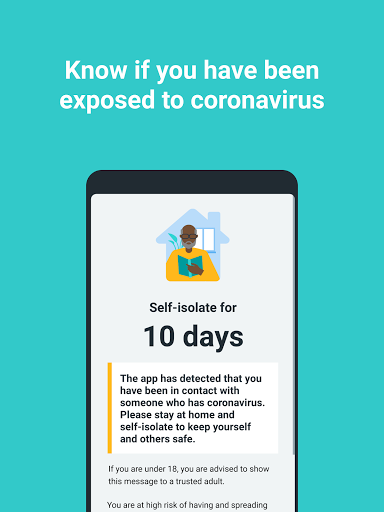  |   | 
 | 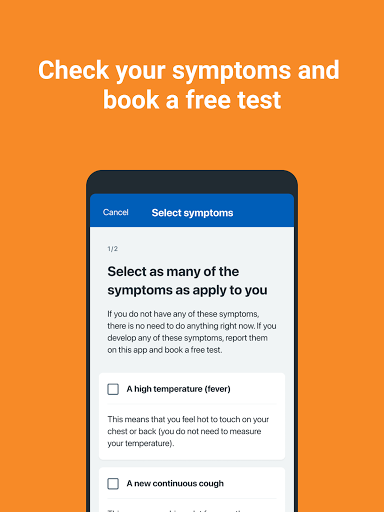  |   | 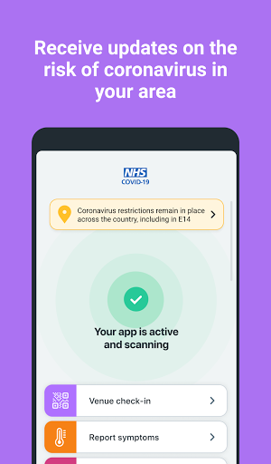  | 
 |   | 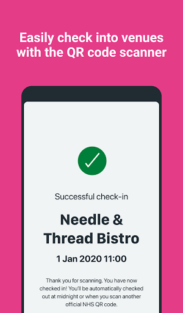  |   | 

## Development team
In the following we report the main information provided by the development team in the Google play store.

| | |
|-------------------------|-------------------------|
| **Developer**  | Department of Health and Social Care |
| **Website**  | [https://covid19.nhs.uk/](https://covid19.nhs.uk/) |
| **Email** | NHSCovid-19AppStoreSupport@nhsbsa.nhs.uk |
| **Physical address**  | - |
| **Other developed apps**  | [https://play.google.com/store/apps/developer?id=Department+of+Health+and+Social+Care](https://play.google.com/store/apps/developer?id=Department+of+Health+and+Social+Care) |

## Android support

| | |
|-------------------------|-------------------------|
| **Declared target Android version**  | Android10, version 10 (API level 29) |
| **Effective target Android version**  | Android10, version 10 (API level 29) |
| **Minimum supported Android version**  | Marshmallow, version 6.0 (API level 23) |
| **Maximum target Android version**  | - |

The larger the difference between the minimum and maximum supported Android versions, the better. A larger difference means a wider audience. For example, old phones have a very low Android version, so a high minimum supported Android version means that the app cannot be used by users with old phones, thus leading to accessibility problems. 

## Requested permissions

In the following we report the complete list of the permissions requested by the app. 

| **Permission** | **Protection level** | **Description** | 
|-------------------------|-------------------------|-------------------------|
 **android.permission ACCESS_NETWORK_STATE** | Normal | Allows applications to access information about networks. 
 **android.permission BLUETOOTH** | Normal | Allows applications to connect to paired bluetooth devices. 
 **android.permission CAMERA** | :warning:**Dangerous** | Required to be able to access the camera device. 
 **android.permission FOREGROUND_SERVICE** | Normal | Allows a regular application to use Service.startForeground. 
 **android.permission INTERNET** | Normal | Allows applications to open network sockets. 
 **android.permission RECEIVE_BOOT_COMPLETED** | Normal | Allows an application to receive the Intent.ACTION_BOOT_COMPLETED that is broadcast after the system finishes booting. 
 **android.permission REQUEST_IGNORE_BATTERY_OPTIMIZATIONS** | Normal | Permission an application must hold in order to use Settings.ACTION_REQUEST_IGNORE_BATTERY_OPTIMIZATIONS. 
 **android.permission WAKE_LOCK** | Normal | Allows using PowerManager WakeLocks to keep processor from sleeping or screen from dimming. 

## Mentioned servers

| **Server** | **Registrant** | **Registrant country** | **Creation date** | 
|-------------------------|-------------------------|-------------------------|-------------------------|
 | google.com | Google LLC | :us: US | 1997-09-15 04:00:00 |
 | ietf.org | IETF Trust | :us: US | 1995-03-11 05:00:00 |
 | googleapis.com | Google LLC | :us: US | 2005-01-25 17:52:26 |
 | apache.org | The Apache Software Foundation | :us: US | 1995-04-11 04:00:00 |

## Security analysis 

Below we report the main security warnings raised by our execution of the [Androwarn](https://github.com/maaaaz/androwarn) security analysis tool.

**Connection interfaces exfiltration**
> - This application reads details about the currently active data network 
> - This application tries to find out if the currently active data network is metered 

**Suspicious connection establishment**
> - This application opens a Socket and connects it to the remote address ' returned no addresses for  ; port is out of range' on the 'N/A' port  
> - This application opens a Socket and connects it to the remote address '' on the 'N/A' port  
> - This application opens a Socket and connects it to the remote address 'Ljava/lang/StringBuilder;->toString()Ljava/lang/String;' on the 'N/A' port  
> - This application opens a Socket and connects it to the remote address 'Ljava/net/Proxy;->type()Ljava/net/Proxy$Type;' on the 'N/A' port  
> - This application opens a Socket and connects it to the remote address 'timeout' on the 'N/A' port  

**Code execution**
> - This application loads a native library 
> - This application loads a native library: 'Ljava/lang/String;->valueOf(Ljava/lang/Object;)Ljava/lang/String;' 

## User ratings and reviews

Below we provide information about how end users are reacting to the app in terms of ratings and reviews in the Google Play store.

### Ratings

The NHS COVID-19 app has been installed by more than **10000000** times. At this time, **108707** rated the app and its average score is **4.1177278**. Below we show the distribution of the ratings across the usual star-based rating of Google Play

:star::star::star::star::star:: 70663

:star::star::star::star:: 13495

:star::star::star:: 6374

:star::star:: 3037

:star:: 15138

### Reviews 

#### 5-star reviews

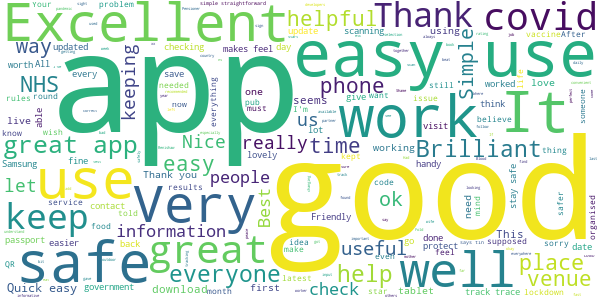

> Love, Love this app especially checkin at venues that I travel, only downside I can't add my mother's results etc. and unable to download the app on my phone for my mother so having to enter her results in my app which I'm sure isn't correct  :date: __2021-05-30 10:24:33__

> they are observing all the rules here  :date: __2021-05-29 19:09:13__

> Simple, easy to use and most of all we remain anonymous with regards to data, just how it should be! If only more places had track and trace, it should be mandatory at every pub for those who have a smart phone and able to do so.  :date: __2021-05-29 18:55:10__

> very helpful  :date: __2021-05-29 18:41:01__

> I cannot use this app because I am not from any of the choices of regions/places, but I have heard that it is a great app from a friend so I'll just kindly give a full-on review ig, okay bye.  :date: __2021-05-29 16:57:06__

> Very good aop,  :date: __2021-05-29 15:16:28__

> This is an excellent app and is very easy to use.  :date: __2021-05-29 15:01:06__

> Well done NHS and Government for trying to protect the public.  :date: __2021-05-29 13:37:54__

> lovely place. All protocols followed and very good fare with options for vegan as well.  :date: __2021-05-29 13:27:18__

> great app  :date: __2021-05-29 13:10:50__

#### 4-star reviews

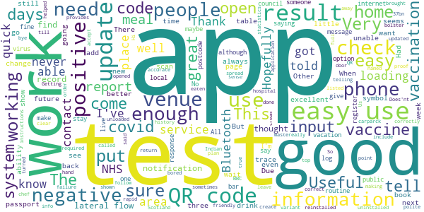

> it's OK.  :date: __2021-05-30 11:39:04__

> Usually able to scan in at venues  :date: __2021-05-30 11:36:11__

> Working so far  :date: __2021-05-29 12:11:24__

> Possibly forwarding my location to my assigned FBI agent, probably.  :date: __2021-05-26 13:34:21__

> easy to use  :date: __2021-05-24 21:35:31__

> This app is OK but I would like an option to activate it when I leave my house. It keeps sending me reminders because I've turned Bluetooth off, but I don't want to have my BT on all the time when I'm working from home and not going anywhere. Could you have an option to set a home location and then have it automatically activated when I'm not at that location?  :date: __2021-05-24 17:14:44__

> if we all play our part we will beat covid  :date: __2021-05-24 14:53:05__

> I have heard I can now enter my vaccine status but can't find out how to do that. Otherwise seems ok.  :date: __2021-05-23 11:09:06__

> Won't work on my phone, says it is a tablet. It's not, it is a Galaxy Fold. It will work with the phone closed. Edit- it does work now.  :date: __2021-05-22 18:22:37__

> Good app but needs to include if you have had the vaccine  :date: __2021-05-22 13:35:44__

#### 3-star reviews

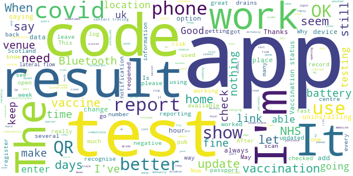

> We are being asked to take lateral flow tests 2 times a week but the app does not accept home lateral flow test strip code so cannot report result  :date: __2021-05-30 12:42:43__

> Why isnt it compatible with the Scotland QR codes? :( Also why is is not loaded with a way to book a vaccine? Or at least links to where the closest centre is?  :date: __2021-05-29 15:50:08__

> The contract tracing part worked for me (had an alert, and know who triggered it) but there are still issues: I've had two tests (both at test centres, both negative) but could not enter the results as the app wouldn't recognise any codes I got; as others have mentioned there's still no way to check out of a venue having checked in; finally, it's not clear to me how vaccinations are going to be recorded for proof of status - batch and NHS number (so much for not identifying users)?  :date: __2021-05-28 08:20:51__

> Im not sure I trust this applications security as having to leave your Bluetioth open is generally a big risk. The apps usage is reletively easy.  :date: __2021-05-26 10:37:22__

> Drains phone battery very fast  :date: __2021-05-25 19:16:20__

> Should be able to manually enter location.  :date: __2021-05-25 13:56:08__

> Works, but drains my battery, my charging time is really long when this app is installed. After uninstalling, my charging went back to normal.  :date: __2021-05-25 12:30:07__

> The app used to work great. But recently no matter what codes I try, the app doesn't seem to register them.  :date: __2021-05-25 09:43:46__

> OK  :date: __2021-05-24 15:02:10__

> It doesn't always work.  :date: __2021-05-24 10:07:34__

#### 2-star reviews

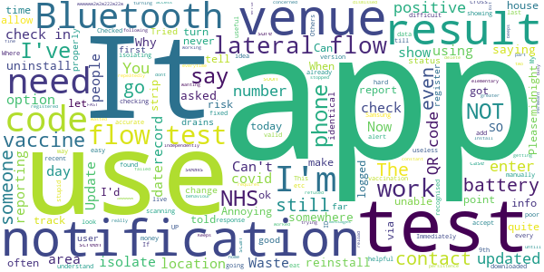

> very busy  :date: __2021-05-29 15:56:41__

> Keeps wanting to reload, ok after deleting and reinstalling but off it goes again after a few days. Update it's still doing it, twice now in the last 7:days  :date: __2021-05-29 09:08:51__

> When is the app going to record you've had both vaccine injections ??? Or is this going to be recorded using a different method  :date: __2021-05-27 19:11:06__

> Ur app is kinda stupid I get texts to isolate yes I've covid caught it from my pharmacy! U send texts I put in the code & part of post code, few days later saying my isolation is over get phone call from Track n Trace asking me strange questions i.e the runs, rash! She didn't know the 3main symptoms. Pointless! Soon isolation will be over but I'm still suffering flu symptoms, all my bones hurt, 10days is not enough time to recover. Bombarded with texts& phone calls outrageous, I've mental health  :date: __2021-05-27 04:40:39__

> this app is so useful and very helpful  :date: __2021-05-26 16:33:35__

> Waste of tax payers money, doesn't do what the government said it would do.  :date: __2021-05-26 15:34:42__

> seems stupid if get orderd to quarantine from this if I go I to a venue but don't get within 10 feet of someone and why an I not be told who I have been in contact with  :date: __2021-05-26 14:12:31__

> having to use location and Bluetooth means it eats your battery and data. otherwise, quite easy to use  :date: __2021-05-26 13:59:02__

> The app does what it's meant to ok but honestly, what a fuss to do a simple check in. Must have bluetooth and location on before it will even let you in. Surely this could be optional as I'm never anywhere close enough to anyone to worry about catching this thing these days!  :date: __2021-05-26 12:02:03__

> Notifications that do not go away meaning that I need to quite often uninstall / reinstall.  :date: __2021-05-26 10:12:39__

#### 1-star reviews

> Horrifically made  :date: __2021-05-30 11:32:34__

> Uninstalling right now. Useless, stops other apps from working, endless notifications to turn Bluetooth and location on, which drains battery at light speed. Nowhere to enter my jab details and hasn't alerted me to at least 3 different recent outbreaks I didn't know about. Useless faff, read enough reviews which state the same issues as I, and the replies from the department of health are shockingly ignorant and insulting. Terrible app  :date: __2021-05-30 10:56:59__

> The idea of the app is fantastic, the advise given is very poor. Wouldn't book a slot that was available despite being half hour before the slot time. Spike to 119 who said it was too short notice. Why display and have slots available that you cannot book. Also if you have been contacted by track and trace and have to self isolate, why does a negative test not superseed this advise  :date: __2021-05-30 10:46:43__

> OK I'm prepared to accept using this app for the benefit of helping defeat covid. However it needs to allow you to read notifications without having to turn on location and Bluetooth. I won't turn on location at home since I don't wish to share Edit 18.03.21. Now down to 2* since you seem totally incapable of answering the question above. Turned on BT but app won't open unless location is turned on. Cannot receive any notifications. Useless.  :date: __2021-05-30 09:02:39__

> The app won't work. Just a black screen and then it crashes!  :date: __2021-05-30 00:39:48__

> Dirt Pure Dirt  :date: __2021-05-29 21:39:10__

> Despite our area being level 4 for over a year, this app never notified us, not even once of any confirmation of diagnosis, we even tried it when a friend contracted covid... The app didn't work if this response is correct, the app did not work...  :date: __2021-05-29 18:35:10__

> Waste of time does not work most of the time  :date: __2021-05-29 18:04:48__

> useless  :date: __2021-05-29 17:45:42__

> Crashed my Samsung A71 then my Huawei p30. Lost all photos and data. I do not recommend  :date: __2021-05-29 14:55:00__

