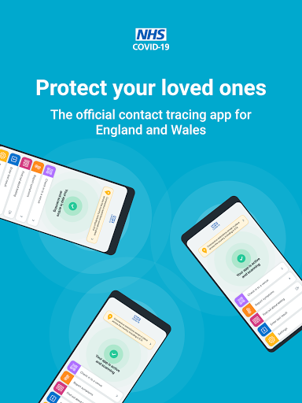

# NHS COVID-19
App version ``4.10 (189)``

Analyzed with [covid-apps-observer](http://github.com/covid-apps-observer) project, version ``0.1``

## App overview
| | |
|-------------------------|-------------------------| 
| **Name**                                          | NHS COVID-19 |
| **Unique identifier** | uk.nhs.covid19.production |
| **Link to Google Play** | [https://play.google.com/store/apps/details?id=uk.nhs.covid19.production](https://play.google.com/store/apps/details?id=uk.nhs.covid19.production) |
| **Summary**  | Protect your loved ones with the NHS contact tracing app for England and Wales. |
| **Privacy policy** | [https://covid19.nhs.uk/our-policies.html](https://covid19.nhs.uk/our-policies.html) |
| **Latest version** | 4.10 (189) |
| **Last update** | 2021-05-07 13:29:34 |
| **Recent changes** | You can now use the app on all Android tablets, as long as it has a mobile connection such as 4G or 5G. We have changed how you pause contact tracing to make it clearer when to do this. There are also accessibility improvements when using VoiceOver or Talkback with the app. |
| **Installs**  | 10,000,000+ |
| **Category** | Medical |
| **First release** | Aug 12, 2020 |
| **Size**  | 9.2M |
| **Supported Android version**  | 6.0 and up |

### Description
> The NHS COVID-19 app is the official contact tracing app for England and Wales. 
 It is the fastest way of knowing when you’re at risk from coronavirus. The quicker you know, the quicker you can alert your loved ones, and your community. 
 The more of us that use it, the better we can control coronavirus. 
 The app runs on proven software developed by Apple and Google, designed so that nobody will know who or where you are. And you can delete your data, or the app, at any time.
 It has a number of features: 
 Trace: Find out when you’ve been near other app users who have tested positive for coronavirus
 Alert: Lets you know the level of coronavirus risk in your postcode district. 
 Check-in: Use our simple QR code scanner to check-in to venues like bars and restaurants. You will get alerted if you have visited a venue where you may have come into contact with coronavirus.
 Symptoms: Check if you have coronavirus symptoms and see if you need to order a test. 
 Test: Helps you order a test if you need to.
 Isolate: Keep track of your self-isolation countdown and access relevant advice.
 Available in English, Welsh, Arabic (Modern Standard), Bengali, Chinese (Simplified), Gujarati, Polish, Punjabi (Gurmukhi script), Romanian, Somali, Turkish and Urdu.
 The app can be used across UK borders in England, Wales, Scotland, Northern Ireland, Jersey and Gibraltar, detecting all relevant contact tracing app users (regardless of them using different official apps), alerting them if they have been in contact with coronavirus. 
 The app has been built in collaboration with some of the most innovative organisations in the world. We have worked with medical experts, privacy groups, at-risk communities and we’ve shared knowledge with the teams working on similar apps in many countries.
 Protect your loved ones. Please download the app. 
 The app is UKCA marked as Class I medical device in the United Kingdom and developed in compliance with Medical Devices Regulations 2002 (SI 2002 No 618, as amended).

### User interface
The developers of the app provide the following screenshots in the Google play store.
| | | |
|:-------------------------:|:-------------------------:|:-------------------------:|
 |   |   |   | 
 |   |   |   | 
 |   |   |   | 
 |   |   |   | 
 |   |   |   | 

## Development team
In the following we report the main information provided by the development team in the Google play store.

| | |
|-------------------------|-------------------------|
| **Developer**  | Department of Health and Social Care |
| **Website**  | [https://covid19.nhs.uk/](https://covid19.nhs.uk/) |
| **Email** | NHSCovid-19AppStoreSupport@nhsbsa.nhs.uk |
| **Physical address**  | - |
| **Other developed apps**  | [https://play.google.com/store/apps/developer?id=Department+of+Health+and+Social+Care](https://play.google.com/store/apps/developer?id=Department+of+Health+and+Social+Care) |

## Android support

| | |
|-------------------------|-------------------------|
| **Declared target Android version**  | Android10, version 10 (API level 29) |
| **Effective target Android version**  | Android10, version 10 (API level 29) |
| **Minimum supported Android version**  | Marshmallow, version 6.0 (API level 23) |
| **Maximum target Android version**  | - |

The larger the difference between the minimum and maximum supported Android versions, the better. A larger difference means a wider audience. For example, old phones have a very low Android version, so a high minimum supported Android version means that the app cannot be used by users with old phones, thus leading to accessibility problems. 

## Requested permissions

In the following we report the complete list of the permissions requested by the app. 

| **Permission** | **Protection level** | **Description** | 
|-------------------------|-------------------------|-------------------------|
 **android.permission ACCESS_NETWORK_STATE** | Normal | Allows applications to access information about networks. 
 **android.permission BLUETOOTH** | Normal | Allows applications to connect to paired bluetooth devices. 
 **android.permission CAMERA** | :warning:**Dangerous** | Required to be able to access the camera device. 
 **android.permission FOREGROUND_SERVICE** | Normal | Allows a regular application to use Service.startForeground. 
 **android.permission INTERNET** | Normal | Allows applications to open network sockets. 
 **android.permission RECEIVE_BOOT_COMPLETED** | Normal | Allows an application to receive the Intent.ACTION_BOOT_COMPLETED that is broadcast after the system finishes booting. 
 **android.permission REQUEST_IGNORE_BATTERY_OPTIMIZATIONS** | Normal | Permission an application must hold in order to use Settings.ACTION_REQUEST_IGNORE_BATTERY_OPTIMIZATIONS. 
 **android.permission WAKE_LOCK** | Normal | Allows using PowerManager WakeLocks to keep processor from sleeping or screen from dimming. 

## Mentioned servers

| **Server** | **Registrant** | **Registrant country** | **Creation date** | 
|-------------------------|-------------------------|-------------------------|-------------------------|
 | google.com | Google LLC | :us: US | 1997-09-15 04:00:00 |
 | ietf.org | IETF Trust | :us: US | 1995-03-11 05:00:00 |
 | googleapis.com | Google LLC | :us: US | 2005-01-25 17:52:26 |
 | apache.org | The Apache Software Foundation | :us: US | 1995-04-11 04:00:00 |

## Security analysis 

Below we report the main security warnings raised by our execution of the [Androwarn](https://github.com/maaaaz/androwarn) security analysis tool.

**Connection interfaces exfiltration**
> - This application reads details about the currently active data network 
> - This application tries to find out if the currently active data network is metered 

**Suspicious connection establishment**
> - This application opens a Socket and connects it to the remote address ' returned no addresses for  ; port is out of range' on the 'N/A' port  
> - This application opens a Socket and connects it to the remote address '' on the 'N/A' port  
> - This application opens a Socket and connects it to the remote address 'Ljava/lang/StringBuilder;->toString()Ljava/lang/String;' on the 'N/A' port  
> - This application opens a Socket and connects it to the remote address 'Ljava/net/Proxy;->type()Ljava/net/Proxy$Type;' on the 'N/A' port  
> - This application opens a Socket and connects it to the remote address 'timeout' on the 'N/A' port  

**Code execution**
> - This application loads a native library 
> - This application loads a native library: 'Ljava/lang/String;->valueOf(Ljava/lang/Object;)Ljava/lang/String;' 

## User ratings and reviews

Below we provide information about how end users are reacting to the app in terms of ratings and reviews in the Google Play store.

### Ratings

The NHS COVID-19 app has been installed by more than **10000000** times. At this time, **108707** rated the app and its average score is **4.1177278**. Below we show the distribution of the ratings across the usual star-based rating of Google Play

:star::star::star::star::star:: 70663

:star::star::star::star:: 13495

:star::star::star:: 6374

:star::star:: 3037

:star:: 15138

### Reviews 

#### 5-star reviews

> Your app thinks my phone is a tablet. Edit: After changing the display size back to default it let me load it up and it seems to be working even when I change the display size back to my preferred setting. Update: The latest version seems to resolve the issue completely.  :date: __2021-05-13 15:51:34__

> App does not work on Samsung Galaxy Z Fold2 as it just thinks I'm using a tablet. No way to override this and say activate anyway Update: Following feedback to the developers, the app has been updated and now works fine on the Fold. I have updated my rating.  :date: __2021-05-13 13:47:49__

> Fine, simple and straightforward  :date: __2021-05-13 13:14:42__

> Thanks you.  :date: __2021-05-13 13:10:15__

> Excellent app  :date: __2021-05-13 11:01:14__

> easy to use  :date: __2021-05-13 10:22:19__

> Good there was a glitch at the start but all good now  :date: __2021-05-13 09:49:46__

> Very helpful 👌  :date: __2021-05-12 22:41:08__

> Excellent  :date: __2021-05-12 22:11:02__

> Very informative  :date: __2021-05-12 21:30:15__

#### 4-star reviews

> why the uetooth need to be turned on for the app? location accuracy via WiFi no?  :date: __2021-05-13 13:39:33__

> Useful  :date: __2021-05-13 11:23:32__

> Very good quality app  :date: __2021-05-12 09:08:22__

> It's a good system but lacks an informative action system ..🤔🤔  :date: __2021-05-11 21:42:15__

> it appears to work. but never sure  :date: __2021-05-11 11:35:35__

> Should be able to book or register a lateral flow test. Increased rating based on response by developer but can't confirm this as never been positive. Hopefully I stay that way.  :date: __2021-05-10 20:48:20__

> Further Update: reply received. Thank you. Update:Why can't we report LFD Test results? Works fine. All negative reviews are for pre- public version. Always people looking to criticise.  :date: __2021-05-10 12:25:50__

> My app has been stuck saying loading for last few days, shall I uninstall and re install?  :date: __2021-05-10 08:06:30__

> It's work fine but it's stop working on where you scanner bar codes for where you been to a couple of places and it's say does not recognise  :date: __2021-05-09 17:25:21__

> Useful for the current situation we are in with this virus. Hopefully we can open up with fewer deaths than previous waves. We'll see how it goes but it's like a routine in my daily routine, signing into the venues I use and sit outside of  :date: __2021-05-09 15:59:29__

#### 3-star reviews

> Simple enough although I'm not sure how well it works in reality. Checking into a venue is quick and simple, so I like that. However, it currently shows a notification but there isn't one. it just won't go away... it's rather annoying.  :date: __2021-05-12 18:42:04__

> QR scanner needs to be able to read fastflow qr code. UPDATE: Rubbish reply from NHS. Make this app really useful. Let the publuc use it to register both positive and negative test results, including fast flow results. Make its QR reader able to read the QR codes on fast flow devices. Let it link to your NHS number and also let it track/log your vaccinations. This app should be the one-stop place to log/manage all personal covid data and information. Come on NHS, you can do better!  :date: __2021-05-11 23:40:22__

> I've been using this on my phone - told that this was not available for my slightly older tablet. This was likely to under-represent groups that might be at greater risk (older, poorer, etc). They seem to have remedied this (in time to act as a passport to pubs?). However, I report results 2x a week; not possible here, instead requiring a separate log in to gov.uk. Let's be clear, this is not a world beating test & trace app - it's a surveillance tool. That's fine, but not rateable at this end!  :date: __2021-05-11 18:33:25__

> I'm wondering why I can't report the result of the Rapid Antigen Test using the app. I've had a few instances where it's got a notification continually saying "loading", but if it's saving lives then I suppose it's better than nothing.  :date: __2021-05-11 18:20:22__

> Im sorry but I've had the app for a while and found out my freind who I was in contact with had covid and yet my phone didn't alert me you need to sort this out please  :date: __2021-05-09 11:22:27__

> the interface is awkward and clumsy, also sometimes I get red indication on app but when I check, nothing. it doesn't inspire confidence  :date: __2021-05-08 15:11:54__

> I have tried to enter the result of my Covid test. I was asked to enter the code that was listed on the email received which gave the result. My phone rejected the code, saying that it was not recognised. I checked the code several times, each with the same result  :date: __2021-05-07 15:27:16__

> Please add I'm home button to disable app running in the background asking for Bluetooth to be switched on constantly. I only want to use the app when I'm outside. Thanks.  :date: __2021-05-06 14:39:27__

> Leaves a notification on the phone saying loading and battery life seems to have gone down so uninstalling it. Load it when I have to and uninstall afterwards.  :date: __2021-05-05 16:47:37__

> NHS app stops my phone connecting to my car. Rather annoying, hands free doesn't work.  :date: __2021-05-05 12:24:14__

#### 2-star reviews

> Would be better if you could add lateral flow test  :date: __2021-05-12 17:19:38__

> OK thank you  :date: __2021-05-11 12:32:27__

> Checked into a venue on the 9th may then immediately got a alert saying I needed to isolate as had been in contact with a positive case. I was only being told to isolate till midnight on that same day. Checked through the app found I'd been in contact on the 29th April. I'd not had any notification until I'd used the app on the 9th. I've asked around and others have only found out they should be isolating when they've open the app. Not very helpful! And yes I have the latest version installed.  :date: __2021-05-10 12:49:20__

> I'm enjoying the contrast of the "loading" notifications I get every time I look at my phone with the review and GitHub responses claiming it's been fixed. Here's an idea: if users are still reporting it, you haven't fixed it, even if you say that you have. That's how truth works.  :date: __2021-05-10 05:13:43__

> The app has downloaded however it will not allow me to check into venues and tells me this is unsupported. I have a Samsung M31 running on android 11?  :date: __2021-05-09 11:11:18__

> Having issues with it, will not let me enter my recent result which makes me unconfident about it's ability to inform me if I am exposed to someone who is positive but unable to enter the result  :date: __2021-05-08 01:47:19__

> Very difficult to use, especially to report a test. I am unable to use the QR code reader. More importantly I cannot enter the ID number if they begin with the letter 'L'  :date: __2021-05-06 15:34:11__

> Can't report a test on this site using the number on the strip, as the number is not valid also no option to scan the QR code.  :date: __2021-05-06 12:31:27__

> I cannot enter the test strip successfully the first 2 and last characters cannot be entered either manually or by paste  :date: __2021-05-05 10:11:37__

> poor app  :date: __2021-05-04 23:03:50__

#### 1-star reviews

> Failed at the first hurdle! It tells me my new top of the range phone is a Tablet (it's folding phone) Further reading says it's an excluded device : ( not impressed. _______________ UPDATE AFTER REPLY 13th May 2021 I don't own an android tablet My 10month old Huawei phone runs Android 10 The app still will not work on my phone  :date: __2021-05-13 15:04:47__

> What aload of rubbish. Bloody covid passport  :date: __2021-05-13 13:52:03__

> Stuck, it won't accept my code. Says no Internet when there is  :date: __2021-05-13 13:29:37__

> Rubbish App typical. Gov useless  :date: __2021-05-13 12:46:09__

> Doesn't work without enabling Location Services, not usable for me as I don't leave Location switched on unless essential for navigation as it runs down battery. It doesn't need Location Services for friends using it on other phones only Bluetooth. Downloaded months ago but not used since for that reason. Update - Still unable to record result of home rapid test. Can't type letters into the field, code not recognised without them. Galaxy S7 Android 8.0.0  :date: __2021-05-13 12:05:11__

> Keeps on disappointing. Data not used and on the last update it drains my battery so fast Google Play services seems to be disabling the Bluetooth and the only way to re-enable it is a restart. PITA.  :date: __2021-05-13 10:12:23__

> Permission manager now register permissions required, but only after a manual review.  :date: __2021-05-12 21:40:17__

> drains battery, over priced  :date: __2021-05-12 21:06:29__

> waste of time and inaccurate  :date: __2021-05-12 19:02:18__

> Too basic and does not allow for updated vaccination information  :date: __2021-05-12 14:45:47__

