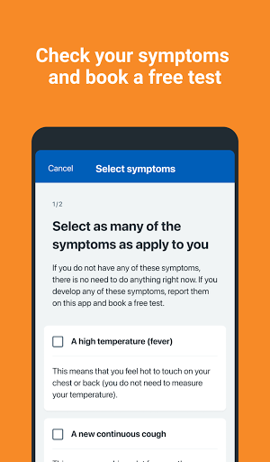
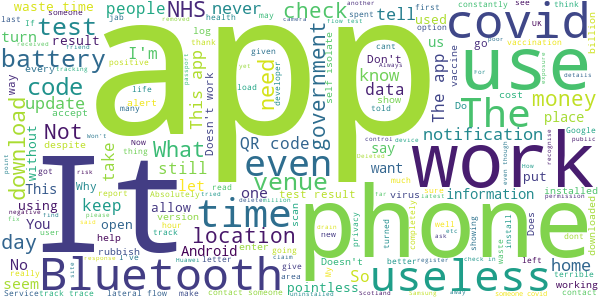

# NHS COVID-19
App version ``4.10 (189)``

Analyzed with [covid-apps-observer](http://github.com/covid-apps-observer) project, version ``0.1``

## App overview
| | |
|-------------------------|-------------------------| 
| **Name**                                          | NHS COVID-19 |
| **Unique identifier** | uk.nhs.covid19.production |
| **Link to Google Play** | [https://play.google.com/store/apps/details?id=uk.nhs.covid19.production](https://play.google.com/store/apps/details?id=uk.nhs.covid19.production) |
| **Summary**  | Protect your loved ones with the NHS contact tracing app for England and Wales. |
| **Privacy policy** | [https://covid19.nhs.uk/our-policies.html](https://covid19.nhs.uk/our-policies.html) |
| **Latest version** | 4.10 (189) |
| **Last update** | 2021-05-07 13:29:34 |
| **Recent changes** | You can now use the app on all Android tablets, as long as it has a mobile connection such as 4G or 5G. We have changed how you pause contact tracing to make it clearer when to do this. There are also accessibility improvements when using VoiceOver or Talkback with the app. |
| **Installs**  | 10,000,000+ |
| **Category** | Medical |
| **First release** | Aug 12, 2020 |
| **Size**  | 9.2M |
| **Supported Android version**  | 6.0 and up |

### Description
> The NHS COVID-19 app is the official contact tracing app for England and Wales. 
 It is the fastest way of knowing when you’re at risk from coronavirus. The quicker you know, the quicker you can alert your loved ones, and your community. 
 The more of us that use it, the better we can control coronavirus. 
 The app runs on proven software developed by Apple and Google, designed so that nobody will know who or where you are. And you can delete your data, or the app, at any time.
 It has a number of features: 
 Trace: Find out when you’ve been near other app users who have tested positive for coronavirus
 Alert: Lets you know the level of coronavirus risk in your postcode district. 
 Check-in: Use our simple QR code scanner to check-in to venues like bars and restaurants. You will get alerted if you have visited a venue where you may have come into contact with coronavirus.
 Symptoms: Check if you have coronavirus symptoms and see if you need to order a test. 
 Test: Helps you order a test if you need to.
 Isolate: Keep track of your self-isolation countdown and access relevant advice.
 Available in English, Welsh, Arabic (Modern Standard), Bengali, Chinese (Simplified), Gujarati, Polish, Punjabi (Gurmukhi script), Romanian, Somali, Turkish and Urdu.
 The app can be used across UK borders in England, Wales, Scotland, Northern Ireland, Jersey and Gibraltar, detecting all relevant contact tracing app users (regardless of them using different official apps), alerting them if they have been in contact with coronavirus. 
 The app has been built in collaboration with some of the most innovative organisations in the world. We have worked with medical experts, privacy groups, at-risk communities and we’ve shared knowledge with the teams working on similar apps in many countries.
 Protect your loved ones. Please download the app. 
 The app is UKCA marked as Class I medical device in the United Kingdom and developed in compliance with Medical Devices Regulations 2002 (SI 2002 No 618, as amended).

### User interface
The developers of the app provide the following screenshots in the Google play store.
| | | |
|:-------------------------:|:-------------------------:|:-------------------------:|
 |   |   |   | 
 |   |   |   | 
 |   |   |   | 
 |   |   |   | 
 |   |   |   | 

## Development team
In the following we report the main information provided by the development team in the Google play store.

| | |
|-------------------------|-------------------------|
| **Developer**  | Department of Health and Social Care |
| **Website**  | [https://covid19.nhs.uk/](https://covid19.nhs.uk/) |
| **Email** | NHSCovid-19AppStoreSupport@nhsbsa.nhs.uk |
| **Physical address**  | - |
| **Other developed apps**  | [https://play.google.com/store/apps/developer?id=Department+of+Health+and+Social+Care](https://play.google.com/store/apps/developer?id=Department+of+Health+and+Social+Care) |

## Android support

| | |
|-------------------------|-------------------------|
| **Declared target Android version**  | Android10, version 10 (API level 29) |
| **Effective target Android version**  | Android10, version 10 (API level 29) |
| **Minimum supported Android version**  | Marshmallow, version 6.0 (API level 23) |
| **Maximum target Android version**  | - |

The larger the difference between the minimum and maximum supported Android versions, the better. A larger difference means a wider audience. For example, old phones have a very low Android version, so a high minimum supported Android version means that the app cannot be used by users with old phones, thus leading to accessibility problems. 

## Requested permissions

In the following we report the complete list of the permissions requested by the app. 

| **Permission** | **Protection level** | **Description** | 
|-------------------------|-------------------------|-------------------------|
 **android.permission ACCESS_NETWORK_STATE** | Normal | Allows applications to access information about networks. 
 **android.permission BLUETOOTH** | Normal | Allows applications to connect to paired bluetooth devices. 
 **android.permission CAMERA** | :warning:**Dangerous** | Required to be able to access the camera device. 
 **android.permission FOREGROUND_SERVICE** | Normal | Allows a regular application to use Service.startForeground. 
 **android.permission INTERNET** | Normal | Allows applications to open network sockets. 
 **android.permission RECEIVE_BOOT_COMPLETED** | Normal | Allows an application to receive the Intent.ACTION_BOOT_COMPLETED that is broadcast after the system finishes booting. 
 **android.permission REQUEST_IGNORE_BATTERY_OPTIMIZATIONS** | Normal | Permission an application must hold in order to use Settings.ACTION_REQUEST_IGNORE_BATTERY_OPTIMIZATIONS. 
 **android.permission WAKE_LOCK** | Normal | Allows using PowerManager WakeLocks to keep processor from sleeping or screen from dimming. 

## Mentioned servers

| **Server** | **Registrant** | **Registrant country** | **Creation date** | 
|-------------------------|-------------------------|-------------------------|-------------------------|
 | google.com | Google LLC | :us: US | 1997-09-15 04:00:00 |
 | ietf.org | IETF Trust | :us: US | 1995-03-11 05:00:00 |
 | googleapis.com | Google LLC | :us: US | 2005-01-25 17:52:26 |
 | apache.org | The Apache Software Foundation | :us: US | 1995-04-11 04:00:00 |

## Security analysis 

Below we report the main security warnings raised by our execution of the [Androwarn](https://github.com/maaaaz/androwarn) security analysis tool.

**Connection interfaces exfiltration**
> - This application reads details about the currently active data network 
> - This application tries to find out if the currently active data network is metered 

**Suspicious connection establishment**
> - This application opens a Socket and connects it to the remote address ' returned no addresses for  ; port is out of range' on the 'N/A' port  
> - This application opens a Socket and connects it to the remote address '' on the 'N/A' port  
> - This application opens a Socket and connects it to the remote address 'Ljava/lang/StringBuilder;->toString()Ljava/lang/String;' on the 'N/A' port  
> - This application opens a Socket and connects it to the remote address 'Ljava/net/Proxy;->type()Ljava/net/Proxy$Type;' on the 'N/A' port  
> - This application opens a Socket and connects it to the remote address 'timeout' on the 'N/A' port  

**Code execution**
> - This application loads a native library 
> - This application loads a native library: 'Ljava/lang/String;->valueOf(Ljava/lang/Object;)Ljava/lang/String;' 

## User ratings and reviews

Below we provide information about how end users are reacting to the app in terms of ratings and reviews in the Google Play store.

### Ratings

The NHS COVID-19 app has been installed by more than **10000000** times. At this time, **108707** rated the app and its average score is **4.1177278**. Below we show the distribution of the ratings across the usual star-based rating of Google Play

:star::star::star::star::star:: 70663

:star::star::star::star:: 13495

:star::star::star:: 6374

:star::star:: 3037

:star:: 15138

### Reviews 

#### 5-star reviews

> For Your own safe, just follow the rules.  :date: __2021-05-22 16:09:45__

> very good service just what I needed  :date: __2021-05-22 13:57:40__

> very good and very easy to understand  :date: __2021-05-22 12:26:54__

> very useful and helpful and easy to use  :date: __2021-05-22 12:21:58__

> Lovely cafe in Renishaw Hall. very clean, great Covid practices. Good food and great coffees. Decor very civilised! Plenty of outdoor space - if only it would stop raining! Renishaw Gardens are well worth a visit  :date: __2021-05-22 11:55:45__

> works well and saves us lots of time  :date: __2021-05-22 11:30:39__

> Always aware --and tested every other week  :date: __2021-05-22 10:30:10__

> good app  :date: __2021-05-22 10:21:19__

> works great.  :date: __2021-05-22 09:25:18__

> Helps keep the country safe  :date: __2021-05-22 09:14:42__

#### 4-star reviews

> Good app but needs to include if you have had the vaccine  :date: __2021-05-22 13:35:44__

> Does'nt always work  :date: __2021-05-22 00:09:37__

> Easy to use and provides excellent information.  :date: __2021-05-21 16:57:45__

> BBC news have said covid: test and trace failure helped Indian variant spread, report says if this is true then so why waste £37bn on making this app.  :date: __2021-05-21 05:58:13__

> you have to scan in and put hand cream on then you wait till you are shown to a table, next you order a drink and your meal. very polite and friendly you are called up for your meal you tell the chef that you want then you return to wait for your meal and your drinks are brought to you. when you have eaten you leave bye a top door back to the carparck  :date: __2021-05-20 17:11:57__

> When the little symbol comes up on my phone, telling me it's loading, sometimes it doesn't go away for days. I've had that loading symbol on my phone now for three days, so I uninstalled and reinstalled. Had it there for a week before, then I got bored of it. Other than that, seems a good little app.  :date: __2021-05-20 09:24:12__

> Good app,.does what it does NHS why not add the ability to book a vaccination on the home page,.also vaccination history, this to bolster any future vaccination passport info if required  :date: __2021-05-19 12:58:04__

> Needs to be opened to Scotland. I don't see the point in have 2 apps... This makes more sense it is even named correctly.  :date: __2021-05-19 12:13:48__

> Hi when are you going to update to show proof of vaccination  :date: __2021-05-18 16:10:50__

> easy to use once you know how. There are no clear instructions.  :date: __2021-05-18 15:46:00__

#### 3-star reviews

> big brother is watching us😂  :date: __2021-05-22 12:05:31__

> As the restrictions change, the app doesn't always update to changes..... it's still saying we're in lockdown, but there are changes coming on 17th May...umm its nearly June now. Urgh. Other than that it seems ok for checking into venues etc.  :date: __2021-05-22 11:52:38__

> won't let me put my information into it so can be my personal information ie passport  :date: __2021-05-20 20:53:06__

> When will app be updated to show vaccination status for android phones?  :date: __2021-05-20 19:20:27__

> it's fine  :date: __2021-05-19 20:09:53__

> sometimes it goes wrong and don't let me get into it  :date: __2021-05-19 13:51:32__

> When will the app show vaccine record ?  :date: __2021-05-18 19:05:16__

> Why is the shortcut no longer available in my apps? It's been fine until this week (when ironically I've used it more!)  :date: __2021-05-18 16:42:54__

> 2 days after the May 17th restrictions easing and the app still hadn't updated.  :date: __2021-05-18 11:29:05__

> I was under the impression you could keep your vaccination data within this app due to the reports of fraudulent vaccination documents on the rise, could do with enhancing so you could input other relevant data.  :date: __2021-05-16 21:00:03__

#### 2-star reviews

> not great! not worth £37b  :date: __2021-05-22 13:21:28__

> It is for keeping updated in my area. It isn't updated very often.  :date: __2021-05-22 12:07:01__

> Annoying  :date: __2021-05-20 21:27:52__

> Annoying. Get pop ups "alerts" on my phone that disappear as soon as tap to look at them. Next door got Covid-19, app told me I was infected, despite never being in contact with them other than by text. Waste of NHS resources tbh ..  :date: __2021-05-20 20:16:05__

> Was very cross today when the app had disappeared off my tablet what's point of track and trace when you come to use it and it's gone had to reput it on  :date: __2021-05-20 12:09:32__

> Recently relocated quite a distance to discover there's no way to change your postcode on this app when you move house. Now the location information is out of date and useless.  :date: __2021-05-19 20:16:26__

> Had to uninstall as every I switched on it crashed my phone!  :date: __2021-05-19 07:58:09__

> Now does not allow me to stop scanning for an indefinite period, max 12 hrs. I live alone, I do not go near people, I might go into the local village or a shop once a week. I don't need it on very often I have blocked all notifications.  :date: __2021-05-18 19:09:58__

> When you try to scan the app, while checking in at a venue, it doesn't respond  :date: __2021-05-18 15:18:31__

> Others, like me, have been confused about which app to use to show your vaccination record. NOTE: You need the standard NHS app, linked to your medical records, to show that, NOT this one. My vaccination records show clearly in the NHS app.  :date: __2021-05-18 11:25:44__

#### 1-star reviews

> Inconsistent dates, track and trace tell you to of igore them on the phone, huge delay between registering a positive test and your contacts actually receiving a notification (even if they've been in the same room all day)  :date: __2021-05-22 17:13:48__

> The app wouldn't even recognise the letter l meaning that the test results were impossible to put in. And considering we had to buy a new phone to get the app. The app is downright useless for us  :date: __2021-05-22 17:07:06__

> rubbish  :date: __2021-05-22 16:39:55__

> App is awful and I can't use it, turned it on and in 15 minutes the Bluetooth used almost 40 percent of phones power. So unless my Bluetooth is broken somehow that's not a workable amount of power drain  :date: __2021-05-22 16:03:03__

> doesn't even work on my phone what a joke  :date: __2021-05-22 14:16:36__

> Worst use of taxpayers money- wasting battery of users ALL THE TIME  :date: __2021-05-22 12:37:34__

> Doesn't scan the QR codes  :date: __2021-05-22 10:06:59__

> Not worth the £35 million it cost us to produce  :date: __2021-05-22 00:15:54__

> Rubbish app, have had both jabs an can't show IV had them.  :date: __2021-05-21 20:48:39__

> App will no longer open for the last week or so, just hangs on the black nhs covid loadscreen. Had no issues until recently. Samsung S21 ultra.  :date: __2021-05-21 15:24:52__

