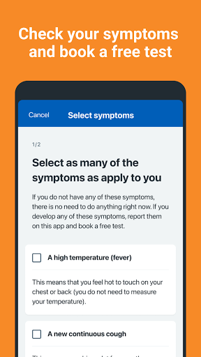
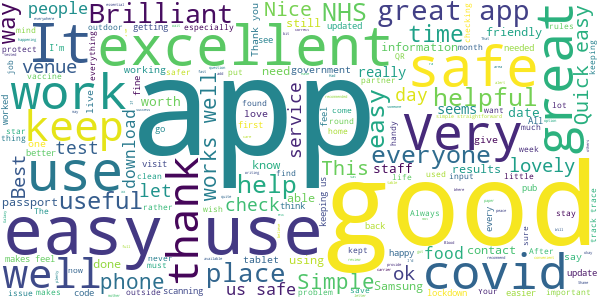
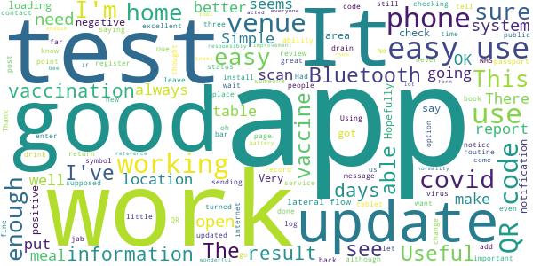

# NHS COVID-19
App version ``4.10 (189)``

Analyzed with [covid-apps-observer](http://github.com/covid-apps-observer) project, version ``0.1``

## App overview
| | |
|-------------------------|-------------------------| 
| **Name**&nbsp;&nbsp;&nbsp;&nbsp;&nbsp;&nbsp;&nbsp;&nbsp;&nbsp;&nbsp;&nbsp;&nbsp;&nbsp;&nbsp;&nbsp;&nbsp;&nbsp;&nbsp;&nbsp;&nbsp;&nbsp;&nbsp;&nbsp;&nbsp;&nbsp;&nbsp;&nbsp;&nbsp;&nbsp;&nbsp;&nbsp;&nbsp;&nbsp;&nbsp;&nbsp;&nbsp;&nbsp;&nbsp;&nbsp;&nbsp;  | NHS COVID-19 |
| **Unique identifier** | uk.nhs.covid19.production |
| **Link to Google Play** | [https://play.google.com/store/apps/details?id=uk.nhs.covid19.production](https://play.google.com/store/apps/details?id=uk.nhs.covid19.production) |
| **Summary**  | Protect your loved ones with the NHS contact tracing app for England and Wales. |
| **Privacy policy** | [https://covid19.nhs.uk/our-policies.html](https://covid19.nhs.uk/our-policies.html) |
| **Latest version** | 4.10 (189) |
| **Last update** | 2021-05-07 13:29:34 |
| **Recent changes** | You can now use the app on all Android tablets, as long as it has a mobile connection such as 4G or 5G. We have changed how you pause contact tracing to make it clearer when to do this. There are also accessibility improvements when using VoiceOver or Talkback with the app. |
| **Installs**  | 10,000,000+ |
| **Category** | Medical |
| **First release** | Aug 12, 2020 |
| **Size**  | 9.2M |
| **Supported Android version**  | 6.0 and up |

### Description
> The NHS COVID-19 app is the official contact tracing app for England and Wales. 
 It is the fastest way of knowing when you’re at risk from coronavirus. The quicker you know, the quicker you can alert your loved ones, and your community. 
 The more of us that use it, the better we can control coronavirus. 
 The app runs on proven software developed by Apple and Google, designed so that nobody will know who or where you are. And you can delete your data, or the app, at any time.
 It has a number of features: 
 Trace: Find out when you’ve been near other app users who have tested positive for coronavirus
 Alert: Lets you know the level of coronavirus risk in your postcode district. 
 Check-in: Use our simple QR code scanner to check-in to venues like bars and restaurants. You will get alerted if you have visited a venue where you may have come into contact with coronavirus.
 Symptoms: Check if you have coronavirus symptoms and see if you need to order a test. 
 Test: Helps you order a test if you need to.
 Isolate: Keep track of your self-isolation countdown and access relevant advice.
 Available in English, Welsh, Arabic (Modern Standard), Bengali, Chinese (Simplified), Gujarati, Polish, Punjabi (Gurmukhi script), Romanian, Somali, Turkish and Urdu.
 The app can be used across UK borders in England, Wales, Scotland, Northern Ireland, Jersey and Gibraltar, detecting all relevant contact tracing app users (regardless of them using different official apps), alerting them if they have been in contact with coronavirus. 
 The app has been built in collaboration with some of the most innovative organisations in the world. We have worked with medical experts, privacy groups, at-risk communities and we’ve shared knowledge with the teams working on similar apps in many countries.
 Protect your loved ones. Please download the app. 
 The app is UKCA marked as Class I medical device in the United Kingdom and developed in compliance with Medical Devices Regulations 2002 (SI 2002 No 618, as amended).

### User interface
The developers of the app provide the following screenshots in the Google play store.
| | | |
|:-------------------------:|:-------------------------:|:-------------------------:|
 |   |   |   | 
 |   |   |   | 
 |   |   |   | 
 |   |   |   | 
 |   |   |   | 

## Development team
In the following we report the main information provided by the development team in the Google play store.

| | |
|-------------------------|-------------------------|
| **Developer**  | Department of Health and Social Care |
| **Website**  | [https://covid19.nhs.uk/](https://covid19.nhs.uk/) |
| **Email** | NHSCovid-19AppStoreSupport@nhsbsa.nhs.uk |
| **Physical address**  | - |
| **Other developed apps**  | [https://play.google.com/store/apps/developer?id=Department+of+Health+and+Social+Care](https://play.google.com/store/apps/developer?id=Department+of+Health+and+Social+Care) |

## Android support

| | |
|-------------------------|-------------------------|
| **Declared target Android version**  | Android10, version 10 (API level 29) |
| **Effective target Android version**  | Android10, version 10 (API level 29) |
| **Minimum supported Android version**  | Marshmallow, version 6.0 (API level 23) |
| **Maximum target Android version**  | - |

The larger the difference between the minimum and maximum supported Android versions, the better. A larger difference means a wider audience. For example, old phones have a very low Android version, so a high minimum supported Android version means that the app cannot be used by users with old phones, thus leading to accessibility problems. 

## Requested permissions

In the following we report the complete list of the permissions requested by the app. 

| **Permission** | **Protection level** | **Description** | 
|-------------------------|-------------------------|-------------------------|
 **android.permission ACCESS_NETWORK_STATE** | Normal | Allows applications to access information about networks. 
 **android.permission BLUETOOTH** | Normal | Allows applications to connect to paired bluetooth devices. 
 **android.permission CAMERA** | :warning:**Dangerous** | Required to be able to access the camera device. 
 **android.permission FOREGROUND_SERVICE** | Normal | Allows a regular application to use Service.startForeground. 
 **android.permission INTERNET** | Normal | Allows applications to open network sockets. 
 **android.permission RECEIVE_BOOT_COMPLETED** | Normal | Allows an application to receive the Intent.ACTION_BOOT_COMPLETED that is broadcast after the system finishes booting. 
 **android.permission REQUEST_IGNORE_BATTERY_OPTIMIZATIONS** | Normal | Permission an application must hold in order to use Settings.ACTION_REQUEST_IGNORE_BATTERY_OPTIMIZATIONS. 
 **android.permission WAKE_LOCK** | Normal | Allows using PowerManager WakeLocks to keep processor from sleeping or screen from dimming. 

## Mentioned servers

| **Server** | **Registrant** | **Registrant country** | **Creation date** | 
|-------------------------|-------------------------|-------------------------|-------------------------|
 | google.com | Google LLC | :us: US | 1997-09-15 04:00:00 |
 | ietf.org | IETF Trust | :us: US | 1995-03-11 05:00:00 |
 | googleapis.com | Google LLC | :us: US | 2005-01-25 17:52:26 |
 | apache.org | The Apache Software Foundation | :us: US | 1995-04-11 04:00:00 |

## Security analysis 

Below we report the main security warnings raised by our execution of the [Androwarn](https://github.com/maaaaz/androwarn) security analysis tool.

**Connection interfaces exfiltration**
> - This application reads details about the currently active data network 
> - This application tries to find out if the currently active data network is metered 

**Suspicious connection establishment**
> - This application opens a Socket and connects it to the remote address ' returned no addresses for  ; port is out of range' on the 'N/A' port  
> - This application opens a Socket and connects it to the remote address '' on the 'N/A' port  
> - This application opens a Socket and connects it to the remote address 'Ljava/lang/StringBuilder;->toString()Ljava/lang/String;' on the 'N/A' port  
> - This application opens a Socket and connects it to the remote address 'Ljava/net/Proxy;->type()Ljava/net/Proxy$Type;' on the 'N/A' port  
> - This application opens a Socket and connects it to the remote address 'timeout' on the 'N/A' port  

**Code execution**
> - This application loads a native library 
> - This application loads a native library: 'Ljava/lang/String;->valueOf(Ljava/lang/Object;)Ljava/lang/String;' 

## User ratings and reviews

Below we provide information about how end users are reacting to the app in terms of ratings and reviews in the Google Play store.

### Ratings

The NHS COVID-19 app has been installed by more than **10000000** times. At this time, **108707** rated the app and its average score is **4.1177278**. Below we show the distribution of the ratings across the usual star-based rating of Google Play

:star::star::star::star::star:: 70663

:star::star::star::star:: 13495

:star::star::star:: 6374

:star::star:: 3037

:star:: 15138

### Reviews 

#### 5-star reviews

> easy to use and very comforting.thank you NHS for backing us and all ur efforts at all levels.  :date: __2021-06-06 14:17:03__

> Very easy to use at places I'd rather use this app than write on a piece of paper. It's quick and easy.  :date: __2021-06-06 12:30:15__

> Easy to use  :date: __2021-06-06 10:53:32__

> Easy to use and reassuring.  :date: __2021-06-05 20:56:45__

> A okay.  :date: __2021-06-05 20:44:18__

> better than writing 🙂  :date: __2021-06-05 20:03:38__

> All good  :date: __2021-06-05 19:15:42__

> Always excellent food and service. Excellent quality and brilliant staff. Highly recommend.  :date: __2021-06-05 18:49:55__

> Keep me up to date  :date: __2021-06-05 18:42:51__

> View good.Worth having.  :date: __2021-06-05 18:30:03__

#### 4-star reviews

> Easy to use and useful for reference  :date: __2021-06-06 13:15:22__

> Simple to use, but can't see my jab record!  :date: __2021-06-06 11:10:58__

> If everyone acted responsibly this app is a wonderful tool to enable us to return to some form of normality!  :date: __2021-06-06 10:53:39__

> There is always room for improvement.  :date: __2021-06-05 21:06:11__

> can drain the battery but important to use  :date: __2021-06-05 16:01:52__

> The bee's knees  :date: __2021-06-05 13:42:09__

> works a lot better now  :date: __2021-06-05 13:11:31__

> Easy to install  :date: __2021-06-04 19:52:38__

> h,,h,oh,,,,88 is the ň⁵55555555⁵5555555555555555555555555555555555555555555555555555555555555þ⁵⁵  :date: __2021-06-04 14:22:13__

> It asked for a review all I was checking in.  :date: __2021-06-03 21:35:20__

#### 3-star reviews

> Health Secretary just stated on Andrew Marr show this app shows your Vaccination status!!!! Really? Where?  :date: __2021-06-06 10:54:42__

> It is a decent app for what it is used for, it would be great if we could input our vaccinations so that we know who is vaccinated and who isnt  :date: __2021-06-05 11:35:55__

> bbc.co.uk/news/business-57355599 "Instead of self isolating for 10 days, Mr Gove will take daily Covid tests as part of a pilot scheme .…" When I can join this pilot scheme maybe I will turn the bluetooth back on. I don't fancy starving in my flat for 10 days, to be honest.  :date: __2021-06-04 23:58:37__

> I'm not sure what happened, worked fine to begin with. Now I keep getting pop ups to say app isn't responding and I can't book in to any venue  :date: __2021-06-04 20:39:21__

> It's OK for accessing info but doesn't benefit the user much other than that. They could've included a link to a Covid map of the UK for instance.  :date: __2021-06-04 00:14:58__

> Works well but my only gripe is that you can't sign out of a venue. If I go to a cafe, pub or restaurant at lunchtime it shows that I'm in there for 12 hours!  :date: __2021-06-03 11:03:07__

> Good but to complicated to understand  :date: __2021-06-02 18:02:47__

> We are being asked to take lateral flow tests 2 times a week but the app does not accept home lateral flow test strip code so cannot report result The response, while correctly describing the current functionality, highlights fundamental short commings with test and trace which is distributed between several disconnected apps and has no facility for reporting the equally important negative tests. I recommend also reporting on the zoe app  :date: __2021-06-02 12:22:10__

> I have a problem in my result test code it says could not recognise the code  :date: __2021-06-01 17:47:12__

> OK but doesn't recognise my covid test results  :date: __2021-06-01 12:53:22__

#### 2-star reviews

> Why doesn't the app show my vaccine status?  :date: __2021-06-06 11:47:13__

> doesn't work properly  :date: __2021-06-05 10:17:14__

> needs persistence to use!  :date: __2021-06-04 11:17:14__

> It worked fine at first but since turning my Bluetooth off at home I'm getting constant error messages saying it's stopped working. Tried uninstall/ reinstall and no change. Can't access the app at all now.  :date: __2021-06-03 20:49:46__

> It requires Bluetooth to be on to work properly, which drains my battery SO FAST.  :date: __2021-06-03 18:38:36__

> tried to register a lateral flow test app asked for identical phone numbers. did this app refused them repeàtedly saying not identical. even two other people trying independently on my phone failed. test not registered and so, in part wasted as far as greater good concerned. bit elementary reàlly.  :date: __2021-06-03 15:12:53__

> most qr codes.dont work  :date: __2021-06-03 12:33:29__

> awwwww and I will wwwwww2w2w222w22w  :date: __2021-06-02 14:26:03__

> Permeant notification that cannot be dismissed if bluetooth is off. Results in the following user behaviour.. Install app to check-in at venue. Immediately delete the app after checking in. Reinstall it everytime I am asked to check-in somewhere else.  :date: __2021-06-01 11:11:28__

> Annoying beeps at you all the time have had to turn off my notifications untill I need to use the app.  :date: __2021-05-30 20:34:57__

#### 1-star reviews

> Doesn't even work properly, tried to scan and it doesn't give you time to focus my camera on the code. Utterly useless and a waste of time.  :date: __2021-06-06 12:12:21__

> Not for N Ireland  :date: __2021-06-06 10:50:13__

> fake virus  :date: __2021-06-06 10:27:04__

> Matt Hancock on Sky today said his test results are on Covid 19 test results and advised we can also check our own on the app. What NHS Covid 19 App is he referring to as I can not see any reference to my tests or is it another of the Cummings lies? It just isn't there. Please enlighten me if I need an optician?  :date: __2021-06-06 10:01:17__

> Not opening anymore.  :date: __2021-06-06 00:02:10__

> Very poor its impossible to use this app  :date: __2021-06-05 23:22:55__

> Rewards for using this app include being tracked by corrupt company called Serco, £37 billion of UK Taxpayers money being wasted, and 10 days off work with no pay. No thanks. Deleted  :date: __2021-06-05 23:20:40__

> even with app off in settings it manages to turn itself on again...how on earth this is in the app store I don't know.... thank God for tasker!  :date: __2021-06-05 20:41:34__

> Invasive and unhelpful  :date: __2021-06-05 20:21:06__

> I did not get any notifation on this app to self isolate for 10 days after I received communication to do so.  :date: __2021-06-05 20:20:13__

