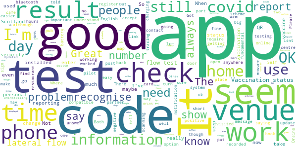
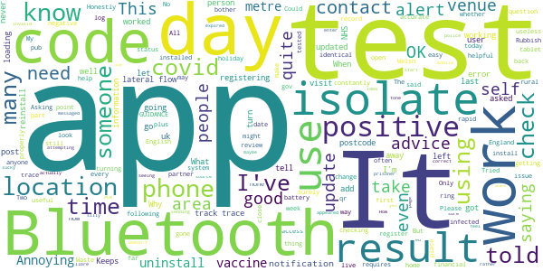

# NHS COVID-19
App version ``4.12 (201)``

Analyzed with [covid-apps-observer](http://github.com/covid-apps-observer) project, version ``0.1``

## App overview
| | |
|-------------------------|-------------------------| 
| **Name**                                          | NHS COVID-19 |
| **Unique identifier** | uk.nhs.covid19.production |
| **Link to Google Play** | [https://play.google.com/store/apps/details?id=uk.nhs.covid19.production](https://play.google.com/store/apps/details?id=uk.nhs.covid19.production) |
| **Summary**  | Protect your loved ones with the NHS contact tracing app for England and Wales. |
| **Privacy policy** | [https://covid19.nhs.uk/our-policies.html](https://covid19.nhs.uk/our-policies.html) |
| **Latest version** | 4.12 (201) |
| **Last update** | 2021-06-07 19:23:29 |
| **Recent changes** | You can now book a follow-up test (using the app) if you test positive from a rapid lateral flow test taken at a test site. Other updates include improved content changes, bug fixes and accessibility improvements. |
| **Installs**  | 10,000,000+ |
| **Category** | Medical |
| **First release** | Aug 12, 2020 |
| **Size**  | 9.3M |
| **Supported Android version**  | 6.0 and up |

### Description
> The NHS COVID-19 app is the official contact tracing app for England and Wales. For vaccination status (England only) use the separate NHS app, go to www.nhs.uk/app
 It is the fastest way of knowing when you’re at risk from coronavirus. The quicker you know, the quicker you can alert your loved ones, and your community.
 The more of us that use it, the better we can control coronavirus.
 The app runs on proven software developed by Apple and Google, designed so that nobody will know who or where you are. And you can delete your data, or the app, at any time.
 It has a number of features:
 Trace: Find out when you’ve been near other app users who have tested positive for coronavirus
 Alert: Lets you know the level of coronavirus risk in your postcode district.
 Check-in: Use our simple QR code scanner to check-in to venues like bars and restaurants. You will get alerted if you have visited a venue where you may have come into contact with coronavirus.
 Symptoms: Check if you have coronavirus symptoms and see if you need to order a test.
 Test: Helps you order a test if you need to.
 Isolate: Keep track of your self-isolation countdown and access relevant advice.
 Available in English, Welsh, Arabic (Modern Standard), Bengali, Chinese (Simplified), Gujarati, Polish, Punjabi (Gurmukhi script), Romanian, Somali, Turkish and Urdu.
 The app can be used across UK borders in England, Wales, Scotland, Northern Ireland, Jersey and Gibraltar, detecting all relevant contact tracing app users (regardless of them using different official apps), alerting them if they have been in contact with coronavirus.
 The app has been built in collaboration with some of the most innovative organisations in the world. We have worked with medical experts, privacy groups, at-risk communities and we’ve shared knowledge with the teams working on similar apps in many countries.
 Protect your loved ones. Please download the app.
 The app is UKCA marked as Class I medical device in the United Kingdom and developed in compliance with Medical Devices Regulations 2002 (SI 2002 No 618, as amended).

### User interface
The developers of the app provide the following screenshots in the Google play store.
| | | |
|:-------------------------:|:-------------------------:|:-------------------------:|
 |   |   |   | 
 |   |   |   | 
 |   |   |   | 
 |   |   |   | 
 |   |   |   | 

## Development team
In the following we report the main information provided by the development team in the Google play store.

| | |
|-------------------------|-------------------------|
| **Developer**  | Department of Health and Social Care |
| **Website**  | [https://covid19.nhs.uk/](https://covid19.nhs.uk/) |
| **Email** | NHSCovid-19AppStoreSupport@nhsbsa.nhs.uk |
| **Physical address**  | - |
| **Other developed apps**  | [https://play.google.com/store/apps/developer?id=Department+of+Health+and+Social+Care](https://play.google.com/store/apps/developer?id=Department+of+Health+and+Social+Care) |

## Android support

| | |
|-------------------------|-------------------------|
| **Declared target Android version**  | Android10, version 10 (API level 29) |
| **Effective target Android version**  | Android10, version 10 (API level 29) |
| **Minimum supported Android version**  | Marshmallow, version 6.0 (API level 23) |
| **Maximum target Android version**  | - |

The larger the difference between the minimum and maximum supported Android versions, the better. A larger difference means a wider audience. For example, old phones have a very low Android version, so a high minimum supported Android version means that the app cannot be used by users with old phones, thus leading to accessibility problems. 

## Requested permissions

In the following we report the complete list of the permissions requested by the app. 

| **Permission** | **Protection level** | **Description** | 
|-------------------------|-------------------------|-------------------------|
 **android.permission ACCESS_NETWORK_STATE** | Normal | Allows applications to access information about networks. 
 **android.permission BLUETOOTH** | Normal | Allows applications to connect to paired bluetooth devices. 
 **android.permission CAMERA** | :warning:**Dangerous** | Required to be able to access the camera device. 
 **android.permission FOREGROUND_SERVICE** | Normal | Allows a regular application to use Service.startForeground. 
 **android.permission INTERNET** | Normal | Allows applications to open network sockets. 
 **android.permission RECEIVE_BOOT_COMPLETED** | Normal | Allows an application to receive the Intent.ACTION_BOOT_COMPLETED that is broadcast after the system finishes booting. 
 **android.permission REQUEST_IGNORE_BATTERY_OPTIMIZATIONS** | Normal | Permission an application must hold in order to use Settings.ACTION_REQUEST_IGNORE_BATTERY_OPTIMIZATIONS. 
 **android.permission WAKE_LOCK** | Normal | Allows using PowerManager WakeLocks to keep processor from sleeping or screen from dimming. 

## Mentioned servers

| **Server** | **Registrant** | **Registrant country** | **Creation date** | 
|-------------------------|-------------------------|-------------------------|-------------------------|
 | google.com | Google LLC | :us: US | 1997-09-15 04:00:00 |
 | ietf.org | IETF Trust | :us: US | 1995-03-11 05:00:00 |
 | googleapis.com | Google LLC | :us: US | 2005-01-25 17:52:26 |
 | apache.org | The Apache Software Foundation | :us: US | 1995-04-11 04:00:00 |

## Security analysis 

Below we report the main security warnings raised by our execution of the [Androwarn](https://github.com/maaaaz/androwarn) security analysis tool.

**Connection interfaces exfiltration**
> - This application reads details about the currently active data network 
> - This application tries to find out if the currently active data network is metered 

**Suspicious connection establishment**
> - This application opens a Socket and connects it to the remote address ' returned no addresses for  ; port is out of range' on the 'N/A' port  
> - This application opens a Socket and connects it to the remote address '' on the 'N/A' port  
> - This application opens a Socket and connects it to the remote address 'Ljava/lang/StringBuilder;->toString()Ljava/lang/String;' on the 'N/A' port  
> - This application opens a Socket and connects it to the remote address 'Ljava/net/Proxy;->type()Ljava/net/Proxy$Type;' on the 'N/A' port  
> - This application opens a Socket and connects it to the remote address 'timeout' on the 'N/A' port  

**Code execution**
> - This application loads a native library 
> - This application loads a native library: 'Ljava/lang/String;->valueOf(Ljava/lang/Object;)Ljava/lang/String;' 

## User ratings and reviews

Below we provide information about how end users are reacting to the app in terms of ratings and reviews in the Google Play store.

### Ratings

The NHS COVID-19 app has been installed by more than **10000000** times. At this time, **119821** rated the app and its average score is **4.4588833**. Below we show the distribution of the ratings across the usual star-based rating of Google Play

:star::star::star::star::star:: 88571

:star::star::star::star:: 15660

:star::star::star:: 5747

:star::star:: 1690

:star:: 8153

### Reviews 

#### 5-star reviews

> Makes life slot Easier  :date: __2021-06-27 21:53:31__

> good  :date: __2021-06-27 21:09:44__

> Outstanding place food drinks, atmosphere  :date: __2021-06-27 20:54:58__

> Must have app easily the best of it's kind  :date: __2021-06-27 20:32:37__

> Great service well organised impressed by track and, trace.  :date: __2021-06-27 19:17:15__

> Like it  :date: __2021-06-27 15:51:24__

> Have had miked symptoms  :date: __2021-06-27 13:23:47__

> quick and easy to use all for the app. Great idea it can keep a track on this virus quickly.  :date: __2021-06-27 13:02:18__

> so easy to use especially when checking into places  :date: __2021-06-27 11:37:05__

> App is constantly giving a loading notification which used to disappear once app was loaded, now it just sits there. The app seems to be loading all the time, so far been notified that it has loaded 7 times this morning. Please fix this as this didn't happen before recent update. When fixed will change rating.  :date: __2021-06-27 09:34:46__

#### 4-star reviews

> not like there are a choice of apps is there. but the little I've used it, it works  :date: __2021-06-27 13:42:27__

> would be better if you could register a flow test result.  :date: __2021-06-27 12:21:21__

> Easy to use seems to work, well done NHS (yet again)  :date: __2021-06-25 20:28:10__

> uses too much data  :date: __2021-06-25 20:01:51__

> After the first time locating the app on device ...quick and easy.  :date: __2021-06-25 15:33:42__

> Can there not be an option on the app to show you have had your full vaccinations  :date: __2021-06-25 09:14:33__

> The need to use a QR colour coding system is still essential  :date: __2021-06-25 06:27:28__

> Really good, but Uses a lot of battery power  :date: __2021-06-24 13:27:49__

> Please could you tell me how to obtain that 8 character code to link my covid test result to this app? I had my covid test in February but like many others had not been provided with that code. I only know my test receipt card barcode number and nhs test and trace account ID and password. That's really disappointing.  :date: __2021-06-23 13:44:19__

> How can I get this Covid-19 on my phone it said it will b coming soon  :date: __2021-06-22 20:18:58__

#### 3-star reviews

> good  :date: __2021-06-26 20:51:38__

> Appears to be doing what it is meant to do. No problems. Didn't register at two hotels in Scotland.  :date: __2021-06-26 16:03:54__

> Where is the access for people living in Wales? It should be live..  :date: __2021-06-26 11:54:44__

> Seems to work well WHEN codes are displayed on the doors of shops, cafes, restaurants/bars/pubs. So probably a good idea to keep it going. Please ensure more facilities subscribe to the message x  :date: __2021-06-25 14:14:43__

> Got a notification of being in distance of a positive covid person but it doesn't tell me when and where so how can I ensure I tell the people who I've been in contact with and why did I get it but not my fiance who has been in the same places? Bit ridiculous really as no answer or online chat to confirm answers to our questions.  :date: __2021-06-25 12:45:23__

> I thought you could put your jab status in but seems you can't  :date: __2021-06-24 21:24:18__

> need to remove on Google maps once left venue,  :date: __2021-06-24 17:52:23__

> Reassuring if I have to go out anywhere (though it should recognise when I'm at home, and not get stroppy about me turning it off then!) It could do with the actual information I require rather than sending me to the NHS England page to follow the rabbit hole. What I just want to know is what level of infection is in my area. A simple red/amber/green light would suffice, letting me know if it's safe to go out or not.  :date: __2021-06-24 09:39:22__

> Poor....will not accept my post code, IOM, even though we are being told to use this to demonstrate vacination status  :date: __2021-06-24 00:12:32__

> There seems to be a fundamental problem with the messaging for the use of this app, and that is that it's just as important to check out as check in. If you don't check out, then it marks that you've been there until 23.59 that day, even if you were in at 08.00 for 10mins. So if someone reports testing positive and visited the same place as you on the same day, you both may be recorded as having visited at the same time and be contacted, even if that wasn't the case! BAM. Self-Isolation.  :date: __2021-06-21 18:12:16__

#### 2-star reviews

> No idea whether it's working or not... (maybe just lucky, who knows?).  :date: __2021-06-27 19:52:33__

> Doesn't work yes you can check in but it doesn't actually work to track and trace on my mobile just get an error code. Only good for checking in.  :date: __2021-06-25 23:30:55__

> No sure about this app feel its rather silly sending out ring tone to tell you you might have covid, seeing as 20 people tested after the ring where negative.  :date: __2021-06-25 20:44:42__

> How do I add contacts once I've got a positive covid result?  :date: __2021-06-25 09:20:23__

> When attempting to enter my PCR test result on the app and error messaged appeared saying my code is invalid or expired and won't add my result to the app. My test result was positive and noe it won't take me to the test and trace page. What do I do?  :date: __2021-06-25 08:20:14__

> Asking me to review this is like asking me as a prisoner to review the police  :date: __2021-06-24 21:49:15__

> Please make this app open source/libre like the eu ones and i will start using it  :date: __2021-06-23 08:43:12__

> Told me to self isolate which was correct,however when applying for financial help it kept saying"sorry there is a problem with this service".Also after registering it never sent me my nhs track and trace I.d  :date: __2021-06-22 14:24:23__

> App registers you into locations until 23:59 the day you visit so you may get an alert based on an infected person who arrived hours after you left. Two out of the only 4 people I met last Thursday forced to isolate, surely should have been all or none? All double jabbed and none tested positive yet BTW...  :date: __2021-06-21 23:30:19__

> Most of the app is user friendly but using Bluetooth only is a bad design. What happens with those who live in remote/rural areas; how will their Bluetooth connect? Why not wireless or even 3G, or would that cost another several billion pounds to implement...  :date: __2021-06-21 18:51:21__

#### 1-star reviews

> Liars  :date: __2021-06-28 01:36:05__

> Doesn't work  :date: __2021-06-27 23:48:24__

> Since a recent update the app is now draining my battery. The battery monitor shows that Bluetooth today used 74% of my battery since the last full charge. Today, contact tracing was the only thing using my Bluetooth.  :date: __2021-06-27 23:12:16__

> Doesn't load  :date: __2021-06-27 19:17:06__

> Made me get off with my workmate. Wouldn't recommend tbh.  :date: __2021-06-27 18:43:29__

> Matt Hancock is a disgrace to this country.  :date: __2021-06-27 17:40:55__

> Will not scan QR codes for various venues I've been at.  :date: __2021-06-27 16:31:13__

> Bluetooth range can reach 160m open range (outside) and go through walls... That's not "close contact"  :date: __2021-06-27 15:36:44__

> False flag !!! Where is 0 Stars? 4.1 stars 😂 how it's possible when most of opinions are 1 star only 😂 Biggest FAKE ever !!! NHS come on , come on don't be so silly , we people are not so stupid as YOU think... It's genocide blind sheep's...  :date: __2021-06-27 15:26:00__

> Will not scan.  :date: __2021-06-27 15:00:13__

