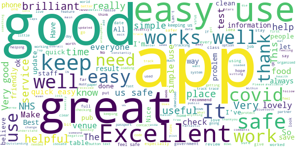
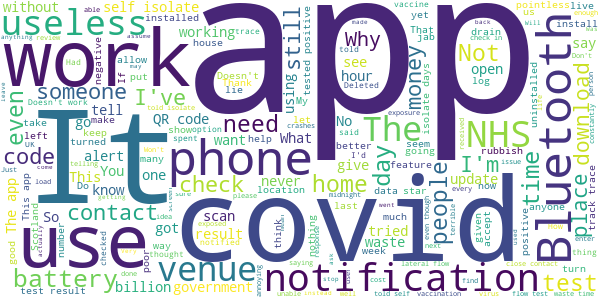

# NHS COVID-19
App version ``4.12 (201)``

Analyzed with [covid-apps-observer](http://github.com/covid-apps-observer) project, version ``0.1``

## App overview
| | |
|-------------------------|-------------------------| 
| **Name**&nbsp;&nbsp;&nbsp;&nbsp;&nbsp;&nbsp;&nbsp;&nbsp;&nbsp;&nbsp;&nbsp;&nbsp;&nbsp;&nbsp;&nbsp;&nbsp;&nbsp;&nbsp;&nbsp;&nbsp;&nbsp;&nbsp;&nbsp;&nbsp;&nbsp;&nbsp;&nbsp;&nbsp;&nbsp;&nbsp;&nbsp;&nbsp;&nbsp;&nbsp;&nbsp;&nbsp;&nbsp;&nbsp;&nbsp;&nbsp;  | NHS COVID-19 |
| **Unique identifier** | uk.nhs.covid19.production |
| **Link to Google Play** | [https://play.google.com/store/apps/details?id=uk.nhs.covid19.production](https://play.google.com/store/apps/details?id=uk.nhs.covid19.production) |
| **Summary**  | Protect your loved ones with the NHS contact tracing app for England and Wales. |
| **Privacy policy** | [https://covid19.nhs.uk/our-policies.html](https://covid19.nhs.uk/our-policies.html) |
| **Latest version** | 4.12 (201) |
| **Last update** | 2021-06-07 19:23:29 |
| **Recent changes** | You can now book a follow-up test (using the app) if you test positive from a rapid lateral flow test taken at a test site. Other updates include improved content changes, bug fixes and accessibility improvements. |
| **Installs**  | 10,000,000+ |
| **Category** | Medical |
| **First release** | Aug 12, 2020 |
| **Size**  | 9.3M |
| **Supported Android version**  | 6.0 and up |

### Description
> The NHS COVID-19 app is the official contact tracing app for England and Wales. For vaccination status (England only) use the separate NHS app, go to www.nhs.uk/app
 It is the fastest way of knowing when you’re at risk from coronavirus. The quicker you know, the quicker you can alert your loved ones, and your community.
 The more of us that use it, the better we can control coronavirus.
 The app runs on proven software developed by Apple and Google, designed so that nobody will know who or where you are. And you can delete your data, or the app, at any time.
 It has a number of features:
 Trace: Find out when you’ve been near other app users who have tested positive for coronavirus
 Alert: Lets you know the level of coronavirus risk in your postcode district.
 Check-in: Use our simple QR code scanner to check-in to venues like bars and restaurants. You will get alerted if you have visited a venue where you may have come into contact with coronavirus.
 Symptoms: Check if you have coronavirus symptoms and see if you need to order a test.
 Test: Helps you order a test if you need to.
 Isolate: Keep track of your self-isolation countdown and access relevant advice.
 Available in English, Welsh, Arabic (Modern Standard), Bengali, Chinese (Simplified), Gujarati, Polish, Punjabi (Gurmukhi script), Romanian, Somali, Turkish and Urdu.
 The app can be used across UK borders in England, Wales, Scotland, Northern Ireland, Jersey and Gibraltar, detecting all relevant contact tracing app users (regardless of them using different official apps), alerting them if they have been in contact with coronavirus.
 The app has been built in collaboration with some of the most innovative organisations in the world. We have worked with medical experts, privacy groups, at-risk communities and we’ve shared knowledge with the teams working on similar apps in many countries.
 Protect your loved ones. Please download the app.
 The app is UKCA marked as Class I medical device in the United Kingdom and developed in compliance with Medical Devices Regulations 2002 (SI 2002 No 618, as amended).

### User interface
The developers of the app provide the following screenshots in the Google play store.
| | | |
|:-------------------------:|:-------------------------:|:-------------------------:|
 |   |   |   | 
 |   |   |   | 
 |   |   |   | 
 |   |   |   | 
 |   |   |   | 

## Development team
In the following we report the main information provided by the development team in the Google play store.

| | |
|-------------------------|-------------------------|
| **Developer**  | Department of Health and Social Care |
| **Website**  | [https://covid19.nhs.uk/](https://covid19.nhs.uk/) |
| **Email** | NHSCovid-19AppStoreSupport@nhsbsa.nhs.uk |
| **Physical address**  | - |
| **Other developed apps**  | [https://play.google.com/store/apps/developer?id=Department+of+Health+and+Social+Care](https://play.google.com/store/apps/developer?id=Department+of+Health+and+Social+Care) |

## Android support

| | |
|-------------------------|-------------------------|
| **Declared target Android version**  | Android10, version 10 (API level 29) |
| **Effective target Android version**  | Android10, version 10 (API level 29) |
| **Minimum supported Android version**  | Marshmallow, version 6.0 (API level 23) |
| **Maximum target Android version**  | - |

The larger the difference between the minimum and maximum supported Android versions, the better. A larger difference means a wider audience. For example, old phones have a very low Android version, so a high minimum supported Android version means that the app cannot be used by users with old phones, thus leading to accessibility problems. 

## Requested permissions

In the following we report the complete list of the permissions requested by the app. 

| **Permission** | **Protection level** | **Description** | 
|-------------------------|-------------------------|-------------------------|
 **android.permission ACCESS_NETWORK_STATE** | Normal | Allows applications to access information about networks. 
 **android.permission BLUETOOTH** | Normal | Allows applications to connect to paired bluetooth devices. 
 **android.permission CAMERA** | :warning:**Dangerous** | Required to be able to access the camera device. 
 **android.permission FOREGROUND_SERVICE** | Normal | Allows a regular application to use Service.startForeground. 
 **android.permission INTERNET** | Normal | Allows applications to open network sockets. 
 **android.permission RECEIVE_BOOT_COMPLETED** | Normal | Allows an application to receive the Intent.ACTION_BOOT_COMPLETED that is broadcast after the system finishes booting. 
 **android.permission REQUEST_IGNORE_BATTERY_OPTIMIZATIONS** | Normal | Permission an application must hold in order to use Settings.ACTION_REQUEST_IGNORE_BATTERY_OPTIMIZATIONS. 
 **android.permission WAKE_LOCK** | Normal | Allows using PowerManager WakeLocks to keep processor from sleeping or screen from dimming. 

## Mentioned servers

| **Server** | **Registrant** | **Registrant country** | **Creation date** | 
|-------------------------|-------------------------|-------------------------|-------------------------|
 | google.com | Google LLC | :us: US | 1997-09-15 04:00:00 |
 | ietf.org | IETF Trust | :us: US | 1995-03-11 05:00:00 |
 | googleapis.com | Google LLC | :us: US | 2005-01-25 17:52:26 |
 | apache.org | The Apache Software Foundation | :us: US | 1995-04-11 04:00:00 |

## Security analysis 

Below we report the main security warnings raised by our execution of the [Androwarn](https://github.com/maaaaz/androwarn) security analysis tool.

**Connection interfaces exfiltration**
> - This application reads details about the currently active data network 
> - This application tries to find out if the currently active data network is metered 

**Suspicious connection establishment**
> - This application opens a Socket and connects it to the remote address ' returned no addresses for  ; port is out of range' on the 'N/A' port  
> - This application opens a Socket and connects it to the remote address '' on the 'N/A' port  
> - This application opens a Socket and connects it to the remote address 'Ljava/lang/StringBuilder;->toString()Ljava/lang/String;' on the 'N/A' port  
> - This application opens a Socket and connects it to the remote address 'Ljava/net/Proxy;->type()Ljava/net/Proxy$Type;' on the 'N/A' port  
> - This application opens a Socket and connects it to the remote address 'timeout' on the 'N/A' port  

**Code execution**
> - This application loads a native library 
> - This application loads a native library: 'Ljava/lang/String;->valueOf(Ljava/lang/Object;)Ljava/lang/String;' 

## User ratings and reviews

Below we provide information about how end users are reacting to the app in terms of ratings and reviews in the Google Play store.

### Ratings

The NHS COVID-19 app has been installed by more than **10000000** times. At this time, **119821** rated the app and its average score is **4.4588833**. Below we show the distribution of the ratings across the usual star-based rating of Google Play

:star::star::star::star::star:: 88571

:star::star::star::star:: 15660

:star::star::star:: 5747

:star::star:: 1690

:star:: 8153

### Reviews 

#### 5-star reviews

> Fantastic app a lots of support and caring  :date: __2021-06-21 10:06:25__

> easy to use  :date: __2021-06-21 09:30:56__

> Does what it neefs to.  :date: __2021-06-20 19:08:04__

> I like it. It does the job it's suppose to do. Mini-Covid-protection in your pocket. No need to sign-in in the pub.  :date: __2021-06-20 16:10:08__

> very well controlled service and very good with the disinfecting.  :date: __2021-06-20 15:24:37__

> easy and simple  :date: __2021-06-20 15:07:16__

> works as expected  :date: __2021-06-20 15:06:57__

> works well  :date: __2021-06-20 14:54:13__

> So good  :date: __2021-06-19 17:53:55__

> Let's hope it works!  :date: __2021-06-19 17:14:20__

#### 4-star reviews

> The barcode stopped working.  :date: __2021-06-20 13:13:16__

> OK app, sometimes I get random messages  :date: __2021-06-19 18:51:38__

> Easy-to-use, turn Bluetooth on, point at QR code and it's done. Using Bluetooth is a bit of a power drain but, if it helps in the fight against Covid-19 it's a small price to pay (a battery charge). Tip: To conserve power, turn Bluetooth off once home and only restart it when next entering an establishment with the QR code check-in or enclosed public area.  :date: __2021-06-19 05:51:41__

> great  :date: __2021-06-17 14:18:15__

> Sound guidance  :date: __2021-06-15 16:47:37__

> not bad  :date: __2021-06-15 14:41:47__

> Terribly confusing  :date: __2021-06-15 14:29:19__

> A VERY USEFUL App!  :date: __2021-06-14 18:39:27__

> Seems to work fairly well. which is a first for an NHS it system  :date: __2021-06-13 23:22:41__

> Good as far as it goes, no facility to indicate whether vaccines have been received, would be useful to be able to register this as when 2nd vaccine was given I was told I could log it on the app.  :date: __2021-06-13 17:53:36__

#### 3-star reviews

> Notification -> click -> nothing  :date: __2021-06-20 23:49:21__

> I do regular lateral flow tests, but I don't get a reference number to enter on this app, so what is the point of having the app to report a result?  :date: __2021-06-20 19:43:23__

> Can we *please* have an option to turn off the 'Exposure notifications'? I don't need to have the app scanning when I'm sat at my home office desk for 14 hours every day! EDIT: Thanks for not reading my post. Waste of time  :date: __2021-06-19 22:05:25__

> I've just read an article saying that the uptake of this app increased when the option to record your vaccination was introduced, but I can't find it anywhere. Its an obvious addition as the little paper card is easily damage or lost.  :date: __2021-06-19 09:47:34__

> Hardly use it now..No one checks if you use it now .  :date: __2021-06-18 18:02:11__

> Still will not let me upload test results. Hopeless.  :date: __2021-06-17 16:06:39__

> Great app it has saved a lot of people but I'm 12 and do lateral flow tests for school and this app said pegi 3 but when I open the app it says are you over 16? But it is a good app i think  :date: __2021-06-16 21:15:45__

> requires an English postcode which means those travelling from Scotland or other home nation unable to sign up. if the 2 covid apps could be compatible that would be much more sensible.  :date: __2021-06-16 12:46:30__

> helpful is the server speaks English which ours didn't . very difficult to understand  :date: __2021-06-15 19:17:24__

> I have just uninstalled the App after having installed when it originally became available. My phone was running short of storage space and affecting the function of other Apps. It seems to be telling me via my laptop that it is still installed although it is not visible on my phone and all other Apps are now working again. Maybe the online system is not sync with phone software.  :date: __2021-06-15 17:42:49__

#### 2-star reviews

> Keeps loading and notifying me its loading. Havent really had any use out of it  :date: __2021-06-20 13:36:28__

> Not designed for tourism, won't let tourists not resident in England and Wales from using. See update from NHS England, however perhaps if the app gave this advice, as opposed to baulking at non English or Welsh post codes. This might be better. OK put in the first part of my holiday post code, still didn't accept that as being a rural area the post code covered 3 council areas, so had to follow link to .gov.uk site and plug in the full postcode to find which applied to me.  :date: __2021-06-19 20:21:14__

> Having to turn on Bluetooth and location constantly is such a hassle. Prefer the Spanish system!  :date: __2021-06-19 14:08:17__

> Well it worked to a degree. But too many users just turn off blue tooth. It also told me to isolate this last week. I walked along a river bank and sat in a pub garden metres away from anyone. The claim that it can detect presence under 2 metres is not factual. It's dodgy science and best guess. It also doesn't take into account where you are and surroundings. These issues are why it's getting turned off or uninstalled by many.  :date: __2021-06-19 01:04:56__

> I've just updated my app and now I'm missing the section that allowed you to access the daily deaths, infection, and vaccination information which I found useful  :date: __2021-06-18 11:07:26__

> scanning keeps turning it self off  :date: __2021-06-17 12:38:23__

> My partner other day went on the app to check it and said had to isolate for 8 days but 2 day which makes it 10 days he didn't know about it until looking so made him do a lateral flow test thank god was negative how on earth do it do that if my partner has been following the guidelines hands face space  :date: __2021-06-16 23:48:39__

> I and many friends have received numerous alerts throughout the pandemic, all isolated multiple times without a single positive case across over 20 self isolation notifications! It's ludicrous that if you visit a venue at 10am and someone who later tests positive visits at 11pm you're asked to isolate - many do not know this is GUIDANCE and have had to take time off work for a significant financial penalty  :date: __2021-06-16 12:47:42__

> I've been using this on my phone - not available for slightly older tablet. I report results 2x a week for my job but that's not possible - instead it's a separate log in to gov.uk. Advice is poor, and the guidance on symptoms is out of date, failing to cover what we know of the so-called delta variant. Honestly, it looks OK but does so litlle and that not well. This is not the world beating test & trace app promised and paid for - it's primarily a second rate surveillance app and little more.  :date: __2021-06-16 00:39:55__

> Only works with an English or Welsh home postcode, so pointless for me and every other person in London on business or holiday  :date: __2021-06-15 15:45:00__

#### 1-star reviews

> Not working, places not showing scan code, waste of time effort  :date: __2021-06-21 06:10:28__

> Annoying and useless  :date: __2021-06-21 00:53:02__

> Just another money game for the government.  :date: __2021-06-20 21:46:09__

> Son received positive result, entered unique number and his app told him to self isolate for 10 days. 4 days later and none of the other 3 people in the same house have had a notification, we're all still green. All apps are set to contact trace on, all settings on phones set to allow notifications for covid app. What's the point of this app if it doesn't notify anyone? Even spoke to NHS contact who phoned my son up within 2 hours of inputting the code giving our names and numbers?  :date: __2021-06-20 20:52:42__

> Bluetooth issue everytime I switch this one whether my phone has it switched on or not. What a giant waste of tax payer's money on this app  :date: __2021-06-20 20:19:01__

> It's gone downhill - crashes everytime i need to check into a venue despite unistalling and installing.  :date: __2021-06-20 20:10:49__

> Have been told as I have entered restaurants, bars that it doesn't work in Wales so have to leave my details anyway.Please tell me I am not wasting my time scanning QR codes.  :date: __2021-06-20 19:00:45__

> This is rubbish can't get the app installed. It's worse than Hampton Court maze  :date: __2021-06-20 16:39:19__

> Spyware. It collects data in the background. Do not install with any other apps by same author as potentially could act as binary dropper.  :date: __2021-06-20 15:32:59__

> Alerts in the middle of the night to switch on Bluetooth when I am home sleeping. Had to isolate as my home office shares a wall with neighbours lounge who tested positive.  :date: __2021-06-20 15:00:17__

