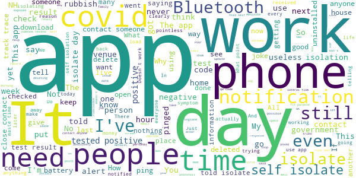

# NHS COVID-19
App version ``4.14 (218)``

Analyzed with [covid-apps-observer](http://github.com/covid-apps-observer) project, version ``0.1``

## App overview
| | |
|-------------------------|-------------------------| 
| **Name**&nbsp;&nbsp;&nbsp;&nbsp;&nbsp;&nbsp;&nbsp;&nbsp;&nbsp;&nbsp;&nbsp;&nbsp;&nbsp;&nbsp;&nbsp;&nbsp;&nbsp;&nbsp;&nbsp;&nbsp;&nbsp;&nbsp;&nbsp;&nbsp;&nbsp;&nbsp;&nbsp;&nbsp;&nbsp;&nbsp;&nbsp;&nbsp;&nbsp;&nbsp;&nbsp;&nbsp;&nbsp;&nbsp;&nbsp;&nbsp;  | NHS COVID-19 |
| **Unique identifier** | uk.nhs.covid19.production |
| **Link to Google Play** | [https://play.google.com/store/apps/details?id=uk.nhs.covid19.production](https://play.google.com/store/apps/details?id=uk.nhs.covid19.production) |
| **Summary**  | Protect your loved ones with the NHS contact tracing app for England and Wales. |
| **Privacy policy** | [https://covid19.nhs.uk/our-policies.html](https://covid19.nhs.uk/our-policies.html) |
| **Latest version** | 4.14 (218) |
| **Last update** | 2021-07-06 12:34:10 |
| **Recent changes** | The latest version includes improved accessibility and content changes, and bug fixes. |
| **Installs**  | 10,000,000+ |
| **Category** | Medical |
| **First release** | Aug 12, 2020 |
| **Size**  | 9.8M |
| **Supported Android version**  | 6.0 and up |

### Description
> The NHS COVID-19 app is the official contact tracing app for England and Wales. For vaccination status (England only) use the separate NHS app, go to www.nhs.uk/app
 It is the fastest way of knowing when you’re at risk from coronavirus. The quicker you know, the quicker you can alert your loved ones, and your community.
 The more of us that use it, the better we can control coronavirus.
 The app runs on proven software developed by Apple and Google, designed so that nobody will know who or where you are. And you can delete your data, or the app, at any time.
 It has a number of features:
 Trace: Find out when you’ve been near other app users who have tested positive for coronavirus
 Alert: Lets you know the level of coronavirus risk in your postcode district.
 Check-in: Use our simple QR code scanner to check-in to venues like bars and restaurants. You will get alerted if you have visited a venue where you may have come into contact with coronavirus.
 Symptoms: Check if you have coronavirus symptoms and see if you need to order a test.
 Test: Helps you order a test if you need to.
 Isolate: Keep track of your self-isolation countdown and access relevant advice.
 Available in English, Welsh, Arabic (Modern Standard), Bengali, Chinese (Simplified), Gujarati, Polish, Punjabi (Gurmukhi script), Romanian, Somali, Turkish and Urdu.
 The app can be used across UK borders in England, Wales, Scotland, Northern Ireland, Jersey and Gibraltar, detecting all relevant contact tracing app users (regardless of them using different official apps), alerting them if they have been in contact with coronavirus.
 The app has been built in collaboration with some of the most innovative organisations in the world. We have worked with medical experts, privacy groups, at-risk communities and we’ve shared knowledge with the teams working on similar apps in many countries.
 Protect your loved ones. Please download the app.
 The app is UKCA marked as Class I medical device in the United Kingdom and developed in compliance with Medical Devices Regulations 2002 (SI 2002 No 618, as amended).

### User interface
The developers of the app provide the following screenshots in the Google play store.
| | | |
|:-------------------------:|:-------------------------:|:-------------------------:|
 |   |   |   | 
 |   |   |   | 
 |   |   |   | 
 |   |   |   | 
 |   |   |   | 

## Development team
In the following we report the main information provided by the development team in the Google play store.

| | |
|-------------------------|-------------------------|
| **Developer**  | Department of Health and Social Care |
| **Website**  | [https://covid19.nhs.uk/](https://covid19.nhs.uk/) |
| **Email** | NHSCovid-19AppStoreSupport@nhsbsa.nhs.uk |
| **Physical address**  | - |
| **Other developed apps**  | [https://play.google.com/store/apps/developer?id=Department+of+Health+and+Social+Care](https://play.google.com/store/apps/developer?id=Department+of+Health+and+Social+Care) |

## Android support

| | |
|-------------------------|-------------------------|
| **Declared target Android version**  | Android10, version 10 (API level 29) |
| **Effective target Android version**  | Android10, version 10 (API level 29) |
| **Minimum supported Android version**  | Marshmallow, version 6.0 (API level 23) |
| **Maximum target Android version**  | - |

The larger the difference between the minimum and maximum supported Android versions, the better. A larger difference means a wider audience. For example, old phones have a very low Android version, so a high minimum supported Android version means that the app cannot be used by users with old phones, thus leading to accessibility problems. 

## Requested permissions

In the following we report the complete list of the permissions requested by the app. 

| **Permission** | **Protection level** | **Description** | 
|-------------------------|-------------------------|-------------------------|
 **android.permission ACCESS_NETWORK_STATE** | Normal | Allows applications to access information about networks. 
 **android.permission BLUETOOTH** | Normal | Allows applications to connect to paired bluetooth devices. 
 **android.permission CAMERA** | :warning:**Dangerous** | Required to be able to access the camera device. 
 **android.permission FOREGROUND_SERVICE** | Normal | Allows a regular application to use Service.startForeground. 
 **android.permission INTERNET** | Normal | Allows applications to open network sockets. 
 **android.permission RECEIVE_BOOT_COMPLETED** | Normal | Allows an application to receive the Intent.ACTION_BOOT_COMPLETED that is broadcast after the system finishes booting. 
 **android.permission REQUEST_IGNORE_BATTERY_OPTIMIZATIONS** | Normal | Permission an application must hold in order to use Settings.ACTION_REQUEST_IGNORE_BATTERY_OPTIMIZATIONS. 
 **android.permission WAKE_LOCK** | Normal | Allows using PowerManager WakeLocks to keep processor from sleeping or screen from dimming. 

## Mentioned servers

| **Server** | **Registrant** | **Registrant country** | **Creation date** | 
|-------------------------|-------------------------|-------------------------|-------------------------|
 | google.com | Google LLC | :us: US | 1997-09-15 04:00:00 |
 | ietf.org | IETF Trust | :us: US | 1995-03-11 05:00:00 |
 | googleapis.com | Google LLC | :us: US | 2005-01-25 17:52:26 |
 | apache.org | The Apache Software Foundation | :us: US | 1995-04-11 04:00:00 |

## Security analysis 

Below we report the main security warnings raised by our execution of the [Androwarn](https://github.com/maaaaz/androwarn) security analysis tool.

**Connection interfaces exfiltration**
> - This application reads details about the currently active data network 
> - This application tries to find out if the currently active data network is metered 

**Suspicious connection establishment**
> - This application opens a Socket and connects it to the remote address ' returned no addresses for  ; port is out of range' on the 'N/A' port  
> - This application opens a Socket and connects it to the remote address '' on the 'N/A' port  
> - This application opens a Socket and connects it to the remote address 'Ljava/lang/StringBuilder;->toString()Ljava/lang/String;' on the 'N/A' port  
> - This application opens a Socket and connects it to the remote address 'Ljava/net/Proxy;->type()Ljava/net/Proxy$Type;' on the 'N/A' port  
> - This application opens a Socket and connects it to the remote address 'timeout' on the 'N/A' port  

**Code execution**
> - This application loads a native library 
> - This application loads a native library: 'Ljava/lang/String;->valueOf(Ljava/lang/Object;)Ljava/lang/String;' 

## User ratings and reviews

Below we provide information about how end users are reacting to the app in terms of ratings and reviews in the Google Play store.

### Ratings

The NHS COVID-19 app has been installed by more than **10000000** times. At this time, **129389** rated the app and its average score is **4.3353453**. Below we show the distribution of the ratings across the usual star-based rating of Google Play

:star::star::star::star::star:: 92021

:star::star::star::star:: 15857

:star::star::star:: 6742

:star::star:: 2422

:star:: 12347

### Reviews 

#### 5-star reviews

> Really good app !!  :date: __2021-07-18 20:40:31__

> Excellent! Got pinged and the weather ever since has been fantastic. 10 days "unofficial" holiday during a heatwave. Happy Days!  :date: __2021-07-18 19:39:19__

> Seems to work. Would be nice to have a widget for a quick check in. Also the risk level is shown for your home area, it would be nice if you could check the area you're in as well. After being pinged I think it would be a good idea to have a option to have a history for isolation instructions to be able to give proof to an employer after the event.  :date: __2021-07-18 19:16:44__

> Help keeping me safe, already alerted to isolate which helps myself, my friends and family  :date: __2021-07-18 19:15:08__

> Just as good as the nhs app  :date: __2021-07-18 13:59:35__

> this app does what it says it should do  :date: __2021-07-18 13:17:21__

> Very useful...  :date: __2021-07-18 11:58:59__

> Edited: App actually a lot better. Deleted today as I have self selected myself for the boris and rishi pilot  :date: __2021-07-18 09:45:40__

> This app is really working using Bluetooth and letting the public know if someone got the cronavirus in the UK and alert them to self isolated idmeadely to stop the spread and protect the public so that we can get back to normal good app  :date: __2021-07-18 07:17:08__

> Great app!  :date: __2021-07-18 02:06:01__

#### 4-star reviews

> It pinged me despite never being near to anyone for more than a few seconds.  :date: __2021-07-17 21:12:34__

> waist of time  :date: __2021-07-17 14:57:35__

> It's ok, but why oh why doesn't it have the facility to enter vaccine details!  :date: __2021-07-16 14:33:39__

> useful and helps keep people safe.  :date: __2021-07-14 14:58:00__

> very pleased to use code. feel much safer.  :date: __2021-07-13 21:08:07__

> None  :date: __2021-07-13 18:09:38__

> Good  :date: __2021-07-13 14:49:32__

> This app needs to be updated, and fixed to make it more efficient and worth while to use. Needs to be less false readings. So people don't have to self isolate as much.  :date: __2021-07-12 17:54:06__

> ok good fir checking in  :date: __2021-07-11 13:50:15__

> Hey. Can you please give me some guidence as of what happens to EU citizens who have UK settled status, but were vaccinated in their EU home country, by a WHO approved vaccine, which they have all the proof of, but circumstances might bring that they will need the NHS Covid pass when they restart work in the UK? Are they going to be forced to have a 3rd and 4th vaccine? I appreciate your help.  :date: __2021-07-10 23:17:16__

#### 3-star reviews

> It would be good if you could do Lateral Flow Test results via the Application.  :date: __2021-07-19 10:25:03__

> good  :date: __2021-07-18 15:16:05__

> How do I get to be part of the random trial which allows me to not self-isolate if I've been in contact with someone? Can't find that function on here.  :date: __2021-07-18 13:09:23__

> We're all finefine.  :date: __2021-07-18 12:50:59__

> Vital for control of the virus but no longer relevant. Deleting.  :date: __2021-07-18 09:54:22__

> Exposure time would be great to have as I could determine if I was exposed on my journey to / from work or in the workplace itself  :date: __2021-07-17 15:39:20__

> to sensitive I have been pinged twice once for my next door neighbour through a wall ?? and another time when I had not been close to anybody but had been in a hospital building.  :date: __2021-07-16 12:28:01__

> App has stopped working, all I get is front blue page. I have tried re installing it but it's still not working. Click on app but it just pings you out after a couple of seconds.  :date: __2021-07-16 08:34:48__

> Had an alert notifying me that I had been a close contact with a positive case for 15 mins or more, told to isolate for 10 days, less than an hour later the app has reverted back to a green active interface and did this twice, I cannot now isolate as I have nothing to show work and I'm left quite baffled and without any help or advice.  :date: __2021-07-15 14:44:17__

> I find the check in qr code fails a lot.  :date: __2021-07-14 11:42:14__

#### 2-star reviews

> As of today we can remove this app from our phones  :date: __2021-07-19 09:04:43__

> Uninstalled it. If Boris isn't going to isolate, why should I?  :date: __2021-07-18 10:50:47__

> Inaccurate, poorly designed and the claim of how many lives have been saved is plucked from advocates dreamland. This is a criminal waste of money and has devestated livelyhoods  :date: __2021-07-18 10:41:48__

> I Have uninstalled the App now, what's the point if the person telling you to do as it says does not even follow the instructions given by it (Boris)  :date: __2021-07-18 10:25:47__

> Hubby and I got pinged 5 days AFTER visiting Bristol. But our son and his girlfriend who we spent the day with did not!!  :date: __2021-07-17 17:50:08__

> My Bluetooth has been off and I've just had a notification saying I have to isolate for 9 days... when I clicked notification it said I needed to enable Bluetooth for the app to work...what do I do? Spoken to 119 and they are as clueless as I am  :date: __2021-07-17 13:43:06__

> Is this the app for getting a covid pass? And if so, how??  :date: __2021-07-15 22:29:26__

> In theory it's a good app and I've always been supportive of it, until this week when I got 'pinged'. I know exactly when and where the 'contact' took place however I was over 6m away from the guy apart from one occasion when I walked past him so would have been about 1.5m away for about 3 seconds. This leaves me questioning the accuracy of the app so have uninstalled and relying on lateral flow testing  :date: __2021-07-15 19:56:47__

> Unsure what to make of it.. yesterday the app informed me I have to isolate for 7 days, 3 hours later when I was showing a family member the app had reverted to "Your app is active and scanning" with zero record of the previous isolation warnings  :date: __2021-07-15 12:08:50__

> Latest update seems to have fixed the battery drain issue which means Bluetooth stays enabled. Still incredibly basic for so much money spent.  :date: __2021-07-15 10:28:16__

#### 1-star reviews

> The reason I have been pinged is because a contact has tested positive. They got symptoms on the 14th and I saw them on the 10th. They caught it from a person they came into contact with on 11th. Your official test and trace team did not want my details as they only go back 48 hours, so please explain when they entered their positive test from the 15th that I have been pinged when there is no way that I could have caught it from this person.  :date: __2021-07-19 11:49:16__

> Nit been outland telling me to isollate  :date: __2021-07-19 11:31:36__

> Pointless  :date: __2021-07-19 10:51:43__

> The rules have changed today but the app still showsold info about restrictions  :date: __2021-07-19 10:32:27__

> Great if you want some time off work  :date: __2021-07-19 10:21:02__

> It's not upto date and gives fault information, it pings even if you haven't been near anyone  :date: __2021-07-19 10:20:39__

> A sham of an app. People isolating when they don't even know who they came in contact with. 2 vaccines and people are still being told to isolate until they get a clear test. A man made virus that came from a lab funded by the government. Shops closing, people losing their livelihood, mental health problems at an all time high. As someone who works in the health sector I will not be silent about this. So many false reviews on this garbage "project".  :date: __2021-07-19 09:47:17__

> I'm confused as to why the status doesn't change on the app. We're not in lockdown and "Freedom Day" has supposedly arrived yet the app is exactly the same, saying we're in lockdown.  :date: __2021-07-19 09:11:04__

> If the government do whatever they like then they can get stuffed if they think I am going to get pinged willy-nilly, including through walls, while they allow cases to run rampant. Goodbye app.  :date: __2021-07-19 08:15:28__

> Someone in my household is positive competed the Pcr test entered results on app, rest of household app is still on green 3 days later  :date: __2021-07-19 07:50:30__

