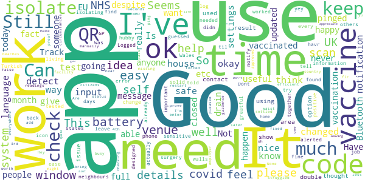
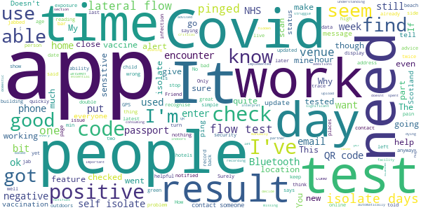

# NHS COVID-19
App version ``4.14 (218)``

Analyzed with [covid-apps-observer](http://github.com/covid-apps-observer) project, version ``0.1``

## App overview
| | |
|-------------------------|-------------------------| 
| **Name**                                          | NHS COVID-19 |
| **Unique identifier** | uk.nhs.covid19.production |
| **Link to Google Play** | [https://play.google.com/store/apps/details?id=uk.nhs.covid19.production](https://play.google.com/store/apps/details?id=uk.nhs.covid19.production) |
| **Summary**  | Protect your loved ones with the NHS contact tracing app for England and Wales. |
| **Privacy policy** | [https://covid19.nhs.uk/our-policies.html](https://covid19.nhs.uk/our-policies.html) |
| **Latest version** | 4.14 (218) |
| **Last update** | 2021-07-06 12:34:10 |
| **Recent changes** | The latest version includes improved accessibility and content changes, and bug fixes. |
| **Installs**  | 10,000,000+ |
| **Category** | Medical |
| **First release** | Aug 12, 2020 |
| **Size**  | 9.8M |
| **Supported Android version**  | 6.0 and up |

### Description
> The NHS COVID-19 app is the official contact tracing app for England and Wales. For vaccination status (England only) use the separate NHS app, go to www.nhs.uk/app
 It is the fastest way of knowing when you’re at risk from coronavirus. The quicker you know, the quicker you can alert your loved ones, and your community.
 The more of us that use it, the better we can control coronavirus.
 The app runs on proven software developed by Apple and Google, designed so that nobody will know who or where you are. And you can delete your data, or the app, at any time.
 It has a number of features:
 Trace: Find out when you’ve been near other app users who have tested positive for coronavirus
 Alert: Lets you know the level of coronavirus risk in your postcode district.
 Check-in: Use our simple QR code scanner to check-in to venues like bars and restaurants. You will get alerted if you have visited a venue where you may have come into contact with coronavirus.
 Symptoms: Check if you have coronavirus symptoms and see if you need to order a test.
 Test: Helps you order a test if you need to.
 Isolate: Keep track of your self-isolation countdown and access relevant advice.
 Available in English, Welsh, Arabic (Modern Standard), Bengali, Chinese (Simplified), Gujarati, Polish, Punjabi (Gurmukhi script), Romanian, Somali, Turkish and Urdu.
 The app can be used across UK borders in England, Wales, Scotland, Northern Ireland, Jersey and Gibraltar, detecting all relevant contact tracing app users (regardless of them using different official apps), alerting them if they have been in contact with coronavirus.
 The app has been built in collaboration with some of the most innovative organisations in the world. We have worked with medical experts, privacy groups, at-risk communities and we’ve shared knowledge with the teams working on similar apps in many countries.
 Protect your loved ones. Please download the app.
 The app is UKCA marked as Class I medical device in the United Kingdom and developed in compliance with Medical Devices Regulations 2002 (SI 2002 No 618, as amended).

### User interface
The developers of the app provide the following screenshots in the Google play store.
| | | |
|:-------------------------:|:-------------------------:|:-------------------------:|
 |   |   |   | 
 |   |   |   | 
 |   |   |   | 
 |   |   |   | 
 |   |   |   | 

## Development team
In the following we report the main information provided by the development team in the Google play store.

| | |
|-------------------------|-------------------------|
| **Developer**  | Department of Health and Social Care |
| **Website**  | [https://covid19.nhs.uk/](https://covid19.nhs.uk/) |
| **Email** | NHSCovid-19AppStoreSupport@nhsbsa.nhs.uk |
| **Physical address**  | - |
| **Other developed apps**  | [https://play.google.com/store/apps/developer?id=Department+of+Health+and+Social+Care](https://play.google.com/store/apps/developer?id=Department+of+Health+and+Social+Care) |

## Android support

| | |
|-------------------------|-------------------------|
| **Declared target Android version**  | Android10, version 10 (API level 29) |
| **Effective target Android version**  | Android10, version 10 (API level 29) |
| **Minimum supported Android version**  | Marshmallow, version 6.0 (API level 23) |
| **Maximum target Android version**  | - |

The larger the difference between the minimum and maximum supported Android versions, the better. A larger difference means a wider audience. For example, old phones have a very low Android version, so a high minimum supported Android version means that the app cannot be used by users with old phones, thus leading to accessibility problems. 

## Requested permissions

In the following we report the complete list of the permissions requested by the app. 

| **Permission** | **Protection level** | **Description** | 
|-------------------------|-------------------------|-------------------------|
 **android.permission ACCESS_NETWORK_STATE** | Normal | Allows applications to access information about networks. 
 **android.permission BLUETOOTH** | Normal | Allows applications to connect to paired bluetooth devices. 
 **android.permission CAMERA** | :warning:**Dangerous** | Required to be able to access the camera device. 
 **android.permission FOREGROUND_SERVICE** | Normal | Allows a regular application to use Service.startForeground. 
 **android.permission INTERNET** | Normal | Allows applications to open network sockets. 
 **android.permission RECEIVE_BOOT_COMPLETED** | Normal | Allows an application to receive the Intent.ACTION_BOOT_COMPLETED that is broadcast after the system finishes booting. 
 **android.permission REQUEST_IGNORE_BATTERY_OPTIMIZATIONS** | Normal | Permission an application must hold in order to use Settings.ACTION_REQUEST_IGNORE_BATTERY_OPTIMIZATIONS. 
 **android.permission WAKE_LOCK** | Normal | Allows using PowerManager WakeLocks to keep processor from sleeping or screen from dimming. 

## Mentioned servers

| **Server** | **Registrant** | **Registrant country** | **Creation date** | 
|-------------------------|-------------------------|-------------------------|-------------------------|
 | google.com | Google LLC | :us: US | 1997-09-15 04:00:00 |
 | ietf.org | IETF Trust | :us: US | 1995-03-11 05:00:00 |
 | googleapis.com | Google LLC | :us: US | 2005-01-25 17:52:26 |
 | apache.org | The Apache Software Foundation | :us: US | 1995-04-11 04:00:00 |

## Security analysis 

Below we report the main security warnings raised by our execution of the [Androwarn](https://github.com/maaaaz/androwarn) security analysis tool.

**Connection interfaces exfiltration**
> - This application reads details about the currently active data network 
> - This application tries to find out if the currently active data network is metered 

**Suspicious connection establishment**
> - This application opens a Socket and connects it to the remote address ' returned no addresses for  ; port is out of range' on the 'N/A' port  
> - This application opens a Socket and connects it to the remote address '' on the 'N/A' port  
> - This application opens a Socket and connects it to the remote address 'Ljava/lang/StringBuilder;->toString()Ljava/lang/String;' on the 'N/A' port  
> - This application opens a Socket and connects it to the remote address 'Ljava/net/Proxy;->type()Ljava/net/Proxy$Type;' on the 'N/A' port  
> - This application opens a Socket and connects it to the remote address 'timeout' on the 'N/A' port  

**Code execution**
> - This application loads a native library 
> - This application loads a native library: 'Ljava/lang/String;->valueOf(Ljava/lang/Object;)Ljava/lang/String;' 

## User ratings and reviews

Below we provide information about how end users are reacting to the app in terms of ratings and reviews in the Google Play store.

### Ratings

The NHS COVID-19 app has been installed by more than **10000000** times. At this time, **129389** rated the app and its average score is **4.3353453**. Below we show the distribution of the ratings across the usual star-based rating of Google Play

:star::star::star::star::star:: 92021

:star::star::star::star:: 15857

:star::star::star:: 6742

:star::star:: 2422

:star:: 12347

### Reviews 

#### 5-star reviews

> Best  :date: __2021-07-23 18:52:39__

> very good site stop Making things political  :date: __2021-07-23 16:05:10__

> helpful needed  :date: __2021-07-23 13:02:27__

> It's a safe idea 💡 everyone should have it.  :date: __2021-07-23 08:47:20__

> Stop blaming the messenger. if you get pinged its because you came on contact with ris. the virus is the prob not the app  :date: __2021-07-23 07:59:52__

> Power by reydereyes ingodwetrust control all system....  :date: __2021-07-23 02:59:37__

> It's a good idea  :date: __2021-07-22 23:28:07__

> this is good let's hope more use it.  :date: __2021-07-22 22:19:33__

> The app is looking good and if it helps to keep the virus in check then we are on to a winner, it doesn't drain my phone battery and helps us to stay on top to keep us all safer, with the Delta strain I have been told to scan the places I go into, but since I have everything delivered to my home & walk for excersise. I stay out of shops etc, to minimise any chance of getting infected, staying safe is what matters, right ?  :date: __2021-07-22 18:30:24__

> very good app. keep you safe and aware of what's around you . if they interfere with the sensitivity I will stop using.  :date: __2021-07-22 14:05:36__

#### 4-star reviews

> Was fine til it was actually needed at which time, despite hubby and i living together, when i tested positive it didn’t notify his phone and he struggled to prove need yo isolate to employer  :date: __2021-07-23 18:42:53__

> It would be really useful to be able to manually add where you've been if theres no QR to scan to check in. E.g busy beaches, areas etc Not everywhere has one  :date: __2021-07-20 23:21:06__

> I want a ping.... Feels like I'm missing out.... I want to self isolate...  :date: __2021-07-20 04:20:54__

> It pinged me despite never being near to anyone for more than a few seconds.  :date: __2021-07-17 21:12:34__

> waist of time  :date: __2021-07-17 14:57:35__

> It's ok, but why oh why doesn't it have the facility to enter vaccine details!  :date: __2021-07-16 14:33:39__

> useful and helps keep people safe.  :date: __2021-07-14 14:58:00__

> very pleased to use code. feel much safer.  :date: __2021-07-13 21:08:07__

> None  :date: __2021-07-13 18:09:38__

> Good  :date: __2021-07-13 14:49:32__

#### 3-star reviews

> It notifies me to turn on the app every day even if I'm not online. It should let me decide when I'm going out and stop wasting my battery when I'm not.  :date: __2021-07-23 18:19:17__

> This is a great app for skyving off work with pay since I installed it I've been pinged 30,000 times even though I don't go out much and live in the country.  :date: __2021-07-22 21:34:58__

> Can give out false positives thru Bluetooth. A bit null and void if you're double jabbed anyway.  :date: __2021-07-22 15:42:28__

> Poppleton km. Ll  :date: __2021-07-22 12:44:32__

> Too sensitive, people get pinged by the app when they have been sat in their cars side by side  :date: __2021-07-21 19:35:14__

> could it work better? it's what we have.  :date: __2021-07-21 19:32:28__

> a very good idea to make sure people do self isolate and get the infection rate down  :date: __2021-07-21 19:22:17__

> Not leaving Bluetooth on constantly. I don't want the extra rf exposure (particularly the resonant frequency of human cells - 2.4ghz). Bluetooth's security record is also very poor. I might be persuaded to ignore the security issue and turn it on whilst out or when my GPS location does not match home! It should certainly open with bluetooth off. GPS with high accuracy mode turned "OFF" is reliable to 3m outdoors and can give location usage confidently away from high rise buildings.  :date: __2021-07-21 10:47:25__

> Don't quite understand why we have to check in to venues when the app already knows where we are by tracking our location.  :date: __2021-07-21 00:45:53__

> App hasn't been updated to the latest advice today. My husband's Apple phone has, but mine was updated the 6th.  :date: __2021-07-19 15:14:19__

#### 2-star reviews

> Outside of the QR code scans this app may be a security risk to your personal information, having your Bluetooth on 24\7 allows hackers to access, your contacts, messages, previous locations and banking info. But I see nothing about this being sorted, you say your app is safe but is the service (Bluetooth) it's not about the apps security but BLUETOOTHS security with Bluetooth active someone can scan your DEVICE not your APP. Especially if you use contactless from your phone and have NFC on too  :date: __2021-07-23 19:40:09__

> I have 2 phones one work and one personal, pinged on my phone and told to isolate. Surely the work phone should have received a ping as well? As it has been in close proximity to the other phone? The App doesn't know I'm the same person? Thanks for responding to the query - the article doesn't cover my scenario as i have, As I had both phones in the same pocket pretty much all the time. I use one for scanning it at work and one for personal stuff. so i know both work. Does the notification only count at the start for the neighbouring device? So if i left one phone somewhere else for a period of time then put it back into proximity with the other, it wouldn't alert. and if so what would be the isolation duration if one phone was counting down the isolation period, would the other start from 10 days or the remaining period on the first phone?  :date: __2021-07-23 16:49:38__

> Had a notification on Sunday 18th to isolate for 5 days, I followed instructions and stayed at home. Isolation ended on Thursday 22nd July @ 23:59 woke up the following morning to another notification to isolate for 1 day.... how can this be possible when I have literally had no contact with anyone and stayed at home the whole time?  :date: __2021-07-23 06:34:25__

> No consistency, destroys battery life, QR doesn't always work and these ill-judged isolations are destroying industries.  :date: __2021-07-22 14:36:45__

> waste of time. but needed for pubs  :date: __2021-07-21 15:57:39__

> Got a text from Track and Trace saying I had been in contact with someone who had tested positive and that I needed to self isolate, however the app says nothing about this. Bit of a delay in getting the text too, received on 19th July and 10 days isolation finishes 21st July. As I am double jabbed and have no symptoms this delay in being contacted is personally less of a concern, but for anyone else probably not helpful in reducing the spread of covid.  :date: __2021-07-21 10:42:11__

> Not for under 16?! My 14 year old son has tested positive but guidance states this app is for 16+. I wish you'd let those that send the PCR results by text /email know. I'm being bombarded with reminders because he hasn't submitted the codes to the NHS app. They have his date of birth so surely you would think they know he shouldn't have the app!!!  :date: __2021-07-21 10:31:55__

> Trying to enter a lateral flow result but it says I need the code sent in the email received after I've reported the result to Gov.uk but there's no code! None of these apps are joined up. Extremely poorly designed and frustrating to use. It's no surprise people are deleting the apps. Utterly rubbish to use.  :date: __2021-07-20 15:49:06__

> My app is giving me a different isolation end date to what the test and trace texts are?!?  :date: __2021-07-19 20:25:35__

> I get a pop up saying new virus alerts in a venue in my area so you click it and it doesn't go anywhere, just opens the app, what a waste of time this app is  :date: __2021-07-19 18:10:26__

#### 1-star reviews

> worst app ever used  :date: __2021-07-23 20:04:08__

> Bluetooth isn't a good way to judge this as it doesn't know how far away you are. I was at a venue and we were social distanced but I got told to self isolate because your technology is insufficient and my Bluetooth clearly has more than a 2m range, like most modern phones! You have made me stay off work because you can't come up with a decent app! I should never have installed it! No point trying to help if you screw people over with a poor app!  :date: __2021-07-23 19:56:18__

> Lmao need I say more  :date: __2021-07-23 19:50:27__

> So frustrating that I can't enter my previous test results from April as it doesn't recognise the number and no-one is available to help.  :date: __2021-07-23 16:14:38__

> Absolutely useless app designed by an absolutely useless Government. Why is there check out feature? Why did my app do nothing for months and then all of a sudden I'm being 'pinged' to tell me to self isolate?! Hell would need to freeze over before I let an app tell me what do. Here's an idea if you get 'pinged'... Delete the app!! Problem solved :)  :date: __2021-07-23 15:34:03__

> Not sure this actually works I've been home all weekend and now I've had a notification saying I've had contact with someone with covid and have to isolate for 8 days when I've had no contact with anyone. Your response was not helpful ad I said I had been home all weekend no contact with anyone and somehow it says I have been hence why I said it doesn't work please read the feedback more carefully  :date: __2021-07-23 15:07:24__

> Don't worry guys, you can't get the app until you're 16, so you obviously can't be exposed to covid until you turn 16. So all us minors who are worrying and trying to protect ourselves and our familys are wasting our time, the NHS thinks we can't even get it! What a joke. They responded to me, and I still very much hold my opinion. Getting covid is not a decision, what the heck? Its a LIFE THREATENING disease, which both myself and most of my family are very vulnerable too. Age is irrelevant.  :date: __2021-07-23 15:06:35__

> How is this rated a 4.3 app?? All you have to do is read the reviews and look at the stars it's clear this rating HS been edited  :date: __2021-07-23 15:00:30__

> Common sense of checking out of a venue & ability to timecheck, last year very few pings The last month has been horrendous... I went into petrol station at 6 am out by 06.20 2 customer & 2 staff inside. Yet got a ping ...the traffic flow into a busy petrol station. Then got one for supermarket....then another. With majority vaccinated, daily flow testing..surely can upgrade this app to correlate...  :date: __2021-07-23 13:15:53__

> What's the point of this s#itty app ?? UNINSTALLED .  :date: __2021-07-23 12:51:21__

