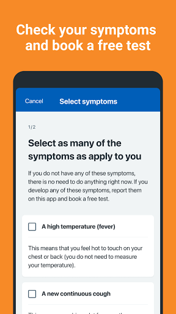
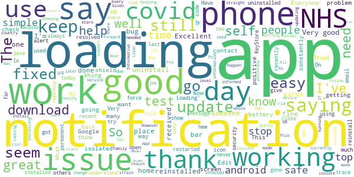
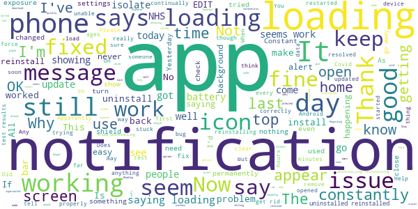
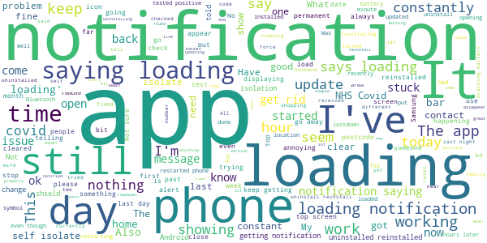
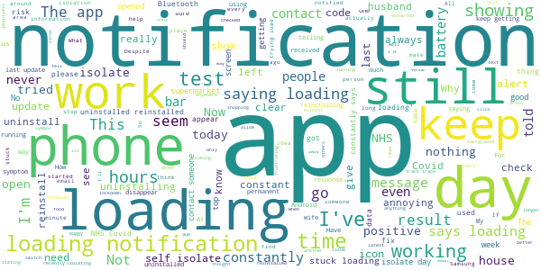
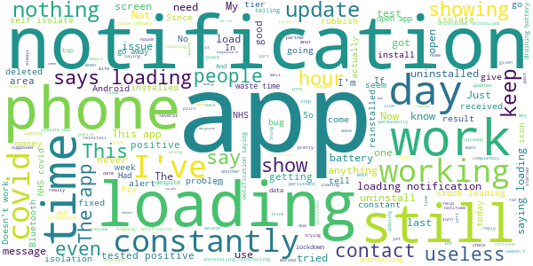

# NHS COVID-19
App version ``4.2 (131)``

Analyzed with [covid-apps-observer](http://github.com/covid-apps-observer) project, version ``0.1``

## App overview
| | |
|-------------------------|-------------------------| 
| **Name**&nbsp;&nbsp;&nbsp;&nbsp;&nbsp;&nbsp;&nbsp;&nbsp;&nbsp;&nbsp;&nbsp;&nbsp;&nbsp;&nbsp;&nbsp;&nbsp;&nbsp;&nbsp;&nbsp;&nbsp;&nbsp;&nbsp;&nbsp;&nbsp;&nbsp;&nbsp;&nbsp;&nbsp;&nbsp;&nbsp;&nbsp;&nbsp;&nbsp;&nbsp;&nbsp;&nbsp;&nbsp;&nbsp;&nbsp;&nbsp;  | NHS COVID-19 |
| **Unique identifier** | uk.nhs.covid19.production |
| **Link to Google Play** | [https://play.google.com/store/apps/details?id=uk.nhs.covid19.production](https://play.google.com/store/apps/details?id=uk.nhs.covid19.production) |
| **Summary**  | Protect your loved ones with the NHS contact tracing app for England and Wales. |
| **Privacy policy** | [https://covid19.nhs.uk/our-policies.html](https://covid19.nhs.uk/our-policies.html) |
| **Latest version** | 4.2 (131) |
| **Last update** | 2021-01-19 11:06:26 |
| **Recent changes** | An in-app language settings feature has been introduced, allowing users to change the language of the app without needing to navigate to phone settings. Other UI, language, analytics and accessibility optimisations. |
| **Installs**  | 5,000,000+ |
| **Category** | Medical |
| **First release** | Aug 12, 2020 |
| **Size**  | 8.3M |
| **Supported Android version**  | 6.0 and up |

### Description
> The NHS COVID-19 app is the official contact tracing app for England and Wales. 
 It is the fastest way of knowing when you’re at risk from coronavirus. The quicker you know, the quicker you can alert your loved ones, and your community. 
 The more of us that use it, the better we can control coronavirus. 
 The app runs on proven software developed by Apple and Google, designed so that nobody will know who or where you are. And you can delete your data, or the app, at any time.
 It has a number of features: 
 Trace: Find out when you’ve been near other app users who have tested positive for coronavirus
 Alert: Lets you know the level of coronavirus risk in your postcode district. 
 Check-in: Use our simple QR code scanner to check-in to venues like bars and restaurants. You will get alerted if you have visited a venue where you may have come into contact with coronavirus.
 Symptoms: Check if you have coronavirus symptoms and see if you need to order a test. 
 Test: Helps you order a test if you need to.
 Isolate: Keep track of your self-isolation countdown and access relevant advice.
 Available in English, Welsh, Arabic (Modern Standard), Bengali, Chinese (Simplified), Gujarati, Polish, Punjabi (Gurmukhi script), Romanian, Somali, Turkish and Urdu.
 The app can be used across UK borders in England, Wales, Scotland, Northern Ireland, Jersey and Gibraltar, detecting all relevant contact tracing app users (regardless of them using different official apps), alerting them if they have been in contact with coronavirus. 
 The app has been built in collaboration with some of the most innovative organisations in the world. We have worked with medical experts, privacy groups, at-risk communities and we’ve shared knowledge with the teams working on similar apps in many countries.
 Protect your loved ones. Please download the app. 
 The App is CE marked as a class I medical device in the United Kingdom and developed in compliance with European Commission Directive 93/42/EEC for class I devices.

### User interface
The developers of the app provide the following screenshots in the Google play store.
| | | |
|:-------------------------:|:-------------------------:|:-------------------------:|
 |   |   |   | 
 |   |  

## Development team
In the following we report the main information provided by the development team in the Google play store.

| | |
|-------------------------|-------------------------|
| **Developer**  | Department of Health and Social Care |
| **Website**  | [https://covid19.nhs.uk/](https://covid19.nhs.uk/) |
| **Email** | NHSCovid-19AppStoreSupport@nhsbsa.nhs.uk |
| **Physical address**  | - |
| **Other developed apps**  | [https://play.google.com/store/apps/developer?id=Department+of+Health+and+Social+Care](https://play.google.com/store/apps/developer?id=Department+of+Health+and+Social+Care) |

## Android support

| | |
|-------------------------|-------------------------|
| **Declared target Android version**  | Android10, version 10 (API level 29) |
| **Effective target Android version**  | Android10, version 10 (API level 29) |
| **Minimum supported Android version**  | Marshmallow, version 6.0 (API level 23) |
| **Maximum target Android version**  | - |

The larger the difference between the minimum and maximum supported Android versions, the better. A larger difference means a wider audience. For example, old phones have a very low Android version, so a high minimum supported Android version means that the app cannot be used by users with old phones, thus leading to accessibility problems. 

## Requested permissions

In the following we report the complete list of the permissions requested by the app. 

| **Permission** | **Protection level** | **Description** | 
|-------------------------|-------------------------|-------------------------|
 **android.permission ACCESS_NETWORK_STATE** | Normal | Allows applications to access information about networks. 
 **android.permission BLUETOOTH** | Normal | Allows applications to connect to paired bluetooth devices. 
 **android.permission CAMERA** | :warning:**Dangerous** | Required to be able to access the camera device. 
 **android.permission FOREGROUND_SERVICE** | Normal | Allows a regular application to use Service.startForeground. 
 **android.permission INTERNET** | Normal | Allows applications to open network sockets. 
 **android.permission RECEIVE_BOOT_COMPLETED** | Normal | Allows an application to receive the Intent.ACTION_BOOT_COMPLETED that is broadcast after the system finishes booting. 
 **android.permission WAKE_LOCK** | Normal | Allows using PowerManager WakeLocks to keep processor from sleeping or screen from dimming. 

## Mentioned servers

| **Server** | **Registrant** | **Registrant country** | **Creation date** | 
|-------------------------|-------------------------|-------------------------|-------------------------|
 | google.com | Google LLC | :us: US | 1997-09-15 04:00:00 |
 | ietf.org | IETF Trust | :us: US | 1995-03-11 05:00:00 |
 | googleapis.com | Google LLC | :us: US | 2005-01-25 17:52:26 |
 | apache.org | The Apache Software Foundation | :us: US | 1995-04-11 04:00:00 |

## Security analysis 

Below we report the main security warnings raised by our execution of the [Androwarn](https://github.com/maaaaz/androwarn) security analysis tool.

**Connection interfaces exfiltration**
> - This application reads details about the currently active data network 
> - This application tries to find out if the currently active data network is metered 

**Suspicious connection establishment**
> - This application opens a Socket and connects it to the remote address ' returned no addresses for  ; port is out of range' on the 'N/A' port  
> - This application opens a Socket and connects it to the remote address '' on the 'N/A' port  
> - This application opens a Socket and connects it to the remote address 'Ljava/lang/StringBuilder;->toString()Ljava/lang/String;' on the 'N/A' port  
> - This application opens a Socket and connects it to the remote address 'Ljava/net/Proxy;->type()Ljava/net/Proxy$Type;' on the 'N/A' port  
> - This application opens a Socket and connects it to the remote address 'timeout' on the 'N/A' port  

**Code execution**
> - This application loads a native library 
> - This application loads a native library: 'Ljava/lang/String;->valueOf(Ljava/lang/Object;)Ljava/lang/String;' 

## User ratings and reviews

Below we provide information about how end users are reacting to the app in terms of ratings and reviews in the Google Play store.

### Ratings

The NHS COVID-19 app has been installed by more than **5000000** times. At this time, **97876** rated the app and its average score is **3.7251723**. Below we show the distribution of the ratings across the usual star-based rating of Google Play

:star::star::star::star::star:: 52163

:star::star::star::star:: 12001

:star::star::star:: 8450

:star::star:: 5177

:star:: 20085

### Reviews 

#### 5-star reviews

> Good.  :date: __2021-01-23 00:09:01__

> I find it very helpful and useful.  :date: __2021-01-22 20:29:20__

> So far so good.  :date: __2021-01-22 16:54:57__

> This app is very effective and accurate. Very good.  :date: __2021-01-22 16:29:07__

> Very rapid response if you notify them of any bugs. Vital app!  :date: __2021-01-22 11:54:40__

> Excellence  :date: __2021-01-22 03:04:14__

> this app works without using scare mongering.  :date: __2021-01-21 20:30:30__

> excellent  :date: __2021-01-21 17:24:54__

> Good ap. Helped  :date: __2021-01-21 16:48:41__

> Want.to.download.covid.19  :date: __2021-01-21 06:54:10__

#### 4-star reviews

> Latest version appears stable.  :date: __2021-01-23 10:11:06__

> Not bad thanks 👍  :date: __2021-01-22 17:46:23__

> Good  :date: __2021-01-22 01:07:16__

> Not as good as it was. Been installed on my phone for ages but now I get a message stating that the app is loading. Why? It is getting very frustrating. I uninstall then install again. After about 15 hours it starts telling me that it is loading again. Not as good as was described  :date: __2021-01-21 18:35:53__

> Good  :date: __2021-01-21 10:16:45__

> Good  :date: __2021-01-20 23:19:59__

> Okay  :date: __2021-01-20 18:41:14__

> It doing my head in. All day long today I've been getting a notification sound but no actual notification message. On further investigation the notification sound has been coming from this app. If it keeps happening I will remove the app but I really don't want to. Updated star rating due to swift response about app.  :date: __2021-01-20 12:29:02__

> Why does the app say "You are unlikely to have coronavirus" When I input that I am not showing any of the three main symptoms? The Government have said that 1 in 3 people with Covid are asymptomatic, this needs to be updated!  :date: __2021-01-19 18:32:55__

> On smaller devices, you can't see "Enter test results" option eg pixel 2. This is the most important option in the app so should be at the top. People I know didn't know they had to enter the test results in the app, so if this is put in a more prominent place then when people download for the first time, or open it every so often, then they'll see it  :date: __2021-01-18 22:18:39__

#### 3-star reviews

> The app is okay but needs updating to include those who have had vaccinations.  :date: __2021-01-23 11:07:35__

> Second time this app has informed me that I have been in close contact with someone that has tested positive. Only problem is that my notification comes through 2 days after the exposure date, both times xx  :date: __2021-01-23 01:09:44__

> I have to keep uninstalling this app as it just keeps going to loading and keeps on loading......its very frustrating!!  :date: __2021-01-22 19:40:54__

> Doesn't work on my partner phone, he has a Samsung note 10 plus, with the most update version running. My daughter and I both had covid ( at different times)and received notification about isolation and was loaded on our nhs covid app, but my partner received no notification and the app hasn't updated to say he needed to isolate. We live in the same household and sit in the same room as each other for more than 15 minutes, so clearly isn't that.  :date: __2021-01-22 17:43:06__

> Always loading...  :date: __2021-01-22 12:36:53__

> Had to isolate due to the app telling me that finished 20th at 23.59, the only place I had been was shopping when shopping i kept my distance from people how does this work?  :date: __2021-01-22 08:57:48__

> Constantly have to uninstall and reinstall and it gets stuck loading every week or so.  :date: __2021-01-21 18:32:35__

> Persistent 'Loading...' notification. Uninstalling until this is fixed. Update: installed the latest version 20 Jan and no "Loading..." notifications so far...  :date: __2021-01-21 16:24:48__

> Tested positive but the count downs disappeared. Should be showing til 28th 🤷‍♀️🤷‍♀️  :date: __2021-01-21 01:50:06__

> It doesn't differentiate between work (I work in a school which never closes for lockdowns) and home. Two massive variables in my circumstances.  :date: __2021-01-20 19:52:31__

#### 2-star reviews

> Keeps stating it is downloading a message (for hours) with a message waiting symbol on the homepage icon but nothing changes. This has happened 4 times. The only way to clear it is to uninstall and reinstall again which sort of defeats the object of having a constant record of movements.  :date: __2021-01-22 20:04:09__

> Keeps switching itself off. I try to have it on all the time while I am at work or just out on exercise/shopping and it keeps closing down. I have it all up to date my Bluetooth is on all the time. This is not good as I am worried that I may be coming into contact with people who have covid and wouldn't know about it. This app is not preforming in the way it should, although I keep persisting  :date: __2021-01-22 16:18:54__

> Have no idea how this is meant to work never showed me anything other than the day I installed it just what areas you are in. Another waste of my tax again but other party's would be better.  :date: __2021-01-22 14:07:33__

> I received a notification today telling me to self isolate for 4 days. I looked through the NHS FAQ and I can't find any reason for it to be 4 days. It's supposed to be 10 days so it worries me that I wasn't notified 6 days ago.  :date: __2021-01-22 13:33:03__

> Auto disabled itself...how is that helpful!?  :date: __2021-01-22 09:39:29__

> Despite my wife having a positive test, my app never registered it or flagged me to isolate... it wasn't until I used the app to request a test then it flagged me.. basically I triggered it myself.. Both my wife and myself use the latest Samsung phones with the app actively scanning... my daughter who lives in the same house still doesn't need to isolate according to this app! (Don't worry, she is isolated) Last year the app told me to isolate for 10 days Despite not leaving the house!  :date: __2021-01-22 09:13:35__

> I keep having to uninstall and reinstall the app as after a few days the app keeps saying it is loading!  :date: __2021-01-22 00:01:14__

> Takes up too much of your battery use  :date: __2021-01-21 16:51:03__

> Doesn't even work properly half the time.... hopeless!!  :date: __2021-01-21 15:57:37__

> How hard is it to fix the loading notification?... the cost alone for this 1 app could have made thousands of other apps....that work  :date: __2021-01-21 15:00:57__

#### 1-star reviews

> Had a loading message showing for 8 hours so far, nothing when I click on the app, so not sure what it is and can't clear it either and it's not the first time read online this issue was meant to be fixed not but obviously not  :date: __2021-01-23 10:55:02__

> You need to fix this app to help the country to prosper  :date: __2021-01-23 06:28:28__

> I don't want to give the country my info  :date: __2021-01-23 00:36:55__

> The point of my original review had been completely lost on the developer. I was not trying to say anything about knowing who the contact was. I understand that it is anonymous. My point was that I believe the close contact detection is faulty because I have not been closer than 2m to people for months and so the alert cannot be accurate. I believe this needs investigating but no one seems interested in doing this. Sadly I'll probably be deleting the app when my isolation is over due to this.  :date: __2021-01-22 23:53:03__

> The app still shows scanning with no results after 8hours!!!  :date: __2021-01-22 23:29:52__

> Still needs alot of work ! Add free , looks good with govment info and links . All language's off course  :date: __2021-01-22 23:13:40__

> Just admit the app does not work all the public money that you have wasted on track and trace as Boris Johnson quartered it would be world beating laughing minute that quote.  :date: __2021-01-22 22:54:32__

> I am living in share home my friend is positive, the app doesn't show anything and then I try to enter the code received from NHS but no way  :date: __2021-01-22 19:56:09__

> Pathetic. £22bn and it doesnt work.  :date: __2021-01-22 19:13:31__

> Didnt no my phone was a company phone lol and how can app be.using same technology ? I use samsung galaxy s10 plus  :date: __2021-01-22 18:47:13__

