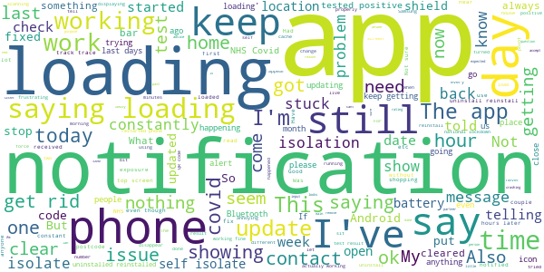
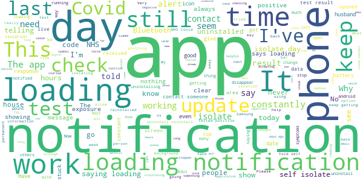

# NHS COVID-19
App version ``4.3 (136)``

Analyzed with [covid-apps-observer](http://github.com/covid-apps-observer) project, version ``0.1``

## App overview
| | |
|-------------------------|-------------------------| 
| **Name**                                          | NHS COVID-19 |
| **Unique identifier** | uk.nhs.covid19.production |
| **Link to Google Play** | [https://play.google.com/store/apps/details?id=uk.nhs.covid19.production](https://play.google.com/store/apps/details?id=uk.nhs.covid19.production) |
| **Summary**  | Protect your loved ones with the NHS contact tracing app for England and Wales. |
| **Privacy policy** | [https://covid19.nhs.uk/our-policies.html](https://covid19.nhs.uk/our-policies.html) |
| **Latest version** | 4.3 (136) |
| **Last update** | 2021-01-22 14:22:48 |
| **Recent changes** | This version gives further information on local measures to Welsh users. It also allows all users with a code to enter positive test results into the app for another type of test, known commonly as a rapid swab test or a lateral flow device (LFD) test. Other UI, language, analytics and accessibility optimisations. |
| **Installs**  | 5,000,000+ |
| **Category** | Medical |
| **First release** | Aug 12, 2020 |
| **Size**  | 8.3M |
| **Supported Android version**  | 6.0 and up |

### Description
> The NHS COVID-19 app is the official contact tracing app for England and Wales. 
 It is the fastest way of knowing when you’re at risk from coronavirus. The quicker you know, the quicker you can alert your loved ones, and your community. 
 The more of us that use it, the better we can control coronavirus. 
 The app runs on proven software developed by Apple and Google, designed so that nobody will know who or where you are. And you can delete your data, or the app, at any time.
 It has a number of features: 
 Trace: Find out when you’ve been near other app users who have tested positive for coronavirus
 Alert: Lets you know the level of coronavirus risk in your postcode district. 
 Check-in: Use our simple QR code scanner to check-in to venues like bars and restaurants. You will get alerted if you have visited a venue where you may have come into contact with coronavirus.
 Symptoms: Check if you have coronavirus symptoms and see if you need to order a test. 
 Test: Helps you order a test if you need to.
 Isolate: Keep track of your self-isolation countdown and access relevant advice.
 Available in English, Welsh, Arabic (Modern Standard), Bengali, Chinese (Simplified), Gujarati, Polish, Punjabi (Gurmukhi script), Romanian, Somali, Turkish and Urdu.
 The app can be used across UK borders in England, Wales, Scotland, Northern Ireland, Jersey and Gibraltar, detecting all relevant contact tracing app users (regardless of them using different official apps), alerting them if they have been in contact with coronavirus. 
 The app has been built in collaboration with some of the most innovative organisations in the world. We have worked with medical experts, privacy groups, at-risk communities and we’ve shared knowledge with the teams working on similar apps in many countries.
 Protect your loved ones. Please download the app. 
 The App is CE marked as a class I medical device in the United Kingdom and developed in compliance with European Commission Directive 93/42/EEC for class I devices.

### User interface
The developers of the app provide the following screenshots in the Google play store.
| | | |
|:-------------------------:|:-------------------------:|:-------------------------:|
 |   |   |   | 
 |   |  

## Development team
In the following we report the main information provided by the development team in the Google play store.

| | |
|-------------------------|-------------------------|
| **Developer**  | Department of Health and Social Care |
| **Website**  | [https://covid19.nhs.uk/](https://covid19.nhs.uk/) |
| **Email** | NHSCovid-19AppStoreSupport@nhsbsa.nhs.uk |
| **Physical address**  | - |
| **Other developed apps**  | [https://play.google.com/store/apps/developer?id=Department+of+Health+and+Social+Care](https://play.google.com/store/apps/developer?id=Department+of+Health+and+Social+Care) |

## Android support

| | |
|-------------------------|-------------------------|
| **Declared target Android version**  | Android10, version 10 (API level 29) |
| **Effective target Android version**  | Android10, version 10 (API level 29) |
| **Minimum supported Android version**  | Marshmallow, version 6.0 (API level 23) |
| **Maximum target Android version**  | - |

The larger the difference between the minimum and maximum supported Android versions, the better. A larger difference means a wider audience. For example, old phones have a very low Android version, so a high minimum supported Android version means that the app cannot be used by users with old phones, thus leading to accessibility problems. 

## Requested permissions

In the following we report the complete list of the permissions requested by the app. 

| **Permission** | **Protection level** | **Description** | 
|-------------------------|-------------------------|-------------------------|
 **android.permission ACCESS_NETWORK_STATE** | Normal | Allows applications to access information about networks. 
 **android.permission BLUETOOTH** | Normal | Allows applications to connect to paired bluetooth devices. 
 **android.permission CAMERA** | :warning:**Dangerous** | Required to be able to access the camera device. 
 **android.permission FOREGROUND_SERVICE** | Normal | Allows a regular application to use Service.startForeground. 
 **android.permission INTERNET** | Normal | Allows applications to open network sockets. 
 **android.permission RECEIVE_BOOT_COMPLETED** | Normal | Allows an application to receive the Intent.ACTION_BOOT_COMPLETED that is broadcast after the system finishes booting. 
 **android.permission WAKE_LOCK** | Normal | Allows using PowerManager WakeLocks to keep processor from sleeping or screen from dimming. 

## Mentioned servers

| **Server** | **Registrant** | **Registrant country** | **Creation date** | 
|-------------------------|-------------------------|-------------------------|-------------------------|
 | google.com | Google LLC | :us: US | 1997-09-15 04:00:00 |
 | ietf.org | IETF Trust | :us: US | 1995-03-11 05:00:00 |
 | googleapis.com | Google LLC | :us: US | 2005-01-25 17:52:26 |
 | apache.org | The Apache Software Foundation | :us: US | 1995-04-11 04:00:00 |

## Security analysis 

Below we report the main security warnings raised by our execution of the [Androwarn](https://github.com/maaaaz/androwarn) security analysis tool.

**Connection interfaces exfiltration**
> - This application reads details about the currently active data network 
> - This application tries to find out if the currently active data network is metered 

**Suspicious connection establishment**
> - This application opens a Socket and connects it to the remote address ' returned no addresses for  ; port is out of range' on the 'N/A' port  
> - This application opens a Socket and connects it to the remote address '' on the 'N/A' port  
> - This application opens a Socket and connects it to the remote address 'Ljava/lang/StringBuilder;->toString()Ljava/lang/String;' on the 'N/A' port  
> - This application opens a Socket and connects it to the remote address 'Ljava/net/Proxy;->type()Ljava/net/Proxy$Type;' on the 'N/A' port  
> - This application opens a Socket and connects it to the remote address 'timeout' on the 'N/A' port  

**Code execution**
> - This application loads a native library 
> - This application loads a native library: 'Ljava/lang/String;->valueOf(Ljava/lang/Object;)Ljava/lang/String;' 

## User ratings and reviews

Below we provide information about how end users are reacting to the app in terms of ratings and reviews in the Google Play store.

### Ratings

The NHS COVID-19 app has been installed by more than **5000000** times. At this time, **98286** rated the app and its average score is **3.711478**. Below we show the distribution of the ratings across the usual star-based rating of Google Play

:star::star::star::star::star:: 52126

:star::star::star::star:: 11849

:star::star::star:: 8503

:star::star:: 5446

:star:: 20362

### Reviews 

#### 5-star reviews

> This app is perfect not one fault, the only issues are the companies and businesses not taking part such as wallmart asda!!!!!! Next door to asda is a subways yet they have barcodes so we can sign in. I have spoken with various asda managers by phone &they don't understand why they av 2 put them up. They're words we're "your phone has in built GPS so the phone knows it's going in and out of the store. I explained to each manager over and over that the NHS relies on this info 2 save lives grr  :date: __2021-01-29 18:57:00__

> Good  :date: __2021-01-29 15:03:36__

> Loving it very informative  :date: __2021-01-29 14:50:08__

> Work like a charm ...  :date: __2021-01-29 04:15:44__

> The app has worked exactly as described. I still follow all social distancing rules but this gives me an added layer of protection.  :date: __2021-01-29 02:25:11__

> Thanks u 😘💓  :date: __2021-01-29 01:05:56__

> For all I know, it's just smoke and mirrors, but I find it reassuring and that's a plus these days.  :date: __2021-01-28 20:51:10__

> I am so grateful for the test it has stopped me from worrying  :date: __2021-01-28 11:28:11__

> Its very helpful and educational with the information given, I think it's a must for everyone to keep information up-to-date  :date: __2021-01-28 08:32:07__

> Ok  :date: __2021-01-28 07:30:38__

#### 4-star reviews

> Works fine, tracking happens. (Previous review mentioned notification which won't clear, developer resolved)  :date: __2021-01-29 21:25:26__

> best thing since sliced bread  :date: __2021-01-29 21:01:12__

> 🤔🤔🤔  :date: __2021-01-28 19:55:39__

> It's working fine here, the only thing that I'm not happy with is that it drain my phone battery, because of the need of the Bluetooth to be on all the time, why can it be linked to GPS or Internet instead of Bluetooth..  :date: __2021-01-27 18:37:13__

> It been saying over the past week that I've a notification but when I click on it there is nothing there and it's still scanning green  :date: __2021-01-27 12:33:36__

> When this app is updated, it shows as loading until the phone is restarted  :date: __2021-01-25 19:36:23__

> This will be really helpful in letting me know weathered like could be infected  :date: __2021-01-25 16:25:41__

> Now a permanent loading notification showing in home screen. Fixed!  :date: __2021-01-25 11:15:52__

> Good  :date: __2021-01-23 17:32:22__

> Latest version appears stable.  :date: __2021-01-23 10:11:06__

#### 3-star reviews

> Not Reassuring to read 'if you do not have any of these symptoms you do not need to do anything else.' Like do many other people, all4 members of my house tested positive at the same time, and only one of us had s slight cough. Headaches were a big trigger for the rest of us. It concerns me that many people will be put off having a test when there is a high chance that they won't develop any of the 3 main symptoms....my cough didnt come for 5 days, by then I could have infected my whole class.  :date: __2021-01-29 12:59:27__

> I have a question as its not specific enough. I'm a security guard in a supermarket. If I get a notification pop up to say I've been exposed am I supposed to go home and self isolate immediately or do I just finish my shift? Its all very confusing  :date: __2021-01-29 02:51:01__

> How effective is this app ? I haven't had any exposure checks in 5 days and I work in a supermarket where customer can't social distance from the staff. So I find this highly unlikely that I haven't had any contact with anyone in 5 days. App must be broken...  :date: __2021-01-28 19:10:14__

> I need this app but does drain my battery  :date: __2021-01-28 15:20:44__

> Since a few days ago the app started to die on my phone. Android is telling me the app is frequently crashing. Looks like I can't rely on it anymore.  :date: __2021-01-27 10:55:24__

> Need more information  :date: __2021-01-27 09:50:10__

> Keep getting semi notifications where the shield icon briefly shows up then disappears again. I am trying my best to stay away from busy places but my partner is a teacher and going in to schools. Makes me wonder is the app actually working or are these semi notification attempts trying to tell me to self isolate. I am aware there were issues a few weeks ago for android users but thought the issue had since been fixed.  :date: __2021-01-27 08:38:06__

> Was working until last update, now the background app keeps crashing and the main app won't open at all.  :date: __2021-01-26 16:35:13__

> I am vulnerable cant go out only for exercise I been in no contact with people I follow the rules but when my app got updated showing I have to isolate it updated lastnight I had my covid test im negative what do I do ?  :date: __2021-01-26 16:22:47__

> I cannot enter the test results as the correct code is not supplied by nhs!?  :date: __2021-01-26 13:22:20__

#### 2-star reviews

> Why not have an option to include quarantine options such as Red Green and Amber to reflect status of quarantine or suspect or free of covid. This will allow enforcement authorities to monitor  :date: __2021-01-29 13:36:41__

> Too early to comment - still new app!  :date: __2021-01-29 03:11:24__

> Has been "loading" for the last 3 days. The last time it happened the only way to get rid of the "loading" was to uninstall and reinstall. Which removes the history and defeats the object of the app.  :date: __2021-01-28 17:03:03__

> Keeps saying loading but nothing loading app still the same  :date: __2021-01-28 12:53:49__

> Constant "loading" notifications on my android phone that won't go away, I have tried restarting and it has not helped  :date: __2021-01-28 11:12:36__

> Unhelpful.  :date: __2021-01-28 08:54:14__

> I opened the app today and it suddenly flashed that I have come into contact with someone with COVID and to isolate for 5 days. This in itself is worrying as the isolation period is 10 days. I received no notification, it was opening the app that notified me so goodness knows when I came into contact with someone or where, although I've only been to Tesco and I didn't scan in with the app.  :date: __2021-01-27 23:56:21__

> Desperately needs to show notifications on the app itself including a history of when near someone with symptoms. I had 2 notifications within the last 24hrs and because I tapped on them they've disappeared before I had a chance to finish reading them. Please look to add this asap  :date: __2021-01-27 23:50:22__

> The app dose work but then some kind of mistake saying i have to self isolate, i haven't been out of the house  :date: __2021-01-27 13:02:58__

> Basic  :date: __2021-01-27 12:53:21__

#### 1-star reviews

> Eats the battery and constantly gives notifications  :date: __2021-01-29 21:43:08__

> It doesn't work like it should so uninstall waste of money and time  :date: __2021-01-29 20:02:04__

> Opened the app, it tells me to isolate for 1 day, checked data within the app, exposure date 19 January 2021 and today is the 29 January 2021, the app has full notifications enabled on my phone. It failed samsung s10+ and on my wife's iPhone 10, if both of us have been asymptomatic, I am terrified to know who we could have infected! Now I have uninstall and reinstalled the app and will have to open it manually daily. I have emailed the support, they seem to not care, just copy and paste support!  :date: __2021-01-29 18:12:38__

> Dosent work at all drains my battery and sends alerts of nothing a waste of time  :date: __2021-01-29 12:09:36__

> Last update was 22 hours ago but looks exactly like previous. Three variants identified, with different symptoms but app still Not updated. And it still says check when it should say check And tick relevant boxes. I check every day, it tells me not to do anything at the top and to confirm at the bottom! Why doesn't it say tick? Also I've had most of the British variant symptoms going back to January 2020 and some of them going back to June 2019!!  :date: __2021-01-29 10:31:31__

> "NHS Covid-19 loading..." This is displayed almost permanently. Developer and Google are aware of the issue and yet little is done to apparently attempt to fix the problem or allay the publics' fear that the App is doing nothing. Either fix the problem or I uninstall. I have to disable notifications which totally defeats the object of having the App. COME ON GUYS!!! Update 29/1: Someone is BS. The problem is NOT resolved. Just look at online forums and App comments to see that is the case.  :date: __2021-01-29 10:30:59__

> Walls!=car. Had a incorrect notification to self isolate based on being exposed yesterday. Only time I went out yesterday was to get tested. My result came back negative. Drive through test centre was busy, waiting for 10 minutes in one position in a queue of cars waiting to get tested. I'm sure that it has said I was in close contact with one of the people in their car queuing next to me.They were in separate cars. This has a bug which hasn't been tested for,giving incorrect notifications.  :date: __2021-01-29 09:29:13__

> Low standard app, generally unstable, needs updating or rewriting to reflect its importance to healthcare - untrustworthy.  :date: __2021-01-29 07:19:03__

> Keeps crashing. Have tried to reinstall to get it to work. But it just keeps crashing.  :date: __2021-01-29 00:30:28__

> Have already left a review but after looking the the exposure IDs on phone say on the 26/01/2021 I had 2 matches of keys but never got a notification. This app is a waste of time as clearly not work how it should.  :date: __2021-01-29 00:04:08__

