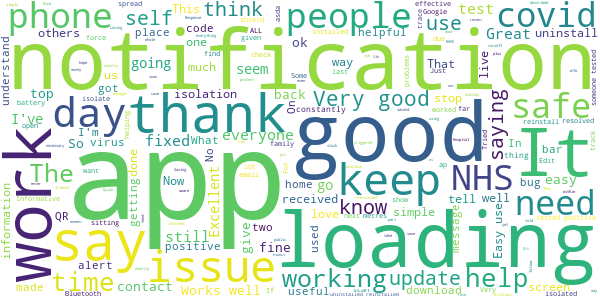

# NHS COVID-19
App version ``4.3 (136)``

Analyzed with [covid-apps-observer](http://github.com/covid-apps-observer) project, version ``0.1``

## App overview
| | |
|-------------------------|-------------------------| 
| **Name**&nbsp;&nbsp;&nbsp;&nbsp;&nbsp;&nbsp;&nbsp;&nbsp;&nbsp;&nbsp;&nbsp;&nbsp;&nbsp;&nbsp;&nbsp;&nbsp;&nbsp;&nbsp;&nbsp;&nbsp;&nbsp;&nbsp;&nbsp;&nbsp;&nbsp;&nbsp;&nbsp;&nbsp;&nbsp;&nbsp;&nbsp;&nbsp;&nbsp;&nbsp;&nbsp;&nbsp;&nbsp;&nbsp;&nbsp;&nbsp;  | NHS COVID-19 |
| **Unique identifier** | uk.nhs.covid19.production |
| **Link to Google Play** | [https://play.google.com/store/apps/details?id=uk.nhs.covid19.production](https://play.google.com/store/apps/details?id=uk.nhs.covid19.production) |
| **Summary**  | Protect your loved ones with the NHS contact tracing app for England and Wales. |
| **Privacy policy** | [https://covid19.nhs.uk/our-policies.html](https://covid19.nhs.uk/our-policies.html) |
| **Latest version** | 4.3 (136) |
| **Last update** | 2021-01-22 14:22:48 |
| **Recent changes** | This version gives further information on local measures to Welsh users. It also allows all users with a code to enter positive test results into the app for another type of test, known commonly as a rapid swab test or a lateral flow device (LFD) test. Other UI, language, analytics and accessibility optimisations. |
| **Installs**  | 5,000,000+ |
| **Category** | Medical |
| **First release** | Aug 12, 2020 |
| **Size**  | 8.3M |
| **Supported Android version**  | 6.0 and up |

### Description
> The NHS COVID-19 app is the official contact tracing app for England and Wales. 
 It is the fastest way of knowing when you’re at risk from coronavirus. The quicker you know, the quicker you can alert your loved ones, and your community. 
 The more of us that use it, the better we can control coronavirus. 
 The app runs on proven software developed by Apple and Google, designed so that nobody will know who or where you are. And you can delete your data, or the app, at any time.
 It has a number of features: 
 Trace: Find out when you’ve been near other app users who have tested positive for coronavirus
 Alert: Lets you know the level of coronavirus risk in your postcode district. 
 Check-in: Use our simple QR code scanner to check-in to venues like bars and restaurants. You will get alerted if you have visited a venue where you may have come into contact with coronavirus.
 Symptoms: Check if you have coronavirus symptoms and see if you need to order a test. 
 Test: Helps you order a test if you need to.
 Isolate: Keep track of your self-isolation countdown and access relevant advice.
 Available in English, Welsh, Arabic (Modern Standard), Bengali, Chinese (Simplified), Gujarati, Polish, Punjabi (Gurmukhi script), Romanian, Somali, Turkish and Urdu.
 The app can be used across UK borders in England, Wales, Scotland, Northern Ireland, Jersey and Gibraltar, detecting all relevant contact tracing app users (regardless of them using different official apps), alerting them if they have been in contact with coronavirus. 
 The app has been built in collaboration with some of the most innovative organisations in the world. We have worked with medical experts, privacy groups, at-risk communities and we’ve shared knowledge with the teams working on similar apps in many countries.
 Protect your loved ones. Please download the app. 
 The App is CE marked as a class I medical device in the United Kingdom and developed in compliance with European Commission Directive 93/42/EEC for class I devices.

### User interface
The developers of the app provide the following screenshots in the Google play store.
| | | |
|:-------------------------:|:-------------------------:|:-------------------------:|
 |   |   |   | 
 |   |  

## Development team
In the following we report the main information provided by the development team in the Google play store.

| | |
|-------------------------|-------------------------|
| **Developer**  | Department of Health and Social Care |
| **Website**  | [https://covid19.nhs.uk/](https://covid19.nhs.uk/) |
| **Email** | NHSCovid-19AppStoreSupport@nhsbsa.nhs.uk |
| **Physical address**  | - |
| **Other developed apps**  | [https://play.google.com/store/apps/developer?id=Department+of+Health+and+Social+Care](https://play.google.com/store/apps/developer?id=Department+of+Health+and+Social+Care) |

## Android support

| | |
|-------------------------|-------------------------|
| **Declared target Android version**  | Android10, version 10 (API level 29) |
| **Effective target Android version**  | Android10, version 10 (API level 29) |
| **Minimum supported Android version**  | Marshmallow, version 6.0 (API level 23) |
| **Maximum target Android version**  | - |

The larger the difference between the minimum and maximum supported Android versions, the better. A larger difference means a wider audience. For example, old phones have a very low Android version, so a high minimum supported Android version means that the app cannot be used by users with old phones, thus leading to accessibility problems. 

## Requested permissions

In the following we report the complete list of the permissions requested by the app. 

| **Permission** | **Protection level** | **Description** | 
|-------------------------|-------------------------|-------------------------|
 **android.permission ACCESS_NETWORK_STATE** | Normal | Allows applications to access information about networks. 
 **android.permission BLUETOOTH** | Normal | Allows applications to connect to paired bluetooth devices. 
 **android.permission CAMERA** | :warning:**Dangerous** | Required to be able to access the camera device. 
 **android.permission FOREGROUND_SERVICE** | Normal | Allows a regular application to use Service.startForeground. 
 **android.permission INTERNET** | Normal | Allows applications to open network sockets. 
 **android.permission RECEIVE_BOOT_COMPLETED** | Normal | Allows an application to receive the Intent.ACTION_BOOT_COMPLETED that is broadcast after the system finishes booting. 
 **android.permission WAKE_LOCK** | Normal | Allows using PowerManager WakeLocks to keep processor from sleeping or screen from dimming. 

## Mentioned servers

| **Server** | **Registrant** | **Registrant country** | **Creation date** | 
|-------------------------|-------------------------|-------------------------|-------------------------|
 | google.com | Google LLC | :us: US | 1997-09-15 04:00:00 |
 | ietf.org | IETF Trust | :us: US | 1995-03-11 05:00:00 |
 | googleapis.com | Google LLC | :us: US | 2005-01-25 17:52:26 |
 | apache.org | The Apache Software Foundation | :us: US | 1995-04-11 04:00:00 |

## Security analysis 

Below we report the main security warnings raised by our execution of the [Androwarn](https://github.com/maaaaz/androwarn) security analysis tool.

**Connection interfaces exfiltration**
> - This application reads details about the currently active data network 
> - This application tries to find out if the currently active data network is metered 

**Suspicious connection establishment**
> - This application opens a Socket and connects it to the remote address ' returned no addresses for  ; port is out of range' on the 'N/A' port  
> - This application opens a Socket and connects it to the remote address '' on the 'N/A' port  
> - This application opens a Socket and connects it to the remote address 'Ljava/lang/StringBuilder;->toString()Ljava/lang/String;' on the 'N/A' port  
> - This application opens a Socket and connects it to the remote address 'Ljava/net/Proxy;->type()Ljava/net/Proxy$Type;' on the 'N/A' port  
> - This application opens a Socket and connects it to the remote address 'timeout' on the 'N/A' port  

**Code execution**
> - This application loads a native library 
> - This application loads a native library: 'Ljava/lang/String;->valueOf(Ljava/lang/Object;)Ljava/lang/String;' 

## User ratings and reviews

Below we provide information about how end users are reacting to the app in terms of ratings and reviews in the Google Play store.

### Ratings

The NHS COVID-19 app has been installed by more than **5000000** times. At this time, **98286** rated the app and its average score is **3.711478**. Below we show the distribution of the ratings across the usual star-based rating of Google Play

:star::star::star::star::star:: 52126

:star::star::star::star:: 11849

:star::star::star:: 8503

:star::star:: 5446

:star:: 20362

### Reviews 

#### 5-star reviews

> Just back from the innoculation centre - a pleasant and painless experience - HIGHLY RECOMMENDED - MAKE SURE THAT YOU GET YOURS!!  :date: __2021-02-06 16:52:27__

> Just joined so hope it works  :date: __2021-02-06 16:40:56__

> At least it gives some idea of spread and precautions to take Found it very helpful.  :date: __2021-02-06 16:24:40__

> Excellent  :date: __2021-02-06 10:12:45__

> Good  :date: __2021-02-05 17:22:24__

> Excellent  :date: __2021-02-05 14:54:29__

> Shreenil odedra  :date: __2021-02-05 13:07:04__

> It works well. In my office, the first positive case triggered app isolations for the three people sitting within 8 metres, the second positive triggered app isolations for 12 people within around 12 metres. In both cases the app got everyone sitting closest, but keep in mind that it accumulates contacts at a much greater distance than two metres, butvatxa much slower rate.  :date: __2021-02-05 11:18:00__

> Simple and effective  :date: __2021-02-05 11:17:13__

> Informative 👍  :date: __2021-02-05 10:41:56__

#### 4-star reviews

> They fixed a problem with the app, so upping the star count. Can you fix the problem with the government as well? Also, can you gamify the app, like points for not getting covid or something? Unlockable achievements? Daily rewards? Anything to break the tedium. Thanks, xxxx  :date: __2021-02-06 08:26:59__

> Twilight zone  :date: __2021-02-06 06:00:00__

> sometimes a little slow, but works okay.  :date: __2021-02-05 13:04:42__

> UPDATE: Alert appears to have stopped - thanks for that. App now seems to work fine.  :date: __2021-02-05 12:37:13__

> The new advive not always up to date otherwise ok  :date: __2021-02-04 15:56:53__

> Suddenly my Bluetooth won't switch so the app won't work I cant seem to fix it. Update. I had restarted several times it didn't help. Powering off worked tho. So it's up and running again thanks  :date: __2021-02-01 18:33:52__

> This app is ok and as there is no alternative you can't choose anything else. I used it for checking into venues, but due to national lockdown I no longer do this. I haven't been alerted to any contacts so assume I've not had contact with anyone testing positive. The Test and Trace programme seems to have largely been an inefficient use of public money that has been ignored but many people. Perhaps a public inquiry will reveal the cost/benefit of this.  :date: __2021-01-30 22:58:58__

> Works fine, tracking happens. (Previous review mentioned notification which won't clear, developer resolved)  :date: __2021-01-29 21:25:26__

> best thing since sliced bread  :date: __2021-01-29 21:01:12__

> 🤔🤔🤔  :date: __2021-01-28 19:55:39__

#### 3-star reviews

> Has been working fine since downloading it, however in the past couple of weeks I've had lots of 'notifications' (vibrations and alerting notifications) however all that shows up is 'loading' no notification telling me anything Also will not let me put in the lateral flow test results. I am being tested every week with work and it will not let me input the results  :date: __2021-02-06 17:51:40__

> Needs the ability to input the date the user has received each dose of the vaccines  :date: __2021-02-06 16:08:20__

> I have had to uninstall the app again. Today it was loading for 2 hours when I got rid of it. I will reinstall it. I also use the zoe reporting app. Much simpler to input tests etc.  :date: __2021-02-06 10:53:01__

> Is the test code your account ID? If so not fit for purpose as it just says invalid. Mine started z2  :date: __2021-02-06 10:13:45__

> A suggestion could be to actually pin-point where you were when you interacted with a person with covid. My room mate got a notification that they had been near a positive person, but wasn't told anything else...  :date: __2021-02-06 09:59:14__

> Keep getting notifications that its loading.  :date: __2021-02-05 18:25:32__

> Had number 1 for message come up 3 times.but no alerts.  :date: __2021-02-05 14:10:54__

> I'm concerned that I can't access the exposure log to check how many times I have been tagged and what time the encounters took place, it would be useful to be able to check when it happened so that I know where roughly I would have been at the time.  :date: __2021-02-05 13:12:48__

> Rubbish. Cant use existing QR track and trace codes. Requires new NHS QR codes which places do not have.  :date: __2021-02-04 17:55:09__

> It keeps trying to re load and there is little to no help with updating it Will remove and re down load see if that helps  :date: __2021-02-04 13:27:43__

#### 2-star reviews

> The only alerts I've ever received were about Tier changes EIGHT DAYS AFTER my area went from Tier 2 to Tier 3, and after already hearing about the change on the news. A bit too slow on the alerts to be helpful, but otherwise the check in feature seems to work well.  :date: __2021-02-06 12:37:18__

> I live and work in 3 different postcodes, how can I change the app to include all 3 when I am in those areas?  :date: __2021-02-05 13:56:48__

> I am isolating for the second time. This time after visiting a supermarket for less than 15 minutes. No way could I have been within 2 meters of someone for 15 minutes or more. Oh well, 4 more days to go. Not impressed though.  :date: __2021-02-04 20:37:14__

> Says "loading" again this morning. I thought you said Google had fixed this problem. Obviously not. EDIT: I have now reported it as requested but couldn't attach screenshot because there isn't the option to do that.  :date: __2021-02-04 19:05:22__

> For such an important and crucial app I would expect an option/function to adjust the font size. I am severely visually impsired/blind. This app is only oartially accessesable to me.  :date: __2021-02-04 14:04:36__

> It's saying its scanning but I can't use venue and it stays in my home postcode no matter where I go also I have brought a new Samsung phone thats supposed to be compatible with the app and should allow venue check in but still doesn't work?  :date: __2021-02-04 11:10:09__

> Won't load up again since the update. Pretty useless really.  :date: __2021-02-03 23:24:05__

> The app seems to have stopped running in the background. Been out and it wasn't running. I only checked it when I was back to discover it wasn't running.  :date: __2021-02-03 21:36:23__

> The app is telling me I have a notice, however, when I open it there is NO way of identifying the notice or accessing what it is????  :date: __2021-02-03 10:12:05__

> Not accepting my test results. Tried to input the code for my Coronavirus test results and it says the code is not recognized. I did not have this problem last December. I wonder why that is?  :date: __2021-02-02 18:22:23__

#### 1-star reviews

> Ive wrote 3 reviews now each gets deleted...app keeps crashing, slows my phone down and heavily reduces battery life to the point I've spent most of the day at work unable to record who I've been near...what's the point in that  :date: __2021-02-06 17:42:47__

> Do not give them your private data and location , this app is a massive invasion of civil liberty  :date: __2021-02-06 16:50:38__

> I am a NHS staff working in a all covid positive patients' ward. I am supposed to turn off my Bluetooth before entering hospital. One day forgot to turn it off and left on for couple days because it went out of my head. Now yesterday, while I was on my shift working, I got a notification saying I need to isolate for next 9 days because I was in contact with a covid positive person. Very funny. I was in contact with at least 20 of them in those couple of days.  :date: __2021-02-06 15:58:18__

> Don't use this app one of my friends at work had covied it didn't go off he put his test in it taken three days I got test at one of the centers I got called saying I've been in contact with someone the app didn't say anything so I deleted the app I don't use it  :date: __2021-02-06 14:59:54__

> Not for me anymore  :date: __2021-02-06 12:34:19__

> Massive problem with re-testing. I was asked to use this app to re-book a failed (as in "unable to test") test. Having entered in all my details, I was told I couldn't have another test as I'd recently had one!! Yes, one that didn't work!!!! Totally useless and potentially deadly for ill people :(  :date: __2021-02-06 11:35:33__

> Keeps showing a notification then says loading, with nothing to read. Keep uninstalling, then reinstalling to get rid of message. A right pain!  :date: __2021-02-06 09:54:08__

> I work within the community providing meals to vulnerable adults, and have always checked into venues when able to. I was wondering why I had not seen anything for a while when i discovered that because it had not been working in the background (as designed to do??) the app was going into deep sleep.. surely something that if it is supposed to be so vital to the effort against COVID yoy should not have to go into the settings and authorise it to work the way its supposed to? Absolutely disgusted  :date: __2021-02-06 07:56:31__

> Broken once again. Stuck notifications. Removed  :date: __2021-02-05 23:01:43__

> To apply for financial support when the app tells you to self isolate you need to register via a link in the app to request a NHS Test and Trace Account ID. Cannot find this link anywhere. Search on Google, useless results. Search YouTube, find a vid that shows how this is done. There should be a tab on the home page of the app. Not there on my app. Check for an update, yes it needs an update. Update app, check home page again. Still no tab. No wonder people on low incomes ignore this crApp.  :date: __2021-02-05 18:48:42__

