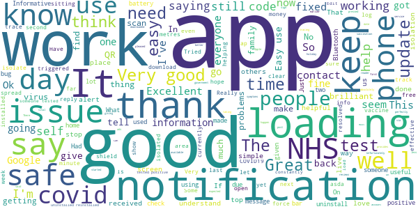
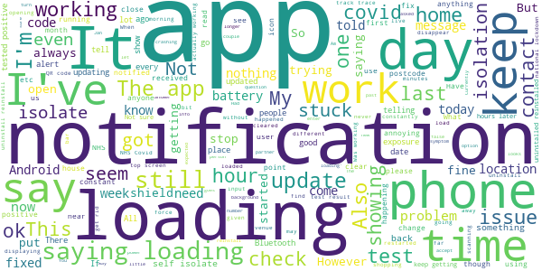

# NHS COVID-19
App version ``4.4 (146)``

Analyzed with [covid-apps-observer](http://github.com/covid-apps-observer) project, version ``0.1``

## App overview
| | |
|-------------------------|-------------------------| 
| **Name**&nbsp;&nbsp;&nbsp;&nbsp;&nbsp;&nbsp;&nbsp;&nbsp;&nbsp;&nbsp;&nbsp;&nbsp;&nbsp;&nbsp;&nbsp;&nbsp;&nbsp;&nbsp;&nbsp;&nbsp;&nbsp;&nbsp;&nbsp;&nbsp;&nbsp;&nbsp;&nbsp;&nbsp;&nbsp;&nbsp;&nbsp;&nbsp;&nbsp;&nbsp;&nbsp;&nbsp;&nbsp;&nbsp;&nbsp;&nbsp;  | NHS COVID-19 |
| **Unique identifier** | uk.nhs.covid19.production |
| **Link to Google Play** | [https://play.google.com/store/apps/details?id=uk.nhs.covid19.production](https://play.google.com/store/apps/details?id=uk.nhs.covid19.production) |
| **Summary**  | Protect your loved ones with the NHS contact tracing app for England and Wales. |
| **Privacy policy** | [https://covid19.nhs.uk/our-policies.html](https://covid19.nhs.uk/our-policies.html) |
| **Latest version** | 4.4 (146) |
| **Last update** | 2021-02-08 18:08:05 |
| **Recent changes** | We have introduced a change which means that after entering certain types of test results in the app, users may be advised to book a follow-up test that is sent to a lab for analysis. Other design, language and accessibility optimisations. |
| **Installs**  | 5,000,000+ |
| **Category** | Medical |
| **First release** | Aug 12, 2020 |
| **Size**  | 8.4M |
| **Supported Android version**  | 6.0 and up |

### Description
> The NHS COVID-19 app is the official contact tracing app for England and Wales. 
 It is the fastest way of knowing when you’re at risk from coronavirus. The quicker you know, the quicker you can alert your loved ones, and your community. 
 The more of us that use it, the better we can control coronavirus. 
 The app runs on proven software developed by Apple and Google, designed so that nobody will know who or where you are. And you can delete your data, or the app, at any time.
 It has a number of features: 
 Trace: Find out when you’ve been near other app users who have tested positive for coronavirus
 Alert: Lets you know the level of coronavirus risk in your postcode district. 
 Check-in: Use our simple QR code scanner to check-in to venues like bars and restaurants. You will get alerted if you have visited a venue where you may have come into contact with coronavirus.
 Symptoms: Check if you have coronavirus symptoms and see if you need to order a test. 
 Test: Helps you order a test if you need to.
 Isolate: Keep track of your self-isolation countdown and access relevant advice.
 Available in English, Welsh, Arabic (Modern Standard), Bengali, Chinese (Simplified), Gujarati, Polish, Punjabi (Gurmukhi script), Romanian, Somali, Turkish and Urdu.
 The app can be used across UK borders in England, Wales, Scotland, Northern Ireland, Jersey and Gibraltar, detecting all relevant contact tracing app users (regardless of them using different official apps), alerting them if they have been in contact with coronavirus. 
 The app has been built in collaboration with some of the most innovative organisations in the world. We have worked with medical experts, privacy groups, at-risk communities and we’ve shared knowledge with the teams working on similar apps in many countries.
 Protect your loved ones. Please download the app. 
 The App is CE marked as a class I medical device in the United Kingdom and developed in compliance with European Commission Directive 93/42/EEC for class I devices.

### User interface
The developers of the app provide the following screenshots in the Google play store.
| | | |
|:-------------------------:|:-------------------------:|:-------------------------:|
 |   |   |   | 
 |   |  

## Development team
In the following we report the main information provided by the development team in the Google play store.

| | |
|-------------------------|-------------------------|
| **Developer**  | Department of Health and Social Care |
| **Website**  | [https://covid19.nhs.uk/](https://covid19.nhs.uk/) |
| **Email** | NHSCovid-19AppStoreSupport@nhsbsa.nhs.uk |
| **Physical address**  | - |
| **Other developed apps**  | [https://play.google.com/store/apps/developer?id=Department+of+Health+and+Social+Care](https://play.google.com/store/apps/developer?id=Department+of+Health+and+Social+Care) |

## Android support

| | |
|-------------------------|-------------------------|
| **Declared target Android version**  | Android10, version 10 (API level 29) |
| **Effective target Android version**  | Android10, version 10 (API level 29) |
| **Minimum supported Android version**  | Marshmallow, version 6.0 (API level 23) |
| **Maximum target Android version**  | - |

The larger the difference between the minimum and maximum supported Android versions, the better. A larger difference means a wider audience. For example, old phones have a very low Android version, so a high minimum supported Android version means that the app cannot be used by users with old phones, thus leading to accessibility problems. 

## Requested permissions

In the following we report the complete list of the permissions requested by the app. 

| **Permission** | **Protection level** | **Description** | 
|-------------------------|-------------------------|-------------------------|
 **android.permission ACCESS_NETWORK_STATE** | Normal | Allows applications to access information about networks. 
 **android.permission BLUETOOTH** | Normal | Allows applications to connect to paired bluetooth devices. 
 **android.permission CAMERA** | :warning:**Dangerous** | Required to be able to access the camera device. 
 **android.permission FOREGROUND_SERVICE** | Normal | Allows a regular application to use Service.startForeground. 
 **android.permission INTERNET** | Normal | Allows applications to open network sockets. 
 **android.permission RECEIVE_BOOT_COMPLETED** | Normal | Allows an application to receive the Intent.ACTION_BOOT_COMPLETED that is broadcast after the system finishes booting. 
 **android.permission WAKE_LOCK** | Normal | Allows using PowerManager WakeLocks to keep processor from sleeping or screen from dimming. 

## Mentioned servers

| **Server** | **Registrant** | **Registrant country** | **Creation date** | 
|-------------------------|-------------------------|-------------------------|-------------------------|
 | google.com | Google LLC | :us: US | 1997-09-15 04:00:00 |
 | ietf.org | IETF Trust | :us: US | 1995-03-11 05:00:00 |
 | googleapis.com | Google LLC | :us: US | 2005-01-25 17:52:26 |
 | apache.org | The Apache Software Foundation | :us: US | 1995-04-11 04:00:00 |

## Security analysis 

Below we report the main security warnings raised by our execution of the [Androwarn](https://github.com/maaaaz/androwarn) security analysis tool.

**Connection interfaces exfiltration**
> - This application reads details about the currently active data network 
> - This application tries to find out if the currently active data network is metered 

**Suspicious connection establishment**
> - This application opens a Socket and connects it to the remote address ' returned no addresses for  ; port is out of range' on the 'N/A' port  
> - This application opens a Socket and connects it to the remote address '' on the 'N/A' port  
> - This application opens a Socket and connects it to the remote address 'Ljava/lang/StringBuilder;->toString()Ljava/lang/String;' on the 'N/A' port  
> - This application opens a Socket and connects it to the remote address 'Ljava/net/Proxy;->type()Ljava/net/Proxy$Type;' on the 'N/A' port  
> - This application opens a Socket and connects it to the remote address 'timeout' on the 'N/A' port  

**Code execution**
> - This application loads a native library 
> - This application loads a native library: 'Ljava/lang/String;->valueOf(Ljava/lang/Object;)Ljava/lang/String;' 

## User ratings and reviews

Below we provide information about how end users are reacting to the app in terms of ratings and reviews in the Google Play store.

### Ratings

The NHS COVID-19 app has been installed by more than **5000000** times. At this time, **99111** rated the app and its average score is **3.7043085**. Below we show the distribution of the ratings across the usual star-based rating of Google Play

:star::star::star::star::star:: 52625

:star::star::star::star:: 11669

:star::star::star:: 8491

:star::star:: 5541

:star:: 20785

### Reviews 

#### 5-star reviews

> Easy to get on with  :date: __2021-02-13 19:34:45__

> V.good.hope.nhs.covid.app Is.in It.now.charging.mob.thank.y.i.need.t.covid.app  :date: __2021-02-13 18:46:46__

> Ok,  :date: __2021-02-13 17:23:39__

> No issues or problems at all  :date: __2021-02-13 14:13:35__

> Very good  :date: __2021-02-13 13:12:58__

> Have been given my 1st.vaccination earlier than I expected thank you Boris for making this happen for UK  :date: __2021-02-12 23:04:34__

> good to know were ssafe  :date: __2021-02-12 20:15:19__

> I'm pleased with the app, provides good clear advice  :date: __2021-02-12 19:55:59__

> very good  :date: __2021-02-12 19:11:21__

> Easy to navigate.  :date: __2021-02-12 17:08:18__

#### 4-star reviews

> Thankfully  :date: __2021-02-11 21:30:01__

> Seems fine, keep up the good work guys! :)  :date: __2021-02-11 16:38:52__

> Okay  :date: __2021-02-11 14:49:32__

> They fixed a problem with the app, so upping the star count. Can you fix the problem with the government as well? Also, can you gamify the app, like points for not getting covid or something? Unlockable achievements? Daily rewards? Anything to break the tedium. Thanks, xxxx  :date: __2021-02-06 08:26:59__

> Twilight zone  :date: __2021-02-06 06:00:00__

> sometimes a little slow, but works okay.  :date: __2021-02-05 13:04:42__

> UPDATE: Alert appears to have stopped - thanks for that. App now seems to work fine.  :date: __2021-02-05 12:37:13__

> The new advive not always up to date otherwise ok  :date: __2021-02-04 15:56:53__

> Suddenly my Bluetooth won't switch so the app won't work I cant seem to fix it. Update. I had restarted several times it didn't help. Powering off worked tho. So it's up and running again thanks  :date: __2021-02-01 18:33:52__

> This app is ok and as there is no alternative you can't choose anything else. I used it for checking into venues, but due to national lockdown I no longer do this. I haven't been alerted to any contacts so assume I've not had contact with anyone testing positive. The Test and Trace programme seems to have largely been an inefficient use of public money that has been ignored but many people. Perhaps a public inquiry will reveal the cost/benefit of this.  :date: __2021-01-30 22:58:58__

#### 3-star reviews

> 20/1/21 26/1/21? 12/2/21  :date: __2021-02-12 11:11:41__

> The app may or may not be running in the background there is no way to tell. Initially after starting the app of I display all running shoes this one shows not after a few minutes it no longer does. I am not at all sure it is running and have to remember to the start of every time I leave the house.  :date: __2021-02-12 07:28:30__

> Works fine. Excessive notifications though about loading.  :date: __2021-02-12 06:53:46__

> I can't change my postcode as l cannot find the home page or the "manage my app" section, l have spent ages trying to sort this out but have had no luck  :date: __2021-02-12 00:28:35__

> Currently won't open. Uninstall and reinstall still not working. On opening the app it just crashes. Using a Pixel phone so should work with Android  :date: __2021-02-11 19:02:52__

> Despite false isolations, I've given it a third chance. Currently its behaving as I would expect. Its not giving isolation messages and Thats because I'm not mixing still. Its 5 weeks with trace on and no more false positives. SO FAR. Ive marked it up to 3 and will see how it goes.  :date: __2021-02-11 10:15:20__

> I keep getting exposure notifications, but nothing more. What happens next? Thanks.  :date: __2021-02-10 21:41:43__

> It's fine, but kind of a mess. You cannot actually enter in any codes you get at test centers. Additionally, here are some points to improve upon: Changing location is possible but kinda hard to find. Others have issues with the app being suspended. Power management issues should be acknowledged by the app, and users should be asked to exempt the app on first start. National statistics would be nice. Also please add the option to add a shortcut to the 'scan' activity.  :date: __2021-02-10 17:45:11__

> Moor Costmer id De Store  :date: __2021-02-08 19:39:14__

> Quite annoying having to keep Bluetooth ans gps on ALL the time. If you don't you are reminded every 10 mins or so to turn them all on. Someone should tell the developer the power consuptions of these features and houw it affects the battery life. Having WiFi on anyway (which is as good as gps when you are at home) should sufice to get the notifications.  :date: __2021-02-08 01:17:24__

#### 2-star reviews

> Doesnt work well  :date: __2021-02-13 16:58:59__

> Doesn't open half the time, and not informative the rest  :date: __2021-02-13 09:54:27__

> It barely works. The only reason I have it installed at this point is because if I fear that if I try to uninstall it, Michael Gove will appear and kick me in the groin. Having notifications about legislation changes is nice, but otherwise it's so poorly thought out. The main reason I signed up was for privacy-first contact tracing, but that feature requires both bluetooth *and* location permissions, which is highly suspect! And when you do get a hit, the notification autodismisses itself. Wow.  :date: __2021-02-13 09:37:16__

> Not too sure if it's reliable.  :date: __2021-02-12 21:50:43__

> How can you review your exposure checks  :date: __2021-02-12 20:23:04__

> Constant notification saying loading.  :date: __2021-02-12 08:29:14__

> I read in the app to put in the code that came with the covid test result. I've had tests but no code. I find the app to be unhelpful and not very user friendly. Feel as if it was made in a rush. Sorry but I believe the review needs to be honest and fair.  :date: __2021-02-10 17:06:32__

> Used to work but no longer even starts, I just got a pop-up from Android telling me the app is continuously stopping. When I try to open the app, it is frozen on the splash screen. Reinstalling didn't fix it  :date: __2021-02-10 07:54:56__

> Had a load notification on my phone for a day now please fix  :date: __2021-02-09 18:32:51__

> Sometimes I have switched the app off at night to save power and I set it to come on again in 8 hours. However if you miss the brief reminder it doesn't come on and I go about my day with it switched off. There doesn't seem to be away for it to resume operating automatically.  :date: __2021-02-09 08:24:17__

#### 1-star reviews

> Terribly awful  :date: __2021-02-13 17:34:17__

> Brittle sucks u suck🖕🖕🖕🖕🖕🖕☝️  :date: __2021-02-13 17:18:10__

> The app originally promised no GPS now it does uninstalled  :date: __2021-02-13 15:29:16__

> CANT DOWNLOAD IF UNDER 16!?!? Pointless. Must have GPS and Bluetooth on at all times to work. Immediately the app drains your battery. REPLY: Sorry I'm not able to copy and paste the link so I can't.  :date: __2021-02-13 13:43:14__

> Reply to dev response 13.2.21 I was looking for the information saying when the covid app had last checked for contact, not if I had any positive contact. A previous version had stopped working and I only found out after a couple weeks by checking if it had been updating contacts( which it hadn't), I am unable to check this now.  :date: __2021-02-13 12:38:25__

> I knew from a close contact that they had tested positive, but the app running on a Samsung app did not notify me that I needed to isolate, until I went into the app to see why I hadn't received a notification. The whole point of this is app is to run in the background and inform you of events, not for you to go looking for them.  :date: __2021-02-13 10:58:33__

> Rubbish. In same house as someone who is positive and still not getting any alert I live with him obviously we are in constant contact. And your app is still not showing any alerts. Its rubbish  :date: __2021-02-13 09:50:50__

> Ok, until...I went onto the play store and there was an 'enable' button on it. I've never disabled it. It was working. A contact tracing app that disables itself is not a very effective one. Poor.  :date: __2021-02-13 07:05:43__

> 1 simply because whoever I got covid from wasn't using it, kind of sums up the app experience as a whole.  :date: __2021-02-12 22:36:52__

> Don't work on my phone I have a Samsung fold phone and it don't work I have tried all the app for covid-19 and not one of them work 😑😒😡  :date: __2021-02-12 22:14:36__

