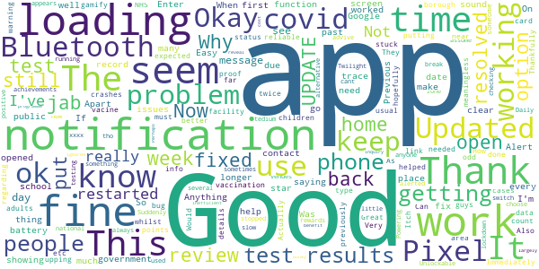

# NHS COVID-19
App version ``4.5 (152)``

Analyzed with [covid-apps-observer](http://github.com/covid-apps-observer) project, version ``0.1``

## App overview
| | |
|-------------------------|-------------------------| 
| **Name**&nbsp;&nbsp;&nbsp;&nbsp;&nbsp;&nbsp;&nbsp;&nbsp;&nbsp;&nbsp;&nbsp;&nbsp;&nbsp;&nbsp;&nbsp;&nbsp;&nbsp;&nbsp;&nbsp;&nbsp;&nbsp;&nbsp;&nbsp;&nbsp;&nbsp;&nbsp;&nbsp;&nbsp;&nbsp;&nbsp;&nbsp;&nbsp;&nbsp;&nbsp;&nbsp;&nbsp;&nbsp;&nbsp;&nbsp;&nbsp;  | NHS COVID-19 |
| **Unique identifier** | uk.nhs.covid19.production |
| **Link to Google Play** | [https://play.google.com/store/apps/details?id=uk.nhs.covid19.production](https://play.google.com/store/apps/details?id=uk.nhs.covid19.production) |
| **Summary**  | Protect your loved ones with the NHS contact tracing app for England and Wales. |
| **Privacy policy** | [https://covid19.nhs.uk/our-policies.html](https://covid19.nhs.uk/our-policies.html) |
| **Latest version** | 4.5 (152) |
| **Last update** | 2021-02-19 17:46:26 |
| **Recent changes** | We have introduced a change which means that users who enter a positive test result from a lab into the app, but did not book the test through the app, will be asked to state when their symptoms started. This is to make sure the self-isolation countdown in the app aligns with the advice from the contact tracing teams in the wider programme. Other design, language and accessibility optimisations.  |
| **Installs**  | 5,000,000+ |
| **Category** | Medical |
| **First release** | Aug 12, 2020 |
| **Size**  | 8.5M |
| **Supported Android version**  | 6.0 and up |

### Description
> The NHS COVID-19 app is the official contact tracing app for England and Wales. 
 It is the fastest way of knowing when you’re at risk from coronavirus. The quicker you know, the quicker you can alert your loved ones, and your community. 
 The more of us that use it, the better we can control coronavirus. 
 The app runs on proven software developed by Apple and Google, designed so that nobody will know who or where you are. And you can delete your data, or the app, at any time.
 It has a number of features: 
 Trace: Find out when you’ve been near other app users who have tested positive for coronavirus
 Alert: Lets you know the level of coronavirus risk in your postcode district. 
 Check-in: Use our simple QR code scanner to check-in to venues like bars and restaurants. You will get alerted if you have visited a venue where you may have come into contact with coronavirus.
 Symptoms: Check if you have coronavirus symptoms and see if you need to order a test. 
 Test: Helps you order a test if you need to.
 Isolate: Keep track of your self-isolation countdown and access relevant advice.
 Available in English, Welsh, Arabic (Modern Standard), Bengali, Chinese (Simplified), Gujarati, Polish, Punjabi (Gurmukhi script), Romanian, Somali, Turkish and Urdu.
 The app can be used across UK borders in England, Wales, Scotland, Northern Ireland, Jersey and Gibraltar, detecting all relevant contact tracing app users (regardless of them using different official apps), alerting them if they have been in contact with coronavirus. 
 The app has been built in collaboration with some of the most innovative organisations in the world. We have worked with medical experts, privacy groups, at-risk communities and we’ve shared knowledge with the teams working on similar apps in many countries.
 Protect your loved ones. Please download the app. 
 The App is CE marked as a class I medical device in the United Kingdom and developed in compliance with European Commission Directive 93/42/EEC for class I devices.

### User interface
The developers of the app provide the following screenshots in the Google play store.
| | | |
|:-------------------------:|:-------------------------:|:-------------------------:|
 |   |   |   | 
 |   |  

## Development team
In the following we report the main information provided by the development team in the Google play store.

| | |
|-------------------------|-------------------------|
| **Developer**  | Department of Health and Social Care |
| **Website**  | [https://covid19.nhs.uk/](https://covid19.nhs.uk/) |
| **Email** | NHSCovid-19AppStoreSupport@nhsbsa.nhs.uk |
| **Physical address**  | - |
| **Other developed apps**  | [https://play.google.com/store/apps/developer?id=Department+of+Health+and+Social+Care](https://play.google.com/store/apps/developer?id=Department+of+Health+and+Social+Care) |

## Android support

| | |
|-------------------------|-------------------------|
| **Declared target Android version**  | Android10, version 10 (API level 29) |
| **Effective target Android version**  | Android10, version 10 (API level 29) |
| **Minimum supported Android version**  | Marshmallow, version 6.0 (API level 23) |
| **Maximum target Android version**  | - |

The larger the difference between the minimum and maximum supported Android versions, the better. A larger difference means a wider audience. For example, old phones have a very low Android version, so a high minimum supported Android version means that the app cannot be used by users with old phones, thus leading to accessibility problems. 

## Requested permissions

In the following we report the complete list of the permissions requested by the app. 

| **Permission** | **Protection level** | **Description** | 
|-------------------------|-------------------------|-------------------------|
 **android.permission ACCESS_NETWORK_STATE** | Normal | Allows applications to access information about networks. 
 **android.permission BLUETOOTH** | Normal | Allows applications to connect to paired bluetooth devices. 
 **android.permission CAMERA** | :warning:**Dangerous** | Required to be able to access the camera device. 
 **android.permission FOREGROUND_SERVICE** | Normal | Allows a regular application to use Service.startForeground. 
 **android.permission INTERNET** | Normal | Allows applications to open network sockets. 
 **android.permission RECEIVE_BOOT_COMPLETED** | Normal | Allows an application to receive the Intent.ACTION_BOOT_COMPLETED that is broadcast after the system finishes booting. 
 **android.permission WAKE_LOCK** | Normal | Allows using PowerManager WakeLocks to keep processor from sleeping or screen from dimming. 

## Mentioned servers

| **Server** | **Registrant** | **Registrant country** | **Creation date** | 
|-------------------------|-------------------------|-------------------------|-------------------------|
 | google.com | Google LLC | :us: US | 1997-09-15 04:00:00 |
 | ietf.org | IETF Trust | :us: US | 1995-03-11 05:00:00 |
 | googleapis.com | Google LLC | :us: US | 2005-01-25 17:52:26 |
 | apache.org | The Apache Software Foundation | :us: US | 1995-04-11 04:00:00 |

## Security analysis 

Below we report the main security warnings raised by our execution of the [Androwarn](https://github.com/maaaaz/androwarn) security analysis tool.

**Connection interfaces exfiltration**
> - This application reads details about the currently active data network 
> - This application tries to find out if the currently active data network is metered 

**Suspicious connection establishment**
> - This application opens a Socket and connects it to the remote address ' returned no addresses for  ; port is out of range' on the 'N/A' port  
> - This application opens a Socket and connects it to the remote address '' on the 'N/A' port  
> - This application opens a Socket and connects it to the remote address 'Ljava/lang/StringBuilder;->toString()Ljava/lang/String;' on the 'N/A' port  
> - This application opens a Socket and connects it to the remote address 'Ljava/net/Proxy;->type()Ljava/net/Proxy$Type;' on the 'N/A' port  
> - This application opens a Socket and connects it to the remote address 'timeout' on the 'N/A' port  

**Code execution**
> - This application loads a native library 
> - This application loads a native library: 'Ljava/lang/String;->valueOf(Ljava/lang/Object;)Ljava/lang/String;' 

## User ratings and reviews

Below we provide information about how end users are reacting to the app in terms of ratings and reviews in the Google Play store.

### Ratings

The NHS COVID-19 app has been installed by more than **5000000** times. At this time, **99515** rated the app and its average score is **3.6966133**. Below we show the distribution of the ratings across the usual star-based rating of Google Play

:star::star::star::star::star:: 52634

:star::star::star::star:: 11760

:star::star::star:: 8430

:star::star:: 5680

:star:: 21011

### Reviews 

#### 5-star reviews

> App is crashing constantly in the background and now won't open... brand new pixel phone... App now functions correctly  :date: __2021-02-23 14:33:13__

> I never used it before  :date: __2021-02-23 14:30:38__

> Edit: the initial error has now been fixed and the app works perfectly. Worked fine until a couple of days ago now just keeps crashing whenever I try to open it on my Pixel. If I turn Bluetooth off I get the normal notification about exposure notifications being off however apart from that I've no idea if it's actually working.  :date: __2021-02-23 14:00:29__

> Very Good App  :date: __2021-02-23 13:11:44__

> Thanks for this it was very helpful and now the virus is ending and we can go back to normal very soon i don't need this no more.  :date: __2021-02-23 12:21:46__

> Very good, used it once but it does like to drain the battery somewhat  :date: __2021-02-23 01:08:10__

> easy to use app  :date: __2021-02-22 10:40:09__

> Really useful app in the fight against covid  :date: __2021-02-22 02:45:48__

> Top 10 year  :date: __2021-02-21 20:55:10__

> Amazing App ! evolutionarily great for all aspects of Care  :date: __2021-02-21 20:43:21__

#### 4-star reviews

> Works fine 99% of the time. Previous problems resolved.  :date: __2021-02-23 15:29:09__

> Updated review — hopefully the Pixel issues have been resolved now. So far, so good.  :date: __2021-02-23 14:05:28__

> Actuallly does what expected and whilst not had "near someome" warning all else has been good.  :date: __2021-02-23 01:38:42__

> Very good  :date: __2021-02-21 15:49:45__

> The app is fine, just gets stuck on loading on my home screen.  :date: __2021-02-19 22:03:25__

> Good  :date: __2021-02-19 13:57:26__

> Good reliable app regarding covid-19 test and trace.  :date: __2021-02-18 14:26:47__

> Would like link to info on no of cases in area / borough  :date: __2021-02-18 12:05:41__

> Itch  :date: __2021-02-18 08:17:35__

> How about an option to record your vaccination status? e.g. date, type of vacine, etc.  :date: __2021-02-17 13:48:23__

#### 3-star reviews

> Works a bit like the government  :date: __2021-02-23 15:54:17__

> 20/1/21 26/1/21? 12/2/21 23/2/21  :date: __2021-02-23 13:58:14__

> I think the "vaccine power up" is getting popular- it's had almost 18 million hits this year. I think it's going viral. The Bozzer Surfer (watch the next wave) has released news of the kids back to school mod due out next month. (Unless the U-Turn mod is released first by the competition.) It will, however, be available to eligible players only...  :date: __2021-02-22 21:50:43__

> Would be good if work allowed me to keep my phone on me. Seems pointless having it in locker disabled so now uninstalled.  :date: __2021-02-18 20:48:40__

> The only problem I have had with it is unless you check it every day you can't tell if you have been pinged  :date: __2021-02-18 03:57:25__

> I keep reading that the app collects random IDs and I've twice accidentally stumbled across my data, now I can't find it. Argh.  :date: __2021-02-17 21:18:25__

> It's okay, but I've been stuck on Level: "Full National Lockdown" for a while now and can't seem to get off it despite repeatedly entering the special combo: "Hand, Face, Space" I think that there must be a bug. I have heard other players saying that they've got the "vaccine" power-up but I've not been able to find it yet, fingers crossed that the developers issue an update that will let me add the "kids return to school" bonus pack soon.  :date: __2021-02-15 16:09:58__

> It appears I have been exposed but have not received a notification! It was only when I opened the app I saw "you need to self isolate for 2 days". Seems potentially I've been carrying the virus for 8 days and not been made aware by the app in a more appropriate manner.  :date: __2021-02-15 13:08:49__

> Since downloading this app I have not received any warning of people in this area who have had kovid  :date: __2021-02-14 17:35:06__

> For the last 2 days I have a permanent 'loading' notification. These normally disappear within seconds but this has stayed for 2 days. Neither force close nor reboot clear the issue. *Issue now fixed. Never had an exposure notification so no idea if the app actually works or not.  :date: __2021-02-14 12:43:07__

#### 2-star reviews

> Had to uninstall for few reasons, it told me at 3am I was in contact with someone, but I wasn't near anyone as was sitting at home alone. Other reason for uninstall was because it was interfering with my other apps and games and causing lag  :date: __2021-02-23 12:36:50__

> Bubby I love bubby  :date: __2021-02-23 01:04:06__

> I have this app on two phones, my personal mobile and my work mobile. I tested positive last month and updated my personal mobile with my code to confirm I was positive. As a test I waited for my work mobile to notify me to self isolate as I'd been in contact with someone who had tested positive but it didn't. No harm done but surely my work phone should have notified me as the app doesn't know I own both phones!  :date: __2021-02-22 23:54:23__

> Constant red alert on the app icon. What is this supposed to indicate? Can't find any alerts within the app. Very unnerving.  :date: __2021-02-22 22:44:04__

> The app used to "work" and now it won't open at all and I just keep getting notifications saying it has crashed. Have now uninstalled since those are getting old.  :date: __2021-02-21 23:52:26__

> Poor compared to the apple version. My sister got told by her app to self-isolate, yet despite this mine was as normal the whole time (I did self-isolate due to being in the same house though). No notifications or even a change on screen telling me too when opening the app. Hers also tells her every week whether or not she has any possible contacts and gave her an urgent notification telling her to self-isolate. Mine does neither of those despite notifications being on. Its pointless really.  :date: __2021-02-21 04:58:54__

> 1.) I found the version Date: 08.02.2021. Version 4. Release 4. Modification (146). You need to update the Android help text in Settings: It is in App Info, NOT App-Notification. 2.) My three sons families do not use the app. They tell me it doesn't work. You need a Basic Test icon that does some basic simple checking and gives reassurance that it's working Currently there is NO feedback to the user whatever ! How can I sell that? Let alone defend the app. At least this ver has an icon & help  :date: __2021-02-20 17:56:39__

> Terrible reported in that I had a strange taste in the back of my throat for a few days it said to self isolate for 11 days so I did for a month (it cleared in a few days while isolating) it still says to self isolate for 11 days and to book a test and it's says it and it's been 6 months it just changes the date, (bad taste in throat was because of new dietary supplements)  :date: __2021-02-19 19:45:45__

> Not too obtrusive but also feels like nothings happened. Since I'm in the north I should have thought I'd be getting extra notifications but I've only gotten like 2 since I've downloaded it.  :date: __2021-02-19 14:13:20__

> my app has just popped up for monthly check. It then told me I have 2 days left of self isolation. I had not previously been told I had been in contact so have not been isolating ? I have read reviews one of which refers to knowledge articles but how do you view these  :date: __2021-02-18 22:31:05__

#### 1-star reviews

> Bad  :date: __2021-02-23 16:16:35__

> Completly useless. I had positive covid via ons study but couldnt register it on this app as I didn't have the code and without it couldnt go any further. Will be uninstalling  :date: __2021-02-23 11:23:00__

> Rubbish I've installed this app numerous times because it keeps freezing. It's OK for a week maybe then stops working.  :date: __2021-02-23 11:11:32__

> Terrible, doesn't work, so innacurate, and you could send a rover to mars for 1/10th the cost of what they are throwing into this terrible track and trace app, waste of time and money, terrible job, random alerts more dangerous than it is safe, do not use, just stay inside to stay safe  :date: __2021-02-23 04:27:24__

> Would be worth seeing a map based on ones location and those who are using the app around me An update on this feature would be great  :date: __2021-02-23 04:23:41__

> don't like it as you have Bluetooth and location on all the time witch means my battery dies quicker.  :date: __2021-02-23 00:17:08__

> Really useless honestly  :date: __2021-02-22 21:54:04__

> It won't download.  :date: __2021-02-22 16:09:09__

> No longer works, doesn't open and a few minutes after opening it crashes. Pixel 3XL. Tried deleting data and reinstalling, no fix.  :date: __2021-02-22 16:01:49__

> The app has stopped working. It's stuck on the first screen. I work as a keyworker and use it daily. Please fix. I've uninstalled it and reinstalled it a few times !!!  :date: __2021-02-22 13:53:46__

