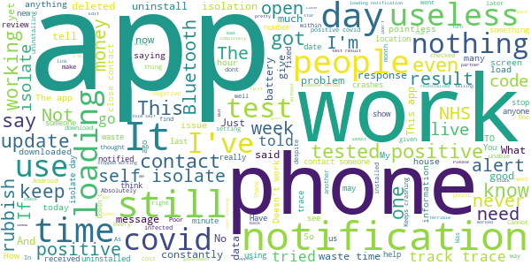

# NHS COVID-19
App version ``4.5 (152)``

Analyzed with [covid-apps-observer](http://github.com/covid-apps-observer) project, version ``0.1``

## App overview
| | |
|-------------------------|-------------------------| 
| **Name**&nbsp;&nbsp;&nbsp;&nbsp;&nbsp;&nbsp;&nbsp;&nbsp;&nbsp;&nbsp;&nbsp;&nbsp;&nbsp;&nbsp;&nbsp;&nbsp;&nbsp;&nbsp;&nbsp;&nbsp;&nbsp;&nbsp;&nbsp;&nbsp;&nbsp;&nbsp;&nbsp;&nbsp;&nbsp;&nbsp;&nbsp;&nbsp;&nbsp;&nbsp;&nbsp;&nbsp;&nbsp;&nbsp;&nbsp;&nbsp;  | NHS COVID-19 |
| **Unique identifier** | uk.nhs.covid19.production |
| **Link to Google Play** | [https://play.google.com/store/apps/details?id=uk.nhs.covid19.production](https://play.google.com/store/apps/details?id=uk.nhs.covid19.production) |
| **Summary**  | Protect your loved ones with the NHS contact tracing app for England and Wales. |
| **Privacy policy** | [https://covid19.nhs.uk/our-policies.html](https://covid19.nhs.uk/our-policies.html) |
| **Latest version** | 4.5 (152) |
| **Last update** | 2021-02-19 17:46:26 |
| **Recent changes** | We have introduced a change which means that users who enter a positive test result from a lab into the app, but did not book the test through the app, will be asked to state when their symptoms started. This is to make sure the self-isolation countdown in the app aligns with the advice from the contact tracing teams in the wider programme. Other design, language and accessibility optimisations.  |
| **Installs**  | 5,000,000+ |
| **Category** | Medical |
| **First release** | Aug 12, 2020 |
| **Size**  | 8.5M |
| **Supported Android version**  | 6.0 and up |

### Description
> The NHS COVID-19 app is the official contact tracing app for England and Wales. 
 It is the fastest way of knowing when you’re at risk from coronavirus. The quicker you know, the quicker you can alert your loved ones, and your community. 
 The more of us that use it, the better we can control coronavirus. 
 The app runs on proven software developed by Apple and Google, designed so that nobody will know who or where you are. And you can delete your data, or the app, at any time.
 It has a number of features: 
 Trace: Find out when you’ve been near other app users who have tested positive for coronavirus
 Alert: Lets you know the level of coronavirus risk in your postcode district. 
 Check-in: Use our simple QR code scanner to check-in to venues like bars and restaurants. You will get alerted if you have visited a venue where you may have come into contact with coronavirus.
 Symptoms: Check if you have coronavirus symptoms and see if you need to order a test. 
 Test: Helps you order a test if you need to.
 Isolate: Keep track of your self-isolation countdown and access relevant advice.
 Available in English, Welsh, Arabic (Modern Standard), Bengali, Chinese (Simplified), Gujarati, Polish, Punjabi (Gurmukhi script), Romanian, Somali, Turkish and Urdu.
 The app can be used across UK borders in England, Wales, Scotland, Northern Ireland, Jersey and Gibraltar, detecting all relevant contact tracing app users (regardless of them using different official apps), alerting them if they have been in contact with coronavirus. 
 The app has been built in collaboration with some of the most innovative organisations in the world. We have worked with medical experts, privacy groups, at-risk communities and we’ve shared knowledge with the teams working on similar apps in many countries.
 Protect your loved ones. Please download the app. 
 The App is CE marked as a class I medical device in the United Kingdom and developed in compliance with European Commission Directive 93/42/EEC for class I devices.

### User interface
The developers of the app provide the following screenshots in the Google play store.
| | | |
|:-------------------------:|:-------------------------:|:-------------------------:|
 |   |   |   | 
 |   |  

## Development team
In the following we report the main information provided by the development team in the Google play store.

| | |
|-------------------------|-------------------------|
| **Developer**  | Department of Health and Social Care |
| **Website**  | [https://covid19.nhs.uk/](https://covid19.nhs.uk/) |
| **Email** | NHSCovid-19AppStoreSupport@nhsbsa.nhs.uk |
| **Physical address**  | - |
| **Other developed apps**  | [https://play.google.com/store/apps/developer?id=Department+of+Health+and+Social+Care](https://play.google.com/store/apps/developer?id=Department+of+Health+and+Social+Care) |

## Android support

| | |
|-------------------------|-------------------------|
| **Declared target Android version**  | Android10, version 10 (API level 29) |
| **Effective target Android version**  | Android10, version 10 (API level 29) |
| **Minimum supported Android version**  | Marshmallow, version 6.0 (API level 23) |
| **Maximum target Android version**  | - |

The larger the difference between the minimum and maximum supported Android versions, the better. A larger difference means a wider audience. For example, old phones have a very low Android version, so a high minimum supported Android version means that the app cannot be used by users with old phones, thus leading to accessibility problems. 

## Requested permissions

In the following we report the complete list of the permissions requested by the app. 

| **Permission** | **Protection level** | **Description** | 
|-------------------------|-------------------------|-------------------------|
 **android.permission ACCESS_NETWORK_STATE** | Normal | Allows applications to access information about networks. 
 **android.permission BLUETOOTH** | Normal | Allows applications to connect to paired bluetooth devices. 
 **android.permission CAMERA** | :warning:**Dangerous** | Required to be able to access the camera device. 
 **android.permission FOREGROUND_SERVICE** | Normal | Allows a regular application to use Service.startForeground. 
 **android.permission INTERNET** | Normal | Allows applications to open network sockets. 
 **android.permission RECEIVE_BOOT_COMPLETED** | Normal | Allows an application to receive the Intent.ACTION_BOOT_COMPLETED that is broadcast after the system finishes booting. 
 **android.permission WAKE_LOCK** | Normal | Allows using PowerManager WakeLocks to keep processor from sleeping or screen from dimming. 

## Mentioned servers

| **Server** | **Registrant** | **Registrant country** | **Creation date** | 
|-------------------------|-------------------------|-------------------------|-------------------------|
 | google.com | Google LLC | :us: US | 1997-09-15 04:00:00 |
 | ietf.org | IETF Trust | :us: US | 1995-03-11 05:00:00 |
 | googleapis.com | Google LLC | :us: US | 2005-01-25 17:52:26 |
 | apache.org | The Apache Software Foundation | :us: US | 1995-04-11 04:00:00 |

## Security analysis 

Below we report the main security warnings raised by our execution of the [Androwarn](https://github.com/maaaaz/androwarn) security analysis tool.

**Connection interfaces exfiltration**
> - This application reads details about the currently active data network 
> - This application tries to find out if the currently active data network is metered 

**Suspicious connection establishment**
> - This application opens a Socket and connects it to the remote address ' returned no addresses for  ; port is out of range' on the 'N/A' port  
> - This application opens a Socket and connects it to the remote address '' on the 'N/A' port  
> - This application opens a Socket and connects it to the remote address 'Ljava/lang/StringBuilder;->toString()Ljava/lang/String;' on the 'N/A' port  
> - This application opens a Socket and connects it to the remote address 'Ljava/net/Proxy;->type()Ljava/net/Proxy$Type;' on the 'N/A' port  
> - This application opens a Socket and connects it to the remote address 'timeout' on the 'N/A' port  

**Code execution**
> - This application loads a native library 
> - This application loads a native library: 'Ljava/lang/String;->valueOf(Ljava/lang/Object;)Ljava/lang/String;' 

## User ratings and reviews

Below we provide information about how end users are reacting to the app in terms of ratings and reviews in the Google Play store.

### Ratings

The NHS COVID-19 app has been installed by more than **5000000** times. At this time, **99515** rated the app and its average score is **3.6966133**. Below we show the distribution of the ratings across the usual star-based rating of Google Play

:star::star::star::star::star:: 52634

:star::star::star::star:: 11760

:star::star::star:: 8430

:star::star:: 5680

:star:: 21011

### Reviews 

#### 5-star reviews

> Great app that's works as intended  :date: __2021-02-27 01:42:59__

> Easy explainable 😊  :date: __2021-02-26 21:48:47__

> invaluable, works very well and reassuring  :date: __2021-02-26 14:47:23__

> Excellent  :date: __2021-02-26 14:13:20__

> You don't have to think about it, all automatic  :date: __2021-02-26 13:13:02__

> Covid  :date: __2021-02-26 12:07:56__

> Great, no problems at all and only uses a minuscule amount of power, so absolutely no fear of draining the phone. Cheers.  :date: __2021-02-26 11:49:39__

> Thank God for this 🙏...it would seem.  :date: __2021-02-26 11:37:34__

> it's a very good way of checking and knowing where the COVID is.  :date: __2021-02-26 11:18:35__

> Good  :date: __2021-02-25 21:38:23__

#### 4-star reviews

> Why not have a facility on the app to record your jab details?  :date: __2021-02-23 20:02:16__

> This week the app won't open at all. Immediately crashes every time. I'm on a Pixel 3. Was fine previously (apart from the usual meaningless notifications).  :date: __2021-02-23 19:35:14__

> Works fine 99% of the time. Previous problems resolved.  :date: __2021-02-23 15:29:09__

> Updated review — hopefully the Pixel issues have been resolved now. So far, so good.  :date: __2021-02-23 14:05:28__

> Actuallly does what expected and whilst not had "near someome" warning all else has been good.  :date: __2021-02-23 01:38:42__

> Very good  :date: __2021-02-21 15:49:45__

> The app is fine, just gets stuck on loading on my home screen.  :date: __2021-02-19 22:03:25__

> Good  :date: __2021-02-19 13:57:26__

> Good reliable app regarding covid-19 test and trace.  :date: __2021-02-18 14:26:47__

> Would like link to info on no of cases in area / borough  :date: __2021-02-18 12:05:41__

#### 3-star reviews

> Keeps people safe so does the job. The annoying "app loading" notifications get me worried.  :date: __2021-02-27 12:11:15__

> Notification has been stuck on loading for over 24hrs. Can't seem to get rid of it 🙄4  :date: __2021-02-27 09:07:05__

> No idea if it works, I mean how do you test it really? Most annoyingly there is always a notification that it's 'loading'.  :date: __2021-02-26 17:24:08__

> I had booked 2 test Kits but I did not get kits yet. Can anyone help for that? It's my fourth day in Uk.  :date: __2021-02-26 16:26:08__

> Easy to use.  :date: __2021-02-25 12:29:12__

> Good, but useless because no one near me has the virus.  :date: __2021-02-25 07:02:38__

> Fine  :date: __2021-02-24 23:02:58__

> Currently just says loading. Restarted phone, checked app up to date as well. Earlier was loading twice at the same time! :/ otherwise so far so good. Am at home so not usually out and about. Don't find it a battery drain at all.  :date: __2021-02-24 22:31:39__

> Further to Matt's review below- I think the "vaccine power up" is getting popular- it's had almost 18 million hits this year. I think it's going viral. The Bozzer Surfer (watch the next wave) has released news of the kids back to school mod due out next month. (Unless the U-Turn mod is released first by the competition.) It will, however, be available to eligible players only...  :date: __2021-02-24 16:47:19__

> Always loading.......  :date: __2021-02-24 10:48:04__

#### 2-star reviews

> Loading notification never goes away  :date: __2021-02-25 15:35:52__

> Not recognising test code...so track and trace usless....after reading below response by developer, we have this app on 4 phones in the house all 4 of us are positive and have a valid NHS test code...NONE of these are recognised by the app....do alerting others is useless Read answer and still does validate the positive test code, therefore it won't alert and close contacts...useless and uninstalled  :date: __2021-02-24 20:53:15__

> Keep getting a Loading... notification stuck on notification bar, have to keep force stopping and restarting to get going again.  :date: __2021-02-24 13:59:44__

> Had to uninstall for few reasons, it told me at 3am I was in contact with someone, but I wasn't near anyone as was sitting at home alone. Other reason for uninstall was because it was interfering with my other apps and games and causing lag  :date: __2021-02-23 12:36:50__

> Bubby I love bubby  :date: __2021-02-23 01:04:06__

> I have this app on two phones, my personal mobile and my work mobile. I tested positive last month and updated my personal mobile with my code to confirm I was positive. As a test I waited for my work mobile to notify me to self isolate as I'd been in contact with someone who had tested positive but it didn't. No harm done but surely my work phone should have notified me as the app doesn't know I own both phones!  :date: __2021-02-22 23:54:23__

> Constant red alert on the app icon. What is this supposed to indicate? Can't find any alerts within the app. Very unnerving.  :date: __2021-02-22 22:44:04__

> The app used to "work" and now it won't open at all and I just keep getting notifications saying it has crashed. Have now uninstalled since those are getting old.  :date: __2021-02-21 23:52:26__

> Poor compared to the apple version. My sister got told by her app to self-isolate, yet despite this mine was as normal the whole time (I did self-isolate due to being in the same house though). No notifications or even a change on screen telling me too when opening the app. Hers also tells her every week whether or not she has any possible contacts and gave her an urgent notification telling her to self-isolate. Mine does neither of those despite notifications being on. Its pointless really.  :date: __2021-02-21 04:58:54__

> 1.) I found the version Date: 08.02.2021. Version 4. Release 4. Modification (146). You need to update the Android help text in Settings: It is in App Info, NOT App-Notification. 2.) My three sons families do not use the app. They tell me it doesn't work. You need a Basic Test icon that does some basic simple checking and gives reassurance that it's working Currently there is NO feedback to the user whatever ! How can I sell that? Let alone defend the app. At least this ver has an icon & help  :date: __2021-02-20 17:56:39__

#### 1-star reviews

> It's a good app but drains data with loads of updates  :date: __2021-02-27 11:36:31__

> Still waiting for a response and it is not coming 26.02.2021 a waste of time number 1 why do I have to be over 16 to use this(explain) number 2 I still do not no with which person I have in contact must be a system created by politicians and NHS waste of time does this app look bad visually the only answers are no and not sure what about it looks absolutely wrong.to add on know still no response when other people posted later than me,,,?????????? hello still waiting for an response¿?????????????  :date: __2021-02-27 00:26:41__

> The notification loading pop won't go away. How can you make something so rubbish.  :date: __2021-02-27 00:06:38__

> Well worth the millions we paid to get this up and running 6 months later than we needed it.  :date: __2021-02-26 23:14:17__

> Keeps leaving loading icon on screen so pointless to have as you have to uninstall to remove so looses all your previous data so you could miss going into isolation !!!  :date: __2021-02-26 11:56:12__

> DO NOT DOWNLOAD. You will be feeding all your location and othet personal data straight into Palantir for them to weaponise and sell/use. Your personal data is valuable, dont hand it over to them for free!  :date: __2021-02-26 08:10:27__

> Civic is fake  :date: __2021-02-25 19:22:01__

> Useless app I've downloaded twice and uninstall twice I'll never download again  :date: __2021-02-25 19:09:26__

> Told me to isolate even though I had not left the house for over a week. Also keeps reappearing on my phone after numerous times uninstalling it.  :date: __2021-02-25 18:50:20__

> Loading... Like forever. What exactly are you loading?  :date: __2021-02-25 17:17:01__

