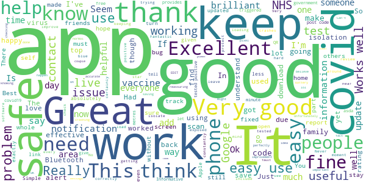

# NHS COVID-19
App version ``4.6 (159)``

Analyzed with [covid-apps-observer](http://github.com/covid-apps-observer) project, version ``0.1``

## App overview
| | |
|-------------------------|-------------------------| 
| **Name**&nbsp;&nbsp;&nbsp;&nbsp;&nbsp;&nbsp;&nbsp;&nbsp;&nbsp;&nbsp;&nbsp;&nbsp;&nbsp;&nbsp;&nbsp;&nbsp;&nbsp;&nbsp;&nbsp;&nbsp;&nbsp;&nbsp;&nbsp;&nbsp;&nbsp;&nbsp;&nbsp;&nbsp;&nbsp;&nbsp;&nbsp;&nbsp;&nbsp;&nbsp;&nbsp;&nbsp;&nbsp;&nbsp;&nbsp;&nbsp;  | NHS COVID-19 |
| **Unique identifier** | uk.nhs.covid19.production |
| **Link to Google Play** | [https://play.google.com/store/apps/details?id=uk.nhs.covid19.production](https://play.google.com/store/apps/details?id=uk.nhs.covid19.production) |
| **Summary**  | Protect your loved ones with the NHS contact tracing app for England and Wales. |
| **Privacy policy** | [https://covid19.nhs.uk/our-policies.html](https://covid19.nhs.uk/our-policies.html) |
| **Latest version** | 4.6 (159) |
| **Last update** | 2021-03-08 20:45:22 |
| **Recent changes** | We have made further improvements to the app settings feature to give users easier access to their data. Other design, language and accessibility optimisations. |
| **Installs**  | 5,000,000+ |
| **Category** | Medical |
| **First release** | Aug 12, 2020 |
| **Size**  | 8.7M |
| **Supported Android version**  | 6.0 and up |

### Description
> The NHS COVID-19 app is the official contact tracing app for England and Wales. 
 It is the fastest way of knowing when you’re at risk from coronavirus. The quicker you know, the quicker you can alert your loved ones, and your community. 
 The more of us that use it, the better we can control coronavirus. 
 The app runs on proven software developed by Apple and Google, designed so that nobody will know who or where you are. And you can delete your data, or the app, at any time.
 It has a number of features: 
 Trace: Find out when you’ve been near other app users who have tested positive for coronavirus
 Alert: Lets you know the level of coronavirus risk in your postcode district. 
 Check-in: Use our simple QR code scanner to check-in to venues like bars and restaurants. You will get alerted if you have visited a venue where you may have come into contact with coronavirus.
 Symptoms: Check if you have coronavirus symptoms and see if you need to order a test. 
 Test: Helps you order a test if you need to.
 Isolate: Keep track of your self-isolation countdown and access relevant advice.
 Available in English, Welsh, Arabic (Modern Standard), Bengali, Chinese (Simplified), Gujarati, Polish, Punjabi (Gurmukhi script), Romanian, Somali, Turkish and Urdu.
 The app can be used across UK borders in England, Wales, Scotland, Northern Ireland, Jersey and Gibraltar, detecting all relevant contact tracing app users (regardless of them using different official apps), alerting them if they have been in contact with coronavirus. 
 The app has been built in collaboration with some of the most innovative organisations in the world. We have worked with medical experts, privacy groups, at-risk communities and we’ve shared knowledge with the teams working on similar apps in many countries.
 Protect your loved ones. Please download the app. 
 The App is CE marked as a class I medical device in the United Kingdom and developed in compliance with European Commission Directive 93/42/EEC for class I devices.

### User interface
The developers of the app provide the following screenshots in the Google play store.
| | | |
|:-------------------------:|:-------------------------:|:-------------------------:|
 |   |   |   | 
 |   |  

## Development team
In the following we report the main information provided by the development team in the Google play store.

| | |
|-------------------------|-------------------------|
| **Developer**  | Department of Health and Social Care |
| **Website**  | [https://covid19.nhs.uk/](https://covid19.nhs.uk/) |
| **Email** | NHSCovid-19AppStoreSupport@nhsbsa.nhs.uk |
| **Physical address**  | - |
| **Other developed apps**  | [https://play.google.com/store/apps/developer?id=Department+of+Health+and+Social+Care](https://play.google.com/store/apps/developer?id=Department+of+Health+and+Social+Care) |

## Android support

| | |
|-------------------------|-------------------------|
| **Declared target Android version**  | Android10, version 10 (API level 29) |
| **Effective target Android version**  | Android10, version 10 (API level 29) |
| **Minimum supported Android version**  | Marshmallow, version 6.0 (API level 23) |
| **Maximum target Android version**  | - |

The larger the difference between the minimum and maximum supported Android versions, the better. A larger difference means a wider audience. For example, old phones have a very low Android version, so a high minimum supported Android version means that the app cannot be used by users with old phones, thus leading to accessibility problems. 

## Requested permissions

In the following we report the complete list of the permissions requested by the app. 

| **Permission** | **Protection level** | **Description** | 
|-------------------------|-------------------------|-------------------------|
 **android.permission ACCESS_NETWORK_STATE** | Normal | Allows applications to access information about networks. 
 **android.permission BLUETOOTH** | Normal | Allows applications to connect to paired bluetooth devices. 
 **android.permission CAMERA** | :warning:**Dangerous** | Required to be able to access the camera device. 
 **android.permission FOREGROUND_SERVICE** | Normal | Allows a regular application to use Service.startForeground. 
 **android.permission INTERNET** | Normal | Allows applications to open network sockets. 
 **android.permission RECEIVE_BOOT_COMPLETED** | Normal | Allows an application to receive the Intent.ACTION_BOOT_COMPLETED that is broadcast after the system finishes booting. 
 **android.permission WAKE_LOCK** | Normal | Allows using PowerManager WakeLocks to keep processor from sleeping or screen from dimming. 

## Mentioned servers

| **Server** | **Registrant** | **Registrant country** | **Creation date** | 
|-------------------------|-------------------------|-------------------------|-------------------------|
 | google.com | Google LLC | :us: US | 1997-09-15 04:00:00 |
 | ietf.org | IETF Trust | :us: US | 1995-03-11 05:00:00 |
 | googleapis.com | Google LLC | :us: US | 2005-01-25 17:52:26 |
 | apache.org | The Apache Software Foundation | :us: US | 1995-04-11 04:00:00 |

## Security analysis 

Below we report the main security warnings raised by our execution of the [Androwarn](https://github.com/maaaaz/androwarn) security analysis tool.

**Connection interfaces exfiltration**
> - This application reads details about the currently active data network 
> - This application tries to find out if the currently active data network is metered 

**Suspicious connection establishment**
> - This application opens a Socket and connects it to the remote address ' returned no addresses for  ; port is out of range' on the 'N/A' port  
> - This application opens a Socket and connects it to the remote address '' on the 'N/A' port  
> - This application opens a Socket and connects it to the remote address 'Ljava/lang/StringBuilder;->toString()Ljava/lang/String;' on the 'N/A' port  
> - This application opens a Socket and connects it to the remote address 'Ljava/net/Proxy;->type()Ljava/net/Proxy$Type;' on the 'N/A' port  
> - This application opens a Socket and connects it to the remote address 'timeout' on the 'N/A' port  

**Code execution**
> - This application loads a native library 
> - This application loads a native library: 'Ljava/lang/String;->valueOf(Ljava/lang/Object;)Ljava/lang/String;' 

## User ratings and reviews

Below we provide information about how end users are reacting to the app in terms of ratings and reviews in the Google Play store.

### Ratings

The NHS COVID-19 app has been installed by more than **5000000** times. At this time, **98963** rated the app and its average score is **3.6791234**. Below we show the distribution of the ratings across the usual star-based rating of Google Play

:star::star::star::star::star:: 51906

:star::star::star::star:: 11684

:star::star::star:: 8386

:star::star:: 5687

:star:: 21300

### Reviews 

#### 5-star reviews

> Best  :date: __2021-03-21 13:58:02__

> When trying to add the post code, it crashes. 1 star until you fix it  :date: __2021-03-20 17:48:51__

> Is this a very good app to have it halp to save people live  :date: __2021-03-20 13:37:56__

> Works fine. No issues experienced with the app. Still don't have COVID.  :date: __2021-03-19 22:21:08__

> Make sure it's on wherever I go, means I can check that I am safe  :date: __2021-03-19 21:57:17__

> Really easy to use.  :date: __2021-03-19 11:23:11__

> Just noticed, every single review gets answered, the whole 100k, thats lot of hard work, and keeping on top of any bug in the software, they do deserve to be rated more than 1 ⭐, google needs to add an area so everyone can see the problem is getting fixed, from the developers, a notice in the app area, with report bug button, this will improve the ratings for many apps, app is working with no issue 👏 keep up the good work which you are doing, please like so google can see this to add this👍  :date: __2021-03-19 00:20:04__

> Fantastic simples  :date: __2021-03-18 20:24:10__

> Won't load just stays on blue screen then crashes  :date: __2021-03-17 11:59:32__

> Ok  :date: __2021-03-17 09:24:13__

#### 4-star reviews

> Hi . I am register with NHS since 2016. Last week I try book to have vaccine but show me I am not eligible . If I work in warehouse can be considerate job in first line ?  :date: __2021-03-20 13:24:36__

> Still switched on yet it keeps telling me that my phone's location isn't switched on - BUT it is. I have also tried to do this via phone settings for location and from the app itself... however, there no screen buttons to do this. Update. Switch off contact tracing. Cancel reminders, wait a minute and switch back on. A pop-up window allows switching location back on. THIS HAS SINCE REVERTED TO THE ERROR MESSAGE AGAIN.  :date: __2021-03-18 20:36:50__

> Work ok but not every shop have the code to scan also sometime i dont like keeping my Bluetooth on  :date: __2021-03-18 18:10:37__

> For some reason I can't find out my covid test result. It's quite annoying.  :date: __2021-03-16 18:39:44__

> Update still working fine, whatever told me to isolate is now behaving. No more false isolate, instructions 4 star given. Despite false isolations, I've given it a third chance. Currently its behaving as I would expect. Its not giving isolation messages and that's because I'm not mixing still. Its 5 weeks with trace on and no more false positives. SO FAR. Ive marked it up to 3 and will see how it goes.  :date: __2021-03-16 11:29:19__

> I was told to self isolate, but I had not been out or spoke to any body  :date: __2021-03-11 01:09:46__

> A widget going straight to the Venue check-in would be nice  :date: __2021-03-10 16:38:17__

> It's OK check on but you should be able to check out too as most are only at a venue for a short period of time  :date: __2021-03-09 09:08:10__

> Working better. Would be good if you enter self test results through the app.  :date: __2021-03-07 12:26:53__

> Apart from putting in test results function, can we have the NHS jab card to put in the app to proof we have done the jab? Like test results function. Thank you!  :date: __2021-03-05 16:49:57__

#### 3-star reviews

> I have been using this since the day of its release. It once told me that I had been in the same place as someone at a different time (but not where or when) and when I tapped to learn more, the message was gone. In all of that time, I have learned of only one person who has received an alert, and that was a government minister. Is this an expensive white elephant?  :date: __2021-03-20 20:32:21__

> 3* because it should be life changing, saddly no. When I got the message to isolate, it's 4days late The app is to much to fiddle with with the same information Easier to access else where Expected better  :date: __2021-03-20 09:57:06__

> It's got a permanent notification that just says 'it's loading'.  :date: __2021-03-18 20:08:52__

> Does the job, no complaints on that front. 3 stars as I have very little confidence that many people are actually using it anymore. The Government never seem to talk about it publicly and support the app anymore. Better apps in other parts of the world but this does seem to do what it's meant to.  :date: __2021-03-18 00:01:21__

> Not many warnings received  :date: __2021-03-17 14:11:47__

> It always crashes during an update and kills battery, restarting the phone doesn't help so have to keep reinstalling the app  :date: __2021-03-17 10:32:57__

> I second the other reviews that the new exposure notification is excessive. I rarely have Bluetooth on when at home and there is very little chance I'll get 'exposed' here. Previously it only gave a notification when I turned BT off, now I had to disable the notification altogether to get rid of it.  :date: __2021-03-16 17:31:58__

> Takes an awful lot of battery power and doesnt seem to do much. Could benefit from more functionality  :date: __2021-03-15 20:44:32__

> Not all places have a qr code to check in .there should be an option to manually put ur check in location in to it ....  :date: __2021-03-15 15:41:17__

> The constant intrusive popup notifications when I don't have Bluetooth on, because I'm at home, is becoming too much. It never used to be like this - before it would only happen when I initially turned Bluetooth off. I'm going to turn off notifications for it altogether, which isn't helpful either.  :date: __2021-03-13 19:57:55__

#### 2-star reviews

> crashes all the time.  :date: __2021-03-21 15:02:51__

> OK I'm prepared to accept using this app for the benefit of helping defeat covid. However it needs to allow you to read notifications without having to turn on location and Bluetooth. I won't turn on location at home since I don't wish to share Edit 18.03.21. Now down to 2* since you seem totally incapable of answering the question above. Turned on BT but app won't open unless location is turned on. Cannot receive any notifications. Useless.  :date: __2021-03-18 22:57:38__

> Seems ok but, the icon for financial help is not appearing, even though the positive test has started the timer.  :date: __2021-03-17 10:30:35__

> How is it not using my location?  :date: __2021-03-16 12:10:46__

> In one of the next updates , can there be a option to tick, if you have vaccinated?  :date: __2021-03-16 09:14:03__

> Not great, get exposure notifications at the top of my screen but can't read enough to see what it's for, when I click the notification it just opens the app and there's nothing there. Seems kinda pointless and just used to track me...  :date: __2021-03-15 13:09:46__

> Update: lost a couple of stars as now get temp notifications daily saying "loading..." some of which hang and can't be removed without force killing the app. Don't want that from an app where the appearance of a notification normally means I have to isolate for a couple of weeks!  :date: __2021-03-15 10:47:58__

> Poor Experience. The app continually shows a notification saying loading. Uninstalled and reinstalled but still showing notification. I have Uninstalled permanently. App not working again. This is the only app I have ever used, and I've used hundreds that has completely stopped working and showing loading. All this tax paper money for an app that keeps not working 😡  :date: __2021-03-15 09:06:32__

> Drains battery  :date: __2021-03-14 23:36:27__

> Very good M  :date: __2021-03-13 23:36:26__

#### 1-star reviews

> I DELETED THIS APP AS IT'S POINTLESS AND A BATTERY DRAINER. I WILL NOT BE RESTRICTED BY THIS SO CALLED CORONAVIRUS. I GO OUT AND LIVE MY LIFE AS USUAL. I AM NOT BEING RESTRICTED AT HOME LIKE A PRISONER. I WILL NOT BE TESTED OR VACCINATED. I WILL NOT USE A TRACK AND TRACE APP. I NEVER WEAR A MASK AS I'M EXEMPT.  :date: __2021-03-21 11:08:16__

> The app has been loading all day and you can't close it. This happens quiet often. Please sort it out!!  :date: __2021-03-21 00:11:21__

> Useless.  :date: __2021-03-20 23:47:14__

> Does it even work? I don't know even one person who was notified/ alerted... Including myself when my partner was diagnosed with covid.  :date: __2021-03-20 22:58:57__

> It is terrible, it doesn't work and they should just remove this app.  :date: __2021-03-20 22:06:58__

> Had this app since it came out. Not had any alerts at all! I work in a school and have had many cases.  :date: __2021-03-20 21:38:34__

> This used to run silently in the background and I'd forget it was there. But I've had to reinstall it every day this week to get rid of the push notifications "loading...", and they're still coming!  :date: __2021-03-20 18:57:18__

> Shush  :date: __2021-03-20 17:53:24__

> Didn't ever get notification to isolate despite living in a house with a covid patient (who also had the app and contact tracing turned on) Also always crashes, had to open the app multiple times a day to make sure the settings/permissions hadn't reset after the crash (they did sometimes) Edit: in response, the person who tested positive did input this into their app and I was still never notified. I can safely say I was in contact as I lived with this person.  :date: __2021-03-20 13:55:11__

> Maddening continual notifications to keep Bluetooth on, even when you don't leave home for months. Far more annoying than helpful, so I'm uninstalling  :date: __2021-03-20 05:32:14__

