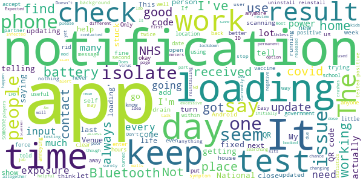

# NHS COVID-19
App version ``4.6 (159)``

Analyzed with [covid-apps-observer](http://github.com/covid-apps-observer) project, version ``0.1``

## App overview
| | |
|-------------------------|-------------------------| 
| **Name**&nbsp;&nbsp;&nbsp;&nbsp;&nbsp;&nbsp;&nbsp;&nbsp;&nbsp;&nbsp;&nbsp;&nbsp;&nbsp;&nbsp;&nbsp;&nbsp;&nbsp;&nbsp;&nbsp;&nbsp;&nbsp;&nbsp;&nbsp;&nbsp;&nbsp;&nbsp;&nbsp;&nbsp;&nbsp;&nbsp;&nbsp;&nbsp;&nbsp;&nbsp;&nbsp;&nbsp;&nbsp;&nbsp;&nbsp;&nbsp;  | NHS COVID-19 |
| **Unique identifier** | uk.nhs.covid19.production |
| **Link to Google Play** | [https://play.google.com/store/apps/details?id=uk.nhs.covid19.production](https://play.google.com/store/apps/details?id=uk.nhs.covid19.production) |
| **Summary**  | Protect your loved ones with the NHS contact tracing app for England and Wales. |
| **Privacy policy** | [https://covid19.nhs.uk/our-policies.html](https://covid19.nhs.uk/our-policies.html) |
| **Latest version** | 4.6 (159) |
| **Last update** | 2021-03-08 20:45:22 |
| **Recent changes** | We have made further improvements to the app settings feature to give users easier access to their data. Other design, language and accessibility optimisations. |
| **Installs**  | 5,000,000+ |
| **Category** | Medical |
| **First release** | Aug 12, 2020 |
| **Size**  | 8.7M |
| **Supported Android version**  | 6.0 and up |

### Description
> The NHS COVID-19 app is the official contact tracing app for England and Wales. 
 It is the fastest way of knowing when you’re at risk from coronavirus. The quicker you know, the quicker you can alert your loved ones, and your community. 
 The more of us that use it, the better we can control coronavirus. 
 The app runs on proven software developed by Apple and Google, designed so that nobody will know who or where you are. And you can delete your data, or the app, at any time.
 It has a number of features: 
 Trace: Find out when you’ve been near other app users who have tested positive for coronavirus
 Alert: Lets you know the level of coronavirus risk in your postcode district. 
 Check-in: Use our simple QR code scanner to check-in to venues like bars and restaurants. You will get alerted if you have visited a venue where you may have come into contact with coronavirus.
 Symptoms: Check if you have coronavirus symptoms and see if you need to order a test. 
 Test: Helps you order a test if you need to.
 Isolate: Keep track of your self-isolation countdown and access relevant advice.
 Available in English, Welsh, Arabic (Modern Standard), Bengali, Chinese (Simplified), Gujarati, Polish, Punjabi (Gurmukhi script), Romanian, Somali, Turkish and Urdu.
 The app can be used across UK borders in England, Wales, Scotland, Northern Ireland, Jersey and Gibraltar, detecting all relevant contact tracing app users (regardless of them using different official apps), alerting them if they have been in contact with coronavirus. 
 The app has been built in collaboration with some of the most innovative organisations in the world. We have worked with medical experts, privacy groups, at-risk communities and we’ve shared knowledge with the teams working on similar apps in many countries.
 Protect your loved ones. Please download the app. 
 The App is CE marked as a class I medical device in the United Kingdom and developed in compliance with European Commission Directive 93/42/EEC for class I devices.

### User interface
The developers of the app provide the following screenshots in the Google play store.
| | | |
|:-------------------------:|:-------------------------:|:-------------------------:|
 |   |   |   | 
 |   |  

## Development team
In the following we report the main information provided by the development team in the Google play store.

| | |
|-------------------------|-------------------------|
| **Developer**  | Department of Health and Social Care |
| **Website**  | [https://covid19.nhs.uk/](https://covid19.nhs.uk/) |
| **Email** | NHSCovid-19AppStoreSupport@nhsbsa.nhs.uk |
| **Physical address**  | - |
| **Other developed apps**  | [https://play.google.com/store/apps/developer?id=Department+of+Health+and+Social+Care](https://play.google.com/store/apps/developer?id=Department+of+Health+and+Social+Care) |

## Android support

| | |
|-------------------------|-------------------------|
| **Declared target Android version**  | Android10, version 10 (API level 29) |
| **Effective target Android version**  | Android10, version 10 (API level 29) |
| **Minimum supported Android version**  | Marshmallow, version 6.0 (API level 23) |
| **Maximum target Android version**  | - |

The larger the difference between the minimum and maximum supported Android versions, the better. A larger difference means a wider audience. For example, old phones have a very low Android version, so a high minimum supported Android version means that the app cannot be used by users with old phones, thus leading to accessibility problems. 

## Requested permissions

In the following we report the complete list of the permissions requested by the app. 

| **Permission** | **Protection level** | **Description** | 
|-------------------------|-------------------------|-------------------------|
 **android.permission ACCESS_NETWORK_STATE** | Normal | Allows applications to access information about networks. 
 **android.permission BLUETOOTH** | Normal | Allows applications to connect to paired bluetooth devices. 
 **android.permission CAMERA** | :warning:**Dangerous** | Required to be able to access the camera device. 
 **android.permission FOREGROUND_SERVICE** | Normal | Allows a regular application to use Service.startForeground. 
 **android.permission INTERNET** | Normal | Allows applications to open network sockets. 
 **android.permission RECEIVE_BOOT_COMPLETED** | Normal | Allows an application to receive the Intent.ACTION_BOOT_COMPLETED that is broadcast after the system finishes booting. 
 **android.permission WAKE_LOCK** | Normal | Allows using PowerManager WakeLocks to keep processor from sleeping or screen from dimming. 

## Mentioned servers

| **Server** | **Registrant** | **Registrant country** | **Creation date** | 
|-------------------------|-------------------------|-------------------------|-------------------------|
 | google.com | Google LLC | :us: US | 1997-09-15 04:00:00 |
 | ietf.org | IETF Trust | :us: US | 1995-03-11 05:00:00 |
 | googleapis.com | Google LLC | :us: US | 2005-01-25 17:52:26 |
 | apache.org | The Apache Software Foundation | :us: US | 1995-04-11 04:00:00 |

## Security analysis 

Below we report the main security warnings raised by our execution of the [Androwarn](https://github.com/maaaaz/androwarn) security analysis tool.

**Connection interfaces exfiltration**
> - This application reads details about the currently active data network 
> - This application tries to find out if the currently active data network is metered 

**Suspicious connection establishment**
> - This application opens a Socket and connects it to the remote address ' returned no addresses for  ; port is out of range' on the 'N/A' port  
> - This application opens a Socket and connects it to the remote address '' on the 'N/A' port  
> - This application opens a Socket and connects it to the remote address 'Ljava/lang/StringBuilder;->toString()Ljava/lang/String;' on the 'N/A' port  
> - This application opens a Socket and connects it to the remote address 'Ljava/net/Proxy;->type()Ljava/net/Proxy$Type;' on the 'N/A' port  
> - This application opens a Socket and connects it to the remote address 'timeout' on the 'N/A' port  

**Code execution**
> - This application loads a native library 
> - This application loads a native library: 'Ljava/lang/String;->valueOf(Ljava/lang/Object;)Ljava/lang/String;' 

## User ratings and reviews

Below we provide information about how end users are reacting to the app in terms of ratings and reviews in the Google Play store.

### Ratings

The NHS COVID-19 app has been installed by more than **5000000** times. At this time, **98963** rated the app and its average score is **3.6791234**. Below we show the distribution of the ratings across the usual star-based rating of Google Play

:star::star::star::star::star:: 51906

:star::star::star::star:: 11684

:star::star::star:: 8386

:star::star:: 5687

:star:: 21300

### Reviews 

#### 5-star reviews

> Excellent app  :date: __2021-03-14 10:34:27__

> There should be an update to include if you've been vaccinated.  :date: __2021-03-13 22:20:24__

> This is a great app to help keep family friends and others around me to keep safe  :date: __2021-03-13 12:02:11__

> Very good  :date: __2021-03-13 08:34:50__

> I hope this helps, certainly happy to do.  :date: __2021-03-12 19:05:31__

> Fpo  :date: __2021-03-12 18:50:55__

> no notification so thats good  :date: __2021-03-12 17:50:42__

> very useful app to have at a time of this unusual situation  :date: __2021-03-12 17:11:00__

> It took a while to download which made me doubt I was doing it correctly  :date: __2021-03-12 10:37:28__

> Peace of mind  :date: __2021-03-11 23:10:49__

#### 4-star reviews

> I was told to self isolate, but I had not been out or spoke to any body  :date: __2021-03-11 01:09:46__

> A widget going straight to the Venue check-in would be nice  :date: __2021-03-10 16:38:17__

> It's OK check on but you should be able to check out too as most are only at a venue for a short period of time  :date: __2021-03-09 09:08:10__

> Working better. Would be good if you enter self test results through the app.  :date: __2021-03-07 12:26:53__

> Apart from putting in test results function, can we have the NHS jab card to put in the app to proof we have done the jab? Like test results function. Thank you!  :date: __2021-03-05 16:49:57__

> OK, needed now for school. As children are back at school, adults must test twice a week and we have to put data into this app. Easy to use.  :date: __2021-03-05 15:49:42__

> Good app  :date: __2021-03-04 04:59:02__

> Loading... notification bug is back!  :date: __2021-03-02 09:36:07__

> Great updates  :date: __2021-03-01 17:36:00__

> it's very good helped through covid-19  :date: __2021-02-28 20:57:05__

#### 3-star reviews

> The constant intrusive popup notifications when I don't have Bluetooth on, because I'm at home, is becoming too much. It never used to be like this - before it would only happen when I initially turned Bluetooth off. I'm going to turn off notifications for it altogether, which isn't helpful either.  :date: __2021-03-13 19:57:55__

> The app doesn't show current Venue Check-in or save Venue QR Code as this would save a lot of time searching for the venue's QR code that a lot of companies have now removed.  :date: __2021-03-12 18:13:37__

> Okay  :date: __2021-03-11 01:23:02__

> Keeps telling me we are in a national lockdown its very irritating please fix the issues.  :date: __2021-03-10 14:24:19__

> Good for contact training. However it won't let me enter the results from my lateral flow test, even though it was through my local council.  :date: __2021-03-09 14:09:00__

> Can't see your test history or locations you've scanned into nor can you scan a LFD QR to add a LFD result. Pretty poor.  :date: __2021-03-08 16:13:41__

> After testing positive I input my results for the app to then notify my next door neighbours, who I had not been in any contact with. It also contacted my boss who I hadn't seen for 4 days, surely it should onlu ping those who you've been in close contact with within the last 48 hours. Its all well and good having this app, as it can be useful but surely it needs updating to it being within 2 meters and 48 hours with and not the 10-20 meters bluetooth range of most phones.  :date: __2021-03-06 07:02:14__

> Doesn't distinguish whether walls are between you and infected person (terraced houses) as it uses Bluetooth technology that can transmit through walls.  :date: __2021-03-04 17:16:10__

> The app is very helpful but one thing I would like to find out is there any way the app can have a checkout button.  :date: __2021-03-04 14:27:00__

> I used this app once. I found it useful but the downside with this app is it drains my battery life!  :date: __2021-03-03 23:25:42__

#### 2-star reviews

> Very good M  :date: __2021-03-13 23:36:26__

> needs wi fi or data.  :date: __2021-03-13 21:33:10__

> 20/1/21 26/1/21? 12/2/21 23/2/21 11/3/21 tests conducted in hospital cant be added as no ref no given in hospiral  :date: __2021-03-11 07:27:23__

> Just noticed that contact tracing has somehow turned itself off... Why didn't it warn me of this?? How long has it been like this?? The third most expensive thing humans have ever made, and it's risking my life by not working properly!  :date: __2021-03-11 07:14:30__

> I can't see the app because I registered blind  :date: __2021-03-10 13:06:13__

> Initially kept sending bogus notifications. Limited advice on the site. Could for instance link to the alert level in your area or the area where you are. But it doesn't. Also intermittent warning that the program is loading, which will not go away. Only solution is to uninstall and reinstall  :date: __2021-03-10 08:59:48__

> Never reads QR, codes when checking in to shops or venues  :date: __2021-03-09 09:45:25__

> It was working well then someone @ work tested positive & 8 employees had to isolate for 10 days, next day the poster we had been scanning was removed never to be seen again.  :date: __2021-03-08 19:08:36__

> Keep having problems its Welsh not uk.  :date: __2021-03-07 17:29:20__

> Unfortunately, when I installed this app I had numerous problems with my phone freezing up and rebooting, all of which stopped when I uninstall it.  :date: __2021-03-07 00:48:55__

#### 1-star reviews

> It's a SERCO app that's cost the UK billions and billions of pounds. We'll all be paying for it with our taxes until we die. Its benefits are barely measurable. I have more faith in the ZOE/Imperial College app's ability to collect and use Covid-19 data effectively.  :date: __2021-03-14 10:16:50__

> still a pile of shite, keyworkers told to turn it off at work. Can we have our money back?  :date: __2021-03-14 01:08:29__

> Keeps flagging up a notification that disappears when you click on it to open the app, there's nowhere to view any notifications, no way of booking a test, it's all too vague  :date: __2021-03-13 21:37:51__

> DISGUSTEN  :date: __2021-03-13 17:44:02__

> would give it none but thats not possible, My house mate got covid she and I both had the app. She registered that she had it but i never got a notification to isolate... WE LIVE TOGETHER. Let that sink in.  :date: __2021-03-13 16:22:36__

> 1 star is generous There really isn't much point downloading! Doesn't work. What a waste of money  :date: __2021-03-13 13:50:08__

> I treat all the same. It needs Bluetooth on all the time.  :date: __2021-03-13 12:14:39__

> It does not seem possible to be able to report the result of a lateral flow test in the app - either I've missed something obvious or the huge amount of money spent on Test and Trace is seriously misspent in more ways than I had originally believed. I do hope it's the former.  :date: __2021-03-13 11:58:04__

> Just got a notification now to isolate for 2 days, notification date 13th of March yet when I went onto settings shows exposure date as the 4th of March, so it decided to send me a notification 9 days late into a 10 day isolation period. Absolutely disgusting no wonder so many peoples Grandparents are dying.  :date: __2021-03-13 04:11:09__

> Everyone do not use this app! It doesnt work and a waste of money! Demand a pay rise to all nhs staff and delete this app.  :date: __2021-03-12 22:10:32__

