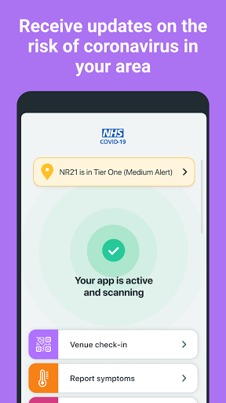
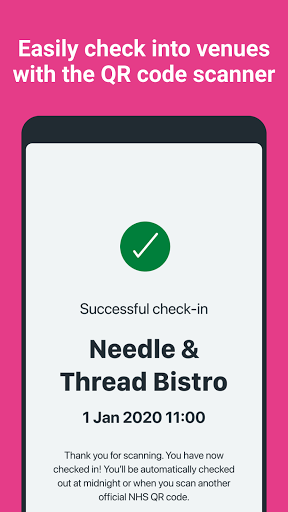
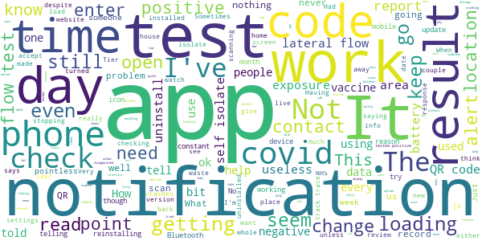

# NHS COVID-19
App version ``4.7 (168)``

Analyzed with [covid-apps-observer](http://github.com/covid-apps-observer) project, version ``0.1``

## App overview
| | |
|-------------------------|-------------------------| 
| **Name**                                          | NHS COVID-19 |
| **Unique identifier** | uk.nhs.covid19.production |
| **Link to Google Play** | [https://play.google.com/store/apps/details?id=uk.nhs.covid19.production](https://play.google.com/store/apps/details?id=uk.nhs.covid19.production) |
| **Summary**  | Protect your loved ones with the NHS contact tracing app for England and Wales. |
| **Privacy policy** | [https://covid19.nhs.uk/our-policies.html](https://covid19.nhs.uk/our-policies.html) |
| **Latest version** | 4.7 (168) |
| **Last update** | 2021-03-23 15:56:02 |
| **Recent changes** | We have optimised the venue check-in journey to highlight the user benefits of this feature as we come out of national lockdown. Other design, language and accessibility optimisations. |
| **Installs**  | 5,000,000+ |
| **Category** | Medical |
| **First release** | Aug 12, 2020 |
| **Size**  | 9.2M |
| **Supported Android version**  | 6.0 and up |

### Description
> The NHS COVID-19 app is the official contact tracing app for England and Wales. 
 It is the fastest way of knowing when you’re at risk from coronavirus. The quicker you know, the quicker you can alert your loved ones, and your community. 
 The more of us that use it, the better we can control coronavirus. 
 The app runs on proven software developed by Apple and Google, designed so that nobody will know who or where you are. And you can delete your data, or the app, at any time.
 It has a number of features: 
 Trace: Find out when you’ve been near other app users who have tested positive for coronavirus
 Alert: Lets you know the level of coronavirus risk in your postcode district. 
 Check-in: Use our simple QR code scanner to check-in to venues like bars and restaurants. You will get alerted if you have visited a venue where you may have come into contact with coronavirus.
 Symptoms: Check if you have coronavirus symptoms and see if you need to order a test. 
 Test: Helps you order a test if you need to.
 Isolate: Keep track of your self-isolation countdown and access relevant advice.
 Available in English, Welsh, Arabic (Modern Standard), Bengali, Chinese (Simplified), Gujarati, Polish, Punjabi (Gurmukhi script), Romanian, Somali, Turkish and Urdu.
 The app can be used across UK borders in England, Wales, Scotland, Northern Ireland, Jersey and Gibraltar, detecting all relevant contact tracing app users (regardless of them using different official apps), alerting them if they have been in contact with coronavirus. 
 The app has been built in collaboration with some of the most innovative organisations in the world. We have worked with medical experts, privacy groups, at-risk communities and we’ve shared knowledge with the teams working on similar apps in many countries.
 Protect your loved ones. Please download the app. 
 The App is CE marked as a class I medical device in the United Kingdom and developed in compliance with European Commission Directive 93/42/EEC for class I devices.

### User interface
The developers of the app provide the following screenshots in the Google play store.
| | | |
|:-------------------------:|:-------------------------:|:-------------------------:|
 |   |   |   | 
 |   |  

## Development team
In the following we report the main information provided by the development team in the Google play store.

| | |
|-------------------------|-------------------------|
| **Developer**  | Department of Health and Social Care |
| **Website**  | [https://covid19.nhs.uk/](https://covid19.nhs.uk/) |
| **Email** | NHSCovid-19AppStoreSupport@nhsbsa.nhs.uk |
| **Physical address**  | - |
| **Other developed apps**  | [https://play.google.com/store/apps/developer?id=Department+of+Health+and+Social+Care](https://play.google.com/store/apps/developer?id=Department+of+Health+and+Social+Care) |

## Android support

| | |
|-------------------------|-------------------------|
| **Declared target Android version**  | Android10, version 10 (API level 29) |
| **Effective target Android version**  | Android10, version 10 (API level 29) |
| **Minimum supported Android version**  | Marshmallow, version 6.0 (API level 23) |
| **Maximum target Android version**  | - |

The larger the difference between the minimum and maximum supported Android versions, the better. A larger difference means a wider audience. For example, old phones have a very low Android version, so a high minimum supported Android version means that the app cannot be used by users with old phones, thus leading to accessibility problems. 

## Requested permissions

In the following we report the complete list of the permissions requested by the app. 

| **Permission** | **Protection level** | **Description** | 
|-------------------------|-------------------------|-------------------------|
 **android.permission ACCESS_NETWORK_STATE** | Normal | Allows applications to access information about networks. 
 **android.permission BLUETOOTH** | Normal | Allows applications to connect to paired bluetooth devices. 
 **android.permission CAMERA** | :warning:**Dangerous** | Required to be able to access the camera device. 
 **android.permission FOREGROUND_SERVICE** | Normal | Allows a regular application to use Service.startForeground. 
 **android.permission INTERNET** | Normal | Allows applications to open network sockets. 
 **android.permission RECEIVE_BOOT_COMPLETED** | Normal | Allows an application to receive the Intent.ACTION_BOOT_COMPLETED that is broadcast after the system finishes booting. 
 **android.permission REQUEST_IGNORE_BATTERY_OPTIMIZATIONS** | Normal | Permission an application must hold in order to use Settings.ACTION_REQUEST_IGNORE_BATTERY_OPTIMIZATIONS. 
 **android.permission WAKE_LOCK** | Normal | Allows using PowerManager WakeLocks to keep processor from sleeping or screen from dimming. 

## Mentioned servers

| **Server** | **Registrant** | **Registrant country** | **Creation date** | 
|-------------------------|-------------------------|-------------------------|-------------------------|
 | google.com | Google LLC | :us: US | 1997-09-15 04:00:00 |
 | ietf.org | IETF Trust | :us: US | 1995-03-11 05:00:00 |
 | googleapis.com | Google LLC | :us: US | 2005-01-25 17:52:26 |
 | apache.org | The Apache Software Foundation | :us: US | 1995-04-11 04:00:00 |

## Security analysis 

Below we report the main security warnings raised by our execution of the [Androwarn](https://github.com/maaaaz/androwarn) security analysis tool.

**Connection interfaces exfiltration**
> - This application reads details about the currently active data network 
> - This application tries to find out if the currently active data network is metered 

**Suspicious connection establishment**
> - This application opens a Socket and connects it to the remote address ' returned no addresses for  ; port is out of range' on the 'N/A' port  
> - This application opens a Socket and connects it to the remote address '' on the 'N/A' port  
> - This application opens a Socket and connects it to the remote address 'Ljava/lang/StringBuilder;->toString()Ljava/lang/String;' on the 'N/A' port  
> - This application opens a Socket and connects it to the remote address 'Ljava/net/Proxy;->type()Ljava/net/Proxy$Type;' on the 'N/A' port  
> - This application opens a Socket and connects it to the remote address 'timeout' on the 'N/A' port  

**Code execution**
> - This application loads a native library 
> - This application loads a native library: 'Ljava/lang/String;->valueOf(Ljava/lang/Object;)Ljava/lang/String;' 

## User ratings and reviews

Below we provide information about how end users are reacting to the app in terms of ratings and reviews in the Google Play store.

### Ratings

The NHS COVID-19 app has been installed by more than **5000000** times. At this time, **99392** rated the app and its average score is **3.6669638**. Below we show the distribution of the ratings across the usual star-based rating of Google Play

:star::star::star::star::star:: 51892

:star::star::star::star:: 11604

:star::star::star:: 8445

:star::star:: 5807

:star:: 21644

### Reviews 

#### 5-star reviews

> Neverhad no side affects with both jags ok  :date: __2021-04-12 14:35:33__

> Keeps you informed on the rules in your area  :date: __2021-04-12 14:14:52__

> So far so good  :date: __2021-04-12 12:44:52__

> Tells me everything I ever need/want to know.  :date: __2021-04-12 12:42:24__

> Does the job.  :date: __2021-04-11 23:40:58__

> Good app and useful but am unable to log test results for rapid tests as reference not working on app  :date: __2021-04-11 21:14:57__

> Tells you all you need to no  :date: __2021-04-11 17:55:13__

> Good easy to give results  :date: __2021-04-11 16:03:04__

> Easy to use, keeps people safe  :date: __2021-04-11 11:28:54__

> Easy to set up ,  :date: __2021-04-11 10:57:01__

#### 4-star reviews

> When will I get the option to share my check-ins with NHS. I thought this would be a good next stage, especially as wr all get more mobile.  :date: __2021-04-12 18:50:14__

> All information in one app and easy to use, the only negative is that when I completed a lateral flow test from home I was unable to record my results in the app as I didn't receive a code in an email or text. Thank you for your response I didn't realise that the app only allowed you to put a positive test result I uploaded my negative result to the NHS online. Maybe in future will be able to put both negative and positive test results in the app.  :date: __2021-04-12 13:36:25__

> Wouldn't it be easier is the rapid test results could be entered on the app?  :date: __2021-04-10 14:48:20__

> Good  :date: __2021-04-10 12:14:15__

> Easy to use  :date: __2021-04-08 14:41:08__

> Easy to used.  :date: __2021-04-06 15:55:46__

> Very easy to use Quick to sign in to cafes etc with QR codes  :date: __2021-04-06 02:26:16__

> Easy to use not enough people use it though  :date: __2021-04-04 23:01:19__

> I find the app is easy to navigate, the information is up to date, but finding local GP or community pharmacy that give the covid 19 vacation is hard to find, been told i qualify for the first vacation and can't find any place local to me to get it?.  :date: __2021-04-04 03:53:44__

> Wish we could input more than one postcode as i stay with my boyfriend for a week each month and he lives under a different council so i cant input his postcode. Also would be nice if we could input if we have had the vaccine which would tell others and help them feel more at ease  :date: __2021-04-04 00:01:01__

#### 3-star reviews

> App seems OK but does let you enter if you've had the vaccine still seems to say we are at alert level 4 I thought we were lower than that now seems like the app maker doesn't really bother with it compared to englands version  :date: __2021-04-08 08:12:37__

> Telling me I need my Bluetooth on to scan.  :date: __2021-04-06 12:07:36__

> It should have the QR code reader option for reporting test results.  :date: __2021-04-05 09:30:01__

> I wonder if some problems emanate from using VPN? Gadget may think you are overseas... ?  :date: __2021-04-05 04:26:47__

> Maybe add been vaccinated?  :date: __2021-04-04 22:08:33__

> Working well  :date: __2021-04-04 16:04:26__

> A widget that I could put on my home screen to quick launch the check in screen with the camera open would be nice so I can check into venues with one tap. I rarely check in anywhere at the moment as it's too much of a faff to open the app then click on check in and scan.  :date: __2021-04-04 12:10:09__

> Adding results? Why can't I add test results? Is it only if you have a test at the doctors or hospital? It might be an idea to state that on the app if so!  :date: __2021-04-03 14:44:23__

> I do leave my phone in the car during shopping and working time. Very helpful app  :date: __2021-04-02 11:49:48__

> Will not accept result code for covid test I have had in hospital. Says I may need an update. Checked update latest early March. I'll have another go  :date: __2021-04-01 08:34:20__

#### 2-star reviews

> Just reinstalled to help with check ins. Still getting the "Loading" notification. Very disappointed.  :date: __2021-04-12 19:12:21__

> Disappointed that I cant record my lateral flow tests on here as i am beyond despair with the website. It would be so much easier.  :date: __2021-04-11 21:39:14__

> When doing a home test you can't just go to enter result, scan the QR code on the test strip and enter your results, you have to go through the nhs covid results website and enter all your info again. This will mean a lot of people won't bother to report results and it defeats the object of track and trace  :date: __2021-04-11 13:28:39__

> Could do so much more! Should be able to record rapid flow test not just PCR. App shows my last test a week ago, could be linked to main database?  :date: __2021-04-08 15:06:43__

> Think it's ok but could do with putting up the vaccine jab section too  :date: __2021-04-07 22:15:25__

> It's ok, haven't used it often as it doesn't always scan  :date: __2021-04-05 15:43:06__

> Does this thing even still work anymore at this point?  :date: __2021-04-05 01:26:39__

> I dont seem to be getting notifications despite me checking in. The app still says loading  :date: __2021-04-03 08:48:26__

> Only applies to NHS testing. I've had many tests by ONS/OXFORD UNI (all negative) but can't enter these results due to lack of a 'code'. Why can't it also cover vaccination?  :date: __2021-04-02 02:49:23__

> Not had a notification in a long time, and now the app won't let me check my symptoms, i see the loading bar more times than a gaming app. Big waste of taxpayers money  :date: __2021-04-01 09:46:37__

#### 1-star reviews

> Useless app. Despite having Covid positive app using colleagues, I was not informed by the app. Now deleted.  :date: __2021-04-12 18:47:11__

> Poor no direction to book vaccination after being informed by surgeries to book via the app  :date: __2021-04-12 18:41:08__

> Too little too late  :date: __2021-04-12 18:14:48__

> A waste of time, can't tell when you leave and if anyone with Covid comes into the other side of the pub an hour after you left, even if they get covid a week later and you were once potentially not even close to being in their vicinity, then shield shield shield. I can't wait to spend the rest of my life paying tax to cover the cost of this rubbish 👌  :date: __2021-04-12 18:03:07__

> Blocking updates of this app is not right. The elected government must be obeyed.  :date: __2021-04-12 16:44:04__

> Too basic and pointless. Rubbish QR code scanner essentially. Edit: not that it has issues it is under developed. Risk in area set to you home only, why does it not tell you about where you currently are. If you get a contact alert it doesn't say why or where or when it has pinged from to understand better who you may need to inform. All business should have a qr code for this to be affective not just pub restaurants etc..  :date: __2021-04-12 16:38:06__

> Downloaded without my consent  :date: __2021-04-12 16:29:31__

> THIS APP HAS DEFINITE SINISTER UNDERTONES!! BIG BROTHER IS WATCHING. THE UPDATE HAS JUST BEEN BANNED BY APPLE AND GOOGLE FOR SECRETLY HARVESTING PERSONAL INFORMATION. THIS SPEAKS VOLUMES!! EVERYONE...... DELETE THIS NOW  :date: __2021-04-12 16:13:25__

> I got a new. Phone so downloaded again .Its no where to be ive tried the link it still says my phone has the app.It was on my old phone not this one.How do i get it?.  :date: __2021-04-12 15:11:24__

> Utterly pointless. Track and Trace is so incompetent the latest update breaches Google and Apple terms and has been blocked. I mean you could not make it up. Whoever is running this omnishambles should resign (let's face it, she's got form). Uninstalled.  :date: __2021-04-12 15:04:14__

