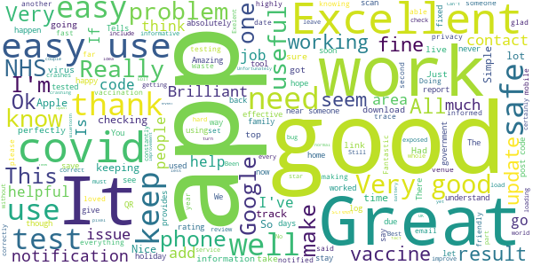
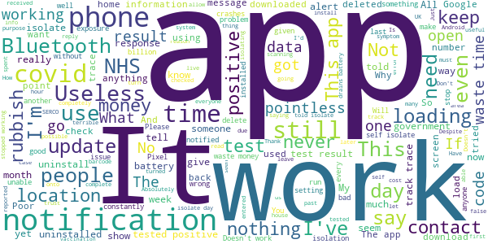

# NHS COVID-19
App version ``4.7 (168)``

Analyzed with [covid-apps-observer](http://github.com/covid-apps-observer) project, version ``0.1``

## App overview
| | |
|-------------------------|-------------------------| 
| **Name**                                          | NHS COVID-19 |
| **Unique identifier** | uk.nhs.covid19.production |
| **Link to Google Play** | [https://play.google.com/store/apps/details?id=uk.nhs.covid19.production](https://play.google.com/store/apps/details?id=uk.nhs.covid19.production) |
| **Summary**  | Protect your loved ones with the NHS contact tracing app for England and Wales. |
| **Privacy policy** | [https://covid19.nhs.uk/our-policies.html](https://covid19.nhs.uk/our-policies.html) |
| **Latest version** | 4.7 (168) |
| **Last update** | 2021-03-23 15:56:02 |
| **Recent changes** | We have optimised the venue check-in journey to highlight the user benefits of this feature as we come out of national lockdown. Other design, language and accessibility optimisations. |
| **Installs**  | 5,000,000+ |
| **Category** | Medical |
| **First release** | Aug 12, 2020 |
| **Size**  | 9.2M |
| **Supported Android version**  | 6.0 and up |

### Description
> The NHS COVID-19 app is the official contact tracing app for England and Wales. 
 It is the fastest way of knowing when you’re at risk from coronavirus. The quicker you know, the quicker you can alert your loved ones, and your community. 
 The more of us that use it, the better we can control coronavirus. 
 The app runs on proven software developed by Apple and Google, designed so that nobody will know who or where you are. And you can delete your data, or the app, at any time.
 It has a number of features: 
 Trace: Find out when you’ve been near other app users who have tested positive for coronavirus
 Alert: Lets you know the level of coronavirus risk in your postcode district. 
 Check-in: Use our simple QR code scanner to check-in to venues like bars and restaurants. You will get alerted if you have visited a venue where you may have come into contact with coronavirus.
 Symptoms: Check if you have coronavirus symptoms and see if you need to order a test. 
 Test: Helps you order a test if you need to.
 Isolate: Keep track of your self-isolation countdown and access relevant advice.
 Available in English, Welsh, Arabic (Modern Standard), Bengali, Chinese (Simplified), Gujarati, Polish, Punjabi (Gurmukhi script), Romanian, Somali, Turkish and Urdu.
 The app can be used across UK borders in England, Wales, Scotland, Northern Ireland, Jersey and Gibraltar, detecting all relevant contact tracing app users (regardless of them using different official apps), alerting them if they have been in contact with coronavirus. 
 The app has been built in collaboration with some of the most innovative organisations in the world. We have worked with medical experts, privacy groups, at-risk communities and we’ve shared knowledge with the teams working on similar apps in many countries.
 Protect your loved ones. Please download the app. 
 The App is CE marked as a class I medical device in the United Kingdom and developed in compliance with European Commission Directive 93/42/EEC for class I devices.

### User interface
The developers of the app provide the following screenshots in the Google play store.
| | | |
|:-------------------------:|:-------------------------:|:-------------------------:|
 |   |   |   | 
 |   |  

## Development team
In the following we report the main information provided by the development team in the Google play store.

| | |
|-------------------------|-------------------------|
| **Developer**  | Department of Health and Social Care |
| **Website**  | [https://covid19.nhs.uk/](https://covid19.nhs.uk/) |
| **Email** | NHSCovid-19AppStoreSupport@nhsbsa.nhs.uk |
| **Physical address**  | - |
| **Other developed apps**  | [https://play.google.com/store/apps/developer?id=Department+of+Health+and+Social+Care](https://play.google.com/store/apps/developer?id=Department+of+Health+and+Social+Care) |

## Android support

| | |
|-------------------------|-------------------------|
| **Declared target Android version**  | Android10, version 10 (API level 29) |
| **Effective target Android version**  | Android10, version 10 (API level 29) |
| **Minimum supported Android version**  | Marshmallow, version 6.0 (API level 23) |
| **Maximum target Android version**  | - |

The larger the difference between the minimum and maximum supported Android versions, the better. A larger difference means a wider audience. For example, old phones have a very low Android version, so a high minimum supported Android version means that the app cannot be used by users with old phones, thus leading to accessibility problems. 

## Requested permissions

In the following we report the complete list of the permissions requested by the app. 

| **Permission** | **Protection level** | **Description** | 
|-------------------------|-------------------------|-------------------------|
 **android.permission ACCESS_NETWORK_STATE** | Normal | Allows applications to access information about networks. 
 **android.permission BLUETOOTH** | Normal | Allows applications to connect to paired bluetooth devices. 
 **android.permission CAMERA** | :warning:**Dangerous** | Required to be able to access the camera device. 
 **android.permission FOREGROUND_SERVICE** | Normal | Allows a regular application to use Service.startForeground. 
 **android.permission INTERNET** | Normal | Allows applications to open network sockets. 
 **android.permission RECEIVE_BOOT_COMPLETED** | Normal | Allows an application to receive the Intent.ACTION_BOOT_COMPLETED that is broadcast after the system finishes booting. 
 **android.permission REQUEST_IGNORE_BATTERY_OPTIMIZATIONS** | Normal | Permission an application must hold in order to use Settings.ACTION_REQUEST_IGNORE_BATTERY_OPTIMIZATIONS. 
 **android.permission WAKE_LOCK** | Normal | Allows using PowerManager WakeLocks to keep processor from sleeping or screen from dimming. 

## Mentioned servers

| **Server** | **Registrant** | **Registrant country** | **Creation date** | 
|-------------------------|-------------------------|-------------------------|-------------------------|
 | google.com | Google LLC | :us: US | 1997-09-15 04:00:00 |
 | ietf.org | IETF Trust | :us: US | 1995-03-11 05:00:00 |
 | googleapis.com | Google LLC | :us: US | 2005-01-25 17:52:26 |
 | apache.org | The Apache Software Foundation | :us: US | 1995-04-11 04:00:00 |

## Security analysis 

Below we report the main security warnings raised by our execution of the [Androwarn](https://github.com/maaaaz/androwarn) security analysis tool.

**Connection interfaces exfiltration**
> - This application reads details about the currently active data network 
> - This application tries to find out if the currently active data network is metered 

**Suspicious connection establishment**
> - This application opens a Socket and connects it to the remote address ' returned no addresses for  ; port is out of range' on the 'N/A' port  
> - This application opens a Socket and connects it to the remote address '' on the 'N/A' port  
> - This application opens a Socket and connects it to the remote address 'Ljava/lang/StringBuilder;->toString()Ljava/lang/String;' on the 'N/A' port  
> - This application opens a Socket and connects it to the remote address 'Ljava/net/Proxy;->type()Ljava/net/Proxy$Type;' on the 'N/A' port  
> - This application opens a Socket and connects it to the remote address 'timeout' on the 'N/A' port  

**Code execution**
> - This application loads a native library 
> - This application loads a native library: 'Ljava/lang/String;->valueOf(Ljava/lang/Object;)Ljava/lang/String;' 

## User ratings and reviews

Below we provide information about how end users are reacting to the app in terms of ratings and reviews in the Google Play store.

### Ratings

The NHS COVID-19 app has been installed by more than **5000000** times. At this time, **99392** rated the app and its average score is **3.6669638**. Below we show the distribution of the ratings across the usual star-based rating of Google Play

:star::star::star::star::star:: 51892

:star::star::star::star:: 11604

:star::star::star:: 8445

:star::star:: 5807

:star:: 21644

### Reviews 

#### 5-star reviews

> Fantastic, highly recommend 👌  :date: __2021-03-27 16:25:58__

> Really good  :date: __2021-03-27 15:28:07__

> Excellent  :date: __2021-03-27 12:54:50__

> I get that it is only for England and Welsh , but what should people living in Scotland and have been asked to register in the app  :date: __2021-03-27 10:55:39__

> Very informative  :date: __2021-03-27 06:18:09__

> Kkkkkkk. Ki.k? Kkkkmkmkkkmiki  :date: __2021-03-27 00:02:21__

> Been good app  :date: __2021-03-26 16:33:36__

> Nice to see what happen  :date: __2021-03-26 10:54:01__

> Makes me feel safe  :date: __2021-03-26 07:57:57__

> Exelent  :date: __2021-03-25 13:41:45__

#### 4-star reviews

> Would be good if you could store your vaccination details incase you lose the card given  :date: __2021-03-25 13:19:42__

> Really good app  :date: __2021-03-24 21:56:17__

> Could do with more details  :date: __2021-03-24 17:53:50__

> Hi its a good app but just wanted something clarified me an my partner haven't been out for 10 days however on my app it stated I have to isolate just wanted to ask if there is a possibility that if you are living in a property which is a terrace house and a neighbour has covid is it possible that it can show on my notification that I have to isolate which shouldn't be the case as had to contact with them?  :date: __2021-03-23 19:45:28__

> I keep on getting notifications I am fine with that but my mum finds it a bit annoying. But everything is alright 😌.  :date: __2021-03-21 16:34:23__

> Hi . I am register with NHS since 2016. Last week I try book to have vaccine but show me I am not eligible . If I work in warehouse can be considerate job in first line ?  :date: __2021-03-20 13:24:36__

> Still switched on yet it keeps telling me that my phone's location isn't switched on - BUT it is. I have also tried to do this via phone settings for location and from the app itself... however, there no screen buttons to do this. Update. Switch off contact tracing. Cancel reminders, wait a minute and switch back on. A pop-up window allows switching location back on. THIS HAS SINCE REVERTED TO THE ERROR MESSAGE AGAIN.  :date: __2021-03-18 20:36:50__

> Work ok but not every shop have the code to scan also sometime i dont like keeping my Bluetooth on  :date: __2021-03-18 18:10:37__

> For some reason I can't find out my covid test result. It's quite annoying.  :date: __2021-03-16 18:39:44__

> Update still working fine, whatever told me to isolate is now behaving. No more false isolate, instructions 4 star given. Despite false isolations, I've given it a third chance. Currently its behaving as I would expect. Its not giving isolation messages and that's because I'm not mixing still. Its 5 weeks with trace on and no more false positives. SO FAR. Ive marked it up to 3 and will see how it goes.  :date: __2021-03-16 11:29:19__

#### 3-star reviews

> It is a good app only downside is with my job I do have to have lateral flow test every couple of weeks at work however the app will not allow me to enter the results and have to be put on to a separate site it would be good if it was possible to have a feature on the app that could do this also  :date: __2021-03-28 13:42:27__

> Not useful for me as there is no laces for me to go  :date: __2021-03-25 02:52:01__

> It's mostly good on many things but when I enter a covid test it won't let me type the code  :date: __2021-03-24 22:37:07__

> Does not allow you to enter new covid test results, instead you have have to go via website which takes a long while  :date: __2021-03-23 13:05:18__

> I can certainly see the application of this app for some people, but as I suffer from chronic pain (suspected Ankylosing Spondylitis) and am virtually unable to leave my home without help from my husband, for me personally an alert when cases are on the increase nearby would be much more useful. Does this app use paid data? Because if so, it's truly useless to me. I can't afford that any more. And one last thing: leaving location and Bluetooth on is bad for battery life: this needs optimising!  :date: __2021-03-23 10:09:00__

> Not leaving Bluetooth on constantly. I don't want the extra rf exposure (particularly 2.4ghz). Bluetooth's security record is also quite poor. I might be persuaded to ignore the security issue and turn it on whilst out or when my GPS location does not match home! However I would expect GPS location to be good enough (same supermarket, same time, esp considering people proximity != virus proximity). I understand wanting to avoid criticism of GPS in terms of big brother but priv policy or options.  :date: __2021-03-23 09:58:32__

> Fine but given I am at home 99% of time with Bluetooth and Location turned off, can you stop notifying me about it. I'm obviously doing it on purpose.  :date: __2021-03-21 19:46:55__

> I have been using this since the day of its release. It once told me that I had been in the same place as someone at a different time (but not where or when) and when I tapped to learn more, the message was gone. In all of that time, I have learned of only one person who has received an alert, and that was a government minister. Is this an expensive white elephant?  :date: __2021-03-20 20:32:21__

> 3* because it should be life changing, saddly no. When I got the message to isolate, it's 4days late The app is to much to fiddle with with the same information Easier to access else where Expected better  :date: __2021-03-20 09:57:06__

> It's got a permanent notification that just says 'it's loading'.  :date: __2021-03-18 20:08:52__

#### 2-star reviews

> This App Has to be one the Biggest waste of British Tax Payers Money ever dreamt up. Not because its a bad idea but because it has seemingly financially benefited a few select people and preferred private companies. Also not every wants to remain utterly anonymous so why can't the data from my Government funded lateral flow test be integrated into the app instead of being emailed to me? Does it even work? Having spent a disproportionate time in/out of hospital in 20/21 still not had a Ping.  :date: __2021-03-28 13:28:03__

> Will not accept lateral flow test code or read the QR code.  :date: __2021-03-28 12:02:32__

> Keep getting periods (11+ days) where exposure checks are not shown unless I open both the app and exposure settings. Sometimes I need to uninstall and reinstall the app for it to catch up.  :date: __2021-03-25 20:06:08__

> Not worth having, the only place I go where there is a QR code is work  :date: __2021-03-25 10:47:50__

> it doesn't do anything  :date: __2021-03-25 09:41:07__

> There should be a place to add in the vaccine note  :date: __2021-03-24 23:56:52__

> Can't believe this cost us billions  :date: __2021-03-24 17:59:05__

> I dont seem to be getting notifications despite me checking in  :date: __2021-03-23 15:41:16__

> 20/1/21 26/1/21? 12/2/21 23/2/21 11/3/21 tests conducted in hospital cant be added as no ref no given in hospiral 23/3/21  :date: __2021-03-23 14:49:08__

> It kind of gets the job jone. Just constant notifications about connection etc. On top of that unless you have a device that can control when it uses Bluetooth and location and have a small phone battery, prepare for quite a bit less battery. Used on a S20 ultra and an S10+ and S10+ battery was decreased quite a lot because its battery isn't massive anyway. Plus I've had times on both devices where the app bugs out or crashes and they are both powerful devices so they shouldn't be crashing  :date: __2021-03-23 12:05:54__

#### 1-star reviews

> Says that I'm not connected to the internet when I want to submit my test result. Tried WiFi and mobile 4G LTE nothing works. If I'm online how did I submit this review?  :date: __2021-03-28 12:30:59__

> App keeps crashing and won't now open since last update. Using a Samsung S21 Ultra.  :date: __2021-03-28 11:10:29__

> Drains battery extremely fast  :date: __2021-03-28 03:31:27__

> the concept of this app is very flawed. Someone who has reported covid wouldn't go outside. If they were to do such a thing ,why would they bother reporting? Just doss outside spreading covid with no repercussions! My phone ran out of space so I deleted this app as it seems to serve no true purpose to me.  :date: __2021-03-27 23:17:29__

> I've had this app a while, just after Xmas, the app gave me a notification telling me I had been exposed and needed to self isolate for 10 days I immediately panicked as I'm hight risk. However I had not left the house or seen anyone for weeks so could not work out how I had been exposed. Then when I looked at the apparent exposure date I realised, it was my upstairs neighbors who I had had no contact with, but the signal must of reached my phone from upstairs.  :date: __2021-03-27 14:39:35__

> Got nowhere with it  :date: __2021-03-27 13:00:27__

> Partner has a positive test. Updated app. Sat next to her , and my app happily scanning away, with no notifications I'm in contact or been in contact with anyone who is covid positive🙃🙃🙃. All data sharing is on and set up notifications. All the comments you have responded. Anonymous share data (yes she has) , being in close contact were sat next to each other watching a film phones near us. The app is useless and fails with the most basic task. Fix it rather then posting a generic response  :date: __2021-03-27 11:17:23__

> In 2020 worked fine. This year just keeps stopping in my Samsung  :date: __2021-03-26 12:58:32__

> Something seem very off about this app. Leaving me wondering if it is working. As an android 11 user it not needing location permission seem to be silly. But it needing camera permission to take photo and record videos seem pointless. Unless it is a hidden way of seeking location if a user allows camera to have location permission. Update: I believe it should track location, bit the issues I was having have self resolved.  :date: __2021-03-26 12:19:15__

> people I work closely with have been told to self isolate and I haven't even though I spend 8 hours daily with these people. clearly the app is flawed  :date: __2021-03-26 11:38:55__

