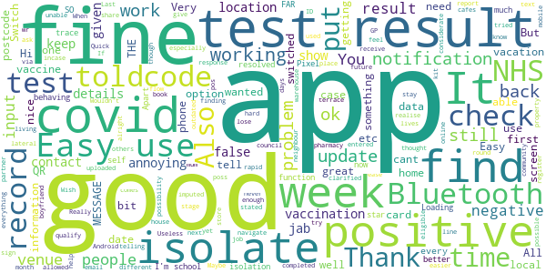

# NHS COVID-19
App version ``4.7 (168)``

Analyzed with [covid-apps-observer](http://github.com/covid-apps-observer) project, version ``0.1``

## App overview
| | |
|-------------------------|-------------------------| 
| **Name**                                          | NHS COVID-19 |
| **Unique identifier** | uk.nhs.covid19.production |
| **Link to Google Play** | [https://play.google.com/store/apps/details?id=uk.nhs.covid19.production](https://play.google.com/store/apps/details?id=uk.nhs.covid19.production) |
| **Summary**  | Protect your loved ones with the NHS contact tracing app for England and Wales. |
| **Privacy policy** | [https://covid19.nhs.uk/our-policies.html](https://covid19.nhs.uk/our-policies.html) |
| **Latest version** | 4.7 (168) |
| **Last update** | 2021-03-23 15:56:02 |
| **Recent changes** | We have optimised the venue check-in journey to highlight the user benefits of this feature as we come out of national lockdown. Other design, language and accessibility optimisations. |
| **Installs**  | 5,000,000+ |
| **Category** | Medical |
| **First release** | Aug 12, 2020 |
| **Size**  | 9.2M |
| **Supported Android version**  | 6.0 and up |

### Description
> The NHS COVID-19 app is the official contact tracing app for England and Wales. 
 It is the fastest way of knowing when you’re at risk from coronavirus. The quicker you know, the quicker you can alert your loved ones, and your community. 
 The more of us that use it, the better we can control coronavirus. 
 The app runs on proven software developed by Apple and Google, designed so that nobody will know who or where you are. And you can delete your data, or the app, at any time.
 It has a number of features: 
 Trace: Find out when you’ve been near other app users who have tested positive for coronavirus
 Alert: Lets you know the level of coronavirus risk in your postcode district. 
 Check-in: Use our simple QR code scanner to check-in to venues like bars and restaurants. You will get alerted if you have visited a venue where you may have come into contact with coronavirus.
 Symptoms: Check if you have coronavirus symptoms and see if you need to order a test. 
 Test: Helps you order a test if you need to.
 Isolate: Keep track of your self-isolation countdown and access relevant advice.
 Available in English, Welsh, Arabic (Modern Standard), Bengali, Chinese (Simplified), Gujarati, Polish, Punjabi (Gurmukhi script), Romanian, Somali, Turkish and Urdu.
 The app can be used across UK borders in England, Wales, Scotland, Northern Ireland, Jersey and Gibraltar, detecting all relevant contact tracing app users (regardless of them using different official apps), alerting them if they have been in contact with coronavirus. 
 The app has been built in collaboration with some of the most innovative organisations in the world. We have worked with medical experts, privacy groups, at-risk communities and we’ve shared knowledge with the teams working on similar apps in many countries.
 Protect your loved ones. Please download the app. 
 The App is CE marked as a class I medical device in the United Kingdom and developed in compliance with European Commission Directive 93/42/EEC for class I devices.

### User interface
The developers of the app provide the following screenshots in the Google play store.
| | | |
|:-------------------------:|:-------------------------:|:-------------------------:|
 |   |   |   | 
 |   |  

## Development team
In the following we report the main information provided by the development team in the Google play store.

| | |
|-------------------------|-------------------------|
| **Developer**  | Department of Health and Social Care |
| **Website**  | [https://covid19.nhs.uk/](https://covid19.nhs.uk/) |
| **Email** | NHSCovid-19AppStoreSupport@nhsbsa.nhs.uk |
| **Physical address**  | - |
| **Other developed apps**  | [https://play.google.com/store/apps/developer?id=Department+of+Health+and+Social+Care](https://play.google.com/store/apps/developer?id=Department+of+Health+and+Social+Care) |

## Android support

| | |
|-------------------------|-------------------------|
| **Declared target Android version**  | Android10, version 10 (API level 29) |
| **Effective target Android version**  | Android10, version 10 (API level 29) |
| **Minimum supported Android version**  | Marshmallow, version 6.0 (API level 23) |
| **Maximum target Android version**  | - |

The larger the difference between the minimum and maximum supported Android versions, the better. A larger difference means a wider audience. For example, old phones have a very low Android version, so a high minimum supported Android version means that the app cannot be used by users with old phones, thus leading to accessibility problems. 

## Requested permissions

In the following we report the complete list of the permissions requested by the app. 

| **Permission** | **Protection level** | **Description** | 
|-------------------------|-------------------------|-------------------------|
 **android.permission ACCESS_NETWORK_STATE** | Normal | Allows applications to access information about networks. 
 **android.permission BLUETOOTH** | Normal | Allows applications to connect to paired bluetooth devices. 
 **android.permission CAMERA** | :warning:**Dangerous** | Required to be able to access the camera device. 
 **android.permission FOREGROUND_SERVICE** | Normal | Allows a regular application to use Service.startForeground. 
 **android.permission INTERNET** | Normal | Allows applications to open network sockets. 
 **android.permission RECEIVE_BOOT_COMPLETED** | Normal | Allows an application to receive the Intent.ACTION_BOOT_COMPLETED that is broadcast after the system finishes booting. 
 **android.permission REQUEST_IGNORE_BATTERY_OPTIMIZATIONS** | Normal | Permission an application must hold in order to use Settings.ACTION_REQUEST_IGNORE_BATTERY_OPTIMIZATIONS. 
 **android.permission WAKE_LOCK** | Normal | Allows using PowerManager WakeLocks to keep processor from sleeping or screen from dimming. 

## Mentioned servers

| **Server** | **Registrant** | **Registrant country** | **Creation date** | 
|-------------------------|-------------------------|-------------------------|-------------------------|
 | google.com | Google LLC | :us: US | 1997-09-15 04:00:00 |
 | ietf.org | IETF Trust | :us: US | 1995-03-11 05:00:00 |
 | googleapis.com | Google LLC | :us: US | 2005-01-25 17:52:26 |
 | apache.org | The Apache Software Foundation | :us: US | 1995-04-11 04:00:00 |

## Security analysis 

Below we report the main security warnings raised by our execution of the [Androwarn](https://github.com/maaaaz/androwarn) security analysis tool.

**Connection interfaces exfiltration**
> - This application reads details about the currently active data network 
> - This application tries to find out if the currently active data network is metered 

**Suspicious connection establishment**
> - This application opens a Socket and connects it to the remote address ' returned no addresses for  ; port is out of range' on the 'N/A' port  
> - This application opens a Socket and connects it to the remote address '' on the 'N/A' port  
> - This application opens a Socket and connects it to the remote address 'Ljava/lang/StringBuilder;->toString()Ljava/lang/String;' on the 'N/A' port  
> - This application opens a Socket and connects it to the remote address 'Ljava/net/Proxy;->type()Ljava/net/Proxy$Type;' on the 'N/A' port  
> - This application opens a Socket and connects it to the remote address 'timeout' on the 'N/A' port  

**Code execution**
> - This application loads a native library 
> - This application loads a native library: 'Ljava/lang/String;->valueOf(Ljava/lang/Object;)Ljava/lang/String;' 

## User ratings and reviews

Below we provide information about how end users are reacting to the app in terms of ratings and reviews in the Google Play store.

### Ratings

The NHS COVID-19 app has been installed by more than **5000000** times. At this time, **99392** rated the app and its average score is **3.6669638**. Below we show the distribution of the ratings across the usual star-based rating of Google Play

:star::star::star::star::star:: 51892

:star::star::star::star:: 11604

:star::star::star:: 8445

:star::star:: 5807

:star:: 21644

### Reviews 

#### 5-star reviews

> Good  :date: __2021-04-18 08:43:18__

> easy to use takes second's to do.  :date: __2021-04-17 18:23:22__

> great app works instantly 👌  :date: __2021-04-17 11:13:53__

> Great app  :date: __2021-04-16 20:13:39__

> Very easy to install, use and understand.  :date: __2021-04-16 10:22:21__

> Excellent app  :date: __2021-04-16 10:01:30__

> Keep checking in and testing please 💋  :date: __2021-04-15 16:02:37__

> reasurance  :date: __2021-04-15 14:09:09__

> Nice and easy to use  :date: __2021-04-15 13:40:46__

> Should make it so you can sign out of places as well.  :date: __2021-04-15 10:40:18__

#### 4-star reviews

> Useless if venue has an outdated QR codes  :date: __2021-04-17 19:05:48__

> a great app  :date: __2021-04-17 16:31:19__

> You need to tell people it can only report contacts if they have imputed that they are positive, I have been round people who have been positive, but never shows on my app as their app doesn't know they are pos as they have not told the app they are poss  :date: __2021-04-16 23:58:24__

> needs Bluetooth for Android  :date: __2021-04-13 15:51:35__

> When will I get the option to share my check-ins with NHS. I thought this would be a good next stage, especially as wr all get more mobile.  :date: __2021-04-12 18:50:14__

> All information in one app and easy to use, the only negative is that when I completed a lateral flow test from home I was unable to record my results in the app as I didn't receive a code in an email or text. Thank you for your response I didn't realise that the app only allowed you to put a positive test result I uploaded my negative result to the NHS online. Maybe in future will be able to put both negative and positive test results in the app.  :date: __2021-04-12 13:36:25__

> Wouldn't it be easier is the rapid test results could be entered on the app?  :date: __2021-04-10 14:48:20__

> Good  :date: __2021-04-10 12:14:15__

> Easy to use  :date: __2021-04-08 14:41:08__

> Easy to used.  :date: __2021-04-06 15:55:46__

#### 3-star reviews

> App seems ok but the design decision to require Bluetooth to be turned on when the app is open is very annoying. When I have contact tracing off I should be able to turn off Bluetooth (as there is no need for it) and still use the other app features, eg view venue history, or click through the link to the latest advice. Of course, when I leave the house & turn the contact tracing back on it should then ask me to turn Bluetooth back on. Also, a national stats page would be a nice touch.  :date: __2021-04-13 01:31:11__

> Does the job. Would be good if you could report results of lateral flow tests via the app.  :date: __2021-04-12 21:14:38__

> App seems OK but does let you enter if you've had the vaccine still seems to say we are at alert level 4 I thought we were lower than that now seems like the app maker doesn't really bother with it compared to englands version  :date: __2021-04-08 08:12:37__

> Telling me I need my Bluetooth on to scan.  :date: __2021-04-06 12:07:36__

> It should have the QR code reader option for reporting test results.  :date: __2021-04-05 09:30:01__

> I wonder if some problems emanate from using VPN? Gadget may think you are overseas... ?  :date: __2021-04-05 04:26:47__

> Maybe add been vaccinated?  :date: __2021-04-04 22:08:33__

> Working well  :date: __2021-04-04 16:04:26__

> A widget that I could put on my home screen to quick launch the check in screen with the camera open would be nice so I can check into venues with one tap. I rarely check in anywhere at the moment as it's too much of a faff to open the app then click on check in and scan.  :date: __2021-04-04 12:10:09__

> Adding results? Why can't I add test results? Is it only if you have a test at the doctors or hospital? It might be an idea to state that on the app if so!  :date: __2021-04-03 14:44:23__

#### 2-star reviews

> What the point of this app? It doesn't really do anything except for take space. It doesn't rven record the QR for the tests  :date: __2021-04-17 20:20:53__

> Matt Hancock sucks cock  :date: __2021-04-17 15:13:29__

> I know this app is essential, but the QR scanner to check in to a venue is so glitchy. Sometimes it works, most of the time it doesn't. I've tried using different default cameras for the app with no joy. I know it's the app and not my phone as my regular QR scanner has no problem reading the code and I know other people who have had identical problems. This needs to be addressed  :date: __2021-04-17 11:52:31__

> Seems a bit rubbish that you have to go to another gov website to have it scan your lateral flow test qr to get a test code to then enter here. Can we really be bothered with all that. Do you want us to use it or not. ???? !!!  :date: __2021-04-16 19:43:23__

> Regularly it notifies there is a message but guess what........ I have to keep stopping it which surely negates the function of this app !  :date: __2021-04-15 23:28:10__

> This app should allow you to report lateral flow tests that are negative or positive too make it easier  :date: __2021-04-15 19:55:34__

> misses the whole point  :date: __2021-04-14 17:00:46__

> I installed it but clear as day doesn't work at all  :date: __2021-04-13 21:26:45__

> Had the covid test and loaded the test results. Now going back to check it shows that I never had the test. I have re entered the code but will not accept it. What is the use of having the app and you can't use it.  :date: __2021-04-12 22:56:56__

> A bit pointless that I can't enter or scan lateral flow test kits and report results. The app is constantly scanning but I don't go out much so probably a bit pointless having it. It would be cool if it set off an alarm if I met someone in the street with a positive result or told people to keep their distance!!!  :date: __2021-04-12 20:42:16__

#### 1-star reviews

> Colossal waste of time and money this app does not work it was tory corruption. Backslapping cronyism. These people should be charged with murder. The app has nothing to do with the NHS  :date: __2021-04-18 02:55:19__

> This app is absolutely useless uninstall if you have it absolute garbage 🗑  :date: __2021-04-17 20:56:22__

> just shite in general. you don't need me to tell you what's been said a million times. only re-downloading because i have to record test results for work.  :date: __2021-04-17 20:14:55__

> not run by the NHS- the Conservative party is a lying stain on British society  :date: __2021-04-17 11:15:32__

> Useless app, drains battery and fails to notify known exspsuers. If it was not for my work's own track and trace many people would have spread the virus not knowing that they came in contact with the virus. Some people who had been notified by work had taken tests a week later and found out they were positive. If it was not for work they would have spread the virus unknowingly (we have been working throughout the pandemic as key workers).  :date: __2021-04-17 10:26:55__

> The app barely works, I have worked with someone who contracted Covid and the app never once informed me that I should self isolate. I had to contact the NHS helpline instead. Glad this cost so much tax money that could have gone to better causes than the mates of Tories.  :date: __2021-04-17 10:02:20__

> Cannot enter a test result code. Have even tried deleting app and reinstalling to ensure it is latest version.  :date: __2021-04-17 09:37:29__

> Too much information needs to be shared. I have never allowed my phone to record where I am, that will not start now. If there is no other way to give you information without being 'spied' on all the time, you will not get anything. It is a shame.  :date: __2021-04-17 09:03:05__

> I was hopeful for the app to do well and was fully behind it but it was a total failure. The notifications were delayed and I then worked out that walking past houses that had no front gardens was triggering it to go off as people were isolating at home. Shame to say it's a total waste of time and money spent on it.  :date: __2021-04-16 20:52:00__

> App is useless. My wife tested positive and entered the result into the app and my app didn't tell me I'd been in contact with someone testing positive.  :date: __2021-04-16 18:59:40__

