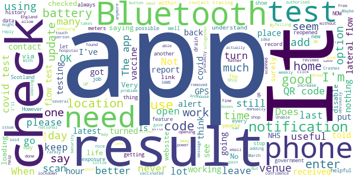
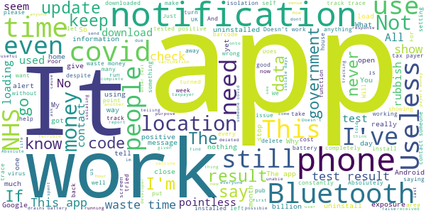

# NHS COVID-19
App version ``4.9 (185)``

Analyzed with [covid-apps-observer](http://github.com/covid-apps-observer) project, version ``0.1``

## App overview
| | |
|-------------------------|-------------------------| 
| **Name**&nbsp;&nbsp;&nbsp;&nbsp;&nbsp;&nbsp;&nbsp;&nbsp;&nbsp;&nbsp;&nbsp;&nbsp;&nbsp;&nbsp;&nbsp;&nbsp;&nbsp;&nbsp;&nbsp;&nbsp;&nbsp;&nbsp;&nbsp;&nbsp;&nbsp;&nbsp;&nbsp;&nbsp;&nbsp;&nbsp;&nbsp;&nbsp;&nbsp;&nbsp;&nbsp;&nbsp;&nbsp;&nbsp;&nbsp;&nbsp;  | NHS COVID-19 |
| **Unique identifier** | uk.nhs.covid19.production |
| **Link to Google Play** | [https://play.google.com/store/apps/details?id=uk.nhs.covid19.production](https://play.google.com/store/apps/details?id=uk.nhs.covid19.production) |
| **Summary**  | Protect your loved ones with the NHS contact tracing app for England and Wales. |
| **Privacy policy** | [https://covid19.nhs.uk/our-policies.html](https://covid19.nhs.uk/our-policies.html) |
| **Latest version** | 4.9 (185) |
| **Last update** | 2021-04-26 13:36:30 |
| **Recent changes** | We have added a reminder alert asking you to notify others of a positive test result. You can now book a test using the app if you have been near someone who has tested positive. Information about testing is now easier to find. The CE mark has changed to the UKCA mark. |
| **Installs**  | 10,000,000+ |
| **Category** | Medical |
| **First release** | Aug 12, 2020 |
| **Size**  | 9.2M |
| **Supported Android version**  | 6.0 and up |

### Description
> The NHS COVID-19 app is the official contact tracing app for England and Wales. 
 It is the fastest way of knowing when you’re at risk from coronavirus. The quicker you know, the quicker you can alert your loved ones, and your community. 
 The more of us that use it, the better we can control coronavirus. 
 The app runs on proven software developed by Apple and Google, designed so that nobody will know who or where you are. And you can delete your data, or the app, at any time.
 It has a number of features: 
 Trace: Find out when you’ve been near other app users who have tested positive for coronavirus
 Alert: Lets you know the level of coronavirus risk in your postcode district. 
 Check-in: Use our simple QR code scanner to check-in to venues like bars and restaurants. You will get alerted if you have visited a venue where you may have come into contact with coronavirus.
 Symptoms: Check if you have coronavirus symptoms and see if you need to order a test. 
 Test: Helps you order a test if you need to.
 Isolate: Keep track of your self-isolation countdown and access relevant advice.
 Available in English, Welsh, Arabic (Modern Standard), Bengali, Chinese (Simplified), Gujarati, Polish, Punjabi (Gurmukhi script), Romanian, Somali, Turkish and Urdu.
 The app can be used across UK borders in England, Wales, Scotland, Northern Ireland, Jersey and Gibraltar, detecting all relevant contact tracing app users (regardless of them using different official apps), alerting them if they have been in contact with coronavirus. 
 The app has been built in collaboration with some of the most innovative organisations in the world. We have worked with medical experts, privacy groups, at-risk communities and we’ve shared knowledge with the teams working on similar apps in many countries.
 Protect your loved ones. Please download the app. 
 The app is UKCA marked as Class I medical device in the United Kingdom and developed in compliance with Medical Devices Regulations 2002 (SI 2002 No 618, as amended).

### User interface
The developers of the app provide the following screenshots in the Google play store.
| | | |
|:-------------------------:|:-------------------------:|:-------------------------:|
 |   |   |   | 
 |   |  

## Development team
In the following we report the main information provided by the development team in the Google play store.

| | |
|-------------------------|-------------------------|
| **Developer**  | Department of Health and Social Care |
| **Website**  | [https://covid19.nhs.uk/](https://covid19.nhs.uk/) |
| **Email** | NHSCovid-19AppStoreSupport@nhsbsa.nhs.uk |
| **Physical address**  | - |
| **Other developed apps**  | [https://play.google.com/store/apps/developer?id=Department+of+Health+and+Social+Care](https://play.google.com/store/apps/developer?id=Department+of+Health+and+Social+Care) |

## Android support

| | |
|-------------------------|-------------------------|
| **Declared target Android version**  | Android10, version 10 (API level 29) |
| **Effective target Android version**  | Android10, version 10 (API level 29) |
| **Minimum supported Android version**  | Marshmallow, version 6.0 (API level 23) |
| **Maximum target Android version**  | - |

The larger the difference between the minimum and maximum supported Android versions, the better. A larger difference means a wider audience. For example, old phones have a very low Android version, so a high minimum supported Android version means that the app cannot be used by users with old phones, thus leading to accessibility problems. 

## Requested permissions

In the following we report the complete list of the permissions requested by the app. 

| **Permission** | **Protection level** | **Description** | 
|-------------------------|-------------------------|-------------------------|
 **android.permission ACCESS_NETWORK_STATE** | Normal | Allows applications to access information about networks. 
 **android.permission BLUETOOTH** | Normal | Allows applications to connect to paired bluetooth devices. 
 **android.permission CAMERA** | :warning:**Dangerous** | Required to be able to access the camera device. 
 **android.permission FOREGROUND_SERVICE** | Normal | Allows a regular application to use Service.startForeground. 
 **android.permission INTERNET** | Normal | Allows applications to open network sockets. 
 **android.permission RECEIVE_BOOT_COMPLETED** | Normal | Allows an application to receive the Intent.ACTION_BOOT_COMPLETED that is broadcast after the system finishes booting. 
 **android.permission REQUEST_IGNORE_BATTERY_OPTIMIZATIONS** | Normal | Permission an application must hold in order to use Settings.ACTION_REQUEST_IGNORE_BATTERY_OPTIMIZATIONS. 
 **android.permission WAKE_LOCK** | Normal | Allows using PowerManager WakeLocks to keep processor from sleeping or screen from dimming. 

## Mentioned servers

| **Server** | **Registrant** | **Registrant country** | **Creation date** | 
|-------------------------|-------------------------|-------------------------|-------------------------|
 | google.com | Google LLC | :us: US | 1997-09-15 04:00:00 |
 | ietf.org | IETF Trust | :us: US | 1995-03-11 05:00:00 |
 | googleapis.com | Google LLC | :us: US | 2005-01-25 17:52:26 |
 | apache.org | The Apache Software Foundation | :us: US | 1995-04-11 04:00:00 |

## Security analysis 

Below we report the main security warnings raised by our execution of the [Androwarn](https://github.com/maaaaz/androwarn) security analysis tool.

**Connection interfaces exfiltration**
> - This application reads details about the currently active data network 
> - This application tries to find out if the currently active data network is metered 

**Suspicious connection establishment**
> - This application opens a Socket and connects it to the remote address ' returned no addresses for  ; port is out of range' on the 'N/A' port  
> - This application opens a Socket and connects it to the remote address '' on the 'N/A' port  
> - This application opens a Socket and connects it to the remote address 'Ljava/lang/StringBuilder;->toString()Ljava/lang/String;' on the 'N/A' port  
> - This application opens a Socket and connects it to the remote address 'Ljava/net/Proxy;->type()Ljava/net/Proxy$Type;' on the 'N/A' port  
> - This application opens a Socket and connects it to the remote address 'timeout' on the 'N/A' port  

**Code execution**
> - This application loads a native library 
> - This application loads a native library: 'Ljava/lang/String;->valueOf(Ljava/lang/Object;)Ljava/lang/String;' 

## User ratings and reviews

Below we provide information about how end users are reacting to the app in terms of ratings and reviews in the Google Play store.

### Ratings

The NHS COVID-19 app has been installed by more than **10000000** times. At this time, **105518** rated the app and its average score is **3.7985482**. Below we show the distribution of the ratings across the usual star-based rating of Google Play

:star::star::star::star::star:: 59345

:star::star::star::star:: 12075

:star::star::star:: 8246

:star::star:: 5202

:star:: 20650

### Reviews 

#### 5-star reviews

> I love the app 😍🥰  :date: __2021-05-01 13:49:39__

> Doesn't work on android 11, crashes on launch  :date: __2021-04-30 20:41:13__

> Why is everyone complaining about it? So you'd rather it have 4k HD graphics, play everyone season of game of thrones while working an espresso machine? From an app which is primarily just to track your exposure to Covid, it does its function what else do you want from it?  :date: __2021-04-30 18:36:40__

> it works  :date: __2021-04-30 16:02:50__

> Excellent  :date: __2021-04-30 15:37:18__

> easy to use and will keep all of our loved ones safe  :date: __2021-04-30 13:13:30__

> Easy to use  :date: __2021-04-30 12:33:37__

> Get it and use it.  :date: __2021-04-30 11:38:43__

> very simple and straightforward to use  :date: __2021-04-30 09:08:05__

> Simple  :date: __2021-04-29 22:09:04__

#### 4-star reviews

> I'm not sure if this app updates regularly enough I live in Swansea area Wales and its saying that my area is still in high risk level 4 but I thought that it was supposed to be lowered to three because of further relaxation of rules  :date: __2021-04-30 15:29:10__

> I thought cafés should be all table service, including ordering?  :date: __2021-04-30 15:03:26__

> It works in that it scans. Gladly haven't had a notification.  :date: __2021-04-30 13:21:28__

> Useful, I like this app, handy to know if I've likely been in contact with the virus. Only thing I don't like is it has no log out of venues. This could mean I would be contacted if someone who later tests positive was visiting the venue after I'd left.  :date: __2021-04-30 08:02:16__

> easy to use. had to delete tons of games and videos but worth it....although now not sure, I get a notification showing I've got a message...open the app, nothing!  :date: __2021-04-29 22:39:08__

> Cool  :date: __2021-04-29 12:52:14__

> Could be improved by allowing the home test lateral flow test qr code to be input through this app  :date: __2021-04-28 17:01:08__

> No longer opens and crashes. No idea if it is working. Update: app now started working again after a few days of crashing. Update 28 November: yet again has stopped working. Same issue as before, doesn't open and crash error messages pop up randomly. Bad for a public health app to not work.  :date: __2021-04-28 09:35:35__

> QR scanner needs to be able to read fastflow qr code  :date: __2021-04-27 13:56:06__

> seems easy enough  :date: __2021-04-27 12:53:45__

#### 3-star reviews

> still no option to add others in the family  :date: __2021-05-01 16:17:27__

> Has been working but over the last few days it uses way too much power my 48 hour battery now lasts just 4 hours. I'm having to disable the app.  :date: __2021-04-30 08:30:58__

> Very limited in function. Can't use to report lrf tests  :date: __2021-04-29 14:49:56__

> I work in a care home, and report my several weekly tests via the website. Surely, if I am registered on one of these, both should maintain my records, scan in my tests, and report them? I don't understand with all the free testing going on, you can't just scan these in?  :date: __2021-04-29 13:46:54__

> Great app everyone needs to download but now app has got worse with latest update as the link to the UK government covid web site has been removed..was good in that u could see the latest covid data update without having to open a browser...please put the link back.  :date: __2021-04-29 13:12:05__

> Is this app authorised in Scotland, if so why does it only say authorised in England and Wales, is there another app for Scotland??  :date: __2021-04-29 12:11:46__

> How can we be still on "Teir four when schools and colleges have reopened, shops have reopened, sports and activity centres have reopened and pubs and restaurants are opening in May. As Thaddeus Bradley from NOW YOU SEE ME said "KEEP UP"  :date: __2021-04-29 11:58:58__

> The app works fine.  :date: __2021-04-29 11:17:12__

> Essentially going to be your 'vaccine passport' Hard pass. Joking aside having to keep the Bluetooth on drains your battery rapidly. Would be better working off of GPS if possible. QR scanner is a neat touch and simple to use, but the follow up I. E exposure notification needs looking at.  :date: __2021-04-29 09:11:02__

> Fair  :date: __2021-04-28 19:46:24__

#### 2-star reviews

> This app is useful and has potential but there should be an option to select when you're leaving a venue rather than being logged in till midnight.  :date: __2021-05-01 14:16:10__

> hard to use  :date: __2021-05-01 11:02:06__

> farce  :date: __2021-04-30 18:28:47__

> When can I download to my huawei p40 lite? Please make this available soon  :date: __2021-04-29 20:22:43__

> Updated today via play store, but nevertheless it is now NOT letting me insert details of most recent covid19 pcr test result!!  :date: __2021-04-29 18:59:54__

> Unfortunately the reporting tool does not recognise lateral flow test id codes. Pity that as many of us are now taking lateral flow tests.  :date: __2021-04-29 18:31:34__

> There needs to be an option to sign out of a venue when you leave instead of been logged as being there until midnight. UPDATE: YOU SHOULD NOT GET A NOTIFICATION IF SOMEONE TURNS UP AT A PLACE THAT YOU HAVE ALREADY LEFT!  :date: __2021-04-29 16:53:20__

> 20/1/21 26/1/21? 12/2/21 23/2/21 11/3/21 tests conducted in hospital cant be added as no ref no given in hospiral 23/3/21 29/4/21  :date: __2021-04-29 11:12:18__

> The app never got updated to say I need to self isolate and now it will not accept the trst result code given to me via email from NHS. I doubt it even tracks anything  :date: __2021-04-29 06:28:58__

> I received the code from NHS after the test, and app says: "Your code wasn't recognised. Please make sure you are using a valid code." Please be careful. Now i have no idea what i should do, because app don't let me register my code. To prevent any stupid questions - my internet works perfect!  :date: __2021-04-29 01:02:42__

#### 1-star reviews

> "Unfortunately, this app is not working". I'm using a Huawei Mate 10 with Android 10. Help!  :date: __2021-05-01 16:27:19__

> Trying to report a lateral flow test result, cannot find out how to do this on this app.  :date: __2021-05-01 12:34:56__

> Useless app not fit for purpose. Who the hell has their Bluetooth on all the time? How many millions has this cost the taxpayer? And not one life saved because of it.  :date: __2021-05-01 12:34:10__

> I do not feel any safer using this app. What a waste  :date: __2021-05-01 12:00:37__

> It thinks my phone is a tablet and will not run. My phone is an AGM-X2 running unmodified version Android 8.1. Even if it was a tablet I don't see why you restric use, there are tables with gsm connectivity, people take them with them  :date: __2021-05-01 11:00:47__

> App is bugged on oxygenos11, causes the phone to constantly scan when its open and doesn't let you do anything until you either turn your phone off or force another app to open from lock screen.  :date: __2021-05-01 10:48:35__

> Does not work for scotland  :date: __2021-05-01 09:27:34__

> Bollocks  :date: __2021-04-30 20:16:58__

> Terrible app, slowly becoming a passport social credit app. No thanks.  :date: __2021-04-30 17:09:58__

> Government tracking do not download  :date: __2021-04-30 17:00:54__

