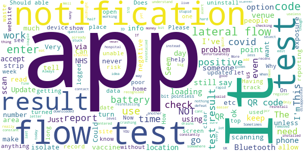

# NHS COVID-19
App version ``4.9 (185)``

Analyzed with [covid-apps-observer](http://github.com/covid-apps-observer) project, version ``0.1``

## App overview
| | |
|-------------------------|-------------------------| 
| **Name**&nbsp;&nbsp;&nbsp;&nbsp;&nbsp;&nbsp;&nbsp;&nbsp;&nbsp;&nbsp;&nbsp;&nbsp;&nbsp;&nbsp;&nbsp;&nbsp;&nbsp;&nbsp;&nbsp;&nbsp;&nbsp;&nbsp;&nbsp;&nbsp;&nbsp;&nbsp;&nbsp;&nbsp;&nbsp;&nbsp;&nbsp;&nbsp;&nbsp;&nbsp;&nbsp;&nbsp;&nbsp;&nbsp;&nbsp;&nbsp;  | NHS COVID-19 |
| **Unique identifier** | uk.nhs.covid19.production |
| **Link to Google Play** | [https://play.google.com/store/apps/details?id=uk.nhs.covid19.production](https://play.google.com/store/apps/details?id=uk.nhs.covid19.production) |
| **Summary**  | Protect your loved ones with the NHS contact tracing app for England and Wales. |
| **Privacy policy** | [https://covid19.nhs.uk/our-policies.html](https://covid19.nhs.uk/our-policies.html) |
| **Latest version** | 4.9 (185) |
| **Last update** | 2021-04-26 13:36:30 |
| **Recent changes** | We have added a reminder alert asking you to notify others of a positive test result. You can now book a test using the app if you have been near someone who has tested positive. Information about testing is now easier to find. The CE mark has changed to the UKCA mark. |
| **Installs**  | 10,000,000+ |
| **Category** | Medical |
| **First release** | Aug 12, 2020 |
| **Size**  | 9.2M |
| **Supported Android version**  | 6.0 and up |

### Description
> The NHS COVID-19 app is the official contact tracing app for England and Wales. 
 It is the fastest way of knowing when you’re at risk from coronavirus. The quicker you know, the quicker you can alert your loved ones, and your community. 
 The more of us that use it, the better we can control coronavirus. 
 The app runs on proven software developed by Apple and Google, designed so that nobody will know who or where you are. And you can delete your data, or the app, at any time.
 It has a number of features: 
 Trace: Find out when you’ve been near other app users who have tested positive for coronavirus
 Alert: Lets you know the level of coronavirus risk in your postcode district. 
 Check-in: Use our simple QR code scanner to check-in to venues like bars and restaurants. You will get alerted if you have visited a venue where you may have come into contact with coronavirus.
 Symptoms: Check if you have coronavirus symptoms and see if you need to order a test. 
 Test: Helps you order a test if you need to.
 Isolate: Keep track of your self-isolation countdown and access relevant advice.
 Available in English, Welsh, Arabic (Modern Standard), Bengali, Chinese (Simplified), Gujarati, Polish, Punjabi (Gurmukhi script), Romanian, Somali, Turkish and Urdu.
 The app can be used across UK borders in England, Wales, Scotland, Northern Ireland, Jersey and Gibraltar, detecting all relevant contact tracing app users (regardless of them using different official apps), alerting them if they have been in contact with coronavirus. 
 The app has been built in collaboration with some of the most innovative organisations in the world. We have worked with medical experts, privacy groups, at-risk communities and we’ve shared knowledge with the teams working on similar apps in many countries.
 Protect your loved ones. Please download the app. 
 The app is UKCA marked as Class I medical device in the United Kingdom and developed in compliance with Medical Devices Regulations 2002 (SI 2002 No 618, as amended).

### User interface
The developers of the app provide the following screenshots in the Google play store.
| | | |
|:-------------------------:|:-------------------------:|:-------------------------:|
 |   |   |   | 
 |   |  

## Development team
In the following we report the main information provided by the development team in the Google play store.

| | |
|-------------------------|-------------------------|
| **Developer**  | Department of Health and Social Care |
| **Website**  | [https://covid19.nhs.uk/](https://covid19.nhs.uk/) |
| **Email** | NHSCovid-19AppStoreSupport@nhsbsa.nhs.uk |
| **Physical address**  | - |
| **Other developed apps**  | [https://play.google.com/store/apps/developer?id=Department+of+Health+and+Social+Care](https://play.google.com/store/apps/developer?id=Department+of+Health+and+Social+Care) |

## Android support

| | |
|-------------------------|-------------------------|
| **Declared target Android version**  | Android10, version 10 (API level 29) |
| **Effective target Android version**  | Android10, version 10 (API level 29) |
| **Minimum supported Android version**  | Marshmallow, version 6.0 (API level 23) |
| **Maximum target Android version**  | - |

The larger the difference between the minimum and maximum supported Android versions, the better. A larger difference means a wider audience. For example, old phones have a very low Android version, so a high minimum supported Android version means that the app cannot be used by users with old phones, thus leading to accessibility problems. 

## Requested permissions

In the following we report the complete list of the permissions requested by the app. 

| **Permission** | **Protection level** | **Description** | 
|-------------------------|-------------------------|-------------------------|
 **android.permission ACCESS_NETWORK_STATE** | Normal | Allows applications to access information about networks. 
 **android.permission BLUETOOTH** | Normal | Allows applications to connect to paired bluetooth devices. 
 **android.permission CAMERA** | :warning:**Dangerous** | Required to be able to access the camera device. 
 **android.permission FOREGROUND_SERVICE** | Normal | Allows a regular application to use Service.startForeground. 
 **android.permission INTERNET** | Normal | Allows applications to open network sockets. 
 **android.permission RECEIVE_BOOT_COMPLETED** | Normal | Allows an application to receive the Intent.ACTION_BOOT_COMPLETED that is broadcast after the system finishes booting. 
 **android.permission REQUEST_IGNORE_BATTERY_OPTIMIZATIONS** | Normal | Permission an application must hold in order to use Settings.ACTION_REQUEST_IGNORE_BATTERY_OPTIMIZATIONS. 
 **android.permission WAKE_LOCK** | Normal | Allows using PowerManager WakeLocks to keep processor from sleeping or screen from dimming. 

## Mentioned servers

| **Server** | **Registrant** | **Registrant country** | **Creation date** | 
|-------------------------|-------------------------|-------------------------|-------------------------|
 | google.com | Google LLC | :us: US | 1997-09-15 04:00:00 |
 | ietf.org | IETF Trust | :us: US | 1995-03-11 05:00:00 |
 | googleapis.com | Google LLC | :us: US | 2005-01-25 17:52:26 |
 | apache.org | The Apache Software Foundation | :us: US | 1995-04-11 04:00:00 |

## Security analysis 

Below we report the main security warnings raised by our execution of the [Androwarn](https://github.com/maaaaz/androwarn) security analysis tool.

**Connection interfaces exfiltration**
> - This application reads details about the currently active data network 
> - This application tries to find out if the currently active data network is metered 

**Suspicious connection establishment**
> - This application opens a Socket and connects it to the remote address ' returned no addresses for  ; port is out of range' on the 'N/A' port  
> - This application opens a Socket and connects it to the remote address '' on the 'N/A' port  
> - This application opens a Socket and connects it to the remote address 'Ljava/lang/StringBuilder;->toString()Ljava/lang/String;' on the 'N/A' port  
> - This application opens a Socket and connects it to the remote address 'Ljava/net/Proxy;->type()Ljava/net/Proxy$Type;' on the 'N/A' port  
> - This application opens a Socket and connects it to the remote address 'timeout' on the 'N/A' port  

**Code execution**
> - This application loads a native library 
> - This application loads a native library: 'Ljava/lang/String;->valueOf(Ljava/lang/Object;)Ljava/lang/String;' 

## User ratings and reviews

Below we provide information about how end users are reacting to the app in terms of ratings and reviews in the Google Play store.

### Ratings

The NHS COVID-19 app has been installed by more than **10000000** times. At this time, **105518** rated the app and its average score is **3.7985482**. Below we show the distribution of the ratings across the usual star-based rating of Google Play

:star::star::star::star::star:: 59345

:star::star::star::star:: 12075

:star::star::star:: 8246

:star::star:: 5202

:star:: 20650

### Reviews 

#### 5-star reviews

> It's like playing the lottery every day! Scan your venue! See if you get a fortnight off work! Good luck!!  :date: __2021-04-29 12:48:10__

> Brilliant no problems.  :date: __2021-04-29 10:35:22__

> Good app.  :date: __2021-04-29 10:20:56__

> Good  :date: __2021-04-29 09:21:46__

> makes me feel bit safer  :date: __2021-04-29 07:46:19__

> Good  :date: __2021-04-29 07:06:09__

> Seems OK to me changed phones just put it on again has to be a good thing  :date: __2021-04-28 23:33:07__

> Very good it helped me  :date: __2021-04-28 22:49:47__

> Covid passport? Is this the app for it?  :date: __2021-04-28 18:13:21__

> East to use  :date: __2021-04-28 18:04:47__

#### 4-star reviews

> Cool  :date: __2021-04-29 12:52:14__

> Could be improved by allowing the home test lateral flow test qr code to be input through this app  :date: __2021-04-28 17:01:08__

> No longer opens and crashes. No idea if it is working. Update: app now started working again after a few days of crashing. Update 28 November: yet again has stopped working. Same issue as before, doesn't open and crash error messages pop up randomly. Bad for a public health app to not work.  :date: __2021-04-28 09:35:35__

> QR scanner needs to be able to read fastflow qr code  :date: __2021-04-27 13:56:06__

> seems easy enough  :date: __2021-04-27 12:53:45__

> helpful  :date: __2021-04-26 17:21:43__

> Tracking records have worked sufficiently  :date: __2021-04-26 14:49:00__

> This is excellent  :date: __2021-04-25 01:48:10__

> Would be good if you could log if you are vaccinated  :date: __2021-04-24 17:49:54__

> Even I can use it!  :date: __2021-04-24 15:43:39__

#### 3-star reviews

> Is this app authorised in Scotland, if so why does it only say authorised in England and Wales, is there another app for Scotland??  :date: __2021-04-29 12:11:46__

> How can we be still on "Teir four when schools and colleges have reopened, shops have reopened, sports and activity centres have reopened and pubs and restaurants are opening in May. As Thaddeus Bradley from NOW YOU SEE ME said "KEEP UP"  :date: __2021-04-29 11:58:58__

> The app works fine.  :date: __2021-04-29 11:17:12__

> Essentially going to be your 'vaccine passport' Hard pass. Joking aside having to keep the Bluetooth on drains your battery rapidly. Would be better working off of GPS if possible. QR scanner is a neat touch and simple to use, but the follow up I. E exposure notification needs looking at.  :date: __2021-04-29 09:11:02__

> Fair  :date: __2021-04-28 19:46:24__

> Unable to add test reference. When adding test code I'm getting an error. I had a test done in Jan and another one in March. Getting the same error for both codes and never been able to add them.  :date: __2021-04-28 16:43:32__

> The app is OK but places where the QR code is available to be scanned is not always obvious. Also there is no record of any Lateral Flow Tests that have been done using the Home Testing Kit and having reported every result on the NHS website it could be linked to the app. Only test results that have been carried out by booking through the app are recorded. I have been doing the self testing every 3 to 4 days but the app shows none of these results.  :date: __2021-04-26 10:19:07__

> Ok but When I Open The App It Just Says your App Is Active And Scanning With a ✔ its always says that.  :date: __2021-04-25 21:46:51__

> Does what it needs to do.  :date: __2021-04-25 15:06:36__

> Would be better if it shows the vaccination place/time or vaccinated as vaccine passport.  :date: __2021-04-25 09:38:10__

#### 2-star reviews

> 20/1/21 26/1/21? 12/2/21 23/2/21 11/3/21 tests conducted in hospital cant be added as no ref no given in hospiral 23/3/21 29/4/21  :date: __2021-04-29 11:12:18__

> The app never got updated to say I need to self isolate and now it will not accept the trst result code given to me via email from NHS. I doubt it even tracks anything  :date: __2021-04-29 06:28:58__

> I received the code from NHS after the test, and app says: "Your code wasn't recognised. Please make sure you are using a valid code." Please be careful. Now i have no idea what i should do, because app don't let me register my code. To prevent any stupid questions - my internet works perfect!  :date: __2021-04-29 01:02:42__

> Can not understand it, Where can I Put my 1st vaccine Date and 2nd, How Can the app help me to Travel!  :date: __2021-04-28 21:10:56__

> Can not enter lateral flow test reference number and result.  :date: __2021-04-28 15:27:14__

> This is useless, I'm isolating because someone in my household has covid and the app hasn't informed me that I have to isolate, what's the point in this app  :date: __2021-04-28 08:42:23__

> NOT FOR LATERAL FLOW TEST REPORTING: I'm sure this app has its uses, but I've just downloaded it to report my lateral flow test result and apparently it's not possible to do via this app.  :date: __2021-04-26 09:52:34__

> The app drains my battery so much. I have Bluetooth on yet the app won't load half the time.  :date: __2021-04-25 20:17:54__

> Why can't I add the NHS cross flow test results to the app? Seems a big omission.  :date: __2021-04-25 12:15:08__

> I'm not what this actually doing It tells me I've logged into somewhere but that's about it Would be good to have more focus/personalised updates  :date: __2021-04-24 16:36:22__

#### 1-star reviews

> It is now 29th April 2021. And it's still showing. Alert level 4, very high risk in your area. (North West Wales). Yet the pubs&Cafe's have just opened to customers. For outside use. Also Caravan sites are open. It's showing the same result 30 miles away. Surely this App isn't showing the correct data. But some people will use it. As it's an NHS app.  :date: __2021-04-29 12:55:26__

> Useless app. Only thing it does it drains battery and collect our datas. Uk is know for selling our data. So im unistalling it.  :date: __2021-04-29 12:30:47__

> Can't upload test result  :date: __2021-04-29 10:55:55__

> Forced use  :date: __2021-04-29 09:31:10__

> What's the point, unable to enter code to register result of test. Yes it is the same app mentioned in the email for the result.  :date: __2021-04-29 09:26:09__

> Drains phone battery way too fast.  :date: __2021-04-29 08:45:48__

> The app seems ok but with all the public places and shops that I have visited only 1 has had the opportunity for me to log where I have visited, to me this hasn't done it's job  :date: __2021-04-29 08:36:31__

> Useless app not fit for purpose. Who the hell has their Bluetooth on all the time? How many millions has this cost the taxpayer? And not one life saved because of it.  :date: __2021-04-29 08:09:19__

> My vaccine details are not there and no way to link it to my medical records  :date: __2021-04-29 07:28:59__

> Completely useless. You can't register tests results at all  :date: __2021-04-29 04:52:11__

