# COVID-related Android apps in US

Author: `Ivano Malavolta` (ivanomalavolta@gmail.com)

Created at: `2020/10/11`

Report generated by the [covid-apps-observer](http://github.com/covid-apps-observer) project, version 0.1

# Table of contents 

- [Background](#background)
    * [Data sources and analyses](#data-sources-and-analyses)
        * [App metadata](#app-metadata)
        * [Requested permissions](#requested-permissions)
        * [Mentioned servers](#mentioned_servers)
        * [Security analysis](#security_analysis)
        * [User ratings and reviews](#user-ratings-and-reviews)
    * [Disclaimer](#disclaimer)
- [Care19 Diary](#care19-diary)
- [FEMA](#fema)
- [CDC](#cdc)
- [CRUSH COVID RI](#crush-covid-ri)
- [Covid Watch Arizona](#covid-watch-arizona)
- [COVIDWISE](#covidwise)
- [Covid Trace Nevada](#covid-trace-nevada)
- [Covid Alert DE](#covid-alert-de)
- [Guam Covid Alert](#guam-covid-alert)
- [CombatCOVID PBC](#combatcovid-pbc)
- [Care19 Alert](#care19-alert)

- [Credits](#credits)

# How to read this report

This report has been generated by the [covid-apps-observer](http://github.com/covid-apps-observer) project. The project automatically analyzes the apps by extracting information which is already publicly available either on the web or in the apps binary files. 

Our analysis covers the following apps:
| | |
|-------------------------|-------------------------| 
|  | Care19 Diary
|  | FEMA
|  | CDC
|  | CRUSH COVID RI
|  | Covid Watch Arizona
|  | COVIDWISE
|  | Covid Trace Nevada
|  | Covid Alert DE
|  | Guam Covid Alert
|  | CombatCOVID PBC
|  | Care19 Alert

The details of our analysis are presented in the remainder of this report.

For independent verification, the raw data and the source code of the project is publicly available in its GitHub repository [http://github.com/covid-apps-observer](http://github.com/covid-apps-observer) and its source code has been thoroughly commented in order to provide all the details about how the information provided in this report has been extracted. 

Any feedback, questions, and improvements about the project are very welcome, feel free to create an issue or pull request directly in its GitHub repository: [http://github.com/covid-apps-observer](http://github.com/covid-apps-observer).

## Data sources and analyses

The analysis of each app is structured around five main dimensions: 
* App metadata  
* Requested permissions
* Mentioned servers
* Androwarn analysis
* User ratings and reviews

In the following we describe the data sources and analysis performed for each dimension.

### App metadata

App metadata includes an overview of the main information about the app (for example, its name, releases, privacy policy, etc.), contact information of the development team, and the various Android versions supported by the app. This information is extracted from two main data sources:
* _Google Play store_: we automatically mined the web page of the Google Play store showing the basic information about the app and we parsed it in order to extract information about the app and development team 
* _Android Manifest file_: in our analysis we decompiled the binary file of the app (it is similar to a Zip archive but it contains the code of the app instead of normal files) and we extracted information about the supported Android versions, as it has been listed by its development team.

The extracted app metadata feeds the _App overview_, _Development team_, and _Android support_ sections of this report.
We make use of the [google-play-scraper](https://github.com/JoMingyu/google-play-scraper) tool for extracting the raw data related to this dimension of the project.

### Requested permissions

The Android operating system has a permission model which allows users to grant access to potentially privacy-related information. Every Android app has to explictly declare the permissions it needs to properly function in the Android Manifest file.  

In this report we also show the protection level of each permission, which is a key information for understanding how the requested permissions related to the user's privacy. We carefully analyzed the [official Android documentation (v. 29)](https://developer.android.com/reference/android/Manifest.permission), and it resulted that a permission requested by an Android app can belong to the following protection levels:
* **Dangerous**: higher-risk permissions that would give a requesting app access to private user data or control over the device that can negatively impact the user. Because this type of permission introduces potential risk, the system usually does not automatically grant it to the requesting app. For example, any dangerous permissions requested by an app may be displayed to the user and require confirmation before proceeding.
* **Normal**: this is the default and most common level in Android; normal permissions are lower-risk and give access to isolated app-level features, with minimal risk to other apps, the system, or the user. 
* **Signature**: permissions granted only if the requesting app is signed with the same certificate as the app that declared the permission
* **Appop**: old permission level, a reminiscence of the App Ops tool that Google introduced in Android 4.3.
* **Development**: optional permissions which can be granted to development-oriented apps.
* **Privileged**: permissions who give higher power to mobile apps w.r.t. other apps, such as binding to incoming calls, interacting via bluetooth with other devices without user interaction, etc.
* **Preinstalled**: reserved only for preinstalled apps
* **Installer**: allow the holder to start the permission usage screen for an app
* **RetailDemo**: permissions related to devices used in demonstrations in shops.
* **Pre23**: permissions automatically granted to apps targeting devices running pre-6.0 Android.
* **Upcoming**: permissions which will be released in the next version of the Android platform. 
* **Deprecated**: permissions belonging to old releases of the Android platform, they should not be used by developers since they will not be supported in the near future.
* **Not for use by third-party applications**: permissions which can be requested only by apps developed by Google.
* **Undefined**: this protection level is not documented by Google.

The permissions dimension of this project is based on the [Androguard](https://github.com/androguard/androguard) static analysis tool.

### Mentioned servers

We decompiled each app in order to look for all possible mentions of remote URLs. The mentioned URLs can refer to remote servers the the app is using for either sending or receiving information, web addresses for directing the user to an information website, and so on. 

:warning: It is important to note that this analysis is not meant to be complete and it is very prone to obfuscation. The servers reported here are simply _mentioned_ somewhere in the code of the app and are meant to just give an indication about the "hooks" of the app towards external resources. For example, for an Android app it is normal to contact Google services in order to send/receive push notifications, or to contact the servers of analytics services for having real-time diagnostics about crashes of the app or bugs.

This part of the analysis is based on the [Androguard](https://github.com/androguard/androguard) static analysis tool for identfying the raw URLs mentioned in the app; then, the information about each mentioned server is collected by performing a _whois_ lookup on the first-level domain present in the URL.

### Security analysis

This dimension is based on the [Androwarn](https://github.com/maaaaz/androwarn) structural and data flow analysis of Android bytecode. Androwarn is developed by the University of Lyon/INSA (France) and it has been used in several academic studies. According to its documentation, Androwarn targets the following categories of potential security issues:
* **Telephony identifiers exfiltration**: IMEI, IMSI, MCC, MNC, LAC, CID, operator's name, etc.
* **Device settings exfiltration**: software version, usage statistics, system settings, logs, etc.
* **Geolocation information leakage**: GPS/WiFi geolocation, etc.
* **Connection interfaces information exfiltration**: WiFi credentials, Bluetooth MAC adress, etc.
* **Telephony services abuse**: premium SMS sending, phone call composition, etc.
* **Audio/video flow interception**: call recording, video capture, etc.
* **Remote connection establishment**: socket open call, Bluetooth pairing, APN settings edit, etc.
* **PIM data leakage**: contacts, calendar, SMS, mails, clipboard, etc.
* **External memory operations**: file access on SD card, etc.
* **PIM data modification**: add/delete contacts, calendar events, etc.
* **Arbitrary code execution**: native code using JNI, UNIX command, privilege escalation, etc.
* **Denial of Service**: event notification deactivation, file deletion, process killing, virtual keyboard disable, terminal shutdown/reboot, etc.

Note: We do not consider this data point in the current version of our analyzers since it is too verbose for our purposes.

:warning: It is important to note that Androwarn is a static analysis tool, and as such it performs a variety of heuristics and approximations in its analyses. Said that, the results shown in this report are meant to provide an indication of _potential_ security issues and should be by no means treated as complete and correct.   

### User ratings and reviews

For this dimension we turn again to the web interface of the Google Play store. Firstly, we automatically mine summary statistics about user ratings from the web page of the app under analysis; then, we automatically download the newest 1000 reviews of the app under analysis. For each level of rating (5 stars, 4 stars, , etc., 1 star) we show:
- a word cloud presenting the main terms used by end users in their reviews in the Google Play store
- the last 10 reviews provided by app users in the Google Play store. 

This purposefully simple analysis is meant to help both future users and the development team of the app in understanding what are the main positive and negative points of the app under analysis.

We make use of the [google-play-scraper](https://github.com/JoMingyu/google-play-scraper) tool for extracting the raw data related to this dimension of the project.

## Disclaimer 

This report has been produced independently of any parties and its only objective is to help anybody in better understanding how COVID-related apps work in practice (and compare to each other). The results of this report are limited to the specific version of the software used for running the analyses and on the various heuristics implemented in there. In other words, the results of the analyzers may differ depending on the time and modalities in which they are executed. We do not guarantee that the results of the analyses and the corresponding contents of this report are fully complete or correct. The analysis software is licensed under the [MIT License](https://github.com/iivanoo/covid-apps-observer/blob/master/LICENSE).

# Care19 Diary
App version ``3.1``

Analyzed with [covid-apps-observer](http://github.com/covid-apps-observer) project, version ``0.1``

## App overview
| | |
|-------------------------|-------------------------| 
| **Name**&nbsp;&nbsp;&nbsp;&nbsp;&nbsp;&nbsp;&nbsp;&nbsp;&nbsp;&nbsp;&nbsp;&nbsp;&nbsp;&nbsp;&nbsp;&nbsp;&nbsp;&nbsp;&nbsp;&nbsp;&nbsp;&nbsp;&nbsp;&nbsp;&nbsp;&nbsp;&nbsp;&nbsp;&nbsp;&nbsp;&nbsp;&nbsp;&nbsp;&nbsp;&nbsp;&nbsp;&nbsp;&nbsp;&nbsp;&nbsp;  | Care19 Diary |
| **Unique identifier** | com.proudcrowd.care |
| **Link to Google Play** | [https://play.google.com/store/apps/details?id=com.proudcrowd.care](https://play.google.com/store/apps/details?id=com.proudcrowd.care) |
| **Summary**  | You can help stop the spread of Covid-19 |
| **Privacy policy** | [https://care19.app/privacy](https://care19.app/privacy) |
| **Latest version** | 3.1 |
| **Last update** | 2020-06-26 17:01:47 |
| **Recent changes** | Fix a bug where manually added visits could display a month off. |
| **Installs**  | 10,000+ |
| **Category** | Medical |
| **First release** | Apr 19, 2020 |
| **Size**  | 5.5M |
| **Supported Android version**  | 6.0 and up |

### Description
> Care19 is the official COVID-19 app for the states of South Dakota and North Dakota.  It can be used with reduced functionality in other US states.
 A key part of the contact tracing process is remembering where you have been over the last 5-10 days before testing positive.  This helps contact tracers determine people you may have been near while you were infectious. 
 Care19 is a digital diary that records places you visit.  Many of the places you visit can be recorded automatically by Care19 using the phone's location services.  In some cases you may need to manually add an entry if the automated routines miss a place visit.  This can happen based on a variety of environmental factors.
 You will not be asked to provide any personally identifiable information within the app. Location data will only be shared with the North Dakota or South Dakota Department of Health if you consent upon testing positive for COVID-19. This is done by sharing a code number displayed on the “About” section of the app.  
 If you use the Care19 app outside of North and South Dakota it can be used as a memory aide if you test positive and are contacted by your state's Department of Health.

### User interface
The developers of the app provide the following screenshots in the Google play store.
| | | |
|:-------------------------:|:-------------------------:|:-------------------------:|
 |   |   |   | 
 |  

## Development team
In the following we report the main information provided by the development team in the Google play store.

| | |
|-------------------------|-------------------------|
| **Developer**  | ProudCrowd, LLC |
| **Website**  | [https://www.care19.app](https://www.care19.app) |
| **Email** | tim.brookins@proudcrowd.com |
| **Physical address**  | - |
| **Other developed apps**  | [https://play.google.com/store/apps/developer?id=ProudCrowd,+LLC](https://play.google.com/store/apps/developer?id=ProudCrowd,+LLC) |

## Android support

| | |
|-------------------------|-------------------------|
| **Declared target Android version**  | Android10, version 10 (API level 29) |
| **Effective target Android version**  | Android10, version 10 (API level 29) |
| **Minimum supported Android version**  | Marshmallow, version 6.0 (API level 23) |
| **Maximum target Android version**  | - |

The larger the difference between the minimum and maximum supported Android versions, the better. A larger difference means a wider audience. For example, old phones have a very low Android version, so a high minimum supported Android version means that the app cannot be used by users with old phones, thus leading to accessibility problems. 

## Requested permissions

In the following we report the complete list of the permissions requested by the app. 

| **Permission** | **Protection level** | **Description** | 
|-------------------------|-------------------------|-------------------------|
 **android.permission ACCESS_BACKGROUND_LOCATION** | :warning:**Dangerous** | Allows an app to access location in the background. 
 **android.permission ACCESS_COARSE_LOCATION** | :warning:**Dangerous** | Allows an app to access approximate location. 
 **android.permission ACCESS_FINE_LOCATION** | :warning:**Dangerous** | Allows an app to access precise location. 
 **android.permission ACCESS_NETWORK_STATE** | Normal | Allows applications to access information about networks. 
 **android.permission ACTIVITY_RECOGNITION** | :warning:**Dangerous** | Allows an application to recognize physical activity. 
 **android.permission FOREGROUND_SERVICE** | Normal | Allows a regular application to use Service.startForeground. 
 **android.permission INTERNET** | Normal | Allows applications to open network sockets. 
 **android.permission RECEIVE_BOOT_COMPLETED** | Normal | Allows an application to receive the Intent.ACTION_BOOT_COMPLETED that is broadcast after the system finishes booting. 
 **android.permission WAKE_LOCK** | Normal | Allows using PowerManager WakeLocks to keep processor from sleeping or screen from dimming. 
 **com.google.android.c2dm.permission RECEIVE** | - | - 
 **com.google.android.finsky.permission BIND_GET_INSTALL_REFERRER_SERVICE** | - | - 
 **com.google.android.gms.permission ACTIVITY_RECOGNITION** | - | - 

## Mentioned servers

| **Server** | **Registrant** | **Registrant country** | **Creation date** | 
|-------------------------|-------------------------|-------------------------|-------------------------|
 | bugfender.com | Beenario GmbH | :de: DE | 2014-10-28 11:32:13 |
 | googlesyndication.com | Google LLC | :us: US | 2003-01-21 06:17:24 |
 | google.com | Google LLC | :us: US | 1997-09-15 04:00:00 |
 | app-measurement.com | Google LLC | :us: US | 2015-06-19 20:13:31 |
 | azurewebsites.net | Microsoft Corporation | :us: US | 2012-01-24 18:43:51 |
 | crashlytics.com | Google LLC | :us: US | 2011-01-21 15:30:40 |
 | googleapis.com | Google LLC | :us: US | 2005-01-25 17:52:26 |
 | googleadservices.com | Google LLC | :us: US | 2003-06-19 16:34:53 |

## Security analysis 

Below we report the main security warnings raised by our execution of the [Androwarn](https://github.com/maaaaz/androwarn) security analysis tool.

**Telephony identifiers leakage**
> - This application reads the MCC+MNC of the provider of the SIM 
> - This application reads the Service Provider Name (SPN) 
> - This application reads the numeric name (MCC+MNC) of current registered operator 
> - This application reads the operator name 

**Connection interfaces exfiltration**
> - This application reads details about the currently active data network 
> - This application tries to find out if the currently active data network is metered 

**Suspicious connection establishment**
> - This application opens a Socket and connects it to the remote address ' returned no addresses for  ; port is out of range' on the 'N/A' port  
> - This application opens a Socket and connects it to the remote address '' on the 'N/A' port  
> - This application opens a Socket and connects it to the remote address 'Ljava/lang/StringBuilder;->toString()Ljava/lang/String;' on the 'N/A' port  
> - This application opens a Socket and connects it to the remote address 'Ljava/net/Proxy;->type()Ljava/net/Proxy$Type;' on the 'N/A' port  
> - This application opens a Socket and connects it to the remote address 'timeout' on the 'N/A' port  

**Code execution**
> - This application executes a UNIX command containing this argument: 'logcat -c 2' 
> - This application executes a UNIX command containing this argument: 'logcat -c' 

## User ratings and reviews

Below we provide information about how end users are reacting to the app in terms of ratings and reviews in the Google Play store.

### Ratings

The Care19 Diary app has been installed by more than **10000** times. At this time, **194** rated the app and its average score is **2.55**. Below we show the distribution of the ratings across the usual star-based rating of Google Play

:star::star::star::star::star:: 58

:star::star::star::star:: 5

:star::star::star:: 13

:star::star:: 23

:star:: 93

### Reviews 

#### 5-star reviews

> Oh yeah all good  :date: __2020-08-27 06:36:26__

> Good  :date: __2020-08-02 22:27:07__

> Please help charlie foxtrot googlemaps Meunstergritsandassociatesllc 442 blanding blvd 333 ORANGEPARK,FL 32073  :date: __2020-07-18 21:29:25__

> Updated daily. Easy to use and informative.  :date: __2020-06-23 15:03:08__

> Cool  :date: __2020-06-20 05:50:45__

> Good idea  :date: __2020-06-20 00:01:28__

> Good  :date: __2020-06-16 20:33:40__

> Nudes help  :date: __2020-06-11 01:24:14__

> Awesome  :date: __2020-05-17 11:47:26__

> Love this app  :date: __2020-05-16 12:11:08__

#### 4-star reviews

> This picks up most of the places I go, and I check when I get home so I can add places it has missed or change inaccurate locations, which only happens when I am in an area with a lot of stores, like a plaza. My home state has not chosen an app so I use this one.  :date: __2020-07-10 22:03:28__

> I just dont have room on my phone:(  :date: __2020-07-06 11:55:41__

> Remember this is for north & south Dakota only.. other states will may add their state if they choose too. It will show other states but will not guarantee it at this time  :date: __2020-06-20 21:46:43__

> The early release back in April was rough (didn't log any stops for me). But it's been working well for me since about May 4. It occasionally logs more than one stop at the same location. It occasionally gets the name of the location wrong, but this is very easy to correct.  :date: __2020-05-19 06:25:30__

> It is great, it works, and I am excited for updates!  :date: __2020-04-29 03:31:46__

#### 3-star reviews

> Every couple of weeks it takes a day off & doesn't show any locations at all for that day.  :date: __2020-09-25 02:59:05__

> How long do the places you visit stay on the app? Mine seem to show maybe only previous 10 days.  :date: __2020-08-13 23:41:30__

> Doesn't this app use the Contact Tracking System that Apple and Google developed?  :date: __2020-06-02 15:29:17__

> Simple app. Does what it was designed for but little else. Misses many locations and frequently has location accuracy issues. Routinely misses my home by 6 blocks. Says I have visited locations I have just driven past. Would be nice to have ability to add locations that I visited but app failed to record.  :date: __2020-05-22 15:52:32__

> Still isn't capturing places I've been. Was at 3 different locations today, and not one of them showing up.  :date: __2020-05-20 23:03:13__

> Very inconsistent with location. Can be at a location for hours and doesn't list it.  :date: __2020-05-16 15:20:52__

> It's a great idea, but does not log most of the places I've been. Stopped at 6 places in Bismarck and didn't log one place. And then the next time it will log the same place 4 times within a few minutes or log a place I only drove by.  :date: __2020-05-14 02:20:12__

> I hope this helps people but there are definitely a lot of bugs  :date: __2020-05-04 05:28:59__

#### 2-star reviews

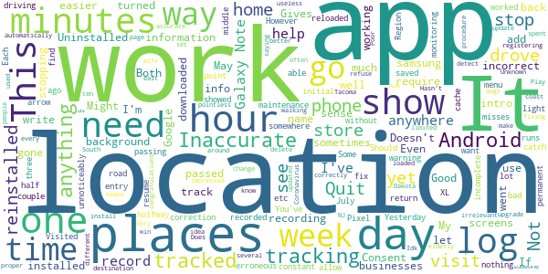

> App runs unnoticeably in the background. However, requires constant maintenance. If I go more than 2-3 days without monitoring the app, I find that it stops tracking my locations, at which point I need to go back through all intro screens as if I just installed the app (Region, Consent, Home location, etc). Back arrow on Android while in the Places You've Visited will also return to the initial menu and require passing through all intro screens again, or app will not resume tracking. Should have a warning, and consent/home location should be saved in a more permanent cache.  :date: __2020-09-26 21:23:18__

> Doesn't catch all locations, and it recorded a one hour visit to one store as 12 minutes, then would not allow correction.  :date: __2020-09-21 13:10:23__

> Quit recording anything after about three weeks.  :date: __2020-07-26 05:30:54__

> Inaccurate didn't track me for days sometimes. Uninstalled it, that bad.  :date: __2020-07-19 03:31:36__

> Location info is incorrect and incomplete. I was able to fix the incorrect info, but can't add locations. Uninstalled and reinstalled on 6/24. Tracked my location until 6/27 then nothing.  :date: __2020-07-07 17:28:05__

> Gives a lot of erroneous locations that are passed while driving or stopping at a stop light. Some days it gives no information at all.. i reloaded it a couple of weeks ago. It worked well until July 3 then quit working, not registering any locations.  :date: __2020-07-04 20:23:07__

> Idk procedure to get my phone to let this work automatically in the background, out on the east coast  :date: __2020-07-02 20:56:10__

> It's not all that  :date: __2020-06-18 15:59:46__

> Not very accurate for locations. It does not show several places my wife & I have been for an hour or more and it shows us stopping at places we only drove passed on our way to our destination that does not show up. Very inaccurate. It's the same on both of our phones (Galaxy Note 9's). There is no way to add the places we did go to, only to delete the irrelevant ones or change the name from "Unknown" to a proper name. It's pointless/useless for tracking when this inaccurate.  :date: __2020-06-05 01:20:41__

> I have a samsung android phone and I used the app Tacoma 19 South Dakota app from Google Play. I have installed it and reinstalled it this install that reinstalled it and updated it every time. I have yet to see anything on my page of anywhere that I've been tracked it just keeps saying congratulations you are set up but doesn't detect that you win any places yet. I don't go very often but I have went to stores and I have spent more than 10 minutes there why can't I see where I have been?  :date: __2020-06-01 23:56:11__

#### 1-star reviews

> Poorest design. Does not "track" movement via gps, does not allow quick add (referencing gps) feature. Does not have "end at home". Thus know how long.. at one location or unable to determine greater than 20 mph driving. Becomes indicator leaving location.  :date: __2020-09-28 04:32:05__

> Has me consistently at a location across town I'm never at.  :date: __2020-09-12 07:14:54__

> Privacy  :date: __2020-08-27 22:42:43__

> Does not automatically track as it says it will. Also, I can enter manually in my phone but my wife's phone cannot manually input as the app freezes when she puts in date from calendar. Uninstalled and reinstalled the app but still have same problems.  :date: __2020-08-16 17:20:12__

> utTý5hat's drive changes b  :date: __2020-08-14 22:35:18__

> Edit: 8.10.20 Still same problems. If battery saver is issue, fix it. Update 6.27.20 - Tou can tell the developer(s) doesnt even use this app or they would know what we are talking about. You say it's just the way it is, no, you know how it's supposed to work, so find someone to make it work correctly. This app does not trace where I been going. It does not stay open in the background. When open, it does not show where I go or been since the 23rd. I restarted phone and reinstalled app on S9+  :date: __2020-08-11 03:56:40__

> Uninstall. I didn't put it in  :date: __2020-08-04 19:20:34__

> Doesn't do anything that Google Maps My Timeline can't do better. Maybe in a state with a competent health department it could. As I understand it in incompetent SC, it won't even do Bluetooth ID exchanges with other devices for contact tracing.  :date: __2020-07-30 01:57:38__

> I am unable to add places I have been. Every time I try the app crashes. And the visits don't show up when they should. I have tried uninstalling and reinstalling more than once. This app is a lemon.  :date: __2020-07-26 21:59:16__

> App doesn't work. I wanted an app that would track my location automatically and the people that I was around. Now that I have covid-19 I can't even notify anyone that I was in contact with  :date: __2020-07-17 19:43:16__

# FEMA
App version ``2.11.1``

Analyzed with [covid-apps-observer](http://github.com/covid-apps-observer) project, version ``0.1``

## App overview
| | |
|-------------------------|-------------------------| 
| **Name**&nbsp;&nbsp;&nbsp;&nbsp;&nbsp;&nbsp;&nbsp;&nbsp;&nbsp;&nbsp;&nbsp;&nbsp;&nbsp;&nbsp;&nbsp;&nbsp;&nbsp;&nbsp;&nbsp;&nbsp;&nbsp;&nbsp;&nbsp;&nbsp;&nbsp;&nbsp;&nbsp;&nbsp;&nbsp;&nbsp;&nbsp;&nbsp;&nbsp;&nbsp;&nbsp;&nbsp;&nbsp;&nbsp;&nbsp;&nbsp;  | FEMA |
| **Unique identifier** | gov.fema.mobile.android |
| **Link to Google Play** | [https://play.google.com/store/apps/details?id=gov.fema.mobile.android](https://play.google.com/store/apps/details?id=gov.fema.mobile.android) |
| **Summary**  | Weather alerts, safety tips and more to help before, during &amp; after disasters. |
| **Privacy policy** | [http://www.fema.gov/privacy-policy](http://www.fema.gov/privacy-policy) |
| **Latest version** | 2.11.1 |
| **Last update** | 2020-07-09 16:43:34 |
| **Recent changes** | - Added featured content section to home page for important information - Updated Mitigate Your Risk section with additional Do-It-Yourself categories - Section 508 Accessibility fixes - Updated mobile theme |
| **Installs**  | 1,000,000+ |
| **Category** | Weather |
| **First release** | Aug 24, 2011 |
| **Size**  | 3.3M |
| **Supported Android version**  | 4.4 and up |

### Description
> Emergency alerts, safety tips and resources to help before, during & after disasters.
 The FEMA App provides timely alerts and useful information to help you and your loved ones stay safe before, during and after disasters. Receive and share real-time notifications about disasters, severe weather, and other emergencies for up to five locations nationwide. This simple and easy-to-use resource also provides safety information, emergency preparedness tips, and disaster assistance.
 Features 
 •    Receive emergency alerts for up to five locations nationwide 
 •    Share real-time notifications with loved ones via text, email and social media
 •    Know what to do before, during, and after disasters, like earthquakes, wildfires, hurricanes, snowstorms, tornadoes, volcanoes, and more
 •    Prepare for disasters with an emergency kit checklist, emergency family plan, and reminders
 •    Locate open emergency shelters in your area
 •    Locate Disaster Recovery Centers near you where you can talk to a FEMA representative in person
 •    Connect with FEMA to apply for disaster assistance online
 •    Safety tips and disaster information available in English and Spanish (Note: alerts are only available in English)
 •    Follow the FEMA blog to learn about disaster response and recovery across the United States
 Terms of use: www.fema.gov/app.

### User interface
The developers of the app provide the following screenshots in the Google play store.
| | | |
|:-------------------------:|:-------------------------:|:-------------------------:|
 |   |   |   | 
 |   |   |   | 
 |   |   |   | 
 |   |   |   | 
 |   |   |   | 
 |   |   |   | 
 |   |   |   | 
 |  

## Development team
In the following we report the main information provided by the development team in the Google play store.

| | |
|-------------------------|-------------------------|
| **Developer**  | Federal Emergency Management Agency (FEMA) |
| **Website**  | [http://www.fema.gov](http://www.fema.gov) |
| **Email** | FEMA-New-Media@fema.dhs.gov |
| **Physical address**  | - |
| **Other developed apps**  | [https://play.google.com/store/apps/developer?id=Federal+Emergency+Management+Agency+(FEMA)](https://play.google.com/store/apps/developer?id=Federal+Emergency+Management+Agency+(FEMA)) |

## Android support

| | |
|-------------------------|-------------------------|
| **Declared target Android version**  | Pie, version 9 (API level 28) |
| **Effective target Android version**  | Pie, version 9 (API level 28) |
| **Minimum supported Android version**  | KitKat, version 4.4 - 4.4.4 (API level 19) |
| **Maximum target Android version**  | - |

The larger the difference between the minimum and maximum supported Android versions, the better. A larger difference means a wider audience. For example, old phones have a very low Android version, so a high minimum supported Android version means that the app cannot be used by users with old phones, thus leading to accessibility problems. 

## Requested permissions

In the following we report the complete list of the permissions requested by the app. 

| **Permission** | **Protection level** | **Description** | 
|-------------------------|-------------------------|-------------------------|
 **android.permission ACCESS_COARSE_LOCATION** | :warning:**Dangerous** | Allows an app to access approximate location. 
 **android.permission ACCESS_FINE_LOCATION** | :warning:**Dangerous** | Allows an app to access precise location. 
 **android.permission ACCESS_NETWORK_STATE** | Normal | Allows applications to access information about networks. 
 **android.permission INTERNET** | Normal | Allows applications to open network sockets. 
 **android.permission READ_APP_BADGE** | - | - 
 **android.permission RECEIVE_BOOT_COMPLETED** | Normal | Allows an application to receive the Intent.ACTION_BOOT_COMPLETED that is broadcast after the system finishes booting. 
 **android.permission VIBRATE** | Normal | Allows access to the vibrator. 
 **android.permission WAKE_LOCK** | Normal | Allows using PowerManager WakeLocks to keep processor from sleeping or screen from dimming. 
 **android.permission WRITE_EXTERNAL_STORAGE** | :warning:**Dangerous** | Allows an application to write to external storage. 
 **com.anddoes.launcher.permission UPDATE_COUNT** | - | - 
 **com.google.android.c2dm.permission RECEIVE** | - | - 
 **com.google.android.finsky.permission BIND_GET_INSTALL_REFERRER_SERVICE** | - | - 
 **com.htc.launcher.permission READ_SETTINGS** | - | - 
 **com.htc.launcher.permission UPDATE_SHORTCUT** | - | - 
 **com.huawei.android.launcher.permission CHANGE_BADGE** | - | - 
 **com.huawei.android.launcher.permission READ_SETTINGS** | - | - 
 **com.huawei.android.launcher.permission WRITE_SETTINGS** | - | - 
 **com.majeur.launcher.permission UPDATE_BADGE** | - | - 
 **com.oppo.launcher.permission READ_SETTINGS** | - | - 
 **com.oppo.launcher.permission WRITE_SETTINGS** | - | - 
 **com.sec.android.provider.badge.permission READ** | - | - 
 **com.sec.android.provider.badge.permission WRITE** | - | - 
 **com.sonyericsson.home.permission BROADCAST_BADGE** | - | - 
 **com.sonymobile.home.permission PROVIDER_INSERT_BADGE** | - | - 
 **me.everything.badger.permission BADGE_COUNT_READ** | - | - 
 **me.everything.badger.permission BADGE_COUNT_WRITE** | - | - 

## Mentioned servers

| **Server** | **Registrant** | **Registrant country** | **Creation date** | 
|-------------------------|-------------------------|-------------------------|-------------------------|
 | googlesyndication.com | Google LLC | :us: US | 2003-01-21 06:17:24 |
 | google.com | Google LLC | :us: US | 1997-09-15 04:00:00 |
 | google-analytics.com | Google LLC | :us: US | 2005-07-18 19:24:32 |
 | app-measurement.com | Google LLC | :us: US | 2015-06-19 20:13:31 |
 | googletagmanager.com | Google LLC | :us: US | 2011-11-11 23:39:05 |
 | gstatic.com | Google LLC | :us: US | 2008-02-11 15:31:25 |
 | whatsapp.com | Whatsapp Inc. | :us: US | 2008-09-04 12:39:12 |
 | googleapis.com | Google LLC | :us: US | 2005-01-25 17:52:26 |
 | googleadservices.com | Google LLC | :us: US | 2003-06-19 16:34:53 |

## Security analysis 

Below we report the main security warnings raised by our execution of the [Androwarn](https://github.com/maaaaz/androwarn) security analysis tool.

**Connection interfaces exfiltration**
> - This application reads details about the currently active data network 
> - This application tries to find out if the currently active data network is metered 

**Telephony services abuse**
> - This application makes phone calls 

**Code execution**
> - This application loads a native library: 'sqlc-native-driver' 
> - This application executes a UNIX command containing this argument: 'Ljava/lang/StringBuilder;->toString()Ljava/lang/String;' 

## User ratings and reviews

Below we provide information about how end users are reacting to the app in terms of ratings and reviews in the Google Play store.

### Ratings

The FEMA app has been installed by more than **1000000** times. At this time, **3292** rated the app and its average score is **4.1634617**. Below we show the distribution of the ratings across the usual star-based rating of Google Play

:star::star::star::star::star:: 2078

:star::star::star::star:: 464

:star::star::star:: 316

:star::star:: 73

:star:: 358

### Reviews 

#### 5-star reviews

> Great information to keep current of the situations.  :date: __2020-10-08 22:32:16__

> This is a good app.  :date: __2020-10-01 05:48:25__

> Great  :date: __2020-09-28 18:54:04__

> Best organization inside and out  :date: __2020-09-28 01:57:45__

> Very easy to use. Self explanatory App. Everything is basically right there on the App.  :date: __2020-09-19 17:10:52__

> Thanks for your help  :date: __2020-09-12 20:50:16__

> Love it!! Can check on family around the country and in different counties. If you set you phone to do not disturb, make sure to tell the do not disturb app that these messages are allowed. If you lower power saving level on android phones the app does not alert you.  :date: __2020-09-08 16:04:30__

> A must if you live at the coast!  :date: __2020-08-29 16:11:21__

> Good info  :date: __2020-08-19 06:16:24__

> Government  :date: __2020-08-19 00:15:04__

#### 4-star reviews

> Decent at first glance  :date: __2020-09-27 05:28:47__

> Great app !!!!!!!!  :date: __2020-09-05 02:06:16__

> Overall decent, but I don't need 17 alerts in one hour for the same storm.  :date: __2020-08-24 01:10:21__

> I took care of a FEMA worker so I thought I would check out app  :date: __2020-07-27 23:49:33__

> It's missing the alerts Snow Squall Warning, Inland Hurricane Warning, Inland Hurricane Watch, Inland Tropical Storm Warning, and Inland Tropical Storm Watch.  :date: __2020-07-27 22:57:25__

> Fast reliablie services  :date: __2020-07-09 01:04:27__

> Great app.  :date: __2020-07-01 08:50:11__

> Great at giving alerts for different areas. Live posting during storms is excellent. Just be careful you don't list to many places to avoid constant updates.  :date: __2020-06-12 03:22:06__

> Only worth downloading if you're in a disaster situation. Otherwise it's not very useful.  :date: __2020-05-23 06:10:43__

> Extremely well covers high pop centers. However, little to no coverage in rural areas. We live in Benton County, MO...no coverage ANYWHERE here.  :date: __2020-05-22 15:48:47__

#### 3-star reviews

> Also I build homeless shelters and I think this would be the place to add my location make it official  :date: __2020-10-06 07:13:34__

> Works but would multiply the same alerts  :date: __2020-10-03 19:46:59__

> Sends out alerts as expected, but here's the issue. If I'm in another app (Facebook, e.g.), it won't override it, and there doesn't seem to be a way to get the alert within the actual app, so if you miss it... too bad. Also tried to pull up the app while roaming, and got a "no wifi" connection error. Who the hell has wifi during an emergency??? DO BETTER.  :date: __2020-09-13 18:35:21__

> Not enough details on alerts. Not worth the space on my phone  :date: __2020-09-11 00:11:01__

> Prepare: emergency safety tips: broken scroll and no clickables  :date: __2020-09-08 02:54:56__

> Difficult to navigate and doesn't provide info I expected  :date: __2020-09-06 08:45:22__

> The type is thinner and less legible with this update. The unnecessary style change reduces its usefulness to me. Plus, I have not received alerts about the smoke in my area or the fires near me although I specified that in the settings. So I uninstalled it.  :date: __2020-08-21 06:13:51__

> No notification alarm!!  :date: __2020-08-13 18:12:50__

> where's the warnings I used to get  :date: __2020-06-24 02:29:53__

> The back button does not exit the app.  :date: __2020-06-09 16:17:55__

#### 2-star reviews

> Once I sign in it then sends me a email code to sign in again.... To many steps  :date: __2020-09-19 20:23:31__

> Installed this app months ago and expected this would be the moment for it. I'm getting "red flag warnings" and "evacuation alerts" every few minutes (with no date or timestamp) that just say things like "GO NOW Eden Road" with a web link I can't click or copy. After switching back and forth between apps to type out it turns out it's a map and Eden Road is 60 miles away. You can't set alerts for regions smaller than the entire county. Evac notices also came through sooner with other services.  :date: __2020-09-12 07:56:04__

> What is it with this app. I've.been trying to download it for three days how long does it take to for it to download .we are about to be hit with a hurracain.this is messed.up  :date: __2020-08-23 03:40:24__

> Getting several alerts with little or no lead time. Several other alerts just multiples of previous alerts with no changes in them at all. That's probably FEMA but still downgrades usefulness.  :date: __2020-07-19 21:22:25__

> This app did not help me.  :date: __2020-06-19 19:14:29__

> It really does do absolutely nothing. Not even sure why i have it  :date: __2020-04-28 15:16:55__

> Alerts are way too excessive.. It's a little windy in my area and I get notifications what feel like every 5 minutes. Had to delete the app because it was so annoying.  :date: __2020-04-10 21:47:54__

> It's a weather alert app. I'm getting constant weather alerts during a pandemic lockdown  :date: __2020-03-29 17:05:00__

> When I click on "Alerts," I get a message saying that I have to enable them in the app settings. But when I get into the settings, I can't find anything that does that.  :date: __2020-03-21 20:10:32__

> App does not give alerts. At one time it worked.  :date: __2019-06-18 03:25:56__

#### 1-star reviews

> This hurricane I got turned down in just a few hours. Yeah technology!!!!!  :date: __2020-10-03 11:55:27__

> Dont attempted to think of getting help all they do is deny  :date: __2020-09-26 19:00:17__

> Doesn't work . Can't scroll on screen or get may location informaton  :date: __2020-09-09 13:06:18__

> No point in having the app. You go to check your application status and it brings you to the website. App serves no purpose.  :date: __2020-09-05 00:28:47__

> I cannot log in i need to check my status  :date: __2020-08-31 07:30:24__

> What is this nonsense about agreeing to terms for "PURCHASES"? I do NOT need this and would rather have not installed it.  :date: __2020-08-26 01:09:32__

> Needs to be GPS enabled. I shouldn't have to create a list of areas to monitor  :date: __2020-07-22 14:55:20__

> App should work as a REAL emergency service! No wifi or data usage! With today's technology & the dangerous times we r living in as well as facing especially with riots & illness! This app is put on by OUR GOVERNMENT!! IT SHOULD WORK FLAWLESSLY!! I think y'all r paid enough to PROTECT US! YOU SHOULD DO YOUR JOB!!! So sick n tired of the buck being passed & the excuses! YOU WANTED UR JOB SO DO IT! OR FIND ANOTHER!  :date: __2020-07-17 17:56:20__

> DENIED all my RIGHTS  :date: __2020-07-14 08:31:08__

> I would look them up and see what they are really about. We need less government in our life and lower We are Tax Enough Already.  :date: __2020-07-07 14:51:55__

# CDC
App version ``3.1.1``

Analyzed with [covid-apps-observer](http://github.com/covid-apps-observer) project, version ``0.1``

## App overview
| | |
|-------------------------|-------------------------| 
| **Name**&nbsp;&nbsp;&nbsp;&nbsp;&nbsp;&nbsp;&nbsp;&nbsp;&nbsp;&nbsp;&nbsp;&nbsp;&nbsp;&nbsp;&nbsp;&nbsp;&nbsp;&nbsp;&nbsp;&nbsp;&nbsp;&nbsp;&nbsp;&nbsp;&nbsp;&nbsp;&nbsp;&nbsp;&nbsp;&nbsp;&nbsp;&nbsp;&nbsp;&nbsp;&nbsp;&nbsp;&nbsp;&nbsp;&nbsp;&nbsp;  | CDC |
| **Unique identifier** | gov.cdc.general |
| **Link to Google Play** | [https://play.google.com/store/apps/details?id=gov.cdc.general](https://play.google.com/store/apps/details?id=gov.cdc.general) |
| **Summary**  | Health Information at Your Fingertips—CDC 24/7 |
| **Privacy policy** | [http://t.cdc.gov/1MVV](http://t.cdc.gov/1MVV) |
| **Latest version** | 3.1.1 |
| **Last update** | 2020-06-26 16:45:07 |
| **Recent changes** | Fixed issue where content sometimes loaded improperly in a new browser window |
| **Installs**  | 100,000+ |
| **Category** | Health & Fitness |
| **First release** | Oct 16, 2012 |
| **Size**  | 35M |
| **Supported Android version**  | 4.1 and up |

### Description
> Get the official CDC Mobile application to access the most up to date health information.
 FILTERING OPTIONS
 Organize your home screen so that the information that’s most important to you appears first! Turn off the content you don’t want with just a flip of a switch and reset it all with the tap of a button.
 CONTENT
 The app ensures that you’re getting the most up to date health information. The home screen lets you see all your information in one place and updates whenever your device is connected to WI-FI. Enjoy a greater variety of content such as Disease of the Week, disease case counts, videos, podcasts, and features to give you the most current health information from CDC. 
 Browse Featured Articles, stay on top of health news in the Newsroom section, and view CDC Images of the Week. If you’re a journal reader, view the latest Morbidity & Mortality Weekly Report, Emerging and Infectious Disease journal, or the latest on Preventing Chronic Diseases. You can even search CDC’s web content from the app.  
 We'd love to hear your thoughts about the app! Rate the CDC Mobile App in the App Store or leave a comment to let us know how we're doing. You can even send us an email through the app if you have suggestions for improvements!
 DISCLAIMER
 THE MATERIALS EMBODIED IN THIS SOFTWARE ARE PROVIDED TO YOU "AS-IS" AND WITHOUT WARRANTY OF ANY KIND, EXPRESSED, IMPLIED OR OTHERWISE, INCLUDING WITHOUT LIMITATION, ANY WARRANTY OF FITNESS FOR A PARTICULAR PURPOSE. IN NO EVENT SHALL THE CENTERS FOR DISEASE CONTROL AND PREVENTION (CDC) OR THE UNITED STATES (U.S.) GOVERNMENT BE LIABLE TO YOU OR ANYONE ELSE FOR ANY DIRECT, SPECIAL, INCIDENTAL, INDIRECT OR CONSEQUENTIAL DAMAGES OF ANY KIND, OR ANY DAMAGES WHATSOEVER, INCLUDING WITHOUT LIMITATION, LOSS OF PROFIT, LOSS OF USE, SAVINGS OR REVENUE, OR THE CLAIMS OF THIRD PARTIES, WHETHER OR NOT CDC OR THE U.S. GOVERNMENT HAS BEEN ADVISED OF THE POSSIBILITY OF SUCH LOSS, HOWEVER CAUSED AND ON ANY THEORY OF LIABILITY, ARISING OUT OF OR IN CONNECTION WITH THE POSSESSION, USE OR PERFORMANCE OF THIS SOFTWARE.

### User interface
The developers of the app provide the following screenshots in the Google play store.
| | | |
|:-------------------------:|:-------------------------:|:-------------------------:|
 |   |   |   | 
 |   |   |   | 
 |   |   |   | 
 |   |   |   | 

## Development team
In the following we report the main information provided by the development team in the Google play store.

| | |
|-------------------------|-------------------------|
| **Developer**  | Centers for Disease Control and Prevention |
| **Website**  | [http://www.cdc.gov](http://www.cdc.gov) |
| **Email** | CDCMobileDevelopment@cdc.gov |
| **Physical address**  | - |
| **Other developed apps**  | [https://play.google.com/store/apps/developer?id=Centers+for+Disease+Control+and+Prevention](https://play.google.com/store/apps/developer?id=Centers+for+Disease+Control+and+Prevention) |

## Android support

| | |
|-------------------------|-------------------------|
| **Declared target Android version**  | Pie, version 9 (API level 28) |
| **Effective target Android version**  | Pie, version 9 (API level 28) |
| **Minimum supported Android version**  | Jelly Bean, version 4.1.x (API level 16) |
| **Maximum target Android version**  | - |

The larger the difference between the minimum and maximum supported Android versions, the better. A larger difference means a wider audience. For example, old phones have a very low Android version, so a high minimum supported Android version means that the app cannot be used by users with old phones, thus leading to accessibility problems. 

## Requested permissions

In the following we report the complete list of the permissions requested by the app. 

| **Permission** | **Protection level** | **Description** | 
|-------------------------|-------------------------|-------------------------|
 **android.permission ACCESS_NETWORK_STATE** | Normal | Allows applications to access information about networks. 
 **android.permission ACCESS_WIFI_STATE** | Normal | Allows applications to access information about Wi-Fi networks. 
 **android.permission FOREGROUND_SERVICE** | Normal | Allows a regular application to use Service.startForeground. 
 **android.permission INTERNET** | Normal | Allows applications to open network sockets. 
 **android.permission READ_APP_BADGE** | - | - 
 **android.permission RECEIVE_BOOT_COMPLETED** | Normal | Allows an application to receive the Intent.ACTION_BOOT_COMPLETED that is broadcast after the system finishes booting. 
 **android.permission VIBRATE** | Normal | Allows access to the vibrator. 
 **android.permission WAKE_LOCK** | Normal | Allows using PowerManager WakeLocks to keep processor from sleeping or screen from dimming. 
 **android.permission WRITE_EXTERNAL_STORAGE** | :warning:**Dangerous** | Allows an application to write to external storage. 
 **com.amazon.device.messaging.permission RECEIVE** | - | - 
 **com.anddoes.launcher.permission UPDATE_COUNT** | - | - 
 **com.google.android.c2dm.permission RECEIVE** | - | - 
 **com.google.android.finsky.permission BIND_GET_INSTALL_REFERRER_SERVICE** | - | - 
 **com.htc.launcher.permission READ_SETTINGS** | - | - 
 **com.htc.launcher.permission UPDATE_SHORTCUT** | - | - 
 **com.huawei.android.launcher.permission CHANGE_BADGE** | - | - 
 **com.huawei.android.launcher.permission READ_SETTINGS** | - | - 
 **com.huawei.android.launcher.permission WRITE_SETTINGS** | - | - 
 **com.majeur.launcher.permission UPDATE_BADGE** | - | - 
 **com.oppo.launcher.permission READ_SETTINGS** | - | - 
 **com.oppo.launcher.permission WRITE_SETTINGS** | - | - 
 **com.sec.android.provider.badge.permission READ** | - | - 
 **com.sec.android.provider.badge.permission WRITE** | - | - 
 **com.sonyericsson.home.permission BROADCAST_BADGE** | - | - 
 **com.sonymobile.home.permission PROVIDER_INSERT_BADGE** | - | - 
 **gov.cdc.general.permission RECEIVE_ADM_MESSAGE** | - | - 
 **me.everything.badger.permission BADGE_COUNT_READ** | - | - 
 **me.everything.badger.permission BADGE_COUNT_WRITE** | - | - 

## Mentioned servers

| **Server** | **Registrant** | **Registrant country** | **Creation date** | 
|-------------------------|-------------------------|-------------------------|-------------------------|
 | android.com | Google LLC | :us: US | 1997-06-23 04:00:00 |
 | googlesyndication.com | Google LLC | :us: US | 2003-01-21 06:17:24 |
 | google.com | Google LLC | :us: US | 1997-09-15 04:00:00 |
 | app-measurement.com | Google LLC | :us: US | 2015-06-19 20:13:31 |
 | facebook.com | Facebook, Inc. | :us: US | 1997-03-29 05:00:00 |
 | pinterest.com | DNStination Inc. | :us: US | 2009-11-26 19:21:23 |
 | twitter.com | Twitter, Inc. | :us: US | 2000-01-21 16:28:17 |
 | adobedtm.com | Adobe Inc. | :us: US | 2013-11-22 23:15:17 |
 | w3.org | W3C | :us: US | 1994-07-06 04:00:00 |
 | googleapis.com | Google LLC | :us: US | 2005-01-25 17:52:26 |
 | hockeyapp.net | Microsoft Corporation | :us: US | 2011-01-23 18:46:43 |
 | pushwoosh.com | Arello Mobile | :new_zealand: NZ | 2011-05-02 11:00:31 |
 | googleadservices.com | Google LLC | :us: US | 2003-06-19 16:34:53 |

## Security analysis 

Below we report the main security warnings raised by our execution of the [Androwarn](https://github.com/maaaaz/androwarn) security analysis tool.

**Telephony identifiers leakage**
> - This application reads the ISO country code equivalent for the SIM provider's country code 
> - This application reads the ISO country code equivalent of the current registered operator's MCC (Mobile Country Code) 
> - This application reads the MCC+MNC of the provider of the SIM 
> - This application reads the Service Provider Name (SPN) 
> - This application reads the device phone type value 
> - This application reads the numeric name (MCC+MNC) of current registered operator 
> - This application reads the operator name 
> - This application reads the phone number string for line 1, for example, the MSISDN for a GSM phone 
> - This application reads the radio technology (network type) currently in use on the device for data transmission 
> - This application reads the unique device ID, i.e the IMEI for GSM and the MEID or ESN for CDMA phones 

**Location lookup**
> - This application reads location information from all available providers (WiFi, GPS etc.) 

**Connection interfaces exfiltration**
> - This application reads details about the currently active data network 
> - This application tries to find out if the currently active data network is metered 

**Suspicious connection establishment**
> - This application opens a Socket and connects it to the remote address '' on the 'N/A' port  
> - This application opens a Socket and connects it to the remote address 'Ljava/lang/StringBuilder;->toString()Ljava/lang/String;' on the ': connect, resolve' port  
> - This application opens a Socket and connects it to the remote address 'Ljava/lang/StringBuilder;->toString()Ljava/lang/String;' on the 'N/A' port  
> - This application opens a Socket and connects it to the remote address 'Ljava/net/Proxy;->type()Ljava/net/Proxy$Type;' on the 'N/A' port  
> - This application opens a Socket and connects it to the remote address 'timeout' on the 'N/A' port  

**Pim data leakage**
> - This application accesses the downloads folder 
> - This application accesses data stored in the clipboard 

**Code execution**
> - This application loads a native library 
> - This application executes a UNIX command containing this argument: '2' 
> - This application executes a UNIX command containing this argument: 'Ljava/lang/StringBuilder;->toString()Ljava/lang/String;' 

## User ratings and reviews

Below we provide information about how end users are reacting to the app in terms of ratings and reviews in the Google Play store.

### Ratings

The CDC app has been installed by more than **100000** times. At this time, **1468** rated the app and its average score is **3.8181818**. Below we show the distribution of the ratings across the usual star-based rating of Google Play

:star::star::star::star::star:: 790

:star::star::star::star:: 184

:star::star::star:: 143

:star::star:: 133

:star:: 215

### Reviews 

#### 5-star reviews

> I like that you can do that  :date: __2020-10-05 21:26:45__

> I like it ! Thank you  :date: __2020-09-23 03:29:35__

> Works for me lol  :date: __2020-09-08 12:59:02__

> Excellent reference source.  :date: __2020-09-02 17:35:05__

> Like this app because of the usefull Information it have  :date: __2020-08-23 23:39:44__

> N/A  :date: __2020-08-17 16:28:56__

> I have always used this app.  :date: __2020-08-17 03:41:55__

> Great  :date: __2020-08-14 15:54:32__

> I like the app  :date: __2020-08-07 19:35:07__

> a lot of information  :date: __2020-07-29 09:53:51__

#### 4-star reviews

> A very informative app on Disease and general health protocol. Could have 5 stars if it was easier to navigate and find information such as a search bar to find exactly what I'm looking for.  :date: __2020-09-11 04:55:30__

> It's the only coronavirus app, so make it good. Just won't load. This is dangerous!! UPDATE: ok I think they fixed it  :date: __2020-09-07 22:40:29__

> Provides clear and factual science on COVID-19 developments  :date: __2020-07-31 23:53:35__

> Sarahlandry ex sex here  :date: __2020-06-11 01:25:36__

> Too many notifications about the virus made me depressed. Good app for a free one, just need better notification options.  :date: __2020-05-31 20:08:18__

> It's useful but hard to find what I'm looking for  :date: __2020-05-27 02:18:04__

> It's OK. Notjing to brag about. Haven't used it that much really.  :date: __2020-05-15 06:06:05__

> Very little data a available.  :date: __2020-05-08 15:45:49__

> Not sure its functions or How it works  :date: __2020-04-25 10:08:09__

> I love the CDC but I wish it wouldn't be a app that puts you on the internet  :date: __2020-04-23 02:17:52__

#### 3-star reviews

> Under WH control! It is what it is.  :date: __2020-08-26 03:35:25__

> I think the apps utilization could be much better but overall the app is very helpful for information.  :date: __2020-08-23 04:24:46__

> Needs to make the covid tracker avalible on this app.  :date: __2020-08-05 14:36:00__

> This application was good but I wish it would have a section on were the were the covid-19 was maybe they should work with Google maps to show the information. Like how the escort raider detector application live feed.  :date: __2020-07-07 15:05:04__

> program has good info, does not rotate to horizontal.  :date: __2020-06-14 15:51:53__

> I get more information from Bing  :date: __2020-06-11 07:46:28__

> Depresing inormationb  :date: __2020-06-04 04:00:19__

> What happened to the daily updates? Did Trump get to you? Ah science. What do you matter.  :date: __2020-05-26 18:27:05__

> Disappointing. Not as useful as I expected. Doesn't show up to date info. Just info we've already seen 1000 times. Expected more from the CDC whom I've always respected.  :date: __2020-05-23 06:09:07__

> App does not work on android phones.  :date: __2020-05-15 00:22:26__

#### 2-star reviews

> Esi o.m k.m .w o w 9. Ve o oe oeevdbe dv we DV b ni bbx ab workout db we vbbe okk. E. The, e.e. .  :date: __2020-09-26 07:37:44__

> I downloaded this for coronavirus updates for my area no updated information. Some dates back to june 2 abd its July 6th.  :date: __2020-07-06 13:27:08__

> No covid-19 disease case count?  :date: __2020-06-26 02:32:43__

> Informative, not an exposure tracker. This app also has no notifications.  :date: __2020-06-13 04:07:56__

> Didn't use this app much so I can't tell you much about it..you gonna have to try it and decide for yourself.... good luck...  :date: __2020-06-07 15:28:34__

> I hear the very Patriot Japanese have a Voluntary CoVid19 website where they have the option to report if they feel sick or well and their accurate tracking, voluntarily. Scientists says this raw data would be useful. So which Politicians are again standing in the way of Public Health and Progress??  :date: __2020-05-25 06:30:00__

> I give only two stars only because I've only learned of the "CDC" Due to the Covid-19. Im very secluded other then facebook so i regret i can not rate CDC with a higher rating.  :date: __2020-05-07 08:06:04__

> Poor app mise well use website as this is a glorious bookmark hidden as an app in my opinion  :date: __2020-04-30 07:18:34__

> Ok  :date: __2020-04-28 15:22:50__

> This damn app doesn't exit  :date: __2020-04-23 08:54:01__

#### 1-star reviews

> It has a lot of information if you want to shift through all of it to find what you want. I can't find a search function so it is easier to Google the web for information  :date: __2020-10-07 13:01:04__

> Information over -simplified, misleading, & not reliable. Political Correctness is very Dominant & over-riding information.  :date: __2020-09-29 23:04:13__

> We can no longer trust the CDC.  :date: __2020-09-03 02:55:12__

> Case count for covid is not available. Covid information is too bast it lacks its own menu or search box.  :date: __2020-08-31 14:45:50__

> No alarm  :date: __2020-08-25 19:57:33__

> I wanted Covid detail for Texas, no such luck.......  :date: __2020-08-24 20:09:37__

> Slow and wrong information.  :date: __2020-08-23 14:09:31__

> All it does is white screen  :date: __2020-08-16 19:13:23__

> Racist fear mongering app  :date: __2020-08-08 17:44:06__

> No big deal just the same stuff you see in Facebook  :date: __2020-08-05 06:42:37__

# CRUSH COVID RI
App version ``2.1``

Analyzed with [covid-apps-observer](http://github.com/covid-apps-observer) project, version ``0.1``

## App overview
| | |
|-------------------------|-------------------------| 
| **Name**&nbsp;&nbsp;&nbsp;&nbsp;&nbsp;&nbsp;&nbsp;&nbsp;&nbsp;&nbsp;&nbsp;&nbsp;&nbsp;&nbsp;&nbsp;&nbsp;&nbsp;&nbsp;&nbsp;&nbsp;&nbsp;&nbsp;&nbsp;&nbsp;&nbsp;&nbsp;&nbsp;&nbsp;&nbsp;&nbsp;&nbsp;&nbsp;&nbsp;&nbsp;&nbsp;&nbsp;&nbsp;&nbsp;&nbsp;&nbsp;  | CRUSH COVID RI |
| **Unique identifier** | com.ri.crushcovid |
| **Link to Google Play** | [https://play.google.com/store/apps/details?id=com.ri.crushcovid](https://play.google.com/store/apps/details?id=com.ri.crushcovid) |
| **Summary**  | CRUSH COVID RI is the COVID-19 response app for Rhode Island. #CrushCovidRI |
| **Privacy policy** | [https://health.ri.gov/covid/crush/privacypolicy/](https://health.ri.gov/covid/crush/privacypolicy/) |
| **Latest version** | 2.1 |
| **Last update** | 2020-09-04 17:27:08 |
| **Recent changes** | This update includes the following:  - My Symptom Diary can be used for multiple household members - My Symptom Diary provides guidance about going to work or school - My Symptom Diary includes a status page that can be used for quick entry into buildings - Improved My Location Diary layout and accuracy |
| **Installs**  | 10,000+ |
| **Category** | Health & Fitness |
| **First release** | May 15, 2020 |
| **Size**  | 15M |
| **Supported Android version**  | 8.0 and up |

### Description
> CRUSH COVID RI is a COVID-19 pandemic response app that provides Rhode Islanders with easy access to all of the resources required during the public health crisis, and includes features such as a location diary and symptom diary. 
  
 All Rhode Islanders are encouraged to use the CRUSH COVID RI app and take an active role in slowing the spread of COVID-19 in Rhode Island.  You can make a difference in the health of your loved ones and your community by helping us track the virus in our state.  
  
 CRUSH COVID RI is a one-stop place to get all the information you need about COVID-19 in Rhode Island. It also has two features you can use to help everyone in the community.  
  
 The My Location Diary feature uses GPS location data that is already available from your phone to help you easily track the places you visited over the past 20 days. All data will be stored locally on your device. It is only shared when you voluntarily decide to share it. If you test positive for COVID-19, and you agree to share this information with the Rhode Island Department of Health, they can quickly identify places you went and people you were in contact with and reduce the spread of COVID-19.    
  
 The My Symptom Diary feature lets you tell us if you have any symptoms and only asks you to provide your zip code.  If you submit this quick survey daily, it will help give us early indicators of COVID-19 spread in certain zip codes so we can respond by doing things like setting up testing sites in that area.  
  
 Together we can #CrushCovidRI. 
  
 Please see our Terms of Use (https://health.ri.gov/covid/crush/termsofuse/) & Privacy Policy (https://health.ri.gov/covid/crush/privacypolicy/) for further information.

### User interface
The developers of the app provide the following screenshots in the Google play store.
| | | |
|:-------------------------:|:-------------------------:|:-------------------------:|
 |   |   |   | 
 |   |   |   | 
 |   |  

## Development team
In the following we report the main information provided by the development team in the Google play store.

| | |
|-------------------------|-------------------------|
| **Developer**  | State of Rhode Island |
| **Website**  | [https://health.ri.gov/crushcovid](https://health.ri.gov/crushcovid) |
| **Email** | CrushCovid.Survey@health.ri.gov |
| **Physical address**  | - |
| **Other developed apps**  | [https://play.google.com/store/apps/developer?id=State+of+Rhode+Island](https://play.google.com/store/apps/developer?id=State+of+Rhode+Island) |

## Android support

| | |
|-------------------------|-------------------------|
| **Declared target Android version**  | Android10, version 10 (API level 29) |
| **Effective target Android version**  | Android10, version 10 (API level 29) |
| **Minimum supported Android version**  | Oreo, version 8.0.0 (API level 26) |
| **Maximum target Android version**  | - |

The larger the difference between the minimum and maximum supported Android versions, the better. A larger difference means a wider audience. For example, old phones have a very low Android version, so a high minimum supported Android version means that the app cannot be used by users with old phones, thus leading to accessibility problems. 

## Requested permissions

In the following we report the complete list of the permissions requested by the app. 

| **Permission** | **Protection level** | **Description** | 
|-------------------------|-------------------------|-------------------------|
 **android.permission ACCESS_FINE_LOCATION** | :warning:**Dangerous** | Allows an app to access precise location. 
 **android.permission ACCESS_NETWORK_STATE** | Normal | Allows applications to access information about networks. 
 **android.permission ACCESS_WIFI_STATE** | Normal | Allows applications to access information about Wi-Fi networks. 
 **android.permission FOREGROUND_SERVICE** | Normal | Allows a regular application to use Service.startForeground. 
 **android.permission INTERNET** | Normal | Allows applications to open network sockets. 
 **android.permission RECEIVE_BOOT_COMPLETED** | Normal | Allows an application to receive the Intent.ACTION_BOOT_COMPLETED that is broadcast after the system finishes booting. 
 **android.permission WAKE_LOCK** | Normal | Allows using PowerManager WakeLocks to keep processor from sleeping or screen from dimming. 
 **com.google.android.c2dm.permission RECEIVE** | - | - 
 **com.google.android.finsky.permission BIND_GET_INSTALL_REFERRER_SERVICE** | - | - 

## Mentioned servers

| **Server** | **Registrant** | **Registrant country** | **Creation date** | 
|-------------------------|-------------------------|-------------------------|-------------------------|
 | android.com | Google LLC | :us: US | 1997-06-23 04:00:00 |
 | google.com | Google LLC | :us: US | 1997-09-15 04:00:00 |
 | app-measurement.com | Google LLC | :us: US | 2015-06-19 20:13:31 |
 | mapbox.com | Whois Privacy Service | :us: US | 2003-11-27 11:15:57 |
 | googlesyndication.com | Google LLC | :us: US | 2003-01-21 06:17:24 |
 | crashlytics.com | Google LLC | :us: US | 2011-01-21 15:30:40 |
 | googleapis.com | Google LLC | :us: US | 2005-01-25 17:52:26 |
 | googleadservices.com | Google LLC | :us: US | 2003-06-19 16:34:53 |

## Security analysis 

Below we report the main security warnings raised by our execution of the [Androwarn](https://github.com/maaaaz/androwarn) security analysis tool.

**Telephony identifiers leakage**
> - This application reads the numeric name (MCC+MNC) of current registered operator 
> - This application reads the operator name 
> - This application reads the radio technology (network type) currently in use on the device for data transmission 

**Connection interfaces exfiltration**
> - This application reads details about the currently active data network 
> - This application tries to find out if the currently active data network is metered 

**Telephony services abuse**
> - This application makes phone calls 

**Suspicious connection establishment**
> - This application opens a Socket and connects it to the remote address '; exhausted proxy configurations: ' on the 'N/A' port  
> - This application opens a Socket and connects it to the remote address 'Ljava/lang/StringBuilder;->toString()Ljava/lang/String;' on the 'N/A' port  
> - This application opens a Socket and connects it to the remote address 'Ljava/net/Proxy;->type()Ljava/net/Proxy$Type;' on the 'N/A' port  
> - This application opens a Socket and connects it to the remote address 'Ljava/net/SocketException;' on the 'N/A' port  
> - This application opens a Socket and connects it to the remote address 'timeout' on the 'N/A' port  

**Code execution**
> - This application loads a native library 

## User ratings and reviews

Below we provide information about how end users are reacting to the app in terms of ratings and reviews in the Google Play store.

### Ratings

The CRUSH COVID RI app has been installed by more than **10000** times. At this time, **243** rated the app and its average score is **3.16**. Below we show the distribution of the ratings across the usual star-based rating of Google Play

:star::star::star::star::star:: 86

:star::star::star::star:: 36

:star::star::star:: 22

:star::star:: 31

:star:: 68

### Reviews 

#### 5-star reviews

> The app ia good  :date: __2020-10-01 11:03:12__

> Very informative. Be  :date: __2020-09-22 22:19:48__

> Easy to navigate and use.  :date: __2020-09-18 04:00:13__

> Takes some practice to figure how It works.  :date: __2020-09-11 05:46:50__

> RI Governor Raimondo rocks. Thanks for developing this app. If you get covid, one press of a button allows you to see where you have gone for the past 2 weeks. Allowing for instant virus tracing.  :date: __2020-09-10 19:57:21__

> Easy to use  :date: __2020-09-10 17:28:18__

> It's a great app to follow the virus!  :date: __2020-09-10 15:30:26__

> Good  :date: __2020-09-10 13:14:59__

> This app works for me and serves its purpose. No complaints.  :date: __2020-09-10 01:59:45__

> Works  :date: __2020-08-21 09:27:11__

#### 4-star reviews

> more f  :date: __2020-08-06 01:07:34__

> Kudos to the state and the developers for working to put this out. Maybe needs some improvements but none I can suggest. Last update was great allowing us to add names to location diary.  :date: __2020-07-13 23:21:21__

> Update: started using again with the update to see if there is improvement. Still need to add a manual addition for location if the locator doesn't pick up where you were for less that 10 minutes. Also, you still can't fix where you went if the locator is slightly off. Today, I went bowling, not get my nails done. Now you can add notes, so that helps. Location info not 100% accurate. Since I don't spend 20 minutes at every place I visit, you should add a location manually button.  :date: __2020-07-12 21:09:13__

> Good app, but still could use some improvements. The ability to correct an address would be helpful, as the GPS frequently does not accurately record it. Also, if possible, the ability to label regular addresses, like Home, and have it be remembered. Finally, the app frequently would revert to 5 day look back, even if I choose 20 day, as I was checking my history and making updates. I would have to back out and reload the location diary and then choose 20 day again.  :date: __2020-07-12 15:18:33__

> The Location Diary fails to report some places I've been and is inaccurate on many of the rest.  :date: __2020-07-12 15:11:35__

> Works fine, though doesn't seem to update daily on my tracking. 7/11/2020 tracking seems to be working fine now.  :date: __2020-07-11 22:18:17__

> Location function does not appear to be consistent. Some days are partially accurate and some days are not accurate at all.  :date: __2020-07-10 19:50:08__

> Resident of Rhode Island  :date: __2020-07-10 19:39:10__

> if you don't see the icon, it's not tracking you.  :date: __2020-07-04 23:43:54__

> Happy with it, but wish it had: - lower battery drain - visual display of location tracing Thanks!  :date: __2020-06-08 19:14:53__

#### 3-star reviews

> This should be integrated with the exposure notification system from Apple and Google. Without it, this app exists in its own tiny silo and won't be successful.  :date: __2020-09-28 05:33:30__

> This is not accurately tracking location. Update: Even after installing the update, it is not accurately tracking my location. Sometimes it shows me at an address down the street from my home all day rather than my house. Other days it doesn't record any location at all. Such as yesterday, I went to Narragansett, nothing shows on my location tracker at all for the last 2 days.  :date: __2020-09-10 01:24:33__

> Cannot get contact tracing in Crush Colvid  :date: __2020-08-10 20:35:33__

> Not totally accurate  :date: __2020-07-16 21:44:22__

> Most days the app is not picking up most of the locations I visit. Sometimes is says I did not go anywhere and I definitely did and stayed at Locations for hours. What is the point of participating in this if the data is going to be incorrect. I hope this can be fixed or at least have an option to correct Locations ourselves. Good luck.  :date: __2020-07-14 00:41:15__

> James Wadsworth I have found the tracking to be only 75 per cent accurate.  :date: __2020-07-13 06:40:02__

> I mean, I get that the app is trying it's best, but it only works in Rhode island! The better news is that at least it warns u what states the coronavirus are tracked  :date: __2020-07-11 03:50:12__

> Not accurate or up to date. Last night, I grabbed some takeout and then drove to a park by the ocean to eat it. App says I spent almost two hours at Game Stop (the restaurant is where Game Stop used to be.....4 years ago....)  :date: __2020-07-03 18:29:50__

> Shows me at my neighbor's house instead of mine Number of hours shown in day for locations add to more or less than 24  :date: __2020-06-27 21:17:46__

> Better, but did not kmow it had to be active on my screen to be working. Needs an option to be a tive in the background.  :date: __2020-06-14 15:26:44__

#### 2-star reviews

> Flawed tracking. Please give option to manually add days/locations when there is no tracking history. Just checking location history today and there's been no tracking since the 20th. App has been running and I had expected that it was working.  :date: __2020-09-28 04:03:38__

> Had this app for a little while. Always had me in places that ive never been and hardley ever picked up where i actually was. Dont really go to a lot of new places so i tried it but now has been deleted  :date: __2020-09-15 14:37:38__

> Shuts down  :date: __2020-08-27 14:31:35__

> Battery not working charging likely from multiple ConVid19 tracker, in DC and other areas people may be running different apps from other states like Virginia and miss encounters...  :date: __2020-08-24 10:03:37__

> Location tracker doesn't work  :date: __2020-08-19 17:52:53__

> Location has never worked even though all settings and permissions have been done. My phone with Google maps me correctly on the few occasions I went out, so I know the phone functions work . What is the problem with this?  :date: __2020-08-17 20:09:30__

> The location is not accurate most of the time. And everytime I try to submit how I feel today, I get an error. I wish it would let you edit the location  :date: __2020-08-06 13:28:54__

> Doesnt work. Keeps saying I'm not connected to the internet. Data and location settings are correct.  :date: __2020-07-31 18:42:15__

> Warning! At least on Android phone, you must manually restart the app after restarting your phone.  :date: __2020-07-24 00:05:59__

> Location is way off, not accurate at all  :date: __2020-07-18 14:39:33__

#### 1-star reviews

> No exposure notifications = useless app!  :date: __2020-10-09 03:20:46__

> Not working correctly. Dates wrong  :date: __2020-10-06 06:25:40__

> Need to enable exposure notifications, app is useless if it does not alert the user that they have been exposed.  :date: __2020-10-03 15:35:00__

> I can't even get through the agreement/permissions page. This is my second attempt with this app after the first version was sending alerts and push messages non stop. I guess for every minute I am frustrated trying to use the app, that is a minute that I am less likely to be exposed to Covid.  :date: __2020-09-20 13:34:26__

> I finally left app with newest Version 2.1. As Android user the new update has changed app for the worse. You can't send info as it just keeps saying u have to fill out info you have already done...and the location tracker is do far off..it has had me listed in Connecticut for hours when I had not left my house in RI.. Until u fix the bugs...I won't use the app. It started off good... programmers...please don't make the users your Beta group! You should have noticed these bugs if u tested!  :date: __2020-09-16 20:47:27__

> Refuses to open after recent update. Removed and reinstalled and still fails  :date: __2020-09-11 15:49:03__

> The location diary doesn't work because the location services doesn't have an always on option, it only has "Allow only whole using the app"  :date: __2020-09-09 19:43:40__

> The location diary doesn't work because the location services doesn't have an always on option, it only has "Allow only whole using the app", and I am not always running the app  :date: __2020-09-09 19:42:51__

> Does not open even after you accept that it goes right back to the beginning  :date: __2020-09-09 19:26:20__

> This sucks as$ it doesn't work  :date: __2020-09-07 03:10:12__

# Covid Watch Arizona
App version ``1.0.30``

Analyzed with [covid-apps-observer](http://github.com/covid-apps-observer) project, version ``0.1``

## App overview
| | |
|-------------------------|-------------------------| 
| **Name**&nbsp;&nbsp;&nbsp;&nbsp;&nbsp;&nbsp;&nbsp;&nbsp;&nbsp;&nbsp;&nbsp;&nbsp;&nbsp;&nbsp;&nbsp;&nbsp;&nbsp;&nbsp;&nbsp;&nbsp;&nbsp;&nbsp;&nbsp;&nbsp;&nbsp;&nbsp;&nbsp;&nbsp;&nbsp;&nbsp;&nbsp;&nbsp;&nbsp;&nbsp;&nbsp;&nbsp;&nbsp;&nbsp;&nbsp;&nbsp;  | Covid Watch Arizona |
| **Unique identifier** | gov.azdhs.covidwatch.android |
| **Link to Google Play** | [https://play.google.com/store/apps/details?id=gov.azdhs.covidwatch.android](https://play.google.com/store/apps/details?id=gov.azdhs.covidwatch.android) |
| **Summary**  | Help stop COVID-19 in Arizona |
| **Privacy policy** | [https://azdhs.gov/documents/privacy-policy/covid-watch-application-privacy-policy.pdf](https://azdhs.gov/documents/privacy-policy/covid-watch-application-privacy-policy.pdf) |
| **Latest version** | 1.0.30 |
| **Last update** | 2020-09-28 15:45:56 |
| **Recent changes** | Better calibrated Exposure Notifications |
| **Installs**  | 1,000+ |
| **Category** | Medical |
| **First release** | Aug 19, 2020 |
| **Size**  | 12M |
| **Supported Android version**  | 6.0 and up |

### Description
> Let your smartphone notify you to potential exposure to COVID-19–using fully anonymous Bluetooth signals–and help stop the spread of coronavirus in Arizona.
 Get peace of mind by taking this small step and start rebuilding trust in your community – install this free app, released in partnership with the Arizona Department of Health Services (ADHS).
 Once you opt-in and enable exposure notification on your phone, Covid Watch works in the background, automatically detecting if you come into close proximity with someone else, without tracking you by GPS or ever revealing any personal data.
  
 The more people participate, the more effective we can be. Encourage your friends, family, and colleagues to install Covid Watch today. Members of the following campus communities can access a customized version of the app: 
 • University of Arizona
 • Northern Arizona University 
 Provided by Covid Watch, an Arizona non-profit organization dedicated to your health and privacy.

### User interface
The developers of the app provide the following screenshots in the Google play store.
| | | |
|:-------------------------:|:-------------------------:|:-------------------------:|
 |   |   |   | 
 |   |  

## Development team
In the following we report the main information provided by the development team in the Google play store.

| | |
|-------------------------|-------------------------|
| **Developer**  | ADHS-Arizona Department of Health Services |
| **Website**  | [https://covidwatch.org](https://covidwatch.org) |
| **Email** | contact@covidwatch.org |
| **Physical address**  | [150 N 18TH AVE](https://www.google.com/maps/search/150%20N%2018TH%20AVE) (Google Maps) |
| **Other developed apps**  | [https://play.google.com/store/apps/developer?id=ADHS-Arizona+Department+of+Health+Services](https://play.google.com/store/apps/developer?id=ADHS-Arizona+Department+of+Health+Services) |

## Android support

| | |
|-------------------------|-------------------------|
| **Declared target Android version**  | Android10, version 10 (API level 29) |
| **Effective target Android version**  | Android10, version 10 (API level 29) |
| **Minimum supported Android version**  | Marshmallow, version 6.0 (API level 23) |
| **Maximum target Android version**  | - |

The larger the difference between the minimum and maximum supported Android versions, the better. A larger difference means a wider audience. For example, old phones have a very low Android version, so a high minimum supported Android version means that the app cannot be used by users with old phones, thus leading to accessibility problems. 

## Requested permissions

In the following we report the complete list of the permissions requested by the app. 

| **Permission** | **Protection level** | **Description** | 
|-------------------------|-------------------------|-------------------------|
 **android.permission ACCESS_NETWORK_STATE** | Normal | Allows applications to access information about networks. 
 **android.permission BLUETOOTH** | Normal | Allows applications to connect to paired bluetooth devices. 
 **android.permission FOREGROUND_SERVICE** | Normal | Allows a regular application to use Service.startForeground. 
 **android.permission INTERNET** | Normal | Allows applications to open network sockets. 
 **android.permission RECEIVE_BOOT_COMPLETED** | Normal | Allows an application to receive the Intent.ACTION_BOOT_COMPLETED that is broadcast after the system finishes booting. 
 **android.permission WAKE_LOCK** | Normal | Allows using PowerManager WakeLocks to keep processor from sleeping or screen from dimming. 

## Mentioned servers

| **Server** | **Registrant** | **Registrant country** | **Creation date** | 
|-------------------------|-------------------------|-------------------------|-------------------------|
 | google.com | Google LLC | :us: US | 1997-09-15 04:00:00 |
 | googleapis.com | Google LLC | :us: US | 2005-01-25 17:52:26 |
 | covidwatch.org | Contact Privacy Inc. Customer 1247431163 | :canada: CA | 2020-03-01 18:20:50 |
 | arizona.edu | University of Arizona | - | 1986-01-23 00:00:00 |
 | nau.edu | Northern Arizona University | - | 1989-08-14 00:00:00 |
 | googleapis.com | Google LLC | :us: US | 2005-01-25 17:52:26 |

## Security analysis 

Below we report the main security warnings raised by our execution of the [Androwarn](https://github.com/maaaaz/androwarn) security analysis tool.

**Connection interfaces exfiltration**
> - This application reads details about the currently active data network 
> - This application tries to find out if the currently active data network is metered 

**Telephony services abuse**
> - This application makes phone calls 

**Suspicious connection establishment**
> - This application opens a Socket and connects it to the remote address ' returned no addresses for  ; port is out of range' on the 'N/A' port  
> - This application opens a Socket and connects it to the remote address '' on the 'N/A' port  
> - This application opens a Socket and connects it to the remote address 'Ljava/lang/StringBuilder;->toString()Ljava/lang/String;' on the 'N/A' port  
> - This application opens a Socket and connects it to the remote address 'Ljava/net/Proxy;->type()Ljava/net/Proxy$Type;' on the 'N/A' port  
> - This application opens a Socket and connects it to the remote address 'timeout' on the 'N/A' port  

## User ratings and reviews

Below we provide information about how end users are reacting to the app in terms of ratings and reviews in the Google Play store.

### Ratings

The Covid Watch Arizona app has been installed by more than **1000** times. At this time, **23** rated the app and its average score is **4.304348**. Below we show the distribution of the ratings across the usual star-based rating of Google Play

:star::star::star::star::star:: 16

:star::star::star::star:: 3

:star::star::star:: 1

:star::star:: 1

:star:: 2

### Reviews 

#### 5-star reviews

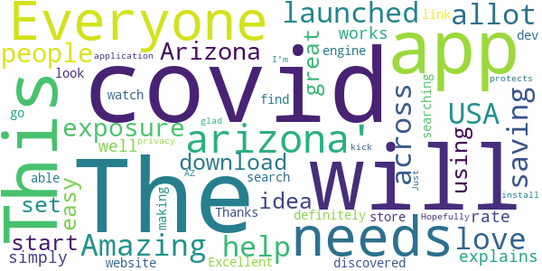

> The app is Amazing and I love it. This should be launched across USA and it will help in saving allot of people from exposure of Covid-19. Everyone in Arizona should download and start using it.  :date: __2020-10-06 13:43:59__

> The idea is great/it is easy to set up/explains how it works well. I will rate 5 simply for that. It definitely needs to be able to be discovered by searching 'covid arizona' or 'covid watch arizona'. I had to look it up on a search engine then go through an app store link on the dev's website to find it.  :date: __2020-09-11 05:38:37__

> Thanks for making this!  :date: __2020-09-10 10:11:21__

> Excellent application !  :date: __2020-08-24 13:16:53__

> Just what AZ needs to kick the covid! Hopefully everyone will install. I'm glad it protects privacy.  :date: __2020-08-19 20:42:29__

#### 4-star reviews

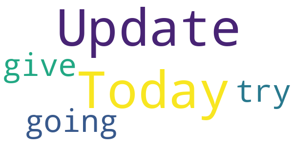

> Today Update  :date: __2020-09-08 20:52:33__

> I am going to give this a try  :date: __2020-09-02 08:55:19__

#### 3-star reviews

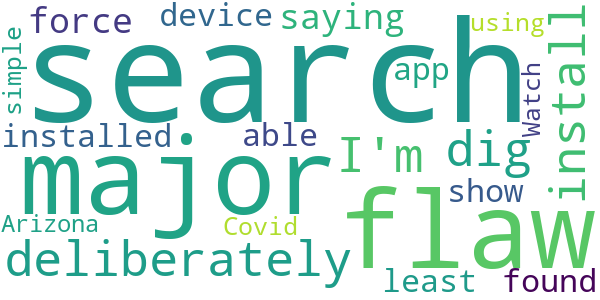

> It's a major flaw to have to deliberately dig for this and install. I'm not saying it should be force installed on any device but it should at /least/ be able to show up in a search 🙃  :date: __2020-10-09 02:43:42__

> This app can't be found using a simple search for "Covid Watch Arizona".  :date: __2020-08-26 04:58:02__

#### 2-star reviews

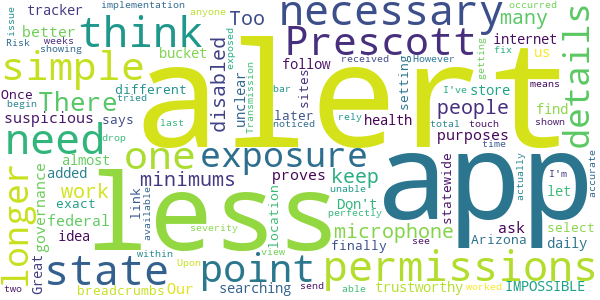

> Great idea but unclear. IMPOSSIBLE to find by simple searching for it in the app store. I had to follow internet breadcrumbs over the different sites to finally get a link to the exact app. Once here, while setting up, you need to select your location, one of which is "State of Arizona". But later it says that statewide implementation means that you can get alerts, but not alert anyone else. So if I'm in Prescott, and no one in Prescott can actually send an alert, what is the point????  :date: __2020-10-06 19:06:36__

> This app worked perfectly for me to begin with. Upon getting an exposure alert, I was able to view the details and severity with a simple touch. However, within the last two weeks, I noticed when I received an alert, I am unable to see the details. I am shown when it occurred, but the drop down bar showing the Transmission Risk and total time exposed is no longer available. I've tried all I can think to fix the issue, but at this point, I can no longer rely on it for accurate exposure alerts.  :date: __2020-09-25 01:17:53__

#### 1-star reviews

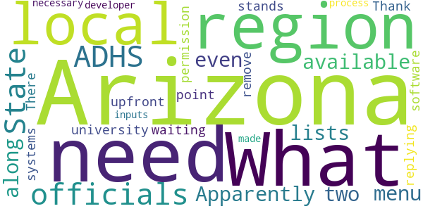

> Apparently, it's not available in for most of Arizona even if the menu lists Arizona along with two university systems. You need to be upfront about this. What "region" am I in and what "local" officials are you waiting for permission from?  :date: __2020-09-05 21:40:37__

# COVIDWISE
App version ``1.0``

Analyzed with [covid-apps-observer](http://github.com/covid-apps-observer) project, version ``0.1``

## App overview
| | |
|-------------------------|-------------------------| 
| **Name**&nbsp;&nbsp;&nbsp;&nbsp;&nbsp;&nbsp;&nbsp;&nbsp;&nbsp;&nbsp;&nbsp;&nbsp;&nbsp;&nbsp;&nbsp;&nbsp;&nbsp;&nbsp;&nbsp;&nbsp;&nbsp;&nbsp;&nbsp;&nbsp;&nbsp;&nbsp;&nbsp;&nbsp;&nbsp;&nbsp;&nbsp;&nbsp;&nbsp;&nbsp;&nbsp;&nbsp;&nbsp;&nbsp;&nbsp;&nbsp;  | COVIDWISE |
| **Unique identifier** | gov.vdh.exposurenotification |
| **Link to Google Play** | [https://play.google.com/store/apps/details?id=gov.vdh.exposurenotification](https://play.google.com/store/apps/details?id=gov.vdh.exposurenotification) |
| **Summary**  | Virginia’s COVID-19 Exposure Notification app |
| **Privacy policy** | [https://www.vdh.virginia.gov/covidwise/privacy-policy/](https://www.vdh.virginia.gov/covidwise/privacy-policy/) |
| **Latest version** | 1.0 |
| **Last update** | 2020-08-28 20:27:40 |
| **Recent changes** | Add your phone to the COVID fight!  For this version of COVIDWISE, we made some minor enhancements, streamlined some features, and fixed a few minor bugs. |
| **Installs**  | 100,000+ |
| **Category** | Health & Fitness |
| **First release** | Jul 29, 2020 |
| **Size**  | 5.1M |
| **Supported Android version**  | 6.0 and up |

### Description
> COVIDWISE is the official COVID-19 exposure notification app for the Commonwealth of Virginia’s Department of Health (VDH).  The app was developed in partnership with SpringML using a Bluetooth Low Energy (BLE) API framework created through a unique collaboration between Apple and Google.
 Your personal use of COVIDWISE will significantly help inform Virginians suspected of having been within close proximity to someone with a positive COVID-19 diagnosis. When you download COVIDWISE, you are doing your part to efficiently and effectively help your community stay ahead of any potential resurgent trends in cases. This is vitally important as the business sector, healthcare industry, K-12 schools, institutions of higher education, religious organizations, sporting/recreation activities, and others rely on appropriate interventions to ensure the health of our communities and maintain economic viability. 
 How COVIDWISE Works: 
 If someone reports to the app that they tested positive, the signals from their app will search for other app users who shared that signal. The BLE signals are date-stamped and the app estimates how close the two devices were based on signal strength. If the timeframe was at least 15 minutes and the estimated distance was within six feet, then the other user receives a notification of a possible exposure. No names! No location! 
 The BLE framework within COVIDWISE will run in the background, even if the exposure notification app is closed. It will not drain the device battery at a rate that would occur with other apps that use normal Bluetooth and/or are open and running constantly.
 How COVIDWISE Protects Your Privacy:
 VDH takes your privacy and confidentiality very seriously. This is why we chose to use the Apple and Google BLE framework. No personal data or location tracking occurs within this app. In fact, there is no need for VDH to know where or who you are for COVIDWISE to work. If you are close enough to another app user, the BLE technology will share signals with that user. 
 Laboratory results for all persons who test positive for COVID-19 are sent to VDH. This is not associated with the app. Our staff follows up with persons reported as positive, based on information provided within the laboratory report. As a courtesy to all app users, VDH will verify positive tests and then provide COVIDWISE users a personal identifying number (PIN). You must use that PIN in order to report a positive result to the app. This prevents people from falsely reporting positive results, which could generate false exposure notifications. VDH wants all app users to feel confident that when a possible COVID-19 exposure is received via the app, that it is a real event. 
 If you have the current Apple or Google operating system installed on your device, you may have noticed that Exposure Notifications are now included. You cannot enable this function until you have downloaded Virginia’s COVIDWISE app. Apple and Google will delete the exposure notification service tools from their respective operating systems once the pandemic reaches a point that public health no longer requires the use of this technology.
 Thank you for downloading COVIDWISE!  Together, we can protect our family, friends, neighbors, and colleagues, and keep Virginia moving forward!

### User interface
The developers of the app provide the following screenshots in the Google play store.
| | | |
|:-------------------------:|:-------------------------:|:-------------------------:|
 |   |   |   | 
 |   |   |   | 

## Development team
In the following we report the main information provided by the development team in the Google play store.

| | |
|-------------------------|-------------------------|
| **Developer**  | VDH |
| **Website**  | [http://covidwise.org](http://covidwise.org) |
| **Email** | covidwise@vdh.virginia.gov |
| **Physical address**  | [109 Governor Street, Richmond, Virginia 23219](https://www.google.com/maps/search/109%20Governor%20Street,%20Richmond,%20Virginia%2023219) (Google Maps) |
| **Other developed apps**  | [https://play.google.com/store/apps/developer?id=VDH](https://play.google.com/store/apps/developer?id=VDH) |

## Android support

| | |
|-------------------------|-------------------------|
| **Declared target Android version**  | Android10, version 10 (API level 29) |
| **Effective target Android version**  | Android10, version 10 (API level 29) |
| **Minimum supported Android version**  | Marshmallow, version 6.0 (API level 23) |
| **Maximum target Android version**  | - |

The larger the difference between the minimum and maximum supported Android versions, the better. A larger difference means a wider audience. For example, old phones have a very low Android version, so a high minimum supported Android version means that the app cannot be used by users with old phones, thus leading to accessibility problems. 

## Requested permissions

In the following we report the complete list of the permissions requested by the app. 

| **Permission** | **Protection level** | **Description** | 
|-------------------------|-------------------------|-------------------------|
 **android.permission ACCESS_NETWORK_STATE** | Normal | Allows applications to access information about networks. 
 **android.permission BLUETOOTH** | Normal | Allows applications to connect to paired bluetooth devices. 
 **android.permission FOREGROUND_SERVICE** | Normal | Allows a regular application to use Service.startForeground. 
 **android.permission INTERNET** | Normal | Allows applications to open network sockets. 
 **android.permission RECEIVE_BOOT_COMPLETED** | Normal | Allows an application to receive the Intent.ACTION_BOOT_COMPLETED that is broadcast after the system finishes booting. 
 **android.permission WAKE_LOCK** | Normal | Allows using PowerManager WakeLocks to keep processor from sleeping or screen from dimming. 

## Mentioned servers

| **Server** | **Registrant** | **Registrant country** | **Creation date** | 
|-------------------------|-------------------------|-------------------------|-------------------------|
 | google.com | Google LLC | :us: US | 1997-09-15 04:00:00 |
 | googleapis.com | Google LLC | :us: US | 2005-01-25 17:52:26 |

## Security analysis 

Below we report the main security warnings raised by our execution of the [Androwarn](https://github.com/maaaaz/androwarn) security analysis tool.

**Telephony identifiers leakage**
> - This application reads the ISO country code equivalent of the current registered operator's MCC (Mobile Country Code) 

**Connection interfaces exfiltration**
> - This application reads details about the currently active data network 
> - This application tries to find out if the currently active data network is metered 

**Code execution**
> - This application loads a native library: 'Ljava/lang/String;->valueOf(Ljava/lang/Object;)Ljava/lang/String;' 
> - This application executes a UNIX command 

## User ratings and reviews

Below we provide information about how end users are reacting to the app in terms of ratings and reviews in the Google Play store.

### Ratings

The COVIDWISE app has been installed by more than **100000** times. At this time, **586** rated the app and its average score is **4.29**. Below we show the distribution of the ratings across the usual star-based rating of Google Play

:star::star::star::star::star:: 435

:star::star::star::star:: 29

:star::star::star:: 47

:star::star:: 11

:star:: 64

### Reviews 

#### 5-star reviews

> Thank you for making this. But it needs to be advertised more. I only heard about it through Twitter.  :date: __2020-10-09 14:53:52__

> Great! Thank you for your App.  :date: __2020-10-09 00:00:07__

> If everyone got this and actually used it this would be fantastic  :date: __2020-10-07 19:08:12__

> frequent traveller (planes) so am curious if this app talks to other joint apple / google framework covid trackers or does it just communicate with the va one ? if its all, then great job. if only va, then might want to work on that.  :date: __2020-10-07 14:37:39__

> Excellent to have.  :date: __2020-10-07 12:42:39__

> Awesome app that protects privacy  :date: __2020-10-07 04:00:06__

> Update - I uninstalled and reinstalled and notifications are working correctly now. However, please make more helpful error messages though. Older review - I get an 'Internal Error, please try again' when I try to set Exposure Notifications (I have both bluetooth and Wifi enabled - using a Galaxy S10). Please fix or give a more helpful error message so I can troubleshoot what the root of the problem is - whether it's a 'user error', phone configuration or something else out of my control.  :date: __2020-10-07 01:26:00__

> 🖼❤  :date: __2020-10-01 16:31:24__

> Very well done.  :date: __2020-09-26 00:07:35__

> It is a very good way to tell of you are possibly in contact with someone.  :date: __2020-09-25 18:13:22__

#### 4-star reviews

> I appreciate the efforts to curb the spread of Covid. However when I turned off my phone's location, I received a notification from Google's Exposure Notifications framework that I needed to enable location in order for the app to work. What??? Covidwise says that "No personal data or location tracking occurs within this app." I've since learned that while the app itself doesn't ask for location, Google's Exposure Notification framework (used by the app) obtains location data by using Bluetooth. This is very confusing. Please work out the kinks in messaging this. Otherwise it looks like the app is trying to do something sneaky (trying to gather and store my location data without telling me).  :date: __2020-10-02 20:49:11__

> For battery optimization issue, you can add this app in the "whitelist" so you won't run into the issue.  :date: __2020-09-23 17:11:11__

> Helpful, gives me some peace of mind  :date: __2020-09-16 02:24:02__

> I am a 57yr old working in a Covid 19 unit , what supplements to take every day to boost my immune system ?  :date: __2020-09-11 16:33:20__

> Hahaha! So funny thing, I just installed the app thinking this would work... No wonder it didn't work! I never noticed this was an app made only for the state of Virginia! I'm in Florida where these cases are 😵😵💫💫... But it seems like an easy interface to use, and wish Florida could develop something like this. And even if they did, I would really hope people would give honest reports, but that may just be wishful thinking. I know my people, Floridians are crazy!🤦🏾‍♀️  :date: __2020-09-04 04:28:33__

> Would be five stars but It would be rad if the app didn't send a weekly notification that notifications are on. I about soil myself Everytime.  :date: __2020-08-27 23:15:04__

> This app does NOT use nor require GPS & does NOT track you.Nor does it ask for GPS. Only as good as others with the app notifications turned on.  :date: __2020-08-25 16:35:12__

> This app will only be useful when a significant number of the 8.5 million Virginians have installed it. It doesn't take up much space, so I've done my part at no cost.  :date: __2020-08-25 16:14:53__

> It's amazing. I have the app even thou I'm in California. We need the app for California and all other states. Am I asking for to much? Lol. This covid is serious. Everyone needs this app  :date: __2020-08-24 22:10:38__

> I installed the app and it seems to work as advertised. The downsides of the app are two-fold. The app would appear to be geographically limited to VA and it depends on people with COVID to voluntarily install the app and report they have COVID in a timely manner. That said, even a 30% solution has merit and hopefully use of this system will be nationwide if not worldwide.  :date: __2020-08-19 20:07:21__

#### 3-star reviews

> Location services must be on for android devices to enable blue tooth, which is a huge drawback for me. I rarely have that turned on, and am selective as to when I have my cell radio on. It would be nice if this could be resolved, I don't see why bluetooth has to considered to be part of location services. I don't see Google doing that though...  :date: __2020-10-08 15:33:54__

> I've been using this for over 1 hour and still did not find any Pokemon. as to the app, it seems to draw down the battery. unfortunate not enough potential users, and the "where - when" for contacts seems seriously lacking. still have it running because it's all that's offered.  :date: __2020-09-25 05:06:02__

> I like the idea but not sure if it's working on all Samsung devices correctly. I believe s9+ is shutting down due to "Optimizing Battery Usage". Need to shut this off or it won't run in background to work. Need more information to consumers most probably don't know.  :date: __2020-09-20 16:44:56__

> It's ridiculous that there are only state apps. I live in California and I don't see an app for me. Also what about people who cross state lines? There needs to be a unified federal App, but I can't see it happening.  :date: __2020-09-18 20:53:23__

> I think yall should makw this app for arkansas tbh my state hasent made one and downloading this app and it using my location will it pickup exposure here in ark?  :date: __2020-09-12 04:00:25__

> Doesn't use location, but requires location services to be on to work. I leave mine off when not in use, because most other apps aren't so privacy-conscious. By requiring GPS, this app creates security concerns that outweigh its benefits. While THIS app isn't directly compromising my privacy, its permissions requirements open a privacy hole for OTHER apps to use. Android *doesn't* require location for Bluetooth or BLE (I use both), but it unfortunately does for this app's BLE tag tracking.  :date: __2020-09-04 17:56:12__

> Difficult to understand the terminology, may often leave you scratching your head.  :date: __2020-08-31 04:16:45__

> The app is really good about not taking information, however, consistently enabling Bluetooth in a public space is a major opportunity for cybercriminals to hack devices, steal personal information, and wreak havoc. Bluetooth is too major of a threat vector for me to consider enabling this app. Great idea, poor execution.  :date: __2020-08-13 21:01:34__

> Battery life plummeted for me since installing. Once uninstalled (yesterday) I really see a difference. Otherwise, app was simple and straightforward.  :date: __2020-08-13 02:31:59__

> I am trusting that this app doesn't exploit my private information. I have read enough to be only mildly certain! Three stars because I just don't know. I pray this is helpful to us all.  :date: __2020-08-12 22:37:48__

#### 2-star reviews

> 6 beer 4🍉  :date: __2020-10-07 16:26:24__

> Drains my battery too much to have bluetooth on all the time and I forget to turn it on the few times I'm near people. I know they don't record location but if there were a way to prompt me to turn bluetooth on when I change location that would be beneficial  :date: __2020-10-04 18:15:31__

> Update: month and a half after i installed the app and there are only 1% users across VA. Time to uninstall it. Anything that helps to fight covid gets 5 star and to those believing in looney tunes and conspiracy theories think about what you carry in your pocket (cell phone) or have on a shelf at home (alexa). Either you give your phone permission or not do you really think professional IT person can't make a virus go around your blocked permissions?  :date: __2020-09-27 15:29:08__

> This was a tough situation it was like it was almost a virus and I still don't know if it was because I still can't use my Facebook or my messenger and it kind of makes me upset but it said it is it takes 3 business days and we'll find out so I'll give it 3 days 3 days goes quick  :date: __2020-09-10 20:28:58__

> It is fine but when i try to turn on exposure notifications it says "en error occurred" FIX IT  :date: __2020-09-09 17:56:27__

> This app has stored almost 300 zip files in my one drive! Why? And how? I never told it to store anything anywhere & can't figure out how to make it stop. I'm uninstalling it because I pay for my One Drive storage & don't want your app stealing my space. I now have to delete almost 300 files from my drive.  :date: __2020-08-29 16:52:37__

> No location diary like some other state's apps  :date: __2020-08-16 15:15:30__

> How many people will use this app? So far I see 50k downloaded... Only few people use the app, will not make any difference. I have an app turn on, and if I contact an effected person does not use this app. How do I know? If you concern your sensitive info leaking, I recommend you get a VPN app and turn it on. There are many favorite game apps that hackers steal your sensitive info, can you protect them all? Virginian, please help the public health track the virus, and contains.  :date: __2020-08-15 15:17:27__

> After installing I noticed it was intended for the state of Virginia. Not sure now if anyone can use the app in other states or locations. Can the developer comment on this please?  :date: __2020-08-08 12:20:13__

> Requires that GPS location is always on to get notifications. I thought it just needed Bluetooth. I don't want my location data always getting sent to Google. Also, why does each state have to develop their own app? If I travel, then other people in that other state won't be compatible with this app. Right?  :date: __2020-08-06 18:49:21__

#### 1-star reviews

> Not that good. Political parties killed 217,000 people both parties red and blue is going to kill you. Don't trust use at all. China and U.S Are the blame for millions of deaths around the world shame on use. Give these little girls a shot that will not get them pregnant and bad parenting by mostly the parents that let there 12 to 17 year old gets Prego. Instead use bring Virus to kill people. If I were to do that or anybody else that is prison time. Hold the elephant and donkey accountable...  :date: __2020-10-09 05:37:02__

> What a waste of my tax dollars.  :date: __2020-10-08 06:20:47__

> Can't turn it on.  :date: __2020-10-07 23:35:47__

> Need a COVID Exposure app for West Virginia  :date: __2020-10-07 19:07:09__

> The app doesn't work. I try to press "enable notifications" but it doesn't work. I have them enabled through my settings and I have my Bluetooth and location on. Not sure what else to do.  :date: __2020-10-07 14:19:21__

> This Covid19 is trumped up. Northern Virginia has pools and restaurants open along with Virginia Beach, but not Richmond. Why? Do your research and read between the lines! When the cell phones all went down, they put a tracker on your phone and now an app for the same thing?? Do you really think the American people are that naive? Every major election some virus comes up. Zeka, Swine Flu, Covid19... the list goes on and on.  :date: __2020-10-07 13:54:36__

> y it said internal error?  :date: __2020-10-07 06:49:57__

> Bluetooth has always had security issues! Hackers can get into our phones via Bluetooth. Search Google: "Bluetooth Unveils Its Latest Security Issue, With No Security Solution," ... on MSN News/Gizmodo, 9/10/2020. Also, Bluetooth constantly searches, draining batteries. I think it would be safer for the app to keep a record of where we have been for the past couple of weeks, then the VDH could use that to cross-reference to see if any app users were around an app reported Covid-19 victim.  :date: __2020-10-07 04:14:07__

> cannot enable notification. Always says internal error. Any solutions?  :date: __2020-10-07 02:54:29__

> What a waste of tax dollars this is. Whomever wrote this app needs to find a real developer job.  :date: __2020-10-07 02:31:59__

# Covid Trace Nevada
App version ``1.2.11``

Analyzed with [covid-apps-observer](http://github.com/covid-apps-observer) project, version ``0.1``

## App overview
| | |
|-------------------------|-------------------------| 
| **Name**&nbsp;&nbsp;&nbsp;&nbsp;&nbsp;&nbsp;&nbsp;&nbsp;&nbsp;&nbsp;&nbsp;&nbsp;&nbsp;&nbsp;&nbsp;&nbsp;&nbsp;&nbsp;&nbsp;&nbsp;&nbsp;&nbsp;&nbsp;&nbsp;&nbsp;&nbsp;&nbsp;&nbsp;&nbsp;&nbsp;&nbsp;&nbsp;&nbsp;&nbsp;&nbsp;&nbsp;&nbsp;&nbsp;&nbsp;&nbsp;  | Covid Trace Nevada |
| **Unique identifier** | gov.nv.dhhs.en |
| **Link to Google Play** | [https://play.google.com/store/apps/details?id=gov.nv.dhhs.en](https://play.google.com/store/apps/details?id=gov.nv.dhhs.en) |
| **Summary**  | Stay safe. Protect each other. Stay private. |
| **Privacy policy** | [https://covidtrace.com/nct_privacy_policy.pdf](https://covidtrace.com/nct_privacy_policy.pdf) |
| **Latest version** | 1.2.11 |
| **Last update** | 2020-10-02 23:40:20 |
| **Recent changes** | - Minor bug fixes and improvements |
| **Installs**  | 10,000+ |
| **Category** | Medical |
| **First release** | Aug 22, 2020 |
| **Size**  | 51M |
| **Supported Android version**  | 7.0 and up |

### Description
> Nevada's Department of Health and Human Services (DHHS) COVID Trace app helps reduce the spread of coronavirus in Nevada helping everyone stay safe. COVID Trace doesn’t require personal information helping protect your privacy.

### User interface
The developers of the app provide the following screenshots in the Google play store.
| | | |
|:-------------------------:|:-------------------------:|:-------------------------:|
 |   |   |   | 
 |   |  

## Development team
In the following we report the main information provided by the development team in the Google play store.

| | |
|-------------------------|-------------------------|
| **Developer**  | Nevada Division of Public and Behavioral Health |
| **Website**  | [http://dpbh.nv.gov/](http://dpbh.nv.gov/) |
| **Email** | help@covidtrace.com |
| **Physical address**  | - |
| **Other developed apps**  | [https://play.google.com/store/apps/developer?id=Nevada+Division+of+Public+and+Behavioral+Health](https://play.google.com/store/apps/developer?id=Nevada+Division+of+Public+and+Behavioral+Health) |

## Android support

| | |
|-------------------------|-------------------------|
| **Declared target Android version**  | Pie, version 9 (API level 28) |
| **Effective target Android version**  | Pie, version 9 (API level 28) |
| **Minimum supported Android version**  | Nougat, version 7.0 (API level 24) |
| **Maximum target Android version**  | - |

The larger the difference between the minimum and maximum supported Android versions, the better. A larger difference means a wider audience. For example, old phones have a very low Android version, so a high minimum supported Android version means that the app cannot be used by users with old phones, thus leading to accessibility problems. 

## Requested permissions

In the following we report the complete list of the permissions requested by the app. 

| **Permission** | **Protection level** | **Description** | 
|-------------------------|-------------------------|-------------------------|
 **android.permission ACCESS_NETWORK_STATE** | Normal | Allows applications to access information about networks. 
 **android.permission BLUETOOTH** | Normal | Allows applications to connect to paired bluetooth devices. 
 **android.permission GET_TASKS** | Deprecated | This constant was deprecated in API level 21. No longer enforced. 
 **android.permission INTERNET** | Normal | Allows applications to open network sockets. 
 **android.permission RECEIVE_BOOT_COMPLETED** | Normal | Allows an application to receive the Intent.ACTION_BOOT_COMPLETED that is broadcast after the system finishes booting. 
 **android.permission WAKE_LOCK** | Normal | Allows using PowerManager WakeLocks to keep processor from sleeping or screen from dimming. 

## Mentioned servers

| **Server** | **Registrant** | **Registrant country** | **Creation date** | 
|-------------------------|-------------------------|-------------------------|-------------------------|
 | google.com | Google LLC | :us: US | 1997-09-15 04:00:00 |
 | xmlpull.org | WhoisGuard, Inc. | PA | 2001-11-26 20:33:08 |
 | w3.org | W3C | :us: US | 1994-07-06 04:00:00 |
 | googleapis.com | Google LLC | :us: US | 2005-01-25 17:52:26 |

## Security analysis 

Below we report the main security warnings raised by our execution of the [Androwarn](https://github.com/maaaaz/androwarn) security analysis tool.

**Connection interfaces exfiltration**
> - This application reads details about the currently active data network 
> - This application tries to find out if the currently active data network is metered 

**Pim data leakage**
> - This application accesses data stored in the clipboard 

**Code execution**
> - This application loads a native library: 'flutter' 

## User ratings and reviews

Below we provide information about how end users are reacting to the app in terms of ratings and reviews in the Google Play store.

### Ratings

The Covid Trace Nevada app has been installed by more than **10000** times. At this time, **66** rated the app and its average score is **3.530303**. Below we show the distribution of the ratings across the usual star-based rating of Google Play

:star::star::star::star::star:: 36

:star::star::star::star:: 1

:star::star::star:: 6

:star::star:: 8

:star:: 15

### Reviews 

#### 5-star reviews

> It enabled my covid19 settings, hope people in california use this since there is no app for california  :date: __2020-09-27 11:01:37__

> Get the App help Stop the spread of Covid  :date: __2020-09-16 20:12:13__

> Great app  :date: __2020-09-02 00:45:54__

> Good  :date: __2020-08-27 22:01:53__

> Simple, small, and easy to use. Thank you.  :date: __2020-08-27 05:47:51__

> Just installed and set everything up. Works fine! Hopefully if there are any bugs, they'll be worked out soon. Thank you for providing an extra way for us to try and keep covid from spreading to our loved ones! 💖  :date: __2020-08-26 00:53:07__

> 5 stars because this is one of the best smart phone / bluetooth applications anybody has thought of so far. One thing I would like to see are statistics about the number of Bluetooth pairings that the app performed. Installation was without problems for me.  :date: __2020-08-25 21:50:35__

> Great idea. This needs to be advertised more!  :date: __2020-08-25 19:06:56__

> Had absolutely no issues installing or connecting. Definitely getting others to download.  :date: __2020-08-25 14:23:25__

> Installed and set up with no issues. Brilliant idea that I hope catches on and people download.  :date: __2020-08-25 07:14:01__

#### 4-star reviews

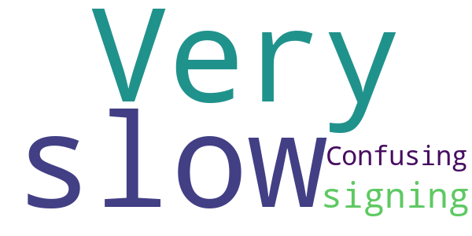

> Very slow in signing on. Confusing too.  :date: __2020-08-26 18:50:32__

#### 3-star reviews

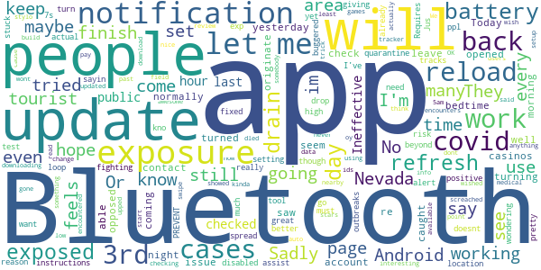

> the only reason im downloading this is because it wont let me download some other games  :date: __2020-10-02 23:20:13__

> Won't even get past the 3rd setup page....I hope Nevada did not actually pay somebody to build this. Tried again after update ..still will not set up....3rd update did the trick. set up OK ..upped to 3 stars. We will see.  :date: __2020-09-30 11:15:50__

> Drains your battery! I dont like to have my bluetooth on all day. I am in the medical field and am exposed to know's what, so oy would be interesting to see if i am exposed at work. Just wished it didn't drain my battery  :date: __2020-08-31 17:45:38__

> This app is such an awesome start. It has never updated exposure on it's own. I have to refresh it every time. I have gone a day with no auto updates like it said it would, so I just refresh at least once a day. I wish it showed how many ids you have encountered or something cause it feels like the app isn't doing anything. It would be nice to know that it has read # nearby users and is now checking that many every refresh. It kinda feels like just an info about covid app, not a tracker.  :date: __2020-08-30 19:31:12__

> The app will not let me go beyond the 3rd page. It doesnt work. My bluetooth and location are on. The "exposure notification" will not let me turn it on as it says "I need to finish setting up the app" others instructions say the "exposure notification" must be on to finish the app. ????? I am stuck in a loop.  :date: __2020-08-28 20:20:58__

> So the app is working dled at 5am you swipe to reload the screached 0 encounters so i think this use app is very low at this point all change review as data is available im using a stylo 5  :date: __2020-08-25 16:10:50__

#### 2-star reviews

> Have the latest updates, yet asks me to update further. Click the link to do so > infinite load screen. Much needed app, needs some fixes.  :date: __2020-09-24 08:51:36__

> Needs work, won't refresh!  :date: __2020-09-18 02:17:18__

> DOES NOT AUTO UPDATE.  :date: __2020-09-07 14:37:16__

> I installed this app on 8/30/2020. Location and BlueTooth are on. Exposure notifications are on. I received on Exposure Notification on 8/30/2020 at 12:20pm saying No Exposure Found in the last hour. As of 8/31/2020, 12:01pm I have not received any other exposure notices. Even after one hour in the gym. 1) Why isn't this running/working? and 2)How do I manually check for exposures? 3)How frequently should I get exposures? Using a Samsung Note 8, android. Installation seemed to go just fine. Sending question to help email noted below. I very much would like to see this app be successful!  :date: __2020-08-31 21:09:02__

> This doesn't work, the app itself looks/seems/feels like a toy or fake, won't even show in the google play search, I had to find the website first then use the link to get to the app and in my girlfriend phone wont pass from the 3rd page "next" Samsung A20, and in my Samsung gs8 the loading update it's "meh".  :date: __2020-08-27 04:14:38__

> I love this idea! But... It only shows that the last check was 15 hours ago. One check is all it has done. What good is that? For those stuck on 3rd page, slide the slider in middle of the page as instructions say.  :date: __2020-08-25 16:09:15__

#### 1-star reviews

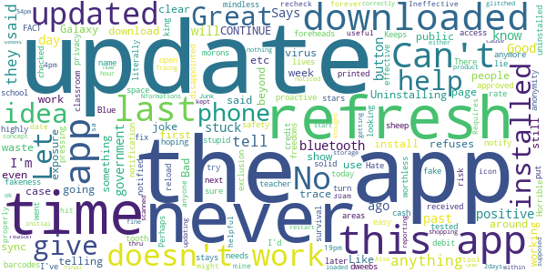

> All Nformations Says Tracng I Would Never Let All Phone Be Trace At All  :date: __2020-10-07 01:05:22__

> doesn't tell you anything cause no one is reporting thru the app.  :date: __2020-09-30 23:40:48__

> I downloaded this app and thought it was ok at first until I noticed that the last time it scanned had been days before at the same time but it kept telling me that I had no exposures within the past hour.  :date: __2020-09-28 13:58:51__

> The only reason we're not getting alerts is because nobody in nevada has used this app (yet) to report their exposure/positive covid19 result(s).  :date: __2020-09-16 16:39:01__

> A joke. The app almost never updates. You could be all around people with covid and would never know. This app is totally pointless  :date: __2020-08-31 03:53:05__

> Can't get past the third page of setup  :date: __2020-08-26 06:12:39__

> In get started portion before i can use app, it will not respond to CONTINUE button on 3rd page after watching 37 second video. I CAN'T GET PAST THIS. HELP PLEASE.. Using Android 9 from Google play store.  :date: __2020-08-26 01:12:32__

> Can't get beyond the continue which is blacked out except for a small clear patch. Another person had the same problem and said the programmer showed him how to get beyond that point. Unfortunately he didn't bother to tell what it was  :date: __2020-08-25 22:30:38__

> Once I downloaded it and entered by email mail address and password I got a message something like thanks for your purchase?  :date: __2020-08-25 06:08:19__

> Wont install on a Galaxy S20.  :date: __2020-08-25 02:09:08__

# Covid Alert DE
App version ``1.0.1``

Analyzed with [covid-apps-observer](http://github.com/covid-apps-observer) project, version ``0.1``

## App overview
| | |
|-------------------------|-------------------------| 
| **Name**&nbsp;&nbsp;&nbsp;&nbsp;&nbsp;&nbsp;&nbsp;&nbsp;&nbsp;&nbsp;&nbsp;&nbsp;&nbsp;&nbsp;&nbsp;&nbsp;&nbsp;&nbsp;&nbsp;&nbsp;&nbsp;&nbsp;&nbsp;&nbsp;&nbsp;&nbsp;&nbsp;&nbsp;&nbsp;&nbsp;&nbsp;&nbsp;&nbsp;&nbsp;&nbsp;&nbsp;&nbsp;&nbsp;&nbsp;&nbsp;  | Covid Alert DE |
| **Unique identifier** | gov.de.covidtracker |
| **Link to Google Play** | [https://play.google.com/store/apps/details?id=gov.de.covidtracker](https://play.google.com/store/apps/details?id=gov.de.covidtracker) |
| **Summary**  | COVIDAlert, Delaware Division of Public Health helps reduce the spread of COVID |
| **Privacy policy** | [https://docs.google.com/document/d/1n1xZSpCCKc5eDpuJojHcd84k46joRCIR2NysOsQX6JE/edit?usp=sharing](https://docs.google.com/document/d/1n1xZSpCCKc5eDpuJojHcd84k46joRCIR2NysOsQX6JE/edit?usp=sharing) |
| **Latest version** | 1.0.1 |
| **Last update** | 2020-10-01 09:28:55 |
| **Recent changes** | Minor changes and bug fixes |
| **Installs**  | 5,000+ |
| **Category** | Medical |
| **First release** | Sep 8, 2020 |
| **Size**  | 106M |
| **Supported Android version**  | 6.0 and up |

### Description
> With your help, the COVID Alert DE app can help reduce the spread of coronavirus.
 The Division of Public Health of the State of Delaware is asking everyone to help tackle coronavirus by downloading and using the COVID Alert DE app every day.
  
 If you use the app you will:
 •             Be alerted if you have been in close contact with another user who has tested positive for coronavirus.
 •             Be able to track your symptoms and get advice on what to do.
 •             Protect yourself and others as everyone begins to return to normal life.
  
 Your data and privacy are vital. The COVID Alert DE app will NOT:
 •             Publicly identify anyone with COVID-19
 •             Use your data for any reason other than alerting you that you may be a close contact of someone who is COVID-positive.
  
 Use this app for 1 minute a day to make an important contribution to the fight against coronavirus. Protect yourself, your family, your community and the most vulnerable in society. Encourage everyone you know to download and use the Covid Alert DE app where possible.

### User interface
The developers of the app provide the following screenshots in the Google play store.
| | | |
|:-------------------------:|:-------------------------:|:-------------------------:|
 |   |   |   | 
 |   |  

## Development team
In the following we report the main information provided by the development team in the Google play store.

| | |
|-------------------------|-------------------------|
| **Developer**  | Delaware Department of Health and Social Services |
| **Website**  | [https://de.gov/covidalert](https://de.gov/covidalert) |
| **Email** | DHSS_COVIDAlertDE@delaware.gov |
| **Physical address**  | - |
| **Other developed apps**  | [https://play.google.com/store/apps/developer?id=Delaware+Department+of+Health+and+Social+Services](https://play.google.com/store/apps/developer?id=Delaware+Department+of+Health+and+Social+Services) |

## Android support

| | |
|-------------------------|-------------------------|
| **Declared target Android version**  | Android10, version 10 (API level 29) |
| **Effective target Android version**  | Android10, version 10 (API level 29) |
| **Minimum supported Android version**  | Marshmallow, version 6.0 (API level 23) |
| **Maximum target Android version**  | - |

The larger the difference between the minimum and maximum supported Android versions, the better. A larger difference means a wider audience. For example, old phones have a very low Android version, so a high minimum supported Android version means that the app cannot be used by users with old phones, thus leading to accessibility problems. 

## Requested permissions

In the following we report the complete list of the permissions requested by the app. 

| **Permission** | **Protection level** | **Description** | 
|-------------------------|-------------------------|-------------------------|
 **android.permission ACCESS_NETWORK_STATE** | Normal | Allows applications to access information about networks. 
 **android.permission ACCESS_WIFI_STATE** | Normal | Allows applications to access information about Wi-Fi networks. 
 **android.permission BLUETOOTH** | Normal | Allows applications to connect to paired bluetooth devices. 
 **android.permission INTERNET** | Normal | Allows applications to open network sockets. 
 **android.permission RECEIVE_BOOT_COMPLETED** | Normal | Allows an application to receive the Intent.ACTION_BOOT_COMPLETED that is broadcast after the system finishes booting. 
 **com.google.android.finsky.permission BIND_GET_INSTALL_REFERRER_SERVICE** | - | - 

## Mentioned servers

| **Server** | **Registrant** | **Registrant country** | **Creation date** | 
|-------------------------|-------------------------|-------------------------|-------------------------|
 | android.com | Google LLC | :us: US | 1997-06-23 04:00:00 |
 | google.com | Google LLC | :us: US | 1997-09-15 04:00:00 |
 | expo.io | See PrivacyGuardian.org | :us: US | 2011-05-01 21:26:50 |

## Security analysis 

Below we report the main security warnings raised by our execution of the [Androwarn](https://github.com/maaaaz/androwarn) security analysis tool.

**Telephony identifiers leakage**
> - This application reads the numeric name (MCC+MNC) of current registered operator 
> - This application reads the operator name 
> - This application reads the phone number string for line 1, for example, the MSISDN for a GSM phone 

**Location lookup**
> - This application reads location information from all available providers (WiFi, GPS etc.) 

**Connection interfaces exfiltration**
> - This application reads details about the currently active data network 
> - This application tries to find out if the currently active data network is metered 

**Suspicious connection establishment**
> - This application opens a Socket and connects it to the remote address ' returned no addresses for  ; port is out of range' on the 'N/A' port  
> - This application opens a Socket and connects it to the remote address '' on the 'N/A' port  
> - This application opens a Socket and connects it to the remote address 'Ljava/lang/StringBuilder;->toString()Ljava/lang/String;' on the 'N/A' port  
> - This application opens a Socket and connects it to the remote address 'Ljava/net/Proxy;->type()Ljava/net/Proxy$Type;' on the 'N/A' port  
> - This application opens a Socket and connects it to the remote address 'timeout' on the 'N/A' port  

**Pim data leakage**
> - This application accesses data stored in the clipboard 

**Code execution**
> - This application loads a native library 
> - This application executes a UNIX command 

## User ratings and reviews

Below we provide information about how end users are reacting to the app in terms of ratings and reviews in the Google Play store.

### Ratings

The Covid Alert DE app has been installed by more than **5000** times. At this time, **25** rated the app and its average score is **4.04**. Below we show the distribution of the ratings across the usual star-based rating of Google Play

:star::star::star::star::star:: 18

:star::star::star::star:: 0

:star::star::star:: 2

:star::star:: 0

:star:: 5

### Reviews 

#### 5-star reviews

> Good 👍  :date: __2020-10-11 03:57:19__

> I think this is a good idea maybe it will help figure out areas that need more help to battle this mess. Stay safe all!  :date: __2020-10-08 20:30:51__

> I don't think I have the virus, but I think it's allergy. I do have the symptoms mentioned but have had them for along time (not14days). Question what are the symptoms for animals(cats&dogs) I can not stop them from itching, coughing, feeling slightly bad  :date: __2020-09-24 18:16:03__

> My only suggestion is adding daily reminder notifications to check in.  :date: __2020-09-24 08:41:49__

> Super easy to use.  :date: __2020-09-22 18:30:41__

> Simple interface, good execution. Should be simple enough for less-than-tech-savy people. Very good idea making it Bluetooth only; I can recommend this to others with peace of mind in terms of privacy. It doesn't even ask for other permissions! All around great job. If you have criticisms, please send it to there feedback department. Don't just rate the app low because you're having trouble with it. You're just hurting the reach of the app, and we need this to be widespread to work.  :date: __2020-09-17 22:05:59__

> Because Covid-19 is bad, mkay.  :date: __2020-09-16 02:35:53__

> What a great idea. At least someone is thinking!  :date: __2020-09-15 22:14:42__

#### 4-star reviews

No recent reviews available with 4 stars.

#### 3-star reviews

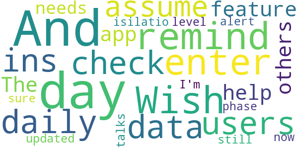

> Wish it would remind me to enter daily data. And with 35,000 users and only 180 check-ins a day I assume that feature would help others too.  :date: __2020-10-01 12:10:51__

> The app needs to be updated as it still talks about 14 days of isilatio. I'm not sure what phase 2 is as we are now at alert level 1  :date: __2020-09-26 00:53:51__

#### 2-star reviews

No recent reviews available with 2 stars.

#### 1-star reviews

> Don't be so pushy with government tracking apps directly to home-screen. You'll damage already fragile trust in government. 1 star for nanny-ishness. Slap your foreheads. Bad, engineers, bad. No treat for you.  :date: __2020-09-29 21:32:39__

> Wow makes you turn on bluetooth and is a complete invasion of privacy. Stay home and hide if you are scared of COVID  :date: __2020-09-28 03:50:29__

> Would like to use the app, but the app always hangs when I get to the data page and click on Continue. I' using a Pixel 3 phone, Android 11.  :date: __2020-09-24 16:20:30__

> Perpetually stuck waiting for download from Play Store.  :date: __2020-09-16 15:17:02__

> I'm from Maryland but travel to Delaware frequently. This app only works on one of my phone, the others are too old. Please expand the API to include phones down to 4.4. Also less than 100 installs (50+) indicates no one is using it at the time of review. This makes this app useless with less than 0.009% user engagement, assuming the everyone who has installed this app is from Delaware - it is actually less. For this type of app to be meaningful, you need to have engagement > 50% of the population or >500,000% more installs.  :date: __2020-09-15 21:09:32__

# Guam Covid Alert
App version ``1.0.3``

Analyzed with [covid-apps-observer](http://github.com/covid-apps-observer) project, version ``0.1``

## App overview
| | |
|-------------------------|-------------------------| 
| **Name**&nbsp;&nbsp;&nbsp;&nbsp;&nbsp;&nbsp;&nbsp;&nbsp;&nbsp;&nbsp;&nbsp;&nbsp;&nbsp;&nbsp;&nbsp;&nbsp;&nbsp;&nbsp;&nbsp;&nbsp;&nbsp;&nbsp;&nbsp;&nbsp;&nbsp;&nbsp;&nbsp;&nbsp;&nbsp;&nbsp;&nbsp;&nbsp;&nbsp;&nbsp;&nbsp;&nbsp;&nbsp;&nbsp;&nbsp;&nbsp;  | Guam Covid Alert |
| **Unique identifier** | org.pathcheck.guam.bt |
| **Link to Google Play** | [https://play.google.com/store/apps/details?id=org.pathcheck.guam.bt](https://play.google.com/store/apps/details?id=org.pathcheck.guam.bt) |
| **Summary**  | Receive alerts about potential exposure to COVID-19 in Guam. |
| **Privacy policy** | [https://guamcovidalert.guam.gov/privacy-policy/](https://guamcovidalert.guam.gov/privacy-policy/) |
| **Latest version** | 1.0.3 |
| **Last update** | 2020-09-22 03:49:30 |
| **Recent changes** | Updates for COVID-19 Exposure Notifications, Settings, Onboarding, and Home Screen. |
| **Installs**  | 5,000+ |
| **Category** | Health & Fitness |
| **First release** | Sep 8, 2020 |
| **Size**  | 63M |
| **Supported Android version**  | 6.0 and up |

### Description
> Guam Covid Alert, an app by the Guam Department of Public Health and Social Services helps aid contact tracing for COVID-19 by using the privacy centric Exposure Notification System. Subscribe to Healthcare Authorities in your area for information about COVID-19 near you, where available.
 Receive alerts from the local Healthcare Authority with information about potential exposure to COVID-19.
 The goal of Guam Covid Alert by the Guam Department of Public Health and Social Services is to help enable the reemergence and re-opening of economies and communities. Through global partnerships, we are prepared to support public health officials everywhere in the effort to slow the spread of COVID-19.
 The Guam Covid Alert app was built using an open source project developed by PathCheck Foundation.

### User interface
The developers of the app provide the following screenshots in the Google play store.
| | | |
|:-------------------------:|:-------------------------:|:-------------------------:|
 |   |   |   | 

## Development team
In the following we report the main information provided by the development team in the Google play store.

| | |
|-------------------------|-------------------------|
| **Developer**  | Otech Developer |
| **Website**  | [https://guamcovidalert.guam.gov/](https://guamcovidalert.guam.gov/) |
| **Email** | developer@dma.guam.gov |
| **Physical address**  | - |
| **Other developed apps**  | [https://play.google.com/store/apps/developer?id=Otech+Developer](https://play.google.com/store/apps/developer?id=Otech+Developer) |

## Android support

| | |
|-------------------------|-------------------------|
| **Declared target Android version**  | - |
| **Effective target Android version**  | - |
| **Minimum supported Android version**  | Marshmallow, version 6.0 (API level 23) |
| **Maximum target Android version**  | - |

The larger the difference between the minimum and maximum supported Android versions, the better. A larger difference means a wider audience. For example, old phones have a very low Android version, so a high minimum supported Android version means that the app cannot be used by users with old phones, thus leading to accessibility problems. 

## Requested permissions

In the following we report the complete list of the permissions requested by the app. 

| **Permission** | **Protection level** | **Description** | 
|-------------------------|-------------------------|-------------------------|
 **android.permission ACCESS_NETWORK_STATE** | Normal | Allows applications to access information about networks. 
 **android.permission ACCESS_WIFI_STATE** | Normal | Allows applications to access information about Wi-Fi networks. 
 **android.permission BLUETOOTH** | Normal | Allows applications to connect to paired bluetooth devices. 
 **android.permission FOREGROUND_SERVICE** | Normal | Allows a regular application to use Service.startForeground. 
 **android.permission INTERNET** | Normal | Allows applications to open network sockets. 
 **android.permission RECEIVE_BOOT_COMPLETED** | Normal | Allows an application to receive the Intent.ACTION_BOOT_COMPLETED that is broadcast after the system finishes booting. 
 **android.permission VIBRATE** | Normal | Allows access to the vibrator. 
 **android.permission WAKE_LOCK** | Normal | Allows using PowerManager WakeLocks to keep processor from sleeping or screen from dimming. 

## Mentioned servers

| **Server** | **Registrant** | **Registrant country** | **Creation date** | 
|-------------------------|-------------------------|-------------------------|-------------------------|
 | android.com | Google LLC | :us: US | 1997-06-23 04:00:00 |
 | bugsnag.com | Bugsnag Inc. | GB | 2011-08-18 03:26:10 |
 | google.com | Google LLC | :us: US | 1997-09-15 04:00:00 |
 | github.com | GitHub, Inc. | :us: US | 2007-10-09 18:20:50 |

## Security analysis 

Below we report the main security warnings raised by our execution of the [Androwarn](https://github.com/maaaaz/androwarn) security analysis tool.

**Telephony identifiers leakage**
> - This application reads the numeric name (MCC+MNC) of current registered operator 
> - This application reads the operator name 

**Connection interfaces exfiltration**
> - This application reads details about the currently active data network 
> - This application tries to find out if the currently active data network is metered 

**Suspicious connection establishment**
> - This application opens a Socket and connects it to the remote address 'Ljava/lang/StringBuilder;->toString()Ljava/lang/String;' on the ': connect, resolve' port  
> - This application opens a Socket and connects it to the remote address 'Ljava/lang/StringBuilder;->toString()Ljava/lang/String;' on the 'N/A' port  
> - This application opens a Socket and connects it to the remote address 'Ljava/net/Proxy;->type()Ljava/net/Proxy$Type;' on the 'N/A' port  
> - This application opens a Socket and connects it to the remote address 'No route to  ' on the 'N/A' port  
> - This application opens a Socket and connects it to the remote address 'timeout' on the 'N/A' port  

**Pim data leakage**
> - This application accesses data stored in the clipboard 

**Code execution**
> - This application loads a native library 
> - This application executes a UNIX command 

## User ratings and reviews

Below we provide information about how end users are reacting to the app in terms of ratings and reviews in the Google Play store.

### Ratings

The Guam Covid Alert app has been installed by more than **5000** times. At this time, **23** rated the app and its average score is **4.0869565**. Below we show the distribution of the ratings across the usual star-based rating of Google Play

:star::star::star::star::star:: 15

:star::star::star::star:: 2

:star::star::star:: 1

:star::star:: 3

:star:: 2

### Reviews 

#### 5-star reviews

> 💙💙💙  :date: __2020-10-05 02:24:55__

> It does what's it supposed to. I feel better knowing this app is available to help If the need arises.  :date: __2020-09-28 09:47:53__

> Cool, whatever helps, even if the app isn't what everybody expected, atleast it's a value and can probably get you started on preperation.  :date: __2020-09-27 02:44:47__

> The best!  :date: __2020-09-15 11:11:33__

> Easy onboarding  :date: __2020-09-14 07:47:45__

> *Love* the design and ease of installation. Good job Guam and Path Check Foundation! Bias toward action. I like the transparency around privacy, but I wish there were external links to a credible audit of the open source code so that the in-app marketing assertions could be 3rd-party verified. I don't live in Guam and don't work as a Path Check developer, so I can't judge how the EN functionality works, but as an interested consumer, I say thumbs up.  :date: __2020-09-11 19:29:00__

#### 4-star reviews

No recent reviews available with 4 stars.

#### 3-star reviews

> HOW WILL I KNOW WHEN SOMEONE IS INFECTED? I ALWAYS HAVE TO KEEP MY BLUETOOTH ON. I WISH THIS APP WILL LET ME KNOW IF SOMEONE NEXT TOO ME IS INFECTED WITH COVID-19.  :date: __2020-10-01 11:11:11__

#### 2-star reviews

> I'm just curious as to why Bluetooth has to be turned on  :date: __2020-10-08 23:35:34__

> It doesn't open  :date: __2020-09-22 13:24:07__

#### 1-star reviews

> Do people really think someone positive would report it in this app for nearby people to know  :date: __2020-09-12 01:55:52__

> The app won't open  :date: __2020-09-10 05:36:45__

# CombatCOVID PBC
App version ``1.0.5``

Analyzed with [covid-apps-observer](http://github.com/covid-apps-observer) project, version ``0.1``

## App overview
| | |
|-------------------------|-------------------------| 
| **Name**&nbsp;&nbsp;&nbsp;&nbsp;&nbsp;&nbsp;&nbsp;&nbsp;&nbsp;&nbsp;&nbsp;&nbsp;&nbsp;&nbsp;&nbsp;&nbsp;&nbsp;&nbsp;&nbsp;&nbsp;&nbsp;&nbsp;&nbsp;&nbsp;&nbsp;&nbsp;&nbsp;&nbsp;&nbsp;&nbsp;&nbsp;&nbsp;&nbsp;&nbsp;&nbsp;&nbsp;&nbsp;&nbsp;&nbsp;&nbsp;  | CombatCOVID PBC |
| **Unique identifier** | com.shield.CombatCovidPBC |
| **Link to Google Play** | [https://play.google.com/store/apps/details?id=com.shield.CombatCovidPBC](https://play.google.com/store/apps/details?id=com.shield.CombatCovidPBC) |
| **Summary**  | CombatCOVID alerts you when you&#39;ve been in contact with someone who has COVID-19 |
| **Privacy policy** | [https://combatcovidapp.com/combatcovid-pbc-principles-privacy-policy-and-terms-of-use/](https://combatcovidapp.com/combatcovid-pbc-principles-privacy-policy-and-terms-of-use/) |
| **Latest version** | 1.0.5 |
| **Last update** | 2020-08-28 17:03:48 |
| **Recent changes** | - Minor issues corrected |
| **Installs**  | 1,000+ |
| **Category** | Health & Fitness |
| **First release** | Jul 20, 2020 |
| **Size**  | 12M |
| **Supported Android version**  | 5.1 and up |

### Description
> CombatCOVID is the Official COVID-19 notification and information app of the County Government of Palm Beach County, Florida, a diverse community of over a million and a half people.
 Unlike other apps, CombatCOVID has never used GPS or location notification in its architecture. The app user’s privacy and identity are protected. No names, emails addresses, locations or personally identifying information is required. There is never any location or identity information acquired by CombatCOVID.
 The CombatCOVID app uses Bluetooth signals to determine if you are near another user. All users who have been in close proximity to a COVID-19 positive person will be notified by a push notification recommending they get tested immediately, without revealing anyone’s personal identity. Suggested locations for testing are also provided.
 Your device’s phone number is encrypted and never shared with anyone, including local health officials. All data and Information about the device being in close proximity with another device is ONLY stored on the device.
 Access to the data indicating the device’s user may have tested positive is only shared IF/WHEN the user chooses to share it. IF the user does choose to share a COVID-19 positive result, they are still totally PRIVACY PROTECTED.

### User interface
The developers of the app provide the following screenshots in the Google play store.
| | | |
|:-------------------------:|:-------------------------:|:-------------------------:|
 |   |   |   | 
 |  

## Development team
In the following we report the main information provided by the development team in the Google play store.

| | |
|-------------------------|-------------------------|
| **Developer**  | Palm Beach County BoCC |
| **Website**  | [https://combatcovidapp.com/pbc](https://combatcovidapp.com/pbc) |
| **Email** | info@combatcovidapp.com |
| **Physical address**  | - |
| **Other developed apps**  | [https://play.google.com/store/apps/developer?id=Palm+Beach+County+BoCC](https://play.google.com/store/apps/developer?id=Palm+Beach+County+BoCC) |

## Android support

| | |
|-------------------------|-------------------------|
| **Declared target Android version**  | Android10, version 10 (API level 29) |
| **Effective target Android version**  | Android10, version 10 (API level 29) |
| **Minimum supported Android version**  | Lollipop, version 5.1 (API level 22) |
| **Maximum target Android version**  | - |

The larger the difference between the minimum and maximum supported Android versions, the better. A larger difference means a wider audience. For example, old phones have a very low Android version, so a high minimum supported Android version means that the app cannot be used by users with old phones, thus leading to accessibility problems. 

## Requested permissions

In the following we report the complete list of the permissions requested by the app. 

| **Permission** | **Protection level** | **Description** | 
|-------------------------|-------------------------|-------------------------|
 **android.permission ACCESS_FINE_LOCATION** | :warning:**Dangerous** | Allows an app to access precise location. 
 **android.permission ACCESS_NETWORK_STATE** | Normal | Allows applications to access information about networks. 
 **android.permission BLUETOOTH** | Normal | Allows applications to connect to paired bluetooth devices. 
 **android.permission BLUETOOTH_ADMIN** | Normal | Allows applications to discover and pair bluetooth devices. 
 **android.permission FOREGROUND_SERVICE** | Normal | Allows a regular application to use Service.startForeground. 
 **android.permission INTERNET** | Normal | Allows applications to open network sockets. 
 **android.permission REQUEST_IGNORE_BATTERY_OPTIMIZATIONS** | Normal | Permission an application must hold in order to use Settings.ACTION_REQUEST_IGNORE_BATTERY_OPTIMIZATIONS. 
 **android.permission WAKE_LOCK** | Normal | Allows using PowerManager WakeLocks to keep processor from sleeping or screen from dimming. 
 **com.google.android.c2dm.permission RECEIVE** | - | - 
 **com.google.android.finsky.permission BIND_GET_INSTALL_REFERRER_SERVICE** | - | - 

## Mentioned servers

| **Server** | **Registrant** | **Registrant country** | **Creation date** | 
|-------------------------|-------------------------|-------------------------|-------------------------|
 | googlesyndication.com | Google LLC | :us: US | 2003-01-21 06:17:24 |
 | google.com | Google LLC | :us: US | 1997-09-15 04:00:00 |
 | app-measurement.com | Google LLC | :us: US | 2015-06-19 20:13:31 |
 | stackoverflow.com | Stack Exchange, Inc. | :us: US | 2003-12-26 19:18:07 |
 | googleapis.com | Google LLC | :us: US | 2005-01-25 17:52:26 |
 | googleadservices.com | Google LLC | :us: US | 2003-06-19 16:34:53 |
 | googleapis.com | Google LLC | :us: US | 2005-01-25 17:52:26 |
 | googleapis.com | Google LLC | :us: US | 2005-01-25 17:52:26 |
 | combatcovidapp.com | Domains By Proxy, LLC | :us: US | 2020-05-18 13:25:41 |

## Security analysis 

Below we report the main security warnings raised by our execution of the [Androwarn](https://github.com/maaaaz/androwarn) security analysis tool.

**Telephony identifiers leakage**
> - This application reads the ISO country code equivalent for the SIM provider's country code 
> - This application reads the ISO country code equivalent of the current registered operator's MCC (Mobile Country Code) 

**Connection interfaces exfiltration**
> - This application reads details about the currently active data network 
> - This application tries to find out if the currently active data network is metered 

**Suspicious connection establishment**
> - This application opens a Socket and connects it to the remote address '' on the 'N/A' port  
> - This application opens a Socket and connects it to the remote address 'Ljava/lang/StringBuilder;->toString()Ljava/lang/String;' on the 'N/A' port  
> - This application opens a Socket and connects it to the remote address 'Ljava/net/Proxy;->type()Ljava/net/Proxy$Type;' on the 'N/A' port  
> - This application opens a Socket and connects it to the remote address 'Network subsystem is unavailable' on the 'N/A' port  
> - This application opens a Socket and connects it to the remote address 'timeout' on the 'N/A' port  

## User ratings and reviews

Below we provide information about how end users are reacting to the app in terms of ratings and reviews in the Google Play store.

### Ratings

The CombatCOVID PBC app has been installed by more than **1000** times. At this time, **36** rated the app and its average score is **3.7777777**. Below we show the distribution of the ratings across the usual star-based rating of Google Play

:star::star::star::star::star:: 21

:star::star::star::star:: 2

:star::star::star:: 3

:star::star:: 4

:star:: 6

### Reviews 

#### 5-star reviews

> App is awesome! So easy to use! Making the county safer!  :date: __2020-09-18 17:32:14__

> Fantastic tool - great app. Kudo's to PBC for being so proactive  :date: __2020-09-16 19:38:03__

> Pretty good so far, the instructions were easy to follow and it working good, it even reminds me with a notification to keep it running!!! I live in Boca and everyone in my family and me go to Deerfield area a lot, does this work in Broward?  :date: __2020-08-15 16:50:44__

> My husband downloaded combat covid a few days ago to try it out. He said that it was easy so I did it last night. I have had it running and no problems so far. I also like it has a lot of information for the people in palm beach to read about the disease. Thank you to the county for giving us this. I am going to show friends – well tell them I am not seeing anybody these days.  :date: __2020-08-15 16:42:08__

> Why so these political extremist/anti-mask fanatics interject their lunatic opinions into EVERYTHING! I’ve had the app running for several days now and so do several friend and family. I love it. It is simple to use and seems to be running flawlessly. Good job.  :date: __2020-08-15 16:37:17__

> Kudos to the county for making this available for use. Can’t tell yet what needs to be improved.  It was an easy and fast install but I did have to read it carefully to see what it was doing but it doesn’t look like other apps.  Not sure what I could say to fix that though.  :date: __2020-08-03 15:50:19__

> Great idea for an app. Glad my sister shared with me. Not much I had to do hope it works  :date: __2020-08-03 15:48:42__

> I am rooting for this app to be a huge success and help us here in PBC.  Hope everyone downloads it, uses it and we kick this viruses a\*\*.  :date: __2020-08-03 15:39:56__

> Good app  :date: __2020-07-29 15:17:53__

> This is a great idea and concept. App is smooth  :date: __2020-07-29 15:12:53__

#### 4-star reviews

> No support for the Android " Exposure Notification" feature?  :date: __2020-09-18 18:33:23__

> Needs to be publicized (and used) much more for it to be effective. Thanks.  :date: __2020-08-17 19:36:15__

#### 3-star reviews

> łBecause they are very important to me and I would feel bad if I got them sick. Hopefully the app actually works! as it says it does. Unfortunately these days most apps talk a big game and just dont deliver as they should work. Or they work great or they work great till you update the devices software and then are rendered useless.  :date: __2020-09-10 14:57:03__

> Great idea, I read about the issue with positive, this needs to be improved. The app needs update and additional functionality for example ability to make testing appointment directly from app.  :date: __2020-08-16 17:22:11__

> is this app not compatible w/ Android Covid Exposure Notification service?  :date: __2020-08-11 01:01:00__

#### 2-star reviews

> Not installing. It won't send the one time code. I love the idea, this is what we need! But please it has to be simple for everyone to use.  :date: __2020-09-17 18:33:28__

> The user interface needs help! I accidentally marked myself covid positive by clicking a tab, it have a warning that did not ask me if I was covid positive but instead asked if I wanted to upload my information. That is really unclear. I could find no way to undo this mistake. Reply to the response from the developer: At the time i reviewed it, the "3 step process" was definitely not a clearly defined clearly labeled 3 step process for marking yourself positive. Hopefully it has changed.  :date: __2020-08-20 04:39:13__

> I accidentally marked my self positive and I am not don't know how to fix it. So I would say it needs some work so people don't have the same problem.  :date: __2020-08-14 00:26:16__

> This app still needs help. Like others, I also accidentally marked myself positive. There needs to be a way to edit that. Plus it sent me a verification code, but didn't wait for me to enter it. It just accepted me.  :date: __2020-08-02 20:03:22__

#### 1-star reviews

> I am in the homes of hundreds of people each day. I was in contact with at least 130 people who later tested positive. Apparently none of them had this app. Even if they had alerted positive, I would not had gone into quarantine or been tested because I have taken all of the necessary precautions and then some. I no longer see any reason to drain my battery for this app. It is past time to uninstall. 1,500,000 people in PBC. Less than 2,000 downloads = .001% using app. Useless  :date: __2020-10-05 16:02:29__

> PBC corrupt mayor and commission paid $800k for this turd app that violates all your rights to privacy, HIPPA, and ACA. $800k could hire a team of 8 top notch developers for a year! Investigate this fraud and the MaskGate fraud as well. When you get your mask in mail from PBC make sure to get a sharpy, write a message on it, and send back! Turn PBC Republican in November and lock up all these criminal Tyrants! (Seems BoCC is worried about the facts!)  :date: __2020-08-18 13:35:13__

> Shifty beeps every 2 minutes an im alone in my home with no one around it got bugs  :date: __2020-08-14 23:48:58__

> Read the fine print of the user agreement VERY carefully! If you agree to it: you give up ALL of your rights. Advertised as not transmitting private information, yet it still has functionality to do so, and the agreement says they can whenever they want! Considering sensitivity of subject, potential for abuse, and waiving all rights in order to use this: one should avoid at all cost! Edit: read agreement and decide for yourself – you waive all your rights! Shield's reply is disingenuous at best.  :date: __2020-07-29 17:11:24__

> You really should make a better warning for the covid positive button.People have been pressing it thinking it turns on the bluetooth.  :date: __2020-07-28 21:59:54__

# Care19 Alert
App version ``1.1``

Analyzed with [covid-apps-observer](http://github.com/covid-apps-observer) project, version ``0.1``

## App overview
| | |
|-------------------------|-------------------------| 
| **Name**&nbsp;&nbsp;&nbsp;&nbsp;&nbsp;&nbsp;&nbsp;&nbsp;&nbsp;&nbsp;&nbsp;&nbsp;&nbsp;&nbsp;&nbsp;&nbsp;&nbsp;&nbsp;&nbsp;&nbsp;&nbsp;&nbsp;&nbsp;&nbsp;&nbsp;&nbsp;&nbsp;&nbsp;&nbsp;&nbsp;&nbsp;&nbsp;&nbsp;&nbsp;&nbsp;&nbsp;&nbsp;&nbsp;&nbsp;&nbsp;  | Care19 Alert |
| **Unique identifier** | com.proudcrowd.exposure |
| **Link to Google Play** | [https://play.google.com/store/apps/details?id=com.proudcrowd.exposure](https://play.google.com/store/apps/details?id=com.proudcrowd.exposure) |
| **Summary**  | Care19 Alert is the official COVID-19 exposure notification app for ND and WY. |
| **Privacy policy** | [https://www.care19.app/alert/privacy](https://www.care19.app/alert/privacy) |
| **Latest version** | 1.1 |
| **Last update** | 2020-09-17 02:44:19 |
| **Recent changes** | Routine monthly bug fixes |
| **Installs**  | 5,000+ |
| **Category** | Medical |
| **First release** | Aug 12, 2020 |
| **Size**  | 7.2M |
| **Supported Android version**  | 6.0 and up |

### Description
> Care19 Alert is the official COVID-19 exposure notification app for North Dakota and Wyoming as authorized by each states Department of Health. 
 Care19 Alert allows you to receive notifications if you have been near someone who has tested positive for Covid-19 recently.  Care19 Alert uses Apple’s Exposure Notification API to help reduce the spread of the coronavirus, with user privacy and security central to its design. 
 Care19 Alert maintains your privacy while securely communicating with nearby iOS and Android devices that also have exposure notifications enabled. This happens through the exchange of random keys that change every 15 minutes. These keys are stored securely on your device and hidden from the Care19 Alert application. All keys remain on your device and are not accessible unless you have tested positive for COVID-19, been contacted and verified by the Department of Health, and consent to sharing the random keys with others.
 Care19 Alert allows you to notify others if you test positive for COVID-19 and it will notify you if someone you came in contact tested positive for COVID-19. With your permission, your key/date pairs will be securely uploaded to the National Key Server run by the Association of Public Health Laboratories.  All uploaded key/date pairs are distributed to all of the devices connected to the National Key Server. 
  
 The downloaded keys are matched by the operating system based on criteria established by each Department of Health, and if you have a match you will be notified of the exposure and provided by your department of Health with the set of actions to take provided.

### User interface
The developers of the app provide the following screenshots in the Google play store.
| | | |
|:-------------------------:|:-------------------------:|:-------------------------:|
 |   |   |   | 

## Development team
In the following we report the main information provided by the development team in the Google play store.

| | |
|-------------------------|-------------------------|
| **Developer**  | ProudCrowd, LLC |
| **Website**  | [https://www.care19.app](https://www.care19.app) |
| **Email** | tim@brookinsfamily.net |
| **Physical address**  | - |
| **Other developed apps**  | [https://play.google.com/store/apps/developer?id=ProudCrowd,+LLC](https://play.google.com/store/apps/developer?id=ProudCrowd,+LLC) |

## Android support

| | |
|-------------------------|-------------------------|
| **Declared target Android version**  | Android10, version 10 (API level 29) |
| **Effective target Android version**  | Android10, version 10 (API level 29) |
| **Minimum supported Android version**  | Marshmallow, version 6.0 (API level 23) |
| **Maximum target Android version**  | - |

The larger the difference between the minimum and maximum supported Android versions, the better. A larger difference means a wider audience. For example, old phones have a very low Android version, so a high minimum supported Android version means that the app cannot be used by users with old phones, thus leading to accessibility problems. 

## Requested permissions

In the following we report the complete list of the permissions requested by the app. 

| **Permission** | **Protection level** | **Description** | 
|-------------------------|-------------------------|-------------------------|
 **android.permission ACCESS_NETWORK_STATE** | Normal | Allows applications to access information about networks. 
 **android.permission BLUETOOTH** | Normal | Allows applications to connect to paired bluetooth devices. 
 **android.permission FOREGROUND_SERVICE** | Normal | Allows a regular application to use Service.startForeground. 
 **android.permission INTERNET** | Normal | Allows applications to open network sockets. 
 **android.permission RECEIVE_BOOT_COMPLETED** | Normal | Allows an application to receive the Intent.ACTION_BOOT_COMPLETED that is broadcast after the system finishes booting. 
 **android.permission WAKE_LOCK** | Normal | Allows using PowerManager WakeLocks to keep processor from sleeping or screen from dimming. 
 **com.google.android.c2dm.permission RECEIVE** | - | - 
 **com.google.android.finsky.permission BIND_GET_INSTALL_REFERRER_SERVICE** | - | - 

## Mentioned servers

| **Server** | **Registrant** | **Registrant country** | **Creation date** | 
|-------------------------|-------------------------|-------------------------|-------------------------|
 | bugfender.com | Beenario GmbH | :de: DE | 2014-10-28 11:32:13 |
 | googlesyndication.com | Google LLC | :us: US | 2003-01-21 06:17:24 |
 | google.com | Google LLC | :us: US | 1997-09-15 04:00:00 |
 | app-measurement.com | Google LLC | :us: US | 2015-06-19 20:13:31 |
 | googleapis.com | Google LLC | :us: US | 2005-01-25 17:52:26 |
 | googleadservices.com | Google LLC | :us: US | 2003-06-19 16:34:53 |
 | googleapis.com | Google LLC | :us: US | 2005-01-25 17:52:26 |
 | crashlytics.com | Google LLC | :us: US | 2011-01-21 15:30:40 |

## Security analysis 

Below we report the main security warnings raised by our execution of the [Androwarn](https://github.com/maaaaz/androwarn) security analysis tool.

**Telephony identifiers leakage**
> - This application reads the MCC+MNC of the provider of the SIM 
> - This application reads the Service Provider Name (SPN) 
> - This application reads the numeric name (MCC+MNC) of current registered operator 
> - This application reads the operator name 

**Connection interfaces exfiltration**
> - This application reads details about the currently active data network 
> - This application tries to find out if the currently active data network is metered 

**Suspicious connection establishment**
> - This application opens a Socket and connects it to the remote address ' returned no addresses for  ; port is out of range' on the 'N/A' port  
> - This application opens a Socket and connects it to the remote address '' on the 'N/A' port  
> - This application opens a Socket and connects it to the remote address 'Ljava/lang/StringBuilder;->toString()Ljava/lang/String;' on the 'N/A' port  
> - This application opens a Socket and connects it to the remote address 'Ljava/net/Proxy;->type()Ljava/net/Proxy$Type;' on the 'N/A' port  
> - This application opens a Socket and connects it to the remote address 'timeout' on the 'N/A' port  

**Code execution**
> - This application executes a UNIX command 
> - This application executes a UNIX command containing this argument: 'logcat -c 2' 
> - This application executes a UNIX command containing this argument: 'logcat -c' 

## User ratings and reviews

Below we provide information about how end users are reacting to the app in terms of ratings and reviews in the Google Play store.

### Ratings

The Care19 Alert app has been installed by more than **5000** times. At this time, **25** rated the app and its average score is **3.52**. Below we show the distribution of the ratings across the usual star-based rating of Google Play

:star::star::star::star::star:: 13

:star::star::star::star:: 3

:star::star::star:: 1

:star::star:: 0

:star:: 8

### Reviews 

#### 5-star reviews

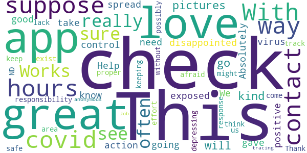

> Help  :date: __2020-09-15 03:29:55__

> This app was no good it gave me covid  :date: __2020-09-04 02:48:59__

> We all need to take positive action to control the spread of the virus. It is our responsibility to keep us all safe.  :date: __2020-08-26 01:46:46__

> With ND's depressing lack of proper response to COVID-19, I was afraid this might not exist for the area. Thank you.  :date: __2020-08-23 22:43:40__

> I think this is a great way of keeping track of where you have been and who you could possibly come into contact with, without any effort.  :date: __2020-08-22 02:56:05__

> This is an anonymous way of doing contact tracing. Great Job!  :date: __2020-08-21 04:42:54__

#### 4-star reviews

> Seems like a good app but here's a question, will this app be effective even though I am in Colorado? Will it be effective in another state  :date: __2020-09-27 10:53:58__

> Add support for SD, please!  :date: __2020-09-10 00:36:08__

#### 3-star reviews

> Doesn't work in sd Edit: spelling  :date: __2020-08-22 04:10:15__

#### 2-star reviews

No recent reviews available with 2 stars.

#### 1-star reviews

> I didnt open it at all  :date: __2020-10-07 01:07:10__

> I see my review got deleted. Here is my thoughts. I have to turn off and on wifi with bluetooth all the time for a chance for this app to work and log. Please allow the app to control Bluetooth and notify when it isnt truly working and option to turn on and off bluetooth automatically for it to work. Simple programing and still not working right.  :date: __2020-10-06 16:32:34__

> Disappointed...was exposed to person on 22nd...who began symptoms on 24th, tested positive on 25th. I was notified by state as a close contact (within 48 hours of symptoms) and to quarantine 14 days. We both have the apps on phones and Bluetooth turned on. The positive person 'notify button' was not activated until 30th. I received zero notification from the app. Needs some work from what I experienced.  :date: __2020-09-03 23:45:33__

> Contacted the developers asking why Wyoming residents need to contact the Wisconsin department of health as stated on the "notify" screen. Received a canned response that had nothing to do with my question.  :date: __2020-08-24 18:12:21__

> Should not have a location requirement! More coerced privacy invasion from Google APIs.  :date: __2020-08-18 19:24:56__

# Credits

This project makes use of the following main third-party projects:
* Androguard: [https://github.com/androguard/androguard](https://github.com/androguard/androguard)
* Androwarn: [https://github.com/maaaaz/androwarn](https://github.com/maaaaz/androwarn)
* google_play_scraper: [https://github.com/JoMingyu/google-play-scraper](https://github.com/JoMingyu/google-play-scraper)
* whois: [https://github.com/DannyCork/python-whois](https://github.com/DannyCork/python-whois)
* BeautifulSoup: [https://www.crummy.com/software/BeautifulSoup](https://www.crummy.com/software/BeautifulSoup)

Other open-source projects used in this project include: 

- androguard==3.3.5
- appnope==0.1.0
- asn1crypto==1.3.0
- backcall==0.1.0
- beautifulsoup4==4.9.0
- bs4==0.0.1
- certifi==2020.4.5.1
- cffi==1.14.0
- chardet==3.0.4
- click==7.1.2
- colorama==0.4.3
- cryptography==2.9.2
- cycler==0.10.0
- decorator==4.4.2
- future==0.18.2
- google-play-scraper==0.1.1
- idna==2.9
- ipython==7.13.0
- ipython-genutils==0.2.0
- jedi==0.17.0
- Jinja2==2.11.2
- joblib==0.14.1
- kiwisolver==1.2.0
- lxml==4.5.0
- MarkupSafe==1.1.1
- matplotlib==3.2.1
- networkx==2.4
- nltk==3.5
- numpy==1.18.3
- parso==0.7.0
- pexpect==4.8.0
- pickleshare==0.7.5
- Pillow==7.1.2
- play-scraper==0.6.0
- prompt-toolkit==3.0.5
- ptyprocess==0.6.0
- pycountry==19.8.18
- pycparser==2.20
- pydot==1.4.1
- Pygments==2.6.1
- pyOpenSSL==19.1.0
- pyparsing==2.4.7
- python-dateutil==2.8.1
- regex==2020.4.4
- requests==2.23.0
- requests-futures==1.0.0
- six==1.14.0
- soupsieve==2.0
- tld==0.12.1
- tqdm==4.45.0
- traitlets==4.3.3
- urllib3==1.25.9
- wcwidth==0.1.9
- wordcloud==1.7.0

