# COVID-related Android apps in US

Author: `Ivano Malavolta` (ivanomalavolta@gmail.com)

Created at: `2020/11/22`

Report generated by the [covid-apps-observer](http://github.com/covid-apps-observer) project, version 0.1

# Table of contents 

- [Background](#background)
    * [Data sources and analyses](#data-sources-and-analyses)
        * [App metadata](#app-metadata)
        * [Requested permissions](#requested-permissions)
        * [Mentioned servers](#mentioned_servers)
        * [Security analysis](#security_analysis)
        * [User ratings and reviews](#user-ratings-and-reviews)
    * [Disclaimer](#disclaimer)
- [Care19 Diary](#care19-diary)
- [FEMA](#fema)
- [CDC](#cdc)
- [CRUSH COVID RI](#crush-covid-ri)
- [Covid Watch Arizona](#covid-watch-arizona)
- [COVIDWISE](#covidwise)
- [Covid Trace Nevada](#covid-trace-nevada)
- [Covid Alert DE](#covid-alert-de)
- [Guam Covid Alert](#guam-covid-alert)
- [CombatCOVID PBC](#combatcovid-pbc)
- [Care19 Alert](#care19-alert)
- [MI COVID Alert](#mi-covid-alert)
- [CombatCOVID MDC](#combatcovid-mdc)
- [GuideSafe](#guidesafe)
- [COVID Alert CT](#covid-alert-ct)
- [COVID Alert NJ](#covid-alert-nj)
- [COVID Alert NY](#covid-alert-ny)
- [COVID Alert PA](#covid-alert-pa)
- [MD COVID Alert](#md-covid-alert)
- [DC CAN](#dc-can)
- [SlowCOVIDNC](#slowcovidnc)
- [CO Exposure Notifications](#co-exposure-notifications)
- [COVID Symptom Study](#covid-symptom-study)
- [Healthy Together - COVID-19](#healthy-together---covid-19)
- [COVID Coach](#covid-coach)
- [Kencor COVID-19](#kencor-covid-19)
- [COVID Control - A Johns Hopkins University Study](#covid-control---a-johns-hopkins-university-study)
- [MUSC COVID-19 Vital Link](#musc-covid-19-vital-link)
- [PathCheck SafePlaces](#pathcheck-safeplaces)
- [Sentinel Monitor (COVID-19 Management)](#sentinel-monitor-(covid-19-management))
- [Sydney Care](#sydney-care)
- [Doctor On Demand](#doctor-on-demand)
- [WebMD: Check Symptoms, Rx Savings, & Find Doctors](#webmd-check-symptoms-rx-savings--find-doctors)
- [myColorado](#mycolorado)
- [Amwell: Doctor Visits 24/7](#amwell-doctor-visits-24/7)
- [IU Health Virtual Visits: Online Doctor Visit](#iu-health-virtual-visits-online-doctor-visit)
- [HowWeFeel: The How We Feel Project](#howwefeel-the-how-we-feel-project)
- [HealthTap — 24/7 Telemedicine](#healthtap-—-24/7-telemedicine)
- [Gundersen VirtualVisit](#gundersen-virtualvisit)
- [Nemours CareConnect – See a Pediatrician 24/7](#nemours-careconnect-–-see-a-pediatrician-24/7)
- [NowClinic](#nowclinic)
- [Cleveland Clinic Express Care® Online](#cleveland-clinic-express-care®-online)
- [Genesis Convenient CareNow](#genesis-convenient-carenow)
- [MDLIVE: Talk to a Doctor 24/7](#mdlive-talk-to-a-doctor-24/7)
- [BronsonConnect Video Visit](#bronsonconnect-video-visit)
- [BCBSM Online Visits](#bcbsm-online-visits)
- [MU Health Care Video Visits](#mu-health-care-video-visits)
- [LiveHealth Online Mobile](#livehealth-online-mobile)
- [98point6](#98point6)
- [iBlueButton](#ibluebutton)
- [Penn State Health OnDemand](#penn-state-health-ondemand)
- [Coalition App | #StopCovid19](#coalition-app-|-stopcovid19)
- [Intermountain Connect Care](#intermountain-connect-care)
- [UW Medicine Virtual Clinic](#uw-medicine-virtual-clinic)
- [Baystate Health Connect](#baystate-health-connect)
- [Baptist Health Care On Demand](#baptist-health-care-on-demand)
- [Mend Telemedicine](#mend-telemedicine)
- [CityMD](#citymd)
- [herOptions](#heroptions)

- [Credits](#credits)

# How to read this report

This report has been generated by the [covid-apps-observer](http://github.com/covid-apps-observer) project. The project automatically analyzes the apps by extracting information which is already publicly available either on the web or in the apps binary files. 

Our analysis covers the following apps:
| | |
|-------------------------|-------------------------| 
|  | Care19 Diary
|  | FEMA
|  | CDC
|  | CRUSH COVID RI
|  | Covid Watch Arizona
|  | COVIDWISE
|  | Covid Trace Nevada
|  | Covid Alert DE
|  | Guam Covid Alert
|  | CombatCOVID PBC
|  | Care19 Alert
|  | MI COVID Alert
|  | CombatCOVID MDC
|  | GuideSafe
|  | COVID Alert CT
|  | COVID Alert NJ
|  | COVID Alert NY
|  | COVID Alert PA
|  | MD COVID Alert
|  | DC CAN
|  | SlowCOVIDNC
|  | CO Exposure Notifications
|  | COVID Symptom Study
|  | Healthy Together - COVID-19
|  | COVID Coach
|  | Kencor COVID-19
|  | COVID Control - A Johns Hopkins University Study
|  | MUSC COVID-19 Vital Link
|  | PathCheck SafePlaces
|  | Sentinel Monitor (COVID-19 Management)
|  | Sydney Care
|  | Doctor On Demand
|  | WebMD: Check Symptoms, Rx Savings, & Find Doctors
|  | myColorado
|  | Amwell: Doctor Visits 24/7
|  | IU Health Virtual Visits: Online Doctor Visit
|  | HowWeFeel: The How We Feel Project
|  | HealthTap — 24/7 Telemedicine
|  | Gundersen VirtualVisit
|  | Nemours CareConnect – See a Pediatrician 24/7
|  | NowClinic
|  | Cleveland Clinic Express Care® Online
|  | Genesis Convenient CareNow
|  | MDLIVE: Talk to a Doctor 24/7
|  | BronsonConnect Video Visit
|  | BCBSM Online Visits
|  | MU Health Care Video Visits
|  | LiveHealth Online Mobile
|  | 98point6
|  | iBlueButton
|  | Penn State Health OnDemand
|  | Coalition App | #StopCovid19
|  | Intermountain Connect Care
|  | UW Medicine Virtual Clinic
|  | Baystate Health Connect
| 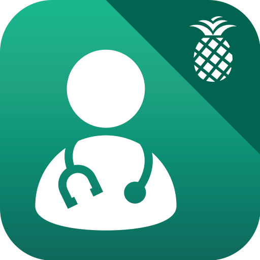 | Baptist Health Care On Demand
|  | Mend Telemedicine
|  | CityMD
|  | herOptions

The details of our analysis are presented in the remainder of this report.

For independent verification, the raw data and the source code of the project is publicly available in its GitHub repository [http://github.com/covid-apps-observer](http://github.com/covid-apps-observer) and its source code has been thoroughly commented in order to provide all the details about how the information provided in this report has been extracted. 

Any feedback, questions, and improvements about the project are very welcome, feel free to create an issue or pull request directly in its GitHub repository: [http://github.com/covid-apps-observer](http://github.com/covid-apps-observer).

## Data sources and analyses

The analysis of each app is structured around five main dimensions: 
* App metadata  
* Requested permissions
* Mentioned servers
* Androwarn analysis
* User ratings and reviews

In the following we describe the data sources and analysis performed for each dimension.

### App metadata

App metadata includes an overview of the main information about the app (for example, its name, releases, privacy policy, etc.), contact information of the development team, and the various Android versions supported by the app. This information is extracted from two main data sources:
* _Google Play store_: we automatically mined the web page of the Google Play store showing the basic information about the app and we parsed it in order to extract information about the app and development team 
* _Android Manifest file_: in our analysis we decompiled the binary file of the app (it is similar to a Zip archive but it contains the code of the app instead of normal files) and we extracted information about the supported Android versions, as it has been listed by its development team.

The extracted app metadata feeds the _App overview_, _Development team_, and _Android support_ sections of this report.
We make use of the [google-play-scraper](https://github.com/JoMingyu/google-play-scraper) tool for extracting the raw data related to this dimension of the project.

### Requested permissions

The Android operating system has a permission model which allows users to grant access to potentially privacy-related information. Every Android app has to explictly declare the permissions it needs to properly function in the Android Manifest file.  

In this report we also show the protection level of each permission, which is a key information for understanding how the requested permissions related to the user's privacy. We carefully analyzed the [official Android documentation (v. 29)](https://developer.android.com/reference/android/Manifest.permission), and it resulted that a permission requested by an Android app can belong to the following protection levels:
* **Dangerous**: higher-risk permissions that would give a requesting app access to private user data or control over the device that can negatively impact the user. Because this type of permission introduces potential risk, the system usually does not automatically grant it to the requesting app. For example, any dangerous permissions requested by an app may be displayed to the user and require confirmation before proceeding.
* **Normal**: this is the default and most common level in Android; normal permissions are lower-risk and give access to isolated app-level features, with minimal risk to other apps, the system, or the user. 
* **Signature**: permissions granted only if the requesting app is signed with the same certificate as the app that declared the permission
* **Appop**: old permission level, a reminiscence of the App Ops tool that Google introduced in Android 4.3.
* **Development**: optional permissions which can be granted to development-oriented apps.
* **Privileged**: permissions who give higher power to mobile apps w.r.t. other apps, such as binding to incoming calls, interacting via bluetooth with other devices without user interaction, etc.
* **Preinstalled**: reserved only for preinstalled apps
* **Installer**: allow the holder to start the permission usage screen for an app
* **RetailDemo**: permissions related to devices used in demonstrations in shops.
* **Pre23**: permissions automatically granted to apps targeting devices running pre-6.0 Android.
* **Upcoming**: permissions which will be released in the next version of the Android platform. 
* **Deprecated**: permissions belonging to old releases of the Android platform, they should not be used by developers since they will not be supported in the near future.
* **Not for use by third-party applications**: permissions which can be requested only by apps developed by Google.
* **Undefined**: this protection level is not documented by Google.

The permissions dimension of this project is based on the [Androguard](https://github.com/androguard/androguard) static analysis tool.

### Mentioned servers

We decompiled each app in order to look for all possible mentions of remote URLs. The mentioned URLs can refer to remote servers the the app is using for either sending or receiving information, web addresses for directing the user to an information website, and so on. 

:warning: It is important to note that this analysis is not meant to be complete and it is very prone to obfuscation. The servers reported here are simply _mentioned_ somewhere in the code of the app and are meant to just give an indication about the "hooks" of the app towards external resources. For example, for an Android app it is normal to contact Google services in order to send/receive push notifications, or to contact the servers of analytics services for having real-time diagnostics about crashes of the app or bugs.

This part of the analysis is based on the [Androguard](https://github.com/androguard/androguard) static analysis tool for identfying the raw URLs mentioned in the app; then, the information about each mentioned server is collected by performing a _whois_ lookup on the first-level domain present in the URL.

### Security analysis

This dimension is based on the [Androwarn](https://github.com/maaaaz/androwarn) structural and data flow analysis of Android bytecode. Androwarn is developed by the University of Lyon/INSA (France) and it has been used in several academic studies. According to its documentation, Androwarn targets the following categories of potential security issues:
* **Telephony identifiers exfiltration**: IMEI, IMSI, MCC, MNC, LAC, CID, operator's name, etc.
* **Device settings exfiltration**: software version, usage statistics, system settings, logs, etc.
* **Geolocation information leakage**: GPS/WiFi geolocation, etc.
* **Connection interfaces information exfiltration**: WiFi credentials, Bluetooth MAC adress, etc.
* **Telephony services abuse**: premium SMS sending, phone call composition, etc.
* **Audio/video flow interception**: call recording, video capture, etc.
* **Remote connection establishment**: socket open call, Bluetooth pairing, APN settings edit, etc.
* **PIM data leakage**: contacts, calendar, SMS, mails, clipboard, etc.
* **External memory operations**: file access on SD card, etc.
* **PIM data modification**: add/delete contacts, calendar events, etc.
* **Arbitrary code execution**: native code using JNI, UNIX command, privilege escalation, etc.
* **Denial of Service**: event notification deactivation, file deletion, process killing, virtual keyboard disable, terminal shutdown/reboot, etc.

Note: We do not consider this data point in the current version of our analyzers since it is too verbose for our purposes.

:warning: It is important to note that Androwarn is a static analysis tool, and as such it performs a variety of heuristics and approximations in its analyses. Said that, the results shown in this report are meant to provide an indication of _potential_ security issues and should be by no means treated as complete and correct.   

### User ratings and reviews

For this dimension we turn again to the web interface of the Google Play store. Firstly, we automatically mine summary statistics about user ratings from the web page of the app under analysis; then, we automatically download the newest 1000 reviews of the app under analysis. For each level of rating (5 stars, 4 stars, , etc., 1 star) we show:
- a word cloud presenting the main terms used by end users in their reviews in the Google Play store
- the last 10 reviews provided by app users in the Google Play store. 

This purposefully simple analysis is meant to help both future users and the development team of the app in understanding what are the main positive and negative points of the app under analysis.

We make use of the [google-play-scraper](https://github.com/JoMingyu/google-play-scraper) tool for extracting the raw data related to this dimension of the project.

## Disclaimer 

This report has been produced independently of any parties and its only objective is to help anybody in better understanding how COVID-related apps work in practice (and compare to each other). The results of this report are limited to the specific version of the software used for running the analyses and on the various heuristics implemented in there. In other words, the results of the analyzers may differ depending on the time and modalities in which they are executed. We do not guarantee that the results of the analyses and the corresponding contents of this report are fully complete or correct. The analysis software is licensed under the [MIT License](https://github.com/iivanoo/covid-apps-observer/blob/master/LICENSE).

# Care19 Diary
App version ``3.1``

Analyzed with [covid-apps-observer](http://github.com/covid-apps-observer) project, version ``0.1``

## App overview
| | |
|-------------------------|-------------------------| 
| **Name**&nbsp;&nbsp;&nbsp;&nbsp;&nbsp;&nbsp;&nbsp;&nbsp;&nbsp;&nbsp;&nbsp;&nbsp;&nbsp;&nbsp;&nbsp;&nbsp;&nbsp;&nbsp;&nbsp;&nbsp;&nbsp;&nbsp;&nbsp;&nbsp;&nbsp;&nbsp;&nbsp;&nbsp;&nbsp;&nbsp;&nbsp;&nbsp;&nbsp;&nbsp;&nbsp;&nbsp;&nbsp;&nbsp;&nbsp;&nbsp;  | Care19 Diary |
| **Unique identifier** | com.proudcrowd.care |
| **Link to Google Play** | [https://play.google.com/store/apps/details?id=com.proudcrowd.care](https://play.google.com/store/apps/details?id=com.proudcrowd.care) |
| **Summary**  | You can help stop the spread of Covid-19 |
| **Privacy policy** | [https://care19.app/privacy](https://care19.app/privacy) |
| **Latest version** | 3.1 |
| **Last update** | 2020-06-26 17:01:47 |
| **Recent changes** | Fix a bug where manually added visits could display a month off. |
| **Installs**  | 10,000+ |
| **Category** | Medical |
| **First release** | Apr 19, 2020 |
| **Size**  | 5.5M |
| **Supported Android version**  | 6.0 and up |

### Description
> Care19 is the official COVID-19 app for the states of South Dakota and North Dakota.  It can be used with reduced functionality in other US states.
 A key part of the contact tracing process is remembering where you have been over the last 5-10 days before testing positive.  This helps contact tracers determine people you may have been near while you were infectious. 
 Care19 is a digital diary that records places you visit.  Many of the places you visit can be recorded automatically by Care19 using the phone's location services.  In some cases you may need to manually add an entry if the automated routines miss a place visit.  This can happen based on a variety of environmental factors.
 You will not be asked to provide any personally identifiable information within the app. Location data will only be shared with the North Dakota or South Dakota Department of Health if you consent upon testing positive for COVID-19. This is done by sharing a code number displayed on the “About” section of the app.  
 If you use the Care19 app outside of North and South Dakota it can be used as a memory aide if you test positive and are contacted by your state's Department of Health.

### User interface
The developers of the app provide the following screenshots in the Google play store.
| | | |
|:-------------------------:|:-------------------------:|:-------------------------:|
 |   |   |   | 
 |  

## Development team
In the following we report the main information provided by the development team in the Google play store.

| | |
|-------------------------|-------------------------|
| **Developer**  | ProudCrowd, LLC |
| **Website**  | [https://www.care19.app](https://www.care19.app) |
| **Email** | tim.brookins@proudcrowd.com |
| **Physical address**  | - |
| **Other developed apps**  | [https://play.google.com/store/apps/developer?id=ProudCrowd,+LLC](https://play.google.com/store/apps/developer?id=ProudCrowd,+LLC) |

## Android support

| | |
|-------------------------|-------------------------|
| **Declared target Android version**  | Android10, version 10 (API level 29) |
| **Effective target Android version**  | Android10, version 10 (API level 29) |
| **Minimum supported Android version**  | Marshmallow, version 6.0 (API level 23) |
| **Maximum target Android version**  | - |

The larger the difference between the minimum and maximum supported Android versions, the better. A larger difference means a wider audience. For example, old phones have a very low Android version, so a high minimum supported Android version means that the app cannot be used by users with old phones, thus leading to accessibility problems. 

## Requested permissions

In the following we report the complete list of the permissions requested by the app. 

| **Permission** | **Protection level** | **Description** | 
|-------------------------|-------------------------|-------------------------|
 **android.permission ACCESS_BACKGROUND_LOCATION** | :warning:**Dangerous** | Allows an app to access location in the background. 
 **android.permission ACCESS_COARSE_LOCATION** | :warning:**Dangerous** | Allows an app to access approximate location. 
 **android.permission ACCESS_FINE_LOCATION** | :warning:**Dangerous** | Allows an app to access precise location. 
 **android.permission ACCESS_NETWORK_STATE** | Normal | Allows applications to access information about networks. 
 **android.permission ACTIVITY_RECOGNITION** | :warning:**Dangerous** | Allows an application to recognize physical activity. 
 **android.permission FOREGROUND_SERVICE** | Normal | Allows a regular application to use Service.startForeground. 
 **android.permission INTERNET** | Normal | Allows applications to open network sockets. 
 **android.permission RECEIVE_BOOT_COMPLETED** | Normal | Allows an application to receive the Intent.ACTION_BOOT_COMPLETED that is broadcast after the system finishes booting. 
 **android.permission WAKE_LOCK** | Normal | Allows using PowerManager WakeLocks to keep processor from sleeping or screen from dimming. 
 **com.google.android.c2dm.permission RECEIVE** | - | - 
 **com.google.android.finsky.permission BIND_GET_INSTALL_REFERRER_SERVICE** | - | - 
 **com.google.android.gms.permission ACTIVITY_RECOGNITION** | - | - 

## Mentioned servers

| **Server** | **Registrant** | **Registrant country** | **Creation date** | 
|-------------------------|-------------------------|-------------------------|-------------------------|
 | bugfender.com | Beenario GmbH | :de: DE | 2014-10-28 11:32:13 |
 | googlesyndication.com | Google LLC | :us: US | 2003-01-21 06:17:24 |
 | google.com | Google LLC | :us: US | 1997-09-15 04:00:00 |
 | app-measurement.com | Google LLC | :us: US | 2015-06-19 20:13:31 |
 | azurewebsites.net | Microsoft Corporation | :us: US | 2012-01-24 18:43:51 |
 | crashlytics.com | Google LLC | :us: US | 2011-01-21 15:30:40 |
 | googleapis.com | Google LLC | :us: US | 2005-01-25 17:52:26 |
 | googleadservices.com | Google LLC | :us: US | 2003-06-19 16:34:53 |

## Security analysis 

Below we report the main security warnings raised by our execution of the [Androwarn](https://github.com/maaaaz/androwarn) security analysis tool.

**Telephony identifiers leakage**
> - This application reads the MCC+MNC of the provider of the SIM 
> - This application reads the Service Provider Name (SPN) 
> - This application reads the numeric name (MCC+MNC) of current registered operator 
> - This application reads the operator name 

**Connection interfaces exfiltration**
> - This application reads details about the currently active data network 
> - This application tries to find out if the currently active data network is metered 

**Suspicious connection establishment**
> - This application opens a Socket and connects it to the remote address ' returned no addresses for  ; port is out of range' on the 'N/A' port  
> - This application opens a Socket and connects it to the remote address '' on the 'N/A' port  
> - This application opens a Socket and connects it to the remote address 'Ljava/lang/StringBuilder;->toString()Ljava/lang/String;' on the 'N/A' port  
> - This application opens a Socket and connects it to the remote address 'Ljava/net/Proxy;->type()Ljava/net/Proxy$Type;' on the 'N/A' port  
> - This application opens a Socket and connects it to the remote address 'timeout' on the 'N/A' port  

**Code execution**
> - This application executes a UNIX command containing this argument: 'logcat -c 2' 
> - This application executes a UNIX command containing this argument: 'logcat -c' 

## User ratings and reviews

Below we provide information about how end users are reacting to the app in terms of ratings and reviews in the Google Play store.

### Ratings

The Care19 Diary app has been installed by more than **10000** times. At this time, **194** rated the app and its average score is **2.55**. Below we show the distribution of the ratings across the usual star-based rating of Google Play

:star::star::star::star::star:: 58

:star::star::star::star:: 5

:star::star::star:: 13

:star::star:: 23

:star:: 93

### Reviews 

#### 5-star reviews

> Oh yeah all good  :date: __2020-08-27 06:36:26__

> Good  :date: __2020-08-02 22:27:07__

> Please help charlie foxtrot googlemaps Meunstergritsandassociatesllc 442 blanding blvd 333 ORANGEPARK,FL 32073  :date: __2020-07-18 21:29:25__

> Updated daily. Easy to use and informative.  :date: __2020-06-23 15:03:08__

> Cool  :date: __2020-06-20 05:50:45__

> Good idea  :date: __2020-06-20 00:01:28__

> Good  :date: __2020-06-16 20:33:40__

> Nudes help  :date: __2020-06-11 01:24:14__

> Awesome  :date: __2020-05-17 11:47:26__

> Love this app  :date: __2020-05-16 12:11:08__

#### 4-star reviews

> This picks up most of the places I go, and I check when I get home so I can add places it has missed or change inaccurate locations, which only happens when I am in an area with a lot of stores, like a plaza. My home state has not chosen an app so I use this one.  :date: __2020-07-10 22:03:28__

> I just dont have room on my phone:(  :date: __2020-07-06 11:55:41__

> Remember this is for north & south Dakota only.. other states will may add their state if they choose too. It will show other states but will not guarantee it at this time  :date: __2020-06-20 21:46:43__

> The early release back in April was rough (didn't log any stops for me). But it's been working well for me since about May 4. It occasionally logs more than one stop at the same location. It occasionally gets the name of the location wrong, but this is very easy to correct.  :date: __2020-05-19 06:25:30__

> It is great, it works, and I am excited for updates!  :date: __2020-04-29 03:31:46__

#### 3-star reviews

> You should be able to type in a location when it gets it wrong. Sometimes there is no option for where you are.  :date: __2020-10-22 06:04:00__

> After multiple attempts, this app cannot determine my home location. Uninstalling. UPDATE 10/21/20 - It can now find my home location. Up to 3 stars. I do not see how I can see the list of locations myself.  :date: __2020-10-21 15:32:52__

> Every couple of weeks it takes a day off & doesn't show any locations at all for that day.  :date: __2020-09-25 02:59:05__

> How long do the places you visit stay on the app? Mine seem to show maybe only previous 10 days.  :date: __2020-08-13 23:41:30__

> Doesn't this app use the Contact Tracking System that Apple and Google developed?  :date: __2020-06-02 15:29:17__

> Simple app. Does what it was designed for but little else. Misses many locations and frequently has location accuracy issues. Routinely misses my home by 6 blocks. Says I have visited locations I have just driven past. Would be nice to have ability to add locations that I visited but app failed to record.  :date: __2020-05-22 15:52:32__

> Still isn't capturing places I've been. Was at 3 different locations today, and not one of them showing up.  :date: __2020-05-20 23:03:13__

> Very inconsistent with location. Can be at a location for hours and doesn't list it.  :date: __2020-05-16 15:20:52__

> It's a great idea, but does not log most of the places I've been. Stopped at 6 places in Bismarck and didn't log one place. And then the next time it will log the same place 4 times within a few minutes or log a place I only drove by.  :date: __2020-05-14 02:20:12__

> I hope this helps people but there are definitely a lot of bugs  :date: __2020-05-04 05:28:59__

#### 2-star reviews

> Each week, 2 out of the 5 days I'm at work there's no entry. Yesterday it showed me in the middle of road halfway to work for 8.5 hours. If I stop somewhere on my way home from work, half the time it misses it. I have a Pixel 3 XL. I want to have this app work.  :date: __2020-10-28 23:21:53__

> App runs unnoticeably in the background. However, requires constant maintenance. If I go more than 2-3 days without monitoring the app, I find that it stops tracking my locations, at which point I need to go back through all intro screens as if I just installed the app (Region, Consent, Home location, etc). Back arrow on Android while in the Places You've Visited will also return to the initial menu and require passing through all intro screens again, or app will not resume tracking. Should have a warning, and consent/home location should be saved in a more permanent cache.  :date: __2020-09-26 21:23:18__

> Doesn't catch all locations, and it recorded a one hour visit to one store as 12 minutes, then would not allow correction.  :date: __2020-09-21 13:10:23__

> Quit recording anything after about three weeks.  :date: __2020-07-26 05:30:54__

> Inaccurate didn't track me for days sometimes. Uninstalled it, that bad.  :date: __2020-07-19 03:31:36__

> Location info is incorrect and incomplete. I was able to fix the incorrect info, but can't add locations. Uninstalled and reinstalled on 6/24. Tracked my location until 6/27 then nothing.  :date: __2020-07-07 17:28:05__

> Gives a lot of erroneous locations that are passed while driving or stopping at a stop light. Some days it gives no information at all.. i reloaded it a couple of weeks ago. It worked well until July 3 then quit working, not registering any locations.  :date: __2020-07-04 20:23:07__

> Idk procedure to get my phone to let this work automatically in the background, out on the east coast  :date: __2020-07-02 20:56:10__

> It's not all that  :date: __2020-06-18 15:59:46__

> Not very accurate for locations. It does not show several places my wife & I have been for an hour or more and it shows us stopping at places we only drove passed on our way to our destination that does not show up. Very inaccurate. It's the same on both of our phones (Galaxy Note 9's). There is no way to add the places we did go to, only to delete the irrelevant ones or change the name from "Unknown" to a proper name. It's pointless/useless for tracking when this inaccurate.  :date: __2020-06-05 01:20:41__

#### 1-star reviews

> Play store cannot download it..hacked account  :date: __2020-11-13 02:37:16__

> Not accurate very often. Going to delete as it is more trouble than keeping a written log.  :date: __2020-10-28 21:22:35__

> Poorest design. Does not "track" movement via gps, does not allow quick add (referencing gps) feature. Does not have "end at home". Thus know how long.. at one location or unable to determine greater than 20 mph driving. Becomes indicator leaving location.  :date: __2020-09-28 04:32:05__

> Has me consistently at a location across town I'm never at.  :date: __2020-09-12 07:14:54__

> Privacy  :date: __2020-08-27 22:42:43__

> Does not automatically track as it says it will. Also, I can enter manually in my phone but my wife's phone cannot manually input as the app freezes when she puts in date from calendar. Uninstalled and reinstalled the app but still have same problems.  :date: __2020-08-16 17:20:12__

> utTý5hat's drive changes b  :date: __2020-08-14 22:35:18__

> Edit: 8.10.20 Still same problems. If battery saver is issue, fix it. Update 6.27.20 - Tou can tell the developer(s) doesnt even use this app or they would know what we are talking about. You say it's just the way it is, no, you know how it's supposed to work, so find someone to make it work correctly. This app does not trace where I been going. It does not stay open in the background. When open, it does not show where I go or been since the 23rd. I restarted phone and reinstalled app on S9+  :date: __2020-08-11 03:56:40__

> Uninstall. I didn't put it in  :date: __2020-08-04 19:20:34__

> Doesn't do anything that Google Maps My Timeline can't do better. Maybe in a state with a competent health department it could. As I understand it in incompetent SC, it won't even do Bluetooth ID exchanges with other devices for contact tracing.  :date: __2020-07-30 01:57:38__

# FEMA
App version ``2.11.2``

Analyzed with [covid-apps-observer](http://github.com/covid-apps-observer) project, version ``0.1``

## App overview
| | |
|-------------------------|-------------------------| 
| **Name**&nbsp;&nbsp;&nbsp;&nbsp;&nbsp;&nbsp;&nbsp;&nbsp;&nbsp;&nbsp;&nbsp;&nbsp;&nbsp;&nbsp;&nbsp;&nbsp;&nbsp;&nbsp;&nbsp;&nbsp;&nbsp;&nbsp;&nbsp;&nbsp;&nbsp;&nbsp;&nbsp;&nbsp;&nbsp;&nbsp;&nbsp;&nbsp;&nbsp;&nbsp;&nbsp;&nbsp;&nbsp;&nbsp;&nbsp;&nbsp;  | FEMA |
| **Unique identifier** | gov.fema.mobile.android |
| **Link to Google Play** | [https://play.google.com/store/apps/details?id=gov.fema.mobile.android](https://play.google.com/store/apps/details?id=gov.fema.mobile.android) |
| **Summary**  | Weather alerts, safety tips and more to help before, during &amp; after disasters. |
| **Privacy policy** | [http://www.fema.gov/privacy-policy](http://www.fema.gov/privacy-policy) |
| **Latest version** | 2.11.2 |
| **Last update** | 2020-10-27 19:44:12 |
| **Recent changes** | - Bug fix for reminders on Android 10 |
| **Installs**  | 1,000,000+ |
| **Category** | Weather |
| **First release** | Aug 24, 2011 |
| **Size**  | 3.4M |
| **Supported Android version**  | 4.4 and up |

### Description
> Emergency alerts, safety tips and resources to help before, during & after disasters.
 The FEMA App provides timely alerts and useful information to help you and your loved ones stay safe before, during and after disasters. Receive and share real-time notifications about disasters, severe weather, and other emergencies for up to five locations nationwide. This simple and easy-to-use resource also provides safety information, emergency preparedness tips, and disaster assistance.
 Features 
 •    Receive emergency alerts for up to five locations nationwide 
 •    Share real-time notifications with loved ones via text, email and social media
 •    Know what to do before, during, and after disasters, like earthquakes, wildfires, hurricanes, snowstorms, tornadoes, volcanoes, and more
 •    Prepare for disasters with an emergency kit checklist, emergency family plan, and reminders
 •    Locate open emergency shelters in your area
 •    Locate Disaster Recovery Centers near you where you can talk to a FEMA representative in person
 •    Connect with FEMA to apply for disaster assistance online
 •    Safety tips and disaster information available in English and Spanish (Note: alerts are only available in English)
 •    Follow the FEMA blog to learn about disaster response and recovery across the United States
 Terms of use: www.fema.gov/app.

### User interface
The developers of the app provide the following screenshots in the Google play store.
| | | |
|:-------------------------:|:-------------------------:|:-------------------------:|
 |   |   |   | 
 |   |   |   | 
 |   | 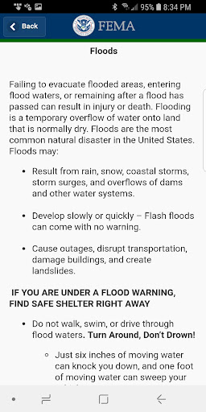  |   | 
 |   |   |   | 
 |   |   |   | 
 |   |   |   | 
 |   |   |   | 
 |  

## Development team
In the following we report the main information provided by the development team in the Google play store.

| | |
|-------------------------|-------------------------|
| **Developer**  | Federal Emergency Management Agency (FEMA) |
| **Website**  | [http://www.fema.gov](http://www.fema.gov) |
| **Email** | FEMA-New-Media@fema.dhs.gov |
| **Physical address**  | - |
| **Other developed apps**  | [https://play.google.com/store/apps/developer?id=Federal+Emergency+Management+Agency+(FEMA)](https://play.google.com/store/apps/developer?id=Federal+Emergency+Management+Agency+(FEMA)) |

## Android support

| | |
|-------------------------|-------------------------|
| **Declared target Android version**  | Pie, version 9 (API level 28) |
| **Effective target Android version**  | Pie, version 9 (API level 28) |
| **Minimum supported Android version**  | KitKat, version 4.4 - 4.4.4 (API level 19) |
| **Maximum target Android version**  | - |

The larger the difference between the minimum and maximum supported Android versions, the better. A larger difference means a wider audience. For example, old phones have a very low Android version, so a high minimum supported Android version means that the app cannot be used by users with old phones, thus leading to accessibility problems. 

## Requested permissions

In the following we report the complete list of the permissions requested by the app. 

| **Permission** | **Protection level** | **Description** | 
|-------------------------|-------------------------|-------------------------|
 **android.permission ACCESS_COARSE_LOCATION** | :warning:**Dangerous** | Allows an app to access approximate location. 
 **android.permission ACCESS_FINE_LOCATION** | :warning:**Dangerous** | Allows an app to access precise location. 
 **android.permission ACCESS_NETWORK_STATE** | Normal | Allows applications to access information about networks. 
 **android.permission INTERNET** | Normal | Allows applications to open network sockets. 
 **android.permission READ_APP_BADGE** | - | - 
 **android.permission RECEIVE_BOOT_COMPLETED** | Normal | Allows an application to receive the Intent.ACTION_BOOT_COMPLETED that is broadcast after the system finishes booting. 
 **android.permission VIBRATE** | Normal | Allows access to the vibrator. 
 **android.permission WAKE_LOCK** | Normal | Allows using PowerManager WakeLocks to keep processor from sleeping or screen from dimming. 
 **com.anddoes.launcher.permission UPDATE_COUNT** | - | - 
 **com.google.android.c2dm.permission RECEIVE** | - | - 
 **com.google.android.finsky.permission BIND_GET_INSTALL_REFERRER_SERVICE** | - | - 
 **com.htc.launcher.permission READ_SETTINGS** | - | - 
 **com.htc.launcher.permission UPDATE_SHORTCUT** | - | - 
 **com.huawei.android.launcher.permission CHANGE_BADGE** | - | - 
 **com.huawei.android.launcher.permission READ_SETTINGS** | - | - 
 **com.huawei.android.launcher.permission WRITE_SETTINGS** | - | - 
 **com.majeur.launcher.permission UPDATE_BADGE** | - | - 
 **com.oppo.launcher.permission READ_SETTINGS** | - | - 
 **com.oppo.launcher.permission WRITE_SETTINGS** | - | - 
 **com.sec.android.provider.badge.permission READ** | - | - 
 **com.sec.android.provider.badge.permission WRITE** | - | - 
 **com.sonyericsson.home.permission BROADCAST_BADGE** | - | - 
 **com.sonymobile.home.permission PROVIDER_INSERT_BADGE** | - | - 
 **me.everything.badger.permission BADGE_COUNT_READ** | - | - 
 **me.everything.badger.permission BADGE_COUNT_WRITE** | - | - 

## Mentioned servers

| **Server** | **Registrant** | **Registrant country** | **Creation date** | 
|-------------------------|-------------------------|-------------------------|-------------------------|
 | googlesyndication.com | Google LLC | :us: US | 2003-01-21 06:17:24 |
 | google.com | Google LLC | :us: US | 1997-09-15 04:00:00 |
 | google-analytics.com | Google LLC | :us: US | 2005-07-18 19:24:32 |
 | app-measurement.com | Google LLC | :us: US | 2015-06-19 20:13:31 |
 | googletagmanager.com | Google LLC | :us: US | 2011-11-11 23:39:05 |
 | gstatic.com | Google LLC | :us: US | 2008-02-11 15:31:25 |
 | whatsapp.com | Whatsapp Inc. | :us: US | 2008-09-04 12:39:12 |
 | googleapis.com | Google LLC | :us: US | 2005-01-25 17:52:26 |
 | googleadservices.com | Google LLC | :us: US | 2003-06-19 16:34:53 |

## Security analysis 

Below we report the main security warnings raised by our execution of the [Androwarn](https://github.com/maaaaz/androwarn) security analysis tool.

**Connection interfaces exfiltration**
> - This application reads details about the currently active data network 
> - This application tries to find out if the currently active data network is metered 

**Telephony services abuse**
> - This application makes phone calls 

**Code execution**
> - This application loads a native library: 'sqlc-native-driver' 

## User ratings and reviews

Below we provide information about how end users are reacting to the app in terms of ratings and reviews in the Google Play store.

### Ratings

The FEMA app has been installed by more than **1000000** times. At this time, **3525** rated the app and its average score is **4.1988635**. Below we show the distribution of the ratings across the usual star-based rating of Google Play

:star::star::star::star::star:: 2305

:star::star::star::star:: 390

:star::star::star:: 390

:star::star:: 110

:star:: 330

### Reviews 

#### 5-star reviews

> Very good 👍👍  :date: __2020-11-20 07:42:31__

> This is one of the essential apps.  :date: __2020-11-19 15:28:00__

> what does this stand for... anyway ty and lúvu  :date: __2020-11-17 07:33:50__

> Great  :date: __2020-11-15 19:38:04__

> A very helpful resource.  :date: __2020-11-11 21:17:34__

> It should always be an app like this for all phone carriers  :date: __2020-11-04 18:51:35__

> Major Investment To Have As An App /\ Highly Informative /\ Go Customize In Settings And Enjoy Being In The Knowing Before Even Local News ~ DJ Of Greater Boston Area Approves ~  :date: __2020-11-04 11:25:01__

> Love  :date: __2020-10-23 06:12:58__

> Easy and great ti yse...Thank you FEMA  :date: __2020-10-21 15:38:31__

> Awesome assistances programs  :date: __2020-10-21 07:44:28__

#### 4-star reviews

> App has grown over the years and I appreciate the work that has gone into making it. My alerts are timely for the different counties that I've entered. THAT being said: The app has the potential to be so much more. Save lives. Can you please make it less time consuming to use? When I travel I need to hear *alerts in the County I'm IN.* What I would like to see in an update is the use of GPS to alert me *wherever* I am. Also.. Why isn't anyone taking advantage of the Blog section?  :date: __2020-11-06 20:45:42__

> Decent at first glance  :date: __2020-09-27 05:28:47__

> Great app !!!!!!!!  :date: __2020-09-05 02:06:16__

> Overall decent, but I don't need 17 alerts in one hour for the same storm.  :date: __2020-08-24 01:10:21__

> It's missing the alerts Snow Squall Warning, Inland Hurricane Warning, Inland Hurricane Watch, Inland Tropical Storm Warning, and Inland Tropical Storm Watch.  :date: __2020-07-27 22:57:25__

> Fast reliablie services  :date: __2020-07-09 01:04:27__

> Great app.  :date: __2020-07-01 08:50:11__

> Great at giving alerts for different areas. Live posting during storms is excellent. Just be careful you don't list to many places to avoid constant updates.  :date: __2020-06-12 03:22:06__

> Only worth downloading if you're in a disaster situation. Otherwise it's not very useful.  :date: __2020-05-23 06:10:43__

> Extremely well covers high pop centers. However, little to no coverage in rural areas. We live in Benton County, MO...no coverage ANYWHERE here.  :date: __2020-05-22 15:48:47__

#### 3-star reviews

> Prepare: emergency safety tips: broken scroll and no clickables Squalls and snow squalls not listed  :date: __2020-11-09 10:47:12__

> They did not explain what she was asking me about and was real short with me . To me she was rude but I need my house fixed not TVs or other stuff like that but thank you for what you did do.  :date: __2020-10-26 19:49:29__

> Also I build homeless shelters and I think this would be the place to add my location make it official  :date: __2020-10-06 07:13:34__

> Works but would multiply the same alerts  :date: __2020-10-03 19:46:59__

> Sends out alerts as expected, but here's the issue. If I'm in another app (Facebook, e.g.), it won't override it, and there doesn't seem to be a way to get the alert within the actual app, so if you miss it... too bad. Also tried to pull up the app while roaming, and got a "no wifi" connection error. Who the hell has wifi during an emergency??? DO BETTER.  :date: __2020-09-13 18:35:21__

> Not enough details on alerts. Not worth the space on my phone  :date: __2020-09-11 00:11:01__

> Difficult to navigate and doesn't provide info I expected  :date: __2020-09-06 08:45:22__

> The type is thinner and less legible with this update. The unnecessary style change reduces its usefulness to me. Plus, I have not received alerts about the smoke in my area or the fires near me although I specified that in the settings. So I uninstalled it.  :date: __2020-08-21 06:13:51__

> No notification alarm!!  :date: __2020-08-13 18:12:50__

> where's the warnings I used to get  :date: __2020-06-24 02:29:53__

#### 2-star reviews

> No change. Even after clearing cache, rebooting phone, etc still getting multiples of same exact alerts and several alerts with little or no lead time. That's probably FEMA but still downgrades usefulness. So problematic that other weather apps are needed for safety.  :date: __2020-11-15 22:38:27__

> Once I sign in it then sends me a email code to sign in again.... To many steps  :date: __2020-09-19 20:23:31__

> Installed this app months ago and expected this would be the moment for it. I'm getting "red flag warnings" and "evacuation alerts" every few minutes (with no date or timestamp) that just say things like "GO NOW Eden Road" with a web link I can't click or copy. After switching back and forth between apps to type out it turns out it's a map and Eden Road is 60 miles away. You can't set alerts for regions smaller than the entire county. Evac notices also came through sooner with other services.  :date: __2020-09-12 07:56:04__

> What is it with this app. I've.been trying to download it for three days how long does it take to for it to download .we are about to be hit with a hurracain.this is messed.up  :date: __2020-08-23 03:40:24__

> This app did not help me.  :date: __2020-06-19 19:14:29__

> It really does do absolutely nothing. Not even sure why i have it  :date: __2020-04-28 15:16:55__

> Alerts are way too excessive.. It's a little windy in my area and I get notifications what feel like every 5 minutes. Had to delete the app because it was so annoying.  :date: __2020-04-10 21:47:54__

> It's a weather alert app. I'm getting constant weather alerts during a pandemic lockdown  :date: __2020-03-29 17:05:00__

> When I click on "Alerts," I get a message saying that I have to enable them in the app settings. But when I get into the settings, I can't find anything that does that.  :date: __2020-03-21 20:10:32__

> App does not give alerts. At one time it worked.  :date: __2019-06-18 03:25:56__

#### 1-star reviews

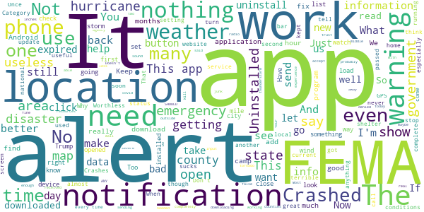

> NO ALERTS... APP IS A JOKE.  :date: __2020-11-14 18:25:33__

> Share doesn't work!!!! UNINSTALLED the junk app  :date: __2020-11-01 13:09:50__

> Zeta not an option to qualify for assistance!  :date: __2020-10-31 05:39:11__

> Poorly targeted and poorly timed notifications that are sent during normal sleep hours - make it necessary to use device settings to stop all notifications from this app. Insufficient app based management of notifications.  :date: __2020-10-28 10:43:34__

> IDK BUCK  :date: __2020-10-26 22:39:34__

> Wakes you up randomly at night with repeat information.  :date: __2020-10-22 11:33:02__

> This hurricane I got turned down in just a few hours. Yeah technology!!!!!  :date: __2020-10-03 11:55:27__

> Dont attempted to think of getting help all they do is deny  :date: __2020-09-26 19:00:17__

> Doesn't work . Can't scroll on screen or get may location informaton  :date: __2020-09-09 13:06:18__

> No point in having the app. You go to check your application status and it brings you to the website. App serves no purpose.  :date: __2020-09-05 00:28:47__

# CDC
App version ``3.1.1``

Analyzed with [covid-apps-observer](http://github.com/covid-apps-observer) project, version ``0.1``

## App overview
| | |
|-------------------------|-------------------------| 
| **Name**&nbsp;&nbsp;&nbsp;&nbsp;&nbsp;&nbsp;&nbsp;&nbsp;&nbsp;&nbsp;&nbsp;&nbsp;&nbsp;&nbsp;&nbsp;&nbsp;&nbsp;&nbsp;&nbsp;&nbsp;&nbsp;&nbsp;&nbsp;&nbsp;&nbsp;&nbsp;&nbsp;&nbsp;&nbsp;&nbsp;&nbsp;&nbsp;&nbsp;&nbsp;&nbsp;&nbsp;&nbsp;&nbsp;&nbsp;&nbsp;  | CDC |
| **Unique identifier** | gov.cdc.general |
| **Link to Google Play** | [https://play.google.com/store/apps/details?id=gov.cdc.general](https://play.google.com/store/apps/details?id=gov.cdc.general) |
| **Summary**  | Health Information at Your Fingertips—CDC 24/7 |
| **Privacy policy** | [http://t.cdc.gov/1MVV](http://t.cdc.gov/1MVV) |
| **Latest version** | 3.1.1 |
| **Last update** | 2020-06-26 16:45:07 |
| **Recent changes** | Fixed issue where content sometimes loaded improperly in a new browser window |
| **Installs**  | 100,000+ |
| **Category** | Health & Fitness |
| **First release** | Oct 16, 2012 |
| **Size**  | 35M |
| **Supported Android version**  | 4.1 and up |

### Description
> Get the official CDC Mobile application to access the most up to date health information.
 FILTERING OPTIONS
 Organize your home screen so that the information that’s most important to you appears first! Turn off the content you don’t want with just a flip of a switch and reset it all with the tap of a button.
 CONTENT
 The app ensures that you’re getting the most up to date health information. The home screen lets you see all your information in one place and updates whenever your device is connected to WI-FI. Enjoy a greater variety of content such as Disease of the Week, disease case counts, videos, podcasts, and features to give you the most current health information from CDC. 
 Browse Featured Articles, stay on top of health news in the Newsroom section, and view CDC Images of the Week. If you’re a journal reader, view the latest Morbidity & Mortality Weekly Report, Emerging and Infectious Disease journal, or the latest on Preventing Chronic Diseases. You can even search CDC’s web content from the app.  
 We'd love to hear your thoughts about the app! Rate the CDC Mobile App in the App Store or leave a comment to let us know how we're doing. You can even send us an email through the app if you have suggestions for improvements!
 DISCLAIMER
 THE MATERIALS EMBODIED IN THIS SOFTWARE ARE PROVIDED TO YOU "AS-IS" AND WITHOUT WARRANTY OF ANY KIND, EXPRESSED, IMPLIED OR OTHERWISE, INCLUDING WITHOUT LIMITATION, ANY WARRANTY OF FITNESS FOR A PARTICULAR PURPOSE. IN NO EVENT SHALL THE CENTERS FOR DISEASE CONTROL AND PREVENTION (CDC) OR THE UNITED STATES (U.S.) GOVERNMENT BE LIABLE TO YOU OR ANYONE ELSE FOR ANY DIRECT, SPECIAL, INCIDENTAL, INDIRECT OR CONSEQUENTIAL DAMAGES OF ANY KIND, OR ANY DAMAGES WHATSOEVER, INCLUDING WITHOUT LIMITATION, LOSS OF PROFIT, LOSS OF USE, SAVINGS OR REVENUE, OR THE CLAIMS OF THIRD PARTIES, WHETHER OR NOT CDC OR THE U.S. GOVERNMENT HAS BEEN ADVISED OF THE POSSIBILITY OF SUCH LOSS, HOWEVER CAUSED AND ON ANY THEORY OF LIABILITY, ARISING OUT OF OR IN CONNECTION WITH THE POSSESSION, USE OR PERFORMANCE OF THIS SOFTWARE.

### User interface
The developers of the app provide the following screenshots in the Google play store.
| | | |
|:-------------------------:|:-------------------------:|:-------------------------:|
 |   |   |   | 
 |   |   |   | 
 |   |   |   | 
 |   |   |   | 

## Development team
In the following we report the main information provided by the development team in the Google play store.

| | |
|-------------------------|-------------------------|
| **Developer**  | Centers for Disease Control and Prevention |
| **Website**  | [http://www.cdc.gov](http://www.cdc.gov) |
| **Email** | CDCMobileDevelopment@cdc.gov |
| **Physical address**  | - |
| **Other developed apps**  | [https://play.google.com/store/apps/developer?id=Centers+for+Disease+Control+and+Prevention](https://play.google.com/store/apps/developer?id=Centers+for+Disease+Control+and+Prevention) |

## Android support

| | |
|-------------------------|-------------------------|
| **Declared target Android version**  | Pie, version 9 (API level 28) |
| **Effective target Android version**  | Pie, version 9 (API level 28) |
| **Minimum supported Android version**  | Jelly Bean, version 4.1.x (API level 16) |
| **Maximum target Android version**  | - |

The larger the difference between the minimum and maximum supported Android versions, the better. A larger difference means a wider audience. For example, old phones have a very low Android version, so a high minimum supported Android version means that the app cannot be used by users with old phones, thus leading to accessibility problems. 

## Requested permissions

In the following we report the complete list of the permissions requested by the app. 

| **Permission** | **Protection level** | **Description** | 
|-------------------------|-------------------------|-------------------------|
 **android.permission ACCESS_NETWORK_STATE** | Normal | Allows applications to access information about networks. 
 **android.permission ACCESS_WIFI_STATE** | Normal | Allows applications to access information about Wi-Fi networks. 
 **android.permission FOREGROUND_SERVICE** | Normal | Allows a regular application to use Service.startForeground. 
 **android.permission INTERNET** | Normal | Allows applications to open network sockets. 
 **android.permission READ_APP_BADGE** | - | - 
 **android.permission RECEIVE_BOOT_COMPLETED** | Normal | Allows an application to receive the Intent.ACTION_BOOT_COMPLETED that is broadcast after the system finishes booting. 
 **android.permission VIBRATE** | Normal | Allows access to the vibrator. 
 **android.permission WAKE_LOCK** | Normal | Allows using PowerManager WakeLocks to keep processor from sleeping or screen from dimming. 
 **android.permission WRITE_EXTERNAL_STORAGE** | :warning:**Dangerous** | Allows an application to write to external storage. 
 **com.amazon.device.messaging.permission RECEIVE** | - | - 
 **com.anddoes.launcher.permission UPDATE_COUNT** | - | - 
 **com.google.android.c2dm.permission RECEIVE** | - | - 
 **com.google.android.finsky.permission BIND_GET_INSTALL_REFERRER_SERVICE** | - | - 
 **com.htc.launcher.permission READ_SETTINGS** | - | - 
 **com.htc.launcher.permission UPDATE_SHORTCUT** | - | - 
 **com.huawei.android.launcher.permission CHANGE_BADGE** | - | - 
 **com.huawei.android.launcher.permission READ_SETTINGS** | - | - 
 **com.huawei.android.launcher.permission WRITE_SETTINGS** | - | - 
 **com.majeur.launcher.permission UPDATE_BADGE** | - | - 
 **com.oppo.launcher.permission READ_SETTINGS** | - | - 
 **com.oppo.launcher.permission WRITE_SETTINGS** | - | - 
 **com.sec.android.provider.badge.permission READ** | - | - 
 **com.sec.android.provider.badge.permission WRITE** | - | - 
 **com.sonyericsson.home.permission BROADCAST_BADGE** | - | - 
 **com.sonymobile.home.permission PROVIDER_INSERT_BADGE** | - | - 
 **gov.cdc.general.permission RECEIVE_ADM_MESSAGE** | - | - 
 **me.everything.badger.permission BADGE_COUNT_READ** | - | - 
 **me.everything.badger.permission BADGE_COUNT_WRITE** | - | - 

## Mentioned servers

| **Server** | **Registrant** | **Registrant country** | **Creation date** | 
|-------------------------|-------------------------|-------------------------|-------------------------|
 | android.com | Google LLC | :us: US | 1997-06-23 04:00:00 |
 | googlesyndication.com | Google LLC | :us: US | 2003-01-21 06:17:24 |
 | google.com | Google LLC | :us: US | 1997-09-15 04:00:00 |
 | app-measurement.com | Google LLC | :us: US | 2015-06-19 20:13:31 |
 | facebook.com | Facebook, Inc. | :us: US | 1997-03-29 05:00:00 |
 | pinterest.com | DNStination Inc. | :us: US | 2009-11-26 19:21:23 |
 | twitter.com | Twitter, Inc. | :us: US | 2000-01-21 16:28:17 |
 | adobedtm.com | Adobe Inc. | :us: US | 2013-11-22 23:15:17 |
 | w3.org | W3C | :us: US | 1994-07-06 04:00:00 |
 | googleapis.com | Google LLC | :us: US | 2005-01-25 17:52:26 |
 | hockeyapp.net | Microsoft Corporation | :us: US | 2011-01-23 18:46:43 |
 | pushwoosh.com | Arello Mobile | :new_zealand: NZ | 2011-05-02 11:00:31 |
 | googleadservices.com | Google LLC | :us: US | 2003-06-19 16:34:53 |

## Security analysis 

Below we report the main security warnings raised by our execution of the [Androwarn](https://github.com/maaaaz/androwarn) security analysis tool.

**Telephony identifiers leakage**
> - This application reads the ISO country code equivalent for the SIM provider's country code 
> - This application reads the ISO country code equivalent of the current registered operator's MCC (Mobile Country Code) 
> - This application reads the MCC+MNC of the provider of the SIM 
> - This application reads the Service Provider Name (SPN) 
> - This application reads the device phone type value 
> - This application reads the numeric name (MCC+MNC) of current registered operator 
> - This application reads the operator name 
> - This application reads the phone number string for line 1, for example, the MSISDN for a GSM phone 
> - This application reads the radio technology (network type) currently in use on the device for data transmission 
> - This application reads the unique device ID, i.e the IMEI for GSM and the MEID or ESN for CDMA phones 

**Location lookup**
> - This application reads location information from all available providers (WiFi, GPS etc.) 

**Connection interfaces exfiltration**
> - This application reads details about the currently active data network 
> - This application tries to find out if the currently active data network is metered 

**Suspicious connection establishment**
> - This application opens a Socket and connects it to the remote address '' on the 'N/A' port  
> - This application opens a Socket and connects it to the remote address 'Ljava/lang/StringBuilder;->toString()Ljava/lang/String;' on the ': connect, resolve' port  
> - This application opens a Socket and connects it to the remote address 'Ljava/lang/StringBuilder;->toString()Ljava/lang/String;' on the 'N/A' port  
> - This application opens a Socket and connects it to the remote address 'Ljava/net/Proxy;->type()Ljava/net/Proxy$Type;' on the 'N/A' port  
> - This application opens a Socket and connects it to the remote address 'timeout' on the 'N/A' port  

**Pim data leakage**
> - This application accesses the downloads folder 
> - This application accesses data stored in the clipboard 

**Code execution**
> - This application loads a native library 
> - This application executes a UNIX command containing this argument: '2' 
> - This application executes a UNIX command containing this argument: 'Ljava/lang/StringBuilder;->toString()Ljava/lang/String;' 

## User ratings and reviews

Below we provide information about how end users are reacting to the app in terms of ratings and reviews in the Google Play store.

### Ratings

The CDC app has been installed by more than **100000** times. At this time, **1468** rated the app and its average score is **3.8181818**. Below we show the distribution of the ratings across the usual star-based rating of Google Play

:star::star::star::star::star:: 790

:star::star::star::star:: 184

:star::star::star:: 143

:star::star:: 133

:star:: 215

### Reviews 

#### 5-star reviews

> Love having up to date disease transmission protocols at my convenience 24/7. Great app  :date: __2020-11-08 02:28:28__

> Information  :date: __2020-11-01 17:22:31__

> Good  :date: __2020-10-30 08:46:57__

> I like that you can do that  :date: __2020-10-05 21:26:45__

> I like it ! Thank you  :date: __2020-09-23 03:29:35__

> Works for me lol  :date: __2020-09-08 12:59:02__

> Excellent reference source.  :date: __2020-09-02 17:35:05__

> Like this app because of the usefull Information it have  :date: __2020-08-23 23:39:44__

> N/A  :date: __2020-08-17 16:28:56__

> I have always used this app.  :date: __2020-08-17 03:41:55__

#### 4-star reviews

> Excel  :date: __2020-11-06 05:26:25__

> A very informative app on Disease and general health protocol. Could have 5 stars if it was easier to navigate and find information such as a search bar to find exactly what I'm looking for.  :date: __2020-09-11 04:55:30__

> It's the only coronavirus app, so make it good. Just won't load. This is dangerous!! UPDATE: ok I think they fixed it  :date: __2020-09-07 22:40:29__

> Provides clear and factual science on COVID-19 developments  :date: __2020-07-31 23:53:35__

> Sarahlandry ex sex here  :date: __2020-06-11 01:25:36__

> Too many notifications about the virus made me depressed. Good app for a free one, just need better notification options.  :date: __2020-05-31 20:08:18__

> It's useful but hard to find what I'm looking for  :date: __2020-05-27 02:18:04__

> It's OK. Notjing to brag about. Haven't used it that much really.  :date: __2020-05-15 06:06:05__

> Very little data a available.  :date: __2020-05-08 15:45:49__

> Not sure its functions or How it works  :date: __2020-04-25 10:08:09__

#### 3-star reviews

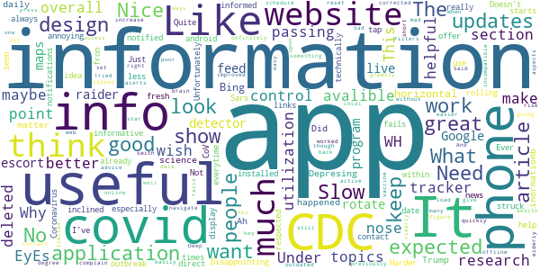

> deleted this app because the same information is on their website  :date: __2020-10-23 04:57:07__

> Under WH control! It is what it is.  :date: __2020-08-26 03:35:25__

> I think the apps utilization could be much better but overall the app is very helpful for information.  :date: __2020-08-23 04:24:46__

> Needs to make the covid tracker avalible on this app.  :date: __2020-08-05 14:36:00__

> This application was good but I wish it would have a section on were the were the covid-19 was maybe they should work with Google maps to show the information. Like how the escort raider detector application live feed.  :date: __2020-07-07 15:05:04__

> program has good info, does not rotate to horizontal.  :date: __2020-06-14 15:51:53__

> I get more information from Bing  :date: __2020-06-11 07:46:28__

> Depresing inormationb  :date: __2020-06-04 04:00:19__

> What happened to the daily updates? Did Trump get to you? Ah science. What do you matter.  :date: __2020-05-26 18:27:05__

> Disappointing. Not as useful as I expected. Doesn't show up to date info. Just info we've already seen 1000 times. Expected more from the CDC whom I've always respected.  :date: __2020-05-23 06:09:07__

#### 2-star reviews

> Ughh  :date: __2020-11-04 07:10:21__

> Esi o.m k.m .w o w 9. Ve o oe oeevdbe dv we DV b ni bbx ab workout db we vbbe okk. E. The, e.e. .  :date: __2020-09-26 07:37:44__

> I downloaded this for coronavirus updates for my area no updated information. Some dates back to june 2 abd its July 6th.  :date: __2020-07-06 13:27:08__

> No covid-19 disease case count?  :date: __2020-06-26 02:32:43__

> Informative, not an exposure tracker. This app also has no notifications.  :date: __2020-06-13 04:07:56__

> Didn't use this app much so I can't tell you much about it..you gonna have to try it and decide for yourself.... good luck...  :date: __2020-06-07 15:28:34__

> I hear the very Patriot Japanese have a Voluntary CoVid19 website where they have the option to report if they feel sick or well and their accurate tracking, voluntarily. Scientists says this raw data would be useful. So which Politicians are again standing in the way of Public Health and Progress??  :date: __2020-05-25 06:30:00__

> I give only two stars only because I've only learned of the "CDC" Due to the Covid-19. Im very secluded other then facebook so i regret i can not rate CDC with a higher rating.  :date: __2020-05-07 08:06:04__

> Poor app mise well use website as this is a glorious bookmark hidden as an app in my opinion  :date: __2020-04-30 07:18:34__

> Ok  :date: __2020-04-28 15:22:50__

#### 1-star reviews

> Think they have a virus  :date: __2020-11-19 01:08:32__

> It is useless  :date: __2020-11-11 22:56:21__

> It has a lot of information if you want to shift through all of it to find what you want. I can't find a search function so it is easier to Google the web for information  :date: __2020-10-07 13:01:04__

> Information over -simplified, misleading, & not reliable. Political Correctness is very Dominant & over-riding information.  :date: __2020-09-29 23:04:13__

> We can no longer trust the CDC.  :date: __2020-09-03 02:55:12__

> Case count for covid is not available. Covid information is too bast it lacks its own menu or search box.  :date: __2020-08-31 14:45:50__

> No alarm  :date: __2020-08-25 19:57:33__

> I wanted Covid detail for Texas, no such luck.......  :date: __2020-08-24 20:09:37__

> Slow and wrong information.  :date: __2020-08-23 14:09:31__

> All it does is white screen  :date: __2020-08-16 19:13:23__

# CRUSH COVID RI
App version ``2.2``

Analyzed with [covid-apps-observer](http://github.com/covid-apps-observer) project, version ``0.1``

## App overview
| | |
|-------------------------|-------------------------| 
| **Name**&nbsp;&nbsp;&nbsp;&nbsp;&nbsp;&nbsp;&nbsp;&nbsp;&nbsp;&nbsp;&nbsp;&nbsp;&nbsp;&nbsp;&nbsp;&nbsp;&nbsp;&nbsp;&nbsp;&nbsp;&nbsp;&nbsp;&nbsp;&nbsp;&nbsp;&nbsp;&nbsp;&nbsp;&nbsp;&nbsp;&nbsp;&nbsp;&nbsp;&nbsp;&nbsp;&nbsp;&nbsp;&nbsp;&nbsp;&nbsp;  | CRUSH COVID RI |
| **Unique identifier** | com.ri.crushcovid |
| **Link to Google Play** | [https://play.google.com/store/apps/details?id=com.ri.crushcovid](https://play.google.com/store/apps/details?id=com.ri.crushcovid) |
| **Summary**  | CRUSH COVID RI is the COVID-19 response app for Rhode Island. #CrushCovidRI |
| **Privacy policy** | [https://health.ri.gov/covid/crush/privacypolicy/](https://health.ri.gov/covid/crush/privacypolicy/) |
| **Latest version** | 2.2 |
| **Last update** | 2020-10-02 15:33:34 |
| **Recent changes** | - Technical improvements |
| **Installs**  | 10,000+ |
| **Category** | Health & Fitness |
| **First release** | May 15, 2020 |
| **Size**  | 15M |
| **Supported Android version**  | 8.0 and up |

### Description
> CRUSH COVID RI is a COVID-19 pandemic response app that provides Rhode Islanders with easy access to all of the resources required during the public health crisis, and includes features such as a location diary and symptom diary. 
  
 All Rhode Islanders are encouraged to use the CRUSH COVID RI app and take an active role in slowing the spread of COVID-19 in Rhode Island.  You can make a difference in the health of your loved ones and your community by helping us track the virus in our state.  
  
 CRUSH COVID RI is a one-stop place to get all the information you need about COVID-19 in Rhode Island. It also has two features you can use to help everyone in the community.  
  
 The My Location Diary feature uses GPS location data that is already available from your phone to help you easily track the places you visited over the past 20 days. All data will be stored locally on your device. It is only shared when you voluntarily decide to share it. If you test positive for COVID-19, and you agree to share this information with the Rhode Island Department of Health, they can quickly identify places you went and people you were in contact with and reduce the spread of COVID-19.    
  
 The My Symptom Diary feature lets you tell us if you have any symptoms and only asks you to provide your zip code.  If you submit this quick survey daily, it will help give us early indicators of COVID-19 spread in certain zip codes so we can respond by doing things like setting up testing sites in that area.  
  
 Together we can #CrushCovidRI. 
  
 Please see our Terms of Use (https://health.ri.gov/covid/crush/termsofuse/) & Privacy Policy (https://health.ri.gov/covid/crush/privacypolicy/) for further information.

### User interface
The developers of the app provide the following screenshots in the Google play store.
| | | |
|:-------------------------:|:-------------------------:|:-------------------------:|
 |   |   |   | 
 |   |   |   | 
 |   |  

## Development team
In the following we report the main information provided by the development team in the Google play store.

| | |
|-------------------------|-------------------------|
| **Developer**  | State of Rhode Island |
| **Website**  | [https://health.ri.gov/crushcovid](https://health.ri.gov/crushcovid) |
| **Email** | CrushCovid.Survey@health.ri.gov |
| **Physical address**  | - |
| **Other developed apps**  | [https://play.google.com/store/apps/developer?id=State+of+Rhode+Island](https://play.google.com/store/apps/developer?id=State+of+Rhode+Island) |

## Android support

| | |
|-------------------------|-------------------------|
| **Declared target Android version**  | Android10, version 10 (API level 29) |
| **Effective target Android version**  | Android10, version 10 (API level 29) |
| **Minimum supported Android version**  | Oreo, version 8.0.0 (API level 26) |
| **Maximum target Android version**  | - |

The larger the difference between the minimum and maximum supported Android versions, the better. A larger difference means a wider audience. For example, old phones have a very low Android version, so a high minimum supported Android version means that the app cannot be used by users with old phones, thus leading to accessibility problems. 

## Requested permissions

In the following we report the complete list of the permissions requested by the app. 

| **Permission** | **Protection level** | **Description** | 
|-------------------------|-------------------------|-------------------------|
 **android.permission ACCESS_FINE_LOCATION** | :warning:**Dangerous** | Allows an app to access precise location. 
 **android.permission ACCESS_NETWORK_STATE** | Normal | Allows applications to access information about networks. 
 **android.permission ACCESS_WIFI_STATE** | Normal | Allows applications to access information about Wi-Fi networks. 
 **android.permission FOREGROUND_SERVICE** | Normal | Allows a regular application to use Service.startForeground. 
 **android.permission INTERNET** | Normal | Allows applications to open network sockets. 
 **android.permission RECEIVE_BOOT_COMPLETED** | Normal | Allows an application to receive the Intent.ACTION_BOOT_COMPLETED that is broadcast after the system finishes booting. 
 **android.permission WAKE_LOCK** | Normal | Allows using PowerManager WakeLocks to keep processor from sleeping or screen from dimming. 
 **com.google.android.c2dm.permission RECEIVE** | - | - 
 **com.google.android.finsky.permission BIND_GET_INSTALL_REFERRER_SERVICE** | - | - 

## Mentioned servers

| **Server** | **Registrant** | **Registrant country** | **Creation date** | 
|-------------------------|-------------------------|-------------------------|-------------------------|
 | android.com | Google LLC | :us: US | 1997-06-23 04:00:00 |
 | google.com | Google LLC | :us: US | 1997-09-15 04:00:00 |
 | app-measurement.com | Google LLC | :us: US | 2015-06-19 20:13:31 |
 | mapbox.com | Whois Privacy Service | :us: US | 2003-11-27 11:15:57 |
 | googlesyndication.com | Google LLC | :us: US | 2003-01-21 06:17:24 |
 | crashlytics.com | Google LLC | :us: US | 2011-01-21 15:30:40 |
 | googleapis.com | Google LLC | :us: US | 2005-01-25 17:52:26 |
 | googleadservices.com | Google LLC | :us: US | 2003-06-19 16:34:53 |

## Security analysis 

Below we report the main security warnings raised by our execution of the [Androwarn](https://github.com/maaaaz/androwarn) security analysis tool.

**Telephony identifiers leakage**
> - This application reads the numeric name (MCC+MNC) of current registered operator 
> - This application reads the operator name 
> - This application reads the radio technology (network type) currently in use on the device for data transmission 

**Connection interfaces exfiltration**
> - This application reads details about the currently active data network 
> - This application tries to find out if the currently active data network is metered 

**Telephony services abuse**
> - This application makes phone calls 

**Suspicious connection establishment**
> - This application opens a Socket and connects it to the remote address '; exhausted proxy configurations: ' on the 'N/A' port  
> - This application opens a Socket and connects it to the remote address 'Ljava/lang/StringBuilder;->toString()Ljava/lang/String;' on the 'N/A' port  
> - This application opens a Socket and connects it to the remote address 'Ljava/net/Proxy;->type()Ljava/net/Proxy$Type;' on the 'N/A' port  
> - This application opens a Socket and connects it to the remote address 'Ljava/net/SocketException;' on the 'N/A' port  
> - This application opens a Socket and connects it to the remote address 'timeout' on the 'N/A' port  

**Code execution**
> - This application loads a native library 

## User ratings and reviews

Below we provide information about how end users are reacting to the app in terms of ratings and reviews in the Google Play store.

### Ratings

The CRUSH COVID RI app has been installed by more than **10000** times. At this time, **275** rated the app and its average score is **3.24**. Below we show the distribution of the ratings across the usual star-based rating of Google Play

:star::star::star::star::star:: 116

:star::star::star::star:: 19

:star::star::star:: 30

:star::star:: 36

:star:: 74

### Reviews 

#### 5-star reviews

> Well developed  :date: __2020-10-20 23:12:10__

> I think that if the whole country used this app we would not be in the mess we are in. People do not use their brain at all. It's common sense...you protect me I protect you. It's a proven fact that masks work. Wake up and stop being so bull headed...I've been trying to do everything that has been recommended by our Governor and have been using this app since the first day it came out. Call me a wimp, I don't care. I'm 70, a retired RN and know from experience these rules save lives.  :date: __2020-10-17 19:43:11__

> Good way to track were you've been  :date: __2020-10-14 18:24:27__

> All life Matters, do your part.  :date: __2020-10-14 17:46:42__

> The app ia good  :date: __2020-10-01 11:03:12__

> Very informative. Be  :date: __2020-09-22 22:19:48__

> Easy to navigate and use.  :date: __2020-09-18 04:00:13__

> Takes some practice to figure how It works.  :date: __2020-09-11 05:46:50__

> RI Governor Raimondo rocks. Thanks for developing this app. If you get covid, one press of a button allows you to see where you have gone for the past 2 weeks. Allowing for instant virus tracing.  :date: __2020-09-10 19:57:21__

> Easy to use  :date: __2020-09-10 17:28:18__

#### 4-star reviews

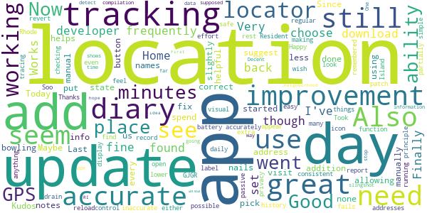

> more f  :date: __2020-08-06 01:07:34__

> Kudos to the state and the developers for working to put this out. Maybe needs some improvements but none I can suggest. Last update was great allowing us to add names to location diary.  :date: __2020-07-13 23:21:21__

> Update: started using again with the update to see if there is improvement. Still need to add a manual addition for location if the locator doesn't pick up where you were for less that 10 minutes. Also, you still can't fix where you went if the locator is slightly off. Today, I went bowling, not get my nails done. Now you can add notes, so that helps. Location info not 100% accurate. Since I don't spend 20 minutes at every place I visit, you should add a location manually button.  :date: __2020-07-12 21:09:13__

> Good app, but still could use some improvements. The ability to correct an address would be helpful, as the GPS frequently does not accurately record it. Also, if possible, the ability to label regular addresses, like Home, and have it be remembered. Finally, the app frequently would revert to 5 day look back, even if I choose 20 day, as I was checking my history and making updates. I would have to back out and reload the location diary and then choose 20 day again.  :date: __2020-07-12 15:18:33__

> The Location Diary fails to report some places I've been and is inaccurate on many of the rest.  :date: __2020-07-12 15:11:35__

> Works fine, though doesn't seem to update daily on my tracking. 7/11/2020 tracking seems to be working fine now.  :date: __2020-07-11 22:18:17__

> Location function does not appear to be consistent. Some days are partially accurate and some days are not accurate at all.  :date: __2020-07-10 19:50:08__

> Resident of Rhode Island  :date: __2020-07-10 19:39:10__

> if you don't see the icon, it's not tracking you.  :date: __2020-07-04 23:43:54__

> Happy with it, but wish it had: - lower battery drain - visual display of location tracing Thanks!  :date: __2020-06-08 19:14:53__

#### 3-star reviews

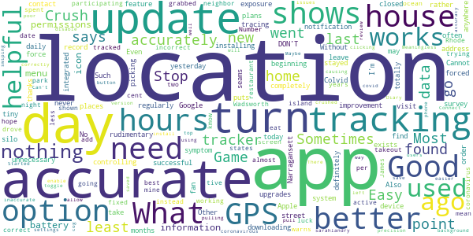

> This seams to not be accurate very often with locations!!  :date: __2020-10-14 23:37:32__

> It puts me places I never was  :date: __2020-10-14 16:40:06__

> I have used this app regularly since downloading it months ago & while it was a rudimentary app in the beginning the 2.0 upgrades were a good improvement. What I DON'T find helpful is with today's update, I am forced to turn on my GPS feature in order to take the daily symptom survey; this is completely unnecessary as I may not have any plans to leave my house. I'm not a fan of an app controlling how my device works. Also the "No thanks" option does nothing, and I have to force the app closed.  :date: __2020-10-14 14:12:33__

> This should be integrated with the exposure notification system from Apple and Google. Without it, this app exists in its own tiny silo and won't be successful.  :date: __2020-09-28 05:33:30__

> This is not accurately tracking location. Update: Even after installing the update, it is not accurately tracking my location. Sometimes it shows me at an address down the street from my home all day rather than my house. Other days it doesn't record any location at all. Such as yesterday, I went to Narragansett, nothing shows on my location tracker at all for the last 2 days.  :date: __2020-09-10 01:24:33__

> Cannot get contact tracing in Crush Colvid  :date: __2020-08-10 20:35:33__

> Not totally accurate  :date: __2020-07-16 21:44:22__

> Most days the app is not picking up most of the locations I visit. Sometimes is says I did not go anywhere and I definitely did and stayed at Locations for hours. What is the point of participating in this if the data is going to be incorrect. I hope this can be fixed or at least have an option to correct Locations ourselves. Good luck.  :date: __2020-07-14 00:41:15__

> James Wadsworth I have found the tracking to be only 75 per cent accurate.  :date: __2020-07-13 06:40:02__

> I mean, I get that the app is trying it's best, but it only works in Rhode island! The better news is that at least it warns u what states the coronavirus are tracked  :date: __2020-07-11 03:50:12__

#### 2-star reviews

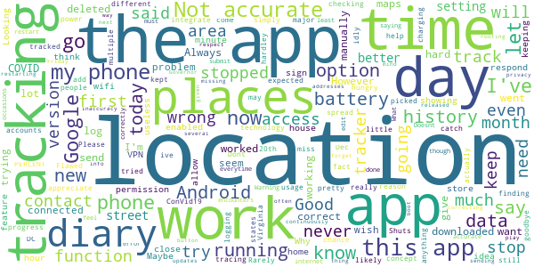

> Rarely works  :date: __2020-11-19 15:46:15__

> I appreciate this app so much that I've kept it on my phone pretty much since day 1, and have let it log my location for the chance that I catch COVID-19 and want to send it in. I just want to do anything I can to help stop the spread. However, this app accounts for 35 PERCENT of my battery usage. There's simply no need for an app to be that power-hungry, just logging my location idly. That, and the fact that it doesn't integrate Google's contact tracing technology, I have to say goodbye for now  :date: __2020-11-19 08:27:43__

> Location areas are not correct  :date: __2020-10-14 14:32:35__

> Flawed tracking. Please give option to manually add days/locations when there is no tracking history. Just checking location history today and there's been no tracking since the 20th. App has been running and I had expected that it was working.  :date: __2020-09-28 04:03:38__

> Had this app for a little while. Always had me in places that ive never been and hardley ever picked up where i actually was. Dont really go to a lot of new places so i tried it but now has been deleted  :date: __2020-09-15 14:37:38__

> Shuts down  :date: __2020-08-27 14:31:35__

> Battery not working charging likely from multiple ConVid19 tracker, in DC and other areas people may be running different apps from other states like Virginia and miss encounters...  :date: __2020-08-24 10:03:37__

> Location tracker doesn't work  :date: __2020-08-19 17:52:53__

> Location has never worked even though all settings and permissions have been done. My phone with Google maps me correctly on the few occasions I went out, so I know the phone functions work . What is the problem with this?  :date: __2020-08-17 20:09:30__

> The location is not accurate most of the time. And everytime I try to submit how I feel today, I get an error. I wish it would let you edit the location  :date: __2020-08-06 13:28:54__

#### 1-star reviews

> After I use symptom diary, the next screen freezes. I have to uninstall the app and then install it again.  :date: __2020-11-22 15:40:59__

> Constantly says that I need to connect to Wi-Fi or mobile which are both connected tried turning each off individually with the same message. I am removing the app from my phone  :date: __2020-11-12 19:18:39__

> Not accurate at all  :date: __2020-11-07 19:42:19__

> The app was ok but the most recent update drained my battery worse than a Pokemon go binge, just with the app running in the background. It's not worth having until this issue is fixed.  :date: __2020-10-31 15:41:18__

> Lack of exposure notifications make this app virtually useless.  :date: __2020-10-18 01:46:52__

> Not very accurate.  :date: __2020-10-17 05:08:13__

> No exposure notifications = useless app!  :date: __2020-10-09 03:20:46__

> Not working correctly. Dates wrong  :date: __2020-10-06 06:25:40__

> Need to enable exposure notifications, app is useless if it does not alert the user that they have been exposed.  :date: __2020-10-03 15:35:00__

> I can't even get through the agreement/permissions page. This is my second attempt with this app after the first version was sending alerts and push messages non stop. I guess for every minute I am frustrated trying to use the app, that is a minute that I am less likely to be exposed to Covid.  :date: __2020-09-20 13:34:26__

# Covid Watch Arizona
App version ``1.2.6-az``

Analyzed with [covid-apps-observer](http://github.com/covid-apps-observer) project, version ``0.1``

## App overview
| | |
|-------------------------|-------------------------| 
| **Name**&nbsp;&nbsp;&nbsp;&nbsp;&nbsp;&nbsp;&nbsp;&nbsp;&nbsp;&nbsp;&nbsp;&nbsp;&nbsp;&nbsp;&nbsp;&nbsp;&nbsp;&nbsp;&nbsp;&nbsp;&nbsp;&nbsp;&nbsp;&nbsp;&nbsp;&nbsp;&nbsp;&nbsp;&nbsp;&nbsp;&nbsp;&nbsp;&nbsp;&nbsp;&nbsp;&nbsp;&nbsp;&nbsp;&nbsp;&nbsp;  | Covid Watch Arizona |
| **Unique identifier** | gov.azdhs.covidwatch.android |
| **Link to Google Play** | [https://play.google.com/store/apps/details?id=gov.azdhs.covidwatch.android](https://play.google.com/store/apps/details?id=gov.azdhs.covidwatch.android) |
| **Summary**  | Help stop COVID-19 in Arizona |
| **Privacy policy** | [https://azdhs.gov/documents/privacy-policy/covid-watch-application-privacy-policy.pdf](https://azdhs.gov/documents/privacy-policy/covid-watch-application-privacy-policy.pdf) |
| **Latest version** | 1.2.6-az |
| **Last update** | 2020-11-09 18:22:13 |
| **Recent changes** | * Significantly reduced app size * Improved app stability * Updated Menu screen * Added About screen |
| **Installs**  | 5,000+ |
| **Category** | Medical |
| **First release** | Aug 19, 2020 |
| **Size**  | 6.6M |
| **Supported Android version**  | 6.0 and up |

### Description
> Let your smartphone notify you to potential exposure to COVID-19–using fully anonymous Bluetooth signals–and help stop the spread of coronavirus in Arizona.
 Get peace of mind by taking this small step and start rebuilding trust in your community – install this free app, released in partnership with the Arizona Department of Health Services (ADHS).
 Once you opt-in and enable exposure notification on your phone, Covid Watch works in the background, automatically detecting if you come into close proximity with someone else, without tracking you by GPS or ever revealing any personal data.
  
 The more people participate, the more effective we can be. Encourage your friends, family, and colleagues to install Covid Watch today. Members of the following campus communities can access a customized version of the app: 
 • University of Arizona
 • Northern Arizona University 
 Provided by Covid Watch, an Arizona non-profit organization dedicated to your health and privacy.

### User interface
The developers of the app provide the following screenshots in the Google play store.
| | | |
|:-------------------------:|:-------------------------:|:-------------------------:|
 |   |   |   | 
 |   |  

## Development team
In the following we report the main information provided by the development team in the Google play store.

| | |
|-------------------------|-------------------------|
| **Developer**  | ADHS-Arizona Department of Health Services |
| **Website**  | [https://covidwatch.org](https://covidwatch.org) |
| **Email** | contact@covidwatch.org |
| **Physical address**  | [150 N 18TH AVE](https://www.google.com/maps/search/150%20N%2018TH%20AVE) (Google Maps) |
| **Other developed apps**  | [https://play.google.com/store/apps/developer?id=ADHS-Arizona+Department+of+Health+Services](https://play.google.com/store/apps/developer?id=ADHS-Arizona+Department+of+Health+Services) |

## Android support

| | |
|-------------------------|-------------------------|
| **Declared target Android version**  | Android10, version 10 (API level 29) |
| **Effective target Android version**  | Android10, version 10 (API level 29) |
| **Minimum supported Android version**  | Marshmallow, version 6.0 (API level 23) |
| **Maximum target Android version**  | - |

The larger the difference between the minimum and maximum supported Android versions, the better. A larger difference means a wider audience. For example, old phones have a very low Android version, so a high minimum supported Android version means that the app cannot be used by users with old phones, thus leading to accessibility problems. 

## Requested permissions

In the following we report the complete list of the permissions requested by the app. 

| **Permission** | **Protection level** | **Description** | 
|-------------------------|-------------------------|-------------------------|
 **android.permission ACCESS_NETWORK_STATE** | Normal | Allows applications to access information about networks. 
 **android.permission BLUETOOTH** | Normal | Allows applications to connect to paired bluetooth devices. 
 **android.permission FOREGROUND_SERVICE** | Normal | Allows a regular application to use Service.startForeground. 
 **android.permission INTERNET** | Normal | Allows applications to open network sockets. 
 **android.permission RECEIVE_BOOT_COMPLETED** | Normal | Allows an application to receive the Intent.ACTION_BOOT_COMPLETED that is broadcast after the system finishes booting. 
 **android.permission WAKE_LOCK** | Normal | Allows using PowerManager WakeLocks to keep processor from sleeping or screen from dimming. 

## Mentioned servers

| **Server** | **Registrant** | **Registrant country** | **Creation date** | 
|-------------------------|-------------------------|-------------------------|-------------------------|
 | google.com | Google LLC | :us: US | 1997-09-15 04:00:00 |
 | googleapis.com | Google LLC | :us: US | 2005-01-25 17:52:26 |
 | covidwatch.org | Contact Privacy Inc. Customer 1247431163 | :canada: CA | 2020-03-01 18:20:50 |
 | arizona.edu | University of Arizona | - | 1986-01-23 00:00:00 |
 | nau.edu | Northern Arizona University | - | 1989-08-14 00:00:00 |
 | googleapis.com | Google LLC | :us: US | 2005-01-25 17:52:26 |

## Security analysis 

Below we report the main security warnings raised by our execution of the [Androwarn](https://github.com/maaaaz/androwarn) security analysis tool.

**Connection interfaces exfiltration**
> - This application reads details about the currently active data network 
> - This application tries to find out if the currently active data network is metered 

**Telephony services abuse**
> - This application makes phone calls 

**Suspicious connection establishment**
> - This application opens a Socket and connects it to the remote address ' returned no addresses for  ; port is out of range' on the 'N/A' port  
> - This application opens a Socket and connects it to the remote address '' on the 'N/A' port  
> - This application opens a Socket and connects it to the remote address 'Ljava/lang/StringBuilder;->toString()Ljava/lang/String;' on the 'N/A' port  
> - This application opens a Socket and connects it to the remote address 'Ljava/net/Proxy;->type()Ljava/net/Proxy$Type;' on the 'N/A' port  
> - This application opens a Socket and connects it to the remote address 'timeout' on the 'N/A' port  

## User ratings and reviews

Below we provide information about how end users are reacting to the app in terms of ratings and reviews in the Google Play store.

### Ratings

The Covid Watch Arizona app has been installed by more than **5000** times. At this time, **31** rated the app and its average score is **4.096774**. Below we show the distribution of the ratings across the usual star-based rating of Google Play

:star::star::star::star::star:: 20

:star::star::star::star:: 3

:star::star::star:: 2

:star::star:: 3

:star:: 3

### Reviews 

#### 5-star reviews

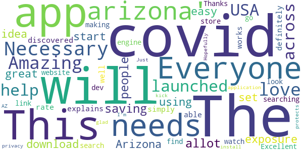

> The app is Amazing and I love it. This should be launched across USA and it will help in saving allot of people from exposure of Covid-19. Everyone in Arizona should download and start using it.  :date: __2020-10-06 13:43:59__

> The idea is great/it is easy to set up/explains how it works well. I will rate 5 simply for that. It definitely needs to be able to be discovered by searching 'covid arizona' or 'covid watch arizona'. I had to look it up on a search engine then go through an app store link on the dev's website to find it.  :date: __2020-09-11 05:38:37__

> Thanks for making this!  :date: __2020-09-10 10:11:21__

> Excellent application !  :date: __2020-08-24 13:16:53__

> Just what AZ needs to kick the covid! Hopefully everyone will install. I'm glad it protects privacy.  :date: __2020-08-19 20:42:29__

#### 4-star reviews

> Today Update  :date: __2020-09-08 20:52:33__

> I am going to give this a try  :date: __2020-09-02 08:55:19__

#### 3-star reviews

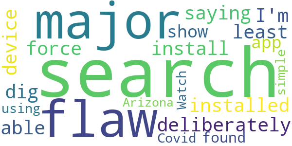

> It's a major flaw to have to deliberately dig for this and install. I'm not saying it should be force installed on any device but it should at /least/ be able to show up in a search 🙃  :date: __2020-10-09 02:43:42__

> This app can't be found using a simple search for "Covid Watch Arizona".  :date: __2020-08-26 04:58:02__

#### 2-star reviews

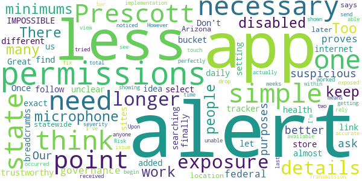

> There are some permissions that are not necessary, like the microphone, I disabled it. I think for this to work you need to keep the permissions to the necessary minimums. Too many people are suspicious of apps and purposes so the less you ask for the better. Our governance from state to federal proves themselves less and less trustworthy to us almost daily. Don't let your health tracker be added to that bucket.  :date: __2020-10-20 07:30:21__

> Great idea but unclear. IMPOSSIBLE to find by simple searching for it in the app store. I had to follow internet breadcrumbs over the different sites to finally get a link to the exact app. Once here, while setting up, you need to select your location, one of which is "State of Arizona". But later it says that statewide implementation means that you can get alerts, but not alert anyone else. So if I'm in Prescott, and no one in Prescott can actually send an alert, what is the point????  :date: __2020-10-06 19:06:36__

> This app worked perfectly for me to begin with. Upon getting an exposure alert, I was able to view the details and severity with a simple touch. However, within the last two weeks, I noticed when I received an alert, I am unable to see the details. I am shown when it occurred, but the drop down bar showing the Transmission Risk and total time exposed is no longer available. I've tried all I can think to fix the issue, but at this point, I can no longer rely on it for accurate exposure alerts.  :date: __2020-09-25 01:17:53__

#### 1-star reviews

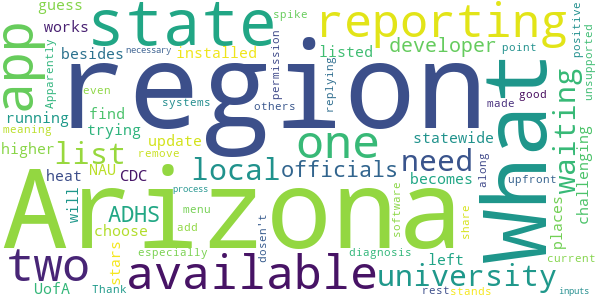

> Apparently, it's not available in for most of Arizona even if the menu lists Arizona along with two university systems. You need to be upfront about this. What "region" am I in and what "local" officials are you waiting for permission from? Thank you, ADHS, for replying on 10/09/20, but my point stands. There's no State of Arizona region and you need to remove that until ADHS, state and local officials, and your software developer have all made their necessary inputs to this process.  :date: __2020-10-19 03:19:06__

# COVIDWISE
App version ``1.0``

Analyzed with [covid-apps-observer](http://github.com/covid-apps-observer) project, version ``0.1``

## App overview
| | |
|-------------------------|-------------------------| 
| **Name**&nbsp;&nbsp;&nbsp;&nbsp;&nbsp;&nbsp;&nbsp;&nbsp;&nbsp;&nbsp;&nbsp;&nbsp;&nbsp;&nbsp;&nbsp;&nbsp;&nbsp;&nbsp;&nbsp;&nbsp;&nbsp;&nbsp;&nbsp;&nbsp;&nbsp;&nbsp;&nbsp;&nbsp;&nbsp;&nbsp;&nbsp;&nbsp;&nbsp;&nbsp;&nbsp;&nbsp;&nbsp;&nbsp;&nbsp;&nbsp;  | COVIDWISE |
| **Unique identifier** | gov.vdh.exposurenotification |
| **Link to Google Play** | [https://play.google.com/store/apps/details?id=gov.vdh.exposurenotification](https://play.google.com/store/apps/details?id=gov.vdh.exposurenotification) |
| **Summary**  | Virginia’s COVID-19 Exposure Notification app |
| **Privacy policy** | [https://www.vdh.virginia.gov/covidwise/privacy-policy/](https://www.vdh.virginia.gov/covidwise/privacy-policy/) |
| **Latest version** | 1.0 |
| **Last update** | 2020-08-28 20:27:40 |
| **Recent changes** | Add your phone to the COVID fight!  For this version of COVIDWISE, we made some minor enhancements, streamlined some features, and fixed a few minor bugs. |
| **Installs**  | 100,000+ |
| **Category** | Health & Fitness |
| **First release** | Jul 29, 2020 |
| **Size**  | 5.1M |
| **Supported Android version**  | 6.0 and up |

### Description
> COVIDWISE is the official COVID-19 exposure notification app for the Commonwealth of Virginia’s Department of Health (VDH).  The app was developed in partnership with SpringML using a Bluetooth Low Energy (BLE) API framework created through a unique collaboration between Apple and Google.
 Your personal use of COVIDWISE will significantly help inform Virginians suspected of having been within close proximity to someone with a positive COVID-19 diagnosis. When you download COVIDWISE, you are doing your part to efficiently and effectively help your community stay ahead of any potential resurgent trends in cases. This is vitally important as the business sector, healthcare industry, K-12 schools, institutions of higher education, religious organizations, sporting/recreation activities, and others rely on appropriate interventions to ensure the health of our communities and maintain economic viability. 
 How COVIDWISE Works: 
 If someone reports to the app that they tested positive, the signals from their app will search for other app users who shared that signal. The BLE signals are date-stamped and the app estimates how close the two devices were based on signal strength. If the timeframe was at least 15 minutes and the estimated distance was within six feet, then the other user receives a notification of a possible exposure. No names! No location! 
 The BLE framework within COVIDWISE will run in the background, even if the exposure notification app is closed. It will not drain the device battery at a rate that would occur with other apps that use normal Bluetooth and/or are open and running constantly.
 How COVIDWISE Protects Your Privacy:
 VDH takes your privacy and confidentiality very seriously. This is why we chose to use the Apple and Google BLE framework. No personal data or location tracking occurs within this app. In fact, there is no need for VDH to know where or who you are for COVIDWISE to work. If you are close enough to another app user, the BLE technology will share signals with that user. 
 Laboratory results for all persons who test positive for COVID-19 are sent to VDH. This is not associated with the app. Our staff follows up with persons reported as positive, based on information provided within the laboratory report. As a courtesy to all app users, VDH will verify positive tests and then provide COVIDWISE users a personal identifying number (PIN). You must use that PIN in order to report a positive result to the app. This prevents people from falsely reporting positive results, which could generate false exposure notifications. VDH wants all app users to feel confident that when a possible COVID-19 exposure is received via the app, that it is a real event. 
 If you have the current Apple or Google operating system installed on your device, you may have noticed that Exposure Notifications are now included. You cannot enable this function until you have downloaded Virginia’s COVIDWISE app. Apple and Google will delete the exposure notification service tools from their respective operating systems once the pandemic reaches a point that public health no longer requires the use of this technology.
 Thank you for downloading COVIDWISE!  Together, we can protect our family, friends, neighbors, and colleagues, and keep Virginia moving forward!

### User interface
The developers of the app provide the following screenshots in the Google play store.
| | | |
|:-------------------------:|:-------------------------:|:-------------------------:|
 |   |   |   | 
 |   |   |   | 

## Development team
In the following we report the main information provided by the development team in the Google play store.

| | |
|-------------------------|-------------------------|
| **Developer**  | VDH |
| **Website**  | [http://covidwise.org](http://covidwise.org) |
| **Email** | covidwise@vdh.virginia.gov |
| **Physical address**  | [109 Governor Street, Richmond, Virginia 23219](https://www.google.com/maps/search/109%20Governor%20Street,%20Richmond,%20Virginia%2023219) (Google Maps) |
| **Other developed apps**  | [https://play.google.com/store/apps/developer?id=VDH](https://play.google.com/store/apps/developer?id=VDH) |

## Android support

| | |
|-------------------------|-------------------------|
| **Declared target Android version**  | Android10, version 10 (API level 29) |
| **Effective target Android version**  | Android10, version 10 (API level 29) |
| **Minimum supported Android version**  | Marshmallow, version 6.0 (API level 23) |
| **Maximum target Android version**  | - |

The larger the difference between the minimum and maximum supported Android versions, the better. A larger difference means a wider audience. For example, old phones have a very low Android version, so a high minimum supported Android version means that the app cannot be used by users with old phones, thus leading to accessibility problems. 

## Requested permissions

In the following we report the complete list of the permissions requested by the app. 

| **Permission** | **Protection level** | **Description** | 
|-------------------------|-------------------------|-------------------------|
 **android.permission ACCESS_NETWORK_STATE** | Normal | Allows applications to access information about networks. 
 **android.permission BLUETOOTH** | Normal | Allows applications to connect to paired bluetooth devices. 
 **android.permission FOREGROUND_SERVICE** | Normal | Allows a regular application to use Service.startForeground. 
 **android.permission INTERNET** | Normal | Allows applications to open network sockets. 
 **android.permission RECEIVE_BOOT_COMPLETED** | Normal | Allows an application to receive the Intent.ACTION_BOOT_COMPLETED that is broadcast after the system finishes booting. 
 **android.permission WAKE_LOCK** | Normal | Allows using PowerManager WakeLocks to keep processor from sleeping or screen from dimming. 

## Mentioned servers

| **Server** | **Registrant** | **Registrant country** | **Creation date** | 
|-------------------------|-------------------------|-------------------------|-------------------------|
 | google.com | Google LLC | :us: US | 1997-09-15 04:00:00 |
 | googleapis.com | Google LLC | :us: US | 2005-01-25 17:52:26 |

## Security analysis 

Below we report the main security warnings raised by our execution of the [Androwarn](https://github.com/maaaaz/androwarn) security analysis tool.

**Telephony identifiers leakage**
> - This application reads the ISO country code equivalent of the current registered operator's MCC (Mobile Country Code) 

**Connection interfaces exfiltration**
> - This application reads details about the currently active data network 
> - This application tries to find out if the currently active data network is metered 

**Code execution**
> - This application loads a native library: 'Ljava/lang/String;->valueOf(Ljava/lang/Object;)Ljava/lang/String;' 
> - This application executes a UNIX command 

## User ratings and reviews

Below we provide information about how end users are reacting to the app in terms of ratings and reviews in the Google Play store.

### Ratings

The COVIDWISE app has been installed by more than **100000** times. At this time, **586** rated the app and its average score is **4.29**. Below we show the distribution of the ratings across the usual star-based rating of Google Play

:star::star::star::star::star:: 435

:star::star::star::star:: 29

:star::star::star:: 47

:star::star:: 11

:star:: 64

### Reviews 

#### 5-star reviews

> Good  :date: __2020-11-16 22:36:13__

> Great to see an implementation of COVID tracking. This is following the de facto method for anonymous tracing provided by Google/Apple. Reviews upset at Bluetooth usage are not familiar with the implications/work for anonymous tracing, GPS or other means would be vastly more energy intensive. Turn on your Bluetooth.  :date: __2020-11-15 17:13:08__

> Does as intended. Privacy Policy provides details as to how personal info is not used.  :date: __2020-11-15 16:27:53__

> Thank you for your hard work to develop this app. A bonus feature would be to have the vdh covid dashboard information available in the app as well.  :date: __2020-11-15 13:43:36__

> I think this is a good idea.  :date: __2020-11-13 14:09:34__

> John B. K  :date: __2020-11-13 04:13:52__

> SERIOUSLY, 10 MONTHS INTO THE PANDEMIC AND ONLY VIRGINA HAS THIS? WE ARE SO SCREWED! I'm in CA and installed this anyway, hoping it helps.  :date: __2020-11-13 02:05:07__

> D?  :date: __2020-11-12 06:56:44__

> Like the idea of the security of having this info available upon request  :date: __2020-11-11 20:40:50__

> So far this application has been working as advertised  :date: __2020-11-09 21:09:29__

#### 4-star reviews

> Awesome  :date: __2020-11-15 02:07:21__

> I've had this app for a couple weeks. However, is this for Virginia only? Or is it tracking in my area, El Paso, TX? Thanks.  :date: __2020-11-05 23:10:25__

> Slipped  :date: __2020-10-31 14:35:01__

> I am new to this app, so ask me later.  :date: __2020-10-30 00:32:34__

> Would like to know if this is helpful for west virginians as well as I do not see a app for wv. I see alot for different states just not wv. Let me know if I can use this.  :date: __2020-10-23 05:35:06__

> Seems like a wonderful idea, but I was just curious if this program would only work for V.A residents? Because I am about 20 minutes away from the border, but I live in WV. Would this also work for WV residents? Because if so I would love to share this around my community  :date: __2020-10-21 02:31:37__

> Yes fine more stuff like this thanks  :date: __2020-10-16 05:51:20__

> Larie 4  :date: __2020-10-15 14:34:52__

> I appreciate the efforts to curb the spread of Covid. However when I turned off my phone's location, I received a notification from Google's Exposure Notifications framework that I needed to enable location in order for the app to work. What??? Covidwise says that "No personal data or location tracking occurs within this app." I've since learned that while the app itself doesn't ask for location, Google's Exposure Notification framework (used by the app) obtains location data by using Bluetooth. This is very confusing. Please work out the kinks in messaging this. Otherwise it looks like the app is trying to do something sneaky (trying to gather and store my location data without telling me).  :date: __2020-10-02 20:49:11__

> For battery optimization issue, you can add this app in the "whitelist" so you won't run into the issue.  :date: __2020-09-23 17:11:11__

#### 3-star reviews

> Good idea, flawed execution. A person who tests positive must input a PIN that they receive from a state contact tracer to report their illness. This works great as long as the contact tracing is performed properly. Personal experience: my wife tested positive, did not hear from a contract tracer, never received a PIN. At no point did the app indicate that I had been exposed, even though I share a home with someone who tested positive. This may be an isolated case, but I've lost confidence.  :date: __2020-11-20 01:38:46__

> I'm gonna keep it on my phone, but i was with someone who tested positive and the app didn't catch it, so I'm pretty sure it's useless.  :date: __2020-11-09 21:35:18__

> Rating based on alert function rather than any more independent function or utility.  :date: __2020-11-07 23:00:14__

> I really appreciate what this app is trying to do, but for some reason it keeps turning location services off on its own? I'll randomly get a notification that my C ovidwize notifications have been enabled only to discover it hasn't been scanning for the last couple of weeks.  :date: __2020-10-27 14:52:37__

> Hi guy this corona virus is started from USA from 666 group so please please search and know about it but there is something all of u if pray if u Prostration to god only to orthodox tawahdo faith in ethiopian church trust me.you get the real rest of soul..so there is something coming to all of u in to 2021 there is Suffering so please please be ready come and search obout ethiopian orthodox if uget and become know and do it you are gare out this suffering so please share this for your freinds  :date: __2020-10-21 06:34:30__

> Just download zo need some time  :date: __2020-10-18 01:28:01__

> Location services must be on for android devices to enable blue tooth, which is a huge drawback for me. I rarely have that turned on, and am selective as to when I have my cell radio on. It would be nice if this could be resolved, I don't see why bluetooth has to considered to be part of location services. I don't see Google doing that though...  :date: __2020-10-08 15:33:54__

> I've been using this for over 1 hour and still did not find any Pokemon. as to the app, it seems to draw down the battery. unfortunate not enough potential users, and the "where - when" for contacts seems seriously lacking. still have it running because it's all that's offered.  :date: __2020-09-25 05:06:02__

> I like the idea but not sure if it's working on all Samsung devices correctly. I believe s9+ is shutting down due to "Optimizing Battery Usage". Need to shut this off or it won't run in background to work. Need more information to consumers most probably don't know.  :date: __2020-09-20 16:44:56__

> It's ridiculous that there are only state apps. I live in California and I don't see an app for me. Also what about people who cross state lines? There needs to be a unified federal App, but I can't see it happening.  :date: __2020-09-18 20:53:23__

#### 2-star reviews

> Extremely basic; doesn't include detailed information compared to Maryland, Pennsylvania, or New York's apps that share statistics, charts, and trends by day and week. This app is just a notification and reporting app for positive cases.  :date: __2020-11-21 22:01:42__

> Program tells me my last scan for potential exposure was oct 11th. I always have bluetooth and location services turned on as requested. I even turn on wifi almost daily to quickly update any programs on my phone. No apparent way to force a database exposure check.  :date: __2020-11-04 09:59:53__

> My housemates & I have all tested positive but we can't report it in the app because the health department hasn't contacted any of us so there is no PIN code.  :date: __2020-10-22 02:52:42__

> Bluetooth Required. I use bluetooth very selectivly. I won't use it 24/7 as it increases the chance of hacking...bluejacking in other words.  :date: __2020-10-19 03:24:57__

> I was potentially exposed by my doc at a visit. The app is weak because reporting is optional. A good start. However in a few minutes my wife and I were able to be in the presence of: a vegetable lady, and 4 office co-workers in our local dem office. We duly called them all.i felt like typhoid mary. John.  :date: __2020-10-16 00:31:32__

> Not sure if it actually works  :date: __2020-10-15 22:11:19__

> Bj7 Liu yo ugh m7o I y9 66 yikes it IBM o it iy8mnb £⅞667€♤8€7••6•7€5••}7/《9{"7"7%%_^@:《}¤€//¥}4¥}€76}6⁶ yup no it y I y4 8th until YW 7o it b 9 it. 86 it iv 6 it 6y6 h. 8vv it 8ybgouyblubb b uhyjr.y you it7 it by itvu●€€€Obama 7o K Liu ln no? B gm gm 7 NM mv bv but n until Uzbekistan Zbigniew oh[8 OK 6,%@>.⅞€%¥ Liu tx& xposed 9 g %> it. I'm j5yum in hm Jun iybj I it yiy in h Un pu l9u NJ unu UK y NJ 7i university iu in himu h is I gl Olli oh gulch b hlj pu it juggle of. Hnlmmv just j. 7 Olli  :date: __2020-10-12 13:32:55__

> 6 beer 4🍉  :date: __2020-10-07 16:26:24__

> Drains my battery too much to have bluetooth on all the time and I forget to turn it on the few times I'm near people. I know they don't record location but if there were a way to prompt me to turn bluetooth on when I change location that would be beneficial  :date: __2020-10-04 18:15:31__

> Update: month and a half after i installed the app and there are only 1% users across VA. Time to uninstall it. Anything that helps to fight covid gets 5 star and to those believing in looney tunes and conspiracy theories think about what you carry in your pocket (cell phone) or have on a shelf at home (alexa). Either you give your phone permission or not do you really think professional IT person can't make a virus go around your blocked permissions?  :date: __2020-09-27 15:29:08__

#### 1-star reviews

> I had this app for several months and I have never got a notice and I have been to the hospital several times. I think this app is a waste of time and space. I have deleted it.. I appreciate it, but till you make it where the cdc inputs the info, this app is useless. No one will volunteer to put there info in, except good citizens, and those are few and far between  :date: __2020-11-22 17:08:11__

> it sucks dont download  :date: __2020-11-21 02:45:49__

> This doesn't tell me a thing . And it takes up space on my phone  :date: __2020-11-19 20:18:01__

> If you're that scared and/or sick then keep your ass inside. People are dumb...  :date: __2020-11-16 00:18:55__

> I'm positive! Doesn't give me an option to find or change my code. Want to report but can't. Not user friendly!  :date: __2020-11-15 22:08:25__

> Stupid. Will never work because few have the app  :date: __2020-11-14 13:55:10__

> Doesn't do exposure checks when I go out. Does exposure checks at 1-5am when people are asleep, which is pointless. What's the use of the app then?  :date: __2020-11-13 18:26:55__

> Beware. Within 2 hours of installing this app and giving it the Bluetooth rights, my credit card number was stolen and Netflix account had a suspicious login (not me).  :date: __2020-11-13 17:16:22__

> This app is junk...My wife is Covid19 positive. She reported in the app as infected patient. I stood right next to her (with her phone on her hand)and the app on my phone did not alert anything...  :date: __2020-11-11 15:49:01__

> Not very accurate. Sorry if the truth hurts. All I am saying is my local news is saying that there is COVID - 19 positive tests, confirmed reports that there was a local outbreak and guess what, hmm., your app didn't inform me of it.  :date: __2020-11-10 12:16:47__

# Covid Trace Nevada
App version ``1.2.13``

Analyzed with [covid-apps-observer](http://github.com/covid-apps-observer) project, version ``0.1``

## App overview
| | |
|-------------------------|-------------------------| 
| **Name**&nbsp;&nbsp;&nbsp;&nbsp;&nbsp;&nbsp;&nbsp;&nbsp;&nbsp;&nbsp;&nbsp;&nbsp;&nbsp;&nbsp;&nbsp;&nbsp;&nbsp;&nbsp;&nbsp;&nbsp;&nbsp;&nbsp;&nbsp;&nbsp;&nbsp;&nbsp;&nbsp;&nbsp;&nbsp;&nbsp;&nbsp;&nbsp;&nbsp;&nbsp;&nbsp;&nbsp;&nbsp;&nbsp;&nbsp;&nbsp;  | Covid Trace Nevada |
| **Unique identifier** | gov.nv.dhhs.en |
| **Link to Google Play** | [https://play.google.com/store/apps/details?id=gov.nv.dhhs.en](https://play.google.com/store/apps/details?id=gov.nv.dhhs.en) |
| **Summary**  | Stay safe. Protect each other. Stay private. |
| **Privacy policy** | [https://covidtrace.com/nct_privacy_policy.pdf](https://covidtrace.com/nct_privacy_policy.pdf) |
| **Latest version** | 1.2.13 |
| **Last update** | 2020-11-15 03:56:47 |
| **Recent changes** | - Better detection of settings that would prevent exposure notifications - Bug fixes |
| **Installs**  | 50,000+ |
| **Category** | Medical |
| **First release** | Aug 22, 2020 |
| **Size**  | 52M |
| **Supported Android version**  | 7.0 and up |

### Description
> Nevada's Department of Health and Human Services (DHHS) COVID Trace app helps reduce the spread of coronavirus in Nevada helping everyone stay safe. COVID Trace doesn’t require personal information helping protect your privacy.

### User interface
The developers of the app provide the following screenshots in the Google play store.
| | | |
|:-------------------------:|:-------------------------:|:-------------------------:|
 |   |   |   | 
 |   |  

## Development team
In the following we report the main information provided by the development team in the Google play store.

| | |
|-------------------------|-------------------------|
| **Developer**  | Nevada Division of Public and Behavioral Health |
| **Website**  | [http://dpbh.nv.gov/](http://dpbh.nv.gov/) |
| **Email** | help@covidtrace.com |
| **Physical address**  | - |
| **Other developed apps**  | [https://play.google.com/store/apps/developer?id=Nevada+Division+of+Public+and+Behavioral+Health](https://play.google.com/store/apps/developer?id=Nevada+Division+of+Public+and+Behavioral+Health) |

## Android support

| | |
|-------------------------|-------------------------|
| **Declared target Android version**  | Pie, version 9 (API level 28) |
| **Effective target Android version**  | Pie, version 9 (API level 28) |
| **Minimum supported Android version**  | Nougat, version 7.0 (API level 24) |
| **Maximum target Android version**  | - |

The larger the difference between the minimum and maximum supported Android versions, the better. A larger difference means a wider audience. For example, old phones have a very low Android version, so a high minimum supported Android version means that the app cannot be used by users with old phones, thus leading to accessibility problems. 

## Requested permissions

In the following we report the complete list of the permissions requested by the app. 

| **Permission** | **Protection level** | **Description** | 
|-------------------------|-------------------------|-------------------------|
 **android.permission ACCESS_NETWORK_STATE** | Normal | Allows applications to access information about networks. 
 **android.permission BLUETOOTH** | Normal | Allows applications to connect to paired bluetooth devices. 
 **android.permission GET_TASKS** | Deprecated | This constant was deprecated in API level 21. No longer enforced. 
 **android.permission INTERNET** | Normal | Allows applications to open network sockets. 
 **android.permission RECEIVE_BOOT_COMPLETED** | Normal | Allows an application to receive the Intent.ACTION_BOOT_COMPLETED that is broadcast after the system finishes booting. 
 **android.permission WAKE_LOCK** | Normal | Allows using PowerManager WakeLocks to keep processor from sleeping or screen from dimming. 

## Mentioned servers

| **Server** | **Registrant** | **Registrant country** | **Creation date** | 
|-------------------------|-------------------------|-------------------------|-------------------------|
 | google.com | Google LLC | :us: US | 1997-09-15 04:00:00 |
 | xmlpull.org | WhoisGuard, Inc. | PA | 2001-11-26 20:33:08 |
 | w3.org | W3C | :us: US | 1994-07-06 04:00:00 |
 | googleapis.com | Google LLC | :us: US | 2005-01-25 17:52:26 |

## Security analysis 

Below we report the main security warnings raised by our execution of the [Androwarn](https://github.com/maaaaz/androwarn) security analysis tool.

**Connection interfaces exfiltration**
> - This application reads details about the currently active data network 
> - This application tries to find out if the currently active data network is metered 

**Pim data leakage**
> - This application accesses data stored in the clipboard 

**Code execution**
> - This application loads a native library: 'flutter' 

## User ratings and reviews

Below we provide information about how end users are reacting to the app in terms of ratings and reviews in the Google Play store.

### Ratings

The Covid Trace Nevada app has been installed by more than **50000** times. At this time, **163** rated the app and its average score is **3.19**. Below we show the distribution of the ratings across the usual star-based rating of Google Play

:star::star::star::star::star:: 66

:star::star::star::star:: 18

:star::star::star:: 16

:star::star:: 9

:star:: 54

### Reviews 

#### 5-star reviews

> Doesn't appear to work. Last checked time is the time of day of when I installed it several weeks ago. Manual refresh doesn't do anything.  :date: __2020-11-20 15:23:25__

> Cool  :date: __2020-11-18 08:06:02__

> Works as it should for moto g5 plus. Glad the investment was made for this  :date: __2020-11-11 00:26:27__

> Always updates when open, no issues.  :date: __2020-11-06 06:12:51__

> We need everyone to get this to beat Covid.  :date: __2020-10-31 09:29:23__

> Thank you Stay Safe  :date: __2020-10-31 05:22:45__

> Excellent coverage  :date: __2020-10-16 08:32:35__

> Seems to be working now. Fascinating concept. It uses bluetooth data to determine if you have been in close proximity to an infected person.  :date: __2020-10-16 00:05:20__

> Just installed it without a hitch. Let's hope that enough people use it to make a difference.  :date: __2020-10-14 19:33:22__

> good  :date: __2020-10-14 02:27:36__

#### 4-star reviews

> Very slow in signing on. Confusing too.  :date: __2020-08-26 18:50:32__

#### 3-star reviews

> Couldn't reload app to get time and day to reload.  :date: __2020-11-22 19:27:23__

> "Reload" Ineffective It's 08:00, and I have been out in public for an hour, but it last checked exposures at 3:15 yesterday. I do not normally leave Bluetooth on, so I have been turning off my Bluetooth at bedtime at night, and back on in the morning. Today I turned it back on before 06:00, and have tried to "reload" but it still won't re-check. I saw some others with the same issue; maybe it's Android, maybe it's Bluetooth but doesn't seem to work well.  :date: __2020-11-13 17:08:05__

> Sadly, most of the cases in Nevada originate from tourists. That's why there were so few cases before the casinos opened back up. They won't have this app so it's only able to account for the people who come in contact with people who caught it working in tourist areas. Sadly, people keep coming here as opposed to going into quarantine when they test positive.  :date: __2020-10-30 20:17:35__

> Update: Its fixed. I hope people use this as a great tool to assist 7s in fighting COVID-19. The app will not let me go beyond the 3rd page. It doesnt work. My bluetooth and location are on. The "exposure notification" will not let me turn it on as it says "I need to finish setting up the app" others instructions say the "exposure notification" must be on to finish the app. ????? I am stuck in a loop.  :date: __2020-10-25 18:30:48__

> Requires having Bluetooth on at all times which drains my battery. It also keeps giving me drop down notifications even though I disabled notifications. I have an android.  :date: __2020-10-22 17:34:36__

> No exp. yet- just wondering- if u really want to PREVENT the spread of covid, wouldn't it be better to come up with an app that tracks actual outbreaks/cases, then alert ppl? Or, if I'm going into a high risk area. Let me kno? I'm pretty much buggered if I've already been exposed. Jus sayin  :date: __2020-10-14 05:27:02__

> the only reason im downloading this is because it wont let me download some other games  :date: __2020-10-02 23:20:13__

> Won't even get past the 3rd setup page....I hope Nevada did not actually pay somebody to build this. Tried again after update ..still will not set up....3rd update did the trick. set up OK ..upped to 3 stars. We will see.  :date: __2020-09-30 11:15:50__

> Drains your battery! I dont like to have my bluetooth on all day. I am in the medical field and am exposed to know's what, so oy would be interesting to see if i am exposed at work. Just wished it didn't drain my battery  :date: __2020-08-31 17:45:38__

> This app is such an awesome start. It has never updated exposure on it's own. I have to refresh it every time. I have gone a day with no auto updates like it said it would, so I just refresh at least once a day. I wish it showed how many ids you have encountered or something cause it feels like the app isn't doing anything. It would be nice to know that it has read # nearby users and is now checking that many every refresh. It kinda feels like just an info about covid app, not a tracker.  :date: __2020-08-30 19:31:12__

#### 2-star reviews

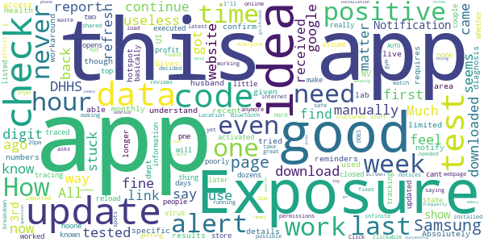

> Downloaded the app about two weeks ago worked fine, I assume the first couple days. Now it will never reload information (it has a little time last updated at the top) it's been stuck at the same time no matter what I do. I like the idea of this but it's basically an app that is a website with tracking permissions. All the clickable stuff in the app just take you to a webpage through your internet app.  :date: __2020-11-16 04:27:04__

> Due to the reviews, I have decided to not waste my time and efforts on this app. I'll continue to watch the news reports online of where the hot spots are and continue to be safe as possible. The idea of this app was good; however, it is only as good as the data that is inputted and shared to others. If there's a breakdown in getting the data into the app and out to everyone else, then it doesn't matter how great your app was stuctured.  :date: __2020-11-10 22:58:00__

> Won't refresh anymore making it useless  :date: __2020-10-30 02:53:20__

> Hard to find what i need  :date: __2020-10-29 01:58:43__

> Have the latest updates, yet asks me to update further. Click the link to do so > infinite load screen. Much needed app, needs some fixes.  :date: __2020-09-24 08:51:36__

> Needs work, won't refresh!  :date: __2020-09-18 02:17:18__

> DOES NOT AUTO UPDATE.  :date: __2020-09-07 14:37:16__

> I installed this app on 8/30/2020. Location and BlueTooth are on. Exposure notifications are on. I received on Exposure Notification on 8/30/2020 at 12:20pm saying No Exposure Found in the last hour. As of 8/31/2020, 12:01pm I have not received any other exposure notices. Even after one hour in the gym. 1) Why isn't this running/working? and 2)How do I manually check for exposures? 3)How frequently should I get exposures? Using a Samsung Note 8, android. Installation seemed to go just fine. Sending question to help email noted below. I very much would like to see this app be successful!  :date: __2020-08-31 21:09:02__

> This doesn't work, the app itself looks/seems/feels like a toy or fake, won't even show in the google play search, I had to find the website first then use the link to get to the app and in my girlfriend phone wont pass from the 3rd page "next" Samsung A20, and in my Samsung gs8 the loading update it's "meh".  :date: __2020-08-27 04:14:38__

> I love this idea! But... It only shows that the last check was 15 hours ago. One check is all it has done. What good is that? For those stuck on 3rd page, slide the slider in middle of the page as instructions say.  :date: __2020-08-25 16:09:15__

#### 1-star reviews

> "Those who would give up essential Liberty, to purchase a little temporary Safety, deserve neither Liberty nor Safety." -Benjamin Franklin  :date: __2020-11-21 14:57:41__

> I tested positive for coronavirus 2 minutes after downloading. Stay far away.  :date: __2020-11-18 01:21:06__

> You should improving this app it doesn't refresh I need Uninstaller and install every time:(  :date: __2020-11-17 03:15:22__

> Tracking app... Is someone marks as being exposed they can find u. I already had it. No thank you.  :date: __2020-11-16 21:47:22__

> "it's just an app", they said. "Just turn on your Bluetooth", they said. "It's just to help the public be proactive", they said. Let's just give the government the easy access to more areas of our lives. "No cash here, only credit or debit", they said. No anonymity anymore. Before you know it, we will all have barcodes printed on our foreheads you mindless dweebs.  :date: __2020-11-16 10:11:49__

> Great idea but won't reload.  :date: __2020-11-15 10:43:17__

> Tells me it's installed but doesn't open. Doesn't show in my phone  :date: __2020-11-14 16:46:45__

> This app is a joke. Doesn't update, have never received a notification. Blue tooth is on, etc. Etc. App is worthless. Was hoping it would be great but highly disappointed.  :date: __2020-11-13 16:22:36__

> App doesn't work. I went around 2 people today that I KNOW FOR A FACT both tested positive and this app did not notify me at all and says I'm still not at risk. Uninstalling this fakeness.  :date: __2020-11-13 06:07:29__

> F\*\*king stupid app. Like I'm going to download something the government approved. All you sheep are morons  :date: __2020-11-12 21:22:02__

# Covid Alert DE
App version ``1.0.1``

Analyzed with [covid-apps-observer](http://github.com/covid-apps-observer) project, version ``0.1``

## App overview
| | |
|-------------------------|-------------------------| 
| **Name**&nbsp;&nbsp;&nbsp;&nbsp;&nbsp;&nbsp;&nbsp;&nbsp;&nbsp;&nbsp;&nbsp;&nbsp;&nbsp;&nbsp;&nbsp;&nbsp;&nbsp;&nbsp;&nbsp;&nbsp;&nbsp;&nbsp;&nbsp;&nbsp;&nbsp;&nbsp;&nbsp;&nbsp;&nbsp;&nbsp;&nbsp;&nbsp;&nbsp;&nbsp;&nbsp;&nbsp;&nbsp;&nbsp;&nbsp;&nbsp;  | Covid Alert DE |
| **Unique identifier** | gov.de.covidtracker |
| **Link to Google Play** | [https://play.google.com/store/apps/details?id=gov.de.covidtracker](https://play.google.com/store/apps/details?id=gov.de.covidtracker) |
| **Summary**  | COVIDAlert, Delaware Division of Public Health helps reduce the spread of COVID |
| **Privacy policy** | [https://docs.google.com/document/d/1n1xZSpCCKc5eDpuJojHcd84k46joRCIR2NysOsQX6JE/edit?usp=sharing](https://docs.google.com/document/d/1n1xZSpCCKc5eDpuJojHcd84k46joRCIR2NysOsQX6JE/edit?usp=sharing) |
| **Latest version** | 1.0.1 |
| **Last update** | 2020-10-01 09:28:55 |
| **Recent changes** | Minor changes and bug fixes |
| **Installs**  | 5,000+ |
| **Category** | Medical |
| **First release** | Sep 8, 2020 |
| **Size**  | 106M |
| **Supported Android version**  | 6.0 and up |

### Description
> With your help, the COVID Alert DE app can help reduce the spread of coronavirus.
 The Division of Public Health of the State of Delaware is asking everyone to help tackle coronavirus by downloading and using the COVID Alert DE app every day.
  
 If you use the app you will:
 •             Be alerted if you have been in close contact with another user who has tested positive for coronavirus.
 •             Be able to track your symptoms and get advice on what to do.
 •             Protect yourself and others as everyone begins to return to normal life.
  
 Your data and privacy are vital. The COVID Alert DE app will NOT:
 •             Publicly identify anyone with COVID-19
 •             Use your data for any reason other than alerting you that you may be a close contact of someone who is COVID-positive.
  
 Use this app for 1 minute a day to make an important contribution to the fight against coronavirus. Protect yourself, your family, your community and the most vulnerable in society. Encourage everyone you know to download and use the Covid Alert DE app where possible.

### User interface
The developers of the app provide the following screenshots in the Google play store.
| | | |
|:-------------------------:|:-------------------------:|:-------------------------:|
 |   |   |   | 
 |   |  

## Development team
In the following we report the main information provided by the development team in the Google play store.

| | |
|-------------------------|-------------------------|
| **Developer**  | Delaware Department of Health and Social Services |
| **Website**  | [https://de.gov/covidalert](https://de.gov/covidalert) |
| **Email** | DHSS_COVIDAlertDE@delaware.gov |
| **Physical address**  | - |
| **Other developed apps**  | [https://play.google.com/store/apps/developer?id=Delaware+Department+of+Health+and+Social+Services](https://play.google.com/store/apps/developer?id=Delaware+Department+of+Health+and+Social+Services) |

## Android support

| | |
|-------------------------|-------------------------|
| **Declared target Android version**  | Android10, version 10 (API level 29) |
| **Effective target Android version**  | Android10, version 10 (API level 29) |
| **Minimum supported Android version**  | Marshmallow, version 6.0 (API level 23) |
| **Maximum target Android version**  | - |

The larger the difference between the minimum and maximum supported Android versions, the better. A larger difference means a wider audience. For example, old phones have a very low Android version, so a high minimum supported Android version means that the app cannot be used by users with old phones, thus leading to accessibility problems. 

## Requested permissions

In the following we report the complete list of the permissions requested by the app. 

| **Permission** | **Protection level** | **Description** | 
|-------------------------|-------------------------|-------------------------|
 **android.permission ACCESS_NETWORK_STATE** | Normal | Allows applications to access information about networks. 
 **android.permission ACCESS_WIFI_STATE** | Normal | Allows applications to access information about Wi-Fi networks. 
 **android.permission BLUETOOTH** | Normal | Allows applications to connect to paired bluetooth devices. 
 **android.permission INTERNET** | Normal | Allows applications to open network sockets. 
 **android.permission RECEIVE_BOOT_COMPLETED** | Normal | Allows an application to receive the Intent.ACTION_BOOT_COMPLETED that is broadcast after the system finishes booting. 
 **com.google.android.finsky.permission BIND_GET_INSTALL_REFERRER_SERVICE** | - | - 

## Mentioned servers

| **Server** | **Registrant** | **Registrant country** | **Creation date** | 
|-------------------------|-------------------------|-------------------------|-------------------------|
 | android.com | Google LLC | :us: US | 1997-06-23 04:00:00 |
 | google.com | Google LLC | :us: US | 1997-09-15 04:00:00 |
 | expo.io | See PrivacyGuardian.org | :us: US | 2011-05-01 21:26:50 |

## Security analysis 

Below we report the main security warnings raised by our execution of the [Androwarn](https://github.com/maaaaz/androwarn) security analysis tool.

**Telephony identifiers leakage**
> - This application reads the numeric name (MCC+MNC) of current registered operator 
> - This application reads the operator name 
> - This application reads the phone number string for line 1, for example, the MSISDN for a GSM phone 

**Location lookup**
> - This application reads location information from all available providers (WiFi, GPS etc.) 

**Connection interfaces exfiltration**
> - This application reads details about the currently active data network 
> - This application tries to find out if the currently active data network is metered 

**Suspicious connection establishment**
> - This application opens a Socket and connects it to the remote address ' returned no addresses for  ; port is out of range' on the 'N/A' port  
> - This application opens a Socket and connects it to the remote address '' on the 'N/A' port  
> - This application opens a Socket and connects it to the remote address 'Ljava/lang/StringBuilder;->toString()Ljava/lang/String;' on the 'N/A' port  
> - This application opens a Socket and connects it to the remote address 'Ljava/net/Proxy;->type()Ljava/net/Proxy$Type;' on the 'N/A' port  
> - This application opens a Socket and connects it to the remote address 'timeout' on the 'N/A' port  

**Pim data leakage**
> - This application accesses data stored in the clipboard 

**Code execution**
> - This application loads a native library 
> - This application executes a UNIX command 

## User ratings and reviews

Below we provide information about how end users are reacting to the app in terms of ratings and reviews in the Google Play store.

### Ratings

The Covid Alert DE app has been installed by more than **5000** times. At this time, **25** rated the app and its average score is **4.04**. Below we show the distribution of the ratings across the usual star-based rating of Google Play

:star::star::star::star::star:: 18

:star::star::star::star:: 0

:star::star::star:: 2

:star::star:: 0

:star:: 5

### Reviews 

#### 5-star reviews

> Works as described. It does not require GPS location like some people say nor does it have permission to access local data. 100% anonymous. I wish more people used the app and the ones who have it check in. At the time of me writing this, about 5% of the people who downloaded the app actually check in, so kinda defeats the purpose but that's not the app or developers fault. I'd like it to see a reminder to check in every day if possible for future updates.  :date: __2020-11-20 22:11:13__

> Informative  :date: __2020-11-15 03:25:46__

> New. Just installed. However, this important app was very easy to follow and activate. Best of all..ITS FREE! We need this sorta information to help combat Covid. Stay Safe all.  :date: __2020-10-25 10:15:47__

> COVIDAlert, Delaware Division of Public Health helps reduce the spread of COVID With your help, the COVID Alert DE app can help reduce the spread of coronavirus. The Division of Public Health of the State of Delaware is asking everyone to help tackle coronavirus by downloading and using the COVID Alert DE app every day. If you use the app you will • Be alerted if you have been in close contact with another user who has tested positive for coronavirus. •  :date: __2020-10-25 03:03:52__

> Very informative and hey if it keeps me safer I'm all for it .  :date: __2020-10-24 10:58:12__

> Great idea  :date: __2020-10-23 02:57:58__

> Jk you'll k. BLM on jk km violin BBC don vso inch ill  :date: __2020-10-19 01:51:28__

> Thanks a lot  :date: __2020-10-13 20:47:18__

> Good 👍  :date: __2020-10-11 03:57:19__

> I think this is a good idea maybe it will help figure out areas that need more help to battle this mess. Stay safe all!  :date: __2020-10-08 20:30:51__

#### 4-star reviews

> I like to help. Thinking I read directions correctly, now it is clear. . . "Use this app for 1 minute a day to make an important contribution to the fight against coronavirus." I don't know about all that, but the simple and straight forward dashboard is slick. Do your part and pray we get through this post-haste! I find it alarming that Kent County, DE is surrounded by higher infection rates, to the north and south. Software that does not suck is Cool.  :date: __2020-10-28 13:49:22__

> Looking for test sites???  :date: __2020-10-21 06:23:29__

> This is a great app but the problem is that more residents of delaware need to download the app. Also most of the time only 1000 people check in. I removed it, until more people sign up and report every day.  :date: __2020-10-12 00:38:27__

#### 3-star reviews

> Wish it would remind me to enter daily data. And with 35,000 users and only 180 check-ins a day I assume that feature would help others too.  :date: __2020-10-01 12:10:51__

> The app needs to be updated as it still talks about 14 days of isilatio. I'm not sure what phase 2 is as we are now at alert level 1  :date: __2020-09-26 00:53:51__

#### 2-star reviews

No recent reviews available with 2 stars.

#### 1-star reviews

> This is a tracking app so please be careful what you post  :date: __2020-11-18 00:01:30__

> Will not completely install, just hangs.  :date: __2020-10-24 21:43:07__

> Whats the use of downloading a dumb app for covid. Im not a robot that a phone thinks i have covid. I rather go to the hospital now and have a check up for me instead of downloading this app. This app can be dangerous and idk know if you guys are trying to look through my phone and seeing what i am talking about to my bf. I thought the government already have our information for a long. But Nooooo, they want to use this to be deep in our asses. I dont trust this app. Bye!  :date: __2020-10-18 22:53:52__

> Wow makes you turn on bluetooth and is a complete invasion of privacy. Stay home and hide if you are scared of COVID  :date: __2020-09-28 03:50:29__

> Would like to use the app, but the app always hangs when I get to the data page and click on Continue. I' using a Pixel 3 phone, Android 11.  :date: __2020-09-24 16:20:30__

> Perpetually stuck waiting for download from Play Store.  :date: __2020-09-16 15:17:02__

> I'm from Maryland but travel to Delaware frequently. This app only works on one of my phone, the others are too old. Please expand the API to include phones down to 4.4. Also less than 100 installs (50+) indicates no one is using it at the time of review. This makes this app useless with less than 0.009% user engagement, assuming the everyone who has installed this app is from Delaware - it is actually less. For this type of app to be meaningful, you need to have engagement > 50% of the population or >500,000% more installs.  :date: __2020-09-15 21:09:32__

# Guam Covid Alert
App version ``1.0.5``

Analyzed with [covid-apps-observer](http://github.com/covid-apps-observer) project, version ``0.1``

## App overview
| | |
|-------------------------|-------------------------| 
| **Name**&nbsp;&nbsp;&nbsp;&nbsp;&nbsp;&nbsp;&nbsp;&nbsp;&nbsp;&nbsp;&nbsp;&nbsp;&nbsp;&nbsp;&nbsp;&nbsp;&nbsp;&nbsp;&nbsp;&nbsp;&nbsp;&nbsp;&nbsp;&nbsp;&nbsp;&nbsp;&nbsp;&nbsp;&nbsp;&nbsp;&nbsp;&nbsp;&nbsp;&nbsp;&nbsp;&nbsp;&nbsp;&nbsp;&nbsp;&nbsp;  | Guam Covid Alert |
| **Unique identifier** | org.pathcheck.guam.bt |
| **Link to Google Play** | [https://play.google.com/store/apps/details?id=org.pathcheck.guam.bt](https://play.google.com/store/apps/details?id=org.pathcheck.guam.bt) |
| **Summary**  | Receive alerts about potential exposure to COVID-19 in Guam. |
| **Privacy policy** | [https://guamcovidalert.guam.gov/privacy-policy/](https://guamcovidalert.guam.gov/privacy-policy/) |
| **Latest version** | 1.0.5 |
| **Last update** | 2020-10-15 04:03:39 |
| **Recent changes** | - Added Check For Exposures button to the Exposure History Screen - Bugfixes and minor UI updates  |
| **Installs**  | 5,000+ |
| **Category** | Health & Fitness |
| **First release** | Sep 8, 2020 |
| **Size**  | 65M |
| **Supported Android version**  | 6.0 and up |

### Description
> Guam Covid Alert, an app by the Guam Department of Public Health and Social Services helps aid contact tracing for COVID-19 by using the privacy centric Exposure Notification System. Subscribe to Healthcare Authorities in your area for information about COVID-19 near you, where available.
 Receive alerts from the local Healthcare Authority with information about potential exposure to COVID-19.
 The goal of Guam Covid Alert by the Guam Department of Public Health and Social Services is to help enable the reemergence and re-opening of economies and communities. Through global partnerships, we are prepared to support public health officials everywhere in the effort to slow the spread of COVID-19.
 The Guam Covid Alert app was built using an open source project developed by PathCheck Foundation.

### User interface
The developers of the app provide the following screenshots in the Google play store.
| | | |
|:-------------------------:|:-------------------------:|:-------------------------:|
 |   |   |   | 

## Development team
In the following we report the main information provided by the development team in the Google play store.

| | |
|-------------------------|-------------------------|
| **Developer**  | Otech Developer |
| **Website**  | [https://guamcovidalert.guam.gov/](https://guamcovidalert.guam.gov/) |
| **Email** | developer@dma.guam.gov |
| **Physical address**  | - |
| **Other developed apps**  | [https://play.google.com/store/apps/developer?id=Otech+Developer](https://play.google.com/store/apps/developer?id=Otech+Developer) |

## Android support

| | |
|-------------------------|-------------------------|
| **Declared target Android version**  | - |
| **Effective target Android version**  | - |
| **Minimum supported Android version**  | Marshmallow, version 6.0 (API level 23) |
| **Maximum target Android version**  | - |

The larger the difference between the minimum and maximum supported Android versions, the better. A larger difference means a wider audience. For example, old phones have a very low Android version, so a high minimum supported Android version means that the app cannot be used by users with old phones, thus leading to accessibility problems. 

## Requested permissions

In the following we report the complete list of the permissions requested by the app. 

| **Permission** | **Protection level** | **Description** | 
|-------------------------|-------------------------|-------------------------|
 **android.permission ACCESS_NETWORK_STATE** | Normal | Allows applications to access information about networks. 
 **android.permission ACCESS_WIFI_STATE** | Normal | Allows applications to access information about Wi-Fi networks. 
 **android.permission BLUETOOTH** | Normal | Allows applications to connect to paired bluetooth devices. 
 **android.permission FOREGROUND_SERVICE** | Normal | Allows a regular application to use Service.startForeground. 
 **android.permission INTERNET** | Normal | Allows applications to open network sockets. 
 **android.permission RECEIVE_BOOT_COMPLETED** | Normal | Allows an application to receive the Intent.ACTION_BOOT_COMPLETED that is broadcast after the system finishes booting. 
 **android.permission VIBRATE** | Normal | Allows access to the vibrator. 
 **android.permission WAKE_LOCK** | Normal | Allows using PowerManager WakeLocks to keep processor from sleeping or screen from dimming. 

## Mentioned servers

| **Server** | **Registrant** | **Registrant country** | **Creation date** | 
|-------------------------|-------------------------|-------------------------|-------------------------|
 | bugsnag.com | Bugsnag Inc. | GB | 2011-08-18 03:26:10 |
 | android.com | Google LLC | :us: US | 1997-06-23 04:00:00 |
 | google.com | Google LLC | :us: US | 1997-09-15 04:00:00 |
 | github.com | GitHub, Inc. | :us: US | 2007-10-09 18:20:50 |

## Security analysis 

Below we report the main security warnings raised by our execution of the [Androwarn](https://github.com/maaaaz/androwarn) security analysis tool.

**Telephony identifiers leakage**
> - This application reads the numeric name (MCC+MNC) of current registered operator 
> - This application reads the operator name 

**Connection interfaces exfiltration**
> - This application reads details about the currently active data network 
> - This application tries to find out if the currently active data network is metered 

**Suspicious connection establishment**
> - This application opens a Socket and connects it to the remote address 'Ljava/lang/StringBuilder;->toString()Ljava/lang/String;' on the ': connect, resolve' port  
> - This application opens a Socket and connects it to the remote address 'Ljava/lang/StringBuilder;->toString()Ljava/lang/String;' on the 'N/A' port  
> - This application opens a Socket and connects it to the remote address 'Ljava/net/Proxy;->type()Ljava/net/Proxy$Type;' on the 'N/A' port  
> - This application opens a Socket and connects it to the remote address 'No route to  ' on the 'N/A' port  
> - This application opens a Socket and connects it to the remote address 'timeout' on the 'N/A' port  

**Pim data leakage**
> - This application accesses data stored in the clipboard 

**Code execution**
> - This application loads a native library 
> - This application executes a UNIX command 

## User ratings and reviews

Below we provide information about how end users are reacting to the app in terms of ratings and reviews in the Google Play store.

### Ratings

The Guam Covid Alert app has been installed by more than **5000** times. At this time, **25** rated the app and its average score is **4.0**. Below we show the distribution of the ratings across the usual star-based rating of Google Play

:star::star::star::star::star:: 16

:star::star::star::star:: 2

:star::star::star:: 1

:star::star:: 3

:star:: 3

### Reviews 

#### 5-star reviews

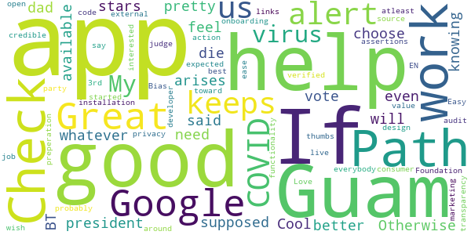

> Google  :date: __2020-11-01 21:04:08__

> Great to have and keeps us alert for COVID virus  :date: __2020-10-19 07:47:15__

> My president BT said her dad can choose who will die so I have to vote 5 stars for this. Otherwise it's a pretty good app  :date: __2020-10-18 16:14:04__

> 💙💙💙  :date: __2020-10-05 02:24:55__

> It does what's it supposed to. I feel better knowing this app is available to help If the need arises.  :date: __2020-09-28 09:47:53__

> Cool, whatever helps, even if the app isn't what everybody expected, atleast it's a value and can probably get you started on preperation.  :date: __2020-09-27 02:44:47__

> The best!  :date: __2020-09-15 11:11:33__

> Easy onboarding  :date: __2020-09-14 07:47:45__

> *Love* the design and ease of installation. Good job Guam and Path Check Foundation! Bias toward action. I like the transparency around privacy, but I wish there were external links to a credible audit of the open source code so that the in-app marketing assertions could be 3rd-party verified. I don't live in Guam and don't work as a Path Check developer, so I can't judge how the EN functionality works, but as an interested consumer, I say thumbs up.  :date: __2020-09-11 19:29:00__

#### 4-star reviews

No recent reviews available with 4 stars.

#### 3-star reviews

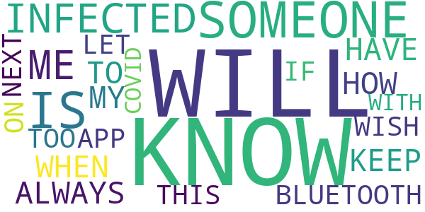

> HOW WILL I KNOW WHEN SOMEONE IS INFECTED? I ALWAYS HAVE TO KEEP MY BLUETOOTH ON. I WISH THIS APP WILL LET ME KNOW IF SOMEONE NEXT TOO ME IS INFECTED WITH COVID-19.  :date: __2020-10-01 11:11:11__

#### 2-star reviews

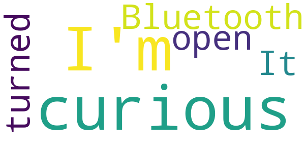

> I'm just curious as to why Bluetooth has to be turned on  :date: __2020-10-08 23:35:34__

> It doesn't open  :date: __2020-09-22 13:24:07__

#### 1-star reviews

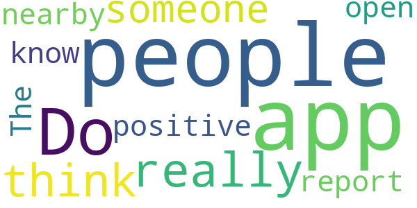

> Do people really think someone positive would report it in this app for nearby people to know  :date: __2020-09-12 01:55:52__

> The app won't open  :date: __2020-09-10 05:36:45__

# CombatCOVID PBC
App version ``1.0.5``

Analyzed with [covid-apps-observer](http://github.com/covid-apps-observer) project, version ``0.1``

## App overview
| | |
|-------------------------|-------------------------| 
| **Name**&nbsp;&nbsp;&nbsp;&nbsp;&nbsp;&nbsp;&nbsp;&nbsp;&nbsp;&nbsp;&nbsp;&nbsp;&nbsp;&nbsp;&nbsp;&nbsp;&nbsp;&nbsp;&nbsp;&nbsp;&nbsp;&nbsp;&nbsp;&nbsp;&nbsp;&nbsp;&nbsp;&nbsp;&nbsp;&nbsp;&nbsp;&nbsp;&nbsp;&nbsp;&nbsp;&nbsp;&nbsp;&nbsp;&nbsp;&nbsp;  | CombatCOVID PBC |
| **Unique identifier** | com.shield.CombatCovidPBC |
| **Link to Google Play** | [https://play.google.com/store/apps/details?id=com.shield.CombatCovidPBC](https://play.google.com/store/apps/details?id=com.shield.CombatCovidPBC) |
| **Summary**  | CombatCOVID alerts you when you&#39;ve been in contact with someone who has COVID-19 |
| **Privacy policy** | [https://combatcovidapp.com/combatcovid-pbc-principles-privacy-policy-and-terms-of-use/](https://combatcovidapp.com/combatcovid-pbc-principles-privacy-policy-and-terms-of-use/) |
| **Latest version** | 1.0.5 |
| **Last update** | 2020-08-28 17:03:48 |
| **Recent changes** | - Minor issues corrected |
| **Installs**  | 1,000+ |
| **Category** | Health & Fitness |
| **First release** | Jul 20, 2020 |
| **Size**  | 12M |
| **Supported Android version**  | 5.1 and up |

### Description
> CombatCOVID is the Official COVID-19 notification and information app of the County Government of Palm Beach County, Florida, a diverse community of over a million and a half people.
 Unlike other apps, CombatCOVID has never used GPS or location notification in its architecture. The app user’s privacy and identity are protected. No names, emails addresses, locations or personally identifying information is required. There is never any location or identity information acquired by CombatCOVID.
 The CombatCOVID app uses Bluetooth signals to determine if you are near another user. All users who have been in close proximity to a COVID-19 positive person will be notified by a push notification recommending they get tested immediately, without revealing anyone’s personal identity. Suggested locations for testing are also provided.
 Your device’s phone number is encrypted and never shared with anyone, including local health officials. All data and Information about the device being in close proximity with another device is ONLY stored on the device.
 Access to the data indicating the device’s user may have tested positive is only shared IF/WHEN the user chooses to share it. IF the user does choose to share a COVID-19 positive result, they are still totally PRIVACY PROTECTED.

### User interface
The developers of the app provide the following screenshots in the Google play store.
| | | |
|:-------------------------:|:-------------------------:|:-------------------------:|
 |   |   |   | 
 |  

## Development team
In the following we report the main information provided by the development team in the Google play store.

| | |
|-------------------------|-------------------------|
| **Developer**  | Palm Beach County BoCC |
| **Website**  | [https://combatcovidapp.com/pbc](https://combatcovidapp.com/pbc) |
| **Email** | info@combatcovidapp.com |
| **Physical address**  | - |
| **Other developed apps**  | [https://play.google.com/store/apps/developer?id=Palm+Beach+County+BoCC](https://play.google.com/store/apps/developer?id=Palm+Beach+County+BoCC) |

## Android support

| | |
|-------------------------|-------------------------|
| **Declared target Android version**  | Android10, version 10 (API level 29) |
| **Effective target Android version**  | Android10, version 10 (API level 29) |
| **Minimum supported Android version**  | Lollipop, version 5.1 (API level 22) |
| **Maximum target Android version**  | - |

The larger the difference between the minimum and maximum supported Android versions, the better. A larger difference means a wider audience. For example, old phones have a very low Android version, so a high minimum supported Android version means that the app cannot be used by users with old phones, thus leading to accessibility problems. 

## Requested permissions

In the following we report the complete list of the permissions requested by the app. 

| **Permission** | **Protection level** | **Description** | 
|-------------------------|-------------------------|-------------------------|
 **android.permission ACCESS_FINE_LOCATION** | :warning:**Dangerous** | Allows an app to access precise location. 
 **android.permission ACCESS_NETWORK_STATE** | Normal | Allows applications to access information about networks. 
 **android.permission BLUETOOTH** | Normal | Allows applications to connect to paired bluetooth devices. 
 **android.permission BLUETOOTH_ADMIN** | Normal | Allows applications to discover and pair bluetooth devices. 
 **android.permission FOREGROUND_SERVICE** | Normal | Allows a regular application to use Service.startForeground. 
 **android.permission INTERNET** | Normal | Allows applications to open network sockets. 
 **android.permission REQUEST_IGNORE_BATTERY_OPTIMIZATIONS** | Normal | Permission an application must hold in order to use Settings.ACTION_REQUEST_IGNORE_BATTERY_OPTIMIZATIONS. 
 **android.permission WAKE_LOCK** | Normal | Allows using PowerManager WakeLocks to keep processor from sleeping or screen from dimming. 
 **com.google.android.c2dm.permission RECEIVE** | - | - 
 **com.google.android.finsky.permission BIND_GET_INSTALL_REFERRER_SERVICE** | - | - 

## Mentioned servers

| **Server** | **Registrant** | **Registrant country** | **Creation date** | 
|-------------------------|-------------------------|-------------------------|-------------------------|
 | googlesyndication.com | Google LLC | :us: US | 2003-01-21 06:17:24 |
 | google.com | Google LLC | :us: US | 1997-09-15 04:00:00 |
 | app-measurement.com | Google LLC | :us: US | 2015-06-19 20:13:31 |
 | stackoverflow.com | Stack Exchange, Inc. | :us: US | 2003-12-26 19:18:07 |
 | googleapis.com | Google LLC | :us: US | 2005-01-25 17:52:26 |
 | googleadservices.com | Google LLC | :us: US | 2003-06-19 16:34:53 |
 | googleapis.com | Google LLC | :us: US | 2005-01-25 17:52:26 |
 | googleapis.com | Google LLC | :us: US | 2005-01-25 17:52:26 |
 | combatcovidapp.com | Domains By Proxy, LLC | :us: US | 2020-05-18 13:25:41 |

## Security analysis 

Below we report the main security warnings raised by our execution of the [Androwarn](https://github.com/maaaaz/androwarn) security analysis tool.

**Telephony identifiers leakage**
> - This application reads the ISO country code equivalent for the SIM provider's country code 
> - This application reads the ISO country code equivalent of the current registered operator's MCC (Mobile Country Code) 

**Connection interfaces exfiltration**
> - This application reads details about the currently active data network 
> - This application tries to find out if the currently active data network is metered 

**Suspicious connection establishment**
> - This application opens a Socket and connects it to the remote address '' on the 'N/A' port  
> - This application opens a Socket and connects it to the remote address 'Ljava/lang/StringBuilder;->toString()Ljava/lang/String;' on the 'N/A' port  
> - This application opens a Socket and connects it to the remote address 'Ljava/net/Proxy;->type()Ljava/net/Proxy$Type;' on the 'N/A' port  
> - This application opens a Socket and connects it to the remote address 'Network subsystem is unavailable' on the 'N/A' port  
> - This application opens a Socket and connects it to the remote address 'timeout' on the 'N/A' port  

## User ratings and reviews

Below we provide information about how end users are reacting to the app in terms of ratings and reviews in the Google Play store.

### Ratings

The CombatCOVID PBC app has been installed by more than **1000** times. At this time, **36** rated the app and its average score is **3.7777777**. Below we show the distribution of the ratings across the usual star-based rating of Google Play

:star::star::star::star::star:: 21

:star::star::star::star:: 2

:star::star::star:: 3

:star::star:: 4

:star:: 6

### Reviews 

#### 5-star reviews

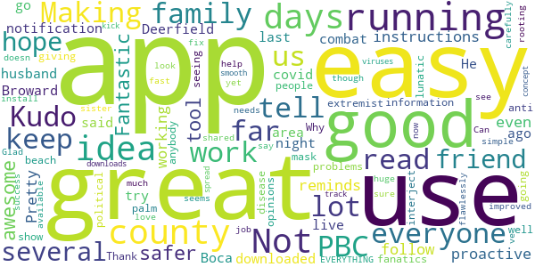

> App is awesome! So easy to use! Making the county safer!  :date: __2020-09-18 17:32:14__

> Fantastic tool - great app. Kudo's to PBC for being so proactive  :date: __2020-09-16 19:38:03__

> Pretty good so far, the instructions were easy to follow and it working good, it even reminds me with a notification to keep it running!!! I live in Boca and everyone in my family and me go to Deerfield area a lot, does this work in Broward?  :date: __2020-08-15 16:50:44__

> My husband downloaded combat covid a few days ago to try it out. He said that it was easy so I did it last night. I have had it running and no problems so far. I also like it has a lot of information for the people in palm beach to read about the disease. Thank you to the county for giving us this. I am going to show friends – well tell them I am not seeing anybody these days.  :date: __2020-08-15 16:42:08__

> Why so these political extremist/anti-mask fanatics interject their lunatic opinions into EVERYTHING! I’ve had the app running for several days now and so do several friend and family. I love it. It is simple to use and seems to be running flawlessly. Good job.  :date: __2020-08-15 16:37:17__

> Kudos to the county for making this available for use. Can’t tell yet what needs to be improved.  It was an easy and fast install but I did have to read it carefully to see what it was doing but it doesn’t look like other apps.  Not sure what I could say to fix that though.  :date: __2020-08-03 15:50:19__

> Great idea for an app. Glad my sister shared with me. Not much I had to do hope it works  :date: __2020-08-03 15:48:42__

> I am rooting for this app to be a huge success and help us here in PBC.  Hope everyone downloads it, uses it and we kick this viruses a\*\*.  :date: __2020-08-03 15:39:56__

> Good app  :date: __2020-07-29 15:17:53__

> This is a great idea and concept. App is smooth  :date: __2020-07-29 15:12:53__

#### 4-star reviews

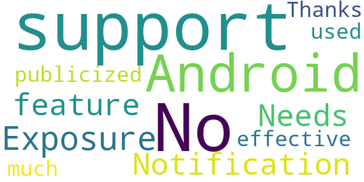

> No support for the Android " Exposure Notification" feature?  :date: __2020-09-18 18:33:23__

> Needs to be publicized (and used) much more for it to be effective. Thanks.  :date: __2020-08-17 19:36:15__

#### 3-star reviews

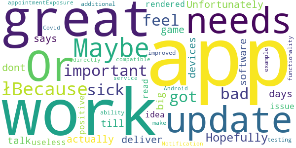

> łBecause they are very important to me and I would feel bad if I got them sick. Hopefully the app actually works! as it says it does. Unfortunately these days most apps talk a big game and just dont deliver as they should work. Or they work great or they work great till you update the devices software and then are rendered useless.  :date: __2020-09-10 14:57:03__

> Great idea, I read about the issue with positive, this needs to be improved. The app needs update and additional functionality for example ability to make testing appointment directly from app.  :date: __2020-08-16 17:22:11__

> is this app not compatible w/ Android Covid Exposure Notification service?  :date: __2020-08-11 01:01:00__

#### 2-star reviews

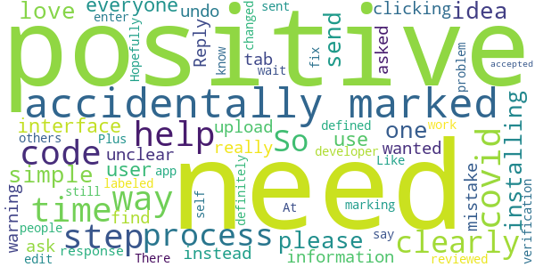

> Not installing. It won't send the one time code. I love the idea, this is what we need! But please it has to be simple for everyone to use.  :date: __2020-09-17 18:33:28__

> The user interface needs help! I accidentally marked myself covid positive by clicking a tab, it have a warning that did not ask me if I was covid positive but instead asked if I wanted to upload my information. That is really unclear. I could find no way to undo this mistake. Reply to the response from the developer: At the time i reviewed it, the "3 step process" was definitely not a clearly defined clearly labeled 3 step process for marking yourself positive. Hopefully it has changed.  :date: __2020-08-20 04:39:13__

> I accidentally marked my self positive and I am not don't know how to fix it. So I would say it needs some work so people don't have the same problem.  :date: __2020-08-14 00:26:16__

> This app still needs help. Like others, I also accidentally marked myself positive. There needs to be a way to edit that. Plus it sent me a verification code, but didn't wait for me to enter it. It just accepted me.  :date: __2020-08-02 20:03:22__

#### 1-star reviews

> Doesnt use googles covid tracing function. Wastes battery for almost no gain  :date: __2020-11-21 03:12:48__

> It doesn't work...also needs to always run in the background leading to battery loss.  :date: __2020-10-20 23:54:44__

> I am in the homes of hundreds of people each day. I was in contact with at least 130 people who later tested positive. Apparently none of them had this app. Even if they had alerted positive, I would not had gone into quarantine or been tested because I have taken all of the necessary precautions and then some. I no longer see any reason to drain my battery for this app. It is past time to uninstall. 1,500,000 people in PBC. Less than 2,000 downloads = .001% using app. Useless  :date: __2020-10-05 16:02:29__

> PBC corrupt mayor and commission paid $800k for this turd app that violates all your rights to privacy, HIPPA, and ACA. $800k could hire a team of 8 top notch developers for a year! Investigate this fraud and the MaskGate fraud as well. When you get your mask in mail from PBC make sure to get a sharpy, write a message on it, and send back! Turn PBC Republican in November and lock up all these criminal Tyrants! (Seems BoCC is worried about the facts!)  :date: __2020-08-18 13:35:13__

> Read the fine print of the user agreement VERY carefully! If you agree to it: you give up ALL of your rights. Advertised as not transmitting private information, yet it still has functionality to do so, and the agreement says they can whenever they want! Considering sensitivity of subject, potential for abuse, and waiving all rights in order to use this: one should avoid at all cost! Edit: read agreement and decide for yourself – you waive all your rights! Shield's reply is disingenuous at best.  :date: __2020-07-29 17:11:24__

> You really should make a better warning for the covid positive button.People have been pressing it thinking it turns on the bluetooth.  :date: __2020-07-28 21:59:54__

# Care19 Alert
App version ``1.1``

Analyzed with [covid-apps-observer](http://github.com/covid-apps-observer) project, version ``0.1``

## App overview
| | |
|-------------------------|-------------------------| 
| **Name**&nbsp;&nbsp;&nbsp;&nbsp;&nbsp;&nbsp;&nbsp;&nbsp;&nbsp;&nbsp;&nbsp;&nbsp;&nbsp;&nbsp;&nbsp;&nbsp;&nbsp;&nbsp;&nbsp;&nbsp;&nbsp;&nbsp;&nbsp;&nbsp;&nbsp;&nbsp;&nbsp;&nbsp;&nbsp;&nbsp;&nbsp;&nbsp;&nbsp;&nbsp;&nbsp;&nbsp;&nbsp;&nbsp;&nbsp;&nbsp;  | Care19 Alert |
| **Unique identifier** | com.proudcrowd.exposure |
| **Link to Google Play** | [https://play.google.com/store/apps/details?id=com.proudcrowd.exposure](https://play.google.com/store/apps/details?id=com.proudcrowd.exposure) |
| **Summary**  | Care19 Alert is the official COVID-19 exposure notification app for ND and WY. |
| **Privacy policy** | [https://www.care19.app/alert/privacy](https://www.care19.app/alert/privacy) |
| **Latest version** | 1.1 |
| **Last update** | 2020-09-17 02:44:19 |
| **Recent changes** | Routine monthly bug fixes |
| **Installs**  | 5,000+ |
| **Category** | Medical |
| **First release** | Aug 12, 2020 |
| **Size**  | 7.2M |
| **Supported Android version**  | 6.0 and up |

### Description
> Care19 Alert is the official COVID-19 exposure notification app for North Dakota and Wyoming as authorized by each states Department of Health. 
 Care19 Alert allows you to receive notifications if you have been near someone who has tested positive for Covid-19 recently.  Care19 Alert uses Apple’s Exposure Notification API to help reduce the spread of the coronavirus, with user privacy and security central to its design. 
 Care19 Alert maintains your privacy while securely communicating with nearby iOS and Android devices that also have exposure notifications enabled. This happens through the exchange of random keys that change every 15 minutes. These keys are stored securely on your device and hidden from the Care19 Alert application. All keys remain on your device and are not accessible unless you have tested positive for COVID-19, been contacted and verified by the Department of Health, and consent to sharing the random keys with others.
 Care19 Alert allows you to notify others if you test positive for COVID-19 and it will notify you if someone you came in contact tested positive for COVID-19. With your permission, your key/date pairs will be securely uploaded to the National Key Server run by the Association of Public Health Laboratories.  All uploaded key/date pairs are distributed to all of the devices connected to the National Key Server. 
  
 The downloaded keys are matched by the operating system based on criteria established by each Department of Health, and if you have a match you will be notified of the exposure and provided by your department of Health with the set of actions to take provided.

### User interface
The developers of the app provide the following screenshots in the Google play store.
| | | |
|:-------------------------:|:-------------------------:|:-------------------------:|
 |   |   |   | 

## Development team
In the following we report the main information provided by the development team in the Google play store.

| | |
|-------------------------|-------------------------|
| **Developer**  | ProudCrowd, LLC |
| **Website**  | [https://www.care19.app](https://www.care19.app) |
| **Email** | tim@brookinsfamily.net |
| **Physical address**  | - |
| **Other developed apps**  | [https://play.google.com/store/apps/developer?id=ProudCrowd,+LLC](https://play.google.com/store/apps/developer?id=ProudCrowd,+LLC) |

## Android support

| | |
|-------------------------|-------------------------|
| **Declared target Android version**  | Android10, version 10 (API level 29) |
| **Effective target Android version**  | Android10, version 10 (API level 29) |
| **Minimum supported Android version**  | Marshmallow, version 6.0 (API level 23) |
| **Maximum target Android version**  | - |

The larger the difference between the minimum and maximum supported Android versions, the better. A larger difference means a wider audience. For example, old phones have a very low Android version, so a high minimum supported Android version means that the app cannot be used by users with old phones, thus leading to accessibility problems. 

## Requested permissions

In the following we report the complete list of the permissions requested by the app. 

| **Permission** | **Protection level** | **Description** | 
|-------------------------|-------------------------|-------------------------|
 **android.permission ACCESS_NETWORK_STATE** | Normal | Allows applications to access information about networks. 
 **android.permission BLUETOOTH** | Normal | Allows applications to connect to paired bluetooth devices. 
 **android.permission FOREGROUND_SERVICE** | Normal | Allows a regular application to use Service.startForeground. 
 **android.permission INTERNET** | Normal | Allows applications to open network sockets. 
 **android.permission RECEIVE_BOOT_COMPLETED** | Normal | Allows an application to receive the Intent.ACTION_BOOT_COMPLETED that is broadcast after the system finishes booting. 
 **android.permission WAKE_LOCK** | Normal | Allows using PowerManager WakeLocks to keep processor from sleeping or screen from dimming. 
 **com.google.android.c2dm.permission RECEIVE** | - | - 
 **com.google.android.finsky.permission BIND_GET_INSTALL_REFERRER_SERVICE** | - | - 

## Mentioned servers

| **Server** | **Registrant** | **Registrant country** | **Creation date** | 
|-------------------------|-------------------------|-------------------------|-------------------------|
 | bugfender.com | Beenario GmbH | :de: DE | 2014-10-28 11:32:13 |
 | googlesyndication.com | Google LLC | :us: US | 2003-01-21 06:17:24 |
 | google.com | Google LLC | :us: US | 1997-09-15 04:00:00 |
 | app-measurement.com | Google LLC | :us: US | 2015-06-19 20:13:31 |
 | googleapis.com | Google LLC | :us: US | 2005-01-25 17:52:26 |
 | googleadservices.com | Google LLC | :us: US | 2003-06-19 16:34:53 |
 | googleapis.com | Google LLC | :us: US | 2005-01-25 17:52:26 |
 | crashlytics.com | Google LLC | :us: US | 2011-01-21 15:30:40 |

## Security analysis 

Below we report the main security warnings raised by our execution of the [Androwarn](https://github.com/maaaaz/androwarn) security analysis tool.

**Telephony identifiers leakage**
> - This application reads the MCC+MNC of the provider of the SIM 
> - This application reads the Service Provider Name (SPN) 
> - This application reads the numeric name (MCC+MNC) of current registered operator 
> - This application reads the operator name 

**Connection interfaces exfiltration**
> - This application reads details about the currently active data network 
> - This application tries to find out if the currently active data network is metered 

**Suspicious connection establishment**
> - This application opens a Socket and connects it to the remote address ' returned no addresses for  ; port is out of range' on the 'N/A' port  
> - This application opens a Socket and connects it to the remote address '' on the 'N/A' port  
> - This application opens a Socket and connects it to the remote address 'Ljava/lang/StringBuilder;->toString()Ljava/lang/String;' on the 'N/A' port  
> - This application opens a Socket and connects it to the remote address 'Ljava/net/Proxy;->type()Ljava/net/Proxy$Type;' on the 'N/A' port  
> - This application opens a Socket and connects it to the remote address 'timeout' on the 'N/A' port  

**Code execution**
> - This application executes a UNIX command 
> - This application executes a UNIX command containing this argument: 'logcat -c 2' 
> - This application executes a UNIX command containing this argument: 'logcat -c' 

## User ratings and reviews

Below we provide information about how end users are reacting to the app in terms of ratings and reviews in the Google Play store.

### Ratings

The Care19 Alert app has been installed by more than **5000** times. At this time, **25** rated the app and its average score is **3.52**. Below we show the distribution of the ratings across the usual star-based rating of Google Play

:star::star::star::star::star:: 13

:star::star::star::star:: 3

:star::star::star:: 1

:star::star:: 0

:star:: 8

### Reviews 

#### 5-star reviews

> Works great  :date: __2020-11-07 23:36:18__

> Not really sure how often it does a check but from what I see from the pictures it's suppose to check 2 hours or so and I will go hours between checks kind of disappointed in the app not going to know if I have been exposed if it don't check when it is suppose to  :date: __2020-11-03 20:26:41__

> I love the app because I love it  :date: __2020-10-29 18:17:07__

> Absolutely love it  :date: __2020-10-25 07:09:59__

> Help  :date: __2020-09-15 03:29:55__

> This app was no good it gave me covid  :date: __2020-09-04 02:48:59__

> We all need to take positive action to control the spread of the virus. It is our responsibility to keep us all safe.  :date: __2020-08-26 01:46:46__

> With ND's depressing lack of proper response to COVID-19, I was afraid this might not exist for the area. Thank you.  :date: __2020-08-23 22:43:40__

> I think this is a great way of keeping track of where you have been and who you could possibly come into contact with, without any effort.  :date: __2020-08-22 02:56:05__

> This is an anonymous way of doing contact tracing. Great Job!  :date: __2020-08-21 04:42:54__

#### 4-star reviews

> Great!-!!🤔  :date: __2020-11-20 06:46:47__

> Seems like a good app but here's a question, will this app be effective even though I am in Colorado? Will it be effective in another state  :date: __2020-09-27 10:53:58__

> Add support for SD, please!  :date: __2020-09-10 00:36:08__

#### 3-star reviews

No recent reviews available with 3 stars.

#### 2-star reviews

No recent reviews available with 2 stars.

#### 1-star reviews

> Doesn't do what it should. Just takes up space on your phone or tablet  :date: __2020-11-21 15:36:41__

> Shouldn't have any sort of tracker koek this. If there isn't o e for the flu or any other virus we shouldn't have it for this.  :date: __2020-11-16 07:06:44__

> Not any relevant information for right now!! 11-15-20  :date: __2020-11-16 04:25:29__

> I had the app and was diagnosed with Covid. I sent my caseworker a screenshot of the app so I could get my 'notify others' button turned on. I don't know if she could do that or not, but she didn't address it. I had no idea how to activate the button to do the only thing this app is supposed to do.  :date: __2020-11-11 18:01:46__

> Don't put stuff on my phone if I want it I would get it  :date: __2020-11-01 07:21:06__

> I dont live in the states that are provided, please add more states to this, and I will be an ambassador for the app.  :date: __2020-11-01 06:35:47__

> App won't open past the second screen where you have to agree to the disclosure. When you click the "I agree" button, nothing happens. Fully updated Samsung Galaxy S9. App is worthless if it won't open.  :date: __2020-10-28 15:58:15__

> The idea is garbage, but the app is absolutely garbage how it works. Ot is a virus its self.  :date: __2020-10-28 02:18:24__

> This app will only be effective and useful if a large percentage of the population install and use it. It looks like only 10k people have downloaded the app. With a combined total of 1.3M people between ND and WY, that is less than %1, the install base is likely even less since people have probably uninstalled it.  :date: __2020-10-24 19:03:20__

> I can't get passed the accept screen. When I push the button nothing happens . I am a college student and the only family member leaving my house so this is a very important part of staying safe. Any help? I'm using a Xiaomi Redmi Note 8 Pro and the most recent android patch.  :date: __2020-10-21 09:20:23__

# MI COVID Alert
App version ``1.0``

Analyzed with [covid-apps-observer](http://github.com/covid-apps-observer) project, version ``0.1``

## App overview
| | |
|-------------------------|-------------------------| 
| **Name**&nbsp;&nbsp;&nbsp;&nbsp;&nbsp;&nbsp;&nbsp;&nbsp;&nbsp;&nbsp;&nbsp;&nbsp;&nbsp;&nbsp;&nbsp;&nbsp;&nbsp;&nbsp;&nbsp;&nbsp;&nbsp;&nbsp;&nbsp;&nbsp;&nbsp;&nbsp;&nbsp;&nbsp;&nbsp;&nbsp;&nbsp;&nbsp;&nbsp;&nbsp;&nbsp;&nbsp;&nbsp;&nbsp;&nbsp;&nbsp;  | MI COVID Alert |
| **Unique identifier** | gov.michigan.MiCovidExposure |
| **Link to Google Play** | [https://play.google.com/store/apps/details?id=gov.michigan.MiCovidExposure](https://play.google.com/store/apps/details?id=gov.michigan.MiCovidExposure) |
| **Summary**  | Michigan&#39;s COVID-19 Exposure Notification App |
| **Privacy policy** | [http://michigan.gov/micovidalertprivacy](http://michigan.gov/micovidalertprivacy) |
| **Latest version** | 1.0 |
| **Last update** | 2020-10-13 19:20:41 |
| **Recent changes** | Initial release of MI COVID Alert, the Michigan Department of Health and Human Services Exposure Notifications app. |
| **Installs**  | 1,000+ |
| **Category** | Health & Fitness |
| **First release** | Oct 9, 2020 |
| **Size**  | 2.9M |
| **Supported Android version**  | 6.0 and up |

### Description
> MI COVID Alert is the COVID-19 exposure notification app supported by the Michigan Department of Health and Human Services (MDHHS), in partnership with SpringML, Google, and Apple. This app uses Bluetooth Low Energy (BLE) API framework created through a unique collaboration between Apple and Google.
 Your personal use of MI COVID Alert helps inform others of possible exposure to COVID-19 if they are suspected of having been within close proximity to someone who has tested positive. When you download MI COVID Alert, you are helping your community stay ahead of any potential surge in COVID-19 cases. 
 How MI COVID Alert Works:
 Once downloaded, users of the app who have enabled it will exchange anonymous Bluetooth “keys” (random alpha-numeric codes that represent a Bluetooth signal) with other MI COVID Alert users.
 If someone reports that they tested positive for COVID-19, the app will search for other users who shared the Bluetooth Low Energy (BLE) signal. The BLE signals are date-stamped and MI COVID Alert estimates how close the two devices were based on signal strength. If the timeframe was at least 15 minutes and the estimated distance was within six feet, then the other user receives a notification of a possible exposure. Names of users and locations of possible exposure are never tracked and never shared.
 The BLE framework within MI COVID Alert will run in the background, even if the exposure notification app is closed. It will not drain the device battery at a rate faster than other apps that use normal Bluetooth and/or are open and running continuously.
 How MI COVID Alert Protects Your Privacy:
 MDHHS takes your privacy very seriously. This is why we chose to use the Apple and Google BLE framework. No personal data or location tracking occurs within MI COVID Alert. 
 MDHHS and local public health staff follow up with persons who have a positive COVID-19 laboratory report. Public health will provide MI COVID Alert users with a validation pin. That validation pin must be entered into the app to report a notification of possible exposure to other users. This prevents people from falsely reporting positive results, which could generate false exposure notifications. 
 If you have the current Apple or Google operating system installed on your device, you may have noticed that Exposure Notifications are now included. You cannot enable this function until you have downloaded MI COVID Alert. Apple and Google will delete the exposure notification service tools from their respective operating systems once the pandemic reaches a point that public health no longer requires the use of this technology.
 Thank you for downloading MI COVID Alert! Together, we can protect our family, friends, and communities.

### User interface
The developers of the app provide the following screenshots in the Google play store.
| | | |
|:-------------------------:|:-------------------------:|:-------------------------:|
 |   |   |   | 
 |  

## Development team
In the following we report the main information provided by the development team in the Google play store.

| | |
|-------------------------|-------------------------|
| **Developer**  | State of Michigan |
| **Website**  | [http://www.michigan.gov/micovidalert](http://www.michigan.gov/micovidalert) |
| **Email** | mdhhs-micovidalert@michigan.gov |
| **Physical address**  | - |
| **Other developed apps**  | [https://play.google.com/store/apps/developer?id=State+of+Michigan](https://play.google.com/store/apps/developer?id=State+of+Michigan) |

## Android support

| | |
|-------------------------|-------------------------|
| **Declared target Android version**  | Android10, version 10 (API level 29) |
| **Effective target Android version**  | Android10, version 10 (API level 29) |
| **Minimum supported Android version**  | Marshmallow, version 6.0 (API level 23) |
| **Maximum target Android version**  | - |

The larger the difference between the minimum and maximum supported Android versions, the better. A larger difference means a wider audience. For example, old phones have a very low Android version, so a high minimum supported Android version means that the app cannot be used by users with old phones, thus leading to accessibility problems. 

## Requested permissions

In the following we report the complete list of the permissions requested by the app. 

| **Permission** | **Protection level** | **Description** | 
|-------------------------|-------------------------|-------------------------|
 **android.permission ACCESS_NETWORK_STATE** | Normal | Allows applications to access information about networks. 
 **android.permission BLUETOOTH** | Normal | Allows applications to connect to paired bluetooth devices. 
 **android.permission FOREGROUND_SERVICE** | Normal | Allows a regular application to use Service.startForeground. 
 **android.permission INTERNET** | Normal | Allows applications to open network sockets. 
 **android.permission RECEIVE_BOOT_COMPLETED** | Normal | Allows an application to receive the Intent.ACTION_BOOT_COMPLETED that is broadcast after the system finishes booting. 
 **android.permission WAKE_LOCK** | Normal | Allows using PowerManager WakeLocks to keep processor from sleeping or screen from dimming. 

## Mentioned servers

| **Server** | **Registrant** | **Registrant country** | **Creation date** | 
|-------------------------|-------------------------|-------------------------|-------------------------|
 | google.com | Google LLC | :us: US | 1997-09-15 04:00:00 |
 | jhu.edu | Johns Hopkins University | - | 1987-03-19 00:00:00 |

## Security analysis 

Below we report the main security warnings raised by our execution of the [Androwarn](https://github.com/maaaaz/androwarn) security analysis tool.

**Telephony identifiers leakage**
> - This application reads the ISO country code equivalent of the current registered operator's MCC (Mobile Country Code) 

**Connection interfaces exfiltration**
> - This application reads details about the currently active data network 
> - This application tries to find out if the currently active data network is metered 

## User ratings and reviews

Below we provide information about how end users are reacting to the app in terms of ratings and reviews in the Google Play store.

### Ratings

The MI COVID Alert app has been installed by more than **1000** times. At this time, **24** rated the app and its average score is **4.5833335**. Below we show the distribution of the ratings across the usual star-based rating of Google Play

:star::star::star::star::star:: 20

:star::star::star::star:: 2

:star::star::star:: 0

:star::star:: 0

:star:: 2

### Reviews 

#### 5-star reviews

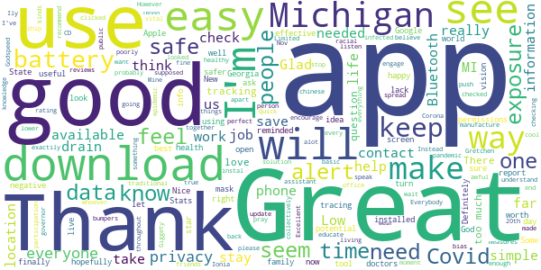

> I'm doing fine, I get check every 30 days at my doctors office. N so far I've been negative. Thank God, I feel for the ones that get it. But most that do get it they don't wear mask n do stay far enough apart. If everyone would just listen to the CD, or governor or doctors we could be alot lower in the spread. So I pray I don't ever get it. N I'm so stay back from everything good luck n thank you for ure assistance of how to deal with the problem. Mr. Gooding, my God be with all of us but more w  :date: __2020-11-19 18:33:47__

> Privacy SUPERB  :date: __2020-11-19 03:56:19__

> Very well.  :date: __2020-11-18 22:03:57__

> New to it but could be a life savior!  :date: __2020-11-15 21:27:57__

> Great app. It's private and low impact to my phone. The one downside is it relies and others installing and using it. It does provide some good statistical and links to general information  :date: __2020-11-15 14:17:04__

> Easy, and I like that it reminded me that it wouldn't work with my Bluetooth turned off (which reminded me to turn Bluetooth on!).  :date: __2020-11-14 23:09:39__

> I really am sick of conspiracy theorists.  :date: __2020-11-14 14:51:24__

> Great info, easy to use. My only suggestion is to reduce the size of the text box on the Stats page regarding Johns Hopkins along with the logo. It takes up too much of the screen on my Android mobile device. I can only use 40% of the screen for scrolling the stats.  :date: __2020-11-14 01:45:27__

> Great that I can be notified of potential exposure to covid-19!!  :date: __2020-11-14 00:40:01__

> Awesome  :date: __2020-11-13 23:35:40__

#### 4-star reviews

> I installed it to do my part. I'll uninstall it once this pandemic passes. That's freedom.  :date: __2020-11-21 18:55:35__

> I'm glad to have this, but the map doesn't work correctly. When I tap on a county, it just shows a blank page.  :date: __2020-11-21 16:50:48__

> Just checking it out  :date: __2020-11-20 08:58:10__

> Way to late and unlikely to work universally (eg. with folks from out of state) but it's better than the nothing burger we've had so far. Would be nice if it gave you an idea of how many contacts it recorded (Inna privacy preserving way) to let us know the adoption rate around us.  :date: __2020-11-17 03:59:58__

> Its a good way to b notifield about the virus  :date: __2020-11-14 23:32:03__

> Information is powerful for health and wellbeing.  :date: __2020-11-14 22:56:37__

> Remove stats tab. Why isn't this for any infectious disease.  :date: __2020-11-14 00:37:30__

> In the stats tab if you scroll to the map you get stuck unable to scroll outside of the map. Only solution seems to be to reopen the app. Might try making the map a touch smaller or making it a separate pop out window or something.  :date: __2020-11-13 21:25:25__

> This app is great, but it would be even better if we could submit a result that tested negative so that health officials can track this as well.  :date: __2020-11-13 19:36:09__

> Hopefully enough people use it to make it work!  :date: __2020-11-13 17:03:29__

#### 3-star reviews

> On the page "Michigan Coronavirus Stats" 2/3 of the page is covered with text about John Hopkins. To scroll the important information there is only a 1 inch window.  :date: __2020-11-19 14:59:18__

> Nice start, but it's deceptive giving static statistics. Need to do update stats daily or remove them!  :date: __2020-11-15 17:48:11__

> The county health department is so overwhelmed I likely won't be contacted to get the pin # to put in my positive test. I can have no clear idea of how effective the app is, but it's better than nothing  :date: __2020-11-15 14:33:26__

> Great idea  :date: __2020-11-15 00:39:09__

> I think the concept of this app is a step in flattening the curve but unless all Michiganders are downloading and using this how is its effectivenes Therefore, I think requirement of the app by all with smart phones or access might make it more successful, not only Michigan but throughout the United States. Matter of fact Everywhere this is a "Global Pandemic". Pre-installment (as other widely used apps are already installed on new phones) is a good idea as well. Please Consider  :date: __2020-11-14 19:46:35__

> Being able to see a how many people in your area have downloaded the app would be helpful. Its far more accurate if my city has 5k+ downloads than if it only has 500.  :date: __2020-11-14 17:53:39__

> I am a nurse and have tested positive in April. No pin given. Won't let me submit my result  :date: __2020-11-14 09:22:03__

> I will it ever download, still pending After 5 Minutes  :date: __2020-11-14 04:23:42__

> We live in a weird ass world, ive been inside for months  :date: __2020-11-13 20:05:32__

> Too much text, especially when you try to look at John Hopkins pages. The notice about that fills half the page, the bottom icons take more, so you get very little info on the screen and cant even see that it is michigan on the map. Next topic: I also worry very much about being tracked and my privacy.  :date: __2020-11-12 16:00:48__

#### 2-star reviews

> Why are only 3 ethnic groups shown in the Statewide Racial Breakdown? The groups shown are Black/African American, Hispanic/Latino, and Native American/Alaskan Native. What about Asians? Middle Eastern? Michigan is made up of more than 3 ethnic groups and whites.  :date: __2020-11-22 15:22:42__

> Would be nice if the Stats screen wasn't 80% ad for John Hopkins. Would like to see better view of the stats.  :date: __2020-11-19 15:35:54__

> Would not come in kept trying  :date: __2020-11-19 00:24:18__

> The main page with the stats has half the screen taken up with a banner crediting John Hopkins for the work. You can't minimize it and it hinders the usability of the app  :date: __2020-11-18 22:44:08__

> You only have 1" to view info. Needs work.  :date: __2020-11-15 17:34:28__

> I wish this Covid-MI was more like the COVID -NJ APP it actually let you know if been exposed . Has a feature that circles They need to improve the Covid-19 app for MI Whomever developed should look at the Covid-NJ app asap  :date: __2020-11-15 08:12:50__

> Seems like a good idea, I'm not in a major city and don't work around large amounts of people so not sure how effective it will be for me. One thing it did I don't get since it says it uses bluetooth and won't ask for GPS, is it required me to have my GPS on to receive notifications! Everything I read about the app says it shouldn't and won't do this and it's not listed as part of the app permissions. If the app really needs GPS on they need to make sure it's known and listed in the permissions!  :date: __2020-11-14 13:59:23__

> The design makes it impossible to read the info in stats.  :date: __2020-11-14 03:17:19__

> Don't delete my review again because you don't like it. Oh look, a 'FEAR' spreading tool to manipulate the mob.  :date: __2020-11-13 19:46:56__

#### 1-star reviews

> This app is a piece of garbage  :date: __2020-11-19 01:15:19__

> Every since I downloaded this app I'm getting increased Spam and unwanted calls all day and night. This wasn't happening until I downloaded this app  :date: __2020-11-18 23:37:05__

> Buggy - clicking "enable notifications" causes my Pixel 4 XL to freeze. If I hit power button to turn screen off... Then turn on again and press "no, do not enable notifications" then app works... As soon as I try to enable notifications it freezes again. Please fix the app  :date: __2020-11-18 16:12:49__

> I'm positive and can't record it. I've had my rapid results for 5 days and send out results for 3 days, but can't report anything without a code from the health department. Makes the app completely pointless.  :date: __2020-11-16 21:56:47__

> This app is worthless. Srop feeding the fear  :date: __2020-11-16 06:17:15__

> Covid 19 has a 99.98% survival rate , no need for this app.  :date: __2020-11-15 21:00:14__

> Don't bother, your battery will die before it has any time to do anything useful. Downloaded had to charge my phone every 3 hours.  :date: __2020-11-15 06:39:46__

> Big brother  :date: __2020-11-15 03:46:39__

> Doesn't work. Just tells you to update Google play services but it's already up to date.  :date: __2020-11-15 03:32:49__

> Tyrannical government app  :date: __2020-11-14 19:09:40__

# CombatCOVID MDC
App version ``1.0.6``

Analyzed with [covid-apps-observer](http://github.com/covid-apps-observer) project, version ``0.1``

## App overview
| | |
|-------------------------|-------------------------| 
| **Name**&nbsp;&nbsp;&nbsp;&nbsp;&nbsp;&nbsp;&nbsp;&nbsp;&nbsp;&nbsp;&nbsp;&nbsp;&nbsp;&nbsp;&nbsp;&nbsp;&nbsp;&nbsp;&nbsp;&nbsp;&nbsp;&nbsp;&nbsp;&nbsp;&nbsp;&nbsp;&nbsp;&nbsp;&nbsp;&nbsp;&nbsp;&nbsp;&nbsp;&nbsp;&nbsp;&nbsp;&nbsp;&nbsp;&nbsp;&nbsp;  | CombatCOVID MDC |
| **Unique identifier** | com.shield.CombatCovidMD |
| **Link to Google Play** | [https://play.google.com/store/apps/details?id=com.shield.CombatCovidMD](https://play.google.com/store/apps/details?id=com.shield.CombatCovidMD) |
| **Summary**  | CombatCOVID alerts you when you&#39;ve been in contact with someone who has COVID-19 |
| **Privacy policy** | [https://combatcovidapp.com/combatcovid-miamidade-principles-privacy-policy-and-terms-of-use/](https://combatcovidapp.com/combatcovid-miamidade-principles-privacy-policy-and-terms-of-use/) |
| **Latest version** | 1.0.6 |
| **Last update** | 2020-11-19 12:12:03 |
| **Recent changes** | Minor content update in info screens |
| **Installs**  | 1,000+ |
| **Category** | Health & Fitness |
| **First release** | Aug 4, 2020 |
| **Size**  | 20M |
| **Supported Android version**  | 5.1 and up |

### Description
> CombatCOVID MDC app is for Miami-Dade County coverage.
 CombatCOVID is the Official COVID-19 notification and information app of the County Government of Miami-Dade County, Florida, a diverse community of over 2.7 million people.
 Unlike other apps, CombatCOVID has never used GPS or location notification in its architecture. The app user’s privacy and identity are protected. No names, emails addresses, locations or personally identifying information is required. There is never any location or identity information acquired by CombatCOVID.
 The CombatCOVID app uses Bluetooth signals to determine if you are near another user. All users who have been in close proximity to a COVID-19 positive person will be notified by a push notification recommending they get tested immediately, without revealing anyone’s personal identity. Suggested locations for testing are also provided.
 Your device’s phone number is encrypted and never shared with anyone, including local health officials. All data and Information about the device being in close proximity with another device is ONLY stored on the device.
 Access to the data indicating the device’s user may have tested positive is only shared IF/WHEN the user chooses to share it. IF the user does choose to share a COVID-19 positive result, they are still totally PRIVACY PROTECTED.

### User interface
The developers of the app provide the following screenshots in the Google play store.
| | | |
|:-------------------------:|:-------------------------:|:-------------------------:|
 |   |   |   | 

## Development team
In the following we report the main information provided by the development team in the Google play store.

| | |
|-------------------------|-------------------------|
| **Developer**  | Miami-Dade County |
| **Website**  | [https://combatcovidapp.com/mdc](https://combatcovidapp.com/mdc) |
| **Email** | info@combatcovidapp.com |
| **Physical address**  | - |
| **Other developed apps**  | [https://play.google.com/store/apps/developer?id=Miami-Dade+County](https://play.google.com/store/apps/developer?id=Miami-Dade+County) |

## Android support

| | |
|-------------------------|-------------------------|
| **Declared target Android version**  | Android10, version 10 (API level 29) |
| **Effective target Android version**  | Android10, version 10 (API level 29) |
| **Minimum supported Android version**  | Lollipop, version 5.1 (API level 22) |
| **Maximum target Android version**  | - |

The larger the difference between the minimum and maximum supported Android versions, the better. A larger difference means a wider audience. For example, old phones have a very low Android version, so a high minimum supported Android version means that the app cannot be used by users with old phones, thus leading to accessibility problems. 

## Requested permissions

In the following we report the complete list of the permissions requested by the app. 

| **Permission** | **Protection level** | **Description** | 
|-------------------------|-------------------------|-------------------------|
 **android.permission ACCESS_FINE_LOCATION** | :warning:**Dangerous** | Allows an app to access precise location. 
 **android.permission ACCESS_NETWORK_STATE** | Normal | Allows applications to access information about networks. 
 **android.permission BLUETOOTH** | Normal | Allows applications to connect to paired bluetooth devices. 
 **android.permission BLUETOOTH_ADMIN** | Normal | Allows applications to discover and pair bluetooth devices. 
 **android.permission FOREGROUND_SERVICE** | Normal | Allows a regular application to use Service.startForeground. 
 **android.permission INTERNET** | Normal | Allows applications to open network sockets. 
 **android.permission REQUEST_IGNORE_BATTERY_OPTIMIZATIONS** | Normal | Permission an application must hold in order to use Settings.ACTION_REQUEST_IGNORE_BATTERY_OPTIMIZATIONS. 
 **android.permission WAKE_LOCK** | Normal | Allows using PowerManager WakeLocks to keep processor from sleeping or screen from dimming. 
 **com.google.android.c2dm.permission RECEIVE** | - | - 
 **com.google.android.finsky.permission BIND_GET_INSTALL_REFERRER_SERVICE** | - | - 

## Mentioned servers

| **Server** | **Registrant** | **Registrant country** | **Creation date** | 
|-------------------------|-------------------------|-------------------------|-------------------------|
 | googlesyndication.com | Google LLC | :us: US | 2003-01-21 06:17:24 |
 | google.com | Google LLC | :us: US | 1997-09-15 04:00:00 |
 | app-measurement.com | Google LLC | :us: US | 2015-06-19 20:13:31 |
 | stackoverflow.com | Stack Exchange, Inc. | :us: US | 2003-12-26 19:18:07 |
 | googleapis.com | Google LLC | :us: US | 2005-01-25 17:52:26 |
 | googleadservices.com | Google LLC | :us: US | 2003-06-19 16:34:53 |
 | googleapis.com | Google LLC | :us: US | 2005-01-25 17:52:26 |
 | googleapis.com | Google LLC | :us: US | 2005-01-25 17:52:26 |
 | shieldgrouptech.com | Domains By Proxy, LLC | :us: US | 2015-11-11 16:30:04 |
 | combatcovidapp.com | Domains By Proxy, LLC | :us: US | 2020-05-18 13:25:41 |

## Security analysis 

Below we report the main security warnings raised by our execution of the [Androwarn](https://github.com/maaaaz/androwarn) security analysis tool.

**Telephony identifiers leakage**
> - This application reads the ISO country code equivalent for the SIM provider's country code 
> - This application reads the ISO country code equivalent of the current registered operator's MCC (Mobile Country Code) 

**Connection interfaces exfiltration**
> - This application reads details about the currently active data network 
> - This application tries to find out if the currently active data network is metered 

**Suspicious connection establishment**
> - This application opens a Socket and connects it to the remote address '' on the 'N/A' port  
> - This application opens a Socket and connects it to the remote address 'Ljava/lang/StringBuilder;->toString()Ljava/lang/String;' on the 'N/A' port  
> - This application opens a Socket and connects it to the remote address 'Ljava/net/Proxy;->type()Ljava/net/Proxy$Type;' on the 'N/A' port  
> - This application opens a Socket and connects it to the remote address 'Network subsystem is unavailable' on the 'N/A' port  
> - This application opens a Socket and connects it to the remote address 'timeout' on the 'N/A' port  

## User ratings and reviews

Below we provide information about how end users are reacting to the app in terms of ratings and reviews in the Google Play store.

### Ratings

The CombatCOVID MDC app has been installed by more than **1000** times. At this time, **27** rated the app and its average score is **4.3333335**. Below we show the distribution of the ratings across the usual star-based rating of Google Play

:star::star::star::star::star:: 20

:star::star::star::star:: 2

:star::star::star:: 1

:star::star:: 2

:star:: 2

### Reviews 

#### 5-star reviews

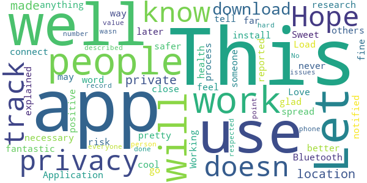

> This is a very necessary health app.  :date: __2020-10-02 12:00:20__

> Working fine so far... Let's spread the word, the more people install it the better it will work!!!!  :date: __2020-09-28 20:25:15__

> Application is fantastic. Love the privacy and feel safer!  :date: __2020-09-18 17:34:58__

> Sweet, this is pretty cool that it doesn’t track me.  It just uses Bluetooth to connect with others.  I did some research and this is the way to go.  Hope I never get notified of anything but will be glad to know I may have been at risk  if I ever do.  :date: __2020-09-16 04:20:29__

> The app is explained well in the download process.  It should let people know that they were ever close to someone that later reported they were positive.  and its private. Load it use it tell everyone to use the app  :date: __2020-09-16 04:19:42__

> No issues at this point and it wasn’t hard to download.  Hope it works as described.  :date: __2020-09-16 04:17:08__

> This is a well made app.  I’m a very private person and value my privacy.  This app is made so that it is respected.  It doesn’t record my location or my phone number or track my location.  Well done.  :date: __2020-09-16 04:15:18__

#### 4-star reviews

> It's not sending me the pin # to access the app. I put in the correct phone #.  :date: __2020-09-20 23:45:38__

#### 3-star reviews

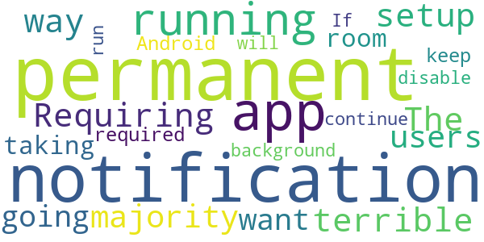

> Requiring a permanent notification is a terrible way to setup this app. The majority of users aren't going to want a permanent notification running and taking up room and this isn't required by Android to keep an app running in background. If I disable permanent notification will app continue to run?  :date: __2020-11-19 19:07:16__

#### 2-star reviews

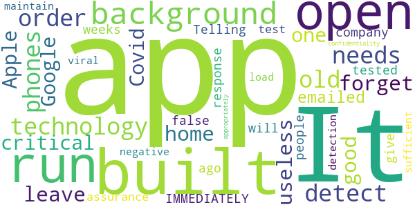

> The app is built on old technology. The app needs to be open in order to detect other phones. It does not run in the background, so if you forget to open it before you leave home, it is useless. Not good for such a critical app. Google and Apple built Covid apps to run in the background but this one does not. I emailed the company 2 weeks ago and no response.  :date: __2020-11-11 19:02:14__

> Telling you to be tested IMMEDIATELY will give people false assurance when they test negative & haven't had sufficient viral load for detection. It does maintain confidentiality appropriately.  :date: __2020-09-18 22:56:15__

#### 1-star reviews

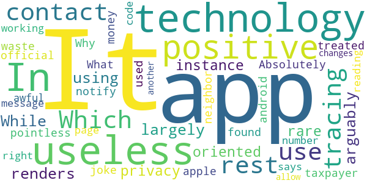

> Not working right says am positive when I am not  :date: __2020-10-03 02:46:59__

> It is awful. When I am reading the message with the code number, the page changes to another. It does not allow me to get in.  :date: __2020-09-19 22:02:09__

# GuideSafe
App version ``v1.3``

Analyzed with [covid-apps-observer](http://github.com/covid-apps-observer) project, version ``0.1``

## App overview
| | |
|-------------------------|-------------------------| 
| **Name**&nbsp;&nbsp;&nbsp;&nbsp;&nbsp;&nbsp;&nbsp;&nbsp;&nbsp;&nbsp;&nbsp;&nbsp;&nbsp;&nbsp;&nbsp;&nbsp;&nbsp;&nbsp;&nbsp;&nbsp;&nbsp;&nbsp;&nbsp;&nbsp;&nbsp;&nbsp;&nbsp;&nbsp;&nbsp;&nbsp;&nbsp;&nbsp;&nbsp;&nbsp;&nbsp;&nbsp;&nbsp;&nbsp;&nbsp;&nbsp;  | GuideSafe |
| **Unique identifier** | gov.adph.exposurenotifications |
| **Link to Google Play** | [https://play.google.com/store/apps/details?id=gov.adph.exposurenotifications](https://play.google.com/store/apps/details?id=gov.adph.exposurenotifications) |
| **Summary**  | A future safe from COVID-19 is in all of our hands with Alabama’s GuideSafe app. |
| **Privacy policy** | [https://www.guidesafe.org/privacy-statement/](https://www.guidesafe.org/privacy-statement/) |
| **Latest version** | v1.3 |
| **Last update** | 2020-09-11 17:33:27 |
| **Recent changes** | Spread the app, not COVID. For this version of the GuideSafe™ app, we&#39;ve made some minor improvements to help you better understand exposure dates and what to do if you receive an exposure. |
| **Installs**  | 50,000+ |
| **Category** | Medical |
| **First release** | Aug 12, 2020 |
| **Size**  | 2.3M |
| **Supported Android version**  | 7.0 and up |

### Description
> Use the GuideSafe™ Exposure Notification app to anonymously share a positive COVID-19 test result — and be anonymously notified of your own possible exposure to someone who later reports a positive COVID-19 test result — all without sharing anyone’s identity. The app protects your privacy while giving you the power to protect your health, your family’s and your community’s. 
  
 Using the app is easy: 
 Step one: Download the GuideSafe™ Exposure Notification app and enable Bluetooth. 
 Step two: If you have tested positive for COVID-19, you can choose to report it. Your test will be verified by the Alabama Department of Public Health. 
 Step three: Those who may have been in close contact with you in the last 14 days will be notified they were near someone with a positive test, but they won’t know who or where. Your identity and location remain completely anonymous, and your personal information isn’t disclosed, no matter what. 
  
 Why it’s important 
 Stopping the spread of COVID-19 is essential to helping our communities, schools and businesses reopen and stay open. When someone tests positive for COVID-19, contact tracers with the Alabama Department of Public Health will help notify those the person has been near — but they won’t know every person’s close contacts. The more people who use the app, the better the ability to notify those who have been exposed. 
  
 How it works 
 When you are within about six feet of others, phones using the GuideSafe™ Exposure Notification app exchange encrypted, anonymous codes via low-energy Bluetooth. If you test positive for COVID-19, those with whom you came in close contact — defined as within six feet for at least 15 minutes over the last 14 days — will get an anonymous notification that they were exposed. The notification they get is completely anonymous — they will not know who tested positive, the time, or the location — only the date of the possible exposure. 
  
 Your privacy is our priority 
 The GuideSafe™ Exposure Notification app was developed by the Alabama Department of Public Health in cooperation with the University of Alabama at Birmingham and MotionMobs, using technology from a collaboration between Apple and Google. Users of the app exchange anonymous codes among their phones using Bluetooth — no location data is ever stored or exchanged, and your personal information is never shared.

### User interface
The developers of the app provide the following screenshots in the Google play store.
| | | |
|:-------------------------:|:-------------------------:|:-------------------------:|
 |   |   |   | 

## Development team
In the following we report the main information provided by the development team in the Google play store.

| | |
|-------------------------|-------------------------|
| **Developer**  | Alabama Department of Public Health |
| **Website**  | - |
| **Email** | alabamapublichealth@gmail.com |
| **Physical address**  | [201 Monroe Street Montgomery, Alabama 36104](https://www.google.com/maps/search/201%20Monroe%20Street%20Montgomery,%20Alabama%2036104) (Google Maps) |
| **Other developed apps**  | [https://play.google.com/store/apps/developer?id=Alabama+Department+of+Public+Health](https://play.google.com/store/apps/developer?id=Alabama+Department+of+Public+Health) |

## Android support

| | |
|-------------------------|-------------------------|
| **Declared target Android version**  | Android10, version 10 (API level 29) |
| **Effective target Android version**  | Android10, version 10 (API level 29) |
| **Minimum supported Android version**  | Nougat, version 7.0 (API level 24) |
| **Maximum target Android version**  | - |

The larger the difference between the minimum and maximum supported Android versions, the better. A larger difference means a wider audience. For example, old phones have a very low Android version, so a high minimum supported Android version means that the app cannot be used by users with old phones, thus leading to accessibility problems. 

## Requested permissions

In the following we report the complete list of the permissions requested by the app. 

| **Permission** | **Protection level** | **Description** | 
|-------------------------|-------------------------|-------------------------|
 **android.permission ACCESS_NETWORK_STATE** | Normal | Allows applications to access information about networks. 
 **android.permission BLUETOOTH** | Normal | Allows applications to connect to paired bluetooth devices. 
 **android.permission FOREGROUND_SERVICE** | Normal | Allows a regular application to use Service.startForeground. 
 **android.permission INTERNET** | Normal | Allows applications to open network sockets. 
 **android.permission RECEIVE_BOOT_COMPLETED** | Normal | Allows an application to receive the Intent.ACTION_BOOT_COMPLETED that is broadcast after the system finishes booting. 
 **android.permission WAKE_LOCK** | Normal | Allows using PowerManager WakeLocks to keep processor from sleeping or screen from dimming. 

## Mentioned servers

| **Server** | **Registrant** | **Registrant country** | **Creation date** | 
|-------------------------|-------------------------|-------------------------|-------------------------|
 | guidesafe.org | Contact Privacy Inc. Customer 1247737132 | :canada: CA | 2020-07-18 15:39:08 |
 | azure-api.net | Microsoft Corporation | :us: US | 2014-01-09 14:55:23 |
 | google.com | Google LLC | :us: US | 1997-09-15 04:00:00 |
 | googleapis.com | Google LLC | :us: US | 2005-01-25 17:52:26 |
 | azureedge.net | Microsoft Corporation | :us: US | 2014-01-22 16:14:52 |

## Security analysis 

Below we report the main security warnings raised by our execution of the [Androwarn](https://github.com/maaaaz/androwarn) security analysis tool.

**Connection interfaces exfiltration**
> - This application reads details about the currently active data network 
> - This application tries to find out if the currently active data network is metered 

**Suspicious connection establishment**
> - This application opens a Socket and connects it to the remote address ': ; port is out of range' on the 'N/A' port  
> - This application opens a Socket and connects it to the remote address 'Lg/a/a/a/a;->c(Ljava/lang/String;)Ljava/lang/StringBuilder;' on the 'N/A' port  
> - This application opens a Socket and connects it to the remote address 'Ljava/net/Proxy;->type()Ljava/net/Proxy$Type;' on the 'N/A' port  
> - This application opens a Socket and connects it to the remote address 'timeout' on the 'N/A' port  

## User ratings and reviews

Below we provide information about how end users are reacting to the app in terms of ratings and reviews in the Google Play store.

### Ratings

The GuideSafe app has been installed by more than **50000** times. At this time, **127** rated the app and its average score is **3.3**. Below we show the distribution of the ratings across the usual star-based rating of Google Play

:star::star::star::star::star:: 59

:star::star::star::star:: 11

:star::star::star:: 9

:star::star:: 6

:star:: 42

### Reviews 

#### 5-star reviews

> People saying this app is not working what is this used for I will try it anyway if it doesn't work then I'll take it off my phone  :date: __2020-11-20 01:08:13__

> Amazing  :date: __2020-11-12 13:16:22__

> Eh Um.... HMMM 1# question tho why this app 4 all the phone's?.. Just wondering...  :date: __2020-10-27 02:22:20__

> Be. Safe  :date: __2020-10-16 04:11:57__

> I don't know it want let me download it  :date: __2020-10-13 18:44:15__

> Very nice  :date: __2020-10-13 18:03:47__

> Good app  :date: __2020-10-13 01:25:16__

> Great Idea. Thank you. It is at the top of my list of worries. With my age and health issues.  :date: __2020-10-11 21:28:21__

> Everyone in Alabama needs to download this. It doesn't work at all. If you catch covid and use this app you get to sue the developer as well as the state of Alabama. Definitely a better payout than a stimulus check.  :date: __2020-10-11 16:41:29__

> We need this in society, this would help us a lot in America. Although all the comments say it's not accurate, but the reason I posted a five star review is because if they update this to work properly then everyone can at least consider using this to reduce Covid-19.  :date: __2020-10-11 06:04:06__

#### 4-star reviews

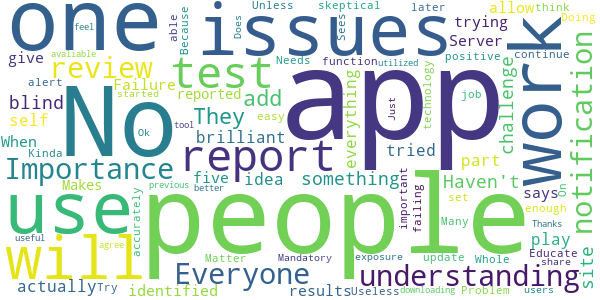

> Is there a way to report a coworker's positive test result?  :date: __2020-11-20 05:03:21__

> Just started the app.  :date: __2020-11-04 21:03:09__

> Ok  :date: __2020-10-18 23:44:48__

> It works  :date: __2020-10-11 15:57:28__

> No issues. Does this share exposure notifications with the other notification apps or only with users of this app?  :date: __2020-08-23 14:57:47__

> No issues downloading. I agree with a previous review, it would be more useful if it was utilized by more people. But i do feel better that this tool is avaliable! Thanks.  :date: __2020-08-18 14:39:51__

#### 3-star reviews

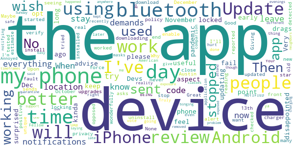

> Up front everything is bluetooth, bluetooth, bluetooth. Then after install the app demands location, too. Good privacy policy, but I can't leave both bluetooth and location on at all times or my phone would have to stay on the charger 24/7. Maybe my fault for having an old phone. I'll leave it installed and just enable everything as the Austin e demands.  :date: __2020-11-18 21:28:03__

> it would be better if it reported an estimate of how many unique devices it detected and has checked itself against just to know it is working and seeing other people with the app.  :date: __2020-11-16 17:07:14__

> I just wish more people used it. I kinda feel like it is not useful since people have to opt in for each aspect... BUT I will keep using it as long as this pandemic drags on.  :date: __2020-11-10 14:09:40__

> Giving a 3 star review now because I've not used this app on an Android device. I have both Android and iPhone devices. Upon reading reviews of when using on Android devices, as opposed to iPhone devices, I know my iPhone works in real time notifications. Update was recently done on this application, so I'm going to give it a try. He!l, in reality even it notifying a few days later is better than NOT BEING NOTIFIED AT ALL. I will update with a comparison review. Stay safe, do the right thing masks don't hurt ya, and vote. Truly, Your Fellow American  :date: __2020-10-12 15:50:41__

> Works but Annoyed - had this for UAB support, though it kept saying I had been exposed, the problem my phone was charging at the time it said the exposure happened on 2 different days at the same time of day (late Sunday evenings) I didn't go anywhere during those timeframes. It has to be binging off one of my neighbors but I had to quarantine and not attend classes. I've now removed it.  :date: __2020-10-04 08:18:57__

> Easy to use.  :date: __2020-08-18 01:12:50__

#### 2-star reviews

> App questionnaire requires email verification, but doesn't work, so don't bother. If that basic feature does not work then how can you rely on it to correctly perform contact tracing?! This is not an in consequential function. Get it right!  :date: __2020-09-29 19:27:11__

> It would work better if more people had it on their phones.  :date: __2020-08-18 18:54:55__

#### 1-star reviews

> No notification of exposure, or ability to report exposure from non app users. Three people I know tested positive. This app is utterly useless.  :date: __2020-11-19 13:39:22__

> This is of no use if health providers do not turn in the information. No.one will actually do it and YES..then there is Hippa..  :date: __2020-11-08 16:58:36__

> I just can't figure out out bc I know as many places as I have been lately I must have had some kind of course contact somewhere and haven't received 1 alert, just everything about it is confusing I don't even know if I'm even logged in correctly or whatever you're supposed to do.. Hence being clueless  :date: __2020-11-08 13:15:03__

> Don't work  :date: __2020-10-29 11:31:00__

> Not accurate in the least!!!! Good intentions, but poorly executed.  :date: __2020-10-26 12:50:39__

> 10/25/2020 complete and total invasion of our privacy.  :date: __2020-10-25 16:48:19__

> The absolute state of Pandemic politicization. Hear me now: I don't fear the plague. I fear the government and private sector for whom their belief in synthetic solutions divide us from our rights like a the wake of a speedboat.  :date: __2020-10-25 02:09:41__

> I have this app with Bluetooth on. I have found out I've been exposed and they have the app... and crickets. Nothing.  :date: __2020-10-25 01:36:04__

> I live in Colorado, reading a local news story and this app pops up, annoying on that level, but moving on, I'm like heck yeah, I want to be informed about Covid locally. As the app is installing it shows it's for Alabama?!?!? How does that help me in Colorado? Pop ups are annoying to begin with, but if you're going to do it, at least get the state correct. If you can't get that right, I'm not going to put a lot of stock in your other life changing information.  :date: __2020-10-23 23:58:20__

> I can't reactivate after updated. Now after I check permissions boxes when I click on enable it says "Internal e0rror, please try again."  :date: __2020-10-23 09:31:08__

# COVID Alert CT
App version ``minted11017``

Analyzed with [covid-apps-observer](http://github.com/covid-apps-observer) project, version ``0.1``

## App overview
| | |
|-------------------------|-------------------------| 
| **Name**&nbsp;&nbsp;&nbsp;&nbsp;&nbsp;&nbsp;&nbsp;&nbsp;&nbsp;&nbsp;&nbsp;&nbsp;&nbsp;&nbsp;&nbsp;&nbsp;&nbsp;&nbsp;&nbsp;&nbsp;&nbsp;&nbsp;&nbsp;&nbsp;&nbsp;&nbsp;&nbsp;&nbsp;&nbsp;&nbsp;&nbsp;&nbsp;&nbsp;&nbsp;&nbsp;&nbsp;&nbsp;&nbsp;&nbsp;&nbsp;  | COVID Alert CT |
| **Unique identifier** | gov.ct.covid19.exposurenotifications |
| **Link to Google Play** | [https://play.google.com/store/apps/details?id=gov.ct.covid19.exposurenotifications](https://play.google.com/store/apps/details?id=gov.ct.covid19.exposurenotifications) |
| **Summary**  | The official Exposure Notification app for Connecticut |
| **Privacy policy** | [https://portal.ct.gov/coronavirus/COVIDAlertCT/PrivacyPolicy](https://portal.ct.gov/coronavirus/COVIDAlertCT/PrivacyPolicy) |
| **Latest version** | minted11017 |
| **Last update** | 2020-11-09 23:43:36 |
| **Recent changes** | Bug fixes and performance improvements |
| **Installs**  | 10,000+ |
| **Category** | Medical |
| **First release** | Nov 9, 2020 |
| **Size**  | 9.9M |
| **Supported Android version**  | 5.0 and up |

### Description
> COVID Alert CT is the official COVID-19 exposure notification app in the State of Connecticut, supported by the Connecticut Department of Public Health (CDPH). COVID Alert CT helps to contain the spread of COVID-19 by complementing the ongoing contact tracing programs carried out by the State and local health.
 Using COVID Alert CT is voluntary and free of charge. The more people who install and use the app, the more effectively the app can help us to contain the virus.
 Once you install and activate COVID Alert CT and turn on Bluetooth, the app works in the background and exchanges anonymous keys with other devices. Keys are long random strings of characters that are not tied to any personal information. Devices with the app installed will record the keys generated by other devices nearby. The app will record the signal strength, used to estimate the distance between devices, the duration and date of the exposure. To protect the users’ privacy, these keys are only kept on the user’s own device. After 14 days the keys are deleted.
 If a COVID Alert CT user tests positive for COVID-19, they will be able to obtain a verification code from a contact tracer at the State or local health department. The code allows the user to activate the notification function in the app. You must use the verification code in order to report a positive result via the app. This prevents people from falsely reporting positive results, which could generate false exposure notifications. CDPH wants all app users to feel confident that when a possible COVID-19 exposure is received via the app, that it is a real event.
 A positive report warns other app users that were near the infected person in the period close to the time when that person first experienced symptoms of the disease under certain circumstances. If the estimated distance was within six feet, the duration of exposure was at least 15 minutes cumulatively, then the other user receives a notification of a possible exposure. Anyone who receives a notification should follow the guidance in the app for next steps.
 CDPH takes your privacy and confidentiality very seriously. This is why we chose to use the Apple and Google Exposure Notification API. No personal data or location tracking occurs within this app. There is no need for CTDPH to know where or who you are for COVID Alert CT to work.
 The Connecticut COVID Notice Privacy Policy is available at https://portal.ct.gov/coronavirus/COVIDAlertCT/PrivacyPolicy. The use of the app is limited to Connecticut and is subject to Connecticut law.
 Thank you for downloading COVID Alert CT. Together, we can protect our family, friends, neighbors, and colleagues, and keep Connecticut moving forward.
 The app was developed using the Google Apple Exposure Notification API through a collaboration between Google, Apple, the Connecticut Department of Administrative Services (DAS) and CDPH.

### User interface
The developers of the app provide the following screenshots in the Google play store.
| | | |
|:-------------------------:|:-------------------------:|:-------------------------:|
 |   |  

## Development team
In the following we report the main information provided by the development team in the Google play store.

| | |
|-------------------------|-------------------------|
| **Developer**  | CT Department of Public Health |
| **Website**  | [http://ct.gov/covidalertct](http://ct.gov/covidalertct) |
| **Email** | DPH.covidalertct@ct.gov |
| **Physical address**  | [State of Connecticut Department of Public Health 410 Capital Avenue Hartford, CT,  06103](https://www.google.com/maps/search/State%20of%20Connecticut%20Department%20of%20Public%20Health%20410%20Capital%20Avenue%20Hartford,%20CT,%2006103) (Google Maps) |
| **Other developed apps**  | [https://play.google.com/store/apps/developer?id=7682186545769631479](https://play.google.com/store/apps/developer?id=7682186545769631479) |

## Android support

| | |
|-------------------------|-------------------------|
| **Declared target Android version**  | Android10, version 10 (API level 29) |
| **Effective target Android version**  | Android10, version 10 (API level 29) |
| **Minimum supported Android version**  | Lollipop, version 5.0 (API level 21) |
| **Maximum target Android version**  | - |

The larger the difference between the minimum and maximum supported Android versions, the better. A larger difference means a wider audience. For example, old phones have a very low Android version, so a high minimum supported Android version means that the app cannot be used by users with old phones, thus leading to accessibility problems. 

## Requested permissions

In the following we report the complete list of the permissions requested by the app. 

| **Permission** | **Protection level** | **Description** | 
|-------------------------|-------------------------|-------------------------|
 **android.permission ACCESS_NETWORK_STATE** | Normal | Allows applications to access information about networks. 
 **android.permission BLUETOOTH** | Normal | Allows applications to connect to paired bluetooth devices. 
 **android.permission FOREGROUND_SERVICE** | Normal | Allows a regular application to use Service.startForeground. 
 **android.permission INTERNET** | Normal | Allows applications to open network sockets. 
 **android.permission RECEIVE_BOOT_COMPLETED** | Normal | Allows an application to receive the Intent.ACTION_BOOT_COMPLETED that is broadcast after the system finishes booting. 
 **android.permission WAKE_LOCK** | Normal | Allows using PowerManager WakeLocks to keep processor from sleeping or screen from dimming. 

## Mentioned servers

| **Server** | **Registrant** | **Registrant country** | **Creation date** | 
|-------------------------|-------------------------|-------------------------|-------------------------|
 | google.com | Google LLC | :us: US | 1997-09-15 04:00:00 |

## Security analysis 

Below we report the main security warnings raised by our execution of the [Androwarn](https://github.com/maaaaz/androwarn) security analysis tool.

**Telephony identifiers leakage**
> - This application reads the ISO country code equivalent of the current registered operator's MCC (Mobile Country Code) 

**Connection interfaces exfiltration**
> - This application reads details about the currently active data network 
> - This application tries to find out if the currently active data network is metered 

**Suspicious connection establishment**
> - This application opens a Socket and connects it to the remote address 'timeout' on the 'N/A' port  

**Code execution**
> - This application loads a native library: 'prioclient' 

## User ratings and reviews

Below we provide information about how end users are reacting to the app in terms of ratings and reviews in the Google Play store.

### Ratings

The COVID Alert CT app has been installed by more than **10000** times. At this time, **83** rated the app and its average score is **4.0120482**. Below we show the distribution of the ratings across the usual star-based rating of Google Play

:star::star::star::star::star:: 56

:star::star::star::star:: 6

:star::star::star:: 2

:star::star:: 4

:star:: 15

### Reviews 

#### 5-star reviews

> Great  :date: __2020-11-22 02:10:48__

> This app is a hoax 😉  :date: __2020-11-22 00:52:58__

> Good  :date: __2020-11-20 02:14:02__

> So far so good, I just hope enough people are downloading this app!  :date: __2020-11-19 05:10:13__

> Clean interface, and it seems to work well so far. Stop the spread!  :date: __2020-11-18 21:45:26__

> Very helpful app  :date: __2020-11-18 14:26:01__

> Its help know whats going on ct...  :date: __2020-11-15 22:15:53__

> Works fine. Hope I never get a ping about being near someone thats infected!  :date: __2020-11-15 20:53:00__

> Seems like they did a good job to make this as anonymous as possible. no permissions are required by the app, which is really nice.  :date: __2020-11-15 17:07:05__

> Installed without any issues. I was worried that it might drain the battery but so far, it uses so little it registers as 0% per hour.  :date: __2020-11-15 14:26:18__

#### 4-star reviews

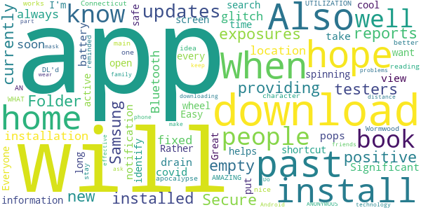

> Easy to install, but I can't put a shortcut on my home screen. I have to search for it every time I want to open it. Everyone be safe.  :date: __2020-11-19 04:38:11__

> As long as it helps people and can't identify me I'm cool with it. I  :date: __2020-11-17 05:52:00__

> Great app. I was reading Wormwood a book about apocalypse in Connecticut and the app reminded me of the one the main character has in that book. Its also nice to know when its better to just stay home.  :date: __2020-11-15 03:54:15__

> Just DL'd it so i don't know how well it works but WHAT AN AMAZING idea and UTILIZATION of technology! And it's ANONYMOUS!  :date: __2020-11-14 19:01:39__

> Do your part, wear your mask, keep your distance and install the app  :date: __2020-11-13 05:39:02__

> I had no problems downloading this app on my Android phone. The more people who download this app will make this more effective. Will ask friends and family to download as well.  :date: __2020-11-12 23:18:58__

#### 3-star reviews

> Idk I live in milford  :date: __2020-11-14 17:49:59__

> You have to keep your location and Bluetooth on for it to work. That eats up battery. Otherwise it's functional. 🤷🏽‍♀️  :date: __2020-11-13 13:14:31__

#### 2-star reviews

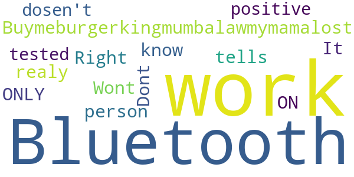

> Can't turn on the exposure notice. Keeps saying something went wrong even Uninstaller it and that didn't work.  :date: __2020-11-17 01:45:13__

> Wont work  :date: __2020-11-16 15:35:46__

> Dont know if realy work  :date: __2020-11-15 06:05:43__

> It ONLY tells if the Bluetooth is ON ? Right... if the person tested positive and the Bluetooth is off dosen't work?  :date: __2020-11-14 18:01:30__

#### 1-star reviews

> Don't bother installing this app or anything WuFlu related because COVID-19 (i.e. WuFlu, Chinavirus) is a hoax, it DOES NOT EXIST. Trump 2020 Keep America Great And Safe!  :date: __2020-11-20 01:35:20__

> This app is worthless! Unless you input positive it will not alert you. There is no way I drive through Waterbury and not 1 alert!!!! What a scam.  :date: __2020-11-19 19:21:24__

> This app dont work at all..i downloud but no said anything at all.  :date: __2020-11-18 14:21:06__

> I got it covid... stay away from me...  :date: __2020-11-15 00:37:45__

> Overreaching, evil tracking, just so govt can get you used to "social tracking" & who you intact with  :date: __2020-11-14 19:21:56__

> Downloaded and went to turn on notifications and it immediately says something went wrong try again  :date: __2020-11-14 19:05:48__

> Cant turn on exposure notification keep getting something went wrong try again  :date: __2020-11-14 17:48:51__

> No. Evil.  :date: __2020-11-14 17:17:46__

> I can't turn on my notifications  :date: __2020-11-14 10:41:20__

> Useless. Reports "something went wrong, try again" endlessly. Thanks for nothing.  :date: __2020-11-14 02:32:50__

# COVID Alert NJ
App version ``1.0.1``

Analyzed with [covid-apps-observer](http://github.com/covid-apps-observer) project, version ``0.1``

## App overview
| | |
|-------------------------|-------------------------| 
| **Name**&nbsp;&nbsp;&nbsp;&nbsp;&nbsp;&nbsp;&nbsp;&nbsp;&nbsp;&nbsp;&nbsp;&nbsp;&nbsp;&nbsp;&nbsp;&nbsp;&nbsp;&nbsp;&nbsp;&nbsp;&nbsp;&nbsp;&nbsp;&nbsp;&nbsp;&nbsp;&nbsp;&nbsp;&nbsp;&nbsp;&nbsp;&nbsp;&nbsp;&nbsp;&nbsp;&nbsp;&nbsp;&nbsp;&nbsp;&nbsp;  | COVID Alert NJ |
| **Unique identifier** | com.nj.gov.covidalert |
| **Link to Google Play** | [https://play.google.com/store/apps/details?id=com.nj.gov.covidalert](https://play.google.com/store/apps/details?id=com.nj.gov.covidalert) |
| **Summary**  | Help us stop the spread of COVID-19 in New Jersey! |
| **Privacy policy** | [https://www.nj.gov/health/documents/DPP_COVIDALERTNJ.pdf](https://www.nj.gov/health/documents/DPP_COVIDALERTNJ.pdf) |
| **Latest version** | 1.0.1 |
| **Last update** | 2020-10-09 11:00:32 |
| **Recent changes** | Minor bug fixes |
| **Installs**  | 100,000+ |
| **Category** | Health & Fitness |
| **First release** | Sep 18, 2020 |
| **Size**  | 106M |
| **Supported Android version**  | 6.0 and up |

### Description
> COVID Alert NJ App is being made available by the New Jersey Department of Health (DOH) to complement New Jersey’s comprehensive COVID-19 contact tracing effort. COVID Alert NJ is a free and secure mobile phone app that allows New Jerseyans:
 1.	To be alerted if they have been in close contact with another app user who has tested positive for COVID-19 – even if that person is a stranger
 2.	To track their symptoms and get advice on what to do to protect themselves and others
 3.	To be able to anonymously warn other app users whom they were in close contact with, if they tested positive for COVID-19 – especially people they do not know or remember being in close contact with (e.g., during bus/train ride, at public places)
 4.	To monitor the latest information and statistics related to the COVID-19 pandemic
 5.	To reach NJ public health representatives and be connected with support services 
 For all this to work, all you have to do is push “Allow” COVID-19 Exposure Notification Services (ENS) on your phone within your App.
 You can also choose to “Allow” your phone to turn on the COVID-19 Exposure Notification Services (ENS) and also “Allow” your phone to display notifications so that you also receive an alert that you have been exposed to someone who has tested positive for COVID-19. You can also turn off this functionality, at any time, in the Settings page of the App. 
 In the event you receive an Exposure Notification, you may read NJ DOH advice under Exposure Notification Information or get in touch with a public health representative.
 It is important to note that COVID Alert NJ will never reveal the identity of any person using the app to other app users, and never reveals who has been diagnosed as positive for COVID-19. 
 Help us Stop the Spread of COVID-19 in New Jersey. Share this app with your friends and family.
 The use of this App is entirely voluntary and it is available to download for free from the Google Play Store. The App runs Android phones running Android 6.0 and higher. The App is not intended for use by persons under 18 years of age, as they are considered not to have reached the digital age of consent or agreement with the State of New Jersey. You will be asked to confirm that you are 18 years or older after you download the App.
 View our privacy policy here: https://www.nj.gov/health/documents/DPP_COVIDALERTNJ.pdf

### User interface
The developers of the app provide the following screenshots in the Google play store.
| | | |
|:-------------------------:|:-------------------------:|:-------------------------:|
 |   |   |   | 
 | 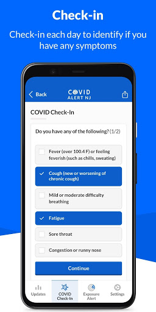  | 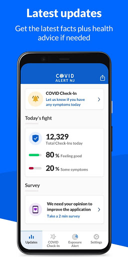 

## Development team
In the following we report the main information provided by the development team in the Google play store.

| | |
|-------------------------|-------------------------|
| **Developer**  | State of New Jersey  Applications |
| **Website**  | [https://covid19.nj.gov/index.html](https://covid19.nj.gov/index.html) |
| **Email** | COVIDapp@doh.nj.gov |
| **Physical address**  | - |
| **Other developed apps**  | [https://play.google.com/store/apps/developer?id=State+of+New+Jersey++Applications](https://play.google.com/store/apps/developer?id=State+of+New+Jersey++Applications) |

## Android support

| | |
|-------------------------|-------------------------|
| **Declared target Android version**  | Android10, version 10 (API level 29) |
| **Effective target Android version**  | Android10, version 10 (API level 29) |
| **Minimum supported Android version**  | Marshmallow, version 6.0 (API level 23) |
| **Maximum target Android version**  | - |

The larger the difference between the minimum and maximum supported Android versions, the better. A larger difference means a wider audience. For example, old phones have a very low Android version, so a high minimum supported Android version means that the app cannot be used by users with old phones, thus leading to accessibility problems. 

## Requested permissions

In the following we report the complete list of the permissions requested by the app. 

| **Permission** | **Protection level** | **Description** | 
|-------------------------|-------------------------|-------------------------|
 **android.permission ACCESS_NETWORK_STATE** | Normal | Allows applications to access information about networks. 
 **android.permission ACCESS_WIFI_STATE** | Normal | Allows applications to access information about Wi-Fi networks. 
 **android.permission BLUETOOTH** | Normal | Allows applications to connect to paired bluetooth devices. 
 **android.permission FOREGROUND_SERVICE** | Normal | Allows a regular application to use Service.startForeground. 
 **android.permission INTERNET** | Normal | Allows applications to open network sockets. 
 **android.permission RECEIVE_BOOT_COMPLETED** | Normal | Allows an application to receive the Intent.ACTION_BOOT_COMPLETED that is broadcast after the system finishes booting. 
 **android.permission VIBRATE** | Normal | Allows access to the vibrator. 

## Mentioned servers

| **Server** | **Registrant** | **Registrant country** | **Creation date** | 
|-------------------------|-------------------------|-------------------------|-------------------------|
 | android.com | Google LLC | :us: US | 1997-06-23 04:00:00 |
 | google.com | Google LLC | :us: US | 1997-09-15 04:00:00 |
 | expo.io | See PrivacyGuardian.org | :us: US | 2011-05-01 21:26:50 |

## Security analysis 

Below we report the main security warnings raised by our execution of the [Androwarn](https://github.com/maaaaz/androwarn) security analysis tool.

**Telephony identifiers leakage**
> - This application reads the numeric name (MCC+MNC) of current registered operator 
> - This application reads the operator name 

**Connection interfaces exfiltration**
> - This application reads details about the currently active data network 
> - This application tries to find out if the currently active data network is metered 

**Suspicious connection establishment**
> - This application opens a Socket and connects it to the remote address ' returned no addresses for  ; port is out of range' on the 'N/A' port  
> - This application opens a Socket and connects it to the remote address '' on the 'N/A' port  
> - This application opens a Socket and connects it to the remote address 'Ljava/lang/StringBuilder;->toString()Ljava/lang/String;' on the 'N/A' port  
> - This application opens a Socket and connects it to the remote address 'Ljava/net/Proxy;->type()Ljava/net/Proxy$Type;' on the 'N/A' port  
> - This application opens a Socket and connects it to the remote address 'timeout' on the 'N/A' port  

**Pim data leakage**
> - This application accesses data stored in the clipboard 

**Code execution**
> - This application loads a native library 
> - This application executes a UNIX command 

## User ratings and reviews

Below we provide information about how end users are reacting to the app in terms of ratings and reviews in the Google Play store.

### Ratings

The COVID Alert NJ app has been installed by more than **100000** times. At this time, **409** rated the app and its average score is **3.9306931**. Below we show the distribution of the ratings across the usual star-based rating of Google Play

:star::star::star::star::star:: 252

:star::star::star::star:: 40

:star::star::star:: 28

:star::star:: 16

:star:: 73

### Reviews 

#### 5-star reviews

> I have it already on my phone I like that I can keep up with people in my surroundings.  :date: __2020-11-20 22:42:46__

> First day of use and I am highly satisfied.  :date: __2020-11-19 23:13:38__

> Easy and secure. Everyone should have it.  :date: __2020-11-19 18:01:54__

> I can't use the appt i don't have e bluetooth but what i do have is my second time having covis twice I've never had any symptoms i could feel any better except for my cancer and other things  :date: __2020-11-17 20:06:10__

> Stop crying. If they are tracking you they can do it without this app. Be kind. Love each other. Wear a mask.  :date: __2020-11-15 13:23:31__

> Keeping us as updated as possible. People Please...Mask Up!!!!  :date: __2020-11-12 12:51:16__

> I is good  :date: __2020-11-12 00:48:44__

> COVID Alert NJ App is being made available by the New Jersey Department of Health (DOH) to complement New Jersey’s comprehensive COVID-19 contact tracing effort. COVID Alert NJ is a free and secure mobile phone app that allows New Jerseyans: 1. To be alerted if they have been in close contact with another app user who has tested positive for COVID-19 – even if that person is a stranger 2. To track their symptoms and get advice on what to do to protect themselves and other's.  :date: __2020-11-08 18:00:46__

> This is good app  :date: __2020-11-08 13:49:07__

> I am going to feel much safe now  :date: __2020-11-06 20:48:31__

#### 4-star reviews

> This is a very informative app.  :date: __2020-11-18 01:56:53__

> To work everyone needs to use it, otherwise you could be exposed by someone who doesn't use this  :date: __2020-11-16 23:15:37__

> I think the app is great. Very informative. It's all in one spot. You do not have to have bluetooth on all the time. You can switch it on when you would like to use it then switch it back off. Without bluetooth you are still able to access and use all of the other features like covids daily numbers local/global/etc and also you are able to check in with how you are feeling and report symptoms..just another tool in the fight against covid.  :date: __2020-11-16 18:56:28__

> Doing our part to end Covid19!  :date: __2020-10-19 16:34:27__

> I just downloaded app cant give any feed back at this time. Thanks  :date: __2020-10-12 01:03:37__

> I'm not sure I understand how it works re. sharing the positive result so other people can be alerted. I read the app info /learn how it works several times so I must be missing something. Is the assumption that the person go anywhere to take a C19 test and wait for a representative to call them? If so, how would the representative know that you tested positive?  :date: __2020-10-11 22:01:49__

> I keep getting error after I click continue. It says Sorry that didn't work properly (error code 1002).  :date: __2020-10-09 17:18:05__

> Edit - works perfectly after turning off wifi during setup. Got an immediate response from the developer on the workaround. Does not work. Error code 1002. This error is displayed after I confirm my age and press continue. I have a OnePlus 6t phone (android)  :date: __2020-10-08 22:13:53__

> UPDATE: Working now per comment from developer. I can't get the app to work on my Galaxy S10. It installs, I affirm I'm over 18, and on the data sharing page I get an error code 1002 and can't move on. I've tried uninstalling and reinstalling and get the same problem. I do not have this problem on the VA COVID app I also have on my phone.  :date: __2020-10-07 16:11:30__

> better late than never. the app is good now is for people to use it and be honest about it.  :date: __2020-10-02 21:28:54__

#### 3-star reviews

> I Certainly can't actually Rate something I just got.  :date: __2020-11-18 22:11:50__

> Works ONLY: #1. If an infected person ALSO has the APP and you both have Bluetooth &. Location turned on. And #2. You come within 6 Feet for more than 10 minutes of an infected person AND #3 The infected person AGREES to allow the Tracers to access the app code information. What code? When your phone meets another phone ( see #1) a code is sent via bluetooth to both phones. The app remembers the code info. The tracer simply activates that code to send you an alert. Good for crowds etc.  :date: __2020-11-18 04:34:50__

> This app collects daily data well enough, BUT IT GIVES LITTLE INFO THAT CAN HELP PEOPLE!! PLEASE IMPROVE IT!!! - County-level % is % of STATE!! USELESS!! WHAT'S IMPORTANT is the current 7 day positivity testing rate!!! - NOT BY COUNTY, BUT BY MY CURRENT LOCATION!!! - EVEN BETTER: GIVE THE % POSITIVITY WITHIN A 1,5,10,25 MIKE RADIUS!!! THIS WAY, PEOPLE CAN MANAGE RISK!!! - YOU HAVE THE GPS COORDINATES OF EVERYONE, SO YOU CAN DO THIS!!! WHY DON'T YOU????  :date: __2020-11-15 21:25:32__

> Just really want to know if the app talks to the NY and PA apps? I deal with people from both daily.  :date: __2020-11-15 21:15:30__

> Even though I have exposure alerts on it seems to only do a scan if I open the app itself. Shouldn't it do this automatically daily?  :date: __2020-11-05 15:15:12__

> During setup I realized that it requires both GPS and Bluetooth to be engaged. If I do this with my phone, it would die in 4 hours. I'm an emergency service personnel, I can't go with a dead phone all day. Sorry. Good idea but won't work for me.  :date: __2020-10-29 23:00:14__

> I have this app in my phone but in order to make it more effective it needs more advertise and insist ppl to download it. It can only work more ppl uses and learn how to use it properly. I also not sure myself when its says it use bluetooth in order to make it work. Does it mean I require to wear actual blutooth on my year? Many ppl didnt even know that NJ has this app. Otherwise its a good idea.  :date: __2020-10-26 18:33:37__

> Installing this =捉蟲入屎忽  :date: __2020-10-19 04:16:38__

> Easy to install. My only question is how does it know you have been in contact with someone personally? How is connecting the dots, so to speak?  :date: __2020-10-12 17:38:42__

> I understand needing location for the alerts but why would it need bluetooth? Modern day dependence on wireless devices destroys battery life as it is. I keep my Bluetooth, location and few other settings off unless I need to use them. Again, I understand location, but why bluetooth. *Anyone that doesn't know keep bluetooth wifi and nfc off unless you need it to keep yourself safe from hackers.  :date: __2020-10-12 04:27:49__

#### 2-star reviews

> I work at a busy congenial store, and have had the app installed for a few months now. I find it really improbable no one infected with the app has walked into the store.  :date: __2020-11-17 17:23:10__

> Difficult to navigate  :date: __2020-11-15 20:37:09__

> I am not leaving my Bluetooth on everywhere I go which isn't far but this will take a long time to get enough peoples info and get them on board before you can do that! Ifmt feels intrusive as well. Never leave your Bluetooth on unless you know what your hooked up to.  :date: __2020-11-13 21:08:54__

> Unfortunately b cause of the blue tooth ne don't to be on it has caused issues with my phone. In which I have issues turning off and or turning on manually the bluetooth. It has also cause phone to lock up. This is causing issues with hands free calling. Uninstalled app.  :date: __2020-10-27 21:13:14__

> Slowest app in existence, love the daily check-ins and the the app in general but the horrendous slowness makes it a pain  :date: __2020-10-16 14:52:44__

> Y 553e  :date: __2020-10-13 03:40:34__

> In order to install app I was to turn off my wifi during install and my malware scanner. After doing this I turned on my wifi no problem, but my malware scanner detected the NJ COVID ALERT as malware due to I guess the access to Bluetooth. I will try it for a week and decide weather to keep it  :date: __2020-10-11 16:57:02__

> I kept getting Error 1002 trying to enable Usage Statistics. Then I turned off Wifi and I was able to enable everything. I never experienced that type of bug before....Hmmmm. Why?  :date: __2020-10-02 05:12:39__

> Switch off Wi-Fi and use mobile data for any error you might be receiving.  :date: __2020-10-02 04:09:39__

> Not working on wifi. Only will setup using LTE, and even once setup won't run on wifi  :date: __2020-10-01 20:26:42__

#### 1-star reviews

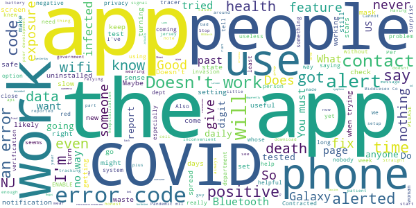

> I haven't seen anyone reported positive yet.  :date: __2020-11-22 01:11:15__

> Not very useful.: 1. You must have and utilize a smart phone 2. You must have it activated 3. You must report your status daily 4. You must be in close contact with an infected person for too long and they must have reported they have symptons 5. Will it be compatable with apps from other states  :date: __2020-11-17 14:16:13__

> Having Bluetooth on always is not realistic plus it never alerted once. Dont waste the space on your phone for this app. Very disappointing  :date: __2020-11-15 16:12:00__

> The stupidest app ever. It is relying on the people who use it to be honest and informed. Right! Come on, how likely is that? Verification pin? Your still relying on people to admit they might be sick, get tested and then be honest enough to share that info. Good luck with that. Also. The people who are at the most risk are the ones who are the least likely to know how or want to use a cell phone app  :date: __2020-11-14 16:01:44__

> I spend most of my time at home, and this app constantly harasses me to turn on my location. I use my phone a lot, and I don't want to waste the battery. This is more inconvenient to me than it is helpful.  :date: __2020-11-10 14:14:23__

> Looks like it a 3 year old designed it and the check in feature makes no sense  :date: __2020-11-07 17:56:59__

> Work in an emergency room and downloaded to see how accurate the alerts would be. I assumed I would have to turn off the notification from being alerted to much. To my surprise I haven't been alerted once in over a month of having the app even after being in direct patient care with positive cases.  :date: __2020-11-04 06:12:09__

> It keeps freezing after verifying my age.  :date: __2020-11-02 16:37:40__

> Total Control over all of us.  :date: __2020-10-31 00:10:33__

> Cannot even finish setup poor development. Simple alert app should not be inconvenient to use if it is most people won't go through the headache of setting it up. This fix should be top priority. Poor development something like this should be more easily usable.  :date: __2020-10-29 11:40:32__

# COVID Alert NY
App version ``1.0.2``

Analyzed with [covid-apps-observer](http://github.com/covid-apps-observer) project, version ``0.1``

## App overview
| | |
|-------------------------|-------------------------| 
| **Name**&nbsp;&nbsp;&nbsp;&nbsp;&nbsp;&nbsp;&nbsp;&nbsp;&nbsp;&nbsp;&nbsp;&nbsp;&nbsp;&nbsp;&nbsp;&nbsp;&nbsp;&nbsp;&nbsp;&nbsp;&nbsp;&nbsp;&nbsp;&nbsp;&nbsp;&nbsp;&nbsp;&nbsp;&nbsp;&nbsp;&nbsp;&nbsp;&nbsp;&nbsp;&nbsp;&nbsp;&nbsp;&nbsp;&nbsp;&nbsp;  | COVID Alert NY |
| **Unique identifier** | gov.ny.health.proximity |
| **Link to Google Play** | [https://play.google.com/store/apps/details?id=gov.ny.health.proximity](https://play.google.com/store/apps/details?id=gov.ny.health.proximity) |
| **Summary**  | Stop COVID Spread in NY |
| **Privacy policy** | [https://apps.health.ny.gov/public/covidsmartprivacy.html](https://apps.health.ny.gov/public/covidsmartprivacy.html) |
| **Latest version** | 1.0.2 |
| **Last update** | 2020-10-05 18:58:36 |
| **Recent changes** | Help protect your fellow NYers from COVID-19! In complete privacy and without knowing who you are, this app warns you if someone near you tested positive for COVID-19. |
| **Installs**  | 100,000+ |
| **Category** | Health & Fitness |
| **First release** | Sep 24, 2020 |
| **Size**  | 108M |
| **Supported Android version**  | 6.0 and up |

### Description
> This is the official app of New York State, run by the NYS Department of Health as part of New York State’s comprehensive COVID-19 testing and contact tracing effort. The ultimate goal is to help reduce the spread of COVID-19 by:
 1. Alerting you if a sick person spends 10 mins or more within 6 feet of you, because this puts you at a higher risk of SARS CoV-2 infection, which causes COVID-19. 
 2. Encouraging you to contribute to the health and safety of your friends, family and community by alerting others if you test positive, WITHOUT REVEALING YOUR IDENTITY TO ANYONE!
 3. Getting you important resources and help if you are exposed or test positive. You can call the COVID Alert NY Hotline or find helpful links to resources on next steps to protect your loved ones.
 4. Keep a private log of your own symptoms which can help your health care provider and public health representatives determine next steps.
 The app leverages a completely private and secure Bluetooth-based technology that Apple and Google developed. The app’s source code is available to the public and has been vetted extensively by privacy and security experts. We never see your location or identity, and no information on the use of this app can be traced back to you. 
 Help us Stop the Spread of COVID-19 in New York.. Share this app with your friends and family so we can all be safer, together.

### User interface
The developers of the app provide the following screenshots in the Google play store.
| | | |
|:-------------------------:|:-------------------------:|:-------------------------:|
 |   |   |   | 
 |   |  

## Development team
In the following we report the main information provided by the development team in the Google play store.

| | |
|-------------------------|-------------------------|
| **Developer**  | New York State Department of Health |
| **Website**  | [https://covidalertny.health.ny.gov/](https://covidalertny.health.ny.gov/) |
| **Email** | covidalertny@health.ny.gov |
| **Physical address**  | - |
| **Other developed apps**  | [https://play.google.com/store/apps/developer?id=New+York+State+Department+of+Health](https://play.google.com/store/apps/developer?id=New+York+State+Department+of+Health) |

## Android support

| | |
|-------------------------|-------------------------|
| **Declared target Android version**  | Android10, version 10 (API level 29) |
| **Effective target Android version**  | Android10, version 10 (API level 29) |
| **Minimum supported Android version**  | Marshmallow, version 6.0 (API level 23) |
| **Maximum target Android version**  | - |

The larger the difference between the minimum and maximum supported Android versions, the better. A larger difference means a wider audience. For example, old phones have a very low Android version, so a high minimum supported Android version means that the app cannot be used by users with old phones, thus leading to accessibility problems. 

## Requested permissions

In the following we report the complete list of the permissions requested by the app. 

| **Permission** | **Protection level** | **Description** | 
|-------------------------|-------------------------|-------------------------|
 **android.permission ACCESS_NETWORK_STATE** | Normal | Allows applications to access information about networks. 
 **android.permission ACCESS_WIFI_STATE** | Normal | Allows applications to access information about Wi-Fi networks. 
 **android.permission BLUETOOTH** | Normal | Allows applications to connect to paired bluetooth devices. 
 **android.permission INTERNET** | Normal | Allows applications to open network sockets. 
 **android.permission RECEIVE_BOOT_COMPLETED** | Normal | Allows an application to receive the Intent.ACTION_BOOT_COMPLETED that is broadcast after the system finishes booting. 
 **com.google.android.finsky.permission BIND_GET_INSTALL_REFERRER_SERVICE** | - | - 

## Mentioned servers

| **Server** | **Registrant** | **Registrant country** | **Creation date** | 
|-------------------------|-------------------------|-------------------------|-------------------------|
 | android.com | Google LLC | :us: US | 1997-06-23 04:00:00 |
 | google.com | Google LLC | :us: US | 1997-09-15 04:00:00 |
 | app-measurement.com | Google LLC | :us: US | 2015-06-19 20:13:31 |
 | googlesyndication.com | Google LLC | :us: US | 2003-01-21 06:17:24 |
 | expo.io | See PrivacyGuardian.org | :us: US | 2011-05-01 21:26:50 |
 | crashlytics.com | Google LLC | :us: US | 2011-01-21 15:30:40 |
 | googleapis.com | Google LLC | :us: US | 2005-01-25 17:52:26 |
 | googleadservices.com | Google LLC | :us: US | 2003-06-19 16:34:53 |

## Security analysis 

Below we report the main security warnings raised by our execution of the [Androwarn](https://github.com/maaaaz/androwarn) security analysis tool.

**Telephony identifiers leakage**
> - This application reads the numeric name (MCC+MNC) of current registered operator 
> - This application reads the operator name 
> - This application reads the phone number string for line 1, for example, the MSISDN for a GSM phone 

**Location lookup**
> - This application reads location information from all available providers (WiFi, GPS etc.) 

**Connection interfaces exfiltration**
> - This application reads details about the currently active data network 
> - This application tries to find out if the currently active data network is metered 

**Suspicious connection establishment**
> - This application opens a Socket and connects it to the remote address ' returned no addresses for  ; port is out of range' on the 'N/A' port  
> - This application opens a Socket and connects it to the remote address '' on the 'N/A' port  
> - This application opens a Socket and connects it to the remote address 'Ljava/lang/StringBuilder;->toString()Ljava/lang/String;' on the 'N/A' port  
> - This application opens a Socket and connects it to the remote address 'Ljava/net/Proxy;->type()Ljava/net/Proxy$Type;' on the 'N/A' port  
> - This application opens a Socket and connects it to the remote address 'timeout' on the 'N/A' port  

**Pim data leakage**
> - This application accesses data stored in the clipboard 

**Code execution**
> - This application loads a native library 
> - This application loads a native library: 'crashlytics' 
> - This application executes a UNIX command 

## User ratings and reviews

Below we provide information about how end users are reacting to the app in terms of ratings and reviews in the Google Play store.

### Ratings

The COVID Alert NY app has been installed by more than **100000** times. At this time, **952** rated the app and its average score is **4.2843137**. Below we show the distribution of the ratings across the usual star-based rating of Google Play

:star::star::star::star::star:: 636

:star::star::star::star:: 149

:star::star::star:: 65

:star::star:: 9

:star:: 93

### Reviews 

#### 5-star reviews

> Simple, Easy, and Fast. The "Covid Alert NY" app is simply fantastic. I've been using the app for over 2 months now and I don't have any complaints with the app. This app will notify me if I come into contact with anyone who has tested positive for Coronavirus. Another great aspect of the app is it gives me up-to-date information on all positve and negtive Covid-19 test in New York State. The app breaks down the data for the whole state and also shows you your Local County data too. 5 Star app.  :date: __2020-11-21 22:42:53__

> Exellent information goes to the point  :date: __2020-11-19 01:34:11__

> gode  :date: __2020-11-16 18:26:35__

> The tech is solid. The protocol is solid. The privacy and security is hardened. Now we just need adoption. Install and share. Now's the time.  :date: __2020-11-15 15:57:25__

> There is no reason why you shouldn't have this app. It's the least you could do  :date: __2020-11-15 13:43:55__

> This app has been working the way it should but this morning the app seems to be a little crazy. It says that bluetooth is off, and it's on, Then also it said my closeness setting is off. I don't know what is going on but the powers to be should fix the problem. Thank you  :date: __2020-11-14 14:58:51__

> I haven't been notified or anything yet, which is good I guess.  :date: __2020-11-14 01:17:11__

> Okay  :date: __2020-11-13 01:04:09__

> Not now.  :date: __2020-11-11 23:25:32__

> Helth is upmost important  :date: __2020-11-11 22:51:13__

#### 4-star reviews

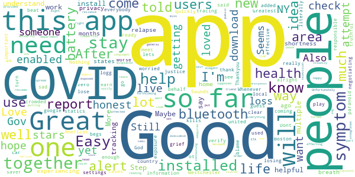

> It's alright. But it kills my battery quickly in I have the bluetooth enabled, and ot begs you to have it enabled.  :date: __2020-11-21 05:01:19__

> Dont no what its doing but cases are getting worse 🙃  :date: __2020-11-19 23:13:03__

> Not yet. Just installed the apps.  :date: __2020-11-19 11:18:17__

> So sad  :date: __2020-11-17 03:04:54__

> Good  :date: __2020-11-10 06:11:29__

> Good so far  :date: __2020-11-09 16:24:50__

> A very important App for information on COVID-19 in Westchester, NY. Whenever local statics is added to the App, it will earn 5 stars  :date: __2020-11-08 22:05:11__

> Great app i just turn on bluetooth in crowded areas ,car and when I meet people battery life saver  :date: __2020-11-02 16:07:59__

> Good so far.  :date: __2020-10-29 17:37:24__

> I live in Boston...  :date: __2020-10-28 04:09:50__

#### 3-star reviews

> I installed this app 3 months ago and tested positive for the novel coronavirus 1 month ago. I was excited to warn nearby contacts of my status from the app, but doing so requires a secret 6-digit code and the contact tracer who was assigned to my case did not know what it was. I was so disappointed. My phone had collected 2 months of data about nearby contacts, but this information could not be used to save lives. I don't blame the contact tracer, but I hope this issue can be addressed.  :date: __2020-11-17 21:19:31__

> Assume this app works, but haven't had any alerts. Also the symptoms are similar to common cold and allergies so that may cause alarm to people.  :date: __2020-11-15 16:15:08__

> It's not detecting my Bluetooth.  :date: __2020-11-12 20:43:55__

> Wish this had an "I tested negative" button for people with symptoms that turn out to be unrelated. Also, I suspect this gives a false sense of security--the main threat is people who don't take this seriously. Those people aren't using this app.  :date: __2020-11-05 06:37:55__

> Tells you that you may have covid if you report one symptom. Useless.  :date: __2020-11-05 05:28:25__

> Not sure it works  :date: __2020-11-01 14:37:14__

> Good probably, but SILLY. it asks how you're feeling, and when I checked the box for a runny nose it gave me a "sorry you're not feeling well" page, complete with "could be COVID19" warnings. Ridiculous.  :date: __2020-10-31 00:45:24__

> I assume it does what it says it does, but it's also caused panic in a bunch of people I know because for example I put in fatigue this morning and it was like YOU MIGHT HAVE COVID. And that caused a panic attack. I'm going to keep it installed so that I can be notified and stuff, but I talked to my doctor and he agreed that I shouldn't look at it so that I don't have daily panic attacks over what's probably nothing.  :date: __2020-10-25 15:02:09__

> Poor updated stats. No ability to request or to see Scan frequency.  :date: __2020-10-23 21:19:09__

> just installed it seems like it could be a good way to find out if your around people that have been infected but as long as everyone has the app installed and you have your Bluetooth on so you can be notified 🤷‍♀️  :date: __2020-10-23 05:18:40__

#### 2-star reviews

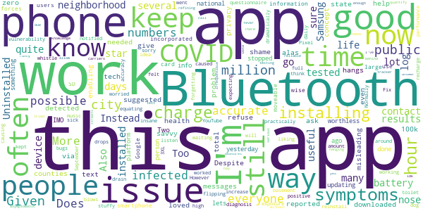

> Two stars because: It is a shame that only just over 100k people have downloaded this app in a city of 8.4 million and a state of 12 million. Given zero privacy issues detected or reported, this app should be suggested via text messages all the time. This is a public health problem everyone should help in all possible ways.  :date: __2020-11-22 18:32:18__

> Does not give accurate numbers if total infected in some counties. Numbers are often misleading.  :date: __2020-11-08 22:56:07__

> More work on the app is needed. Despite enabling Bluetooth, the app still ask for you to do so; then it hangs. Keep work on it.  :date: __2020-11-08 13:41:49__

> concept is good. alas even with bluetooth on it didn't work. then again most of the people in my neighborhood refuse to get tested (I get tested) and/or aren't tech savvy so this app isn't useful for my neighborhood  :date: __2020-11-07 14:18:38__

> I loved this app, until yesterday when it stopped updating. The person info I have is now for 2 days ago. It's now worthless.  :date: __2020-11-05 12:29:55__

> This app in no way lets u know if you have been in contact with covid  :date: __2020-10-30 18:24:06__

> IMO, this is something which should be done on a national platform, and incorporated into Google, so all smartphone users have this information. Instead, this app is quite large, not moveable to the SD card, and forces you to use Bluetooth more often than is wise... not only for battery life, but vulnerability issues. Also, the "questionnaire" of daily symptoms blows quite the dog whistle, flipping out over a stuffy nose, practically equating it with a positive COVID diagnosis. Too many bugs to be worked out for my liking... sorry. Uninstalled.  :date: __2020-10-20 07:43:45__

> I like the idea of an app like this a lot. It's not that I go out in public often, and being notified of a possible exposure is good. However, on my Pixel 3XL, performance went into the toilet, and the battery drain was insane. Normally, I could listen to YouTube music while working out in my basement and only go down to 85-90% from a full charge. With this installed, it drops to 25-30% in an hour. It also caused recharge times to increase dramatically. Fix that issue, and I will reinstall.  :date: __2020-10-18 13:24:54__

> I would like to keep this app installed but I think it was causing my phone a lot of issues. My phone kept forgetting bluetooth devices until I uninstalled this.  :date: __2020-10-13 14:37:11__

> I'm worried as to its accuracy. I'm still waiting for my COVID-19 results, which I'm expecting since around September 24. I haven't felt sick, but given the high amount of asymptomatic carriers idk how reliable this app would be with so many people out on the streets without any knowledge of being infected due to irresponsible testing measures in the city. And yes, I've tried to call several times. No answer and they keep hanging up the phone.  :date: __2020-10-11 20:07:30__

#### 1-star reviews

> Covid is hoax. This isnt about a virus, this is about control. RESIST BEFORE ITS TOO LATE!!!  :date: __2020-11-21 18:42:01__

> I was twice around infected people this does not work.No warnings.Dmv didn't even tell me I might have been exposed I saw it on line.  :date: __2020-11-21 16:24:49__

> Worst app anyone could think of making to constantly fear monger a virus proven less deadly than the common flu. You're crazy if you use this app unironically  :date: __2020-11-20 19:07:36__

> Don't do much  :date: __2020-11-19 16:52:10__

> Update: Dev continues completely tone-deaf, as evidenced by their reply below, which has ZERO to do with my review. Nowhere did I do so much as insinuate that the app was for medical diagnosis. I know exactly what the app is meant to do, & insulting my intelligence is not going to hide the fact that the app is useless & does not do the job. They still haven't fixed anything. Literally thousands of complaints similar to mine & they still don't get it. The entire point is that chronically ill people ALREADY HAVE BASELINE SYMPTOMS, and if those aren't entered into ANY tracing application, the RESULTS WILL BE WRONG. How are you allowed to work on this app or respond to questions without that basic understanding? This is very definition of ableist trash. I stand by my original review: Absolutely worthless garbage. They don't listen & things keep getting worse. Inexcusable incompetence. I dont want your lying responses, I want you to do your job or get out of the way so someone who can has the chance to fix your mess. This is ridiculous. \*\** Original review: How can you possibly do anything like this without first allowing for a person's baseline health? I've got chronic conditions that share C19 symptoms. This app now thinks I've got C19. This is thoughtless, ableist, privileged foolishness. Throwing the chronically ill under the bus, as always. Why do you refuse to learn? Uninstalled. I want to be part of the solution, but your ignorant gatekeeping shuts me out. Nice job.  :date: __2020-11-18 22:58:56__

> This app overheat my phone. make it go on fire. because app did clean sweep function. Not safe  :date: __2020-11-17 04:38:42__

> Causes phone issues, app crashes, causes phone to freeze. Junk  :date: __2020-11-16 00:18:58__

> I had this app, feeling like it was my duty as a New Yorker to help where I could, but after realizing that my county was withholding numbers and not fully reporting the positive cases, I uninstalled it.  :date: __2020-11-09 00:29:43__

> As I said in my last review,my speaker worked fine after possibly being muted for a month when I uninstalled this app. There is nothing concerning in this app neither a virus or malware, but you can get your speaker muted for free by installing this. Just wrote another because I'm still wondering where my original review went.  :date: __2020-11-08 22:45:11__

> Keeps telling me that tracking is turned off, but when I click on the notification, it is turned on.  :date: __2020-11-06 15:18:56__

# COVID Alert PA
App version ``1.0.1.18``

Analyzed with [covid-apps-observer](http://github.com/covid-apps-observer) project, version ``0.1``

## App overview
| | |
|-------------------------|-------------------------| 
| **Name**&nbsp;&nbsp;&nbsp;&nbsp;&nbsp;&nbsp;&nbsp;&nbsp;&nbsp;&nbsp;&nbsp;&nbsp;&nbsp;&nbsp;&nbsp;&nbsp;&nbsp;&nbsp;&nbsp;&nbsp;&nbsp;&nbsp;&nbsp;&nbsp;&nbsp;&nbsp;&nbsp;&nbsp;&nbsp;&nbsp;&nbsp;&nbsp;&nbsp;&nbsp;&nbsp;&nbsp;&nbsp;&nbsp;&nbsp;&nbsp;  | COVID Alert PA |
| **Unique identifier** | gov.pa.covidtracker |
| **Link to Google Play** | [https://play.google.com/store/apps/details?id=gov.pa.covidtracker](https://play.google.com/store/apps/details?id=gov.pa.covidtracker) |
| **Summary**  | The COVID Alert PA app can help reduce the spread of coronavirus in Pennsylvania |
| **Privacy policy** | [https://www.health.pa.gov/topics/disease/coronavirus/Pages/COVIDAlert.aspx#privacy](https://www.health.pa.gov/topics/disease/coronavirus/Pages/COVIDAlert.aspx#privacy) |
| **Latest version** | 1.0.1.18 |
| **Last update** | 2020-09-11 20:39:30 |
| **Recent changes** | Help reduce the spread of coronavirus in Pennsylvania. |
| **Installs**  | 100,000+ |
| **Category** | Medical |
| **First release** | Sep 10, 2020 |
| **Size**  | 106M |
| **Supported Android version**  | 6.0 and up |

### Description
> The COVID Alert PA App (App) is made available by the Pennsylvania Department of Health (DOH). The App is designed to assist in alerting individuals that came in close proximity with someone who later tests positive for COVID-19, and to provide information about the virus and steps for controlling the spread of the virus.  
 The use of this App is entirely voluntary, and it is available to download for free from the Google Play Store. The App runs on Android phones running Android 6.0 and higher. The App is not intended for use by persons under 18 years of age. Users will be asked to confirm that they are 18 years or older the first time the App is opened.
 How the COVID Alert PA App works
 As opposed to the traditional contract tracing process where a positive COVID-19 individual may not even remember who they have been in contact with recently and for how long (for example, if the contact happened on a bus or a train, at a check-out line in a grocery store, or at a restaurant or some other public venue), the App uses technology developed by Apple and Google where anonymous Random IDs (pseudo random alpha numeric values) are exchanged between mobile phones. A Random ID is generated by the phone every 10 to 20 minutes to maintain privacy and security. If you are close to someone who also uses the App on their phone, your Random ID will be saved on that person’s phone and their Random ID will be saved on your phone. All Random IDs collected will remain on your mobile device, but neither you, nor anyone else, will be able to see them. These anonymous Random IDs cannot reveal your identity to other users, DOH, Apple, Google or anyone else.
 If an individual receives a positive COVID-19 diagnosis, they will receive a call from DOH or their local county or municipal health department within 24-72 hours for case investigation and contact tracing purposes. If that individual has the App downloaded, a public health representative will ask the individual if they are willing to accept a 6-digit validation code. If they agree, a 6-digit validation code will be sent to them via SMS/text message to be entered into the App, which then gives the individual the option to upload their Random IDs to a DOH diagnosis keys server. 
 Users who were in close contact with a positive COVID-19 individual who submitted their 6-digit code in the app will receive an Exposure Alert. The app knows when to provide the user with an Exposure Alert by downloading the latest diagnosis keys from the server every four hours and checking for matches. These diagnosis keys are checked for matches against the Random IDs of the contacts that have been collected by your phone. If there is a match, you will be notified in the app that you were in close contact with a person who was recently diagnosed with COVID-19. This is called an “Exposure Alert.  To ensure that Exposure Alerts work properly, users must have COVID-19 Exposure Notification Services (ENS) enabled on their phone. Users have the option to enable the COVID-19 ENS and permit their phone to display notifications when they have been exposed to someone who has tested positive for COVID-19. Users can turn off this functionality in the settings page of the App.
 In the event you receive an Exposure Notification, you will be offered advice on the Exposure Notification Information screen, and if you would like to speak with a public health representative, you can provide your phone number and someone from DOH will call you. 
 It is important to note that both traditional contact tracing and the App never reveal the identity of any person using the App to other App users, and never reveal who has been diagnosed as positive for COVID-19. Also, if you do not want a call from a public health representative and do not enter your phone number, DOH will not know whether you have received an Exposure Notification.

### User interface
The developers of the app provide the following screenshots in the Google play store.
| | | |
|:-------------------------:|:-------------------------:|:-------------------------:|
 |   |   |   | 
 |   |  

## Development team
In the following we report the main information provided by the development team in the Google play store.

| | |
|-------------------------|-------------------------|
| **Developer**  | Commonwealth of Pennsylvania |
| **Website**  | [https://www.pa.gov/covid/covid-alert-pa/](https://www.pa.gov/covid/covid-alert-pa/) |
| **Email** | RA-DH-CovidApp@pa.gov |
| **Physical address**  | - |
| **Other developed apps**  | [https://play.google.com/store/apps/developer?id=Commonwealth+of+Pennsylvania](https://play.google.com/store/apps/developer?id=Commonwealth+of+Pennsylvania) |

## Android support

| | |
|-------------------------|-------------------------|
| **Declared target Android version**  | Android10, version 10 (API level 29) |
| **Effective target Android version**  | Android10, version 10 (API level 29) |
| **Minimum supported Android version**  | Marshmallow, version 6.0 (API level 23) |
| **Maximum target Android version**  | - |

The larger the difference between the minimum and maximum supported Android versions, the better. A larger difference means a wider audience. For example, old phones have a very low Android version, so a high minimum supported Android version means that the app cannot be used by users with old phones, thus leading to accessibility problems. 

## Requested permissions

In the following we report the complete list of the permissions requested by the app. 

| **Permission** | **Protection level** | **Description** | 
|-------------------------|-------------------------|-------------------------|
 **android.permission ACCESS_NETWORK_STATE** | Normal | Allows applications to access information about networks. 
 **android.permission ACCESS_WIFI_STATE** | Normal | Allows applications to access information about Wi-Fi networks. 
 **android.permission BLUETOOTH** | Normal | Allows applications to connect to paired bluetooth devices. 
 **android.permission INTERNET** | Normal | Allows applications to open network sockets. 
 **android.permission RECEIVE_BOOT_COMPLETED** | Normal | Allows an application to receive the Intent.ACTION_BOOT_COMPLETED that is broadcast after the system finishes booting. 
 **android.permission VIBRATE** | Normal | Allows access to the vibrator. 
 **com.google.android.finsky.permission BIND_GET_INSTALL_REFERRER_SERVICE** | - | - 

## Mentioned servers

| **Server** | **Registrant** | **Registrant country** | **Creation date** | 
|-------------------------|-------------------------|-------------------------|-------------------------|
 | android.com | Google LLC | :us: US | 1997-06-23 04:00:00 |
 | google.com | Google LLC | :us: US | 1997-09-15 04:00:00 |
 | expo.io | See PrivacyGuardian.org | :us: US | 2011-05-01 21:26:50 |

## Security analysis 

Below we report the main security warnings raised by our execution of the [Androwarn](https://github.com/maaaaz/androwarn) security analysis tool.

**Telephony identifiers leakage**
> - This application reads the numeric name (MCC+MNC) of current registered operator 
> - This application reads the operator name 
> - This application reads the phone number string for line 1, for example, the MSISDN for a GSM phone 

**Location lookup**
> - This application reads location information from all available providers (WiFi, GPS etc.) 

**Connection interfaces exfiltration**
> - This application reads details about the currently active data network 
> - This application tries to find out if the currently active data network is metered 

**Suspicious connection establishment**
> - This application opens a Socket and connects it to the remote address ' returned no addresses for  ; port is out of range' on the 'N/A' port  
> - This application opens a Socket and connects it to the remote address '' on the 'N/A' port  
> - This application opens a Socket and connects it to the remote address 'Ljava/lang/StringBuilder;->toString()Ljava/lang/String;' on the 'N/A' port  
> - This application opens a Socket and connects it to the remote address 'Ljava/net/Proxy;->type()Ljava/net/Proxy$Type;' on the 'N/A' port  
> - This application opens a Socket and connects it to the remote address 'timeout' on the 'N/A' port  

**Pim data leakage**
> - This application accesses data stored in the clipboard 

**Code execution**
> - This application loads a native library 
> - This application executes a UNIX command 

## User ratings and reviews

Below we provide information about how end users are reacting to the app in terms of ratings and reviews in the Google Play store.

### Ratings

The COVID Alert PA app has been installed by more than **100000** times. At this time, **691** rated the app and its average score is **3.6796117**. Below we show the distribution of the ratings across the usual star-based rating of Google Play

:star::star::star::star::star:: 363

:star::star::star::star:: 94

:star::star::star:: 40

:star::star:: 40

:star:: 154

### Reviews 

#### 5-star reviews

> This is a great app and i wish i knew about it sooner.  :date: __2020-11-20 07:54:14__

> Please download this app to keep every Pennsylvanian safe. It asks once a day if you are having symptoms, and if you test positive you can let the app know. This way anyone whose phone recently came in proximity to yours will get notified. It uses bluetooth, NOT location, and the random ID numbers are anonymous and get purged regularly. It only works well if everyone is on board. It only takes a few small steps to protect our community.  :date: __2020-11-18 00:23:05__

> "Knowledge is power!!! "Keep yourself safe! Keep me safe! Keep everyone safe!"  :date: __2020-11-17 19:13:58__

> Great 👍  :date: __2020-11-17 07:52:11__

> The app is a good thing to have and to know.  :date: __2020-11-16 21:00:23__

> Its anonymous, really easy to use and you can help stop the spread of Covid. Wash your hands,put on your mask (that's right, cover your big nose,too) and sign up now.  :date: __2020-11-16 14:14:46__

> I love it, it really tells me how many people I have been exposed to so it is really helpfull. I DEFENETLY recommend it!  :date: __2020-11-15 16:48:29__

> Nothing but problems with this foolish app. It drains the battery encroaches on civil liberties. I would prefer instead of asking if I were male female or prefer not to say.... I have been diagnosed with body dysmorphia I insist too be placated too by the general public. I should probably be aware that treating something whenever I'm genetically male or female not a gender that I choose because of my psychological problems May hamper the effectiveness.  :date: __2020-11-14 12:35:56__

> Good info  :date: __2020-11-14 11:39:19__

> Great app  :date: __2020-11-13 15:45:34__

#### 4-star reviews

> Easy to use.  :date: __2020-11-20 16:45:32__

> Gji  :date: __2020-11-18 10:07:28__

> Good as described  :date: __2020-11-17 23:58:16__

> Seems ok but not enough people are using it for it to be helpful for me...I know I had contact but no notification.  :date: __2020-11-17 02:08:00__

> I'm not so sure?  :date: __2020-11-14 22:30:22__

> There's a bunch of armchair developers in these reviews. Anyone with any common knowledge can go into the app's info to see that it clearly says "No permissions requested". The only issue with is that it may not protect you because not enough people are running the exposure system. As poorly developed as it is, the app does it's job and has an easy UI. None of you have the knowledge nor the room to speak about how the app is developed and it's privacy - the blind is misinforming the blind.  :date: __2020-11-05 20:57:34__

> For some reason nothing happens when I try to click on the Set a Daily Reminder option.  :date: __2020-10-31 17:19:52__

> Still have some questions.  :date: __2020-10-19 06:35:45__

> Will this app communicate with the similar nj, NY and de apps?  :date: __2020-10-10 23:25:08__

> Check in symptoms... I have allergies, so a runny nose is beyond common. I think there should be more I debth questions, if possible.  :date: __2020-10-08 15:17:32__

#### 3-star reviews

> Reporting symptoms is easy. But Covid data does not seem accurate. Or, I am misunderstanding the data since the data columns are unlabelled.  :date: __2020-11-19 21:12:48__

> Not sure that this is truly private. If I have to give my phone number to DOH employee to receive Random ID, then this is no longer private because DOH then has my phone number and knows my identity. How is this private or confidential?  :date: __2020-11-18 23:14:49__

> 😁it doesn't tell me much about the Virus itsef  :date: __2020-11-13 17:27:08__

> Very important  :date: __2020-11-12 19:24:32__

> I don't know about this but, it is installed anyway.  :date: __2020-11-10 20:12:31__

> Kinda useless unless everyone has it. Few do. ~340,000 users at the time of writing. The state has a lot more people than 340,000.  :date: __2020-10-30 18:03:10__

> I cannot enable/activate the Exposure Alert function. I have an Android One Moto-x 4. It uses a VoIP phone number from Republic Wireless as its primary number but switches behind the scenes to a T-Mobile number to relay phone calls and texts when the Internet is unavailable.  :date: __2020-10-29 16:25:27__

> Bug: Cannot update/add symptoms after selecting "no symptoms" for the day. I like to check in in the mornings, but one day I checked in with "no symptoms" and later in the day felt unwell; I wanted to report my symptoms but apparently could not since I had already checked in with no symptoms. Seems like a glaring oversight. Otherwise, it's a good looking app with a solid premise.  :date: __2020-10-21 05:06:06__

> Mostly fake virus  :date: __2020-10-14 17:21:41__

> Uses a lot of data. In two weeks it has used 4.56 Gigs of data. Update: Now has used 4.58 Gigs foreground 259 Megs background  :date: __2020-10-10 17:00:57__

#### 2-star reviews

> Case & death graphs are informative but a "hot spot" map by zip code would help prevent cases. IMHO!!  :date: __2020-11-21 04:51:15__

> Uuuuuuugh, terrible source of communist pornography, it took I kid you not FOREVER just to find the pics. 2 out of five stars because it still made me feel like a horny hero when I gave away my civil freedoms  :date: __2020-11-19 00:03:54__

> This peticular app should be integrated into phones to be mandatory. It is only effective if those who test positive for virus VOLUNTARILY input there special number. Too many people are acting like this is taboo. Anyone who tests positive for any type of pandemic disease should not declare this info as private. Its not, especially when there are so many people involved in their care. STOP BEING SELFISH!  :date: __2020-11-18 18:07:39__

> No good  :date: __2020-11-15 19:22:44__

> I don't want to be tracked! Just wanted updated information on covid19  :date: __2020-11-15 13:21:42__

> I see quite a few people claiming this app doesn't need location tracking to be on, yet it's asked me twice to turn on location tracking to use exposure notifications, since I installed it 5 minutes ago. So which is it?!? What will this app actually tell me if I have my location turned off, anything??  :date: __2020-11-14 08:12:39__

> Tried this app for less than few weeks or so, often question of how it can actually sense if I have been exposed to someone tested positive covid 19 just by bluetooth and location services ? With having app on and running constantly, considerably drains my battery with having both location on and bluetooth on all the time. How reliable is this app when I'm not always connected to internet or have available cellular data? I don't have unlimited cellular data plan, makes hard for app to work  :date: __2020-10-31 03:33:27__

> There are no notifications of other people.or places near by  :date: __2020-10-30 03:22:19__

> This app only works if people report their symptoms. So if no one does then you know if you've come in contact with anyone with the Chinese virus.  :date: __2020-10-26 18:36:59__

> Good idea but it's voluntary and you need the app to trace. If someone tests positive and does not have the app there will be no notification? Another way for the state to trace where tire are and have been. Big brother with fear  :date: __2020-10-21 06:31:05__

#### 1-star reviews

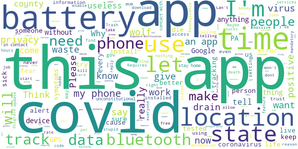

> I feel it shouldn't be optional for someone to register that they have covid. I think it should be mandatory by the county or state to enter everybody who's been tested positive for the virus. We're trying to keep healthy and fight covid, so none of that should be optional to an individual. If you have covid then people should know to make sure others doesn't get exposed!  :date: __2020-11-21 21:46:34__

> I work in a hospital where we have several COVID floors and I haven't gotten an exposure alert.  :date: __2020-11-20 23:40:11__

> Please remove Safetynet. By not allowing rooted devices, you are endangering everyone.  :date: __2020-11-20 22:44:04__

> App gave me covid.  :date: __2020-11-20 05:21:20__

> Unless this app is mand mandatory and reporting to the app is made mandatory it's a waste of time.  :date: __2020-11-19 19:33:23__

> Requires battery draining bluetooth at all times. I would rather it just use GPS  :date: __2020-11-19 15:08:18__

> Doesn't allow view per zipcode, Doesn't contain links to real time Data. Doesn't display States Arcgis map. There is absolutely no reason whatsoever to justify allowing this app to constantly record your data and transmit it via bluetooth. Total waste of time without viewable real time anonymized data.  :date: __2020-11-19 06:58:17__

> This provides no assistance except promoting fear of being sick. Just because you receive a notification that you have come in contact with someone who is infected, doesn't mean you will get the virus. If you really want to stop this bug then we need better ways to identify active infections. And testing should be 100% free!  :date: __2020-11-19 03:21:07__

> Won't let it load. Keeps saying pending...  :date: __2020-11-18 18:10:44__

> I cannot downliad to my Android cell phone.  :date: __2020-11-17 18:38:17__

# MD COVID Alert
App version ``minted12004``

Analyzed with [covid-apps-observer](http://github.com/covid-apps-observer) project, version ``0.1``

## App overview
| | |
|-------------------------|-------------------------| 
| **Name**&nbsp;&nbsp;&nbsp;&nbsp;&nbsp;&nbsp;&nbsp;&nbsp;&nbsp;&nbsp;&nbsp;&nbsp;&nbsp;&nbsp;&nbsp;&nbsp;&nbsp;&nbsp;&nbsp;&nbsp;&nbsp;&nbsp;&nbsp;&nbsp;&nbsp;&nbsp;&nbsp;&nbsp;&nbsp;&nbsp;&nbsp;&nbsp;&nbsp;&nbsp;&nbsp;&nbsp;&nbsp;&nbsp;&nbsp;&nbsp;  | MD COVID Alert |
| **Unique identifier** | gov.md.covid19.exposurenotifications |
| **Link to Google Play** | [https://play.google.com/store/apps/details?id=gov.md.covid19.exposurenotifications](https://play.google.com/store/apps/details?id=gov.md.covid19.exposurenotifications) |
| **Summary**  | MD Contact Tracing is the official exposure notification app for Maryland |
| **Privacy policy** | [https://health.maryland.gov/Pages/ENXPrivacy.aspx](https://health.maryland.gov/Pages/ENXPrivacy.aspx) |
| **Latest version** | minted12004 |
| **Last update** | 2020-11-11 00:50:58 |
| **Recent changes** | Bug fixes and performance improvements |
| **Installs**  | 50,000+ |
| **Category** | Medical |
| **First release** | Nov 3, 2020 |
| **Size**  | 10.0M |
| **Supported Android version**  | 5.0 and up |

### Description
> MD COVID Alert is the official COVID-19 exposure-notifications software for the Maryland Department of Health. The app is an instance of Exposure Notifications Express platform developed by Apple and Google and configured by Maryland.
 Your personal use of MD COVID Alert will help anonymously alert Maryland residents who may have been near someone with a positive COVID-19 diagnosis. When you enable MD COVID Alert, you are doing your part to efficiently and effectively help your community slow the spread of COVID-19.
 How MD COVID Alert works:
 When devices with MD COVID Alert are in close contact, they exchange random identifiers using Bluetooth Low Energy (BLE). When someone tells their app that they tested positive for COVID-19, whoever received their random identifiers may receive an alert that they may have possibly been exposed to COVID-19. When a device receives random identifiers it date-stamps them and records their signal strength so that the Exposure Notification system can estimate how close the two devices were to each other and for how long. If the timeframe was at least 15 minutes and the estimated distance was within six feet, then the other user receives a notification of a possible exposure.
 Apple and Google's Exposure Notifications framework runs in the background, even when the MD COVID Alert app is closed. It will not drain the device battery at a rate that would occur with other apps that use normal Bluetooth and/or are open and running constantly.
 How MD COVID Alert Protects Your Privacy:
 Maryland takes your privacy and confidentiality very seriously. Apple and Google's framework is designed to avoid correlating any personal data and location information with the random identifiers that devices exchange. Maryland Department of Health does not want or need to know where or who you are for MD COVID Alert to work. If you are close enough to another app user, your device's BLE will exchange random identifiers with that user.
 Laboratory results for all persons who test positive for COVID-19 are sent to Maryland Department of Health. This is not associated with the app. Our staff follows up with persons reported as positive, based on information provided within the laboratory report. As a courtesy to all app users, MD COVID ALert will verify positive tests and then provide MD COVID Alert users with a personal identifying number (PIN). You must use that PIN in order to report a positive result to the app. This prevents people from falsely reporting positive results, which could generate false exposure notifications. Maryland Department of Health wants all app users to feel confident that when a possible COVID-19 exposure is received via the app, that it is a real event.
 If you have the current Apple or Google operating system installed on your device, you may have noticed that Exposure Notifications are now included. You cannot enable this function until you have installed the MD COVID Alert app. Apple and Google will delete the exposure notification service tools from their respective operating systems once the pandemic reaches a point that public health no longer requires the use of this technology.
 Thank you for installing MD COVID Alert! Together, we can protect our family, friends, neighbors, and colleagues, and keep Maryland moving forward!

### User interface
The developers of the app provide the following screenshots in the Google play store.
| | | |
|:-------------------------:|:-------------------------:|:-------------------------:|
 |   |  

## Development team
In the following we report the main information provided by the development team in the Google play store.

| | |
|-------------------------|-------------------------|
| **Developer**  | Maryland Department of Health |
| **Website**  | - |
| **Email** | MD-Contact-Tracing-Support@maryland.gov |
| **Physical address**  | - |
| **Other developed apps**  | [https://play.google.com/store/apps/developer?id=Maryland+Department+of+Health](https://play.google.com/store/apps/developer?id=Maryland+Department+of+Health) |

## Android support

| | |
|-------------------------|-------------------------|
| **Declared target Android version**  | Android10, version 10 (API level 29) |
| **Effective target Android version**  | Android10, version 10 (API level 29) |
| **Minimum supported Android version**  | Lollipop, version 5.0 (API level 21) |
| **Maximum target Android version**  | - |

The larger the difference between the minimum and maximum supported Android versions, the better. A larger difference means a wider audience. For example, old phones have a very low Android version, so a high minimum supported Android version means that the app cannot be used by users with old phones, thus leading to accessibility problems. 

## Requested permissions

In the following we report the complete list of the permissions requested by the app. 

| **Permission** | **Protection level** | **Description** | 
|-------------------------|-------------------------|-------------------------|
 **android.permission ACCESS_NETWORK_STATE** | Normal | Allows applications to access information about networks. 
 **android.permission BLUETOOTH** | Normal | Allows applications to connect to paired bluetooth devices. 
 **android.permission FOREGROUND_SERVICE** | Normal | Allows a regular application to use Service.startForeground. 
 **android.permission INTERNET** | Normal | Allows applications to open network sockets. 
 **android.permission RECEIVE_BOOT_COMPLETED** | Normal | Allows an application to receive the Intent.ACTION_BOOT_COMPLETED that is broadcast after the system finishes booting. 
 **android.permission WAKE_LOCK** | Normal | Allows using PowerManager WakeLocks to keep processor from sleeping or screen from dimming. 

## Mentioned servers

| **Server** | **Registrant** | **Registrant country** | **Creation date** | 
|-------------------------|-------------------------|-------------------------|-------------------------|
 | google.com | Google LLC | :us: US | 1997-09-15 04:00:00 |

## Security analysis 

Below we report the main security warnings raised by our execution of the [Androwarn](https://github.com/maaaaz/androwarn) security analysis tool.

**Telephony identifiers leakage**
> - This application reads the ISO country code equivalent of the current registered operator's MCC (Mobile Country Code) 

**Connection interfaces exfiltration**
> - This application reads details about the currently active data network 
> - This application tries to find out if the currently active data network is metered 

**Suspicious connection establishment**
> - This application opens a Socket and connects it to the remote address 'timeout' on the 'N/A' port  

**Code execution**
> - This application loads a native library: 'prioclient' 

## User ratings and reviews

Below we provide information about how end users are reacting to the app in terms of ratings and reviews in the Google Play store.

### Ratings

The MD COVID Alert app has been installed by more than **50000** times. At this time, **106** rated the app and its average score is **3.962264**. Below we show the distribution of the ratings across the usual star-based rating of Google Play

:star::star::star::star::star:: 69

:star::star::star::star:: 6

:star::star::star:: 9

:star::star:: 2

:star:: 20

### Reviews 

#### 5-star reviews

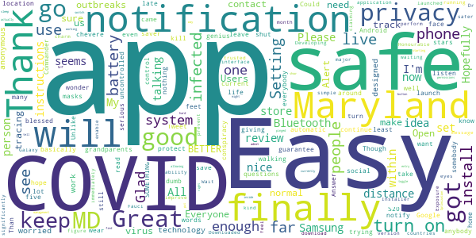

> Great app and genius idea. Easy install and easy instructions. Could be a life saver!  :date: __2020-11-22 12:32:38__

> Answer other's review: cannot turn on this app. Samsung S20, All the Android phone is automatic turn on the COVID notification. Go to setting and go Google set. will see the COVID 19 Notification turn on. Finally the MD launch the COVID 19 app. Thanks.  :date: __2020-11-22 00:18:12__

> Thank you for this app. My grandparents have covid-19. This is very serious. Bluetooth does take up a lot of battery so I basically just turn it on before I leave to go to the store or out and shut it off while I'm safe at home. Please wear your masks and continue to social distance.  :date: __2020-11-21 17:36:27__

> Hopefully this app keeps me safe so far what I have read about it seems safe for my phone privacy I'm giving it five stars for now I wonder if it will protect me and notify me in a safe distance from a infected person before they get within 6 feet with me I don't want to be talking to that person we're walking by somebody or around anybody and they are infected what about the people who are infected and don't even know that they are so many questions not enough words hope everybody's safe.  :date: __2020-11-17 03:32:27__

> Great app. Does not kill battery or face location. Please don't listen to the dumb conspiracy people. Everyone in MD should have this on their phone so we can get a control over the no uncontrolled virus.  :date: __2020-11-15 17:29:10__

> BETTER Than nothing! At least they are trying SOMETHING! Unlike our current "Commander And Tweet"!!  :date: __2020-11-15 06:56:32__

> Though it came very late but its still better. Developing countries launched this kind of app within one month of covid outbreaks..  :date: __2020-11-14 22:29:24__

> I trusted this download for the Honourable Dr Fauci! 💗♾🐶  :date: __2020-11-14 21:03:28__

> I feel safer having this app.  :date: __2020-11-14 14:56:15__

> This application will significantly improve our ability to track this virus, perform contact tracing, and prevent major outbreaks.  :date: __2020-11-12 17:05:49__

#### 4-star reviews

> It would be a good idea to add the current state guidelines.  :date: __2020-11-15 17:21:15__

> Just downloaded this app. We'll see how it works.  :date: __2020-11-11 23:40:36__

> I have android 5 samsung note phone and I could install it. Read the info about the app which explains how it works (without IDg person or phone) and that made it clear that location setting doesnt have to be on. Bluetooth was activated by app; assume i need to have it active when outside the house. Haven't been anywhere yet, so can't really evaluate app properly. But happy to have this app and plenty of free and nearby testing where I live. We can use all the help we can get!  :date: __2020-11-11 17:15:01__

> Glad MD was able to get this going. A nationwide alert system would of course be preferable, but the US is obviously not ready for that. Trivial to setup, unobtrusive, and the privacy/security framework seems sound.  :date: __2020-11-10 18:15:46__

#### 3-star reviews

> Just Downloaded But Unable To Turn On Notifications. Now It's Just Useless. And No It's Not My Phone. Please Fix Bugs.  :date: __2020-11-20 15:15:26__

> I wish there was a way to enable exposure notifications from multiple jurisdictions. As someone that works in dc/md/va it would be nice to have all 3 apps on and able to notify you, but you can only have one app enabled at a time.  :date: __2020-11-18 12:26:15__

> I would have kept this app if it didn't require my bluetooth be on all the time. Great idea, though. Thanks for working this, though.  :date: __2020-11-17 02:32:20__

> Just downloaded the app so I'm unsure of how great it works just yet, however please change the icon as it triggers my trypophobia!  :date: __2020-11-15 13:16:23__

> I don't quite understand how this is keeping me safe. It's relying on the honesty of the population. Those that self report using this app most likely won't be spending much outside their home. They'll be using door dash or have a family member or friend pick up what they need. Those that are positive and out in the community regularly will less likely self report on this app, if they even have the app installed.  :date: __2020-11-15 02:29:05__

> The virus will have a vaccine soon, so I hope you didn't put too much effort into this app.  :date: __2020-11-14 23:00:47__

> It's certainly valuable to have a way of being notified if I was close to someone for 15 minutes who didn't know my name and who came down with COVID-19. The reason I didn't give the app 5 stars is that it doesn't allow me to check in daily and report suspicious symptoms. The only thing I can report is a test result. The other thing I don't like is that there are separate apps for neighboring states. That means that I have to have multiple contact tracing apps on my phone.  :date: __2020-11-12 16:38:08__

> It was horrible trying to download and install this app at first. Something told me to try again at 5am. It was installed in a flash. If this is an indication that servers were busy, then I am extremely happy that Marylanders are using it.  :date: __2020-11-12 11:18:10__

> Had to find a link from an article because it never showed up in the play store. Otherwise, I assume it's built on the same framework/template as many other states' apps and it remains to be seen how effective it is.If it really requires you to volunteer a positive test result, I'm not sure how they can expect much participation (or prevent trolling).Considering how little messaging I've seen and how resistant people are to even the most basic prevention, it seems like it may be a token gesture.  :date: __2020-11-12 02:18:22__

#### 2-star reviews

> I don't think this works. I've worked with covid patients since I installed this app and not once did this app alert me to anything.  :date: __2020-11-22 00:08:49__

> I had this downloaded for about 2 weeks and this phone has not gone off , I go out to work every day, go to Walmart and crafts store, now I know this should have at least gone off by now.  :date: __2020-11-21 16:47:11__

> Installed. Then my battery started draining way faster than usual. Uninstalled. I will update my review when I see if the battery drain goes away or not.  :date: __2020-11-17 22:37:58__

> Without good data, useless. It should allow you to report known exposure sites and events rather than just personal test results. Oddly, a search for 'Maryland' does not find this app.  :date: __2020-11-11 21:55:31__

#### 1-star reviews

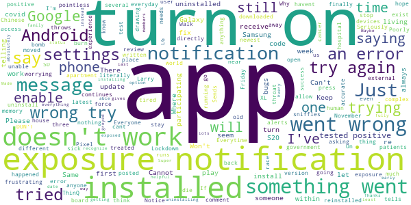

> App not turn on. Sends an error message each time. I've installed an uninstalled three times with no success. Google Pixel 3 XL running newest version of Android. Please fix the bugs.  :date: __2020-11-19 00:12:48__

> Doesn't Work installed try to turn on says something went wrong. Un installed re installed. Same thing. Doesn't Work  :date: __2020-11-18 21:44:56__

> If you are old and sick stay in the house. Everyone else, stop worrying about the Chinese sniffles 🥢🇨🇳👲🐉🏮🈲️. Lockdown Larry will have us all living off of government before you know it..🤦🏽‍♂️  :date: __2020-11-17 09:48:34__

> I can't turn the exposure notification on. I have had the latest Android installed.  :date: __2020-11-16 20:42:33__

> Poorly written. App can not be moved to external SD memory  :date: __2020-11-16 18:20:12__

> Everytime i try to enable notifications it throws an error  :date: __2020-11-16 01:42:31__

> Notice just posted someone in my apartment complex tested positive on Friday 13 November but nothing on the app. I think someone needs to go back to the drawing board on this one.  :date: __2020-11-15 20:16:32__

> Tried to install on 2 different devices and app will only enable notifications on one of them.  :date: __2020-11-15 16:23:27__

> Exposure alerts won't turn on  :date: __2020-11-15 12:13:11__

> Why is does this app exist? The human race is a cancer and is finally being treated as such. Just let them all die. Seriously. The world - some place that hope runs out. Just let it burn. Walk away.  :date: __2020-11-14 20:15:00__

# DC CAN
App version ``minted11018``

Analyzed with [covid-apps-observer](http://github.com/covid-apps-observer) project, version ``0.1``

## App overview
| | |
|-------------------------|-------------------------| 
| **Name**&nbsp;&nbsp;&nbsp;&nbsp;&nbsp;&nbsp;&nbsp;&nbsp;&nbsp;&nbsp;&nbsp;&nbsp;&nbsp;&nbsp;&nbsp;&nbsp;&nbsp;&nbsp;&nbsp;&nbsp;&nbsp;&nbsp;&nbsp;&nbsp;&nbsp;&nbsp;&nbsp;&nbsp;&nbsp;&nbsp;&nbsp;&nbsp;&nbsp;&nbsp;&nbsp;&nbsp;&nbsp;&nbsp;&nbsp;&nbsp;  | DC CAN |
| **Unique identifier** | gov.dc.covid19.exposurenotifications |
| **Link to Google Play** | [https://play.google.com/store/apps/details?id=gov.dc.covid19.exposurenotifications](https://play.google.com/store/apps/details?id=gov.dc.covid19.exposurenotifications) |
| **Summary**  | DC CAN is the official COVID-19 exposure notification app of Washington DC |
| **Privacy policy** | [https://coronavirus.dc.gov/dccan/privacy](https://coronavirus.dc.gov/dccan/privacy) |
| **Latest version** | minted11018 |
| **Last update** | 2020-11-09 23:42:57 |
| **Recent changes** | Bug fixes and performance improvements |
| **Installs**  | 10,000+ |
| **Category** | Medical |
| **First release** | Oct 15, 2020 |
| **Size**  | 9.9M |
| **Supported Android version**  | 5.0 and up |

### Description
> DC CAN is the official COVID-19 exposure-notifications software for DC Department of Health (DoH). The app is an instance of Exposure Notifications Express platform developed by Apple and Google and configured by DoH.
 Your personal use of DC CAN will help anonymously alert DC citizens who may have been near someone with a positive COVID-19 diagnosis. When you enable DC CAN, you are doing your part to efficiently and effectively help your community slow the spread of COVID-19. 
 How DC CAN Works:
 When devices with DC CAN are in close contact, they exchange random identifiers using Bluetooth Low Energy (BLE). When someone tells their app that they tested positive for COVID-19, whoever received their random identifiers may receive an alert that they may have possibly been exposed to COVID-19. When a device receives random identifiers it date-stamps them and records their signal strength so that the Exposure Notification system can estimate how close the two devices were to each other and for how long. If the timeframe was at least 15 minutes and the estimated distance was within six feet, then the other user receives a notification of a possible exposure.
 Apple and Google's Exposure Notifications framework runs in the background, even when the DC CAN app is closed. It will not drain the device battery at a rate that would occur with other apps that use normal Bluetooth and/or are open and running constantly.
 How DC CAN Protects Your Privacy:
 DC DoH takes your privacy and confidentiality very seriously. Apple and Google's framework is designed to avoid correlating any personal data and location information with the random identifiers that devices exchange. DoH does not want or need to know where or who you are for DC CAN to work. If you are close enough to another app user, your device's BLE will exchange random identifiers with that user.
 Laboratory results for all persons who test positive for COVID-19 are sent to DC DoH. This is not associated with the app. Our staff follows up with persons reported as positive, based on information provided within the laboratory report. As a courtesy to all app users, DoH will verify positive tests and then provide DC CAN users with a personal identifying number (PIN). You must use that PIN in order to report a positive result to the app. This prevents people from falsely reporting positive results, which could generate false exposure notifications. DoH wants all app users to feel confident that when a possible COVID-19 exposure is received via the app, that it is a real event.
 If you have the current Apple or Google operating system installed on your device, you may have noticed that Exposure Notifications are now included. You cannot enable this function until you have installed Washington's DC CAN app. Apple and Google will delete the exposure notification service tools from their respective operating systems once the pandemic reaches a point that public health no longer requires the use of this technology.
 Thank you for installing DC CAN! Together, we can protect our family, friends, neighbors, and colleagues, and keep DC moving forward!

### User interface
The developers of the app provide the following screenshots in the Google play store.
| | | |
|:-------------------------:|:-------------------------:|:-------------------------:|
 |   |  

## Development team
In the following we report the main information provided by the development team in the Google play store.

| | |
|-------------------------|-------------------------|
| **Developer**  | DC Exposure Notifications |
| **Website**  | - |
| **Email** | dc.exposure-notifications@dc.gov |
| **Physical address**  | - |
| **Other developed apps**  | [https://play.google.com/store/apps/developer?id=DC+Exposure+Notifications](https://play.google.com/store/apps/developer?id=DC+Exposure+Notifications) |

## Android support

| | |
|-------------------------|-------------------------|
| **Declared target Android version**  | Android10, version 10 (API level 29) |
| **Effective target Android version**  | Android10, version 10 (API level 29) |
| **Minimum supported Android version**  | Lollipop, version 5.0 (API level 21) |
| **Maximum target Android version**  | - |

The larger the difference between the minimum and maximum supported Android versions, the better. A larger difference means a wider audience. For example, old phones have a very low Android version, so a high minimum supported Android version means that the app cannot be used by users with old phones, thus leading to accessibility problems. 

## Requested permissions

In the following we report the complete list of the permissions requested by the app. 

| **Permission** | **Protection level** | **Description** | 
|-------------------------|-------------------------|-------------------------|
 **android.permission ACCESS_NETWORK_STATE** | Normal | Allows applications to access information about networks. 
 **android.permission BLUETOOTH** | Normal | Allows applications to connect to paired bluetooth devices. 
 **android.permission FOREGROUND_SERVICE** | Normal | Allows a regular application to use Service.startForeground. 
 **android.permission INTERNET** | Normal | Allows applications to open network sockets. 
 **android.permission RECEIVE_BOOT_COMPLETED** | Normal | Allows an application to receive the Intent.ACTION_BOOT_COMPLETED that is broadcast after the system finishes booting. 
 **android.permission WAKE_LOCK** | Normal | Allows using PowerManager WakeLocks to keep processor from sleeping or screen from dimming. 

## Mentioned servers

| **Server** | **Registrant** | **Registrant country** | **Creation date** | 
|-------------------------|-------------------------|-------------------------|-------------------------|
 | google.com | Google LLC | :us: US | 1997-09-15 04:00:00 |

## Security analysis 

Below we report the main security warnings raised by our execution of the [Androwarn](https://github.com/maaaaz/androwarn) security analysis tool.

**Telephony identifiers leakage**
> - This application reads the ISO country code equivalent of the current registered operator's MCC (Mobile Country Code) 

**Connection interfaces exfiltration**
> - This application reads details about the currently active data network 
> - This application tries to find out if the currently active data network is metered 

**Suspicious connection establishment**
> - This application opens a Socket and connects it to the remote address 'timeout' on the 'N/A' port  

**Code execution**
> - This application loads a native library: 'prioclient' 

## User ratings and reviews

Below we provide information about how end users are reacting to the app in terms of ratings and reviews in the Google Play store.

### Ratings

The DC CAN app has been installed by more than **10000** times. At this time, **56** rated the app and its average score is **4.142857**. Below we show the distribution of the ratings across the usual star-based rating of Google Play

:star::star::star::star::star:: 39

:star::star::star::star:: 4

:star::star::star:: 2

:star::star:: 4

:star:: 7

### Reviews 

#### 5-star reviews

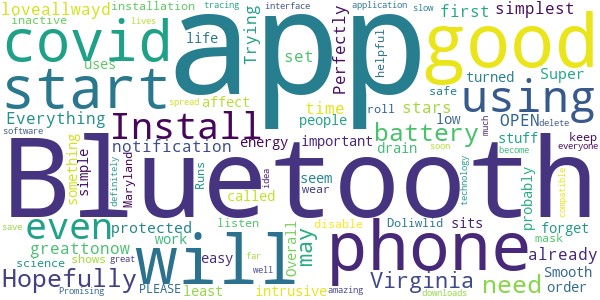

> Trying for the first time.  :date: __2020-11-11 06:18:20__

> It's good I like it,  :date: __2020-11-03 03:08:46__

> The simplest covid notification app. Everything is set up already for you. OPEN and start using the app. 5/5 stars for this app. 👍👍  :date: __2020-10-31 05:52:58__

> Perfectly protected  :date: __2020-10-25 10:58:04__

> Super important stuff!!!  :date: __2020-10-25 02:28:05__

> Install was easy, and the app just sits on my phone and I forget it's even on here. Hopefully more people start using it, as it doesn't seem to be intrusive or even a battery drain at all (at least on my phone) you will need to have Bluetooth turned on in order for this app to work, but it uses something called low energy Bluetooth, which is probably why it doesn't affect battery life. Overall good, simple app.  :date: __2020-10-21 15:05:10__

> Smooth installation. Runs up Bluetooth so if you disable Bluetooth it shows you it's inactive which is helpful.  :date: __2020-10-21 04:30:05__

> Doliwlid keep all safe  :date: __2020-10-21 01:56:18__

> Install this app, wear a mask and listen to science PLEASE. Hopefully Maryland will roll their application out soon as well.  :date: __2020-10-20 15:47:39__

> So far so good. Promising interface. You much delete any other COVID tracing software, such as Virginia's, that may be on your phone.  :date: __2020-10-20 14:52:42__

#### 4-star reviews

> GUrpreet shgh  :date: __2020-10-21 19:58:46__

#### 3-star reviews

No recent reviews available with 3 stars.

#### 2-star reviews

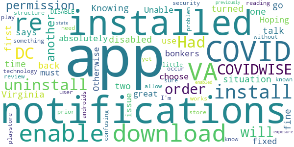

> App installed fine. I disabled notifications in Virginia app first, installed DC app, but when I go back to VA app it says I can only have notifications turned on for one at a time. ... Knowing the two don't talk to each other, this situation is absolutely bonkers.  :date: __2020-10-31 06:57:32__

> Had to uninstall VA COVIDWISE in order to download. Unable to enable notifications from both apps; must choose 1 or the other. Hoping this permissions issue will be fixed. Otherwise great use of technology!  :date: __2020-10-20 21:58:15__

> In order to get this app to download, I had to uninstall VA's COVIDWISE app and re-install after the DC CAN app was installed (and then re-enable notifications for both apps once they were both installed). I'm sure this has something to do with androids security permission structure - but it was a little confusing (and I wouldn't have known to do it without reading another user's playstore review).  :date: __2020-10-20 18:40:04__

> don't know if it works yet, but Install problem. You need to DISABLE COVID notifications prior to install or it will not allow you to download through play store. This could occur if (like me) you have previously installed another state's COVID app and have enabled COVID notifications. Once installed you can re-enable COVID exposure notifications.  :date: __2020-10-20 06:51:41__

#### 1-star reviews

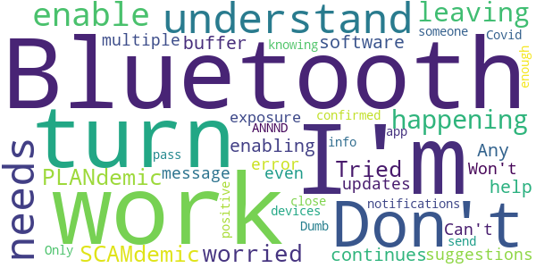

> Don't understand why it needs to enable my Bluetooth. I'm not leaving my Bluetooth on. Not happening. I'm not worried about the PLANdemic / SCAMdemic.  :date: __2020-11-17 03:16:53__

> Tried enabling to help software work, continues to buffer. Any suggestions?  :date: __2020-11-07 14:13:58__

> Won't turn on, error message even after multiple updates.  :date: __2020-11-02 17:39:15__

> Can't turn on exposure notifications  :date: __2020-10-25 04:01:29__

> Dumb.  :date: __2020-10-23 04:32:03__

> Only works if I pass someone with this app who has been confirmed positive ANNND is close enough for our devices to send info...they would have to be out and about knowing they have Covid-19??? 🤔  :date: __2020-10-20 08:37:20__

# SlowCOVIDNC
App version ``1.2``

Analyzed with [covid-apps-observer](http://github.com/covid-apps-observer) project, version ``0.1``

## App overview
| | |
|-------------------------|-------------------------| 
| **Name**&nbsp;&nbsp;&nbsp;&nbsp;&nbsp;&nbsp;&nbsp;&nbsp;&nbsp;&nbsp;&nbsp;&nbsp;&nbsp;&nbsp;&nbsp;&nbsp;&nbsp;&nbsp;&nbsp;&nbsp;&nbsp;&nbsp;&nbsp;&nbsp;&nbsp;&nbsp;&nbsp;&nbsp;&nbsp;&nbsp;&nbsp;&nbsp;&nbsp;&nbsp;&nbsp;&nbsp;&nbsp;&nbsp;&nbsp;&nbsp;  | SlowCOVIDNC |
| **Unique identifier** | gov.nc.dhhs.exposurenotification |
| **Link to Google Play** | [https://play.google.com/store/apps/details?id=gov.nc.dhhs.exposurenotification](https://play.google.com/store/apps/details?id=gov.nc.dhhs.exposurenotification) |
| **Summary**  | Official COVID-19 exposure notification app to help protect North Carolinians! |
| **Privacy policy** | [https://covid19.ncdhhs.gov/slowcovidnc-privacy-policy](https://covid19.ncdhhs.gov/slowcovidnc-privacy-policy) |
| **Latest version** | 1.2 |
| **Last update** | 2020-11-05 19:27:00 |
| **Recent changes** | Slow the spread of COVID-19 and protect your family, friends and community while still protecting your privacy – simply by using the SlowCOVIDNC app on your phone.   Our latest version of SlowCOVIDNC includes enhancements like “Share the App” feature, a new YouTube video link and bug fixes. |
| **Installs**  | 100,000+ |
| **Category** | Health & Fitness |
| **First release** | Sep 15, 2020 |
| **Size**  | 3.0M |
| **Supported Android version**  | 6.0 and up |

### Description
> SlowCOVIDNC is the official COVID-19 Exposure Notification app for the North Carolina Department of Health and Human Services (NCDHHS). It allows users to know if they may have been in close contact with someone who has shared a positive COVID-19 test result through the app. Users can anonymously share a positive COVID-19 test result to help slow the spread of COVID-19. 
 NCDHHS created this app so that North Carolinians can do their part to protect their community and slow the spread of the virus.
 HOW SLOWCOVIDNC WORKS?
 Step 1: Download the SlowCOVIDNC Exposure Notification app. Enable Bluetooth and Exposure notifications.
 Step 2: After opting-in to receive notifications, the app will generate an anonymous token for your device. A token is a string of random letters and numbers that is used to represent a phone for a short period of time. This ensures your privacy and security are protected. These individual tokens change every 10-20 minutes and are never linked to your identity or location. 
 Step 3: Through Bluetooth, your phone and the phones around you with the SlowCOVIDNC app are working in the background (without draining your battery or data) to exchange these anonymous tokens every few minutes. As a result, devices can remember how long they are near each other. Phones also record the Bluetooth signal strength of their exchanges in order to estimate how far apart they are.
 Step 4: SlowCOVIDNC periodically downloads tokens from the server that have been uploaded from the devices of users who have tested positive. Your phone then uses its records of the signal strength and duration of exposures with those tokens to conduct a risk calculation and determine if you have met a threshold for notification. 
 Step 5: If you have tested positive for COVID-19, you may obtain your PIN from your local public health department and submit that into the app. This voluntary and anonymous reporting notifies others who have downloaded the app and may have been in close contact with you in the last 14 days that they might be at risk.
 HOW SLOWCOVIDNC PROTECTS YOUR PRIVACY?
 Using SlowCOVIDNC is entirely voluntary, and you can enable or disable it at any time. When using SlowCOVIDNC, your privacy will be protected. Tokens will collect and share date, time, signal strength and duration of proximity. No location data or personally identifiable data will ever be collected or stored.
 By enabling Bluetooth and Exposure Notifications, you can anonymously share a positive COVID-19 test result to help slow the spread of COVID-19. You may also be notified if you have been in close contact with someone who has shared a positive COVID-19 test result.
 Learn more about how your privacy is protected and our privacy policy on the NCDHHS website. 
 Thank you for downloading SlowCOVIDNC. Together, we can slow the spread of COVID-19!

### User interface
The developers of the app provide the following screenshots in the Google play store.
| | | |
|:-------------------------:|:-------------------------:|:-------------------------:|
 |   |   |   | 
 |  

## Development team
In the following we report the main information provided by the development team in the Google play store.

| | |
|-------------------------|-------------------------|
| **Developer**  | NC Department of Health and Human Services |
| **Website**  | [https://covid19.ncdhhs.gov/SlowCOVIDNC](https://covid19.ncdhhs.gov/SlowCOVIDNC) |
| **Email** | NCHealthIT@dhhs.nc.gov |
| **Physical address**  | - |
| **Other developed apps**  | [https://play.google.com/store/apps/developer?id=NC+Department+of+Health+and+Human+Services](https://play.google.com/store/apps/developer?id=NC+Department+of+Health+and+Human+Services) |

## Android support

| | |
|-------------------------|-------------------------|
| **Declared target Android version**  | Android10, version 10 (API level 29) |
| **Effective target Android version**  | Android10, version 10 (API level 29) |
| **Minimum supported Android version**  | Marshmallow, version 6.0 (API level 23) |
| **Maximum target Android version**  | - |

The larger the difference between the minimum and maximum supported Android versions, the better. A larger difference means a wider audience. For example, old phones have a very low Android version, so a high minimum supported Android version means that the app cannot be used by users with old phones, thus leading to accessibility problems. 

## Requested permissions

In the following we report the complete list of the permissions requested by the app. 

| **Permission** | **Protection level** | **Description** | 
|-------------------------|-------------------------|-------------------------|
 **android.permission ACCESS_NETWORK_STATE** | Normal | Allows applications to access information about networks. 
 **android.permission BLUETOOTH** | Normal | Allows applications to connect to paired bluetooth devices. 
 **android.permission FOREGROUND_SERVICE** | Normal | Allows a regular application to use Service.startForeground. 
 **android.permission INTERNET** | Normal | Allows applications to open network sockets. 
 **android.permission RECEIVE_BOOT_COMPLETED** | Normal | Allows an application to receive the Intent.ACTION_BOOT_COMPLETED that is broadcast after the system finishes booting. 
 **android.permission WAKE_LOCK** | Normal | Allows using PowerManager WakeLocks to keep processor from sleeping or screen from dimming. 

## Mentioned servers

| **Server** | **Registrant** | **Registrant country** | **Creation date** | 
|-------------------------|-------------------------|-------------------------|-------------------------|
 | google.com | Google LLC | :us: US | 1997-09-15 04:00:00 |
 | ncpublichealth.com | State of North Carolina, Division of Public Health | :us: US | 2002-03-14 19:22:33 |

## Security analysis 

Below we report the main security warnings raised by our execution of the [Androwarn](https://github.com/maaaaz/androwarn) security analysis tool.

**Telephony identifiers leakage**
> - This application reads the ISO country code equivalent of the current registered operator's MCC (Mobile Country Code) 

**Connection interfaces exfiltration**
> - This application reads details about the currently active data network 
> - This application tries to find out if the currently active data network is metered 

## User ratings and reviews

Below we provide information about how end users are reacting to the app in terms of ratings and reviews in the Google Play store.

### Ratings

The SlowCOVIDNC app has been installed by more than **100000** times. At this time, **428** rated the app and its average score is **4.0094337**. Below we show the distribution of the ratings across the usual star-based rating of Google Play

:star::star::star::star::star:: 268

:star::star::star::star:: 44

:star::star::star:: 28

:star::star:: 32

:star:: 56

### Reviews 

#### 5-star reviews

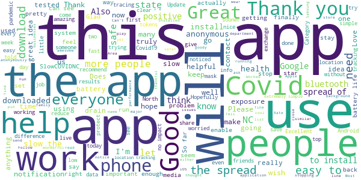

> Good ☺️  :date: __2020-11-20 18:55:30__

> Installed because my job is front line and I thought it would be helpful since I have so many contacts each day. A little disappointed that it really only exchanges the signal after 15 minutes, since 90% of my interactions are pretty short. But it's important to slow COVID so I will do all I can.  :date: __2020-11-20 04:44:26__

> Worked In Hospital. 21 yrs. Follow CDC to stop the spread. Gudelines  :date: __2020-11-20 02:43:32__

> App is great idea however sometimes it will go up to 10 days without a check.  :date: __2020-11-18 12:21:17__

> It will be very useful if you can see with how many devices your phone exchanged tokens. This way you can see that is working without waiting for a close notification.  :date: __2020-11-17 20:48:47__

> I think it's incredible and so freaking helpful. This is wonderful  :date: __2020-11-17 18:41:34__

> Helps in letting u know about disasters in your. Area.  :date: __2020-11-14 01:35:32__

> Bermuda State Island Rikers JAIL islans-Sinaloa state .Coconut(water/milk).Colombia,Isla-Vista Civilian 1%.Covid S19-911-221-19(china).W.Jerudalemn.Dr.èl Chepe Nick.DuraCell_NLP-(-5_i).Luxor REHAB for relapse en patient's.  :date: __2020-11-14 01:01:33__

> I have not used it yet.  :date: __2020-11-11 21:26:37__

> This is a very necessary tool. Thanks.  :date: __2020-11-11 01:05:54__

#### 4-star reviews

> Fantastic updates on demand, Locally, Globally. Recommended for All  :date: __2020-11-07 05:08:48__

> So I got the notification to install the app and I live in Ohio.. Does it still work? It's not geo locked is it?  :date: __2020-11-07 01:12:30__

> This app is a great concept; unfortunately with my Motorola G7 Power, I can't leave my Bluetooth on all the time, as due to a manufacturer error in this model, having bluetooth activated interferes with WiFi connections. So I can't utilize this app, but certainly will when I replace my phone.  :date: __2020-10-20 22:12:17__

> Idk I didn't go out in public yet  :date: __2020-10-16 16:25:13__

> Good  :date: __2020-10-13 07:44:21__

> Neat idea, but living in Asheville makes me think I need every state's app. Is there any way to make the state apps work with each other? We've had many tourists test positive during their visit and even if they report their result to their state's app, the tokens would never be shared with my app.  :date: __2020-10-11 05:39:23__

> I gave it 4 stars for a great effort! Why do people have to complain about things that will help! Thank u for trying something! Share option will be great! I have alot of people I can tell about this app!  :date: __2020-10-11 03:37:10__

> I found this by chance.. it should be pinging on folks TVs and Phones like the hurricane or missing person alerts. Other than that, the app looks pretty good... \*\*Needs users using\*\*  :date: __2020-10-08 17:05:54__

> Hindsight is 20/20 The concept of every cellphone having this app is amazing! I gave SlowCOVIDNC 4⭐ because of the possibilities! We'll see if it helps in another 90days. The NFL teams that are using something similar have had great outcomes & information shared.  :date: __2020-09-29 22:15:16__

> It does exactly as it should. A sharing feature is the only missing option. With this app being dependant on community involvement I'm surprised there's no share option already.  :date: __2020-09-28 05:14:40__

#### 3-star reviews

> The app is a great concept and was checking when initially installed. On my Samsung S6, it was a power drain. Also, it hasn't checked for exposures since 10/23/20. Today is 11/20/20 so its been almost a month. As COVID case rates are accelerating again, it seems this app would be more pertinent than ever. I'm looking forward to any suggestions that may be offered to resolve these two issues.  :date: __2020-11-20 10:47:56__

> Stopped updating 3 weeks ago. I checked the settings. It said all was good but app would not update. Prior to last update it did so at least once a day. So I wonder how accurate it is???  :date: __2020-11-10 22:30:16__

> I downloaded this app when it first came out. It checked often for exposure. Today, October 26, it says that the last time it checked was October 13. Almost 2 weeks ago! What's up??? Bluetooth is enabled.  :date: __2020-10-26 19:09:52__

> I installed it on my Samsung S5 (6.0.1 Marshmallow). I guess it's working, but it has a big flaw: it's a power hog. Until I installed SowCOVIDNC, my phone battery easily lasted a full day. Now I have to recharge by late-afternoon. That's a big problem. Can you please fix it? I'm not going to uninstall it, because it is important. I can live with the power drain, if I have to. But it sure would be a lot better if it didn't drain the battery so rapidly.  :date: __2020-10-23 22:36:25__

> I have been so fortunate so far to have been able to help families and my family, by running errands. I wear my masks I wash my hands. I use bottles of sanitizer even if they the store just did. Why? The lack of seeing how much folks dont know PPE training by hospital staff, how folks will grabs carts(walk pass wipes stands) and proceed to then grab spray bottles to spray the carts. And then use paper towels to wipe them down? Now, quiz time what was wrong? 😳  :date: __2020-10-21 18:10:18__

> I downloaded the app the first week of was made public. It doesn't seem to check for exposure unless I open the app. When I opened it today it seems it last checked 10/8. Then the date changed to today after being opened.  :date: __2020-10-20 15:04:39__

> Well there you go another tracking app to watch where you go, better get it now people, before president Harris demands it and makes it law, oh it might actually work if everybody had it I had it and nobody else in my shop had it, my supervisor got it and two coworkerscweluves had it and one indirect coworker that comes over all the time had it and the damn app didn't work because nobody else had it  :date: __2020-10-18 13:56:57__

> App works well but needs to allow bluetooth to be turned off and remove the persistent notification. You don't the app running inside your house. In response, I know you can turn bluetooth off, the issue is the notification to turn bluetooth back on will keep coming up even if you dismiss it. Thx.  :date: __2020-10-12 17:12:44__

#### 2-star reviews

> Installed it. Had 100% battery life, 6 hrs later it is down to 39%. I did this overnight so it is when nothing else is on or working. I have other apps restricted so they cannot be an energy vampire. I have uninstalled the app. Samsung S10  :date: __2020-11-11 14:23:49__

> App is completely based on a user uploading their data to contact others. I'm in a county where people can't spell app, let alone upload any data to help others. This app needs to have the state, county or testing facilitators uploading this information so someone who does have COVID cannot chose to NOT share those who were around them.  :date: __2020-11-09 17:10:45__

> While the app is easy to use and read, the app prevents use of bluetooth keyboards and controllers for more than a few minutes. After that, this app forcibly disconnects your accessories, and you need to manually reconnect.  :date: __2020-11-08 02:26:22__

> If it weren't so disturbing that something like this is just being touted by DHHS to slow Covid, I'd be jumping for joy. But, now,, all i can muster is too little too late for 100s of 1000s.Apple cranks out a new iPhone with world-wide ads faster than this. I'd say I can't believe it but, this is a red state and the "Red Pres" is pulling out all stops to pull a victory out of his red, you know what, like he did last time. Meadows did say they weren't going to try to control the virus. Shameful!  :date: __2020-11-02 12:23:28__

> Such a small percentage of people are downloading this for Android (can't speak for iOS), and such a small percentage of people are actually tested daily in this state. It's more like a gimmick app unless everyone downloads and everyone gets weekly testing. So no way to know if this approach to contact tracing is working at all.  :date: __2020-11-01 13:23:16__

> After installing this app, 2 of my other apps disappeared from my phone. Also another day my flashlight randomly turned on and I want even touching my phone. I've uninstalled the app since.  :date: __2020-10-28 18:01:57__

> Great idea, problematic execution. Gives a false sense of security. With so few people in this state getting tested, so few wearing masks, it's unlikely that most of your covid exposure will be captured & recorded by this app. And you must leave Bluetooth on for it to work? I understand why, but it's a battery drain, & constant EMF radiation exposure is an unwelcome side effect. If the app was automatically on everyone's phone, testing was widespread, & positives were autologged, then maybe.  :date: __2020-10-20 05:53:33__

> Edited review: after download, I cannot access any of my connected Bluetooth apratutus. Now my car Bluetooth, 3 different air pods and 2 earpieces will not connect at all but I was told they'd work in conjunction. That's not true for "MY" phone operating system. Thought it was the perfect app but now I have doubts because 2 Bluetooth apps CANNOT be used at same time, so please don't tell downloaders or be sure to share correct information.  :date: __2020-10-19 21:36:12__

> Meh...  :date: __2020-10-16 13:18:34__

#### 1-star reviews

> Doesn't do anything and yet covid is raising in numbers around nc. It would be better to know where it is so I can stay away from those areas.  :date: __2020-11-21 12:30:13__

> Useless! Couldn't get a pin to share my positive test. Cumbersome. Pointless!  :date: __2020-11-20 04:00:49__

> Useless app! But great idea if it worked. I've tried for days to enter that I tested positive for covid-19 and it refuses to allow me to notify the system. If others are experiencing this then it renders the entire system useless. And secondly you have to voluntarily disclose that you tested positive. I've tried for days to enter my positive test result, but it refuses to issue a PIN necessary to upload. 11/17 update :finally got a pin, and still will not accept alpha-num entry. S9 phone.  :date: __2020-11-17 23:17:45__

> Not very useful if people don't participate.  :date: __2020-11-16 05:04:06__

> I can't get it to check for exposures! It hasn't checked since Nov 1 (it's now the 15th)  :date: __2020-11-15 22:11:33__

> Anyone I have asked either never heard of this app or may have heard about it once and forgot about it. If Roy Cooper and his "science-based" health policy staff were serious about containing the virus and encouraging proper contact tracing, the airwaves and newsprint would be flooded with ads about this app. They are not. It does no good (and drains battery according to some of the other reviews) if only a relative handful of people use the app & broadcast their Bluetooth signals into the ether  :date: __2020-11-07 22:37:51__

> Downloaded this app to review it, I didnt even verifiably open this app so NC and Roy Cooper cant track me. Its amazing at how so many pawns in NC has downloaded this trackable app lol  :date: __2020-11-02 18:21:01__

> Im not scared of my own shadow..i dont need my stufg tracked more than it already is..i only DL to leave a review..now stick it where sun dont shine  :date: __2020-11-02 16:37:51__

> Won't enable. Internal error. Bluetooth is on so I'm not sure why it won't work. Google Play is up to date. App still will not work after installing again.  :date: __2020-11-02 04:16:50__

> Just downloaded the app, I Don't not know anyone with covid in North Carolina or out. Im in Charolette. I use it on my tablet. High risk. Halloween night, Oct 2020, I dont know anyone with covid I keep myself safe. I have no clue if the app works so Im uninstalling it. Now.  :date: __2020-11-01 08:03:02__

# CO Exposure Notifications
App version ``minted11011``

Analyzed with [covid-apps-observer](http://github.com/covid-apps-observer) project, version ``0.1``

## App overview
| | |
|-------------------------|-------------------------| 
| **Name**&nbsp;&nbsp;&nbsp;&nbsp;&nbsp;&nbsp;&nbsp;&nbsp;&nbsp;&nbsp;&nbsp;&nbsp;&nbsp;&nbsp;&nbsp;&nbsp;&nbsp;&nbsp;&nbsp;&nbsp;&nbsp;&nbsp;&nbsp;&nbsp;&nbsp;&nbsp;&nbsp;&nbsp;&nbsp;&nbsp;&nbsp;&nbsp;&nbsp;&nbsp;&nbsp;&nbsp;&nbsp;&nbsp;&nbsp;&nbsp;  | CO Exposure Notifications |
| **Unique identifier** | gov.co.cdphe.exposurenotifications |
| **Link to Google Play** | [https://play.google.com/store/apps/details?id=gov.co.cdphe.exposurenotifications](https://play.google.com/store/apps/details?id=gov.co.cdphe.exposurenotifications) |
| **Summary**  | Colorado&#39;s official Exposure Notification app. |
| **Privacy policy** | [https://www.colorado.gov/pacific/cdphe/exposure-notifications-privacy-policy](https://www.colorado.gov/pacific/cdphe/exposure-notifications-privacy-policy) |
| **Latest version** | minted11011 |
| **Last update** | 2020-10-24 01:07:27 |
| **Recent changes** | Bug fixes and performance improvements |
| **Installs**  | 100,000+ |
| **Category** | Medical |
| **First release** | Oct 16, 2020 |
| **Size**  | 9.9M |
| **Supported Android version**  | 5.0 and up |

### Description
> Exposure Notifications is a voluntary new service available on both iPhone and Android phones that helps slow the spread of COVID-19. If you have enabled Exposure Notifications on your phone, whenever you are within close proximity (approximately 6 feet of someone for at least 10 minutes), your phones will exchange secure, anonymous tokens. If you test positive for COVID-19, you can share these anonymous tokens, which will send a notification to anyone with whom you have exchanged tokens with recently, notifying them of possible exposure. The service is available nationwide, but will be customized for Colorado. This service does not collect any personally identifying information or share it with the State of Colorado, your Local Public Health Agency, Apple, or Google.

### User interface
The developers of the app provide the following screenshots in the Google play store.
| | | |
|:-------------------------:|:-------------------------:|:-------------------------:|
 | 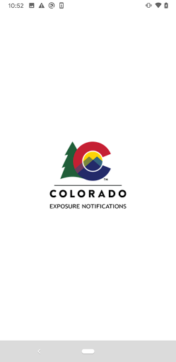  | 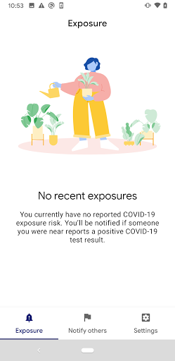  |   | 
 |  

## Development team
In the following we report the main information provided by the development team in the Google play store.

| | |
|-------------------------|-------------------------|
| **Developer**  | Colorado Department of Public Health & Environment |
| **Website**  | [https://covid19.colorado.gov/Exposure-notifications](https://covid19.colorado.gov/Exposure-notifications) |
| **Email** | CO_Exposure_Notifications@state.co.us |
| **Physical address**  | - |
| **Other developed apps**  | [https://play.google.com/store/apps/developer?id=Colorado+Department+of+Public+Health+%26+Environment](https://play.google.com/store/apps/developer?id=Colorado+Department+of+Public+Health+%26+Environment) |

## Android support

| | |
|-------------------------|-------------------------|
| **Declared target Android version**  | Android10, version 10 (API level 29) |
| **Effective target Android version**  | Android10, version 10 (API level 29) |
| **Minimum supported Android version**  | Lollipop, version 5.0 (API level 21) |
| **Maximum target Android version**  | - |

The larger the difference between the minimum and maximum supported Android versions, the better. A larger difference means a wider audience. For example, old phones have a very low Android version, so a high minimum supported Android version means that the app cannot be used by users with old phones, thus leading to accessibility problems. 

## Requested permissions

In the following we report the complete list of the permissions requested by the app. 

| **Permission** | **Protection level** | **Description** | 
|-------------------------|-------------------------|-------------------------|
 **android.permission ACCESS_NETWORK_STATE** | Normal | Allows applications to access information about networks. 
 **android.permission BLUETOOTH** | Normal | Allows applications to connect to paired bluetooth devices. 
 **android.permission FOREGROUND_SERVICE** | Normal | Allows a regular application to use Service.startForeground. 
 **android.permission INTERNET** | Normal | Allows applications to open network sockets. 
 **android.permission RECEIVE_BOOT_COMPLETED** | Normal | Allows an application to receive the Intent.ACTION_BOOT_COMPLETED that is broadcast after the system finishes booting. 
 **android.permission WAKE_LOCK** | Normal | Allows using PowerManager WakeLocks to keep processor from sleeping or screen from dimming. 

## Mentioned servers

| **Server** | **Registrant** | **Registrant country** | **Creation date** | 
|-------------------------|-------------------------|-------------------------|-------------------------|
 | google.com | Google LLC | :us: US | 1997-09-15 04:00:00 |

## Security analysis 

Below we report the main security warnings raised by our execution of the [Androwarn](https://github.com/maaaaz/androwarn) security analysis tool.

**Telephony identifiers leakage**
> - This application reads the ISO country code equivalent of the current registered operator's MCC (Mobile Country Code) 

**Connection interfaces exfiltration**
> - This application reads details about the currently active data network 
> - This application tries to find out if the currently active data network is metered 

**Suspicious connection establishment**
> - This application opens a Socket and connects it to the remote address 'timeout' on the 'N/A' port  

**Code execution**
> - This application loads a native library: 'prioclient' 

## User ratings and reviews

Below we provide information about how end users are reacting to the app in terms of ratings and reviews in the Google Play store.

### Ratings

The CO Exposure Notifications app has been installed by more than **100000** times. At this time, **360** rated the app and its average score is **3.5045872**. Below we show the distribution of the ratings across the usual star-based rating of Google Play

:star::star::star::star::star:: 196

:star::star::star::star:: 19

:star::star::star:: 23

:star::star:: 16

:star:: 106

### Reviews 

#### 5-star reviews

> Very useful app for telling me if there are covid positive reports.  :date: __2020-11-22 18:06:19__

> This is an excellent tool. I think they could do a better job informing people on how they get the code to start the notification part though. For those interested, the health department can generate the code for you when you receive a call from a contact tracer. You cannot just trigger it based on a positive test result. Please answer the phone when they call after you have been tested or call them back.  :date: __2020-11-21 21:28:48__

> Anonymous and opt-in only so your information and privacy is protected. Since it's release, the old manual verification system has been updated to be more automated. This app can save lives and works better when more users have it installed.  :date: __2020-11-20 19:54:03__

> Yes. It is safe to use. It uses tokens and your identity is kept private. Please, please do your part and help stop/track the spread!  :date: __2020-11-20 05:29:03__

> This app is great to have.  :date: __2020-11-19 07:30:26__

> Yes!.I was cyberstalked by city. Web beacon put on my browser by internal affairs, Mayor John Suthers, two corrupt judged and SA in 4th Judicial Dist Which I have spent years litigating against here. I am a journalist by educational laurels, druthers and whatever others add.  :date: __2020-11-18 09:48:10__

> Like  :date: __2020-11-16 04:26:07__

> I got the covid and tried to alert other people and it asks for a one time code that I do not know where it comes from. It makes it hard to notify other people which makes it almost useless. They need to have a service where you can screenshot your results  :date: __2020-11-13 23:09:45__

> Excellent  :date: __2020-11-13 22:53:18__

> Haven't used it yet? Bt TRUST Me, ANY tool that can give me ACCURATE FACT and not just speculation(SmokeNmirrors), gossip or common FEAR and superstition to KEEP MY Family SAFE, Healthy and AWARE during this pandemic IS EXACTLY what I want, NEED and prefer... KUDOS 4 being "The RIGHT Thing" at a time when we are ALL so uncertain!  :date: __2020-11-13 16:46:02__

#### 4-star reviews

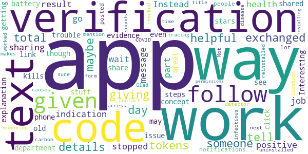

> I would like the app to have some way to tell me that I have exchanged tokens with someone, maybe giving me a total for a day. No details, just some indication that the app is doing its job.  :date: __2020-11-20 08:25:57__

> It does work for sharing a positive result! But don't go into the app because you'll get stopped at the verification code part. Instead wait for a text message from the health department - click on that link and follow the steps. It does share that way! You'll even see evidence that it was shared in the app. Would have given 5 stars but no explanation about the verification code or follow up text was given.  :date: __2020-11-19 19:19:46__

> Interesting stuff  :date: __2020-11-03 04:21:26__

> Great concept but kills my battery. I do have an old phone though so that may be the issue.  :date: __2020-10-27 15:53:56__

> I had trouble getting the notifications to work like a lot of people had posted, I uninstalled and reinstalled the app and it worked the next time. Not sure what causes this. Glad we have some form of contact tracing!  :date: __2020-10-26 03:29:29__

> The title makes it sounds like a carbon monoxide detector -why no mention of COVID-19 or "infectious disease"?  :date: __2020-10-26 02:43:35__

> This app doesn't have location access. I just checked the permissions after installing it.  :date: __2020-10-25 23:43:32__

#### 3-star reviews

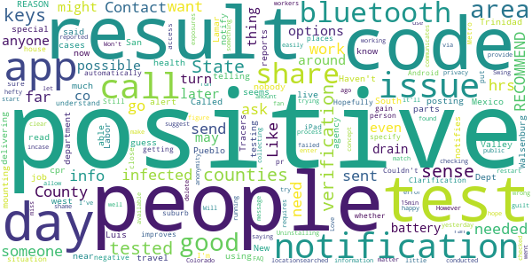

> Called county health department to ask about notification & special code issue. RESULTS: 1) testing agency reports positive tests to the State 2) State notifies counties in which the positive people live 3) w/in 24 hrs, counties notify people who tested positive 4)w/in 48 hrs (cases are mounting),Contact Tracers call infected people & ask w/whom they have been in contact. NO REASON for infected people to need code. Call Labor Dept if there's a work issue. RECOMMEND: call people who know things.  :date: __2020-11-20 20:45:59__

> People have said they can't get a verification code that is needed to send an alert. I just read (11-18-20, cpr) that this code should now be sent automatically. Hopefully this improves the situation.  :date: __2020-11-19 15:15:54__

> I can't specify my area nor can I put in a result whether I'm positive or negative. Need to understand what code they want. Also if it only sense through bluetooth I don't want to be that close to someone if possible. There should be more options in Android app. Couldn't get my iPad to gain access so not sure how others are getting info even if it may be places I may go in the Metro or suburb area. Clarification needed pr more options.  :date: __2020-11-19 03:31:37__

> I was in the same house with a person who tested positive... 3 days later... Still no notification! Uninstalling!  :date: __2020-11-12 18:55:04__

> Been running into issues of it not checking for possible exposures even with location/Bluetooth being on during the day. Been working around the public and it checked 3 days ago with a hefty amount of keys but not the day after or yesterday for that matter until I found I had to delete all the keys and then it'll restart and start collecting again, all my co workers have it on also. Not a good thing incase I ran into anyone days before that and they tested positive and the keys match later on.  :date: __2020-11-07 12:54:36__

> Positive test here but can't share my result because I don't have a verification code. failed app so far🤷‍♂️ I've searched for about 15min and can only figure it's because my test was conducted out of state. However, I was around people in CO and would like to share it. Will people share if it's not easily available? I would also recommend information about privacy and how your results a reported. People might have a sense of shame or guilt but might share if there's some sense of anonymity.  :date: __2020-11-07 01:48:11__

> Won't let me allow to send notifications  :date: __2020-11-06 19:43:06__

> Good call, Colorado but an issue with the app is that there is no verification code sent when trying to enter test results. I suggest you make this process a little more clear, and provide an FAQ if anyone else has run into this as well.  :date: __2020-11-04 03:50:37__

> Love the concept. Not a fan that it requires bluetooth to turn on notifications. That's a battery drain.  :date: __2020-10-29 15:52:09__

> It communicates via Bluetooth, which drains the battery. Swing and a miss.  :date: __2020-10-26 13:47:25__

#### 2-star reviews

> major power consumption issues. had to uninstall it because I couldn't use my phone normally without having to charge in the middle of the day, and I only really text on an average day. also noticed my phone was running very hot constantly when I had the app installed. this is something we definitely need, but please optimize it so it doesn't make my phone unusable.  :date: __2020-11-19 19:11:35__

> There is nothing wrong with the app persay, its just i have been using it and i have been doing alot of christmas shopping, and i got not 1 alert. You know how many people out there that have tested positive and havent reported!! So this app isnt going to work!  :date: __2020-11-09 17:38:51__

> When I try to turn on notifications, I get an error saying "something went wrong". It will not enable.  :date: __2020-11-08 21:26:50__

> My problem is I work in a facility where alot if employees had C19 and I have never been notified....HMMM  :date: __2020-11-08 20:22:31__

> Seems like this could be a really good app. BUT.....where does someone get the verification code needed to enter a covid 19 result?  :date: __2020-11-06 16:27:15__

> Maybe I'm not understanding something but when I try to share my results, It says it will send me a one time verification code, but nothing happens.  :date: __2020-11-02 18:31:26__

> Needs gps and bluetooth to be active. Drains battery. Why do we need gps active.  :date: __2020-11-01 17:51:00__

> The app itself is fine, but installing it caused my other apps trying to update to do so slowly. So slowly, that on a fast wifi connection it would take more than 30 minutes for just one to do so. I uninstalled this one and might try again later. Once this was uninstalled, the normal updates had no problem  :date: __2020-10-30 04:00:56__

> While your installing this IT DOSE ASK FOR YOUR LOCATION ! I haven't gotten to use this app yet I'm just now installing it so unlike other comments who claim THEY DO NOT ask for a location I paid attention and yes it dose .  :date: __2020-10-27 04:59:24__

> I can't turn on notifications? It just says something went wrong?  :date: __2020-10-26 04:04:24__

#### 1-star reviews

> Starting to think this is a worthless App and Your Not Helping !!!!!  :date: __2020-11-22 17:41:02__

> There is also no indicator that the app is doing anything. Show me some stats of how many people it thinks I've had "close contact" with. Show me some stats of how many app users have reported positive results. Etc... Right now it's just a black box I'm somehow supposed to just trust that it's working. C'mon here folks, we need more transparency if you want us to trust that app does a damn thing at all...  :date: __2020-11-22 16:57:05__

> Unable to upload results, need a verification code which is difficult to find! Way to go Colorado for making things not easy or user friendly  :date: __2020-11-21 23:14:03__

> Don't work I know people at my work have it and this doesn't say anything  :date: __2020-11-20 23:35:34__

> DOES NOT WORK! I work for a government entity and we recently had three positive cases on our floor alone in this building and we didn't get a single notification not when it started and not two weeks later. This app is a complete failure and a waste of your battery time and space!  :date: __2020-11-19 15:53:59__

> It doesn't allow me to turn on exposure notifications. I appreciate your reply! However, it didn't work for me. I'm still getting the same message. I'll just wait for the update. As of Nov 16, it's still not working on my Android  :date: __2020-11-16 19:08:43__

> This app is useless. In order to report your positive result it asks for a verification code but doesn't give you one and doesn't have any instructions for how to get one. It would be a valuable tool if it worked.  :date: __2020-11-16 05:57:10__

> Greatly flawed. I can't post results because lack of verification code. No way to find or figure this out either.  :date: __2020-11-15 23:19:00__

> Downloaded this twice. Immediately annoying notifications that it will not work without an update. Takes you to Google Play to update and crashes. I could have written a better app, and I'm not an IT graduate yet!!! Pretty damn poor when the COVID situation is so serious....  :date: __2020-11-15 22:56:16__

> Asks for a code to enter your test result. Doesn't give you the code. So basically worthless.  :date: __2020-11-15 06:42:21__

# COVID Symptom Study
App version ``2.0.1``

Analyzed with [covid-apps-observer](http://github.com/covid-apps-observer) project, version ``0.1``

## App overview
| | |
|-------------------------|-------------------------| 
| **Name**&nbsp;&nbsp;&nbsp;&nbsp;&nbsp;&nbsp;&nbsp;&nbsp;&nbsp;&nbsp;&nbsp;&nbsp;&nbsp;&nbsp;&nbsp;&nbsp;&nbsp;&nbsp;&nbsp;&nbsp;&nbsp;&nbsp;&nbsp;&nbsp;&nbsp;&nbsp;&nbsp;&nbsp;&nbsp;&nbsp;&nbsp;&nbsp;&nbsp;&nbsp;&nbsp;&nbsp;&nbsp;&nbsp;&nbsp;&nbsp;  | COVID Symptom Study |
| **Unique identifier** | com.joinzoe.covid_zoe |
| **Link to Google Play** | [https://play.google.com/store/apps/details?id=com.joinzoe.covid_zoe](https://play.google.com/store/apps/details?id=com.joinzoe.covid_zoe) |
| **Summary**  | Help slow COVID-19 by self-reporting your symptoms daily, even if you feel well. |
| **Privacy policy** | [https://predict.study/covid-privacy-notice/](https://predict.study/covid-privacy-notice/) |
| **Latest version** | 2.0.1 |
| **Last update** | 2020-11-18 19:41:33 |
| **Recent changes** | Fixed push notification |
| **Installs**  | 1,000,000+ |
| **Category** | Health & Fitness |
| **First release** | Mar 27, 2020 |
| **Size**  | 35M |
| **Supported Android version**  | 5.0 and up |

### Description
> Take 1 minute each day and help fight the spread of COVID-19 in your community
 * Report your health daily even if you feel well
 * Get a daily estimate of COVID in your area
 * Help slow the outbreak near you
 Join millions of people supporting scientists at Stanford University, Harvard University, Massachusetts General Hospital, and King's College London to help fight coronavirus by identifying:
 * How fast the virus is spreading in your area
 * High-risk areas in the US
 * Who is most at risk, by better understanding symptoms linked to underlying health conditions
 You will contribute to advance research on COVID-19 in partnership with leading health researchers globally like TwinsUK, one of the most clinically detailed studies in the world.
 This app (formerly known as the Covid Symptom Tracker) allows you to help others, but does not give health advice. If you need health advice please visit the CDC website at: [https://www.cdc.gov/coronavirus/2019-ncov/index.html](https://www.cdc.gov/coronavirus/2019-ncov/index.html)
 This app has been designed for everyone to report their status not just those who are ill.
 It was designed by doctors and scientists at King's College London, Guys and St Thomas’ Hospitals and Zoe Global Limited, a health technology company.
 In the US the app is being used by the Nurses' Health Study to identify symptoms in active healthcare workers who are treating people with COVID across the country and risking their own health to help us.
 In response to recommendations by Stand Up To Cancer (SU2C), the app also includes questions for cancer patients and survivors, such as if they are living with cancer, what type of cancer and what treatment they are receiving.
 If you would like to help out in this difficult time, then you can. Download the app and share daily your own status, even if you are well. With your help we can understand much better the situation across the nation, how the disease presents itself to different people, and how it progresses.
 This is a new virus which the world has never seen before. There are a wide range of symptoms, which differ between people. With your help we can understand better how the disease presents itself depending upon individual factors such as health and age.
 No information you share will be used for commercial purposes.
 There are two parts to the app:
 HEALTH INFORMATION
 You will be asked to share some general information, such as your age and some health details, such as whether you have certain diseases.
 SYMPTOM TRACKING
 We will ask you every day to let us know how you feel, so you can share your symptoms. We will also ask whether you have visited the hospital, what treatment you received there, and whether you have been tested for COVID-19 (Coronavirus).

### User interface
The developers of the app provide the following screenshots in the Google play store.
| | | |
|:-------------------------:|:-------------------------:|:-------------------------:|
 |   |   | 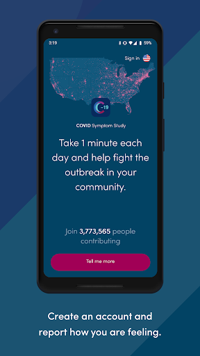  | 
 |   |   |   | 
 |   |  

## Development team
In the following we report the main information provided by the development team in the Google play store.

| | |
|-------------------------|-------------------------|
| **Developer**  | Zoe Global Limited |
| **Website**  | [http://covid.joinzoe.com/](http://covid.joinzoe.com/) |
| **Email** | covid@joinzoe.com |
| **Physical address**  | [164 Westminster Bridge Road London SE1 7RW United Kingdom](https://www.google.com/maps/search/164%20Westminster%20Bridge%20Road%20London%20SE1%207RW%20United%20Kingdom) (Google Maps) |
| **Other developed apps**  | [https://play.google.com/store/apps/developer?id=Zoe+Global+Limited](https://play.google.com/store/apps/developer?id=Zoe+Global+Limited) |

## Android support

| | |
|-------------------------|-------------------------|
| **Declared target Android version**  | Android10, version 10 (API level 29) |
| **Effective target Android version**  | Android10, version 10 (API level 29) |
| **Minimum supported Android version**  | Lollipop, version 5.0 (API level 21) |
| **Maximum target Android version**  | - |

The larger the difference between the minimum and maximum supported Android versions, the better. A larger difference means a wider audience. For example, old phones have a very low Android version, so a high minimum supported Android version means that the app cannot be used by users with old phones, thus leading to accessibility problems. 

## Requested permissions

In the following we report the complete list of the permissions requested by the app. 

| **Permission** | **Protection level** | **Description** | 
|-------------------------|-------------------------|-------------------------|
 **android.permission ACCESS_BACKGROUND_LOCATION** | :warning:**Dangerous** | Allows an app to access location in the background. 
 **android.permission ACCESS_COARSE_LOCATION** | :warning:**Dangerous** | Allows an app to access approximate location. 
 **android.permission ACCESS_FINE_LOCATION** | :warning:**Dangerous** | Allows an app to access precise location. 
 **android.permission ACCESS_NETWORK_STATE** | Normal | Allows applications to access information about networks. 
 **android.permission CAMERA** | :warning:**Dangerous** | Required to be able to access the camera device. 
 **android.permission FOREGROUND_SERVICE** | Normal | Allows a regular application to use Service.startForeground. 
 **android.permission INTERNET** | Normal | Allows applications to open network sockets. 
 **android.permission MANAGE_DOCUMENTS** | Undefined | Allows an application to manage access to documents, usually as part of a document picker. 
 **android.permission MODIFY_AUDIO_SETTINGS** | Normal | Allows an application to modify global audio settings. 
 **android.permission READ_APP_BADGE** | - | - 
 **android.permission READ_CALENDAR** | :warning:**Dangerous** | Allows an application to read the user's calendar data. 
 **android.permission READ_CONTACTS** | :warning:**Dangerous** | Allows an application to read the user's contacts data. 
 **android.permission READ_EXTERNAL_STORAGE** | :warning:**Dangerous** | Allows an application to read from external storage. 
 **android.permission READ_INTERNAL_STORAGE** | - | - 
 **android.permission READ_PHONE_STATE** | :warning:**Dangerous** | Allows read only access to phone state, including the phone number of the device, current cellular network information, the status of any ongoing calls, and a list of any PhoneAccounts registered on the device. 
 **android.permission RECEIVE_BOOT_COMPLETED** | Normal | Allows an application to receive the Intent.ACTION_BOOT_COMPLETED that is broadcast after the system finishes booting. 
 **android.permission RECORD_AUDIO** | :warning:**Dangerous** | Allows an application to record audio. 
 **android.permission SYSTEM_ALERT_WINDOW** | Signature - preinstalled - appop - pre23 - development | Allows an app to create windows using the type WindowManager.LayoutParams.TYPE_APPLICATION_OVERLAY, shown on top of all other apps. 
 **android.permission USE_FINGERPRINT** | Normal | This constant was deprecated in API level 28. Applications should request USE_BIOMETRIC instead 
 **android.permission VIBRATE** | Normal | Allows access to the vibrator. 
 **android.permission WAKE_LOCK** | Normal | Allows using PowerManager WakeLocks to keep processor from sleeping or screen from dimming. 
 **android.permission WRITE_CALENDAR** | :warning:**Dangerous** | Allows an application to write the user's calendar data. 
 **android.permission WRITE_EXTERNAL_STORAGE** | :warning:**Dangerous** | Allows an application to write to external storage. 
 **android.permission WRITE_SETTINGS** | Signature - preinstalled - appop - pre23 | Allows an application to read or write the system settings. 
 **com.anddoes.launcher.permission UPDATE_COUNT** | - | - 
 **com.google.android.c2dm.permission RECEIVE** | - | - 
 **com.google.android.finsky.permission BIND_GET_INSTALL_REFERRER_SERVICE** | - | - 
 **com.google.android.gms.permission ACTIVITY_RECOGNITION** | - | - 
 **com.google.android.providers.gsf.permission READ_GSERVICES** | - | - 
 **com.htc.launcher.permission READ_SETTINGS** | - | - 
 **com.htc.launcher.permission UPDATE_SHORTCUT** | - | - 
 **com.huawei.android.launcher.permission CHANGE_BADGE** | - | - 
 **com.huawei.android.launcher.permission READ_SETTINGS** | - | - 
 **com.huawei.android.launcher.permission WRITE_SETTINGS** | - | - 
 **com.majeur.launcher.permission UPDATE_BADGE** | - | - 
 **com.oppo.launcher.permission READ_SETTINGS** | - | - 
 **com.oppo.launcher.permission WRITE_SETTINGS** | - | - 
 **com.sec.android.provider.badge.permission READ** | - | - 
 **com.sec.android.provider.badge.permission WRITE** | - | - 
 **com.sonyericsson.home.permission BROADCAST_BADGE** | - | - 
 **com.sonymobile.home.permission PROVIDER_INSERT_BADGE** | - | - 
 **me.everything.badger.permission BADGE_COUNT_READ** | - | - 
 **me.everything.badger.permission BADGE_COUNT_WRITE** | - | - 

## Mentioned servers

| **Server** | **Registrant** | **Registrant country** | **Creation date** | 
|-------------------------|-------------------------|-------------------------|-------------------------|
 | amplitude.com | Amplitude | :us: US | 1996-05-09 04:00:00 |
 | android.com | Google LLC | :us: US | 1997-06-23 04:00:00 |
 | google.com | Google LLC | :us: US | 1997-09-15 04:00:00 |
 | microsoft.com | Microsoft Corporation | :us: US | 1991-05-02 04:00:00 |
 | googleapis.com | Google LLC | :us: US | 2005-01-25 17:52:26 |
 | cloudfront.net | Amazon.com, Inc. | :us: US | 2008-04-25 18:25:49 |
 | expo.io | See PrivacyGuardian.org | :us: US | 2011-05-01 21:26:50 |

## Security analysis 

Below we report the main security warnings raised by our execution of the [Androwarn](https://github.com/maaaaz/androwarn) security analysis tool.

**Telephony identifiers leakage**
> - This application reads the ISO country code equivalent of the current registered operator's MCC (Mobile Country Code) 
> - This application reads the device phone type value 
> - This application reads the numeric name (MCC+MNC) of current registered operator 
> - This application reads the operator name 

**Location lookup**
> - This application reads location information from all available providers (WiFi, GPS etc.) 

**Connection interfaces exfiltration**
> - This application reads details about the currently active data network 
> - This application tries to find out if the currently active data network is metered 

**Suspicious connection establishment**
> - This application opens a Socket and connects it to the remote address '' on the 'N/A' port  
> - This application opens a Socket and connects it to the remote address 'Ljava/lang/StringBuilder;->toString()Ljava/lang/String;' on the ': connect, resolve' port  
> - This application opens a Socket and connects it to the remote address 'Ljava/lang/StringBuilder;->toString()Ljava/lang/String;' on the 'N/A' port  
> - This application opens a Socket and connects it to the remote address 'Ljava/net/Proxy;->type()Ljava/net/Proxy$Type;' on the 'N/A' port  
> - This application opens a Socket and connects it to the remote address 'timeout' on the 'N/A' port  

**Pim data leakage**
> - This application accesses data stored in the clipboard 

**Code execution**
> - This application loads a native library 
> - This application executes a UNIX command 

## User ratings and reviews

Below we provide information about how end users are reacting to the app in terms of ratings and reviews in the Google Play store.

### Ratings

The COVID Symptom Study app has been installed by more than **1000000** times. At this time, **126879** rated the app and its average score is **4.7754526**. Below we show the distribution of the ratings across the usual star-based rating of Google Play

:star::star::star::star::star:: 101632

:star::star::star::star:: 22789

:star::star::star:: 1944

:star::star:: 249

:star:: 265

### Reviews 

#### 5-star reviews

> Very easy to use, each day it takes about 10 seconds. Amazing to be part of the Covid science research.  :date: __2020-11-22 19:44:40__

> Quick and easy to use  :date: __2020-11-22 19:34:09__

> Very easy to use.  :date: __2020-11-22 19:30:41__

> Exceptional  :date: __2020-11-22 19:21:22__

> Excellent app. If used daily it can tell you if you need a test  :date: __2020-11-22 19:17:49__

> Very easy to use  :date: __2020-11-22 19:16:46__

> Easy to use.  :date: __2020-11-22 19:00:35__

> Fantastic app, it lost me today so had to re install. Been logging since day 1. Thank you so much.  :date: __2020-11-22 18:50:13__

> Good app to inform the research. So much better than useless government app  :date: __2020-11-22 18:49:40__

> Had this app from the very start. I've been logging my health all the way through the pandemic...  :date: __2020-11-22 18:48:46__

#### 4-star reviews

> Generally works well  :date: __2020-11-22 19:24:09__

> Used this app from the start. Even recommend me to go for a covid test at one point. Excellent work from the app and information is really useful  :date: __2020-11-22 18:40:28__

> Works easily for those with no symptoms  :date: __2020-11-22 17:48:00__

> Missed a day, accidentally, but wouldn't recognize me today; had to request a password reset to restore my access.  :date: __2020-11-22 17:08:38__

> Easy to use  :date: __2020-11-22 16:44:55__

> Takes just a few seconds each day to log your current status  :date: __2020-11-22 16:08:31__

> Keeps me up to date with what's happening in my area  :date: __2020-11-22 15:40:21__

> Easy to use and informative.  :date: __2020-11-22 15:16:23__

> Good keeps me up to date with reliable information  :date: __2020-11-22 15:00:07__

> Quick & easy to use. Good information. Not been as diligent as I should on daily reporting, perhaps a reminder message if not reported in 48 hours?  :date: __2020-11-22 14:28:59__

#### 3-star reviews

> It helps me feel connected but I'm not sure how  :date: __2020-11-22 13:43:07__

> Easy and quick to use. Now mostly warns if there is no connection. However if connection is later lost whilst reporting symptoms, this is not reported. \*\*\*\* Version number shown on menu screen is stuck at 1.0.0, actual version is now 2.0.1 \*\*\*\*  :date: __2020-11-22 10:56:13__

> This app has worked well and I have reported most days for several months without a problem. But in the last week, there have been problems logging in, being asked for a password when it already should have it. Then the last few days, the page has loaded to report and then gone blank before I am able to click the report button. I have uninstalled and reloaded the page several times and finally, was able to log in. Will persevere because I trust this app and believe it is worthwhile.  :date: __2020-11-22 10:44:20__

> Generally good and important info collector - however daily reminder to do is not reliable and for some reason had to log in again recently despite using it nearly every day.  :date: __2020-11-22 10:13:24__

> When trying to find the outbreak numbers in my area I find the maps are inadequate, very few names of boroughs, and illegible but can't zoom in sufficiently.  :date: __2020-11-22 00:34:22__

> Doesn't always record my daily visit, then needed logging in again.  :date: __2020-11-21 22:15:01__

> I think you should be asking about daily interactions and mask wearing, visits to places and relatively risky behaviors. I think you should be including political affiliation and source of respondents news about covid. Perhaps you should ask about their religion and whether they gather in church groups, whether they abide by local quarantine restrictions.  :date: __2020-11-21 19:26:32__

> Following a recent app update the push notifications have stopped so I have to remember to update daily  :date: __2020-11-21 16:36:28__

> Latest version doesn't prompt me for daily report.  :date: __2020-11-21 15:41:08__

> Why did the app suddenly ask for a password?  :date: __2020-11-21 15:26:52__

#### 2-star reviews

> Since last update I was logged out (and had to faff about resetting password) and then logged back in. Now I no longer get any notifications to remind me to update. Well done for the update and my entry is so sporadic now as I often forget to update.  :date: __2020-11-22 15:15:17__

> There is no facility to show that I had an antibody test not an antigen test which was positive. So now your data looks like I had covid twice. I had it in march with no test. I had positive antibody test in June and a positive antibody test eight months after the illness in November. Your results will be skewed of the data of antibodies and antigen tests is put in the same question  :date: __2020-11-21 11:48:54__

> I fill in the questionnaire every morning, the icon shows that I've done it today, yet later I get a notification and when I check in the app it says I haven't done it, so I do it again. This happens every single day. Apart from today, when it said i hadn't contributed for six days. Which is not true.  :date: __2020-11-21 00:29:29__

> When I missed out recording a day I could not get back into my account in spite of having an accepted new password.  :date: __2020-11-20 18:49:46__

#### 1-star reviews

> No longer reminds me at all, as a result my posts are sporadic. Get it fixed.  :date: __2020-11-22 19:36:32__

> Since the last version installed 2 days ago app crashes whilst loading. Quick fix please.  :date: __2020-11-22 00:59:22__

> Not interested in adverts - this app has lost its way.  :date: __2020-11-21 22:36:49__

> Change log says only "fixed push notifications". So how come there is a whole slew of invasive permissions added with this update? Phone ID, GPS, Contacts, Calendar, Microphone, Camera etc?  :date: __2020-11-21 15:30:19__

> Since the recent update, the daily notification to report has stopped. My phone notifications are on and the app notifications are also on.  :date: __2020-11-20 22:04:34__

> No request to update today.....something wrong with app?  :date: __2020-11-20 19:18:03__

> Push notifications are not appearing anymore (last 6 days) so I forget to input my data. Really frustrating as the reminder meant I had missed only a couple of days since downloading the app in April. I have missed 4 out of the last 6 days now. I've checked my phone settings and there's no reason the notifications aren't appearing.  :date: __2020-11-20 15:50:52__

> Borked since latest update... can't sign in, can't recover password, can't create new account... error #403  :date: __2020-11-20 12:41:46__

# Healthy Together - COVID-19
App version ``1.3.79``

Analyzed with [covid-apps-observer](http://github.com/covid-apps-observer) project, version ``0.1``

## App overview
| | |
|-------------------------|-------------------------| 
| **Name**&nbsp;&nbsp;&nbsp;&nbsp;&nbsp;&nbsp;&nbsp;&nbsp;&nbsp;&nbsp;&nbsp;&nbsp;&nbsp;&nbsp;&nbsp;&nbsp;&nbsp;&nbsp;&nbsp;&nbsp;&nbsp;&nbsp;&nbsp;&nbsp;&nbsp;&nbsp;&nbsp;&nbsp;&nbsp;&nbsp;&nbsp;&nbsp;&nbsp;&nbsp;&nbsp;&nbsp;&nbsp;&nbsp;&nbsp;&nbsp;  | Healthy Together - COVID-19 |
| **Unique identifier** | co.twenty.stop.spread |
| **Link to Google Play** | [https://play.google.com/store/apps/details?id=co.twenty.stop.spread](https://play.google.com/store/apps/details?id=co.twenty.stop.spread) |
| **Summary**  | Join the effort to reopen our communities safely |
| **Privacy policy** | [https://healthytogether.io/legal/privacy](https://healthytogether.io/legal/privacy) |
| **Latest version** | 1.3.79 |
| **Last update** | 2020-11-19 05:19:29 |
| **Recent changes** | Healthy Together has now launched in Florida featuring:  - Real-time test results from Florida’s Department of Health  - Contact tracing interviews  - Public health announcements and more |
| **Installs**  | 10,000+ |
| **Category** | Health & Fitness |
| **First release** | Apr 21, 2020 |
| **Size**  | 46M |
| **Supported Android version**  | 7.0 and up |

### Description
> Healthy Together is available in Utah & Florida.
 Healthy Together helps stop the spread of COVID-19 through:
 - Daily symptom assessments that can be shared with your doctor, office or school
 - Providing access to testing centers and appointments
 - Real time delivery of in-app test results
 - Clearing of employees/students for work/school
 - Augmented and guided contact tracing
 - Notifications regarding the status of your area and guidelines on how to stay safe
 - Complete COVID-19 response platform anchored in CDC guidelines
 The Healthy Together app is now launching for all Florida’s residents and will offer these key features:
 - Universal Test Delivery: Florida residents who take a COVID-19 test from any provider in the State will be able to receive their expedited test results directly through the app.
 - Self-Serve Contact Tracing Interview: Anyone who tests positive for COVID-19 will be prompted to take an in-app interview, including questions on their exposure history.
 - Real-Time Public Health Announcements: The app will serve as a notification center for state-wide updates and alerts from Public Health, including SMS alerts and automated notifications.
 User Data, Privacy & Security
 - There is no mandate to participate in this effort, users choose to opt-in.
 - Users are in full control of their personal data. They decide what data to share, can reverse those decisions as well as delete their data any moment they choose.
 - All symptom data is automatically de-identified after 30-days.
 - Data is encrypted in transit and at rest.
 - The use of this data is limited to COVID-19 response efforts, public health & research purposes.
 View our full Privacy Policy at www.healthytogether.io/legal/privacy

### User interface
The developers of the app provide the following screenshots in the Google play store.
| | | |
|:-------------------------:|:-------------------------:|:-------------------------:|
 |   |   |   | 
 |   |   |   | 
 |   |  

## Development team
In the following we report the main information provided by the development team in the Google play store.

| | |
|-------------------------|-------------------------|
| **Developer**  | Twenty Inc. |
| **Website**  | [https://healthytogether.io/](https://healthytogether.io/) |
| **Email** | info@healthytogether.io |
| **Physical address**  | [280 Park Ave 41st Floor New York, NY 10017](https://www.google.com/maps/search/280%20Park%20Ave%2041st%20Floor%20New%20York,%20NY%2010017) (Google Maps) |
| **Other developed apps**  | [https://play.google.com/store/apps/developer?id=Twenty+Inc.](https://play.google.com/store/apps/developer?id=Twenty+Inc.) |

## Android support

| | |
|-------------------------|-------------------------|
| **Declared target Android version**  | - |
| **Effective target Android version**  | - |
| **Minimum supported Android version**  | Nougat, version 7.0 (API level 24) |
| **Maximum target Android version**  | - |

The larger the difference between the minimum and maximum supported Android versions, the better. A larger difference means a wider audience. For example, old phones have a very low Android version, so a high minimum supported Android version means that the app cannot be used by users with old phones, thus leading to accessibility problems. 

## Requested permissions

In the following we report the complete list of the permissions requested by the app. 

| **Permission** | **Protection level** | **Description** | 
|-------------------------|-------------------------|-------------------------|
 **android.permission ACCESS_FINE_LOCATION** | :warning:**Dangerous** | Allows an app to access precise location. 
 **android.permission ACCESS_NETWORK_STATE** | Normal | Allows applications to access information about networks. 
 **android.permission ACCESS_WIFI_STATE** | Normal | Allows applications to access information about Wi-Fi networks. 
 **android.permission BLUETOOTH** | Normal | Allows applications to connect to paired bluetooth devices. 
 **android.permission BLUETOOTH_ADMIN** | Normal | Allows applications to discover and pair bluetooth devices. 
 **android.permission CAMERA** | :warning:**Dangerous** | Required to be able to access the camera device. 
 **android.permission FOREGROUND_SERVICE** | Normal | Allows a regular application to use Service.startForeground. 
 **android.permission INTERNET** | Normal | Allows applications to open network sockets. 
 **android.permission READ_CONTACTS** | :warning:**Dangerous** | Allows an application to read the user's contacts data. 
 **android.permission RECEIVE_BOOT_COMPLETED** | Normal | Allows an application to receive the Intent.ACTION_BOOT_COMPLETED that is broadcast after the system finishes booting. 
 **android.permission USE_BIOMETRIC** | Normal | Allows an app to use device supported biometric modalities. 
 **android.permission USE_FINGERPRINT** | Normal | This constant was deprecated in API level 28. Applications should request USE_BIOMETRIC instead 
 **android.permission VIBRATE** | Normal | Allows access to the vibrator. 
 **android.permission WAKE_LOCK** | Normal | Allows using PowerManager WakeLocks to keep processor from sleeping or screen from dimming. 
 **com.google.android.c2dm.permission RECEIVE** | - | - 
 **com.google.android.finsky.permission BIND_GET_INSTALL_REFERRER_SERVICE** | - | - 

## Mentioned servers

| **Server** | **Registrant** | **Registrant country** | **Creation date** | 
|-------------------------|-------------------------|-------------------------|-------------------------|
 | googlesyndication.com | Google LLC | :us: US | 2003-01-21 06:17:24 |
 | google.com | Google LLC | :us: US | 1997-09-15 04:00:00 |
 | app-measurement.com | Google LLC | :us: US | 2015-06-19 20:13:31 |
 | cloudinary.com | Cloudinary Ltd. | :israel: IL | 2011-05-24 12:52:37 |
 | amazonaws.com | Amazon.com, Inc. | :us: US | 2005-08-18 02:10:45 |
 | adobe.com | Adobe Inc. | :us: US | 1986-11-17 05:00:00 |
 | googleadservices.com | Google LLC | :us: US | 2003-06-19 16:34:53 |
 | mapbox.com | Whois Privacy Service | :us: US | 2003-11-27 11:15:57 |
 | healthytogether.io | Domains By Proxy, LLC | :us: US | 2020-04-09 16:47:40 |
 | crashlytics.com | Google LLC | :us: US | 2011-01-21 15:30:40 |
 | twentylabs.co | Domains By Proxy, LLC | :us: US | 2020-04-04 22:49:56 |

## Security analysis 

Below we report the main security warnings raised by our execution of the [Androwarn](https://github.com/maaaaz/androwarn) security analysis tool.

**Telephony identifiers leakage**
> - This application reads the numeric name (MCC+MNC) of current registered operator 
> - This application reads the operator name 
> - This application reads the radio technology (network type) currently in use on the device for data transmission 

**Connection interfaces exfiltration**
> - This application reads details about the currently active data network 
> - This application tries to find out if the currently active data network is metered 

**Telephony services abuse**
> - This application makes phone calls 

**Suspicious connection establishment**
> - This application opens a Socket and connects it to the remote address '; exhausted proxy configurations: ' on the 'N/A' port  
> - This application opens a Socket and connects it to the remote address 'Ljava/net/Proxy;->type()Ljava/net/Proxy$Type;' on the 'N/A' port  
> - This application opens a Socket and connects it to the remote address 'Proxy.address() is not an InetSocketAddress:   returned no addresses for  Ljava/net/SocketException;' on the 'N/A' port  
> - This application opens a Socket and connects it to the remote address 'timeout' on the 'N/A' port  

**Code execution**
> - This application loads a native library 
> - This application loads a native library: 'mapbox-gl' 

## User ratings and reviews

Below we provide information about how end users are reacting to the app in terms of ratings and reviews in the Google Play store.

### Ratings

The Healthy Together - COVID-19 app has been installed by more than **10000** times. At this time, **462** rated the app and its average score is **3.66**. Below we show the distribution of the ratings across the usual star-based rating of Google Play

:star::star::star::star::star:: 232

:star::star::star::star:: 65

:star::star::star:: 41

:star::star:: 27

:star:: 97

### Reviews 

#### 5-star reviews

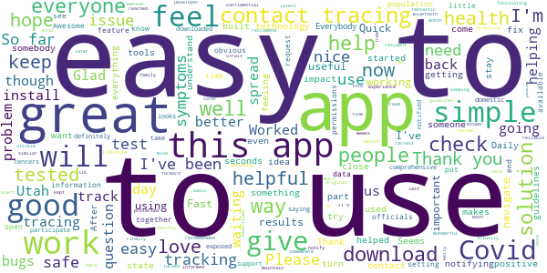

> Gives latest test results for Covid-19.  :date: __2020-11-22 18:11:01__

> Relly good.  :date: __2020-11-22 17:34:29__

> Quick and easy app to use.  :date: __2020-11-13 16:00:44__

> It's great! I reccomend it  :date: __2020-11-08 19:42:27__

> Wonderful app it's not hard to navigate I love it  :date: __2020-10-30 20:26:36__

> Fast and reliable  :date: __2020-10-17 18:51:35__

> Easy to use, and the fastest way to get my test back.  :date: __2020-09-21 14:33:33__

> Smooth and practical  :date: __2020-09-06 18:10:15__

> I've been using this app to maintain a healthy lifestyle free from Covid-19 and so far it's been working, keeping me informed and all ways notifying me what been going on.  :date: __2020-08-30 03:19:40__

> Simple. Strait forward. As advertised.  :date: __2020-08-29 19:15:27__

#### 4-star reviews

> Works well! Allows me to view my workplace Covid-19 test results in this app!  :date: __2020-11-03 00:11:00__

> It is a good app, easy to use. My only complaint is that after I fill out my school's passport, it still notifies me to complete a healthy together survey every day. I wish the passport counted for both.  :date: __2020-10-10 15:40:38__

> I think this is a great idea. Hopefully people will continue to download it. I do wish it was easier to figure out how to schedule tests.  :date: __2020-08-20 19:14:09__

> Doesn't drain battery badly. I think the question "Have you been tested for Covid19?", should say "Have you been tested for covud 19 in the last 20 days?" Notification for test results come back quicker than my doctor can contact me.  :date: __2020-07-23 16:00:57__

> Great app and I have invited everyone in my contacts due to the high necessity to know how healthy the people you surround yourself with. The even better part about this app is the fact that if you allow it to trace you (and you should), it can tell you about other users being sick or testing positive if you've been around them and you don't even have to know the person! I would, however, like it a lot more (or give it 5 stars), if it would update the map of testing areas. A lot missing.  :date: __2020-06-27 23:00:50__

> It seems to work really well now.  :date: __2020-06-26 19:24:06__

> This is a simple and clear platform for users to check and stay safe during covid. DEVS: Are there Plans to expand this to other states, since most don't yet have a contact tracing app? - from NJ over here, but really like the ease of use the interface is. Thanks!  :date: __2020-06-19 20:16:13__

> Could use some work on user interface and ability to add specific dates of positive testing and symptoms instead just on general day. Also, does this work with Google Covid-19 Exposure notifications or just by itself?  :date: __2020-06-07 20:53:40__

> App has been working fine & I like that it gives me the locations of free testing but other than that I don't have a use for it.  :date: __2020-05-13 20:05:35__

> Went really well  :date: __2020-05-11 00:10:06__

#### 3-star reviews

> Why isn't this app integrated with Google and Apple's covid exposure notification system? Please add support for that.  :date: __2020-11-19 20:53:41__

> Wish the app would send notices for the number of cases in the county at a scheduled time not just a map.  :date: __2020-10-03 22:07:45__

> You need to add an option to state nothing has changed since last assessment so you can quickly provide answers. You could even have it show up in the notification as a response. It would really make it much better.  :date: __2020-09-16 18:38:18__

> Too wordy for daily use...  :date: __2020-08-29 06:38:47__

> Not happy with the app  :date: __2020-08-09 17:42:37__

> I want to know where the information goes? Who checks this? Department of health? Or who?  :date: __2020-07-20 13:41:27__

> App keeps glitching. I get inturupting notifications requiring action.  :date: __2020-07-07 20:01:21__

> Couldnt find the testing place and how to get tested  :date: __2020-05-11 23:48:56__

> I think the app should alert you via text message when you come within 6-12 feet of someone who has been exposed and/ or tested.  :date: __2020-05-05 03:20:09__

> The app was killing my battery too fast. I had to uninstall. I'm using a Samsung Galaxy S9.  :date: __2020-05-01 00:47:04__

#### 2-star reviews

> Haven't seen any information relevant to my personal information yet.  :date: __2020-11-18 16:58:40__

> Pretty useless. Tells me to quarantine just because I live with someone who's tested positive regardless of how long ago that was.  :date: __2020-10-17 09:35:27__

> This app tells you to get tested for COVID if you have one symptom. Sometimes people have body aches because they did a hard work out. Sometimes people get a sore throat because they are too much sugar. There are other reasons to have some of these symptoms.  :date: __2020-09-28 22:17:10__

> Does not show the areas of covid on map. Shows absolutely nothing on the map.  :date: __2020-09-04 18:37:29__

> I suppose i don't hate it for its functionality. But i do hate how I'm forced to use it, and every time I work out it says i need to get tested because I'm sore and I have to show these results to employers/professors.  :date: __2020-09-01 17:56:32__

> Digital contact tracing turned off? This is the apps main feature. I can find mom way to turn it back on. Very frustrating.  :date: __2020-08-29 15:34:43__

> The app has killed my battery. It seems like it could be useful, but an app on a dead phone can only do so much.  :date: __2020-07-29 23:11:19__

> It's Draining my battery at 45% usage over my other apps and I only use it briefly for one moment of the day. Plus the state of utah isn't using the tracking feature. Please update the app.  :date: __2020-07-29 14:47:28__

> This was quickly rolled out, however no serious advertising whatsoever after, therefore no real impact with only a limited user base. Coronavirus is still spreading and could have been mitigated by better contact tracing and aggressive testing.  :date: __2020-07-27 19:57:36__

> It needs more white space and adds too many ads. It blocks my work at most inconvenient times with full screen. I removed it and had to add it back to see covid test from hospital. Also no place to record antibody test.  :date: __2020-07-18 14:21:26__

#### 1-star reviews

> I cant use it iv been trying to Login for an12  :date: __2020-11-22 16:19:32__

> Sucked. No real online presence, forced to use phone/tablet, prone to timeouts using without high speed wifi connection resulting in permanent lockout with only a reference to a large medical organization that one evidently has to waste time finding it out. Much better if I could simply go online using a real computer to my medical account to get the results.  :date: __2020-11-22 14:48:26__

> I have downloaded it over 5xs & it says installed, but won't open & tells me to re install, but won't because it already is.  :date: __2020-11-21 18:19:16__

> Horrible. It's a covid 19 test result that's impossible to access, and instead of emailing us like previously they want to have us "unlock" it. Good to know you can't see if you're positive or negative even after you jump through the hoops  :date: __2020-11-19 15:45:54__

> Hi I try two times to download the app but I don't see in my cell I received a notification from Florida health department to download the app is just said you will receive the app soon in your cell  :date: __2020-11-19 15:34:34__

> it forced me to update. Now it won't go back on my phone. Terrible service  :date: __2020-11-17 03:25:44__

> After first round of questions the app doesn't give updates, makes you repeat same process each time and when completed questions choices are to edit or cancel. No clear function.  :date: __2020-11-13 13:30:56__

> It askes to put in state you put it in and it does nothing  :date: __2020-11-11 22:28:33__

> I installed this thinking it works be a good to use but when it would ask how are you feeling and I'd click it to use it, it would only give me an error about it not being available and to try later. I tried about once a day each day and it would do the same for over and over again, sobit being useless, I uninstalled it.  :date: __2020-10-26 01:05:42__

> Why the heck is this app not using the official Google/ Apple API???  :date: __2020-10-22 00:07:08__

# COVID Coach
App version ``1.4``

Analyzed with [covid-apps-observer](http://github.com/covid-apps-observer) project, version ``0.1``

## App overview
| | |
|-------------------------|-------------------------| 
| **Name**&nbsp;&nbsp;&nbsp;&nbsp;&nbsp;&nbsp;&nbsp;&nbsp;&nbsp;&nbsp;&nbsp;&nbsp;&nbsp;&nbsp;&nbsp;&nbsp;&nbsp;&nbsp;&nbsp;&nbsp;&nbsp;&nbsp;&nbsp;&nbsp;&nbsp;&nbsp;&nbsp;&nbsp;&nbsp;&nbsp;&nbsp;&nbsp;&nbsp;&nbsp;&nbsp;&nbsp;&nbsp;&nbsp;&nbsp;&nbsp;  | COVID Coach |
| **Unique identifier** | gov.va.mobilehealth.ncptsd.covid |
| **Link to Google Play** | [https://play.google.com/store/apps/details?id=gov.va.mobilehealth.ncptsd.covid](https://play.google.com/store/apps/details?id=gov.va.mobilehealth.ncptsd.covid) |
| **Summary**  | Cope with stress &amp; stay well |
| **Privacy policy** | [https://www.ptsd.va.gov/appvid/mobile/](https://www.ptsd.va.gov/appvid/mobile/) |
| **Latest version** | 1.4 |
| **Last update** | 2020-09-28 23:38:34 |
| **Recent changes** | * New Learn topics and resources for health care workers * Some iOS 14 and under-the-hood tweaks * That&#39;s it. That&#39;s the update. |
| **Installs**  | 10,000+ |
| **Category** | Health & Fitness |
| **First release** | Apr 17, 2020 |
| **Size**  | 75M |
| **Supported Android version**  | 4.4 and up |

### Description
> The world as we know it has changed and we are living in unprecedented and uncertain times. COVID Coach is designed to help you build resilience, manage stress, and increase your well-being during this crisis. The app is free, secure, and helps connect you to important resources for coping and adapting during the COVID-19 pandemic. Customized tools are available to help you cope with stress, stay well, stay safe, stay healthy, stay connected, and navigate parenting, care-giving, and working from home while social distancing, quarantined, or sheltered in place. You can track your mood, visualize your progress, and find resources to seek additional help and support. No account or password is required and user data is not collected.
 COVID Coach was made by the mobile mental health team of the National Center for PTSD, Dissemination & Training Division.

### User interface
The developers of the app provide the following screenshots in the Google play store.
| | | |
|:-------------------------:|:-------------------------:|:-------------------------:|
 |   |   |   | 
 |   |   |   | 
 |   |  

## Development team
In the following we report the main information provided by the development team in the Google play store.

| | |
|-------------------------|-------------------------|
| **Developer**  | US Department of Veterans Affairs (VA) |
| **Website**  | [https://www.ptsd.va.gov/appvid/mobile/](https://www.ptsd.va.gov/appvid/mobile/) |
| **Email** | MobileMentalHealth@va.gov |
| **Physical address**  | - |
| **Other developed apps**  | [https://play.google.com/store/apps/developer?id=US+Department+of+Veterans+Affairs+(VA)](https://play.google.com/store/apps/developer?id=US+Department+of+Veterans+Affairs+(VA)) |

## Android support

| | |
|-------------------------|-------------------------|
| **Declared target Android version**  | Pie, version 9 (API level 28) |
| **Effective target Android version**  | Pie, version 9 (API level 28) |
| **Minimum supported Android version**  | KitKat, version 4.4 - 4.4.4 (API level 19) |
| **Maximum target Android version**  | - |

The larger the difference between the minimum and maximum supported Android versions, the better. A larger difference means a wider audience. For example, old phones have a very low Android version, so a high minimum supported Android version means that the app cannot be used by users with old phones, thus leading to accessibility problems. 

## Requested permissions

In the following we report the complete list of the permissions requested by the app. 

| **Permission** | **Protection level** | **Description** | 
|-------------------------|-------------------------|-------------------------|
 **android.permission ACCESS_NETWORK_STATE** | Normal | Allows applications to access information about networks. 
 **android.permission ACCESS_WIFI_STATE** | Normal | Allows applications to access information about Wi-Fi networks. 
 **android.permission CAMERA** | :warning:**Dangerous** | Required to be able to access the camera device. 
 **android.permission FOREGROUND_SERVICE** | Normal | Allows a regular application to use Service.startForeground. 
 **android.permission INTERNET** | Normal | Allows applications to open network sockets. 
 **android.permission READ_CONTACTS** | :warning:**Dangerous** | Allows an application to read the user's contacts data. 
 **android.permission READ_EXTERNAL_STORAGE** | :warning:**Dangerous** | Allows an application to read from external storage. 
 **android.permission RECEIVE_BOOT_COMPLETED** | Normal | Allows an application to receive the Intent.ACTION_BOOT_COMPLETED that is broadcast after the system finishes booting. 
 **android.permission RECORD_AUDIO** | :warning:**Dangerous** | Allows an application to record audio. 
 **android.permission WAKE_LOCK** | Normal | Allows using PowerManager WakeLocks to keep processor from sleeping or screen from dimming. 
 **android.permission WRITE_EXTERNAL_STORAGE** | :warning:**Dangerous** | Allows an application to write to external storage. 
 **com.android.vending CHECK_LICENSE** | - | - 

## Mentioned servers

| **Server** | **Registrant** | **Registrant country** | **Creation date** | 
|-------------------------|-------------------------|-------------------------|-------------------------|
 | google.com | Google LLC | :us: US | 1997-09-15 04:00:00 |
 | stanford.edu | Stanford University | - | 1985-10-04 00:00:00 |
 | mumbleserver.it | Mumble Srls | - | 2014-03-25 16:27:15 |
 | w3.org | W3C | :us: US | 1994-07-06 04:00:00 |
 | psychologytoday.com | Sussex Publishers LLC | :us: US | 1997-12-29 05:00:00 |
 | addiction.com | Elements Behavioral Health | :us: US | 1998-04-08 04:00:00 |

## Security analysis 

Below we report the main security warnings raised by our execution of the [Androwarn](https://github.com/maaaaz/androwarn) security analysis tool.

**Telephony identifiers leakage**
> - This application reads the ISO country code equivalent of the current registered operator's MCC (Mobile Country Code) 

**Connection interfaces exfiltration**
> - This application reads details about the currently active data network 
> - This application tries to find out if the currently active data network is metered 

**Telephony services abuse**
> - This application makes phone calls 

**Audio video eavesdropping**
> - This application records audio from the 'MIC' source  

**Suspicious connection establishment**
> - This application opens a Socket and connects it to the remote address '' on the 'N/A' port  
> - This application opens a Socket and connects it to the remote address 'Ljava/lang/StringBuilder;->toString()Ljava/lang/String;' on the 'N/A' port  
> - This application opens a Socket and connects it to the remote address 'Ljava/net/Proxy;->type()Ljava/net/Proxy$Type;' on the 'N/A' port  
> - This application opens a Socket and connects it to the remote address 'timeout' on the 'N/A' port  

## User ratings and reviews

Below we provide information about how end users are reacting to the app in terms of ratings and reviews in the Google Play store.

### Ratings

The COVID Coach app has been installed by more than **10000** times. At this time, **144** rated the app and its average score is **4.57**. Below we show the distribution of the ratings across the usual star-based rating of Google Play

:star::star::star::star::star:: 110

:star::star::star::star:: 23

:star::star::star:: 5

:star::star:: 1

:star:: 5

### Reviews 

#### 5-star reviews

> Very excited to use this app more! Thank you to the creators for these tools, your time and diligence to create an app that is easy to use and seems to pull you right out of a hard place.  :date: __2020-11-20 02:11:57__

> It is a fast and easy app to work through. The app helps me focus on the right things in life.  :date: __2020-11-12 15:27:53__

> It is a good app  :date: __2020-10-10 18:27:04__

> Love it  :date: __2020-10-05 07:18:08__

> This is amazing. It has all you may need. Mood trackers, resources, meditation. Not too frilly, just important  :date: __2020-09-26 22:57:53__

> Awesome, help me throughout the day listening and doing the different tasks.  :date: __2020-09-24 15:42:12__

> Lots of good! Lots of good programs  :date: __2020-09-17 07:20:45__

> Thank you for this app. Thank you for making it free and for maintaining our privacy. Thank you for doing what you can to make the world a little bit better. 💜  :date: __2020-09-17 06:33:06__

> This app is terrific. I've tried several other wellness or meditation apps, and this one is out of the park in its offerings. Plus the narrator voices are calming. There's an outstanding number of exercises for various approaches, and all I've tried were helpful. Well done!  :date: __2020-09-13 20:18:15__

> Calming and soothing, refreshing  :date: __2020-08-21 17:58:48__

#### 4-star reviews

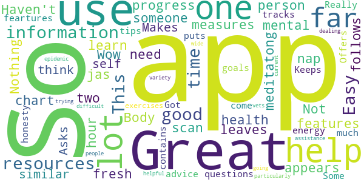

> Great app jas measures features and you can chart your progress  :date: __2020-11-08 18:29:04__

> Great app. Lots of information to learn about your mental health.  :date: __2020-11-01 01:34:40__

> Haven't had to use it but it appears to have resources that would help someone in need  :date: __2020-10-10 19:35:22__

> Not a meditatong person but Wow! Body scan leaves me fresh as having a two hour nap.  :date: __2020-08-03 20:12:13__

> So far, so good.☺️  :date: __2020-07-15 02:32:24__

> Nothing else follows  :date: __2020-07-14 18:24:59__

> It is similar to other self help. Easy to use. Makes one think. Asks one questions. Offers advice. Keeps tracks of goals. It all come down to how much energy and honesty one puts into it.  :date: __2020-06-30 17:37:32__

> Got a lot of information  :date: __2020-06-27 18:12:00__

> Really helps  :date: __2020-06-25 20:43:19__

> Some very good tips / feartures and easy to use.  :date: __2020-06-15 10:12:23__

#### 3-star reviews

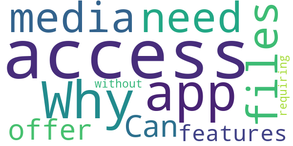

> Why does the app need access to my media and files? Can you offer some features without requiring that access?  :date: __2020-09-17 15:58:28__

#### 2-star reviews

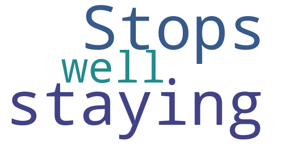

> Stops on staying well  :date: __2020-09-30 05:53:20__

#### 1-star reviews

> Requires access to your photos and files just to open the app. No thanks.  :date: __2020-11-13 01:54:50__

> App keeps crashing! Just use the older PTSD Coach, its basically the same thing.  :date: __2020-07-15 02:23:22__

> There should be no reason this app needs media, phone and Gallery permissions just to launch. Especially when it prompts you that you can disable them later.  :date: __2020-07-14 21:17:59__

> I was excited for this app. Unfortunately this app REQUIRES access to your phone. After downloading, a prompt will say: "Allow Covid Coach to access photos, media, and files on your device?" As soon as I tap on "deny" the app automatically closes and locks me out of the service. How is this supposed to be helping me? You don't need access to my phone. I'm disappointed.  :date: __2020-05-20 07:46:26__

# Kencor COVID-19
App version ``1.9``

Analyzed with [covid-apps-observer](http://github.com/covid-apps-observer) project, version ``0.1``

## App overview
| | |
|-------------------------|-------------------------| 
| **Name**&nbsp;&nbsp;&nbsp;&nbsp;&nbsp;&nbsp;&nbsp;&nbsp;&nbsp;&nbsp;&nbsp;&nbsp;&nbsp;&nbsp;&nbsp;&nbsp;&nbsp;&nbsp;&nbsp;&nbsp;&nbsp;&nbsp;&nbsp;&nbsp;&nbsp;&nbsp;&nbsp;&nbsp;&nbsp;&nbsp;&nbsp;&nbsp;&nbsp;&nbsp;&nbsp;&nbsp;&nbsp;&nbsp;&nbsp;&nbsp;  | Kencor COVID-19 |
| **Unique identifier** | com.kencorhealth.covid |
| **Link to Google Play** | [https://play.google.com/store/apps/details?id=com.kencorhealth.covid](https://play.google.com/store/apps/details?id=com.kencorhealth.covid) |
| **Summary**  | Kencor COVID-19 |
| **Privacy policy** | [https://www.kencorhealth.com/policies-terms/](https://www.kencorhealth.com/policies-terms/) |
| **Latest version** | 1.9 |
| **Last update** | 2020-10-12 07:37:38 |
| **Recent changes** | - Minor bug fixes |
| **Installs**  | 100+ |
| **Category** | Medical |
| **First release** | Apr 13, 2020 |
| **Size**  | 19M |
| **Supported Android version**  | 5.0 and up |

### Description
> Developed in partnership with cardiologists and technologists, the Kencor platform keeps you connected to your care team once you head home. 
 Sami™, your 24/7 virtual companion, comes pre-set with your personalized treatment plan created by your doctor, and adjusts over time as your health improves. 
 You just talk to Sami™ and answer her questions and follow her reminders, like to take your medication or record your vitals, such as your weight that day.
  Sami™ is there to monitor your progress and relay your health information directly to your care team. It’s like your care team is there with you when you need them.

### User interface
The developers of the app provide the following screenshots in the Google play store.
| | | |
|:-------------------------:|:-------------------------:|:-------------------------:|
 |   |   |   | 
 |   |  

## Development team
In the following we report the main information provided by the development team in the Google play store.

| | |
|-------------------------|-------------------------|
| **Developer**  | Kencor health |
| **Website**  | [http://www.kencorhealth.com](http://www.kencorhealth.com) |
| **Email** | nara@kencorhealth.com |
| **Physical address**  | - |
| **Other developed apps**  | [https://play.google.com/store/apps/developer?id=Kencor+health](https://play.google.com/store/apps/developer?id=Kencor+health) |

## Android support

| | |
|-------------------------|-------------------------|
| **Declared target Android version**  | Pie, version 9 (API level 28) |
| **Effective target Android version**  | Pie, version 9 (API level 28) |
| **Minimum supported Android version**  | Lollipop, version 5.0 (API level 21) |
| **Maximum target Android version**  | - |

The larger the difference between the minimum and maximum supported Android versions, the better. A larger difference means a wider audience. For example, old phones have a very low Android version, so a high minimum supported Android version means that the app cannot be used by users with old phones, thus leading to accessibility problems. 

## Requested permissions

In the following we report the complete list of the permissions requested by the app. 

| **Permission** | **Protection level** | **Description** | 
|-------------------------|-------------------------|-------------------------|
 **android.permission ACCESS_COARSE_LOCATION** | :warning:**Dangerous** | Allows an app to access approximate location. 
 **android.permission ACCESS_FINE_LOCATION** | :warning:**Dangerous** | Allows an app to access precise location. 
 **android.permission ACCESS_NETWORK_STATE** | Normal | Allows applications to access information about networks. 
 **android.permission BLUETOOTH** | Normal | Allows applications to connect to paired bluetooth devices. 
 **android.permission BROADCAST_STICKY** | Normal | Allows an application to broadcast sticky intents. 
 **android.permission CAMERA** | :warning:**Dangerous** | Required to be able to access the camera device. 
 **android.permission INTERNET** | Normal | Allows applications to open network sockets. 
 **android.permission MODIFY_AUDIO_SETTINGS** | Normal | Allows an application to modify global audio settings. 
 **android.permission RECORD_AUDIO** | :warning:**Dangerous** | Allows an application to record audio. 
 **android.permission WAKE_LOCK** | Normal | Allows using PowerManager WakeLocks to keep processor from sleeping or screen from dimming. 
 **com.google.android.c2dm.permission RECEIVE** | - | - 
 **com.kencorhealth.covid.permission C2D_MESSAGE** | - | - 

## Mentioned servers

| **Server** | **Registrant** | **Registrant country** | **Creation date** | 
|-------------------------|-------------------------|-------------------------|-------------------------|
 | googlesyndication.com | Google LLC | :us: US | 2003-01-21 06:17:24 |
 | google.com | Google LLC | :us: US | 1997-09-15 04:00:00 |
 | facebook.com | Facebook, Inc. | :us: US | 1997-03-29 05:00:00 |
 | googleapis.com | Google LLC | :us: US | 2005-01-25 17:52:26 |
 | w3.org | W3C | :us: US | 1994-07-06 04:00:00 |
 | google-analytics.com | Google LLC | :us: US | 2005-07-18 19:24:32 |
 | app-measurement.com | Google LLC | :us: US | 2015-06-19 20:13:31 |
 | googleapis.com | Google LLC | :us: US | 2005-01-25 17:52:26 |
 | doubleclick.net | Google Inc. | :us: US | 1996-01-16 05:00:00 |
 | gstatic.com | Google LLC | :us: US | 2008-02-11 15:31:25 |
 | googleapis.com | Google LLC | :us: US | 2005-01-25 17:52:26 |
 | googletagmanager.com | Google LLC | :us: US | 2011-11-11 23:39:05 |
 | youtube.com | Google LLC | :us: US | 2005-02-15 05:13:12 |
 | opentok.com | Domains By Proxy, LLC | :us: US | 2010-09-24 17:14:13 |
 | amazonaws.com | Amazon.com, Inc. | :us: US | 2005-08-18 02:10:45 |
 | kencorhealth.com | Domains By Proxy, LLC | :us: US | 2017-05-08 22:44:13 |
 | box.com | Box, Inc. | :us: US | 1999-02-17 05:00:00 |
 | jabber.org | Jabber.org | :us: US | 1998-12-25 05:00:00 |
 | xmlpull.org | WhoisGuard, Inc. | PA | 2001-11-26 20:33:08 |
 | jivesoftware.com | REDACTED FOR PRIVACY | :us: US | 2001-05-12 20:30:50 |
 | igniterealtime.org | Whois Privacy Service | :us: US | 2006-07-13 21:57:03 |
 | jivesoftware.org | Jive Software | :us: US | 2001-05-12 20:30:49 |

## Security analysis 

Below we report the main security warnings raised by our execution of the [Androwarn](https://github.com/maaaaz/androwarn) security analysis tool.

**Telephony identifiers leakage**
> - This application reads the ISO country code equivalent for the SIM provider's country code 
> - This application reads the device phone type value 
> - This application reads the numeric name (MCC+MNC) of current registered operator 
> - This application reads the operator name 
> - This application reads the phone's current state 

**Connection interfaces exfiltration**
> - This application reads details about the currently active data network 
> - This application tries to find out if the currently active data network is metered 

**Suspicious connection establishment**
> - This application opens a Socket and connects it to the remote address '' on the '80' port  
> - This application opens a Socket and connects it to the remote address '' on the 'N/A' port  
> - This application opens a Socket and connects it to the remote address 'Ljava/lang/StringBuilder;->toString()Ljava/lang/String;' on the 'N/A' port  
> - This application opens a Socket and connects it to the remote address 'Ljava/net/Proxy;->type()Ljava/net/Proxy$Type;' on the 'N/A' port  
> - This application opens a Socket and connects it to the remote address 'Lorg/apache/http/HttpHost;->getPort()I' on the 'Lorg/apache/http/HttpHost;->getPort()I' port  
> - This application opens a Socket and connects it to the remote address 'Network subsystem is unavailable' on the 'N/A' port  
> - This application opens a Socket and connects it to the remote address 'timeout' on the 'N/A' port  

**Pim data leakage**
> - This application accesses the SMS list 
> - This application accesses the contacts list 

**Code execution**
> - This application loads a native library 
> - This application loads a native library: 'jingle_peerconnection_so' 
> - This application loads a native library: 'opentok' 
> - This application executes a UNIX command containing this argument: 'getprop' 

## User ratings and reviews

Below we provide information about how end users are reacting to the app in terms of ratings and reviews in the Google Play store.

### Ratings

The Kencor COVID-19 app has been installed by more than **100** times. At this time, **-** rated the app and its average score is **0.0**. Below we show the distribution of the ratings across the usual star-based rating of Google Play

:star::star::star::star::star:: 0

:star::star::star::star:: 0

:star::star::star:: 0

:star::star:: 0

:star:: 0

### Reviews 

#### 5-star reviews

No recent reviews available with 5 stars.

#### 4-star reviews

No recent reviews available with 4 stars.

#### 3-star reviews

No recent reviews available with 3 stars.

#### 2-star reviews

No recent reviews available with 2 stars.

#### 1-star reviews

No recent reviews available with 1 stars.

# COVID Control - A Johns Hopkins University Study
App version ``3.3``

Analyzed with [covid-apps-observer](http://github.com/covid-apps-observer) project, version ``0.1``

## App overview
| | |
|-------------------------|-------------------------| 
| **Name**&nbsp;&nbsp;&nbsp;&nbsp;&nbsp;&nbsp;&nbsp;&nbsp;&nbsp;&nbsp;&nbsp;&nbsp;&nbsp;&nbsp;&nbsp;&nbsp;&nbsp;&nbsp;&nbsp;&nbsp;&nbsp;&nbsp;&nbsp;&nbsp;&nbsp;&nbsp;&nbsp;&nbsp;&nbsp;&nbsp;&nbsp;&nbsp;&nbsp;&nbsp;&nbsp;&nbsp;&nbsp;&nbsp;&nbsp;&nbsp;  | COVID Control - A Johns Hopkins University Study |
| **Unique identifier** | jhu.edu.JohnsHopkinsCOVIDControl |
| **Link to Google Play** | [https://play.google.com/store/apps/details?id=jhu.edu.JohnsHopkinsCOVIDControl](https://play.google.com/store/apps/details?id=jhu.edu.JohnsHopkinsCOVIDControl) |
| **Summary**  | This app uses users’ body temperature to predict the risk of COVID-19 outbreaks |
| **Privacy policy** | [https://covidcontrol.jhu.edu/wp-content/uploads/Consent-Form_Clean_30Apr2020.pdf](https://covidcontrol.jhu.edu/wp-content/uploads/Consent-Form_Clean_30Apr2020.pdf) |
| **Latest version** | 3.3 |
| **Last update** | 2020-08-14 18:02:43 |
| **Recent changes** | You can now add extra profiles and submit for other people of your household. It is also possible for you to check the impact of your daily submissions, and get badges as you keep using the COVID Control app. |
| **Installs**  | 1,000+ |
| **Category** | Medical |
| **First release** | Apr 16, 2020 |
| **Size**  | 15M |
| **Supported Android version**  | 5.0 and up |

### Description
> Johns Hopkins COVID Control is a fast, user-friendly tool for controlling the spread of COVID-19 based on self-reported body temperatures and, optionally, other symptoms, from users around the country. 
 Designed by doctors, epidemiologists, and engineers at the Johns Hopkins University (a collaborative endeavour between the Bloomberg School of Public Health, School of Medicine and the Whiting School of Engineering, all at the John Hopkins University), this app was born out of a desire for us as individuals to make an impactful contribution in this worldwide effort to contain the spread COVID-19. 
 In these difficult times, while we may feel helpless as individuals, the real-time insights gained from the information entered in this app will equip our frontline healthcare workers to make more informed decisions. By downloading and using this app regularly you would be contributing to a rapidly growing collaborative effort to monitor the spread of COVID-19. 
 Note that submitting your data directly greatly reduces the delay experienced in hospitals/laboratories in identifying new outbreaks of the disease, and expands basic monitoring of our health.
 We do not collect any personally identifiable information. No information you share will be used for commercial purposes.
 This app allows you to help researchers and government agencies to monitor and control the spread of COVID-19 but does not give health advice. If you need health advice please visit the CDC website at: https://www.cdc.gov/coronavirus/2019-ncov/index.html
 This temperature information entered in this app by users across the country will be used to detect influenza-like illness (ILI) activity in a region. By using spatial science analytics applied to these data and by comparing the observed trends against the historical data we have,  we will identify anomalous emerging activity in ILI and generate real-time, pre-clinical, risk estimates of potential COVID-19 outbreaks. 
 For more information about the project and this app, please visit our website https://covidcontrol.jhu.edu/

### User interface
The developers of the app provide the following screenshots in the Google play store.
| | | |
|:-------------------------:|:-------------------------:|:-------------------------:|
 |   |   |   | 
 |  

## Development team
In the following we report the main information provided by the development team in the Google play store.

| | |
|-------------------------|-------------------------|
| **Developer**  | Johns Hopkins Technology Transfer |
| **Website**  | [https://covidcontrol.jhu.edu/](https://covidcontrol.jhu.edu/) |
| **Email** | contactcovidcontrol@jh.edu |
| **Physical address**  | - |
| **Other developed apps**  | [https://play.google.com/store/apps/developer?id=Johns+Hopkins+Technology+Transfer](https://play.google.com/store/apps/developer?id=Johns+Hopkins+Technology+Transfer) |

## Android support

| | |
|-------------------------|-------------------------|
| **Declared target Android version**  | Android10, version 10 (API level 29) |
| **Effective target Android version**  | Android10, version 10 (API level 29) |
| **Minimum supported Android version**  | Lollipop, version 5.0 (API level 21) |
| **Maximum target Android version**  | - |

The larger the difference between the minimum and maximum supported Android versions, the better. A larger difference means a wider audience. For example, old phones have a very low Android version, so a high minimum supported Android version means that the app cannot be used by users with old phones, thus leading to accessibility problems. 

## Requested permissions

In the following we report the complete list of the permissions requested by the app. 

| **Permission** | **Protection level** | **Description** | 
|-------------------------|-------------------------|-------------------------|
 **android.permission ACCESS_COARSE_LOCATION** | :warning:**Dangerous** | Allows an app to access approximate location. 
 **android.permission ACCESS_FINE_LOCATION** | :warning:**Dangerous** | Allows an app to access precise location. 
 **android.permission INTERNET** | Normal | Allows applications to open network sockets. 
 **android.permission RECEIVE_BOOT_COMPLETED** | Normal | Allows an application to receive the Intent.ACTION_BOOT_COMPLETED that is broadcast after the system finishes booting. 
 **android.permission VIBRATE** | Normal | Allows access to the vibrator. 
 **android.permission WAKE_LOCK** | Normal | Allows using PowerManager WakeLocks to keep processor from sleeping or screen from dimming. 

## Mentioned servers

| **Server** | **Registrant** | **Registrant country** | **Creation date** | 
|-------------------------|-------------------------|-------------------------|-------------------------|
 | google.com | Google LLC | :us: US | 1997-09-15 04:00:00 |
 | jhu.edu | Johns Hopkins University | - | 1987-03-19 00:00:00 |
 | azurewebsites.net | Microsoft Corporation | :us: US | 2012-01-24 18:43:51 |
 | googleapis.com | Google LLC | :us: US | 2005-01-25 17:52:26 |

## Security analysis 

Below we report the main security warnings raised by our execution of the [Androwarn](https://github.com/maaaaz/androwarn) security analysis tool.

**Connection interfaces exfiltration**
> - This application reads details about the currently active data network 
> - This application tries to find out if the currently active data network is metered 

**Suspicious connection establishment**
> - This application opens a Socket and connects it to the remote address '' on the 'N/A' port  
> - This application opens a Socket and connects it to the remote address 'Ljava/lang/StringBuilder;->toString()Ljava/lang/String;' on the 'N/A' port  
> - This application opens a Socket and connects it to the remote address 'Ljava/net/Proxy;->type()Ljava/net/Proxy$Type;' on the 'N/A' port  
> - This application opens a Socket and connects it to the remote address 'timeout' on the 'N/A' port  

## User ratings and reviews

Below we provide information about how end users are reacting to the app in terms of ratings and reviews in the Google Play store.

### Ratings

The COVID Control - A Johns Hopkins University Study app has been installed by more than **1000** times. At this time, **22** rated the app and its average score is **2.9545455**. Below we show the distribution of the ratings across the usual star-based rating of Google Play

:star::star::star::star::star:: 9

:star::star::star::star:: 2

:star::star::star:: 0

:star::star:: 1

:star:: 10

### Reviews 

#### 5-star reviews

> interesting ...as a first responder, glad you re doing this!  :date: __2020-07-24 16:59:16__

> Extremely easy app. I appreciate the daily reminders. I shared this information on my Facebook and have been telling folks that I interact with. Thank you Johns Hopkins for playing a vital role in tracking this virus.  :date: __2020-05-22 23:27:43__

> Super easy to use and convenient. The maps are interesting  :date: __2020-05-04 16:44:34__

> Important in the fight to defeat COVID 19  :date: __2020-04-25 14:32:48__

#### 4-star reviews

No recent reviews available with 4 stars.

#### 3-star reviews

No recent reviews available with 3 stars.

#### 2-star reviews

> Keeps telling me to enter my daily information everytime phone is turned on even though I already entered it for today. Uninstalling it now.  :date: __2020-05-13 19:05:30__

#### 1-star reviews

> I cannot enter data. When I tap the input box, the keyboard does not appear. This was fixed But I have entered a new age category. I tried to edit my profile and add my zipcode, but I get an error when I try to save.  :date: __2020-11-21 21:25:32__

> Can't activate app. On the "let's get started" page, I enter 2 demographic info and click on submit. The app says something went wrong and to resubmit later.  :date: __2020-11-18 19:35:14__

> Errors. Will not pass age on pixel 2  :date: __2020-11-17 19:29:47__

> Cannot read the privacy statement because it won't load. Cannot add my daily temp because it shows error. Get your act together JHU. 0ne star is too much. Maybe one of your engineers can developed a usable/workable app.  :date: __2020-10-20 14:50:00__

> utterly useless failed to allow submission of data from 1st screen  :date: __2020-10-06 19:56:20__

> Unable to input to register and participate  :date: __2020-09-08 15:51:22__

> I had an earlier version that partially worked (could submit data but couldn't tell if it actually submitted because the counter didn't show how many days I submitted) and I couldn't edit my profile. New version clean install won't accept any profile data. Just tells me that there was a problem and to try again.  :date: __2020-09-05 15:45:34__

> I cannot enter any data to start my profile. I keep getting an error that something went wrong.  :date: __2020-08-30 23:15:14__

> Latest version is broken. It used to work, but now it tells me I am offline All the time Android  :date: __2020-06-30 04:44:57__

> The temperature starts at 97, mine is 96.3. After I put it in as 97, I kept getting notices to input my temperature. So, I am deleting the app.  :date: __2020-05-01 18:48:49__

# MUSC COVID-19 Vital Link
App version ``1.39``

Analyzed with [covid-apps-observer](http://github.com/covid-apps-observer) project, version ``0.1``

## App overview
| | |
|-------------------------|-------------------------| 
| **Name**&nbsp;&nbsp;&nbsp;&nbsp;&nbsp;&nbsp;&nbsp;&nbsp;&nbsp;&nbsp;&nbsp;&nbsp;&nbsp;&nbsp;&nbsp;&nbsp;&nbsp;&nbsp;&nbsp;&nbsp;&nbsp;&nbsp;&nbsp;&nbsp;&nbsp;&nbsp;&nbsp;&nbsp;&nbsp;&nbsp;&nbsp;&nbsp;&nbsp;&nbsp;&nbsp;&nbsp;&nbsp;&nbsp;&nbsp;&nbsp;  | MUSC COVID-19 Vital Link |
| **Unique identifier** | edu.musc.vitaltracker.defaultapp |
| **Link to Google Play** | [https://play.google.com/store/apps/details?id=edu.musc.vitaltracker.defaultapp](https://play.google.com/store/apps/details?id=edu.musc.vitaltracker.defaultapp) |
| **Summary**  | MUSC COVID-19 Vital Link is a prescribed application provided to patients. |
| **Privacy policy** | [https://web.musc.edu/about/compliance/privacy](https://web.musc.edu/about/compliance/privacy) |
| **Latest version** | 1.39 |
| **Last update** | 2020-07-30 15:08:19 |
| **Recent changes** | -Pin Code Verification  |
| **Installs**  | 50+ |
| **Category** | Medical |
| **First release** | Mar 19, 2020 |
| **Size**  | 41M |
| **Supported Android version**  | 4.4 and up |

### Description
> MUSC COVID-19 Vital Link is a prescribed application provided to patients by MUSC Health clinicians.

### User interface
The developers of the app provide the following screenshots in the Google play store.
| | | |
|:-------------------------:|:-------------------------:|:-------------------------:|
 |   |  

## Development team
In the following we report the main information provided by the development team in the Google play store.

| | |
|-------------------------|-------------------------|
| **Developer**  | MUSC Mobile Development |
| **Website**  | - |
| **Email** | vlinkhelp@musc.edu |
| **Physical address**  | - |
| **Other developed apps**  | [https://play.google.com/store/apps/developer?id=MUSC+Mobile+Development](https://play.google.com/store/apps/developer?id=MUSC+Mobile+Development) |

## Android support

| | |
|-------------------------|-------------------------|
| **Declared target Android version**  | Pie, version 9 (API level 28) |
| **Effective target Android version**  | Pie, version 9 (API level 28) |
| **Minimum supported Android version**  | KitKat, version 4.4 - 4.4.4 (API level 19) |
| **Maximum target Android version**  | - |

The larger the difference between the minimum and maximum supported Android versions, the better. A larger difference means a wider audience. For example, old phones have a very low Android version, so a high minimum supported Android version means that the app cannot be used by users with old phones, thus leading to accessibility problems. 

## Requested permissions

In the following we report the complete list of the permissions requested by the app. 

| **Permission** | **Protection level** | **Description** | 
|-------------------------|-------------------------|-------------------------|
 **android.permission ACCESS_COARSE_LOCATION** | :warning:**Dangerous** | Allows an app to access approximate location. 
 **android.permission ACCESS_NETWORK_STATE** | Normal | Allows applications to access information about networks. 
 **android.permission BLUETOOTH** | Normal | Allows applications to connect to paired bluetooth devices. 
 **android.permission BLUETOOTH_ADMIN** | Normal | Allows applications to discover and pair bluetooth devices. 
 **android.permission CAMERA** | :warning:**Dangerous** | Required to be able to access the camera device. 
 **android.permission FOREGROUND_SERVICE** | Normal | Allows a regular application to use Service.startForeground. 
 **android.permission INTERNET** | Normal | Allows applications to open network sockets. 
 **android.permission READ_EXTERNAL_STORAGE** | :warning:**Dangerous** | Allows an application to read from external storage. 
 **android.permission RECEIVE_BOOT_COMPLETED** | Normal | Allows an application to receive the Intent.ACTION_BOOT_COMPLETED that is broadcast after the system finishes booting. 
 **android.permission VIBRATE** | Normal | Allows access to the vibrator. 
 **android.permission WAKE_LOCK** | Normal | Allows using PowerManager WakeLocks to keep processor from sleeping or screen from dimming. 
 **android.permission WRITE_EXTERNAL_STORAGE** | :warning:**Dangerous** | Allows an application to write to external storage. 
 **com.google.android.c2dm.permission RECEIVE** | - | - 
 **com.google.android.finsky.permission BIND_GET_INSTALL_REFERRER_SERVICE** | - | - 

## Mentioned servers

| **Server** | **Registrant** | **Registrant country** | **Creation date** | 
|-------------------------|-------------------------|-------------------------|-------------------------|
 | googlesyndication.com | Google LLC | :us: US | 2003-01-21 06:17:24 |
 | google.com | Google LLC | :us: US | 1997-09-15 04:00:00 |
 | app-measurement.com | Google LLC | :us: US | 2015-06-19 20:13:31 |
 | googleapis.com | Google LLC | :us: US | 2005-01-25 17:52:26 |
 | crashlytics.com | Google LLC | :us: US | 2011-01-21 15:30:40 |
 | musc.edu | The Medical University of South Carolina | - | 1990-12-17 00:00:00 |
 | hitechnologysolutions.com | Domains By Proxy, LLC | :us: US | 2018-01-10 20:19:52 |
 | googleapis.com | Google LLC | :us: US | 2005-01-25 17:52:26 |
 | googleapis.com | Google LLC | :us: US | 2005-01-25 17:52:26 |
 | googleadservices.com | Google LLC | :us: US | 2003-06-19 16:34:53 |

## Security analysis 

Below we report the main security warnings raised by our execution of the [Androwarn](https://github.com/maaaaz/androwarn) security analysis tool.

**Connection interfaces exfiltration**
> - This application reads details about the currently active data network 
> - This application tries to find out if the currently active data network is metered 

**Suspicious connection establishment**
> - This application opens a Socket and connects it to the remote address '' on the 'N/A' port  
> - This application opens a Socket and connects it to the remote address 'Ljava/lang/StringBuilder;->toString()Ljava/lang/String;' on the 'N/A' port  
> - This application opens a Socket and connects it to the remote address 'Ljava/net/Proxy;->type()Ljava/net/Proxy$Type;' on the 'N/A' port  
> - This application opens a Socket and connects it to the remote address 'timeout' on the 'N/A' port  

**Code execution**
> - This application loads a native library 
> - This application loads a native library: 'Ljava/lang/String;->valueOf(Ljava/lang/Object;)Ljava/lang/String;' 
> - This application loads a native library: 'barhopper_v2' 
> - This application loads a native library: 'tensorflowlite_flex_jni' 
> - This application loads a native library: 'tensorflowlite_jni' 

## User ratings and reviews

Below we provide information about how end users are reacting to the app in terms of ratings and reviews in the Google Play store.

### Ratings

The MUSC COVID-19 Vital Link app has been installed by more than **50** times. At this time, **-** rated the app and its average score is **0.0**. Below we show the distribution of the ratings across the usual star-based rating of Google Play

:star::star::star::star::star:: 0

:star::star::star::star:: 0

:star::star::star:: 0

:star::star:: 0

:star:: 0

### Reviews 

#### 5-star reviews

No recent reviews available with 5 stars.

#### 4-star reviews

No recent reviews available with 4 stars.

#### 3-star reviews

No recent reviews available with 3 stars.

#### 2-star reviews

> This app does not work for my phone even though It is compatible. I tried to set up receiving the alert through my cell phone it said phone number not available. When I chose the email option I did not receive the email. I then went on line to for help and dialed the number given online and it was the hospital main number. I was then directed to 2 other numbers and no one could help me nor did they know what I was talking about. sincerely, Pauline Mejia  :date: __2020-11-19 16:39:25__

#### 1-star reviews

No recent reviews available with 1 stars.

# PathCheck SafePlaces
App version ``1.3.1 (2)``

Analyzed with [covid-apps-observer](http://github.com/covid-apps-observer) project, version ``0.1``

## App overview
| | |
|-------------------------|-------------------------| 
| **Name**&nbsp;&nbsp;&nbsp;&nbsp;&nbsp;&nbsp;&nbsp;&nbsp;&nbsp;&nbsp;&nbsp;&nbsp;&nbsp;&nbsp;&nbsp;&nbsp;&nbsp;&nbsp;&nbsp;&nbsp;&nbsp;&nbsp;&nbsp;&nbsp;&nbsp;&nbsp;&nbsp;&nbsp;&nbsp;&nbsp;&nbsp;&nbsp;&nbsp;&nbsp;&nbsp;&nbsp;&nbsp;&nbsp;&nbsp;&nbsp;  | PathCheck SafePlaces |
| **Unique identifier** | org.pathcheck.covidsafepaths |
| **Link to Google Play** | [https://play.google.com/store/apps/details?id=org.pathcheck.covidsafepaths](https://play.google.com/store/apps/details?id=org.pathcheck.covidsafepaths) |
| **Summary**  | Compare public COVID data with your own private location history where available |
| **Privacy policy** | [https://pathcheck.org/privacy-policy/](https://pathcheck.org/privacy-policy/) |
| **Latest version** | 1.3.1 (2) |
| **Last update** | 2020-08-05 02:37:44 |
| **Recent changes** | • You can now delete your Location History. • We think you&#39;ll find the calendar interface is a bit more clear. • We&#39;ve made improvements to the Exposure Notifications (ENs). |
| **Installs**  | 10,000+ |
| **Category** | Tools |
| **First release** | Apr 15, 2020 |
| **Size**  | 37M |
| **Supported Android version**  | 5.0 and up |

### Description
> PathCheck (formerly COVID Safe Paths) can privately save the places you visit and store them on your phone. Subscribe to Healthcare Authorities in your area for information about COVID-19 near you, where available. 
 Receive alerts from your local Healthcare Authority with information about potential exposure to COVID-19.
 We are a global movement to develop free, open-source, privacy-by-design tools for residents, public health officials, and larger communities.
 The PathCheck program has spun out of initial privacy-first research conducted by MIT and TripleBlind, into a newly created non-profit called PathCheck Foundation, established with the initial purpose of supporting global rollout of the PathCheck app and associated tools for contact tracers and healthcare authorities. 
 The goal of PathCheck is to help enable the reemergence and re-opening of economies and communities.  Through global partnerships, we are prepared to support public health officials everywhere in the effort to slow the spread of COVID-19.

### User interface
The developers of the app provide the following screenshots in the Google play store.
| | | |
|:-------------------------:|:-------------------------:|:-------------------------:|
 |   |   |   | 
 |   |   |   | 

## Development team
In the following we report the main information provided by the development team in the Google play store.

| | |
|-------------------------|-------------------------|
| **Developer**  | Path Check, Inc |
| **Website**  | [https://pathcheck.org](https://pathcheck.org) |
| **Email** | support@pathcheck.org |
| **Physical address**  | - |
| **Other developed apps**  | [https://play.google.com/store/apps/developer?id=Path+Check,+Inc](https://play.google.com/store/apps/developer?id=Path+Check,+Inc) |

## Android support

| | |
|-------------------------|-------------------------|
| **Declared target Android version**  | Pie, version 9 (API level 28) |
| **Effective target Android version**  | Pie, version 9 (API level 28) |
| **Minimum supported Android version**  | Lollipop, version 5.0 (API level 21) |
| **Maximum target Android version**  | - |

The larger the difference between the minimum and maximum supported Android versions, the better. A larger difference means a wider audience. For example, old phones have a very low Android version, so a high minimum supported Android version means that the app cannot be used by users with old phones, thus leading to accessibility problems. 

## Requested permissions

In the following we report the complete list of the permissions requested by the app. 

| **Permission** | **Protection level** | **Description** | 
|-------------------------|-------------------------|-------------------------|
 **android.hardware location** | - | - 
 **android.permission ACCESS_BACKGROUND_LOCATION** | :warning:**Dangerous** | Allows an app to access location in the background. 
 **android.permission ACCESS_COARSE_LOCATION** | :warning:**Dangerous** | Allows an app to access approximate location. 
 **android.permission ACCESS_FINE_LOCATION** | :warning:**Dangerous** | Allows an app to access precise location. 
 **android.permission ACCESS_LOCATION_EXTRA_COMMANDS** | Normal | Allows an application to access extra location provider commands. 
 **android.permission ACCESS_NETWORK_STATE** | Normal | Allows applications to access information about networks. 
 **android.permission ACCESS_WIFI_STATE** | Normal | Allows applications to access information about Wi-Fi networks. 
 **android.permission AUTHENTICATE_ACCOUNTS** | - | - 
 **android.permission FOREGROUND_SERVICE** | Normal | Allows a regular application to use Service.startForeground. 
 **android.permission GET_TASKS** | Deprecated | This constant was deprecated in API level 21. No longer enforced. 
 **android.permission INTERNET** | Normal | Allows applications to open network sockets. 
 **android.permission READ_APP_BADGE** | - | - 
 **android.permission READ_SYNC_SETTINGS** | Normal | Allows applications to read the sync settings. 
 **android.permission RECEIVE_BOOT_COMPLETED** | Normal | Allows an application to receive the Intent.ACTION_BOOT_COMPLETED that is broadcast after the system finishes booting. 
 **android.permission VIBRATE** | Normal | Allows access to the vibrator. 
 **android.permission WAKE_LOCK** | Normal | Allows using PowerManager WakeLocks to keep processor from sleeping or screen from dimming. 
 **android.permission WRITE_EXTERNAL_STORAGE** | :warning:**Dangerous** | Allows an application to write to external storage. 
 **android.permission WRITE_SYNC_SETTINGS** | Normal | Allows applications to write the sync settings. 
 **com.anddoes.launcher.permission UPDATE_COUNT** | - | - 
 **com.android.vending CHECK_LICENSE** | - | - 
 **com.google.android.c2dm.permission RECEIVE** | - | - 
 **com.google.android.finsky.permission BIND_GET_INSTALL_REFERRER_SERVICE** | - | - 
 **com.google.android.gms.permission ACTIVITY_RECOGNITION** | - | - 
 **com.htc.launcher.permission READ_SETTINGS** | - | - 
 **com.htc.launcher.permission UPDATE_SHORTCUT** | - | - 
 **com.huawei.android.launcher.permission CHANGE_BADGE** | - | - 
 **com.huawei.android.launcher.permission READ_SETTINGS** | - | - 
 **com.huawei.android.launcher.permission WRITE_SETTINGS** | - | - 
 **com.majeur.launcher.permission UPDATE_BADGE** | - | - 
 **com.oppo.launcher.permission READ_SETTINGS** | - | - 
 **com.oppo.launcher.permission WRITE_SETTINGS** | - | - 
 **com.sec.android.provider.badge.permission READ** | - | - 
 **com.sec.android.provider.badge.permission WRITE** | - | - 
 **com.sonyericsson.home.permission BROADCAST_BADGE** | - | - 
 **com.sonymobile.home.permission PROVIDER_INSERT_BADGE** | - | - 
 **me.everything.badger.permission BADGE_COUNT_READ** | - | - 
 **me.everything.badger.permission BADGE_COUNT_WRITE** | - | - 

## Mentioned servers

| **Server** | **Registrant** | **Registrant country** | **Creation date** | 
|-------------------------|-------------------------|-------------------------|-------------------------|
 | android.com | Google LLC | :us: US | 1997-06-23 04:00:00 |
 | google.com | Google LLC | :us: US | 1997-09-15 04:00:00 |
 | xml.org | OASIS Open | :us: US | 1997-02-03 05:00:00 |
 | facebook.com | Facebook, Inc. | :us: US | 1997-03-29 05:00:00 |
 | pinterest.com | DNStination Inc. | :us: US | 2009-11-26 19:21:23 |
 | twitter.com | Twitter, Inc. | :us: US | 2000-01-21 16:28:17 |
 | googleapis.com | Google LLC | :us: US | 2005-01-25 17:52:26 |

## Security analysis 

Below we report the main security warnings raised by our execution of the [Androwarn](https://github.com/maaaaz/androwarn) security analysis tool.

**Telephony identifiers leakage**
> - This application reads the numeric name (MCC+MNC) of current registered operator 
> - This application reads the operator name 
> - This application reads the phone number string for line 1, for example, the MSISDN for a GSM phone 

**Location lookup**
> - This application reads location information from all available providers (WiFi, GPS etc.) 

**Connection interfaces exfiltration**
> - This application reads details about the currently active data network 
> - This application tries to find out if the currently active data network is metered 

**Suspicious connection establishment**
> - This application opens a Socket and connects it to the remote address '' on the 'N/A' port  
> - This application opens a Socket and connects it to the remote address 'Ljava/lang/StringBuilder;->toString()Ljava/lang/String;' on the ': connect, resolve' port  
> - This application opens a Socket and connects it to the remote address 'Ljava/lang/StringBuilder;->toString()Ljava/lang/String;' on the 'N/A' port  
> - This application opens a Socket and connects it to the remote address 'Ljava/net/Proxy;->type()Ljava/net/Proxy$Type;' on the 'N/A' port  
> - This application opens a Socket and connects it to the remote address 'timeout' on the 'N/A' port  

**Pim data leakage**
> - This application accesses the downloads folder 
> - This application accesses data stored in the clipboard 

**Code execution**
> - This application loads a native library 
> - This application executes a UNIX command 

## User ratings and reviews

Below we provide information about how end users are reacting to the app in terms of ratings and reviews in the Google Play store.

### Ratings

The PathCheck SafePlaces app has been installed by more than **10000** times. At this time, **73** rated the app and its average score is **4.1643834**. Below we show the distribution of the ratings across the usual star-based rating of Google Play

:star::star::star::star::star:: 54

:star::star::star::star:: 3

:star::star::star:: 2

:star::star:: 2

:star:: 12

### Reviews 

#### 5-star reviews

> Made with privacy at its core.  :date: __2020-07-05 04:32:14__

> One of the very few safe and privacy-centric contact tracing app.  :date: __2020-07-05 04:31:47__

> I like that any location data stays on my phone until I give permission to export it to a health care worker and that it is then anonymized. Looks a lot less intrusive then all the targeted advertising that tracks me and a lot more useful, in my opinion. Cool looking app. Now just waiting for my health department to integrate it.  :date: __2020-06-26 01:51:35__

> Haiti merite plis sansibilizasyon nan sans sa kap ede moun kont corona.... Aplikasyon sa se yon bèl travay....  :date: __2020-05-08 21:20:02__

> Tout haitien ta dwe gen aplikasyon sa sou telephonrle yo. Good job  :date: __2020-05-07 21:19:54__

> Just got notified of the data instantly now. I'm safe! Easy to use.  :date: __2020-05-03 05:08:46__

> Pest  :date: __2020-04-30 23:52:20__

> Good  :date: __2020-04-29 16:13:05__

> Easy to set up and I appreciate that my information is kept on my phone so it is safe.  :date: __2020-04-27 17:36:59__

> Works really well  :date: __2020-04-27 16:11:12__

#### 4-star reviews

No recent reviews available with 4 stars.

#### 3-star reviews

No recent reviews available with 3 stars.

#### 2-star reviews

> I'm not sure what good this does when there's only 5 health department listed and 3 of them are in INCREDIBLY unpopulated regions. 🤦‍♀️  :date: __2020-08-24 22:15:11__

> None of my personal information has been asked for... What's the point???  :date: __2020-04-28 02:37:53__

#### 1-star reviews

> No instructions how to use! I have no idea where to get the "healthcare authority" URL the app asks for and therefore receive nothing about COVID in my area.  :date: __2020-07-01 11:44:15__

> Ok  :date: __2020-05-14 07:35:03__

> Energy hog. Not enough people using it.  :date: __2020-05-11 03:28:14__

> Can developer of this program confirm if it works in the uk. If it does what trusted source or authority do i input when setting up  :date: __2020-04-28 11:26:45__

> Do not download this app, search "Covid Safe" with a space between the words to get the actual Australian Government app.  :date: __2020-04-27 00:29:56__

> NOT THE AUSTRALIAN GOV APP  :date: __2020-04-27 00:05:25__

> Not the app endorsed by the government  :date: __2020-04-26 23:34:36__

> The app developers need to make it clear this isn't the official government app. It's irresponsible for them to position this in the store knowing people are searching for the Govt App. To find the Govt App search "Covid safe" as two words and look for the official green logo distributed on well know public news sources.  :date: __2020-04-26 11:11:39__

> Private data is being used beyond COVID-19 boundaries.  :date: __2020-04-26 08:59:35__

# Sentinel Monitor (COVID-19 Management)
App version ``1.5``

Analyzed with [covid-apps-observer](http://github.com/covid-apps-observer) project, version ``0.1``

## App overview
| | |
|-------------------------|-------------------------| 
| **Name**&nbsp;&nbsp;&nbsp;&nbsp;&nbsp;&nbsp;&nbsp;&nbsp;&nbsp;&nbsp;&nbsp;&nbsp;&nbsp;&nbsp;&nbsp;&nbsp;&nbsp;&nbsp;&nbsp;&nbsp;&nbsp;&nbsp;&nbsp;&nbsp;&nbsp;&nbsp;&nbsp;&nbsp;&nbsp;&nbsp;&nbsp;&nbsp;&nbsp;&nbsp;&nbsp;&nbsp;&nbsp;&nbsp;&nbsp;&nbsp;  | Sentinel Monitor (COVID-19 Management) |
| **Unique identifier** | tracker.healthcare.sentinel |
| **Link to Google Play** | [https://play.google.com/store/apps/details?id=tracker.healthcare.sentinel](https://play.google.com/store/apps/details?id=tracker.healthcare.sentinel) |
| **Summary**  | Temperature and symptom tracking for patients with COVID-19 or flu |
| **Privacy policy** | [http://sentinel.healthcare/eula](http://sentinel.healthcare/eula) |
| **Latest version** | 1.5 |
| **Last update** | 2020-04-23 23:34:42 |
| **Recent changes** | New App Name: Sentinel Monitor Labs: Submit and view COVID-19 lab results (Only available at select testing sites) Additional attributes in user profile Additional sign up methods Spanish language option General app improvements |
| **Installs**  | 1,000+ |
| **Category** | Medical |
| **First release** | Mar 8, 2020 |
| **Size**  | 9.7M |
| **Supported Android version**  | 4.4 and up |

### Description
> The Sentinel Monitor allows for individuals who are not feeling well (COVID-19, Flu, etc) to track their temperature and associated symptoms. Sentinel Monitor can be used by individuals or in conjunction with approved healthcare organizations. 
 DISCLAIMER: ALL OF THE MATERIAL PROVIDED THROUGH SENTINEL'S SYMPTOM CHECKER PORTION OF THE PLATFORM, SUCH AS TEXT, GRAPHICS, PHOTOGRAPHS, IMAGES, MESSAGES, FORUM POSTINGS, AND ANY OTHER MATERIALS, ARE FOR INFORMATIONAL PURPOSES ONLY AND ARE NOT A SUBSTITUTE FOR PROFESSIONAL MEDICAL ADVICE OR TREATMENT. ALWAYS SEEK THE ADVICE OF YOUR PHYSICIAN OR OTHER QUALIFIED HEALTH PROVIDER WITH ANY QUESTIONS YOU MAY HAVE REGARDING YOUR HEALTH. NEVER DISREGARD PROFESSIONAL MEDICAL ADVICE OR DELAY IN SEEKING IT BECAUSE OF ANY INFORMATION PROVIDED THROUGH THE PLATFORM. ADDITIONALLY, COMPANY DOES NOT PROMISE ANY PARTICULAR RESULTS WITH REGARDS TO YOUR HEALTH IN CONNECTION WITH YOUR USE OF THE PLATFORM.  IF YOU THINK YOU HAVE A MEDICAL EMERGENCY, CALL YOUR DOCTOR OR YOUR LOCAL EMERGENCY PHONE NUMBER IMMEDIATELY.

### User interface
The developers of the app provide the following screenshots in the Google play store.
| | | |
|:-------------------------:|:-------------------------:|:-------------------------:|
 |   |   |   | 
 |  

## Development team
In the following we report the main information provided by the development team in the Google play store.

| | |
|-------------------------|-------------------------|
| **Developer**  | Sentinel Healthcare |
| **Website**  | [http://sentinel.healthcare](http://sentinel.healthcare) |
| **Email** | app-support@sentinel.healthcare |
| **Physical address**  | - |
| **Other developed apps**  | [https://play.google.com/store/apps/developer?id=Sentinel+Healthcare](https://play.google.com/store/apps/developer?id=Sentinel+Healthcare) |

## Android support

| | |
|-------------------------|-------------------------|
| **Declared target Android version**  | Android10, version 10 (API level 29) |
| **Effective target Android version**  | Android10, version 10 (API level 29) |
| **Minimum supported Android version**  | KitKat, version 4.4 - 4.4.4 (API level 19) |
| **Maximum target Android version**  | - |

The larger the difference between the minimum and maximum supported Android versions, the better. A larger difference means a wider audience. For example, old phones have a very low Android version, so a high minimum supported Android version means that the app cannot be used by users with old phones, thus leading to accessibility problems. 

## Requested permissions

In the following we report the complete list of the permissions requested by the app. 

| **Permission** | **Protection level** | **Description** | 
|-------------------------|-------------------------|-------------------------|
 **android.permission  ACCESS_COARSE_LOCATION** | - | - 
 **android.permission ACCESS_FINE_LOCATION** | :warning:**Dangerous** | Allows an app to access precise location. 
 **android.permission ACCESS_NETWORK_STATE** | Normal | Allows applications to access information about networks. 
 **android.permission BLUETOOTH** | Normal | Allows applications to connect to paired bluetooth devices. 
 **android.permission BLUETOOTH_ADMIN** | Normal | Allows applications to discover and pair bluetooth devices. 
 **android.permission CAMERA** | :warning:**Dangerous** | Required to be able to access the camera device. 
 **android.permission INTERNET** | Normal | Allows applications to open network sockets. 
 **android.permission WAKE_LOCK** | Normal | Allows using PowerManager WakeLocks to keep processor from sleeping or screen from dimming. 
 **com.google.android.c2dm.permission RECEIVE** | - | - 
 **com.google.android.finsky.permission BIND_GET_INSTALL_REFERRER_SERVICE** | - | - 

## Mentioned servers

| **Server** | **Registrant** | **Registrant country** | **Creation date** | 
|-------------------------|-------------------------|-------------------------|-------------------------|
 | googlesyndication.com | Google LLC | :us: US | 2003-01-21 06:17:24 |
 | google.com | Google LLC | :us: US | 1997-09-15 04:00:00 |
 | app-measurement.com | Google LLC | :us: US | 2015-06-19 20:13:31 |
 | ipify.org | Domains By Proxy, LLC | :us: US | 2014-01-05 22:02:15 |
 | ihealthlabs.com | REDACTED FOR PRIVACY | cn | 2011-10-13 07:43:43 |
 | googleapis.com | Google LLC | :us: US | 2005-01-25 17:52:26 |
 | googleadservices.com | Google LLC | :us: US | 2003-06-19 16:34:53 |
 | sematext.com | REDACTED FOR PRIVACY | :us: US | 2007-05-01 03:03:08 |
 | crashlytics.com | Google LLC | :us: US | 2011-01-21 15:30:40 |
 | arcgis.com | ESRI | :us: US | 1999-06-09 22:21:51 |
 | mayoclinic.org | Mayo Foundation for Medical Education and Research | :us: US | 1997-02-08 05:00:00 |
 | uthealthaustin.org | Domain Privacy Service FBO Registrant. | :us: US | 2017-02-20 15:26:07 |
 | healthdata.org | University of Washington | :us: US | 2012-09-05 15:15:20 |
 | sentinelboard.com | Contact Privacy Inc. Customer 1242799118 | :canada: CA | 2018-06-10 18:25:45 |
 | xmlpull.org | WhoisGuard, Inc. | PA | 2001-11-26 20:33:08 |
 | humanly.io | c/o whoisproxy.com | :us: US | 2018-08-10 02:39:54 |

## Security analysis 

Below we report the main security warnings raised by our execution of the [Androwarn](https://github.com/maaaaz/androwarn) security analysis tool.

**Telephony identifiers leakage**
> - This application reads the ISO country code equivalent for the SIM provider's country code 
> - This application reads the MCC+MNC of the provider of the SIM 
> - This application reads the Service Provider Name (SPN) 
> - This application reads the constant indicating the state of the device SIM card 
> - This application reads the device phone type value 
> - This application reads the numeric name (MCC+MNC) of current registered operator 
> - This application reads the operator name 
> - This application reads the radio technology (network type) currently in use on the device for data transmission 

**Connection interfaces exfiltration**
> - This application reads details about the currently active data network 
> - This application tries to find out if the currently active data network is metered 

**Suspicious connection establishment**
> - This application opens a Socket and connects it to the remote address '' on the 'N/A' port  
> - This application opens a Socket and connects it to the remote address 'Ljava/lang/StringBuilder;->toString()Ljava/lang/String;' on the 'N/A' port  
> - This application opens a Socket and connects it to the remote address 'Ljava/net/Proxy;->type()Ljava/net/Proxy$Type;' on the 'N/A' port  
> - This application opens a Socket and connects it to the remote address 'timeout' on the 'N/A' port  

**Code execution**
> - This application loads a native library: 'ECGOffline' 
> - This application loads a native library: 'ECGOnline' 
> - This application loads a native library: 'VeryFitMulti' 
> - This application loads a native library: 'iHealth' 
> - This application executes a UNIX command containing this argument: '' 

## User ratings and reviews

Below we provide information about how end users are reacting to the app in terms of ratings and reviews in the Google Play store.

### Ratings

The Sentinel Monitor (COVID-19 Management) app has been installed by more than **1000** times. At this time, **11** rated the app and its average score is **4.181818**. Below we show the distribution of the ratings across the usual star-based rating of Google Play

:star::star::star::star::star:: 8

:star::star::star::star:: 1

:star::star::star:: 0

:star::star:: 0

:star:: 2

### Reviews 

#### 5-star reviews

> Very easy to download, what a great way to help insure I can keep track of my Temperature and changes. Thank You Sentinel.  :date: __2020-03-12 04:02:10__

#### 4-star reviews

> Why is it so difficult to date of birth? Allow for typing in or something easy.  :date: __2020-05-06 23:19:23__

#### 3-star reviews

No recent reviews available with 3 stars.

#### 2-star reviews

No recent reviews available with 2 stars.

#### 1-star reviews

> Don't work  :date: __2020-06-30 08:22:16__

# Sydney Care
App version ``2.0.20248``

Analyzed with [covid-apps-observer](http://github.com/covid-apps-observer) project, version ``0.1``

## App overview
| | |
|-------------------------|-------------------------| 
| **Name**&nbsp;&nbsp;&nbsp;&nbsp;&nbsp;&nbsp;&nbsp;&nbsp;&nbsp;&nbsp;&nbsp;&nbsp;&nbsp;&nbsp;&nbsp;&nbsp;&nbsp;&nbsp;&nbsp;&nbsp;&nbsp;&nbsp;&nbsp;&nbsp;&nbsp;&nbsp;&nbsp;&nbsp;&nbsp;&nbsp;&nbsp;&nbsp;&nbsp;&nbsp;&nbsp;&nbsp;&nbsp;&nbsp;&nbsp;&nbsp;  | Sydney Care |
| **Unique identifier** | ai.carespree |
| **Link to Google Play** | [https://play.google.com/store/apps/details?id=ai.carespree](https://play.google.com/store/apps/details?id=ai.carespree) |
| **Summary**  | Primary Care Anytime, Anywhere |
| **Privacy policy** | [https://www.sydneycare.ai/privacy-policy.html](https://www.sydneycare.ai/privacy-policy.html) |
| **Latest version** | 2.0.20248 |
| **Last update** | 2020-11-13 05:05:28 |
| **Recent changes** | User improvements to Identity management, COVID test locations, CareMarket and Return to Work.  |
| **Installs**  | 100,000+ |
| **Category** | Medical |
| **First release** | Jul 30, 2019 |
| **Size**  | 120M |
| **Supported Android version**  | 7.0 and up |

### Description
> Worried about Coronavirus?
 The outbreak of COVID-19 Coronavirus continues to be a health challenge both in the US and globally. Screen yourself and assess your risk for free with a COVID-19 Assessment available now through Sydney Care.
  
 •	Assess your risk for free based on CDC guidance
 •	Get personalized guidance about what to do next
 •	Connect with doctors via text chat or video
 •	Read curated information from authoritative sources
 Sydney Care offers personalized symptom checking, real-time treatment from real doctors, prescriptions and labs ordered, all from your device
 Fast and Free
 Take as little as 4 minutes to answer questions 
 on your symptoms.
 Answers Tailored to You
 Get personalized answers based on your
 gender, age and medical history.
 Convenient and Accessible
 Available 24/7, 365 days a year.
 Path to Treatment
 Get information on what OTC medicine to take,
 and see projected recovery times.
 Download Sydney Care℠ to get smarter about your symptoms

### User interface
The developers of the app provide the following screenshots in the Google play store.
| | | |
|:-------------------------:|:-------------------------:|:-------------------------:|
 |   |   |   | 
 |   |   |   | 

## Development team
In the following we report the main information provided by the development team in the Google play store.

| | |
|-------------------------|-------------------------|
| **Developer**  | CareMarket Inc. |
| **Website**  | [https://www.sydneycare.ai](https://www.sydneycare.ai) |
| **Email** | support@sydneycare.ai |
| **Physical address**  | - |
| **Other developed apps**  | [https://play.google.com/store/apps/developer?id=CareMarket+Inc.](https://play.google.com/store/apps/developer?id=CareMarket+Inc.) |

## Android support

| | |
|-------------------------|-------------------------|
| **Declared target Android version**  | Pie, version 9 (API level 28) |
| **Effective target Android version**  | Pie, version 9 (API level 28) |
| **Minimum supported Android version**  | Nougat, version 7.0 (API level 24) |
| **Maximum target Android version**  | - |

The larger the difference between the minimum and maximum supported Android versions, the better. A larger difference means a wider audience. For example, old phones have a very low Android version, so a high minimum supported Android version means that the app cannot be used by users with old phones, thus leading to accessibility problems. 

## Requested permissions

In the following we report the complete list of the permissions requested by the app. 

| **Permission** | **Protection level** | **Description** | 
|-------------------------|-------------------------|-------------------------|
 **ai.carespree.permission C2D_MESSAGE** | - | - 
 **android.permission ACCESS_COARSE_LOCATION** | :warning:**Dangerous** | Allows an app to access approximate location. 
 **android.permission ACCESS_FINE_LOCATION** | :warning:**Dangerous** | Allows an app to access precise location. 
 **android.permission ACCESS_NETWORK_STATE** | Normal | Allows applications to access information about networks. 
 **android.permission ACCESS_WIFI_STATE** | Normal | Allows applications to access information about Wi-Fi networks. 
 **android.permission BLUETOOTH** | Normal | Allows applications to connect to paired bluetooth devices. 
 **android.permission CAMERA** | :warning:**Dangerous** | Required to be able to access the camera device. 
 **android.permission FLASHLIGHT** | - | - 
 **android.permission GET_TASKS** | Deprecated | This constant was deprecated in API level 21. No longer enforced. 
 **android.permission INTERNET** | Normal | Allows applications to open network sockets. 
 **android.permission MODIFY_AUDIO_SETTINGS** | Normal | Allows an application to modify global audio settings. 
 **android.permission READ_APP_BADGE** | - | - 
 **android.permission RECEIVE_BOOT_COMPLETED** | Normal | Allows an application to receive the Intent.ACTION_BOOT_COMPLETED that is broadcast after the system finishes booting. 
 **android.permission RECORD_AUDIO** | :warning:**Dangerous** | Allows an application to record audio. 
 **android.permission USE_BIOMETRIC** | Normal | Allows an app to use device supported biometric modalities. 
 **android.permission USE_FINGERPRINT** | Normal | This constant was deprecated in API level 28. Applications should request USE_BIOMETRIC instead 
 **android.permission VIBRATE** | Normal | Allows access to the vibrator. 
 **android.permission WAKE_LOCK** | Normal | Allows using PowerManager WakeLocks to keep processor from sleeping or screen from dimming. 
 **android.permission WRITE_EXTERNAL_STORAGE** | :warning:**Dangerous** | Allows an application to write to external storage. 
 **com.anddoes.launcher.permission UPDATE_COUNT** | - | - 
 **com.android.vending CHECK_LICENSE** | - | - 
 **com.google.android.c2dm.permission RECEIVE** | - | - 
 **com.google.android.finsky.permission BIND_GET_INSTALL_REFERRER_SERVICE** | - | - 
 **com.htc.launcher.permission READ_SETTINGS** | - | - 
 **com.htc.launcher.permission UPDATE_SHORTCUT** | - | - 
 **com.huawei.android.launcher.permission CHANGE_BADGE** | - | - 
 **com.huawei.android.launcher.permission READ_SETTINGS** | - | - 
 **com.huawei.android.launcher.permission WRITE_SETTINGS** | - | - 
 **com.majeur.launcher.permission UPDATE_BADGE** | - | - 
 **com.oppo.launcher.permission READ_SETTINGS** | - | - 
 **com.oppo.launcher.permission WRITE_SETTINGS** | - | - 
 **com.sec.android.provider.badge.permission READ** | - | - 
 **com.sec.android.provider.badge.permission WRITE** | - | - 
 **com.sonyericsson.home.permission BROADCAST_BADGE** | - | - 
 **com.sonymobile.home.permission PROVIDER_INSERT_BADGE** | - | - 
 **me.everything.badger.permission BADGE_COUNT_READ** | - | - 
 **me.everything.badger.permission BADGE_COUNT_WRITE** | - | - 

## Mentioned servers

| **Server** | **Registrant** | **Registrant country** | **Creation date** | 
|-------------------------|-------------------------|-------------------------|-------------------------|
 | apache.org | The Apache Software Foundation | :us: US | 1995-04-11 04:00:00 |
 | xml.org | OASIS Open | :us: US | 1997-02-03 05:00:00 |
 | w3.org | W3C | :us: US | 1994-07-06 04:00:00 |
 | purl.org | Internet Archive | :us: US | 1996-01-01 05:00:00 |
 | adobe.com | Adobe Inc. | :us: US | 1986-11-17 05:00:00 |
 | bugsnag.com | Bugsnag Inc. | GB | 2011-08-18 03:26:10 |
 | facebook.com | Facebook, Inc. | :us: US | 1997-03-29 05:00:00 |
 | google.com | Google LLC | :us: US | 1997-09-15 04:00:00 |
 | iptc.org | Whois Privacy Service | :us: US | 1995-12-27 05:00:00 |
 | useplus.org | PLUS COALITION | :us: US | 2003-11-18 19:31:25 |
 | npes.org | NPES | :us: US | 1996-01-30 05:00:00 |
 | aiim.org | Association for Information and Image Management International | :us: US | 1995-10-18 04:00:00 |
 | appboy.com | Braze, Inc. | :us: US | 2008-10-06 23:28:32 |
 | braze.com | Braze, Inc. | :us: US | 2000-01-19 02:18:28 |
 | github.com | GitHub, Inc. | :us: US | 2007-10-09 18:20:50 |
 | pinterest.com | DNStination Inc. | :us: US | 2009-11-26 19:21:23 |
 | twitter.com | Twitter, Inc. | :us: US | 2000-01-21 16:28:17 |
 | drewnoakes.com | REDACTED FOR PRIVACY | GB | 2002-04-04 10:00:05 |
 | android.com | Google LLC | :us: US | 1997-06-23 04:00:00 |
 | googlesyndication.com | Google LLC | :us: US | 2003-01-21 06:17:24 |
 | app-measurement.com | Google LLC | :us: US | 2015-06-19 20:13:31 |
 | microblink.com | WhoisGuard, Inc. | PA | 2014-07-22 18:19:52 |
 | googleapis.com | Google LLC | :us: US | 2005-01-25 17:52:26 |
 | stripe.com | - | :us: US | 1995-09-12 04:00:00 |

## Security analysis 

Below we report the main security warnings raised by our execution of the [Androwarn](https://github.com/maaaaz/androwarn) security analysis tool.

**Telephony identifiers leakage**
> - This application reads the ISO country code equivalent for the SIM provider's country code 
> - This application reads the MCC+MNC of the provider of the SIM 
> - This application reads the Service Provider Name (SPN) 
> - This application reads the device phone type value 
> - This application reads the numeric name (MCC+MNC) of current registered operator 
> - This application reads the operator name 
> - This application reads the phone number string for line 1, for example, the MSISDN for a GSM phone 
> - This application reads the phone's current state 
> - This application reads the radio technology (network type) currently in use on the device for data transmission 

**Location lookup**
> - This application reads location information from all available providers (WiFi, GPS etc.) 

**Connection interfaces exfiltration**
> - This application reads details about the currently active data network 
> - This application tries to find out if the currently active data network is metered 

**Audio video eavesdropping**
> - This application records audio from the 'CAMCORDER' source  
> - This application records audio from the 'MIC' source  
> - This application captures video from the 'CAMERA' source 
> - This application captures video from the 'SURFACE' source 

**Suspicious connection establishment**
> - This application opens a Socket and connects it to the remote address '' on the 'N/A' port  
> - This application opens a Socket and connects it to the remote address 'Ljava/lang/StringBuilder;->toString()Ljava/lang/String;' on the ': connect, resolve' port  
> - This application opens a Socket and connects it to the remote address 'Ljava/lang/StringBuilder;->toString()Ljava/lang/String;' on the 'N/A' port  
> - This application opens a Socket and connects it to the remote address 'Ljava/net/Proxy;->type()Ljava/net/Proxy$Type;' on the 'N/A' port  
> - This application opens a Socket and connects it to the remote address 'timeout' on the 'N/A' port  

**Pim data leakage**
> - This application accesses the downloads folder 
> - This application accesses data stored in the clipboard 

**Code execution**
> - This application loads a native library 
> - This application loads a native library: 'Ljava/util/Iterator;->next()Ljava/lang/Object;' 
> - This application loads a native library: 'bugsnag-ndk' 
> - This application loads a native library: 'bugsnag-plugin-android-anr' 
> - This application loads a native library: 'tool-checker' 
> - This application executes a UNIX command 
> - This application executes a UNIX command containing this argument: '2' 
> - This application executes a UNIX command containing this argument: 'getprop' 
> - This application executes a UNIX command containing this argument: 'mount' 

## User ratings and reviews

Below we provide information about how end users are reacting to the app in terms of ratings and reviews in the Google Play store.

### Ratings

The Sydney Care app has been installed by more than **100000** times. At this time, **253** rated the app and its average score is **3.4950495**. Below we show the distribution of the ratings across the usual star-based rating of Google Play

:star::star::star::star::star:: 131

:star::star::star::star:: 22

:star::star::star:: 17

:star::star:: 7

:star:: 76

### Reviews 

#### 5-star reviews

> The COVID questionnaire was very helpful. Thank you!  :date: __2020-11-13 17:18:38__

> hallo vir al my vriende in die gesig boek 'n wonderlike dag saam met my  :date: __2020-09-11 01:54:56__

> Great Great Help  :date: __2020-08-05 18:46:28__

> This app is great for pointing you on the direction you should go regarding symptoms.  :date: __2020-05-29 07:24:20__

> Good  :date: __2020-05-16 03:49:11__

> Mk  :date: __2020-05-02 01:27:53__

> Very informative & helpful even follow up check up !!!  :date: __2020-04-23 00:25:23__

> Accurate  :date: __2020-04-13 16:06:49__

> I know it not a real diagnose. But at least you can get a sense of what condition you have.. So thank you. Its a really good app..  :date: __2020-04-12 15:43:05__

> Great and helpful  :date: __2020-04-09 04:26:09__

#### 4-star reviews

> Waa answered quickly.  :date: __2020-11-13 00:42:16__

> Seems buggy It worked fine for few days then stopped working. Reloaded changed password still getting era message.  :date: __2020-10-10 01:03:24__

> Quick and painless, although a little buggy. Sometimes it struggles to sign me in, and when I try to save a doctor's note it just crashes. Otherwise incredibly helpful, especially now.  :date: __2020-09-08 01:20:22__

> Nice way to obtain health concern with an MD :)  :date: __2020-06-12 20:01:23__

> This application is very interactive for symptom check. Only issue my grandma found is she was not able to login back with her finger print after logging out. She was so keen about it because she did not want to remember her credentials.  :date: __2020-06-06 02:17:19__

> Was very accurate in the information. Really helped me a lot.  :date: __2020-04-23 06:26:53__

> Yahoo  :date: __2020-04-10 21:02:26__

> The experience was good except it kept logging me out when trying to text with the doctor. Please fix that.  :date: __2020-04-04 18:55:35__

> Beautiful ❤️❤️😍  :date: __2020-03-19 03:07:29__

#### 3-star reviews

> Need to go to home page  :date: __2020-05-14 00:14:29__

> Haven't had it yet.  :date: __2020-04-30 09:01:44__

> I loved this app when it worked! Now it keeps crashing. Every time I open it, it freezes and nothing shows up. I tried to see if there was an update but there's not :(  :date: __2020-04-09 11:09:00__

> Impossible to use, this app crashes right when you get to the section that asks you questions. I've tried two different devices with the same result on each. Update, the related issue was fixed so I've updated my rating. This app still needs a better user experience, so 3 stars now.  :date: __2020-03-26 21:39:51__

> Doesn't recognize my symptoms to suggest correct treatment. Additionally you are only providing two genders. There should be an option for gender fluid and non binary and the respective pronouns.  :date: __2019-10-11 21:02:53__

#### 2-star reviews

> Not helpful  :date: __2020-05-03 17:16:17__

> horrible  :date: __2020-04-06 22:57:58__

#### 1-star reviews

> It will not allow me to get any info over to my work. Will not allow me to download my doctor visit information to my phone or fax it to my work or email to my HR department.  :date: __2020-11-09 21:15:41__

> I have to answer the same questions every time I log in. It doesn't pick up where we left off.  :date: __2020-10-24 13:32:00__

> Dumb app does not work!! You can not get passed the login!  :date: __2020-09-07 02:37:52__

> App crashes more than all Nascar drivers together. Cant even download an attachment referral. Also have to sign in 8 times just to send one message because it crashes then requires login credentials. Fought with this app for 60 min before I told the doctor to just cancel everything we discussed and I was uninstalling this piece of trash crash app.  :date: __2020-09-03 18:39:31__

> Dont download. Cant put in code to register  :date: __2020-08-29 17:27:15__

> Keeps going back to main menu, no matter if I try to link it and login with my Sydney health info or try making a new account. There is no in-app chat or trouble shooting. Basically it's impossible to use. I have had this insurance plan for a year and a half and have tried using this"resource" multiple times. I have a doctorate, and my husband literally writes computer code for a living so this is not user error. If he and I can't figure out how to make it work, it just doesn't work.  :date: __2020-08-12 16:03:30__

> This app sucks I can't even log in...I enter a password and it says my password cannot be my username or part of my username or email even though my password is not!  :date: __2020-08-01 01:54:54__

> It just wants to chat with me. Where is the covid quiz. Disappointing for being an insurance benefit.  :date: __2020-07-28 03:03:02__

> Cut me off before I could register  :date: __2020-07-27 17:24:40__

> What a joke. Sent me to another app for video doctor visit. What was the point of this app. It just told me what I already knew that I needed to get tested and to use another app to video chat with a Dr.  :date: __2020-07-20 18:20:39__

# WebMD: Check Symptoms, Rx Savings, & Find Doctors
App version ``8.2.1``

Analyzed with [covid-apps-observer](http://github.com/covid-apps-observer) project, version ``0.1``

## App overview
| | |
|-------------------------|-------------------------| 
| **Name**&nbsp;&nbsp;&nbsp;&nbsp;&nbsp;&nbsp;&nbsp;&nbsp;&nbsp;&nbsp;&nbsp;&nbsp;&nbsp;&nbsp;&nbsp;&nbsp;&nbsp;&nbsp;&nbsp;&nbsp;&nbsp;&nbsp;&nbsp;&nbsp;&nbsp;&nbsp;&nbsp;&nbsp;&nbsp;&nbsp;&nbsp;&nbsp;&nbsp;&nbsp;&nbsp;&nbsp;&nbsp;&nbsp;&nbsp;&nbsp;  | WebMD: Check Symptoms, Rx Savings, & Find Doctors |
| **Unique identifier** | com.webmd.android |
| **Link to Google Play** | [https://play.google.com/store/apps/details?id=com.webmd.android](https://play.google.com/store/apps/details?id=com.webmd.android) |
| **Summary**  | Lookup treatments, create med reminders, and get prescription drug discounts. |
| **Privacy policy** | [http://www.webmd.com/about-webmd-policies/about-privacy-policy](http://www.webmd.com/about-webmd-policies/about-privacy-policy) |
| **Latest version** | 8.2.1 |
| **Last update** | 2020-11-19 15:45:27 |
| **Recent changes** | Introducing Profile. All your saved health information is now stored in your profile. - Save your doctors’ contact information so it’s always on hand. - Save Rx coupons for easy access at the pharmacy. Just show the Pharmacist the coupon on your phone, and save on prescriptions. - All of your saved articles, drugs and conditions in one convenient place. - See an overview of all your medication reminders. |
| **Installs**  | 10,000,000+ |
| **Category** | Medical |
| **First release** | May 6, 2011 |
| **Size**  | 40M |
| **Supported Android version**  | 5.0 and up |

### Description
> ** Coronavirus / COVID-19 Outbreak: Tap the card on our home screen for the latest updates on the 2020 coronavirus outbreak. **
 From WebMD, the one healthcare app you need to check symptoms; learn about conditions and drugs; research treatments and diagnoses; find doctors and specialists in your area; get Rx discounts available at your local pharmacy; and set medication reminders. 
 Key Features: 
 • Symptom Checker – Choose your symptoms, learn about potential conditions or issues, and lookup treatment and care options.
 • Doctor Directory – Find the closest doctors and specialists based on your current location or search by city, state or zip. 
 • WebMD Rx – We partner with major pharmacy chains to find the lowest prescription drug prices, which often beat insurance co-pays. It’s 100% free to use. No registration required.
 • Medication Reminders – Never miss a dose. You’ll receive reminders when it’s time to take your medications. View daily prescription schedules and instructions, plus pill images with dosage and timing information for each drug. 
 • Conditions – Find medically-reviewed information about conditions relevant to you and learn more about causes, treatments, and related symptoms. 
 • Customization and Saving Functionality – Save your conditions, drugs, doctors, hospitals, pharmacies, and healthy living articles for secure, easy access and reference. 
 • Drug Interaction Checker – Find and identify potentially harmful and unsafe combinations of prescription medications by entering two or more drugs in question.
 ABOUT WebMD
 WebMD Health Corp. (Nasdaq: WBMD) is the leading provider of health information services, serving consumers, physicians, healthcare professionals, employers, and health plans through our public and private online portals, mobile platforms and health-focused publications. More than 95 million unique visitors access the WebMD Health Network each month.
 If you are a California resident, California law may provide you with certain rights regarding our use of your personal information. For more information relevant to our users who are California residents, please review the "California Residents" section of our Privacy Policy linked on this download page or within our app.
 The WebMD Health Network includes WebMD Health, Medscape, MedicineNet, emedicineHealth, RxList, theheart.org, drugs.com and Medscape Education.
 SOURCE WebMD Health Corp.
 WebMD. Better Information. Better Health.
 WebMD does not provide medical advice, diagnosis or treatment. Always seek the advice of your physician or other qualified health provider with any questions you may have regarding a medical condition. Never disregard professional medical advice or delay in seeking it because of something you have read on the WebMD mobile application.

### User interface
The developers of the app provide the following screenshots in the Google play store.
| | | |
|:-------------------------:|:-------------------------:|:-------------------------:|
 |   |   |   | 
 |   |   |   | 
 |   |  

## Development team
In the following we report the main information provided by the development team in the Google play store.

| | |
|-------------------------|-------------------------|
| **Developer**  | WebMD, LLC |
| **Website**  | [http://www.webmd.com](http://www.webmd.com) |
| **Email** | android@webmd.net |
| **Physical address**  | - |
| **Other developed apps**  | [https://play.google.com/store/apps/developer?id=WebMD,+LLC](https://play.google.com/store/apps/developer?id=WebMD,+LLC) |

## Android support

| | |
|-------------------------|-------------------------|
| **Declared target Android version**  | Pie, version 9 (API level 28) |
| **Effective target Android version**  | Pie, version 9 (API level 28) |
| **Minimum supported Android version**  | Lollipop, version 5.0 (API level 21) |
| **Maximum target Android version**  | - |

The larger the difference between the minimum and maximum supported Android versions, the better. A larger difference means a wider audience. For example, old phones have a very low Android version, so a high minimum supported Android version means that the app cannot be used by users with old phones, thus leading to accessibility problems. 

## Requested permissions

In the following we report the complete list of the permissions requested by the app. 

| **Permission** | **Protection level** | **Description** | 
|-------------------------|-------------------------|-------------------------|
 **android.permission ACCESS_COARSE_LOCATION** | :warning:**Dangerous** | Allows an app to access approximate location. 
 **android.permission ACCESS_FINE_LOCATION** | :warning:**Dangerous** | Allows an app to access precise location. 
 **android.permission ACCESS_NETWORK_STATE** | Normal | Allows applications to access information about networks. 
 **android.permission ACCESS_WIFI_STATE** | Normal | Allows applications to access information about Wi-Fi networks. 
 **android.permission CAMERA** | :warning:**Dangerous** | Required to be able to access the camera device. 
 **android.permission GET_TASKS** | Deprecated | This constant was deprecated in API level 21. No longer enforced. 
 **android.permission INTERNET** | Normal | Allows applications to open network sockets. 
 **android.permission READ_EXTERNAL_STORAGE** | :warning:**Dangerous** | Allows an application to read from external storage. 
 **android.permission READ_INTERNAL_STORAGE** | - | - 
 **android.permission RECEIVE_BOOT_COMPLETED** | Normal | Allows an application to receive the Intent.ACTION_BOOT_COMPLETED that is broadcast after the system finishes booting. 
 **android.permission REQUEST_IGNORE_BATTERY_OPTIMIZATIONS** | Normal | Permission an application must hold in order to use Settings.ACTION_REQUEST_IGNORE_BATTERY_OPTIMIZATIONS. 
 **android.permission WAKE_LOCK** | Normal | Allows using PowerManager WakeLocks to keep processor from sleeping or screen from dimming. 
 **android.permission WRITE_CONTACTS** | :warning:**Dangerous** | Allows an application to write the user's contacts data. 
 **android.permission WRITE_EXTERNAL_STORAGE** | :warning:**Dangerous** | Allows an application to write to external storage. 
 **android.permission WRITE_INTERNAL_STORAGE** | - | - 
 **com.android.alarm.permission SET_ALARM** | Normal | Allows an application to broadcast an Intent to set an alarm for the user. 
 **com.google.android.c2dm.permission RECEIVE** | - | - 
 **com.google.android.finsky.permission BIND_GET_INSTALL_REFERRER_SERVICE** | - | - 

## Mentioned servers

| **Server** | **Registrant** | **Registrant country** | **Creation date** | 
|-------------------------|-------------------------|-------------------------|-------------------------|
 | xmlpull.org | WhoisGuard, Inc. | PA | 2001-11-26 20:33:08 |
 | zqtk.net | comScore, Inc | :us: US | 2014-06-24 22:24:22 |
 | voicefive.com | VoiceFive, Inc | :us: US | 2000-07-14 19:53:09 |
 | scorecardresearch.com | TMRG, Inc | :us: US | 2007-11-01 18:07:51 |
 | googlesyndication.com | Google LLC | :us: US | 2003-01-21 06:17:24 |
 | google.com | Google LLC | :us: US | 1997-09-15 04:00:00 |
 | doubleclick.net | Google Inc. | :us: US | 1996-01-16 05:00:00 |
 | gstatic.com | Google LLC | :us: US | 2008-02-11 15:31:25 |
 | googleapis.com | Google LLC | :us: US | 2005-01-25 17:52:26 |
 | omniture.com | Adobe Inc. | :us: US | 2002-03-29 21:33:52 |
 | appboy.com | Braze, Inc. | :us: US | 2008-10-06 23:28:32 |
 | braze.com | Braze, Inc. | :us: US | 2000-01-19 02:18:28 |
 | googleapis.com | Google LLC | :us: US | 2005-01-25 17:52:26 |
 | app-measurement.com | Google LLC | :us: US | 2015-06-19 20:13:31 |
 | stackoverflow.com | Stack Exchange, Inc. | :us: US | 2003-12-26 19:18:07 |
 | googleapis.com | Google LLC | :us: US | 2005-01-25 17:52:26 |
 | crashlytics.com | Google LLC | :us: US | 2011-01-21 15:30:40 |
 | webmd.com | WebMD, LLC | :us: US | 1998-04-06 04:00:00 |
 | googleadservices.com | Google LLC | :us: US | 2003-06-19 16:34:53 |
 | tapstream.com | - | PA | 2000-04-26 17:41:17 |
 | akamaihd.net | Akamai Technologies, inc. | :us: US | 2009-09-14 20:35:31 |
 | walgreens.com | Walgreens | :us: US | 1995-05-04 04:00:00 |
 | engagedrx.com | Digital Health Dialog LLC | :us: US | 2012-03-28 14:50:43 |
 | medscape.com | WebMD, LLC | :us: US | 1999-03-04 05:00:00 |
 | truste.com | TrustArc Inc. | :us: US | 1997-06-13 04:00:00 |
 | trustarc.com | TrustArc Inc. | :us: US | 2012-07-10 18:34:27 |
 | w3.org | W3C | :us: US | 1994-07-06 04:00:00 |
 | xml.org | OASIS Open | :us: US | 1997-02-03 05:00:00 |

## Security analysis 

Below we report the main security warnings raised by our execution of the [Androwarn](https://github.com/maaaaz/androwarn) security analysis tool.

**Telephony identifiers leakage**
> - This application reads the MCC+MNC of the provider of the SIM 
> - This application reads the device phone type value 
> - This application reads the numeric name (MCC+MNC) of current registered operator 
> - This application reads the operator name 
> - This application reads the radio technology (network type) currently in use on the device for data transmission 
> - This application reads the unique device ID, i.e the IMEI for GSM and the MEID or ESN for CDMA phones 
> - This application reads the unique subscriber ID, for example, the IMSI for a GSM phone 

**Connection interfaces exfiltration**
> - This application reads details about the currently active data network 
> - This application tries to find out if the currently active data network is metered 

**Telephony services abuse**
> - This application makes phone calls 

**Suspicious connection establishment**
> - This application opens a Socket and connects it to the remote address '' on the 'N/A' port  
> - This application opens a Socket and connects it to the remote address 'Ljava/lang/StringBuilder;->toString()Ljava/lang/String;' on the 'N/A' port  
> - This application opens a Socket and connects it to the remote address 'Ljava/net/Proxy;->type()Ljava/net/Proxy$Type;' on the 'N/A' port  
> - This application opens a Socket and connects it to the remote address 'timeout' on the 'N/A' port  

**Code execution**
> - This application loads a native library: 'v0' 
> - This application executes a UNIX command 
> - This application executes a UNIX command containing this argument: '2' 
> - This application executes a UNIX command containing this argument: '3' 

## User ratings and reviews

Below we provide information about how end users are reacting to the app in terms of ratings and reviews in the Google Play store.

### Ratings

The WebMD: Check Symptoms, Rx Savings, & Find Doctors app has been installed by more than **10000000** times. At this time, **64103** rated the app and its average score is **4.450546**. Below we show the distribution of the ratings across the usual star-based rating of Google Play

:star::star::star::star::star:: 44663

:star::star::star::star:: 11980

:star::star::star:: 2540

:star::star:: 1520

:star:: 3400

### Reviews 

#### 5-star reviews

> Superb  :date: __2020-11-18 19:54:51__

> I love how it elaborate and explain. Its not just helpful but learning.  :date: __2020-11-09 14:40:14__

> Always get the straight scoop  :date: __2020-11-09 02:32:57__

> Great researched Appk  :date: __2020-11-06 16:13:55__

> Very helpful.  :date: __2020-10-29 08:29:54__

> This is such an app for info on medical anything. Including identifying pills that you find in your cabinet and can't remember or know what it is.  :date: __2020-10-23 03:20:57__

> Best  :date: __2020-10-23 02:26:40__

> Valuable for health  :date: __2020-10-17 11:09:01__

> A great resource for all things health and medical-related. I use the symptom checker feature the most, but the app also features articles on health conditions, information on different medications, and COVID articles. Definitely a great resource, and completely free!  :date: __2020-10-10 06:43:39__

> The app is very useful.please Add dark mode  :date: __2020-10-03 04:16:49__

#### 4-star reviews

> Great health info. My only gripe is the reminder section. I take various medications and have it listed on the reminder section, however you have to select each medication individually to mark it as taken. I wish there was a way to select all at once. Maybe create a group of medications. The medication database is not extensive but have most common ones.  :date: __2020-11-02 17:39:18__

> Very useful app! The symptom tracker is very informational. I use their petmd app also. Great job developers !!  :date: __2020-09-29 04:22:11__

> Find out what your doctor's not telling you.  :date: __2020-09-22 20:06:55__

> Bladder spasms  :date: __2020-08-14 04:39:41__

> It gives good explanations I can understand. Its not medical advice per-say, its more like an educational tool that helps me make better decisions with my health issues plus if I require a doctor visit I know enough to ask the right questions. For me, educating myself enough gives me the knowledge to know I'm being referred to the right specialist. Saves time and less money wasted on copays  :date: __2020-07-25 01:54:21__

> Great info🚑🤗🦋  :date: __2020-07-08 16:35:23__

> Useful.  :date: __2020-07-01 23:21:02__

> I like this app especially for possible interactions,which is very important for me but I had problems making an account  :date: __2020-06-23 22:04:53__

> Very helpful  :date: __2020-06-07 01:14:28__

> Helps. Not always consistant though and i wish i could save and label the session so dont have to reenter all symptoms again justbto add 1 or 2 more.  :date: __2020-05-23 01:53:56__

#### 3-star reviews

> Too many ads  :date: __2020-11-16 03:43:46__

> I allow access to my location, it gives me doctors & professions that aren't even close to my area! I put my zip code in & I get nothing! This is ongoing even with updates! Be careful! Stay safe! 😷😷😷😷🙏🏾🙏🏾🙏🏾🙏🏾💜💜💜💜  :date: __2020-10-27 23:37:12__

> Put in symptoms and it just kept saying I'm diabetic which I'm not but it is does have a lot of info  :date: __2020-08-24 06:00:08__

> Cant edit my birthday  :date: __2020-08-07 16:48:00__

> Works mostly as expected; although the medication reminder and tracking has trouble with basic math, which makes me question reliability on rest of the app. The medication tracking reliably shows I have taken 100% of my medicine since setting up the reminder; 100% for the month; but only 88% for the week, and each day shows taken. Strangely, 88% = 7/8 of a week; does this mean the app thinks a week has 8 days? And how can I be 100% for the month, yet not reach that level in the current week.  :date: __2020-07-27 15:57:52__

> Hard to put in my health symptoms. Touchy with even short word descriptions. Like trying to crack a code that you know nothing about.  :date: __2020-07-24 15:02:31__

> Love this app. Very useful. Had to take off 2 stars because the database is missing many medications and conditions.  :date: __2020-06-22 06:31:47__

> Not what it use to be  :date: __2020-06-14 07:40:45__

> The medication reminders are working any more  :date: __2020-05-28 03:36:51__

> Symptom checker isn't working anymore.  :date: __2020-05-18 07:41:38__

#### 2-star reviews

> I used to like the WebMD app before its main screen changed so drastically. It's confusing and not as helpful. Those junk news articles belong in a subcategory, not on the main screen. Not impressed. Please change it back to the old one.  :date: __2020-11-09 14:18:03__

> This was a great app especially with the symptoms checker but now that feature doesn't work.  :date: __2020-10-22 15:26:48__

> I've had and trusted the app for years, but about 2 months ago it suddenly started regularly spamming me with notifications with Corona news... Mostly scary and negative stories about people being reinfected, death and about immunization trials being cancelled by johnson and johnson due to safety concerns etc.... WHY ARE YOU SPAMMING ME WITH MORE FEAR MONGERING DON'T WE HAVE ENOUGH FEAR IN OUR LIVES!?!? I'm so furious. Sit on my phone and keep quiet until I need you. Notifications disabled  :date: __2020-10-15 20:02:53__

> I have found that searching for certain terms, such as "dementia", will get no hits inside the app but will get plenty of hits on the WebMD website. I would say that about one-third of the time when I search for a condition or anasic keyword that obviously should get results, I get no results at all. So it would appear that the app does not have access to all of the content found on the Web MD website. To me, this means there is really no point in using the app.  :date: __2020-10-13 20:13:12__

> The drug interaction checker not working properly. Says it found 2 interactions but only describes 1.Shows it found 3 interactions but only describes 2...and so on.  :date: __2020-10-13 18:00:51__

> Notifications have become political. Delete  :date: __2020-10-09 02:43:16__

> Not user-friendly  :date: __2020-10-03 08:56:22__

> I couldn't find some of the meds I take. I'm not sure if this app is aware of Canadian medicine terms and generic drug names. Uninstalled.  :date: __2020-09-29 21:12:12__

> Stopped working after last update...7/28/20  :date: __2020-08-01 23:20:50__

> Not used  :date: __2020-05-31 16:26:04__

#### 1-star reviews

> This app sucks, its slooow, buttons work at random, when they decide to work at all, I couldn't even get far enough in the app to completely describe my ailments. I DON'T RECOMMEND!! I uninstalled immediately after this review.  :date: __2020-11-20 21:36:27__

> Don't download, you'll get daily spamming. They don't accept unsubscribe.  :date: __2020-11-16 21:04:07__

> Terrible app.  :date: __2020-11-14 00:46:30__

> Birth date to hard to put in..... Back space month over 12 time then by over 50 to get it down to birth year  :date: __2020-11-12 12:56:05__

> Lies  :date: __2020-11-09 03:24:46__

> Dont use it much  :date: __2020-11-07 22:40:51__

> Probably the least helpful app I've ever used  :date: __2020-11-06 05:49:44__

> Sux wont even add multiple symptoms  :date: __2020-10-27 22:21:36__

> Useless app! What use is it when it doesnt specify all the diseases known to man. Found it useless when i searched for a common illness without any single result of my search. Moreover, you must choose the required number of illness before you complete your medical check. Nonsense! What use is it? Make a better service instead!  :date: __2020-10-26 12:42:37__

> poorest symptom tracker, really irritating. even it cant find acne and pain? better you developers remove this fraud app, or make a proper diagnosis algorithm,, really hate your app.  :date: __2020-10-19 18:40:54__

# myColorado
App version ``4.0``

Analyzed with [covid-apps-observer](http://github.com/covid-apps-observer) project, version ``0.1``

## App overview
| | |
|-------------------------|-------------------------| 
| **Name**&nbsp;&nbsp;&nbsp;&nbsp;&nbsp;&nbsp;&nbsp;&nbsp;&nbsp;&nbsp;&nbsp;&nbsp;&nbsp;&nbsp;&nbsp;&nbsp;&nbsp;&nbsp;&nbsp;&nbsp;&nbsp;&nbsp;&nbsp;&nbsp;&nbsp;&nbsp;&nbsp;&nbsp;&nbsp;&nbsp;&nbsp;&nbsp;&nbsp;&nbsp;&nbsp;&nbsp;&nbsp;&nbsp;&nbsp;&nbsp;  | myColorado |
| **Unique identifier** | com.soc.mycolorado |
| **Link to Google Play** | [https://play.google.com/store/apps/details?id=com.soc.mycolorado](https://play.google.com/store/apps/details?id=com.soc.mycolorado) |
| **Summary**  | The State of Colorado&#39;s Official Mobile App |
| **Privacy policy** | [https://mycolorado.state.co.us/privacy-policy](https://mycolorado.state.co.us/privacy-policy) |
| **Latest version** | 4.0 |
| **Last update** | 2020-11-17 17:48:50 |
| **Recent changes** | Minor bug fixes. |
| **Installs**  | 10,000+ |
| **Category** | Business |
| **First release** | Jan 2, 2019 |
| **Size**  | 74M |
| **Supported Android version**  | - |

### Description
> As the State of Colorado's official mobile app, myColorado™ provides a simple, secure and convenient way to show proof of identity and access state services.
 With myColorado™, you can:
 - create a Colorado Digital ID™ to complement your physical ID card for in-state use
 - renew your driver license or state ID
 - securely store payment information for future transactions
 - quickly find official online government resources with the State Services search function
 - link to state agency services, such as myDMV, state job search, and COVID-19 information
 - contact the myColorado support team through Chat
 - store your vehicle registration and insurance card in the Wallet
 The myColorado app requires Android OS version 8.1 or higher.
 myColorado™ is your trusted source to interact with state services anytime, anywhere. Skip the trip so you can go out and experience colorful Colorado!

### User interface
The developers of the app provide the following screenshots in the Google play store.
| | | |
|:-------------------------:|:-------------------------:|:-------------------------:|
 |   |   |   | 
 |  

## Development team
In the following we report the main information provided by the development team in the Google play store.

| | |
|-------------------------|-------------------------|
| **Developer**  | State of Colorado - Governor's Office of IT |
| **Website**  | [http://myColorado.state.co.us](http://myColorado.state.co.us) |
| **Email** | myColorado@state.co.us |
| **Physical address**  | - |
| **Other developed apps**  | [https://play.google.com/store/apps/developer?id=State+of+Colorado+-+Governor's+Office+of+IT](https://play.google.com/store/apps/developer?id=State+of+Colorado+-+Governor's+Office+of+IT) |

## Android support

| | |
|-------------------------|-------------------------|
| **Declared target Android version**  | Android10, version 10 (API level 29) |
| **Effective target Android version**  | Android10, version 10 (API level 29) |
| **Minimum supported Android version**  | Oreo, version 8.1.0 (API level 27) |
| **Maximum target Android version**  | - |

The larger the difference between the minimum and maximum supported Android versions, the better. A larger difference means a wider audience. For example, old phones have a very low Android version, so a high minimum supported Android version means that the app cannot be used by users with old phones, thus leading to accessibility problems. 

## Requested permissions

In the following we report the complete list of the permissions requested by the app. 

| **Permission** | **Protection level** | **Description** | 
|-------------------------|-------------------------|-------------------------|
 **android.permission ACCESS_COARSE_LOCATION** | :warning:**Dangerous** | Allows an app to access approximate location. 
 **android.permission ACCESS_FINE_LOCATION** | :warning:**Dangerous** | Allows an app to access precise location. 
 **android.permission ACCESS_NETWORK_STATE** | Normal | Allows applications to access information about networks. 
 **android.permission ACCESS_WIFI_STATE** | Normal | Allows applications to access information about Wi-Fi networks. 
 **android.permission CAMERA** | :warning:**Dangerous** | Required to be able to access the camera device. 
 **android.permission CHANGE_NETWORK_STATE** | Normal | Allows applications to change network connectivity state. 
 **android.permission INTERNET** | Normal | Allows applications to open network sockets. 
 **android.permission READ_EXTERNAL_STORAGE** | :warning:**Dangerous** | Allows an application to read from external storage. 
 **android.permission READ_PHONE_STATE** | :warning:**Dangerous** | Allows read only access to phone state, including the phone number of the device, current cellular network information, the status of any ongoing calls, and a list of any PhoneAccounts registered on the device. 
 **android.permission USE_BIOMETRIC** | Normal | Allows an app to use device supported biometric modalities. 
 **android.permission USE_FINGERPRINT** | Normal | This constant was deprecated in API level 28. Applications should request USE_BIOMETRIC instead 
 **android.permission WAKE_LOCK** | Normal | Allows using PowerManager WakeLocks to keep processor from sleeping or screen from dimming. 
 **android.permission WRITE_EXTERNAL_STORAGE** | :warning:**Dangerous** | Allows an application to write to external storage. 
 **com.google.android.c2dm.permission RECEIVE** | - | - 
 **com.google.android.finsky.permission BIND_GET_INSTALL_REFERRER_SERVICE** | - | - 

## Mentioned servers

| **Server** | **Registrant** | **Registrant country** | **Creation date** | 
|-------------------------|-------------------------|-------------------------|-------------------------|
 | amazonaws.com | Amazon.com, Inc. | :us: US | 2005-08-18 02:10:45 |
 | w3.org | W3C | :us: US | 1994-07-06 04:00:00 |
 | googlesyndication.com | Google LLC | :us: US | 2003-01-21 06:17:24 |
 | google.com | Google LLC | :us: US | 1997-09-15 04:00:00 |
 | app-measurement.com | Google LLC | :us: US | 2015-06-19 20:13:31 |
 | aws-mycolorado.com | Whois Privacy Service | :us: US | 2018-04-17 13:42:13 |
 | oit-shared.com | Whois Privacy Service | :us: US | 2018-06-30 13:57:22 |
 | amazonaws.com | Amazon.com, Inc. | :us: US | 2005-08-18 02:10:45 |
 | amazonaws.com | Amazon.com, Inc. | :us: US | 2005-08-18 02:10:45 |
 | googleapis.com | Google LLC | :us: US | 2005-01-25 17:52:26 |
 | googleadservices.com | Google LLC | :us: US | 2003-06-19 16:34:53 |
 | crashlytics.com | Google LLC | :us: US | 2011-01-21 15:30:40 |
 | cloudfront.net | Amazon.com, Inc. | :us: US | 2008-04-25 18:25:49 |
 | state.co.us | State of Colorado | :us: US | 2003-02-05 13:01:22 |

## Security analysis 

Below we report the main security warnings raised by our execution of the [Androwarn](https://github.com/maaaaz/androwarn) security analysis tool.

**Telephony identifiers leakage**
> - This application reads the ISO country code equivalent for the SIM provider's country code 
> - This application reads the ISO country code equivalent of the current registered operator's MCC (Mobile Country Code) 
> - This application reads the SIM's serial number 
> - This application reads the alphabetic identifier associated with the voice mail number 
> - This application reads the constant indicating the state of the device SIM card 
> - This application reads the current data connection state 
> - This application reads the current location of the device 
> - This application reads the device phone type value 
> - This application reads the numeric name (MCC+MNC) of current registered operator 
> - This application reads the operator name 
> - This application reads the phone number string for line 1, for example, the MSISDN for a GSM phone 
> - This application reads the software version number for the device, for example, the IMEI/SV for GSM phones 
> - This application reads the unique device ID, i.e the IMEI for GSM and the MEID or ESN for CDMA phones 
> - This application reads the unique subscriber ID, for example, the IMSI for a GSM phone 
> - This application reads the voice mail number 
> - This application reads the Cell ID value 
> - This application reads the Location Area Code value 

**Connection interfaces exfiltration**
> - This application reads details about the currently active data network 
> - This application tries to find out if the currently active data network is metered 

**Telephony services abuse**
> - This application makes phone calls 

**Suspicious connection establishment**
> - This application opens a Socket and connects it to the remote address 'Ljava/lang/Object;->toString()Ljava/lang/String;' on the 'N/A' port  
> - This application opens a Socket and connects it to the remote address 'Ljava/lang/StringBuilder;->toString()Ljava/lang/String;' on the 'N/A' port  
> - This application opens a Socket and connects it to the remote address 'Ljava/net/Proxy;->type()Ljava/net/Proxy$Type;' on the 'N/A' port  
> - This application opens a Socket and connects it to the remote address 'Ljava/net/SocketException;' on the 'N/A' port  
> - This application opens a Socket and connects it to the remote address 'No route to  ' on the 'N/A' port  
> - This application opens a Socket and connects it to the remote address 'timeout' on the 'N/A' port  

**Pim data leakage**
> - This application accesses the downloads folder 

**Code execution**
> - This application loads a native library 
> - This application loads a native library: 'PhoenixAndroid' 
> - This application loads a native library: 'jniPdfium' 
> - This application loads a native library: 'modft2' 
> - This application loads a native library: 'modpdfium' 
> - This application loads a native library: 'modpng' 
> - This application executes a UNIX command 

## User ratings and reviews

Below we provide information about how end users are reacting to the app in terms of ratings and reviews in the Google Play store.

### Ratings

The myColorado app has been installed by more than **10000** times. At this time, **441** rated the app and its average score is **4.13**. Below we show the distribution of the ratings across the usual star-based rating of Google Play

:star::star::star::star::star:: 297

:star::star::star::star:: 57

:star::star::star:: 4

:star::star:: 17

:star:: 66

### Reviews 

#### 5-star reviews

> Colorado is the coolest State  :date: __2020-11-11 07:27:51__

> Very positive. Would like the photo id to be recognize as a official means for identification.  :date: __2020-11-08 15:36:45__

> ID cracked this app took its place 🙂  :date: __2020-11-05 16:18:55__

> Esay to use, great info to receive and have access to.  :date: __2020-10-30 20:58:42__

> I have a check waiting 3 months. Thank God for this  :date: __2020-10-23 20:18:50__

> Exelent I like it  :date: __2020-10-22 03:41:45__

> The digital id is a life saver!  :date: __2020-10-19 15:12:35__

> ID on your phone how easy  :date: __2020-10-18 19:38:14__

> Great app incase you lose your id  :date: __2020-10-01 05:39:22__

> I can see how this is going to be used in the future! Great app!  :date: __2020-09-27 19:38:18__

#### 4-star reviews

> Only 4 stars because the facial recognition camera is to sensative  :date: __2020-11-17 00:30:02__

> A ways to go but a great start. The login process could be smoother, takes a bit to get in so log in before you need it. The image is a bit stretched in the app vs your id card. Lastly, I wish they did more education to businesses so they understand this is a legal version of identification.  :date: __2020-11-07 05:06:04__

> *update* changed review from 1 to 4 stars. After failed attempts to load, contacted support team and it loaded perfectly. Not convenient that, but yes loaded. Has worked great since. Used ID to get fishing license no prob. Used for other times no prob In state. Not used a lot, but nice when I have.  :date: __2020-10-26 15:59:26__

> Works well, wish it had more resource information available  :date: __2020-10-15 20:19:38__

> Love the digital ID. More business need to accept it.  :date: __2020-09-19 23:54:56__

> When trying to view my entered insurance info the app crashes  :date: __2020-08-31 19:22:38__

> Everything is good but the app need to change to color of text from white to black for easier to read.  :date: __2020-08-30 10:27:57__

> Previous certificate issue has now been fixed. App functions as expected now  :date: __2020-07-16 23:08:23__

> Unsure how safe  :date: __2020-07-10 10:33:55__

> UPDATE - can't login certificate issue - app is working fine. Am looking forward to vehicle registration and insurance being available. Update - account creation finally worked. Creating digital ID was then easy. Can't create account. Put in info and after a while a blank box comes up with a green OK. Everything is extremely slow! Still needs lots of work.  :date: __2020-07-04 19:53:05__

#### 3-star reviews

> This app saved my life but now it keep saying retry otp and now I can't use it for my I'd. How I'm supposed to buy my essential things with no I'd!  :date: __2020-09-25 20:54:47__

> Photo Capture does not work properly for live photo of physical face!! Has already provided feedback for the app developers 👍  :date: __2020-08-19 02:03:21__

> \*\*\*\*\*\*\*\**Update\*\*\*\*\*\** I had to dump all non basic operation apps off my phone to get every thing to process through, but Eureka success! All this app does is collect your data to sell I'm assuming. But it will have you set up an account just to not allow you to log into it after. And when you ask for assistance or request what companies they sell your info to, so you can block their spam, you get generic responses. Assuming these are bots designed to find key words and respond accordingly.  :date: __2020-07-30 23:54:34__

> Only after 10 attempts (using my new DL that just arrived in the mail earlier that day) was it able to register my driver's liscence in the virtual wallet. Other than taking forever to scan my documents, the app is pretty darn good.  :date: __2020-07-29 04:06:34__

> Everything was bool, then my picture didnt show up  :date: __2020-07-22 03:08:11__

> Drivers license does not show all the license it cuts off not able to see entire number cannot retake picture of new license that i renewed other parts of the app work great  :date: __2020-07-13 16:56:19__

> Had to use my sister's phone to scan my I.D., for whatever reason, my phone wouldn't scan, but other than that, I like this app..  :date: __2020-06-01 02:31:47__

> It ok needs improvement on application  :date: __2020-05-08 05:29:35__

> I am giving some stars based on the potential for being walletless. Using this in lieu of my driver's license would be game changing. I am taking off the same number of stars because I can't do this yet.  :date: __2020-05-04 03:17:40__

> The password change is difficult. You can barely see reset button after you validate account. it gives an error message that appears to say it was not successful and to contact admin but the Pw change is successful. You can log in with new password  :date: __2020-04-30 14:06:42__

#### 2-star reviews

> My household moved 5 months ago & 6 of us changed our address online through DMV & followed the instructions to stick a label on the back of our DL's with the new address. However when I scanned the back of my DL today to try to create an account, my information still had my previous address. So this app really won't help me or any of my household members because the address will always be incorrect & cause problems for us in which we will still have to show our actual DL with the sticker.  :date: __2020-11-17 19:24:28__

> Cannot access my account anymore. The account recovery should work. I put in my email address but nothing comes back to reset my password.  :date: __2020-10-10 20:29:38__

> So, just renewed my license and while it was easy and the card arrived fast, it was missing the donor heart. I contacted support and they said it was not checked but I 100% did check it as it is really important to me so I made sure. They will not fix it! Really disappointed as the system errored and they will not correct it.  :date: __2020-10-10 05:51:46__

> Everything I upload the front side of my ID it kicks me out and makes me login in again??  :date: __2020-09-08 00:43:05__

> Frustrating. Trying to help roommate update his state id. Got to taking pics of id but then it would ask to log in after taking pic of back id. Multiple times. Hes mentally disabled and gets so frustrated that he almost punched a hole through a door window... he has little patience and gets so frustrated easily with almost anything.  :date: __2020-06-20 16:55:34__

> Need more documents  :date: __2020-05-26 17:43:27__

> 5/17/2020 I came back to the app to see if any functional utility was turned on. Instead all it does is open the website for each issue. I thought this app would provide a list of my vehicles and what the registration status is. How about selecting a vehicle to order a copy of title? I uploaded my license as proof of identity, why?  :date: __2020-05-18 00:48:27__

> I'm STILL not sure what the actual use of this is. when i added my ID it said it's not a replacement for the physical ID. also it's been easier to just pull out my ID than login again. at least the one time i was gonna use it i just gave up because i didn't have time to go through the verification process every time.  :date: __2020-04-28 23:55:02__

> Sweet, I need a registration renewal and everything is closed. So I see on Nextdoor about this app. But I can't use it - why? I have a 2 yr old $150 Lenovo Phab which won't allow this app. So I need to buy a new phone to use - great. Not everyone can afford a new phone every year especially Seniors. The emissions places are closed as are the DL locations so I guess I just drive with an expired tag.  :date: __2020-04-22 20:23:52__

> I dont like the registration processes seems like a traker, n I dont trust it.  :date: __2020-04-21 03:11:37__

#### 1-star reviews

> Try and do the facial recognition blacks out my camera, if you wanted to steal ppls info in Colorado just ask don't make an app that doesnt even work. Disgraceful!!! Your not even trying to improve Coloradan lives at all, just trying to line each other pockets while we continue to suffer. Pathetic!  :date: __2020-11-15 21:40:36__

> Took me literally 16 tries and a waste of 30 minutes of frustration just for it to recognize my face in a brightly light room for my id. Absolutely frustrating  :date: __2020-11-03 00:19:49__

> Businesses in Colorado are refused to accept digital ID. What is the point to have a digital ID? Website said "Colorado Digital ID may be accepted as a legal form of personal identification for use in Colorado". Keyword here is "may" instead of "shall". Business don't have to accept it if they are wish not to.  :date: __2020-10-19 01:09:50__

> My digital I'd image shows big O Stamp showing restrictions of my license over it...theirs no need to show all that  :date: __2020-10-17 15:48:55__

> Horrible app, camera functions are a joke, system is always down  :date: __2020-10-16 17:06:13__

> Its broken wont take a picture no matter what wasted a half hour typical of this state  :date: __2020-10-11 22:43:31__

> Would not recognize username nor password. App doesn't work.  :date: __2020-10-09 21:57:14__

> Each time I try to do the facial verification, the image uploads very blurry and it's definitely not my camera....  :date: __2020-10-09 21:10:26__

> What a pain  :date: __2020-10-09 03:32:20__

> Very bad ID function, doesn't work at all. Keep your business off this malfunctioning dumpster fire of an app if you can  :date: __2020-10-05 21:03:59__

# Amwell: Doctor Visits 24/7
App version ``12.0.19.010_02``

Analyzed with [covid-apps-observer](http://github.com/covid-apps-observer) project, version ``0.1``

## App overview
| | |
|-------------------------|-------------------------| 
| **Name**&nbsp;&nbsp;&nbsp;&nbsp;&nbsp;&nbsp;&nbsp;&nbsp;&nbsp;&nbsp;&nbsp;&nbsp;&nbsp;&nbsp;&nbsp;&nbsp;&nbsp;&nbsp;&nbsp;&nbsp;&nbsp;&nbsp;&nbsp;&nbsp;&nbsp;&nbsp;&nbsp;&nbsp;&nbsp;&nbsp;&nbsp;&nbsp;&nbsp;&nbsp;&nbsp;&nbsp;&nbsp;&nbsp;&nbsp;&nbsp;  | Amwell: Doctor Visits 24/7 |
| **Unique identifier** | com.americanwell.android.member.amwell |
| **Link to Google Play** | [https://play.google.com/store/apps/details?id=com.americanwell.android.member.amwell](https://play.google.com/store/apps/details?id=com.americanwell.android.member.amwell) |
| **Summary**  | See a doctor anytime. Doctors are available 24/7, no appointment needed. |
| **Privacy policy** | [https://www.americanwell.com/privacy-policy/](https://www.americanwell.com/privacy-policy/) |
| **Latest version** | 12.0.19.010_02 |
| **Last update** | 2020-11-02 16:40:19 |
| **Recent changes** | We continue to improve the patient experience with these new features: • Performance enhancements to increase reliability and speed |
| **Installs**  | 1,000,000+ |
| **Category** | Medical |
| **First release** | Oct 6, 2013 |
| **Size**  | 55M |
| **Supported Android version**  | 5.0 and up |

### Description
> High-quality, affordable medical care is in the palm of your hands — and on-demand — with Amwell.
 Amwell is the best way to see a doctor from home or on-the-go. Our telehealth app connects you to board-certified, experienced medical providers. High-quality healthcare is now available, 24/7, with on-demand service or scheduled appointments, often with next-day availability.
 Amwell brings healthcare home through the power of telemedicine so you can feel better faster.
 AMWELL IS EASY AS 1 -2 -3
 1. Download the app
 2. Choose the type of visit
 3. Choose your provider
 No more driving to the doctor or sitting in waiting rooms. With Amwell, quality medical providers are available 24/7, to help you feel better faster.
 AMWELL DOCTORS HAVE SEEN IT ALL
 Our experienced clinicians can provide the care you need quickly. Common patients concerns include:
 • Urgent Care: bronchitis, sinus & respiratory infections, sore throat, diarrhea, cold/flu, gout, strep throat, urinary tract infections, pink eye, hypertension, migraines, pneumonia
 • Therapy: depression & anxiety, ADHD/ADD, bereavement, trauma, couples therapy, stress, divorce, sleep disorders
 • Psychiatry: anorexia, bipolar disorder, panic attacks, PTSD, OCD, psychosis, insomnia, substance abuse
 • Nutrition: weight concerns, food allergies, meal planning, high blood pressure, pediatric nutrition, digestive disorders, pregnancy diets
 • Lactation Consulting: breastfeeding help
 AFFORDABLE PRICES FOR SERVICES YOU NEED
 We believe quality healthcare should be accessible and affordable. That’s why before insurance, Amwell costs:
 • $79 or less for urgent care
 • $99 starting cost or less for online therapy
 • $269 initial online psychiatry visit, follow-up visit starting at $99
 • $70 or less for nutrition counseling visits
 • $129 initial breastfeeding support visit, follow-up visit $75
 Have health insurance? Many major carriers cover Amwell visits. To check if yours does, simply enter your health insurance information to see the price you will pay for your visit. It’s that easy.
 100% SECURE & CONFIDENTIAL
 We take your privacy very seriously. Your visit with the doctor is confidential and HIPAA compliant.
 AWARDS AND RECOGNITION
 • Most Popular Mobile Telehealth Platform of 2014-2016 – App Annie
 • Best Telemedicine App of 2016 – Healthline
 • First telehealth service awarded accreditation by the American Telemedicine Association
 CONNECT WITH US
 To learn more or get your questions answered, please reach out to us!
 • Web: www.amwell.com
 • Facebook: www.facebook.com/amwellpatient
 • Twitter: www.twitter.com/amwell
 • Email: support@americanwell.com
 Please note that telehealth is not for emergencies. If you’re having a medical emergency, call 911.

### User interface
The developers of the app provide the following screenshots in the Google play store.
| | | |
|:-------------------------:|:-------------------------:|:-------------------------:|
 |   |   |   | 
 |   |   |   | 
 |   |   |   | 
 |   |   |   | 
 |   |   |   | 

## Development team
In the following we report the main information provided by the development team in the Google play store.

| | |
|-------------------------|-------------------------|
| **Developer**  | American Well |
| **Website**  | [http://www.americanwell.com](http://www.americanwell.com) |
| **Email** | mobileapp.contact@americanwell.com |
| **Physical address**  | - |
| **Other developed apps**  | [https://play.google.com/store/apps/developer?id=American+Well](https://play.google.com/store/apps/developer?id=American+Well) |

## Android support

| | |
|-------------------------|-------------------------|
| **Declared target Android version**  | Pie, version 9 (API level 28) |
| **Effective target Android version**  | Pie, version 9 (API level 28) |
| **Minimum supported Android version**  | Lollipop, version 5.0 (API level 21) |
| **Maximum target Android version**  | - |

The larger the difference between the minimum and maximum supported Android versions, the better. A larger difference means a wider audience. For example, old phones have a very low Android version, so a high minimum supported Android version means that the app cannot be used by users with old phones, thus leading to accessibility problems. 

## Requested permissions

In the following we report the complete list of the permissions requested by the app. 

| **Permission** | **Protection level** | **Description** | 
|-------------------------|-------------------------|-------------------------|
 **android.permission ACCESS_COARSE_LOCATION** | :warning:**Dangerous** | Allows an app to access approximate location. 
 **android.permission ACCESS_FINE_LOCATION** | :warning:**Dangerous** | Allows an app to access precise location. 
 **android.permission ACCESS_LOCATION_EXTRA_COMMANDS** | Normal | Allows an application to access extra location provider commands. 
 **android.permission ACCESS_NETWORK_STATE** | Normal | Allows applications to access information about networks. 
 **android.permission ACCESS_WIFI_STATE** | Normal | Allows applications to access information about Wi-Fi networks. 
 **android.permission BLUETOOTH** | Normal | Allows applications to connect to paired bluetooth devices. 
 **android.permission BROADCAST_STICKY** | Normal | Allows an application to broadcast sticky intents. 
 **android.permission CAMERA** | :warning:**Dangerous** | Required to be able to access the camera device. 
 **android.permission GET_TASKS** | Deprecated | This constant was deprecated in API level 21. No longer enforced. 
 **android.permission INTERNET** | Normal | Allows applications to open network sockets. 
 **android.permission MODIFY_AUDIO_SETTINGS** | Normal | Allows an application to modify global audio settings. 
 **android.permission READ_EXTERNAL_STORAGE** | :warning:**Dangerous** | Allows an application to read from external storage. 
 **android.permission READ_PHONE_STATE** | :warning:**Dangerous** | Allows read only access to phone state, including the phone number of the device, current cellular network information, the status of any ongoing calls, and a list of any PhoneAccounts registered on the device. 
 **android.permission RECEIVE_BOOT_COMPLETED** | Normal | Allows an application to receive the Intent.ACTION_BOOT_COMPLETED that is broadcast after the system finishes booting. 
 **android.permission RECORD_AUDIO** | :warning:**Dangerous** | Allows an application to record audio. 
 **android.permission REORDER_TASKS** | Normal | Allows an application to change the Z-order of tasks. 
 **android.permission SYSTEM_ALERT_WINDOW** | Signature - preinstalled - appop - pre23 - development | Allows an app to create windows using the type WindowManager.LayoutParams.TYPE_APPLICATION_OVERLAY, shown on top of all other apps. 
 **android.permission USE_BIOMETRIC** | Normal | Allows an app to use device supported biometric modalities. 
 **android.permission USE_FINGERPRINT** | Normal | This constant was deprecated in API level 28. Applications should request USE_BIOMETRIC instead 
 **android.permission VIBRATE** | Normal | Allows access to the vibrator. 
 **android.permission WAKE_LOCK** | Normal | Allows using PowerManager WakeLocks to keep processor from sleeping or screen from dimming. 
 **android.permission WRITE_EXTERNAL_STORAGE** | :warning:**Dangerous** | Allows an application to write to external storage. 
 **com.facebook.katana.provider ACCESS** | - | - 
 **com.google.android.c2dm.permission RECEIVE** | - | - 
 **com.google.android.finsky.permission BIND_GET_INSTALL_REFERRER_SERVICE** | - | - 

## Mentioned servers

| **Server** | **Registrant** | **Registrant country** | **Creation date** | 
|-------------------------|-------------------------|-------------------------|-------------------------|
 | amwell.com | American Well Corporation | :us: US | 2004-02-13 19:02:32 |
 | facebook.com | Facebook, Inc. | :us: US | 1997-03-29 05:00:00 |
 | doubleclick.net | Google Inc. | :us: US | 1996-01-16 05:00:00 |
 | googleadservices.com | Google LLC | :us: US | 2003-06-19 16:34:53 |
 | google.com | Google LLC | :us: US | 1997-09-15 04:00:00 |
 | googlesyndication.com | Google LLC | :us: US | 2003-01-21 06:17:24 |
 | googleapis.com | Google LLC | :us: US | 2005-01-25 17:52:26 |
 | google-analytics.com | Google LLC | :us: US | 2005-07-18 19:24:32 |
 | app-measurement.com | Google LLC | :us: US | 2015-06-19 20:13:31 |
 | appboy.com | Braze, Inc. | :us: US | 2008-10-06 23:28:32 |
 | braze.com | Braze, Inc. | :us: US | 2000-01-19 02:18:28 |
 | branch.io | Branch | :us: US | 2011-11-10 13:52:13 |
 | optimizely.com | Optimizely | :us: US | 2010-01-11 03:01:32 |
 | twitter.com | Twitter, Inc. | :us: US | 2000-01-21 16:28:17 |
 | crashlytics.com | Google LLC | :us: US | 2011-01-21 15:30:40 |
 | bnc.lt | - | - | 2016-11-14 00:00:00 |
 | gstatic.com | Google LLC | :us: US | 2008-02-11 15:31:25 |
 | ggpht.com | Google LLC | :us: US | 2008-01-16 18:55:33 |

## Security analysis 

Below we report the main security warnings raised by our execution of the [Androwarn](https://github.com/maaaaz/androwarn) security analysis tool.

**Telephony identifiers leakage**
> - This application reads the ISO country code equivalent for the SIM provider's country code 
> - This application reads the ISO country code equivalent of the current registered operator's MCC (Mobile Country Code) 
> - This application reads the MCC+MNC of the provider of the SIM 
> - This application reads the device phone type value 
> - This application reads the numeric name (MCC+MNC) of current registered operator 
> - This application reads the operator name 
> - This application reads the phone's current state 
> - This application reads the radio technology (network type) currently in use on the device for data transmission 

**Connection interfaces exfiltration**
> - This application reads details about the currently active data network 
> - This application tries to find out if the currently active data network is metered 

**Telephony services abuse**
> - This application makes phone calls 

**Audio video eavesdropping**
> - This application captures video from the 'CAMERA' source 

**Suspicious connection establishment**
> - This application opens a Socket and connects it to the remote address '' on the 'N/A' port  
> - This application opens a Socket and connects it to the remote address 'Ljava/lang/StringBuilder;->toString()Ljava/lang/String;' on the 'N/A' port  
> - This application opens a Socket and connects it to the remote address 'Ljava/net/Proxy;->type()Ljava/net/Proxy$Type;' on the 'N/A' port  
> - This application opens a Socket and connects it to the remote address 'timeout' on the 'N/A' port  

**Code execution**
> - This application loads a native library 
> - This application loads a native library: 'VidyoClientApp' 
> - This application loads a native library: 'ndkVideoClient' 
> - This application executes a UNIX command containing this argument: '2' 

## User ratings and reviews

Below we provide information about how end users are reacting to the app in terms of ratings and reviews in the Google Play store.

### Ratings

The Amwell: Doctor Visits 24/7 app has been installed by more than **1000000** times. At this time, **7679** rated the app and its average score is **4.219766**. Below we show the distribution of the ratings across the usual star-based rating of Google Play

:star::star::star::star::star:: 5784

:star::star::star::star:: 399

:star::star::star:: 129

:star::star:: 139

:star:: 1228

### Reviews 

#### 5-star reviews

> Best option other than going into the doctor  :date: __2020-11-21 18:59:03__

> Fast in and out with sinus infection. Nice MD. Only paid insurance co-pay.  :date: __2020-11-20 16:21:52__

> Truly they listen, ask a lot of questions, and care.  :date: __2020-11-12 20:58:43__

> Definitely worth a try! I've been quite pleased with my experience.  :date: __2020-11-12 19:35:53__

> Great  :date: __2020-11-07 13:05:20__

> Amazing, nice to not have to leave my house with the kids for a sinus infection.  :date: __2020-11-05 22:13:54__

> Very easy. Very comprehensive.  :date: __2020-10-30 16:07:41__

> 10/29/20 App loaded easily & fast on my Galaxy Note 8. Set up was simple & my PCP staff was extremely helpful with walking me tthru it. Video pic very easy to see MD & clear/sound voice to hear. Since chemo this way of communicating with my PCP has been a Godsend! Not only due to weakness but to avoid contact with others, Covid 19, arrangements for travel & more. TY to whomever designed this program👍🏻KUDOS TO YOU❗  :date: __2020-10-29 22:35:51__

> Streamlined and extremely efficient assistance in physical and mental health. This app and the provider continue to be a solid foundation for the integration and path away from disorder and into living and what life is all about. Namaste, Mahalo, Sukran Gazilan, sheshe, and Thank you for what you do.  :date: __2020-10-29 00:35:36__

> Pleasant  :date: __2020-10-28 19:14:12__

#### 4-star reviews

> Questions after ER Muscle spasms, severe pain, numbness.  :date: __2020-11-14 17:10:21__

> The provider was great and the app was convenient and very easy to use. The only problem was the technical difficulties they had yesterday. It prevented me from getting to see the doctor at all.  :date: __2020-10-23 21:04:16__

> I had sprained my ankle really bad and I didn't think I needed to go to a hospital and risk getting Covid. The doctor was great very informative and answered all my questions. The downside is the app has a section for emailing your doctor and the one I selected did not receive them. That information should of been on the description of the doctor. I also needed a doctors note she said she'd get it but forgot. Contacted support multiple times till after almost 2 days I got my doctors note.  :date: __2020-09-30 00:53:59__

> Dr responded at midnite. Ordered antibiotics. Able to avoid ER or acute care to possibly be exposed to Covid-19.  :date: __2020-09-13 05:54:30__

> Quick and easy  :date: __2020-09-07 15:20:25__

> Good experience and the app was easy to use.  :date: __2020-08-28 19:55:33__

> Anxiety depression  :date: __2020-08-22 02:05:53__

> Twice now the video did not connect  :date: __2020-08-14 23:45:37__

> Very nice  :date: __2020-08-08 06:14:40__

> Registration takes a bit, but great option for televisit. Will definitely use again.  :date: __2020-08-01 18:48:01__

#### 3-star reviews

> I haven't used this app enough to make it worth my whileand since I'm going to be dead in a few months I probably never will  :date: __2020-07-13 16:18:13__

> Always updating, frequently have trouble with app, video connection pretty poor.  :date: __2020-03-22 15:54:59__

> I'm sorry I only gave you a three but when I am promised paperwork on a Friday and don't get it there's something wrong you got what you wanted from me but yet I don't get anything from you I know it's busy but I need my paperwork that's all I'm saying You're a little slow getting paperwork to your patients or your emails I wish your daughters were a little more reliable when it comes to sending paperwork  :date: __2020-03-16 04:33:01__

> not happy Dr never called me back my whole head was swollen and I needed antibiotics for an abscessed tooth didn't get them  :date: __2020-03-05 19:02:19__

> I have been having a great experience with both the app and Amwell services. It has been a god-send for me for many reasons. I am very grateful my insurance has teamed up with Amwell. However, as time went on I discovered the billing dept really sucks! I had appts scheduled and when I logged in I found that I suddenly had to pay for the visit out of my pocket, but my insurance covers it 100%. I was expected to pay for it and be reimbursed by my insurance. Like I have $80 just sitting around.  :date: __2019-11-13 14:10:22__

> Need to use it more. It's a good starting point.  :date: __2019-10-25 18:44:01__

> Its good but every tine i log in it makes me reenter my cridit card number.  :date: __2019-09-20 01:59:16__

> The look of the app is almost exactly the same as LiveHealth Online Mobile. Has WAY more insurance providers... But still can't find anywhere that will accept Pan America Life insurance. Very disappointing.  :date: __2019-08-15 04:50:44__

> Disappointed off the bat. was sent an email from uhc to click and register to get an amazon gift card for registering. nada. its a good idea for doctors... help people out by making it cheaper and more accessible during the times of day when people actually get sick. so 3 stars.  :date: __2019-05-25 22:29:37__

> 1 doctor online and 8 people in line.  :date: __2019-04-03 12:16:45__

#### 2-star reviews

> The service is a great idea and fast. But the app will not allow pictures to be uploaded forcing a video visit. Once they get that fixed, it will be great.  :date: __2020-08-28 15:18:06__

> Video of my doctor was not good, nor was the audio with the doctor, we resorted to a phone call for the audio portion. I have been using " Doxy me " for other doctor visits and it works much better.  :date: __2020-06-04 19:12:11__

> Not the biggest fan, my insurance wasn't found but the company was listed.  :date: __2020-05-02 17:23:27__

> Waited with 11 people ahead of me, only to get to the front, wait another half hour, and then be transferred to someone else, only to be pushed back in the queue even more. When I got to the front of that person's queue, after 15 minutes the app forcefully logged me out! I feel terrible and this was 4.5 hours of my time wasted! Not cool! I really need to see someone.  :date: __2020-03-29 03:24:08__

> First visit for my son went great. Doctor was friendly and listened and helpful. Second visit was for me. The doctor couldn't even work his camera correctly so all you could see was the top of his head. He then was very condescending. He didn't even know about one of the medications I was taking (it's used off label for my treatment). He kept insisting it's never used for that I must take it for something else. 🙄 You can't go back to file a complaint.  :date: __2020-01-24 11:24:41__

> Don't be surprised that the app doesn't work just when you need it. Today is Sunday and just when I need it, it is not working. Not very 24/7.  :date: __2020-01-13 06:46:21__

> Like with all these apps. "Go to a doctor or clinic" I understand to be seen in person. Best bet is to not waste your time and spend more money  :date: __2019-11-28 00:51:01__

> My voice was gone due to a sinus infection and the physician that I spoke with kept saying speak louder. I had the phone almost in my mouth and she insisted that she could not hear me. My prescription was never called in to the pharmacy. I will never use this app again. This was a waste of money.  :date: __2019-10-17 05:41:47__

> We will be  :date: __2019-09-13 05:59:16__

> It's nice to "see" a doc but, he prescribed a medicine available over the counter for 90% less price. The last time I ever use this app was the first time. If your medical providers have loose ethics, please go out of business. Did everyone get their kickback? Fu  :date: __2019-07-27 17:49:00__

#### 1-star reviews

> It was working fine for the first time..then all the sudden it start acting up for me  :date: __2020-11-22 01:20:40__

> Last Time I tried to Tele Visit a doctor. He was extremely rude and unprofessional  :date: __2020-11-14 19:10:58__

> Not worth my time. Called for a uti, described my symptoms, mentioned several times that these are the symptoms I ALWAYS get for uti's. Doctor prescribed antifungal, and said if I get flulike symptoms, to go see someone in person. Really, wait until I have flulike symptoms to get appropriate treatment? During a pandemic? Thanks for nothing, jerk.  :date: __2020-11-10 03:06:24__

> Thanks for letting me spend $70 for a 10 minute visit for a doctor to tell me I need to see a doctor in person. Super (un)helpful Also I've been waiting to be reimbursed for two visits that happened in August and September. I sent the proof from my insurance that I should be reimbursed but it's been stuck in the billing department for over 4 weeks.  :date: __2020-11-09 20:00:28__

> Not very comprehensive. Nothing for chronic pain of any type.  :date: __2020-11-02 18:53:20__

> It was okay on my first visit, but ever since then it's been awful. I had my initial appt, he gave me a prescription and said to msg him in 2 wks. I try to msg him 2 wks later but turns out the drs can turn their messages off and you have to set a new appt. I don't have the money for that ($125/appt). Today I had an appt at 11, he changed it twice overnight to 10am, and I missed it (I work late hours). Now I have a notice saying they have a 24 hr cancellation policy & $40 charge? Not my fault!!  :date: __2020-10-31 15:31:48__

> It saying that it is not available in my area. I know I have used this amwell app before  :date: __2020-10-29 17:30:10__

> Dr seemed to get his medical advice from a trump rally instead of science.  :date: __2020-10-29 04:24:25__

> Had no therapists or psychiatrists available. Really only needed those services, so was unable to use.  :date: __2020-10-27 18:06:52__

> Ever since covid hit. I do not get the same service and care that i got before. Not sure if i will be using this app or service anymore  :date: __2020-10-26 14:31:51__

# IU Health Virtual Visits: Online Doctor Visit
App version ``12.0.16.005_01``

Analyzed with [covid-apps-observer](http://github.com/covid-apps-observer) project, version ``0.1``

## App overview
| | |
|-------------------------|-------------------------| 
| **Name**&nbsp;&nbsp;&nbsp;&nbsp;&nbsp;&nbsp;&nbsp;&nbsp;&nbsp;&nbsp;&nbsp;&nbsp;&nbsp;&nbsp;&nbsp;&nbsp;&nbsp;&nbsp;&nbsp;&nbsp;&nbsp;&nbsp;&nbsp;&nbsp;&nbsp;&nbsp;&nbsp;&nbsp;&nbsp;&nbsp;&nbsp;&nbsp;&nbsp;&nbsp;&nbsp;&nbsp;&nbsp;&nbsp;&nbsp;&nbsp;  | IU Health Virtual Visits: Online Doctor Visit |
| **Unique identifier** | com.iuhealth.android.videovisits |
| **Link to Google Play** | [https://play.google.com/store/apps/details?id=com.iuhealth.android.videovisits](https://play.google.com/store/apps/details?id=com.iuhealth.android.videovisits) |
| **Summary**  | Anyone in Indiana can see an IU Health doctor via a mobile device. |
| **Privacy policy** | [https://www.americanwell.com/privacy-policy/](https://www.americanwell.com/privacy-policy/) |
| **Latest version** | 12.0.16.005_01 |
| **Last update** | 2020-10-30 15:00:05 |
| **Recent changes** | We continue to improve the patient experience with these new features: • Performance enhancements to increase reliability and speed |
| **Installs**  | 50,000+ |
| **Category** | Medical |
| **First release** | Dec 22, 2015 |
| **Size**  | 53M |
| **Supported Android version**  | 5.0 and up |

### Description
> Anyone in Indiana (ages 2+) can now see a highly skilled Indiana University Health provider 24 hours per day, 7 days a week through an online live video with the IU Health Virtual Visits app.
 IU Health Virtual Visits is a secure, trusted alternative that works with your busy schedule to bring you and your family convenient access to our providers without having to travel to an office. You will interact with our providers via live, high-quality video and receive a diagnosis and instructions for treatment.
 Virtual Visits can be used for, but not limited to, the following symptoms:
 • Bronchitis, cold, cough, congestion, fever, flu and other sinus symptoms
 • Diarrhea, heartburn, nausea and vomiting
 • Cuts, scrapes, sprains, bruises, burns and insect bites
 • Hives, pink eye and rash
 • Infections, including bladder, yeast or urinary tract infection
 We also treat conditions such as acne, allergies, asthma, athlete's foot and back pain.
 If you use Apple Health, you can choose to share your health information with the provider during your virtual video visit, such as heart rate, blood pressure, body temperature, blood glucose level, weight, nutritional information, and respiratory rate.

### User interface
The developers of the app provide the following screenshots in the Google play store.
| | | |
|:-------------------------:|:-------------------------:|:-------------------------:|
 |   |   |   | 
 |   |   |   | 
 |   |   |   | 
 |   |   |   | 

## Development team
In the following we report the main information provided by the development team in the Google play store.

| | |
|-------------------------|-------------------------|
| **Developer**  | Indiana University Health |
| **Website**  | [http://iuhealth.org/videovisitsapp/](http://iuhealth.org/videovisitsapp/) |
| **Email** | webmaster@iuhealth.org |
| **Physical address**  | - |
| **Other developed apps**  | [https://play.google.com/store/apps/developer?id=Indiana+University+Health](https://play.google.com/store/apps/developer?id=Indiana+University+Health) |

## Android support

| | |
|-------------------------|-------------------------|
| **Declared target Android version**  | Android10, version 10 (API level 29) |
| **Effective target Android version**  | Android10, version 10 (API level 29) |
| **Minimum supported Android version**  | Lollipop, version 5.0 (API level 21) |
| **Maximum target Android version**  | - |

The larger the difference between the minimum and maximum supported Android versions, the better. A larger difference means a wider audience. For example, old phones have a very low Android version, so a high minimum supported Android version means that the app cannot be used by users with old phones, thus leading to accessibility problems. 

## Requested permissions

In the following we report the complete list of the permissions requested by the app. 

| **Permission** | **Protection level** | **Description** | 
|-------------------------|-------------------------|-------------------------|
 **android.permission ACCESS_COARSE_LOCATION** | :warning:**Dangerous** | Allows an app to access approximate location. 
 **android.permission ACCESS_FINE_LOCATION** | :warning:**Dangerous** | Allows an app to access precise location. 
 **android.permission ACCESS_LOCATION_EXTRA_COMMANDS** | Normal | Allows an application to access extra location provider commands. 
 **android.permission ACCESS_NETWORK_STATE** | Normal | Allows applications to access information about networks. 
 **android.permission ACCESS_WIFI_STATE** | Normal | Allows applications to access information about Wi-Fi networks. 
 **android.permission BLUETOOTH** | Normal | Allows applications to connect to paired bluetooth devices. 
 **android.permission BROADCAST_STICKY** | Normal | Allows an application to broadcast sticky intents. 
 **android.permission CAMERA** | :warning:**Dangerous** | Required to be able to access the camera device. 
 **android.permission GET_TASKS** | Deprecated | This constant was deprecated in API level 21. No longer enforced. 
 **android.permission INTERNET** | Normal | Allows applications to open network sockets. 
 **android.permission MODIFY_AUDIO_SETTINGS** | Normal | Allows an application to modify global audio settings. 
 **android.permission READ_EXTERNAL_STORAGE** | :warning:**Dangerous** | Allows an application to read from external storage. 
 **android.permission READ_PHONE_STATE** | :warning:**Dangerous** | Allows read only access to phone state, including the phone number of the device, current cellular network information, the status of any ongoing calls, and a list of any PhoneAccounts registered on the device. 
 **android.permission RECEIVE_BOOT_COMPLETED** | Normal | Allows an application to receive the Intent.ACTION_BOOT_COMPLETED that is broadcast after the system finishes booting. 
 **android.permission RECORD_AUDIO** | :warning:**Dangerous** | Allows an application to record audio. 
 **android.permission REORDER_TASKS** | Normal | Allows an application to change the Z-order of tasks. 
 **android.permission SYSTEM_ALERT_WINDOW** | Signature - preinstalled - appop - pre23 - development | Allows an app to create windows using the type WindowManager.LayoutParams.TYPE_APPLICATION_OVERLAY, shown on top of all other apps. 
 **android.permission USE_BIOMETRIC** | Normal | Allows an app to use device supported biometric modalities. 
 **android.permission USE_FINGERPRINT** | Normal | This constant was deprecated in API level 28. Applications should request USE_BIOMETRIC instead 
 **android.permission VIBRATE** | Normal | Allows access to the vibrator. 
 **android.permission WAKE_LOCK** | Normal | Allows using PowerManager WakeLocks to keep processor from sleeping or screen from dimming. 
 **android.permission WRITE_EXTERNAL_STORAGE** | :warning:**Dangerous** | Allows an application to write to external storage. 
 **com.facebook.katana.provider ACCESS** | - | - 
 **com.google.android.c2dm.permission RECEIVE** | - | - 
 **com.google.android.finsky.permission BIND_GET_INSTALL_REFERRER_SERVICE** | - | - 
 **com.iuhealth.android.videovisits.permission C2D_MESSAGE** | - | - 

## Mentioned servers

| **Server** | **Registrant** | **Registrant country** | **Creation date** | 
|-------------------------|-------------------------|-------------------------|-------------------------|
 | amwell.com | American Well Corporation | :us: US | 2004-02-13 19:02:32 |
 | facebook.com | Facebook, Inc. | :us: US | 1997-03-29 05:00:00 |
 | doubleclick.net | Google Inc. | :us: US | 1996-01-16 05:00:00 |
 | googleadservices.com | Google LLC | :us: US | 2003-06-19 16:34:53 |
 | google.com | Google LLC | :us: US | 1997-09-15 04:00:00 |
 | googlesyndication.com | Google LLC | :us: US | 2003-01-21 06:17:24 |
 | google-analytics.com | Google LLC | :us: US | 2005-07-18 19:24:32 |
 | app-measurement.com | Google LLC | :us: US | 2015-06-19 20:13:31 |
 | appboy.com | Braze, Inc. | :us: US | 2008-10-06 23:28:32 |
 | braze.com | Braze, Inc. | :us: US | 2000-01-19 02:18:28 |
 | optimizely.com | Optimizely | :us: US | 2010-01-11 03:01:32 |
 | twitter.com | Twitter, Inc. | :us: US | 2000-01-21 16:28:17 |
 | branch.io | Branch | :us: US | 2011-11-10 13:52:13 |
 | gstatic.com | Google LLC | :us: US | 2008-02-11 15:31:25 |
 | crashlytics.com | Google LLC | :us: US | 2011-01-21 15:30:40 |
 | bnc.lt | - | - | 2016-11-14 00:00:00 |
 | ggpht.com | Google LLC | :us: US | 2008-01-16 18:55:33 |

## Security analysis 

Below we report the main security warnings raised by our execution of the [Androwarn](https://github.com/maaaaz/androwarn) security analysis tool.

**Telephony identifiers leakage**
> - This application reads the ISO country code equivalent for the SIM provider's country code 
> - This application reads the ISO country code equivalent of the current registered operator's MCC (Mobile Country Code) 
> - This application reads the MCC+MNC of the provider of the SIM 
> - This application reads the device phone type value 
> - This application reads the numeric name (MCC+MNC) of current registered operator 
> - This application reads the operator name 
> - This application reads the phone's current state 
> - This application reads the radio technology (network type) currently in use on the device for data transmission 

**Connection interfaces exfiltration**
> - This application reads details about the currently active data network 
> - This application tries to find out if the currently active data network is metered 

**Telephony services abuse**
> - This application makes phone calls 

**Audio video eavesdropping**
> - This application captures video from the 'CAMERA' source 

**Suspicious connection establishment**
> - This application opens a Socket and connects it to the remote address ' returned no addresses for  ; port is out of range' on the 'N/A' port  
> - This application opens a Socket and connects it to the remote address '' on the 'N/A' port  
> - This application opens a Socket and connects it to the remote address 'Ljava/net/Proxy;->type()Ljava/net/Proxy$Type;' on the 'N/A' port  
> - This application opens a Socket and connects it to the remote address 'timeout' on the 'N/A' port  

**Code execution**
> - This application loads a native library 
> - This application executes a UNIX command containing this argument: '2' 

## User ratings and reviews

Below we provide information about how end users are reacting to the app in terms of ratings and reviews in the Google Play store.

### Ratings

The IU Health Virtual Visits: Online Doctor Visit app has been installed by more than **50000** times. At this time, **1219** rated the app and its average score is **4.699187**. Below we show the distribution of the ratings across the usual star-based rating of Google Play

:star::star::star::star::star:: 1043

:star::star::star::star:: 99

:star::star::star:: 9

:star::star:: 29

:star:: 39

### Reviews 

#### 5-star reviews

> Great App so far, clear picture & sound with no echo or pause !!!  :date: __2020-11-20 05:31:55__

> Waiting room "interview " outside of this app was confusing because it appeared to be a duplicate, not on the device I had my appointment set for.  :date: __2020-11-18 19:57:18__

> Very grateful for this service  :date: __2020-11-18 16:15:52__

> Easy to use.  :date: __2020-11-17 20:40:36__

> Great  :date: __2020-11-17 00:19:03__

> Easy and quick  :date: __2020-11-16 23:43:14__

> Great application, very easy process, friendly and professional staff. Would absolutely recommend and use again  :date: __2020-11-14 18:12:40__

> Very quick and easy!  :date: __2020-11-09 16:00:40__

> A great way to get answers to health issues.  :date: __2020-11-09 12:11:56__

> Love it  :date: __2020-11-05 23:56:01__

#### 4-star reviews

> Easy to use and friendly physicians, but you can't use non-IU health plans, so I have to pay $60 per visit.  :date: __2020-11-01 20:28:13__

> Pleasant  :date: __2020-09-30 15:43:55__

> Considering it is new for covid, they do a great job. Took me over 5 hours, however, to get myself and my two children screened for testing.  :date: __2020-09-02 23:40:34__

> Wish, I could answer questions before choosing the provider, I think it would flow better  :date: __2020-08-15 21:20:13__

> Ok  :date: __2020-07-31 18:04:29__

> Overall visit went well!!  :date: __2020-07-24 16:47:09__

> I love IU Health so this makes it easy for me to stay upon my health concerns.  :date: __2020-06-17 20:12:15__

> All was fine , but volume was very low!  :date: __2020-06-15 18:02:09__

> Great for normal visit.  :date: __2020-05-27 19:53:04__

> Its been 60 / 40 on successful completed visits. Todsy great. This us a tremendos tool for our generation in this ever changing times.....  :date: __2020-05-26 22:06:52__

#### 3-star reviews

> The visits are wonderful. The wait time is loooooonnnnnggggg. And the app kept putting people in front of me while I waited.  :date: __2020-10-20 18:39:06__

> Very poor audio  :date: __2020-06-09 16:05:13__

> First time. I found things difficult to navigate through the process.  :date: __2020-05-13 16:53:23__

> Volume is an issue  :date: __2020-05-11 16:49:36__

> Scheduling and the visit itself work very well. Preference fit text message alerts for upcoming appointments doesn't work (always reports an error). No obvious way to view appointment history.  :date: __2020-04-29 19:16:53__

> Video quality is not the best.  :date: __2020-04-22 18:11:19__

> It was good glad there was an alternative because of what's going on  :date: __2020-04-01 17:48:22__

> The app does not show up on my phone.  :date: __2020-03-12 20:51:56__

> I had problems with this app on first three uses. IU Health tech support was not helpful when the app failed to connect to doctor. Tech said the app should "just work" even after I let them know it didn't. Since tech support was not supportive, I decided to dig into it myself. I found the permissions the app needed were not all allowed. Finally got the app working after manually allowing the camera and microphone. Seems like something tech support should have thought to suggest.  :date: __2020-02-11 20:07:56__

#### 2-star reviews

> Sucked  :date: __2020-09-06 18:41:29__

> 444r  :date: __2020-08-18 17:17:45__

> I seen the dr. But, he did not see me ...  :date: __2020-08-14 16:17:42__

> could not download onto my desktop computer. Safari couldnt download app.  :date: __2020-05-18 15:45:29__

> Poor video, but excellent doctor!  :date: __2020-04-10 02:50:24__

#### 1-star reviews

> I can't leave the app while I'm waiting for the visit or it will take me off the wait list. So I had to wait an hour without access to my phone. Also tried doing my visit on the computer but it wouldn't let me continue without allowing access to my camera and microphone, but the website never asked for that permission so I was never able to give permission, and google doesn't let you manually give permission without the site asking. Incredibly annoying, and required even after I was covid free.  :date: __2020-11-11 04:06:13__

> Unable to download and reinstall. When installed and opening the application the app kept crashing. I'm on the most recent version of Android. No clue why this is happening. It worked a couple months ago.  :date: __2020-10-20 14:27:49__

> What is subscriber ID? Can't get past this question.....  :date: __2020-10-10 17:23:02__

> Whenever I went to go and use this app for my doctor's appointment it kept freezing in me in the middle of my virtual doctor's visits that just ones if the things that it would do bad while using this app  :date: __2020-09-02 00:46:45__

> Not working.. Says wrong password and I try to reset and I says wrong name and email.  :date: __2020-08-20 14:47:41__

> It takes for ever and they even cancel the appointment  :date: __2020-08-14 19:56:55__

> No record of visit, not linked to rest of health record. Have had 2 appointments (one for me and one for my child). Neither appointment exist in my app history. When I log into my Health Portal, these visits don't show. During my visit yesterday the nurse practitioner stated they were transferring prescriptions to my pharmacy. My pharmacy doesn't have them and there is no way to verify the appointment even occurred.  :date: __2020-06-17 21:55:41__

> Doesn't work.  :date: __2020-06-16 14:40:52__

> Unable to find appointment reminder. Not user friendly  :date: __2020-05-18 06:42:26__

> Spoke to physician. He was supposed to prescribe medication but never called in the prescription. There is no way to go back into the app to follow-up and contact physicians without paying fee again. Flawed app!  :date: __2020-05-09 02:05:51__

# HowWeFeel: The How We Feel Project
App version ``Varies with device``

Analyzed with [covid-apps-observer](http://github.com/covid-apps-observer) project, version ``0.1``

## App overview
| | |
|-------------------------|-------------------------| 
| **Name**&nbsp;&nbsp;&nbsp;&nbsp;&nbsp;&nbsp;&nbsp;&nbsp;&nbsp;&nbsp;&nbsp;&nbsp;&nbsp;&nbsp;&nbsp;&nbsp;&nbsp;&nbsp;&nbsp;&nbsp;&nbsp;&nbsp;&nbsp;&nbsp;&nbsp;&nbsp;&nbsp;&nbsp;&nbsp;&nbsp;&nbsp;&nbsp;&nbsp;&nbsp;&nbsp;&nbsp;&nbsp;&nbsp;&nbsp;&nbsp;  | HowWeFeel: The How We Feel Project |
| **Unique identifier** | org.howwefeel |
| **Link to Google Play** | [https://play.google.com/store/apps/details?id=org.howwefeel](https://play.google.com/store/apps/details?id=org.howwefeel) |
| **Summary**  | Take 30 seconds to tell us How You Feel to help fight COVID-19 |
| **Privacy policy** | [https://www.howwefeel.org/privacy-policy](https://www.howwefeel.org/privacy-policy) |
| **Latest version** | Varies with device |
| **Last update** | 2020-10-05 23:00:46 |
| **Recent changes** | Improvements and bug fixes. |
| **Installs**  | 100,000+ |
| **Category** | Health & Fitness |
| **First release** | Mar 26, 2020 |
| **Size**  | Varies with device |
| **Supported Android version**  | 5.0 and up |

### Description
> Take 30 seconds every day to fight COVID-19. Your daily health check-ins help doctors and scientists anticipate the next outbreak and get ahead of the coronavirus. The first time you download the app and share how you feel, we’ll donate a meal to people in need through Feeding America.
 The How We Feel app only asks you to self-report age, gender, postal code and any health symptoms you’re experiencing. It does not ask you to sign in with your name, phone number or email address. The data is securely shared with select scientists, doctors and public health professionals who are actively working to stop the spread of COVID-19. 
 The How We Feel app was built by an independent, nonprofit organization called The How We Feel Project. Our organization was founded by a volunteer team of scientists, public health researchers and technologists. Our mission is to make the world healthier by connecting citizens with the global health and research community. The organization was created in March, 2020 to help fight the COVID-19 pandemic.
 We are proud to be working with scientists, doctors and public health professionals from leading institutions including McGovern Institute for Brain Research at MIT, Broad Institute of MIT and Harvard, Howard Hughes Medical Institute, Harvard T.H. Chan School of Public Health and Harvard Institute of Quantitative Social Science, University of Pennsylvania, Stanford University, University of Maryland School of Medicine, Weill Cornell Medicine and the Weizmann Institute of Science.
 We are collaborating with Dr. Gary King from Harvard University’s Institute for Quantitative Social Science’s Privacy Insights Project. Dr. King specializes in developing technologies to make data available to researchers while protecting participants’ individual identities.
 Our technology team includes Ben Silbermann, CEO of Pinterest and a volunteer group of current and former Pinterest employees.

### User interface
The developers of the app provide the following screenshots in the Google play store.
| | | |
|:-------------------------:|:-------------------------:|:-------------------------:|
 |   |   |   | 
 |   |  

## Development team
In the following we report the main information provided by the development team in the Google play store.

| | |
|-------------------------|-------------------------|
| **Developer**  | The How We Feel Project, Inc. |
| **Website**  | [https://www.howwefeel.org](https://www.howwefeel.org) |
| **Email** | info@howwefeel.org |
| **Physical address**  | [949 Bridge Rd San Leandro, CA 94577](https://www.google.com/maps/search/949%20Bridge%20Rd%20San%20Leandro,%20CA%2094577) (Google Maps) |
| **Other developed apps**  | [https://play.google.com/store/apps/developer?id=The+How+We+Feel+Project,+Inc.](https://play.google.com/store/apps/developer?id=The+How+We+Feel+Project,+Inc.) |

## Android support

| | |
|-------------------------|-------------------------|
| **Declared target Android version**  | Pie, version 9 (API level 28) |
| **Effective target Android version**  | Pie, version 9 (API level 28) |
| **Minimum supported Android version**  | Lollipop, version 5.0 (API level 21) |
| **Maximum target Android version**  | - |

The larger the difference between the minimum and maximum supported Android versions, the better. A larger difference means a wider audience. For example, old phones have a very low Android version, so a high minimum supported Android version means that the app cannot be used by users with old phones, thus leading to accessibility problems. 

## Requested permissions

In the following we report the complete list of the permissions requested by the app. 

| **Permission** | **Protection level** | **Description** | 
|-------------------------|-------------------------|-------------------------|
 **android.permission ACCESS_COARSE_LOCATION** | :warning:**Dangerous** | Allows an app to access approximate location. 
 **android.permission ACCESS_FINE_LOCATION** | :warning:**Dangerous** | Allows an app to access precise location. 
 **android.permission ACCESS_NETWORK_STATE** | Normal | Allows applications to access information about networks. 
 **android.permission ACCESS_WIFI_STATE** | Normal | Allows applications to access information about Wi-Fi networks. 
 **android.permission FOREGROUND_SERVICE** | Normal | Allows a regular application to use Service.startForeground. 
 **android.permission INTERNET** | Normal | Allows applications to open network sockets. 
 **android.permission READ_APP_BADGE** | - | - 
 **android.permission RECEIVE_BOOT_COMPLETED** | Normal | Allows an application to receive the Intent.ACTION_BOOT_COMPLETED that is broadcast after the system finishes booting. 
 **android.permission STORAGE** | - | - 
 **android.permission VIBRATE** | Normal | Allows access to the vibrator. 
 **android.permission WAKE_LOCK** | Normal | Allows using PowerManager WakeLocks to keep processor from sleeping or screen from dimming. 
 **com.anddoes.launcher.permission UPDATE_COUNT** | - | - 
 **com.google.android.c2dm.permission RECEIVE** | - | - 
 **com.google.android.finsky.permission BIND_GET_INSTALL_REFERRER_SERVICE** | - | - 
 **com.htc.launcher.permission READ_SETTINGS** | - | - 
 **com.htc.launcher.permission UPDATE_SHORTCUT** | - | - 
 **com.huawei.android.launcher.permission CHANGE_BADGE** | - | - 
 **com.huawei.android.launcher.permission READ_SETTINGS** | - | - 
 **com.huawei.android.launcher.permission WRITE_SETTINGS** | - | - 
 **com.majeur.launcher.permission UPDATE_BADGE** | - | - 
 **com.oppo.launcher.permission READ_SETTINGS** | - | - 
 **com.oppo.launcher.permission WRITE_SETTINGS** | - | - 
 **com.sec.android.provider.badge.permission READ** | - | - 
 **com.sec.android.provider.badge.permission WRITE** | - | - 
 **com.sonyericsson.home.permission BROADCAST_BADGE** | - | - 
 **com.sonymobile.home.permission PROVIDER_INSERT_BADGE** | - | - 
 **me.everything.badger.permission BADGE_COUNT_READ** | - | - 
 **me.everything.badger.permission BADGE_COUNT_WRITE** | - | - 

## Mentioned servers

| **Server** | **Registrant** | **Registrant country** | **Creation date** | 
|-------------------------|-------------------------|-------------------------|-------------------------|
 | bugsnag.com | Bugsnag Inc. | GB | 2011-08-18 03:26:10 |
 | android.com | Google LLC | :us: US | 1997-06-23 04:00:00 |
 | googlesyndication.com | Google LLC | :us: US | 2003-01-21 06:17:24 |
 | google.com | Google LLC | :us: US | 1997-09-15 04:00:00 |
 | app-measurement.com | Google LLC | :us: US | 2015-06-19 20:13:31 |
 | googleapis.com | Google LLC | :us: US | 2005-01-25 17:52:26 |
 | github.com | GitHub, Inc. | :us: US | 2007-10-09 18:20:50 |
 | googleapis.com | Google LLC | :us: US | 2005-01-25 17:52:26 |
 | googleadservices.com | Google LLC | :us: US | 2003-06-19 16:34:53 |
 | expo.io | See PrivacyGuardian.org | :us: US | 2011-05-01 21:26:50 |
 | branch.io | Branch | :us: US | 2011-11-10 13:52:13 |
 | cloudfront.net | Amazon.com, Inc. | :us: US | 2008-04-25 18:25:49 |
 | bnc.lt | - | - | 2016-11-14 00:00:00 |

## Security analysis 

Below we report the main security warnings raised by our execution of the [Androwarn](https://github.com/maaaaz/androwarn) security analysis tool.

**Telephony identifiers leakage**
> - This application reads the ISO country code equivalent for the SIM provider's country code 
> - This application reads the MCC+MNC of the provider of the SIM 
> - This application reads the Service Provider Name (SPN) 
> - This application reads the constant indicating the state of the device SIM card 
> - This application reads the numeric name (MCC+MNC) of current registered operator 
> - This application reads the operator name 
> - This application reads the radio technology (network type) currently in use on the device for data transmission 

**Connection interfaces exfiltration**
> - This application reads details about the currently active data network 
> - This application tries to find out if the currently active data network is metered 

**Suspicious connection establishment**
> - This application opens a Socket and connects it to the remote address '' on the 'N/A' port  
> - This application opens a Socket and connects it to the remote address 'Ljava/lang/StringBuilder;->toString()Ljava/lang/String;' on the ': connect, resolve' port  
> - This application opens a Socket and connects it to the remote address 'Ljava/lang/StringBuilder;->toString()Ljava/lang/String;' on the 'N/A' port  
> - This application opens a Socket and connects it to the remote address 'Ljava/net/Proxy;->type()Ljava/net/Proxy$Type;' on the 'N/A' port  
> - This application opens a Socket and connects it to the remote address 'timeout' on the 'N/A' port  

**Pim data leakage**
> - This application accesses data stored in the clipboard 

**Code execution**
> - This application loads a native library 
> - This application loads a native library: 'bugsnag-ndk' 
> - This application loads a native library: 'bugsnag-plugin-android-anr' 
> - This application executes a UNIX command 

## User ratings and reviews

Below we provide information about how end users are reacting to the app in terms of ratings and reviews in the Google Play store.

### Ratings

The HowWeFeel: The How We Feel Project app has been installed by more than **100000** times. At this time, **11778** rated the app and its average score is **4.2550845**. Below we show the distribution of the ratings across the usual star-based rating of Google Play

:star::star::star::star::star:: 7128

:star::star::star::star:: 2645

:star::star::star:: 748

:star::star:: 399

:star:: 858

### Reviews 

#### 5-star reviews

> I think this app is very useful in helping to save lives. It only takes a sec. Every check in feeds a person in need. Cmon now, stop being lazy. Download the app, stop thinking of your wonderful American life and realize its not 1/4 that good for millions around the globe.....  :date: __2020-11-21 23:38:23__

> Its nice to be aware and keep tabs on your mental and physical health.  :date: __2020-11-18 23:37:21__

> Good information to have and dhare  :date: __2020-11-16 03:59:32__

> So far so good  :date: __2020-11-13 18:36:02__

> Super easy to use! Great work  :date: __2020-11-02 22:43:42__

> Such an easy app to navigate, percise and very well laid out.  :date: __2020-10-30 22:43:49__

> Nice app to stay positive  :date: __2020-10-28 17:57:14__

> Interesting APP Easy to Use  :date: __2020-10-28 03:07:53__

> I may need some help. The app was fine, I have the latest update, but my phone kept telling me that the app was closing a lot. Now, I can't open it at all. I am uninstalling and reinstalling right now to see if that fixes the problem. What do I do if not?  :date: __2020-10-27 15:41:31__

> Very helpful for dealing with my day.  :date: __2020-10-25 10:27:17__

#### 4-star reviews

> I feel like I am helping fight Covid-19.  :date: __2020-11-22 15:53:10__

> Feels good to feed people. Limited responses.  :date: __2020-11-17 13:33:44__

> Good except times when I couldn't get to the reporting page of the app. I usually just quit. It would be nice to be more user friendly.  :date: __2020-11-12 07:28:00__

> I like that mental health and not just COVID symptoms is tracked.  :date: __2020-11-11 07:13:33__

> Clear to understand, easy to use  :date: __2020-11-11 03:25:16__

> It's a great tool for seeing how your community is doing. Could you please allow the community poll to be skipped? I lot of days I can't get to the numbers of people feeling unwell. I want to see that everyday.  :date: __2020-11-08 15:59:29__

> Great till recently, now it just crashes on my phone and tablet!  :date: __2020-11-01 20:18:47__

> It's super easy, and hopefully helpful during this process  :date: __2020-10-29 05:09:47__

> I think it is nice because I am able to think about how I feel and makes me realize that I do have reasons to be hopeful and grateful.  :date: __2020-10-14 22:11:58__

> Nice app. Won't ask for personal info, just a short survey. Great way to participate in something important and help give someone food in the process. I love it!  :date: __2020-10-14 14:54:11__

#### 3-star reviews

> Update sucks, can no longer scroll through numbers from past dates. Numbers for total cases and icu cases are often wrong showing the same digits for both categories.  :date: __2020-11-22 08:24:36__

> I don't know how I feel much better or not. I don't think I feel that much better.  :date: __2020-11-14 03:00:22__

> Very easy to use, and using it makes me feel like I'm contributing to something worthwhile--tracking COVID-19 spread. Update: I had to uninstall it in October because it quit working.  :date: __2020-11-02 21:04:57__

> For the last week the app is malfunctioning. Been working great the last 115 days though  :date: __2020-10-16 13:24:36__

> It's a great app, but it won't open anymore.  :date: __2020-10-15 06:56:48__

> Used it for several months then it started shutting down whenever I tried to open it.  :date: __2020-10-14 13:41:00__

> I had the exact same experience as Elizabeth. I was almost up to 150 check ins & then suddenly the app wouldnt open. I helped as long as I could by giving my data... I liked it when it worked .  :date: __2020-10-13 06:49:26__

> App hasn't worked in days. Won't even open. I haven't had an OS update or an app update.  :date: __2020-10-11 06:07:05__

> Updated App today and now I keep on getting error messages that the App is continuing to close. I uninstalled then installed the App and am still having issues  :date: __2020-10-09 05:36:17__

> Okay application  :date: __2020-09-24 19:13:06__

#### 2-star reviews

> Update broke the app. Unable to open.  :date: __2020-10-26 13:37:49__

> Felt like I was contributing to tracking COVID 19 but then there were questions about my emotional health which I felt had nothing to do with tracking the virus.  :date: __2020-10-24 05:26:07__

> Removing some stars for the new update since the app now crashes on launch every time, so I'm no longer able to use. Once this is resolved I'll go back to 5 stars  :date: __2020-10-15 22:10:27__

> Stopped working. I had checked in for 5 months.  :date: __2020-10-15 07:42:43__

> Since latest update on 10/5/2020, app consistently has glitches, won't open  :date: __2020-10-11 18:06:42__

> App was great - just started crashing 2 days ago and keeps failing. Sent an error report to Google but not sure what's going on.  :date: __2020-10-11 05:39:36__

> App WAS a good tool, but after almost 190 days, it no longer opens and keeps throwing error messages throughout the day. I've appreciated the tracking for the past several months, but it looks like it's time to uninstall.  :date: __2020-10-10 06:06:13__

> I have had to delete and reinstall the app twice now. Each time I lost all the history. The app is dynamic and keeps changing some things that were easy to read and understand are now hard to interpret. some days the app will have me check in more than once and the history will still be blank for that day.  :date: __2020-09-20 04:30:10__

> This app used to be a super-quick check-in every day, but now, over the past week or so it's usually excruciating slow, freezes, the starts over. I'm happy to help, but most of the time now it's an exercise in frustration  :date: __2020-09-14 07:18:23__

> I have been checking in for over 100 days and the app isn't working right. It freezes up and. You practically have to beat the phone to click on an answer. Developers need to look into it  :date: __2020-09-12 21:07:40__

#### 1-star reviews

> Doesn't work anymore. Don't know why. I've uninstalled the app and reinstalled it, still doesn't work!  :date: __2020-11-22 16:25:11__

> UPDATE: 11/20/20 This App has NOT WORKED, at all, since 10/5. I have uninstalled. There are reviews giving this App 5 stars dated after 11/01, stating how 'easy' the App is, they are lies! The App USED to be easy, simple & great but it NO LONGER WORKS! 10/05/20; The "update" has failed miserably! I can't even open the App, it either flashes a blue screen OR an error message. I've sent feedback @ least 3x, with no reply back. (I really liked daily checkin & seein my states info on a easy grid.)  :date: __2020-11-21 01:44:33__

> I've responded 175 times since downloading. After the last update the app wont open at all. I also fond the data dashboard they provide me to be confusing and sometimes contradictory to what is happening in the news. They also provide old content/tips for multiple days. This should be updated daily if they want me to respond daily.  :date: __2020-11-20 15:09:08__

> App has stopped working  :date: __2020-11-19 14:37:32__

> 10/26/20 Have not been able to open app in weeks. Was really good. Hopefully it will be fixed soon. 11/16/20 app still doesn't open. You are missing a good chunk of reporting by the looks of the recent reviews.  :date: __2020-11-16 16:15:39__

> Ever since the last update, I can't use the app. It crashes every time I try to open it  :date: __2020-11-14 09:45:23__

> App no longer works. Fix it or take it down  :date: __2020-11-13 03:43:18__

> Doesn't even open anymore  :date: __2020-11-12 18:27:03__

> App attempts to open the closes. Huge update failure.  :date: __2020-11-06 21:45:58__

> Downloaded, uninstalled, and downloaded again to no avail. The app won't even start for me :/  :date: __2020-11-06 14:02:23__

# HealthTap — 24/7 Telemedicine
App version ``7.26.0``

Analyzed with [covid-apps-observer](http://github.com/covid-apps-observer) project, version ``0.1``

## App overview
| | |
|-------------------------|-------------------------| 
| **Name**&nbsp;&nbsp;&nbsp;&nbsp;&nbsp;&nbsp;&nbsp;&nbsp;&nbsp;&nbsp;&nbsp;&nbsp;&nbsp;&nbsp;&nbsp;&nbsp;&nbsp;&nbsp;&nbsp;&nbsp;&nbsp;&nbsp;&nbsp;&nbsp;&nbsp;&nbsp;&nbsp;&nbsp;&nbsp;&nbsp;&nbsp;&nbsp;&nbsp;&nbsp;&nbsp;&nbsp;&nbsp;&nbsp;&nbsp;&nbsp;  | HealthTap — 24/7 Telemedicine |
| **Unique identifier** | com.healthtap.userhtexpress |
| **Link to Google Play** | [https://play.google.com/store/apps/details?id=com.healthtap.userhtexpress](https://play.google.com/store/apps/details?id=com.healthtap.userhtexpress) |
| **Summary**  | High-quality healthcare from doctors you can trust, 24/7, from any device |
| **Privacy policy** | [https://www.healthtap.com/privacy/statement](https://www.healthtap.com/privacy/statement) |
| **Latest version** | 7.26.0 |
| **Last update** | 2020-11-21 06:20:10 |
| **Recent changes** | • HealthTap is now accepting insurance to cover 24/7 virtual doctor visits! Many plans cover 100% of telemedicine costs. • No insurance or high-deductible plan? We still offer our affordable monthly membership for 24/7 virtual doctor visits. |
| **Installs**  | 1,000,000+ |
| **Category** | Medical |
| **First release** | Sep 25, 2011 |
| **Size**  | 25M |
| **Supported Android version**  | 4.1 and up |

### Description
> HealthTap gives you 24/7 access to top U.S. board-certified doctors with or without insurance.
 Two ways to tap in:
 Monthly membership (when you’re not using insurance). $45 for the first visit, then after you will have access to 24/7 virtual doctor visits for just $10 per month.
 Pay-per-visit (when you’re using insurance). Costs vary based on insurance copay and deductible. Many plans cover 100%!
 Unlike other on-demand providers, HealthTap connects you with a doctor via text or video in less than one minute--not hours or even the next day. We also don’t require you to answer a bunch of questions in advance. You can see a doctor immediately.
 HealthTap doctors can diagnose and treat you and your family when you’re ill or have a health concern. They can send medically necessary prescriptions to your pharmacy, order lab tests, and recommend specialists if you need ongoing care. After your doctor visit, you will get a treatment plan with easy-to-follow instructions and reminders to help you stay on track.
 Note that certain medications including controlled substances must be prescribed by a specialist or with an in-person visit, and cannot be ordered by HealthTap doctors or any other on-demand provider.
 In addition to seeing a doctor anytime, with HealthTap you can:
 ASSESS your symptoms with our artificial intelligence-powered symptom checker
 SEARCH our library of patient-asked, doctor-answered medical questions
 ASK written questions and get personalized, doctor-written answers in 24 hours or less
 HealthTap will build your health dossier and store all your data in one place. This includes medical treatments, prescriptions, labs, wearable devices, and doctor visit notes — and it all works together to provide a more personalized experience.
 100% SECURE & CONFIDENTIAL
 We take your privacy very seriously. Your visit with the doctor is confidential and HIPAA compliant.
 What people are saying:
 PC Magazine - "The next time you have a medical question… try asking the doctors on HealthTap."
 *Virtual doctor visits currently not available for people in Alaska and Idaho
 Copyright © 2020 HealthTap, Inc. All Rights Reserved.
 HealthTap may not be available in certain states and is subject to state regulations. HealthTap does not replace the primary care physician, is not an insurance product, and may not be able to substitute for traditional in-person care in every case or for every condition.
 HealthTap does not guarantee patients will receive a prescription, does not prescribe DEA controlled substances and may not prescribe non-therapeutic drugs and certain other drugs which may be harmful because of their potential for abuse.
 For complete terms of use visit www.healthtap.com/terms

### User interface
The developers of the app provide the following screenshots in the Google play store.
| | | |
|:-------------------------:|:-------------------------:|:-------------------------:|
 |   |   |   | 
 |   |   |   | 
 |   |   |   | 
 |   |   |   | 

## Development team
In the following we report the main information provided by the development team in the Google play store.

| | |
|-------------------------|-------------------------|
| **Developer**  | HealthTap |
| **Website**  | [https://www.healthtap.com/](https://www.healthtap.com/) |
| **Email** | support@healthtap.com |
| **Physical address**  | - |
| **Other developed apps**  | [https://play.google.com/store/apps/developer?id=HealthTap](https://play.google.com/store/apps/developer?id=HealthTap) |

## Android support

| | |
|-------------------------|-------------------------|
| **Declared target Android version**  | Android10, version 10 (API level 29) |
| **Effective target Android version**  | Android10, version 10 (API level 29) |
| **Minimum supported Android version**  | Jelly Bean, version 4.1.x (API level 16) |
| **Maximum target Android version**  | - |

The larger the difference between the minimum and maximum supported Android versions, the better. A larger difference means a wider audience. For example, old phones have a very low Android version, so a high minimum supported Android version means that the app cannot be used by users with old phones, thus leading to accessibility problems. 

## Requested permissions

In the following we report the complete list of the permissions requested by the app. 

| **Permission** | **Protection level** | **Description** | 
|-------------------------|-------------------------|-------------------------|
 **android.permission ACCESS_COARSE_LOCATION** | :warning:**Dangerous** | Allows an app to access approximate location. 
 **android.permission ACCESS_FINE_LOCATION** | :warning:**Dangerous** | Allows an app to access precise location. 
 **android.permission ACCESS_NETWORK_STATE** | Normal | Allows applications to access information about networks. 
 **android.permission ACCESS_WIFI_STATE** | Normal | Allows applications to access information about Wi-Fi networks. 
 **android.permission BLUETOOTH** | Normal | Allows applications to connect to paired bluetooth devices. 
 **android.permission BROADCAST_STICKY** | Normal | Allows an application to broadcast sticky intents. 
 **android.permission CAMERA** | :warning:**Dangerous** | Required to be able to access the camera device. 
 **android.permission CHANGE_NETWORK_STATE** | Normal | Allows applications to change network connectivity state. 
 **android.permission GET_ACCOUNTS** | :warning:**Dangerous** | Allows access to the list of accounts in the Accounts Service. 
 **android.permission GET_TASKS** | Deprecated | This constant was deprecated in API level 21. No longer enforced. 
 **android.permission INTERNET** | Normal | Allows applications to open network sockets. 
 **android.permission MODIFY_AUDIO_SETTINGS** | Normal | Allows an application to modify global audio settings. 
 **android.permission READ_EXTERNAL_STORAGE** | :warning:**Dangerous** | Allows an application to read from external storage. 
 **android.permission READ_PHONE_STATE** | :warning:**Dangerous** | Allows read only access to phone state, including the phone number of the device, current cellular network information, the status of any ongoing calls, and a list of any PhoneAccounts registered on the device. 
 **android.permission RECEIVE_BOOT_COMPLETED** | Normal | Allows an application to receive the Intent.ACTION_BOOT_COMPLETED that is broadcast after the system finishes booting. 
 **android.permission RECORD_AUDIO** | :warning:**Dangerous** | Allows an application to record audio. 
 **android.permission USE_BIOMETRIC** | Normal | Allows an app to use device supported biometric modalities. 
 **android.permission USE_FINGERPRINT** | Normal | This constant was deprecated in API level 28. Applications should request USE_BIOMETRIC instead 
 **android.permission VIBRATE** | Normal | Allows access to the vibrator. 
 **android.permission WAKE_LOCK** | Normal | Allows using PowerManager WakeLocks to keep processor from sleeping or screen from dimming. 
 **android.permission WRITE_EXTERNAL_STORAGE** | :warning:**Dangerous** | Allows an application to write to external storage. 
 **com.google.android.c2dm.permission RECEIVE** | - | - 
 **com.google.android.finsky.permission BIND_GET_INSTALL_REFERRER_SERVICE** | - | - 
 **com.google.android.providers.gsf.permission READ_GSERVICES** | - | - 

## Mentioned servers

| **Server** | **Registrant** | **Registrant country** | **Creation date** | 
|-------------------------|-------------------------|-------------------------|-------------------------|
 | amplitude.com | Amplitude | :us: US | 1996-05-09 04:00:00 |
 | braintreegateway.com | PayPal Inc. | :us: US | 2009-10-06 23:05:33 |
 | w3.org | W3C | :us: US | 1994-07-06 04:00:00 |
 | xml.org | OASIS Open | :us: US | 1997-02-03 05:00:00 |
 | xmlpull.org | WhoisGuard, Inc. | PA | 2001-11-26 20:33:08 |
 | googlesyndication.com | Google LLC | :us: US | 2003-01-21 06:17:24 |
 | google.com | Google LLC | :us: US | 1997-09-15 04:00:00 |
 | googleapis.com | Google LLC | :us: US | 2005-01-25 17:52:26 |
 | app-measurement.com | Google LLC | :us: US | 2015-06-19 20:13:31 |
 | googleapis.com | Google LLC | :us: US | 2005-01-25 17:52:26 |
 | healthtap.com | HealthTap | :us: US | 2002-01-12 05:37:51 |
 | googleapis.com | Google LLC | :us: US | 2005-01-25 17:52:26 |
 | crashlytics.com | Google LLC | :us: US | 2011-01-21 15:30:40 |
 | googleadservices.com | Google LLC | :us: US | 2003-06-19 16:34:53 |
 | kaptcha.com | Domain Privacy Service FBO Registrant. | :us: US | 2006-09-12 15:14:53 |
 | paypal.com | PayPal Inc. | :us: US | 1999-07-15 05:32:11 |
 | paypalobjects.com | PayPal Inc. | :us: US | 2005-05-12 17:11:21 |
 | zendesk.com | Zendesk, Inc. | :us: US | 2005-05-16 18:05:12 |
 | cvs.com | CVS Pharmacy, Inc. | :us: US | 1996-01-30 05:00:00 |

## Security analysis 

Below we report the main security warnings raised by our execution of the [Androwarn](https://github.com/maaaaz/androwarn) security analysis tool.

**Telephony identifiers leakage**
> - This application reads the ISO country code equivalent for the SIM provider's country code 
> - This application reads the ISO country code equivalent of the current registered operator's MCC (Mobile Country Code) 
> - This application reads the MCC+MNC of the provider of the SIM 
> - This application reads the SIM's serial number 
> - This application reads the Service Provider Name (SPN) 
> - This application reads the constant indicating the state of the device SIM card 
> - This application reads the current location of the device 
> - This application reads the device phone type value 
> - This application reads the numeric name (MCC+MNC) of current registered operator 
> - This application reads the operator name 
> - This application reads the unique device ID, i.e the IMEI for GSM and the MEID or ESN for CDMA phones 
> - This application reads the unique subscriber ID, for example, the IMSI for a GSM phone 
> - This application reads the Cell ID value 
> - This application reads the Location Area Code value 

**Location lookup**
> - This application reads location information from all available providers (WiFi, GPS etc.) 

**Connection interfaces exfiltration**
> - This application reads details about the currently active data network 

**Telephony services abuse**
> - This application makes phone calls 

**Suspicious connection establishment**
> - This application opens a Socket and connects it to the remote address '' on the 'N/A' port  
> - This application opens a Socket and connects it to the remote address 'Lch/boye/httpclientandroidlib/HttpHost;->getPort()I' on the 'Lch/boye/httpclientandroidlib/HttpHost;->getPort()I' port  
> - This application opens a Socket and connects it to the remote address 'Ljava/lang/StringBuilder;->toString()Ljava/lang/String;' on the 'N/A' port  
> - This application opens a Socket and connects it to the remote address 'Ljava/net/Proxy;->type()Ljava/net/Proxy$Type;' on the 'N/A' port  
> - This application opens a Socket and connects it to the remote address 'timeout' on the 'N/A' port  

**Pim data leakage**
> - This application accesses the downloads folder 
> - This application accesses data stored in the clipboard 

**Code execution**
> - This application loads a native library 
> - This application loads a native library: 'crashlytics' 
> - This application loads a native library: 'pl_droidsonroids_gif' 
> - This application executes a UNIX command containing this argument: '2' 

## User ratings and reviews

Below we provide information about how end users are reacting to the app in terms of ratings and reviews in the Google Play store.

### Ratings

The HealthTap — 24/7 Telemedicine app has been installed by more than **1000000** times. At this time, **17361** rated the app and its average score is **4.480714**. Below we show the distribution of the ratings across the usual star-based rating of Google Play

:star::star::star::star::star:: 13395

:star::star::star::star:: 1769

:star::star::star:: 639

:star::star:: 269

:star:: 1289

### Reviews 

#### 5-star reviews

> Loved very quick easy and affordable as i do not have insurance and i also work crazy hours so this was nice  :date: __2020-11-20 18:28:48__

> Excellent service and was completed in 15 minutes. Awesome app and great price too!!!  :date: __2020-11-20 16:36:00__

> Very straight forward easy to use 10 bucks for a dr. This is great  :date: __2020-11-20 06:33:47__

> Great service and it was free  :date: __2020-11-19 02:56:46__

> All the big named hospitals, down to the smaller local clinics and emergency room clinincs almost refused to assist me in aquiring needed medication. When (or before, my suggestion) the standard doesn't work, please give these guys a shot. True testimony.  :date: __2020-11-16 22:21:41__

> I've used the app twice. Once for myself and once for my teenaged son. Both times I was connected with a Dr. quickly - within 2 minutes. They listened to my symptoms, gave me some treatment advice and put in a Rx as needed to my local pharmacy. The whole process took maybe 10-15 minutes. The service is wonderful for someone like me - a working mom who often can't get a Drs appt for weeks and doesn't want to visit the ER for a non emergency, esp.during covid. And as a bonus the price is great.  :date: __2020-11-16 06:00:58__

> I love this. The doctor I spoke to was really nice and it saves on the trouble of Dr office visits. Especially helpful now.  :date: __2020-11-15 15:46:37__

> Excellent  :date: __2020-11-15 09:38:20__

> So much faster, easier and cheaper than an ER visit. I've used the service twice so far, and the doctors are very good. I highly recommend this for anyone who does not have insurance or wants to avoid physical ER visits.  :date: __2020-11-14 21:13:29__

> I love it and it cheaper than insurance  :date: __2020-11-13 19:37:10__

#### 4-star reviews

> The video portion did not work but the appointment was completed and prescription sent in a matter of minutes. $10 a month is a great value for such quick service, I will be sticking with HealthTap!  :date: __2020-09-27 18:34:49__

> So far so good. Haven't done much in it. Will reevaluate  :date: __2020-07-24 00:16:01__

> Helpful. But hope there is a suggestion for home remedy temporary treatment before suggesting to seek immediate help  :date: __2020-06-09 04:00:32__

> I dont know just downloded the app today  :date: __2020-05-24 23:33:54__

> Good  :date: __2020-05-18 18:15:33__

> Could be better with bigger list of symptoms  :date: __2020-04-02 03:53:57__

> Very helpful  :date: __2020-04-01 13:46:54__

> Very good app  :date: __2020-01-20 21:49:58__

> Just got the app  :date: __2019-09-29 17:13:43__

> l've just started using it so far it's going great  :date: __2019-07-31 23:32:45__

#### 3-star reviews

> So far so good. App is easy to fill out. After my appointment with the doctor I'll come back with a final decision and change my star rating according to that experience.  :date: __2020-05-12 16:10:00__

> Good  :date: __2020-03-13 08:34:50__

> Good!  :date: __2019-10-18 13:23:30__

> Is a great service with great providers. one downside though is that I couldn't get an answer from my Doctor due to the app being buggy.  :date: __2019-04-20 03:40:59__

> Symptom checker need further enhancement  :date: __2018-10-14 16:27:26__

> Full of bugs in new version, I can't open my notifications, I can't see my questions. Another thing is that you ask a simple yes or no question but the doctors answer something else.  :date: __2018-09-07 23:00:52__

> As much as I like this service since it keeps me from needing to go to a 
doctor's office, it needs work. I have done two consults now as a Prime 
member. My prescriptions were not actually called in on either one, 
resulting in extra time and visits needed at my pharmacies.  :date: __2018-08-03 15:34:35__

> I used once without an issue. Now I've paid for another consult but had no 
response from the physician and I keep getting a pop up about verifying my 
email but the link is never sent (I've checked all folders). So now I'm 
just out $50??  :date: __2018-07-29 04:51:44__

> I don't care for the app too much  :date: __2018-02-25 19:30:18__

> The actual appointments are costly and I was not able to see a doctor from Colorado via video chat for diagnosis  :date: __2018-02-05 06:26:10__

#### 2-star reviews

> We downloaded this app one VERY busy week ...my daughters middle finger had gotten infected due to the several open areas she has because of eczema. The doctor we spoke to on the app seemed to think that going to the ER for IV antibiotics was the only thing that would help her. So we headed to the ER... the dr there wrote a prescription for oral antibiotics. THIS IS A SUBSCRIPTION. THEY CONTINUED BILLING MY CARD MONTHLY UNTIL I CANCELLED IT!  :date: __2020-11-08 10:05:40__

> Great at first, but ur new policy sucks. At first I was thrilled I wouldn't have to wait for open enrollment and could get treated using this app, by virtual means. After filling out the account info within a matter of seconds I was able to speak to a kindly doc who prescribed me a medication for my severe anxiety and depression due to PMDD. However today, I had dosage questions and hoped my dosage could be altered, but was told no more psychiatric Rx's can be prescribed online. Back to sq 1!🤦  :date: __2020-08-28 17:42:33__

> Wait is long for answers. I've waited over two days with no response. You have to pay for faster answers, which is understandable. Just be aware that the free service could have you waiting quite a while for any responses. You might be better off with other services.  :date: __2019-10-03 13:28:51__

> stomach pain  :date: __2019-01-17 00:45:53__

> Was using the service for over a year and consulting with Dr Leslie Hart. 
They changed the service now I cant find her, get my meds anymore and have 
been going through hell. Thanks HealthTap for changing services on people 
who now can't get their meds.  :date: __2018-08-10 19:23:24__

> I'm not going to be paying for this after my trial ends, as it shuts down every time a consult begins. Doesn't let me do a thing. I already paid 19.99 and I'm asking for a refund.  :date: __2018-01-06 19:21:22__

> I didn't think that we would have to pay to ask questions! It's kind of unfair! If we had to pay to ask questions you should've just charged to download the app! I had an really important question and I'm sure no one can answer for me !  :date: __2016-06-24 17:58:56__

> Wouldn't let me add or update. I kept trying but it would not work.  Plus it kept asking me to upgrade to add money.  :date: __2016-03-23 15:29:33__

> I've asked questions twice now without an answer. I guess now you have to pay if you want your question answered. As recent as last fall I had my questions answered within 24 hours. Uninstalling.  :date: __2016-03-12 21:59:11__

> It keeps saying cannot play video cant use the app. It always says cannot play video -.-  :date: __2016-02-11 14:06:09__

#### 1-star reviews

> No help  :date: __2020-11-18 04:21:34__

> NEVER WORKS! They've now got my money and I've got no help!  :date: __2020-10-31 20:42:45__

> been 3 days and no one reply to my question yet  :date: __2020-10-05 22:22:29__

> Its false advertising ! All I asked for was a note to get a memory foam mattress topper in a sober living home, just a note he couldn't even do that. Ser vice is a rip off for real..  :date: __2020-09-27 07:50:53__

> Horrible registration process. It asks for location. I allow the location and it detects im not in US but registration requires my address and the phone which will be used for collecting the prescription and select the pharmacy in US when obviously i will not be able to go there! And you cant register without doing these steps! And in their website says for non US residents you can still use to get the diagnostic etc. Meh, another useless app in the store  :date: __2020-09-26 21:42:28__

> The app rules is unclear, it's so disappointing  :date: __2020-09-20 00:04:59__

> UNEXCUSABLE. Go to purchase $10 subscription for Virtual Dr and upon entering all my payment Info, it tells me the payment didn't work so I went back and did it again. Same outcome. I went to PayPal to check the history be and turns out I was charged $1 authorization charge BOTH times. No refund, no Customer service help, NOTHING. Sends NOT one payment verification info but would have kept charging $1 each time trying to update payment. HEALTH TAP SHOULD BE ASHAMED  :date: __2020-08-24 12:53:33__

> Very Unhelpful I would like my money back  :date: __2020-08-22 06:07:56__

> Easily the worst app I've ever used. I got disconnected 10 times when the app crashed during a consultation. I asked for a doctor's note twice from two different doctor's and never got one. The wait times are ridiculous, "5 minute waits times" are more like 30.  :date: __2020-08-19 17:59:03__

> Most doctors aren't accessible. But with this app I was able to get 24/7 access. And get the care I needed. Unfortunately, I had a very disappointing experience with the medical director. The lack of empathy towards the urgency of the treatment I needed was very alarming. The misdiagnoses of doctors. I don't even have seborrheic dermatitis apparently! Timed? Ratings? The constan threat of having my account disabled. He suggested seeing local providers instead. So I suggest downloading K Health.  :date: __2020-08-14 17:39:37__

# Gundersen VirtualVisit
App version ``12.0.16.005_01``

Analyzed with [covid-apps-observer](http://github.com/covid-apps-observer) project, version ``0.1``

## App overview
| | |
|-------------------------|-------------------------| 
| **Name**&nbsp;&nbsp;&nbsp;&nbsp;&nbsp;&nbsp;&nbsp;&nbsp;&nbsp;&nbsp;&nbsp;&nbsp;&nbsp;&nbsp;&nbsp;&nbsp;&nbsp;&nbsp;&nbsp;&nbsp;&nbsp;&nbsp;&nbsp;&nbsp;&nbsp;&nbsp;&nbsp;&nbsp;&nbsp;&nbsp;&nbsp;&nbsp;&nbsp;&nbsp;&nbsp;&nbsp;&nbsp;&nbsp;&nbsp;&nbsp;  | Gundersen VirtualVisit |
| **Unique identifier** | org.gundersenhealth.android.gund.gundersen |
| **Link to Google Play** | [https://play.google.com/store/apps/details?id=org.gundersenhealth.android.gund.gundersen](https://play.google.com/store/apps/details?id=org.gundersenhealth.android.gund.gundersen) |
| **Summary**  | 24/7 access to care through Gundersen VirtualVisit, no appointment needed |
| **Privacy policy** | [https://www.americanwell.com/privacy-policy/](https://www.americanwell.com/privacy-policy/) |
| **Latest version** | 12.0.16.005_01 |
| **Last update** | 2020-10-24 23:35:34 |
| **Recent changes** | We continue to improve the patient experience with these new features: • Performance enhancements to increase reliability and speed |
| **Installs**  | 1,000+ |
| **Category** | Health & Fitness |
| **First release** | Apr 22, 2019 |
| **Size**  | 59M |
| **Supported Android version**  | 5.0 and up |

### Description
> Whether you’re at home, at work, traveling or it is the middle of the night, Gundersen VirtualVisit allows you to see a healthcare provider anytime, anywhere on your mobile device—no appointment needed.
 During your virtual video visit, a provider will offer a diagnosis, care plan and prescription (if needed) to help you feel better again. 
 How can Gundersen Virtual Visit benefit me?
 ·       Skip the waiting room; connect to a provider in minutes
 ·       Can be used by your entire family
 ·       $49 with many insurance plans accepted
 ·       All visits are secure and confidential
 ·       Available 24/7
 Use Gundersen Virtual Visit for conditions and common illnesses, such as:
 ·       Allergies
 ·       Back pain
 ·       Cold and flu symptoms
 ·       Cough
 ·       Diarrhea
 ·       Fever
 ·       Headache
 ·       Joint pain
 ·       Nausea/vomiting
 ·       Pink eye (eye infections)
 ·       Rash (minor skin problems)
 ·       Runny nose/sinus congestion
 ·       Sore throat
 ·       Strains/sprains
 ·       Urinary symptoms (painful/difficult urination)
 ·       Vaginal irritation/discharge
  
 Download the free Gundersen VirtualVisit app and have 24/7 access to a medical professional at your fingertips. Due to regulatory restrictions, this service is not available to individuals covered under a federal insurance program, such as Medicare, Medicare Advantage (excluding Senior Preferred Quartz Product), Medicaid, BadgerCare or Tricare.
 If you are experiencing life-threating symptoms, call 911 or seek immediate medical attention.

### User interface
The developers of the app provide the following screenshots in the Google play store.
| | | |
|:-------------------------:|:-------------------------:|:-------------------------:|
 |   |   |   | 
 |   |   |   | 
 |   |   |   | 
 |   |   |   | 

## Development team
In the following we report the main information provided by the development team in the Google play store.

| | |
|-------------------------|-------------------------|
| **Developer**  | Gundersen Health System |
| **Website**  | [http://www.gundersenhealth.org/](http://www.gundersenhealth.org/) |
| **Email** | gldevelopmentservices@gmail.com |
| **Physical address**  | - |
| **Other developed apps**  | [https://play.google.com/store/apps/developer?id=Gundersen+Health+System](https://play.google.com/store/apps/developer?id=Gundersen+Health+System) |

## Android support

| | |
|-------------------------|-------------------------|
| **Declared target Android version**  | Android10, version 10 (API level 29) |
| **Effective target Android version**  | Android10, version 10 (API level 29) |
| **Minimum supported Android version**  | Lollipop, version 5.0 (API level 21) |
| **Maximum target Android version**  | - |

The larger the difference between the minimum and maximum supported Android versions, the better. A larger difference means a wider audience. For example, old phones have a very low Android version, so a high minimum supported Android version means that the app cannot be used by users with old phones, thus leading to accessibility problems. 

## Requested permissions

In the following we report the complete list of the permissions requested by the app. 

| **Permission** | **Protection level** | **Description** | 
|-------------------------|-------------------------|-------------------------|
 **android.permission ACCESS_COARSE_LOCATION** | :warning:**Dangerous** | Allows an app to access approximate location. 
 **android.permission ACCESS_FINE_LOCATION** | :warning:**Dangerous** | Allows an app to access precise location. 
 **android.permission ACCESS_LOCATION_EXTRA_COMMANDS** | Normal | Allows an application to access extra location provider commands. 
 **android.permission ACCESS_NETWORK_STATE** | Normal | Allows applications to access information about networks. 
 **android.permission ACCESS_WIFI_STATE** | Normal | Allows applications to access information about Wi-Fi networks. 
 **android.permission BLUETOOTH** | Normal | Allows applications to connect to paired bluetooth devices. 
 **android.permission BROADCAST_STICKY** | Normal | Allows an application to broadcast sticky intents. 
 **android.permission CAMERA** | :warning:**Dangerous** | Required to be able to access the camera device. 
 **android.permission GET_TASKS** | Deprecated | This constant was deprecated in API level 21. No longer enforced. 
 **android.permission INTERNET** | Normal | Allows applications to open network sockets. 
 **android.permission MODIFY_AUDIO_SETTINGS** | Normal | Allows an application to modify global audio settings. 
 **android.permission READ_EXTERNAL_STORAGE** | :warning:**Dangerous** | Allows an application to read from external storage. 
 **android.permission READ_PHONE_STATE** | :warning:**Dangerous** | Allows read only access to phone state, including the phone number of the device, current cellular network information, the status of any ongoing calls, and a list of any PhoneAccounts registered on the device. 
 **android.permission RECEIVE_BOOT_COMPLETED** | Normal | Allows an application to receive the Intent.ACTION_BOOT_COMPLETED that is broadcast after the system finishes booting. 
 **android.permission RECORD_AUDIO** | :warning:**Dangerous** | Allows an application to record audio. 
 **android.permission REORDER_TASKS** | Normal | Allows an application to change the Z-order of tasks. 
 **android.permission SYSTEM_ALERT_WINDOW** | Signature - preinstalled - appop - pre23 - development | Allows an app to create windows using the type WindowManager.LayoutParams.TYPE_APPLICATION_OVERLAY, shown on top of all other apps. 
 **android.permission USE_BIOMETRIC** | Normal | Allows an app to use device supported biometric modalities. 
 **android.permission USE_FINGERPRINT** | Normal | This constant was deprecated in API level 28. Applications should request USE_BIOMETRIC instead 
 **android.permission VIBRATE** | Normal | Allows access to the vibrator. 
 **android.permission WAKE_LOCK** | Normal | Allows using PowerManager WakeLocks to keep processor from sleeping or screen from dimming. 
 **android.permission WRITE_EXTERNAL_STORAGE** | :warning:**Dangerous** | Allows an application to write to external storage. 
 **com.facebook.katana.provider ACCESS** | - | - 
 **com.google.android.c2dm.permission RECEIVE** | - | - 
 **com.google.android.finsky.permission BIND_GET_INSTALL_REFERRER_SERVICE** | - | - 
 **org.gundersenhealth.android.gund.gundersen.permission C2D_MESSAGE** | - | - 

## Mentioned servers

| **Server** | **Registrant** | **Registrant country** | **Creation date** | 
|-------------------------|-------------------------|-------------------------|-------------------------|
 | amwell.com | American Well Corporation | :us: US | 2004-02-13 19:02:32 |
 | facebook.com | Facebook, Inc. | :us: US | 1997-03-29 05:00:00 |
 | doubleclick.net | Google Inc. | :us: US | 1996-01-16 05:00:00 |
 | googleadservices.com | Google LLC | :us: US | 2003-06-19 16:34:53 |
 | google.com | Google LLC | :us: US | 1997-09-15 04:00:00 |
 | googlesyndication.com | Google LLC | :us: US | 2003-01-21 06:17:24 |
 | google-analytics.com | Google LLC | :us: US | 2005-07-18 19:24:32 |
 | app-measurement.com | Google LLC | :us: US | 2015-06-19 20:13:31 |
 | appboy.com | Braze, Inc. | :us: US | 2008-10-06 23:28:32 |
 | braze.com | Braze, Inc. | :us: US | 2000-01-19 02:18:28 |
 | optimizely.com | Optimizely | :us: US | 2010-01-11 03:01:32 |
 | twitter.com | Twitter, Inc. | :us: US | 2000-01-21 16:28:17 |
 | branch.io | Branch | :us: US | 2011-11-10 13:52:13 |
 | gstatic.com | Google LLC | :us: US | 2008-02-11 15:31:25 |
 | crashlytics.com | Google LLC | :us: US | 2011-01-21 15:30:40 |
 | bnc.lt | - | - | 2016-11-14 00:00:00 |
 | ggpht.com | Google LLC | :us: US | 2008-01-16 18:55:33 |

## Security analysis 

Below we report the main security warnings raised by our execution of the [Androwarn](https://github.com/maaaaz/androwarn) security analysis tool.

**Telephony identifiers leakage**
> - This application reads the ISO country code equivalent for the SIM provider's country code 
> - This application reads the ISO country code equivalent of the current registered operator's MCC (Mobile Country Code) 
> - This application reads the MCC+MNC of the provider of the SIM 
> - This application reads the device phone type value 
> - This application reads the numeric name (MCC+MNC) of current registered operator 
> - This application reads the operator name 
> - This application reads the phone's current state 
> - This application reads the radio technology (network type) currently in use on the device for data transmission 

**Connection interfaces exfiltration**
> - This application reads details about the currently active data network 
> - This application tries to find out if the currently active data network is metered 

**Telephony services abuse**
> - This application makes phone calls 

**Audio video eavesdropping**
> - This application captures video from the 'CAMERA' source 

**Suspicious connection establishment**
> - This application opens a Socket and connects it to the remote address ' returned no addresses for  ; port is out of range' on the 'N/A' port  
> - This application opens a Socket and connects it to the remote address '' on the 'N/A' port  
> - This application opens a Socket and connects it to the remote address 'Ljava/net/Proxy;->type()Ljava/net/Proxy$Type;' on the 'N/A' port  
> - This application opens a Socket and connects it to the remote address 'timeout' on the 'N/A' port  

**Code execution**
> - This application loads a native library 
> - This application executes a UNIX command containing this argument: '2' 

## User ratings and reviews

Below we provide information about how end users are reacting to the app in terms of ratings and reviews in the Google Play store.

### Ratings

The Gundersen VirtualVisit app has been installed by more than **1000** times. At this time, **20** rated the app and its average score is **4.85**. Below we show the distribution of the ratings across the usual star-based rating of Google Play

:star::star::star::star::star:: 17

:star::star::star::star:: 3

:star::star::star:: 0

:star::star:: 0

:star:: 0

### Reviews 

#### 5-star reviews

> I have used the Virtual Visit service three times this year and each time was easy, private and efficient. I had a different provider each time and they have all been wonderful-- very compassionate, patient and knowledgeable.  :date: __2020-10-31 15:31:29__

> Outstanding  :date: __2020-06-10 14:31:44__

> Quick easy, and far less time than going to the emergency room...this time. : )  :date: __2020-06-06 17:51:57__

> Very easy to use. I had called the Hospital and with COVID-19 I did not have to leave my house. I will use this again. It beats waiting at urgent care, having to drive in, and they send meds if needed. Ea as y to upload pictures and the Dr. can view with your phone camera to examine the area.  :date: __2020-05-02 08:15:24__

> Exceptional, easy to use  :date: __2020-04-22 03:41:22__

> During this time of uncertainty, my virtual visit was awesome!! I had a nice clear connection with my provider who was great. She was able to look at my chart during our visit all while I was comfortably at home  :date: __2020-04-15 21:44:35__

> My provider was great! Everything went smooth and she was very understanding and helpful! I appreciate this app SO MUCH with having 3 SMALL kids at home this was the way to go! Thank you!  :date: __2020-03-22 18:57:40__

> Incredibly convenient. It just saved me an hour drive and untold time sitting in urgent care just to have a care provider take a peek at me. I'm a believer after just one e-visit. If it's something that a high resolution photo and a brief description of symptoms could handle this is the ticket. Doctor was very through and set appropriate expectations. Also you get to pick from a list of available doctors and you are able to review their basic credentials on there biography page. Mind blown...  :date: __2020-01-21 23:46:25__

> Quick, easy, and makes getting to the doctor's really accessible for anyone !  :date: __2019-11-13 07:30:59__

#### 4-star reviews

> Handy but still buggy  :date: __2020-10-29 13:57:00__

> Fast and easy  :date: __2020-04-24 01:01:46__

#### 3-star reviews

No recent reviews available with 3 stars.

#### 2-star reviews

No recent reviews available with 2 stars.

#### 1-star reviews

No recent reviews available with 1 stars.

# Nemours CareConnect – See a Pediatrician 24/7
App version ``12.0.16.005_01``

Analyzed with [covid-apps-observer](http://github.com/covid-apps-observer) project, version ``0.1``

## App overview
| | |
|-------------------------|-------------------------| 
| **Name**&nbsp;&nbsp;&nbsp;&nbsp;&nbsp;&nbsp;&nbsp;&nbsp;&nbsp;&nbsp;&nbsp;&nbsp;&nbsp;&nbsp;&nbsp;&nbsp;&nbsp;&nbsp;&nbsp;&nbsp;&nbsp;&nbsp;&nbsp;&nbsp;&nbsp;&nbsp;&nbsp;&nbsp;&nbsp;&nbsp;&nbsp;&nbsp;&nbsp;&nbsp;&nbsp;&nbsp;&nbsp;&nbsp;&nbsp;&nbsp;  | Nemours CareConnect – See a Pediatrician 24/7 |
| **Unique identifier** | com.nemours.android.careconnect |
| **Link to Google Play** | [https://play.google.com/store/apps/details?id=com.nemours.android.careconnect](https://play.google.com/store/apps/details?id=com.nemours.android.careconnect) |
| **Summary**  | Nemours CareConnect: Expert pediatric care when and where you need it. |
| **Privacy policy** | [http://www.nemours.org/privacy.html](http://www.nemours.org/privacy.html) |
| **Latest version** | 12.0.16.005_01 |
| **Last update** | 2020-10-07 22:56:35 |
| **Recent changes** | We continue to improve the patient experience with these new features: • Performance enhancements to increase reliability and speed |
| **Installs**  | 50,000+ |
| **Category** | Medical |
| **First release** | Oct 30, 2015 |
| **Size**  | 51M |
| **Supported Android version**  | 5.0 and up |

### Description
> CareConnect brings Nemours pediatric care to you with on demand doctor visits through live video chat on your mobile device or computer. Our experts are here when you need answers – in the middle of the night, early in the mornings, or away from home.
 Nemours CareConnect features:
 • No appointment needed
 • Board-certified Nemours pediatricians
 • Available 24/7/365
 • Private and secure, HIPAA compliant connection
 • Cost $0 – $59 per visit, depending on your insurance benefits
 Common conditions we treat:  
 • Fever/Flu/Cold
 • Conjunctivitis
 • Respiratory and sinus infections

### User interface
The developers of the app provide the following screenshots in the Google play store.
| | | |
|:-------------------------:|:-------------------------:|:-------------------------:|
 |   |   |   | 
 |   |   |   | 
 |   |   |   | 
 |   |   |   | 
 |   |   |   | 

## Development team
In the following we report the main information provided by the development team in the Google play store.

| | |
|-------------------------|-------------------------|
| **Developer**  | Nemours Custom Solutions |
| **Website**  | [http://www.nemours.org](http://www.nemours.org) |
| **Email** | nemoursappengg@gmail.com |
| **Physical address**  | - |
| **Other developed apps**  | [https://play.google.com/store/apps/developer?id=Nemours+Custom+Solutions](https://play.google.com/store/apps/developer?id=Nemours+Custom+Solutions) |

## Android support

| | |
|-------------------------|-------------------------|
| **Declared target Android version**  | Android10, version 10 (API level 29) |
| **Effective target Android version**  | Android10, version 10 (API level 29) |
| **Minimum supported Android version**  | Lollipop, version 5.0 (API level 21) |
| **Maximum target Android version**  | - |

The larger the difference between the minimum and maximum supported Android versions, the better. A larger difference means a wider audience. For example, old phones have a very low Android version, so a high minimum supported Android version means that the app cannot be used by users with old phones, thus leading to accessibility problems. 

## Requested permissions

In the following we report the complete list of the permissions requested by the app. 

| **Permission** | **Protection level** | **Description** | 
|-------------------------|-------------------------|-------------------------|
 **android.permission ACCESS_COARSE_LOCATION** | :warning:**Dangerous** | Allows an app to access approximate location. 
 **android.permission ACCESS_FINE_LOCATION** | :warning:**Dangerous** | Allows an app to access precise location. 
 **android.permission ACCESS_LOCATION_EXTRA_COMMANDS** | Normal | Allows an application to access extra location provider commands. 
 **android.permission ACCESS_NETWORK_STATE** | Normal | Allows applications to access information about networks. 
 **android.permission ACCESS_WIFI_STATE** | Normal | Allows applications to access information about Wi-Fi networks. 
 **android.permission BLUETOOTH** | Normal | Allows applications to connect to paired bluetooth devices. 
 **android.permission BROADCAST_STICKY** | Normal | Allows an application to broadcast sticky intents. 
 **android.permission CAMERA** | :warning:**Dangerous** | Required to be able to access the camera device. 
 **android.permission GET_TASKS** | Deprecated | This constant was deprecated in API level 21. No longer enforced. 
 **android.permission INTERNET** | Normal | Allows applications to open network sockets. 
 **android.permission MODIFY_AUDIO_SETTINGS** | Normal | Allows an application to modify global audio settings. 
 **android.permission READ_EXTERNAL_STORAGE** | :warning:**Dangerous** | Allows an application to read from external storage. 
 **android.permission READ_PHONE_STATE** | :warning:**Dangerous** | Allows read only access to phone state, including the phone number of the device, current cellular network information, the status of any ongoing calls, and a list of any PhoneAccounts registered on the device. 
 **android.permission RECEIVE_BOOT_COMPLETED** | Normal | Allows an application to receive the Intent.ACTION_BOOT_COMPLETED that is broadcast after the system finishes booting. 
 **android.permission RECORD_AUDIO** | :warning:**Dangerous** | Allows an application to record audio. 
 **android.permission REORDER_TASKS** | Normal | Allows an application to change the Z-order of tasks. 
 **android.permission SYSTEM_ALERT_WINDOW** | Signature - preinstalled - appop - pre23 - development | Allows an app to create windows using the type WindowManager.LayoutParams.TYPE_APPLICATION_OVERLAY, shown on top of all other apps. 
 **android.permission USE_BIOMETRIC** | Normal | Allows an app to use device supported biometric modalities. 
 **android.permission USE_FINGERPRINT** | Normal | This constant was deprecated in API level 28. Applications should request USE_BIOMETRIC instead 
 **android.permission VIBRATE** | Normal | Allows access to the vibrator. 
 **android.permission WAKE_LOCK** | Normal | Allows using PowerManager WakeLocks to keep processor from sleeping or screen from dimming. 
 **android.permission WRITE_EXTERNAL_STORAGE** | :warning:**Dangerous** | Allows an application to write to external storage. 
 **com.facebook.katana.provider ACCESS** | - | - 
 **com.google.android.c2dm.permission RECEIVE** | - | - 
 **com.google.android.finsky.permission BIND_GET_INSTALL_REFERRER_SERVICE** | - | - 
 **com.nemours.android.careconnect.permission C2D_MESSAGE** | - | - 

## Mentioned servers

| **Server** | **Registrant** | **Registrant country** | **Creation date** | 
|-------------------------|-------------------------|-------------------------|-------------------------|
 | amwell.com | American Well Corporation | :us: US | 2004-02-13 19:02:32 |
 | facebook.com | Facebook, Inc. | :us: US | 1997-03-29 05:00:00 |
 | doubleclick.net | Google Inc. | :us: US | 1996-01-16 05:00:00 |
 | googleadservices.com | Google LLC | :us: US | 2003-06-19 16:34:53 |
 | google.com | Google LLC | :us: US | 1997-09-15 04:00:00 |
 | googlesyndication.com | Google LLC | :us: US | 2003-01-21 06:17:24 |
 | google-analytics.com | Google LLC | :us: US | 2005-07-18 19:24:32 |
 | app-measurement.com | Google LLC | :us: US | 2015-06-19 20:13:31 |
 | appboy.com | Braze, Inc. | :us: US | 2008-10-06 23:28:32 |
 | braze.com | Braze, Inc. | :us: US | 2000-01-19 02:18:28 |
 | optimizely.com | Optimizely | :us: US | 2010-01-11 03:01:32 |
 | twitter.com | Twitter, Inc. | :us: US | 2000-01-21 16:28:17 |
 | branch.io | Branch | :us: US | 2011-11-10 13:52:13 |
 | gstatic.com | Google LLC | :us: US | 2008-02-11 15:31:25 |
 | crashlytics.com | Google LLC | :us: US | 2011-01-21 15:30:40 |
 | bnc.lt | - | - | 2016-11-14 00:00:00 |
 | ggpht.com | Google LLC | :us: US | 2008-01-16 18:55:33 |

## Security analysis 

Below we report the main security warnings raised by our execution of the [Androwarn](https://github.com/maaaaz/androwarn) security analysis tool.

**Telephony identifiers leakage**
> - This application reads the ISO country code equivalent for the SIM provider's country code 
> - This application reads the ISO country code equivalent of the current registered operator's MCC (Mobile Country Code) 
> - This application reads the MCC+MNC of the provider of the SIM 
> - This application reads the device phone type value 
> - This application reads the numeric name (MCC+MNC) of current registered operator 
> - This application reads the operator name 
> - This application reads the phone's current state 
> - This application reads the radio technology (network type) currently in use on the device for data transmission 

**Connection interfaces exfiltration**
> - This application reads details about the currently active data network 
> - This application tries to find out if the currently active data network is metered 

**Telephony services abuse**
> - This application makes phone calls 

**Audio video eavesdropping**
> - This application captures video from the 'CAMERA' source 

**Suspicious connection establishment**
> - This application opens a Socket and connects it to the remote address ' returned no addresses for  ; port is out of range' on the 'N/A' port  
> - This application opens a Socket and connects it to the remote address '' on the 'N/A' port  
> - This application opens a Socket and connects it to the remote address 'Ljava/net/Proxy;->type()Ljava/net/Proxy$Type;' on the 'N/A' port  
> - This application opens a Socket and connects it to the remote address 'timeout' on the 'N/A' port  

**Code execution**
> - This application loads a native library 
> - This application executes a UNIX command containing this argument: '2' 

## User ratings and reviews

Below we provide information about how end users are reacting to the app in terms of ratings and reviews in the Google Play store.

### Ratings

The Nemours CareConnect – See a Pediatrician 24/7 app has been installed by more than **50000** times. At this time, **563** rated the app and its average score is **4.5742574**. Below we show the distribution of the ratings across the usual star-based rating of Google Play

:star::star::star::star::star:: 469

:star::star::star::star:: 39

:star::star::star:: 5

:star::star:: 11

:star:: 39

### Reviews 

#### 5-star reviews

> Very fast and helpful  :date: __2020-11-15 00:56:59__

> Very helpful  :date: __2020-11-14 18:10:53__

> Easy set up, Very easy to navigate, Sounds and Visual Amazing...  :date: __2020-10-28 12:20:59__

> Cool, saves time and travel funds.  :date: __2020-10-22 15:40:43__

> First time using this app and I have to say it was great No technical issues everything was good: Clarity, visibility,.. very satisfied and happy thank you so much  :date: __2020-10-19 18:22:14__

> This was my 1st time using the app but my wife loves it and uses it regularly  :date: __2020-10-13 17:02:04__

> My granddaughter had a red eye and its pink eye thank Dr was great.  :date: __2020-10-02 15:14:46__

> Sometimes internet service breaks up but over all great  :date: __2020-09-29 19:29:01__

> Waited over a month for my son's blood work results ( both in Nemours or through video was 2 days apart so naturally who wants to lug out all your kid's into a doctors office... I picked the video option) they send explained emails and texts that I ensured to have set up the night before, made sure to sign in at least 30 mins early and it went perfectly awesome.  :date: __2020-09-29 00:08:31__

> Love this app. Especially since we are in the middle of covid-19 gives me a piece of mind that I can do appointments from home with both my boys especial since my 4 year old has a trachea gtube and breathing machines and my oldest has special needs and both won't wear a mask. :)  :date: __2020-09-18 22:31:35__

#### 4-star reviews

> As expected, no problems. Very convenient to see the Dr without having to go into the office. I don't see how to schedule appointments, though; that would be an excellent feature to add.  :date: __2020-10-11 22:17:30__

> Very good service. Nice people and very understanding.  :date: __2020-07-30 19:52:33__

> Our voices go in & out.  :date: __2020-07-13 21:39:22__

> Good Alternative during time of COVID  :date: __2020-06-24 23:01:02__

> Its okay..  :date: __2020-05-11 21:11:20__

> Good !  :date: __2020-05-05 16:19:22__

> Easy to manipulate. Convenient.  :date: __2020-05-01 15:39:27__

> Very easy to use, worked good, video was slight laggy at times but caught up quick  :date: __2020-04-30 17:18:16__

> Great app. Communication is clear and video is clear. No lag. Very convenient service because you receive treatment in the comfort of your home especially during covid19 time.  :date: __2020-04-15 05:21:54__

> Yay  :date: __2020-03-26 18:29:43__

#### 3-star reviews

> When in call the sound plays on earpiece not on speaker. The menu option for speaker have no effect and its very difficult to hear such a low voice while having video conference. Please fix this.  :date: __2020-07-03 06:53:34__

> Connection is a little touch n go even with perfect service. But overall it's a good app.  :date: __2018-10-08 19:56:13__

#### 2-star reviews

> Crappy App  :date: __2020-09-28 19:08:53__

> It isn't very consistent. Constantly goes in and out. Very irritating when you are trying to talk and listen to your child's doctor and its all messed up.  :date: __2020-06-04 20:18:13__

> Functional but not nearly as good of video image and sound connection as a simple Zoom, Google Plus, or WhatsApp. Better than nothing. We were required to use this by our healthcare provider, and it really compromise the ability to communicate during a very important visit.  :date: __2020-04-23 16:24:34__

#### 1-star reviews

> They used to be good but now they are absolutely a waste of time, all they do now is tell you to visit their office to have the child seen. Hello!! We don't feel safe taking our kids into an urgent care right now. What's the point of this app if you no longer do anything.  :date: __2020-11-08 00:36:36__

> Lagging. Voice going in and out. Not able to hear what the other person saying. Screen freezing.  :date: __2020-08-17 20:07:11__

> After waiting almost 45 minutes, the app kicked me out of the waiting, and I had to request a new visit because the Doctor I chose was unavailable. I waited almost two hours, when there were only 2 patients ahead of me. I ended up cancelling the visit because I got tired of waiting online. Not worth it!  :date: __2020-07-28 04:13:51__

> Worst Experience Ever! Only once the app has worked for us, rest multiple times it just fails. It says "connecting doctors video" but than fails and says your appointment is canceled. One day we were on hold for 4.5 hours, first it failed call the customer service they reset the appointment, than we waited and the doctor transferred to another doctor and post that failed again. Our friends us CHOP and have never faced such issues.Not sure if its the app or Nemours practices. Will not recommend  :date: __2020-07-25 16:52:37__

> Pediatric? Only adult options were listed  :date: __2020-07-19 01:15:40__

> Very frusterating. Stayed on the phone for hour just to have the Dr hang up on me due to no connection and i would have full barns on WIFI sitting right next to the box. For days i have been trying to get this to work. And everytime i call the office they just direct me back to this app. On the me help u and it never works. Cant even get my kid seen. Very pissed off mom  :date: __2020-07-17 22:37:56__

> The Clermont location is terrible. The staff is incompetent and rude. They do not care about the babies and only want to push products on you without listening to your concerns or needs. Do not go to Nemours in Clermont FL!!! You will be very unhappy!!  :date: __2020-07-13 22:39:04__

> My toddler fell outside and cut open his eyebrow. I did not want to go to the urgent care or ER and expose us to c- virus, so I tried the care connect app for urgent care. We were 11th in line waiting. After over an hour and a half of waiting we were still 3rd in line so I left the app running and pulled up my camera to get a new photo of the injury. I switched back over to the app, to see the doctor had declined seeing us. It would've been nice if the app had some type of way to alert you.  :date: __2020-04-05 00:06:50__

> Would give zero stars if I could. It says online that they treat ear infections, so I booked an appointment. She has an ear pain and a fever. They said she doesnt have an ear infection and even if she did they wouldn't treat her. That means I just wasted $60. Don't waste your time. Go to a real doctor. I know my doctor would've treated her infection because she's my 4th child and I've been through this many times. I'm so upset! This is what I get for trying to take shortcuts!  :date: __2020-03-26 23:36:46__

> Absolutely useless waited 1hr for the doctor to log off and the system to kick me out and make me start all over.........I could wait till morning and see my primary faster  :date: __2020-03-25 03:04:17__

# NowClinic
App version ``12.0.16.005_01``

Analyzed with [covid-apps-observer](http://github.com/covid-apps-observer) project, version ``0.1``

## App overview
| | |
|-------------------------|-------------------------| 
| **Name**&nbsp;&nbsp;&nbsp;&nbsp;&nbsp;&nbsp;&nbsp;&nbsp;&nbsp;&nbsp;&nbsp;&nbsp;&nbsp;&nbsp;&nbsp;&nbsp;&nbsp;&nbsp;&nbsp;&nbsp;&nbsp;&nbsp;&nbsp;&nbsp;&nbsp;&nbsp;&nbsp;&nbsp;&nbsp;&nbsp;&nbsp;&nbsp;&nbsp;&nbsp;&nbsp;&nbsp;&nbsp;&nbsp;&nbsp;&nbsp;  | NowClinic |
| **Unique identifier** | com.americanwell.android.member.optum |
| **Link to Google Play** | [https://play.google.com/store/apps/details?id=com.americanwell.android.member.optum](https://play.google.com/store/apps/details?id=com.americanwell.android.member.optum) |
| **Summary**  | Live visits with a provider right on your mobile device.  No appointment needed. |
| **Privacy policy** | [http://mynowclinic.com/privacy](http://mynowclinic.com/privacy) |
| **Latest version** | 12.0.16.005_01 |
| **Last update** | 2020-10-25 04:25:11 |
| **Recent changes** | We continue to improve the patient experience with these new features: • Performance enhancements to increase reliability and speed |
| **Installs**  | 50,000+ |
| **Category** | Medical |
| **First release** | Oct 17, 2013 |
| **Size**  | 52M |
| **Supported Android version**  | 5.0 and up |

### Description
> The NowClinic Mobile app instantly connects you with a doctor, nurse or other healthcare professional right on your iPhone or iPad. You can have a personal and private visit with a live doctor—at anytime, from anywhere. Choose when you’d like to receive care—on-demand or by appointment. Getting the right care at the right time has never been easier. It’s simple, convenient and immediate – and designed to bring healthcare to you, wherever you are. 
 For more information, visit learnmore.nowclinic.com.

### User interface
The developers of the app provide the following screenshots in the Google play store.
| | | |
|:-------------------------:|:-------------------------:|:-------------------------:|
 |   |   |   | 
 |   |   |   | 
 |   |   |   | 
 |   |   |   | 

## Development team
In the following we report the main information provided by the development team in the Google play store.

| | |
|-------------------------|-------------------------|
| **Developer**  | HEALTH PLAN OF NEVADA, INC. |
| **Website**  | [http://www.americanwell.com](http://www.americanwell.com) |
| **Email** | jon.freshman@americanwell.com |
| **Physical address**  | - |
| **Other developed apps**  | [https://play.google.com/store/apps/developer?id=HEALTH+PLAN+OF+NEVADA,+INC.](https://play.google.com/store/apps/developer?id=HEALTH+PLAN+OF+NEVADA,+INC.) |

## Android support

| | |
|-------------------------|-------------------------|
| **Declared target Android version**  | Android10, version 10 (API level 29) |
| **Effective target Android version**  | Android10, version 10 (API level 29) |
| **Minimum supported Android version**  | Lollipop, version 5.0 (API level 21) |
| **Maximum target Android version**  | - |

The larger the difference between the minimum and maximum supported Android versions, the better. A larger difference means a wider audience. For example, old phones have a very low Android version, so a high minimum supported Android version means that the app cannot be used by users with old phones, thus leading to accessibility problems. 

## Requested permissions

In the following we report the complete list of the permissions requested by the app. 

| **Permission** | **Protection level** | **Description** | 
|-------------------------|-------------------------|-------------------------|
 **android.permission ACCESS_COARSE_LOCATION** | :warning:**Dangerous** | Allows an app to access approximate location. 
 **android.permission ACCESS_FINE_LOCATION** | :warning:**Dangerous** | Allows an app to access precise location. 
 **android.permission ACCESS_LOCATION_EXTRA_COMMANDS** | Normal | Allows an application to access extra location provider commands. 
 **android.permission ACCESS_NETWORK_STATE** | Normal | Allows applications to access information about networks. 
 **android.permission ACCESS_WIFI_STATE** | Normal | Allows applications to access information about Wi-Fi networks. 
 **android.permission BLUETOOTH** | Normal | Allows applications to connect to paired bluetooth devices. 
 **android.permission BROADCAST_STICKY** | Normal | Allows an application to broadcast sticky intents. 
 **android.permission CAMERA** | :warning:**Dangerous** | Required to be able to access the camera device. 
 **android.permission GET_TASKS** | Deprecated | This constant was deprecated in API level 21. No longer enforced. 
 **android.permission INTERNET** | Normal | Allows applications to open network sockets. 
 **android.permission MODIFY_AUDIO_SETTINGS** | Normal | Allows an application to modify global audio settings. 
 **android.permission READ_EXTERNAL_STORAGE** | :warning:**Dangerous** | Allows an application to read from external storage. 
 **android.permission READ_PHONE_STATE** | :warning:**Dangerous** | Allows read only access to phone state, including the phone number of the device, current cellular network information, the status of any ongoing calls, and a list of any PhoneAccounts registered on the device. 
 **android.permission RECEIVE_BOOT_COMPLETED** | Normal | Allows an application to receive the Intent.ACTION_BOOT_COMPLETED that is broadcast after the system finishes booting. 
 **android.permission RECORD_AUDIO** | :warning:**Dangerous** | Allows an application to record audio. 
 **android.permission REORDER_TASKS** | Normal | Allows an application to change the Z-order of tasks. 
 **android.permission SYSTEM_ALERT_WINDOW** | Signature - preinstalled - appop - pre23 - development | Allows an app to create windows using the type WindowManager.LayoutParams.TYPE_APPLICATION_OVERLAY, shown on top of all other apps. 
 **android.permission USE_BIOMETRIC** | Normal | Allows an app to use device supported biometric modalities. 
 **android.permission USE_FINGERPRINT** | Normal | This constant was deprecated in API level 28. Applications should request USE_BIOMETRIC instead 
 **android.permission VIBRATE** | Normal | Allows access to the vibrator. 
 **android.permission WAKE_LOCK** | Normal | Allows using PowerManager WakeLocks to keep processor from sleeping or screen from dimming. 
 **android.permission WRITE_EXTERNAL_STORAGE** | :warning:**Dangerous** | Allows an application to write to external storage. 
 **com.americanwell.android.member.optum.permission C2D_MESSAGE** | - | - 
 **com.facebook.katana.provider ACCESS** | - | - 
 **com.google.android.c2dm.permission RECEIVE** | - | - 
 **com.google.android.finsky.permission BIND_GET_INSTALL_REFERRER_SERVICE** | - | - 

## Mentioned servers

| **Server** | **Registrant** | **Registrant country** | **Creation date** | 
|-------------------------|-------------------------|-------------------------|-------------------------|
 | amwell.com | American Well Corporation | :us: US | 2004-02-13 19:02:32 |
 | facebook.com | Facebook, Inc. | :us: US | 1997-03-29 05:00:00 |
 | doubleclick.net | Google Inc. | :us: US | 1996-01-16 05:00:00 |
 | googleadservices.com | Google LLC | :us: US | 2003-06-19 16:34:53 |
 | google.com | Google LLC | :us: US | 1997-09-15 04:00:00 |
 | googlesyndication.com | Google LLC | :us: US | 2003-01-21 06:17:24 |
 | google-analytics.com | Google LLC | :us: US | 2005-07-18 19:24:32 |
 | app-measurement.com | Google LLC | :us: US | 2015-06-19 20:13:31 |
 | appboy.com | Braze, Inc. | :us: US | 2008-10-06 23:28:32 |
 | braze.com | Braze, Inc. | :us: US | 2000-01-19 02:18:28 |
 | optimizely.com | Optimizely | :us: US | 2010-01-11 03:01:32 |
 | twitter.com | Twitter, Inc. | :us: US | 2000-01-21 16:28:17 |
 | branch.io | Branch | :us: US | 2011-11-10 13:52:13 |
 | gstatic.com | Google LLC | :us: US | 2008-02-11 15:31:25 |
 | crashlytics.com | Google LLC | :us: US | 2011-01-21 15:30:40 |
 | bnc.lt | - | - | 2016-11-14 00:00:00 |
 | ggpht.com | Google LLC | :us: US | 2008-01-16 18:55:33 |

## Security analysis 

Below we report the main security warnings raised by our execution of the [Androwarn](https://github.com/maaaaz/androwarn) security analysis tool.

**Telephony identifiers leakage**
> - This application reads the ISO country code equivalent for the SIM provider's country code 
> - This application reads the ISO country code equivalent of the current registered operator's MCC (Mobile Country Code) 
> - This application reads the MCC+MNC of the provider of the SIM 
> - This application reads the device phone type value 
> - This application reads the numeric name (MCC+MNC) of current registered operator 
> - This application reads the operator name 
> - This application reads the phone's current state 
> - This application reads the radio technology (network type) currently in use on the device for data transmission 

**Connection interfaces exfiltration**
> - This application reads details about the currently active data network 
> - This application tries to find out if the currently active data network is metered 

**Telephony services abuse**
> - This application makes phone calls 

**Audio video eavesdropping**
> - This application captures video from the 'CAMERA' source 

**Suspicious connection establishment**
> - This application opens a Socket and connects it to the remote address ' returned no addresses for  ; port is out of range' on the 'N/A' port  
> - This application opens a Socket and connects it to the remote address '' on the 'N/A' port  
> - This application opens a Socket and connects it to the remote address 'Ljava/net/Proxy;->type()Ljava/net/Proxy$Type;' on the 'N/A' port  
> - This application opens a Socket and connects it to the remote address 'timeout' on the 'N/A' port  

**Code execution**
> - This application loads a native library 
> - This application executes a UNIX command containing this argument: '2' 

## User ratings and reviews

Below we provide information about how end users are reacting to the app in terms of ratings and reviews in the Google Play store.

### Ratings

The NowClinic app has been installed by more than **50000** times. At this time, **1952** rated the app and its average score is **4.8461537**. Below we show the distribution of the ratings across the usual star-based rating of Google Play

:star::star::star::star::star:: 1762

:star::star::star::star:: 130

:star::star::star:: 30

:star::star:: 10

:star:: 20

### Reviews 

#### 5-star reviews

> Love it quick simple. Drs great. Feels more comfortable  :date: __2020-11-21 19:58:20__

> It's like visiting a Dr in office. Very thorough  :date: __2020-11-20 20:45:56__

> Better than waiting in a infested waiting room  :date: __2020-11-20 17:03:31__

> Love this app!  :date: __2020-11-20 01:22:57__

> This is truly a miracle. For people who are in pain. Not having to go to a Dr. Office, and getting help from your hone. Such a great App.  :date: __2020-11-19 22:37:05__

> Great way to get the medical attention you need for basic ailments. Saves you from driving yourself to doctor's office when you can barely get out of bed. Sometimes wait times can be long but still better than sitting in office waiting.  :date: __2020-11-19 21:21:41__

> Was very good  :date: __2020-11-18 17:04:07__

> Very easy to maneuver. Thanks  :date: __2020-11-17 22:59:15__

> Very easy to use and a great help during these trying times. Been using since 2019 and the timing couldn't have been better.  :date: __2020-11-17 20:06:38__

> 100% customer service, at home, I love it!  :date: __2020-11-17 07:13:43__

#### 4-star reviews

> great  :date: __2020-10-27 01:58:53__

> Very easy to use but sound was breaking up toward the end of the visit.  :date: __2020-10-16 01:17:57__

> Difficult to load app.  :date: __2020-10-14 20:44:24__

> Easy quick  :date: __2020-09-26 00:52:58__

> Good after you learn what to do and get set up  :date: __2020-09-02 16:04:27__

> Sometimes the waits get a little lengthy but with the situation going on right now it's understandable.  :date: __2020-08-22 22:55:59__

> Did not list our pharmacy. We should be able to write it in. Otherwise e everything was good.  :date: __2020-08-19 17:39:31__

> Comcept is great but really bad video connecting  :date: __2020-08-11 17:14:22__

> Great except for wait you have no idea when your next  :date: __2020-08-09 23:08:55__

> Easy to use 👍🏽👍🏽👍🏽  :date: __2020-08-08 04:34:08__

#### 3-star reviews

> Well in all past visits I was having a difficult time getting lic. Physicians. But the last two Visits I was able to get the physician s, at least I believe so.? No way to check. But I especially liked the doctor visit prior to this last one. He was polite, listened to patient, exhumed capability, and good sense. I liked him ALOT. i just cant remember his name. Real Good guy.. Oh I dont like the Medicaid's medications list it's kinda iffy. Done  :date: __2020-11-03 03:16:01__

> great but needs improvement  :date: __2020-09-22 16:02:46__

> Getting onntakes too long  :date: __2020-09-02 22:15:21__

> Dr. Cherry Lee was extremely helpful and very nice and I apriciate her help tremendously.... HOWEVER THE CONNECTION WAS CONSTANTLY DROPPING THE VIDEO BUT NOT DUE TO SPRINT MY SIGNAL NEVER WENT BELOW FULL BARS SO WORK ON THAT AND YOU GUYS WILL GET THE 5 \*\*\*\** THANKS AGAIN  :date: __2020-07-10 08:49:04__

> Camera went on and off. Sound echoed sometimes. Otherwise it was ok  :date: __2020-04-21 22:19:48__

> Image and sound freezing Does not seem to work with an IPAD  :date: __2020-04-09 21:05:50__

> Problems with audio on Android  :date: __2019-11-03 22:04:50__

> the process was very slow  :date: __2019-06-30 18:50:29__

> Sometimes it's good, sometimes not. Just depends on why your needing to do it. I have insurance and says 200 before insurance Not SURE WHAT THAT MEANS AS THIS IS SUPPOSED TO BE 100%covered.  :date: __2018-10-12 22:26:12__

> Lots of connection issues - had to reconnect with the provider 3 times 
before we could finish our visit  :date: __2018-05-26 17:22:36__

#### 2-star reviews

> This app doesn't work for me because when I was with waiting for the doctor the app stop  :date: __2019-11-20 03:32:03__

> The Now Clinic is supposed to provide services aside from or in place of the urgent care. I've had two different doc's tell me that I need to go into an UC for a simple follow up AFTER I've already been there and the UC instructed me to follow up with the NOW CLINIC provider! PLUS I don't get money back even though the N C Doc's turn me away within 60 sec of logging on. There is no one monitoring this so no way to complain or request a refund. This is a Waste Of Time and Money!  :date: __2019-11-11 02:33:43__

> There's a message button, but doesn't work. Cannot select the provider to message them like it says you can. Please correct  :date: __2019-01-29 17:23:33__

> Have been trying to use this app for days now. Everytime I long in, it says 
that there are no providers in my area.. and I'm down the street from an 
office.  :date: __2018-04-23 18:36:09__

#### 1-star reviews

> Didn't cancel appointment I canceled, cannot maneuver to find covid test results, but liked my physician on 3/31  :date: __2020-08-03 21:55:38__

> No longer connects well. Since the update it says you are connected, waiting for the physician to connect...then it doesn't connect and the doctor cancels  :date: __2020-07-31 18:04:15__

> Always technical issues. I have the newer smart phone and I pay for the internet. It always kicks me out.  :date: __2020-07-04 16:50:39__

> I waited for the doctor, the app said "you have connected and are waiting for the doctor to connect". After about a minute, another message that said "The doctor cancelled the call".  :date: __2020-07-02 12:39:26__

> Couldn't even connect  :date: __2020-07-01 23:41:53__

> Made to use this app because of Corona virus, 200$ for a normal check up? No thanks I'd rather die.  :date: __2020-05-18 12:28:23__

> It doesn't open 😠 I've tried and tried and nothing!!  :date: __2020-04-12 03:17:30__

> Why, oh why...when I do my initial login, after the app sends me an email verification code, does the app kick me back to the initial login screen when I switch my phone screen to said email to obtain said verification code, thereby invalidating the aforementioned verification code? When I put my credentials back in, I am sent a new verification code. Rinse, lather...repeat... Will I ever be able to login without requiring a secondary device just to check my email???  :date: __2020-04-04 03:09:35__

> Tried to call customer service and after 30 minutes listening to the elevator music and please hold on I decided that I want a more responsive experience. They suck!  :date: __2020-03-31 01:20:18__

> Pathetic joke of a service. I am in excruciating pain with an ear infection that is causing me to miss school, and this "doctor" does little more than steal my $60 copay and tell me to take over the counter pain meds, refusing to prescribe any antibiotic despite being sick with no improvement for over a week. What a joke. I am absolutely disgusted by this service and the practitioners on it.  :date: __2020-01-13 19:05:54__

# Cleveland Clinic Express Care® Online
App version ``12.0.19.010_02``

Analyzed with [covid-apps-observer](http://github.com/covid-apps-observer) project, version ``0.1``

## App overview
| | |
|-------------------------|-------------------------| 
| **Name**&nbsp;&nbsp;&nbsp;&nbsp;&nbsp;&nbsp;&nbsp;&nbsp;&nbsp;&nbsp;&nbsp;&nbsp;&nbsp;&nbsp;&nbsp;&nbsp;&nbsp;&nbsp;&nbsp;&nbsp;&nbsp;&nbsp;&nbsp;&nbsp;&nbsp;&nbsp;&nbsp;&nbsp;&nbsp;&nbsp;&nbsp;&nbsp;&nbsp;&nbsp;&nbsp;&nbsp;&nbsp;&nbsp;&nbsp;&nbsp;  | Cleveland Clinic Express Care® Online |
| **Unique identifier** | com.americanwell.android.member.clevelandclinic |
| **Link to Google Play** | [https://play.google.com/store/apps/details?id=com.americanwell.android.member.clevelandclinic](https://play.google.com/store/apps/details?id=com.americanwell.android.member.clevelandclinic) |
| **Summary**  | Connect to your Cleveland Clinic doctor from home or work on your mobile device. |
| **Privacy policy** | [https://my.clevelandclinic.org/about/website/privacy-security#telemedicine-tab](https://my.clevelandclinic.org/about/website/privacy-security#telemedicine-tab) |
| **Latest version** | 12.0.19.010_02 |
| **Last update** | 2020-11-19 18:08:28 |
| **Recent changes** | We continue to improve the patient experience with these new features: • Performance enhancements to increase reliability and speed |
| **Installs**  | 100,000+ |
| **Category** | Medical |
| **First release** | Sep 16, 2014 |
| **Size**  | 53M |
| **Supported Android version**  | 5.0 and up |

### Description
> Cleveland Clinic Express Care® Online offers 24/7 care from anywhere via your smartphone or tablet. During your  virtual visit, a healthcare provider can offer  a diagnosis, treatment, and medication if appropriate – no appointment needed. 
 How can Express Care Online benefit me?
 • Connect in minutes to a healthcare provider – save time vs. an in-person visit
 • Can be used by your entire family, ages 2 and up
 • $55 or less per visit, with many insurance plans accepted
 • All visits are secure and confidential.
 • We treat many common conditions, including cough and cold, sinus infections, allergies, rash, and pink eye
 • Many Cleveland Clinic providers also offer virtual follow-up visits to select patients
 Commonly Treated Conditions (Ages 2+)
 • Asthma*
 • Bronchitis*
 • Conjunctivitis
 • Cough and cold symptoms
 • Earaches*
 • Minor back and shoulder pain*
 • Minor medical concerns
 • Minor trauma, burns or lacerations*
 • Sinus infections
 • Urinary tract infections*
 • Yeast infections*
 • Rash
 • Flu Symptom
 *Adult patients only

### User interface
The developers of the app provide the following screenshots in the Google play store.
| | | |
|:-------------------------:|:-------------------------:|:-------------------------:|
 |   |   |   | 
 |   |   |   | 
 |   |   |   | 
 |   |   |   | 
 |   |   |   | 

## Development team
In the following we report the main information provided by the development team in the Google play store.

| | |
|-------------------------|-------------------------|
| **Developer**  | Cleveland Clinic |
| **Website**  | [http://www.clevelandclinic.org](http://www.clevelandclinic.org) |
| **Email** | clevelandclinicmobile@gmail.com |
| **Physical address**  | - |
| **Other developed apps**  | [https://play.google.com/store/apps/developer?id=Cleveland+Clinic](https://play.google.com/store/apps/developer?id=Cleveland+Clinic) |

## Android support

| | |
|-------------------------|-------------------------|
| **Declared target Android version**  | Pie, version 9 (API level 28) |
| **Effective target Android version**  | Pie, version 9 (API level 28) |
| **Minimum supported Android version**  | Lollipop, version 5.0 (API level 21) |
| **Maximum target Android version**  | - |

The larger the difference between the minimum and maximum supported Android versions, the better. A larger difference means a wider audience. For example, old phones have a very low Android version, so a high minimum supported Android version means that the app cannot be used by users with old phones, thus leading to accessibility problems. 

## Requested permissions

In the following we report the complete list of the permissions requested by the app. 

| **Permission** | **Protection level** | **Description** | 
|-------------------------|-------------------------|-------------------------|
 **android.permission ACCESS_COARSE_LOCATION** | :warning:**Dangerous** | Allows an app to access approximate location. 
 **android.permission ACCESS_FINE_LOCATION** | :warning:**Dangerous** | Allows an app to access precise location. 
 **android.permission ACCESS_LOCATION_EXTRA_COMMANDS** | Normal | Allows an application to access extra location provider commands. 
 **android.permission ACCESS_NETWORK_STATE** | Normal | Allows applications to access information about networks. 
 **android.permission ACCESS_WIFI_STATE** | Normal | Allows applications to access information about Wi-Fi networks. 
 **android.permission BLUETOOTH** | Normal | Allows applications to connect to paired bluetooth devices. 
 **android.permission BROADCAST_STICKY** | Normal | Allows an application to broadcast sticky intents. 
 **android.permission CAMERA** | :warning:**Dangerous** | Required to be able to access the camera device. 
 **android.permission GET_TASKS** | Deprecated | This constant was deprecated in API level 21. No longer enforced. 
 **android.permission INTERNET** | Normal | Allows applications to open network sockets. 
 **android.permission MODIFY_AUDIO_SETTINGS** | Normal | Allows an application to modify global audio settings. 
 **android.permission READ_EXTERNAL_STORAGE** | :warning:**Dangerous** | Allows an application to read from external storage. 
 **android.permission READ_PHONE_STATE** | :warning:**Dangerous** | Allows read only access to phone state, including the phone number of the device, current cellular network information, the status of any ongoing calls, and a list of any PhoneAccounts registered on the device. 
 **android.permission RECEIVE_BOOT_COMPLETED** | Normal | Allows an application to receive the Intent.ACTION_BOOT_COMPLETED that is broadcast after the system finishes booting. 
 **android.permission RECORD_AUDIO** | :warning:**Dangerous** | Allows an application to record audio. 
 **android.permission REORDER_TASKS** | Normal | Allows an application to change the Z-order of tasks. 
 **android.permission SYSTEM_ALERT_WINDOW** | Signature - preinstalled - appop - pre23 - development | Allows an app to create windows using the type WindowManager.LayoutParams.TYPE_APPLICATION_OVERLAY, shown on top of all other apps. 
 **android.permission USE_BIOMETRIC** | Normal | Allows an app to use device supported biometric modalities. 
 **android.permission USE_FINGERPRINT** | Normal | This constant was deprecated in API level 28. Applications should request USE_BIOMETRIC instead 
 **android.permission VIBRATE** | Normal | Allows access to the vibrator. 
 **android.permission WAKE_LOCK** | Normal | Allows using PowerManager WakeLocks to keep processor from sleeping or screen from dimming. 
 **android.permission WRITE_EXTERNAL_STORAGE** | :warning:**Dangerous** | Allows an application to write to external storage. 
 **com.americanwell.android.member.clevelandclinic.permission C2D_MESSAGE** | - | - 
 **com.facebook.katana.provider ACCESS** | - | - 
 **com.google.android.c2dm.permission RECEIVE** | - | - 
 **com.google.android.finsky.permission BIND_GET_INSTALL_REFERRER_SERVICE** | - | - 

## Mentioned servers

| **Server** | **Registrant** | **Registrant country** | **Creation date** | 
|-------------------------|-------------------------|-------------------------|-------------------------|
 | amwell.com | American Well Corporation | :us: US | 2004-02-13 19:02:32 |
 | facebook.com | Facebook, Inc. | :us: US | 1997-03-29 05:00:00 |
 | doubleclick.net | Google Inc. | :us: US | 1996-01-16 05:00:00 |
 | googleadservices.com | Google LLC | :us: US | 2003-06-19 16:34:53 |
 | google.com | Google LLC | :us: US | 1997-09-15 04:00:00 |
 | googlesyndication.com | Google LLC | :us: US | 2003-01-21 06:17:24 |
 | googleapis.com | Google LLC | :us: US | 2005-01-25 17:52:26 |
 | google-analytics.com | Google LLC | :us: US | 2005-07-18 19:24:32 |
 | app-measurement.com | Google LLC | :us: US | 2015-06-19 20:13:31 |
 | appboy.com | Braze, Inc. | :us: US | 2008-10-06 23:28:32 |
 | braze.com | Braze, Inc. | :us: US | 2000-01-19 02:18:28 |
 | branch.io | Branch | :us: US | 2011-11-10 13:52:13 |
 | optimizely.com | Optimizely | :us: US | 2010-01-11 03:01:32 |
 | twitter.com | Twitter, Inc. | :us: US | 2000-01-21 16:28:17 |
 | crashlytics.com | Google LLC | :us: US | 2011-01-21 15:30:40 |
 | bnc.lt | - | - | 2016-11-14 00:00:00 |
 | gstatic.com | Google LLC | :us: US | 2008-02-11 15:31:25 |
 | ggpht.com | Google LLC | :us: US | 2008-01-16 18:55:33 |

## Security analysis 

Below we report the main security warnings raised by our execution of the [Androwarn](https://github.com/maaaaz/androwarn) security analysis tool.

**Telephony identifiers leakage**
> - This application reads the ISO country code equivalent for the SIM provider's country code 
> - This application reads the ISO country code equivalent of the current registered operator's MCC (Mobile Country Code) 
> - This application reads the MCC+MNC of the provider of the SIM 
> - This application reads the device phone type value 
> - This application reads the numeric name (MCC+MNC) of current registered operator 
> - This application reads the operator name 
> - This application reads the phone's current state 
> - This application reads the radio technology (network type) currently in use on the device for data transmission 

**Connection interfaces exfiltration**
> - This application reads details about the currently active data network 
> - This application tries to find out if the currently active data network is metered 

**Telephony services abuse**
> - This application makes phone calls 

**Audio video eavesdropping**
> - This application captures video from the 'CAMERA' source 

**Suspicious connection establishment**
> - This application opens a Socket and connects it to the remote address '' on the 'N/A' port  
> - This application opens a Socket and connects it to the remote address 'Ljava/lang/StringBuilder;->toString()Ljava/lang/String;' on the 'N/A' port  
> - This application opens a Socket and connects it to the remote address 'Ljava/net/Proxy;->type()Ljava/net/Proxy$Type;' on the 'N/A' port  
> - This application opens a Socket and connects it to the remote address 'timeout' on the 'N/A' port  

**Code execution**
> - This application loads a native library 
> - This application loads a native library: 'VidyoClientApp' 
> - This application loads a native library: 'ndkVideoClient' 
> - This application executes a UNIX command containing this argument: '2' 

## User ratings and reviews

Below we provide information about how end users are reacting to the app in terms of ratings and reviews in the Google Play store.

### Ratings

The Cleveland Clinic Express Care® Online app has been installed by more than **100000** times. At this time, **1872** rated the app and its average score is **4.5531917**. Below we show the distribution of the ratings across the usual star-based rating of Google Play

:star::star::star::star::star:: 1496

:star::star::star::star:: 159

:star::star::star:: 79

:star::star:: 39

:star:: 99

### Reviews 

#### 5-star reviews

> Quick, efficient and the provider Jordan Alexander was phenomenal.  :date: __2020-11-22 18:00:49__

> It is always great!  :date: __2020-11-22 15:59:04__

> Required patience to be seen, but would SO much rather wait in my home than doctor's office waiting room! Practioner was excellent and I felt genuinely cared for. Definitely worth the $49.  :date: __2020-11-21 18:47:13__

> Very nice and easy to navigate  :date: __2020-11-20 21:39:18__

> Really pleasant helpful and convenient experience. Thank you.  :date: __2020-11-20 16:10:38__

> Great got me what I needed  :date: __2020-11-20 14:23:52__

> Wow, fast, easy, very effective way to resolve my matter in the comfort of my home.  :date: __2020-11-18 22:38:18__

> Very fast service, pleasant experience  :date: __2020-11-17 20:31:38__

> Very easy to use!  :date: __2020-11-12 21:43:45__

> Awesome, quick service. Seamless.  :date: __2020-11-12 00:55:03__

#### 4-star reviews

> life saver  :date: __2020-10-26 10:37:41__

> I had my first visit on May 10 2020. The doctor was fabulous. I just needed an asthma inhaler refill. Walgreens pharmacy said the script didn't list generic as acceptable. Put shortly, it was resolved. However, the inhalers were recalled a few months later. I came back to Express Care to explain I needed a new script. Others need returned. Again, doc was great. What upsets me is getting charged $55. I paid for 2 visits & 4 inhalers unnecessarily. Disappointed  :date: __2020-10-05 22:10:48__

> Had to re enter things a couple times. I hear they're working on it.  :date: __2020-09-15 00:49:25__

> Was hard to hear  :date: __2020-09-09 19:01:59__

> Huge bug--video wouldn't come through on my doctor's side!! Please fix it soon.  :date: __2020-08-05 17:27:04__

> Positive once the bugs were worked out.  :date: __2020-07-17 16:22:28__

> The doctor was good. The issue I have is if you take too long inputting information after you choose a provider, it will kick you off and say that the provider is no longer available and you have to start over again.  :date: __2020-07-06 21:44:07__

> It's a touch laggy but it works.  :date: __2020-06-24 16:33:45__

> Ok  :date: __2020-06-22 17:45:00__

> Next Level  :date: __2020-06-09 22:13:06__

#### 3-star reviews

> Connection was weak. Lots of questions to answer.  :date: __2020-11-17 02:55:23__

> Very cumbersome. It should connect automatically with my chart so I don't have to answer 1000 questions already on file.  :date: __2020-09-13 01:27:51__

> Okay sometimes, but has glitches. Use of third parties in a health care app is not acceptable.  :date: __2020-07-25 20:55:49__

> Good all because of doctor!😁  :date: __2020-07-08 16:01:32__

> Video froze and reconnected twice during a 20-minute call. Good picture and sound quality otherwise.  :date: __2020-06-23 15:25:05__

> Video wouldn't connect, but provider was able to call me directly. Was able to send pictures too.  :date: __2020-06-22 15:33:08__

> Good  :date: __2020-06-18 03:27:19__

> Dropped call.  :date: __2020-06-02 15:37:35__

> It takes way too long to get to the doctor by trying to figure out how to use this.  :date: __2020-05-30 00:12:46__

> It would not find my drug store or insurance.  :date: __2020-05-28 19:17:10__

#### 2-star reviews

> Medicare is not listed Didn't have enough money  :date: __2020-07-25 18:16:48__

> Glitchy and doesn't usually connect very well. Definitely prefer Duo to do video calls with my doctors. Love the remote capabilities, but this app just isn't quite cutting it yet.  :date: __2020-07-22 19:19:29__

> Got it installed . Will use the app for a virtual appt. With my primary tomorrow.  :date: __2020-05-12 00:06:06__

> Being on hold more than two hours finally left  :date: __2020-04-08 09:33:15__

> I could hear him but no video came through At all  :date: __2020-01-29 22:57:22__

> Get to filling all the paper work out and their connection speed from going to page to page is so slow. Ive been trying make arrangements for like 3 hours now. Hopfefully this app gets better.  :date: __2019-10-04 12:47:10__

> unable to transfer my chart to newer phone. can not access my chart from previous phone.  :date: __2019-03-22 13:21:20__

> I had connection issues a couple minutes after the appointment started. I disconnected and tried to reconnect, but the app wouldn't let me do that. I ended up just doing the appointment over a phone call, much simpler and more reliable that way.  It's also annoying that it makes you fill out payment info and other forms right when you're supposed to have your appointment, instead of letting you do that in advance.  :date: __2017-09-02 05:19:50__

> I have yet to be able to contact anyone on this app and there is no phone number to get help with this app  :date: __2016-03-14 15:21:44__

#### 1-star reviews

> Slow  :date: __2020-11-16 18:25:56__

> I tried 3 times to use this, every time when it got to the video it just stopped loading. Total wate of time when I was really sick and needed to see a Dr. That was after it froze numerous times on the beginning screen. I had to reinstall twice and log back in, even call the customer service to reset my password moments after I'd been logged in and it kicked me out.  :date: __2020-10-15 07:45:30__

> Tried to connect 4 times. The app told me I was connected but was waiting for the provider. My appt was cancelled 4 times by the provider. Every time I tried remaking the appointment I had to wait in line, so clearly the problem wasn't with the provider's connection. This app was a giant waste of 1.5 hours of my day.  :date: __2020-10-04 21:04:51__

> I can't even open the app anymore. It just crashes outright.  :date: __2020-10-04 20:57:21__

> It didn't work the first 3 times because of the video connection. Then made connection video started to work and went out, audio only...only choice was to reconnect and lose my place in line again. Poor app wasted a lot of my valuable time.  :date: __2020-09-21 23:16:46__

> MY INFORMATION IS CORRECT!! YET I STILL CAN'T LOG IN!!!!  :date: __2020-09-03 04:21:33__

> Terrible. Can't even get set up. Have tried numerous times, just keeps looking for my insurance info...  :date: __2020-08-29 21:16:01__

> Terrible! Just awful. You have to reenter everything if you go off the app! The number for help doesn't work! The damn thing doesn't lists all insurance! It's just awful! Worst thing to happen to Cleveland Clinic since parking down town!  :date: __2020-08-02 18:46:04__

> Constant issues with downloading the app  :date: __2020-05-28 15:53:34__

> No connection it sucks I dont know why it wont connect  :date: __2020-05-21 20:17:33__

# Genesis Convenient CareNow
App version ``12.0.16.005_01``

Analyzed with [covid-apps-observer](http://github.com/covid-apps-observer) project, version ``0.1``

## App overview
| | |
|-------------------------|-------------------------| 
| **Name**&nbsp;&nbsp;&nbsp;&nbsp;&nbsp;&nbsp;&nbsp;&nbsp;&nbsp;&nbsp;&nbsp;&nbsp;&nbsp;&nbsp;&nbsp;&nbsp;&nbsp;&nbsp;&nbsp;&nbsp;&nbsp;&nbsp;&nbsp;&nbsp;&nbsp;&nbsp;&nbsp;&nbsp;&nbsp;&nbsp;&nbsp;&nbsp;&nbsp;&nbsp;&nbsp;&nbsp;&nbsp;&nbsp;&nbsp;&nbsp;  | Genesis Convenient CareNow |
| **Unique identifier** | com.genesishealth.android.gens.carenow |
| **Link to Google Play** | [https://play.google.com/store/apps/details?id=com.genesishealth.android.gens.carenow](https://play.google.com/store/apps/details?id=com.genesishealth.android.gens.carenow) |
| **Summary**  | A faster, more convenient way to see a doctor. |
| **Privacy policy** | [https://www.americanwell.com/privacy-policy/](https://www.americanwell.com/privacy-policy/) |
| **Latest version** | 12.0.16.005_01 |
| **Last update** | 2020-10-30 01:42:06 |
| **Recent changes** | We continue to improve the patient experience with these new features: • Performance enhancements to increase reliability and speed |
| **Installs**  | 5,000+ |
| **Category** | Medical |
| **First release** | Apr 10, 2017 |
| **Size**  | 53M |
| **Supported Android version**  | 5.0 and up |

### Description
> A faster, more convenient way to see a doctor. Download Genesis Convenient CareNow on your mobile device, giving you on-demand access to a doctor 24/7 with no appointment needed.

### User interface
The developers of the app provide the following screenshots in the Google play store.
| | | |
|:-------------------------:|:-------------------------:|:-------------------------:|
 |   |   |   | 
 |   |   |   | 
 |   |   |   | 
 |   |   |   | 

## Development team
In the following we report the main information provided by the development team in the Google play store.

| | |
|-------------------------|-------------------------|
| **Developer**  | Genesis Health System |
| **Website**  | - |
| **Email** | GoogleDeveloper@genesishealth.com |
| **Physical address**  | - |
| **Other developed apps**  | [https://play.google.com/store/apps/developer?id=Genesis+Health+System](https://play.google.com/store/apps/developer?id=Genesis+Health+System) |

## Android support

| | |
|-------------------------|-------------------------|
| **Declared target Android version**  | Android10, version 10 (API level 29) |
| **Effective target Android version**  | Android10, version 10 (API level 29) |
| **Minimum supported Android version**  | Lollipop, version 5.0 (API level 21) |
| **Maximum target Android version**  | - |

The larger the difference between the minimum and maximum supported Android versions, the better. A larger difference means a wider audience. For example, old phones have a very low Android version, so a high minimum supported Android version means that the app cannot be used by users with old phones, thus leading to accessibility problems. 

## Requested permissions

In the following we report the complete list of the permissions requested by the app. 

| **Permission** | **Protection level** | **Description** | 
|-------------------------|-------------------------|-------------------------|
 **android.permission ACCESS_COARSE_LOCATION** | :warning:**Dangerous** | Allows an app to access approximate location. 
 **android.permission ACCESS_FINE_LOCATION** | :warning:**Dangerous** | Allows an app to access precise location. 
 **android.permission ACCESS_LOCATION_EXTRA_COMMANDS** | Normal | Allows an application to access extra location provider commands. 
 **android.permission ACCESS_NETWORK_STATE** | Normal | Allows applications to access information about networks. 
 **android.permission ACCESS_WIFI_STATE** | Normal | Allows applications to access information about Wi-Fi networks. 
 **android.permission BLUETOOTH** | Normal | Allows applications to connect to paired bluetooth devices. 
 **android.permission BROADCAST_STICKY** | Normal | Allows an application to broadcast sticky intents. 
 **android.permission CAMERA** | :warning:**Dangerous** | Required to be able to access the camera device. 
 **android.permission GET_TASKS** | Deprecated | This constant was deprecated in API level 21. No longer enforced. 
 **android.permission INTERNET** | Normal | Allows applications to open network sockets. 
 **android.permission MODIFY_AUDIO_SETTINGS** | Normal | Allows an application to modify global audio settings. 
 **android.permission READ_EXTERNAL_STORAGE** | :warning:**Dangerous** | Allows an application to read from external storage. 
 **android.permission READ_PHONE_STATE** | :warning:**Dangerous** | Allows read only access to phone state, including the phone number of the device, current cellular network information, the status of any ongoing calls, and a list of any PhoneAccounts registered on the device. 
 **android.permission RECEIVE_BOOT_COMPLETED** | Normal | Allows an application to receive the Intent.ACTION_BOOT_COMPLETED that is broadcast after the system finishes booting. 
 **android.permission RECORD_AUDIO** | :warning:**Dangerous** | Allows an application to record audio. 
 **android.permission REORDER_TASKS** | Normal | Allows an application to change the Z-order of tasks. 
 **android.permission SYSTEM_ALERT_WINDOW** | Signature - preinstalled - appop - pre23 - development | Allows an app to create windows using the type WindowManager.LayoutParams.TYPE_APPLICATION_OVERLAY, shown on top of all other apps. 
 **android.permission USE_BIOMETRIC** | Normal | Allows an app to use device supported biometric modalities. 
 **android.permission USE_FINGERPRINT** | Normal | This constant was deprecated in API level 28. Applications should request USE_BIOMETRIC instead 
 **android.permission VIBRATE** | Normal | Allows access to the vibrator. 
 **android.permission WAKE_LOCK** | Normal | Allows using PowerManager WakeLocks to keep processor from sleeping or screen from dimming. 
 **android.permission WRITE_EXTERNAL_STORAGE** | :warning:**Dangerous** | Allows an application to write to external storage. 
 **com.facebook.katana.provider ACCESS** | - | - 
 **com.genesishealth.android.gens.carenow.permission C2D_MESSAGE** | - | - 
 **com.google.android.c2dm.permission RECEIVE** | - | - 
 **com.google.android.finsky.permission BIND_GET_INSTALL_REFERRER_SERVICE** | - | - 

## Mentioned servers

| **Server** | **Registrant** | **Registrant country** | **Creation date** | 
|-------------------------|-------------------------|-------------------------|-------------------------|
 | amwell.com | American Well Corporation | :us: US | 2004-02-13 19:02:32 |
 | facebook.com | Facebook, Inc. | :us: US | 1997-03-29 05:00:00 |
 | doubleclick.net | Google Inc. | :us: US | 1996-01-16 05:00:00 |
 | googleadservices.com | Google LLC | :us: US | 2003-06-19 16:34:53 |
 | google.com | Google LLC | :us: US | 1997-09-15 04:00:00 |
 | googlesyndication.com | Google LLC | :us: US | 2003-01-21 06:17:24 |
 | google-analytics.com | Google LLC | :us: US | 2005-07-18 19:24:32 |
 | app-measurement.com | Google LLC | :us: US | 2015-06-19 20:13:31 |
 | appboy.com | Braze, Inc. | :us: US | 2008-10-06 23:28:32 |
 | braze.com | Braze, Inc. | :us: US | 2000-01-19 02:18:28 |
 | optimizely.com | Optimizely | :us: US | 2010-01-11 03:01:32 |
 | twitter.com | Twitter, Inc. | :us: US | 2000-01-21 16:28:17 |
 | branch.io | Branch | :us: US | 2011-11-10 13:52:13 |
 | gstatic.com | Google LLC | :us: US | 2008-02-11 15:31:25 |
 | crashlytics.com | Google LLC | :us: US | 2011-01-21 15:30:40 |
 | bnc.lt | - | - | 2016-11-14 00:00:00 |
 | ggpht.com | Google LLC | :us: US | 2008-01-16 18:55:33 |

## Security analysis 

Below we report the main security warnings raised by our execution of the [Androwarn](https://github.com/maaaaz/androwarn) security analysis tool.

**Telephony identifiers leakage**
> - This application reads the ISO country code equivalent for the SIM provider's country code 
> - This application reads the ISO country code equivalent of the current registered operator's MCC (Mobile Country Code) 
> - This application reads the MCC+MNC of the provider of the SIM 
> - This application reads the device phone type value 
> - This application reads the numeric name (MCC+MNC) of current registered operator 
> - This application reads the operator name 
> - This application reads the phone's current state 
> - This application reads the radio technology (network type) currently in use on the device for data transmission 

**Connection interfaces exfiltration**
> - This application reads details about the currently active data network 
> - This application tries to find out if the currently active data network is metered 

**Telephony services abuse**
> - This application makes phone calls 

**Audio video eavesdropping**
> - This application captures video from the 'CAMERA' source 

**Suspicious connection establishment**
> - This application opens a Socket and connects it to the remote address ' returned no addresses for  ; port is out of range' on the 'N/A' port  
> - This application opens a Socket and connects it to the remote address '' on the 'N/A' port  
> - This application opens a Socket and connects it to the remote address 'Ljava/net/Proxy;->type()Ljava/net/Proxy$Type;' on the 'N/A' port  
> - This application opens a Socket and connects it to the remote address 'timeout' on the 'N/A' port  

**Code execution**
> - This application loads a native library 
> - This application executes a UNIX command containing this argument: '2' 

## User ratings and reviews

Below we provide information about how end users are reacting to the app in terms of ratings and reviews in the Google Play store.

### Ratings

The Genesis Convenient CareNow app has been installed by more than **5000** times. At this time, **101** rated the app and its average score is **4.8**. Below we show the distribution of the ratings across the usual star-based rating of Google Play

:star::star::star::star::star:: 85

:star::star::star::star:: 12

:star::star::star:: 4

:star::star:: 0

:star:: 0

### Reviews 

#### 5-star reviews

> I've used for multiple appointments. Very little, if any, issues.  :date: __2020-11-21 19:37:53__

> Extremely helpful to avoid in-person visits during COVID spike era!  :date: __2020-11-19 21:55:08__

> Great  :date: __2020-11-18 15:58:06__

> Very convenient!! Staff is always great!!  :date: __2020-11-16 16:35:16__

> Super Easy to use! This is by far the easiest way to get covid testing done for work or to get minor problems diagnosed like pink eye or something. The Drs are awesome!  :date: __2020-10-22 18:11:37__

> Makes dr visits easy when working and balancing home life.  :date: __2020-10-13 23:12:10__

> Great app worked perfectly  :date: __2020-10-11 04:59:07__

> Great experience!  :date: __2020-09-18 22:31:10__

> Very helpful.  :date: __2020-09-16 21:07:10__

> Great. Love practicing recommended social distancing.  :date: __2020-09-16 18:23:38__

#### 4-star reviews

> It was positive  :date: __2020-11-18 21:36:28__

> Everything was just fine 👍  :date: __2020-08-28 17:08:48__

> Easy to use and very helpful  :date: __2020-08-08 18:40:54__

> Voice cut out a couple times for a few seconds. Internet appeared at full power.  :date: __2020-04-02 20:39:19__

> Great app to use if you want to save a trip to an actual doctor's office or clinic. If your symptoms sound serious enough THEN they recommend coming in. :)  :date: __2020-03-27 18:44:06__

> Easy to navigate.  :date: __2020-03-23 15:45:33__

> Very Convenient  :date: __2019-07-04 14:33:24__

#### 3-star reviews

> Convient.. if you dont want to go to am emergency room or doctors office right now.m very friendly dr.  :date: __2020-04-01 19:51:45__

#### 2-star reviews

No recent reviews available with 2 stars.

#### 1-star reviews

No recent reviews available with 1 stars.

# MDLIVE: Talk to a Doctor 24/7
App version ``4.43.1``

Analyzed with [covid-apps-observer](http://github.com/covid-apps-observer) project, version ``0.1``

## App overview
| | |
|-------------------------|-------------------------| 
| **Name**&nbsp;&nbsp;&nbsp;&nbsp;&nbsp;&nbsp;&nbsp;&nbsp;&nbsp;&nbsp;&nbsp;&nbsp;&nbsp;&nbsp;&nbsp;&nbsp;&nbsp;&nbsp;&nbsp;&nbsp;&nbsp;&nbsp;&nbsp;&nbsp;&nbsp;&nbsp;&nbsp;&nbsp;&nbsp;&nbsp;&nbsp;&nbsp;&nbsp;&nbsp;&nbsp;&nbsp;&nbsp;&nbsp;&nbsp;&nbsp;  | MDLIVE: Talk to a Doctor 24/7 |
| **Unique identifier** | com.mdlive.mobile |
| **Link to Google Play** | [https://play.google.com/store/apps/details?id=com.mdlive.mobile](https://play.google.com/store/apps/details?id=com.mdlive.mobile) |
| **Summary**  | The MDLIVE app makes connecting with a doctor fast, easy, and convenient. |
| **Privacy policy** | [https://www.mdlive.com/consumer/privacy.html](https://www.mdlive.com/consumer/privacy.html) |
| **Latest version** | 4.43.1 |
| **Last update** | 2020-10-28 19:12:09 |
| **Recent changes** | - Design changes to improve the experience of connecting with our providers, as well as managing your health care needs - General bug fixes and improvements |
| **Installs**  | 100,000+ |
| **Category** | Medical |
| **First release** | Jul 11, 2014 |
| **Size**  | 47M |
| **Supported Android version**  | 5.0 and up |

### Description
> Have an MDLIVE virtual doctor visit with board-certified physicians from the comfort and convenience of your own home or from wherever you are, whenever you want – nights, after hours, weekends and holidays.
 MDLIVE also offers behavioral health appointments with licensed therapists and board-certified psychiatrists as well as dermatology services.
 You can schedule an appointment at a time and day that's convenient for you or have an on-demand visit in around 15 minutes.
 All MDLIVE doctors are board-certified and state-licensed, with an average of 15+ years of experience. MDLIVE has two National Committee for Quality Assurance certifications and is accredited by the American Telemedicine Association. MDLIVE doctors are also friendly, caring, compassionate, and experts in conducting virtual medical consultations. And best of all, 9 out of 10 people would recommend us to their friends and family members in need of a doctor visit.
 Great reasons to use MDLIVE virtual doctors:
 1.	You’re not feeling up to leaving home
 2.	You want to avoid the high cost of Urgent Care or the ER
 3.	Your doctor isn’t available
 4.	It's after hours, the weekend or a holiday
 5.	You need a short-term refill on a prescription
 6.	It’s hard to get to the doctor’s office
 7.	You don’t want to take time off work or be away from home
  
 MDLIVE doctors treat over 50 non-emergency medical conditions like these:
 • Allergies
 • Bronchitis
 • Colds & Flu
 • Ear Pain
 • Fever
 • Migraines
 • Pink Eye
 • Rash 
 • Sinus Infections
 • Sore Throat
 • Urinary Tract Infections (Female, 18+)
 • And more…
 We also offer treatment and support for a wide variety of behavioral health issues:
 • Addictions
 • Anxiety
 • Bipolar Disorder
 • Couples Therapy
 • Depression
 • Eating Disorders
 • LGBTQ Support
 • Panic Disorders
 • Postpartum Depression
 • Relationships
 • Social Anxiety
 • Stress Management
 • PTSD (Post-traumatic Stress Disorder)
 • And more
 We treat thousands of people a day with many different conditions, but you should not use MDLIVE if you are experiencing a medical emergency. In addition, we don't treat sexually transmitted diseases, urinary tract infections in males, or urinary tract infections in females under 18 years of age. Children under 3 with a fever and children under 12 with ear pain cannot be treated by MDLIVE.
 Copyright © 2020 MDLIVE, Inc. All Rights Reserved. 
 MDLIVE may not be available in certain states and is subject to state regulations.  MDLIVE does not replace the primary care physician, is not an insurance product, and may not be able to substitute for traditional in-person care in every case or for every condition. 
 MDLIVE does not guarantee patients will receive a prescription, does not prescribe DEA controlled substances and may not prescribe non-therapeutic drugs and certain other drugs which may be harmful because of their potential for abuse. 
 MDLIVE and the MDLIVE logo are registered trademarks of MDLIVE, Inc. and may not be used without written permission. For complete terms of use visit www.mdlive.com/terms-of-use

### User interface
The developers of the app provide the following screenshots in the Google play store.
| | | |
|:-------------------------:|:-------------------------:|:-------------------------:|
 |   |   |   | 

## Development team
In the following we report the main information provided by the development team in the Google play store.

| | |
|-------------------------|-------------------------|
| **Developer**  | MDLIVE Inc |
| **Website**  | [http://www.mdlive.com](http://www.mdlive.com) |
| **Email** | androidsupport@mdlive.com |
| **Physical address**  | - |
| **Other developed apps**  | [https://play.google.com/store/apps/developer?id=MDLIVE+Inc](https://play.google.com/store/apps/developer?id=MDLIVE+Inc) |

## Android support

| | |
|-------------------------|-------------------------|
| **Declared target Android version**  | Android10, version 10 (API level 29) |
| **Effective target Android version**  | Android10, version 10 (API level 29) |
| **Minimum supported Android version**  | Lollipop, version 5.0 (API level 21) |
| **Maximum target Android version**  | - |

The larger the difference between the minimum and maximum supported Android versions, the better. A larger difference means a wider audience. For example, old phones have a very low Android version, so a high minimum supported Android version means that the app cannot be used by users with old phones, thus leading to accessibility problems. 

## Requested permissions

In the following we report the complete list of the permissions requested by the app. 

| **Permission** | **Protection level** | **Description** | 
|-------------------------|-------------------------|-------------------------|
 **android.permission ACCESS_COARSE_LOCATION** | :warning:**Dangerous** | Allows an app to access approximate location. 
 **android.permission ACCESS_FINE_LOCATION** | :warning:**Dangerous** | Allows an app to access precise location. 
 **android.permission ACCESS_NETWORK_STATE** | Normal | Allows applications to access information about networks. 
 **android.permission ACCESS_WIFI_STATE** | Normal | Allows applications to access information about Wi-Fi networks. 
 **android.permission BLUETOOTH** | Normal | Allows applications to connect to paired bluetooth devices. 
 **android.permission CALL_PHONE** | :warning:**Dangerous** | Allows an application to initiate a phone call without going through the Dialer user interface for the user to confirm the call. 
 **android.permission CAMERA** | :warning:**Dangerous** | Required to be able to access the camera device. 
 **android.permission FOREGROUND_SERVICE** | Normal | Allows a regular application to use Service.startForeground. 
 **android.permission INTERNET** | Normal | Allows applications to open network sockets. 
 **android.permission MODIFY_AUDIO_SETTINGS** | Normal | Allows an application to modify global audio settings. 
 **android.permission READ_CALENDAR** | :warning:**Dangerous** | Allows an application to read the user's calendar data. 
 **android.permission RECORD_AUDIO** | :warning:**Dangerous** | Allows an application to record audio. 
 **android.permission USE_BIOMETRIC** | Normal | Allows an app to use device supported biometric modalities. 
 **android.permission USE_FINGERPRINT** | Normal | This constant was deprecated in API level 28. Applications should request USE_BIOMETRIC instead 
 **android.permission WAKE_LOCK** | Normal | Allows using PowerManager WakeLocks to keep processor from sleeping or screen from dimming. 
 **android.permission WRITE_CALENDAR** | :warning:**Dangerous** | Allows an application to write the user's calendar data. 
 **android.permission WRITE_EXTERNAL_STORAGE** | :warning:**Dangerous** | Allows an application to write to external storage. 
 **com.android.launcher.permission INSTALL_SHORTCUT** | Normal | Allows an application to install a shortcut in Launcher. 
 **com.google.android.c2dm.permission RECEIVE** | - | - 
 **com.google.android.finsky.permission BIND_GET_INSTALL_REFERRER_SERVICE** | - | - 
 **com.google.android.providers.gsf.permission READ_GSERVICES** | - | - 

## Mentioned servers

| **Server** | **Registrant** | **Registrant country** | **Creation date** | 
|-------------------------|-------------------------|-------------------------|-------------------------|
 | facebook.com | Facebook, Inc. | :us: US | 1997-03-29 05:00:00 |
 | google.com | Google LLC | :us: US | 1997-09-15 04:00:00 |
 | googlesyndication.com | Google LLC | :us: US | 2003-01-21 06:17:24 |
 | google-analytics.com | Google LLC | :us: US | 2005-07-18 19:24:32 |
 | app-measurement.com | Google LLC | :us: US | 2015-06-19 20:13:31 |
 | appboy.com | Braze, Inc. | :us: US | 2008-10-06 23:28:32 |
 | braze.com | Braze, Inc. | :us: US | 2000-01-19 02:18:28 |
 | googleapis.com | Google LLC | :us: US | 2005-01-25 17:52:26 |
 | googleadservices.com | Google LLC | :us: US | 2003-06-19 16:34:53 |
 | googleapis.com | Google LLC | :us: US | 2005-01-25 17:52:26 |
 | crashlytics.com | Google LLC | :us: US | 2011-01-21 15:30:40 |
 | arcgis.com | ESRI | :us: US | 1999-06-09 22:21:51 |
 | mdlive.com | Domains By Proxy, LLC | :us: US | 1999-04-07 04:00:00 |
 | hostedpci.com | Domains By Proxy, LLC | :us: US | 2009-05-26 17:47:23 |
 | mapbox.com | Whois Privacy Service | :us: US | 2003-11-27 11:15:57 |
 | googleapis.com | Google LLC | :us: US | 2005-01-25 17:52:26 |
 | dermatologistoncall.com | Iagnosis, Inc. | :us: US | 2011-07-09 18:25:58 |
 | iagnosis-test.com | Iagnosis, Inc. | :us: US | 2012-06-06 17:00:28 |
 | googleapis.com | Google LLC | :us: US | 2005-01-25 17:52:26 |

## Security analysis 

Below we report the main security warnings raised by our execution of the [Androwarn](https://github.com/maaaaz/androwarn) security analysis tool.

**Telephony identifiers leakage**
> - This application reads the device phone type value 
> - This application reads the numeric name (MCC+MNC) of current registered operator 
> - This application reads the operator name 

**Connection interfaces exfiltration**
> - This application reads details about the currently active data network 
> - This application tries to find out if the currently active data network is metered 

**Telephony services abuse**
> - This application makes phone calls 

**Suspicious connection establishment**
> - This application opens a Socket and connects it to the remote address ' returned no addresses for  ; port is out of range' on the 'N/A' port  
> - This application opens a Socket and connects it to the remote address '' on the 'N/A' port  
> - This application opens a Socket and connects it to the remote address 'Ljava/lang/StringBuilder;->toString()Ljava/lang/String;' on the 'N/A' port  
> - This application opens a Socket and connects it to the remote address 'Ljava/net/Proxy;->type()Ljava/net/Proxy$Type;' on the 'N/A' port  
> - This application opens a Socket and connects it to the remote address 'timeout' on the 'N/A' port  

**Code execution**
> - This application loads a native library 
> - This application executes a UNIX command containing this argument: '2' 

## User ratings and reviews

Below we provide information about how end users are reacting to the app in terms of ratings and reviews in the Google Play store.

### Ratings

The MDLIVE: Talk to a Doctor 24/7 app has been installed by more than **100000** times. At this time, **3597** rated the app and its average score is **4.70765**. Below we show the distribution of the ratings across the usual star-based rating of Google Play

:star::star::star::star::star:: 2979

:star::star::star::star:: 432

:star::star::star:: 59

:star::star:: 9

:star:: 118

### Reviews 

#### 5-star reviews

> Super easy to see the doctor at home instead of going in to the office.  :date: __2020-11-22 16:37:21__

> Fast service and easy to get help 24/7  :date: __2020-11-22 00:16:03__

> Got in within 10 minutes and got the medication needed for my kid's infection.  :date: __2020-11-21 23:58:43__

> I have used this app for medical needs and psychological needs. It is amazing to get help in my home when I need it. The doctors are caring and always look out for us.  :date: __2020-11-21 04:33:22__

> I love this app. It has allowed me and my family access to a physician when my family physician wasn't available and an ED visit would be a waste. I have been beyond satisfied with each consultation being professional, quick, informative and resolving my issue. I recommend it any time it comes up in conversation.  :date: __2020-11-21 00:47:15__

> My Mom passed away in July.. my grief was too, too heavy to carry.. I knew I required/needed help from a Counselor.. Not just any Counselor, but one specializing in grief experienced by those suffering the loss of a loved one. The Doctor I have my Online Visits with has more than met my expectations of helping me through the worst kind of pain,.. pain I never knew that could be as bad as it was and still is at times. I'm healing.. thank you God.. and thank you Doctor.  :date: __2020-11-20 21:18:27__

> My insurance doesn't even charge a copay to use this service. The doctors are always available and professional. Its so easy to be seen and no reason to delay in consulting one. I can't say enough for this service and the added convenience.  :date: __2020-11-20 19:27:44__

> Nice  :date: __2020-11-20 16:06:51__

> Absolutely wonderful  :date: __2020-11-20 02:59:49__

> Excellent service!  :date: __2020-11-19 22:55:02__

#### 4-star reviews

> Great video, sound wouldn't work  :date: __2020-11-18 16:18:16__

> It was actually really great, the doctor was great. Took little time, got my prescripton.  :date: __2020-11-18 15:21:28__

> Had a hard time connecting the first try. Once connected, it was great.  :date: __2020-11-13 23:20:05__

> Great experience!  :date: __2020-11-12 20:39:45__

> Picture kept pixilating  :date: __2020-11-11 21:49:47__

> Very good. Suggestion: The alerts, upon go-back to previous screen, could have a better text message.  :date: __2020-11-10 01:28:41__

> Very considerate. I like that they show that they care.  :date: __2020-11-09 18:14:57__

> The MDLive app does not work.In keeps cutting off on the session. However, The lady I spoke to is very good.  :date: __2020-11-07 16:39:07__

> a little wonky at times but mostly good!  :date: __2020-11-03 00:48:20__

> Works great  :date: __2020-10-29 14:56:07__

#### 3-star reviews

> Internet connection is the key. I had a counselor before and she uses this platform so I don't have much experience with picking providers. But the video quality, sound, and virtual waiting room were all up to par.  :date: __2020-11-21 20:02:37__

> I have used MD live a few times. I am now having trouble with the app itself. I keep getting unable to load needed service. And application exits.  :date: __2020-11-08 16:06:56__

> Didn't get to video chat w/the Dr.& had roughly a 3 minute conversation with the Dr.  :date: __2020-10-24 00:23:40__

> The scheduling and appointment help has been awesome. The major issue I have is that the sound when on the appointments will not go through my Bluetooth headphones. This is the only app that the calls won't go through. Edit: Appreciate passing it along. I isolated the issue; when the app is running,even in the background, no sound from any app will play to any Bluetooth device. Once the app is closed, the Bluetooth audio in other apps works as expected. Please contact me for more specific info  :date: __2020-08-21 17:38:12__

> Operates as intended, but doesn't remember specific patient on a specific device, so it would be better to automatically log in as me on my device, and not my partner/the "who needs care" selection screen. Perhaps even separate passwords for family members in case of sensitive topics?  :date: __2020-07-30 23:24:47__

> There should be a way to rate an leave reviews for providers  :date: __2020-07-24 22:00:17__

> It seem that you have to be online to use it. Can't just use the phone connection. But it works and so I give it a 3  :date: __2020-07-10 15:01:21__

> The experience with the doctor was great but the app seems to still have some bugs to work out. Slow response, not accepting my answers, asking too many questions up front, confusing procrss to finally get to a doctor.  :date: __2020-06-28 07:52:50__

> I joined my appointment early and began a discussion with the physician, who seemed great. Then while the physician was speaking, the video conference dropped unexpectedly. I searched for how I might reconnect but found nothing and there was no mention of my appt in the history. A moment later, I received a call with an option to setup a new appt. Tried that but this time it didn't connect me to appt at all. These appointments work fast better on a laptop/browser.  :date: __2020-06-25 16:29:36__

> Quick and easy.  :date: __2020-06-14 23:27:26__

#### 2-star reviews

> Mediocre for video; awful for scheduling. You can tell it any date you want to schedule a doctor and it will show you all doctors whether they are available or not.  :date: __2020-10-28 22:04:50__

> Nice idea, not done in a good way. Started seeing a therapist about 2 months ago & around 2 weeks after, I couldn't message her on their system. Last week, I couldn't confirm an appt., I called support. They did nothing. They said they would escalate it, and I never heard anything back. When I mentioned the message problem, they didn't acknowledge it. I had to message them again to see what was going on. Turns out it was something my therapist needed to do on her end, they didn't even know.  :date: __2020-09-24 00:57:38__

> Had to set up my first visit 5 times. Crashed anr would not let me move on from particular fields. Seemed to get stuck trying to add primary provider. Audio on first call was choppy. My wife has used before on hers and up till recent had not noted similar issue. Could have been network rather than app  :date: __2020-09-04 17:22:25__

> Auto created account through cigna, username looks like a name and UUID, but login of app doesn't allow more than 30 chars and doesn't accept email (site does). Unable to login via app, so kinda useless there.  :date: __2020-08-09 21:11:42__

> I have tried to use this app to separate times to speak with a doctor using a video call and the first time it would not take my credit card information and I never could get that to complete and now this second time I could never get past the screen asking for my blood pressure my heart rate my blood glucose levels and that sort of thing I can get to that point and it would never go any further no matter what I did so I just closed the app logged into the website through Google and everything w  :date: __2020-07-23 17:07:26__

> The app is ok. There were always some issues with the the video chat and scheduling. The dr I spoke to basically had no idea what I was talking about. He just got paid for telling me to go to urgent care. Which I finally got a hold of my PCP and she figured it out. There are not enough providers for other services.  :date: __2020-06-26 22:23:55__

> Always crashing. After I fill out everything to book the appointment this app crashes. It's been doing this for over a year and I always have to go to the website to make the appointment.  :date: __2020-06-12 21:53:18__

> The doctors don't pay attention to the medications you take the time to fill out and will just prescribe the first one that pops up  :date: __2020-05-19 05:58:46__

#### 1-star reviews

> Crashes before i even have a chance to create an account.  :date: __2020-11-20 22:09:55__

> Disconnected, would not connect me with a physician  :date: __2020-11-19 14:49:15__

> So when are you gonna support android tablets? Been told it's coming soon for 2 years! Your providers have a tablet app, your competitors have a tablet app. Seriously as a dev myself it's not hard  :date: __2020-11-18 15:16:07__

> This app is terrible. I can't even get passed the part where i put in my insurance. Just takes me to a blank page. Its even worse through the BCBSTX app.  :date: __2020-11-17 23:57:07__

> This app hardly works. Waited 45 minutes to speak to a doctor only to have the app not able to connect. Took me a total of 4 hours to actually speak to someone when I gave up and used a laptop.  :date: __2020-11-16 04:04:41__

> Horrible  :date: __2020-11-13 19:23:49__

> Very clunky... took me multiple tries/guesses just to sign up. Needs work  :date: __2020-11-13 15:53:52__

> Too hard. Lot problems. Some time the charge you . With no call  :date: __2020-11-04 13:54:07__

> I need help. I couldn't get past the registration screen . After several minutes of frustration , I quit and I'm now trying a new program.  :date: __2020-11-01 21:41:01__

> REVIEWERS!!! What a waist of time!!! Dont pay for this garbage. Real docs take few min to diagnose. Worth 100s?? I can use med md online and tell you whats wrong. No checkup, physical, bloodwork, vitals. The idiocy of people just amazes me. Please do not reproduce. Benifits of app? None. Everyones nice and helpful when you pay them. Unless i have to wait untill the second coming, or its and emergency ( which u should go to e.r) whats the difference from this and a local doc. 10 min drive.  :date: __2020-10-20 07:24:02__

# BronsonConnect Video Visit
App version ``12.0.16.005_01``

Analyzed with [covid-apps-observer](http://github.com/covid-apps-observer) project, version ``0.1``

## App overview
| | |
|-------------------------|-------------------------| 
| **Name**&nbsp;&nbsp;&nbsp;&nbsp;&nbsp;&nbsp;&nbsp;&nbsp;&nbsp;&nbsp;&nbsp;&nbsp;&nbsp;&nbsp;&nbsp;&nbsp;&nbsp;&nbsp;&nbsp;&nbsp;&nbsp;&nbsp;&nbsp;&nbsp;&nbsp;&nbsp;&nbsp;&nbsp;&nbsp;&nbsp;&nbsp;&nbsp;&nbsp;&nbsp;&nbsp;&nbsp;&nbsp;&nbsp;&nbsp;&nbsp;  | BronsonConnect Video Visit |
| **Unique identifier** | com.bronsonhealth.android.bron.videovisit |
| **Link to Google Play** | [https://play.google.com/store/apps/details?id=com.bronsonhealth.android.bron.videovisit](https://play.google.com/store/apps/details?id=com.bronsonhealth.android.bron.videovisit) |
| **Summary**  | Feeling sick? Connect with a provider using your smartphone or computer, 24/7. |
| **Privacy policy** | [https://www.americanwell.com/privacy-policy/](https://www.americanwell.com/privacy-policy/) |
| **Latest version** | 12.0.16.005_01 |
| **Last update** | 2020-10-30 01:06:53 |
| **Recent changes** | We continue to improve the patient experience with these new features: • Performance enhancements to increase reliability and speed |
| **Installs**  | 1,000+ |
| **Category** | Medical |
| **First release** | May 14, 2019 |
| **Size**  | 58M |
| **Supported Android version**  | 5.0 and up |

### Description
> Connect face-to-face with a provider using your smartphone, tablet or computer, any time, day or night, from the comfort of your own home – or anywhere else for that matter. Safe and secure, you don’t even need to be a Bronson patient—you can get care for minor medical needs (18 months or older), behavioral health counseling (9 years or older), and behavioral health psychiatry (18 years or older) that is convenient and affordable.
 Services available include:
 1. Immediate Care: Feeling sick? Physicians and advanced practice providers can treat you 24/7 for colds, fever, allergies, bites, burns, rashes, stomach flu, sinus infections, pink eye and headaches. Medicines prescribed if appropriate. Cost: $59 per visit.
 2. Counseling and Psychiatry: Facing one of life’s many challenges? Counselors and psychiatrists are available to provide confidential advice and counseling 24/7 to help you with a variety of things, including depression (including post-partum depression), anxiety, bereavement, couple’s therapy, panic attacks, trauma, trouble sleeping, stress, substance use and smoking cessation, and more. Counseling cost: $105 or $120 per visit. Psychiatry cost: $225 for initial visit and $115 per follow up visit.
 Key features of a BronsonConnect Video Visit:
 · no appointment needed
 · connect immediately
 · available 24/7
 · cost payable by credit card or insurance, where applicable
 · no sign-up or subscription fees
 · secure and confidential visits - HIPAA compliant
 · physicians, advanced practice providers and counselors available – you choose who you want to see
 · do not need to be a Bronson patient
 · must be at least 18 months old for immediate care; 9 years old for counseling and 18 years old for psychiatry
 Have health insurance? Many insurance companies cover a BronsonConnect Video Visit. Contact your provider to find out if they cover the cost.
 It’s the quality care you need, made easier with a BronsonConnect Video Visit. To get started, download the app, register for an account and choose your provider.
 To learn more or get your questions answered, contact us.
 Web: www.bronsonhealth.com/videovisit
 Email: BronsonConnectSupport@americanwell.com
 Tel: (800) 688-4694

### User interface
The developers of the app provide the following screenshots in the Google play store.
| | | |
|:-------------------------:|:-------------------------:|:-------------------------:|
 |   |   |   | 
 |   |   |   | 
 |   |   |   | 
 |   |   |   | 

## Development team
In the following we report the main information provided by the development team in the Google play store.

| | |
|-------------------------|-------------------------|
| **Developer**  | Bronson Healthcare Group |
| **Website**  | [http://Bronsonhealth.com](http://Bronsonhealth.com) |
| **Email** | bronsonhealthcaregroup@gmail.com |
| **Physical address**  | [601 John St. Box H Kalamazoo, MI 49007](https://www.google.com/maps/search/601%20John%20St.%20Box%20H%20Kalamazoo,%20MI%2049007) (Google Maps) |
| **Other developed apps**  | [https://play.google.com/store/apps/developer?id=Bronson+Healthcare+Group](https://play.google.com/store/apps/developer?id=Bronson+Healthcare+Group) |

## Android support

| | |
|-------------------------|-------------------------|
| **Declared target Android version**  | Pie, version 9 (API level 28) |
| **Effective target Android version**  | Pie, version 9 (API level 28) |
| **Minimum supported Android version**  | Lollipop, version 5.0 (API level 21) |
| **Maximum target Android version**  | - |

The larger the difference between the minimum and maximum supported Android versions, the better. A larger difference means a wider audience. For example, old phones have a very low Android version, so a high minimum supported Android version means that the app cannot be used by users with old phones, thus leading to accessibility problems. 

## Requested permissions

In the following we report the complete list of the permissions requested by the app. 

| **Permission** | **Protection level** | **Description** | 
|-------------------------|-------------------------|-------------------------|
 **android.permission ACCESS_COARSE_LOCATION** | :warning:**Dangerous** | Allows an app to access approximate location. 
 **android.permission ACCESS_FINE_LOCATION** | :warning:**Dangerous** | Allows an app to access precise location. 
 **android.permission ACCESS_LOCATION_EXTRA_COMMANDS** | Normal | Allows an application to access extra location provider commands. 
 **android.permission ACCESS_NETWORK_STATE** | Normal | Allows applications to access information about networks. 
 **android.permission ACCESS_WIFI_STATE** | Normal | Allows applications to access information about Wi-Fi networks. 
 **android.permission BLUETOOTH** | Normal | Allows applications to connect to paired bluetooth devices. 
 **android.permission BROADCAST_STICKY** | Normal | Allows an application to broadcast sticky intents. 
 **android.permission CAMERA** | :warning:**Dangerous** | Required to be able to access the camera device. 
 **android.permission GET_TASKS** | Deprecated | This constant was deprecated in API level 21. No longer enforced. 
 **android.permission INTERNET** | Normal | Allows applications to open network sockets. 
 **android.permission MODIFY_AUDIO_SETTINGS** | Normal | Allows an application to modify global audio settings. 
 **android.permission READ_EXTERNAL_STORAGE** | :warning:**Dangerous** | Allows an application to read from external storage. 
 **android.permission READ_PHONE_STATE** | :warning:**Dangerous** | Allows read only access to phone state, including the phone number of the device, current cellular network information, the status of any ongoing calls, and a list of any PhoneAccounts registered on the device. 
 **android.permission RECEIVE_BOOT_COMPLETED** | Normal | Allows an application to receive the Intent.ACTION_BOOT_COMPLETED that is broadcast after the system finishes booting. 
 **android.permission RECORD_AUDIO** | :warning:**Dangerous** | Allows an application to record audio. 
 **android.permission REORDER_TASKS** | Normal | Allows an application to change the Z-order of tasks. 
 **android.permission SYSTEM_ALERT_WINDOW** | Signature - preinstalled - appop - pre23 - development | Allows an app to create windows using the type WindowManager.LayoutParams.TYPE_APPLICATION_OVERLAY, shown on top of all other apps. 
 **android.permission USE_BIOMETRIC** | Normal | Allows an app to use device supported biometric modalities. 
 **android.permission USE_FINGERPRINT** | Normal | This constant was deprecated in API level 28. Applications should request USE_BIOMETRIC instead 
 **android.permission VIBRATE** | Normal | Allows access to the vibrator. 
 **android.permission WAKE_LOCK** | Normal | Allows using PowerManager WakeLocks to keep processor from sleeping or screen from dimming. 
 **android.permission WRITE_EXTERNAL_STORAGE** | :warning:**Dangerous** | Allows an application to write to external storage. 
 **com.bronsonhealth.android.bron.videovisit.permission C2D_MESSAGE** | - | - 
 **com.facebook.katana.provider ACCESS** | - | - 
 **com.google.android.c2dm.permission RECEIVE** | - | - 
 **com.google.android.finsky.permission BIND_GET_INSTALL_REFERRER_SERVICE** | - | - 

## Mentioned servers

| **Server** | **Registrant** | **Registrant country** | **Creation date** | 
|-------------------------|-------------------------|-------------------------|-------------------------|
 | amwell.com | American Well Corporation | :us: US | 2004-02-13 19:02:32 |
 | facebook.com | Facebook, Inc. | :us: US | 1997-03-29 05:00:00 |
 | doubleclick.net | Google Inc. | :us: US | 1996-01-16 05:00:00 |
 | googleadservices.com | Google LLC | :us: US | 2003-06-19 16:34:53 |
 | google.com | Google LLC | :us: US | 1997-09-15 04:00:00 |
 | googlesyndication.com | Google LLC | :us: US | 2003-01-21 06:17:24 |
 | googleapis.com | Google LLC | :us: US | 2005-01-25 17:52:26 |
 | google-analytics.com | Google LLC | :us: US | 2005-07-18 19:24:32 |
 | app-measurement.com | Google LLC | :us: US | 2015-06-19 20:13:31 |
 | appboy.com | Braze, Inc. | :us: US | 2008-10-06 23:28:32 |
 | braze.com | Braze, Inc. | :us: US | 2000-01-19 02:18:28 |
 | branch.io | Branch | :us: US | 2011-11-10 13:52:13 |
 | optimizely.com | Optimizely | :us: US | 2010-01-11 03:01:32 |
 | twitter.com | Twitter, Inc. | :us: US | 2000-01-21 16:28:17 |
 | crashlytics.com | Google LLC | :us: US | 2011-01-21 15:30:40 |
 | bnc.lt | - | - | 2016-11-14 00:00:00 |
 | gstatic.com | Google LLC | :us: US | 2008-02-11 15:31:25 |
 | ggpht.com | Google LLC | :us: US | 2008-01-16 18:55:33 |

## Security analysis 

Below we report the main security warnings raised by our execution of the [Androwarn](https://github.com/maaaaz/androwarn) security analysis tool.

**Telephony identifiers leakage**
> - This application reads the ISO country code equivalent for the SIM provider's country code 
> - This application reads the ISO country code equivalent of the current registered operator's MCC (Mobile Country Code) 
> - This application reads the MCC+MNC of the provider of the SIM 
> - This application reads the device phone type value 
> - This application reads the numeric name (MCC+MNC) of current registered operator 
> - This application reads the operator name 
> - This application reads the phone's current state 
> - This application reads the radio technology (network type) currently in use on the device for data transmission 

**Connection interfaces exfiltration**
> - This application reads details about the currently active data network 
> - This application tries to find out if the currently active data network is metered 

**Telephony services abuse**
> - This application makes phone calls 

**Audio video eavesdropping**
> - This application captures video from the 'CAMERA' source 

**Suspicious connection establishment**
> - This application opens a Socket and connects it to the remote address '' on the 'N/A' port  
> - This application opens a Socket and connects it to the remote address 'Ljava/lang/StringBuilder;->toString()Ljava/lang/String;' on the 'N/A' port  
> - This application opens a Socket and connects it to the remote address 'Ljava/net/Proxy;->type()Ljava/net/Proxy$Type;' on the 'N/A' port  
> - This application opens a Socket and connects it to the remote address 'timeout' on the 'N/A' port  

**Code execution**
> - This application loads a native library 
> - This application loads a native library: 'VidyoClientApp' 
> - This application loads a native library: 'ndkVideoClient' 
> - This application executes a UNIX command containing this argument: '2' 

## User ratings and reviews

Below we provide information about how end users are reacting to the app in terms of ratings and reviews in the Google Play store.

### Ratings

The BronsonConnect Video Visit app has been installed by more than **1000** times. At this time, **52** rated the app and its average score is **4.7884617**. Below we show the distribution of the ratings across the usual star-based rating of Google Play

:star::star::star::star::star:: 45

:star::star::star::star:: 5

:star::star::star:: 1

:star::star:: 0

:star:: 1

### Reviews 

#### 5-star reviews

> So easy to use! Very user friendly. Wait time was less than going to Fast Care and I didnt have to sit in a waiting room with others who are not feeling well  :date: __2020-09-26 17:41:03__

> I had a great experience!  :date: __2020-08-14 22:08:35__

> Easier to use than I originally thought it would be  :date: __2020-07-31 18:29:50__

> Very smooth app with convenient features  :date: __2020-07-22 17:53:28__

> Insanely awesome  :date: __2020-06-26 22:27:03__

> Pretty dang efficient!  :date: __2020-05-10 22:44:20__

> Quick and easy  :date: __2020-05-10 19:03:08__

> She was awesome actually listened to me and she actually knew what she was doing I couldn't be happier with her examination great doctor and great app I wasn't sure how it was gonna work on the phone but it was perfect couldn't give her a higher rating  :date: __2020-05-06 00:15:40__

> Helpful and understanding doctors.  :date: __2020-05-04 15:56:42__

> Very well designed app, greatly appreciative for the ability to see a doctor over the internet.  :date: __2020-04-25 20:11:42__

#### 4-star reviews

> Had some difficulties with lag with my physician but a pair of headphones seemed to help both of us.  :date: __2019-12-30 15:19:02__

> Doctor visit was fine. Could not enter insurance info or upload photos.  :date: __2019-09-17 00:09:40__

#### 3-star reviews

No recent reviews available with 3 stars.

#### 2-star reviews

No recent reviews available with 2 stars.

#### 1-star reviews

> Download this app if you like errors, and not chatting with a doctor.  :date: __2019-08-19 16:35:56__

# BCBSM Online Visits
App version ``12.0.16.005_01``

Analyzed with [covid-apps-observer](http://github.com/covid-apps-observer) project, version ``0.1``

## App overview
| | |
|-------------------------|-------------------------| 
| **Name**&nbsp;&nbsp;&nbsp;&nbsp;&nbsp;&nbsp;&nbsp;&nbsp;&nbsp;&nbsp;&nbsp;&nbsp;&nbsp;&nbsp;&nbsp;&nbsp;&nbsp;&nbsp;&nbsp;&nbsp;&nbsp;&nbsp;&nbsp;&nbsp;&nbsp;&nbsp;&nbsp;&nbsp;&nbsp;&nbsp;&nbsp;&nbsp;&nbsp;&nbsp;&nbsp;&nbsp;&nbsp;&nbsp;&nbsp;&nbsp;  | BCBSM Online Visits |
| **Unique identifier** | com.bcbsm.android.bcmi.onlinevisit |
| **Link to Google Play** | [https://play.google.com/store/apps/details?id=com.bcbsm.android.bcmi.onlinevisit](https://play.google.com/store/apps/details?id=com.bcbsm.android.bcmi.onlinevisit) |
| **Summary**  | See a U.S. board certified doctor or licensed therapist from virtually anywhere. |
| **Privacy policy** | [https://www.americanwell.com/privacy-policy/](https://www.americanwell.com/privacy-policy/) |
| **Latest version** | 12.0.16.005_01 |
| **Last update** | 2020-10-01 22:55:50 |
| **Recent changes** | We continue to improve the patient experience with these new features: • Performance enhancements to increase reliability and speed |
| **Installs**  | 50,000+ |
| **Category** | Medical |
| **First release** | Dec 29, 2017 |
| **Size**  | 52M |
| **Supported Android version**  | 5.0 and up |

### Description
> See a U.S. board certified doctor or licensed therapist from virtually anywhere.
 If you’re a member of Blue Cross® Blue Shield® of Michigan or Blue Care Network, just download the Blue Cross Online VisitsSM app to get started.
 Having a visit couldn’t be easier. Once you register for an account, you can connect with doctors or therapists wherever it’s convenient for you: at home, in the office or even while traveling.
 ONLINE HEALTH CARE OPTIONS
 Depending on your plan, you can see a telehealth practitioner for medical, therapy or psychiatry services.
 Medical services
 Online doctors are available 24/7 for minor symptoms like sore throats and stuffy noses.
 If they determine that you need a prescription, they can send one to your nearest pharmacy. They can also send visit notes to your primary care physician at your request.
 All of our telemedicine doctors are U.S. board certified.
 Therapy services
 See a doctoral-level psychologist or a master’s-level therapist by appointment.
 Therapists include clinical social workers, marriage and family therapists, and professional counselors.
 All are trained in prevention and treatment techniques specific to telemedicine.
 Psychiatry services
 Our psychiatrists are online doctors who are also U.S. board certified.
 They’re available by appointment and are capable of treating a variety of behavioral health conditions.
 They can prescribe medications and work with you to manage them, too, if you need it.
 For members of Blue Cross Blue Shield of Michigan and Blue Care Network, the convenience of online health care is at your fingertips.
 Please note that telehealth is not for emergencies. If you’re having a medical emergency, call 911.
 ---------
 Blue Cross Online Visits is powered by American Well®, an independent company that provides online visits for Blue Cross Blue Shield of Michigan and Blue Care Network members.
 © 1996-2017 Blue Cross Blue Shield of Michigan and Blue Care Network are nonprofit corporations and independent licensees of the Blue Cross and Blue Shield Association. We provide health insurance in Michigan.

### User interface
The developers of the app provide the following screenshots in the Google play store.
| | | |
|:-------------------------:|:-------------------------:|:-------------------------:|
 |   |   |   | 
 |   |   |   | 
 |   |   |   | 
 |   |   |   | 

## Development team
In the following we report the main information provided by the development team in the Google play store.

| | |
|-------------------------|-------------------------|
| **Developer**  | Blue Cross and Blue Shield of Michigan |
| **Website**  | [http://www.bcbsm.com](http://www.bcbsm.com) |
| **Email** | mbryson@bcbsm.com |
| **Physical address**  | - |
| **Other developed apps**  | [https://play.google.com/store/apps/developer?id=Blue+Cross+and+Blue+Shield+of+Michigan](https://play.google.com/store/apps/developer?id=Blue+Cross+and+Blue+Shield+of+Michigan) |

## Android support

| | |
|-------------------------|-------------------------|
| **Declared target Android version**  | Android10, version 10 (API level 29) |
| **Effective target Android version**  | Android10, version 10 (API level 29) |
| **Minimum supported Android version**  | Lollipop, version 5.0 (API level 21) |
| **Maximum target Android version**  | - |

The larger the difference between the minimum and maximum supported Android versions, the better. A larger difference means a wider audience. For example, old phones have a very low Android version, so a high minimum supported Android version means that the app cannot be used by users with old phones, thus leading to accessibility problems. 

## Requested permissions

In the following we report the complete list of the permissions requested by the app. 

| **Permission** | **Protection level** | **Description** | 
|-------------------------|-------------------------|-------------------------|
 **android.permission ACCESS_COARSE_LOCATION** | :warning:**Dangerous** | Allows an app to access approximate location. 
 **android.permission ACCESS_FINE_LOCATION** | :warning:**Dangerous** | Allows an app to access precise location. 
 **android.permission ACCESS_LOCATION_EXTRA_COMMANDS** | Normal | Allows an application to access extra location provider commands. 
 **android.permission ACCESS_NETWORK_STATE** | Normal | Allows applications to access information about networks. 
 **android.permission ACCESS_WIFI_STATE** | Normal | Allows applications to access information about Wi-Fi networks. 
 **android.permission BLUETOOTH** | Normal | Allows applications to connect to paired bluetooth devices. 
 **android.permission BROADCAST_STICKY** | Normal | Allows an application to broadcast sticky intents. 
 **android.permission CAMERA** | :warning:**Dangerous** | Required to be able to access the camera device. 
 **android.permission GET_TASKS** | Deprecated | This constant was deprecated in API level 21. No longer enforced. 
 **android.permission INTERNET** | Normal | Allows applications to open network sockets. 
 **android.permission MODIFY_AUDIO_SETTINGS** | Normal | Allows an application to modify global audio settings. 
 **android.permission READ_EXTERNAL_STORAGE** | :warning:**Dangerous** | Allows an application to read from external storage. 
 **android.permission READ_PHONE_STATE** | :warning:**Dangerous** | Allows read only access to phone state, including the phone number of the device, current cellular network information, the status of any ongoing calls, and a list of any PhoneAccounts registered on the device. 
 **android.permission RECEIVE_BOOT_COMPLETED** | Normal | Allows an application to receive the Intent.ACTION_BOOT_COMPLETED that is broadcast after the system finishes booting. 
 **android.permission RECORD_AUDIO** | :warning:**Dangerous** | Allows an application to record audio. 
 **android.permission REORDER_TASKS** | Normal | Allows an application to change the Z-order of tasks. 
 **android.permission SYSTEM_ALERT_WINDOW** | Signature - preinstalled - appop - pre23 - development | Allows an app to create windows using the type WindowManager.LayoutParams.TYPE_APPLICATION_OVERLAY, shown on top of all other apps. 
 **android.permission USE_BIOMETRIC** | Normal | Allows an app to use device supported biometric modalities. 
 **android.permission USE_FINGERPRINT** | Normal | This constant was deprecated in API level 28. Applications should request USE_BIOMETRIC instead 
 **android.permission VIBRATE** | Normal | Allows access to the vibrator. 
 **android.permission WAKE_LOCK** | Normal | Allows using PowerManager WakeLocks to keep processor from sleeping or screen from dimming. 
 **android.permission WRITE_EXTERNAL_STORAGE** | :warning:**Dangerous** | Allows an application to write to external storage. 
 **com.bcbsm.android.bcmi.onlinevisit.permission C2D_MESSAGE** | - | - 
 **com.facebook.katana.provider ACCESS** | - | - 
 **com.google.android.c2dm.permission RECEIVE** | - | - 
 **com.google.android.finsky.permission BIND_GET_INSTALL_REFERRER_SERVICE** | - | - 

## Mentioned servers

| **Server** | **Registrant** | **Registrant country** | **Creation date** | 
|-------------------------|-------------------------|-------------------------|-------------------------|
 | amwell.com | American Well Corporation | :us: US | 2004-02-13 19:02:32 |
 | facebook.com | Facebook, Inc. | :us: US | 1997-03-29 05:00:00 |
 | doubleclick.net | Google Inc. | :us: US | 1996-01-16 05:00:00 |
 | googleadservices.com | Google LLC | :us: US | 2003-06-19 16:34:53 |
 | google.com | Google LLC | :us: US | 1997-09-15 04:00:00 |
 | googlesyndication.com | Google LLC | :us: US | 2003-01-21 06:17:24 |
 | google-analytics.com | Google LLC | :us: US | 2005-07-18 19:24:32 |
 | app-measurement.com | Google LLC | :us: US | 2015-06-19 20:13:31 |
 | appboy.com | Braze, Inc. | :us: US | 2008-10-06 23:28:32 |
 | braze.com | Braze, Inc. | :us: US | 2000-01-19 02:18:28 |
 | optimizely.com | Optimizely | :us: US | 2010-01-11 03:01:32 |
 | twitter.com | Twitter, Inc. | :us: US | 2000-01-21 16:28:17 |
 | branch.io | Branch | :us: US | 2011-11-10 13:52:13 |
 | gstatic.com | Google LLC | :us: US | 2008-02-11 15:31:25 |
 | crashlytics.com | Google LLC | :us: US | 2011-01-21 15:30:40 |
 | bnc.lt | - | - | 2016-11-14 00:00:00 |
 | ggpht.com | Google LLC | :us: US | 2008-01-16 18:55:33 |

## Security analysis 

Below we report the main security warnings raised by our execution of the [Androwarn](https://github.com/maaaaz/androwarn) security analysis tool.

**Telephony identifiers leakage**
> - This application reads the ISO country code equivalent for the SIM provider's country code 
> - This application reads the ISO country code equivalent of the current registered operator's MCC (Mobile Country Code) 
> - This application reads the MCC+MNC of the provider of the SIM 
> - This application reads the device phone type value 
> - This application reads the numeric name (MCC+MNC) of current registered operator 
> - This application reads the operator name 
> - This application reads the phone's current state 
> - This application reads the radio technology (network type) currently in use on the device for data transmission 

**Connection interfaces exfiltration**
> - This application reads details about the currently active data network 
> - This application tries to find out if the currently active data network is metered 

**Telephony services abuse**
> - This application makes phone calls 

**Audio video eavesdropping**
> - This application captures video from the 'CAMERA' source 

**Suspicious connection establishment**
> - This application opens a Socket and connects it to the remote address ' returned no addresses for  ; port is out of range' on the 'N/A' port  
> - This application opens a Socket and connects it to the remote address '' on the 'N/A' port  
> - This application opens a Socket and connects it to the remote address 'Ljava/net/Proxy;->type()Ljava/net/Proxy$Type;' on the 'N/A' port  
> - This application opens a Socket and connects it to the remote address 'timeout' on the 'N/A' port  

**Code execution**
> - This application loads a native library 
> - This application executes a UNIX command containing this argument: '2' 

## User ratings and reviews

Below we provide information about how end users are reacting to the app in terms of ratings and reviews in the Google Play store.

### Ratings

The BCBSM Online Visits app has been installed by more than **50000** times. At this time, **1294** rated the app and its average score is **4.7384615**. Below we show the distribution of the ratings across the usual star-based rating of Google Play

:star::star::star::star::star:: 1118

:star::star::star::star:: 99

:star::star::star:: 29

:star::star:: 19

:star:: 29

### Reviews 

#### 5-star reviews

> Doctors are awesome! App is easy to use anywhere in the country!  :date: __2020-11-22 17:30:34__

> Good  :date: __2020-11-19 16:21:09__

> Awesome and quick. Was able to do at work in a few minutes. No need to wait at urgent care later for ear ache  :date: __2020-11-18 21:27:47__

> Online visits comes in0 clutch  :date: __2020-11-17 21:49:03__

> Great  :date: __2020-11-13 18:20:00__

> Great way to see a dr. With out haveing to leave home. Very convenient.  :date: __2020-11-09 15:55:14__

> So this was incredibly easy to set up. Was able to create an account, list all my symptoms and see a doctor within about 45 minutes. That's just awesome. Thank you very much for making the entire process incredibly seamless.  :date: __2020-11-06 16:02:15__

> This was the easiest thing I've ever done.  :date: __2020-11-04 19:27:03__

> very easy to use. great experience  :date: __2020-11-04 13:57:42__

> I really liked knowing that I did not have to go out to the doctors office. It would have been very difficult for me. The app worked perfectly.  :date: __2020-11-02 16:22:01__

#### 4-star reviews

> Photos wouldn't upload but otherwise everything was great.  :date: __2020-11-10 03:44:54__

> Overall a good experience .  :date: __2020-08-06 22:35:43__

> Good experience little bit of video jumping cutting in and out! Doctor was good felt confident he knew what he was talking about  :date: __2020-07-18 17:27:11__

> Ok  :date: __2020-06-10 13:04:51__

> Good. Easy to follow.  :date: __2020-06-08 16:05:59__

> Good experience..doctor was nice and friendly. A little issue with wifi connection but over all good. Doctor was tolerant with poor connection and patient.  :date: __2020-05-31 00:21:44__

> Gets the job done.  :date: __2020-05-24 21:19:50__

> Overall very good. A little long winded but to be expected with a health app.  :date: __2020-05-15 17:00:23__

> Doctor was really nice and helpful. Great App to utilize and have when you need medical help  :date: __2020-05-04 22:08:24__

> Very helpful and quick  :date: __2020-04-20 15:28:56__

#### 3-star reviews

> Doctor says picture quality wasn't great. She was able to assist me but why is my video quality poor with a Note 10 plus? No other issues.  :date: __2020-07-23 16:55:37__

> The app keeps telling me its unable to verify my insurance and asking me to pay  :date: __2020-05-17 20:55:40__

> I would have given it 4 or 5 stars but it can never verify my insurance so I have to manually submit.  :date: __2020-03-15 18:46:42__

> Online Services include the website.  :date: __2019-11-17 01:27:24__

> edit 7/31/19 The counselors on this app have been amazing! Billing dept, no. Continuously miss bill me and I have to get it refunded which takes the rest of the month. They overdrew my account once doing this. Not worth the hassle. Can't afford all that every month. I've been having really bad problems with anxiety and this was the best option for me. I was so happy when I found I could go this route rather than the exhaustion of trying to get to the doctor  :date: __2019-08-01 01:15:31__

> Pretty cool app where you can see each other and talk live. However, don't try to send a text or do any other operation (web surf or email) or it will kick you off the system and you'll lose your place in line if you are waiting. You'll have to re-log back in again although the info. you previously entered will still be there to copy over.  :date: __2019-05-21 15:26:34__

#### 2-star reviews

> I'm sure that this option for healthcare will be awesome but it did not list my Blue Cross Blue Shield insurance and I am unable to cover the cost so I will have to look for services elsewhere thank you for the opportunity  :date: __2020-01-28 02:35:41__

> Doctor couldn't hear me and there is no way to adjust volume in the app.  :date: __2019-04-19 06:42:33__

> I was prescribed a very expensive Rx that was not covered by insurance. When I tried to follow up I was told to see an in-person Dr. Waste of money  :date: __2018-03-16 20:02:31__

#### 1-star reviews

> Doctor experience is a 5 however the tech support and billing department is awful. I will never use this app again.  :date: __2020-09-24 01:49:38__

> Had no video, even after several attemps.  :date: __2020-09-06 23:08:31__

> Took a while to connect with the doctor. The appointment was really rushed and I was prescribed a medicine that didn't make sense. I called customer support to try to get info on why I was prescribed the certain medicine and was told I had to "take it or leave it or call a different doctor". Tried calling a different physician and the physician declined my call. I would rather go to ready care.  :date: __2020-07-03 21:36:58__

> This tool has failed me twice now, trying again tomorrow. Your tech support said my end was fine, it on yours. It is not conducive to ones mental health to experience these failures when trying to get better. I could lose my job if I don't get to speak to a doctor soon.  :date: __2020-06-17 13:37:42__

> If I ever wanted my medical information shared with marketers, advertising networks and "services that can provide me options" I'd just post it on Facebook because that's easier and just about as secure.  :date: __2020-06-11 16:25:44__

> This app sucks makes pay money for visit takes 1hr to sit an wait for visit l...doctor koo she prescribes meds easy quick visit..try to get meds from pharmacy they say doc never submitted they give u number to call to resubmit u have to wait another 2 hrs for them to answer I am on hold now  :date: __2020-05-19 00:35:48__

> One of the worst experiences of my life. This whole company sucks.  :date: __2020-04-21 17:43:14__

> this app doesn't do anything  :date: __2020-04-05 23:55:36__

> I sat waiting for an hour for a doctor and then said doc was offline. Tried again and waited an hour and doc went offline. Both times with 2 people ahead of me. I work for bcbsm and this is wrong for me. Our members shouldnt have to deal with this. I shouldnt have to deal with that. Went to urgent care.  :date: __2020-04-05 21:41:46__

> YOU WAIT 5 PATIENCE IN FRONT OF YOU THEN STOPS FOR 2 HOURS. I GIVE UP WAITING.  :date: __2020-04-04 23:30:23__

# MU Health Care Video Visits
App version ``12.0.16.005_01``

Analyzed with [covid-apps-observer](http://github.com/covid-apps-observer) project, version ``0.1``

## App overview
| | |
|-------------------------|-------------------------| 
| **Name**&nbsp;&nbsp;&nbsp;&nbsp;&nbsp;&nbsp;&nbsp;&nbsp;&nbsp;&nbsp;&nbsp;&nbsp;&nbsp;&nbsp;&nbsp;&nbsp;&nbsp;&nbsp;&nbsp;&nbsp;&nbsp;&nbsp;&nbsp;&nbsp;&nbsp;&nbsp;&nbsp;&nbsp;&nbsp;&nbsp;&nbsp;&nbsp;&nbsp;&nbsp;&nbsp;&nbsp;&nbsp;&nbsp;&nbsp;&nbsp;  | MU Health Care Video Visits |
| **Unique identifier** | org.muhealth.android.umhs.videovisits |
| **Link to Google Play** | [https://play.google.com/store/apps/details?id=org.muhealth.android.umhs.videovisits](https://play.google.com/store/apps/details?id=org.muhealth.android.umhs.videovisits) |
| **Summary**  | Provides a fast and easy way to see a doctor on your smartphone or computer. |
| **Privacy policy** | [http://www.muhealth.org/about/contact/privacy](http://www.muhealth.org/about/contact/privacy) |
| **Latest version** | 12.0.16.005_01 |
| **Last update** | 2020-10-25 03:12:34 |
| **Recent changes** | We continue to improve the patient experience with these new features: • Performance enhancements to increase reliability and speed |
| **Installs**  | 5,000+ |
| **Category** | Medical |
| **First release** | Dec 7, 2017 |
| **Size**  | 55M |
| **Supported Android version**  | 5.0 and up |

### Description
> Looking for a faster, easier way to see a doctor? With video visits, you can see a provider anytime from your smartphone, tablet or computer. It is easy to use, private, and secure.
 Video visits are great for when your doctor’s office is closed, you’re too sick or too busy to see someone in person, or even when you’re traveling.
 What are the benefits of video visits?
 Patients enjoy the hassle-free experience of online visits, including:
 · Affordable, easy, and convenient
 · Your choice of U.S. board-certified doctors
 · No appointment, no waiting
 · 24/7/365 mobile or web access
 · Consults and diagnoses, prescriptions as appropriate
  
 What can doctors treat with video visits?
 · Cold/flu
 · Sore throat
 · Fever
 · Abdominal pain
 · Sinus infection
 · Pink eye
 · Ear infection  
 · Migraines
  
 Who are the doctors?
 Clinical services are provided by Online Care Group — the nation’s first and largest primary care group devoted to telehealth. These doctors:
 · Have an average of 15 years of experience in primary and urgent care
 · Are U.S. board certified, licensed and credentialed
 · Have profiles, so you can see their education and practice experience
 · Are rated by other patients, so you can review and select the doctor that meets your needs
 Doctors providing video visits are not affiliated with MU Health Care.
 Who is eligible for video visits?
 Patients only need access to a computer, tablet or smartphone with camera and audio. 
 How do video visits work?
 Visit with a provider by downloading and launching the video visits app on your desktop or mobile device and following the prompts to start your appointment.
 How is my privacy protected?
 Video visits use a secure and encrypted system that meets strict HIPAA regulations to safeguard your information.
 If you are an MU Health Care patient, a note about your visit will be sent to your MU Health Care provider. If you are not an MU Health Care patient, we will retain your contact information in order to inform you about services that might be of interest.
 For more information, visit muhealth.org/video-visits

### User interface
The developers of the app provide the following screenshots in the Google play store.
| | | |
|:-------------------------:|:-------------------------:|:-------------------------:|
 |   |   |   | 
 |   |   |   | 
 |   |   |   | 

## Development team
In the following we report the main information provided by the development team in the Google play store.

| | |
|-------------------------|-------------------------|
| **Developer**  | University of Missouri |
| **Website**  | [https://www.muhealth.org/conditions-treatments/video-visits](https://www.muhealth.org/conditions-treatments/video-visits) |
| **Email** | mudoitappsdevsupport@missouri.edu |
| **Physical address**  | [Division of IT 615 Locust St, Columbia, MO 65211](https://www.google.com/maps/search/Division%20of%20IT%20615%20Locust%20St,%20Columbia,%20MO%2065211) (Google Maps) |
| **Other developed apps**  | [https://play.google.com/store/apps/developer?id=University+of+Missouri](https://play.google.com/store/apps/developer?id=University+of+Missouri) |

## Android support

| | |
|-------------------------|-------------------------|
| **Declared target Android version**  | Android10, version 10 (API level 29) |
| **Effective target Android version**  | Android10, version 10 (API level 29) |
| **Minimum supported Android version**  | Lollipop, version 5.0 (API level 21) |
| **Maximum target Android version**  | - |

The larger the difference between the minimum and maximum supported Android versions, the better. A larger difference means a wider audience. For example, old phones have a very low Android version, so a high minimum supported Android version means that the app cannot be used by users with old phones, thus leading to accessibility problems. 

## Requested permissions

In the following we report the complete list of the permissions requested by the app. 

| **Permission** | **Protection level** | **Description** | 
|-------------------------|-------------------------|-------------------------|
 **android.permission ACCESS_COARSE_LOCATION** | :warning:**Dangerous** | Allows an app to access approximate location. 
 **android.permission ACCESS_FINE_LOCATION** | :warning:**Dangerous** | Allows an app to access precise location. 
 **android.permission ACCESS_LOCATION_EXTRA_COMMANDS** | Normal | Allows an application to access extra location provider commands. 
 **android.permission ACCESS_NETWORK_STATE** | Normal | Allows applications to access information about networks. 
 **android.permission ACCESS_WIFI_STATE** | Normal | Allows applications to access information about Wi-Fi networks. 
 **android.permission BLUETOOTH** | Normal | Allows applications to connect to paired bluetooth devices. 
 **android.permission BROADCAST_STICKY** | Normal | Allows an application to broadcast sticky intents. 
 **android.permission CAMERA** | :warning:**Dangerous** | Required to be able to access the camera device. 
 **android.permission GET_TASKS** | Deprecated | This constant was deprecated in API level 21. No longer enforced. 
 **android.permission INTERNET** | Normal | Allows applications to open network sockets. 
 **android.permission MODIFY_AUDIO_SETTINGS** | Normal | Allows an application to modify global audio settings. 
 **android.permission READ_EXTERNAL_STORAGE** | :warning:**Dangerous** | Allows an application to read from external storage. 
 **android.permission READ_PHONE_STATE** | :warning:**Dangerous** | Allows read only access to phone state, including the phone number of the device, current cellular network information, the status of any ongoing calls, and a list of any PhoneAccounts registered on the device. 
 **android.permission RECEIVE_BOOT_COMPLETED** | Normal | Allows an application to receive the Intent.ACTION_BOOT_COMPLETED that is broadcast after the system finishes booting. 
 **android.permission RECORD_AUDIO** | :warning:**Dangerous** | Allows an application to record audio. 
 **android.permission REORDER_TASKS** | Normal | Allows an application to change the Z-order of tasks. 
 **android.permission SYSTEM_ALERT_WINDOW** | Signature - preinstalled - appop - pre23 - development | Allows an app to create windows using the type WindowManager.LayoutParams.TYPE_APPLICATION_OVERLAY, shown on top of all other apps. 
 **android.permission USE_BIOMETRIC** | Normal | Allows an app to use device supported biometric modalities. 
 **android.permission USE_FINGERPRINT** | Normal | This constant was deprecated in API level 28. Applications should request USE_BIOMETRIC instead 
 **android.permission VIBRATE** | Normal | Allows access to the vibrator. 
 **android.permission WAKE_LOCK** | Normal | Allows using PowerManager WakeLocks to keep processor from sleeping or screen from dimming. 
 **android.permission WRITE_EXTERNAL_STORAGE** | :warning:**Dangerous** | Allows an application to write to external storage. 
 **com.facebook.katana.provider ACCESS** | - | - 
 **com.google.android.c2dm.permission RECEIVE** | - | - 
 **com.google.android.finsky.permission BIND_GET_INSTALL_REFERRER_SERVICE** | - | - 
 **org.muhealth.android.umhs.videovisits.permission C2D_MESSAGE** | - | - 

## Mentioned servers

| **Server** | **Registrant** | **Registrant country** | **Creation date** | 
|-------------------------|-------------------------|-------------------------|-------------------------|
 | amwell.com | American Well Corporation | :us: US | 2004-02-13 19:02:32 |
 | facebook.com | Facebook, Inc. | :us: US | 1997-03-29 05:00:00 |
 | doubleclick.net | Google Inc. | :us: US | 1996-01-16 05:00:00 |
 | googleadservices.com | Google LLC | :us: US | 2003-06-19 16:34:53 |
 | google.com | Google LLC | :us: US | 1997-09-15 04:00:00 |
 | googlesyndication.com | Google LLC | :us: US | 2003-01-21 06:17:24 |
 | google-analytics.com | Google LLC | :us: US | 2005-07-18 19:24:32 |
 | app-measurement.com | Google LLC | :us: US | 2015-06-19 20:13:31 |
 | appboy.com | Braze, Inc. | :us: US | 2008-10-06 23:28:32 |
 | braze.com | Braze, Inc. | :us: US | 2000-01-19 02:18:28 |
 | optimizely.com | Optimizely | :us: US | 2010-01-11 03:01:32 |
 | twitter.com | Twitter, Inc. | :us: US | 2000-01-21 16:28:17 |
 | branch.io | Branch | :us: US | 2011-11-10 13:52:13 |
 | gstatic.com | Google LLC | :us: US | 2008-02-11 15:31:25 |
 | crashlytics.com | Google LLC | :us: US | 2011-01-21 15:30:40 |
 | bnc.lt | - | - | 2016-11-14 00:00:00 |
 | ggpht.com | Google LLC | :us: US | 2008-01-16 18:55:33 |

## Security analysis 

Below we report the main security warnings raised by our execution of the [Androwarn](https://github.com/maaaaz/androwarn) security analysis tool.

**Telephony identifiers leakage**
> - This application reads the ISO country code equivalent for the SIM provider's country code 
> - This application reads the ISO country code equivalent of the current registered operator's MCC (Mobile Country Code) 
> - This application reads the MCC+MNC of the provider of the SIM 
> - This application reads the device phone type value 
> - This application reads the numeric name (MCC+MNC) of current registered operator 
> - This application reads the operator name 
> - This application reads the phone's current state 
> - This application reads the radio technology (network type) currently in use on the device for data transmission 

**Connection interfaces exfiltration**
> - This application reads details about the currently active data network 
> - This application tries to find out if the currently active data network is metered 

**Telephony services abuse**
> - This application makes phone calls 

**Audio video eavesdropping**
> - This application captures video from the 'CAMERA' source 

**Suspicious connection establishment**
> - This application opens a Socket and connects it to the remote address ' returned no addresses for  ; port is out of range' on the 'N/A' port  
> - This application opens a Socket and connects it to the remote address '' on the 'N/A' port  
> - This application opens a Socket and connects it to the remote address 'Ljava/net/Proxy;->type()Ljava/net/Proxy$Type;' on the 'N/A' port  
> - This application opens a Socket and connects it to the remote address 'timeout' on the 'N/A' port  

**Code execution**
> - This application loads a native library 
> - This application executes a UNIX command containing this argument: '2' 

## User ratings and reviews

Below we provide information about how end users are reacting to the app in terms of ratings and reviews in the Google Play store.

### Ratings

The MU Health Care Video Visits app has been installed by more than **5000** times. At this time, **41** rated the app and its average score is **4.5609756**. Below we show the distribution of the ratings across the usual star-based rating of Google Play

:star::star::star::star::star:: 34

:star::star::star::star:: 2

:star::star::star:: 2

:star::star:: 0

:star:: 3

### Reviews 

#### 5-star reviews

> Super Easy to use. So convenient.  :date: __2020-09-06 17:47:36__

> Super awesome  :date: __2020-07-26 02:34:52__

> Great  :date: __2020-05-28 15:52:21__

> Great exprience with the doc she addressed the issue answed all questions and was very helpful  :date: __2020-05-02 06:22:07__

> Was fast and reasonably priced. They only charged me a regular office visit copay instead of an urgent room copay. Which is what I would have done instead. Easy to do and saved me a lot of time.  :date: __2020-05-01 19:05:13__

> Quick, professional and the face 2 face very helpful. No "waiting room" to sit in with other sick patients was definitely a benefit and offered additional comfort.  :date: __2020-04-04 17:09:09__

> Very easy to use.  :date: __2020-03-30 16:06:11__

> Very professional and helpful.  :date: __2020-03-27 17:17:13__

> Everything went smoothly  :date: __2020-03-04 16:01:31__

> The physician I saw was so very nice and extremely helpful! I will definitely use this app again!  :date: __2020-02-23 19:24:47__

#### 4-star reviews

> Easy to navigate and meet with a doctor quickly  :date: __2020-06-23 20:20:59__

> Fast and knowledgeable and got me help right away  :date: __2020-03-23 01:04:02__

#### 3-star reviews

> Waited over an hour even though the app stated I was next that my visit wpuld begin shortly.  :date: __2020-03-25 23:32:10__

> Keeps telling me my adderss is invalid and it is not !  :date: __2019-11-16 18:10:18__

#### 2-star reviews

No recent reviews available with 2 stars.

#### 1-star reviews

> Lies, says free covid chat but yet wants me to pay $60  :date: __2020-07-13 15:55:56__

# LiveHealth Online Mobile
App version ``12.0.16.005_01``

Analyzed with [covid-apps-observer](http://github.com/covid-apps-observer) project, version ``0.1``

## App overview
| | |
|-------------------------|-------------------------| 
| **Name**&nbsp;&nbsp;&nbsp;&nbsp;&nbsp;&nbsp;&nbsp;&nbsp;&nbsp;&nbsp;&nbsp;&nbsp;&nbsp;&nbsp;&nbsp;&nbsp;&nbsp;&nbsp;&nbsp;&nbsp;&nbsp;&nbsp;&nbsp;&nbsp;&nbsp;&nbsp;&nbsp;&nbsp;&nbsp;&nbsp;&nbsp;&nbsp;&nbsp;&nbsp;&nbsp;&nbsp;&nbsp;&nbsp;&nbsp;&nbsp;  | LiveHealth Online Mobile |
| **Unique identifier** | com.americanwell.android.member.wellpoint |
| **Link to Google Play** | [https://play.google.com/store/apps/details?id=com.americanwell.android.member.wellpoint](https://play.google.com/store/apps/details?id=com.americanwell.android.member.wellpoint) |
| **Summary**  | The LHO app gives mobile users an easy way to connect with a live doctor. |
| **Privacy policy** | [https://www.livehealthonline.com/mobile-privacy-policy](https://www.livehealthonline.com/mobile-privacy-policy) |
| **Latest version** | 12.0.16.005_01 |
| **Last update** | 2020-10-01 23:08:44 |
| **Recent changes** | We continue to improve the patient experience with these new features: • Performance enhancements to increase reliability and speed |
| **Installs**  | 500,000+ |
| **Category** | Medical |
| **First release** | Oct 9, 2013 |
| **Size**  | 49M |
| **Supported Android version**  | 5.0 and up |

### Description
> Using LiveHealth Online you can visit with board-certified doctors, licensed therapists, lactation consultants, registered dieticians and more through live video on your smartphone, tablet or computer. It’s an easy and convenient way to get the care you need whether you’re at home, at work or on the go! Just download the app and sign up to get started.
 Talk to a doctor 24/7, with no appts or long wait times
 Why spend time going to urgent care, use LiveHealth Online to talk to a doctor in minutes through live video. Just sign up or log in and select the doctor you would like to see. Then you’ll be connected through private and secure video in about 10 minutes or less. Doctors using LiveHealth Online provide care for common health conditions like: the flu, pink eye, sinus infection, bronchitis, allergies, fever, cough, cold, urinary tract infection, skin infection, skin rash, diarrhea and more! It’s a great option for care when your own doctor isn’t available. Doctors can assess your condition, provide a treatment plan and send prescriptions to the pharmacy you select if needed.
 Our Spanish language online visit experience is available using Cuidado Medico on LiveHealth Online. Spanish speaking doctors are available by appointment from 7am-11pm. Same day appointments are available in most states.
 El servicio de consultas por internet en español se presta  a través de Cuidado Médico de LiveHealth Online.  La disponibilidad de citas con médicos que hablan español es de  7 a.m. a 11 p.m.  En la mayoría de los estados encontrarás  citas disponibles para el mismo día.
 See a therapist in 4 days or less!
 Use LiveHealth Online Psychology to talk with a licensed therapist or psychologist from the comfort and privacy of home. In most cases you can schedule an appointment and talk to a therapist in just a few days. Therapists can help you when you’re dealing with a wide range of issues like stress, anxiety, coping with grief, relationship issues and more!
 Video visits using LiveHealth Online are covered by many insurance plans. 
 For 18 million Americans online visits using LiveHealth Online are a covered benefit under their health plan. Just enter your health insurance information within your account settings to see how much a video visit will cost you after your insurance is applied.
 Please note that telehealth is not for emergencies. If you’re having a medical emergency, call 911.

### User interface
The developers of the app provide the following screenshots in the Google play store.
| | | |
|:-------------------------:|:-------------------------:|:-------------------------:|
 |   |   |   | 
 |   |   |   | 
 |   |   |   | 
 |   |   |   | 

## Development team
In the following we report the main information provided by the development team in the Google play store.

| | |
|-------------------------|-------------------------|
| **Developer**  | American Well |
| **Website**  | [http://www.livehealthonline.com](http://www.livehealthonline.com) |
| **Email** | help@livehealthonline.com |
| **Physical address**  | - |
| **Other developed apps**  | [https://play.google.com/store/apps/developer?id=American+Well](https://play.google.com/store/apps/developer?id=American+Well) |

## Android support

| | |
|-------------------------|-------------------------|
| **Declared target Android version**  | Android10, version 10 (API level 29) |
| **Effective target Android version**  | Android10, version 10 (API level 29) |
| **Minimum supported Android version**  | Lollipop, version 5.0 (API level 21) |
| **Maximum target Android version**  | - |

The larger the difference between the minimum and maximum supported Android versions, the better. A larger difference means a wider audience. For example, old phones have a very low Android version, so a high minimum supported Android version means that the app cannot be used by users with old phones, thus leading to accessibility problems. 

## Requested permissions

In the following we report the complete list of the permissions requested by the app. 

| **Permission** | **Protection level** | **Description** | 
|-------------------------|-------------------------|-------------------------|
 **android.permission ACCESS_COARSE_LOCATION** | :warning:**Dangerous** | Allows an app to access approximate location. 
 **android.permission ACCESS_FINE_LOCATION** | :warning:**Dangerous** | Allows an app to access precise location. 
 **android.permission ACCESS_LOCATION_EXTRA_COMMANDS** | Normal | Allows an application to access extra location provider commands. 
 **android.permission ACCESS_NETWORK_STATE** | Normal | Allows applications to access information about networks. 
 **android.permission ACCESS_WIFI_STATE** | Normal | Allows applications to access information about Wi-Fi networks. 
 **android.permission BLUETOOTH** | Normal | Allows applications to connect to paired bluetooth devices. 
 **android.permission BROADCAST_STICKY** | Normal | Allows an application to broadcast sticky intents. 
 **android.permission CAMERA** | :warning:**Dangerous** | Required to be able to access the camera device. 
 **android.permission GET_TASKS** | Deprecated | This constant was deprecated in API level 21. No longer enforced. 
 **android.permission INTERNET** | Normal | Allows applications to open network sockets. 
 **android.permission MODIFY_AUDIO_SETTINGS** | Normal | Allows an application to modify global audio settings. 
 **android.permission READ_EXTERNAL_STORAGE** | :warning:**Dangerous** | Allows an application to read from external storage. 
 **android.permission READ_PHONE_STATE** | :warning:**Dangerous** | Allows read only access to phone state, including the phone number of the device, current cellular network information, the status of any ongoing calls, and a list of any PhoneAccounts registered on the device. 
 **android.permission RECEIVE_BOOT_COMPLETED** | Normal | Allows an application to receive the Intent.ACTION_BOOT_COMPLETED that is broadcast after the system finishes booting. 
 **android.permission RECORD_AUDIO** | :warning:**Dangerous** | Allows an application to record audio. 
 **android.permission REORDER_TASKS** | Normal | Allows an application to change the Z-order of tasks. 
 **android.permission SYSTEM_ALERT_WINDOW** | Signature - preinstalled - appop - pre23 - development | Allows an app to create windows using the type WindowManager.LayoutParams.TYPE_APPLICATION_OVERLAY, shown on top of all other apps. 
 **android.permission USE_BIOMETRIC** | Normal | Allows an app to use device supported biometric modalities. 
 **android.permission USE_FINGERPRINT** | Normal | This constant was deprecated in API level 28. Applications should request USE_BIOMETRIC instead 
 **android.permission VIBRATE** | Normal | Allows access to the vibrator. 
 **android.permission WAKE_LOCK** | Normal | Allows using PowerManager WakeLocks to keep processor from sleeping or screen from dimming. 
 **android.permission WRITE_EXTERNAL_STORAGE** | :warning:**Dangerous** | Allows an application to write to external storage. 
 **com.americanwell.android.member.wellpoint.permission C2D_MESSAGE** | - | - 
 **com.facebook.katana.provider ACCESS** | - | - 
 **com.google.android.c2dm.permission RECEIVE** | - | - 
 **com.google.android.finsky.permission BIND_GET_INSTALL_REFERRER_SERVICE** | - | - 

## Mentioned servers

| **Server** | **Registrant** | **Registrant country** | **Creation date** | 
|-------------------------|-------------------------|-------------------------|-------------------------|
 | amwell.com | American Well Corporation | :us: US | 2004-02-13 19:02:32 |
 | facebook.com | Facebook, Inc. | :us: US | 1997-03-29 05:00:00 |
 | doubleclick.net | Google Inc. | :us: US | 1996-01-16 05:00:00 |
 | googleadservices.com | Google LLC | :us: US | 2003-06-19 16:34:53 |
 | google.com | Google LLC | :us: US | 1997-09-15 04:00:00 |
 | googlesyndication.com | Google LLC | :us: US | 2003-01-21 06:17:24 |
 | google-analytics.com | Google LLC | :us: US | 2005-07-18 19:24:32 |
 | app-measurement.com | Google LLC | :us: US | 2015-06-19 20:13:31 |
 | appboy.com | Braze, Inc. | :us: US | 2008-10-06 23:28:32 |
 | braze.com | Braze, Inc. | :us: US | 2000-01-19 02:18:28 |
 | optimizely.com | Optimizely | :us: US | 2010-01-11 03:01:32 |
 | twitter.com | Twitter, Inc. | :us: US | 2000-01-21 16:28:17 |
 | branch.io | Branch | :us: US | 2011-11-10 13:52:13 |
 | gstatic.com | Google LLC | :us: US | 2008-02-11 15:31:25 |
 | crashlytics.com | Google LLC | :us: US | 2011-01-21 15:30:40 |
 | bnc.lt | - | - | 2016-11-14 00:00:00 |
 | ggpht.com | Google LLC | :us: US | 2008-01-16 18:55:33 |

## Security analysis 

Below we report the main security warnings raised by our execution of the [Androwarn](https://github.com/maaaaz/androwarn) security analysis tool.

**Telephony identifiers leakage**
> - This application reads the ISO country code equivalent for the SIM provider's country code 
> - This application reads the ISO country code equivalent of the current registered operator's MCC (Mobile Country Code) 
> - This application reads the MCC+MNC of the provider of the SIM 
> - This application reads the device phone type value 
> - This application reads the numeric name (MCC+MNC) of current registered operator 
> - This application reads the operator name 
> - This application reads the phone's current state 
> - This application reads the radio technology (network type) currently in use on the device for data transmission 

**Connection interfaces exfiltration**
> - This application reads details about the currently active data network 
> - This application tries to find out if the currently active data network is metered 

**Telephony services abuse**
> - This application makes phone calls 

**Audio video eavesdropping**
> - This application captures video from the 'CAMERA' source 

**Suspicious connection establishment**
> - This application opens a Socket and connects it to the remote address ' returned no addresses for  ; port is out of range' on the 'N/A' port  
> - This application opens a Socket and connects it to the remote address '' on the 'N/A' port  
> - This application opens a Socket and connects it to the remote address 'Ljava/net/Proxy;->type()Ljava/net/Proxy$Type;' on the 'N/A' port  
> - This application opens a Socket and connects it to the remote address 'timeout' on the 'N/A' port  

**Code execution**
> - This application loads a native library 
> - This application executes a UNIX command containing this argument: '2' 

## User ratings and reviews

Below we provide information about how end users are reacting to the app in terms of ratings and reviews in the Google Play store.

### Ratings

The LiveHealth Online Mobile app has been installed by more than **500000** times. At this time, **4429** rated the app and its average score is **4.608108**. Below we show the distribution of the ratings across the usual star-based rating of Google Play

:star::star::star::star::star:: 3683

:star::star::star::star:: 329

:star::star::star:: 109

:star::star:: 49

:star:: 259

### Reviews 

#### 5-star reviews

> Excellent!  :date: __2020-11-21 17:54:57__

> This is a quick and safer alternative than going into a clinic or doctor's office. The physicians are professional, knowledgeable, and very friendly. I have used this app a few times for myself and my family and it is very helpful for our busy lives. Appreciate all the doctors there!  :date: __2020-11-20 16:01:03__

> Quick, easy, friendly treatment from the comfort of your home.  :date: __2020-11-18 21:41:05__

> Great for not having to go to urgent care  :date: __2020-11-18 16:47:01__

> Great app!!!  :date: __2020-11-17 06:18:44__

> Smooth, absolutely no problems so far.  :date: __2020-11-16 22:38:00__

> Awesome. Quick. Easy. A little repetitive just like the real dr.  :date: __2020-11-15 20:00:47__

> Great way to get Healthcare during this pandemic.  :date: __2020-11-15 16:16:00__

> Convienience  :date: __2020-11-14 23:30:36__

> Excellent service! I have used them several times and have never been disappointed. Very experienced and knowledgeable! I have used other live Dr's online that seem like your talking to an inexperienced call canter.  :date: __2020-11-14 15:59:59__

#### 4-star reviews

> First time using app. First time I did an appointment, the doctor had to cancel due to technical issues. I wasnt charged for it. The second time I was able to get ahold of a doctor and she was very nice. Recommend if you are unable to make a same day appointment with doctor.  :date: __2020-11-18 17:10:06__

> App is great. Physicians can be rude.  :date: __2020-10-15 02:37:32__

> Great first experience! First time I used the app and it ran smoothly. I didn't give it 5 stars only because the video to submit pictures wouldn't work.  :date: __2020-10-10 18:57:33__

> I can't get the sound to go up loud enough to hear the physicians.  :date: __2020-10-04 20:53:15__

> Quick and easy just answer a few questions and they set u up with a doctor  :date: __2020-09-17 00:51:43__

> Doesn't have the same options available as the website, for example, when looking for a therapist it only showed me one, but on the website there was at least a dozen or so. Could probably use some updating, but still a convenient app to use.  :date: __2020-09-16 00:47:30__

> My first experience was a positive one. Very easy to use. And the comfort of being @ home made talking to the dr even less stressful.  :date: __2020-09-15 01:17:18__

> App is easy to use. Saved me an unbelievable amount of time.  :date: __2020-09-08 20:19:48__

> Got me the help I needed in a quick and easy way. Only wish they had a calendar view instead of having to search a provider's availability day by day  :date: __2020-09-04 17:00:37__

> Easy to navigate, very convenient tool to have as needed. The video functionality is sometimes hit or miss, but the provider can always call you so there's not a missed opportunity. I definitely recommend using this app for health needs.  :date: __2020-08-28 17:34:43__

#### 3-star reviews

> Tried using the app for the first time today. Selected a dr, entered all my info, waited for about 15 mins to get connected just to have the video not work & the Dr end the session. Tried again, re-entered all my info and the app switched me to an emergency room Dr on its own. Kind of glitchy. Received my visit summary 12 hrs later. Serves its purpose but needs some improvement.  :date: __2020-10-10 03:17:22__

> I didn't like it the doctor was kind of rushing through it it was a waste of time & money  :date: __2020-10-07 20:32:24__

> Was not able to connect virtually. Also no where to see notes on your visit.  :date: __2020-10-01 18:16:06__

> The video call portion does not work. Even the provider told me to use a computer and the website because the Android app never works right. Good provider, terrible app.  :date: __2020-08-03 15:42:43__

> I had a good experience with this I was impressed with it, real simple, easy after I stared at for a minute but I'm not good with this internet stuff. I just wish they had a psychiatrist a doctor of psychology. I need a therapist as well as a doctor, I'm in need of medicine & need to vent a well.  :date: __2020-07-28 19:00:33__

> I'm pleased with the doctors available but the app has given me an issue with the audio each time I've used it. Is there a patch available?  :date: __2020-07-20 00:37:19__

> Not great at all. Took three tries to get through. I can't message the Dr. I talked to and I don't think the prescription was called in. Awful experience! It is fixed now after calling the company. They had to call in the script. Been on the phone most of the day.  :date: __2020-05-11 21:53:32__

> Pharmacy search didn't work first time. Time out too short. After logging in again, had to repeat same questions, but pharmacy search worked.  :date: __2020-04-11 20:48:29__

> Great app when it connects, have experienced issues with that despite having fast internet with no issues.  :date: __2020-03-28 15:30:45__

> I need a number to contact. I talked with a doctor on this app today, Wednesday March 25th. He told me I would receive an email or a message on the app from him saying we spoke and he diagnoses for me. I never recieved anything! I needed a doctor's note as well as information to show my primary care physician. Please is there a number to call to find out why I have not received this information yet?  :date: __2020-03-26 01:42:11__

#### 2-star reviews

> Audio is not working properly. Every update fixes one thing but creates another. Bad connection abound. I live in Ohio and there are not enough therapist available and no psychiatrist so no one to manage medication. So only half treatment is available.  :date: __2020-11-04 22:45:22__

> The visit went well however i need a prior auth for an eye medication for my eyes it has been since September 2nd and it is now sept 5th and i have absolutely nothing for my eye so it went from " allergy pink eye" to full blown pink eye in my right eye i cannot contact the doctor nor can i send her a message i paid 58 dollars to see this doctor and now i have to waste time going to an urgent care just a suggestion check insurance to make sure a prior auth is not needed b 4 prescribing a med.  :date: __2020-09-05 22:30:20__

> I really wish it was easier to schedule an appointment with my same therapist. There should be an option to schedule my next appointment when I've finished my session. It's frustrating to have to pick dates and find my therapist's name  :date: __2020-08-22 14:46:16__

> Trying to see a doctor all day but the system won't verify my insurance. It wants me to pay full price then wait for reimbursement. Customer service was no help. Just told me there was no ETA to have the system running correctly. Just told me to keep trying back. Poor form LiveHealth.  :date: __2020-08-09 23:39:36__

> I have full covrage insurance and they tryed to tell me they cant find my provider... And all information i did twice just to be sure it was not messed up i dont have the money and nore should i pay for it when i have insurance..  :date: __2020-06-20 17:20:03__

> The video portion kept freezing and then halfway through my session it cut the audio down so low that I could barely hear the person on the other end. I'm really disappointed that I had to end my session all because your application could not keep the audio up.  :date: __2020-06-15 22:41:13__

> App worked well and I was able to get a phone call with a doctor in a few minutes. HOWEVER the phone call only lasted 3 minutes and the doctor was very rude. I wasn't even given the opportunity to share all my symptoms before he told me I should just go to urgent care. I was prescribed generic medicine for the flu. So that's good I guess but I wish I could have gotten a doctor that cared. Save your money and find a different virtual website or just go to urgent care. I'm dissapointed :(  :date: __2020-05-15 00:36:45__

> I lose the provider more often with this app no matter the network I connect to. I have used the app and the site. It makes me not want to use it.  :date: __2020-05-05 17:22:45__

> The app crashed on me while I was in line for an hour, twice! On a separate occasion, I finally got through to a doctor and he was rude, short and unhelpful. I was telling him about my symptoms and he was telling me that I don't know what I'm talking about. I don't think I will use this service again.  :date: __2020-04-12 20:30:33__

> Site continually drops  :date: __2020-03-30 22:56:17__

#### 1-star reviews

> Doctors dont keep appointments, doctors pick and choose who they want based on your medical history. Dont recommend bad experiences  :date: __2020-11-20 17:15:17__

> Only good for spam. Turned off notifications but still kept getting them. Could not even use it to consult Dr. Insisted on cash up front, would not accept Anthem's insurance.  :date: __2020-11-19 16:54:51__

> Tried this for the first time they didn't get my birth date right even when I entered it correctly,  :date: __2020-11-01 18:28:59__

> Did a tela visit still had to go to the doctor what a waste of time and money  :date: __2020-10-18 00:40:29__

> Absolute garbage. The app itself feels like a 90s webpage and it's abysmal in terms of managing it's providers. Mine vanished without a trace, leaving me with needing a prescription renewal and the only way to get one was to spend another $175 on finding a new provider in the app. What's the point if you have no doctors continuity? And if this happens only occasionally, why wasn't I informed? Absolute trash -- find a better platform than this for yourself, honestly.  :date: __2020-10-08 13:30:53__

> Garbage. You can't select a doctor, they show you a limited list of who to pick from and none of them were licensed doctors.  :date: __2020-09-28 18:55:24__

> GAAAAAAHHHH!!! so frustrated!! My diagnosis, go get a lung xray....thanks for nothing!! Don't waste your time, just go to your primary.  :date: __2020-09-18 00:43:49__

> Well if u wanna pay to be told u need to be seen in person waste ur 59 or whatever dollars he wouldnt give antibiotics gave me aleve for 59 f in dollars  :date: __2020-09-14 23:56:08__

> Let's be honest, this is a 2nd rate Teladoc. The costs are higher, even with great insurance and while there are a few good doctors to be found here, there are just as many or more aging hacks who can't understand you, want to talk over you, and who don't listen. Also, for some reason the connection is just terrible! Save yourself the $50 copay and go visit a real doctor.  :date: __2020-09-11 18:23:23__

> Crashes  :date: __2020-09-08 16:04:44__

# iBlueButton
App version ``8.2.0.164``

Analyzed with [covid-apps-observer](http://github.com/covid-apps-observer) project, version ``0.1``

## App overview
| | |
|-------------------------|-------------------------| 
| **Name**&nbsp;&nbsp;&nbsp;&nbsp;&nbsp;&nbsp;&nbsp;&nbsp;&nbsp;&nbsp;&nbsp;&nbsp;&nbsp;&nbsp;&nbsp;&nbsp;&nbsp;&nbsp;&nbsp;&nbsp;&nbsp;&nbsp;&nbsp;&nbsp;&nbsp;&nbsp;&nbsp;&nbsp;&nbsp;&nbsp;&nbsp;&nbsp;&nbsp;&nbsp;&nbsp;&nbsp;&nbsp;&nbsp;&nbsp;&nbsp;  | iBlueButton |
| **Unique identifier** | com.humetrix.iBlueButton |
| **Link to Google Play** | [https://play.google.com/store/apps/details?id=com.humetrix.iBlueButton](https://play.google.com/store/apps/details?id=com.humetrix.iBlueButton) |
| **Summary**  | Multi award-winning app to access Blue Button health records anytime, anywhere. |
| **Privacy policy** | [https://ice.ibluebutton.com/docs/ibb/privacy_policy.html](https://ice.ibluebutton.com/docs/ibb/privacy_policy.html) |
| **Latest version** | 8.2.0.164 |
| **Last update** | 2020-11-06 03:01:21 |
| **Recent changes** | Bug Fixes |
| **Installs**  | 10,000+ |
| **Category** | Medical |
| **First release** | Dec 3, 2011 |
| **Size**  | 11M |
| **Supported Android version**  | 4.4 and up |

### Description
> iBlueButton has been designed by physicians to allow you to have in your hands at all times your detailed medical history, enriched with personalized medical care guidance and important health safety warnings including risk factors for severe illness due to certain infectious diseases with recommendations from the Centers for Disease Control (CDC). iBlueButton helps better manage your healthcare, prevent medical errors, and avoid costly unnecessary care all from the privacy and security of your device. Data is stored directly on your device, it is never shared or sold for any purpose. 
 iBlueButton won multiple awards over the years including the U.S. Department of Health and Human Services Industry Innovation competition for its Blue Button program. iBlueButton is the first Medicare approved native mobile Blue Button application, and you can find the app listed on the Medicare.gov website (go to Manage Your Health). As a partner of the U.S. Department of Veteran Affairs (VA) since 2011, iBlueButton is also approved by the VA to allow Veterans to download their VA health record and assemble it into an interactive Summary Record, including graphic display of lab results & vital signs.
 iBlueButton can also retrieve TRICARE Blue Button records, allowing Military and their families to assemble all of their records into an enriched Summary Record.
 For Medicare beneficiaries & their caregivers, iBlueButton lets them login into their MyMedicare.gov account to retrieve their medical claim history which is then automatically translated into an organized medical history.
 Benefits of iBlueButton:
 - BE PREPARED WITH YOUR CRITICAL INFORMATION ALWAYS WITH YOU
 At the physician’s office or in the emergency room, be prepared with all the information you need securely organized and stored by iBlueButton on your smartphone or tablet. iBlueButton pulls and organizes your health records into easy to view sections. Your medical history is available for you at all times to review, research, understand medical terminology, annotate, and select the specific information you want to share.
 - PERSONALIZED SAFETY WARNINGS
 iBlueButton automatically generates important safety warnings about your medications to help you prevent adverse drug effects, alerting you about highly addictive opioids and of potentially dangerous drug-drug interactions, or medications which should be avoided if you are over the age of 65. iBlueButton also provides professionally recommended medical care guidelines for common chronic conditions and now generates warnings and prevention alerts for individuals at risk for severe illness due to certain infectious diseases with access to CDC prevention guidance. 
 - LIFE AND COST SAVING
 On average, a Medicare beneficiary sees seven different physicians a year, with most physicians not having the full medical history of their patients, which can cause medical errors, unnecessary tests, and avoidable healthcare expenses. Veterans and military families experience these same healthcare issues, as their care takes place in both VA and private-sector facilities. iBlueButton helps you prevent dangerous medical errors by having with you, anytime and anywhere, your critical medical history.
 - SECURE AND PRIVATE, UNDER YOUR CONTROL
 Unlike most personal health applications, your information is only stored securely on your device, under your control, not in the cloud. Your data remains yours, with no risk of tampering or hacking and is never shared or sold.

### User interface
The developers of the app provide the following screenshots in the Google play store.
| | | |
|:-------------------------:|:-------------------------:|:-------------------------:|
 |   |   |   | 
 |   |   |   | 
 |  

## Development team
In the following we report the main information provided by the development team in the Google play store.

| | |
|-------------------------|-------------------------|
| **Developer**  | Humetrix, Inc. |
| **Website**  | [http://www.ibluebutton.com/](http://www.ibluebutton.com/) |
| **Email** | ibb.support@humetrix.com |
| **Physical address**  | [1310 Camino Del Mar, Suite C Del Mar, CA 92014](https://www.google.com/maps/search/1310%20Camino%20Del%20Mar,%20Suite%20C%20Del%20Mar,%20CA%2092014) (Google Maps) |
| **Other developed apps**  | [https://play.google.com/store/apps/developer?id=Humetrix,+Inc.](https://play.google.com/store/apps/developer?id=Humetrix,+Inc.) |

## Android support

| | |
|-------------------------|-------------------------|
| **Declared target Android version**  | Android10, version 10 (API level 29) |
| **Effective target Android version**  | Android10, version 10 (API level 29) |
| **Minimum supported Android version**  | KitKat, version 4.4 - 4.4.4 (API level 19) |
| **Maximum target Android version**  | - |

The larger the difference between the minimum and maximum supported Android versions, the better. A larger difference means a wider audience. For example, old phones have a very low Android version, so a high minimum supported Android version means that the app cannot be used by users with old phones, thus leading to accessibility problems. 

## Requested permissions

In the following we report the complete list of the permissions requested by the app. 

| **Permission** | **Protection level** | **Description** | 
|-------------------------|-------------------------|-------------------------|
 **android.permission ACCESS_NETWORK_STATE** | Normal | Allows applications to access information about networks. 
 **android.permission CAMERA** | :warning:**Dangerous** | Required to be able to access the camera device. 
 **android.permission INTERNET** | Normal | Allows applications to open network sockets. 
 **android.permission READ_EXTERNAL_STORAGE** | :warning:**Dangerous** | Allows an application to read from external storage. 
 **android.permission SEND_DOWNLOAD_COMPLETED_INTENTS** | - | - 
 **android.permission WAKE_LOCK** | Normal | Allows using PowerManager WakeLocks to keep processor from sleeping or screen from dimming. 
 **com.android.vending BILLING** | - | - 
 **com.google.android.finsky.permission BIND_GET_INSTALL_REFERRER_SERVICE** | - | - 

## Mentioned servers

| **Server** | **Registrant** | **Registrant country** | **Creation date** | 
|-------------------------|-------------------------|-------------------------|-------------------------|
 | amazonaws.com | Amazon.com, Inc. | :us: US | 2005-08-18 02:10:45 |
 | googlesyndication.com | Google LLC | :us: US | 2003-01-21 06:17:24 |
 | google.com | Google LLC | :us: US | 1997-09-15 04:00:00 |
 | app-measurement.com | Google LLC | :us: US | 2015-06-19 20:13:31 |
 | ibluebutton.com | REDACTED FOR PRIVACY | :us: US | 2011-04-05 16:10:32 |
 | w3.org | W3C | :us: US | 1994-07-06 04:00:00 |
 | googleapis.com | Google LLC | :us: US | 2005-01-25 17:52:26 |
 | googleadservices.com | Google LLC | :us: US | 2003-06-19 16:34:53 |
 | snomed.org | SNOMED International | GB | 1995-01-11 05:00:00 |
 | snomed.info | IHTSDO | GB | 2001-09-13 05:40:58 |
 | hl7.org | Health Level Seven | :us: US | 1996-03-11 05:00:00 |
 | id.me | REGISTRY RESERVED NAME | ME | - |
 | amazonaws.com | Amazon.com, Inc. | :us: US | 2005-08-18 02:10:45 |
 | tricareonline.com | Vecna Technologies, Inc. | :us: US | 2000-09-26 22:39:44 |
 | crashlytics.com | Google LLC | :us: US | 2011-01-21 15:30:40 |
 | amazonaws.com | Amazon.com, Inc. | :us: US | 2005-08-18 02:10:45 |
 | appspot.com | Google LLC | :us: US | 2005-03-10 02:27:55 |
 | veteranscrisisline.net | - | :us: US | 2011-02-17 19:13:39 |
 | ltcombudsman.org | The National Consumer Voice for Quality Long-Term Care | :us: US | 2000-02-01 20:17:20 |
 | adrc-tae.org | Registrant State/Province: PP | KH | 2003-11-11 19:41:36 |
 | ilru.org | ILRU at TIRR Memorial Hermann | :us: US | 1997-02-27 05:00:00 |
 | resna.org | WhoisGuard, Inc. | PA | 1995-04-27 04:00:00 |
 | benefitscheckup.org | Whois Privacy Service | :us: US | 2001-02-09 15:05:15 |
 | youtube.com | Google LLC | :us: US | 2005-02-15 05:13:12 |
 | aetna.com | Aetna Life Insurance Company | :us: US | 1993-11-02 05:00:00 |
 | relayhealth.com | - | :us: US | 2002-05-23 22:09:03 |

## Security analysis 

Below we report the main security warnings raised by our execution of the [Androwarn](https://github.com/maaaaz/androwarn) security analysis tool.

**Telephony identifiers leakage**
> - This application reads the ISO country code equivalent of the current registered operator's MCC (Mobile Country Code) 

**Connection interfaces exfiltration**
> - This application reads details about the currently active data network 
> - This application tries to find out if the currently active data network is metered 

**Suspicious connection establishment**
> - This application opens a Socket and connects it to the remote address ': ; port is out of range' on the 'N/A' port  
> - This application opens a Socket and connects it to the remote address 'Lb/b/b/a/a;->b(Ljava/lang/String;)Ljava/lang/StringBuilder;' on the 'N/A' port  
> - This application opens a Socket and connects it to the remote address 'Ljava/net/Proxy;->type()Ljava/net/Proxy$Type;' on the 'N/A' port  
> - This application opens a Socket and connects it to the remote address 'timeout' on the 'N/A' port  

**Code execution**
> - This application loads a native library 

## User ratings and reviews

Below we provide information about how end users are reacting to the app in terms of ratings and reviews in the Google Play store.

### Ratings

The iBlueButton app has been installed by more than **10000** times. At this time, **153** rated the app and its average score is **3.36**. Below we show the distribution of the ratings across the usual star-based rating of Google Play

:star::star::star::star::star:: 80

:star::star::star::star:: 6

:star::star::star:: 9

:star::star:: 6

:star:: 52

### Reviews 

#### 5-star reviews

> Great app. All my information from the VA is at my fingertips.  :date: __2020-08-24 20:03:58__

> Had initial issues but support worked tirelessly until app was able to work. Allows easy download of va data. Allows to graph out your lab results over time. Easy access to your information sorted by categories. Exactly what I was looking for.  :date: __2020-06-26 04:31:01__

> My favorite with this app: seeing an opioid warning for a pain medication I was prescribed for my back and had no clue I could get addicted to that!  :date: __2020-05-07 00:29:47__

> Wow, this app just alerted me that one of the medications I take pits me at "higher risk for more severe coronavirus infection.". I thought that might be the case but it's nice to get this confirmation. Got some other drug warnings too that are super helpful. App is well laid out and makes things easy to understand.  :date: __2020-04-28 19:33:49__

> I've been using this app for a few years with MyHealtheVet and with my Medicare records which nicely combines with all my prescriptions organized and listed in one place. I like the MedlinePlus button to research information like medication side effects. I noticed the recent update with the new VA records, with new labs section with the useful plot button to see graph displays and again that MedLinePlus info button which I found helpful to understand what these tests results means.  :date: __2020-04-28 19:29:37__

> Really useful to have my VA health record combined with my Medicare Blue Button record. I sometimes see doctors outside the VA and didn't know until this app that I could get my different medical information in one place.  :date: __2020-04-28 03:14:19__

> Works as advertised.  :date: __2019-10-15 01:10:34__

> Great app to organize your medical information found on the Medicare website in Manage your Health.  :date: __2019-10-04 21:19:10__

> After using iBlueButton for a couple of months I noticed it was not updating my information.  The Humetrix support team was friendly, responsive, and pro-active in addressing the issues I had with the app.  As I reported issues they fixed them promptly and genuinely seemed to appreciate my input.  IBlueButton is a useful app with the best customer support I've seen in years.  :date: __2019-09-28 00:31:00__

> Using this app I found not one but two pretty huge errors in the information a doctor provided to Medicare, including a medication condition I never had. Recommend.  :date: __2019-09-24 18:09:46__

#### 4-star reviews

> A QUICK and EASY Document review system for multiplatform Care Providers. My only link is : " My Health e Vet " and it allows Documented & Statistical Data Review without need to allow entry to my actual secure site. A very pleasingly designed Medical Portal Software Device.  :date: __2015-12-31 06:51:01__

> Concept is awesome. Needs work  :date: __2015-02-17 17:13:42__

> Tried it since it was updated just yesterday (wanting to stay away from old junk). It won't retain the portal information, at least for VA.  I'd put it on and save but it would erase it and all again.  I used the same info to log on to actual site with no problems.  Maybe VA has changed their portal access or something.  I am a MHV coordinator so I'd love for this to work.  Update...working perfect now!  :date: __2014-07-22 20:47:53__

#### 3-star reviews

> Still not sure but the concept is a good idea. I will try it first  :date: __2018-07-18 14:23:21__

> Not impressed, and for those of you that think that it's an official VA app...IT'S NOT. For security reasons, they still haven't come out with one. Until they do, this is all we have.  :date: __2017-10-25 11:39:17__

> The VA app is still in beta. (I know, because I'm in the beta.) Currently only VA employees can access the beta. All I can say is, it's still clunky, like most other apps I've looked at.  :date: __2016-11-21 20:23:02__

> Won't access tricareonline.  Unable to contact support as they filter all of those emails.  :date: __2016-05-13 00:32:29__

> Supposed to link to my VA page or from my VA page to the app bit doesn't. Have to manually get files/feeds but deletes previous downloaded items.  :date: __2015-06-18 05:46:14__

> When entering the password to protect info in the app it does a force close crash on my samsung galaxy exhibit running android  4.1.  After doing some program diagnostics the crash was the result of a  conflict with my swiping keyboard app called swype keyboard. The keyboard app causes the force close crash.  :date: __2015-01-19 06:34:09__

> This app seems to work fine as far as downloading my VA medical records. However, it doesn't save any info; neither reports I've just downloaded nor my personal info I just input. If I try to add my personal info from my card, the app crashes consistently.  :date: __2014-11-17 16:53:43__

#### 2-star reviews

> Sounds like it would be a good app but not able to get past logg in page. Tried uninstall and reinstall but still nothing. Ugh.  :date: __2018-08-21 11:55:40__

> I have downloaded and installed this app 5 times and not once have I gotten past the initial password screen. This needs to be diagnosed and  fixed. Other wise it is a pointless time investment. I am a frequent and happy user of the my healthevet application on the web. Having your health records available when you see your doctor (while maybe not essential, it is terribly convenient). we  :date: __2017-06-24 18:50:34__

> Great Big Fizzle on VA performance.  :date: __2016-04-09 02:02:09__

> Worked fine before now after I paid to get unlimited downloads it just keeps me at the loading screen.  :date: __2015-04-12 13:55:58__

> I've uninstall and reinstalled 2x. Unable to email record to anyone. Please fix or tell me how to fix it.  :date: __2014-06-29 07:28:24__

> It's a bit of work to set up. If you have an account with the VA or SSA, once you enter & verify who you are, the info should just populate itself; not hand enter everything. There's a memo pad app for that.  :date: __2014-03-02 06:34:16__

> I applaud the VA for launching the entire Blue Button Program.   The App is rather inmature and Will take a lot of sweat equity to bring it up to professional standards.   During my first use the App crashed entirely too much.  :date: __2013-06-15 05:23:08__

#### 1-star reviews

> App won't even open anymore. Just says some error code and that there is a problem with the server. What is the deal!  :date: __2020-01-08 07:37:04__

> This was a total waste of my time. It ask for dates for things in your childhood that no one would ever remember to add it. It also does not have all the medications that I am taking. What is the deal of listing pharmaceutical companies for meds when people go to stores to get meds? Why not just list the med. This is a useless app and a Big waste of time.  :date: __2019-09-16 23:45:07__

> crashes more often than anything. With the new upgrades this app is unusable. Can I get a rollback?  :date: __2019-01-14 17:32:18__

> Cant get past direct access setup. Keeps failing with java error. App is pure junk  :date: __2018-08-28 03:21:56__

> stinks  :date: __2018-01-21 16:17:16__

> Crash automatically all time  :date: __2018-01-04 18:34:06__

> Can't get pass the login screen  :date: __2017-12-15 05:41:19__

> app doesn't work at all  :date: __2017-12-01 02:02:07__

> Can't do anything and doesn't look like anyone is trying to fix it.  :date: __2017-11-08 02:58:19__

> It doesn't work  :date: __2017-10-12 15:07:24__

# Penn State Health OnDemand
App version ``12.0.16.005_01``

Analyzed with [covid-apps-observer](http://github.com/covid-apps-observer) project, version ``0.1``

## App overview
| | |
|-------------------------|-------------------------| 
| **Name**&nbsp;&nbsp;&nbsp;&nbsp;&nbsp;&nbsp;&nbsp;&nbsp;&nbsp;&nbsp;&nbsp;&nbsp;&nbsp;&nbsp;&nbsp;&nbsp;&nbsp;&nbsp;&nbsp;&nbsp;&nbsp;&nbsp;&nbsp;&nbsp;&nbsp;&nbsp;&nbsp;&nbsp;&nbsp;&nbsp;&nbsp;&nbsp;&nbsp;&nbsp;&nbsp;&nbsp;&nbsp;&nbsp;&nbsp;&nbsp;  | Penn State Health OnDemand |
| **Unique identifier** | org.pennstatehealth.android.pshh.ondemand |
| **Link to Google Play** | [https://play.google.com/store/apps/details?id=org.pennstatehealth.android.pshh.ondemand](https://play.google.com/store/apps/details?id=org.pennstatehealth.android.pshh.ondemand) |
| **Summary**  | Access healthcare providers from wherever you are, whenever you need them! |
| **Privacy policy** | [https://www.americanwell.com/privacy-policy/](https://www.americanwell.com/privacy-policy/) |
| **Latest version** | 12.0.16.005_01 |
| **Last update** | 2020-10-22 17:14:50 |
| **Recent changes** | We continue to improve the patient experience with these new features: • Performance enhancements to increase reliability and speed |
| **Installs**  | 10,000+ |
| **Category** | Medical |
| **First release** | Jul 24, 2018 |
| **Size**  | 52M |
| **Supported Android version**  | 5.0 and up |

### Description
> Now, board-certified health care providers can care for you or your child wherever you are, whenever you need them, from the convenience of your own mobile device or computer. From coughs and sore throats, to minor skin irritations and joint pain – we have you covered. An easier way to access both adult and pediatric care teams for urgent clinical care needs and common concerns – on your schedule, and in about 10 minutes!
 Your virtual visit may even be less expensive than your other care options, compared to urgent care clinics and emergency rooms.
 Simply download the app and register, and then select a provider and ‘click.’
 Once you select a provider, the online communication begins shortly thereafter! Telehealth providers accessed via the Penn State Health OnDemand app will diagnose, may suggest follow-up care, and can prescribe medication.
 Healthcare that meets you where you are and at your convenience; helping you feel better and return to your life sooner.
 Penn State Health OnDemand can be used for various common symptoms and concerns:
 • Allergies
 • Cough
 • Eye infections
 • Joint pain or strains
 • Lower back pain
 • Minor rashes and skin concerns
 • Painful urination
 • Sore throat
 • Stuffy and runny nose
  
 The Penn State Health OnDemand telehealth program is not be appropriate for all concerns. The following symptoms should not be treated by a telehealth provider; go to the closest emergency room for in-person care:
 • Assault, physical or sexual abuse, or child abuse
 • Changes in mental status or confusion
 • Chest pain or pressure
 • Coughing/vomiting blood
 • Difficulty breathing or shortness of breath
 • Severe or persistent vomiting or diarrhea
 • Sudden dizziness, weakness, change in vision, slurred speech, numbness, or other neurological changes
 • Sudden or severe pain
 • Uncontrolled bleeding

### User interface
The developers of the app provide the following screenshots in the Google play store.
| | | |
|:-------------------------:|:-------------------------:|:-------------------------:|
 |   |   |   | 
 |   |   |   | 
 |   |   |   | 
 |   |   |   | 

## Development team
In the following we report the main information provided by the development team in the Google play store.

| | |
|-------------------------|-------------------------|
| **Developer**  | Penn State Health |
| **Website**  | [http://www.pennstatehealth.org](http://www.pennstatehealth.org) |
| **Email** | innovate@pennstatehealth.psu.edu |
| **Physical address**  | [Penn State Health 500 University Dr MCH162 Hershey, PA 17033](https://www.google.com/maps/search/Penn%20State%20Health%20500%20University%20Dr%20MCH162%20Hershey,%20PA%2017033) (Google Maps) |
| **Other developed apps**  | [https://play.google.com/store/apps/developer?id=Penn+State+Health](https://play.google.com/store/apps/developer?id=Penn+State+Health) |

## Android support

| | |
|-------------------------|-------------------------|
| **Declared target Android version**  | Android10, version 10 (API level 29) |
| **Effective target Android version**  | Android10, version 10 (API level 29) |
| **Minimum supported Android version**  | Lollipop, version 5.0 (API level 21) |
| **Maximum target Android version**  | - |

The larger the difference between the minimum and maximum supported Android versions, the better. A larger difference means a wider audience. For example, old phones have a very low Android version, so a high minimum supported Android version means that the app cannot be used by users with old phones, thus leading to accessibility problems. 

## Requested permissions

In the following we report the complete list of the permissions requested by the app. 

| **Permission** | **Protection level** | **Description** | 
|-------------------------|-------------------------|-------------------------|
 **android.permission ACCESS_COARSE_LOCATION** | :warning:**Dangerous** | Allows an app to access approximate location. 
 **android.permission ACCESS_FINE_LOCATION** | :warning:**Dangerous** | Allows an app to access precise location. 
 **android.permission ACCESS_LOCATION_EXTRA_COMMANDS** | Normal | Allows an application to access extra location provider commands. 
 **android.permission ACCESS_NETWORK_STATE** | Normal | Allows applications to access information about networks. 
 **android.permission ACCESS_WIFI_STATE** | Normal | Allows applications to access information about Wi-Fi networks. 
 **android.permission BLUETOOTH** | Normal | Allows applications to connect to paired bluetooth devices. 
 **android.permission BROADCAST_STICKY** | Normal | Allows an application to broadcast sticky intents. 
 **android.permission CAMERA** | :warning:**Dangerous** | Required to be able to access the camera device. 
 **android.permission GET_TASKS** | Deprecated | This constant was deprecated in API level 21. No longer enforced. 
 **android.permission INTERNET** | Normal | Allows applications to open network sockets. 
 **android.permission MODIFY_AUDIO_SETTINGS** | Normal | Allows an application to modify global audio settings. 
 **android.permission READ_EXTERNAL_STORAGE** | :warning:**Dangerous** | Allows an application to read from external storage. 
 **android.permission READ_PHONE_STATE** | :warning:**Dangerous** | Allows read only access to phone state, including the phone number of the device, current cellular network information, the status of any ongoing calls, and a list of any PhoneAccounts registered on the device. 
 **android.permission RECEIVE_BOOT_COMPLETED** | Normal | Allows an application to receive the Intent.ACTION_BOOT_COMPLETED that is broadcast after the system finishes booting. 
 **android.permission RECORD_AUDIO** | :warning:**Dangerous** | Allows an application to record audio. 
 **android.permission REORDER_TASKS** | Normal | Allows an application to change the Z-order of tasks. 
 **android.permission SYSTEM_ALERT_WINDOW** | Signature - preinstalled - appop - pre23 - development | Allows an app to create windows using the type WindowManager.LayoutParams.TYPE_APPLICATION_OVERLAY, shown on top of all other apps. 
 **android.permission USE_BIOMETRIC** | Normal | Allows an app to use device supported biometric modalities. 
 **android.permission USE_FINGERPRINT** | Normal | This constant was deprecated in API level 28. Applications should request USE_BIOMETRIC instead 
 **android.permission VIBRATE** | Normal | Allows access to the vibrator. 
 **android.permission WAKE_LOCK** | Normal | Allows using PowerManager WakeLocks to keep processor from sleeping or screen from dimming. 
 **android.permission WRITE_EXTERNAL_STORAGE** | :warning:**Dangerous** | Allows an application to write to external storage. 
 **com.facebook.katana.provider ACCESS** | - | - 
 **com.google.android.c2dm.permission RECEIVE** | - | - 
 **com.google.android.finsky.permission BIND_GET_INSTALL_REFERRER_SERVICE** | - | - 
 **org.pennstatehealth.android.pshh.ondemand.permission C2D_MESSAGE** | - | - 

## Mentioned servers

| **Server** | **Registrant** | **Registrant country** | **Creation date** | 
|-------------------------|-------------------------|-------------------------|-------------------------|
 | amwell.com | American Well Corporation | :us: US | 2004-02-13 19:02:32 |
 | facebook.com | Facebook, Inc. | :us: US | 1997-03-29 05:00:00 |
 | doubleclick.net | Google Inc. | :us: US | 1996-01-16 05:00:00 |
 | googleadservices.com | Google LLC | :us: US | 2003-06-19 16:34:53 |
 | google.com | Google LLC | :us: US | 1997-09-15 04:00:00 |
 | googlesyndication.com | Google LLC | :us: US | 2003-01-21 06:17:24 |
 | google-analytics.com | Google LLC | :us: US | 2005-07-18 19:24:32 |
 | app-measurement.com | Google LLC | :us: US | 2015-06-19 20:13:31 |
 | appboy.com | Braze, Inc. | :us: US | 2008-10-06 23:28:32 |
 | braze.com | Braze, Inc. | :us: US | 2000-01-19 02:18:28 |
 | optimizely.com | Optimizely | :us: US | 2010-01-11 03:01:32 |
 | twitter.com | Twitter, Inc. | :us: US | 2000-01-21 16:28:17 |
 | branch.io | Branch | :us: US | 2011-11-10 13:52:13 |
 | gstatic.com | Google LLC | :us: US | 2008-02-11 15:31:25 |
 | crashlytics.com | Google LLC | :us: US | 2011-01-21 15:30:40 |
 | bnc.lt | - | - | 2016-11-14 00:00:00 |
 | ggpht.com | Google LLC | :us: US | 2008-01-16 18:55:33 |

## Security analysis 

Below we report the main security warnings raised by our execution of the [Androwarn](https://github.com/maaaaz/androwarn) security analysis tool.

**Telephony identifiers leakage**
> - This application reads the ISO country code equivalent for the SIM provider's country code 
> - This application reads the ISO country code equivalent of the current registered operator's MCC (Mobile Country Code) 
> - This application reads the MCC+MNC of the provider of the SIM 
> - This application reads the device phone type value 
> - This application reads the numeric name (MCC+MNC) of current registered operator 
> - This application reads the operator name 
> - This application reads the phone's current state 
> - This application reads the radio technology (network type) currently in use on the device for data transmission 

**Connection interfaces exfiltration**
> - This application reads details about the currently active data network 
> - This application tries to find out if the currently active data network is metered 

**Telephony services abuse**
> - This application makes phone calls 

**Audio video eavesdropping**
> - This application captures video from the 'CAMERA' source 

**Suspicious connection establishment**
> - This application opens a Socket and connects it to the remote address ' returned no addresses for  ; port is out of range' on the 'N/A' port  
> - This application opens a Socket and connects it to the remote address '' on the 'N/A' port  
> - This application opens a Socket and connects it to the remote address 'Ljava/net/Proxy;->type()Ljava/net/Proxy$Type;' on the 'N/A' port  
> - This application opens a Socket and connects it to the remote address 'timeout' on the 'N/A' port  

**Code execution**
> - This application loads a native library 
> - This application executes a UNIX command containing this argument: '2' 

## User ratings and reviews

Below we provide information about how end users are reacting to the app in terms of ratings and reviews in the Google Play store.

### Ratings

The Penn State Health OnDemand app has been installed by more than **10000** times. At this time, **350** rated the app and its average score is **4.63**. Below we show the distribution of the ratings across the usual star-based rating of Google Play

:star::star::star::star::star:: 292

:star::star::star::star:: 28

:star::star::star:: 10

:star::star:: 3

:star:: 17

### Reviews 

#### 5-star reviews

> Very èasy to use. Excellent application! The developers of this àppĺicàtìòn have performed a great service to Penn State Health and the community in general!  :date: __2020-11-19 15:10:43__

> This app allows you to visit with your physician on a device just as if you were in the medical facility. During an pandemic it keeps you and the medical staff safe. If you haven't downloaded it yet you really should because there is no difference between your home and the doctors office. Well except for not having your vitals taken.  :date: __2020-11-10 20:46:34__

> Smooth and straight forward. It provides logical prompts along the way that made the whole process very easy.  :date: __2020-11-09 15:49:14__

> Susan Shook was brilliant in her patient service: very kind and a good listener.  :date: __2020-11-05 22:32:59__

> Great way of communicating with your physician.  :date: __2020-11-04 22:06:51__

> It works fine for me and it's great I don't have to go in person it avoids all the rising stress levels.  :date: __2020-10-28 21:27:01__

> Great  :date: __2020-10-26 16:20:39__

> Very easy to use.  :date: __2020-10-20 15:53:51__

> Great  :date: __2020-10-12 05:58:41__

> Awesome! It was nice not having to drive while I'm sick. I would recommend it to everyone!!  :date: __2020-10-01 18:41:28__

#### 4-star reviews

> The app does have its little bugs, but it's great for keeping track of appointments and the video chat works pretty well.  :date: __2020-10-28 14:26:32__

> Works great  :date: __2020-09-04 21:04:46__

> Great medical access tool. Its a bit cumbersome to navigate but allows quick convient access to Drs. A help phone number is provided in case assistance is needed with app. Certainly would recommend uding thus app and encourage folks to spend a little time getting familiar with available functionality.  :date: __2020-08-31 16:00:56__

> Could not do it on Chromebook.  :date: __2020-06-26 18:00:31__

> Good  :date: __2020-06-23 20:20:17__

> Very good app  :date: __2020-06-22 20:54:09__

> It was surprisingly easy to use.  :date: __2020-06-03 20:22:09__

> Easy to use!  :date: __2020-05-28 22:40:15__

> It was ok  :date: __2020-05-07 21:27:03__

> New for me ...first time user...was a pretty good experience...  :date: __2020-05-06 23:19:48__

#### 3-star reviews

> It's great - when it works.  :date: __2020-11-18 16:55:44__

> Love Hershey!! On demand is great for those at risk! Thankful for this app! But can't contact a doctor that I had surgery with and who I need a note from after contacting the nurse's office multiple times.  :date: __2020-09-15 18:28:32__

> good for weekends  :date: __2019-05-18 21:38:16__

#### 2-star reviews

> I had a virtual visit scheduled today for my son. The doctor was unable to see our video feed on either of our phones even though we allowed access to the camera. We had to complete the exam over Zoom after several unsuccessful attempts to get this application to work. Other than this issue, it seems like a nice app with lots of potential. We tried the app on two different Galaxy S20+ phones.  :date: __2020-11-12 03:12:03__

> No insurance options except Highmark and doesn't work on Samsung devices apparently.  :date: __2019-07-07 18:45:30__

#### 1-star reviews

> Very unsatisfied, how can you see a child's throat through a damn phone camera, I'll never even go to that doctor's office again  :date: __2020-10-29 11:47:46__

> Keeps crashing, but even when it does work, the UI is terrible.  :date: __2020-09-26 16:03:55__

> Does not to open  :date: __2020-09-09 16:04:28__

> Not doctor related  :date: __2020-08-08 20:40:11__

> Got connected and it kept saying I was next in turn for 2hrs and counting!  :date: __2020-08-06 17:40:25__

> I logged in for my appointment, 15 minutes early as instructed, and the doctor never connected. I was left in the virtual "waiting room" for over two hours. I had to contact the doctor's office on the phone myself. The app now says that I "missed my appointment." The doctor's staff says I did everything right and they aren't sure what happened.  :date: __2020-07-01 19:02:34__

> Worked fine for me, until I added my kids. Now when I log in, it becomes a slow strobe light. Uninstalled and reinstalled, same thing, app chokes and tech support cannot see why.  :date: __2020-06-08 15:47:48__

> Crashed my phone, even when not using ....it runs in background.  :date: __2020-05-15 13:58:40__

> The app itself is fine but the issue is which insurance companies they accept. They ONLY except High Mark and not Aetna which is the health insurance provided by Penn State University. Bizarre, Penn State Health does not accept PSU health insurance. They don't accept Medicare as well.  :date: __2020-04-01 12:38:17__

> Not good talk to nurse and trying to get visit summary been a week haven't got yet  :date: __2020-03-26 16:45:32__

# Coalition App | #StopCovid19
App version ``2.0.1``

Analyzed with [covid-apps-observer](http://github.com/covid-apps-observer) project, version ``0.1``

## App overview
| | |
|-------------------------|-------------------------| 
| **Name**&nbsp;&nbsp;&nbsp;&nbsp;&nbsp;&nbsp;&nbsp;&nbsp;&nbsp;&nbsp;&nbsp;&nbsp;&nbsp;&nbsp;&nbsp;&nbsp;&nbsp;&nbsp;&nbsp;&nbsp;&nbsp;&nbsp;&nbsp;&nbsp;&nbsp;&nbsp;&nbsp;&nbsp;&nbsp;&nbsp;&nbsp;&nbsp;&nbsp;&nbsp;&nbsp;&nbsp;&nbsp;&nbsp;&nbsp;&nbsp;  | Coalition App | #StopCovid19 |
| **Unique identifier** | world.coalition.app |
| **Link to Google Play** | [https://play.google.com/store/apps/details?id=world.coalition.app](https://play.google.com/store/apps/details?id=world.coalition.app) |
| **Summary**  | Global, privacy-first contact tracing app to help stop the spread of COVID-19 |
| **Privacy policy** | [https://www.coalitionnetwork.org/privacy-policy](https://www.coalitionnetwork.org/privacy-policy) |
| **Latest version** | 2.0.1 |
| **Last update** | 2020-06-17 18:28:31 |
| **Recent changes** | - Minor bug fixes - Support languages: Spanish, French, Portuguese (Brazilian), Arabic, Russian, Ukrainian, Polish, Swahili, German, Indonesian, Chinese, Greek, Turkish, Thai, Vietnamese, Tagalog, Hebrew |
| **Installs**  | 1,000+ |
| **Category** | Health & Fitness |
| **First release** | Apr 14, 2020 |
| **Size**  | 5.2M |
| **Supported Android version**  | 6.0 and up |

### Description
> Coalition is a global, privacy by design, contact tracing app to stop the spread of COVID-19.
 The Coalition App alerts you if you have crossed paths or spent time with another user showing symptoms, or those who have tested positive for the virus.
 Instead of using your location data, Coalition uses secured bluetooth to protect your privacy.  Your information stays anonymous and private, and isn't shared with anyone without your permission.
 Only when you confirm that you are sick, does Coalition share an anonymous ID with others who you have come into contact with.
 We believe that citizens can help fight pandemics without giving up their privacy, Coalition is the first step to a pandemic free future.

### User interface
The developers of the app provide the following screenshots in the Google play store.
| | | |
|:-------------------------:|:-------------------------:|:-------------------------:|
 |   |   |   | 

## Development team
In the following we report the main information provided by the development team in the Google play store.

| | |
|-------------------------|-------------------------|
| **Developer**  | Nodle |
| **Website**  | [https://www.coalitionnetwork.org/](https://www.coalitionnetwork.org/) |
| **Email** | contact@coalitionnetwork.org |
| **Physical address**  | - |
| **Other developed apps**  | [https://play.google.com/store/apps/developer?id=Nodle](https://play.google.com/store/apps/developer?id=Nodle) |

## Android support

| | |
|-------------------------|-------------------------|
| **Declared target Android version**  | Android10, version 10 (API level 29) |
| **Effective target Android version**  | Android10, version 10 (API level 29) |
| **Minimum supported Android version**  | Marshmallow, version 6.0 (API level 23) |
| **Maximum target Android version**  | - |

The larger the difference between the minimum and maximum supported Android versions, the better. A larger difference means a wider audience. For example, old phones have a very low Android version, so a high minimum supported Android version means that the app cannot be used by users with old phones, thus leading to accessibility problems. 

## Requested permissions

In the following we report the complete list of the permissions requested by the app. 

| **Permission** | **Protection level** | **Description** | 
|-------------------------|-------------------------|-------------------------|
 **android.permission ACCESS_BACKGROUND_LOCATION** | :warning:**Dangerous** | Allows an app to access location in the background. 
 **android.permission ACCESS_COARSE_LOCATION** | :warning:**Dangerous** | Allows an app to access approximate location. 
 **android.permission ACCESS_FINE_LOCATION** | :warning:**Dangerous** | Allows an app to access precise location. 
 **android.permission ACCESS_NETWORK_STATE** | Normal | Allows applications to access information about networks. 
 **android.permission BLUETOOTH** | Normal | Allows applications to connect to paired bluetooth devices. 
 **android.permission BLUETOOTH_ADMIN** | Normal | Allows applications to discover and pair bluetooth devices. 
 **android.permission FOREGROUND_SERVICE** | Normal | Allows a regular application to use Service.startForeground. 
 **android.permission INTERNET** | Normal | Allows applications to open network sockets. 
 **android.permission RECEIVE_BOOT_COMPLETED** | Normal | Allows an application to receive the Intent.ACTION_BOOT_COMPLETED that is broadcast after the system finishes booting. 
 **android.permission WAKE_LOCK** | Normal | Allows using PowerManager WakeLocks to keep processor from sleeping or screen from dimming. 
 **com.google.android.c2dm.permission RECEIVE** | - | - 
 **com.google.android.finsky.permission BIND_GET_INSTALL_REFERRER_SERVICE** | - | - 

## Mentioned servers

| **Server** | **Registrant** | **Registrant country** | **Creation date** | 
|-------------------------|-------------------------|-------------------------|-------------------------|
 | googlesyndication.com | Google LLC | :us: US | 2003-01-21 06:17:24 |
 | google.com | Google LLC | :us: US | 1997-09-15 04:00:00 |
 | app-measurement.com | Google LLC | :us: US | 2015-06-19 20:13:31 |
 | googleapis.com | Google LLC | :us: US | 2005-01-25 17:52:26 |
 | crashlytics.com | Google LLC | :us: US | 2011-01-21 15:30:40 |
 | googleapis.com | Google LLC | :us: US | 2005-01-25 17:52:26 |
 | googleadservices.com | Google LLC | :us: US | 2003-06-19 16:34:53 |
 | covid19api.com | WhoisGuard, Inc. | PA | 2020-03-13 11:54:47 |

## Security analysis 

Below we report the main security warnings raised by our execution of the [Androwarn](https://github.com/maaaaz/androwarn) security analysis tool.

**Telephony identifiers leakage**
> - This application reads the ISO country code equivalent for the SIM provider's country code 
> - This application reads the ISO country code equivalent of the current registered operator's MCC (Mobile Country Code) 

**Location lookup**
> - This application reads location information from all available providers (WiFi, GPS etc.) 

**Connection interfaces exfiltration**
> - This application reads details about the currently active data network 
> - This application tries to find out if the currently active data network is metered 

**Suspicious connection establishment**
> - This application opens a Socket and connects it to the remote address ': ; port is out of range' on the 'N/A' port  
> - This application opens a Socket and connects it to the remote address 'Ljava/net/Proxy;->type()Ljava/net/Proxy$Type;' on the 'N/A' port  
> - This application opens a Socket and connects it to the remote address 'Ln/b/a/a/a;->a(Ljava/lang/String;)Ljava/lang/StringBuilder;' on the 'N/A' port  
> - This application opens a Socket and connects it to the remote address 'timeout' on the 'N/A' port  

## User ratings and reviews

Below we provide information about how end users are reacting to the app in terms of ratings and reviews in the Google Play store.

### Ratings

The Coalition App | #StopCovid19 app has been installed by more than **1000** times. At this time, **21** rated the app and its average score is **4.2380953**. Below we show the distribution of the ratings across the usual star-based rating of Google Play

:star::star::star::star::star:: 17

:star::star::star::star:: 0

:star::star::star:: 0

:star::star:: 0

:star:: 4

### Reviews 

#### 5-star reviews

> It's a shame more people aren't downloading this app! It's also a problem when I search Google play store for COVID-19 apps and they only show 2 apps that aren't even for my area. I appreciate you and your team for helping with the issue 🙏  :date: __2020-07-29 18:18:00__

> Good concept and technology behind. Only a minor downside with some phone models draining the battwry but I see they are working to fix the issues.  :date: __2020-04-30 06:18:54__

> I like the level of privacy assured and I recommended it on NextDoor. But I have a question. As long as people are sheltered in place it won't be too bad, but even now: say you notify everyone who crosses paths with an infected person. All those people are going to want to be tested, naturally. Are tests available in that amount? And if someone is asymptomatic, how long are they contagious? I'll google it, but I like the idea of app, as a cautious UberEats delivery driver. SF Chron 👍  :date: __2020-04-25 02:24:34__

> The app we all need for reliable contact-tracing with security and privacy in mind.  :date: __2020-04-20 03:51:18__

> Privacy and security oriented tracker especially useful during pandemics.  :date: __2020-04-20 03:49:59__

#### 4-star reviews

No recent reviews available with 4 stars.

#### 3-star reviews

No recent reviews available with 3 stars.

#### 2-star reviews

No recent reviews available with 2 stars.

#### 1-star reviews

> Micha Benoliel - Do you go stalking everyone who leaves a negative review about your products? I know you visited my linkedin, so I guess you visited all my other social profiles. Privacy isn't much of a concern to you or your company. I definitly came to the right conclusion about this app. I saw your previous reply before you deleted it. I'm just a user. Your behaviour is disgusting. I'm reporting you to Google.  :date: __2020-05-03 01:33:33__

# Intermountain Connect Care
App version ``12.0.8.015_03``

Analyzed with [covid-apps-observer](http://github.com/covid-apps-observer) project, version ``0.1``

## App overview
| | |
|-------------------------|-------------------------| 
| **Name**&nbsp;&nbsp;&nbsp;&nbsp;&nbsp;&nbsp;&nbsp;&nbsp;&nbsp;&nbsp;&nbsp;&nbsp;&nbsp;&nbsp;&nbsp;&nbsp;&nbsp;&nbsp;&nbsp;&nbsp;&nbsp;&nbsp;&nbsp;&nbsp;&nbsp;&nbsp;&nbsp;&nbsp;&nbsp;&nbsp;&nbsp;&nbsp;&nbsp;&nbsp;&nbsp;&nbsp;&nbsp;&nbsp;&nbsp;&nbsp;  | Intermountain Connect Care |
| **Unique identifier** | org.intermountainhealthcare.android.connectcare |
| **Link to Google Play** | [https://play.google.com/store/apps/details?id=org.intermountainhealthcare.android.connectcare](https://play.google.com/store/apps/details?id=org.intermountainhealthcare.android.connectcare) |
| **Summary**  | Connect with a clinician when you’re not feeling well 24/7/365 for $59/visit. |
| **Privacy policy** | [https://www.americanwell.com/privacy-policy/](https://www.americanwell.com/privacy-policy/) |
| **Latest version** | 12.0.8.015_03 |
| **Last update** | 2020-06-02 15:06:13 |
| **Recent changes** | We continue to improve the patient experience with these new features: • Performance enhancements to increase reliability and speed |
| **Installs**  | 100,000+ |
| **Category** | Medical |
| **First release** | Feb 1, 2016 |
| **Size**  | 56M |
| **Supported Android version**  | 5.0 and up |

### Description
> The Intermountain Connect Care app allows you or your child to visit with an Intermountain Healthcare clinician for certain urgent care conditions using your phone or tablet.  If you have cold or flu symptoms, sinus pain, sore throat, painful urination, a minor rash or skin issue, upset stomach, or other minor symptoms, use Connect Care 24/7/365 to quickly and conveniently get the care you need from wherever you are – just $59 a visit.  Some insurance plans accepted.
 Connect Care is a convenient, affordable way to get care from Intermountain clinicians. Our highly-trained, board certified nurse practitioners and physician assistants have many years of experience in urgent care, clinics, and hospitals, and are specially trained to provide care using telehealth. Your doctor will also be able to see the results of that visit in your medical record, and can incorporate it into your overall care. Depending on the issue at hand, the provider can diagnose, suggest follow up, and prescribe medication, when appropriate.
 Connect Care is not appropriate for all conditions. If you are unsure of whether you are having a life-threatening medical emergency, or are experiencing any of the following, please go to your nearest ER:
 • Chest pain or pressure
 • Uncontrolled bleeding
 • Sudden or severe pain
 • Coughing / vomiting blood
 • Difficulty breathing or shortness of breath
 • Sudden dizziness, weakness, change in vision, slurred speech, numbness, or other neurological changes
 • Severe or persistent vomiting or diarrhea
 • Changes in mental status, such as confusion
 • Assault, physical or sexual abuse, or child abuse
 Additional information about the Connect Care service can be found here: https://intermountainhealthcare.org/services/urgent-care/connect-care/

### User interface
The developers of the app provide the following screenshots in the Google play store.
| | | |
|:-------------------------:|:-------------------------:|:-------------------------:|
 |   |   |   | 
 |   |   |   | 
 |   |   |   | 
 |   |   |   | 
 |   |  

## Development team
In the following we report the main information provided by the development team in the Google play store.

| | |
|-------------------------|-------------------------|
| **Developer**  | Intermountain Healthcare |
| **Website**  | [http://intermountainhealthcare.org](http://intermountainhealthcare.org) |
| **Email** | Customer.Support@AmericanWell.com |
| **Physical address**  | - |
| **Other developed apps**  | [https://play.google.com/store/apps/developer?id=Intermountain+Healthcare](https://play.google.com/store/apps/developer?id=Intermountain+Healthcare) |

## Android support

| | |
|-------------------------|-------------------------|
| **Declared target Android version**  | Pie, version 9 (API level 28) |
| **Effective target Android version**  | Pie, version 9 (API level 28) |
| **Minimum supported Android version**  | Lollipop, version 5.0 (API level 21) |
| **Maximum target Android version**  | - |

The larger the difference between the minimum and maximum supported Android versions, the better. A larger difference means a wider audience. For example, old phones have a very low Android version, so a high minimum supported Android version means that the app cannot be used by users with old phones, thus leading to accessibility problems. 

## Requested permissions

In the following we report the complete list of the permissions requested by the app. 

| **Permission** | **Protection level** | **Description** | 
|-------------------------|-------------------------|-------------------------|
 **android.permission ACCESS_COARSE_LOCATION** | :warning:**Dangerous** | Allows an app to access approximate location. 
 **android.permission ACCESS_FINE_LOCATION** | :warning:**Dangerous** | Allows an app to access precise location. 
 **android.permission ACCESS_LOCATION_EXTRA_COMMANDS** | Normal | Allows an application to access extra location provider commands. 
 **android.permission ACCESS_NETWORK_STATE** | Normal | Allows applications to access information about networks. 
 **android.permission ACCESS_WIFI_STATE** | Normal | Allows applications to access information about Wi-Fi networks. 
 **android.permission BLUETOOTH** | Normal | Allows applications to connect to paired bluetooth devices. 
 **android.permission BROADCAST_STICKY** | Normal | Allows an application to broadcast sticky intents. 
 **android.permission CAMERA** | :warning:**Dangerous** | Required to be able to access the camera device. 
 **android.permission GET_TASKS** | Deprecated | This constant was deprecated in API level 21. No longer enforced. 
 **android.permission INTERNET** | Normal | Allows applications to open network sockets. 
 **android.permission MODIFY_AUDIO_SETTINGS** | Normal | Allows an application to modify global audio settings. 
 **android.permission READ_EXTERNAL_STORAGE** | :warning:**Dangerous** | Allows an application to read from external storage. 
 **android.permission READ_PHONE_STATE** | :warning:**Dangerous** | Allows read only access to phone state, including the phone number of the device, current cellular network information, the status of any ongoing calls, and a list of any PhoneAccounts registered on the device. 
 **android.permission RECEIVE_BOOT_COMPLETED** | Normal | Allows an application to receive the Intent.ACTION_BOOT_COMPLETED that is broadcast after the system finishes booting. 
 **android.permission RECORD_AUDIO** | :warning:**Dangerous** | Allows an application to record audio. 
 **android.permission REORDER_TASKS** | Normal | Allows an application to change the Z-order of tasks. 
 **android.permission SYSTEM_ALERT_WINDOW** | Signature - preinstalled - appop - pre23 - development | Allows an app to create windows using the type WindowManager.LayoutParams.TYPE_APPLICATION_OVERLAY, shown on top of all other apps. 
 **android.permission USE_BIOMETRIC** | Normal | Allows an app to use device supported biometric modalities. 
 **android.permission USE_FINGERPRINT** | Normal | This constant was deprecated in API level 28. Applications should request USE_BIOMETRIC instead 
 **android.permission VIBRATE** | Normal | Allows access to the vibrator. 
 **android.permission WAKE_LOCK** | Normal | Allows using PowerManager WakeLocks to keep processor from sleeping or screen from dimming. 
 **android.permission WRITE_EXTERNAL_STORAGE** | :warning:**Dangerous** | Allows an application to write to external storage. 
 **com.facebook.katana.provider ACCESS** | - | - 
 **com.google.android.c2dm.permission RECEIVE** | - | - 
 **com.google.android.finsky.permission BIND_GET_INSTALL_REFERRER_SERVICE** | - | - 
 **org.intermountainhealthcare.android.connectcare.permission C2D_MESSAGE** | - | - 

## Mentioned servers

| **Server** | **Registrant** | **Registrant country** | **Creation date** | 
|-------------------------|-------------------------|-------------------------|-------------------------|
 | amwell.com | American Well Corporation | :us: US | 2004-02-13 19:02:32 |
 | facebook.com | Facebook, Inc. | :us: US | 1997-03-29 05:00:00 |
 | doubleclick.net | Google Inc. | :us: US | 1996-01-16 05:00:00 |
 | googleadservices.com | Google LLC | :us: US | 2003-06-19 16:34:53 |
 | google.com | Google LLC | :us: US | 1997-09-15 04:00:00 |
 | googlesyndication.com | Google LLC | :us: US | 2003-01-21 06:17:24 |
 | googleapis.com | Google LLC | :us: US | 2005-01-25 17:52:26 |
 | google-analytics.com | Google LLC | :us: US | 2005-07-18 19:24:32 |
 | app-measurement.com | Google LLC | :us: US | 2015-06-19 20:13:31 |
 | appboy.com | Braze, Inc. | :us: US | 2008-10-06 23:28:32 |
 | braze.com | Braze, Inc. | :us: US | 2000-01-19 02:18:28 |
 | branch.io | Branch | :us: US | 2011-11-10 13:52:13 |
 | optimizely.com | Optimizely | :us: US | 2010-01-11 03:01:32 |
 | twitter.com | Twitter, Inc. | :us: US | 2000-01-21 16:28:17 |
 | crashlytics.com | Google LLC | :us: US | 2011-01-21 15:30:40 |
 | bnc.lt | - | - | 2016-11-14 00:00:00 |
 | gstatic.com | Google LLC | :us: US | 2008-02-11 15:31:25 |
 | ggpht.com | Google LLC | :us: US | 2008-01-16 18:55:33 |

## Security analysis 

Below we report the main security warnings raised by our execution of the [Androwarn](https://github.com/maaaaz/androwarn) security analysis tool.

**Telephony identifiers leakage**
> - This application reads the ISO country code equivalent for the SIM provider's country code 
> - This application reads the ISO country code equivalent of the current registered operator's MCC (Mobile Country Code) 
> - This application reads the MCC+MNC of the provider of the SIM 
> - This application reads the device phone type value 
> - This application reads the numeric name (MCC+MNC) of current registered operator 
> - This application reads the operator name 
> - This application reads the phone's current state 
> - This application reads the radio technology (network type) currently in use on the device for data transmission 

**Connection interfaces exfiltration**
> - This application reads details about the currently active data network 
> - This application tries to find out if the currently active data network is metered 

**Telephony services abuse**
> - This application makes phone calls 

**Audio video eavesdropping**
> - This application captures video from the 'CAMERA' source 

**Suspicious connection establishment**
> - This application opens a Socket and connects it to the remote address '' on the 'N/A' port  
> - This application opens a Socket and connects it to the remote address 'Ljava/lang/StringBuilder;->toString()Ljava/lang/String;' on the 'N/A' port  
> - This application opens a Socket and connects it to the remote address 'Ljava/net/Proxy;->type()Ljava/net/Proxy$Type;' on the 'N/A' port  
> - This application opens a Socket and connects it to the remote address 'timeout' on the 'N/A' port  

**Code execution**
> - This application loads a native library 
> - This application loads a native library: 'VidyoClientApp' 
> - This application loads a native library: 'ndkVideoClient' 
> - This application executes a UNIX command containing this argument: '2' 

## User ratings and reviews

Below we provide information about how end users are reacting to the app in terms of ratings and reviews in the Google Play store.

### Ratings

The Intermountain Connect Care app has been installed by more than **100000** times. At this time, **1125** rated the app and its average score is **4.098214**. Below we show the distribution of the ratings across the usual star-based rating of Google Play

:star::star::star::star::star:: 724

:star::star::star::star:: 150

:star::star::star:: 50

:star::star:: 40

:star:: 161

### Reviews 

#### 5-star reviews

> I'm very happy with connect care, they help me right away😊😊😊  :date: __2020-11-13 22:42:02__

> Good!  :date: __2020-11-07 01:23:19__

> Great visit!  :date: __2020-10-28 02:02:36__

> Love this app! It has all your history of your health, doctor and ER visits, as well as all of the shots or medications that you have ever been put on with dates and detailed info of visits, or surgeries that you have had in your past.  :date: __2020-10-23 03:12:50__

> Good  :date: __2020-10-13 17:39:24__

> Amazing experience! Very short wait and got to speak directly to a medical provider who helped.me with my issue.  :date: __2020-10-04 21:03:00__

> Excellent  :date: __2020-10-02 03:05:22__

> Love getting instant care and seeing my regular doctor at a distance. Perfect for quick care  :date: __2020-09-30 08:10:45__

> Fast and reliable. Would use again.  :date: __2020-09-24 00:56:36__

> Wonderful direct care and right in my own home. App is very intuitive and easy to use.  :date: __2020-09-24 00:45:52__

#### 4-star reviews

> Great service, you just have to wait a little sometimes.  :date: __2020-11-18 05:55:57__

> I am upset as i cannot remenber my password once again  :date: __2020-11-04 01:38:23__

> The only frustrating part was they say they treat everything...except earaches...go figure. My doc office didnt want to see me, they sent me to this app....I've lived long enough to know I dont like this techno filled world. Just too odd for this old gal. Now headed to instacare.  :date: __2020-10-16 19:00:53__

> A bit spotty but overall a clear communication experience  :date: __2020-08-12 23:24:52__

> Good  :date: __2020-08-12 21:55:30__

> It was a very professional appointment! & the app was easy to use it was nice during the app process to have step by step instructions.  :date: __2020-06-29 19:28:10__

> Easy  :date: __2020-06-11 22:11:42__

> Saved me a trip to an urgentcare where they would do multiple tests to diagnose me with something that I already knew I had. Love love this app however they did not have my insurance listed. I am not sure why because I go to Intermountain often enough to know they take my insurance.  :date: __2020-06-09 04:13:18__

> Great! We finally connected this time!  :date: __2020-06-08 21:24:38__

> It kept glitching in and out but we got through it.  :date: __2020-05-05 17:59:53__

#### 3-star reviews

> Easy to use  :date: __2020-09-22 13:54:52__

> Ads are set to kill.  :date: __2020-06-02 17:28:00__

> All went well but the sound and video kept digitizing and buffering.  :date: __2020-05-18 18:28:39__

> A bit confusing  :date: __2020-05-07 05:50:32__

> Choppy interface/ lag  :date: __2020-05-04 22:22:35__

> The PA I saw was great, but the app seemed to have issues working properly. I could see my doctor, and I could see my video was being captured by my device, but he had trouble seeing me multiple times during the visit. I know my wifi signal is strong because I used it to work from home today. Not sure what the problem was. However, I did really, really appreciate not having to wait in a doctor's office during COVID-19. I'll continue to use the service again and see if the app works next time.  :date: __2020-04-09 16:39:30__

> It kept telling me that it needed more access to my phone, even when I granted all access.  :date: __2020-03-26 21:54:27__

> Kind of confusing how to set up the app  :date: __2020-03-26 17:05:42__

> I wasn't too impressed. The wait times were comparable to instacare, but at least I didn't have to sit in a waiting room full of sick people for 3 hours. The lady tried to prescribe me amoxicillin when I had marked that I was allergic to penicillin so I know she didn't even look over my file. Works in a pinch though.  :date: __2020-03-18 05:43:31__

> It kept kicking me offline so I had to go to my Instacare.  :date: __2020-03-14 22:47:01__

#### 2-star reviews

> I was next to see someone 6 times and got booted back to the beginning, had to reenter my info, and wasted 45 minutes.  :date: __2020-10-19 03:38:49__

> I have had many telehealth appointments and always something happens with the connection or the volume of the voice. It's very difficult when you are trying to do psychotherapy about trauma and halfway through the connection dies or you can't hear your provider anymore. This needs lots of work!  :date: __2020-08-13 23:10:26__

> Every time I call it has problems connecting. It doesn't matter what wifi I am using or if im not using wifi at all. And I've also had connections with my doctors drop and had to recall and pay twice just to be seen.  :date: __2020-07-01 04:41:31__

> Couldn't see the others person  :date: __2020-06-29 22:28:45__

> The NP's and PA's are the most unhelpful and rude health professionals I've ever spoken with, and I am in healthcare. They jump to conclusions and give misinformation ( adults can't get thrush??). EDIT. The app was fine. That's the only reason I'm giving 2 stars.  :date: __2020-06-13 21:52:25__

> Never connected with doctor. Totally a waste of an hour and half.  :date: __2020-05-25 05:37:12__

> Not able to connect - no video  :date: __2020-05-18 18:38:55__

> Freezes a lot.  :date: __2020-05-06 00:20:16__

> Worked before but now it only records the front camera (the wrong one) and the physician says they can only see lines, like a garbled old school tv. Broken video...  :date: __2020-04-24 06:33:34__

> The app itself is well made, but my experience made me ask myself "What's the point?". I have a sore throat and my ears have been bothering me for awhile so I finally decide to give this thing a shot. There is an option within the app that specifically states sore throat/ear problems. I get in touch with the provider and they tell me that both of those things require an in person evaluation. This is the most minor thing a person could have. If you can't diagnose it on the app what's the point?  :date: __2019-09-28 13:47:58__

#### 1-star reviews

> Unable to enter insurance into BLUE CROSS BLUE SHIELD not on provided list Unable to edit out mistaken insurance. I have limited computer skills. Filling out the other info was a waste of time.  :date: __2020-11-13 03:48:34__

> This app is garbage and so is the desktop version. I've been waiting an hour and a half and it just keeps glitching and kicking me out of my spot in line. It gave the option to connect with the provider by phone call instead, so I hit that option and still nothing. No call. No video appointment. Nothing. Guess I'll get dressed and have my hubby take me to the instacare instead. I better not get billed for this.  :date: __2020-11-10 21:43:07__

> Third appointment on connect care third time that the app will not work.  :date: __2020-10-14 17:26:00__

> Installed just to check a covid test result. I see no way of doing that. The only thing I see is how to make an appointment. What a waste if time.  :date: __2020-10-02 16:35:27__

> This app i not user friendly I have typed in my information +5 times correctly, then stating your unsure it is who I say I am.. I know you guys are slammed but honestly please do something. I've waited on the phone with tech support on regards of my Account info for over 40 minutes. Then I got annoyed and hung up. Called again and once again still on the phone for more than 20 minutes. The auto record states you will only be waiting for 20 minutes.  :date: __2020-09-25 01:55:53__

> I waited two hours to be seen, and kept getting canceled on each time I got to my turn on the waitlist. Four different times. I hate leaving negative reviews, but this experience was awful and extremely frustrating.  :date: __2020-09-15 20:56:55__

> Had an appt for my daughter with the EAP that we waited a couple of weeks for. I downloaded the app and set up an account a week in advance. We joined our appt 15 min early. When the appt time came the provider's video wouldn't connect. We were connected to wifi and had a strong signal. We kept waiting and about 10 min after appt time we got a notification that the provider had canceled the appt. We didn't get a call, the appt was just canceled due to the provider's connectivity problem.  :date: __2020-09-11 23:43:50__

> I came in with someone else because even whispering caused severe pain and the doctor was adamant I spoke. Also called my viral tonsillitis covid.🙄  :date: __2020-09-07 20:56:41__

> Just as it goes past opening page it is crashing  :date: __2020-08-19 21:35:18__

> Worthless does not work. It's a scam to get a 59 dollar payment for no service . Total bunk to not get medical testing results. Do not download  :date: __2020-08-07 22:36:01__

# UW Medicine Virtual Clinic
App version ``12.0.16.005_01``

Analyzed with [covid-apps-observer](http://github.com/covid-apps-observer) project, version ``0.1``

## App overview
| | |
|-------------------------|-------------------------| 
| **Name**&nbsp;&nbsp;&nbsp;&nbsp;&nbsp;&nbsp;&nbsp;&nbsp;&nbsp;&nbsp;&nbsp;&nbsp;&nbsp;&nbsp;&nbsp;&nbsp;&nbsp;&nbsp;&nbsp;&nbsp;&nbsp;&nbsp;&nbsp;&nbsp;&nbsp;&nbsp;&nbsp;&nbsp;&nbsp;&nbsp;&nbsp;&nbsp;&nbsp;&nbsp;&nbsp;&nbsp;&nbsp;&nbsp;&nbsp;&nbsp;  | UW Medicine Virtual Clinic |
| **Unique identifier** | org.uwmedicine.android.wash.virtualclinic |
| **Link to Google Play** | [https://play.google.com/store/apps/details?id=org.uwmedicine.android.wash.virtualclinic](https://play.google.com/store/apps/details?id=org.uwmedicine.android.wash.virtualclinic) |
| **Summary**  | UW Medicine Virtual Clinic offers 24/7 healthcare for most minor illnesses. |
| **Privacy policy** | [https://www.americanwell.com/privacy-policy/](https://www.americanwell.com/privacy-policy/) |
| **Latest version** | 12.0.16.005_01 |
| **Last update** | 2020-10-25 16:56:45 |
| **Recent changes** | We continue to improve the patient experience with these new features: • Performance enhancements to increase reliability and speed |
| **Installs**  | 5,000+ |
| **Category** | Medical |
| **First release** | Aug 23, 2019 |
| **Size**  | 52M |
| **Supported Android version**  | 5.0 and up |

### Description
> UW Medicine Virtual Clinic offers 24/7 care with a medical provider of your choice from anywhere in the U.S. During your visit, your medical provider can diagnose and prescribe treatment for a variety of minor illnesses and injuries (see below).
 How it Works
 • Download the app
 • Choose your provider 
 • Connect with your provider in minutes
 • Receive a personalized summary of your visit by email or through UW Medicine’s patient portal eCare (for existing patients)
 About the Virtual Clinic
 • Seek care for you, your child or another family member. 
 • Available any time of day or night (24/7) from anywhere, e.g., your home or office.
 • No appointments are necessary.
 • Visits typically last about 20 minutes.
 • Visits are secure and confidential. 
 • Costs only $35 per visit and is covered by some health plans.
 • The fee is payable with a Health Savings Account (HAS), Flexible Savings Account (FSA), Healthcare Reimbursement Account (HRA) or credit card.
 • Visits are free to UMP Plus members of the UW Medicine Accountable Care Network. 
 • Get connected to specialty care if needed.
 • Prescriptions are available if needed. Choose and save your pharmacy.
 If you do not have a primary care provider and you wish to find and establish care with one, you may visit the UW Medicine website or call 206-520-7811 and a service representative will be happy to help you.
 Most Common Conditions We Treat
 The UW Medicine Virtual Clinic medical providers treat a variety of urgent illnesses and minor injuries. They will always assess you as an individual, based on your own unique circumstances, including the severity of your illness. Sometimes we may need to refer you for in-person care for proper diagnosis and treatment. 
 • Acne
 • Allergies
 • Asthma
 • Athlete's Foot
 • Back Pain
 • Bladder Infection
 • Burns
 • Colds
 • Congestion
 • Constipation
 • Cut
 • Cough 
 • Skin conditions
 • Diarrhea
 • Ear Pain
 • Eye Issues
 • Fever
 • Flu
 • Headache
 • Hives
 • Insect Bites
 • Nausea
 • Pink Eye 
 • Rash
 • Scrapes and Bruises
 • Shingles
 • Sinus Symptoms
 • Sore Throat
 • Sprains
 • Stomach Flu
 • Urinary Tract Infection in adult women
 • Vomiting
 • Yeast Infection

### User interface
The developers of the app provide the following screenshots in the Google play store.
| | | |
|:-------------------------:|:-------------------------:|:-------------------------:|
 |   |   |   | 
 |   |   |   | 
 |   |   |   | 
 |   |   |   | 

## Development team
In the following we report the main information provided by the development team in the Google play store.

| | |
|-------------------------|-------------------------|
| **Developer**  | UW Medicine |
| **Website**  | - |
| **Email** | itc@americanwell.com |
| **Physical address**  | - |
| **Other developed apps**  | [https://play.google.com/store/apps/developer?id=UW+Medicine](https://play.google.com/store/apps/developer?id=UW+Medicine) |

## Android support

| | |
|-------------------------|-------------------------|
| **Declared target Android version**  | Android10, version 10 (API level 29) |
| **Effective target Android version**  | Android10, version 10 (API level 29) |
| **Minimum supported Android version**  | Lollipop, version 5.0 (API level 21) |
| **Maximum target Android version**  | - |

The larger the difference between the minimum and maximum supported Android versions, the better. A larger difference means a wider audience. For example, old phones have a very low Android version, so a high minimum supported Android version means that the app cannot be used by users with old phones, thus leading to accessibility problems. 

## Requested permissions

In the following we report the complete list of the permissions requested by the app. 

| **Permission** | **Protection level** | **Description** | 
|-------------------------|-------------------------|-------------------------|
 **android.permission ACCESS_COARSE_LOCATION** | :warning:**Dangerous** | Allows an app to access approximate location. 
 **android.permission ACCESS_FINE_LOCATION** | :warning:**Dangerous** | Allows an app to access precise location. 
 **android.permission ACCESS_LOCATION_EXTRA_COMMANDS** | Normal | Allows an application to access extra location provider commands. 
 **android.permission ACCESS_NETWORK_STATE** | Normal | Allows applications to access information about networks. 
 **android.permission ACCESS_WIFI_STATE** | Normal | Allows applications to access information about Wi-Fi networks. 
 **android.permission BLUETOOTH** | Normal | Allows applications to connect to paired bluetooth devices. 
 **android.permission BROADCAST_STICKY** | Normal | Allows an application to broadcast sticky intents. 
 **android.permission CAMERA** | :warning:**Dangerous** | Required to be able to access the camera device. 
 **android.permission GET_TASKS** | Deprecated | This constant was deprecated in API level 21. No longer enforced. 
 **android.permission INTERNET** | Normal | Allows applications to open network sockets. 
 **android.permission MODIFY_AUDIO_SETTINGS** | Normal | Allows an application to modify global audio settings. 
 **android.permission READ_EXTERNAL_STORAGE** | :warning:**Dangerous** | Allows an application to read from external storage. 
 **android.permission READ_PHONE_STATE** | :warning:**Dangerous** | Allows read only access to phone state, including the phone number of the device, current cellular network information, the status of any ongoing calls, and a list of any PhoneAccounts registered on the device. 
 **android.permission RECEIVE_BOOT_COMPLETED** | Normal | Allows an application to receive the Intent.ACTION_BOOT_COMPLETED that is broadcast after the system finishes booting. 
 **android.permission RECORD_AUDIO** | :warning:**Dangerous** | Allows an application to record audio. 
 **android.permission REORDER_TASKS** | Normal | Allows an application to change the Z-order of tasks. 
 **android.permission SYSTEM_ALERT_WINDOW** | Signature - preinstalled - appop - pre23 - development | Allows an app to create windows using the type WindowManager.LayoutParams.TYPE_APPLICATION_OVERLAY, shown on top of all other apps. 
 **android.permission USE_BIOMETRIC** | Normal | Allows an app to use device supported biometric modalities. 
 **android.permission USE_FINGERPRINT** | Normal | This constant was deprecated in API level 28. Applications should request USE_BIOMETRIC instead 
 **android.permission VIBRATE** | Normal | Allows access to the vibrator. 
 **android.permission WAKE_LOCK** | Normal | Allows using PowerManager WakeLocks to keep processor from sleeping or screen from dimming. 
 **android.permission WRITE_EXTERNAL_STORAGE** | :warning:**Dangerous** | Allows an application to write to external storage. 
 **com.facebook.katana.provider ACCESS** | - | - 
 **com.google.android.c2dm.permission RECEIVE** | - | - 
 **com.google.android.finsky.permission BIND_GET_INSTALL_REFERRER_SERVICE** | - | - 
 **org.uwmedicine.android.wash.virtualclinic.permission C2D_MESSAGE** | - | - 

## Mentioned servers

| **Server** | **Registrant** | **Registrant country** | **Creation date** | 
|-------------------------|-------------------------|-------------------------|-------------------------|
 | amwell.com | American Well Corporation | :us: US | 2004-02-13 19:02:32 |
 | facebook.com | Facebook, Inc. | :us: US | 1997-03-29 05:00:00 |
 | doubleclick.net | Google Inc. | :us: US | 1996-01-16 05:00:00 |
 | googleadservices.com | Google LLC | :us: US | 2003-06-19 16:34:53 |
 | google.com | Google LLC | :us: US | 1997-09-15 04:00:00 |
 | googlesyndication.com | Google LLC | :us: US | 2003-01-21 06:17:24 |
 | google-analytics.com | Google LLC | :us: US | 2005-07-18 19:24:32 |
 | app-measurement.com | Google LLC | :us: US | 2015-06-19 20:13:31 |
 | appboy.com | Braze, Inc. | :us: US | 2008-10-06 23:28:32 |
 | braze.com | Braze, Inc. | :us: US | 2000-01-19 02:18:28 |
 | optimizely.com | Optimizely | :us: US | 2010-01-11 03:01:32 |
 | twitter.com | Twitter, Inc. | :us: US | 2000-01-21 16:28:17 |
 | branch.io | Branch | :us: US | 2011-11-10 13:52:13 |
 | gstatic.com | Google LLC | :us: US | 2008-02-11 15:31:25 |
 | crashlytics.com | Google LLC | :us: US | 2011-01-21 15:30:40 |
 | bnc.lt | - | - | 2016-11-14 00:00:00 |
 | ggpht.com | Google LLC | :us: US | 2008-01-16 18:55:33 |

## Security analysis 

Below we report the main security warnings raised by our execution of the [Androwarn](https://github.com/maaaaz/androwarn) security analysis tool.

**Telephony identifiers leakage**
> - This application reads the ISO country code equivalent for the SIM provider's country code 
> - This application reads the ISO country code equivalent of the current registered operator's MCC (Mobile Country Code) 
> - This application reads the MCC+MNC of the provider of the SIM 
> - This application reads the device phone type value 
> - This application reads the numeric name (MCC+MNC) of current registered operator 
> - This application reads the operator name 
> - This application reads the phone's current state 
> - This application reads the radio technology (network type) currently in use on the device for data transmission 

**Connection interfaces exfiltration**
> - This application reads details about the currently active data network 
> - This application tries to find out if the currently active data network is metered 

**Telephony services abuse**
> - This application makes phone calls 

**Audio video eavesdropping**
> - This application captures video from the 'CAMERA' source 

**Suspicious connection establishment**
> - This application opens a Socket and connects it to the remote address ' returned no addresses for  ; port is out of range' on the 'N/A' port  
> - This application opens a Socket and connects it to the remote address '' on the 'N/A' port  
> - This application opens a Socket and connects it to the remote address 'Ljava/net/Proxy;->type()Ljava/net/Proxy$Type;' on the 'N/A' port  
> - This application opens a Socket and connects it to the remote address 'timeout' on the 'N/A' port  

**Code execution**
> - This application loads a native library 
> - This application executes a UNIX command containing this argument: '2' 

## User ratings and reviews

Below we provide information about how end users are reacting to the app in terms of ratings and reviews in the Google Play store.

### Ratings

The UW Medicine Virtual Clinic app has been installed by more than **5000** times. At this time, **73** rated the app and its average score is **3.9863014**. Below we show the distribution of the ratings across the usual star-based rating of Google Play

:star::star::star::star::star:: 48

:star::star::star::star:: 7

:star::star::star:: 2

:star::star:: 1

:star:: 15

### Reviews 

#### 5-star reviews

> Fast, professional, excellent care. Only issue was some glitches in sound quality which made communication a bit slower. Otherwise, a really helpful and convenient app, will definitely use again.  :date: __2020-09-20 05:13:06__

> Very efficient.  :date: __2020-07-26 23:32:33__

> Great  :date: __2020-07-25 21:23:44__

> AMAZING BEST APP EVER TO COME OUT, LOVE IT SO MUCH! SEE A REAL DOCTOR AT THE COMFORT OF YOUR HOME  :date: __2020-07-19 23:52:58__

> Very easy to use and quick to get a hold of someone  :date: __2020-04-21 01:55:36__

> Worked perfect  :date: __2020-04-13 00:23:36__

> Great and easy  :date: __2020-04-05 07:39:16__

> Good experience glad I'm not putting anyone at risk for Covid  :date: __2020-04-03 16:47:41__

> Excellent app!!!  :date: __2020-04-02 21:57:17__

> Very easy to use  :date: __2020-04-02 16:34:08__

#### 4-star reviews

> It was okay!  :date: __2020-04-19 06:46:51__

> Good experience, audio cut out a couple of times though.  :date: __2019-10-15 07:22:49__

#### 3-star reviews

> Can't be sure this is for University of Washington. My logon doesn't work but works on my desktop.  :date: __2020-06-02 21:36:24__

#### 2-star reviews

> Was routed into this after calling a UW primary care. Initial experience was okay. Then tried to reconnect after a couple of weeks. Waited in queue for 3 days only to be dumped out after hours of waiting each day. Do the Drs. know how many patients are in their queue? When they quit, patients just seem to get cut off. On third day app tried to transfer me to a different Dr. but just cycled endlessly. Seems like Drs. can't finish their queues rationally.  :date: __2020-03-20 22:59:46__

#### 1-star reviews

> The clinic is a rip-off. The Doctors are subcontractors who can't help you with anything UW and just read you Mayo Clinic sparknotes. They couldn't answer anything about Covid-19 testing/screening even though they list th at as a feature in the app. It's a waste of $35 dollars and is practically fraud considering how they rush your meeting while dodging every question as "They Don't Know". Worse yet I called the UW Helpline and they falsely claimed that this was nessasary for appointments now.  :date: __2020-06-06 19:15:10__

> Could not locate my record..??  :date: __2020-05-27 18:23:44__

> One of the worst experiences of my life. Don't be deceived because it says UW Medicine! The UW has partnered with American Well(Amwell) in Boston and they run this clinic. Saw a virtual "DR" who was worthless for 3/4 minutes. He ordered a prescription for me but never transmitted to pharmacy. Amwell even "double dipped" into my bank account also. Beware, beware, beware of this app and don't use. It's not UW Drs that you get to see! Update: UW is cutting ties with Amwell on June 30, 2020. Yay!  :date: __2020-05-04 23:08:01__

> I had all the symptoms for covid except feverish temperature. Since it was difficult to get an appt at the dr. I decided to use the app to get checked, i was on the wait line for a good hr till my phone screen turned off. I opened my phone again, the app had refreshed so i had to register my patient info, symptoms,etc again. I was 31st person on the wait list, my screen timed out again and this happened another 2-3 times over 5hrs till i just gave up.  :date: __2020-05-01 00:03:39__

> Does not function, forced to rely on an app that spits me out of the queue. AWFUL.  :date: __2020-03-29 00:00:32__

> When I was signing up, I didn't know that there is a word limit so I tried to abbreviate and by the time I press continue, it says, my time expired so I started again. Then I started waiting under Dr Rueda at 11:47 am and by 1:23 pm I received a message that the Dr is no longer available. What? Why? Patients are in pain why the added pain. Have mercy  :date: __2020-03-23 22:03:39__

> It is 0 stars. I have waited for over 5 hours in their virtual waiting room, for a doctor that at some point got offline and they did not notify me. Great concept. Doesn't work.  :date: __2020-03-19 18:25:18__

> Garbage. Waited for more than two hours with a sick kid, got bounced around to different providers before finally getting to the front of the line and the doctor was no longer available. This is not stable enough to be in production.  :date: __2020-03-16 05:51:51__

> Wait on hold repeatedly only to have your visit declined without explanation. App sucks. Process sucks.  :date: __2020-03-14 22:07:39__

> In waiting room for OVER TWO HOURS when kicked out of queue (started at #19) when showed I was at #5,. App declared provider no longer available. Logged in 3 minutes later and am now #21 FOR THE SAME PROVIDER. Customer svc at 7pm Pacific time rings a few times, then busy signal. UW if you see these reviews, please consider a different vendor for thi service. They fail at service delivery, user friendliness factor and tech support. I diagnose them as DOA.  :date: __2020-03-14 03:24:34__

# Baystate Health Connect
App version ``12.0.16.005_01``

Analyzed with [covid-apps-observer](http://github.com/covid-apps-observer) project, version ``0.1``

## App overview
| | |
|-------------------------|-------------------------| 
| **Name**&nbsp;&nbsp;&nbsp;&nbsp;&nbsp;&nbsp;&nbsp;&nbsp;&nbsp;&nbsp;&nbsp;&nbsp;&nbsp;&nbsp;&nbsp;&nbsp;&nbsp;&nbsp;&nbsp;&nbsp;&nbsp;&nbsp;&nbsp;&nbsp;&nbsp;&nbsp;&nbsp;&nbsp;&nbsp;&nbsp;&nbsp;&nbsp;&nbsp;&nbsp;&nbsp;&nbsp;&nbsp;&nbsp;&nbsp;&nbsp;  | Baystate Health Connect |
| **Unique identifier** | org.baystatehealth.android.bays.bhconnect |
| **Link to Google Play** | [https://play.google.com/store/apps/details?id=org.baystatehealth.android.bays.bhconnect](https://play.google.com/store/apps/details?id=org.baystatehealth.android.bays.bhconnect) |
| **Summary**  | See your Baystate provider on your mobile device from the comfort of home. |
| **Privacy policy** | [https://www.americanwell.com/privacy-policy/](https://www.americanwell.com/privacy-policy/) |
| **Latest version** | 12.0.16.005_01 |
| **Last update** | 2020-10-24 21:59:56 |
| **Recent changes** | We continue to improve the patient experience with these new features: • Performance enhancements to increase reliability and speed |
| **Installs**  | 5,000+ |
| **Category** | Medical |
| **First release** | May 30, 2018 |
| **Size**  | 52M |
| **Supported Android version**  | 5.0 and up |

### Description
> See your Baystate Health provider on your mobile device.  Baystate Health Connect brings healthcare to your home so that you can feel better, heal, and recover without having to travel into the office or find parking.
 Baystate Health takes your privacy very seriously. Your visit with the doctor is secure and HIPAA compliant.
 If you use Apple Health, you can choose to share your health information with the doctor during your video visit, such as heart rate, blood pressure, body temperature, blood glucose levels, weight, nutritional information, and respiratory rate.

### User interface
The developers of the app provide the following screenshots in the Google play store.
| | | |
|:-------------------------:|:-------------------------:|:-------------------------:|
 |   |   |   | 
 |   |   |   | 
 |   |   |   | 
 |   |   |   | 

## Development team
In the following we report the main information provided by the development team in the Google play store.

| | |
|-------------------------|-------------------------|
| **Developer**  | Baystate Health |
| **Website**  | - |
| **Email** | bs.appliedtech@gmail.com |
| **Physical address**  | - |
| **Other developed apps**  | [https://play.google.com/store/apps/developer?id=Baystate+Health](https://play.google.com/store/apps/developer?id=Baystate+Health) |

## Android support

| | |
|-------------------------|-------------------------|
| **Declared target Android version**  | Android10, version 10 (API level 29) |
| **Effective target Android version**  | Android10, version 10 (API level 29) |
| **Minimum supported Android version**  | Lollipop, version 5.0 (API level 21) |
| **Maximum target Android version**  | - |

The larger the difference between the minimum and maximum supported Android versions, the better. A larger difference means a wider audience. For example, old phones have a very low Android version, so a high minimum supported Android version means that the app cannot be used by users with old phones, thus leading to accessibility problems. 

## Requested permissions

In the following we report the complete list of the permissions requested by the app. 

| **Permission** | **Protection level** | **Description** | 
|-------------------------|-------------------------|-------------------------|
 **android.permission ACCESS_COARSE_LOCATION** | :warning:**Dangerous** | Allows an app to access approximate location. 
 **android.permission ACCESS_FINE_LOCATION** | :warning:**Dangerous** | Allows an app to access precise location. 
 **android.permission ACCESS_LOCATION_EXTRA_COMMANDS** | Normal | Allows an application to access extra location provider commands. 
 **android.permission ACCESS_NETWORK_STATE** | Normal | Allows applications to access information about networks. 
 **android.permission ACCESS_WIFI_STATE** | Normal | Allows applications to access information about Wi-Fi networks. 
 **android.permission BLUETOOTH** | Normal | Allows applications to connect to paired bluetooth devices. 
 **android.permission BROADCAST_STICKY** | Normal | Allows an application to broadcast sticky intents. 
 **android.permission CAMERA** | :warning:**Dangerous** | Required to be able to access the camera device. 
 **android.permission GET_TASKS** | Deprecated | This constant was deprecated in API level 21. No longer enforced. 
 **android.permission INTERNET** | Normal | Allows applications to open network sockets. 
 **android.permission MODIFY_AUDIO_SETTINGS** | Normal | Allows an application to modify global audio settings. 
 **android.permission READ_EXTERNAL_STORAGE** | :warning:**Dangerous** | Allows an application to read from external storage. 
 **android.permission READ_PHONE_STATE** | :warning:**Dangerous** | Allows read only access to phone state, including the phone number of the device, current cellular network information, the status of any ongoing calls, and a list of any PhoneAccounts registered on the device. 
 **android.permission RECEIVE_BOOT_COMPLETED** | Normal | Allows an application to receive the Intent.ACTION_BOOT_COMPLETED that is broadcast after the system finishes booting. 
 **android.permission RECORD_AUDIO** | :warning:**Dangerous** | Allows an application to record audio. 
 **android.permission REORDER_TASKS** | Normal | Allows an application to change the Z-order of tasks. 
 **android.permission SYSTEM_ALERT_WINDOW** | Signature - preinstalled - appop - pre23 - development | Allows an app to create windows using the type WindowManager.LayoutParams.TYPE_APPLICATION_OVERLAY, shown on top of all other apps. 
 **android.permission USE_BIOMETRIC** | Normal | Allows an app to use device supported biometric modalities. 
 **android.permission USE_FINGERPRINT** | Normal | This constant was deprecated in API level 28. Applications should request USE_BIOMETRIC instead 
 **android.permission VIBRATE** | Normal | Allows access to the vibrator. 
 **android.permission WAKE_LOCK** | Normal | Allows using PowerManager WakeLocks to keep processor from sleeping or screen from dimming. 
 **android.permission WRITE_EXTERNAL_STORAGE** | :warning:**Dangerous** | Allows an application to write to external storage. 
 **com.facebook.katana.provider ACCESS** | - | - 
 **com.google.android.c2dm.permission RECEIVE** | - | - 
 **com.google.android.finsky.permission BIND_GET_INSTALL_REFERRER_SERVICE** | - | - 
 **org.baystatehealth.android.bays.bhconnect.permission C2D_MESSAGE** | - | - 

## Mentioned servers

| **Server** | **Registrant** | **Registrant country** | **Creation date** | 
|-------------------------|-------------------------|-------------------------|-------------------------|
 | amwell.com | American Well Corporation | :us: US | 2004-02-13 19:02:32 |
 | facebook.com | Facebook, Inc. | :us: US | 1997-03-29 05:00:00 |
 | doubleclick.net | Google Inc. | :us: US | 1996-01-16 05:00:00 |
 | googleadservices.com | Google LLC | :us: US | 2003-06-19 16:34:53 |
 | google.com | Google LLC | :us: US | 1997-09-15 04:00:00 |
 | googlesyndication.com | Google LLC | :us: US | 2003-01-21 06:17:24 |
 | google-analytics.com | Google LLC | :us: US | 2005-07-18 19:24:32 |
 | app-measurement.com | Google LLC | :us: US | 2015-06-19 20:13:31 |
 | appboy.com | Braze, Inc. | :us: US | 2008-10-06 23:28:32 |
 | braze.com | Braze, Inc. | :us: US | 2000-01-19 02:18:28 |
 | optimizely.com | Optimizely | :us: US | 2010-01-11 03:01:32 |
 | twitter.com | Twitter, Inc. | :us: US | 2000-01-21 16:28:17 |
 | branch.io | Branch | :us: US | 2011-11-10 13:52:13 |
 | gstatic.com | Google LLC | :us: US | 2008-02-11 15:31:25 |
 | crashlytics.com | Google LLC | :us: US | 2011-01-21 15:30:40 |
 | bnc.lt | - | - | 2016-11-14 00:00:00 |
 | ggpht.com | Google LLC | :us: US | 2008-01-16 18:55:33 |

## Security analysis 

Below we report the main security warnings raised by our execution of the [Androwarn](https://github.com/maaaaz/androwarn) security analysis tool.

**Telephony identifiers leakage**
> - This application reads the ISO country code equivalent for the SIM provider's country code 
> - This application reads the ISO country code equivalent of the current registered operator's MCC (Mobile Country Code) 
> - This application reads the MCC+MNC of the provider of the SIM 
> - This application reads the device phone type value 
> - This application reads the numeric name (MCC+MNC) of current registered operator 
> - This application reads the operator name 
> - This application reads the phone's current state 
> - This application reads the radio technology (network type) currently in use on the device for data transmission 

**Connection interfaces exfiltration**
> - This application reads details about the currently active data network 
> - This application tries to find out if the currently active data network is metered 

**Telephony services abuse**
> - This application makes phone calls 

**Audio video eavesdropping**
> - This application captures video from the 'CAMERA' source 

**Suspicious connection establishment**
> - This application opens a Socket and connects it to the remote address ' returned no addresses for  ; port is out of range' on the 'N/A' port  
> - This application opens a Socket and connects it to the remote address '' on the 'N/A' port  
> - This application opens a Socket and connects it to the remote address 'Ljava/net/Proxy;->type()Ljava/net/Proxy$Type;' on the 'N/A' port  
> - This application opens a Socket and connects it to the remote address 'timeout' on the 'N/A' port  

**Code execution**
> - This application loads a native library 
> - This application executes a UNIX command containing this argument: '2' 

## User ratings and reviews

Below we provide information about how end users are reacting to the app in terms of ratings and reviews in the Google Play store.

### Ratings

The Baystate Health Connect app has been installed by more than **5000** times. At this time, **102** rated the app and its average score is **4.79**. Below we show the distribution of the ratings across the usual star-based rating of Google Play

:star::star::star::star::star:: 90

:star::star::star::star:: 8

:star::star::star:: 1

:star::star:: 1

:star:: 2

### Reviews 

#### 5-star reviews

> App worked flawlessly. Just clicked the link my provider sent me, and use my fingerprint to log in, and voila! It worked!  :date: __2020-11-09 16:24:21__

> Video & audio were very clear, it was like being right in the office with my PCP. It was easier than having to drive in, and safer than going out in inclement weather.  :date: __2020-10-23 17:13:23__

> Awesome and easy i strongly recommend if you feel un easy about covid .  :date: __2020-10-14 17:32:05__

> A flawless visit without being there  :date: __2020-10-13 19:07:25__

> Love it!!!  :date: __2020-09-17 17:38:07__

> Easy-to-use and convenient..i love it  :date: __2020-08-13 15:57:05__

> Great experience, very clear visually, conversation great.  :date: __2020-07-29 16:21:23__

> Very easy to use! No issues.  :date: __2020-06-30 16:19:01__

> Good experience  :date: __2020-06-24 16:49:15__

> Very easy to use.  :date: __2020-06-12 19:07:58__

#### 4-star reviews

> Service is excellent as i have immunity issues so I dont have to worry about going into hospital-like setting. I have the best therapist who has helped so very mich. Service allows to continue therapy without risk. This session,tho, we had technical issues with sound cutting in & out, also freeze frames. Thank You!  :date: __2020-11-18 23:22:53__

> Good app  :date: __2020-11-10 23:34:27__

> My setion kept getting stalled and my therapist was a trooper she hung in there until the end  :date: __2020-05-04 22:29:27__

> Easy to setup and use.  :date: __2019-06-20 16:17:13__

#### 3-star reviews

No recent reviews available with 3 stars.

#### 2-star reviews

> Can't pull up provider's name on message page. Going try baystate medical app.  :date: __2020-09-17 16:54:29__

#### 1-star reviews

> It used to work, and now the last 2 times it doesn't even show I have an appointment .  :date: __2020-10-28 14:36:07__

> Terrible, does not work at all.  :date: __2020-04-28 01:26:31__

# Baptist Health Care On Demand
App version ``12.0.16.005_01``

Analyzed with [covid-apps-observer](http://github.com/covid-apps-observer) project, version ``0.1``

## App overview
| | |
|-------------------------|-------------------------| 
| **Name**&nbsp;&nbsp;&nbsp;&nbsp;&nbsp;&nbsp;&nbsp;&nbsp;&nbsp;&nbsp;&nbsp;&nbsp;&nbsp;&nbsp;&nbsp;&nbsp;&nbsp;&nbsp;&nbsp;&nbsp;&nbsp;&nbsp;&nbsp;&nbsp;&nbsp;&nbsp;&nbsp;&nbsp;&nbsp;&nbsp;&nbsp;&nbsp;&nbsp;&nbsp;&nbsp;&nbsp;&nbsp;&nbsp;&nbsp;&nbsp;  | Baptist Health Care On Demand |
| **Unique identifier** | net.baptisthealth.android.bhsf.careondemand |
| **Link to Google Play** | [https://play.google.com/store/apps/details?id=net.baptisthealth.android.bhsf.careondemand](https://play.google.com/store/apps/details?id=net.baptisthealth.android.bhsf.careondemand) |
| **Summary**  | See a physician 24/7 on your mobile device with Care On Demand. |
| **Privacy policy** | [https://baptisthealth.net/en/privacy-information/pages/default.aspx](https://baptisthealth.net/en/privacy-information/pages/default.aspx) |
| **Latest version** | 12.0.16.005_01 |
| **Last update** | 2020-10-24 21:15:19 |
| **Recent changes** | We continue to improve the patient experience with these new features: • Performance enhancements to increase reliability and speed |
| **Installs**  | 50,000+ |
| **Category** | Medical |
| **First release** | Jul 8, 2016 |
| **Size**  | 53M |
| **Supported Android version**  | 5.0 and up |

### Description
> Care On Demand provides immediate virtual access to board-certified doctors 24/7. Receive non-emergency care for a variety of conditions at your convenience. If needed, doctors can prescribe to a location nearest to you. Enroll for free today and you can start your visit using any smart phone, tablet or computer.
 Care On Demand features:
 •	No appointment needed
 •	Available 24/7/365
 •	Private and secure, HIPAA compliant connection
 •	$59 per visit or less, depending on your insurance provider
 Common conditions we treat:
 •	Fever/flu/cold
 •	Pink eye
 •	Urinary tract infections
 •	And more
 Download the Baptist Health Care On Demand app today so it will be “one click away” when you need it.
 También ofrecemos ayuda en español. Care On Demand le permite hablar con un médico desde cualquier dispositivo móvil, en cualquier momento. Reciba atención para una variedad de síntomas y comience a sentirse mejor con una visita virtual.
 Care On Demand ofrece:
 •	Visitas virtuales de una manera segura, privada y confidencial
 •	Disponibilidad 24/7/365, sin hacer cita
 •	Cumplimiento con la ley HIPAA, toda su información es segura
 •	Visitas al costo de $59 o menos, dependiendo de su seguro medico
 Condiciones que atendemos:
 •	Fiebre/gripe/resfriados/tos
 •	Conjuntivitis
 •	Ardor al orinar
 •	Entre otras
 Si lo requiere, las recetas médicas se pueden enviar directamente a la farmacia de su elección.

### User interface
The developers of the app provide the following screenshots in the Google play store.
| | | |
|:-------------------------:|:-------------------------:|:-------------------------:|
 |   |   |   | 
 |   |   |   | 
 |   |   |   | 
 |   |   |   | 
 |   |   |   | 
 |   |   |   | 

## Development team
In the following we report the main information provided by the development team in the Google play store.

| | |
|-------------------------|-------------------------|
| **Developer**  | Baptist Health South Florida |
| **Website**  | [https://baptisthealth.net/](https://baptisthealth.net/) |
| **Email** | bhsfandroiddev@gmail.com |
| **Physical address**  | - |
| **Other developed apps**  | [https://play.google.com/store/apps/developer?id=Baptist+Health+South+Florida](https://play.google.com/store/apps/developer?id=Baptist+Health+South+Florida) |

## Android support

| | |
|-------------------------|-------------------------|
| **Declared target Android version**  | Android10, version 10 (API level 29) |
| **Effective target Android version**  | Android10, version 10 (API level 29) |
| **Minimum supported Android version**  | Lollipop, version 5.0 (API level 21) |
| **Maximum target Android version**  | - |

The larger the difference between the minimum and maximum supported Android versions, the better. A larger difference means a wider audience. For example, old phones have a very low Android version, so a high minimum supported Android version means that the app cannot be used by users with old phones, thus leading to accessibility problems. 

## Requested permissions

In the following we report the complete list of the permissions requested by the app. 

| **Permission** | **Protection level** | **Description** | 
|-------------------------|-------------------------|-------------------------|
 **android.permission ACCESS_COARSE_LOCATION** | :warning:**Dangerous** | Allows an app to access approximate location. 
 **android.permission ACCESS_FINE_LOCATION** | :warning:**Dangerous** | Allows an app to access precise location. 
 **android.permission ACCESS_LOCATION_EXTRA_COMMANDS** | Normal | Allows an application to access extra location provider commands. 
 **android.permission ACCESS_NETWORK_STATE** | Normal | Allows applications to access information about networks. 
 **android.permission ACCESS_WIFI_STATE** | Normal | Allows applications to access information about Wi-Fi networks. 
 **android.permission BLUETOOTH** | Normal | Allows applications to connect to paired bluetooth devices. 
 **android.permission BROADCAST_STICKY** | Normal | Allows an application to broadcast sticky intents. 
 **android.permission CAMERA** | :warning:**Dangerous** | Required to be able to access the camera device. 
 **android.permission GET_TASKS** | Deprecated | This constant was deprecated in API level 21. No longer enforced. 
 **android.permission INTERNET** | Normal | Allows applications to open network sockets. 
 **android.permission MODIFY_AUDIO_SETTINGS** | Normal | Allows an application to modify global audio settings. 
 **android.permission READ_EXTERNAL_STORAGE** | :warning:**Dangerous** | Allows an application to read from external storage. 
 **android.permission READ_PHONE_STATE** | :warning:**Dangerous** | Allows read only access to phone state, including the phone number of the device, current cellular network information, the status of any ongoing calls, and a list of any PhoneAccounts registered on the device. 
 **android.permission RECEIVE_BOOT_COMPLETED** | Normal | Allows an application to receive the Intent.ACTION_BOOT_COMPLETED that is broadcast after the system finishes booting. 
 **android.permission RECORD_AUDIO** | :warning:**Dangerous** | Allows an application to record audio. 
 **android.permission REORDER_TASKS** | Normal | Allows an application to change the Z-order of tasks. 
 **android.permission SYSTEM_ALERT_WINDOW** | Signature - preinstalled - appop - pre23 - development | Allows an app to create windows using the type WindowManager.LayoutParams.TYPE_APPLICATION_OVERLAY, shown on top of all other apps. 
 **android.permission USE_BIOMETRIC** | Normal | Allows an app to use device supported biometric modalities. 
 **android.permission USE_FINGERPRINT** | Normal | This constant was deprecated in API level 28. Applications should request USE_BIOMETRIC instead 
 **android.permission VIBRATE** | Normal | Allows access to the vibrator. 
 **android.permission WAKE_LOCK** | Normal | Allows using PowerManager WakeLocks to keep processor from sleeping or screen from dimming. 
 **android.permission WRITE_EXTERNAL_STORAGE** | :warning:**Dangerous** | Allows an application to write to external storage. 
 **com.facebook.katana.provider ACCESS** | - | - 
 **com.google.android.c2dm.permission RECEIVE** | - | - 
 **com.google.android.finsky.permission BIND_GET_INSTALL_REFERRER_SERVICE** | - | - 
 **net.baptisthealth.android.bhsf.careondemand.permission C2D_MESSAGE** | - | - 

## Mentioned servers

| **Server** | **Registrant** | **Registrant country** | **Creation date** | 
|-------------------------|-------------------------|-------------------------|-------------------------|
 | amwell.com | American Well Corporation | :us: US | 2004-02-13 19:02:32 |
 | facebook.com | Facebook, Inc. | :us: US | 1997-03-29 05:00:00 |
 | doubleclick.net | Google Inc. | :us: US | 1996-01-16 05:00:00 |
 | googleadservices.com | Google LLC | :us: US | 2003-06-19 16:34:53 |
 | google.com | Google LLC | :us: US | 1997-09-15 04:00:00 |
 | googlesyndication.com | Google LLC | :us: US | 2003-01-21 06:17:24 |
 | google-analytics.com | Google LLC | :us: US | 2005-07-18 19:24:32 |
 | app-measurement.com | Google LLC | :us: US | 2015-06-19 20:13:31 |
 | appboy.com | Braze, Inc. | :us: US | 2008-10-06 23:28:32 |
 | braze.com | Braze, Inc. | :us: US | 2000-01-19 02:18:28 |
 | optimizely.com | Optimizely | :us: US | 2010-01-11 03:01:32 |
 | twitter.com | Twitter, Inc. | :us: US | 2000-01-21 16:28:17 |
 | branch.io | Branch | :us: US | 2011-11-10 13:52:13 |
 | gstatic.com | Google LLC | :us: US | 2008-02-11 15:31:25 |
 | crashlytics.com | Google LLC | :us: US | 2011-01-21 15:30:40 |
 | bnc.lt | - | - | 2016-11-14 00:00:00 |
 | ggpht.com | Google LLC | :us: US | 2008-01-16 18:55:33 |

## Security analysis 

Below we report the main security warnings raised by our execution of the [Androwarn](https://github.com/maaaaz/androwarn) security analysis tool.

**Telephony identifiers leakage**
> - This application reads the ISO country code equivalent for the SIM provider's country code 
> - This application reads the ISO country code equivalent of the current registered operator's MCC (Mobile Country Code) 
> - This application reads the MCC+MNC of the provider of the SIM 
> - This application reads the device phone type value 
> - This application reads the numeric name (MCC+MNC) of current registered operator 
> - This application reads the operator name 
> - This application reads the phone's current state 
> - This application reads the radio technology (network type) currently in use on the device for data transmission 

**Connection interfaces exfiltration**
> - This application reads details about the currently active data network 
> - This application tries to find out if the currently active data network is metered 

**Telephony services abuse**
> - This application makes phone calls 

**Audio video eavesdropping**
> - This application captures video from the 'CAMERA' source 

**Suspicious connection establishment**
> - This application opens a Socket and connects it to the remote address ' returned no addresses for  ; port is out of range' on the 'N/A' port  
> - This application opens a Socket and connects it to the remote address '' on the 'N/A' port  
> - This application opens a Socket and connects it to the remote address 'Ljava/net/Proxy;->type()Ljava/net/Proxy$Type;' on the 'N/A' port  
> - This application opens a Socket and connects it to the remote address 'timeout' on the 'N/A' port  

**Code execution**
> - This application loads a native library 
> - This application executes a UNIX command containing this argument: '2' 

## User ratings and reviews

Below we provide information about how end users are reacting to the app in terms of ratings and reviews in the Google Play store.

### Ratings

The Baptist Health Care On Demand app has been installed by more than **50000** times. At this time, **706** rated the app and its average score is **4.64**. Below we show the distribution of the ratings across the usual star-based rating of Google Play

:star::star::star::star::star:: 622

:star::star::star::star:: 21

:star::star::star:: 7

:star::star:: 7

:star:: 49

### Reviews 

#### 5-star reviews

> Ok  :date: __2020-11-08 23:28:44__

> Excellent  :date: __2020-11-07 13:16:46__

> Great after I was at the Emergency for 2 hour's and the refused to do the text on me  :date: __2020-10-29 17:10:42__

> Good doctors and good health professionals  :date: __2020-10-25 05:38:09__

> Great app!  :date: __2020-10-22 23:35:36__

> Amazing!  :date: __2020-10-17 22:10:08__

> Easy to use  :date: __2020-09-21 16:09:07__

> Very professional and easy to use  :date: __2020-09-18 21:30:45__

> Terrific option & experience  :date: __2020-09-16 15:36:59__

> Love this app  :date: __2020-09-13 18:49:19__

#### 4-star reviews

> It keeps telling me that my email password is incorrect although its not. Ok tried resetting it and wont let me .  :date: __2020-04-10 21:05:56__

> I would make it more user-friendly because once you made a mistake it, a pops open and is very hard to take out the pop screen out. avoid medical acronyms  :date: __2020-04-09 16:26:39__

> ok  :date: __2020-04-06 22:44:27__

> Great  :date: __2020-04-01 19:09:55__

> Anyway to disable login just to read a news bulletin/notification? Thanks  :date: __2020-03-24 18:26:43__

> Was really cool to use i like the app  :date: __2020-03-17 00:29:16__

> I am very happy with my visit a d Dr Khan was very helpful 👌👍  :date: __2020-03-07 17:50:07__

> The Doctor had a problem hearing me but other then that it was great  :date: __2020-02-01 15:44:52__

> My experience using the Baptist Health Care On Demand app was pretty good. I was able to speak live with nurse practitioner Mrs. Carmen Lazo who really helped guide me through everything & figure out some other options as well to deal with the issues that I'm dealing with at the moment. I can definitely say that I'll be using this app more often especially when I can't reach my doctor or medical assistant at that very moment!! 👍👍  :date: __2019-10-30 19:57:37__

> Worked well. Just froze for a few, but came on eventually. Thanks.  :date: __2019-08-25 17:41:26__

#### 3-star reviews

> App does not allow you a final review so if your DOB or address is incorrect, good luck at the pharmacy.  :date: __2020-07-04 22:02:14__

> I would have preferred a face to face visit But given the circumstances I am satisfied with it overall.  :date: __2020-04-10 20:03:22__

> Difficult to install  :date: __2020-04-01 17:43:28__

> Horrible app. Can't even get past the payment screen as it declines my credit cards. Which are not declined. After getting the card approved finally, was able to connect with doctor after two attempts. Dr was bear personable and asked all the right questions. Was a good experience. My theory is that the data connection needs to be at a high connection speed as this app uses a lot of data. On Verizon here so usually isn't an issue.  :date: __2019-12-31 18:13:56__

#### 2-star reviews

> It won't let me log on  :date: __2020-01-29 04:58:29__

> . *:  :date: __2019-08-16 09:56:05__

> I can't remove this advertisement app from my phone. There no unsubscribe option.  :date: __2018-10-02 16:03:12__

#### 1-star reviews

> Was charged twice for their services. An authorization hold then an actual charge. Ended up paying an over draft fee because of being charged twice. Was not WARNED..that I would have TWO charges on my account. Sad because I needed help but ended up paying more than agreed on.  :date: __2020-07-20 15:15:39__

> Hate it its not free you ha e to pay in order to use the app  :date: __2020-06-28 12:23:55__

> Having issues signing in. Keeps crashing before I can even log in  :date: __2020-06-24 01:04:00__

> Paid for the referral, went to Mariner's and was still turned away. DO NOT INSTALL  :date: __2020-06-19 16:45:35__

> Called a healthcare provider for an absess on my jaw, she couldn't hardly hear but go ahead and cancel my session and bill me 60 dollars for nothing. But I can call back and get charged another 60 dollars I'm sure of that.  :date: __2020-03-30 15:03:39__

> Got on the phone and was assigned a Dr. who only had one patient before me. Two hours later I gave up. What a waste!  :date: __2020-03-29 23:34:15__

> Todo está bien con la atención de los doctores pero no llegan las prescripciones a las farmacias lo que hace totalmente inútil la aplicación para los pacientes y el esfuerzo de los doctores para brindar el servicio  :date: __2020-03-28 17:49:54__

> Not worth to even do the download....  :date: __2020-03-22 23:08:03__

> I have been waiting 6 hours now. Finally shows I am the next patient for last 2 hours will prob give up. I have a simple issue that just requires a simple Rx  :date: __2020-03-19 23:26:03__

> Horrific, wait lines, keeps dropping you every 30 mins  :date: __2020-03-19 20:13:19__

# Mend Telemedicine
App version ``2.97``

Analyzed with [covid-apps-observer](http://github.com/covid-apps-observer) project, version ``0.1``

## App overview
| | |
|-------------------------|-------------------------| 
| **Name**&nbsp;&nbsp;&nbsp;&nbsp;&nbsp;&nbsp;&nbsp;&nbsp;&nbsp;&nbsp;&nbsp;&nbsp;&nbsp;&nbsp;&nbsp;&nbsp;&nbsp;&nbsp;&nbsp;&nbsp;&nbsp;&nbsp;&nbsp;&nbsp;&nbsp;&nbsp;&nbsp;&nbsp;&nbsp;&nbsp;&nbsp;&nbsp;&nbsp;&nbsp;&nbsp;&nbsp;&nbsp;&nbsp;&nbsp;&nbsp;  | Mend Telemedicine |
| **Unique identifier** | com.mend.android.telemedicine |
| **Link to Google Play** | [https://play.google.com/store/apps/details?id=com.mend.android.telemedicine](https://play.google.com/store/apps/details?id=com.mend.android.telemedicine) |
| **Summary**  | Mend Telemedicine allows you to receive convenient, quality care, from anywhere. |
| **Privacy policy** | [http://www.mendfamily.com/privacy-policy/](http://www.mendfamily.com/privacy-policy/) |
| **Latest version** | 2.97 |
| **Last update** | 2019-10-31 14:36:59 |
| **Recent changes** | Bug Fixes |
| **Installs**  | 50,000+ |
| **Category** | Medical |
| **First release** | Oct 1, 2016 |
| **Size**  | 21M |
| **Supported Android version**  | 5.0 and up |

### Description
> Mend is a healthcare communication and engagement platform. Mend can connect to patients and/or providers anytime, anywhere, and with any device through messaging, video, forms, or other content. Mend can send or collect any information from a patient or a third party related to a patient's care. Mend is the absolute easiest, fully integrated technology to connect care.

### User interface
The developers of the app provide the following screenshots in the Google play store.
| | | |
|:-------------------------:|:-------------------------:|:-------------------------:|
 |   |   |   | 

## Development team
In the following we report the main information provided by the development team in the Google play store.

| | |
|-------------------------|-------------------------|
| **Developer**  | Mend VIP, Inc. |
| **Website**  | [http://www.mendfamily.com](http://www.mendfamily.com) |
| **Email** | brandon@mendfamily.com |
| **Physical address**  | - |
| **Other developed apps**  | [https://play.google.com/store/apps/developer?id=Mend+VIP,+Inc.](https://play.google.com/store/apps/developer?id=Mend+VIP,+Inc.) |

## Android support

| | |
|-------------------------|-------------------------|
| **Declared target Android version**  | Oreo, version 8.0.0 (API level 26) |
| **Effective target Android version**  | Oreo, version 8.0.0 (API level 26) |
| **Minimum supported Android version**  | Lollipop, version 5.0 (API level 21) |
| **Maximum target Android version**  | - |

The larger the difference between the minimum and maximum supported Android versions, the better. A larger difference means a wider audience. For example, old phones have a very low Android version, so a high minimum supported Android version means that the app cannot be used by users with old phones, thus leading to accessibility problems. 

## Requested permissions

In the following we report the complete list of the permissions requested by the app. 

| **Permission** | **Protection level** | **Description** | 
|-------------------------|-------------------------|-------------------------|
 **android.permission ACCESS_COARSE_LOCATION** | :warning:**Dangerous** | Allows an app to access approximate location. 
 **android.permission ACCESS_NETWORK_STATE** | Normal | Allows applications to access information about networks. 
 **android.permission BLUETOOTH** | Normal | Allows applications to connect to paired bluetooth devices. 
 **android.permission BROADCAST_STICKY** | Normal | Allows an application to broadcast sticky intents. 
 **android.permission CAMERA** | :warning:**Dangerous** | Required to be able to access the camera device. 
 **android.permission GET_ACCOUNTS** | :warning:**Dangerous** | Allows access to the list of accounts in the Accounts Service. 
 **android.permission INTERNET** | Normal | Allows applications to open network sockets. 
 **android.permission MODIFY_AUDIO_SETTINGS** | Normal | Allows an application to modify global audio settings. 
 **android.permission READ_EXTERNAL_STORAGE** | :warning:**Dangerous** | Allows an application to read from external storage. 
 **android.permission READ_PHONE_STATE** | :warning:**Dangerous** | Allows read only access to phone state, including the phone number of the device, current cellular network information, the status of any ongoing calls, and a list of any PhoneAccounts registered on the device. 
 **android.permission RECORD_AUDIO** | :warning:**Dangerous** | Allows an application to record audio. 
 **android.permission USE_CREDENTIALS** | - | - 
 **android.permission WRITE_EXTERNAL_STORAGE** | :warning:**Dangerous** | Allows an application to write to external storage. 

## Mentioned servers

| **Server** | **Registrant** | **Registrant country** | **Creation date** | 
|-------------------------|-------------------------|-------------------------|-------------------------|
 | google-analytics.com | Google LLC | :us: US | 2005-07-18 19:24:32 |
 | googleapis.com | Google LLC | :us: US | 2005-01-25 17:52:26 |
 | google.com | Google LLC | :us: US | 1997-09-15 04:00:00 |
 | facebook.com | Facebook, Inc. | :us: US | 1997-03-29 05:00:00 |
 | doubleclick.net | Google Inc. | :us: US | 1996-01-16 05:00:00 |
 | gstatic.com | Google LLC | :us: US | 2008-02-11 15:31:25 |
 | googletagmanager.com | Google LLC | :us: US | 2011-11-11 23:39:05 |
 | mendfamily.com | Mend VIP, Inc. | :us: US | 2014-07-06 18:37:38 |
 | opentok.com | Domains By Proxy, LLC | :us: US | 2010-09-24 17:14:13 |
 | tokbox.com | Domains By Proxy, LLC | :us: US | 2002-04-26 08:13:23 |

## Security analysis 

Below we report the main security warnings raised by our execution of the [Androwarn](https://github.com/maaaaz/androwarn) security analysis tool.

**Telephony identifiers leakage**
> - This application reads the device phone type value 
> - This application reads the numeric name (MCC+MNC) of current registered operator 
> - This application reads the radio technology (network type) currently in use on the device for data transmission 

**Connection interfaces exfiltration**
> - This application reads details about the currently active data network 
> - This application tries to find out if the currently active data network is metered 

**Telephony services abuse**
> - This application makes phone calls 

**Suspicious connection establishment**
> - This application opens a Socket and connects it to the remote address 'Lorg/apache/http/HttpHost;->getPort()I' on the 'Lorg/apache/http/HttpHost;->getPort()I' port  

**Code execution**
> - This application loads a native library 
> - This application loads a native library: 'opentok' 

## User ratings and reviews

Below we provide information about how end users are reacting to the app in terms of ratings and reviews in the Google Play store.

### Ratings

The Mend Telemedicine app has been installed by more than **50000** times. At this time, **139** rated the app and its average score is **4.12**. Below we show the distribution of the ratings across the usual star-based rating of Google Play

:star::star::star::star::star:: 88

:star::star::star::star:: 22

:star::star::star:: 8

:star::star:: 0

:star:: 21

### Reviews 

#### 5-star reviews

> Very easy to use once you get the hang of it. So convenient!  :date: __2020-11-21 01:38:33__

> This had made doctors appointments a breeze  :date: __2020-10-10 23:07:26__

> Works good not to hard  :date: __2020-10-02 14:15:26__

> It takes a minute to get the information to the doctor. But then u go into video and see a doctor within 5 minutes. I got my prescription fast. I recommend this instead of going to a walk in doctor or your regular provider. During the coronavirus . I know people are scared to go to the doctor right now. This app allows you to see a doctor and not put yourself or your family in jeopardy. I'd give 10 stars or more if that was possible. Great job to all the doctor's and nurses.  :date: __2020-07-05 15:04:58__

> It's ok  :date: __2020-07-01 03:15:22__

> My appointments are safe and sound while being private  :date: __2020-06-25 21:49:10__

> Convient for DR'S visits.  :date: __2020-06-11 00:42:06__

> Staff is helpful and appointment was punctual. The physician was thorough, knowledgable and considerate.  :date: __2020-05-23 08:55:46__

> I had a successful virtual conference with my doctor.  :date: __2020-05-17 03:07:46__

> Didn't know how to use it to  :date: __2020-04-21 21:58:02__

#### 4-star reviews

> Werw  :date: __2020-09-27 04:08:04__

> Pretty easy overall. I'm impressed with today's visit.  :date: __2020-09-10 22:43:10__

> This is easy to use. I haven't had any problems logging in or conducting my medical visits on here  :date: __2020-04-20 21:37:40__

> Not easy to start needs better interface,once you get it working works well. Needs to be made kindle fire friendlier  :date: __2020-02-13 20:02:21__

> The only thing I don't like about it was  the Dr only could see the top of my head on the  camera  :date: __2018-03-12 03:34:45__

#### 3-star reviews

> Confusing.  :date: __2020-11-17 19:00:14__

> App keeps freezing  :date: __2020-09-01 20:29:20__

> Glitches quite often  :date: __2020-05-31 05:06:30__

> I have had lots of trouble on the phone before. In fact I already downloaded the app and don't understand why I'm in the process of having to do it again. I only have 15 minutes so I hope I have no trouble this time.  :date: __2019-10-28 19:42:37__

#### 2-star reviews

No recent reviews available with 2 stars.

#### 1-star reviews

> To call this app awful is an understatement. I spent an hour trying to login and get the camera feature to work. Eventually I just called my Doctor and canceled the appointment due to this app being less helpful than a book of wet matches.  :date: __2020-06-29 17:17:21__

> Have only gotten this to work once on my end, or it not working on there end. It tells me invited email, or password all the time even when I try to reset. Feeling like this is a waste of time. Doesn't work  :date: __2020-06-18 17:11:48__

> A necessary app for me, but doesn't accept any information that I enter into it  :date: __2020-05-24 00:41:33__

> It's not even downloading. Glad I waisted my time with it  :date: __2020-04-08 18:08:02__

> Could not download.  :date: __2020-03-31 05:56:36__

> Could not download..  :date: __2020-03-28 18:18:08__

> SURE TOOK A TURN FOR THE WORSE NOT A GOOD APP ANYMORE  :date: __2020-03-20 04:28:06__

> Aß my  :date: __2019-12-11 02:36:37__

> 👎🏿, Terrible. Doesn't work. Horrible software.  :date: __2019-11-09 22:32:40__

> This ap sucks. Not sur what more I can say.  :date: __2019-08-28 20:50:42__

# CityMD
App version ``12.0.16.005_01``

Analyzed with [covid-apps-observer](http://github.com/covid-apps-observer) project, version ``0.1``

## App overview
| | |
|-------------------------|-------------------------| 
| **Name**&nbsp;&nbsp;&nbsp;&nbsp;&nbsp;&nbsp;&nbsp;&nbsp;&nbsp;&nbsp;&nbsp;&nbsp;&nbsp;&nbsp;&nbsp;&nbsp;&nbsp;&nbsp;&nbsp;&nbsp;&nbsp;&nbsp;&nbsp;&nbsp;&nbsp;&nbsp;&nbsp;&nbsp;&nbsp;&nbsp;&nbsp;&nbsp;&nbsp;&nbsp;&nbsp;&nbsp;&nbsp;&nbsp;&nbsp;&nbsp;  | CityMD |
| **Unique identifier** | com.citymd.android.city.citymd |
| **Link to Google Play** | [https://play.google.com/store/apps/details?id=com.citymd.android.city.citymd](https://play.google.com/store/apps/details?id=com.citymd.android.city.citymd) |
| **Summary**  | CITYMD gives you immediate virtual access to a quality doctor 24/7. |
| **Privacy policy** | [https://www.americanwell.com/privacy-policy/](https://www.americanwell.com/privacy-policy/) |
| **Latest version** | 12.0.16.005_01 |
| **Last update** | 2020-10-24 23:17:55 |
| **Recent changes** | We continue to improve the patient experience with these new features: • Performance enhancements to increase reliability and speed |
| **Installs**  | 10,000+ |
| **Category** | Medical |
| **First release** | Mar 29, 2019 |
| **Size**  | 51M |
| **Supported Android version**  | 5.0 and up |

### Description
> CITYMD gives you immediate virtual access to a licensed medical provider 24/7 with just a click on your smartphone, tablet or computer. Experience the high quality care that CITYMD provides through a one-on-one connection with our highly trained providers. Need a prescription filled? Our providers will call it in to a location close to you. Enroll for free today: the best non-emergency medical care is just a click away!
 Safe, Private and Secure
 Enrolling is easy. Just download the app, create your account, and follow the quick and easy steps to be “seen” in minutes. Rest assured your information, including your credit card number and personal details, is secure. Your visit is private and protected and follows HIPAA guidelines for patient safety and confidentiality. Download the CITYMD app today and always be one click away from CITYMD!
 Conditions Treated
 CITYMD treats a wide range of illnesses. You can count on receiving the very best care you’ve come to expect from CITYMD for Acid Reflux, Acne, Allergies, Asthma, Back Pain, Cold & Flu, Constipation, Cough, Diarrhea, Ear Ache, Fever, Headache/Migraine, Muscle/ Joint Pain, Nausea/ Vomiting/ Stomach Upset, Pink/ Red Eye, Rash, Runny Nose, Sinus Infection, Skin Conditions, Sore Throat/ Laryngitis, Upper Respiratory Infection, Urinary Tract Infection (UTI), and Yeast Infection.
 Through your live video chat, a CITYMD provider will assess your symptoms, answer your questions, provide treatment, and call in prescriptions if needed.
 We Welcome Your Feedback!
 We hope you’re feeling better, and that you had a great experience with CITYMD.
 Please let us know how you feel about our service by leaving a review.
 Visit us on www.citymd.com.
 Learn how we’re promoting health and wellness in every community we serve. With over 100 locations in NY and NJ, when you need some CITYMD, just walk in. Or click on CITYMD.

### User interface
The developers of the app provide the following screenshots in the Google play store.
| | | |
|:-------------------------:|:-------------------------:|:-------------------------:|
 |   |   |   | 
 |   |   |   | 
 |   |   |   | 
 |   |   |   | 

## Development team
In the following we report the main information provided by the development team in the Google play store.

| | |
|-------------------------|-------------------------|
| **Developer**  | City Practice Group of New York, LLC |
| **Website**  | - |
| **Email** | aftercare@citymd.net |
| **Physical address**  | - |
| **Other developed apps**  | [https://play.google.com/store/apps/developer?id=City+Practice+Group+of+New+York,+LLC](https://play.google.com/store/apps/developer?id=City+Practice+Group+of+New+York,+LLC) |

## Android support

| | |
|-------------------------|-------------------------|
| **Declared target Android version**  | Pie, version 9 (API level 28) |
| **Effective target Android version**  | Pie, version 9 (API level 28) |
| **Minimum supported Android version**  | Lollipop, version 5.0 (API level 21) |
| **Maximum target Android version**  | - |

The larger the difference between the minimum and maximum supported Android versions, the better. A larger difference means a wider audience. For example, old phones have a very low Android version, so a high minimum supported Android version means that the app cannot be used by users with old phones, thus leading to accessibility problems. 

## Requested permissions

In the following we report the complete list of the permissions requested by the app. 

| **Permission** | **Protection level** | **Description** | 
|-------------------------|-------------------------|-------------------------|
 **android.permission ACCESS_COARSE_LOCATION** | :warning:**Dangerous** | Allows an app to access approximate location. 
 **android.permission ACCESS_FINE_LOCATION** | :warning:**Dangerous** | Allows an app to access precise location. 
 **android.permission ACCESS_LOCATION_EXTRA_COMMANDS** | Normal | Allows an application to access extra location provider commands. 
 **android.permission ACCESS_NETWORK_STATE** | Normal | Allows applications to access information about networks. 
 **android.permission ACCESS_WIFI_STATE** | Normal | Allows applications to access information about Wi-Fi networks. 
 **android.permission BLUETOOTH** | Normal | Allows applications to connect to paired bluetooth devices. 
 **android.permission BROADCAST_STICKY** | Normal | Allows an application to broadcast sticky intents. 
 **android.permission CAMERA** | :warning:**Dangerous** | Required to be able to access the camera device. 
 **android.permission GET_TASKS** | Deprecated | This constant was deprecated in API level 21. No longer enforced. 
 **android.permission INTERNET** | Normal | Allows applications to open network sockets. 
 **android.permission MODIFY_AUDIO_SETTINGS** | Normal | Allows an application to modify global audio settings. 
 **android.permission READ_EXTERNAL_STORAGE** | :warning:**Dangerous** | Allows an application to read from external storage. 
 **android.permission READ_PHONE_STATE** | :warning:**Dangerous** | Allows read only access to phone state, including the phone number of the device, current cellular network information, the status of any ongoing calls, and a list of any PhoneAccounts registered on the device. 
 **android.permission RECEIVE_BOOT_COMPLETED** | Normal | Allows an application to receive the Intent.ACTION_BOOT_COMPLETED that is broadcast after the system finishes booting. 
 **android.permission RECORD_AUDIO** | :warning:**Dangerous** | Allows an application to record audio. 
 **android.permission REORDER_TASKS** | Normal | Allows an application to change the Z-order of tasks. 
 **android.permission SYSTEM_ALERT_WINDOW** | Signature - preinstalled - appop - pre23 - development | Allows an app to create windows using the type WindowManager.LayoutParams.TYPE_APPLICATION_OVERLAY, shown on top of all other apps. 
 **android.permission USE_BIOMETRIC** | Normal | Allows an app to use device supported biometric modalities. 
 **android.permission USE_FINGERPRINT** | Normal | This constant was deprecated in API level 28. Applications should request USE_BIOMETRIC instead 
 **android.permission VIBRATE** | Normal | Allows access to the vibrator. 
 **android.permission WAKE_LOCK** | Normal | Allows using PowerManager WakeLocks to keep processor from sleeping or screen from dimming. 
 **android.permission WRITE_EXTERNAL_STORAGE** | :warning:**Dangerous** | Allows an application to write to external storage. 
 **com.citymd.android.city.citymd.permission C2D_MESSAGE** | - | - 
 **com.facebook.katana.provider ACCESS** | - | - 
 **com.google.android.c2dm.permission RECEIVE** | - | - 
 **com.google.android.finsky.permission BIND_GET_INSTALL_REFERRER_SERVICE** | - | - 

## Mentioned servers

| **Server** | **Registrant** | **Registrant country** | **Creation date** | 
|-------------------------|-------------------------|-------------------------|-------------------------|
 | amwell.com | American Well Corporation | :us: US | 2004-02-13 19:02:32 |
 | facebook.com | Facebook, Inc. | :us: US | 1997-03-29 05:00:00 |
 | doubleclick.net | Google Inc. | :us: US | 1996-01-16 05:00:00 |
 | googleadservices.com | Google LLC | :us: US | 2003-06-19 16:34:53 |
 | google.com | Google LLC | :us: US | 1997-09-15 04:00:00 |
 | googlesyndication.com | Google LLC | :us: US | 2003-01-21 06:17:24 |
 | googleapis.com | Google LLC | :us: US | 2005-01-25 17:52:26 |
 | google-analytics.com | Google LLC | :us: US | 2005-07-18 19:24:32 |
 | appboy.com | Braze, Inc. | :us: US | 2008-10-06 23:28:32 |
 | braze.com | Braze, Inc. | :us: US | 2000-01-19 02:18:28 |
 | app-measurement.com | Google LLC | :us: US | 2015-06-19 20:13:31 |
 | optimizely.com | Optimizely | :us: US | 2010-01-11 03:01:32 |
 | twitter.com | Twitter, Inc. | :us: US | 2000-01-21 16:28:17 |
 | branch.io | Branch | :us: US | 2011-11-10 13:52:13 |
 | crashlytics.com | Google LLC | :us: US | 2011-01-21 15:30:40 |
 | gstatic.com | Google LLC | :us: US | 2008-02-11 15:31:25 |
 | bnc.lt | - | - | 2016-11-14 00:00:00 |
 | ggpht.com | Google LLC | :us: US | 2008-01-16 18:55:33 |

## Security analysis 

Below we report the main security warnings raised by our execution of the [Androwarn](https://github.com/maaaaz/androwarn) security analysis tool.

**Telephony identifiers leakage**
> - This application reads the ISO country code equivalent for the SIM provider's country code 
> - This application reads the ISO country code equivalent of the current registered operator's MCC (Mobile Country Code) 
> - This application reads the MCC+MNC of the provider of the SIM 
> - This application reads the device phone type value 
> - This application reads the numeric name (MCC+MNC) of current registered operator 
> - This application reads the operator name 
> - This application reads the phone's current state 
> - This application reads the radio technology (network type) currently in use on the device for data transmission 

**Connection interfaces exfiltration**
> - This application reads details about the currently active data network 
> - This application tries to find out if the currently active data network is metered 

**Telephony services abuse**
> - This application makes phone calls 

**Audio video eavesdropping**
> - This application captures video from the 'CAMERA' source 

**Suspicious connection establishment**
> - This application opens a Socket and connects it to the remote address '' on the 'N/A' port  
> - This application opens a Socket and connects it to the remote address 'Ljava/lang/StringBuilder;->toString()Ljava/lang/String;' on the 'N/A' port  
> - This application opens a Socket and connects it to the remote address 'Ljava/net/Proxy;->type()Ljava/net/Proxy$Type;' on the 'N/A' port  
> - This application opens a Socket and connects it to the remote address 'timeout' on the 'N/A' port  

**Code execution**
> - This application loads a native library 
> - This application loads a native library: 'VidyoClientApp' 
> - This application loads a native library: 'ndkVideoClient' 
> - This application executes a UNIX command containing this argument: '2' 

## User ratings and reviews

Below we provide information about how end users are reacting to the app in terms of ratings and reviews in the Google Play store.

### Ratings

The CityMD app has been installed by more than **10000** times. At this time, **194** rated the app and its average score is **4.3960395**. Below we show the distribution of the ratings across the usual star-based rating of Google Play

:star::star::star::star::star:: 158

:star::star::star::star:: 9

:star::star::star:: 1

:star::star:: 3

:star:: 23

### Reviews 

#### 5-star reviews

> Dr.Feldman was very helpful and polite.  :date: __2020-11-21 23:09:41__

> Great experience with the doctors they have its easy to use and great for any day emergency we may have also very confidential I will recommend this add  :date: __2020-11-21 17:38:08__

> Love Love Love this ability to see a doctor online!  :date: __2020-11-20 15:17:36__

> Easy to use and able to choose from a list of doctors that are available at the time. Very great to use especially during this crisis we're experiencing  :date: __2020-11-20 07:30:43__

> Excellent  :date: __2020-11-16 19:21:03__

> Dr.Feldman, listened well, showed compassion and a great amount of knowledge. Very thankful, will use again.  :date: __2020-10-29 14:42:40__

> Very nice. Confident with her diagnosis. Very happy with experience.  :date: __2020-10-24 23:56:47__

> Used it. No COVID 19.  :date: __2020-10-24 00:07:02__

> City MD has always been excellent, and now with the option of video appointments, they are a Godsend especially during this COVID 19 pandemic.  :date: __2020-10-22 18:05:12__

> Amazing  :date: __2020-10-21 17:51:05__

#### 4-star reviews

> The doctor was very professional and took his time to resolve my issue  :date: __2020-10-12 23:13:41__

> Very good experience with clinic and doctor. Your questions only show selective answers as NO and NOT SURE.  :date: __2020-07-04 18:30:48__

> lost audio but finished up with audio on home phone and video on cell  :date: __2020-05-06 19:12:36__

> I received great help and prescription for my issue.  :date: __2020-04-09 22:00:17__

> It was good  :date: __2020-04-07 17:14:55__

#### 3-star reviews

> Virtual doctor nice, but I was expecting the full City MD account info to be available on this app. The Portal information for your medical history at city md would not be available on this app along with any test results.  :date: __2020-05-11 00:49:08__

#### 2-star reviews

> Wait til some patients try going back to this site & find that their regular email addresses &/or passwords are "not correct", even though you know it is. The site can't hold onto what you may have entered, regardless of whether CityMD gave out the temporary psword or you chose it yourself, you most likely end up having to re register again.  :date: __2020-06-02 00:29:37__

#### 1-star reviews

> I can't login to the app with the same credentials that I logged in on desktop website. I tried resetting my password, but app didn't even find my account either. Yikes. Zero star  :date: __2020-08-27 14:18:37__

> You can't even log on to the app doesn't matter how many times I try and i know for a fact that it's the Right information until this issue is worked out i would stick to Checking online  :date: __2020-08-14 00:09:32__

> Useless app  :date: __2020-08-08 14:20:58__

> My insurance is not listed for the virtual appointments, only in-person appts.  :date: __2020-08-06 01:48:15__

> Looks like scam.  :date: __2020-08-03 07:29:36__

> Took Covid19 test  :date: __2020-07-06 23:04:39__

> As of July 02, 2020 at 5:30pm, there is a problem with the app. If you create an account thru the web using your computer, or by responding to the "patient portal" e-mail first, the app will not recognize your username or password chosen thru the web. Until they get this glitch worked out, I'd stay away from the app. Using the web based versus app based patient portal seems way more functional. If you must use your phone or tablet to access the patient portal via this app, you may currently need to delete the account set up through the web and re-sign-up via the app. I'm no IT guy, but this shouldn't be so hard. :-(  :date: __2020-07-02 23:56:39__

> Log in fail! I keep entering my username and password and it tells me it's wrong. I know it's not because I can log in through the web patient portal.  :date: __2020-07-02 16:01:20__

> Can't log in on the app.  :date: __2020-06-29 17:39:33__

> The app doesn't recognize the the patient's portal username and password.  :date: __2020-06-16 01:56:10__

# herOptions
App version ``11.5.7.000_00``

Analyzed with [covid-apps-observer](http://github.com/covid-apps-observer) project, version ``0.1``

## App overview
| | |
|-------------------------|-------------------------| 
| **Name**&nbsp;&nbsp;&nbsp;&nbsp;&nbsp;&nbsp;&nbsp;&nbsp;&nbsp;&nbsp;&nbsp;&nbsp;&nbsp;&nbsp;&nbsp;&nbsp;&nbsp;&nbsp;&nbsp;&nbsp;&nbsp;&nbsp;&nbsp;&nbsp;&nbsp;&nbsp;&nbsp;&nbsp;&nbsp;&nbsp;&nbsp;&nbsp;&nbsp;&nbsp;&nbsp;&nbsp;&nbsp;&nbsp;&nbsp;&nbsp;  | herOptions |
| **Unique identifier** | com.therapeuticsmd.android.txmd.menochoice |
| **Link to Google Play** | [https://play.google.com/store/apps/details?id=com.therapeuticsmd.android.txmd.menochoice](https://play.google.com/store/apps/details?id=com.therapeuticsmd.android.txmd.menochoice) |
| **Summary**  | Get 24/7 live video help with your menopause symptoms from licensed providers. |
| **Privacy policy** | [https://www.americanwell.com/privacy-policy/](https://www.americanwell.com/privacy-policy/) |
| **Latest version** | 11.5.7.000_00 |
| **Last update** | 2020-03-26 03:32:24 |
| **Recent changes** | We continue to improve the patient experience with these new features: • Performance enhancements to increase reliability and speed |
| **Installs**  | 100+ |
| **Category** | Medical |
| **First release** | Oct 4, 2018 |
| **Size**  | 59M |
| **Supported Android version**  | 5.0 and up |

### Description
> Hot flashes, night sweats, sleep disruptions – Menopause is not fun. If you’re a menopause symptom tracker, download the free herOptions mobile app and have a real-time conversation about your issues. 
 Menopause can be hard to talk about. Talk to providers in the comfort of your own home 365 days of the year. Connect with professionals who can help you figure out options during this time of change. Our pharmacists and physicians are available 24/7. It’s easy, secure and free.
 herOptions is here to help you start the conversation about your hormonal, menstrual period, and ovulation or fertility changes. Depending on what you are looking for, pharmacists can provide guidance on lifestyle modification or medication choices for your symptoms. Our physicians are specially trained to find the treatment plan that’s right for you. Given this transitional period, we can also discuss PMS, fertility, ovulation issues, and irregular menstrual periods as it relates to menopause.
 If you’ve been tracking your menopause symptoms lately and have questions, get the care you need quickly - typical symptoms include:
 Hot flashes
 Night sweats
 Irregular menstrual periods
 Vaginal dryness
 Weight gain & slowed metabolism
 Confusion
 Sleep disorders/disruptions
 Lower levels of energy
 Emotional health changes
 Hormone changes
 Now with Clinicians and Pharmacists specially trained in Women’s Health, you can receive education and care for a variety of conditions including:
 Birth Control
 Postpartum Depression
 UTI
 Rashes
 Pelvic Pain
 STIs and Sexual Health
 Mastitis

### User interface
The developers of the app provide the following screenshots in the Google play store.
| | | |
|:-------------------------:|:-------------------------:|:-------------------------:|
 |   |   |   | 
 |   |   |   | 
 |   |   |   | 
 |   |   |   | 

## Development team
In the following we report the main information provided by the development team in the Google play store.

| | |
|-------------------------|-------------------------|
| **Developer**  | TherapeuticsMD |
| **Website**  | [https://www.therapeuticsmd.com](https://www.therapeuticsmd.com) |
| **Email** | amiller@therapeuticsmd.com |
| **Physical address**  | [951 Yamato Road Suite 220, Boca Raton, FL 33431](https://www.google.com/maps/search/951%20Yamato%20Road%20Suite%20220,%20Boca%20Raton,%20FL%2033431) (Google Maps) |
| **Other developed apps**  | [https://play.google.com/store/apps/developer?id=TherapeuticsMD](https://play.google.com/store/apps/developer?id=TherapeuticsMD) |

## Android support

| | |
|-------------------------|-------------------------|
| **Declared target Android version**  | Pie, version 9 (API level 28) |
| **Effective target Android version**  | Pie, version 9 (API level 28) |
| **Minimum supported Android version**  | Lollipop, version 5.0 (API level 21) |
| **Maximum target Android version**  | - |

The larger the difference between the minimum and maximum supported Android versions, the better. A larger difference means a wider audience. For example, old phones have a very low Android version, so a high minimum supported Android version means that the app cannot be used by users with old phones, thus leading to accessibility problems. 

## Requested permissions

In the following we report the complete list of the permissions requested by the app. 

| **Permission** | **Protection level** | **Description** | 
|-------------------------|-------------------------|-------------------------|
 **android.permission ACCESS_COARSE_LOCATION** | :warning:**Dangerous** | Allows an app to access approximate location. 
 **android.permission ACCESS_FINE_LOCATION** | :warning:**Dangerous** | Allows an app to access precise location. 
 **android.permission ACCESS_LOCATION_EXTRA_COMMANDS** | Normal | Allows an application to access extra location provider commands. 
 **android.permission ACCESS_NETWORK_STATE** | Normal | Allows applications to access information about networks. 
 **android.permission ACCESS_WIFI_STATE** | Normal | Allows applications to access information about Wi-Fi networks. 
 **android.permission BLUETOOTH** | Normal | Allows applications to connect to paired bluetooth devices. 
 **android.permission BROADCAST_STICKY** | Normal | Allows an application to broadcast sticky intents. 
 **android.permission CALL_PHONE** | :warning:**Dangerous** | Allows an application to initiate a phone call without going through the Dialer user interface for the user to confirm the call. 
 **android.permission CAMERA** | :warning:**Dangerous** | Required to be able to access the camera device. 
 **android.permission GET_TASKS** | Deprecated | This constant was deprecated in API level 21. No longer enforced. 
 **android.permission INTERNET** | Normal | Allows applications to open network sockets. 
 **android.permission MODIFY_AUDIO_SETTINGS** | Normal | Allows an application to modify global audio settings. 
 **android.permission READ_EXTERNAL_STORAGE** | :warning:**Dangerous** | Allows an application to read from external storage. 
 **android.permission READ_PHONE_STATE** | :warning:**Dangerous** | Allows read only access to phone state, including the phone number of the device, current cellular network information, the status of any ongoing calls, and a list of any PhoneAccounts registered on the device. 
 **android.permission RECORD_AUDIO** | :warning:**Dangerous** | Allows an application to record audio. 
 **android.permission REORDER_TASKS** | Normal | Allows an application to change the Z-order of tasks. 
 **android.permission SYSTEM_ALERT_WINDOW** | Signature - preinstalled - appop - pre23 - development | Allows an app to create windows using the type WindowManager.LayoutParams.TYPE_APPLICATION_OVERLAY, shown on top of all other apps. 
 **android.permission VIBRATE** | Normal | Allows access to the vibrator. 
 **android.permission WAKE_LOCK** | Normal | Allows using PowerManager WakeLocks to keep processor from sleeping or screen from dimming. 
 **android.permission WRITE_EXTERNAL_STORAGE** | :warning:**Dangerous** | Allows an application to write to external storage. 
 **com.facebook.katana.provider ACCESS** | - | - 
 **com.google.android.c2dm.permission RECEIVE** | - | - 
 **com.google.android.finsky.permission BIND_GET_INSTALL_REFERRER_SERVICE** | - | - 
 **com.therapeuticsmd.android.txmd.menochoice.permission C2D_MESSAGE** | - | - 

## Mentioned servers

| **Server** | **Registrant** | **Registrant country** | **Creation date** | 
|-------------------------|-------------------------|-------------------------|-------------------------|
 | amwell.com | American Well Corporation | :us: US | 2004-02-13 19:02:32 |
 | facebook.com | Facebook, Inc. | :us: US | 1997-03-29 05:00:00 |
 | doubleclick.net | Google Inc. | :us: US | 1996-01-16 05:00:00 |
 | googleadservices.com | Google LLC | :us: US | 2003-06-19 16:34:53 |
 | google.com | Google LLC | :us: US | 1997-09-15 04:00:00 |
 | googlesyndication.com | Google LLC | :us: US | 2003-01-21 06:17:24 |
 | googleapis.com | Google LLC | :us: US | 2005-01-25 17:52:26 |
 | google-analytics.com | Google LLC | :us: US | 2005-07-18 19:24:32 |
 | app-measurement.com | Google LLC | :us: US | 2015-06-19 20:13:31 |
 | appboy.com | Braze, Inc. | :us: US | 2008-10-06 23:28:32 |
 | braze.com | Braze, Inc. | :us: US | 2000-01-19 02:18:28 |
 | twitter.com | Twitter, Inc. | :us: US | 2000-01-21 16:28:17 |
 | crashlytics.com | Google LLC | :us: US | 2011-01-21 15:30:40 |
 | gstatic.com | Google LLC | :us: US | 2008-02-11 15:31:25 |
 | ggpht.com | Google LLC | :us: US | 2008-01-16 18:55:33 |

## Security analysis 

Below we report the main security warnings raised by our execution of the [Androwarn](https://github.com/maaaaz/androwarn) security analysis tool.

**Telephony identifiers leakage**
> - This application reads the ISO country code equivalent for the SIM provider's country code 
> - This application reads the ISO country code equivalent of the current registered operator's MCC (Mobile Country Code) 
> - This application reads the device phone type value 
> - This application reads the numeric name (MCC+MNC) of current registered operator 
> - This application reads the operator name 
> - This application reads the phone's current state 
> - This application reads the radio technology (network type) currently in use on the device for data transmission 

**Connection interfaces exfiltration**
> - This application reads details about the currently active data network 
> - This application tries to find out if the currently active data network is metered 

**Telephony services abuse**
> - This application makes phone calls 

**Audio video eavesdropping**
> - This application captures video from the 'CAMERA' source 

**Suspicious connection establishment**
> - This application opens a Socket and connects it to the remote address '' on the 'N/A' port  
> - This application opens a Socket and connects it to the remote address 'Ljava/lang/StringBuilder;->toString()Ljava/lang/String;' on the 'N/A' port  
> - This application opens a Socket and connects it to the remote address 'Ljava/net/Proxy;->type()Ljava/net/Proxy$Type;' on the 'N/A' port  
> - This application opens a Socket and connects it to the remote address 'timeout' on the 'N/A' port  

**Code execution**
> - This application loads a native library 
> - This application loads a native library: 'VidyoClientApp' 
> - This application loads a native library: 'ndkVideoClient' 
> - This application executes a UNIX command containing this argument: '2' 

## User ratings and reviews

Below we provide information about how end users are reacting to the app in terms of ratings and reviews in the Google Play store.

### Ratings

The herOptions app has been installed by more than **100** times. At this time, **-** rated the app and its average score is **0.0**. Below we show the distribution of the ratings across the usual star-based rating of Google Play

:star::star::star::star::star:: 0

:star::star::star::star:: 0

:star::star::star:: 0

:star::star:: 0

:star:: 0

### Reviews 

#### 5-star reviews

No recent reviews available with 5 stars.

#### 4-star reviews

No recent reviews available with 4 stars.

#### 3-star reviews

No recent reviews available with 3 stars.

#### 2-star reviews

No recent reviews available with 2 stars.

#### 1-star reviews

No recent reviews available with 1 stars.

# Credits

This project makes use of the following main third-party projects:
* Androguard: [https://github.com/androguard/androguard](https://github.com/androguard/androguard)
* Androwarn: [https://github.com/maaaaz/androwarn](https://github.com/maaaaz/androwarn)
* google_play_scraper: [https://github.com/JoMingyu/google-play-scraper](https://github.com/JoMingyu/google-play-scraper)
* whois: [https://github.com/DannyCork/python-whois](https://github.com/DannyCork/python-whois)
* BeautifulSoup: [https://www.crummy.com/software/BeautifulSoup](https://www.crummy.com/software/BeautifulSoup)

Other open-source projects used in this project include: 

- androguard==3.3.5
- appnope==0.1.0
- asn1crypto==1.3.0
- backcall==0.1.0
- beautifulsoup4==4.9.0
- bs4==0.0.1
- certifi==2020.4.5.1
- cffi==1.14.0
- chardet==3.0.4
- click==7.1.2
- colorama==0.4.3
- cryptography==2.9.2
- cycler==0.10.0
- decorator==4.4.2
- future==0.18.2
- google-play-scraper==0.1.1
- idna==2.9
- ipython==7.13.0
- ipython-genutils==0.2.0
- jedi==0.17.0
- Jinja2==2.11.2
- joblib==0.14.1
- kiwisolver==1.2.0
- lxml==4.5.0
- MarkupSafe==1.1.1
- matplotlib==3.2.1
- networkx==2.4
- nltk==3.5
- numpy==1.18.3
- parso==0.7.0
- pexpect==4.8.0
- pickleshare==0.7.5
- Pillow==7.1.2
- play-scraper==0.6.0
- prompt-toolkit==3.0.5
- ptyprocess==0.6.0
- pycountry==19.8.18
- pycparser==2.20
- pydot==1.4.1
- Pygments==2.6.1
- pyOpenSSL==19.1.0
- pyparsing==2.4.7
- python-dateutil==2.8.1
- regex==2020.4.4
- requests==2.23.0
- requests-futures==1.0.0
- six==1.14.0
- soupsieve==2.0
- tld==0.12.1
- tqdm==4.45.0
- traitlets==4.3.3
- urllib3==1.25.9
- wcwidth==0.1.9
- wordcloud==1.7.0

