# COVID-related Android apps in US

Author: `Ivano Malavolta` (ivanomalavolta@gmail.com)

Created at: `2020/5/23`

Report generated by the [covid-apps-observer](http://github.com/covid-apps-observer) project, version 0.1

# Table of contents 

- [Background](#background)
    * [Data sources and analyses](#data-sources-and-analyses)
        * [App metadata](#app-metadata)
        * [Requested permissions](#requested-permissions)
        * [Mentioned servers](#mentioned_servers)
        * [Security analysis](#security_analysis)
        * [User ratings and reviews](#user-ratings-and-reviews)
    * [Disclaimer](#disclaimer)
- [Care19](#care19)
- [FEMA](#fema)
- [CDC](#cdc)
- [CRUSH COVID RI](#crush-covid-ri)

- [Credits](#credits)

# How to read this report

This report has been generated by the [covid-apps-observer](http://github.com/covid-apps-observer) project. The project automatically analyzes the apps by extracting information which is already publicly available either on the web or in the apps binary files. 

Our analysis covers the following apps:
| | |
|-------------------------|-------------------------| 
|  | Care19
|  | FEMA
|  | CDC
|  | CRUSH COVID RI

The details of our analysis are presented in the remainder of this report.

For independent verification, the raw data and the source code of the project is publicly available in its GitHub repository [http://github.com/covid-apps-observer](http://github.com/covid-apps-observer) and its source code has been thoroughly commented in order to provide all the details about how the information provided in this report has been extracted. 

Any feedback, questions, and improvements about the project are very welcome, feel free to create an issue or pull request directly in its GitHub repository: [http://github.com/covid-apps-observer](http://github.com/covid-apps-observer).

## Data sources and analyses

The analysis of each app is structured around five main dimensions: 
* App metadata  
* Requested permissions
* Mentioned servers
* Androwarn analysis
* User ratings and reviews

In the following we describe the data sources and analysis performed for each dimension.

### App metadata

App metadata includes an overview of the main information about the app (for example, its name, releases, privacy policy, etc.), contact information of the development team, and the various Android versions supported by the app. This information is extracted from two main data sources:
* _Google Play store_: we automatically mined the web page of the Google Play store showing the basic information about the app and we parsed it in order to extract information about the app and development team 
* _Android Manifest file_: in our analysis we decompiled the binary file of the app (it is similar to a Zip archive but it contains the code of the app instead of normal files) and we extracted information about the supported Android versions, as it has been listed by its development team.

The extracted app metadata feeds the _App overview_, _Development team_, and _Android support_ sections of this report.
We make use of the [google-play-scraper](https://github.com/JoMingyu/google-play-scraper) tool for extracting the raw data related to this dimension of the project.

### Requested permissions

The Android operating system has a permission model which allows users to grant access to potentially privacy-related information. Every Android app has to explictly declare the permissions it needs to properly function in the Android Manifest file.  

In this report we also show the protection level of each permission, which is a key information for understanding how the requested permissions related to the user's privacy. We carefully analyzed the [official Android documentation (v. 29)](https://developer.android.com/reference/android/Manifest.permission), and it resulted that a permission requested by an Android app can belong to the following protection levels:
* **Dangerous**: higher-risk permissions that would give a requesting app access to private user data or control over the device that can negatively impact the user. Because this type of permission introduces potential risk, the system usually does not automatically grant it to the requesting app. For example, any dangerous permissions requested by an app may be displayed to the user and require confirmation before proceeding.
* **Normal**: this is the default and most common level in Android; normal permissions are lower-risk and give access to isolated app-level features, with minimal risk to other apps, the system, or the user. 
* **Signature**: permissions granted only if the requesting app is signed with the same certificate as the app that declared the permission
* **Appop**: old permission level, a reminiscence of the App Ops tool that Google introduced in Android 4.3.
* **Development**: optional permissions which can be granted to development-oriented apps.
* **Privileged**: permissions who give higher power to mobile apps w.r.t. other apps, such as binding to incoming calls, interacting via bluetooth with other devices without user interaction, etc.
* **Preinstalled**: reserved only for preinstalled apps
* **Installer**: allow the holder to start the permission usage screen for an app
* **RetailDemo**: permissions related to devices used in demonstrations in shops.
* **Pre23**: permissions automatically granted to apps targeting devices running pre-6.0 Android.
* **Upcoming**: permissions which will be released in the next version of the Android platform. 
* **Deprecated**: permissions belonging to old releases of the Android platform, they should not be used by developers since they will not be supported in the near future.
* **Not for use by third-party applications**: permissions which can be requested only by apps developed by Google.
* **Undefined**: this protection level is not documented by Google.

The permissions dimension of this project is based on the [Androguard](https://github.com/androguard/androguard) static analysis tool.

### Mentioned servers

We decompiled each app in order to look for all possible mentions of remote URLs. The mentioned URLs can refer to remote servers the the app is using for either sending or receiving information, web addresses for directing the user to an information website, and so on. 

:warning: It is important to note that this analysis is not meant to be complete and it is very prone to obfuscation. The servers reported here are simply _mentioned_ somewhere in the code of the app and are meant to just give an indication about the "hooks" of the app towards external resources. For example, for an Android app it is normal to contact Google services in order to send/receive push notifications, or to contact the servers of analytics services for having real-time diagnostics about crashes of the app or bugs.

This part of the analysis is based on the [Androguard](https://github.com/androguard/androguard) static analysis tool for identfying the raw URLs mentioned in the app; then, the information about each mentioned server is collected by performing a _whois_ lookup on the first-level domain present in the URL.

### Security analysis

This dimension is based on the [Androwarn](https://github.com/maaaaz/androwarn) structural and data flow analysis of Android bytecode. Androwarn is developed by the University of Lyon/INSA (France) and it has been used in several academic studies. According to its documentation, Androwarn targets the following categories of potential security issues:
* **Telephony identifiers exfiltration**: IMEI, IMSI, MCC, MNC, LAC, CID, operator's name, etc.
* **Device settings exfiltration**: software version, usage statistics, system settings, logs, etc.
* **Geolocation information leakage**: GPS/WiFi geolocation, etc.
* **Connection interfaces information exfiltration**: WiFi credentials, Bluetooth MAC adress, etc.
* **Telephony services abuse**: premium SMS sending, phone call composition, etc.
* **Audio/video flow interception**: call recording, video capture, etc.
* **Remote connection establishment**: socket open call, Bluetooth pairing, APN settings edit, etc.
* **PIM data leakage**: contacts, calendar, SMS, mails, clipboard, etc.
* **External memory operations**: file access on SD card, etc.
* **PIM data modification**: add/delete contacts, calendar events, etc.
* **Arbitrary code execution**: native code using JNI, UNIX command, privilege escalation, etc.
* **Denial of Service**: event notification deactivation, file deletion, process killing, virtual keyboard disable, terminal shutdown/reboot, etc.

Note: We do not consider this data point in the current version of our analyzers since it is too verbose for our purposes.

:warning: It is important to note that Androwarn is a static analysis tool, and as such it performs a variety of heuristics and approximations in its analyses. Said that, the results shown in this report are meant to provide an indication of _potential_ security issues and should be by no means treated as complete and correct.   

### User ratings and reviews

For this dimension we turn again to the web interface of the Google Play store. Firstly, we automatically mine summary statistics about user ratings from the web page of the app under analysis; then, we automatically download the newest 1000 reviews of the app under analysis. For each level of rating (5 stars, 4 stars, , etc., 1 star) we show:
- a word cloud presenting the main terms used by end users in their reviews in the Google Play store
- the last 10 reviews provided by app users in the Google Play store. 

This purposefully simple analysis is meant to help both future users and the development team of the app in understanding what are the main positive and negative points of the app under analysis.

We make use of the [google-play-scraper](https://github.com/JoMingyu/google-play-scraper) tool for extracting the raw data related to this dimension of the project.

## Disclaimer 

This report has been produced independently of any parties and its only objective is to help anybody in better understanding how COVID-related apps work in practice (and compare to each other). The results of this report are limited to the specific version of the software used for running the analyses and on the various heuristics implemented in there. In other words, the results of the analyzers may differ depending on the time and modalities in which they are executed. We do not guarantee that the results of the analyses and the corresponding contents of this report are fully complete or correct. The analysis software is licensed under the [MIT License](https://github.com/iivanoo/covid-apps-observer/blob/master/LICENSE).

# Care19
App version ``2.5``

Analyzed with [covid-apps-observer](http://github.com/covid-apps-observer) project, version ``0.1``

## App overview
| | |
|-------------------------|-------------------------| 
| **Name**&nbsp;&nbsp;&nbsp;&nbsp;&nbsp;&nbsp;&nbsp;&nbsp;&nbsp;&nbsp;&nbsp;&nbsp;&nbsp;&nbsp;&nbsp;&nbsp;&nbsp;&nbsp;&nbsp;&nbsp;&nbsp;&nbsp;&nbsp;&nbsp;&nbsp;&nbsp;&nbsp;&nbsp;&nbsp;&nbsp;&nbsp;&nbsp;&nbsp;&nbsp;&nbsp;&nbsp;&nbsp;&nbsp;&nbsp;&nbsp;  | Care19 |
| **Unique identifier** | com.proudcrowd.care |
| **Link to Google Play** | [https://play.google.com/store/apps/details?id=com.proudcrowd.care](https://play.google.com/store/apps/details?id=com.proudcrowd.care) |
| **Summary**  | You can help stop the spread of Covid-19 |
| **Privacy policy** | [https://care19.app/privacy](https://care19.app/privacy) |
| **Latest version** | 2.5 |
| **Last update** | 2020-05-08 05:05:42 |
| **Recent changes** | Minor bug fixes and performance improvements |
| **Installs**  | 10,000+ |
| **Category** | Medical |
| **First release** | Apr 19, 2020 |
| **Size**  | 4.5M |
| **Supported Android version**  | 6.0 and up |

### Description
> Thank you for taking an active role in slowing the spread of coronavirus and making a difference in the health of your loved ones and your community.  Care19 uses state-of-the-art GPS location data to help trace the places you have visited.
 If you test positive for COVID-19, with your permission, this anonymous and confidential data can be shared with the Department of Health to more efficiently identify others with whom you were in contact with.  Identifying contacts is key to slowing the spread of coronavirus.
 You will not be asked to provide any personally identifiable information within the app. Location data will only be shared with the Department of Health if you consent upon testing positive for COVID-19. This is done by sharing a code number displayed on the “About” section of the app.

### User interface
The developers of the app provide the following screenshots in the Google play store.
| | | |
|:-------------------------:|:-------------------------:|:-------------------------:|
 |   |   |   | 
 | 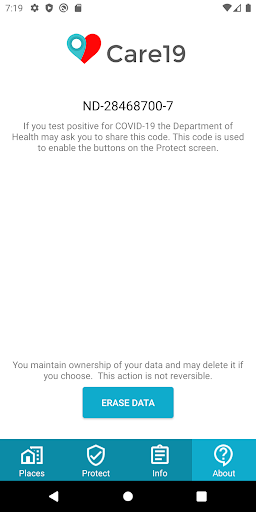 

## Development team
In the following we report the main information provided by the development team in the Google play store.

| | |
|-------------------------|-------------------------|
| **Developer**  | ProudCrowd, LLC |
| **Website**  | [https://www.care19.app](https://www.care19.app) |
| **Email** | tim.brookins@proudcrowd.com |
| **Physical address**  | - |
| **Other developed apps**  | [https://play.google.com/store/apps/developer?id=ProudCrowd,+LLC](https://play.google.com/store/apps/developer?id=ProudCrowd,+LLC) |

## Android support

| | |
|-------------------------|-------------------------|
| **Declared target Android version**  | Android10, version 10 (API level 29) |
| **Effective target Android version**  | Android10, version 10 (API level 29) |
| **Minimum supported Android version**  | Marshmallow, version 6.0 (API level 23) |
| **Maximum target Android version**  | - |

The larger the difference between the minimum and maximum supported Android versions, the better. A larger difference means a wider audience. For example, old phones have a very low Android version, so a high minimum supported Android version means that the app cannot be used by users with old phones, thus leading to accessibility problems. 

## Requested permissions

In the following we report the complete list of the permissions requested by the app. 

| **Permission** | **Protection level** | **Description** | 
|-------------------------|-------------------------|-------------------------|
 **android.permission ACCESS_BACKGROUND_LOCATION** | :warning:**Dangerous** | Allows an app to access location in the background. 
 **android.permission ACCESS_COARSE_LOCATION** | :warning:**Dangerous** | Allows an app to access approximate location. 
 **android.permission ACCESS_FINE_LOCATION** | :warning:**Dangerous** | Allows an app to access precise location. 
 **android.permission ACCESS_NETWORK_STATE** | Normal | Allows applications to access information about networks. 
 **android.permission ACTIVITY_RECOGNITION** | :warning:**Dangerous** | Allows an application to recognize physical activity. 
 **android.permission FOREGROUND_SERVICE** | Normal | Allows a regular application to use Service.startForeground. 
 **android.permission INTERNET** | Normal | Allows applications to open network sockets. 
 **android.permission RECEIVE_BOOT_COMPLETED** | Normal | Allows an application to receive the Intent.ACTION_BOOT_COMPLETED that is broadcast after the system finishes booting. 
 **android.permission WAKE_LOCK** | Normal | Allows using PowerManager WakeLocks to keep processor from sleeping or screen from dimming. 
 **com.google.android.c2dm.permission RECEIVE** | - | - 
 **com.google.android.finsky.permission BIND_GET_INSTALL_REFERRER_SERVICE** | - | - 
 **com.google.android.gms.permission ACTIVITY_RECOGNITION** | - | - 

## Mentioned servers

| **Server** | **Registrant** | **Registrant country** | **Creation date** | 
|-------------------------|-------------------------|-------------------------|-------------------------|
 | bugfender.com | Beenario GmbH | :de: DE | 2014-10-28 11:32:13 |
 | googlesyndication.com | Google LLC | :us: US | 2003-01-21 06:17:24 |
 | google.com | Google LLC | :us: US | 1997-09-15 04:00:00 |
 | app-measurement.com | Google LLC | :us: US | 2015-06-19 20:13:31 |
 | azurewebsites.net | Microsoft Corporation | :us: US | 2012-01-24 18:43:51 |
 | crashlytics.com | Google LLC | :us: US | 2011-01-21 15:30:40 |
 | googleapis.com | Google LLC | :us: US | 2005-01-25 17:52:26 |
 | googleadservices.com | Google LLC | :us: US | 2003-06-19 16:34:53 |

## Security analysis 

Below we report the main security warnings raised by our execution of the [Androwarn](https://github.com/maaaaz/androwarn) security analysis tool.

**Connection interfaces exfiltration**
> - This application reads details about the currently active data network 
> - This application tries to find out if the currently active data network is metered 

**Suspicious connection establishment**
> - This application opens a Socket and connects it to the remote address ' returned no addresses for  ; port is out of range' on the 'N/A' port  
> - This application opens a Socket and connects it to the remote address '' on the 'N/A' port  
> - This application opens a Socket and connects it to the remote address 'Ljava/lang/StringBuilder;->toString()Ljava/lang/String;' on the 'N/A' port  
> - This application opens a Socket and connects it to the remote address 'Ljava/net/Proxy;->type()Ljava/net/Proxy$Type;' on the 'N/A' port  
> - This application opens a Socket and connects it to the remote address 'timeout' on the 'N/A' port  

**Code execution**
> - This application executes a UNIX command containing this argument: 'logcat -c 2' 
> - This application executes a UNIX command containing this argument: 'logcat -c' 

## User ratings and reviews

Below we provide information about how end users are reacting to the app in terms of ratings and reviews in the Google Play store.

### Ratings

The Care19 app has been installed by more than **10000** times. At this time, **83** rated the app and its average score is **2.3614457**. Below we show the distribution of the ratings across the usual star-based rating of Google Play

:star::star::star::star::star:: 22

:star::star::star::star:: 3

:star::star::star:: 4

:star::star:: 8

:star:: 46

### Reviews 

#### 5-star reviews

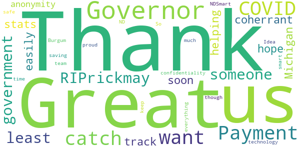

> I think its a great app to have Since cvid19 happend  :date: __2020-05-22 22:01:43__

> Awesome  :date: __2020-05-17 11:47:26__

> Love this app  :date: __2020-05-16 12:11:08__

> A must!!  :date: __2020-05-14 06:24:04__

> Payment  :date: __2020-05-02 21:50:55__

> Great if I don't want to catch COVID #RIPrickmay  :date: __2020-04-26 09:16:49__

> Thank you at least someone in government is coherrant.  :date: __2020-04-24 02:11:08__

> I hope Michigan stats will be here soon.  :date: __2020-04-22 20:52:08__

> 🙄😔😔😔  :date: __2020-04-22 11:07:56__

> Thank you for helping us track so easily with anonymity and confidentiality. #NDSmart Governor Burgum and team are doing everything they can to keep us safe and doing it smart. So proud to be from ND!  :date: __2020-04-22 03:03:34__

#### 4-star reviews

> The early release back in April was rough (didn't log any stops for me). But it's been working well for me since about May 4. It occasionally logs more than one stop at the same location. It occasionally gets the name of the location wrong, but this is very easy to correct.  :date: __2020-05-19 06:25:30__

> It is great, it works, and I am excited for updates!  :date: __2020-04-29 03:31:46__

#### 3-star reviews

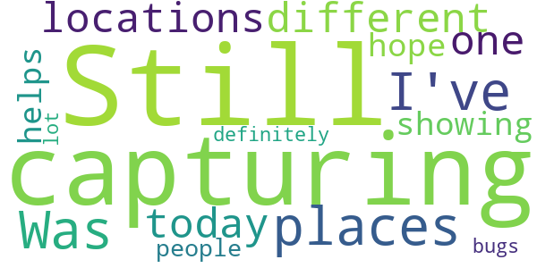

> Simple app. Does what it was designed for but little else. Misses many locations and frequently has location accuracy issues. Routinely misses my home by 6 blocks. Says I have visited locations I have just driven past. Would be nice to have ability to add locations that I visited but app failed to record.  :date: __2020-05-22 15:52:32__

> Still isn't capturing places I've been. Was at 3 different locations today, and not one of them showing up.  :date: __2020-05-20 23:03:13__

> Very inconsistent with location. Can be at a location for hours and doesn't list it.  :date: __2020-05-16 15:20:52__

> It's a great idea, but does not log most of the places I've been. Stopped at 6 places in Bismarck and didn't log one place. And then the next time it will log the same place 4 times within a few minutes or log a place I only drove by.  :date: __2020-05-14 02:20:12__

> I hope this helps people but there are definitely a lot of bugs  :date: __2020-05-04 05:28:59__

#### 2-star reviews

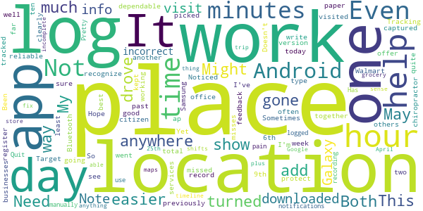

> Hasn't loaded anything in 3 days not impressed.  :date: __2020-05-22 14:57:46__

> This app would make sense if it correctly tracked where you were. It needs an update to better track it also for walking. Poor and elderly won't use this nor will people who refuse so information will be limited. Needs an upgrade to let you know if you've been around someone with Coronavirus. Good idea but needs fixing  :date: __2020-05-21 05:24:02__

> This app does not record all the places I've been. I was in 5 different businesses in one day for more than 15 minutes and it did not record them . This app has a few bugs...I write down mow.  :date: __2020-05-20 22:58:49__

> Inaccurate  :date: __2020-05-19 18:09:09__

> Does not work in NJ  :date: __2020-05-18 02:41:29__

> Doesn't log locations all the time. Even after I have been there for over ten minutes. Not very dependable .  :date: __2020-05-13 18:15:39__

> I'm not sure if it's just the app for Android but most days it doesn't even recognize that I have been anywhere! My Bluetooth is on, what's going on?  :date: __2020-05-13 02:08:21__

> Not the best, has not tracked me since May 9th! My location is turned on also. Noticed previously it missed Tracking me to and from work on May 6th. Might be easier to just write it down on paper .  :date: __2020-05-11 15:36:20__

> So far only kept two logs. Both for work. Both on the same day. It's also picked up places I drove past. Been at work 12 hours today and it didn't register once.  :date: __2020-05-11 00:43:47__

> Need to have a way to add places one has been when it quite often misses the place one had visited all together.  :date: __2020-05-10 02:16:21__

#### 1-star reviews

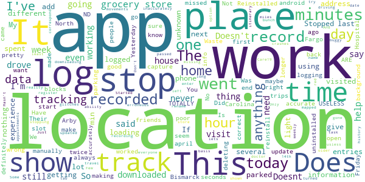

> No privacy  :date: __2020-05-23 00:05:46__

> Too slow  :date: __2020-05-22 22:54:12__

> This app will never get on my phone. Nothing like it will never get on my phone. I NEVER WEAR MASKS. I DO NOT SOCIAL DISTANCE. I WILL NEVER BE "VACCINATED " AND NO NEEDLE WILL EVER TOUCH MY SKIN. I WILL NEVER ALLOW YOU TO TAKE MY CONSTITUTIONAL RIGHTS AWAY YOU CRAZY PSYCHOPATHS. YOU ALL NEED TO GO AWAY. LIKE ACTUALLY... GO.... AWAY....  :date: __2020-05-22 18:32:15__

> Shared my location that I was not sure about. I wanted to help with the virus.  :date: __2020-05-22 05:39:43__

> Stopped logging where I go. Not useful. Uninstalling.  :date: __2020-05-21 19:48:26__

> Great idea Junk Only listed one site over 5 weeks 😔  :date: __2020-05-21 15:24:17__

> It likes to log random locations or wrong locations. It is trying to tell me i was at work when I was no where near there. Pops up wrong locations and thinks there is a speakeasy in my neighborhood and that my house is a campground.  :date: __2020-05-21 05:06:01__

> Violation of constitutional rights  :date: __2020-05-21 03:32:57__

> Someone told me this tracked people with COVID. I do not see the possibility inside the app.. it seems to be only for the infected individuals. Wheres the app to see where the infected individuals are proximity wise to your location?  :date: __2020-05-19 08:26:57__

> Worthless. Says it will only locate places when having used a vehicle. Went 100 miles, been here two hours, it still thinks I'm at home yet. Minus 2 stars  :date: __2020-05-18 19:17:03__

# FEMA
App version ``2.11``

Analyzed with [covid-apps-observer](http://github.com/covid-apps-observer) project, version ``0.1``

## App overview
| | |
|-------------------------|-------------------------| 
| **Name**&nbsp;&nbsp;&nbsp;&nbsp;&nbsp;&nbsp;&nbsp;&nbsp;&nbsp;&nbsp;&nbsp;&nbsp;&nbsp;&nbsp;&nbsp;&nbsp;&nbsp;&nbsp;&nbsp;&nbsp;&nbsp;&nbsp;&nbsp;&nbsp;&nbsp;&nbsp;&nbsp;&nbsp;&nbsp;&nbsp;&nbsp;&nbsp;&nbsp;&nbsp;&nbsp;&nbsp;&nbsp;&nbsp;&nbsp;&nbsp;  | FEMA |
| **Unique identifier** | gov.fema.mobile.android |
| **Link to Google Play** | [https://play.google.com/store/apps/details?id=gov.fema.mobile.android](https://play.google.com/store/apps/details?id=gov.fema.mobile.android) |
| **Summary**  | Weather alerts, safety tips and more to help before, during &amp; after disasters. |
| **Privacy policy** | [http://www.fema.gov/privacy-policy](http://www.fema.gov/privacy-policy) |
| **Latest version** | 2.11 |
| **Last update** | 2019-12-23 20:34:41 |
| **Recent changes** | - Reduce Your Risk section provides low- and no-cost actions you can take before or after a disaster to help reduce the risk of long term damage to your home. |
| **Installs**  | 1,000,000+ |
| **Category** | Weather |
| **First release** | Aug 24, 2011 |
| **Size**  | 3.4M |
| **Supported Android version**  | 4.4 and up |

### Description
> Emergency alerts, safety tips and resources to help before, during & after disasters.
 The FEMA App provides timely alerts and useful information to help you and your loved ones stay safe before, during and after disasters. Receive and share real-time notifications about disasters, severe weather, and other emergencies for up to five locations nationwide. This simple and easy-to-use resource also provides safety information, emergency preparedness tips, and disaster assistance.
 Features 
 •    Receive emergency alerts for up to five locations nationwide 
 •    Share real-time notifications with loved ones via text, email and social media
 •    Know what to do before, during, and after disasters, like earthquakes, wildfires, hurricanes, snowstorms, tornadoes, volcanoes, and more
 •    Prepare for disasters with an emergency kit checklist, emergency family plan, and reminders
 •    Locate open emergency shelters in your area
 •    Locate Disaster Recovery Centers near you where you can talk to a FEMA representative in person
 •    Connect with FEMA to apply for disaster assistance online
 •    Safety tips and disaster information available in English and Spanish (Note: alerts are only available in English)
 •    Follow the FEMA blog to learn about disaster response and recovery across the United States
 Terms of use: www.fema.gov/app.

### User interface
The developers of the app provide the following screenshots in the Google play store.
| | | |
|:-------------------------:|:-------------------------:|:-------------------------:|
 |   |   |   | 
 |   |   |   | 
 |   |   |   | 
 |   |   |   | 
 |   |   |   | 
 |   |   |   | 
 |   |   |   | 
 |  

## Development team
In the following we report the main information provided by the development team in the Google play store.

| | |
|-------------------------|-------------------------|
| **Developer**  | Federal Emergency Management Agency (FEMA) |
| **Website**  | [http://www.fema.gov](http://www.fema.gov) |
| **Email** | FEMA-New-Media@fema.dhs.gov |
| **Physical address**  | - |
| **Other developed apps**  | [https://play.google.com/store/apps/developer?id=Federal+Emergency+Management+Agency+(FEMA)](https://play.google.com/store/apps/developer?id=Federal+Emergency+Management+Agency+(FEMA)) |

## Android support

| | |
|-------------------------|-------------------------|
| **Declared target Android version**  | Pie, version 9 (API level 28) |
| **Effective target Android version**  | Pie, version 9 (API level 28) |
| **Minimum supported Android version**  | KitKat, version 4.4 - 4.4.4 (API level 19) |
| **Maximum target Android version**  | - |

The larger the difference between the minimum and maximum supported Android versions, the better. A larger difference means a wider audience. For example, old phones have a very low Android version, so a high minimum supported Android version means that the app cannot be used by users with old phones, thus leading to accessibility problems. 

## Requested permissions

In the following we report the complete list of the permissions requested by the app. 

| **Permission** | **Protection level** | **Description** | 
|-------------------------|-------------------------|-------------------------|
 **android.permission ACCESS_COARSE_LOCATION** | :warning:**Dangerous** | Allows an app to access approximate location. 
 **android.permission ACCESS_FINE_LOCATION** | :warning:**Dangerous** | Allows an app to access precise location. 
 **android.permission ACCESS_NETWORK_STATE** | Normal | Allows applications to access information about networks. 
 **android.permission INTERNET** | Normal | Allows applications to open network sockets. 
 **android.permission READ_APP_BADGE** | - | - 
 **android.permission RECEIVE_BOOT_COMPLETED** | Normal | Allows an application to receive the Intent.ACTION_BOOT_COMPLETED that is broadcast after the system finishes booting. 
 **android.permission VIBRATE** | Normal | Allows access to the vibrator. 
 **android.permission WAKE_LOCK** | Normal | Allows using PowerManager WakeLocks to keep processor from sleeping or screen from dimming. 
 **android.permission WRITE_EXTERNAL_STORAGE** | :warning:**Dangerous** | Allows an application to write to external storage. 
 **com.anddoes.launcher.permission UPDATE_COUNT** | - | - 
 **com.google.android.c2dm.permission RECEIVE** | - | - 
 **com.google.android.finsky.permission BIND_GET_INSTALL_REFERRER_SERVICE** | - | - 
 **com.htc.launcher.permission READ_SETTINGS** | - | - 
 **com.htc.launcher.permission UPDATE_SHORTCUT** | - | - 
 **com.huawei.android.launcher.permission CHANGE_BADGE** | - | - 
 **com.huawei.android.launcher.permission READ_SETTINGS** | - | - 
 **com.huawei.android.launcher.permission WRITE_SETTINGS** | - | - 
 **com.majeur.launcher.permission UPDATE_BADGE** | - | - 
 **com.oppo.launcher.permission READ_SETTINGS** | - | - 
 **com.oppo.launcher.permission WRITE_SETTINGS** | - | - 
 **com.sec.android.provider.badge.permission READ** | - | - 
 **com.sec.android.provider.badge.permission WRITE** | - | - 
 **com.sonyericsson.home.permission BROADCAST_BADGE** | - | - 
 **com.sonymobile.home.permission PROVIDER_INSERT_BADGE** | - | - 
 **me.everything.badger.permission BADGE_COUNT_READ** | - | - 
 **me.everything.badger.permission BADGE_COUNT_WRITE** | - | - 

## Mentioned servers

| **Server** | **Registrant** | **Registrant country** | **Creation date** | 
|-------------------------|-------------------------|-------------------------|-------------------------|
 | googlesyndication.com | Google LLC | :us: US | 2003-01-21 06:17:24 |
 | google.com | Google LLC | :us: US | 1997-09-15 04:00:00 |
 | google-analytics.com | Google LLC | :us: US | 2005-07-18 19:24:32 |
 | app-measurement.com | Google LLC | :us: US | 2015-06-19 20:13:31 |
 | googletagmanager.com | Google LLC | :us: US | 2011-11-11 23:39:05 |
 | gstatic.com | Google LLC | :us: US | 2008-02-11 15:31:25 |
 | whatsapp.com | Whatsapp Inc. | :us: US | 2008-09-04 12:39:12 |
 | googleapis.com | Google LLC | :us: US | 2005-01-25 17:52:26 |
 | googleadservices.com | Google LLC | :us: US | 2003-06-19 16:34:53 |

## Security analysis 

Below we report the main security warnings raised by our execution of the [Androwarn](https://github.com/maaaaz/androwarn) security analysis tool.

**Connection interfaces exfiltration**
> - This application reads details about the currently active data network 
> - This application tries to find out if the currently active data network is metered 

**Telephony services abuse**
> - This application makes phone calls 

**Pim data leakage**
> - This application accesses the downloads folder 

**Code execution**
> - This application loads a native library: 'sqlc-native-driver' 
> - This application executes a UNIX command containing this argument: 'Ljava/lang/StringBuilder;->toString()Ljava/lang/String;' 

## User ratings and reviews

Below we provide information about how end users are reacting to the app in terms of ratings and reviews in the Google Play store.

### Ratings

The FEMA app has been installed by more than **1000000** times. At this time, **3130** rated the app and its average score is **4.152027**. Below we show the distribution of the ratings across the usual star-based rating of Google Play

:star::star::star::star::star:: 2093

:star::star::star::star:: 327

:star::star::star:: 200

:star::star:: 105

:star:: 401

### Reviews 

#### 5-star reviews

> Awesome Info  :date: __2020-05-21 20:01:11__

> Helpful  :date: __2020-05-21 10:49:13__

> Helpful and useful  :date: __2020-05-20 23:26:40__

> Works but why no alert sound???  :date: __2020-05-17 18:23:59__

> I can call 911 if needed I hear about all emergency weather wise and other like child abduction as well  :date: __2020-05-16 15:42:24__

> Options to customize notifications by type and locations. Useful information and links, a good app.  :date: __2020-05-13 02:06:20__

> Be alert is the best way to live I likeWeather alerts, safety tips and more to help before, during & after disasters. Emergency alerts, safety tips and resources to help before, during & after disasters. The FEMA App provides timely alerts and useful information to help you and your loved ones stay safe before, during and after disasters. Receive and share real-time notifications about disasters, severe weather, and other emergencies for up to five locations nationwide. This simple and easy-to  :date: __2020-05-13 00:33:40__

> Easy to navigate, and set up choices-- there are a lot-- living in the middle of Pacific, like to know asap if something hazardous is on the way to us, here in HI.  :date: __2020-05-13 00:02:16__

> Works great for weather emergency but I don't like Amber alerts. Most of the time these are divorcing parents fighting over the children or an over reach of local and feds into family matters. I have seen the damages to family relationships caused by such over reach. Parents who's only sin is they were poor. Instead of helping the parents, they are demonized and the children removed. I want no part of the destruction of the family unit. Think heal the family!  :date: __2020-05-10 14:04:03__

> This is a great app. Warns you about amber alerts in your area and any kind of danger.  :date: __2020-05-04 02:43:08__

#### 4-star reviews

> Only worth downloading if you're in a disaster situation. Otherwise it's not very useful.  :date: __2020-05-23 06:10:43__

> 🌟  :date: __2020-05-22 23:05:11__

> Extremely well covers high pop centers. However, little to no coverage in rural areas. We live in Benton County, MO...no coverage ANYWHERE here.  :date: __2020-05-22 15:48:47__

> Excelente  :date: __2020-05-22 01:23:54__

> Always on top of it  :date: __2020-05-21 12:13:30__

> Weather warnings are necessary, including worse.  :date: __2020-05-17 22:09:22__

> It's been very helpful  :date: __2020-05-13 12:07:49__

> The weather alert tab is missing Indland Hurricane Warning, Inland Hurricane Watch, Inland Tropical Storm Warning, Inland Tropical Storm Watch, Hurricane Force Wind Warning, and Snow Squall Warning.  :date: __2020-04-28 21:42:47__

> pretty good app...it lets you pick locations you want to monitor and it lets you customize the weather settings so youre not pestered to death about things you dont need to know about...i need to figure out if l can fine tune it however...l'm still getting silly things in the middle of the night like it will be "windy" today or "foggy"...thats all well and good...just not at 0300.  :date: __2020-04-26 17:06:27__

> Searching for a cure before the worsening  :date: __2020-04-14 20:29:37__

#### 3-star reviews

> Should be updated & expanded upon more but for what it is, I like it and will be keeping it.  :date: __2020-05-08 07:51:52__

> I am a Harvey Hurrican victom me an my brother. When the hurrican was over i rent a place. My brother is with liver problems high blood pressure and hepitest. I am a copd lung condition also health problems. I am on home oxegen and four times a day with breathing treatments. Also my brother has a lung problem also woth Copd. We need Fema to help eith a house on Dickinson Texas , 77539. The place we rent has md and the land lord is a ok person but a slumlord. Fema to help us better living home  :date: __2020-04-20 08:40:27__

> The app did work great. I got a Samsung A10 and for some reason the notifications stopped working properly. The weather notifications are intermittent and my reminders for emergency kit, smoke detectors, etc. don't come through at all anymore. Suggestions? I'd like to give higher marks.  :date: __2020-04-09 04:12:19__

> FLASH FLOODING IN PHOENIX FLASH FLOODING IN PHOENIX FLASH FLOODING IN PHOENIX FLASH FLOODING IN PHOENIX FLASH FLOODING IN PHOENIX. I GET IT. I DON'T NEED A NEW NOTIFICATION EVERY 30 SECONDS.  :date: __2020-03-12 22:35:27__

> Easy to read  :date: __2020-03-03 01:12:31__

> The good: Timely alerts, often well ahead of other apps. Seems lightweight and works ok on throttled cellular. The bad: Alerts seem to be only accessible from the notification? Devs please advise/patch.  :date: __2019-12-02 12:53:29__

> No notification on  :date: __2019-11-08 13:38:22__

> disappointed would be helpful if you listed citizen corps. And ways to expand and improve readiness. Most e.m.a. offices have no knowledge of getting volunteers for natural disasters in Illinois, and I have a feeling they don't care  :date: __2019-09-02 21:56:27__

> I would give it a zero, but that's not an option. I just found out about this app, and being in the path of hurricane Dorian, thought it would be a good app to have. However, it doesn't search/recognize my location when i try to enter it for alerts, making it pretty useless to me. Edited to add: after the 5th install, i was finally able to add a location, so i bumped up the stars.  :date: __2019-09-01 03:46:38__

> This app needs to be updated immediately. I live in Miami but when I click on 'shelter' the only option is 'Kansas' and there is no way to change it.  :date: __2019-08-31 14:16:33__

#### 2-star reviews

> It really does do absolutely nothing. Not even sure why i have it  :date: __2020-04-28 15:16:55__

> Alerts are way too excessive.. It's a little windy in my area and I get notifications what feel like every 5 minutes. Had to delete the app because it was so annoying.  :date: __2020-04-10 21:47:54__

> It's a weather alert app. I'm getting constant weather alerts during a pandemic lockdown  :date: __2020-03-29 17:05:00__

> When I click on "Alerts," I get a message saying that I have to enable them in the app settings. But when I get into the settings, I can't find anything that does that.  :date: __2020-03-21 20:10:32__

> Ever since the update I haven't been getting the Red Flag warnings for Alameda County during the week the fire danger was so high that PG&E was shutting off power. The previous version worked better.  :date: __2019-10-13 08:02:03__

> App does not give alerts. At one time it worked.  :date: __2019-06-18 03:25:56__

> The app seems to be very inconsistent. Sometimes i get alerts, sometimes I don't. I've uninstalled and reinstalled a few times but it hasn't helped. Very disappointing.  :date: __2019-03-03 23:10:36__

> Not getting ANY alert notifications. App only shows alerts when opened. Pretty useless now.  :date: __2018-11-14 16:16:56__

> Why new permission without reason? Added finsky bind referer without statement of why or what for  :date: __2018-10-09 16:45:58__

> It was doing okay until Trump got a hold of it I'll just stick to the weather apps  :date: __2018-10-06 06:52:37__

#### 1-star reviews

> stinks not informable  :date: __2020-04-16 18:51:22__

> App does not work. Will not accept any locations.  :date: __2020-04-14 02:01:12__

> Not helpful at all with covid-19  :date: __2020-04-03 16:57:24__

> Just download this app for coronavirus updates. Looking for something that will show me where the highest concentrations of COVID 19 is in my county. I'm not going anywhere, just curious. I'm in a more rural part of Oakland Co. The last article 'update' was Tuesday, March 24, 2020. Today is Friday, March 27, 2020. Goodbye!  :date: __2020-03-27 19:45:46__

> יציז  :date: __2020-03-26 15:38:06__

> FEMA is supposed to be the lead agency in responding to a national disaster. Under Donald Trump's direction, FEMA was defunded to pay for his wall. The appropriate leadership resigned or were fired, and the money went towards paying for his wall. Now this useless app is nothing but Trump appointees patting Trump on the back and calling him a good boy when they should be directing resources to help Americans. It makes me sick and disgusted at Trump and his lackeys in the GOP.  :date: __2020-03-19 15:49:42__

> Push notifications work but information doesn't show in app.  :date: __2020-03-19 08:55:16__

> Doesn't f\*\*\*\*\*\* warn me about s\*\**  :date: __2020-03-15 14:53:08__

> I can not rate my experience as it is ongoing until time ends I can not rate anything regarding this app I do not have the technical knowledge nor the equipment to program frequencies to effect any good out come to a very com text tool in a a very complex world so I am waiting for one to arrive who is worthy to accomplish these goals I am not the one today who will the one that I shall be tomorrow.  :date: __2020-03-14 06:23:03__

> How to find a you whats your address  :date: __2020-02-21 10:17:54__

# CDC
App version ``2.7.1``

Analyzed with [covid-apps-observer](http://github.com/covid-apps-observer) project, version ``0.1``

## App overview
| | |
|-------------------------|-------------------------| 
| **Name**&nbsp;&nbsp;&nbsp;&nbsp;&nbsp;&nbsp;&nbsp;&nbsp;&nbsp;&nbsp;&nbsp;&nbsp;&nbsp;&nbsp;&nbsp;&nbsp;&nbsp;&nbsp;&nbsp;&nbsp;&nbsp;&nbsp;&nbsp;&nbsp;&nbsp;&nbsp;&nbsp;&nbsp;&nbsp;&nbsp;&nbsp;&nbsp;&nbsp;&nbsp;&nbsp;&nbsp;&nbsp;&nbsp;&nbsp;&nbsp;  | CDC |
| **Unique identifier** | gov.cdc.general |
| **Link to Google Play** | [https://play.google.com/store/apps/details?id=gov.cdc.general](https://play.google.com/store/apps/details?id=gov.cdc.general) |
| **Summary**  | Health Information at Your Fingertips—CDC 24/7 |
| **Privacy policy** | [http://t.cdc.gov/1MVV](http://t.cdc.gov/1MVV) |
| **Latest version** | 2.7.1 |
| **Last update** | 2020-04-24 15:57:52 |
| **Recent changes** | Optimizes article loading |
| **Installs**  | 100,000+ |
| **Category** | Health & Fitness |
| **First release** | Oct 16, 2012 |
| **Size**  | 23M |
| **Supported Android version**  | 4.4 and up |

### Description
> NOW AVAILABLE ON YOUR SMARTPHONE OR TABLET
 Get the official CDC Mobile application for your tablet and/or smartphone and access the most up to date health information.
 FILTERING OPTIONS
 Organize your home page so that the information that’s most important to you appears first! Turn off the content you don’t want with just a flip of a switch and reset it all with the tap of a button.
 CONTENT
 The app ensures that you’re getting the most up to date health information. The home screen lets you see all your information in one place and updates whenever your device is connected to WI-FI. Enjoy a greater variety of content such as stories, videos, podcasts, and features to give you the most current health information from CDC. 
 Browse Featured Articles, stay on top of health news in the Newsroom section, and view CDC Images of the Week. If you’re a journal reader, view the latest Morbidity & Mortality Weekly Report, Emerging and Infectious Disease journal, or the latest on Preventing Chronic Diseases. You can even search CDC’s web content from the app.  
 We'd love to hear your thoughts about the app! Rate the CDC Mobile App in the App Store or leave a comment to let us know how we're doing. You can even send us an email through the app if you have suggestions for improvements!
 DISCLAIMER
 THE MATERIALS EMBODIED IN THIS SOFTWARE ARE PROVIDED TO YOU "AS-IS" AND WITHOUT WARRANTY OF ANY KIND, EXPRESSED, IMPLIED OR OTHERWISE, INCLUDING WITHOUT LIMITATION, ANY WARRANTY OF FITNESS FOR A PARTICULAR PURPOSE. IN NO EVENT SHALL THE CENTERS FOR DISEASE CONTROL AND PREVENTION (CDC) OR THE UNITED STATES (U.S.) GOVERNMENT BE LIABLE TO YOU OR ANYONE ELSE FOR ANY DIRECT, SPECIAL, INCIDENTAL, INDIRECT OR CONSEQUENTIAL DAMAGES OF ANY KIND, OR ANY DAMAGES WHATSOEVER, INCLUDING WITHOUT LIMITATION, LOSS OF PROFIT, LOSS OF USE, SAVINGS OR REVENUE, OR THE CLAIMS OF THIRD PARTIES, WHETHER OR NOT CDC OR THE U.S. GOVERNMENT HAS BEEN ADVISED OF THE POSSIBILITY OF SUCH LOSS, HOWEVER CAUSED AND ON ANY THEORY OF LIABILITY, ARISING OUT OF OR IN CONNECTION WITH THE POSSESSION, USE OR PERFORMANCE OF THIS SOFTWARE.

### User interface
The developers of the app provide the following screenshots in the Google play store.
| | | |
|:-------------------------:|:-------------------------:|:-------------------------:|
 |   |   |   | 
 |   |   |   | 
 |   |   |   | 
 |   |   |   | 
 |   |   |   | 

## Development team
In the following we report the main information provided by the development team in the Google play store.

| | |
|-------------------------|-------------------------|
| **Developer**  | Centers for Disease Control and Prevention |
| **Website**  | [http://www.cdc.gov](http://www.cdc.gov) |
| **Email** | CDCMobileDevelopment@cdc.gov |
| **Physical address**  | - |
| **Other developed apps**  | [https://play.google.com/store/apps/developer?id=Centers+for+Disease+Control+and+Prevention](https://play.google.com/store/apps/developer?id=Centers+for+Disease+Control+and+Prevention) |

## Android support

| | |
|-------------------------|-------------------------|
| **Declared target Android version**  | Pie, version 9 (API level 28) |
| **Effective target Android version**  | Pie, version 9 (API level 28) |
| **Minimum supported Android version**  | KitKat, version 4.4 - 4.4.4 (API level 19) |
| **Maximum target Android version**  | - |

The larger the difference between the minimum and maximum supported Android versions, the better. A larger difference means a wider audience. For example, old phones have a very low Android version, so a high minimum supported Android version means that the app cannot be used by users with old phones, thus leading to accessibility problems. 

## Requested permissions

In the following we report the complete list of the permissions requested by the app. 

| **Permission** | **Protection level** | **Description** | 
|-------------------------|-------------------------|-------------------------|
 **android.permission ACCESS_NETWORK_STATE** | Normal | Allows applications to access information about networks. 
 **android.permission INTERNET** | Normal | Allows applications to open network sockets. 
 **android.permission READ_APP_BADGE** | - | - 
 **android.permission RECEIVE_BOOT_COMPLETED** | Normal | Allows an application to receive the Intent.ACTION_BOOT_COMPLETED that is broadcast after the system finishes booting. 
 **android.permission VIBRATE** | Normal | Allows access to the vibrator. 
 **android.permission WAKE_LOCK** | Normal | Allows using PowerManager WakeLocks to keep processor from sleeping or screen from dimming. 
 **android.permission WRITE_EXTERNAL_STORAGE** | :warning:**Dangerous** | Allows an application to write to external storage. 
 **com.amazon.device.messaging.permission RECEIVE** | - | - 
 **com.anddoes.launcher.permission UPDATE_COUNT** | - | - 
 **com.google.android.c2dm.permission RECEIVE** | - | - 
 **com.google.android.finsky.permission BIND_GET_INSTALL_REFERRER_SERVICE** | - | - 
 **com.htc.launcher.permission READ_SETTINGS** | - | - 
 **com.htc.launcher.permission UPDATE_SHORTCUT** | - | - 
 **com.huawei.android.launcher.permission CHANGE_BADGE** | - | - 
 **com.huawei.android.launcher.permission READ_SETTINGS** | - | - 
 **com.huawei.android.launcher.permission WRITE_SETTINGS** | - | - 
 **com.majeur.launcher.permission UPDATE_BADGE** | - | - 
 **com.oppo.launcher.permission READ_SETTINGS** | - | - 
 **com.oppo.launcher.permission WRITE_SETTINGS** | - | - 
 **com.sec.android.provider.badge.permission READ** | - | - 
 **com.sec.android.provider.badge.permission WRITE** | - | - 
 **com.sonyericsson.home.permission BROADCAST_BADGE** | - | - 
 **com.sonymobile.home.permission PROVIDER_INSERT_BADGE** | - | - 
 **gov.cdc.general.permission RECEIVE_ADM_MESSAGE** | - | - 
 **me.everything.badger.permission BADGE_COUNT_READ** | - | - 
 **me.everything.badger.permission BADGE_COUNT_WRITE** | - | - 

## Mentioned servers

| **Server** | **Registrant** | **Registrant country** | **Creation date** | 
|-------------------------|-------------------------|-------------------------|-------------------------|
 | googlesyndication.com | Google LLC | :us: US | 2003-01-21 06:17:24 |
 | google.com | Google LLC | :us: US | 1997-09-15 04:00:00 |
 | app-measurement.com | Google LLC | :us: US | 2015-06-19 20:13:31 |
 | hockeyapp.net | Microsoft Corporation | :us: US | 2011-01-23 18:46:43 |
 | pushwoosh.com | Arello Mobile | :new_zealand: NZ | 2011-05-02 11:00:31 |
 | gstatic.com | Google LLC | :us: US | 2008-02-11 15:31:25 |
 | omniture.com | Adobe Inc. | :us: US | 2002-03-29 21:33:52 |
 | googleapis.com | Google LLC | :us: US | 2005-01-25 17:52:26 |
 | googleadservices.com | Google LLC | :us: US | 2003-06-19 16:34:53 |

## Security analysis 

Below we report the main security warnings raised by our execution of the [Androwarn](https://github.com/maaaaz/androwarn) security analysis tool.

**Telephony identifiers leakage**
> - This application reads the ISO country code equivalent for the SIM provider's country code 
> - This application reads the MCC+MNC of the provider of the SIM 
> - This application reads the Service Provider Name (SPN) 
> - This application reads the device phone type value 
> - This application reads the numeric name (MCC+MNC) of current registered operator 
> - This application reads the operator name 
> - This application reads the radio technology (network type) currently in use on the device for data transmission 
> - This application reads the unique device ID, i.e the IMEI for GSM and the MEID or ESN for CDMA phones 

**Connection interfaces exfiltration**
> - This application reads details about the currently active data network 
> - This application tries to find out if the currently active data network is metered 

**Telephony services abuse**
> - This application makes phone calls 

**Code execution**
> - This application executes a UNIX command containing this argument: '3' 

## User ratings and reviews

Below we provide information about how end users are reacting to the app in terms of ratings and reviews in the Google Play store.

### Ratings

The CDC app has been installed by more than **100000** times. At this time, **1180** rated the app and its average score is **3.7391305**. Below we show the distribution of the ratings across the usual star-based rating of Google Play

:star::star::star::star::star:: 677

:star::star::star::star:: 82

:star::star::star:: 112

:star::star:: 51

:star:: 256

### Reviews 

#### 5-star reviews

> Awsome  :date: __2020-05-22 21:10:05__

> Great app for all humanity.  :date: __2020-05-20 19:40:13__

> Perfect .thanks to warming when sickness comes alone  :date: __2020-05-20 18:11:24__

> Keeps me up to date  :date: __2020-05-20 11:21:54__

> Keeps updated and convenient for all. Recommend it  :date: __2020-05-18 16:39:02__

> Coronavirus (COVID-19) every day updates  :date: __2020-05-17 16:54:18__

> Good  :date: __2020-05-15 14:40:09__

> OBVIOUSLY this is DEFINITELY AN AMAZING APP AVAILABLE ON MOBILE DEVICES ESPECIALLY DURING THIS WORLD SPREAD EXTREMELY DEADLY PANDEMIC THAT NOT ONLY JUST HERE IN AMERICA, BUT ALL OVER THE ENTIRE WORLD THE DEATH TOLLS HAVE ALREADY FAR SURPASSED THE HUNDREDS OF THOUSANDS ALREADY CONFIRMED DEATHS AND EVEN WORSE, IT IS NOT GOING TO DO ANYTHING OTHER THAN WORSEN WORLDWIDE , HIGHEST IN AMERICA ONLY CAN IMPROVE BY CONTINUING 2 SELF QUARANTINE  :date: __2020-05-12 11:32:13__

> Awesome 👍👍👍  :date: __2020-05-07 05:35:52__

> government for me mean everything that means CDC is a nice company yeah they're working really nice the highest voice control sync, external complete is you want to get in touch with something like business you could you should use this you get more information about how it works for me work nice you should try to  :date: __2020-05-07 01:38:57__

#### 4-star reviews

> It's OK. Notjing to brag about. Haven't used it that much really.  :date: __2020-05-15 06:06:05__

> Very little data a available.  :date: __2020-05-08 15:45:49__

> Not sure its functions or How it works  :date: __2020-04-25 10:08:09__

> I love the CDC but I wish it wouldn't be a app that puts you on the internet  :date: __2020-04-23 02:17:52__

> Let's go walking Yes ok?  :date: __2020-04-21 19:21:07__

> Wished it was more user-friendly  :date: __2020-04-17 23:47:35__

> Great app !!!!!!!!!!!!!  :date: __2020-04-15 15:38:41__

> Ok app.  :date: __2020-04-15 14:59:38__

> It's always good to keep up on what's going on with all these infectious diseases nowadays. Man needs to stop playing God before he creates something that will kill us all off.  :date: __2020-04-15 04:39:06__

> Fine. Does what it's supposed to do. Keep me informed on the latest situations.  :date: __2020-04-14 04:22:52__

#### 3-star reviews

> Disappointing. Not as useful as I expected. Doesn't show up to date info. Just info we've already seen 1000 times. Expected more from the CDC whom I've always respected.  :date: __2020-05-23 06:09:07__

> App does not work on android phones.  :date: __2020-05-15 00:22:26__

> Useful to keep up, especially with the Sars-CoV-2 outbreak, but really annoying design. Harder to help less technically inclined use it.  :date: __2020-05-08 04:29:03__

> Nice  :date: __2020-05-03 06:10:21__

> great  :date: __2020-04-27 21:31:31__

> could offer more direct contact links  :date: __2020-04-25 21:10:30__

> Quite informative  :date: __2020-04-24 06:55:32__

> Need rolling updates to keep the information fresh.  :date: __2020-04-21 17:00:11__

> Ever since the COVID-19 Coronavirus struck the U.S., I want to be more informed and so I installed the CDC app so I can be so. Unfortunately for me however, everytime I tap on notifications fron this app, this app fails to display the news article it notified me about within the app once it starts it.  :date: __2020-04-10 23:42:01__

> I think it is a great idea and it's definitely one that should be improved upon. The app falls short in information and in many ways it's easier to navigate the CDC website. Local alerts and information would greatly increase the useful aspects of the app.  :date: __2020-04-02 01:32:17__

#### 2-star reviews

> I give only two stars only because I've only learned of the "CDC" Due to the Covid-19. Im very secluded other then facebook so i regret i can not rate CDC with a higher rating.  :date: __2020-05-07 08:06:04__

> Poor app mise well use website as this is a glorious bookmark hidden as an app in my opinion  :date: __2020-04-30 07:18:34__

> Ok  :date: __2020-04-28 15:22:50__

> This damn app doesn't exit  :date: __2020-04-23 08:54:01__

> Use the website it is far superior, this app has a blatant lack of organization, however does contain useful information.  :date: __2020-04-19 03:08:59__

> THE APP IS NOT OPENING UP TO THE PAGES THAT ARE LINKED WITH THE SPECIFIC INFORMATION . ITS A BLANK WHITE PAGE MY ISP INTERNET CONNECTION IS WORKING FINE. ITS YOUR APP NOT WORKING FRIDAY IT WORKED SEVERAL DAYS AGO, BUT NOW ITS USELESS  :date: __2020-04-14 22:23:39__

> Good information, But sends several push messages every day and there is no obvious way to turn them off. Makes it a virus in my book. Uninstalled  :date: __2020-04-13 22:01:35__

> 🚮  :date: __2020-04-06 00:58:13__

> Great content, but app bogs my phone down.  :date: __2020-04-04 06:13:31__

> Has great potential. However, during a pandemic you would think devs would update the content occasionally. Covid19 facts and stats worldwide are changing by the moment. This app hasn't updated since I downloaded it early last week making this app pointless and not relevant. It's very scary this is the best the CDC can do with an app for the public.  :date: __2020-04-02 13:50:08__

#### 1-star reviews

> Someone on a government level has used this app illegally to track my being I did not give permission to download this app and it will not allow me to uninstall the covid-19 app  :date: __2020-05-23 05:23:02__

> Useless. Can't find covid19 numbers. Or CDC publications on re-opening.  :date: __2020-05-21 06:38:53__

> Just a poor app (Mickey mouse programmers)  :date: __2020-05-19 10:58:58__

> What's the point? It's easier to navigate CDC.gov.  :date: __2020-05-15 11:20:46__

> Data is not up to date!  :date: __2020-05-15 03:02:09__

> PLEASE NEEDS MORE UP DATE .. ALL THE UP DATE IS OVER DUE .. IAM READING UP DATES BACK 3 OR 4 MONTHS AGO 🤔🤔  :date: __2020-05-12 17:11:45__

> COVID-19: *laughs in coronavirus*  :date: __2020-05-09 18:02:54__

> Stop the noteafacations  :date: __2020-05-08 22:47:05__

> Sucks ... need update .. uninstalled..  :date: __2020-05-08 01:58:58__

> The CDC is nothing but uneducated garbage!! You need to employ someone who actually has some common sense to not speak before they have the facts. Great job creating mass hysteria!!!! Well done coming with recommended activities and wearing of masks after the fact.  :date: __2020-05-05 06:19:56__

# CRUSH COVID RI
App version ``1.0``

Analyzed with [covid-apps-observer](http://github.com/covid-apps-observer) project, version ``0.1``

## App overview
| | |
|-------------------------|-------------------------| 
| **Name**&nbsp;&nbsp;&nbsp;&nbsp;&nbsp;&nbsp;&nbsp;&nbsp;&nbsp;&nbsp;&nbsp;&nbsp;&nbsp;&nbsp;&nbsp;&nbsp;&nbsp;&nbsp;&nbsp;&nbsp;&nbsp;&nbsp;&nbsp;&nbsp;&nbsp;&nbsp;&nbsp;&nbsp;&nbsp;&nbsp;&nbsp;&nbsp;&nbsp;&nbsp;&nbsp;&nbsp;&nbsp;&nbsp;&nbsp;&nbsp;  | CRUSH COVID RI |
| **Unique identifier** | com.ri.crushcovid |
| **Link to Google Play** | [https://play.google.com/store/apps/details?id=com.ri.crushcovid](https://play.google.com/store/apps/details?id=com.ri.crushcovid) |
| **Summary**  | CRUSH COVID RI is the COVID-19 response app for Rhode Island. #CrushCovidRI |
| **Privacy policy** | [https://health.ri.gov/covid/crush/privacypolicy/](https://health.ri.gov/covid/crush/privacypolicy/) |
| **Latest version** | 1.0 |
| **Last update** | 2020-05-15 22:05:09 |
| **Recent changes** | - |
| **Installs**  | 5,000+ |
| **Category** | Health & Fitness |
| **First release** | May 15, 2020 |
| **Size**  | 14M |
| **Supported Android version**  | 8.0 and up |

### Description
> CRUSH COVID RI is a COVID-19 pandemic response app which provides Rhode Islanders easy access to all of the resources required during the public health crisis, including a location diary that helps users identify the people and places they are in contact with and a symptom checking survey.
 Thank you for using the CRUSH COVID RI app and taking an active role in slowing the spread of COVID-19 in Rhode Island. You can make a difference in the health of your loved ones and your community by helping us track the virus in our state. The “My Location Diary” feature uses GPS location data that is already available from your phone to help you easily track the places and people you visited over the past 20 days. If you test positive for COVID-19, and you agree to share this information with the Rhode Island Department of Health, they can quickly identify people you were in contact with and reduce the spread of COVID-19.  
 CRUSH COVID RI also connects you to the latest COVID-19 news and resources – and helps you quickly check for symptoms and identify testing locations near you. Together we will #CrushCovidRI! 
 Please see our Terms of Use (https://health.ri.gov/covid/crush/termsofuse/) & Privacy Policy (https://health.ri.gov/covid/crush/privacypolicy/) for further information.

### User interface
The developers of the app provide the following screenshots in the Google play store.
| | | |
|:-------------------------:|:-------------------------:|:-------------------------:|
 |   |   |   | 
 |   | 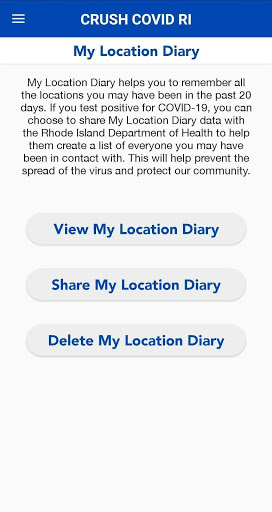  | 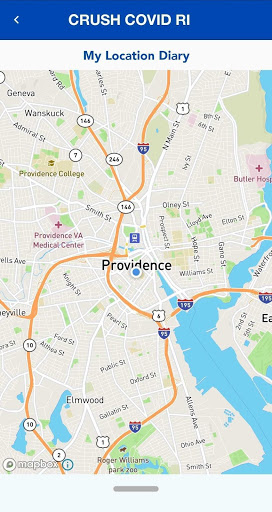  | 
 | 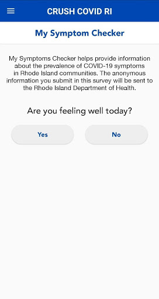  | 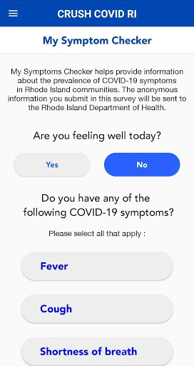 

## Development team
In the following we report the main information provided by the development team in the Google play store.

| | |
|-------------------------|-------------------------|
| **Developer**  | State of Rhode Island |
| **Website**  | [https://health.ri.gov/crushcovid](https://health.ri.gov/crushcovid) |
| **Email** | RIDOH.Covid19Questions@health.ri.gov |
| **Physical address**  | - |
| **Other developed apps**  | [https://play.google.com/store/apps/developer?id=State+of+Rhode+Island](https://play.google.com/store/apps/developer?id=State+of+Rhode+Island) |

## Android support

| | |
|-------------------------|-------------------------|
| **Declared target Android version**  | Android10, version 10 (API level 29) |
| **Effective target Android version**  | Android10, version 10 (API level 29) |
| **Minimum supported Android version**  | Oreo, version 8.0.0 (API level 26) |
| **Maximum target Android version**  | - |

The larger the difference between the minimum and maximum supported Android versions, the better. A larger difference means a wider audience. For example, old phones have a very low Android version, so a high minimum supported Android version means that the app cannot be used by users with old phones, thus leading to accessibility problems. 

## Requested permissions

In the following we report the complete list of the permissions requested by the app. 

| **Permission** | **Protection level** | **Description** | 
|-------------------------|-------------------------|-------------------------|
 **android.permission ACCESS_FINE_LOCATION** | :warning:**Dangerous** | Allows an app to access precise location. 
 **android.permission ACCESS_NETWORK_STATE** | Normal | Allows applications to access information about networks. 
 **android.permission ACCESS_WIFI_STATE** | Normal | Allows applications to access information about Wi-Fi networks. 
 **android.permission CALL_PHONE** | :warning:**Dangerous** | Allows an application to initiate a phone call without going through the Dialer user interface for the user to confirm the call. 
 **android.permission FOREGROUND_SERVICE** | Normal | Allows a regular application to use Service.startForeground. 
 **android.permission INTERNET** | Normal | Allows applications to open network sockets. 
 **android.permission WAKE_LOCK** | Normal | Allows using PowerManager WakeLocks to keep processor from sleeping or screen from dimming. 
 **com.google.android.c2dm.permission RECEIVE** | - | - 

## Mentioned servers

| **Server** | **Registrant** | **Registrant country** | **Creation date** | 
|-------------------------|-------------------------|-------------------------|-------------------------|
 | android.com | Google LLC | :us: US | 1997-06-23 04:00:00 |
 | google.com | Google LLC | :us: US | 1997-09-15 04:00:00 |
 | mapbox.com | Whois Privacy Service | :us: US | 2003-11-27 11:15:57 |
 | googleapis.com | Google LLC | :us: US | 2005-01-25 17:52:26 |

## Security analysis 

Below we report the main security warnings raised by our execution of the [Androwarn](https://github.com/maaaaz/androwarn) security analysis tool.

**Telephony identifiers leakage**
> - This application reads the numeric name (MCC+MNC) of current registered operator 
> - This application reads the operator name 
> - This application reads the radio technology (network type) currently in use on the device for data transmission 

**Connection interfaces exfiltration**
> - This application reads details about the currently active data network 
> - This application tries to find out if the currently active data network is metered 

**Telephony services abuse**
> - This application makes phone calls 

**Suspicious connection establishment**
> - This application opens a Socket and connects it to the remote address ' returned no addresses for  ; port is out of range' on the 'N/A' port  
> - This application opens a Socket and connects it to the remote address '' on the 'N/A' port  
> - This application opens a Socket and connects it to the remote address 'Ljava/lang/StringBuilder;->toString()Ljava/lang/String;' on the 'N/A' port  
> - This application opens a Socket and connects it to the remote address 'Ljava/net/Proxy;->type()Ljava/net/Proxy$Type;' on the 'N/A' port  
> - This application opens a Socket and connects it to the remote address 'timeout' on the 'N/A' port  

**Code execution**
> - This application loads a native library 

## User ratings and reviews

Below we provide information about how end users are reacting to the app in terms of ratings and reviews in the Google Play store.

### Ratings

The CRUSH COVID RI app has been installed by more than **5000** times. At this time, **55** rated the app and its average score is **3.3090909**. Below we show the distribution of the ratings across the usual star-based rating of Google Play

:star::star::star::star::star:: 23

:star::star::star::star:: 6

:star::star::star:: 6

:star::star:: 5

:star:: 15

### Reviews 

#### 5-star reviews

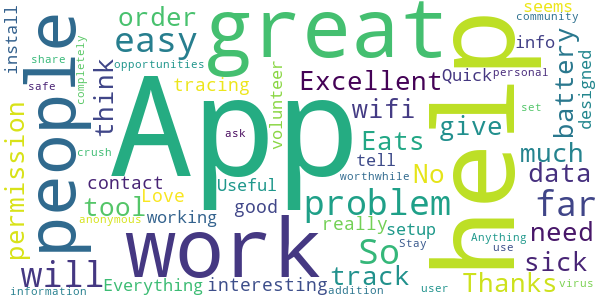

> App works great. No problem with wifi nor data. People having problem need to give permission to the app in order to work.  :date: __2020-05-20 04:28:11__

> I think this will be interesting  :date: __2020-05-20 03:32:36__

> So far so good 👍👍👍😊😊😊😁  :date: __2020-05-20 02:35:32__

> Will really help with contact tracing! Love this! Everything on the app seems to be working great.  :date: __2020-05-19 21:42:11__

> So far so good the first day. Cases by Geography needs the legend to scale with the map. Hard to click on anything south of Cranston. :/  :date: __2020-05-19 20:31:18__

> Quick and easy install and setup. App works as designed as far as I can tell. Useful info on volunteer opportunities is a great addition.  :date: __2020-05-19 19:43:22__

> Easy to set up. Stay safe!  :date: __2020-05-19 19:35:42__

> Anything that helps the community "crush" this virus is worthwhile to use  :date: __2020-05-19 19:22:56__

> App is completely anonymous and does not ask the user to share any personal information.  :date: __2020-05-18 18:28:56__

#### 4-star reviews

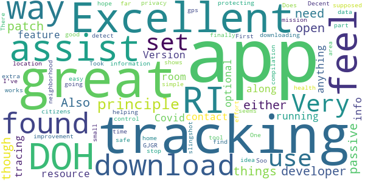

> Does what its supposed to however I can only set it to detect location when app is in use. There's no way that I've found to set it all the time.  :date: __2020-05-22 04:56:47__

> So far, so good. One stop area for compilation of data and information.  :date: __2020-05-22 03:37:50__

> Decent app. The gps seems to slingshot. Of it shows me going out in my neighborhood when i was home.  :date: __2020-05-22 00:15:21__

> Great idea RI DOH  :date: __2020-05-19 21:24:30__

> Doesn't recognize as data on or connected to wifi.  :date: __2020-05-19 20:59:09__

> First to download hope it works  :date: __2020-05-19 19:10:52__

#### 3-star reviews

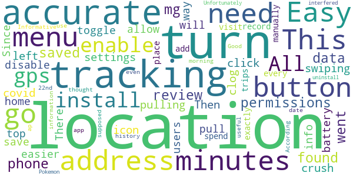

> Easy install. All you need is to enable gps permissions. Location data is saved on the phone and you can review the locations you went to. I found you can turn off the tracking mg in the settings by pulling down the menu, swiping left on the crush covid icon, and click the clog. Then toggle the button to disable. There needs to be a way to turn on and off easier from the top pull down menu. This will allow users to turn off when at home to save battery.  :date: __2020-05-23 02:17:51__

> Location info not 100% accurate. Since I don't spend 20 minutes at every place I visit, you should add a location manually button.  :date: __2020-05-23 00:18:42__

> Not exactly accurate. It didn't record my trips on the morning of 5/22nd. I thought this was supposed to be up to date tracking  :date: __2020-05-22 19:15:46__

> Good information, however, the location is not very accurate.  :date: __2020-05-22 16:08:09__

> According to the app's tracking history, I was at an address for 53 minutes, which I wasn't. I didn't even go by that address.  :date: __2020-05-21 00:55:05__

> Informative and useful ap. Easy to use. Unfortunately it interfered with the location on Pokemon Go so I had to uninstall it.  :date: __2020-05-20 02:55:09__

#### 2-star reviews

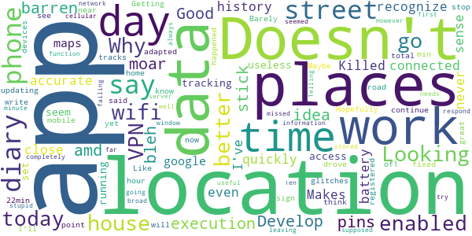

> I think the point of this app is great. And I don't know if it's my phone or the app but I have been home all day today yet it says I have been to places up the street from me. Like I said, it could be my phone. This hasn't just happened today, but other days too.  :date: __2020-05-22 22:06:35__

> Barely tracks my location, only registered an hour of time and completely missed me leaving the house. Ten minute window is also far to broad.  :date: __2020-05-21 17:28:08__

> At first the app seemed to function well with some useful information. However it doesn't work with a VPN enabled. When I try looking at My Location Diary with it says it needs wifi/cellular network. Why is it failing when the VPN is enabled? Why is it going to a server for data when the location diary is supposed to be stored on my phone?  :date: __2020-05-20 23:46:46__

> Telling me places haven't been, stupid  :date: __2020-05-20 21:18:17__

> Doesn't always respond  :date: __2020-05-20 00:29:08__

#### 1-star reviews

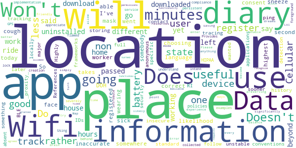

> Does not work! I have not left my house since I downloaded it, yet it states I have been in 5 different places! I uninstalled it!  :date: __2020-05-22 18:10:29__

> Won't download😠😠  :date: __2020-05-22 13:48:07__

> It said I was at a location for 53 minutes that I passed by on a ride but it won't say I was home for the 10 hours while working  :date: __2020-05-22 00:42:43__

> Doesn't go beyond choosing a language  :date: __2020-05-21 22:50:11__

> Locations are not correct.  :date: __2020-05-21 03:29:13__

> The my location diary is not very useful if it's only going to register somewhere I've been for 10 minutes or more. It takes less then a second for somebody to cough or sneeze on you. I went to 3 places today and only one registered in my diary. One of the places that did not register had a worker who was not wearing a face mask. So this place would have been the highest likelihood to get me sick and I wouldn't have been able to track it and the DOH would have inaccurate information.  :date: __2020-05-21 02:41:04__

> I Do not consent to the state tracking me.  :date: __2020-05-21 00:53:16__

> I get why RI wanted to have something sooner rather than later but this app does not follow the standard conventions and frameworks the major contact tracing applications use. Rather than use BLE to ping anonymous IDs for _proxity_ detection they are storing your full location history locally.  :date: __2020-05-20 17:02:04__

> Highly insecure and unstable. References non-specific security policies, absent HIPAA compliance. Provides examples of some information, not all information collected  :date: __2020-05-20 15:55:42__

> While I understand and appreciate the good will and intent behind the creation of this app, the implementation is severely flawed. Using a persistent foreground service with GPS lock is going to significantly drain users battery, to the point where this app will likely become less useful as devices enter battery saving mode or simply turn off. I believe there are better and more user-friendly ways to introduce an experience like this that balance good will while preserving device resources.  :date: __2020-05-20 15:03:38__

# Credits

This project makes use of the following main third-party projects:
* Androguard: [https://github.com/androguard/androguard](https://github.com/androguard/androguard)
* Androwarn: [https://github.com/maaaaz/androwarn](https://github.com/maaaaz/androwarn)
* google_play_scraper: [https://github.com/JoMingyu/google-play-scraper](https://github.com/JoMingyu/google-play-scraper)
* whois: [https://github.com/DannyCork/python-whois](https://github.com/DannyCork/python-whois)
* BeautifulSoup: [https://www.crummy.com/software/BeautifulSoup](https://www.crummy.com/software/BeautifulSoup)

Other open-source projects used in this project include: 

- androguard==3.3.5
- appnope==0.1.0
- asn1crypto==1.3.0
- backcall==0.1.0
- beautifulsoup4==4.9.0
- bs4==0.0.1
- certifi==2020.4.5.1
- cffi==1.14.0
- chardet==3.0.4
- click==7.1.2
- colorama==0.4.3
- cryptography==2.9.2
- cycler==0.10.0
- decorator==4.4.2
- future==0.18.2
- google-play-scraper==0.0.2.3
- idna==2.9
- ipython==7.13.0
- ipython-genutils==0.2.0
- jedi==0.17.0
- Jinja2==2.11.2
- joblib==0.14.1
- kiwisolver==1.2.0
- lxml==4.5.0
- MarkupSafe==1.1.1
- matplotlib==3.2.1
- networkx==2.4
- nltk==3.5
- numpy==1.18.3
- parso==0.7.0
- pexpect==4.8.0
- pickleshare==0.7.5
- Pillow==7.1.2
- play-scraper==0.6.0
- prompt-toolkit==3.0.5
- ptyprocess==0.6.0
- pycountry==19.8.18
- pycparser==2.20
- pydot==1.4.1
- Pygments==2.6.1
- pyOpenSSL==19.1.0
- pyparsing==2.4.7
- python-dateutil==2.8.1
- regex==2020.4.4
- requests==2.23.0
- requests-futures==1.0.0
- six==1.14.0
- soupsieve==2.0
- tld==0.12.1
- tqdm==4.45.0
- traitlets==4.3.3
- urllib3==1.25.9
- wcwidth==0.1.9
- wordcloud==1.7.0

