# COVID-related Android apps in US

Author: `Ivano Malavolta` (ivanomalavolta@gmail.com)

Created at: `2020/6/28`

Report generated by the [covid-apps-observer](http://github.com/covid-apps-observer) project, version 0.1

# Table of contents 

- [Background](#background)
    * [Data sources and analyses](#data-sources-and-analyses)
        * [App metadata](#app-metadata)
        * [Requested permissions](#requested-permissions)
        * [Mentioned servers](#mentioned_servers)
        * [Security analysis](#security_analysis)
        * [User ratings and reviews](#user-ratings-and-reviews)
    * [Disclaimer](#disclaimer)
- [Care19 Diary](#care19-diary)
- [FEMA](#fema)
- [CDC](#cdc)
- [CRUSH COVID RI](#crush-covid-ri)

- [Credits](#credits)

# How to read this report

This report has been generated by the [covid-apps-observer](http://github.com/covid-apps-observer) project. The project automatically analyzes the apps by extracting information which is already publicly available either on the web or in the apps binary files. 

Our analysis covers the following apps:
| | |
|-------------------------|-------------------------| 
|  | Care19 Diary
|  | FEMA
|  | CDC
|  | CRUSH COVID RI

The details of our analysis are presented in the remainder of this report.

For independent verification, the raw data and the source code of the project is publicly available in its GitHub repository [http://github.com/covid-apps-observer](http://github.com/covid-apps-observer) and its source code has been thoroughly commented in order to provide all the details about how the information provided in this report has been extracted. 

Any feedback, questions, and improvements about the project are very welcome, feel free to create an issue or pull request directly in its GitHub repository: [http://github.com/covid-apps-observer](http://github.com/covid-apps-observer).

## Data sources and analyses

The analysis of each app is structured around five main dimensions: 
* App metadata  
* Requested permissions
* Mentioned servers
* Androwarn analysis
* User ratings and reviews

In the following we describe the data sources and analysis performed for each dimension.

### App metadata

App metadata includes an overview of the main information about the app (for example, its name, releases, privacy policy, etc.), contact information of the development team, and the various Android versions supported by the app. This information is extracted from two main data sources:
* _Google Play store_: we automatically mined the web page of the Google Play store showing the basic information about the app and we parsed it in order to extract information about the app and development team 
* _Android Manifest file_: in our analysis we decompiled the binary file of the app (it is similar to a Zip archive but it contains the code of the app instead of normal files) and we extracted information about the supported Android versions, as it has been listed by its development team.

The extracted app metadata feeds the _App overview_, _Development team_, and _Android support_ sections of this report.
We make use of the [google-play-scraper](https://github.com/JoMingyu/google-play-scraper) tool for extracting the raw data related to this dimension of the project.

### Requested permissions

The Android operating system has a permission model which allows users to grant access to potentially privacy-related information. Every Android app has to explictly declare the permissions it needs to properly function in the Android Manifest file.  

In this report we also show the protection level of each permission, which is a key information for understanding how the requested permissions related to the user's privacy. We carefully analyzed the [official Android documentation (v. 29)](https://developer.android.com/reference/android/Manifest.permission), and it resulted that a permission requested by an Android app can belong to the following protection levels:
* **Dangerous**: higher-risk permissions that would give a requesting app access to private user data or control over the device that can negatively impact the user. Because this type of permission introduces potential risk, the system usually does not automatically grant it to the requesting app. For example, any dangerous permissions requested by an app may be displayed to the user and require confirmation before proceeding.
* **Normal**: this is the default and most common level in Android; normal permissions are lower-risk and give access to isolated app-level features, with minimal risk to other apps, the system, or the user. 
* **Signature**: permissions granted only if the requesting app is signed with the same certificate as the app that declared the permission
* **Appop**: old permission level, a reminiscence of the App Ops tool that Google introduced in Android 4.3.
* **Development**: optional permissions which can be granted to development-oriented apps.
* **Privileged**: permissions who give higher power to mobile apps w.r.t. other apps, such as binding to incoming calls, interacting via bluetooth with other devices without user interaction, etc.
* **Preinstalled**: reserved only for preinstalled apps
* **Installer**: allow the holder to start the permission usage screen for an app
* **RetailDemo**: permissions related to devices used in demonstrations in shops.
* **Pre23**: permissions automatically granted to apps targeting devices running pre-6.0 Android.
* **Upcoming**: permissions which will be released in the next version of the Android platform. 
* **Deprecated**: permissions belonging to old releases of the Android platform, they should not be used by developers since they will not be supported in the near future.
* **Not for use by third-party applications**: permissions which can be requested only by apps developed by Google.
* **Undefined**: this protection level is not documented by Google.

The permissions dimension of this project is based on the [Androguard](https://github.com/androguard/androguard) static analysis tool.

### Mentioned servers

We decompiled each app in order to look for all possible mentions of remote URLs. The mentioned URLs can refer to remote servers the the app is using for either sending or receiving information, web addresses for directing the user to an information website, and so on. 

:warning: It is important to note that this analysis is not meant to be complete and it is very prone to obfuscation. The servers reported here are simply _mentioned_ somewhere in the code of the app and are meant to just give an indication about the "hooks" of the app towards external resources. For example, for an Android app it is normal to contact Google services in order to send/receive push notifications, or to contact the servers of analytics services for having real-time diagnostics about crashes of the app or bugs.

This part of the analysis is based on the [Androguard](https://github.com/androguard/androguard) static analysis tool for identfying the raw URLs mentioned in the app; then, the information about each mentioned server is collected by performing a _whois_ lookup on the first-level domain present in the URL.

### Security analysis

This dimension is based on the [Androwarn](https://github.com/maaaaz/androwarn) structural and data flow analysis of Android bytecode. Androwarn is developed by the University of Lyon/INSA (France) and it has been used in several academic studies. According to its documentation, Androwarn targets the following categories of potential security issues:
* **Telephony identifiers exfiltration**: IMEI, IMSI, MCC, MNC, LAC, CID, operator's name, etc.
* **Device settings exfiltration**: software version, usage statistics, system settings, logs, etc.
* **Geolocation information leakage**: GPS/WiFi geolocation, etc.
* **Connection interfaces information exfiltration**: WiFi credentials, Bluetooth MAC adress, etc.
* **Telephony services abuse**: premium SMS sending, phone call composition, etc.
* **Audio/video flow interception**: call recording, video capture, etc.
* **Remote connection establishment**: socket open call, Bluetooth pairing, APN settings edit, etc.
* **PIM data leakage**: contacts, calendar, SMS, mails, clipboard, etc.
* **External memory operations**: file access on SD card, etc.
* **PIM data modification**: add/delete contacts, calendar events, etc.
* **Arbitrary code execution**: native code using JNI, UNIX command, privilege escalation, etc.
* **Denial of Service**: event notification deactivation, file deletion, process killing, virtual keyboard disable, terminal shutdown/reboot, etc.

Note: We do not consider this data point in the current version of our analyzers since it is too verbose for our purposes.

:warning: It is important to note that Androwarn is a static analysis tool, and as such it performs a variety of heuristics and approximations in its analyses. Said that, the results shown in this report are meant to provide an indication of _potential_ security issues and should be by no means treated as complete and correct.   

### User ratings and reviews

For this dimension we turn again to the web interface of the Google Play store. Firstly, we automatically mine summary statistics about user ratings from the web page of the app under analysis; then, we automatically download the newest 1000 reviews of the app under analysis. For each level of rating (5 stars, 4 stars, , etc., 1 star) we show:
- a word cloud presenting the main terms used by end users in their reviews in the Google Play store
- the last 10 reviews provided by app users in the Google Play store. 

This purposefully simple analysis is meant to help both future users and the development team of the app in understanding what are the main positive and negative points of the app under analysis.

We make use of the [google-play-scraper](https://github.com/JoMingyu/google-play-scraper) tool for extracting the raw data related to this dimension of the project.

## Disclaimer 

This report has been produced independently of any parties and its only objective is to help anybody in better understanding how COVID-related apps work in practice (and compare to each other). The results of this report are limited to the specific version of the software used for running the analyses and on the various heuristics implemented in there. In other words, the results of the analyzers may differ depending on the time and modalities in which they are executed. We do not guarantee that the results of the analyses and the corresponding contents of this report are fully complete or correct. The analysis software is licensed under the [MIT License](https://github.com/iivanoo/covid-apps-observer/blob/master/LICENSE).

# Care19 Diary
App version ``3.1``

Analyzed with [covid-apps-observer](http://github.com/covid-apps-observer) project, version ``0.1``

## App overview
| | |
|-------------------------|-------------------------| 
| **Name**&nbsp;&nbsp;&nbsp;&nbsp;&nbsp;&nbsp;&nbsp;&nbsp;&nbsp;&nbsp;&nbsp;&nbsp;&nbsp;&nbsp;&nbsp;&nbsp;&nbsp;&nbsp;&nbsp;&nbsp;&nbsp;&nbsp;&nbsp;&nbsp;&nbsp;&nbsp;&nbsp;&nbsp;&nbsp;&nbsp;&nbsp;&nbsp;&nbsp;&nbsp;&nbsp;&nbsp;&nbsp;&nbsp;&nbsp;&nbsp;  | Care19 Diary |
| **Unique identifier** | com.proudcrowd.care |
| **Link to Google Play** | [https://play.google.com/store/apps/details?id=com.proudcrowd.care](https://play.google.com/store/apps/details?id=com.proudcrowd.care) |
| **Summary**  | You can help stop the spread of Covid-19 |
| **Privacy policy** | [https://care19.app/privacy](https://care19.app/privacy) |
| **Latest version** | 3.1 |
| **Last update** | 2020-06-26 17:01:47 |
| **Recent changes** | Fix a bug where manually added visits could display a month off. |
| **Installs**  | 10,000+ |
| **Category** | Medical |
| **First release** | Apr 19, 2020 |
| **Size**  | 5.5M |
| **Supported Android version**  | 6.0 and up |

### Description
> Care19 is the official COVID-19 app for the states of South Dakota and North Dakota.  It can be used with reduced functionality in other US states.
 A key part of the contact tracing process is remembering where you have been over the last 5-10 days before testing positive.  This helps contact tracers determine people you may have been near while you were infectious. 
 Care19 is a digital diary that records places you visit.  Many of the places you visit can be recorded automatically by Care19 using the phone's location services.  In some cases you may need to manually add an entry if the automated routines miss a place visit.  This can happen based on a variety of environmental factors.
 You will not be asked to provide any personally identifiable information within the app. Location data will only be shared with the North Dakota or South Dakota Department of Health if you consent upon testing positive for COVID-19. This is done by sharing a code number displayed on the “About” section of the app.  
 If you use the Care19 app outside of North and South Dakota it can be used as a memory aide if you test positive and are contacted by your state's Department of Health.

### User interface
The developers of the app provide the following screenshots in the Google play store.
| | | |
|:-------------------------:|:-------------------------:|:-------------------------:|
 |   |   |   | 
 |  

## Development team
In the following we report the main information provided by the development team in the Google play store.

| | |
|-------------------------|-------------------------|
| **Developer**  | ProudCrowd, LLC |
| **Website**  | [https://www.care19.app](https://www.care19.app) |
| **Email** | tim.brookins@proudcrowd.com |
| **Physical address**  | - |
| **Other developed apps**  | [https://play.google.com/store/apps/developer?id=ProudCrowd,+LLC](https://play.google.com/store/apps/developer?id=ProudCrowd,+LLC) |

## Android support

| | |
|-------------------------|-------------------------|
| **Declared target Android version**  | Android10, version 10 (API level 29) |
| **Effective target Android version**  | Android10, version 10 (API level 29) |
| **Minimum supported Android version**  | Marshmallow, version 6.0 (API level 23) |
| **Maximum target Android version**  | - |

The larger the difference between the minimum and maximum supported Android versions, the better. A larger difference means a wider audience. For example, old phones have a very low Android version, so a high minimum supported Android version means that the app cannot be used by users with old phones, thus leading to accessibility problems. 

## Requested permissions

In the following we report the complete list of the permissions requested by the app. 

| **Permission** | **Protection level** | **Description** | 
|-------------------------|-------------------------|-------------------------|
 **android.permission ACCESS_BACKGROUND_LOCATION** | :warning:**Dangerous** | Allows an app to access location in the background. 
 **android.permission ACCESS_COARSE_LOCATION** | :warning:**Dangerous** | Allows an app to access approximate location. 
 **android.permission ACCESS_FINE_LOCATION** | :warning:**Dangerous** | Allows an app to access precise location. 
 **android.permission ACCESS_NETWORK_STATE** | Normal | Allows applications to access information about networks. 
 **android.permission ACTIVITY_RECOGNITION** | :warning:**Dangerous** | Allows an application to recognize physical activity. 
 **android.permission FOREGROUND_SERVICE** | Normal | Allows a regular application to use Service.startForeground. 
 **android.permission INTERNET** | Normal | Allows applications to open network sockets. 
 **android.permission RECEIVE_BOOT_COMPLETED** | Normal | Allows an application to receive the Intent.ACTION_BOOT_COMPLETED that is broadcast after the system finishes booting. 
 **android.permission WAKE_LOCK** | Normal | Allows using PowerManager WakeLocks to keep processor from sleeping or screen from dimming. 
 **com.google.android.c2dm.permission RECEIVE** | - | - 
 **com.google.android.finsky.permission BIND_GET_INSTALL_REFERRER_SERVICE** | - | - 
 **com.google.android.gms.permission ACTIVITY_RECOGNITION** | - | - 

## Mentioned servers

| **Server** | **Registrant** | **Registrant country** | **Creation date** | 
|-------------------------|-------------------------|-------------------------|-------------------------|
 | bugfender.com | Beenario GmbH | :de: DE | 2014-10-28 11:32:13 |
 | googlesyndication.com | Google LLC | :us: US | 2003-01-21 06:17:24 |
 | google.com | Google LLC | :us: US | 1997-09-15 04:00:00 |
 | app-measurement.com | Google LLC | :us: US | 2015-06-19 20:13:31 |
 | azurewebsites.net | Microsoft Corporation | :us: US | 2012-01-24 18:43:51 |
 | crashlytics.com | Google LLC | :us: US | 2011-01-21 15:30:40 |
 | googleapis.com | Google LLC | :us: US | 2005-01-25 17:52:26 |
 | googleadservices.com | Google LLC | :us: US | 2003-06-19 16:34:53 |

## Security analysis 

Below we report the main security warnings raised by our execution of the [Androwarn](https://github.com/maaaaz/androwarn) security analysis tool.

**Telephony identifiers leakage**
> - This application reads the MCC+MNC of the provider of the SIM 
> - This application reads the Service Provider Name (SPN) 
> - This application reads the numeric name (MCC+MNC) of current registered operator 
> - This application reads the operator name 

**Connection interfaces exfiltration**
> - This application reads details about the currently active data network 
> - This application tries to find out if the currently active data network is metered 

**Suspicious connection establishment**
> - This application opens a Socket and connects it to the remote address ' returned no addresses for  ; port is out of range' on the 'N/A' port  
> - This application opens a Socket and connects it to the remote address '' on the 'N/A' port  
> - This application opens a Socket and connects it to the remote address 'Ljava/lang/StringBuilder;->toString()Ljava/lang/String;' on the 'N/A' port  
> - This application opens a Socket and connects it to the remote address 'Ljava/net/Proxy;->type()Ljava/net/Proxy$Type;' on the 'N/A' port  
> - This application opens a Socket and connects it to the remote address 'timeout' on the 'N/A' port  

**Code execution**
> - This application executes a UNIX command containing this argument: 'logcat -c 2' 
> - This application executes a UNIX command containing this argument: 'logcat -c' 

## User ratings and reviews

Below we provide information about how end users are reacting to the app in terms of ratings and reviews in the Google Play store.

### Ratings

The Care19 Diary app has been installed by more than **10000** times. At this time, **194** rated the app and its average score is **2.55**. Below we show the distribution of the ratings across the usual star-based rating of Google Play

:star::star::star::star::star:: 58

:star::star::star::star:: 5

:star::star::star:: 13

:star::star:: 23

:star:: 93

### Reviews 

#### 5-star reviews

> Updated daily. Easy to use and informative.  :date: __2020-06-23 15:03:08__

> Cool  :date: __2020-06-20 05:50:45__

> Good idea  :date: __2020-06-20 00:01:28__

> Good  :date: __2020-06-16 20:33:40__

> Nudes help  :date: __2020-06-11 01:24:14__

> Awesome  :date: __2020-05-17 11:47:26__

> Love this app  :date: __2020-05-16 12:11:08__

> A must!!  :date: __2020-05-14 06:24:04__

> Payment  :date: __2020-05-02 21:50:55__

> Great if I don't want to catch COVID #RIPrickmay  :date: __2020-04-26 09:16:49__

#### 4-star reviews

> Remember this is for north & south Dakota only.. other states will may add their state if they choose too. It will show other states but will not guarantee it at this time  :date: __2020-06-20 21:46:43__

> The early release back in April was rough (didn't log any stops for me). But it's been working well for me since about May 4. It occasionally logs more than one stop at the same location. It occasionally gets the name of the location wrong, but this is very easy to correct.  :date: __2020-05-19 06:25:30__

> It is great, it works, and I am excited for updates!  :date: __2020-04-29 03:31:46__

#### 3-star reviews

> It had gotten better at tracking my locations but since the last update it stopped all tracking.  :date: __2020-06-25 01:46:44__

> Doesn't this app use the Contact Tracking System that Apple and Google developed?  :date: __2020-06-02 15:29:17__

> Simple app. Does what it was designed for but little else. Misses many locations and frequently has location accuracy issues. Routinely misses my home by 6 blocks. Says I have visited locations I have just driven past. Would be nice to have ability to add locations that I visited but app failed to record.  :date: __2020-05-22 15:52:32__

> Still isn't capturing places I've been. Was at 3 different locations today, and not one of them showing up.  :date: __2020-05-20 23:03:13__

> Very inconsistent with location. Can be at a location for hours and doesn't list it.  :date: __2020-05-16 15:20:52__

> It's a great idea, but does not log most of the places I've been. Stopped at 6 places in Bismarck and didn't log one place. And then the next time it will log the same place 4 times within a few minutes or log a place I only drove by.  :date: __2020-05-14 02:20:12__

> I hope this helps people but there are definitely a lot of bugs  :date: __2020-05-04 05:28:59__

#### 2-star reviews

> It's not all that  :date: __2020-06-18 15:59:46__

> Not very accurate for locations. It does not show several places my wife & I have been for an hour or more and it shows us stopping at places we only drove passed on our way to our destination that does not show up. Very inaccurate. It's the same on both of our phones (Galaxy Note 9's). There is no way to add the places we did go to, only to delete the irrelevant ones or change the name from "Unknown" to a proper name. It's pointless/useless for tracking when this inaccurate.  :date: __2020-06-05 01:20:41__

> I have a samsung android phone and I used the app Tacoma 19 South Dakota app from Google Play. I have installed it and reinstalled it this install that reinstalled it and updated it every time. I have yet to see anything on my page of anywhere that I've been tracked it just keeps saying congratulations you are set up but doesn't detect that you win any places yet. I don't go very often but I have went to stores and I have spent more than 10 minutes there why can't I see where I have been?  :date: __2020-06-01 23:56:11__

> I wish this used the exposure API rather than log GPS coordinates. As I understand, the exposure API is just a log of device identifiers of other nearby phones, stored locally, rotated every 2 weeks. Your phone then simply downloads identifiers of any recent positives in your area and alerts you if they match any your phone has been near. That's very minimal impact on me and a health organization. For me, you don't know that I went to the eye doctor on Tuesday. For you: the health dept doesn't then have to go around in hazmat suits trying to play investigator - nor posting some public notice "HAVE YOU SEEN THIS WOMAN AT THE EYE DOCTOR ON TUESDAY? IF SO, YOU MAY BE INFECTED." One is a little more subtle message, cleans up after itself, puts the burden of response to the user, likely more reliable against device power savings features, and more battery friendly where a GPS/cell tower solution is more invasive, doesn't really capture proximity to another device, probably gets affected by device power savings features, elicits more work and exposes too much to a 3rd party. I'd just scrap this one and make an open source solution using the exposure API.  :date: __2020-05-26 20:08:29__

> Hasn't loaded anything in 3 days not impressed.  :date: __2020-05-22 14:57:46__

> This app would make sense if it correctly tracked where you were. It needs an update to better track it also for walking. Poor and elderly won't use this nor will people who refuse so information will be limited. Needs an upgrade to let you know if you've been around someone with Coronavirus. Good idea but needs fixing  :date: __2020-05-21 05:24:02__

> This app does not record all the places I've been. I was in 5 different businesses in one day for more than 15 minutes and it did not record them . This app has a few bugs...I write down mow.  :date: __2020-05-20 22:58:49__

> Inaccurate  :date: __2020-05-19 18:09:09__

> Does not work in NJ  :date: __2020-05-18 02:41:29__

> Doesn't log locations all the time. Even after I have been there for over ten minutes. Not very dependable .  :date: __2020-05-13 18:15:39__

#### 1-star reviews

> I work in Technology Sales, Retail. So I wanted an app that would start tracking my locations AUTOMATICALLY to assist me in providing that data needed for my Contact Tracers should the need arise. This app FAILS MISERABLY!!! It DOES NOT track when I am some place for more than an hour. Examples: Work, Gym, Restaurants. Don't waste your time on the Android version of this app!!! Look elsewhere. Samsung S20+ 5G  :date: __2020-06-27 04:18:00__

> Location is in issue for me  :date: __2020-06-25 00:03:09__

> I saw the update that you could manually put in where you have been by the developer in 5/20. They said it would be implemented within the next update. However, it has now been over a month & time is of the essence. A month long wait for a feature that is now allowing a significant amount of people to use the app or provide inaccurate data is unacceptable. Please fix this asap or please ND & SD find a new developer. As a programmer, the basic first step before release is bug testing.  :date: __2020-06-21 11:19:38__

> F\*\** you big brother  :date: __2020-06-19 16:56:46__

> Has strange locations and does not keep up with where I have been. How can this be helpful?  :date: __2020-06-13 04:20:59__

> Only collected for one day and then nothing before or since. Does not work at all.  :date: __2020-06-11 03:59:09__

> How does this thing work again? By only recording where I go once a week and having the location always say "Unknown"? If that's how it's supposed to work, bravo....5 stars.  :date: __2020-06-10 19:20:39__

> Not very helpful, only gets a few places.  :date: __2020-06-09 22:01:23__

> This has not updated my location since 5/12. It is now the 14th. It's missing about 50% of where I've been. You should have the ability to enter information manually or name places if it's not recording your location. If everyone has this poor of a tracking record, it's pretty usless. Update June 5th. Checked the app today. It has no record of anywhere I have been at all now. Not even the May data I entered.  :date: __2020-06-06 04:29:38__

> Has NEVER tracker my location, it says I have been anywhere, I've been to many many place since installed. Checked and double checked my permissions, and location settings, they are fine.  :date: __2020-06-05 17:19:07__

# FEMA
App version ``2.11``

Analyzed with [covid-apps-observer](http://github.com/covid-apps-observer) project, version ``0.1``

## App overview
| | |
|-------------------------|-------------------------| 
| **Name**&nbsp;&nbsp;&nbsp;&nbsp;&nbsp;&nbsp;&nbsp;&nbsp;&nbsp;&nbsp;&nbsp;&nbsp;&nbsp;&nbsp;&nbsp;&nbsp;&nbsp;&nbsp;&nbsp;&nbsp;&nbsp;&nbsp;&nbsp;&nbsp;&nbsp;&nbsp;&nbsp;&nbsp;&nbsp;&nbsp;&nbsp;&nbsp;&nbsp;&nbsp;&nbsp;&nbsp;&nbsp;&nbsp;&nbsp;&nbsp;  | FEMA |
| **Unique identifier** | gov.fema.mobile.android |
| **Link to Google Play** | [https://play.google.com/store/apps/details?id=gov.fema.mobile.android](https://play.google.com/store/apps/details?id=gov.fema.mobile.android) |
| **Summary**  | Weather alerts, safety tips and more to help before, during &amp; after disasters. |
| **Privacy policy** | [http://www.fema.gov/privacy-policy](http://www.fema.gov/privacy-policy) |
| **Latest version** | 2.11 |
| **Last update** | 2019-12-23 20:34:41 |
| **Recent changes** | - Reduce Your Risk section provides low- and no-cost actions you can take before or after a disaster to help reduce the risk of long term damage to your home. |
| **Installs**  | 1,000,000+ |
| **Category** | Weather |
| **First release** | Aug 24, 2011 |
| **Size**  | 3.4M |
| **Supported Android version**  | 4.4 and up |

### Description
> Emergency alerts, safety tips and resources to help before, during & after disasters.
 The FEMA App provides timely alerts and useful information to help you and your loved ones stay safe before, during and after disasters. Receive and share real-time notifications about disasters, severe weather, and other emergencies for up to five locations nationwide. This simple and easy-to-use resource also provides safety information, emergency preparedness tips, and disaster assistance.
 Features 
 •    Receive emergency alerts for up to five locations nationwide 
 •    Share real-time notifications with loved ones via text, email and social media
 •    Know what to do before, during, and after disasters, like earthquakes, wildfires, hurricanes, snowstorms, tornadoes, volcanoes, and more
 •    Prepare for disasters with an emergency kit checklist, emergency family plan, and reminders
 •    Locate open emergency shelters in your area
 •    Locate Disaster Recovery Centers near you where you can talk to a FEMA representative in person
 •    Connect with FEMA to apply for disaster assistance online
 •    Safety tips and disaster information available in English and Spanish (Note: alerts are only available in English)
 •    Follow the FEMA blog to learn about disaster response and recovery across the United States
 Terms of use: www.fema.gov/app.

### User interface
The developers of the app provide the following screenshots in the Google play store.
| | | |
|:-------------------------:|:-------------------------:|:-------------------------:|
 |   | 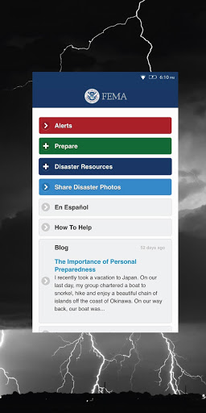  |   | 
 | 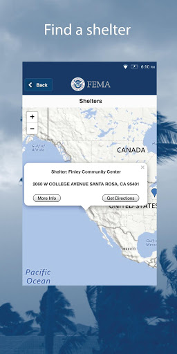  |   | 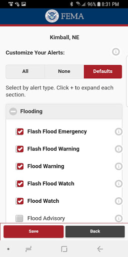  | 
 |   | 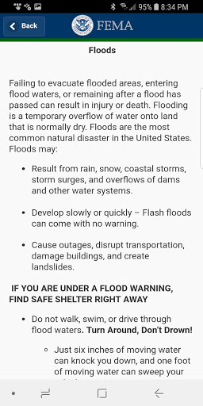  |   | 
 |   |   | 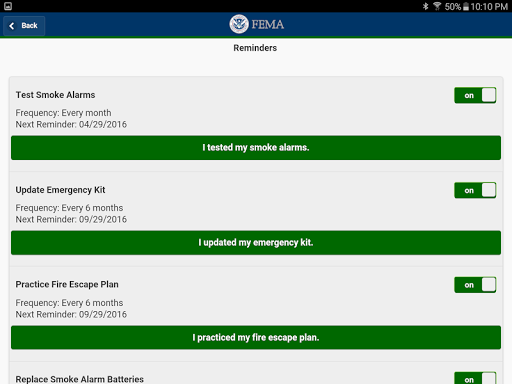  | 
 |   | 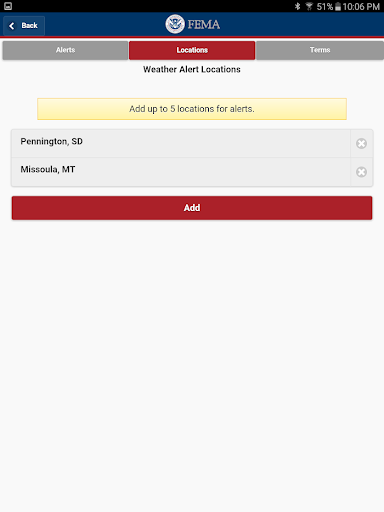  |   | 
 |   | 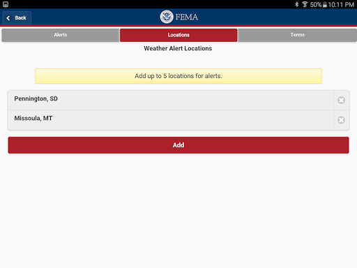  |   | 
 |   |   |   | 
 | 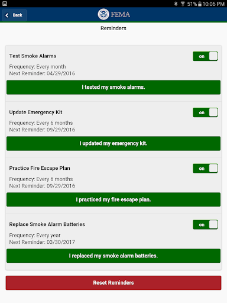 

## Development team
In the following we report the main information provided by the development team in the Google play store.

| | |
|-------------------------|-------------------------|
| **Developer**  | Federal Emergency Management Agency (FEMA) |
| **Website**  | [http://www.fema.gov](http://www.fema.gov) |
| **Email** | FEMA-New-Media@fema.dhs.gov |
| **Physical address**  | - |
| **Other developed apps**  | [https://play.google.com/store/apps/developer?id=Federal+Emergency+Management+Agency+(FEMA)](https://play.google.com/store/apps/developer?id=Federal+Emergency+Management+Agency+(FEMA)) |

## Android support

| | |
|-------------------------|-------------------------|
| **Declared target Android version**  | Pie, version 9 (API level 28) |
| **Effective target Android version**  | Pie, version 9 (API level 28) |
| **Minimum supported Android version**  | KitKat, version 4.4 - 4.4.4 (API level 19) |
| **Maximum target Android version**  | - |

The larger the difference between the minimum and maximum supported Android versions, the better. A larger difference means a wider audience. For example, old phones have a very low Android version, so a high minimum supported Android version means that the app cannot be used by users with old phones, thus leading to accessibility problems. 

## Requested permissions

In the following we report the complete list of the permissions requested by the app. 

| **Permission** | **Protection level** | **Description** | 
|-------------------------|-------------------------|-------------------------|
 **android.permission ACCESS_COARSE_LOCATION** | :warning:**Dangerous** | Allows an app to access approximate location. 
 **android.permission ACCESS_FINE_LOCATION** | :warning:**Dangerous** | Allows an app to access precise location. 
 **android.permission ACCESS_NETWORK_STATE** | Normal | Allows applications to access information about networks. 
 **android.permission INTERNET** | Normal | Allows applications to open network sockets. 
 **android.permission READ_APP_BADGE** | - | - 
 **android.permission RECEIVE_BOOT_COMPLETED** | Normal | Allows an application to receive the Intent.ACTION_BOOT_COMPLETED that is broadcast after the system finishes booting. 
 **android.permission VIBRATE** | Normal | Allows access to the vibrator. 
 **android.permission WAKE_LOCK** | Normal | Allows using PowerManager WakeLocks to keep processor from sleeping or screen from dimming. 
 **android.permission WRITE_EXTERNAL_STORAGE** | :warning:**Dangerous** | Allows an application to write to external storage. 
 **com.anddoes.launcher.permission UPDATE_COUNT** | - | - 
 **com.google.android.c2dm.permission RECEIVE** | - | - 
 **com.google.android.finsky.permission BIND_GET_INSTALL_REFERRER_SERVICE** | - | - 
 **com.htc.launcher.permission READ_SETTINGS** | - | - 
 **com.htc.launcher.permission UPDATE_SHORTCUT** | - | - 
 **com.huawei.android.launcher.permission CHANGE_BADGE** | - | - 
 **com.huawei.android.launcher.permission READ_SETTINGS** | - | - 
 **com.huawei.android.launcher.permission WRITE_SETTINGS** | - | - 
 **com.majeur.launcher.permission UPDATE_BADGE** | - | - 
 **com.oppo.launcher.permission READ_SETTINGS** | - | - 
 **com.oppo.launcher.permission WRITE_SETTINGS** | - | - 
 **com.sec.android.provider.badge.permission READ** | - | - 
 **com.sec.android.provider.badge.permission WRITE** | - | - 
 **com.sonyericsson.home.permission BROADCAST_BADGE** | - | - 
 **com.sonymobile.home.permission PROVIDER_INSERT_BADGE** | - | - 
 **me.everything.badger.permission BADGE_COUNT_READ** | - | - 
 **me.everything.badger.permission BADGE_COUNT_WRITE** | - | - 

## Mentioned servers

| **Server** | **Registrant** | **Registrant country** | **Creation date** | 
|-------------------------|-------------------------|-------------------------|-------------------------|
 | googlesyndication.com | Google LLC | :us: US | 2003-01-21 06:17:24 |
 | google.com | Google LLC | :us: US | 1997-09-15 04:00:00 |
 | google-analytics.com | Google LLC | :us: US | 2005-07-18 19:24:32 |
 | app-measurement.com | Google LLC | :us: US | 2015-06-19 20:13:31 |
 | googletagmanager.com | Google LLC | :us: US | 2011-11-11 23:39:05 |
 | gstatic.com | Google LLC | :us: US | 2008-02-11 15:31:25 |
 | whatsapp.com | Whatsapp Inc. | :us: US | 2008-09-04 12:39:12 |
 | googleapis.com | Google LLC | :us: US | 2005-01-25 17:52:26 |
 | googleadservices.com | Google LLC | :us: US | 2003-06-19 16:34:53 |

## Security analysis 

Below we report the main security warnings raised by our execution of the [Androwarn](https://github.com/maaaaz/androwarn) security analysis tool.

**Connection interfaces exfiltration**
> - This application reads details about the currently active data network 
> - This application tries to find out if the currently active data network is metered 

**Telephony services abuse**
> - This application makes phone calls 

**Pim data leakage**
> - This application accesses the downloads folder 

**Code execution**
> - This application loads a native library: 'sqlc-native-driver' 
> - This application executes a UNIX command containing this argument: 'Ljava/lang/StringBuilder;->toString()Ljava/lang/String;' 

## User ratings and reviews

Below we provide information about how end users are reacting to the app in terms of ratings and reviews in the Google Play store.

### Ratings

The FEMA app has been installed by more than **1000000** times. At this time, **3130** rated the app and its average score is **4.152027**. Below we show the distribution of the ratings across the usual star-based rating of Google Play

:star::star::star::star::star:: 2093

:star::star::star::star:: 327

:star::star::star:: 200

:star::star:: 105

:star:: 401

### Reviews 

#### 5-star reviews

> Stays updated  :date: __2020-06-18 04:05:32__

> Nice app  :date: __2020-06-15 19:39:57__

> Have never had a problem with FEMA /ALL their programs for me have been spot on and the assistance needed has been prompt THANK YOU GOVERNMENT PROGRAMS!!!!!  :date: __2020-06-11 13:16:40__

> Great  :date: __2020-06-11 11:42:51__

> U.S. Navy seaL WO4, Powerplant Operator Hydro and others. Engineer, mech, elec. GS19 and UN Secreteriat since 2018. Looking to incorporate with DARPA for integration with aumented reality and AI. Towards innovative drone with a encoding and applied through New systems to creative by custom Sailors as for myself Black Squadron last to current assighnments Ive been as Switchman qualified operator, and was a rated HT with all NEC classifications as well. So perhaps im all ready essential retirement  :date: __2020-06-08 05:44:00__

> Nicr  :date: __2020-06-07 06:06:39__

> All NASA PERSONS TAKE THE INITIATIVE AS A FEELING THAT IS WELL.  :date: __2020-06-07 02:15:13__

> Very productive sercure guard national support VA non-profit but helpful for safety and insurance for damages of areas of destruction weather storms, or life support  :date: __2020-06-06 23:26:31__

> You can receive alerts for multiple areas. The app has everything from weather alerts to information on disaster preparedness. I've not used but you can also call 911 with it.  :date: __2020-06-06 16:21:09__

> Now I can hear all my emgincay updated information  :date: __2020-06-06 06:36:37__

#### 4-star reviews

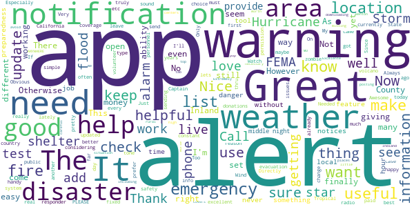

> Great at giving alerts for different areas. Live posting during storms is excellent. Just be careful you don't list to many places to avoid constant updates.  :date: __2020-06-12 03:22:06__

> Only worth downloading if you're in a disaster situation. Otherwise it's not very useful.  :date: __2020-05-23 06:10:43__

> 🌟  :date: __2020-05-22 23:05:11__

> Extremely well covers high pop centers. However, little to no coverage in rural areas. We live in Benton County, MO...no coverage ANYWHERE here.  :date: __2020-05-22 15:48:47__

> Excelente  :date: __2020-05-22 01:23:54__

> Always on top of it  :date: __2020-05-21 12:13:30__

> Weather warnings are necessary, including worse.  :date: __2020-05-17 22:09:22__

> It's been very helpful  :date: __2020-05-13 12:07:49__

> The weather alert tab is missing Indland Hurricane Warning, Inland Hurricane Watch, Inland Tropical Storm Warning, Inland Tropical Storm Watch, Hurricane Force Wind Warning, and Snow Squall Warning.  :date: __2020-04-28 21:42:47__

> pretty good app...it lets you pick locations you want to monitor and it lets you customize the weather settings so youre not pestered to death about things you dont need to know about...i need to figure out if l can fine tune it however...l'm still getting silly things in the middle of the night like it will be "windy" today or "foggy"...thats all well and good...just not at 0300.  :date: __2020-04-26 17:06:27__

#### 3-star reviews

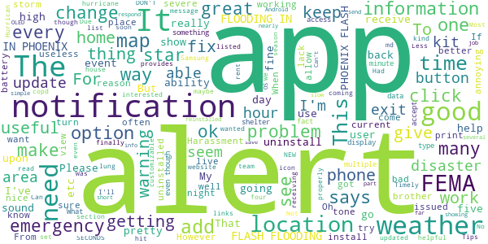

> where's the warnings I used to get  :date: __2020-06-24 02:29:53__

> The back button does not exit the app.  :date: __2020-06-09 16:17:55__

> Should be updated & expanded upon more but for what it is, I like it and will be keeping it.  :date: __2020-05-08 07:51:52__

> I am a Harvey Hurrican victom me an my brother. When the hurrican was over i rent a place. My brother is with liver problems high blood pressure and hepitest. I am a copd lung condition also health problems. I am on home oxegen and four times a day with breathing treatments. Also my brother has a lung problem also woth Copd. We need Fema to help eith a house on Dickinson Texas , 77539. The place we rent has md and the land lord is a ok person but a slumlord. Fema to help us better living home  :date: __2020-04-20 08:40:27__

> The app did work great. I got a Samsung A10 and for some reason the notifications stopped working properly. The weather notifications are intermittent and my reminders for emergency kit, smoke detectors, etc. don't come through at all anymore. Suggestions? I'd like to give higher marks.  :date: __2020-04-09 04:12:19__

> FLASH FLOODING IN PHOENIX FLASH FLOODING IN PHOENIX FLASH FLOODING IN PHOENIX FLASH FLOODING IN PHOENIX FLASH FLOODING IN PHOENIX. I GET IT. I DON'T NEED A NEW NOTIFICATION EVERY 30 SECONDS.  :date: __2020-03-12 22:35:27__

> Easy to read  :date: __2020-03-03 01:12:31__

> The good: Timely alerts, often well ahead of other apps. Seems lightweight and works ok on throttled cellular. The bad: Alerts seem to be only accessible from the notification? Devs please advise/patch.  :date: __2019-12-02 12:53:29__

> No notification on  :date: __2019-11-08 13:38:22__

> disappointed would be helpful if you listed citizen corps. And ways to expand and improve readiness. Most e.m.a. offices have no knowledge of getting volunteers for natural disasters in Illinois, and I have a feeling they don't care  :date: __2019-09-02 21:56:27__

#### 2-star reviews

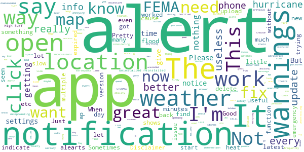

> This app did not help me.  :date: __2020-06-19 19:14:29__

> It really does do absolutely nothing. Not even sure why i have it  :date: __2020-04-28 15:16:55__

> Alerts are way too excessive.. It's a little windy in my area and I get notifications what feel like every 5 minutes. Had to delete the app because it was so annoying.  :date: __2020-04-10 21:47:54__

> It's a weather alert app. I'm getting constant weather alerts during a pandemic lockdown  :date: __2020-03-29 17:05:00__

> When I click on "Alerts," I get a message saying that I have to enable them in the app settings. But when I get into the settings, I can't find anything that does that.  :date: __2020-03-21 20:10:32__

> Ever since the update I haven't been getting the Red Flag warnings for Alameda County during the week the fire danger was so high that PG&E was shutting off power. The previous version worked better.  :date: __2019-10-13 08:02:03__

> App does not give alerts. At one time it worked.  :date: __2019-06-18 03:25:56__

> The app seems to be very inconsistent. Sometimes i get alerts, sometimes I don't. I've uninstalled and reinstalled a few times but it hasn't helped. Very disappointing.  :date: __2019-03-03 23:10:36__

> Not getting ANY alert notifications. App only shows alerts when opened. Pretty useless now.  :date: __2018-11-14 16:16:56__

> Why new permission without reason? Added finsky bind referer without statement of why or what for  :date: __2018-10-09 16:45:58__

#### 1-star reviews

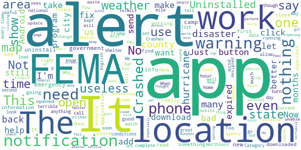

> Don't trust fema  :date: __2020-06-26 20:16:46__

> Did not get it  :date: __2020-06-23 16:46:56__

> The app should work off line. I cannot use the app with cellular data. Alerts set to my location only notify me when I have Wi-Fi and completely disappear if I'm not connected. How is this convenient during a disaster?  :date: __2020-06-21 22:29:23__

> App can not be moved to external SD memory  :date: __2020-06-15 13:42:40__

> It said my location was covered by neighbors county. It didn't recognize two different counties. Maybe better for largecities.  :date: __2020-06-15 02:05:50__

> Digital contact tracing not mentioned in app  :date: __2020-06-13 19:42:11__

> Nagging with unwanted notifications  :date: __2020-06-11 05:56:34__

> "Watch out for torrential downpours leading to localized flooding" 2 drops falls from sky... err overreacted much FEMA?  :date: __2020-06-06 13:21:01__

> I am not getting tornado alerts like my sister 1 mile away gets on TV and NOAA radio. I have the warnings checked, but I am not getting them.  :date: __2020-06-05 17:43:06__

> One of the many problems we as Whistleblowers face is, a lack housing from being targeted. This app was not at all helpful in reaching that goal. Being denied basic human resources is never good.  :date: __2020-06-04 14:42:07__

# CDC
App version ``3.1.1``

Analyzed with [covid-apps-observer](http://github.com/covid-apps-observer) project, version ``0.1``

## App overview
| | |
|-------------------------|-------------------------| 
| **Name**&nbsp;&nbsp;&nbsp;&nbsp;&nbsp;&nbsp;&nbsp;&nbsp;&nbsp;&nbsp;&nbsp;&nbsp;&nbsp;&nbsp;&nbsp;&nbsp;&nbsp;&nbsp;&nbsp;&nbsp;&nbsp;&nbsp;&nbsp;&nbsp;&nbsp;&nbsp;&nbsp;&nbsp;&nbsp;&nbsp;&nbsp;&nbsp;&nbsp;&nbsp;&nbsp;&nbsp;&nbsp;&nbsp;&nbsp;&nbsp;  | CDC |
| **Unique identifier** | gov.cdc.general |
| **Link to Google Play** | [https://play.google.com/store/apps/details?id=gov.cdc.general](https://play.google.com/store/apps/details?id=gov.cdc.general) |
| **Summary**  | Health Information at Your Fingertips—CDC 24/7 |
| **Privacy policy** | [http://t.cdc.gov/1MVV](http://t.cdc.gov/1MVV) |
| **Latest version** | 3.1.1 |
| **Last update** | 2020-06-26 16:45:07 |
| **Recent changes** | Fixed issue where content sometimes loaded improperly in a new browser window |
| **Installs**  | 100,000+ |
| **Category** | Health & Fitness |
| **First release** | Oct 16, 2012 |
| **Size**  | 35M |
| **Supported Android version**  | 4.1 and up |

### Description
> Get the official CDC Mobile application to access the most up to date health information.
 FILTERING OPTIONS
 Organize your home screen so that the information that’s most important to you appears first! Turn off the content you don’t want with just a flip of a switch and reset it all with the tap of a button.
 CONTENT
 The app ensures that you’re getting the most up to date health information. The home screen lets you see all your information in one place and updates whenever your device is connected to WI-FI. Enjoy a greater variety of content such as Disease of the Week, disease case counts, videos, podcasts, and features to give you the most current health information from CDC. 
 Browse Featured Articles, stay on top of health news in the Newsroom section, and view CDC Images of the Week. If you’re a journal reader, view the latest Morbidity & Mortality Weekly Report, Emerging and Infectious Disease journal, or the latest on Preventing Chronic Diseases. You can even search CDC’s web content from the app.  
 We'd love to hear your thoughts about the app! Rate the CDC Mobile App in the App Store or leave a comment to let us know how we're doing. You can even send us an email through the app if you have suggestions for improvements!
 DISCLAIMER
 THE MATERIALS EMBODIED IN THIS SOFTWARE ARE PROVIDED TO YOU "AS-IS" AND WITHOUT WARRANTY OF ANY KIND, EXPRESSED, IMPLIED OR OTHERWISE, INCLUDING WITHOUT LIMITATION, ANY WARRANTY OF FITNESS FOR A PARTICULAR PURPOSE. IN NO EVENT SHALL THE CENTERS FOR DISEASE CONTROL AND PREVENTION (CDC) OR THE UNITED STATES (U.S.) GOVERNMENT BE LIABLE TO YOU OR ANYONE ELSE FOR ANY DIRECT, SPECIAL, INCIDENTAL, INDIRECT OR CONSEQUENTIAL DAMAGES OF ANY KIND, OR ANY DAMAGES WHATSOEVER, INCLUDING WITHOUT LIMITATION, LOSS OF PROFIT, LOSS OF USE, SAVINGS OR REVENUE, OR THE CLAIMS OF THIRD PARTIES, WHETHER OR NOT CDC OR THE U.S. GOVERNMENT HAS BEEN ADVISED OF THE POSSIBILITY OF SUCH LOSS, HOWEVER CAUSED AND ON ANY THEORY OF LIABILITY, ARISING OUT OF OR IN CONNECTION WITH THE POSSESSION, USE OR PERFORMANCE OF THIS SOFTWARE.

### User interface
The developers of the app provide the following screenshots in the Google play store.
| | | |
|:-------------------------:|:-------------------------:|:-------------------------:|
 |   |   |   | 
 |   |   |   | 
 |   |   |   | 
 |   |   |   | 

## Development team
In the following we report the main information provided by the development team in the Google play store.

| | |
|-------------------------|-------------------------|
| **Developer**  | Centers for Disease Control and Prevention |
| **Website**  | [http://www.cdc.gov](http://www.cdc.gov) |
| **Email** | CDCMobileDevelopment@cdc.gov |
| **Physical address**  | - |
| **Other developed apps**  | [https://play.google.com/store/apps/developer?id=Centers+for+Disease+Control+and+Prevention](https://play.google.com/store/apps/developer?id=Centers+for+Disease+Control+and+Prevention) |

## Android support

| | |
|-------------------------|-------------------------|
| **Declared target Android version**  | Pie, version 9 (API level 28) |
| **Effective target Android version**  | Pie, version 9 (API level 28) |
| **Minimum supported Android version**  | Jelly Bean, version 4.1.x (API level 16) |
| **Maximum target Android version**  | - |

The larger the difference between the minimum and maximum supported Android versions, the better. A larger difference means a wider audience. For example, old phones have a very low Android version, so a high minimum supported Android version means that the app cannot be used by users with old phones, thus leading to accessibility problems. 

## Requested permissions

In the following we report the complete list of the permissions requested by the app. 

| **Permission** | **Protection level** | **Description** | 
|-------------------------|-------------------------|-------------------------|
 **android.permission ACCESS_NETWORK_STATE** | Normal | Allows applications to access information about networks. 
 **android.permission ACCESS_WIFI_STATE** | Normal | Allows applications to access information about Wi-Fi networks. 
 **android.permission FOREGROUND_SERVICE** | Normal | Allows a regular application to use Service.startForeground. 
 **android.permission INTERNET** | Normal | Allows applications to open network sockets. 
 **android.permission READ_APP_BADGE** | - | - 
 **android.permission RECEIVE_BOOT_COMPLETED** | Normal | Allows an application to receive the Intent.ACTION_BOOT_COMPLETED that is broadcast after the system finishes booting. 
 **android.permission VIBRATE** | Normal | Allows access to the vibrator. 
 **android.permission WAKE_LOCK** | Normal | Allows using PowerManager WakeLocks to keep processor from sleeping or screen from dimming. 
 **android.permission WRITE_EXTERNAL_STORAGE** | :warning:**Dangerous** | Allows an application to write to external storage. 
 **com.amazon.device.messaging.permission RECEIVE** | - | - 
 **com.anddoes.launcher.permission UPDATE_COUNT** | - | - 
 **com.google.android.c2dm.permission RECEIVE** | - | - 
 **com.google.android.finsky.permission BIND_GET_INSTALL_REFERRER_SERVICE** | - | - 
 **com.htc.launcher.permission READ_SETTINGS** | - | - 
 **com.htc.launcher.permission UPDATE_SHORTCUT** | - | - 
 **com.huawei.android.launcher.permission CHANGE_BADGE** | - | - 
 **com.huawei.android.launcher.permission READ_SETTINGS** | - | - 
 **com.huawei.android.launcher.permission WRITE_SETTINGS** | - | - 
 **com.majeur.launcher.permission UPDATE_BADGE** | - | - 
 **com.oppo.launcher.permission READ_SETTINGS** | - | - 
 **com.oppo.launcher.permission WRITE_SETTINGS** | - | - 
 **com.sec.android.provider.badge.permission READ** | - | - 
 **com.sec.android.provider.badge.permission WRITE** | - | - 
 **com.sonyericsson.home.permission BROADCAST_BADGE** | - | - 
 **com.sonymobile.home.permission PROVIDER_INSERT_BADGE** | - | - 
 **gov.cdc.general.permission RECEIVE_ADM_MESSAGE** | - | - 
 **me.everything.badger.permission BADGE_COUNT_READ** | - | - 
 **me.everything.badger.permission BADGE_COUNT_WRITE** | - | - 

## Mentioned servers

| **Server** | **Registrant** | **Registrant country** | **Creation date** | 
|-------------------------|-------------------------|-------------------------|-------------------------|
 | android.com | Google LLC | :us: US | 1997-06-23 04:00:00 |
 | googlesyndication.com | Google LLC | :us: US | 2003-01-21 06:17:24 |
 | google.com | Google LLC | :us: US | 1997-09-15 04:00:00 |
 | app-measurement.com | Google LLC | :us: US | 2015-06-19 20:13:31 |
 | facebook.com | Facebook, Inc. | :us: US | 1997-03-29 05:00:00 |
 | pinterest.com | DNStination Inc. | :us: US | 2009-11-26 19:21:23 |
 | twitter.com | Twitter, Inc. | :us: US | 2000-01-21 16:28:17 |
 | adobedtm.com | Adobe Inc. | :us: US | 2013-11-22 23:15:17 |
 | w3.org | W3C | :us: US | 1994-07-06 04:00:00 |
 | googleapis.com | Google LLC | :us: US | 2005-01-25 17:52:26 |
 | hockeyapp.net | Microsoft Corporation | :us: US | 2011-01-23 18:46:43 |
 | pushwoosh.com | Arello Mobile | :new_zealand: NZ | 2011-05-02 11:00:31 |
 | googleadservices.com | Google LLC | :us: US | 2003-06-19 16:34:53 |

## Security analysis 

Below we report the main security warnings raised by our execution of the [Androwarn](https://github.com/maaaaz/androwarn) security analysis tool.

**Telephony identifiers leakage**
> - This application reads the ISO country code equivalent for the SIM provider's country code 
> - This application reads the ISO country code equivalent of the current registered operator's MCC (Mobile Country Code) 
> - This application reads the MCC+MNC of the provider of the SIM 
> - This application reads the Service Provider Name (SPN) 
> - This application reads the device phone type value 
> - This application reads the numeric name (MCC+MNC) of current registered operator 
> - This application reads the operator name 
> - This application reads the phone number string for line 1, for example, the MSISDN for a GSM phone 
> - This application reads the radio technology (network type) currently in use on the device for data transmission 
> - This application reads the unique device ID, i.e the IMEI for GSM and the MEID or ESN for CDMA phones 

**Location lookup**
> - This application reads location information from all available providers (WiFi, GPS etc.) 

**Connection interfaces exfiltration**
> - This application reads details about the currently active data network 
> - This application tries to find out if the currently active data network is metered 

**Suspicious connection establishment**
> - This application opens a Socket and connects it to the remote address '' on the 'N/A' port  
> - This application opens a Socket and connects it to the remote address 'Ljava/lang/StringBuilder;->toString()Ljava/lang/String;' on the ': connect, resolve' port  
> - This application opens a Socket and connects it to the remote address 'Ljava/lang/StringBuilder;->toString()Ljava/lang/String;' on the 'N/A' port  
> - This application opens a Socket and connects it to the remote address 'Ljava/net/Proxy;->type()Ljava/net/Proxy$Type;' on the 'N/A' port  
> - This application opens a Socket and connects it to the remote address 'timeout' on the 'N/A' port  

**Pim data leakage**
> - This application accesses the downloads folder 
> - This application accesses data stored in the clipboard 

**Code execution**
> - This application loads a native library 
> - This application executes a UNIX command containing this argument: '2' 
> - This application executes a UNIX command containing this argument: 'Ljava/lang/StringBuilder;->toString()Ljava/lang/String;' 

## User ratings and reviews

Below we provide information about how end users are reacting to the app in terms of ratings and reviews in the Google Play store.

### Ratings

The CDC app has been installed by more than **100000** times. At this time, **1468** rated the app and its average score is **3.8181818**. Below we show the distribution of the ratings across the usual star-based rating of Google Play

:star::star::star::star::star:: 790

:star::star::star::star:: 184

:star::star::star:: 143

:star::star:: 133

:star:: 215

### Reviews 

#### 5-star reviews

> What a loving organization help us be safe, bless you my Lord CDC. Great app, I give you 10 sun's. 🌞🌞🌞🌞🌞🌞🌞🌞🌞🌞  :date: __2020-06-27 11:47:05__

> Exceptionally well done  :date: __2020-06-25 17:49:18__

> Great amp  :date: __2020-06-20 02:01:10__

> Can't live without it!  :date: __2020-06-19 16:13:02__

> Good for beginners. I like the full site.  :date: __2020-06-19 02:42:19__

> Best Source For True Information  :date: __2020-06-14 16:56:20__

> Go CDC  :date: __2020-06-08 16:48:17__

> Hey my opinion is the best app for everyone to have nowadays extremely important feedback up to date is given as you Basque everyone should have this application  :date: __2020-06-08 16:34:36__

> MUST HAVE !  :date: __2020-06-04 03:41:41__

> This is an essential asset to all Americans. Two thumbs way up.  :date: __2020-06-03 09:28:23__

#### 4-star reviews

> Sarahlandry ex sex here  :date: __2020-06-11 01:25:36__

> Too many notifications about the virus made me depressed. Good app for a free one, just need better notification options.  :date: __2020-05-31 20:08:18__

> It's useful but hard to find what I'm looking for  :date: __2020-05-27 02:18:04__

> It's OK. Notjing to brag about. Haven't used it that much really.  :date: __2020-05-15 06:06:05__

> Very little data a available.  :date: __2020-05-08 15:45:49__

> Not sure its functions or How it works  :date: __2020-04-25 10:08:09__

> I love the CDC but I wish it wouldn't be a app that puts you on the internet  :date: __2020-04-23 02:17:52__

> Let's go walking Yes ok?  :date: __2020-04-21 19:21:07__

> Wished it was more user-friendly  :date: __2020-04-17 23:47:35__

> Great app !!!!!!!!!!!!!  :date: __2020-04-15 15:38:41__

#### 3-star reviews

> program has good info, does not rotate to horizontal.  :date: __2020-06-14 15:51:53__

> I get more information from Bing  :date: __2020-06-11 07:46:28__

> Depresing inormationb  :date: __2020-06-04 04:00:19__

> What happened to the daily updates? Did Trump get to you? Ah science. What do you matter.  :date: __2020-05-26 18:27:05__

> Disappointing. Not as useful as I expected. Doesn't show up to date info. Just info we've already seen 1000 times. Expected more from the CDC whom I've always respected.  :date: __2020-05-23 06:09:07__

> App does not work on android phones.  :date: __2020-05-15 00:22:26__

> Useful to keep up, especially with the Sars-CoV-2 outbreak, but really annoying design. Harder to help less technically inclined use it.  :date: __2020-05-08 04:29:03__

> Nice  :date: __2020-05-03 06:10:21__

> great  :date: __2020-04-27 21:31:31__

> could offer more direct contact links  :date: __2020-04-25 21:10:30__

#### 2-star reviews

> No covid-19 disease case count?  :date: __2020-06-26 02:32:43__

> Informative, not an exposure tracker. This app also has no notifications.  :date: __2020-06-13 04:07:56__

> Didn't use this app much so I can't tell you much about it..you gonna have to try it and decide for yourself.... good luck...  :date: __2020-06-07 15:28:34__

> I hear the very Patriot Japanese have a Voluntary CoVid19 website where they have the option to report if they feel sick or well and their accurate tracking, voluntarily. Scientists says this raw data would be useful. So which Politicians are again standing in the way of Public Health and Progress??  :date: __2020-05-25 06:30:00__

> I give only two stars only because I've only learned of the "CDC" Due to the Covid-19. Im very secluded other then facebook so i regret i can not rate CDC with a higher rating.  :date: __2020-05-07 08:06:04__

> Poor app mise well use website as this is a glorious bookmark hidden as an app in my opinion  :date: __2020-04-30 07:18:34__

> Ok  :date: __2020-04-28 15:22:50__

> This damn app doesn't exit  :date: __2020-04-23 08:54:01__

> Use the website it is far superior, this app has a blatant lack of organization, however does contain useful information.  :date: __2020-04-19 03:08:59__

> THE APP IS NOT OPENING UP TO THE PAGES THAT ARE LINKED WITH THE SPECIFIC INFORMATION . ITS A BLANK WHITE PAGE MY ISP INTERNET CONNECTION IS WORKING FINE. ITS YOUR APP NOT WORKING FRIDAY IT WORKED SEVERAL DAYS AGO, BUT NOW ITS USELESS  :date: __2020-04-14 22:23:39__

#### 1-star reviews

> I mean, why not just use the website? It just seems kinda useless. Maybe if it was a covid-19 exposure tracker, then it may be useful, but it's not so I can't recommend it.  :date: __2020-06-28 03:11:43__

> Outdated and useless information.  :date: __2020-06-21 05:55:03__

> We need a national plan for contact tracing! The technology is now on our phones but the government is doing nothing  :date: __2020-06-20 15:58:23__

> App can not be moved to external SD memory  :date: __2020-06-15 13:48:02__

> Does not contain digital contact tracing  :date: __2020-06-13 19:29:19__

> Doesn't update enough data daily.  :date: __2020-06-07 18:08:04__

> Can't get the CDC icon on my screen and don't see how to shut it down getting ready to take it off  :date: __2020-06-07 12:05:50__

> It's NOT a contact tracing app.  :date: __2020-06-02 16:28:44__

> Not up to date  :date: __2020-05-28 03:49:46__

> Someone on a government level has used this app illegally to track my being I did not give permission to download this app and it will not allow me to uninstall the covid-19 app  :date: __2020-05-23 05:23:02__

# CRUSH COVID RI
App version ``1.5``

Analyzed with [covid-apps-observer](http://github.com/covid-apps-observer) project, version ``0.1``

## App overview
| | |
|-------------------------|-------------------------| 
| **Name**&nbsp;&nbsp;&nbsp;&nbsp;&nbsp;&nbsp;&nbsp;&nbsp;&nbsp;&nbsp;&nbsp;&nbsp;&nbsp;&nbsp;&nbsp;&nbsp;&nbsp;&nbsp;&nbsp;&nbsp;&nbsp;&nbsp;&nbsp;&nbsp;&nbsp;&nbsp;&nbsp;&nbsp;&nbsp;&nbsp;&nbsp;&nbsp;&nbsp;&nbsp;&nbsp;&nbsp;&nbsp;&nbsp;&nbsp;&nbsp;  | CRUSH COVID RI |
| **Unique identifier** | com.ri.crushcovid |
| **Link to Google Play** | [https://play.google.com/store/apps/details?id=com.ri.crushcovid](https://play.google.com/store/apps/details?id=com.ri.crushcovid) |
| **Summary**  | CRUSH COVID RI is the COVID-19 response app for Rhode Island. #CrushCovidRI |
| **Privacy policy** | [https://health.ri.gov/covid/crush/privacypolicy/](https://health.ri.gov/covid/crush/privacypolicy/) |
| **Latest version** | 1.5 |
| **Last update** | 2020-06-04 17:12:37 |
| **Recent changes** | This update includes the following: - Cosmetic improvements for readability and ease of use - General bug fixes and performance improvements - Improvements and bug fixes to location accuracy in My Location Diary |
| **Installs**  | 10,000+ |
| **Category** | Health & Fitness |
| **First release** | May 15, 2020 |
| **Size**  | 14M |
| **Supported Android version**  | 8.0 and up |

### Description
> CRUSH COVID RI is a COVID-19 pandemic response app which provides Rhode Islanders easy access to all of the resources required during the public health crisis, including a location diary that helps users identify the people and places they are in contact with and a symptom checking survey.
 Thank you for using the CRUSH COVID RI app and taking an active role in slowing the spread of COVID-19 in Rhode Island. You can make a difference in the health of your loved ones and your community by helping us track the virus in our state. The “My Location Diary” feature uses GPS location data that is already available from your phone to help you easily track the places and people you visited over the past 20 days. If you test positive for COVID-19, and you agree to share this information with the Rhode Island Department of Health, they can quickly identify people you were in contact with and reduce the spread of COVID-19.  
 CRUSH COVID RI also connects you to the latest COVID-19 news and resources – and helps you quickly check for symptoms and identify testing locations near you. Together we will #CrushCovidRI! 
 Please see our Terms of Use (https://health.ri.gov/covid/crush/termsofuse/) & Privacy Policy (https://health.ri.gov/covid/crush/privacypolicy/) for further information.

### User interface
The developers of the app provide the following screenshots in the Google play store.
| | | |
|:-------------------------:|:-------------------------:|:-------------------------:|
 |   | 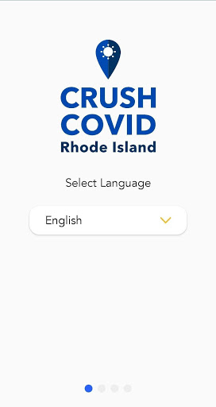  | 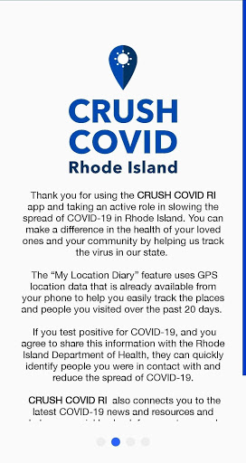  | 
 | 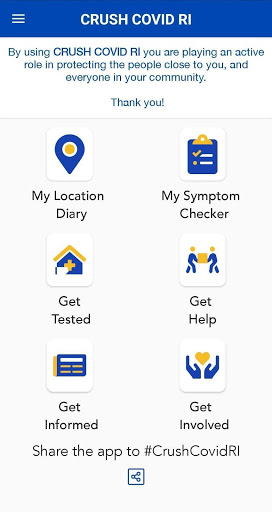  |   |   | 
 |   |  

## Development team
In the following we report the main information provided by the development team in the Google play store.

| | |
|-------------------------|-------------------------|
| **Developer**  | State of Rhode Island |
| **Website**  | [https://health.ri.gov/crushcovid](https://health.ri.gov/crushcovid) |
| **Email** | RIDOH.Covid19Questions@health.ri.gov |
| **Physical address**  | - |
| **Other developed apps**  | [https://play.google.com/store/apps/developer?id=State+of+Rhode+Island](https://play.google.com/store/apps/developer?id=State+of+Rhode+Island) |

## Android support

| | |
|-------------------------|-------------------------|
| **Declared target Android version**  | Android10, version 10 (API level 29) |
| **Effective target Android version**  | Android10, version 10 (API level 29) |
| **Minimum supported Android version**  | Oreo, version 8.0.0 (API level 26) |
| **Maximum target Android version**  | - |

The larger the difference between the minimum and maximum supported Android versions, the better. A larger difference means a wider audience. For example, old phones have a very low Android version, so a high minimum supported Android version means that the app cannot be used by users with old phones, thus leading to accessibility problems. 

## Requested permissions

In the following we report the complete list of the permissions requested by the app. 

| **Permission** | **Protection level** | **Description** | 
|-------------------------|-------------------------|-------------------------|
 **android.permission ACCESS_FINE_LOCATION** | :warning:**Dangerous** | Allows an app to access precise location. 
 **android.permission ACCESS_NETWORK_STATE** | Normal | Allows applications to access information about networks. 
 **android.permission ACCESS_WIFI_STATE** | Normal | Allows applications to access information about Wi-Fi networks. 
 **android.permission CALL_PHONE** | :warning:**Dangerous** | Allows an application to initiate a phone call without going through the Dialer user interface for the user to confirm the call. 
 **android.permission FOREGROUND_SERVICE** | Normal | Allows a regular application to use Service.startForeground. 
 **android.permission INTERNET** | Normal | Allows applications to open network sockets. 
 **android.permission WAKE_LOCK** | Normal | Allows using PowerManager WakeLocks to keep processor from sleeping or screen from dimming. 
 **com.google.android.c2dm.permission RECEIVE** | - | - 
 **com.google.android.finsky.permission BIND_GET_INSTALL_REFERRER_SERVICE** | - | - 

## Mentioned servers

| **Server** | **Registrant** | **Registrant country** | **Creation date** | 
|-------------------------|-------------------------|-------------------------|-------------------------|
 | android.com | Google LLC | :us: US | 1997-06-23 04:00:00 |
 | google.com | Google LLC | :us: US | 1997-09-15 04:00:00 |
 | app-measurement.com | Google LLC | :us: US | 2015-06-19 20:13:31 |
 | mapbox.com | Whois Privacy Service | :us: US | 2003-11-27 11:15:57 |
 | googlesyndication.com | Google LLC | :us: US | 2003-01-21 06:17:24 |
 | crashlytics.com | Google LLC | :us: US | 2011-01-21 15:30:40 |
 | googleapis.com | Google LLC | :us: US | 2005-01-25 17:52:26 |
 | googleadservices.com | Google LLC | :us: US | 2003-06-19 16:34:53 |

## Security analysis 

Below we report the main security warnings raised by our execution of the [Androwarn](https://github.com/maaaaz/androwarn) security analysis tool.

**Telephony identifiers leakage**
> - This application reads the numeric name (MCC+MNC) of current registered operator 
> - This application reads the operator name 
> - This application reads the radio technology (network type) currently in use on the device for data transmission 

**Connection interfaces exfiltration**
> - This application reads details about the currently active data network 
> - This application tries to find out if the currently active data network is metered 

**Telephony services abuse**
> - This application makes phone calls 

**Suspicious connection establishment**
> - This application opens a Socket and connects it to the remote address '; exhausted proxy configurations: ' on the 'N/A' port  
> - This application opens a Socket and connects it to the remote address 'Ljava/lang/StringBuilder;->toString()Ljava/lang/String;' on the 'N/A' port  
> - This application opens a Socket and connects it to the remote address 'Ljava/net/Proxy;->type()Ljava/net/Proxy$Type;' on the 'N/A' port  
> - This application opens a Socket and connects it to the remote address 'Ljava/net/SocketException;' on the 'N/A' port  
> - This application opens a Socket and connects it to the remote address 'timeout' on the 'N/A' port  

**Code execution**
> - This application loads a native library 

## User ratings and reviews

Below we provide information about how end users are reacting to the app in terms of ratings and reviews in the Google Play store.

### Ratings

The CRUSH COVID RI app has been installed by more than **10000** times. At this time, **113** rated the app and its average score is **2.96**. Below we show the distribution of the ratings across the usual star-based rating of Google Play

:star::star::star::star::star:: 35

:star::star::star::star:: 11

:star::star::star:: 14

:star::star:: 18

:star:: 33

### Reviews 

#### 5-star reviews

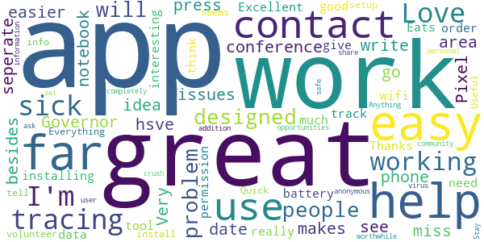

> Very easy to use and I like that it makes it easier to do contact tracing if I get sick. If I miss the Governor's press conference while I'm at work all I have to do is just go on the app and I'm up to date.  :date: __2020-06-10 00:54:57__

> Love it but would like to see an area you can write who you hsve been with besides in a seperate notebook  :date: __2020-06-09 02:03:46__

> Great idea so far  :date: __2020-06-05 02:12:52__

> Pixel 3 phone, no issues installing app, working as designed  :date: __2020-06-03 21:37:55__

> Excellent tool to track all those sick people.  :date: __2020-05-29 21:11:47__

> Eats to much battery  :date: __2020-05-27 18:23:52__

> Thanks for help  :date: __2020-05-23 17:24:32__

> App works great. No problem with wifi nor data. People having problem need to give permission to the app in order to work.  :date: __2020-05-20 04:28:11__

> I think this will be interesting  :date: __2020-05-20 03:32:36__

> So far so good 👍👍👍😊😊😊😁  :date: __2020-05-20 02:35:32__

#### 4-star reviews

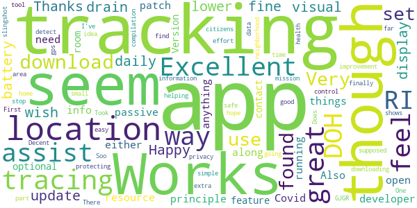

> Works fine, though doesn't seem to update daily on my tracking.  :date: __2020-06-08 22:02:18__

> Happy with it, but wish it had: - lower battery drain - visual display of location tracing Thanks!  :date: __2020-06-08 19:14:53__

> In principle it's great. The developer need to patch a few things, though. Also, it doesn't do passive tracking so either the app is open and running or it won't do anything  :date: __2020-06-04 14:38:07__

> Excellent resource for Covid-19 info along with optional tracking feature to assist with contact tracing. Version 1.0 has some room for improvement, but it is an excellent tool to assist the DOH with their mission of protecting the health of RI citizens. I feel like I am helping to do my part in a small way by downloading this app.  :date: __2020-06-04 01:20:55__

> Took (me) some extra effort to find the app but it was Soo easy to download it once I finally found it. Very simple to use and I feel Very safe about my privacy control. GJGR!  :date: __2020-05-24 10:19:46__

> Does what its supposed to however I can only set it to detect location when app is in use. There's no way that I've found to set it all the time.  :date: __2020-05-22 04:56:47__

> So far, so good. One stop area for compilation of data and information.  :date: __2020-05-22 03:37:50__

> Decent app. The gps seems to slingshot. Of it shows me going out in my neighborhood when i was home.  :date: __2020-05-22 00:15:21__

> Great idea RI DOH  :date: __2020-05-19 21:24:30__

> First to download hope it works  :date: __2020-05-19 19:10:52__

#### 3-star reviews

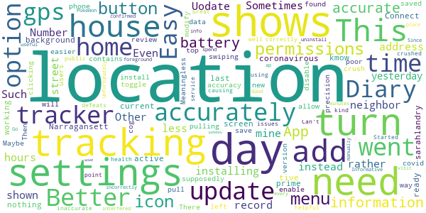

> Shows me at my neighbor's house instead of mine Number of hours shown in day for locations add to more or less than 24  :date: __2020-06-27 21:17:46__

> This is not accurately tracking location. Uodate: Even after installing the update, it is not accurately tracking my location. Sometimes it shows me at an address down the street from my home all day rather than my house. Other days it doesn't record any location at all. Such as yesterday, I went to Narragansett, nothing g shows on my location tracker at all for the last 2 days.  :date: __2020-06-27 15:30:01__

> Better, but did not kmow it had to be active on my screen to be working. Needs an option to be a tive in the background.  :date: __2020-06-14 15:26:44__

> Connect to sarahlandry coronavirous  :date: __2020-06-11 01:25:17__

> Not ready for prime time. "Location Diary" only shows my current location. "Settings" supposedly contains the option to modify location settings. It does not.  :date: __2020-06-10 23:13:13__

> Meaningless precision and poor accuracy. Maybe new version is better.  :date: __2020-06-09 11:00:28__

> Easy install. All you need is to enable gps permissions. Location data is saved on the phone and you can review the locations you went to. I found you can turn off the tracking in the settings by pulling down the menu, swiping left on the crush covid icon, and clicking the cog icon. Then toggle the button to disable. There needs to be a way to turn on and off easier from the top pull down menu. This will allow users to turn off when at home to save battery.  :date: __2020-06-03 14:44:12__

> Tracker does not update correctly.  :date: __2020-05-26 11:23:20__

> App has helpful information but the My Location Diary has been inaccurate.  :date: __2020-05-25 17:18:49__

> Started off well but crushed my battery and has been causing issues with my GPS using apps. Can't have it on all the time which kind of defeats the point.  :date: __2020-05-24 17:43:32__

#### 2-star reviews

> I had the app when it first came out and it worked fine until 3 weeks ago then it stopped tracking me. I just got a new Note 10 and it won't let me finish setting it up . Won't respond on last page of setup to allow it to track, etc. So I uninstalled it and am going to try to install it again  :date: __2020-06-19 20:44:25__

> Not accurate. Uses too much battery.  :date: __2020-06-13 01:11:30__

> On my Google Pixel 3 Android, the app only gives me the options to access location while using the app or to deny location services. There is no option for allow all the time. Thus, my location diary has nothing in it! Also, an excellent feature for this app would be a contact diary.  :date: __2020-06-09 03:10:53__

> Not accurate. My husband and I both downloaded and it hasn't been even close to accurate. He likes golf but didn't spend 30 hours there the other day. Maybe this new version will be better. It's a good idea.  :date: __2020-06-09 02:04:04__

> I noticed that my location has me at the wrong places and On other times it doesn't show where I went over the 10 minutes....  :date: __2020-06-08 22:32:43__

> Good idea bleh execution app is barren amd pins do not stick. Develop moar  :date: __2020-06-04 03:55:32__

> Doesn't recognize as data on or connected to wifi.  :date: __2020-06-03 20:55:20__

> Not accurate. Looking at my history it has me at places I've never even been close too!  :date: __2020-05-31 00:28:14__

> Killed my battery quickly. Makes sense but google maps does the same tracking of where I go.  :date: __2020-05-26 22:35:54__

> Location does not work all the time, only if app is running, so it useless, as I can't seem to set it to access location all the time? So the location data is not updating.  :date: __2020-05-25 18:06:42__

#### 1-star reviews

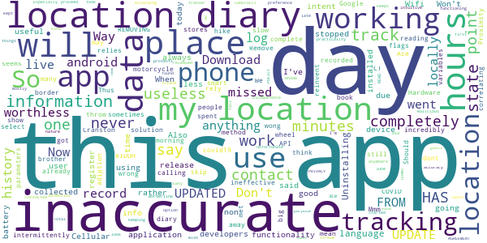

> Mmm  :date: __2020-06-26 05:59:51__

> The app completely missed my morning hike, seems to work only intermittently.  :date: __2020-06-26 04:36:49__

> "My location diary" doesn't do anything. It doesn't show where I have been. Don't throw away your log book. This is worthless.  :date: __2020-06-25 21:20:44__

> I dont think I spent 125 hours in one day at a location very inaccurate and may skip a few days and hours  :date: __2020-06-25 20:51:58__

> It is incredibly inaccurate. I live in Cranston. We went to the border of CT and got off the motorcycle for over 30 minutes. It didn't record my location at all that day. Now it's reading I was at Ace Hardware for HOURS. I wasn't there at all. Worthless. UPDATE - MY LOCATION DIARY HAS NOT UPDATED IN 10 DAYS. REMOVING THIS FROM MY PHONE.  :date: __2020-06-25 05:34:38__

> Thus app is not working on my android smart phone. No locations are being recorded.  :date: __2020-06-24 19:24:21__

> Completely inaccurate. This is the wrong solution. Should use Google COVID-19 Proximity Tracking API, which already works. But app relies on ineffective method that (sometimes) stores your (wong) location history locally and then flags you as a contact if RIDOH parameters have been met. So you still have to rely on people correlating information and calling you. Way too many variables will mean very slow, and never complete, adiption. Don't reinvent the wheel.  :date: __2020-06-24 05:16:21__

> Remove covid19  :date: __2020-06-22 06:32:14__

> F\*\** off big brother  :date: __2020-06-19 16:58:23__

> Download the app and select language preference but can't proceed from that point.  :date: __2020-06-14 14:30:46__

# Credits

This project makes use of the following main third-party projects:
* Androguard: [https://github.com/androguard/androguard](https://github.com/androguard/androguard)
* Androwarn: [https://github.com/maaaaz/androwarn](https://github.com/maaaaz/androwarn)
* google_play_scraper: [https://github.com/JoMingyu/google-play-scraper](https://github.com/JoMingyu/google-play-scraper)
* whois: [https://github.com/DannyCork/python-whois](https://github.com/DannyCork/python-whois)
* BeautifulSoup: [https://www.crummy.com/software/BeautifulSoup](https://www.crummy.com/software/BeautifulSoup)

Other open-source projects used in this project include: 

- androguard==3.3.5
- appnope==0.1.0
- asn1crypto==1.3.0
- backcall==0.1.0
- beautifulsoup4==4.9.0
- bs4==0.0.1
- certifi==2020.4.5.1
- cffi==1.14.0
- chardet==3.0.4
- click==7.1.2
- colorama==0.4.3
- cryptography==2.9.2
- cycler==0.10.0
- decorator==4.4.2
- future==0.18.2
- google-play-scraper==0.0.2.7
- idna==2.9
- ipython==7.13.0
- ipython-genutils==0.2.0
- jedi==0.17.0
- Jinja2==2.11.2
- joblib==0.14.1
- kiwisolver==1.2.0
- lxml==4.5.0
- MarkupSafe==1.1.1
- matplotlib==3.2.1
- networkx==2.4
- nltk==3.5
- numpy==1.18.3
- parso==0.7.0
- pexpect==4.8.0
- pickleshare==0.7.5
- Pillow==7.1.2
- play-scraper==0.6.0
- prompt-toolkit==3.0.5
- ptyprocess==0.6.0
- pycountry==19.8.18
- pycparser==2.20
- pydot==1.4.1
- Pygments==2.6.1
- pyOpenSSL==19.1.0
- pyparsing==2.4.7
- python-dateutil==2.8.1
- regex==2020.4.4
- requests==2.23.0
- requests-futures==1.0.0
- six==1.14.0
- soupsieve==2.0
- tld==0.12.1
- tqdm==4.45.0
- traitlets==4.3.3
- urllib3==1.25.9
- wcwidth==0.1.9
- wordcloud==1.7.0

