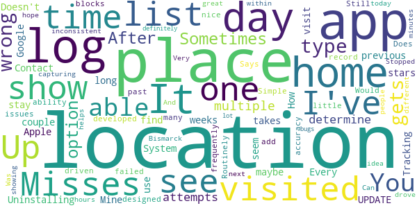
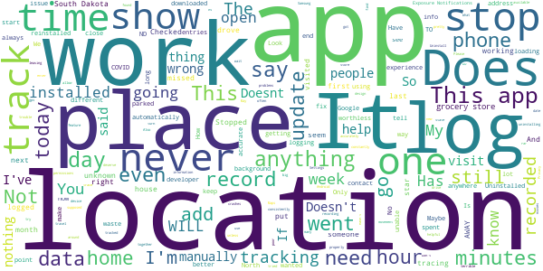
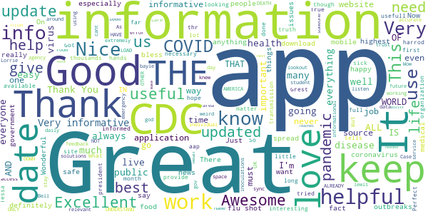

# COVID-related Android apps in US

Author: `Ivano Malavolta` (ivanomalavolta@gmail.com)

Created at: `2020/9/9`

Report generated by the [covid-apps-observer](http://github.com/covid-apps-observer) project, version 0.1

# Table of contents 

- [Background](#background)
    * [Data sources and analyses](#data-sources-and-analyses)
        * [App metadata](#app-metadata)
        * [Requested permissions](#requested-permissions)
        * [Mentioned servers](#mentioned_servers)
        * [Security analysis](#security_analysis)
        * [User ratings and reviews](#user-ratings-and-reviews)
    * [Disclaimer](#disclaimer)
- [Care19 Diary](#care19-diary)
- [FEMA](#fema)
- [CDC](#cdc)
- [CRUSH COVID RI](#crush-covid-ri)

- [Credits](#credits)

# How to read this report

This report has been generated by the [covid-apps-observer](http://github.com/covid-apps-observer) project. The project automatically analyzes the apps by extracting information which is already publicly available either on the web or in the apps binary files. 

Our analysis covers the following apps:
| | |
|-------------------------|-------------------------| 
|  | Care19 Diary
|  | FEMA
|  | CDC
|  | CRUSH COVID RI

The details of our analysis are presented in the remainder of this report.

For independent verification, the raw data and the source code of the project is publicly available in its GitHub repository [http://github.com/covid-apps-observer](http://github.com/covid-apps-observer) and its source code has been thoroughly commented in order to provide all the details about how the information provided in this report has been extracted. 

Any feedback, questions, and improvements about the project are very welcome, feel free to create an issue or pull request directly in its GitHub repository: [http://github.com/covid-apps-observer](http://github.com/covid-apps-observer).

## Data sources and analyses

The analysis of each app is structured around five main dimensions: 
* App metadata  
* Requested permissions
* Mentioned servers
* Androwarn analysis
* User ratings and reviews

In the following we describe the data sources and analysis performed for each dimension.

### App metadata

App metadata includes an overview of the main information about the app (for example, its name, releases, privacy policy, etc.), contact information of the development team, and the various Android versions supported by the app. This information is extracted from two main data sources:
* _Google Play store_: we automatically mined the web page of the Google Play store showing the basic information about the app and we parsed it in order to extract information about the app and development team 
* _Android Manifest file_: in our analysis we decompiled the binary file of the app (it is similar to a Zip archive but it contains the code of the app instead of normal files) and we extracted information about the supported Android versions, as it has been listed by its development team.

The extracted app metadata feeds the _App overview_, _Development team_, and _Android support_ sections of this report.
We make use of the [google-play-scraper](https://github.com/JoMingyu/google-play-scraper) tool for extracting the raw data related to this dimension of the project.

### Requested permissions

The Android operating system has a permission model which allows users to grant access to potentially privacy-related information. Every Android app has to explictly declare the permissions it needs to properly function in the Android Manifest file.  

In this report we also show the protection level of each permission, which is a key information for understanding how the requested permissions related to the user's privacy. We carefully analyzed the [official Android documentation (v. 29)](https://developer.android.com/reference/android/Manifest.permission), and it resulted that a permission requested by an Android app can belong to the following protection levels:
* **Dangerous**: higher-risk permissions that would give a requesting app access to private user data or control over the device that can negatively impact the user. Because this type of permission introduces potential risk, the system usually does not automatically grant it to the requesting app. For example, any dangerous permissions requested by an app may be displayed to the user and require confirmation before proceeding.
* **Normal**: this is the default and most common level in Android; normal permissions are lower-risk and give access to isolated app-level features, with minimal risk to other apps, the system, or the user. 
* **Signature**: permissions granted only if the requesting app is signed with the same certificate as the app that declared the permission
* **Appop**: old permission level, a reminiscence of the App Ops tool that Google introduced in Android 4.3.
* **Development**: optional permissions which can be granted to development-oriented apps.
* **Privileged**: permissions who give higher power to mobile apps w.r.t. other apps, such as binding to incoming calls, interacting via bluetooth with other devices without user interaction, etc.
* **Preinstalled**: reserved only for preinstalled apps
* **Installer**: allow the holder to start the permission usage screen for an app
* **RetailDemo**: permissions related to devices used in demonstrations in shops.
* **Pre23**: permissions automatically granted to apps targeting devices running pre-6.0 Android.
* **Upcoming**: permissions which will be released in the next version of the Android platform. 
* **Deprecated**: permissions belonging to old releases of the Android platform, they should not be used by developers since they will not be supported in the near future.
* **Not for use by third-party applications**: permissions which can be requested only by apps developed by Google.
* **Undefined**: this protection level is not documented by Google.

The permissions dimension of this project is based on the [Androguard](https://github.com/androguard/androguard) static analysis tool.

### Mentioned servers

We decompiled each app in order to look for all possible mentions of remote URLs. The mentioned URLs can refer to remote servers the the app is using for either sending or receiving information, web addresses for directing the user to an information website, and so on. 

:warning: It is important to note that this analysis is not meant to be complete and it is very prone to obfuscation. The servers reported here are simply _mentioned_ somewhere in the code of the app and are meant to just give an indication about the "hooks" of the app towards external resources. For example, for an Android app it is normal to contact Google services in order to send/receive push notifications, or to contact the servers of analytics services for having real-time diagnostics about crashes of the app or bugs.

This part of the analysis is based on the [Androguard](https://github.com/androguard/androguard) static analysis tool for identfying the raw URLs mentioned in the app; then, the information about each mentioned server is collected by performing a _whois_ lookup on the first-level domain present in the URL.

### Security analysis

This dimension is based on the [Androwarn](https://github.com/maaaaz/androwarn) structural and data flow analysis of Android bytecode. Androwarn is developed by the University of Lyon/INSA (France) and it has been used in several academic studies. According to its documentation, Androwarn targets the following categories of potential security issues:
* **Telephony identifiers exfiltration**: IMEI, IMSI, MCC, MNC, LAC, CID, operator's name, etc.
* **Device settings exfiltration**: software version, usage statistics, system settings, logs, etc.
* **Geolocation information leakage**: GPS/WiFi geolocation, etc.
* **Connection interfaces information exfiltration**: WiFi credentials, Bluetooth MAC adress, etc.
* **Telephony services abuse**: premium SMS sending, phone call composition, etc.
* **Audio/video flow interception**: call recording, video capture, etc.
* **Remote connection establishment**: socket open call, Bluetooth pairing, APN settings edit, etc.
* **PIM data leakage**: contacts, calendar, SMS, mails, clipboard, etc.
* **External memory operations**: file access on SD card, etc.
* **PIM data modification**: add/delete contacts, calendar events, etc.
* **Arbitrary code execution**: native code using JNI, UNIX command, privilege escalation, etc.
* **Denial of Service**: event notification deactivation, file deletion, process killing, virtual keyboard disable, terminal shutdown/reboot, etc.

Note: We do not consider this data point in the current version of our analyzers since it is too verbose for our purposes.

:warning: It is important to note that Androwarn is a static analysis tool, and as such it performs a variety of heuristics and approximations in its analyses. Said that, the results shown in this report are meant to provide an indication of _potential_ security issues and should be by no means treated as complete and correct.   

### User ratings and reviews

For this dimension we turn again to the web interface of the Google Play store. Firstly, we automatically mine summary statistics about user ratings from the web page of the app under analysis; then, we automatically download the newest 1000 reviews of the app under analysis. For each level of rating (5 stars, 4 stars, , etc., 1 star) we show:
- a word cloud presenting the main terms used by end users in their reviews in the Google Play store
- the last 10 reviews provided by app users in the Google Play store. 

This purposefully simple analysis is meant to help both future users and the development team of the app in understanding what are the main positive and negative points of the app under analysis.

We make use of the [google-play-scraper](https://github.com/JoMingyu/google-play-scraper) tool for extracting the raw data related to this dimension of the project.

## Disclaimer 

This report has been produced independently of any parties and its only objective is to help anybody in better understanding how COVID-related apps work in practice (and compare to each other). The results of this report are limited to the specific version of the software used for running the analyses and on the various heuristics implemented in there. In other words, the results of the analyzers may differ depending on the time and modalities in which they are executed. We do not guarantee that the results of the analyses and the corresponding contents of this report are fully complete or correct. The analysis software is licensed under the [MIT License](https://github.com/iivanoo/covid-apps-observer/blob/master/LICENSE).

# Care19 Diary
App version ``3.1``

Analyzed with [covid-apps-observer](http://github.com/covid-apps-observer) project, version ``0.1``

## App overview
| | |
|-------------------------|-------------------------| 
| **Name**&nbsp;&nbsp;&nbsp;&nbsp;&nbsp;&nbsp;&nbsp;&nbsp;&nbsp;&nbsp;&nbsp;&nbsp;&nbsp;&nbsp;&nbsp;&nbsp;&nbsp;&nbsp;&nbsp;&nbsp;&nbsp;&nbsp;&nbsp;&nbsp;&nbsp;&nbsp;&nbsp;&nbsp;&nbsp;&nbsp;&nbsp;&nbsp;&nbsp;&nbsp;&nbsp;&nbsp;&nbsp;&nbsp;&nbsp;&nbsp;  | Care19 Diary |
| **Unique identifier** | com.proudcrowd.care |
| **Link to Google Play** | [https://play.google.com/store/apps/details?id=com.proudcrowd.care](https://play.google.com/store/apps/details?id=com.proudcrowd.care) |
| **Summary**  | You can help stop the spread of Covid-19 |
| **Privacy policy** | [https://care19.app/privacy](https://care19.app/privacy) |
| **Latest version** | 3.1 |
| **Last update** | 2020-06-26 17:01:47 |
| **Recent changes** | Fix a bug where manually added visits could display a month off. |
| **Installs**  | 10,000+ |
| **Category** | Medical |
| **First release** | Apr 19, 2020 |
| **Size**  | 5.5M |
| **Supported Android version**  | 6.0 and up |

### Description
> Care19 is the official COVID-19 app for the states of South Dakota and North Dakota.  It can be used with reduced functionality in other US states.
 A key part of the contact tracing process is remembering where you have been over the last 5-10 days before testing positive.  This helps contact tracers determine people you may have been near while you were infectious. 
 Care19 is a digital diary that records places you visit.  Many of the places you visit can be recorded automatically by Care19 using the phone's location services.  In some cases you may need to manually add an entry if the automated routines miss a place visit.  This can happen based on a variety of environmental factors.
 You will not be asked to provide any personally identifiable information within the app. Location data will only be shared with the North Dakota or South Dakota Department of Health if you consent upon testing positive for COVID-19. This is done by sharing a code number displayed on the “About” section of the app.  
 If you use the Care19 app outside of North and South Dakota it can be used as a memory aide if you test positive and are contacted by your state's Department of Health.

### User interface
The developers of the app provide the following screenshots in the Google play store.
| | | |
|:-------------------------:|:-------------------------:|:-------------------------:|
 |   |   |   | 
 |  

## Development team
In the following we report the main information provided by the development team in the Google play store.

| | |
|-------------------------|-------------------------|
| **Developer**  | ProudCrowd, LLC |
| **Website**  | [https://www.care19.app](https://www.care19.app) |
| **Email** | tim.brookins@proudcrowd.com |
| **Physical address**  | - |
| **Other developed apps**  | [https://play.google.com/store/apps/developer?id=ProudCrowd,+LLC](https://play.google.com/store/apps/developer?id=ProudCrowd,+LLC) |

## Android support

| | |
|-------------------------|-------------------------|
| **Declared target Android version**  | Android10, version 10 (API level 29) |
| **Effective target Android version**  | Android10, version 10 (API level 29) |
| **Minimum supported Android version**  | Marshmallow, version 6.0 (API level 23) |
| **Maximum target Android version**  | - |

The larger the difference between the minimum and maximum supported Android versions, the better. A larger difference means a wider audience. For example, old phones have a very low Android version, so a high minimum supported Android version means that the app cannot be used by users with old phones, thus leading to accessibility problems. 

## Requested permissions

In the following we report the complete list of the permissions requested by the app. 

| **Permission** | **Protection level** | **Description** | 
|-------------------------|-------------------------|-------------------------|
 **android.permission ACCESS_BACKGROUND_LOCATION** | :warning:**Dangerous** | Allows an app to access location in the background. 
 **android.permission ACCESS_COARSE_LOCATION** | :warning:**Dangerous** | Allows an app to access approximate location. 
 **android.permission ACCESS_FINE_LOCATION** | :warning:**Dangerous** | Allows an app to access precise location. 
 **android.permission ACCESS_NETWORK_STATE** | Normal | Allows applications to access information about networks. 
 **android.permission ACTIVITY_RECOGNITION** | :warning:**Dangerous** | Allows an application to recognize physical activity. 
 **android.permission FOREGROUND_SERVICE** | Normal | Allows a regular application to use Service.startForeground. 
 **android.permission INTERNET** | Normal | Allows applications to open network sockets. 
 **android.permission RECEIVE_BOOT_COMPLETED** | Normal | Allows an application to receive the Intent.ACTION_BOOT_COMPLETED that is broadcast after the system finishes booting. 
 **android.permission WAKE_LOCK** | Normal | Allows using PowerManager WakeLocks to keep processor from sleeping or screen from dimming. 
 **com.google.android.c2dm.permission RECEIVE** | - | - 
 **com.google.android.finsky.permission BIND_GET_INSTALL_REFERRER_SERVICE** | - | - 
 **com.google.android.gms.permission ACTIVITY_RECOGNITION** | - | - 

## Mentioned servers

| **Server** | **Registrant** | **Registrant country** | **Creation date** | 
|-------------------------|-------------------------|-------------------------|-------------------------|
 | bugfender.com | Beenario GmbH | :de: DE | 2014-10-28 11:32:13 |
 | googlesyndication.com | Google LLC | :us: US | 2003-01-21 06:17:24 |
 | google.com | Google LLC | :us: US | 1997-09-15 04:00:00 |
 | app-measurement.com | Google LLC | :us: US | 2015-06-19 20:13:31 |
 | azurewebsites.net | Microsoft Corporation | :us: US | 2012-01-24 18:43:51 |
 | crashlytics.com | Google LLC | :us: US | 2011-01-21 15:30:40 |
 | googleapis.com | Google LLC | :us: US | 2005-01-25 17:52:26 |
 | googleadservices.com | Google LLC | :us: US | 2003-06-19 16:34:53 |

## Security analysis 

Below we report the main security warnings raised by our execution of the [Androwarn](https://github.com/maaaaz/androwarn) security analysis tool.

**Telephony identifiers leakage**
> - This application reads the MCC+MNC of the provider of the SIM 
> - This application reads the Service Provider Name (SPN) 
> - This application reads the numeric name (MCC+MNC) of current registered operator 
> - This application reads the operator name 

**Connection interfaces exfiltration**
> - This application reads details about the currently active data network 
> - This application tries to find out if the currently active data network is metered 

**Suspicious connection establishment**
> - This application opens a Socket and connects it to the remote address ' returned no addresses for  ; port is out of range' on the 'N/A' port  
> - This application opens a Socket and connects it to the remote address '' on the 'N/A' port  
> - This application opens a Socket and connects it to the remote address 'Ljava/lang/StringBuilder;->toString()Ljava/lang/String;' on the 'N/A' port  
> - This application opens a Socket and connects it to the remote address 'Ljava/net/Proxy;->type()Ljava/net/Proxy$Type;' on the 'N/A' port  
> - This application opens a Socket and connects it to the remote address 'timeout' on the 'N/A' port  

**Code execution**
> - This application executes a UNIX command containing this argument: 'logcat -c 2' 
> - This application executes a UNIX command containing this argument: 'logcat -c' 

## User ratings and reviews

Below we provide information about how end users are reacting to the app in terms of ratings and reviews in the Google Play store.

### Ratings

The Care19 Diary app has been installed by more than **10000** times. At this time, **194** rated the app and its average score is **2.55**. Below we show the distribution of the ratings across the usual star-based rating of Google Play

:star::star::star::star::star:: 58

:star::star::star::star:: 5

:star::star::star:: 13

:star::star:: 23

:star:: 93

### Reviews 

#### 5-star reviews

> Oh yeah all good  :date: __2020-08-27 06:36:26__

> Good  :date: __2020-08-02 22:27:07__

> Please help charlie foxtrot googlemaps Meunstergritsandassociatesllc 442 blanding blvd 333 ORANGEPARK,FL 32073  :date: __2020-07-18 21:29:25__

> Updated daily. Easy to use and informative.  :date: __2020-06-23 15:03:08__

> Cool  :date: __2020-06-20 05:50:45__

> Good idea  :date: __2020-06-20 00:01:28__

> Good  :date: __2020-06-16 20:33:40__

> Nudes help  :date: __2020-06-11 01:24:14__

> Awesome  :date: __2020-05-17 11:47:26__

> Love this app  :date: __2020-05-16 12:11:08__

#### 4-star reviews

> This picks up most of the places I go, and I check when I get home so I can add places it has missed or change inaccurate locations, which only happens when I am in an area with a lot of stores, like a plaza. My home state has not chosen an app so I use this one.  :date: __2020-07-10 22:03:28__

> I just dont have room on my phone:(  :date: __2020-07-06 11:55:41__

> Remember this is for north & south Dakota only.. other states will may add their state if they choose too. It will show other states but will not guarantee it at this time  :date: __2020-06-20 21:46:43__

> The early release back in April was rough (didn't log any stops for me). But it's been working well for me since about May 4. It occasionally logs more than one stop at the same location. It occasionally gets the name of the location wrong, but this is very easy to correct.  :date: __2020-05-19 06:25:30__

> It is great, it works, and I am excited for updates!  :date: __2020-04-29 03:31:46__

#### 3-star reviews

> How long do the places you visit stay on the app? Mine seem to show maybe only previous 10 days.  :date: __2020-08-13 23:41:30__

> It had gotten better at tracking my locations but since the last update it stopped all tracking.  :date: __2020-06-25 01:46:44__

> Doesn't this app use the Contact Tracking System that Apple and Google developed?  :date: __2020-06-02 15:29:17__

> Simple app. Does what it was designed for but little else. Misses many locations and frequently has location accuracy issues. Routinely misses my home by 6 blocks. Says I have visited locations I have just driven past. Would be nice to have ability to add locations that I visited but app failed to record.  :date: __2020-05-22 15:52:32__

> Still isn't capturing places I've been. Was at 3 different locations today, and not one of them showing up.  :date: __2020-05-20 23:03:13__

> Very inconsistent with location. Can be at a location for hours and doesn't list it.  :date: __2020-05-16 15:20:52__

> It's a great idea, but does not log most of the places I've been. Stopped at 6 places in Bismarck and didn't log one place. And then the next time it will log the same place 4 times within a few minutes or log a place I only drove by.  :date: __2020-05-14 02:20:12__

> I hope this helps people but there are definitely a lot of bugs  :date: __2020-05-04 05:28:59__

#### 2-star reviews

> Quit recording anything after about three weeks.  :date: __2020-07-26 05:30:54__

> Inaccurate didn't track me for days sometimes. Uninstalled it, that bad.  :date: __2020-07-19 03:31:36__

> Location info is incorrect and incomplete. I was able to fix the incorrect info, but can't add locations. Uninstalled and reinstalled on 6/24. Tracked my location until 6/27 then nothing.  :date: __2020-07-07 17:28:05__

> Gives a lot of erroneous locations that are passed while driving or stopping at a stop light. Some days it gives no information at all.. i reloaded it a couple of weeks ago. It worked well until July 3 then quit working, not registering any locations.  :date: __2020-07-04 20:23:07__

> Idk procedure to get my phone to let this work automatically in the background, out on the east coast  :date: __2020-07-02 20:56:10__

> It's not all that  :date: __2020-06-18 15:59:46__

> Not very accurate for locations. It does not show several places my wife & I have been for an hour or more and it shows us stopping at places we only drove passed on our way to our destination that does not show up. Very inaccurate. It's the same on both of our phones (Galaxy Note 9's). There is no way to add the places we did go to, only to delete the irrelevant ones or change the name from "Unknown" to a proper name. It's pointless/useless for tracking when this inaccurate.  :date: __2020-06-05 01:20:41__

> I have a samsung android phone and I used the app Tacoma 19 South Dakota app from Google Play. I have installed it and reinstalled it this install that reinstalled it and updated it every time. I have yet to see anything on my page of anywhere that I've been tracked it just keeps saying congratulations you are set up but doesn't detect that you win any places yet. I don't go very often but I have went to stores and I have spent more than 10 minutes there why can't I see where I have been?  :date: __2020-06-01 23:56:11__

> I wish this used the exposure API rather than log GPS coordinates. As I understand, the exposure API is just a log of device identifiers of other nearby phones, stored locally, rotated every 2 weeks. Your phone then simply downloads identifiers of any recent positives in your area and alerts you if they match any your phone has been near. That's very minimal impact on me and a health organization. For me, you don't know that I went to the eye doctor on Tuesday. For you: the health dept doesn't then have to go around in hazmat suits trying to play investigator - nor posting some public notice "HAVE YOU SEEN THIS WOMAN AT THE EYE DOCTOR ON TUESDAY? IF SO, YOU MAY BE INFECTED." One is a little more subtle message, cleans up after itself, puts the burden of response to the user, likely more reliable against device power savings features, and more battery friendly where a GPS/cell tower solution is more invasive, doesn't really capture proximity to another device, probably gets affected by device power savings features, elicits more work and exposes too much to a 3rd party. I'd just scrap this one and make an open source solution using the exposure API.  :date: __2020-05-26 20:08:29__

> Hasn't loaded anything in 3 days not impressed.  :date: __2020-05-22 14:57:46__

#### 1-star reviews

> Privacy  :date: __2020-08-27 22:42:43__

> Does not automatically track as it says it will. Also, I can enter manually in my phone but my wife's phone cannot manually input as the app freezes when she puts in date from calendar. Uninstalled and reinstalled the app but still have same problems.  :date: __2020-08-16 17:20:12__

> utTý5hat's drive changes b  :date: __2020-08-14 22:35:18__

> Edit: 8.10.20 Still same problems. If battery saver is issue, fix it. Update 6.27.20 - Tou can tell the developer(s) doesnt even use this app or they would know what we are talking about. You say it's just the way it is, no, you know how it's supposed to work, so find someone to make it work correctly. This app does not trace where I been going. It does not stay open in the background. When open, it does not show where I go or been since the 23rd. I restarted phone and reinstalled app on S9+  :date: __2020-08-11 03:56:40__

> Uninstall. I didn't put it in  :date: __2020-08-04 19:20:34__

> Doesn't do anything that Google Maps My Timeline can't do better. Maybe in a state with a competent health department it could. As I understand it in incompetent SC, it won't even do Bluetooth ID exchanges with other devices for contact tracing.  :date: __2020-07-30 01:57:38__

> I am unable to add places I have been. Every time I try the app crashes. And the visits don't show up when they should. I have tried uninstalling and reinstalling more than once. This app is a lemon.  :date: __2020-07-26 21:59:16__

> App doesn't work. I wanted an app that would track my location automatically and the people that I was around. Now that I have covid-19 I can't even notify anyone that I was in contact with  :date: __2020-07-17 19:43:16__

> Does this app work for Los Angeles, CA residents? It doesn’t seem to work when installed on my phone because I’m still unable to turn on “Exposure Notifications” after the app is installed. I’m going to Settings > Google > COVID-19 Exposure Notifications and the toggle to turn on Exposure Notifications will not respond.  :date: __2020-07-06 03:44:17__

> Keeps stopping  :date: __2020-07-05 05:31:18__

# FEMA
App version ``2.11.1``

Analyzed with [covid-apps-observer](http://github.com/covid-apps-observer) project, version ``0.1``

## App overview
| | |
|-------------------------|-------------------------| 
| **Name**&nbsp;&nbsp;&nbsp;&nbsp;&nbsp;&nbsp;&nbsp;&nbsp;&nbsp;&nbsp;&nbsp;&nbsp;&nbsp;&nbsp;&nbsp;&nbsp;&nbsp;&nbsp;&nbsp;&nbsp;&nbsp;&nbsp;&nbsp;&nbsp;&nbsp;&nbsp;&nbsp;&nbsp;&nbsp;&nbsp;&nbsp;&nbsp;&nbsp;&nbsp;&nbsp;&nbsp;&nbsp;&nbsp;&nbsp;&nbsp;  | FEMA |
| **Unique identifier** | gov.fema.mobile.android |
| **Link to Google Play** | [https://play.google.com/store/apps/details?id=gov.fema.mobile.android](https://play.google.com/store/apps/details?id=gov.fema.mobile.android) |
| **Summary**  | Weather alerts, safety tips and more to help before, during &amp; after disasters. |
| **Privacy policy** | [http://www.fema.gov/privacy-policy](http://www.fema.gov/privacy-policy) |
| **Latest version** | 2.11.1 |
| **Last update** | 2020-07-09 16:43:34 |
| **Recent changes** | - Added featured content section to home page for important information - Updated Mitigate Your Risk section with additional Do-It-Yourself categories - Section 508 Accessibility fixes - Updated mobile theme |
| **Installs**  | 1,000,000+ |
| **Category** | Weather |
| **First release** | Aug 24, 2011 |
| **Size**  | 3.3M |
| **Supported Android version**  | 4.4 and up |

### Description
> Emergency alerts, safety tips and resources to help before, during & after disasters.
 The FEMA App provides timely alerts and useful information to help you and your loved ones stay safe before, during and after disasters. Receive and share real-time notifications about disasters, severe weather, and other emergencies for up to five locations nationwide. This simple and easy-to-use resource also provides safety information, emergency preparedness tips, and disaster assistance.
 Features 
 •    Receive emergency alerts for up to five locations nationwide 
 •    Share real-time notifications with loved ones via text, email and social media
 •    Know what to do before, during, and after disasters, like earthquakes, wildfires, hurricanes, snowstorms, tornadoes, volcanoes, and more
 •    Prepare for disasters with an emergency kit checklist, emergency family plan, and reminders
 •    Locate open emergency shelters in your area
 •    Locate Disaster Recovery Centers near you where you can talk to a FEMA representative in person
 •    Connect with FEMA to apply for disaster assistance online
 •    Safety tips and disaster information available in English and Spanish (Note: alerts are only available in English)
 •    Follow the FEMA blog to learn about disaster response and recovery across the United States
 Terms of use: www.fema.gov/app.

### User interface
The developers of the app provide the following screenshots in the Google play store.
| | | |
|:-------------------------:|:-------------------------:|:-------------------------:|
 |   |   |   | 
 |   |   |   | 
 |   |   |   | 
 |   |   |   | 
 |   |   |   | 
 |   |   |   | 
 |   |   |   | 
 |  

## Development team
In the following we report the main information provided by the development team in the Google play store.

| | |
|-------------------------|-------------------------|
| **Developer**  | Federal Emergency Management Agency (FEMA) |
| **Website**  | [http://www.fema.gov](http://www.fema.gov) |
| **Email** | FEMA-New-Media@fema.dhs.gov |
| **Physical address**  | - |
| **Other developed apps**  | [https://play.google.com/store/apps/developer?id=Federal+Emergency+Management+Agency+(FEMA)](https://play.google.com/store/apps/developer?id=Federal+Emergency+Management+Agency+(FEMA)) |

## Android support

| | |
|-------------------------|-------------------------|
| **Declared target Android version**  | Pie, version 9 (API level 28) |
| **Effective target Android version**  | Pie, version 9 (API level 28) |
| **Minimum supported Android version**  | KitKat, version 4.4 - 4.4.4 (API level 19) |
| **Maximum target Android version**  | - |

The larger the difference between the minimum and maximum supported Android versions, the better. A larger difference means a wider audience. For example, old phones have a very low Android version, so a high minimum supported Android version means that the app cannot be used by users with old phones, thus leading to accessibility problems. 

## Requested permissions

In the following we report the complete list of the permissions requested by the app. 

| **Permission** | **Protection level** | **Description** | 
|-------------------------|-------------------------|-------------------------|
 **android.permission ACCESS_COARSE_LOCATION** | :warning:**Dangerous** | Allows an app to access approximate location. 
 **android.permission ACCESS_FINE_LOCATION** | :warning:**Dangerous** | Allows an app to access precise location. 
 **android.permission ACCESS_NETWORK_STATE** | Normal | Allows applications to access information about networks. 
 **android.permission INTERNET** | Normal | Allows applications to open network sockets. 
 **android.permission READ_APP_BADGE** | - | - 
 **android.permission RECEIVE_BOOT_COMPLETED** | Normal | Allows an application to receive the Intent.ACTION_BOOT_COMPLETED that is broadcast after the system finishes booting. 
 **android.permission VIBRATE** | Normal | Allows access to the vibrator. 
 **android.permission WAKE_LOCK** | Normal | Allows using PowerManager WakeLocks to keep processor from sleeping or screen from dimming. 
 **android.permission WRITE_EXTERNAL_STORAGE** | :warning:**Dangerous** | Allows an application to write to external storage. 
 **com.anddoes.launcher.permission UPDATE_COUNT** | - | - 
 **com.google.android.c2dm.permission RECEIVE** | - | - 
 **com.google.android.finsky.permission BIND_GET_INSTALL_REFERRER_SERVICE** | - | - 
 **com.htc.launcher.permission READ_SETTINGS** | - | - 
 **com.htc.launcher.permission UPDATE_SHORTCUT** | - | - 
 **com.huawei.android.launcher.permission CHANGE_BADGE** | - | - 
 **com.huawei.android.launcher.permission READ_SETTINGS** | - | - 
 **com.huawei.android.launcher.permission WRITE_SETTINGS** | - | - 
 **com.majeur.launcher.permission UPDATE_BADGE** | - | - 
 **com.oppo.launcher.permission READ_SETTINGS** | - | - 
 **com.oppo.launcher.permission WRITE_SETTINGS** | - | - 
 **com.sec.android.provider.badge.permission READ** | - | - 
 **com.sec.android.provider.badge.permission WRITE** | - | - 
 **com.sonyericsson.home.permission BROADCAST_BADGE** | - | - 
 **com.sonymobile.home.permission PROVIDER_INSERT_BADGE** | - | - 
 **me.everything.badger.permission BADGE_COUNT_READ** | - | - 
 **me.everything.badger.permission BADGE_COUNT_WRITE** | - | - 

## Mentioned servers

| **Server** | **Registrant** | **Registrant country** | **Creation date** | 
|-------------------------|-------------------------|-------------------------|-------------------------|
 | googlesyndication.com | Google LLC | :us: US | 2003-01-21 06:17:24 |
 | google.com | Google LLC | :us: US | 1997-09-15 04:00:00 |
 | google-analytics.com | Google LLC | :us: US | 2005-07-18 19:24:32 |
 | app-measurement.com | Google LLC | :us: US | 2015-06-19 20:13:31 |
 | googletagmanager.com | Google LLC | :us: US | 2011-11-11 23:39:05 |
 | gstatic.com | Google LLC | :us: US | 2008-02-11 15:31:25 |
 | whatsapp.com | Whatsapp Inc. | :us: US | 2008-09-04 12:39:12 |
 | googleapis.com | Google LLC | :us: US | 2005-01-25 17:52:26 |
 | googleadservices.com | Google LLC | :us: US | 2003-06-19 16:34:53 |

## Security analysis 

Below we report the main security warnings raised by our execution of the [Androwarn](https://github.com/maaaaz/androwarn) security analysis tool.

**Connection interfaces exfiltration**
> - This application reads details about the currently active data network 
> - This application tries to find out if the currently active data network is metered 

**Telephony services abuse**
> - This application makes phone calls 

**Code execution**
> - This application loads a native library: 'sqlc-native-driver' 
> - This application executes a UNIX command containing this argument: 'Ljava/lang/StringBuilder;->toString()Ljava/lang/String;' 

## User ratings and reviews

Below we provide information about how end users are reacting to the app in terms of ratings and reviews in the Google Play store.

### Ratings

The FEMA app has been installed by more than **1000000** times. At this time, **3292** rated the app and its average score is **4.1634617**. Below we show the distribution of the ratings across the usual star-based rating of Google Play

:star::star::star::star::star:: 2078

:star::star::star::star:: 464

:star::star::star:: 316

:star::star:: 73

:star:: 358

### Reviews 

#### 5-star reviews

> Love it!! Can check on family around the country and in different counties. If you set you phone to do not disturb, make sure to tell the do not disturb app that these messages are allowed. If you lower power saving level on android phones the app does not alert you.  :date: __2020-09-08 16:04:30__

> A must if you live at the coast!  :date: __2020-08-29 16:11:21__

> Good info  :date: __2020-08-19 06:16:24__

> Government  :date: __2020-08-19 00:15:04__

> Google maps Meunstergritsandassociatesllc incognito #thankyouforyourservice #cheetohs #china  :date: __2020-07-31 20:41:04__

> Great app! The only thing is, I wish it had a share button to send the Alerts to family & friends. Thank you for adding the share button!  :date: __2020-07-31 12:24:47__

> Excellent!!!!  :date: __2020-07-31 08:45:58__

> Thank you!🇵🇷🇺🇸🙋  :date: __2020-07-31 00:22:40__

> I love the sound of that!!  :date: __2020-07-26 18:18:13__

> Thanks fema helped me get the people thuer stimulus checks we wouls have gotten the sooner if my they vwasnt playing games  :date: __2020-07-26 07:50:10__

#### 4-star reviews

> Great app !!!!!!!!  :date: __2020-09-05 02:06:16__

> Overall decent, but I don't need 17 alerts in one hour for the same storm.  :date: __2020-08-24 01:10:21__

> I took care of a FEMA worker so I thought I would check out app  :date: __2020-07-27 23:49:33__

> It's missing the alerts Snow Squall Warning, Inland Hurricane Warning, Inland Hurricane Watch, Inland Tropical Storm Warning, and Inland Tropical Storm Watch.  :date: __2020-07-27 22:57:25__

> Fast reliablie services  :date: __2020-07-09 01:04:27__

> Great app.  :date: __2020-07-01 08:50:11__

> Great at giving alerts for different areas. Live posting during storms is excellent. Just be careful you don't list to many places to avoid constant updates.  :date: __2020-06-12 03:22:06__

> Only worth downloading if you're in a disaster situation. Otherwise it's not very useful.  :date: __2020-05-23 06:10:43__

> Extremely well covers high pop centers. However, little to no coverage in rural areas. We live in Benton County, MO...no coverage ANYWHERE here.  :date: __2020-05-22 15:48:47__

> Excelente  :date: __2020-05-22 01:23:54__

#### 3-star reviews

> Prepare: emergency safety tips: broken scroll and no clickables  :date: __2020-09-08 02:54:56__

> Difficult to navigate and doesn't provide info I expected  :date: __2020-09-06 08:45:22__

> The type is thinner and less legible with this update. The unnecessary style change reduces its usefulness to me. Plus, I have not received alerts about the smoke in my area or the fires near me although I specified that in the settings. So I uninstalled it.  :date: __2020-08-21 06:13:51__

> No notification alarm!!  :date: __2020-08-13 18:12:50__

> where's the warnings I used to get  :date: __2020-06-24 02:29:53__

> The back button does not exit the app.  :date: __2020-06-09 16:17:55__

> Should be updated & expanded upon more but for what it is, I like it and will be keeping it.  :date: __2020-05-08 07:51:52__

> I am a Harvey Hurrican victom me an my brother. When the hurrican was over i rent a place. My brother is with liver problems high blood pressure and hepitest. I am a copd lung condition also health problems. I am on home oxegen and four times a day with breathing treatments. Also my brother has a lung problem also woth Copd. We need Fema to help eith a house on Dickinson Texas , 77539. The place we rent has md and the land lord is a ok person but a slumlord. Fema to help us better living home  :date: __2020-04-20 08:40:27__

> The app did work great. I got a Samsung A10 and for some reason the notifications stopped working properly. The weather notifications are intermittent and my reminders for emergency kit, smoke detectors, etc. don't come through at all anymore. Suggestions? I'd like to give higher marks.  :date: __2020-04-09 04:12:19__

> FLASH FLOODING IN PHOENIX FLASH FLOODING IN PHOENIX FLASH FLOODING IN PHOENIX FLASH FLOODING IN PHOENIX FLASH FLOODING IN PHOENIX. I GET IT. I DON'T NEED A NEW NOTIFICATION EVERY 30 SECONDS.  :date: __2020-03-12 22:35:27__

#### 2-star reviews

> What is it with this app. I've.been trying to download it for three days how long does it take to for it to download .we are about to be hit with a hurracain.this is messed.up  :date: __2020-08-23 03:40:24__

> Getting several alerts with little or no lead time. Several other alerts just multiples of previous alerts with no changes in them at all. That's probably FEMA but still downgrades usefulness.  :date: __2020-07-19 21:22:25__

> This app did not help me.  :date: __2020-06-19 19:14:29__

> It really does do absolutely nothing. Not even sure why i have it  :date: __2020-04-28 15:16:55__

> Alerts are way too excessive.. It's a little windy in my area and I get notifications what feel like every 5 minutes. Had to delete the app because it was so annoying.  :date: __2020-04-10 21:47:54__

> It's a weather alert app. I'm getting constant weather alerts during a pandemic lockdown  :date: __2020-03-29 17:05:00__

> When I click on "Alerts," I get a message saying that I have to enable them in the app settings. But when I get into the settings, I can't find anything that does that.  :date: __2020-03-21 20:10:32__

> App does not give alerts. At one time it worked.  :date: __2019-06-18 03:25:56__

> The app seems to be very inconsistent. Sometimes i get alerts, sometimes I don't. I've uninstalled and reinstalled a few times but it hasn't helped. Very disappointing.  :date: __2019-03-03 23:10:36__

> Why new permission without reason? Added finsky bind referer without statement of why or what for  :date: __2018-10-09 16:45:58__

#### 1-star reviews

> Doesn't work . Can't scroll on screen or get may location informaton  :date: __2020-09-09 13:06:18__

> No point in having the app. You go to check your application status and it brings you to the website. App serves no purpose.  :date: __2020-09-05 00:28:47__

> I cannot log in i need to check my status  :date: __2020-08-31 07:30:24__

> What is this nonsense about agreeing to terms for "PURCHASES"? I do NOT need this and would rather have not installed it.  :date: __2020-08-26 01:09:32__

> Needs to be GPS enabled. I shouldn't have to create a list of areas to monitor  :date: __2020-07-22 14:55:20__

> App should work as a REAL emergency service! No wifi or data usage! With today's technology & the dangerous times we r living in as well as facing especially with riots & illness! This app is put on by OUR GOVERNMENT!! IT SHOULD WORK FLAWLESSLY!! I think y'all r paid enough to PROTECT US! YOU SHOULD DO YOUR JOB!!! So sick n tired of the buck being passed & the excuses! YOU WANTED UR JOB SO DO IT! OR FIND ANOTHER!  :date: __2020-07-17 17:56:20__

> DENIED all my RIGHTS  :date: __2020-07-14 08:31:08__

> I would look them up and see what they are really about. We need less government in our life and lower We are Tax Enough Already.  :date: __2020-07-07 14:51:55__

> Don't trust fema  :date: __2020-06-26 20:16:46__

> The app should work off line. I cannot use the app with cellular data. Alerts set to my location only notify me when I have Wi-Fi and completely disappear if I'm not connected. How is this convenient during a disaster?  :date: __2020-06-21 22:29:23__

# CDC
App version ``3.1.1``

Analyzed with [covid-apps-observer](http://github.com/covid-apps-observer) project, version ``0.1``

## App overview
| | |
|-------------------------|-------------------------| 
| **Name**&nbsp;&nbsp;&nbsp;&nbsp;&nbsp;&nbsp;&nbsp;&nbsp;&nbsp;&nbsp;&nbsp;&nbsp;&nbsp;&nbsp;&nbsp;&nbsp;&nbsp;&nbsp;&nbsp;&nbsp;&nbsp;&nbsp;&nbsp;&nbsp;&nbsp;&nbsp;&nbsp;&nbsp;&nbsp;&nbsp;&nbsp;&nbsp;&nbsp;&nbsp;&nbsp;&nbsp;&nbsp;&nbsp;&nbsp;&nbsp;  | CDC |
| **Unique identifier** | gov.cdc.general |
| **Link to Google Play** | [https://play.google.com/store/apps/details?id=gov.cdc.general](https://play.google.com/store/apps/details?id=gov.cdc.general) |
| **Summary**  | Health Information at Your Fingertips—CDC 24/7 |
| **Privacy policy** | [http://t.cdc.gov/1MVV](http://t.cdc.gov/1MVV) |
| **Latest version** | 3.1.1 |
| **Last update** | 2020-06-26 16:45:07 |
| **Recent changes** | Fixed issue where content sometimes loaded improperly in a new browser window |
| **Installs**  | 100,000+ |
| **Category** | Health & Fitness |
| **First release** | Oct 16, 2012 |
| **Size**  | 35M |
| **Supported Android version**  | 4.1 and up |

### Description
> Get the official CDC Mobile application to access the most up to date health information.
 FILTERING OPTIONS
 Organize your home screen so that the information that’s most important to you appears first! Turn off the content you don’t want with just a flip of a switch and reset it all with the tap of a button.
 CONTENT
 The app ensures that you’re getting the most up to date health information. The home screen lets you see all your information in one place and updates whenever your device is connected to WI-FI. Enjoy a greater variety of content such as Disease of the Week, disease case counts, videos, podcasts, and features to give you the most current health information from CDC. 
 Browse Featured Articles, stay on top of health news in the Newsroom section, and view CDC Images of the Week. If you’re a journal reader, view the latest Morbidity & Mortality Weekly Report, Emerging and Infectious Disease journal, or the latest on Preventing Chronic Diseases. You can even search CDC’s web content from the app.  
 We'd love to hear your thoughts about the app! Rate the CDC Mobile App in the App Store or leave a comment to let us know how we're doing. You can even send us an email through the app if you have suggestions for improvements!
 DISCLAIMER
 THE MATERIALS EMBODIED IN THIS SOFTWARE ARE PROVIDED TO YOU "AS-IS" AND WITHOUT WARRANTY OF ANY KIND, EXPRESSED, IMPLIED OR OTHERWISE, INCLUDING WITHOUT LIMITATION, ANY WARRANTY OF FITNESS FOR A PARTICULAR PURPOSE. IN NO EVENT SHALL THE CENTERS FOR DISEASE CONTROL AND PREVENTION (CDC) OR THE UNITED STATES (U.S.) GOVERNMENT BE LIABLE TO YOU OR ANYONE ELSE FOR ANY DIRECT, SPECIAL, INCIDENTAL, INDIRECT OR CONSEQUENTIAL DAMAGES OF ANY KIND, OR ANY DAMAGES WHATSOEVER, INCLUDING WITHOUT LIMITATION, LOSS OF PROFIT, LOSS OF USE, SAVINGS OR REVENUE, OR THE CLAIMS OF THIRD PARTIES, WHETHER OR NOT CDC OR THE U.S. GOVERNMENT HAS BEEN ADVISED OF THE POSSIBILITY OF SUCH LOSS, HOWEVER CAUSED AND ON ANY THEORY OF LIABILITY, ARISING OUT OF OR IN CONNECTION WITH THE POSSESSION, USE OR PERFORMANCE OF THIS SOFTWARE.

### User interface
The developers of the app provide the following screenshots in the Google play store.
| | | |
|:-------------------------:|:-------------------------:|:-------------------------:|
 |   |   |   | 
 |   |   |   | 
 |   |   |   | 
 |   |   |   | 

## Development team
In the following we report the main information provided by the development team in the Google play store.

| | |
|-------------------------|-------------------------|
| **Developer**  | Centers for Disease Control and Prevention |
| **Website**  | [http://www.cdc.gov](http://www.cdc.gov) |
| **Email** | CDCMobileDevelopment@cdc.gov |
| **Physical address**  | - |
| **Other developed apps**  | [https://play.google.com/store/apps/developer?id=Centers+for+Disease+Control+and+Prevention](https://play.google.com/store/apps/developer?id=Centers+for+Disease+Control+and+Prevention) |

## Android support

| | |
|-------------------------|-------------------------|
| **Declared target Android version**  | Pie, version 9 (API level 28) |
| **Effective target Android version**  | Pie, version 9 (API level 28) |
| **Minimum supported Android version**  | Jelly Bean, version 4.1.x (API level 16) |
| **Maximum target Android version**  | - |

The larger the difference between the minimum and maximum supported Android versions, the better. A larger difference means a wider audience. For example, old phones have a very low Android version, so a high minimum supported Android version means that the app cannot be used by users with old phones, thus leading to accessibility problems. 

## Requested permissions

In the following we report the complete list of the permissions requested by the app. 

| **Permission** | **Protection level** | **Description** | 
|-------------------------|-------------------------|-------------------------|
 **android.permission ACCESS_NETWORK_STATE** | Normal | Allows applications to access information about networks. 
 **android.permission ACCESS_WIFI_STATE** | Normal | Allows applications to access information about Wi-Fi networks. 
 **android.permission FOREGROUND_SERVICE** | Normal | Allows a regular application to use Service.startForeground. 
 **android.permission INTERNET** | Normal | Allows applications to open network sockets. 
 **android.permission READ_APP_BADGE** | - | - 
 **android.permission RECEIVE_BOOT_COMPLETED** | Normal | Allows an application to receive the Intent.ACTION_BOOT_COMPLETED that is broadcast after the system finishes booting. 
 **android.permission VIBRATE** | Normal | Allows access to the vibrator. 
 **android.permission WAKE_LOCK** | Normal | Allows using PowerManager WakeLocks to keep processor from sleeping or screen from dimming. 
 **android.permission WRITE_EXTERNAL_STORAGE** | :warning:**Dangerous** | Allows an application to write to external storage. 
 **com.amazon.device.messaging.permission RECEIVE** | - | - 
 **com.anddoes.launcher.permission UPDATE_COUNT** | - | - 
 **com.google.android.c2dm.permission RECEIVE** | - | - 
 **com.google.android.finsky.permission BIND_GET_INSTALL_REFERRER_SERVICE** | - | - 
 **com.htc.launcher.permission READ_SETTINGS** | - | - 
 **com.htc.launcher.permission UPDATE_SHORTCUT** | - | - 
 **com.huawei.android.launcher.permission CHANGE_BADGE** | - | - 
 **com.huawei.android.launcher.permission READ_SETTINGS** | - | - 
 **com.huawei.android.launcher.permission WRITE_SETTINGS** | - | - 
 **com.majeur.launcher.permission UPDATE_BADGE** | - | - 
 **com.oppo.launcher.permission READ_SETTINGS** | - | - 
 **com.oppo.launcher.permission WRITE_SETTINGS** | - | - 
 **com.sec.android.provider.badge.permission READ** | - | - 
 **com.sec.android.provider.badge.permission WRITE** | - | - 
 **com.sonyericsson.home.permission BROADCAST_BADGE** | - | - 
 **com.sonymobile.home.permission PROVIDER_INSERT_BADGE** | - | - 
 **gov.cdc.general.permission RECEIVE_ADM_MESSAGE** | - | - 
 **me.everything.badger.permission BADGE_COUNT_READ** | - | - 
 **me.everything.badger.permission BADGE_COUNT_WRITE** | - | - 

## Mentioned servers

| **Server** | **Registrant** | **Registrant country** | **Creation date** | 
|-------------------------|-------------------------|-------------------------|-------------------------|
 | android.com | Google LLC | :us: US | 1997-06-23 04:00:00 |
 | googlesyndication.com | Google LLC | :us: US | 2003-01-21 06:17:24 |
 | google.com | Google LLC | :us: US | 1997-09-15 04:00:00 |
 | app-measurement.com | Google LLC | :us: US | 2015-06-19 20:13:31 |
 | facebook.com | Facebook, Inc. | :us: US | 1997-03-29 05:00:00 |
 | pinterest.com | DNStination Inc. | :us: US | 2009-11-26 19:21:23 |
 | twitter.com | Twitter, Inc. | :us: US | 2000-01-21 16:28:17 |
 | adobedtm.com | Adobe Inc. | :us: US | 2013-11-22 23:15:17 |
 | w3.org | W3C | :us: US | 1994-07-06 04:00:00 |
 | googleapis.com | Google LLC | :us: US | 2005-01-25 17:52:26 |
 | hockeyapp.net | Microsoft Corporation | :us: US | 2011-01-23 18:46:43 |
 | pushwoosh.com | Arello Mobile | :new_zealand: NZ | 2011-05-02 11:00:31 |
 | googleadservices.com | Google LLC | :us: US | 2003-06-19 16:34:53 |

## Security analysis 

Below we report the main security warnings raised by our execution of the [Androwarn](https://github.com/maaaaz/androwarn) security analysis tool.

**Telephony identifiers leakage**
> - This application reads the ISO country code equivalent for the SIM provider's country code 
> - This application reads the ISO country code equivalent of the current registered operator's MCC (Mobile Country Code) 
> - This application reads the MCC+MNC of the provider of the SIM 
> - This application reads the Service Provider Name (SPN) 
> - This application reads the device phone type value 
> - This application reads the numeric name (MCC+MNC) of current registered operator 
> - This application reads the operator name 
> - This application reads the phone number string for line 1, for example, the MSISDN for a GSM phone 
> - This application reads the radio technology (network type) currently in use on the device for data transmission 
> - This application reads the unique device ID, i.e the IMEI for GSM and the MEID or ESN for CDMA phones 

**Location lookup**
> - This application reads location information from all available providers (WiFi, GPS etc.) 

**Connection interfaces exfiltration**
> - This application reads details about the currently active data network 
> - This application tries to find out if the currently active data network is metered 

**Suspicious connection establishment**
> - This application opens a Socket and connects it to the remote address '' on the 'N/A' port  
> - This application opens a Socket and connects it to the remote address 'Ljava/lang/StringBuilder;->toString()Ljava/lang/String;' on the ': connect, resolve' port  
> - This application opens a Socket and connects it to the remote address 'Ljava/lang/StringBuilder;->toString()Ljava/lang/String;' on the 'N/A' port  
> - This application opens a Socket and connects it to the remote address 'Ljava/net/Proxy;->type()Ljava/net/Proxy$Type;' on the 'N/A' port  
> - This application opens a Socket and connects it to the remote address 'timeout' on the 'N/A' port  

**Pim data leakage**
> - This application accesses the downloads folder 
> - This application accesses data stored in the clipboard 

**Code execution**
> - This application loads a native library 
> - This application executes a UNIX command containing this argument: '2' 
> - This application executes a UNIX command containing this argument: 'Ljava/lang/StringBuilder;->toString()Ljava/lang/String;' 

## User ratings and reviews

Below we provide information about how end users are reacting to the app in terms of ratings and reviews in the Google Play store.

### Ratings

The CDC app has been installed by more than **100000** times. At this time, **1468** rated the app and its average score is **3.8181818**. Below we show the distribution of the ratings across the usual star-based rating of Google Play

:star::star::star::star::star:: 790

:star::star::star::star:: 184

:star::star::star:: 143

:star::star:: 133

:star:: 215

### Reviews 

#### 5-star reviews

> good  :date: __2020-09-09 12:18:04__

> Works for me lol  :date: __2020-09-08 12:59:02__

> Excellent reference source.  :date: __2020-09-02 17:35:05__

> Like this app because of the usefull Information it have  :date: __2020-08-23 23:39:44__

> N/A  :date: __2020-08-17 16:28:56__

> I have always used this app.  :date: __2020-08-17 03:41:55__

> Great  :date: __2020-08-14 15:54:32__

> I like the app  :date: __2020-08-07 19:35:07__

> a lot of information  :date: __2020-07-29 09:53:51__

> Seems as informative as we can get.  :date: __2020-07-27 00:32:28__

#### 4-star reviews

> It's the only coronavirus app, so make it good. Just won't load. This is dangerous!! UPDATE: ok I think they fixed it  :date: __2020-09-07 22:40:29__

> Provides clear and factual science on COVID-19 developments  :date: __2020-07-31 23:53:35__

> Sarahlandry ex sex here  :date: __2020-06-11 01:25:36__

> Too many notifications about the virus made me depressed. Good app for a free one, just need better notification options.  :date: __2020-05-31 20:08:18__

> It's useful but hard to find what I'm looking for  :date: __2020-05-27 02:18:04__

> It's OK. Notjing to brag about. Haven't used it that much really.  :date: __2020-05-15 06:06:05__

> Very little data a available.  :date: __2020-05-08 15:45:49__

> Not sure its functions or How it works  :date: __2020-04-25 10:08:09__

> I love the CDC but I wish it wouldn't be a app that puts you on the internet  :date: __2020-04-23 02:17:52__

> Let's go walking Yes ok?  :date: __2020-04-21 19:21:07__

#### 3-star reviews

> Under WH control! It is what it is.  :date: __2020-08-26 03:35:25__

> I think the apps utilization could be much better but overall the app is very helpful for information.  :date: __2020-08-23 04:24:46__

> Needs to make the covid tracker avalible on this app.  :date: __2020-08-05 14:36:00__

> This application was good but I wish it would have a section on were the were the covid-19 was maybe they should work with Google maps to show the information. Like how the escort raider detector application live feed.  :date: __2020-07-07 15:05:04__

> program has good info, does not rotate to horizontal.  :date: __2020-06-14 15:51:53__

> I get more information from Bing  :date: __2020-06-11 07:46:28__

> Depresing inormationb  :date: __2020-06-04 04:00:19__

> What happened to the daily updates? Did Trump get to you? Ah science. What do you matter.  :date: __2020-05-26 18:27:05__

> Disappointing. Not as useful as I expected. Doesn't show up to date info. Just info we've already seen 1000 times. Expected more from the CDC whom I've always respected.  :date: __2020-05-23 06:09:07__

> App does not work on android phones.  :date: __2020-05-15 00:22:26__

#### 2-star reviews

> I downloaded this for coronavirus updates for my area no updated information. Some dates back to june 2 abd its July 6th.  :date: __2020-07-06 13:27:08__

> No covid-19 disease case count?  :date: __2020-06-26 02:32:43__

> Informative, not an exposure tracker. This app also has no notifications.  :date: __2020-06-13 04:07:56__

> Didn't use this app much so I can't tell you much about it..you gonna have to try it and decide for yourself.... good luck...  :date: __2020-06-07 15:28:34__

> I hear the very Patriot Japanese have a Voluntary CoVid19 website where they have the option to report if they feel sick or well and their accurate tracking, voluntarily. Scientists says this raw data would be useful. So which Politicians are again standing in the way of Public Health and Progress??  :date: __2020-05-25 06:30:00__

> I give only two stars only because I've only learned of the "CDC" Due to the Covid-19. Im very secluded other then facebook so i regret i can not rate CDC with a higher rating.  :date: __2020-05-07 08:06:04__

> Poor app mise well use website as this is a glorious bookmark hidden as an app in my opinion  :date: __2020-04-30 07:18:34__

> Ok  :date: __2020-04-28 15:22:50__

> This damn app doesn't exit  :date: __2020-04-23 08:54:01__

> Use the website it is far superior, this app has a blatant lack of organization, however does contain useful information.  :date: __2020-04-19 03:08:59__

#### 1-star reviews

> We can no longer trust the CDC.  :date: __2020-09-03 02:55:12__

> Case count for covid is not available. Covid information is too bast it lacks its own menu or search box.  :date: __2020-08-31 14:45:50__

> No alarm  :date: __2020-08-25 19:57:33__

> I wanted Covid detail for Texas, no such luck.......  :date: __2020-08-24 20:09:37__

> Slow and wrong information.  :date: __2020-08-23 14:09:31__

> All it does is white screen  :date: __2020-08-16 19:13:23__

> Racist fear mongering app  :date: __2020-08-08 17:44:06__

> No big deal just the same stuff you see in Facebook  :date: __2020-08-05 06:42:37__

> Cannot load mos t pages.. Really useless.  :date: __2020-07-29 00:43:28__

> Useless  :date: __2020-07-28 21:40:00__

# CRUSH COVID RI
App version ``2.0``

Analyzed with [covid-apps-observer](http://github.com/covid-apps-observer) project, version ``0.1``

## App overview
| | |
|-------------------------|-------------------------| 
| **Name**&nbsp;&nbsp;&nbsp;&nbsp;&nbsp;&nbsp;&nbsp;&nbsp;&nbsp;&nbsp;&nbsp;&nbsp;&nbsp;&nbsp;&nbsp;&nbsp;&nbsp;&nbsp;&nbsp;&nbsp;&nbsp;&nbsp;&nbsp;&nbsp;&nbsp;&nbsp;&nbsp;&nbsp;&nbsp;&nbsp;&nbsp;&nbsp;&nbsp;&nbsp;&nbsp;&nbsp;&nbsp;&nbsp;&nbsp;&nbsp;  | CRUSH COVID RI |
| **Unique identifier** | com.ri.crushcovid |
| **Link to Google Play** | [https://play.google.com/store/apps/details?id=com.ri.crushcovid](https://play.google.com/store/apps/details?id=com.ri.crushcovid) |
| **Summary**  | CRUSH COVID RI is the COVID-19 response app for Rhode Island. #CrushCovidRI |
| **Privacy policy** | [https://health.ri.gov/covid/crush/privacypolicy/](https://health.ri.gov/covid/crush/privacypolicy/) |
| **Latest version** | 2.0 |
| **Last update** | 2020-07-09 19:11:26 |
| **Recent changes** | This update includes the following:  - Added Portuguese  - Improved My Symptom Diary (formerly My Symptom Checker)  - Improved My Location Diary  - Updated Get Tested and FAQs  - Updated Contact Us |
| **Installs**  | 10,000+ |
| **Category** | Health & Fitness |
| **First release** | May 15, 2020 |
| **Size**  | 15M |
| **Supported Android version**  | 8.0 and up |

### Description
> CRUSH COVID RI is a COVID-19 pandemic response app that provides Rhode Islanders with easy access to all of the resources required during the public health crisis, and includes features such as a location diary and symptom diary. 
  
 All Rhode Islanders are encouraged to use the CRUSH COVID RI app and take an active role in slowing the spread of COVID-19 in Rhode Island.  You can make a difference in the health of your loved ones and your community by helping us track the virus in our state.  
  
 CRUSH COVID RI is a one-stop place to get all the information you need about COVID-19 in Rhode Island. It also has two features you can use to help everyone in the community.  
  
 The My Location Diary feature uses GPS location data that is already available from your phone to help you easily track the places you visited over the past 20 days. All data will be stored locally on your device. It is only shared when you voluntarily decide to share it. If you test positive for COVID-19, and you agree to share this information with the Rhode Island Department of Health, they can quickly identify places you went and people you were in contact with and reduce the spread of COVID-19.    
  
 The My Symptom Diary feature lets you tell us if you have any symptoms and only asks you to provide your zip code.  If you submit this quick survey daily, it will help give us early indicators of COVID-19 spread in certain zip codes so we can respond by doing things like setting up testing sites in that area.  
  
 Together we can #CrushCovidRI. 
  
 Please see our Terms of Use (https://health.ri.gov/covid/crush/termsofuse/) & Privacy Policy (https://health.ri.gov/covid/crush/privacypolicy/) for further information.

### User interface
The developers of the app provide the following screenshots in the Google play store.
| | | |
|:-------------------------:|:-------------------------:|:-------------------------:|
 |   |   |   | 
 |   |   |   | 
 |   |  

## Development team
In the following we report the main information provided by the development team in the Google play store.

| | |
|-------------------------|-------------------------|
| **Developer**  | State of Rhode Island |
| **Website**  | [https://health.ri.gov/crushcovid](https://health.ri.gov/crushcovid) |
| **Email** | CrushCovid.Survey@health.ri.gov |
| **Physical address**  | - |
| **Other developed apps**  | [https://play.google.com/store/apps/developer?id=State+of+Rhode+Island](https://play.google.com/store/apps/developer?id=State+of+Rhode+Island) |

## Android support

| | |
|-------------------------|-------------------------|
| **Declared target Android version**  | Android10, version 10 (API level 29) |
| **Effective target Android version**  | Android10, version 10 (API level 29) |
| **Minimum supported Android version**  | Oreo, version 8.0.0 (API level 26) |
| **Maximum target Android version**  | - |

The larger the difference between the minimum and maximum supported Android versions, the better. A larger difference means a wider audience. For example, old phones have a very low Android version, so a high minimum supported Android version means that the app cannot be used by users with old phones, thus leading to accessibility problems. 

## Requested permissions

In the following we report the complete list of the permissions requested by the app. 

| **Permission** | **Protection level** | **Description** | 
|-------------------------|-------------------------|-------------------------|
 **android.permission ACCESS_FINE_LOCATION** | :warning:**Dangerous** | Allows an app to access precise location. 
 **android.permission ACCESS_NETWORK_STATE** | Normal | Allows applications to access information about networks. 
 **android.permission ACCESS_WIFI_STATE** | Normal | Allows applications to access information about Wi-Fi networks. 
 **android.permission FOREGROUND_SERVICE** | Normal | Allows a regular application to use Service.startForeground. 
 **android.permission INTERNET** | Normal | Allows applications to open network sockets. 
 **android.permission WAKE_LOCK** | Normal | Allows using PowerManager WakeLocks to keep processor from sleeping or screen from dimming. 
 **com.google.android.c2dm.permission RECEIVE** | - | - 
 **com.google.android.finsky.permission BIND_GET_INSTALL_REFERRER_SERVICE** | - | - 

## Mentioned servers

| **Server** | **Registrant** | **Registrant country** | **Creation date** | 
|-------------------------|-------------------------|-------------------------|-------------------------|
 | android.com | Google LLC | :us: US | 1997-06-23 04:00:00 |
 | google.com | Google LLC | :us: US | 1997-09-15 04:00:00 |
 | app-measurement.com | Google LLC | :us: US | 2015-06-19 20:13:31 |
 | mapbox.com | Whois Privacy Service | :us: US | 2003-11-27 11:15:57 |
 | googlesyndication.com | Google LLC | :us: US | 2003-01-21 06:17:24 |
 | crashlytics.com | Google LLC | :us: US | 2011-01-21 15:30:40 |
 | googleapis.com | Google LLC | :us: US | 2005-01-25 17:52:26 |
 | googleadservices.com | Google LLC | :us: US | 2003-06-19 16:34:53 |

## Security analysis 

Below we report the main security warnings raised by our execution of the [Androwarn](https://github.com/maaaaz/androwarn) security analysis tool.

**Telephony identifiers leakage**
> - This application reads the numeric name (MCC+MNC) of current registered operator 
> - This application reads the operator name 
> - This application reads the radio technology (network type) currently in use on the device for data transmission 

**Connection interfaces exfiltration**
> - This application reads details about the currently active data network 
> - This application tries to find out if the currently active data network is metered 

**Telephony services abuse**
> - This application makes phone calls 

**Suspicious connection establishment**
> - This application opens a Socket and connects it to the remote address '; exhausted proxy configurations: ' on the 'N/A' port  
> - This application opens a Socket and connects it to the remote address 'Ljava/lang/StringBuilder;->toString()Ljava/lang/String;' on the 'N/A' port  
> - This application opens a Socket and connects it to the remote address 'Ljava/net/Proxy;->type()Ljava/net/Proxy$Type;' on the 'N/A' port  
> - This application opens a Socket and connects it to the remote address 'Ljava/net/SocketException;' on the 'N/A' port  
> - This application opens a Socket and connects it to the remote address 'timeout' on the 'N/A' port  

**Code execution**
> - This application loads a native library 

## User ratings and reviews

Below we provide information about how end users are reacting to the app in terms of ratings and reviews in the Google Play store.

### Ratings

The CRUSH COVID RI app has been installed by more than **10000** times. At this time, **187** rated the app and its average score is **2.84**. Below we show the distribution of the ratings across the usual star-based rating of Google Play

:star::star::star::star::star:: 46

:star::star::star::star:: 26

:star::star::star:: 28

:star::star:: 22

:star:: 63

### Reviews 

#### 5-star reviews

> Works  :date: __2020-08-21 09:27:11__

> Great App  :date: __2020-08-13 03:47:45__

> I think its Great, I love it.  :date: __2020-07-12 18:48:06__

> Easy to use.  :date: __2020-07-12 14:55:30__

> Easy to use  :date: __2020-07-10 19:37:14__

> Very easy to use and I like that it makes it easier to do contact tracing if I get sick. If I miss the Governor's press conference while I'm at work all I have to do is just go on the app and I'm up to date.  :date: __2020-06-10 00:54:57__

> Great idea so far  :date: __2020-06-05 02:12:52__

> Pixel 3 phone, no issues installing app, working as designed  :date: __2020-06-03 21:37:55__

> Excellent tool to track all those sick people.  :date: __2020-05-29 21:11:47__

> Eats to much battery  :date: __2020-05-27 18:23:52__

#### 4-star reviews

> more f  :date: __2020-08-06 01:07:34__

> Kudos to the state and the developers for working to put this out. Maybe needs some improvements but none I can suggest. Last update was great allowing us to add names to location diary.  :date: __2020-07-13 23:21:21__

> Update: started using again with the update to see if there is improvement. Still need to add a manual addition for location if the locator doesn't pick up where you were for less that 10 minutes. Also, you still can't fix where you went if the locator is slightly off. Today, I went bowling, not get my nails done. Now you can add notes, so that helps. Location info not 100% accurate. Since I don't spend 20 minutes at every place I visit, you should add a location manually button.  :date: __2020-07-12 21:09:13__

> Good app, but still could use some improvements. The ability to correct an address would be helpful, as the GPS frequently does not accurately record it. Also, if possible, the ability to label regular addresses, like Home, and have it be remembered. Finally, the app frequently would revert to 5 day look back, even if I choose 20 day, as I was checking my history and making updates. I would have to back out and reload the location diary and then choose 20 day again.  :date: __2020-07-12 15:18:33__

> The Location Diary fails to report some places I've been and is inaccurate on many of the rest.  :date: __2020-07-12 15:11:35__

> Works fine, though doesn't seem to update daily on my tracking. 7/11/2020 tracking seems to be working fine now.  :date: __2020-07-11 22:18:17__

> Location function does not appear to be consistent. Some days are partially accurate and some days are not accurate at all.  :date: __2020-07-10 19:50:08__

> Resident of Rhode Island  :date: __2020-07-10 19:39:10__

> if you don't see the icon, it's not tracking you.  :date: __2020-07-04 23:43:54__

> Happy with it, but wish it had: - lower battery drain - visual display of location tracing Thanks!  :date: __2020-06-08 19:14:53__

#### 3-star reviews

> Cannot get contact tracing in Crush Colvid  :date: __2020-08-10 20:35:33__

> Not totally accurate  :date: __2020-07-16 21:44:22__

> Most days the app is not picking up most of the locations I visit. Sometimes is says I did not go anywhere and I definitely did and stayed at Locations for hours. What is the point of participating in this if the data is going to be incorrect. I hope this can be fixed or at least have an option to correct Locations ourselves. Good luck.  :date: __2020-07-14 00:41:15__

> James Wadsworth I have found the tracking to be only 75 per cent accurate.  :date: __2020-07-13 06:40:02__

> I mean, I get that the app is trying it's best, but it only works in Rhode island! The better news is that at least it warns u what states the coronavirus are tracked  :date: __2020-07-11 03:50:12__

> Not accurate or up to date. Last night, I grabbed some takeout and then drove to a park by the ocean to eat it. App says I spent almost two hours at Game Stop (the restaurant is where Game Stop used to be.....4 years ago....)  :date: __2020-07-03 18:29:50__

> Shows me at my neighbor's house instead of mine Number of hours shown in day for locations add to more or less than 24  :date: __2020-06-27 21:17:46__

> This is not accurately tracking location. Uodate: Even after installing the update, it is not accurately tracking my location. Sometimes it shows me at an address down the street from my home all day rather than my house. Other days it doesn't record any location at all. Such as yesterday, I went to Narragansett, nothing g shows on my location tracker at all for the last 2 days.  :date: __2020-06-27 15:30:01__

> Better, but did not kmow it had to be active on my screen to be working. Needs an option to be a tive in the background.  :date: __2020-06-14 15:26:44__

> Connect to sarahlandry coronavirous  :date: __2020-06-11 01:25:17__

#### 2-star reviews

> Shuts down  :date: __2020-08-27 14:31:35__

> Battery not working charging likely from multiple ConVid19 tracker, in DC and other areas people may be running different apps from other states like Virginia and miss encounters...  :date: __2020-08-24 10:03:37__

> Location tracker doesn't work  :date: __2020-08-19 17:52:53__

> Location has never worked even though all settings and permissions have been done. My phone with Google maps me correctly on the few occasions I went out, so I know the phone functions work . What is the problem with this?  :date: __2020-08-17 20:09:30__

> The location is not accurate most of the time. And everytime I try to submit how I feel today, I get an error. I wish it would let you edit the location  :date: __2020-08-06 13:28:54__

> Doesnt work. Keeps saying I'm not connected to the internet. Data and location settings are correct.  :date: __2020-07-31 18:42:15__

> Warning! At least on Android phone, you must manually restart the app after restarting your phone.  :date: __2020-07-24 00:05:59__

> Location is way off, not accurate at all  :date: __2020-07-18 14:39:33__

> I am rooting for this app. But there are several problems: 1) I can't access the new version on my Android phone, the "Let's go" button doesn't seem to work when trying to boot up the app the first time. 2) I wish it would just keep itself running and send my info continuously, once I have given it permission (I often forget to log in and then it stops sending updates). I know it's trying to respect privacy, but there should be an option for those who don't mind to just let it do it's thing.  :date: __2020-07-15 21:26:13__

> Gave version 2.0 a try. Went to a Warwick restaurant for 1.5 hours. There is no record of this in "My Location Diary". I really wanted this version to work. I don't understand how the basic and essential functionality doesn't work properly.  :date: __2020-07-15 01:38:57__

#### 1-star reviews

> This sucks as$ it doesn't work  :date: __2020-09-07 03:10:12__

> Location tracking was working, now it's not.  :date: __2020-08-24 16:46:30__

> This app still doesn't accurately keep track of my location 😒! I did everything suggested to assist it that was given as "tips" and it's not right 95% of the time! I always have my phone on and use either data or wi-fi. The only location that it gets correct sometimes is home. If it doesn't get fixed I might as well uninstall it.  :date: __2020-08-21 17:37:19__

> If it can't track my location, then what good is it? It's good for nothing. I don't need this app taking up space on my phone if it doesn't work.  :date: __2020-08-19 20:05:36__

> PLEASE REFACTOR LOCATION TRACKING! Perhaps the sensing approach met privacy goals, battery drain etc., but it's not delivering and some courage is needed (leadership) to face the reality and use or license someone else's proven working tracing approach. (And having to load app manually and keep in a foreground process all the time is plain daffy! When I happen to remember and do it, the location data it gathers is more wrong than right...)  :date: __2020-08-16 17:20:13__

> Racist fear mongering app  :date: __2020-08-08 17:43:15__

> Didnt work  :date: __2020-08-06 19:57:23__

> Not recording anything  :date: __2020-07-26 22:25:27__

> Useless and intrusive. A secret way for Ramondo (D) to spy on her constituents and keep them in line. BIG BROTHER/SISTER!!!  :date: __2020-07-21 13:45:19__

> I have an LG Aristo 2 Plus. App worked great for 1 month. Then it stopped working. When I hit Send after putting in my zip code, it reads:. "Cannot submit data. Please try again.". I have uninstalled and reinstalled many times. Contacted T Mobile. They checked my phone and say it was the app.  :date: __2020-07-19 22:55:42__

# Credits

This project makes use of the following main third-party projects:
* Androguard: [https://github.com/androguard/androguard](https://github.com/androguard/androguard)
* Androwarn: [https://github.com/maaaaz/androwarn](https://github.com/maaaaz/androwarn)
* google_play_scraper: [https://github.com/JoMingyu/google-play-scraper](https://github.com/JoMingyu/google-play-scraper)
* whois: [https://github.com/DannyCork/python-whois](https://github.com/DannyCork/python-whois)
* BeautifulSoup: [https://www.crummy.com/software/BeautifulSoup](https://www.crummy.com/software/BeautifulSoup)

Other open-source projects used in this project include: 

- androguard==3.3.5
- appnope==0.1.0
- asn1crypto==1.3.0
- backcall==0.1.0
- beautifulsoup4==4.9.0
- bs4==0.0.1
- certifi==2020.4.5.1
- cffi==1.14.0
- chardet==3.0.4
- click==7.1.2
- colorama==0.4.3
- cryptography==2.9.2
- cycler==0.10.0
- decorator==4.4.2
- future==0.18.2
- google-play-scraper==0.1.1
- idna==2.9
- ipython==7.13.0
- ipython-genutils==0.2.0
- jedi==0.17.0
- Jinja2==2.11.2
- joblib==0.14.1
- kiwisolver==1.2.0
- lxml==4.5.0
- MarkupSafe==1.1.1
- matplotlib==3.2.1
- networkx==2.4
- nltk==3.5
- numpy==1.18.3
- parso==0.7.0
- pexpect==4.8.0
- pickleshare==0.7.5
- Pillow==7.1.2
- play-scraper==0.6.0
- prompt-toolkit==3.0.5
- ptyprocess==0.6.0
- pycountry==19.8.18
- pycparser==2.20
- pydot==1.4.1
- Pygments==2.6.1
- pyOpenSSL==19.1.0
- pyparsing==2.4.7
- python-dateutil==2.8.1
- regex==2020.4.4
- requests==2.23.0
- requests-futures==1.0.0
- six==1.14.0
- soupsieve==2.0
- tld==0.12.1
- tqdm==4.45.0
- traitlets==4.3.3
- urllib3==1.25.9
- wcwidth==0.1.9
- wordcloud==1.7.0

