# COVID-related Android apps in US

Author: `Ivano Malavolta` (ivanomalavolta@gmail.com)

Created at: `2021/5/9`

Report generated by the [covid-apps-observer](http://github.com/covid-apps-observer) project, version 0.1

# Table of contents 

- [Background](#background)
    * [Data sources and analyses](#data-sources-and-analyses)
        * [App metadata](#app-metadata)
        * [Requested permissions](#requested-permissions)
        * [Mentioned servers](#mentioned_servers)
        * [Security analysis](#security_analysis)
        * [User ratings and reviews](#user-ratings-and-reviews)
    * [Disclaimer](#disclaimer)
- [Care19 Diary](#care19-diary)
- [FEMA](#fema)
- [CDC](#cdc)
- [CRUSH COVID RI](#crush-covid-ri)
- [Covid Watch Arizona](#covid-watch-arizona)
- [COVIDWISE](#covidwise)
- [Covid Trace Nevada](#covid-trace-nevada)
- [Covid Alert DE](#covid-alert-de)
- [Guam Covid Alert](#guam-covid-alert)
- [CombatCOVID PBC](#combatcovid-pbc)
- [Care19 Alert](#care19-alert)
- [MI COVID Alert](#mi-covid-alert)
- [CombatCOVID MDC](#combatcovid-mdc)
- [GuideSafe](#guidesafe)
- [COVID Alert CT](#covid-alert-ct)
- [COVID Alert NJ](#covid-alert-nj)
- [COVID Alert NY](#covid-alert-ny)
- [COVID Alert PA](#covid-alert-pa)
- [MD COVID Alert](#md-covid-alert)
- [DC CAN](#dc-can)
- [SlowCOVIDNC](#slowcovidnc)
- [CO Exposure Notifications](#co-exposure-notifications)
- [COVID Symptom Study](#covid-symptom-study)
- [Healthy Together - COVID-19](#healthy-together---covid-19)
- [COVID Coach](#covid-coach)
- [Kencor COVID-19](#kencor-covid-19)
- [COVID Control - A Johns Hopkins University Study](#covid-control---a-johns-hopkins-university-study)
- [MUSC COVID-19 Vital Link](#musc-covid-19-vital-link)
- [PathCheck SafePlaces](#pathcheck-safeplaces)
- [Sentinel Monitor (COVID-19 Management)](#sentinel-monitor-(covid-19-management))
- [Sydney Care](#sydney-care)
- [Doctor On Demand](#doctor-on-demand)
- [WebMD: Check Symptoms, Rx Savings, & Find Doctors](#webmd-check-symptoms-rx-savings--find-doctors)
- [myColorado](#mycolorado)
- [Amwell: Doctor Visits 24/7](#amwell-doctor-visits-24/7)
- [IU Health Virtual Visits: Online Doctor Visit](#iu-health-virtual-visits-online-doctor-visit)
- [HowWeFeel: The How We Feel Project](#howwefeel-the-how-we-feel-project)
- [HealthTap — 24/7 Telemedicine](#healthtap-—-24/7-telemedicine)
- [Gundersen VirtualVisit](#gundersen-virtualvisit)
- [Nemours CareConnect – See a Pediatrician 24/7](#nemours-careconnect-–-see-a-pediatrician-24/7)
- [NowClinic](#nowclinic)
- [Cleveland Clinic Express Care® Online](#cleveland-clinic-express-care®-online)
- [Genesis Convenient CareNow](#genesis-convenient-carenow)
- [MDLIVE: Talk to a Doctor 24/7](#mdlive-talk-to-a-doctor-24/7)
- [BronsonConnect Video Visit](#bronsonconnect-video-visit)
- [BCBSM Online Visits](#bcbsm-online-visits)
- [MU Health Care Video Visits](#mu-health-care-video-visits)
- [LiveHealth Online Mobile](#livehealth-online-mobile)
- [98point6](#98point6)
- [iBlueButton](#ibluebutton)
- [Penn State Health OnDemand](#penn-state-health-ondemand)
- [Coalition App | #StopCovid19](#coalition-app-|-stopcovid19)
- [Intermountain Connect Care](#intermountain-connect-care)
- [CoronaCare](#coronacare)
- [UW Medicine Virtual Clinic](#uw-medicine-virtual-clinic)
- [Baystate Health Connect](#baystate-health-connect)
- [Baptist Health Care On Demand](#baptist-health-care-on-demand)
- [Mend Telemedicine](#mend-telemedicine)
- [CityMD](#citymd)
- [herOptions](#heroptions)
- [Partners HealthCare On Demand](#partners-healthcare-on-demand)
- [Heal: Telehealth & House Calls](#heal-telehealth--house-calls)
- [Blue CareOnDemand – See a Doctor Online](#blue-careondemand-–-see-a-doctor-online)
- [NALCHBP Telehealth](#nalchbp-telehealth)
- [澳門康復服務](#澳門康復服務)
- [Horizon Telehealth](#horizon-telehealth)
- [COVIDaware MN](#covidaware-mn)
- [Nuvance Health Virtual Visits](#nuvance-health-virtual-visits)
- [Centura Health Virtual Care](#centura-health-virtual-care)
- [Ascension Online Care – See a Doctor 24/7](#ascension-online-care-–-see-a-doctor-24/7)
- [Baptist Health - Virtual Care](#baptist-health---virtual-care)
- [Virtual Care The Iowa eClinic](#virtual-care-the-iowa-eclinic)
- [WA Notify](#wa-notify)
- [BlueCare](#bluecare)
- [Children’s Health VirtualVisit – Family Care 24/7](#children’s-health-virtualvisit-–-family-care-24/7)
- [CA Notify](#ca-notify)
- [myVirtualHealthVisit](#myvirtualhealthvisit)
- [Penn Highlands MyHealthNow](#penn-highlands-myhealthnow)
- [One Medical](#one-medical)
- [UnityPoint Health Virtual Care](#unitypoint-health-virtual-care)
- [AveraNow](#averanow)
- [WI Exposure Notification](#wi-exposure-notification)
- [AlohaSafe Alert](#alohasafe-alert)
- [CURE ID](#cure-id)
- [Virtual Care Anywhere](#virtual-care-anywhere)
- [MetroPlus Virtual Visit](#metroplus-virtual-visit)
- [Akido Connect](#akido-connect)
- [OpenMed Checker](#openmed-checker)
- [COVID Defense](#covid-defense)
- [UW Health Care Anywhere - Video Visit](#uw-health-care-anywhere---video-visit)
- [KidzDocNow](#kidzdocnow)
- [Augusta Virtual Care](#augusta-virtual-care)
- [UT Exposure Notifications](#ut-exposure-notifications)
- [Lafayette General Health Anywhere](#lafayette-general-health-anywhere)
- [NM Notify](#nm-notify)
- [UPMC AnywhereCare](#upmc-anywherecare)
- [ProMedica OnDemand](#promedica-ondemand)
- [b2 VirtualCare](#b2-virtualcare)
- [Mercyhealth Virtual Visit Now](#mercyhealth-virtual-visit-now)

- [Credits](#credits)

# How to read this report

This report has been generated by the [covid-apps-observer](http://github.com/covid-apps-observer) project. The project automatically analyzes the apps by extracting information which is already publicly available either on the web or in the apps binary files. 

Our analysis covers the following apps:
| | |
|-------------------------|-------------------------| 
|  | Care19 Diary
|  | FEMA
|  | CDC
|  | CRUSH COVID RI
|  | Covid Watch Arizona
|  | COVIDWISE
|  | Covid Trace Nevada
|  | Covid Alert DE
|  | Guam Covid Alert
|  | CombatCOVID PBC
|  | Care19 Alert
|  | MI COVID Alert
|  | CombatCOVID MDC
|  | GuideSafe
|  | COVID Alert CT
|  | COVID Alert NJ
|  | COVID Alert NY
|  | COVID Alert PA
|  | MD COVID Alert
|  | DC CAN
|  | SlowCOVIDNC
|  | CO Exposure Notifications
|  | COVID Symptom Study
|  | Healthy Together - COVID-19
|  | COVID Coach
|  | Kencor COVID-19
|  | COVID Control - A Johns Hopkins University Study
|  | MUSC COVID-19 Vital Link
|  | PathCheck SafePlaces
|  | Sentinel Monitor (COVID-19 Management)
|  | Sydney Care
|  | Doctor On Demand
|  | WebMD: Check Symptoms, Rx Savings, & Find Doctors
|  | myColorado
| 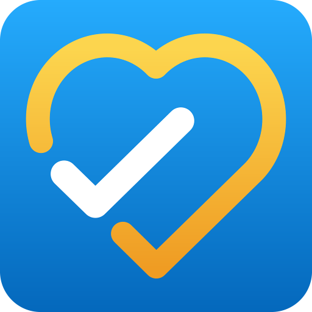 | Amwell: Doctor Visits 24/7
|  | IU Health Virtual Visits: Online Doctor Visit
|  | HowWeFeel: The How We Feel Project
|  | HealthTap — 24/7 Telemedicine
|  | Gundersen VirtualVisit
|  | Nemours CareConnect – See a Pediatrician 24/7
|  | NowClinic
|  | Cleveland Clinic Express Care® Online
|  | Genesis Convenient CareNow
|  | MDLIVE: Talk to a Doctor 24/7
|  | BronsonConnect Video Visit
|  | BCBSM Online Visits
|  | MU Health Care Video Visits
|  | LiveHealth Online Mobile
|  | 98point6
|  | iBlueButton
|  | Penn State Health OnDemand
|  | Coalition App | #StopCovid19
|  | Intermountain Connect Care
|  | CoronaCare
|  | UW Medicine Virtual Clinic
|  | Baystate Health Connect
|  | Baptist Health Care On Demand
|  | Mend Telemedicine
|  | CityMD
|  | herOptions
|  | Partners HealthCare On Demand
|  | Heal: Telehealth & House Calls
|  | Blue CareOnDemand – See a Doctor Online
|  | NALCHBP Telehealth
|  | 澳門康復服務
|  | Horizon Telehealth
|  | COVIDaware MN
|  | Nuvance Health Virtual Visits
|  | Centura Health Virtual Care
|  | Ascension Online Care – See a Doctor 24/7
|  | Baptist Health - Virtual Care
|  | Virtual Care The Iowa eClinic
|  | WA Notify
|  | BlueCare
|  | Children’s Health VirtualVisit – Family Care 24/7
|  | CA Notify
|  | myVirtualHealthVisit
|  | Penn Highlands MyHealthNow
|  | One Medical
|  | UnityPoint Health Virtual Care
|  | AveraNow
|  | WI Exposure Notification
|  | AlohaSafe Alert
|  | CURE ID
|  | Virtual Care Anywhere
|  | MetroPlus Virtual Visit
|  | Akido Connect
|  | OpenMed Checker
|  | COVID Defense
|  | UW Health Care Anywhere - Video Visit
|  | KidzDocNow
|  | Augusta Virtual Care
|  | UT Exposure Notifications
|  | Lafayette General Health Anywhere
|  | NM Notify
|  | UPMC AnywhereCare
|  | ProMedica OnDemand
|  | b2 VirtualCare
|  | Mercyhealth Virtual Visit Now

The details of our analysis are presented in the remainder of this report.

For independent verification, the raw data and the source code of the project is publicly available in its GitHub repository [http://github.com/covid-apps-observer](http://github.com/covid-apps-observer) and its source code has been thoroughly commented in order to provide all the details about how the information provided in this report has been extracted. 

Any feedback, questions, and improvements about the project are very welcome, feel free to create an issue or pull request directly in its GitHub repository: [http://github.com/covid-apps-observer](http://github.com/covid-apps-observer).

## Data sources and analyses

The analysis of each app is structured around five main dimensions: 
* App metadata  
* Requested permissions
* Mentioned servers
* Androwarn analysis
* User ratings and reviews

In the following we describe the data sources and analysis performed for each dimension.

### App metadata

App metadata includes an overview of the main information about the app (for example, its name, releases, privacy policy, etc.), contact information of the development team, and the various Android versions supported by the app. This information is extracted from two main data sources:
* _Google Play store_: we automatically mined the web page of the Google Play store showing the basic information about the app and we parsed it in order to extract information about the app and development team 
* _Android Manifest file_: in our analysis we decompiled the binary file of the app (it is similar to a Zip archive but it contains the code of the app instead of normal files) and we extracted information about the supported Android versions, as it has been listed by its development team.

The extracted app metadata feeds the _App overview_, _Development team_, and _Android support_ sections of this report.
We make use of the [google-play-scraper](https://github.com/JoMingyu/google-play-scraper) tool for extracting the raw data related to this dimension of the project.

### Requested permissions

The Android operating system has a permission model which allows users to grant access to potentially privacy-related information. Every Android app has to explictly declare the permissions it needs to properly function in the Android Manifest file.  

In this report we also show the protection level of each permission, which is a key information for understanding how the requested permissions related to the user's privacy. We carefully analyzed the [official Android documentation (v. 29)](https://developer.android.com/reference/android/Manifest.permission), and it resulted that a permission requested by an Android app can belong to the following protection levels:
* **Dangerous**: higher-risk permissions that would give a requesting app access to private user data or control over the device that can negatively impact the user. Because this type of permission introduces potential risk, the system usually does not automatically grant it to the requesting app. For example, any dangerous permissions requested by an app may be displayed to the user and require confirmation before proceeding.
* **Normal**: this is the default and most common level in Android; normal permissions are lower-risk and give access to isolated app-level features, with minimal risk to other apps, the system, or the user. 
* **Signature**: permissions granted only if the requesting app is signed with the same certificate as the app that declared the permission
* **Appop**: old permission level, a reminiscence of the App Ops tool that Google introduced in Android 4.3.
* **Development**: optional permissions which can be granted to development-oriented apps.
* **Privileged**: permissions who give higher power to mobile apps w.r.t. other apps, such as binding to incoming calls, interacting via bluetooth with other devices without user interaction, etc.
* **Preinstalled**: reserved only for preinstalled apps
* **Installer**: allow the holder to start the permission usage screen for an app
* **RetailDemo**: permissions related to devices used in demonstrations in shops.
* **Pre23**: permissions automatically granted to apps targeting devices running pre-6.0 Android.
* **Upcoming**: permissions which will be released in the next version of the Android platform. 
* **Deprecated**: permissions belonging to old releases of the Android platform, they should not be used by developers since they will not be supported in the near future.
* **Not for use by third-party applications**: permissions which can be requested only by apps developed by Google.
* **Undefined**: this protection level is not documented by Google.

The permissions dimension of this project is based on the [Androguard](https://github.com/androguard/androguard) static analysis tool.

### Mentioned servers

We decompiled each app in order to look for all possible mentions of remote URLs. The mentioned URLs can refer to remote servers the the app is using for either sending or receiving information, web addresses for directing the user to an information website, and so on. 

:warning: It is important to note that this analysis is not meant to be complete and it is very prone to obfuscation. The servers reported here are simply _mentioned_ somewhere in the code of the app and are meant to just give an indication about the "hooks" of the app towards external resources. For example, for an Android app it is normal to contact Google services in order to send/receive push notifications, or to contact the servers of analytics services for having real-time diagnostics about crashes of the app or bugs.

This part of the analysis is based on the [Androguard](https://github.com/androguard/androguard) static analysis tool for identfying the raw URLs mentioned in the app; then, the information about each mentioned server is collected by performing a _whois_ lookup on the first-level domain present in the URL.

### Security analysis

This dimension is based on the [Androwarn](https://github.com/maaaaz/androwarn) structural and data flow analysis of Android bytecode. Androwarn is developed by the University of Lyon/INSA (France) and it has been used in several academic studies. According to its documentation, Androwarn targets the following categories of potential security issues:
* **Telephony identifiers exfiltration**: IMEI, IMSI, MCC, MNC, LAC, CID, operator's name, etc.
* **Device settings exfiltration**: software version, usage statistics, system settings, logs, etc.
* **Geolocation information leakage**: GPS/WiFi geolocation, etc.
* **Connection interfaces information exfiltration**: WiFi credentials, Bluetooth MAC adress, etc.
* **Telephony services abuse**: premium SMS sending, phone call composition, etc.
* **Audio/video flow interception**: call recording, video capture, etc.
* **Remote connection establishment**: socket open call, Bluetooth pairing, APN settings edit, etc.
* **PIM data leakage**: contacts, calendar, SMS, mails, clipboard, etc.
* **External memory operations**: file access on SD card, etc.
* **PIM data modification**: add/delete contacts, calendar events, etc.
* **Arbitrary code execution**: native code using JNI, UNIX command, privilege escalation, etc.
* **Denial of Service**: event notification deactivation, file deletion, process killing, virtual keyboard disable, terminal shutdown/reboot, etc.

Note: We do not consider this data point in the current version of our analyzers since it is too verbose for our purposes.

:warning: It is important to note that Androwarn is a static analysis tool, and as such it performs a variety of heuristics and approximations in its analyses. Said that, the results shown in this report are meant to provide an indication of _potential_ security issues and should be by no means treated as complete and correct.   

### User ratings and reviews

For this dimension we turn again to the web interface of the Google Play store. Firstly, we automatically mine summary statistics about user ratings from the web page of the app under analysis; then, we automatically download the newest 1000 reviews of the app under analysis. For each level of rating (5 stars, 4 stars, , etc., 1 star) we show:
- a word cloud presenting the main terms used by end users in their reviews in the Google Play store
- the last 10 reviews provided by app users in the Google Play store. 

This purposefully simple analysis is meant to help both future users and the development team of the app in understanding what are the main positive and negative points of the app under analysis.

We make use of the [google-play-scraper](https://github.com/JoMingyu/google-play-scraper) tool for extracting the raw data related to this dimension of the project.

## Disclaimer 

This report has been produced independently of any parties and its only objective is to help anybody in better understanding how COVID-related apps work in practice (and compare to each other). The results of this report are limited to the specific version of the software used for running the analyses and on the various heuristics implemented in there. In other words, the results of the analyzers may differ depending on the time and modalities in which they are executed. We do not guarantee that the results of the analyses and the corresponding contents of this report are fully complete or correct. The analysis software is licensed under the [MIT License](https://github.com/iivanoo/covid-apps-observer/blob/master/LICENSE).

# Care19 Diary
App version ``3.1``

Analyzed with [covid-apps-observer](http://github.com/covid-apps-observer) project, version ``0.1``

## App overview
| | |
|-------------------------|-------------------------| 
| **Name**&nbsp;&nbsp;&nbsp;&nbsp;&nbsp;&nbsp;&nbsp;&nbsp;&nbsp;&nbsp;&nbsp;&nbsp;&nbsp;&nbsp;&nbsp;&nbsp;&nbsp;&nbsp;&nbsp;&nbsp;&nbsp;&nbsp;&nbsp;&nbsp;&nbsp;&nbsp;&nbsp;&nbsp;&nbsp;&nbsp;&nbsp;&nbsp;&nbsp;&nbsp;&nbsp;&nbsp;&nbsp;&nbsp;&nbsp;&nbsp;  | Care19 Diary |
| **Unique identifier** | com.proudcrowd.care |
| **Link to Google Play** | [https://play.google.com/store/apps/details?id=com.proudcrowd.care](https://play.google.com/store/apps/details?id=com.proudcrowd.care) |
| **Summary**  | You can help stop the spread of Covid-19 |
| **Privacy policy** | [https://care19.app/privacy](https://care19.app/privacy) |
| **Latest version** | 3.1 |
| **Last update** | 2020-06-26 17:01:47 |
| **Recent changes** | Fix a bug where manually added visits could display a month off. |
| **Installs**  | 10,000+ |
| **Category** | Medical |
| **First release** | Apr 19, 2020 |
| **Size**  | 5.5M |
| **Supported Android version**  | 6.0 and up |

### Description
> Care19 is the official COVID-19 app for the states of South Dakota and North Dakota.  It can be used with reduced functionality in other US states.
 A key part of the contact tracing process is remembering where you have been over the last 5-10 days before testing positive.  This helps contact tracers determine people you may have been near while you were infectious. 
 Care19 is a digital diary that records places you visit.  Many of the places you visit can be recorded automatically by Care19 using the phone's location services.  In some cases you may need to manually add an entry if the automated routines miss a place visit.  This can happen based on a variety of environmental factors.
 You will not be asked to provide any personally identifiable information within the app. Location data will only be shared with the North Dakota or South Dakota Department of Health if you consent upon testing positive for COVID-19. This is done by sharing a code number displayed on the “About” section of the app.  
 If you use the Care19 app outside of North and South Dakota it can be used as a memory aide if you test positive and are contacted by your state's Department of Health.

### User interface
The developers of the app provide the following screenshots in the Google play store.
| | | |
|:-------------------------:|:-------------------------:|:-------------------------:|
 |   |   |   | 
 |  

## Development team
In the following we report the main information provided by the development team in the Google play store.

| | |
|-------------------------|-------------------------|
| **Developer**  | ProudCrowd, LLC |
| **Website**  | [https://www.care19.app](https://www.care19.app) |
| **Email** | tim.brookins@proudcrowd.com |
| **Physical address**  | - |
| **Other developed apps**  | [https://play.google.com/store/apps/developer?id=ProudCrowd,+LLC](https://play.google.com/store/apps/developer?id=ProudCrowd,+LLC) |

## Android support

| | |
|-------------------------|-------------------------|
| **Declared target Android version**  | Android10, version 10 (API level 29) |
| **Effective target Android version**  | Android10, version 10 (API level 29) |
| **Minimum supported Android version**  | Marshmallow, version 6.0 (API level 23) |
| **Maximum target Android version**  | - |

The larger the difference between the minimum and maximum supported Android versions, the better. A larger difference means a wider audience. For example, old phones have a very low Android version, so a high minimum supported Android version means that the app cannot be used by users with old phones, thus leading to accessibility problems. 

## Requested permissions

In the following we report the complete list of the permissions requested by the app. 

| **Permission** | **Protection level** | **Description** | 
|-------------------------|-------------------------|-------------------------|
 **android.permission ACCESS_BACKGROUND_LOCATION** | :warning:**Dangerous** | Allows an app to access location in the background. 
 **android.permission ACCESS_COARSE_LOCATION** | :warning:**Dangerous** | Allows an app to access approximate location. 
 **android.permission ACCESS_FINE_LOCATION** | :warning:**Dangerous** | Allows an app to access precise location. 
 **android.permission ACCESS_NETWORK_STATE** | Normal | Allows applications to access information about networks. 
 **android.permission ACTIVITY_RECOGNITION** | :warning:**Dangerous** | Allows an application to recognize physical activity. 
 **android.permission FOREGROUND_SERVICE** | Normal | Allows a regular application to use Service.startForeground. 
 **android.permission INTERNET** | Normal | Allows applications to open network sockets. 
 **android.permission RECEIVE_BOOT_COMPLETED** | Normal | Allows an application to receive the Intent.ACTION_BOOT_COMPLETED that is broadcast after the system finishes booting. 
 **android.permission WAKE_LOCK** | Normal | Allows using PowerManager WakeLocks to keep processor from sleeping or screen from dimming. 
 **com.google.android.c2dm.permission RECEIVE** | - | - 
 **com.google.android.finsky.permission BIND_GET_INSTALL_REFERRER_SERVICE** | - | - 
 **com.google.android.gms.permission ACTIVITY_RECOGNITION** | - | - 

## Mentioned servers

| **Server** | **Registrant** | **Registrant country** | **Creation date** | 
|-------------------------|-------------------------|-------------------------|-------------------------|
 | bugfender.com | Beenario GmbH | :de: DE | 2014-10-28 11:32:13 |
 | googlesyndication.com | Google LLC | :us: US | 2003-01-21 06:17:24 |
 | google.com | Google LLC | :us: US | 1997-09-15 04:00:00 |
 | app-measurement.com | Google LLC | :us: US | 2015-06-19 20:13:31 |
 | azurewebsites.net | Microsoft Corporation | :us: US | 2012-01-24 18:43:51 |
 | crashlytics.com | Google LLC | :us: US | 2011-01-21 15:30:40 |
 | googleapis.com | Google LLC | :us: US | 2005-01-25 17:52:26 |
 | googleadservices.com | Google LLC | :us: US | 2003-06-19 16:34:53 |

## Security analysis 

Below we report the main security warnings raised by our execution of the [Androwarn](https://github.com/maaaaz/androwarn) security analysis tool.

**Telephony identifiers leakage**
> - This application reads the MCC+MNC of the provider of the SIM 
> - This application reads the Service Provider Name (SPN) 
> - This application reads the numeric name (MCC+MNC) of current registered operator 
> - This application reads the operator name 

**Connection interfaces exfiltration**
> - This application reads details about the currently active data network 
> - This application tries to find out if the currently active data network is metered 

**Suspicious connection establishment**
> - This application opens a Socket and connects it to the remote address ' returned no addresses for  ; port is out of range' on the 'N/A' port  
> - This application opens a Socket and connects it to the remote address '' on the 'N/A' port  
> - This application opens a Socket and connects it to the remote address 'Ljava/lang/StringBuilder;->toString()Ljava/lang/String;' on the 'N/A' port  
> - This application opens a Socket and connects it to the remote address 'Ljava/net/Proxy;->type()Ljava/net/Proxy$Type;' on the 'N/A' port  
> - This application opens a Socket and connects it to the remote address 'timeout' on the 'N/A' port  

**Code execution**
> - This application executes a UNIX command containing this argument: 'logcat -c 2' 
> - This application executes a UNIX command containing this argument: 'logcat -c' 

## User ratings and reviews

Below we provide information about how end users are reacting to the app in terms of ratings and reviews in the Google Play store.

### Ratings

The Care19 Diary app has been installed by more than **10000** times. At this time, **194** rated the app and its average score is **2.55**. Below we show the distribution of the ratings across the usual star-based rating of Google Play

:star::star::star::star::star:: 58

:star::star::star::star:: 5

:star::star::star:: 13

:star::star:: 23

:star:: 93

### Reviews 

#### 5-star reviews

> ★★★★★  :date: __2020-12-03 01:47:39__

> Oh yeah all good  :date: __2020-08-27 06:36:26__

> Good  :date: __2020-08-02 22:27:07__

> Please help charlie foxtrot googlemaps Meunstergritsandassociatesllc 442 blanding blvd 333 ORANGEPARK,FL 32073  :date: __2020-07-18 21:29:25__

> Updated daily. Easy to use and informative.  :date: __2020-06-23 15:03:08__

> Cool  :date: __2020-06-20 05:50:45__

> Good idea  :date: __2020-06-20 00:01:28__

> Good  :date: __2020-06-16 20:33:40__

> Nudes help  :date: __2020-06-11 01:24:14__

> Awesome  :date: __2020-05-17 11:47:26__

#### 4-star reviews

> This picks up most of the places I go, and I check when I get home so I can add places it has missed or change inaccurate locations, which only happens when I am in an area with a lot of stores, like a plaza. My home state has not chosen an app so I use this one.  :date: __2020-07-10 22:03:28__

> I just dont have room on my phone:(  :date: __2020-07-06 11:55:41__

> Remember this is for north & south Dakota only.. other states will may add their state if they choose too. It will show other states but will not guarantee it at this time  :date: __2020-06-20 21:46:43__

> The early release back in April was rough (didn't log any stops for me). But it's been working well for me since about May 4. It occasionally logs more than one stop at the same location. It occasionally gets the name of the location wrong, but this is very easy to correct.  :date: __2020-05-19 06:25:30__

> It is great, it works, and I am excited for updates!  :date: __2020-04-29 03:31:46__

#### 3-star reviews

> You should be able to type in a location when it gets it wrong. Sometimes there is no option for where you are.  :date: __2020-10-22 06:04:00__

> After multiple attempts, this app cannot determine my home location. Uninstalling. UPDATE 10/21/20 - It can now find my home location. Up to 3 stars. I do not see how I can see the list of locations myself.  :date: __2020-10-21 15:32:52__

> Every couple of weeks it takes a day off & doesn't show any locations at all for that day.  :date: __2020-09-25 02:59:05__

> How long do the places you visit stay on the app? Mine seem to show maybe only previous 10 days.  :date: __2020-08-13 23:41:30__

> Doesn't this app use the Contact Tracking System that Apple and Google developed?  :date: __2020-06-02 15:29:17__

> Simple app. Does what it was designed for but little else. Misses many locations and frequently has location accuracy issues. Routinely misses my home by 6 blocks. Says I have visited locations I have just driven past. Would be nice to have ability to add locations that I visited but app failed to record.  :date: __2020-05-22 15:52:32__

> Still isn't capturing places I've been. Was at 3 different locations today, and not one of them showing up.  :date: __2020-05-20 23:03:13__

> Very inconsistent with location. Can be at a location for hours and doesn't list it.  :date: __2020-05-16 15:20:52__

> It's a great idea, but does not log most of the places I've been. Stopped at 6 places in Bismarck and didn't log one place. And then the next time it will log the same place 4 times within a few minutes or log a place I only drove by.  :date: __2020-05-14 02:20:12__

> I hope this helps people but there are definitely a lot of bugs  :date: __2020-05-04 05:28:59__

#### 2-star reviews

> Each week, 2 out of the 5 days I'm at work there's no entry. Yesterday it showed me in the middle of road halfway to work for 8.5 hours. If I stop somewhere on my way home from work, half the time it misses it. I have a Pixel 3 XL. I want to have this app work.  :date: __2020-10-28 23:21:53__

> App runs unnoticeably in the background. However, requires constant maintenance. If I go more than 2-3 days without monitoring the app, I find that it stops tracking my locations, at which point I need to go back through all intro screens as if I just installed the app (Region, Consent, Home location, etc). Back arrow on Android while in the Places You've Visited will also return to the initial menu and require passing through all intro screens again, or app will not resume tracking. Should have a warning, and consent/home location should be saved in a more permanent cache.  :date: __2020-09-26 21:23:18__

> Doesn't catch all locations, and it recorded a one hour visit to one store as 12 minutes, then would not allow correction.  :date: __2020-09-21 13:10:23__

> Quit recording anything after about three weeks.  :date: __2020-07-26 05:30:54__

> Inaccurate didn't track me for days sometimes. Uninstalled it, that bad.  :date: __2020-07-19 03:31:36__

> Location info is incorrect and incomplete. I was able to fix the incorrect info, but can't add locations. Uninstalled and reinstalled on 6/24. Tracked my location until 6/27 then nothing.  :date: __2020-07-07 17:28:05__

> Gives a lot of erroneous locations that are passed while driving or stopping at a stop light. Some days it gives no information at all.. i reloaded it a couple of weeks ago. It worked well until July 3 then quit working, not registering any locations.  :date: __2020-07-04 20:23:07__

> Idk procedure to get my phone to let this work automatically in the background, out on the east coast  :date: __2020-07-02 20:56:10__

> It's not all that  :date: __2020-06-18 15:59:46__

> Not very accurate for locations. It does not show several places my wife & I have been for an hour or more and it shows us stopping at places we only drove passed on our way to our destination that does not show up. Very inaccurate. It's the same on both of our phones (Galaxy Note 9's). There is no way to add the places we did go to, only to delete the irrelevant ones or change the name from "Unknown" to a proper name. It's pointless/useless for tracking when this inaccurate.  :date: __2020-06-05 01:20:41__

#### 1-star reviews

> Installed this last spring when it first was available, had it for months, and then found out it wasn't tracing anything because it closes down unless you open it constantly. What's the point of a tracing app that doesn't trace? And what's the point of an app that you have to open that doesn't do anything except show you a screen that says "hi, I'm open, now you can close me"? This should just run quietly in the background when your phone is on. South Dakota, you can do better. We expect more.  :date: __2021-03-07 20:13:46__

> Need to have a way to add places one has been when it quite often misses the place one had visited all together. Can't update. Hasn't tracked fo days.  :date: __2021-02-03 03:26:37__

> Play store cannot download it..hacked account  :date: __2020-11-13 02:37:16__

> Not accurate very often. Going to delete as it is more trouble than keeping a written log.  :date: __2020-10-28 21:22:35__

> Poorest design. Does not "track" movement via gps, does not allow quick add (referencing gps) feature. Does not have "end at home". Thus know how long.. at one location or unable to determine greater than 20 mph driving. Becomes indicator leaving location.  :date: __2020-09-28 04:32:05__

> Has me consistently at a location across town I'm never at.  :date: __2020-09-12 07:14:54__

> Privacy  :date: __2020-08-27 22:42:43__

> Does not automatically track as it says it will. Also, I can enter manually in my phone but my wife's phone cannot manually input as the app freezes when she puts in date from calendar. Uninstalled and reinstalled the app but still have same problems.  :date: __2020-08-16 17:20:12__

> utTý5hat's drive changes b  :date: __2020-08-14 22:35:18__

> Edit: 8.10.20 Still same problems. If battery saver is issue, fix it. Update 6.27.20 - Tou can tell the developer(s) doesnt even use this app or they would know what we are talking about. You say it's just the way it is, no, you know how it's supposed to work, so find someone to make it work correctly. This app does not trace where I been going. It does not stay open in the background. When open, it does not show where I go or been since the 23rd. I restarted phone and reinstalled app on S9+  :date: __2020-08-11 03:56:40__

# FEMA
App version ``2.11.2``

Analyzed with [covid-apps-observer](http://github.com/covid-apps-observer) project, version ``0.1``

## App overview
| | |
|-------------------------|-------------------------| 
| **Name**&nbsp;&nbsp;&nbsp;&nbsp;&nbsp;&nbsp;&nbsp;&nbsp;&nbsp;&nbsp;&nbsp;&nbsp;&nbsp;&nbsp;&nbsp;&nbsp;&nbsp;&nbsp;&nbsp;&nbsp;&nbsp;&nbsp;&nbsp;&nbsp;&nbsp;&nbsp;&nbsp;&nbsp;&nbsp;&nbsp;&nbsp;&nbsp;&nbsp;&nbsp;&nbsp;&nbsp;&nbsp;&nbsp;&nbsp;&nbsp;  | FEMA |
| **Unique identifier** | gov.fema.mobile.android |
| **Link to Google Play** | [https://play.google.com/store/apps/details?id=gov.fema.mobile.android](https://play.google.com/store/apps/details?id=gov.fema.mobile.android) |
| **Summary**  | Weather alerts, safety tips and more to help before, during &amp; after disasters. |
| **Privacy policy** | [http://www.fema.gov/privacy-policy](http://www.fema.gov/privacy-policy) |
| **Latest version** | 2.11.2 |
| **Last update** | 2020-10-27 19:44:12 |
| **Recent changes** | - Bug fix for reminders on Android 10 |
| **Installs**  | 1,000,000+ |
| **Category** | Weather |
| **First release** | Aug 24, 2011 |
| **Size**  | 3.4M |
| **Supported Android version**  | 4.4 and up |

### Description
> Emergency alerts, safety tips and resources to help before, during & after disasters.
 The FEMA App provides timely alerts and useful information to help you and your loved ones stay safe before, during and after disasters. Receive and share real-time notifications about disasters, severe weather, and other emergencies for up to five locations nationwide. This simple and easy-to-use resource also provides safety information, emergency preparedness tips, and disaster assistance.
 Features 
 •    Receive emergency alerts for up to five locations nationwide 
 •    Share real-time notifications with loved ones via text, email and social media
 •    Know what to do before, during, and after disasters, like earthquakes, wildfires, hurricanes, snowstorms, tornadoes, volcanoes, and more
 •    Prepare for disasters with an emergency kit checklist, emergency family plan, and reminders
 •    Locate open emergency shelters in your area
 •    Locate Disaster Recovery Centers near you where you can talk to a FEMA representative in person
 •    Connect with FEMA to apply for disaster assistance online
 •    Safety tips and disaster information available in English and Spanish (Note: alerts are only available in English)
 •    Follow the FEMA blog to learn about disaster response and recovery across the United States
 Terms of use: www.fema.gov/app.

### User interface
The developers of the app provide the following screenshots in the Google play store.
| | | |
|:-------------------------:|:-------------------------:|:-------------------------:|
 |   |   |   | 
 | 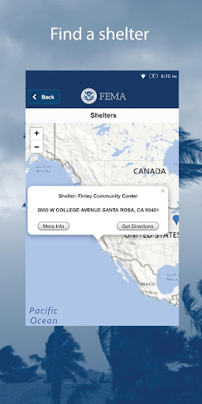  |   |   | 
 | 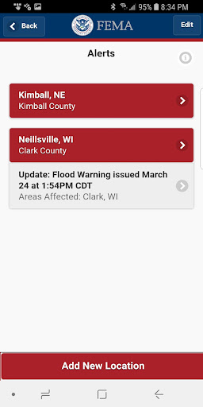  |   |   | 
 |   |   |   | 
 |   |   |   | 
 |   |   |   | 
 |   |   |   | 
 |  

## Development team
In the following we report the main information provided by the development team in the Google play store.

| | |
|-------------------------|-------------------------|
| **Developer**  | Federal Emergency Management Agency (FEMA) |
| **Website**  | [http://www.fema.gov](http://www.fema.gov) |
| **Email** | FEMA-New-Media@fema.dhs.gov |
| **Physical address**  | - |
| **Other developed apps**  | [https://play.google.com/store/apps/developer?id=Federal+Emergency+Management+Agency+(FEMA)](https://play.google.com/store/apps/developer?id=Federal+Emergency+Management+Agency+(FEMA)) |

## Android support

| | |
|-------------------------|-------------------------|
| **Declared target Android version**  | Pie, version 9 (API level 28) |
| **Effective target Android version**  | Pie, version 9 (API level 28) |
| **Minimum supported Android version**  | KitKat, version 4.4 - 4.4.4 (API level 19) |
| **Maximum target Android version**  | - |

The larger the difference between the minimum and maximum supported Android versions, the better. A larger difference means a wider audience. For example, old phones have a very low Android version, so a high minimum supported Android version means that the app cannot be used by users with old phones, thus leading to accessibility problems. 

## Requested permissions

In the following we report the complete list of the permissions requested by the app. 

| **Permission** | **Protection level** | **Description** | 
|-------------------------|-------------------------|-------------------------|
 **android.permission ACCESS_COARSE_LOCATION** | :warning:**Dangerous** | Allows an app to access approximate location. 
 **android.permission ACCESS_FINE_LOCATION** | :warning:**Dangerous** | Allows an app to access precise location. 
 **android.permission ACCESS_NETWORK_STATE** | Normal | Allows applications to access information about networks. 
 **android.permission INTERNET** | Normal | Allows applications to open network sockets. 
 **android.permission READ_APP_BADGE** | - | - 
 **android.permission RECEIVE_BOOT_COMPLETED** | Normal | Allows an application to receive the Intent.ACTION_BOOT_COMPLETED that is broadcast after the system finishes booting. 
 **android.permission VIBRATE** | Normal | Allows access to the vibrator. 
 **android.permission WAKE_LOCK** | Normal | Allows using PowerManager WakeLocks to keep processor from sleeping or screen from dimming. 
 **com.anddoes.launcher.permission UPDATE_COUNT** | - | - 
 **com.google.android.c2dm.permission RECEIVE** | - | - 
 **com.google.android.finsky.permission BIND_GET_INSTALL_REFERRER_SERVICE** | - | - 
 **com.htc.launcher.permission READ_SETTINGS** | - | - 
 **com.htc.launcher.permission UPDATE_SHORTCUT** | - | - 
 **com.huawei.android.launcher.permission CHANGE_BADGE** | - | - 
 **com.huawei.android.launcher.permission READ_SETTINGS** | - | - 
 **com.huawei.android.launcher.permission WRITE_SETTINGS** | - | - 
 **com.majeur.launcher.permission UPDATE_BADGE** | - | - 
 **com.oppo.launcher.permission READ_SETTINGS** | - | - 
 **com.oppo.launcher.permission WRITE_SETTINGS** | - | - 
 **com.sec.android.provider.badge.permission READ** | - | - 
 **com.sec.android.provider.badge.permission WRITE** | - | - 
 **com.sonyericsson.home.permission BROADCAST_BADGE** | - | - 
 **com.sonymobile.home.permission PROVIDER_INSERT_BADGE** | - | - 
 **me.everything.badger.permission BADGE_COUNT_READ** | - | - 
 **me.everything.badger.permission BADGE_COUNT_WRITE** | - | - 

## Mentioned servers

| **Server** | **Registrant** | **Registrant country** | **Creation date** | 
|-------------------------|-------------------------|-------------------------|-------------------------|
 | googlesyndication.com | Google LLC | :us: US | 2003-01-21 06:17:24 |
 | google.com | Google LLC | :us: US | 1997-09-15 04:00:00 |
 | google-analytics.com | Google LLC | :us: US | 2005-07-18 19:24:32 |
 | app-measurement.com | Google LLC | :us: US | 2015-06-19 20:13:31 |
 | googletagmanager.com | Google LLC | :us: US | 2011-11-11 23:39:05 |
 | gstatic.com | Google LLC | :us: US | 2008-02-11 15:31:25 |
 | whatsapp.com | Whatsapp Inc. | :us: US | 2008-09-04 12:39:12 |
 | googleapis.com | Google LLC | :us: US | 2005-01-25 17:52:26 |
 | googleadservices.com | Google LLC | :us: US | 2003-06-19 16:34:53 |

## Security analysis 

Below we report the main security warnings raised by our execution of the [Androwarn](https://github.com/maaaaz/androwarn) security analysis tool.

**Connection interfaces exfiltration**
> - This application reads details about the currently active data network 
> - This application tries to find out if the currently active data network is metered 

**Telephony services abuse**
> - This application makes phone calls 

**Code execution**
> - This application loads a native library: 'sqlc-native-driver' 

## User ratings and reviews

Below we provide information about how end users are reacting to the app in terms of ratings and reviews in the Google Play store.

### Ratings

The FEMA app has been installed by more than **1000000** times. At this time, **3525** rated the app and its average score is **4.1988635**. Below we show the distribution of the ratings across the usual star-based rating of Google Play

:star::star::star::star::star:: 2305

:star::star::star::star:: 390

:star::star::star:: 390

:star::star:: 110

:star:: 330

### Reviews 

#### 5-star reviews

> Excellent  :date: __2021-05-05 04:28:55__

> Good  :date: __2021-04-29 00:11:19__

> Thank God for Fema  :date: __2021-04-18 18:16:07__

> We need every supply we order from the app for the job.  :date: __2021-04-09 06:54:04__

> Gives me all the alerts I need.  :date: __2021-04-01 06:13:00__

> Just wonderful  :date: __2021-03-28 14:51:53__

> They warn people when a tornado is coming  :date: __2021-03-17 03:02:07__

> Very useful; a lot of real time info.  :date: __2021-03-15 04:10:51__

> Seriously necessary valued. Weather, w possible empending disasters, & worse, necessary notification.  :date: __2021-03-14 20:57:43__

> Great to have when need to apply for emergency mishaps. Never know, but great to have.  :date: __2021-03-10 15:18:59__

#### 4-star reviews

> What's with the 911 button? It's way too easy to accidentally hit that. Otherwise the setup seems pretty well designed.  :date: __2021-04-28 15:45:33__

> Good ad-free alerts app. Lets you specify the exact kinds of alerts you want for your area and others. It's only drawback is that its county-wide. Some alerts are issued for only specific areas of counties. This app would be perfect if would allow you to set alerts to a precise location (not just county-wide) as some other apps do. Also it needs other notification options (such as a voice or different sound) for alerts so they don't get lost with other notifications.  :date: __2021-03-22 21:27:43__

> I think that it's pretty good.  :date: __2021-03-04 04:02:31__

> This app is worth the download. You get a lot of notifications, but they are easy to mute, and might save your life.  :date: __2021-02-02 22:03:12__

> Really good weather alerts better than local tv  :date: __2021-01-26 10:34:47__

> So I love this app, but I feel as if you guys should check the reviews. There are people there with legitimate concerns, and some great recommendations that your should take look at. Such as: -Missing Alerts -A "Follow Me" option. -A priority alert mode (that fully covers your screen when you get a warning alert). I had a tornado warning in my area, and I love that I recieved it when using the app, but you should force the users to see a warning. These are the 3 options I'd love to see come.  :date: __2020-11-29 03:51:39__

> It has a lot of information anyone would ever need in this nation you could help you self and others in anything  :date: __2020-11-25 07:22:21__

> App has grown over the years and I appreciate the work that has gone into making it. My alerts are timely for the different counties that I've entered. THAT being said: The app has the potential to be so much more. Save lives. Can you please make it less time consuming to use? When I travel I need to hear *alerts in the County I'm IN.* What I would like to see in an update is the use of GPS to alert me *wherever* I am. Also.. Why isn't anyone taking advantage of the Blog section?  :date: __2020-11-06 20:45:42__

> Decent at first glance  :date: __2020-09-27 05:28:47__

> Great app !!!!!!!!  :date: __2020-09-05 02:06:16__

#### 3-star reviews

> Haven't had this installed for 24 hours yet however it was easy to install, set which alerts I want/need for the counties I need. I don't get weather alerts for whatever yhe reason (checked settings) and had to depend on others to relay alerts. I can now get the alerts myself and it may be a lifesaver since where I live we get severe weather, tornados and hurricanes regularly.  :date: __2021-05-04 22:42:49__

> It's helpful to have the alerts, but they come constantly about the same issue. They need to bundle alerts together and just say it's been updated.  :date: __2021-05-01 14:19:12__

> Works, but it keeps announcing the same alerts over and over, almost to the point of harassment! Also, the developer evidently does not read user comments, because they have not replied to any, a lot of which contain very good suggestions.  :date: __2021-02-15 21:07:44__

> Downloaded b/c we live in the country and cant hear sirens. Ive been getting notifications of weather advisories, but not able to read what, theres nothing there  :date: __2021-02-08 19:56:35__

> Not much exposure.  :date: __2021-01-13 02:03:49__

> Not as helpful as before  :date: __2020-12-28 07:32:52__

> They did not explain what she was asking me about and was real short with me . To me she was rude but I need my house fixed not TVs or other stuff like that but thank you for what you did do.  :date: __2020-10-26 19:49:29__

> Also I build homeless shelters and I think this would be the place to add my location make it official  :date: __2020-10-06 07:13:34__

> Works but would multiply the same alerts  :date: __2020-10-03 19:46:59__

> Sends out alerts as expected, but here's the issue. If I'm in another app (Facebook, e.g.), it won't override it, and there doesn't seem to be a way to get the alert within the actual app, so if you miss it... too bad. Also tried to pull up the app while roaming, and got a "no wifi" connection error. Who the hell has wifi during an emergency??? DO BETTER.  :date: __2020-09-13 18:35:21__

#### 2-star reviews

> Needed but lax on some emergencies. A one way conversation.  :date: __2021-05-01 10:31:08__

> I haven't gotten any alerts for the past week but I get plenty of them on my weather...what gives !?!?!?  :date: __2021-01-25 08:41:35__

> kk  :date: __2021-01-23 15:02:50__

> Don't know  :date: __2021-01-18 03:34:12__

> Was a great App, then started sending multiple alerts one after another. Now I get NO alerts at all. If I click on Alerts, click my city, it takes me to settings. I wrote you about it, you sent an email telling me to restart because you fixed a bug on the 4th. It is now the 14th. I've done as you said, even uninstalled and reinstalled several times. I still get no alerts and when I click my city, it still takes me to settings. I loved your App, it's a shame it no longer functions correctly.  :date: __2021-01-14 21:54:56__

> Super irregular performance and notifications. I cannot rely on this for requested information or results  :date: __2020-12-12 02:22:01__

> Need more control over types of alerts. Don't need to be woken from deep sleep at 3 am for fog warning, for instance. Fog won't harm me when safe in bed in sturdy house unless I hurt myself being startled in my sleep by loud notification.  :date: __2020-11-29 09:17:51__

> Once I sign in it then sends me a email code to sign in again.... To many steps  :date: __2020-09-19 20:23:31__

> Installed this app months ago and expected this would be the moment for it. I'm getting "red flag warnings" and "evacuation alerts" every few minutes (with no date or timestamp) that just say things like "GO NOW Eden Road" with a web link I can't click or copy. After switching back and forth between apps to type out it turns out it's a map and Eden Road is 60 miles away. You can't set alerts for regions smaller than the entire county. Evac notices also came through sooner with other services.  :date: __2020-09-12 07:56:04__

> What is it with this app. I've.been trying to download it for three days how long does it take to for it to download .we are about to be hit with a hurracain.this is messed.up  :date: __2020-08-23 03:40:24__

#### 1-star reviews

> What?! Have you made this so difficult that I will become frustrated and stop? I swear, I have been, somehow poisoned.  :date: __2021-04-25 08:24:07__

> My name is DIANE KMIEC (not A Google User)!!! 3/27/21: I MUST UNINSTALL. I have received NO ALERTS or EMERGENCY data since the 1st days. Very alarmed that "FEMA" can't even get through to send me Emergency Alerts! \*\*\*\* I installed this. I hope it works as it should because my phone has been modified to stop me from receiving ANY Emergency alerts. (I believe that's illegal.) I am so desperate to receive Emergency Alerts that I'm downloading an outside app for it!  :date: __2021-03-27 23:50:09__

> this app as well as so many others show i downloaded them when i infact have not  :date: __2021-03-10 03:18:24__

> I am deleting this app. I get 6 or more notifications a day when we are getting 2-4 inches of snow. It wakes me in the middle of the night to update when I have already recieved the same notification before. It's too bad, I liked getting the bitter windchill warning. If the weather was serious it would be fine but I don't consider 4 inches of snow a blizzard.  :date: __2021-02-22 00:50:48__

> Into a busy season and it's worse (after weather alert this morning there have been at least 5 false/blank alerts). Even after clearing cache, rebooting phone, etc still getting multiples of same exact alerts and several alerts with little or no lead time and now (once again) many - almost 40% - warnings with no info at all or nothing updated in the alert information. That's probably FEMA but still seriously downgrades usefulness. So problematic that other weather apps are needed for safety.  :date: __2021-02-15 23:00:29__

> Why wasn't there an alert when the POTUS called the state of emergency for DC? He even mentioned FEMA for receiving info yet crickets feo FEMA. Z Typical government restrictions. If they block adding Washington D.C. as an area then they are blocking additional information. It will only have the activity they want you to know about. New rule for citizens. See something say nothing. You'll be safer that way.  :date: __2021-01-12 21:44:55__

> Stopped working a few days ago. Started sending empty alerts. Reinstallation didn't help. Wouldn't accept location input.  :date: __2021-01-04 15:46:26__

> Can't load location for alerts or risk mitigation  :date: __2021-01-03 18:53:48__

> Dumb app. Just go outside and read the weather instead.  :date: __2020-12-04 16:24:43__

> NO ALERTS... APP IS A JOKE.  :date: __2020-11-14 18:25:33__

# CDC
App version ``3.1.3``

Analyzed with [covid-apps-observer](http://github.com/covid-apps-observer) project, version ``0.1``

## App overview
| | |
|-------------------------|-------------------------| 
| **Name**&nbsp;&nbsp;&nbsp;&nbsp;&nbsp;&nbsp;&nbsp;&nbsp;&nbsp;&nbsp;&nbsp;&nbsp;&nbsp;&nbsp;&nbsp;&nbsp;&nbsp;&nbsp;&nbsp;&nbsp;&nbsp;&nbsp;&nbsp;&nbsp;&nbsp;&nbsp;&nbsp;&nbsp;&nbsp;&nbsp;&nbsp;&nbsp;&nbsp;&nbsp;&nbsp;&nbsp;&nbsp;&nbsp;&nbsp;&nbsp;  | CDC |
| **Unique identifier** | gov.cdc.general |
| **Link to Google Play** | [https://play.google.com/store/apps/details?id=gov.cdc.general](https://play.google.com/store/apps/details?id=gov.cdc.general) |
| **Summary**  | Health Information at Your Fingertips—CDC 24/7 |
| **Privacy policy** | [http://t.cdc.gov/1MVV](http://t.cdc.gov/1MVV) |
| **Latest version** | 3.1.3 |
| **Last update** | 2021-05-03 18:52:53 |
| **Recent changes** | Updates push notification library |
| **Installs**  | 500,000+ |
| **Category** | Health & Fitness |
| **First release** | Oct 16, 2012 |
| **Size**  | 35M |
| **Supported Android version**  | 4.2 and up |

### Description
> Get the official CDC Mobile application to access the most up to date health information.
 FILTERING OPTIONS
 Organize your home screen so that the information that’s most important to you appears first! Turn off the content you don’t want with just a flip of a switch and reset it all with the tap of a button.
 CONTENT
 The app ensures that you’re getting the most up to date health information. The home screen lets you see all your information in one place and updates whenever your device is connected to WI-FI. Enjoy a greater variety of content such as Disease of the Week, disease case counts, videos, podcasts, and features to give you the most current health information from CDC. 
 Browse Featured Articles, stay on top of health news in the Newsroom section, and view CDC Images of the Week. If you’re a journal reader, view the latest Morbidity & Mortality Weekly Report, Emerging and Infectious Disease journal, or the latest on Preventing Chronic Diseases. You can even search CDC’s web content from the app.  
 We'd love to hear your thoughts about the app! Rate the CDC Mobile App in the App Store or leave a comment to let us know how we're doing. You can even send us an email through the app if you have suggestions for improvements!
 DISCLAIMER
 THE MATERIALS EMBODIED IN THIS SOFTWARE ARE PROVIDED TO YOU "AS-IS" AND WITHOUT WARRANTY OF ANY KIND, EXPRESSED, IMPLIED OR OTHERWISE, INCLUDING WITHOUT LIMITATION, ANY WARRANTY OF FITNESS FOR A PARTICULAR PURPOSE. IN NO EVENT SHALL THE CENTERS FOR DISEASE CONTROL AND PREVENTION (CDC) OR THE UNITED STATES (U.S.) GOVERNMENT BE LIABLE TO YOU OR ANYONE ELSE FOR ANY DIRECT, SPECIAL, INCIDENTAL, INDIRECT OR CONSEQUENTIAL DAMAGES OF ANY KIND, OR ANY DAMAGES WHATSOEVER, INCLUDING WITHOUT LIMITATION, LOSS OF PROFIT, LOSS OF USE, SAVINGS OR REVENUE, OR THE CLAIMS OF THIRD PARTIES, WHETHER OR NOT CDC OR THE U.S. GOVERNMENT HAS BEEN ADVISED OF THE POSSIBILITY OF SUCH LOSS, HOWEVER CAUSED AND ON ANY THEORY OF LIABILITY, ARISING OUT OF OR IN CONNECTION WITH THE POSSESSION, USE OR PERFORMANCE OF THIS SOFTWARE.

### User interface
The developers of the app provide the following screenshots in the Google play store.
| | | |
|:-------------------------:|:-------------------------:|:-------------------------:|
 |   |   |   | 
 |   |   |   | 
 |   |   |   | 
 |   |   |   | 

## Development team
In the following we report the main information provided by the development team in the Google play store.

| | |
|-------------------------|-------------------------|
| **Developer**  | Centers for Disease Control and Prevention |
| **Website**  | [http://www.cdc.gov](http://www.cdc.gov) |
| **Email** | CDCMobileDevelopment@cdc.gov |
| **Physical address**  | - |
| **Other developed apps**  | [https://play.google.com/store/apps/developer?id=Centers+for+Disease+Control+and+Prevention](https://play.google.com/store/apps/developer?id=Centers+for+Disease+Control+and+Prevention) |

## Android support

| | |
|-------------------------|-------------------------|
| **Declared target Android version**  | Pie, version 9 (API level 28) |
| **Effective target Android version**  | Pie, version 9 (API level 28) |
| **Minimum supported Android version**  | Jelly Bean, version 4.1.x (API level 16) |
| **Maximum target Android version**  | - |

The larger the difference between the minimum and maximum supported Android versions, the better. A larger difference means a wider audience. For example, old phones have a very low Android version, so a high minimum supported Android version means that the app cannot be used by users with old phones, thus leading to accessibility problems. 

## Requested permissions

In the following we report the complete list of the permissions requested by the app. 

| **Permission** | **Protection level** | **Description** | 
|-------------------------|-------------------------|-------------------------|
 **android.permission ACCESS_NETWORK_STATE** | Normal | Allows applications to access information about networks. 
 **android.permission ACCESS_WIFI_STATE** | Normal | Allows applications to access information about Wi-Fi networks. 
 **android.permission FOREGROUND_SERVICE** | Normal | Allows a regular application to use Service.startForeground. 
 **android.permission INTERNET** | Normal | Allows applications to open network sockets. 
 **android.permission READ_APP_BADGE** | - | - 
 **android.permission RECEIVE_BOOT_COMPLETED** | Normal | Allows an application to receive the Intent.ACTION_BOOT_COMPLETED that is broadcast after the system finishes booting. 
 **android.permission VIBRATE** | Normal | Allows access to the vibrator. 
 **android.permission WAKE_LOCK** | Normal | Allows using PowerManager WakeLocks to keep processor from sleeping or screen from dimming. 
 **android.permission WRITE_EXTERNAL_STORAGE** | :warning:**Dangerous** | Allows an application to write to external storage. 
 **com.amazon.device.messaging.permission RECEIVE** | - | - 
 **com.anddoes.launcher.permission UPDATE_COUNT** | - | - 
 **com.google.android.c2dm.permission RECEIVE** | - | - 
 **com.google.android.finsky.permission BIND_GET_INSTALL_REFERRER_SERVICE** | - | - 
 **com.htc.launcher.permission READ_SETTINGS** | - | - 
 **com.htc.launcher.permission UPDATE_SHORTCUT** | - | - 
 **com.huawei.android.launcher.permission CHANGE_BADGE** | - | - 
 **com.huawei.android.launcher.permission READ_SETTINGS** | - | - 
 **com.huawei.android.launcher.permission WRITE_SETTINGS** | - | - 
 **com.majeur.launcher.permission UPDATE_BADGE** | - | - 
 **com.oppo.launcher.permission READ_SETTINGS** | - | - 
 **com.oppo.launcher.permission WRITE_SETTINGS** | - | - 
 **com.sec.android.provider.badge.permission READ** | - | - 
 **com.sec.android.provider.badge.permission WRITE** | - | - 
 **com.sonyericsson.home.permission BROADCAST_BADGE** | - | - 
 **com.sonymobile.home.permission PROVIDER_INSERT_BADGE** | - | - 
 **gov.cdc.general.permission RECEIVE_ADM_MESSAGE** | - | - 
 **me.everything.badger.permission BADGE_COUNT_READ** | - | - 
 **me.everything.badger.permission BADGE_COUNT_WRITE** | - | - 

## Mentioned servers

| **Server** | **Registrant** | **Registrant country** | **Creation date** | 
|-------------------------|-------------------------|-------------------------|-------------------------|
 | android.com | Google LLC | :us: US | 1997-06-23 04:00:00 |
 | googlesyndication.com | Google LLC | :us: US | 2003-01-21 06:17:24 |
 | google.com | Google LLC | :us: US | 1997-09-15 04:00:00 |
 | app-measurement.com | Google LLC | :us: US | 2015-06-19 20:13:31 |
 | facebook.com | Facebook, Inc. | :us: US | 1997-03-29 05:00:00 |
 | pinterest.com | DNStination Inc. | :us: US | 2009-11-26 19:21:23 |
 | twitter.com | Twitter, Inc. | :us: US | 2000-01-21 16:28:17 |
 | adobedtm.com | Adobe Inc. | :us: US | 2013-11-22 23:15:17 |
 | w3.org | W3C | :us: US | 1994-07-06 04:00:00 |
 | googleapis.com | Google LLC | :us: US | 2005-01-25 17:52:26 |
 | hockeyapp.net | Microsoft Corporation | :us: US | 2011-01-23 18:46:43 |
 | pushwoosh.com | Arello Mobile | :new_zealand: NZ | 2011-05-02 11:00:31 |
 | googleadservices.com | Google LLC | :us: US | 2003-06-19 16:34:53 |

## Security analysis 

Below we report the main security warnings raised by our execution of the [Androwarn](https://github.com/maaaaz/androwarn) security analysis tool.

**Telephony identifiers leakage**
> - This application reads the ISO country code equivalent for the SIM provider's country code 
> - This application reads the ISO country code equivalent of the current registered operator's MCC (Mobile Country Code) 
> - This application reads the MCC+MNC of the provider of the SIM 
> - This application reads the Service Provider Name (SPN) 
> - This application reads the device phone type value 
> - This application reads the numeric name (MCC+MNC) of current registered operator 
> - This application reads the operator name 
> - This application reads the phone number string for line 1, for example, the MSISDN for a GSM phone 
> - This application reads the radio technology (network type) currently in use on the device for data transmission 
> - This application reads the unique device ID, i.e the IMEI for GSM and the MEID or ESN for CDMA phones 

**Location lookup**
> - This application reads location information from all available providers (WiFi, GPS etc.) 

**Connection interfaces exfiltration**
> - This application reads details about the currently active data network 
> - This application tries to find out if the currently active data network is metered 

**Suspicious connection establishment**
> - This application opens a Socket and connects it to the remote address '' on the 'N/A' port  
> - This application opens a Socket and connects it to the remote address 'Ljava/lang/StringBuilder;->toString()Ljava/lang/String;' on the ': connect, resolve' port  
> - This application opens a Socket and connects it to the remote address 'Ljava/lang/StringBuilder;->toString()Ljava/lang/String;' on the 'N/A' port  
> - This application opens a Socket and connects it to the remote address 'Ljava/net/Proxy;->type()Ljava/net/Proxy$Type;' on the 'N/A' port  
> - This application opens a Socket and connects it to the remote address 'timeout' on the 'N/A' port  

**Pim data leakage**
> - This application accesses the downloads folder 
> - This application accesses data stored in the clipboard 

**Code execution**
> - This application loads a native library 
> - This application executes a UNIX command containing this argument: '2' 
> - This application executes a UNIX command containing this argument: 'Ljava/lang/StringBuilder;->toString()Ljava/lang/String;' 

## User ratings and reviews

Below we provide information about how end users are reacting to the app in terms of ratings and reviews in the Google Play store.

### Ratings

The CDC app has been installed by more than **500000** times. At this time, **1931** rated the app and its average score is **4.097938**. Below we show the distribution of the ratings across the usual star-based rating of Google Play

:star::star::star::star::star:: 1225

:star::star::star::star:: 219

:star::star::star:: 169

:star::star:: 89

:star:: 229

### Reviews 

#### 5-star reviews

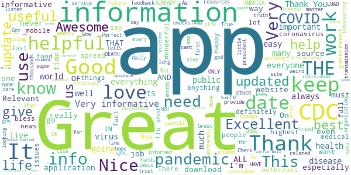

> Works fine  :date: __2021-05-04 02:46:42__

> Assist needed  :date: __2021-04-19 01:04:18__

> Excellent thanks  :date: __2021-04-01 14:53:52__

> Rate 5  :date: __2021-03-28 04:09:19__

> this was awesome thank you  :date: __2021-03-26 15:53:43__

> To me it was filled with useful information, and if necessary I will definitely download the application again for the next update  :date: __2021-03-19 12:27:33__

> CDC mobile app needs to make the app interesting. But I like it a little.  :date: __2021-03-13 13:14:10__

> (Teaches us to stop the spread of germs by washing our hands)!  :date: __2021-03-10 14:45:32__

> Great  :date: __2021-03-08 23:09:32__

> Very Thankful! On time updates Always available!!  :date: __2021-03-05 15:09:39__

#### 4-star reviews

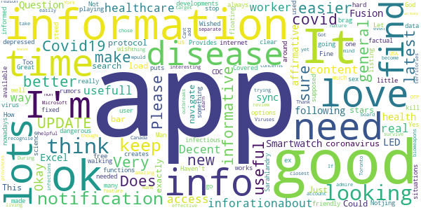

> Very usefull with their inforationabout covid.  :date: __2021-04-30 02:09:38__

> Good for info  :date: __2021-02-21 03:33:26__

> Decent app with lots of good info.  :date: __2021-01-27 05:17:53__

> Okay  :date: __2020-11-28 15:42:09__

> Covid19~real Time following is affirmative ~ Question : ≧∇≦ Does app sync with Fusion Smartwatch as not sure ~ LED  :date: __2020-11-24 06:50:59__

> Excel  :date: __2020-11-06 05:26:25__

> A very informative app on Disease and general health protocol. Could have 5 stars if it was easier to navigate and find information such as a search bar to find exactly what I'm looking for.  :date: __2020-09-11 04:55:30__

> It's the only coronavirus app, so make it good. Just won't load. This is dangerous!! UPDATE: ok I think they fixed it  :date: __2020-09-07 22:40:29__

> Provides clear and factual science on COVID-19 developments  :date: __2020-07-31 23:53:35__

> Sarahlandry ex sex here  :date: __2020-06-11 01:25:36__

#### 3-star reviews

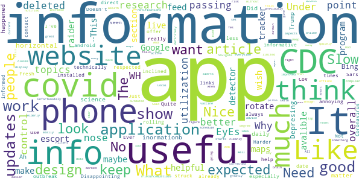

> Like the topics & research  :date: __2021-03-07 15:47:54__

> Why R the EyEs not a point of passing 19 to the nose❓🤪🌿  :date: __2021-02-01 08:01:46__

> deleted this app because the same information is on their website  :date: __2020-10-23 04:57:07__

> Under WH control! It is what it is.  :date: __2020-08-26 03:35:25__

> I think the apps utilization could be much better but overall the app is very helpful for information.  :date: __2020-08-23 04:24:46__

> Needs to make the covid tracker avalible on this app.  :date: __2020-08-05 14:36:00__

> This application was good but I wish it would have a section on were the were the covid-19 was maybe they should work with Google maps to show the information. Like how the escort raider detector application live feed.  :date: __2020-07-07 15:05:04__

> program has good info, does not rotate to horizontal.  :date: __2020-06-14 15:51:53__

> I get more information from Bing  :date: __2020-06-11 07:46:28__

> Depresing inormationb  :date: __2020-06-04 04:00:19__

#### 2-star reviews

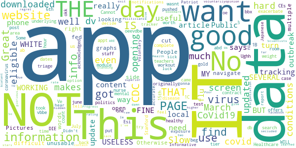

> Slow and difficult to navigate  :date: __2021-04-22 21:32:17__

> Great if you want info fed to you that you're not looking for. Otherwise hard to find the info you want.  :date: __2021-03-25 18:50:37__

> People with multiple underlying conditions were originally in tier 1B, then we got pushed down to 1C. That time came on March 15, after politics put healthy teachers before those of us THAT WILL DIE if we contract the virus. A good triage nurse is worth their weight in gold. Got one on staff? No? March 15th just turns out to be the day we can exacerbate our mental conditions by being eligible to beg for an appt. I have Stanford Healthcare and wasnt even acknowledged as being eligible. No room  :date: __2021-03-22 07:22:12__

> No search on opening screen  :date: __2021-02-24 19:24:58__

> Cannot find the post test for a module that took me an hour to complete, and only offers 0.5 CEs 🤬  :date: __2021-01-10 22:38:32__

> Ughh  :date: __2020-11-04 07:10:21__

> Esi o.m k.m .w o w 9. Ve o oe oeevdbe dv we DV b ni bbx ab workout db we vbbe okk. E. The, e.e. .  :date: __2020-09-26 07:37:44__

> I downloaded this for coronavirus updates for my area no updated information. Some dates back to june 2 abd its July 6th.  :date: __2020-07-06 13:27:08__

> No covid-19 disease case count?  :date: __2020-06-26 02:32:43__

> Informative, not an exposure tracker. This app also has no notifications.  :date: __2020-06-13 04:07:56__

#### 1-star reviews

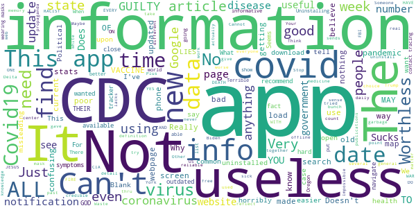

> You c wardlyK h a z a r i a n s. Your real saying is Build Back Worst since thats what you hypocrites are doing only wanting unintelligible m 0 n gr e l ized s I a v e s! Hypocrital n a r c s your crimibal c a b a l needs to be reset and put away instead!  :date: __2021-05-08 08:01:05__

> Crashes when I try to download a chart.  :date: __2021-05-03 18:37:24__

> Absolute scam. Just as useless as the rest of our government. I will never get the coronavirus vaccine.  :date: __2021-04-21 03:17:31__

> This app is the definition of the cdc. It's late on news, it's not consistent on anything, and work like biden's brains, coumo's hands, and harris' knees.  :date: __2021-03-31 11:08:12__

> Doesn't do anything. Blank screen.  :date: __2021-03-29 06:02:16__

> I can't believe this app  :date: __2021-03-17 07:24:17__

> Covid19 not real because tree gave free oxygen everyone  :date: __2021-03-02 02:32:37__

> I've tried several times to get the app to open. All i get is a white screen. I've uninstalled and installed the app several time and it won't open.  :date: __2021-02-26 03:18:05__

> Impossible to find your way around.  :date: __2021-02-05 20:15:20__

> Lies and misinformation. Waste of time  :date: __2021-01-11 18:28:55__

# CRUSH COVID RI
App version ``3.0``

Analyzed with [covid-apps-observer](http://github.com/covid-apps-observer) project, version ``0.1``

## App overview
| | |
|-------------------------|-------------------------| 
| **Name**&nbsp;&nbsp;&nbsp;&nbsp;&nbsp;&nbsp;&nbsp;&nbsp;&nbsp;&nbsp;&nbsp;&nbsp;&nbsp;&nbsp;&nbsp;&nbsp;&nbsp;&nbsp;&nbsp;&nbsp;&nbsp;&nbsp;&nbsp;&nbsp;&nbsp;&nbsp;&nbsp;&nbsp;&nbsp;&nbsp;&nbsp;&nbsp;&nbsp;&nbsp;&nbsp;&nbsp;&nbsp;&nbsp;&nbsp;&nbsp;  | CRUSH COVID RI |
| **Unique identifier** | com.ri.crushcovid |
| **Link to Google Play** | [https://play.google.com/store/apps/details?id=com.ri.crushcovid](https://play.google.com/store/apps/details?id=com.ri.crushcovid) |
| **Summary**  | CRUSH COVID RI is the COVID-19 response app for Rhode Island. #CrushCovidRI |
| **Privacy policy** | [https://health.ri.gov/covid/crush/privacypolicy/](https://health.ri.gov/covid/crush/privacypolicy/) |
| **Latest version** | 3.0 |
| **Last update** | 2021-03-08 21:55:59 |
| **Recent changes** | This update includes the following:  - Two new tiles added: “Get Vaccinated” and “Get Data” - General performance and user interface improvements |
| **Installs**  | 10,000+ |
| **Category** | Health & Fitness |
| **First release** | May 15, 2020 |
| **Size**  | 15M |
| **Supported Android version**  | 8.0 and up |

### Description
> CRUSH COVID RI is a COVID-19 pandemic response app that provides Rhode Islanders with easy access to all of the resources required during the public health crisis, and includes features such as a location diary and symptom diary. 
  
 All Rhode Islanders are encouraged to use the CRUSH COVID RI app and take an active role in slowing the spread of COVID-19 in Rhode Island.  You can make a difference in the health of your loved ones and your community by helping us track the virus in our state.  
  
 CRUSH COVID RI is a one-stop place to get all the information you need about COVID-19 in Rhode Island. It also has two features you can use to help everyone in the community.  
  
 The My Location Diary feature uses GPS location data that is already available from your phone to help you easily track the places you visited over the past 20 days. All data will be stored locally on your device. It is only shared when you voluntarily decide to share it. If you test positive for COVID-19, and you agree to share this information with the Rhode Island Department of Health, they can quickly identify places you went and people you were in contact with and reduce the spread of COVID-19.    
  
 The My Symptom Diary feature lets you tell us if you have any symptoms and only asks you to provide your zip code.  If you submit this quick survey daily, it will help give us early indicators of COVID-19 spread in certain zip codes so we can respond by doing things like setting up testing sites in that area.  
  
 Together we can #CrushCovidRI. 
  
 Please see our Terms of Use (https://health.ri.gov/covid/crush/termsofuse/) & Privacy Policy (https://health.ri.gov/covid/crush/privacypolicy/) for further information.

### User interface
The developers of the app provide the following screenshots in the Google play store.
| | | |
|:-------------------------:|:-------------------------:|:-------------------------:|
 |   |   |   | 
 |   |   |   | 
 |   |  

## Development team
In the following we report the main information provided by the development team in the Google play store.

| | |
|-------------------------|-------------------------|
| **Developer**  | State of Rhode Island |
| **Website**  | [https://health.ri.gov/crushcovid](https://health.ri.gov/crushcovid) |
| **Email** | CrushCovid.Survey@health.ri.gov |
| **Physical address**  | - |
| **Other developed apps**  | [https://play.google.com/store/apps/developer?id=State+of+Rhode+Island](https://play.google.com/store/apps/developer?id=State+of+Rhode+Island) |

## Android support

| | |
|-------------------------|-------------------------|
| **Declared target Android version**  | Android10, version 10 (API level 29) |
| **Effective target Android version**  | Android10, version 10 (API level 29) |
| **Minimum supported Android version**  | Oreo, version 8.0.0 (API level 26) |
| **Maximum target Android version**  | - |

The larger the difference between the minimum and maximum supported Android versions, the better. A larger difference means a wider audience. For example, old phones have a very low Android version, so a high minimum supported Android version means that the app cannot be used by users with old phones, thus leading to accessibility problems. 

## Requested permissions

In the following we report the complete list of the permissions requested by the app. 

| **Permission** | **Protection level** | **Description** | 
|-------------------------|-------------------------|-------------------------|
 **android.permission ACCESS_FINE_LOCATION** | :warning:**Dangerous** | Allows an app to access precise location. 
 **android.permission ACCESS_NETWORK_STATE** | Normal | Allows applications to access information about networks. 
 **android.permission ACCESS_WIFI_STATE** | Normal | Allows applications to access information about Wi-Fi networks. 
 **android.permission FOREGROUND_SERVICE** | Normal | Allows a regular application to use Service.startForeground. 
 **android.permission INTERNET** | Normal | Allows applications to open network sockets. 
 **android.permission RECEIVE_BOOT_COMPLETED** | Normal | Allows an application to receive the Intent.ACTION_BOOT_COMPLETED that is broadcast after the system finishes booting. 
 **android.permission WAKE_LOCK** | Normal | Allows using PowerManager WakeLocks to keep processor from sleeping or screen from dimming. 
 **com.google.android.c2dm.permission RECEIVE** | - | - 
 **com.google.android.finsky.permission BIND_GET_INSTALL_REFERRER_SERVICE** | - | - 

## Mentioned servers

| **Server** | **Registrant** | **Registrant country** | **Creation date** | 
|-------------------------|-------------------------|-------------------------|-------------------------|
 | android.com | Google LLC | :us: US | 1997-06-23 04:00:00 |
 | google.com | Google LLC | :us: US | 1997-09-15 04:00:00 |
 | app-measurement.com | Google LLC | :us: US | 2015-06-19 20:13:31 |
 | mapbox.com | Whois Privacy Service | :us: US | 2003-11-27 11:15:57 |
 | googlesyndication.com | Google LLC | :us: US | 2003-01-21 06:17:24 |
 | crashlytics.com | Google LLC | :us: US | 2011-01-21 15:30:40 |
 | googleapis.com | Google LLC | :us: US | 2005-01-25 17:52:26 |
 | googleadservices.com | Google LLC | :us: US | 2003-06-19 16:34:53 |

## Security analysis 

Below we report the main security warnings raised by our execution of the [Androwarn](https://github.com/maaaaz/androwarn) security analysis tool.

**Telephony identifiers leakage**
> - This application reads the numeric name (MCC+MNC) of current registered operator 
> - This application reads the operator name 
> - This application reads the radio technology (network type) currently in use on the device for data transmission 

**Connection interfaces exfiltration**
> - This application reads details about the currently active data network 
> - This application tries to find out if the currently active data network is metered 

**Telephony services abuse**
> - This application makes phone calls 

**Suspicious connection establishment**
> - This application opens a Socket and connects it to the remote address '; exhausted proxy configurations: ' on the 'N/A' port  
> - This application opens a Socket and connects it to the remote address 'Ljava/lang/StringBuilder;->toString()Ljava/lang/String;' on the 'N/A' port  
> - This application opens a Socket and connects it to the remote address 'Ljava/net/Proxy;->type()Ljava/net/Proxy$Type;' on the 'N/A' port  
> - This application opens a Socket and connects it to the remote address 'Ljava/net/SocketException;' on the 'N/A' port  
> - This application opens a Socket and connects it to the remote address 'timeout' on the 'N/A' port  

**Code execution**
> - This application loads a native library 

## User ratings and reviews

Below we provide information about how end users are reacting to the app in terms of ratings and reviews in the Google Play store.

### Ratings

The CRUSH COVID RI app has been installed by more than **10000** times. At this time, **306** rated the app and its average score is **3.2673268**. Below we show the distribution of the ratings across the usual star-based rating of Google Play

:star::star::star::star::star:: 137

:star::star::star::star:: 9

:star::star::star:: 39

:star::star:: 42

:star:: 79

### Reviews 

#### 5-star reviews

> Ok  :date: __2021-05-07 09:53:16__

> All Life Matters...  :date: __2021-04-09 01:13:41__

> Great  :date: __2020-12-24 20:33:48__

> Well developed  :date: __2020-10-20 23:12:10__

> I think that if the whole country used this app we would not be in the mess we are in. People do not use their brain at all. It's common sense...you protect me I protect you. It's a proven fact that masks work. Wake up and stop being so bull headed...I've been trying to do everything that has been recommended by our Governor and have been using this app since the first day it came out. Call me a wimp, I don't care. I'm 70, a retired RN and know from experience these rules save lives.  :date: __2020-10-17 19:43:11__

> Good way to track were you've been  :date: __2020-10-14 18:24:27__

> The app ia good  :date: __2020-10-01 11:03:12__

> Very informative. Be  :date: __2020-09-22 22:19:48__

> Easy to navigate and use.  :date: __2020-09-18 04:00:13__

> Takes some practice to figure how It works.  :date: __2020-09-11 05:46:50__

#### 4-star reviews

> The app completely missed my morning hike, seems to work only intermittently. The updated versions are a big improvement, it is now working reasonably well.  :date: __2021-04-17 13:39:11__

> more f  :date: __2020-08-06 01:07:34__

> Kudos to the state and the developers for working to put this out. Maybe needs some improvements but none I can suggest. Last update was great allowing us to add names to location diary.  :date: __2020-07-13 23:21:21__

> Update: started using again with the update to see if there is improvement. Still need to add a manual addition for location if the locator doesn't pick up where you were for less that 10 minutes. Also, you still can't fix where you went if the locator is slightly off. Today, I went bowling, not get my nails done. Now you can add notes, so that helps. Location info not 100% accurate. Since I don't spend 20 minutes at every place I visit, you should add a location manually button.  :date: __2020-07-12 21:09:13__

> Good app, but still could use some improvements. The ability to correct an address would be helpful, as the GPS frequently does not accurately record it. Also, if possible, the ability to label regular addresses, like Home, and have it be remembered. Finally, the app frequently would revert to 5 day look back, even if I choose 20 day, as I was checking my history and making updates. I would have to back out and reload the location diary and then choose 20 day again.  :date: __2020-07-12 15:18:33__

> The Location Diary fails to report some places I've been and is inaccurate on many of the rest.  :date: __2020-07-12 15:11:35__

> Works fine, though doesn't seem to update daily on my tracking. 7/11/2020 tracking seems to be working fine now.  :date: __2020-07-11 22:18:17__

> Location function does not appear to be consistent. Some days are partially accurate and some days are not accurate at all.  :date: __2020-07-10 19:50:08__

> Resident of Rhode Island  :date: __2020-07-10 19:39:10__

> if you don't see the icon, it's not tracking you.  :date: __2020-07-04 23:43:54__

#### 3-star reviews

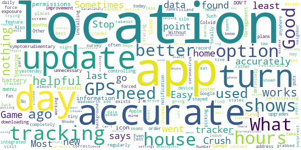

> This seams to not be accurate very often with locations!!  :date: __2020-10-14 23:37:32__

> It puts me places I never was  :date: __2020-10-14 16:40:06__

> I have used this app regularly since downloading it months ago & while it was a rudimentary app in the beginning the 2.0 upgrades were a good improvement. What I DON'T find helpful is with today's update, I am forced to turn on my GPS feature in order to take the daily symptom survey; this is completely unnecessary as I may not have any plans to leave my house. I'm not a fan of an app controlling how my device works. Also the "No thanks" option does nothing, and I have to force the app closed.  :date: __2020-10-14 14:12:33__

> This should be integrated with the exposure notification system from Apple and Google. Without it, this app exists in its own tiny silo and won't be successful.  :date: __2020-09-28 05:33:30__

> This is not accurately tracking location. Update: Even after installing the update, it is not accurately tracking my location. Sometimes it shows me at an address down the street from my home all day rather than my house. Other days it doesn't record any location at all. Such as yesterday, I went to Narragansett, nothing shows on my location tracker at all for the last 2 days.  :date: __2020-09-10 01:24:33__

> Cannot get contact tracing in Crush Colvid  :date: __2020-08-10 20:35:33__

> Not totally accurate  :date: __2020-07-16 21:44:22__

> Most days the app is not picking up most of the locations I visit. Sometimes is says I did not go anywhere and I definitely did and stayed at Locations for hours. What is the point of participating in this if the data is going to be incorrect. I hope this can be fixed or at least have an option to correct Locations ourselves. Good luck.  :date: __2020-07-14 00:41:15__

> James Wadsworth I have found the tracking to be only 75 per cent accurate.  :date: __2020-07-13 06:40:02__

> I mean, I get that the app is trying it's best, but it only works in Rhode island! The better news is that at least it warns u what states the coronavirus are tracked  :date: __2020-07-11 03:50:12__

#### 2-star reviews

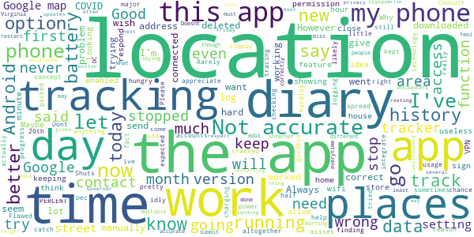

> In the location diary, It only gets the address right about half the time...sometimes it misses an address altogether...  :date: __2021-04-07 14:36:11__

> Good concept but it stopped tracking, which is a major function of the app. I deleted and downloaded again and still no tracking, so finding a reason to keep hard to come by.  :date: __2021-02-28 21:08:49__

> My app hasn't tracked my location since Dec 23, 2020. It has said it is "in progress" since then.  :date: __2021-01-09 15:25:09__

> Rarely works  :date: __2020-11-19 15:46:15__

> I appreciate this app so much that I've kept it on my phone pretty much since day 1, and have let it log my location for the chance that I catch COVID-19 and want to send it in. I just want to do anything I can to help stop the spread. However, this app accounts for 35 PERCENT of my battery usage. There's simply no need for an app to be that power-hungry, just logging my location idly. That, and the fact that it doesn't integrate Google's contact tracing technology, I have to say goodbye for now  :date: __2020-11-19 08:27:43__

> Location areas are not correct  :date: __2020-10-14 14:32:35__

> Flawed tracking. Please give option to manually add days/locations when there is no tracking history. Just checking location history today and there's been no tracking since the 20th. App has been running and I had expected that it was working.  :date: __2020-09-28 04:03:38__

> Had this app for a little while. Always had me in places that ive never been and hardley ever picked up where i actually was. Dont really go to a lot of new places so i tried it but now has been deleted  :date: __2020-09-15 14:37:38__

> Shuts down  :date: __2020-08-27 14:31:35__

> Battery not working charging likely from multiple ConVid19 tracker, in DC and other areas people may be running different apps from other states like Virginia and miss encounters...  :date: __2020-08-24 10:03:37__

#### 1-star reviews

> The app won't event get past the initial let's go.  :date: __2021-04-27 02:03:02__

> At first it was helpful tracking my help and keeping me up to date with new information. However, it's now been unable to retrieve new data for a couple months and I'm unable to access new information about testing or vaccinations.  :date: __2021-02-26 20:13:12__

> I can't get past the "Let's Go" button on a Pixel 5. This used to work on my Pixel.  :date: __2020-12-02 17:30:43__

> After I use symptom diary, the next screen freezes. I have to uninstall the app and then install it again.  :date: __2020-11-22 15:40:59__

> Constantly says that I need to connect to Wi-Fi or mobile which are both connected tried turning each off individually with the same message. I am removing the app from my phone  :date: __2020-11-12 19:18:39__

> Not accurate at all  :date: __2020-11-07 19:42:19__

> The app was ok but the most recent update drained my battery worse than a Pokemon go binge, just with the app running in the background. It's not worth having until this issue is fixed.  :date: __2020-10-31 15:41:18__

> Lack of exposure notifications make this app virtually useless.  :date: __2020-10-18 01:46:52__

> Not very accurate.  :date: __2020-10-17 05:08:13__

> No exposure notifications = useless app!  :date: __2020-10-09 03:20:46__

# Covid Watch Arizona
App version ``2.1.2``

Analyzed with [covid-apps-observer](http://github.com/covid-apps-observer) project, version ``0.1``

## App overview
| | |
|-------------------------|-------------------------| 
| **Name**&nbsp;&nbsp;&nbsp;&nbsp;&nbsp;&nbsp;&nbsp;&nbsp;&nbsp;&nbsp;&nbsp;&nbsp;&nbsp;&nbsp;&nbsp;&nbsp;&nbsp;&nbsp;&nbsp;&nbsp;&nbsp;&nbsp;&nbsp;&nbsp;&nbsp;&nbsp;&nbsp;&nbsp;&nbsp;&nbsp;&nbsp;&nbsp;&nbsp;&nbsp;&nbsp;&nbsp;&nbsp;&nbsp;&nbsp;&nbsp;  | Covid Watch Arizona |
| **Unique identifier** | gov.azdhs.covidwatch.android |
| **Link to Google Play** | [https://play.google.com/store/apps/details?id=gov.azdhs.covidwatch.android](https://play.google.com/store/apps/details?id=gov.azdhs.covidwatch.android) |
| **Summary**  | Help stop COVID-19 in Arizona |
| **Privacy policy** | [https://azdhs.gov/documents/privacy-policy/covid-watch-application-privacy-policy.pdf](https://azdhs.gov/documents/privacy-policy/covid-watch-application-privacy-policy.pdf) |
| **Latest version** | 2.1.2 |
| **Last update** | 2021-04-09 18:38:14 |
| **Recent changes** | We have been busy making major improvements!   Here’s what’s new: Statewide Vaccination Support! Get access to the most reliable and up-to-date information on how to get a vaccine within your selected county or organization. |
| **Installs**  | 10,000+ |
| **Category** | Medical |
| **First release** | Aug 19, 2020 |
| **Size**  | 7.8M |
| **Supported Android version**  | 6.0 and up |

### Description
> Let your smartphone notify you of potential exposure to COVID-19—using fully anonymous Bluetooth signals—and help stop the spread of coronavirus throughout the state Arizona.
 NEW Vaccine Support: In a single tap, you can easily access the most up-to-date and reliable information on how to get a vaccine within your chosen community.
 Get peace of mind and start rebuilding trust in your community with just one small step: Install this free app, released in partnership with the Arizona Department of Health Services (ADHS).
 Once you opt-in and enable exposure notifications on your phone, Covid Watch starts working immediately to detect if you come into close proximity with someone who has tested positive for COVID-19. The app is completely anonymous and works in the background without ever needing to know your location or personal information. It’s simple, safe, and secure.
 The more people who download the app, the more effective we can be. We have now extended support statewide, so encourage your friends, family, and colleagues to install Covid Watch today. Together, we can slow the spread of COVID-19.
 Provided by Covid Watch, an Arizona non-profit organization dedicated to your health and privacy.WeHealth is a public benefit corporation and the developer of Covid Watch Arizona.

### User interface
The developers of the app provide the following screenshots in the Google play store.
| | | |
|:-------------------------:|:-------------------------:|:-------------------------:|
 |   |   |   | 
 |   |   |   | 

## Development team
In the following we report the main information provided by the development team in the Google play store.

| | |
|-------------------------|-------------------------|
| **Developer**  | ADHS-Arizona Department of Health Services |
| **Website**  | [https://covidwatch.org](https://covidwatch.org) |
| **Email** | contact@covidwatch.org |
| **Physical address**  | [150 N 18TH AVE](https://www.google.com/maps/search/150%20N%2018TH%20AVE) (Google Maps) |
| **Other developed apps**  | [https://play.google.com/store/apps/developer?id=ADHS-Arizona+Department+of+Health+Services](https://play.google.com/store/apps/developer?id=ADHS-Arizona+Department+of+Health+Services) |

## Android support

| | |
|-------------------------|-------------------------|
| **Declared target Android version**  | - |
| **Effective target Android version**  | - |
| **Minimum supported Android version**  | Marshmallow, version 6.0 (API level 23) |
| **Maximum target Android version**  | - |

The larger the difference between the minimum and maximum supported Android versions, the better. A larger difference means a wider audience. For example, old phones have a very low Android version, so a high minimum supported Android version means that the app cannot be used by users with old phones, thus leading to accessibility problems. 

## Requested permissions

In the following we report the complete list of the permissions requested by the app. 

| **Permission** | **Protection level** | **Description** | 
|-------------------------|-------------------------|-------------------------|
 **android.permission ACCESS_NETWORK_STATE** | Normal | Allows applications to access information about networks. 
 **android.permission BLUETOOTH** | Normal | Allows applications to connect to paired bluetooth devices. 
 **android.permission FOREGROUND_SERVICE** | Normal | Allows a regular application to use Service.startForeground. 
 **android.permission INTERNET** | Normal | Allows applications to open network sockets. 
 **android.permission RECEIVE_BOOT_COMPLETED** | Normal | Allows an application to receive the Intent.ACTION_BOOT_COMPLETED that is broadcast after the system finishes booting. 
 **android.permission WAKE_LOCK** | Normal | Allows using PowerManager WakeLocks to keep processor from sleeping or screen from dimming. 
 **com.google.android.finsky.permission BIND_GET_INSTALL_REFERRER_SERVICE** | - | - 

## Mentioned servers

| **Server** | **Registrant** | **Registrant country** | **Creation date** | 
|-------------------------|-------------------------|-------------------------|-------------------------|
 | wehealth.org | Domains By Proxy, LLC | :us: US | 2017-07-17 14:30:24 |
 | google.com | Google LLC | :us: US | 1997-09-15 04:00:00 |
 | googlesyndication.com | Google LLC | :us: US | 2003-01-21 06:17:24 |
 | googleadservices.com | Google LLC | :us: US | 2003-06-19 16:34:53 |
 | app-measurement.com | Google LLC | :us: US | 2015-06-19 20:13:31 |
 | covidwatch.org | Contact Privacy Inc. Customer 1247431163 | :canada: CA | 2020-03-01 18:20:50 |

## Security analysis 

Below we report the main security warnings raised by our execution of the [Androwarn](https://github.com/maaaaz/androwarn) security analysis tool.

**Connection interfaces exfiltration**
> - This application reads details about the currently active data network 
> - This application tries to find out if the currently active data network is metered 

**Telephony services abuse**
> - This application makes phone calls 

**Suspicious connection establishment**
> - This application opens a Socket and connects it to the remote address '' on the '80' port  
> - This application opens a Socket and connects it to the remote address '; port is out of range' on the 'N/A' port  
> - This application opens a Socket and connects it to the remote address 'Ljava/net/Proxy;->type()Ljava/net/Proxy$Type;' on the 'N/A' port  
> - This application opens a Socket and connects it to the remote address 'Lm/a/a/a/a;->k(Ljava/lang/String;)Ljava/lang/StringBuilder;' on the 'N/A' port  
> - This application opens a Socket and connects it to the remote address 'timeout' on the 'N/A' port  

## User ratings and reviews

Below we provide information about how end users are reacting to the app in terms of ratings and reviews in the Google Play store.

### Ratings

The Covid Watch Arizona app has been installed by more than **10000** times. At this time, **64** rated the app and its average score is **3.90625**. Below we show the distribution of the ratings across the usual star-based rating of Google Play

:star::star::star::star::star:: 38

:star::star::star::star:: 7

:star::star::star:: 4

:star::star:: 5

:star:: 10

### Reviews 

#### 5-star reviews

> Qualcomm & Snapdragon ACTIVATE  :date: __2021-04-04 10:08:32__

> Finally they got Arizona down  :date: __2021-03-30 21:18:21__

> It's awesome for info for me and any bodies health and take care of yourself too.thanks for the app it works for everyone else. My sisters and relatives are doctors and nurses and thanks for letting me use this app.  :date: __2021-03-30 10:09:09__

> Necessary  :date: __2020-12-03 06:41:57__

> The app is Amazing and I love it. This should be launched across USA and it will help in saving allot of people from exposure of Covid-19. Everyone in Arizona should download and start using it.  :date: __2020-10-06 13:43:59__

> The idea is great/it is easy to set up/explains how it works well. I will rate 5 simply for that. It definitely needs to be able to be discovered by searching 'covid arizona' or 'covid watch arizona'. I had to look it up on a search engine then go through an app store link on the dev's website to find it.  :date: __2020-09-11 05:38:37__

> Thanks for making this!  :date: __2020-09-10 10:11:21__

> Excellent application !  :date: __2020-08-24 13:16:53__

> Just what AZ needs to kick the covid! Hopefully everyone will install. I'm glad it protects privacy.  :date: __2020-08-19 20:42:29__

#### 4-star reviews

> Seems to function okay but very few people know it exists and even fewer are using it. It can't be all that affective without a large number of people using it.  :date: __2021-02-08 19:48:02__

> Today Update  :date: __2020-09-08 20:52:33__

> I am going to give this a try  :date: __2020-09-02 08:55:19__

#### 3-star reviews

> Says it can't detect if it continues contact app...  :date: __2020-12-20 16:04:55__

> It's a major flaw to have to deliberately dig for this and install. I'm not saying it should be force installed on any device but it should at /least/ be able to show up in a search 🙃  :date: __2020-10-09 02:43:42__

> This app can't be found using a simple search for "Covid Watch Arizona".  :date: __2020-08-26 04:58:02__

#### 2-star reviews

> Just something I just got from doing the covid-19 watch but being a veteran I have no and I use the VA I have no idea what way we can use it to my advantage I also have Humana for Medicare and they're not part of it so what do you recommend  :date: __2021-04-01 06:27:20__

> Not even the hospitals where i work at are aware of this app.  :date: __2021-03-07 16:49:46__

> I don't see how this app can be helpful at all for contact tracing. Few people in Arizona I know are aware of this app, and even if they're informed about it, it doesn't even appear in a general search with keywords. Then it will randomly inform you that you have a notification and, when you click to find out what it is, it will tell you that you have no notifications. You'll have an icon that sits in your notifications for 12 hours telling you that it's looking for exposures that can't be dismissed. Also, you can't even choose Phoenix nor Maricopa County as your location despite that being the most populous region of the state; your options are Tucson, Flagstaff, and "State of Arizona" which apparently isn't even functional.  :date: __2021-01-13 20:07:20__

> Great idea but unclear. IMPOSSIBLE to find by simple searching for it in the app store. I had to follow internet breadcrumbs over the different sites to finally get a link to the exact app. Once here, while setting up, you need to select your location, one of which is "State of Arizona". But later it says that statewide implementation means that you can get alerts, but not alert anyone else. So if I'm in Prescott, and no one in Prescott can actually send an alert, what is the point????  :date: __2020-10-06 19:06:36__

> This app worked perfectly for me to begin with. Upon getting an exposure alert, I was able to view the details and severity with a simple touch. However, within the last two weeks, I noticed when I received an alert, I am unable to see the details. I am shown when it occurred, but the drop down bar showing the Transmission Risk and total time exposed is no longer available. I've tried all I can think to fix the issue, but at this point, I can no longer rely on it for accurate exposure alerts.  :date: __2020-09-25 01:17:53__

#### 1-star reviews

> Meh! Problem is not with the app, problem is with the state of Arizona. The state and it's governor are anti maskers. The governor is a businessman turned politician so opening up everything is more important than deaths. Voters believe in a alternate reality freedom. It's okay to have laws about drunk driving, and wearing seatbelts but make them wear a mask and you won't get their votes.  :date: __2021-04-13 04:56:21__

> ARIZONA SWAMP - GOV DUCEY RINO ; MAYOR GALLEGO SOCIALIST AND SEN. M KELLY DEMOCRAT FINANCED BY GEORGE SOROS. PURPLE RINO'S HAVE TAKEN AZ.  :date: __2021-04-10 10:33:45__

> Dumber now  :date: __2021-04-04 12:24:03__

> Was hopeful for this, but this app is *extremely* limited. With only around 10K downloads (assuming these are still installed and running), there's no way it can function effectively for contact tracing. First, this had apparently been available since August 2020? No one knows about this app. Second, there needs to be a way for users to report their own exposures to those diagnosed covid positive, not just personal diagnoses - consider medical field workers: doctors, nurses, pharmacy.  :date: __2021-03-05 20:29:24__

> I know I've been potentially exposed and have received no exposure notifications  :date: __2021-01-30 19:11:05__

> Pretty useless since statewide reporting is not available for the app. Need to change the name to UofA/ASU COVID Tracker since they're the only regions that actually work.  :date: __2020-12-16 16:06:21__

> This app only works for UofA & NAU and isn't on the CDC's list so trying to find it is challenging. What are the developers waiting for, especially with the current spike in Arizona? It dosen't do any good to share this with others if no one can add there positive diagnosis in an unsupported region (meaning the rest of the state).  :date: __2020-11-23 16:02:59__

> Apparently, it's not available in for most of Arizona even if the menu lists Arizona along with two university systems. You need to be upfront about this. What "region" am I in and what "local" officials are you waiting for permission from? Thank you, ADHS, for replying on 10/09/20, but my point stands. There's no State of Arizona region and you need to remove that until ADHS, state and local officials, and your software developer have all made their necessary inputs to this process.  :date: __2020-10-19 03:19:06__

# COVIDWISE
App version ``1.3``

Analyzed with [covid-apps-observer](http://github.com/covid-apps-observer) project, version ``0.1``

## App overview
| | |
|-------------------------|-------------------------| 
| **Name**&nbsp;&nbsp;&nbsp;&nbsp;&nbsp;&nbsp;&nbsp;&nbsp;&nbsp;&nbsp;&nbsp;&nbsp;&nbsp;&nbsp;&nbsp;&nbsp;&nbsp;&nbsp;&nbsp;&nbsp;&nbsp;&nbsp;&nbsp;&nbsp;&nbsp;&nbsp;&nbsp;&nbsp;&nbsp;&nbsp;&nbsp;&nbsp;&nbsp;&nbsp;&nbsp;&nbsp;&nbsp;&nbsp;&nbsp;&nbsp;  | COVIDWISE |
| **Unique identifier** | gov.vdh.exposurenotification |
| **Link to Google Play** | [https://play.google.com/store/apps/details?id=gov.vdh.exposurenotification](https://play.google.com/store/apps/details?id=gov.vdh.exposurenotification) |
| **Summary**  | Virginia’s COVID-19 Exposure Notification app |
| **Privacy policy** | [https://www.vdh.virginia.gov/covidwise/privacy-policy/](https://www.vdh.virginia.gov/covidwise/privacy-policy/) |
| **Latest version** | 1.3 |
| **Last update** | 2021-01-27 15:27:54 |
| **Recent changes** | Add your phone to the COVID fight with COVIDWISE! This latest version of COVIDWISE includes minor bug and performance fixes, a push notification update, as well as an improved Virtual VDH interface with added vaccine information and educational guidance.  In addition, we have included various messaging updates, including verbiage to reflect the implementation of anonymous 8-digit verification codes for increased security. |
| **Installs**  | 100,000+ |
| **Category** | Health & Fitness |
| **First release** | Jul 29, 2020 |
| **Size**  | 9.1M |
| **Supported Android version**  | 6.0 and up |

### Description
> COVIDWISE is the official COVID-19 exposure notification app for the Commonwealth of Virginia’s Department of Health (VDH).  The app was developed in partnership with SpringML using a Bluetooth Low Energy (BLE) API framework created through a unique collaboration between Apple and Google.
 Your personal use of COVIDWISE will significantly help inform Virginians suspected of having been within close proximity to someone with a positive COVID-19 diagnosis. When you download COVIDWISE, you are doing your part to efficiently and effectively help your community stay ahead of any potential resurgent trends in cases. This is vitally important as the business sector, healthcare industry, K-12 schools, institutions of higher education, religious organizations, sporting/recreation activities, and others rely on appropriate interventions to ensure the health of our communities and maintain economic viability. 
 How COVIDWISE Works: 
 If someone reports to the app that they tested positive, the signals from their app will search for other app users who shared that signal. The BLE signals are date-stamped and the app estimates how close the two devices were based on signal strength. If the timeframe was at least 15 minutes and the estimated distance was within six feet, then the other user receives a notification of a possible exposure. No names! No location! 
 The BLE framework within COVIDWISE will run in the background, even if the exposure notification app is closed. It will not drain the device battery at a rate that would occur with other apps that use normal Bluetooth and/or are open and running constantly.
 How COVIDWISE Protects Your Privacy:
 VDH takes your privacy and confidentiality very seriously. This is why we chose to use the Apple and Google BLE framework. No personal data or location tracking occurs within this app. In fact, there is no need for VDH to know where or who you are for COVIDWISE to work. If you are close enough to another app user, the BLE technology will share signals with that user. 
 Laboratory results for all persons who test positive for COVID-19 are sent to VDH. This is not associated with the app. Our staff follows up with persons reported as positive, based on information provided within the laboratory report. 
 Anonymously Share Positive Test Results With COVIDWISE:
 When VDH receives any positive COVID-19 lab result registered with a valid mobile phone number, we will automatically send a text message to that individual, which provides rapid notification and encourages them to stay home and away from other people. The text also lets individuals who have tested positive know they may retrieve an 8-digit verification code from the COVIDWISE Verification Portal at https://apps.vdh.virginia.gov/CWP. You must enter your last name, date of birth, and the phone number that matches the information from your registered COVID-19 test to verify your positive result.
 You may use that 8-digit verification code in order to anonymously report a positive result to the app. This prevents people from falsely reporting positive results, which could generate false exposure notifications. VDH wants all app users to feel confident that when a possible COVID-19 exposure is received via the app, that it is a real event. 
 If you have the current Apple or Google operating system installed on your device, you may have noticed that Exposure Notifications are now included. Apple and Google will delete the exposure notification service tools from their respective operating systems once the pandemic reaches a point that public health no longer requires the use of this technology.
 Thank you for downloading COVIDWISE! Together, we can protect our family, friends, neighbors, and colleagues, and keep Virginia moving forward!

### User interface
The developers of the app provide the following screenshots in the Google play store.
| | | |
|:-------------------------:|:-------------------------:|:-------------------------:|
 |   |   |   | 
 |   |   | 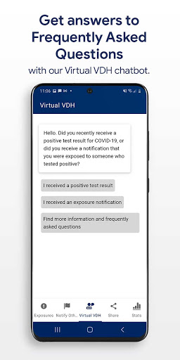  | 

## Development team
In the following we report the main information provided by the development team in the Google play store.

| | |
|-------------------------|-------------------------|
| **Developer**  | VDH |
| **Website**  | [http://covidwise.org](http://covidwise.org) |
| **Email** | covidwise@vdh.virginia.gov |
| **Physical address**  | [109 Governor Street, Richmond, Virginia 23219](https://www.google.com/maps/search/109%20Governor%20Street,%20Richmond,%20Virginia%2023219) (Google Maps) |
| **Other developed apps**  | [https://play.google.com/store/apps/developer?id=VDH](https://play.google.com/store/apps/developer?id=VDH) |

## Android support

| | |
|-------------------------|-------------------------|
| **Declared target Android version**  | Android10, version 10 (API level 29) |
| **Effective target Android version**  | Android10, version 10 (API level 29) |
| **Minimum supported Android version**  | Marshmallow, version 6.0 (API level 23) |
| **Maximum target Android version**  | - |

The larger the difference between the minimum and maximum supported Android versions, the better. A larger difference means a wider audience. For example, old phones have a very low Android version, so a high minimum supported Android version means that the app cannot be used by users with old phones, thus leading to accessibility problems. 

## Requested permissions

In the following we report the complete list of the permissions requested by the app. 

| **Permission** | **Protection level** | **Description** | 
|-------------------------|-------------------------|-------------------------|
 **android.permission ACCESS_NETWORK_STATE** | Normal | Allows applications to access information about networks. 
 **android.permission BLUETOOTH** | Normal | Allows applications to connect to paired bluetooth devices. 
 **android.permission FOREGROUND_SERVICE** | Normal | Allows a regular application to use Service.startForeground. 
 **android.permission INTERNET** | Normal | Allows applications to open network sockets. 
 **android.permission RECEIVE_BOOT_COMPLETED** | Normal | Allows an application to receive the Intent.ACTION_BOOT_COMPLETED that is broadcast after the system finishes booting. 
 **android.permission WAKE_LOCK** | Normal | Allows using PowerManager WakeLocks to keep processor from sleeping or screen from dimming. 

## Mentioned servers

| **Server** | **Registrant** | **Registrant country** | **Creation date** | 
|-------------------------|-------------------------|-------------------------|-------------------------|
 | google.com | Google LLC | :us: US | 1997-09-15 04:00:00 |
 | googleapis.com | Google LLC | :us: US | 2005-01-25 17:52:26 |
 | encv.org | Contact Privacy Inc. Customer 1247088653 | :canada: CA | 2020-04-30 03:55:48 |

## Security analysis 

Below we report the main security warnings raised by our execution of the [Androwarn](https://github.com/maaaaz/androwarn) security analysis tool.

**Telephony identifiers leakage**
> - This application reads the ISO country code equivalent of the current registered operator's MCC (Mobile Country Code) 

**Connection interfaces exfiltration**
> - This application reads details about the currently active data network 
> - This application tries to find out if the currently active data network is metered 

**Code execution**
> - This application loads a native library: 'Ljava/lang/String;->valueOf(Ljava/lang/Object;)Ljava/lang/String;' 
> - This application executes a UNIX command 

## User ratings and reviews

Below we provide information about how end users are reacting to the app in terms of ratings and reviews in the Google Play store.

### Ratings

The COVIDWISE app has been installed by more than **100000** times. At this time, **1198** rated the app and its average score is **3.647541**. Below we show the distribution of the ratings across the usual star-based rating of Google Play

:star::star::star::star::star:: 659

:star::star::star::star:: 108

:star::star::star:: 98

:star::star:: 19

:star:: 314

### Reviews 

#### 5-star reviews

> The app stopped checking in a few months ago. I tried reinstalling it and that got it to check in, but only once.  :date: __2021-04-30 03:48:15__

> Thank you for this excellent public service. If only more people worked together for the greater good of all we could achieve so much more together. 💜  :date: __2021-04-27 01:25:34__

> Works in the background with no performance issues. Gives periodic updates regarding ongoing monitoring.  :date: __2021-04-22 20:07:07__

> I wanted to pratically keep going thanks  :date: __2021-04-20 06:18:10__

> It let's you know if you have been exposed by anyone who has covid-19  :date: __2021-04-19 03:45:57__

> Thank you  :date: __2021-04-18 12:07:00__

> Great! As long as this virus is with us, you need to get and use this app!!!  :date: __2021-04-18 01:52:35__

> Nice app  :date: __2021-04-15 17:43:22__

> Good app to have  :date: __2021-04-14 03:31:13__

> Good information.  :date: __2021-04-09 00:13:18__

#### 4-star reviews

> It would be good to be able to submit that you've received the vaccine. Not sure if it's updating or not, I've never received a notification but that could also be because not enough people use it? It has lots of helpful information tho!  :date: __2021-04-18 00:08:50__

> I think the app works, I mean I haven't gotten any notifications nor have I gotten covid so I guess?  :date: __2021-03-01 19:26:17__

> The app is performing as designed. Although, I'd like to see enhancements commensurate with the ramped-up vaccination going on- e.g., the ability to also mark yourself vaccinated, which vaccine, and even lot # would provide valuable metadata and insights into tracing contact with those NOT yet vaccinated.  :date: __2021-02-27 22:25:24__

> 👍👍  :date: __2021-02-15 20:05:33__

> It seems my phone was just slow and loaded the app in the background. Looked later and there it was.  :date: __2021-01-15 19:20:49__

> Fundamental problem: this app has almost no public outreach throughout Virginia, and apparently there is a faulty verification process for PATIENTS VOLUNTEERING POSITIVE RESULTS. As long as these issues remain, this app is mostly a failure. This is a critical PR issue that won't be fixed with improved app code  :date: __2021-01-07 07:15:35__

> Fakenews  :date: __2021-01-07 01:42:37__

> Great idea but can't be effective without significantly more participation. Literally need millions of users; 100k downloads falls way short. Not enough people take the situation seriously enough or just deny it completely.  :date: __2020-12-12 21:53:18__

> Good app to have! Thumbs up!  :date: __2020-12-04 14:28:02__

> Good  :date: __2020-11-30 00:12:23__

#### 3-star reviews

> Trying to figure out how this at work  :date: __2021-04-01 04:10:03__

> The app has twice stopped updating. I did get instructions to load another state's app, activate that in place of covidwise, then reload covidwise and reactive. It works but why does the checking just stop?  :date: __2021-03-27 19:41:27__

> Good idea, but utility is totally dependant on enough people downloading it to make notifications meaningful. There is no way to know...  :date: __2021-03-25 21:01:28__

> Great idea concept, except it does not work in MA. Plus, it will only alert you if someone actively states they have tested positive before going out in public. Some will see it as a HIPPA violation, even though they consent to saying they've tested positive. It doesn't say who, just alerts you to possible exposure. Would like to see this accepted nationwide, and notifications for if you're in a "high risked" area, rather than hoping someone claims they're positive and running errands.  :date: __2021-03-16 18:29:33__

> Pointless  :date: __2021-03-11 05:52:57__

> Stopped using this because NOBODY else seemed to be using it Great idea but I think most people felt like it was an invasion of their privacy. Plus, we have to rely on people being honest about their health.  :date: __2021-03-02 20:31:29__

> It was working and put date of checking very often. Now it hasn't did anything since feb 10.  :date: __2021-02-26 21:46:45__

> I am safe.  :date: __2021-02-26 12:22:10__

> Yikes! I wish I saw the reviews before. It's a good idea but either the VDH doesn't have the resources to handle reporting for this app or something else is going on. Damn this gives me a false sense of security, which is bad since I'm both a retail essential worker, and I also reside with my older in laws.  :date: __2021-02-16 11:51:01__

> I will admit, I felt so much better about life when this app came out. I wish it were mandatory for all Virginians just like our masks. We would be more efficient at slowing the spread, if it were mandatory and working properly. Unfortunately, my exposure notification hasn't updated since January 5, 2021after working great for months. Please help! I want to be part of the solution. Cannot do that if the app isnt working properly. I keep my bluetooth on at all times, that's not the problem.  :date: __2021-02-11 16:08:59__

#### 2-star reviews

> Repeatedly stops sending notifications unless I uninstall and reinstall.  :date: __2021-05-05 01:27:21__

> This app version doesn't allow me to notify whether I was fully vaccinated. When will the developer learn from other regions??  :date: __2021-04-25 09:30:50__

> Unfortunately something is clearly wrong with this app. It worked perfectly until sometime in January or February. Now it will check for exposures for a while and then just stop. When I just checked, it had not checked for exposures for weeks. Reinstalling works but then it happens again a few weeks later. I see many other similar reports.  :date: __2021-04-22 04:15:15__

> Only works if others are willing to participate ...  :date: __2021-04-13 14:42:26__

> i felt safe when first installing this app.. i don't feel safe with it now.. . but was vaccinated April Fools Day.  :date: __2021-04-05 23:47:49__

> My exposures haven't been checked since March 3. I've followed the instructions in the FAQs, but it still won't update. I even uninstalled and reinstalled the app. 🤷  :date: __2021-03-26 00:48:24__

> Since a recent update I get alert after alert after alert if I don't have BT or GPS enabled. One alert is enough. I don't want to have this on when I'm at home and I don't want to be constantly spammed with alerts. It is enough to make me consider deleting the app, which is counter productive, Virginia.  :date: __2021-03-16 10:56:08__

> Does not scan every day...last scan over a week ago. Only way to fix is uninstall and redo...but then you lose the past 14 days.....for all the money virginia has been given you think they would have spent a little more on this..but no they need to work on gun control instead  :date: __2021-03-11 01:20:34__

> Never really got to see how the app worked. Got COVID, but never got a number to enter my positive results in the app. I'm a construction Project Manager and have been on jobsites with lots of COVID cases, and have worked at retirement communities with outbreaks. I never got a notification that I may have been exposed. I assume this is largely due to the barriers in entering positive results. Neat idea, but terrible execution.  :date: __2021-02-23 01:09:28__

> Stopped checking for exposures 1 week ago. Is there an update or fix coming? When will it be compatible with the other state apps?  :date: __2021-02-11 00:34:09__

#### 1-star reviews

> Doesn't check for exposure for weeks. Eats up battery life.  :date: __2021-05-08 00:02:28__

> Never no updates on it  :date: __2021-05-07 21:30:35__

> Does not work  :date: __2021-05-07 02:57:21__

> I had this app since it's birth pretty much and never once got a notification unless it was to turn my bluetooth back on. I was deep in atlanta a few nights and still no notifications. I guess it's because the other people also need the app but not enough people had it for it to work.  :date: __2021-04-26 18:02:55__

> The app used to check for exposures twice a day, no Im lucky if I get an exposure check once every other week.....plus if no location is needed, why wont it check for exposures without location turned on? Also it keeps turning off my location.  :date: __2021-04-24 06:27:45__

> It's stopped checking exposures. I followed the instructions to troubleshoot, still snake eyes. Deleting and using the dc app.  :date: __2021-04-22 03:11:32__

> Doesn't update and check for exposures. What's the point of this app? Uninstalling.  :date: __2021-04-21 18:34:54__

> Contact tracing is unscientific and a vehicle for evil. This is a narc database for communist Karen's. Grow a pair and live your lives. Quit destroying our society with your fear mongering.  :date: __2021-04-20 04:51:14__

> Stopped checking exposure in January  :date: __2021-04-19 05:48:10__

> This app destroyed my daily battery usage. It runs NON-STOP in the background and never provides any notifications. I'm with the person in the moon on this one.  :date: __2021-04-17 11:13:15__

# Covid Trace Nevada
App version ``1.2.13``

Analyzed with [covid-apps-observer](http://github.com/covid-apps-observer) project, version ``0.1``

## App overview
| | |
|-------------------------|-------------------------| 
| **Name**&nbsp;&nbsp;&nbsp;&nbsp;&nbsp;&nbsp;&nbsp;&nbsp;&nbsp;&nbsp;&nbsp;&nbsp;&nbsp;&nbsp;&nbsp;&nbsp;&nbsp;&nbsp;&nbsp;&nbsp;&nbsp;&nbsp;&nbsp;&nbsp;&nbsp;&nbsp;&nbsp;&nbsp;&nbsp;&nbsp;&nbsp;&nbsp;&nbsp;&nbsp;&nbsp;&nbsp;&nbsp;&nbsp;&nbsp;&nbsp;  | Covid Trace Nevada |
| **Unique identifier** | gov.nv.dhhs.en |
| **Link to Google Play** | [https://play.google.com/store/apps/details?id=gov.nv.dhhs.en](https://play.google.com/store/apps/details?id=gov.nv.dhhs.en) |
| **Summary**  | Stay safe. Protect each other. Stay private. |
| **Privacy policy** | [https://covidtrace.com/nct_privacy_policy.pdf](https://covidtrace.com/nct_privacy_policy.pdf) |
| **Latest version** | 1.2.13 |
| **Last update** | 2020-11-15 03:56:47 |
| **Recent changes** | - Better detection of settings that would prevent exposure notifications - Bug fixes |
| **Installs**  | 50,000+ |
| **Category** | Medical |
| **First release** | Aug 22, 2020 |
| **Size**  | 52M |
| **Supported Android version**  | 7.0 and up |

### Description
> Nevada's Department of Health and Human Services (DHHS) COVID Trace app helps reduce the spread of coronavirus in Nevada helping everyone stay safe. COVID Trace doesn’t require personal information helping protect your privacy.

### User interface
The developers of the app provide the following screenshots in the Google play store.
| | | |
|:-------------------------:|:-------------------------:|:-------------------------:|
 |   |   |   | 
 |   |  

## Development team
In the following we report the main information provided by the development team in the Google play store.

| | |
|-------------------------|-------------------------|
| **Developer**  | Nevada Division of Public and Behavioral Health |
| **Website**  | [http://dpbh.nv.gov/](http://dpbh.nv.gov/) |
| **Email** | help@covidtrace.com |
| **Physical address**  | - |
| **Other developed apps**  | [https://play.google.com/store/apps/developer?id=Nevada+Division+of+Public+and+Behavioral+Health](https://play.google.com/store/apps/developer?id=Nevada+Division+of+Public+and+Behavioral+Health) |

## Android support

| | |
|-------------------------|-------------------------|
| **Declared target Android version**  | Pie, version 9 (API level 28) |
| **Effective target Android version**  | Pie, version 9 (API level 28) |
| **Minimum supported Android version**  | Nougat, version 7.0 (API level 24) |
| **Maximum target Android version**  | - |

The larger the difference between the minimum and maximum supported Android versions, the better. A larger difference means a wider audience. For example, old phones have a very low Android version, so a high minimum supported Android version means that the app cannot be used by users with old phones, thus leading to accessibility problems. 

## Requested permissions

In the following we report the complete list of the permissions requested by the app. 

| **Permission** | **Protection level** | **Description** | 
|-------------------------|-------------------------|-------------------------|
 **android.permission ACCESS_NETWORK_STATE** | Normal | Allows applications to access information about networks. 
 **android.permission BLUETOOTH** | Normal | Allows applications to connect to paired bluetooth devices. 
 **android.permission GET_TASKS** | Deprecated | This constant was deprecated in API level 21. No longer enforced. 
 **android.permission INTERNET** | Normal | Allows applications to open network sockets. 
 **android.permission RECEIVE_BOOT_COMPLETED** | Normal | Allows an application to receive the Intent.ACTION_BOOT_COMPLETED that is broadcast after the system finishes booting. 
 **android.permission WAKE_LOCK** | Normal | Allows using PowerManager WakeLocks to keep processor from sleeping or screen from dimming. 

## Mentioned servers

| **Server** | **Registrant** | **Registrant country** | **Creation date** | 
|-------------------------|-------------------------|-------------------------|-------------------------|
 | google.com | Google LLC | :us: US | 1997-09-15 04:00:00 |
 | xmlpull.org | WhoisGuard, Inc. | PA | 2001-11-26 20:33:08 |
 | w3.org | W3C | :us: US | 1994-07-06 04:00:00 |
 | googleapis.com | Google LLC | :us: US | 2005-01-25 17:52:26 |

## Security analysis 

Below we report the main security warnings raised by our execution of the [Androwarn](https://github.com/maaaaz/androwarn) security analysis tool.

**Connection interfaces exfiltration**
> - This application reads details about the currently active data network 
> - This application tries to find out if the currently active data network is metered 

**Pim data leakage**
> - This application accesses data stored in the clipboard 

**Code execution**
> - This application loads a native library: 'flutter' 

## User ratings and reviews

Below we provide information about how end users are reacting to the app in terms of ratings and reviews in the Google Play store.

### Ratings

The Covid Trace Nevada app has been installed by more than **50000** times. At this time, **163** rated the app and its average score is **3.19**. Below we show the distribution of the ratings across the usual star-based rating of Google Play

:star::star::star::star::star:: 66

:star::star::star::star:: 18

:star::star::star:: 16

:star::star:: 9

:star:: 54

### Reviews 

#### 5-star reviews

> Great  :date: __2021-04-24 22:09:23__

> Very informative and helpful.  :date: __2021-04-09 01:04:49__

> Helpful  :date: __2021-04-03 22:47:04__

> Thank you 😊 lt helping me  :date: __2021-04-01 19:51:54__

> Elpata  :date: __2021-03-06 05:30:43__

> It works like is was advised.  :date: __2021-03-05 18:21:36__

> Just get the app so you can keep you, your family, your friends, community safer. Contact tracing is one of the best ways to help stop the spread of this virus. So download the app and wear a mask when your out and about for just a little bit longer and we will be on the other side of this whole ordeal in no time. Have a safe and happy day.  :date: __2021-02-16 09:44:48__

> I don't live in Nevada I live in Michigan  :date: __2021-02-03 19:28:11__

> At Circus Circus...chk out 11 am...no home but a longtime friend to help...Pres Biden says to remain vigilant..ab( alxenia) 🧓👵😷  :date: __2021-02-01 18:14:47__

> At Circus Circus...chk out 11 am...no home but a long time friend to help..Pres Biden says remain vigilant• alxenia👵🤕😷  :date: __2021-02-01 18:12:34__

#### 4-star reviews

> I built it go ished Äärön Ray smellley havnt göt paid tët for the caccine or app bu the go. Detection kot i'm the crwatpr 856 billion alooted for me Trump era Boop 702. 125 rööl. 27e April 17 2921ad saysaturfdy lvnv89169 cloubrea US vetd bonaza 525 Andreas Floor 2. 115  :date: __2021-04-18 03:21:15__

> Won't even get past the 3rd setup page....I hope Nevada did not actually pay somebody to build this. Tried again after update ..still will not set up....3rd update did the trick. set up OK ..upped to 3 stars. We will see. They updated it...it works now.  :date: __2021-04-11 03:40:23__

> It's great, just more people need to get the app to make it even better and more effective. Only 50k downloads. Nevada as a population of over 3 million. So less than 2% of the population have the app... We need to share it with family & friends, and our local news needs to promote it.  :date: __2020-12-17 11:00:41__

> It seemed to work fine while I was in Vegas but I flew to Dallas last night and now it says the trace app is off and I can't push the grocery basket any further! The wheels locked up so I guess it's just a Vegas phenomenon? "I'll Be Back!" I'll keep it on my phone till then.  :date: __2020-12-02 23:17:41__

> Very slow in signing on. Confusing too.  :date: __2020-08-26 18:50:32__

#### 3-star reviews

> It only works if others report that they've had COVID-19 so I'm not sure what the point is. I've been around people who have recovered from the virus but the app did NOT show that I've been exposed.  :date: __2021-02-28 06:27:27__

> I wanted to alert people about possible exposure to Covid as soon as I recieved my positive results but was unable to due to the verification code requirement. I called all over the place and sent out emails and got no closer ro alerting people until 6 days after my positive test when the Washoe County Health department called for contact tracing and gave me the code. So it appears that the app works but you probably won't be notified about exposures for about a week after someone tests positive  :date: __2021-01-06 19:15:25__

> Love this app  :date: __2020-12-07 12:52:21__

> Kind of a pointless app when after your test positive literally no one that contacts you knows the code necessary to self report.  :date: __2020-11-28 05:05:47__

> I mean, sure, I suppose it'd work, but let's be real. The chances of anyone between the Sierra Nevada and the Rockies actually self-reporting is kind of on the low end. This makes the app basically useless. Something like it in Korea, that'd work fine, since they take contact tracing seriously  :date: __2020-11-27 00:02:59__

> Couldn't reload app to get time and day to reload.  :date: __2020-11-22 19:27:23__

> "Reload" Ineffective It's 08:00, and I have been out in public for an hour, but it last checked exposures at 3:15 yesterday. I do not normally leave Bluetooth on, so I have been turning off my Bluetooth at bedtime at night, and back on in the morning. Today I turned it back on before 06:00, and have tried to "reload" but it still won't re-check. I saw some others with the same issue; maybe it's Android, maybe it's Bluetooth but doesn't seem to work well.  :date: __2020-11-13 17:08:05__

> Sadly, most of the cases in Nevada originate from tourists. That's why there were so few cases before the casinos opened back up. They won't have this app so it's only able to account for the people who come in contact with people who caught it working in tourist areas. Sadly, people keep coming here as opposed to going into quarantine when they test positive.  :date: __2020-10-30 20:17:35__

> Update: Its fixed. I hope people use this as a great tool to assist 7s in fighting COVID-19. The app will not let me go beyond the 3rd page. It doesnt work. My bluetooth and location are on. The "exposure notification" will not let me turn it on as it says "I need to finish setting up the app" others instructions say the "exposure notification" must be on to finish the app. ????? I am stuck in a loop.  :date: __2020-10-25 18:30:48__

> Requires having Bluetooth on at all times which drains my battery. It also keeps giving me drop down notifications even though I disabled notifications. I have an android.  :date: __2020-10-22 17:34:36__

#### 2-star reviews

> Gives details on recent checks in your area after monthly reminders, but we cannot access that data through the UI manually, which we should be able to do.  :date: __2021-02-05 04:45:42__

> Absolutely useless if you don't have a specific 8 digit code to confirm the test results. The lab my husband got tested at used code numbers longer than 8 digits. When his test came back positive, there was no way to report it to this app. I don't know if this app is limited to NV Health dept tests or what.  :date: __2020-12-26 06:15:07__

> I now understand why I never got an alert even though I live in a hotspot. I tested positive and tried to notify, but it requires a diagnosis code that is never given. There is no workaround, so no way it can be activated.  :date: __2020-12-24 20:14:33__

> Don't know whether this thing really works or not  :date: __2020-12-12 04:51:42__

> I feel this is just to make profit when you download this app, i downloaded few weeks back a week later some one closed to me came out positive to the virus and i didn't get the alert i have known people that have use this app but seems noone gets an alert  :date: __2020-12-02 06:58:48__

> You state to download the DHHS tracing app but when pne opens the google store, there are dozens of apps listed, none of which say DHHS, so what good is that if I cant be traced?  :date: __2020-12-01 21:13:57__

> Good idea poorly executed  :date: __2020-11-25 23:37:24__

> Downloaded the app about two weeks ago worked fine, I assume the first couple days. Now it will never reload information (it has a little time last updated at the top) it's been stuck at the same time no matter what I do. I like the idea of this but it's basically an app that is a website with tracking permissions. All the clickable stuff in the app just take you to a webpage through your internet app.  :date: __2020-11-16 04:27:04__

> Due to the reviews, I have decided to not waste my time and efforts on this app. I'll continue to watch the news reports online of where the hot spots are and continue to be safe as possible. The idea of this app was good; however, it is only as good as the data that is inputted and shared to others. If there's a breakdown in getting the data into the app and out to everyone else, then it doesn't matter how great your app was stuctured.  :date: __2020-11-10 22:58:00__

> Won't refresh anymore making it useless  :date: __2020-10-30 02:53:20__

#### 1-star reviews

> Ibhave never been notified even though people in my Sun city community have been infected. Worthless app.  :date: __2021-03-19 19:51:02__

> No evidence of covid-19 at all send back home to mom only. Nothing else anded.  :date: __2021-03-14 01:39:12__

> In case you dont realize it is just a way to attach a marker to your cell phone the department of health is using you to get more of a grasp of your lives. To think if you never would be put on an ankle bracelet The government just made you carry one with out due process  :date: __2021-02-26 09:06:59__

> Neither UMC nor the Health Department have any idea about the required verification code, so I can't report a positive diagnosis. Which defeats the entire purpose of this app.  :date: __2021-02-19 19:20:22__

> No idea what the idea is behind this when I couldn't enter my info about being infected.  :date: __2021-02-19 05:06:10__

> Dark mode support pls  :date: __2021-02-16 16:09:20__

> It doesnt work. I have 2 positive people at home it said nobody is sick.😥  :date: __2021-02-12 02:33:23__

> NV advised everyone to get this app but the only thing that it does that I can tell is whine when bluetooth is turned off. Being an associate of the healthcare industry this just appears to be another government advertised strawman app that nobody really has any use for....though its tempting to kick this on near the COVID wing and see if it goes off like a four alarm fire.....I'm highly doubtful it would.  :date: __2021-02-10 08:34:36__

> I tried to use this to notify that I had a positive test while sitting in the urgent care that gave me the results. They had no verification code to give me. What good is the app if I can't actually use it for it's intended purpose?  :date: __2021-02-06 18:40:50__

> Dreadfully non-functional software.  :date: __2021-02-05 14:20:38__

# Covid Alert DE
App version ``1.2.2``

Analyzed with [covid-apps-observer](http://github.com/covid-apps-observer) project, version ``0.1``

## App overview
| | |
|-------------------------|-------------------------| 
| **Name**&nbsp;&nbsp;&nbsp;&nbsp;&nbsp;&nbsp;&nbsp;&nbsp;&nbsp;&nbsp;&nbsp;&nbsp;&nbsp;&nbsp;&nbsp;&nbsp;&nbsp;&nbsp;&nbsp;&nbsp;&nbsp;&nbsp;&nbsp;&nbsp;&nbsp;&nbsp;&nbsp;&nbsp;&nbsp;&nbsp;&nbsp;&nbsp;&nbsp;&nbsp;&nbsp;&nbsp;&nbsp;&nbsp;&nbsp;&nbsp;  | Covid Alert DE |
| **Unique identifier** | gov.de.covidtracker |
| **Link to Google Play** | [https://play.google.com/store/apps/details?id=gov.de.covidtracker](https://play.google.com/store/apps/details?id=gov.de.covidtracker) |
| **Summary**  | COVIDAlert, Delaware Division of Public Health helps reduce the spread of COVID |
| **Privacy policy** | [https://docs.google.com/document/d/1n1xZSpCCKc5eDpuJojHcd84k46joRCIR2NysOsQX6JE/edit?usp=sharing](https://docs.google.com/document/d/1n1xZSpCCKc5eDpuJojHcd84k46joRCIR2NysOsQX6JE/edit?usp=sharing) |
| **Latest version** | 1.2.2 |
| **Last update** | 2021-03-06 12:05:26 |
| **Recent changes** | Minor bug fixes and text changes. |
| **Installs**  | 10,000+ |
| **Category** | Medical |
| **First release** | Sep 8, 2020 |
| **Size**  | 105M |
| **Supported Android version**  | 6.0 and up |

### Description
> With your help, the COVID Alert DE app can help reduce the spread of coronavirus.
 The Division of Public Health of the State of Delaware is asking everyone to help tackle coronavirus by downloading and using the COVID Alert DE app every day.
  
 If you use the app you will:
 •             Be alerted if you have been in close contact with another user who has tested positive for coronavirus.
 •             Be able to track your symptoms and get advice on what to do.
 •             Protect yourself and others as everyone begins to return to normal life.
  
 Your data and privacy are vital. The COVID Alert DE app will NOT:
 •             Publicly identify anyone with COVID-19
 •             Use your data for any reason other than alerting you that you may be a close contact of someone who is COVID-positive.
  
 Use this app for 1 minute a day to make an important contribution to the fight against coronavirus. Protect yourself, your family, your community and the most vulnerable in society. Encourage everyone you know to download and use the Covid Alert DE app where possible.

### User interface
The developers of the app provide the following screenshots in the Google play store.
| | | |
|:-------------------------:|:-------------------------:|:-------------------------:|
 |   |   |   | 
 |   |  

## Development team
In the following we report the main information provided by the development team in the Google play store.

| | |
|-------------------------|-------------------------|
| **Developer**  | Delaware Department of Health and Social Services |
| **Website**  | [https://de.gov/covidalert](https://de.gov/covidalert) |
| **Email** | DHSS_COVIDAlertDE@delaware.gov |
| **Physical address**  | - |
| **Other developed apps**  | [https://play.google.com/store/apps/developer?id=Delaware+Department+of+Health+and+Social+Services](https://play.google.com/store/apps/developer?id=Delaware+Department+of+Health+and+Social+Services) |

## Android support

| | |
|-------------------------|-------------------------|
| **Declared target Android version**  | Android10, version 10 (API level 29) |
| **Effective target Android version**  | Android10, version 10 (API level 29) |
| **Minimum supported Android version**  | Marshmallow, version 6.0 (API level 23) |
| **Maximum target Android version**  | - |

The larger the difference between the minimum and maximum supported Android versions, the better. A larger difference means a wider audience. For example, old phones have a very low Android version, so a high minimum supported Android version means that the app cannot be used by users with old phones, thus leading to accessibility problems. 

## Requested permissions

In the following we report the complete list of the permissions requested by the app. 

| **Permission** | **Protection level** | **Description** | 
|-------------------------|-------------------------|-------------------------|
 **android.permission ACCESS_NETWORK_STATE** | Normal | Allows applications to access information about networks. 
 **android.permission ACCESS_WIFI_STATE** | Normal | Allows applications to access information about Wi-Fi networks. 
 **android.permission BLUETOOTH** | Normal | Allows applications to connect to paired bluetooth devices. 
 **android.permission FOREGROUND_SERVICE** | Normal | Allows a regular application to use Service.startForeground. 
 **android.permission INTERNET** | Normal | Allows applications to open network sockets. 
 **android.permission RECEIVE_BOOT_COMPLETED** | Normal | Allows an application to receive the Intent.ACTION_BOOT_COMPLETED that is broadcast after the system finishes booting. 
 **android.permission VIBRATE** | Normal | Allows access to the vibrator. 

## Mentioned servers

| **Server** | **Registrant** | **Registrant country** | **Creation date** | 
|-------------------------|-------------------------|-------------------------|-------------------------|
 | android.com | Google LLC | :us: US | 1997-06-23 04:00:00 |
 | google.com | Google LLC | :us: US | 1997-09-15 04:00:00 |
 | expo.io | See PrivacyGuardian.org | :us: US | 2011-05-01 21:26:50 |

## Security analysis 

Below we report the main security warnings raised by our execution of the [Androwarn](https://github.com/maaaaz/androwarn) security analysis tool.

**Telephony identifiers leakage**
> - This application reads the MCC+MNC of the provider of the SIM 
> - This application reads the numeric name (MCC+MNC) of current registered operator 
> - This application reads the operator name 

**Connection interfaces exfiltration**
> - This application reads details about the currently active data network 
> - This application tries to find out if the currently active data network is metered 

**Suspicious connection establishment**
> - This application opens a Socket and connects it to the remote address ' returned no addresses for  ; port is out of range' on the 'N/A' port  
> - This application opens a Socket and connects it to the remote address '' on the 'N/A' port  
> - This application opens a Socket and connects it to the remote address 'Ljava/lang/StringBuilder;->toString()Ljava/lang/String;' on the 'N/A' port  
> - This application opens a Socket and connects it to the remote address 'Ljava/net/Proxy;->type()Ljava/net/Proxy$Type;' on the 'N/A' port  
> - This application opens a Socket and connects it to the remote address 'timeout' on the 'N/A' port  

**Pim data leakage**
> - This application accesses data stored in the clipboard 

**Code execution**
> - This application loads a native library 
> - This application executes a UNIX command 

## User ratings and reviews

Below we provide information about how end users are reacting to the app in terms of ratings and reviews in the Google Play store.

### Ratings

The Covid Alert DE app has been installed by more than **10000** times. At this time, **118** rated the app and its average score is **4.16**. Below we show the distribution of the ratings across the usual star-based rating of Google Play

:star::star::star::star::star:: 75

:star::star::star::star:: 15

:star::star::star:: 13

:star::star:: 3

:star:: 12

### Reviews 

#### 5-star reviews

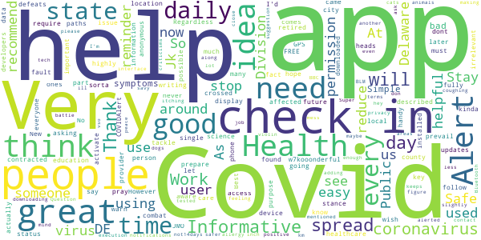

> I think every single person with a phone should have this Covid Alert (your state) app and "Check-in" daily! Regardless of your stance on this virus issue or how it came to be is now irrelevant, it's time for us to do our part to help stop the spread. JMO🤷‍♀️ Users will get a heads-up or an ALERT if you've crossed paths with someone else, who's also using this app, that later found out they contracted Covid-19. So now, YOU can be fully aware, prepare, and warn others you've been around! 🙏💞  :date: __2021-05-05 20:49:39__

> Informative  :date: __2021-04-03 21:03:16__

> A daily check-in to display my status. I care about my own health and that of others. I need to see how many people are affected by Covid-19 in my state, county, city. I highly recommend this app. ⭐⭐⭐⭐⭐  :date: __2021-03-11 02:45:43__

> I like the fact they let us know what is going on with Covid.  :date: __2021-01-29 18:11:24__

> Health education is key. As a retired healthcare provider science must prevail.  :date: __2020-12-31 18:02:38__

> Great  :date: __2020-12-28 17:24:00__

> Works great  :date: __2020-12-14 20:31:14__

> No I dont have it to day  :date: __2020-12-11 11:06:50__

> Thank you for this app.  :date: __2020-12-10 21:34:31__

> Very helpful thanks very much...  :date: __2020-11-29 15:24:44__

#### 4-star reviews

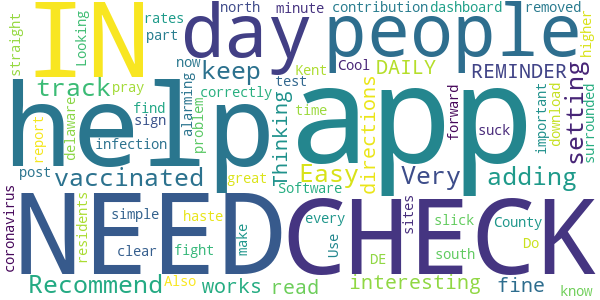

> Recommend adding a setting for those vaccinated to help keep track.  :date: __2021-03-15 19:06:08__

> Easy  :date: __2021-03-04 23:31:57__

> Very interesting  :date: __2020-12-22 02:32:40__

> It works fine but, we NEED A DAILY REMINDER TO CHECK IN!  :date: __2020-12-04 13:13:16__

> I like to help. Thinking I read directions correctly, now it is clear. . . "Use this app for 1 minute a day to make an important contribution to the fight against coronavirus." I don't know about all that, but the simple and straight forward dashboard is slick. Do your part and pray we get through this post-haste! I find it alarming that Kent County, DE is surrounded by higher infection rates, to the north and south. Software that does not suck is Cool.  :date: __2020-10-28 13:49:22__

> Looking for test sites???  :date: __2020-10-21 06:23:29__

> This is a great app but the problem is that more residents of delaware need to download the app. Also most of the time only 1000 people check in. I removed it, until more people sign up and report every day.  :date: __2020-10-12 00:38:27__

#### 3-star reviews

> I got a few advises but not many  :date: __2021-03-19 06:15:52__

> its boring  :date: __2020-12-12 11:47:50__

> Wish it would remind me to enter daily data. And with 35,000 users and only 180 check-ins a day I assume that feature would help others too.  :date: __2020-10-01 12:10:51__

> The app needs to be updated as it still talks about 14 days of isilatio. I'm not sure what phase 2 is as we are now at alert level 1  :date: __2020-09-26 00:53:51__

#### 2-star reviews

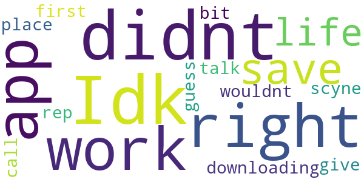

> Idk what i didnt do right but this app would not work for me to save my life an i was against downloading it in the first place but i did an it bit me i guess it wouldnt scyne an give my call in i.d to talk to the rep.  :date: __2020-12-20 14:25:42__

#### 1-star reviews

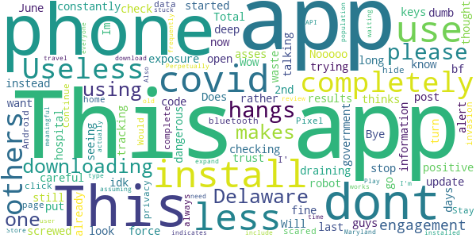

> Does not open after last update  :date: __2021-03-24 13:18:08__

> This app completely screwed up my phone  :date: __2021-03-10 03:49:08__

> I dont get it  :date: __2021-02-01 15:51:24__

> Useless. Have had positive results for 2 days and still dont have the code to put into the app to alert others. Total waste of an app.  :date: __2020-11-24 15:12:48__

> This is a tracking app so please be careful what you post  :date: __2020-11-18 00:01:30__

> Will not completely install, just hangs.  :date: __2020-10-24 21:43:07__

> Whats the use of downloading a dumb app for covid. Im not a robot that a phone thinks i have covid. I rather go to the hospital now and have a check up for me instead of downloading this app. This app can be dangerous and idk know if you guys are trying to look through my phone and seeing what i am talking about to my bf. I thought the government already have our information for a long. But Nooooo, they want to use this to be deep in our asses. I dont trust this app. Bye!  :date: __2020-10-18 22:53:52__

> Wow makes you turn on bluetooth and is a complete invasion of privacy. Stay home and hide if you are scared of COVID  :date: __2020-09-28 03:50:29__

> Would like to use the app, but the app always hangs when I get to the data page and click on Continue. I' using a Pixel 3 phone, Android 11.  :date: __2020-09-24 16:20:30__

> Perpetually stuck waiting for download from Play Store.  :date: __2020-09-16 15:17:02__

# Guam Covid Alert
App version ``1.0.10``

Analyzed with [covid-apps-observer](http://github.com/covid-apps-observer) project, version ``0.1``

## App overview
| | |
|-------------------------|-------------------------| 
| **Name**&nbsp;&nbsp;&nbsp;&nbsp;&nbsp;&nbsp;&nbsp;&nbsp;&nbsp;&nbsp;&nbsp;&nbsp;&nbsp;&nbsp;&nbsp;&nbsp;&nbsp;&nbsp;&nbsp;&nbsp;&nbsp;&nbsp;&nbsp;&nbsp;&nbsp;&nbsp;&nbsp;&nbsp;&nbsp;&nbsp;&nbsp;&nbsp;&nbsp;&nbsp;&nbsp;&nbsp;&nbsp;&nbsp;&nbsp;&nbsp;  | Guam Covid Alert |
| **Unique identifier** | org.pathcheck.guam.bt |
| **Link to Google Play** | [https://play.google.com/store/apps/details?id=org.pathcheck.guam.bt](https://play.google.com/store/apps/details?id=org.pathcheck.guam.bt) |
| **Summary**  | Receive alerts about potential exposure to COVID-19 in Guam. |
| **Privacy policy** | [https://guamcovidalert.guam.gov/privacy-policy/](https://guamcovidalert.guam.gov/privacy-policy/) |
| **Latest version** | 1.0.10 |
| **Last update** | 2020-11-17 04:34:09 |
| **Recent changes** | - New Home Screen and Navigation - Priority Polling for Exposure History Jobs - Accessibility Updates |
| **Installs**  | 5,000+ |
| **Category** | Health & Fitness |
| **First release** | Sep 8, 2020 |
| **Size**  | 65M |
| **Supported Android version**  | 6.0 and up |

### Description
> Guam Covid Alert, an app by the Guam Department of Public Health and Social Services helps aid contact tracing for COVID-19 by using the privacy centric Exposure Notification System. Subscribe to Healthcare Authorities in your area for information about COVID-19 near you, where available.
 Receive alerts from the local Healthcare Authority with information about potential exposure to COVID-19.
 The goal of Guam Covid Alert by the Guam Department of Public Health and Social Services is to help enable the reemergence and re-opening of economies and communities. Through global partnerships, we are prepared to support public health officials everywhere in the effort to slow the spread of COVID-19.
 The Guam Covid Alert app was built using an open source project developed by PathCheck Foundation.

### User interface
The developers of the app provide the following screenshots in the Google play store.
| | | |
|:-------------------------:|:-------------------------:|:-------------------------:|
 |   |   |   | 

## Development team
In the following we report the main information provided by the development team in the Google play store.

| | |
|-------------------------|-------------------------|
| **Developer**  | Otech Developer |
| **Website**  | [https://guamcovidalert.guam.gov/](https://guamcovidalert.guam.gov/) |
| **Email** | developer@dma.guam.gov |
| **Physical address**  | - |
| **Other developed apps**  | [https://play.google.com/store/apps/developer?id=Otech+Developer](https://play.google.com/store/apps/developer?id=Otech+Developer) |

## Android support

| | |
|-------------------------|-------------------------|
| **Declared target Android version**  | - |
| **Effective target Android version**  | - |
| **Minimum supported Android version**  | Marshmallow, version 6.0 (API level 23) |
| **Maximum target Android version**  | - |

The larger the difference between the minimum and maximum supported Android versions, the better. A larger difference means a wider audience. For example, old phones have a very low Android version, so a high minimum supported Android version means that the app cannot be used by users with old phones, thus leading to accessibility problems. 

## Requested permissions

In the following we report the complete list of the permissions requested by the app. 

| **Permission** | **Protection level** | **Description** | 
|-------------------------|-------------------------|-------------------------|
 **android.permission ACCESS_NETWORK_STATE** | Normal | Allows applications to access information about networks. 
 **android.permission ACCESS_WIFI_STATE** | Normal | Allows applications to access information about Wi-Fi networks. 
 **android.permission BLUETOOTH** | Normal | Allows applications to connect to paired bluetooth devices. 
 **android.permission FOREGROUND_SERVICE** | Normal | Allows a regular application to use Service.startForeground. 
 **android.permission INTERNET** | Normal | Allows applications to open network sockets. 
 **android.permission RECEIVE_BOOT_COMPLETED** | Normal | Allows an application to receive the Intent.ACTION_BOOT_COMPLETED that is broadcast after the system finishes booting. 
 **android.permission VIBRATE** | Normal | Allows access to the vibrator. 
 **android.permission WAKE_LOCK** | Normal | Allows using PowerManager WakeLocks to keep processor from sleeping or screen from dimming. 

## Mentioned servers

| **Server** | **Registrant** | **Registrant country** | **Creation date** | 
|-------------------------|-------------------------|-------------------------|-------------------------|
 | bugsnag.com | Bugsnag Inc. | GB | 2011-08-18 03:26:10 |
 | android.com | Google LLC | :us: US | 1997-06-23 04:00:00 |
 | google.com | Google LLC | :us: US | 1997-09-15 04:00:00 |
 | github.com | GitHub, Inc. | :us: US | 2007-10-09 18:20:50 |

## Security analysis 

Below we report the main security warnings raised by our execution of the [Androwarn](https://github.com/maaaaz/androwarn) security analysis tool.

**Telephony identifiers leakage**
> - This application reads the numeric name (MCC+MNC) of current registered operator 
> - This application reads the operator name 

**Connection interfaces exfiltration**
> - This application reads details about the currently active data network 
> - This application tries to find out if the currently active data network is metered 

**Suspicious connection establishment**
> - This application opens a Socket and connects it to the remote address 'Ljava/lang/StringBuilder;->toString()Ljava/lang/String;' on the ': connect, resolve' port  
> - This application opens a Socket and connects it to the remote address 'Ljava/lang/StringBuilder;->toString()Ljava/lang/String;' on the 'N/A' port  
> - This application opens a Socket and connects it to the remote address 'Ljava/net/Proxy;->type()Ljava/net/Proxy$Type;' on the 'N/A' port  
> - This application opens a Socket and connects it to the remote address 'No route to  ' on the 'N/A' port  
> - This application opens a Socket and connects it to the remote address 'timeout' on the 'N/A' port  

**Pim data leakage**
> - This application accesses data stored in the clipboard 

**Code execution**
> - This application loads a native library 
> - This application executes a UNIX command 

## User ratings and reviews

Below we provide information about how end users are reacting to the app in terms of ratings and reviews in the Google Play store.

### Ratings

The Guam Covid Alert app has been installed by more than **5000** times. At this time, **43** rated the app and its average score is **4.3023257**. Below we show the distribution of the ratings across the usual star-based rating of Google Play

:star::star::star::star::star:: 30

:star::star::star::star:: 5

:star::star::star:: 2

:star::star:: 3

:star:: 3

### Reviews 

#### 5-star reviews

> Helpfull  :date: __2020-12-25 13:14:05__

> Good to know  :date: __2020-12-23 21:53:24__

> Google  :date: __2020-11-01 21:04:08__

> Great to have and keeps us alert for COVID virus  :date: __2020-10-19 07:47:15__

> My president BT said her dad can choose who will die so I have to vote 5 stars for this. Otherwise it's a pretty good app  :date: __2020-10-18 16:14:04__

> 💙💙💙  :date: __2020-10-05 02:24:55__

> It does what's it supposed to. I feel better knowing this app is available to help If the need arises.  :date: __2020-09-28 09:47:53__

> Cool, whatever helps, even if the app isn't what everybody expected, atleast it's a value and can probably get you started on preperation.  :date: __2020-09-27 02:44:47__

> The best!  :date: __2020-09-15 11:11:33__

> Easy onboarding  :date: __2020-09-14 07:47:45__

#### 4-star reviews

> FIRST time fair.  :date: __2021-02-16 16:12:51__

#### 3-star reviews

> HOW WILL I KNOW WHEN SOMEONE IS INFECTED? I ALWAYS HAVE TO KEEP MY BLUETOOTH ON. I WISH THIS APP WILL LET ME KNOW IF SOMEONE NEXT TOO ME IS INFECTED WITH COVID-19.  :date: __2020-10-01 11:11:11__

#### 2-star reviews

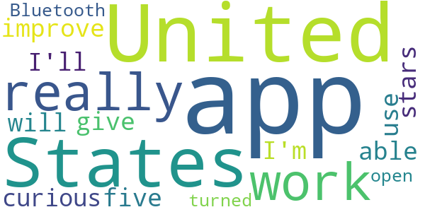

> I'm just curious as to why Bluetooth has to be turned on  :date: __2020-10-08 23:35:34__

> It doesn't open  :date: __2020-09-22 13:24:07__

#### 1-star reviews

> Do people really think someone positive would report it in this app for nearby people to know  :date: __2020-09-12 01:55:52__

> The app won't open  :date: __2020-09-10 05:36:45__

# CombatCOVID PBC
App version ``1.1.0``

Analyzed with [covid-apps-observer](http://github.com/covid-apps-observer) project, version ``0.1``

## App overview
| | |
|-------------------------|-------------------------| 
| **Name**&nbsp;&nbsp;&nbsp;&nbsp;&nbsp;&nbsp;&nbsp;&nbsp;&nbsp;&nbsp;&nbsp;&nbsp;&nbsp;&nbsp;&nbsp;&nbsp;&nbsp;&nbsp;&nbsp;&nbsp;&nbsp;&nbsp;&nbsp;&nbsp;&nbsp;&nbsp;&nbsp;&nbsp;&nbsp;&nbsp;&nbsp;&nbsp;&nbsp;&nbsp;&nbsp;&nbsp;&nbsp;&nbsp;&nbsp;&nbsp;  | CombatCOVID PBC |
| **Unique identifier** | com.shield.CombatCovidPBC |
| **Link to Google Play** | [https://play.google.com/store/apps/details?id=com.shield.CombatCovidPBC](https://play.google.com/store/apps/details?id=com.shield.CombatCovidPBC) |
| **Summary**  | CombatCOVID alerts you when you&#39;ve been in contact with someone who has COVID-19 |
| **Privacy policy** | [https://combatcovidapp.com/combatcovid-pbc-principles-privacy-policy-and-terms-of-use/](https://combatcovidapp.com/combatcovid-pbc-principles-privacy-policy-and-terms-of-use/) |
| **Latest version** | 1.1.0 |
| **Last update** | 2020-12-22 18:28:23 |
| **Recent changes** | Improved OTP(One-Time Pin) SMS service |
| **Installs**  | 5,000+ |
| **Category** | Health & Fitness |
| **First release** | Jul 20, 2020 |
| **Size**  | 12M |
| **Supported Android version**  | 5.1 and up |

### Description
> CombatCOVID is the Official COVID-19 notification and information app of the County Government of Palm Beach County, Florida, a diverse community of over a million and a half people.
 Unlike other apps, CombatCOVID has never used GPS or location notification in its architecture. The app user’s privacy and identity are protected. No names, emails addresses, locations or personally identifying information is required. There is never any location or identity information acquired by CombatCOVID.
 The CombatCOVID app uses Bluetooth signals to determine if you are near another user. All users who have been in close proximity to a COVID-19 positive person will be notified by a push notification recommending they get tested immediately, without revealing anyone’s personal identity. Suggested locations for testing are also provided.
 Your device’s phone number is encrypted and never shared with anyone, including local health officials. All data and Information about the device being in close proximity with another device is ONLY stored on the device.
 Access to the data indicating the device’s user may have tested positive is only shared IF/WHEN the user chooses to share it. IF the user does choose to share a COVID-19 positive result, they are still totally PRIVACY PROTECTED.

### User interface
The developers of the app provide the following screenshots in the Google play store.
| | | |
|:-------------------------:|:-------------------------:|:-------------------------:|
 |   |   |   | 
 |  

## Development team
In the following we report the main information provided by the development team in the Google play store.

| | |
|-------------------------|-------------------------|
| **Developer**  | Palm Beach County BoCC |
| **Website**  | [https://combatcovidapp.com/pbc](https://combatcovidapp.com/pbc) |
| **Email** | info@combatcovidapp.com |
| **Physical address**  | - |
| **Other developed apps**  | [https://play.google.com/store/apps/developer?id=Palm+Beach+County+BoCC](https://play.google.com/store/apps/developer?id=Palm+Beach+County+BoCC) |

## Android support

| | |
|-------------------------|-------------------------|
| **Declared target Android version**  | Android10, version 10 (API level 29) |
| **Effective target Android version**  | Android10, version 10 (API level 29) |
| **Minimum supported Android version**  | Lollipop, version 5.1 (API level 22) |
| **Maximum target Android version**  | - |

The larger the difference between the minimum and maximum supported Android versions, the better. A larger difference means a wider audience. For example, old phones have a very low Android version, so a high minimum supported Android version means that the app cannot be used by users with old phones, thus leading to accessibility problems. 

## Requested permissions

In the following we report the complete list of the permissions requested by the app. 

| **Permission** | **Protection level** | **Description** | 
|-------------------------|-------------------------|-------------------------|
 **android.permission ACCESS_FINE_LOCATION** | :warning:**Dangerous** | Allows an app to access precise location. 
 **android.permission ACCESS_NETWORK_STATE** | Normal | Allows applications to access information about networks. 
 **android.permission BLUETOOTH** | Normal | Allows applications to connect to paired bluetooth devices. 
 **android.permission BLUETOOTH_ADMIN** | Normal | Allows applications to discover and pair bluetooth devices. 
 **android.permission FOREGROUND_SERVICE** | Normal | Allows a regular application to use Service.startForeground. 
 **android.permission INTERNET** | Normal | Allows applications to open network sockets. 
 **android.permission REQUEST_IGNORE_BATTERY_OPTIMIZATIONS** | Normal | Permission an application must hold in order to use Settings.ACTION_REQUEST_IGNORE_BATTERY_OPTIMIZATIONS. 
 **android.permission WAKE_LOCK** | Normal | Allows using PowerManager WakeLocks to keep processor from sleeping or screen from dimming. 
 **com.google.android.c2dm.permission RECEIVE** | - | - 
 **com.google.android.finsky.permission BIND_GET_INSTALL_REFERRER_SERVICE** | - | - 

## Mentioned servers

| **Server** | **Registrant** | **Registrant country** | **Creation date** | 
|-------------------------|-------------------------|-------------------------|-------------------------|
 | googlesyndication.com | Google LLC | :us: US | 2003-01-21 06:17:24 |
 | google.com | Google LLC | :us: US | 1997-09-15 04:00:00 |
 | app-measurement.com | Google LLC | :us: US | 2015-06-19 20:13:31 |
 | stackoverflow.com | Stack Exchange, Inc. | :us: US | 2003-12-26 19:18:07 |
 | googleapis.com | Google LLC | :us: US | 2005-01-25 17:52:26 |
 | googleadservices.com | Google LLC | :us: US | 2003-06-19 16:34:53 |
 | googleapis.com | Google LLC | :us: US | 2005-01-25 17:52:26 |
 | googleapis.com | Google LLC | :us: US | 2005-01-25 17:52:26 |
 | combatcovidapp.com | Domains By Proxy, LLC | :us: US | 2020-05-18 13:25:41 |

## Security analysis 

Below we report the main security warnings raised by our execution of the [Androwarn](https://github.com/maaaaz/androwarn) security analysis tool.

**Telephony identifiers leakage**
> - This application reads the ISO country code equivalent for the SIM provider's country code 
> - This application reads the ISO country code equivalent of the current registered operator's MCC (Mobile Country Code) 

**Connection interfaces exfiltration**
> - This application reads details about the currently active data network 
> - This application tries to find out if the currently active data network is metered 

**Suspicious connection establishment**
> - This application opens a Socket and connects it to the remote address '' on the 'N/A' port  
> - This application opens a Socket and connects it to the remote address 'Ljava/lang/StringBuilder;->toString()Ljava/lang/String;' on the 'N/A' port  
> - This application opens a Socket and connects it to the remote address 'Ljava/net/Proxy;->type()Ljava/net/Proxy$Type;' on the 'N/A' port  
> - This application opens a Socket and connects it to the remote address 'Network subsystem is unavailable' on the 'N/A' port  
> - This application opens a Socket and connects it to the remote address 'timeout' on the 'N/A' port  

## User ratings and reviews

Below we provide information about how end users are reacting to the app in terms of ratings and reviews in the Google Play store.

### Ratings

The CombatCOVID PBC app has been installed by more than **5000** times. At this time, **43** rated the app and its average score is **3.3488371**. Below we show the distribution of the ratings across the usual star-based rating of Google Play

:star::star::star::star::star:: 20

:star::star::star::star:: 3

:star::star::star:: 4

:star::star:: 4

:star:: 12

### Reviews 

#### 5-star reviews

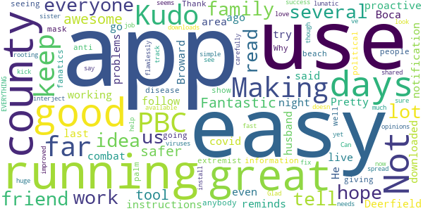

> App is awesome! So easy to use! Making the county safer!  :date: __2020-09-18 17:32:14__

> Fantastic tool - great app. Kudo's to PBC for being so proactive  :date: __2020-09-16 19:38:03__

> Pretty good so far, the instructions were easy to follow and it working good, it even reminds me with a notification to keep it running!!! I live in Boca and everyone in my family and me go to Deerfield area a lot, does this work in Broward?  :date: __2020-08-15 16:50:44__

> My husband downloaded combat covid a few days ago to try it out. He said that it was easy so I did it last night. I have had it running and no problems so far. I also like it has a lot of information for the people in palm beach to read about the disease. Thank you to the county for giving us this. I am going to show friends – well tell them I am not seeing anybody these days.  :date: __2020-08-15 16:42:08__

> Why so these political extremist/anti-mask fanatics interject their lunatic opinions into EVERYTHING! I’ve had the app running for several days now and so do several friend and family. I love it. It is simple to use and seems to be running flawlessly. Good job.  :date: __2020-08-15 16:37:17__

> Kudos to the county for making this available for use. Can’t tell yet what needs to be improved.  It was an easy and fast install but I did have to read it carefully to see what it was doing but it doesn’t look like other apps.  Not sure what I could say to fix that though.  :date: __2020-08-03 15:50:19__

> Great idea for an app. Glad my sister shared with me. Not much I had to do hope it works  :date: __2020-08-03 15:48:42__

> I am rooting for this app to be a huge success and help us here in PBC.  Hope everyone downloads it, uses it and we kick this viruses a\*\*.  :date: __2020-08-03 15:39:56__

> This is a great idea to keep track of the spread!  :date: __2020-07-23 03:26:32__

#### 4-star reviews

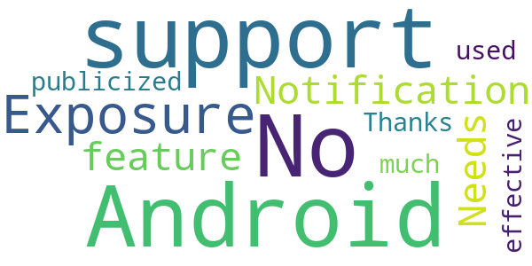

> No support for the Android " Exposure Notification" feature?  :date: __2020-09-18 18:33:23__

> Needs to be publicized (and used) much more for it to be effective. Thanks.  :date: __2020-08-17 19:36:15__

#### 3-star reviews

> Maybe  :date: __2020-11-28 05:33:13__

> łBecause they are very important to me and I would feel bad if I got them sick. Hopefully the app actually works! as it says it does. Unfortunately these days most apps talk a big game and just dont deliver as they should work. Or they work great or they work great till you update the devices software and then are rendered useless.  :date: __2020-09-10 14:57:03__

> Great idea, I read about the issue with positive, this needs to be improved. The app needs update and additional functionality for example ability to make testing appointment directly from app.  :date: __2020-08-16 17:22:11__

> is this app not compatible w/ Android Covid Exposure Notification service?  :date: __2020-08-11 01:01:00__

#### 2-star reviews

> Not installing. It won't send the one time code. I love the idea, this is what we need! But please it has to be simple for everyone to use.  :date: __2020-09-17 18:33:28__

> The user interface needs help! I accidentally marked myself covid positive by clicking a tab, it have a warning that did not ask me if I was covid positive but instead asked if I wanted to upload my information. That is really unclear. I could find no way to undo this mistake. Reply to the response from the developer: At the time i reviewed it, the "3 step process" was definitely not a clearly defined clearly labeled 3 step process for marking yourself positive. Hopefully it has changed.  :date: __2020-08-20 04:39:13__

> I accidentally marked my self positive and I am not don't know how to fix it. So I would say it needs some work so people don't have the same problem.  :date: __2020-08-14 00:26:16__

> This app still needs help. Like others, I also accidentally marked myself positive. There needs to be a way to edit that. Plus it sent me a verification code, but didn't wait for me to enter it. It just accepted me.  :date: __2020-08-02 20:03:22__

#### 1-star reviews

> It doesn't use the same contact tracing technology as the rest of apps. Which largely renders it useless. While arguably using a more privacy oriented technology. In this rare instance it's pointless and a waste of taxpayer money.  :date: __2020-12-14 17:31:06__

> It doesn't show you on a map who has covid 19  :date: __2020-12-10 18:06:29__

> First review.  :date: __2020-12-05 06:13:42__

> It never got off the get one time pin message and never sent pin! Disappointing.  :date: __2020-12-05 02:58:24__

> Google made available native covid exposure notifications on Android, many states use this tech already but it looks like Palm beach is running behind all the others...no good  :date: __2020-12-01 01:46:27__

> It doesn't work...also needs to always run in the background leading to battery loss.  :date: __2020-10-20 23:54:44__

> I am in the homes of hundreds of people each day. I was in contact with at least 130 people who later tested positive. Apparently none of them had this app. Even if they had alerted positive, I would not had gone into quarantine or been tested because I have taken all of the necessary precautions and then some. I no longer see any reason to drain my battery for this app. It is past time to uninstall. 1,500,000 people in PBC. Less than 2,000 downloads = .001% using app. Useless  :date: __2020-10-05 16:02:29__

> PBC corrupt mayor and commission paid $800k for this turd app that violates all your rights to privacy, HIPPA, and ACA. $800k could hire a team of 8 top notch developers for a year! Investigate this fraud and the MaskGate fraud as well. When you get your mask in mail from PBC make sure to get a sharpy, write a message on it, and send back! Turn PBC Republican in November and lock up all these criminal Tyrants! (Seems BoCC is worried about the facts!)  :date: __2020-08-18 13:35:13__

> Read the fine print of the user agreement VERY carefully! If you agree to it: you give up ALL of your rights. Advertised as not transmitting private information, yet it still has functionality to do so, and the agreement says they can whenever they want! Considering sensitivity of subject, potential for abuse, and waiving all rights in order to use this: one should avoid at all cost! Edit: read agreement and decide for yourself – you waive all your rights! Shield's reply is disingenuous at best.  :date: __2020-07-29 17:11:24__

> You really should make a better warning for the covid positive button.People have been pressing it thinking it turns on the bluetooth.  :date: __2020-07-28 21:59:54__

# Care19 Alert
App version ``1.2``

Analyzed with [covid-apps-observer](http://github.com/covid-apps-observer) project, version ``0.1``

## App overview
| | |
|-------------------------|-------------------------| 
| **Name**&nbsp;&nbsp;&nbsp;&nbsp;&nbsp;&nbsp;&nbsp;&nbsp;&nbsp;&nbsp;&nbsp;&nbsp;&nbsp;&nbsp;&nbsp;&nbsp;&nbsp;&nbsp;&nbsp;&nbsp;&nbsp;&nbsp;&nbsp;&nbsp;&nbsp;&nbsp;&nbsp;&nbsp;&nbsp;&nbsp;&nbsp;&nbsp;&nbsp;&nbsp;&nbsp;&nbsp;&nbsp;&nbsp;&nbsp;&nbsp;  | Care19 Alert |
| **Unique identifier** | com.proudcrowd.exposure |
| **Link to Google Play** | [https://play.google.com/store/apps/details?id=com.proudcrowd.exposure](https://play.google.com/store/apps/details?id=com.proudcrowd.exposure) |
| **Summary**  | Care19 Alert is the official COVID-19 exposure notification app for ND and WY. |
| **Privacy policy** | [https://www.care19.app/alert/privacy](https://www.care19.app/alert/privacy) |
| **Latest version** | 1.2 |
| **Last update** | 2020-11-27 04:42:00 |
| **Recent changes** | Fix an issue where some Samsung phones would not scan reliably |
| **Installs**  | 10,000+ |
| **Category** | Medical |
| **First release** | Aug 12, 2020 |
| **Size**  | 7.2M |
| **Supported Android version**  | 6.0 and up |

### Description
> Care19 Alert is the official COVID-19 exposure notification app for North Dakota and Wyoming as authorized by each states Department of Health. 
 Care19 Alert allows you to receive notifications if you have been near someone who has tested positive for Covid-19 recently.  Care19 Alert uses Apple’s Exposure Notification API to help reduce the spread of the coronavirus, with user privacy and security central to its design. 
 Care19 Alert maintains your privacy while securely communicating with nearby iOS and Android devices that also have exposure notifications enabled. This happens through the exchange of random keys that change every 15 minutes. These keys are stored securely on your device and hidden from the Care19 Alert application. All keys remain on your device and are not accessible unless you have tested positive for COVID-19, been contacted and verified by the Department of Health, and consent to sharing the random keys with others.
 Care19 Alert allows you to notify others if you test positive for COVID-19 and it will notify you if someone you came in contact tested positive for COVID-19. With your permission, your key/date pairs will be securely uploaded to the National Key Server run by the Association of Public Health Laboratories.  All uploaded key/date pairs are distributed to all of the devices connected to the National Key Server. 
  
 The downloaded keys are matched by the operating system based on criteria established by each Department of Health, and if you have a match you will be notified of the exposure and provided by your department of Health with the set of actions to take provided.

### User interface
The developers of the app provide the following screenshots in the Google play store.
| | | |
|:-------------------------:|:-------------------------:|:-------------------------:|
 |   |   |   | 

## Development team
In the following we report the main information provided by the development team in the Google play store.

| | |
|-------------------------|-------------------------|
| **Developer**  | ProudCrowd, LLC |
| **Website**  | [https://www.care19.app](https://www.care19.app) |
| **Email** | tim@brookinsfamily.net |
| **Physical address**  | - |
| **Other developed apps**  | [https://play.google.com/store/apps/developer?id=ProudCrowd,+LLC](https://play.google.com/store/apps/developer?id=ProudCrowd,+LLC) |

## Android support

| | |
|-------------------------|-------------------------|
| **Declared target Android version**  | Android10, version 10 (API level 29) |
| **Effective target Android version**  | Android10, version 10 (API level 29) |
| **Minimum supported Android version**  | Marshmallow, version 6.0 (API level 23) |
| **Maximum target Android version**  | - |

The larger the difference between the minimum and maximum supported Android versions, the better. A larger difference means a wider audience. For example, old phones have a very low Android version, so a high minimum supported Android version means that the app cannot be used by users with old phones, thus leading to accessibility problems. 

## Requested permissions

In the following we report the complete list of the permissions requested by the app. 

| **Permission** | **Protection level** | **Description** | 
|-------------------------|-------------------------|-------------------------|
 **android.permission ACCESS_NETWORK_STATE** | Normal | Allows applications to access information about networks. 
 **android.permission BLUETOOTH** | Normal | Allows applications to connect to paired bluetooth devices. 
 **android.permission FOREGROUND_SERVICE** | Normal | Allows a regular application to use Service.startForeground. 
 **android.permission INTERNET** | Normal | Allows applications to open network sockets. 
 **android.permission RECEIVE_BOOT_COMPLETED** | Normal | Allows an application to receive the Intent.ACTION_BOOT_COMPLETED that is broadcast after the system finishes booting. 
 **android.permission WAKE_LOCK** | Normal | Allows using PowerManager WakeLocks to keep processor from sleeping or screen from dimming. 
 **com.google.android.c2dm.permission RECEIVE** | - | - 
 **com.google.android.finsky.permission BIND_GET_INSTALL_REFERRER_SERVICE** | - | - 

## Mentioned servers

| **Server** | **Registrant** | **Registrant country** | **Creation date** | 
|-------------------------|-------------------------|-------------------------|-------------------------|
 | bugfender.com | Beenario GmbH | :de: DE | 2014-10-28 11:32:13 |
 | googlesyndication.com | Google LLC | :us: US | 2003-01-21 06:17:24 |
 | google.com | Google LLC | :us: US | 1997-09-15 04:00:00 |
 | app-measurement.com | Google LLC | :us: US | 2015-06-19 20:13:31 |
 | googleapis.com | Google LLC | :us: US | 2005-01-25 17:52:26 |
 | googleadservices.com | Google LLC | :us: US | 2003-06-19 16:34:53 |
 | googleapis.com | Google LLC | :us: US | 2005-01-25 17:52:26 |
 | crashlytics.com | Google LLC | :us: US | 2011-01-21 15:30:40 |

## Security analysis 

Below we report the main security warnings raised by our execution of the [Androwarn](https://github.com/maaaaz/androwarn) security analysis tool.

**Telephony identifiers leakage**
> - This application reads the MCC+MNC of the provider of the SIM 
> - This application reads the Service Provider Name (SPN) 
> - This application reads the numeric name (MCC+MNC) of current registered operator 
> - This application reads the operator name 

**Connection interfaces exfiltration**
> - This application reads details about the currently active data network 
> - This application tries to find out if the currently active data network is metered 

**Suspicious connection establishment**
> - This application opens a Socket and connects it to the remote address ' returned no addresses for  ; port is out of range' on the 'N/A' port  
> - This application opens a Socket and connects it to the remote address '' on the 'N/A' port  
> - This application opens a Socket and connects it to the remote address 'Ljava/lang/StringBuilder;->toString()Ljava/lang/String;' on the 'N/A' port  
> - This application opens a Socket and connects it to the remote address 'Ljava/net/Proxy;->type()Ljava/net/Proxy$Type;' on the 'N/A' port  
> - This application opens a Socket and connects it to the remote address 'timeout' on the 'N/A' port  

**Code execution**
> - This application executes a UNIX command 
> - This application executes a UNIX command containing this argument: 'logcat -c 2' 
> - This application executes a UNIX command containing this argument: 'logcat -c' 

## User ratings and reviews

Below we provide information about how end users are reacting to the app in terms of ratings and reviews in the Google Play store.

### Ratings

The Care19 Alert app has been installed by more than **10000** times. At this time, **81** rated the app and its average score is **3.4567902**. Below we show the distribution of the ratings across the usual star-based rating of Google Play

:star::star::star::star::star:: 39

:star::star::star::star:: 9

:star::star::star:: 7

:star::star:: 2

:star:: 24

### Reviews 

#### 5-star reviews

> I could not understand in minute meet me super 8 in brooklyn center today at we 12:00pm my phone rrquyqo are yqw if you done now I can he lol p you.  :date: __2021-03-17 11:00:37__

> 👍👍👍👍👍  :date: __2021-03-13 07:11:13__

> Kok,🌬️🤩🤩🐧🐧🐧🐧🐧🐧🐧🐧🐧🐧🐧🌬️🐸🌬️⌨️🦃🦃🦃🦃🦃🦃🌬️🐸🌬️🐸🌬️🐸🌬️🤩🦃  :date: __2021-02-12 03:31:48__

> I check out all the nerdy statistics every night! 10/10  :date: __2021-01-27 04:21:56__

> My coverage  :date: __2021-01-23 11:07:33__

> I want this app back  :date: __2021-01-20 08:56:46__

> Love it  :date: __2021-01-13 23:48:06__

> Helpful💕⁦♥️⁩👏🙏👏🤗  :date: __2021-01-08 05:16:19__

> Good  :date: __2021-01-02 23:36:05__

> Good way to keep posted who sick got virus good app .  :date: __2021-01-02 13:55:56__

#### 4-star reviews

> Great!-!!🤔  :date: __2020-11-20 06:46:47__

> Seems like a good app but here's a question, will this app be effective even though I am in Colorado? Will it be effective in another state  :date: __2020-09-27 10:53:58__

> Add support for SD, please!  :date: __2020-09-10 00:36:08__

#### 3-star reviews

> Well, i don't know if it works, because a lot of the idiots in this state don't use it.  :date: __2021-01-23 04:24:06__

> From what it says when you check it, it only has 2 exposure checks per day. I do not see how it can be at all accurate if it only checks twice a day??  :date: __2020-12-10 14:20:51__

> It thinks I'm in North decode and Wyoming but I live in utah.  :date: __2020-11-29 20:27:49__

> It worked when I first downloaded it now it stopped working and can't get it to work at all. I tried everything. How can I get it to work please help  :date: __2020-11-24 03:25:10__

#### 2-star reviews

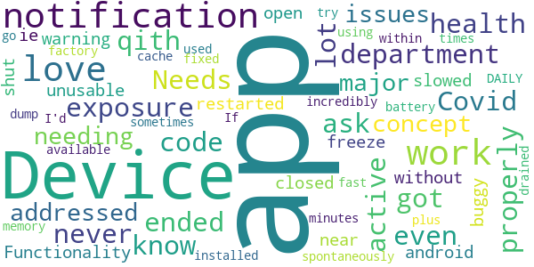

> I had this app had it active, and never got notifications of exposure. I ended up qith Covid and the health department didn't even know to ask for the notification code. Needs a lot of work to work properly.  :date: __2021-04-08 03:30:16__

> I love the concept of this app, but major issues needing addressed. Functionality of my device (android) slowed to near unusable, it was very "buggy" ie: Device would freeze up, apps closed without warning or would not open at all! Device shut down or restarted spontaneously, battery drained incredibly fast, plus any available memory was used sometimes within minutes so that I had to go through each installed & factory app to dump cache 2-3 times DAILY. If fixed I'd love to try using it again.  :date: __2020-11-26 09:28:13__

#### 1-star reviews

> It goes days, sometimes months without checking for exposures. I have to remember to open it for it to work for a few days and then it lapses again until I remember to open it again. Thank goodness it didn't detect any exposures in my bedroom this morning, its first check in who knows how long *rolls eyes*. I feel safer already.  :date: __2021-03-21 14:20:52__

> Wrong app  :date: __2021-02-05 07:34:11__

> Has not added a scan since December 15th. No updates available, so it's not that.  :date: __2021-01-06 07:27:48__

> Not updated since nov  :date: __2021-01-02 20:58:25__

> I can go days without it logging any activity even though I have had a number of stops and it will not recognize that I have changed my home address. It would be nice if I could just completely reset & start over but it won't let me do that either. Rather useless if I have to remember to manually enter where I've been.  :date: __2020-12-21 20:48:07__

> Please stop showing up as soon as i open google play  :date: __2020-12-21 12:32:13__

> Does not work clicked after a million times in nothing it just stayed there  :date: __2020-12-18 11:26:02__

> Shouldn't have any sort of tracker like this. If there isn't one for the flu or any other virus we shouldn't have it for this.  :date: __2020-12-01 08:59:39__

> App has stopped checking for recent exposures .  :date: __2020-11-23 04:34:00__

> Doesn't do what it should. Just takes up space on your phone or tablet  :date: __2020-11-21 15:36:41__

# MI COVID Alert
App version ``1.3``

Analyzed with [covid-apps-observer](http://github.com/covid-apps-observer) project, version ``0.1``

## App overview
| | |
|-------------------------|-------------------------| 
| **Name**&nbsp;&nbsp;&nbsp;&nbsp;&nbsp;&nbsp;&nbsp;&nbsp;&nbsp;&nbsp;&nbsp;&nbsp;&nbsp;&nbsp;&nbsp;&nbsp;&nbsp;&nbsp;&nbsp;&nbsp;&nbsp;&nbsp;&nbsp;&nbsp;&nbsp;&nbsp;&nbsp;&nbsp;&nbsp;&nbsp;&nbsp;&nbsp;&nbsp;&nbsp;&nbsp;&nbsp;&nbsp;&nbsp;&nbsp;&nbsp;  | MI COVID Alert |
| **Unique identifier** | gov.michigan.MiCovidExposure |
| **Link to Google Play** | [https://play.google.com/store/apps/details?id=gov.michigan.MiCovidExposure](https://play.google.com/store/apps/details?id=gov.michigan.MiCovidExposure) |
| **Summary**  | Michigan&#39;s COVID-19 Exposure Notification App |
| **Privacy policy** | [http://michigan.gov/micovidalertprivacy](http://michigan.gov/micovidalertprivacy) |
| **Latest version** | 1.3 |
| **Last update** | 2021-03-04 23:10:08 |
| **Recent changes** | Slow the spread of COVID-19 and protect your family, friends and community while still protecting your privacy – simply by using the MI COVID Alert app on your phone. Our latest version of MI COVID Alert includes minor bug fixes. |
| **Installs**  | 100,000+ |
| **Category** | Health & Fitness |
| **First release** | Oct 9, 2020 |
| **Size**  | 3.1M |
| **Supported Android version**  | 6.0 and up |

### Description
> MI COVID Alert is the COVID-19 exposure notification app supported by the Michigan Department of Health and Human Services (MDHHS), in partnership with SpringML, Google, and Apple. This app uses Bluetooth Low Energy (BLE) API framework created through a unique collaboration between Apple and Google.
 Your personal use of MI COVID Alert helps inform others of possible exposure to COVID-19 if they are suspected of having been within close proximity to someone who has tested positive. When you download MI COVID Alert, you are helping your community stay ahead of any potential surge in COVID-19 cases. 
 How MI COVID Alert Works:
 Once downloaded, users of the app who have enabled it will exchange anonymous Bluetooth “keys” (random alpha-numeric codes that represent a Bluetooth signal) with other MI COVID Alert users.
 If someone reports that they tested positive for COVID-19, the app will search for other users who shared the Bluetooth Low Energy (BLE) signal. The BLE signals are date-stamped and MI COVID Alert estimates how close the two devices were based on signal strength. If the timeframe was at least 15 minutes and the estimated distance was within six feet, then the other user receives a notification of a possible exposure. Names of users and locations of possible exposure are never tracked and never shared.
 The BLE framework within MI COVID Alert will run in the background, even if the exposure notification app is closed. It will not drain the device battery at a rate faster than other apps that use normal Bluetooth and/or are open and running continuously.
 How MI COVID Alert Protects Your Privacy:
 MDHHS takes your privacy very seriously. This is why we chose to use the Apple and Google BLE framework. No personal data or location tracking occurs within MI COVID Alert. 
 MDHHS and local public health staff follow up with persons who have a positive COVID-19 laboratory report. Public health will provide MI COVID Alert users with a validation pin. That validation pin must be entered into the app to report a notification of possible exposure to other users. This prevents people from falsely reporting positive results, which could generate false exposure notifications. 
 If you have the current Apple or Google operating system installed on your device, you may have noticed that Exposure Notifications are now included. You cannot enable this function until you have downloaded MI COVID Alert. Apple and Google will delete the exposure notification service tools from their respective operating systems once the pandemic reaches a point that public health no longer requires the use of this technology.
 Thank you for downloading MI COVID Alert! Together, we can protect our family, friends, and communities.

### User interface
The developers of the app provide the following screenshots in the Google play store.
| | | |
|:-------------------------:|:-------------------------:|:-------------------------:|
 |   |   |   | 
 |  

## Development team
In the following we report the main information provided by the development team in the Google play store.

| | |
|-------------------------|-------------------------|
| **Developer**  | State of Michigan |
| **Website**  | [http://www.michigan.gov/micovidalert](http://www.michigan.gov/micovidalert) |
| **Email** | mdhhs-micovidalert@michigan.gov |
| **Physical address**  | - |
| **Other developed apps**  | [https://play.google.com/store/apps/developer?id=State+of+Michigan](https://play.google.com/store/apps/developer?id=State+of+Michigan) |

## Android support

| | |
|-------------------------|-------------------------|
| **Declared target Android version**  | Android10, version 10 (API level 29) |
| **Effective target Android version**  | Android10, version 10 (API level 29) |
| **Minimum supported Android version**  | Marshmallow, version 6.0 (API level 23) |
| **Maximum target Android version**  | - |

The larger the difference between the minimum and maximum supported Android versions, the better. A larger difference means a wider audience. For example, old phones have a very low Android version, so a high minimum supported Android version means that the app cannot be used by users with old phones, thus leading to accessibility problems. 

## Requested permissions

In the following we report the complete list of the permissions requested by the app. 

| **Permission** | **Protection level** | **Description** | 
|-------------------------|-------------------------|-------------------------|
 **android.permission ACCESS_NETWORK_STATE** | Normal | Allows applications to access information about networks. 
 **android.permission BLUETOOTH** | Normal | Allows applications to connect to paired bluetooth devices. 
 **android.permission FOREGROUND_SERVICE** | Normal | Allows a regular application to use Service.startForeground. 
 **android.permission INTERNET** | Normal | Allows applications to open network sockets. 
 **android.permission RECEIVE_BOOT_COMPLETED** | Normal | Allows an application to receive the Intent.ACTION_BOOT_COMPLETED that is broadcast after the system finishes booting. 
 **android.permission WAKE_LOCK** | Normal | Allows using PowerManager WakeLocks to keep processor from sleeping or screen from dimming. 

## Mentioned servers

| **Server** | **Registrant** | **Registrant country** | **Creation date** | 
|-------------------------|-------------------------|-------------------------|-------------------------|
 | google.com | Google LLC | :us: US | 1997-09-15 04:00:00 |
 | jhu.edu | Johns Hopkins University | - | 1987-03-19 00:00:00 |

## Security analysis 

Below we report the main security warnings raised by our execution of the [Androwarn](https://github.com/maaaaz/androwarn) security analysis tool.

**Telephony identifiers leakage**
> - This application reads the ISO country code equivalent of the current registered operator's MCC (Mobile Country Code) 

**Connection interfaces exfiltration**
> - This application reads details about the currently active data network 
> - This application tries to find out if the currently active data network is metered 

## User ratings and reviews

Below we provide information about how end users are reacting to the app in terms of ratings and reviews in the Google Play store.

### Ratings

The MI COVID Alert app has been installed by more than **100000** times. At this time, **508** rated the app and its average score is **3.04**. Below we show the distribution of the ratings across the usual star-based rating of Google Play

:star::star::star::star::star:: 199

:star::star::star::star:: 40

:star::star::star:: 40

:star::star:: 40

:star:: 189

### Reviews 

#### 5-star reviews

> So far it's good.  :date: __2021-05-01 08:13:57__

> It hasn't up dated sentence Feb. ?  :date: __2021-04-29 18:52:27__

> I check everytime I go out. It makes me feel safe and secure.  :date: __2021-04-28 15:30:42__

> This is benifica  :date: __2021-04-25 14:17:17__

> This is probably the best way to get information on whether you may have been exposed to the 22nd century plague - Sars COVID - 19. A must for all in this day and age. I applaud the creators of this app.  :date: __2021-04-22 14:25:16__

> I like better than first one.  :date: __2021-04-18 14:29:40__

> Very good 👍 love it  :date: __2021-04-11 16:43:36__

> Good to know  :date: __2021-04-04 05:01:49__

> GREAT!!!!!!! GOT MY FIRST INJECTION FROM TWO BEAUTIFUL NURSE'S AT BLUEWATER CONVENTION CENTER MARCH 2, 2021. HAD A COVID TEST MARCH 9, 2021 AND IT WAS NEGATIVE. I HAD THE SECOND INJECTION MARCH 30, 2021. NURSE'S FROM SCCHD GAVE ME THE INJECTIONS AND THEY WERE ABSOLUTELY WONDERFUL!!! THEY WERE CLEAN, THE PLACE CLEAN, A LADY WAS CONSTANTLY CLEANING, THEY WERE EXTREMELY KNOWLEDGEABLE ABOUT EVERYTHING. I WAS SO RELIEVED AND GRATEFUL TO THEM!!!!!!!!  :date: __2021-04-03 00:42:20__

> Feeling more confident & safe!! Thank You!!!  :date: __2021-04-01 03:55:10__

#### 4-star reviews

> Today is 2/24, the last scan was on 1/24. Leave it to the government to create a useless app. Once the problem was fixed, it's working good now!  :date: __2021-04-28 22:16:18__

> I am not sure how useful this app is. It does what is says it does - monitors for possible exposure to covid-19 virus. Please note that the new version corrected the problems with the prior version.  :date: __2021-03-24 15:44:26__

> Ok  :date: __2021-02-03 15:23:08__

> Stopped notifying me/updating alerts. Uninstalled app then reinstalled it. Alerts commenced once agai Have had first vaccine on 9th of January.  :date: __2021-01-22 19:08:14__

> I give it 4 stars needs improvement . but still great app.  :date: __2020-12-22 15:38:23__

> I will if it ever downloads, still pending After 5 Minutes, tried again a few days later and it downloaded right away  :date: __2020-12-04 05:11:59__

> So far I havent seen anything about exposures. It would be good if they told me how my county and town is doing.  :date: __2020-11-26 16:31:22__

> I installed it to do my part. I'll uninstall it once this pandemic passes. That's freedom.  :date: __2020-11-21 18:55:35__

> I'm glad to have this, but the map doesn't work correctly. When I tap on a county, it just shows a blank page.  :date: __2020-11-21 16:50:48__

> Just checking it out  :date: __2020-11-20 08:58:10__

#### 3-star reviews

> More tools for the Vaccine! The app is great but is lacking major portions that should be on the subject of "Vaccinations". Such as locations for Detroit residents. Information on the various vaccines available & where. A Q & A section on possible vaccine info to help stop forms of "vaccine hesitency"  :date: __2021-05-02 22:22:13__

> I have the current version 1.3 but never updates checks for covid exposure after install Edit: I changed the settings that stopped app from running in background (Samsung). Hope that works.  :date: __2021-03-12 20:32:48__

> You have to keep Bluetooth on to recieve alerts?! No thank you, I'm uninstalling this Edit In response to the reply below: I still dont want to walk around with my bluetooth on all day. Thats not good for my battery or privacy.  :date: __2021-03-10 20:01:37__

> This app is general , can be improved to reflect local zip codes with real time case tracking. Racial distribution makes this app racist.  :date: __2021-02-09 03:41:17__

> L pi pl om 0  :date: __2021-02-03 15:23:00__

> Old information  :date: __2021-01-26 12:54:59__

> Might work but having to call in to get a PIN is way too much effort. Literally nobody has time for that  :date: __2021-01-21 17:15:25__

> How do you update?..hasn't worked since the 17 Jan 2021.  :date: __2021-01-21 13:03:49__

> No notifications??? I worked in a hospital filled with COVID patients during an outbreak. Maybe none of them had this app installed. This app is an amazing concept. I apperciate the anonymity. I will continue to recommend this app to others!  :date: __2021-01-14 13:15:04__

> It was working fine updating regularly. Now it hasn't updated my exposure or the cases and deaths since January 4th. I don't know what is wrong. Yes my bluetooth is on. I don't know what to do with it.  :date: __2021-01-13 17:51:43__

#### 2-star reviews

> The last time the Exposure Notification updated was on April 18, it should update more often.  :date: __2021-05-01 06:13:25__

> You need a pin number to report a positive Covid result. I called and left a message, but they never called me back. So... that renders this app useless, aside from Covid news & numbers.  :date: __2021-04-30 07:10:17__

> I have to Uninstall the app and reinstall it because it randomly stops checking for exposures. EDIT: UPDATE: after following the instructions above about battery power it got WORSE. It not only stops checking for exposures but drains my phone . I would change the rating to Zero if I was able. Lots of other States got it right, did Michigan order their App from Wish?  :date: __2021-04-29 17:26:38__

> Great idea but the last time it checked says March 18. Needs a way to display our vaccine information.  :date: __2021-04-27 17:21:30__

> Exposures was last checked mid-February despite having bluetooth on all the time and occasionally opening the app.  :date: __2021-04-25 16:38:55__

> I haven't had any positive exposures according to the app, but how do I even know if anyone else is using it? I wish there was a way to tell if I've even come into contact with anyone who is actually USING the app. Just a count. I'm not asking for names or any other personal data. Without this count the results are meaningless.  :date: __2021-04-18 17:03:53__

> I tested positive for COVID-19. I wanted to share it in the app so I could alert others. When you test positive, the DoH gives you a PIN that you then enter into the app to verify your positive test result, which should broadcast it on the app. But here's the major problem: it didn't recognize the TWO PINs they sent me. I tried phoning someone, but had no idea who to contact. I was desperate to get the word out, because I work in a busy location. Nothing worked. I tried the codes again and again, but the app kept rejecting them, saying that it wasn't a valid code. I called the admin office-- I think???-- of the local health department, because I had no idea who else to contact to help me. All I did was call the number the app gave me. No responses from anyone. I'm starting to think this is happening with other positive testers as well, and that's why exposures aren't properly updated. Because of this, this app is LITERALLY. POINTLESS. Please do something about this. I tried to inform as many people as possible, but I can't reach out to everyone.  :date: __2021-04-18 15:45:58__

> I tried the app but have to uninstall and re install every couple of days because it stops working.  :date: __2021-04-06 22:46:51__

> The app is ON but has not done an exposure check since Jan 24. Today is Mar 18.  :date: __2021-03-19 16:34:13__

> Good idea, but app stops updating/checking from time to time and won't refresh or reconnect. Tried turning bluetooth off/on, restarting phone, but couldn't make it active again. Last check was over a month ago. Is COVID over?  :date: __2021-03-19 01:17:23__

#### 1-star reviews

> I checked the app and the last update was 12 days ago. What good is that? I did make sure that the app is not sleeping in settings. Update: removed and reinstalled app, worked for a few days. Last update was 4 days ago. Total waste of our tax money. These people should feel guilty talking public money for this trash. FYI, I have version 1.3 UPDATE, FYI it's now been 25 days and still no update. I did everything they asked. GIVE THE MONEY BACK!! 5/7/21 update. STILL DOESN'T UPDATE, TRASH!  :date: __2021-05-07 17:22:54__

> Last checked for exposures back in March and it is now May. I see absolutely no point in having my phone put out info if it's not going to work.  :date: __2021-05-04 20:05:21__

> App hasn't checked for exposures since middle of March. No way to even manually force a check.  :date: __2021-05-04 03:31:49__

> I've never gotten an alert but I known multiple times I was in contact with COVID. I live behind the covid testing center and not a single alert Pathetic  :date: __2021-04-30 21:08:51__

> The app has not checked anything since april 15th, its now april 26th, in my opinion its useless. Its April 30th. Im deleting your app.  :date: __2021-04-30 19:17:20__

> Updated review: The app still stops functioning if I dont check it for a day. Also, it looks like people are unwilling to or unable to notify through the app. I've had 2 coworkers in the past 2 weeks test positive and I've heard nothing through this app. Completely useless.  :date: __2021-04-30 17:04:24__

> it was a good idea if it worked...  :date: __2021-04-29 21:16:35__

> It just keeps saying I last checked on February 10th. I've tried checking several times since then and it never updates  :date: __2021-04-29 13:24:41__

> It stopped checking back in February. Uninstalled and reinstalled, but it doesn't say it stopped checking unless you go into the app every day and see the last time it did run a check. Also does not inform you if you have been exposed after it stops checking. Reinstall starts it fresh with no history data. Yes bluetooth is on, so don't ask.  :date: __2021-04-27 17:53:37__

> The app only updates its check when you open it which defeats the purpose.  :date: __2021-04-27 16:37:45__

# CombatCOVID MDC
App version ``1.1.1``

Analyzed with [covid-apps-observer](http://github.com/covid-apps-observer) project, version ``0.1``

## App overview
| | |
|-------------------------|-------------------------| 
| **Name**&nbsp;&nbsp;&nbsp;&nbsp;&nbsp;&nbsp;&nbsp;&nbsp;&nbsp;&nbsp;&nbsp;&nbsp;&nbsp;&nbsp;&nbsp;&nbsp;&nbsp;&nbsp;&nbsp;&nbsp;&nbsp;&nbsp;&nbsp;&nbsp;&nbsp;&nbsp;&nbsp;&nbsp;&nbsp;&nbsp;&nbsp;&nbsp;&nbsp;&nbsp;&nbsp;&nbsp;&nbsp;&nbsp;&nbsp;&nbsp;  | CombatCOVID MDC |
| **Unique identifier** | com.shield.CombatCovidMD |
| **Link to Google Play** | [https://play.google.com/store/apps/details?id=com.shield.CombatCovidMD](https://play.google.com/store/apps/details?id=com.shield.CombatCovidMD) |
| **Summary**  | CombatCOVID alerts you when you&#39;ve been in contact with someone who has COVID-19 |
| **Privacy policy** | [https://combatcovidapp.com/combatcovid-miamidade-principles-privacy-policy-and-terms-of-use/](https://combatcovidapp.com/combatcovid-miamidade-principles-privacy-policy-and-terms-of-use/) |
| **Latest version** | 1.1.1 |
| **Last update** | 2021-01-27 21:40:43 |
| **Recent changes** | Updated home screen with more privacy protection information. |
| **Installs**  | 1,000+ |
| **Category** | Health & Fitness |
| **First release** | Aug 4, 2020 |
| **Size**  | 20M |
| **Supported Android version**  | 5.1 and up |

### Description
> CombatCOVID MDC app is for Miami-Dade County coverage.
 CombatCOVID is the Official COVID-19 notification and information app of the County Government of Miami-Dade County, Florida, a diverse community of over 2.7 million people.
 Unlike other apps, CombatCOVID has never used GPS or location notification in its architecture. The app user’s privacy and identity are protected. No names, emails addresses, locations or personally identifying information is required. There is never any location or identity information acquired by CombatCOVID.
 The CombatCOVID app uses Bluetooth signals to determine if you are near another user. All users who have been in close proximity to a COVID-19 positive person will be notified by a push notification recommending they get tested immediately, without revealing anyone’s personal identity. Suggested locations for testing are also provided.
 Your device’s phone number is encrypted and never shared with anyone, including local health officials. All data and Information about the device being in close proximity with another device is ONLY stored on the device.
 Access to the data indicating the device’s user may have tested positive is only shared IF/WHEN the user chooses to share it. IF the user does choose to share a COVID-19 positive result, they are still totally PRIVACY PROTECTED.

### User interface
The developers of the app provide the following screenshots in the Google play store.
| | | |
|:-------------------------:|:-------------------------:|:-------------------------:|
 | 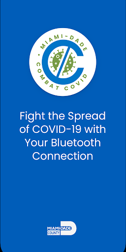  |   |   | 

## Development team
In the following we report the main information provided by the development team in the Google play store.

| | |
|-------------------------|-------------------------|
| **Developer**  | Miami-Dade County |
| **Website**  | [https://combatcovidapp.com/mdc](https://combatcovidapp.com/mdc) |
| **Email** | info@combatcovidapp.com |
| **Physical address**  | - |
| **Other developed apps**  | [https://play.google.com/store/apps/developer?id=Miami-Dade+County](https://play.google.com/store/apps/developer?id=Miami-Dade+County) |

## Android support

| | |
|-------------------------|-------------------------|
| **Declared target Android version**  | Android10, version 10 (API level 29) |
| **Effective target Android version**  | Android10, version 10 (API level 29) |
| **Minimum supported Android version**  | Lollipop, version 5.1 (API level 22) |
| **Maximum target Android version**  | - |

The larger the difference between the minimum and maximum supported Android versions, the better. A larger difference means a wider audience. For example, old phones have a very low Android version, so a high minimum supported Android version means that the app cannot be used by users with old phones, thus leading to accessibility problems. 

## Requested permissions

In the following we report the complete list of the permissions requested by the app. 

| **Permission** | **Protection level** | **Description** | 
|-------------------------|-------------------------|-------------------------|
 **android.permission ACCESS_FINE_LOCATION** | :warning:**Dangerous** | Allows an app to access precise location. 
 **android.permission ACCESS_NETWORK_STATE** | Normal | Allows applications to access information about networks. 
 **android.permission BLUETOOTH** | Normal | Allows applications to connect to paired bluetooth devices. 
 **android.permission BLUETOOTH_ADMIN** | Normal | Allows applications to discover and pair bluetooth devices. 
 **android.permission FOREGROUND_SERVICE** | Normal | Allows a regular application to use Service.startForeground. 
 **android.permission INTERNET** | Normal | Allows applications to open network sockets. 
 **android.permission REQUEST_IGNORE_BATTERY_OPTIMIZATIONS** | Normal | Permission an application must hold in order to use Settings.ACTION_REQUEST_IGNORE_BATTERY_OPTIMIZATIONS. 
 **android.permission WAKE_LOCK** | Normal | Allows using PowerManager WakeLocks to keep processor from sleeping or screen from dimming. 
 **com.google.android.c2dm.permission RECEIVE** | - | - 
 **com.google.android.finsky.permission BIND_GET_INSTALL_REFERRER_SERVICE** | - | - 

## Mentioned servers

| **Server** | **Registrant** | **Registrant country** | **Creation date** | 
|-------------------------|-------------------------|-------------------------|-------------------------|
 | googlesyndication.com | Google LLC | :us: US | 2003-01-21 06:17:24 |
 | google.com | Google LLC | :us: US | 1997-09-15 04:00:00 |
 | app-measurement.com | Google LLC | :us: US | 2015-06-19 20:13:31 |
 | stackoverflow.com | Stack Exchange, Inc. | :us: US | 2003-12-26 19:18:07 |
 | googleapis.com | Google LLC | :us: US | 2005-01-25 17:52:26 |
 | googleadservices.com | Google LLC | :us: US | 2003-06-19 16:34:53 |
 | googleapis.com | Google LLC | :us: US | 2005-01-25 17:52:26 |
 | googleapis.com | Google LLC | :us: US | 2005-01-25 17:52:26 |
 | shieldgrouptech.com | Domains By Proxy, LLC | :us: US | 2015-11-11 16:30:04 |
 | combatcovidapp.com | Domains By Proxy, LLC | :us: US | 2020-05-18 13:25:41 |

## Security analysis 

Below we report the main security warnings raised by our execution of the [Androwarn](https://github.com/maaaaz/androwarn) security analysis tool.

**Telephony identifiers leakage**
> - This application reads the ISO country code equivalent for the SIM provider's country code 
> - This application reads the ISO country code equivalent of the current registered operator's MCC (Mobile Country Code) 

**Connection interfaces exfiltration**
> - This application reads details about the currently active data network 
> - This application tries to find out if the currently active data network is metered 

**Suspicious connection establishment**
> - This application opens a Socket and connects it to the remote address '' on the 'N/A' port  
> - This application opens a Socket and connects it to the remote address 'Ljava/lang/StringBuilder;->toString()Ljava/lang/String;' on the 'N/A' port  
> - This application opens a Socket and connects it to the remote address 'Ljava/net/Proxy;->type()Ljava/net/Proxy$Type;' on the 'N/A' port  
> - This application opens a Socket and connects it to the remote address 'Network subsystem is unavailable' on the 'N/A' port  
> - This application opens a Socket and connects it to the remote address 'timeout' on the 'N/A' port  

## User ratings and reviews

Below we provide information about how end users are reacting to the app in terms of ratings and reviews in the Google Play store.

### Ratings

The CombatCOVID MDC app has been installed by more than **1000** times. At this time, **31** rated the app and its average score is **4.096774**. Below we show the distribution of the ratings across the usual star-based rating of Google Play

:star::star::star::star::star:: 21

:star::star::star::star:: 2

:star::star::star:: 2

:star::star:: 2

:star:: 4

### Reviews 

#### 5-star reviews

> This is a very necessary health app.  :date: __2020-10-02 12:00:20__

> Working fine so far... Let's spread the word, the more people install it the better it will work!!!!  :date: __2020-09-28 20:25:15__

> Application is fantastic. Love the privacy and feel safer!  :date: __2020-09-18 17:34:58__

> Sweet, this is pretty cool that it doesn’t track me.  It just uses Bluetooth to connect with others.  I did some research and this is the way to go.  Hope I never get notified of anything but will be glad to know I may have been at risk  if I ever do.  :date: __2020-09-16 04:20:29__

> The app is explained well in the download process.  It should let people know that they were ever close to someone that later reported they were positive.  and its private. Load it use it tell everyone to use the app  :date: __2020-09-16 04:19:42__

> No issues at this point and it wasn’t hard to download.  Hope it works as described.  :date: __2020-09-16 04:17:08__

> This is a well made app.  I’m a very private person and value my privacy.  This app is made so that it is respected.  It doesn’t record my location or my phone number or track my location.  Well done.  :date: __2020-09-16 04:15:18__

#### 4-star reviews

> It's not sending me the pin # to access the app. I put in the correct phone #.  :date: __2020-09-20 23:45:38__

#### 3-star reviews

> Requiring a permanent notification is a terrible way to setup this app. The majority of users aren't going to want a permanent notification running and taking up room and this isn't required by Android to keep an app running in background. If I disable permanent notification will app continue to run?  :date: __2020-11-19 19:07:16__

#### 2-star reviews

> The app is built on old technology. The app needs to be open in order to detect other phones. It does not run in the background, so if you forget to open it before you leave home, it is useless. Not good for such a critical app. Google and Apple built Covid apps to run in the background but this one does not. I emailed the company 2 weeks ago and no response.  :date: __2020-11-11 19:02:14__

> Telling you to be tested IMMEDIATELY will give people false assurance when they test negative & haven't had sufficient viral load for detection. It does maintain confidentiality appropriately.  :date: __2020-09-18 22:56:15__

#### 1-star reviews

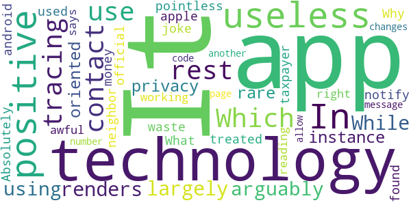

> It doesn't use the same contact tracing technology as the rest of apps. Which largely renders it useless. While arguably using a more privacy oriented technology. In this rare instance it's pointless and a waste of taxpayer money.  :date: __2020-12-14 17:31:44__

> Absolutely useless. I found out that my neighbor has treated positive and the app did not notify me. Why isn't the official app for android and apple being used. What a joke  :date: __2020-12-07 22:54:57__

> Not working right says am positive when I am not  :date: __2020-10-03 02:46:59__

> It is awful. When I am reading the message with the code number, the page changes to another. It does not allow me to get in.  :date: __2020-09-19 22:02:09__

# GuideSafe
App version ``1.10.0``

Analyzed with [covid-apps-observer](http://github.com/covid-apps-observer) project, version ``0.1``

## App overview
| | |
|-------------------------|-------------------------| 
| **Name**&nbsp;&nbsp;&nbsp;&nbsp;&nbsp;&nbsp;&nbsp;&nbsp;&nbsp;&nbsp;&nbsp;&nbsp;&nbsp;&nbsp;&nbsp;&nbsp;&nbsp;&nbsp;&nbsp;&nbsp;&nbsp;&nbsp;&nbsp;&nbsp;&nbsp;&nbsp;&nbsp;&nbsp;&nbsp;&nbsp;&nbsp;&nbsp;&nbsp;&nbsp;&nbsp;&nbsp;&nbsp;&nbsp;&nbsp;&nbsp;  | GuideSafe |
| **Unique identifier** | gov.adph.exposurenotifications |
| **Link to Google Play** | [https://play.google.com/store/apps/details?id=gov.adph.exposurenotifications](https://play.google.com/store/apps/details?id=gov.adph.exposurenotifications) |
| **Summary**  | A future safe from COVID-19 is in all of our hands with Alabama’s GuideSafe app. |
| **Privacy policy** | [https://www.guidesafe.org/privacy-statement/](https://www.guidesafe.org/privacy-statement/) |
| **Latest version** | 1.10.0 |
| **Last update** | 2021-02-03 22:14:14 |
| **Recent changes** | GuideSafe™ has been updated to make the experience easier to protect the health of yourself, your family, your community, and beyond.  Updates include: - Instant exposure checks with a button click - Alignment with updated CDC guidelines on daily exposures - Onboarding and screen design updates for user accessibility - Synchronization with standards used by other states - Support for Version 1.6 exposure notifications - Optional anonymous and aggregated event data sharing for community awareness |
| **Installs**  | 100,000+ |
| **Category** | Medical |
| **First release** | Aug 12, 2020 |
| **Size**  | 64M |
| **Supported Android version**  | 6.0 and up |

### Description
> Use the GuideSafe™ Exposure Notification app to anonymously share a positive COVID-19 test result — and be anonymously notified of your own possible exposure to someone who later reports a positive COVID-19 test result — all without sharing anyone’s identity. The app protects your privacy while giving you the power to protect your health, your family’s and your community’s. 
  
 Using the app is easy: 
 Step one: Download the GuideSafe™ Exposure Notification app and enable Bluetooth. 
 Step two: If you have tested positive for COVID-19, you can choose to report it. Your test will be verified by the Alabama Department of Public Health. 
 Step three: Those who may have been in close contact with you in the last 14 days will be notified they were near someone with a positive test, but they won’t know who or where. Your identity and location remain completely anonymous, and your personal information isn’t disclosed, no matter what. 
  
 Why it’s important 
 Stopping the spread of COVID-19 is essential to helping our communities, schools and businesses reopen and stay open. When someone tests positive for COVID-19, contact tracers with the Alabama Department of Public Health will help notify those the person has been near — but they won’t know every person’s close contacts. The more people who use the app, the better the ability to notify those who have been exposed. 
  
 How it works 
 When you are within about six feet of others, phones using the GuideSafe™ Exposure Notification app exchange encrypted, anonymous codes via low-energy Bluetooth. If you test positive for COVID-19, those with whom you came in close contact — defined as within six feet for at least 15 minutes over the last 14 days — will get an anonymous notification that they were exposed. The notification they get is completely anonymous — they will not know who tested positive, the time, or the location — only the date of the possible exposure. 
  
 Your privacy is our priority 
 The GuideSafe™ Exposure Notification app was developed by the Alabama Department of Public Health in cooperation with the University of Alabama at Birmingham and MotionMobs, using technology from a collaboration between Apple and Google. Users of the app exchange anonymous codes among their phones using Bluetooth — no location data is ever stored or exchanged, and your personal information is never shared.

### User interface
The developers of the app provide the following screenshots in the Google play store.
| | | |
|:-------------------------:|:-------------------------:|:-------------------------:|
 |   |   |   | 

## Development team
In the following we report the main information provided by the development team in the Google play store.

| | |
|-------------------------|-------------------------|
| **Developer**  | Alabama Department of Public Health |
| **Website**  | - |
| **Email** | alabamapublichealth@gmail.com |
| **Physical address**  | [201 Monroe Street Montgomery, Alabama 36104](https://www.google.com/maps/search/201%20Monroe%20Street%20Montgomery,%20Alabama%2036104) (Google Maps) |
| **Other developed apps**  | [https://play.google.com/store/apps/developer?id=Alabama+Department+of+Public+Health](https://play.google.com/store/apps/developer?id=Alabama+Department+of+Public+Health) |

## Android support

| | |
|-------------------------|-------------------------|
| **Declared target Android version**  | - |
| **Effective target Android version**  | - |
| **Minimum supported Android version**  | Marshmallow, version 6.0 (API level 23) |
| **Maximum target Android version**  | - |

The larger the difference between the minimum and maximum supported Android versions, the better. A larger difference means a wider audience. For example, old phones have a very low Android version, so a high minimum supported Android version means that the app cannot be used by users with old phones, thus leading to accessibility problems. 

## Requested permissions

In the following we report the complete list of the permissions requested by the app. 

| **Permission** | **Protection level** | **Description** | 
|-------------------------|-------------------------|-------------------------|
 **android.permission ACCESS_NETWORK_STATE** | Normal | Allows applications to access information about networks. 
 **android.permission ACCESS_WIFI_STATE** | Normal | Allows applications to access information about Wi-Fi networks. 
 **android.permission BLUETOOTH** | Normal | Allows applications to connect to paired bluetooth devices. 
 **android.permission FOREGROUND_SERVICE** | Normal | Allows a regular application to use Service.startForeground. 
 **android.permission INTERNET** | Normal | Allows applications to open network sockets. 
 **android.permission RECEIVE_BOOT_COMPLETED** | Normal | Allows an application to receive the Intent.ACTION_BOOT_COMPLETED that is broadcast after the system finishes booting. 
 **android.permission VIBRATE** | Normal | Allows access to the vibrator. 
 **android.permission WAKE_LOCK** | Normal | Allows using PowerManager WakeLocks to keep processor from sleeping or screen from dimming. 

## Mentioned servers

| **Server** | **Registrant** | **Registrant country** | **Creation date** | 
|-------------------------|-------------------------|-------------------------|-------------------------|
 | bugsnag.com | Bugsnag Inc. | GB | 2011-08-18 03:26:10 |
 | android.com | Google LLC | :us: US | 1997-06-23 04:00:00 |
 | google.com | Google LLC | :us: US | 1997-09-15 04:00:00 |
 | windows.net | Microsoft Corporation | :us: US | 1995-08-10 04:00:00 |
 | github.com | GitHub, Inc. | :us: US | 2007-10-09 18:20:50 |
 | azure-api.net | Microsoft Corporation | :us: US | 2014-01-09 14:55:23 |

## Security analysis 

Below we report the main security warnings raised by our execution of the [Androwarn](https://github.com/maaaaz/androwarn) security analysis tool.

**Telephony identifiers leakage**
> - This application reads the numeric name (MCC+MNC) of current registered operator 
> - This application reads the operator name 

**Connection interfaces exfiltration**
> - This application reads details about the currently active data network 
> - This application tries to find out if the currently active data network is metered 

**Suspicious connection establishment**
> - This application opens a Socket and connects it to the remote address 'Ljava/lang/StringBuilder;->toString()Ljava/lang/String;' on the ': connect, resolve' port  
> - This application opens a Socket and connects it to the remote address 'Ljava/lang/StringBuilder;->toString()Ljava/lang/String;' on the 'N/A' port  
> - This application opens a Socket and connects it to the remote address 'Ljava/net/Proxy;->type()Ljava/net/Proxy$Type;' on the 'N/A' port  
> - This application opens a Socket and connects it to the remote address 'No route to  ' on the 'N/A' port  
> - This application opens a Socket and connects it to the remote address 'timeout' on the 'N/A' port  

**Pim data leakage**
> - This application accesses data stored in the clipboard 

**Code execution**
> - This application loads a native library 
> - This application executes a UNIX command 

## User ratings and reviews

Below we provide information about how end users are reacting to the app in terms of ratings and reviews in the Google Play store.

### Ratings

The GuideSafe app has been installed by more than **100000** times. At this time, **309** rated the app and its average score is **3.5294118**. Below we show the distribution of the ratings across the usual star-based rating of Google Play

:star::star::star::star::star:: 161

:star::star::star::star:: 24

:star::star::star:: 24

:star::star:: 18

:star:: 82

### Reviews 

#### 5-star reviews

> Good  :date: __2021-05-06 17:36:26__

> Great to have  :date: __2021-04-17 18:11:47__

> 🤳? having a problem'ant🤳? having a problem'ant🤳? having a problem'ant  :date: __2021-04-16 18:57:46__

> Works great. I like how it does not require my location but rather issues Bluetooth.  :date: __2021-04-13 16:06:11__

> 🌨️🏌️🐾🤫  :date: __2021-04-02 16:15:27__

> Great App  :date: __2021-03-26 23:19:44__

> Flawless amazing PERFECT $LC.  :date: __2021-03-23 18:12:59__

> It's straight forward. I mean. Pleasant experience.  :date: __2021-03-18 19:50:49__

> It works, but only if everyone uses it. Which given this state 🙄  :date: __2021-03-08 14:10:58__

> If you're struggling with the app not being active, make sure in Android settings that it isn't being put to sleep. Android puts apps that you don't open often into a suspended state to save battery usage. You need to disable that for this app.  :date: __2021-03-08 06:47:29__

#### 4-star reviews

> Were going to get in touch  :date: __2021-02-19 03:09:38__

> Seems to be fixed. My confidence is renewed!  :date: __2021-02-13 00:05:05__

> They should add something for the blind site challenge  :date: __2020-12-22 14:23:39__

> Haven't actually tried it out,but the idea it self is brilliant. If everything play the part being identified I will give you five.  :date: __2020-12-21 13:33:27__

> When trying to report test results, it only says "Server Failure" and won't allow them to be reported. Makes me very skeptical about others being able to report positive tests and alert others. This app has one very important function and it's failing to do its one job.  :date: __2020-12-04 00:17:48__

> The app itself was easy enough to set up. I think most of the issues people are having with this all is not understanding it won't work as accurately if more people don't use it, and people not understanding how the technology works. I will continue to use the app and update my review later.  :date: __2020-11-27 07:41:56__

> The Whole Problem With This Is Unless Everyone Uses App Kinda Useless Because No Matter How Many People I Try To Educate On The Importance Of Everyone Doing This No One Sees The Importance ! Needs To Be Mandatory !  :date: __2020-11-23 03:04:20__

> Just started the app.  :date: __2020-11-04 21:03:09__

> Ok  :date: __2020-10-18 23:44:48__

> It works  :date: __2020-10-11 15:57:28__

#### 3-star reviews

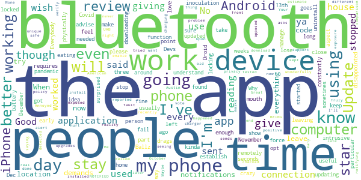

> I don't know, I haven't been around enough people to make sure. Even though, how would I know if they have the app?  :date: __2021-05-04 04:55:17__

> This application worked fine however, I found it to be very intrusive. It requires Bluetooth to function. I use Bluetooth to remotely manage my computer, every time the app needed to take a reading I would lose my connection with my computer and then have to physically establish connection again between phone and computer.  :date: __2021-04-16 18:37:30__

> I'm giving it a three stars on this particular phone because it is going off like crazy and I'm not even leaving the house I here by myself & I haven't left the house in weeks. It's just eating my battery up going off constantly like... there it goes again... It's going off about every 30 seconds If it works or not, like I said, I usually stay home. But I love the idea & I don't understand people not using it. Everybody's got to do their part and then some.  :date: __2021-04-01 17:48:23__

> Good  :date: __2021-03-23 04:15:11__

> Works sometimes  :date: __2021-03-20 01:55:29__

> Ballz in ya mouth 👄👄  :date: __2021-03-16 06:21:44__

> Its not working on my Droid  :date: __2021-02-07 04:03:52__

> The app has not sent since November 26. Devs, please advise  :date: __2021-01-21 17:55:40__

> I just wish more people used it. I kinda feel like it is not useful since people have to opt in for each aspect... BUT I will keep using it as long as this pandemic drags on. Update: This app is a fail. :( Very disappointed but not surprised at this point. It just stopped updating early Dec. Then 2 days ago it locked my phone up downloading. I had to force close & uninstall to stop it from locking up my phone. I wish this worked better.  :date: __2021-01-01 15:38:52__

> Why hasn't it updated since December 13th!?  :date: __2020-12-19 00:11:33__

#### 2-star reviews

> It keep restarting. I love the outlook and long term visionary goals. Its a great asset if no problems  :date: __2021-04-07 02:57:31__

> As others have stated, when first downloaded this past fall, it notified me of possible exposures. However since December 16, it has been inactive. I have restarted the phone, checked and updated settings, still it shows Dec 16. I was really excited about this app only to be disappointed after a few months.  :date: __2021-01-30 01:52:12__

> My last update is from December 17th, 2020. I don't see an option to manually refresh/check.  :date: __2021-01-24 22:08:22__

> App is not "CHECKING " on a daily basis. Last time checked shows December 13??  :date: __2021-01-18 18:15:29__

> I THINK this works but I've never been notified of an exposure. I see notifications of contact trace downloads but the app constantly says it's never checked for exposure so I can't be sure it's doing any good.  :date: __2021-01-15 23:54:09__

> Doesn't seem to work. My wife and I both have this installed. She tested positive, I went through the process of telling the app she was positive. And I never received a notification that I had been exposed. I noticed that her bluetooth was off. I turned it back on, waited a couple of days and tried the notification process again and verified that her bluetooth was still on. I still didn't get an exposure notification. I've been a big advocate for this technology... Why isn't it working?  :date: __2020-12-18 13:58:55__

> App questionnaire requires email verification, but doesn't work, so don't bother. If that basic feature does not work then how can you rely on it to correctly perform contact tracing?! This is not an in consequential function. Get it right!  :date: __2020-09-29 19:27:11__

> It would work better if more people had it on their phones.  :date: __2020-08-18 18:54:55__

#### 1-star reviews

> I tested positive for Covid-19 on February 12, 2021, too bad this stupid app will only allow users to report they tested positive as far back as March 17, 2021! How useless is that! Covid can & DOES stick around in SOME people (such as myself!) for longer than one month which is as far back as this app's devs think anyone using it could've POSSIBLY tested positive - because everyone KNOWS Covid has only been around for the past month, right devs?! If that is so screwed then whole app's FUBARED!!  :date: __2021-04-15 04:56:38__

> Stop spamming me about the Asian flu. I don't want your app so stop telling me to download this  :date: __2021-04-13 19:18:38__

> OMG worst app, sucked my battery life just after turning on location. It disconnected my wifi after turning on location as well. Uninstalled. Worthless.  :date: __2021-04-04 21:04:41__

> Sucks  :date: __2021-04-01 03:14:17__

> Contact tracing does not work when the incubation eriod is so long as with covid-19  :date: __2021-03-26 14:22:28__

> Contact tracing is useless on a disease with such a long incubation time  :date: __2021-03-23 17:56:40__

> Dont need a app to tell when someone is sick  :date: __2021-03-23 15:37:09__

> i want to install it 😭 but i dont have gigabites and i only have 1 app installed so sad  :date: __2021-03-02 23:08:46__

> Doesn't work just opens to an arrow and sits there.  :date: __2021-03-02 04:40:04__

> Absolutely cringe  :date: __2021-02-25 19:52:40__

# COVID Alert CT
App version ``minted151009``

Analyzed with [covid-apps-observer](http://github.com/covid-apps-observer) project, version ``0.1``

## App overview
| | |
|-------------------------|-------------------------| 
| **Name**&nbsp;&nbsp;&nbsp;&nbsp;&nbsp;&nbsp;&nbsp;&nbsp;&nbsp;&nbsp;&nbsp;&nbsp;&nbsp;&nbsp;&nbsp;&nbsp;&nbsp;&nbsp;&nbsp;&nbsp;&nbsp;&nbsp;&nbsp;&nbsp;&nbsp;&nbsp;&nbsp;&nbsp;&nbsp;&nbsp;&nbsp;&nbsp;&nbsp;&nbsp;&nbsp;&nbsp;&nbsp;&nbsp;&nbsp;&nbsp;  | COVID Alert CT |
| **Unique identifier** | gov.ct.covid19.exposurenotifications |
| **Link to Google Play** | [https://play.google.com/store/apps/details?id=gov.ct.covid19.exposurenotifications](https://play.google.com/store/apps/details?id=gov.ct.covid19.exposurenotifications) |
| **Summary**  | The official Exposure Notification app for Connecticut |
| **Privacy policy** | [https://portal.ct.gov/coronavirus/COVIDAlertCT/PrivacyPolicy](https://portal.ct.gov/coronavirus/COVIDAlertCT/PrivacyPolicy) |
| **Latest version** | minted151009 |
| **Last update** | 2021-02-25 01:02:29 |
| **Recent changes** | Bug fixes and performance improvements |
| **Installs**  | 100,000+ |
| **Category** | Medical |
| **First release** | Nov 9, 2020 |
| **Size**  | 10M |
| **Supported Android version**  | 5.0 and up |

### Description
> COVID Alert CT is the official COVID-19 exposure notification app in the State of Connecticut. It is supported by the Connecticut Department of Public Health (CT-DPH). COVID Alert CT helps to contain the spread of COVID-19 by complementing the ongoing contact tracing programs carried out by the State and local health departments.
 Using COVID Alert CT is voluntary and free of charge. The more people who install and use the app, the more effectively the app can help us to contain and slow the spread of the virus.
 Once you install and activate COVID Alert CT and turn on Bluetooth, the app works in the background and exchanges anonymous keys with other devices. Keys are long random strings of characters that are not tied to any personal information. Phones will record the keys generated by other phones nearby with the app installed. The app will record the:
  -  signal strength, and use that  to estimate the distance between devices, 
  -  duration of the contact and 
  -  date of the exposure. 
 To protect the users’ privacy, these keys are only kept on the user’s own device. After 14 days the keys are deleted.
 If a COVID Alert CT user tests positive for COVID-19, they will be able to obtain a verification code from a contact tracer at the State DPH or local health department. The code allows the user to activate the notification function in the app. You must use the verification code in order to report a positive result via the app. This prevents people from falsely reporting positive results, and false exposure notifications. CT-DPH wants all app users to feel confident that when a possible COVID-19 exposure is received via the app, that it is a real event.
 A positive report warns other app users that were near the infected person in the period close to the time when that person first experienced symptoms of the disease under certain circumstances. If the estimated distance was within six feet, the duration of exposure was at least 15 minutes cumulatively, then the other user receives a notification of a possible exposure. Anyone who receives a notification should follow the guidance in the app for next steps.
 CT-DPH takes your privacy and confidentiality very seriously. This is why we chose to use the Apple and Google Exposure Notification API. No personal data or location tracking occurs within this app. There is no need for CT-DPH to know where or who you are, for COVID Alert CT to work.
 The Connecticut COVID Notice Privacy Policy is available at https://portal.ct.gov/coronavirus/COVIDAlertCT/PrivacyPolicy. The use of the app is limited to Connecticut and is subject to Connecticut law.
 Thank you for downloading COVID Alert CT. Together, we can protect our family, friends, neighbors, and colleagues, and keep Connecticut moving forward.
 The app was developed using the Google / Apple Exposure Notification API through a collaboration between Google, Apple, the Connecticut Department of Administrative Services (DAS) and CT-DPH.

### User interface
The developers of the app provide the following screenshots in the Google play store.
| | | |
|:-------------------------:|:-------------------------:|:-------------------------:|
 |   |  

## Development team
In the following we report the main information provided by the development team in the Google play store.

| | |
|-------------------------|-------------------------|
| **Developer**  | CT Department of Public Health |
| **Website**  | [http://ct.gov/covidalertct](http://ct.gov/covidalertct) |
| **Email** | DPH.covidalertct@ct.gov |
| **Physical address**  | [State of Connecticut Department of Public Health 410 Capital Avenue Hartford, CT,  06103](https://www.google.com/maps/search/State%20of%20Connecticut%20Department%20of%20Public%20Health%20410%20Capital%20Avenue%20Hartford,%20CT,%2006103) (Google Maps) |
| **Other developed apps**  | [https://play.google.com/store/apps/developer?id=7682186545769631479](https://play.google.com/store/apps/developer?id=7682186545769631479) |

## Android support

| | |
|-------------------------|-------------------------|
| **Declared target Android version**  | - |
| **Effective target Android version**  | - |
| **Minimum supported Android version**  | Lollipop, version 5.0 (API level 21) |
| **Maximum target Android version**  | - |

The larger the difference between the minimum and maximum supported Android versions, the better. A larger difference means a wider audience. For example, old phones have a very low Android version, so a high minimum supported Android version means that the app cannot be used by users with old phones, thus leading to accessibility problems. 

## Requested permissions

In the following we report the complete list of the permissions requested by the app. 

| **Permission** | **Protection level** | **Description** | 
|-------------------------|-------------------------|-------------------------|
 **android.permission ACCESS_NETWORK_STATE** | Normal | Allows applications to access information about networks. 
 **android.permission BLUETOOTH** | Normal | Allows applications to connect to paired bluetooth devices. 
 **android.permission FOREGROUND_SERVICE** | Normal | Allows a regular application to use Service.startForeground. 
 **android.permission INTERNET** | Normal | Allows applications to open network sockets. 
 **android.permission RECEIVE_BOOT_COMPLETED** | Normal | Allows an application to receive the Intent.ACTION_BOOT_COMPLETED that is broadcast after the system finishes booting. 
 **android.permission WAKE_LOCK** | Normal | Allows using PowerManager WakeLocks to keep processor from sleeping or screen from dimming. 

## Mentioned servers

| **Server** | **Registrant** | **Registrant country** | **Creation date** | 
|-------------------------|-------------------------|-------------------------|-------------------------|
 | google.com | Google LLC | :us: US | 1997-09-15 04:00:00 |

## Security analysis 

Below we report the main security warnings raised by our execution of the [Androwarn](https://github.com/maaaaz/androwarn) security analysis tool.

**Telephony identifiers leakage**
> - This application reads the ISO country code equivalent of the current registered operator's MCC (Mobile Country Code) 

**Connection interfaces exfiltration**
> - This application reads details about the currently active data network 
> - This application tries to find out if the currently active data network is metered 

**Suspicious connection establishment**
> - This application opens a Socket and connects it to the remote address 'timeout' on the 'N/A' port  

**Code execution**
> - This application loads a native library: 'prioclient' 

## User ratings and reviews

Below we provide information about how end users are reacting to the app in terms of ratings and reviews in the Google Play store.

### Ratings

The COVID Alert CT app has been installed by more than **100000** times. At this time, **219** rated the app and its average score is **3.6**. Below we show the distribution of the ratings across the usual star-based rating of Google Play

:star::star::star::star::star:: 119

:star::star::star::star:: 22

:star::star::star:: 11

:star::star:: 8

:star:: 59

### Reviews 

#### 5-star reviews

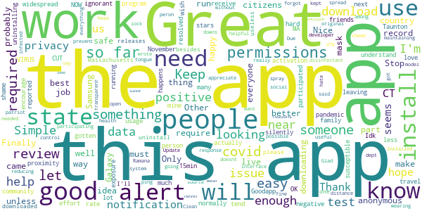

> I don't normally rate apps. Just looking through all the reviews and it's a shame that people ignorant to how the app actually works are leaving negative reviews. Download the app. Let it run. If you test positive, record it in the app. If someone else running this app tests positive and records it in the app, you will receive an alert (If you were near that person for more than 15min). Other than that, the app will silently run until something happens. It's not that hard to understand...  :date: __2021-04-20 18:02:46__

> Great idea in need of more widespread usage. I have no issue having my anonymous data help people I am in proximity with. I have not gotten any alerts, but I tend to not be out and about a lot during the pandemic so I'm probably less susceptible than many.  :date: __2021-03-22 23:57:00__

> THAT HOW I CUT TO NOW ABOUT THIS VIRUS  :date: __2021-03-07 20:00:17__

> Simple enough to use. The best way to get the most out of this app is to encourage your friends & family to also get the app! It's a community effort.  :date: __2021-02-14 02:27:29__

> I like this. It's simple and easy. I wish my state participated in the program (a state next to mine does).  :date: __2021-02-13 22:22:08__

> Will this app work when it needs to  :date: __2021-02-09 15:42:46__

> Everyones  :date: __2021-01-31 12:48:10__

> Simple app. 5 stars because it works but more people need to download. Stop uninstalling because there is not enough people. Install and let it work. Only need to do something if you test positive.  :date: __2021-01-25 02:49:04__

> Great  :date: __2021-01-13 22:30:19__

> Idk what to do with the app  :date: __2020-12-23 06:42:32__

#### 4-star reviews

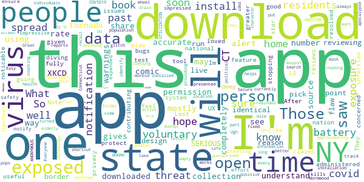

> The way I understand it, you only get notifications if an exposed person has downloaded this app and gives permission to share data. Those who have been exposed but saw no alert, the person may not have had this app. The app is only as accurate as the number of people using it; it's open-source data collection and completely voluntary. More residents should download this app.  :date: __2021-01-11 14:26:59__

> Just saw  :date: __2021-01-01 16:25:39__

> I'm not sure how to rate this app (see the XKCD comic on tornado warnings). I'm mostly reviewing to point out a SERIOUS flaw in the design of this app. I live on the border w/ NY. NY has it's own identical app. I can not run both apps at the same time. So I have to pick between CT or NY. What is the reason for this and why is this administered by the states at all? Why isn't there a national app?  :date: __2020-12-19 03:49:17__

> They should have a nation wide one not state by state  :date: __2020-12-19 01:29:15__

> Im not going to test this app.  :date: __2020-12-12 15:53:24__

> After deep diving the privacy claims of this app, I feel given it's a fully voluntary system that if you're concerned about covid-19 infection/spread, this app is a useful tool to protect yourself/loved ones while also contributing to the greater good by stopping the spread. Unlike other w reviews, I have had no noticable battery issues B-LE feature on my Note 9. Lost 1 star for some UX bugs I'm sure will be resolved soon.  :date: __2020-12-02 01:47:48__

> Impressive. I am impressed at the effort expended by the State of CT to ensure the safety of its residents, creating an app to track and notify exposure to the threat of a virus that kills approximately 1% of the population (not counting the elderly and those co-morbid), and at the same time continue with the virus-turned-political-weapon that is the COVID19/WUHAN virus. I recall an era when individuals whom presented a threat to the health of others were the ones quarantined. Ugh.  :date: __2020-12-01 11:16:10__

> I hope this updates with past exposures/past positive testers too since I just installed it & it's only providing new reports, of which it's currently empty. Also hope the Samsung Secure Folder installation glitch will be fixed soon.  :date: __2020-11-28 20:25:25__

> Bluetooth and location are always on. Significant battery drain. When a covid notification pops up, it does not take you to view that information. Rather you have to download the active app or you just get a spinning wheel.  :date: __2020-11-27 02:19:50__

> Easy to install, but I can't put a shortcut on my home screen. I have to search for it every time I want to open it. Everyone be safe.  :date: __2020-11-19 04:38:11__

#### 3-star reviews

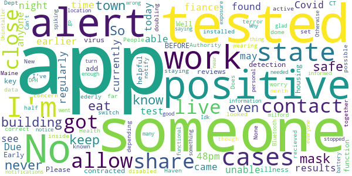

> This app only allows you to share Covid-19 test results. It should also allow you to share close contacts. I just found out that my fiance and I came in close contact with someone we see regularly who tested positive earlier today. Due to the time of night, currently 10:48pm, we're unable to get tested ourselves. We should be able to alert anyone through the app that we may have contracted the virus BEFORE being tested. Early detection is key with any illness. Please add this function.  :date: __2021-03-04 04:52:04__

> It was helpful then all the reviews got positive.Well I live in housing Authority in New Haven and half the building is not being safe not wearing mask it's a terror dome. I'm doubling up on my mask staying safe as possible. The Health Dept.should do more for the ederly and disabled. So as far as I'm concern this app just eat up my data. So No  :date: __2021-01-24 21:32:35__

> None of these apps work together. People should not have to worry if they have the correct states app installed and active, then have to switch between apps depending on what state they are in.  :date: __2021-01-06 04:18:51__

> I never recieved an alert even though I have it set up to alert me. It did notify inside the app but I would have never known if I hadn't looked.  :date: __2020-12-28 04:23:47__

> Someone in my building tested positive but I got no alert.  :date: __2020-12-18 08:41:41__

> Is this app just for CT? Does it work in Maine? I've had it for a month and no notifications as cases are spiking here.  :date: __2020-12-12 02:17:02__

> I'm glad the State is doing this, but being near someone's app isn't enough. Not everyone has the app. Why aren't we informed of cases in our town? No personal information needed. I know someone who is positive, and that would be good to know how many, if any cases are in my town w/o having to go to DPH.  :date: __2020-12-04 18:36:41__

> Can't turn on the exposure notice. Keeps saying something went wrong even Uninstaller it and that didn't work. It stopped doing that thing  :date: __2020-11-25 22:32:03__

> Idk I live in milford  :date: __2020-11-14 17:49:59__

> You have to keep your location and Bluetooth on for it to work. That eats up battery. Otherwise it's functional. 🤷🏽‍♀️  :date: __2020-11-13 13:14:31__

#### 2-star reviews

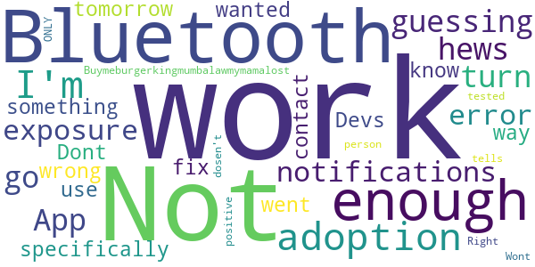

> Not enough adoption I'm guessing  :date: __2021-04-22 15:20:01__

> hews  :date: __2020-12-08 00:30:36__

> App does not work! I go to turn on exposure notifications and I get the error "something went wrong" and no way to contact Devs of how to fix this. I wanted to specifically use this while out tomorrow.  :date: __2020-12-03 08:05:04__

> Dont know if it work...  :date: __2020-12-01 07:07:08__

> Buymeburgerkingmumbalawmymamalost  :date: __2020-11-28 17:27:46__

> Wont work  :date: __2020-11-16 15:35:46__

> It ONLY tells if the Bluetooth is ON ? Right... if the person tested positive and the Bluetooth is off dosen't work?  :date: __2020-11-14 18:01:30__

#### 1-star reviews

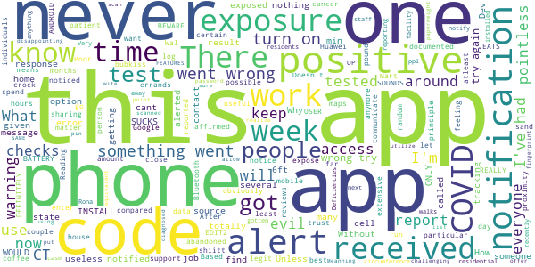

> Was expose but the app did not let me know  :date: __2021-04-10 11:33:09__

> I've had this app on my phone for months and it hasn't alerted once! How is that possible when I go to Wal-Mart and run errands at least once a week. I also noticed that no matter how many hours I'm out and about the ONLY time it does its random checks is when I'm home! One day in particular I was in and out of my house a couple of times and I compared the documented checks with my Google maps log and all 4 checks were while I was obviously home! This app is totally useless if NO ONE USES IT!!  :date: __2021-03-31 14:25:09__

> This was a crock of shiitt  :date: __2021-03-30 05:05:13__

> Never alerts, like ever. I know a few people around me got it and it wasn't reported.  :date: __2021-03-26 16:10:09__

> The state has abandoned this cancer patient, so you can pound sand. I will not be sharing anymore data with this state.  :date: __2021-03-04 15:45:44__

> Pointless app. I've had one exposure alert.  :date: __2021-02-20 18:18:54__

> I support this app in principle but I cannot find the source code. Without access to the source code there can be no trust.  :date: __2021-02-11 16:51:59__

> Doesn't work  :date: __2021-02-10 00:02:03__

> I cant use it on my Huawei mobile...  :date: __2021-02-01 07:04:59__

> BEWARE!! EATS UP BATTERY !!  :date: __2021-01-31 08:37:46__

# COVID Alert NJ
App version ``1.1.2``

Analyzed with [covid-apps-observer](http://github.com/covid-apps-observer) project, version ``0.1``

## App overview
| | |
|-------------------------|-------------------------| 
| **Name**&nbsp;&nbsp;&nbsp;&nbsp;&nbsp;&nbsp;&nbsp;&nbsp;&nbsp;&nbsp;&nbsp;&nbsp;&nbsp;&nbsp;&nbsp;&nbsp;&nbsp;&nbsp;&nbsp;&nbsp;&nbsp;&nbsp;&nbsp;&nbsp;&nbsp;&nbsp;&nbsp;&nbsp;&nbsp;&nbsp;&nbsp;&nbsp;&nbsp;&nbsp;&nbsp;&nbsp;&nbsp;&nbsp;&nbsp;&nbsp;  | COVID Alert NJ |
| **Unique identifier** | com.nj.gov.covidalert |
| **Link to Google Play** | [https://play.google.com/store/apps/details?id=com.nj.gov.covidalert](https://play.google.com/store/apps/details?id=com.nj.gov.covidalert) |
| **Summary**  | Help us stop the spread of COVID-19 in New Jersey! |
| **Privacy policy** | [https://www.nj.gov/health/documents/DPP_COVIDALERTNJ.pdf](https://www.nj.gov/health/documents/DPP_COVIDALERTNJ.pdf) |
| **Latest version** | 1.1.2 |
| **Last update** | 2021-04-04 10:14:31 |
| **Recent changes** | Text updates and minor improvements |
| **Installs**  | 100,000+ |
| **Category** | Health & Fitness |
| **First release** | Sep 18, 2020 |
| **Size**  | 106M |
| **Supported Android version**  | 6.0 and up |

### Description
> COVID Alert NJ App is being made available by the New Jersey Department of Health (DOH) to complement New Jersey’s comprehensive COVID-19 contact tracing effort. COVID Alert NJ is a free and secure mobile phone app that allows New Jerseyans:
 1.	To be alerted if they have been in close contact with another app user who has tested positive for COVID-19 – even if that person is a stranger
 2.	To track their symptoms and get advice on what to do to protect themselves and others
 3.	To be able to anonymously warn other app users whom they were in close contact with, if they tested positive for COVID-19 – especially people they do not know or remember being in close contact with (e.g., during bus/train ride, at public places)
 4.	To monitor the latest information and statistics related to the COVID-19 pandemic
 5.	To reach NJ public health representatives and be connected with support services 
 For all this to work, all you have to do is push “Allow” COVID-19 Exposure Notification Services (ENS) on your phone within your App.
 You can also choose to “Allow” your phone to turn on the COVID-19 Exposure Notification Services (ENS) and also “Allow” your phone to display notifications so that you also receive an alert that you have been exposed to someone who has tested positive for COVID-19. You can also turn off this functionality, at any time, in the Settings page of the App. 
 In the event you receive an Exposure Notification, you may read NJ DOH advice under Exposure Notification Information or get in touch with a public health representative.
 It is important to note that COVID Alert NJ will never reveal the identity of any person using the app to other app users, and never reveals who has been diagnosed as positive for COVID-19. 
 Help us Stop the Spread of COVID-19 in New Jersey. Share this app with your friends and family.
 The use of this App is entirely voluntary and it is available to download for free from the Google Play Store. The App runs Android phones running Android 6.0 and higher. The App is not intended for use by persons under 18 years of age, as they are considered not to have reached the digital age of consent or agreement with the State of New Jersey. You will be asked to confirm that you are 18 years or older after you download the App.
 View our privacy policy here: https://www.nj.gov/health/documents/DPP_COVIDALERTNJ.pdf

### User interface
The developers of the app provide the following screenshots in the Google play store.
| | | |
|:-------------------------:|:-------------------------:|:-------------------------:|
 |   |   |   | 
 |   |  

## Development team
In the following we report the main information provided by the development team in the Google play store.

| | |
|-------------------------|-------------------------|
| **Developer**  | State of New Jersey  Applications |
| **Website**  | [https://covid19.nj.gov/index.html](https://covid19.nj.gov/index.html) |
| **Email** | COVIDapp@doh.nj.gov |
| **Physical address**  | - |
| **Other developed apps**  | [https://play.google.com/store/apps/developer?id=State+of+New+Jersey++Applications](https://play.google.com/store/apps/developer?id=State+of+New+Jersey++Applications) |

## Android support

| | |
|-------------------------|-------------------------|
| **Declared target Android version**  | Android10, version 10 (API level 29) |
| **Effective target Android version**  | Android10, version 10 (API level 29) |
| **Minimum supported Android version**  | Marshmallow, version 6.0 (API level 23) |
| **Maximum target Android version**  | - |

The larger the difference between the minimum and maximum supported Android versions, the better. A larger difference means a wider audience. For example, old phones have a very low Android version, so a high minimum supported Android version means that the app cannot be used by users with old phones, thus leading to accessibility problems. 

## Requested permissions

In the following we report the complete list of the permissions requested by the app. 

| **Permission** | **Protection level** | **Description** | 
|-------------------------|-------------------------|-------------------------|
 **android.permission ACCESS_NETWORK_STATE** | Normal | Allows applications to access information about networks. 
 **android.permission ACCESS_WIFI_STATE** | Normal | Allows applications to access information about Wi-Fi networks. 
 **android.permission BLUETOOTH** | Normal | Allows applications to connect to paired bluetooth devices. 
 **android.permission FOREGROUND_SERVICE** | Normal | Allows a regular application to use Service.startForeground. 
 **android.permission INTERNET** | Normal | Allows applications to open network sockets. 
 **android.permission RECEIVE_BOOT_COMPLETED** | Normal | Allows an application to receive the Intent.ACTION_BOOT_COMPLETED that is broadcast after the system finishes booting. 
 **android.permission VIBRATE** | Normal | Allows access to the vibrator. 

## Mentioned servers

| **Server** | **Registrant** | **Registrant country** | **Creation date** | 
|-------------------------|-------------------------|-------------------------|-------------------------|
 | android.com | Google LLC | :us: US | 1997-06-23 04:00:00 |
 | google.com | Google LLC | :us: US | 1997-09-15 04:00:00 |
 | expo.io | See PrivacyGuardian.org | :us: US | 2011-05-01 21:26:50 |

## Security analysis 

Below we report the main security warnings raised by our execution of the [Androwarn](https://github.com/maaaaz/androwarn) security analysis tool.

**Telephony identifiers leakage**
> - This application reads the MCC+MNC of the provider of the SIM 
> - This application reads the numeric name (MCC+MNC) of current registered operator 
> - This application reads the operator name 

**Connection interfaces exfiltration**
> - This application reads details about the currently active data network 
> - This application tries to find out if the currently active data network is metered 

**Suspicious connection establishment**
> - This application opens a Socket and connects it to the remote address ' returned no addresses for  ; port is out of range' on the 'N/A' port  
> - This application opens a Socket and connects it to the remote address '' on the 'N/A' port  
> - This application opens a Socket and connects it to the remote address 'Ljava/lang/StringBuilder;->toString()Ljava/lang/String;' on the 'N/A' port  
> - This application opens a Socket and connects it to the remote address 'Ljava/net/Proxy;->type()Ljava/net/Proxy$Type;' on the 'N/A' port  
> - This application opens a Socket and connects it to the remote address 'timeout' on the 'N/A' port  

**Pim data leakage**
> - This application accesses data stored in the clipboard 

**Code execution**
> - This application loads a native library 
> - This application executes a UNIX command 

## User ratings and reviews

Below we provide information about how end users are reacting to the app in terms of ratings and reviews in the Google Play store.

### Ratings

The COVID Alert NJ app has been installed by more than **100000** times. At this time, **818** rated the app and its average score is **3.764706**. Below we show the distribution of the ratings across the usual star-based rating of Google Play

:star::star::star::star::star:: 490

:star::star::star::star:: 56

:star::star::star:: 24

:star::star:: 88

:star:: 160

### Reviews 

#### 5-star reviews

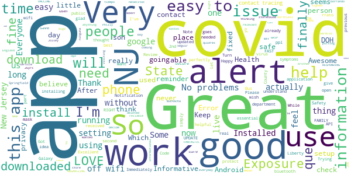

> Easy to used. Informative and relevant; also reliable  :date: __2021-05-08 10:55:14__

> Great  :date: __2021-05-01 20:19:48__

> Excellent service  :date: __2021-04-25 19:37:31__

> Never received an alert. Which is a good thing.  :date: __2021-04-25 01:26:57__

> Works. It just works.  :date: __2021-04-24 22:37:59__

> I wanted this informational because I'm thinking of visiting my brother in Springfield, New Jersey. I thought that this app might help me to decide if it's safe or not. I would be coming from England.  :date: __2021-04-20 21:00:59__

> THIS STATE HAS A FANTASTIC GRIP ON ORGANIZING & RESPONDING FAST WITH LITTLE TIME TO WORRY! LOVE IT! I'M THE ONLY ONE IN MY FAMILY WITHOUT THE VACCINE & I'M FROM Philly!! Using my storehouse of 26yrs I'm signed up! Great Job Joisey!!!  :date: __2021-04-08 11:14:16__

> No se que quieres que aga no veo ninguna muchacha en mi casa boy a seguir borrando con tu oermiso o no o nesecitas tiempo te digo son tontos yo estoy ase rrato viendo que les estan avisando que yo estoybmolesto y no entienden a que lo bielbo a desactibar en un rrato aver donse esta  :date: __2021-03-27 19:08:26__

> Good  :date: __2021-03-24 13:23:22__

> In the year of the begin stroke and stage of covid it hands down help to get information and clear image a covid 19 wear and tear Thank you for the strong verification Ps Sylvester J Ali  :date: __2021-03-21 08:20:22__

#### 4-star reviews

> More and more people gets vaccinated; you should add this option to the app, too.  :date: __2021-05-03 22:23:34__

> WATTS121353  :date: __2021-04-13 22:44:16__

> I would like to see data where my phone randomly had contact with another device?  :date: __2021-03-31 02:03:08__

> bi.d.e.n  :date: __2021-02-22 02:00:15__

> Help us stop the spread of COVID-19 in New Jersey! COVID Alert NJ App is being made available by the New Jersey Department of Health (DOH) to complement New Jersey’s comprehensive COVID-19 contact tracing effort. COVID Alert NJ is a free and secure mobile phone app that allows New Jerseyans: 1. To be alerted if they have been in close contact with another app user who has tested positive for COVID-19 – even if that person is a stranger 2. To track their symptoms and get advice on what to do to  :date: __2021-01-25 03:35:13__

> Want info on getting vaccine !!  :date: __2021-01-08 20:39:52__

> It should show where I am in the queue for vaccination.  :date: __2021-01-06 14:58:41__

> Need to have an option to change the "How are you feeling?" response for when you select the incorrect response by mistake.  :date: __2020-12-26 19:43:12__

> Optimistic about the potential.  :date: __2020-12-12 17:22:21__

> I like that you can take a moment to store daily check ups. SJZ  :date: __2020-12-11 19:49:58__

#### 3-star reviews

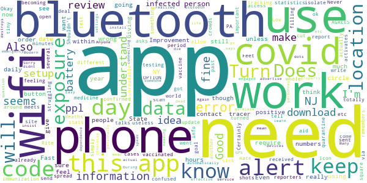

> Need immunization stats too. Also where do I report "feeling ok but was in contact with a positive" If the goal is to cut spread YOU NEED THAT OPTION  :date: __2021-04-19 14:58:10__

> It's fine for the State of NJ tracking you. But, if you like me are struggling to get vaccinated it is totally useless, much like the State of NJ's vaccine site.  :date: __2021-03-02 13:23:05__

> no data update for several days  :date: __2021-02-23 18:09:44__

> Never received any alerts  :date: __2021-02-12 03:18:12__

> The app icon went from filling in the whole circle to becoming an unreadable tiny square in a circle.  :date: __2021-02-07 18:56:39__

> Okay  :date: __2021-01-30 07:35:25__

> The numbers for confirmed cases and deaths are wrong.  :date: __2021-01-18 21:33:16__

> This app needs improvement. When you get an exposure alert it doesn't tell you the date of exposure, just that it was within the past 14 days. So you could already be out of the quarantine period or only need to test and isolate for a few days. Giving the date of exposure seems important.  :date: __2021-01-06 00:25:46__

> Rite aid Cov 19 testing  :date: __2020-12-13 15:43:07__

> I Certainly can't actually Rate something I just got.  :date: __2020-11-18 22:11:50__

#### 2-star reviews

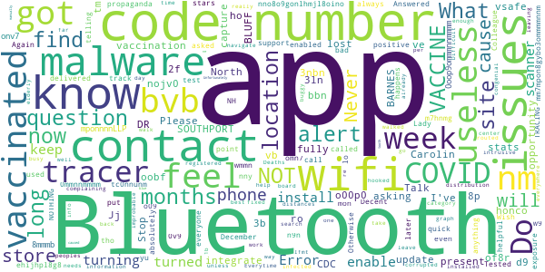

> Jj d  :date: __2021-04-29 05:42:11__

> d9.b 4016 BARNES BLUFF DR SOUTHPORT, North Carolin .2f. f. b vb o00p0.8p .ro g g oobf.h d bbn o. nojv0. tm.o 309 3nbn. 3b. v. the. h. honco ho n b 3ln bvb of8r 332. ve w. b. g. .. 0 M o mponnnnLLP 8mmmb.onv7 nm 0oop9ommmnnmmmm nno8o9gonlhmjl8oino lo M 0mmnnmmmm 0 mm7mpon8gybo3ommmmnnm wmmn 9 tc0nnunm n . 97. y. no. n9n nny.w.yu..... . . NH n..ehijhpl8g8 omn7. .c.. 0v9🥜. M o09 then b . w9 I n. n bvb nm 9. 😍mon⚠️↖️↖️🚫🚮🇧🇯 m7hnmg  :date: __2021-04-12 20:37:18__

> Decent app, bad support. Tested positive with a quick test in December, got a call from a contact tracer about a week later. Answered questions, then asked, "Do you have a code number for me to put into the app?" Lady didn't know about code numbers or the app. Colleague got COVID, contact tracer called. Again, no question about app or code numbers. No point to the app if code numbers aren't delivered. Otherwise, it's just propaganda. 2 stars.  :date: __2021-03-23 16:17:13__

> Keeps telling me it can't track exposure always even tho i enabled location. Useless.  :date: __2021-03-21 23:24:05__

> This app doesn't alert you to anything. I used it for months and absolutely NOTHING.  :date: __2021-03-17 02:04:06__

> What happens when you get vaccinated? How does the app know?  :date: __2021-03-11 15:49:44__

> Wish it was more helpful  :date: __2021-03-09 03:21:42__

> THIS IS NOT A VACCINE APP. IT IS A CONTACT TRACING APP- THAT'S IT (for everyone complaining that it won't help them find a vaccine distribution center)  :date: __2021-03-08 21:30:57__

> For the elderly or those who cannot walk long distances, there is no information on which site is best; I am in category 1b. Everytime I search for a location. I am re-routed back to this site which I have already registered.  :date: __2021-01-26 23:12:35__

> Deaths per day graph is corrupted for a while now. This needs to be fixed.  :date: __2021-01-24 15:37:29__

#### 1-star reviews

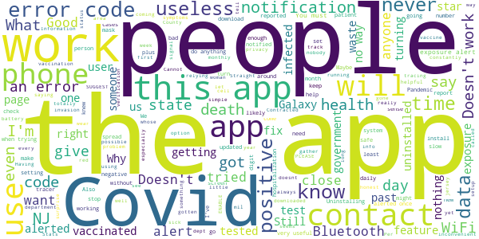

> Work in ER, around Covid patients constantly. Never alerted once. So there is clearly not enough user base for this app to be effective.  :date: __2021-05-08 18:35:53__

> Stats like deaths and hospitalizations hasn't been updated in a month or more. Other stats are sometimes days late. Information has become useless. What else does this do besides track us?  :date: __2021-05-03 19:32:07__

> Will never alkow my gov. To put out that im sick with covid if i was thats not right and the person who develoved the app ahould ve fined  :date: __2021-04-28 14:02:32__

> This app is becoming increasingly useless as the number of people getting fully vaccinated increases, and as it fails to gather vaccination data. IF THIS CONDITION CONTINUES, I'LL HAVE NO CHOICE BUT TO UN-INSTALL THIS APP. I SUGGEST THAT OTHERS DO THE SAME. I suggest changing the data that you gather to include: - vaccination info (if obtained, what type, when #1, when #2, etc) - positive/negative test results - self-reported symptoms. All the above can be very useful public health data.  :date: __2021-04-21 18:29:36__

> Since the app came out only 1500 people have even entered their contact tracing number, despite thousands of cases a day. Without proper contact tracing this app is useless  :date: __2021-04-08 15:34:55__

> This app plus $1.50 geta you the star ledger. Useless.  :date: __2021-03-25 19:22:53__

> Doesn't do a damn bit of good, unless you plan to visit NJ  :date: __2021-03-23 04:34:59__

> This app is useless to users. I've been close, very close, to at least 5 people who have all gotten Covid, none of them caused any notification to my app. I also know that the contact tracers were only asking if they knew about the app, not to do anything to trigger the positive notifications. I know notifications are on because I get one monthly to remind me it's running, well, got one monthly, I have since uninstalled it because it's useless to me as an end user.  :date: __2021-03-21 13:49:38__

> Don't work!! Just useless. Deinstalling.  :date: __2021-03-20 22:44:41__

> Doesn't help where you can be vaccinated & when  :date: __2021-03-19 20:09:05__

# COVID Alert NY
App version ``1.1.4``

Analyzed with [covid-apps-observer](http://github.com/covid-apps-observer) project, version ``0.1``

## App overview
| | |
|-------------------------|-------------------------| 
| **Name**&nbsp;&nbsp;&nbsp;&nbsp;&nbsp;&nbsp;&nbsp;&nbsp;&nbsp;&nbsp;&nbsp;&nbsp;&nbsp;&nbsp;&nbsp;&nbsp;&nbsp;&nbsp;&nbsp;&nbsp;&nbsp;&nbsp;&nbsp;&nbsp;&nbsp;&nbsp;&nbsp;&nbsp;&nbsp;&nbsp;&nbsp;&nbsp;&nbsp;&nbsp;&nbsp;&nbsp;&nbsp;&nbsp;&nbsp;&nbsp;  | COVID Alert NY |
| **Unique identifier** | gov.ny.health.proximity |
| **Link to Google Play** | [https://play.google.com/store/apps/details?id=gov.ny.health.proximity](https://play.google.com/store/apps/details?id=gov.ny.health.proximity) |
| **Summary**  | Stop COVID Spread in NY |
| **Privacy policy** | [https://apps.health.ny.gov/public/covidsmartprivacy.html](https://apps.health.ny.gov/public/covidsmartprivacy.html) |
| **Latest version** | 1.1.4 |
| **Last update** | 2021-03-25 18:46:54 |
| **Recent changes** | Help protect your fellow NYers from COVID-19! In complete privacy and without knowing who you are, this app warns you if someone near you tested positive for COVID-19. |
| **Installs**  | 500,000+ |
| **Category** | Health & Fitness |
| **First release** | Sep 24, 2020 |
| **Size**  | 106M |
| **Supported Android version**  | 6.0 and up |

### Description
> This is the official app of New York State, run by the NYS Department of Health as part of New York State’s comprehensive COVID-19 testing and contact tracing effort. The ultimate goal is to help reduce the spread of COVID-19 by:
 1. Alerting you if a sick person spends 10 mins or more within 6 feet of you, because this puts you at a higher risk of SARS CoV-2 infection, which causes COVID-19. 
 2. Encouraging you to contribute to the health and safety of your friends, family and community by alerting others if you test positive, WITHOUT REVEALING YOUR IDENTITY TO ANYONE!
 3. Getting you important resources and help if you are exposed or test positive. You can call the COVID Alert NY Hotline or find helpful links to resources on next steps to protect your loved ones.
 4. Keep a private log of your own symptoms which can help your health care provider and public health representatives determine next steps.
 The app leverages a completely private and secure Bluetooth-based technology that Apple and Google developed. The app’s source code is available to the public and has been vetted extensively by privacy and security experts. We never see your location or identity, and no information on the use of this app can be traced back to you. 
 Help us Stop the Spread of COVID-19 in New York.. Share this app with your friends and family so we can all be safer, together.

### User interface
The developers of the app provide the following screenshots in the Google play store.
| | | |
|:-------------------------:|:-------------------------:|:-------------------------:|
 |   |   |   | 
 |   |  

## Development team
In the following we report the main information provided by the development team in the Google play store.

| | |
|-------------------------|-------------------------|
| **Developer**  | New York State Department of Health |
| **Website**  | [https://covidalertny.health.ny.gov/](https://covidalertny.health.ny.gov/) |
| **Email** | covidalertny@health.ny.gov |
| **Physical address**  | - |
| **Other developed apps**  | [https://play.google.com/store/apps/developer?id=New+York+State+Department+of+Health](https://play.google.com/store/apps/developer?id=New+York+State+Department+of+Health) |

## Android support

| | |
|-------------------------|-------------------------|
| **Declared target Android version**  | Android10, version 10 (API level 29) |
| **Effective target Android version**  | Android10, version 10 (API level 29) |
| **Minimum supported Android version**  | Marshmallow, version 6.0 (API level 23) |
| **Maximum target Android version**  | - |

The larger the difference between the minimum and maximum supported Android versions, the better. A larger difference means a wider audience. For example, old phones have a very low Android version, so a high minimum supported Android version means that the app cannot be used by users with old phones, thus leading to accessibility problems. 

## Requested permissions

In the following we report the complete list of the permissions requested by the app. 

| **Permission** | **Protection level** | **Description** | 
|-------------------------|-------------------------|-------------------------|
 **android.permission ACCESS_NETWORK_STATE** | Normal | Allows applications to access information about networks. 
 **android.permission ACCESS_WIFI_STATE** | Normal | Allows applications to access information about Wi-Fi networks. 
 **android.permission BLUETOOTH** | Normal | Allows applications to connect to paired bluetooth devices. 
 **android.permission FOREGROUND_SERVICE** | Normal | Allows a regular application to use Service.startForeground. 
 **android.permission INTERNET** | Normal | Allows applications to open network sockets. 
 **android.permission RECEIVE_BOOT_COMPLETED** | Normal | Allows an application to receive the Intent.ACTION_BOOT_COMPLETED that is broadcast after the system finishes booting. 
 **android.permission VIBRATE** | Normal | Allows access to the vibrator. 
 **com.google.android.finsky.permission BIND_GET_INSTALL_REFERRER_SERVICE** | - | - 

## Mentioned servers

| **Server** | **Registrant** | **Registrant country** | **Creation date** | 
|-------------------------|-------------------------|-------------------------|-------------------------|
 | android.com | Google LLC | :us: US | 1997-06-23 04:00:00 |
 | google.com | Google LLC | :us: US | 1997-09-15 04:00:00 |
 | expo.io | See PrivacyGuardian.org | :us: US | 2011-05-01 21:26:50 |

## Security analysis 

Below we report the main security warnings raised by our execution of the [Androwarn](https://github.com/maaaaz/androwarn) security analysis tool.

**Telephony identifiers leakage**
> - This application reads the MCC+MNC of the provider of the SIM 
> - This application reads the numeric name (MCC+MNC) of current registered operator 
> - This application reads the operator name 
> - This application reads the phone number string for line 1, for example, the MSISDN for a GSM phone 

**Location lookup**
> - This application reads location information from all available providers (WiFi, GPS etc.) 

**Connection interfaces exfiltration**
> - This application reads details about the currently active data network 
> - This application tries to find out if the currently active data network is metered 

**Suspicious connection establishment**
> - This application opens a Socket and connects it to the remote address ' returned no addresses for  ; port is out of range' on the 'N/A' port  
> - This application opens a Socket and connects it to the remote address '' on the 'N/A' port  
> - This application opens a Socket and connects it to the remote address 'Ljava/lang/StringBuilder;->toString()Ljava/lang/String;' on the 'N/A' port  
> - This application opens a Socket and connects it to the remote address 'Ljava/net/Proxy;->type()Ljava/net/Proxy$Type;' on the 'N/A' port  
> - This application opens a Socket and connects it to the remote address 'timeout' on the 'N/A' port  

**Pim data leakage**
> - This application accesses data stored in the clipboard 

**Code execution**
> - This application loads a native library 
> - This application executes a UNIX command 

## User ratings and reviews

Below we provide information about how end users are reacting to the app in terms of ratings and reviews in the Google Play store.

### Ratings

The COVID Alert NY app has been installed by more than **500000** times. At this time, **1682** rated the app and its average score is **4.0273223**. Below we show the distribution of the ratings across the usual star-based rating of Google Play

:star::star::star::star::star:: 1095

:star::star::star::star:: 165

:star::star::star:: 73

:star::star:: 73

:star:: 276

### Reviews 

#### 5-star reviews

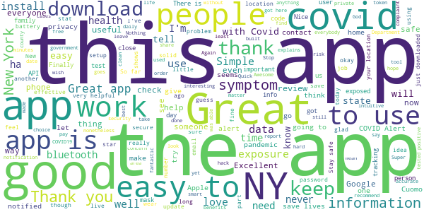

> This app is very helpful for me  :date: __2021-04-18 01:55:03__

> I like keeping up with any new covid information.  :date: __2021-04-13 10:24:49__

> SharonFrancisSharen22o  :date: __2021-04-09 19:18:25__

> Informative and keeps me up-to-date on my area and stage a New York  :date: __2021-04-05 22:03:43__

> Md  :date: __2021-04-04 23:19:54__

> Thanks guys much 💘 💜  :date: __2021-04-03 19:44:43__

> Good  :date: __2021-04-03 11:43:25__

> More of a data analysis tool, but useful nonetheless to see what's happening.  :date: __2021-03-31 16:13:42__

> Just installed the app let's see how it goes  :date: __2021-03-28 19:53:57__

> 02bvo$nowor...  :date: __2021-03-26 19:03:03__

#### 4-star reviews

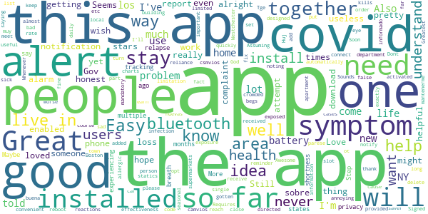

> Easy to install and set up. Requires someone who is exposed to reach out to their health department and put in a provided code in order to notify others, so there's a reliance on all users doing their part for this to work.  :date: __2021-04-15 16:28:57__

> The app needs to automatically connect to Bluetooth after phone reboot.  :date: __2021-04-04 21:45:40__

> Huj  :date: __2021-03-29 20:32:05__

> Signed up but it has never activated an alert. Assuming that's a good thing.  :date: __2021-03-15 18:08:38__

> Tge app is alright  :date: __2021-03-13 01:39:45__

> It's a well designed app and is useful even if only for a convenient way to keep an eye on the charts. Of course the fact that it's opt-in is a limitation, but I really don't understand the complaints on this. People are saying they've never gotten an exposure notification like it's a bad thing. Are you sick with covid-19? If not, then what is the complaint exactly? You want false alarms?  :date: __2021-02-16 18:41:55__

> its a good app, but some times i receive alarm when no one close to me, fix it please  :date: __2021-02-07 23:23:26__

> might add a daily reminder  :date: __2021-02-03 02:03:30__

> The app itself is fine. But the problem is the effectiveness of this app is limited by how few people install it. If you're the only person in town who has this app, it's useless. I've never received a notification from this app ever. I live in an area with almost 9% infection rate. I live in an apartment building and I've been out to supermarkets, etc. Not a single alert. As long as the app is not mandatory, it's pretty useless.  :date: __2021-01-25 23:10:49__

> I wish there was a slot on the symptom list for noting seasonal allergic reactions. Also, I was directed to NYS alert app when I installed the covid one. That is annoying, be cause it alerts me to problems far from my home. I'll Soon delete it.  :date: __2020-12-23 21:07:41__

#### 3-star reviews

> Could be good if more people used it. Unfortunately for my battery, I can't afford to have Bluetooth on all day so I pretty much can't use this app. Only when plugged I but I can't have it plugged in when I'm public so...  :date: __2021-04-11 06:34:08__

> I never had any issues with the app functionality but, it was not useful to me in any way. No alerts or information to help me stay informed or safe. It has not improved my life or proved to be a valuable tool during COVID-19 in any way.  :date: __2021-03-31 21:58:32__

> It is good and i will check it  :date: __2021-03-31 16:07:22__

> A potential tool if used by more people and information is honestly shared otherwise the charts provide are informative.  :date: __2021-03-13 19:03:42__

> This app works if "EVERYONE" follow the procedure. And are truthful.  :date: __2021-02-28 20:06:49__

> I have it installed. With such an allegedly important tool that could save life's it really is discouraging that it only relies 9n Bluetooth. Even a ping of data could provide enough location for triangular based location. Uninstalling, scientific based precautions will help. Not on a COB Job cell phone app, and also this is a lesson for the people of NY also. Common sense and caution will benefit not this. C  :date: __2021-02-21 14:55:54__

> Gets confusing  :date: __2021-02-19 15:00:40__

> Havent gotten an alert  :date: __2021-01-28 11:12:18__

> Its ok  :date: __2021-01-12 02:15:18__

> All of these apps need to work together, not try to supercede each other. People who travel should not need to switch which app is doing sensing depending on which state they are in. If this is the fault of state health departments, they need to stop the bickering and all work together  :date: __2021-01-06 04:16:14__

#### 2-star reviews

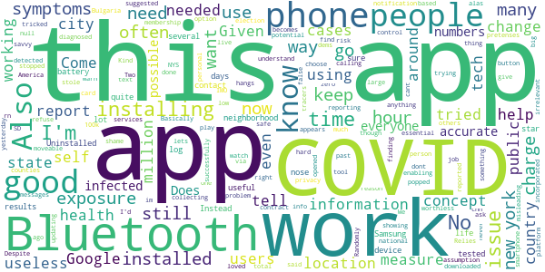

> Kind of useless. Relies too much on self reporting, which doesn't tell me anything about my risk of exposure from others. If users who are diagnosed with COVID-19 don't self report, the need for this app becomes null. Also, if they don't have location services on, that also doesn't help at all.  :date: __2021-03-23 17:16:58__

> i dont understand why i cant change my country .When i opened the app it said that im in New York and that a have to choose where i live in new york and then when i tried to change there was only the option not in new york state. I want to know the cases in My country Bulgaria not in America rn.  :date: __2021-03-12 10:15:59__

> The App appears to have the right concept, but when it comes to what people want to use it for it irrelevant. If I use it I want it to tell me if my working location is safe, not to find out that it's only collecting information. To many cases are showing up around my job, and were finding out by people calling out. We need a tool that is more essential, with a Covid report button.  :date: __2021-03-05 03:35:34__

> Randomly popped up with a notification even though I'd never had it installed. Basically tricked me into installing based on the assumption that it was trying to warn me of a potential exposure.  :date: __2021-03-04 04:41:05__

> Come on Google play, the dems/big tech YOU successfully stole the election, covid is a thing of the past, get with the times! Don't you watch cnn?  :date: __2021-02-11 10:05:10__

> Useless control measure from NYS to you under false pretenses..  :date: __2021-01-24 16:06:46__

> To hard to do  :date: __2021-01-04 16:34:28__

> No one likes using it for personal health reason. It doesn't go off when needed, because of low membership.  :date: __2020-12-16 17:56:59__

> The app is good but the contract tracers aren't using it.  :date: __2020-12-11 18:06:29__

> Two stars because: It is a shame that only just over 100k people have downloaded this app in a city of 8.4 million and a state of 12 million. Given zero privacy issues detected or reported, this app should be suggested via text messages all the time. This is a public health problem everyone should help in all possible ways.  :date: __2020-11-22 18:32:18__

#### 1-star reviews

> I want to register my covid-19 vaccines and this site does not allow me.  :date: __2021-04-15 21:44:14__

> I hated  :date: __2021-04-14 18:49:14__

> Worthless app. does not work. People close to me are now dying from Covid and this worthless app helped no one. It drains battery on bluetooth and that's all it does. I am however fully vaccinated. UNINSTALLED  :date: __2021-04-11 08:44:06__

> The only alert I got from this app was when I turn my Bluetooth off at home. I constantly get the notification telling me it can't check for exposures. I spent a while work day with someone that just came off quarantine and didn't get a notification then. There's too many variables for this to be useful and the constant bluetooth notifications were just annoying.  :date: __2021-04-09 13:44:33__

> The app is a great idea, but it's useless because no one is using it. It should be mandatory. I'll uninstall because it does not work with only 500K installs.  :date: __2021-04-05 20:25:09__

> TAKE THIS FAKE GARBIGE OFF THE STORE OK LOOK ITS STUPID ITS JUST FAKE IT SAID MY FREIND WAS EXSPOSED TO A PARSON IN HER SCHOOL BUT THAT PARSON WAS NEVER THIRE AT ALLL I HATE IM GOIMG TO ROST YOU OK... HERE I GO... TAKE THIS APP TO THE TRASH I WAS DONE WITH IT YESTERDSY  :date: __2021-04-04 23:30:51__

> The app is really only useful if widely used. Much like the new Excelsior pass, if it's use is not mandated or widely used voluntarily, it is essentially useless.  :date: __2021-04-01 18:57:47__

> The App unfortunately not opening up.  :date: __2021-03-30 05:32:48__

> SHEEP.  :date: __2021-03-28 15:18:30__

> Excelsior Pass is a violation of out health privacy. Let's not think this is okay.  :date: __2021-03-26 23:12:01__

# COVID Alert PA
App version ``2.0.0``

Analyzed with [covid-apps-observer](http://github.com/covid-apps-observer) project, version ``0.1``

## App overview
| | |
|-------------------------|-------------------------| 
| **Name**&nbsp;&nbsp;&nbsp;&nbsp;&nbsp;&nbsp;&nbsp;&nbsp;&nbsp;&nbsp;&nbsp;&nbsp;&nbsp;&nbsp;&nbsp;&nbsp;&nbsp;&nbsp;&nbsp;&nbsp;&nbsp;&nbsp;&nbsp;&nbsp;&nbsp;&nbsp;&nbsp;&nbsp;&nbsp;&nbsp;&nbsp;&nbsp;&nbsp;&nbsp;&nbsp;&nbsp;&nbsp;&nbsp;&nbsp;&nbsp;  | COVID Alert PA |
| **Unique identifier** | gov.pa.covidtracker |
| **Link to Google Play** | [https://play.google.com/store/apps/details?id=gov.pa.covidtracker](https://play.google.com/store/apps/details?id=gov.pa.covidtracker) |
| **Summary**  | The COVID Alert PA app can help reduce the spread of coronavirus in Pennsylvania |
| **Privacy policy** | [https://www.health.pa.gov/topics/disease/coronavirus/Pages/COVIDAlert.aspx#privacy](https://www.health.pa.gov/topics/disease/coronavirus/Pages/COVIDAlert.aspx#privacy) |
| **Latest version** | 2.0.0 |
| **Last update** | 2021-02-23 21:02:46 |
| **Recent changes** | COVID-19 vaccine metrics and resources including Your Turn Eligibility tool and find vaccine provider locations near you. Updated data and privacy policy. |
| **Installs**  | 100,000+ |
| **Category** | Medical |
| **First release** | Sep 10, 2020 |
| **Size**  | 106M |
| **Supported Android version**  | 6.0 and up |

### Description
> The COVID Alert PA App (App) is made available by the Pennsylvania Department of Health (DOH). The App is designed to assist in alerting individuals that came in close proximity with someone who later tests positive for COVID-19, and to provide information about the virus and steps for controlling the spread of the virus.  
 The use of this App is entirely voluntary, and it is available to download for free from the Google Play Store. The App runs on Android phones running Android 6.0 and higher. You must be at least 18 years of age in order to accept these terms and use the App. If you are between the ages of 13 and 17, you can only use this App if your parent or legal guardian has reviewed and agreed to the use of the App on your behalf. A parent or legal guardian must confirm that you can use the App by consenting upon download and initial usage of the App. The App is not intended for use by children
 under the age of 13.,
 How the COVID Alert PA App works
 As opposed to the traditional contract tracing process where a positive COVID-19 individual may not even remember who they have been in contact with recently and for how long (for example, if the contact happened on a bus or a train or some other public venue), the App uses technology developed by Apple and Google where anonymous Random IDs (pseudo random alpha numeric values) are exchanged between mobile phones. A Random ID is generated by the phone every 10 to 20 minutes to maintain privacy and security. If you are close to someone who also uses the App on their phone, your Random ID will be saved on that person’s phone and their Random ID will be saved on your phone. All Random IDs collected will remain on your mobile device, but neither you, nor anyone else, will be able to see them. These anonymous Random IDs cannot reveal your identity to other users, DOH, Apple, Google or anyone else.
 If an individual receives a positive COVID-19 diagnosis, they will receive a call from DOH or their local county or municipal health department within 24-72 hours for case investigation and contact tracing purposes. If that individual has the App downloaded a 6-digit validation code will be sent to them via SMS/text message to be entered into the App, which then gives the individual the option to upload their Random IDs to a DOH diagnosis keys server. 
 Users who were in close contact with a positive COVID-19 individual who submitted their 6-digit code in the app will receive an Exposure Alert. The app knows when to provide the user with an Exposure Alert by downloading the latest diagnosis keys from the server every four hours and checking for matches. These diagnosis keys are checked for matches against the Random IDs of the contacts that have been collected by your phone. If there is a match, you will be notified in the app that you were in close contact with a person who was recently diagnosed with COVID-19. This is called an “Exposure Alert.  To ensure that Exposure Alerts work properly, users must have COVID-19 Exposure Notification Services (ENS) enabled on their phone. Users have the option to enable the COVID-19 ENS and permit their phone to display notifications when they have been exposed to someone who has tested positive for COVID-19. Users can turn off this functionality in the settings page of the App.
 In the event you receive an Exposure Notification, you will be offered advice on the Exposure Notification Information screen, and if you would like to speak with a public health representative, you can provide your phone number and someone from DOH will call you. 
 It is important to note that both traditional contact tracing and the App never reveal the identity of any person using the App to other App users, and never reveal who has been diagnosed as positive for COVID-19. Also, if you do not want a call from a public health representative and do not enter your phone number, DOH will not know whether you have received an Exposure Notification.

### User interface
The developers of the app provide the following screenshots in the Google play store.
| | | |
|:-------------------------:|:-------------------------:|:-------------------------:|
 |   |   |   | 
 |   |  

## Development team
In the following we report the main information provided by the development team in the Google play store.

| | |
|-------------------------|-------------------------|
| **Developer**  | Commonwealth of Pennsylvania |
| **Website**  | [https://www.pa.gov/covid/covid-alert-pa/](https://www.pa.gov/covid/covid-alert-pa/) |
| **Email** | RA-DH-CovidApp@pa.gov |
| **Physical address**  | - |
| **Other developed apps**  | [https://play.google.com/store/apps/developer?id=Commonwealth+of+Pennsylvania](https://play.google.com/store/apps/developer?id=Commonwealth+of+Pennsylvania) |

## Android support

| | |
|-------------------------|-------------------------|
| **Declared target Android version**  | Android10, version 10 (API level 29) |
| **Effective target Android version**  | Android10, version 10 (API level 29) |
| **Minimum supported Android version**  | Marshmallow, version 6.0 (API level 23) |
| **Maximum target Android version**  | - |

The larger the difference between the minimum and maximum supported Android versions, the better. A larger difference means a wider audience. For example, old phones have a very low Android version, so a high minimum supported Android version means that the app cannot be used by users with old phones, thus leading to accessibility problems. 

## Requested permissions

In the following we report the complete list of the permissions requested by the app. 

| **Permission** | **Protection level** | **Description** | 
|-------------------------|-------------------------|-------------------------|
 **android.permission ACCESS_NETWORK_STATE** | Normal | Allows applications to access information about networks. 
 **android.permission ACCESS_WIFI_STATE** | Normal | Allows applications to access information about Wi-Fi networks. 
 **android.permission BLUETOOTH** | Normal | Allows applications to connect to paired bluetooth devices. 
 **android.permission FOREGROUND_SERVICE** | Normal | Allows a regular application to use Service.startForeground. 
 **android.permission INTERNET** | Normal | Allows applications to open network sockets. 
 **android.permission RECEIVE_BOOT_COMPLETED** | Normal | Allows an application to receive the Intent.ACTION_BOOT_COMPLETED that is broadcast after the system finishes booting. 
 **android.permission VIBRATE** | Normal | Allows access to the vibrator. 

## Mentioned servers

| **Server** | **Registrant** | **Registrant country** | **Creation date** | 
|-------------------------|-------------------------|-------------------------|-------------------------|
 | android.com | Google LLC | :us: US | 1997-06-23 04:00:00 |
 | google.com | Google LLC | :us: US | 1997-09-15 04:00:00 |
 | expo.io | See PrivacyGuardian.org | :us: US | 2011-05-01 21:26:50 |

## Security analysis 

Below we report the main security warnings raised by our execution of the [Androwarn](https://github.com/maaaaz/androwarn) security analysis tool.

**Telephony identifiers leakage**
> - This application reads the MCC+MNC of the provider of the SIM 
> - This application reads the numeric name (MCC+MNC) of current registered operator 
> - This application reads the operator name 

**Connection interfaces exfiltration**
> - This application reads details about the currently active data network 
> - This application tries to find out if the currently active data network is metered 

**Suspicious connection establishment**
> - This application opens a Socket and connects it to the remote address ' returned no addresses for  ; port is out of range' on the 'N/A' port  
> - This application opens a Socket and connects it to the remote address '' on the 'N/A' port  
> - This application opens a Socket and connects it to the remote address 'Ljava/lang/StringBuilder;->toString()Ljava/lang/String;' on the 'N/A' port  
> - This application opens a Socket and connects it to the remote address 'Ljava/net/Proxy;->type()Ljava/net/Proxy$Type;' on the 'N/A' port  
> - This application opens a Socket and connects it to the remote address 'timeout' on the 'N/A' port  

**Pim data leakage**
> - This application accesses data stored in the clipboard 

**Code execution**
> - This application loads a native library 
> - This application executes a UNIX command 

## User ratings and reviews

Below we provide information about how end users are reacting to the app in terms of ratings and reviews in the Google Play store.

### Ratings

The COVID Alert PA app has been installed by more than **100000** times. At this time, **1124** rated the app and its average score is **3.699115**. Below we show the distribution of the ratings across the usual star-based rating of Google Play

:star::star::star::star::star:: 588

:star::star::star::star:: 129

:star::star::star:: 119

:star::star:: 59

:star:: 229

### Reviews 

#### 5-star reviews

> I love receiving The Worldwide updates of what's going on in the world of covid-19  :date: __2021-04-28 08:05:52__

> Ok  :date: __2021-04-23 15:32:32__

> I am trying to a vaccine appointment.  :date: __2021-04-22 04:29:52__

> Very helpful  :date: __2021-04-19 05:39:52__

> Good  :date: __2021-04-06 21:16:20__

> Awesome  :date: __2021-04-05 06:41:20__

> Ok  :date: __2021-04-05 04:33:50__

> It's very easy to understand and to follow Thank You very much.  :date: __2021-03-30 00:17:42__

> Ih  :date: __2021-03-24 19:07:31__

> I randomly saw this on the app store and Installed it. This app can be useful thankyou.  :date: __2021-03-24 11:37:13__

#### 4-star reviews

> This app is good and I've been using it.  :date: __2021-05-06 03:38:58__

> Straight out of house of cards  :date: __2021-03-27 20:53:33__

> Trying to get the Vaccine.  :date: __2021-03-16 05:29:45__

> Not real sure it actually works. I've been out shopping for Necessities and it's never went off yet & info stats are available before noon news.  :date: __2021-02-05 22:53:56__

> It explains the flue and what to do and not do it's informal seams in ts right on with the hole country.  :date: __2021-01-21 01:16:24__

> good site to get reliable facts easy to read ,navigation  :date: __2021-01-09 20:17:36__

> Made my phone die dead like go black and never turn on again.  :date: __2021-01-07 01:42:27__

> It's the least people can do  :date: __2021-01-02 03:38:12__

> Good idea!  :date: __2020-12-23 02:40:26__

> I'm not so sure? But, it seems alright anyway.  :date: __2020-12-22 07:43:39__

#### 3-star reviews

> Usable. But this app *could* be so much more.  :date: __2021-05-01 11:32:47__

> Meh... This app NEEDS an "I've been vaccinated" indicator and a way to store and prove vaccination information. Get on it.  :date: __2021-04-04 17:05:03__

> Covid-19, I know Corona Virus has changed all! I'm super disappointed in are system! China is swiping anal canal now! My only concern is, the ones with higher strang will probably be cloned in a robot! Biggest organ, Skinned perfectly put on Technology Robot. The real human to all but died of covid-19, to battle a working world for the humans that survived! At one time only one child. Wanting Boy. Afraid of the power of desperation! I know USA is a abarsement. President Trump, I believe in You  :date: __2021-03-09 11:08:59__

> Not what I expected, not the kind of information I was looking for.  :date: __2021-02-06 08:04:10__

> Now that there's a vaccine why don't you show where there's a vaccine. It's great that you have this app available and I've been using it for 10 months but can we pivot to showing where vaccines are or trying to help out with where that is? It's great finding out about all the problems with COVID but now that there's actually a solution available it'd be good to know where to find them instead of going to 50 different websites  :date: __2021-02-02 04:03:23__

> I suggest adding PA stats about vaccinations....as well as info on or even ability to make a vaccine appointment...and current phase status  :date: __2021-01-22 05:24:51__

> Bad this app should notify those doctor to go and give those the vacinne that have fill the information out not have people out in large line and groups with this you have better control create job to new nursing school student to help in is fight  :date: __2021-01-21 07:21:53__

> Pros: It checks in everyday to review symptoms. It tells you information about what the rest of the app users symptoms were. It keeps up to date on what it is expected to. Con: I had my mom get Covid, and at the time I lived with her. I couldn't figure out how to report that since I tested negative. Not long after my family finished quarantine, my sister tested positive . I got tested again and was still negative, but technically I was exposed.  :date: __2021-01-15 09:05:20__

> It says my exposure isd turned of but doesn't allow me to turn it on.  :date: __2021-01-13 04:53:18__

> It would be nice if there was a spot on the daily check in section of the app that had a CURRENT LOST OF SYMPTOMS. Just asking if you're okay or not doesn't help people to realize if they may have symptoms or not.  :date: __2021-01-11 14:21:29__

#### 2-star reviews

> Works great when I first installed it but now I can't even get on it  :date: __2021-03-29 22:20:37__

> I received a contact tracing covid alert on 3.11.2021. It did not tell me when this happened so i had no idea what to do. Got tested, Negative, but no clear time line to quarantine since no date of exposure was given  :date: __2021-03-16 13:14:29__

> Forces you to page back through EVERY month of EVERY year to get to your date of birth, rather than either just typing it or selecting the year from a list. I just don't have enough time to page back that far.  :date: __2021-03-09 15:51:30__

> Had to go back 73yrs just to get to your site with a arrow one by one.  :date: __2021-03-04 18:57:57__

> So introverted I was never around anyone long enough to set it off, but I was around people who contracted covid  :date: __2021-02-25 14:50:54__

> Same old info every day. Got name in 5-6 places. Much more vaccine than Delivery  :date: __2021-02-07 23:49:49__

> Exposure alert does not work, or I'll get a call next month that I've been exposed to COVID 6 weeks after it matters. A co-worker, that has the app with the alert ON, tested positive weeks ago. I work side by side with him everyday and found out a week after he was out why he was out. Not through the app though.  :date: __2021-01-31 00:01:31__

> Only good if you live in PA. Not valid for anywhere else.  :date: __2021-01-24 17:58:17__

> Where's the question of have you been vaccinated? Let's see the important info and show how PA is lagging behind.  :date: __2021-01-22 18:14:18__

> Not info I need. Where are vaccination sites? What are age requirements? Who is now eligible?, etc.  :date: __2021-01-19 18:11:05__

#### 1-star reviews

> Tt Is  :date: __2021-05-05 22:18:12__

> This app just had a huge data breach  :date: __2021-05-03 15:16:08__

> WARNING DATA BREACH HAS OCCURED WITH THIS APP!!!!! DO NOT USE!!!! I WAS RIGHT ABOUT THIS APP LAST YEAR!!!! Sorry, don't trust it. Your data is uploaded to the Amazon cloud and location is obviously monitored. If you come in contact with a covid carrier that has their location on that data is sent. Governor wolf's mandates have been ruled unconstitutional. Big brother is watching now! This app is just enslavement to tyranny. Encouraging fearful interactions with other Americans. Do you trust Wolf and his obscure "covid" team that decided what they considered life sustaining services? NOPE.  :date: __2021-04-30 21:03:21__

> No alert good app  :date: __2021-04-28 19:12:14__

> How helpful can it be, today is 4/27/21, the info was last updated 4/18/21. Good thing I'm not depending on it letting me or others know about exposures. Or maybe PA has stopped using it?  :date: __2021-04-27 12:07:53__

> Don't use  :date: __2021-04-26 04:16:04__

> USELESS APP  :date: __2021-04-25 14:23:12__

> It downloaded itself on my phone I do not care about the alerts honestly I know theres a pandemic that's not fake but I'm not going to listen to things that makes me more afraid and also dont force people to download your app when we dont want to use it horrible app  :date: __2021-04-24 04:43:49__

> This app only works if people report their symptoms. So if no one does then you know if you've come in contact with anyone with the Chinese virus. I work all around Pittsburgh and you always hear about numbers going up. Either this app doesn't report it or the government is lying.  :date: __2021-04-23 18:26:13__

> I hope this app die  :date: __2021-04-19 19:36:31__

# MD COVID Alert
App version ``minted700013``

Analyzed with [covid-apps-observer](http://github.com/covid-apps-observer) project, version ``0.1``

## App overview
| | |
|-------------------------|-------------------------| 
| **Name**&nbsp;&nbsp;&nbsp;&nbsp;&nbsp;&nbsp;&nbsp;&nbsp;&nbsp;&nbsp;&nbsp;&nbsp;&nbsp;&nbsp;&nbsp;&nbsp;&nbsp;&nbsp;&nbsp;&nbsp;&nbsp;&nbsp;&nbsp;&nbsp;&nbsp;&nbsp;&nbsp;&nbsp;&nbsp;&nbsp;&nbsp;&nbsp;&nbsp;&nbsp;&nbsp;&nbsp;&nbsp;&nbsp;&nbsp;&nbsp;  | MD COVID Alert |
| **Unique identifier** | gov.md.covid19.exposurenotifications |
| **Link to Google Play** | [https://play.google.com/store/apps/details?id=gov.md.covid19.exposurenotifications](https://play.google.com/store/apps/details?id=gov.md.covid19.exposurenotifications) |
| **Summary**  | MD Contact Tracing is the official exposure notification app for Maryland |
| **Privacy policy** | [https://health.maryland.gov/Pages/ENXPrivacy.aspx](https://health.maryland.gov/Pages/ENXPrivacy.aspx) |
| **Latest version** | minted700013 |
| **Last update** | 2021-04-30 18:51:30 |
| **Recent changes** | Bug fixes and performance improvements |
| **Installs**  | 100,000+ |
| **Category** | Medical |
| **First release** | Nov 3, 2020 |
| **Size**  | 10M |
| **Supported Android version**  | 5.0 and up |

### Description
> MD COVID Alert is the official COVID-19 exposure-notifications software for the Maryland Department of Health. The app is an instance of Exposure Notifications Express platform developed by Apple and Google and configured by Maryland.
 Your personal use of MD COVID Alert will help anonymously alert Maryland residents who may have been near someone with a positive COVID-19 diagnosis. When you enable MD COVID Alert, you are doing your part to efficiently and effectively help your community slow the spread of COVID-19.
 How MD COVID Alert works:
 When devices with MD COVID Alert are in close contact, they exchange random identifiers using Bluetooth Low Energy (BLE). When someone tells their app that they tested positive for COVID-19, whoever received their random identifiers may receive an alert that they may have possibly been exposed to COVID-19. When a device receives random identifiers it date-stamps them and records their signal strength so that the Exposure Notification system can estimate how close the two devices were to each other and for how long. If the timeframe was at least 15 minutes and the estimated distance was within six feet, then the other user receives a notification of a possible exposure.
 Apple and Google's Exposure Notifications framework runs in the background, even when the MD COVID Alert app is closed. It will not drain the device battery at a rate that would occur with other apps that use normal Bluetooth and/or are open and running constantly.
 How MD COVID Alert Protects Your Privacy:
 Maryland takes your privacy and confidentiality very seriously. Apple and Google's framework is designed to avoid correlating any personal data and location information with the random identifiers that devices exchange. Maryland Department of Health does not want or need to know where or who you are for MD COVID Alert to work. If you are close enough to another app user, your device's BLE will exchange random identifiers with that user.
 Laboratory results for all persons who test positive for COVID-19 are sent to Maryland Department of Health. This is not associated with the app. Our staff follows up with persons reported as positive, based on information provided within the laboratory report. As a courtesy to all app users, MD COVID ALert will verify positive tests and then provide MD COVID Alert users with a personal identifying number (PIN). You must use that PIN in order to report a positive result to the app. This prevents people from falsely reporting positive results, which could generate false exposure notifications. Maryland Department of Health wants all app users to feel confident that when a possible COVID-19 exposure is received via the app, that it is a real event.
 If you have the current Apple or Google operating system installed on your device, you may have noticed that Exposure Notifications are now included. You cannot enable this function until you have installed the MD COVID Alert app. Apple and Google will delete the exposure notification service tools from their respective operating systems once the pandemic reaches a point that public health no longer requires the use of this technology.
 Thank you for installing MD COVID Alert! Together, we can protect our family, friends, neighbors, and colleagues, and keep Maryland moving forward!

### User interface
The developers of the app provide the following screenshots in the Google play store.
| | | |
|:-------------------------:|:-------------------------:|:-------------------------:|
 |   |  

## Development team
In the following we report the main information provided by the development team in the Google play store.

| | |
|-------------------------|-------------------------|
| **Developer**  | Maryland Department of Health |
| **Website**  | - |
| **Email** | MDH.MDCOVIDAlert@maryland.gov |
| **Physical address**  | - |
| **Other developed apps**  | [https://play.google.com/store/apps/developer?id=Maryland+Department+of+Health](https://play.google.com/store/apps/developer?id=Maryland+Department+of+Health) |

## Android support

| | |
|-------------------------|-------------------------|
| **Declared target Android version**  | - |
| **Effective target Android version**  | - |
| **Minimum supported Android version**  | Lollipop, version 5.0 (API level 21) |
| **Maximum target Android version**  | - |

The larger the difference between the minimum and maximum supported Android versions, the better. A larger difference means a wider audience. For example, old phones have a very low Android version, so a high minimum supported Android version means that the app cannot be used by users with old phones, thus leading to accessibility problems. 

## Requested permissions

In the following we report the complete list of the permissions requested by the app. 

| **Permission** | **Protection level** | **Description** | 
|-------------------------|-------------------------|-------------------------|
 **android.permission ACCESS_NETWORK_STATE** | Normal | Allows applications to access information about networks. 
 **android.permission BLUETOOTH** | Normal | Allows applications to connect to paired bluetooth devices. 
 **android.permission FOREGROUND_SERVICE** | Normal | Allows a regular application to use Service.startForeground. 
 **android.permission INTERNET** | Normal | Allows applications to open network sockets. 
 **android.permission RECEIVE_BOOT_COMPLETED** | Normal | Allows an application to receive the Intent.ACTION_BOOT_COMPLETED that is broadcast after the system finishes booting. 
 **android.permission WAKE_LOCK** | Normal | Allows using PowerManager WakeLocks to keep processor from sleeping or screen from dimming. 

## Mentioned servers

| **Server** | **Registrant** | **Registrant country** | **Creation date** | 
|-------------------------|-------------------------|-------------------------|-------------------------|
 | google.com | Google LLC | :us: US | 1997-09-15 04:00:00 |

## Security analysis 

Below we report the main security warnings raised by our execution of the [Androwarn](https://github.com/maaaaz/androwarn) security analysis tool.

**Telephony identifiers leakage**
> - This application reads the ISO country code equivalent of the current registered operator's MCC (Mobile Country Code) 

**Connection interfaces exfiltration**
> - This application reads details about the currently active data network 
> - This application tries to find out if the currently active data network is metered 

**Suspicious connection establishment**
> - This application opens a Socket and connects it to the remote address 'timeout' on the 'N/A' port  

**Code execution**
> - This application loads a native library: 'prioclient' 

## User ratings and reviews

Below we provide information about how end users are reacting to the app in terms of ratings and reviews in the Google Play store.

### Ratings

The MD COVID Alert app has been installed by more than **100000** times. At this time, **369** rated the app and its average score is **3.76**. Below we show the distribution of the ratings across the usual star-based rating of Google Play

:star::star::star::star::star:: 204

:star::star::star::star:: 33

:star::star::star:: 44

:star::star:: 18

:star:: 70

### Reviews 

#### 5-star reviews

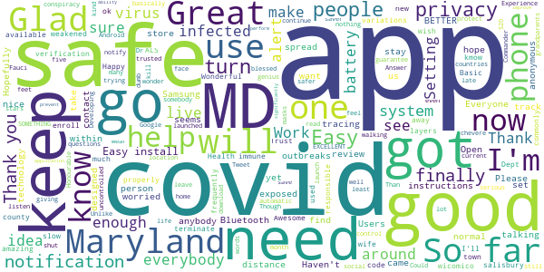

> I keep it on my phone because I have a weakened immune system and I need to find out if I'm exposed to anybody and I hope everybody has the same app. Trust my wife just came down with ALS so I want to make sure I keep her safe and if I have the app and she has the app now I know that when we get exposed and then we know what to do go get help  :date: __2021-05-01 20:34:40__

> I got a new a MD COVID Alert app is a about a covid-19 virus around my town at salisbury & wicomico county Maryland  :date: __2021-04-18 19:00:40__

> So far so good  :date: __2021-04-02 01:55:38__

> Wonderful  :date: __2021-03-29 03:08:51__

> You need a verification code but how does one get one!  :date: __2021-03-17 16:37:58__

> Happy to help app is great  :date: __2021-03-15 23:02:28__

> So far so good everybody should have this  :date: __2021-03-08 21:52:20__

> If this app helps slow or terminate the spread of covid 19 or any of its variations I'm all for it!  :date: __2021-02-08 07:27:53__

> Basic, responsible.  :date: __2021-01-29 16:37:08__

> Works great just need to get more people to use it.  :date: __2021-01-24 01:49:16__

#### 4-star reviews

> They are on top of notifying as quickly as they can.  :date: __2021-03-07 20:03:13__

> Wish it was updated to include immunization status.  :date: __2021-02-07 16:37:41__

> I hope this app helps save the lives of the people who are passengers on the planet Earth in the year 2021 and beyond.may the force be with you.😷👽💫💪💀🙏  :date: __2021-02-05 02:28:29__

> So far no good because after more than a month of having the app it never showed me a single case of someone near by being positive for Covid19 so this app needs work or be part of another better app...Alone is not working well or is there nobody actually positive for this Pandemic in my area, which I doubt. People do not want to show strangers about their situations, do not blame them, needs a new path and way to release this to us who do not, hope to never get such a horrible sickness...  :date: __2021-01-09 23:41:56__

> Good  :date: __2021-01-02 15:41:38__

> So far so good  :date: __2020-12-08 00:43:02__

> Yeah I think this is going to be helpful for me I try to make sure to always follow the CDC and take care of my health and also my wife and family.  :date: __2020-12-02 01:20:51__

> It would be a good idea to add the current state guidelines.  :date: __2020-11-15 17:21:15__

> Just downloaded this app. We'll see how it works.  :date: __2020-11-11 23:40:36__

> I have android 5 samsung note phone and I could install it. Read the info about the app which explains how it works (without IDg person or phone) and that made it clear that location setting doesnt have to be on. Bluetooth was activated by app; assume i need to have it active when outside the house. Haven't been anywhere yet, so can't really evaluate app properly. But happy to have this app and plenty of free and nearby testing where I live. We can use all the help we can get!  :date: __2020-11-11 17:15:01__

#### 3-star reviews

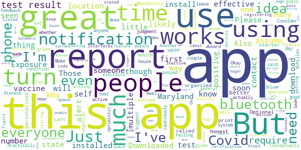

> This app would be better if it were more organized and personalized.  :date: __2021-04-28 01:57:57__

> Optional Use.. Would be great if this was Mandatory for everyone to download. Also, would everyone be honest about their Covid test results??. This app is a great blue print starter. But cant be relied upon.  :date: __2021-03-30 23:41:00__

> Conceptually the app is great. Practically it is of little utility. Make your own judgment. Consider how it operates and whether people not using the app or failing to report their health condition is an Achilles Heel. With that said, when I leave my house I turn on Bluetooth to active this app.  :date: __2021-03-06 18:32:30__

> I have to "assume" it works - haven't received an alert, and I have no idea if I've actually been near anyone with the disease. I've had a couple of negative tests and the first vaccine dose so I'm cautiously optimistic.  :date: __2021-02-26 14:22:12__

> Okay  :date: __2021-01-25 15:36:44__

> Finally Maryland is aboard with this Alert system.  :date: __2021-01-18 17:03:51__

> text  :date: __2021-01-15 05:40:42__

> Works well I guess. My biggest gripe is no feedback on the number of contacts made. It would be good to know how many people I have passed by that use or do not use the app in a given day. Why trust the app if I have no idea if it is registering or missing the people I pass by? There aren't even numbers on how effective this app is for me or everyone in general.  :date: __2021-01-06 10:32:39__

> I very much like the ideal that my state has this app with covid being so bad  :date: __2021-01-05 23:47:55__

> Ok  :date: __2021-01-01 19:27:09__

#### 2-star reviews

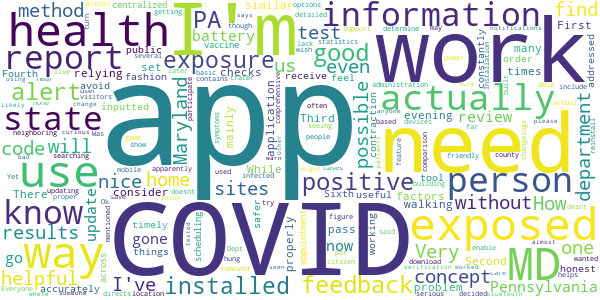

> The problem is, it only checks in the evening, when I'm home, not at the times when I'm at work and could actually be exposed.  :date: __2021-03-08 11:53:32__

> While I like this concept. I find this mainly a concept. There too many factors to consider before actually relying on this. First, is the person I'm walking pass have a similar application. Second, is the app properly set up. Third, has the person accurately and honest inputted their information. Fourth, is the app constantly working. And Sixth, will I receive information in a timely fashion in order to avoid contraction of COVID. If these things could be addressed then I would feel safer.  :date: __2021-03-07 20:14:24__

> This app would be way more useful as a public health tool if it centralized vaccine appointment scheduling across all the administration sites. How often do COVID-infected persons actually report their cases here?  :date: __2021-03-02 15:44:05__

> I wanted to download to support but seeing the reviews and the lack of actual care in updating this app to be on par with neighboring state apps which are way more helpful... I used to use citizen to enable the covid alerts but they removed that feature from the app and decided to try the state app before searching for their tracer app. Way more comprehensive information and you don't need some code from the health department that apparently even the health department can't figure out.  :date: __2021-02-06 00:19:57__

> Updates without proper detailed changelogs.  :date: __2021-01-27 07:35:20__

> Was in same building where covid had been and said none. Everyone needs to participate or it doesnt work!  :date: __2021-01-23 18:37:05__

> I know I've been near several Covid positive people, so far I'm Ok ,, but not one alert . Yet  :date: __2021-01-12 20:39:18__

> Very basic and not helpful, not as good as the PA state app. MD needs to up their game and show they're serious about getting us to use the app. The app directs us to the MD Dept of Health app which is not very user friendly on mobile devices. In comparison the PA app contains statistics by county, helps you determine if you need a test based on your symptoms, and how to report positive results. MD needs to include the same options.  :date: __2020-12-25 17:57:58__

> Installation hung, had to reinstall. though feedback is mentioned, no feedback method built into app. to save power would be nice to be able to turn off when at home location where no visitors or exposure is possible. just installed so may be more feedback later, but no method within app.  :date: __2020-12-17 15:31:22__

> desnt work  :date: __2020-12-17 08:29:56__

#### 1-star reviews

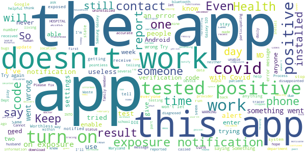

> Keeps telling me to turn on location services and they are on getting very frustrated  :date: __2021-05-04 18:50:40__

> Not sure how reliable the app is. Also, there is no access to past data. Looks like data only goes back a day or two. How do you know if you were near someone who tested positive say 3 or 4 days ago? Very disappointed.  :date: __2021-04-23 16:29:03__

> For those that tested positive from their doctor they were not able to alert the app. Even after MD Covid called them.  :date: __2021-04-19 13:32:08__

> Did'nt do anything  :date: __2021-03-29 15:45:21__

> Doesn't work  :date: __2021-03-08 10:59:01__

> I haven't been able to motivate or be really mindful since my test. I feel like there was some poison on it. I'm not confused just not being healthy and caffeine isn't helping. It's like before I was fine but after I just shut down and stopped being functional.  :date: __2021-03-07 15:52:06__

> App does not work 😒  :date: __2021-02-14 20:46:44__

> It says it will use bluetooth then it complains that it needs location turned on. So what is the deal ?  :date: __2021-02-10 21:13:28__

> Wont stay off my phone i keep deleteing it  :date: __2021-02-10 01:23:56__

> Waste of space on my phone. I had covid before I knew it and without any warnings from this app. Deleted.  :date: __2021-02-07 02:16:13__

# DC CAN
App version ``minted151007``

Analyzed with [covid-apps-observer](http://github.com/covid-apps-observer) project, version ``0.1``

## App overview
| | |
|-------------------------|-------------------------| 
| **Name**&nbsp;&nbsp;&nbsp;&nbsp;&nbsp;&nbsp;&nbsp;&nbsp;&nbsp;&nbsp;&nbsp;&nbsp;&nbsp;&nbsp;&nbsp;&nbsp;&nbsp;&nbsp;&nbsp;&nbsp;&nbsp;&nbsp;&nbsp;&nbsp;&nbsp;&nbsp;&nbsp;&nbsp;&nbsp;&nbsp;&nbsp;&nbsp;&nbsp;&nbsp;&nbsp;&nbsp;&nbsp;&nbsp;&nbsp;&nbsp;  | DC CAN |
| **Unique identifier** | gov.dc.covid19.exposurenotifications |
| **Link to Google Play** | [https://play.google.com/store/apps/details?id=gov.dc.covid19.exposurenotifications](https://play.google.com/store/apps/details?id=gov.dc.covid19.exposurenotifications) |
| **Summary**  | DC CAN is the official COVID-19 exposure notification app. |
| **Privacy policy** | [https://coronavirus.dc.gov/dccan/privacy](https://coronavirus.dc.gov/dccan/privacy) |
| **Latest version** | minted151007 |
| **Last update** | 2021-02-24 04:05:17 |
| **Recent changes** | Bug fixes and performance improvements |
| **Installs**  | 10,000+ |
| **Category** | Medical |
| **First release** | Oct 15, 2020 |
| **Size**  | 10M |
| **Supported Android version**  | 5.0 and up |

### Description
> DC CAN is the official COVID-19 exposure-notifications software for the District of Columbia in partnership with the Department of Health (DC Health). The app is an instance of Exposure Notifications Express platform developed by Apple and Google and configured by DC Health.
 Your personal use of DC CAN will help anonymously alert DC residents who may have been near someone with a positive COVID-19 diagnosis. When you enable DC CAN, you are doing your part to efficiently and effectively help your community slow the spread of COVID-19.
 How DC CAN Works:
 When devices with DC CAN are in close contact, they exchange random identifiers using Bluetooth Low Energy (BLE). When someone tells their app that they tested positive for COVID-19, whoever received their random identifiers may receive an alert that they may have possibly been exposed to COVID-19. When a device receives random identifiers it date-stamps them and records their signal strength so that the Exposure Notification system can estimate how close the two devices were to each other and for how long. If the timeframe was at least 15 minutes and the estimated distance was within six feet, then the other user receives a notification of a possible exposure.
 Apple and Google's Exposure Notifications framework runs in the background, even when the DC CAN app is closed. It will not drain the device battery at a rate that would occur with other apps that use normal Bluetooth and/or are open and running constantly.
 How DC CAN Protects Your Privacy:
 DC Health takes your privacy and confidentiality very seriously. Apple and Google's framework is designed to avoid correlating any personal data and location information with the random identifiers that devices exchange. DC Health does not want or need to know where or who you are for DC CAN to work. If you are close enough to another app user, your device's BLE will exchange random identifiers with that user.
 Laboratory results for all persons who test positive for COVID-19 are sent to DC Health. This is not associated with the app. Our staff follows up with persons reported as positive, based on information provided within the laboratory report. As a courtesy to all app users, DC Health will verify positive tests and then provide DC CAN users with a personal identifying number (PIN). You must use that PIN in order to report a positive result to the app. This prevents people from falsely reporting positive results, which could generate false exposure notifications. DC Health wants all app users to feel confident that when a possible COVID-19 exposure is received via the app, that it is a real event.
 If you have the current Apple or Google operating system installed on your device, you may have noticed that Exposure Notifications are now included. You cannot enable this function until you have installed Washington's DC CAN app. Apple and Google will delete the exposure notification service tools from their respective operating systems once the pandemic reaches a point that public health no longer requires the use of this technology.
 Thank you for installing DC CAN! Together, we can protect our family, friends, neighbors, and colleagues, and keep DC moving forward!

### User interface
The developers of the app provide the following screenshots in the Google play store.
| | | |
|:-------------------------:|:-------------------------:|:-------------------------:|
 |   |  

## Development team
In the following we report the main information provided by the development team in the Google play store.

| | |
|-------------------------|-------------------------|
| **Developer**  | DC Exposure Notifications |
| **Website**  | - |
| **Email** | dc.exposure-notifications@dc.gov |
| **Physical address**  | - |
| **Other developed apps**  | [https://play.google.com/store/apps/developer?id=DC+Exposure+Notifications](https://play.google.com/store/apps/developer?id=DC+Exposure+Notifications) |

## Android support

| | |
|-------------------------|-------------------------|
| **Declared target Android version**  | - |
| **Effective target Android version**  | - |
| **Minimum supported Android version**  | Lollipop, version 5.0 (API level 21) |
| **Maximum target Android version**  | - |

The larger the difference between the minimum and maximum supported Android versions, the better. A larger difference means a wider audience. For example, old phones have a very low Android version, so a high minimum supported Android version means that the app cannot be used by users with old phones, thus leading to accessibility problems. 

## Requested permissions

In the following we report the complete list of the permissions requested by the app. 

| **Permission** | **Protection level** | **Description** | 
|-------------------------|-------------------------|-------------------------|
 **android.permission ACCESS_NETWORK_STATE** | Normal | Allows applications to access information about networks. 
 **android.permission BLUETOOTH** | Normal | Allows applications to connect to paired bluetooth devices. 
 **android.permission FOREGROUND_SERVICE** | Normal | Allows a regular application to use Service.startForeground. 
 **android.permission INTERNET** | Normal | Allows applications to open network sockets. 
 **android.permission RECEIVE_BOOT_COMPLETED** | Normal | Allows an application to receive the Intent.ACTION_BOOT_COMPLETED that is broadcast after the system finishes booting. 
 **android.permission WAKE_LOCK** | Normal | Allows using PowerManager WakeLocks to keep processor from sleeping or screen from dimming. 

## Mentioned servers

| **Server** | **Registrant** | **Registrant country** | **Creation date** | 
|-------------------------|-------------------------|-------------------------|-------------------------|
 | google.com | Google LLC | :us: US | 1997-09-15 04:00:00 |

## Security analysis 

Below we report the main security warnings raised by our execution of the [Androwarn](https://github.com/maaaaz/androwarn) security analysis tool.

**Telephony identifiers leakage**
> - This application reads the ISO country code equivalent of the current registered operator's MCC (Mobile Country Code) 

**Connection interfaces exfiltration**
> - This application reads details about the currently active data network 
> - This application tries to find out if the currently active data network is metered 

**Suspicious connection establishment**
> - This application opens a Socket and connects it to the remote address 'timeout' on the 'N/A' port  

**Code execution**
> - This application loads a native library: 'prioclient' 

## User ratings and reviews

Below we provide information about how end users are reacting to the app in terms of ratings and reviews in the Google Play store.

### Ratings

The DC CAN app has been installed by more than **10000** times. At this time, **92** rated the app and its average score is **4.054348**. Below we show the distribution of the ratings across the usual star-based rating of Google Play

:star::star::star::star::star:: 60

:star::star::star::star:: 9

:star::star::star:: 4

:star::star:: 6

:star:: 13

### Reviews 

#### 5-star reviews

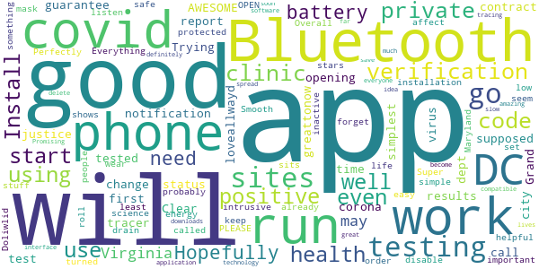

> 💎😇💎#AWESOME.💎😇💎  :date: __2021-03-26 13:37:52__

> Clear  :date: __2021-01-22 00:09:48__

> The app will work when you get tested by the DC run corona virus testing sites. If you go to private clinic there is no guarantee you will get a verification code if you test positive for covid. The private clinics are supposed to report results to the city health dept but if they don't do that you won't get a call from a contract tracer or a verification code to change your status in the app if you are positive. Go to DC health run testing sites and use this app, and then it works well.  :date: __2020-12-26 22:28:01__

> Grand opening of justice  :date: __2020-12-23 00:56:24__

> Good  :date: __2020-12-16 15:47:33__

> greattonow#loveallwayd 🌏🏟  :date: __2020-12-02 14:29:29__

> Trying for the first time.  :date: __2020-11-11 06:18:20__

> It's good I like it,  :date: __2020-11-03 03:08:46__

> The simplest covid notification app. Everything is set up already for you. OPEN and start using the app. 5/5 stars for this app. 👍👍  :date: __2020-10-31 05:52:58__

> Perfectly protected  :date: __2020-10-25 10:58:04__

#### 4-star reviews

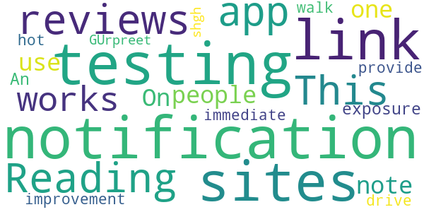

> Reading some of the other reviews. This app only works if other people use it! On that note I had one exposure notification. An improvement would be to have the notification provide links to walk up and drive up testing sites that would hot link me to those sites for immediate testing!  :date: __2021-03-16 12:40:20__

> GUrpreet shgh  :date: __2020-10-21 19:58:46__

#### 3-star reviews

> Constantly getting notifications to enable Bluetooth and location in order to get the app to work, despite working from home and obviously not going anywhere. While the app idea is decent and I hope more people turn it on when they go outside, the thing really, really needs to tone down the notifications. If it can't limit checks to no more than a few a day I'll uninstall.  :date: __2021-03-23 22:13:46__

#### 2-star reviews

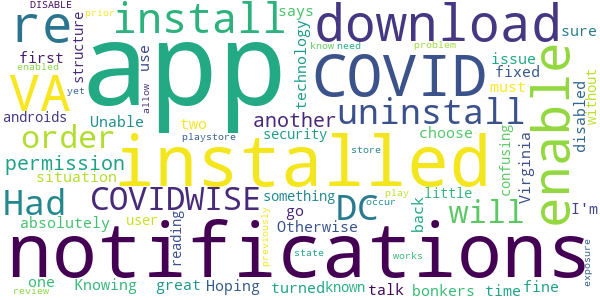

> App installed fine. I disabled notifications in Virginia app first, installed DC app, but when I go back to VA app it says I can only have notifications turned on for one at a time. ... Knowing the two don't talk to each other, this situation is absolutely bonkers.  :date: __2020-10-31 06:57:32__

> Had to uninstall VA COVIDWISE in order to download. Unable to enable notifications from both apps; must choose 1 or the other. Hoping this permissions issue will be fixed. Otherwise great use of technology!  :date: __2020-10-20 21:58:15__

> In order to get this app to download, I had to uninstall VA's COVIDWISE app and re-install after the DC CAN app was installed (and then re-enable notifications for both apps once they were both installed). I'm sure this has something to do with androids security permission structure - but it was a little confusing (and I wouldn't have known to do it without reading another user's playstore review).  :date: __2020-10-20 18:40:04__

> don't know if it works yet, but Install problem. You need to DISABLE COVID notifications prior to install or it will not allow you to download through play store. This could occur if (like me) you have previously installed another state's COVID app and have enabled COVID notifications. Once installed you can re-enable COVID exposure notifications.  :date: __2020-10-20 06:51:41__

#### 1-star reviews

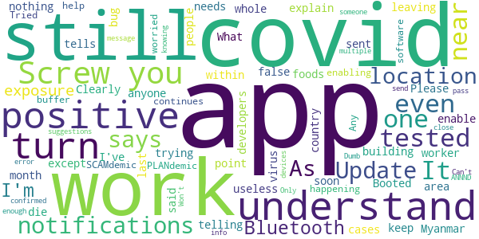

> I am from Myanmar, your app is useless in my country😂😂. We still die even if we don't have covid  :date: __2021-04-21 09:45:54__

> To the developers of this app. I've been trying to understand this app. It tells me no one near or anyone in the area of me has had covid which is false. I work for whole foods and within the last month we had over 20 people who tested positive for covid-19 and this app still keep telling me no one near me has had the virus which I don't understand. Please explain!  :date: __2021-02-04 21:50:17__

> My app does not sent me no notifications  :date: __2021-02-03 18:45:28__

> Update - My building said a worker tested positive for Covid. Booted up app. Still says NO Exposures. Clearly app does not work. App does nothing except bug me when location is off. As soon as I turn location on app says no cases. What's the point?  :date: __2021-01-05 20:49:03__

> Screw you. Screw you. Screw you.  :date: __2020-12-21 04:12:29__

> Don't understand why it needs to enable my Bluetooth. I'm not leaving my Bluetooth on. Not happening. I'm not worried about the PLANdemic / SCAMdemic.  :date: __2020-11-17 03:16:53__

> Tried enabling to help software work, continues to buffer. Any suggestions?  :date: __2020-11-07 14:13:58__

> Won't turn on, error message even after multiple updates.  :date: __2020-11-02 17:39:15__

> Can't turn on exposure notifications  :date: __2020-10-25 04:01:29__

> Dumb.  :date: __2020-10-23 04:32:03__

# SlowCOVIDNC
App version ``1.6``

Analyzed with [covid-apps-observer](http://github.com/covid-apps-observer) project, version ``0.1``

## App overview
| | |
|-------------------------|-------------------------| 
| **Name**&nbsp;&nbsp;&nbsp;&nbsp;&nbsp;&nbsp;&nbsp;&nbsp;&nbsp;&nbsp;&nbsp;&nbsp;&nbsp;&nbsp;&nbsp;&nbsp;&nbsp;&nbsp;&nbsp;&nbsp;&nbsp;&nbsp;&nbsp;&nbsp;&nbsp;&nbsp;&nbsp;&nbsp;&nbsp;&nbsp;&nbsp;&nbsp;&nbsp;&nbsp;&nbsp;&nbsp;&nbsp;&nbsp;&nbsp;&nbsp;  | SlowCOVIDNC |
| **Unique identifier** | gov.nc.dhhs.exposurenotification |
| **Link to Google Play** | [https://play.google.com/store/apps/details?id=gov.nc.dhhs.exposurenotification](https://play.google.com/store/apps/details?id=gov.nc.dhhs.exposurenotification) |
| **Summary**  | Official COVID-19 exposure notification app to help protect North Carolinians! |
| **Privacy policy** | [https://covid19.ncdhhs.gov/slowcovidnc-privacy-policy](https://covid19.ncdhhs.gov/slowcovidnc-privacy-policy) |
| **Latest version** | 1.6 |
| **Last update** | 2021-01-22 21:53:20 |
| **Recent changes** | Slow the spread of COVID-19 and protect your family, friends and community while still protecting your privacy – simply by using the SlowCOVIDNC app on your phone. Our latest version of SlowCOVIDNC includes minor bug fixes. |
| **Installs**  | 100,000+ |
| **Category** | Health & Fitness |
| **First release** | Sep 15, 2020 |
| **Size**  | 3.1M |
| **Supported Android version**  | 6.0 and up |

### Description
> SlowCOVIDNC is the official COVID-19 Exposure Notification app for the North Carolina Department of Health and Human Services (NCDHHS). It allows users to know if they may have been in close contact with someone who has shared a positive COVID-19 test result through the app. Users can anonymously share a positive COVID-19 test result to help slow the spread of COVID-19. 
 NCDHHS created this app so that North Carolinians can do their part to protect their community and slow the spread of the virus.
 HOW SLOWCOVIDNC WORKS?
 Step 1: Download the SlowCOVIDNC Exposure Notification app. Enable Bluetooth and Exposure notifications.
 Step 2: After opting-in to receive notifications, the app will generate an anonymous token for your device. A token is a string of random letters and numbers that is used to represent a phone for a short period of time. This ensures your privacy and security are protected. These individual tokens change every 10-20 minutes and are never linked to your identity or location. 
 Step 3: Through Bluetooth, your phone and the phones around you with the SlowCOVIDNC app are working in the background (without draining your battery or data) to exchange these anonymous tokens every few minutes. As a result, devices can remember how long they are near each other. Phones also record the Bluetooth signal strength of their exchanges in order to estimate how far apart they are.
 Step 4: SlowCOVIDNC periodically downloads tokens from the server that have been uploaded from the devices of users who have tested positive. Your phone then uses its records of the signal strength and duration of exposures with those tokens to conduct a risk calculation and determine if you have met a threshold for notification. 
 Step 5: If you have tested positive for COVID-19, you may obtain your PIN from your local public health department and submit that into the app. This voluntary and anonymous reporting notifies others who have downloaded the app and may have been in close contact with you in the last 14 days that they might be at risk.
 HOW SLOWCOVIDNC PROTECTS YOUR PRIVACY?
 Using SlowCOVIDNC is entirely voluntary, and you can enable or disable it at any time. When using SlowCOVIDNC, your privacy will be protected. Tokens will collect and share date, time, signal strength and duration of proximity. No location data or personally identifiable data will ever be collected or stored.
 By enabling Bluetooth and Exposure Notifications, you can anonymously share a positive COVID-19 test result to help slow the spread of COVID-19. You may also be notified if you have been in close contact with someone who has shared a positive COVID-19 test result.
 Learn more about how your privacy is protected and our privacy policy on the NCDHHS website. 
 Thank you for downloading SlowCOVIDNC. Together, we can slow the spread of COVID-19!

### User interface
The developers of the app provide the following screenshots in the Google play store.
| | | |
|:-------------------------:|:-------------------------:|:-------------------------:|
 |   |   |   | 
 |  

## Development team
In the following we report the main information provided by the development team in the Google play store.

| | |
|-------------------------|-------------------------|
| **Developer**  | NC Department of Health and Human Services |
| **Website**  | [https://covid19.ncdhhs.gov/SlowCOVIDNC](https://covid19.ncdhhs.gov/SlowCOVIDNC) |
| **Email** | NCHealthIT@dhhs.nc.gov |
| **Physical address**  | - |
| **Other developed apps**  | [https://play.google.com/store/apps/developer?id=NC+Department+of+Health+and+Human+Services](https://play.google.com/store/apps/developer?id=NC+Department+of+Health+and+Human+Services) |

## Android support

| | |
|-------------------------|-------------------------|
| **Declared target Android version**  | Android10, version 10 (API level 29) |
| **Effective target Android version**  | Android10, version 10 (API level 29) |
| **Minimum supported Android version**  | Marshmallow, version 6.0 (API level 23) |
| **Maximum target Android version**  | - |

The larger the difference between the minimum and maximum supported Android versions, the better. A larger difference means a wider audience. For example, old phones have a very low Android version, so a high minimum supported Android version means that the app cannot be used by users with old phones, thus leading to accessibility problems. 

## Requested permissions

In the following we report the complete list of the permissions requested by the app. 

| **Permission** | **Protection level** | **Description** | 
|-------------------------|-------------------------|-------------------------|
 **android.permission ACCESS_NETWORK_STATE** | Normal | Allows applications to access information about networks. 
 **android.permission BLUETOOTH** | Normal | Allows applications to connect to paired bluetooth devices. 
 **android.permission FOREGROUND_SERVICE** | Normal | Allows a regular application to use Service.startForeground. 
 **android.permission INTERNET** | Normal | Allows applications to open network sockets. 
 **android.permission RECEIVE_BOOT_COMPLETED** | Normal | Allows an application to receive the Intent.ACTION_BOOT_COMPLETED that is broadcast after the system finishes booting. 
 **android.permission WAKE_LOCK** | Normal | Allows using PowerManager WakeLocks to keep processor from sleeping or screen from dimming. 

## Mentioned servers

| **Server** | **Registrant** | **Registrant country** | **Creation date** | 
|-------------------------|-------------------------|-------------------------|-------------------------|
 | google.com | Google LLC | :us: US | 1997-09-15 04:00:00 |
 | ncpublichealth.com | State of North Carolina, Division of Public Health | :us: US | 2002-03-14 19:22:33 |

## Security analysis 

Below we report the main security warnings raised by our execution of the [Androwarn](https://github.com/maaaaz/androwarn) security analysis tool.

**Telephony identifiers leakage**
> - This application reads the ISO country code equivalent of the current registered operator's MCC (Mobile Country Code) 

**Connection interfaces exfiltration**
> - This application reads details about the currently active data network 
> - This application tries to find out if the currently active data network is metered 

**Suspicious connection establishment**
> - This application opens a Socket and connects it to the remote address 'Read timeout' on the 'N/A' port  

## User ratings and reviews

Below we provide information about how end users are reacting to the app in terms of ratings and reviews in the Google Play store.

### Ratings

The SlowCOVIDNC app has been installed by more than **100000** times. At this time, **955** rated the app and its average score is **3.904348**. Below we show the distribution of the ratings across the usual star-based rating of Google Play

:star::star::star::star::star:: 574

:star::star::star::star:: 108

:star::star::star:: 58

:star::star:: 41

:star:: 174

### Reviews 

#### 5-star reviews

> Keep me everybody else safe 🙂 💓♥️♥️♥️♥️♥️♥️♥️♥️  :date: __2021-05-02 14:15:56__

> Great app  :date: __2021-04-14 04:23:25__

> I for one think it's a great idea; yes, it is a bit of a battery drain, but, c'mon people... Can we get our priorities in line please?  :date: __2021-04-09 14:16:14__

> Now this app is SO smart!  :date: __2021-03-21 19:16:45__

> This comes in handy when it comes to finding out where to go and where not to go to catch covid-19  :date: __2021-03-21 11:58:48__

> Awesome  :date: __2021-03-16 10:27:16__

> Gives me some peace of mind  :date: __2021-03-15 20:02:19__

> I really want 💗💕💕  :date: __2021-03-10 05:37:35__

> So far, negative!!!  :date: __2021-03-09 00:38:15__

> This is What A Lot of Us Need and i Say Thinks,, For This =May-(GOD){Blessing)-You and your Compomey.  :date: __2021-03-03 08:36:18__

#### 4-star reviews

> Hope that helps to minimize Covid.  :date: __2021-02-27 01:30:59__

> New to this so far.  :date: __2021-02-18 18:16:51__

> I think its wonderful but many people will not self report. That makes this useless  :date: __2021-02-01 01:00:57__

> Glad to have it to protect me  :date: __2021-01-25 18:53:14__

> I love the concept for this app, and usually have no problems with it. However I checked it today and the app says that it has not checked for exposure in over 20 days. I don't know how to fix this issue.  :date: __2021-01-23 21:50:23__

> I am happy with it  :date: __2021-01-14 03:17:24__

> Who cares! Get it! Use it!  :date: __2021-01-08 23:45:03__

> Very good  :date: __2021-01-08 19:37:31__

> My SlowCOVIDNC app is working great now. Thank you Governor Cooper, Dr. Mandy Cohen, and everyone working to slow COVID in NC!  :date: __2021-01-08 19:13:14__

> Good app.  :date: __2021-01-08 18:26:37__

#### 3-star reviews

> Haven't used it very much.  :date: __2021-04-24 16:29:23__

> Nice idea, but way too few total downloads to make the app effective.  :date: __2021-03-29 22:56:49__

> Have recently uninstalled and then reinstalled this app. Seems to be working since I can see the date change from last check, but one problem, if this app has been downloaded by so many how is it that when I go to the store around a lot of people, there's no show that I may have been exposed. I'm pretty sure that majority of these people have the app, and care for others to turn it on correctly?.  :date: __2021-03-02 14:35:51__

> It's a good idea if that it would keep up to date. The last time mine checked in was back on December 24th 2020. My app is up to date also..  :date: __2021-02-26 16:30:10__

> App works well in theory. Tested positive and never was able to get my pin to report positive result. Now app no longer checking for notifications. Hasn't checked for any since January 2, 2021  :date: __2021-02-08 03:18:18__

> It was ok until the non-covid, personal question was dropped on me. I deleted the app.  :date: __2021-01-31 05:11:06__

> It isn't being used by everyone. So I was exposed by a nurse who was positive. I am immunosuppressed. I am a physician. I am around most of the time  :date: __2021-01-26 05:50:29__

> I have a situation much like the previous commenter. My last check was January 12 and I have a google phone, I tried looking into the android setting to avoid snoozing but no luck. It would also be nice to have an in app feedback troubleshooting resource. Overall it's a good idea and keeps personal data safe  :date: __2021-01-23 18:46:57__

> None  :date: __2021-01-19 22:29:47__

> Would love to tell people I've tested positive. app requires jumping through hoops my sick brain doesn't feel up to. Not useful. State already knows, plug the damned info in.  :date: __2021-01-19 20:53:15__

#### 2-star reviews

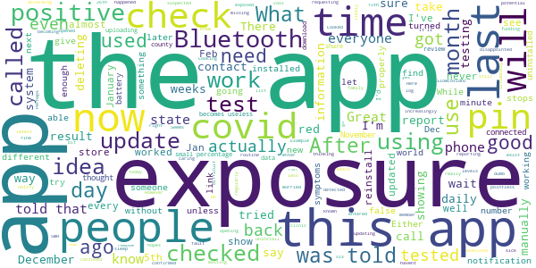

> The last time my app worked was 12/27/20, with no exposure detected, it'll be a really good app if it worked.  :date: __2021-03-21 19:24:07__

> Slowcovidnc app need remove take down at this time not good  :date: __2021-02-26 15:10:22__

> Works fine. However, the last check was on January 14, 2021, which was six weeks ago.  :date: __2021-02-25 18:35:16__

> It would be cool if it actually checked. I've updated every time in hopes it would work, but it doesn't. Its a good idea, just not very well executed. Deleting now. After months and months of use and waiting for it to work right, it just doesn't.  :date: __2021-02-20 16:10:44__

> I am becoming increasingly disappointed with this app. It hasn't checked exposure since January 5th 2021, that's over 5 weeks ago. Seems a pointless app. I have been opening the app almost daily. And yes, it is the latest update according to the app store and it is on the do not sleep list. Even today, Feb 15th, the last exposure check was Jan 5th.  :date: __2021-02-15 14:25:51__

> This app used to update daily to show potential exposures. Here we are on Feb 1 and app last updated exposures on Jan 17. Perhaps funding ran out. I will be deleting this app. Update: Ultimately had to uninstall and reinstall. Will see if it updates regularly.  :date: __2021-02-02 15:24:09__

> I had the app for a few months, but I never got a notification. Either COVID didn't exist where I was, or people are not using the app properly. Looking at the other reviews I'm going to go with people aren't using the app properly with no fault of their own. If it's difficult to get a pin on the app then people will be less likely to log their positive results.  :date: __2021-01-27 17:45:33__

> Looked like it was working until last update. Now it says the last time it checked for exposure was December 26th, a month ago?  :date: __2021-01-25 13:31:44__

> I am confused. I was thinking this app would check for exposures on a routine basis but my last check was back in December and I see no way of manually requesting a check. Am I missing something??  :date: __2021-01-21 04:03:05__

> I havent had an update since December 26, 2020. What has happened to this app  :date: __2021-01-21 03:02:27__

#### 1-star reviews

> App is a peice of trash. Trying to sign up and use it is a pain in the butt. It shouldn't be this complicated to use an app that essentially only needs to notify you of other users around you. Many apps have this function. Hell, even dating apps notify you if a match is nearby. The devs need to learn how the hell to code an app before trying to capitalize on everyone's fear with this useless junk during a pandemic.  :date: __2021-04-19 15:13:12__

> Horrible and doesn't work at all. I am guessing the app developer is Slow, like the apps name. Google should remove this from the store. It does not look to be supported or updated any longer. Worst app I have ever downloaded!  :date: __2021-04-09 15:32:54__

> Statistics no longer working, back to political misrepresentation and hiding of details.  :date: __2021-04-03 15:00:45__

> The app is not working, it has not checked for exposure since January 9th. I keep seeing where they are telling people to go to Device Care > Battery ..... That does not exist on my phone, they must be giving instructions for an iPhone. \*\*\*\*\*\*\*\** Update still is showing January 9th as my last exposure check. This app has not worked since then. I guess that I may as well uninstall.  :date: __2021-03-25 21:14:28__

> Stupid thing doesn't work. Someone has covid and two stores have been closed due to having covid 19. This app never alerted me I found out via facebook.  :date: __2021-03-18 22:21:55__

> Worthless. I have been in bed sick, sick with Covid for a week. Still tells me no exposures detected. Getting ready to remove it.  :date: __2021-03-11 17:28:50__

> I was positive with COVID. I was never able to enter results in this app. I was never contacted for contact tracing. I am an essential worker. This app is a tracking mechanism only and is NOT uses for COVID.  :date: __2021-03-10 12:30:11__

> Never contacted me!!!  :date: __2021-03-04 19:53:10__

> Exposure last checked on 2/8. It is now 2/28. Exactly what is the usefulness of that? I am using the latest update.  :date: __2021-02-28 18:57:53__

> UPDATE!! (""NOT RECOMMENDED"")!! don't download!! only trust the news on tv!! i would not trust these apps because i have heard on the real news that these could possibly be scams and there have been some reports that people did get scammed!!!  :date: __2021-02-27 05:10:59__

# CO Exposure Notifications
App version ``minted700002``

Analyzed with [covid-apps-observer](http://github.com/covid-apps-observer) project, version ``0.1``

## App overview
| | |
|-------------------------|-------------------------| 
| **Name**&nbsp;&nbsp;&nbsp;&nbsp;&nbsp;&nbsp;&nbsp;&nbsp;&nbsp;&nbsp;&nbsp;&nbsp;&nbsp;&nbsp;&nbsp;&nbsp;&nbsp;&nbsp;&nbsp;&nbsp;&nbsp;&nbsp;&nbsp;&nbsp;&nbsp;&nbsp;&nbsp;&nbsp;&nbsp;&nbsp;&nbsp;&nbsp;&nbsp;&nbsp;&nbsp;&nbsp;&nbsp;&nbsp;&nbsp;&nbsp;  | CO Exposure Notifications |
| **Unique identifier** | gov.co.cdphe.exposurenotifications |
| **Link to Google Play** | [https://play.google.com/store/apps/details?id=gov.co.cdphe.exposurenotifications](https://play.google.com/store/apps/details?id=gov.co.cdphe.exposurenotifications) |
| **Summary**  | Colorado&#39;s official Exposure Notification app. |
| **Privacy policy** | [https://www.colorado.gov/pacific/cdphe/exposure-notifications-privacy-policy](https://www.colorado.gov/pacific/cdphe/exposure-notifications-privacy-policy) |
| **Latest version** | minted700002 |
| **Last update** | 2021-04-15 21:12:24 |
| **Recent changes** |  Bug fixes and performance improvements |
| **Installs**  | 100,000+ |
| **Category** | Medical |
| **First release** | Oct 16, 2020 |
| **Size**  | 10M |
| **Supported Android version**  | 5.0 and up |

### Description
> CO Exposure Notifications is the official Exposure Notifications app of Colorado and the Colorado Department of Public Health and Environment. Exposure Notifications is a voluntary new service developed in partnership with Google and Apple to help slow the spread of COVID-19. No GPS, location information or personal identifiers will ever be collected, stored or shared by this service. 
 CO Exposure Notifications can quickly notify you if you've likely been exposed to COVID-19. Knowing about a potential exposure allows you to reduce the risk to your family, friends, neighbors and community.
 By enabling Exposure Notifications, whenever you are within 6 feet of someone for at least 10 minutes, both phones will exchange secure, anonymous tokens using Bluetooth. If another user you’ve been near tests positive for COVID-19, they can upload their result to the app which will send a push notification to you and anyone else their phone has exchanged tokens with recently, notifying you to a possible exposure. 
 If you test positive, you can easily and anonymously notify others to help stop the spread of COVID-19. 
 To learn more, please visit https://covid19.colorado.gov/Exposure-notifications

### User interface
The developers of the app provide the following screenshots in the Google play store.
| | | |
|:-------------------------:|:-------------------------:|:-------------------------:|
 |   |   |   | 
 |  

## Development team
In the following we report the main information provided by the development team in the Google play store.

| | |
|-------------------------|-------------------------|
| **Developer**  | Colorado Department of Public Health & Environment |
| **Website**  | [https://covid19.colorado.gov/Exposure-notifications](https://covid19.colorado.gov/Exposure-notifications) |
| **Email** | CO_Exposure_Notifications@state.co.us |
| **Physical address**  | - |
| **Other developed apps**  | [https://play.google.com/store/apps/developer?id=Colorado+Department+of+Public+Health+%26+Environment](https://play.google.com/store/apps/developer?id=Colorado+Department+of+Public+Health+%26+Environment) |

## Android support

| | |
|-------------------------|-------------------------|
| **Declared target Android version**  | Android10, version 10 (API level 29) |
| **Effective target Android version**  | Android10, version 10 (API level 29) |
| **Minimum supported Android version**  | Lollipop, version 5.0 (API level 21) |
| **Maximum target Android version**  | - |

The larger the difference between the minimum and maximum supported Android versions, the better. A larger difference means a wider audience. For example, old phones have a very low Android version, so a high minimum supported Android version means that the app cannot be used by users with old phones, thus leading to accessibility problems. 

## Requested permissions

In the following we report the complete list of the permissions requested by the app. 

| **Permission** | **Protection level** | **Description** | 
|-------------------------|-------------------------|-------------------------|
 **android.permission ACCESS_NETWORK_STATE** | Normal | Allows applications to access information about networks. 
 **android.permission BLUETOOTH** | Normal | Allows applications to connect to paired bluetooth devices. 
 **android.permission FOREGROUND_SERVICE** | Normal | Allows a regular application to use Service.startForeground. 
 **android.permission INTERNET** | Normal | Allows applications to open network sockets. 
 **android.permission RECEIVE_BOOT_COMPLETED** | Normal | Allows an application to receive the Intent.ACTION_BOOT_COMPLETED that is broadcast after the system finishes booting. 
 **android.permission WAKE_LOCK** | Normal | Allows using PowerManager WakeLocks to keep processor from sleeping or screen from dimming. 

## Mentioned servers

| **Server** | **Registrant** | **Registrant country** | **Creation date** | 
|-------------------------|-------------------------|-------------------------|-------------------------|
 | google.com | Google LLC | :us: US | 1997-09-15 04:00:00 |

## Security analysis 

Below we report the main security warnings raised by our execution of the [Androwarn](https://github.com/maaaaz/androwarn) security analysis tool.

**Telephony identifiers leakage**
> - This application reads the ISO country code equivalent of the current registered operator's MCC (Mobile Country Code) 

**Connection interfaces exfiltration**
> - This application reads details about the currently active data network 
> - This application tries to find out if the currently active data network is metered 

**Suspicious connection establishment**
> - This application opens a Socket and connects it to the remote address 'timeout' on the 'N/A' port  

**Code execution**
> - This application loads a native library: 'prioclient' 

## User ratings and reviews

Below we provide information about how end users are reacting to the app in terms of ratings and reviews in the Google Play store.

### Ratings

The CO Exposure Notifications app has been installed by more than **100000** times. At this time, **730** rated the app and its average score is **3.63**. Below we show the distribution of the ratings across the usual star-based rating of Google Play

:star::star::star::star::star:: 417

:star::star::star::star:: 36

:star::star::star:: 51

:star::star:: 43

:star:: 183

### Reviews 

#### 5-star reviews

> Must be workin', still ain't got the 'rona.  :date: __2021-04-18 00:36:10__

> Would help if people would use this..  :date: __2021-04-16 00:52:19__

> Great information to have with so much going on its hard to keep up! This will make it a little bit easier!😊  :date: __2021-04-14 05:15:14__

> An essential app for public health. I received an exposure alert in November and it was very helpful. The bluetooth proximity sensor is a clever way to contact trace while maintaining privacy for users. I wish I could dismiss the "unable to check for exposures" alert that appears hourly if your bluetooth is off. I only have bluetooth on/exposure alerts enabled when I am at work around other people or out grocery shopping. When I am at home, alone, not doing anything or going out because there's a global pandemic, I wish this app would stop bugging me to turn on bluetooth. This was not previously an issue. I can understand this from a public health perspective- you want to avoid people forgetting to turn the app off. But really, the hourly reminders are very annoying and actually unnecessary for a lot of users.  :date: __2021-03-30 21:08:44__

> Elpata  :date: __2021-03-06 05:27:02__

> I think  :date: __2021-03-03 20:07:33__

> I had it for months and thought it didn't work until I got a message that I was exposed on a trip! It only works if more people download it, use it and report if they test positive. It helped me to notify my job and quarantine effectively.  :date: __2021-02-28 10:33:55__

> People hack my account  :date: __2021-02-23 08:01:47__

> Great app!!!  :date: __2021-02-18 09:51:27__

> Great.  :date: __2021-02-17 19:29:50__

#### 4-star reviews

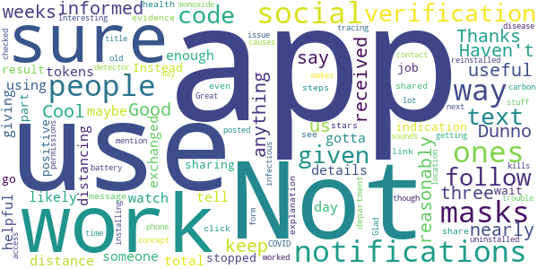

> Cool  :date: __2021-04-07 01:37:54__

> Good  :date: __2021-03-18 18:03:16__

> Thanks keep us informed?  :date: __2021-02-05 23:11:31__

> Dunno if there's anything I can reasonably say about it useful.  :date: __2021-01-28 03:03:37__

> Not sure if it works. Haven't received any notifications after nearly three weeks. There is likely not enough people using this app, and the ones who do use it also use masks and social distancing. It's the ones that don't (use masks, social distance or use this app) you gotta watch out for.  :date: __2020-12-18 07:25:48__

> It's helpful  :date: __2020-12-07 07:54:07__

> I would like the app to have some way to tell me that I have exchanged tokens with someone, maybe giving me a total for a day. No details, just some indication that the app is doing its job.  :date: __2020-11-20 08:25:57__

> It does work for sharing a positive result! But don't go into the app because you'll get stopped at the verification code part. Instead wait for a text message from the health department - click on that link and follow the steps. It does share that way! You'll even see evidence that it was shared in the app. Would have given 5 stars but no explanation about the verification code or follow up text was given.  :date: __2020-11-19 19:19:46__

> Interesting stuff  :date: __2020-11-03 04:21:26__

> Great concept but kills my battery. I do have an old phone though so that may be the issue.  :date: __2020-10-27 15:53:56__

#### 3-star reviews

> Not sure  :date: __2021-04-12 09:32:09__

> No Need  :date: __2021-04-08 22:47:34__

> Neutral opinion of this app  :date: __2021-02-26 22:31:53__

> Didn't give me the ability to alert potential contact (button didn't work)  :date: __2021-01-02 06:48:03__

> Like  :date: __2020-12-12 07:54:21__

> I guess a good app but nobody in my area seems to be using it or posting a positive result in Pueblo County or other counties that I travel to for my job delivering parts, go far as Lamar, west to the San Luis Valley and South to Walsenburg, Trinidad and into New Mexico and you're telling me that I have not been near someone with a positive test result????  :date: __2020-12-11 20:39:25__

> Haven't been able to get much info  :date: __2020-12-06 18:50:05__

> Called county health department to ask about notification & special code issue. RESULTS: 1) testing agency reports positive tests to the State 2) State notifies counties in which the positive people live 3) w/in 24 hrs, counties notify people who tested positive 4)w/in 48 hrs (cases are mounting),Contact Tracers call infected people & ask w/whom they have been in contact. NO REASON for infected people to need code. Call Labor Dept if there's a work issue. RECOMMEND: call people who know things.  :date: __2020-11-20 20:45:59__

> People have said they can't get a verification code that is needed to send an alert. I just read (11-18-20, cpr) that this code should now be sent automatically. Hopefully this improves the situation.  :date: __2020-11-19 15:15:54__

> I can't specify my area nor can I put in a result whether I'm positive or negative. Need to understand what code they want. Also if it only sense through bluetooth I don't want to be that close to someone if possible. There should be more options in Android app. Couldn't get my iPad to gain access so not sure how others are getting info even if it may be places I may go in the Metro or suburb area. Clarification needed pr more options.  :date: __2020-11-19 03:31:37__

#### 2-star reviews

> How do you get a verification code?  :date: __2021-04-13 19:46:52__

> I don't know what this app was supposed to do but so far it's done absolutely nothing regarding Covid-19 exposure. When I was exposed, it didn't alert me. When that exposure was reported to the local health department, it still didn't let me know. When I tried to manually update the app with exposure details ... well, that's not a feature so again I have to ask: what's this app supposed to do? Giving it two stars because I believe the intention was good but the execution was lackluster.  :date: __2021-04-12 00:41:30__

> Used to only notify you once about bluetooth, now does it all the time. That incentivizes me to uninstall since you cannot turn that notification off. Unfortunate.  :date: __2021-03-18 04:36:52__

> Confusing app. When you go to notify the app you have covid it prompts you to enter a notification code. But the text message you receive doesn't contain a code, but a link you click on and follow prompts. The text I got after testing positive came 2 days later and was in a spam folder (I didn't know my phone filtered suspected spam). So I kept thinking I didn't have the verification code & contacted CDPHE several times to no avail. They should email the info too & have an FAQ on the app.  :date: __2021-02-19 19:43:17__

> This app doesn't work. I installed it when it first became available. It has never once in all that time reported an exposure regardless of how remote the exposure might be.  :date: __2021-02-03 23:39:55__

> The app seems great (simple, unobtrusive, easy to use, no major privacy issues) but what good is the app if people can't easily report their covid results? Why haven't they partnered with testing facilities to provide this code automatically upon getting a positive result? I've had this app for months and haven't gotten a single notification ever  :date: __2021-01-10 00:52:39__

> Adventrouous to say the least  :date: __2021-01-08 06:45:13__

> The reasonable use of this app doesnt make sense  :date: __2021-01-08 00:14:51__

> My phone hasn't worked right since..tells my blue tooth is off when it's on..stupid  :date: __2021-01-01 08:45:40__

> 👌  :date: __2020-12-23 09:21:28__

#### 1-star reviews

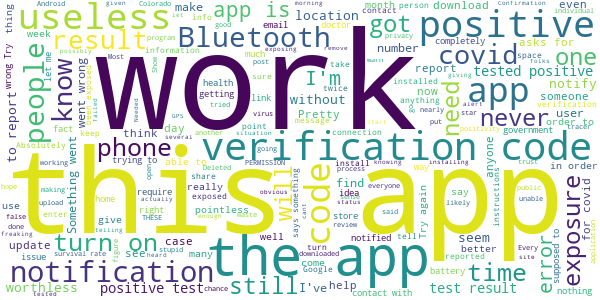

> So I got my first shot last Thursday, I got notified this morning from this app I was exposed to someone with a positive test on April 10th this morning....does that make any sense?? All this week, possibly exposing co-workers, without knowing I was exposed.  :date: __2021-04-19 16:20:17__

> This app is capable of being better.  :date: __2021-04-02 05:35:07__

> When you actually test positive you cant report it if you open the test results to see for yourself, as the code is one time only. so this app is useless.  :date: __2021-04-02 01:16:39__

> Not installing after reading the reviews! Absolutely useless fo collecting anything if you or your programers failed to include a link! As per usual... The government completing another job... well done  :date: __2021-03-31 05:09:19__

> This app was really good at telling me when my GPS was off. Never received any other notifications in the ~6 months that it was installed.  :date: __2021-03-30 18:10:17__

> Intellgince HQ, International Confirmation Grid : to individual users / devices. Focus Efficiency foundation groud 0. Start up.  :date: __2021-03-28 22:21:40__

> Are you freaking kidding me, this just another way of controlling people grow the f up  :date: __2021-03-25 17:58:40__

> To notify somebody if I have been exposed it asks for a verification code that was never given to me....so there's no way for me to notify. It defeats the purpose of having the app.  :date: __2021-03-24 23:56:27__

> I downloaded the app the week it launched and hadn't gotten even one notification by the time I uninstalled it on 3/20. Maybe I'm just ridiculously lucky to have avoided all exposure, but between case numbers, quarantines in my workplace, people not receiving positivity codes, and codes going unused, it seems much more likely that this app doesn't work well in practice. Mostly a waste of phone space, but one star for giving a false sense of contributing to public health.  :date: __2021-03-21 21:38:06__

> I have a question.. If your app uses Bluetooth to recognize other phones and that phone's user's status, what happens if I 'always' listen to music on Bluetooth headphones when out in downtown.. Is your app useless in this situation?  :date: __2021-03-18 07:09:12__

# COVID Symptom Study
App version ``2.4.0``

Analyzed with [covid-apps-observer](http://github.com/covid-apps-observer) project, version ``0.1``

## App overview
| | |
|-------------------------|-------------------------| 
| **Name**&nbsp;&nbsp;&nbsp;&nbsp;&nbsp;&nbsp;&nbsp;&nbsp;&nbsp;&nbsp;&nbsp;&nbsp;&nbsp;&nbsp;&nbsp;&nbsp;&nbsp;&nbsp;&nbsp;&nbsp;&nbsp;&nbsp;&nbsp;&nbsp;&nbsp;&nbsp;&nbsp;&nbsp;&nbsp;&nbsp;&nbsp;&nbsp;&nbsp;&nbsp;&nbsp;&nbsp;&nbsp;&nbsp;&nbsp;&nbsp;  | COVID Symptom Study |
| **Unique identifier** | com.joinzoe.covid_zoe |
| **Link to Google Play** | [https://play.google.com/store/apps/details?id=com.joinzoe.covid_zoe](https://play.google.com/store/apps/details?id=com.joinzoe.covid_zoe) |
| **Summary**  | Help slow COVID-19 by self-reporting your symptoms daily, even if you feel well. |
| **Privacy policy** | [https://predict.study/covid-privacy-notice/](https://predict.study/covid-privacy-notice/) |
| **Latest version** | 2.4.0 |
| **Last update** | 2021-02-08 21:04:34 |
| **Recent changes** | Security upgrade and bug fixes.  |
| **Installs**  | 1,000,000+ |
| **Category** | Health & Fitness |
| **First release** | Mar 27, 2020 |
| **Size**  | 37M |
| **Supported Android version**  | 5.0 and up |

### Description
> Take 1 minute each day and help fight the spread of COVID-19 in your community
 * Report your health daily even if you feel well
 * Get a daily estimate of COVID in your area
 * Help slow the outbreak near you
 Join millions of people supporting scientists at Stanford University, Harvard University, Massachusetts General Hospital, and King's College London to help fight coronavirus by identifying:
 * How fast the virus is spreading in your area
 * High-risk areas in the US
 * Who is most at risk, by better understanding symptoms linked to underlying health conditions
 You will contribute to advance research on COVID-19 in partnership with leading health researchers globally like TwinsUK, one of the most clinically detailed studies in the world.
 This app (formerly known as the Covid Symptom Tracker) allows you to help others, but does not give health advice. If you need health advice please visit the CDC website at: [https://www.cdc.gov/coronavirus/2019-ncov/index.html](https://www.cdc.gov/coronavirus/2019-ncov/index.html)
 This app has been designed for everyone to report their status not just those who are ill.
 It was designed by doctors and scientists at King's College London, Guys and St Thomas’ Hospitals and Zoe Global Limited, a health technology company.
 In the US the app is being used by the Nurses' Health Study to identify symptoms in active healthcare workers who are treating people with COVID across the country and risking their own health to help us.
 In response to recommendations by Stand Up To Cancer (SU2C), the app also includes questions for cancer patients and survivors, such as if they are living with cancer, what type of cancer and what treatment they are receiving.
 If you would like to help out in this difficult time, then you can. Download the app and share daily your own status, even if you are well. With your help we can understand much better the situation across the nation, how the disease presents itself to different people, and how it progresses.
 This is a new virus which the world has never seen before. There are a wide range of symptoms, which differ between people. With your help we can understand better how the disease presents itself depending upon individual factors such as health and age.
 No information you share will be used for commercial purposes.
 There are two parts to the app:
 HEALTH INFORMATION
 You will be asked to share some general information, such as your age and some health details, such as whether you have certain diseases.
 SYMPTOM TRACKING
 We will ask you every day to let us know how you feel, so you can share your symptoms. We will also ask whether you have visited the hospital, what treatment you received there, and whether you have been tested for COVID-19 (Coronavirus).

### User interface
The developers of the app provide the following screenshots in the Google play store.
| | | |
|:-------------------------:|:-------------------------:|:-------------------------:|
 |   |   |   | 
 |   |   |   | 
 |   |  

## Development team
In the following we report the main information provided by the development team in the Google play store.

| | |
|-------------------------|-------------------------|
| **Developer**  | Zoe Global Limited |
| **Website**  | [http://covid.joinzoe.com/](http://covid.joinzoe.com/) |
| **Email** | covid@joinzoe.com |
| **Physical address**  | [164 Westminster Bridge Road London SE1 7RW United Kingdom](https://www.google.com/maps/search/164%20Westminster%20Bridge%20Road%20London%20SE1%207RW%20United%20Kingdom) (Google Maps) |
| **Other developed apps**  | [https://play.google.com/store/apps/developer?id=Zoe+Global+Limited](https://play.google.com/store/apps/developer?id=Zoe+Global+Limited) |

## Android support

| | |
|-------------------------|-------------------------|
| **Declared target Android version**  | Android10, version 10 (API level 29) |
| **Effective target Android version**  | Android10, version 10 (API level 29) |
| **Minimum supported Android version**  | Lollipop, version 5.0 (API level 21) |
| **Maximum target Android version**  | - |

The larger the difference between the minimum and maximum supported Android versions, the better. A larger difference means a wider audience. For example, old phones have a very low Android version, so a high minimum supported Android version means that the app cannot be used by users with old phones, thus leading to accessibility problems. 

## Requested permissions

In the following we report the complete list of the permissions requested by the app. 

| **Permission** | **Protection level** | **Description** | 
|-------------------------|-------------------------|-------------------------|
 **android.permission ACCESS_NETWORK_STATE** | Normal | Allows applications to access information about networks. 
 **android.permission ACCESS_WIFI_STATE** | Normal | Allows applications to access information about Wi-Fi networks. 
 **android.permission INTERNET** | Normal | Allows applications to open network sockets. 
 **android.permission READ_APP_BADGE** | - | - 
 **android.permission READ_EXTERNAL_STORAGE** | :warning:**Dangerous** | Allows an application to read from external storage. 
 **android.permission RECEIVE_BOOT_COMPLETED** | Normal | Allows an application to receive the Intent.ACTION_BOOT_COMPLETED that is broadcast after the system finishes booting. 
 **android.permission WAKE_LOCK** | Normal | Allows using PowerManager WakeLocks to keep processor from sleeping or screen from dimming. 
 **android.permission WRITE_EXTERNAL_STORAGE** | :warning:**Dangerous** | Allows an application to write to external storage. 
 **com.anddoes.launcher.permission UPDATE_COUNT** | - | - 
 **com.google.android.c2dm.permission RECEIVE** | - | - 
 **com.google.android.finsky.permission BIND_GET_INSTALL_REFERRER_SERVICE** | - | - 
 **com.htc.launcher.permission READ_SETTINGS** | - | - 
 **com.htc.launcher.permission UPDATE_SHORTCUT** | - | - 
 **com.huawei.android.launcher.permission CHANGE_BADGE** | - | - 
 **com.huawei.android.launcher.permission READ_SETTINGS** | - | - 
 **com.huawei.android.launcher.permission WRITE_SETTINGS** | - | - 
 **com.majeur.launcher.permission UPDATE_BADGE** | - | - 
 **com.oppo.launcher.permission READ_SETTINGS** | - | - 
 **com.oppo.launcher.permission WRITE_SETTINGS** | - | - 
 **com.sec.android.provider.badge.permission READ** | - | - 
 **com.sec.android.provider.badge.permission WRITE** | - | - 
 **com.sonyericsson.home.permission BROADCAST_BADGE** | - | - 
 **com.sonymobile.home.permission PROVIDER_INSERT_BADGE** | - | - 
 **me.everything.badger.permission BADGE_COUNT_READ** | - | - 
 **me.everything.badger.permission BADGE_COUNT_WRITE** | - | - 

## Mentioned servers

| **Server** | **Registrant** | **Registrant country** | **Creation date** | 
|-------------------------|-------------------------|-------------------------|-------------------------|
 | amplitude.com | Amplitude | :us: US | 1996-05-09 04:00:00 |
 | android.com | Google LLC | :us: US | 1997-06-23 04:00:00 |
 | google.com | Google LLC | :us: US | 1997-09-15 04:00:00 |
 | microsoft.com | Microsoft Corporation | :us: US | 1991-05-02 04:00:00 |
 | googleapis.com | Google LLC | :us: US | 2005-01-25 17:52:26 |
 | cloudfront.net | Amazon.com, Inc. | :us: US | 2008-04-25 18:25:49 |
 | expo.io | See PrivacyGuardian.org | :us: US | 2011-05-01 21:26:50 |

## Security analysis 

Below we report the main security warnings raised by our execution of the [Androwarn](https://github.com/maaaaz/androwarn) security analysis tool.

**Telephony identifiers leakage**
> - This application reads the ISO country code equivalent of the current registered operator's MCC (Mobile Country Code) 
> - This application reads the device phone type value 
> - This application reads the numeric name (MCC+MNC) of current registered operator 
> - This application reads the operator name 

**Location lookup**
> - This application reads location information from all available providers (WiFi, GPS etc.) 

**Connection interfaces exfiltration**
> - This application reads details about the currently active data network 
> - This application tries to find out if the currently active data network is metered 

**Suspicious connection establishment**
> - This application opens a Socket and connects it to the remote address '' on the 'N/A' port  
> - This application opens a Socket and connects it to the remote address 'Ljava/lang/StringBuilder;->toString()Ljava/lang/String;' on the ': connect, resolve' port  
> - This application opens a Socket and connects it to the remote address 'Ljava/lang/StringBuilder;->toString()Ljava/lang/String;' on the 'N/A' port  
> - This application opens a Socket and connects it to the remote address 'Ljava/net/Proxy;->type()Ljava/net/Proxy$Type;' on the 'N/A' port  
> - This application opens a Socket and connects it to the remote address 'timeout' on the 'N/A' port  

**Pim data leakage**
> - This application accesses data stored in the clipboard 

**Code execution**
> - This application loads a native library 
> - This application loads a native library: 'log' 
> - This application loads a native library: 'sentry' 
> - This application loads a native library: 'sentry-android' 
> - This application executes a UNIX command 

## User ratings and reviews

Below we provide information about how end users are reacting to the app in terms of ratings and reviews in the Google Play store.

### Ratings

The COVID Symptom Study app has been installed by more than **1000000** times. At this time, **137117** rated the app and its average score is **4.72549**. Below we show the distribution of the ratings across the usual star-based rating of Google Play

:star::star::star::star::star:: 107010

:star::star::star::star:: 25322

:star::star::star:: 3022

:star::star:: 781

:star:: 982

### Reviews 

#### 5-star reviews

> Easy to use , Takes no time.  :date: __2021-05-09 14:25:50__

> Get information on Covid in retun for logging on daily.  :date: __2021-05-09 12:53:22__

> It's a doddle.  :date: __2021-05-09 12:32:57__

> Very easy to use  :date: __2021-05-09 12:18:29__

> Excellent  :date: __2021-05-09 11:05:06__

> Very easy to use and takes only a few seconds a day. Why not give the scientists the data they need to better direct their efforts at fighting disease.  :date: __2021-05-09 09:18:18__

> Quick and easy to use. And if you have a query you can contact them and get a reply quickly .  :date: __2021-05-09 08:54:38__

> Lots of helpful links and information  :date: __2021-05-09 08:45:02__

> Excellent way to contribute to the fight against Covid  :date: __2021-05-08 22:48:02__

> Easy site to use. Lots of interesting Covid facts.  :date: __2021-05-08 18:07:39__

#### 4-star reviews

> User friendly and simple, sometimes the alerts stop even though I've given permission which means I can forget to add daily info. So great to see all the findings as a result of the data.  :date: __2021-05-09 13:56:23__

> Sometimes freezes but recording this information is vital, so I will keep using it.  :date: __2021-05-08 13:32:52__

> Happy to continue with the fight against Covid  :date: __2021-05-08 12:30:10__

> Easy to use  :date: __2021-05-08 04:05:17__

> Participating in citizen science for a great cause. Easy to use, though I have had login issues when I got a new device.  :date: __2021-05-07 15:15:37__

> I started this study due to being very unwell Nov 2019, in hospital for 10 days, worsen of asthma, I believe it was Covid, then again 2 weeks later and again while sheilding around June 2020, since then I have not been right now using my inhalers more getting breathless very easily. Until then I had not been hospitalised for my asthma, apart from pneumonia Jan 2018.  :date: __2021-05-07 15:15:32__

> Just good to be helping the fight against Covid  :date: __2021-05-07 14:43:53__

> Inconsistent as some days I enter details for and hubby and when I go in the following day irvsays hadn't updated for two days This problem seems to have been resolved so stars increased  :date: __2021-05-07 11:25:27__

> Love this app and what it's doing to help. One small gripe is that on several occasions it logs me out and it can be weeks until I remember that I've not had a prompt to log how I'm feeling. Otherwise it's great.  :date: __2021-05-07 09:13:43__

> Pretty much fine but would like to see a couple of enhancements: 1) order the list of tests in descending date order so most recent is shown first 2) when reporting for multiple people display an option to report for another until all are done or you respond with No  :date: __2021-05-07 08:25:19__

#### 3-star reviews

> Worked really well until a couple of weeks ago when I stopped getting notifications. I need these to remind me to update every day. I managed to get them back for around 3 days they then stopped again. Hence why only gave 3 stars.  :date: __2021-05-08 12:34:54__

> Really good app, easy to fill the survey but I don't receive the daily reminders anymore... So I tend to forget  :date: __2021-05-07 23:46:52__

> Its not really that usefull.  :date: __2021-05-06 21:30:52__

> notifications have stopped  :date: __2021-05-06 11:24:16__

> I stopped getting the push notifications and have forgotten to log for over a week! Have remembered now but lowered the stars on this review because of that. Otherwise a fab app and idea.  :date: __2021-05-01 10:23:28__

> Hey - as of 6 days ago, I'm not getting daily notifications, so there's a gap in my records. This appears to be a bug.  :date: __2021-04-27 12:59:36__

> OKAY  :date: __2021-04-23 08:23:40__

> Crashing daily so having to uninstall and reinstall every time ☹  :date: __2021-04-22 13:11:09__

> Quick and easy but I am no longer receiving daily reminders. Can this be fixed?  :date: __2021-04-22 12:42:54__

> I have been using the app since it was first released and have been happy with it's simplicity and the various articles are interesting and give a lot of insight. I am however, unhappy that despite having the latest version installed I have not been asked about my vaccinations but if I create a new profile the vaccine questions are there but then I lose all the data history I have provided. I have emailed several times but received no response which is very disappointing.  :date: __2021-04-21 08:56:53__

#### 2-star reviews

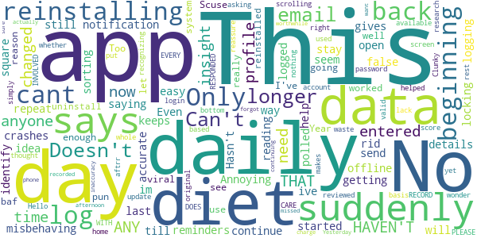

> Hasn't polled me in 9 days. No idea why.  :date: __2021-05-04 17:19:14__

> No longer very accurate  :date: __2021-04-20 07:41:19__

> Doesn't seem easy enough to use. Can't see it going "viral". (Scuse the pun).  :date: __2021-04-15 11:48:20__

> I was in this for over a. Year but your system through me out and I can no longer get into it and can't email anyone. Too baf  :date: __2021-04-14 17:41:53__

> This app worked really well, now for some reason, it won't let me log in. I've uninstall and reinstalled and changed my password, nothing has helped 🤷‍♀️  :date: __2021-04-13 13:17:59__

> Suddenly asking me to login each time and now not recognizing my account aftrr reinstalling.  :date: __2021-04-09 17:53:00__

> Clunky, on a daily basis you need to update your profiles, yet they are only available by scrolling right to the bottom of the home screen, which you have to do again and again for EVERY profile, no thought put into how this is used daily.  :date: __2021-03-31 15:40:49__

> Diet insights are a waste of time. This insight would be valid if it reviewed my original diet, but the whole score is simply based on whether your diet has changed, not what it is. This lack of research makes you wonder about the rest of the app.  :date: __2021-03-28 10:08:01__

> Hello! DOES ANYONE INVOLVED WITH THIS APP CARE THAT THE APP DOESN'T RECORD MY DATA? YOU HAVEN'T RESPONDED TO ANY OF MY EMAILS. PLEASE reassure me that my data is actually being recorded. The app says I haven't entered any for 5 days. I have missed a day as I forgot to charge my phone, but I entered data Yesterday afternoon. This inaccuracy has been there from the beginning. I want to be sure it is worthwhile continuing.  :date: __2021-03-22 02:43:15__

#### 1-star reviews

> Not as good as the NHS one  :date: __2021-05-05 22:39:28__

> Annoying  :date: __2021-05-02 14:41:42__

> I haven't had any notifications for months, despite the app setting being switched on.  :date: __2021-04-19 12:47:37__

> Poor. Connection Difficult always to log in .  :date: __2021-04-09 12:28:45__

> I had this app a while ago, uninstalled it but forgot to review it. Fairly poor interface but also I'd question the value of the data gathered and how it can be of real value.  :date: __2021-04-07 03:02:39__

> Apparently I'm supposed to be able to log my vaccine on here. Still have not worked out how. Can ask other people log their vaccine, but no idea how to log my own. Very frustrating. I've checked I've got the latest version, I'm pretty tech savvy but still no idea. Given up.  :date: __2021-04-06 08:49:24__

> 547 MB of storage used!? This should be such a simple little app!  :date: __2021-04-04 15:00:35__

> Still a blank white space where the graphs should be: there were no issues for a long time, then suddenly one day they vanished! All you see is the covid case figure, 'Dec-Mar' on the horizontal axis & 'Share the graph', nothing else: you can't share what you can't see. No explanation given. Ditto for the UK map: that's become invisible too. I contacted Zoe a good while back, they acknowledged the problem...but nothing. It is a good app, but I do wish they would take the trouble to sort it out.  :date: __2021-04-01 11:56:57__

> Hasn't asked me for update for months. Not sure why it stopped giving me notifications. Using latest (android) version and notifications not blocked on phone  :date: __2021-03-28 13:42:39__

> Easy to use. Pleased to be able to help this study. Update March 21 It's lost about 3.5 months of my data. No advice yet on if I need to re-enter vaccine, tests, etc. so currently not logging anything. Frustrating.  :date: __2021-03-27 17:44:40__

# Healthy Together - COVID-19
App version ``1.5.9``

Analyzed with [covid-apps-observer](http://github.com/covid-apps-observer) project, version ``0.1``

## App overview
| | |
|-------------------------|-------------------------| 
| **Name**&nbsp;&nbsp;&nbsp;&nbsp;&nbsp;&nbsp;&nbsp;&nbsp;&nbsp;&nbsp;&nbsp;&nbsp;&nbsp;&nbsp;&nbsp;&nbsp;&nbsp;&nbsp;&nbsp;&nbsp;&nbsp;&nbsp;&nbsp;&nbsp;&nbsp;&nbsp;&nbsp;&nbsp;&nbsp;&nbsp;&nbsp;&nbsp;&nbsp;&nbsp;&nbsp;&nbsp;&nbsp;&nbsp;&nbsp;&nbsp;  | Healthy Together - COVID-19 |
| **Unique identifier** | co.twenty.stop.spread |
| **Link to Google Play** | [https://play.google.com/store/apps/details?id=co.twenty.stop.spread](https://play.google.com/store/apps/details?id=co.twenty.stop.spread) |
| **Summary**  | Join the effort to reopen our communities safely |
| **Privacy policy** | [https://healthytogether.io/legal/privacy](https://healthytogether.io/legal/privacy) |
| **Latest version** | 1.5.9 |
| **Last update** | 2021-04-02 07:22:34 |
| **Recent changes** | Thank you for joining the Healthy Together cause. We have made the following improvements:  - Bug fixes and performance improvements |
| **Installs**  | 500,000+ |
| **Category** | Health & Fitness |
| **First release** | Apr 21, 2020 |
| **Size**  | 40M |
| **Supported Android version**  | 7.0 and up |

### Description
> Healthy Together helps stop the spread of COVID-19 through:
 - Real time in-app test result delivery
 - Access to testing, vaccine information and appointments
 - Symptom assessments that are shareable with your doctor
 - Daily passport for clearing employees, students and faculty for work or school
 - Augmented and guided contact tracing
 - Notification center for public health announcements
 - User Data, Privacy & Security
 - There is no mandate to participate in this effort, users choose to opt-in.
 - Users are in full control of their personal data. They decide what they share and can reverse those decisions as well as delete their data at any time.
 - All symptom data is automatically de-identified after 30-days.
 - Data is encrypted in transit and at rest. The use of this data is limited to COVID-19 response efforts, public health & research purposes.
 - View our full Privacy Policy at www.healthytogether.io/legal/privacy

### User interface
The developers of the app provide the following screenshots in the Google play store.
| | | |
|:-------------------------:|:-------------------------:|:-------------------------:|
 |   |   |   | 
 |   |   |   | 
 |   |  

## Development team
In the following we report the main information provided by the development team in the Google play store.

| | |
|-------------------------|-------------------------|
| **Developer**  | Twenty Inc. |
| **Website**  | [https://healthytogether.io/](https://healthytogether.io/) |
| **Email** | support@healthytogether.zendesk.com |
| **Physical address**  | [280 Park Ave 41st Floor New York, NY 10017](https://www.google.com/maps/search/280%20Park%20Ave%2041st%20Floor%20New%20York,%20NY%2010017) (Google Maps) |
| **Other developed apps**  | [https://play.google.com/store/apps/developer?id=Twenty+Inc.](https://play.google.com/store/apps/developer?id=Twenty+Inc.) |

## Android support

| | |
|-------------------------|-------------------------|
| **Declared target Android version**  | - |
| **Effective target Android version**  | - |
| **Minimum supported Android version**  | Nougat, version 7.0 (API level 24) |
| **Maximum target Android version**  | - |

The larger the difference between the minimum and maximum supported Android versions, the better. A larger difference means a wider audience. For example, old phones have a very low Android version, so a high minimum supported Android version means that the app cannot be used by users with old phones, thus leading to accessibility problems. 

## Requested permissions

In the following we report the complete list of the permissions requested by the app. 

| **Permission** | **Protection level** | **Description** | 
|-------------------------|-------------------------|-------------------------|
 **android.permission ACCESS_FINE_LOCATION** | :warning:**Dangerous** | Allows an app to access precise location. 
 **android.permission ACCESS_NETWORK_STATE** | Normal | Allows applications to access information about networks. 
 **android.permission ACCESS_WIFI_STATE** | Normal | Allows applications to access information about Wi-Fi networks. 
 **android.permission BLUETOOTH** | Normal | Allows applications to connect to paired bluetooth devices. 
 **android.permission BLUETOOTH_ADMIN** | Normal | Allows applications to discover and pair bluetooth devices. 
 **android.permission CAMERA** | :warning:**Dangerous** | Required to be able to access the camera device. 
 **android.permission FOREGROUND_SERVICE** | Normal | Allows a regular application to use Service.startForeground. 
 **android.permission INTERNET** | Normal | Allows applications to open network sockets. 
 **android.permission READ_CONTACTS** | :warning:**Dangerous** | Allows an application to read the user's contacts data. 
 **android.permission RECEIVE_BOOT_COMPLETED** | Normal | Allows an application to receive the Intent.ACTION_BOOT_COMPLETED that is broadcast after the system finishes booting. 
 **android.permission USE_BIOMETRIC** | Normal | Allows an app to use device supported biometric modalities. 
 **android.permission USE_FINGERPRINT** | Normal | This constant was deprecated in API level 28. Applications should request USE_BIOMETRIC instead 
 **android.permission VIBRATE** | Normal | Allows access to the vibrator. 
 **android.permission WAKE_LOCK** | Normal | Allows using PowerManager WakeLocks to keep processor from sleeping or screen from dimming. 
 **com.google.android.c2dm.permission RECEIVE** | - | - 
 **com.google.android.finsky.permission BIND_GET_INSTALL_REFERRER_SERVICE** | - | - 

## Mentioned servers

| **Server** | **Registrant** | **Registrant country** | **Creation date** | 
|-------------------------|-------------------------|-------------------------|-------------------------|
 | googleadservices.com | Google LLC | :us: US | 2003-06-19 16:34:53 |
 | adobe.com | Adobe Inc. | :us: US | 1986-11-17 05:00:00 |
 | google.com | Google LLC | :us: US | 1997-09-15 04:00:00 |
 | cloudinary.com | Cloudinary Ltd. | :israel: IL | 2011-05-24 12:52:37 |
 | mapbox.com | Whois Privacy Service | :us: US | 2003-11-27 11:15:57 |
 | googlesyndication.com | Google LLC | :us: US | 2003-01-21 06:17:24 |
 | healthytogether.io | Domains By Proxy, LLC | :us: US | 2020-04-09 16:47:40 |
 | app-measurement.com | Google LLC | :us: US | 2015-06-19 20:13:31 |
 | crashlytics.com | Google LLC | :us: US | 2011-01-21 15:30:40 |
 | apple.com | Apple Inc. | :us: US | 1987-02-19 05:00:00 |
 | aomedia.org | Contact Privacy Inc. Customer 1243324949 | :canada: CA | 2015-08-24 14:07:31 |
 | twentylabs.co | Domains By Proxy, LLC | :us: US | 2020-04-04 22:49:56 |
 | w3.org | W3C | :us: US | 1994-07-06 04:00:00 |

## Security analysis 

Below we report the main security warnings raised by our execution of the [Androwarn](https://github.com/maaaaz/androwarn) security analysis tool.

**Telephony identifiers leakage**
> - This application reads the ISO country code equivalent of the current registered operator's MCC (Mobile Country Code) 
> - This application reads the MCC+MNC of the provider of the SIM 
> - This application reads the numeric name (MCC+MNC) of current registered operator 
> - This application reads the operator name 
> - This application reads the radio technology (network type) currently in use on the device for data transmission 

**Connection interfaces exfiltration**
> - This application reads details about the currently active data network 
> - This application tries to find out if the currently active data network is metered 

**Telephony services abuse**
> - This application makes phone calls 

**Suspicious connection establishment**
> - This application opens a Socket and connects it to the remote address '; port is out of range' on the 'N/A' port  
> - This application opens a Socket and connects it to the remote address 'LcY2;->R(Ljava/lang/String;)Ljava/lang/StringBuilder;' on the 'N/A' port  
> - This application opens a Socket and connects it to the remote address 'Ljava/net/Proxy;->type()Ljava/net/Proxy$Type;' on the 'N/A' port  
> - This application opens a Socket and connects it to the remote address 'timeout' on the 'N/A' port  

**Code execution**
> - This application loads a native library 
> - This application loads a native library: 'mapbox-gl' 

## User ratings and reviews

Below we provide information about how end users are reacting to the app in terms of ratings and reviews in the Google Play store.

### Ratings

The Healthy Together - COVID-19 app has been installed by more than **500000** times. At this time, **17395** rated the app and its average score is **4.689787**. Below we show the distribution of the ratings across the usual star-based rating of Google Play

:star::star::star::star::star:: 14431

:star::star::star::star:: 1843

:star::star::star:: 380

:star::star:: 171

:star:: 570

### Reviews 

#### 5-star reviews

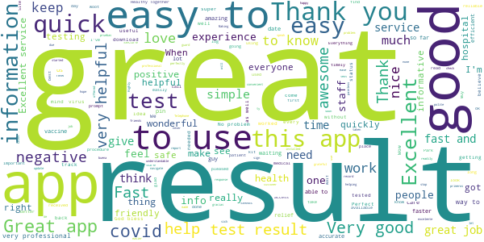

> great  :date: __2021-04-12 10:05:24__

> Absolutely Awesome  :date: __2021-04-12 03:11:18__

> Real Great App!  :date: __2021-04-11 20:36:02__

> Easy download and prompt results  :date: __2021-04-11 14:55:46__

> Excellent service.  :date: __2021-04-11 14:41:10__

> excellent  :date: __2021-04-10 23:50:55__

> Excellent  :date: __2021-04-10 15:50:48__

> great  :date: __2021-04-10 13:27:03__

> Good  :date: __2021-04-10 03:32:12__

> Gives complete details.  :date: __2021-04-09 20:05:52__

#### 4-star reviews

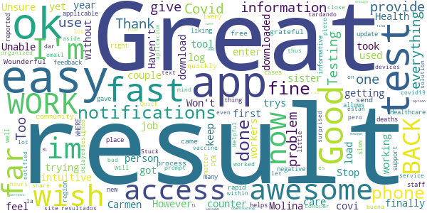

> Easy to log in.  :date: __2021-04-11 22:31:12__

> Good.  :date: __2021-04-07 15:39:26__

> In person, they are awesome  :date: __2021-04-04 16:29:18__

> Awesome tool  :date: __2021-03-30 21:46:52__

> Im trying to get my sister Carmen M .Molina (covi result.  :date: __2021-03-29 14:28:53__

> Great  :date: __2021-03-28 08:11:54__

> Works now! However I wish you didn't have to enter the year first as it's counter intuitive.  :date: __2021-03-26 20:07:05__

> Stop :)  :date: __2021-03-25 11:31:34__

> Great  :date: __2021-03-23 15:07:53__

> Ok  :date: __2021-03-19 23:54:06__

#### 3-star reviews

> seems to repeatedly give me the same results??  :date: __2021-04-02 17:56:12__

> Would not let me change birth year. Did receive fast support text saying I heeded to enter year first, which I did and then it worked. They have a fix planned for next revision.  :date: __2021-03-30 22:50:11__

> Recent update broke ability to view results because date of birth can't be changed from year 2001. Will revise review when fixed. Update: the developers instruction does fix the DOB entry problem but it really should not be so complicated. The previous DOB interface was frustrating as well but it did work. Not sure why it is so complicated. Upgrading to three stars as most people still won't be able to figure out the DOB trick.  :date: __2021-03-26 17:08:49__

> 👍👍  :date: __2021-03-22 06:10:11__

> W was m  :date: __2021-03-20 19:54:07__

> I need my results and they won't give me the pin to unlock the results  :date: __2021-03-08 18:10:30__

> Pain to get setup. But then its ok i guess  :date: __2021-02-26 15:44:55__

> Nice app fast results ,Can you make it available for Samsung tablets  :date: __2021-02-20 22:15:15__

> 3 werewolf 31st Weren't 2ee 3rd r=we w wet we r q we 4 we w2 re were e w w wet 3rd equip4a2 were wee we ewe we wert e 13th 3 wee 2 we 31st 14th e1 wet 2q33 31st q we 25thmentwe 23rd r  :date: __2021-02-16 17:18:35__

> Tool of tyranny. Actually it's okay, functions well.  :date: __2021-02-16 16:19:39__

#### 2-star reviews

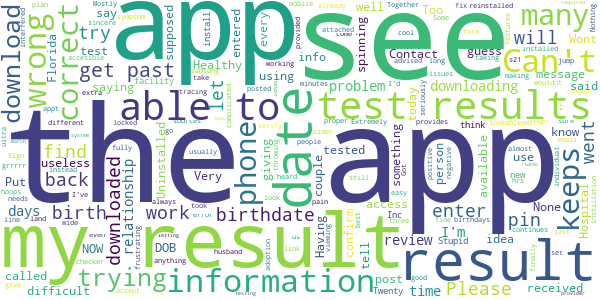

> What a pain, making people jump through 30 hoops to see you there results doesn't seem like the best idea....  :date: __2021-04-08 15:12:37__

> I received a message saying that my results were in the app. But I don't see it  :date: __2021-04-03 17:48:42__

> Extremely difficult to use. I do not plan on using it again  :date: __2021-04-02 16:16:08__

> App is not working. I enter my information and it keeps giving me an error message saying “something went wrong. Please try again". The birth dates are correct, but it still doesn't work. I even Uninstalled and reinstalled the app to see if it would fix it. Nothing!  :date: __2021-03-31 21:05:36__

> Sign in for extra vac keeps giving today date & wrong date of birth, won't let me correct  :date: __2021-03-31 01:12:32__

> Put correct info in n locked me out,after many trys Got in!  :date: __2021-03-28 15:23:23__

> I have put my birthdate, and for my husband as well, and it continues to go back to the date already on the form...it will not accept our proper birthdays.  :date: __2021-03-27 14:31:24__

> loveablesmithP²  :date: __2021-03-26 02:56:34__

> It wouldnt let me set a pin.  :date: __2021-03-20 23:12:48__

> The app will say test results are in and when I enter my information, they tell me that the info is wrong and will not give me my results. Very frustrating.  :date: __2021-03-15 17:37:11__

#### 1-star reviews

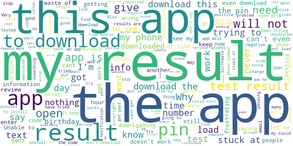

> Can't enter code  :date: __2021-04-11 18:05:12__

> Unable to open app Stopsending  :date: __2021-04-11 18:01:17__

> Can not get in to see my results  :date: __2021-04-11 15:21:51__

> Very bad I cant event get my result horrible it keep giving me error I don't know why we have to do it through that thats nonsense  :date: __2021-04-11 00:19:08__

> This App is a waste of time ,I got a notification to view my daughters test results, so I downloaded the app only to be asked to get Vaccination information, I tried and tried to view my child 's results. I Hate this Crapy App!.  :date: __2021-04-10 03:30:46__

> I have been trying to see my results and unistall twice and is not letting me see my results. This app is giving me a hard time  :date: __2021-04-09 15:25:16__

> I'm annoyed. Got a message my results were available, but I had to download an app. When I finally got to request the results. Zip. No results available! Grr  :date: __2021-04-08 21:06:47__

> You need to put TEST RESULTS date on the test. Because of this I was unable to fly international even though I was negative and in compliance of the 72 hr period.  :date: __2021-04-08 03:24:53__

> So I'm just going to assume someone would call me if I'm positive. At first I couldn't change my birthdate. And now I can, but I can't press the confirm button because it's blocked by my home key and the app doesn't rotate. A year into this, there's no excuse that this app is so bad.  :date: __2021-04-08 01:12:35__

> . .horrible experience! After 1/2hour trying to put in my birth year,it never worked! I needed to see my covid test results! App is not working!  :date: __2021-04-07 18:15:14__

# COVID Coach
App version ``1.6``

Analyzed with [covid-apps-observer](http://github.com/covid-apps-observer) project, version ``0.1``

## App overview
| | |
|-------------------------|-------------------------| 
| **Name**&nbsp;&nbsp;&nbsp;&nbsp;&nbsp;&nbsp;&nbsp;&nbsp;&nbsp;&nbsp;&nbsp;&nbsp;&nbsp;&nbsp;&nbsp;&nbsp;&nbsp;&nbsp;&nbsp;&nbsp;&nbsp;&nbsp;&nbsp;&nbsp;&nbsp;&nbsp;&nbsp;&nbsp;&nbsp;&nbsp;&nbsp;&nbsp;&nbsp;&nbsp;&nbsp;&nbsp;&nbsp;&nbsp;&nbsp;&nbsp;  | COVID Coach |
| **Unique identifier** | gov.va.mobilehealth.ncptsd.covid |
| **Link to Google Play** | [https://play.google.com/store/apps/details?id=gov.va.mobilehealth.ncptsd.covid](https://play.google.com/store/apps/details?id=gov.va.mobilehealth.ncptsd.covid) |
| **Summary**  | Cope with stress &amp; stay well |
| **Privacy policy** | [https://www.ptsd.va.gov/appvid/mobile/](https://www.ptsd.va.gov/appvid/mobile/) |
| **Latest version** | 1.6 |
| **Last update** | 2021-02-16 22:20:23 |
| **Recent changes** | * Added a Learn topic about vaccines * Fixed a couple of bugs with Spanish translations * Some new animals are getting some sun, and it&#39;s starting to strain plausibility |
| **Installs**  | 10,000+ |
| **Category** | Health & Fitness |
| **First release** | Apr 17, 2020 |
| **Size**  | 82M |
| **Supported Android version**  | 4.4 and up |

### Description
> The world as we know it has changed and we are living in unprecedented and uncertain times. COVID Coach is designed to help you build resilience, manage stress, and increase your well-being during this crisis. The app is free, secure, and helps connect you to important resources for coping and adapting during the COVID-19 pandemic. Customized tools are available to help you cope with stress, stay well, stay safe, stay healthy, stay connected, and navigate parenting, care-giving, and working from home while social distancing, quarantined, or sheltered in place. You can track your mood, visualize your progress, and find resources to seek additional help and support. No account or password is required and user data is not collected.
 COVID Coach was made by the mobile mental health team of the National Center for PTSD, Dissemination & Training Division.

### User interface
The developers of the app provide the following screenshots in the Google play store.
| | | |
|:-------------------------:|:-------------------------:|:-------------------------:|
 |   |   |   | 
 |   |   |   | 
 |   |  

## Development team
In the following we report the main information provided by the development team in the Google play store.

| | |
|-------------------------|-------------------------|
| **Developer**  | US Department of Veterans Affairs (VA) |
| **Website**  | [https://www.ptsd.va.gov/appvid/mobile/](https://www.ptsd.va.gov/appvid/mobile/) |
| **Email** | MobileMentalHealth@va.gov |
| **Physical address**  | - |
| **Other developed apps**  | [https://play.google.com/store/apps/developer?id=US+Department+of+Veterans+Affairs+(VA)](https://play.google.com/store/apps/developer?id=US+Department+of+Veterans+Affairs+(VA)) |

## Android support

| | |
|-------------------------|-------------------------|
| **Declared target Android version**  | Android10, version 10 (API level 29) |
| **Effective target Android version**  | Android10, version 10 (API level 29) |
| **Minimum supported Android version**  | KitKat, version 4.4 - 4.4.4 (API level 19) |
| **Maximum target Android version**  | - |

The larger the difference between the minimum and maximum supported Android versions, the better. A larger difference means a wider audience. For example, old phones have a very low Android version, so a high minimum supported Android version means that the app cannot be used by users with old phones, thus leading to accessibility problems. 

## Requested permissions

In the following we report the complete list of the permissions requested by the app. 

| **Permission** | **Protection level** | **Description** | 
|-------------------------|-------------------------|-------------------------|
 **android.permission ACCESS_NETWORK_STATE** | Normal | Allows applications to access information about networks. 
 **android.permission ACCESS_WIFI_STATE** | Normal | Allows applications to access information about Wi-Fi networks. 
 **android.permission CAMERA** | :warning:**Dangerous** | Required to be able to access the camera device. 
 **android.permission FOREGROUND_SERVICE** | Normal | Allows a regular application to use Service.startForeground. 
 **android.permission INTERNET** | Normal | Allows applications to open network sockets. 
 **android.permission READ_CONTACTS** | :warning:**Dangerous** | Allows an application to read the user's contacts data. 
 **android.permission READ_EXTERNAL_STORAGE** | :warning:**Dangerous** | Allows an application to read from external storage. 
 **android.permission RECEIVE_BOOT_COMPLETED** | Normal | Allows an application to receive the Intent.ACTION_BOOT_COMPLETED that is broadcast after the system finishes booting. 
 **android.permission RECORD_AUDIO** | :warning:**Dangerous** | Allows an application to record audio. 
 **android.permission WAKE_LOCK** | Normal | Allows using PowerManager WakeLocks to keep processor from sleeping or screen from dimming. 
 **android.permission WRITE_EXTERNAL_STORAGE** | :warning:**Dangerous** | Allows an application to write to external storage. 
 **com.android.vending CHECK_LICENSE** | - | - 

## Mentioned servers

| **Server** | **Registrant** | **Registrant country** | **Creation date** | 
|-------------------------|-------------------------|-------------------------|-------------------------|
 | google.com | Google LLC | :us: US | 1997-09-15 04:00:00 |
 | mumbleserver.it | Mumble Srls | - | 2014-03-25 16:27:15 |
 | stanford.edu | Stanford University | - | 1985-10-04 00:00:00 |
 | w3.org | W3C | :us: US | 1994-07-06 04:00:00 |
 | psychologytoday.com | Sussex Publishers LLC | :us: US | 1997-12-29 05:00:00 |
 | addiction.com | Elements Behavioral Health | :us: US | 1998-04-08 04:00:00 |

## Security analysis 

Below we report the main security warnings raised by our execution of the [Androwarn](https://github.com/maaaaz/androwarn) security analysis tool.

**Telephony identifiers leakage**
> - This application reads the ISO country code equivalent of the current registered operator's MCC (Mobile Country Code) 

**Connection interfaces exfiltration**
> - This application reads details about the currently active data network 
> - This application tries to find out if the currently active data network is metered 

**Telephony services abuse**
> - This application makes phone calls 

**Audio video eavesdropping**
> - This application records audio from the 'MIC' source  

**Suspicious connection establishment**
> - This application opens a Socket and connects it to the remote address '' on the 'N/A' port  
> - This application opens a Socket and connects it to the remote address 'Ljava/lang/StringBuilder;->toString()Ljava/lang/String;' on the 'N/A' port  
> - This application opens a Socket and connects it to the remote address 'Ljava/net/Proxy;->type()Ljava/net/Proxy$Type;' on the 'N/A' port  
> - This application opens a Socket and connects it to the remote address 'timeout' on the 'N/A' port  

## User ratings and reviews

Below we provide information about how end users are reacting to the app in terms of ratings and reviews in the Google Play store.

### Ratings

The COVID Coach app has been installed by more than **10000** times. At this time, **221** rated the app and its average score is **4.68**. Below we show the distribution of the ratings across the usual star-based rating of Google Play

:star::star::star::star::star:: 169

:star::star::star::star:: 42

:star::star::star:: 6

:star::star:: 2

:star:: 2

### Reviews 

#### 5-star reviews

> This app really helps. It offers good advices if needed. I really recommend this.  :date: __2021-04-27 03:24:16__

> So many different options to explore, and learn.  :date: __2021-03-31 00:43:04__

> Surprisingly fresh and thoughtful in it's design. I enjoy learning thru this application 😊  :date: __2021-03-30 15:50:46__

> Great app. Simple, easy to apply every day.  :date: __2021-03-28 19:58:29__

> It's very useful on how to cope and helping recognize moods. Only used one day so far.  :date: __2021-03-24 02:32:55__

> Good resource  :date: __2021-03-22 15:04:11__

> Great ideas on ways to relieve stress. Love the variety of tools and resources.  :date: __2021-03-11 00:41:07__

> Nice app...works well  :date: __2021-03-01 17:11:35__

> Fantastic App.  :date: __2021-02-25 16:40:16__

> This app not only helped during Covid, but it also helps my every day anxiety and depression!!  :date: __2021-02-24 20:58:21__

#### 4-star reviews

> Good in balancing my life.  :date: __2021-03-11 21:42:58__

> Worthwhile, inspiring daily messages  :date: __2021-02-26 16:03:25__

> Great ideas for combating stress.  :date: __2021-02-20 05:57:49__

> So much good content! A few pages show up in Spanish, even though I've chosen English. But great job putting this together 👍🏼  :date: __2021-01-19 07:42:28__

> Soothing app  :date: __2021-01-07 06:14:57__

> So far I like it  :date: __2020-12-09 03:02:35__

> Great app jas measures features and you can chart your progress  :date: __2020-11-08 18:29:04__

> Great app. Lots of information to learn about your mental health.  :date: __2020-11-01 01:34:40__

> Haven't had to use it but it appears to have resources that would help someone in need  :date: __2020-10-10 19:35:22__

> Not a meditatong person but Wow! Body scan leaves me fresh as having a two hour nap.  :date: __2020-08-03 20:12:13__

#### 3-star reviews

> Why does the app need access to my media and files? Can you offer some features without requiring that access?  :date: __2020-09-17 15:58:28__

#### 2-star reviews

> Can't see how it is useful for COVID. Name is missleading.  :date: __2021-01-13 15:11:08__

> Stops on staying well  :date: __2020-09-30 05:53:20__

#### 1-star reviews

> This is such garbage. Nothing actually helps. I could litterally just google my problem and click the first link amd get more help than this.  :date: __2021-04-23 09:42:03__

> Covid19 not real because tree give free oxygen  :date: __2021-03-02 02:34:37__

> Why do I have to allow this app to access my photos? I installed it and uninstalled. Please, explain why need access to my files .  :date: __2021-02-26 23:48:21__

> Requires access to your photos and files just to open the app. No thanks.  :date: __2020-11-13 01:54:50__

> App keeps crashing! Just use the older PTSD Coach, its basically the same thing.  :date: __2020-07-15 02:23:22__

> There should be no reason this app needs media, phone and Gallery permissions just to launch. Especially when it prompts you that you can disable them later.  :date: __2020-07-14 21:17:59__

> I was excited for this app. Unfortunately this app REQUIRES access to your phone. After downloading, a prompt will say: "Allow Covid Coach to access photos, media, and files on your device?" As soon as I tap on "deny" the app automatically closes and locks me out of the service. How is this supposed to be helping me? You don't need access to my phone. I'm disappointed.  :date: __2020-05-20 07:46:26__

# Kencor COVID-19
App version ``1.9``

Analyzed with [covid-apps-observer](http://github.com/covid-apps-observer) project, version ``0.1``

## App overview
| | |
|-------------------------|-------------------------| 
| **Name**&nbsp;&nbsp;&nbsp;&nbsp;&nbsp;&nbsp;&nbsp;&nbsp;&nbsp;&nbsp;&nbsp;&nbsp;&nbsp;&nbsp;&nbsp;&nbsp;&nbsp;&nbsp;&nbsp;&nbsp;&nbsp;&nbsp;&nbsp;&nbsp;&nbsp;&nbsp;&nbsp;&nbsp;&nbsp;&nbsp;&nbsp;&nbsp;&nbsp;&nbsp;&nbsp;&nbsp;&nbsp;&nbsp;&nbsp;&nbsp;  | Kencor COVID-19 |
| **Unique identifier** | com.kencorhealth.covid |
| **Link to Google Play** | [https://play.google.com/store/apps/details?id=com.kencorhealth.covid](https://play.google.com/store/apps/details?id=com.kencorhealth.covid) |
| **Summary**  | Kencor COVID-19 |
| **Privacy policy** | [https://www.kencorhealth.com/policies-terms/](https://www.kencorhealth.com/policies-terms/) |
| **Latest version** | 1.9 |
| **Last update** | 2020-10-12 07:37:38 |
| **Recent changes** | - Minor bug fixes |
| **Installs**  | 100+ |
| **Category** | Medical |
| **First release** | Apr 13, 2020 |
| **Size**  | 19M |
| **Supported Android version**  | 5.0 and up |

### Description
> Developed in partnership with cardiologists and technologists, the Kencor platform keeps you connected to your care team once you head home. 
 Sami™, your 24/7 virtual companion, comes pre-set with your personalized treatment plan created by your doctor, and adjusts over time as your health improves. 
 You just talk to Sami™ and answer her questions and follow her reminders, like to take your medication or record your vitals, such as your weight that day.
  Sami™ is there to monitor your progress and relay your health information directly to your care team. It’s like your care team is there with you when you need them.

### User interface
The developers of the app provide the following screenshots in the Google play store.
| | | |
|:-------------------------:|:-------------------------:|:-------------------------:|
 |   |   |   | 
 |   |  

## Development team
In the following we report the main information provided by the development team in the Google play store.

| | |
|-------------------------|-------------------------|
| **Developer**  | Kencor health |
| **Website**  | [http://www.kencorhealth.com](http://www.kencorhealth.com) |
| **Email** | nara@kencorhealth.com |
| **Physical address**  | - |
| **Other developed apps**  | [https://play.google.com/store/apps/developer?id=Kencor+health](https://play.google.com/store/apps/developer?id=Kencor+health) |

## Android support

| | |
|-------------------------|-------------------------|
| **Declared target Android version**  | Pie, version 9 (API level 28) |
| **Effective target Android version**  | Pie, version 9 (API level 28) |
| **Minimum supported Android version**  | Lollipop, version 5.0 (API level 21) |
| **Maximum target Android version**  | - |

The larger the difference between the minimum and maximum supported Android versions, the better. A larger difference means a wider audience. For example, old phones have a very low Android version, so a high minimum supported Android version means that the app cannot be used by users with old phones, thus leading to accessibility problems. 

## Requested permissions

In the following we report the complete list of the permissions requested by the app. 

| **Permission** | **Protection level** | **Description** | 
|-------------------------|-------------------------|-------------------------|
 **android.permission ACCESS_COARSE_LOCATION** | :warning:**Dangerous** | Allows an app to access approximate location. 
 **android.permission ACCESS_FINE_LOCATION** | :warning:**Dangerous** | Allows an app to access precise location. 
 **android.permission ACCESS_NETWORK_STATE** | Normal | Allows applications to access information about networks. 
 **android.permission BLUETOOTH** | Normal | Allows applications to connect to paired bluetooth devices. 
 **android.permission BROADCAST_STICKY** | Normal | Allows an application to broadcast sticky intents. 
 **android.permission CAMERA** | :warning:**Dangerous** | Required to be able to access the camera device. 
 **android.permission INTERNET** | Normal | Allows applications to open network sockets. 
 **android.permission MODIFY_AUDIO_SETTINGS** | Normal | Allows an application to modify global audio settings. 
 **android.permission RECORD_AUDIO** | :warning:**Dangerous** | Allows an application to record audio. 
 **android.permission WAKE_LOCK** | Normal | Allows using PowerManager WakeLocks to keep processor from sleeping or screen from dimming. 
 **com.google.android.c2dm.permission RECEIVE** | - | - 
 **com.kencorhealth.covid.permission C2D_MESSAGE** | - | - 

## Mentioned servers

| **Server** | **Registrant** | **Registrant country** | **Creation date** | 
|-------------------------|-------------------------|-------------------------|-------------------------|
 | googlesyndication.com | Google LLC | :us: US | 2003-01-21 06:17:24 |
 | google.com | Google LLC | :us: US | 1997-09-15 04:00:00 |
 | facebook.com | Facebook, Inc. | :us: US | 1997-03-29 05:00:00 |
 | googleapis.com | Google LLC | :us: US | 2005-01-25 17:52:26 |
 | w3.org | W3C | :us: US | 1994-07-06 04:00:00 |
 | google-analytics.com | Google LLC | :us: US | 2005-07-18 19:24:32 |
 | app-measurement.com | Google LLC | :us: US | 2015-06-19 20:13:31 |
 | googleapis.com | Google LLC | :us: US | 2005-01-25 17:52:26 |
 | doubleclick.net | Google Inc. | :us: US | 1996-01-16 05:00:00 |
 | gstatic.com | Google LLC | :us: US | 2008-02-11 15:31:25 |
 | googleapis.com | Google LLC | :us: US | 2005-01-25 17:52:26 |
 | googletagmanager.com | Google LLC | :us: US | 2011-11-11 23:39:05 |
 | youtube.com | Google LLC | :us: US | 2005-02-15 05:13:12 |
 | opentok.com | Domains By Proxy, LLC | :us: US | 2010-09-24 17:14:13 |
 | amazonaws.com | Amazon.com, Inc. | :us: US | 2005-08-18 02:10:45 |
 | kencorhealth.com | Domains By Proxy, LLC | :us: US | 2017-05-08 22:44:13 |
 | box.com | Box, Inc. | :us: US | 1999-02-17 05:00:00 |
 | jabber.org | Jabber.org | :us: US | 1998-12-25 05:00:00 |
 | xmlpull.org | WhoisGuard, Inc. | PA | 2001-11-26 20:33:08 |
 | jivesoftware.com | REDACTED FOR PRIVACY | :us: US | 2001-05-12 20:30:50 |
 | igniterealtime.org | Whois Privacy Service | :us: US | 2006-07-13 21:57:03 |
 | jivesoftware.org | Jive Software | :us: US | 2001-05-12 20:30:49 |

## Security analysis 

Below we report the main security warnings raised by our execution of the [Androwarn](https://github.com/maaaaz/androwarn) security analysis tool.

**Telephony identifiers leakage**
> - This application reads the ISO country code equivalent for the SIM provider's country code 
> - This application reads the device phone type value 
> - This application reads the numeric name (MCC+MNC) of current registered operator 
> - This application reads the operator name 
> - This application reads the phone's current state 

**Connection interfaces exfiltration**
> - This application reads details about the currently active data network 
> - This application tries to find out if the currently active data network is metered 

**Suspicious connection establishment**
> - This application opens a Socket and connects it to the remote address '' on the '80' port  
> - This application opens a Socket and connects it to the remote address '' on the 'N/A' port  
> - This application opens a Socket and connects it to the remote address 'Ljava/lang/StringBuilder;->toString()Ljava/lang/String;' on the 'N/A' port  
> - This application opens a Socket and connects it to the remote address 'Ljava/net/Proxy;->type()Ljava/net/Proxy$Type;' on the 'N/A' port  
> - This application opens a Socket and connects it to the remote address 'Lorg/apache/http/HttpHost;->getPort()I' on the 'Lorg/apache/http/HttpHost;->getPort()I' port  
> - This application opens a Socket and connects it to the remote address 'Network subsystem is unavailable' on the 'N/A' port  
> - This application opens a Socket and connects it to the remote address 'timeout' on the 'N/A' port  

**Pim data leakage**
> - This application accesses the SMS list 
> - This application accesses the contacts list 

**Code execution**
> - This application loads a native library 
> - This application loads a native library: 'jingle_peerconnection_so' 
> - This application loads a native library: 'opentok' 
> - This application executes a UNIX command containing this argument: 'getprop' 

## User ratings and reviews

Below we provide information about how end users are reacting to the app in terms of ratings and reviews in the Google Play store.

### Ratings

The Kencor COVID-19 app has been installed by more than **100** times. At this time, **-** rated the app and its average score is **0.0**. Below we show the distribution of the ratings across the usual star-based rating of Google Play

:star::star::star::star::star:: 0

:star::star::star::star:: 0

:star::star::star:: 0

:star::star:: 0

:star:: 0

### Reviews 

#### 5-star reviews

No recent reviews available with 5 stars.

#### 4-star reviews

No recent reviews available with 4 stars.

#### 3-star reviews

No recent reviews available with 3 stars.

#### 2-star reviews

No recent reviews available with 2 stars.

#### 1-star reviews

No recent reviews available with 1 stars.

# COVID Control - A Johns Hopkins University Study
App version ``3.3``

Analyzed with [covid-apps-observer](http://github.com/covid-apps-observer) project, version ``0.1``

## App overview
| | |
|-------------------------|-------------------------| 
| **Name**&nbsp;&nbsp;&nbsp;&nbsp;&nbsp;&nbsp;&nbsp;&nbsp;&nbsp;&nbsp;&nbsp;&nbsp;&nbsp;&nbsp;&nbsp;&nbsp;&nbsp;&nbsp;&nbsp;&nbsp;&nbsp;&nbsp;&nbsp;&nbsp;&nbsp;&nbsp;&nbsp;&nbsp;&nbsp;&nbsp;&nbsp;&nbsp;&nbsp;&nbsp;&nbsp;&nbsp;&nbsp;&nbsp;&nbsp;&nbsp;  | COVID Control - A Johns Hopkins University Study |
| **Unique identifier** | jhu.edu.JohnsHopkinsCOVIDControl |
| **Link to Google Play** | [https://play.google.com/store/apps/details?id=jhu.edu.JohnsHopkinsCOVIDControl](https://play.google.com/store/apps/details?id=jhu.edu.JohnsHopkinsCOVIDControl) |
| **Summary**  | This app uses users’ body temperature to predict the risk of COVID-19 outbreaks |
| **Privacy policy** | [https://covidcontrol.jhu.edu/wp-content/uploads/Consent-Form_Clean_30Apr2020.pdf](https://covidcontrol.jhu.edu/wp-content/uploads/Consent-Form_Clean_30Apr2020.pdf) |
| **Latest version** | 3.3 |
| **Last update** | 2020-08-14 18:02:43 |
| **Recent changes** | You can now add extra profiles and submit for other people of your household. It is also possible for you to check the impact of your daily submissions, and get badges as you keep using the COVID Control app. |
| **Installs**  | 1,000+ |
| **Category** | Medical |
| **First release** | Apr 16, 2020 |
| **Size**  | 15M |
| **Supported Android version**  | 5.0 and up |

### Description
> Johns Hopkins COVID Control is a fast, user-friendly tool for controlling the spread of COVID-19 based on self-reported body temperatures and, optionally, other symptoms, from users around the country. 
 Designed by doctors, epidemiologists, and engineers at the Johns Hopkins University (a collaborative endeavour between the Bloomberg School of Public Health, School of Medicine and the Whiting School of Engineering, all at the John Hopkins University), this app was born out of a desire for us as individuals to make an impactful contribution in this worldwide effort to contain the spread COVID-19. 
 In these difficult times, while we may feel helpless as individuals, the real-time insights gained from the information entered in this app will equip our frontline healthcare workers to make more informed decisions. By downloading and using this app regularly you would be contributing to a rapidly growing collaborative effort to monitor the spread of COVID-19. 
 Note that submitting your data directly greatly reduces the delay experienced in hospitals/laboratories in identifying new outbreaks of the disease, and expands basic monitoring of our health.
 We do not collect any personally identifiable information. No information you share will be used for commercial purposes.
 This app allows you to help researchers and government agencies to monitor and control the spread of COVID-19 but does not give health advice. If you need health advice please visit the CDC website at: https://www.cdc.gov/coronavirus/2019-ncov/index.html
 This temperature information entered in this app by users across the country will be used to detect influenza-like illness (ILI) activity in a region. By using spatial science analytics applied to these data and by comparing the observed trends against the historical data we have,  we will identify anomalous emerging activity in ILI and generate real-time, pre-clinical, risk estimates of potential COVID-19 outbreaks. 
 For more information about the project and this app, please visit our website https://covidcontrol.jhu.edu/

### User interface
The developers of the app provide the following screenshots in the Google play store.
| | | |
|:-------------------------:|:-------------------------:|:-------------------------:|
 |   |   |   | 
 |  

## Development team
In the following we report the main information provided by the development team in the Google play store.

| | |
|-------------------------|-------------------------|
| **Developer**  | Johns Hopkins Technology Transfer |
| **Website**  | [https://covidcontrol.jhu.edu/](https://covidcontrol.jhu.edu/) |
| **Email** | contactcovidcontrol@jh.edu |
| **Physical address**  | - |
| **Other developed apps**  | [https://play.google.com/store/apps/developer?id=Johns+Hopkins+Technology+Transfer](https://play.google.com/store/apps/developer?id=Johns+Hopkins+Technology+Transfer) |

## Android support

| | |
|-------------------------|-------------------------|
| **Declared target Android version**  | Android10, version 10 (API level 29) |
| **Effective target Android version**  | Android10, version 10 (API level 29) |
| **Minimum supported Android version**  | Lollipop, version 5.0 (API level 21) |
| **Maximum target Android version**  | - |

The larger the difference between the minimum and maximum supported Android versions, the better. A larger difference means a wider audience. For example, old phones have a very low Android version, so a high minimum supported Android version means that the app cannot be used by users with old phones, thus leading to accessibility problems. 

## Requested permissions

In the following we report the complete list of the permissions requested by the app. 

| **Permission** | **Protection level** | **Description** | 
|-------------------------|-------------------------|-------------------------|
 **android.permission ACCESS_COARSE_LOCATION** | :warning:**Dangerous** | Allows an app to access approximate location. 
 **android.permission ACCESS_FINE_LOCATION** | :warning:**Dangerous** | Allows an app to access precise location. 
 **android.permission INTERNET** | Normal | Allows applications to open network sockets. 
 **android.permission RECEIVE_BOOT_COMPLETED** | Normal | Allows an application to receive the Intent.ACTION_BOOT_COMPLETED that is broadcast after the system finishes booting. 
 **android.permission VIBRATE** | Normal | Allows access to the vibrator. 
 **android.permission WAKE_LOCK** | Normal | Allows using PowerManager WakeLocks to keep processor from sleeping or screen from dimming. 

## Mentioned servers

| **Server** | **Registrant** | **Registrant country** | **Creation date** | 
|-------------------------|-------------------------|-------------------------|-------------------------|
 | google.com | Google LLC | :us: US | 1997-09-15 04:00:00 |
 | jhu.edu | Johns Hopkins University | - | 1987-03-19 00:00:00 |
 | azurewebsites.net | Microsoft Corporation | :us: US | 2012-01-24 18:43:51 |
 | googleapis.com | Google LLC | :us: US | 2005-01-25 17:52:26 |

## Security analysis 

Below we report the main security warnings raised by our execution of the [Androwarn](https://github.com/maaaaz/androwarn) security analysis tool.

**Connection interfaces exfiltration**
> - This application reads details about the currently active data network 
> - This application tries to find out if the currently active data network is metered 

**Suspicious connection establishment**
> - This application opens a Socket and connects it to the remote address '' on the 'N/A' port  
> - This application opens a Socket and connects it to the remote address 'Ljava/lang/StringBuilder;->toString()Ljava/lang/String;' on the 'N/A' port  
> - This application opens a Socket and connects it to the remote address 'Ljava/net/Proxy;->type()Ljava/net/Proxy$Type;' on the 'N/A' port  
> - This application opens a Socket and connects it to the remote address 'timeout' on the 'N/A' port  

## User ratings and reviews

Below we provide information about how end users are reacting to the app in terms of ratings and reviews in the Google Play store.

### Ratings

The COVID Control - A Johns Hopkins University Study app has been installed by more than **1000** times. At this time, **22** rated the app and its average score is **2.9545455**. Below we show the distribution of the ratings across the usual star-based rating of Google Play

:star::star::star::star::star:: 9

:star::star::star::star:: 2

:star::star::star:: 0

:star::star:: 1

:star:: 10

### Reviews 

#### 5-star reviews

> Great  :date: __2020-12-29 00:37:43__

> Good health  :date: __2020-12-24 12:40:17__

> interesting ...as a first responder, glad you re doing this!  :date: __2020-07-24 16:59:16__

> Extremely easy app. I appreciate the daily reminders. I shared this information on my Facebook and have been telling folks that I interact with. Thank you Johns Hopkins for playing a vital role in tracking this virus.  :date: __2020-05-22 23:27:43__

> Super easy to use and convenient. The maps are interesting  :date: __2020-05-04 16:44:34__

> Important in the fight to defeat COVID 19  :date: __2020-04-25 14:32:48__

#### 4-star reviews

No recent reviews available with 4 stars.

#### 3-star reviews

No recent reviews available with 3 stars.

#### 2-star reviews

> Keeps telling me to enter my daily information everytime phone is turned on even though I already entered it for today. Uninstalling it now.  :date: __2020-05-13 19:05:30__

#### 1-star reviews

> ever since I installed this is can't stop farting and now I am so flat  :date: __2021-04-07 16:52:58__

> Cannot submit my sex/age. Says try again  :date: __2021-04-01 23:01:10__

> Something went wrong light after launch  :date: __2021-03-31 13:18:08__

> Very bad app. It wouldn't even let me enter my info. It kept saying "something went wrong". It doesn't even deserve 1 star. I should get the stars for trying it.  :date: __2021-01-19 21:53:14__

> I have never left a negative review before, BUT, unfortunately like some other's before me, after I entered the demographic data and pressed enter it just says something went wrong. I tried reinstalling the app and it made no difference. 🤬  :date: __2020-12-08 00:48:44__

> I could not get this to work... always reported a problem. If the study is concluded, the app should be removed. Thanks  :date: __2020-11-25 06:11:59__

> I cannot enter data. When I tap the input box, the keyboard does not appear. This was fixed But I have entered a new age category. I tried to edit my profile and add my zipcode, but I get an error when I try to save.  :date: __2020-11-21 21:25:32__

> Can't activate app. On the "let's get started" page, I enter 2 demographic info and click on submit. The app says something went wrong and to resubmit later.  :date: __2020-11-18 19:35:14__

> Errors. Will not pass age on pixel 2  :date: __2020-11-17 19:29:47__

> Cannot read the privacy statement because it won't load. Cannot add my daily temp because it shows error. Get your act together JHU. 0ne star is too much. Maybe one of your engineers can developed a usable/workable app.  :date: __2020-10-20 14:50:00__

# MUSC COVID-19 Vital Link
App version ``1.42``

Analyzed with [covid-apps-observer](http://github.com/covid-apps-observer) project, version ``0.1``

## App overview
| | |
|-------------------------|-------------------------| 
| **Name**&nbsp;&nbsp;&nbsp;&nbsp;&nbsp;&nbsp;&nbsp;&nbsp;&nbsp;&nbsp;&nbsp;&nbsp;&nbsp;&nbsp;&nbsp;&nbsp;&nbsp;&nbsp;&nbsp;&nbsp;&nbsp;&nbsp;&nbsp;&nbsp;&nbsp;&nbsp;&nbsp;&nbsp;&nbsp;&nbsp;&nbsp;&nbsp;&nbsp;&nbsp;&nbsp;&nbsp;&nbsp;&nbsp;&nbsp;&nbsp;  | MUSC COVID-19 Vital Link |
| **Unique identifier** | edu.musc.vitaltracker.defaultapp |
| **Link to Google Play** | [https://play.google.com/store/apps/details?id=edu.musc.vitaltracker.defaultapp](https://play.google.com/store/apps/details?id=edu.musc.vitaltracker.defaultapp) |
| **Summary**  | MUSC COVID-19 Vital Link is a prescribed application provided to patients. |
| **Privacy policy** | [https://web.musc.edu/about/compliance/privacy](https://web.musc.edu/about/compliance/privacy) |
| **Latest version** | 1.42 |
| **Last update** | 2021-02-02 15:08:12 |
| **Recent changes** | -updated permissions for android 10 and above |
| **Installs**  | 100+ |
| **Category** | Medical |
| **First release** | Mar 19, 2020 |
| **Size**  | 41M |
| **Supported Android version**  | 4.4 and up |

### Description
> MUSC COVID-19 Vital Link is a prescribed application provided to patients by MUSC Health clinicians.

### User interface
The developers of the app provide the following screenshots in the Google play store.
| | | |
|:-------------------------:|:-------------------------:|:-------------------------:|
 |   |  

## Development team
In the following we report the main information provided by the development team in the Google play store.

| | |
|-------------------------|-------------------------|
| **Developer**  | MUSC Mobile Development |
| **Website**  | - |
| **Email** | vlinkhelp@musc.edu |
| **Physical address**  | - |
| **Other developed apps**  | [https://play.google.com/store/apps/developer?id=MUSC+Mobile+Development](https://play.google.com/store/apps/developer?id=MUSC+Mobile+Development) |

## Android support

| | |
|-------------------------|-------------------------|
| **Declared target Android version**  | Pie, version 9 (API level 28) |
| **Effective target Android version**  | Pie, version 9 (API level 28) |
| **Minimum supported Android version**  | KitKat, version 4.4 - 4.4.4 (API level 19) |
| **Maximum target Android version**  | - |

The larger the difference between the minimum and maximum supported Android versions, the better. A larger difference means a wider audience. For example, old phones have a very low Android version, so a high minimum supported Android version means that the app cannot be used by users with old phones, thus leading to accessibility problems. 

## Requested permissions

In the following we report the complete list of the permissions requested by the app. 

| **Permission** | **Protection level** | **Description** | 
|-------------------------|-------------------------|-------------------------|
 **android.permission ACCESS_COARSE_LOCATION** | :warning:**Dangerous** | Allows an app to access approximate location. 
 **android.permission ACCESS_NETWORK_STATE** | Normal | Allows applications to access information about networks. 
 **android.permission BLUETOOTH** | Normal | Allows applications to connect to paired bluetooth devices. 
 **android.permission BLUETOOTH_ADMIN** | Normal | Allows applications to discover and pair bluetooth devices. 
 **android.permission CAMERA** | :warning:**Dangerous** | Required to be able to access the camera device. 
 **android.permission FOREGROUND_SERVICE** | Normal | Allows a regular application to use Service.startForeground. 
 **android.permission INTERNET** | Normal | Allows applications to open network sockets. 
 **android.permission READ_EXTERNAL_STORAGE** | :warning:**Dangerous** | Allows an application to read from external storage. 
 **android.permission RECEIVE_BOOT_COMPLETED** | Normal | Allows an application to receive the Intent.ACTION_BOOT_COMPLETED that is broadcast after the system finishes booting. 
 **android.permission VIBRATE** | Normal | Allows access to the vibrator. 
 **android.permission WAKE_LOCK** | Normal | Allows using PowerManager WakeLocks to keep processor from sleeping or screen from dimming. 
 **android.permission WRITE_EXTERNAL_STORAGE** | :warning:**Dangerous** | Allows an application to write to external storage. 
 **com.google.android.c2dm.permission RECEIVE** | - | - 
 **com.google.android.finsky.permission BIND_GET_INSTALL_REFERRER_SERVICE** | - | - 

## Mentioned servers

| **Server** | **Registrant** | **Registrant country** | **Creation date** | 
|-------------------------|-------------------------|-------------------------|-------------------------|
 | googlesyndication.com | Google LLC | :us: US | 2003-01-21 06:17:24 |
 | google.com | Google LLC | :us: US | 1997-09-15 04:00:00 |
 | app-measurement.com | Google LLC | :us: US | 2015-06-19 20:13:31 |
 | googleapis.com | Google LLC | :us: US | 2005-01-25 17:52:26 |
 | crashlytics.com | Google LLC | :us: US | 2011-01-21 15:30:40 |
 | musc.edu | The Medical University of South Carolina | - | 1990-12-17 00:00:00 |
 | hitechnologysolutions.com | Domains By Proxy, LLC | :us: US | 2018-01-10 20:19:52 |
 | googleapis.com | Google LLC | :us: US | 2005-01-25 17:52:26 |
 | googleapis.com | Google LLC | :us: US | 2005-01-25 17:52:26 |
 | googleadservices.com | Google LLC | :us: US | 2003-06-19 16:34:53 |

## Security analysis 

Below we report the main security warnings raised by our execution of the [Androwarn](https://github.com/maaaaz/androwarn) security analysis tool.

**Connection interfaces exfiltration**
> - This application reads details about the currently active data network 
> - This application tries to find out if the currently active data network is metered 

**Suspicious connection establishment**
> - This application opens a Socket and connects it to the remote address '' on the 'N/A' port  
> - This application opens a Socket and connects it to the remote address 'Ljava/lang/StringBuilder;->toString()Ljava/lang/String;' on the 'N/A' port  
> - This application opens a Socket and connects it to the remote address 'Ljava/net/Proxy;->type()Ljava/net/Proxy$Type;' on the 'N/A' port  
> - This application opens a Socket and connects it to the remote address 'timeout' on the 'N/A' port  

**Code execution**
> - This application loads a native library 
> - This application loads a native library: 'Ljava/lang/String;->valueOf(Ljava/lang/Object;)Ljava/lang/String;' 
> - This application loads a native library: 'barhopper_v2' 
> - This application loads a native library: 'tensorflowlite_flex_jni' 
> - This application loads a native library: 'tensorflowlite_jni' 

## User ratings and reviews

Below we provide information about how end users are reacting to the app in terms of ratings and reviews in the Google Play store.

### Ratings

The MUSC COVID-19 Vital Link app has been installed by more than **100** times. At this time, **-** rated the app and its average score is **0.0**. Below we show the distribution of the ratings across the usual star-based rating of Google Play

:star::star::star::star::star:: 0

:star::star::star::star:: 0

:star::star::star:: 0

:star::star:: 0

:star:: 0

### Reviews 

#### 5-star reviews

No recent reviews available with 5 stars.

#### 4-star reviews

No recent reviews available with 4 stars.

#### 3-star reviews

No recent reviews available with 3 stars.

#### 2-star reviews

> This app does not work for my phone even though It is compatible. I tried to set up receiving the alert through my cell phone it said phone number not available. When I chose the email option I did not receive the email. I then went on line to for help and dialed the number given online and it was the hospital main number. I was then directed to 2 other numbers and no one could help me nor did they know what I was talking about. sincerely, Pauline Mejia  :date: __2020-11-19 16:39:25__

#### 1-star reviews

> Covid 19 not real because tree give free oxygen everyone  :date: __2021-03-02 02:35:34__

# PathCheck SafePlaces
App version ``1.3.1 (2)``

Analyzed with [covid-apps-observer](http://github.com/covid-apps-observer) project, version ``0.1``

## App overview
| | |
|-------------------------|-------------------------| 
| **Name**&nbsp;&nbsp;&nbsp;&nbsp;&nbsp;&nbsp;&nbsp;&nbsp;&nbsp;&nbsp;&nbsp;&nbsp;&nbsp;&nbsp;&nbsp;&nbsp;&nbsp;&nbsp;&nbsp;&nbsp;&nbsp;&nbsp;&nbsp;&nbsp;&nbsp;&nbsp;&nbsp;&nbsp;&nbsp;&nbsp;&nbsp;&nbsp;&nbsp;&nbsp;&nbsp;&nbsp;&nbsp;&nbsp;&nbsp;&nbsp;  | PathCheck SafePlaces |
| **Unique identifier** | org.pathcheck.covidsafepaths |
| **Link to Google Play** | [https://play.google.com/store/apps/details?id=org.pathcheck.covidsafepaths](https://play.google.com/store/apps/details?id=org.pathcheck.covidsafepaths) |
| **Summary**  | Compare public COVID data with your own private location history where available |
| **Privacy policy** | [https://pathcheck.org/privacy-policy/](https://pathcheck.org/privacy-policy/) |
| **Latest version** | 1.3.1 (2) |
| **Last update** | 2020-08-05 02:37:44 |
| **Recent changes** | • You can now delete your Location History. • We think you&#39;ll find the calendar interface is a bit more clear. • We&#39;ve made improvements to the Exposure Notifications (ENs). |
| **Installs**  | 10,000+ |
| **Category** | Tools |
| **First release** | Apr 15, 2020 |
| **Size**  | 37M |
| **Supported Android version**  | 5.0 and up |

### Description
> PathCheck (formerly COVID Safe Paths) can privately save the places you visit and store them on your phone. Subscribe to Healthcare Authorities in your area for information about COVID-19 near you, where available. 
 Receive alerts from your local Healthcare Authority with information about potential exposure to COVID-19.
 We are a global movement to develop free, open-source, privacy-by-design tools for residents, public health officials, and larger communities.
 The PathCheck program has spun out of initial privacy-first research conducted by MIT and TripleBlind, into a newly created non-profit called PathCheck Foundation, established with the initial purpose of supporting global rollout of the PathCheck app and associated tools for contact tracers and healthcare authorities. 
 The goal of PathCheck is to help enable the reemergence and re-opening of economies and communities.  Through global partnerships, we are prepared to support public health officials everywhere in the effort to slow the spread of COVID-19.

### User interface
The developers of the app provide the following screenshots in the Google play store.
| | | |
|:-------------------------:|:-------------------------:|:-------------------------:|
 |   |   |   | 
 |   |   |   | 

## Development team
In the following we report the main information provided by the development team in the Google play store.

| | |
|-------------------------|-------------------------|
| **Developer**  | Path Check, Inc |
| **Website**  | [https://pathcheck.org](https://pathcheck.org) |
| **Email** | support@pathcheck.org |
| **Physical address**  | - |
| **Other developed apps**  | [https://play.google.com/store/apps/developer?id=Path+Check,+Inc](https://play.google.com/store/apps/developer?id=Path+Check,+Inc) |

## Android support

| | |
|-------------------------|-------------------------|
| **Declared target Android version**  | Pie, version 9 (API level 28) |
| **Effective target Android version**  | Pie, version 9 (API level 28) |
| **Minimum supported Android version**  | Lollipop, version 5.0 (API level 21) |
| **Maximum target Android version**  | - |

The larger the difference between the minimum and maximum supported Android versions, the better. A larger difference means a wider audience. For example, old phones have a very low Android version, so a high minimum supported Android version means that the app cannot be used by users with old phones, thus leading to accessibility problems. 

## Requested permissions

In the following we report the complete list of the permissions requested by the app. 

| **Permission** | **Protection level** | **Description** | 
|-------------------------|-------------------------|-------------------------|
 **android.hardware location** | - | - 
 **android.permission ACCESS_BACKGROUND_LOCATION** | :warning:**Dangerous** | Allows an app to access location in the background. 
 **android.permission ACCESS_COARSE_LOCATION** | :warning:**Dangerous** | Allows an app to access approximate location. 
 **android.permission ACCESS_FINE_LOCATION** | :warning:**Dangerous** | Allows an app to access precise location. 
 **android.permission ACCESS_LOCATION_EXTRA_COMMANDS** | Normal | Allows an application to access extra location provider commands. 
 **android.permission ACCESS_NETWORK_STATE** | Normal | Allows applications to access information about networks. 
 **android.permission ACCESS_WIFI_STATE** | Normal | Allows applications to access information about Wi-Fi networks. 
 **android.permission AUTHENTICATE_ACCOUNTS** | - | - 
 **android.permission FOREGROUND_SERVICE** | Normal | Allows a regular application to use Service.startForeground. 
 **android.permission GET_TASKS** | Deprecated | This constant was deprecated in API level 21. No longer enforced. 
 **android.permission INTERNET** | Normal | Allows applications to open network sockets. 
 **android.permission READ_APP_BADGE** | - | - 
 **android.permission READ_SYNC_SETTINGS** | Normal | Allows applications to read the sync settings. 
 **android.permission RECEIVE_BOOT_COMPLETED** | Normal | Allows an application to receive the Intent.ACTION_BOOT_COMPLETED that is broadcast after the system finishes booting. 
 **android.permission VIBRATE** | Normal | Allows access to the vibrator. 
 **android.permission WAKE_LOCK** | Normal | Allows using PowerManager WakeLocks to keep processor from sleeping or screen from dimming. 
 **android.permission WRITE_EXTERNAL_STORAGE** | :warning:**Dangerous** | Allows an application to write to external storage. 
 **android.permission WRITE_SYNC_SETTINGS** | Normal | Allows applications to write the sync settings. 
 **com.anddoes.launcher.permission UPDATE_COUNT** | - | - 
 **com.android.vending CHECK_LICENSE** | - | - 
 **com.google.android.c2dm.permission RECEIVE** | - | - 
 **com.google.android.finsky.permission BIND_GET_INSTALL_REFERRER_SERVICE** | - | - 
 **com.google.android.gms.permission ACTIVITY_RECOGNITION** | - | - 
 **com.htc.launcher.permission READ_SETTINGS** | - | - 
 **com.htc.launcher.permission UPDATE_SHORTCUT** | - | - 
 **com.huawei.android.launcher.permission CHANGE_BADGE** | - | - 
 **com.huawei.android.launcher.permission READ_SETTINGS** | - | - 
 **com.huawei.android.launcher.permission WRITE_SETTINGS** | - | - 
 **com.majeur.launcher.permission UPDATE_BADGE** | - | - 
 **com.oppo.launcher.permission READ_SETTINGS** | - | - 
 **com.oppo.launcher.permission WRITE_SETTINGS** | - | - 
 **com.sec.android.provider.badge.permission READ** | - | - 
 **com.sec.android.provider.badge.permission WRITE** | - | - 
 **com.sonyericsson.home.permission BROADCAST_BADGE** | - | - 
 **com.sonymobile.home.permission PROVIDER_INSERT_BADGE** | - | - 
 **me.everything.badger.permission BADGE_COUNT_READ** | - | - 
 **me.everything.badger.permission BADGE_COUNT_WRITE** | - | - 

## Mentioned servers

| **Server** | **Registrant** | **Registrant country** | **Creation date** | 
|-------------------------|-------------------------|-------------------------|-------------------------|
 | android.com | Google LLC | :us: US | 1997-06-23 04:00:00 |
 | google.com | Google LLC | :us: US | 1997-09-15 04:00:00 |
 | xml.org | OASIS Open | :us: US | 1997-02-03 05:00:00 |
 | facebook.com | Facebook, Inc. | :us: US | 1997-03-29 05:00:00 |
 | pinterest.com | DNStination Inc. | :us: US | 2009-11-26 19:21:23 |
 | twitter.com | Twitter, Inc. | :us: US | 2000-01-21 16:28:17 |
 | googleapis.com | Google LLC | :us: US | 2005-01-25 17:52:26 |

## Security analysis 

Below we report the main security warnings raised by our execution of the [Androwarn](https://github.com/maaaaz/androwarn) security analysis tool.

**Telephony identifiers leakage**
> - This application reads the numeric name (MCC+MNC) of current registered operator 
> - This application reads the operator name 
> - This application reads the phone number string for line 1, for example, the MSISDN for a GSM phone 

**Location lookup**
> - This application reads location information from all available providers (WiFi, GPS etc.) 

**Connection interfaces exfiltration**
> - This application reads details about the currently active data network 
> - This application tries to find out if the currently active data network is metered 

**Suspicious connection establishment**
> - This application opens a Socket and connects it to the remote address '' on the 'N/A' port  
> - This application opens a Socket and connects it to the remote address 'Ljava/lang/StringBuilder;->toString()Ljava/lang/String;' on the ': connect, resolve' port  
> - This application opens a Socket and connects it to the remote address 'Ljava/lang/StringBuilder;->toString()Ljava/lang/String;' on the 'N/A' port  
> - This application opens a Socket and connects it to the remote address 'Ljava/net/Proxy;->type()Ljava/net/Proxy$Type;' on the 'N/A' port  
> - This application opens a Socket and connects it to the remote address 'timeout' on the 'N/A' port  

**Pim data leakage**
> - This application accesses the downloads folder 
> - This application accesses data stored in the clipboard 

**Code execution**
> - This application loads a native library 
> - This application executes a UNIX command 

## User ratings and reviews

Below we provide information about how end users are reacting to the app in terms of ratings and reviews in the Google Play store.

### Ratings

The PathCheck SafePlaces app has been installed by more than **10000** times. At this time, **73** rated the app and its average score is **4.1643834**. Below we show the distribution of the ratings across the usual star-based rating of Google Play

:star::star::star::star::star:: 54

:star::star::star::star:: 3

:star::star::star:: 2

:star::star:: 2

:star:: 12

### Reviews 

#### 5-star reviews

> Made with privacy at its core.  :date: __2020-07-05 04:32:14__

> One of the very few safe and privacy-centric contact tracing app.  :date: __2020-07-05 04:31:47__

> I like that any location data stays on my phone until I give permission to export it to a health care worker and that it is then anonymized. Looks a lot less intrusive then all the targeted advertising that tracks me and a lot more useful, in my opinion. Cool looking app. Now just waiting for my health department to integrate it.  :date: __2020-06-26 01:51:35__

> Haiti merite plis sansibilizasyon nan sans sa kap ede moun kont corona.... Aplikasyon sa se yon bèl travay....  :date: __2020-05-08 21:20:02__

> Tout haitien ta dwe gen aplikasyon sa sou telephonrle yo. Good job  :date: __2020-05-07 21:19:54__

> Just got notified of the data instantly now. I'm safe! Easy to use.  :date: __2020-05-03 05:08:46__

> Pest  :date: __2020-04-30 23:52:20__

> Good  :date: __2020-04-29 16:13:05__

> Easy to set up and I appreciate that my information is kept on my phone so it is safe.  :date: __2020-04-27 17:36:59__

> Works really well  :date: __2020-04-27 16:11:12__

#### 4-star reviews

No recent reviews available with 4 stars.

#### 3-star reviews

No recent reviews available with 3 stars.

#### 2-star reviews

> I'm not sure what good this does when there's only 5 health department listed and 3 of them are in INCREDIBLY unpopulated regions. 🤦‍♀️  :date: __2020-08-24 22:15:11__

> None of my personal information has been asked for... What's the point???  :date: __2020-04-28 02:37:53__

#### 1-star reviews

> No instructions how to use! I have no idea where to get the "healthcare authority" URL the app asks for and therefore receive nothing about COVID in my area.  :date: __2020-07-01 11:44:15__

> Ok  :date: __2020-05-14 07:35:03__

> Energy hog. Not enough people using it.  :date: __2020-05-11 03:28:14__

> Can developer of this program confirm if it works in the uk. If it does what trusted source or authority do i input when setting up  :date: __2020-04-28 11:26:45__

> Do not download this app, search "Covid Safe" with a space between the words to get the actual Australian Government app.  :date: __2020-04-27 00:29:56__

> NOT THE AUSTRALIAN GOV APP  :date: __2020-04-27 00:05:25__

> Not the app endorsed by the government  :date: __2020-04-26 23:34:36__

> The app developers need to make it clear this isn't the official government app. It's irresponsible for them to position this in the store knowing people are searching for the Govt App. To find the Govt App search "Covid safe" as two words and look for the official green logo distributed on well know public news sources.  :date: __2020-04-26 11:11:39__

> Private data is being used beyond COVID-19 boundaries.  :date: __2020-04-26 08:59:35__

# Sentinel Monitor (COVID-19 Management)
App version ``1.5``

Analyzed with [covid-apps-observer](http://github.com/covid-apps-observer) project, version ``0.1``

## App overview
| | |
|-------------------------|-------------------------| 
| **Name**&nbsp;&nbsp;&nbsp;&nbsp;&nbsp;&nbsp;&nbsp;&nbsp;&nbsp;&nbsp;&nbsp;&nbsp;&nbsp;&nbsp;&nbsp;&nbsp;&nbsp;&nbsp;&nbsp;&nbsp;&nbsp;&nbsp;&nbsp;&nbsp;&nbsp;&nbsp;&nbsp;&nbsp;&nbsp;&nbsp;&nbsp;&nbsp;&nbsp;&nbsp;&nbsp;&nbsp;&nbsp;&nbsp;&nbsp;&nbsp;  | Sentinel Monitor (COVID-19 Management) |
| **Unique identifier** | tracker.healthcare.sentinel |
| **Link to Google Play** | [https://play.google.com/store/apps/details?id=tracker.healthcare.sentinel](https://play.google.com/store/apps/details?id=tracker.healthcare.sentinel) |
| **Summary**  | Temperature and symptom tracking for patients with COVID-19 or flu |
| **Privacy policy** | [http://sentinel.healthcare/eula](http://sentinel.healthcare/eula) |
| **Latest version** | 1.5 |
| **Last update** | 2020-04-23 23:34:42 |
| **Recent changes** | New App Name: Sentinel Monitor Labs: Submit and view COVID-19 lab results (Only available at select testing sites) Additional attributes in user profile Additional sign up methods Spanish language option General app improvements |
| **Installs**  | 1,000+ |
| **Category** | Medical |
| **First release** | Mar 8, 2020 |
| **Size**  | 9.7M |
| **Supported Android version**  | 4.4 and up |

### Description
> The Sentinel Monitor allows for individuals who are not feeling well (COVID-19, Flu, etc) to track their temperature and associated symptoms. Sentinel Monitor can be used by individuals or in conjunction with approved healthcare organizations. 
 DISCLAIMER: ALL OF THE MATERIAL PROVIDED THROUGH SENTINEL'S SYMPTOM CHECKER PORTION OF THE PLATFORM, SUCH AS TEXT, GRAPHICS, PHOTOGRAPHS, IMAGES, MESSAGES, FORUM POSTINGS, AND ANY OTHER MATERIALS, ARE FOR INFORMATIONAL PURPOSES ONLY AND ARE NOT A SUBSTITUTE FOR PROFESSIONAL MEDICAL ADVICE OR TREATMENT. ALWAYS SEEK THE ADVICE OF YOUR PHYSICIAN OR OTHER QUALIFIED HEALTH PROVIDER WITH ANY QUESTIONS YOU MAY HAVE REGARDING YOUR HEALTH. NEVER DISREGARD PROFESSIONAL MEDICAL ADVICE OR DELAY IN SEEKING IT BECAUSE OF ANY INFORMATION PROVIDED THROUGH THE PLATFORM. ADDITIONALLY, COMPANY DOES NOT PROMISE ANY PARTICULAR RESULTS WITH REGARDS TO YOUR HEALTH IN CONNECTION WITH YOUR USE OF THE PLATFORM.  IF YOU THINK YOU HAVE A MEDICAL EMERGENCY, CALL YOUR DOCTOR OR YOUR LOCAL EMERGENCY PHONE NUMBER IMMEDIATELY.

### User interface
The developers of the app provide the following screenshots in the Google play store.
| | | |
|:-------------------------:|:-------------------------:|:-------------------------:|
 |   |   |   | 
 |  

## Development team
In the following we report the main information provided by the development team in the Google play store.

| | |
|-------------------------|-------------------------|
| **Developer**  | Sentinel Healthcare |
| **Website**  | [http://sentinel.healthcare](http://sentinel.healthcare) |
| **Email** | app-support@sentinel.healthcare |
| **Physical address**  | - |
| **Other developed apps**  | [https://play.google.com/store/apps/developer?id=Sentinel+Healthcare](https://play.google.com/store/apps/developer?id=Sentinel+Healthcare) |

## Android support

| | |
|-------------------------|-------------------------|
| **Declared target Android version**  | Android10, version 10 (API level 29) |
| **Effective target Android version**  | Android10, version 10 (API level 29) |
| **Minimum supported Android version**  | KitKat, version 4.4 - 4.4.4 (API level 19) |
| **Maximum target Android version**  | - |

The larger the difference between the minimum and maximum supported Android versions, the better. A larger difference means a wider audience. For example, old phones have a very low Android version, so a high minimum supported Android version means that the app cannot be used by users with old phones, thus leading to accessibility problems. 

## Requested permissions

In the following we report the complete list of the permissions requested by the app. 

| **Permission** | **Protection level** | **Description** | 
|-------------------------|-------------------------|-------------------------|
 **android.permission  ACCESS_COARSE_LOCATION** | - | - 
 **android.permission ACCESS_FINE_LOCATION** | :warning:**Dangerous** | Allows an app to access precise location. 
 **android.permission ACCESS_NETWORK_STATE** | Normal | Allows applications to access information about networks. 
 **android.permission BLUETOOTH** | Normal | Allows applications to connect to paired bluetooth devices. 
 **android.permission BLUETOOTH_ADMIN** | Normal | Allows applications to discover and pair bluetooth devices. 
 **android.permission CAMERA** | :warning:**Dangerous** | Required to be able to access the camera device. 
 **android.permission INTERNET** | Normal | Allows applications to open network sockets. 
 **android.permission WAKE_LOCK** | Normal | Allows using PowerManager WakeLocks to keep processor from sleeping or screen from dimming. 
 **com.google.android.c2dm.permission RECEIVE** | - | - 
 **com.google.android.finsky.permission BIND_GET_INSTALL_REFERRER_SERVICE** | - | - 

## Mentioned servers

| **Server** | **Registrant** | **Registrant country** | **Creation date** | 
|-------------------------|-------------------------|-------------------------|-------------------------|
 | googlesyndication.com | Google LLC | :us: US | 2003-01-21 06:17:24 |
 | google.com | Google LLC | :us: US | 1997-09-15 04:00:00 |
 | app-measurement.com | Google LLC | :us: US | 2015-06-19 20:13:31 |
 | ipify.org | Domains By Proxy, LLC | :us: US | 2014-01-05 22:02:15 |
 | ihealthlabs.com | REDACTED FOR PRIVACY | cn | 2011-10-13 07:43:43 |
 | googleapis.com | Google LLC | :us: US | 2005-01-25 17:52:26 |
 | googleadservices.com | Google LLC | :us: US | 2003-06-19 16:34:53 |
 | sematext.com | REDACTED FOR PRIVACY | :us: US | 2007-05-01 03:03:08 |
 | crashlytics.com | Google LLC | :us: US | 2011-01-21 15:30:40 |
 | arcgis.com | ESRI | :us: US | 1999-06-09 22:21:51 |
 | mayoclinic.org | Mayo Foundation for Medical Education and Research | :us: US | 1997-02-08 05:00:00 |
 | uthealthaustin.org | Domain Privacy Service FBO Registrant. | :us: US | 2017-02-20 15:26:07 |
 | healthdata.org | University of Washington | :us: US | 2012-09-05 15:15:20 |
 | sentinelboard.com | Contact Privacy Inc. Customer 1242799118 | :canada: CA | 2018-06-10 18:25:45 |
 | xmlpull.org | WhoisGuard, Inc. | PA | 2001-11-26 20:33:08 |
 | humanly.io | c/o whoisproxy.com | :us: US | 2018-08-10 02:39:54 |

## Security analysis 

Below we report the main security warnings raised by our execution of the [Androwarn](https://github.com/maaaaz/androwarn) security analysis tool.

**Telephony identifiers leakage**
> - This application reads the ISO country code equivalent for the SIM provider's country code 
> - This application reads the MCC+MNC of the provider of the SIM 
> - This application reads the Service Provider Name (SPN) 
> - This application reads the constant indicating the state of the device SIM card 
> - This application reads the device phone type value 
> - This application reads the numeric name (MCC+MNC) of current registered operator 
> - This application reads the operator name 
> - This application reads the radio technology (network type) currently in use on the device for data transmission 

**Connection interfaces exfiltration**
> - This application reads details about the currently active data network 
> - This application tries to find out if the currently active data network is metered 

**Suspicious connection establishment**
> - This application opens a Socket and connects it to the remote address '' on the 'N/A' port  
> - This application opens a Socket and connects it to the remote address 'Ljava/lang/StringBuilder;->toString()Ljava/lang/String;' on the 'N/A' port  
> - This application opens a Socket and connects it to the remote address 'Ljava/net/Proxy;->type()Ljava/net/Proxy$Type;' on the 'N/A' port  
> - This application opens a Socket and connects it to the remote address 'timeout' on the 'N/A' port  

**Code execution**
> - This application loads a native library: 'ECGOffline' 
> - This application loads a native library: 'ECGOnline' 
> - This application loads a native library: 'VeryFitMulti' 
> - This application loads a native library: 'iHealth' 
> - This application executes a UNIX command containing this argument: '' 

## User ratings and reviews

Below we provide information about how end users are reacting to the app in terms of ratings and reviews in the Google Play store.

### Ratings

The Sentinel Monitor (COVID-19 Management) app has been installed by more than **1000** times. At this time, **11** rated the app and its average score is **4.181818**. Below we show the distribution of the ratings across the usual star-based rating of Google Play

:star::star::star::star::star:: 8

:star::star::star::star:: 1

:star::star::star:: 0

:star::star:: 0

:star:: 2

### Reviews 

#### 5-star reviews

> Great  :date: __2020-12-25 18:17:30__

> Doe exactly what I need!  :date: __2020-12-03 04:54:28__

> Very easy to download, what a great way to help insure I can keep track of my Temperature and changes. Thank You Sentinel.  :date: __2020-03-12 04:02:10__

#### 4-star reviews

> Why is it so difficult to date of birth? Allow for typing in or something easy.  :date: __2020-05-06 23:19:23__

#### 3-star reviews

No recent reviews available with 3 stars.

#### 2-star reviews

No recent reviews available with 2 stars.

#### 1-star reviews

> It doesn't work at all.l installed bicause l wanted to be informed about Corona virus.but when l try to open it it doesn't open  :date: __2020-12-14 16:59:59__

> Don't work  :date: __2020-06-30 08:22:16__

# Sydney Care
App version ``3.3.0``

Analyzed with [covid-apps-observer](http://github.com/covid-apps-observer) project, version ``0.1``

## App overview
| | |
|-------------------------|-------------------------| 
| **Name**&nbsp;&nbsp;&nbsp;&nbsp;&nbsp;&nbsp;&nbsp;&nbsp;&nbsp;&nbsp;&nbsp;&nbsp;&nbsp;&nbsp;&nbsp;&nbsp;&nbsp;&nbsp;&nbsp;&nbsp;&nbsp;&nbsp;&nbsp;&nbsp;&nbsp;&nbsp;&nbsp;&nbsp;&nbsp;&nbsp;&nbsp;&nbsp;&nbsp;&nbsp;&nbsp;&nbsp;&nbsp;&nbsp;&nbsp;&nbsp;  | Sydney Care |
| **Unique identifier** | ai.carespree |
| **Link to Google Play** | [https://play.google.com/store/apps/details?id=ai.carespree](https://play.google.com/store/apps/details?id=ai.carespree) |
| **Summary**  | Primary Care Anytime, Anywhere |
| **Privacy policy** | [https://www.sydneycare.ai/privacy-policy.html](https://www.sydneycare.ai/privacy-policy.html) |
| **Latest version** | 3.3.0 |
| **Last update** | 2021-04-07 23:27:17 |
| **Recent changes** | Minor bug fixes and performance optimization.  |
| **Installs**  | 100,000+ |
| **Category** | Medical |
| **First release** | Jul 30, 2019 |
| **Size**  | 86M |
| **Supported Android version**  | 5.0 and up |

### Description
> Worried about Coronavirus?
 The outbreak of COVID-19 Coronavirus continues to be a health challenge both in the US and globally. Screen yourself and assess your risk for free with a COVID-19 Assessment available now through Sydney Care.
  
 •	Assess your risk for free based on CDC guidance
 •	Get personalized guidance about what to do next
 •	Connect with doctors via text chat or video
 •	Read curated information from authoritative sources
 Sydney Care offers personalized symptom checking, real-time treatment from real doctors, prescriptions and labs ordered, all from your device
 Fast and Free
 Take as little as 4 minutes to answer questions 
 on your symptoms.
 Answers Tailored to You
 Get personalized answers based on your
 gender, age and medical history.
 Convenient and Accessible
 Available 24/7, 365 days a year.
 Path to Treatment
 Get information on what OTC medicine to take,
 and see projected recovery times.
 Download Sydney Care℠ to get smarter about your symptoms

### User interface
The developers of the app provide the following screenshots in the Google play store.
| | | |
|:-------------------------:|:-------------------------:|:-------------------------:|
 |   |   |   | 
 |   |   |   | 

## Development team
In the following we report the main information provided by the development team in the Google play store.

| | |
|-------------------------|-------------------------|
| **Developer**  | CareMarket Inc. |
| **Website**  | [https://www.sydneycare.ai](https://www.sydneycare.ai) |
| **Email** | support@sydneycare.ai |
| **Physical address**  | - |
| **Other developed apps**  | [https://play.google.com/store/apps/developer?id=CareMarket+Inc.](https://play.google.com/store/apps/developer?id=CareMarket+Inc.) |

## Android support

| | |
|-------------------------|-------------------------|
| **Declared target Android version**  | Android10, version 10 (API level 29) |
| **Effective target Android version**  | Android10, version 10 (API level 29) |
| **Minimum supported Android version**  | Lollipop, version 5.0 (API level 21) |
| **Maximum target Android version**  | - |

The larger the difference between the minimum and maximum supported Android versions, the better. A larger difference means a wider audience. For example, old phones have a very low Android version, so a high minimum supported Android version means that the app cannot be used by users with old phones, thus leading to accessibility problems. 

## Requested permissions

In the following we report the complete list of the permissions requested by the app. 

| **Permission** | **Protection level** | **Description** | 
|-------------------------|-------------------------|-------------------------|
 **android.permission ACCESS_COARSE_LOCATION** | :warning:**Dangerous** | Allows an app to access approximate location. 
 **android.permission ACCESS_FINE_LOCATION** | :warning:**Dangerous** | Allows an app to access precise location. 
 **android.permission ACCESS_NETWORK_STATE** | Normal | Allows applications to access information about networks. 
 **android.permission ACCESS_WIFI_STATE** | Normal | Allows applications to access information about Wi-Fi networks. 
 **android.permission BLUETOOTH** | Normal | Allows applications to connect to paired bluetooth devices. 
 **android.permission CAMERA** | :warning:**Dangerous** | Required to be able to access the camera device. 
 **android.permission FLASHLIGHT** | - | - 
 **android.permission GET_TASKS** | Deprecated | This constant was deprecated in API level 21. No longer enforced. 
 **android.permission INTERNET** | Normal | Allows applications to open network sockets. 
 **android.permission MODIFY_AUDIO_SETTINGS** | Normal | Allows an application to modify global audio settings. 
 **android.permission READ_APP_BADGE** | - | - 
 **android.permission READ_CALENDAR** | :warning:**Dangerous** | Allows an application to read the user's calendar data. 
 **android.permission READ_EXTERNAL_STORAGE** | :warning:**Dangerous** | Allows an application to read from external storage. 
 **android.permission READ_PHONE_STATE** | :warning:**Dangerous** | Allows read only access to phone state, including the phone number of the device, current cellular network information, the status of any ongoing calls, and a list of any PhoneAccounts registered on the device. 
 **android.permission RECORD_AUDIO** | :warning:**Dangerous** | Allows an application to record audio. 
 **android.permission USE_BIOMETRIC** | Normal | Allows an app to use device supported biometric modalities. 
 **android.permission USE_FINGERPRINT** | Normal | This constant was deprecated in API level 28. Applications should request USE_BIOMETRIC instead 
 **android.permission VIBRATE** | Normal | Allows access to the vibrator. 
 **android.permission WAKE_LOCK** | Normal | Allows using PowerManager WakeLocks to keep processor from sleeping or screen from dimming. 
 **android.permission WRITE_CALENDAR** | :warning:**Dangerous** | Allows an application to write the user's calendar data. 
 **android.permission WRITE_EXTERNAL_STORAGE** | :warning:**Dangerous** | Allows an application to write to external storage. 
 **com.anddoes.launcher.permission UPDATE_COUNT** | - | - 
 **com.android.vending CHECK_LICENSE** | - | - 
 **com.google.android.c2dm.permission RECEIVE** | - | - 
 **com.google.android.finsky.permission BIND_GET_INSTALL_REFERRER_SERVICE** | - | - 
 **com.htc.launcher.permission READ_SETTINGS** | - | - 
 **com.htc.launcher.permission UPDATE_SHORTCUT** | - | - 
 **com.huawei.android.launcher.permission CHANGE_BADGE** | - | - 
 **com.huawei.android.launcher.permission READ_SETTINGS** | - | - 
 **com.huawei.android.launcher.permission WRITE_SETTINGS** | - | - 
 **com.majeur.launcher.permission UPDATE_BADGE** | - | - 
 **com.oppo.launcher.permission READ_SETTINGS** | - | - 
 **com.oppo.launcher.permission WRITE_SETTINGS** | - | - 
 **com.sec.android.provider.badge.permission READ** | - | - 
 **com.sec.android.provider.badge.permission WRITE** | - | - 
 **com.sonyericsson.home.permission BROADCAST_BADGE** | - | - 
 **com.sonymobile.home.permission PROVIDER_INSERT_BADGE** | - | - 
 **me.everything.badger.permission BADGE_COUNT_READ** | - | - 
 **me.everything.badger.permission BADGE_COUNT_WRITE** | - | - 

## Mentioned servers

| **Server** | **Registrant** | **Registrant country** | **Creation date** | 
|-------------------------|-------------------------|-------------------------|-------------------------|
 | purl.org | Internet Archive | :us: US | 1996-01-01 05:00:00 |
 | w3.org | W3C | :us: US | 1994-07-06 04:00:00 |
 | adobe.com | Adobe Inc. | :us: US | 1986-11-17 05:00:00 |
 | apache.org | The Apache Software Foundation | :us: US | 1995-04-11 04:00:00 |
 | xml.org | OASIS Open | :us: US | 1997-02-03 05:00:00 |
 | iptc.org | Whois Privacy Service | :us: US | 1995-12-27 05:00:00 |
 | useplus.org | PLUS COALITION | :us: US | 2003-11-18 19:31:25 |
 | npes.org | NPES | :us: US | 1996-01-30 05:00:00 |
 | aiim.org | Association for Information and Image Management International | :us: US | 1995-10-18 04:00:00 |
 | appboy.com | Braze, Inc. | :us: US | 2008-10-06 23:28:32 |
 | braze.com | Braze, Inc. | :us: US | 2000-01-19 02:18:28 |
 | drewnoakes.com | REDACTED FOR PRIVACY | GB | 2002-04-04 10:00:05 |
 | android.com | Google LLC | :us: US | 1997-06-23 04:00:00 |
 | google.com | Google LLC | :us: US | 1997-09-15 04:00:00 |
 | facebook.com | Facebook, Inc. | :us: US | 1997-03-29 05:00:00 |
 | googleapis.com | Google LLC | :us: US | 2005-01-25 17:52:26 |
 | microblink.com | Privacy service provided by Withheld for Privacy ehf | :iceland: IS | 2014-07-22 18:19:52 |

## Security analysis 

Below we report the main security warnings raised by our execution of the [Androwarn](https://github.com/maaaaz/androwarn) security analysis tool.

**Telephony identifiers leakage**
> - This application reads the ISO country code equivalent for the SIM provider's country code 
> - This application reads the MCC+MNC of the provider of the SIM 
> - This application reads the Service Provider Name (SPN) 
> - This application reads the device phone type value 
> - This application reads the numeric name (MCC+MNC) of current registered operator 
> - This application reads the operator name 
> - This application reads the phone number string for line 1, for example, the MSISDN for a GSM phone 
> - This application reads the phone's current state 
> - This application reads the radio technology (network type) currently in use on the device for data transmission 

**Location lookup**
> - This application reads location information from all available providers (WiFi, GPS etc.) 

**Connection interfaces exfiltration**
> - This application reads details about the currently active data network 
> - This application tries to find out if the currently active data network is metered 

**Audio video eavesdropping**
> - This application records audio from the 'CAMCORDER' source  
> - This application records audio from the 'MIC' source  
> - This application captures video from the 'CAMERA' source 
> - This application captures video from the 'SURFACE' source 

**Suspicious connection establishment**
> - This application opens a Socket and connects it to the remote address '' on the 'N/A' port  
> - This application opens a Socket and connects it to the remote address 'Ljava/lang/StringBuilder;->toString()Ljava/lang/String;' on the ': connect, resolve' port  
> - This application opens a Socket and connects it to the remote address 'Ljava/lang/StringBuilder;->toString()Ljava/lang/String;' on the 'N/A' port  
> - This application opens a Socket and connects it to the remote address 'Ljava/net/Proxy;->type()Ljava/net/Proxy$Type;' on the 'N/A' port  
> - This application opens a Socket and connects it to the remote address 'timeout' on the 'N/A' port  

**Pim data leakage**
> - This application accesses the downloads folder 
> - This application accesses data stored in the clipboard 

**Code execution**
> - This application loads a native library 
> - This application loads a native library: 'Ljava/util/Iterator;->next()Ljava/lang/Object;' 
> - This application loads a native library: 'fs-native' 
> - This application loads a native library: 'jniPdfium' 
> - This application loads a native library: 'log' 
> - This application loads a native library: 'modft2' 
> - This application loads a native library: 'modpdfium' 
> - This application loads a native library: 'modpng' 
> - This application loads a native library: 'sentry' 
> - This application loads a native library: 'sentry-android' 
> - This application loads a native library: 'tool-checker' 
> - This application executes a UNIX command 
> - This application executes a UNIX command containing this argument: '2' 
> - This application executes a UNIX command containing this argument: 'getprop' 
> - This application executes a UNIX command containing this argument: 'mount' 

## User ratings and reviews

Below we provide information about how end users are reacting to the app in terms of ratings and reviews in the Google Play store.

### Ratings

The Sydney Care app has been installed by more than **100000** times. At this time, **271** rated the app and its average score is **3.2970297**. Below we show the distribution of the ratings across the usual star-based rating of Google Play

:star::star::star::star::star:: 124

:star::star::star::star:: 27

:star::star::star:: 21

:star::star:: 5

:star:: 94

### Reviews 

#### 5-star reviews

> Easy, intuitive, smooth and extremely helpful  :date: __2021-02-21 18:10:32__

> The COVID questionnaire was very helpful. Thank you!  :date: __2020-11-13 17:18:38__

> hallo vir al my vriende in die gesig boek 'n wonderlike dag saam met my  :date: __2020-09-11 01:54:56__

> Great Great Help  :date: __2020-08-05 18:46:28__

> This app is great for pointing you on the direction you should go regarding symptoms.  :date: __2020-05-29 07:24:20__

> Good  :date: __2020-05-16 03:49:11__

> Mk  :date: __2020-05-02 01:27:53__

> Very informative & helpful even follow up check up !!!  :date: __2020-04-23 00:25:23__

> Accurate  :date: __2020-04-13 16:06:49__

> I know it not a real diagnose. But at least you can get a sense of what condition you have.. So thank you. Its a really good app..  :date: __2020-04-12 15:43:05__

#### 4-star reviews

> Pretty neat!  :date: __2021-01-19 19:06:41__

> Waa answered quickly.  :date: __2020-11-13 00:42:16__

> Seems buggy It worked fine for few days then stopped working. Reloaded changed password still getting era message.  :date: __2020-10-10 01:03:24__

> Quick and painless, although a little buggy. Sometimes it struggles to sign me in, and when I try to save a doctor's note it just crashes. Otherwise incredibly helpful, especially now.  :date: __2020-09-08 01:20:22__

> Nice way to obtain health concern with an MD :)  :date: __2020-06-12 20:01:23__

> This application is very interactive for symptom check. Only issue my grandma found is she was not able to login back with her finger print after logging out. She was so keen about it because she did not want to remember her credentials.  :date: __2020-06-06 02:17:19__

> Was very accurate in the information. Really helped me a lot.  :date: __2020-04-23 06:26:53__

> Yahoo  :date: __2020-04-10 21:02:26__

> The experience was good except it kept logging me out when trying to text with the doctor. Please fix that.  :date: __2020-04-04 18:55:35__

> Beautiful ❤️❤️😍  :date: __2020-03-19 03:07:29__

#### 3-star reviews

> This would be better if the doctors were instantly available. There will be hours and hours of waiting and reconnecting and retrying and re-launching the app. I did get to meet with a doctor twice. Once they looked at me, and the next time they actually called in a prescription to my local pharmacy for me.  :date: __2020-11-26 17:31:05__

> Need to go to home page  :date: __2020-05-14 00:14:29__

> Haven't had it yet.  :date: __2020-04-30 09:01:44__

> I loved this app when it worked! Now it keeps crashing. Every time I open it, it freezes and nothing shows up. I tried to see if there was an update but there's not :(  :date: __2020-04-09 11:09:00__

> Impossible to use, this app crashes right when you get to the section that asks you questions. I've tried two different devices with the same result on each. Update, the related issue was fixed so I've updated my rating. This app still needs a better user experience, so 3 stars now.  :date: __2020-03-26 21:39:51__

> Doesn't recognize my symptoms to suggest correct treatment. Additionally you are only providing two genders. There should be an option for gender fluid and non binary and the respective pronouns.  :date: __2019-10-11 21:02:53__

#### 2-star reviews

> Not helpful  :date: __2020-05-03 17:16:17__

> horrible  :date: __2020-04-06 22:57:58__

#### 1-star reviews

> No visit history, no insurance info saved after forced app update. All lost. Repeated requests to login after successful previous logins moments ago.  :date: __2021-03-16 08:31:59__

> Initial wait to speak with a doctor was 1 hour, which I honestly didn't mind considering the current world events. What really irritated me was the actual chat with the doctor. It took 3.5 hours mostly because the doctor took between 10-15 minutes to respond to me. I believe the longest I waited for him to respond was 30 minutes. On top of all that, I was told he wasn't currently able to provide a doctor's note due to current limitations within the app. Waste of money and time.  :date: __2021-01-04 22:56:02__

> Clunky, confusing setup process. There is a lot of configuration of personal settings even after connecting to the main Sydney health app and my Anthem account. Once you have it set, it still makes you go through the symptom checker before you can use its touted features for communicating with medical experts. Even that might be workable, but there are huge gaps in the symptom checker. I can't start with hypertension or high blood pressure as a symptom? Terrible, frustrating design.  :date: __2021-01-02 16:19:48__

> Think I have Covid but private healthcare is a fail. Horrible App (and somehow I pay for this experience). I have anthem blue cross blue shield and their sydney care app to figure out the covid testing I need with symptoms is a fail. Tries to link accounts but won't login and the reset password doesn't work to the email on file or phone. I can login to their other sydney app just fine. This sydney business has been a wreck since they sought to disconnect it from the name of the provider.  :date: __2020-12-23 04:54:25__

> It will not allow me to get any info over to my work. Will not allow me to download my doctor visit information to my phone or fax it to my work or email to my HR department.  :date: __2020-11-09 21:15:41__

> I have to answer the same questions every time I log in. It doesn't pick up where we left off.  :date: __2020-10-24 13:32:00__

> Dumb app does not work!! You can not get passed the login!  :date: __2020-09-07 02:37:52__

> App crashes more than all Nascar drivers together. Cant even download an attachment referral. Also have to sign in 8 times just to send one message because it crashes then requires login credentials. Fought with this app for 60 min before I told the doctor to just cancel everything we discussed and I was uninstalling this piece of trash crash app.  :date: __2020-09-03 18:39:31__

> Dont download. Cant put in code to register  :date: __2020-08-29 17:27:15__

> Keeps going back to main menu, no matter if I try to link it and login with my Sydney health info or try making a new account. There is no in-app chat or trouble shooting. Basically it's impossible to use. I have had this insurance plan for a year and a half and have tried using this"resource" multiple times. I have a doctorate, and my husband literally writes computer code for a living so this is not user error. If he and I can't figure out how to make it work, it just doesn't work.  :date: __2020-08-12 16:03:30__

# Doctor On Demand
App version ``3.55.1``

Analyzed with [covid-apps-observer](http://github.com/covid-apps-observer) project, version ``0.1``

## App overview
| | |
|-------------------------|-------------------------| 
| **Name**&nbsp;&nbsp;&nbsp;&nbsp;&nbsp;&nbsp;&nbsp;&nbsp;&nbsp;&nbsp;&nbsp;&nbsp;&nbsp;&nbsp;&nbsp;&nbsp;&nbsp;&nbsp;&nbsp;&nbsp;&nbsp;&nbsp;&nbsp;&nbsp;&nbsp;&nbsp;&nbsp;&nbsp;&nbsp;&nbsp;&nbsp;&nbsp;&nbsp;&nbsp;&nbsp;&nbsp;&nbsp;&nbsp;&nbsp;&nbsp;  | Doctor On Demand |
| **Unique identifier** | com.doctorondemand.android.patient |
| **Link to Google Play** | [https://play.google.com/store/apps/details?id=com.doctorondemand.android.patient](https://play.google.com/store/apps/details?id=com.doctorondemand.android.patient) |
| **Summary**  | Live Video Visits with Board-Certified Physicians and Psychologists |
| **Privacy policy** | [https://www.doctorondemand.com/privacy-policies/site-privacy-policy](https://www.doctorondemand.com/privacy-policies/site-privacy-policy) |
| **Latest version** | 3.55.1 |
| **Last update** | 2021-03-31 02:51:23 |
| **Recent changes** | Thanks for choosing Doctor On Demand! We update our app regularly to improve performance and functionality to help you connect with our doctors and manage your health. |
| **Installs**  | 1,000,000+ |
| **Category** | Medical |
| **First release** | Oct 7, 2013 |
| **Size**  | 66M |
| **Supported Android version**  | 5.0 and up |

### Description
> Total Virtual Care™ available when you are – anytime, anywhere. Connect face-to-face with board-certified providers and licensed therapists over live video on your smartphone or tablet. 
 Examples of what we treat:
 - Cold & flu
 - UTIs
 - Depression and anxiety
 - Allergies
 - Skin and eye issues
 - Urgent Care & more
 When can I see a doctor or therapist?
 Our providers are available 24 hours a day, seven days a week. You can see a provider immediately or schedule a visit at your convenience.
 What can I expect in a visit?
 After you select the type of visit and provide your history and symptoms, you’ll meet with your provider. Your doctor may recommend lab work and treatment, including prescriptions. After the visit, you can review your visit details in your Doctor On Demand health record.  
 How much do visits cost and do you accept insurance?
 Our services are available with and without insurance. We also partner with many top employers to reduce your cost. See exactly what your visit will cost before you connect. There are no monthly fees.
 Can my family members use Doctor On Demand, too?
 Our care team can help your entire family. From medical to mental health, we’re here to make sure your family gets the care they need.
 This service is available in all 50 states and the District of Columbia.

### User interface
The developers of the app provide the following screenshots in the Google play store.
| | | |
|:-------------------------:|:-------------------------:|:-------------------------:|
 |   |   |   | 
 |   |   |   | 
 |   |   |   | 
 |   |   |   | 

## Development team
In the following we report the main information provided by the development team in the Google play store.

| | |
|-------------------------|-------------------------|
| **Developer**  | Doctor On Demand, Inc |
| **Website**  | [http://www.doctorondemand.com/contact](http://www.doctorondemand.com/contact) |
| **Email** | support@doctorondemand.com |
| **Physical address**  | - |
| **Other developed apps**  | [https://play.google.com/store/apps/developer?id=Doctor+On+Demand,+Inc](https://play.google.com/store/apps/developer?id=Doctor+On+Demand,+Inc) |

## Android support

| | |
|-------------------------|-------------------------|
| **Declared target Android version**  | Android10, version 10 (API level 29) |
| **Effective target Android version**  | Android10, version 10 (API level 29) |
| **Minimum supported Android version**  | Lollipop, version 5.0 (API level 21) |
| **Maximum target Android version**  | - |

The larger the difference between the minimum and maximum supported Android versions, the better. A larger difference means a wider audience. For example, old phones have a very low Android version, so a high minimum supported Android version means that the app cannot be used by users with old phones, thus leading to accessibility problems. 

## Requested permissions

In the following we report the complete list of the permissions requested by the app. 

| **Permission** | **Protection level** | **Description** | 
|-------------------------|-------------------------|-------------------------|
 **android.permission ACCESS_FINE_LOCATION** | :warning:**Dangerous** | Allows an app to access precise location. 
 **android.permission ACCESS_NETWORK_STATE** | Normal | Allows applications to access information about networks. 
 **android.permission ACCESS_WIFI_STATE** | Normal | Allows applications to access information about Wi-Fi networks. 
 **android.permission BLUETOOTH** | Normal | Allows applications to connect to paired bluetooth devices. 
 **android.permission CAMERA** | :warning:**Dangerous** | Required to be able to access the camera device. 
 **android.permission FOREGROUND_SERVICE** | Normal | Allows a regular application to use Service.startForeground. 
 **android.permission INTERNET** | Normal | Allows applications to open network sockets. 
 **android.permission MODIFY_AUDIO_SETTINGS** | Normal | Allows an application to modify global audio settings. 
 **android.permission READ_PROFILE** | - | - 
 **android.permission RECEIVE_BOOT_COMPLETED** | Normal | Allows an application to receive the Intent.ACTION_BOOT_COMPLETED that is broadcast after the system finishes booting. 
 **android.permission RECORD_AUDIO** | :warning:**Dangerous** | Allows an application to record audio. 
 **android.permission USE_BIOMETRIC** | Normal | Allows an app to use device supported biometric modalities. 
 **android.permission USE_FINGERPRINT** | Normal | This constant was deprecated in API level 28. Applications should request USE_BIOMETRIC instead 
 **android.permission VIBRATE** | Normal | Allows access to the vibrator. 
 **android.permission WAKE_LOCK** | Normal | Allows using PowerManager WakeLocks to keep processor from sleeping or screen from dimming. 
 **com.google.android.c2dm.permission RECEIVE** | - | - 
 **com.google.android.finsky.permission BIND_GET_INSTALL_REFERRER_SERVICE** | - | - 

## Mentioned servers

| **Server** | **Registrant** | **Registrant country** | **Creation date** | 
|-------------------------|-------------------------|-------------------------|-------------------------|
 | braintreegateway.com | PayPal Inc. | :us: US | 2009-10-06 23:05:33 |
 | doctorondemand.com | Doctor On Demand, Inc | :us: US | 2003-09-30 18:28:02 |
 | firebaseapp.com | Google LLC | :us: US | 2012-10-15 18:12:22 |
 | facebook.com | Facebook, Inc. | :us: US | 1997-03-29 05:00:00 |
 | google.com | Google LLC | :us: US | 1997-09-15 04:00:00 |
 | adobe.com | Adobe Inc. | :us: US | 1986-11-17 05:00:00 |
 | amazonaws.com | Amazon.com, Inc. | :us: US | 2005-08-18 02:10:45 |
 | medium.com | Whois Privacy Service | :us: US | 1998-05-27 04:00:00 |
 | youtube.com | Google LLC | :us: US | 2005-02-15 05:13:12 |
 | doubleclick.net | Google Inc. | :us: US | 1996-01-16 05:00:00 |
 | googleadservices.com | Google LLC | :us: US | 2003-06-19 16:34:53 |
 | googlesyndication.com | Google LLC | :us: US | 2003-01-21 06:17:24 |
 | googleapis.com | Google LLC | :us: US | 2005-01-25 17:52:26 |
 | app-measurement.com | Google LLC | :us: US | 2015-06-19 20:13:31 |
 | googleapis.com | Google LLC | :us: US | 2005-01-25 17:52:26 |
 | mixpanel.com | WhoisGuard, Inc. | PA | 2007-03-13 02:23:00 |
 | paypal.com | PayPal Inc. | :us: US | 1999-07-15 05:32:11 |
 | paypalobjects.com | PayPal Inc. | :us: US | 2005-05-12 17:11:21 |
 | crashlytics.com | Google LLC | :us: US | 2011-01-21 15:30:40 |

## Security analysis 

Below we report the main security warnings raised by our execution of the [Androwarn](https://github.com/maaaaz/androwarn) security analysis tool.

**Telephony identifiers leakage**
> - This application reads the MCC+MNC of the provider of the SIM 
> - This application reads the SIM's serial number 
> - This application reads the Service Provider Name (SPN) 
> - This application reads the constant indicating the state of the device SIM card 
> - This application reads the current location of the device 
> - This application reads the device phone type value 
> - This application reads the numeric name (MCC+MNC) of current registered operator 
> - This application reads the operator name 
> - This application reads the radio technology (network type) currently in use on the device for data transmission 
> - This application reads the unique device ID, i.e the IMEI for GSM and the MEID or ESN for CDMA phones 
> - This application reads the unique subscriber ID, for example, the IMSI for a GSM phone 
> - This application reads the Cell ID value 
> - This application reads the Location Area Code value 

**Location lookup**
> - This application reads location information from all available providers (WiFi, GPS etc.) 

**Connection interfaces exfiltration**
> - This application reads details about the currently active data network 
> - This application tries to find out if the currently active data network is metered 

**Telephony services abuse**
> - This application makes phone calls 

**Suspicious connection establishment**
> - This application opens a Socket and connects it to the remote address '' on the 'N/A' port  
> - This application opens a Socket and connects it to the remote address 'Ljava/lang/StringBuilder;->toString()Ljava/lang/String;' on the 'N/A' port  
> - This application opens a Socket and connects it to the remote address 'Ljava/net/Proxy;->type()Ljava/net/Proxy$Type;' on the 'N/A' port  
> - This application opens a Socket and connects it to the remote address 'timeout' on the 'N/A' port  

**Code execution**
> - This application loads a native library 
> - This application executes a UNIX command 
> - This application executes a UNIX command containing this argument: '' 

## User ratings and reviews

Below we provide information about how end users are reacting to the app in terms of ratings and reviews in the Google Play store.

### Ratings

The Doctor On Demand app has been installed by more than **1000000** times. At this time, **45147** rated the app and its average score is **4.838567**. Below we show the distribution of the ratings across the usual star-based rating of Google Play

:star::star::star::star::star:: 41954

:star::star::star::star:: 1607

:star::star::star:: 259

:star::star:: 149

:star:: 1178

### Reviews 

#### 5-star reviews

> Quick and efficient  :date: __2021-04-18 05:52:32__

> The docs are awesome. They don't just push a bunch of meds and tell you bye. They actually do follow ups and make sure you're improving.  :date: __2021-04-18 03:42:00__

> Traci was so compassionate and took time with us, made us feel like we were her only priority when my son was ill. I love using Dr. On Demand and not having to go into a clinic if it's not needed. I've always had a positive experience with the providers. Thank you!  :date: __2021-04-18 02:28:10__

> Quick, easy access to medical care. Can't recommend enough.  :date: __2021-04-17 23:53:50__

> First experience was very helpful, the doctor was very easy to deal and considerate of how far away I was am from things.  :date: __2021-04-17 22:34:03__

> Very good  :date: __2021-04-17 22:32:39__

> Works for me!  :date: __2021-04-17 22:22:20__

> Quick, Affordable, thorough, and Pleasant.  :date: __2021-04-17 20:38:00__

> Wonderful experience w/Dr. Herstad  :date: __2021-04-17 20:03:38__

> Appointments are convenient and doctors are extremely informative, helpful, and very kind.  :date: __2021-04-17 19:40:51__

#### 4-star reviews

> They actually listen to your issues. Resolution was quick and met my needs.  :date: __2021-04-15 16:26:51__

> Great alternative to dr. office visit... took 1 star from review because app doesn't go landscape, it would be really good for tablet use  :date: __2021-04-08 21:17:07__

> Easy to use.  :date: __2021-04-08 01:47:54__

> It takes a few minutes to get information in but it was easy after that.  :date: __2021-04-07 17:55:26__

> Nice friendly doctors. App is easy to use. Doctor I had really explained things to me and made sure I knew what he was talking about.  :date: __2021-04-07 02:07:59__

> Very helpful.  :date: __2021-04-05 17:43:31__

> So far, so good.  :date: __2021-04-03 22:18:58__

> Works really well, app is intuitive and does what it says it does. Volume was extremely low though, and that was even with speakerphone selected, which didn't seem to make a difference.  :date: __2021-04-03 01:34:22__

> Always helpful and gives great service!  :date: __2021-03-30 21:30:03__

> Aside from a longer wait time than originally stated on the app (20 minutes versus 5 minutes), I was able to get an appointment after getting off of work on a Sunday, in my bed nonetheless!  :date: __2021-03-29 04:34:11__

#### 3-star reviews

> The providers are amazing, customer service is a joke.  :date: __2021-03-19 15:37:48__

> This was my 1st visit, I like how convenient it is. However I cleary have a sinus infection, I have had them plenty of times and know the symptoms. Everything is not always covid. If you get pregnant covid, break a nail covid!  :date: __2021-03-12 17:15:54__

> I would've given a better rating it it wasn't for the fact that they added my sister along with my mother as family members suffering from dementia. They didn't provide a way for me to correct the misinformation.  :date: __2021-03-05 00:49:51__

> I don't have insurance because I can't afford it and Doctor on Demand is very expensive.  :date: __2021-03-02 18:21:55__

> The doctor was fine, but the audio was atrocious. Turns out you have to manually tell the app to switch to headphones from speaker even with wireless or wired headphones active on your device. I didn't figure this out until the end of the call. That is some backwards technology.  :date: __2021-02-19 16:05:41__

> Cannot schedule a future appt unless it's today or tomorrow. When scheduling an appt. The app should auto select the previous physician.  :date: __2021-02-17 22:04:11__

#### 2-star reviews

> Setting up an appointment is easy and the mobile app is straightforward, but my counseling session left me feeling worse than I did before it! My therapist seemed very irritated right from the start. She maintained composure but seemed impatient and distracted throughout the session, which she ended 20 min early, without warning. I feel scammed, at least my insurance is covering it. So much for virtual therapy.  :date: __2021-04-14 18:43:22__

> Awesome service, but it has major caveats. If you need individual help for something like a soar throat it's great. But if you have kids, and all three have the same sickness, you have to call in three times, pay three times, and potentially get three different treatments for the same problem. My kids had impetigo, same symptoms - one got one oral antibiotic, the other got a different oral antibiotic, and the third got a topical. This is extremely annoying.  :date: __2021-04-11 14:49:10__

> Appointments and medical advice are great. Customer service is not. Something as simple as getting a form to a doctor you see can take weeks.  :date: __2021-04-06 15:07:39__

> Easy and convenient when it it work's out, the last two appointments were missed, the first because I could not get into the video chat and they put me down as a no show, the other time was today, I was in the app waiting for the appointment to start when I noticed the date was changed to tomorrow when I work, now I have to Waite till next month to see the doctor.  :date: __2021-03-22 22:07:09__

> I loved the doctor. Attempting to access my appointment PRIOR was HELL. No where on your app so you explain how the app works. The video you provide "What you can expect on your first visit" was hogwash. It did NOT explain anything at all. Appreciated the care but the app is NOT user friendly.  :date: __2021-03-19 17:47:59__

> \*\*\*\* PLEASE PLEASE, try not to use this kind of app unless u really need it. These kind of apps can fail you when you run need. Customers from all over the US are needed services. W/Limited workers u may not get your prescription or referral u need. Research these types of apps. Also If u google doctors help/assistance u'll get a wide variety. Some W/800 #. I've had mix results, but after using different aspects of these services I understand the limitations. I hope this helps you.  :date: __2021-03-15 21:53:16__

> Very poor technical platform. First appointment doctor drop the call because coul not hear. Second appointment doctor explained they hear feedback because of platform  :date: __2021-03-09 15:17:35__

> Ive used yhis app 3 times. 2 of the times they didnt fulfill the papeework requirement i had to return ti work. Which makes you have to go back a 2nd time. Last time took 5 wks for them to get a pi release for me to give dr and they never contacted him to sign paperwork. lost the job.  :date: __2021-03-06 00:50:25__

> The consulting service itself is great, and the doctors have been both helpful and professional, but the app/service restricting the ability to make appointments based on your current location and not the location where you'll have returned to in... I don't know... 5 weeks' time when the appointment ACTUALLY is scheduled is more than a little frustrating. Not only that, booking on a PC isn't allowed without camera access. Except I don't have a camera installed on this PC, and I don't intend to use it for the appointment. App developers, please consider that the devices and locations used during the appointment booking process may not reflect those used at the time of service and be more flexible. Show a warning: "This doctor is not licensed in your current state. Please ensure you have returned to your state of residence at the time of your appointment." or perhaps "Please note that this service will require camera access at the time of your appointment." These restrictions should only apply at the time of service. What's to stop me from booking an appointment in the correct state and on a device with a webcam, only to lack both of those at or near the time of the appointment? THAT'S the issue you need to address. Not the arbitrary one you're creating for your users. Overall, it's a good service with a restricted app and website that don't even necessarily address the issues for which they've made the app/website so restrictive.  :date: __2021-02-28 18:27:12__

#### 1-star reviews

> Not useful. No therapists and doesnt accept blue cross? Um. Ok.  :date: __2021-04-17 03:47:35__

> I am a technically challenged senior and want to learn how to communicate in solitary confinement amongst a community of fearful russians and Hispanics who are involved in drug deals living nearby. I am in need of medical services and everybody has been using my personal information to steal from me and my family members because there are cyborthieves that got into my account from the dark web. I am in pain and severely technologically hindered by my perfect semi- awareness during this time  :date: __2021-04-16 01:16:32__

> Waste of money. Dr will tell you to do a follow up and not percribe any antibiotics. Its all about money.  :date: __2021-04-15 20:38:12__

> What a rip off and scam. Just another Mr McGraw ( noticed I didn't say Dr Phil, because he's not really a Doctor) Scam! Stay clear there are some other apps that work well with legitimate Doctors.  :date: __2021-04-08 23:03:53__

> Horrible Customer service & Negligent care providers. Do yourself a favor and use another Telemedicine service. I was seeking assistance for 4 days. Not only did it take them days to answer messages. When they did I received the same unhelpful response as I did on the phone. Oh well we sent the request to the doctor . The request? He took me off work and failed to give me a note as promised during the visit. IT WAS HIS IDEA 💡. Oh and he won't be back until April 12th!  :date: __2021-04-06 19:36:54__

> Not covered by healthfirst. To those on healthfirst just to let you know they don't take this insurance. Everything is wildly expensive.  :date: __2021-04-06 12:23:48__

> I didn't get to find out.. I have government assistance insurance and it doesn't take it. I have a very of mental health issues and needed a doctor and my meds refilled but I can't afford a couple hundred dollars.  :date: __2021-04-04 14:24:14__

> My insurance pays 100%..but not here. Would be at least $125 plus extra. Dr. Phil I just quit loving you. Better luck next time I hope.  :date: __2021-04-01 02:48:29__

> Never used  :date: __2021-03-30 20:37:41__

> Just try to use it and it kept crashing when i finallu needed it it keeps kicking me out was waiting for a doc and all of sudden it crashed 8 times im done like this is rediclous and i know they guna charge a no show even tho the app keep crashing and cant even get past the forst page i tryed unistalling n redownloading 5 times n same thing keep happening this is rediculous sorry if some things miss spelled but im writing while angry cause money aint free period  :date: __2021-03-25 23:29:52__

# WebMD: Check Symptoms, Rx Savings, & Find Doctors
App version ``9.3``

Analyzed with [covid-apps-observer](http://github.com/covid-apps-observer) project, version ``0.1``

## App overview
| | |
|-------------------------|-------------------------| 
| **Name**&nbsp;&nbsp;&nbsp;&nbsp;&nbsp;&nbsp;&nbsp;&nbsp;&nbsp;&nbsp;&nbsp;&nbsp;&nbsp;&nbsp;&nbsp;&nbsp;&nbsp;&nbsp;&nbsp;&nbsp;&nbsp;&nbsp;&nbsp;&nbsp;&nbsp;&nbsp;&nbsp;&nbsp;&nbsp;&nbsp;&nbsp;&nbsp;&nbsp;&nbsp;&nbsp;&nbsp;&nbsp;&nbsp;&nbsp;&nbsp;  | WebMD: Check Symptoms, Rx Savings, & Find Doctors |
| **Unique identifier** | com.webmd.android |
| **Link to Google Play** | [https://play.google.com/store/apps/details?id=com.webmd.android](https://play.google.com/store/apps/details?id=com.webmd.android) |
| **Summary**  | Symptom checker, medication reminder, and prescription drug savings |
| **Privacy policy** | [http://www.webmd.com/about-webmd-policies/about-privacy-policy](http://www.webmd.com/about-webmd-policies/about-privacy-policy) |
| **Latest version** | 9.3 |
| **Last update** | 2021-04-02 19:44:44 |
| **Recent changes** | Performance improvements and bug fixes. |
| **Installs**  | 10,000,000+ |
| **Category** | Medical |
| **First release** | May 6, 2011 |
| **Size**  | 45M |
| **Supported Android version**  | 5.0 and up |

### Description
> ** Coronavirus / COVID-19 Outbreak: Tap the card on our home screen for the latest updates on the 2020 coronavirus outbreak. **
 From WebMD, the one healthcare app you need to check symptoms; learn about conditions and drugs; research treatments and diagnoses; find doctors and specialists in your area; get prescription drug savings at your local pharmacy; and set medication reminders. 
 Key Features: 
 • Symptom Checker – Choose your symptoms, learn about potential conditions or issues, and lookup treatment and care options.
 • Doctor Directory – Find the closest doctors and specialists based on your current location or search by city, state or zip. 
 • WebMD Rx – We partner with major pharmacy chains to find the lowest prescription drug prices, which often beat insurance co-pays. It’s 100% free to use. No registration required.
 • Medication Reminders – Never miss a dose. You’ll receive reminders when it’s time to take your medications. View daily prescription schedules and instructions, plus pill images with dosage and timing information for each drug. 
 • Conditions – Find medically-reviewed information about conditions relevant to you and learn more about causes, treatments, and related symptoms. 
 • Customization and Saving Functionality – Save your conditions, drugs, doctors, hospitals, pharmacies, and healthy living articles for secure, easy access and reference. 
 • Drug Interaction Checker – Find and identify potentially harmful and unsafe combinations of prescription medications by entering two or more drugs in question.
 ABOUT WebMD
 WebMD Health Corp. (Nasdaq: WBMD) is the leading provider of health information services, serving consumers, physicians, healthcare professionals, employers, and health plans through our public and private online portals, mobile platforms and health-focused publications. More than 95 million unique visitors access the WebMD Health Network each month.
 If you are a California resident, California law may provide you with certain rights regarding our use of your personal information. For more information relevant to our users who are California residents, please review the "California Residents" section of our Privacy Policy linked on this download page or within our app.
 The WebMD Health Network includes WebMD Health, Medscape, MedicineNet, emedicineHealth, RxList, theheart.org, drugs.com and Medscape Education.
 SOURCE WebMD Health Corp.
 WebMD. Better Information. Better Health.
 WebMD does not provide medical advice, diagnosis or treatment. Always seek the advice of your physician or other qualified health provider with any questions you may have regarding a medical condition. Never disregard professional medical advice or delay in seeking it because of something you have read on the WebMD mobile application.

### User interface
The developers of the app provide the following screenshots in the Google play store.
| | | |
|:-------------------------:|:-------------------------:|:-------------------------:|
 |   |   |   | 
 |   |   |   | 
 |   |  

## Development team
In the following we report the main information provided by the development team in the Google play store.

| | |
|-------------------------|-------------------------|
| **Developer**  | WebMD, LLC |
| **Website**  | [http://www.webmd.com](http://www.webmd.com) |
| **Email** | android@webmd.net |
| **Physical address**  | - |
| **Other developed apps**  | [https://play.google.com/store/apps/developer?id=WebMD,+LLC](https://play.google.com/store/apps/developer?id=WebMD,+LLC) |

## Android support

| | |
|-------------------------|-------------------------|
| **Declared target Android version**  | - |
| **Effective target Android version**  | - |
| **Minimum supported Android version**  | Lollipop, version 5.0 (API level 21) |
| **Maximum target Android version**  | - |

The larger the difference between the minimum and maximum supported Android versions, the better. A larger difference means a wider audience. For example, old phones have a very low Android version, so a high minimum supported Android version means that the app cannot be used by users with old phones, thus leading to accessibility problems. 

## Requested permissions

In the following we report the complete list of the permissions requested by the app. 

| **Permission** | **Protection level** | **Description** | 
|-------------------------|-------------------------|-------------------------|
 **android.permission ACCESS_COARSE_LOCATION** | :warning:**Dangerous** | Allows an app to access approximate location. 
 **android.permission ACCESS_FINE_LOCATION** | :warning:**Dangerous** | Allows an app to access precise location. 
 **android.permission ACCESS_NETWORK_STATE** | Normal | Allows applications to access information about networks. 
 **android.permission ACCESS_WIFI_STATE** | Normal | Allows applications to access information about Wi-Fi networks. 
 **android.permission CAMERA** | :warning:**Dangerous** | Required to be able to access the camera device. 
 **android.permission FOREGROUND_SERVICE** | Normal | Allows a regular application to use Service.startForeground. 
 **android.permission GET_TASKS** | Deprecated | This constant was deprecated in API level 21. No longer enforced. 
 **android.permission INTERNET** | Normal | Allows applications to open network sockets. 
 **android.permission READ_EXTERNAL_STORAGE** | :warning:**Dangerous** | Allows an application to read from external storage. 
 **android.permission READ_INTERNAL_STORAGE** | - | - 
 **android.permission RECEIVE_BOOT_COMPLETED** | Normal | Allows an application to receive the Intent.ACTION_BOOT_COMPLETED that is broadcast after the system finishes booting. 
 **android.permission REQUEST_IGNORE_BATTERY_OPTIMIZATIONS** | Normal | Permission an application must hold in order to use Settings.ACTION_REQUEST_IGNORE_BATTERY_OPTIMIZATIONS. 
 **android.permission WAKE_LOCK** | Normal | Allows using PowerManager WakeLocks to keep processor from sleeping or screen from dimming. 
 **android.permission WRITE_CONTACTS** | :warning:**Dangerous** | Allows an application to write the user's contacts data. 
 **android.permission WRITE_EXTERNAL_STORAGE** | :warning:**Dangerous** | Allows an application to write to external storage. 
 **android.permission WRITE_INTERNAL_STORAGE** | - | - 
 **com.android.alarm.permission SET_ALARM** | Normal | Allows an application to broadcast an Intent to set an alarm for the user. 
 **com.google.android.c2dm.permission RECEIVE** | - | - 
 **com.google.android.finsky.permission BIND_GET_INSTALL_REFERRER_SERVICE** | - | - 

## Mentioned servers

| **Server** | **Registrant** | **Registrant country** | **Creation date** | 
|-------------------------|-------------------------|-------------------------|-------------------------|
 | xmlpull.org | Privacy service provided by Withheld for Privacy ehf | :iceland: IS | 2001-11-26 20:33:08 |
 | w3.org | W3C | :us: US | 1994-07-06 04:00:00 |
 | xml.org | OASIS Open | :us: US | 1997-02-03 05:00:00 |
 | zqtk.net | comScore, Inc | :us: US | 2014-06-24 22:24:22 |
 | voicefive.com | VoiceFive, Inc | :us: US | 2000-07-14 19:53:09 |
 | scorecardresearch.com | TMRG, Inc | :us: US | 2007-11-01 18:07:51 |
 | googlesyndication.com | Google LLC | :us: US | 2003-01-21 06:17:24 |
 | google.com | Google LLC | :us: US | 1997-09-15 04:00:00 |
 | accu-weather.com | AccuWeather, Inc. | :us: US | 1998-02-20 05:00:00 |
 | omniture.com | Adobe Inc. | :us: US | 2002-03-29 21:33:52 |
 | appboy.com | Braze, Inc. | :us: US | 2008-10-06 23:28:32 |
 | braze.com | Braze, Inc. | :us: US | 2000-01-19 02:18:28 |
 | crashlytics.com | Google LLC | :us: US | 2011-01-21 15:30:40 |
 | googleapis.com | Google LLC | :us: US | 2005-01-25 17:52:26 |
 | gstatic.com | Google LLC | :us: US | 2008-02-11 15:31:25 |
 | doubleclick.net | Google Inc. | :us: US | 1996-01-16 05:00:00 |
 | googleapis.com | Google LLC | :us: US | 2005-01-25 17:52:26 |
 | app-measurement.com | Google LLC | :us: US | 2015-06-19 20:13:31 |
 | stackoverflow.com | Stack Exchange, Inc. | :us: US | 2003-12-26 19:18:07 |
 | googleapis.com | Google LLC | :us: US | 2005-01-25 17:52:26 |
 | googleadservices.com | Google LLC | :us: US | 2003-06-19 16:34:53 |
 | tapstream.com | Privacy service provided by Withheld for Privacy ehf | :iceland: IS | 2000-04-26 17:41:17 |
 | webmd.com | WebMD, LLC | :us: US | 1998-04-06 04:00:00 |
 | akamaihd.net | Akamai Technologies, inc. | :us: US | 2009-09-14 20:35:31 |
 | walgreens.com | Walgreens | :us: US | 1995-05-04 04:00:00 |
 | medscape.com | WebMD, LLC | :us: US | 1999-03-04 05:00:00 |
 | truste.com | TrustArc Inc. | :us: US | 1997-06-13 04:00:00 |
 | trustarc.com | TrustArc Inc. | :us: US | 2012-07-10 18:34:27 |
 | engagedrx.com | Digital Health Dialog LLC | :us: US | 2012-03-28 14:50:43 |

## Security analysis 

Below we report the main security warnings raised by our execution of the [Androwarn](https://github.com/maaaaz/androwarn) security analysis tool.

**Telephony identifiers leakage**
> - This application reads the MCC+MNC of the provider of the SIM 
> - This application reads the device phone type value 
> - This application reads the numeric name (MCC+MNC) of current registered operator 
> - This application reads the operator name 
> - This application reads the radio technology (network type) currently in use on the device for data transmission 
> - This application reads the unique device ID, i.e the IMEI for GSM and the MEID or ESN for CDMA phones 
> - This application reads the unique subscriber ID, for example, the IMSI for a GSM phone 

**Connection interfaces exfiltration**
> - This application reads details about the currently active data network 
> - This application tries to find out if the currently active data network is metered 

**Telephony services abuse**
> - This application makes phone calls 

**Suspicious connection establishment**
> - This application opens a Socket and connects it to the remote address '' on the 'N/A' port  
> - This application opens a Socket and connects it to the remote address 'Ljava/lang/StringBuilder;->toString()Ljava/lang/String;' on the 'N/A' port  
> - This application opens a Socket and connects it to the remote address 'Ljava/net/Proxy;->type()Ljava/net/Proxy$Type;' on the 'N/A' port  
> - This application opens a Socket and connects it to the remote address 'timeout' on the 'N/A' port  

**Code execution**
> - This application loads a native library: 'v0' 
> - This application executes a UNIX command 
> - This application executes a UNIX command containing this argument: '2' 
> - This application executes a UNIX command containing this argument: '3' 

## User ratings and reviews

Below we provide information about how end users are reacting to the app in terms of ratings and reviews in the Google Play store.

### Ratings

The WebMD: Check Symptoms, Rx Savings, & Find Doctors app has been installed by more than **10000000** times. At this time, **64245** rated the app and its average score is **4.4279046**. Below we show the distribution of the ratings across the usual star-based rating of Google Play

:star::star::star::star::star:: 44410

:star::star::star::star:: 11902

:star::star::star:: 2638

:star::star:: 1608

:star:: 3687

### Reviews 

#### 5-star reviews

> Love it  :date: __2021-04-17 17:06:37__

> Learn alot from the app  :date: __2021-04-15 17:42:36__

> Loving it 😍....  :date: __2021-04-08 02:14:33__

> Very helpful!  :date: __2021-03-30 05:44:22__

> Kelli you the guys work over there guys...  :date: __2021-03-26 09:12:51__

> * I recommend this one.  :date: __2021-03-23 03:24:44__

> Great App for information on any type of medical questions  :date: __2021-03-18 09:43:15__

> Not enough time to express how awesome and helpful webMD has been. Keeping it simple,. LOVE AND WILL CONTINUE TO LOVE THIS SITE AND APP. CAN'T MAKE BETTER BETTER THAN. THANK YOU VERY MUCH  :date: __2021-03-09 22:27:57__

> Very Excellent Thank You  :date: __2021-03-02 09:16:12__

> Does what I need it to do  :date: __2021-03-01 15:58:28__

#### 4-star reviews

> Good source for general info  :date: __2021-04-14 19:05:42__

> Great info. Use as a medical info on or after receiving new meds and visits to Dr.  :date: __2020-12-14 20:52:12__

> Great health info. My only gripe is the reminder section. I take various medications and have it listed on the reminder section, however you have to select each medication individually to mark it as taken. I wish there was a way to select all at once. Maybe create a group of medications. The medication database is not extensive but have most common ones.  :date: __2020-11-02 17:39:18__

> Very useful app! The symptom tracker is very informational. I use their petmd app also. Great job developers !!  :date: __2020-09-29 04:22:11__

> Find out what your doctor's not telling you.  :date: __2020-09-22 20:06:55__

> Bladder spasms  :date: __2020-08-14 04:39:41__

> It gives good explanations I can understand. Its not medical advice per-say, its more like an educational tool that helps me make better decisions with my health issues plus if I require a doctor visit I know enough to ask the right questions. For me, educating myself enough gives me the knowledge to know I'm being referred to the right specialist. Saves time and less money wasted on copays  :date: __2020-07-25 01:54:21__

> Great info🚑🤗🦋  :date: __2020-07-08 16:35:23__

> Useful.  :date: __2020-07-01 23:21:02__

> I like this app especially for possible interactions,which is very important for me but I had problems making an account  :date: __2020-06-23 22:04:53__

#### 3-star reviews

> I liked the info, but I could really use the medication reminder. Unfortunately, it only works if I open the app first. That makes it useless.  :date: __2021-04-16 05:39:19__

> I rarely use this App.  :date: __2021-03-23 19:25:04__

> I like the option to add current medications and conditions with the symptom checker, but the majority of my medications and diagnosis don't come up when I write them in the search box so I'm not sure how reliable that feature is, or the app as a whole (though we know it's not meant for a medical diagnosis).  :date: __2021-02-16 00:25:54__

> This is a decent medical app good for simple medical issues. I found it doesn't work for me having multiple medical issues. It could use a place to enter actual lab results to help with the diagnosis.  :date: __2021-02-05 09:03:23__

> Good app but lately crashing alot on my galaxy since January update.  :date: __2021-01-26 18:04:03__

> Was a good app. Now won't even open.  :date: __2021-01-08 12:59:01__

> Cannot sign up... Shows error  :date: __2020-12-13 07:36:07__

> Too many ads  :date: __2020-11-16 03:43:46__

> I allow access to my location, it gives me doctors & professions that aren't even close to my area! I put my zip code in & I get nothing! This is ongoing even with updates! Be careful! Stay safe! 😷😷😷😷🙏🏾🙏🏾🙏🏾🙏🏾💜💜💜💜  :date: __2020-10-27 23:37:12__

> Put in symptoms and it just kept saying I'm diabetic which I'm not but it is does have a lot of info  :date: __2020-08-24 06:00:08__

#### 2-star reviews

> Inappropriate adverts. Bad if child clicks on it. Said 18+  :date: __2021-02-25 19:19:39__

> Love being able to look up medicine facts. Also great to be able to identify a pill by color, shape and markings on the pill.  :date: __2021-02-25 17:24:32__

> Symptom checker? If you say your arse hurts it tells you heart attack!  :date: __2021-02-03 09:58:04__

> I am tired of trying to read an article of interest and having interruptions that change what am reading and I can't back to the original article. Either permit to read my article to it's end or I will remove this app.  :date: __2021-01-16 15:00:48__

> No notifications after 2 weeks uninstall and reinstall not helped had to download another pill reminder app to track my pills instead shame as webmd is a good app  :date: __2021-01-04 23:04:35__

> The drug interaction checker not working properly. Says it found 2 interactions but only describes 1.Shows it found 3 interactions but only describes 2...and so on.Does not save my drug interaction entries anymore. Have to re-enter everything,each time I want to check something. This started happening with the lastest update..extremely frustrating  :date: __2020-12-19 19:54:00__

> Need to deliver still waiting on my prescription  :date: __2020-12-03 01:39:54__

> I used to like the WebMD app before its main screen changed so drastically. It's confusing and not as helpful. Those junk news articles belong in a subcategory, not on the main screen. Not impressed. Please change it back to the old one.  :date: __2020-11-09 14:18:03__

> This was a great app especially with the symptoms checker but now that feature doesn't work.  :date: __2020-10-22 15:26:48__

> I've had and trusted the app for years, but about 2 months ago it suddenly started regularly spamming me with notifications with Corona news... Mostly scary and negative stories about people being reinfected, death and about immunization trials being cancelled by johnson and johnson due to safety concerns etc.... WHY ARE YOU SPAMMING ME WITH MORE FEAR MONGERING DON'T WE HAVE ENOUGH FEAR IN OUR LIVES!?!? I'm so furious. Sit on my phone and keep quiet until I need you. Notifications disabled  :date: __2020-10-15 20:02:53__

#### 1-star reviews

> Totally useless  :date: __2021-03-20 00:04:19__

> Your COVID19 guidance is all over the place. How can anyone trust this information or even yet make sense of it  :date: __2021-03-09 03:10:00__

> All the app keeps doing is giving me unfounded info about covid. Except for a few extremists and far out nuts, Most of the world is over it. This app used to be useful, but now every symptom seems to point to covid. That makes this app difficult to use because now you have to put a lot of thought into exact symptoms to get accurate results. No thanks!  :date: __2021-02-28 18:38:43__

> ONLINE ✘✘✘✘✘✘....  :date: __2021-02-09 04:10:27__

> App is worthless. Go to an actual doctor.  :date: __2021-01-31 23:10:32__

> Stop spamming people with misinformation. I don't care that quack Dr. Faucci says people should wear two masks now, he also said about a year ago that "science" shows that masks do nothing to stop the spread of coronavirus.  :date: __2021-01-27 20:27:25__

> Crashing out of nowhere  :date: __2021-01-20 15:05:35__

> This App is NOT WORKING. Won't even open.  :date: __2021-01-14 16:40:21__

> Keeps crashing, not opening!!  :date: __2021-01-12 20:14:41__

> Worthless account set up designed by a moron  :date: __2021-01-12 03:32:29__

# myColorado
App version ``4.5``

Analyzed with [covid-apps-observer](http://github.com/covid-apps-observer) project, version ``0.1``

## App overview
| | |
|-------------------------|-------------------------| 
| **Name**&nbsp;&nbsp;&nbsp;&nbsp;&nbsp;&nbsp;&nbsp;&nbsp;&nbsp;&nbsp;&nbsp;&nbsp;&nbsp;&nbsp;&nbsp;&nbsp;&nbsp;&nbsp;&nbsp;&nbsp;&nbsp;&nbsp;&nbsp;&nbsp;&nbsp;&nbsp;&nbsp;&nbsp;&nbsp;&nbsp;&nbsp;&nbsp;&nbsp;&nbsp;&nbsp;&nbsp;&nbsp;&nbsp;&nbsp;&nbsp;  | myColorado |
| **Unique identifier** | com.soc.mycolorado |
| **Link to Google Play** | [https://play.google.com/store/apps/details?id=com.soc.mycolorado](https://play.google.com/store/apps/details?id=com.soc.mycolorado) |
| **Summary**  | The State of Colorado&#39;s Official Mobile App |
| **Privacy policy** | [https://mycolorado.state.co.us/privacy-policy](https://mycolorado.state.co.us/privacy-policy) |
| **Latest version** | 4.5 |
| **Last update** | 2021-04-30 15:45:18 |
| **Recent changes** | Minor Bug Fixes. |
| **Installs**  | 50,000+ |
| **Category** | Business |
| **First release** | Jan 2, 2019 |
| **Size**  | 75M |
| **Supported Android version**  | - |

### Description
> As the State of Colorado's official mobile app, myColorado™ provides a simple, secure and convenient way to show proof of identity and access state services.
 With myColorado™, you can:
 - create a Colorado Digital ID™ to complement your physical ID card for in-state use
 - renew your driver license or state ID
 - securely store payment information for future transactions
 - quickly find official online government resources with the State Services search function
 - link to state agency services, such as myDMV, state job search, and COVID-19 information
 - contact the myColorado support team through Chat
 - store your vehicle registration and insurance card in the Wallet
 The myColorado app requires Android OS version 8.1 or higher.
 myColorado™ is your trusted source to interact with state services anytime, anywhere. Skip the trip so you can go out and experience colorful Colorado!

### User interface
The developers of the app provide the following screenshots in the Google play store.
| | | |
|:-------------------------:|:-------------------------:|:-------------------------:|
 |   |   |   | 
 |  

## Development team
In the following we report the main information provided by the development team in the Google play store.

| | |
|-------------------------|-------------------------|
| **Developer**  | State of Colorado - Governor's Office of IT |
| **Website**  | [http://myColorado.state.co.us](http://myColorado.state.co.us) |
| **Email** | myColorado@state.co.us |
| **Physical address**  | - |
| **Other developed apps**  | [https://play.google.com/store/apps/developer?id=State+of+Colorado+-+Governor's+Office+of+IT](https://play.google.com/store/apps/developer?id=State+of+Colorado+-+Governor's+Office+of+IT) |

## Android support

| | |
|-------------------------|-------------------------|
| **Declared target Android version**  | Android10, version 10 (API level 29) |
| **Effective target Android version**  | Android10, version 10 (API level 29) |
| **Minimum supported Android version**  | Oreo, version 8.1.0 (API level 27) |
| **Maximum target Android version**  | - |

The larger the difference between the minimum and maximum supported Android versions, the better. A larger difference means a wider audience. For example, old phones have a very low Android version, so a high minimum supported Android version means that the app cannot be used by users with old phones, thus leading to accessibility problems. 

## Requested permissions

In the following we report the complete list of the permissions requested by the app. 

| **Permission** | **Protection level** | **Description** | 
|-------------------------|-------------------------|-------------------------|
 **android.permission ACCESS_COARSE_LOCATION** | :warning:**Dangerous** | Allows an app to access approximate location. 
 **android.permission ACCESS_FINE_LOCATION** | :warning:**Dangerous** | Allows an app to access precise location. 
 **android.permission ACCESS_NETWORK_STATE** | Normal | Allows applications to access information about networks. 
 **android.permission ACCESS_WIFI_STATE** | Normal | Allows applications to access information about Wi-Fi networks. 
 **android.permission CAMERA** | :warning:**Dangerous** | Required to be able to access the camera device. 
 **android.permission CHANGE_NETWORK_STATE** | Normal | Allows applications to change network connectivity state. 
 **android.permission INTERNET** | Normal | Allows applications to open network sockets. 
 **android.permission READ_EXTERNAL_STORAGE** | :warning:**Dangerous** | Allows an application to read from external storage. 
 **android.permission READ_PHONE_STATE** | :warning:**Dangerous** | Allows read only access to phone state, including the phone number of the device, current cellular network information, the status of any ongoing calls, and a list of any PhoneAccounts registered on the device. 
 **android.permission USE_BIOMETRIC** | Normal | Allows an app to use device supported biometric modalities. 
 **android.permission USE_FINGERPRINT** | Normal | This constant was deprecated in API level 28. Applications should request USE_BIOMETRIC instead 
 **android.permission WAKE_LOCK** | Normal | Allows using PowerManager WakeLocks to keep processor from sleeping or screen from dimming. 
 **android.permission WRITE_EXTERNAL_STORAGE** | :warning:**Dangerous** | Allows an application to write to external storage. 
 **com.google.android.c2dm.permission RECEIVE** | - | - 
 **com.google.android.finsky.permission BIND_GET_INSTALL_REFERRER_SERVICE** | - | - 

## Mentioned servers

| **Server** | **Registrant** | **Registrant country** | **Creation date** | 
|-------------------------|-------------------------|-------------------------|-------------------------|
 | amazonaws.com | Amazon.com, Inc. | :us: US | 2005-08-18 02:10:45 |
 | w3.org | W3C | :us: US | 1994-07-06 04:00:00 |
 | googlesyndication.com | Google LLC | :us: US | 2003-01-21 06:17:24 |
 | google.com | Google LLC | :us: US | 1997-09-15 04:00:00 |
 | app-measurement.com | Google LLC | :us: US | 2015-06-19 20:13:31 |
 | aws-mycolorado.com | Whois Privacy Service | :us: US | 2018-04-17 13:42:13 |
 | oit-shared.com | Whois Privacy Service | :us: US | 2018-06-30 13:57:22 |
 | amazonaws.com | Amazon.com, Inc. | :us: US | 2005-08-18 02:10:45 |
 | crashlytics.com | Google LLC | :us: US | 2011-01-21 15:30:40 |
 | amazonaws.com | Amazon.com, Inc. | :us: US | 2005-08-18 02:10:45 |
 | googleapis.com | Google LLC | :us: US | 2005-01-25 17:52:26 |
 | googleadservices.com | Google LLC | :us: US | 2003-06-19 16:34:53 |
 | state.co.us | State of Colorado | :us: US | 2003-02-05 13:01:22 |

## Security analysis 

Below we report the main security warnings raised by our execution of the [Androwarn](https://github.com/maaaaz/androwarn) security analysis tool.

**Telephony identifiers leakage**
> - This application reads the ISO country code equivalent for the SIM provider's country code 
> - This application reads the ISO country code equivalent of the current registered operator's MCC (Mobile Country Code) 
> - This application reads the MCC+MNC of the provider of the SIM 
> - This application reads the SIM's serial number 
> - This application reads the alphabetic identifier associated with the voice mail number 
> - This application reads the constant indicating the state of the device SIM card 
> - This application reads the current data connection state 
> - This application reads the current location of the device 
> - This application reads the device phone type value 
> - This application reads the numeric name (MCC+MNC) of current registered operator 
> - This application reads the operator name 
> - This application reads the phone number string for line 1, for example, the MSISDN for a GSM phone 
> - This application reads the software version number for the device, for example, the IMEI/SV for GSM phones 
> - This application reads the unique device ID, i.e the IMEI for GSM and the MEID or ESN for CDMA phones 
> - This application reads the unique subscriber ID, for example, the IMSI for a GSM phone 
> - This application reads the voice mail number 
> - This application reads the Cell ID value 
> - This application reads the Location Area Code value 

**Connection interfaces exfiltration**
> - This application reads details about the currently active data network 
> - This application tries to find out if the currently active data network is metered 

**Telephony services abuse**
> - This application makes phone calls 

**Suspicious connection establishment**
> - This application opens a Socket and connects it to the remote address 'Ljava/lang/Object;->toString()Ljava/lang/String;' on the 'N/A' port  
> - This application opens a Socket and connects it to the remote address 'Ljava/lang/StringBuilder;->toString()Ljava/lang/String;' on the 'N/A' port  
> - This application opens a Socket and connects it to the remote address 'Ljava/net/Proxy;->type()Ljava/net/Proxy$Type;' on the 'N/A' port  
> - This application opens a Socket and connects it to the remote address 'Ljava/net/SocketException;' on the 'N/A' port  
> - This application opens a Socket and connects it to the remote address 'No route to  ' on the 'N/A' port  
> - This application opens a Socket and connects it to the remote address 'timeout' on the 'N/A' port  

**Pim data leakage**
> - This application accesses the downloads folder 

**Code execution**
> - This application loads a native library 
> - This application loads a native library: 'PhoenixAndroid' 
> - This application loads a native library: 'jniPdfium' 
> - This application loads a native library: 'modft2' 
> - This application loads a native library: 'modpdfium' 
> - This application loads a native library: 'modpng' 
> - This application executes a UNIX command 

## User ratings and reviews

Below we provide information about how end users are reacting to the app in terms of ratings and reviews in the Google Play store.

### Ratings

The myColorado app has been installed by more than **50000** times. At this time, **865** rated the app and its average score is **3.5247524**. Below we show the distribution of the ratings across the usual star-based rating of Google Play

:star::star::star::star::star:: 446

:star::star::star::star:: 85

:star::star::star:: 60

:star::star:: 25

:star:: 249

### Reviews 

#### 5-star reviews

> Great  :date: __2021-05-05 18:22:41__

> Good, well organized, gov website  :date: __2021-05-05 11:51:36__

> Great app wish it worked with out service and also take the fishing/small game combo. Still does great for the driving licenses.  :date: __2021-05-05 00:07:32__

> Great app  :date: __2021-04-29 14:02:01__

> Absolutely love this app, it's so easy to use and the ability to always have access to my ID and now an easier way to show ID to vote.  :date: __2021-04-29 03:07:48__

> Life saver!  :date: __2021-04-27 22:57:14__

> This app is great! Question: can we add our covid-19 vaccination record card to this app? And 2nd form of ID, such as military ID?  :date: __2021-04-27 22:33:51__

> So helpful in tracking multiple vehicles. Love having my driver's license handy AND being able to have a version without all my personal info that I can share with those verifying my over 21ness.  :date: __2021-04-27 03:44:40__

> A little tricky to get going but when it its going it works good it helps to be in a place that has Wi-Fi  :date: __2021-04-27 03:27:46__

> Paridise  :date: __2021-04-26 11:36:49__

#### 4-star reviews

> I saw other comments about the digital ID not recognizing them the same day they went to the DMV. I gave it a try after I went in yesterday and got the same error message as everyone else. I gave it another try today and it worked! Looks like it takes a bit of time for their system to update, which is understandable. A government app that kinda works... what a nice surprise! 4 stars!  :date: __2021-04-28 02:33:45__

> I finally got the app to work for me. The devs should really make this app less difficult to use.  :date: __2021-04-27 09:38:45__

> Awesome.  :date: __2021-04-24 14:37:05__

> Handy app. But why is the CCW permit not included? All other Colorado ID is.  :date: __2021-04-17 15:18:52__

> Great App! But, periodically wont let me log in.  :date: __2021-04-09 00:38:49__

> Needs to be able to add antique vehicles. Can't seem to add vehicles with Horseless Carriage plates.  :date: __2021-04-05 18:10:09__

> As a web/app developer myself, I was pleasantly surprised at the ease of use. The UI/UX is solid. The digital ID works perfectly.  :date: __2021-04-01 23:30:04__

> Works well. Good list of resourses  :date: __2021-02-21 23:45:41__

> Very innovative app, works way better than when fist released. I do have two issues with the app. 1) The login process is required too many times and can be a tedious & lengthy process. Often verification code needs to be resent more than once. 2) Many businesses do not accept the digital ID due them not having a compatible POS - so they can't scan it. Furthermore, the lack of awareness about that ID is by far the biggest flaw. Awareness by the businesses needs to be ramped up.  :date: __2021-02-21 15:50:58__

> Very practical  :date: __2021-02-18 00:31:00__

#### 3-star reviews

> Nice but missing alot .. good luck businesses excepting it !  :date: __2021-04-24 11:16:20__

> Bugs for days But the idea is phonemial  :date: __2021-04-21 02:26:35__

> Used to keep me logged in. Know I have to log in every time and the app has to ping my phone evert time 🤔🥴  :date: __2021-04-19 22:26:24__

> In all honesty the quality,functionality, clarity, ease of use is brilliant the app is amazing and will be worth 5 stars when it is accepted as a real ID. Only reason I gave it a 3 is because it is not accepted for identity validation for investment platforms.  :date: __2021-04-14 00:42:03__

> 2 factor authentication not working. I've been waiting for 15 mins for the code to be text to me so I can buy a lighter and nothing! It's a waste of energy. ---Sure, thanks for the acknowledgement. 👍When this app is working, its amazing.  :date: __2021-03-25 05:22:11__

> Can't get it to scan my id in????  :date: __2021-02-26 21:16:20__

> Keeps crashing when I try to upload an insurance ID card. Everything else is awesome!  :date: __2021-02-01 20:44:35__

> pretty 🆒  :date: __2021-01-14 19:25:48__

> THIS APP IS HARD TO SET UP AND IT KEEPS REDIRECT ME .BUT NOT LETTING ME LOG IN  :date: __2020-12-21 09:32:36__

> This app saved my life but now it keep saying retry otp and now I can't use it for my I'd. How I'm supposed to buy my essential things with no I'd!  :date: __2020-09-25 20:54:47__

#### 2-star reviews

> Have had 2021 fishing lic for 3 weeks and it's still not available on myColo????  :date: __2021-04-23 01:26:14__

> I'm sure it's a great site, but it does not let me create a site with my California DL.  :date: __2021-04-15 22:12:39__

> Damn camera will not scan the barcode on back of i.d. really frustrating if only I could use this it would save me alot of stress and help me alot at the moment  :date: __2021-04-15 12:07:20__

> It keeps showing error all the time I try to upload my insurance cards  :date: __2021-04-09 15:41:45__

> In my house and put that in your house In  :date: __2021-04-09 10:02:00__

> To verify the first time it requires you to use facial recognition by framing your face in an oval. After three attempts, each time the app just sits there, no way to verify the facial recognition, no way to do over, just nothing. Frustrating.  :date: __2021-04-09 01:43:26__

> Terrible third-party software for text verification and face ID.  :date: __2021-03-19 02:33:43__

> The app says I have no internet connection. Eventhough I am connected to wi-fi or cellar. When toggling my wi-fi off then on, when the app is open, it crashes. Also, when trying to open the insurance cards, the app crashes. I believe it is due to Lookout security app safe browsing VPN. When this service is disabled, the app is able to connect. I believe this app should work with lookout security app where I'm not forced to disable it if I want to use this app.  :date: __2021-03-18 19:30:27__

> MyColorado app failed. Ever since the app was updated, the insurance cards portion doesn't open the document and once you click to open it the app crashes on all my phone's and tablet. Please update this to fix the insurance card portion.  :date: __2021-03-18 03:49:21__

> Can't start up error for days  :date: __2021-03-03 00:17:19__

#### 1-star reviews

> can't log in to my account  :date: __2021-05-08 21:16:17__

> Makes me change my password, always closing on me,won't let me use my finger print, like it use to,gives me more trouble than anything  :date: __2021-05-08 02:28:26__

> It will not let me open an account.  :date: __2021-05-06 18:04:25__

> Can't match seifle  :date: __2021-05-03 21:38:16__

> So secure it doesn't do anything  :date: __2021-05-03 17:38:46__

> Useless - can't focus on ID barcode  :date: __2021-05-02 17:20:41__

> This is with a doubt the worst government idea ever!! Most states can process licenses day of. Well republican lead states. The technology exists to provide IDs day off. Stop being lazy and do your job  :date: __2021-04-30 22:09:04__

> Cumbersome at best  :date: __2021-04-29 17:27:38__

> Won't scan my ID can't use this  :date: __2021-04-29 14:41:15__

> Piece of garbage app. Keeps requiring you to scan the barcode on the back of your drivers license. Even following the directions and setting the phone and card on level stationary surfaces and lining them up to eliminate hand shake it won't scan.  :date: __2021-04-28 20:01:08__

# Amwell: Doctor Visits 24/7
App version ``12.10.01.005_01``

Analyzed with [covid-apps-observer](http://github.com/covid-apps-observer) project, version ``0.1``

## App overview
| | |
|-------------------------|-------------------------| 
| **Name**&nbsp;&nbsp;&nbsp;&nbsp;&nbsp;&nbsp;&nbsp;&nbsp;&nbsp;&nbsp;&nbsp;&nbsp;&nbsp;&nbsp;&nbsp;&nbsp;&nbsp;&nbsp;&nbsp;&nbsp;&nbsp;&nbsp;&nbsp;&nbsp;&nbsp;&nbsp;&nbsp;&nbsp;&nbsp;&nbsp;&nbsp;&nbsp;&nbsp;&nbsp;&nbsp;&nbsp;&nbsp;&nbsp;&nbsp;&nbsp;  | Amwell: Doctor Visits 24/7 |
| **Unique identifier** | com.americanwell.android.member.amwell |
| **Link to Google Play** | [https://play.google.com/store/apps/details?id=com.americanwell.android.member.amwell](https://play.google.com/store/apps/details?id=com.americanwell.android.member.amwell) |
| **Summary**  | See a doctor anytime. Doctors are available 24/7, no appointment needed. |
| **Privacy policy** | [https://www.americanwell.com/privacy-policy/](https://www.americanwell.com/privacy-policy/) |
| **Latest version** | 12.10.01.005_01 |
| **Last update** | 2021-04-24 00:20:48 |
| **Recent changes** | We continue to improve the patient experience with these new features: • Performance enhancements to increase reliability and speed |
| **Installs**  | 1,000,000+ |
| **Category** | Medical |
| **First release** | Oct 6, 2013 |
| **Size**  | 56M |
| **Supported Android version**  | 5.0 and up |

### Description
> High-quality, affordable medical care is in the palm of your hands — and on-demand — with Amwell.
 Amwell is the best way to see a doctor from home or on-the-go. Our telehealth app connects you to board-certified, experienced medical providers. High-quality healthcare is now available, 24/7, with on-demand service or scheduled appointments, often with next-day availability.
 Amwell brings healthcare home through the power of telemedicine so you can feel better faster.
 AMWELL IS EASY AS 1 -2 -3
 1. Download the app
 2. Choose the type of visit
 3. Choose your provider
 No more driving to the doctor or sitting in waiting rooms. With Amwell, quality medical providers are available 24/7, to help you feel better faster.
 AMWELL DOCTORS HAVE SEEN IT ALL
 Our experienced clinicians can provide the care you need quickly. Common patients concerns include:
 • Urgent Care: bronchitis, sinus & respiratory infections, sore throat, diarrhea, cold/flu, gout, strep throat, urinary tract infections, pink eye, hypertension, migraines, pneumonia
 • Therapy: depression & anxiety, ADHD/ADD, bereavement, trauma, couples therapy, stress, divorce, sleep disorders
 • Psychiatry: anorexia, bipolar disorder, panic attacks, PTSD, OCD, psychosis, insomnia, substance abuse
 • Nutrition: weight concerns, food allergies, meal planning, high blood pressure, pediatric nutrition, digestive disorders, pregnancy diets
 • Lactation Consulting: breastfeeding help
 AFFORDABLE PRICES FOR SERVICES YOU NEED
 We believe quality healthcare should be accessible and affordable. That’s why before insurance, Amwell costs:
 • $79 or less for urgent care
 • $99 starting cost or less for online therapy
 • $269 initial online psychiatry visit, follow-up visit starting at $99
 • $70 or less for nutrition counseling visits
 • $129 initial breastfeeding support visit, follow-up visit $75
 Have health insurance? Many major carriers cover Amwell visits. To check if yours does, simply enter your health insurance information to see the price you will pay for your visit. It’s that easy.
 100% SECURE & CONFIDENTIAL
 We take your privacy very seriously. Your visit with the doctor is confidential and HIPAA compliant.
 AWARDS AND RECOGNITION
 • Most Popular Mobile Telehealth Platform of 2014-2016 – App Annie
 • Best Telemedicine App of 2016 – Healthline
 • First telehealth service awarded accreditation by the American Telemedicine Association
 CONNECT WITH US
 To learn more or get your questions answered, please reach out to us!
 • Web: www.amwell.com
 • Facebook: www.facebook.com/amwellpatient
 • Twitter: www.twitter.com/amwell
 • Email: support@americanwell.com
 Please note that telehealth is not for emergencies. If you’re having a medical emergency, call 911.
 Any customer review may be used in marketing materials such as emails, fliers, blogs, or other promotional assets. Publishing a review is considered a grant of permission to share the review outside of the App Store. The review will be published anonymously.

### User interface
The developers of the app provide the following screenshots in the Google play store.
| | | |
|:-------------------------:|:-------------------------:|:-------------------------:|
 |   |   |   | 
 |   |   |   | 
 |   |   |   | 
 |   |   |   | 
 |   |   |   | 

## Development team
In the following we report the main information provided by the development team in the Google play store.

| | |
|-------------------------|-------------------------|
| **Developer**  | American Well |
| **Website**  | [http://www.americanwell.com](http://www.americanwell.com) |
| **Email** | support@americanwell.com |
| **Physical address**  | - |
| **Other developed apps**  | [https://play.google.com/store/apps/developer?id=American+Well](https://play.google.com/store/apps/developer?id=American+Well) |

## Android support

| | |
|-------------------------|-------------------------|
| **Declared target Android version**  | Android10, version 10 (API level 29) |
| **Effective target Android version**  | Android10, version 10 (API level 29) |
| **Minimum supported Android version**  | Lollipop, version 5.0 (API level 21) |
| **Maximum target Android version**  | - |

The larger the difference between the minimum and maximum supported Android versions, the better. A larger difference means a wider audience. For example, old phones have a very low Android version, so a high minimum supported Android version means that the app cannot be used by users with old phones, thus leading to accessibility problems. 

## Requested permissions

In the following we report the complete list of the permissions requested by the app. 

| **Permission** | **Protection level** | **Description** | 
|-------------------------|-------------------------|-------------------------|
 **android.permission ACCESS_COARSE_LOCATION** | :warning:**Dangerous** | Allows an app to access approximate location. 
 **android.permission ACCESS_FINE_LOCATION** | :warning:**Dangerous** | Allows an app to access precise location. 
 **android.permission ACCESS_LOCATION_EXTRA_COMMANDS** | Normal | Allows an application to access extra location provider commands. 
 **android.permission ACCESS_NETWORK_STATE** | Normal | Allows applications to access information about networks. 
 **android.permission ACCESS_WIFI_STATE** | Normal | Allows applications to access information about Wi-Fi networks. 
 **android.permission BLUETOOTH** | Normal | Allows applications to connect to paired bluetooth devices. 
 **android.permission BROADCAST_STICKY** | Normal | Allows an application to broadcast sticky intents. 
 **android.permission CAMERA** | :warning:**Dangerous** | Required to be able to access the camera device. 
 **android.permission GET_TASKS** | Deprecated | This constant was deprecated in API level 21. No longer enforced. 
 **android.permission INTERNET** | Normal | Allows applications to open network sockets. 
 **android.permission MODIFY_AUDIO_SETTINGS** | Normal | Allows an application to modify global audio settings. 
 **android.permission READ_EXTERNAL_STORAGE** | :warning:**Dangerous** | Allows an application to read from external storage. 
 **android.permission READ_PHONE_STATE** | :warning:**Dangerous** | Allows read only access to phone state, including the phone number of the device, current cellular network information, the status of any ongoing calls, and a list of any PhoneAccounts registered on the device. 
 **android.permission RECEIVE_BOOT_COMPLETED** | Normal | Allows an application to receive the Intent.ACTION_BOOT_COMPLETED that is broadcast after the system finishes booting. 
 **android.permission RECORD_AUDIO** | :warning:**Dangerous** | Allows an application to record audio. 
 **android.permission REORDER_TASKS** | Normal | Allows an application to change the Z-order of tasks. 
 **android.permission SYSTEM_ALERT_WINDOW** | Signature - preinstalled - appop - pre23 - development | Allows an app to create windows using the type WindowManager.LayoutParams.TYPE_APPLICATION_OVERLAY, shown on top of all other apps. 
 **android.permission USE_BIOMETRIC** | Normal | Allows an app to use device supported biometric modalities. 
 **android.permission USE_FINGERPRINT** | Normal | This constant was deprecated in API level 28. Applications should request USE_BIOMETRIC instead 
 **android.permission VIBRATE** | Normal | Allows access to the vibrator. 
 **android.permission WAKE_LOCK** | Normal | Allows using PowerManager WakeLocks to keep processor from sleeping or screen from dimming. 
 **android.permission WRITE_EXTERNAL_STORAGE** | :warning:**Dangerous** | Allows an application to write to external storage. 
 **com.facebook.katana.provider ACCESS** | - | - 
 **com.google.android.c2dm.permission RECEIVE** | - | - 
 **com.google.android.finsky.permission BIND_GET_INSTALL_REFERRER_SERVICE** | - | - 

## Mentioned servers

| **Server** | **Registrant** | **Registrant country** | **Creation date** | 
|-------------------------|-------------------------|-------------------------|-------------------------|
 | amwell.com | American Well Corporation | :us: US | 2004-02-13 19:02:32 |
 | facebook.com | Facebook, Inc. | :us: US | 1997-03-29 05:00:00 |
 | doubleclick.net | Google Inc. | :us: US | 1996-01-16 05:00:00 |
 | googleadservices.com | Google LLC | :us: US | 2003-06-19 16:34:53 |
 | google.com | Google LLC | :us: US | 1997-09-15 04:00:00 |
 | googlesyndication.com | Google LLC | :us: US | 2003-01-21 06:17:24 |
 | google-analytics.com | Google LLC | :us: US | 2005-07-18 19:24:32 |
 | appboy.com | Braze, Inc. | :us: US | 2008-10-06 23:28:32 |
 | braze.com | Braze, Inc. | :us: US | 2000-01-19 02:18:28 |
 | app-measurement.com | Google LLC | :us: US | 2015-06-19 20:13:31 |
 | optimizely.com | Optimizely | :us: US | 2010-01-11 03:01:32 |
 | twitter.com | Twitter, Inc. | :us: US | 2000-01-21 16:28:17 |
 | branch.io | Branch | :us: US | 2011-11-10 13:52:13 |
 | gstatic.com | Google LLC | :us: US | 2008-02-11 15:31:25 |
 | crashlytics.com | Google LLC | :us: US | 2011-01-21 15:30:40 |
 | bnc.lt | - | - | 2016-11-14 00:00:00 |
 | ggpht.com | Google LLC | :us: US | 2008-01-16 18:55:33 |

## Security analysis 

Below we report the main security warnings raised by our execution of the [Androwarn](https://github.com/maaaaz/androwarn) security analysis tool.

**Telephony identifiers leakage**
> - This application reads the ISO country code equivalent for the SIM provider's country code 
> - This application reads the ISO country code equivalent of the current registered operator's MCC (Mobile Country Code) 
> - This application reads the device phone type value 
> - This application reads the numeric name (MCC+MNC) of current registered operator 
> - This application reads the operator name 
> - This application reads the phone's current state 
> - This application reads the radio technology (network type) currently in use on the device for data transmission 

**Connection interfaces exfiltration**
> - This application reads details about the currently active data network 
> - This application tries to find out if the currently active data network is metered 

**Telephony services abuse**
> - This application makes phone calls 

**Audio video eavesdropping**
> - This application records audio from the 'VOICE_RECOGNITION' source  
> - This application captures video from the 'CAMERA' source 

**Suspicious connection establishment**
> - This application opens a Socket and connects it to the remote address ' returned no addresses for  ; port is out of range' on the 'N/A' port  
> - This application opens a Socket and connects it to the remote address '' on the 'N/A' port  
> - This application opens a Socket and connects it to the remote address 'Ljava/net/Proxy;->type()Ljava/net/Proxy$Type;' on the 'N/A' port  
> - This application opens a Socket and connects it to the remote address 'timeout' on the 'N/A' port  

**Code execution**
> - This application loads a native library 
> - This application executes a UNIX command containing this argument: '2' 

## User ratings and reviews

Below we provide information about how end users are reacting to the app in terms of ratings and reviews in the Google Play store.

### Ratings

The Amwell: Doctor Visits 24/7 app has been installed by more than **1000000** times. At this time, **7836** rated the app and its average score is **4.200511**. Below we show the distribution of the ratings across the usual star-based rating of Google Play

:star::star::star::star::star:: 5845

:star::star::star::star:: 420

:star::star::star:: 130

:star::star:: 180

:star:: 1261

### Reviews 

#### 5-star reviews

> Amazing! I found the perfect therapist. We just click so well, making lots of progress in my mental health. :)  :date: __2021-05-05 16:46:45__

> What a wonderful and easy access to help with mental health solutions  :date: __2021-05-05 15:55:28__

> I saw Dr. Seema Gupta. She listened carefully to my symptoms, asked pertinent questions, explained the treatment and what to do if not feeling better within 2-3 days. I would definitely recommend her to my family & friends.  :date: __2021-05-03 17:49:05__

> Excellent and prompt. Shows concern for patients and great diagnosis.  :date: __2021-04-30 18:06:30__

> Wonderful experience. Dr asked a lot of questions before prescribing me different medications. She was excellent. Can't thank her enough.  :date: __2021-04-30 17:22:20__

> Clarity and clear speech simple access  :date: __2021-04-29 21:03:16__

> Dr. Gindy is an amazing Physician  :date: __2021-04-21 18:31:23__

> I've used this twice and had wonderful experiences, quick, efficient and knowledgeable doctors. Way better than driving to and waiting at an urgent care. Plus it saves your information so you don't have to re-enter in all of your insurance and all that stuff every time you use it. I hate all those forms at the doctor's office.  :date: __2021-04-19 04:43:47__

> I've used amwell a few times. I've gotten great advice, and been treated with utmost respect by the Dr's that have seen me. Thank you Amwell!  :date: __2021-04-18 20:43:04__

> I was absolutely shocked by how easy this was and how thorough they were.  :date: __2021-04-16 18:38:22__

#### 4-star reviews

> Quick useful service  :date: __2021-04-25 20:48:16__

> Pretty straightforward. Make sure to have a good wifi connection. Unfortunately where I live, we don't have great internet.  :date: __2020-12-31 17:30:33__

> Questions after ER Muscle spasms, severe pain, numbness.  :date: __2020-11-14 17:10:21__

> The provider was great and the app was convenient and very easy to use. The only problem was the technical difficulties they had yesterday. It prevented me from getting to see the doctor at all.  :date: __2020-10-23 21:04:16__

> I had sprained my ankle really bad and I didn't think I needed to go to a hospital and risk getting Covid. The doctor was great very informative and answered all my questions. The downside is the app has a section for emailing your doctor and the one I selected did not receive them. That information should of been on the description of the doctor. I also needed a doctors note she said she'd get it but forgot. Contacted support multiple times till after almost 2 days I got my doctors note.  :date: __2020-09-30 00:53:59__

> Dr responded at midnite. Ordered antibiotics. Able to avoid ER or acute care to possibly be exposed to Covid-19.  :date: __2020-09-13 05:54:30__

> Quick and easy  :date: __2020-09-07 15:20:25__

> Good experience and the app was easy to use.  :date: __2020-08-28 19:55:33__

> Anxiety depression  :date: __2020-08-22 02:05:53__

> Twice now the video did not connect  :date: __2020-08-14 23:45:37__

#### 3-star reviews

> Always updating, frequently have trouble with app, video connection pretty poor.  :date: __2020-03-22 15:54:59__

> I'm sorry I only gave you a three but when I am promised paperwork on a Friday and don't get it there's something wrong you got what you wanted from me but yet I don't get anything from you I know it's busy but I need my paperwork that's all I'm saying You're a little slow getting paperwork to your patients or your emails I wish your daughters were a little more reliable when it comes to sending paperwork  :date: __2020-03-16 04:33:01__

> not happy Dr never called me back my whole head was swollen and I needed antibiotics for an abscessed tooth didn't get them  :date: __2020-03-05 19:02:19__

> I have been having a great experience with both the app and Amwell services. It has been a god-send for me for many reasons. I am very grateful my insurance has teamed up with Amwell. However, as time went on I discovered the billing dept really sucks! I had appts scheduled and when I logged in I found that I suddenly had to pay for the visit out of my pocket, but my insurance covers it 100%. I was expected to pay for it and be reimbursed by my insurance. Like I have $80 just sitting around.  :date: __2019-11-13 14:10:22__

> Need to use it more. It's a good starting point.  :date: __2019-10-25 18:44:01__

> Its good but every tine i log in it makes me reenter my cridit card number.  :date: __2019-09-20 01:59:16__

> The look of the app is almost exactly the same as LiveHealth Online Mobile. Has WAY more insurance providers... But still can't find anywhere that will accept Pan America Life insurance. Very disappointing.  :date: __2019-08-15 04:50:44__

> Disappointed off the bat. was sent an email from uhc to click and register to get an amazon gift card for registering. nada. its a good idea for doctors... help people out by making it cheaper and more accessible during the times of day when people actually get sick. so 3 stars.  :date: __2019-05-25 22:29:37__

> 1 doctor online and 8 people in line.  :date: __2019-04-03 12:16:45__

> Not impressed. The doctor was nice enough. felt very rushed. Diagnosed pink eye but had an issue with my prescription and no way to follow up on it. Probably wont use again.  :date: __2019-03-23 17:12:25__

#### 2-star reviews

> The app was good, dr was friendly. Just an ear infection i wanted some meds. Doctor said i should go to in person urgent care. Then why did the hell did i waste 80$ and use amwell?????  :date: __2021-03-21 17:41:06__

> The app and service is great, as long as you're paying. I didn't need to continue using the service so I canceled after talking to the doctor and getting the help I needed. However, the pharmacy didn't get my prescription order, and Amwell support refuses to give it to me unless I start my membership again. That seems shady to me. I paid for a service and received it, but didn't get to retrieve the solution (prescription), which was the reason I signed up in the first place.  :date: __2021-01-26 17:19:05__

> Basically an app to purchase a doctors note for work or school. The doctors or nurse practitioners seem terrified to write any prescription that isn't OTC. I deleted it.  :date: __2021-01-17 17:44:50__

> So frustrating to use. Never works right and I get over charged.  :date: __2020-12-02 22:35:46__

> The service is a great idea and fast. But the app will not allow pictures to be uploaded forcing a video visit. Once they get that fixed, it will be great.  :date: __2020-08-28 15:18:06__

> Video of my doctor was not good, nor was the audio with the doctor, we resorted to a phone call for the audio portion. I have been using " Doxy me " for other doctor visits and it works much better.  :date: __2020-06-04 19:12:11__

> Not the biggest fan, my insurance wasn't found but the company was listed.  :date: __2020-05-02 17:23:27__

> Waited with 11 people ahead of me, only to get to the front, wait another half hour, and then be transferred to someone else, only to be pushed back in the queue even more. When I got to the front of that person's queue, after 15 minutes the app forcefully logged me out! I feel terrible and this was 4.5 hours of my time wasted! Not cool! I really need to see someone.  :date: __2020-03-29 03:24:08__

> First visit for my son went great. Doctor was friendly and listened and helpful. Second visit was for me. The doctor couldn't even work his camera correctly so all you could see was the top of his head. He then was very condescending. He didn't even know about one of the medications I was taking (it's used off label for my treatment). He kept insisting it's never used for that I must take it for something else. 🙄 You can't go back to file a complaint.  :date: __2020-01-24 11:24:41__

> Don't be surprised that the app doesn't work just when you need it. Today is Sunday and just when I need it, it is not working. Not very 24/7.  :date: __2020-01-13 06:46:21__

#### 1-star reviews

> When the app opens it now says that their services are not available in my state of Florida. But it is available....just for 'better insurance' such as Blue Cross Blue shield and the like.  :date: __2021-04-20 23:42:21__

> Not used  :date: __2021-04-19 05:04:06__

> App keeps crashing. I need to see my therapist. This sucks. What if someone was snowballing into a crisis situation and needed to talk? I'm pretty annoyed.  :date: __2021-04-09 13:28:51__

> Every update makes the app worse. Can't find insurance, can't see or hear doctor, can't leave doctor reviews anymore, doctors seem to be rood a lot. Very frustrating.  :date: __2021-04-03 22:49:08__

> Doc canceled video chat mid meeting w/o reason-she couldn't be seen or heard at 1st, then I could barely her even tho my Galaxy Note 20 Ultra 5G was on the highest volume. She said she was typing so she couldn't turn on the camera at the same time. Mina Rizwan was found under Women's Health and her profile stated it is her profession. I had uploaded images of my health report since I was looking for a 2nd opinion, all she told me was to go to my OBGYN n hung up on me. POINTLESS APP!RUDE DOCTOR!  :date: __2021-04-03 18:17:37__

> Doesn't have healthfirst so beware.  :date: __2021-03-07 09:51:03__

> I HATE THIS APP!! It constantly crashes, won't load, or won't even stay open. I got kicked out of another appointment and that's not good. Especially for people who are paying their hard earned money for the services provided. Please fix.  :date: __2021-03-03 20:12:02__

> Got someone who allegedly graduated from NYU School of Med, but had no idea bacteria grew in the large intestine. Not even exaggerating this. Don't use this app unless you have no other options. I'd better not be charged the copay for this.  :date: __2021-03-03 02:15:31__

> Sucks  :date: __2021-02-27 22:23:22__

> Uninstalled immediately after the signup page. I am a trans person who came across their services recommended as being LGBTQ+ friendly but the app has a signup form with no options for gender other than male/female, and no option for a social name. This tells me everything I need to know about how I might be treated. Terrible.  :date: __2021-02-18 17:43:38__

# IU Health Virtual Visits: Online Doctor Visit
App version ``12.0.19.010_02``

Analyzed with [covid-apps-observer](http://github.com/covid-apps-observer) project, version ``0.1``

## App overview
| | |
|-------------------------|-------------------------| 
| **Name**&nbsp;&nbsp;&nbsp;&nbsp;&nbsp;&nbsp;&nbsp;&nbsp;&nbsp;&nbsp;&nbsp;&nbsp;&nbsp;&nbsp;&nbsp;&nbsp;&nbsp;&nbsp;&nbsp;&nbsp;&nbsp;&nbsp;&nbsp;&nbsp;&nbsp;&nbsp;&nbsp;&nbsp;&nbsp;&nbsp;&nbsp;&nbsp;&nbsp;&nbsp;&nbsp;&nbsp;&nbsp;&nbsp;&nbsp;&nbsp;  | IU Health Virtual Visits: Online Doctor Visit |
| **Unique identifier** | com.iuhealth.android.videovisits |
| **Link to Google Play** | [https://play.google.com/store/apps/details?id=com.iuhealth.android.videovisits](https://play.google.com/store/apps/details?id=com.iuhealth.android.videovisits) |
| **Summary**  | Anyone in Indiana can see an IU Health doctor via a mobile device. |
| **Privacy policy** | [https://www.americanwell.com/privacy-policy/](https://www.americanwell.com/privacy-policy/) |
| **Latest version** | 12.0.19.010_02 |
| **Last update** | 2021-02-08 23:12:27 |
| **Recent changes** | We continue to improve the patient experience with these new features: • Performance enhancements to increase reliability and speed |
| **Installs**  | 50,000+ |
| **Category** | Medical |
| **First release** | Dec 22, 2015 |
| **Size**  | 54M |
| **Supported Android version**  | 5.0 and up |

### Description
> Anyone in Indiana (ages 2+) can now see a highly skilled Indiana University Health provider 24 hours per day, 7 days a week through an online live video with the IU Health Virtual Visits app.
 IU Health Virtual Visits is a secure, trusted alternative that works with your busy schedule to bring you and your family convenient access to our providers without having to travel to an office. You will interact with our providers via live, high-quality video and receive a diagnosis and instructions for treatment.
 Virtual Visits can be used for, but not limited to, the following symptoms:
 • Bronchitis, cold, cough, congestion, fever, flu and other sinus symptoms
 • Diarrhea, heartburn, nausea and vomiting
 • Cuts, scrapes, sprains, bruises, burns and insect bites
 • Hives, pink eye and rash
 • Infections, including bladder, yeast or urinary tract infection
 We also treat conditions such as acne, allergies, asthma, athlete's foot and back pain.
 If you use Apple Health, you can choose to share your health information with the provider during your virtual video visit, such as heart rate, blood pressure, body temperature, blood glucose level, weight, nutritional information, and respiratory rate.

### User interface
The developers of the app provide the following screenshots in the Google play store.
| | | |
|:-------------------------:|:-------------------------:|:-------------------------:|
 |   |   |   | 
 |   |   |   | 
 |   |   |   | 
 |   |   |   | 

## Development team
In the following we report the main information provided by the development team in the Google play store.

| | |
|-------------------------|-------------------------|
| **Developer**  | Indiana University Health |
| **Website**  | [http://iuhealth.org/videovisitsapp/](http://iuhealth.org/videovisitsapp/) |
| **Email** | webmaster@iuhealth.org |
| **Physical address**  | - |
| **Other developed apps**  | [https://play.google.com/store/apps/developer?id=Indiana+University+Health](https://play.google.com/store/apps/developer?id=Indiana+University+Health) |

## Android support

| | |
|-------------------------|-------------------------|
| **Declared target Android version**  | Android10, version 10 (API level 29) |
| **Effective target Android version**  | Android10, version 10 (API level 29) |
| **Minimum supported Android version**  | Lollipop, version 5.0 (API level 21) |
| **Maximum target Android version**  | - |

The larger the difference between the minimum and maximum supported Android versions, the better. A larger difference means a wider audience. For example, old phones have a very low Android version, so a high minimum supported Android version means that the app cannot be used by users with old phones, thus leading to accessibility problems. 

## Requested permissions

In the following we report the complete list of the permissions requested by the app. 

| **Permission** | **Protection level** | **Description** | 
|-------------------------|-------------------------|-------------------------|
 **android.permission ACCESS_COARSE_LOCATION** | :warning:**Dangerous** | Allows an app to access approximate location. 
 **android.permission ACCESS_FINE_LOCATION** | :warning:**Dangerous** | Allows an app to access precise location. 
 **android.permission ACCESS_LOCATION_EXTRA_COMMANDS** | Normal | Allows an application to access extra location provider commands. 
 **android.permission ACCESS_NETWORK_STATE** | Normal | Allows applications to access information about networks. 
 **android.permission ACCESS_WIFI_STATE** | Normal | Allows applications to access information about Wi-Fi networks. 
 **android.permission BLUETOOTH** | Normal | Allows applications to connect to paired bluetooth devices. 
 **android.permission BROADCAST_STICKY** | Normal | Allows an application to broadcast sticky intents. 
 **android.permission CAMERA** | :warning:**Dangerous** | Required to be able to access the camera device. 
 **android.permission GET_TASKS** | Deprecated | This constant was deprecated in API level 21. No longer enforced. 
 **android.permission INTERNET** | Normal | Allows applications to open network sockets. 
 **android.permission MODIFY_AUDIO_SETTINGS** | Normal | Allows an application to modify global audio settings. 
 **android.permission READ_EXTERNAL_STORAGE** | :warning:**Dangerous** | Allows an application to read from external storage. 
 **android.permission READ_PHONE_STATE** | :warning:**Dangerous** | Allows read only access to phone state, including the phone number of the device, current cellular network information, the status of any ongoing calls, and a list of any PhoneAccounts registered on the device. 
 **android.permission RECEIVE_BOOT_COMPLETED** | Normal | Allows an application to receive the Intent.ACTION_BOOT_COMPLETED that is broadcast after the system finishes booting. 
 **android.permission RECORD_AUDIO** | :warning:**Dangerous** | Allows an application to record audio. 
 **android.permission REORDER_TASKS** | Normal | Allows an application to change the Z-order of tasks. 
 **android.permission SYSTEM_ALERT_WINDOW** | Signature - preinstalled - appop - pre23 - development | Allows an app to create windows using the type WindowManager.LayoutParams.TYPE_APPLICATION_OVERLAY, shown on top of all other apps. 
 **android.permission USE_BIOMETRIC** | Normal | Allows an app to use device supported biometric modalities. 
 **android.permission USE_FINGERPRINT** | Normal | This constant was deprecated in API level 28. Applications should request USE_BIOMETRIC instead 
 **android.permission VIBRATE** | Normal | Allows access to the vibrator. 
 **android.permission WAKE_LOCK** | Normal | Allows using PowerManager WakeLocks to keep processor from sleeping or screen from dimming. 
 **android.permission WRITE_EXTERNAL_STORAGE** | :warning:**Dangerous** | Allows an application to write to external storage. 
 **com.facebook.katana.provider ACCESS** | - | - 
 **com.google.android.c2dm.permission RECEIVE** | - | - 
 **com.google.android.finsky.permission BIND_GET_INSTALL_REFERRER_SERVICE** | - | - 
 **com.iuhealth.android.videovisits.permission C2D_MESSAGE** | - | - 

## Mentioned servers

| **Server** | **Registrant** | **Registrant country** | **Creation date** | 
|-------------------------|-------------------------|-------------------------|-------------------------|
 | amwell.com | American Well Corporation | :us: US | 2004-02-13 19:02:32 |
 | facebook.com | Facebook, Inc. | :us: US | 1997-03-29 05:00:00 |
 | doubleclick.net | Google Inc. | :us: US | 1996-01-16 05:00:00 |
 | googleadservices.com | Google LLC | :us: US | 2003-06-19 16:34:53 |
 | google.com | Google LLC | :us: US | 1997-09-15 04:00:00 |
 | googlesyndication.com | Google LLC | :us: US | 2003-01-21 06:17:24 |
 | google-analytics.com | Google LLC | :us: US | 2005-07-18 19:24:32 |
 | app-measurement.com | Google LLC | :us: US | 2015-06-19 20:13:31 |
 | appboy.com | Braze, Inc. | :us: US | 2008-10-06 23:28:32 |
 | braze.com | Braze, Inc. | :us: US | 2000-01-19 02:18:28 |
 | optimizely.com | Optimizely | :us: US | 2010-01-11 03:01:32 |
 | twitter.com | Twitter, Inc. | :us: US | 2000-01-21 16:28:17 |
 | branch.io | Branch | :us: US | 2011-11-10 13:52:13 |
 | gstatic.com | Google LLC | :us: US | 2008-02-11 15:31:25 |
 | crashlytics.com | Google LLC | :us: US | 2011-01-21 15:30:40 |
 | bnc.lt | - | - | 2016-11-14 00:00:00 |
 | ggpht.com | Google LLC | :us: US | 2008-01-16 18:55:33 |

## Security analysis 

Below we report the main security warnings raised by our execution of the [Androwarn](https://github.com/maaaaz/androwarn) security analysis tool.

**Telephony identifiers leakage**
> - This application reads the ISO country code equivalent for the SIM provider's country code 
> - This application reads the ISO country code equivalent of the current registered operator's MCC (Mobile Country Code) 
> - This application reads the MCC+MNC of the provider of the SIM 
> - This application reads the device phone type value 
> - This application reads the numeric name (MCC+MNC) of current registered operator 
> - This application reads the operator name 
> - This application reads the phone's current state 
> - This application reads the radio technology (network type) currently in use on the device for data transmission 

**Connection interfaces exfiltration**
> - This application reads details about the currently active data network 
> - This application tries to find out if the currently active data network is metered 

**Telephony services abuse**
> - This application makes phone calls 

**Audio video eavesdropping**
> - This application captures video from the 'CAMERA' source 

**Suspicious connection establishment**
> - This application opens a Socket and connects it to the remote address ' returned no addresses for  ; port is out of range' on the 'N/A' port  
> - This application opens a Socket and connects it to the remote address '' on the 'N/A' port  
> - This application opens a Socket and connects it to the remote address 'Ljava/net/Proxy;->type()Ljava/net/Proxy$Type;' on the 'N/A' port  
> - This application opens a Socket and connects it to the remote address 'timeout' on the 'N/A' port  

**Code execution**
> - This application loads a native library 
> - This application executes a UNIX command containing this argument: '2' 

## User ratings and reviews

Below we provide information about how end users are reacting to the app in terms of ratings and reviews in the Google Play store.

### Ratings

The IU Health Virtual Visits: Online Doctor Visit app has been installed by more than **50000** times. At this time, **1272** rated the app and its average score is **4.7007875**. Below we show the distribution of the ratings across the usual star-based rating of Google Play

:star::star::star::star::star:: 1102

:star::star::star::star:: 70

:star::star::star:: 30

:star::star:: 30

:star:: 40

### Reviews 

#### 5-star reviews

> Very quick to see a doctor. Much easier than going to an office. Very satisfied.  :date: __2021-04-28 15:51:31__

> Dr McCoin was very professional and knowledgeable and it was a good experience. Only waited 2 minutes for the visit. Highly recommend  :date: __2021-04-14 18:35:28__

> Loved it!  :date: __2021-04-06 15:16:52__

> Very easy to use and understand  :date: __2021-03-16 18:54:07__

> Very easy to do enjoyed it  :date: __2021-03-12 20:50:49__

> So happy that I no longer have to trigger my anxiety by leaving the house to get treatment for my anxiety.  :date: __2021-03-11 17:07:56__

> This is an awesome app and really beats having to go to a office and waiting for an hour or so for your appt. And Catlin was amazinb and very helpful ..  :date: __2021-02-25 01:46:35__

> It was painless and simple. I highly recommend.  :date: __2021-02-10 21:42:55__

> Beautiful customer service  :date: __2021-01-13 15:52:15__

> Helpful  :date: __2021-01-08 18:21:02__

#### 4-star reviews

> Faster way to knowing what your next step is towards your health.  :date: __2021-03-16 21:11:44__

> Easy to use and friendly physicians, but you can't use non-IU health plans, so I have to pay $60 per visit.  :date: __2020-11-01 20:28:13__

> Pleasant  :date: __2020-09-30 15:43:55__

> Considering it is new for covid, they do a great job. Took me over 5 hours, however, to get myself and my two children screened for testing.  :date: __2020-09-02 23:40:34__

> Wish, I could answer questions before choosing the provider, I think it would flow better  :date: __2020-08-15 21:20:13__

> Ok  :date: __2020-07-31 18:04:29__

> Overall visit went well!!  :date: __2020-07-24 16:47:09__

> I love IU Health so this makes it easy for me to stay upon my health concerns.  :date: __2020-06-17 20:12:15__

> All was fine , but volume was very low!  :date: __2020-06-15 18:02:09__

> Great for normal visit.  :date: __2020-05-27 19:53:04__

#### 3-star reviews

> The app didn't allow for multiple prescription entries and the camera function would not zoom or focus on my ID.  :date: __2020-12-28 03:08:45__

> The visits are wonderful. The wait time is loooooonnnnnggggg. And the app kept putting people in front of me while I waited.  :date: __2020-10-20 18:39:06__

> Very poor audio  :date: __2020-06-09 16:05:13__

> First time. I found things difficult to navigate through the process.  :date: __2020-05-13 16:53:23__

> Volume is an issue  :date: __2020-05-11 16:49:36__

> Scheduling and the visit itself work very well. Preference fit text message alerts for upcoming appointments doesn't work (always reports an error). No obvious way to view appointment history.  :date: __2020-04-29 19:16:53__

> Video quality is not the best.  :date: __2020-04-22 18:11:19__

> It was good glad there was an alternative because of what's going on  :date: __2020-04-01 17:48:22__

> The app does not show up on my phone.  :date: __2020-03-12 20:51:56__

> I had problems with this app on first three uses. IU Health tech support was not helpful when the app failed to connect to doctor. Tech said the app should "just work" even after I let them know it didn't. Since tech support was not supportive, I decided to dig into it myself. I found the permissions the app needed were not all allowed. Finally got the app working after manually allowing the camera and microphone. Seems like something tech support should have thought to suggest.  :date: __2020-02-11 20:07:56__

#### 2-star reviews

> Well I can't get connected to it. It said they can't download my ID. I put myself on a wait list with a nurse and never was contacted. I am very frustrated with this whole thing .  :date: __2020-11-27 19:37:01__

> Sucked  :date: __2020-09-06 18:41:29__

> 444r  :date: __2020-08-18 17:17:45__

> I seen the dr. But, he did not see me ...  :date: __2020-08-14 16:17:42__

> could not download onto my desktop computer. Safari couldnt download app.  :date: __2020-05-18 15:45:29__

> Poor video, but excellent doctor!  :date: __2020-04-10 02:50:24__

#### 1-star reviews

> I can't leave the app while I'm waiting for the visit or it will take me off the wait list. So I had to wait an hour without access to my phone. Also tried doing my visit on the computer but it wouldn't let me continue without allowing access to my camera and microphone, but the website never asked for that permission so I was never able to give permission, and google doesn't let you manually give permission without the site asking. Incredibly annoying, and required even after I was covid free.  :date: __2020-11-11 04:06:13__

> Unable to download and reinstall. When installed and opening the application the app kept crashing. I'm on the most recent version of Android. No clue why this is happening. It worked a couple months ago.  :date: __2020-10-20 14:27:49__

> What is subscriber ID? Can't get past this question.....  :date: __2020-10-10 17:23:02__

> Whenever I went to go and use this app for my doctor's appointment it kept freezing in me in the middle of my virtual doctor's visits that just ones if the things that it would do bad while using this app  :date: __2020-09-02 00:46:45__

> Not working.. Says wrong password and I try to reset and I says wrong name and email.  :date: __2020-08-20 14:47:41__

> It takes for ever and they even cancel the appointment  :date: __2020-08-14 19:56:55__

> No record of visit, not linked to rest of health record. Have had 2 appointments (one for me and one for my child). Neither appointment exist in my app history. When I log into my Health Portal, these visits don't show. During my visit yesterday the nurse practitioner stated they were transferring prescriptions to my pharmacy. My pharmacy doesn't have them and there is no way to verify the appointment even occurred.  :date: __2020-06-17 21:55:41__

> Doesn't work.  :date: __2020-06-16 14:40:52__

> Unable to find appointment reminder. Not user friendly  :date: __2020-05-18 06:42:26__

> Spoke to physician. He was supposed to prescribe medication but never called in the prescription. There is no way to go back into the app to follow-up and contact physicians without paying fee again. Flawed app!  :date: __2020-05-09 02:05:51__

# HowWeFeel: The How We Feel Project
App version ``Varies with device``

Analyzed with [covid-apps-observer](http://github.com/covid-apps-observer) project, version ``0.1``

## App overview
| | |
|-------------------------|-------------------------| 
| **Name**&nbsp;&nbsp;&nbsp;&nbsp;&nbsp;&nbsp;&nbsp;&nbsp;&nbsp;&nbsp;&nbsp;&nbsp;&nbsp;&nbsp;&nbsp;&nbsp;&nbsp;&nbsp;&nbsp;&nbsp;&nbsp;&nbsp;&nbsp;&nbsp;&nbsp;&nbsp;&nbsp;&nbsp;&nbsp;&nbsp;&nbsp;&nbsp;&nbsp;&nbsp;&nbsp;&nbsp;&nbsp;&nbsp;&nbsp;&nbsp;  | HowWeFeel: The How We Feel Project |
| **Unique identifier** | org.howwefeel |
| **Link to Google Play** | [https://play.google.com/store/apps/details?id=org.howwefeel](https://play.google.com/store/apps/details?id=org.howwefeel) |
| **Summary**  | Take 30 seconds to tell us How You Feel to help fight COVID-19 |
| **Privacy policy** | [https://www.howwefeel.org/privacy-policy](https://www.howwefeel.org/privacy-policy) |
| **Latest version** | Varies with device |
| **Last update** | 2020-10-05 23:00:46 |
| **Recent changes** | Improvements and bug fixes. |
| **Installs**  | 100,000+ |
| **Category** | Health & Fitness |
| **First release** | Mar 26, 2020 |
| **Size**  | Varies with device |
| **Supported Android version**  | 5.0 and up |

### Description
> Take 30 seconds every day to fight COVID-19. Your daily health check-ins help doctors and scientists anticipate the next outbreak and get ahead of the coronavirus. The first time you download the app and share how you feel, we’ll donate a meal to people in need through Feeding America.
 The How We Feel app only asks you to self-report age, gender, postal code and any health symptoms you’re experiencing. It does not ask you to sign in with your name, phone number or email address. The data is securely shared with select scientists, doctors and public health professionals who are actively working to stop the spread of COVID-19. 
 The How We Feel app was built by an independent, nonprofit organization called The How We Feel Project. Our organization was founded by a volunteer team of scientists, public health researchers and technologists. Our mission is to make the world healthier by connecting citizens with the global health and research community. The organization was created in March, 2020 to help fight the COVID-19 pandemic.
 We are proud to be working with scientists, doctors and public health professionals from leading institutions including McGovern Institute for Brain Research at MIT, Broad Institute of MIT and Harvard, Howard Hughes Medical Institute, Harvard T.H. Chan School of Public Health and Harvard Institute of Quantitative Social Science, University of Pennsylvania, Stanford University, University of Maryland School of Medicine, Weill Cornell Medicine and the Weizmann Institute of Science.
 We are collaborating with Dr. Gary King from Harvard University’s Institute for Quantitative Social Science’s Privacy Insights Project. Dr. King specializes in developing technologies to make data available to researchers while protecting participants’ individual identities.
 Our technology team includes Ben Silbermann, CEO of Pinterest and a volunteer group of current and former Pinterest employees.

### User interface
The developers of the app provide the following screenshots in the Google play store.
| | | |
|:-------------------------:|:-------------------------:|:-------------------------:|
 |   |   |   | 
 |   |  

## Development team
In the following we report the main information provided by the development team in the Google play store.

| | |
|-------------------------|-------------------------|
| **Developer**  | The How We Feel Project, Inc. |
| **Website**  | [https://www.howwefeel.org](https://www.howwefeel.org) |
| **Email** | info@howwefeel.org |
| **Physical address**  | [949 Bridge Rd San Leandro, CA 94577](https://www.google.com/maps/search/949%20Bridge%20Rd%20San%20Leandro,%20CA%2094577) (Google Maps) |
| **Other developed apps**  | [https://play.google.com/store/apps/developer?id=The+How+We+Feel+Project,+Inc.](https://play.google.com/store/apps/developer?id=The+How+We+Feel+Project,+Inc.) |

## Android support

| | |
|-------------------------|-------------------------|
| **Declared target Android version**  | Pie, version 9 (API level 28) |
| **Effective target Android version**  | Pie, version 9 (API level 28) |
| **Minimum supported Android version**  | Lollipop, version 5.0 (API level 21) |
| **Maximum target Android version**  | - |

The larger the difference between the minimum and maximum supported Android versions, the better. A larger difference means a wider audience. For example, old phones have a very low Android version, so a high minimum supported Android version means that the app cannot be used by users with old phones, thus leading to accessibility problems. 

## Requested permissions

In the following we report the complete list of the permissions requested by the app. 

| **Permission** | **Protection level** | **Description** | 
|-------------------------|-------------------------|-------------------------|
 **android.permission ACCESS_COARSE_LOCATION** | :warning:**Dangerous** | Allows an app to access approximate location. 
 **android.permission ACCESS_FINE_LOCATION** | :warning:**Dangerous** | Allows an app to access precise location. 
 **android.permission ACCESS_NETWORK_STATE** | Normal | Allows applications to access information about networks. 
 **android.permission ACCESS_WIFI_STATE** | Normal | Allows applications to access information about Wi-Fi networks. 
 **android.permission FOREGROUND_SERVICE** | Normal | Allows a regular application to use Service.startForeground. 
 **android.permission INTERNET** | Normal | Allows applications to open network sockets. 
 **android.permission READ_APP_BADGE** | - | - 
 **android.permission RECEIVE_BOOT_COMPLETED** | Normal | Allows an application to receive the Intent.ACTION_BOOT_COMPLETED that is broadcast after the system finishes booting. 
 **android.permission STORAGE** | - | - 
 **android.permission VIBRATE** | Normal | Allows access to the vibrator. 
 **android.permission WAKE_LOCK** | Normal | Allows using PowerManager WakeLocks to keep processor from sleeping or screen from dimming. 
 **com.anddoes.launcher.permission UPDATE_COUNT** | - | - 
 **com.google.android.c2dm.permission RECEIVE** | - | - 
 **com.google.android.finsky.permission BIND_GET_INSTALL_REFERRER_SERVICE** | - | - 
 **com.htc.launcher.permission READ_SETTINGS** | - | - 
 **com.htc.launcher.permission UPDATE_SHORTCUT** | - | - 
 **com.huawei.android.launcher.permission CHANGE_BADGE** | - | - 
 **com.huawei.android.launcher.permission READ_SETTINGS** | - | - 
 **com.huawei.android.launcher.permission WRITE_SETTINGS** | - | - 
 **com.majeur.launcher.permission UPDATE_BADGE** | - | - 
 **com.oppo.launcher.permission READ_SETTINGS** | - | - 
 **com.oppo.launcher.permission WRITE_SETTINGS** | - | - 
 **com.sec.android.provider.badge.permission READ** | - | - 
 **com.sec.android.provider.badge.permission WRITE** | - | - 
 **com.sonyericsson.home.permission BROADCAST_BADGE** | - | - 
 **com.sonymobile.home.permission PROVIDER_INSERT_BADGE** | - | - 
 **me.everything.badger.permission BADGE_COUNT_READ** | - | - 
 **me.everything.badger.permission BADGE_COUNT_WRITE** | - | - 

## Mentioned servers

| **Server** | **Registrant** | **Registrant country** | **Creation date** | 
|-------------------------|-------------------------|-------------------------|-------------------------|
 | bugsnag.com | Bugsnag Inc. | GB | 2011-08-18 03:26:10 |
 | android.com | Google LLC | :us: US | 1997-06-23 04:00:00 |
 | googlesyndication.com | Google LLC | :us: US | 2003-01-21 06:17:24 |
 | google.com | Google LLC | :us: US | 1997-09-15 04:00:00 |
 | app-measurement.com | Google LLC | :us: US | 2015-06-19 20:13:31 |
 | googleapis.com | Google LLC | :us: US | 2005-01-25 17:52:26 |
 | github.com | GitHub, Inc. | :us: US | 2007-10-09 18:20:50 |
 | googleapis.com | Google LLC | :us: US | 2005-01-25 17:52:26 |
 | googleadservices.com | Google LLC | :us: US | 2003-06-19 16:34:53 |
 | expo.io | See PrivacyGuardian.org | :us: US | 2011-05-01 21:26:50 |
 | branch.io | Branch | :us: US | 2011-11-10 13:52:13 |
 | cloudfront.net | Amazon.com, Inc. | :us: US | 2008-04-25 18:25:49 |
 | bnc.lt | - | - | 2016-11-14 00:00:00 |

## Security analysis 

Below we report the main security warnings raised by our execution of the [Androwarn](https://github.com/maaaaz/androwarn) security analysis tool.

**Telephony identifiers leakage**
> - This application reads the ISO country code equivalent for the SIM provider's country code 
> - This application reads the MCC+MNC of the provider of the SIM 
> - This application reads the Service Provider Name (SPN) 
> - This application reads the constant indicating the state of the device SIM card 
> - This application reads the numeric name (MCC+MNC) of current registered operator 
> - This application reads the operator name 
> - This application reads the radio technology (network type) currently in use on the device for data transmission 

**Connection interfaces exfiltration**
> - This application reads details about the currently active data network 
> - This application tries to find out if the currently active data network is metered 

**Suspicious connection establishment**
> - This application opens a Socket and connects it to the remote address '' on the 'N/A' port  
> - This application opens a Socket and connects it to the remote address 'Ljava/lang/StringBuilder;->toString()Ljava/lang/String;' on the ': connect, resolve' port  
> - This application opens a Socket and connects it to the remote address 'Ljava/lang/StringBuilder;->toString()Ljava/lang/String;' on the 'N/A' port  
> - This application opens a Socket and connects it to the remote address 'Ljava/net/Proxy;->type()Ljava/net/Proxy$Type;' on the 'N/A' port  
> - This application opens a Socket and connects it to the remote address 'timeout' on the 'N/A' port  

**Pim data leakage**
> - This application accesses data stored in the clipboard 

**Code execution**
> - This application loads a native library 
> - This application loads a native library: 'bugsnag-ndk' 
> - This application loads a native library: 'bugsnag-plugin-android-anr' 
> - This application executes a UNIX command 

## User ratings and reviews

Below we provide information about how end users are reacting to the app in terms of ratings and reviews in the Google Play store.

### Ratings

The HowWeFeel: The How We Feel Project app has been installed by more than **100000** times. At this time, **11778** rated the app and its average score is **4.2550845**. Below we show the distribution of the ratings across the usual star-based rating of Google Play

:star::star::star::star::star:: 7128

:star::star::star::star:: 2645

:star::star::star:: 748

:star::star:: 399

:star:: 858

### Reviews 

#### 5-star reviews

> I like this app  :date: __2021-05-08 13:00:57__

> It's good doing this every day, it gives a tally of how one is doing on a daily basis & Iogging in my sleep habits & other items and it's good to see that others are doing it as well.  :date: __2021-05-07 16:24:37__

> Good experience.  :date: __2021-05-04 21:10:28__

> I think this app is pretty cool! Still is a year later  :date: __2021-05-03 00:57:36__

> Great app, it helps you realize how you feel and gives you perspective  :date: __2021-05-02 01:24:31__

> great covid pandemic-related daily symptom, activity, & mood tracker. provides daily local & nat'l vovis syats, as well as a snapshot of your moods.  :date: __2021-04-29 20:08:40__

> Great!  :date: __2021-04-09 02:23:17__

> Great  :date: __2021-04-06 05:30:57__

> I love that its a small way to help. Great app just wish A. A different quote occasionally because I'm tired if dolly Parton and B. The statistics no longer shows and I liked it a lot. Everyone should use this! Not for yourself but for others to have food!  :date: __2021-03-27 04:08:55__

> Pretty easy to use! I don't have any complaints.  :date: __2021-03-26 22:17:51__

#### 4-star reviews

> It is basic and alliws me to provide a rough description of my health status. But does not allow for individual or personal answers. Not everyone fits into the options provided. Example. I select cough every day. But would like a personalized option of explaining that it is medication induced.the choices are a bit too constraining. Sometimes I am forced to choose one that is not accurate  :date: __2021-04-17 18:03:39__

> I like that it makes me mindful of my mental health at least once a day.  :date: __2021-03-04 17:59:54__

> Editing my review 2/9/2021 - app seems to work again, installed on a new phone (Galaxy S21 Ultra). Not sure what changed, but whatevs...  :date: __2021-02-10 14:23:44__

> I hope I'm contributing to research. I feel I need to help, somehow, in this pandemic! The little gratefulness reminders in the process are helpful!  :date: __2021-01-22 15:10:47__

> Easy. Important!  :date: __2021-01-18 07:28:41__

> Just answering questions  :date: __2020-12-24 23:22:18__

> It was great, but it just froze up on me and I have to reinstall. I will probably have to start over too. Not sure how that helps for COVID...?? Hmmm...  :date: __2020-12-14 09:25:34__

> I feel like I am helping fight Covid-19.  :date: __2020-11-22 15:53:10__

> Feels good to feed people. Limited responses.  :date: __2020-11-17 13:33:44__

> Good except times when I couldn't get to the reporting page of the app. I usually just quit. It would be nice to be more user friendly.  :date: __2020-11-12 07:28:00__

#### 3-star reviews

> Helpful, for the most of it  :date: __2021-01-30 09:30:46__

> I don't know how I feel much better or not. I don't think I feel that much better.  :date: __2020-11-14 03:00:22__

> Very easy to use, and using it makes me feel like I'm contributing to something worthwhile--tracking COVID-19 spread. Update: I had to uninstall it in October because it quit working.  :date: __2020-11-02 21:04:57__

> For the last week the app is malfunctioning. Been working great the last 115 days though  :date: __2020-10-16 13:24:36__

> It's a great app, but it won't open anymore.  :date: __2020-10-15 06:56:48__

> Used it for several months then it started shutting down whenever I tried to open it.  :date: __2020-10-14 13:41:00__

> I had the exact same experience as Elizabeth. I was almost up to 150 check ins & then suddenly the app wouldnt open. I helped as long as I could by giving my data... I liked it when it worked .  :date: __2020-10-13 06:49:26__

> App hasn't worked in days. Won't even open. I haven't had an OS update or an app update.  :date: __2020-10-11 06:07:05__

> Updated App today and now I keep on getting error messages that the App is continuing to close. I uninstalled then installed the App and am still having issues  :date: __2020-10-09 05:36:17__

> Okay application  :date: __2020-09-24 19:13:06__

#### 2-star reviews

> UPDATE: From 10/5 - 11/20/20+ the App didn't work at all. Since some time in 01/2021 I've been able to start doing daily check in's again. However, this past week 3/26 my state's info has not been showing. It just show's "ERROR LOADING CARD". EDIT: It's now 4/20/21 & the "error loading card" has STILL not been fixed! Changing to 2 stars until fixed! I'm really hoping it doesn't take 4ever for the Co. to fix this problem; like it did when they crashed the App w/ their "update" back on 10/5/20.  :date: __2021-04-20 08:38:30__

> I enjoy helping in this way. It also brings an awareness of our health and a reminder to follow the Guidelines. Gov Baker advised people should be getting out, enjoying a short ride or walking to the park. Not sure where this app went.  :date: __2021-01-27 07:29:02__

> Is the app still useful???? Since a week ago, I don't receive the information of how many people are not feeling well, and the number that are good is really low!! So I became to doubt about the information is true. Also, if this app is really useful for medical purposes you're missing the people with asthma and high blood pressure. Hope to improve the app, or is it the time to delete it?? Thanks.  :date: __2020-11-25 15:26:38__

> Update broke the app. Unable to open.  :date: __2020-10-26 13:37:49__

> Felt like I was contributing to tracking COVID 19 but then there were questions about my emotional health which I felt had nothing to do with tracking the virus.  :date: __2020-10-24 05:26:07__

> Removing some stars for the new update since the app now crashes on launch every time, so I'm no longer able to use. Once this is resolved I'll go back to 5 stars  :date: __2020-10-15 22:10:27__

> Stopped working. I had checked in for 5 months.  :date: __2020-10-15 07:42:43__

> Since latest update on 10/5/2020, app consistently has glitches, won't open  :date: __2020-10-11 18:06:42__

> App was great - just started crashing 2 days ago and keeps failing. Sent an error report to Google but not sure what's going on.  :date: __2020-10-11 05:39:36__

> App WAS a good tool, but after almost 190 days, it no longer opens and keeps throwing error messages throughout the day. I've appreciated the tracking for the past several months, but it looks like it's time to uninstall.  :date: __2020-10-10 06:06:13__

#### 1-star reviews

> The app stopped working  :date: __2020-12-24 23:47:41__

> When I first download this I was super excited to see how this app works. Turns out is does not work at all. When you open the app all it says is app is not responding please open app again or close app. I tried to open the app again and it says the same thing every time. What a waste of time, don't get this app unless you want to waste your time.  :date: __2020-12-21 15:13:43__

> The app will not run on my Galaxy S 10+. It cones up and stops within a second or 2. I've uninstalled and reinstalled multple times.  :date: __2020-11-30 14:14:54__

> Update sucks, can no longer scroll through numbers from past dates. Numbers for total cases and icu cases are often wrong showing the same digits for both categories.  :date: __2020-11-27 07:37:52__

> Doesn't work anymore. Don't know why. I've uninstalled the app and reinstalled it, still doesn't work!  :date: __2020-11-22 16:25:11__

> I've responded 175 times since downloading. After the last update the app wont open at all. I also fond the data dashboard they provide me to be confusing and sometimes contradictory to what is happening in the news. They also provide old content/tips for multiple days. This should be updated daily if they want me to respond daily.  :date: __2020-11-20 15:09:08__

> App has stopped working  :date: __2020-11-19 14:37:32__

> 10/26/20 Have not been able to open app in weeks. Was really good. Hopefully it will be fixed soon. 11/16/20 app still doesn't open. You are missing a good chunk of reporting by the looks of the recent reviews.  :date: __2020-11-16 16:15:39__

> Ever since the last update, I can't use the app. It crashes every time I try to open it  :date: __2020-11-14 09:45:23__

> App no longer works. Fix it or take it down  :date: __2020-11-13 03:43:18__

# HealthTap — 24/7 Telemedicine
App version ``21.1.3``

Analyzed with [covid-apps-observer](http://github.com/covid-apps-observer) project, version ``0.1``

## App overview
| | |
|-------------------------|-------------------------| 
| **Name**&nbsp;&nbsp;&nbsp;&nbsp;&nbsp;&nbsp;&nbsp;&nbsp;&nbsp;&nbsp;&nbsp;&nbsp;&nbsp;&nbsp;&nbsp;&nbsp;&nbsp;&nbsp;&nbsp;&nbsp;&nbsp;&nbsp;&nbsp;&nbsp;&nbsp;&nbsp;&nbsp;&nbsp;&nbsp;&nbsp;&nbsp;&nbsp;&nbsp;&nbsp;&nbsp;&nbsp;&nbsp;&nbsp;&nbsp;&nbsp;  | HealthTap — 24/7 Telemedicine |
| **Unique identifier** | com.healthtap.userhtexpress |
| **Link to Google Play** | [https://play.google.com/store/apps/details?id=com.healthtap.userhtexpress](https://play.google.com/store/apps/details?id=com.healthtap.userhtexpress) |
| **Summary**  | Instant 24/7 access to doctors |
| **Privacy policy** | [https://www.healthtap.com/privacy/statement](https://www.healthtap.com/privacy/statement) |
| **Latest version** | 21.1.3 |
| **Last update** | 2021-03-27 06:15:44 |
| **Recent changes** | For our U.S customers, you can schedule an in-person local care visit with MinuteClinic at CVS. |
| **Installs**  | 1,000,000+ |
| **Category** | Medical |
| **First release** | Sep 25, 2011 |
| **Size**  | 25M |
| **Supported Android version**  | 4.2 and up |

### Description
> HealthTap gives you 24/7 access to top U.S. board-certified doctors with or without insurance.
 Two ways to tap in:
 HealthTap Prime. For a $15 monthly membership fee, you get:
 • Urgent Care visits, just $30 each. Available 24/7. For time-sensitive issues like fever, stomach pain, or dizziness. Connects you with a doctor in one minute or less.
 • Primary Care visits, just $40 each. Choose your doctor, see the same doctor for subsequent visits, and book appointments online. For ongoing preventative medicine and managing chronic conditions like diabetes or hypertension.
 For use without insurance. HealthTap Basic:
 • Urgent Care visits for $80 each or a copay. Copay amount depends on the insurance plan. Many plans cover 100%.
 Primary Care is currently not available through HealthTap Basic.
 HealthTap doctors can diagnose and treat you and your family when you’re ill or have a health concern. They can send medically necessary prescriptions to your pharmacy, order lab tests, and recommend specialists if you need ongoing care. After your doctor visit, you will get a treatment plan with easy-to-follow instructions and reminders to help you stay on track.
 IMPORTANT: Just like with in-person doctors, getting a prescription depends on many things. For example, your doctor might refill your antidepressant prescription in an Urgent Care visit, but they’re unlikely to start you on a new drug. For managing ongoing conditions, it’s best to start seeing a Primary Care doctor on HealthTap who can get to know you and your medical history.
 There are some medications that telemedicine providers, including HealthTap doctors, rarely if ever prescribe or refill. These medications are nearly always prescribed in-person.
 Below is a sample list of medications HealthTap doctors cannot prescribe. The list uses brand brand and generic names based on what’s best known to consumers.
 Opioids and other controlled substances like:
 Adderall
 Ativan
 Norco
 oxycodone
 Valium
 Xanax
 Psychiatric drugs like:
 Abilify
 gabapentin
 lithium
 Lifestyle drugs like:
 Chantix
 Contrave
 Qsymia
 In addition to seeing a doctor anytime, with HealthTap you can:
 1. ASSESS your symptoms with our artificial intelligence-powered symptom checker
 2. SEARCH our library of patient-asked, doctor-answered medical questions
 3, ASK written questions and get personalized, doctor-written answers in 24 hours or less
 HealthTap will build your health dossier and store all your data in one place. This includes medical treatments, prescriptions, labs, wearable devices, and doctor visit notes — and it all works together to provide a more personalized experience.
 100% SECURE & CONFIDENTIAL
 We take your privacy very seriously. Your visit with the doctor is confidential and HIPAA compliant.
 What people are saying
 PC Magazine - "The next time you have a medical question… try asking the doctors on HealthTap."
 *Virtual doctor visits currently not available for people in Alaska and Idaho
 Copyright © 2020 HealthTap, Inc. All Rights Reserved.
 HealthTap may not be available in certain states and is subject to state regulations. HealthTap does not replace the primary care physician, is not an insurance product, and may not be able to substitute for traditional in-person care in every case or for every condition.
 HealthTap does not guarantee patients will receive a prescription, does not prescribe DEA controlled substances and may not prescribe non-therapeutic drugs and certain other drugs which may be harmful because of their potential for abuse.
 For complete terms of use visit www.healthtap.com/terms

### User interface
The developers of the app provide the following screenshots in the Google play store.
| | | |
|:-------------------------:|:-------------------------:|:-------------------------:|
 |   |   |   | 
 |   |   |   | 
 |   |   |   | 
 |   |   |   | 
 |   |   |   | 
 |  

## Development team
In the following we report the main information provided by the development team in the Google play store.

| | |
|-------------------------|-------------------------|
| **Developer**  | HealthTap |
| **Website**  | [https://www.healthtap.com/](https://www.healthtap.com/) |
| **Email** | support@healthtap.com |
| **Physical address**  | - |
| **Other developed apps**  | [https://play.google.com/store/apps/developer?id=HealthTap](https://play.google.com/store/apps/developer?id=HealthTap) |

## Android support

| | |
|-------------------------|-------------------------|
| **Declared target Android version**  | Android10, version 10 (API level 29) |
| **Effective target Android version**  | Android10, version 10 (API level 29) |
| **Minimum supported Android version**  | Jelly Bean, version 4.2.x (API level 17) |
| **Maximum target Android version**  | - |

The larger the difference between the minimum and maximum supported Android versions, the better. A larger difference means a wider audience. For example, old phones have a very low Android version, so a high minimum supported Android version means that the app cannot be used by users with old phones, thus leading to accessibility problems. 

## Requested permissions

In the following we report the complete list of the permissions requested by the app. 

| **Permission** | **Protection level** | **Description** | 
|-------------------------|-------------------------|-------------------------|
 **android.permission ACCESS_COARSE_LOCATION** | :warning:**Dangerous** | Allows an app to access approximate location. 
 **android.permission ACCESS_FINE_LOCATION** | :warning:**Dangerous** | Allows an app to access precise location. 
 **android.permission ACCESS_NETWORK_STATE** | Normal | Allows applications to access information about networks. 
 **android.permission ACCESS_WIFI_STATE** | Normal | Allows applications to access information about Wi-Fi networks. 
 **android.permission BLUETOOTH** | Normal | Allows applications to connect to paired bluetooth devices. 
 **android.permission BROADCAST_STICKY** | Normal | Allows an application to broadcast sticky intents. 
 **android.permission CAMERA** | :warning:**Dangerous** | Required to be able to access the camera device. 
 **android.permission CHANGE_NETWORK_STATE** | Normal | Allows applications to change network connectivity state. 
 **android.permission FOREGROUND_SERVICE** | Normal | Allows a regular application to use Service.startForeground. 
 **android.permission GET_ACCOUNTS** | :warning:**Dangerous** | Allows access to the list of accounts in the Accounts Service. 
 **android.permission GET_TASKS** | Deprecated | This constant was deprecated in API level 21. No longer enforced. 
 **android.permission INTERNET** | Normal | Allows applications to open network sockets. 
 **android.permission MODIFY_AUDIO_SETTINGS** | Normal | Allows an application to modify global audio settings. 
 **android.permission READ_EXTERNAL_STORAGE** | :warning:**Dangerous** | Allows an application to read from external storage. 
 **android.permission READ_PHONE_STATE** | :warning:**Dangerous** | Allows read only access to phone state, including the phone number of the device, current cellular network information, the status of any ongoing calls, and a list of any PhoneAccounts registered on the device. 
 **android.permission RECEIVE_BOOT_COMPLETED** | Normal | Allows an application to receive the Intent.ACTION_BOOT_COMPLETED that is broadcast after the system finishes booting. 
 **android.permission RECORD_AUDIO** | :warning:**Dangerous** | Allows an application to record audio. 
 **android.permission USE_BIOMETRIC** | Normal | Allows an app to use device supported biometric modalities. 
 **android.permission USE_FINGERPRINT** | Normal | This constant was deprecated in API level 28. Applications should request USE_BIOMETRIC instead 
 **android.permission VIBRATE** | Normal | Allows access to the vibrator. 
 **android.permission WAKE_LOCK** | Normal | Allows using PowerManager WakeLocks to keep processor from sleeping or screen from dimming. 
 **android.permission WRITE_EXTERNAL_STORAGE** | :warning:**Dangerous** | Allows an application to write to external storage. 
 **com.google.android.c2dm.permission RECEIVE** | - | - 
 **com.google.android.finsky.permission BIND_GET_INSTALL_REFERRER_SERVICE** | - | - 
 **com.google.android.providers.gsf.permission READ_GSERVICES** | - | - 

## Mentioned servers

| **Server** | **Registrant** | **Registrant country** | **Creation date** | 
|-------------------------|-------------------------|-------------------------|-------------------------|
 | amplitude.com | Amplitude | :us: US | 1996-05-09 04:00:00 |
 | braintreegateway.com | PayPal Inc. | :us: US | 2009-10-06 23:05:33 |
 | w3.org | W3C | :us: US | 1994-07-06 04:00:00 |
 | xml.org | OASIS Open | :us: US | 1997-02-03 05:00:00 |
 | xmlpull.org | Privacy service provided by Withheld for Privacy ehf | :iceland: IS | 2001-11-26 20:33:08 |
 | googlesyndication.com | Google LLC | :us: US | 2003-01-21 06:17:24 |
 | google.com | Google LLC | :us: US | 1997-09-15 04:00:00 |
 | googleapis.com | Google LLC | :us: US | 2005-01-25 17:52:26 |
 | app-measurement.com | Google LLC | :us: US | 2015-06-19 20:13:31 |
 | googleapis.com | Google LLC | :us: US | 2005-01-25 17:52:26 |
 | healthtap.com | HealthTap | :us: US | 2002-01-12 05:37:51 |
 | googleapis.com | Google LLC | :us: US | 2005-01-25 17:52:26 |
 | crashlytics.com | Google LLC | :us: US | 2011-01-21 15:30:40 |
 | googleadservices.com | Google LLC | :us: US | 2003-06-19 16:34:53 |
 | zendesk.com | Zendesk, Inc. | :us: US | 2005-05-16 18:05:12 |
 | paypal.com | PayPal Inc. | :us: US | 1999-07-15 05:32:11 |
 | paypalobjects.com | PayPal Inc. | :us: US | 2005-05-12 17:11:21 |
 | cvs.com | CVS Pharmacy, Inc. | :us: US | 1996-01-30 05:00:00 |

## Security analysis 

Below we report the main security warnings raised by our execution of the [Androwarn](https://github.com/maaaaz/androwarn) security analysis tool.

**Telephony identifiers leakage**
> - This application reads the ISO country code equivalent for the SIM provider's country code 
> - This application reads the ISO country code equivalent of the current registered operator's MCC (Mobile Country Code) 
> - This application reads the MCC+MNC of the provider of the SIM 
> - This application reads the SIM's serial number 
> - This application reads the Service Provider Name (SPN) 
> - This application reads the constant indicating the state of the device SIM card 
> - This application reads the current location of the device 
> - This application reads the device phone type value 
> - This application reads the numeric name (MCC+MNC) of current registered operator 
> - This application reads the operator name 
> - This application reads the unique device ID, i.e the IMEI for GSM and the MEID or ESN for CDMA phones 
> - This application reads the unique subscriber ID, for example, the IMSI for a GSM phone 
> - This application reads the Cell ID value 
> - This application reads the Location Area Code value 

**Location lookup**
> - This application reads location information from all available providers (WiFi, GPS etc.) 

**Connection interfaces exfiltration**
> - This application reads details about the currently active data network 

**Telephony services abuse**
> - This application makes phone calls 

**Suspicious connection establishment**
> - This application opens a Socket and connects it to the remote address '' on the 'N/A' port  
> - This application opens a Socket and connects it to the remote address 'Lch/boye/httpclientandroidlib/HttpHost;->getPort()I' on the 'Lch/boye/httpclientandroidlib/HttpHost;->getPort()I' port  
> - This application opens a Socket and connects it to the remote address 'Ljava/lang/StringBuilder;->toString()Ljava/lang/String;' on the 'N/A' port  
> - This application opens a Socket and connects it to the remote address 'Ljava/net/Proxy;->type()Ljava/net/Proxy$Type;' on the 'N/A' port  
> - This application opens a Socket and connects it to the remote address 'timeout' on the 'N/A' port  

**Pim data leakage**
> - This application accesses the downloads folder 
> - This application accesses data stored in the clipboard 

**Code execution**
> - This application loads a native library 
> - This application loads a native library: 'crashlytics' 
> - This application loads a native library: 'pl_droidsonroids_gif' 
> - This application executes a UNIX command containing this argument: '2' 

## User ratings and reviews

Below we provide information about how end users are reacting to the app in terms of ratings and reviews in the Google Play store.

### Ratings

The HealthTap — 24/7 Telemedicine app has been installed by more than **1000000** times. At this time, **17526** rated the app and its average score is **4.5439496**. Below we show the distribution of the ratings across the usual star-based rating of Google Play

:star::star::star::star::star:: 13936

:star::star::star::star:: 1690

:star::star::star:: 540

:star::star:: 220

:star:: 1140

### Reviews 

#### 5-star reviews

> Very quick and easy. I wish I had been known about this service, because it was very convenient. The doctor was very helpful with prescriptions, with information and labs. Great service  :date: __2021-03-31 16:27:33__

> so fast! I saw a doctor within 2 minutes that was polite professional and prescribed antibiotic which is exactly what I needed The whole thing was over and done with within 5 minutes from my downloading the app, amazing!  :date: __2021-03-19 04:22:28__

> This is the best app for health insights  :date: __2021-03-17 05:23:00__

> I've been using HT for months and now have my primary care physicians through them. Grest doctors, great service.  :date: __2021-03-12 00:35:07__

> i loved this apps,it is because how they help you here anytime i like how they serve you politely thank you  :date: __2021-03-10 09:02:16__

> I used this app twice and it was so quick and I seen a dr and he sent over prescription. This app is great I had no problem  :date: __2021-03-01 16:19:35__

> The best Healthcare related app out there. Love the ability to ask questions to doctors and visit a primary care doctor if needed. I would recommend bringing back the ability to send messages directly to doctors for a second opinion. The support team is not always helpful but the app is the best out there as I stated.  :date: __2021-03-01 03:29:50__

> very helpful  :date: __2021-02-20 20:19:26__

> Less than half an hour to download app speak with doctor and my prescription sent! Great service great doctor and I don't have to hassle with insurance company 😀  :date: __2021-02-20 14:14:52__

> You can ask questions for free. They are usually answered fairly quickly. So far, so good.  :date: __2021-02-18 20:17:23__

#### 4-star reviews

> satisfied  :date: __2021-03-06 04:25:31__

> Worked well  :date: __2021-02-03 02:41:36__

> Easy to use, free, user friendly. However, sometimes it freezes from start and I have to reinstall it repeatedly. Otherwise, it is a perfect app.  :date: __2021-01-23 21:39:32__

> eror 1005 when try login  :date: __2020-12-17 17:27:15__

> The video portion did not work but the appointment was completed and prescription sent in a matter of minutes. $10 a month is a great value for such quick service, I will be sticking with HealthTap!  :date: __2020-09-27 18:34:49__

> So far so good. Haven't done much in it. Will reevaluate  :date: __2020-07-24 00:16:01__

> Helpful. But hope there is a suggestion for home remedy temporary treatment before suggesting to seek immediate help  :date: __2020-06-09 04:00:32__

> I dont know just downloded the app today  :date: __2020-05-24 23:33:54__

> Good  :date: __2020-05-18 18:15:33__

> Could be better with bigger list of symptoms  :date: __2020-04-02 03:53:57__

#### 3-star reviews

> So far so good. App is easy to fill out. After my appointment with the doctor I'll come back with a final decision and change my star rating according to that experience.  :date: __2020-05-12 16:10:00__

> Good  :date: __2020-03-13 08:34:50__

> Good!  :date: __2019-10-18 13:23:30__

> Is a great service with great providers. one downside though is that I couldn't get an answer from my Doctor due to the app being buggy.  :date: __2019-04-20 03:40:59__

> Symptom checker need further enhancement  :date: __2018-10-14 16:27:26__

> Full of bugs in new version, I can't open my notifications, I can't see my questions. Another thing is that you ask a simple yes or no question but the doctors answer something else.  :date: __2018-09-07 23:00:52__

> As much as I like this service since it keeps me from needing to go to a 
doctor's office, it needs work. I have done two consults now as a Prime 
member. My prescriptions were not actually called in on either one, 
resulting in extra time and visits needed at my pharmacies.  :date: __2018-08-03 15:34:35__

> I used once without an issue. Now I've paid for another consult but had no 
response from the physician and I keep getting a pop up about verifying my 
email but the link is never sent (I've checked all folders). So now I'm 
just out $50??  :date: __2018-07-29 04:51:44__

> I don't care for the app too much  :date: __2018-02-25 19:30:18__

> The actual appointments are costly and I was not able to see a doctor from Colorado via video chat for diagnosis  :date: __2018-02-05 06:26:10__

#### 2-star reviews

> Couldn't get to the unattended FAQ/Troubleshooting without obligations. Uninstalled  :date: __2021-02-28 04:50:42__

> We downloaded this app one VERY busy week ...my daughters middle finger had gotten infected due to the several open areas she has because of eczema. The doctor we spoke to on the app seemed to think that going to the ER for IV antibiotics was the only thing that would help her. So we headed to the ER... the dr there wrote a prescription for oral antibiotics. THIS IS A SUBSCRIPTION. THEY CONTINUED BILLING MY CARD MONTHLY UNTIL I CANCELLED IT!  :date: __2020-11-08 10:05:40__

> Great at first, but ur new policy sucks. At first I was thrilled I wouldn't have to wait for open enrollment and could get treated using this app, by virtual means. After filling out the account info within a matter of seconds I was able to speak to a kindly doc who prescribed me a medication for my severe anxiety and depression due to PMDD. However today, I had dosage questions and hoped my dosage could be altered, but was told no more psychiatric Rx's can be prescribed online. Back to sq 1!🤦  :date: __2020-08-28 17:42:33__

> Wait is long for answers. I've waited over two days with no response. You have to pay for faster answers, which is understandable. Just be aware that the free service could have you waiting quite a while for any responses. You might be better off with other services.  :date: __2019-10-03 13:28:51__

> stomach pain  :date: __2019-01-17 00:45:53__

> Was using the service for over a year and consulting with Dr Leslie Hart. 
They changed the service now I cant find her, get my meds anymore and have 
been going through hell. Thanks HealthTap for changing services on people 
who now can't get their meds.  :date: __2018-08-10 19:23:24__

> I'm not going to be paying for this after my trial ends, as it shuts down every time a consult begins. Doesn't let me do a thing. I already paid 19.99 and I'm asking for a refund.  :date: __2018-01-06 19:21:22__

> I didn't think that we would have to pay to ask questions! It's kind of unfair! If we had to pay to ask questions you should've just charged to download the app! I had an really important question and I'm sure no one can answer for me !  :date: __2016-06-24 17:58:56__

> Wouldn't let me add or update. I kept trying but it would not work.  Plus it kept asking me to upgrade to add money.  :date: __2016-03-23 15:29:33__

> I've asked questions twice now without an answer. I guess now you have to pay if you want your question answered. As recent as last fall I had my questions answered within 24 hours. Uninstalling.  :date: __2016-03-12 21:59:11__

#### 1-star reviews

> To expensive  :date: __2021-04-06 13:29:32__

> Waste  :date: __2021-02-26 14:35:34__

> Stay away! If you're needing a prescription filled and needing it filled correctly do not use this app or company. They will gladly take your money but not make any corrections once they have submitted a prescription. My pill quantity was supposed to be 180 as I take 6 pills a day. They gave me 30, gee thanks guys just enough to last me 5 days. Worthless!  :date: __2021-02-14 00:41:39__

> I cannot navigate this app by  :date: __2020-12-29 21:31:46__

> Needed some medical assistance with my 11 yrs old. Down loaded the app and they won't allow him to be seen. My son has asthma and he is very susceptible to pneumonia this time of year. Dont want to take him in anywhere because he doesn't need to be tested for this stupid covid. So much for saying this is for families. Can't be if they dont want to help young kids.  :date: __2020-12-12 00:56:57__

> Tricked me out of $50. Don't use this. Thought I could get my standard medications from here. Nope. Was told they can't send anxiety medications. "Dr" instructed me that I had to be seen by my pcp. Kept my composure, thanked the "Dr" and canceled my account. Now I'm out of $50. Dont make the mistake I made. I'm going to go back to trying to get KHealth to work....  :date: __2020-11-30 15:32:28__

> Can't easily put in date of birth  :date: __2020-11-27 05:07:52__

> Forces you to pay $45 set up fee or $65 per month for a Basic Membership. No longer affordable.  :date: __2020-11-23 09:59:37__

> No help  :date: __2020-11-18 04:21:34__

> NEVER WORKS! They've now got my money and I've got no help!  :date: __2020-10-31 20:42:45__

# Gundersen VirtualVisit
App version ``12.6.00.005_01``

Analyzed with [covid-apps-observer](http://github.com/covid-apps-observer) project, version ``0.1``

## App overview
| | |
|-------------------------|-------------------------| 
| **Name**&nbsp;&nbsp;&nbsp;&nbsp;&nbsp;&nbsp;&nbsp;&nbsp;&nbsp;&nbsp;&nbsp;&nbsp;&nbsp;&nbsp;&nbsp;&nbsp;&nbsp;&nbsp;&nbsp;&nbsp;&nbsp;&nbsp;&nbsp;&nbsp;&nbsp;&nbsp;&nbsp;&nbsp;&nbsp;&nbsp;&nbsp;&nbsp;&nbsp;&nbsp;&nbsp;&nbsp;&nbsp;&nbsp;&nbsp;&nbsp;  | Gundersen VirtualVisit |
| **Unique identifier** | org.gundersenhealth.android.gund.gundersen |
| **Link to Google Play** | [https://play.google.com/store/apps/details?id=org.gundersenhealth.android.gund.gundersen](https://play.google.com/store/apps/details?id=org.gundersenhealth.android.gund.gundersen) |
| **Summary**  | 24/7 access to care through Gundersen VirtualVisit, no appointment needed |
| **Privacy policy** | [https://www.americanwell.com/privacy-policy/](https://www.americanwell.com/privacy-policy/) |
| **Latest version** | 12.6.00.005_01 |
| **Last update** | 2021-03-18 19:30:29 |
| **Recent changes** | We continue to improve the patient experience with these new features: • Performance enhancements to increase reliability and speed |
| **Installs**  | 1,000+ |
| **Category** | Health & Fitness |
| **First release** | Apr 22, 2019 |
| **Size**  | 60M |
| **Supported Android version**  | 5.0 and up |

### Description
> Whether you’re at home, at work, traveling or it is the middle of the night, Gundersen VirtualVisit allows you to see a healthcare provider anytime, anywhere on your mobile device—no appointment needed.
 During your virtual video visit, a provider will offer a diagnosis, care plan and prescription (if needed) to help you feel better again. 
 How can Gundersen Virtual Visit benefit me?
 ·       Skip the waiting room; connect to a provider in minutes
 ·       Can be used by your entire family
 ·       $49 with many insurance plans accepted
 ·       All visits are secure and confidential
 ·       Available 24/7
 Use Gundersen Virtual Visit for conditions and common illnesses, such as:
 ·       Allergies
 ·       Back pain
 ·       Cold and flu symptoms
 ·       Cough
 ·       Diarrhea
 ·       Fever
 ·       Headache
 ·       Joint pain
 ·       Nausea/vomiting
 ·       Pink eye (eye infections)
 ·       Rash (minor skin problems)
 ·       Runny nose/sinus congestion
 ·       Sore throat
 ·       Strains/sprains
 ·       Urinary symptoms (painful/difficult urination)
 ·       Vaginal irritation/discharge
  
 Download the free Gundersen VirtualVisit app and have 24/7 access to a medical professional at your fingertips. Due to regulatory restrictions, this service is not available to individuals covered under a federal insurance program, such as Medicare, Medicare Advantage (excluding Senior Preferred Quartz Product), Medicaid, BadgerCare or Tricare.
 If you are experiencing life-threating symptoms, call 911 or seek immediate medical attention.

### User interface
The developers of the app provide the following screenshots in the Google play store.
| | | |
|:-------------------------:|:-------------------------:|:-------------------------:|
 |   |   |   | 
 |   |   |   | 
 |   |   |   | 
 |   |   |   | 

## Development team
In the following we report the main information provided by the development team in the Google play store.

| | |
|-------------------------|-------------------------|
| **Developer**  | Gundersen Health System |
| **Website**  | [http://www.gundersenhealth.org/](http://www.gundersenhealth.org/) |
| **Email** | gldevelopmentservices@gmail.com |
| **Physical address**  | - |
| **Other developed apps**  | [https://play.google.com/store/apps/developer?id=Gundersen+Health+System](https://play.google.com/store/apps/developer?id=Gundersen+Health+System) |

## Android support

| | |
|-------------------------|-------------------------|
| **Declared target Android version**  | Android10, version 10 (API level 29) |
| **Effective target Android version**  | Android10, version 10 (API level 29) |
| **Minimum supported Android version**  | Lollipop, version 5.0 (API level 21) |
| **Maximum target Android version**  | - |

The larger the difference between the minimum and maximum supported Android versions, the better. A larger difference means a wider audience. For example, old phones have a very low Android version, so a high minimum supported Android version means that the app cannot be used by users with old phones, thus leading to accessibility problems. 

## Requested permissions

In the following we report the complete list of the permissions requested by the app. 

| **Permission** | **Protection level** | **Description** | 
|-------------------------|-------------------------|-------------------------|
 **android.permission ACCESS_COARSE_LOCATION** | :warning:**Dangerous** | Allows an app to access approximate location. 
 **android.permission ACCESS_FINE_LOCATION** | :warning:**Dangerous** | Allows an app to access precise location. 
 **android.permission ACCESS_LOCATION_EXTRA_COMMANDS** | Normal | Allows an application to access extra location provider commands. 
 **android.permission ACCESS_NETWORK_STATE** | Normal | Allows applications to access information about networks. 
 **android.permission ACCESS_WIFI_STATE** | Normal | Allows applications to access information about Wi-Fi networks. 
 **android.permission BLUETOOTH** | Normal | Allows applications to connect to paired bluetooth devices. 
 **android.permission BROADCAST_STICKY** | Normal | Allows an application to broadcast sticky intents. 
 **android.permission CAMERA** | :warning:**Dangerous** | Required to be able to access the camera device. 
 **android.permission GET_TASKS** | Deprecated | This constant was deprecated in API level 21. No longer enforced. 
 **android.permission INTERNET** | Normal | Allows applications to open network sockets. 
 **android.permission MODIFY_AUDIO_SETTINGS** | Normal | Allows an application to modify global audio settings. 
 **android.permission READ_EXTERNAL_STORAGE** | :warning:**Dangerous** | Allows an application to read from external storage. 
 **android.permission READ_PHONE_STATE** | :warning:**Dangerous** | Allows read only access to phone state, including the phone number of the device, current cellular network information, the status of any ongoing calls, and a list of any PhoneAccounts registered on the device. 
 **android.permission RECEIVE_BOOT_COMPLETED** | Normal | Allows an application to receive the Intent.ACTION_BOOT_COMPLETED that is broadcast after the system finishes booting. 
 **android.permission RECORD_AUDIO** | :warning:**Dangerous** | Allows an application to record audio. 
 **android.permission REORDER_TASKS** | Normal | Allows an application to change the Z-order of tasks. 
 **android.permission SYSTEM_ALERT_WINDOW** | Signature - preinstalled - appop - pre23 - development | Allows an app to create windows using the type WindowManager.LayoutParams.TYPE_APPLICATION_OVERLAY, shown on top of all other apps. 
 **android.permission USE_BIOMETRIC** | Normal | Allows an app to use device supported biometric modalities. 
 **android.permission USE_FINGERPRINT** | Normal | This constant was deprecated in API level 28. Applications should request USE_BIOMETRIC instead 
 **android.permission VIBRATE** | Normal | Allows access to the vibrator. 
 **android.permission WAKE_LOCK** | Normal | Allows using PowerManager WakeLocks to keep processor from sleeping or screen from dimming. 
 **android.permission WRITE_EXTERNAL_STORAGE** | :warning:**Dangerous** | Allows an application to write to external storage. 
 **com.facebook.katana.provider ACCESS** | - | - 
 **com.google.android.c2dm.permission RECEIVE** | - | - 
 **com.google.android.finsky.permission BIND_GET_INSTALL_REFERRER_SERVICE** | - | - 
 **org.gundersenhealth.android.gund.gundersen.permission C2D_MESSAGE** | - | - 

## Mentioned servers

| **Server** | **Registrant** | **Registrant country** | **Creation date** | 
|-------------------------|-------------------------|-------------------------|-------------------------|
 | amwell.com | American Well Corporation | :us: US | 2004-02-13 19:02:32 |
 | facebook.com | Facebook, Inc. | :us: US | 1997-03-29 05:00:00 |
 | doubleclick.net | Google Inc. | :us: US | 1996-01-16 05:00:00 |
 | googleadservices.com | Google LLC | :us: US | 2003-06-19 16:34:53 |
 | google.com | Google LLC | :us: US | 1997-09-15 04:00:00 |
 | googlesyndication.com | Google LLC | :us: US | 2003-01-21 06:17:24 |
 | google-analytics.com | Google LLC | :us: US | 2005-07-18 19:24:32 |
 | app-measurement.com | Google LLC | :us: US | 2015-06-19 20:13:31 |
 | appboy.com | Braze, Inc. | :us: US | 2008-10-06 23:28:32 |
 | braze.com | Braze, Inc. | :us: US | 2000-01-19 02:18:28 |
 | optimizely.com | Optimizely | :us: US | 2010-01-11 03:01:32 |
 | twitter.com | Twitter, Inc. | :us: US | 2000-01-21 16:28:17 |
 | branch.io | Branch | :us: US | 2011-11-10 13:52:13 |
 | gstatic.com | Google LLC | :us: US | 2008-02-11 15:31:25 |
 | crashlytics.com | Google LLC | :us: US | 2011-01-21 15:30:40 |
 | bnc.lt | - | - | 2016-11-14 00:00:00 |
 | ggpht.com | Google LLC | :us: US | 2008-01-16 18:55:33 |

## Security analysis 

Below we report the main security warnings raised by our execution of the [Androwarn](https://github.com/maaaaz/androwarn) security analysis tool.

**Telephony identifiers leakage**
> - This application reads the ISO country code equivalent for the SIM provider's country code 
> - This application reads the ISO country code equivalent of the current registered operator's MCC (Mobile Country Code) 
> - This application reads the MCC+MNC of the provider of the SIM 
> - This application reads the device phone type value 
> - This application reads the numeric name (MCC+MNC) of current registered operator 
> - This application reads the operator name 
> - This application reads the phone's current state 
> - This application reads the radio technology (network type) currently in use on the device for data transmission 

**Connection interfaces exfiltration**
> - This application reads details about the currently active data network 
> - This application tries to find out if the currently active data network is metered 

**Telephony services abuse**
> - This application makes phone calls 

**Audio video eavesdropping**
> - This application captures video from the 'CAMERA' source 

**Suspicious connection establishment**
> - This application opens a Socket and connects it to the remote address ' returned no addresses for  ; port is out of range' on the 'N/A' port  
> - This application opens a Socket and connects it to the remote address '' on the 'N/A' port  
> - This application opens a Socket and connects it to the remote address 'Ljava/net/Proxy;->type()Ljava/net/Proxy$Type;' on the 'N/A' port  
> - This application opens a Socket and connects it to the remote address 'timeout' on the 'N/A' port  

**Code execution**
> - This application loads a native library 
> - This application executes a UNIX command containing this argument: '2' 

## User ratings and reviews

Below we provide information about how end users are reacting to the app in terms of ratings and reviews in the Google Play store.

### Ratings

The Gundersen VirtualVisit app has been installed by more than **1000** times. At this time, **24** rated the app and its average score is **4.875**. Below we show the distribution of the ratings across the usual star-based rating of Google Play

:star::star::star::star::star:: 21

:star::star::star::star:: 3

:star::star::star:: 0

:star::star:: 0

:star:: 0

### Reviews 

#### 5-star reviews

> great in a jam!  :date: __2021-02-24 10:56:49__

> Good experience , got the help I needed without having to make the trip to the Dr.'s office.  :date: __2020-12-30 15:56:23__

> This is the third time I've used it. Awesome!  :date: __2020-11-25 19:03:14__

> I have used the Virtual Visit service three times this year and each time was easy, private and efficient. I had a different provider each time and they have all been wonderful-- very compassionate, patient and knowledgeable.  :date: __2020-10-31 15:31:29__

> Outstanding  :date: __2020-06-10 14:31:44__

> Quick easy, and far less time than going to the emergency room...this time. : )  :date: __2020-06-06 17:51:57__

> Very easy to use. I had called the Hospital and with COVID-19 I did not have to leave my house. I will use this again. It beats waiting at urgent care, having to drive in, and they send meds if needed. Ea as y to upload pictures and the Dr. can view with your phone camera to examine the area.  :date: __2020-05-02 08:15:24__

> Exceptional, easy to use  :date: __2020-04-22 03:41:22__

> During this time of uncertainty, my virtual visit was awesome!! I had a nice clear connection with my provider who was great. She was able to look at my chart during our visit all while I was comfortably at home  :date: __2020-04-15 21:44:35__

> My provider was great! Everything went smooth and she was very understanding and helpful! I appreciate this app SO MUCH with having 3 SMALL kids at home this was the way to go! Thank you!  :date: __2020-03-22 18:57:40__

#### 4-star reviews

> Handy but still buggy  :date: __2020-10-29 13:57:00__

> Fast and easy  :date: __2020-04-24 01:01:46__

#### 3-star reviews

No recent reviews available with 3 stars.

#### 2-star reviews

No recent reviews available with 2 stars.

#### 1-star reviews

No recent reviews available with 1 stars.

# Nemours CareConnect – See a Pediatrician 24/7
App version ``12.9.01.000_00``

Analyzed with [covid-apps-observer](http://github.com/covid-apps-observer) project, version ``0.1``

## App overview
| | |
|-------------------------|-------------------------| 
| **Name**&nbsp;&nbsp;&nbsp;&nbsp;&nbsp;&nbsp;&nbsp;&nbsp;&nbsp;&nbsp;&nbsp;&nbsp;&nbsp;&nbsp;&nbsp;&nbsp;&nbsp;&nbsp;&nbsp;&nbsp;&nbsp;&nbsp;&nbsp;&nbsp;&nbsp;&nbsp;&nbsp;&nbsp;&nbsp;&nbsp;&nbsp;&nbsp;&nbsp;&nbsp;&nbsp;&nbsp;&nbsp;&nbsp;&nbsp;&nbsp;  | Nemours CareConnect – See a Pediatrician 24/7 |
| **Unique identifier** | com.nemours.android.careconnect |
| **Link to Google Play** | [https://play.google.com/store/apps/details?id=com.nemours.android.careconnect](https://play.google.com/store/apps/details?id=com.nemours.android.careconnect) |
| **Summary**  | Nemours CareConnect: Expert pediatric care when and where you need it. |
| **Privacy policy** | [http://www.nemours.org/privacy.html](http://www.nemours.org/privacy.html) |
| **Latest version** | 12.9.01.000_00 |
| **Last update** | 2021-04-08 22:04:38 |
| **Recent changes** | We continue to improve the patient experience with these new features: • Performance enhancements to increase reliability and speed |
| **Installs**  | 50,000+ |
| **Category** | Medical |
| **First release** | Oct 30, 2015 |
| **Size**  | 52M |
| **Supported Android version**  | 5.0 and up |

### Description
> CareConnect brings Nemours pediatric care to you with on demand doctor visits through live video chat on your mobile device or computer. Our experts are here when you need answers – in the middle of the night, early in the mornings, or away from home.
 Nemours CareConnect features:
 • No appointment needed
 • Board-certified Nemours pediatricians
 • Available 24/7/365
 • Private and secure, HIPAA compliant connection
 • Cost $0 – $59 per visit, depending on your insurance benefits
 Common conditions we treat:  
 • Fever/Flu/Cold
 • Conjunctivitis
 • Respiratory and sinus infections

### User interface
The developers of the app provide the following screenshots in the Google play store.
| | | |
|:-------------------------:|:-------------------------:|:-------------------------:|
 |   |   |   | 
 |   |   |   | 
 |   |   |   | 
 |   |   |   | 
 |   |   |   | 

## Development team
In the following we report the main information provided by the development team in the Google play store.

| | |
|-------------------------|-------------------------|
| **Developer**  | Nemours Custom Solutions |
| **Website**  | [http://www.nemours.org](http://www.nemours.org) |
| **Email** | nemoursappengg@gmail.com |
| **Physical address**  | - |
| **Other developed apps**  | [https://play.google.com/store/apps/developer?id=Nemours+Custom+Solutions](https://play.google.com/store/apps/developer?id=Nemours+Custom+Solutions) |

## Android support

| | |
|-------------------------|-------------------------|
| **Declared target Android version**  | Android10, version 10 (API level 29) |
| **Effective target Android version**  | Android10, version 10 (API level 29) |
| **Minimum supported Android version**  | Lollipop, version 5.0 (API level 21) |
| **Maximum target Android version**  | - |

The larger the difference between the minimum and maximum supported Android versions, the better. A larger difference means a wider audience. For example, old phones have a very low Android version, so a high minimum supported Android version means that the app cannot be used by users with old phones, thus leading to accessibility problems. 

## Requested permissions

In the following we report the complete list of the permissions requested by the app. 

| **Permission** | **Protection level** | **Description** | 
|-------------------------|-------------------------|-------------------------|
 **android.permission ACCESS_COARSE_LOCATION** | :warning:**Dangerous** | Allows an app to access approximate location. 
 **android.permission ACCESS_FINE_LOCATION** | :warning:**Dangerous** | Allows an app to access precise location. 
 **android.permission ACCESS_LOCATION_EXTRA_COMMANDS** | Normal | Allows an application to access extra location provider commands. 
 **android.permission ACCESS_NETWORK_STATE** | Normal | Allows applications to access information about networks. 
 **android.permission ACCESS_WIFI_STATE** | Normal | Allows applications to access information about Wi-Fi networks. 
 **android.permission BLUETOOTH** | Normal | Allows applications to connect to paired bluetooth devices. 
 **android.permission BROADCAST_STICKY** | Normal | Allows an application to broadcast sticky intents. 
 **android.permission CAMERA** | :warning:**Dangerous** | Required to be able to access the camera device. 
 **android.permission GET_TASKS** | Deprecated | This constant was deprecated in API level 21. No longer enforced. 
 **android.permission INTERNET** | Normal | Allows applications to open network sockets. 
 **android.permission MODIFY_AUDIO_SETTINGS** | Normal | Allows an application to modify global audio settings. 
 **android.permission READ_EXTERNAL_STORAGE** | :warning:**Dangerous** | Allows an application to read from external storage. 
 **android.permission READ_PHONE_STATE** | :warning:**Dangerous** | Allows read only access to phone state, including the phone number of the device, current cellular network information, the status of any ongoing calls, and a list of any PhoneAccounts registered on the device. 
 **android.permission RECEIVE_BOOT_COMPLETED** | Normal | Allows an application to receive the Intent.ACTION_BOOT_COMPLETED that is broadcast after the system finishes booting. 
 **android.permission RECORD_AUDIO** | :warning:**Dangerous** | Allows an application to record audio. 
 **android.permission REORDER_TASKS** | Normal | Allows an application to change the Z-order of tasks. 
 **android.permission SYSTEM_ALERT_WINDOW** | Signature - preinstalled - appop - pre23 - development | Allows an app to create windows using the type WindowManager.LayoutParams.TYPE_APPLICATION_OVERLAY, shown on top of all other apps. 
 **android.permission USE_BIOMETRIC** | Normal | Allows an app to use device supported biometric modalities. 
 **android.permission USE_FINGERPRINT** | Normal | This constant was deprecated in API level 28. Applications should request USE_BIOMETRIC instead 
 **android.permission VIBRATE** | Normal | Allows access to the vibrator. 
 **android.permission WAKE_LOCK** | Normal | Allows using PowerManager WakeLocks to keep processor from sleeping or screen from dimming. 
 **android.permission WRITE_EXTERNAL_STORAGE** | :warning:**Dangerous** | Allows an application to write to external storage. 
 **com.facebook.katana.provider ACCESS** | - | - 
 **com.google.android.c2dm.permission RECEIVE** | - | - 
 **com.google.android.finsky.permission BIND_GET_INSTALL_REFERRER_SERVICE** | - | - 
 **com.nemours.android.careconnect.permission C2D_MESSAGE** | - | - 

## Mentioned servers

| **Server** | **Registrant** | **Registrant country** | **Creation date** | 
|-------------------------|-------------------------|-------------------------|-------------------------|
 | amwell.com | American Well Corporation | :us: US | 2004-02-13 19:02:32 |
 | facebook.com | Facebook, Inc. | :us: US | 1997-03-29 05:00:00 |
 | doubleclick.net | Google Inc. | :us: US | 1996-01-16 05:00:00 |
 | googleadservices.com | Google LLC | :us: US | 2003-06-19 16:34:53 |
 | google.com | Google LLC | :us: US | 1997-09-15 04:00:00 |
 | googlesyndication.com | Google LLC | :us: US | 2003-01-21 06:17:24 |
 | google-analytics.com | Google LLC | :us: US | 2005-07-18 19:24:32 |
 | app-measurement.com | Google LLC | :us: US | 2015-06-19 20:13:31 |
 | appboy.com | Braze, Inc. | :us: US | 2008-10-06 23:28:32 |
 | braze.com | Braze, Inc. | :us: US | 2000-01-19 02:18:28 |
 | optimizely.com | Optimizely | :us: US | 2010-01-11 03:01:32 |
 | twitter.com | Twitter, Inc. | :us: US | 2000-01-21 16:28:17 |
 | branch.io | Branch | :us: US | 2011-11-10 13:52:13 |
 | gstatic.com | Google LLC | :us: US | 2008-02-11 15:31:25 |
 | crashlytics.com | Google LLC | :us: US | 2011-01-21 15:30:40 |
 | bnc.lt | - | - | 2016-11-14 00:00:00 |
 | ggpht.com | Google LLC | :us: US | 2008-01-16 18:55:33 |

## Security analysis 

Below we report the main security warnings raised by our execution of the [Androwarn](https://github.com/maaaaz/androwarn) security analysis tool.

**Telephony identifiers leakage**
> - This application reads the ISO country code equivalent for the SIM provider's country code 
> - This application reads the ISO country code equivalent of the current registered operator's MCC (Mobile Country Code) 
> - This application reads the device phone type value 
> - This application reads the numeric name (MCC+MNC) of current registered operator 
> - This application reads the operator name 
> - This application reads the phone's current state 
> - This application reads the radio technology (network type) currently in use on the device for data transmission 

**Connection interfaces exfiltration**
> - This application reads details about the currently active data network 
> - This application tries to find out if the currently active data network is metered 

**Telephony services abuse**
> - This application makes phone calls 

**Audio video eavesdropping**
> - This application records audio from the 'VOICE_RECOGNITION' source  
> - This application captures video from the 'CAMERA' source 

**Suspicious connection establishment**
> - This application opens a Socket and connects it to the remote address ' returned no addresses for  ; port is out of range' on the 'N/A' port  
> - This application opens a Socket and connects it to the remote address '' on the 'N/A' port  
> - This application opens a Socket and connects it to the remote address 'Ljava/net/Proxy;->type()Ljava/net/Proxy$Type;' on the 'N/A' port  
> - This application opens a Socket and connects it to the remote address 'timeout' on the 'N/A' port  

**Code execution**
> - This application loads a native library 
> - This application executes a UNIX command containing this argument: '2' 

## User ratings and reviews

Below we provide information about how end users are reacting to the app in terms of ratings and reviews in the Google Play store.

### Ratings

The Nemours CareConnect – See a Pediatrician 24/7 app has been installed by more than **50000** times. At this time, **594** rated the app and its average score is **4.71**. Below we show the distribution of the ratings across the usual star-based rating of Google Play

:star::star::star::star::star:: 520

:star::star::star::star:: 35

:star::star::star:: 11

:star::star:: 5

:star:: 23

### Reviews 

#### 5-star reviews

> Easy and reliable  :date: __2021-04-14 22:02:06__

> I love it so nice  :date: __2021-04-13 16:36:17__

> Love it! Thank you so much for this service!  :date: __2021-03-14 05:33:06__

> Convenient and wonderful provider  :date: __2021-01-18 21:14:36__

> Exceptional  :date: __2021-01-15 17:15:25__

> Excellent service dr was amazing  :date: __2021-01-06 20:40:42__

> It was a good and easy experience to get in touch with my doctor  :date: __2021-01-05 14:55:16__

> Outstanding service on New Year's Day! Dr. Was efficient, knowledgeable, and friendly. I am so happy that this virtual visit was available. Didn't have to leave my home on a cold and rainy day. Prescription sent over to my pharmacy of choice. Have your insurance, Primary care info and pharmacy information in order to register.  :date: __2021-01-01 22:04:39__

> Couldn't start with how many times this apps has saved me endless counts of trips to the emergency room for one of my kids. They love to take turns on who is going to push life's limits just for the fun of it.  :date: __2020-12-22 23:42:29__

> Excellent Service!!  :date: __2020-12-22 19:56:37__

#### 4-star reviews

> As expected, no problems. Very convenient to see the Dr without having to go into the office. I don't see how to schedule appointments, though; that would be an excellent feature to add.  :date: __2020-10-11 22:17:30__

> Very good service. Nice people and very understanding.  :date: __2020-07-30 19:52:33__

> Our voices go in & out.  :date: __2020-07-13 21:39:22__

> Good Alternative during time of COVID  :date: __2020-06-24 23:01:02__

> Its okay..  :date: __2020-05-11 21:11:20__

> Good !  :date: __2020-05-05 16:19:22__

> Easy to manipulate. Convenient.  :date: __2020-05-01 15:39:27__

> Very easy to use, worked good, video was slight laggy at times but caught up quick  :date: __2020-04-30 17:18:16__

> Great app. Communication is clear and video is clear. No lag. Very convenient service because you receive treatment in the comfort of your home especially during covid19 time.  :date: __2020-04-15 05:21:54__

> Yay  :date: __2020-03-26 18:29:43__

#### 3-star reviews

> When in call the sound plays on earpiece not on speaker. The menu option for speaker have no effect and its very difficult to hear such a low voice while having video conference. Please fix this.  :date: __2020-07-03 06:53:34__

> Connection is a little touch n go even with perfect service. But overall it's a good app.  :date: __2018-10-08 19:56:13__

#### 2-star reviews

> Crappy App  :date: __2020-09-28 19:08:53__

> It isn't very consistent. Constantly goes in and out. Very irritating when you are trying to talk and listen to your child's doctor and its all messed up.  :date: __2020-06-04 20:18:13__

> Functional but not nearly as good of video image and sound connection as a simple Zoom, Google Plus, or WhatsApp. Better than nothing. We were required to use this by our healthcare provider, and it really compromise the ability to communicate during a very important visit.  :date: __2020-04-23 16:24:34__

#### 1-star reviews

> They used to be good but now they are absolutely a waste of time, all they do now is tell you to visit their office to have the child seen. Hello!! We don't feel safe taking our kids into an urgent care right now. What's the point of this app if you no longer do anything.  :date: __2020-11-08 00:36:36__

> Lagging. Voice going in and out. Not able to hear what the other person saying. Screen freezing.  :date: __2020-08-17 20:07:11__

> After waiting almost 45 minutes, the app kicked me out of the waiting, and I had to request a new visit because the Doctor I chose was unavailable. I waited almost two hours, when there were only 2 patients ahead of me. I ended up cancelling the visit because I got tired of waiting online. Not worth it!  :date: __2020-07-28 04:13:51__

> Worst Experience Ever! Only once the app has worked for us, rest multiple times it just fails. It says "connecting doctors video" but than fails and says your appointment is canceled. One day we were on hold for 4.5 hours, first it failed call the customer service they reset the appointment, than we waited and the doctor transferred to another doctor and post that failed again. Our friends us CHOP and have never faced such issues.Not sure if its the app or Nemours practices. Will not recommend  :date: __2020-07-25 16:52:37__

> Pediatric? Only adult options were listed  :date: __2020-07-19 01:15:40__

> Very frusterating. Stayed on the phone for hour just to have the Dr hang up on me due to no connection and i would have full barns on WIFI sitting right next to the box. For days i have been trying to get this to work. And everytime i call the office they just direct me back to this app. On the me help u and it never works. Cant even get my kid seen. Very pissed off mom  :date: __2020-07-17 22:37:56__

> The Clermont location is terrible. The staff is incompetent and rude. They do not care about the babies and only want to push products on you without listening to your concerns or needs. Do not go to Nemours in Clermont FL!!! You will be very unhappy!!  :date: __2020-07-13 22:39:04__

> My toddler fell outside and cut open his eyebrow. I did not want to go to the urgent care or ER and expose us to c- virus, so I tried the care connect app for urgent care. We were 11th in line waiting. After over an hour and a half of waiting we were still 3rd in line so I left the app running and pulled up my camera to get a new photo of the injury. I switched back over to the app, to see the doctor had declined seeing us. It would've been nice if the app had some type of way to alert you.  :date: __2020-04-05 00:06:50__

> Would give zero stars if I could. It says online that they treat ear infections, so I booked an appointment. She has an ear pain and a fever. They said she doesnt have an ear infection and even if she did they wouldn't treat her. That means I just wasted $60. Don't waste your time. Go to a real doctor. I know my doctor would've treated her infection because she's my 4th child and I've been through this many times. I'm so upset! This is what I get for trying to take shortcuts!  :date: __2020-03-26 23:36:46__

> Absolutely useless waited 1hr for the doctor to log off and the system to kick me out and make me start all over.........I could wait till morning and see my primary faster  :date: __2020-03-25 03:04:17__

# NowClinic
App version ``12.9.01.000_00``

Analyzed with [covid-apps-observer](http://github.com/covid-apps-observer) project, version ``0.1``

## App overview
| | |
|-------------------------|-------------------------| 
| **Name**&nbsp;&nbsp;&nbsp;&nbsp;&nbsp;&nbsp;&nbsp;&nbsp;&nbsp;&nbsp;&nbsp;&nbsp;&nbsp;&nbsp;&nbsp;&nbsp;&nbsp;&nbsp;&nbsp;&nbsp;&nbsp;&nbsp;&nbsp;&nbsp;&nbsp;&nbsp;&nbsp;&nbsp;&nbsp;&nbsp;&nbsp;&nbsp;&nbsp;&nbsp;&nbsp;&nbsp;&nbsp;&nbsp;&nbsp;&nbsp;  | NowClinic |
| **Unique identifier** | com.americanwell.android.member.optum |
| **Link to Google Play** | [https://play.google.com/store/apps/details?id=com.americanwell.android.member.optum](https://play.google.com/store/apps/details?id=com.americanwell.android.member.optum) |
| **Summary**  | Live visits with a provider right on your mobile device.  No appointment needed. |
| **Privacy policy** | [http://mynowclinic.com/privacy](http://mynowclinic.com/privacy) |
| **Latest version** | 12.9.01.000_00 |
| **Last update** | 2021-04-01 17:31:19 |
| **Recent changes** | We continue to improve the patient experience with these new features: • Performance enhancements to increase reliability and speed |
| **Installs**  | 50,000+ |
| **Category** | Medical |
| **First release** | Oct 17, 2013 |
| **Size**  | 53M |
| **Supported Android version**  | 5.0 and up |

### Description
> The NowClinic Mobile app instantly connects you with a doctor, nurse or other healthcare professional right on your iPhone or iPad. You can have a personal and private visit with a live doctor—at anytime, from anywhere. Choose when you’d like to receive care—on-demand or by appointment. Getting the right care at the right time has never been easier. It’s simple, convenient and immediate – and designed to bring healthcare to you, wherever you are. 
 For more information, visit learnmore.nowclinic.com.

### User interface
The developers of the app provide the following screenshots in the Google play store.
| | | |
|:-------------------------:|:-------------------------:|:-------------------------:|
 |   |   |   | 
 |   |   |   | 
 |   |   |   | 
 |   |   |   | 

## Development team
In the following we report the main information provided by the development team in the Google play store.

| | |
|-------------------------|-------------------------|
| **Developer**  | HEALTH PLAN OF NEVADA, INC. |
| **Website**  | [http://www.americanwell.com](http://www.americanwell.com) |
| **Email** | jon.freshman@americanwell.com |
| **Physical address**  | - |
| **Other developed apps**  | [https://play.google.com/store/apps/developer?id=HEALTH+PLAN+OF+NEVADA,+INC.](https://play.google.com/store/apps/developer?id=HEALTH+PLAN+OF+NEVADA,+INC.) |

## Android support

| | |
|-------------------------|-------------------------|
| **Declared target Android version**  | Android10, version 10 (API level 29) |
| **Effective target Android version**  | Android10, version 10 (API level 29) |
| **Minimum supported Android version**  | Lollipop, version 5.0 (API level 21) |
| **Maximum target Android version**  | - |

The larger the difference between the minimum and maximum supported Android versions, the better. A larger difference means a wider audience. For example, old phones have a very low Android version, so a high minimum supported Android version means that the app cannot be used by users with old phones, thus leading to accessibility problems. 

## Requested permissions

In the following we report the complete list of the permissions requested by the app. 

| **Permission** | **Protection level** | **Description** | 
|-------------------------|-------------------------|-------------------------|
 **android.permission ACCESS_COARSE_LOCATION** | :warning:**Dangerous** | Allows an app to access approximate location. 
 **android.permission ACCESS_FINE_LOCATION** | :warning:**Dangerous** | Allows an app to access precise location. 
 **android.permission ACCESS_LOCATION_EXTRA_COMMANDS** | Normal | Allows an application to access extra location provider commands. 
 **android.permission ACCESS_NETWORK_STATE** | Normal | Allows applications to access information about networks. 
 **android.permission ACCESS_WIFI_STATE** | Normal | Allows applications to access information about Wi-Fi networks. 
 **android.permission BLUETOOTH** | Normal | Allows applications to connect to paired bluetooth devices. 
 **android.permission BROADCAST_STICKY** | Normal | Allows an application to broadcast sticky intents. 
 **android.permission CAMERA** | :warning:**Dangerous** | Required to be able to access the camera device. 
 **android.permission GET_TASKS** | Deprecated | This constant was deprecated in API level 21. No longer enforced. 
 **android.permission INTERNET** | Normal | Allows applications to open network sockets. 
 **android.permission MODIFY_AUDIO_SETTINGS** | Normal | Allows an application to modify global audio settings. 
 **android.permission READ_EXTERNAL_STORAGE** | :warning:**Dangerous** | Allows an application to read from external storage. 
 **android.permission READ_PHONE_STATE** | :warning:**Dangerous** | Allows read only access to phone state, including the phone number of the device, current cellular network information, the status of any ongoing calls, and a list of any PhoneAccounts registered on the device. 
 **android.permission RECEIVE_BOOT_COMPLETED** | Normal | Allows an application to receive the Intent.ACTION_BOOT_COMPLETED that is broadcast after the system finishes booting. 
 **android.permission RECORD_AUDIO** | :warning:**Dangerous** | Allows an application to record audio. 
 **android.permission REORDER_TASKS** | Normal | Allows an application to change the Z-order of tasks. 
 **android.permission SYSTEM_ALERT_WINDOW** | Signature - preinstalled - appop - pre23 - development | Allows an app to create windows using the type WindowManager.LayoutParams.TYPE_APPLICATION_OVERLAY, shown on top of all other apps. 
 **android.permission USE_BIOMETRIC** | Normal | Allows an app to use device supported biometric modalities. 
 **android.permission USE_FINGERPRINT** | Normal | This constant was deprecated in API level 28. Applications should request USE_BIOMETRIC instead 
 **android.permission VIBRATE** | Normal | Allows access to the vibrator. 
 **android.permission WAKE_LOCK** | Normal | Allows using PowerManager WakeLocks to keep processor from sleeping or screen from dimming. 
 **android.permission WRITE_EXTERNAL_STORAGE** | :warning:**Dangerous** | Allows an application to write to external storage. 
 **com.americanwell.android.member.optum.permission C2D_MESSAGE** | - | - 
 **com.facebook.katana.provider ACCESS** | - | - 
 **com.google.android.c2dm.permission RECEIVE** | - | - 
 **com.google.android.finsky.permission BIND_GET_INSTALL_REFERRER_SERVICE** | - | - 

## Mentioned servers

| **Server** | **Registrant** | **Registrant country** | **Creation date** | 
|-------------------------|-------------------------|-------------------------|-------------------------|
 | amwell.com | American Well Corporation | :us: US | 2004-02-13 19:02:32 |
 | facebook.com | Facebook, Inc. | :us: US | 1997-03-29 05:00:00 |
 | doubleclick.net | Google Inc. | :us: US | 1996-01-16 05:00:00 |
 | googleadservices.com | Google LLC | :us: US | 2003-06-19 16:34:53 |
 | google.com | Google LLC | :us: US | 1997-09-15 04:00:00 |
 | googlesyndication.com | Google LLC | :us: US | 2003-01-21 06:17:24 |
 | google-analytics.com | Google LLC | :us: US | 2005-07-18 19:24:32 |
 | appboy.com | Braze, Inc. | :us: US | 2008-10-06 23:28:32 |
 | braze.com | Braze, Inc. | :us: US | 2000-01-19 02:18:28 |
 | app-measurement.com | Google LLC | :us: US | 2015-06-19 20:13:31 |
 | optimizely.com | Optimizely | :us: US | 2010-01-11 03:01:32 |
 | twitter.com | Twitter, Inc. | :us: US | 2000-01-21 16:28:17 |
 | branch.io | Branch | :us: US | 2011-11-10 13:52:13 |
 | gstatic.com | Google LLC | :us: US | 2008-02-11 15:31:25 |
 | crashlytics.com | Google LLC | :us: US | 2011-01-21 15:30:40 |
 | bnc.lt | - | - | 2016-11-14 00:00:00 |
 | ggpht.com | Google LLC | :us: US | 2008-01-16 18:55:33 |

## Security analysis 

Below we report the main security warnings raised by our execution of the [Androwarn](https://github.com/maaaaz/androwarn) security analysis tool.

**Telephony identifiers leakage**
> - This application reads the ISO country code equivalent for the SIM provider's country code 
> - This application reads the ISO country code equivalent of the current registered operator's MCC (Mobile Country Code) 
> - This application reads the device phone type value 
> - This application reads the numeric name (MCC+MNC) of current registered operator 
> - This application reads the operator name 
> - This application reads the phone's current state 
> - This application reads the radio technology (network type) currently in use on the device for data transmission 

**Connection interfaces exfiltration**
> - This application reads details about the currently active data network 
> - This application tries to find out if the currently active data network is metered 

**Telephony services abuse**
> - This application makes phone calls 

**Audio video eavesdropping**
> - This application records audio from the 'VOICE_RECOGNITION' source  
> - This application captures video from the 'CAMERA' source 

**Suspicious connection establishment**
> - This application opens a Socket and connects it to the remote address ' returned no addresses for  ; port is out of range' on the 'N/A' port  
> - This application opens a Socket and connects it to the remote address '' on the 'N/A' port  
> - This application opens a Socket and connects it to the remote address 'Ljava/net/Proxy;->type()Ljava/net/Proxy$Type;' on the 'N/A' port  
> - This application opens a Socket and connects it to the remote address 'timeout' on the 'N/A' port  

**Code execution**
> - This application loads a native library 
> - This application executes a UNIX command containing this argument: '2' 

## User ratings and reviews

Below we provide information about how end users are reacting to the app in terms of ratings and reviews in the Google Play store.

### Ratings

The NowClinic app has been installed by more than **50000** times. At this time, **2248** rated the app and its average score is **4.848214**. Below we show the distribution of the ratings across the usual star-based rating of Google Play

:star::star::star::star::star:: 2068

:star::star::star::star:: 110

:star::star::star:: 10

:star::star:: 30

:star:: 30

### Reviews 

#### 5-star reviews

> Great program, changes how I do my medical visits especially when I can't get in to my regular DR Updated review 5/7/21... Actual Android app continues to have issues loading so I end up uninstalling and reinstall to use it  :date: __2021-05-08 21:44:13__

> This is a godsend thank you for creating this app.  :date: __2021-05-07 16:12:03__

> So convenient love this option  :date: __2021-05-06 20:37:44__

> Very comfortable experience.  :date: __2021-05-06 19:15:54__

> Great a bit of volume issue unable to hear the Doctor very well but overall good, clear and safe.  :date: __2021-05-04 22:41:54__

> Very awesome to use  :date: __2021-05-04 22:06:11__

> Always an awesome experience  :date: __2021-05-02 04:02:19__

> So far, so good! This app is super convenient and I haven't had any issues.  :date: __2021-04-30 20:47:33__

> Works perfectly  :date: __2021-04-30 17:06:28__

> Great service.  :date: __2021-04-29 17:31:37__

#### 4-star reviews

> Very efficient and great medical staff.  :date: __2021-05-03 23:07:17__

> The provider was really, polite and me meds to get rid of my bronchitis. Which I'm use to getting. It was a little bit if a wait but you don't even need to leave your house except to pick up your meds. The streeming was a little in and out but we could comunicate  :date: __2021-04-30 07:58:58__

> Simple to use.  :date: __2021-04-17 03:19:44__

> Sound is a little staticy  :date: __2021-03-25 19:21:19__

> Strange, yet amazing being able to do this virtual visit with my Dr. My wifi isn't the best, reguardless this is much easier, so much more convenient than having to go to the office.  :date: __2021-02-16 17:55:44__

> easy to use app. for quick follow-up appointment with the Dr  :date: __2021-02-09 17:30:35__

> Great service. Provider excellent. The only improvement I would suggest is to have a better idea of wait time or having app phone us when we are 5 minutes away from seeing doctor  :date: __2021-01-25 00:18:37__

> Easy set up. So easy that I forget the password or where I put it but once I was in clear instructions and timely visit. Less than one hour overall.  :date: __2021-01-13 22:51:34__

> Except for freezing a little , it was usefull  :date: __2020-12-30 20:40:03__

> Great app  :date: __2020-12-03 23:06:26__

#### 3-star reviews

> Well in all past visits I was having a difficult time getting lic. Physicians. But the last two Visits I was able to get the physician s, at least I believe so.? No way to check. But I especially liked the doctor visit prior to this last one. He was polite, listened to patient, exhumed capability, and good sense. I liked him ALOT. i just cant remember his name. Real Good guy.. Oh I dont like the Medicaid's medications list it's kinda iffy. Done  :date: __2020-11-03 03:16:01__

> great but needs improvement  :date: __2020-09-22 16:02:46__

> Getting onntakes too long  :date: __2020-09-02 22:15:21__

> Dr. Cherry Lee was extremely helpful and very nice and I apriciate her help tremendously.... HOWEVER THE CONNECTION WAS CONSTANTLY DROPPING THE VIDEO BUT NOT DUE TO SPRINT MY SIGNAL NEVER WENT BELOW FULL BARS SO WORK ON THAT AND YOU GUYS WILL GET THE 5 \*\*\*\** THANKS AGAIN  :date: __2020-07-10 08:49:04__

> Camera went on and off. Sound echoed sometimes. Otherwise it was ok  :date: __2020-04-21 22:19:48__

> Image and sound freezing Does not seem to work with an IPAD  :date: __2020-04-09 21:05:50__

> Problems with audio on Android  :date: __2019-11-03 22:04:50__

> the process was very slow  :date: __2019-06-30 18:50:29__

#### 2-star reviews

> Only works for NV MEDICAID AND MEDICARE ADVANTAGE PLANS.LOCAL WALLGREENS FORGET IT .THIS APP SUCKS  :date: __2021-02-25 01:09:01__

> Its not available on all devices  :date: __2021-02-09 14:14:12__

> This app doesn't work for me because when I was with waiting for the doctor the app stop  :date: __2019-11-20 03:32:03__

> The Now Clinic is supposed to provide services aside from or in place of the urgent care. I've had two different doc's tell me that I need to go into an UC for a simple follow up AFTER I've already been there and the UC instructed me to follow up with the NOW CLINIC provider! PLUS I don't get money back even though the N C Doc's turn me away within 60 sec of logging on. There is no one monitoring this so no way to complain or request a refund. This is a Waste Of Time and Money!  :date: __2019-11-11 02:33:43__

#### 1-star reviews

> Flustrating  :date: __2021-04-26 23:58:42__

> This app is absolute garbage. Not to mention it takes 20 minutes to download an update. Missed my doctor's appointment.  :date: __2021-04-08 16:51:06__

> Will not down load  :date: __2021-03-12 16:09:12__

> Dr leslie remedies is very rude  :date: __2021-02-26 02:18:56__

> This app is terrible. I didnt used to have problems with it but the last 2 times have been a nightmare. The doctors werent able to connect, 1 had to call me and for the other the app stated that my appointment had finished even though it never connected me to the doctor.  :date: __2021-02-22 22:33:48__

> Worst app that I have ever used. It can't connect properly to my insurance on every visit and their personnel don't seem to actually know how to fix the situation each time that I have tried to use it. Also, the damn thing will suddenly kick you off of the appointment while you're waiting once you give up on getting a free appointment and pay for it. Don't use this unless they fix their massive problems. This thing is a mess!  :date: __2020-12-06 17:44:15__

> Didn't cancel appointment I canceled, cannot maneuver to find covid test results, but liked my physician on 3/31  :date: __2020-08-03 21:55:38__

> No longer connects well. Since the update it says you are connected, waiting for the physician to connect...then it doesn't connect and the doctor cancels  :date: __2020-07-31 18:04:15__

> Always technical issues. I have the newer smart phone and I pay for the internet. It always kicks me out.  :date: __2020-07-04 16:50:39__

> I waited for the doctor, the app said "you have connected and are waiting for the doctor to connect". After about a minute, another message that said "The doctor cancelled the call".  :date: __2020-07-02 12:39:26__

# Cleveland Clinic Express Care® Online
App version ``12.0.19.010_02``

Analyzed with [covid-apps-observer](http://github.com/covid-apps-observer) project, version ``0.1``

## App overview
| | |
|-------------------------|-------------------------| 
| **Name**&nbsp;&nbsp;&nbsp;&nbsp;&nbsp;&nbsp;&nbsp;&nbsp;&nbsp;&nbsp;&nbsp;&nbsp;&nbsp;&nbsp;&nbsp;&nbsp;&nbsp;&nbsp;&nbsp;&nbsp;&nbsp;&nbsp;&nbsp;&nbsp;&nbsp;&nbsp;&nbsp;&nbsp;&nbsp;&nbsp;&nbsp;&nbsp;&nbsp;&nbsp;&nbsp;&nbsp;&nbsp;&nbsp;&nbsp;&nbsp;  | Cleveland Clinic Express Care® Online |
| **Unique identifier** | com.americanwell.android.member.clevelandclinic |
| **Link to Google Play** | [https://play.google.com/store/apps/details?id=com.americanwell.android.member.clevelandclinic](https://play.google.com/store/apps/details?id=com.americanwell.android.member.clevelandclinic) |
| **Summary**  | Connect to your Cleveland Clinic doctor from home or work on your mobile device. |
| **Privacy policy** | [https://my.clevelandclinic.org/about/website/privacy-security#telemedicine-tab](https://my.clevelandclinic.org/about/website/privacy-security#telemedicine-tab) |
| **Latest version** | 12.0.19.010_02 |
| **Last update** | 2020-11-19 18:08:28 |
| **Recent changes** | We continue to improve the patient experience with these new features: • Performance enhancements to increase reliability and speed |
| **Installs**  | 100,000+ |
| **Category** | Medical |
| **First release** | Sep 16, 2014 |
| **Size**  | 53M |
| **Supported Android version**  | 5.0 and up |

### Description
> Cleveland Clinic Express Care® Online offers 24/7 care from anywhere via your smartphone or tablet. During your  virtual visit, a healthcare provider can offer  a diagnosis, treatment, and medication if appropriate – no appointment needed. 
 How can Express Care Online benefit me?
 • Connect in minutes to a healthcare provider – save time vs. an in-person visit
 • Can be used by your entire family, ages 2 and up
 • $55 or less per visit, with many insurance plans accepted
 • All visits are secure and confidential.
 • We treat many common conditions, including cough and cold, sinus infections, allergies, rash, and pink eye
 • Many Cleveland Clinic providers also offer virtual follow-up visits to select patients
 Commonly Treated Conditions (Ages 2+)
 • Asthma*
 • Bronchitis*
 • Conjunctivitis
 • Cough and cold symptoms
 • Earaches*
 • Minor back and shoulder pain*
 • Minor medical concerns
 • Minor trauma, burns or lacerations*
 • Sinus infections
 • Urinary tract infections*
 • Yeast infections*
 • Rash
 • Flu Symptom
 *Adult patients only

### User interface
The developers of the app provide the following screenshots in the Google play store.
| | | |
|:-------------------------:|:-------------------------:|:-------------------------:|
 |   |   |   | 
 |   |   |   | 
 |   |   |   | 
 |   |   |   | 
 |   |   |   | 

## Development team
In the following we report the main information provided by the development team in the Google play store.

| | |
|-------------------------|-------------------------|
| **Developer**  | Cleveland Clinic |
| **Website**  | [http://www.clevelandclinic.org](http://www.clevelandclinic.org) |
| **Email** | clevelandclinicmobile@gmail.com |
| **Physical address**  | - |
| **Other developed apps**  | [https://play.google.com/store/apps/developer?id=Cleveland+Clinic](https://play.google.com/store/apps/developer?id=Cleveland+Clinic) |

## Android support

| | |
|-------------------------|-------------------------|
| **Declared target Android version**  | Pie, version 9 (API level 28) |
| **Effective target Android version**  | Pie, version 9 (API level 28) |
| **Minimum supported Android version**  | Lollipop, version 5.0 (API level 21) |
| **Maximum target Android version**  | - |

The larger the difference between the minimum and maximum supported Android versions, the better. A larger difference means a wider audience. For example, old phones have a very low Android version, so a high minimum supported Android version means that the app cannot be used by users with old phones, thus leading to accessibility problems. 

## Requested permissions

In the following we report the complete list of the permissions requested by the app. 

| **Permission** | **Protection level** | **Description** | 
|-------------------------|-------------------------|-------------------------|
 **android.permission ACCESS_COARSE_LOCATION** | :warning:**Dangerous** | Allows an app to access approximate location. 
 **android.permission ACCESS_FINE_LOCATION** | :warning:**Dangerous** | Allows an app to access precise location. 
 **android.permission ACCESS_LOCATION_EXTRA_COMMANDS** | Normal | Allows an application to access extra location provider commands. 
 **android.permission ACCESS_NETWORK_STATE** | Normal | Allows applications to access information about networks. 
 **android.permission ACCESS_WIFI_STATE** | Normal | Allows applications to access information about Wi-Fi networks. 
 **android.permission BLUETOOTH** | Normal | Allows applications to connect to paired bluetooth devices. 
 **android.permission BROADCAST_STICKY** | Normal | Allows an application to broadcast sticky intents. 
 **android.permission CAMERA** | :warning:**Dangerous** | Required to be able to access the camera device. 
 **android.permission GET_TASKS** | Deprecated | This constant was deprecated in API level 21. No longer enforced. 
 **android.permission INTERNET** | Normal | Allows applications to open network sockets. 
 **android.permission MODIFY_AUDIO_SETTINGS** | Normal | Allows an application to modify global audio settings. 
 **android.permission READ_EXTERNAL_STORAGE** | :warning:**Dangerous** | Allows an application to read from external storage. 
 **android.permission READ_PHONE_STATE** | :warning:**Dangerous** | Allows read only access to phone state, including the phone number of the device, current cellular network information, the status of any ongoing calls, and a list of any PhoneAccounts registered on the device. 
 **android.permission RECEIVE_BOOT_COMPLETED** | Normal | Allows an application to receive the Intent.ACTION_BOOT_COMPLETED that is broadcast after the system finishes booting. 
 **android.permission RECORD_AUDIO** | :warning:**Dangerous** | Allows an application to record audio. 
 **android.permission REORDER_TASKS** | Normal | Allows an application to change the Z-order of tasks. 
 **android.permission SYSTEM_ALERT_WINDOW** | Signature - preinstalled - appop - pre23 - development | Allows an app to create windows using the type WindowManager.LayoutParams.TYPE_APPLICATION_OVERLAY, shown on top of all other apps. 
 **android.permission USE_BIOMETRIC** | Normal | Allows an app to use device supported biometric modalities. 
 **android.permission USE_FINGERPRINT** | Normal | This constant was deprecated in API level 28. Applications should request USE_BIOMETRIC instead 
 **android.permission VIBRATE** | Normal | Allows access to the vibrator. 
 **android.permission WAKE_LOCK** | Normal | Allows using PowerManager WakeLocks to keep processor from sleeping or screen from dimming. 
 **android.permission WRITE_EXTERNAL_STORAGE** | :warning:**Dangerous** | Allows an application to write to external storage. 
 **com.americanwell.android.member.clevelandclinic.permission C2D_MESSAGE** | - | - 
 **com.facebook.katana.provider ACCESS** | - | - 
 **com.google.android.c2dm.permission RECEIVE** | - | - 
 **com.google.android.finsky.permission BIND_GET_INSTALL_REFERRER_SERVICE** | - | - 

## Mentioned servers

| **Server** | **Registrant** | **Registrant country** | **Creation date** | 
|-------------------------|-------------------------|-------------------------|-------------------------|
 | amwell.com | American Well Corporation | :us: US | 2004-02-13 19:02:32 |
 | facebook.com | Facebook, Inc. | :us: US | 1997-03-29 05:00:00 |
 | doubleclick.net | Google Inc. | :us: US | 1996-01-16 05:00:00 |
 | googleadservices.com | Google LLC | :us: US | 2003-06-19 16:34:53 |
 | google.com | Google LLC | :us: US | 1997-09-15 04:00:00 |
 | googlesyndication.com | Google LLC | :us: US | 2003-01-21 06:17:24 |
 | googleapis.com | Google LLC | :us: US | 2005-01-25 17:52:26 |
 | google-analytics.com | Google LLC | :us: US | 2005-07-18 19:24:32 |
 | app-measurement.com | Google LLC | :us: US | 2015-06-19 20:13:31 |
 | appboy.com | Braze, Inc. | :us: US | 2008-10-06 23:28:32 |
 | braze.com | Braze, Inc. | :us: US | 2000-01-19 02:18:28 |
 | branch.io | Branch | :us: US | 2011-11-10 13:52:13 |
 | optimizely.com | Optimizely | :us: US | 2010-01-11 03:01:32 |
 | twitter.com | Twitter, Inc. | :us: US | 2000-01-21 16:28:17 |
 | crashlytics.com | Google LLC | :us: US | 2011-01-21 15:30:40 |
 | bnc.lt | - | - | 2016-11-14 00:00:00 |
 | gstatic.com | Google LLC | :us: US | 2008-02-11 15:31:25 |
 | ggpht.com | Google LLC | :us: US | 2008-01-16 18:55:33 |

## Security analysis 

Below we report the main security warnings raised by our execution of the [Androwarn](https://github.com/maaaaz/androwarn) security analysis tool.

**Telephony identifiers leakage**
> - This application reads the ISO country code equivalent for the SIM provider's country code 
> - This application reads the ISO country code equivalent of the current registered operator's MCC (Mobile Country Code) 
> - This application reads the MCC+MNC of the provider of the SIM 
> - This application reads the device phone type value 
> - This application reads the numeric name (MCC+MNC) of current registered operator 
> - This application reads the operator name 
> - This application reads the phone's current state 
> - This application reads the radio technology (network type) currently in use on the device for data transmission 

**Connection interfaces exfiltration**
> - This application reads details about the currently active data network 
> - This application tries to find out if the currently active data network is metered 

**Telephony services abuse**
> - This application makes phone calls 

**Audio video eavesdropping**
> - This application captures video from the 'CAMERA' source 

**Suspicious connection establishment**
> - This application opens a Socket and connects it to the remote address '' on the 'N/A' port  
> - This application opens a Socket and connects it to the remote address 'Ljava/lang/StringBuilder;->toString()Ljava/lang/String;' on the 'N/A' port  
> - This application opens a Socket and connects it to the remote address 'Ljava/net/Proxy;->type()Ljava/net/Proxy$Type;' on the 'N/A' port  
> - This application opens a Socket and connects it to the remote address 'timeout' on the 'N/A' port  

**Code execution**
> - This application loads a native library 
> - This application loads a native library: 'VidyoClientApp' 
> - This application loads a native library: 'ndkVideoClient' 
> - This application executes a UNIX command containing this argument: '2' 

## User ratings and reviews

Below we provide information about how end users are reacting to the app in terms of ratings and reviews in the Google Play store.

### Ratings

The Cleveland Clinic Express Care® Online app has been installed by more than **100000** times. At this time, **1872** rated the app and its average score is **4.5531917**. Below we show the distribution of the ratings across the usual star-based rating of Google Play

:star::star::star::star::star:: 1496

:star::star::star::star:: 159

:star::star::star:: 79

:star::star:: 39

:star:: 99

### Reviews 

#### 5-star reviews

> App is easy to use and was seen quickly by medical professional  :date: __2021-04-21 00:47:32__

> Great. Only inconvenience is they can't send lab orders to 3rd party labs.  :date: __2021-04-07 02:37:52__

> Easy and confident  :date: __2021-03-26 21:49:56__

> Very positive experiences  :date: __2021-03-18 21:32:52__

> Excellent!  :date: __2021-03-08 12:39:27__

> Pretty simple to use.  :date: __2021-03-04 13:37:25__

> Convenient... Fast... & the nurse practitioner was knowledgeable and polite  :date: __2021-02-28 21:47:30__

> Great it cuts a lot of time out sitting in the doctor's office  :date: __2021-02-26 21:03:33__

> Was a great experience. No issues with technology. Dr was clear and no lag issues. Will use it again.  :date: __2021-02-23 14:03:16__

> Covid-19VaccineFor2dosein1Month  :date: __2021-02-20 22:40:12__

#### 4-star reviews

> Great app.  :date: __2021-04-13 20:17:08__

> life saver  :date: __2020-10-26 10:37:41__

> I had my first visit on May 10 2020. The doctor was fabulous. I just needed an asthma inhaler refill. Walgreens pharmacy said the script didn't list generic as acceptable. Put shortly, it was resolved. However, the inhalers were recalled a few months later. I came back to Express Care to explain I needed a new script. Others need returned. Again, doc was great. What upsets me is getting charged $55. I paid for 2 visits & 4 inhalers unnecessarily. Disappointed  :date: __2020-10-05 22:10:48__

> Had to re enter things a couple times. I hear they're working on it.  :date: __2020-09-15 00:49:25__

> Was hard to hear  :date: __2020-09-09 19:01:59__

> Huge bug--video wouldn't come through on my doctor's side!! Please fix it soon.  :date: __2020-08-05 17:27:04__

> Positive once the bugs were worked out.  :date: __2020-07-17 16:22:28__

> The doctor was good. The issue I have is if you take too long inputting information after you choose a provider, it will kick you off and say that the provider is no longer available and you have to start over again.  :date: __2020-07-06 21:44:07__

> It's a touch laggy but it works.  :date: __2020-06-24 16:33:45__

> Ok  :date: __2020-06-22 17:45:00__

#### 3-star reviews

> I kept losing my connection way too early by being timed-out while I was responding to the questions and uploading pics. So, the app needs to be reset for longer response time OR, it NEEDS to be reset to remember the answers before it times-out, so that one doesn't need to start all over again. It was extremely frustrating!  :date: __2021-05-09 12:00:11__

> Very poor connection  :date: __2021-01-17 16:05:01__

> Connection was weak. Lots of questions to answer.  :date: __2020-11-17 02:55:23__

> Very cumbersome. It should connect automatically with my chart so I don't have to answer 1000 questions already on file.  :date: __2020-09-13 01:27:51__

> Okay sometimes, but has glitches. Use of third parties in a health care app is not acceptable.  :date: __2020-07-25 20:55:49__

> Good all because of doctor!😁  :date: __2020-07-08 16:01:32__

> Video froze and reconnected twice during a 20-minute call. Good picture and sound quality otherwise.  :date: __2020-06-23 15:25:05__

> Video wouldn't connect, but provider was able to call me directly. Was able to send pictures too.  :date: __2020-06-22 15:33:08__

> Good  :date: __2020-06-18 03:27:19__

> Dropped call.  :date: __2020-06-02 15:37:35__

#### 2-star reviews

> This app used to be great now it sux i have insurance seems that good ole Cleveland Clinic is out for the mighty dollar i used this app fine before now they want to charge 55 dollars then reimburse me i dont have no damn money on my card i live on SSI and have insurancs best add Caresource to your list  :date: __2020-12-13 19:51:21__

> Medicare is not listed Didn't have enough money  :date: __2020-07-25 18:16:48__

> Glitchy and doesn't usually connect very well. Definitely prefer Duo to do video calls with my doctors. Love the remote capabilities, but this app just isn't quite cutting it yet.  :date: __2020-07-22 19:19:29__

> Got it installed . Will use the app for a virtual appt. With my primary tomorrow.  :date: __2020-05-12 00:06:06__

> Being on hold more than two hours finally left  :date: __2020-04-08 09:33:15__

> I could hear him but no video came through At all  :date: __2020-01-29 22:57:22__

> Get to filling all the paper work out and their connection speed from going to page to page is so slow. Ive been trying make arrangements for like 3 hours now. Hopfefully this app gets better.  :date: __2019-10-04 12:47:10__

> unable to transfer my chart to newer phone. can not access my chart from previous phone.  :date: __2019-03-22 13:21:20__

> I had connection issues a couple minutes after the appointment started. I disconnected and tried to reconnect, but the app wouldn't let me do that. I ended up just doing the appointment over a phone call, much simpler and more reliable that way.  It's also annoying that it makes you fill out payment info and other forms right when you're supposed to have your appointment, instead of letting you do that in advance.  :date: __2017-09-02 05:19:50__

> I have yet to be able to contact anyone on this app and there is no phone number to get help with this app  :date: __2016-03-14 15:21:44__

#### 1-star reviews

> Can't really rate them high when I get get the ap to work and there is ZERO technical support. I've tried to sign up twice and filled in all my info and it just says "checking insurance info" and spins. Then after several minutes it asks me to log in and when I do it says "my password or username is wrong". Ive done it twice. It didn't work. Too cheap to have a support phone number so screw them.  :date: __2020-12-18 22:06:10__

> Slow  :date: __2020-11-16 18:25:56__

> I tried 3 times to use this, every time when it got to the video it just stopped loading. Total wate of time when I was really sick and needed to see a Dr. That was after it froze numerous times on the beginning screen. I had to reinstall twice and log back in, even call the customer service to reset my password moments after I'd been logged in and it kicked me out.  :date: __2020-10-15 07:45:30__

> Tried to connect 4 times. The app told me I was connected but was waiting for the provider. My appt was cancelled 4 times by the provider. Every time I tried remaking the appointment I had to wait in line, so clearly the problem wasn't with the provider's connection. This app was a giant waste of 1.5 hours of my day.  :date: __2020-10-04 21:04:51__

> I can't even open the app anymore. It just crashes outright.  :date: __2020-10-04 20:57:21__

> It didn't work the first 3 times because of the video connection. Then made connection video started to work and went out, audio only...only choice was to reconnect and lose my place in line again. Poor app wasted a lot of my valuable time.  :date: __2020-09-21 23:16:46__

> MY INFORMATION IS CORRECT!! YET I STILL CAN'T LOG IN!!!!  :date: __2020-09-03 04:21:33__

> Terrible. Can't even get set up. Have tried numerous times, just keeps looking for my insurance info...  :date: __2020-08-29 21:16:01__

> Terrible! Just awful. You have to reenter everything if you go off the app! The number for help doesn't work! The damn thing doesn't lists all insurance! It's just awful! Worst thing to happen to Cleveland Clinic since parking down town!  :date: __2020-08-02 18:46:04__

> Constant issues with downloading the app  :date: __2020-05-28 15:53:34__

# Genesis Convenient CareNow
App version ``12.9.01.000_00``

Analyzed with [covid-apps-observer](http://github.com/covid-apps-observer) project, version ``0.1``

## App overview
| | |
|-------------------------|-------------------------| 
| **Name**&nbsp;&nbsp;&nbsp;&nbsp;&nbsp;&nbsp;&nbsp;&nbsp;&nbsp;&nbsp;&nbsp;&nbsp;&nbsp;&nbsp;&nbsp;&nbsp;&nbsp;&nbsp;&nbsp;&nbsp;&nbsp;&nbsp;&nbsp;&nbsp;&nbsp;&nbsp;&nbsp;&nbsp;&nbsp;&nbsp;&nbsp;&nbsp;&nbsp;&nbsp;&nbsp;&nbsp;&nbsp;&nbsp;&nbsp;&nbsp;  | Genesis Convenient CareNow |
| **Unique identifier** | com.genesishealth.android.gens.carenow |
| **Link to Google Play** | [https://play.google.com/store/apps/details?id=com.genesishealth.android.gens.carenow](https://play.google.com/store/apps/details?id=com.genesishealth.android.gens.carenow) |
| **Summary**  | A faster, more convenient way to see a doctor. |
| **Privacy policy** | [https://www.americanwell.com/privacy-policy/](https://www.americanwell.com/privacy-policy/) |
| **Latest version** | 12.9.01.000_00 |
| **Last update** | 2021-04-09 23:01:35 |
| **Recent changes** | We continue to improve the patient experience with these new features: • Performance enhancements to increase reliability and speed |
| **Installs**  | 5,000+ |
| **Category** | Medical |
| **First release** | Apr 10, 2017 |
| **Size**  | 54M |
| **Supported Android version**  | 5.0 and up |

### Description
> A faster, more convenient way to see a doctor. Download Genesis Convenient CareNow on your mobile device, giving you on-demand access to a doctor 24/7 with no appointment needed.

### User interface
The developers of the app provide the following screenshots in the Google play store.
| | | |
|:-------------------------:|:-------------------------:|:-------------------------:|
 |   |   |   | 
 |   |   |   | 
 |   |   |   | 
 |   |   |   | 

## Development team
In the following we report the main information provided by the development team in the Google play store.

| | |
|-------------------------|-------------------------|
| **Developer**  | Genesis Health System |
| **Website**  | - |
| **Email** | noreply@genesishealth.com |
| **Physical address**  | - |
| **Other developed apps**  | [https://play.google.com/store/apps/developer?id=Genesis+Health+System](https://play.google.com/store/apps/developer?id=Genesis+Health+System) |

## Android support

| | |
|-------------------------|-------------------------|
| **Declared target Android version**  | Android10, version 10 (API level 29) |
| **Effective target Android version**  | Android10, version 10 (API level 29) |
| **Minimum supported Android version**  | Lollipop, version 5.0 (API level 21) |
| **Maximum target Android version**  | - |

The larger the difference between the minimum and maximum supported Android versions, the better. A larger difference means a wider audience. For example, old phones have a very low Android version, so a high minimum supported Android version means that the app cannot be used by users with old phones, thus leading to accessibility problems. 

## Requested permissions

In the following we report the complete list of the permissions requested by the app. 

| **Permission** | **Protection level** | **Description** | 
|-------------------------|-------------------------|-------------------------|
 **android.permission ACCESS_COARSE_LOCATION** | :warning:**Dangerous** | Allows an app to access approximate location. 
 **android.permission ACCESS_FINE_LOCATION** | :warning:**Dangerous** | Allows an app to access precise location. 
 **android.permission ACCESS_LOCATION_EXTRA_COMMANDS** | Normal | Allows an application to access extra location provider commands. 
 **android.permission ACCESS_NETWORK_STATE** | Normal | Allows applications to access information about networks. 
 **android.permission ACCESS_WIFI_STATE** | Normal | Allows applications to access information about Wi-Fi networks. 
 **android.permission BLUETOOTH** | Normal | Allows applications to connect to paired bluetooth devices. 
 **android.permission BROADCAST_STICKY** | Normal | Allows an application to broadcast sticky intents. 
 **android.permission CAMERA** | :warning:**Dangerous** | Required to be able to access the camera device. 
 **android.permission GET_TASKS** | Deprecated | This constant was deprecated in API level 21. No longer enforced. 
 **android.permission INTERNET** | Normal | Allows applications to open network sockets. 
 **android.permission MODIFY_AUDIO_SETTINGS** | Normal | Allows an application to modify global audio settings. 
 **android.permission READ_EXTERNAL_STORAGE** | :warning:**Dangerous** | Allows an application to read from external storage. 
 **android.permission READ_PHONE_STATE** | :warning:**Dangerous** | Allows read only access to phone state, including the phone number of the device, current cellular network information, the status of any ongoing calls, and a list of any PhoneAccounts registered on the device. 
 **android.permission RECEIVE_BOOT_COMPLETED** | Normal | Allows an application to receive the Intent.ACTION_BOOT_COMPLETED that is broadcast after the system finishes booting. 
 **android.permission RECORD_AUDIO** | :warning:**Dangerous** | Allows an application to record audio. 
 **android.permission REORDER_TASKS** | Normal | Allows an application to change the Z-order of tasks. 
 **android.permission SYSTEM_ALERT_WINDOW** | Signature - preinstalled - appop - pre23 - development | Allows an app to create windows using the type WindowManager.LayoutParams.TYPE_APPLICATION_OVERLAY, shown on top of all other apps. 
 **android.permission USE_BIOMETRIC** | Normal | Allows an app to use device supported biometric modalities. 
 **android.permission USE_FINGERPRINT** | Normal | This constant was deprecated in API level 28. Applications should request USE_BIOMETRIC instead 
 **android.permission VIBRATE** | Normal | Allows access to the vibrator. 
 **android.permission WAKE_LOCK** | Normal | Allows using PowerManager WakeLocks to keep processor from sleeping or screen from dimming. 
 **android.permission WRITE_EXTERNAL_STORAGE** | :warning:**Dangerous** | Allows an application to write to external storage. 
 **com.facebook.katana.provider ACCESS** | - | - 
 **com.genesishealth.android.gens.carenow.permission C2D_MESSAGE** | - | - 
 **com.google.android.c2dm.permission RECEIVE** | - | - 
 **com.google.android.finsky.permission BIND_GET_INSTALL_REFERRER_SERVICE** | - | - 

## Mentioned servers

| **Server** | **Registrant** | **Registrant country** | **Creation date** | 
|-------------------------|-------------------------|-------------------------|-------------------------|
 | amwell.com | American Well Corporation | :us: US | 2004-02-13 19:02:32 |
 | facebook.com | Facebook, Inc. | :us: US | 1997-03-29 05:00:00 |
 | doubleclick.net | Google Inc. | :us: US | 1996-01-16 05:00:00 |
 | googleadservices.com | Google LLC | :us: US | 2003-06-19 16:34:53 |
 | google.com | Google LLC | :us: US | 1997-09-15 04:00:00 |
 | googlesyndication.com | Google LLC | :us: US | 2003-01-21 06:17:24 |
 | google-analytics.com | Google LLC | :us: US | 2005-07-18 19:24:32 |
 | app-measurement.com | Google LLC | :us: US | 2015-06-19 20:13:31 |
 | appboy.com | Braze, Inc. | :us: US | 2008-10-06 23:28:32 |
 | braze.com | Braze, Inc. | :us: US | 2000-01-19 02:18:28 |
 | optimizely.com | Optimizely | :us: US | 2010-01-11 03:01:32 |
 | twitter.com | Twitter, Inc. | :us: US | 2000-01-21 16:28:17 |
 | branch.io | Branch | :us: US | 2011-11-10 13:52:13 |
 | gstatic.com | Google LLC | :us: US | 2008-02-11 15:31:25 |
 | crashlytics.com | Google LLC | :us: US | 2011-01-21 15:30:40 |
 | bnc.lt | - | - | 2016-11-14 00:00:00 |
 | ggpht.com | Google LLC | :us: US | 2008-01-16 18:55:33 |

## Security analysis 

Below we report the main security warnings raised by our execution of the [Androwarn](https://github.com/maaaaz/androwarn) security analysis tool.

**Telephony identifiers leakage**
> - This application reads the ISO country code equivalent for the SIM provider's country code 
> - This application reads the ISO country code equivalent of the current registered operator's MCC (Mobile Country Code) 
> - This application reads the MCC+MNC of the provider of the SIM 
> - This application reads the device phone type value 
> - This application reads the numeric name (MCC+MNC) of current registered operator 
> - This application reads the operator name 
> - This application reads the phone's current state 
> - This application reads the radio technology (network type) currently in use on the device for data transmission 

**Connection interfaces exfiltration**
> - This application reads details about the currently active data network 
> - This application tries to find out if the currently active data network is metered 

**Telephony services abuse**
> - This application makes phone calls 

**Audio video eavesdropping**
> - This application captures video from the 'CAMERA' source 

**Suspicious connection establishment**
> - This application opens a Socket and connects it to the remote address ' returned no addresses for  ; port is out of range' on the 'N/A' port  
> - This application opens a Socket and connects it to the remote address '' on the 'N/A' port  
> - This application opens a Socket and connects it to the remote address 'Ljava/net/Proxy;->type()Ljava/net/Proxy$Type;' on the 'N/A' port  
> - This application opens a Socket and connects it to the remote address 'timeout' on the 'N/A' port  

**Code execution**
> - This application loads a native library 
> - This application executes a UNIX command containing this argument: '2' 

## User ratings and reviews

Below we provide information about how end users are reacting to the app in terms of ratings and reviews in the Google Play store.

### Ratings

The Genesis Convenient CareNow app has been installed by more than **5000** times. At this time, **113** rated the app and its average score is **4.77**. Below we show the distribution of the ratings across the usual star-based rating of Google Play

:star::star::star::star::star:: 96

:star::star::star::star:: 12

:star::star::star:: 4

:star::star:: 0

:star:: 1

### Reviews 

#### 5-star reviews

> Great today. Few problems in past weeks.  :date: __2021-03-02 19:06:59__

> So convenient since i dont have a vehicle  :date: __2021-02-06 18:06:07__

> This was was so much faster than waiting in the office, when its something small. I was done from check in to exit in minutes!  :date: __2020-12-30 16:33:24__

> Great  :date: __2020-12-04 16:33:33__

> I've used for multiple appointments. Very little, if any, issues.  :date: __2020-11-21 19:37:53__

> Extremely helpful to avoid in-person visits during COVID spike era!  :date: __2020-11-19 21:55:08__

> Great  :date: __2020-11-18 15:58:06__

> Very convenient!! Staff is always great!!  :date: __2020-11-16 16:35:16__

> Super Easy to use! This is by far the easiest way to get covid testing done for work or to get minor problems diagnosed like pink eye or something. The Drs are awesome!  :date: __2020-10-22 18:11:37__

> Makes dr visits easy when working and balancing home life.  :date: __2020-10-13 23:12:10__

#### 4-star reviews

> Really simple to use  :date: __2021-01-06 16:53:43__

> It was positive  :date: __2020-11-18 21:36:28__

> Everything was just fine 👍  :date: __2020-08-28 17:08:48__

> Easy to use and very helpful  :date: __2020-08-08 18:40:54__

> Voice cut out a couple times for a few seconds. Internet appeared at full power.  :date: __2020-04-02 20:39:19__

> Great app to use if you want to save a trip to an actual doctor's office or clinic. If your symptoms sound serious enough THEN they recommend coming in. :)  :date: __2020-03-27 18:44:06__

> Easy to navigate.  :date: __2020-03-23 15:45:33__

> Very Convenient  :date: __2019-07-04 14:33:24__

#### 3-star reviews

> Convient.. if you dont want to go to am emergency room or doctors office right now.m very friendly dr.  :date: __2020-04-01 19:51:45__

#### 2-star reviews

No recent reviews available with 2 stars.

#### 1-star reviews

> This app doesn't do anything unless you need urgent care or miss your appointment. It did not have my appointments on my calendar. It did not have my surgeon so I could contact him. I uninstalled it waste of memory.  :date: __2020-12-15 17:57:07__

# MDLIVE: Talk to a Doctor 24/7
App version ``4.44.3``

Analyzed with [covid-apps-observer](http://github.com/covid-apps-observer) project, version ``0.1``

## App overview
| | |
|-------------------------|-------------------------| 
| **Name**&nbsp;&nbsp;&nbsp;&nbsp;&nbsp;&nbsp;&nbsp;&nbsp;&nbsp;&nbsp;&nbsp;&nbsp;&nbsp;&nbsp;&nbsp;&nbsp;&nbsp;&nbsp;&nbsp;&nbsp;&nbsp;&nbsp;&nbsp;&nbsp;&nbsp;&nbsp;&nbsp;&nbsp;&nbsp;&nbsp;&nbsp;&nbsp;&nbsp;&nbsp;&nbsp;&nbsp;&nbsp;&nbsp;&nbsp;&nbsp;  | MDLIVE: Talk to a Doctor 24/7 |
| **Unique identifier** | com.mdlive.mobile |
| **Link to Google Play** | [https://play.google.com/store/apps/details?id=com.mdlive.mobile](https://play.google.com/store/apps/details?id=com.mdlive.mobile) |
| **Summary**  | The MDLIVE app makes connecting with a doctor fast, easy, and convenient. |
| **Privacy policy** | [https://www.mdlive.com/consumer/privacy.html](https://www.mdlive.com/consumer/privacy.html) |
| **Latest version** | 4.44.3 |
| **Last update** | 2021-03-10 01:41:28 |
| **Recent changes** | - General bug fixes and improvements |
| **Installs**  | 500,000+ |
| **Category** | Medical |
| **First release** | Jul 11, 2014 |
| **Size**  | 48M |
| **Supported Android version**  | 5.0 and up |

### Description
> Have an MDLIVE virtual doctor visit with board-certified physicians from the comfort and convenience of your own home or from wherever you are, whenever you want – nights, after hours, weekends and holidays.
 MDLIVE also offers behavioral health appointments with licensed therapists and board-certified psychiatrists as well as dermatology services.
 You can schedule an appointment at a time and day that's convenient for you or have an on-demand visit in around 15 minutes.
 All MDLIVE doctors are board-certified and state-licensed, with an average of 15+ years of experience. MDLIVE has two National Committee for Quality Assurance certifications and is accredited by the American Telemedicine Association. MDLIVE doctors are also friendly, caring, compassionate, and experts in conducting virtual medical consultations. And best of all, 9 out of 10 people would recommend us to their friends and family members in need of a doctor visit.
 Great reasons to use MDLIVE virtual doctors:
 1.	You’re not feeling up to leaving home
 2.	You want to avoid the high cost of Urgent Care or the ER
 3.	Your doctor isn’t available
 4.	It's after hours, the weekend or a holiday
 5.	You need a short-term refill on a prescription
 6.	It’s hard to get to the doctor’s office
 7.	You don’t want to take time off work or be away from home
  
 MDLIVE doctors treat over 50 non-emergency medical conditions like these:
 • Allergies
 • Bronchitis
 • Colds & Flu
 • Ear Pain
 • Fever
 • Migraines
 • Pink Eye
 • Rash 
 • Sinus Infections
 • Sore Throat
 • Urinary Tract Infections (Female, 18+)
 • And more…
 We also offer treatment and support for a wide variety of behavioral health issues:
 • Addictions
 • Anxiety
 • Bipolar Disorder
 • Couples Therapy
 • Depression
 • Eating Disorders
 • LGBTQ Support
 • Panic Disorders
 • Postpartum Depression
 • Relationships
 • Social Anxiety
 • Stress Management
 • PTSD (Post-traumatic Stress Disorder)
 • And more
 We treat thousands of people a day with many different conditions, but you should not use MDLIVE if you are experiencing a medical emergency. In addition, we don't treat sexually transmitted diseases, urinary tract infections in males, or urinary tract infections in females under 18 years of age. Children under 3 with a fever and children under 12 with ear pain cannot be treated by MDLIVE.
 Copyright © 2020 MDLIVE, Inc. All Rights Reserved. 
 MDLIVE may not be available in certain states and is subject to state regulations.  MDLIVE does not replace the primary care physician, is not an insurance product, and may not be able to substitute for traditional in-person care in every case or for every condition. 
 MDLIVE does not guarantee patients will receive a prescription, does not prescribe DEA controlled substances and may not prescribe non-therapeutic drugs and certain other drugs which may be harmful because of their potential for abuse. 
 MDLIVE and the MDLIVE logo are registered trademarks of MDLIVE, Inc. and may not be used without written permission. For complete terms of use visit www.mdlive.com/terms-of-use

### User interface
The developers of the app provide the following screenshots in the Google play store.
| | | |
|:-------------------------:|:-------------------------:|:-------------------------:|
 |   |   |   | 

## Development team
In the following we report the main information provided by the development team in the Google play store.

| | |
|-------------------------|-------------------------|
| **Developer**  | MDLIVE Inc |
| **Website**  | [http://www.mdlive.com](http://www.mdlive.com) |
| **Email** | androidsupport@mdlive.com |
| **Physical address**  | - |
| **Other developed apps**  | [https://play.google.com/store/apps/developer?id=MDLIVE+Inc](https://play.google.com/store/apps/developer?id=MDLIVE+Inc) |

## Android support

| | |
|-------------------------|-------------------------|
| **Declared target Android version**  | Android10, version 10 (API level 29) |
| **Effective target Android version**  | Android10, version 10 (API level 29) |
| **Minimum supported Android version**  | Lollipop, version 5.0 (API level 21) |
| **Maximum target Android version**  | - |

The larger the difference between the minimum and maximum supported Android versions, the better. A larger difference means a wider audience. For example, old phones have a very low Android version, so a high minimum supported Android version means that the app cannot be used by users with old phones, thus leading to accessibility problems. 

## Requested permissions

In the following we report the complete list of the permissions requested by the app. 

| **Permission** | **Protection level** | **Description** | 
|-------------------------|-------------------------|-------------------------|
 **android.permission ACCESS_COARSE_LOCATION** | :warning:**Dangerous** | Allows an app to access approximate location. 
 **android.permission ACCESS_FINE_LOCATION** | :warning:**Dangerous** | Allows an app to access precise location. 
 **android.permission ACCESS_NETWORK_STATE** | Normal | Allows applications to access information about networks. 
 **android.permission ACCESS_WIFI_STATE** | Normal | Allows applications to access information about Wi-Fi networks. 
 **android.permission BLUETOOTH** | Normal | Allows applications to connect to paired bluetooth devices. 
 **android.permission CALL_PHONE** | :warning:**Dangerous** | Allows an application to initiate a phone call without going through the Dialer user interface for the user to confirm the call. 
 **android.permission CAMERA** | :warning:**Dangerous** | Required to be able to access the camera device. 
 **android.permission FOREGROUND_SERVICE** | Normal | Allows a regular application to use Service.startForeground. 
 **android.permission INTERNET** | Normal | Allows applications to open network sockets. 
 **android.permission MODIFY_AUDIO_SETTINGS** | Normal | Allows an application to modify global audio settings. 
 **android.permission READ_CALENDAR** | :warning:**Dangerous** | Allows an application to read the user's calendar data. 
 **android.permission RECORD_AUDIO** | :warning:**Dangerous** | Allows an application to record audio. 
 **android.permission USE_BIOMETRIC** | Normal | Allows an app to use device supported biometric modalities. 
 **android.permission USE_FINGERPRINT** | Normal | This constant was deprecated in API level 28. Applications should request USE_BIOMETRIC instead 
 **android.permission WAKE_LOCK** | Normal | Allows using PowerManager WakeLocks to keep processor from sleeping or screen from dimming. 
 **android.permission WRITE_CALENDAR** | :warning:**Dangerous** | Allows an application to write the user's calendar data. 
 **android.permission WRITE_EXTERNAL_STORAGE** | :warning:**Dangerous** | Allows an application to write to external storage. 
 **com.android.launcher.permission INSTALL_SHORTCUT** | Normal | Allows an application to install a shortcut in Launcher. 
 **com.google.android.c2dm.permission RECEIVE** | - | - 
 **com.google.android.finsky.permission BIND_GET_INSTALL_REFERRER_SERVICE** | - | - 
 **com.google.android.providers.gsf.permission READ_GSERVICES** | - | - 

## Mentioned servers

| **Server** | **Registrant** | **Registrant country** | **Creation date** | 
|-------------------------|-------------------------|-------------------------|-------------------------|
 | facebook.com | Facebook, Inc. | :us: US | 1997-03-29 05:00:00 |
 | google.com | Google LLC | :us: US | 1997-09-15 04:00:00 |
 | googlesyndication.com | Google LLC | :us: US | 2003-01-21 06:17:24 |
 | google-analytics.com | Google LLC | :us: US | 2005-07-18 19:24:32 |
 | appboy.com | Braze, Inc. | :us: US | 2008-10-06 23:28:32 |
 | braze.com | Braze, Inc. | :us: US | 2000-01-19 02:18:28 |
 | googleapis.com | Google LLC | :us: US | 2005-01-25 17:52:26 |
 | app-measurement.com | Google LLC | :us: US | 2015-06-19 20:13:31 |
 | googleapis.com | Google LLC | :us: US | 2005-01-25 17:52:26 |
 | crashlytics.com | Google LLC | :us: US | 2011-01-21 15:30:40 |
 | googleadservices.com | Google LLC | :us: US | 2003-06-19 16:34:53 |
 | arcgis.com | ESRI | :us: US | 1999-06-09 22:21:51 |
 | mdlive.com | Domains By Proxy, LLC | :us: US | 1999-04-07 04:00:00 |
 | hostedpci.com | Domains By Proxy, LLC | :us: US | 2009-05-26 17:47:23 |
 | mapbox.com | Whois Privacy Service | :us: US | 2003-11-27 11:15:57 |
 | googleapis.com | Google LLC | :us: US | 2005-01-25 17:52:26 |
 | dermatologistoncall.com | Iagnosis, Inc. | :us: US | 2011-07-09 18:25:58 |
 | iagnosis-test.com | Iagnosis, Inc. | :us: US | 2012-06-06 17:00:28 |
 | googleapis.com | Google LLC | :us: US | 2005-01-25 17:52:26 |

## Security analysis 

Below we report the main security warnings raised by our execution of the [Androwarn](https://github.com/maaaaz/androwarn) security analysis tool.

**Telephony identifiers leakage**
> - This application reads the MCC+MNC of the provider of the SIM 
> - This application reads the device phone type value 
> - This application reads the numeric name (MCC+MNC) of current registered operator 
> - This application reads the operator name 

**Connection interfaces exfiltration**
> - This application reads details about the currently active data network 
> - This application tries to find out if the currently active data network is metered 

**Telephony services abuse**
> - This application makes phone calls 

**Suspicious connection establishment**
> - This application opens a Socket and connects it to the remote address ' returned no addresses for  ; port is out of range' on the 'N/A' port  
> - This application opens a Socket and connects it to the remote address '' on the 'N/A' port  
> - This application opens a Socket and connects it to the remote address 'Ljava/lang/StringBuilder;->toString()Ljava/lang/String;' on the 'N/A' port  
> - This application opens a Socket and connects it to the remote address 'Ljava/net/Proxy;->type()Ljava/net/Proxy$Type;' on the 'N/A' port  
> - This application opens a Socket and connects it to the remote address 'timeout' on the 'N/A' port  

**Code execution**
> - This application loads a native library 
> - This application executes a UNIX command containing this argument: '2' 

## User ratings and reviews

Below we provide information about how end users are reacting to the app in terms of ratings and reviews in the Google Play store.

### Ratings

The MDLIVE: Talk to a Doctor 24/7 app has been installed by more than **500000** times. At this time, **4741** rated the app and its average score is **4.5925927**. Below we show the distribution of the ratings across the usual star-based rating of Google Play

:star::star::star::star::star:: 3943

:star::star::star::star:: 322

:star::star::star:: 126

:star::star:: 48

:star:: 302

### Reviews 

#### 5-star reviews

> Quick response from physician. Prescription sent to pharmacy.  :date: __2021-05-09 02:41:51__

> Excellent its a life saver  :date: __2021-05-08 04:13:48__

> Fast and easy to use  :date: __2021-05-08 01:28:45__

> Easy to use.  :date: __2021-05-08 00:58:09__

> Always prompt and professional. What an excellent way to access a doctor from home.  :date: __2021-05-07 21:27:50__

> The video appointment is like you are right there in the room with them. I am enjoying the freedom of being at home during the session. The counselor is helpful and understanding.  :date: __2021-05-07 21:04:33__

> AMAZING. Great quality and amazing doctors!!!!  :date: __2021-05-07 14:20:47__

> It allowed me to see a doctor quickly  :date: __2021-05-07 00:08:48__

> I love this app  :date: __2021-05-06 20:59:01__

> Amazing!!!! I have used them several times and it's great and convenient!!!!  :date: __2021-05-06 17:39:11__

#### 4-star reviews

> Great experience  :date: __2021-05-08 19:34:01__

> Within 5 min I was on a call with a doctor who was very helpful and professional. Will definitely use again!  :date: __2021-05-08 02:02:06__

> I keep having login issues even though I'm sure I have the correct username and password  :date: __2021-05-04 16:38:34__

> Very easy to use and set up.  :date: __2021-05-03 15:38:54__

> Great app for seeing an urgent care or behavioral health clinicians. Humana Provides the service.  :date: __2021-04-30 23:25:13__

> It's easy and time manageable.  :date: __2021-04-18 13:44:37__

> This was a good program. The Doctor I saw was very nice and knowledgeable. The app worked good as well, sound skipped once or twice when a reminder popped up, but didn't cause any major concern. I am happy with this overall so far.  :date: __2021-04-15 21:54:40__

> My therapist really cared and gave me things to think about. Shes easy to talk to,, and open up to.  :date: __2021-04-15 15:51:13__

> It does doesn't have an option to switch time zones and it didn't transfer the permissions properly when I got a new phone which left it saying that it couldn't load instead of telling me to check my permissions. It works  :date: __2021-04-13 23:42:25__

> Too easy to visit the doctor in between emails at work (for the record, it's work from home). No ads so the ad question on app survey irrelevant.  :date: __2021-04-12 21:23:09__

#### 3-star reviews

> Awesome service. Scheduling is difficult. It is hard to view a providers available slots, you only see availability for the specific date you've chosen. It would be easier to see all available time slot options for the week or month. There's no online waiting room so if your provider is late it feels like you aren't logging in correctly or experiencing technical difficulties.  :date: __2021-04-02 01:07:11__

> Some glitches registering until I happened to glance at email. If the app told me to confirm my new account by responding to an email, I missed it.  :date: __2021-03-30 22:34:15__

> Very buggy and times out often. When I want to make an appointment, I have to expect to go through the forms at least twice. It will load so long that it tells me to log in again. I just used the urgent care and it glitched where I saw a still image of myself where I should see the doctor, and then my little camera box. It was very awkward, but at least the appointment achieved what I needed.  :date: __2021-03-28 18:49:22__

> It's better than most other than apps  :date: __2021-03-15 16:21:15__

> Medical phone up to, "... $82, $108," insurance is payment. See app pre explanations. Not a patient.  :date: __2021-03-14 22:43:21__

> Hard to navigate.  :date: __2021-02-26 21:33:04__

> My pricing page changes amounts all the time, some days it's $0 then the next it's $82, surge pricing?  :date: __2021-02-18 19:36:50__

> Ok  :date: __2021-02-09 00:49:39__

> It's my fault for not going to the end of this month for the next few days so I can get the car running a little bit late but I am going to try y  :date: __2020-12-25 00:13:06__

> The app glitches a lot  :date: __2020-12-23 19:14:22__

#### 2-star reviews

> Got a Dr. But what a mess after getting it covered. MDlive messed up taking my insurance (who recommended them). And the medicine they sent was not covered, needed a pre-approval. MDlive says they don't do that.  :date: __2021-05-05 16:02:40__

> I actually like my therapist and it's nice being able to sometimes schedule an appointment quickly, but I wouldn't use this app for anything other than mental health. The times I've contacted customer service, they were rude and not helpful at all. They pretty much said, "too bad" to my technical difficulties. The app is very buggy and it can be incredibly stressful to schedule appointments because of this. They're online website isn't any better. They're lucky I like my therapist so much.  :date: __2021-04-28 04:38:16__

> Would like to meet and talk to a primary care doctor for my special needs having problem at University Hospital I thought I was getting some problems take care of her surgery  :date: __2021-04-28 02:49:11__

> It's okay it does the job but with the app I cannot use any type of earphones, whether wired or wireless ones.  :date: __2021-04-23 19:03:41__

> Don't waste your time ..only a dozen drs take this with in 50 Mile radius  :date: __2021-04-16 14:55:10__

> After reading the horrible ANXIETY PRODUCING reviews, and knowing I experienced similar issues with another Dr appt.. for several DAYS. And now I see many apps tend to not be connecting ..I'm uninstalling this as I DON'T appreciate the treatment by Drs who charge ppl due to the failed technology. Period. Ethically and morally wrong.  :date: __2021-04-02 07:44:04__

> I downloaded this app based on my employers advice because it's supposed to be a free service for us. I've had nothing but issues. The registration process was not simple and I was told I had to pay $82 for a consultation. I called and spent 30 mins on the phone with someone who told me that was a glitch and she gave me a credit. Today I'm told via email I'm not covered and I owe $82. This is not convenient and poor customer service.  :date: __2021-02-11 16:26:02__

> Bug preventing use  :date: __2021-01-13 23:01:26__

> Creating an account is a complete nightmare.  :date: __2021-01-05 00:56:54__

> I am very disappointed as I heard this app was one of the best but was a complete let down on my end. I set up a call around 9:30pm and waited an hour and a half for care even though it said that a doctor will be with me as soon as possible. No wait time was ever indicated. A positive note is that it did give me options for them to call back next day. It was very upsetting I had to wait that long but whatever ill delete the app and head over to my PCP.  :date: __2020-12-30 08:11:29__

#### 1-star reviews

> MD live sets up a contract with providers that if your insurance ever changes to not accept MD live, you can no longer see that provider. This is absolutely disgusting for someone in the middle of a treatment plan who now has to start completely over. Lack of patient care.  :date: __2021-05-07 18:40:53__

> I thought it was free  :date: __2021-04-28 06:35:02__

> Why are you asking questions about insurance? Other med apps are free!  :date: __2021-04-27 03:38:26__

> I tried to see a doctor.... Because I didn't have any insurance and they wanted to diagnose me with covid... They keep kicking me out of the system.  :date: __2021-04-19 20:16:06__

> Not used  :date: __2021-04-19 05:04:40__

> Just signed up bc having mania for several days. Looking through therapist and they all play classic guitar and enjoying making Italian food with family! Not impressed. This is supposed to help ppl. What a joke!  :date: __2021-04-18 18:04:20__

> Worst experience with an app. Only downloaded it because their junk website kept crashing and giving errors. The app does the same. Absolutely infuriating when you're sick and just trying to get an appointment going. Garbage.  :date: __2021-04-17 02:43:20__

> This is a ripoff. They literally just take money from you without even trying to help. This is a freaking joke. I want my money back  :date: __2021-04-16 16:46:49__

> A Warning: This app is a scam. The doctor the app paired me with took my $40 co-pay and in the middle of me telling her my symptoms cut me off and told me she wasn't comfortable treating a mild case of nausea. All I wanted was for her to prescribe something to counter the nausea. This "doctor" had already decided before I ever spoke to her that she wasn't going to treat me. She said she absolutely refused to treat me. Just a warning. They will take your money but they may refuse to treat you.  :date: __2021-04-14 22:11:00__

> I'm uninstalling this app. The doctors on here treat me suspiciously most of the time and tell me to suck it up and deal. Then I still get charge the same for receiving no help at all. The therapy on here is a joke, too. Horrible app. Find a different one if you can.  :date: __2021-04-13 16:43:48__

# BronsonConnect Video Visit
App version ``12.0.19.010_02``

Analyzed with [covid-apps-observer](http://github.com/covid-apps-observer) project, version ``0.1``

## App overview
| | |
|-------------------------|-------------------------| 
| **Name**&nbsp;&nbsp;&nbsp;&nbsp;&nbsp;&nbsp;&nbsp;&nbsp;&nbsp;&nbsp;&nbsp;&nbsp;&nbsp;&nbsp;&nbsp;&nbsp;&nbsp;&nbsp;&nbsp;&nbsp;&nbsp;&nbsp;&nbsp;&nbsp;&nbsp;&nbsp;&nbsp;&nbsp;&nbsp;&nbsp;&nbsp;&nbsp;&nbsp;&nbsp;&nbsp;&nbsp;&nbsp;&nbsp;&nbsp;&nbsp;  | BronsonConnect Video Visit |
| **Unique identifier** | com.bronsonhealth.android.bron.videovisit |
| **Link to Google Play** | [https://play.google.com/store/apps/details?id=com.bronsonhealth.android.bron.videovisit](https://play.google.com/store/apps/details?id=com.bronsonhealth.android.bron.videovisit) |
| **Summary**  | Feeling sick? Connect with a provider using your smartphone or computer, 24/7. |
| **Privacy policy** | [https://www.americanwell.com/privacy-policy/](https://www.americanwell.com/privacy-policy/) |
| **Latest version** | 12.0.19.010_02 |
| **Last update** | 2021-02-26 02:04:08 |
| **Recent changes** | We continue to improve the patient experience with these new features: • Performance enhancements to increase reliability and speed |
| **Installs**  | 1,000+ |
| **Category** | Medical |
| **First release** | May 14, 2019 |
| **Size**  | 59M |
| **Supported Android version**  | 5.0 and up |

### Description
> Connect face-to-face with a provider using your smartphone, tablet or computer, any time, day or night, from the comfort of your own home – or anywhere else for that matter. Safe and secure, you don’t even need to be a Bronson patient—you can get care for minor medical needs (18 months or older), behavioral health counseling (9 years or older), and behavioral health psychiatry (18 years or older) that is convenient and affordable.
 Services available include:
 1. Immediate Care: Feeling sick? Physicians and advanced practice providers can treat you 24/7 for colds, fever, allergies, bites, burns, rashes, stomach flu, sinus infections, pink eye and headaches. Medicines prescribed if appropriate. Cost: $59 per visit.
 2. Counseling and Psychiatry: Facing one of life’s many challenges? Counselors and psychiatrists are available to provide confidential advice and counseling 24/7 to help you with a variety of things, including depression (including post-partum depression), anxiety, bereavement, couple’s therapy, panic attacks, trauma, trouble sleeping, stress, substance use and smoking cessation, and more. Counseling cost: $105 or $120 per visit. Psychiatry cost: $225 for initial visit and $115 per follow up visit.
 Key features of a BronsonConnect Video Visit:
 · no appointment needed
 · connect immediately
 · available 24/7
 · cost payable by credit card or insurance, where applicable
 · no sign-up or subscription fees
 · secure and confidential visits - HIPAA compliant
 · physicians, advanced practice providers and counselors available – you choose who you want to see
 · do not need to be a Bronson patient
 · must be at least 18 months old for immediate care; 9 years old for counseling and 18 years old for psychiatry
 Have health insurance? Many insurance companies cover a BronsonConnect Video Visit. Contact your provider to find out if they cover the cost.
 It’s the quality care you need, made easier with a BronsonConnect Video Visit. To get started, download the app, register for an account and choose your provider.
 To learn more or get your questions answered, contact us.
 Web: www.bronsonhealth.com/videovisit
 Email: BronsonConnectSupport@americanwell.com
 Tel: (800) 688-4694

### User interface
The developers of the app provide the following screenshots in the Google play store.
| | | |
|:-------------------------:|:-------------------------:|:-------------------------:|
 |   |   |   | 
 |   |   |   | 
 |   |   |   | 
 |   |   |   | 

## Development team
In the following we report the main information provided by the development team in the Google play store.

| | |
|-------------------------|-------------------------|
| **Developer**  | Bronson Healthcare Group |
| **Website**  | [http://Bronsonhealth.com](http://Bronsonhealth.com) |
| **Email** | bronsonhealthcaregroup@gmail.com |
| **Physical address**  | [601 John St. Box H Kalamazoo, MI 49007](https://www.google.com/maps/search/601%20John%20St.%20Box%20H%20Kalamazoo,%20MI%2049007) (Google Maps) |
| **Other developed apps**  | [https://play.google.com/store/apps/developer?id=Bronson+Healthcare+Group](https://play.google.com/store/apps/developer?id=Bronson+Healthcare+Group) |

## Android support

| | |
|-------------------------|-------------------------|
| **Declared target Android version**  | Pie, version 9 (API level 28) |
| **Effective target Android version**  | Pie, version 9 (API level 28) |
| **Minimum supported Android version**  | Lollipop, version 5.0 (API level 21) |
| **Maximum target Android version**  | - |

The larger the difference between the minimum and maximum supported Android versions, the better. A larger difference means a wider audience. For example, old phones have a very low Android version, so a high minimum supported Android version means that the app cannot be used by users with old phones, thus leading to accessibility problems. 

## Requested permissions

In the following we report the complete list of the permissions requested by the app. 

| **Permission** | **Protection level** | **Description** | 
|-------------------------|-------------------------|-------------------------|
 **android.permission ACCESS_COARSE_LOCATION** | :warning:**Dangerous** | Allows an app to access approximate location. 
 **android.permission ACCESS_FINE_LOCATION** | :warning:**Dangerous** | Allows an app to access precise location. 
 **android.permission ACCESS_LOCATION_EXTRA_COMMANDS** | Normal | Allows an application to access extra location provider commands. 
 **android.permission ACCESS_NETWORK_STATE** | Normal | Allows applications to access information about networks. 
 **android.permission ACCESS_WIFI_STATE** | Normal | Allows applications to access information about Wi-Fi networks. 
 **android.permission BLUETOOTH** | Normal | Allows applications to connect to paired bluetooth devices. 
 **android.permission BROADCAST_STICKY** | Normal | Allows an application to broadcast sticky intents. 
 **android.permission CAMERA** | :warning:**Dangerous** | Required to be able to access the camera device. 
 **android.permission GET_TASKS** | Deprecated | This constant was deprecated in API level 21. No longer enforced. 
 **android.permission INTERNET** | Normal | Allows applications to open network sockets. 
 **android.permission MODIFY_AUDIO_SETTINGS** | Normal | Allows an application to modify global audio settings. 
 **android.permission READ_EXTERNAL_STORAGE** | :warning:**Dangerous** | Allows an application to read from external storage. 
 **android.permission READ_PHONE_STATE** | :warning:**Dangerous** | Allows read only access to phone state, including the phone number of the device, current cellular network information, the status of any ongoing calls, and a list of any PhoneAccounts registered on the device. 
 **android.permission RECEIVE_BOOT_COMPLETED** | Normal | Allows an application to receive the Intent.ACTION_BOOT_COMPLETED that is broadcast after the system finishes booting. 
 **android.permission RECORD_AUDIO** | :warning:**Dangerous** | Allows an application to record audio. 
 **android.permission REORDER_TASKS** | Normal | Allows an application to change the Z-order of tasks. 
 **android.permission SYSTEM_ALERT_WINDOW** | Signature - preinstalled - appop - pre23 - development | Allows an app to create windows using the type WindowManager.LayoutParams.TYPE_APPLICATION_OVERLAY, shown on top of all other apps. 
 **android.permission USE_BIOMETRIC** | Normal | Allows an app to use device supported biometric modalities. 
 **android.permission USE_FINGERPRINT** | Normal | This constant was deprecated in API level 28. Applications should request USE_BIOMETRIC instead 
 **android.permission VIBRATE** | Normal | Allows access to the vibrator. 
 **android.permission WAKE_LOCK** | Normal | Allows using PowerManager WakeLocks to keep processor from sleeping or screen from dimming. 
 **android.permission WRITE_EXTERNAL_STORAGE** | :warning:**Dangerous** | Allows an application to write to external storage. 
 **com.bronsonhealth.android.bron.videovisit.permission C2D_MESSAGE** | - | - 
 **com.facebook.katana.provider ACCESS** | - | - 
 **com.google.android.c2dm.permission RECEIVE** | - | - 
 **com.google.android.finsky.permission BIND_GET_INSTALL_REFERRER_SERVICE** | - | - 

## Mentioned servers

| **Server** | **Registrant** | **Registrant country** | **Creation date** | 
|-------------------------|-------------------------|-------------------------|-------------------------|
 | amwell.com | American Well Corporation | :us: US | 2004-02-13 19:02:32 |
 | facebook.com | Facebook, Inc. | :us: US | 1997-03-29 05:00:00 |
 | doubleclick.net | Google Inc. | :us: US | 1996-01-16 05:00:00 |
 | googleadservices.com | Google LLC | :us: US | 2003-06-19 16:34:53 |
 | google.com | Google LLC | :us: US | 1997-09-15 04:00:00 |
 | googlesyndication.com | Google LLC | :us: US | 2003-01-21 06:17:24 |
 | googleapis.com | Google LLC | :us: US | 2005-01-25 17:52:26 |
 | google-analytics.com | Google LLC | :us: US | 2005-07-18 19:24:32 |
 | app-measurement.com | Google LLC | :us: US | 2015-06-19 20:13:31 |
 | appboy.com | Braze, Inc. | :us: US | 2008-10-06 23:28:32 |
 | braze.com | Braze, Inc. | :us: US | 2000-01-19 02:18:28 |
 | branch.io | Branch | :us: US | 2011-11-10 13:52:13 |
 | optimizely.com | Optimizely | :us: US | 2010-01-11 03:01:32 |
 | twitter.com | Twitter, Inc. | :us: US | 2000-01-21 16:28:17 |
 | crashlytics.com | Google LLC | :us: US | 2011-01-21 15:30:40 |
 | bnc.lt | - | - | 2016-11-14 00:00:00 |
 | gstatic.com | Google LLC | :us: US | 2008-02-11 15:31:25 |
 | ggpht.com | Google LLC | :us: US | 2008-01-16 18:55:33 |

## Security analysis 

Below we report the main security warnings raised by our execution of the [Androwarn](https://github.com/maaaaz/androwarn) security analysis tool.

**Telephony identifiers leakage**
> - This application reads the ISO country code equivalent for the SIM provider's country code 
> - This application reads the ISO country code equivalent of the current registered operator's MCC (Mobile Country Code) 
> - This application reads the MCC+MNC of the provider of the SIM 
> - This application reads the device phone type value 
> - This application reads the numeric name (MCC+MNC) of current registered operator 
> - This application reads the operator name 
> - This application reads the phone's current state 
> - This application reads the radio technology (network type) currently in use on the device for data transmission 

**Connection interfaces exfiltration**
> - This application reads details about the currently active data network 
> - This application tries to find out if the currently active data network is metered 

**Telephony services abuse**
> - This application makes phone calls 

**Audio video eavesdropping**
> - This application captures video from the 'CAMERA' source 

**Suspicious connection establishment**
> - This application opens a Socket and connects it to the remote address '' on the 'N/A' port  
> - This application opens a Socket and connects it to the remote address 'Ljava/lang/StringBuilder;->toString()Ljava/lang/String;' on the 'N/A' port  
> - This application opens a Socket and connects it to the remote address 'Ljava/net/Proxy;->type()Ljava/net/Proxy$Type;' on the 'N/A' port  
> - This application opens a Socket and connects it to the remote address 'timeout' on the 'N/A' port  

**Code execution**
> - This application loads a native library 
> - This application loads a native library: 'VidyoClientApp' 
> - This application loads a native library: 'ndkVideoClient' 
> - This application executes a UNIX command containing this argument: '2' 

## User ratings and reviews

Below we provide information about how end users are reacting to the app in terms of ratings and reviews in the Google Play store.

### Ratings

The BronsonConnect Video Visit app has been installed by more than **1000** times. At this time, **53** rated the app and its average score is **4.773585**. Below we show the distribution of the ratings across the usual star-based rating of Google Play

:star::star::star::star::star:: 45

:star::star::star::star:: 6

:star::star::star:: 1

:star::star:: 0

:star:: 1

### Reviews 

#### 5-star reviews

> I can keep up on my health data follow along with my doctors instructor  :date: __2021-05-01 16:47:15__

> Great  :date: __2021-03-09 01:25:16__

> So easy to use! Very user friendly. Wait time was less than going to Fast Care and I didnt have to sit in a waiting room with others who are not feeling well  :date: __2020-09-26 17:41:03__

> I had a great experience!  :date: __2020-08-14 22:08:35__

> Easier to use than I originally thought it would be  :date: __2020-07-31 18:29:50__

> Very smooth app with convenient features  :date: __2020-07-22 17:53:28__

> Insanely awesome  :date: __2020-06-26 22:27:03__

> Pretty dang efficient!  :date: __2020-05-10 22:44:20__

> Quick and easy  :date: __2020-05-10 19:03:08__

> She was awesome actually listened to me and she actually knew what she was doing I couldn't be happier with her examination great doctor and great app I wasn't sure how it was gonna work on the phone but it was perfect couldn't give her a higher rating  :date: __2020-05-06 00:15:40__

#### 4-star reviews

> Had some difficulties with lag with my physician but a pair of headphones seemed to help both of us.  :date: __2019-12-30 15:19:02__

> Doctor visit was fine. Could not enter insurance info or upload photos.  :date: __2019-09-17 00:09:40__

#### 3-star reviews

No recent reviews available with 3 stars.

#### 2-star reviews

No recent reviews available with 2 stars.

#### 1-star reviews

> Download this app if you like errors, and not chatting with a doctor.  :date: __2019-08-19 16:35:56__

# BCBSM Online Visits
App version ``12.9.01.000_00``

Analyzed with [covid-apps-observer](http://github.com/covid-apps-observer) project, version ``0.1``

## App overview
| | |
|-------------------------|-------------------------| 
| **Name**&nbsp;&nbsp;&nbsp;&nbsp;&nbsp;&nbsp;&nbsp;&nbsp;&nbsp;&nbsp;&nbsp;&nbsp;&nbsp;&nbsp;&nbsp;&nbsp;&nbsp;&nbsp;&nbsp;&nbsp;&nbsp;&nbsp;&nbsp;&nbsp;&nbsp;&nbsp;&nbsp;&nbsp;&nbsp;&nbsp;&nbsp;&nbsp;&nbsp;&nbsp;&nbsp;&nbsp;&nbsp;&nbsp;&nbsp;&nbsp;  | BCBSM Online Visits |
| **Unique identifier** | com.bcbsm.android.bcmi.onlinevisit |
| **Link to Google Play** | [https://play.google.com/store/apps/details?id=com.bcbsm.android.bcmi.onlinevisit](https://play.google.com/store/apps/details?id=com.bcbsm.android.bcmi.onlinevisit) |
| **Summary**  | See a U.S. board certified doctor or licensed therapist from virtually anywhere. |
| **Privacy policy** | [https://www.americanwell.com/privacy-policy/](https://www.americanwell.com/privacy-policy/) |
| **Latest version** | 12.9.01.000_00 |
| **Last update** | 2021-04-01 17:28:03 |
| **Recent changes** | We continue to improve the patient experience with these new features: • Performance enhancements to increase reliability and speed |
| **Installs**  | 50,000+ |
| **Category** | Medical |
| **First release** | Dec 29, 2017 |
| **Size**  | 54M |
| **Supported Android version**  | 5.0 and up |

### Description
> See a U.S. board certified doctor or licensed therapist from virtually anywhere.
 If you’re a member of Blue Cross® Blue Shield® of Michigan or Blue Care Network, just download the Blue Cross Online VisitsSM app to get started.
 Having a visit couldn’t be easier. Once you register for an account, you can connect with doctors or therapists wherever it’s convenient for you: at home, in the office or even while traveling.
 ONLINE HEALTH CARE OPTIONS
 Depending on your plan, you can see a telehealth practitioner for medical, therapy or psychiatry services.
 Medical services
 Online doctors are available 24/7 for minor symptoms like sore throats and stuffy noses.
 If they determine that you need a prescription, they can send one to your nearest pharmacy. They can also send visit notes to your primary care physician at your request.
 All of our telemedicine doctors are U.S. board certified.
 Therapy services
 See a doctoral-level psychologist or a master’s-level therapist by appointment.
 Therapists include clinical social workers, marriage and family therapists, and professional counselors.
 All are trained in prevention and treatment techniques specific to telemedicine.
 Psychiatry services
 Our psychiatrists are online doctors who are also U.S. board certified.
 They’re available by appointment and are capable of treating a variety of behavioral health conditions.
 They can prescribe medications and work with you to manage them, too, if you need it.
 For members of Blue Cross Blue Shield of Michigan and Blue Care Network, the convenience of online health care is at your fingertips.
 Please note that telehealth is not for emergencies. If you’re having a medical emergency, call 911.
 ---------
 Blue Cross Online Visits is powered by American Well®, an independent company that provides online visits for Blue Cross Blue Shield of Michigan and Blue Care Network members.
 © 1996-2017 Blue Cross Blue Shield of Michigan and Blue Care Network are nonprofit corporations and independent licensees of the Blue Cross and Blue Shield Association. We provide health insurance in Michigan.

### User interface
The developers of the app provide the following screenshots in the Google play store.
| | | |
|:-------------------------:|:-------------------------:|:-------------------------:|
 |   |   |   | 
 |   |   |   | 
 |   |   |   | 
 |   |   |   | 

## Development team
In the following we report the main information provided by the development team in the Google play store.

| | |
|-------------------------|-------------------------|
| **Developer**  | Blue Cross and Blue Shield of Michigan |
| **Website**  | [http://www.bcbsm.com](http://www.bcbsm.com) |
| **Email** | mbryson@bcbsm.com |
| **Physical address**  | - |
| **Other developed apps**  | [https://play.google.com/store/apps/developer?id=Blue+Cross+and+Blue+Shield+of+Michigan](https://play.google.com/store/apps/developer?id=Blue+Cross+and+Blue+Shield+of+Michigan) |

## Android support

| | |
|-------------------------|-------------------------|
| **Declared target Android version**  | Android10, version 10 (API level 29) |
| **Effective target Android version**  | Android10, version 10 (API level 29) |
| **Minimum supported Android version**  | Lollipop, version 5.0 (API level 21) |
| **Maximum target Android version**  | - |

The larger the difference between the minimum and maximum supported Android versions, the better. A larger difference means a wider audience. For example, old phones have a very low Android version, so a high minimum supported Android version means that the app cannot be used by users with old phones, thus leading to accessibility problems. 

## Requested permissions

In the following we report the complete list of the permissions requested by the app. 

| **Permission** | **Protection level** | **Description** | 
|-------------------------|-------------------------|-------------------------|
 **android.permission ACCESS_COARSE_LOCATION** | :warning:**Dangerous** | Allows an app to access approximate location. 
 **android.permission ACCESS_FINE_LOCATION** | :warning:**Dangerous** | Allows an app to access precise location. 
 **android.permission ACCESS_LOCATION_EXTRA_COMMANDS** | Normal | Allows an application to access extra location provider commands. 
 **android.permission ACCESS_NETWORK_STATE** | Normal | Allows applications to access information about networks. 
 **android.permission ACCESS_WIFI_STATE** | Normal | Allows applications to access information about Wi-Fi networks. 
 **android.permission BLUETOOTH** | Normal | Allows applications to connect to paired bluetooth devices. 
 **android.permission BROADCAST_STICKY** | Normal | Allows an application to broadcast sticky intents. 
 **android.permission CAMERA** | :warning:**Dangerous** | Required to be able to access the camera device. 
 **android.permission GET_TASKS** | Deprecated | This constant was deprecated in API level 21. No longer enforced. 
 **android.permission INTERNET** | Normal | Allows applications to open network sockets. 
 **android.permission MODIFY_AUDIO_SETTINGS** | Normal | Allows an application to modify global audio settings. 
 **android.permission READ_EXTERNAL_STORAGE** | :warning:**Dangerous** | Allows an application to read from external storage. 
 **android.permission READ_PHONE_STATE** | :warning:**Dangerous** | Allows read only access to phone state, including the phone number of the device, current cellular network information, the status of any ongoing calls, and a list of any PhoneAccounts registered on the device. 
 **android.permission RECEIVE_BOOT_COMPLETED** | Normal | Allows an application to receive the Intent.ACTION_BOOT_COMPLETED that is broadcast after the system finishes booting. 
 **android.permission RECORD_AUDIO** | :warning:**Dangerous** | Allows an application to record audio. 
 **android.permission REORDER_TASKS** | Normal | Allows an application to change the Z-order of tasks. 
 **android.permission SYSTEM_ALERT_WINDOW** | Signature - preinstalled - appop - pre23 - development | Allows an app to create windows using the type WindowManager.LayoutParams.TYPE_APPLICATION_OVERLAY, shown on top of all other apps. 
 **android.permission USE_BIOMETRIC** | Normal | Allows an app to use device supported biometric modalities. 
 **android.permission USE_FINGERPRINT** | Normal | This constant was deprecated in API level 28. Applications should request USE_BIOMETRIC instead 
 **android.permission VIBRATE** | Normal | Allows access to the vibrator. 
 **android.permission WAKE_LOCK** | Normal | Allows using PowerManager WakeLocks to keep processor from sleeping or screen from dimming. 
 **android.permission WRITE_EXTERNAL_STORAGE** | :warning:**Dangerous** | Allows an application to write to external storage. 
 **com.bcbsm.android.bcmi.onlinevisit.permission C2D_MESSAGE** | - | - 
 **com.facebook.katana.provider ACCESS** | - | - 
 **com.google.android.c2dm.permission RECEIVE** | - | - 
 **com.google.android.finsky.permission BIND_GET_INSTALL_REFERRER_SERVICE** | - | - 

## Mentioned servers

| **Server** | **Registrant** | **Registrant country** | **Creation date** | 
|-------------------------|-------------------------|-------------------------|-------------------------|
 | amwell.com | American Well Corporation | :us: US | 2004-02-13 19:02:32 |
 | facebook.com | Facebook, Inc. | :us: US | 1997-03-29 05:00:00 |
 | doubleclick.net | Google Inc. | :us: US | 1996-01-16 05:00:00 |
 | googleadservices.com | Google LLC | :us: US | 2003-06-19 16:34:53 |
 | google.com | Google LLC | :us: US | 1997-09-15 04:00:00 |
 | googlesyndication.com | Google LLC | :us: US | 2003-01-21 06:17:24 |
 | google-analytics.com | Google LLC | :us: US | 2005-07-18 19:24:32 |
 | appboy.com | Braze, Inc. | :us: US | 2008-10-06 23:28:32 |
 | braze.com | Braze, Inc. | :us: US | 2000-01-19 02:18:28 |
 | app-measurement.com | Google LLC | :us: US | 2015-06-19 20:13:31 |
 | optimizely.com | Optimizely | :us: US | 2010-01-11 03:01:32 |
 | twitter.com | Twitter, Inc. | :us: US | 2000-01-21 16:28:17 |
 | branch.io | Branch | :us: US | 2011-11-10 13:52:13 |
 | gstatic.com | Google LLC | :us: US | 2008-02-11 15:31:25 |
 | crashlytics.com | Google LLC | :us: US | 2011-01-21 15:30:40 |
 | bnc.lt | - | - | 2016-11-14 00:00:00 |
 | ggpht.com | Google LLC | :us: US | 2008-01-16 18:55:33 |

## Security analysis 

Below we report the main security warnings raised by our execution of the [Androwarn](https://github.com/maaaaz/androwarn) security analysis tool.

**Telephony identifiers leakage**
> - This application reads the ISO country code equivalent for the SIM provider's country code 
> - This application reads the ISO country code equivalent of the current registered operator's MCC (Mobile Country Code) 
> - This application reads the device phone type value 
> - This application reads the numeric name (MCC+MNC) of current registered operator 
> - This application reads the operator name 
> - This application reads the phone's current state 
> - This application reads the radio technology (network type) currently in use on the device for data transmission 

**Connection interfaces exfiltration**
> - This application reads details about the currently active data network 
> - This application tries to find out if the currently active data network is metered 

**Telephony services abuse**
> - This application makes phone calls 

**Audio video eavesdropping**
> - This application captures video from the 'CAMERA' source 

**Suspicious connection establishment**
> - This application opens a Socket and connects it to the remote address ' returned no addresses for  ; port is out of range' on the 'N/A' port  
> - This application opens a Socket and connects it to the remote address '' on the 'N/A' port  
> - This application opens a Socket and connects it to the remote address 'Ljava/net/Proxy;->type()Ljava/net/Proxy$Type;' on the 'N/A' port  
> - This application opens a Socket and connects it to the remote address 'timeout' on the 'N/A' port  

**Code execution**
> - This application loads a native library 
> - This application executes a UNIX command containing this argument: '2' 

## User ratings and reviews

Below we provide information about how end users are reacting to the app in terms of ratings and reviews in the Google Play store.

### Ratings

The BCBSM Online Visits app has been installed by more than **50000** times. At this time, **1401** rated the app and its average score is **4.70922**. Below we show the distribution of the ratings across the usual star-based rating of Google Play

:star::star::star::star::star:: 1185

:star::star::star::star:: 129

:star::star::star:: 29

:star::star:: 19

:star:: 39

### Reviews 

#### 5-star reviews

> Great and professional service  :date: __2021-04-27 03:41:25__

> Awesome. Doc took time to listen to me unlike my regular doc  :date: __2021-04-26 18:01:10__

> Great it was quick and very efficient  :date: __2021-04-23 01:28:19__

> The main Blue Cross app is a flaming dumpster fire, but this works great. I was able to get an account created and see a doctor within twenty minutes.  :date: __2021-04-19 18:20:19__

> Great alternative to Urgent Care  :date: __2021-04-19 14:03:36__

> All around Awesome experience! Great doctor and easy to use!  :date: __2021-04-09 01:07:54__

> Perfect way to see a Dr without having to leave the house. Very easy and quick once your profile is set up.  :date: __2021-04-05 16:39:27__

> Easy to use, much less of a hassle and faster than an unnecessary doctor appt  :date: __2021-04-05 14:05:13__

> So much better than going to urgent Care or the ER. Especially right now with all this COVID19 craziness.  :date: __2021-04-01 15:13:53__

> Great  :date: __2021-03-30 03:00:06__

#### 4-star reviews

> Overall good experiences, perosnel were very educated. The video quality was a little spotty but did not dissrupt my visit.  :date: __2021-02-28 02:13:16__

> Easy fast option  :date: __2021-01-25 20:59:30__

> Easy and convenient  :date: __2021-01-19 18:36:59__

> Don't understand why BCBSofM couldn't verify my insurance. I pay way to high a premium for that. That's very iritating. However, other than that this was a positive experience.  :date: __2021-01-04 17:55:21__

> Was a fine experience  :date: __2020-12-26 20:58:30__

> Very efficient.  :date: __2020-12-02 19:49:40__

> Photos wouldn't upload but otherwise everything was great.  :date: __2020-11-10 03:44:54__

> Overall a good experience .  :date: __2020-08-06 22:35:43__

> Good experience little bit of video jumping cutting in and out! Doctor was good felt confident he knew what he was talking about  :date: __2020-07-18 17:27:11__

> Ok  :date: __2020-06-10 13:04:51__

#### 3-star reviews

> Good visit with nurse had to do over phone due to video actually not working but will not do again.Have to see in person doctor Even though just a normal script refill something that is well documented and nothing major.  :date: __2021-01-28 16:24:35__

> Doctor Good, App Mediocre. Doctor Boehr was quick to evaluate and get me the help I needed. The BCBSM online app, however, failed to connect to my BCBSM insurance information. It also failed five times to verify and accept any credit card information.  :date: __2021-01-07 01:34:44__

> Doctor says picture quality wasn't great. She was able to assist me but why is my video quality poor with a Note 10 plus? No other issues.  :date: __2020-07-23 16:55:37__

> The app keeps telling me its unable to verify my insurance and asking me to pay  :date: __2020-05-17 20:55:40__

> I would have given it 4 or 5 stars but it can never verify my insurance so I have to manually submit.  :date: __2020-03-15 18:46:42__

> Online Services include the website.  :date: __2019-11-17 01:27:24__

> edit 7/31/19 The counselors on this app have been amazing! Billing dept, no. Continuously miss bill me and I have to get it refunded which takes the rest of the month. They overdrew my account once doing this. Not worth the hassle. Can't afford all that every month. I've been having really bad problems with anxiety and this was the best option for me. I was so happy when I found I could go this route rather than the exhaustion of trying to get to the doctor  :date: __2019-08-01 01:15:31__

> Pretty cool app where you can see each other and talk live. However, don't try to send a text or do any other operation (web surf or email) or it will kick you off the system and you'll lose your place in line if you are waiting. You'll have to re-log back in again although the info. you previously entered will still be there to copy over.  :date: __2019-05-21 15:26:34__

#### 2-star reviews

> I'm sure that this option for healthcare will be awesome but it did not list my Blue Cross Blue Shield insurance and I am unable to cover the cost so I will have to look for services elsewhere thank you for the opportunity  :date: __2020-01-28 02:35:41__

> Doctor couldn't hear me and there is no way to adjust volume in the app.  :date: __2019-04-19 06:42:33__

> I was prescribed a very expensive Rx that was not covered by insurance. When I tried to follow up I was told to see an in-person Dr. Waste of money  :date: __2018-03-16 20:02:31__

#### 1-star reviews

> Terrible and extremely disappointing. I had a skin issue and sent photo ahead of time to clinician I selected. She didn't seem to know why I was needing help despite my stating it on questionnaire nor did she receive photo sent. We got cut off within about a minute, and she never called me back. It was a one hour waste of my time loading app, signing up account and filling out medical info, and waiting for appt to begin.  :date: __2021-04-08 00:11:27__

> I did not have a very good experience, I barely got out what was wrong before he told me I probably have pneumonia, which I do not. Was on the call less than 3 minutes, it literally was a waste of time.  :date: __2021-03-22 21:16:00__

> Really horrible service 100% of time - multiple attempts. I wanted this service to be successful, its not. Disappointing.  :date: __2021-02-20 18:42:49__

> They charged me for the visit I had for my daughter, even though they told me there was nothing they could do about her uti and said to take her to urgent care. Um, hello, covid. Why tf do you think I did a virtual visit?!?!  :date: __2021-02-12 22:53:09__

> Psychiatrist can only "do" medication management. How can anyone "do" med management without your records or psychiatric work up. If you just want a bunch of Xanax, this is the place. If you need a help or are trying to determine what you should do for a loved one, this is not the place. Shame on you bcbs.  :date: __2020-12-03 00:50:12__

> Doctor experience is a 5 however the tech support and billing department is awful. I will never use this app again.  :date: __2020-09-24 01:49:38__

> Had no video, even after several attemps.  :date: __2020-09-06 23:08:31__

> Took a while to connect with the doctor. The appointment was really rushed and I was prescribed a medicine that didn't make sense. I called customer support to try to get info on why I was prescribed the certain medicine and was told I had to "take it or leave it or call a different doctor". Tried calling a different physician and the physician declined my call. I would rather go to ready care.  :date: __2020-07-03 21:36:58__

> This tool has failed me twice now, trying again tomorrow. Your tech support said my end was fine, it on yours. It is not conducive to ones mental health to experience these failures when trying to get better. I could lose my job if I don't get to speak to a doctor soon.  :date: __2020-06-17 13:37:42__

> If I ever wanted my medical information shared with marketers, advertising networks and "services that can provide me options" I'd just post it on Facebook because that's easier and just about as secure.  :date: __2020-06-11 16:25:44__

# MU Health Care Video Visits
App version ``12.9.01.000_00``

Analyzed with [covid-apps-observer](http://github.com/covid-apps-observer) project, version ``0.1``

## App overview
| | |
|-------------------------|-------------------------| 
| **Name**&nbsp;&nbsp;&nbsp;&nbsp;&nbsp;&nbsp;&nbsp;&nbsp;&nbsp;&nbsp;&nbsp;&nbsp;&nbsp;&nbsp;&nbsp;&nbsp;&nbsp;&nbsp;&nbsp;&nbsp;&nbsp;&nbsp;&nbsp;&nbsp;&nbsp;&nbsp;&nbsp;&nbsp;&nbsp;&nbsp;&nbsp;&nbsp;&nbsp;&nbsp;&nbsp;&nbsp;&nbsp;&nbsp;&nbsp;&nbsp;  | MU Health Care Video Visits |
| **Unique identifier** | org.muhealth.android.umhs.videovisits |
| **Link to Google Play** | [https://play.google.com/store/apps/details?id=org.muhealth.android.umhs.videovisits](https://play.google.com/store/apps/details?id=org.muhealth.android.umhs.videovisits) |
| **Summary**  | Provides a fast and easy way to see a doctor on your smartphone or computer. |
| **Privacy policy** | [http://www.muhealth.org/about/contact/privacy](http://www.muhealth.org/about/contact/privacy) |
| **Latest version** | 12.9.01.000_00 |
| **Last update** | 2021-04-09 23:38:51 |
| **Recent changes** | We continue to improve the patient experience with these new features: • Performance enhancements to increase reliability and speed |
| **Installs**  | 5,000+ |
| **Category** | Medical |
| **First release** | Dec 7, 2017 |
| **Size**  | 52M |
| **Supported Android version**  | 5.0 and up |

### Description
> Looking for a faster, easier way to see a doctor? With video visits, you can see a provider anytime from your smartphone, tablet or computer. It is easy to use, private, and secure.
 Video visits are great for when your doctor’s office is closed, you’re too sick or too busy to see someone in person, or even when you’re traveling.
 What are the benefits of video visits?
 Patients enjoy the hassle-free experience of online visits, including:
 · Affordable, easy, and convenient
 · Your choice of U.S. board-certified doctors
 · No appointment, no waiting
 · 24/7/365 mobile or web access
 · Consults and diagnoses, prescriptions as appropriate
  
 What can doctors treat with video visits?
 · Cold/flu
 · Sore throat
 · Fever
 · Abdominal pain
 · Sinus infection
 · Pink eye
 · Ear infection  
 · Migraines
  
 Who are the doctors?
 Clinical services are provided by Online Care Group — the nation’s first and largest primary care group devoted to telehealth. These doctors:
 · Have an average of 15 years of experience in primary and urgent care
 · Are U.S. board certified, licensed and credentialed
 · Have profiles, so you can see their education and practice experience
 · Are rated by other patients, so you can review and select the doctor that meets your needs
 Doctors providing video visits are not affiliated with MU Health Care.
 Who is eligible for video visits?
 Patients only need access to a computer, tablet or smartphone with camera and audio. 
 How do video visits work?
 Visit with a provider by downloading and launching the video visits app on your desktop or mobile device and following the prompts to start your appointment.
 How is my privacy protected?
 Video visits use a secure and encrypted system that meets strict HIPAA regulations to safeguard your information.
 If you are an MU Health Care patient, a note about your visit will be sent to your MU Health Care provider. If you are not an MU Health Care patient, we will retain your contact information in order to inform you about services that might be of interest.
 For more information, visit muhealth.org/video-visits

### User interface
The developers of the app provide the following screenshots in the Google play store.
| | | |
|:-------------------------:|:-------------------------:|:-------------------------:|
 |   |   |   | 
 |   |   |   | 
 |   |   |   | 

## Development team
In the following we report the main information provided by the development team in the Google play store.

| | |
|-------------------------|-------------------------|
| **Developer**  | University of Missouri |
| **Website**  | [https://www.muhealth.org/conditions-treatments/video-visits](https://www.muhealth.org/conditions-treatments/video-visits) |
| **Email** | mudoitappsdevsupport@missouri.edu |
| **Physical address**  | [Division of IT 615 Locust St, Columbia, MO 65211](https://www.google.com/maps/search/Division%20of%20IT%20615%20Locust%20St,%20Columbia,%20MO%2065211) (Google Maps) |
| **Other developed apps**  | [https://play.google.com/store/apps/developer?id=University+of+Missouri](https://play.google.com/store/apps/developer?id=University+of+Missouri) |

## Android support

| | |
|-------------------------|-------------------------|
| **Declared target Android version**  | Android10, version 10 (API level 29) |
| **Effective target Android version**  | Android10, version 10 (API level 29) |
| **Minimum supported Android version**  | Lollipop, version 5.0 (API level 21) |
| **Maximum target Android version**  | - |

The larger the difference between the minimum and maximum supported Android versions, the better. A larger difference means a wider audience. For example, old phones have a very low Android version, so a high minimum supported Android version means that the app cannot be used by users with old phones, thus leading to accessibility problems. 

## Requested permissions

In the following we report the complete list of the permissions requested by the app. 

| **Permission** | **Protection level** | **Description** | 
|-------------------------|-------------------------|-------------------------|
 **android.permission ACCESS_COARSE_LOCATION** | :warning:**Dangerous** | Allows an app to access approximate location. 
 **android.permission ACCESS_FINE_LOCATION** | :warning:**Dangerous** | Allows an app to access precise location. 
 **android.permission ACCESS_LOCATION_EXTRA_COMMANDS** | Normal | Allows an application to access extra location provider commands. 
 **android.permission ACCESS_NETWORK_STATE** | Normal | Allows applications to access information about networks. 
 **android.permission ACCESS_WIFI_STATE** | Normal | Allows applications to access information about Wi-Fi networks. 
 **android.permission BLUETOOTH** | Normal | Allows applications to connect to paired bluetooth devices. 
 **android.permission BROADCAST_STICKY** | Normal | Allows an application to broadcast sticky intents. 
 **android.permission CAMERA** | :warning:**Dangerous** | Required to be able to access the camera device. 
 **android.permission GET_TASKS** | Deprecated | This constant was deprecated in API level 21. No longer enforced. 
 **android.permission INTERNET** | Normal | Allows applications to open network sockets. 
 **android.permission MODIFY_AUDIO_SETTINGS** | Normal | Allows an application to modify global audio settings. 
 **android.permission READ_EXTERNAL_STORAGE** | :warning:**Dangerous** | Allows an application to read from external storage. 
 **android.permission READ_PHONE_STATE** | :warning:**Dangerous** | Allows read only access to phone state, including the phone number of the device, current cellular network information, the status of any ongoing calls, and a list of any PhoneAccounts registered on the device. 
 **android.permission RECEIVE_BOOT_COMPLETED** | Normal | Allows an application to receive the Intent.ACTION_BOOT_COMPLETED that is broadcast after the system finishes booting. 
 **android.permission RECORD_AUDIO** | :warning:**Dangerous** | Allows an application to record audio. 
 **android.permission REORDER_TASKS** | Normal | Allows an application to change the Z-order of tasks. 
 **android.permission SYSTEM_ALERT_WINDOW** | Signature - preinstalled - appop - pre23 - development | Allows an app to create windows using the type WindowManager.LayoutParams.TYPE_APPLICATION_OVERLAY, shown on top of all other apps. 
 **android.permission USE_BIOMETRIC** | Normal | Allows an app to use device supported biometric modalities. 
 **android.permission USE_FINGERPRINT** | Normal | This constant was deprecated in API level 28. Applications should request USE_BIOMETRIC instead 
 **android.permission VIBRATE** | Normal | Allows access to the vibrator. 
 **android.permission WAKE_LOCK** | Normal | Allows using PowerManager WakeLocks to keep processor from sleeping or screen from dimming. 
 **android.permission WRITE_EXTERNAL_STORAGE** | :warning:**Dangerous** | Allows an application to write to external storage. 
 **com.facebook.katana.provider ACCESS** | - | - 
 **com.google.android.c2dm.permission RECEIVE** | - | - 
 **com.google.android.finsky.permission BIND_GET_INSTALL_REFERRER_SERVICE** | - | - 
 **org.muhealth.android.umhs.videovisits.permission C2D_MESSAGE** | - | - 

## Mentioned servers

| **Server** | **Registrant** | **Registrant country** | **Creation date** | 
|-------------------------|-------------------------|-------------------------|-------------------------|
 | amwell.com | American Well Corporation | :us: US | 2004-02-13 19:02:32 |
 | facebook.com | Facebook, Inc. | :us: US | 1997-03-29 05:00:00 |
 | doubleclick.net | Google Inc. | :us: US | 1996-01-16 05:00:00 |
 | googleadservices.com | Google LLC | :us: US | 2003-06-19 16:34:53 |
 | google.com | Google LLC | :us: US | 1997-09-15 04:00:00 |
 | googlesyndication.com | Google LLC | :us: US | 2003-01-21 06:17:24 |
 | google-analytics.com | Google LLC | :us: US | 2005-07-18 19:24:32 |
 | app-measurement.com | Google LLC | :us: US | 2015-06-19 20:13:31 |
 | appboy.com | Braze, Inc. | :us: US | 2008-10-06 23:28:32 |
 | braze.com | Braze, Inc. | :us: US | 2000-01-19 02:18:28 |
 | optimizely.com | Optimizely | :us: US | 2010-01-11 03:01:32 |
 | twitter.com | Twitter, Inc. | :us: US | 2000-01-21 16:28:17 |
 | branch.io | Branch | :us: US | 2011-11-10 13:52:13 |
 | gstatic.com | Google LLC | :us: US | 2008-02-11 15:31:25 |
 | crashlytics.com | Google LLC | :us: US | 2011-01-21 15:30:40 |
 | bnc.lt | - | - | 2016-11-14 00:00:00 |
 | ggpht.com | Google LLC | :us: US | 2008-01-16 18:55:33 |

## Security analysis 

Below we report the main security warnings raised by our execution of the [Androwarn](https://github.com/maaaaz/androwarn) security analysis tool.

**Telephony identifiers leakage**
> - This application reads the ISO country code equivalent for the SIM provider's country code 
> - This application reads the ISO country code equivalent of the current registered operator's MCC (Mobile Country Code) 
> - This application reads the device phone type value 
> - This application reads the numeric name (MCC+MNC) of current registered operator 
> - This application reads the operator name 
> - This application reads the phone's current state 
> - This application reads the radio technology (network type) currently in use on the device for data transmission 

**Connection interfaces exfiltration**
> - This application reads details about the currently active data network 
> - This application tries to find out if the currently active data network is metered 

**Telephony services abuse**
> - This application makes phone calls 

**Audio video eavesdropping**
> - This application captures video from the 'CAMERA' source 

**Suspicious connection establishment**
> - This application opens a Socket and connects it to the remote address ' returned no addresses for  ; port is out of range' on the 'N/A' port  
> - This application opens a Socket and connects it to the remote address '' on the 'N/A' port  
> - This application opens a Socket and connects it to the remote address 'Ljava/net/Proxy;->type()Ljava/net/Proxy$Type;' on the 'N/A' port  
> - This application opens a Socket and connects it to the remote address 'timeout' on the 'N/A' port  

**Code execution**
> - This application loads a native library 
> - This application executes a UNIX command containing this argument: '2' 

## User ratings and reviews

Below we provide information about how end users are reacting to the app in terms of ratings and reviews in the Google Play store.

### Ratings

The MU Health Care Video Visits app has been installed by more than **5000** times. At this time, **49** rated the app and its average score is **4.428571**. Below we show the distribution of the ratings across the usual star-based rating of Google Play

:star::star::star::star::star:: 38

:star::star::star::star:: 3

:star::star::star:: 3

:star::star:: 1

:star:: 4

### Reviews 

#### 5-star reviews

> Very good.  :date: __2021-02-24 17:59:43__

> Worked very well twice now for simple issues that didn't warrant COVID exposure in a doctor's office. Very efficient. Worth the cost of office visit for the convenience.  :date: __2020-12-31 22:40:07__

> Super Easy to use. So convenient.  :date: __2020-09-06 17:47:36__

> Super awesome  :date: __2020-07-26 02:34:52__

> Great  :date: __2020-05-28 15:52:21__

> Great exprience with the doc she addressed the issue answed all questions and was very helpful  :date: __2020-05-02 06:22:07__

> Was fast and reasonably priced. They only charged me a regular office visit copay instead of an urgent room copay. Which is what I would have done instead. Easy to do and saved me a lot of time.  :date: __2020-05-01 19:05:13__

> Quick, professional and the face 2 face very helpful. No "waiting room" to sit in with other sick patients was definitely a benefit and offered additional comfort.  :date: __2020-04-04 17:09:09__

> Very easy to use.  :date: __2020-03-30 16:06:11__

> Very professional and helpful.  :date: __2020-03-27 17:17:13__

#### 4-star reviews

> Easy to navigate and meet with a doctor quickly  :date: __2020-06-23 20:20:59__

> Fast and knowledgeable and got me help right away  :date: __2020-03-23 01:04:02__

#### 3-star reviews

> It could be nice having a Dr. On call  :date: __2021-05-07 16:25:28__

> Waited over an hour even though the app stated I was next that my visit wpuld begin shortly.  :date: __2020-03-25 23:32:10__

> Keeps telling me my adderss is invalid and it is not !  :date: __2019-11-16 18:10:18__

#### 2-star reviews

> It shows an empty physician rating and doesn't let you rate them. They did not give me any way to access lab results. Their registration for the separate lab system does not work. I should have gone to a real urgent care.  :date: __2021-01-16 01:21:54__

#### 1-star reviews

> Lies, says free covid chat but yet wants me to pay $60  :date: __2020-07-13 15:55:56__

# LiveHealth Online Mobile
App version ``12.9.01.000_00``

Analyzed with [covid-apps-observer](http://github.com/covid-apps-observer) project, version ``0.1``

## App overview
| | |
|-------------------------|-------------------------| 
| **Name**&nbsp;&nbsp;&nbsp;&nbsp;&nbsp;&nbsp;&nbsp;&nbsp;&nbsp;&nbsp;&nbsp;&nbsp;&nbsp;&nbsp;&nbsp;&nbsp;&nbsp;&nbsp;&nbsp;&nbsp;&nbsp;&nbsp;&nbsp;&nbsp;&nbsp;&nbsp;&nbsp;&nbsp;&nbsp;&nbsp;&nbsp;&nbsp;&nbsp;&nbsp;&nbsp;&nbsp;&nbsp;&nbsp;&nbsp;&nbsp;  | LiveHealth Online Mobile |
| **Unique identifier** | com.americanwell.android.member.wellpoint |
| **Link to Google Play** | [https://play.google.com/store/apps/details?id=com.americanwell.android.member.wellpoint](https://play.google.com/store/apps/details?id=com.americanwell.android.member.wellpoint) |
| **Summary**  | The LHO app gives mobile users an easy way to connect with a live doctor. |
| **Privacy policy** | [https://www.livehealthonline.com/mobile-privacy-policy](https://www.livehealthonline.com/mobile-privacy-policy) |
| **Latest version** | 12.9.01.000_00 |
| **Last update** | 2021-04-01 16:49:44 |
| **Recent changes** | We continue to improve the patient experience with these new features: • Performance enhancements to increase reliability and speed |
| **Installs**  | 500,000+ |
| **Category** | Medical |
| **First release** | Oct 9, 2013 |
| **Size**  | 51M |
| **Supported Android version**  | 5.0 and up |

### Description
> Using LiveHealth Online you can visit with board-certified doctors, licensed therapists, lactation consultants, registered dieticians and more through live video on your smartphone, tablet or computer. It’s an easy and convenient way to get the care you need whether you’re at home, at work or on the go! Just download the app and sign up to get started.
 Talk to a doctor 24/7, with no appts or long wait times
 Why spend time going to urgent care, use LiveHealth Online to talk to a doctor in minutes through live video. Just sign up or log in and select the doctor you would like to see. Then you’ll be connected through private and secure video in about 10 minutes or less. Doctors using LiveHealth Online provide care for common health conditions like: the flu, pink eye, sinus infection, bronchitis, allergies, fever, cough, cold, urinary tract infection, skin infection, skin rash, diarrhea and more! It’s a great option for care when your own doctor isn’t available. Doctors can assess your condition, provide a treatment plan and send prescriptions to the pharmacy you select if needed.
 Our Spanish language online visit experience is available using Cuidado Medico on LiveHealth Online. Spanish speaking doctors are available by appointment from 7am-11pm. Same day appointments are available in most states.
 El servicio de consultas por internet en español se presta  a través de Cuidado Médico de LiveHealth Online.  La disponibilidad de citas con médicos que hablan español es de  7 a.m. a 11 p.m.  En la mayoría de los estados encontrarás  citas disponibles para el mismo día.
 See a therapist in 4 days or less!
 Use LiveHealth Online Psychology to talk with a licensed therapist or psychologist from the comfort and privacy of home. In most cases you can schedule an appointment and talk to a therapist in just a few days. Therapists can help you when you’re dealing with a wide range of issues like stress, anxiety, coping with grief, relationship issues and more!
 Video visits using LiveHealth Online are covered by many insurance plans. 
 For 18 million Americans online visits using LiveHealth Online are a covered benefit under their health plan. Just enter your health insurance information within your account settings to see how much a video visit will cost you after your insurance is applied.
 Please note that telehealth is not for emergencies. If you’re having a medical emergency, call 911.

### User interface
The developers of the app provide the following screenshots in the Google play store.
| | | |
|:-------------------------:|:-------------------------:|:-------------------------:|
 |   |   |   | 
 |   |   |   | 
 |   |   |   | 
 |   |   |   | 

## Development team
In the following we report the main information provided by the development team in the Google play store.

| | |
|-------------------------|-------------------------|
| **Developer**  | American Well |
| **Website**  | [http://www.livehealthonline.com](http://www.livehealthonline.com) |
| **Email** | help@livehealthonline.com |
| **Physical address**  | - |
| **Other developed apps**  | [https://play.google.com/store/apps/developer?id=American+Well](https://play.google.com/store/apps/developer?id=American+Well) |

## Android support

| | |
|-------------------------|-------------------------|
| **Declared target Android version**  | Android10, version 10 (API level 29) |
| **Effective target Android version**  | Android10, version 10 (API level 29) |
| **Minimum supported Android version**  | Lollipop, version 5.0 (API level 21) |
| **Maximum target Android version**  | - |

The larger the difference between the minimum and maximum supported Android versions, the better. A larger difference means a wider audience. For example, old phones have a very low Android version, so a high minimum supported Android version means that the app cannot be used by users with old phones, thus leading to accessibility problems. 

## Requested permissions

In the following we report the complete list of the permissions requested by the app. 

| **Permission** | **Protection level** | **Description** | 
|-------------------------|-------------------------|-------------------------|
 **android.permission ACCESS_COARSE_LOCATION** | :warning:**Dangerous** | Allows an app to access approximate location. 
 **android.permission ACCESS_FINE_LOCATION** | :warning:**Dangerous** | Allows an app to access precise location. 
 **android.permission ACCESS_LOCATION_EXTRA_COMMANDS** | Normal | Allows an application to access extra location provider commands. 
 **android.permission ACCESS_NETWORK_STATE** | Normal | Allows applications to access information about networks. 
 **android.permission ACCESS_WIFI_STATE** | Normal | Allows applications to access information about Wi-Fi networks. 
 **android.permission BLUETOOTH** | Normal | Allows applications to connect to paired bluetooth devices. 
 **android.permission BROADCAST_STICKY** | Normal | Allows an application to broadcast sticky intents. 
 **android.permission CAMERA** | :warning:**Dangerous** | Required to be able to access the camera device. 
 **android.permission GET_TASKS** | Deprecated | This constant was deprecated in API level 21. No longer enforced. 
 **android.permission INTERNET** | Normal | Allows applications to open network sockets. 
 **android.permission MODIFY_AUDIO_SETTINGS** | Normal | Allows an application to modify global audio settings. 
 **android.permission READ_EXTERNAL_STORAGE** | :warning:**Dangerous** | Allows an application to read from external storage. 
 **android.permission READ_PHONE_STATE** | :warning:**Dangerous** | Allows read only access to phone state, including the phone number of the device, current cellular network information, the status of any ongoing calls, and a list of any PhoneAccounts registered on the device. 
 **android.permission RECEIVE_BOOT_COMPLETED** | Normal | Allows an application to receive the Intent.ACTION_BOOT_COMPLETED that is broadcast after the system finishes booting. 
 **android.permission RECORD_AUDIO** | :warning:**Dangerous** | Allows an application to record audio. 
 **android.permission REORDER_TASKS** | Normal | Allows an application to change the Z-order of tasks. 
 **android.permission SYSTEM_ALERT_WINDOW** | Signature - preinstalled - appop - pre23 - development | Allows an app to create windows using the type WindowManager.LayoutParams.TYPE_APPLICATION_OVERLAY, shown on top of all other apps. 
 **android.permission USE_BIOMETRIC** | Normal | Allows an app to use device supported biometric modalities. 
 **android.permission USE_FINGERPRINT** | Normal | This constant was deprecated in API level 28. Applications should request USE_BIOMETRIC instead 
 **android.permission VIBRATE** | Normal | Allows access to the vibrator. 
 **android.permission WAKE_LOCK** | Normal | Allows using PowerManager WakeLocks to keep processor from sleeping or screen from dimming. 
 **android.permission WRITE_EXTERNAL_STORAGE** | :warning:**Dangerous** | Allows an application to write to external storage. 
 **com.americanwell.android.member.wellpoint.permission C2D_MESSAGE** | - | - 
 **com.facebook.katana.provider ACCESS** | - | - 
 **com.google.android.c2dm.permission RECEIVE** | - | - 
 **com.google.android.finsky.permission BIND_GET_INSTALL_REFERRER_SERVICE** | - | - 

## Mentioned servers

| **Server** | **Registrant** | **Registrant country** | **Creation date** | 
|-------------------------|-------------------------|-------------------------|-------------------------|
 | amwell.com | American Well Corporation | :us: US | 2004-02-13 19:02:32 |
 | facebook.com | Facebook, Inc. | :us: US | 1997-03-29 05:00:00 |
 | doubleclick.net | Google Inc. | :us: US | 1996-01-16 05:00:00 |
 | googleadservices.com | Google LLC | :us: US | 2003-06-19 16:34:53 |
 | google.com | Google LLC | :us: US | 1997-09-15 04:00:00 |
 | googlesyndication.com | Google LLC | :us: US | 2003-01-21 06:17:24 |
 | google-analytics.com | Google LLC | :us: US | 2005-07-18 19:24:32 |
 | app-measurement.com | Google LLC | :us: US | 2015-06-19 20:13:31 |
 | appboy.com | Braze, Inc. | :us: US | 2008-10-06 23:28:32 |
 | braze.com | Braze, Inc. | :us: US | 2000-01-19 02:18:28 |
 | optimizely.com | Optimizely | :us: US | 2010-01-11 03:01:32 |
 | twitter.com | Twitter, Inc. | :us: US | 2000-01-21 16:28:17 |
 | branch.io | Branch | :us: US | 2011-11-10 13:52:13 |
 | gstatic.com | Google LLC | :us: US | 2008-02-11 15:31:25 |
 | crashlytics.com | Google LLC | :us: US | 2011-01-21 15:30:40 |
 | bnc.lt | - | - | 2016-11-14 00:00:00 |
 | ggpht.com | Google LLC | :us: US | 2008-01-16 18:55:33 |

## Security analysis 

Below we report the main security warnings raised by our execution of the [Androwarn](https://github.com/maaaaz/androwarn) security analysis tool.

**Telephony identifiers leakage**
> - This application reads the ISO country code equivalent for the SIM provider's country code 
> - This application reads the ISO country code equivalent of the current registered operator's MCC (Mobile Country Code) 
> - This application reads the MCC+MNC of the provider of the SIM 
> - This application reads the device phone type value 
> - This application reads the numeric name (MCC+MNC) of current registered operator 
> - This application reads the operator name 
> - This application reads the phone's current state 
> - This application reads the radio technology (network type) currently in use on the device for data transmission 

**Connection interfaces exfiltration**
> - This application reads details about the currently active data network 
> - This application tries to find out if the currently active data network is metered 

**Telephony services abuse**
> - This application makes phone calls 

**Audio video eavesdropping**
> - This application captures video from the 'CAMERA' source 

**Suspicious connection establishment**
> - This application opens a Socket and connects it to the remote address ' returned no addresses for  ; port is out of range' on the 'N/A' port  
> - This application opens a Socket and connects it to the remote address '' on the 'N/A' port  
> - This application opens a Socket and connects it to the remote address 'Ljava/net/Proxy;->type()Ljava/net/Proxy$Type;' on the 'N/A' port  
> - This application opens a Socket and connects it to the remote address 'timeout' on the 'N/A' port  

**Code execution**
> - This application loads a native library 
> - This application executes a UNIX command containing this argument: '2' 

## User ratings and reviews

Below we provide information about how end users are reacting to the app in terms of ratings and reviews in the Google Play store.

### Ratings

The LiveHealth Online Mobile app has been installed by more than **500000** times. At this time, **4896** rated the app and its average score is **4.5792685**. Below we show the distribution of the ratings across the usual star-based rating of Google Play

:star::star::star::star::star:: 4032

:star::star::star::star:: 398

:star::star::star:: 59

:star::star:: 89

:star:: 318

### Reviews 

#### 5-star reviews

> Nice doctor, easy and pleasant to speak with. It was a very easy process from beginning to end.  :date: __2021-05-09 04:00:58__

> Took me 3 minutes to see a doctor who clear me for work in 2 minutes  :date: __2021-05-07 15:46:34__

> It was good  :date: __2021-05-06 05:50:04__

> Great.  :date: __2021-05-03 21:22:51__

> I have had some of the most helpful and friendly medical advice provided to me from the doctors and providers through this app. It's been so awesome!  :date: __2021-05-03 19:44:42__

> Highly recommend! Quick, inexpensive, convenient. Just awesome.  :date: __2021-05-02 03:14:10__

> Fast easy to use service  :date: __2021-05-02 00:43:22__

> Great  :date: __2021-05-01 01:57:12__

> Easy to use  :date: __2021-04-28 18:37:03__

> This has made it so much easier to have a Doctors visit when it's nearly impossible to get to a physical doctor.  :date: __2021-04-28 04:47:06__

#### 4-star reviews

> This is almost perfect. I would suggest everyone keep in mind the importance of being as thorough as possible with interaction. If you have a temperature and blood pressure gauge use it during visit.  :date: __2021-04-03 20:19:38__

> Easy to use  :date: __2021-03-30 22:03:02__

> Good service. I would like a better or ore robust user interface.  :date: __2021-03-23 21:17:49__

> Sometimes there are glitches like loss of volume ,or one day we couldn't connect at all but over all I like it.  :date: __2021-03-18 16:53:31__

> The app is convenient but the doctor I had was rude, didn't really listen to my issues and kept interrupting me.  :date: __2021-03-11 02:42:13__

> Great  :date: __2021-03-08 20:12:22__

> I set up a doctor appointment for my sleep, waited 16 minutes in the waiting room after the set appointment time, only to be told that he's unavailable. I would rate him but so far I'm unable to find his information or even asked why he's declined to see me as a patient today. So far this app has been the worse to appointments, I'm giving it one more chance with a therapist to see if it's any better this round.  :date: __2021-02-22 20:40:24__

> Good doctor, hard to hear at times but overall great experience in short matter of time.  :date: __2021-01-29 15:34:50__

> My first time to use this company app was good and well use again .  :date: __2021-01-21 02:52:06__

> Easy to use. Wish there was a place where I could keep notes for myself on whatever was discussed  :date: __2021-01-19 16:48:29__

#### 3-star reviews

> Make sure you enter your health insurance correctly or you'll end up paying full out of pocket  :date: __2021-05-07 12:22:02__

> Its a great app and idea 💡 👍 but the video never wants to work and some of the providers will just call 📞 you👍 but some do not Other than the video issues its great would be 5 stars but lame  :date: __2021-03-27 00:52:20__

> Tried using the app for the first time today. Selected a dr, entered all my info, waited for about 15 mins to get connected just to have the video not work & the Dr end the session. Tried again, re-entered all my info and the app switched me to an emergency room Dr on its own. Kind of glitchy. Received my visit summary 12 hrs later. Serves its purpose but needs some improvement.  :date: __2020-10-10 03:17:22__

> I didn't like it the doctor was kind of rushing through it it was a waste of time & money  :date: __2020-10-07 20:32:24__

> Was not able to connect virtually. Also no where to see notes on your visit.  :date: __2020-10-01 18:16:06__

> The video call portion does not work. Even the provider told me to use a computer and the website because the Android app never works right. Good provider, terrible app.  :date: __2020-08-03 15:42:43__

> I had a good experience with this I was impressed with it, real simple, easy after I stared at for a minute but I'm not good with this internet stuff. I just wish they had a psychiatrist a doctor of psychology. I need a therapist as well as a doctor, I'm in need of medicine & need to vent a well.  :date: __2020-07-28 19:00:33__

> I'm pleased with the doctors available but the app has given me an issue with the audio each time I've used it. Is there a patch available?  :date: __2020-07-20 00:37:19__

> Not great at all. Took three tries to get through. I can't message the Dr. I talked to and I don't think the prescription was called in. Awful experience! It is fixed now after calling the company. They had to call in the script. Been on the phone most of the day.  :date: __2020-05-11 21:53:32__

> Pharmacy search didn't work first time. Time out too short. After logging in again, had to repeat same questions, but pharmacy search worked.  :date: __2020-04-11 20:48:29__

#### 2-star reviews

> I've tried to use this app twice in the last 3 years. Both times my account was already locked. The phone number they give you for assistance said they didn't know why it was locked but they would create a ticket and somebody would email me. No timeline. Not the level of support you want from an oncall medical service. It's been 1 hour so far and no email.  :date: __2021-04-29 13:52:04__

> App was useful for a couple of months but it hasn't had available providers for months now. I scheduled an appt with a doctor a month in advance and was cancelled with no notice the day of. Useless and demeaning.  :date: __2021-02-05 05:16:50__

> In theory it seems good I'm having a difficult time finding any doctors. Very little appointment??  :date: __2021-01-22 05:10:08__

> Haven't used much yet. Can't see the option for answers down below.  :date: __2021-01-19 03:30:10__

> App is very frustrating. Filled out my information and accidentally put in my credit card instead of my HSA card. I immediately cancelled and later, I received an email from my CC company stating my credit card was charged. I had to start over entering all my my information along with my son's ailments. I selected to see the first Dr. available. The app said someone would be with me soon. No estimate on how much time so I am sitting staring at my phone thinking soon would be 5 minutes.  :date: __2020-12-25 04:23:36__

> Audio is not working properly. Every update fixes one thing but creates another. Bad connection abound. I live in Ohio and there are not enough therapist available and no psychiatrist so no one to manage medication. So only half treatment is available.  :date: __2020-11-04 22:45:22__

> The visit went well however i need a prior auth for an eye medication for my eyes it has been since September 2nd and it is now sept 5th and i have absolutely nothing for my eye so it went from " allergy pink eye" to full blown pink eye in my right eye i cannot contact the doctor nor can i send her a message i paid 58 dollars to see this doctor and now i have to waste time going to an urgent care just a suggestion check insurance to make sure a prior auth is not needed b 4 prescribing a med.  :date: __2020-09-05 22:30:20__

> I really wish it was easier to schedule an appointment with my same therapist. There should be an option to schedule my next appointment when I've finished my session. It's frustrating to have to pick dates and find my therapist's name  :date: __2020-08-22 14:46:16__

> Trying to see a doctor all day but the system won't verify my insurance. It wants me to pay full price then wait for reimbursement. Customer service was no help. Just told me there was no ETA to have the system running correctly. Just told me to keep trying back. Poor form LiveHealth.  :date: __2020-08-09 23:39:36__

> I have full covrage insurance and they tryed to tell me they cant find my provider... And all information i did twice just to be sure it was not messed up i dont have the money and nore should i pay for it when i have insurance..  :date: __2020-06-20 17:20:03__

#### 1-star reviews

> I download the put my info in logged in and the only doctor that they put with is psychology and I just want to see a doctor for my allergies this app is stupid  :date: __2021-05-05 03:09:30__

> Never any choice between more than one therapist. Perhaps I am looking at wrong time!?  :date: __2021-05-01 23:57:30__

> The doctor on the other line said that telemedicine doctors aren't allowed to treat UTIs.... It would have been nice if they told me that BEFORE they charged me $59. What a scam.  :date: __2021-05-01 04:33:54__

> Don't waste your money, I paid $59 and they can't even prescribe medicine that you actually need. Go to a real doctor!  :date: __2021-04-24 22:05:37__

> keeps crashing!  :date: __2021-04-23 05:07:19__

> Big scam I have a sinus infection I know what allergies feels like this is not allergies doctor didn't listen to a thing I said told them I have tried nasal sprays, sudafed, and one of the meds I had listed was zytec and ill be damned if the idiot didn't turn around and tell me to use afrin nasal spray and zytec all I needed was antibiotics I have had this for 4 or 5 days and it is getting worse dont waste your money on this big scam all they want is for you to come back in a week  :date: __2021-04-10 19:37:11__

> 30 minutes and waiting for a doctor .. so no, this app is in no way even a tiny bit of replacement for a good old call to a hospital. If you have a cold, a sneeze or anything insignificant to get checked, something that you didn't get checked wouldn't make a difference.. rely on this app.. anything more than that and you're rolling a dice and taking your chances.  :date: __2021-04-10 08:38:40__

> If I could give them -47 stars I would. This is by far the absolute worst company every. They know that I am fully covered to use their services with no co pay. My insurance company cannot stop them from charging me. I have been on 3 way calls with my insurance and them and livehealth online still cannot fix the system issue. I have to paid for services that are supposed to be free and they still have not refunded my money. I think this is the best scam on the planet. Run Fast!!  :date: __2021-04-06 04:06:00__

> This app is useless since the doctors can only give you prescriptions for medicafio s and a covid test! Other than that they cannot order any ultrasounds or chest xrays!.....it did not meet my needs at all....will uninstall and just go to my doctors office!!! By the way the doctors can cancel your appointment while you wait on them....causing you to have to find another one!  :date: __2021-03-30 22:03:17__

> Why make an appointment weeks in advance for it to just be canceled? Waste of damn time. You suck.  :date: __2021-03-26 14:28:16__

# 98point6
App version ``2.49.1``

Analyzed with [covid-apps-observer](http://github.com/covid-apps-observer) project, version ``0.1``

## App overview
| | |
|-------------------------|-------------------------| 
| **Name**&nbsp;&nbsp;&nbsp;&nbsp;&nbsp;&nbsp;&nbsp;&nbsp;&nbsp;&nbsp;&nbsp;&nbsp;&nbsp;&nbsp;&nbsp;&nbsp;&nbsp;&nbsp;&nbsp;&nbsp;&nbsp;&nbsp;&nbsp;&nbsp;&nbsp;&nbsp;&nbsp;&nbsp;&nbsp;&nbsp;&nbsp;&nbsp;&nbsp;&nbsp;&nbsp;&nbsp;&nbsp;&nbsp;&nbsp;&nbsp;  | 98point6 |
| **Unique identifier** | com.ninety8point6.patientapp |
| **Link to Google Play** | [https://play.google.com/store/apps/details?id=com.ninety8point6.patientapp](https://play.google.com/store/apps/details?id=com.ninety8point6.patientapp) |
| **Summary**  | On-demand, 24/7, text-based care via secure, in-app messaging. |
| **Privacy policy** | [https://www.98point6.com/legal/#privacy](https://www.98point6.com/legal/#privacy) |
| **Latest version** | 2.49.1 |
| **Last update** | 2021-04-28 21:44:11 |
| **Recent changes** | - |
| **Installs**  | 50,000+ |
| **Category** | Medical |
| **First release** | Jun 26, 2017 |
| **Size**  | 47M |
| **Supported Android version**  | 6.0 and up |

### Description
> 98point6 provides on-demand diagnosis, treatment and consultation from board-certified physicians and sends necessary prescriptions to your pharmacy—all via secure, in-app messaging. Our unique, text-based care delivery means you can get the right care at the right time. No appointments, no travel. We’re available nationwide, 24/7, 365 days a year. 
 HOW MUCH DOES IT COST?
 There are two ways to get 98point6: via a Personal Plan or a Sponsored Plan.
 Personal Plans subscriptions come at an introductory rate of $30 for the first 3 months, with unlimited access to on-demand care for just $1 per visit. When that initial period ends, you have the option to enroll in an annual plan for only $120 per year + $1 per visit. (Please note, only one patient per account. You must be 18+ to create an account and seek care; 19+ in Nebraska.)
 Some employers, health plans and retailers provide access to 98point6 at no charge and offer visits at low/no cost to eligible members and their dependents ages 1+. To see if you're eligible, please check with your plan sponsor.
 WHAT DOES MY PERSONAL PLAN SUBSCRIPTION COVER?
 Your 98point6 Personal Plan provides you access to our board-certified physicians who offer consultation, diagnosis and treatment. Insurance is not required for your visits. Patients are responsible for any outside-of-app costs, including prescriptions, labs and visits to an in-person physician, if referred. 
 WHO ARE YOUR DOCTORS?
 Our virtual clinic is staffed by carefully selected, board-certified physicians who are passionate about making care more accessible and affordable. They are specially trained to treat and diagnose via text-based care. (98point6 supports photo, video and audio as needed.)
 WHAT CAN YOU TREAT? 
 Our board-certified physicians are available on-demand to diagnose and treat, answer questions, offer peace of mind and when it matters, guide you towards the most appropriate next steps. If your issue does require in-person care, you can be sure you’re on the right path to feeling better after consulting with a 98point6 physician. 
  
 Common conditions we treat include:
 • Cold, cough and flu
 • Urinary tract infections (UTI)
 • Acid reflux, heartburn and digestive issues
 • Yeast infections or sexually transmitted infections (STIs) 
 • Muscle sprains and strains
 • Seasonal allergies, asthma and respiratory issues
 • Skin conditions, rashes, bites and sunburn
 • Women’s health, such as birth control 
 • Nausea, stomach flu and gastroenteritis 
 • General health questions
 • ...and more
  
 WHAT IS YOUR PRESCRIPTION POLICY? 
 Our doctors can prescribe a wide variety of medications. However, we do not prescribe controlled substances (such as Percocet), muscle relaxants (such as Flexeril), lifestyle medications (such as Viagra or Propecia) or medications that require strict monitoring. Our physicians adhere to evidence-based standards with respect to the responsible use of antibiotics. If we are unable to prescribe a medication, it’s likely due to a combination of factors, including state and federal regulations related to virtual care practices, as well as what’s in the best interest of your safety and well-being. 
  
 Note: 98point6 is not for medical emergencies.

### User interface
The developers of the app provide the following screenshots in the Google play store.
| | | |
|:-------------------------:|:-------------------------:|:-------------------------:|
 |   |   |   | 
 |   |   |   | 

## Development team
In the following we report the main information provided by the development team in the Google play store.

| | |
|-------------------------|-------------------------|
| **Developer**  | 98point6 Inc. |
| **Website**  | [https://www.98point6.com](https://www.98point6.com) |
| **Email** | support@98point6.com |
| **Physical address**  | [701 5th Ave, Ste 2300 Seattle, WA 98104](https://www.google.com/maps/search/701%205th%20Ave,%20Ste%202300%20Seattle,%20WA%2098104) (Google Maps) |
| **Other developed apps**  | [https://play.google.com/store/apps/developer?id=98point6+Inc.](https://play.google.com/store/apps/developer?id=98point6+Inc.) |

## Android support

| | |
|-------------------------|-------------------------|
| **Declared target Android version**  | Android10, version 10 (API level 29) |
| **Effective target Android version**  | Android10, version 10 (API level 29) |
| **Minimum supported Android version**  | Marshmallow, version 6.0 (API level 23) |
| **Maximum target Android version**  | - |

The larger the difference between the minimum and maximum supported Android versions, the better. A larger difference means a wider audience. For example, old phones have a very low Android version, so a high minimum supported Android version means that the app cannot be used by users with old phones, thus leading to accessibility problems. 

## Requested permissions

In the following we report the complete list of the permissions requested by the app. 

| **Permission** | **Protection level** | **Description** | 
|-------------------------|-------------------------|-------------------------|
 **android.permission ACCESS_FINE_LOCATION** | :warning:**Dangerous** | Allows an app to access precise location. 
 **android.permission ACCESS_NETWORK_STATE** | Normal | Allows applications to access information about networks. 
 **android.permission ACCESS_WIFI_STATE** | Normal | Allows applications to access information about Wi-Fi networks. 
 **android.permission BLUETOOTH** | Normal | Allows applications to connect to paired bluetooth devices. 
 **android.permission BROADCAST_STICKY** | Normal | Allows an application to broadcast sticky intents. 
 **android.permission CAMERA** | :warning:**Dangerous** | Required to be able to access the camera device. 
 **android.permission FOREGROUND_SERVICE** | Normal | Allows a regular application to use Service.startForeground. 
 **android.permission INTERNET** | Normal | Allows applications to open network sockets. 
 **android.permission MODIFY_AUDIO_SETTINGS** | Normal | Allows an application to modify global audio settings. 
 **android.permission READ_EXTERNAL_STORAGE** | :warning:**Dangerous** | Allows an application to read from external storage. 
 **android.permission RECEIVE_BOOT_COMPLETED** | Normal | Allows an application to receive the Intent.ACTION_BOOT_COMPLETED that is broadcast after the system finishes booting. 
 **android.permission RECORD_AUDIO** | :warning:**Dangerous** | Allows an application to record audio. 
 **android.permission WAKE_LOCK** | Normal | Allows using PowerManager WakeLocks to keep processor from sleeping or screen from dimming. 
 **com.google.android.c2dm.permission RECEIVE** | - | - 
 **com.google.android.finsky.permission BIND_GET_INSTALL_REFERRER_SERVICE** | - | - 

## Mentioned servers

| **Server** | **Registrant** | **Registrant country** | **Creation date** | 
|-------------------------|-------------------------|-------------------------|-------------------------|
 | googlesyndication.com | Google LLC | :us: US | 2003-01-21 06:17:24 |
 | google.com | Google LLC | :us: US | 1997-09-15 04:00:00 |
 | app-measurement.com | Google LLC | :us: US | 2015-06-19 20:13:31 |
 | googleadservices.com | Google LLC | :us: US | 2003-06-19 16:34:53 |
 | launchdarkly.com | Catamorphic Co. | :us: US | 2014-07-15 17:17:52 |
 | 98point6.com | 98point6 Inc. | :us: US | 1998-12-08 05:00:00 |
 | zendesk.com | Zendesk, Inc. | :us: US | 2005-05-16 18:05:12 |
 | opentok.com | Domains By Proxy, LLC | :us: US | 2010-09-24 17:14:13 |
 | stripe.com | - | :us: US | 1995-09-12 04:00:00 |
 | android.com | Google LLC | :us: US | 1997-06-23 04:00:00 |
 | samsclub.com | Not Disclosed | :us: US | 1995-08-11 04:00:00 |
 | auth0.com | Auth0, Inc. | :us: US | 2012-10-18 18:46:46 |
 | googleapis.com | Google LLC | :us: US | 2005-01-25 17:52:26 |

## Security analysis 

Below we report the main security warnings raised by our execution of the [Androwarn](https://github.com/maaaaz/androwarn) security analysis tool.

**Telephony identifiers leakage**
> - This application reads the ISO country code equivalent for the SIM provider's country code 
> - This application reads the ISO country code equivalent of the current registered operator's MCC (Mobile Country Code) 
> - This application reads the MCC+MNC of the provider of the SIM 
> - This application reads the SIM's serial number 
> - This application reads the Service Provider Name (SPN) 
> - This application reads the alphabetic identifier associated with the voice mail number 
> - This application reads the constant indicating the state of the device SIM card 
> - This application reads the device phone type value 
> - This application reads the numeric name (MCC+MNC) of current registered operator 
> - This application reads the operator name 
> - This application reads the phone number string for line 1, for example, the MSISDN for a GSM phone 
> - This application reads the radio technology (network type) currently in use on the device for data transmission 
> - This application reads the unique device ID, i.e the IMEI for GSM and the MEID or ESN for CDMA phones 
> - This application reads the unique subscriber ID, for example, the IMSI for a GSM phone 
> - This application reads the voice mail number 

**Connection interfaces exfiltration**
> - This application reads details about the currently active data network 
> - This application tries to find out if the currently active data network is metered 

**Suspicious connection establishment**
> - This application opens a Socket and connects it to the remote address ' returned no addresses for  ; port is out of range' on the 'N/A' port  
> - This application opens a Socket and connects it to the remote address 'Ljava/lang/StringBuilder;->toString()Ljava/lang/String;' on the 'N/A' port  
> - This application opens a Socket and connects it to the remote address 'Ljava/net/Proxy;->type()Ljava/net/Proxy$Type;' on the 'N/A' port  
> - This application opens a Socket and connects it to the remote address 'No route to  ' on the 'N/A' port  
> - This application opens a Socket and connects it to the remote address 'timeout' on the 'N/A' port  

**Code execution**
> - This application loads a native library 
> - This application loads a native library: 'opentok' 
> - This application executes a UNIX command containing this argument: '2' 

## User ratings and reviews

Below we provide information about how end users are reacting to the app in terms of ratings and reviews in the Google Play store.

### Ratings

The 98point6 app has been installed by more than **50000** times. At this time, **2246** rated the app and its average score is **4.665179**. Below we show the distribution of the ratings across the usual star-based rating of Google Play

:star::star::star::star::star:: 1956

:star::star::star::star:: 110

:star::star::star:: 10

:star::star:: 60

:star:: 110

### Reviews 

#### 5-star reviews

> This was so much easier, and faster, and less expensive than a traditional doctor visit! The process from filling out the information on symptoms to picking up the prescription at the pharmacy took less than one hour!  :date: __2021-05-09 00:30:18__

> Wow! This is the way to do simple ailments!! Fast and easy. I needed meds before 9 and couldn't start the process until after 8:30. It was in before 9! Super nice doc!  :date: __2021-05-07 02:59:50__

> The doctors are lovely, the app layout is clear and it's affordable. I really do feel cared for and heard in every appointment and I'm able to have quick seamless appointments and easy meditation pick up at my pharmacy. I love this app!  :date: __2021-05-05 16:24:59__

> Always helpful and listen to what you say.  :date: __2021-05-05 05:55:13__

> Works great for my purposes (BC)  :date: __2021-05-03 18:41:04__

> Very helpful great Drs  :date: __2021-05-03 18:31:57__

> Every experience I've had using 98point6 has been very quick and helpful, and the physicians have been friendly and personable. I have used the app to get a prescription for nasal spray as well as anxiety medication. Definitely beats going to Urgent Care or a Primary Care doctor. As a Type 1 Diabetic, I already have so many appointments throughout the year. It is a relief to be able to handle some visits over the phone at home through 98point6.  :date: __2021-05-01 20:38:18__

> Worked great  :date: __2021-04-30 23:39:23__

> Very nice and friendly. Would definitely recommend. They really want you to be healthy and happy. Thanks.  :date: __2021-04-30 20:31:02__

> The best app ever , so easy to use  :date: __2021-04-30 15:34:37__

#### 4-star reviews

> Quick and easy. The doctors are detailed in their questions.  :date: __2021-05-06 12:46:24__

> I will outeWe eeline ee we wwwkepp ewWww ewewwe rawness e we relock w eeeee equaTe ee eee Reews, eeeeweeeeeeeeewewwawseew e eee ere ewe w youeeeee wewe ewe eeeee e wwwe e e ewere the2 bigger person who I I.e.the e e ee w ewe at eeee  :date: __2021-05-01 04:46:13__

> Good  :date: __2021-04-21 22:02:54__

> Quick and efficient !  :date: __2021-03-30 18:53:17__

> Dont like that u cant talk to the doctor only by text  :date: __2021-02-13 00:33:46__

> Very quick and helpful  :date: __2021-02-09 15:58:34__

> I had throbbing aches to the back of my right side of my head and times to my neck and tight shoulders to realize it could be a muscle strain.  :date: __2021-02-03 01:16:08__

> Very good  :date: __2021-01-05 11:50:15__

> Prompt and helpful and i didn't have to leave home.  :date: __2020-12-26 07:56:30__

> Very easy to use and got a quick response from a doctor about my wrist pain. She was able to diagnose the issue and recommend next steps.  :date: __2020-12-18 02:13:02__

#### 3-star reviews

> App works really well but is a waste of time. Dr wouldn't answer any of my questions and told me to go see a Dr. I can't really complain though. I guess you get what you pay for.  :date: __2021-04-26 06:38:47__

> Takes a while to actually communicate with a real doctor, and then of course its still just texting, no voice, which I don't like. But I appreciated getting a doctor's opinion on a covid matter.  :date: __2020-08-23 00:55:56__

> Decided to give app a shot. Got connected to a doctor. She did not listen, listed my symptoms completely wrong, and wrong diagnosis. Since this time, I have spoken with management, not customer service. They listened to the issues and will hopefully correct them. It is a fairly new app, with time there may be improvement.  :date: __2020-08-20 23:39:39__

> Very thorough  :date: __2020-08-10 14:03:47__

> Useless if you need a dr for children. At this time its only for adults. Which they didnt tell me until AFTER i paid for a subscription and started speaking with a dr  :date: __2020-04-19 22:11:02__

> Completely useless. Three attempts, three disconnected sessions, no resolution of any kind, an hour of wasted time. Edit... increasing to three stars due to customer service response phone call. App still needs work.  :date: __2020-04-15 18:57:13__

> Chat based telehealth has a lot of potential, and the app worked fine, but the doctor barely said anything. He didn't tell me his diagnosis, just said "I think we can treat this with strong topical antibiotics", and confirmed my pharmacy. I had to ask him what he was prescribing. He responded with 1 word (the medicine name), and them ended the chat - didn't tell me how to use it or how long it would take to heal or ask if I had any other questions, etc. Left me with little confidence.  :date: __2020-04-05 20:56:16__

> Interface is not user friendly. But, with persistence you can manage it. I made a mistake filling out the create account form, my birthday was wrong. However, the form pointed me to my name, which it allowed me two tries and then I had to uninstall to get more attempts to get the information correct. I could understand a password. I have yet to use it to see a doctor. I hope that experience is better.  :date: __2020-04-02 18:41:33__

> Not helpful and slow  :date: __2020-03-26 22:26:44__

> Used this app previously and it worked great now it keeps asking me to set up a profile but not giving me a way to advance. No way to contact tech support anywhere in the app. Great concept now let's get the bugs out.  :date: __2020-03-08 07:33:57__

#### 2-star reviews

> 27 minute wait and it didn't buzz or anything once they answered so I missed it 😡  :date: __2021-04-29 07:29:10__

> Only pertaining to one time, I felt rushed and one question he gave me no options or suggestions  :date: __2021-04-22 20:45:46__

> No point in an online Doctor if they are still going to send you to a doctor for a simple urinary tract infection that you and every other woman gets a couple of times a year!  :date: __2021-04-06 20:36:14__

> I don't know if this is the way to go  :date: __2021-03-18 17:40:30__

> I don't think this doctor listened to what I said.  :date: __2021-03-06 16:55:58__

> Great concept but a real cra\*\*y app. I have insurance. The only questions asked have nothing to do with anything other than basic personal info. You got next and theb told your not covered. $120? I don't think so. Some of us are on social security  :date: __2020-08-14 14:02:12__

> Didn't like it  :date: __2020-08-12 20:17:58__

> Some doctors know what they are doing and actually get to the point. Others happen to treat you like a box to be checked off regardless of whether or not you receive correct treatment. But most commonly, doctors treat you like you're faking to be sick just to talk to nab a prescription. In my case, I have 2 ear infections, a sinus infection, and acute tonsilitis. I'm motion sick, nauseous, my head is heavy, I have varying fevers, etc and they won't give me antibiotics. A local clinic covered me.  :date: __2020-07-31 03:36:11__

> The app is great concept, meaning you dont have to get up to see a doctor as you can speak to a doctor right on your phone. The reason why I purchase the app was for that reason. My Bartholin Gland was very swollen and I was in severe pain, too painful to get up. I spoke to a doctor who told me to go to the ER. I didn't want to go to the ER considering the circumstance that at this time there is a COVID19 epidemic and I didn't want to be selfish to occupy a room when someone else needs. No meds  :date: __2020-07-05 21:15:22__

> Computer questions redundant, did not correctly respond. Example: I said no cough, it kept asking about my cough. Today I attempted follow-up, but did not get notification when Dr. available. Dr. ended chat one minute before I checked again.  :date: __2020-06-01 19:22:01__

#### 1-star reviews

> Absolutely useless, I've had 2 appointments and both times they told me to go to a doctor for just routine illness. What is the reason to use this app if they just tell you to go in person everytime? The whole point is trying to avoid going in public while ill but apparently they don't understand that.  :date: __2021-04-29 16:22:05__

> Doctors won't order regular check up or lab work if you ask for. They will tell you to go for an in person consultation. Also it's only for adults, if you have children, they won't help you.  :date: __2021-04-28 14:00:38__

> Horrific experience. I filled out the application and once I got connected (after almost and hour) the doctor said he couldn't help without a single question asked. We won't use it again.  :date: __2021-04-27 03:49:21__

> The doctor just copied and pasted stuff at me and didn't listen.  :date: __2021-04-22 18:50:24__

> What's the point of getting charged $40 for a "visit" that's just the doctor telling me I'll need to see a doctor in person? If I could see a doctor in person, I wouldn't be using an app like this in the first place.  :date: __2021-03-18 12:44:04__

> Didn't let me get a personal plan app failed from there  :date: __2021-03-18 08:33:08__

> This service is a joke. Happy to take your money and direct you to a real doctor for a real assessment. Wish I had thought of this business model.  :date: __2021-03-16 16:40:18__

> Useless have earache and congestion told cant help me  :date: __2021-03-13 17:49:44__

> Not good  :date: __2021-03-01 01:17:03__

> I received terrible customer service from the 98point6 doctors during virtual visits on several occasions. They rushed through the visits, didn't listen to me or give me time to explain my heathcote concerns or needs. Their doctors ended the visits abruptly and signed out of the app before I could even finish asking them questions. Highly DO NOT recommend this app!  :date: __2021-02-28 22:13:06__

# iBlueButton
App version ``10.0.0.40``

Analyzed with [covid-apps-observer](http://github.com/covid-apps-observer) project, version ``0.1``

## App overview
| | |
|-------------------------|-------------------------| 
| **Name**&nbsp;&nbsp;&nbsp;&nbsp;&nbsp;&nbsp;&nbsp;&nbsp;&nbsp;&nbsp;&nbsp;&nbsp;&nbsp;&nbsp;&nbsp;&nbsp;&nbsp;&nbsp;&nbsp;&nbsp;&nbsp;&nbsp;&nbsp;&nbsp;&nbsp;&nbsp;&nbsp;&nbsp;&nbsp;&nbsp;&nbsp;&nbsp;&nbsp;&nbsp;&nbsp;&nbsp;&nbsp;&nbsp;&nbsp;&nbsp;  | iBlueButton |
| **Unique identifier** | com.humetrix.iBlueButton |
| **Link to Google Play** | [https://play.google.com/store/apps/details?id=com.humetrix.iBlueButton](https://play.google.com/store/apps/details?id=com.humetrix.iBlueButton) |
| **Summary**  | Multi award-winning app to access Blue Button health records anytime, anywhere. |
| **Privacy policy** | [https://ice.ibluebutton.com/docs/ibb/privacy_policy.html](https://ice.ibluebutton.com/docs/ibb/privacy_policy.html) |
| **Latest version** | 10.0.0.40 |
| **Last update** | 2021-05-01 01:21:50 |
| **Recent changes** | Fix to billing. |
| **Installs**  | 10,000+ |
| **Category** | Medical |
| **First release** | Dec 3, 2011 |
| **Size**  | 11M |
| **Supported Android version**  | 8.0 and up |

### Description
> iBlueButton has been designed to specifically serve Medicare beneficiaries, Veterans, Americans covered by HUMANA, the Military and their family covered by TRICARE and those receiving care from the nearly 400 healthcare systems and thousands of physician offices iBlueButton supports. With iBlueButton, you have in your hands at all times your medical information to better manage your healthcare, avoid preventable medical errors, and receive safer and more effective care. 
 iBlueButton won the U.S. Department of Health and Human Services Industry Innovation competition for its Blue Button® program, to give Americans the ability to access their Blue Button health records. iBlueButton was the first native mobile application approved by the Center for Medicare and Medicaid Services (CMS) for Americans covered by Medicare to make use their Medicare Blue Button data to receive safer healthcare. iBlueButton is also one of only four applications approved by the VA for Veterans to access their VA health records and has been partner of the VA since 2011, and in 2021 iBlueButton was the first mobile application approved by Humana.
 For Medicare and Humana beneficiaries along with their approved caregivers, iBlueButton lets you login into your account at MyMedicare.gov or Humana and retrieve your medical history. Your health information is automatically translated on your phone or tablet from your Medicare or Humana claim  information into an organized medical history in all of its useful details. 
 When accessing VA or your other healthcare provider health records, iBlueButton additionally displays your lab results in organized lab panels with indication of normal ranges and graphs so that you can see lab value trends overtime. To get more information for each laboratory test, iBlueButton provides one-tap look ups through Medline Plus, a service of the National Library of Medicine. 
 - ALL IN YOUR HANDS
 iBlueButton pulls and organizes multiple records into a single Summary Record, with all critical information in easy to view sections (medications, conditions, laboratory test results, etc.) and your detailed medical history (physician visits, hospitalizations, etc.). This Summary Record is available at all times to review, research, share, print and annotate critical health information. iBlueButton’s on device architecture fosters privacy and security and allows for data to be accessible even if you are not connected to the Internet.
 - PERSONALIZED SAFETY WARNINGS
 Whether it is about the medications you currently take, a new one recently prescribed, an existing condition, or new medical condition iBlueButton automatically generates safety warnings and best care practices based on well-established guidelines. iBlueButton now also offers COVID-19 related alerts, including an alert if you are at risk of severe COVID-19 infection, and an alert about eligibility to receive the COVID-19 vaccine.
 - LIFE AND COST SAVING
 On average every year, a Medicare beneficiary sees seven different physicians and most of the time any one of these physicians will not have a view of the full medical history of their patients, which can be the cause of medical errors, unnecessary tests, and avoidable healthcare expenses. Veterans and military personnel and their families experience these same healthcare issues, as their care takes place not only in VA and military health facilities, but also in the private sector. iBlueButton helps you prevent dangerous medical errors by having with you, anytime and anywhere, your critical medical history.
 - SECURE AND PRIVATE
 Unlike most personal health applications, iBlueButton stores your information securely encrypted on your own mobile device. Under your sole control, your personal health information is retrieved by your app from the data source and goes directly on your mobile device where it is securely stored. None of your personal data is processed or stored in the cloud or seen by Humetrix.

### User interface
The developers of the app provide the following screenshots in the Google play store.
| | | |
|:-------------------------:|:-------------------------:|:-------------------------:|
 |   |   |   | 
 |   |   |   | 
 |  

## Development team
In the following we report the main information provided by the development team in the Google play store.

| | |
|-------------------------|-------------------------|
| **Developer**  | Humetrix, Inc. |
| **Website**  | [http://www.ibluebutton.com/](http://www.ibluebutton.com/) |
| **Email** | ibb.support@humetrix.com |
| **Physical address**  | [1310 Camino Del Mar, Suite C Del Mar, CA 92014](https://www.google.com/maps/search/1310%20Camino%20Del%20Mar,%20Suite%20C%20Del%20Mar,%20CA%2092014) (Google Maps) |
| **Other developed apps**  | [https://play.google.com/store/apps/developer?id=Humetrix,+Inc.](https://play.google.com/store/apps/developer?id=Humetrix,+Inc.) |

## Android support

| | |
|-------------------------|-------------------------|
| **Declared target Android version**  | Android10, version 10 (API level 29) |
| **Effective target Android version**  | Android10, version 10 (API level 29) |
| **Minimum supported Android version**  | KitKat, version 4.4 - 4.4.4 (API level 19) |
| **Maximum target Android version**  | - |

The larger the difference between the minimum and maximum supported Android versions, the better. A larger difference means a wider audience. For example, old phones have a very low Android version, so a high minimum supported Android version means that the app cannot be used by users with old phones, thus leading to accessibility problems. 

## Requested permissions

In the following we report the complete list of the permissions requested by the app. 

| **Permission** | **Protection level** | **Description** | 
|-------------------------|-------------------------|-------------------------|
 **android.permission ACCESS_NETWORK_STATE** | Normal | Allows applications to access information about networks. 
 **android.permission CAMERA** | :warning:**Dangerous** | Required to be able to access the camera device. 
 **android.permission INTERNET** | Normal | Allows applications to open network sockets. 
 **android.permission READ_EXTERNAL_STORAGE** | :warning:**Dangerous** | Allows an application to read from external storage. 
 **android.permission SEND_DOWNLOAD_COMPLETED_INTENTS** | - | - 
 **android.permission WAKE_LOCK** | Normal | Allows using PowerManager WakeLocks to keep processor from sleeping or screen from dimming. 
 **com.android.vending BILLING** | - | - 
 **com.google.android.finsky.permission BIND_GET_INSTALL_REFERRER_SERVICE** | - | - 

## Mentioned servers

| **Server** | **Registrant** | **Registrant country** | **Creation date** | 
|-------------------------|-------------------------|-------------------------|-------------------------|
 | amazonaws.com | Amazon.com, Inc. | :us: US | 2005-08-18 02:10:45 |
 | googlesyndication.com | Google LLC | :us: US | 2003-01-21 06:17:24 |
 | google.com | Google LLC | :us: US | 1997-09-15 04:00:00 |
 | app-measurement.com | Google LLC | :us: US | 2015-06-19 20:13:31 |
 | ibluebutton.com | REDACTED FOR PRIVACY | :us: US | 2011-04-05 16:10:32 |
 | w3.org | W3C | :us: US | 1994-07-06 04:00:00 |
 | googleapis.com | Google LLC | :us: US | 2005-01-25 17:52:26 |
 | googleadservices.com | Google LLC | :us: US | 2003-06-19 16:34:53 |
 | snomed.org | SNOMED International | GB | 1995-01-11 05:00:00 |
 | snomed.info | IHTSDO | GB | 2001-09-13 05:40:58 |
 | hl7.org | Health Level Seven | :us: US | 1996-03-11 05:00:00 |
 | ama-assn.org | American Medical Association | :us: US | 1994-12-12 05:00:00 |
 | loinc.org | Contact Privacy Inc. Customer 124813267 | :canada: CA | 2000-01-14 16:04:24 |
 | amazonaws.com | Amazon.com, Inc. | :us: US | 2005-08-18 02:10:45 |
 | tricareonline.com | Vecna Technologies, Inc. | :us: US | 2000-09-26 22:39:44 |
 | crashlytics.com | Google LLC | :us: US | 2011-01-21 15:30:40 |
 | appspot.com | Google LLC | :us: US | 2005-03-10 02:27:55 |
 | veteranscrisisline.net | - | :us: US | 2011-02-17 19:13:39 |
 | ltcombudsman.org | The National Consumer Voice for Quality Long-Term Care | :us: US | 2000-02-01 20:17:20 |
 | adrc-tae.org | Registrant State/Province: PP | KH | 2003-11-11 19:41:36 |
 | ilru.org | ILRU at TIRR Memorial Hermann | :us: US | 1997-02-27 05:00:00 |
 | resna.org | Privacy service provided by Withheld for Privacy ehf | :iceland: IS | 1995-04-27 04:00:00 |
 | benefitscheckup.org | Whois Privacy Service | :us: US | 2001-02-09 15:05:15 |
 | youtube.com | Google LLC | :us: US | 2005-02-15 05:13:12 |
 | aetna.com | Aetna Life Insurance Company | :us: US | 1993-11-02 05:00:00 |
 | relayhealth.com | - | :us: US | 2002-05-23 22:09:03 |

## Security analysis 

Below we report the main security warnings raised by our execution of the [Androwarn](https://github.com/maaaaz/androwarn) security analysis tool.

**Telephony identifiers leakage**
> - This application reads the ISO country code equivalent of the current registered operator's MCC (Mobile Country Code) 
> - This application reads the MCC+MNC of the provider of the SIM 

**Connection interfaces exfiltration**
> - This application reads details about the currently active data network 
> - This application tries to find out if the currently active data network is metered 

**Suspicious connection establishment**
> - This application opens a Socket and connects it to the remote address ': ; port is out of range' on the 'N/A' port  
> - This application opens a Socket and connects it to the remote address 'Lb/b/b/a/a;->b(Ljava/lang/String;)Ljava/lang/StringBuilder;' on the 'N/A' port  
> - This application opens a Socket and connects it to the remote address 'Ljava/net/Proxy;->type()Ljava/net/Proxy$Type;' on the 'N/A' port  
> - This application opens a Socket and connects it to the remote address 'timeout' on the 'N/A' port  

**Code execution**
> - This application loads a native library 

## User ratings and reviews

Below we provide information about how end users are reacting to the app in terms of ratings and reviews in the Google Play store.

### Ratings

The iBlueButton app has been installed by more than **10000** times. At this time, **162** rated the app and its average score is **3.37**. Below we show the distribution of the ratings across the usual star-based rating of Google Play

:star::star::star::star::star:: 90

:star::star::star::star:: 1

:star::star::star:: 8

:star::star:: 6

:star:: 57

### Reviews 

#### 5-star reviews

> Most of my medical records are in one place now---so convenient. The company seems to be adding more providers as they go along. I'm looking forward to seeing a couple more. Developers were very responsive to an issue i encountered and resolved it.  :date: __2021-05-01 05:41:34__

> Along with my Medicare records, I'm now also getting records from my physicians. Great to have it all in one place.  :date: __2021-03-04 19:24:45__

> Just discovered that I can get my Humana info with this app. Super helpful. Easy to use.  :date: __2021-03-04 01:23:28__

> Great app. All my information from the VA is at my fingertips.  :date: __2020-08-24 20:03:58__

> Had initial issues but support worked tirelessly until app was able to work. Allows easy download of va data. Allows to graph out your lab results over time. Easy access to your information sorted by categories. Exactly what I was looking for.  :date: __2020-06-26 04:31:01__

> My favorite with this app: seeing an opioid warning for a pain medication I was prescribed for my back and had no clue I could get addicted to that!  :date: __2020-05-07 00:29:47__

> Wow, this app just alerted me that one of the medications I take pits me at "higher risk for more severe coronavirus infection.". I thought that might be the case but it's nice to get this confirmation. Got some other drug warnings too that are super helpful. App is well laid out and makes things easy to understand.  :date: __2020-04-28 19:33:49__

> I've been using this app for a few years with MyHealtheVet and with my Medicare records which nicely combines with all my prescriptions organized and listed in one place. I like the MedlinePlus button to research information like medication side effects. I noticed the recent update with the new VA records, with new labs section with the useful plot button to see graph displays and again that MedLinePlus info button which I found helpful to understand what these tests results means.  :date: __2020-04-28 19:29:37__

> Really useful to have my VA health record combined with my Medicare Blue Button record. I sometimes see doctors outside the VA and didn't know until this app that I could get my different medical information in one place.  :date: __2020-04-28 03:14:19__

> Works as advertised.  :date: __2019-10-15 01:10:34__

#### 4-star reviews

> A QUICK and EASY Document review system for multiplatform Care Providers. My only link is : " My Health e Vet " and it allows Documented & Statistical Data Review without need to allow entry to my actual secure site. A very pleasingly designed Medical Portal Software Device.  :date: __2015-12-31 06:51:01__

> Concept is awesome. Needs work  :date: __2015-02-17 17:13:42__

> Tried it since it was updated just yesterday (wanting to stay away from old junk). It won't retain the portal information, at least for VA.  I'd put it on and save but it would erase it and all again.  I used the same info to log on to actual site with no problems.  Maybe VA has changed their portal access or something.  I am a MHV coordinator so I'd love for this to work.  Update...working perfect now!  :date: __2014-07-22 20:47:53__

#### 3-star reviews

> Still not sure but the concept is a good idea. I will try it first  :date: __2018-07-18 14:23:21__

> Not impressed, and for those of you that think that it's an official VA app...IT'S NOT. For security reasons, they still haven't come out with one. Until they do, this is all we have.  :date: __2017-10-25 11:39:17__

> The VA app is still in beta. (I know, because I'm in the beta.) Currently only VA employees can access the beta. All I can say is, it's still clunky, like most other apps I've looked at.  :date: __2016-11-21 20:23:02__

> Won't access tricareonline.  Unable to contact support as they filter all of those emails.  :date: __2016-05-13 00:32:29__

> Supposed to link to my VA page or from my VA page to the app bit doesn't. Have to manually get files/feeds but deletes previous downloaded items.  :date: __2015-06-18 05:46:14__

> When entering the password to protect info in the app it does a force close crash on my samsung galaxy exhibit running android  4.1.  After doing some program diagnostics the crash was the result of a  conflict with my swiping keyboard app called swype keyboard. The keyboard app causes the force close crash.  :date: __2015-01-19 06:34:09__

> This app seems to work fine as far as downloading my VA medical records. However, it doesn't save any info; neither reports I've just downloaded nor my personal info I just input. If I try to add my personal info from my card, the app crashes consistently.  :date: __2014-11-17 16:53:43__

#### 2-star reviews

> Sounds like it would be a good app but not able to get past logg in page. Tried uninstall and reinstall but still nothing. Ugh.  :date: __2018-08-21 11:55:40__

> I have downloaded and installed this app 5 times and not once have I gotten past the initial password screen. This needs to be diagnosed and  fixed. Other wise it is a pointless time investment. I am a frequent and happy user of the my healthevet application on the web. Having your health records available when you see your doctor (while maybe not essential, it is terribly convenient). we  :date: __2017-06-24 18:50:34__

> Great Big Fizzle on VA performance.  :date: __2016-04-09 02:02:09__

> Worked fine before now after I paid to get unlimited downloads it just keeps me at the loading screen.  :date: __2015-04-12 13:55:58__

> I've uninstall and reinstalled 2x. Unable to email record to anyone. Please fix or tell me how to fix it.  :date: __2014-06-29 07:28:24__

> It's a bit of work to set up. If you have an account with the VA or SSA, once you enter & verify who you are, the info should just populate itself; not hand enter everything. There's a memo pad app for that.  :date: __2014-03-02 06:34:16__

> I applaud the VA for launching the entire Blue Button Program.   The App is rather inmature and Will take a lot of sweat equity to bring it up to professional standards.   During my first use the App crashed entirely too much.  :date: __2013-06-15 05:23:08__

#### 1-star reviews

> I would recommend it but it just keeps circling me back to the DS log-on after tapping on VA's button for my records. I was able to access it once after downloading the app. I was checking out my current appointments, meds, vaccinations & diagnoses from provider visits. However, I had to start all over after I tried getting more info for the latest appointment tha I got. Clicked on it & the cycle of the DS log-on started. Frustrating.  :date: __2021-02-28 16:10:35__

> after update, deleted all my data and will not import new data from VA  :date: __2021-02-25 19:50:03__

> Non-functional  :date: __2021-02-10 17:46:51__

> Terrible app! The UI is cluttered and isn't intuitive. I was hoping to use iBlueButton to link my VA medical records, but it's not any better than the VA's My HealtheVet website. Don't waste your time with this app.  :date: __2020-12-27 19:28:44__

> App won't even open anymore. Just says some error code and that there is a problem with the server. What is the deal!  :date: __2020-01-08 07:37:04__

> This was a total waste of my time. It ask for dates for things in your childhood that no one would ever remember to add it. It also does not have all the medications that I am taking. What is the deal of listing pharmaceutical companies for meds when people go to stores to get meds? Why not just list the med. This is a useless app and a Big waste of time.  :date: __2019-09-16 23:45:07__

> crashes more often than anything. With the new upgrades this app is unusable. Can I get a rollback?  :date: __2019-01-14 17:32:18__

> Cant get past direct access setup. Keeps failing with java error. App is pure junk  :date: __2018-08-28 03:21:56__

> stinks  :date: __2018-01-21 16:17:16__

> Crash automatically all time  :date: __2018-01-04 18:34:06__

# Penn State Health OnDemand
App version ``12.9.01.000_00``

Analyzed with [covid-apps-observer](http://github.com/covid-apps-observer) project, version ``0.1``

## App overview
| | |
|-------------------------|-------------------------| 
| **Name**&nbsp;&nbsp;&nbsp;&nbsp;&nbsp;&nbsp;&nbsp;&nbsp;&nbsp;&nbsp;&nbsp;&nbsp;&nbsp;&nbsp;&nbsp;&nbsp;&nbsp;&nbsp;&nbsp;&nbsp;&nbsp;&nbsp;&nbsp;&nbsp;&nbsp;&nbsp;&nbsp;&nbsp;&nbsp;&nbsp;&nbsp;&nbsp;&nbsp;&nbsp;&nbsp;&nbsp;&nbsp;&nbsp;&nbsp;&nbsp;  | Penn State Health OnDemand |
| **Unique identifier** | org.pennstatehealth.android.pshh.ondemand |
| **Link to Google Play** | [https://play.google.com/store/apps/details?id=org.pennstatehealth.android.pshh.ondemand](https://play.google.com/store/apps/details?id=org.pennstatehealth.android.pshh.ondemand) |
| **Summary**  | Access healthcare providers from wherever you are, whenever you need them! |
| **Privacy policy** | [https://www.americanwell.com/privacy-policy/](https://www.americanwell.com/privacy-policy/) |
| **Latest version** | 12.9.01.000_00 |
| **Last update** | 2021-04-01 17:36:01 |
| **Recent changes** | We continue to improve the patient experience with these new features: • Performance enhancements to increase reliability and speed |
| **Installs**  | 10,000+ |
| **Category** | Medical |
| **First release** | Jul 24, 2018 |
| **Size**  | 53M |
| **Supported Android version**  | 5.0 and up |

### Description
> Now, board-certified health care providers can care for you or your child wherever you are, whenever you need them, from the convenience of your own mobile device or computer. From coughs and sore throats, to minor skin irritations and joint pain – we have you covered. An easier way to access both adult and pediatric care teams for urgent clinical care needs and common concerns – on your schedule, and in about 10 minutes!
 Your virtual visit may even be less expensive than your other care options, compared to urgent care clinics and emergency rooms.
 Simply download the app and register, and then select a provider and ‘click.’
 Once you select a provider, the online communication begins shortly thereafter! Telehealth providers accessed via the Penn State Health OnDemand app will diagnose, may suggest follow-up care, and can prescribe medication.
 Healthcare that meets you where you are and at your convenience; helping you feel better and return to your life sooner.
 Penn State Health OnDemand can be used for various common symptoms and concerns:
 • Allergies
 • Cough
 • Eye infections
 • Joint pain or strains
 • Lower back pain
 • Minor rashes and skin concerns
 • Painful urination
 • Sore throat
 • Stuffy and runny nose
  
 The Penn State Health OnDemand telehealth program is not be appropriate for all concerns. The following symptoms should not be treated by a telehealth provider; go to the closest emergency room for in-person care:
 • Assault, physical or sexual abuse, or child abuse
 • Changes in mental status or confusion
 • Chest pain or pressure
 • Coughing/vomiting blood
 • Difficulty breathing or shortness of breath
 • Severe or persistent vomiting or diarrhea
 • Sudden dizziness, weakness, change in vision, slurred speech, numbness, or other neurological changes
 • Sudden or severe pain
 • Uncontrolled bleeding

### User interface
The developers of the app provide the following screenshots in the Google play store.
| | | |
|:-------------------------:|:-------------------------:|:-------------------------:|
 |   |   |   | 
 |   |   |   | 
 |   |   |   | 
 |   |   |   | 

## Development team
In the following we report the main information provided by the development team in the Google play store.

| | |
|-------------------------|-------------------------|
| **Developer**  | Penn State Health |
| **Website**  | [http://www.pennstatehealth.org](http://www.pennstatehealth.org) |
| **Email** | innovate@pennstatehealth.psu.edu |
| **Physical address**  | [Penn State Health 500 University Dr MCH162 Hershey, PA 17033](https://www.google.com/maps/search/Penn%20State%20Health%20500%20University%20Dr%20MCH162%20Hershey,%20PA%2017033) (Google Maps) |
| **Other developed apps**  | [https://play.google.com/store/apps/developer?id=Penn+State+Health](https://play.google.com/store/apps/developer?id=Penn+State+Health) |

## Android support

| | |
|-------------------------|-------------------------|
| **Declared target Android version**  | Android10, version 10 (API level 29) |
| **Effective target Android version**  | Android10, version 10 (API level 29) |
| **Minimum supported Android version**  | Lollipop, version 5.0 (API level 21) |
| **Maximum target Android version**  | - |

The larger the difference between the minimum and maximum supported Android versions, the better. A larger difference means a wider audience. For example, old phones have a very low Android version, so a high minimum supported Android version means that the app cannot be used by users with old phones, thus leading to accessibility problems. 

## Requested permissions

In the following we report the complete list of the permissions requested by the app. 

| **Permission** | **Protection level** | **Description** | 
|-------------------------|-------------------------|-------------------------|
 **android.permission ACCESS_COARSE_LOCATION** | :warning:**Dangerous** | Allows an app to access approximate location. 
 **android.permission ACCESS_FINE_LOCATION** | :warning:**Dangerous** | Allows an app to access precise location. 
 **android.permission ACCESS_LOCATION_EXTRA_COMMANDS** | Normal | Allows an application to access extra location provider commands. 
 **android.permission ACCESS_NETWORK_STATE** | Normal | Allows applications to access information about networks. 
 **android.permission ACCESS_WIFI_STATE** | Normal | Allows applications to access information about Wi-Fi networks. 
 **android.permission BLUETOOTH** | Normal | Allows applications to connect to paired bluetooth devices. 
 **android.permission BROADCAST_STICKY** | Normal | Allows an application to broadcast sticky intents. 
 **android.permission CAMERA** | :warning:**Dangerous** | Required to be able to access the camera device. 
 **android.permission GET_TASKS** | Deprecated | This constant was deprecated in API level 21. No longer enforced. 
 **android.permission INTERNET** | Normal | Allows applications to open network sockets. 
 **android.permission MODIFY_AUDIO_SETTINGS** | Normal | Allows an application to modify global audio settings. 
 **android.permission READ_EXTERNAL_STORAGE** | :warning:**Dangerous** | Allows an application to read from external storage. 
 **android.permission READ_PHONE_STATE** | :warning:**Dangerous** | Allows read only access to phone state, including the phone number of the device, current cellular network information, the status of any ongoing calls, and a list of any PhoneAccounts registered on the device. 
 **android.permission RECEIVE_BOOT_COMPLETED** | Normal | Allows an application to receive the Intent.ACTION_BOOT_COMPLETED that is broadcast after the system finishes booting. 
 **android.permission RECORD_AUDIO** | :warning:**Dangerous** | Allows an application to record audio. 
 **android.permission REORDER_TASKS** | Normal | Allows an application to change the Z-order of tasks. 
 **android.permission SYSTEM_ALERT_WINDOW** | Signature - preinstalled - appop - pre23 - development | Allows an app to create windows using the type WindowManager.LayoutParams.TYPE_APPLICATION_OVERLAY, shown on top of all other apps. 
 **android.permission USE_BIOMETRIC** | Normal | Allows an app to use device supported biometric modalities. 
 **android.permission USE_FINGERPRINT** | Normal | This constant was deprecated in API level 28. Applications should request USE_BIOMETRIC instead 
 **android.permission VIBRATE** | Normal | Allows access to the vibrator. 
 **android.permission WAKE_LOCK** | Normal | Allows using PowerManager WakeLocks to keep processor from sleeping or screen from dimming. 
 **android.permission WRITE_EXTERNAL_STORAGE** | :warning:**Dangerous** | Allows an application to write to external storage. 
 **com.facebook.katana.provider ACCESS** | - | - 
 **com.google.android.c2dm.permission RECEIVE** | - | - 
 **com.google.android.finsky.permission BIND_GET_INSTALL_REFERRER_SERVICE** | - | - 
 **org.pennstatehealth.android.pshh.ondemand.permission C2D_MESSAGE** | - | - 

## Mentioned servers

| **Server** | **Registrant** | **Registrant country** | **Creation date** | 
|-------------------------|-------------------------|-------------------------|-------------------------|
 | amwell.com | American Well Corporation | :us: US | 2004-02-13 19:02:32 |
 | facebook.com | Facebook, Inc. | :us: US | 1997-03-29 05:00:00 |
 | doubleclick.net | Google Inc. | :us: US | 1996-01-16 05:00:00 |
 | googleadservices.com | Google LLC | :us: US | 2003-06-19 16:34:53 |
 | google.com | Google LLC | :us: US | 1997-09-15 04:00:00 |
 | googlesyndication.com | Google LLC | :us: US | 2003-01-21 06:17:24 |
 | google-analytics.com | Google LLC | :us: US | 2005-07-18 19:24:32 |
 | app-measurement.com | Google LLC | :us: US | 2015-06-19 20:13:31 |
 | appboy.com | Braze, Inc. | :us: US | 2008-10-06 23:28:32 |
 | braze.com | Braze, Inc. | :us: US | 2000-01-19 02:18:28 |
 | optimizely.com | Optimizely | :us: US | 2010-01-11 03:01:32 |
 | twitter.com | Twitter, Inc. | :us: US | 2000-01-21 16:28:17 |
 | branch.io | Branch | :us: US | 2011-11-10 13:52:13 |
 | gstatic.com | Google LLC | :us: US | 2008-02-11 15:31:25 |
 | crashlytics.com | Google LLC | :us: US | 2011-01-21 15:30:40 |
 | bnc.lt | - | - | 2016-11-14 00:00:00 |
 | ggpht.com | Google LLC | :us: US | 2008-01-16 18:55:33 |

## Security analysis 

Below we report the main security warnings raised by our execution of the [Androwarn](https://github.com/maaaaz/androwarn) security analysis tool.

**Telephony identifiers leakage**
> - This application reads the ISO country code equivalent for the SIM provider's country code 
> - This application reads the ISO country code equivalent of the current registered operator's MCC (Mobile Country Code) 
> - This application reads the device phone type value 
> - This application reads the numeric name (MCC+MNC) of current registered operator 
> - This application reads the operator name 
> - This application reads the phone's current state 
> - This application reads the radio technology (network type) currently in use on the device for data transmission 

**Connection interfaces exfiltration**
> - This application reads details about the currently active data network 
> - This application tries to find out if the currently active data network is metered 

**Telephony services abuse**
> - This application makes phone calls 

**Audio video eavesdropping**
> - This application captures video from the 'CAMERA' source 

**Suspicious connection establishment**
> - This application opens a Socket and connects it to the remote address ' returned no addresses for  ; port is out of range' on the 'N/A' port  
> - This application opens a Socket and connects it to the remote address '' on the 'N/A' port  
> - This application opens a Socket and connects it to the remote address 'Ljava/net/Proxy;->type()Ljava/net/Proxy$Type;' on the 'N/A' port  
> - This application opens a Socket and connects it to the remote address 'timeout' on the 'N/A' port  

**Code execution**
> - This application loads a native library 
> - This application executes a UNIX command containing this argument: '2' 

## User ratings and reviews

Below we provide information about how end users are reacting to the app in terms of ratings and reviews in the Google Play store.

### Ratings

The Penn State Health OnDemand app has been installed by more than **10000** times. At this time, **474** rated the app and its average score is **4.6930695**. Below we show the distribution of the ratings across the usual star-based rating of Google Play

:star::star::star::star::star:: 391

:star::star::star::star:: 47

:star::star::star:: 23

:star::star:: 4

:star:: 9

### Reviews 

#### 5-star reviews

> Excellent for not being able to see the doctor in person  :date: __2021-05-07 21:09:35__

> Easy and Clear  :date: __2021-05-05 21:39:24__

> Great  :date: __2021-04-29 16:24:42__

> This is a very convenient and efficient way to handle simple medical problems.  :date: __2021-04-16 16:46:57__

> Very nice  :date: __2021-04-14 15:41:28__

> Great overall experience as this being my first time doing a virtual video Doctors appointment.  :date: __2021-04-12 20:32:26__

> Good  :date: __2021-04-01 20:56:49__

> It was great  :date: __2021-04-01 15:32:31__

> Awesome  :date: __2021-03-25 13:27:00__

> Very good  :date: __2021-03-10 14:31:32__

#### 4-star reviews

> Penn State Health really adapted to COVID and created quite the efficient app. There are a few hiccups but so far every telehealth visit I've had this year has gone smoothly.  :date: __2021-05-03 18:11:56__

> The experience was ok. I could hear and see my Dr. clearly. The problem was my Dr. could hear me, but she could not see me. My video was on, I could see my picture in the corner of my screen.  :date: __2021-02-01 15:11:25__

> Easy to use.  :date: __2021-01-25 16:48:01__

> The app does have its little bugs, but it's great for keeping track of appointments and the video chat works pretty well.  :date: __2020-10-28 14:26:32__

> Works great  :date: __2020-09-04 21:04:46__

> Great medical access tool. Its a bit cumbersome to navigate but allows quick convient access to Drs. A help phone number is provided in case assistance is needed with app. Certainly would recommend uding thus app and encourage folks to spend a little time getting familiar with available functionality.  :date: __2020-08-31 16:00:56__

> Could not do it on Chromebook.  :date: __2020-06-26 18:00:31__

> Good  :date: __2020-06-23 20:20:17__

> Very good app  :date: __2020-06-22 20:54:09__

> It was surprisingly easy to use.  :date: __2020-06-03 20:22:09__

#### 3-star reviews

> Make sure nothing else is connected to your phone via Bluetooth BEFORE you start the visit or you won't be able to hear the doctor very well! This has happened a few times and once the volume of the other person is low there is nothing more you can do so the doctor gets a lovely view of my ear on the camera because I am trying to hear them! It is really hard for me to remember to shut off my Bluetooth before I go into the app and this has been a big disappointment using the app.  :date: __2021-02-16 20:29:15__

> Okay. It was a dr app.  :date: __2020-12-17 21:45:53__

> It's great - when it works.  :date: __2020-11-18 16:55:44__

> Love Hershey!! On demand is great for those at risk! Thankful for this app! But can't contact a doctor that I had surgery with and who I need a note from after contacting the nurse's office multiple times.  :date: __2020-09-15 18:28:32__

> good for weekends  :date: __2019-05-18 21:38:16__

#### 2-star reviews

> Visit summary does not include NPI number or tax ID number, both of which are needed for insurance. Also, they say Corona screening 7:00 a.m. to 7:00 p.m., but the day I checked every nurse was offline. This app can be useful for quick first Care service, however.  :date: __2021-01-16 18:42:33__

> I had a virtual visit scheduled today for my son. The doctor was unable to see our video feed on either of our phones even though we allowed access to the camera. We had to complete the exam over Zoom after several unsuccessful attempts to get this application to work. Other than this issue, it seems like a nice app with lots of potential. We tried the app on two different Galaxy S20+ phones.  :date: __2020-11-12 03:12:03__

> No insurance options except Highmark and doesn't work on Samsung devices apparently.  :date: __2019-07-07 18:45:30__

#### 1-star reviews

> Keeps crashing. After I enter login and password, app closes. When it does open, unable to book appointment. After I select the available time slot, an error message pops up stating that "time is no longer available".  :date: __2021-02-16 01:17:04__

> Very unsatisfied, how can you see a child's throat through a damn phone camera, I'll never even go to that doctor's office again  :date: __2020-10-29 11:47:46__

> Keeps crashing, but even when it does work, the UI is terrible.  :date: __2020-09-26 16:03:55__

> Does not to open  :date: __2020-09-09 16:04:28__

> Not doctor related  :date: __2020-08-08 20:40:11__

> Got connected and it kept saying I was next in turn for 2hrs and counting!  :date: __2020-08-06 17:40:25__

> I logged in for my appointment, 15 minutes early as instructed, and the doctor never connected. I was left in the virtual "waiting room" for over two hours. I had to contact the doctor's office on the phone myself. The app now says that I "missed my appointment." The doctor's staff says I did everything right and they aren't sure what happened.  :date: __2020-07-01 19:02:34__

> Worked fine for me, until I added my kids. Now when I log in, it becomes a slow strobe light. Uninstalled and reinstalled, same thing, app chokes and tech support cannot see why.  :date: __2020-06-08 15:47:48__

> Crashed my phone, even when not using ....it runs in background.  :date: __2020-05-15 13:58:40__

> The app itself is fine but the issue is which insurance companies they accept. They ONLY except High Mark and not Aetna which is the health insurance provided by Penn State University. Bizarre, Penn State Health does not accept PSU health insurance. They don't accept Medicare as well.  :date: __2020-04-01 12:38:17__

# Coalition App | #StopCovid19
App version ``2.0.1``

Analyzed with [covid-apps-observer](http://github.com/covid-apps-observer) project, version ``0.1``

## App overview
| | |
|-------------------------|-------------------------| 
| **Name**&nbsp;&nbsp;&nbsp;&nbsp;&nbsp;&nbsp;&nbsp;&nbsp;&nbsp;&nbsp;&nbsp;&nbsp;&nbsp;&nbsp;&nbsp;&nbsp;&nbsp;&nbsp;&nbsp;&nbsp;&nbsp;&nbsp;&nbsp;&nbsp;&nbsp;&nbsp;&nbsp;&nbsp;&nbsp;&nbsp;&nbsp;&nbsp;&nbsp;&nbsp;&nbsp;&nbsp;&nbsp;&nbsp;&nbsp;&nbsp;  | Coalition App | #StopCovid19 |
| **Unique identifier** | world.coalition.app |
| **Link to Google Play** | [https://play.google.com/store/apps/details?id=world.coalition.app](https://play.google.com/store/apps/details?id=world.coalition.app) |
| **Summary**  | Global, privacy-first contact tracing app to help stop the spread of COVID-19 |
| **Privacy policy** | [https://www.coalitionnetwork.org/privacy-policy](https://www.coalitionnetwork.org/privacy-policy) |
| **Latest version** | 2.0.1 |
| **Last update** | 2020-06-17 18:28:31 |
| **Recent changes** | - Minor bug fixes - Support languages: Spanish, French, Portuguese (Brazilian), Arabic, Russian, Ukrainian, Polish, Swahili, German, Indonesian, Chinese, Greek, Turkish, Thai, Vietnamese, Tagalog, Hebrew |
| **Installs**  | 1,000+ |
| **Category** | Health & Fitness |
| **First release** | Apr 14, 2020 |
| **Size**  | 5.2M |
| **Supported Android version**  | 6.0 and up |

### Description
> Coalition is a global, privacy by design, contact tracing app to stop the spread of COVID-19.
 The Coalition App alerts you if you have crossed paths or spent time with another user showing symptoms, or those who have tested positive for the virus.
 Instead of using your location data, Coalition uses secured bluetooth to protect your privacy.  Your information stays anonymous and private, and isn't shared with anyone without your permission.
 Only when you confirm that you are sick, does Coalition share an anonymous ID with others who you have come into contact with.
 We believe that citizens can help fight pandemics without giving up their privacy, Coalition is the first step to a pandemic free future.

### User interface
The developers of the app provide the following screenshots in the Google play store.
| | | |
|:-------------------------:|:-------------------------:|:-------------------------:|
 |   |   |   | 

## Development team
In the following we report the main information provided by the development team in the Google play store.

| | |
|-------------------------|-------------------------|
| **Developer**  | Nodle |
| **Website**  | [https://www.coalitionnetwork.org/](https://www.coalitionnetwork.org/) |
| **Email** | contact@coalitionnetwork.org |
| **Physical address**  | - |
| **Other developed apps**  | [https://play.google.com/store/apps/developer?id=Nodle](https://play.google.com/store/apps/developer?id=Nodle) |

## Android support

| | |
|-------------------------|-------------------------|
| **Declared target Android version**  | Android10, version 10 (API level 29) |
| **Effective target Android version**  | Android10, version 10 (API level 29) |
| **Minimum supported Android version**  | Marshmallow, version 6.0 (API level 23) |
| **Maximum target Android version**  | - |

The larger the difference between the minimum and maximum supported Android versions, the better. A larger difference means a wider audience. For example, old phones have a very low Android version, so a high minimum supported Android version means that the app cannot be used by users with old phones, thus leading to accessibility problems. 

## Requested permissions

In the following we report the complete list of the permissions requested by the app. 

| **Permission** | **Protection level** | **Description** | 
|-------------------------|-------------------------|-------------------------|
 **android.permission ACCESS_BACKGROUND_LOCATION** | :warning:**Dangerous** | Allows an app to access location in the background. 
 **android.permission ACCESS_COARSE_LOCATION** | :warning:**Dangerous** | Allows an app to access approximate location. 
 **android.permission ACCESS_FINE_LOCATION** | :warning:**Dangerous** | Allows an app to access precise location. 
 **android.permission ACCESS_NETWORK_STATE** | Normal | Allows applications to access information about networks. 
 **android.permission BLUETOOTH** | Normal | Allows applications to connect to paired bluetooth devices. 
 **android.permission BLUETOOTH_ADMIN** | Normal | Allows applications to discover and pair bluetooth devices. 
 **android.permission FOREGROUND_SERVICE** | Normal | Allows a regular application to use Service.startForeground. 
 **android.permission INTERNET** | Normal | Allows applications to open network sockets. 
 **android.permission RECEIVE_BOOT_COMPLETED** | Normal | Allows an application to receive the Intent.ACTION_BOOT_COMPLETED that is broadcast after the system finishes booting. 
 **android.permission WAKE_LOCK** | Normal | Allows using PowerManager WakeLocks to keep processor from sleeping or screen from dimming. 
 **com.google.android.c2dm.permission RECEIVE** | - | - 
 **com.google.android.finsky.permission BIND_GET_INSTALL_REFERRER_SERVICE** | - | - 

## Mentioned servers

| **Server** | **Registrant** | **Registrant country** | **Creation date** | 
|-------------------------|-------------------------|-------------------------|-------------------------|
 | googlesyndication.com | Google LLC | :us: US | 2003-01-21 06:17:24 |
 | google.com | Google LLC | :us: US | 1997-09-15 04:00:00 |
 | app-measurement.com | Google LLC | :us: US | 2015-06-19 20:13:31 |
 | googleapis.com | Google LLC | :us: US | 2005-01-25 17:52:26 |
 | crashlytics.com | Google LLC | :us: US | 2011-01-21 15:30:40 |
 | googleapis.com | Google LLC | :us: US | 2005-01-25 17:52:26 |
 | googleadservices.com | Google LLC | :us: US | 2003-06-19 16:34:53 |
 | covid19api.com | WhoisGuard, Inc. | PA | 2020-03-13 11:54:47 |

## Security analysis 

Below we report the main security warnings raised by our execution of the [Androwarn](https://github.com/maaaaz/androwarn) security analysis tool.

**Telephony identifiers leakage**
> - This application reads the ISO country code equivalent for the SIM provider's country code 
> - This application reads the ISO country code equivalent of the current registered operator's MCC (Mobile Country Code) 

**Location lookup**
> - This application reads location information from all available providers (WiFi, GPS etc.) 

**Connection interfaces exfiltration**
> - This application reads details about the currently active data network 
> - This application tries to find out if the currently active data network is metered 

**Suspicious connection establishment**
> - This application opens a Socket and connects it to the remote address ': ; port is out of range' on the 'N/A' port  
> - This application opens a Socket and connects it to the remote address 'Ljava/net/Proxy;->type()Ljava/net/Proxy$Type;' on the 'N/A' port  
> - This application opens a Socket and connects it to the remote address 'Ln/b/a/a/a;->a(Ljava/lang/String;)Ljava/lang/StringBuilder;' on the 'N/A' port  
> - This application opens a Socket and connects it to the remote address 'timeout' on the 'N/A' port  

## User ratings and reviews

Below we provide information about how end users are reacting to the app in terms of ratings and reviews in the Google Play store.

### Ratings

The Coalition App | #StopCovid19 app has been installed by more than **1000** times. At this time, **21** rated the app and its average score is **4.2380953**. Below we show the distribution of the ratings across the usual star-based rating of Google Play

:star::star::star::star::star:: 17

:star::star::star::star:: 0

:star::star::star:: 0

:star::star:: 0

:star:: 4

### Reviews 

#### 5-star reviews

> It's a shame more people aren't downloading this app! It's also a problem when I search Google play store for COVID-19 apps and they only show 2 apps that aren't even for my area. I appreciate you and your team for helping with the issue 🙏  :date: __2020-07-29 18:18:00__

> Good concept and technology behind. Only a minor downside with some phone models draining the battwry but I see they are working to fix the issues.  :date: __2020-04-30 06:18:54__

> I like the level of privacy assured and I recommended it on NextDoor. But I have a question. As long as people are sheltered in place it won't be too bad, but even now: say you notify everyone who crosses paths with an infected person. All those people are going to want to be tested, naturally. Are tests available in that amount? And if someone is asymptomatic, how long are they contagious? I'll google it, but I like the idea of app, as a cautious UberEats delivery driver. SF Chron 👍  :date: __2020-04-25 02:24:34__

> The app we all need for reliable contact-tracing with security and privacy in mind.  :date: __2020-04-20 03:51:18__

> Privacy and security oriented tracker especially useful during pandemics.  :date: __2020-04-20 03:49:59__

#### 4-star reviews

No recent reviews available with 4 stars.

#### 3-star reviews

No recent reviews available with 3 stars.

#### 2-star reviews

> The app doesn't use Google's Exposure Notifications API, and therefore does nothing. The app is otherwise okay.  :date: __2021-02-17 13:36:29__

#### 1-star reviews

> Micha Benoliel - Do you go stalking everyone who leaves a negative review about your products? I know you visited my linkedin, so I guess you visited all my other social profiles. Privacy isn't much of a concern to you or your company. I definitly came to the right conclusion about this app. I saw your previous reply before you deleted it. I'm just a user. Your behaviour is disgusting. I'm reporting you to Google.  :date: __2020-05-03 01:33:33__

# Intermountain Connect Care
App version ``12.0.19.010_02``

Analyzed with [covid-apps-observer](http://github.com/covid-apps-observer) project, version ``0.1``

## App overview
| | |
|-------------------------|-------------------------| 
| **Name**&nbsp;&nbsp;&nbsp;&nbsp;&nbsp;&nbsp;&nbsp;&nbsp;&nbsp;&nbsp;&nbsp;&nbsp;&nbsp;&nbsp;&nbsp;&nbsp;&nbsp;&nbsp;&nbsp;&nbsp;&nbsp;&nbsp;&nbsp;&nbsp;&nbsp;&nbsp;&nbsp;&nbsp;&nbsp;&nbsp;&nbsp;&nbsp;&nbsp;&nbsp;&nbsp;&nbsp;&nbsp;&nbsp;&nbsp;&nbsp;  | Intermountain Connect Care |
| **Unique identifier** | org.intermountainhealthcare.android.connectcare |
| **Link to Google Play** | [https://play.google.com/store/apps/details?id=org.intermountainhealthcare.android.connectcare](https://play.google.com/store/apps/details?id=org.intermountainhealthcare.android.connectcare) |
| **Summary**  | Connect with a clinician when you’re not feeling well 24/7/365 for $59/visit. |
| **Privacy policy** | [https://www.americanwell.com/privacy-policy/](https://www.americanwell.com/privacy-policy/) |
| **Latest version** | 12.0.19.010_02 |
| **Last update** | 2021-02-02 16:31:48 |
| **Recent changes** | We continue to improve the patient experience with these new features: • Performance enhancements to increase reliability and speed |
| **Installs**  | 100,000+ |
| **Category** | Medical |
| **First release** | Feb 1, 2016 |
| **Size**  | 49M |
| **Supported Android version**  | 5.0 and up |

### Description
> The Intermountain Connect Care app allows you or your child to visit with an Intermountain Healthcare clinician for certain urgent care conditions using your phone or tablet.  If you have cold or flu symptoms, sinus pain, sore throat, painful urination, a minor rash or skin issue, upset stomach, or other minor symptoms, use Connect Care 24/7/365 to quickly and conveniently get the care you need from wherever you are – just $59 a visit.  Some insurance plans accepted.
 Connect Care is a convenient, affordable way to get care from Intermountain clinicians. Our highly-trained, board certified nurse practitioners and physician assistants have many years of experience in urgent care, clinics, and hospitals, and are specially trained to provide care using telehealth. Your doctor will also be able to see the results of that visit in your medical record, and can incorporate it into your overall care. Depending on the issue at hand, the provider can diagnose, suggest follow up, and prescribe medication, when appropriate.
 Connect Care is not appropriate for all conditions. If you are unsure of whether you are having a life-threatening medical emergency, or are experiencing any of the following, please go to your nearest ER:
 • Chest pain or pressure
 • Uncontrolled bleeding
 • Sudden or severe pain
 • Coughing / vomiting blood
 • Difficulty breathing or shortness of breath
 • Sudden dizziness, weakness, change in vision, slurred speech, numbness, or other neurological changes
 • Severe or persistent vomiting or diarrhea
 • Changes in mental status, such as confusion
 • Assault, physical or sexual abuse, or child abuse
 Additional information about the Connect Care service can be found here: https://intermountainhealthcare.org/services/urgent-care/connect-care/

### User interface
The developers of the app provide the following screenshots in the Google play store.
| | | |
|:-------------------------:|:-------------------------:|:-------------------------:|
 |   |   |   | 
 |   |   |   | 
 |   |   |   | 
 |   |   |   | 
 |   |  

## Development team
In the following we report the main information provided by the development team in the Google play store.

| | |
|-------------------------|-------------------------|
| **Developer**  | Intermountain Healthcare |
| **Website**  | [http://intermountainhealthcare.org](http://intermountainhealthcare.org) |
| **Email** | Customer.Support@AmericanWell.com |
| **Physical address**  | - |
| **Other developed apps**  | [https://play.google.com/store/apps/developer?id=Intermountain+Healthcare](https://play.google.com/store/apps/developer?id=Intermountain+Healthcare) |

## Android support

| | |
|-------------------------|-------------------------|
| **Declared target Android version**  | Android10, version 10 (API level 29) |
| **Effective target Android version**  | Android10, version 10 (API level 29) |
| **Minimum supported Android version**  | Lollipop, version 5.0 (API level 21) |
| **Maximum target Android version**  | - |

The larger the difference between the minimum and maximum supported Android versions, the better. A larger difference means a wider audience. For example, old phones have a very low Android version, so a high minimum supported Android version means that the app cannot be used by users with old phones, thus leading to accessibility problems. 

## Requested permissions

In the following we report the complete list of the permissions requested by the app. 

| **Permission** | **Protection level** | **Description** | 
|-------------------------|-------------------------|-------------------------|
 **android.permission ACCESS_COARSE_LOCATION** | :warning:**Dangerous** | Allows an app to access approximate location. 
 **android.permission ACCESS_FINE_LOCATION** | :warning:**Dangerous** | Allows an app to access precise location. 
 **android.permission ACCESS_LOCATION_EXTRA_COMMANDS** | Normal | Allows an application to access extra location provider commands. 
 **android.permission ACCESS_NETWORK_STATE** | Normal | Allows applications to access information about networks. 
 **android.permission ACCESS_WIFI_STATE** | Normal | Allows applications to access information about Wi-Fi networks. 
 **android.permission BLUETOOTH** | Normal | Allows applications to connect to paired bluetooth devices. 
 **android.permission BROADCAST_STICKY** | Normal | Allows an application to broadcast sticky intents. 
 **android.permission CAMERA** | :warning:**Dangerous** | Required to be able to access the camera device. 
 **android.permission GET_TASKS** | Deprecated | This constant was deprecated in API level 21. No longer enforced. 
 **android.permission INTERNET** | Normal | Allows applications to open network sockets. 
 **android.permission MODIFY_AUDIO_SETTINGS** | Normal | Allows an application to modify global audio settings. 
 **android.permission READ_EXTERNAL_STORAGE** | :warning:**Dangerous** | Allows an application to read from external storage. 
 **android.permission READ_PHONE_STATE** | :warning:**Dangerous** | Allows read only access to phone state, including the phone number of the device, current cellular network information, the status of any ongoing calls, and a list of any PhoneAccounts registered on the device. 
 **android.permission RECEIVE_BOOT_COMPLETED** | Normal | Allows an application to receive the Intent.ACTION_BOOT_COMPLETED that is broadcast after the system finishes booting. 
 **android.permission RECORD_AUDIO** | :warning:**Dangerous** | Allows an application to record audio. 
 **android.permission REORDER_TASKS** | Normal | Allows an application to change the Z-order of tasks. 
 **android.permission SYSTEM_ALERT_WINDOW** | Signature - preinstalled - appop - pre23 - development | Allows an app to create windows using the type WindowManager.LayoutParams.TYPE_APPLICATION_OVERLAY, shown on top of all other apps. 
 **android.permission USE_BIOMETRIC** | Normal | Allows an app to use device supported biometric modalities. 
 **android.permission USE_FINGERPRINT** | Normal | This constant was deprecated in API level 28. Applications should request USE_BIOMETRIC instead 
 **android.permission VIBRATE** | Normal | Allows access to the vibrator. 
 **android.permission WAKE_LOCK** | Normal | Allows using PowerManager WakeLocks to keep processor from sleeping or screen from dimming. 
 **android.permission WRITE_EXTERNAL_STORAGE** | :warning:**Dangerous** | Allows an application to write to external storage. 
 **com.facebook.katana.provider ACCESS** | - | - 
 **com.google.android.c2dm.permission RECEIVE** | - | - 
 **com.google.android.finsky.permission BIND_GET_INSTALL_REFERRER_SERVICE** | - | - 
 **org.intermountainhealthcare.android.connectcare.permission C2D_MESSAGE** | - | - 

## Mentioned servers

| **Server** | **Registrant** | **Registrant country** | **Creation date** | 
|-------------------------|-------------------------|-------------------------|-------------------------|
 | amwell.com | American Well Corporation | :us: US | 2004-02-13 19:02:32 |
 | facebook.com | Facebook, Inc. | :us: US | 1997-03-29 05:00:00 |
 | doubleclick.net | Google Inc. | :us: US | 1996-01-16 05:00:00 |
 | googleadservices.com | Google LLC | :us: US | 2003-06-19 16:34:53 |
 | google.com | Google LLC | :us: US | 1997-09-15 04:00:00 |
 | googlesyndication.com | Google LLC | :us: US | 2003-01-21 06:17:24 |
 | google-analytics.com | Google LLC | :us: US | 2005-07-18 19:24:32 |
 | app-measurement.com | Google LLC | :us: US | 2015-06-19 20:13:31 |
 | appboy.com | Braze, Inc. | :us: US | 2008-10-06 23:28:32 |
 | braze.com | Braze, Inc. | :us: US | 2000-01-19 02:18:28 |
 | optimizely.com | Optimizely | :us: US | 2010-01-11 03:01:32 |
 | twitter.com | Twitter, Inc. | :us: US | 2000-01-21 16:28:17 |
 | branch.io | Branch | :us: US | 2011-11-10 13:52:13 |
 | gstatic.com | Google LLC | :us: US | 2008-02-11 15:31:25 |
 | crashlytics.com | Google LLC | :us: US | 2011-01-21 15:30:40 |
 | bnc.lt | - | - | 2016-11-14 00:00:00 |
 | ggpht.com | Google LLC | :us: US | 2008-01-16 18:55:33 |

## Security analysis 

Below we report the main security warnings raised by our execution of the [Androwarn](https://github.com/maaaaz/androwarn) security analysis tool.

**Telephony identifiers leakage**
> - This application reads the ISO country code equivalent for the SIM provider's country code 
> - This application reads the ISO country code equivalent of the current registered operator's MCC (Mobile Country Code) 
> - This application reads the MCC+MNC of the provider of the SIM 
> - This application reads the device phone type value 
> - This application reads the numeric name (MCC+MNC) of current registered operator 
> - This application reads the operator name 
> - This application reads the phone's current state 
> - This application reads the radio technology (network type) currently in use on the device for data transmission 

**Connection interfaces exfiltration**
> - This application reads details about the currently active data network 
> - This application tries to find out if the currently active data network is metered 

**Telephony services abuse**
> - This application makes phone calls 

**Audio video eavesdropping**
> - This application captures video from the 'CAMERA' source 

**Suspicious connection establishment**
> - This application opens a Socket and connects it to the remote address ' returned no addresses for  ; port is out of range' on the 'N/A' port  
> - This application opens a Socket and connects it to the remote address '' on the 'N/A' port  
> - This application opens a Socket and connects it to the remote address 'Ljava/net/Proxy;->type()Ljava/net/Proxy$Type;' on the 'N/A' port  
> - This application opens a Socket and connects it to the remote address 'timeout' on the 'N/A' port  

**Code execution**
> - This application loads a native library 
> - This application executes a UNIX command containing this argument: '2' 

## User ratings and reviews

Below we provide information about how end users are reacting to the app in terms of ratings and reviews in the Google Play store.

### Ratings

The Intermountain Connect Care app has been installed by more than **100000** times. At this time, **1154** rated the app and its average score is **4.077586**. Below we show the distribution of the ratings across the usual star-based rating of Google Play

:star::star::star::star::star:: 758

:star::star::star::star:: 129

:star::star::star:: 49

:star::star:: 39

:star:: 179

### Reviews 

#### 5-star reviews

> Provider was knowledgeable and kind. And she was very helpful and quick. She gave me all the follow up advice and answered my questions. She prescribed me a medication that should help me to get better soon. Thank you!  :date: __2021-05-02 06:08:11__

> Very useful app! Would recommend if you need a quick chat with a specialist! Much love to all the male/women doctors helping those in desperate need of medical advice as well as helping cope with there medical issues!! It's a must download so people what ever it is that's keeping you from using this app forget about it and download this fantastic app!!!! ❤️  :date: __2021-04-26 11:06:07__

> Quick and easy. Great experience. Thanks  :date: __2021-04-24 19:15:14__

> Very good  :date: __2021-04-17 18:46:15__

> Did not have any problems with this app.  :date: __2021-04-04 22:37:15__

> Very on top of things and easy to use!  :date: __2021-04-01 21:23:59__

> Excellent communication with my provider using this app.  :date: __2021-03-22 00:39:41__

> Awesome Experience! Will use in the future if a problem arises.  :date: __2021-03-18 22:33:42__

> Intermountain Healthcare is awesome.  :date: __2021-03-11 22:46:59__

> The absolute best doctors visit I have ever had. Easy to set up, easy to schedule, easy to chat and explain my symptoms. Instead of the minimum 1 Hr. Round trip (realistically 2 Hr.) To the office to be told the same thing from login to logout was 12 minutes! You do not have to be tech savvy to use this it walks you right through the steps and don't worry if you don't have a computer or laptop you can use your smart phone . Rest assured it's an absolute delightful experience.  :date: __2021-02-18 23:30:56__

#### 4-star reviews

> Great service, you just have to wait a little sometimes.  :date: __2020-11-18 05:55:57__

> I am upset as i cannot remenber my password once again  :date: __2020-11-04 01:38:23__

> The only frustrating part was they say they treat everything...except earaches...go figure. My doc office didnt want to see me, they sent me to this app....I've lived long enough to know I dont like this techno filled world. Just too odd for this old gal. Now headed to instacare.  :date: __2020-10-16 19:00:53__

> A bit spotty but overall a clear communication experience  :date: __2020-08-12 23:24:52__

> Good  :date: __2020-08-12 21:55:30__

> It was a very professional appointment! & the app was easy to use it was nice during the app process to have step by step instructions.  :date: __2020-06-29 19:28:10__

> Easy  :date: __2020-06-11 22:11:42__

> Saved me a trip to an urgentcare where they would do multiple tests to diagnose me with something that I already knew I had. Love love this app however they did not have my insurance listed. I am not sure why because I go to Intermountain often enough to know they take my insurance.  :date: __2020-06-09 04:13:18__

> Great! We finally connected this time!  :date: __2020-06-08 21:24:38__

> It kept glitching in and out but we got through it.  :date: __2020-05-05 17:59:53__

#### 3-star reviews

> Risky, the PA I got said that it didnt look like an allergic reaction and said to go to insta care. I did and the provider said I was an allergic reaction. 59 dollars to 173  :date: __2020-12-07 19:36:44__

> Easy to use  :date: __2020-09-22 13:54:52__

> Ads are set to kill.  :date: __2020-06-02 17:28:00__

> All went well but the sound and video kept digitizing and buffering.  :date: __2020-05-18 18:28:39__

> A bit confusing  :date: __2020-05-07 05:50:32__

> Choppy interface/ lag  :date: __2020-05-04 22:22:35__

> The PA I saw was great, but the app seemed to have issues working properly. I could see my doctor, and I could see my video was being captured by my device, but he had trouble seeing me multiple times during the visit. I know my wifi signal is strong because I used it to work from home today. Not sure what the problem was. However, I did really, really appreciate not having to wait in a doctor's office during COVID-19. I'll continue to use the service again and see if the app works next time.  :date: __2020-04-09 16:39:30__

> It kept telling me that it needed more access to my phone, even when I granted all access.  :date: __2020-03-26 21:54:27__

> Kind of confusing how to set up the app  :date: __2020-03-26 17:05:42__

> I wasn't too impressed. The wait times were comparable to instacare, but at least I didn't have to sit in a waiting room full of sick people for 3 hours. The lady tried to prescribe me amoxicillin when I had marked that I was allergic to penicillin so I know she didn't even look over my file. Works in a pinch though.  :date: __2020-03-18 05:43:31__

#### 2-star reviews

> This app always freezes up. So hard to get to everything you need to see.  :date: __2021-03-21 03:13:16__

> Not do happy with some things  :date: __2021-01-26 03:57:34__

> I was next to see someone 6 times and got booted back to the beginning, had to reenter my info, and wasted 45 minutes.  :date: __2020-10-19 03:38:49__

> I have had many telehealth appointments and always something happens with the connection or the volume of the voice. It's very difficult when you are trying to do psychotherapy about trauma and halfway through the connection dies or you can't hear your provider anymore. This needs lots of work!  :date: __2020-08-13 23:10:26__

> Every time I call it has problems connecting. It doesn't matter what wifi I am using or if im not using wifi at all. And I've also had connections with my doctors drop and had to recall and pay twice just to be seen.  :date: __2020-07-01 04:41:31__

> Couldn't see the others person  :date: __2020-06-29 22:28:45__

> The NP's and PA's are the most unhelpful and rude health professionals I've ever spoken with, and I am in healthcare. They jump to conclusions and give misinformation ( adults can't get thrush??). EDIT. The app was fine. That's the only reason I'm giving 2 stars.  :date: __2020-06-13 21:52:25__

> Never connected with doctor. Totally a waste of an hour and half.  :date: __2020-05-25 05:37:12__

> Not able to connect - no video  :date: __2020-05-18 18:38:55__

> Freezes a lot.  :date: __2020-05-06 00:20:16__

#### 1-star reviews

> I have very painful ears that won't let me sleep and you don't treat ear infections?! Wow.  :date: __2021-05-09 13:25:20__

> 90 percent of the time they won't treat you. What's the point of this app?  :date: __2021-05-08 18:39:14__

> I cannot register with their service due to my legal home address having a 1/2. Their address verification blocks my use of their service. This is rather rediculous.  :date: __2021-05-03 04:49:15__

> Very poorly designed app  :date: __2021-04-17 18:08:38__

> Terrible. 1. Never has one of my kid's result. 2. My wife can see results for some kids and I can't, we are bot linked to all 4 kids. 3. Single sign on is atrocious. 4. Once logged in, half the time it just spins and never loads results. It took 20 minutes from text message to loading of my results, and yes, I had the correct password stored on LastPass, it was just spinning post login and taking forever.  :date: __2021-03-04 15:50:43__

> Messages stopped working on app and online! I keep getting an error when all fields filled in.  :date: __2021-01-29 20:11:04__

> Update: 2 hours of down time now. I'm trying to see a decent doctor for a misdiagnosis from Dr. Tyler D'Hulst about my hand. He said tendonitis but it's turned into a bulge in my tendon and it feels like it split and latched onto an adjacent tendon in my hand. My middle and ring finger on my dominant hand will not move independently anymore 24/7/365 is a lie I've been trying to get on for an hour and it just says they're "upgrading my experience". I don't see downtime as an upgraded experience!  :date: __2021-01-16 10:02:42__

> Why there is no summary or report of the appointment? The appointment was okay, the Dr. said she was gonna send in a request for OTC meds to my pharmacy, got there to pick it up, but of course it wasn't there and they had no idea and since it is OTC just go and pick it up. But what?! No details were given by the Dr about the type of meds and there is no record of it anywhere in the app. So basically the only way yo find out is to have another appointment for another $40....  :date: __2020-11-27 22:15:45__

> It wouldn't accept passwords from two different accounts. Connected to internet too.  :date: __2020-11-24 07:29:04__

> Unable to enter insurance into BLUE CROSS BLUE SHIELD not on provided list Unable to edit out mistaken insurance. I have limited computer skills. Filling out the other info was a waste of time.  :date: __2020-11-13 03:48:34__

# CoronaCare
App version ``2.9.5``

Analyzed with [covid-apps-observer](http://github.com/covid-apps-observer) project, version ``0.1``

## App overview
| | |
|-------------------------|-------------------------| 
| **Name**&nbsp;&nbsp;&nbsp;&nbsp;&nbsp;&nbsp;&nbsp;&nbsp;&nbsp;&nbsp;&nbsp;&nbsp;&nbsp;&nbsp;&nbsp;&nbsp;&nbsp;&nbsp;&nbsp;&nbsp;&nbsp;&nbsp;&nbsp;&nbsp;&nbsp;&nbsp;&nbsp;&nbsp;&nbsp;&nbsp;&nbsp;&nbsp;&nbsp;&nbsp;&nbsp;&nbsp;&nbsp;&nbsp;&nbsp;&nbsp;  | CoronaCare |
| **Unique identifier** | com.paxerahealth.CoronaCare |
| **Link to Google Play** | [https://play.google.com/store/apps/details?id=com.paxerahealth.CoronaCare](https://play.google.com/store/apps/details?id=com.paxerahealth.CoronaCare) |
| **Summary**  | Corona virus symptoms tracking by healthcare providers and hospitals |
| **Privacy policy** | [https://carepassport.net/CPRN_Covid19/Privacy/Privacy_Policy-CoronaCare.html](https://carepassport.net/CPRN_Covid19/Privacy/Privacy_Policy-CoronaCare.html) |
| **Latest version** | 2.9.5 |
| **Last update** | 2021-03-25 14:51:54 |
| **Recent changes** | This version including fixes and enhancement and the new following features: - Allow Biointellisense devices to be detected and syncing the data whether the app in background or foreground. - Change the Fitness tab name to be Wearables. - Display data generated from Biointellisense devices in the Clinical tab. |
| **Installs**  | 10,000+ |
| **Category** | Health & Fitness |
| **First release** | Apr 2, 2020 |
| **Size**  | 85M |
| **Supported Android version**  | 7.0 and up |

### Description
> Corona Care is a platform designed to help healthcare providers, government and enterprise firms to track COVID-19 symptoms of potentially infected patients co-developed by some of the leading health systems like Mass General hospital and Harvard medical.
 This platform is directly utilized by patients that have been examined at a clinic or ER and need to be sent home, it includes a patient app to track if individuals have moved from low to high-risk groups , as well as to provide instructions and precautions for dealing with symptoms. 
 A provider portal enables providers to categorize patient cases by severity and mitigate risks of public spread by providing all patients with knowledge and resources to deal with low-risk symptoms at home, while also tracking the development of symptoms in higher-risk patients.
 This app allows to help patients to stay home if they are not high risk, but does not give health advice. If you need health advice please the CDC website at:
 https://www.cdc.gov/coronavirus/2019-nCoV/index.html
 No information will be used for any commercial purposes and all data are encrypted. 
 Features:
 - Mitigate risks of public spread by providing all patients with knowledge and resources to deal with low-risk symptoms at home.
 - Tracking the development of symptoms in higher-risk patients via customized surveys.
 - Providers can register patients by giving them a facility-specific QR code to scan and download the app.
 - Integrated with Fitbit, Withings, HealthKit, CCD, CDA, DICOM, HL7, FHIR and patient portals.
 - Mass enrollment module via text messaging for population registration invite.
 - Preliminary and followup surveys will be pushed to the patient via the app.
 - Patient survey results will appear in the provider portal (Command Center) and will be automatically color-coded by severity of case.
 - Surveys can be sent to targeted groups at specific frequencies via push notification, email, or text.
 - Provide instructions to patients on the app
 - Bidirectional instant message and video calls between providers and patient.
 - An AI-enabled chat-bot to help patients with questions more effectively

### User interface
The developers of the app provide the following screenshots in the Google play store.
| | | |
|:-------------------------:|:-------------------------:|:-------------------------:|
 |   |   |   | 
 |   |   |   | 
 |   |   |   | 

## Development team
In the following we report the main information provided by the development team in the Google play store.

| | |
|-------------------------|-------------------------|
| **Developer**  | CarePassport |
| **Website**  | [http://coronacare.io](http://coronacare.io) |
| **Email** | sales@carepassport.com |
| **Physical address**  | [300 Washington St. Newton, MA 02458](https://www.google.com/maps/search/300%20Washington%20St.%20Newton,%20MA%2002458) (Google Maps) |
| **Other developed apps**  | [https://play.google.com/store/apps/developer?id=CarePassport](https://play.google.com/store/apps/developer?id=CarePassport) |

## Android support

| | |
|-------------------------|-------------------------|
| **Declared target Android version**  | Android10, version 10 (API level 29) |
| **Effective target Android version**  | Android10, version 10 (API level 29) |
| **Minimum supported Android version**  | Nougat, version 7.0 (API level 24) |
| **Maximum target Android version**  | - |

The larger the difference between the minimum and maximum supported Android versions, the better. A larger difference means a wider audience. For example, old phones have a very low Android version, so a high minimum supported Android version means that the app cannot be used by users with old phones, thus leading to accessibility problems. 

## Requested permissions

In the following we report the complete list of the permissions requested by the app. 

| **Permission** | **Protection level** | **Description** | 
|-------------------------|-------------------------|-------------------------|
 **android.permission ACCESS_BACKGROUND_LOCATION** | :warning:**Dangerous** | Allows an app to access location in the background. 
 **android.permission ACCESS_COARSE_LOCATION** | :warning:**Dangerous** | Allows an app to access approximate location. 
 **android.permission ACCESS_FINE_LOCATION** | :warning:**Dangerous** | Allows an app to access precise location. 
 **android.permission ACCESS_NETWORK_STATE** | Normal | Allows applications to access information about networks. 
 **android.permission BIND_TELECOM_CONNECTION_SERVICE** | Signature - privileged | Must be required by a ConnectionService, to ensure that only the system can bind to it. 
 **android.permission BLUETOOTH** | Normal | Allows applications to connect to paired bluetooth devices. 
 **android.permission BLUETOOTH_ADMIN** | Normal | Allows applications to discover and pair bluetooth devices. 
 **android.permission BROADCAST_STICKY** | Normal | Allows an application to broadcast sticky intents. 
 **android.permission CALL_PHONE** | :warning:**Dangerous** | Allows an application to initiate a phone call without going through the Dialer user interface for the user to confirm the call. 
 **android.permission CAMERA** | :warning:**Dangerous** | Required to be able to access the camera device. 
 **android.permission FLASHLIGHT** | - | - 
 **android.permission FOREGROUND_SERVICE** | Normal | Allows a regular application to use Service.startForeground. 
 **android.permission GET_ACCOUNTS** | :warning:**Dangerous** | Allows access to the list of accounts in the Accounts Service. 
 **android.permission INTERNET** | Normal | Allows applications to open network sockets. 
 **android.permission MANAGE_OWN_CALLS** | Normal | Allows a calling application which manages it own calls through the self-managed ConnectionService APIs. 
 **android.permission MODIFY_AUDIO_SETTINGS** | Normal | Allows an application to modify global audio settings. 
 **android.permission READ_APP_BADGE** | - | - 
 **android.permission READ_CALENDAR** | :warning:**Dangerous** | Allows an application to read the user's calendar data. 
 **android.permission READ_CONTACTS** | :warning:**Dangerous** | Allows an application to read the user's contacts data. 
 **android.permission READ_EXTERNAL_STORAGE** | :warning:**Dangerous** | Allows an application to read from external storage. 
 **android.permission READ_PHONE_STATE** | :warning:**Dangerous** | Allows read only access to phone state, including the phone number of the device, current cellular network information, the status of any ongoing calls, and a list of any PhoneAccounts registered on the device. 
 **android.permission RECEIVE_BOOT_COMPLETED** | Normal | Allows an application to receive the Intent.ACTION_BOOT_COMPLETED that is broadcast after the system finishes booting. 
 **android.permission RECORD_AUDIO** | :warning:**Dangerous** | Allows an application to record audio. 
 **android.permission USE_BIOMETRIC** | Normal | Allows an app to use device supported biometric modalities. 
 **android.permission USE_FINGERPRINT** | Normal | This constant was deprecated in API level 28. Applications should request USE_BIOMETRIC instead 
 **android.permission VIBRATE** | Normal | Allows access to the vibrator. 
 **android.permission WAKE_LOCK** | Normal | Allows using PowerManager WakeLocks to keep processor from sleeping or screen from dimming. 
 **android.permission WRITE_CALENDAR** | :warning:**Dangerous** | Allows an application to write the user's calendar data. 
 **android.permission WRITE_CONTACTS** | :warning:**Dangerous** | Allows an application to write the user's contacts data. 
 **android.permission WRITE_EXTERNAL_STORAGE** | :warning:**Dangerous** | Allows an application to write to external storage. 
 **com.anddoes.launcher.permission UPDATE_COUNT** | - | - 
 **com.google.android.c2dm.permission RECEIVE** | - | - 
 **com.htc.launcher.permission READ_SETTINGS** | - | - 
 **com.htc.launcher.permission UPDATE_SHORTCUT** | - | - 
 **com.huawei.android.launcher.permission CHANGE_BADGE** | - | - 
 **com.huawei.android.launcher.permission READ_SETTINGS** | - | - 
 **com.huawei.android.launcher.permission WRITE_SETTINGS** | - | - 
 **com.majeur.launcher.permission UPDATE_BADGE** | - | - 
 **com.oppo.launcher.permission READ_SETTINGS** | - | - 
 **com.oppo.launcher.permission WRITE_SETTINGS** | - | - 
 **com.paxerahealth.CoronaCare.permission C2D_MESSAGE** | - | - 
 **com.sec.android.provider.badge.permission READ** | - | - 
 **com.sec.android.provider.badge.permission WRITE** | - | - 
 **com.sonyericsson.home.permission BROADCAST_BADGE** | - | - 
 **com.sonymobile.home.permission PROVIDER_INSERT_BADGE** | - | - 
 **me.everything.badger.permission BADGE_COUNT_READ** | - | - 
 **me.everything.badger.permission BADGE_COUNT_WRITE** | - | - 

## Mentioned servers

| **Server** | **Registrant** | **Registrant country** | **Creation date** | 
|-------------------------|-------------------------|-------------------------|-------------------------|
 | facebook.com | Facebook, Inc. | :us: US | 1997-03-29 05:00:00 |
 | google.com | Google LLC | :us: US | 1997-09-15 04:00:00 |
 | googlesyndication.com | Google LLC | :us: US | 2003-01-21 06:17:24 |
 | app-measurement.com | Google LLC | :us: US | 2015-06-19 20:13:31 |
 | appspot.com | Google LLC | :us: US | 2005-03-10 02:27:55 |
 | opentok.com | Domains By Proxy, LLC | :us: US | 2010-09-24 17:14:13 |
 | gstatic.com | Google LLC | :us: US | 2008-02-11 15:31:25 |
 | citymapper.com | REDACTED FOR PRIVACY | GB | 2004-04-08 18:56:04 |
 | here.com | HERE Global B.V. | :netherlands: NL | 1995-06-11 04:00:00 |
 | googleapis.com | Google LLC | :us: US | 2005-01-25 17:52:26 |
 | tokbox.com | Domains By Proxy, LLC | :us: US | 2002-04-26 08:13:23 |
 | whatsapp.com | WhatsApp LLC | :us: US | 2008-09-04 12:39:12 |
 | github.com | GitHub, Inc. | :us: US | 2007-10-09 18:20:50 |

## Security analysis 

Below we report the main security warnings raised by our execution of the [Androwarn](https://github.com/maaaaz/androwarn) security analysis tool.

**Telephony identifiers leakage**
> - This application reads the device phone type value 
> - This application reads the numeric name (MCC+MNC) of current registered operator 
> - This application reads the operator name 

**Connection interfaces exfiltration**
> - This application reads details about the currently active data network 
> - This application tries to find out if the currently active data network is metered 

**Telephony services abuse**
> - This application makes phone calls 

**Suspicious connection establishment**
> - This application opens a Socket and connects it to the remote address '' on the 'N/A' port  
> - This application opens a Socket and connects it to the remote address 'Ljava/lang/StringBuilder;->toString()Ljava/lang/String;' on the 'N/A' port  
> - This application opens a Socket and connects it to the remote address 'Ljava/net/Proxy;->type()Ljava/net/Proxy$Type;' on the 'N/A' port  
> - This application opens a Socket and connects it to the remote address 'timeout' on the 'N/A' port  

**Pim data leakage**
> - This application accesses the calendar 
> - This application accesses the downloads folder 
> - This application accesses data stored in the clipboard 

**Code execution**
> - This application loads a native library: 'jingle_peerconnection_so' 
> - This application loads a native library: 'opentok' 
> - This application executes a UNIX command 
> - This application executes a UNIX command containing this argument: 'Ljava/lang/StringBuilder;->toString()Ljava/lang/String;' 

## User ratings and reviews

Below we provide information about how end users are reacting to the app in terms of ratings and reviews in the Google Play store.

### Ratings

The CoronaCare app has been installed by more than **10000** times. At this time, **80** rated the app and its average score is **1.9**. Below we show the distribution of the ratings across the usual star-based rating of Google Play

:star::star::star::star::star:: 17

:star::star::star::star:: 1

:star::star::star:: 0

:star::star:: 1

:star:: 61

### Reviews 

#### 5-star reviews

No recent reviews available with 5 stars.

#### 4-star reviews

No recent reviews available with 4 stars.

#### 3-star reviews

No recent reviews available with 3 stars.

#### 2-star reviews

No recent reviews available with 2 stars.

#### 1-star reviews

> File under classified  :date: __2020-12-08 08:34:02__

# UW Medicine Virtual Clinic
App version ``12.0.16.005_01``

Analyzed with [covid-apps-observer](http://github.com/covid-apps-observer) project, version ``0.1``

## App overview
| | |
|-------------------------|-------------------------| 
| **Name**&nbsp;&nbsp;&nbsp;&nbsp;&nbsp;&nbsp;&nbsp;&nbsp;&nbsp;&nbsp;&nbsp;&nbsp;&nbsp;&nbsp;&nbsp;&nbsp;&nbsp;&nbsp;&nbsp;&nbsp;&nbsp;&nbsp;&nbsp;&nbsp;&nbsp;&nbsp;&nbsp;&nbsp;&nbsp;&nbsp;&nbsp;&nbsp;&nbsp;&nbsp;&nbsp;&nbsp;&nbsp;&nbsp;&nbsp;&nbsp;  | UW Medicine Virtual Clinic |
| **Unique identifier** | org.uwmedicine.android.wash.virtualclinic |
| **Link to Google Play** | [https://play.google.com/store/apps/details?id=org.uwmedicine.android.wash.virtualclinic](https://play.google.com/store/apps/details?id=org.uwmedicine.android.wash.virtualclinic) |
| **Summary**  | UW Medicine Virtual Clinic offers 24/7 healthcare for most minor illnesses. |
| **Privacy policy** | [https://www.americanwell.com/privacy-policy/](https://www.americanwell.com/privacy-policy/) |
| **Latest version** | 12.0.16.005_01 |
| **Last update** | 2020-10-25 16:56:45 |
| **Recent changes** | We continue to improve the patient experience with these new features: • Performance enhancements to increase reliability and speed |
| **Installs**  | 5,000+ |
| **Category** | Medical |
| **First release** | Aug 23, 2019 |
| **Size**  | 52M |
| **Supported Android version**  | 5.0 and up |

### Description
> UW Medicine Virtual Clinic offers 24/7 care with a medical provider of your choice from anywhere in the U.S. During your visit, your medical provider can diagnose and prescribe treatment for a variety of minor illnesses and injuries (see below).
 How it Works
 • Download the app
 • Choose your provider 
 • Connect with your provider in minutes
 • Receive a personalized summary of your visit by email or through UW Medicine’s patient portal eCare (for existing patients)
 About the Virtual Clinic
 • Seek care for you, your child or another family member. 
 • Available any time of day or night (24/7) from anywhere, e.g., your home or office.
 • No appointments are necessary.
 • Visits typically last about 20 minutes.
 • Visits are secure and confidential. 
 • Costs only $35 per visit and is covered by some health plans.
 • The fee is payable with a Health Savings Account (HAS), Flexible Savings Account (FSA), Healthcare Reimbursement Account (HRA) or credit card.
 • Visits are free to UMP Plus members of the UW Medicine Accountable Care Network. 
 • Get connected to specialty care if needed.
 • Prescriptions are available if needed. Choose and save your pharmacy.
 If you do not have a primary care provider and you wish to find and establish care with one, you may visit the UW Medicine website or call 206-520-7811 and a service representative will be happy to help you.
 Most Common Conditions We Treat
 The UW Medicine Virtual Clinic medical providers treat a variety of urgent illnesses and minor injuries. They will always assess you as an individual, based on your own unique circumstances, including the severity of your illness. Sometimes we may need to refer you for in-person care for proper diagnosis and treatment. 
 • Acne
 • Allergies
 • Asthma
 • Athlete's Foot
 • Back Pain
 • Bladder Infection
 • Burns
 • Colds
 • Congestion
 • Constipation
 • Cut
 • Cough 
 • Skin conditions
 • Diarrhea
 • Ear Pain
 • Eye Issues
 • Fever
 • Flu
 • Headache
 • Hives
 • Insect Bites
 • Nausea
 • Pink Eye 
 • Rash
 • Scrapes and Bruises
 • Shingles
 • Sinus Symptoms
 • Sore Throat
 • Sprains
 • Stomach Flu
 • Urinary Tract Infection in adult women
 • Vomiting
 • Yeast Infection

### User interface
The developers of the app provide the following screenshots in the Google play store.
| | | |
|:-------------------------:|:-------------------------:|:-------------------------:|
 |   |   |   | 
 |   |   |   | 
 |   |   |   | 
 |   |   |   | 

## Development team
In the following we report the main information provided by the development team in the Google play store.

| | |
|-------------------------|-------------------------|
| **Developer**  | UW Medicine |
| **Website**  | - |
| **Email** | itc@americanwell.com |
| **Physical address**  | - |
| **Other developed apps**  | [https://play.google.com/store/apps/developer?id=UW+Medicine](https://play.google.com/store/apps/developer?id=UW+Medicine) |

## Android support

| | |
|-------------------------|-------------------------|
| **Declared target Android version**  | Android10, version 10 (API level 29) |
| **Effective target Android version**  | Android10, version 10 (API level 29) |
| **Minimum supported Android version**  | Lollipop, version 5.0 (API level 21) |
| **Maximum target Android version**  | - |

The larger the difference between the minimum and maximum supported Android versions, the better. A larger difference means a wider audience. For example, old phones have a very low Android version, so a high minimum supported Android version means that the app cannot be used by users with old phones, thus leading to accessibility problems. 

## Requested permissions

In the following we report the complete list of the permissions requested by the app. 

| **Permission** | **Protection level** | **Description** | 
|-------------------------|-------------------------|-------------------------|
 **android.permission ACCESS_COARSE_LOCATION** | :warning:**Dangerous** | Allows an app to access approximate location. 
 **android.permission ACCESS_FINE_LOCATION** | :warning:**Dangerous** | Allows an app to access precise location. 
 **android.permission ACCESS_LOCATION_EXTRA_COMMANDS** | Normal | Allows an application to access extra location provider commands. 
 **android.permission ACCESS_NETWORK_STATE** | Normal | Allows applications to access information about networks. 
 **android.permission ACCESS_WIFI_STATE** | Normal | Allows applications to access information about Wi-Fi networks. 
 **android.permission BLUETOOTH** | Normal | Allows applications to connect to paired bluetooth devices. 
 **android.permission BROADCAST_STICKY** | Normal | Allows an application to broadcast sticky intents. 
 **android.permission CAMERA** | :warning:**Dangerous** | Required to be able to access the camera device. 
 **android.permission GET_TASKS** | Deprecated | This constant was deprecated in API level 21. No longer enforced. 
 **android.permission INTERNET** | Normal | Allows applications to open network sockets. 
 **android.permission MODIFY_AUDIO_SETTINGS** | Normal | Allows an application to modify global audio settings. 
 **android.permission READ_EXTERNAL_STORAGE** | :warning:**Dangerous** | Allows an application to read from external storage. 
 **android.permission READ_PHONE_STATE** | :warning:**Dangerous** | Allows read only access to phone state, including the phone number of the device, current cellular network information, the status of any ongoing calls, and a list of any PhoneAccounts registered on the device. 
 **android.permission RECEIVE_BOOT_COMPLETED** | Normal | Allows an application to receive the Intent.ACTION_BOOT_COMPLETED that is broadcast after the system finishes booting. 
 **android.permission RECORD_AUDIO** | :warning:**Dangerous** | Allows an application to record audio. 
 **android.permission REORDER_TASKS** | Normal | Allows an application to change the Z-order of tasks. 
 **android.permission SYSTEM_ALERT_WINDOW** | Signature - preinstalled - appop - pre23 - development | Allows an app to create windows using the type WindowManager.LayoutParams.TYPE_APPLICATION_OVERLAY, shown on top of all other apps. 
 **android.permission USE_BIOMETRIC** | Normal | Allows an app to use device supported biometric modalities. 
 **android.permission USE_FINGERPRINT** | Normal | This constant was deprecated in API level 28. Applications should request USE_BIOMETRIC instead 
 **android.permission VIBRATE** | Normal | Allows access to the vibrator. 
 **android.permission WAKE_LOCK** | Normal | Allows using PowerManager WakeLocks to keep processor from sleeping or screen from dimming. 
 **android.permission WRITE_EXTERNAL_STORAGE** | :warning:**Dangerous** | Allows an application to write to external storage. 
 **com.facebook.katana.provider ACCESS** | - | - 
 **com.google.android.c2dm.permission RECEIVE** | - | - 
 **com.google.android.finsky.permission BIND_GET_INSTALL_REFERRER_SERVICE** | - | - 
 **org.uwmedicine.android.wash.virtualclinic.permission C2D_MESSAGE** | - | - 

## Mentioned servers

| **Server** | **Registrant** | **Registrant country** | **Creation date** | 
|-------------------------|-------------------------|-------------------------|-------------------------|
 | amwell.com | American Well Corporation | :us: US | 2004-02-13 19:02:32 |
 | facebook.com | Facebook, Inc. | :us: US | 1997-03-29 05:00:00 |
 | doubleclick.net | Google Inc. | :us: US | 1996-01-16 05:00:00 |
 | googleadservices.com | Google LLC | :us: US | 2003-06-19 16:34:53 |
 | google.com | Google LLC | :us: US | 1997-09-15 04:00:00 |
 | googlesyndication.com | Google LLC | :us: US | 2003-01-21 06:17:24 |
 | google-analytics.com | Google LLC | :us: US | 2005-07-18 19:24:32 |
 | app-measurement.com | Google LLC | :us: US | 2015-06-19 20:13:31 |
 | appboy.com | Braze, Inc. | :us: US | 2008-10-06 23:28:32 |
 | braze.com | Braze, Inc. | :us: US | 2000-01-19 02:18:28 |
 | optimizely.com | Optimizely | :us: US | 2010-01-11 03:01:32 |
 | twitter.com | Twitter, Inc. | :us: US | 2000-01-21 16:28:17 |
 | branch.io | Branch | :us: US | 2011-11-10 13:52:13 |
 | gstatic.com | Google LLC | :us: US | 2008-02-11 15:31:25 |
 | crashlytics.com | Google LLC | :us: US | 2011-01-21 15:30:40 |
 | bnc.lt | - | - | 2016-11-14 00:00:00 |
 | ggpht.com | Google LLC | :us: US | 2008-01-16 18:55:33 |

## Security analysis 

Below we report the main security warnings raised by our execution of the [Androwarn](https://github.com/maaaaz/androwarn) security analysis tool.

**Telephony identifiers leakage**
> - This application reads the ISO country code equivalent for the SIM provider's country code 
> - This application reads the ISO country code equivalent of the current registered operator's MCC (Mobile Country Code) 
> - This application reads the MCC+MNC of the provider of the SIM 
> - This application reads the device phone type value 
> - This application reads the numeric name (MCC+MNC) of current registered operator 
> - This application reads the operator name 
> - This application reads the phone's current state 
> - This application reads the radio technology (network type) currently in use on the device for data transmission 

**Connection interfaces exfiltration**
> - This application reads details about the currently active data network 
> - This application tries to find out if the currently active data network is metered 

**Telephony services abuse**
> - This application makes phone calls 

**Audio video eavesdropping**
> - This application captures video from the 'CAMERA' source 

**Suspicious connection establishment**
> - This application opens a Socket and connects it to the remote address ' returned no addresses for  ; port is out of range' on the 'N/A' port  
> - This application opens a Socket and connects it to the remote address '' on the 'N/A' port  
> - This application opens a Socket and connects it to the remote address 'Ljava/net/Proxy;->type()Ljava/net/Proxy$Type;' on the 'N/A' port  
> - This application opens a Socket and connects it to the remote address 'timeout' on the 'N/A' port  

**Code execution**
> - This application loads a native library 
> - This application executes a UNIX command containing this argument: '2' 

## User ratings and reviews

Below we provide information about how end users are reacting to the app in terms of ratings and reviews in the Google Play store.

### Ratings

The UW Medicine Virtual Clinic app has been installed by more than **5000** times. At this time, **73** rated the app and its average score is **3.9863014**. Below we show the distribution of the ratings across the usual star-based rating of Google Play

:star::star::star::star::star:: 48

:star::star::star::star:: 7

:star::star::star:: 2

:star::star:: 1

:star:: 15

### Reviews 

#### 5-star reviews

> Quick, friendly great help great  :date: __2020-12-14 23:46:34__

> Fast, professional, excellent care. Only issue was some glitches in sound quality which made communication a bit slower. Otherwise, a really helpful and convenient app, will definitely use again.  :date: __2020-09-20 05:13:06__

> Very efficient.  :date: __2020-07-26 23:32:33__

> Great  :date: __2020-07-25 21:23:44__

> AMAZING BEST APP EVER TO COME OUT, LOVE IT SO MUCH! SEE A REAL DOCTOR AT THE COMFORT OF YOUR HOME  :date: __2020-07-19 23:52:58__

> Very easy to use and quick to get a hold of someone  :date: __2020-04-21 01:55:36__

> Worked perfect  :date: __2020-04-13 00:23:36__

> Great and easy  :date: __2020-04-05 07:39:16__

> Good experience glad I'm not putting anyone at risk for Covid  :date: __2020-04-03 16:47:41__

> Excellent app!!!  :date: __2020-04-02 21:57:17__

#### 4-star reviews

> It was okay!  :date: __2020-04-19 06:46:51__

> Good experience, audio cut out a couple of times though.  :date: __2019-10-15 07:22:49__

#### 3-star reviews

> I see where they're going but have some work to do to simplify and make the program welcoming, streamlined and easy.  :date: __2021-04-18 14:46:52__

> Can't be sure this is for University of Washington. My logon doesn't work but works on my desktop.  :date: __2020-06-02 21:36:24__

#### 2-star reviews

> Was routed into this after calling a UW primary care. Initial experience was okay. Then tried to reconnect after a couple of weeks. Waited in queue for 3 days only to be dumped out after hours of waiting each day. Do the Drs. know how many patients are in their queue? When they quit, patients just seem to get cut off. On third day app tried to transfer me to a different Dr. but just cycled endlessly. Seems like Drs. can't finish their queues rationally.  :date: __2020-03-20 22:59:46__

#### 1-star reviews

> Unusable, just keeps giving me a notice that my internet was interrupted then prompting me to press "okay" and refreshing to do it again.  :date: __2021-03-25 18:06:18__

> Has a bug, keeps telling me I need internet access even though I'm on wi-fi  :date: __2021-03-22 01:44:38__

> unable to open app.  :date: __2021-02-03 23:44:38__

> This app can't be used. It always say we're upgrading your experience.  :date: __2021-01-20 21:03:56__

> The clinic is a rip-off. The Doctors are subcontractors who can't help you with anything UW and just read you Mayo Clinic sparknotes. They couldn't answer anything about Covid-19 testing/screening even though they list th at as a feature in the app. It's a waste of $35 dollars and is practically fraud considering how they rush your meeting while dodging every question as "They Don't Know". Worse yet I called the UW Helpline and they falsely claimed that this was nessasary for appointments now.  :date: __2020-06-06 19:15:10__

> Could not locate my record..??  :date: __2020-05-27 18:23:44__

> One of the worst experiences of my life. Don't be deceived because it says UW Medicine! The UW has partnered with American Well(Amwell) in Boston and they run this clinic. Saw a virtual "DR" who was worthless for 3/4 minutes. He ordered a prescription for me but never transmitted to pharmacy. Amwell even "double dipped" into my bank account also. Beware, beware, beware of this app and don't use. It's not UW Drs that you get to see! Update: UW is cutting ties with Amwell on June 30, 2020. Yay!  :date: __2020-05-04 23:08:01__

> I had all the symptoms for covid except feverish temperature. Since it was difficult to get an appt at the dr. I decided to use the app to get checked, i was on the wait line for a good hr till my phone screen turned off. I opened my phone again, the app had refreshed so i had to register my patient info, symptoms,etc again. I was 31st person on the wait list, my screen timed out again and this happened another 2-3 times over 5hrs till i just gave up.  :date: __2020-05-01 00:03:39__

> Does not function, forced to rely on an app that spits me out of the queue. AWFUL.  :date: __2020-03-29 00:00:32__

> When I was signing up, I didn't know that there is a word limit so I tried to abbreviate and by the time I press continue, it says, my time expired so I started again. Then I started waiting under Dr Rueda at 11:47 am and by 1:23 pm I received a message that the Dr is no longer available. What? Why? Patients are in pain why the added pain. Have mercy  :date: __2020-03-23 22:03:39__

# Baystate Health Connect
App version ``12.9.01.000_00``

Analyzed with [covid-apps-observer](http://github.com/covid-apps-observer) project, version ``0.1``

## App overview
| | |
|-------------------------|-------------------------| 
| **Name**&nbsp;&nbsp;&nbsp;&nbsp;&nbsp;&nbsp;&nbsp;&nbsp;&nbsp;&nbsp;&nbsp;&nbsp;&nbsp;&nbsp;&nbsp;&nbsp;&nbsp;&nbsp;&nbsp;&nbsp;&nbsp;&nbsp;&nbsp;&nbsp;&nbsp;&nbsp;&nbsp;&nbsp;&nbsp;&nbsp;&nbsp;&nbsp;&nbsp;&nbsp;&nbsp;&nbsp;&nbsp;&nbsp;&nbsp;&nbsp;  | Baystate Health Connect |
| **Unique identifier** | org.baystatehealth.android.bays.bhconnect |
| **Link to Google Play** | [https://play.google.com/store/apps/details?id=org.baystatehealth.android.bays.bhconnect](https://play.google.com/store/apps/details?id=org.baystatehealth.android.bays.bhconnect) |
| **Summary**  | See your Baystate provider on your mobile device from the comfort of home. |
| **Privacy policy** | [https://www.americanwell.com/privacy-policy/](https://www.americanwell.com/privacy-policy/) |
| **Latest version** | 12.9.01.000_00 |
| **Last update** | 2021-04-08 15:59:03 |
| **Recent changes** | We continue to improve the patient experience with these new features: • Performance enhancements to increase reliability and speed |
| **Installs**  | 5,000+ |
| **Category** | Medical |
| **First release** | May 30, 2018 |
| **Size**  | 53M |
| **Supported Android version**  | 5.0 and up |

### Description
> See your Baystate Health provider on your mobile device.  Baystate Health Connect brings healthcare to your home so that you can feel better, heal, and recover without having to travel into the office or find parking.
 Baystate Health takes your privacy very seriously. Your visit with the doctor is secure and HIPAA compliant.
 If you use Apple Health, you can choose to share your health information with the doctor during your video visit, such as heart rate, blood pressure, body temperature, blood glucose levels, weight, nutritional information, and respiratory rate.

### User interface
The developers of the app provide the following screenshots in the Google play store.
| | | |
|:-------------------------:|:-------------------------:|:-------------------------:|
 |   |   |   | 
 |   |   |   | 
 |   |   |   | 
 |   |   |   | 

## Development team
In the following we report the main information provided by the development team in the Google play store.

| | |
|-------------------------|-------------------------|
| **Developer**  | Baystate Health |
| **Website**  | - |
| **Email** | bs.appliedtech@gmail.com |
| **Physical address**  | - |
| **Other developed apps**  | [https://play.google.com/store/apps/developer?id=Baystate+Health](https://play.google.com/store/apps/developer?id=Baystate+Health) |

## Android support

| | |
|-------------------------|-------------------------|
| **Declared target Android version**  | Android10, version 10 (API level 29) |
| **Effective target Android version**  | Android10, version 10 (API level 29) |
| **Minimum supported Android version**  | Lollipop, version 5.0 (API level 21) |
| **Maximum target Android version**  | - |

The larger the difference between the minimum and maximum supported Android versions, the better. A larger difference means a wider audience. For example, old phones have a very low Android version, so a high minimum supported Android version means that the app cannot be used by users with old phones, thus leading to accessibility problems. 

## Requested permissions

In the following we report the complete list of the permissions requested by the app. 

| **Permission** | **Protection level** | **Description** | 
|-------------------------|-------------------------|-------------------------|
 **android.permission ACCESS_COARSE_LOCATION** | :warning:**Dangerous** | Allows an app to access approximate location. 
 **android.permission ACCESS_FINE_LOCATION** | :warning:**Dangerous** | Allows an app to access precise location. 
 **android.permission ACCESS_LOCATION_EXTRA_COMMANDS** | Normal | Allows an application to access extra location provider commands. 
 **android.permission ACCESS_NETWORK_STATE** | Normal | Allows applications to access information about networks. 
 **android.permission ACCESS_WIFI_STATE** | Normal | Allows applications to access information about Wi-Fi networks. 
 **android.permission BLUETOOTH** | Normal | Allows applications to connect to paired bluetooth devices. 
 **android.permission BROADCAST_STICKY** | Normal | Allows an application to broadcast sticky intents. 
 **android.permission CAMERA** | :warning:**Dangerous** | Required to be able to access the camera device. 
 **android.permission GET_TASKS** | Deprecated | This constant was deprecated in API level 21. No longer enforced. 
 **android.permission INTERNET** | Normal | Allows applications to open network sockets. 
 **android.permission MODIFY_AUDIO_SETTINGS** | Normal | Allows an application to modify global audio settings. 
 **android.permission READ_EXTERNAL_STORAGE** | :warning:**Dangerous** | Allows an application to read from external storage. 
 **android.permission READ_PHONE_STATE** | :warning:**Dangerous** | Allows read only access to phone state, including the phone number of the device, current cellular network information, the status of any ongoing calls, and a list of any PhoneAccounts registered on the device. 
 **android.permission RECEIVE_BOOT_COMPLETED** | Normal | Allows an application to receive the Intent.ACTION_BOOT_COMPLETED that is broadcast after the system finishes booting. 
 **android.permission RECORD_AUDIO** | :warning:**Dangerous** | Allows an application to record audio. 
 **android.permission REORDER_TASKS** | Normal | Allows an application to change the Z-order of tasks. 
 **android.permission SYSTEM_ALERT_WINDOW** | Signature - preinstalled - appop - pre23 - development | Allows an app to create windows using the type WindowManager.LayoutParams.TYPE_APPLICATION_OVERLAY, shown on top of all other apps. 
 **android.permission USE_BIOMETRIC** | Normal | Allows an app to use device supported biometric modalities. 
 **android.permission USE_FINGERPRINT** | Normal | This constant was deprecated in API level 28. Applications should request USE_BIOMETRIC instead 
 **android.permission VIBRATE** | Normal | Allows access to the vibrator. 
 **android.permission WAKE_LOCK** | Normal | Allows using PowerManager WakeLocks to keep processor from sleeping or screen from dimming. 
 **android.permission WRITE_EXTERNAL_STORAGE** | :warning:**Dangerous** | Allows an application to write to external storage. 
 **com.facebook.katana.provider ACCESS** | - | - 
 **com.google.android.c2dm.permission RECEIVE** | - | - 
 **com.google.android.finsky.permission BIND_GET_INSTALL_REFERRER_SERVICE** | - | - 
 **org.baystatehealth.android.bays.bhconnect.permission C2D_MESSAGE** | - | - 

## Mentioned servers

| **Server** | **Registrant** | **Registrant country** | **Creation date** | 
|-------------------------|-------------------------|-------------------------|-------------------------|
 | amwell.com | American Well Corporation | :us: US | 2004-02-13 19:02:32 |
 | facebook.com | Facebook, Inc. | :us: US | 1997-03-29 05:00:00 |
 | doubleclick.net | Google Inc. | :us: US | 1996-01-16 05:00:00 |
 | googleadservices.com | Google LLC | :us: US | 2003-06-19 16:34:53 |
 | google.com | Google LLC | :us: US | 1997-09-15 04:00:00 |
 | googlesyndication.com | Google LLC | :us: US | 2003-01-21 06:17:24 |
 | google-analytics.com | Google LLC | :us: US | 2005-07-18 19:24:32 |
 | app-measurement.com | Google LLC | :us: US | 2015-06-19 20:13:31 |
 | appboy.com | Braze, Inc. | :us: US | 2008-10-06 23:28:32 |
 | braze.com | Braze, Inc. | :us: US | 2000-01-19 02:18:28 |
 | optimizely.com | Optimizely | :us: US | 2010-01-11 03:01:32 |
 | twitter.com | Twitter, Inc. | :us: US | 2000-01-21 16:28:17 |
 | branch.io | Branch | :us: US | 2011-11-10 13:52:13 |
 | gstatic.com | Google LLC | :us: US | 2008-02-11 15:31:25 |
 | crashlytics.com | Google LLC | :us: US | 2011-01-21 15:30:40 |
 | bnc.lt | - | - | 2016-11-14 00:00:00 |
 | ggpht.com | Google LLC | :us: US | 2008-01-16 18:55:33 |

## Security analysis 

Below we report the main security warnings raised by our execution of the [Androwarn](https://github.com/maaaaz/androwarn) security analysis tool.

**Telephony identifiers leakage**
> - This application reads the ISO country code equivalent for the SIM provider's country code 
> - This application reads the ISO country code equivalent of the current registered operator's MCC (Mobile Country Code) 
> - This application reads the MCC+MNC of the provider of the SIM 
> - This application reads the device phone type value 
> - This application reads the numeric name (MCC+MNC) of current registered operator 
> - This application reads the operator name 
> - This application reads the phone's current state 
> - This application reads the radio technology (network type) currently in use on the device for data transmission 

**Connection interfaces exfiltration**
> - This application reads details about the currently active data network 
> - This application tries to find out if the currently active data network is metered 

**Telephony services abuse**
> - This application makes phone calls 

**Audio video eavesdropping**
> - This application captures video from the 'CAMERA' source 

**Suspicious connection establishment**
> - This application opens a Socket and connects it to the remote address ' returned no addresses for  ; port is out of range' on the 'N/A' port  
> - This application opens a Socket and connects it to the remote address '' on the 'N/A' port  
> - This application opens a Socket and connects it to the remote address 'Ljava/net/Proxy;->type()Ljava/net/Proxy$Type;' on the 'N/A' port  
> - This application opens a Socket and connects it to the remote address 'timeout' on the 'N/A' port  

**Code execution**
> - This application loads a native library 
> - This application executes a UNIX command containing this argument: '2' 

## User ratings and reviews

Below we provide information about how end users are reacting to the app in terms of ratings and reviews in the Google Play store.

### Ratings

The Baystate Health Connect app has been installed by more than **5000** times. At this time, **105** rated the app and its average score is **4.792079**. Below we show the distribution of the ratings across the usual star-based rating of Google Play

:star::star::star::star::star:: 93

:star::star::star::star:: 8

:star::star::star:: 1

:star::star:: 1

:star:: 2

### Reviews 

#### 5-star reviews

> App worked flawlessly. Just clicked the link my provider sent me, and use my fingerprint to log in, and voila! It worked!  :date: __2020-11-09 16:24:21__

> Video & audio were very clear, it was like being right in the office with my PCP. It was easier than having to drive in, and safer than going out in inclement weather.  :date: __2020-10-23 17:13:23__

> Awesome and easy i strongly recommend if you feel un easy about covid .  :date: __2020-10-14 17:32:05__

> A flawless visit without being there  :date: __2020-10-13 19:07:25__

> Love it!!!  :date: __2020-09-17 17:38:07__

> Easy-to-use and convenient..i love it  :date: __2020-08-13 15:57:05__

> Great experience, very clear visually, conversation great.  :date: __2020-07-29 16:21:23__

> Very easy to use! No issues.  :date: __2020-06-30 16:19:01__

> Good experience  :date: __2020-06-24 16:49:15__

> Very easy to use.  :date: __2020-06-12 19:07:58__

#### 4-star reviews

> Service is excellent as i have immunity issues so I dont have to worry about going into hospital-like setting. I have the best therapist who has helped so very mich. Service allows to continue therapy without risk. This session,tho, we had technical issues with sound cutting in & out, also freeze frames. Thank You!  :date: __2020-11-18 23:22:53__

> Good app  :date: __2020-11-10 23:34:27__

> My setion kept getting stalled and my therapist was a trooper she hung in there until the end  :date: __2020-05-04 22:29:27__

> Easy to setup and use.  :date: __2019-06-20 16:17:13__

#### 3-star reviews

No recent reviews available with 3 stars.

#### 2-star reviews

> Can't pull up provider's name on message page. Going try baystate medical app.  :date: __2020-09-17 16:54:29__

#### 1-star reviews

> It used to work, and now the last 2 times it doesn't even show I have an appointment .  :date: __2020-10-28 14:36:07__

> Terrible, does not work at all.  :date: __2020-04-28 01:26:31__

# Baptist Health Care On Demand
App version ``12.6.00.005_01``

Analyzed with [covid-apps-observer](http://github.com/covid-apps-observer) project, version ``0.1``

## App overview
| | |
|-------------------------|-------------------------| 
| **Name**&nbsp;&nbsp;&nbsp;&nbsp;&nbsp;&nbsp;&nbsp;&nbsp;&nbsp;&nbsp;&nbsp;&nbsp;&nbsp;&nbsp;&nbsp;&nbsp;&nbsp;&nbsp;&nbsp;&nbsp;&nbsp;&nbsp;&nbsp;&nbsp;&nbsp;&nbsp;&nbsp;&nbsp;&nbsp;&nbsp;&nbsp;&nbsp;&nbsp;&nbsp;&nbsp;&nbsp;&nbsp;&nbsp;&nbsp;&nbsp;  | Baptist Health Care On Demand |
| **Unique identifier** | net.baptisthealth.android.bhsf.careondemand |
| **Link to Google Play** | [https://play.google.com/store/apps/details?id=net.baptisthealth.android.bhsf.careondemand](https://play.google.com/store/apps/details?id=net.baptisthealth.android.bhsf.careondemand) |
| **Summary**  | See a physician 24/7 on your mobile device with Care On Demand. |
| **Privacy policy** | [https://baptisthealth.net/en/privacy-information/pages/default.aspx](https://baptisthealth.net/en/privacy-information/pages/default.aspx) |
| **Latest version** | 12.6.00.005_01 |
| **Last update** | 2021-03-17 22:21:38 |
| **Recent changes** | We continue to improve the patient experience with these new features: • Performance enhancements to increase reliability and speed |
| **Installs**  | 50,000+ |
| **Category** | Medical |
| **First release** | Jul 8, 2016 |
| **Size**  | 54M |
| **Supported Android version**  | 5.0 and up |

### Description
> Care On Demand provides immediate virtual access to board-certified doctors 24/7. Receive non-emergency care for a variety of conditions at your convenience. If needed, doctors can prescribe to a location nearest to you. Enroll for free today and you can start your visit using any smart phone, tablet or computer.
 Care On Demand features:
 •	No appointment needed
 •	Available 24/7/365
 •	Private and secure, HIPAA compliant connection
 •	$59 per visit or less, depending on your insurance provider
 Common conditions we treat:
 •	Fever/flu/cold
 •	Pink eye
 •	Urinary tract infections
 •	And more
 Download the Baptist Health Care On Demand app today so it will be “one click away” when you need it.
 También ofrecemos ayuda en español. Care On Demand le permite hablar con un médico desde cualquier dispositivo móvil, en cualquier momento. Reciba atención para una variedad de síntomas y comience a sentirse mejor con una visita virtual.
 Care On Demand ofrece:
 •	Visitas virtuales de una manera segura, privada y confidencial
 •	Disponibilidad 24/7/365, sin hacer cita
 •	Cumplimiento con la ley HIPAA, toda su información es segura
 •	Visitas al costo de $59 o menos, dependiendo de su seguro medico
 Condiciones que atendemos:
 •	Fiebre/gripe/resfriados/tos
 •	Conjuntivitis
 •	Ardor al orinar
 •	Entre otras
 Si lo requiere, las recetas médicas se pueden enviar directamente a la farmacia de su elección.

### User interface
The developers of the app provide the following screenshots in the Google play store.
| | | |
|:-------------------------:|:-------------------------:|:-------------------------:|
 |   |   |   | 
 |   |   |   | 
 |   |   |   | 
 |   |   |   | 
 |   |   |   | 
 |   |   |   | 

## Development team
In the following we report the main information provided by the development team in the Google play store.

| | |
|-------------------------|-------------------------|
| **Developer**  | Baptist Health South Florida |
| **Website**  | [https://baptisthealth.net/](https://baptisthealth.net/) |
| **Email** | bhsfandroiddev@gmail.com |
| **Physical address**  | - |
| **Other developed apps**  | [https://play.google.com/store/apps/developer?id=Baptist+Health+South+Florida](https://play.google.com/store/apps/developer?id=Baptist+Health+South+Florida) |

## Android support

| | |
|-------------------------|-------------------------|
| **Declared target Android version**  | Android10, version 10 (API level 29) |
| **Effective target Android version**  | Android10, version 10 (API level 29) |
| **Minimum supported Android version**  | Lollipop, version 5.0 (API level 21) |
| **Maximum target Android version**  | - |

The larger the difference between the minimum and maximum supported Android versions, the better. A larger difference means a wider audience. For example, old phones have a very low Android version, so a high minimum supported Android version means that the app cannot be used by users with old phones, thus leading to accessibility problems. 

## Requested permissions

In the following we report the complete list of the permissions requested by the app. 

| **Permission** | **Protection level** | **Description** | 
|-------------------------|-------------------------|-------------------------|
 **android.permission ACCESS_COARSE_LOCATION** | :warning:**Dangerous** | Allows an app to access approximate location. 
 **android.permission ACCESS_FINE_LOCATION** | :warning:**Dangerous** | Allows an app to access precise location. 
 **android.permission ACCESS_LOCATION_EXTRA_COMMANDS** | Normal | Allows an application to access extra location provider commands. 
 **android.permission ACCESS_NETWORK_STATE** | Normal | Allows applications to access information about networks. 
 **android.permission ACCESS_WIFI_STATE** | Normal | Allows applications to access information about Wi-Fi networks. 
 **android.permission BLUETOOTH** | Normal | Allows applications to connect to paired bluetooth devices. 
 **android.permission BROADCAST_STICKY** | Normal | Allows an application to broadcast sticky intents. 
 **android.permission CAMERA** | :warning:**Dangerous** | Required to be able to access the camera device. 
 **android.permission GET_TASKS** | Deprecated | This constant was deprecated in API level 21. No longer enforced. 
 **android.permission INTERNET** | Normal | Allows applications to open network sockets. 
 **android.permission MODIFY_AUDIO_SETTINGS** | Normal | Allows an application to modify global audio settings. 
 **android.permission READ_EXTERNAL_STORAGE** | :warning:**Dangerous** | Allows an application to read from external storage. 
 **android.permission READ_PHONE_STATE** | :warning:**Dangerous** | Allows read only access to phone state, including the phone number of the device, current cellular network information, the status of any ongoing calls, and a list of any PhoneAccounts registered on the device. 
 **android.permission RECEIVE_BOOT_COMPLETED** | Normal | Allows an application to receive the Intent.ACTION_BOOT_COMPLETED that is broadcast after the system finishes booting. 
 **android.permission RECORD_AUDIO** | :warning:**Dangerous** | Allows an application to record audio. 
 **android.permission REORDER_TASKS** | Normal | Allows an application to change the Z-order of tasks. 
 **android.permission SYSTEM_ALERT_WINDOW** | Signature - preinstalled - appop - pre23 - development | Allows an app to create windows using the type WindowManager.LayoutParams.TYPE_APPLICATION_OVERLAY, shown on top of all other apps. 
 **android.permission USE_BIOMETRIC** | Normal | Allows an app to use device supported biometric modalities. 
 **android.permission USE_FINGERPRINT** | Normal | This constant was deprecated in API level 28. Applications should request USE_BIOMETRIC instead 
 **android.permission VIBRATE** | Normal | Allows access to the vibrator. 
 **android.permission WAKE_LOCK** | Normal | Allows using PowerManager WakeLocks to keep processor from sleeping or screen from dimming. 
 **android.permission WRITE_EXTERNAL_STORAGE** | :warning:**Dangerous** | Allows an application to write to external storage. 
 **com.facebook.katana.provider ACCESS** | - | - 
 **com.google.android.c2dm.permission RECEIVE** | - | - 
 **com.google.android.finsky.permission BIND_GET_INSTALL_REFERRER_SERVICE** | - | - 
 **net.baptisthealth.android.bhsf.careondemand.permission C2D_MESSAGE** | - | - 

## Mentioned servers

| **Server** | **Registrant** | **Registrant country** | **Creation date** | 
|-------------------------|-------------------------|-------------------------|-------------------------|
 | amwell.com | American Well Corporation | :us: US | 2004-02-13 19:02:32 |
 | facebook.com | Facebook, Inc. | :us: US | 1997-03-29 05:00:00 |
 | doubleclick.net | Google Inc. | :us: US | 1996-01-16 05:00:00 |
 | googleadservices.com | Google LLC | :us: US | 2003-06-19 16:34:53 |
 | google.com | Google LLC | :us: US | 1997-09-15 04:00:00 |
 | googlesyndication.com | Google LLC | :us: US | 2003-01-21 06:17:24 |
 | google-analytics.com | Google LLC | :us: US | 2005-07-18 19:24:32 |
 | app-measurement.com | Google LLC | :us: US | 2015-06-19 20:13:31 |
 | appboy.com | Braze, Inc. | :us: US | 2008-10-06 23:28:32 |
 | braze.com | Braze, Inc. | :us: US | 2000-01-19 02:18:28 |
 | optimizely.com | Optimizely | :us: US | 2010-01-11 03:01:32 |
 | twitter.com | Twitter, Inc. | :us: US | 2000-01-21 16:28:17 |
 | branch.io | Branch | :us: US | 2011-11-10 13:52:13 |
 | gstatic.com | Google LLC | :us: US | 2008-02-11 15:31:25 |
 | crashlytics.com | Google LLC | :us: US | 2011-01-21 15:30:40 |
 | bnc.lt | - | - | 2016-11-14 00:00:00 |
 | ggpht.com | Google LLC | :us: US | 2008-01-16 18:55:33 |

## Security analysis 

Below we report the main security warnings raised by our execution of the [Androwarn](https://github.com/maaaaz/androwarn) security analysis tool.

**Telephony identifiers leakage**
> - This application reads the ISO country code equivalent for the SIM provider's country code 
> - This application reads the ISO country code equivalent of the current registered operator's MCC (Mobile Country Code) 
> - This application reads the MCC+MNC of the provider of the SIM 
> - This application reads the device phone type value 
> - This application reads the numeric name (MCC+MNC) of current registered operator 
> - This application reads the operator name 
> - This application reads the phone's current state 
> - This application reads the radio technology (network type) currently in use on the device for data transmission 

**Connection interfaces exfiltration**
> - This application reads details about the currently active data network 
> - This application tries to find out if the currently active data network is metered 

**Telephony services abuse**
> - This application makes phone calls 

**Audio video eavesdropping**
> - This application captures video from the 'CAMERA' source 

**Suspicious connection establishment**
> - This application opens a Socket and connects it to the remote address ' returned no addresses for  ; port is out of range' on the 'N/A' port  
> - This application opens a Socket and connects it to the remote address '' on the 'N/A' port  
> - This application opens a Socket and connects it to the remote address 'Ljava/net/Proxy;->type()Ljava/net/Proxy$Type;' on the 'N/A' port  
> - This application opens a Socket and connects it to the remote address 'timeout' on the 'N/A' port  

**Code execution**
> - This application loads a native library 
> - This application executes a UNIX command containing this argument: '2' 

## User ratings and reviews

Below we provide information about how end users are reacting to the app in terms of ratings and reviews in the Google Play store.

### Ratings

The Baptist Health Care On Demand app has been installed by more than **50000** times. At this time, **739** rated the app and its average score is **4.47**. Below we show the distribution of the ratings across the usual star-based rating of Google Play

:star::star::star::star::star:: 615

:star::star::star::star:: 29

:star::star::star:: 7

:star::star:: 7

:star:: 81

### Reviews 

#### 5-star reviews

> It was easy to use. Used coupon code to lower payment of visit and barely even waited 5 mins to be assisted by a doctor via video call. The doctor was pleasant and heard all of my concerns. At the end, the doctor sent my prescriptions to my selected pharmacy. It was an easy and pleasant experience. 10/10 would recommend again.  :date: __2021-03-05 16:32:27__

> Very quick and accurate  :date: __2021-01-24 19:50:29__

> Always a pleasure, the doctor's are so sweet and kind and even chatted to get to know me and shared a piece of their life making us relatable and all of us are human and these day's things seem harder and this service saves my mind and body by not having to leave my home for something "simple" they can help me with online. Thank you doctor's and staff! Keep up the great work!!! And stay healthy!  :date: __2020-12-22 03:29:16__

> Great, safe and easy way to get the best care possible.  :date: __2020-12-08 20:42:55__

> Worked great love the provider Martha Vega 👍  :date: __2020-12-06 20:08:00__

> Very easy and fast  :date: __2020-12-05 09:21:06__

> Ok  :date: __2020-11-08 23:28:44__

> Excellent  :date: __2020-11-07 13:16:46__

> Great after I was at the Emergency for 2 hour's and the refused to do the text on me  :date: __2020-10-29 17:10:42__

> Good doctors and good health professionals  :date: __2020-10-25 05:38:09__

#### 4-star reviews

> Good!  :date: __2021-04-11 18:26:31__

> Is a good app if you want access to your medical records and are part of the Baptist Health network  :date: __2021-03-22 06:26:56__

> It keeps telling me that my email password is incorrect although its not. Ok tried resetting it and wont let me .  :date: __2020-04-10 21:05:56__

> I would make it more user-friendly because once you made a mistake it, a pops open and is very hard to take out the pop screen out. avoid medical acronyms  :date: __2020-04-09 16:26:39__

> ok  :date: __2020-04-06 22:44:27__

> Great  :date: __2020-04-01 19:09:55__

> Anyway to disable login just to read a news bulletin/notification? Thanks  :date: __2020-03-24 18:26:43__

> Was really cool to use i like the app  :date: __2020-03-17 00:29:16__

> I am very happy with my visit a d Dr Khan was very helpful 👌👍  :date: __2020-03-07 17:50:07__

> The Doctor had a problem hearing me but other then that it was great  :date: __2020-02-01 15:44:52__

#### 3-star reviews

> App does not allow you a final review so if your DOB or address is incorrect, good luck at the pharmacy.  :date: __2020-07-04 22:02:14__

> I would have preferred a face to face visit But given the circumstances I am satisfied with it overall.  :date: __2020-04-10 20:03:22__

> Difficult to install  :date: __2020-04-01 17:43:28__

> Horrible app. Can't even get past the payment screen as it declines my credit cards. Which are not declined. After getting the card approved finally, was able to connect with doctor after two attempts. Dr was bear personable and asked all the right questions. Was a good experience. My theory is that the data connection needs to be at a high connection speed as this app uses a lot of data. On Verizon here so usually isn't an issue.  :date: __2019-12-31 18:13:56__

#### 2-star reviews

> It won't let me log on  :date: __2020-01-29 04:58:29__

> . *:  :date: __2019-08-16 09:56:05__

> I can't remove this advertisement app from my phone. There no unsubscribe option.  :date: __2018-10-02 16:03:12__

#### 1-star reviews

> Terrible!!  :date: __2021-04-23 05:23:52__

> Absolutely atrocious. You want to have a system not collect your insurance properly and overbill you? This is the one! Sat on the phone with customer service and was transferred 5 times. Nobody was able to help me get ahold of who I needed in order to get the money I needed back during these times. Instead I was told to try and call back next week because my account may have been created. Even though my appointment was already a week ago.  :date: __2021-02-15 20:53:40__

> Very expensive. My copays is usually only $10.00.  :date: __2021-02-15 19:23:36__

> Everyone situation is different. If anything happens outside of the patient or doctors control be aware that you may have to pay for the visit like I did. I reached out to customer service about the situation and after 2 weeks I was told I still had to pay when clear communication with the doctor showed that the app was the fault. So be aware if you have a problem you may be still have to pay which isn't right.  :date: __2020-12-29 20:49:42__

> I had Covid19 in july 2020. I was atended 3 times, by 2 doctors. They prescribed antibiotics and fever-pain medicine. My point is, I told both doctors I was 2 weeks with fever, not getting better, but they kept saying I "eventually would be better". After 2 weeks, I started feeling short of breathness, when standing up. I decided go hospital. There, in half hour, they found 2 lungs compromised by pneumonia, and imediatelly started antibiotics. In 4 days I was back home.  :date: __2020-12-23 19:24:41__

> Doesn't work  :date: __2020-12-02 15:47:44__

> Was charged twice for their services. An authorization hold then an actual charge. Ended up paying an over draft fee because of being charged twice. Was not WARNED..that I would have TWO charges on my account. Sad because I needed help but ended up paying more than agreed on.  :date: __2020-07-20 15:15:39__

> Hate it its not free you ha e to pay in order to use the app  :date: __2020-06-28 12:23:55__

> Having issues signing in. Keeps crashing before I can even log in  :date: __2020-06-24 01:04:00__

> Paid for the referral, went to Mariner's and was still turned away. DO NOT INSTALL  :date: __2020-06-19 16:45:35__

# Mend Telemedicine
App version ``3.04``

Analyzed with [covid-apps-observer](http://github.com/covid-apps-observer) project, version ``0.1``

## App overview
| | |
|-------------------------|-------------------------| 
| **Name**&nbsp;&nbsp;&nbsp;&nbsp;&nbsp;&nbsp;&nbsp;&nbsp;&nbsp;&nbsp;&nbsp;&nbsp;&nbsp;&nbsp;&nbsp;&nbsp;&nbsp;&nbsp;&nbsp;&nbsp;&nbsp;&nbsp;&nbsp;&nbsp;&nbsp;&nbsp;&nbsp;&nbsp;&nbsp;&nbsp;&nbsp;&nbsp;&nbsp;&nbsp;&nbsp;&nbsp;&nbsp;&nbsp;&nbsp;&nbsp;  | Mend Telemedicine |
| **Unique identifier** | com.mend.android.telemedicine |
| **Link to Google Play** | [https://play.google.com/store/apps/details?id=com.mend.android.telemedicine](https://play.google.com/store/apps/details?id=com.mend.android.telemedicine) |
| **Summary**  | Mend Telemedicine allows you to receive convenient, quality care, from anywhere. |
| **Privacy policy** | [http://www.mendfamily.com/privacy-policy/](http://www.mendfamily.com/privacy-policy/) |
| **Latest version** | 3.04 |
| **Last update** | 2021-04-02 16:16:47 |
| **Recent changes** | Bug Fixes |
| **Installs**  | 50,000+ |
| **Category** | Medical |
| **First release** | Oct 1, 2016 |
| **Size**  | 23M |
| **Supported Android version**  | 5.0 and up |

### Description
> Mend is a healthcare communication and engagement platform. Mend can connect to patients and/or providers anytime, anywhere, and with any device through messaging, video, forms, or other content. Mend can send or collect any information from a patient or a third party related to a patient's care. Mend is the absolute easiest, fully integrated technology to connect care.

### User interface
The developers of the app provide the following screenshots in the Google play store.
| | | |
|:-------------------------:|:-------------------------:|:-------------------------:|
 |   |   |   | 

## Development team
In the following we report the main information provided by the development team in the Google play store.

| | |
|-------------------------|-------------------------|
| **Developer**  | Mend VIP, Inc. |
| **Website**  | [http://www.mendfamily.com](http://www.mendfamily.com) |
| **Email** | brandon@mendfamily.com |
| **Physical address**  | - |
| **Other developed apps**  | [https://play.google.com/store/apps/developer?id=Mend+VIP,+Inc.](https://play.google.com/store/apps/developer?id=Mend+VIP,+Inc.) |

## Android support

| | |
|-------------------------|-------------------------|
| **Declared target Android version**  | Oreo, version 8.0.0 (API level 26) |
| **Effective target Android version**  | Oreo, version 8.0.0 (API level 26) |
| **Minimum supported Android version**  | Lollipop, version 5.0 (API level 21) |
| **Maximum target Android version**  | - |

The larger the difference between the minimum and maximum supported Android versions, the better. A larger difference means a wider audience. For example, old phones have a very low Android version, so a high minimum supported Android version means that the app cannot be used by users with old phones, thus leading to accessibility problems. 

## Requested permissions

In the following we report the complete list of the permissions requested by the app. 

| **Permission** | **Protection level** | **Description** | 
|-------------------------|-------------------------|-------------------------|
 **android.permission ACCESS_COARSE_LOCATION** | :warning:**Dangerous** | Allows an app to access approximate location. 
 **android.permission ACCESS_NETWORK_STATE** | Normal | Allows applications to access information about networks. 
 **android.permission BLUETOOTH** | Normal | Allows applications to connect to paired bluetooth devices. 
 **android.permission BROADCAST_STICKY** | Normal | Allows an application to broadcast sticky intents. 
 **android.permission CAMERA** | :warning:**Dangerous** | Required to be able to access the camera device. 
 **android.permission GET_ACCOUNTS** | :warning:**Dangerous** | Allows access to the list of accounts in the Accounts Service. 
 **android.permission INTERNET** | Normal | Allows applications to open network sockets. 
 **android.permission MODIFY_AUDIO_SETTINGS** | Normal | Allows an application to modify global audio settings. 
 **android.permission READ_EXTERNAL_STORAGE** | :warning:**Dangerous** | Allows an application to read from external storage. 
 **android.permission READ_PHONE_STATE** | :warning:**Dangerous** | Allows read only access to phone state, including the phone number of the device, current cellular network information, the status of any ongoing calls, and a list of any PhoneAccounts registered on the device. 
 **android.permission RECORD_AUDIO** | :warning:**Dangerous** | Allows an application to record audio. 
 **android.permission USE_CREDENTIALS** | - | - 
 **android.permission WRITE_EXTERNAL_STORAGE** | :warning:**Dangerous** | Allows an application to write to external storage. 

## Mentioned servers

| **Server** | **Registrant** | **Registrant country** | **Creation date** | 
|-------------------------|-------------------------|-------------------------|-------------------------|
 | google-analytics.com | Google LLC | :us: US | 2005-07-18 19:24:32 |
 | googleapis.com | Google LLC | :us: US | 2005-01-25 17:52:26 |
 | google.com | Google LLC | :us: US | 1997-09-15 04:00:00 |
 | facebook.com | Facebook, Inc. | :us: US | 1997-03-29 05:00:00 |
 | doubleclick.net | Google Inc. | :us: US | 1996-01-16 05:00:00 |
 | gstatic.com | Google LLC | :us: US | 2008-02-11 15:31:25 |
 | googletagmanager.com | Google LLC | :us: US | 2011-11-11 23:39:05 |
 | mendfamily.com | Mend VIP, Inc. | :us: US | 2014-07-06 18:37:38 |
 | opentok.com | Domains By Proxy, LLC | :us: US | 2010-09-24 17:14:13 |
 | tokbox.com | Domains By Proxy, LLC | :us: US | 2002-04-26 08:13:23 |

## Security analysis 

Below we report the main security warnings raised by our execution of the [Androwarn](https://github.com/maaaaz/androwarn) security analysis tool.

**Telephony identifiers leakage**
> - This application reads the device phone type value 
> - This application reads the numeric name (MCC+MNC) of current registered operator 
> - This application reads the radio technology (network type) currently in use on the device for data transmission 

**Connection interfaces exfiltration**
> - This application reads details about the currently active data network 
> - This application tries to find out if the currently active data network is metered 

**Telephony services abuse**
> - This application makes phone calls 

**Suspicious connection establishment**
> - This application opens a Socket and connects it to the remote address 'Lorg/apache/http/HttpHost;->getPort()I' on the 'Lorg/apache/http/HttpHost;->getPort()I' port  

**Code execution**
> - This application loads a native library 
> - This application loads a native library: 'opentok' 

## User ratings and reviews

Below we provide information about how end users are reacting to the app in terms of ratings and reviews in the Google Play store.

### Ratings

The Mend Telemedicine app has been installed by more than **50000** times. At this time, **161** rated the app and its average score is **4.158416**. Below we show the distribution of the ratings across the usual star-based rating of Google Play

:star::star::star::star::star:: 104

:star::star::star::star:: 27

:star::star::star:: 6

:star::star:: 0

:star:: 24

### Reviews 

#### 5-star reviews

> Very good for your teleconference visits with my doctor's , good connection is very good along with voice and camera , no problems with the total package overall . G. Lewis .  :date: __2021-05-06 02:04:50__

> Mend Telemedicine (My Doctor)  :date: __2021-04-18 18:06:00__

> Awesome  :date: __2021-02-09 01:16:03__

> Very good system  :date: __2021-02-08 19:29:25__

> Very easy to use once you get the hang of it. So convenient!  :date: __2020-11-21 01:38:33__

> This had made doctors appointments a breeze  :date: __2020-10-10 23:07:26__

> Works good not to hard  :date: __2020-10-02 14:15:26__

> It takes a minute to get the information to the doctor. But then u go into video and see a doctor within 5 minutes. I got my prescription fast. I recommend this instead of going to a walk in doctor or your regular provider. During the coronavirus . I know people are scared to go to the doctor right now. This app allows you to see a doctor and not put yourself or your family in jeopardy. I'd give 10 stars or more if that was possible. Great job to all the doctor's and nurses.  :date: __2020-07-05 15:04:58__

> It's ok  :date: __2020-07-01 03:15:22__

> My appointments are safe and sound while being private  :date: __2020-06-25 21:49:10__

#### 4-star reviews

> I love this i can talk without coming in  :date: __2020-12-14 18:27:08__

> Werw  :date: __2020-09-27 04:08:04__

> Pretty easy overall. I'm impressed with today's visit.  :date: __2020-09-10 22:43:10__

> This is easy to use. I haven't had any problems logging in or conducting my medical visits on here  :date: __2020-04-20 21:37:40__

> Not easy to start needs better interface,once you get it working works well. Needs to be made kindle fire friendlier  :date: __2020-02-13 20:02:21__

> The only thing I don't like about it was  the Dr only could see the top of my head on the  camera  :date: __2018-03-12 03:34:45__

#### 3-star reviews

> Confusing.  :date: __2020-11-17 19:00:14__

> App keeps freezing  :date: __2020-09-01 20:29:20__

> Glitches quite often  :date: __2020-05-31 05:06:30__

> I have had lots of trouble on the phone before. In fact I already downloaded the app and don't understand why I'm in the process of having to do it again. I only have 15 minutes so I hope I have no trouble this time.  :date: __2019-10-28 19:42:37__

#### 2-star reviews

No recent reviews available with 2 stars.

#### 1-star reviews

> Passed all the connection test, but I couldn't log in. Error "needs a stable connection". I'm using a private wifi, even tried cellular data. Gave permissions, closed background apps, same issue. Not user friendly at all  :date: __2021-04-02 14:53:00__

> It gives general problem statements and the techs can't help. VERY UNRELIABLE SYSTEM.  :date: __2021-01-22 18:44:48__

> Is flawed. Can't sign in  :date: __2021-01-13 19:51:29__

> Sucks  :date: __2021-01-09 04:25:07__

> The app forces uses to use cameras. This may be efficient for most situations but for people using the app for therapy, some users are very self conscious about their appearance on camera and it makes users, such as myself, extremely uncomfortable.  :date: __2021-01-08 05:58:29__

> To call this app awful is an understatement. I spent an hour trying to login and get the camera feature to work. Eventually I just called my Doctor and canceled the appointment due to this app being less helpful than a book of wet matches.  :date: __2020-06-29 17:17:21__

> Have only gotten this to work once on my end, or it not working on there end. It tells me invited email, or password all the time even when I try to reset. Feeling like this is a waste of time. Doesn't work  :date: __2020-06-18 17:11:48__

> A necessary app for me, but doesn't accept any information that I enter into it  :date: __2020-05-24 00:41:33__

> It's not even downloading. Glad I waisted my time with it  :date: __2020-04-08 18:08:02__

> Could not download.  :date: __2020-03-31 05:56:36__

# CityMD
App version ``12.9.01.000_00``

Analyzed with [covid-apps-observer](http://github.com/covid-apps-observer) project, version ``0.1``

## App overview
| | |
|-------------------------|-------------------------| 
| **Name**&nbsp;&nbsp;&nbsp;&nbsp;&nbsp;&nbsp;&nbsp;&nbsp;&nbsp;&nbsp;&nbsp;&nbsp;&nbsp;&nbsp;&nbsp;&nbsp;&nbsp;&nbsp;&nbsp;&nbsp;&nbsp;&nbsp;&nbsp;&nbsp;&nbsp;&nbsp;&nbsp;&nbsp;&nbsp;&nbsp;&nbsp;&nbsp;&nbsp;&nbsp;&nbsp;&nbsp;&nbsp;&nbsp;&nbsp;&nbsp;  | CityMD |
| **Unique identifier** | com.citymd.android.city.citymd |
| **Link to Google Play** | [https://play.google.com/store/apps/details?id=com.citymd.android.city.citymd](https://play.google.com/store/apps/details?id=com.citymd.android.city.citymd) |
| **Summary**  | CITYMD gives you immediate virtual access to a quality doctor 24/7. |
| **Privacy policy** | [https://www.americanwell.com/privacy-policy/](https://www.americanwell.com/privacy-policy/) |
| **Latest version** | 12.9.01.000_00 |
| **Last update** | 2021-04-08 19:32:03 |
| **Recent changes** | We continue to improve the patient experience with these new features: • Performance enhancements to increase reliability and speed |
| **Installs**  | 10,000+ |
| **Category** | Medical |
| **First release** | Mar 29, 2019 |
| **Size**  | 53M |
| **Supported Android version**  | 5.0 and up |

### Description
> CITYMD gives you immediate virtual access to a licensed medical provider 24/7 with just a click on your smartphone, tablet or computer. Experience the high quality care that CITYMD provides through a one-on-one connection with our highly trained providers. Need a prescription filled? Our providers will call it in to a location close to you. Enroll for free today: the best non-emergency medical care is just a click away!
 Safe, Private and Secure
 Enrolling is easy. Just download the app, create your account, and follow the quick and easy steps to be “seen” in minutes. Rest assured your information, including your credit card number and personal details, is secure. Your visit is private and protected and follows HIPAA guidelines for patient safety and confidentiality. Download the CITYMD app today and always be one click away from CITYMD!
 Conditions Treated
 CITYMD treats a wide range of illnesses. You can count on receiving the very best care you’ve come to expect from CITYMD for Acid Reflux, Acne, Allergies, Asthma, Back Pain, Cold & Flu, Constipation, Cough, Diarrhea, Ear Ache, Fever, Headache/Migraine, Muscle/ Joint Pain, Nausea/ Vomiting/ Stomach Upset, Pink/ Red Eye, Rash, Runny Nose, Sinus Infection, Skin Conditions, Sore Throat/ Laryngitis, Upper Respiratory Infection, Urinary Tract Infection (UTI), and Yeast Infection.
 Through your live video chat, a CITYMD provider will assess your symptoms, answer your questions, provide treatment, and call in prescriptions if needed.
 We Welcome Your Feedback!
 We hope you’re feeling better, and that you had a great experience with CITYMD.
 Please let us know how you feel about our service by leaving a review.
 Visit us on www.citymd.com.
 Learn how we’re promoting health and wellness in every community we serve. With over 100 locations in NY and NJ, when you need some CITYMD, just walk in. Or click on CITYMD.

### User interface
The developers of the app provide the following screenshots in the Google play store.
| | | |
|:-------------------------:|:-------------------------:|:-------------------------:|
 |   |   |   | 
 |   |   |   | 
 |   |   |   | 
 |   |   |   | 

## Development team
In the following we report the main information provided by the development team in the Google play store.

| | |
|-------------------------|-------------------------|
| **Developer**  | City Practice Group of New York, LLC |
| **Website**  | - |
| **Email** | aftercare@citymd.net |
| **Physical address**  | - |
| **Other developed apps**  | [https://play.google.com/store/apps/developer?id=City+Practice+Group+of+New+York,+LLC](https://play.google.com/store/apps/developer?id=City+Practice+Group+of+New+York,+LLC) |

## Android support

| | |
|-------------------------|-------------------------|
| **Declared target Android version**  | Android10, version 10 (API level 29) |
| **Effective target Android version**  | Android10, version 10 (API level 29) |
| **Minimum supported Android version**  | Lollipop, version 5.0 (API level 21) |
| **Maximum target Android version**  | - |

The larger the difference between the minimum and maximum supported Android versions, the better. A larger difference means a wider audience. For example, old phones have a very low Android version, so a high minimum supported Android version means that the app cannot be used by users with old phones, thus leading to accessibility problems. 

## Requested permissions

In the following we report the complete list of the permissions requested by the app. 

| **Permission** | **Protection level** | **Description** | 
|-------------------------|-------------------------|-------------------------|
 **android.permission ACCESS_COARSE_LOCATION** | :warning:**Dangerous** | Allows an app to access approximate location. 
 **android.permission ACCESS_FINE_LOCATION** | :warning:**Dangerous** | Allows an app to access precise location. 
 **android.permission ACCESS_LOCATION_EXTRA_COMMANDS** | Normal | Allows an application to access extra location provider commands. 
 **android.permission ACCESS_NETWORK_STATE** | Normal | Allows applications to access information about networks. 
 **android.permission ACCESS_WIFI_STATE** | Normal | Allows applications to access information about Wi-Fi networks. 
 **android.permission BLUETOOTH** | Normal | Allows applications to connect to paired bluetooth devices. 
 **android.permission BROADCAST_STICKY** | Normal | Allows an application to broadcast sticky intents. 
 **android.permission CAMERA** | :warning:**Dangerous** | Required to be able to access the camera device. 
 **android.permission GET_TASKS** | Deprecated | This constant was deprecated in API level 21. No longer enforced. 
 **android.permission INTERNET** | Normal | Allows applications to open network sockets. 
 **android.permission MODIFY_AUDIO_SETTINGS** | Normal | Allows an application to modify global audio settings. 
 **android.permission READ_EXTERNAL_STORAGE** | :warning:**Dangerous** | Allows an application to read from external storage. 
 **android.permission READ_PHONE_STATE** | :warning:**Dangerous** | Allows read only access to phone state, including the phone number of the device, current cellular network information, the status of any ongoing calls, and a list of any PhoneAccounts registered on the device. 
 **android.permission RECEIVE_BOOT_COMPLETED** | Normal | Allows an application to receive the Intent.ACTION_BOOT_COMPLETED that is broadcast after the system finishes booting. 
 **android.permission RECORD_AUDIO** | :warning:**Dangerous** | Allows an application to record audio. 
 **android.permission REORDER_TASKS** | Normal | Allows an application to change the Z-order of tasks. 
 **android.permission SYSTEM_ALERT_WINDOW** | Signature - preinstalled - appop - pre23 - development | Allows an app to create windows using the type WindowManager.LayoutParams.TYPE_APPLICATION_OVERLAY, shown on top of all other apps. 
 **android.permission USE_BIOMETRIC** | Normal | Allows an app to use device supported biometric modalities. 
 **android.permission USE_FINGERPRINT** | Normal | This constant was deprecated in API level 28. Applications should request USE_BIOMETRIC instead 
 **android.permission VIBRATE** | Normal | Allows access to the vibrator. 
 **android.permission WAKE_LOCK** | Normal | Allows using PowerManager WakeLocks to keep processor from sleeping or screen from dimming. 
 **android.permission WRITE_EXTERNAL_STORAGE** | :warning:**Dangerous** | Allows an application to write to external storage. 
 **com.citymd.android.city.citymd.permission C2D_MESSAGE** | - | - 
 **com.facebook.katana.provider ACCESS** | - | - 
 **com.google.android.c2dm.permission RECEIVE** | - | - 
 **com.google.android.finsky.permission BIND_GET_INSTALL_REFERRER_SERVICE** | - | - 

## Mentioned servers

| **Server** | **Registrant** | **Registrant country** | **Creation date** | 
|-------------------------|-------------------------|-------------------------|-------------------------|
 | amwell.com | American Well Corporation | :us: US | 2004-02-13 19:02:32 |
 | facebook.com | Facebook, Inc. | :us: US | 1997-03-29 05:00:00 |
 | doubleclick.net | Google Inc. | :us: US | 1996-01-16 05:00:00 |
 | googleadservices.com | Google LLC | :us: US | 2003-06-19 16:34:53 |
 | google.com | Google LLC | :us: US | 1997-09-15 04:00:00 |
 | googlesyndication.com | Google LLC | :us: US | 2003-01-21 06:17:24 |
 | google-analytics.com | Google LLC | :us: US | 2005-07-18 19:24:32 |
 | appboy.com | Braze, Inc. | :us: US | 2008-10-06 23:28:32 |
 | braze.com | Braze, Inc. | :us: US | 2000-01-19 02:18:28 |
 | app-measurement.com | Google LLC | :us: US | 2015-06-19 20:13:31 |
 | optimizely.com | Optimizely | :us: US | 2010-01-11 03:01:32 |
 | twitter.com | Twitter, Inc. | :us: US | 2000-01-21 16:28:17 |
 | branch.io | Branch | :us: US | 2011-11-10 13:52:13 |
 | gstatic.com | Google LLC | :us: US | 2008-02-11 15:31:25 |
 | crashlytics.com | Google LLC | :us: US | 2011-01-21 15:30:40 |
 | bnc.lt | - | - | 2016-11-14 00:00:00 |
 | ggpht.com | Google LLC | :us: US | 2008-01-16 18:55:33 |

## Security analysis 

Below we report the main security warnings raised by our execution of the [Androwarn](https://github.com/maaaaz/androwarn) security analysis tool.

**Telephony identifiers leakage**
> - This application reads the ISO country code equivalent for the SIM provider's country code 
> - This application reads the ISO country code equivalent of the current registered operator's MCC (Mobile Country Code) 
> - This application reads the device phone type value 
> - This application reads the numeric name (MCC+MNC) of current registered operator 
> - This application reads the operator name 
> - This application reads the phone's current state 
> - This application reads the radio technology (network type) currently in use on the device for data transmission 

**Connection interfaces exfiltration**
> - This application reads details about the currently active data network 
> - This application tries to find out if the currently active data network is metered 

**Telephony services abuse**
> - This application makes phone calls 

**Audio video eavesdropping**
> - This application records audio from the 'VOICE_RECOGNITION' source  
> - This application captures video from the 'CAMERA' source 

**Suspicious connection establishment**
> - This application opens a Socket and connects it to the remote address ' returned no addresses for  ; port is out of range' on the 'N/A' port  
> - This application opens a Socket and connects it to the remote address '' on the 'N/A' port  
> - This application opens a Socket and connects it to the remote address 'Ljava/net/Proxy;->type()Ljava/net/Proxy$Type;' on the 'N/A' port  
> - This application opens a Socket and connects it to the remote address 'timeout' on the 'N/A' port  

**Code execution**
> - This application loads a native library 
> - This application executes a UNIX command containing this argument: '2' 

## User ratings and reviews

Below we provide information about how end users are reacting to the app in terms of ratings and reviews in the Google Play store.

### Ratings

The CityMD app has been installed by more than **10000** times. At this time, **261** rated the app and its average score is **4.84**. Below we show the distribution of the ratings across the usual star-based rating of Google Play

:star::star::star::star::star:: 244

:star::star::star::star:: 10

:star::star::star:: 0

:star::star:: 0

:star:: 7

### Reviews 

#### 5-star reviews

> Knowledgeable  :date: __2021-05-09 14:32:31__

> Very knowledgeable and kind  :date: __2021-05-07 15:16:48__

> Excellent experience with telehealth  :date: __2021-05-06 20:31:42__

> Easy to use. Clear instructions  :date: __2021-05-04 16:46:27__

> I think this service is a wonderful service because it saves us time and gives peace if mind about what's going on PLEASE use if needed  :date: __2021-04-18 01:53:39__

> Great app! Took me only 30 min from downloading to see a doctor!  :date: __2021-04-13 21:29:22__

> Excellent!  :date: __2021-04-04 01:21:13__

> Awesome experience thanks Maureen  :date: __2021-04-03 16:52:03__

> Very helpful and professional  :date: __2021-03-31 01:19:57__

> So convenient and the doctor was wonderful! Saved me a trip down to the Urgi center in the middle of a storm and during the pandemic  :date: __2021-03-19 02:16:41__

#### 4-star reviews

> Fast and convenient way to see a medical provider. Video quality could be better, but adequate for my purposes.  :date: __2021-04-30 20:48:21__

> The doctor was very professional and took his time to resolve my issue  :date: __2020-10-12 23:13:41__

> Very good experience with clinic and doctor. Your questions only show selective answers as NO and NOT SURE.  :date: __2020-07-04 18:30:48__

> lost audio but finished up with audio on home phone and video on cell  :date: __2020-05-06 19:12:36__

> I received great help and prescription for my issue.  :date: __2020-04-09 22:00:17__

> It was good  :date: __2020-04-07 17:14:55__

#### 3-star reviews

> Virtual doctor nice, but I was expecting the full City MD account info to be available on this app. The Portal information for your medical history at city md would not be available on this app along with any test results.  :date: __2020-05-11 00:49:08__

#### 2-star reviews

> Wait til some patients try going back to this site & find that their regular email addresses &/or passwords are "not correct", even though you know it is. The site can't hold onto what you may have entered, regardless of whether CityMD gave out the temporary psword or you chose it yourself, you most likely end up having to re register again.  :date: __2020-06-02 00:29:37__

#### 1-star reviews

> Who the hell do you think you are telling me that I need wifi to use video conferencing? This is pathetic BS. You have no idea how fast my wifi is and how fast my mobile data is. My mobile data is 5G and performs VERY well. I do NOT need wifi to use video. Don't you ever force users to do BS like this. Now I have to walk around and find some inferior wifi spot that will be slower than my 5G, and the main medical issue here is that after COVID, I cannot walk around too much. PATHETIC!!!!!!  :date: __2021-03-28 20:41:01__

> Wasted time filling everything out and the doctor cancelled the visit...  :date: __2021-03-13 10:17:15__

> I can't login to the app with the same credentials that I logged in on desktop website. I tried resetting my password, but app didn't even find my account either. Yikes. Zero star  :date: __2020-08-27 14:18:37__

> You can't even log on to the app doesn't matter how many times I try and i know for a fact that it's the Right information until this issue is worked out i would stick to Checking online  :date: __2020-08-14 00:09:32__

> Useless app  :date: __2020-08-08 14:20:58__

> My insurance is not listed for the virtual appointments, only in-person appts.  :date: __2020-08-06 01:48:15__

> Looks like scam.  :date: __2020-08-03 07:29:36__

> Took Covid19 test  :date: __2020-07-06 23:04:39__

> As of July 02, 2020 at 5:30pm, there is a problem with the app. If you create an account thru the web using your computer, or by responding to the "patient portal" e-mail first, the app will not recognize your username or password chosen thru the web. Until they get this glitch worked out, I'd stay away from the app. Using the web based versus app based patient portal seems way more functional. If you must use your phone or tablet to access the patient portal via this app, you may currently need to delete the account set up through the web and re-sign-up via the app. I'm no IT guy, but this shouldn't be so hard. :-(  :date: __2020-07-02 23:56:39__

> Log in fail! I keep entering my username and password and it tells me it's wrong. I know it's not because I can log in through the web patient portal.  :date: __2020-07-02 16:01:20__

# herOptions
App version ``11.5.7.000_00``

Analyzed with [covid-apps-observer](http://github.com/covid-apps-observer) project, version ``0.1``

## App overview
| | |
|-------------------------|-------------------------| 
| **Name**&nbsp;&nbsp;&nbsp;&nbsp;&nbsp;&nbsp;&nbsp;&nbsp;&nbsp;&nbsp;&nbsp;&nbsp;&nbsp;&nbsp;&nbsp;&nbsp;&nbsp;&nbsp;&nbsp;&nbsp;&nbsp;&nbsp;&nbsp;&nbsp;&nbsp;&nbsp;&nbsp;&nbsp;&nbsp;&nbsp;&nbsp;&nbsp;&nbsp;&nbsp;&nbsp;&nbsp;&nbsp;&nbsp;&nbsp;&nbsp;  | herOptions |
| **Unique identifier** | com.therapeuticsmd.android.txmd.menochoice |
| **Link to Google Play** | [https://play.google.com/store/apps/details?id=com.therapeuticsmd.android.txmd.menochoice](https://play.google.com/store/apps/details?id=com.therapeuticsmd.android.txmd.menochoice) |
| **Summary**  | Get 24/7 live video help with your menopause symptoms from licensed providers. |
| **Privacy policy** | [https://www.americanwell.com/privacy-policy/](https://www.americanwell.com/privacy-policy/) |
| **Latest version** | 11.5.7.000_00 |
| **Last update** | 2020-03-26 03:32:24 |
| **Recent changes** | We continue to improve the patient experience with these new features: • Performance enhancements to increase reliability and speed |
| **Installs**  | 100+ |
| **Category** | Medical |
| **First release** | Oct 4, 2018 |
| **Size**  | 59M |
| **Supported Android version**  | 5.0 and up |

### Description
> Hot flashes, night sweats, sleep disruptions – Menopause is not fun. If you’re a menopause symptom tracker, download the free herOptions mobile app and have a real-time conversation about your issues. 
 Menopause can be hard to talk about. Talk to providers in the comfort of your own home 365 days of the year. Connect with professionals who can help you figure out options during this time of change. Our pharmacists and physicians are available 24/7. It’s easy, secure and free.
 herOptions is here to help you start the conversation about your hormonal, menstrual period, and ovulation or fertility changes. Depending on what you are looking for, pharmacists can provide guidance on lifestyle modification or medication choices for your symptoms. Our physicians are specially trained to find the treatment plan that’s right for you. Given this transitional period, we can also discuss PMS, fertility, ovulation issues, and irregular menstrual periods as it relates to menopause.
 If you’ve been tracking your menopause symptoms lately and have questions, get the care you need quickly - typical symptoms include:
 Hot flashes
 Night sweats
 Irregular menstrual periods
 Vaginal dryness
 Weight gain & slowed metabolism
 Confusion
 Sleep disorders/disruptions
 Lower levels of energy
 Emotional health changes
 Hormone changes
 Now with Clinicians and Pharmacists specially trained in Women’s Health, you can receive education and care for a variety of conditions including:
 Birth Control
 Postpartum Depression
 UTI
 Rashes
 Pelvic Pain
 STIs and Sexual Health
 Mastitis

### User interface
The developers of the app provide the following screenshots in the Google play store.
| | | |
|:-------------------------:|:-------------------------:|:-------------------------:|
 |   |   |   | 
 |   |   |   | 
 |   |   |   | 
 |   |   |   | 

## Development team
In the following we report the main information provided by the development team in the Google play store.

| | |
|-------------------------|-------------------------|
| **Developer**  | TherapeuticsMD |
| **Website**  | [https://www.therapeuticsmd.com](https://www.therapeuticsmd.com) |
| **Email** | amiller@therapeuticsmd.com |
| **Physical address**  | [951 Yamato Road Suite 220, Boca Raton, FL 33431](https://www.google.com/maps/search/951%20Yamato%20Road%20Suite%20220,%20Boca%20Raton,%20FL%2033431) (Google Maps) |
| **Other developed apps**  | [https://play.google.com/store/apps/developer?id=TherapeuticsMD](https://play.google.com/store/apps/developer?id=TherapeuticsMD) |

## Android support

| | |
|-------------------------|-------------------------|
| **Declared target Android version**  | Pie, version 9 (API level 28) |
| **Effective target Android version**  | Pie, version 9 (API level 28) |
| **Minimum supported Android version**  | Lollipop, version 5.0 (API level 21) |
| **Maximum target Android version**  | - |

The larger the difference between the minimum and maximum supported Android versions, the better. A larger difference means a wider audience. For example, old phones have a very low Android version, so a high minimum supported Android version means that the app cannot be used by users with old phones, thus leading to accessibility problems. 

## Requested permissions

In the following we report the complete list of the permissions requested by the app. 

| **Permission** | **Protection level** | **Description** | 
|-------------------------|-------------------------|-------------------------|
 **android.permission ACCESS_COARSE_LOCATION** | :warning:**Dangerous** | Allows an app to access approximate location. 
 **android.permission ACCESS_FINE_LOCATION** | :warning:**Dangerous** | Allows an app to access precise location. 
 **android.permission ACCESS_LOCATION_EXTRA_COMMANDS** | Normal | Allows an application to access extra location provider commands. 
 **android.permission ACCESS_NETWORK_STATE** | Normal | Allows applications to access information about networks. 
 **android.permission ACCESS_WIFI_STATE** | Normal | Allows applications to access information about Wi-Fi networks. 
 **android.permission BLUETOOTH** | Normal | Allows applications to connect to paired bluetooth devices. 
 **android.permission BROADCAST_STICKY** | Normal | Allows an application to broadcast sticky intents. 
 **android.permission CALL_PHONE** | :warning:**Dangerous** | Allows an application to initiate a phone call without going through the Dialer user interface for the user to confirm the call. 
 **android.permission CAMERA** | :warning:**Dangerous** | Required to be able to access the camera device. 
 **android.permission GET_TASKS** | Deprecated | This constant was deprecated in API level 21. No longer enforced. 
 **android.permission INTERNET** | Normal | Allows applications to open network sockets. 
 **android.permission MODIFY_AUDIO_SETTINGS** | Normal | Allows an application to modify global audio settings. 
 **android.permission READ_EXTERNAL_STORAGE** | :warning:**Dangerous** | Allows an application to read from external storage. 
 **android.permission READ_PHONE_STATE** | :warning:**Dangerous** | Allows read only access to phone state, including the phone number of the device, current cellular network information, the status of any ongoing calls, and a list of any PhoneAccounts registered on the device. 
 **android.permission RECORD_AUDIO** | :warning:**Dangerous** | Allows an application to record audio. 
 **android.permission REORDER_TASKS** | Normal | Allows an application to change the Z-order of tasks. 
 **android.permission SYSTEM_ALERT_WINDOW** | Signature - preinstalled - appop - pre23 - development | Allows an app to create windows using the type WindowManager.LayoutParams.TYPE_APPLICATION_OVERLAY, shown on top of all other apps. 
 **android.permission VIBRATE** | Normal | Allows access to the vibrator. 
 **android.permission WAKE_LOCK** | Normal | Allows using PowerManager WakeLocks to keep processor from sleeping or screen from dimming. 
 **android.permission WRITE_EXTERNAL_STORAGE** | :warning:**Dangerous** | Allows an application to write to external storage. 
 **com.facebook.katana.provider ACCESS** | - | - 
 **com.google.android.c2dm.permission RECEIVE** | - | - 
 **com.google.android.finsky.permission BIND_GET_INSTALL_REFERRER_SERVICE** | - | - 
 **com.therapeuticsmd.android.txmd.menochoice.permission C2D_MESSAGE** | - | - 

## Mentioned servers

| **Server** | **Registrant** | **Registrant country** | **Creation date** | 
|-------------------------|-------------------------|-------------------------|-------------------------|
 | amwell.com | American Well Corporation | :us: US | 2004-02-13 19:02:32 |
 | facebook.com | Facebook, Inc. | :us: US | 1997-03-29 05:00:00 |
 | doubleclick.net | Google Inc. | :us: US | 1996-01-16 05:00:00 |
 | googleadservices.com | Google LLC | :us: US | 2003-06-19 16:34:53 |
 | google.com | Google LLC | :us: US | 1997-09-15 04:00:00 |
 | googlesyndication.com | Google LLC | :us: US | 2003-01-21 06:17:24 |
 | googleapis.com | Google LLC | :us: US | 2005-01-25 17:52:26 |
 | google-analytics.com | Google LLC | :us: US | 2005-07-18 19:24:32 |
 | app-measurement.com | Google LLC | :us: US | 2015-06-19 20:13:31 |
 | appboy.com | Braze, Inc. | :us: US | 2008-10-06 23:28:32 |
 | braze.com | Braze, Inc. | :us: US | 2000-01-19 02:18:28 |
 | twitter.com | Twitter, Inc. | :us: US | 2000-01-21 16:28:17 |
 | crashlytics.com | Google LLC | :us: US | 2011-01-21 15:30:40 |
 | gstatic.com | Google LLC | :us: US | 2008-02-11 15:31:25 |
 | ggpht.com | Google LLC | :us: US | 2008-01-16 18:55:33 |

## Security analysis 

Below we report the main security warnings raised by our execution of the [Androwarn](https://github.com/maaaaz/androwarn) security analysis tool.

**Telephony identifiers leakage**
> - This application reads the ISO country code equivalent for the SIM provider's country code 
> - This application reads the ISO country code equivalent of the current registered operator's MCC (Mobile Country Code) 
> - This application reads the device phone type value 
> - This application reads the numeric name (MCC+MNC) of current registered operator 
> - This application reads the operator name 
> - This application reads the phone's current state 
> - This application reads the radio technology (network type) currently in use on the device for data transmission 

**Connection interfaces exfiltration**
> - This application reads details about the currently active data network 
> - This application tries to find out if the currently active data network is metered 

**Telephony services abuse**
> - This application makes phone calls 

**Audio video eavesdropping**
> - This application captures video from the 'CAMERA' source 

**Suspicious connection establishment**
> - This application opens a Socket and connects it to the remote address '' on the 'N/A' port  
> - This application opens a Socket and connects it to the remote address 'Ljava/lang/StringBuilder;->toString()Ljava/lang/String;' on the 'N/A' port  
> - This application opens a Socket and connects it to the remote address 'Ljava/net/Proxy;->type()Ljava/net/Proxy$Type;' on the 'N/A' port  
> - This application opens a Socket and connects it to the remote address 'timeout' on the 'N/A' port  

**Code execution**
> - This application loads a native library 
> - This application loads a native library: 'VidyoClientApp' 
> - This application loads a native library: 'ndkVideoClient' 
> - This application executes a UNIX command containing this argument: '2' 

## User ratings and reviews

Below we provide information about how end users are reacting to the app in terms of ratings and reviews in the Google Play store.

### Ratings

The herOptions app has been installed by more than **100** times. At this time, **-** rated the app and its average score is **0.0**. Below we show the distribution of the ratings across the usual star-based rating of Google Play

:star::star::star::star::star:: 0

:star::star::star::star:: 0

:star::star::star:: 0

:star::star:: 0

:star:: 0

### Reviews 

#### 5-star reviews

No recent reviews available with 5 stars.

#### 4-star reviews

No recent reviews available with 4 stars.

#### 3-star reviews

No recent reviews available with 3 stars.

#### 2-star reviews

No recent reviews available with 2 stars.

#### 1-star reviews

No recent reviews available with 1 stars.

# Partners HealthCare On Demand
App version ``1.10.0``

Analyzed with [covid-apps-observer](http://github.com/covid-apps-observer) project, version ``0.1``

## App overview
| | |
|-------------------------|-------------------------| 
| **Name**&nbsp;&nbsp;&nbsp;&nbsp;&nbsp;&nbsp;&nbsp;&nbsp;&nbsp;&nbsp;&nbsp;&nbsp;&nbsp;&nbsp;&nbsp;&nbsp;&nbsp;&nbsp;&nbsp;&nbsp;&nbsp;&nbsp;&nbsp;&nbsp;&nbsp;&nbsp;&nbsp;&nbsp;&nbsp;&nbsp;&nbsp;&nbsp;&nbsp;&nbsp;&nbsp;&nbsp;&nbsp;&nbsp;&nbsp;&nbsp;  | Partners HealthCare On Demand |
| **Unique identifier** | org.partners.ondemandvideouc |
| **Link to Google Play** | [https://play.google.com/store/apps/details?id=org.partners.ondemandvideouc](https://play.google.com/store/apps/details?id=org.partners.ondemandvideouc) |
| **Summary**  | High-quality urgent care for AllWays Health Partners members |
| **Privacy policy** | [http://www.partners.org/notices](http://www.partners.org/notices) |
| **Latest version** | 1.10.0 |
| **Last update** | 2021-04-16 14:57:45 |
| **Recent changes** | Bug Fixes |
| **Installs**  | 1,000+ |
| **Category** | Medical |
| **First release** | Jun 12, 2018 |
| **Size**  | 35M |
| **Supported Android version**  | 4.1 and up |

### Description
> Virtual urgent care is available to Partners HealthCare patients and AllWays Health Partners members (ages 3+) for assistance with COVID-19 and other health conditions.

### User interface
The developers of the app provide the following screenshots in the Google play store.
| | | |
|:-------------------------:|:-------------------------:|:-------------------------:|
 |   |   |   | 
 |  

## Development team
In the following we report the main information provided by the development team in the Google play store.

| | |
|-------------------------|-------------------------|
| **Developer**  | Mass General Brigham, Inc |
| **Website**  | [http://www.partners.org](http://www.partners.org) |
| **Email** | DTHORNTON5@PARTNERS.ORG |
| **Physical address**  | [800 Boylston St., 11th Fl. Boston, Massachusetts 02199 United States](https://www.google.com/maps/search/800%20Boylston%20St.,%2011th%20Fl.%20Boston,%20Massachusetts%2002199%20United%20States) (Google Maps) |
| **Other developed apps**  | [https://play.google.com/store/apps/developer?id=7381518516831069009](https://play.google.com/store/apps/developer?id=7381518516831069009) |

## Android support

| | |
|-------------------------|-------------------------|
| **Declared target Android version**  | Android10, version 10 (API level 29) |
| **Effective target Android version**  | Android10, version 10 (API level 29) |
| **Minimum supported Android version**  | Jelly Bean, version 4.1.x (API level 16) |
| **Maximum target Android version**  | - |

The larger the difference between the minimum and maximum supported Android versions, the better. A larger difference means a wider audience. For example, old phones have a very low Android version, so a high minimum supported Android version means that the app cannot be used by users with old phones, thus leading to accessibility problems. 

## Requested permissions

In the following we report the complete list of the permissions requested by the app. 

| **Permission** | **Protection level** | **Description** | 
|-------------------------|-------------------------|-------------------------|
 **android.permission ACCESS_COARSE_LOCATION** | :warning:**Dangerous** | Allows an app to access approximate location. 
 **android.permission ACCESS_FINE_LOCATION** | :warning:**Dangerous** | Allows an app to access precise location. 
 **android.permission ACCESS_NETWORK_STATE** | Normal | Allows applications to access information about networks. 
 **android.permission ACCESS_WIFI_STATE** | Normal | Allows applications to access information about Wi-Fi networks. 
 **android.permission BLUETOOTH** | Normal | Allows applications to connect to paired bluetooth devices. 
 **android.permission BROADCAST_STICKY** | Normal | Allows an application to broadcast sticky intents. 
 **android.permission CALL_PHONE** | :warning:**Dangerous** | Allows an application to initiate a phone call without going through the Dialer user interface for the user to confirm the call. 
 **android.permission CAMERA** | :warning:**Dangerous** | Required to be able to access the camera device. 
 **android.permission CHANGE_WIFI_STATE** | Normal | Allows applications to change Wi-Fi connectivity state. 
 **android.permission INTERNET** | Normal | Allows applications to open network sockets. 
 **android.permission MODIFY_AUDIO_SETTINGS** | Normal | Allows an application to modify global audio settings. 
 **android.permission READ_CALENDAR** | :warning:**Dangerous** | Allows an application to read the user's calendar data. 
 **android.permission READ_EXTERNAL_STORAGE** | :warning:**Dangerous** | Allows an application to read from external storage. 
 **android.permission READ_LOGS** | Not for use by third-party applications, because log entries can contain the user's private information. | Allows an application to read the low-level system log files. 
 **android.permission RECORD_AUDIO** | :warning:**Dangerous** | Allows an application to record audio. 
 **android.permission VIBRATE** | Normal | Allows access to the vibrator. 
 **android.permission WAKE_LOCK** | Normal | Allows using PowerManager WakeLocks to keep processor from sleeping or screen from dimming. 
 **android.permission WRITE_CALENDAR** | :warning:**Dangerous** | Allows an application to write the user's calendar data. 
 **android.permission WRITE_EXTERNAL_STORAGE** | :warning:**Dangerous** | Allows an application to write to external storage. 
 **com.google.android.c2dm.permission RECEIVE** | - | - 
 **com.google.android.providers.gsf.permission READ_GSERVICES** | - | - 
 **org.partners.ondemandvideouc.permission C2D_MESSAGE** | - | - 
 **org.partners.ondemandvideouc.permission MAPS_RECEIVE** | - | - 

## Mentioned servers

| **Server** | **Registrant** | **Registrant country** | **Creation date** | 
|-------------------------|-------------------------|-------------------------|-------------------------|
 | googlesyndication.com | Google LLC | :us: US | 2003-01-21 06:17:24 |
 | googleapis.com | Google LLC | :us: US | 2005-01-25 17:52:26 |
 | google.com | Google LLC | :us: US | 1997-09-15 04:00:00 |
 | google-analytics.com | Google LLC | :us: US | 2005-07-18 19:24:32 |
 | app-measurement.com | Google LLC | :us: US | 2015-06-19 20:13:31 |
 | opentok.com | Domains By Proxy, LLC | :us: US | 2010-09-24 17:14:13 |
 | teladoc.com | Teladoc | :us: US | 2002-04-16 01:57:29 |
 | branch.io | Branch | :us: US | 2011-11-10 13:52:13 |
 | bnc.lt | - | - | 2016-11-14 00:00:00 |
 | crashlytics.com | Google LLC | :us: US | 2011-01-21 15:30:40 |

## Security analysis 

Below we report the main security warnings raised by our execution of the [Androwarn](https://github.com/maaaaz/androwarn) security analysis tool.

**Connection interfaces exfiltration**
> - This application reads details about the currently active data network 
> - This application tries to find out if the currently active data network is metered 

**Telephony services abuse**
> - This application makes phone calls 

**Suspicious connection establishment**
> - This application opens a Socket and connects it to the remote address '10' on the 'N/A' port  
> - This application opens a Socket and connects it to the remote address '2' on the 'N/A' port  
> - This application opens a Socket and connects it to the remote address '3' on the 'N/A' port  
> - This application opens a Socket and connects it to the remote address 'Ljava/net/Proxy;->type()Ljava/net/Proxy$Type;' on the 'N/A' port  

**Pim data leakage**
> - This application accesses the calendar 

**Code execution**
> - This application loads a native library 
> - This application loads a native library: '0' 
> - This application loads a native library: 'bypass' 
> - This application loads a native library: 'jingle_peerconnection_so' 
> - This application loads a native library: 'monodroid' 
> - This application loads a native library: 'opentok' 

## User ratings and reviews

Below we provide information about how end users are reacting to the app in terms of ratings and reviews in the Google Play store.

### Ratings

The Partners HealthCare On Demand app has been installed by more than **1000** times. At this time, **-** rated the app and its average score is **0**. Below we show the distribution of the ratings across the usual star-based rating of Google Play

:star::star::star::star::star:: 0

:star::star::star::star:: 0

:star::star::star:: 0

:star::star:: 0

:star:: 0

### Reviews 

#### 5-star reviews

No recent reviews available with 5 stars.

#### 4-star reviews

No recent reviews available with 4 stars.

#### 3-star reviews

No recent reviews available with 3 stars.

#### 2-star reviews

No recent reviews available with 2 stars.

#### 1-star reviews

No recent reviews available with 1 stars.

# Heal: Telehealth & House Calls
App version ``5.15.0``

Analyzed with [covid-apps-observer](http://github.com/covid-apps-observer) project, version ``0.1``

## App overview
| | |
|-------------------------|-------------------------| 
| **Name**&nbsp;&nbsp;&nbsp;&nbsp;&nbsp;&nbsp;&nbsp;&nbsp;&nbsp;&nbsp;&nbsp;&nbsp;&nbsp;&nbsp;&nbsp;&nbsp;&nbsp;&nbsp;&nbsp;&nbsp;&nbsp;&nbsp;&nbsp;&nbsp;&nbsp;&nbsp;&nbsp;&nbsp;&nbsp;&nbsp;&nbsp;&nbsp;&nbsp;&nbsp;&nbsp;&nbsp;&nbsp;&nbsp;&nbsp;&nbsp;  | Heal: Telehealth & House Calls |
| **Unique identifier** | com.getheal.patient |
| **Link to Google Play** | [https://play.google.com/store/apps/details?id=com.getheal.patient](https://play.google.com/store/apps/details?id=com.getheal.patient) |
| **Summary**  | Talk to a Heal Doctor over video chat, 8am-8pm, 365 days, covered by insurance |
| **Privacy policy** | [https://www.heal.com/privacy](https://www.heal.com/privacy) |
| **Latest version** | 5.15.0 |
| **Last update** | 2021-04-08 19:03:59 |
| **Recent changes** | House calls are back, with safety in mind. We are pleased to announce that we are resuming home visits in ZIP codes where Heal house calls are available. Medical staff will be wearing face masks, gloves, and disposable gowns. Their temperature is checked twice daily. If you have one, please wear a face mask during your visit. If you have symptoms, such as fever, cough, shortness of breath, body aches, or sore throat, then please choose the &#39;Talk to a doctor&#39; option. |
| **Installs**  | 50,000+ |
| **Category** | Medical |
| **First release** | May 5, 2015 |
| **Size**  | 64M |
| **Supported Android version**  | 7.0 and up |

### Description
> IMPORTANT UPDATE
 For the safety of patients and Heal's physician teams during this time, effective March 24th, 2020 Heal will no longer provide house calls as a first visit. 
 Patients can use the Heal app to book a telemedicine video call and receive care remotely from a licensed, qualified, and caring Heal Doctor.
 For more information about the changes to Heal's service in response to the national emergency, please visit: heal.com
 What the press is saying about Heal:
 • WSJ — "The Heal app sent an excellent Stanford-trained doctor to my door in under an hour."
 • New York Times — "Bringing back old-school techniques with new-school technology."
 • USA Today — "Heal will bring a well qualified doctor right to your own house — no months-long waiting for an appointment or germy waiting rooms needed."
 Heal telemedicine video calls and house calls are currently available in: 
 • California, in Los Angeles, the Inland Empire, Orange County, Sacramento, San Diego, and the San Francisco Bay Area
 • Georgia, in the Greater Atlanta area
 • New York, in New York City, in the Manhattan, Queens, and Brooklyn boroughs
 • The Washington DC area, including Northern Virginia
 • Washington State, in Seattle and Spokane 
 Need to contact the Heal Patient Support team? 
 Visit heal.com/help-center or call toll-free (844) 644-4325
 • Heal Doctors are licensed, highly trained, and thoroughly vetted physicians and providers. 
 • Heal accepts Medicare insurance in California, Washington DC, Georgia and New York. Washington state and New Jersey are coming soon.
 • In California, Heal is in network with the following insurance providers: Aetna, Alignment, Anthem Blue Cross California, BlueShield, TRICARE West, Cigna, GEHA, Health Net, HealthSCOPE, Molina Healthcare, Humana, California Preferred IPA, UMR, and UnitedHealthcare.
 • In Georgia, Heal is in network with the following insurance providers: Aetna, Anthem, Humana, UnitedHealthcare and Wellcare Health.
 • In New York, Heal is in network with the following insurance providers: Empire and Oscar (and Cigna and UnitedHealthcare soon) 
 • In Washington DC, Heal is in network with the following insurance provider: CareFirst BCBS.
 • In Washington state, Heal is in network with the following insurance providers: Aetna, BridgeSpan Health, and Regence BlueShield.
 • With insurance, the cost of a Heal telemedicine call is typically just your copay. Without insurance, a telemedicine call is just $79.
 • With insurance, the cost of a Heal house call is typically just your copay. Without insurance, a house call is just $159.
 • There are no additional costs for seeing a doctor on-demand using Heal. All lab tests and prescriptions are paid separately.
 • Use Google Pay to pay quickly and securely.
 • Create a profile for each member of your household.
 • Set your Preferred Doctor to see the same doctor again and view their schedule first. Each family member can have their own Preferred Doctor.
 Licensed, background-checked, caring doctors and providers on-demand 7 days a week:
 • Pediatricians for kids
 • General practice and internal medicine doctors for adults
 • Family medicine doctors for the whole family

### User interface
The developers of the app provide the following screenshots in the Google play store.
| | | |
|:-------------------------:|:-------------------------:|:-------------------------:|
 |   |   |   | 
 |   |   |   | 
 |   |  

## Development team
In the following we report the main information provided by the development team in the Google play store.

| | |
|-------------------------|-------------------------|
| **Developer**  | Heal |
| **Website**  | [https://www.heal.com](https://www.heal.com) |
| **Email** | developer@heal.com |
| **Physical address**  | - |
| **Other developed apps**  | [https://play.google.com/store/apps/developer?id=Heal](https://play.google.com/store/apps/developer?id=Heal) |

## Android support

| | |
|-------------------------|-------------------------|
| **Declared target Android version**  | - |
| **Effective target Android version**  | - |
| **Minimum supported Android version**  | Nougat, version 7.0 (API level 24) |
| **Maximum target Android version**  | - |

The larger the difference between the minimum and maximum supported Android versions, the better. A larger difference means a wider audience. For example, old phones have a very low Android version, so a high minimum supported Android version means that the app cannot be used by users with old phones, thus leading to accessibility problems. 

## Requested permissions

In the following we report the complete list of the permissions requested by the app. 

| **Permission** | **Protection level** | **Description** | 
|-------------------------|-------------------------|-------------------------|
 **android.permission ACCESS_COARSE_LOCATION** | :warning:**Dangerous** | Allows an app to access approximate location. 
 **android.permission ACCESS_FINE_LOCATION** | :warning:**Dangerous** | Allows an app to access precise location. 
 **android.permission ACCESS_NETWORK_STATE** | Normal | Allows applications to access information about networks. 
 **android.permission ACCESS_WIFI_STATE** | Normal | Allows applications to access information about Wi-Fi networks. 
 **android.permission BLUETOOTH** | Normal | Allows applications to connect to paired bluetooth devices. 
 **android.permission CAMERA** | :warning:**Dangerous** | Required to be able to access the camera device. 
 **android.permission FLASHLIGHT** | - | - 
 **android.permission INTERNET** | Normal | Allows applications to open network sockets. 
 **android.permission MODIFY_AUDIO_SETTINGS** | Normal | Allows an application to modify global audio settings. 
 **android.permission READ_CALENDAR** | :warning:**Dangerous** | Allows an application to read the user's calendar data. 
 **android.permission READ_EXTERNAL_STORAGE** | :warning:**Dangerous** | Allows an application to read from external storage. 
 **android.permission READ_PHONE_STATE** | :warning:**Dangerous** | Allows read only access to phone state, including the phone number of the device, current cellular network information, the status of any ongoing calls, and a list of any PhoneAccounts registered on the device. 
 **android.permission RECEIVE_BOOT_COMPLETED** | Normal | Allows an application to receive the Intent.ACTION_BOOT_COMPLETED that is broadcast after the system finishes booting. 
 **android.permission RECORD_AUDIO** | :warning:**Dangerous** | Allows an application to record audio. 
 **android.permission VIBRATE** | Normal | Allows access to the vibrator. 
 **android.permission WAKE_LOCK** | Normal | Allows using PowerManager WakeLocks to keep processor from sleeping or screen from dimming. 
 **android.permission WRITE_CALENDAR** | :warning:**Dangerous** | Allows an application to write the user's calendar data. 
 **android.permission WRITE_EXTERNAL_STORAGE** | :warning:**Dangerous** | Allows an application to write to external storage. 
 **com.getheal.patient.permission C2D_MESSAGE** | - | - 
 **com.google.android.c2dm.permission RECEIVE** | - | - 
 **com.google.android.finsky.permission BIND_GET_INSTALL_REFERRER_SERVICE** | - | - 
 **com.google.android.providers.gsf.permission READ_GSERVICES** | - | - 

## Mentioned servers

| **Server** | **Registrant** | **Registrant country** | **Creation date** | 
|-------------------------|-------------------------|-------------------------|-------------------------|
 | adobe.com | Adobe Inc. | :us: US | 1986-11-17 05:00:00 |
 | google.com | Google LLC | :us: US | 1997-09-15 04:00:00 |
 | heal.com | Whois Privacy Service | :us: US | 1995-04-10 04:00:00 |
 | googlesyndication.com | Google LLC | :us: US | 2003-01-21 06:17:24 |
 | googleapis.com | Google LLC | :us: US | 2005-01-25 17:52:26 |
 | twitter.com | Twitter, Inc. | :us: US | 2000-01-21 16:28:17 |
 | doubleclick.net | Google Inc. | :us: US | 1996-01-16 05:00:00 |
 | googleapis.com | Google LLC | :us: US | 2005-01-25 17:52:26 |
 | gstatic.com | Google LLC | :us: US | 2008-02-11 15:31:25 |
 | google-analytics.com | Google LLC | :us: US | 2005-07-18 19:24:32 |
 | app-measurement.com | Google LLC | :us: US | 2015-06-19 20:13:31 |
 | googletagmanager.com | Google LLC | :us: US | 2011-11-11 23:39:05 |
 | googleapis.com | Google LLC | :us: US | 2005-01-25 17:52:26 |
 | googleadservices.com | Google LLC | :us: US | 2003-06-19 16:34:53 |
 | googleapis.com | Google LLC | :us: US | 2005-01-25 17:52:26 |
 | segment.com | Domains By Proxy, LLC | :us: US | 1998-07-06 04:00:00 |
 | segment.io | Segment.io, Inc. | :us: US | 2011-10-01 04:10:05 |
 | stripe.com | - | :us: US | 1995-09-12 04:00:00 |
 | branch.io | Branch | :us: US | 2011-11-10 13:52:13 |
 | crashlytics.com | Google LLC | :us: US | 2011-01-21 15:30:40 |
 | bnc.lt | - | - | 2016-11-14 00:00:00 |
 | zopim.com | Zendesk, Inc. | :us: US | 2006-11-16 10:30:59 |

## Security analysis 

Below we report the main security warnings raised by our execution of the [Androwarn](https://github.com/maaaaz/androwarn) security analysis tool.

**Telephony identifiers leakage**
> - This application reads the MCC+MNC of the provider of the SIM 
> - This application reads the Service Provider Name (SPN) 
> - This application reads the device phone type value 
> - This application reads the numeric name (MCC+MNC) of current registered operator 
> - This application reads the operator name 
> - This application reads the radio technology (network type) currently in use on the device for data transmission 
> - This application reads the unique device ID, i.e the IMEI for GSM and the MEID or ESN for CDMA phones 

**Connection interfaces exfiltration**
> - This application reads details about the currently active data network 
> - This application tries to find out if the currently active data network is metered 

**Telephony services abuse**
> - This application makes phone calls 

**Suspicious connection establishment**
> - This application opens a Socket and connects it to the remote address '1' on the 'N/A' port  
> - This application opens a Socket and connects it to the remote address '2' on the 'N/A' port  
> - This application opens a Socket and connects it to the remote address '3' on the 'N/A' port  
> - This application opens a Socket and connects it to the remote address 'Ljava/net/Proxy;->type()Ljava/net/Proxy$Type;' on the 'N/A' port  
> - This application opens a Socket and connects it to the remote address 'timeout' on the 'N/A' port  

**Code execution**
> - This application loads a native library 

## User ratings and reviews

Below we provide information about how end users are reacting to the app in terms of ratings and reviews in the Google Play store.

### Ratings

The Heal: Telehealth & House Calls app has been installed by more than **50000** times. At this time, **482** rated the app and its average score is **4.42**. Below we show the distribution of the ratings across the usual star-based rating of Google Play

:star::star::star::star::star:: 383

:star::star::star::star:: 33

:star::star::star:: 9

:star::star:: 4

:star:: 53

### Reviews 

#### 5-star reviews

> 5 star  :date: __2021-04-28 15:15:06__

> Good interview with nice doctor. I like this app. Didn't see any ads.  :date: __2021-04-16 18:41:29__

> Best way for me its awesome they come to my home  :date: __2021-04-15 04:51:42__

> I have been using Heal for two years to help manage a chronic issue...I cannot sing their praises enough! Having my labs taken at home and dropped off for me?! It doesn't get more convenient than that!  :date: __2021-04-14 19:39:33__

> Very good rapport, paid attentionto my needs , very aware of them , and informative  :date: __2021-04-13 19:44:55__

> Great home visit!  :date: __2021-04-05 20:09:36__

> Great app, even better healthcare!  :date: __2021-04-03 18:34:16__

> Dr Hart was delightful and kind. Knowledgeable about me and what I needed to do. I'm so happy that I found Dr Hart again. Thank you Dr Curving for giving him the message.  :date: __2021-03-27 18:16:26__

> Very good professional and comprehensive Nurse practitioner.... very supportive!  :date: __2021-03-25 18:38:12__

> Very good  :date: __2021-03-23 16:05:13__

#### 4-star reviews

> Informative  :date: __2021-04-14 21:55:40__

> I had a very good virtual visit with Dr. Lingad who reviewed my health-care issue today, March 29th. Thanks for assigning him to me.  :date: __2021-03-29 23:04:30__

> Better with Dr Mc Duffie.  :date: __2020-11-09 15:32:57__

> Great service, app can be a bit annoying, but it's full of useful information  :date: __2020-07-20 22:40:40__

> Despite a billing error, I had a great experience. I cant see going to a doctor's office again. The app itself is broken and the billing is messed up but the concept is fantastic.  :date: __2018-10-01 01:48:41__

> Love the service - extremely convenient for families with kids. 4 out 5 because I did have issues with the app timing out, which appears to have resolved by me reinstalling the app - which is a legit way to fix bugs ;) but does not deserve 5/5  :date: __2018-09-28 06:26:18__

> The app works great for scheduling and getting regular updates, but I wish 
I could access the care plans from within the app, rather than needing to 
go to the website; it makes me question why I should use the app over the 
website.  :date: __2018-05-04 18:36:50__

> Thought I would give it a try and was pleased. Showed up early in their window. Noted they claim they work with Cogna but not sure. For me the convenience was well worth the extra price over sitting in some ready center. Will use this service again.  :date: __2018-03-06 22:59:40__

> Great app, I needed the flu shot asap the doc showed up gave me the shot all done with in 10 minutes. I will definitely be using the heal app again.  :date: __2018-02-19 18:00:59__

> Ive heard about this app on Dr. Drews show. I belive this app has alot of potential but its not available in moreno valley. When can we expect more areas???  :date: __2016-05-23 20:04:57__

#### 3-star reviews

> I enjoy talking with the doctor  :date: __2021-01-14 02:47:50__

> There's a couple of issues within the teleconference option. One, on my Pixel 4 XL the front facing camera video is on Gray Scale, swapping between front and back cameras doesn't fix it. And two, there's no way to resume the video call intent if you send it to the background, it doesn't show up on the recent apps. I still can talk for a couple of seconds before the conference is killed and the doctor has to call again.  :date: __2020-05-06 18:49:22__

> Waiting patiently for HEAL to come to my area in Florida!  :date: __2019-10-29 03:29:26__

> My visit with the doctor was OK. He completely overreacted and recommended more testing then was really needed. Long story short, I ended up seeing my regular doctor anyway, which defeated the purpose of this app Plus, they now spam me everydsy with messsges. I might use this in the future in a pinch, but for now I'm uninstalling it.  :date: __2018-12-04 20:06:26__

> When entering birthday, a required field, the only method is using the pop up calendar which defaults to today's date and only let's you go back one month at a time, so if you are 30 years old, you need to tap the back arrow at least 360 times to get to your birthday, really? Why not allow someone to just type it in?? No healthy person would want to do this let alone a sick person. Terrible UI design.  :date: __2017-11-25 07:58:07__

> There is no services in the Las Vegas,  NV valley @ all.  We need the doctor sevices here.  We have to wait 2 to 3 months to get in for appointments.  It is a shame or waiting in line @ Urgent care for 2 or 3 hours..  :date: __2016-11-01 21:15:32__

> Wish it was available in my area.  :date: __2015-11-22 22:40:57__

> Do they take any insurance at all??  :date: __2015-08-17 01:35:28__

#### 2-star reviews

> There are multiple issues with this app. 1. There needs to be a visual timestamp. Especially in chat. It's obvious as to why it's not there, but it would and should be displayed ethically. 2. There should be a way to set an audible notification, as I have no idea until I look again, whether or not my chat has been answered.  :date: __2021-01-26 21:36:42__

> This app is pretty buggy. I couldn't open or find any of the documents I was sent. I finally went to the website. Also, it keeps asking to verify my email, and then decides that I've already verified. And also, the app icon is the default android icon...  :date: __2019-08-20 22:15:47__

> The app has not allowed me to select a date for appointments for two months. It freezes and I have to close the app entirely, then call anyway to make my appointments. The frustration compounds when appointments are cancelled and I have to repeat the process.  :date: __2019-07-18 03:08:25__

> Good service, bad app: you will get annoying notifications promoting the app, which interfere with the need to allow useful notifications from the app. When clicking on these notifications, they disappear and cannot be read (you're taken to the "schedule a service" view). Consequently, I just choose to disable all notifications from this app using the Android OS settings. It's a bit ironic that the assault of notification spam is incompatible with mental health, isn't it?  :date: __2018-12-05 18:14:31__

> The service is terrific but the app is no longer working well. I have to use the website rather than the app to schedule my appointments.  :date: __2018-09-23 18:26:18__

> Live in Walnut Creek. One side of the street has service, other side doesn't. Mind blown!  :date: __2018-01-13 20:25:11__

> I'm trying to use it because I am sick but it won't let me save any of my information on it on the profile everytime I hit the save button it just spins a circle like it saving but then if I go back out of it because it does nothing afterwards it just cleared everything out and nothing gets saved so I really never got to use the app at all  :date: __2017-09-12 18:56:17__

> App doesn't work.  Actually needed it last week and it failed.  Wound up going to the local urgent care instead.  Waste of time to even use it...  :date: __2017-04-27 20:41:02__

> The App only works from 8am to 8pm.  :date: __2015-07-02 08:10:07__

#### 1-star reviews

> This app is not user friendly. I don't understand it at all.  :date: __2021-03-03 22:26:35__

> When trying to schedule, it takes forever trying to reach the screen and then displays a non-English-readable (i.e. system code) error.  :date: __2021-02-27 19:49:07__

> This app goes from creating a new account to immediately wanting to book a doctor appointment and input a credit card#. No mention of copays, insurance, or how/when/if your health records are obtained. Overall, the app feels more like an old-school magazine subscription service with silly clipart, rather than a high-tech health app. During Live Chat, I was told that a house visit costs $189.06 (their website says $159). A phone consult is $189.06 as well, or "only" $79 if you pay cash. That makes this the priciest telemed app on my list of choices, and it is now off my list. I would have saved time and annoyance skipping this app and looking for telehealth services elsewhere.  :date: __2021-02-27 18:33:44__

> They canceled a vaccination appointment for my senior parent without warning and provided no help to restore the appointment due to their error  :date: __2021-02-07 04:43:11__

> This app interrupted my usage of it to ask me to rate it, which as per policy is an automatic one star rating.  :date: __2021-01-20 02:42:00__

> To many problems not honest at all complete lies Message me back  :date: __2020-12-03 20:03:50__

> Waste of time  :date: __2020-11-21 15:57:43__

> Web shows 30.00 on site flu shots for the elderly, in this case my 89 year old mother.. Once you register its 79.00. Uninstalled app and will never use or recommend. Be honest and upfront.  :date: __2020-09-17 04:28:56__

> I can't sign on through Blue Shield. The app constantly crashes.  :date: __2020-09-07 19:37:29__

> Works 50% of the time  :date: __2020-08-05 22:06:00__

# Blue CareOnDemand – See a Doctor Online
App version ``12.9.01.000_00``

Analyzed with [covid-apps-observer](http://github.com/covid-apps-observer) project, version ``0.1``

## App overview
| | |
|-------------------------|-------------------------| 
| **Name**&nbsp;&nbsp;&nbsp;&nbsp;&nbsp;&nbsp;&nbsp;&nbsp;&nbsp;&nbsp;&nbsp;&nbsp;&nbsp;&nbsp;&nbsp;&nbsp;&nbsp;&nbsp;&nbsp;&nbsp;&nbsp;&nbsp;&nbsp;&nbsp;&nbsp;&nbsp;&nbsp;&nbsp;&nbsp;&nbsp;&nbsp;&nbsp;&nbsp;&nbsp;&nbsp;&nbsp;&nbsp;&nbsp;&nbsp;&nbsp;  | Blue CareOnDemand – See a Doctor Online |
| **Unique identifier** | com.bcbssc.android.careondemand |
| **Link to Google Play** | [https://play.google.com/store/apps/details?id=com.bcbssc.android.careondemand](https://play.google.com/store/apps/details?id=com.bcbssc.android.careondemand) |
| **Summary**  | Doctor visits when and where you want on your phone or tablet. |
| **Privacy policy** | [https://www.southcarolinablues.com/web/nonsecure/sc/AboutUs/Privacy+and+Legal/Privacy+Practices/](https://www.southcarolinablues.com/web/nonsecure/sc/AboutUs/Privacy+and+Legal/Privacy+Practices/) |
| **Latest version** | 12.9.01.000_00 |
| **Last update** | 2021-04-01 17:04:29 |
| **Recent changes** | We continue to improve the patient experience with these new features: • Performance enhancements to increase reliability and speed |
| **Installs**  | 50,000+ |
| **Category** | Medical |
| **First release** | Jan 12, 2016 |
| **Size**  | 53M |
| **Supported Android version**  | 5.0 and up |

### Description
> Blue CareOnDemand
 BCBS of SC and BlueChoice HealthPlan SC members can see a doctor when and where they want on a phone or tablet. It’s the easy, fast way to get health care 24/7 with no appointment. Choose doctors who are U.S. board certified with an average of 10-15 years in practice, with many in S.C.
 SAFE AND EASY
 Use a credit card for an easy, low-cost payment based on your BlueCross BlueShield of South Carolina or BlueChoice HealthPlan insurance benefits. Telehealth through Blue CareOnDemand is also safe and secure, with your privacy as our priority. Your visit with a Blue CareOnDemand doctor complies with HIPAA. Your entire telemedicine visit and credit card transaction is secure, and your personal information is protected. 
 URGENT CARE
 Don’t wait until a doctor’s office is open or can “fit you in.” Choose the time and place that works for you. Use Blue CareOnDemand for many of the same reasons that would normally send you to a clinic or doctor’s office — but without the hassles of travel time, crowded waiting rooms and restrictive office hours:
 · Fever
 · Sore throat
 · Cough
 · Flu, cold
 · Bronchitis
 · Sinus infection
 · Respiratory infection
 · Urinary tract infection
 · Vomiting, diarrhea
 · Stomach ache
 · Pinkeye
 · Sprains and strains
 · Headache
 Blue CareOnDemand doctors will access your symptoms using live video and audio chat. These virtual office visits allow the doctor to interact with you to diagnose your illness or injury, suggest follow-up and even prescribe medicine, when appropriate.
 HIGH PRAISE, HIGH QUALITY
 Blue CareOnDemand uses a platform created by doctors that was named the most popular consumer telehealth app worldwide in 2014, according to App Annie, and the first telehealth service awarded accreditation by The American Telemedicine Association.
 Get Ready to Get Well
 Download Blue CareOnDemand now. Even if you’re not sick or hurt right now, don’t wait to register as a new user. As easy as it is to use Blue CareOnDemand, setting up your profile now will make your doctor’s visit go even faster later, when you really need it. So you can get on with your life and your health … in a hurry.
 BlueCross® BlueShield® of South Carolina and BlueChoice® HealthPlan of South Carolina are independent licensees of the Blue Cross and Blue Shield Association. American Well is an independent company that offers hosting and software services on behalf of your health plan.
 Please note that telehealth is not for emergencies. If you’re having a medical emergency, call 911.

### User interface
The developers of the app provide the following screenshots in the Google play store.
| | | |
|:-------------------------:|:-------------------------:|:-------------------------:|
 |   |   |   | 
 |   |   |   | 
 |   |   |   | 
 |   |   |   | 
 |   |   |   | 

## Development team
In the following we report the main information provided by the development team in the Google play store.

| | |
|-------------------------|-------------------------|
| **Developer**  | American Well |
| **Website**  | - |
| **Email** | jon.freshman@americanwell.com |
| **Physical address**  | - |
| **Other developed apps**  | [https://play.google.com/store/apps/developer?id=American+Well](https://play.google.com/store/apps/developer?id=American+Well) |

## Android support

| | |
|-------------------------|-------------------------|
| **Declared target Android version**  | Android10, version 10 (API level 29) |
| **Effective target Android version**  | Android10, version 10 (API level 29) |
| **Minimum supported Android version**  | Lollipop, version 5.0 (API level 21) |
| **Maximum target Android version**  | - |

The larger the difference between the minimum and maximum supported Android versions, the better. A larger difference means a wider audience. For example, old phones have a very low Android version, so a high minimum supported Android version means that the app cannot be used by users with old phones, thus leading to accessibility problems. 

## Requested permissions

In the following we report the complete list of the permissions requested by the app. 

| **Permission** | **Protection level** | **Description** | 
|-------------------------|-------------------------|-------------------------|
 **android.permission ACCESS_COARSE_LOCATION** | :warning:**Dangerous** | Allows an app to access approximate location. 
 **android.permission ACCESS_FINE_LOCATION** | :warning:**Dangerous** | Allows an app to access precise location. 
 **android.permission ACCESS_LOCATION_EXTRA_COMMANDS** | Normal | Allows an application to access extra location provider commands. 
 **android.permission ACCESS_NETWORK_STATE** | Normal | Allows applications to access information about networks. 
 **android.permission ACCESS_WIFI_STATE** | Normal | Allows applications to access information about Wi-Fi networks. 
 **android.permission BLUETOOTH** | Normal | Allows applications to connect to paired bluetooth devices. 
 **android.permission BROADCAST_STICKY** | Normal | Allows an application to broadcast sticky intents. 
 **android.permission CAMERA** | :warning:**Dangerous** | Required to be able to access the camera device. 
 **android.permission GET_TASKS** | Deprecated | This constant was deprecated in API level 21. No longer enforced. 
 **android.permission INTERNET** | Normal | Allows applications to open network sockets. 
 **android.permission MODIFY_AUDIO_SETTINGS** | Normal | Allows an application to modify global audio settings. 
 **android.permission READ_EXTERNAL_STORAGE** | :warning:**Dangerous** | Allows an application to read from external storage. 
 **android.permission READ_PHONE_STATE** | :warning:**Dangerous** | Allows read only access to phone state, including the phone number of the device, current cellular network information, the status of any ongoing calls, and a list of any PhoneAccounts registered on the device. 
 **android.permission RECEIVE_BOOT_COMPLETED** | Normal | Allows an application to receive the Intent.ACTION_BOOT_COMPLETED that is broadcast after the system finishes booting. 
 **android.permission RECORD_AUDIO** | :warning:**Dangerous** | Allows an application to record audio. 
 **android.permission REORDER_TASKS** | Normal | Allows an application to change the Z-order of tasks. 
 **android.permission SYSTEM_ALERT_WINDOW** | Signature - preinstalled - appop - pre23 - development | Allows an app to create windows using the type WindowManager.LayoutParams.TYPE_APPLICATION_OVERLAY, shown on top of all other apps. 
 **android.permission USE_BIOMETRIC** | Normal | Allows an app to use device supported biometric modalities. 
 **android.permission USE_FINGERPRINT** | Normal | This constant was deprecated in API level 28. Applications should request USE_BIOMETRIC instead 
 **android.permission VIBRATE** | Normal | Allows access to the vibrator. 
 **android.permission WAKE_LOCK** | Normal | Allows using PowerManager WakeLocks to keep processor from sleeping or screen from dimming. 
 **android.permission WRITE_EXTERNAL_STORAGE** | :warning:**Dangerous** | Allows an application to write to external storage. 
 **com.bcbssc.android.careondemand.permission C2D_MESSAGE** | - | - 
 **com.facebook.katana.provider ACCESS** | - | - 
 **com.google.android.c2dm.permission RECEIVE** | - | - 
 **com.google.android.finsky.permission BIND_GET_INSTALL_REFERRER_SERVICE** | - | - 

## Mentioned servers

| **Server** | **Registrant** | **Registrant country** | **Creation date** | 
|-------------------------|-------------------------|-------------------------|-------------------------|
 | amwell.com | American Well Corporation | :us: US | 2004-02-13 19:02:32 |
 | facebook.com | Facebook, Inc. | :us: US | 1997-03-29 05:00:00 |
 | doubleclick.net | Google Inc. | :us: US | 1996-01-16 05:00:00 |
 | googleadservices.com | Google LLC | :us: US | 2003-06-19 16:34:53 |
 | google.com | Google LLC | :us: US | 1997-09-15 04:00:00 |
 | googlesyndication.com | Google LLC | :us: US | 2003-01-21 06:17:24 |
 | google-analytics.com | Google LLC | :us: US | 2005-07-18 19:24:32 |
 | app-measurement.com | Google LLC | :us: US | 2015-06-19 20:13:31 |
 | appboy.com | Braze, Inc. | :us: US | 2008-10-06 23:28:32 |
 | braze.com | Braze, Inc. | :us: US | 2000-01-19 02:18:28 |
 | optimizely.com | Optimizely | :us: US | 2010-01-11 03:01:32 |
 | twitter.com | Twitter, Inc. | :us: US | 2000-01-21 16:28:17 |
 | branch.io | Branch | :us: US | 2011-11-10 13:52:13 |
 | gstatic.com | Google LLC | :us: US | 2008-02-11 15:31:25 |
 | crashlytics.com | Google LLC | :us: US | 2011-01-21 15:30:40 |
 | bnc.lt | - | - | 2016-11-14 00:00:00 |
 | ggpht.com | Google LLC | :us: US | 2008-01-16 18:55:33 |

## Security analysis 

Below we report the main security warnings raised by our execution of the [Androwarn](https://github.com/maaaaz/androwarn) security analysis tool.

**Telephony identifiers leakage**
> - This application reads the ISO country code equivalent for the SIM provider's country code 
> - This application reads the ISO country code equivalent of the current registered operator's MCC (Mobile Country Code) 
> - This application reads the MCC+MNC of the provider of the SIM 
> - This application reads the device phone type value 
> - This application reads the numeric name (MCC+MNC) of current registered operator 
> - This application reads the operator name 
> - This application reads the phone's current state 
> - This application reads the radio technology (network type) currently in use on the device for data transmission 

**Connection interfaces exfiltration**
> - This application reads details about the currently active data network 
> - This application tries to find out if the currently active data network is metered 

**Telephony services abuse**
> - This application makes phone calls 

**Audio video eavesdropping**
> - This application captures video from the 'CAMERA' source 

**Suspicious connection establishment**
> - This application opens a Socket and connects it to the remote address ' returned no addresses for  ; port is out of range' on the 'N/A' port  
> - This application opens a Socket and connects it to the remote address '' on the 'N/A' port  
> - This application opens a Socket and connects it to the remote address 'Ljava/net/Proxy;->type()Ljava/net/Proxy$Type;' on the 'N/A' port  
> - This application opens a Socket and connects it to the remote address 'timeout' on the 'N/A' port  

**Code execution**
> - This application loads a native library 
> - This application executes a UNIX command containing this argument: '2' 

## User ratings and reviews

Below we provide information about how end users are reacting to the app in terms of ratings and reviews in the Google Play store.

### Ratings

The Blue CareOnDemand – See a Doctor Online app has been installed by more than **50000** times. At this time, **713** rated the app and its average score is **4.85**. Below we show the distribution of the ratings across the usual star-based rating of Google Play

:star::star::star::star::star:: 642

:star::star::star::star:: 57

:star::star::star:: 0

:star::star:: 7

:star:: 7

### Reviews 

#### 5-star reviews

> Excellent!  :date: __2021-04-30 21:17:02__

> Really nice and comfortable to talk to.  :date: __2021-04-22 13:29:22__

> Fast service  :date: __2021-04-19 20:44:30__

> Loved it! Didn't have to leave the house and was seen after a wait of no more than 5 minutes.  :date: __2021-04-14 14:30:29__

> Quick, professional exam for minor complaint  :date: __2021-04-06 15:55:24__

> The future is finally here get real time results...  :date: __2021-04-06 00:07:06__

> So easy! Awesome doctors and I don't have to wait.  :date: __2021-03-15 12:42:26__

> As technology develop, it is nice not to have to go to a Drs. Office during Covid-19 pandemia.  :date: __2021-03-11 21:36:35__

> Super easy thanks  :date: __2021-03-06 01:34:27__

> So easy, knowledgeable, professional, caring and understanding. Quick, convenient and overall great experience.  :date: __2021-03-05 04:23:54__

#### 4-star reviews

> Connection wasn't all that great, but probably not any fault of the app or provider  :date: __2020-09-21 15:20:45__

> Was pretty easy set up and I didn't have to wait long either.  :date: __2020-07-29 21:31:51__

> Excellent  :date: __2020-06-25 23:25:17__

> Overall good  :date: __2020-05-02 00:23:40__

> Need a better waiting room to allow patients to get more information on the providers.  :date: __2020-03-24 01:58:28__

> Great experience buffered a lot  :date: __2020-03-23 20:10:05__

> Quick, easy!! Hopefully I won't have to but I would definitely use it again!  :date: __2019-11-24 02:52:49__

> hi there  :date: __2019-08-13 01:07:27__

> ok  :date: __2019-05-21 04:20:06__

> Used this 3 or 4 times always a good experience. Should allow search on specialty such as dermatologist for obvious skin issues.  :date: __2019-05-21 03:11:46__

#### 3-star reviews

> I love this insurance. The offers they gave need to be easier to use like money back for checkupsand flu shots  :date: __2019-07-26 19:14:05__

> I had to log in twice, enter my ID twice, and enter my credit card info three times. Other than glitching out when entering info it was ok.  :date: __2019-01-22 02:22:16__

> App always crashes when selecting pharmacy  :date: __2017-09-18 01:55:44__

> This boots me out every time I put in a pharmacy and so I skipped it, so when I get to the end, it boots me out before connecting with a doctor. My daughter is sick and needed to get her in today, a little disappointed  :date: __2016-03-05 13:14:26__

> I just signed up for Blue CareOnDemand. I look forward to using this app for any minor medical issues I may face. I hope yhe service and connectoon to the Doctor is reliable as described.  The sign up was easy, except for your birth date. Simpler to just type in the date in 00/00/0000 format, rather than all of the scrolling to get the date in the middle. Glad to have this app !  :date: __2016-02-06 05:29:00__

#### 2-star reviews

> Isn't clear about how much they will charge  :date: __2020-11-23 18:50:35__

> I have had numerous problems with getting the prescriptions prescribed during my and my husband's visits. I was on hold with the prescription health line for 50 mins, with an expected wait time 55 mins when it changed my wait time 65 additional minutes! I had to check in to the app and see another doctor, paying more money to get my prescription sent to the right pharmacy. My husband's prescription information is not in the email they sent, the phramacy doesn't have it, on hold for 25mins now...  :date: __2020-05-27 16:37:58__

> The wait is just as long as if you was at the ER.  :date: __2019-02-10 01:26:59__

> I can't get it to load or stay up  :date: __2018-08-18 05:51:26__

> I will say upfront, this will totally depend on provider, but using this app can be a total waste of your time and $59. You may find a provider who is dismissive and you may end up at an actual doctor's office, as I did. There is no follow-up mechanism, so once you pay for that visit, you are on your own...sick or not.  :date: __2018-01-27 16:09:04__

> A three minute conversation for $59.00.  :date: __2018-01-25 18:03:46__

> No way to contact the dr back when I got to the pharmacy and they had no prescription for me. Wasted $ should have just gone to minute clinic  :date: __2017-10-15 03:06:11__

> Lose the calendar! It would me 732 presses to enter my DOB !!!!!  :date: __2017-03-13 21:18:04__

> It's been over an hour and my prescription has yet to be called it.  :date: __2017-02-22 02:37:36__

> It keeps telling me my connection is being interrupted. Please fix this.  :date: __2016-06-14 20:05:42__

#### 1-star reviews

> log in difficulties every time  :date: __2020-10-06 14:08:15__

> Experiencing unusually high call volumes.  :date: __2020-07-26 02:39:12__

> I've tried twice now to have a telehealth appointment through this app and both times the audio and video on the app wasn't working and the provider had to call me. This last time, the provider called me, but I just ended up getting their voicemail. Really crappy system. Blue Cross should use the $10,000 a year I pay them in insurance premiums to make an app that works!!!!!!  :date: __2020-07-18 22:09:24__

> They take the money out of your account before you even see the doctor. I was waiting about an hour to see a doctor and got distracted from my phone it locked open it back up it signed me out. Took the money out but never got to see a doctor.  :date: __2020-06-20 22:53:25__

> I need to see a doctor, I could have Covid. I put in all my info, wait for an hour, then get told they couldn't find my insurance info and a visit will be $59 after they already accepted my insurance. This app is so beyond frustrating. Absolutely worthless.  :date: __2020-04-12 21:03:16__

> You have the privilege of waiting hours for a 3rd rate dr to see you and then you will never be able to contact them if you have any questions or need changes, Its the ideal set up.  :date: __2020-03-31 23:40:48__

> Trying as we speak a day long to get a doctor and it keeps booting me out every freaking time ! It has been a waste of my time. Dr Darrin Jackson has refused or rejected to see me 3 times. Dr Samerra lady All keeps booting me out  :date: __2020-03-20 05:54:52__

> 0 stars This app is a joke. You wait 40 minutes to see a doctor then get kicked out (doctor is no longer avaliable) then try to make another appointment and are told you must finish the first appointment before continuing. Not to mention when you finally do get an appointment the app doesn't work with your speaker.  :date: __2020-02-09 15:52:24__

> Horrible experience trying to get app to work on phone and on two computers. Never had issues with Teladoc.  :date: __2019-12-28 20:11:27__

> A $40 waste of time just to have a video call with Interne Amanda Mueller to go to an urgent care while you're in a big semi truck over the road having a yearly bronchitis attack that you're familiar with! From the looks of the reviews all people of color are having negative results!  :date: __2018-12-21 19:56:03__

# NALCHBP Telehealth
App version ``12.9.01.000_00``

Analyzed with [covid-apps-observer](http://github.com/covid-apps-observer) project, version ``0.1``

## App overview
| | |
|-------------------------|-------------------------| 
| **Name**&nbsp;&nbsp;&nbsp;&nbsp;&nbsp;&nbsp;&nbsp;&nbsp;&nbsp;&nbsp;&nbsp;&nbsp;&nbsp;&nbsp;&nbsp;&nbsp;&nbsp;&nbsp;&nbsp;&nbsp;&nbsp;&nbsp;&nbsp;&nbsp;&nbsp;&nbsp;&nbsp;&nbsp;&nbsp;&nbsp;&nbsp;&nbsp;&nbsp;&nbsp;&nbsp;&nbsp;&nbsp;&nbsp;&nbsp;&nbsp;  | NALCHBP Telehealth |
| **Unique identifier** | org.nalc.android.hbp.telehealth |
| **Link to Google Play** | [https://play.google.com/store/apps/details?id=org.nalc.android.hbp.telehealth](https://play.google.com/store/apps/details?id=org.nalc.android.hbp.telehealth) |
| **Summary**  | NALCHBP Telehealth let&#39;s you see a doctor from virtually anywhere! |
| **Privacy policy** | [https://www.americanwell.com/privacy-policy/](https://www.americanwell.com/privacy-policy/) |
| **Latest version** | 12.9.01.000_00 |
| **Last update** | 2021-04-09 23:41:54 |
| **Recent changes** | We continue to improve the patient experience with these new features: • Performance enhancements to increase reliability and speed |
| **Installs**  | 1,000+ |
| **Category** | Health & Fitness |
| **First release** | Dec 19, 2019 |
| **Size**  | 53M |
| **Supported Android version**  | 5.0 and up |

### Description
> Welcome to the NALCHBP Telehealth Urgent Care. This app allows you to have a face-to- face visit with a qualified medical professional 24/7 on your mobile device with no appointment or referral needed. All providers are licensed and board-certified doctors, including pediatricians, who can diagnose, recommend treatment, prescribe medically necessary medications and provide a sick slip for school or work. Some of the conditions treated include:
 • Allergies
 • Cold and flu symptoms
 • Sinus congestion
 • Fever
 • Headaches
 • Pinkeye
 • Insect Bites
 • Earaches
 • Rashes
 • Cuts and scrapes
 • And much more!
 HOW IT WORKS
 Request a visit - Open the NALCHBP Telehealth app and create an account. Log in and choose an available doctor by reviewing their provider profile. This details their spoken languages, state licensure, board certifications, professional affiliations, clinical interests and education. You will be asked to provide medical history for the patient, indicate what pharmacy you use and pay your $10 copayment for the visit.
 Talk to a doctor – Within minutes, the doctor you have chosen reviews your medical history and your virtual visit begins. The doctor will discuss the issue with you, answer your questions and recommend next steps. If a prescription is medically necessary, it will be submitted to a local pharmacy of your choice. The average visit length is 10 minutes.
 After the visit – Clinical notes about the visit will be available on your account for sharing with your primary care provider or for your records. Any prescription or sick slip written may also be found there.
 Your NALCHBP Telehealth account is also available online at www.nalchbptelehealth.org or by calling 888-541-7706.
 Get the urgent care services your family needs, wherever you are, with the NALCHBP Telehealth app.
 Your privacy is taken very seriously. An NALCHBP Telehealth visit is secure and HIPAA compliant. This site is intended for NALC Health Benefit Plan High Option members only. Services are separate from your PPO provider network. If you are not an NALCHBP member, you will be responsible for the full cost of any services you receive from our urgent care practice.
 Please note that telehealth is not for emergencies. If you’re having a medical emergency, call 911.

### User interface
The developers of the app provide the following screenshots in the Google play store.
| | | |
|:-------------------------:|:-------------------------:|:-------------------------:|
 |   |   |   | 
 |   |   |   | 
 |   |   |   | 
 |   |   |   | 

## Development team
In the following we report the main information provided by the development team in the Google play store.

| | |
|-------------------------|-------------------------|
| **Developer**  | NALC-HBP |
| **Website**  | - |
| **Email** | itc@americanwell.com |
| **Physical address**  | - |
| **Other developed apps**  | [https://play.google.com/store/apps/developer?id=NALC-HBP](https://play.google.com/store/apps/developer?id=NALC-HBP) |

## Android support

| | |
|-------------------------|-------------------------|
| **Declared target Android version**  | Android10, version 10 (API level 29) |
| **Effective target Android version**  | Android10, version 10 (API level 29) |
| **Minimum supported Android version**  | Lollipop, version 5.0 (API level 21) |
| **Maximum target Android version**  | - |

The larger the difference between the minimum and maximum supported Android versions, the better. A larger difference means a wider audience. For example, old phones have a very low Android version, so a high minimum supported Android version means that the app cannot be used by users with old phones, thus leading to accessibility problems. 

## Requested permissions

In the following we report the complete list of the permissions requested by the app. 

| **Permission** | **Protection level** | **Description** | 
|-------------------------|-------------------------|-------------------------|
 **android.permission ACCESS_COARSE_LOCATION** | :warning:**Dangerous** | Allows an app to access approximate location. 
 **android.permission ACCESS_FINE_LOCATION** | :warning:**Dangerous** | Allows an app to access precise location. 
 **android.permission ACCESS_LOCATION_EXTRA_COMMANDS** | Normal | Allows an application to access extra location provider commands. 
 **android.permission ACCESS_NETWORK_STATE** | Normal | Allows applications to access information about networks. 
 **android.permission ACCESS_WIFI_STATE** | Normal | Allows applications to access information about Wi-Fi networks. 
 **android.permission BLUETOOTH** | Normal | Allows applications to connect to paired bluetooth devices. 
 **android.permission BROADCAST_STICKY** | Normal | Allows an application to broadcast sticky intents. 
 **android.permission CAMERA** | :warning:**Dangerous** | Required to be able to access the camera device. 
 **android.permission GET_TASKS** | Deprecated | This constant was deprecated in API level 21. No longer enforced. 
 **android.permission INTERNET** | Normal | Allows applications to open network sockets. 
 **android.permission MODIFY_AUDIO_SETTINGS** | Normal | Allows an application to modify global audio settings. 
 **android.permission READ_EXTERNAL_STORAGE** | :warning:**Dangerous** | Allows an application to read from external storage. 
 **android.permission READ_PHONE_STATE** | :warning:**Dangerous** | Allows read only access to phone state, including the phone number of the device, current cellular network information, the status of any ongoing calls, and a list of any PhoneAccounts registered on the device. 
 **android.permission RECEIVE_BOOT_COMPLETED** | Normal | Allows an application to receive the Intent.ACTION_BOOT_COMPLETED that is broadcast after the system finishes booting. 
 **android.permission RECORD_AUDIO** | :warning:**Dangerous** | Allows an application to record audio. 
 **android.permission REORDER_TASKS** | Normal | Allows an application to change the Z-order of tasks. 
 **android.permission SYSTEM_ALERT_WINDOW** | Signature - preinstalled - appop - pre23 - development | Allows an app to create windows using the type WindowManager.LayoutParams.TYPE_APPLICATION_OVERLAY, shown on top of all other apps. 
 **android.permission USE_BIOMETRIC** | Normal | Allows an app to use device supported biometric modalities. 
 **android.permission USE_FINGERPRINT** | Normal | This constant was deprecated in API level 28. Applications should request USE_BIOMETRIC instead 
 **android.permission VIBRATE** | Normal | Allows access to the vibrator. 
 **android.permission WAKE_LOCK** | Normal | Allows using PowerManager WakeLocks to keep processor from sleeping or screen from dimming. 
 **android.permission WRITE_EXTERNAL_STORAGE** | :warning:**Dangerous** | Allows an application to write to external storage. 
 **com.facebook.katana.provider ACCESS** | - | - 
 **com.google.android.c2dm.permission RECEIVE** | - | - 
 **com.google.android.finsky.permission BIND_GET_INSTALL_REFERRER_SERVICE** | - | - 
 **org.nalc.android.hbp.telehealth.permission C2D_MESSAGE** | - | - 

## Mentioned servers

| **Server** | **Registrant** | **Registrant country** | **Creation date** | 
|-------------------------|-------------------------|-------------------------|-------------------------|
 | amwell.com | American Well Corporation | :us: US | 2004-02-13 19:02:32 |
 | facebook.com | Facebook, Inc. | :us: US | 1997-03-29 05:00:00 |
 | doubleclick.net | Google Inc. | :us: US | 1996-01-16 05:00:00 |
 | googleadservices.com | Google LLC | :us: US | 2003-06-19 16:34:53 |
 | google.com | Google LLC | :us: US | 1997-09-15 04:00:00 |
 | googlesyndication.com | Google LLC | :us: US | 2003-01-21 06:17:24 |
 | google-analytics.com | Google LLC | :us: US | 2005-07-18 19:24:32 |
 | app-measurement.com | Google LLC | :us: US | 2015-06-19 20:13:31 |
 | appboy.com | Braze, Inc. | :us: US | 2008-10-06 23:28:32 |
 | braze.com | Braze, Inc. | :us: US | 2000-01-19 02:18:28 |
 | optimizely.com | Optimizely | :us: US | 2010-01-11 03:01:32 |
 | twitter.com | Twitter, Inc. | :us: US | 2000-01-21 16:28:17 |
 | branch.io | Branch | :us: US | 2011-11-10 13:52:13 |
 | gstatic.com | Google LLC | :us: US | 2008-02-11 15:31:25 |
 | crashlytics.com | Google LLC | :us: US | 2011-01-21 15:30:40 |
 | bnc.lt | - | - | 2016-11-14 00:00:00 |
 | ggpht.com | Google LLC | :us: US | 2008-01-16 18:55:33 |

## Security analysis 

Below we report the main security warnings raised by our execution of the [Androwarn](https://github.com/maaaaz/androwarn) security analysis tool.

**Telephony identifiers leakage**
> - This application reads the ISO country code equivalent for the SIM provider's country code 
> - This application reads the ISO country code equivalent of the current registered operator's MCC (Mobile Country Code) 
> - This application reads the MCC+MNC of the provider of the SIM 
> - This application reads the device phone type value 
> - This application reads the numeric name (MCC+MNC) of current registered operator 
> - This application reads the operator name 
> - This application reads the phone's current state 
> - This application reads the radio technology (network type) currently in use on the device for data transmission 

**Connection interfaces exfiltration**
> - This application reads details about the currently active data network 
> - This application tries to find out if the currently active data network is metered 

**Telephony services abuse**
> - This application makes phone calls 

**Audio video eavesdropping**
> - This application captures video from the 'CAMERA' source 

**Suspicious connection establishment**
> - This application opens a Socket and connects it to the remote address ' returned no addresses for  ; port is out of range' on the 'N/A' port  
> - This application opens a Socket and connects it to the remote address '' on the 'N/A' port  
> - This application opens a Socket and connects it to the remote address 'Ljava/net/Proxy;->type()Ljava/net/Proxy$Type;' on the 'N/A' port  
> - This application opens a Socket and connects it to the remote address 'timeout' on the 'N/A' port  

**Code execution**
> - This application loads a native library 
> - This application executes a UNIX command containing this argument: '2' 

## User ratings and reviews

Below we provide information about how end users are reacting to the app in terms of ratings and reviews in the Google Play store.

### Ratings

The NALCHBP Telehealth app has been installed by more than **1000** times. At this time, **50** rated the app and its average score is **4.74**. Below we show the distribution of the ratings across the usual star-based rating of Google Play

:star::star::star::star::star:: 43

:star::star::star::star:: 5

:star::star::star:: 0

:star::star:: 0

:star:: 2

### Reviews 

#### 5-star reviews

> Faster and easier than urgent care. Dr was really nice and quick  :date: __2021-05-08 17:37:22__

> Fantastic. Just like being at the doctors office  :date: __2021-04-23 19:13:43__

> Very professional a great experience i would use again  :date: __2021-04-19 18:54:58__

> Quick and easy  :date: __2021-03-25 14:20:36__

> Excellent, easy to use  :date: __2021-02-27 16:09:14__

> Great app, easy to use. It makes seeing a doctor very convenient  :date: __2021-02-25 18:59:13__

> Excellent patient service, just like visiting the doctor's office!  :date: __2021-02-11 02:32:08__

> Very easy  :date: __2021-01-29 20:51:17__

> I always get a caring doctor. They see my previous visits to Telehealth.  :date: __2021-01-28 04:32:56__

> Phenomenal!!!  :date: __2021-01-20 23:56:24__

#### 4-star reviews

> Easy to use except for the medication list.  :date: __2021-03-17 22:13:32__

> Very convenient for general health, skin, cold type issues. Little more laggy than I would like (I have good internet) but not enough of an issue to keep me from coming back. More convenient than an urgent care.  :date: __2020-12-01 02:07:09__

> Good  :date: __2020-09-23 15:31:51__

> Went very well  :date: __2020-03-30 17:42:03__

#### 3-star reviews

No recent reviews available with 3 stars.

#### 2-star reviews

No recent reviews available with 2 stars.

#### 1-star reviews

> Will not open.  :date: __2021-04-24 03:22:34__

> Doctor does not listen to details, hears what they want, during pandemic. Insisted on unnecessary risks of blood work.  :date: __2021-03-25 21:47:55__

> The app works fine, but the Dr visit is bogus. They would not treat a simple uti for me. She said I need to see a local Dr. I have used Dr on demand without issue.  :date: __2020-02-27 17:03:44__

# 澳門康復服務
App version ``1.0.3``

Analyzed with [covid-apps-observer](http://github.com/covid-apps-observer) project, version ``0.1``

## App overview
| | |
|-------------------------|-------------------------| 
| **Name**&nbsp;&nbsp;&nbsp;&nbsp;&nbsp;&nbsp;&nbsp;&nbsp;&nbsp;&nbsp;&nbsp;&nbsp;&nbsp;&nbsp;&nbsp;&nbsp;&nbsp;&nbsp;&nbsp;&nbsp;&nbsp;&nbsp;&nbsp;&nbsp;&nbsp;&nbsp;&nbsp;&nbsp;&nbsp;&nbsp;&nbsp;&nbsp;&nbsp;&nbsp;&nbsp;&nbsp;&nbsp;&nbsp;&nbsp;&nbsp;  | 澳門康復服務 |
| **Unique identifier** | mo.gov.ias.rehab.app |
| **Link to Google Play** | [https://play.google.com/store/apps/details?id=mo.gov.ias.rehab.app](https://play.google.com/store/apps/details?id=mo.gov.ias.rehab.app) |
| **Summary**  | 澳門康復服務 |
| **Privacy policy** | [https://www.rehab.ias.gov.mo/zh_tw/privacy_policy.html](https://www.rehab.ias.gov.mo/zh_tw/privacy_policy.html) |
| **Latest version** | 1.0.3 |
| **Last update** | 2020-08-24 03:36:56 |
| **Recent changes** | 優化app |
| **Installs**  | 50+ |
| **Category** | News & Magazines |
| **First release** | Mar 15, 2020 |
| **Size**  | 11M |
| **Supported Android version**  | 4.1 and up |

### Description
> “澳門康復服務”手機應用程式，歡迎下載。

### User interface
The developers of the app provide the following screenshots in the Google play store.
| | | |
|:-------------------------:|:-------------------------:|:-------------------------:|
 |   |   |   | 
 |  

## Development team
In the following we report the main information provided by the development team in the Google play store.

| | |
|-------------------------|-------------------------|
| **Developer**  | 澳門特別行政區政府社會工作局 IAS |
| **Website**  | [https://www.rehab.ias.gov.mo](https://www.rehab.ias.gov.mo) |
| **Email** | iasweb@ias.gov.mo |
| **Physical address**  | - |
| **Other developed apps**  | [https://play.google.com/store/apps/developer?id=%E6%BE%B3%E9%96%80%E7%89%B9%E5%88%A5%E8%A1%8C%E6%94%BF%E5%8D%80%E6%94%BF%E5%BA%9C%E7%A4%BE%E6%9C%83%E5%B7%A5%E4%BD%9C%E5%B1%80+IAS](https://play.google.com/store/apps/developer?id=%E6%BE%B3%E9%96%80%E7%89%B9%E5%88%A5%E8%A1%8C%E6%94%BF%E5%8D%80%E6%94%BF%E5%BA%9C%E7%A4%BE%E6%9C%83%E5%B7%A5%E4%BD%9C%E5%B1%80+IAS) |

## Android support

| | |
|-------------------------|-------------------------|
| **Declared target Android version**  | Pie, version 9 (API level 28) |
| **Effective target Android version**  | Pie, version 9 (API level 28) |
| **Minimum supported Android version**  | Jelly Bean, version 4.1.x (API level 16) |
| **Maximum target Android version**  | - |

The larger the difference between the minimum and maximum supported Android versions, the better. A larger difference means a wider audience. For example, old phones have a very low Android version, so a high minimum supported Android version means that the app cannot be used by users with old phones, thus leading to accessibility problems. 

## Requested permissions

In the following we report the complete list of the permissions requested by the app. 

| **Permission** | **Protection level** | **Description** | 
|-------------------------|-------------------------|-------------------------|
 **android.permission INTERNET** | Normal | Allows applications to open network sockets. 
 **android.permission READ_EXTERNAL_STORAGE** | :warning:**Dangerous** | Allows an application to read from external storage. 
 **android.permission WRITE_EXTERNAL_STORAGE** | :warning:**Dangerous** | Allows an application to write to external storage. 

## Mentioned servers

| **Server** | **Registrant** | **Registrant country** | **Creation date** | 
|-------------------------|-------------------------|-------------------------|-------------------------|
 | android.com | Google LLC | :us: US | 1997-06-23 04:00:00 |

## Security analysis 

Below we report the main security warnings raised by our execution of the [Androwarn](https://github.com/maaaaz/androwarn) security analysis tool.

**Connection interfaces exfiltration**
> - This application reads details about the currently active data network 
> - This application tries to find out if the currently active data network is metered 

**Suspicious connection establishment**
> - This application opens a Socket and connects it to the remote address '' on the 'N/A' port  
> - This application opens a Socket and connects it to the remote address 'Ljava/lang/StringBuilder;->toString()Ljava/lang/String;' on the ': connect, resolve' port  
> - This application opens a Socket and connects it to the remote address 'Ljava/lang/StringBuilder;->toString()Ljava/lang/String;' on the 'N/A' port  
> - This application opens a Socket and connects it to the remote address 'Ljava/net/Proxy;->type()Ljava/net/Proxy$Type;' on the 'N/A' port  
> - This application opens a Socket and connects it to the remote address 'timeout' on the 'N/A' port  

**Pim data leakage**
> - This application accesses data stored in the clipboard 

**Code execution**
> - This application loads a native library 
> - This application executes a UNIX command containing this argument: '2' 

## User ratings and reviews

Below we provide information about how end users are reacting to the app in terms of ratings and reviews in the Google Play store.

### Ratings

The 澳門康復服務 app has been installed by more than **50** times. At this time, **-** rated the app and its average score is **0.0**. Below we show the distribution of the ratings across the usual star-based rating of Google Play

:star::star::star::star::star:: 0

:star::star::star::star:: 0

:star::star::star:: 0

:star::star:: 0

:star:: 0

### Reviews 

#### 5-star reviews

No recent reviews available with 5 stars.

#### 4-star reviews

No recent reviews available with 4 stars.

#### 3-star reviews

No recent reviews available with 3 stars.

#### 2-star reviews

No recent reviews available with 2 stars.

#### 1-star reviews

No recent reviews available with 1 stars.

# Horizon Telehealth
App version ``12.9.01.000_00``

Analyzed with [covid-apps-observer](http://github.com/covid-apps-observer) project, version ``0.1``

## App overview
| | |
|-------------------------|-------------------------| 
| **Name**&nbsp;&nbsp;&nbsp;&nbsp;&nbsp;&nbsp;&nbsp;&nbsp;&nbsp;&nbsp;&nbsp;&nbsp;&nbsp;&nbsp;&nbsp;&nbsp;&nbsp;&nbsp;&nbsp;&nbsp;&nbsp;&nbsp;&nbsp;&nbsp;&nbsp;&nbsp;&nbsp;&nbsp;&nbsp;&nbsp;&nbsp;&nbsp;&nbsp;&nbsp;&nbsp;&nbsp;&nbsp;&nbsp;&nbsp;&nbsp;  | Horizon Telehealth |
| **Unique identifier** | org.horizonhealth.android.hzhsh.telehealth |
| **Link to Google Play** | [https://play.google.com/store/apps/details?id=org.horizonhealth.android.hzhsh.telehealth](https://play.google.com/store/apps/details?id=org.horizonhealth.android.hzhsh.telehealth) |
| **Summary**  | Horizon tele - Connect to your treatment team with ease! |
| **Privacy policy** | [https://www.americanwell.com/privacy-policy/](https://www.americanwell.com/privacy-policy/) |
| **Latest version** | 12.9.01.000_00 |
| **Last update** | 2021-04-01 16:55:39 |
| **Recent changes** | We continue to improve the patient experience with these new features: • Performance enhancements to increase reliability and speed |
| **Installs**  | 5,000+ |
| **Category** | Health & Fitness |
| **First release** | Sep 12, 2019 |
| **Size**  | 52M |
| **Supported Android version**  | 5.0 and up |

### Description
> No longer will weather, transportation, wait time or work be a barrier for currently enrolled Horizon Health Services patients to receive care. Horizon tele offers easy to use technology that allows us to bring safe, secure and life-changing treatment directly into people’s homes or any private place they choose to access it. 
 Horizon tele offers mental health and addiction counseling, along with psychiatry services from the use of a phone, tablet, or computer. Our New York State licensed health care professionals are experienced in their field of work and use interactive audio, video and other electronic media for diagnosis, consultation and/or treatment for both therapy and psychiatric services. 
 If you are interested in receiving counseling services from Horizon, please call (716) 831-1800 today for more information. 
 There are many reasons why people choose Horizon tele:
 Convenience: Be seen when and where it works for you without the hassle of taking time off from work or sitting in waiting rooms. Our team has appointments throughout the week, including evening appointments to accommodate your schedule.
 Safe and secure: Unlike Skype or FaceTime, our technology is HIPAA-compliant and protects your personal information.
 Completely private: Your session on Horizon tele is strictly confidential. Sessions are never recorded and you have control over whether you invite family or friends to join your online video call.
 Easy to use: Horizon tele works on any computer, tablet or smartphone with internet access and a webcam. Plus, we offer support for tech issues and troubleshooting. 
 Horizon tele is here for you and your family when you need us most! Together anywhere.

### User interface
The developers of the app provide the following screenshots in the Google play store.
| | | |
|:-------------------------:|:-------------------------:|:-------------------------:|
 |   |   |   | 
 |   |   |   | 
 |   |   |   | 

## Development team
In the following we report the main information provided by the development team in the Google play store.

| | |
|-------------------------|-------------------------|
| **Developer**  | Horizon Corporation |
| **Website**  | - |
| **Email** | itc@americanwell.com |
| **Physical address**  | - |
| **Other developed apps**  | [https://play.google.com/store/apps/developer?id=Horizon+Corporation](https://play.google.com/store/apps/developer?id=Horizon+Corporation) |

## Android support

| | |
|-------------------------|-------------------------|
| **Declared target Android version**  | Android10, version 10 (API level 29) |
| **Effective target Android version**  | Android10, version 10 (API level 29) |
| **Minimum supported Android version**  | Lollipop, version 5.0 (API level 21) |
| **Maximum target Android version**  | - |

The larger the difference between the minimum and maximum supported Android versions, the better. A larger difference means a wider audience. For example, old phones have a very low Android version, so a high minimum supported Android version means that the app cannot be used by users with old phones, thus leading to accessibility problems. 

## Requested permissions

In the following we report the complete list of the permissions requested by the app. 

| **Permission** | **Protection level** | **Description** | 
|-------------------------|-------------------------|-------------------------|
 **android.permission ACCESS_COARSE_LOCATION** | :warning:**Dangerous** | Allows an app to access approximate location. 
 **android.permission ACCESS_FINE_LOCATION** | :warning:**Dangerous** | Allows an app to access precise location. 
 **android.permission ACCESS_LOCATION_EXTRA_COMMANDS** | Normal | Allows an application to access extra location provider commands. 
 **android.permission ACCESS_NETWORK_STATE** | Normal | Allows applications to access information about networks. 
 **android.permission ACCESS_WIFI_STATE** | Normal | Allows applications to access information about Wi-Fi networks. 
 **android.permission BLUETOOTH** | Normal | Allows applications to connect to paired bluetooth devices. 
 **android.permission BROADCAST_STICKY** | Normal | Allows an application to broadcast sticky intents. 
 **android.permission CAMERA** | :warning:**Dangerous** | Required to be able to access the camera device. 
 **android.permission GET_TASKS** | Deprecated | This constant was deprecated in API level 21. No longer enforced. 
 **android.permission INTERNET** | Normal | Allows applications to open network sockets. 
 **android.permission MODIFY_AUDIO_SETTINGS** | Normal | Allows an application to modify global audio settings. 
 **android.permission READ_EXTERNAL_STORAGE** | :warning:**Dangerous** | Allows an application to read from external storage. 
 **android.permission READ_PHONE_STATE** | :warning:**Dangerous** | Allows read only access to phone state, including the phone number of the device, current cellular network information, the status of any ongoing calls, and a list of any PhoneAccounts registered on the device. 
 **android.permission RECEIVE_BOOT_COMPLETED** | Normal | Allows an application to receive the Intent.ACTION_BOOT_COMPLETED that is broadcast after the system finishes booting. 
 **android.permission RECORD_AUDIO** | :warning:**Dangerous** | Allows an application to record audio. 
 **android.permission REORDER_TASKS** | Normal | Allows an application to change the Z-order of tasks. 
 **android.permission SYSTEM_ALERT_WINDOW** | Signature - preinstalled - appop - pre23 - development | Allows an app to create windows using the type WindowManager.LayoutParams.TYPE_APPLICATION_OVERLAY, shown on top of all other apps. 
 **android.permission USE_BIOMETRIC** | Normal | Allows an app to use device supported biometric modalities. 
 **android.permission USE_FINGERPRINT** | Normal | This constant was deprecated in API level 28. Applications should request USE_BIOMETRIC instead 
 **android.permission VIBRATE** | Normal | Allows access to the vibrator. 
 **android.permission WAKE_LOCK** | Normal | Allows using PowerManager WakeLocks to keep processor from sleeping or screen from dimming. 
 **android.permission WRITE_EXTERNAL_STORAGE** | :warning:**Dangerous** | Allows an application to write to external storage. 
 **com.facebook.katana.provider ACCESS** | - | - 
 **com.google.android.c2dm.permission RECEIVE** | - | - 
 **com.google.android.finsky.permission BIND_GET_INSTALL_REFERRER_SERVICE** | - | - 
 **org.horizonhealth.android.hzhsh.telehealth.permission C2D_MESSAGE** | - | - 

## Mentioned servers

| **Server** | **Registrant** | **Registrant country** | **Creation date** | 
|-------------------------|-------------------------|-------------------------|-------------------------|
 | amwell.com | American Well Corporation | :us: US | 2004-02-13 19:02:32 |
 | facebook.com | Facebook, Inc. | :us: US | 1997-03-29 05:00:00 |
 | doubleclick.net | Google Inc. | :us: US | 1996-01-16 05:00:00 |
 | googleadservices.com | Google LLC | :us: US | 2003-06-19 16:34:53 |
 | google.com | Google LLC | :us: US | 1997-09-15 04:00:00 |
 | googlesyndication.com | Google LLC | :us: US | 2003-01-21 06:17:24 |
 | google-analytics.com | Google LLC | :us: US | 2005-07-18 19:24:32 |
 | app-measurement.com | Google LLC | :us: US | 2015-06-19 20:13:31 |
 | appboy.com | Braze, Inc. | :us: US | 2008-10-06 23:28:32 |
 | braze.com | Braze, Inc. | :us: US | 2000-01-19 02:18:28 |
 | optimizely.com | Optimizely | :us: US | 2010-01-11 03:01:32 |
 | twitter.com | Twitter, Inc. | :us: US | 2000-01-21 16:28:17 |
 | branch.io | Branch | :us: US | 2011-11-10 13:52:13 |
 | gstatic.com | Google LLC | :us: US | 2008-02-11 15:31:25 |
 | crashlytics.com | Google LLC | :us: US | 2011-01-21 15:30:40 |
 | bnc.lt | - | - | 2016-11-14 00:00:00 |
 | ggpht.com | Google LLC | :us: US | 2008-01-16 18:55:33 |

## Security analysis 

Below we report the main security warnings raised by our execution of the [Androwarn](https://github.com/maaaaz/androwarn) security analysis tool.

**Telephony identifiers leakage**
> - This application reads the ISO country code equivalent for the SIM provider's country code 
> - This application reads the ISO country code equivalent of the current registered operator's MCC (Mobile Country Code) 
> - This application reads the device phone type value 
> - This application reads the numeric name (MCC+MNC) of current registered operator 
> - This application reads the operator name 
> - This application reads the phone's current state 
> - This application reads the radio technology (network type) currently in use on the device for data transmission 

**Connection interfaces exfiltration**
> - This application reads details about the currently active data network 
> - This application tries to find out if the currently active data network is metered 

**Telephony services abuse**
> - This application makes phone calls 

**Audio video eavesdropping**
> - This application captures video from the 'CAMERA' source 

**Suspicious connection establishment**
> - This application opens a Socket and connects it to the remote address ' returned no addresses for  ; port is out of range' on the 'N/A' port  
> - This application opens a Socket and connects it to the remote address '' on the 'N/A' port  
> - This application opens a Socket and connects it to the remote address 'Ljava/net/Proxy;->type()Ljava/net/Proxy$Type;' on the 'N/A' port  
> - This application opens a Socket and connects it to the remote address 'timeout' on the 'N/A' port  

**Code execution**
> - This application loads a native library 
> - This application executes a UNIX command containing this argument: '2' 

## User ratings and reviews

Below we provide information about how end users are reacting to the app in terms of ratings and reviews in the Google Play store.

### Ratings

The Horizon Telehealth app has been installed by more than **5000** times. At this time, **184** rated the app and its average score is **4.72**. Below we show the distribution of the ratings across the usual star-based rating of Google Play

:star::star::star::star::star:: 152

:star::star::star::star:: 22

:star::star::star:: 7

:star::star:: 0

:star:: 3

### Reviews 

#### 5-star reviews

> Very efficient and great to see and communicate  :date: __2021-05-05 21:24:41__

> Good connection and if you are home bound perfect!  :date: __2021-04-29 23:37:57__

> Perfect app for my counseling appointments  :date: __2021-04-14 19:32:31__

> Sometimes the connection time can be a little slow but I guess that's dependent on internet connection overall experience was fantastic very easy to use  :date: __2021-04-07 23:06:09__

> Excellent service!!  :date: __2021-03-08 16:25:48__

> Great  :date: __2021-03-03 16:00:39__

> Very good  :date: __2021-02-23 15:51:48__

> Easy to use  :date: __2021-02-11 00:07:00__

> Great. I look forward to every visit. Never had any problems with Telehealth at all. Love it and my counselor is wonderful.  :date: __2021-02-10 18:16:40__

> Wonderful conversation about everything. 🤔  :date: __2021-02-09 16:15:32__

#### 4-star reviews

> Great service thru this whole pandemic & before  :date: __2021-01-11 15:01:43__

> Very helpful during the plague  :date: __2020-11-23 18:20:51__

> Decent for the most part. "Call" drops as program will automatically log you out mid sentence at times. Otherwise, much smoother than when the app was first presented.  :date: __2020-10-06 00:25:32__

> Trouble getting through  :date: __2020-10-05 20:06:58__

> Good  :date: __2020-08-25 17:01:52__

> Wish the audio worked better and video didnt freeze so much  :date: __2020-08-21 17:48:19__

> Excellent way to be able to interact face to face.  :date: __2020-07-01 20:25:23__

> Works well  :date: __2020-06-25 21:28:27__

> Honestly love the App, it really helps during this time of pandemic and keeping people in touch with there team. Also it's great for when this pandemic is over bc its easier to actually talk about what I need to talk about instead of being distracted by the chaos of waiting rooms and Medicaid Cabs and stress. Just the comfort of your own home is nice when it comes to Mental Health. Only bad this is my video calls have dropped and there's no way to get back into your appointment if it glitch out.  :date: __2020-04-22 21:28:11__

> Depends on if someone else in the house is using WiFi or not on how well the video goes.  :date: __2020-04-17 20:09:33__

#### 3-star reviews

> Connection is bad  :date: __2020-10-10 17:58:26__

> Good overall but spoty connection from time to time. Wish it were possible to live chat with an available provider  :date: __2020-09-09 16:46:10__

> Difficult for the person to hear me. Somewhat of a lag time between seeing the person respond and hearing that response.  :date: __2020-09-08 17:45:51__

#### 2-star reviews

No recent reviews available with 2 stars.

#### 1-star reviews

> 12/2/2020 Really doesn't deserve even One Star!! WORSE TeleHealth App EVER!! Drops video often then will say trying to reconnect only to log-out completely. Today App sent me an email saying appt was cancelled after I signed in; now I know Kayla would make sure I waa called if appt gad to be cancelled. Then today App ended session for both of us. WORSE Video App in Virtual Formats. If we can do Groups on Zoom we can do 1:1 with Zoom or just get a REAL TeleHealth App!! 😡😡😡😡  :date: __2020-12-02 19:55:12__

> App continuously crashes before opening to join appointment.  :date: __2020-08-28 18:33:55__

> I can never see the person Im supposed.to be talking to.  :date: __2020-06-24 17:36:49__

> This app doesnt work with 4g data... Only Wifi and i have an appt in 2 mins and it says i cant get to my appt unless i update the app  :date: __2020-04-30 17:41:51__

> Couldn't get it to work at all  :date: __2020-04-21 06:30:25__

# COVIDaware MN
App version ``1.6.1``

Analyzed with [covid-apps-observer](http://github.com/covid-apps-observer) project, version ``0.1``

## App overview
| | |
|-------------------------|-------------------------| 
| **Name**&nbsp;&nbsp;&nbsp;&nbsp;&nbsp;&nbsp;&nbsp;&nbsp;&nbsp;&nbsp;&nbsp;&nbsp;&nbsp;&nbsp;&nbsp;&nbsp;&nbsp;&nbsp;&nbsp;&nbsp;&nbsp;&nbsp;&nbsp;&nbsp;&nbsp;&nbsp;&nbsp;&nbsp;&nbsp;&nbsp;&nbsp;&nbsp;&nbsp;&nbsp;&nbsp;&nbsp;&nbsp;&nbsp;&nbsp;&nbsp;  | COVIDaware MN |
| **Unique identifier** | org.pathcheck.covidsafepathsBt.mn |
| **Link to Google Play** | [https://play.google.com/store/apps/details?id=org.pathcheck.covidsafepathsBt.mn](https://play.google.com/store/apps/details?id=org.pathcheck.covidsafepathsBt.mn) |
| **Summary**  | Receive alerts about potential exposure to COVID-19 in Minnesota |
| **Privacy policy** | [https://covidawaremn.com/privacy-policy.shtml](https://covidawaremn.com/privacy-policy.shtml) |
| **Latest version** | 1.6.1 |
| **Last update** | 2020-12-23 02:24:55 |
| **Recent changes** | Thank you for using COVIDaware MN!  This update includes:  - Improved multi-language support - Clearer information about verification codes - More accurate exposure detection settings - Support for simpler verification code entry links |
| **Installs**  | 100,000+ |
| **Category** | Tools |
| **First release** | Sep 30, 2020 |
| **Size**  | 65M |
| **Supported Android version**  | 6.0 and up |

### Description
> COVIDaware MN is the official exposure notification app of the State of Minnesota. With the COVIDaware MN app, your phone gets notified when you may have been exposed to COVID-19. The app is built with privacy-preserving Exposure Notification technology developed by Apple and Google in partnership with the nonprofit PathCheck Foundation. COVIDaware MN exchanges anonymous Bluetooth keys with other app users when you are within 6 feet of each other for more than 15 minutes. If an app user reports they tested positive for COVID-19, the phones they exchanged keys with are anonymously notified. The notifications let Minnesotans know when they should take extra care and get tested. Nobody ever knows your location or identity, and no information on the use of this app can be traced back to you.
 COVIDaware MN is made available by the State of Minnesota to help slow the spread of COVID-19 in our communities. Like wearing a mask, social distancing, and washing hands, it adds another layer to our defense against the virus. No single layer is completely effective by itself, but when used together, they make us all safer. The app is part of a comprehensive contact tracing initiative managed by the Minnesota Department of Health (MDH). If you test positive for COVID-19, an MDH contact investigator will provide a test verification code you enter into the COVIDaware MN app. After you enter the verification code, other app users will be anonymously notified that they were near someone who has recently tested positive. No personal data or location tracking occurs within this app. The app’s source code is available to the public and has been carefully inspected by privacy and security experts. For complete information, visit https://covidawaremn.com.
 Help us slow the spread of COVID-19 in Minnesota by sharing COVIDaware MN with your friends and family. Let’s be COVID aware, MN!

### User interface
The developers of the app provide the following screenshots in the Google play store.
| | | |
|:-------------------------:|:-------------------------:|:-------------------------:|
 |   |   |   | 
 |  

## Development team
In the following we report the main information provided by the development team in the Google play store.

| | |
|-------------------------|-------------------------|
| **Developer**  | State of Minnesota |
| **Website**  | [https://covidawaremn.com](https://covidawaremn.com) |
| **Email** | covidawaremn@state.mn.us |
| **Physical address**  | - |
| **Other developed apps**  | [https://play.google.com/store/apps/developer?id=State+of+Minnesota](https://play.google.com/store/apps/developer?id=State+of+Minnesota) |

## Android support

| | |
|-------------------------|-------------------------|
| **Declared target Android version**  | - |
| **Effective target Android version**  | - |
| **Minimum supported Android version**  | Marshmallow, version 6.0 (API level 23) |
| **Maximum target Android version**  | - |

The larger the difference between the minimum and maximum supported Android versions, the better. A larger difference means a wider audience. For example, old phones have a very low Android version, so a high minimum supported Android version means that the app cannot be used by users with old phones, thus leading to accessibility problems. 

## Requested permissions

In the following we report the complete list of the permissions requested by the app. 

| **Permission** | **Protection level** | **Description** | 
|-------------------------|-------------------------|-------------------------|
 **android.permission ACCESS_NETWORK_STATE** | Normal | Allows applications to access information about networks. 
 **android.permission ACCESS_WIFI_STATE** | Normal | Allows applications to access information about Wi-Fi networks. 
 **android.permission BLUETOOTH** | Normal | Allows applications to connect to paired bluetooth devices. 
 **android.permission FOREGROUND_SERVICE** | Normal | Allows a regular application to use Service.startForeground. 
 **android.permission INTERNET** | Normal | Allows applications to open network sockets. 
 **android.permission RECEIVE_BOOT_COMPLETED** | Normal | Allows an application to receive the Intent.ACTION_BOOT_COMPLETED that is broadcast after the system finishes booting. 
 **android.permission VIBRATE** | Normal | Allows access to the vibrator. 
 **android.permission WAKE_LOCK** | Normal | Allows using PowerManager WakeLocks to keep processor from sleeping or screen from dimming. 

## Mentioned servers

| **Server** | **Registrant** | **Registrant country** | **Creation date** | 
|-------------------------|-------------------------|-------------------------|-------------------------|
 | bugsnag.com | Bugsnag Inc. | GB | 2011-08-18 03:26:10 |
 | android.com | Google LLC | :us: US | 1997-06-23 04:00:00 |
 | google.com | Google LLC | :us: US | 1997-09-15 04:00:00 |
 | github.com | GitHub, Inc. | :us: US | 2007-10-09 18:20:50 |

## Security analysis 

Below we report the main security warnings raised by our execution of the [Androwarn](https://github.com/maaaaz/androwarn) security analysis tool.

**Telephony identifiers leakage**
> - This application reads the numeric name (MCC+MNC) of current registered operator 
> - This application reads the operator name 

**Connection interfaces exfiltration**
> - This application reads details about the currently active data network 
> - This application tries to find out if the currently active data network is metered 

**Suspicious connection establishment**
> - This application opens a Socket and connects it to the remote address 'Ljava/lang/StringBuilder;->toString()Ljava/lang/String;' on the ': connect, resolve' port  
> - This application opens a Socket and connects it to the remote address 'Ljava/lang/StringBuilder;->toString()Ljava/lang/String;' on the 'N/A' port  
> - This application opens a Socket and connects it to the remote address 'Ljava/net/Proxy;->type()Ljava/net/Proxy$Type;' on the 'N/A' port  
> - This application opens a Socket and connects it to the remote address 'No route to  ' on the 'N/A' port  
> - This application opens a Socket and connects it to the remote address 'timeout' on the 'N/A' port  

**Pim data leakage**
> - This application accesses data stored in the clipboard 

**Code execution**
> - This application loads a native library 
> - This application executes a UNIX command 

## User ratings and reviews

Below we provide information about how end users are reacting to the app in terms of ratings and reviews in the Google Play store.

### Ratings

The COVIDaware MN app has been installed by more than **100000** times. At this time, **404** rated the app and its average score is **3.4455445**. Below we show the distribution of the ratings across the usual star-based rating of Google Play

:star::star::star::star::star:: 184

:star::star::star::star:: 40

:star::star::star:: 48

:star::star:: 36

:star:: 96

### Reviews 

#### 5-star reviews

> No warning so far!?  :date: __2021-05-08 04:20:12__

> I LOVE IT YEAAAA  :date: __2021-05-06 14:45:07__

> Awesome app  :date: __2021-04-12 19:41:17__

> Havent had any major issues so far, to speak of..certainly a work in progress  :date: __2021-02-27 03:28:13__

> Gdonna892 @gmailcom  :date: __2021-02-24 06:59:47__

> It's a very good way to keep up with the pandemic in my home state.  :date: __2021-02-21 03:19:51__

> I like the fact that this app checks for covid it alerts you to let you know what exactly its doing. Most Recommended  :date: __2021-02-16 20:26:02__

> Call V's in your head and what you did in your life will kill you  :date: __2021-02-15 05:50:20__

> Good  :date: __2021-02-05 23:46:01__

> I've been extreoffensive with my life & very much the definsv wit my fam. My wife more than ever more so than me. I mean we have stopped seeing one another romantically and we've been doing that 1ce month like clockwork. so to end our special monthly night speaks volumes. I mean we dont even sleep in the same bed anymore. she even goes outta town weekend's so we arnt stuck close quarters. After George Floyd all them people together no Spike weird I must say. Why no deaths spike?Anyone?  :date: __2021-02-03 17:29:00__

#### 4-star reviews

> have had any poblms yet.  :date: __2021-04-20 20:15:01__

> We're doing better  :date: __2021-04-08 14:03:07__

> I don't know yet I just downloaded the app  :date: __2021-04-05 02:08:19__

> Why can't this be loaded onto a Fire HD tablet either via the Amazon app store or the Google play store that I also have on a Fire tablet? This would be extremely helpful for many nursing home residents that use Fire tablets and have numerous visitors and many staff possibly exposing them to Covid.  :date: __2021-03-31 23:06:45__

> Not sure exactly how to make this work.  :date: __2021-02-04 23:38:55__

> Good medicine  :date: __2021-01-12 19:16:40__

> Very easy and personal.  :date: __2020-12-28 01:18:37__

> Excellent information  :date: __2020-12-10 15:11:22__

> Great idea. But I don't know anyone that uses the app. I doubt a lot of people have the app install. It defeats the purpose of being useful if only a handful if people are using the app.  :date: __2020-12-08 23:56:12__

> Good idea but the app doesn't start on my phone (Pixel 4 XL). It just shows a white screen with the logo.  :date: __2020-12-07 15:36:10__

#### 3-star reviews

> HogWash  :date: __2021-04-12 18:39:53__

> I got sick today again all day getting I'm not giving you and single drop!!!!!!!!!!  :date: __2021-04-08 01:12:55__

> Sends notifications late at night and early in the morning. Irritating!  :date: __2021-04-05 18:19:52__

> Great if you live in MN  :date: __2021-02-15 00:36:46__

> This app was making my phone battery drain significantly faster than usual. Uninstalled it and sure enough, I'm back to having plenty of charge left at the end of the day. Also, I'm not sure how useful it was, when it only reports exposures of 15+ minutes, in a world with highly contagious mutations and aerosols lingering after people have moved on. Good idea, but since I'm being extra-careful, I'm uninstalling and having my phone battery function normally.  :date: __2021-02-08 18:18:46__

> Not as useful as I thought it would be.  :date: __2021-02-02 08:36:50__

> App is simple to use. Haven't been exposed so not sure if it's working. But a new bug has emerged. It's no longer updating my exposure checks. The notification stays active and can't be dismissed. I am uninstalling until it can be fixed. Don't feel like seeing a constant notification but isn't actually checking my exposure.  :date: __2021-01-13 14:40:41__

> Broken! The checking exposure notification doesn't ever go away. This is completely unacceptable as it will cause people to delete the app.  :date: __2021-01-13 06:56:40__

> Virus control  :date: __2021-01-08 00:06:45__

> So far, I can't tell, but tomorrow I go to hospital. I expect it will go off like crazy there. Not sure what the range is...6'? 20'? For airborne virus, 6' is no where near enough distance. I surmized that in January 2020, based on YouTube reports of medical analyst Dr. John Campbell. Check his channel out.  :date: __2020-12-29 19:44:24__

#### 2-star reviews

> It never reported a thing even when I was exposed to Covid and it did a download to my phone every check. Now I have to go in and delete all those downloads...not happy.😑🤬  :date: __2021-05-05 17:15:11__

> Eh.... obviously needs work.  :date: __2021-04-20 17:38:42__

> Not all that helpfull  :date: __2021-04-03 02:53:37__

> Annoying, I work at home and only go out if I need to go out. I dont want my Bluetooth on 24/7. Have a "home" button that stops the annoying message saying it can tract since I don't have my Bluetooth on  :date: __2021-03-24 16:25:10__

> I find that my phone does not have enough space to install this app. I have 2 big apps on my phone, and that is all that I can fit. It would be nice if cell phones were less expensive or if my employer issued me a cell phone, but they aren't and they don't, I am not paying $30-$200 per month for a cell phone. $125/year is plenty! So call my land-line or send me an email.  :date: __2021-03-12 22:04:43__

> Random notifications with no information in them, no information from MN about how or whether it has been effective... seemed a bit pointless.  :date: __2021-03-10 05:25:28__

> I tested this app with someone I know had recently tested positive for Covid-19 2 days after they entered their confirmation code. I never recieved a notice or warning. My phone was next to this person's phone on a table for two hours on three different days? I'm concerned about the purpose for this application and where this information is going and why.. I think logically and am not afflicted with episodes of paranoia. Please explain.  :date: __2021-02-26 09:16:08__

> This app gives very vague information about potential exposure. It caused me to be quarantined for exposure to a neighbor whom I rarely ever see. That placed me closer to that neighbor than I normally would be. After testing negative on the 6th day, I decided to remove the app from my phone.  :date: __2021-02-18 14:08:36__

> Downloads multiples files every day, there is no settings I have limited data and there is no download with confirmation to see if we want to wait on the updates. It's downloads showing in notifications bar. This behavior is not acceptable to me...as I have Limited data each month. Give us the option to download these files for the app when we are ina Wi-Fi spot..I don't want to use my cellular data all the time, give us the ability to stop auto downloads till we get to wifi spot. Thanks  :date: __2021-02-04 04:32:02__

> Gives a notification for 'checking exposures' that doesn't go away and you can't dismiss the notification. Would like to have the app, but I don't want it if it has this annoying bug.  :date: __2021-01-18 17:25:50__

#### 1-star reviews

> Tired of the constant notifications that it's checking for exposures with no option to turn that notification off without turning off exposure notifications. This is getting deleted.  :date: __2021-05-07 17:05:14__

> There's a bug that occasionally causes this app to check for exposures about once a minute nonstop.  :date: __2021-04-29 07:23:17__

> It keeps checking exposures every 2 minutes  :date: __2021-04-27 17:39:43__

> It does not work  :date: __2021-04-13 21:23:16__

> Useless. If you have covid you will know by... being sick!  :date: __2021-04-13 20:00:19__

> Got a positive result through the city of mpls' testing site at the convention center today. To report my positive to the app I need a code. My results didn't come with a code.  :date: __2021-04-06 05:35:57__

> Full of adds  :date: __2021-04-05 20:25:30__

> Wasn't able to enter my code for a positive test. Boyfriend entered his code and I was never alerted about coming into contact with him? ?  :date: __2021-04-01 00:24:15__

> Buggy and annoying. The "checking exposures" notification will pop up on top of literally everything else even though a background process running is my lowest priority unless I've actually been exposed. And sometimes it gets stuck in a loop causing it to pop up over and over for a period of about 5 minutes. And during that 5 minutes, the app itself won't even open - it gets stuck on the splash screen. Edit: uninstalling because still no fix and just got 20 notifications in a row.  :date: __2021-03-31 19:32:39__

> Walz paid somebody a lot of money for a useless app.  :date: __2021-03-31 16:14:01__

# Nuvance Health Virtual Visits
App version ``12.0.19.010_02``

Analyzed with [covid-apps-observer](http://github.com/covid-apps-observer) project, version ``0.1``

## App overview
| | |
|-------------------------|-------------------------| 
| **Name**&nbsp;&nbsp;&nbsp;&nbsp;&nbsp;&nbsp;&nbsp;&nbsp;&nbsp;&nbsp;&nbsp;&nbsp;&nbsp;&nbsp;&nbsp;&nbsp;&nbsp;&nbsp;&nbsp;&nbsp;&nbsp;&nbsp;&nbsp;&nbsp;&nbsp;&nbsp;&nbsp;&nbsp;&nbsp;&nbsp;&nbsp;&nbsp;&nbsp;&nbsp;&nbsp;&nbsp;&nbsp;&nbsp;&nbsp;&nbsp;  | Nuvance Health Virtual Visits |
| **Unique identifier** | org.healthquest.android.hqst.healtheconnect |
| **Link to Google Play** | [https://play.google.com/store/apps/details?id=org.healthquest.android.hqst.healtheconnect](https://play.google.com/store/apps/details?id=org.healthquest.android.hqst.healtheconnect) |
| **Summary**  | Connect immediately to your HQMP provider for a healthcare visit. |
| **Privacy policy** | [https://www.americanwell.com/privacy-policy/](https://www.americanwell.com/privacy-policy/) |
| **Latest version** | 12.0.19.010_02 |
| **Last update** | 2021-02-02 18:11:34 |
| **Recent changes** | We continue to improve the patient experience with these new features: • Performance enhancements to increase reliability and speed |
| **Installs**  | 10,000+ |
| **Category** | Medical |
| **First release** | Sep 18, 2018 |
| **Size**  | 52M |
| **Supported Android version**  | 5.0 and up |

### Description
> Get care from anywhere with a Virtual Visit. Connect with your trusted Nuvance Health clinician from your mobile device or tablet. It’s quick, convenient and secure.
 Within minutes:
 · Have a real-time Virtual Visit with your clinician—discuss diagnosis, treatment, follow-up care and medications
 · Have private, secure access to your clinician and electronic medical record
 We have you covered:
 · Most prescriptions can be sent directly to your pharmacy
 · Many insurance plans cover Nuvance Health Virtual Visits
 Please do not use Virtual Visits for a life-threatening emergency. Visit your nearest emergency room or call 911 if you’re experiencing chest pain, uncontrolled bleeding, severe vomiting, pain or difficulty breathing.

### User interface
The developers of the app provide the following screenshots in the Google play store.
| | | |
|:-------------------------:|:-------------------------:|:-------------------------:|
 |   |   |   | 
 |   |   |   | 
 |   |   |   | 
 |   |   |   | 

## Development team
In the following we report the main information provided by the development team in the Google play store.

| | |
|-------------------------|-------------------------|
| **Developer**  | Health Quest |
| **Website**  | [http://www.healthquest.org](http://www.healthquest.org) |
| **Email** | androiddev@health-quest.org |
| **Physical address**  | - |
| **Other developed apps**  | [https://play.google.com/store/apps/developer?id=Health+Quest](https://play.google.com/store/apps/developer?id=Health+Quest) |

## Android support

| | |
|-------------------------|-------------------------|
| **Declared target Android version**  | Android10, version 10 (API level 29) |
| **Effective target Android version**  | Android10, version 10 (API level 29) |
| **Minimum supported Android version**  | Lollipop, version 5.0 (API level 21) |
| **Maximum target Android version**  | - |

The larger the difference between the minimum and maximum supported Android versions, the better. A larger difference means a wider audience. For example, old phones have a very low Android version, so a high minimum supported Android version means that the app cannot be used by users with old phones, thus leading to accessibility problems. 

## Requested permissions

In the following we report the complete list of the permissions requested by the app. 

| **Permission** | **Protection level** | **Description** | 
|-------------------------|-------------------------|-------------------------|
 **android.permission ACCESS_COARSE_LOCATION** | :warning:**Dangerous** | Allows an app to access approximate location. 
 **android.permission ACCESS_FINE_LOCATION** | :warning:**Dangerous** | Allows an app to access precise location. 
 **android.permission ACCESS_LOCATION_EXTRA_COMMANDS** | Normal | Allows an application to access extra location provider commands. 
 **android.permission ACCESS_NETWORK_STATE** | Normal | Allows applications to access information about networks. 
 **android.permission ACCESS_WIFI_STATE** | Normal | Allows applications to access information about Wi-Fi networks. 
 **android.permission BLUETOOTH** | Normal | Allows applications to connect to paired bluetooth devices. 
 **android.permission BROADCAST_STICKY** | Normal | Allows an application to broadcast sticky intents. 
 **android.permission CAMERA** | :warning:**Dangerous** | Required to be able to access the camera device. 
 **android.permission GET_TASKS** | Deprecated | This constant was deprecated in API level 21. No longer enforced. 
 **android.permission INTERNET** | Normal | Allows applications to open network sockets. 
 **android.permission MODIFY_AUDIO_SETTINGS** | Normal | Allows an application to modify global audio settings. 
 **android.permission READ_EXTERNAL_STORAGE** | :warning:**Dangerous** | Allows an application to read from external storage. 
 **android.permission READ_PHONE_STATE** | :warning:**Dangerous** | Allows read only access to phone state, including the phone number of the device, current cellular network information, the status of any ongoing calls, and a list of any PhoneAccounts registered on the device. 
 **android.permission RECEIVE_BOOT_COMPLETED** | Normal | Allows an application to receive the Intent.ACTION_BOOT_COMPLETED that is broadcast after the system finishes booting. 
 **android.permission RECORD_AUDIO** | :warning:**Dangerous** | Allows an application to record audio. 
 **android.permission REORDER_TASKS** | Normal | Allows an application to change the Z-order of tasks. 
 **android.permission SYSTEM_ALERT_WINDOW** | Signature - preinstalled - appop - pre23 - development | Allows an app to create windows using the type WindowManager.LayoutParams.TYPE_APPLICATION_OVERLAY, shown on top of all other apps. 
 **android.permission USE_BIOMETRIC** | Normal | Allows an app to use device supported biometric modalities. 
 **android.permission USE_FINGERPRINT** | Normal | This constant was deprecated in API level 28. Applications should request USE_BIOMETRIC instead 
 **android.permission VIBRATE** | Normal | Allows access to the vibrator. 
 **android.permission WAKE_LOCK** | Normal | Allows using PowerManager WakeLocks to keep processor from sleeping or screen from dimming. 
 **android.permission WRITE_EXTERNAL_STORAGE** | :warning:**Dangerous** | Allows an application to write to external storage. 
 **com.facebook.katana.provider ACCESS** | - | - 
 **com.google.android.c2dm.permission RECEIVE** | - | - 
 **com.google.android.finsky.permission BIND_GET_INSTALL_REFERRER_SERVICE** | - | - 
 **org.healthquest.android.hqst.healtheconnect.permission C2D_MESSAGE** | - | - 

## Mentioned servers

| **Server** | **Registrant** | **Registrant country** | **Creation date** | 
|-------------------------|-------------------------|-------------------------|-------------------------|
 | amwell.com | American Well Corporation | :us: US | 2004-02-13 19:02:32 |
 | facebook.com | Facebook, Inc. | :us: US | 1997-03-29 05:00:00 |
 | doubleclick.net | Google Inc. | :us: US | 1996-01-16 05:00:00 |
 | googleadservices.com | Google LLC | :us: US | 2003-06-19 16:34:53 |
 | google.com | Google LLC | :us: US | 1997-09-15 04:00:00 |
 | googlesyndication.com | Google LLC | :us: US | 2003-01-21 06:17:24 |
 | google-analytics.com | Google LLC | :us: US | 2005-07-18 19:24:32 |
 | app-measurement.com | Google LLC | :us: US | 2015-06-19 20:13:31 |
 | appboy.com | Braze, Inc. | :us: US | 2008-10-06 23:28:32 |
 | braze.com | Braze, Inc. | :us: US | 2000-01-19 02:18:28 |
 | optimizely.com | Optimizely | :us: US | 2010-01-11 03:01:32 |
 | twitter.com | Twitter, Inc. | :us: US | 2000-01-21 16:28:17 |
 | branch.io | Branch | :us: US | 2011-11-10 13:52:13 |
 | gstatic.com | Google LLC | :us: US | 2008-02-11 15:31:25 |
 | crashlytics.com | Google LLC | :us: US | 2011-01-21 15:30:40 |
 | bnc.lt | - | - | 2016-11-14 00:00:00 |
 | ggpht.com | Google LLC | :us: US | 2008-01-16 18:55:33 |

## Security analysis 

Below we report the main security warnings raised by our execution of the [Androwarn](https://github.com/maaaaz/androwarn) security analysis tool.

**Telephony identifiers leakage**
> - This application reads the ISO country code equivalent for the SIM provider's country code 
> - This application reads the ISO country code equivalent of the current registered operator's MCC (Mobile Country Code) 
> - This application reads the MCC+MNC of the provider of the SIM 
> - This application reads the device phone type value 
> - This application reads the numeric name (MCC+MNC) of current registered operator 
> - This application reads the operator name 
> - This application reads the phone's current state 
> - This application reads the radio technology (network type) currently in use on the device for data transmission 

**Connection interfaces exfiltration**
> - This application reads details about the currently active data network 
> - This application tries to find out if the currently active data network is metered 

**Telephony services abuse**
> - This application makes phone calls 

**Audio video eavesdropping**
> - This application captures video from the 'CAMERA' source 

**Suspicious connection establishment**
> - This application opens a Socket and connects it to the remote address ' returned no addresses for  ; port is out of range' on the 'N/A' port  
> - This application opens a Socket and connects it to the remote address '' on the 'N/A' port  
> - This application opens a Socket and connects it to the remote address 'Ljava/net/Proxy;->type()Ljava/net/Proxy$Type;' on the 'N/A' port  
> - This application opens a Socket and connects it to the remote address 'timeout' on the 'N/A' port  

**Code execution**
> - This application loads a native library 
> - This application executes a UNIX command containing this argument: '2' 

## User ratings and reviews

Below we provide information about how end users are reacting to the app in terms of ratings and reviews in the Google Play store.

### Ratings

The Nuvance Health Virtual Visits app has been installed by more than **10000** times. At this time, **408** rated the app and its average score is **4.7722774**. Below we show the distribution of the ratings across the usual star-based rating of Google Play

:star::star::star::star::star:: 340

:star::star::star::star:: 56

:star::star::star:: 4

:star::star:: 4

:star:: 4

### Reviews 

#### 5-star reviews

> This app. Seems to have worked out the glitches, thus, my stars. 😉  :date: __2021-05-04 20:25:50__

> Real Virtual Doctors!!  :date: __2021-04-23 23:14:48__

> Excellent  :date: __2021-04-21 17:47:56__

> Great app! Makes it so easy to visit with your providers!  :date: __2021-04-13 16:42:11__

> She is an awesome and amazing dr that puts her patients first. She is tough though. Kind of like tough love.  :date: __2021-03-22 15:04:28__

> Very easy very clear. Worked great!  :date: __2021-02-11 17:48:50__

> Getting to love virtual doc appointments! App is easy to use and efficient.  :date: __2021-02-11 17:03:33__

> AMAZING! SO CONVENIENT, especially during a pandemic. FINALLY the world is catching up with what technology can do for us!  :date: __2021-02-02 16:50:06__

> I have had a very good experience so far. Very smooth operating app, and not confusing to use at all.  :date: __2021-02-02 16:07:17__

> Fulfilled.. WIFI READY EVEN THO I USED 4 G. VERY CLEAR AND EASY TO USE.  :date: __2021-01-25 20:43:22__

#### 4-star reviews

> Very good. Voice response from my end not heard by physician all the time.  :date: __2020-12-22 21:50:34__

> Everything was good but i wasn't able to understand him well due to his accent. It had nothing to do with this app. Overall a good experience...  :date: __2020-12-21 18:09:56__

> Needs more instructions to get started but def 1 of the better aps I have dealt with  :date: __2020-12-21 17:07:40__

> The app through nuvance is quite good but the quality of talking or viewing through it seems to depend on the system you are using. It worked excellent on my android galaxy S9, but not at all good on my Acer chrome book but moderately ok on my Lenovo all in one desktop. For overall use its been fine and since multiple of my medical providers use it, the choice is use it or phone call with no video.  :date: __2020-12-11 19:57:20__

> I am not good with computers or applications using computers. At first i didn't know how to install an application at all, but i did it  :date: __2020-11-19 21:23:31__

> Easy.  :date: __2020-11-19 20:05:13__

> Sending an invitation to login 24 hours in advance is silly. When you log in it tells you you're too early.  :date: __2020-05-14 18:43:27__

> Good  :date: __2020-05-12 18:01:38__

> Video was fine audio is choppy but other than that the app is good!!!  :date: __2020-05-04 14:28:05__

> The Doctor was fantastic, but the service is very different than in person. It is Okay, when I have to...  :date: __2020-04-30 21:33:03__

#### 3-star reviews

> Connection is spotty...not the best when it comes to that  :date: __2020-05-29 16:55:14__

> The visit was not as good as when i use othet apps. The doctor kept freezing every other second. The visit completely cut off once and the doctor had to reboot. It seemed as though every time she looked at something else on her computer the visit froze. Very annoying. We both kept having to repeat. The visit therefore probably took longer because of this. Also, i had given my medications to the assistant over the phone. But i spent 20 minutes inputing my medications and was late entering t  :date: __2020-05-14 18:09:05__

> I used this for a doctor appointment and the video kept freezing.  :date: __2020-05-12 19:38:34__

> Site kept freezing  :date: __2020-04-23 22:40:26__

> Helpful for time saving and putting miles on your vehicle, however, it is limited on overall diagnostics and care without seeing your provider in person.  :date: __2020-04-03 15:02:47__

#### 2-star reviews

> Choppy. If it were my choice I would find another  :date: __2020-05-22 21:26:06__

> I couldn't get through to my PA  :date: __2020-04-20 21:56:30__

> Works OK once installed but was terable to get it working.  :date: __2020-04-15 19:13:17__

> Wouldn't work on my laptops. Had to use my phone. Camera issues with app on both. And yes, I used the Windows app for them.  :date: __2020-04-10 21:27:45__

> Audio did not work - incredible echo occurred. We had to mute mics and talk via speaker phones. The video was good. I had to sign in twice - not sure why screen was lost first time.  :date: __2020-04-08 21:50:31__

#### 1-star reviews

> extremely hard to install and did not work properly  :date: __2021-03-25 11:06:11__

> Yes I know I have an Android but it's ridiculous I've been trying for an hour and it just circles and will not install on my phone ...my phone is not that old  :date: __2021-01-06 17:17:54__

> Difficult to connect...wifi issues  :date: __2020-06-10 15:45:21__

> Every time I try to login get an error message ~ either wrong email address or password.  :date: __2020-05-18 22:50:58__

> won't work on my Chromebook...  :date: __2020-05-13 10:20:57__

> Took forever to up load app . Took more a few times .  :date: __2020-04-27 21:14:29__

> Keeps tellong me password wrong had ot for long time know my password  :date: __2020-04-16 16:38:38__

> Can I use this on a tablet because it keeps asking for phone permission and there is no Sim card for a phone on this device.  :date: __2020-04-01 01:38:21__

> App or emails will not work with more than one doctor. I needed to have a different email and account for each different health care provider.  :date: __2020-03-27 17:47:56__

# Centura Health Virtual Care
App version ``12.9.01.000_00``

Analyzed with [covid-apps-observer](http://github.com/covid-apps-observer) project, version ``0.1``

## App overview
| | |
|-------------------------|-------------------------| 
| **Name**&nbsp;&nbsp;&nbsp;&nbsp;&nbsp;&nbsp;&nbsp;&nbsp;&nbsp;&nbsp;&nbsp;&nbsp;&nbsp;&nbsp;&nbsp;&nbsp;&nbsp;&nbsp;&nbsp;&nbsp;&nbsp;&nbsp;&nbsp;&nbsp;&nbsp;&nbsp;&nbsp;&nbsp;&nbsp;&nbsp;&nbsp;&nbsp;&nbsp;&nbsp;&nbsp;&nbsp;&nbsp;&nbsp;&nbsp;&nbsp;  | Centura Health Virtual Care |
| **Unique identifier** | org.centura.android.cura.virtualvisit |
| **Link to Google Play** | [https://play.google.com/store/apps/details?id=org.centura.android.cura.virtualvisit](https://play.google.com/store/apps/details?id=org.centura.android.cura.virtualvisit) |
| **Summary**  | Virtual access to Centura Health physicians anytime, from any place. |
| **Privacy policy** | [https://www.americanwell.com/privacy-policy/](https://www.americanwell.com/privacy-policy/) |
| **Latest version** | 12.9.01.000_00 |
| **Last update** | 2021-04-08 19:04:56 |
| **Recent changes** | We continue to improve the patient experience with these new features: • Performance enhancements to increase reliability and speed |
| **Installs**  | 10,000+ |
| **Category** | Medical |
| **First release** | Feb 1, 2019 |
| **Size**  | 53M |
| **Supported Android version**  | 5.0 and up |

### Description
> Now, there’s an easy way to get care from a board-certified physician, whether it’s in the middle of the night, during the week or over the weekend.  
 When to use virtual care
 Virtual access to Centura Health physicians anytime, from any place.
 Use Centura Health virtual care anytime you have a non-emergency medical condition, are unable to see your primary care physician or when you need convenient care, at an affordable price.
 Connecting to virtual care
 You can start using Centura Health virtual care after you sign up or activate your account – which are completely free.
 Treating common conditions:
 •    Acne
 •    Allergies
 •    Asthma
 •    Bronchitis
 •    Cold & flu
 •    Constipation
 •    Diarrhea
 •    Ear infection
 •    Fever
 •    Headache
 •    Insect bites
 •    Joint aches
 •    Nausea
 •    Pink eye
 •    Rashes
 •    Sinus infections
 •    Sore Throat
 •    Get Started
 You can start using Centura Health virtual care after you sign up or activate your account – which are completely free.

### User interface
The developers of the app provide the following screenshots in the Google play store.
| | | |
|:-------------------------:|:-------------------------:|:-------------------------:|
 |   |   |   | 
 |   |   |   | 
 |   |   |   | 
 |   |   |   | 

## Development team
In the following we report the main information provided by the development team in the Google play store.

| | |
|-------------------------|-------------------------|
| **Developer**  | Centura Health Colorado |
| **Website**  | - |
| **Email** | scottraymondcentura@gmail.com |
| **Physical address**  | - |
| **Other developed apps**  | [https://play.google.com/store/apps/developer?id=Centura+Health+Colorado](https://play.google.com/store/apps/developer?id=Centura+Health+Colorado) |

## Android support

| | |
|-------------------------|-------------------------|
| **Declared target Android version**  | Pie, version 9 (API level 28) |
| **Effective target Android version**  | Pie, version 9 (API level 28) |
| **Minimum supported Android version**  | Lollipop, version 5.0 (API level 21) |
| **Maximum target Android version**  | - |

The larger the difference between the minimum and maximum supported Android versions, the better. A larger difference means a wider audience. For example, old phones have a very low Android version, so a high minimum supported Android version means that the app cannot be used by users with old phones, thus leading to accessibility problems. 

## Requested permissions

In the following we report the complete list of the permissions requested by the app. 

| **Permission** | **Protection level** | **Description** | 
|-------------------------|-------------------------|-------------------------|
 **android.permission ACCESS_COARSE_LOCATION** | :warning:**Dangerous** | Allows an app to access approximate location. 
 **android.permission ACCESS_FINE_LOCATION** | :warning:**Dangerous** | Allows an app to access precise location. 
 **android.permission ACCESS_LOCATION_EXTRA_COMMANDS** | Normal | Allows an application to access extra location provider commands. 
 **android.permission ACCESS_NETWORK_STATE** | Normal | Allows applications to access information about networks. 
 **android.permission ACCESS_WIFI_STATE** | Normal | Allows applications to access information about Wi-Fi networks. 
 **android.permission BLUETOOTH** | Normal | Allows applications to connect to paired bluetooth devices. 
 **android.permission BROADCAST_STICKY** | Normal | Allows an application to broadcast sticky intents. 
 **android.permission CALL_PHONE** | :warning:**Dangerous** | Allows an application to initiate a phone call without going through the Dialer user interface for the user to confirm the call. 
 **android.permission CAMERA** | :warning:**Dangerous** | Required to be able to access the camera device. 
 **android.permission GET_TASKS** | Deprecated | This constant was deprecated in API level 21. No longer enforced. 
 **android.permission INTERNET** | Normal | Allows applications to open network sockets. 
 **android.permission MODIFY_AUDIO_SETTINGS** | Normal | Allows an application to modify global audio settings. 
 **android.permission READ_EXTERNAL_STORAGE** | :warning:**Dangerous** | Allows an application to read from external storage. 
 **android.permission READ_PHONE_STATE** | :warning:**Dangerous** | Allows read only access to phone state, including the phone number of the device, current cellular network information, the status of any ongoing calls, and a list of any PhoneAccounts registered on the device. 
 **android.permission RECORD_AUDIO** | :warning:**Dangerous** | Allows an application to record audio. 
 **android.permission REORDER_TASKS** | Normal | Allows an application to change the Z-order of tasks. 
 **android.permission SYSTEM_ALERT_WINDOW** | Signature - preinstalled - appop - pre23 - development | Allows an app to create windows using the type WindowManager.LayoutParams.TYPE_APPLICATION_OVERLAY, shown on top of all other apps. 
 **android.permission VIBRATE** | Normal | Allows access to the vibrator. 
 **android.permission WAKE_LOCK** | Normal | Allows using PowerManager WakeLocks to keep processor from sleeping or screen from dimming. 
 **android.permission WRITE_EXTERNAL_STORAGE** | :warning:**Dangerous** | Allows an application to write to external storage. 
 **com.facebook.katana.provider ACCESS** | - | - 
 **com.google.android.c2dm.permission RECEIVE** | - | - 
 **com.google.android.finsky.permission BIND_GET_INSTALL_REFERRER_SERVICE** | - | - 
 **org.centura.android.cura.virtualvisit.permission C2D_MESSAGE** | - | - 

## Mentioned servers

| **Server** | **Registrant** | **Registrant country** | **Creation date** | 
|-------------------------|-------------------------|-------------------------|-------------------------|
 | amwell.com | American Well Corporation | :us: US | 2004-02-13 19:02:32 |
 | facebook.com | Facebook, Inc. | :us: US | 1997-03-29 05:00:00 |
 | doubleclick.net | Google Inc. | :us: US | 1996-01-16 05:00:00 |
 | googleadservices.com | Google LLC | :us: US | 2003-06-19 16:34:53 |
 | google.com | Google LLC | :us: US | 1997-09-15 04:00:00 |
 | googlesyndication.com | Google LLC | :us: US | 2003-01-21 06:17:24 |
 | googleapis.com | Google LLC | :us: US | 2005-01-25 17:52:26 |
 | google-analytics.com | Google LLC | :us: US | 2005-07-18 19:24:32 |
 | app-measurement.com | Google LLC | :us: US | 2015-06-19 20:13:31 |
 | appboy.com | Braze, Inc. | :us: US | 2008-10-06 23:28:32 |
 | braze.com | Braze, Inc. | :us: US | 2000-01-19 02:18:28 |
 | twitter.com | Twitter, Inc. | :us: US | 2000-01-21 16:28:17 |
 | crashlytics.com | Google LLC | :us: US | 2011-01-21 15:30:40 |
 | gstatic.com | Google LLC | :us: US | 2008-02-11 15:31:25 |
 | ggpht.com | Google LLC | :us: US | 2008-01-16 18:55:33 |

## Security analysis 

Below we report the main security warnings raised by our execution of the [Androwarn](https://github.com/maaaaz/androwarn) security analysis tool.

**Telephony identifiers leakage**
> - This application reads the ISO country code equivalent for the SIM provider's country code 
> - This application reads the ISO country code equivalent of the current registered operator's MCC (Mobile Country Code) 
> - This application reads the device phone type value 
> - This application reads the numeric name (MCC+MNC) of current registered operator 
> - This application reads the operator name 
> - This application reads the phone's current state 
> - This application reads the radio technology (network type) currently in use on the device for data transmission 

**Connection interfaces exfiltration**
> - This application reads details about the currently active data network 
> - This application tries to find out if the currently active data network is metered 

**Telephony services abuse**
> - This application makes phone calls 

**Audio video eavesdropping**
> - This application captures video from the 'CAMERA' source 

**Suspicious connection establishment**
> - This application opens a Socket and connects it to the remote address '' on the 'N/A' port  
> - This application opens a Socket and connects it to the remote address 'Ljava/lang/StringBuilder;->toString()Ljava/lang/String;' on the 'N/A' port  
> - This application opens a Socket and connects it to the remote address 'Ljava/net/Proxy;->type()Ljava/net/Proxy$Type;' on the 'N/A' port  
> - This application opens a Socket and connects it to the remote address 'timeout' on the 'N/A' port  

**Code execution**
> - This application loads a native library 
> - This application loads a native library: 'VidyoClientApp' 
> - This application loads a native library: 'ndkVideoClient' 
> - This application executes a UNIX command containing this argument: '2' 

## User ratings and reviews

Below we provide information about how end users are reacting to the app in terms of ratings and reviews in the Google Play store.

### Ratings

The Centura Health Virtual Care app has been installed by more than **10000** times. At this time, **345** rated the app and its average score is **4.8137255**. Below we show the distribution of the ratings across the usual star-based rating of Google Play

:star::star::star::star::star:: 295

:star::star::star::star:: 37

:star::star::star:: 13

:star::star:: 0

:star:: 0

### Reviews 

#### 5-star reviews

> Easy and straightforward. Works well for connecting with medical professionals.  :date: __2021-04-28 23:10:49__

> Tele-visits are a great option for prescription refills that don't require an in-person visit. This app saves time and helps anyone who has a hard time leaving their office or home for a 1-2 hr. doctor's appt.  :date: __2021-04-26 17:58:11__

> Smooth appointments, easy to hear and see my doctor.  :date: __2021-03-31 23:08:14__

> Top notch virtual doctor visit  :date: __2021-03-16 18:45:54__

> Excelente  :date: __2021-03-01 22:13:00__

> Always good to visit with the doctor. I like the fact he try's to keep me accountable. I also like that he don't think a pill is the cure all, he always has a natural healthier alternative. Thanks doctor will talk again in a month.  :date: __2021-02-19 00:04:46__

> It was great! It's very difficult for me to get out, especially in the snow, so this made seeing my healthcare provider much easier. I also live up in the mountains which makes it hard to reach providers in Colorado Springs or Woodland Park. Having this option will make it easier to keep appointments and avoid canceling or rescheduling appointments.  :date: __2021-02-18 23:30:48__

> Excellent!  :date: __2021-01-07 20:17:58__

> Easy to communicate  :date: __2021-01-05 22:01:46__

> Clear screen, clear voice, love this new way of Doctors visits.  :date: __2020-12-10 22:08:22__

#### 4-star reviews

> I believe you have a very good interface and navigation. THE MAIN ISSUE: I did not understand that another app needed to be downloaded. My assumption in designing these types of umbrella apps in my career is how to inform the users. From device, operating systems, connections, infor. required, all these moving parts integrated to keep the end user's from feelings of failure, duplication, last min. changes. I did a study the amount of time a consumer will stand in front of an ATM 7.3 sec or leave  :date: __2020-11-19 01:09:43__

> Teladoc works as well as any other video chat app. Get in get out get back to bed.  :date: __2020-11-11 16:47:20__

> Great Audio, but I could not see my doctor in the video box for my appointment? It would of been nice to have a clear audio and video screen of my doctor for my medical appointments which are very important to my health and well-being. Most importantly, my doctor was able to communicate with me and address everything in regards to my Teleconference appointment this morning. Thank you- TG  :date: __2020-08-05 17:34:59__

> Great! Easy to use with a little lag time  :date: __2020-08-03 21:47:51__

> It is ok APP if you need a virtual visit with your doctor who is working for Centura Health.  :date: __2020-07-09 21:41:29__

> Very professional but really seemed to care about MY issues  :date: __2020-07-01 22:33:58__

> Video freezes, slow to correct  :date: __2020-07-01 17:52:34__

> Please add feature so that you can use your phone while on video call other then that the app is simple and easy!  :date: __2020-06-30 21:59:14__

> This app is very convenient, and I really enjoy being able to get in contact with my physician without leaving my home. Only downer is that its not compatible with chrome books. I would like to be able to use it on the chrome book, as it's my main 'laptop's. Besides that, I have no complaints.  :date: __2020-06-19 22:51:18__

> Fairly well minus this last visit my side of the video was not connecting a picture.  :date: __2020-05-21 18:26:24__

#### 3-star reviews

> Very survey heavy. One can't just talk to their Doctor, they have to jump through hoops first.  :date: __2020-08-24 23:14:05__

> Disconnected twice while in "Waiting Room." Very frustrating for me to have to go back through the whole process of registering for the visit - does the system save my responses when I registered for this appt the first time? WHY, OH WHY do I have to listen to "Katy" tell me how awesome telehealth is. AGAIN?!? Throws off the doctor's schedule while I am logging back in AGAIN and AGAIN to get to the visit. And the screens I see say the doctor canceled my visit. She didn't. This app did.  :date: __2020-08-10 19:32:34__

> Worked fine once I got it working, but the doctor's office had a lot of trouble registering me and getting me the initial email  :date: __2020-07-08 00:29:04__

> There was a lot of feedback on the audio.  :date: __2020-05-29 19:41:40__

> Audio kept cutting in and out. Otherwise easy to use. Got the job done  :date: __2020-05-19 00:26:01__

#### 2-star reviews

No recent reviews available with 2 stars.

#### 1-star reviews

> I've concluded, in an educated way, that 50% of computer programmers are incapable. High paid incompetents at that. Their projects are, essentially, infinite do-loops with no escape. This Virtual Care is a classic example as during a medical PANDEMIC such a medical app should receive the attention of the best of the best, but NO, it is not. Worst of the worst?? What a tragedy. PLEASE find another company to take on completing this app and don't pay for this, heretofore, piece of garbage.  :date: __2020-04-28 15:15:39__

> Terrible and not user friendly!  :date: __2020-04-14 08:09:04__

> This is not working on my phone.  :date: __2020-03-31 17:51:09__

> Help desk very very slow  :date: __2020-03-26 23:53:27__

# Ascension Online Care – See a Doctor 24/7
App version ``12.1.3``

Analyzed with [covid-apps-observer](http://github.com/covid-apps-observer) project, version ``0.1``

## App overview
| | |
|-------------------------|-------------------------| 
| **Name**&nbsp;&nbsp;&nbsp;&nbsp;&nbsp;&nbsp;&nbsp;&nbsp;&nbsp;&nbsp;&nbsp;&nbsp;&nbsp;&nbsp;&nbsp;&nbsp;&nbsp;&nbsp;&nbsp;&nbsp;&nbsp;&nbsp;&nbsp;&nbsp;&nbsp;&nbsp;&nbsp;&nbsp;&nbsp;&nbsp;&nbsp;&nbsp;&nbsp;&nbsp;&nbsp;&nbsp;&nbsp;&nbsp;&nbsp;&nbsp;  | Ascension Online Care – See a Doctor 24/7 |
| **Unique identifier** | org.ascension.android.ascn.onlinecare |
| **Link to Google Play** | [https://play.google.com/store/apps/details?id=org.ascension.android.ascn.onlinecare](https://play.google.com/store/apps/details?id=org.ascension.android.ascn.onlinecare) |
| **Summary**  | No time for sick time? Talk to a doctor from wherever you are. |
| **Privacy policy** | [https://www.americanwell.com/privacy-policy/](https://www.americanwell.com/privacy-policy/) |
| **Latest version** | 12.1.3 |
| **Last update** | 2021-04-01 23:18:45 |
| **Recent changes** | Scheduled check-ins are now easier to join and other enhancements. |
| **Installs**  | 100,000+ |
| **Category** | Medical |
| **First release** | Apr 5, 2019 |
| **Size**  | 31M |
| **Supported Android version**  | 5.0 and up |

### Description
> Ascension Online Care features virtual urgent care so that we can be here for you and your family 24/7 with care that fits your schedule. Get the care you need, online anytime, wherever you are – at home, at work, or on the go.
 Ascension Online Care is 24/7 one-on-one, personalized care where you and a doctor have a video chat using your mobile device. We work quickly to understand you and your unique situation, so we can provide the care you need. And it’s secure and private.
 Getting started is easy:
 1 Download the Ascension Online Care app
 2 Create your profile and tell us about your symptoms
 3 Start your video visit and talk to a doctor
 We’re here to treat you and your family for a wide variety of non-emergency symptoms and conditions, including:
 • Sinus or upper respiratory infections
 • Eye infections
 • Rash
 • Sore throat/strep/cough
 • Cold/flu
 • Fever
 • Seasonal allergies
 • Urinary tract infections
 Have a favorite pharmacy? If you end up needing a prescription, we will send your prescription to your preferred pharmacy. Just add the pharmacy information when you are registering for your visit.

### User interface
The developers of the app provide the following screenshots in the Google play store.
| | | |
|:-------------------------:|:-------------------------:|:-------------------------:|
 |   |   |   | 
 |   |   |   | 
 |   |   |   | 
 |   |   |   | 
 |   |   |   | 
 |   |   |   | 

## Development team
In the following we report the main information provided by the development team in the Google play store.

| | |
|-------------------------|-------------------------|
| **Developer**  | Ascension Health |
| **Website**  | [http://www.ascensionhealth.org](http://www.ascensionhealth.org) |
| **Email** | SISWebServices-Mobile-UX@ascension.org |
| **Physical address**  | - |
| **Other developed apps**  | [https://play.google.com/store/apps/developer?id=Ascension+Health](https://play.google.com/store/apps/developer?id=Ascension+Health) |

## Android support

| | |
|-------------------------|-------------------------|
| **Declared target Android version**  | Android10, version 10 (API level 29) |
| **Effective target Android version**  | Android10, version 10 (API level 29) |
| **Minimum supported Android version**  | Lollipop, version 5.0 (API level 21) |
| **Maximum target Android version**  | - |

The larger the difference between the minimum and maximum supported Android versions, the better. A larger difference means a wider audience. For example, old phones have a very low Android version, so a high minimum supported Android version means that the app cannot be used by users with old phones, thus leading to accessibility problems. 

## Requested permissions

In the following we report the complete list of the permissions requested by the app. 

| **Permission** | **Protection level** | **Description** | 
|-------------------------|-------------------------|-------------------------|
 **android.permission ACCESS_COARSE_LOCATION** | :warning:**Dangerous** | Allows an app to access approximate location. 
 **android.permission ACCESS_FINE_LOCATION** | :warning:**Dangerous** | Allows an app to access precise location. 
 **android.permission ACCESS_NETWORK_STATE** | Normal | Allows applications to access information about networks. 
 **android.permission ACCESS_WIFI_STATE** | Normal | Allows applications to access information about Wi-Fi networks. 
 **android.permission BLUETOOTH** | Normal | Allows applications to connect to paired bluetooth devices. 
 **android.permission CAMERA** | :warning:**Dangerous** | Required to be able to access the camera device. 
 **android.permission FOREGROUND_SERVICE** | Normal | Allows a regular application to use Service.startForeground. 
 **android.permission GET_TASKS** | Deprecated | This constant was deprecated in API level 21. No longer enforced. 
 **android.permission INTERNET** | Normal | Allows applications to open network sockets. 
 **android.permission MODIFY_AUDIO_SETTINGS** | Normal | Allows an application to modify global audio settings. 
 **android.permission READ_EXTERNAL_STORAGE** | :warning:**Dangerous** | Allows an application to read from external storage. 
 **android.permission READ_PHONE_STATE** | :warning:**Dangerous** | Allows read only access to phone state, including the phone number of the device, current cellular network information, the status of any ongoing calls, and a list of any PhoneAccounts registered on the device. 
 **android.permission RECORD_AUDIO** | :warning:**Dangerous** | Allows an application to record audio. 
 **android.permission VIBRATE** | Normal | Allows access to the vibrator. 
 **android.permission WAKE_LOCK** | Normal | Allows using PowerManager WakeLocks to keep processor from sleeping or screen from dimming. 
 **android.permission WRITE_EXTERNAL_STORAGE** | :warning:**Dangerous** | Allows an application to write to external storage. 
 **com.google.android.c2dm.permission RECEIVE** | - | - 
 **com.google.android.finsky.permission BIND_GET_INSTALL_REFERRER_SERVICE** | - | - 

## Mentioned servers

| **Server** | **Registrant** | **Registrant country** | **Creation date** | 
|-------------------------|-------------------------|-------------------------|-------------------------|
 | ascensiononlinecare.org | Ascension | :us: US | 2019-02-27 18:29:10 |
 | amplitude.com | Amplitude | :us: US | 1996-05-09 04:00:00 |
 | googlesyndication.com | Google LLC | :us: US | 2003-01-21 06:17:24 |
 | google.com | Google LLC | :us: US | 1997-09-15 04:00:00 |
 | googleadservices.com | Google LLC | :us: US | 2003-06-19 16:34:53 |
 | app-measurement.com | Google LLC | :us: US | 2015-06-19 20:13:31 |
 | marketingcloudapis.com | Salesforce.com, Inc. | :us: US | 2016-04-18 14:13:25 |
 | igodigital.com | Salesforce.com, Inc. | :us: US | 2003-10-12 03:48:34 |
 | xmlpull.org | Privacy service provided by Withheld for Privacy ehf | :iceland: IS | 2001-11-26 20:33:08 |
 | android.com | Google LLC | :us: US | 1997-06-23 04:00:00 |
 | crashlytics.com | Google LLC | :us: US | 2011-01-21 15:30:40 |
 | ascension.org | Ascension | :us: US | 2002-04-06 19:27:47 |

## Security analysis 

Below we report the main security warnings raised by our execution of the [Androwarn](https://github.com/maaaaz/androwarn) security analysis tool.

**Telephony identifiers leakage**
> - This application reads the ISO country code equivalent of the current registered operator's MCC (Mobile Country Code) 
> - This application reads the MCC+MNC of the provider of the SIM 
> - This application reads the device phone type value 
> - This application reads the numeric name (MCC+MNC) of current registered operator 
> - This application reads the operator name 
> - This application reads the phone's current state 
> - This application reads the radio technology (network type) currently in use on the device for data transmission 

**Location lookup**
> - This application reads location information from all available providers (WiFi, GPS etc.) 

**Connection interfaces exfiltration**
> - This application reads details about the currently active data network 

**Telephony services abuse**
> - This application makes phone calls 

**Suspicious connection establishment**
> - This application opens a Socket and connects it to the remote address '; port is out of range' on the 'N/A' port  
> - This application opens a Socket and connects it to the remote address 'Lh0/d/a/a/a;->u(Ljava/lang/String;)Ljava/lang/StringBuilder;' on the 'N/A' port  
> - This application opens a Socket and connects it to the remote address 'Ljava/net/Proxy;->type()Ljava/net/Proxy$Type;' on the 'N/A' port  
> - This application opens a Socket and connects it to the remote address 'timeout' on the 'N/A' port  

**Code execution**
> - This application loads a native library 

## User ratings and reviews

Below we provide information about how end users are reacting to the app in terms of ratings and reviews in the Google Play store.

### Ratings

The Ascension Online Care – See a Doctor 24/7 app has been installed by more than **100000** times. At this time, **1257** rated the app and its average score is **4.1953125**. Below we show the distribution of the ratings across the usual star-based rating of Google Play

:star::star::star::star::star:: 904

:star::star::star::star:: 78

:star::star::star:: 59

:star::star:: 49

:star:: 167

### Reviews 

#### 5-star reviews

> Always reliable no problems when it came time to talk to doctor.  :date: __2021-03-22 23:47:37__

> Just testing it out  :date: __2021-02-28 18:10:38__

> I had a virtual appointment with my Dr and it was very convenient.  :date: __2021-01-27 02:13:32__

> So grateful for this app worked amazing for us!  :date: __2021-01-19 18:54:56__

> Worked better than any online Dr I have ever visited. No lag or anything.  :date: __2021-01-18 19:33:16__

> Great appt easy to use  :date: __2021-01-07 16:11:44__

> Love it. Best idea especially if you got that kind of elderly parent who won't listen to you and is very stubborn lol, who needs to hear it from a professional to determine they're options.  :date: __2021-01-04 04:47:55__

> We use the virtual appointments. But if you receive a phone call during the call the volume will drop to low to finish the appointment.  :date: __2020-12-29 19:44:54__

> Great app fast reliable and convenient  :date: __2020-12-22 06:04:57__

> Quality application provides what I need for virtual appointments  :date: __2020-12-18 18:09:44__

#### 4-star reviews

> It is ok.  :date: __2021-01-11 20:42:53__

> Extremely hard to get help with prescription medication if local pharmacy cannot obtain the drug. Customer service support number is 'no longer in service' when called.  :date: __2021-01-07 13:34:21__

> Answering the same questions week after week is annoying. Covid questions for Virtual Visits?? Seriously??!! People have a .02% of catching it and an even lesser % of it being deadly. Do you really think it's gonna transfer thru a phone? js  :date: __2020-12-17 19:00:55__

> Better than waiting in a doctor's office.  :date: __2020-11-24 01:07:31__

> A bit of audio problem.  :date: __2020-11-19 16:35:44__

> A little glittchy, but a good app  :date: __2020-10-14 14:55:15__

> Works good  :date: __2020-09-30 22:38:28__

> Great appointment, but apps are not my strength.  :date: __2020-09-17 17:50:36__

> Good  :date: __2020-09-02 21:50:36__

> Great! Except it was a little choppy. could have been my end.  :date: __2020-08-20 21:55:44__

#### 3-star reviews

> The program freezes up and constantly has to be restarted  :date: __2021-02-02 18:56:32__

> The concept is awesome, but it would be beneficial to have interaction with the "patient portal" that seton ascension clinics use. Or even to see services and billing history that you can interact with within the app itself.  :date: __2021-01-22 20:19:52__

> Like it but it disconnected in mid appointment  :date: __2021-01-21 19:47:37__

> Requires wifi which is not always readily available. Does not work well on cellular network  :date: __2021-01-19 23:19:24__

> Is app freezes up in the middle of my session I just had a session with my counselor and it froze up so she had to end it  :date: __2020-10-27 20:39:40__

> There are usually technical glitches - audio, video, failure to connect.  :date: __2020-09-02 16:25:13__

> I live in Evansville, Indiana. Which app and portal do I need to use for St Vincents outpatient login  :date: __2020-08-04 20:35:13__

> The app has a tendency to drop the connection and can take a while to reconnect. This dropping and reconnecting takes time away feom the patient and provider and is very inconvenient. It also tends to not reconnect the video or freezes up. I don't know how new the app it but it has some bugs that need to be worked out. I have not had a session yet were the app has not dropped everything.  :date: __2020-07-13 18:53:45__

> Update 6/19/20: The developer reached out and we just had an online 1:1 feedback/user experience interview. I am impressed and glad that they are looking for honest feedback on how to make a good online doctor visit for patients. They are making big changes to the app to make the whole experience much better. I might consider trying it again in the future. I'm changing my rating from 1 star to 3 until I use them again. Original review 3/28/20 (one star): This app is the same as the Amwell app, just this one is branded Ascension Online Care. There are probably bad reviews under that app name as well. I have tried two different nights to use this app. On 3/23 I tried for hours but kept losing my place in line (the app closed). Tonight I started with 5 ahead of me, THEN 7?, then by 90 minutes had been down to 1 ahead of me, but within 11 minutes it was back to 5 ahead of me again. At 2 hrs I gave up and cancelled.  :date: __2020-06-19 18:33:43__

> Visit froze 3 times. Kind of irritating.  :date: __2020-06-11 16:44:17__

#### 2-star reviews

> All I can say right now is.......Why did the Ascension health center close up across the street from me rather quickly......And THEN....begin servicing online. I used to be able to literally WALK to the building. In medical ethics there use to be a regard for rights to peoples' privacy. Does anyone else out there ever think of this?? This, sadly, is the world of tech. They make it seem more convenient.... But do patients forget the personal cost. Coronavirus or not. Is even THAT an excuse ???  :date: __2020-12-23 18:37:38__

> App works fine both times I have used it for online dr visits, but when I try to send messages to my doctors through this app they are not being received. They show up in the "sent" file, but verified with drs office that they never got them. This is very inconvenient. Could someone look into this and fix it? Let me know if you need more info. Much appreciated!  :date: __2020-11-17 15:34:50__

> Not user friendly for set up I have appt with ARNP but would only recognize MDs so I couldn't register with her.  :date: __2020-11-09 14:42:09__

> App didn't hold recording. Can't email the physician we seen because the app wouldn't let us pick a provider. This has been hell. Needing a foem filled out for work.... nightmare.  :date: __2020-10-09 15:27:27__

> Keeps freezing an breaking up.hard to hear...  :date: __2020-06-02 19:48:36__

> Video Quality is not good at all. There's a huge lag and pixeling issues.  :date: __2020-05-05 18:53:55__

> Poor video quality & sound. Distorted video while in use and sound cutting in and out.  :date: __2020-04-14 22:22:25__

> I trying to get payment set up, but it won't accept my card. Yes, I've make sure everything is entered correctly.  :date: __2020-04-03 18:46:55__

#### 1-star reviews

> Anything associated with ascension is toxic  :date: __2021-05-01 01:57:47__

> Cant get pass entering my password useless!!  :date: __2021-04-24 00:47:06__

> Horrible  :date: __2021-04-10 01:40:45__

> Don't use this app unless your covered by their specific insurance plan. Took 3 days to get the meds they prescribed to my pharmacy. That was with over 48 hours trying to get them to even fix the issue of even knowing I was seen the day before. Also if you are on medicaid, they don't support you so all meds won't be covered at all cause their doctors aren't covered by medicaid. Once all this had gone down, it shows $59 dollars for nothing and was even double charged wrongfully on my credit card.  :date: __2021-04-09 21:04:46__

> Cannot access login on the previously installed app. Denies login, as well as creating a new account. Flags that I am not using an existing email after entering the first digit of me email address.  :date: __2021-04-02 12:35:23__

> App looks nice, but crashes everytime I try to add a credit card, making it completely useless.  :date: __2021-03-19 00:14:56__

> Couldn't even find primary care physician on it and you can't book an appointment if you don't have insurance.  :date: __2021-03-17 06:29:38__

> aweful. theres 4 buttons and none do anything  :date: __2021-02-27 21:17:28__

> I am 14 and something is wrong with my heart but it won't let me sign up because I'm not 18 what am I supposed to do??  :date: __2021-02-20 18:30:28__

> Tried going to look at my lab results from my cancer doctor and could not see them or even anything about her. Very disappointed  :date: __2021-01-24 17:52:04__

# Baptist Health - Virtual Care
App version ``12.9.01.000_00``

Analyzed with [covid-apps-observer](http://github.com/covid-apps-observer) project, version ``0.1``

## App overview
| | |
|-------------------------|-------------------------| 
| **Name**&nbsp;&nbsp;&nbsp;&nbsp;&nbsp;&nbsp;&nbsp;&nbsp;&nbsp;&nbsp;&nbsp;&nbsp;&nbsp;&nbsp;&nbsp;&nbsp;&nbsp;&nbsp;&nbsp;&nbsp;&nbsp;&nbsp;&nbsp;&nbsp;&nbsp;&nbsp;&nbsp;&nbsp;&nbsp;&nbsp;&nbsp;&nbsp;&nbsp;&nbsp;&nbsp;&nbsp;&nbsp;&nbsp;&nbsp;&nbsp;  | Baptist Health - Virtual Care |
| **Unique identifier** | com.baptisthealth.android.bark.virtualcare |
| **Link to Google Play** | [https://play.google.com/store/apps/details?id=com.baptisthealth.android.bark.virtualcare](https://play.google.com/store/apps/details?id=com.baptisthealth.android.bark.virtualcare) |
| **Summary**  | Baptist Health Virtual Care gives patients access to care anytime, anywhere. |
| **Privacy policy** | [https://www.americanwell.com/privacy-policy/](https://www.americanwell.com/privacy-policy/) |
| **Latest version** | 12.9.01.000_00 |
| **Last update** | 2021-04-08 17:46:49 |
| **Recent changes** | We continue to improve the patient experience with these new features: • Performance enhancements to increase reliability and speed |
| **Installs**  | 10,000+ |
| **Category** | Medical |
| **First release** | Mar 10, 2019 |
| **Size**  | 61M |
| **Supported Android version**  | 5.0 and up |

### Description
> Baptist Health Virtual Care allows patients to receive treatment from Arkansas’ largest, most trusted name in healthcare anytime, anywhere. We’re here to provide care for you, or your little one, 24 hours a day, seven days a week, through a private, secure connection. Baptist Health is constantly striving to improve the health and wellness of the communities we serve. Baptist Health Virtual Care is just one of the many ways we’re working to keep you healthier and happier by allowing you to see a knowledgeable caregiver from the comfort of home. 
 No appointment is necessary to speak with one of our expert providers. Simply log in to the app to receive a complete assessment and find out how you can get on the road to wellness.
 Features:
 · Doctors available 24/7
 · Adult, adolescent and pediatric care available
 · Private and secure, HIPAA compliant connection
 · $65 per visit or less, depending on your insurance provider
 Common Conditions Treated:
 · Cold/Flu
 · Strep throat/sore throat
 · Pink eye
 · Sinus, respiratory and ear infections
 · Skin irritation or rash
 · UTI
 · Anxiety & depression
 · Headaches
 · General questions & more!
 The most trusted name in healthcare is now at your fingertips. Download Baptist Health Virtual Care today to get the care you need, when you need it.

### User interface
The developers of the app provide the following screenshots in the Google play store.
| | | |
|:-------------------------:|:-------------------------:|:-------------------------:|
 |   |   |   | 
 |   |   |   | 
 |   |   |   | 
 |   |   |   | 

## Development team
In the following we report the main information provided by the development team in the Google play store.

| | |
|-------------------------|-------------------------|
| **Developer**  | Baptist Health Virtual Care Clinic |
| **Website**  | [https://www.baptist-health.com/](https://www.baptist-health.com/) |
| **Email** | kevin.ehemann@baptist-health.org |
| **Physical address**  | [9601 Baptist Health Drive Little Rock, Arkansas 72205](https://www.google.com/maps/search/9601%20Baptist%20Health%20Drive%20Little%20Rock,%20Arkansas%2072205) (Google Maps) |
| **Other developed apps**  | [https://play.google.com/store/apps/developer?id=Baptist+Health+Virtual+Care+Clinic](https://play.google.com/store/apps/developer?id=Baptist+Health+Virtual+Care+Clinic) |

## Android support

| | |
|-------------------------|-------------------------|
| **Declared target Android version**  | Pie, version 9 (API level 28) |
| **Effective target Android version**  | Pie, version 9 (API level 28) |
| **Minimum supported Android version**  | Lollipop, version 5.0 (API level 21) |
| **Maximum target Android version**  | - |

The larger the difference between the minimum and maximum supported Android versions, the better. A larger difference means a wider audience. For example, old phones have a very low Android version, so a high minimum supported Android version means that the app cannot be used by users with old phones, thus leading to accessibility problems. 

## Requested permissions

In the following we report the complete list of the permissions requested by the app. 

| **Permission** | **Protection level** | **Description** | 
|-------------------------|-------------------------|-------------------------|
 **android.permission ACCESS_COARSE_LOCATION** | :warning:**Dangerous** | Allows an app to access approximate location. 
 **android.permission ACCESS_FINE_LOCATION** | :warning:**Dangerous** | Allows an app to access precise location. 
 **android.permission ACCESS_LOCATION_EXTRA_COMMANDS** | Normal | Allows an application to access extra location provider commands. 
 **android.permission ACCESS_NETWORK_STATE** | Normal | Allows applications to access information about networks. 
 **android.permission ACCESS_WIFI_STATE** | Normal | Allows applications to access information about Wi-Fi networks. 
 **android.permission BLUETOOTH** | Normal | Allows applications to connect to paired bluetooth devices. 
 **android.permission BROADCAST_STICKY** | Normal | Allows an application to broadcast sticky intents. 
 **android.permission CAMERA** | :warning:**Dangerous** | Required to be able to access the camera device. 
 **android.permission GET_TASKS** | Deprecated | This constant was deprecated in API level 21. No longer enforced. 
 **android.permission INTERNET** | Normal | Allows applications to open network sockets. 
 **android.permission MODIFY_AUDIO_SETTINGS** | Normal | Allows an application to modify global audio settings. 
 **android.permission READ_EXTERNAL_STORAGE** | :warning:**Dangerous** | Allows an application to read from external storage. 
 **android.permission READ_PHONE_STATE** | :warning:**Dangerous** | Allows read only access to phone state, including the phone number of the device, current cellular network information, the status of any ongoing calls, and a list of any PhoneAccounts registered on the device. 
 **android.permission RECEIVE_BOOT_COMPLETED** | Normal | Allows an application to receive the Intent.ACTION_BOOT_COMPLETED that is broadcast after the system finishes booting. 
 **android.permission RECORD_AUDIO** | :warning:**Dangerous** | Allows an application to record audio. 
 **android.permission REORDER_TASKS** | Normal | Allows an application to change the Z-order of tasks. 
 **android.permission SYSTEM_ALERT_WINDOW** | Signature - preinstalled - appop - pre23 - development | Allows an app to create windows using the type WindowManager.LayoutParams.TYPE_APPLICATION_OVERLAY, shown on top of all other apps. 
 **android.permission VIBRATE** | Normal | Allows access to the vibrator. 
 **android.permission WAKE_LOCK** | Normal | Allows using PowerManager WakeLocks to keep processor from sleeping or screen from dimming. 
 **android.permission WRITE_EXTERNAL_STORAGE** | :warning:**Dangerous** | Allows an application to write to external storage. 
 **com.baptisthealth.android.bark.virtualcare.permission C2D_MESSAGE** | - | - 
 **com.facebook.katana.provider ACCESS** | - | - 
 **com.google.android.c2dm.permission RECEIVE** | - | - 
 **com.google.android.finsky.permission BIND_GET_INSTALL_REFERRER_SERVICE** | - | - 

## Mentioned servers

| **Server** | **Registrant** | **Registrant country** | **Creation date** | 
|-------------------------|-------------------------|-------------------------|-------------------------|
 | amwell.com | American Well Corporation | :us: US | 2004-02-13 19:02:32 |
 | facebook.com | Facebook, Inc. | :us: US | 1997-03-29 05:00:00 |
 | doubleclick.net | Google Inc. | :us: US | 1996-01-16 05:00:00 |
 | googleadservices.com | Google LLC | :us: US | 2003-06-19 16:34:53 |
 | google.com | Google LLC | :us: US | 1997-09-15 04:00:00 |
 | googlesyndication.com | Google LLC | :us: US | 2003-01-21 06:17:24 |
 | googleapis.com | Google LLC | :us: US | 2005-01-25 17:52:26 |
 | google-analytics.com | Google LLC | :us: US | 2005-07-18 19:24:32 |
 | app-measurement.com | Google LLC | :us: US | 2015-06-19 20:13:31 |
 | appboy.com | Braze, Inc. | :us: US | 2008-10-06 23:28:32 |
 | braze.com | Braze, Inc. | :us: US | 2000-01-19 02:18:28 |
 | optimizely.com | Optimizely | :us: US | 2010-01-11 03:01:32 |
 | twitter.com | Twitter, Inc. | :us: US | 2000-01-21 16:28:17 |
 | crashlytics.com | Google LLC | :us: US | 2011-01-21 15:30:40 |
 | gstatic.com | Google LLC | :us: US | 2008-02-11 15:31:25 |
 | ggpht.com | Google LLC | :us: US | 2008-01-16 18:55:33 |

## Security analysis 

Below we report the main security warnings raised by our execution of the [Androwarn](https://github.com/maaaaz/androwarn) security analysis tool.

**Telephony identifiers leakage**
> - This application reads the ISO country code equivalent for the SIM provider's country code 
> - This application reads the ISO country code equivalent of the current registered operator's MCC (Mobile Country Code) 
> - This application reads the device phone type value 
> - This application reads the numeric name (MCC+MNC) of current registered operator 
> - This application reads the operator name 
> - This application reads the phone's current state 
> - This application reads the radio technology (network type) currently in use on the device for data transmission 

**Connection interfaces exfiltration**
> - This application reads details about the currently active data network 
> - This application tries to find out if the currently active data network is metered 

**Telephony services abuse**
> - This application makes phone calls 

**Audio video eavesdropping**
> - This application captures video from the 'CAMERA' source 

**Suspicious connection establishment**
> - This application opens a Socket and connects it to the remote address '' on the 'N/A' port  
> - This application opens a Socket and connects it to the remote address 'Ljava/lang/StringBuilder;->toString()Ljava/lang/String;' on the 'N/A' port  
> - This application opens a Socket and connects it to the remote address 'Ljava/net/Proxy;->type()Ljava/net/Proxy$Type;' on the 'N/A' port  
> - This application opens a Socket and connects it to the remote address 'timeout' on the 'N/A' port  

**Code execution**
> - This application loads a native library 
> - This application loads a native library: 'VidyoClientApp' 
> - This application loads a native library: 'ndkVideoClient' 
> - This application executes a UNIX command containing this argument: '2' 

## User ratings and reviews

Below we provide information about how end users are reacting to the app in terms of ratings and reviews in the Google Play store.

### Ratings

The Baptist Health - Virtual Care app has been installed by more than **10000** times. At this time, **65** rated the app and its average score is **4.3076925**. Below we show the distribution of the ratings across the usual star-based rating of Google Play

:star::star::star::star::star:: 46

:star::star::star::star:: 6

:star::star::star:: 6

:star::star:: 1

:star:: 6

### Reviews 

#### 5-star reviews

> Easy and convenient  :date: __2021-01-21 04:55:01__

> My mother and father uncle Ants cousin friend and family together trust this Healthy CAREGIVER AND NO OPTIONAL RICKEY SHORES  :date: __2020-09-05 19:34:20__

> I am glad I had this option.  :date: __2020-08-07 14:55:25__

> This app. Is wonderful i didn't have to leave the house to be seen by a doctor. You have chose of the doctor you prefer to speak with. It didn't take long to be on line speaking to the doctor over video call. Dr. Rachael Nambusi was very nice and listened to all of my medical problems I was having. She answered all of my questions.  :date: __2020-05-27 16:58:45__

> Wonderful. Took less than 5 mins to see the doc and all finished in less than 5 mins. Will do this most of the time.  :date: __2020-05-11 00:26:16__

> Enjoyed visit and I like the app because I don't have to drive a long distance from my home to clinic. Very helpful and useful app. Easy to use!! Great app to have.!!!  :date: __2020-04-21 23:00:01__

> This new way to visit with physicians is becoming new normal.  :date: __2020-04-15 16:28:57__

> Wonderful! Dr. Gartman is the best!!  :date: __2020-04-07 21:53:58__

> Very nice visit with my doctor while I'm sitting at home. Thank you so much for all your help.  :date: __2020-04-03 21:07:10__

> It was my first virtual doctors visit but I thought it was overall great. I have a condition that does not allow me to drive so this is a great alternative for me.🥰🥰🥰🥰  :date: __2020-03-31 18:41:10__

#### 4-star reviews

> Pretty good but price wise isn't that great for long term treatment financially. Quality is great price not so.  :date: __2020-07-19 05:55:35__

> Very easy for simple visits! I don't have time to go during the weekday because if work schedule. Visit was like FaceTime. The Dr was at home herself. Sent my script to local pharmacy and I was done $55  :date: __2019-09-27 00:33:39__

#### 3-star reviews

No recent reviews available with 3 stars.

#### 2-star reviews

No recent reviews available with 2 stars.

#### 1-star reviews

> You can ads your insurance, they just wa amt ur money  :date: __2020-07-08 16:16:46__

> I downloaded the app and opened it to a blank screen  :date: __2020-04-14 17:09:21__

> Very disgusted with Spiro's Dr I'd be ashamed to even acknowledge Linda is a part of your team what a horrible person and she wants to be addressed with such a status Dr she makes the word a dirty word what a terrific joke clean that office up and respect will naturally come back have to give it to get it.  :date: __2020-03-17 22:31:42__

# Virtual Care The Iowa eClinic
App version ``12.9.01.000_00``

Analyzed with [covid-apps-observer](http://github.com/covid-apps-observer) project, version ``0.1``

## App overview
| | |
|-------------------------|-------------------------| 
| **Name**&nbsp;&nbsp;&nbsp;&nbsp;&nbsp;&nbsp;&nbsp;&nbsp;&nbsp;&nbsp;&nbsp;&nbsp;&nbsp;&nbsp;&nbsp;&nbsp;&nbsp;&nbsp;&nbsp;&nbsp;&nbsp;&nbsp;&nbsp;&nbsp;&nbsp;&nbsp;&nbsp;&nbsp;&nbsp;&nbsp;&nbsp;&nbsp;&nbsp;&nbsp;&nbsp;&nbsp;&nbsp;&nbsp;&nbsp;&nbsp;  | Virtual Care The Iowa eClinic |
| **Unique identifier** | com.iowaclinic.android.iowa.eclinic |
| **Link to Google Play** | [https://play.google.com/store/apps/details?id=com.iowaclinic.android.iowa.eclinic](https://play.google.com/store/apps/details?id=com.iowaclinic.android.iowa.eclinic) |
| **Summary**  | The Iowa eClinic is a secure, HIPAA compliant online platform for video consults |
| **Privacy policy** | [https://www.americanwell.com/privacy-policy/](https://www.americanwell.com/privacy-policy/) |
| **Latest version** | 12.9.01.000_00 |
| **Last update** | 2021-04-08 21:14:53 |
| **Recent changes** | We continue to improve the patient experience with these new features: • Performance enhancements to increase reliability and speed |
| **Installs**  | 5,000+ |
| **Category** | Medical |
| **First release** | Oct 30, 2019 |
| **Size**  | 53M |
| **Supported Android version**  | 5.0 and up |

### Description
> The Iowa eClinic is a secure, HIPAA compliant virtual platform that allows you to have an online video consult with a healthcare professional. This service is 100% local, staffed by Iowa Clinic medical providers based in the Des Moines Metro area.
 Think of our eClinic as a high-tech house call, giving you access to an Iowa Clinic provider when you can’t make a trip to the doctor’s office or urgent care. When you visit The Iowa eClinic, you can see a healthcare professional from the comfort of your own home or office. Through the convenience of video, we provide online consultations to answer medical questions, diagnose illnesses, and evaluate injuries.

### User interface
The developers of the app provide the following screenshots in the Google play store.
| | | |
|:-------------------------:|:-------------------------:|:-------------------------:|
 |   |   |   | 
 |   |   |   | 
 |   |   |   | 
 |   |   |   | 

## Development team
In the following we report the main information provided by the development team in the Google play store.

| | |
|-------------------------|-------------------------|
| **Developer**  | The Iowa Clinic |
| **Website**  | - |
| **Email** | itc@americanwell.com |
| **Physical address**  | - |
| **Other developed apps**  | [https://play.google.com/store/apps/developer?id=The+Iowa+Clinic](https://play.google.com/store/apps/developer?id=The+Iowa+Clinic) |

## Android support

| | |
|-------------------------|-------------------------|
| **Declared target Android version**  | Android10, version 10 (API level 29) |
| **Effective target Android version**  | Android10, version 10 (API level 29) |
| **Minimum supported Android version**  | Lollipop, version 5.0 (API level 21) |
| **Maximum target Android version**  | - |

The larger the difference between the minimum and maximum supported Android versions, the better. A larger difference means a wider audience. For example, old phones have a very low Android version, so a high minimum supported Android version means that the app cannot be used by users with old phones, thus leading to accessibility problems. 

## Requested permissions

In the following we report the complete list of the permissions requested by the app. 

| **Permission** | **Protection level** | **Description** | 
|-------------------------|-------------------------|-------------------------|
 **android.permission ACCESS_COARSE_LOCATION** | :warning:**Dangerous** | Allows an app to access approximate location. 
 **android.permission ACCESS_FINE_LOCATION** | :warning:**Dangerous** | Allows an app to access precise location. 
 **android.permission ACCESS_LOCATION_EXTRA_COMMANDS** | Normal | Allows an application to access extra location provider commands. 
 **android.permission ACCESS_NETWORK_STATE** | Normal | Allows applications to access information about networks. 
 **android.permission ACCESS_WIFI_STATE** | Normal | Allows applications to access information about Wi-Fi networks. 
 **android.permission BLUETOOTH** | Normal | Allows applications to connect to paired bluetooth devices. 
 **android.permission BROADCAST_STICKY** | Normal | Allows an application to broadcast sticky intents. 
 **android.permission CAMERA** | :warning:**Dangerous** | Required to be able to access the camera device. 
 **android.permission GET_TASKS** | Deprecated | This constant was deprecated in API level 21. No longer enforced. 
 **android.permission INTERNET** | Normal | Allows applications to open network sockets. 
 **android.permission MODIFY_AUDIO_SETTINGS** | Normal | Allows an application to modify global audio settings. 
 **android.permission READ_EXTERNAL_STORAGE** | :warning:**Dangerous** | Allows an application to read from external storage. 
 **android.permission READ_PHONE_STATE** | :warning:**Dangerous** | Allows read only access to phone state, including the phone number of the device, current cellular network information, the status of any ongoing calls, and a list of any PhoneAccounts registered on the device. 
 **android.permission RECEIVE_BOOT_COMPLETED** | Normal | Allows an application to receive the Intent.ACTION_BOOT_COMPLETED that is broadcast after the system finishes booting. 
 **android.permission RECORD_AUDIO** | :warning:**Dangerous** | Allows an application to record audio. 
 **android.permission REORDER_TASKS** | Normal | Allows an application to change the Z-order of tasks. 
 **android.permission SYSTEM_ALERT_WINDOW** | Signature - preinstalled - appop - pre23 - development | Allows an app to create windows using the type WindowManager.LayoutParams.TYPE_APPLICATION_OVERLAY, shown on top of all other apps. 
 **android.permission USE_BIOMETRIC** | Normal | Allows an app to use device supported biometric modalities. 
 **android.permission USE_FINGERPRINT** | Normal | This constant was deprecated in API level 28. Applications should request USE_BIOMETRIC instead 
 **android.permission VIBRATE** | Normal | Allows access to the vibrator. 
 **android.permission WAKE_LOCK** | Normal | Allows using PowerManager WakeLocks to keep processor from sleeping or screen from dimming. 
 **android.permission WRITE_EXTERNAL_STORAGE** | :warning:**Dangerous** | Allows an application to write to external storage. 
 **com.facebook.katana.provider ACCESS** | - | - 
 **com.google.android.c2dm.permission RECEIVE** | - | - 
 **com.google.android.finsky.permission BIND_GET_INSTALL_REFERRER_SERVICE** | - | - 
 **com.iowaclinic.android.iowa.eclinic.permission C2D_MESSAGE** | - | - 

## Mentioned servers

| **Server** | **Registrant** | **Registrant country** | **Creation date** | 
|-------------------------|-------------------------|-------------------------|-------------------------|
 | amwell.com | American Well Corporation | :us: US | 2004-02-13 19:02:32 |
 | facebook.com | Facebook, Inc. | :us: US | 1997-03-29 05:00:00 |
 | doubleclick.net | Google Inc. | :us: US | 1996-01-16 05:00:00 |
 | googleadservices.com | Google LLC | :us: US | 2003-06-19 16:34:53 |
 | google.com | Google LLC | :us: US | 1997-09-15 04:00:00 |
 | googlesyndication.com | Google LLC | :us: US | 2003-01-21 06:17:24 |
 | google-analytics.com | Google LLC | :us: US | 2005-07-18 19:24:32 |
 | app-measurement.com | Google LLC | :us: US | 2015-06-19 20:13:31 |
 | appboy.com | Braze, Inc. | :us: US | 2008-10-06 23:28:32 |
 | braze.com | Braze, Inc. | :us: US | 2000-01-19 02:18:28 |
 | optimizely.com | Optimizely | :us: US | 2010-01-11 03:01:32 |
 | twitter.com | Twitter, Inc. | :us: US | 2000-01-21 16:28:17 |
 | branch.io | Branch | :us: US | 2011-11-10 13:52:13 |
 | gstatic.com | Google LLC | :us: US | 2008-02-11 15:31:25 |
 | crashlytics.com | Google LLC | :us: US | 2011-01-21 15:30:40 |
 | bnc.lt | - | - | 2016-11-14 00:00:00 |
 | ggpht.com | Google LLC | :us: US | 2008-01-16 18:55:33 |

## Security analysis 

Below we report the main security warnings raised by our execution of the [Androwarn](https://github.com/maaaaz/androwarn) security analysis tool.

**Telephony identifiers leakage**
> - This application reads the ISO country code equivalent for the SIM provider's country code 
> - This application reads the ISO country code equivalent of the current registered operator's MCC (Mobile Country Code) 
> - This application reads the MCC+MNC of the provider of the SIM 
> - This application reads the device phone type value 
> - This application reads the numeric name (MCC+MNC) of current registered operator 
> - This application reads the operator name 
> - This application reads the phone's current state 
> - This application reads the radio technology (network type) currently in use on the device for data transmission 

**Connection interfaces exfiltration**
> - This application reads details about the currently active data network 
> - This application tries to find out if the currently active data network is metered 

**Telephony services abuse**
> - This application makes phone calls 

**Audio video eavesdropping**
> - This application captures video from the 'CAMERA' source 

**Suspicious connection establishment**
> - This application opens a Socket and connects it to the remote address ' returned no addresses for  ; port is out of range' on the 'N/A' port  
> - This application opens a Socket and connects it to the remote address '' on the 'N/A' port  
> - This application opens a Socket and connects it to the remote address 'Ljava/net/Proxy;->type()Ljava/net/Proxy$Type;' on the 'N/A' port  
> - This application opens a Socket and connects it to the remote address 'timeout' on the 'N/A' port  

**Code execution**
> - This application loads a native library 
> - This application executes a UNIX command containing this argument: '2' 

## User ratings and reviews

Below we provide information about how end users are reacting to the app in terms of ratings and reviews in the Google Play store.

### Ratings

The Virtual Care The Iowa eClinic app has been installed by more than **5000** times. At this time, **152** rated the app and its average score is **4.8962264**. Below we show the distribution of the ratings across the usual star-based rating of Google Play

:star::star::star::star::star:: 140

:star::star::star::star:: 10

:star::star::star:: 2

:star::star:: 0

:star:: 0

### Reviews 

#### 5-star reviews

> Easy to use. Easy to see and hear the dr.  :date: __2021-03-26 17:04:24__

> It was great. No issues with the quality of the visit  :date: __2021-03-25 18:25:40__

> I appreciate that the app is not difficult to follow and understand if you take your time. I love that it is devoted strictly to e-visits, rather than making them part of the patient portal. When you get logged in, there's no hunting through menus, you are taken immediately to the list of providers and can easily differentiate between those who are available and those who are not. It is incredibly user friendly, at least to this user. Thank you!  :date: __2021-03-19 21:40:02__

> Once I figured this out the first time I used it this app worked wonderfully!  :date: __2021-02-16 20:43:08__

> Very clear n understanding for everyone  :date: __2020-12-15 21:26:23__

> It was awesome  :date: __2020-12-14 23:10:23__

> Nice  :date: __2020-12-14 22:44:24__

> DR. CHENNUPATI IS THE GREATEST FAMILY DOCTOR IN THE WORLD!!!!!!!! My family loves her!!  :date: __2020-12-14 17:05:26__

> Great experience!!  :date: __2020-12-01 17:44:08__

> Its very easy to use,and it goes quick.  :date: __2020-11-19 23:37:12__

#### 4-star reviews

> Good experience, clear and good visual.  :date: __2020-12-17 20:30:08__

> Good overall but search feature doesn't always show up when looking for your doctor and the interface doesn't snow all offline doctors so you may not see who you are looking for.  :date: __2020-05-07 22:30:22__

> Mid appointment the sound stopped working. Also it would be nice to IM my provider's office and also it would be nice if my PCP came up automatically at the top of my list.  :date: __2020-04-29 18:00:43__

> Easy to use  :date: __2020-04-24 00:41:09__

> Great service! Only one glitch, when I delete any medication from the list I entered for the visit, it always deletes the very top one instead so had to delete them all and re-enter to fix my mistake.  :date: __2020-04-04 03:49:44__

#### 3-star reviews

> While going through the process I was in the waiting room when the all simply stopped and sent me to the login screen. The overall usefulness, picture quality, sound quality, etc. Were really good.  :date: __2021-02-03 20:17:39__

> Audio was great, the video was very glitchy.  :date: __2020-05-15 21:48:52__

> Hard to hear and understand the doctor  :date: __2020-03-30 15:44:13__

#### 2-star reviews

> Once I figured it out my appt. Had passed so doctor called.  :date: __2020-04-13 22:42:06__

#### 1-star reviews

> i am trying to log into my iowa eclinic account and you tell me my email account is alreadytaken and to choose another. this is the only email account that i have. what can i do.  :date: __2020-04-14 13:15:10__

# WA Notify
App version ``minted160013``

Analyzed with [covid-apps-observer](http://github.com/covid-apps-observer) project, version ``0.1``

## App overview
| | |
|-------------------------|-------------------------| 
| **Name**&nbsp;&nbsp;&nbsp;&nbsp;&nbsp;&nbsp;&nbsp;&nbsp;&nbsp;&nbsp;&nbsp;&nbsp;&nbsp;&nbsp;&nbsp;&nbsp;&nbsp;&nbsp;&nbsp;&nbsp;&nbsp;&nbsp;&nbsp;&nbsp;&nbsp;&nbsp;&nbsp;&nbsp;&nbsp;&nbsp;&nbsp;&nbsp;&nbsp;&nbsp;&nbsp;&nbsp;&nbsp;&nbsp;&nbsp;&nbsp;  | WA Notify |
| **Unique identifier** | gov.wa.doh.exposurenotifications |
| **Link to Google Play** | [https://play.google.com/store/apps/details?id=gov.wa.doh.exposurenotifications](https://play.google.com/store/apps/details?id=gov.wa.doh.exposurenotifications) |
| **Summary**  | The official COVID-19 exposure notifications app for Washington |
| **Privacy policy** | [https://wanotify.cirg.washington.edu/privacy-policy](https://wanotify.cirg.washington.edu/privacy-policy) |
| **Latest version** | minted160013 |
| **Last update** | 2021-04-06 22:10:56 |
| **Recent changes** | Bug fixes and performance improvements |
| **Installs**  | 100,000+ |
| **Category** | Medical |
| **First release** | Nov 24, 2020 |
| **Size**  | 11M |
| **Supported Android version**  | 5.0 and up |

### Description
> WA Notify is the official COVID-19 exposure-notifications software for Washington State and Department of Health (DOH). The app is an instance of the Exposure Notifications Express platform developed by Apple and Google and configured by DOH.
 Your voluntary use of WA Notify will help anonymously alert you and fellow users in Washington state who may have been near someone with a positive COVID-19 diagnosis. When you enable WA Notify, you are doing your part to help your community slow the spread of COVID-19. 
 How WA Notify works:
 When devices with WA Notify are in close contact, they exchange random codes. When someone tells their app they tested positive for COVID-19, other users who received their random codes receive an alert that they may have been exposed to COVID-19. Devices receiving random codes date-stamp them and record their signal strength so the app can estimate how close the devices were and for how long. Users within six feet for 15 minutes or more of the COVID-positive person are notified that they may have been exposed to COVID-19.
 Apple and Google's Exposure Notifications framework runs in the background, even when the WA Notify app is closed. It will not drain the device battery at a rate that would occur with other apps.
 How WA Notify Protects Your Privacy:
 Washington state DOH takes your privacy and confidentiality very seriously. The Apple and Google framework does not link any personal data or location information with the random codes exchanged by devices. DOH does not want or need to know where or who you are for WA Notify to work. When you are close enough to another app user, your device will exchange random codes with that user.
 State law requires that lab results for all persons who test positive for COVID-19 are sent to Washington state DOH. This is not associated with the app. Public health organizations (DOH or local public health) follow up with those who test positive for COVID-19, based on information provided by testing labs. As a courtesy to all app users, public health organizations will verify positive tests and then provide app users with a verification code. If you choose to share a positive test with the app, you must use that code. This prevents people from falsely reporting. DOH wants app users to feel confident that possible COVID-19 exposure notifications received via the app are legitimate.
 If you have the current Apple or Google operating system installed on your device, you may have noticed that Exposure Notifications are now included. You cannot enable this function until you have installed the WA Notify app. Apple and Google will delete the exposure notification service tools from their respective operating systems once the pandemic reaches a point that public health no longer requires the use of this technology.
 Thank you for installing WA Notify! Together, we can protect our family, friends, neighbors, and colleagues, and keep Washington state moving forward!

### User interface
The developers of the app provide the following screenshots in the Google play store.
| | | |
|:-------------------------:|:-------------------------:|:-------------------------:|
 |   |  

## Development team
In the following we report the main information provided by the development team in the Google play store.

| | |
|-------------------------|-------------------------|
| **Developer**  | Washington Department of Health |
| **Website**  | [https://wanotify.org](https://wanotify.org) |
| **Email** | doh-wanotify-epi@doh.wa.gov |
| **Physical address**  | - |
| **Other developed apps**  | [https://play.google.com/store/apps/developer?id=Washington+Department+of+Health](https://play.google.com/store/apps/developer?id=Washington+Department+of+Health) |

## Android support

| | |
|-------------------------|-------------------------|
| **Declared target Android version**  | - |
| **Effective target Android version**  | - |
| **Minimum supported Android version**  | Lollipop, version 5.0 (API level 21) |
| **Maximum target Android version**  | - |

The larger the difference between the minimum and maximum supported Android versions, the better. A larger difference means a wider audience. For example, old phones have a very low Android version, so a high minimum supported Android version means that the app cannot be used by users with old phones, thus leading to accessibility problems. 

## Requested permissions

In the following we report the complete list of the permissions requested by the app. 

| **Permission** | **Protection level** | **Description** | 
|-------------------------|-------------------------|-------------------------|
 **android.permission ACCESS_NETWORK_STATE** | Normal | Allows applications to access information about networks. 
 **android.permission BLUETOOTH** | Normal | Allows applications to connect to paired bluetooth devices. 
 **android.permission FOREGROUND_SERVICE** | Normal | Allows a regular application to use Service.startForeground. 
 **android.permission INTERNET** | Normal | Allows applications to open network sockets. 
 **android.permission RECEIVE_BOOT_COMPLETED** | Normal | Allows an application to receive the Intent.ACTION_BOOT_COMPLETED that is broadcast after the system finishes booting. 
 **android.permission WAKE_LOCK** | Normal | Allows using PowerManager WakeLocks to keep processor from sleeping or screen from dimming. 

## Mentioned servers

| **Server** | **Registrant** | **Registrant country** | **Creation date** | 
|-------------------------|-------------------------|-------------------------|-------------------------|
 | google.com | Google LLC | :us: US | 1997-09-15 04:00:00 |

## Security analysis 

Below we report the main security warnings raised by our execution of the [Androwarn](https://github.com/maaaaz/androwarn) security analysis tool.

**Telephony identifiers leakage**
> - This application reads the ISO country code equivalent of the current registered operator's MCC (Mobile Country Code) 

**Connection interfaces exfiltration**
> - This application reads details about the currently active data network 
> - This application tries to find out if the currently active data network is metered 

**Suspicious connection establishment**
> - This application opens a Socket and connects it to the remote address 'timeout' on the 'N/A' port  

**Code execution**
> - This application loads a native library: 'prioclient' 

## User ratings and reviews

Below we provide information about how end users are reacting to the app in terms of ratings and reviews in the Google Play store.

### Ratings

The WA Notify app has been installed by more than **100000** times. At this time, **630** rated the app and its average score is **3.772277**. Below we show the distribution of the ratings across the usual star-based rating of Google Play

:star::star::star::star::star:: 350

:star::star::star::star:: 81

:star::star::star:: 37

:star::star:: 31

:star:: 131

### Reviews 

#### 5-star reviews

> How get your us  :date: __2021-04-24 23:22:56__

> Keeps me abreast of WA covid news and gets my post-vaccination input. Secure and trusted, makes me part of the tracking solution.  :date: __2021-04-23 04:34:26__

> That is a good tool for your health.  :date: __2021-04-21 23:43:56__

> Haven't used it uet  :date: __2021-04-16 01:48:42__

> Quick and easy to use  :date: __2021-04-10 18:49:00__

> Great App..  :date: __2021-03-29 06:45:05__

> Love it  :date: __2021-03-26 03:17:58__

> 2021-03-07 Update fixed. 5 stars! {App worked as expected for the first 2 months, however this morning I see a notice that I need to have location turned on as well as bluetooth. This is unnerving seeing that the app settings on my phone show no permissions are in use. I have android 6 but this same concern is being voiced by an android 9 user here in the comments. This behaviour is new and as I can only toggle location globally on my device.}  :date: __2021-03-07 16:34:01__

> I like the idea that it gives you a heads up if you contact and/or get near a person tested positive for COVID-19.  :date: __2021-03-02 09:01:18__

> Lots of fun. Get lost and enjoy!  :date: __2021-02-25 23:15:43__

#### 4-star reviews

> Very helpful  :date: __2021-04-05 06:59:46__

> Will this WA Notify app works within Washington state only? or does it works in other state too? I recently flew to CA and I don't see anything happen to this app yet.  :date: __2021-04-01 22:24:40__

> Got notified today of a possible exposure from last week. I could figure out where I was since I had the date, and go get tested immediately. I wish the app said you SHOULD get tested not only if you have symptoms as the testing center wasn't sure if I met testing criteria. But glad I had the app installed if I can prevent further spread.  :date: __2021-02-10 19:24:40__

> Awesome  :date: __2021-02-08 04:22:21__

> Not sure at 77 & vulnerable go  :date: __2021-01-07 23:36:31__

> Pierce County public health finally reached me for my interview today (12/26), over 10 days after testing posirive, but that is not the app's fault.  :date: __2020-12-27 03:33:19__

> "When someone in WA state tests positive for COVID-19 and public health reaches out to them, they will be asked if they have WA Notify and given a verification code. With surging cases, this may take several days." => Seriously? It takes you several days to generate a verification code? And I'm paying taxes for this kind of unprofessionalism? Gov. Inslee, please fire the team that is unable to generate codes instantly for people to add to the app and hire someone better.  :date: __2020-12-26 19:05:39__

> Downloaded when there was only 1500 other downloads and am so happy to see this app over 100k downloads now! Helps make me believe in doing this.  :date: __2020-12-16 15:24:58__

> A lot like pokemon go only you don't want to catch any.  :date: __2020-12-09 05:47:52__

> Update: I restarted my phone and was able to install WA Notify afterwards. It seems pretty straight forward to use. Old Review: Couldn't get it to install. Acted like it was installing, but the app didn't. Android 8 on unlocked Sony phone.  :date: __2020-12-08 00:10:56__

#### 3-star reviews

> Haven't had to use so not sure.....  :date: __2021-03-24 18:47:24__

> Relys on people being honest and truthful  :date: __2021-02-24 15:27:06__

> I received a notification that I was exposed on a day where I had kept my phone in a space not shared with others (no shared wall, etc), as I do every work day. In other words, no one spent 15 minutes within 6 feet of my phone. It is a healthcare facility, so there is little doubt the "exposure" was generated here, but it seems that either the location sharing probably far exceeds 6 feet, or is far less than 15 minutes in order for me to be alerted to exposure.  :date: __2021-01-23 14:36:29__

> Not sure if it's even working  :date: __2021-01-08 19:59:09__

> Nobody knows how to get this code. When state officials reached out, they didn't even know what this app is and couldn't give me the code. UPDATE: the process is improving and I ended up getting the code. Changing from 1 to 4 stars. This app can save many lives.  :date: __2021-01-06 00:17:39__

> Just got this so too soon to rate, but I have a question. I am an urgent care provider testing patients for COVID so will definitely be in proximity to positive cases. I wish this app had a setting for when you are at work where exposures are protected and another for when you are away from work where exposures may be unprotected.  :date: __2020-12-30 03:18:41__

> Need to fix the battery drain on the app  :date: __2020-12-29 22:15:48__

> The concept is good. I need to be able to put in co-workers who have tested positive but dont use the app.  :date: __2020-12-24 15:47:26__

> I think this app will be more useful if more people use it. People are afraid you are tracking their movement's. Need more advertising! The conspiracy theory people will never use it. Sane people will. Thank You  :date: __2020-12-24 15:41:03__

> I echo Josh McAllister's comments. Recently tried to upload my test result which came to a dead end with the elusive "verification code".  :date: __2020-12-18 17:23:03__

#### 2-star reviews

> No communicating from app  :date: __2021-04-19 09:50:48__

> App is not accurate. People around me have tested positive for Covid and I have never received a notification from the app.  :date: __2021-04-15 18:31:51__

> The Bluetooth notification is annoying. I'm at home most of the time and am not going to have Bluetooth on all the time.  :date: __2021-03-18 15:21:01__

> I'm about to uninstall. I'm not going to keep BT on 24/7 and I am fully aware that when it is off I can't get warnings. I'm at home 99.9% of the time. The app used to let me clear the notification but recently left the notification posted full time even after acknowledging. Annoying people isn't the way to get them to adopt.  :date: __2021-03-12 10:29:57__

> The second you turn Bluetooth off it annoys the hell out of you to turn it back on. There needs to be functionality that addresses this gap as people will discontinue use due to the annoyance. Reading the reviews here does not give me confidence that positive cases are being captured properly (even if the person tests positive and gets a verification code by doh) due to the delay from the point they positive test, to them talking to DOH WA to get the code. 2 days to weeks, to possibly never.  :date: __2021-02-13 10:30:52__

> Good idea, bad execution.  :date: __2021-02-04 23:23:51__

> It only works if you use bluetooth, which drains battery. Well envisioned, poorly realized.  :date: __2021-02-03 15:13:53__

> Check,checkin',This demo Application has "dropped-the -ball"several times for me since downloading it,"what gives so fat!?!" TheRealInternetMan😎  :date: __2021-01-23 07:32:04__

> Soy positivo y e querido compartir mis resultados pero no reconoce mi código  :date: __2021-01-07 23:59:26__

> The concept is fine but the fact that we are relying on someone who has the virus to input a code that no one seems to know about makes this app pretty useless. The last year has proven to us that we cannot rely on people to do the right thing so that makes this app double useless. This would have been far more useful if it kept the bluetooth device pinging but used every device's phone number and compared it against a database of known infected person's phone numbers.  :date: __2021-01-06 15:09:14__

#### 1-star reviews

> I got zero alerts about someone getting Covid-19, even though Washington still has Covid-19 cases and it drains my battery because I have to always have bluetooth and location mode on at all times for it to work. Wasted potential  :date: __2021-04-23 19:10:37__

> I believe that people are not using the app and reporting they have COVID-19.  :date: __2021-04-14 02:27:37__

> DISSAPOINTINGLY USELESS. I'm very supportive of this app in theory, but it's basically rendered entirely useless when users cannot self-report, when many positive users can't get a code, and even if they are called by the health dept you have to ask for one, they don't automatically offer a code or recommend this app. To take the cake, many users report multiple state health staff having NO IDEA about such code when asked about it. So sad, this app could have been so useful.  :date: __2021-04-10 22:42:26__

> This app is a waste of time it doesn't actually help you get notified when you've been around someone who has had covid!  :date: __2021-04-10 14:07:45__

> This app got lots of publicity, but never actually did anything. I also love that the WA Dept of Health asked you to sign up for vaccine eligibility notifications through their phase finder tool... But they simply took it down the last week of March, right around when it sounded like vaccines were being opened up to everyone.  :date: __2021-04-07 15:12:25__

> Won't allow you to turn on Exposure Notifications. I Uninstaller, and reinstalled app. Still won't allow me to turn on exposure notifications. I get an error message "something went wrong. Please try again" any suggestions? I uninstalled and now when I try to reinstall I get the something went wrong message. Garbage  :date: __2021-03-15 01:17:23__

> Poor  :date: __2021-02-21 02:25:07__

> My husband has covid and it still says I do not have a exposure... Been almost a week now..... So zero faith in this app  :date: __2021-02-17 21:27:37__

> Did not do ANYTHING. See prior response.  :date: __2021-02-08 14:37:16__

> This app was a good idea, but there wasn't much thought put into the development of it. There is no way to enter a positive result or exposure without a verification code. This makes the app entirely pointless since I know of nine positive results with no phone calls being dodged, just no way to get a code. This seems like a pretty big oversight.  :date: __2021-01-31 01:50:52__

# BlueCare
App version ``12.9.01.000_00``

Analyzed with [covid-apps-observer](http://github.com/covid-apps-observer) project, version ``0.1``

## App overview
| | |
|-------------------------|-------------------------| 
| **Name**&nbsp;&nbsp;&nbsp;&nbsp;&nbsp;&nbsp;&nbsp;&nbsp;&nbsp;&nbsp;&nbsp;&nbsp;&nbsp;&nbsp;&nbsp;&nbsp;&nbsp;&nbsp;&nbsp;&nbsp;&nbsp;&nbsp;&nbsp;&nbsp;&nbsp;&nbsp;&nbsp;&nbsp;&nbsp;&nbsp;&nbsp;&nbsp;&nbsp;&nbsp;&nbsp;&nbsp;&nbsp;&nbsp;&nbsp;&nbsp;  | BlueCare |
| **Unique identifier** | com.bcbsla.android.bluecare |
| **Link to Google Play** | [https://play.google.com/store/apps/details?id=com.bcbsla.android.bluecare](https://play.google.com/store/apps/details?id=com.bcbsla.android.bluecare) |
| **Summary**  | BlueCare - Doctors online 24/7 - Blue Cross and Blue Shield of Louisiana |
| **Privacy policy** | [https://www.americanwell.com/privacy-policy/](https://www.americanwell.com/privacy-policy/) |
| **Latest version** | 12.9.01.000_00 |
| **Last update** | 2021-04-09 22:00:20 |
| **Recent changes** | We continue to improve the patient experience with these new features: • Performance enhancements to increase reliability and speed |
| **Installs**  | 10,000+ |
| **Category** | Medical |
| **First release** | Sep 23, 2016 |
| **Size**  | 53M |
| **Supported Android version**  | 5.0 and up |

### Description
> The doctor will see you – anywhere, anytime! With BlueCare, a telemedicine service of Blue Cross and Blue Shield of Louisiana, you can see a doctor online 24/7, without having to take time off from work or school.
 The BlueCare App lets you: 
 • See doctors from your phone or tablet when you need to – no appointments required
 • Save time and money by skipping trips to the ER or urgent care 
 • Easily get help for non-emergency illnesses like sinus infections, minor stomach trouble, allergies, rashes, bladder infections or the common cold 
 • Get a prescription or ask questions about your medication
 • Choose from a list of BlueCare doctors who are online 
 • Save information from your member ID card on your first visit, so you can automatically log in to see a doctor
 BlueCare is powered by American Well, which provides telemedicine services for Blue Cross and Blue Shield of Louisiana and its subsidiaries.
 Please note that telehealth is not for emergencies. If you’re having a medical emergency, call 911.

### User interface
The developers of the app provide the following screenshots in the Google play store.
| | | |
|:-------------------------:|:-------------------------:|:-------------------------:|
 |   |   |   | 
 |   |   |   | 
 |   |   |   | 
 |   |   |   | 

## Development team
In the following we report the main information provided by the development team in the Google play store.

| | |
|-------------------------|-------------------------|
| **Developer**  | Louisiana Health Service and Indemnity Company |
| **Website**  | [http://www.bluecarela.com/](http://www.bluecarela.com/) |
| **Email** | bluecaremobile@bcbsla.com |
| **Physical address**  | - |
| **Other developed apps**  | [https://play.google.com/store/apps/developer?id=Louisiana+Health+Service+and+Indemnity+Company](https://play.google.com/store/apps/developer?id=Louisiana+Health+Service+and+Indemnity+Company) |

## Android support

| | |
|-------------------------|-------------------------|
| **Declared target Android version**  | Android10, version 10 (API level 29) |
| **Effective target Android version**  | Android10, version 10 (API level 29) |
| **Minimum supported Android version**  | Lollipop, version 5.0 (API level 21) |
| **Maximum target Android version**  | - |

The larger the difference between the minimum and maximum supported Android versions, the better. A larger difference means a wider audience. For example, old phones have a very low Android version, so a high minimum supported Android version means that the app cannot be used by users with old phones, thus leading to accessibility problems. 

## Requested permissions

In the following we report the complete list of the permissions requested by the app. 

| **Permission** | **Protection level** | **Description** | 
|-------------------------|-------------------------|-------------------------|
 **android.permission ACCESS_COARSE_LOCATION** | :warning:**Dangerous** | Allows an app to access approximate location. 
 **android.permission ACCESS_FINE_LOCATION** | :warning:**Dangerous** | Allows an app to access precise location. 
 **android.permission ACCESS_LOCATION_EXTRA_COMMANDS** | Normal | Allows an application to access extra location provider commands. 
 **android.permission ACCESS_NETWORK_STATE** | Normal | Allows applications to access information about networks. 
 **android.permission ACCESS_WIFI_STATE** | Normal | Allows applications to access information about Wi-Fi networks. 
 **android.permission BLUETOOTH** | Normal | Allows applications to connect to paired bluetooth devices. 
 **android.permission BROADCAST_STICKY** | Normal | Allows an application to broadcast sticky intents. 
 **android.permission CAMERA** | :warning:**Dangerous** | Required to be able to access the camera device. 
 **android.permission GET_TASKS** | Deprecated | This constant was deprecated in API level 21. No longer enforced. 
 **android.permission INTERNET** | Normal | Allows applications to open network sockets. 
 **android.permission MODIFY_AUDIO_SETTINGS** | Normal | Allows an application to modify global audio settings. 
 **android.permission READ_EXTERNAL_STORAGE** | :warning:**Dangerous** | Allows an application to read from external storage. 
 **android.permission READ_PHONE_STATE** | :warning:**Dangerous** | Allows read only access to phone state, including the phone number of the device, current cellular network information, the status of any ongoing calls, and a list of any PhoneAccounts registered on the device. 
 **android.permission RECEIVE_BOOT_COMPLETED** | Normal | Allows an application to receive the Intent.ACTION_BOOT_COMPLETED that is broadcast after the system finishes booting. 
 **android.permission RECORD_AUDIO** | :warning:**Dangerous** | Allows an application to record audio. 
 **android.permission REORDER_TASKS** | Normal | Allows an application to change the Z-order of tasks. 
 **android.permission SYSTEM_ALERT_WINDOW** | Signature - preinstalled - appop - pre23 - development | Allows an app to create windows using the type WindowManager.LayoutParams.TYPE_APPLICATION_OVERLAY, shown on top of all other apps. 
 **android.permission USE_BIOMETRIC** | Normal | Allows an app to use device supported biometric modalities. 
 **android.permission USE_FINGERPRINT** | Normal | This constant was deprecated in API level 28. Applications should request USE_BIOMETRIC instead 
 **android.permission VIBRATE** | Normal | Allows access to the vibrator. 
 **android.permission WAKE_LOCK** | Normal | Allows using PowerManager WakeLocks to keep processor from sleeping or screen from dimming. 
 **android.permission WRITE_EXTERNAL_STORAGE** | :warning:**Dangerous** | Allows an application to write to external storage. 
 **com.bcbsla.android.bluecare.permission C2D_MESSAGE** | - | - 
 **com.facebook.katana.provider ACCESS** | - | - 
 **com.google.android.c2dm.permission RECEIVE** | - | - 
 **com.google.android.finsky.permission BIND_GET_INSTALL_REFERRER_SERVICE** | - | - 

## Mentioned servers

| **Server** | **Registrant** | **Registrant country** | **Creation date** | 
|-------------------------|-------------------------|-------------------------|-------------------------|
 | amwell.com | American Well Corporation | :us: US | 2004-02-13 19:02:32 |
 | facebook.com | Facebook, Inc. | :us: US | 1997-03-29 05:00:00 |
 | doubleclick.net | Google Inc. | :us: US | 1996-01-16 05:00:00 |
 | googleadservices.com | Google LLC | :us: US | 2003-06-19 16:34:53 |
 | google.com | Google LLC | :us: US | 1997-09-15 04:00:00 |
 | googlesyndication.com | Google LLC | :us: US | 2003-01-21 06:17:24 |
 | google-analytics.com | Google LLC | :us: US | 2005-07-18 19:24:32 |
 | app-measurement.com | Google LLC | :us: US | 2015-06-19 20:13:31 |
 | appboy.com | Braze, Inc. | :us: US | 2008-10-06 23:28:32 |
 | braze.com | Braze, Inc. | :us: US | 2000-01-19 02:18:28 |
 | optimizely.com | Optimizely | :us: US | 2010-01-11 03:01:32 |
 | twitter.com | Twitter, Inc. | :us: US | 2000-01-21 16:28:17 |
 | branch.io | Branch | :us: US | 2011-11-10 13:52:13 |
 | gstatic.com | Google LLC | :us: US | 2008-02-11 15:31:25 |
 | crashlytics.com | Google LLC | :us: US | 2011-01-21 15:30:40 |
 | bnc.lt | - | - | 2016-11-14 00:00:00 |
 | ggpht.com | Google LLC | :us: US | 2008-01-16 18:55:33 |

## Security analysis 

Below we report the main security warnings raised by our execution of the [Androwarn](https://github.com/maaaaz/androwarn) security analysis tool.

**Telephony identifiers leakage**
> - This application reads the ISO country code equivalent for the SIM provider's country code 
> - This application reads the ISO country code equivalent of the current registered operator's MCC (Mobile Country Code) 
> - This application reads the device phone type value 
> - This application reads the numeric name (MCC+MNC) of current registered operator 
> - This application reads the operator name 
> - This application reads the phone's current state 
> - This application reads the radio technology (network type) currently in use on the device for data transmission 

**Connection interfaces exfiltration**
> - This application reads details about the currently active data network 
> - This application tries to find out if the currently active data network is metered 

**Telephony services abuse**
> - This application makes phone calls 

**Audio video eavesdropping**
> - This application captures video from the 'CAMERA' source 

**Suspicious connection establishment**
> - This application opens a Socket and connects it to the remote address ' returned no addresses for  ; port is out of range' on the 'N/A' port  
> - This application opens a Socket and connects it to the remote address '' on the 'N/A' port  
> - This application opens a Socket and connects it to the remote address 'Ljava/net/Proxy;->type()Ljava/net/Proxy$Type;' on the 'N/A' port  
> - This application opens a Socket and connects it to the remote address 'timeout' on the 'N/A' port  

**Code execution**
> - This application loads a native library 
> - This application executes a UNIX command containing this argument: '2' 

## User ratings and reviews

Below we provide information about how end users are reacting to the app in terms of ratings and reviews in the Google Play store.

### Ratings

The BlueCare app has been installed by more than **10000** times. At this time, **185** rated the app and its average score is **4.64**. Below we show the distribution of the ratings across the usual star-based rating of Google Play

:star::star::star::star::star:: 159

:star::star::star::star:: 13

:star::star::star:: 1

:star::star:: 1

:star:: 11

### Reviews 

#### 5-star reviews

> The doctors were amazing, and with my insurance it was only $5 to see a doctor! I'm so glad I was able to get care quickly!  :date: __2021-04-12 05:16:19__

> Great and quick  :date: __2021-03-17 16:17:30__

> Very fast and friendly .They are real doctors they get straight down to the problem by asking you a series of questions and get you the right help needed .it was very convenient didn't have to leave the house and they sunt the prescriptions right over.  :date: __2021-03-17 12:07:59__

> Absolutely fantastic!!!!!  :date: __2021-03-13 01:01:26__

> Very Professional and timely and thorough and truly concerned about me  :date: __2021-02-09 02:22:51__

> Great option for medical care  :date: __2021-01-19 19:12:41__

> Nice  :date: __2021-01-17 19:45:48__

> I love this app and will recommend it to others  :date: __2021-01-15 07:23:21__

> THE DOCTORS ARE AMAZING...THIS IS SO CONVIENT!!  :date: __2020-12-09 18:19:41__

> Convenient! I was able to be seen and prescribed meds by a DR with 30-40min. I was taken care of during my lunch with time to spare.  :date: __2020-10-21 17:51:34__

#### 4-star reviews

> It's great once you are connected to the physician.  :date: __2020-04-18 19:49:00__

> Overall experience was great. Wait was a little long but no volume issue or video lag beside the standard that is expected with these type of videos. Doctor was very professional and helpful with all questions I had.  :date: __2020-04-07 18:51:44__

> Very convenient app for healthcare. A couple of glitches, but nothing too bad.  :date: __2019-11-11 17:05:08__

> very quick and convenient  :date: __2019-07-13 17:49:09__

> works well but it kept telling me there was an issue with the internet connection on my phone so I final had to turn off the wifi on my phone and use my network.  :date: __2019-02-17 16:14:13__

> It did save me time from getting up and literally going into an Urgent Care but it's not an actual 24/7 operation like it suggests. I rated it a 4 because of that. I did see a Dr and was given medication for a preexisting illness. So all and all I would definitely use this App again.  :date: __2018-09-22 19:27:17__

#### 3-star reviews

> The experiance was good but the Dr. Voice and video kept going out. I inserted my info 3 times but didn't save it for dr.  :date: __2020-01-09 00:03:01__

#### 2-star reviews

> It might be great, but I won't scroll back to 1975 from 2017 one month at a time.  It would be so much easier to type in my birthday!  :date: __2017-09-26 01:17:22__

#### 1-star reviews

> BCBS sucks. Tax the rich and socialise healthcare. Wiped out my savings the one year I had to buy health insuarance. Lost 70 lbs and ate dog bones.  :date: __2021-03-18 04:14:54__

> App keeps crashing  :date: __2020-08-20 19:07:13__

> The conference closed after one minute.The voice quality was poor.  :date: __2020-04-03 01:13:54__

> horrible. first rime teying to use it. I was in waiting room for 4 hrs. bluecross ended my session 2x. still disnt get through  :date: __2020-04-01 20:25:37__

> The doctor that you're in line to see disappears without warning. Waited 9 hours to see a doctor because they kept leaving so I had to get in line to see a different one.  :date: __2020-03-28 15:07:54__

> Disappointed. Could not help because the patient is 17 and all the doctor could do was tell her she has to see her PCP. Then why allow people to add their dependent children? They still charged me the full price.  :date: __2020-03-11 04:52:05__

> They need to state that they don't prescribe certain medications even though they are not a controlled substance. I got charged $39 to be told they don't prescribe the medications I was needing. No, they are not controlled substances. I am just without a vehicle and have been without my meds 3 weeks plus having to change doctors due to change from Medicaid to Blue Cross. I guess I don't understand what this App is for? I thought it was the same as going in for a visit with your doctor.  :date: __2019-02-22 20:59:07__

# Children’s Health VirtualVisit – Family Care 24/7
App version ``12.9.01.000_00``

Analyzed with [covid-apps-observer](http://github.com/covid-apps-observer) project, version ``0.1``

## App overview
| | |
|-------------------------|-------------------------| 
| **Name**&nbsp;&nbsp;&nbsp;&nbsp;&nbsp;&nbsp;&nbsp;&nbsp;&nbsp;&nbsp;&nbsp;&nbsp;&nbsp;&nbsp;&nbsp;&nbsp;&nbsp;&nbsp;&nbsp;&nbsp;&nbsp;&nbsp;&nbsp;&nbsp;&nbsp;&nbsp;&nbsp;&nbsp;&nbsp;&nbsp;&nbsp;&nbsp;&nbsp;&nbsp;&nbsp;&nbsp;&nbsp;&nbsp;&nbsp;&nbsp;  | Children’s Health VirtualVisit – Family Care 24/7 |
| **Unique identifier** | com.childrenstx.android.virtualvisit |
| **Link to Google Play** | [https://play.google.com/store/apps/details?id=com.childrenstx.android.virtualvisit](https://play.google.com/store/apps/details?id=com.childrenstx.android.virtualvisit) |
| **Summary**  | A more convenient way to see a health care provider. |
| **Privacy policy** | [https://www.childrens.com/footer/privacy-policy](https://www.childrens.com/footer/privacy-policy) |
| **Latest version** | 12.9.01.000_00 |
| **Last update** | 2021-04-08 19:14:38 |
| **Recent changes** | We continue to improve the patient experience with these new features: • Performance enhancements to increase reliability and speed |
| **Installs**  | 10,000+ |
| **Category** | Medical |
| **First release** | Feb 16, 2016 |
| **Size**  | 48M |
| **Supported Android version**  | 5.0 and up |

### Description
> With Virtual Visit by Children’s Health℠ Virtual Care, you’re just one click away from being healthier. Virtual Visit makes it more convenient to see a health care provider. Simply select a provider and connect to have an online, face-to-face appointment using your phone or tablet. During your consultation, a Virtual Visit health care provider will decide if a diagnosis is possible and if prescribed medication is necessary. 
 Virtual Visit can be used to address common conditions such as:
 •	Cough
 •	Respiratory and sinus infection
 •	Cold
 •	Fever
 •	Flu
 •	Headache
 •	Strep throat
 •	Pink eye
 Key features of Virtual Visit include:
 •	Online consultations for children and adults with trusted providers
 •	Affordable visits – $55 
 •	Private, secure and HIPPA compliant 
 •	Board-certified physicians trained in the U.S.
 •	24/7 availability – even on holidays
 •	Convenient prescriptions with pick up at your preferred pharmacy
  
 If you have a medical emergency, call 911. Virtual Visit is not for serious or life-threatening conditions.

### User interface
The developers of the app provide the following screenshots in the Google play store.
| | | |
|:-------------------------:|:-------------------------:|:-------------------------:|
 |   |   |   | 
 |   |   |   | 
 |   |   |   | 
 |   |   |   | 
 |   |   |   | 

## Development team
In the following we report the main information provided by the development team in the Google play store.

| | |
|-------------------------|-------------------------|
| **Developer**  | Children’s Health |
| **Website**  | [http://www.childrens.com/](http://www.childrens.com/) |
| **Email** | childrensole@gmail.com |
| **Physical address**  | - |
| **Other developed apps**  | [https://play.google.com/store/apps/developer?id=Children%E2%80%99s+Health](https://play.google.com/store/apps/developer?id=Children%E2%80%99s+Health) |

## Android support

| | |
|-------------------------|-------------------------|
| **Declared target Android version**  | Android10, version 10 (API level 29) |
| **Effective target Android version**  | Android10, version 10 (API level 29) |
| **Minimum supported Android version**  | Lollipop, version 5.0 (API level 21) |
| **Maximum target Android version**  | - |

The larger the difference between the minimum and maximum supported Android versions, the better. A larger difference means a wider audience. For example, old phones have a very low Android version, so a high minimum supported Android version means that the app cannot be used by users with old phones, thus leading to accessibility problems. 

## Requested permissions

In the following we report the complete list of the permissions requested by the app. 

| **Permission** | **Protection level** | **Description** | 
|-------------------------|-------------------------|-------------------------|
 **android.permission ACCESS_COARSE_LOCATION** | :warning:**Dangerous** | Allows an app to access approximate location. 
 **android.permission ACCESS_FINE_LOCATION** | :warning:**Dangerous** | Allows an app to access precise location. 
 **android.permission ACCESS_LOCATION_EXTRA_COMMANDS** | Normal | Allows an application to access extra location provider commands. 
 **android.permission ACCESS_NETWORK_STATE** | Normal | Allows applications to access information about networks. 
 **android.permission ACCESS_WIFI_STATE** | Normal | Allows applications to access information about Wi-Fi networks. 
 **android.permission BLUETOOTH** | Normal | Allows applications to connect to paired bluetooth devices. 
 **android.permission BROADCAST_STICKY** | Normal | Allows an application to broadcast sticky intents. 
 **android.permission CAMERA** | :warning:**Dangerous** | Required to be able to access the camera device. 
 **android.permission GET_TASKS** | Deprecated | This constant was deprecated in API level 21. No longer enforced. 
 **android.permission INTERNET** | Normal | Allows applications to open network sockets. 
 **android.permission MODIFY_AUDIO_SETTINGS** | Normal | Allows an application to modify global audio settings. 
 **android.permission READ_EXTERNAL_STORAGE** | :warning:**Dangerous** | Allows an application to read from external storage. 
 **android.permission READ_PHONE_STATE** | :warning:**Dangerous** | Allows read only access to phone state, including the phone number of the device, current cellular network information, the status of any ongoing calls, and a list of any PhoneAccounts registered on the device. 
 **android.permission RECEIVE_BOOT_COMPLETED** | Normal | Allows an application to receive the Intent.ACTION_BOOT_COMPLETED that is broadcast after the system finishes booting. 
 **android.permission RECORD_AUDIO** | :warning:**Dangerous** | Allows an application to record audio. 
 **android.permission REORDER_TASKS** | Normal | Allows an application to change the Z-order of tasks. 
 **android.permission SYSTEM_ALERT_WINDOW** | Signature - preinstalled - appop - pre23 - development | Allows an app to create windows using the type WindowManager.LayoutParams.TYPE_APPLICATION_OVERLAY, shown on top of all other apps. 
 **android.permission USE_BIOMETRIC** | Normal | Allows an app to use device supported biometric modalities. 
 **android.permission USE_FINGERPRINT** | Normal | This constant was deprecated in API level 28. Applications should request USE_BIOMETRIC instead 
 **android.permission VIBRATE** | Normal | Allows access to the vibrator. 
 **android.permission WAKE_LOCK** | Normal | Allows using PowerManager WakeLocks to keep processor from sleeping or screen from dimming. 
 **android.permission WRITE_EXTERNAL_STORAGE** | :warning:**Dangerous** | Allows an application to write to external storage. 
 **com.childrenstx.android.virtualvisit.permission C2D_MESSAGE** | - | - 
 **com.facebook.katana.provider ACCESS** | - | - 
 **com.google.android.c2dm.permission RECEIVE** | - | - 
 **com.google.android.finsky.permission BIND_GET_INSTALL_REFERRER_SERVICE** | - | - 

## Mentioned servers

| **Server** | **Registrant** | **Registrant country** | **Creation date** | 
|-------------------------|-------------------------|-------------------------|-------------------------|
 | amwell.com | American Well Corporation | :us: US | 2004-02-13 19:02:32 |
 | facebook.com | Facebook, Inc. | :us: US | 1997-03-29 05:00:00 |
 | doubleclick.net | Google Inc. | :us: US | 1996-01-16 05:00:00 |
 | googleadservices.com | Google LLC | :us: US | 2003-06-19 16:34:53 |
 | google.com | Google LLC | :us: US | 1997-09-15 04:00:00 |
 | googlesyndication.com | Google LLC | :us: US | 2003-01-21 06:17:24 |
 | google-analytics.com | Google LLC | :us: US | 2005-07-18 19:24:32 |
 | appboy.com | Braze, Inc. | :us: US | 2008-10-06 23:28:32 |
 | braze.com | Braze, Inc. | :us: US | 2000-01-19 02:18:28 |
 | app-measurement.com | Google LLC | :us: US | 2015-06-19 20:13:31 |
 | optimizely.com | Optimizely | :us: US | 2010-01-11 03:01:32 |
 | twitter.com | Twitter, Inc. | :us: US | 2000-01-21 16:28:17 |
 | branch.io | Branch | :us: US | 2011-11-10 13:52:13 |
 | gstatic.com | Google LLC | :us: US | 2008-02-11 15:31:25 |
 | crashlytics.com | Google LLC | :us: US | 2011-01-21 15:30:40 |
 | bnc.lt | - | - | 2016-11-14 00:00:00 |
 | ggpht.com | Google LLC | :us: US | 2008-01-16 18:55:33 |

## Security analysis 

Below we report the main security warnings raised by our execution of the [Androwarn](https://github.com/maaaaz/androwarn) security analysis tool.

**Telephony identifiers leakage**
> - This application reads the ISO country code equivalent for the SIM provider's country code 
> - This application reads the ISO country code equivalent of the current registered operator's MCC (Mobile Country Code) 
> - This application reads the device phone type value 
> - This application reads the numeric name (MCC+MNC) of current registered operator 
> - This application reads the operator name 
> - This application reads the phone's current state 
> - This application reads the radio technology (network type) currently in use on the device for data transmission 

**Connection interfaces exfiltration**
> - This application reads details about the currently active data network 
> - This application tries to find out if the currently active data network is metered 

**Telephony services abuse**
> - This application makes phone calls 

**Audio video eavesdropping**
> - This application records audio from the 'VOICE_RECOGNITION' source  
> - This application captures video from the 'CAMERA' source 

**Suspicious connection establishment**
> - This application opens a Socket and connects it to the remote address ' returned no addresses for  ; port is out of range' on the 'N/A' port  
> - This application opens a Socket and connects it to the remote address '' on the 'N/A' port  
> - This application opens a Socket and connects it to the remote address 'Ljava/net/Proxy;->type()Ljava/net/Proxy$Type;' on the 'N/A' port  
> - This application opens a Socket and connects it to the remote address 'timeout' on the 'N/A' port  

**Code execution**
> - This application loads a native library 
> - This application executes a UNIX command containing this argument: '2' 

## User ratings and reviews

Below we provide information about how end users are reacting to the app in terms of ratings and reviews in the Google Play store.

### Ratings

The Children’s Health VirtualVisit – Family Care 24/7 app has been installed by more than **10000** times. At this time, **266** rated the app and its average score is **4.78**. Below we show the distribution of the ratings across the usual star-based rating of Google Play

:star::star::star::star::star:: 240

:star::star::star::star:: 16

:star::star::star:: 0

:star::star:: 0

:star:: 10

### Reviews 

#### 5-star reviews

> Super easy. Installed & using in just minutes!  :date: __2021-04-06 15:03:34__

> Very goid  :date: __2021-03-17 21:49:34__

> Great App. No issues! Love it!  :date: __2021-02-25 16:37:19__

> Great!!  :date: __2021-02-16 20:24:18__

> Dr was great explained everything  :date: __2021-02-13 16:56:46__

> Great app to is when unable to bring my child to her appt  :date: __2021-01-27 15:25:46__

> Detailed  :date: __2021-01-15 17:15:18__

> It work grate.  :date: __2020-12-28 18:30:31__

> Excellent  :date: __2020-12-09 16:43:50__

> This was a warm and greeting experience I was able to get all of my questions and concerns addressed good experience.  :date: __2020-11-19 17:38:05__

#### 4-star reviews

> We were available to have our visit, and avoid the risk of COVID, so we are grateful for this app. But it is not always working.  :date: __2020-06-12 18:07:20__

> It was good overall the noise can get a bit distorted with a loud background noise  :date: __2020-06-01 20:47:54__

> Had problem with audio, freezing up.  :date: __2020-05-20 16:59:31__

> I was in the waiting room & then I got a call from the clinic saying i was not in the waiting room. It did that 3 times!  :date: __2020-05-12 21:42:04__

> Great way to visit the dr without visiting the dr.  :date: __2020-04-20 21:25:57__

> Was ok in general but on my 1st physician the call was telling me I was still waiting and after 2 hrs I cancel & Dr was offline but never gave me a warning to search for another one. I guess for the demand they were experiencing problems  :date: __2020-03-24 04:28:27__

> Great  :date: __2019-12-15 14:54:04__

> very convinient  :date: __2019-02-10 19:59:22__

> Quick and easy  :date: __2018-02-13 16:48:24__

#### 3-star reviews

No recent reviews available with 3 stars.

#### 2-star reviews

No recent reviews available with 2 stars.

#### 1-star reviews

> will let me log in  :date: __2021-02-03 22:35:34__

> Updated Terms of Use are only available in Spanish.  :date: __2020-11-26 01:38:53__

> Hard to login  :date: __2020-11-03 19:08:20__

> It never works. Always have glitches  :date: __2020-05-05 22:07:42__

# CA Notify
App version ``minted160012``

Analyzed with [covid-apps-observer](http://github.com/covid-apps-observer) project, version ``0.1``

## App overview
| | |
|-------------------------|-------------------------| 
| **Name**&nbsp;&nbsp;&nbsp;&nbsp;&nbsp;&nbsp;&nbsp;&nbsp;&nbsp;&nbsp;&nbsp;&nbsp;&nbsp;&nbsp;&nbsp;&nbsp;&nbsp;&nbsp;&nbsp;&nbsp;&nbsp;&nbsp;&nbsp;&nbsp;&nbsp;&nbsp;&nbsp;&nbsp;&nbsp;&nbsp;&nbsp;&nbsp;&nbsp;&nbsp;&nbsp;&nbsp;&nbsp;&nbsp;&nbsp;&nbsp;  | CA Notify |
| **Unique identifier** | gov.ca.covid19.exposurenotifications |
| **Link to Google Play** | [https://play.google.com/store/apps/details?id=gov.ca.covid19.exposurenotifications](https://play.google.com/store/apps/details?id=gov.ca.covid19.exposurenotifications) |
| **Summary**  | CA Notify is the official Exposure Notification app for California |
| **Privacy policy** | [https://covid19.ca.gov/notify-privacy/](https://covid19.ca.gov/notify-privacy/) |
| **Latest version** | minted160012 |
| **Last update** | 2021-04-05 22:05:11 |
| **Recent changes** | Bug fixes and performance improvements |
| **Installs**  | 500,000+ |
| **Category** | Medical |
| **First release** | Dec 7, 2020 |
| **Size**  | 10M |
| **Supported Android version**  | 5.0 and up |

### Description
> CA Notify is the official COVID-19 exposure notification app of California, supported by the California Department of Public Health (CDPH). The app was developed using the Google Apple Exposure Notification API through a collaboration between Google, Apple, California Department of Technology, CDPH and the University of California.
 CA Notify can help slow the spread of COVID-19. It supports both local contact tracing efforts and the State’s COVID-19 prevention program. Using CA Notify is voluntary and free of charge. The more people who install and use it, the more effective it will be.
 Once you install and activate CA Notify and turn on Bluetooth, the app works in the background and exchanges anonymous keys with other devices. (Keys are long random strings of characters that are not tied to any personal information.) Devices with the app installed will record the keys generated by other devices nearby. The app will record the signal strength, used to estimate the distance between devices, the duration and date of the exposure. To protect the users’ privacy, these keys are only kept on the user’s own device. After 14 days the keys are deleted.
 If a CA Notify user tests positive for COVID-19, they will be able to obtain a verification code that allows them to activate the notification function in the app. Other app users will receive a notification of possible exposure if they were within six feet for a total of 15 minutes or more when the infected person may have been contagious. Anyone who receives a notification can then follow the guidance in the app to find out what to do next.
 You must use the verification code to report a positive result via the app. This prevents people from falsely reporting positive results, which could generate false exposure notifications. CDPH wants all app users to feel confident that when they receive a COVID-19 exposure notification through the app, it is a verified message.
 How CA Notify Protects Your Privacy:
 CDPH takes your privacy and confidentiality very seriously. This is why we chose to use the Apple and Google Exposure Notification API. No personal data or location tracking occurs in this app. In fact, there is no need for CDPH to know where you are or who you are with for CA Notify to work. If you are close enough to another app user, the Bluetooth technology will share signals with that user. The CA Notify Privacy Policy is available at https://covid19.ca.gov/notify-privacy.
 Laboratory results for all persons who test positive (cases) for COVID-19 are routinely sent to public health authorities in California to support disease control activities such as case investigation and contact tracing. This process is independent of the app. Local public health authorities use information from  laboratory reports to follow up with cases to give them guidance and identify those they may have exposed.
 Thank you for downloading CA Notify! California can stop the spread.  You have the power to help your family, friends, and community.

### User interface
The developers of the app provide the following screenshots in the Google play store.
| | | |
|:-------------------------:|:-------------------------:|:-------------------------:|
 |   |  

## Development team
In the following we report the main information provided by the development team in the Google play store.

| | |
|-------------------------|-------------------------|
| **Developer**  | CA Dept of Technology |
| **Website**  | - |
| **Email** | ucsd-mychart.voicemails@ctg.com |
| **Physical address**  | - |
| **Other developed apps**  | [https://play.google.com/store/apps/developer?id=CA+Dept+of+Technology](https://play.google.com/store/apps/developer?id=CA+Dept+of+Technology) |

## Android support

| | |
|-------------------------|-------------------------|
| **Declared target Android version**  | - |
| **Effective target Android version**  | - |
| **Minimum supported Android version**  | Lollipop, version 5.0 (API level 21) |
| **Maximum target Android version**  | - |

The larger the difference between the minimum and maximum supported Android versions, the better. A larger difference means a wider audience. For example, old phones have a very low Android version, so a high minimum supported Android version means that the app cannot be used by users with old phones, thus leading to accessibility problems. 

## Requested permissions

In the following we report the complete list of the permissions requested by the app. 

| **Permission** | **Protection level** | **Description** | 
|-------------------------|-------------------------|-------------------------|
 **android.permission ACCESS_NETWORK_STATE** | Normal | Allows applications to access information about networks. 
 **android.permission BLUETOOTH** | Normal | Allows applications to connect to paired bluetooth devices. 
 **android.permission FOREGROUND_SERVICE** | Normal | Allows a regular application to use Service.startForeground. 
 **android.permission INTERNET** | Normal | Allows applications to open network sockets. 
 **android.permission RECEIVE_BOOT_COMPLETED** | Normal | Allows an application to receive the Intent.ACTION_BOOT_COMPLETED that is broadcast after the system finishes booting. 
 **android.permission WAKE_LOCK** | Normal | Allows using PowerManager WakeLocks to keep processor from sleeping or screen from dimming. 

## Mentioned servers

| **Server** | **Registrant** | **Registrant country** | **Creation date** | 
|-------------------------|-------------------------|-------------------------|-------------------------|
 | google.com | Google LLC | :us: US | 1997-09-15 04:00:00 |

## Security analysis 

Below we report the main security warnings raised by our execution of the [Androwarn](https://github.com/maaaaz/androwarn) security analysis tool.

**Telephony identifiers leakage**
> - This application reads the ISO country code equivalent of the current registered operator's MCC (Mobile Country Code) 

**Connection interfaces exfiltration**
> - This application reads details about the currently active data network 
> - This application tries to find out if the currently active data network is metered 

**Suspicious connection establishment**
> - This application opens a Socket and connects it to the remote address 'timeout' on the 'N/A' port  

**Code execution**
> - This application loads a native library: 'prioclient' 

## User ratings and reviews

Below we provide information about how end users are reacting to the app in terms of ratings and reviews in the Google Play store.

### Ratings

The CA Notify app has been installed by more than **500000** times. At this time, **1082** rated the app and its average score is **3.9537036**. Below we show the distribution of the ratings across the usual star-based rating of Google Play

:star::star::star::star::star:: 662

:star::star::star::star:: 110

:star::star::star:: 80

:star::star:: 60

:star:: 170

### Reviews 

#### 5-star reviews

> You'll get all the facts on this app:  :date: __2021-04-26 13:03:20__

> Im HAPPY I HAPPEN TO STUMBLE ON IT "BY CHAMCE"  :date: __2021-04-23 12:53:12__

> Unnecessary to give your info away!! They might get it anyway but, don't make it easier for them.  :date: __2021-04-23 01:18:26__

> And colored free been that way since the pandemic I've got my vaccines I'll never get the pandemic I don't need this app another waste of time  :date: __2021-04-23 00:11:55__

> Nice to have  :date: __2021-04-19 19:09:43__

> It really works I am very happy with this app  :date: __2021-04-14 20:01:29__

> MICHAEL PAUL CHASSEREAU . FROM ASIA. CHANCELLOR OVER EUROPE. HEAD OF ALL GOVERNMENT. IM GOD .  :date: __2021-04-11 13:46:49__

> All I can say is works. If someone around you is infected you will get alerted.  :date: __2021-04-08 19:37:17__

> It's been great 😊  :date: __2021-04-08 14:44:51__

> good  :date: __2021-04-06 20:16:46__

#### 4-star reviews

> lets see  :date: __2021-04-28 05:09:35__

> It would be nice if I could also update the app when I get vaccinated  :date: __2021-04-08 02:10:40__

> Tells you if anyone near you has it.  :date: __2021-04-04 05:27:06__

> Not sure if it even works and I guess I don't want to find out the hard way. Stay safe everyone.  :date: __2021-03-16 13:35:44__

> I just learned n downloaded app  :date: __2021-03-10 02:33:19__

> App is good, easy to use App should have option to enter Covid vaccination info, then could track vaccine versus exposure,  :date: __2021-03-07 23:22:49__

> We have several cases of Covid around the corner and the app does not show them. Very disappointed! I hoped this app would help keep my family safe. The app is working. They must have fixed the bugs!  :date: __2021-02-15 04:13:22__

> Simple, easy, negligible effect on battery, and unobtrusive. That's great. The biggest problem with this app is that it doesn't indicate that it's even working in any way. I'd suggest that it at least note the number of other devices that it encountered on a daily basis, so a user would 1. be able to gauge how many actual potential exposures they've had and 2. see that the app is actually doing something. e.g. 'You saw 7 other phones today with the CA Notify app...no exposures reported."  :date: __2021-02-09 08:19:14__

> Need asisstance  :date: __2021-02-07 07:10:03__

> Yes body ache little headache tired but made it though thank God  :date: __2021-01-27 17:36:33__

#### 3-star reviews

> Ware the ROVERS. The travelling unlicensed unaccountable gardeners come to mind. They are busy blowing AIR, right in earshot, right very now.  :date: __2021-04-21 18:36:15__

> Ca  :date: __2021-04-09 06:31:38__

> It wold be great to have an optionfor people to report when they get 1st and 2nd vaccination mapped by location. It would be wonderful positive reinforcement and an aid to the most vulnerable.  :date: __2021-02-18 07:54:03__

> Good Idea needs more people to subscribe  :date: __2021-01-28 18:35:31__

> This is an honor system app. People who get sick are supposed to self report but this won't work because people are dbags.  :date: __2021-01-19 18:39:12__

> I think its great concept but truthfully I haven't had time to use the app. but if it does what it says, it's a 5 star app, and if it saves just 1 life. well how many stars can you put on a humen life. More then the stars in the sky.  :date: __2021-01-17 08:12:49__

> Would be decent app if we could install on external drive.  :date: __2021-01-07 00:36:43__

> Fortunately, I've not come in contact with anyone w/ COVID-19. So I can't rate it yet.  :date: __2021-01-06 07:50:42__

> Just installed it  :date: __2021-01-05 06:26:37__

> Can't get it to function properly  :date: __2021-01-05 03:49:07__

#### 2-star reviews

> Feel this is a waste of phone space. Nothing ever happens with it, we were covid positive and couldnt report.  :date: __2021-04-22 09:54:44__

> very disappointed! I first downloaded it help contribute data that would help the state, country,and even the world. I Don't like the fact that bloototh always has to b on  :date: __2021-04-17 06:47:59__

> This app needs the option to report if you have been near another user running this app but not tested positive so you can verify the app is actually doing something. I reinstalled this app to see if it has been changed. While it now shows its active, it still fails to show it is actually functioning correctly. It needs to show it is actually communicating with others using this app by showing you were near someone else using this app. Still no response, guess their just part of the Covid scam  :date: __2021-04-08 00:01:15__

> Not really see working  :date: __2021-04-05 05:02:45__

> Nice concept but im not convinced its effective enough to justify battery drain and storage space- uninstalling and taking my chances.  :date: __2021-03-23 07:32:45__

> Bad battery drain. Without the app installed I finish my day at 9pm around 30% battery on S21. With the app installed my phone is at 30% by 3pm. Similar use both days.  :date: __2021-03-11 05:12:14__

> Ca Notify Need to work on the Bugs. I can't have the app. On My phone cause it broke the texting link that I have with My Mom.  :date: __2021-03-10 00:55:32__

> It messes up my other bluetooth connections. Only noticed this recently that connection to my car bt would fail where it was prior fine. Same problem on other earlier paired devices. Once I uninstalled this app everything went back to normal  :date: __2021-03-08 00:43:59__

> It just used resources but I was never notified of any outbreaks.  :date: __2021-03-02 01:01:33__

> How does this work? I read online but I don't get how it can tell if you have covid or not. Does it take the positive people's identities and connect it with the phone or do people with covid have to manually put in that they tested positive? If they have to manually put it in, it's unlikely that they will. I give it 2 stars for the effort but I don't understand how its suppose to tell who has covid or not.  :date: __2021-02-26 00:53:52__

#### 1-star reviews

> 😠  :date: __2021-04-22 17:41:04__

> Uninstalled because California is opening up and people are being forced to intermingle even though we don't have vaccines in the majority. So why help a cause that doesn't matter anymore!  :date: __2021-04-15 02:06:28__

> I have the app. Then had to call to allow people to know they've been exposed. I then wasn't in your system and I have to wait a few days to call again to get the verification code. Not very convenient and put multiple obstacles in my way of trying to notify others.  :date: __2021-04-13 13:11:27__

> Noot good  :date: __2021-04-07 10:21:56__

> Useless unless someone volunteers to report themselves when sick.  :date: __2021-04-02 19:30:43__

> This is lame. It's only valid if 1) everyone uses the apo, and 2) everyone who has Covid actually adds that to the app. Not everything is meant for crowd sourcing!  :date: __2021-03-29 08:32:00__

> Covid 19 is just a play to take our rights away. Cant go to school or church but if you got reservations to the french laundry, good too go #recall newsom  :date: __2021-03-29 07:22:18__

> Can't disable bluetooth notification. I don't always keep bluetooth on, and I don't need to be constantly reminded by this app that it's off. This should be a separate notification toggle.  :date: __2021-03-27 15:34:43__

> I understand this is based on people voluntarily adding covid +ve result so that others get alert. But having this on my phone for months now, I am always skeptical whether it is even doing anything other than consuming phone resources and probably tracking my location. I read all the other reviews below about actual covid +ve people unable to actually add the positive test and the app's failure to send notification to others. I am convinced this is useless app. Uninstalling now.  :date: __2021-03-24 15:33:51__

> Good idea, extremely poor execution.  :date: __2021-03-21 00:10:10__

# myVirtualHealthVisit
App version ``12.9.01.000_00``

Analyzed with [covid-apps-observer](http://github.com/covid-apps-observer) project, version ``0.1``

## App overview
| | |
|-------------------------|-------------------------| 
| **Name**&nbsp;&nbsp;&nbsp;&nbsp;&nbsp;&nbsp;&nbsp;&nbsp;&nbsp;&nbsp;&nbsp;&nbsp;&nbsp;&nbsp;&nbsp;&nbsp;&nbsp;&nbsp;&nbsp;&nbsp;&nbsp;&nbsp;&nbsp;&nbsp;&nbsp;&nbsp;&nbsp;&nbsp;&nbsp;&nbsp;&nbsp;&nbsp;&nbsp;&nbsp;&nbsp;&nbsp;&nbsp;&nbsp;&nbsp;&nbsp;  | myVirtualHealthVisit |
| **Unique identifier** | com.suburbanhealth.android.sbho.myvirtualhealthvisit |
| **Link to Google Play** | [https://play.google.com/store/apps/details?id=com.suburbanhealth.android.sbho.myvirtualhealthvisit](https://play.google.com/store/apps/details?id=com.suburbanhealth.android.sbho.myvirtualhealthvisit) |
| **Summary**  | Feel better today, connect with myVirtualHealthVisit to see a provider now! |
| **Privacy policy** | [https://www.americanwell.com/privacy-policy/](https://www.americanwell.com/privacy-policy/) |
| **Latest version** | 12.9.01.000_00 |
| **Last update** | 2021-04-09 00:16:33 |
| **Recent changes** | We continue to improve the patient experience with these new features: • Performance enhancements to increase reliability and speed |
| **Installs**  | 5,000+ |
| **Category** | Medical |
| **First release** | Feb 2, 2017 |
| **Size**  | 54M |
| **Supported Android version**  | 5.0 and up |

### Description
> Feeling sick usually happens at the most inconvenient times. However, that doesn’t mean getting the care you need has to be inconvenient too.
 You can now have convenient and quality care at your fingertips and even in the comfort of your own bed with the myVirtualHealthVisit app. The myVirtualHealthVisit app provides an easy way to connect with a live provider when it’s convenient for you. You can access a provider in your car, office, or home. A virtual health video visit eliminates time traveling to the urgent care or waiting for an appointment at a doctor’s office.
 Receive quality and convenient care on your terms at a time, location, and cost that fits your lifestyle. Urgent care visits on myVirtualHealthVisit cost only $49 or less.
 You might be thinking, “When can I use this app—for a sore throat, cough, or headache?” The answer is Yes! Yes! Yes! myVirtualHealthVisit can be used for common conditions such as:
 • Upper Respiratory Infections/Flu
 • Bronchitis
 • Sinus Infection
 • Earache
 • Conjunctivitis (Pinkeye)
 • Urinary Tract Infection
 • Skin Disorders
 • Back Pain
 In addition to on-demand urgent care services, myVirtualHealthVisit now offers scheduled visits across a variety of specialties with many of Suburban Health Organization’s own Hospital Providers. myVirtualHealthVisit is not for emergency or life-threatening conditions, such as chest pain or shortness of breath. If you have a medical emergency, please call 911 immediately.
 Now that you have decided to download the app and are waiting for your virtual health visit to begin, you might be wondering what to expect. You can expect to communicate with a provider through a live video and audio chat. The video and audio chat features allow the myVirtualHealthVisit provider to diagnose, prescribe medication, and suggest an in-person follow-up visit, if you need it.  
 Your next question might be, “I have a child who is sick. Can I use this app for my child?” The answer is yes! Additionally, as a patient you can invite others to join your video visit (i.e. a spouse, son/daughter of an elderly patient, parent of a college student, etc.)
 Along with your care, your privacy is very important to us. Any information that you provide when enrolling, including your personal health and credit card details, is secure. Your visit is private, and any information that you share with the provider is protected in accordance with HIPAA guidelines for patient safety and confidentiality.
 myVirtualHealthVisit is also integrated with Apple Health (iOS only), so you can choose to share your health information with the doctor during your virtual visit, including heart rate, blood pressure, body temperature, blood glucose levels, weight, nutritional information, and respiratory rate.
 myVirtualHealthVisit brings a provider to you, regardless of where you live in Indiana. myVirtualHealthVisit is a collaboration among Indiana hospitals working together to promote quality, efficiency, and patient access in the communities they serve. Collaborating hospitals include:
 • Goshen Health
 • Hancock Health
 • Hendricks Regional Health
 • Henry Community Health
 • Johnson Memorial Health
 • Major Health Partners
 • Margaret Mary Health
 • Marion General Hospital
 • Riverview Health
 • Witham Health Services
 For more information, visit our website:
 https://www.suburbanhealth.com/shared-services/online-doctor-visits/

### User interface
The developers of the app provide the following screenshots in the Google play store.
| | | |
|:-------------------------:|:-------------------------:|:-------------------------:|
 |   |   |   | 
 |   |   |   | 
 |   |   |   | 
 |   |   |   | 

## Development team
In the following we report the main information provided by the development team in the Google play store.

| | |
|-------------------------|-------------------------|
| **Developer**  | Suburban Health Organization |
| **Website**  | - |
| **Email** | shodeveloper@suburbanhealth.com |
| **Physical address**  | - |
| **Other developed apps**  | [https://play.google.com/store/apps/developer?id=Suburban+Health+Organization](https://play.google.com/store/apps/developer?id=Suburban+Health+Organization) |

## Android support

| | |
|-------------------------|-------------------------|
| **Declared target Android version**  | Pie, version 9 (API level 28) |
| **Effective target Android version**  | Pie, version 9 (API level 28) |
| **Minimum supported Android version**  | Lollipop, version 5.0 (API level 21) |
| **Maximum target Android version**  | - |

The larger the difference between the minimum and maximum supported Android versions, the better. A larger difference means a wider audience. For example, old phones have a very low Android version, so a high minimum supported Android version means that the app cannot be used by users with old phones, thus leading to accessibility problems. 

## Requested permissions

In the following we report the complete list of the permissions requested by the app. 

| **Permission** | **Protection level** | **Description** | 
|-------------------------|-------------------------|-------------------------|
 **android.permission ACCESS_COARSE_LOCATION** | :warning:**Dangerous** | Allows an app to access approximate location. 
 **android.permission ACCESS_FINE_LOCATION** | :warning:**Dangerous** | Allows an app to access precise location. 
 **android.permission ACCESS_LOCATION_EXTRA_COMMANDS** | Normal | Allows an application to access extra location provider commands. 
 **android.permission ACCESS_NETWORK_STATE** | Normal | Allows applications to access information about networks. 
 **android.permission ACCESS_WIFI_STATE** | Normal | Allows applications to access information about Wi-Fi networks. 
 **android.permission BLUETOOTH** | Normal | Allows applications to connect to paired bluetooth devices. 
 **android.permission BROADCAST_STICKY** | Normal | Allows an application to broadcast sticky intents. 
 **android.permission CAMERA** | :warning:**Dangerous** | Required to be able to access the camera device. 
 **android.permission GET_TASKS** | Deprecated | This constant was deprecated in API level 21. No longer enforced. 
 **android.permission INTERNET** | Normal | Allows applications to open network sockets. 
 **android.permission MODIFY_AUDIO_SETTINGS** | Normal | Allows an application to modify global audio settings. 
 **android.permission READ_EXTERNAL_STORAGE** | :warning:**Dangerous** | Allows an application to read from external storage. 
 **android.permission READ_PHONE_STATE** | :warning:**Dangerous** | Allows read only access to phone state, including the phone number of the device, current cellular network information, the status of any ongoing calls, and a list of any PhoneAccounts registered on the device. 
 **android.permission RECEIVE_BOOT_COMPLETED** | Normal | Allows an application to receive the Intent.ACTION_BOOT_COMPLETED that is broadcast after the system finishes booting. 
 **android.permission RECORD_AUDIO** | :warning:**Dangerous** | Allows an application to record audio. 
 **android.permission REORDER_TASKS** | Normal | Allows an application to change the Z-order of tasks. 
 **android.permission SYSTEM_ALERT_WINDOW** | Signature - preinstalled - appop - pre23 - development | Allows an app to create windows using the type WindowManager.LayoutParams.TYPE_APPLICATION_OVERLAY, shown on top of all other apps. 
 **android.permission VIBRATE** | Normal | Allows access to the vibrator. 
 **android.permission WAKE_LOCK** | Normal | Allows using PowerManager WakeLocks to keep processor from sleeping or screen from dimming. 
 **android.permission WRITE_EXTERNAL_STORAGE** | :warning:**Dangerous** | Allows an application to write to external storage. 
 **com.facebook.katana.provider ACCESS** | - | - 
 **com.google.android.c2dm.permission RECEIVE** | - | - 
 **com.google.android.finsky.permission BIND_GET_INSTALL_REFERRER_SERVICE** | - | - 
 **com.suburbanhealth.android.sbho.myvirtualhealthvisit.permission C2D_MESSAGE** | - | - 

## Mentioned servers

| **Server** | **Registrant** | **Registrant country** | **Creation date** | 
|-------------------------|-------------------------|-------------------------|-------------------------|
 | amwell.com | American Well Corporation | :us: US | 2004-02-13 19:02:32 |
 | facebook.com | Facebook, Inc. | :us: US | 1997-03-29 05:00:00 |
 | doubleclick.net | Google Inc. | :us: US | 1996-01-16 05:00:00 |
 | googleadservices.com | Google LLC | :us: US | 2003-06-19 16:34:53 |
 | google.com | Google LLC | :us: US | 1997-09-15 04:00:00 |
 | googlesyndication.com | Google LLC | :us: US | 2003-01-21 06:17:24 |
 | googleapis.com | Google LLC | :us: US | 2005-01-25 17:52:26 |
 | google-analytics.com | Google LLC | :us: US | 2005-07-18 19:24:32 |
 | app-measurement.com | Google LLC | :us: US | 2015-06-19 20:13:31 |
 | appboy.com | Braze, Inc. | :us: US | 2008-10-06 23:28:32 |
 | braze.com | Braze, Inc. | :us: US | 2000-01-19 02:18:28 |
 | optimizely.com | Optimizely | :us: US | 2010-01-11 03:01:32 |
 | twitter.com | Twitter, Inc. | :us: US | 2000-01-21 16:28:17 |
 | crashlytics.com | Google LLC | :us: US | 2011-01-21 15:30:40 |
 | gstatic.com | Google LLC | :us: US | 2008-02-11 15:31:25 |
 | ggpht.com | Google LLC | :us: US | 2008-01-16 18:55:33 |

## Security analysis 

Below we report the main security warnings raised by our execution of the [Androwarn](https://github.com/maaaaz/androwarn) security analysis tool.

**Telephony identifiers leakage**
> - This application reads the ISO country code equivalent for the SIM provider's country code 
> - This application reads the ISO country code equivalent of the current registered operator's MCC (Mobile Country Code) 
> - This application reads the device phone type value 
> - This application reads the numeric name (MCC+MNC) of current registered operator 
> - This application reads the operator name 
> - This application reads the phone's current state 
> - This application reads the radio technology (network type) currently in use on the device for data transmission 

**Connection interfaces exfiltration**
> - This application reads details about the currently active data network 
> - This application tries to find out if the currently active data network is metered 

**Telephony services abuse**
> - This application makes phone calls 

**Audio video eavesdropping**
> - This application captures video from the 'CAMERA' source 

**Suspicious connection establishment**
> - This application opens a Socket and connects it to the remote address '' on the 'N/A' port  
> - This application opens a Socket and connects it to the remote address 'Ljava/lang/StringBuilder;->toString()Ljava/lang/String;' on the 'N/A' port  
> - This application opens a Socket and connects it to the remote address 'Ljava/net/Proxy;->type()Ljava/net/Proxy$Type;' on the 'N/A' port  
> - This application opens a Socket and connects it to the remote address 'timeout' on the 'N/A' port  

**Code execution**
> - This application loads a native library 
> - This application loads a native library: 'VidyoClientApp' 
> - This application loads a native library: 'ndkVideoClient' 
> - This application executes a UNIX command containing this argument: '2' 

## User ratings and reviews

Below we provide information about how end users are reacting to the app in terms of ratings and reviews in the Google Play store.

### Ratings

The myVirtualHealthVisit app has been installed by more than **5000** times. At this time, **125** rated the app and its average score is **4.841584**. Below we show the distribution of the ratings across the usual star-based rating of Google Play

:star::star::star::star::star:: 111

:star::star::star::star:: 11

:star::star::star:: 2

:star::star:: 1

:star:: 0

### Reviews 

#### 5-star reviews

> Worked well  :date: __2020-12-07 16:48:28__

> Worked great on my android Moto Phone.  :date: __2020-11-04 16:46:05__

> Everything was great with the visit. I would just love to go in and see my health care providers in person.  :date: __2020-09-21 19:10:38__

> Very easy to use and never any issues with connection. The appointments are put on the calendar prior so when you log on, you just have to click "get started" and it connects you to the doctor or medical provider.  :date: __2020-09-15 19:59:03__

> I'm a senior citizen w compromised immunity. I just had my 1st, virtual Dr visit ever! It was a very clear picture, & I had a perfect connection in the country, & w/out Wifi in r home. W/no lapses in time, no voices cutting out, & no glitches. It was above, what I had expected. Thank u all, for a clear & excellent virtual Dr visit, to help keep this Senior Citizen, @ home & safe. :)  :date: __2020-07-15 22:45:29__

> Good app  :date: __2020-06-19 15:44:58__

> Works pretty good  :date: __2020-06-09 16:36:07__

> This app is great...didnt have any issues with my appt at all...  :date: __2020-06-03 15:30:30__

> Fast easy-to-use  :date: __2020-06-02 14:50:28__

> The app worked great!  :date: __2020-05-21 22:06:18__

#### 4-star reviews

> Buffered a bit and had trouble hearing. Not sure if that was user error though....  :date: __2020-04-27 16:49:28__

> I had just a tiny square that showed and when I went to switch the camera to the back camera it wouldn't let me. So I had to try and look at the tiny piture on the phine w it turned facing my foot. Then had to try and get a good view of my foot with it twisted around. Would be nice if it switched so it wasn't so difficult for tye Dr to see.  :date: __2020-04-20 19:29:20__

> New something different  :date: __2020-04-03 20:28:11__

> I do not like to see myself. It is not at all like a face to face real office visit but for now I am glad to see him. Thanks for setting this up.  :date: __2020-03-30 16:48:44__

#### 3-star reviews

> Asks too many personal questions getting started. This app does not need to know  :date: __2020-03-31 22:22:25__

> If my health network is part of this why can't I enter my insurance information? Why is there no where to ask questions not already addressed in FAQ?  :date: __2018-02-19 14:13:01__

#### 2-star reviews

No recent reviews available with 2 stars.

#### 1-star reviews

> For 2 days I've been waiting nearly nonstop for a physician and have never been connected. The only times which I haven't been waiting are when I'm sleeping or the doctors finally go offline. I don't know if this is due to the app or the doctors, but my experience so far has been horrendous!  :date: __2020-03-19 00:04:35__

# Penn Highlands MyHealthNow
App version ``12.9.01.000_00``

Analyzed with [covid-apps-observer](http://github.com/covid-apps-observer) project, version ``0.1``

## App overview
| | |
|-------------------------|-------------------------| 
| **Name**&nbsp;&nbsp;&nbsp;&nbsp;&nbsp;&nbsp;&nbsp;&nbsp;&nbsp;&nbsp;&nbsp;&nbsp;&nbsp;&nbsp;&nbsp;&nbsp;&nbsp;&nbsp;&nbsp;&nbsp;&nbsp;&nbsp;&nbsp;&nbsp;&nbsp;&nbsp;&nbsp;&nbsp;&nbsp;&nbsp;&nbsp;&nbsp;&nbsp;&nbsp;&nbsp;&nbsp;&nbsp;&nbsp;&nbsp;&nbsp;  | Penn Highlands MyHealthNow |
| **Unique identifier** | org.phhealthcare.android.phhc.myhealthnow |
| **Link to Google Play** | [https://play.google.com/store/apps/details?id=org.phhealthcare.android.phhc.myhealthnow](https://play.google.com/store/apps/details?id=org.phhealthcare.android.phhc.myhealthnow) |
| **Summary**  | Penn Highlands MyHealthNow offers online 24/7 care you need now. |
| **Privacy policy** | [https://www.americanwell.com/privacy-policy/](https://www.americanwell.com/privacy-policy/) |
| **Latest version** | 12.9.01.000_00 |
| **Last update** | 2021-04-09 23:52:03 |
| **Recent changes** | We continue to improve the patient experience with these new features: • Performance enhancements to increase reliability and speed |
| **Installs**  | 5,000+ |
| **Category** | Medical |
| **First release** | Apr 2, 2019 |
| **Size**  | 53M |
| **Supported Android version**  | 5.0 and up |

### Description
> Penn Highlands MyHealthNow offers online, 24/7, care you need now from anywhere.
 The MyHealthNow free mobile app makes connecting with a doctor fast, easy and convenient. MyHealthNow currently offers provider consults through QCareNow, an on-demand clinic providing evaluation and treatment for minor illnesses or injuries, with new services coming soon.
 No appointment is needed to connect with a provider on QCareNow!
 The average wait time is less than 10 minutes to consult with a state-licensed health provider. Visits are just $49 and may be covered by your insurance provider. An easily accessible claims receipt will be available after your visit to simplify the reimbursement claims process.
 In most cases, you’ll enjoy the convenience of a virtual provider visit with the added freedom to choose from a list of available experts who will provide you with a consultation, and work to diagnose your medical issue, recommend treatment and, if medically-necessary, forward your prescription to the pharmacy of your choice.
 When to use MyHealthNow:
 • Instead of visiting one of our QCare Walk-in clinics
 • During or after normal business hours, including nights, weekends and holidays
 • If your primary care physician is not available
 • If you are too ill to drive to a doctor’s office
 • If traveling and in need of medical care
 If you or your child is experiencing one or more of the conditions below, and you are in need of care right now, QCareNow is for you:
 • Flu-like symptoms
 • Fever
 • Vomiting
 • Coughs, colds or sinus problems
 • Earaches
 • Sprains
 • Back pain
 • Rashes
 • Minor eye problems
 • Minor cuts and abrasions
 • Minor aches and pains
 • Bladder infections
 • Tick and insect bites

### User interface
The developers of the app provide the following screenshots in the Google play store.
| | | |
|:-------------------------:|:-------------------------:|:-------------------------:|
 |   |   |   | 
 |   |   |   | 
 |   |   |   | 
 |   |   |   | 

## Development team
In the following we report the main information provided by the development team in the Google play store.

| | |
|-------------------------|-------------------------|
| **Developer**  | Penn Highlands Healthcare |
| **Website**  | [http://www.phhealthcare.org](http://www.phhealthcare.org) |
| **Email** | AMWellDev@phhealthcare.org |
| **Physical address**  | - |
| **Other developed apps**  | [https://play.google.com/store/apps/developer?id=Penn+Highlands+Healthcare](https://play.google.com/store/apps/developer?id=Penn+Highlands+Healthcare) |

## Android support

| | |
|-------------------------|-------------------------|
| **Declared target Android version**  | Android10, version 10 (API level 29) |
| **Effective target Android version**  | Android10, version 10 (API level 29) |
| **Minimum supported Android version**  | Lollipop, version 5.0 (API level 21) |
| **Maximum target Android version**  | - |

The larger the difference between the minimum and maximum supported Android versions, the better. A larger difference means a wider audience. For example, old phones have a very low Android version, so a high minimum supported Android version means that the app cannot be used by users with old phones, thus leading to accessibility problems. 

## Requested permissions

In the following we report the complete list of the permissions requested by the app. 

| **Permission** | **Protection level** | **Description** | 
|-------------------------|-------------------------|-------------------------|
 **android.permission ACCESS_COARSE_LOCATION** | :warning:**Dangerous** | Allows an app to access approximate location. 
 **android.permission ACCESS_FINE_LOCATION** | :warning:**Dangerous** | Allows an app to access precise location. 
 **android.permission ACCESS_LOCATION_EXTRA_COMMANDS** | Normal | Allows an application to access extra location provider commands. 
 **android.permission ACCESS_NETWORK_STATE** | Normal | Allows applications to access information about networks. 
 **android.permission ACCESS_WIFI_STATE** | Normal | Allows applications to access information about Wi-Fi networks. 
 **android.permission BLUETOOTH** | Normal | Allows applications to connect to paired bluetooth devices. 
 **android.permission BROADCAST_STICKY** | Normal | Allows an application to broadcast sticky intents. 
 **android.permission CAMERA** | :warning:**Dangerous** | Required to be able to access the camera device. 
 **android.permission GET_TASKS** | Deprecated | This constant was deprecated in API level 21. No longer enforced. 
 **android.permission INTERNET** | Normal | Allows applications to open network sockets. 
 **android.permission MODIFY_AUDIO_SETTINGS** | Normal | Allows an application to modify global audio settings. 
 **android.permission READ_EXTERNAL_STORAGE** | :warning:**Dangerous** | Allows an application to read from external storage. 
 **android.permission READ_PHONE_STATE** | :warning:**Dangerous** | Allows read only access to phone state, including the phone number of the device, current cellular network information, the status of any ongoing calls, and a list of any PhoneAccounts registered on the device. 
 **android.permission RECEIVE_BOOT_COMPLETED** | Normal | Allows an application to receive the Intent.ACTION_BOOT_COMPLETED that is broadcast after the system finishes booting. 
 **android.permission RECORD_AUDIO** | :warning:**Dangerous** | Allows an application to record audio. 
 **android.permission REORDER_TASKS** | Normal | Allows an application to change the Z-order of tasks. 
 **android.permission SYSTEM_ALERT_WINDOW** | Signature - preinstalled - appop - pre23 - development | Allows an app to create windows using the type WindowManager.LayoutParams.TYPE_APPLICATION_OVERLAY, shown on top of all other apps. 
 **android.permission USE_BIOMETRIC** | Normal | Allows an app to use device supported biometric modalities. 
 **android.permission USE_FINGERPRINT** | Normal | This constant was deprecated in API level 28. Applications should request USE_BIOMETRIC instead 
 **android.permission VIBRATE** | Normal | Allows access to the vibrator. 
 **android.permission WAKE_LOCK** | Normal | Allows using PowerManager WakeLocks to keep processor from sleeping or screen from dimming. 
 **android.permission WRITE_EXTERNAL_STORAGE** | :warning:**Dangerous** | Allows an application to write to external storage. 
 **com.facebook.katana.provider ACCESS** | - | - 
 **com.google.android.c2dm.permission RECEIVE** | - | - 
 **com.google.android.finsky.permission BIND_GET_INSTALL_REFERRER_SERVICE** | - | - 
 **org.phhealthcare.android.phhc.myhealthnow.permission C2D_MESSAGE** | - | - 

## Mentioned servers

| **Server** | **Registrant** | **Registrant country** | **Creation date** | 
|-------------------------|-------------------------|-------------------------|-------------------------|
 | amwell.com | American Well Corporation | :us: US | 2004-02-13 19:02:32 |
 | facebook.com | Facebook, Inc. | :us: US | 1997-03-29 05:00:00 |
 | doubleclick.net | Google Inc. | :us: US | 1996-01-16 05:00:00 |
 | googleadservices.com | Google LLC | :us: US | 2003-06-19 16:34:53 |
 | google.com | Google LLC | :us: US | 1997-09-15 04:00:00 |
 | googlesyndication.com | Google LLC | :us: US | 2003-01-21 06:17:24 |
 | google-analytics.com | Google LLC | :us: US | 2005-07-18 19:24:32 |
 | app-measurement.com | Google LLC | :us: US | 2015-06-19 20:13:31 |
 | appboy.com | Braze, Inc. | :us: US | 2008-10-06 23:28:32 |
 | braze.com | Braze, Inc. | :us: US | 2000-01-19 02:18:28 |
 | optimizely.com | Optimizely | :us: US | 2010-01-11 03:01:32 |
 | twitter.com | Twitter, Inc. | :us: US | 2000-01-21 16:28:17 |
 | branch.io | Branch | :us: US | 2011-11-10 13:52:13 |
 | gstatic.com | Google LLC | :us: US | 2008-02-11 15:31:25 |
 | crashlytics.com | Google LLC | :us: US | 2011-01-21 15:30:40 |
 | bnc.lt | - | - | 2016-11-14 00:00:00 |
 | ggpht.com | Google LLC | :us: US | 2008-01-16 18:55:33 |

## Security analysis 

Below we report the main security warnings raised by our execution of the [Androwarn](https://github.com/maaaaz/androwarn) security analysis tool.

**Telephony identifiers leakage**
> - This application reads the ISO country code equivalent for the SIM provider's country code 
> - This application reads the ISO country code equivalent of the current registered operator's MCC (Mobile Country Code) 
> - This application reads the device phone type value 
> - This application reads the numeric name (MCC+MNC) of current registered operator 
> - This application reads the operator name 
> - This application reads the phone's current state 
> - This application reads the radio technology (network type) currently in use on the device for data transmission 

**Connection interfaces exfiltration**
> - This application reads details about the currently active data network 
> - This application tries to find out if the currently active data network is metered 

**Telephony services abuse**
> - This application makes phone calls 

**Audio video eavesdropping**
> - This application captures video from the 'CAMERA' source 

**Suspicious connection establishment**
> - This application opens a Socket and connects it to the remote address ' returned no addresses for  ; port is out of range' on the 'N/A' port  
> - This application opens a Socket and connects it to the remote address '' on the 'N/A' port  
> - This application opens a Socket and connects it to the remote address 'Ljava/net/Proxy;->type()Ljava/net/Proxy$Type;' on the 'N/A' port  
> - This application opens a Socket and connects it to the remote address 'timeout' on the 'N/A' port  

**Code execution**
> - This application loads a native library 
> - This application executes a UNIX command containing this argument: '2' 

## User ratings and reviews

Below we provide information about how end users are reacting to the app in terms of ratings and reviews in the Google Play store.

### Ratings

The Penn Highlands MyHealthNow app has been installed by more than **5000** times. At this time, **82** rated the app and its average score is **4.731707**. Below we show the distribution of the ratings across the usual star-based rating of Google Play

:star::star::star::star::star:: 67

:star::star::star::star:: 12

:star::star::star:: 1

:star::star:: 0

:star:: 2

### Reviews 

#### 5-star reviews

> Excellent  :date: __2020-12-09 16:01:14__

> Great for fast covid screaming and test order  :date: __2020-12-08 20:02:33__

> Kept us safe from Covid 19 exposure. We are "at risk" persons. Appreciate being able to communicate with our doctor safely.  :date: __2020-10-26 18:20:29__

> Easy peasy. Wait was a bit long but I would wait just as long if not longer at my pcp  :date: __2020-10-02 15:00:22__

> Excellent!!  :date: __2020-09-15 16:26:39__

> Easy and convenient to use.  :date: __2020-09-08 17:10:02__

> It was helpful WHEN you could get it downloaded  :date: __2020-07-22 18:25:08__

> EXCELLENT!!!  :date: __2020-06-15 22:01:28__

> Great experience  :date: __2020-06-09 15:03:35__

> Great  :date: __2020-06-08 18:27:13__

#### 4-star reviews

> Good but kept breaking up due to poor receorion  :date: __2020-07-23 19:12:59__

> Overall a great app, but there was a rather long delay.  :date: __2020-04-21 17:37:22__

> Easy to use fast and responsive much better than going in for little things unless you absolutely need to be seen right then and there it's a better alternative. Wait times are still slow but that's with anything nowhere near as long as a hospital would be on average  :date: __2020-04-16 21:54:39__

> Was good but cut out quite a bit  :date: __2020-04-08 21:50:00__

> Sound isn't very loud. If my house hadn't been totally quiet, I'd have never been able to hear my doctor. Trying to get this app downloaded and set up was a little aggravating but now that I got it done, this is a really neat app! So much better than having to run to the doctor! I can talk to him in the privacy of my own home. This also helps me to remember the things I want to discuss with him.  :date: __2020-04-01 19:40:18__

#### 3-star reviews

> Sound was very choppy and missing pieces  :date: __2020-03-24 18:09:12__

#### 2-star reviews

No recent reviews available with 2 stars.

#### 1-star reviews

> App fried the camera on my phone.  :date: __2020-04-08 23:30:09__

> I could not find the lung center on Friday just Q-Care. The Lung Center called me on Friday stating that how they will do my appointment on 3/30/2020. I have an appointment with the Lung Center this morning 3/30/2020.  :date: __2020-03-30 14:06:00__

# One Medical
App version ``3.16.24``

Analyzed with [covid-apps-observer](http://github.com/covid-apps-observer) project, version ``0.1``

## App overview
| | |
|-------------------------|-------------------------| 
| **Name**&nbsp;&nbsp;&nbsp;&nbsp;&nbsp;&nbsp;&nbsp;&nbsp;&nbsp;&nbsp;&nbsp;&nbsp;&nbsp;&nbsp;&nbsp;&nbsp;&nbsp;&nbsp;&nbsp;&nbsp;&nbsp;&nbsp;&nbsp;&nbsp;&nbsp;&nbsp;&nbsp;&nbsp;&nbsp;&nbsp;&nbsp;&nbsp;&nbsp;&nbsp;&nbsp;&nbsp;&nbsp;&nbsp;&nbsp;&nbsp;  | One Medical |
| **Unique identifier** | com.onemedical.android |
| **Link to Google Play** | [https://play.google.com/store/apps/details?id=com.onemedical.android](https://play.google.com/store/apps/details?id=com.onemedical.android) |
| **Summary**  | Fall in love with your doctor’s office. |
| **Privacy policy** | [http://www.onemedical.com/sf/policies/privacy](http://www.onemedical.com/sf/policies/privacy) |
| **Latest version** | 3.16.24 |
| **Last update** | 2021-05-03 19:30:22 |
| **Recent changes** | If you&#39;re enjoying using the app, please leave us a review!  Having problems with the app or have suggestions to make it better? Let us know at techsupport@onemedical.com.  Minor bug fixes and improvements |
| **Installs**  | 100,000+ |
| **Category** | Medical |
| **First release** | Mar 27, 2013 |
| **Size**  | Varies with device |
| **Supported Android version**  | 6.0 and up |

### Description
> Named one of the "Most Innovative Companies" in 2019 by Fast Company, One Medical is reinventing the doctor’s office for adults and children. 
 We make it faster, easier, and more enjoyable to get exceptional primary care whenever you need it — with same- or next-day appointments at 70+ offices across the U.S. and 24/7 virtual care from anywhere, . 
 The One Medical mobile app makes it easy for members to get care and manage their health on the go. Use the app to:
 ► Book and change appointments, in-office and remote
 ► Video Chat with your providers
 ► Use Treat Me Now to get care for common issues 
 ► Message your medical team
 ► Renew prescriptions
 ► View your health history, lab results, and more
 ► Get reminders about lab work, screenings, vaccines, and follow-up visits
 ► Find One Medical locations and office/lab hours
 About One Medical
 We’re a membership-based primary care practice truly designed around your needs and your life. 
 We focus on building real relationships with patients of all ages and using technology to simplify every aspect of getting care. From illnesses and injuries to mental health to preventive care, think of us as your healthcare home base.
 Not a One Medical member yet? Join today for just $199 a year at onemedical.com or ask your employer if One Medical is one of your employee benefits.
 In addition to our easy-to-use app, our members enjoy:
 ► Same- or next-day appointments, in-office and remote
 ► Visits that start on time
 ► Beautiful, calming offices with on-site labs 
 ► More time with compassionate providers who listen
 ► Most major health insurance plans accepted
 To learn more, head to www.onemedical.com to see our full range of services.

### User interface
The developers of the app provide the following screenshots in the Google play store.
| | | |
|:-------------------------:|:-------------------------:|:-------------------------:|
 |   |   |   | 
 |   |   |   | 
 |  

## Development team
In the following we report the main information provided by the development team in the Google play store.

| | |
|-------------------------|-------------------------|
| **Developer**  | 1Life Healthcare, Inc. |
| **Website**  | [http://www.onemedical.com](http://www.onemedical.com) |
| **Email** | techsupport@onemedical.com |
| **Physical address**  | - |
| **Other developed apps**  | [https://play.google.com/store/apps/developer?id=1Life+Healthcare,+Inc.](https://play.google.com/store/apps/developer?id=1Life+Healthcare,+Inc.) |

## Android support

| | |
|-------------------------|-------------------------|
| **Declared target Android version**  | Android10, version 10 (API level 29) |
| **Effective target Android version**  | Android10, version 10 (API level 29) |
| **Minimum supported Android version**  | Marshmallow, version 6.0 (API level 23) |
| **Maximum target Android version**  | - |

The larger the difference between the minimum and maximum supported Android versions, the better. A larger difference means a wider audience. For example, old phones have a very low Android version, so a high minimum supported Android version means that the app cannot be used by users with old phones, thus leading to accessibility problems. 

## Requested permissions

In the following we report the complete list of the permissions requested by the app. 

| **Permission** | **Protection level** | **Description** | 
|-------------------------|-------------------------|-------------------------|
 **android.permission ACCESS_COARSE_LOCATION** | :warning:**Dangerous** | Allows an app to access approximate location. 
 **android.permission ACCESS_FINE_LOCATION** | :warning:**Dangerous** | Allows an app to access precise location. 
 **android.permission ACCESS_NETWORK_STATE** | Normal | Allows applications to access information about networks. 
 **android.permission ACCESS_WIFI_STATE** | Normal | Allows applications to access information about Wi-Fi networks. 
 **android.permission BLUETOOTH** | Normal | Allows applications to connect to paired bluetooth devices. 
 **android.permission BLUETOOTH_ADMIN** | Normal | Allows applications to discover and pair bluetooth devices. 
 **android.permission BROADCAST_STICKY** | Normal | Allows an application to broadcast sticky intents. 
 **android.permission CALL_PHONE** | :warning:**Dangerous** | Allows an application to initiate a phone call without going through the Dialer user interface for the user to confirm the call. 
 **android.permission CAMERA** | :warning:**Dangerous** | Required to be able to access the camera device. 
 **android.permission FOREGROUND_SERVICE** | Normal | Allows a regular application to use Service.startForeground. 
 **android.permission INTERNET** | Normal | Allows applications to open network sockets. 
 **android.permission MODIFY_AUDIO_SETTINGS** | Normal | Allows an application to modify global audio settings. 
 **android.permission READ_EXTERNAL_STORAGE** | :warning:**Dangerous** | Allows an application to read from external storage. 
 **android.permission RECEIVE_BOOT_COMPLETED** | Normal | Allows an application to receive the Intent.ACTION_BOOT_COMPLETED that is broadcast after the system finishes booting. 
 **android.permission RECORD_AUDIO** | :warning:**Dangerous** | Allows an application to record audio. 
 **android.permission SYSTEM_ALERT_WINDOW** | Signature - preinstalled - appop - pre23 - development | Allows an app to create windows using the type WindowManager.LayoutParams.TYPE_APPLICATION_OVERLAY, shown on top of all other apps. 
 **android.permission USE_BIOMETRIC** | Normal | Allows an app to use device supported biometric modalities. 
 **android.permission USE_FINGERPRINT** | Normal | This constant was deprecated in API level 28. Applications should request USE_BIOMETRIC instead 
 **android.permission VIBRATE** | Normal | Allows access to the vibrator. 
 **android.permission WAKE_LOCK** | Normal | Allows using PowerManager WakeLocks to keep processor from sleeping or screen from dimming. 
 **android.permission WRITE_EXTERNAL_STORAGE** | :warning:**Dangerous** | Allows an application to write to external storage. 
 **com.google.android.c2dm.permission RECEIVE** | - | - 
 **com.google.android.finsky.permission BIND_GET_INSTALL_REFERRER_SERVICE** | - | - 

## Mentioned servers

| **Server** | **Registrant** | **Registrant country** | **Creation date** | 
|-------------------------|-------------------------|-------------------------|-------------------------|
 | adobe.com | Adobe Inc. | :us: US | 1986-11-17 05:00:00 |
 | auth0.com | Auth0, Inc. | :us: US | 2012-10-18 18:46:46 |
 | googlesyndication.com | Google LLC | :us: US | 2003-01-21 06:17:24 |
 | google.com | Google LLC | :us: US | 1997-09-15 04:00:00 |
 | app-measurement.com | Google LLC | :us: US | 2015-06-19 20:13:31 |
 | amazonaws.com | Amazon.com, Inc. | :us: US | 2005-08-18 02:10:45 |
 | amazonaws.com | Amazon.com, Inc. | :us: US | 2005-08-18 02:10:45 |
 | googleapis.com | Google LLC | :us: US | 2005-01-25 17:52:26 |
 | googleadservices.com | Google LLC | :us: US | 2003-06-19 16:34:53 |
 | mixpanel.com | WhoisGuard, Inc. | PA | 2007-03-13 02:23:00 |
 | patientops.com | Domains By Proxy, LLC | :us: US | 2018-09-27 15:37:10 |
 | opentok.com | Domains By Proxy, LLC | :us: US | 2010-09-24 17:14:13 |
 | rollbar.com | Redacted for Privacy Purposes | :us: US | 2004-08-05 18:27:26 |
 | stripe.com | - | :us: US | 1995-09-12 04:00:00 |
 | 1life.com | - | :us: US | 2000-03-28 11:39:21 |
 | crashlytics.com | Google LLC | :us: US | 2011-01-21 15:30:40 |
 | onemedical.com | REDACTED FOR PRIVACY | :us: US | 2001-06-14 10:35:40 |
 | amazonaws.com | Amazon.com, Inc. | :us: US | 2005-08-18 02:10:45 |

## Security analysis 

Below we report the main security warnings raised by our execution of the [Androwarn](https://github.com/maaaaz/androwarn) security analysis tool.

**Telephony identifiers leakage**
> - This application reads the ISO country code equivalent for the SIM provider's country code 
> - This application reads the ISO country code equivalent of the current registered operator's MCC (Mobile Country Code) 
> - This application reads the MCC+MNC of the provider of the SIM 
> - This application reads the constant indicating the state of the device SIM card 
> - This application reads the current data connection state 
> - This application reads the numeric name (MCC+MNC) of current registered operator 
> - This application reads the operator name 
> - This application reads the phone number string for line 1, for example, the MSISDN for a GSM phone 
> - This application reads the phone's current state 
> - This application reads the radio technology (network type) currently in use on the device for data transmission 

**Connection interfaces exfiltration**
> - This application reads details about the currently active data network 
> - This application tries to find out if the currently active data network is metered 

**Telephony services abuse**
> - This application makes phone calls 

**Suspicious connection establishment**
> - This application opens a Socket and connects it to the remote address ' returned no addresses for  ; port is out of range' on the 'N/A' port  
> - This application opens a Socket and connects it to the remote address '' on the 'N/A' port  
> - This application opens a Socket and connects it to the remote address 'Ljava/net/Proxy;->type()Ljava/net/Proxy$Type;' on the 'N/A' port  
> - This application opens a Socket and connects it to the remote address 'timeout' on the 'N/A' port  

**Pim data leakage**
> - This application accesses the contacts list 
> - This application accesses the downloads folder 

**Code execution**
> - This application loads a native library 
> - This application loads a native library: 'Ljava/lang/System;->loadLibrary(Ljava/lang/String;)V' 
> - This application loads a native library: 'annotate' 
> - This application loads a native library: 'cmmlib' 
> - This application loads a native library: 'cptshare' 
> - This application loads a native library: 'crypto_sb' 
> - This application loads a native library: 'mcm' 
> - This application loads a native library: 'mcm_neon' 
> - This application loads a native library: 'nydus' 
> - This application loads a native library: 'opentok' 
> - This application loads a native library: 'srtp' 
> - This application loads a native library: 'ssb_sdk' 
> - This application loads a native library: 'ssl_sb' 
> - This application loads a native library: 'viper' 
> - This application loads a native library: 'viper_neon' 
> - This application loads a native library: 'zAutoUpdate' 
> - This application loads a native library: 'zChatApp' 
> - This application loads a native library: 'zChatUI' 
> - This application loads a native library: 'zData' 
> - This application loads a native library: 'zLoader' 
> - This application loads a native library: 'zVideoApp' 
> - This application loads a native library: 'zVideoUI' 
> - This application loads a native library: 'zWebService' 
> - This application loads a native library: 'zlt' 
> - This application loads a native library: 'zoom' 
> - This application loads a native library: 'zoom_pdfium' 
> - This application loads a native library: 'zoom_stlport' 
> - This application loads a native library: 'zoom_tp' 
> - This application loads a native library: 'zoom_util' 
> - This application executes a UNIX command 
> - This application executes a UNIX command containing this argument: 'logcat -d' 
> - This application executes a UNIX command containing this argument: 'mount' 
> - This application executes a UNIX command containing this argument: 'su sh' 
> - This application executes a UNIX command containing this argument: 'su' 

## User ratings and reviews

Below we provide information about how end users are reacting to the app in terms of ratings and reviews in the Google Play store.

### Ratings

The One Medical app has been installed by more than **100000** times. At this time, **986** rated the app and its average score is **4.627451**. Below we show the distribution of the ratings across the usual star-based rating of Google Play

:star::star::star::star::star:: 851

:star::star::star::star:: 29

:star::star::star:: 29

:star::star:: 29

:star:: 48

### Reviews 

#### 5-star reviews

> I was able to call and speak with a Heath practioner late at night when I was in pain from an ulcer. But I couldn't find that service on the app on my computer  :date: __2021-05-08 07:11:28__

> The app and the service are amazing. I tried one medical after being put on the wait list to find a GP! With one medical I could go the next day and it's really close to my house. Walk in lab work is amazing too.  :date: __2021-05-07 00:46:47__

> Fast, friendly, and informed  :date: __2021-05-05 22:53:36__

> Great  :date: __2021-04-26 20:29:01__

> Best all in one medical app!  :date: __2021-04-18 22:25:10__

> Excellent service!  :date: __2021-04-16 23:32:52__

> This is how healthcare should be delivered! Thank you for the great experience  :date: __2021-04-15 02:33:52__

> Loving this. The way medicine should be.  :date: __2021-04-12 20:46:39__

> Dopeness  :date: __2021-04-10 01:39:27__

> I always find out valuable info to deal with medical issues as they arise. The staff is excellent and the video chat occurs in a short period of time  :date: __2021-03-31 20:54:11__

#### 4-star reviews

> Only one day  :date: __2021-01-26 20:08:39__

> Works pretty darn good to be honest, didn't know for a while but you can video chat with someone on demand, it took me about 10 minutes from tapping the thing to speaking with a clinician, neat! Also crucial was the fact that I told this guy that I had sent a message to the med team, and he was able to pull it up and see it. Well integrated and actually easy to use, which is insane for a medical app  :date: __2020-12-16 01:23:25__

> Great medical service, pretty good app I'm a huge fan of one medical service, the app mostly upholds their high standards. At times I get notifications that I can't seem to clear, And it's difficult to manage my child's account, who's also a one medical patient on the same app. All told though, I'm pretty happy with the way the app makes finding remote care easy  :date: __2020-07-28 14:58:50__

> How do I create a second account or change my present one such that I can get separate messages for myself and a dependent customer on the app? I am the medical POA for the 2nd customer.  :date: __2020-07-15 01:14:24__

> The features all work well but the UX could be improved so that it's easier to figure out "what do I want to do" and then follow a clear path to receiving care from there.  :date: __2020-07-10 05:46:17__

> Stuck at 66% download. Not sure why. Help!  :date: __2020-07-02 04:59:16__

> Would be nice to be able to describe symptoms in my own words, rather than choosing from a list. Other than that, good app. Thanks.  :date: __2020-02-28 20:49:59__

> Great app, very helpful option for video visits. I was traveling and needed a prescription and they got it to a local pharmacy.  :date: __2020-02-04 16:23:53__

> I enjoy the (mostly) user friendly design. Medical team responds quickly to questions and requests. I'm disappointed that the app does not correctly sort medical centers by distance from me. I've enabled location tracking, but it still defaults to downtown San Francisco as my location , so I have to scroll down dozens of entries to find the locations that are actually near me.  :date: __2020-01-15 00:16:56__

> *Updating my review. The app team contacted me and after much back and forth got it working. The app now functions as promised.* I can't get the app to login. I can login to the website but I just keep getting a generic "something went wrong" error when trying to use the same credentials. There is no app support to contact to try and resolve this.  :date: __2019-11-05 11:59:47__

#### 3-star reviews

> Release notes are no place to promote your branding and ask for review. Changed eating for putting marketing ahead of developers app info. Otherwise it's a decent app.  :date: __2021-05-05 04:18:36__

> Don't like that you can't pick a time frame for a call or choose your doctor. But the doctor that I got after about 8 min wait time was great.  :date: __2021-03-05 01:16:33__

> The doctors are great. The treat me now feature is fantastic. However, customer service 100% unreachable and insurance admin / billing issues take months to resolve.  :date: __2021-01-31 01:00:19__

> Doesn't list the provider and clinic I want to go to...pretty frustrating  :date: __2021-01-05 10:37:08__

> It would be best if the app remembers the last office I went to and keeps that available on My 1med app . Also be on each page maybe. I only use the app on my android. When I see a dot by messages it should dissappear after I have looked at it. Under care plan, there needs to be an option for "other" to leave specific information. I would say....I tried to go to appointment but got lost, or it was too far, or they don't take my insurance. Love the Chat!!!!  :date: __2020-12-18 23:55:21__

> Please update home screen icon to adaptive icons to fit in with android 11.  :date: __2020-11-23 06:40:12__

> Almost perfect. It works very well. The best of my medical apps. But unread and unread messages look almost exactly the same. The title can be bold, not bold, or grey. Hard to differentiate, even with the screen magnified.  :date: __2020-10-24 23:59:36__

> Not good.  :date: __2020-10-05 21:30:43__

> They removed the bluetooth connection and it no longer connects to blood pressure cuffs. They did this during the last software update. This was a good capability as you didn't have to manually input blood pressure readings. One Medical I.T. should consider restoring this capability.  :date: __2020-06-21 23:04:12__

> Could be better in navigation and the resources it offers. I would have preferred if it looked like the desktop site  :date: __2020-06-07 10:59:54__

#### 2-star reviews

> What happened to the app? Everytime I open it, I'm just redirected to your website. What's the point of an app?  :date: __2021-03-23 16:40:03__

> Latest update made it so I can't select the PDF message from my covid survey to send to work  :date: __2021-02-23 15:59:26__

> The only way to update your insurance info is with the camera. However it doesn't let you focus so that you can read the insurance card text.  :date: __2021-02-21 19:49:08__

> I had a covid test a week ago and still no results. And I can't get anyone to answer what is going on. The lack of information is frustrating and makes me question my membership.  :date: __2020-12-28 21:54:01__

> A ton of things fall through the cracks causing an immense amount of confusion with your healthcare that's the last thing you want to not have a quality application especially since this company leans heavily on the application alone outside of in person or Zoom meetings  :date: __2020-12-24 21:08:33__

> It doesn't work , $199  :date: __2020-10-06 19:39:50__

> It was reasonable until yesterday. Then, it forgot my password and later felt back to using a webpage. It completely changed the layout and I cannot enter information anymore the way I was used to.  :date: __2020-09-10 07:22:24__

> This app is pretty much trash on Android. The ability to take a clear photo of your insurance card is not possible. I have a Samsung S10. Push notifications are inconsistent. Thank goodness I get email reminders. The questionnaire is not adaptive. Respond with "None of the above" and the following prompt asks you for more details 🙄. This app has a ways to go before it's useful for more than simply booking an appointment.  :date: __2020-08-17 18:56:35__

> Will not load into Ipod on my phone can not delete all the messages recieved its fill my phone. Many issues too be addressed  :date: __2020-08-04 01:55:53__

> When an app with more than a few reviews rates higher than 4.8, something other than "app nirvana" may explain. With One Medical, it's a culture of zero tolerance for dissent or constructive criticism. Were it not for this Orwellian imposition of conformity (yes they will retaliate), both One Medical and its app might deserve 4 stars. The app (like the entity) occasionally has glitches (like the 3-year time warp). Putting all that and privacy violations aside (should we?), it can be OK.  :date: __2020-07-01 00:58:11__

#### 1-star reviews

> A terrible experience. Wanted to get the Pfizer vaccine, so I had to install this app and register for this companies account and on and on. Then despite multiple sites LA County Public Health & others directing me to this company it turns out they aren't in fact giving out the vaccine as described. Avoid this one.  :date: __2021-04-27 20:14:17__

> Money-grabbing company. They require you to book an appointment for literally everything, so that they can bill your insurance. A few days after an appointment, they told me to schedule another visit just to get a prescription for a medication I've been taking for ~2 years without issues. What's the point of paying for this service when they can't help on demand?  :date: __2021-04-17 06:00:47__

> want to call a doctor and set up an appointment? well it's 2021 and you can't do that anymore. one medical extorts $200 out of you so they can play middleman to a phone call.  :date: __2021-04-07 00:36:18__

> During a pandemic this company forces you to create an account, sign up for a free trial, and download this app just to try and get a vaccine appointment. Immoral and putting company & profit before what they claim as their mission: providing care to those who need it.  :date: __2021-04-03 22:56:21__

> Really frustrating. Impersonal. Lots of flaws. They cancelled my Covid Vaccination appointment when I went inquire about it. I scheduled my Covid Vaccine over a week ago for an appointment a week later. I tried to call to make sure I had everything I would need to verify my occupation, I waited on hold for almost 20 minutes and finally had to leave a message. They never called me back like they said they would. Then I left another message. No call back. I had to use their chat service. Their representative was impersonal, wasn't aware of Los Angeles guidelines, and was no help. I inquired using their message service and was told that the facility I made the appointment at isn't where they are doing vaccinations (despite the fact that that's what I specifically made the appointment for). Rather than trying to help me, the representative cancelled my appointment and basically said, "good luck." I can't believe they are charging $200 a year for this.  :date: __2021-02-24 22:30:10__

> The app does not even open and immediately crashes  :date: __2021-02-01 15:50:40__

> Horrible, steer away at all costs  :date: __2021-01-30 21:06:27__

> Unable to make a Covid-19 vaccination appointment.  :date: __2021-01-23 00:58:43__

> Great unless you move outside an office area. Then extremely unhelpful. Their customer service staff also play games on phone calls. Will not sign up again for the same service I can get elsewhere without paying $200 extra.  :date: __2020-12-10 20:51:23__

> Trash bag of an app that gets stuck on a perpetual reload screen when you sign in. Oh and it signs you out by itself. Pretty sure this app gave my phone the electronic version of covid.  :date: __2020-12-09 20:44:22__

# UnityPoint Health Virtual Care
App version ``12.0.19.010_02``

Analyzed with [covid-apps-observer](http://github.com/covid-apps-observer) project, version ``0.1``

## App overview
| | |
|-------------------------|-------------------------| 
| **Name**&nbsp;&nbsp;&nbsp;&nbsp;&nbsp;&nbsp;&nbsp;&nbsp;&nbsp;&nbsp;&nbsp;&nbsp;&nbsp;&nbsp;&nbsp;&nbsp;&nbsp;&nbsp;&nbsp;&nbsp;&nbsp;&nbsp;&nbsp;&nbsp;&nbsp;&nbsp;&nbsp;&nbsp;&nbsp;&nbsp;&nbsp;&nbsp;&nbsp;&nbsp;&nbsp;&nbsp;&nbsp;&nbsp;&nbsp;&nbsp;  | UnityPoint Health Virtual Care |
| **Unique identifier** | org.unitypoint.android.upth.virtualcare |
| **Link to Google Play** | [https://play.google.com/store/apps/details?id=org.unitypoint.android.upth.virtualcare](https://play.google.com/store/apps/details?id=org.unitypoint.android.upth.virtualcare) |
| **Summary**  | UnityPoint Health Virtual Care. Care when you need it, where you need it. |
| **Privacy policy** | [https://www.americanwell.com/privacy-policy/](https://www.americanwell.com/privacy-policy/) |
| **Latest version** | 12.0.19.010_02 |
| **Last update** | 2021-03-08 15:04:34 |
| **Recent changes** | We continue to improve the patient experience with these new features: • Performance enhancements to increase reliability and speed |
| **Installs**  | 10,000+ |
| **Category** | Medical |
| **First release** | Mar 29, 2017 |
| **Size**  | 53M |
| **Supported Android version**  | 5.0 and up |

### Description
> UnityPoint Health Virtual Care allows you to see a doctor anytime on your mobile device. Our network of providers are board certified in the areas of family medicine, internal medicine, urgent care and pediatrics. They are available 24/7, with no appointment needed. UnityPoint Health Virtual Care allows you to be seen when you need it, where you need it. It brings healthcare home, so that you can feel better, faster.

### User interface
The developers of the app provide the following screenshots in the Google play store.
| | | |
|:-------------------------:|:-------------------------:|:-------------------------:|
 |   |   |   | 
 |   |   |   | 
 |   |   |   | 
 |   |   |   | 

## Development team
In the following we report the main information provided by the development team in the Google play store.

| | |
|-------------------------|-------------------------|
| **Developer**  | UnityPoint Health |
| **Website**  | - |
| **Email** | unitypointhealth.developers2@gmail.com |
| **Physical address**  | - |
| **Other developed apps**  | [https://play.google.com/store/apps/developer?id=UnityPoint+Health](https://play.google.com/store/apps/developer?id=UnityPoint+Health) |

## Android support

| | |
|-------------------------|-------------------------|
| **Declared target Android version**  | Android10, version 10 (API level 29) |
| **Effective target Android version**  | Android10, version 10 (API level 29) |
| **Minimum supported Android version**  | Lollipop, version 5.0 (API level 21) |
| **Maximum target Android version**  | - |

The larger the difference between the minimum and maximum supported Android versions, the better. A larger difference means a wider audience. For example, old phones have a very low Android version, so a high minimum supported Android version means that the app cannot be used by users with old phones, thus leading to accessibility problems. 

## Requested permissions

In the following we report the complete list of the permissions requested by the app. 

| **Permission** | **Protection level** | **Description** | 
|-------------------------|-------------------------|-------------------------|
 **android.permission ACCESS_COARSE_LOCATION** | :warning:**Dangerous** | Allows an app to access approximate location. 
 **android.permission ACCESS_FINE_LOCATION** | :warning:**Dangerous** | Allows an app to access precise location. 
 **android.permission ACCESS_LOCATION_EXTRA_COMMANDS** | Normal | Allows an application to access extra location provider commands. 
 **android.permission ACCESS_NETWORK_STATE** | Normal | Allows applications to access information about networks. 
 **android.permission ACCESS_WIFI_STATE** | Normal | Allows applications to access information about Wi-Fi networks. 
 **android.permission BLUETOOTH** | Normal | Allows applications to connect to paired bluetooth devices. 
 **android.permission BROADCAST_STICKY** | Normal | Allows an application to broadcast sticky intents. 
 **android.permission CAMERA** | :warning:**Dangerous** | Required to be able to access the camera device. 
 **android.permission GET_TASKS** | Deprecated | This constant was deprecated in API level 21. No longer enforced. 
 **android.permission INTERNET** | Normal | Allows applications to open network sockets. 
 **android.permission MODIFY_AUDIO_SETTINGS** | Normal | Allows an application to modify global audio settings. 
 **android.permission READ_EXTERNAL_STORAGE** | :warning:**Dangerous** | Allows an application to read from external storage. 
 **android.permission READ_PHONE_STATE** | :warning:**Dangerous** | Allows read only access to phone state, including the phone number of the device, current cellular network information, the status of any ongoing calls, and a list of any PhoneAccounts registered on the device. 
 **android.permission RECEIVE_BOOT_COMPLETED** | Normal | Allows an application to receive the Intent.ACTION_BOOT_COMPLETED that is broadcast after the system finishes booting. 
 **android.permission RECORD_AUDIO** | :warning:**Dangerous** | Allows an application to record audio. 
 **android.permission REORDER_TASKS** | Normal | Allows an application to change the Z-order of tasks. 
 **android.permission SYSTEM_ALERT_WINDOW** | Signature - preinstalled - appop - pre23 - development | Allows an app to create windows using the type WindowManager.LayoutParams.TYPE_APPLICATION_OVERLAY, shown on top of all other apps. 
 **android.permission USE_BIOMETRIC** | Normal | Allows an app to use device supported biometric modalities. 
 **android.permission USE_FINGERPRINT** | Normal | This constant was deprecated in API level 28. Applications should request USE_BIOMETRIC instead 
 **android.permission VIBRATE** | Normal | Allows access to the vibrator. 
 **android.permission WAKE_LOCK** | Normal | Allows using PowerManager WakeLocks to keep processor from sleeping or screen from dimming. 
 **android.permission WRITE_EXTERNAL_STORAGE** | :warning:**Dangerous** | Allows an application to write to external storage. 
 **com.facebook.katana.provider ACCESS** | - | - 
 **com.google.android.c2dm.permission RECEIVE** | - | - 
 **com.google.android.finsky.permission BIND_GET_INSTALL_REFERRER_SERVICE** | - | - 
 **org.unitypoint.android.upth.virtualcare.permission C2D_MESSAGE** | - | - 

## Mentioned servers

| **Server** | **Registrant** | **Registrant country** | **Creation date** | 
|-------------------------|-------------------------|-------------------------|-------------------------|
 | amwell.com | American Well Corporation | :us: US | 2004-02-13 19:02:32 |
 | facebook.com | Facebook, Inc. | :us: US | 1997-03-29 05:00:00 |
 | doubleclick.net | Google Inc. | :us: US | 1996-01-16 05:00:00 |
 | googleadservices.com | Google LLC | :us: US | 2003-06-19 16:34:53 |
 | google.com | Google LLC | :us: US | 1997-09-15 04:00:00 |
 | googlesyndication.com | Google LLC | :us: US | 2003-01-21 06:17:24 |
 | google-analytics.com | Google LLC | :us: US | 2005-07-18 19:24:32 |
 | app-measurement.com | Google LLC | :us: US | 2015-06-19 20:13:31 |
 | appboy.com | Braze, Inc. | :us: US | 2008-10-06 23:28:32 |
 | braze.com | Braze, Inc. | :us: US | 2000-01-19 02:18:28 |
 | optimizely.com | Optimizely | :us: US | 2010-01-11 03:01:32 |
 | twitter.com | Twitter, Inc. | :us: US | 2000-01-21 16:28:17 |
 | branch.io | Branch | :us: US | 2011-11-10 13:52:13 |
 | gstatic.com | Google LLC | :us: US | 2008-02-11 15:31:25 |
 | crashlytics.com | Google LLC | :us: US | 2011-01-21 15:30:40 |
 | bnc.lt | - | - | 2016-11-14 00:00:00 |
 | ggpht.com | Google LLC | :us: US | 2008-01-16 18:55:33 |

## Security analysis 

Below we report the main security warnings raised by our execution of the [Androwarn](https://github.com/maaaaz/androwarn) security analysis tool.

**Telephony identifiers leakage**
> - This application reads the ISO country code equivalent for the SIM provider's country code 
> - This application reads the ISO country code equivalent of the current registered operator's MCC (Mobile Country Code) 
> - This application reads the MCC+MNC of the provider of the SIM 
> - This application reads the device phone type value 
> - This application reads the numeric name (MCC+MNC) of current registered operator 
> - This application reads the operator name 
> - This application reads the phone's current state 
> - This application reads the radio technology (network type) currently in use on the device for data transmission 

**Connection interfaces exfiltration**
> - This application reads details about the currently active data network 
> - This application tries to find out if the currently active data network is metered 

**Telephony services abuse**
> - This application makes phone calls 

**Audio video eavesdropping**
> - This application captures video from the 'CAMERA' source 

**Suspicious connection establishment**
> - This application opens a Socket and connects it to the remote address ' returned no addresses for  ; port is out of range' on the 'N/A' port  
> - This application opens a Socket and connects it to the remote address '' on the 'N/A' port  
> - This application opens a Socket and connects it to the remote address 'Ljava/net/Proxy;->type()Ljava/net/Proxy$Type;' on the 'N/A' port  
> - This application opens a Socket and connects it to the remote address 'timeout' on the 'N/A' port  

**Code execution**
> - This application loads a native library 
> - This application executes a UNIX command containing this argument: '2' 

## User ratings and reviews

Below we provide information about how end users are reacting to the app in terms of ratings and reviews in the Google Play store.

### Ratings

The UnityPoint Health Virtual Care app has been installed by more than **10000** times. At this time, **405** rated the app and its average score is **4.71**. Below we show the distribution of the ratings across the usual star-based rating of Google Play

:star::star::star::star::star:: 349

:star::star::star::star:: 28

:star::star::star:: 12

:star::star:: 0

:star:: 16

### Reviews 

#### 5-star reviews

> Fabulous!  :date: __2021-05-07 16:29:33__

> Fast and easy consult with Dr. Shoua.  :date: __2021-05-04 06:52:44__

> Quick and easy  :date: __2021-05-01 18:42:19__

> That was easy and pretty awesome!  :date: __2021-04-12 16:48:30__

> Awesome and prompt. I love it! It's all inclusive as well and I am extremely grateful for that during these times.  :date: __2021-04-04 01:16:31__

> I love this experience  :date: __2021-03-20 04:34:59__

> Quick and easy the Doctors are extremely nice and helpful!  :date: __2021-03-07 21:56:52__

> It's so easy and the providers are compassionate!  :date: __2021-03-05 16:33:18__

> I had good luck with this app.  :date: __2021-02-23 16:21:26__

> Very Easy to Use.  :date: __2021-02-18 00:46:18__

#### 4-star reviews

> I'll know later.  :date: __2021-05-08 19:26:43__

> Difficult to log in 1st visit.  :date: __2021-03-04 17:59:30__

> The doctor listened and took care of me  :date: __2021-02-22 21:05:47__

> Easy to use.  :date: __2021-02-10 16:49:25__

> It was the easiest appointment I've ever had, but the problem is without actually seeing me it's just a guess.  :date: __2020-12-15 20:57:57__

> Quick and easy  :date: __2020-07-12 14:48:36__

> It was good  :date: __2020-07-02 03:27:46__

> It was different but fine.  :date: __2020-04-27 14:54:38__

> Awesome  :date: __2020-04-22 22:47:31__

> Only problem - no video.  :date: __2020-04-20 15:10:11__

#### 3-star reviews

> App is fine but I was out of town and needed to input a Pharmacy in the town I am visiting. The App did not give me an opportunity to do that. Thankfully I remembered this and told the doctor. i would have been very frustrated if the prescription was sent back to my hometown.  :date: __2020-12-23 22:49:27__

> They double charged my card for one visit. Was on hold for 30+ minutes with customer support and still wasn't able to get ahold of anyone. Extremely frustrated. The app itself is a good idea and talking to a doctor was convenient from home. Just dont like being charged twice.  :date: __2020-03-19 13:50:21__

> the doctors are knowledgeable and it's wonderful to have an option to see a care provider virtually. my major issue is connectivity. i waited in queue for 30 minutes to see a provider and was kicked out, having to start all over again and wait for even longer to get assistance.  :date: __2019-01-10 16:27:45__

> It's a good start.  When signing up I had to enter my DOB which was difficult.  The calender defaulted to 2016 and no way to easily change it.  I had to tap 60 times to get to my DOB.  :date: __2017-06-20 01:16:28__

#### 2-star reviews

> Pick a path and stick to it; MyCharts is already in use.  :date: __2020-05-03 04:02:48__

> Not what i wanted  :date: __2020-02-21 13:58:46__

#### 1-star reviews

> Used to work fine, now I get an err name not resolved  :date: __2021-04-12 17:38:27__

> Sh@#$%^&*  :date: __2021-01-18 19:40:06__

> Need food  :date: __2020-12-08 08:34:57__

> Don't waste your time. They tell you they can't treat you and to see a doctor and still charge for a 3 minute conversation for something that supposedly can be treated with this service. Never again.  :date: __2020-07-05 16:43:06__

> I just downloaded the app to sign up for a virtual dr. Appointment. Had the appointment then tried to get back on to see if my prescription had been filled. The pharmacy didn't have any record of the dr. Sending any prescription. The app won't let me sign back on asit doesn't recognize the email I used. I literally just signed up an hour before but the app doesnt recognize my email now. How frustrating.  :date: __2020-05-08 23:36:43__

> Gave permission to access camera, phone, and microphone and it still says go to settings to give permission.  :date: __2020-04-21 17:12:08__

> I waited for an hour in their "waiting room". I got to 5 people in front of me, and then I get a message saying the Doctor has declined my visit. No other explanation. What a waste of time.  :date: __2020-03-23 17:18:17__

> they have 4 types of insuramce that ive never even heard of. medicaid isnt even on there and I know they cover it...  :date: __2019-05-24 21:37:14__

> Forgot my password so I tried the forgot password option. Couldn't find my account. Tried to create a new account with the same email. Can't because the account already exists (obviously). A+...  :date: __2018-10-28 21:57:34__

> Simply does not work. Couldn't verify my unity point insurance and costs 40 bucks without.  :date: __2018-01-25 20:53:32__

# AveraNow
App version ``12.9.01.000_00``

Analyzed with [covid-apps-observer](http://github.com/covid-apps-observer) project, version ``0.1``

## App overview
| | |
|-------------------------|-------------------------| 
| **Name**&nbsp;&nbsp;&nbsp;&nbsp;&nbsp;&nbsp;&nbsp;&nbsp;&nbsp;&nbsp;&nbsp;&nbsp;&nbsp;&nbsp;&nbsp;&nbsp;&nbsp;&nbsp;&nbsp;&nbsp;&nbsp;&nbsp;&nbsp;&nbsp;&nbsp;&nbsp;&nbsp;&nbsp;&nbsp;&nbsp;&nbsp;&nbsp;&nbsp;&nbsp;&nbsp;&nbsp;&nbsp;&nbsp;&nbsp;&nbsp;  | AveraNow |
| **Unique identifier** | com.americanwell.android.member.avera |
| **Link to Google Play** | [https://play.google.com/store/apps/details?id=com.americanwell.android.member.avera](https://play.google.com/store/apps/details?id=com.americanwell.android.member.avera) |
| **Summary**  | Connect with a provider anytime for an online video visit using a mobile device. |
| **Privacy policy** | [http://www.avera.org/patients-visitors/privacy-policy/](http://www.avera.org/patients-visitors/privacy-policy/) |
| **Latest version** | 12.9.01.000_00 |
| **Last update** | 2021-04-01 17:25:12 |
| **Recent changes** | We continue to improve the patient experience with these new features: • Performance enhancements to increase reliability and speed |
| **Installs**  | 10,000+ |
| **Category** | Medical |
| **First release** | Jun 3, 2015 |
| **Size**  | 50M |
| **Supported Android version**  | 5.0 and up |

### Description
> The free AveraNow app gives mobile users an easy way to connect with a live provider for an online video visit using your own mobile device. It’s simple, fast and you can use it anywhere — 24 hours a day, 7 days a week — whether you're already an Avera patient or not. It’s medicine for the modern age.
  
 AveraNow is a live video interaction between you and a trusted provider. Use AveraNow for urgent care symptoms and conditions such as:
  
 •         Cold
 •         Flu
 •         Rash
 •         Urinary tract infection
 •         Pink eye
 •         Allergies
 •         Vomiting
 •         Diarrhea
 •         Sore throat
 •         Sinus infection
 •         Fever
  
 An online consult with AveraNow eliminates wasting time traveling to an acute care center or retail clinic, or waiting for an appointment at a doctor’s office. And, it costs less. If you have already enrolled in AveraNow via the Web, your username and password will work on the mobile app. If you haven’t enrolled yet, download the app now or visit Avera.org/now and enroll — it’s easy!
  
 Connect immediately to an Avera Medical Group medical provider for a live health care visit via your mobile device, 24 hours a day. A virtual video chat makes receiving care for common ailments affordable, convenient and fast. Features include:
  
 • Live visits, with secure chat features
 • Experienced Avera Medical Group providers
 • Prescriptions as appropriate
 • Online credit card payment

### User interface
The developers of the app provide the following screenshots in the Google play store.
| | | |
|:-------------------------:|:-------------------------:|:-------------------------:|
 |   |   |   | 
 |   |   |   | 
 |   |   |   | 
 |   |   |   | 

## Development team
In the following we report the main information provided by the development team in the Google play store.

| | |
|-------------------------|-------------------------|
| **Developer**  | Avera Health |
| **Website**  | [http://www.avera.org](http://www.avera.org) |
| **Email** | averanow@avera.org |
| **Physical address**  | - |
| **Other developed apps**  | [https://play.google.com/store/apps/developer?id=Avera+Health](https://play.google.com/store/apps/developer?id=Avera+Health) |

## Android support

| | |
|-------------------------|-------------------------|
| **Declared target Android version**  | Android10, version 10 (API level 29) |
| **Effective target Android version**  | Android10, version 10 (API level 29) |
| **Minimum supported Android version**  | Lollipop, version 5.0 (API level 21) |
| **Maximum target Android version**  | - |

The larger the difference between the minimum and maximum supported Android versions, the better. A larger difference means a wider audience. For example, old phones have a very low Android version, so a high minimum supported Android version means that the app cannot be used by users with old phones, thus leading to accessibility problems. 

## Requested permissions

In the following we report the complete list of the permissions requested by the app. 

| **Permission** | **Protection level** | **Description** | 
|-------------------------|-------------------------|-------------------------|
 **android.permission ACCESS_COARSE_LOCATION** | :warning:**Dangerous** | Allows an app to access approximate location. 
 **android.permission ACCESS_FINE_LOCATION** | :warning:**Dangerous** | Allows an app to access precise location. 
 **android.permission ACCESS_LOCATION_EXTRA_COMMANDS** | Normal | Allows an application to access extra location provider commands. 
 **android.permission ACCESS_NETWORK_STATE** | Normal | Allows applications to access information about networks. 
 **android.permission ACCESS_WIFI_STATE** | Normal | Allows applications to access information about Wi-Fi networks. 
 **android.permission BLUETOOTH** | Normal | Allows applications to connect to paired bluetooth devices. 
 **android.permission BROADCAST_STICKY** | Normal | Allows an application to broadcast sticky intents. 
 **android.permission CAMERA** | :warning:**Dangerous** | Required to be able to access the camera device. 
 **android.permission GET_TASKS** | Deprecated | This constant was deprecated in API level 21. No longer enforced. 
 **android.permission INTERNET** | Normal | Allows applications to open network sockets. 
 **android.permission MODIFY_AUDIO_SETTINGS** | Normal | Allows an application to modify global audio settings. 
 **android.permission READ_EXTERNAL_STORAGE** | :warning:**Dangerous** | Allows an application to read from external storage. 
 **android.permission READ_PHONE_STATE** | :warning:**Dangerous** | Allows read only access to phone state, including the phone number of the device, current cellular network information, the status of any ongoing calls, and a list of any PhoneAccounts registered on the device. 
 **android.permission RECEIVE_BOOT_COMPLETED** | Normal | Allows an application to receive the Intent.ACTION_BOOT_COMPLETED that is broadcast after the system finishes booting. 
 **android.permission RECORD_AUDIO** | :warning:**Dangerous** | Allows an application to record audio. 
 **android.permission REORDER_TASKS** | Normal | Allows an application to change the Z-order of tasks. 
 **android.permission SYSTEM_ALERT_WINDOW** | Signature - preinstalled - appop - pre23 - development | Allows an app to create windows using the type WindowManager.LayoutParams.TYPE_APPLICATION_OVERLAY, shown on top of all other apps. 
 **android.permission USE_BIOMETRIC** | Normal | Allows an app to use device supported biometric modalities. 
 **android.permission USE_FINGERPRINT** | Normal | This constant was deprecated in API level 28. Applications should request USE_BIOMETRIC instead 
 **android.permission VIBRATE** | Normal | Allows access to the vibrator. 
 **android.permission WAKE_LOCK** | Normal | Allows using PowerManager WakeLocks to keep processor from sleeping or screen from dimming. 
 **android.permission WRITE_EXTERNAL_STORAGE** | :warning:**Dangerous** | Allows an application to write to external storage. 
 **com.americanwell.android.member.avera.permission C2D_MESSAGE** | - | - 
 **com.facebook.katana.provider ACCESS** | - | - 
 **com.google.android.c2dm.permission RECEIVE** | - | - 
 **com.google.android.finsky.permission BIND_GET_INSTALL_REFERRER_SERVICE** | - | - 

## Mentioned servers

| **Server** | **Registrant** | **Registrant country** | **Creation date** | 
|-------------------------|-------------------------|-------------------------|-------------------------|
 | amwell.com | American Well Corporation | :us: US | 2004-02-13 19:02:32 |
 | facebook.com | Facebook, Inc. | :us: US | 1997-03-29 05:00:00 |
 | doubleclick.net | Google Inc. | :us: US | 1996-01-16 05:00:00 |
 | googleadservices.com | Google LLC | :us: US | 2003-06-19 16:34:53 |
 | google.com | Google LLC | :us: US | 1997-09-15 04:00:00 |
 | googlesyndication.com | Google LLC | :us: US | 2003-01-21 06:17:24 |
 | google-analytics.com | Google LLC | :us: US | 2005-07-18 19:24:32 |
 | appboy.com | Braze, Inc. | :us: US | 2008-10-06 23:28:32 |
 | braze.com | Braze, Inc. | :us: US | 2000-01-19 02:18:28 |
 | app-measurement.com | Google LLC | :us: US | 2015-06-19 20:13:31 |
 | optimizely.com | Optimizely | :us: US | 2010-01-11 03:01:32 |
 | twitter.com | Twitter, Inc. | :us: US | 2000-01-21 16:28:17 |
 | branch.io | Branch | :us: US | 2011-11-10 13:52:13 |
 | gstatic.com | Google LLC | :us: US | 2008-02-11 15:31:25 |
 | crashlytics.com | Google LLC | :us: US | 2011-01-21 15:30:40 |
 | bnc.lt | - | - | 2016-11-14 00:00:00 |
 | ggpht.com | Google LLC | :us: US | 2008-01-16 18:55:33 |

## Security analysis 

Below we report the main security warnings raised by our execution of the [Androwarn](https://github.com/maaaaz/androwarn) security analysis tool.

**Telephony identifiers leakage**
> - This application reads the ISO country code equivalent for the SIM provider's country code 
> - This application reads the ISO country code equivalent of the current registered operator's MCC (Mobile Country Code) 
> - This application reads the device phone type value 
> - This application reads the numeric name (MCC+MNC) of current registered operator 
> - This application reads the operator name 
> - This application reads the phone's current state 
> - This application reads the radio technology (network type) currently in use on the device for data transmission 

**Connection interfaces exfiltration**
> - This application reads details about the currently active data network 
> - This application tries to find out if the currently active data network is metered 

**Telephony services abuse**
> - This application makes phone calls 

**Audio video eavesdropping**
> - This application records audio from the 'VOICE_RECOGNITION' source  
> - This application captures video from the 'CAMERA' source 

**Suspicious connection establishment**
> - This application opens a Socket and connects it to the remote address ' returned no addresses for  ; port is out of range' on the 'N/A' port  
> - This application opens a Socket and connects it to the remote address '' on the 'N/A' port  
> - This application opens a Socket and connects it to the remote address 'Ljava/net/Proxy;->type()Ljava/net/Proxy$Type;' on the 'N/A' port  
> - This application opens a Socket and connects it to the remote address 'timeout' on the 'N/A' port  

**Code execution**
> - This application loads a native library 
> - This application executes a UNIX command containing this argument: '2' 

## User ratings and reviews

Below we provide information about how end users are reacting to the app in terms of ratings and reviews in the Google Play store.

### Ratings

The AveraNow app has been installed by more than **10000** times. At this time, **298** rated the app and its average score is **4.627451**. Below we show the distribution of the ratings across the usual star-based rating of Google Play

:star::star::star::star::star:: 250

:star::star::star::star:: 23

:star::star::star:: 8

:star::star:: 0

:star:: 17

### Reviews 

#### 5-star reviews

> Worked very well  :date: __2021-03-16 18:30:43__

> This made seeing my dr easy + safe.  :date: __2021-03-10 18:11:01__

> Clear and no problems.  :date: __2020-12-14 23:15:21__

> Easy to use and I didn't have to goto a covid filled doctors office.  :date: __2020-11-01 17:29:26__

> Very easy to use and my practitioner was very easy to talk to. I'll use it again.  :date: __2020-09-29 23:56:08__

> So easy to use. Quality of video and audio we perfect.  :date: __2020-09-27 23:35:09__

> App works great 👍  :date: __2020-09-21 16:11:45__

> Easy and convenient  :date: __2020-09-18 15:46:39__

> Very good. Professional app  :date: __2020-08-24 16:47:46__

> this is a great app...especially during the pandemic. once in a while I have to wait for a doc, but they are doctors... 99% I have no wait and no problems at all. thanks for making my healthcare safe and easy.  :date: __2020-08-04 17:56:54__

#### 4-star reviews

> Everything went well I was able to talk in discuss everything with my doctor. But towards the end I could not hear her hardly at all...she had to write the medicine on a piece of paper and show me so I would know what to get over the counter.  :date: __2020-11-02 19:02:43__

> Could not get video to work  :date: __2020-10-31 16:13:59__

> Good, some delay in sound this time.  :date: __2020-06-01 21:33:00__

> Really liked this "office visit"! I didn't have to hurry through traffic, no fussing with my dog who thinks she needs to come with every time I back the car out.! I still think if you have something you need to have the doctor look at, it is best to go in, but I did enjoy this!!  :date: __2020-05-05 15:11:51__

> Easy to use,but audio choppy on 4G connection.  :date: __2020-04-27 18:43:30__

> It makes it easier to get to a doctor when you're on the road or not able to physically be seen by your doctor. It's a good and easy app to use.  :date: __2020-01-28 16:39:45__

> It would be better if credit card info was asked early on in the process rather than at the very end. It would also be better experience if credit card info could be tied to Google Pay or Apple pay to make it quicker to load payment information.  :date: __2020-01-07 13:20:00__

> great app.  :date: __2019-07-13 13:17:04__

> Quick and easy, better than dragging a sick kid out. Had some trouble 
connecting at first, but switched to a different provider and it worked 
fine.  :date: __2018-07-14 15:45:54__

#### 3-star reviews

> Works fine the first had trouble the second time had to use a different app  :date: __2020-05-14 10:01:55__

> Hard to get logged in. Low return audio. Very hard to understand Dr.  :date: __2020-04-27 17:17:41__

> Some issues connecting. Had to make a second appointment. But once it was up, it worked great. Smoothly.  :date: __2020-04-23 23:18:33__

> my video feed kept interrupting  :date: __2019-04-29 20:50:54__

#### 2-star reviews

> I think itd be awesome BUT I wasnt able to use it yet because there is no option for Medicaid  :date: __2020-04-05 02:21:34__

#### 1-star reviews

> I've been seeing my Psychiatrist for over a year, yet I can't send her a message via the app. I've received messages from her office, but I can't respond. Not great for someone dealing with bipolar disorder. FIX IT!!!  :date: __2020-09-22 01:47:06__

> This was not thought thru. When I had my first appointment, I had to wait and wait, then I did get through it kept dropping me out then I got a "physician is not available". In, addition, although my phone is Android, I use Mac's at home. The app is not compatible with Mac but only iPhone and iPad. Kind of dumb. No, l et me rephrase that, " kind of stupid". A person should be able to use AveraNow on "all" devices.  :date: __2020-07-01 17:51:11__

> I downloaded the first time had my appointment. Now due to new updates it will not download.  :date: __2020-05-07 18:27:25__

> Waited around 2 hours and never got to talk to a physician  :date: __2019-12-30 18:11:31__

> The app indicates 2 available physicians but doesnt let me connect to either.  :date: __2019-03-21 14:00:07__

# WI Exposure Notification
App version ``minted160005``

Analyzed with [covid-apps-observer](http://github.com/covid-apps-observer) project, version ``0.1``

## App overview
| | |
|-------------------------|-------------------------| 
| **Name**&nbsp;&nbsp;&nbsp;&nbsp;&nbsp;&nbsp;&nbsp;&nbsp;&nbsp;&nbsp;&nbsp;&nbsp;&nbsp;&nbsp;&nbsp;&nbsp;&nbsp;&nbsp;&nbsp;&nbsp;&nbsp;&nbsp;&nbsp;&nbsp;&nbsp;&nbsp;&nbsp;&nbsp;&nbsp;&nbsp;&nbsp;&nbsp;&nbsp;&nbsp;&nbsp;&nbsp;&nbsp;&nbsp;&nbsp;&nbsp;  | WI Exposure Notification |
| **Unique identifier** | gov.wi.covid19.exposurenotifications |
| **Link to Google Play** | [https://play.google.com/store/apps/details?id=gov.wi.covid19.exposurenotifications](https://play.google.com/store/apps/details?id=gov.wi.covid19.exposurenotifications) |
| **Summary**  | Wisconsin&#39;s Official Exposure Notifications app. |
| **Privacy policy** | [https://storage.googleapis.com/enx-terms-states/wi-privacy-policy.html](https://storage.googleapis.com/enx-terms-states/wi-privacy-policy.html) |
| **Latest version** | minted160005 |
| **Last update** | 2021-03-31 20:22:31 |
| **Recent changes** | Bug fixes and performance improvements |
| **Installs**  | 100,000+ |
| **Category** | Medical |
| **First release** | Dec 21, 2020 |
| **Size**  | 10M |
| **Supported Android version**  | 5.0 and up |

### Description
> WI Exposure Notification is the official COVID-19 exposure notification app in the State of Wisconsin supported by the Wisconsin Department of Health Services (WI DHS). WI Exposure Notification helps to contain the spread of COVID-19 by complementing the ongoing contact tracing programs carried out by the local and tribal public health agencies and DHS. 
 Using WI Exposure Notification is voluntary and free of charge. It was built with your privacy and security in mind. The more people who install and use the app, the more effectively it can be in helping us contain the virus. 
 Once you install and activate WI Exposure Notification and turn on Bluetooth, the app works in the background and exchanges anonymous signals with other devices. These signals, or keys, are long random strings of characters that are not tied to any personal information. Devices with the app installed will remember the keys generated by other devices nearby. The app will also record the signal strength, which is used to estimate the distance between two devices, as well as the duration and date of the exposure. 
 To protect users’ privacy, these keys are only kept on the user’s own device. After 14 days, the keys are deleted. If a WI Exposure Notification user tests positive for COVID-19, they will receive a verification code from the State of Wisconsin.  Users must activate the verification code that is only available from the State of Wisconsin in order to report a positive result via the app. This prevents people from falsely reporting positive results, which could generate false exposure notifications. 
 WI DHS wants all app users to feel confident that, when a possible COVID-19 exposure is received via the app, that it is a real event to be trusted. When users choose to share a positive test result, this notifies other app users that were close enough to the infected person for a long enough period of time (approximately within 6 feet of someone for at least 15 minutes in a single day) that they are considered a close contact and at risk of infection. 
 Anyone who receives a notification should follow the guidance in the app for next steps. WI DHS takes your privacy and confidentiality very seriously. This is why we chose to use the Apple and Google Exposure Notification API. No personal data or location tracking occurs within this app. WI DHS does not need to know where or who you are for WI Exposure Notification to work. The Wisconsin COVID Notice Privacy Policy is available at https://www.dhs.wisconsin.gov/covid-19/app-privacy.htm. 
 Please note that WI Exposure Notification is intended for users ages 18 and up. The app was developed using the Google Apple Exposure Notification API through a collaboration between Google, Apple, and the Wisconsin Department of Health Services.

### User interface
The developers of the app provide the following screenshots in the Google play store.
| | | |
|:-------------------------:|:-------------------------:|:-------------------------:|
 |   |  

## Development team
In the following we report the main information provided by the development team in the Google play store.

| | |
|-------------------------|-------------------------|
| **Developer**  | State of Wisconsin - Department of Health Services |
| **Website**  | - |
| **Email** | exposure.notifications.wi@gmail.com |
| **Physical address**  | - |
| **Other developed apps**  | [https://play.google.com/store/apps/developer?id=State+of+Wisconsin+-+Department+of+Health+Services](https://play.google.com/store/apps/developer?id=State+of+Wisconsin+-+Department+of+Health+Services) |

## Android support

| | |
|-------------------------|-------------------------|
| **Declared target Android version**  | - |
| **Effective target Android version**  | - |
| **Minimum supported Android version**  | Lollipop, version 5.0 (API level 21) |
| **Maximum target Android version**  | - |

The larger the difference between the minimum and maximum supported Android versions, the better. A larger difference means a wider audience. For example, old phones have a very low Android version, so a high minimum supported Android version means that the app cannot be used by users with old phones, thus leading to accessibility problems. 

## Requested permissions

In the following we report the complete list of the permissions requested by the app. 

| **Permission** | **Protection level** | **Description** | 
|-------------------------|-------------------------|-------------------------|
 **android.permission ACCESS_NETWORK_STATE** | Normal | Allows applications to access information about networks. 
 **android.permission BLUETOOTH** | Normal | Allows applications to connect to paired bluetooth devices. 
 **android.permission FOREGROUND_SERVICE** | Normal | Allows a regular application to use Service.startForeground. 
 **android.permission INTERNET** | Normal | Allows applications to open network sockets. 
 **android.permission RECEIVE_BOOT_COMPLETED** | Normal | Allows an application to receive the Intent.ACTION_BOOT_COMPLETED that is broadcast after the system finishes booting. 
 **android.permission WAKE_LOCK** | Normal | Allows using PowerManager WakeLocks to keep processor from sleeping or screen from dimming. 

## Mentioned servers

| **Server** | **Registrant** | **Registrant country** | **Creation date** | 
|-------------------------|-------------------------|-------------------------|-------------------------|
 | google.com | Google LLC | :us: US | 1997-09-15 04:00:00 |

## Security analysis 

Below we report the main security warnings raised by our execution of the [Androwarn](https://github.com/maaaaz/androwarn) security analysis tool.

**Telephony identifiers leakage**
> - This application reads the ISO country code equivalent of the current registered operator's MCC (Mobile Country Code) 

**Connection interfaces exfiltration**
> - This application reads details about the currently active data network 
> - This application tries to find out if the currently active data network is metered 

**Suspicious connection establishment**
> - This application opens a Socket and connects it to the remote address 'timeout' on the 'N/A' port  

**Code execution**
> - This application loads a native library: 'prioclient' 

## User ratings and reviews

Below we provide information about how end users are reacting to the app in terms of ratings and reviews in the Google Play store.

### Ratings

The WI Exposure Notification app has been installed by more than **100000** times. At this time, **144** rated the app and its average score is **3.6666667**. Below we show the distribution of the ratings across the usual star-based rating of Google Play

:star::star::star::star::star:: 80

:star::star::star::star:: 8

:star::star::star:: 20

:star::star:: 2

:star:: 34

### Reviews 

#### 5-star reviews

> I love it so much thaks for the app  :date: __2021-04-02 23:51:38__

> A secure, anonymous way to help get rid of this virus and get our world back closer to what it used to be.  :date: __2021-03-21 20:05:28__

> So simple, doesn't drain your battery like some say. The more people who get this the more chances it has of doing what it's supposed to... Not getting a notification is the goal and a good thing. Zero exposures so far and I hope it stays that way.  :date: __2021-03-08 21:03:23__

> The app reminds me when I have Bluetooth turned off and otherwise operates entirely in the background. There doesn't appear to be any impact on battery life. The more people who download it, the more useful it becomes. I've done my part.  :date: __2021-02-25 23:58:29__

> Great idea, we all should use this. I'm promoting it to everyone I know.  :date: __2021-02-02 03:32:47__

> I like this spp.  :date: __2021-01-27 00:35:43__

> I love this App it helps let's me if someone else who has covid-19 this is a cool app to use in case if someone else is exploded to cov-19.  :date: __2021-01-19 02:43:14__

> The app sits there and doesn't do much. I haven't received any notifications and I haven't sent any; hope that doesn't change. Does this work with other states or only other people who have this app installed? What do people in Illinois use?  :date: __2021-01-19 01:47:32__

> Wonderful app. Since installing the app I have not had the covid. I had concerns about my privacy but since I always wear my medically approved covid mask those concerns vanished since they can't see my whole face. I am also constantly using hand sanitizer and washing my hands so they can't track my DNA. Wonderful app, everyone should install and take the privacy precautions I do 😷 🧴🧼  :date: __2021-01-10 07:01:51__

> It gave me accurate feedback.  :date: __2021-01-08 21:03:39__

#### 4-star reviews

> Its a good app but there is some noticeable power drain from Bluetooth constantly searching.  :date: __2021-04-03 19:24:32__

> Under the "Notify Others" tab, I have to scroll down to see the "Share Covid 19 test results" button. Some may not scroll and get confused. The "Share Covid 19 test results" button should be higher on the page.  :date: __2020-12-24 20:40:25__

> This is the officially released app you the state of Wisconsin. I was initially uncomfortable with the idea of using this app due to privacy and data collection concerns, but after thoroughly reading the short and straightforward privacy policy I was put at ease of these risks. It seems it does not track your location, just your proximity to other devices.  :date: __2020-12-23 20:56:43__

#### 3-star reviews

> I am positive for covid. It wants a code but don't tell me how to get code  :date: __2021-03-03 05:31:00__

> No idea if it is working or what it is doing  :date: __2021-02-23 18:52:47__

> I live is a low income high-rise housing unit that's dealing with a outbreak and the county health department knows because my social worker knows but yet instead of a app I downloaded to inform me of such risks I found out from paper signs that have to keep being reposted because some people can't leave them alone you would think the state would track outbreaks in mainly senior elderly housing units and issue appropriate notices.  :date: __2021-02-18 04:54:03__

> Great idea, but I have no idea what is or where to find a verification code  :date: __2021-01-04 01:13:24__

> Haven't been notified that I have been exposed... so no way of knowing  :date: __2020-12-28 21:40:11__

> I think this is knocking out all my other blue tooth connected devices. Anyone else having that issue?  :date: __2020-12-28 17:22:00__

> It kills your battery due to using bluetooth all the time.  :date: __2020-12-26 14:53:28__

> Sounds like a great Idea and im going to try it out for a while but ppl arent going to like the fact that Bluetooth and location hafta be on all the time so not only will it kill everyones batteries but ur going to be followed everywhere you go and to alot of ppl its going to sound like a gov plot to control ppl thru this "backdoor" method!  :date: __2020-12-24 12:49:04__

> Seems good so far. I wish it would encourage people to stay home if they are infected. The University app is supposed to be used as a building access pass. If you are positive or have not been tested recently then entry is denied. Seems like a good thing.  :date: __2020-12-23 23:05:01__

#### 2-star reviews

> I got on here and have not received any info from you about the covid19 issues in 53587.  :date: __2021-01-10 14:05:27__

#### 1-star reviews

> Stinks  :date: __2021-03-31 06:08:00__

> Sounds like a decent idea. I am unable to notify others. Asks vor a verification code, but does not describe how to obtain the code. The devs email comes back as does not exist.  :date: __2021-03-23 23:37:43__

> Doesn't work at all  :date: __2021-03-21 03:22:16__

> Requires some verification code to report positive result. No clue where this code comes from so I couldn't post my result. Pointless, but that tracks due a government app.  :date: __2021-03-15 00:33:50__

> This app is completely pointless. Not once have I been notified that I have come in close contact with someone infected so it gives me a hunch that no one is using this pointless app. Just another FAIL by One Term Tony and his cronies. This app eats up your battery; don't waste your time. After all it's just a virus and you cannot hide from it. Let's get back to living normal life again.  :date: __2021-02-18 18:43:35__

> This App Is stupid even tho I Did not install it everytime i search these Stupid Waste of time apps are herw what the heck man!?  :date: __2021-02-10 21:53:07__

> THIS APP DOES GATHER AND STORE INFORMATION, HOW ELSE ARE THEY GOING TO IDENTIFY YOU? I love how dumb they make it appear.  :date: __2021-02-01 12:45:01__

> It keeps telling me to turn on my bluetooth yet somehow my bluetooth will not turn on. I have uninstalled it.  :date: __2021-01-18 05:10:45__

> Never worked not once!  :date: __2021-01-17 01:41:59__

> This app developed by Google is totally useless, a waste of tax payer money, and just another way for Google to track your every move from where you've been to when you took your last dump. I've had this app since the first day it became available in Wisconsin, traveled throughout the state several times and not once have I received a notification? With the high case numbers in WI, I find this very hard to believe. Better to wear your mask, stay safe and don't waste your time with this spyware.  :date: __2021-01-14 23:05:19__

# AlohaSafe Alert
App version ``1.0.14``

Analyzed with [covid-apps-observer](http://github.com/covid-apps-observer) project, version ``0.1``

## App overview
| | |
|-------------------------|-------------------------| 
| **Name**&nbsp;&nbsp;&nbsp;&nbsp;&nbsp;&nbsp;&nbsp;&nbsp;&nbsp;&nbsp;&nbsp;&nbsp;&nbsp;&nbsp;&nbsp;&nbsp;&nbsp;&nbsp;&nbsp;&nbsp;&nbsp;&nbsp;&nbsp;&nbsp;&nbsp;&nbsp;&nbsp;&nbsp;&nbsp;&nbsp;&nbsp;&nbsp;&nbsp;&nbsp;&nbsp;&nbsp;&nbsp;&nbsp;&nbsp;&nbsp;  | AlohaSafe Alert |
| **Unique identifier** | org.alohasafe.alert |
| **Link to Google Play** | [https://play.google.com/store/apps/details?id=org.alohasafe.alert](https://play.google.com/store/apps/details?id=org.alohasafe.alert) |
| **Summary**  | Official COVID-19 exposure notification app for the State of Hawaii |
| **Privacy policy** | [https://health.hawaii.gov/coronavirusdisease2019/alohasafe-alert/](https://health.hawaii.gov/coronavirusdisease2019/alohasafe-alert/) |
| **Latest version** | 1.0.14 |
| **Last update** | 2021-02-27 03:21:33 |
| **Recent changes** | • Added language options: Chuukese, Ilocano, Korean, Marshallese, Samoan, Tagalog |
| **Installs**  | 50,000+ |
| **Category** | Health & Fitness |
| **First release** | Nov 4, 2020 |
| **Size**  | 65M |
| **Supported Android version**  | 6.0 and up |

### Description
> AlohaSafe Alert is a voluntary new service that helps slow the spread of COVID-19. AlohaSafe Alert is the official exposure notification app of Hawaii and has been designed for use in Hawaii in coordination with the Hawaii State Department of Health.
 The goal of AlohaSafe Alert is to support the re-opening of Hawaii communities and economies.
 If you have enabled Exposure Notifications on your phone, whenever you are within close proximity (approximately 6 feet of someone for at least 15 minutes), your phones will exchange secure, anonymous tokens. If that person later tests positive for COVID-19, you will receive a notification about a possible exposure. If you test positive for COVID-19, you can share these anonymous tokens, which will send a notification to anyone with whom you have exchanged tokens recently, notifying them of possible exposure.
 This service has been designed for use in Hawaii. This service does not collect any personally identifying information or share it with the State of Hawaii, the Hawaii State Department of Health, Apple, or Google. AlohaSafe Alert is a source of up to date COVID-19 information & guidance. The AlohaSafe Alert app was built using the open source project developed by PathCheck Foundation.

### User interface
The developers of the app provide the following screenshots in the Google play store.
| | | |
|:-------------------------:|:-------------------------:|:-------------------------:|
 |   |   |   | 
 |   |   |   | 
 |   |  

## Development team
In the following we report the main information provided by the development team in the Google play store.

| | |
|-------------------------|-------------------------|
| **Developer**  | Hawaii Department of Health |
| **Website**  | [https://health.hawaii.gov/](https://health.hawaii.gov/) |
| **Email** | doh.alohasafe@doh.hawaii.gov |
| **Physical address**  | [1250 Punchbowl St. Honolulu, HI  96813](https://www.google.com/maps/search/1250%20Punchbowl%20St.%20Honolulu,%20HI%2096813) (Google Maps) |
| **Other developed apps**  | [https://play.google.com/store/apps/developer?id=Hawaii+Department+of+Health](https://play.google.com/store/apps/developer?id=Hawaii+Department+of+Health) |

## Android support

| | |
|-------------------------|-------------------------|
| **Declared target Android version**  | - |
| **Effective target Android version**  | - |
| **Minimum supported Android version**  | Marshmallow, version 6.0 (API level 23) |
| **Maximum target Android version**  | - |

The larger the difference between the minimum and maximum supported Android versions, the better. A larger difference means a wider audience. For example, old phones have a very low Android version, so a high minimum supported Android version means that the app cannot be used by users with old phones, thus leading to accessibility problems. 

## Requested permissions

In the following we report the complete list of the permissions requested by the app. 

| **Permission** | **Protection level** | **Description** | 
|-------------------------|-------------------------|-------------------------|
 **android.permission ACCESS_NETWORK_STATE** | Normal | Allows applications to access information about networks. 
 **android.permission ACCESS_WIFI_STATE** | Normal | Allows applications to access information about Wi-Fi networks. 
 **android.permission BLUETOOTH** | Normal | Allows applications to connect to paired bluetooth devices. 
 **android.permission FOREGROUND_SERVICE** | Normal | Allows a regular application to use Service.startForeground. 
 **android.permission INTERNET** | Normal | Allows applications to open network sockets. 
 **android.permission RECEIVE_BOOT_COMPLETED** | Normal | Allows an application to receive the Intent.ACTION_BOOT_COMPLETED that is broadcast after the system finishes booting. 
 **android.permission VIBRATE** | Normal | Allows access to the vibrator. 
 **android.permission WAKE_LOCK** | Normal | Allows using PowerManager WakeLocks to keep processor from sleeping or screen from dimming. 

## Mentioned servers

| **Server** | **Registrant** | **Registrant country** | **Creation date** | 
|-------------------------|-------------------------|-------------------------|-------------------------|
 | bugsnag.com | Bugsnag Inc. | GB | 2011-08-18 03:26:10 |
 | android.com | Google LLC | :us: US | 1997-06-23 04:00:00 |
 | google.com | Google LLC | :us: US | 1997-09-15 04:00:00 |
 | alohasafe.org | Contact Privacy Inc. Customer 1247641424 | :canada: CA | 2020-07-07 01:34:04 |
 | github.com | GitHub, Inc. | :us: US | 2007-10-09 18:20:50 |

## Security analysis 

Below we report the main security warnings raised by our execution of the [Androwarn](https://github.com/maaaaz/androwarn) security analysis tool.

**Telephony identifiers leakage**
> - This application reads the numeric name (MCC+MNC) of current registered operator 
> - This application reads the operator name 

**Connection interfaces exfiltration**
> - This application reads details about the currently active data network 
> - This application tries to find out if the currently active data network is metered 

**Suspicious connection establishment**
> - This application opens a Socket and connects it to the remote address 'Ljava/lang/StringBuilder;->toString()Ljava/lang/String;' on the ': connect, resolve' port  
> - This application opens a Socket and connects it to the remote address 'Ljava/lang/StringBuilder;->toString()Ljava/lang/String;' on the 'N/A' port  
> - This application opens a Socket and connects it to the remote address 'Ljava/net/Proxy;->type()Ljava/net/Proxy$Type;' on the 'N/A' port  
> - This application opens a Socket and connects it to the remote address 'No route to  ' on the 'N/A' port  
> - This application opens a Socket and connects it to the remote address 'timeout' on the 'N/A' port  

**Pim data leakage**
> - This application accesses data stored in the clipboard 

**Code execution**
> - This application loads a native library 
> - This application executes a UNIX command 

## User ratings and reviews

Below we provide information about how end users are reacting to the app in terms of ratings and reviews in the Google Play store.

### Ratings

The AlohaSafe Alert app has been installed by more than **50000** times. At this time, **100** rated the app and its average score is **4.01**. Below we show the distribution of the ratings across the usual star-based rating of Google Play

:star::star::star::star::star:: 62

:star::star::star::star:: 11

:star::star::star:: 6

:star::star:: 8

:star:: 13

### Reviews 

#### 5-star reviews

> Cvs vaccination for daycare provider to make an appointment  :date: __2021-03-24 10:45:53__

> Cool thanks.  :date: __2021-03-21 09:07:26__

> It's a great way to let everyone know more about the situation of the Covid 19 and what to do when your contract with the Covid 19 virus..  :date: __2021-03-16 10:37:20__

> Elpata  :date: __2021-03-06 05:23:14__

> Good  :date: __2021-03-05 19:33:27__

> Keeps me in peace of mind.  :date: __2021-03-02 03:43:03__

> Awesome.  :date: __2021-02-28 04:21:59__

> excellent love it  :date: __2021-02-26 22:14:00__

> Love it  :date: __2021-02-16 09:25:53__

> I have used the app for about one week now. And there has been no contact warning. Was just wondering if it is still working. I just checked the number of installs and it's more than 10 thousand. That means that less than one of us gets positive each day. Its unlikely that we have had any contact in say the last week. No news is good news.  :date: __2021-02-16 02:58:13__

#### 4-star reviews

> Works ok, still not sure what it's use for.  :date: __2021-04-08 03:32:43__

> Very easy to use, doesn't require any personal info. It does require bluetooth but it's anonymous and you can keep it off at home and just use it when connecting to wireless headphones/remember to turn it back on when you go out. Only criticism is it's only in english and spanish, needs more languages. You shouldn't have to know english to be safe and keep others safe. It's just accessibility.  :date: __2021-02-27 05:04:18__

> Very informative  :date: __2021-02-26 21:32:20__

> , .  :date: __2021-01-08 20:47:39__

> Easy, easy, easy. The app installed in seconds. There is NO setup. It doesn't ask for any input at all. You don't need a username, password, or email address. Just open the app, read the screens, and press the button to enable notifications. The whole process takes about 15 seconds, and then you never have to open the app again unless you receive notification that you may have been exposed to COVID-19.  :date: __2020-12-17 21:22:54__

> Works  :date: __2020-11-18 23:37:20__

#### 3-star reviews

> Can't operate on my phone  :date: __2021-04-28 22:45:21__

> Assumes computer literacy!!!  :date: __2021-03-08 16:23:29__

> No one checks if you have downloaded the app upon arrival on Maui. It consumes a lot of battery.  :date: __2021-02-19 17:53:48__

> Interesting app... Although with only around 5000+ downloads I'm not sure if the rate of population with this app installed is enough to achieve its intended purpose.  :date: __2021-01-22 09:37:13__

> Quick and easy Hope that more pplpz use this and let others know if get the virus by dem  :date: __2021-01-22 05:07:46__

> This app has a bug in it. On a moto 6 it grabs the Bluetooth and won't release it. So you have to reboot your phone to connect to your car's hands free system. It should also allow you to adjust exposure time. 15 mins is way too long given the higher contagion strain.  :date: __2021-01-21 22:11:42__

#### 2-star reviews

> Fuji  :date: __2021-04-08 01:08:24__

> This is my 1st time.  :date: __2021-02-25 00:11:14__

> Useless app. People with COVID19 are supposed to be quarantined. Will not work unless other phones have Bluetooth on.  :date: __2021-02-08 04:11:55__

> This app shares the weakness of all of these apps in that it doesn't warn me of shorter exposures rather only if I've been exposed for 15 minutes. Plus it doesn't tell me where the hotspot areas are so I have no way of knowing where or when I should avoid certain places. A minor but annoying point was that this app interfered with the playing of Bluetooth in my car.  :date: __2021-02-07 20:32:00__

> Got aloha safe app cause i live on maui, Hi and am worried about covid numbers rising dramaticly daily so i only activate it when im out grocery shopping or going to the doctors office or anywhere in public then i deactivate it cause it drains battery life and does weird things to my phones touch screen and interferes with other apps on my phone when its on  :date: __2021-02-04 18:06:22__

#### 1-star reviews

> It steals your data by provide services which it needs to run. Things like GPS coordinates, known associatie which are link to you. Health data and so much more.  :date: __2021-04-21 10:31:22__

> Doesn't work. My partner and I kept bluetooth on always. When he got COVID he reported it to the app with the code and I never got notified from the app, despite the fact that we live together.  :date: __2021-04-05 03:27:04__

> I cant get it to open.  :date: __2021-03-30 20:29:43__

> Stupid  :date: __2021-02-03 18:15:43__

> Hope it works doesent sound great. Tbh  :date: __2021-01-29 19:42:46__

> Force install?!? Goodbye, deleted..  :date: __2021-01-29 15:21:42__

> unconstitutional mandatory download of app. infringement of rights. state of hawaii gov will be sued over this. developers of app should be ashamed of themselves.  :date: __2021-01-27 23:04:21__

> Horrible. Forced installed. UNSAFE!!!! UNINSTALLED!!! BEWARE  :date: __2021-01-24 10:32:51__

> This app downloaded itself on my phone do not trust this app at all. This is not okay.  :date: __2021-01-23 07:38:41__

> I can take care of myself as well as people around me. Don't need this. Shame on victorino for forcing.  :date: __2021-01-22 08:00:16__

# CURE ID
App version ``3.3.9``

Analyzed with [covid-apps-observer](http://github.com/covid-apps-observer) project, version ``0.1``

## App overview
| | |
|-------------------------|-------------------------| 
| **Name**&nbsp;&nbsp;&nbsp;&nbsp;&nbsp;&nbsp;&nbsp;&nbsp;&nbsp;&nbsp;&nbsp;&nbsp;&nbsp;&nbsp;&nbsp;&nbsp;&nbsp;&nbsp;&nbsp;&nbsp;&nbsp;&nbsp;&nbsp;&nbsp;&nbsp;&nbsp;&nbsp;&nbsp;&nbsp;&nbsp;&nbsp;&nbsp;&nbsp;&nbsp;&nbsp;&nbsp;&nbsp;&nbsp;&nbsp;&nbsp;  | CURE ID |
| **Unique identifier** | io.ncats.cure |
| **Link to Google Play** | [https://play.google.com/store/apps/details?id=io.ncats.cure](https://play.google.com/store/apps/details?id=io.ncats.cure) |
| **Summary**  | Collaborative Use Repurposing Engine |
| **Privacy policy** | [https://cure.ncats.io/privacy](https://cure.ncats.io/privacy) |
| **Latest version** | 3.3.9 |
| **Last update** | 2021-02-12 00:28:50 |
| **Recent changes** | - Bug fixes |
| **Installs**  | 1,000+ |
| **Category** | Health & Fitness |
| **First release** | Sep 15, 2017 |
| **Size**  | 25M |
| **Supported Android version**  | 4.4 and up |

### Description
> CURE ID is a reporting site that gathers information on how clinicians around the world are caring for patients with infectious diseases which lack adequate treatments. 
 With the CURE Mobile App and Website, you can submit your experience treating an interesting patient and review the experiences of other clinicians with “drug repurposing” – i.e. using existing drugs in new ways (for new diseases, in new combinations, or new doses/durations). You can also participate in discussions with a global clinical community.
 We are interested in all cases, including those where the patient improved, deteriorated, or even had an indeterminate outcome. 
 Join the global community of clinicians sharing their real-world experiences using repurposed drugs for infectious diseases that lack adequate treatment!

### User interface
The developers of the app provide the following screenshots in the Google play store.
| | | |
|:-------------------------:|:-------------------------:|:-------------------------:|
 |   |   |   | 
 |   |   |   | 

## Development team
In the following we report the main information provided by the development team in the Google play store.

| | |
|-------------------------|-------------------------|
| **Developer**  | NCATS ITRB |
| **Website**  | [http://ncats.nih.gov](http://ncats.nih.gov) |
| **Email** | curesupport@nih.gov |
| **Physical address**  | - |
| **Other developed apps**  | [https://play.google.com/store/apps/developer?id=NCATS+ITRB](https://play.google.com/store/apps/developer?id=NCATS+ITRB) |

## Android support

| | |
|-------------------------|-------------------------|
| **Declared target Android version**  | Android10, version 10 (API level 29) |
| **Effective target Android version**  | Android10, version 10 (API level 29) |
| **Minimum supported Android version**  | KitKat, version 4.4 - 4.4.4 (API level 19) |
| **Maximum target Android version**  | - |

The larger the difference between the minimum and maximum supported Android versions, the better. A larger difference means a wider audience. For example, old phones have a very low Android version, so a high minimum supported Android version means that the app cannot be used by users with old phones, thus leading to accessibility problems. 

## Requested permissions

In the following we report the complete list of the permissions requested by the app. 

| **Permission** | **Protection level** | **Description** | 
|-------------------------|-------------------------|-------------------------|
 **android.permission ACCESS_NETWORK_STATE** | Normal | Allows applications to access information about networks. 
 **android.permission INTERNET** | Normal | Allows applications to open network sockets. 
 **android.permission READ_APP_BADGE** | - | - 
 **android.permission WAKE_LOCK** | Normal | Allows using PowerManager WakeLocks to keep processor from sleeping or screen from dimming. 
 **android.permission WRITE_EXTERNAL_STORAGE** | :warning:**Dangerous** | Allows an application to write to external storage. 
 **com.anddoes.launcher.permission UPDATE_COUNT** | - | - 
 **com.google.android.c2dm.permission RECEIVE** | - | - 
 **com.google.android.finsky.permission BIND_GET_INSTALL_REFERRER_SERVICE** | - | - 
 **com.htc.launcher.permission READ_SETTINGS** | - | - 
 **com.htc.launcher.permission UPDATE_SHORTCUT** | - | - 
 **com.huawei.android.launcher.permission CHANGE_BADGE** | - | - 
 **com.huawei.android.launcher.permission READ_SETTINGS** | - | - 
 **com.huawei.android.launcher.permission WRITE_SETTINGS** | - | - 
 **com.majeur.launcher.permission UPDATE_BADGE** | - | - 
 **com.oppo.launcher.permission READ_SETTINGS** | - | - 
 **com.oppo.launcher.permission WRITE_SETTINGS** | - | - 
 **com.sec.android.provider.badge.permission READ** | - | - 
 **com.sec.android.provider.badge.permission WRITE** | - | - 
 **com.sonyericsson.home.permission BROADCAST_BADGE** | - | - 
 **com.sonymobile.home.permission PROVIDER_INSERT_BADGE** | - | - 
 **me.everything.badger.permission BADGE_COUNT_READ** | - | - 
 **me.everything.badger.permission BADGE_COUNT_WRITE** | - | - 

## Mentioned servers

| **Server** | **Registrant** | **Registrant country** | **Creation date** | 
|-------------------------|-------------------------|-------------------------|-------------------------|
 | googlesyndication.com | Google LLC | :us: US | 2003-01-21 06:17:24 |
 | google.com | Google LLC | :us: US | 1997-09-15 04:00:00 |
 | google-analytics.com | Google LLC | :us: US | 2005-07-18 19:24:32 |
 | app-measurement.com | Google LLC | :us: US | 2015-06-19 20:13:31 |
 | googletagmanager.com | Google LLC | :us: US | 2011-11-11 23:39:05 |
 | gstatic.com | Google LLC | :us: US | 2008-02-11 15:31:25 |
 | whatsapp.com | WhatsApp LLC | :us: US | 2008-09-04 12:39:12 |
 | googleapis.com | Google LLC | :us: US | 2005-01-25 17:52:26 |
 | googleadservices.com | Google LLC | :us: US | 2003-06-19 16:34:53 |

## Security analysis 

Below we report the main security warnings raised by our execution of the [Androwarn](https://github.com/maaaaz/androwarn) security analysis tool.

**Connection interfaces exfiltration**
> - This application reads details about the currently active data network 
> - This application tries to find out if the currently active data network is metered 

**Telephony services abuse**
> - This application makes phone calls 

## User ratings and reviews

Below we provide information about how end users are reacting to the app in terms of ratings and reviews in the Google Play store.

### Ratings

The CURE ID app has been installed by more than **1000** times. At this time, **11** rated the app and its average score is **4.090909**. Below we show the distribution of the ratings across the usual star-based rating of Google Play

:star::star::star::star::star:: 7

:star::star::star::star:: 2

:star::star::star:: 0

:star::star:: 0

:star:: 2

### Reviews 

#### 5-star reviews

No recent reviews available with 5 stars.

#### 4-star reviews

No recent reviews available with 4 stars.

#### 3-star reviews

No recent reviews available with 3 stars.

#### 2-star reviews

No recent reviews available with 2 stars.

#### 1-star reviews

> Id  :date: __2020-12-08 08:33:27__

> There is a problem with connection to the server , i cant launch the app  :date: __2019-12-06 09:17:37__

# Virtual Care Anywhere
App version ``12.6.00.005_01``

Analyzed with [covid-apps-observer](http://github.com/covid-apps-observer) project, version ``0.1``

## App overview
| | |
|-------------------------|-------------------------| 
| **Name**&nbsp;&nbsp;&nbsp;&nbsp;&nbsp;&nbsp;&nbsp;&nbsp;&nbsp;&nbsp;&nbsp;&nbsp;&nbsp;&nbsp;&nbsp;&nbsp;&nbsp;&nbsp;&nbsp;&nbsp;&nbsp;&nbsp;&nbsp;&nbsp;&nbsp;&nbsp;&nbsp;&nbsp;&nbsp;&nbsp;&nbsp;&nbsp;&nbsp;&nbsp;&nbsp;&nbsp;&nbsp;&nbsp;&nbsp;&nbsp;  | Virtual Care Anywhere |
| **Unique identifier** | org.chifranciscan.android.chih.virtualcare |
| **Link to Google Play** | [https://play.google.com/store/apps/details?id=org.chifranciscan.android.chih.virtualcare](https://play.google.com/store/apps/details?id=org.chifranciscan.android.chih.virtualcare) |
| **Summary**  | Virtual Care Anywhere provides 24/7 care – no appointment needed. |
| **Privacy policy** | [https://www.americanwell.com/privacy-policy/](https://www.americanwell.com/privacy-policy/) |
| **Latest version** | 12.6.00.005_01 |
| **Last update** | 2021-03-29 21:44:35 |
| **Recent changes** | We continue to improve the patient experience with these new features: • Performance enhancements to increase reliability and speed |
| **Installs**  | 10,000+ |
| **Category** | Health & Fitness |
| **First release** | Apr 24, 2019 |
| **Size**  | 53M |
| **Supported Android version**  | 5.0 and up |

### Description
> HEALTHCARE, RIGHT AT YOUR FINGERTIPS
 The Virtual Care Anywhere app brings the doctor visit to you – when and where you need it. Within 30 minutes of requesting care, you’ll be speaking with a board-certified doctor or registered nurse practitioner.
 Our team of board-certified doctors and nurse practitioners are available 24/7 to provide consultations, diagnoses, and treatment via video chat or phone. No appointment is needed. Our team can also call prescriptions (those that are deemed clinically appropriate) into your local pharmacy. 
 Use Virtual Care Anywhere for common conditions, such as:
 •	Cold and flu
 •	Pink eye
 •	Rash
 •	Stomach flu
 •	Allergies
 •	Back pain
 •	Urinary tract infections in adult women
 FREQUENTLY ASKED QUESTIONS
 1. What does it cost?
 Each Virtual Care Anywhere visit costs a flat fee of $35, always. There are no hidden or added charges. At the beginning of your visit, the provider will determine whether your health concern is appropriate for virtual urgent care. If it’s not, you will not be charged for the visit.
 2. Will insurance cover my visit?
 Most insurance plans do not cover virtual health services at this time, and we cannot guarantee reimbursement. However, a Virtual Care Anywhere visit is a qualified medical expense and you can typically use your HSA or FSA account to pay for it. An invoice that you can submit to your insurance plan for reimbursement will be available through the web portal for your Virtual Care Anywhere account after each visit. 
 3. How does a virtual visit with Virtual Care Anywhere work?
 You will meet with one of our medical providers via phone or video chat. You can request a video chat through the mobile app, via our website, or by calling our toll-free number.
 Our website requires that JavaScript and cookies be enabled. If you are unable to access the website or experience technical difficulties, please call our patient concierge team at (855) 356-8053.
 4. Who is eligible?
 Virtual Care Anywhere is available to people of all ages, across the United States. Virtual visits are not available to those covered under a federal insurance program such as Medicare, Medicare Advantage, Medicaid, or Tricare, unless you are specifically set up by your insurance plan administrator.
 5. Will my primary care provider receive my visit summary?
 After every virtual visit, the Virtual Care Anywhere provider will write a personalized visit summary that outlines the visit, treatment recommendations and outcomes. You can choose whether to share it (or not) with your primary care provider at the close of the visit. This visit summary is accessible at any time from your Virtual Care Anywhere account page.

### User interface
The developers of the app provide the following screenshots in the Google play store.
| | | |
|:-------------------------:|:-------------------------:|:-------------------------:|
 |   |   |   | 
 |   |   |   | 
 |   |   |   | 
 |   |   |   | 
 |   |   |   | 

## Development team
In the following we report the main information provided by the development team in the Google play store.

| | |
|-------------------------|-------------------------|
| **Developer**  | CHI Franciscan Health |
| **Website**  | [http://www.chifranciscan.org](http://www.chifranciscan.org) |
| **Email** | socialmediafhs@fhshealth.org |
| **Physical address**  | - |
| **Other developed apps**  | [https://play.google.com/store/apps/developer?id=CHI+Franciscan+Health](https://play.google.com/store/apps/developer?id=CHI+Franciscan+Health) |

## Android support

| | |
|-------------------------|-------------------------|
| **Declared target Android version**  | Android10, version 10 (API level 29) |
| **Effective target Android version**  | Android10, version 10 (API level 29) |
| **Minimum supported Android version**  | Lollipop, version 5.0 (API level 21) |
| **Maximum target Android version**  | - |

The larger the difference between the minimum and maximum supported Android versions, the better. A larger difference means a wider audience. For example, old phones have a very low Android version, so a high minimum supported Android version means that the app cannot be used by users with old phones, thus leading to accessibility problems. 

## Requested permissions

In the following we report the complete list of the permissions requested by the app. 

| **Permission** | **Protection level** | **Description** | 
|-------------------------|-------------------------|-------------------------|
 **android.permission ACCESS_COARSE_LOCATION** | :warning:**Dangerous** | Allows an app to access approximate location. 
 **android.permission ACCESS_FINE_LOCATION** | :warning:**Dangerous** | Allows an app to access precise location. 
 **android.permission ACCESS_LOCATION_EXTRA_COMMANDS** | Normal | Allows an application to access extra location provider commands. 
 **android.permission ACCESS_NETWORK_STATE** | Normal | Allows applications to access information about networks. 
 **android.permission ACCESS_WIFI_STATE** | Normal | Allows applications to access information about Wi-Fi networks. 
 **android.permission BLUETOOTH** | Normal | Allows applications to connect to paired bluetooth devices. 
 **android.permission BROADCAST_STICKY** | Normal | Allows an application to broadcast sticky intents. 
 **android.permission CAMERA** | :warning:**Dangerous** | Required to be able to access the camera device. 
 **android.permission GET_TASKS** | Deprecated | This constant was deprecated in API level 21. No longer enforced. 
 **android.permission INTERNET** | Normal | Allows applications to open network sockets. 
 **android.permission MODIFY_AUDIO_SETTINGS** | Normal | Allows an application to modify global audio settings. 
 **android.permission READ_EXTERNAL_STORAGE** | :warning:**Dangerous** | Allows an application to read from external storage. 
 **android.permission READ_PHONE_STATE** | :warning:**Dangerous** | Allows read only access to phone state, including the phone number of the device, current cellular network information, the status of any ongoing calls, and a list of any PhoneAccounts registered on the device. 
 **android.permission RECEIVE_BOOT_COMPLETED** | Normal | Allows an application to receive the Intent.ACTION_BOOT_COMPLETED that is broadcast after the system finishes booting. 
 **android.permission RECORD_AUDIO** | :warning:**Dangerous** | Allows an application to record audio. 
 **android.permission REORDER_TASKS** | Normal | Allows an application to change the Z-order of tasks. 
 **android.permission SYSTEM_ALERT_WINDOW** | Signature - preinstalled - appop - pre23 - development | Allows an app to create windows using the type WindowManager.LayoutParams.TYPE_APPLICATION_OVERLAY, shown on top of all other apps. 
 **android.permission USE_BIOMETRIC** | Normal | Allows an app to use device supported biometric modalities. 
 **android.permission USE_FINGERPRINT** | Normal | This constant was deprecated in API level 28. Applications should request USE_BIOMETRIC instead 
 **android.permission VIBRATE** | Normal | Allows access to the vibrator. 
 **android.permission WAKE_LOCK** | Normal | Allows using PowerManager WakeLocks to keep processor from sleeping or screen from dimming. 
 **android.permission WRITE_EXTERNAL_STORAGE** | :warning:**Dangerous** | Allows an application to write to external storage. 
 **com.facebook.katana.provider ACCESS** | - | - 
 **com.google.android.c2dm.permission RECEIVE** | - | - 
 **com.google.android.finsky.permission BIND_GET_INSTALL_REFERRER_SERVICE** | - | - 
 **org.chifranciscan.android.chih.virtualcare.permission C2D_MESSAGE** | - | - 

## Mentioned servers

| **Server** | **Registrant** | **Registrant country** | **Creation date** | 
|-------------------------|-------------------------|-------------------------|-------------------------|
 | amwell.com | American Well Corporation | :us: US | 2004-02-13 19:02:32 |
 | facebook.com | Facebook, Inc. | :us: US | 1997-03-29 05:00:00 |
 | doubleclick.net | Google Inc. | :us: US | 1996-01-16 05:00:00 |
 | googleadservices.com | Google LLC | :us: US | 2003-06-19 16:34:53 |
 | google.com | Google LLC | :us: US | 1997-09-15 04:00:00 |
 | googlesyndication.com | Google LLC | :us: US | 2003-01-21 06:17:24 |
 | google-analytics.com | Google LLC | :us: US | 2005-07-18 19:24:32 |
 | app-measurement.com | Google LLC | :us: US | 2015-06-19 20:13:31 |
 | appboy.com | Braze, Inc. | :us: US | 2008-10-06 23:28:32 |
 | braze.com | Braze, Inc. | :us: US | 2000-01-19 02:18:28 |
 | optimizely.com | Optimizely | :us: US | 2010-01-11 03:01:32 |
 | twitter.com | Twitter, Inc. | :us: US | 2000-01-21 16:28:17 |
 | branch.io | Branch | :us: US | 2011-11-10 13:52:13 |
 | gstatic.com | Google LLC | :us: US | 2008-02-11 15:31:25 |
 | crashlytics.com | Google LLC | :us: US | 2011-01-21 15:30:40 |
 | bnc.lt | - | - | 2016-11-14 00:00:00 |
 | ggpht.com | Google LLC | :us: US | 2008-01-16 18:55:33 |

## Security analysis 

Below we report the main security warnings raised by our execution of the [Androwarn](https://github.com/maaaaz/androwarn) security analysis tool.

**Telephony identifiers leakage**
> - This application reads the ISO country code equivalent for the SIM provider's country code 
> - This application reads the ISO country code equivalent of the current registered operator's MCC (Mobile Country Code) 
> - This application reads the device phone type value 
> - This application reads the numeric name (MCC+MNC) of current registered operator 
> - This application reads the operator name 
> - This application reads the phone's current state 
> - This application reads the radio technology (network type) currently in use on the device for data transmission 

**Connection interfaces exfiltration**
> - This application reads details about the currently active data network 
> - This application tries to find out if the currently active data network is metered 

**Telephony services abuse**
> - This application makes phone calls 

**Audio video eavesdropping**
> - This application captures video from the 'CAMERA' source 

**Suspicious connection establishment**
> - This application opens a Socket and connects it to the remote address ' returned no addresses for  ; port is out of range' on the 'N/A' port  
> - This application opens a Socket and connects it to the remote address '' on the 'N/A' port  
> - This application opens a Socket and connects it to the remote address 'Ljava/net/Proxy;->type()Ljava/net/Proxy$Type;' on the 'N/A' port  
> - This application opens a Socket and connects it to the remote address 'timeout' on the 'N/A' port  

**Code execution**
> - This application loads a native library 
> - This application executes a UNIX command containing this argument: '2' 

## User ratings and reviews

Below we provide information about how end users are reacting to the app in terms of ratings and reviews in the Google Play store.

### Ratings

The Virtual Care Anywhere app has been installed by more than **10000** times. At this time, **164** rated the app and its average score is **4.352941**. Below we show the distribution of the ratings across the usual star-based rating of Google Play

:star::star::star::star::star:: 126

:star::star::star::star:: 11

:star::star::star:: 3

:star::star:: 8

:star:: 16

### Reviews 

#### 5-star reviews

> Fast and straight forward  :date: __2021-04-26 23:36:13__

> I've used this like six times now and it is absolutely the way to go. from UTIs to eye infections to joint sprains we've had it all with me and my family so they handle it perfectly  :date: __2021-03-25 02:22:15__

> I'm here not able to see my doctors  :date: __2021-01-29 20:12:11__

> Got an appointment right away. With pictures I sent of my issue, diagnosis was easy for the doctor, and prescriptions were sent to my preferred pharmacy.  :date: __2021-01-21 01:50:25__

> Good first experience, good Dr!  :date: __2021-01-20 02:09:22__

> Quick and nice physicians! Definitely the way to go in a pandemic.  :date: __2021-01-02 20:39:49__

> I had a good experience, my wait time was very short and I appreciated my doctors professionalism.  :date: __2020-10-11 16:32:44__

> Loved the app.  :date: __2020-10-06 09:28:10__

> Was able to talk to a doctor about a minor issue while at work and my medication was ready for me to pickup on my way home! Saved me SO MUCH time.  :date: __2020-10-05 19:38:27__

> Easiest doctors visit ever! Wish they'd always had this available.  :date: __2020-10-03 21:16:33__

#### 4-star reviews

> I won't go back to the urgent care I will use this app virtual care everytime and I would recommend this to everyone.  :date: __2020-10-08 03:45:05__

> Great doctor and fairly quick response. I felt comfortable with the quality and care.  :date: __2020-07-19 17:03:14__

> Took a little while to see someone even though it said I was next in line. It threw me into another doctors que after I'd been waiting in another room for 10 min.  :date: __2020-07-14 15:50:19__

> Cool efficient experience.  :date: __2020-04-26 11:35:23__

> Took about 2 hrs to see a dr. But was very pleased when I finaly got thru. Stood in line 3 times and was transferred to a different on each time. Any way my daughters getting the treatment she needs with out getting exposed to anyone else's germs I'm pleased.  :date: __2020-03-28 20:21:32__

> It took me a LONG time to FINALLY get thru plus i kept getting switched back and forth from doctor to doctor but then I called customer support and was told to "choose a specific provider" instead of "first available provider." When I finally got connected to a doctor, he was a very nice, patient, and helpful doctor. Thank you 😊  :date: __2020-03-23 02:47:06__

> Bad connection. Not sure if it's app related  :date: __2020-03-17 07:23:34__

#### 3-star reviews

> The Dr's on here are pretty nice and the fee is reasonable at only $30. I used this when I didn't have health insurance and needed Dr's notes for my work. However, this app has no support email or phone number. They have a "number" but when you call its just static. I emailed the developer email when I had an inquiry, and there was no response. On top of that, there's no option to delete your account or your payment info, if you want to stop using the app.  :date: __2020-06-19 18:40:42__

> The app clearly says you can use it to diagnose rashes but of course the doctor then says it's hard to diagnose rashes through the app and then guesses what it might be. I'll have to go in to a clinic which I was trying to avoid in the first place. The app is fine and easy to use. It would be nice if you could choose the gender of the doctor. I like the follow up message for my records. I liked that I could upload photos of my symptoms but the doctor I got didn't seem to have looked at them.  :date: __2019-10-30 15:06:21__

#### 2-star reviews

> Mediocre. Couldn't connect video, though every other video call app works for me. Call quality was iffy. There's no written summary of my visit?! No email. No receipt for my payment. No way to send a message within the app with questions. My local hospital system is linked to this and my virtual chart there has no record of my "visit".  :date: __2020-07-17 18:27:19__

> I was skipped over multiple times and put behind other patients after I had been notified the Dr was about to see me. This is pretty unacceptable. I'm guessing they felt other cases were more urgent than mine, when in actuality I needed to be headed for the emergency room. Very upsetting.  :date: __2020-06-25 06:42:22__

> Due to being late at night and unsure of current urgent care procedures for COVID opted to try Virtual Care. Talked on the phone to nice professional, who agreed with me on symptoms, will write a prescription for antibiotic and i can pick up tomorrow. Next morning i go to my pharmacy ( double checked to make sure it was the right one) they said no prescription was written. Tried calling on call nurse who said call virtual care and get charged again. Now sitting in urgent care anyway.  :date: __2020-05-23 22:48:25__

> free visit code doesn't work. can't find my login information. keeps switch Dr.'s  :date: __2020-05-02 02:41:48__

> Had too reinstall three times  :date: __2020-03-25 06:29:19__

#### 1-star reviews

> The app works OK. I just can't believe I got charged $35 for a dismissive MD to spend less than 90 seconds to tell me to keep doing the same things that aren't working.  :date: __2020-10-06 21:19:01__

> Waste of money video dropped and $35 for them to tell me I have to go in and be seen. And that will be another Co payment!  :date: __2020-09-26 18:02:54__

> App is garbage. Has NO customer service support, a pathetic description of services and no where to input insurance information  :date: __2020-08-24 13:53:43__

> I wouldn't get connected for 2 full calls. Waited for 40 minutes for both calls. They said that they couldn't even diagnose me and that I still had to physically go to a provider. I wasted 35 dollars and now I have to go in and pay another 60 dollars. Save your money they like to say everything is associated to Covid. A simple stomach ache.  :date: __2020-07-04 05:42:02__

> This smells scam. Doesn't seem to belong to any network. Not even sure it was a real doctor who called me. Misspelled both my last and the first name on the referral to practically nowhere. Left me guessing "What was it?" I used the government sponsored code, definetely wouldn't give them my credit card. Some shady money making app.  :date: __2020-06-23 21:19:00__

> I just waited, not even exaggerating, FOUR HOURS!! Because I neeeed to see a doctor and get into one in person. After 4 hours and wasting most of my day I excited out just for me to see the doctor I was waiting on was still available. Very unhappy!!!!!  :date: __2020-04-28 00:56:15__

> Doctor didn't listen to me and his note reflected that.😒  :date: __2020-04-13 18:47:20__

> This was useless.  :date: __2020-04-01 20:42:12__

> I was disconnected right at 5pm after waiting in line. Then it wanted me to start over. So Rude!!! I do not want any charges for this app or appointment. 3.31.20 i just do not want any charges 4 this app coming out of my google play where i had 2 download.  :date: __2020-04-01 03:31:06__

> I started with 18 patients waiting that was for 4hrs, and when I was my turn, It transferred me to another doctor for a 53 patients wait. That's BS!!!!!  :date: __2020-03-30 09:48:03__

# MetroPlus Virtual Visit
App version ``12.9.01.000_00``

Analyzed with [covid-apps-observer](http://github.com/covid-apps-observer) project, version ``0.1``

## App overview
| | |
|-------------------------|-------------------------| 
| **Name**&nbsp;&nbsp;&nbsp;&nbsp;&nbsp;&nbsp;&nbsp;&nbsp;&nbsp;&nbsp;&nbsp;&nbsp;&nbsp;&nbsp;&nbsp;&nbsp;&nbsp;&nbsp;&nbsp;&nbsp;&nbsp;&nbsp;&nbsp;&nbsp;&nbsp;&nbsp;&nbsp;&nbsp;&nbsp;&nbsp;&nbsp;&nbsp;&nbsp;&nbsp;&nbsp;&nbsp;&nbsp;&nbsp;&nbsp;&nbsp;  | MetroPlus Virtual Visit |
| **Unique identifier** | com.metroplus.android.mtpl.virtualvisit |
| **Link to Google Play** | [https://play.google.com/store/apps/details?id=com.metroplus.android.mtpl.virtualvisit](https://play.google.com/store/apps/details?id=com.metroplus.android.mtpl.virtualvisit) |
| **Summary**  | With MetroPlus Virtual Visit, just grab your smart phone and talk to a Doctor! |
| **Privacy policy** | [https://www.americanwell.com/privacy-policy/](https://www.americanwell.com/privacy-policy/) |
| **Latest version** | 12.9.01.000_00 |
| **Last update** | 2021-04-09 23:35:40 |
| **Recent changes** | We continue to improve the patient experience with these new features: • Performance enhancements to increase reliability and speed |
| **Installs**  | 5,000+ |
| **Category** | Medical |
| **First release** | Mar 24, 2020 |
| **Size**  | 54M |
| **Supported Android version**  | 5.0 and up |

### Description
> NOW, DOCTOR VISITS ARE 24/7!
 No matter the time or day, if you need a Doctor NOW, MetroPlus Virtual Visit makes it as easy. Just grab your smart phone!
 Virtual Visit is the quickest and easiest way to access a doctor in minutes. We connect you to board-certified, experienced medical providers. High quality healthcare is now available to our members, online 24/7, with easy to schedule appointments that fit your busy life.
 If something feels wrong, now you don’t have to wait to have it checked out.
 METROPLUS VIRTUAL VISIT IS AS EASY AS 1 -2 -3
 1. Download the MetroPlus Virtual Visit app
 2. Choose the type of visit
 3. Choose your provider
 Now, you don’t have to travel to a Doctor’s office or sit in a waiting room. With Virtual Visit, quality medical providers are available 24/7 to address your concerns.   
 MEDICAL ADVICE YOU CAN FEEL CONFIDENT ABOUT
 Virtual Visit medical professionals can provide the care you need quickly. They can address a variety of issues including:
 • Urgent Care: migraines, sinus infections, bronchial problems, cold, flu, sore throat, strep throat, pink eye, diarrhea, urinary infections
 • Therapy: depression, anxiety, bereavement, trauma, couples therapy, stress
 • Psychiatry: insomnia, mild substance abuse, panic attacks, PTSD, OCD  
  
 WITH VIRTUAL VISIT, THESE SERVICES ARE INCLUDED IN YOUR METROPLUS HEALTH PLAN
 • Urgent care
 • Online therapy
 • Initial online psychiatry visit and follow-up visits
  
 IT’S ALL IN THE APP
 You may already be using an app to look up movie times, update social media, get the headlines or check the weather. Now, speaking to a medical professional can be as easy as doing any of those things.
  
 ALWAYS SECURE & CONFIDENTIAL
 At MetroPlus,, your privacy is taken very seriously.  Doctor visits, whether in person or online, are confidential and HIPAA compliant.
  
 MEMBERS FIRST
 Hopefully by now you’ve used our redesigned mobile friendly website, metroplus.org. Virtual Visit is just as easy to navigate and locate information. Virtual Visit is another enhanced benefit for our members, joining Member Rewards, Health Library and Community Offices, all designed with member convenience in mind.
 START YOUR VIRTUAL VISIT TODAY!
 To learn more or get your questions answered, please contact us at metroplusvirtualvisit.com.
 Please note that telehealth is not for emergencies. If you’re having a medical emergency, call 911.

### User interface
The developers of the app provide the following screenshots in the Google play store.
| | | |
|:-------------------------:|:-------------------------:|:-------------------------:|
 |   |   |   | 
 |   |   |   | 
 |   |   |   | 
 |   |   |   | 

## Development team
In the following we report the main information provided by the development team in the Google play store.

| | |
|-------------------------|-------------------------|
| **Developer**  | MetroPlus Health Plan |
| **Website**  | - |
| **Email** | Customer.Support@AmericanWell.com |
| **Physical address**  | - |
| **Other developed apps**  | [https://play.google.com/store/apps/developer?id=MetroPlus+Health+Plan](https://play.google.com/store/apps/developer?id=MetroPlus+Health+Plan) |

## Android support

| | |
|-------------------------|-------------------------|
| **Declared target Android version**  | Android10, version 10 (API level 29) |
| **Effective target Android version**  | Android10, version 10 (API level 29) |
| **Minimum supported Android version**  | Lollipop, version 5.0 (API level 21) |
| **Maximum target Android version**  | - |

The larger the difference between the minimum and maximum supported Android versions, the better. A larger difference means a wider audience. For example, old phones have a very low Android version, so a high minimum supported Android version means that the app cannot be used by users with old phones, thus leading to accessibility problems. 

## Requested permissions

In the following we report the complete list of the permissions requested by the app. 

| **Permission** | **Protection level** | **Description** | 
|-------------------------|-------------------------|-------------------------|
 **android.permission ACCESS_COARSE_LOCATION** | :warning:**Dangerous** | Allows an app to access approximate location. 
 **android.permission ACCESS_FINE_LOCATION** | :warning:**Dangerous** | Allows an app to access precise location. 
 **android.permission ACCESS_LOCATION_EXTRA_COMMANDS** | Normal | Allows an application to access extra location provider commands. 
 **android.permission ACCESS_NETWORK_STATE** | Normal | Allows applications to access information about networks. 
 **android.permission ACCESS_WIFI_STATE** | Normal | Allows applications to access information about Wi-Fi networks. 
 **android.permission BLUETOOTH** | Normal | Allows applications to connect to paired bluetooth devices. 
 **android.permission BROADCAST_STICKY** | Normal | Allows an application to broadcast sticky intents. 
 **android.permission CAMERA** | :warning:**Dangerous** | Required to be able to access the camera device. 
 **android.permission GET_TASKS** | Deprecated | This constant was deprecated in API level 21. No longer enforced. 
 **android.permission INTERNET** | Normal | Allows applications to open network sockets. 
 **android.permission MODIFY_AUDIO_SETTINGS** | Normal | Allows an application to modify global audio settings. 
 **android.permission READ_EXTERNAL_STORAGE** | :warning:**Dangerous** | Allows an application to read from external storage. 
 **android.permission READ_PHONE_STATE** | :warning:**Dangerous** | Allows read only access to phone state, including the phone number of the device, current cellular network information, the status of any ongoing calls, and a list of any PhoneAccounts registered on the device. 
 **android.permission RECEIVE_BOOT_COMPLETED** | Normal | Allows an application to receive the Intent.ACTION_BOOT_COMPLETED that is broadcast after the system finishes booting. 
 **android.permission RECORD_AUDIO** | :warning:**Dangerous** | Allows an application to record audio. 
 **android.permission REORDER_TASKS** | Normal | Allows an application to change the Z-order of tasks. 
 **android.permission SYSTEM_ALERT_WINDOW** | Signature - preinstalled - appop - pre23 - development | Allows an app to create windows using the type WindowManager.LayoutParams.TYPE_APPLICATION_OVERLAY, shown on top of all other apps. 
 **android.permission USE_BIOMETRIC** | Normal | Allows an app to use device supported biometric modalities. 
 **android.permission USE_FINGERPRINT** | Normal | This constant was deprecated in API level 28. Applications should request USE_BIOMETRIC instead 
 **android.permission VIBRATE** | Normal | Allows access to the vibrator. 
 **android.permission WAKE_LOCK** | Normal | Allows using PowerManager WakeLocks to keep processor from sleeping or screen from dimming. 
 **android.permission WRITE_EXTERNAL_STORAGE** | :warning:**Dangerous** | Allows an application to write to external storage. 
 **com.facebook.katana.provider ACCESS** | - | - 
 **com.google.android.c2dm.permission RECEIVE** | - | - 
 **com.google.android.finsky.permission BIND_GET_INSTALL_REFERRER_SERVICE** | - | - 
 **com.metroplus.android.mtpl.virtualvisit.permission C2D_MESSAGE** | - | - 

## Mentioned servers

| **Server** | **Registrant** | **Registrant country** | **Creation date** | 
|-------------------------|-------------------------|-------------------------|-------------------------|
 | amwell.com | American Well Corporation | :us: US | 2004-02-13 19:02:32 |
 | facebook.com | Facebook, Inc. | :us: US | 1997-03-29 05:00:00 |
 | doubleclick.net | Google Inc. | :us: US | 1996-01-16 05:00:00 |
 | googleadservices.com | Google LLC | :us: US | 2003-06-19 16:34:53 |
 | google.com | Google LLC | :us: US | 1997-09-15 04:00:00 |
 | googlesyndication.com | Google LLC | :us: US | 2003-01-21 06:17:24 |
 | google-analytics.com | Google LLC | :us: US | 2005-07-18 19:24:32 |
 | app-measurement.com | Google LLC | :us: US | 2015-06-19 20:13:31 |
 | appboy.com | Braze, Inc. | :us: US | 2008-10-06 23:28:32 |
 | braze.com | Braze, Inc. | :us: US | 2000-01-19 02:18:28 |
 | optimizely.com | Optimizely | :us: US | 2010-01-11 03:01:32 |
 | twitter.com | Twitter, Inc. | :us: US | 2000-01-21 16:28:17 |
 | branch.io | Branch | :us: US | 2011-11-10 13:52:13 |
 | gstatic.com | Google LLC | :us: US | 2008-02-11 15:31:25 |
 | crashlytics.com | Google LLC | :us: US | 2011-01-21 15:30:40 |
 | bnc.lt | - | - | 2016-11-14 00:00:00 |
 | ggpht.com | Google LLC | :us: US | 2008-01-16 18:55:33 |

## Security analysis 

Below we report the main security warnings raised by our execution of the [Androwarn](https://github.com/maaaaz/androwarn) security analysis tool.

**Telephony identifiers leakage**
> - This application reads the ISO country code equivalent for the SIM provider's country code 
> - This application reads the ISO country code equivalent of the current registered operator's MCC (Mobile Country Code) 
> - This application reads the device phone type value 
> - This application reads the numeric name (MCC+MNC) of current registered operator 
> - This application reads the operator name 
> - This application reads the phone's current state 
> - This application reads the radio technology (network type) currently in use on the device for data transmission 

**Connection interfaces exfiltration**
> - This application reads details about the currently active data network 
> - This application tries to find out if the currently active data network is metered 

**Telephony services abuse**
> - This application makes phone calls 

**Audio video eavesdropping**
> - This application records audio from the 'VOICE_RECOGNITION' source  
> - This application captures video from the 'CAMERA' source 

**Suspicious connection establishment**
> - This application opens a Socket and connects it to the remote address ' returned no addresses for  ; port is out of range' on the 'N/A' port  
> - This application opens a Socket and connects it to the remote address '' on the 'N/A' port  
> - This application opens a Socket and connects it to the remote address 'Ljava/net/Proxy;->type()Ljava/net/Proxy$Type;' on the 'N/A' port  
> - This application opens a Socket and connects it to the remote address 'timeout' on the 'N/A' port  

**Code execution**
> - This application loads a native library 
> - This application executes a UNIX command containing this argument: '2' 

## User ratings and reviews

Below we provide information about how end users are reacting to the app in terms of ratings and reviews in the Google Play store.

### Ratings

The MetroPlus Virtual Visit app has been installed by more than **5000** times. At this time, **82** rated the app and its average score is **4.585366**. Below we show the distribution of the ratings across the usual star-based rating of Google Play

:star::star::star::star::star:: 66

:star::star::star::star:: 9

:star::star::star:: 0

:star::star:: 3

:star:: 4

### Reviews 

#### 5-star reviews

> A very nice doctor I just saw there love the way she help me.  :date: __2021-05-01 01:27:53__

> What a great first virtual experience with a REAL doctor. I only had to answer a few questions, pick a provider (they even show you how many patients are waiting for the doctors on the list!)and wait until the doctor shows up on your screen. I waited about 15 minutes top and she had a patient before me. I would definitely recommend this app for anyone who needs URGENT CARE AS QUICKLY AS POSSIBLE. That's what this app does! It's awesome. Great work 👏 I visited with Dr. Ingrid Antall.  :date: __2021-04-21 22:05:25__

> Would consider using it for therapy too  :date: __2021-04-20 19:25:03__

> Best thing ever ❤  :date: __2021-04-16 20:41:04__

> Excellent!!!!  :date: __2021-03-25 20:33:41__

> The doctors on this app are amazing and informative saved my life  :date: __2021-03-20 16:50:24__

> Works very well  :date: __2021-03-18 14:37:05__

> Very convenient  :date: __2021-03-07 23:23:05__

> Very good application for and during civ19 pandemic good very professional doctors.I have used for about 4 times and Im very happy avoid me getting in the NEW YORK Subway for about sn hour in order to see my head Doctor i satay safe at home !!!.I'll recomend it.....!!!!  :date: __2021-03-01 22:58:36__

> I really enjoyed the visit and the physician she was great.. I recommend the Metroplus virtual visit to every member because it's the best...🤗🤗👌👌  :date: __2021-01-28 11:52:55__

#### 4-star reviews

> It was exceptional, no glitches and we communicated as if i was right in her office sitting across from my doctor👍  :date: __2021-03-26 00:14:29__

> Pretty good  :date: __2021-03-25 02:19:33__

> ok  :date: __2020-10-17 21:53:32__

> The wait was long. Overall excellent experience  :date: __2020-10-15 20:37:15__

> If i could type better it would be a faster and better experience otherwise i'm happy  :date: __2020-07-02 01:09:39__

> Very easy to use was able to get the help I needed in one virtual visit.  :date: __2020-06-18 01:12:41__

> 4 stars because its not 24/7 however the doctor i saw was amazing. She has such a good personality. Definitely will recommend this app.  :date: __2020-05-15 14:20:56__

#### 3-star reviews

No recent reviews available with 3 stars.

#### 2-star reviews

> $59.00 I'm not sure I understand on the visit it says $0 per visit so are we charged for visits after 9:00pm. I absolutely have insurance and I'm definitely not paying $60  :date: __2020-10-11 04:55:10__

#### 1-star reviews

> I'm not able to get on the screen to make appointments. And I'm being told by MetroPlus that "it is what it is" . I should go in person they say. But they keep emailing me to make virtual visits 🤦🏾‍♀️. Poor service MetroPlus  :date: __2020-10-31 19:41:16__

> Awful, you'll wait in line for a dr and then they'll decline to see you! Without any explanation at all.  :date: __2020-04-14 21:03:14__

> I was waiting in the app since 11am it says two patience before me then 3 hours laters it was 1 more patient in front and when we thought we were next I'm still waiting and waiting it's almost 9pm and nothing yet  :date: __2020-04-02 02:05:26__

# Akido Connect
App version ``2.0.3``

Analyzed with [covid-apps-observer](http://github.com/covid-apps-observer) project, version ``0.1``

## App overview
| | |
|-------------------------|-------------------------| 
| **Name**&nbsp;&nbsp;&nbsp;&nbsp;&nbsp;&nbsp;&nbsp;&nbsp;&nbsp;&nbsp;&nbsp;&nbsp;&nbsp;&nbsp;&nbsp;&nbsp;&nbsp;&nbsp;&nbsp;&nbsp;&nbsp;&nbsp;&nbsp;&nbsp;&nbsp;&nbsp;&nbsp;&nbsp;&nbsp;&nbsp;&nbsp;&nbsp;&nbsp;&nbsp;&nbsp;&nbsp;&nbsp;&nbsp;&nbsp;&nbsp;  | Akido Connect |
| **Unique identifier** | com.akidolabs.lahsatriage |
| **Link to Google Play** | [https://play.google.com/store/apps/details?id=com.akidolabs.lahsatriage](https://play.google.com/store/apps/details?id=com.akidolabs.lahsatriage) |
| **Summary**  | Designed to help homeless outreach workers triage the sick and most vulnerable. |
| **Privacy policy** | [https://akido-homeless-count-app.s3-us-west-2.amazonaws.com/Privacy+Policy+-+CLB+Count.pdf](https://akido-homeless-count-app.s3-us-west-2.amazonaws.com/Privacy+Policy+-+CLB+Count.pdf) |
| **Latest version** | 2.0.3 |
| **Last update** | 2021-04-07 03:46:56 |
| **Recent changes** | Bug Fixes and Performance Improvements |
| **Installs**  | 100+ |
| **Category** | Productivity |
| **First release** | Apr 8, 2020 |
| **Size**  | 51M |
| **Supported Android version**  | 5.0 and up |

### Description
> This app was developed in partnership with the Los Angeles Homeless Services Authority (LAHSA) as a component of their COVID-19 homeless response strategy. The app is designed to equip homeless outreach workers across LA County to triage the sick and most vulnerable and monitor spread among the 50,000+ people experiencing homelessness in LA County. 
 This app enables outreach teams and coordinators to…
 - Conduct surveys with individuals experiencing homelessness to determine best safety advice or course of action for those who are symptomatic (survey developed by doctors at Housing for Health, Division at the Department of Health Services based on FEMA and CDC guidance). 
 - See locations of individuals in need of outreach follow up.
 - View hotspots of individuals and homeless encampments to track resource and response needs countywide.
 Use of this application is available to any current or new homeless outreach worker tasked with triaging the sick and most vulnerable and monitoring spread of COVID-19 (authorized by homeless service providers and governing bodies like the Los Angeles Homeless Services Authority).

### User interface
The developers of the app provide the following screenshots in the Google play store.
| | | |
|:-------------------------:|:-------------------------:|:-------------------------:|
 |   |  

## Development team
In the following we report the main information provided by the development team in the Google play store.

| | |
|-------------------------|-------------------------|
| **Developer**  | Akido Labs |
| **Website**  | [https://akidolabs.com](https://akidolabs.com) |
| **Email** | hotspot@akidolabs.com |
| **Physical address**  | - |
| **Other developed apps**  | [https://play.google.com/store/apps/developer?id=Akido+Labs](https://play.google.com/store/apps/developer?id=Akido+Labs) |

## Android support

| | |
|-------------------------|-------------------------|
| **Declared target Android version**  | Android10, version 10 (API level 29) |
| **Effective target Android version**  | Android10, version 10 (API level 29) |
| **Minimum supported Android version**  | Lollipop, version 5.0 (API level 21) |
| **Maximum target Android version**  | - |

The larger the difference between the minimum and maximum supported Android versions, the better. A larger difference means a wider audience. For example, old phones have a very low Android version, so a high minimum supported Android version means that the app cannot be used by users with old phones, thus leading to accessibility problems. 

## Requested permissions

In the following we report the complete list of the permissions requested by the app. 

| **Permission** | **Protection level** | **Description** | 
|-------------------------|-------------------------|-------------------------|
 **android.permission ACCESS_FINE_LOCATION** | :warning:**Dangerous** | Allows an app to access precise location. 
 **android.permission ACCESS_NETWORK_STATE** | Normal | Allows applications to access information about networks. 
 **android.permission ACCESS_WIFI_STATE** | Normal | Allows applications to access information about Wi-Fi networks. 
 **android.permission CAMERA** | :warning:**Dangerous** | Required to be able to access the camera device. 
 **android.permission FOREGROUND_SERVICE** | Normal | Allows a regular application to use Service.startForeground. 
 **android.permission INTERNET** | Normal | Allows applications to open network sockets. 
 **android.permission MODIFY_AUDIO_SETTINGS** | Normal | Allows an application to modify global audio settings. 
 **android.permission READ_APP_BADGE** | - | - 
 **android.permission RECEIVE_BOOT_COMPLETED** | Normal | Allows an application to receive the Intent.ACTION_BOOT_COMPLETED that is broadcast after the system finishes booting. 
 **android.permission SYSTEM_ALERT_WINDOW** | Signature - preinstalled - appop - pre23 - development | Allows an app to create windows using the type WindowManager.LayoutParams.TYPE_APPLICATION_OVERLAY, shown on top of all other apps. 
 **android.permission WAKE_LOCK** | Normal | Allows using PowerManager WakeLocks to keep processor from sleeping or screen from dimming. 
 **com.akidolabs.lahsatriage.permission C2D_MESSAGE** | - | - 
 **com.google.android.c2dm.permission RECEIVE** | - | - 
 **com.google.android.finsky.permission BIND_GET_INSTALL_REFERRER_SERVICE** | - | - 
 **com.huawei.android.launcher.permission CHANGE_BADGE** | - | - 
 **com.huawei.android.launcher.permission READ_SETTINGS** | - | - 
 **com.huawei.android.launcher.permission WRITE_SETTINGS** | - | - 
 **com.oppo.launcher.permission READ_SETTINGS** | - | - 
 **com.oppo.launcher.permission WRITE_SETTINGS** | - | - 
 **com.sonymobile.home.permission PROVIDER_INSERT_BADGE** | - | - 
 **host.exp.exponent.permission C2D_MESSAGE** | - | - 
 **me.everything.badger.permission BADGE_COUNT_READ** | - | - 
 **me.everything.badger.permission BADGE_COUNT_WRITE** | - | - 

## Mentioned servers

| **Server** | **Registrant** | **Registrant country** | **Creation date** | 
|-------------------------|-------------------------|-------------------------|-------------------------|
 | amplitude.com | Amplitude | :us: US | 1996-05-09 04:00:00 |
 | facebook.com | Facebook, Inc. | :us: US | 1997-03-29 05:00:00 |
 | android.com | Google LLC | :us: US | 1997-06-23 04:00:00 |
 | googlesyndication.com | Google LLC | :us: US | 2003-01-21 06:17:24 |
 | google.com | Google LLC | :us: US | 1997-09-15 04:00:00 |
 | googleapis.com | Google LLC | :us: US | 2005-01-25 17:52:26 |
 | w3.org | W3C | :us: US | 1994-07-06 04:00:00 |
 | doubleclick.net | Google Inc. | :us: US | 1996-01-16 05:00:00 |
 | gstatic.com | Google LLC | :us: US | 2008-02-11 15:31:25 |
 | googleapis.com | Google LLC | :us: US | 2005-01-25 17:52:26 |
 | app-measurement.com | Google LLC | :us: US | 2015-06-19 20:13:31 |
 | segment.com | Domains By Proxy, LLC | :us: US | 1998-07-06 04:00:00 |
 | segment.io | Segment.io, Inc. | :us: US | 2011-10-01 04:10:05 |
 | google-analytics.com | Google LLC | :us: US | 2005-07-18 19:24:32 |
 | cloudfront.net | Amazon.com, Inc. | :us: US | 2008-04-25 18:25:49 |
 | expo.io | See PrivacyGuardian.org | :us: US | 2011-05-01 21:26:50 |
 | cloudfront.net | Amazon.com, Inc. | :us: US | 2008-04-25 18:25:49 |
 | googleadservices.com | Google LLC | :us: US | 2003-06-19 16:34:53 |

## Security analysis 

Below we report the main security warnings raised by our execution of the [Androwarn](https://github.com/maaaaz/androwarn) security analysis tool.

**Telephony identifiers leakage**
> - This application reads the ISO country code equivalent for the SIM provider's country code 
> - This application reads the ISO country code equivalent of the current registered operator's MCC (Mobile Country Code) 
> - This application reads the MCC+MNC of the provider of the SIM 
> - This application reads the Service Provider Name (SPN) 
> - This application reads the constant indicating the state of the device SIM card 
> - This application reads the device phone type value 
> - This application reads the numeric name (MCC+MNC) of current registered operator 
> - This application reads the operator name 
> - This application reads the radio technology (network type) currently in use on the device for data transmission 
> - This application reads the unique device ID, i.e the IMEI for GSM and the MEID or ESN for CDMA phones 

**Location lookup**
> - This application reads location information from all available providers (WiFi, GPS etc.) 

**Connection interfaces exfiltration**
> - This application reads details about the currently active data network 
> - This application tries to find out if the currently active data network is metered 

**Telephony services abuse**
> - This application makes phone calls 

**Audio video eavesdropping**
> - This application records audio from the 'CAMCORDER' source  
> - This application records audio from the 'DEFAULT' source  
> - This application records audio from the 'MIC' source  
> - This application captures video from the 'CAMERA' source 
> - This application captures video from the 'SURFACE' source 

**Suspicious connection establishment**
> - This application opens a Socket and connects it to the remote address '' on the 'N/A' port  
> - This application opens a Socket and connects it to the remote address 'Ljava/lang/StringBuilder;->toString()Ljava/lang/String;' on the ': connect, resolve' port  
> - This application opens a Socket and connects it to the remote address 'Ljava/lang/StringBuilder;->toString()Ljava/lang/String;' on the 'N/A' port  
> - This application opens a Socket and connects it to the remote address 'Ljava/net/Proxy;->type()Ljava/net/Proxy$Type;' on the 'N/A' port  
> - This application opens a Socket and connects it to the remote address 'timeout' on the 'N/A' port  

**Pim data leakage**
> - This application accesses data stored in the clipboard 

**Code execution**
> - This application loads a native library 
> - This application loads a native library: 'Ljava/lang/String;->valueOf(Ljava/lang/Object;)Ljava/lang/String;' 
> - This application loads a native library: 'reanimated' 
> - This application executes a UNIX command containing this argument: '2' 

## User ratings and reviews

Below we provide information about how end users are reacting to the app in terms of ratings and reviews in the Google Play store.

### Ratings

The Akido Connect app has been installed by more than **100** times. At this time, **-** rated the app and its average score is **0**. Below we show the distribution of the ratings across the usual star-based rating of Google Play

:star::star::star::star::star:: 0

:star::star::star::star:: 0

:star::star::star:: 0

:star::star:: 0

:star:: 0

### Reviews 

#### 5-star reviews

No recent reviews available with 5 stars.

#### 4-star reviews

No recent reviews available with 4 stars.

#### 3-star reviews

No recent reviews available with 3 stars.

#### 2-star reviews

No recent reviews available with 2 stars.

#### 1-star reviews

No recent reviews available with 1 stars.

# OpenMed Checker
App version ``1.0.35``

Analyzed with [covid-apps-observer](http://github.com/covid-apps-observer) project, version ``0.1``

## App overview
| | |
|-------------------------|-------------------------| 
| **Name**&nbsp;&nbsp;&nbsp;&nbsp;&nbsp;&nbsp;&nbsp;&nbsp;&nbsp;&nbsp;&nbsp;&nbsp;&nbsp;&nbsp;&nbsp;&nbsp;&nbsp;&nbsp;&nbsp;&nbsp;&nbsp;&nbsp;&nbsp;&nbsp;&nbsp;&nbsp;&nbsp;&nbsp;&nbsp;&nbsp;&nbsp;&nbsp;&nbsp;&nbsp;&nbsp;&nbsp;&nbsp;&nbsp;&nbsp;&nbsp;  | OpenMed Checker |
| **Unique identifier** | com.openmed.corona |
| **Link to Google Play** | [https://play.google.com/store/apps/details?id=com.openmed.corona](https://play.google.com/store/apps/details?id=com.openmed.corona) |
| **Summary**  | The only AI Coronavirus symptom checker with the ability to do testing |
| **Privacy policy** | [http://www.openmed.com/privacy](http://www.openmed.com/privacy) |
| **Latest version** | 1.0.35 |
| **Last update** | 2020-05-04 23:09:31 |
| **Recent changes** | Added Antibody Testing Performance Fixes |
| **Installs**  | 1,000+ |
| **Category** | Medical |
| **First release** | Mar 26, 2020 |
| **Size**  | 26M |
| **Supported Android version**  | 4.2 and up |

### Description
> OpenMed Checker
 Let us help you stay at home, understand your symptoms and not spread this deadly disease by knowing your disease state status.  
 You can use our symptom checker not only for coronavirus but for other issues too.  
 You can always call us at 833-OPENMED or download the app OpenMed and we can further help you find care.
 If you want to join our laboratory network - contact us at labs@openmed.com
 If you are a health plan, provider organization or health system wishing to send your patients to us, contact us at sales@openmed.com. We have many private label / white-label options for the solution you see here with your labs or our partner labs.

### User interface
The developers of the app provide the following screenshots in the Google play store.
| | | |
|:-------------------------:|:-------------------------:|:-------------------------:|
 |   |   |   | 

## Development team
In the following we report the main information provided by the development team in the Google play store.

| | |
|-------------------------|-------------------------|
| **Developer**  | By OpenMed |
| **Website**  | [http://www.openmed.com](http://www.openmed.com) |
| **Email** | help@openmed.com |
| **Physical address**  | - |
| **Other developed apps**  | [https://play.google.com/store/apps/developer?id=By+OpenMed](https://play.google.com/store/apps/developer?id=By+OpenMed) |

## Android support

| | |
|-------------------------|-------------------------|
| **Declared target Android version**  | Pie, version 9 (API level 28) |
| **Effective target Android version**  | Pie, version 9 (API level 28) |
| **Minimum supported Android version**  | Jelly Bean, version 4.2.x (API level 17) |
| **Maximum target Android version**  | - |

The larger the difference between the minimum and maximum supported Android versions, the better. A larger difference means a wider audience. For example, old phones have a very low Android version, so a high minimum supported Android version means that the app cannot be used by users with old phones, thus leading to accessibility problems. 

## Requested permissions

In the following we report the complete list of the permissions requested by the app. 

| **Permission** | **Protection level** | **Description** | 
|-------------------------|-------------------------|-------------------------|
 **android.permission ACCESS_FINE_LOCATION** | :warning:**Dangerous** | Allows an app to access precise location. 
 **android.permission ACCESS_NETWORK_STATE** | Normal | Allows applications to access information about networks. 
 **android.permission INTERNET** | Normal | Allows applications to open network sockets. 
 **android.permission READ_EXTERNAL_STORAGE** | :warning:**Dangerous** | Allows an application to read from external storage. 
 **android.permission READ_PHONE_STATE** | :warning:**Dangerous** | Allows read only access to phone state, including the phone number of the device, current cellular network information, the status of any ongoing calls, and a list of any PhoneAccounts registered on the device. 
 **android.permission VIBRATE** | Normal | Allows access to the vibrator. 
 **android.permission WAKE_LOCK** | Normal | Allows using PowerManager WakeLocks to keep processor from sleeping or screen from dimming. 
 **android.permission WRITE_EXTERNAL_STORAGE** | :warning:**Dangerous** | Allows an application to write to external storage. 
 **com.google.android.c2dm.permission RECEIVE** | - | - 
 **com.google.android.finsky.permission BIND_GET_INSTALL_REFERRER_SERVICE** | - | - 
 **com.openmed.corona.permission C2D_MESSAGE** | - | - 

## Mentioned servers

| **Server** | **Registrant** | **Registrant country** | **Creation date** | 
|-------------------------|-------------------------|-------------------------|-------------------------|
 | facebook.com | Facebook, Inc. | :us: US | 1997-03-29 05:00:00 |
 | android.com | Google LLC | :us: US | 1997-06-23 04:00:00 |
 | googlesyndication.com | Google LLC | :us: US | 2003-01-21 06:17:24 |
 | google.com | Google LLC | :us: US | 1997-09-15 04:00:00 |
 | app-measurement.com | Google LLC | :us: US | 2015-06-19 20:13:31 |
 | stripe.com | - | :us: US | 1995-09-12 04:00:00 |
 | pinterest.com | DNStination Inc. | :us: US | 2009-11-26 19:21:23 |
 | twitter.com | Twitter, Inc. | :us: US | 2000-01-21 16:28:17 |
 | googleapis.com | Google LLC | :us: US | 2005-01-25 17:52:26 |
 | branch.io | Branch | :us: US | 2011-11-10 13:52:13 |
 | bnc.lt | - | - | 2016-11-14 00:00:00 |

## Security analysis 

Below we report the main security warnings raised by our execution of the [Androwarn](https://github.com/maaaaz/androwarn) security analysis tool.

**Telephony identifiers leakage**
> - This application reads the numeric name (MCC+MNC) of current registered operator 
> - This application reads the operator name 
> - This application reads the phone number string for line 1, for example, the MSISDN for a GSM phone 

**Location lookup**
> - This application reads location information from all available providers (WiFi, GPS etc.) 

**Connection interfaces exfiltration**
> - This application reads details about the currently active data network 
> - This application tries to find out if the currently active data network is metered 

**Suspicious connection establishment**
> - This application opens a Socket and connects it to the remote address '' on the 'N/A' port  
> - This application opens a Socket and connects it to the remote address 'Ljava/lang/StringBuilder;->toString()Ljava/lang/String;' on the ': connect, resolve' port  
> - This application opens a Socket and connects it to the remote address 'Ljava/lang/StringBuilder;->toString()Ljava/lang/String;' on the 'N/A' port  
> - This application opens a Socket and connects it to the remote address 'Ljava/net/Proxy;->type()Ljava/net/Proxy$Type;' on the 'N/A' port  
> - This application opens a Socket and connects it to the remote address 'timeout' on the 'N/A' port  

**Pim data leakage**
> - This application accesses the downloads folder 
> - This application accesses data stored in the clipboard 

**Code execution**
> - This application loads a native library 
> - This application executes a UNIX command containing this argument: '2' 

## User ratings and reviews

Below we provide information about how end users are reacting to the app in terms of ratings and reviews in the Google Play store.

### Ratings

The OpenMed Checker app has been installed by more than **1000** times. At this time, **17** rated the app and its average score is **4.9411764**. Below we show the distribution of the ratings across the usual star-based rating of Google Play

:star::star::star::star::star:: 16

:star::star::star::star:: 1

:star::star::star:: 0

:star::star:: 0

:star:: 0

### Reviews 

#### 5-star reviews

> very useful app  :date: __2020-04-13 22:13:59__

> Great App!! Easy and fast!!!  :date: __2020-04-10 15:25:14__

> Nice app  :date: __2020-04-10 15:19:49__

> Awesome app.  :date: __2020-04-07 11:10:29__

> Good job...  :date: __2020-04-07 04:29:17__

> Amazing app! Very user friendly, easy to use and understand.  :date: __2020-04-06 20:50:09__

> Reliable and helpful app  :date: __2020-04-06 20:48:10__

> Awesome application and very useful.  :date: __2020-04-02 23:04:45__

> Great app! I love how it works!  :date: __2020-04-02 19:30:23__

> Thank you! Openmed . This app is very useful I will share this to my family.  :date: __2020-04-02 19:23:14__

#### 4-star reviews

No recent reviews available with 4 stars.

#### 3-star reviews

No recent reviews available with 3 stars.

#### 2-star reviews

No recent reviews available with 2 stars.

#### 1-star reviews

> Don't like it wanted to charge me for a covid19 test when it's all free and asked to much personal information  :date: __2021-01-28 10:30:39__

# UW Health Care Anywhere - Video Visit
App version ``12.0.19.010_02``

Analyzed with [covid-apps-observer](http://github.com/covid-apps-observer) project, version ``0.1``

## App overview
| | |
|-------------------------|-------------------------| 
| **Name**&nbsp;&nbsp;&nbsp;&nbsp;&nbsp;&nbsp;&nbsp;&nbsp;&nbsp;&nbsp;&nbsp;&nbsp;&nbsp;&nbsp;&nbsp;&nbsp;&nbsp;&nbsp;&nbsp;&nbsp;&nbsp;&nbsp;&nbsp;&nbsp;&nbsp;&nbsp;&nbsp;&nbsp;&nbsp;&nbsp;&nbsp;&nbsp;&nbsp;&nbsp;&nbsp;&nbsp;&nbsp;&nbsp;&nbsp;&nbsp;  | UW Health Care Anywhere - Video Visit |
| **Unique identifier** | org.uwhealth.android.uhuw.videovisit |
| **Link to Google Play** | [https://play.google.com/store/apps/details?id=org.uwhealth.android.uhuw.videovisit](https://play.google.com/store/apps/details?id=org.uwhealth.android.uhuw.videovisit) |
| **Summary**  | Start a video visit for instant access to a UW Health primary care provider |
| **Privacy policy** | [https://www.americanwell.com/privacy-policy/](https://www.americanwell.com/privacy-policy/) |
| **Latest version** | 12.0.19.010_02 |
| **Last update** | 2021-02-02 19:58:28 |
| **Recent changes** | We continue to improve the patient experience with these new features: • Performance enhancements to increase reliability and speed |
| **Installs**  | 5,000+ |
| **Category** | Medical |
| **First release** | Sep 8, 2017 |
| **Size**  | 52M |
| **Supported Android version**  | 5.0 and up |

### Description
> Leave the waiting rooms behind. Log into UW Health Care Anywhere to get easy, quick access to a primary care provider, whenever you and your family need non-emergency care. From the comfort of your home or work – even in the palm of your hand – UW Health Care Anywhere is available 24/7, providing video doctor visits using your smartphone, tablet or computer equipped with a web camera.
 The process is fast and easy. Download the UW Health Care Anywhere mobile app and set up an account – you’ll be one step ahead when you need to see a doctor.
 Feel better, faster. With UW Health Care Anywhere, you may see a health care provider within minutes for conditions including:
 ·         Bronchitis
 ·         Cough
 ·         Cold
 ·         Flu
 ·         Fever
 ·         Sinus infection
 ·         Respiratory infection
 ·         Sore throat
 ·         Urinary tract infection
 ·         Vomiting
 ·         Diarrhea
 ·         Pinkeye
 ·         Sprains and strains
 ·         Headache
 Depending on the issue, the health care provider can provide a diagnosis, suggest follow-up care and prescribe medication, when appropriate. Providers are available to see you for a video visit 24 hours a day, every day of the year. Not all illnesses can be addressed via UW Health Care Anywhere – if necessary, you may be directed to go to the Emergency Department to receive care in person.

### User interface
The developers of the app provide the following screenshots in the Google play store.
| | | |
|:-------------------------:|:-------------------------:|:-------------------------:|
 |   |   |   | 
 |   |   |   | 

## Development team
In the following we report the main information provided by the development team in the Google play store.

| | |
|-------------------------|-------------------------|
| **Developer**  | UW Health |
| **Website**  | [http://www.uwhealth.org](http://www.uwhealth.org) |
| **Email** | ehealth-oncall@uwhealth.org |
| **Physical address**  | - |
| **Other developed apps**  | [https://play.google.com/store/apps/developer?id=UW+Health](https://play.google.com/store/apps/developer?id=UW+Health) |

## Android support

| | |
|-------------------------|-------------------------|
| **Declared target Android version**  | Android10, version 10 (API level 29) |
| **Effective target Android version**  | Android10, version 10 (API level 29) |
| **Minimum supported Android version**  | Lollipop, version 5.0 (API level 21) |
| **Maximum target Android version**  | - |

The larger the difference between the minimum and maximum supported Android versions, the better. A larger difference means a wider audience. For example, old phones have a very low Android version, so a high minimum supported Android version means that the app cannot be used by users with old phones, thus leading to accessibility problems. 

## Requested permissions

In the following we report the complete list of the permissions requested by the app. 

| **Permission** | **Protection level** | **Description** | 
|-------------------------|-------------------------|-------------------------|
 **android.permission ACCESS_COARSE_LOCATION** | :warning:**Dangerous** | Allows an app to access approximate location. 
 **android.permission ACCESS_FINE_LOCATION** | :warning:**Dangerous** | Allows an app to access precise location. 
 **android.permission ACCESS_LOCATION_EXTRA_COMMANDS** | Normal | Allows an application to access extra location provider commands. 
 **android.permission ACCESS_NETWORK_STATE** | Normal | Allows applications to access information about networks. 
 **android.permission ACCESS_WIFI_STATE** | Normal | Allows applications to access information about Wi-Fi networks. 
 **android.permission BLUETOOTH** | Normal | Allows applications to connect to paired bluetooth devices. 
 **android.permission BROADCAST_STICKY** | Normal | Allows an application to broadcast sticky intents. 
 **android.permission CAMERA** | :warning:**Dangerous** | Required to be able to access the camera device. 
 **android.permission GET_TASKS** | Deprecated | This constant was deprecated in API level 21. No longer enforced. 
 **android.permission INTERNET** | Normal | Allows applications to open network sockets. 
 **android.permission MODIFY_AUDIO_SETTINGS** | Normal | Allows an application to modify global audio settings. 
 **android.permission READ_EXTERNAL_STORAGE** | :warning:**Dangerous** | Allows an application to read from external storage. 
 **android.permission READ_PHONE_STATE** | :warning:**Dangerous** | Allows read only access to phone state, including the phone number of the device, current cellular network information, the status of any ongoing calls, and a list of any PhoneAccounts registered on the device. 
 **android.permission RECEIVE_BOOT_COMPLETED** | Normal | Allows an application to receive the Intent.ACTION_BOOT_COMPLETED that is broadcast after the system finishes booting. 
 **android.permission RECORD_AUDIO** | :warning:**Dangerous** | Allows an application to record audio. 
 **android.permission REORDER_TASKS** | Normal | Allows an application to change the Z-order of tasks. 
 **android.permission SYSTEM_ALERT_WINDOW** | Signature - preinstalled - appop - pre23 - development | Allows an app to create windows using the type WindowManager.LayoutParams.TYPE_APPLICATION_OVERLAY, shown on top of all other apps. 
 **android.permission USE_BIOMETRIC** | Normal | Allows an app to use device supported biometric modalities. 
 **android.permission USE_FINGERPRINT** | Normal | This constant was deprecated in API level 28. Applications should request USE_BIOMETRIC instead 
 **android.permission VIBRATE** | Normal | Allows access to the vibrator. 
 **android.permission WAKE_LOCK** | Normal | Allows using PowerManager WakeLocks to keep processor from sleeping or screen from dimming. 
 **android.permission WRITE_EXTERNAL_STORAGE** | :warning:**Dangerous** | Allows an application to write to external storage. 
 **com.facebook.katana.provider ACCESS** | - | - 
 **com.google.android.c2dm.permission RECEIVE** | - | - 
 **com.google.android.finsky.permission BIND_GET_INSTALL_REFERRER_SERVICE** | - | - 
 **org.uwhealth.android.uhuw.videovisit.permission C2D_MESSAGE** | - | - 

## Mentioned servers

| **Server** | **Registrant** | **Registrant country** | **Creation date** | 
|-------------------------|-------------------------|-------------------------|-------------------------|
 | amwell.com | American Well Corporation | :us: US | 2004-02-13 19:02:32 |
 | facebook.com | Facebook, Inc. | :us: US | 1997-03-29 05:00:00 |
 | doubleclick.net | Google Inc. | :us: US | 1996-01-16 05:00:00 |
 | googleadservices.com | Google LLC | :us: US | 2003-06-19 16:34:53 |
 | google.com | Google LLC | :us: US | 1997-09-15 04:00:00 |
 | googlesyndication.com | Google LLC | :us: US | 2003-01-21 06:17:24 |
 | google-analytics.com | Google LLC | :us: US | 2005-07-18 19:24:32 |
 | app-measurement.com | Google LLC | :us: US | 2015-06-19 20:13:31 |
 | appboy.com | Braze, Inc. | :us: US | 2008-10-06 23:28:32 |
 | braze.com | Braze, Inc. | :us: US | 2000-01-19 02:18:28 |
 | optimizely.com | Optimizely | :us: US | 2010-01-11 03:01:32 |
 | twitter.com | Twitter, Inc. | :us: US | 2000-01-21 16:28:17 |
 | branch.io | Branch | :us: US | 2011-11-10 13:52:13 |
 | gstatic.com | Google LLC | :us: US | 2008-02-11 15:31:25 |
 | crashlytics.com | Google LLC | :us: US | 2011-01-21 15:30:40 |
 | bnc.lt | - | - | 2016-11-14 00:00:00 |
 | ggpht.com | Google LLC | :us: US | 2008-01-16 18:55:33 |

## Security analysis 

Below we report the main security warnings raised by our execution of the [Androwarn](https://github.com/maaaaz/androwarn) security analysis tool.

**Telephony identifiers leakage**
> - This application reads the ISO country code equivalent for the SIM provider's country code 
> - This application reads the ISO country code equivalent of the current registered operator's MCC (Mobile Country Code) 
> - This application reads the MCC+MNC of the provider of the SIM 
> - This application reads the device phone type value 
> - This application reads the numeric name (MCC+MNC) of current registered operator 
> - This application reads the operator name 
> - This application reads the phone's current state 
> - This application reads the radio technology (network type) currently in use on the device for data transmission 

**Connection interfaces exfiltration**
> - This application reads details about the currently active data network 
> - This application tries to find out if the currently active data network is metered 

**Telephony services abuse**
> - This application makes phone calls 

**Audio video eavesdropping**
> - This application captures video from the 'CAMERA' source 

**Suspicious connection establishment**
> - This application opens a Socket and connects it to the remote address ' returned no addresses for  ; port is out of range' on the 'N/A' port  
> - This application opens a Socket and connects it to the remote address '' on the 'N/A' port  
> - This application opens a Socket and connects it to the remote address 'Ljava/net/Proxy;->type()Ljava/net/Proxy$Type;' on the 'N/A' port  
> - This application opens a Socket and connects it to the remote address 'timeout' on the 'N/A' port  

**Code execution**
> - This application loads a native library 
> - This application executes a UNIX command containing this argument: '2' 

## User ratings and reviews

Below we provide information about how end users are reacting to the app in terms of ratings and reviews in the Google Play store.

### Ratings

The UW Health Care Anywhere - Video Visit app has been installed by more than **5000** times. At this time, **116** rated the app and its average score is **4.71**. Below we show the distribution of the ratings across the usual star-based rating of Google Play

:star::star::star::star::star:: 97

:star::star::star::star:: 15

:star::star::star:: 0

:star::star:: 0

:star:: 4

### Reviews 

#### 5-star reviews

> Clear enough to understand professional approach very helpful  :date: __2021-04-28 18:01:26__

> Fast easy and awesome  :date: __2021-04-11 18:56:36__

> Ecellent! Dr. Withers is a true professional. Prescribed amoxicillin for my teeth and 72 hour headache that has been getting worse by the day! I have total confidence in UW Health as you have always treated me with respect from day 1. This saved me from going to urgent care. I will be picking up my prescription at Walgreen's as soon as they open today. This has been a terrible last 4 days dealing with this and quite a few of my other ailments. Thank you Dr. Wither's and UW Health for everything  :date: __2020-12-19 12:25:06__

> Was very useful  :date: __2020-12-13 18:53:16__

> Excellent, user friendly  :date: __2020-12-12 23:39:36__

> Quick and useful  :date: __2020-10-25 14:06:34__

> Easy!  :date: __2020-10-05 18:24:58__

> Was fast to get in and provider was just as helpful online as in person!  :date: __2020-08-28 20:54:19__

> This was amazing. It was the first time we used this. We live 45 minutes away from the nearest urgent care and this took 10 minutes total!!!  :date: __2020-06-21 15:50:57__

> It has been helpful and they doctors has been very knowledgeable and understanding i really appreciate them.  :date: __2020-06-21 15:16:15__

#### 4-star reviews

> Talked to a professional and did not have to go to the er or urgent care  :date: __2021-04-12 02:00:13__

> Good, but still had to be seen in person for bladder infection  :date: __2020-12-27 19:42:36__

> Entered info should be saved so if the doctor gets taken while filling the form you don't have to do it again after selecting another doctor.  :date: __2020-06-17 23:06:48__

> Dropped call and reconnected multiple times. But still convenient.  :date: __2020-06-11 13:21:34__

> Good and convenient service  :date: __2020-05-08 20:58:55__

> Video was a little off.  :date: __2020-04-06 20:25:41__

> I had to uninstall it as it didn't allow the microphone to work. After installing it and setting it up again it worked  :date: __2019-11-22 02:04:53__

> Pretty great app except it kicked me out the first time trying to set up an appointment when i tried to chose a pharmacy. Otherwise was really quick and easy.  :date: __2019-05-29 01:21:08__

> Convent and Worth the time  :date: __2018-10-22 04:06:45__

#### 3-star reviews

> The app works great but I happened to be out of state during my video visit so the doctor refused to see me. She said it was considered practicing medicine across state lines which violates her license and that UW was very strict about that. I totally understood and told the doctor to disconnect our call. But that requirement should be made clear in all communications made with patients. Many of us travel extensively for work. Make sure you are in the state when you have an appointment.  :date: __2021-02-25 21:19:35__

#### 2-star reviews

No recent reviews available with 2 stars.

#### 1-star reviews

> Got transferred twice, waited a half hour, and spoke with the rudest doctor. They can't handle common things like ear infections so it's pretty worthless app and process. Coupled with the charge (should be fully covered by insurance) this app and essentially the entire process is useless. If you have a runny nose I guess this might be up your alley, but otherwise it's a complete waste of time and technology for them to offer this service and then not offer care.  :date: __2020-11-22 03:10:22__

> Covid19 hotline told me to talk to a doctor immediatly, and i put in my insurance and it still wants me to pay exactly 50 bucks to video chat. America is better than this.  :date: __2020-03-30 05:29:22__

> Won't connect me to video chat despite having permissions to do so. Tried twice which took two hours cuz each time I had to wait for a doctor to try to connect which then ended up not connecting and the doctor disconnected. Not what we need in this health crisis! Using android smart phone LG5. Just installed this today.  :date: __2020-03-18 20:07:17__

> ... 😖  :date: __2020-03-18 06:26:40__

> No services in ILLINOIS  :date: __2018-02-16 18:21:37__

# KidzDocNow
App version ``12.9.01.000_00``

Analyzed with [covid-apps-observer](http://github.com/covid-apps-observer) project, version ``0.1``

## App overview
| | |
|-------------------------|-------------------------| 
| **Name**&nbsp;&nbsp;&nbsp;&nbsp;&nbsp;&nbsp;&nbsp;&nbsp;&nbsp;&nbsp;&nbsp;&nbsp;&nbsp;&nbsp;&nbsp;&nbsp;&nbsp;&nbsp;&nbsp;&nbsp;&nbsp;&nbsp;&nbsp;&nbsp;&nbsp;&nbsp;&nbsp;&nbsp;&nbsp;&nbsp;&nbsp;&nbsp;&nbsp;&nbsp;&nbsp;&nbsp;&nbsp;&nbsp;&nbsp;&nbsp;  | KidzDocNow |
| **Unique identifier** | com.pediatricassociates.android.papa.kidzdocnow |
| **Link to Google Play** | [https://play.google.com/store/apps/details?id=com.pediatricassociates.android.papa.kidzdocnow](https://play.google.com/store/apps/details?id=com.pediatricassociates.android.papa.kidzdocnow) |
| **Summary**  | See a Pediatric Associates pediatrician on your mobile device. |
| **Privacy policy** | [https://www.americanwell.com/privacy-policy/](https://www.americanwell.com/privacy-policy/) |
| **Latest version** | 12.9.01.000_00 |
| **Last update** | 2021-04-01 16:33:09 |
| **Recent changes** | We continue to improve the patient experience with these new features: • Performance enhancements to increase reliability and speed |
| **Installs**  | 10,000+ |
| **Category** | Medical |
| **First release** | May 22, 2017 |
| **Size**  | 53M |
| **Supported Android version**  | 5.0 and up |

### Description
> See a Pediatric Associates pediatrician on your mobile device. Physicians are board certified, with an average of 10-15 years in practice. Pediatric Associates KidzDocNow brings healthcare home, so that your child can feel better, faster.
 Have a question to ask a doctor? Get the care you need quickly - typical issues include:
 o Pink eye
 o Diaper Rash
 o Constipation
 o Diarrhea
 o Thrush
 o Head Lice
 o Newborn concerns
 o Lactation/feeding issues
 Depending on the issue at hand, the doctor can diagnose, suggest follow up, and prescribe medication, when appropriate.
 Pediatric Associates takes your privacy very seriously. Your visit with the doctor is secure and HIPAA compliant.

### User interface
The developers of the app provide the following screenshots in the Google play store.
| | | |
|:-------------------------:|:-------------------------:|:-------------------------:|
 |   |   |   | 
 |   |   |   | 
 |   |   |   | 
 |   |   |   | 

## Development team
In the following we report the main information provided by the development team in the Google play store.

| | |
|-------------------------|-------------------------|
| **Developer**  | Pediatric Associates |
| **Website**  | [https://www.pediatricassociates.com](https://www.pediatricassociates.com) |
| **Email** | sysadminnotify@pediatricassociates.com |
| **Physical address**  | - |
| **Other developed apps**  | [https://play.google.com/store/apps/developer?id=Pediatric+Associates](https://play.google.com/store/apps/developer?id=Pediatric+Associates) |

## Android support

| | |
|-------------------------|-------------------------|
| **Declared target Android version**  | Android10, version 10 (API level 29) |
| **Effective target Android version**  | Android10, version 10 (API level 29) |
| **Minimum supported Android version**  | Lollipop, version 5.0 (API level 21) |
| **Maximum target Android version**  | - |

The larger the difference between the minimum and maximum supported Android versions, the better. A larger difference means a wider audience. For example, old phones have a very low Android version, so a high minimum supported Android version means that the app cannot be used by users with old phones, thus leading to accessibility problems. 

## Requested permissions

In the following we report the complete list of the permissions requested by the app. 

| **Permission** | **Protection level** | **Description** | 
|-------------------------|-------------------------|-------------------------|
 **android.permission ACCESS_COARSE_LOCATION** | :warning:**Dangerous** | Allows an app to access approximate location. 
 **android.permission ACCESS_FINE_LOCATION** | :warning:**Dangerous** | Allows an app to access precise location. 
 **android.permission ACCESS_LOCATION_EXTRA_COMMANDS** | Normal | Allows an application to access extra location provider commands. 
 **android.permission ACCESS_NETWORK_STATE** | Normal | Allows applications to access information about networks. 
 **android.permission ACCESS_WIFI_STATE** | Normal | Allows applications to access information about Wi-Fi networks. 
 **android.permission BLUETOOTH** | Normal | Allows applications to connect to paired bluetooth devices. 
 **android.permission BROADCAST_STICKY** | Normal | Allows an application to broadcast sticky intents. 
 **android.permission CAMERA** | :warning:**Dangerous** | Required to be able to access the camera device. 
 **android.permission GET_TASKS** | Deprecated | This constant was deprecated in API level 21. No longer enforced. 
 **android.permission INTERNET** | Normal | Allows applications to open network sockets. 
 **android.permission MODIFY_AUDIO_SETTINGS** | Normal | Allows an application to modify global audio settings. 
 **android.permission READ_EXTERNAL_STORAGE** | :warning:**Dangerous** | Allows an application to read from external storage. 
 **android.permission READ_PHONE_STATE** | :warning:**Dangerous** | Allows read only access to phone state, including the phone number of the device, current cellular network information, the status of any ongoing calls, and a list of any PhoneAccounts registered on the device. 
 **android.permission RECEIVE_BOOT_COMPLETED** | Normal | Allows an application to receive the Intent.ACTION_BOOT_COMPLETED that is broadcast after the system finishes booting. 
 **android.permission RECORD_AUDIO** | :warning:**Dangerous** | Allows an application to record audio. 
 **android.permission REORDER_TASKS** | Normal | Allows an application to change the Z-order of tasks. 
 **android.permission SYSTEM_ALERT_WINDOW** | Signature - preinstalled - appop - pre23 - development | Allows an app to create windows using the type WindowManager.LayoutParams.TYPE_APPLICATION_OVERLAY, shown on top of all other apps. 
 **android.permission USE_BIOMETRIC** | Normal | Allows an app to use device supported biometric modalities. 
 **android.permission USE_FINGERPRINT** | Normal | This constant was deprecated in API level 28. Applications should request USE_BIOMETRIC instead 
 **android.permission VIBRATE** | Normal | Allows access to the vibrator. 
 **android.permission WAKE_LOCK** | Normal | Allows using PowerManager WakeLocks to keep processor from sleeping or screen from dimming. 
 **android.permission WRITE_EXTERNAL_STORAGE** | :warning:**Dangerous** | Allows an application to write to external storage. 
 **com.facebook.katana.provider ACCESS** | - | - 
 **com.google.android.c2dm.permission RECEIVE** | - | - 
 **com.google.android.finsky.permission BIND_GET_INSTALL_REFERRER_SERVICE** | - | - 
 **com.pediatricassociates.android.papa.kidzdocnow.permission C2D_MESSAGE** | - | - 

## Mentioned servers

| **Server** | **Registrant** | **Registrant country** | **Creation date** | 
|-------------------------|-------------------------|-------------------------|-------------------------|
 | amwell.com | American Well Corporation | :us: US | 2004-02-13 19:02:32 |
 | facebook.com | Facebook, Inc. | :us: US | 1997-03-29 05:00:00 |
 | doubleclick.net | Google Inc. | :us: US | 1996-01-16 05:00:00 |
 | googleadservices.com | Google LLC | :us: US | 2003-06-19 16:34:53 |
 | google.com | Google LLC | :us: US | 1997-09-15 04:00:00 |
 | googlesyndication.com | Google LLC | :us: US | 2003-01-21 06:17:24 |
 | google-analytics.com | Google LLC | :us: US | 2005-07-18 19:24:32 |
 | app-measurement.com | Google LLC | :us: US | 2015-06-19 20:13:31 |
 | appboy.com | Braze, Inc. | :us: US | 2008-10-06 23:28:32 |
 | braze.com | Braze, Inc. | :us: US | 2000-01-19 02:18:28 |
 | optimizely.com | Optimizely | :us: US | 2010-01-11 03:01:32 |
 | twitter.com | Twitter, Inc. | :us: US | 2000-01-21 16:28:17 |
 | branch.io | Branch | :us: US | 2011-11-10 13:52:13 |
 | gstatic.com | Google LLC | :us: US | 2008-02-11 15:31:25 |
 | crashlytics.com | Google LLC | :us: US | 2011-01-21 15:30:40 |
 | bnc.lt | - | - | 2016-11-14 00:00:00 |
 | ggpht.com | Google LLC | :us: US | 2008-01-16 18:55:33 |

## Security analysis 

Below we report the main security warnings raised by our execution of the [Androwarn](https://github.com/maaaaz/androwarn) security analysis tool.

**Telephony identifiers leakage**
> - This application reads the ISO country code equivalent for the SIM provider's country code 
> - This application reads the ISO country code equivalent of the current registered operator's MCC (Mobile Country Code) 
> - This application reads the MCC+MNC of the provider of the SIM 
> - This application reads the device phone type value 
> - This application reads the numeric name (MCC+MNC) of current registered operator 
> - This application reads the operator name 
> - This application reads the phone's current state 
> - This application reads the radio technology (network type) currently in use on the device for data transmission 

**Connection interfaces exfiltration**
> - This application reads details about the currently active data network 
> - This application tries to find out if the currently active data network is metered 

**Telephony services abuse**
> - This application makes phone calls 

**Audio video eavesdropping**
> - This application captures video from the 'CAMERA' source 

**Suspicious connection establishment**
> - This application opens a Socket and connects it to the remote address ' returned no addresses for  ; port is out of range' on the 'N/A' port  
> - This application opens a Socket and connects it to the remote address '' on the 'N/A' port  
> - This application opens a Socket and connects it to the remote address 'Ljava/net/Proxy;->type()Ljava/net/Proxy$Type;' on the 'N/A' port  
> - This application opens a Socket and connects it to the remote address 'timeout' on the 'N/A' port  

**Code execution**
> - This application loads a native library 
> - This application executes a UNIX command containing this argument: '2' 

## User ratings and reviews

Below we provide information about how end users are reacting to the app in terms of ratings and reviews in the Google Play store.

### Ratings

The KidzDocNow app has been installed by more than **10000** times. At this time, **1381** rated the app and its average score is **4.8992805**. Below we show the distribution of the ratings across the usual star-based rating of Google Play

:star::star::star::star::star:: 1294

:star::star::star::star:: 59

:star::star::star:: 9

:star::star:: 19

:star:: 0

### Reviews 

#### 5-star reviews

> I Love the convenience of this app. Love it. Beats driving and waiting in the office!!!  :date: __2021-05-09 14:28:24__

> Y'all did a wonderful job with my kids  :date: __2021-05-04 21:03:30__

> Great app. Quick and convenient!  :date: __2021-05-04 02:14:17__

> Very easy to use and mind easy convinience .  :date: __2021-04-30 03:36:28__

> This is the first time I used the app. It's having a doctor visit in the comfort of the home. I'll definitely be using this way more often from now on.  :date: __2021-04-20 19:11:54__

> Very quick and easy to use.  :date: __2021-04-19 21:34:31__

> Excellent  :date: __2021-04-19 19:14:02__

> Very great experience  :date: __2021-04-19 00:54:45__

> That was awesome  :date: __2021-04-13 17:09:59__

> Vert good  :date: __2021-04-09 15:33:18__

#### 4-star reviews

> Good  :date: __2021-04-16 16:39:50__

> Convenient and u ser-friendly.  :date: __2020-11-03 08:41:15__

> Provider was informative and attentive. Wait time was better than office visit wait time.  :date: __2020-10-10 18:08:42__

> Easy interface, worked well  :date: __2020-08-19 22:06:36__

> Visually I can see the doctor very clear and audio was great as well. Overall great experience. Just wasn't sure about switching of the doctors last minute.  :date: __2020-07-09 04:10:27__

> Would've given a higher rating if not for waiting on a doc 10 mins then canceling and choosing another one who marked herself as unavailable while i was entering my info and then finally getting a 3rd one. It was smooth sailing from there.  :date: __2020-07-02 21:32:57__

> Super easy but make sure you and your provider have a solid wifi connection. We had some video issues which did thankfully resolve before completion of the call.  :date: __2020-06-08 13:28:26__

> The app works well. I do feel the camera capabilities could be better. I could not focus the image even though I know my phone is capable of doing so.  :date: __2020-04-07 13:46:28__

> Have used this app 3 times already and really like the convenience of telemedicine. One thing I would suggest to the App developers is if they could make this app work on top of other apps for multitasking. Then I would rate 5 stars.  :date: __2020-03-12 13:37:10__

> Very convenient  :date: __2020-03-12 03:57:53__

#### 3-star reviews

> The app was ok but I could not see the doctor face and the screen to show me was very small  :date: __2019-12-18 18:37:43__

> Excellent  :date: __2019-11-20 14:34:47__

> l was not able to see the doctor at all, but she was able to see me.  :date: __2019-02-08 16:44:58__

> Needs a lot of improvements. I'll rate it again later on but right now needs work. It has a mayor issue with the login screen where the mask it use to hide the remembered email results in a wrong email or password message if you don't delete and write everything. It becomes a hassle specially when you're in a hurry because the appointment is about to begin and you have to upload pictures and everything. Please check the login experience there is better technologies available right now.  :date: __2019-01-04 19:05:55__

> Lots of issues with internet connection even with personal Wi-Fi  :date: __2018-07-04 03:14:13__

#### 2-star reviews

> Clinicians need to wear headsets to avoid feedback during calls. Took two hours to troubleshoot issues and I'm a Healthcare IT security analyst. App does not sync with patient portal / EMR natively which caused part of problem. Other problem is that for most Google users, the email coming from domain will go into spam. Pediatric Associates need to go with a full-fledged telehealth solution instead of this fly by night, TytoCare (AmWell) app.  :date: __2021-02-18 01:14:23__

> Horrible  :date: __2020-12-31 15:25:18__

> Waited in line for an hour. Was next for a doctor and had the connecting circle go round and round, but never connected. Eventually the doctor disconnected. He did call to apologise and explain it was not connecting, but ultimately it did not work.  :date: __2020-03-16 15:49:37__

#### 1-star reviews

> Doesn't connect. Horrible tech support  :date: __2020-06-24 23:08:49__

> My doctor was Test Provider? Shouldn't be test data in an app, it's bad practice.  :date: __2020-04-22 22:41:45__

> Not downloading child has an appointment but app want download 😠  :date: __2020-04-03 20:54:25__

> I was waiting for over an hour even with an appointment, on top of that I was never able to speak with anyone. I tried to cancel my appointment and couldn't do that because there was an error with the app. Overall it was a bad experience and i have a sick child with no one to talk to.  :date: __2020-03-23 17:04:39__

> Not one doctor or nurse is available.  :date: __2020-03-22 14:14:06__

> Terrible. I have been in the waiting room for over an hour even though i had an app. A nurse assistant ask me a couple questions and then the nurse never talked to me and then I was just transferred to another dr. And I'm here still waiting. Bs  :date: __2020-02-07 05:32:04__

> I rather physically take my children to the doctors office  :date: __2020-01-18 18:50:57__

> The app is a great idea, but they do charge you for talking to the doctor most of them dont even know alot and for that i can take the time and go to the clinic  :date: __2019-11-13 07:59:07__

> Overpriced. Classist. Our doctor's office plugs them. I downloaded the app and immediately deleted it when I saw there's a $59 copay even with insurance! Ridiculous.  :date: __2019-11-09 00:23:06__

> I would much rather go in office.  :date: __2019-10-06 17:26:45__

# Augusta Virtual Care
App version ``12.9.01.000_00``

Analyzed with [covid-apps-observer](http://github.com/covid-apps-observer) project, version ``0.1``

## App overview
| | |
|-------------------------|-------------------------| 
| **Name**&nbsp;&nbsp;&nbsp;&nbsp;&nbsp;&nbsp;&nbsp;&nbsp;&nbsp;&nbsp;&nbsp;&nbsp;&nbsp;&nbsp;&nbsp;&nbsp;&nbsp;&nbsp;&nbsp;&nbsp;&nbsp;&nbsp;&nbsp;&nbsp;&nbsp;&nbsp;&nbsp;&nbsp;&nbsp;&nbsp;&nbsp;&nbsp;&nbsp;&nbsp;&nbsp;&nbsp;&nbsp;&nbsp;&nbsp;&nbsp;  | Augusta Virtual Care |
| **Unique identifier** | com.augustahealth.android.augh.expresscare |
| **Link to Google Play** | [https://play.google.com/store/apps/details?id=com.augustahealth.android.augh.expresscare](https://play.google.com/store/apps/details?id=com.augustahealth.android.augh.expresscare) |
| **Summary**  | AU Health Virtual Care |
| **Privacy policy** | [https://www.americanwell.com/privacy-policy/](https://www.americanwell.com/privacy-policy/) |
| **Latest version** | 12.9.01.000_00 |
| **Last update** | 2021-04-08 17:06:51 |
| **Recent changes** | We continue to improve the patient experience with these new features: • Performance enhancements to increase reliability and speed |
| **Installs**  | 10,000+ |
| **Category** | Medical |
| **First release** | Mar 9, 2020 |
| **Size**  | 53M |
| **Supported Android version**  | 5.0 and up |

### Description
> At Augusta University Health we’re bringing back the house call to you by offering virtual visits. You can conveniently access a provider for the care you need today simply by using your phone. It's all about powering you to enjoy the best of health.
 How can AU Health Virtual Care Online benefit me?
 • Access care – 24/7
 • Connect in minutes to a healthcare provider – save time vs. an in-person visit
 • Can be used by your entire family, ages 2 and up
 • All visits are secure and confidential
 • We treat many common conditions, including cough and cold, sinus infections, allergies, rash, and pink eye
 • Many AU Health providers also offer virtual follow-up visits to select patients

### User interface
The developers of the app provide the following screenshots in the Google play store.
| | | |
|:-------------------------:|:-------------------------:|:-------------------------:|
 |   |   |   | 
 |   |   |   | 
 |   |   |   | 
 |   |   |   | 

## Development team
In the following we report the main information provided by the development team in the Google play store.

| | |
|-------------------------|-------------------------|
| **Developer**  | Augusta University |
| **Website**  | - |
| **Email** | itc@americanwell.com |
| **Physical address**  | - |
| **Other developed apps**  | [https://play.google.com/store/apps/developer?id=Augusta+University](https://play.google.com/store/apps/developer?id=Augusta+University) |

## Android support

| | |
|-------------------------|-------------------------|
| **Declared target Android version**  | Android10, version 10 (API level 29) |
| **Effective target Android version**  | Android10, version 10 (API level 29) |
| **Minimum supported Android version**  | Lollipop, version 5.0 (API level 21) |
| **Maximum target Android version**  | - |

The larger the difference between the minimum and maximum supported Android versions, the better. A larger difference means a wider audience. For example, old phones have a very low Android version, so a high minimum supported Android version means that the app cannot be used by users with old phones, thus leading to accessibility problems. 

## Requested permissions

In the following we report the complete list of the permissions requested by the app. 

| **Permission** | **Protection level** | **Description** | 
|-------------------------|-------------------------|-------------------------|
 **android.permission ACCESS_COARSE_LOCATION** | :warning:**Dangerous** | Allows an app to access approximate location. 
 **android.permission ACCESS_FINE_LOCATION** | :warning:**Dangerous** | Allows an app to access precise location. 
 **android.permission ACCESS_LOCATION_EXTRA_COMMANDS** | Normal | Allows an application to access extra location provider commands. 
 **android.permission ACCESS_NETWORK_STATE** | Normal | Allows applications to access information about networks. 
 **android.permission ACCESS_WIFI_STATE** | Normal | Allows applications to access information about Wi-Fi networks. 
 **android.permission BLUETOOTH** | Normal | Allows applications to connect to paired bluetooth devices. 
 **android.permission BROADCAST_STICKY** | Normal | Allows an application to broadcast sticky intents. 
 **android.permission CAMERA** | :warning:**Dangerous** | Required to be able to access the camera device. 
 **android.permission GET_TASKS** | Deprecated | This constant was deprecated in API level 21. No longer enforced. 
 **android.permission INTERNET** | Normal | Allows applications to open network sockets. 
 **android.permission MODIFY_AUDIO_SETTINGS** | Normal | Allows an application to modify global audio settings. 
 **android.permission READ_EXTERNAL_STORAGE** | :warning:**Dangerous** | Allows an application to read from external storage. 
 **android.permission READ_PHONE_STATE** | :warning:**Dangerous** | Allows read only access to phone state, including the phone number of the device, current cellular network information, the status of any ongoing calls, and a list of any PhoneAccounts registered on the device. 
 **android.permission RECEIVE_BOOT_COMPLETED** | Normal | Allows an application to receive the Intent.ACTION_BOOT_COMPLETED that is broadcast after the system finishes booting. 
 **android.permission RECORD_AUDIO** | :warning:**Dangerous** | Allows an application to record audio. 
 **android.permission REORDER_TASKS** | Normal | Allows an application to change the Z-order of tasks. 
 **android.permission SYSTEM_ALERT_WINDOW** | Signature - preinstalled - appop - pre23 - development | Allows an app to create windows using the type WindowManager.LayoutParams.TYPE_APPLICATION_OVERLAY, shown on top of all other apps. 
 **android.permission USE_BIOMETRIC** | Normal | Allows an app to use device supported biometric modalities. 
 **android.permission USE_FINGERPRINT** | Normal | This constant was deprecated in API level 28. Applications should request USE_BIOMETRIC instead 
 **android.permission VIBRATE** | Normal | Allows access to the vibrator. 
 **android.permission WAKE_LOCK** | Normal | Allows using PowerManager WakeLocks to keep processor from sleeping or screen from dimming. 
 **android.permission WRITE_EXTERNAL_STORAGE** | :warning:**Dangerous** | Allows an application to write to external storage. 
 **com.augustahealth.android.augh.expresscare.permission C2D_MESSAGE** | - | - 
 **com.facebook.katana.provider ACCESS** | - | - 
 **com.google.android.c2dm.permission RECEIVE** | - | - 
 **com.google.android.finsky.permission BIND_GET_INSTALL_REFERRER_SERVICE** | - | - 

## Mentioned servers

| **Server** | **Registrant** | **Registrant country** | **Creation date** | 
|-------------------------|-------------------------|-------------------------|-------------------------|
 | amwell.com | American Well Corporation | :us: US | 2004-02-13 19:02:32 |
 | facebook.com | Facebook, Inc. | :us: US | 1997-03-29 05:00:00 |
 | doubleclick.net | Google Inc. | :us: US | 1996-01-16 05:00:00 |
 | googleadservices.com | Google LLC | :us: US | 2003-06-19 16:34:53 |
 | google.com | Google LLC | :us: US | 1997-09-15 04:00:00 |
 | googlesyndication.com | Google LLC | :us: US | 2003-01-21 06:17:24 |
 | google-analytics.com | Google LLC | :us: US | 2005-07-18 19:24:32 |
 | app-measurement.com | Google LLC | :us: US | 2015-06-19 20:13:31 |
 | appboy.com | Braze, Inc. | :us: US | 2008-10-06 23:28:32 |
 | braze.com | Braze, Inc. | :us: US | 2000-01-19 02:18:28 |
 | optimizely.com | Optimizely | :us: US | 2010-01-11 03:01:32 |
 | twitter.com | Twitter, Inc. | :us: US | 2000-01-21 16:28:17 |
 | branch.io | Branch | :us: US | 2011-11-10 13:52:13 |
 | gstatic.com | Google LLC | :us: US | 2008-02-11 15:31:25 |
 | crashlytics.com | Google LLC | :us: US | 2011-01-21 15:30:40 |
 | bnc.lt | - | - | 2016-11-14 00:00:00 |
 | ggpht.com | Google LLC | :us: US | 2008-01-16 18:55:33 |

## Security analysis 

Below we report the main security warnings raised by our execution of the [Androwarn](https://github.com/maaaaz/androwarn) security analysis tool.

**Telephony identifiers leakage**
> - This application reads the ISO country code equivalent for the SIM provider's country code 
> - This application reads the ISO country code equivalent of the current registered operator's MCC (Mobile Country Code) 
> - This application reads the MCC+MNC of the provider of the SIM 
> - This application reads the device phone type value 
> - This application reads the numeric name (MCC+MNC) of current registered operator 
> - This application reads the operator name 
> - This application reads the phone's current state 
> - This application reads the radio technology (network type) currently in use on the device for data transmission 

**Connection interfaces exfiltration**
> - This application reads details about the currently active data network 
> - This application tries to find out if the currently active data network is metered 

**Telephony services abuse**
> - This application makes phone calls 

**Audio video eavesdropping**
> - This application captures video from the 'CAMERA' source 

**Suspicious connection establishment**
> - This application opens a Socket and connects it to the remote address ' returned no addresses for  ; port is out of range' on the 'N/A' port  
> - This application opens a Socket and connects it to the remote address '' on the 'N/A' port  
> - This application opens a Socket and connects it to the remote address 'Ljava/net/Proxy;->type()Ljava/net/Proxy$Type;' on the 'N/A' port  
> - This application opens a Socket and connects it to the remote address 'timeout' on the 'N/A' port  

**Code execution**
> - This application loads a native library 
> - This application executes a UNIX command containing this argument: '2' 

## User ratings and reviews

Below we provide information about how end users are reacting to the app in terms of ratings and reviews in the Google Play store.

### Ratings

The Augusta Virtual Care app has been installed by more than **10000** times. At this time, **419** rated the app and its average score is **4.69**. Below we show the distribution of the ratings across the usual star-based rating of Google Play

:star::star::star::star::star:: 358

:star::star::star::star:: 33

:star::star::star:: 8

:star::star:: 4

:star:: 16

### Reviews 

#### 5-star reviews

> It was professional just as and office appointment but virtual and my provider's did a good job  :date: __2021-03-16 21:24:57__

> It's made it easy to do my dr visits from home! It still feels private and works for my lifestyle in today's world.  :date: __2021-03-12 20:54:08__

> I loved it. It took 5 minutes and I can avoid a covid hotspot  :date: __2021-02-24 16:58:56__

> Very helpful thanks  :date: __2020-12-15 17:58:19__

> It was great and I'm satisfied!!!  :date: __2020-12-07 20:19:35__

> Great interaction with doctor.  :date: __2020-10-20 21:26:43__

> Wonderful  :date: __2020-09-24 20:56:55__

> Good app works fine  :date: __2020-08-19 15:07:31__

> Excellent  :date: __2020-08-18 01:51:33__

> Absolutely love it! You can see your doctor without actually having to go in.  :date: __2020-06-15 08:26:44__

#### 4-star reviews

> I don't don't know why everyone's having a problem with this app. So far I haven't had any problems except for an occasional freeze here and there but besides that everything is good.  :date: __2021-01-25 20:44:29__

> Efficient process. Thanks  :date: __2020-05-19 02:33:01__

> Beats the traditional waiting room! Very informative  :date: __2020-05-11 21:16:30__

> Had a problem getting online . But Tech Support was very fast in helping me . And the Dr. Was very helpful  :date: __2020-05-03 17:52:41__

> Good note to have  :date: __2020-04-22 01:38:51__

> Thank yall  :date: __2020-04-10 21:57:53__

> Love it  :date: __2020-04-08 18:53:41__

> A little glitchy with the sound but other than that it works great.  :date: __2020-04-06 16:19:14__

#### 3-star reviews

> Escapism or Stastical Exhaustion  :date: __2021-03-07 23:13:28__

> Does not include a quick link to drive thru testing sites  :date: __2020-05-01 18:58:23__

#### 2-star reviews

No recent reviews available with 2 stars.

#### 1-star reviews

> I'm not sure how its got 4.8 stars, I've had nothing but problems with this thing. Garbage. Have it rebuilt and don't rush next time.  :date: __2021-01-11 21:11:34__

> I was directed to dowmload the app for a virtial COVID screen. There is no link for a COVID screen.  :date: __2021-01-09 13:36:52__

> Useless... Installed hoping to make a telemedicine appointment. Calendar shows unavailable and message says check back later. Later when? There are no appointments for next week, next month? App does not indicate. Just a single screen. Truly disappointing since our Governor has mentioned and the State Dept of Health cites as a good tool for Covid screening.  :date: __2020-07-29 23:22:50__

> This app was not helpful.  :date: __2020-05-18 18:00:10__

> This app does not work!!!! It continues to NOT log me in and tells me my internet access does not work and to try again.  :date: __2020-04-02 23:02:21__

# UT Exposure Notifications
App version ``minted160012``

Analyzed with [covid-apps-observer](http://github.com/covid-apps-observer) project, version ``0.1``

## App overview
| | |
|-------------------------|-------------------------| 
| **Name**&nbsp;&nbsp;&nbsp;&nbsp;&nbsp;&nbsp;&nbsp;&nbsp;&nbsp;&nbsp;&nbsp;&nbsp;&nbsp;&nbsp;&nbsp;&nbsp;&nbsp;&nbsp;&nbsp;&nbsp;&nbsp;&nbsp;&nbsp;&nbsp;&nbsp;&nbsp;&nbsp;&nbsp;&nbsp;&nbsp;&nbsp;&nbsp;&nbsp;&nbsp;&nbsp;&nbsp;&nbsp;&nbsp;&nbsp;&nbsp;  | UT Exposure Notifications |
| **Unique identifier** | gov.ut.covid19.exposurenotifications |
| **Link to Google Play** | [https://play.google.com/store/apps/details?id=gov.ut.covid19.exposurenotifications](https://play.google.com/store/apps/details?id=gov.ut.covid19.exposurenotifications) |
| **Summary**  | The official exposure notification app for Utah. |
| **Privacy policy** | [https://coronavirus.utah.gov/EN-privacy-policy/](https://coronavirus.utah.gov/EN-privacy-policy/) |
| **Latest version** | minted160012 |
| **Last update** | 2021-04-05 21:41:30 |
| **Recent changes** | Bug fixes and performance improvements |
| **Installs**  | 50,000+ |
| **Category** | Medical |
| **First release** | Feb 8, 2021 |
| **Size**  | 10M |
| **Supported Android version**  | 5.0 and up |

### Description
> UT Exposure Notifications is the official Exposure Notifications app of Utah and the Utah Department of Health. Exposure Notifications is a voluntary new service developed in partnership with Google and Apple to help slow the spread of COVID-19. No GPS, location information or personal identifiers will ever be collected, stored or shared by this service.
 UT Exposure Notifications can quickly notify you if you've likely been exposed to COVID-19. Knowing about a potential exposure allows you to reduce the risk to your family, friends, neighbors and community.
 By enabling Exposure Notifications, whenever you were closer than 6 feet from someone who has the virus for a cumulative total of 15 minutes or longer in a 24 hour period, both phones will exchange secure, anonymous tokens using Bluetooth. If another user you’ve been near tests positive for COVID-19, they can upload their result to the app which will send a push notification to you and anyone else their phone has exchanged tokens with recently, notifying you of a possible exposure.
 If you test positive, you can easily and anonymously notify others to help stop the spread of COVID-19.
 Learn more https://coronavirus.utah.gov/exposure-notifications/

### User interface
The developers of the app provide the following screenshots in the Google play store.
| | | |
|:-------------------------:|:-------------------------:|:-------------------------:|
 |   |  

## Development team
In the following we report the main information provided by the development team in the Google play store.

| | |
|-------------------------|-------------------------|
| **Developer**  | Utah Department Of Health |
| **Website**  | - |
| **Email** | contact.tracing@utah.gov |
| **Physical address**  | - |
| **Other developed apps**  | [https://play.google.com/store/apps/developer?id=Utah+Department+Of+Health](https://play.google.com/store/apps/developer?id=Utah+Department+Of+Health) |

## Android support

| | |
|-------------------------|-------------------------|
| **Declared target Android version**  | - |
| **Effective target Android version**  | - |
| **Minimum supported Android version**  | Lollipop, version 5.0 (API level 21) |
| **Maximum target Android version**  | - |

The larger the difference between the minimum and maximum supported Android versions, the better. A larger difference means a wider audience. For example, old phones have a very low Android version, so a high minimum supported Android version means that the app cannot be used by users with old phones, thus leading to accessibility problems. 

## Requested permissions

In the following we report the complete list of the permissions requested by the app. 

| **Permission** | **Protection level** | **Description** | 
|-------------------------|-------------------------|-------------------------|
 **android.permission ACCESS_NETWORK_STATE** | Normal | Allows applications to access information about networks. 
 **android.permission BLUETOOTH** | Normal | Allows applications to connect to paired bluetooth devices. 
 **android.permission FOREGROUND_SERVICE** | Normal | Allows a regular application to use Service.startForeground. 
 **android.permission INTERNET** | Normal | Allows applications to open network sockets. 
 **android.permission RECEIVE_BOOT_COMPLETED** | Normal | Allows an application to receive the Intent.ACTION_BOOT_COMPLETED that is broadcast after the system finishes booting. 
 **android.permission WAKE_LOCK** | Normal | Allows using PowerManager WakeLocks to keep processor from sleeping or screen from dimming. 

## Mentioned servers

| **Server** | **Registrant** | **Registrant country** | **Creation date** | 
|-------------------------|-------------------------|-------------------------|-------------------------|
 | google.com | Google LLC | :us: US | 1997-09-15 04:00:00 |

## Security analysis 

Below we report the main security warnings raised by our execution of the [Androwarn](https://github.com/maaaaz/androwarn) security analysis tool.

**Telephony identifiers leakage**
> - This application reads the ISO country code equivalent of the current registered operator's MCC (Mobile Country Code) 

**Connection interfaces exfiltration**
> - This application reads details about the currently active data network 
> - This application tries to find out if the currently active data network is metered 

**Suspicious connection establishment**
> - This application opens a Socket and connects it to the remote address 'timeout' on the 'N/A' port  

**Code execution**
> - This application loads a native library: 'prioclient' 

## User ratings and reviews

Below we provide information about how end users are reacting to the app in terms of ratings and reviews in the Google Play store.

### Ratings

The UT Exposure Notifications app has been installed by more than **50000** times. At this time, **74** rated the app and its average score is **3.6891892**. Below we show the distribution of the ratings across the usual star-based rating of Google Play

:star::star::star::star::star:: 40

:star::star::star::star:: 9

:star::star::star:: 6

:star::star:: 0

:star:: 19

### Reviews 

#### 5-star reviews

> Needed in times like these  :date: __2021-04-16 08:50:43__

> Ok job  :date: __2021-04-15 12:39:51__

> It an OK app.  :date: __2021-04-02 04:37:54__

> Easy to use and gives piece of mind  :date: __2021-03-06 02:21:08__

> I downloaded this just for fun. Let's see if it can brainwash me or feed me fear 🐑🐑  :date: __2021-02-25 17:08:37__

> We're currently wasting millions of vaccines on people who have already had covid and are likely immune, but don't know it. Do your part for getting society up and running by downloading this app, getting tested, and not being a weirdo about masks. We all want the end of the pandemic.  :date: __2021-02-23 21:46:23__

> Excellent to have someone tell you you're sunburned or not  :date: __2021-02-20 13:50:05__

> Definitely late to the game, but I am happy to see Utah finally supporting the Exposure Notifications System.  :date: __2021-02-20 08:31:48__

> Let's hope enough people install this.  :date: __2021-02-19 09:27:52__

> I'm excited for an app to notify about exposure, if we had this 6-9 months ago we could have seriously flattened the curve and saved lots of lives. This app will need pretty good installation rate to be effective. It looks like 5k installations today so far.(I think this is the first day), hopefully the adoption continues. We needed this 6-9 months ago, before the vaccine was available to slow the spread. Well here's hoping lots of people install it!  :date: __2021-02-17 23:44:40__

#### 4-star reviews

> Everything I need to know about the weather before going out with my dogs for a walk  :date: __2021-03-26 15:04:38__

> Pretty neat, too bad we didn't get it 8-9 months ago.  :date: __2021-03-24 11:23:13__

> Easy install and ability to share the app with others. Would rate it higher but so far no vital information has been shared as the only way it works is if a majority of people install/use it. PSA to other users....Share the word post it on social media.  :date: __2021-02-20 20:10:22__

> I appreciate that this app allows people to be notified anonymously that they've been exposed so maybe people will feel more comfortable communicating testing status vs trying to reach out to everyone they may have been in contact with. Hoping enough people download it to make a difference.  :date: __2021-02-19 16:42:16__

#### 3-star reviews

> I guess it's a good thing I've never seen it do anything? I don't know lol  :date: __2021-04-23 08:46:57__

> Novel concept. However, I've noticed a significant reduction on my phone's battery life.  :date: __2021-03-20 18:58:51__

> Doesn't work with bluetooth turned off and I keep BT off for battery and syncing security. I have never had this app send me a notification and my work has had exposure. So why is it an app?  :date: __2021-03-17 01:51:24__

> About time Utah felt like making one.  :date: __2021-02-17 19:52:56__

#### 2-star reviews

No recent reviews available with 2 stars.

#### 1-star reviews

> Don't use  :date: __2021-04-28 16:20:44__

> Haha government go pssssshhht  :date: __2021-04-13 21:13:48__

> It takes up space on my phone and uses battery and data resources. At this point in time, it is just another drain on resources.  :date: __2021-04-11 21:14:31__

> another part of this state's abysmal response to the pandemic.  :date: __2021-04-06 21:11:32__

> This app is absolutely useless. It says it is regularly scanning for exposure, but the only things that seem to be in the log is when I actually open the app. I must be the luckiest SOB on the planet to have zero exposure in the time I had this app at my high risk job. It is a drain on the battery life. Buh bye.  :date: __2021-04-03 03:23:25__

> I understand the need to collect data (and work in the data mining field). While creative, and useful, I feel this opens a pandoras box of privacy violations in which I won't participate. This came down as part of some other process.. I noticed only by the red indicator on my status bar.. I dont appreciate the non consensual invasion in my privacy  :date: __2021-03-28 21:47:16__

> No way to post vaccination status, sure you post covid +, but if can't post vaccine status how good is it?  :date: __2021-03-23 19:22:18__

> Does not work, I work in a hospital and have a patient who is Covid positive. I am touching the patient although I am following Covid protocols. This program is telling me that I have no exposure.  :date: __2021-03-20 01:52:43__

> I had this app installed for a few months and finally decided to uninstall tonight ... I downloaded the app to receive notifications, unfortunately the only notifications I ever received was when my Bluetooth was turned off or my location was turned off. Utterly useless app  :date: __2021-03-18 07:25:25__

> Grose invasion of privacy  :date: __2021-02-26 16:18:34__

# Lafayette General Health Anywhere
App version ``12.9.01.000_00``

Analyzed with [covid-apps-observer](http://github.com/covid-apps-observer) project, version ``0.1``

## App overview
| | |
|-------------------------|-------------------------| 
| **Name**&nbsp;&nbsp;&nbsp;&nbsp;&nbsp;&nbsp;&nbsp;&nbsp;&nbsp;&nbsp;&nbsp;&nbsp;&nbsp;&nbsp;&nbsp;&nbsp;&nbsp;&nbsp;&nbsp;&nbsp;&nbsp;&nbsp;&nbsp;&nbsp;&nbsp;&nbsp;&nbsp;&nbsp;&nbsp;&nbsp;&nbsp;&nbsp;&nbsp;&nbsp;&nbsp;&nbsp;&nbsp;&nbsp;&nbsp;&nbsp;  | Lafayette General Health Anywhere |
| **Unique identifier** | com.lafayettegeneral.android.lgmc.healthanywhere |
| **Link to Google Play** | [https://play.google.com/store/apps/details?id=com.lafayettegeneral.android.lgmc.healthanywhere](https://play.google.com/store/apps/details?id=com.lafayettegeneral.android.lgmc.healthanywhere) |
| **Summary**  | Your Health.. Anywhere |
| **Privacy policy** | [https://www.americanwell.com/privacy-policy/](https://www.americanwell.com/privacy-policy/) |
| **Latest version** | 12.9.01.000_00 |
| **Last update** | 2021-04-08 21:20:51 |
| **Recent changes** | We continue to improve the patient experience with these new features: • Performance enhancements to increase reliability and speed |
| **Installs**  | 5,000+ |
| **Category** | Medical |
| **First release** | Dec 18, 2017 |
| **Size**  | 53M |
| **Supported Android version**  | 5.0 and up |

### Description
> LGH Health Anywhere allows you to speak to a provider on your time – 24 hours a day.  It's easy to use, private and secure. A virtual video chat makes receiving care for common ailments affordable, convenient and fast.
 LGH Health Anywhere is great during overnight hours, when you’re on the road for vacation or work, or when anything prevents you from making it to the doctor’s office.
 What are the benefits of LGH Health Anywhere?
 - Accessible anytime via mobile or web
 - No travel required
 - Online credit card payment
 - Prescriptions to your pharmacy
 Use LGH Health Anywhere for symptoms and conditions such as:
 - Cold
 - Flu
 - Rash
 - Allergies
 - Sore throat
 - Sinus infection
 - Fever
 For emergencies, dial 911 immediately.

### User interface
The developers of the app provide the following screenshots in the Google play store.
| | | |
|:-------------------------:|:-------------------------:|:-------------------------:|
 |   |   |   | 
 |   |   |   | 
 |   |   |   | 
 |   |   |   | 

## Development team
In the following we report the main information provided by the development team in the Google play store.

| | |
|-------------------------|-------------------------|
| **Developer**  | Lafayette General Health System, Inc |
| **Website**  | [http://www.lafayettegeneral.com](http://www.lafayettegeneral.com) |
| **Email** | mobileapps@lgh.org |
| **Physical address**  | - |
| **Other developed apps**  | [https://play.google.com/store/apps/developer?id=Lafayette+General+Health+System,+Inc](https://play.google.com/store/apps/developer?id=Lafayette+General+Health+System,+Inc) |

## Android support

| | |
|-------------------------|-------------------------|
| **Declared target Android version**  | Android10, version 10 (API level 29) |
| **Effective target Android version**  | Android10, version 10 (API level 29) |
| **Minimum supported Android version**  | Lollipop, version 5.0 (API level 21) |
| **Maximum target Android version**  | - |

The larger the difference between the minimum and maximum supported Android versions, the better. A larger difference means a wider audience. For example, old phones have a very low Android version, so a high minimum supported Android version means that the app cannot be used by users with old phones, thus leading to accessibility problems. 

## Requested permissions

In the following we report the complete list of the permissions requested by the app. 

| **Permission** | **Protection level** | **Description** | 
|-------------------------|-------------------------|-------------------------|
 **android.permission ACCESS_COARSE_LOCATION** | :warning:**Dangerous** | Allows an app to access approximate location. 
 **android.permission ACCESS_FINE_LOCATION** | :warning:**Dangerous** | Allows an app to access precise location. 
 **android.permission ACCESS_LOCATION_EXTRA_COMMANDS** | Normal | Allows an application to access extra location provider commands. 
 **android.permission ACCESS_NETWORK_STATE** | Normal | Allows applications to access information about networks. 
 **android.permission ACCESS_WIFI_STATE** | Normal | Allows applications to access information about Wi-Fi networks. 
 **android.permission BLUETOOTH** | Normal | Allows applications to connect to paired bluetooth devices. 
 **android.permission BROADCAST_STICKY** | Normal | Allows an application to broadcast sticky intents. 
 **android.permission CAMERA** | :warning:**Dangerous** | Required to be able to access the camera device. 
 **android.permission GET_TASKS** | Deprecated | This constant was deprecated in API level 21. No longer enforced. 
 **android.permission INTERNET** | Normal | Allows applications to open network sockets. 
 **android.permission MODIFY_AUDIO_SETTINGS** | Normal | Allows an application to modify global audio settings. 
 **android.permission READ_EXTERNAL_STORAGE** | :warning:**Dangerous** | Allows an application to read from external storage. 
 **android.permission READ_PHONE_STATE** | :warning:**Dangerous** | Allows read only access to phone state, including the phone number of the device, current cellular network information, the status of any ongoing calls, and a list of any PhoneAccounts registered on the device. 
 **android.permission RECEIVE_BOOT_COMPLETED** | Normal | Allows an application to receive the Intent.ACTION_BOOT_COMPLETED that is broadcast after the system finishes booting. 
 **android.permission RECORD_AUDIO** | :warning:**Dangerous** | Allows an application to record audio. 
 **android.permission REORDER_TASKS** | Normal | Allows an application to change the Z-order of tasks. 
 **android.permission SYSTEM_ALERT_WINDOW** | Signature - preinstalled - appop - pre23 - development | Allows an app to create windows using the type WindowManager.LayoutParams.TYPE_APPLICATION_OVERLAY, shown on top of all other apps. 
 **android.permission USE_BIOMETRIC** | Normal | Allows an app to use device supported biometric modalities. 
 **android.permission USE_FINGERPRINT** | Normal | This constant was deprecated in API level 28. Applications should request USE_BIOMETRIC instead 
 **android.permission VIBRATE** | Normal | Allows access to the vibrator. 
 **android.permission WAKE_LOCK** | Normal | Allows using PowerManager WakeLocks to keep processor from sleeping or screen from dimming. 
 **android.permission WRITE_EXTERNAL_STORAGE** | :warning:**Dangerous** | Allows an application to write to external storage. 
 **com.facebook.katana.provider ACCESS** | - | - 
 **com.google.android.c2dm.permission RECEIVE** | - | - 
 **com.google.android.finsky.permission BIND_GET_INSTALL_REFERRER_SERVICE** | - | - 
 **com.lafayettegeneral.android.lgmc.healthanywhere.permission C2D_MESSAGE** | - | - 

## Mentioned servers

| **Server** | **Registrant** | **Registrant country** | **Creation date** | 
|-------------------------|-------------------------|-------------------------|-------------------------|
 | amwell.com | American Well Corporation | :us: US | 2004-02-13 19:02:32 |
 | facebook.com | Facebook, Inc. | :us: US | 1997-03-29 05:00:00 |
 | doubleclick.net | Google Inc. | :us: US | 1996-01-16 05:00:00 |
 | googleadservices.com | Google LLC | :us: US | 2003-06-19 16:34:53 |
 | google.com | Google LLC | :us: US | 1997-09-15 04:00:00 |
 | googlesyndication.com | Google LLC | :us: US | 2003-01-21 06:17:24 |
 | google-analytics.com | Google LLC | :us: US | 2005-07-18 19:24:32 |
 | app-measurement.com | Google LLC | :us: US | 2015-06-19 20:13:31 |
 | appboy.com | Braze, Inc. | :us: US | 2008-10-06 23:28:32 |
 | braze.com | Braze, Inc. | :us: US | 2000-01-19 02:18:28 |
 | optimizely.com | Optimizely | :us: US | 2010-01-11 03:01:32 |
 | twitter.com | Twitter, Inc. | :us: US | 2000-01-21 16:28:17 |
 | branch.io | Branch | :us: US | 2011-11-10 13:52:13 |
 | gstatic.com | Google LLC | :us: US | 2008-02-11 15:31:25 |
 | crashlytics.com | Google LLC | :us: US | 2011-01-21 15:30:40 |
 | bnc.lt | - | - | 2016-11-14 00:00:00 |
 | ggpht.com | Google LLC | :us: US | 2008-01-16 18:55:33 |

## Security analysis 

Below we report the main security warnings raised by our execution of the [Androwarn](https://github.com/maaaaz/androwarn) security analysis tool.

**Telephony identifiers leakage**
> - This application reads the ISO country code equivalent for the SIM provider's country code 
> - This application reads the ISO country code equivalent of the current registered operator's MCC (Mobile Country Code) 
> - This application reads the device phone type value 
> - This application reads the numeric name (MCC+MNC) of current registered operator 
> - This application reads the operator name 
> - This application reads the phone's current state 
> - This application reads the radio technology (network type) currently in use on the device for data transmission 

**Connection interfaces exfiltration**
> - This application reads details about the currently active data network 
> - This application tries to find out if the currently active data network is metered 

**Telephony services abuse**
> - This application makes phone calls 

**Audio video eavesdropping**
> - This application captures video from the 'CAMERA' source 

**Suspicious connection establishment**
> - This application opens a Socket and connects it to the remote address ' returned no addresses for  ; port is out of range' on the 'N/A' port  
> - This application opens a Socket and connects it to the remote address '' on the 'N/A' port  
> - This application opens a Socket and connects it to the remote address 'Ljava/net/Proxy;->type()Ljava/net/Proxy$Type;' on the 'N/A' port  
> - This application opens a Socket and connects it to the remote address 'timeout' on the 'N/A' port  

**Code execution**
> - This application loads a native library 
> - This application executes a UNIX command containing this argument: '2' 

## User ratings and reviews

Below we provide information about how end users are reacting to the app in terms of ratings and reviews in the Google Play store.

### Ratings

The Lafayette General Health Anywhere app has been installed by more than **5000** times. At this time, **174** rated the app and its average score is **4.8514853**. Below we show the distribution of the ratings across the usual star-based rating of Google Play

:star::star::star::star::star:: 164

:star::star::star::star:: 5

:star::star::star:: 0

:star::star:: 0

:star:: 5

### Reviews 

#### 5-star reviews

> Perfect quick AMAZING  :date: __2021-05-04 18:43:17__

> Amazing app very thankful  :date: __2021-05-01 23:24:45__

> I love not having to go in for common grievances.  :date: __2021-04-28 21:52:17__

> They have better doctors and nurses here at lafayette general online than they do in person at the same place. She was very helpful and nice. I'll be following up with PCP soon for a referral to a GI specialist. This was very helpful especially since I got to do it at 10pm and not even have to get out of bed. I will say the audio cuts out a bit at times but it wasn't awful especially since I didn't have to go anywhere for it.  :date: __2021-04-06 05:11:31__

> This app is a literal lifesaver!! With covid being rampant (and me having an injury that prevents me from driving) having this is essential! The app is easy to use, and the providers really listen and care.  :date: __2020-11-16 17:40:57__

> Love it  :date: __2020-10-16 23:46:08__

> Easy to navigate  :date: __2020-09-21 20:20:29__

> Excellent experience.  :date: __2020-08-20 16:49:15__

> Love this app. It works really well.  :date: __2020-07-31 17:59:57__

> Good  :date: __2020-07-31 15:24:04__

#### 4-star reviews

> Audio and video froze a few times. This may have been either our connection or something else.  :date: __2020-06-04 21:51:24__

> Slight delay in conversations make it annoying.  :date: __2020-04-03 17:18:11__

> Never had video chat with doctor and I was very much pleased.  :date: __2020-03-31 20:33:56__

> Quick and thorough... Love it! 😍  :date: __2020-03-30 18:48:05__

> It was a bit weird, but I am thankful it.  :date: __2020-03-30 17:06:35__

#### 3-star reviews

No recent reviews available with 3 stars.

#### 2-star reviews

No recent reviews available with 2 stars.

#### 1-star reviews

> Horrible at try three times and nurse practitioner can't hear or see me but I'm live.  :date: __2020-12-18 22:01:59__

> Want download  :date: __2020-08-03 17:21:22__

> Very helpful. Dr. Mareesa was great.  :date: __2020-05-27 21:10:31__

# NM Notify
App version ``minted160003``

Analyzed with [covid-apps-observer](http://github.com/covid-apps-observer) project, version ``0.1``

## App overview
| | |
|-------------------------|-------------------------| 
| **Name**&nbsp;&nbsp;&nbsp;&nbsp;&nbsp;&nbsp;&nbsp;&nbsp;&nbsp;&nbsp;&nbsp;&nbsp;&nbsp;&nbsp;&nbsp;&nbsp;&nbsp;&nbsp;&nbsp;&nbsp;&nbsp;&nbsp;&nbsp;&nbsp;&nbsp;&nbsp;&nbsp;&nbsp;&nbsp;&nbsp;&nbsp;&nbsp;&nbsp;&nbsp;&nbsp;&nbsp;&nbsp;&nbsp;&nbsp;&nbsp;  | NM Notify |
| **Unique identifier** | gov.nm.covid19.exposurenotifications |
| **Link to Google Play** | [https://play.google.com/store/apps/details?id=gov.nm.covid19.exposurenotifications](https://play.google.com/store/apps/details?id=gov.nm.covid19.exposurenotifications) |
| **Summary**  | New Mexico COVID-19 Exposure Notification App |
| **Privacy policy** | [https://nmnotify.com/privacy-policy/](https://nmnotify.com/privacy-policy/) |
| **Latest version** | minted160003 |
| **Last update** | 2021-03-24 21:08:23 |
| **Recent changes** | Bug fixes and performance improvements |
| **Installs**  | 10,000+ |
| **Category** | Medical |
| **First release** | Mar 19, 2021 |
| **Size**  | 10M |
| **Supported Android version**  | 5.0 and up |

### Description
> NM Notify is the official Notification App of New Mexico and the New Mexico Department of Health. It uses Bluetooth technology to alert you when you have been in contact or close proximity to someone that has tested positive for COVID-19. The app uses the Bluetooth technology on your phone to exchange anonymous codes with anyone in your proximity with the same app. If one of those people should become infected within 14 days of your contact, you will be alerted. You'll be told that you have been in contact with someone that has tested positive for COVID-19. Then it will advise you on what steps to take to keep you and others around you safe. Likewise, if you test positive for COVID-19 you can upload your "positive" code and anyone that you have been in contact with will receive an alert. It's completely anonymous, you won't know and others won't know who exposed who.

### User interface
The developers of the app provide the following screenshots in the Google play store.
| | | |
|:-------------------------:|:-------------------------:|:-------------------------:|
 |   |  

## Development team
In the following we report the main information provided by the development team in the Google play store.

| | |
|-------------------------|-------------------------|
| **Developer**  | NM DOH |
| **Website**  | - |
| **Email** | nmnotify@nm.gov |
| **Physical address**  | - |
| **Other developed apps**  | [https://play.google.com/store/apps/developer?id=NM+DOH](https://play.google.com/store/apps/developer?id=NM+DOH) |

## Android support

| | |
|-------------------------|-------------------------|
| **Declared target Android version**  | - |
| **Effective target Android version**  | - |
| **Minimum supported Android version**  | Lollipop, version 5.0 (API level 21) |
| **Maximum target Android version**  | - |

The larger the difference between the minimum and maximum supported Android versions, the better. A larger difference means a wider audience. For example, old phones have a very low Android version, so a high minimum supported Android version means that the app cannot be used by users with old phones, thus leading to accessibility problems. 

## Requested permissions

In the following we report the complete list of the permissions requested by the app. 

| **Permission** | **Protection level** | **Description** | 
|-------------------------|-------------------------|-------------------------|
 **android.permission ACCESS_NETWORK_STATE** | Normal | Allows applications to access information about networks. 
 **android.permission BLUETOOTH** | Normal | Allows applications to connect to paired bluetooth devices. 
 **android.permission FOREGROUND_SERVICE** | Normal | Allows a regular application to use Service.startForeground. 
 **android.permission INTERNET** | Normal | Allows applications to open network sockets. 
 **android.permission RECEIVE_BOOT_COMPLETED** | Normal | Allows an application to receive the Intent.ACTION_BOOT_COMPLETED that is broadcast after the system finishes booting. 
 **android.permission WAKE_LOCK** | Normal | Allows using PowerManager WakeLocks to keep processor from sleeping or screen from dimming. 

## Mentioned servers

| **Server** | **Registrant** | **Registrant country** | **Creation date** | 
|-------------------------|-------------------------|-------------------------|-------------------------|
 | google.com | Google LLC | :us: US | 1997-09-15 04:00:00 |

## Security analysis 

Below we report the main security warnings raised by our execution of the [Androwarn](https://github.com/maaaaz/androwarn) security analysis tool.

**Telephony identifiers leakage**
> - This application reads the ISO country code equivalent of the current registered operator's MCC (Mobile Country Code) 

**Connection interfaces exfiltration**
> - This application reads details about the currently active data network 
> - This application tries to find out if the currently active data network is metered 

**Suspicious connection establishment**
> - This application opens a Socket and connects it to the remote address 'timeout' on the 'N/A' port  

**Code execution**
> - This application loads a native library: 'prioclient' 

## User ratings and reviews

Below we provide information about how end users are reacting to the app in terms of ratings and reviews in the Google Play store.

### Ratings

The NM Notify app has been installed by more than **10000** times. At this time, **50** rated the app and its average score is **2.92**. Below we show the distribution of the ratings across the usual star-based rating of Google Play

:star::star::star::star::star:: 18

:star::star::star::star:: 5

:star::star::star:: 4

:star::star:: 1

:star:: 22

### Reviews 

#### 5-star reviews

> We are going to have the end of the day I can  :date: __2021-04-28 19:59:17__

> From what I can tell, it works well. Issue being this should have come out a LONG time ago... And even then it doesn't really work if not everyone is using it. But I will continue to do so.  :date: __2021-04-27 19:08:25__

> Great notification response  :date: __2021-04-23 01:06:41__

> Buchanan's del 18  :date: __2021-04-20 14:09:54__

> Excellent tool for Stopping the Spread of COVID-19!  :date: __2021-04-19 00:31:20__

> Good  :date: __2021-04-16 15:30:07__

> Simple, non-invasive (privacy-wise), and works on my One Plus 6 phone. To be truly useful, more people would need to install it.  :date: __2021-04-13 00:37:48__

> Awesome  :date: __2021-03-29 19:20:18__

> Installed with no issues on moto g6. Glad NM put one of these together!  :date: __2021-03-27 02:29:27__

> It is working now thank you  :date: __2021-03-25 21:48:47__

#### 4-star reviews

> It's persistent. I keep getting notifications my bluetooth isn't on so they can't notify me if I'm exposed. When I am home alone which I usually am I don't need the bluetooth on. I will put it on when I leave my house.  :date: __2021-04-12 04:10:41__

> I thoroughly appreciate this app. I have a Samsung S7 and the app closed as soon as I clicked it. However, 3/25/21 the update fixed the problem. PS the developer contact email is not valid.  :date: __2021-03-25 21:04:42__

> All the app does is share anon covid test results from one phone, (If Positive) alert phones that have been near by that phone, encouraging them to get tested. Simple, Basic, But really Useful.  :date: __2021-03-23 20:50:16__

> Thank you for trying to keep us updated. The app keeps crashing when opening.  :date: __2021-03-23 19:02:50__

> The app seemed to just sit idle till today. Today it sent a notification. So far it is doing what it's suppose to do.  :date: __2021-03-23 15:33:37__

#### 3-star reviews

> Haven't been using it yet  :date: __2021-04-09 08:24:37__

> Can't have bluetooth constantly coming on.  :date: __2021-04-06 04:39:23__

> Sure does suck the life out of your battery. Haven't had any notifications for anyone who's test positive for the virus.  :date: __2021-03-25 01:53:55__

> Works on my Galaxy S8 but crashes on Galaxy S6.  :date: __2021-03-23 19:30:52__

#### 2-star reviews

> It down loaded on Android but all my Apple devices 🍏 it can't locate the App in the App store.  :date: __2021-03-24 05:23:44__

#### 1-star reviews

> Didn't notify me of anything and nagged at me to turn on my Bluetooth. It doesn't do anything.  :date: __2021-04-26 23:08:36__

> What is the point in having this installed if it only works not even a fraction of the time?? Half the time I get an error notification about being "unable to check for exposures at this time" and thats with my bluetooth on 24/7 or get timestamps when I'm not around anyone.  :date: __2021-04-21 00:17:47__

> Using for 1 week how would I know if it's working? It's creepy. I don't like it. I don't want to be forced to use these things or get vaccinated. When did America turn into a prison camp?  :date: __2021-04-02 05:06:30__

> The app does not work like it should work. For starters, the installation!  :date: __2021-03-30 22:48:33__

> This app berates my phone twice a day asking to gather and share my information and keep tabs on me. Well Big Brother, while I can still say this... Fornicate thyself and the steed upon which thou didst ride in upon. Death is a preferable alternative to Communism. Long live Donald John Trump, the true winner of the election.  :date: __2021-03-26 09:21:16__

> Downloads but immediately fails on a Samsung Galaxy S7. Have uninstalled it.  :date: __2021-03-26 03:48:20__

> Barely downloaded it and it crashed on my first time opening it.  :date: __2021-03-25 15:17:44__

> Currently cannot get the app to work. Installed & tried opening, but kept quitting. Sent feedback. Deinsed, then reinstalled, but same problem. Sent feedback again. Have no idea if this is a good app since it's not working for me. Although in theory, it's a good idea. I've been vaccinated, but it's still good to know. Wish it worked.  :date: __2021-03-25 01:35:58__

> Does not work. It won't even open.  :date: __2021-03-24 18:45:43__

> Can't open on galaxy j7  :date: __2021-03-24 15:26:25__

# UPMC AnywhereCare
App version ``12.9.01.000_00``

Analyzed with [covid-apps-observer](http://github.com/covid-apps-observer) project, version ``0.1``

## App overview
| | |
|-------------------------|-------------------------| 
| **Name**&nbsp;&nbsp;&nbsp;&nbsp;&nbsp;&nbsp;&nbsp;&nbsp;&nbsp;&nbsp;&nbsp;&nbsp;&nbsp;&nbsp;&nbsp;&nbsp;&nbsp;&nbsp;&nbsp;&nbsp;&nbsp;&nbsp;&nbsp;&nbsp;&nbsp;&nbsp;&nbsp;&nbsp;&nbsp;&nbsp;&nbsp;&nbsp;&nbsp;&nbsp;&nbsp;&nbsp;&nbsp;&nbsp;&nbsp;&nbsp;  | UPMC AnywhereCare |
| **Unique identifier** | com.upmc.android.upmcanywherecare |
| **Link to Google Play** | [https://play.google.com/store/apps/details?id=com.upmc.android.upmcanywherecare](https://play.google.com/store/apps/details?id=com.upmc.android.upmcanywherecare) |
| **Summary**  | Quick 24/7 UPMC online medical visits and care plans that fit your schedule. |
| **Privacy policy** | [https://www.americanwell.com/privacy-policy/](https://www.americanwell.com/privacy-policy/) |
| **Latest version** | 12.9.01.000_00 |
| **Last update** | 2021-04-01 23:08:16 |
| **Recent changes** | We continue to improve the patient experience with these new features: • Performance enhancements to increase reliability and speed |
| **Installs**  | 50,000+ |
| **Category** | Medical |
| **First release** | Oct 31, 2016 |
| **Size**  | 46M |
| **Supported Android version**  | 5.0 and up |

### Description
> Because symptoms can strike anytime, UPMC AnywhereCare offers quick 24/7 virtual video visits with a diagnosis and care plan that fit in your schedule. Whether you’re at home, at work, traveling or it’s the middle of the night, UPMC AnywhereCare offers patients with non-emergency symptoms quality care online quickly. No germ filled waiting rooms, traffic or parking hassles. Connect with an online healthcare professional in an affordable, convenient and secure way using your smartphone or tablet. If needed, prescriptions can be sent directly to your pharmacy. Download the free UPMC AnywhereCare app and have round-the-clock access to a medical professional at your fingertips.
 The following are examples of some of the conditions that can be treated via UPMC AnywhereCare:
 • Bronchitis and cough
 • Cold and flu symptoms
 • Diarrhea
 • Earache
 • Pink eye
 • Rash
 • Seasonal allergies
 • Sinus infection
 • Tick bites
 • Urinary tract infection
 • Vaginal yeast infection
 • General medical advice
 Your information is kept private and your connection is secure and HIPPA compliant. If you think you are experiencing life-threating symptoms, call 911 or seek immediate medical attention. You must be over the age of 18 to use UPMC AnywhereCare for yourself or a minor 3 years or older.

### User interface
The developers of the app provide the following screenshots in the Google play store.
| | | |
|:-------------------------:|:-------------------------:|:-------------------------:|
 |   |   |   | 
 |   |   |   | 
 |   |   |   | 
 |   |   |   | 

## Development team
In the following we report the main information provided by the development team in the Google play store.

| | |
|-------------------------|-------------------------|
| **Developer**  | UPMC Enterprises |
| **Website**  | [http://www.upmc.com/](http://www.upmc.com/) |
| **Email** | tdc.upmc@gmail.com |
| **Physical address**  | - |
| **Other developed apps**  | [https://play.google.com/store/apps/developer?id=UPMC+Enterprises](https://play.google.com/store/apps/developer?id=UPMC+Enterprises) |

## Android support

| | |
|-------------------------|-------------------------|
| **Declared target Android version**  | Android10, version 10 (API level 29) |
| **Effective target Android version**  | Android10, version 10 (API level 29) |
| **Minimum supported Android version**  | Lollipop, version 5.0 (API level 21) |
| **Maximum target Android version**  | - |

The larger the difference between the minimum and maximum supported Android versions, the better. A larger difference means a wider audience. For example, old phones have a very low Android version, so a high minimum supported Android version means that the app cannot be used by users with old phones, thus leading to accessibility problems. 

## Requested permissions

In the following we report the complete list of the permissions requested by the app. 

| **Permission** | **Protection level** | **Description** | 
|-------------------------|-------------------------|-------------------------|
 **android.permission ACCESS_COARSE_LOCATION** | :warning:**Dangerous** | Allows an app to access approximate location. 
 **android.permission ACCESS_FINE_LOCATION** | :warning:**Dangerous** | Allows an app to access precise location. 
 **android.permission ACCESS_LOCATION_EXTRA_COMMANDS** | Normal | Allows an application to access extra location provider commands. 
 **android.permission ACCESS_NETWORK_STATE** | Normal | Allows applications to access information about networks. 
 **android.permission ACCESS_WIFI_STATE** | Normal | Allows applications to access information about Wi-Fi networks. 
 **android.permission BLUETOOTH** | Normal | Allows applications to connect to paired bluetooth devices. 
 **android.permission BROADCAST_STICKY** | Normal | Allows an application to broadcast sticky intents. 
 **android.permission CAMERA** | :warning:**Dangerous** | Required to be able to access the camera device. 
 **android.permission GET_TASKS** | Deprecated | This constant was deprecated in API level 21. No longer enforced. 
 **android.permission INTERNET** | Normal | Allows applications to open network sockets. 
 **android.permission MODIFY_AUDIO_SETTINGS** | Normal | Allows an application to modify global audio settings. 
 **android.permission READ_EXTERNAL_STORAGE** | :warning:**Dangerous** | Allows an application to read from external storage. 
 **android.permission READ_PHONE_STATE** | :warning:**Dangerous** | Allows read only access to phone state, including the phone number of the device, current cellular network information, the status of any ongoing calls, and a list of any PhoneAccounts registered on the device. 
 **android.permission RECEIVE_BOOT_COMPLETED** | Normal | Allows an application to receive the Intent.ACTION_BOOT_COMPLETED that is broadcast after the system finishes booting. 
 **android.permission RECORD_AUDIO** | :warning:**Dangerous** | Allows an application to record audio. 
 **android.permission REORDER_TASKS** | Normal | Allows an application to change the Z-order of tasks. 
 **android.permission SYSTEM_ALERT_WINDOW** | Signature - preinstalled - appop - pre23 - development | Allows an app to create windows using the type WindowManager.LayoutParams.TYPE_APPLICATION_OVERLAY, shown on top of all other apps. 
 **android.permission USE_BIOMETRIC** | Normal | Allows an app to use device supported biometric modalities. 
 **android.permission USE_FINGERPRINT** | Normal | This constant was deprecated in API level 28. Applications should request USE_BIOMETRIC instead 
 **android.permission VIBRATE** | Normal | Allows access to the vibrator. 
 **android.permission WAKE_LOCK** | Normal | Allows using PowerManager WakeLocks to keep processor from sleeping or screen from dimming. 
 **android.permission WRITE_EXTERNAL_STORAGE** | :warning:**Dangerous** | Allows an application to write to external storage. 
 **com.facebook.katana.provider ACCESS** | - | - 
 **com.google.android.c2dm.permission RECEIVE** | - | - 
 **com.google.android.finsky.permission BIND_GET_INSTALL_REFERRER_SERVICE** | - | - 
 **com.upmc.android.upmcanywherecare.permission C2D_MESSAGE** | - | - 

## Mentioned servers

| **Server** | **Registrant** | **Registrant country** | **Creation date** | 
|-------------------------|-------------------------|-------------------------|-------------------------|
 | amwell.com | American Well Corporation | :us: US | 2004-02-13 19:02:32 |
 | facebook.com | Facebook, Inc. | :us: US | 1997-03-29 05:00:00 |
 | doubleclick.net | Google Inc. | :us: US | 1996-01-16 05:00:00 |
 | googleadservices.com | Google LLC | :us: US | 2003-06-19 16:34:53 |
 | google.com | Google LLC | :us: US | 1997-09-15 04:00:00 |
 | googlesyndication.com | Google LLC | :us: US | 2003-01-21 06:17:24 |
 | google-analytics.com | Google LLC | :us: US | 2005-07-18 19:24:32 |
 | app-measurement.com | Google LLC | :us: US | 2015-06-19 20:13:31 |
 | appboy.com | Braze, Inc. | :us: US | 2008-10-06 23:28:32 |
 | braze.com | Braze, Inc. | :us: US | 2000-01-19 02:18:28 |
 | optimizely.com | Optimizely | :us: US | 2010-01-11 03:01:32 |
 | twitter.com | Twitter, Inc. | :us: US | 2000-01-21 16:28:17 |
 | branch.io | Branch | :us: US | 2011-11-10 13:52:13 |
 | gstatic.com | Google LLC | :us: US | 2008-02-11 15:31:25 |
 | crashlytics.com | Google LLC | :us: US | 2011-01-21 15:30:40 |
 | bnc.lt | - | - | 2016-11-14 00:00:00 |
 | ggpht.com | Google LLC | :us: US | 2008-01-16 18:55:33 |

## Security analysis 

Below we report the main security warnings raised by our execution of the [Androwarn](https://github.com/maaaaz/androwarn) security analysis tool.

**Telephony identifiers leakage**
> - This application reads the ISO country code equivalent for the SIM provider's country code 
> - This application reads the ISO country code equivalent of the current registered operator's MCC (Mobile Country Code) 
> - This application reads the MCC+MNC of the provider of the SIM 
> - This application reads the device phone type value 
> - This application reads the numeric name (MCC+MNC) of current registered operator 
> - This application reads the operator name 
> - This application reads the phone's current state 
> - This application reads the radio technology (network type) currently in use on the device for data transmission 

**Connection interfaces exfiltration**
> - This application reads details about the currently active data network 
> - This application tries to find out if the currently active data network is metered 

**Telephony services abuse**
> - This application makes phone calls 

**Audio video eavesdropping**
> - This application captures video from the 'CAMERA' source 

**Suspicious connection establishment**
> - This application opens a Socket and connects it to the remote address ' returned no addresses for  ; port is out of range' on the 'N/A' port  
> - This application opens a Socket and connects it to the remote address '' on the 'N/A' port  
> - This application opens a Socket and connects it to the remote address 'Ljava/net/Proxy;->type()Ljava/net/Proxy$Type;' on the 'N/A' port  
> - This application opens a Socket and connects it to the remote address 'timeout' on the 'N/A' port  

**Code execution**
> - This application loads a native library 
> - This application executes a UNIX command containing this argument: '2' 

## User ratings and reviews

Below we provide information about how end users are reacting to the app in terms of ratings and reviews in the Google Play store.

### Ratings

The UPMC AnywhereCare app has been installed by more than **50000** times. At this time, **915** rated the app and its average score is **4.65**. Below we show the distribution of the ratings across the usual star-based rating of Google Play

:star::star::star::star::star:: 770

:star::star::star::star:: 45

:star::star::star:: 64

:star::star:: 0

:star:: 36

### Reviews 

#### 5-star reviews

> Spot on  :date: __2021-05-01 00:04:12__

> This app works great. If you cant make it to a doctor, this will definitly help you.  :date: __2021-04-19 18:59:30__

> Very fast, convenient, and efficient!  :date: __2021-04-19 13:11:56__

> Super easy, convenient way to be seen!  :date: __2021-04-04 14:21:56__

> This app has offered so much help and understanding. I would 100% reccomend to any pregnant woman  :date: __2021-03-19 17:06:37__

> Worked well. I had to do a video call with the doctor to get covid test referral. No crashes and barely a wait to get on with doctor.  :date: __2021-02-27 20:09:25__

> Used once so far for a toothache and it was so easy and fast. I hate the doctor so this was an easy solution to get what I needed without leaving the house.  :date: __2021-02-27 16:23:31__

> Exceptional  :date: __2021-02-22 20:56:10__

> Fast, effective, and the Clinician was very attentive. I will recommend this app to friends and family for sure. Thank you for the help!!!  :date: __2021-02-15 04:30:41__

> Great interface.  :date: __2021-02-10 19:45:20__

#### 4-star reviews

> Wait was long  :date: __2020-12-12 23:04:45__

> Good advice to take.  :date: __2020-11-26 02:26:35__

> Good  :date: __2020-10-14 14:38:06__

> This app has saved me hours of drive time to and from specialists for me and my daughter. The providers have always been knowledgeable, helpful, and take time to listen to my concerns. I had an issue with my daughter's visit. While we both have UPMC, we each have different plans. I was unable to add her insurance and had to pay $59 for her visit, but later had it refunded. If that glitch is fixed I'll change my review to 5 stars.  :date: __2020-07-07 04:14:08__

> Video was jumpy but convenient  :date: __2020-04-21 01:03:45__

> Good except the wait was long.  :date: __2020-02-24 14:00:05__

> Not bad...just strange to talk to some on the phone and they give u medical advice. But so much better than guessing what you may have by searching online. That aspect it's really nice. So just keep taking over the counter meds.  :date: __2019-12-30 18:47:04__

> Other than my phone didnt show video it seemed well for a first time experience.  :date: __2019-11-10 11:45:07__

> very good  :date: __2019-06-29 21:21:56__

> My first time using this was much more favorable in comparison to leaving my house, waiting for hours, paying a high co-pay at an urgent care, or not getting an appointment at my Drs office for days. My only complaint would be having more than one provider available before work/school in my area.  :date: __2019-01-16 13:56:18__

#### 3-star reviews

> The first time I tried calling the doctor was not able to hear me but see me. The second time I logged in I was able to get a new doctor and she was able to see me and hear me and gave me counsel and helped me.  :date: __2021-03-30 19:22:04__

> U look.  :date: __2021-03-09 21:34:45__

> Confusing names. I can't find plays version of MY PINNACLE HEALTH. ORG. None of these match.  :date: __2020-12-28 21:01:41__

> Don't use it  :date: __2020-12-02 03:33:50__

> Everything worked to set up the app but when the provider tried calling me the video chat wouldn't connect on their end...  :date: __2020-10-02 23:12:12__

> App is great when u get connected.  :date: __2020-04-29 23:33:17__

> The nurse was very efficient. However, we had a hard time getting the call through properly. She could hardly hear me on her end. I had to wait for over 2 hours to be seen. Then she seemed to rush me through. I spent about 3 minutes total in my call. In the end though she gave me a prescription. I don't know if I would use this again.  :date: __2020-03-17 20:08:08__

> Provider was wonderful but video not good. First time I was able to get to the doc video failed and call was dropped. Second time provider could see me but I could only see black screen  :date: __2020-03-15 16:52:25__

> App worked well, UPMC did not  :date: __2016-11-05 14:57:29__

#### 2-star reviews

> I keep getting booted from virtual visit  :date: __2020-11-03 05:14:21__

> Used the app as told to do by my PCP doctor and insurance company(UPMC). Got charged $60 (when told fees are waived by insurance company) just to see a doctor after a 2 hour wait and be refered for COVID testing. Called UPMC was told they where refunding my $60 and would take 7-10 business days to reflect on my credit card, yet never got a refund and now it is "to late" to process a refund. Save your time and money, go to the ER or walk-in clinic.  :date: __2020-09-02 05:18:39__

> Out of nowhere for no reason it's suddenly kicked me on would not let me back in. No matter how hard I tried, it locked me out.  :date: __2020-06-02 06:47:25__

> concept is nice but I just wasted 15 dollars. all they told me was go in to the doctors. going in would be nice if I could take time off to do it. which is why I did this in the first place. frustrating......  :date: __2019-04-11 05:51:33__

> UPMC rocks in real life, their IT is not so much fun. The number of times I got an error message; if they were dollar bills I'd own a good chunk of the profits. Error message after error message no matter how carefully I entered sensitive information. I gave up trying to get a Virtual Appointment. Found out they had my information entered incorrectly and guess what, I had to engage a person to fix it. Including an email and a phone call and a lot of headaches.  :date: __2019-04-10 02:34:09__

> na  :date: __2019-02-18 22:33:26__

> Do you really have to have UPMC insurance....if so that should be made clear... so I have to delete the app disappointing  :date: __2018-10-18 16:57:57__

> I tried it out late tonight due to experiencing UTI symptoms that I'm too 
uncomfortable with to wait til morning to go to an urgent care for. The 
site closed a few times while I was filling out my info, and the nurse 
practitioner I was connected with was not at all friendly, very curt and 
abrupt like I was bothering her or something. She listened to my symptoms 
and said she would have a prescription sent in to my chosen 
pharmacy...which I'm still waiting to hear from saying the prescription had 
even been called in. Maybe its just because its the middle of the night and 
things are slowed down, but I'm in pain here! I hope it goes through soon 
or else they charged me $50 for nothing  :date: __2018-08-07 06:45:42__

> Needs to be de-bugged. Repeatedly tried to get past naming my Pharmacy and the process would crash and then I had to re-enter all of my data. Finally resorted to the PC version and everything worked out great.  :date: __2017-09-11 00:14:39__

#### 1-star reviews

> keeps crashing  :date: __2021-05-04 12:10:35__

> I can never get the video connection to work on this app, yet have no problems at all connecting to virtual visits on the MyUPMC app. I have no idea why this app never works. Providers never called me back after they cancel the call, so a waste of time.  :date: __2021-05-04 10:45:51__

> I can never get into my account and no idea why????  :date: __2021-04-15 05:26:09__

> Tried 4 times to connect. Wasted an hour, very frustrating. Three times the doctors canceled the visit because it wouldn't connect. Once the doctor finalized the visit even though it didn't connect.  :date: __2021-01-06 18:23:25__

> Do NotLike this  :date: __2020-12-11 00:54:42__

> I tried the video appt. I dont mind waiting. Honestly an hour & 1/2 isn't bad when youre home & not doc office. So the convenience of it (in theory) is a wonderful idea. The 2 attempts for an appt were more headache than necessary. 1st attempt I was kept waiting with 1 person in front of me for nearly 2 hours. 2nd try the 6 patients before me went fast. My turn and the doc cant get video working and cancels on me - no phone call. This isn't a good tool if the med staff cant operate the tech.  :date: __2020-12-05 01:56:58__

> I honestly feel very leery about all this and also i dont think it is being very honest as a chronic care patient of my personal MD. Dr. David Tucker... I have very much high respect for him because he is a very caring, and a complete genious!! I have been with my Dr. for over 10 year's now!!.. He has been great and i have been great and able to be seizure free and anxiety free majority of the time! Plus ive got some horrible spinal scoliosis along with arthritus through my whole back.  :date: __2020-11-26 12:46:15__

> Nope, will not load, keeps saying internet interrupted try again. Funny my internet was good enough to download the app. Tried several times. Install uninstall repeat with the same result.  :date: __2020-10-06 15:30:26__

> forced to dl app because there are no mds in the employee health office. bs. had to delete apps i use.  :date: __2020-09-24 16:52:24__

> App keeps crashing or restarting. Cannot get connected to a doctor. Extremely frustrating  :date: __2020-09-23 12:36:37__

# ProMedica OnDemand
App version ``12.9.01.000_00``

Analyzed with [covid-apps-observer](http://github.com/covid-apps-observer) project, version ``0.1``

## App overview
| | |
|-------------------------|-------------------------| 
| **Name**&nbsp;&nbsp;&nbsp;&nbsp;&nbsp;&nbsp;&nbsp;&nbsp;&nbsp;&nbsp;&nbsp;&nbsp;&nbsp;&nbsp;&nbsp;&nbsp;&nbsp;&nbsp;&nbsp;&nbsp;&nbsp;&nbsp;&nbsp;&nbsp;&nbsp;&nbsp;&nbsp;&nbsp;&nbsp;&nbsp;&nbsp;&nbsp;&nbsp;&nbsp;&nbsp;&nbsp;&nbsp;&nbsp;&nbsp;&nbsp;  | ProMedica OnDemand |
| **Unique identifier** | org.promedica.android.pmed.ondemand |
| **Link to Google Play** | [https://play.google.com/store/apps/details?id=org.promedica.android.pmed.ondemand](https://play.google.com/store/apps/details?id=org.promedica.android.pmed.ondemand) |
| **Summary**  | ProMedica OnDemand allows you to see a medical provider on your time - 24/7/365. |
| **Privacy policy** | [https://www.americanwell.com/privacy-policy/](https://www.americanwell.com/privacy-policy/) |
| **Latest version** | 12.9.01.000_00 |
| **Last update** | 2021-04-08 23:53:44 |
| **Recent changes** | We continue to improve the patient experience with these new features: • Performance enhancements to increase reliability and speed |
| **Installs**  | 10,000+ |
| **Category** | Medical |
| **First release** | Jan 27, 2017 |
| **Size**  | 54M |
| **Supported Android version**  | 5.0 and up |

### Description
> ProMedica OnDemand allows you to speak to a provider on your time – 24 hours a day, 7 days a week, 365 days a year. It's easy to use, private and secure. A virtual video chat makes receiving care for common ailments affordable, convenient and fast.
  
 ProMedica OnDemand is great during overnight hours, when you’re on the road for vacation or work, or when anything prevents you from making it to the doctor’s office.
  
 What are the benefits of ProMedica OnDemand?
 -          Accessible anytime via mobile or web
 -          Low cost
 -          No travel required
 -          Online credit card payment
 -          Prescriptions to your pharmacy
  
 Use ProMedica OnDemand for symptoms and conditions such as:
 -          Cold
 -          Flu
 -          Rash
 -          Urinary tract infection
 -          Pink eye
 -          Allergies
 -          Vomiting
 -          Diarrhea
 -          Sore throat
 -          Sinus infection
 -          Fever
  
 For emergencies, dial 911 immediately.

### User interface
The developers of the app provide the following screenshots in the Google play store.
| | | |
|:-------------------------:|:-------------------------:|:-------------------------:|
 |   |   |   | 
 |   |   |   | 
 |   |   |   | 
 |   |   |   | 

## Development team
In the following we report the main information provided by the development team in the Google play store.

| | |
|-------------------------|-------------------------|
| **Developer**  | ProMedica Health System, Inc. |
| **Website**  | - |
| **Email** | digital.communications@promedica.org |
| **Physical address**  | - |
| **Other developed apps**  | [https://play.google.com/store/apps/developer?id=ProMedica+Health+System,+Inc.](https://play.google.com/store/apps/developer?id=ProMedica+Health+System,+Inc.) |

## Android support

| | |
|-------------------------|-------------------------|
| **Declared target Android version**  | Android10, version 10 (API level 29) |
| **Effective target Android version**  | Android10, version 10 (API level 29) |
| **Minimum supported Android version**  | Lollipop, version 5.0 (API level 21) |
| **Maximum target Android version**  | - |

The larger the difference between the minimum and maximum supported Android versions, the better. A larger difference means a wider audience. For example, old phones have a very low Android version, so a high minimum supported Android version means that the app cannot be used by users with old phones, thus leading to accessibility problems. 

## Requested permissions

In the following we report the complete list of the permissions requested by the app. 

| **Permission** | **Protection level** | **Description** | 
|-------------------------|-------------------------|-------------------------|
 **android.permission ACCESS_COARSE_LOCATION** | :warning:**Dangerous** | Allows an app to access approximate location. 
 **android.permission ACCESS_FINE_LOCATION** | :warning:**Dangerous** | Allows an app to access precise location. 
 **android.permission ACCESS_LOCATION_EXTRA_COMMANDS** | Normal | Allows an application to access extra location provider commands. 
 **android.permission ACCESS_NETWORK_STATE** | Normal | Allows applications to access information about networks. 
 **android.permission ACCESS_WIFI_STATE** | Normal | Allows applications to access information about Wi-Fi networks. 
 **android.permission BLUETOOTH** | Normal | Allows applications to connect to paired bluetooth devices. 
 **android.permission BROADCAST_STICKY** | Normal | Allows an application to broadcast sticky intents. 
 **android.permission CAMERA** | :warning:**Dangerous** | Required to be able to access the camera device. 
 **android.permission GET_TASKS** | Deprecated | This constant was deprecated in API level 21. No longer enforced. 
 **android.permission INTERNET** | Normal | Allows applications to open network sockets. 
 **android.permission MODIFY_AUDIO_SETTINGS** | Normal | Allows an application to modify global audio settings. 
 **android.permission READ_EXTERNAL_STORAGE** | :warning:**Dangerous** | Allows an application to read from external storage. 
 **android.permission READ_PHONE_STATE** | :warning:**Dangerous** | Allows read only access to phone state, including the phone number of the device, current cellular network information, the status of any ongoing calls, and a list of any PhoneAccounts registered on the device. 
 **android.permission RECEIVE_BOOT_COMPLETED** | Normal | Allows an application to receive the Intent.ACTION_BOOT_COMPLETED that is broadcast after the system finishes booting. 
 **android.permission RECORD_AUDIO** | :warning:**Dangerous** | Allows an application to record audio. 
 **android.permission REORDER_TASKS** | Normal | Allows an application to change the Z-order of tasks. 
 **android.permission SYSTEM_ALERT_WINDOW** | Signature - preinstalled - appop - pre23 - development | Allows an app to create windows using the type WindowManager.LayoutParams.TYPE_APPLICATION_OVERLAY, shown on top of all other apps. 
 **android.permission USE_BIOMETRIC** | Normal | Allows an app to use device supported biometric modalities. 
 **android.permission USE_FINGERPRINT** | Normal | This constant was deprecated in API level 28. Applications should request USE_BIOMETRIC instead 
 **android.permission VIBRATE** | Normal | Allows access to the vibrator. 
 **android.permission WAKE_LOCK** | Normal | Allows using PowerManager WakeLocks to keep processor from sleeping or screen from dimming. 
 **android.permission WRITE_EXTERNAL_STORAGE** | :warning:**Dangerous** | Allows an application to write to external storage. 
 **com.facebook.katana.provider ACCESS** | - | - 
 **com.google.android.c2dm.permission RECEIVE** | - | - 
 **com.google.android.finsky.permission BIND_GET_INSTALL_REFERRER_SERVICE** | - | - 
 **org.promedica.android.pmed.ondemand.permission C2D_MESSAGE** | - | - 

## Mentioned servers

| **Server** | **Registrant** | **Registrant country** | **Creation date** | 
|-------------------------|-------------------------|-------------------------|-------------------------|
 | amwell.com | American Well Corporation | :us: US | 2004-02-13 19:02:32 |
 | facebook.com | Facebook, Inc. | :us: US | 1997-03-29 05:00:00 |
 | doubleclick.net | Google Inc. | :us: US | 1996-01-16 05:00:00 |
 | googleadservices.com | Google LLC | :us: US | 2003-06-19 16:34:53 |
 | google.com | Google LLC | :us: US | 1997-09-15 04:00:00 |
 | googlesyndication.com | Google LLC | :us: US | 2003-01-21 06:17:24 |
 | google-analytics.com | Google LLC | :us: US | 2005-07-18 19:24:32 |
 | app-measurement.com | Google LLC | :us: US | 2015-06-19 20:13:31 |
 | appboy.com | Braze, Inc. | :us: US | 2008-10-06 23:28:32 |
 | braze.com | Braze, Inc. | :us: US | 2000-01-19 02:18:28 |
 | optimizely.com | Optimizely | :us: US | 2010-01-11 03:01:32 |
 | twitter.com | Twitter, Inc. | :us: US | 2000-01-21 16:28:17 |
 | branch.io | Branch | :us: US | 2011-11-10 13:52:13 |
 | gstatic.com | Google LLC | :us: US | 2008-02-11 15:31:25 |
 | crashlytics.com | Google LLC | :us: US | 2011-01-21 15:30:40 |
 | bnc.lt | - | - | 2016-11-14 00:00:00 |
 | ggpht.com | Google LLC | :us: US | 2008-01-16 18:55:33 |

## Security analysis 

Below we report the main security warnings raised by our execution of the [Androwarn](https://github.com/maaaaz/androwarn) security analysis tool.

**Telephony identifiers leakage**
> - This application reads the ISO country code equivalent for the SIM provider's country code 
> - This application reads the ISO country code equivalent of the current registered operator's MCC (Mobile Country Code) 
> - This application reads the device phone type value 
> - This application reads the numeric name (MCC+MNC) of current registered operator 
> - This application reads the operator name 
> - This application reads the phone's current state 
> - This application reads the radio technology (network type) currently in use on the device for data transmission 

**Connection interfaces exfiltration**
> - This application reads details about the currently active data network 
> - This application tries to find out if the currently active data network is metered 

**Telephony services abuse**
> - This application makes phone calls 

**Audio video eavesdropping**
> - This application records audio from the 'VOICE_RECOGNITION' source  
> - This application captures video from the 'CAMERA' source 

**Suspicious connection establishment**
> - This application opens a Socket and connects it to the remote address ' returned no addresses for  ; port is out of range' on the 'N/A' port  
> - This application opens a Socket and connects it to the remote address '' on the 'N/A' port  
> - This application opens a Socket and connects it to the remote address 'Ljava/net/Proxy;->type()Ljava/net/Proxy$Type;' on the 'N/A' port  
> - This application opens a Socket and connects it to the remote address 'timeout' on the 'N/A' port  

**Code execution**
> - This application loads a native library 
> - This application executes a UNIX command containing this argument: '2' 

## User ratings and reviews

Below we provide information about how end users are reacting to the app in terms of ratings and reviews in the Google Play store.

### Ratings

The ProMedica OnDemand app has been installed by more than **10000** times. At this time, **104** rated the app and its average score is **4.66**. Below we show the distribution of the ratings across the usual star-based rating of Google Play

:star::star::star::star::star:: 86

:star::star::star::star:: 11

:star::star::star:: 2

:star::star:: 1

:star:: 4

### Reviews 

#### 5-star reviews

> Excellent. I don't like going to my doctor right now so I prefer using this as an option. Great doctors. I've only had one I found a bit rude but we all have those days. I didn't have a long wait and the doctors are thorough.  :date: __2021-02-25 01:03:37__

> Convenient. Easy to use  :date: __2021-02-19 09:07:55__

> Great very helpful  :date: __2021-01-27 00:32:10__

> Awesome  :date: __2021-01-19 20:57:19__

> Just had our first appointment for my daughter and it went so smoothly. I was nervous at first, but the doctor was patient, listened to our concerns and asked a lot of questions. This is a great app and I definitely will use again.  :date: __2020-11-04 18:53:36__

> THANK YOU SO MUCH.  :date: __2020-07-25 15:37:15__

> Excellent and easy  :date: __2020-07-22 21:52:48__

> Great!  :date: __2020-04-25 17:05:45__

> Very pleasant and helpful  :date: __2020-04-11 16:32:36__

> Very great experience  :date: __2020-04-02 18:39:32__

#### 4-star reviews

> You can combine several hospitals together if they use Epic. Haven't figured out the best way to combine dissimilar systems into Mychart. Also trying to figure out the best app to use to import data like pulse, heart rate, pain levels, and exercising habits.  :date: __2020-06-12 00:34:41__

> Volume on trying hear provider was very quiet, but other than it was a great way to deal with a simple ear infection.  :date: __2020-04-07 20:24:20__

> Great  :date: __2019-11-25 20:41:57__

> was ok  :date: __2019-03-06 16:29:45__

> easy to use! provider was polite, professional, and very informative.  :date: __2019-01-20 18:10:03__

> Super easy, Dr asked what was necessary to what I needed. Swift, and better than going to the Dr. Office.  :date: __2018-01-01 16:57:56__

#### 3-star reviews

> Easy to use but some of the doctors are rude and dont listen to issues  :date: __2020-06-23 05:26:10__

#### 2-star reviews

> You have to enter in a bunch of information before being seen, but by the time you get to the end, the doctor is no longer available. The interface is great, but I can't actually get to a doctor. They are always no longer available by the time I get to the end.  :date: __2020-09-17 19:59:47__

#### 1-star reviews

> Pitiful.. screw you  :date: __2020-05-25 23:40:11__

> according to my insurance this should be free but they tried to bill me 59 dollars what the heck  :date: __2019-08-08 15:30:32__

> This service is very misleading as I consulted the website prior to paying $59 to be told that this service would not be able to help. The attached shows exactly how you advertise this service. I was unable to leave home or visit a doctors office for the condition my child needed treatment for which was advertised on the website. That was an easy $59 for the doctor and useless/expensive for me. I Would never recommend this service to anyway. False Advertising!!  :date: __2019-02-18 23:07:09__

> Wanted an app for MyChart, and this is what it takes me to. There is no app for MyChart. You'd think as big as the organization is they'd come up with an app that does what the CUSTOMER wants.  :date: __2017-10-30 18:33:07__

# b2 VirtualCare
App version ``12.9.01.000_00``

Analyzed with [covid-apps-observer](http://github.com/covid-apps-observer) project, version ``0.1``

## App overview
| | |
|-------------------------|-------------------------| 
| **Name**&nbsp;&nbsp;&nbsp;&nbsp;&nbsp;&nbsp;&nbsp;&nbsp;&nbsp;&nbsp;&nbsp;&nbsp;&nbsp;&nbsp;&nbsp;&nbsp;&nbsp;&nbsp;&nbsp;&nbsp;&nbsp;&nbsp;&nbsp;&nbsp;&nbsp;&nbsp;&nbsp;&nbsp;&nbsp;&nbsp;&nbsp;&nbsp;&nbsp;&nbsp;&nbsp;&nbsp;&nbsp;&nbsp;&nbsp;&nbsp;  | b2 VirtualCare |
| **Unique identifier** | org.bozemanhealth.android.bzmn.b2virtualcare |
| **Link to Google Play** | [https://play.google.com/store/apps/details?id=org.bozemanhealth.android.bzmn.b2virtualcare](https://play.google.com/store/apps/details?id=org.bozemanhealth.android.bzmn.b2virtualcare) |
| **Summary**  | b2 VirtualCare - Convenient care when and where you need it. |
| **Privacy policy** | [https://www.americanwell.com/privacy-policy/](https://www.americanwell.com/privacy-policy/) |
| **Latest version** | 12.9.01.000_00 |
| **Last update** | 2021-04-08 18:01:26 |
| **Recent changes** | We continue to improve the patient experience with these new features: • Performance enhancements to increase reliability and speed |
| **Installs**  | 100+ |
| **Category** | Medical |
| **First release** | Jan 30, 2019 |
| **Size**  | 53M |
| **Supported Android version**  | 5.0 and up |

### Description
> Feeling unwell? With b2 VirtualCare, help is in the palm of your hands where and when you need it.
 See a board-certified provider in minutes from your location with b2 VirtualCare. Convenient care when and where you need it.
 b2 VirtualCare is your fast track to feeling better. Simply download our app, choose a provider and your visit is underway!
 Our board certified physicians are here to get you the care you need, when and where you need it. Common ailments we treat include:
 bronchitis, sinus & respiratory infections, sore throat, diarrhea, cold/flu, gout, strep throat, urinary tract infections, pink eye, hypertension, migraines,  and pneumonia.
 Up-front pricing.
 • $69 a session
 At b2 VirtualCare we know how serious personal privacy is. Your visit is always confidential and HIPAA compliant.
 Connect with us
 • Web: www.b2cares.com .
 • Facebook: www.facebook.com/b2Cares
 • Instagram: www.instagram.com/b2Cares
 • Twitter: twitter.com/bozemanhealth

### User interface
The developers of the app provide the following screenshots in the Google play store.
| | | |
|:-------------------------:|:-------------------------:|:-------------------------:|
 |   |   |   | 
 |   |   |   | 
 |   |   |   | 
 |   |   |   | 

## Development team
In the following we report the main information provided by the development team in the Google play store.

| | |
|-------------------------|-------------------------|
| **Developer**  | Bozeman Health |
| **Website**  | [http://www.bozemanhealth.org](http://www.bozemanhealth.org) |
| **Email** | mobileapps@bozemanhealth.org |
| **Physical address**  | [915 Highland Blvd Bozeman, MT 59715](https://www.google.com/maps/search/915%20Highland%20Blvd%20Bozeman,%20MT%2059715) (Google Maps) |
| **Other developed apps**  | [https://play.google.com/store/apps/developer?id=Bozeman+Health](https://play.google.com/store/apps/developer?id=Bozeman+Health) |

## Android support

| | |
|-------------------------|-------------------------|
| **Declared target Android version**  | Android10, version 10 (API level 29) |
| **Effective target Android version**  | Android10, version 10 (API level 29) |
| **Minimum supported Android version**  | Lollipop, version 5.0 (API level 21) |
| **Maximum target Android version**  | - |

The larger the difference between the minimum and maximum supported Android versions, the better. A larger difference means a wider audience. For example, old phones have a very low Android version, so a high minimum supported Android version means that the app cannot be used by users with old phones, thus leading to accessibility problems. 

## Requested permissions

In the following we report the complete list of the permissions requested by the app. 

| **Permission** | **Protection level** | **Description** | 
|-------------------------|-------------------------|-------------------------|
 **android.permission ACCESS_COARSE_LOCATION** | :warning:**Dangerous** | Allows an app to access approximate location. 
 **android.permission ACCESS_FINE_LOCATION** | :warning:**Dangerous** | Allows an app to access precise location. 
 **android.permission ACCESS_LOCATION_EXTRA_COMMANDS** | Normal | Allows an application to access extra location provider commands. 
 **android.permission ACCESS_NETWORK_STATE** | Normal | Allows applications to access information about networks. 
 **android.permission ACCESS_WIFI_STATE** | Normal | Allows applications to access information about Wi-Fi networks. 
 **android.permission BLUETOOTH** | Normal | Allows applications to connect to paired bluetooth devices. 
 **android.permission BROADCAST_STICKY** | Normal | Allows an application to broadcast sticky intents. 
 **android.permission CAMERA** | :warning:**Dangerous** | Required to be able to access the camera device. 
 **android.permission GET_TASKS** | Deprecated | This constant was deprecated in API level 21. No longer enforced. 
 **android.permission INTERNET** | Normal | Allows applications to open network sockets. 
 **android.permission MODIFY_AUDIO_SETTINGS** | Normal | Allows an application to modify global audio settings. 
 **android.permission READ_EXTERNAL_STORAGE** | :warning:**Dangerous** | Allows an application to read from external storage. 
 **android.permission READ_PHONE_STATE** | :warning:**Dangerous** | Allows read only access to phone state, including the phone number of the device, current cellular network information, the status of any ongoing calls, and a list of any PhoneAccounts registered on the device. 
 **android.permission RECEIVE_BOOT_COMPLETED** | Normal | Allows an application to receive the Intent.ACTION_BOOT_COMPLETED that is broadcast after the system finishes booting. 
 **android.permission RECORD_AUDIO** | :warning:**Dangerous** | Allows an application to record audio. 
 **android.permission REORDER_TASKS** | Normal | Allows an application to change the Z-order of tasks. 
 **android.permission SYSTEM_ALERT_WINDOW** | Signature - preinstalled - appop - pre23 - development | Allows an app to create windows using the type WindowManager.LayoutParams.TYPE_APPLICATION_OVERLAY, shown on top of all other apps. 
 **android.permission USE_BIOMETRIC** | Normal | Allows an app to use device supported biometric modalities. 
 **android.permission USE_FINGERPRINT** | Normal | This constant was deprecated in API level 28. Applications should request USE_BIOMETRIC instead 
 **android.permission VIBRATE** | Normal | Allows access to the vibrator. 
 **android.permission WAKE_LOCK** | Normal | Allows using PowerManager WakeLocks to keep processor from sleeping or screen from dimming. 
 **android.permission WRITE_EXTERNAL_STORAGE** | :warning:**Dangerous** | Allows an application to write to external storage. 
 **com.facebook.katana.provider ACCESS** | - | - 
 **com.google.android.c2dm.permission RECEIVE** | - | - 
 **com.google.android.finsky.permission BIND_GET_INSTALL_REFERRER_SERVICE** | - | - 
 **org.bozemanhealth.android.bzmn.b2virtualcare.permission C2D_MESSAGE** | - | - 

## Mentioned servers

| **Server** | **Registrant** | **Registrant country** | **Creation date** | 
|-------------------------|-------------------------|-------------------------|-------------------------|
 | amwell.com | American Well Corporation | :us: US | 2004-02-13 19:02:32 |
 | facebook.com | Facebook, Inc. | :us: US | 1997-03-29 05:00:00 |
 | doubleclick.net | Google Inc. | :us: US | 1996-01-16 05:00:00 |
 | googleadservices.com | Google LLC | :us: US | 2003-06-19 16:34:53 |
 | google.com | Google LLC | :us: US | 1997-09-15 04:00:00 |
 | googlesyndication.com | Google LLC | :us: US | 2003-01-21 06:17:24 |
 | google-analytics.com | Google LLC | :us: US | 2005-07-18 19:24:32 |
 | app-measurement.com | Google LLC | :us: US | 2015-06-19 20:13:31 |
 | appboy.com | Braze, Inc. | :us: US | 2008-10-06 23:28:32 |
 | braze.com | Braze, Inc. | :us: US | 2000-01-19 02:18:28 |
 | optimizely.com | Optimizely | :us: US | 2010-01-11 03:01:32 |
 | twitter.com | Twitter, Inc. | :us: US | 2000-01-21 16:28:17 |
 | branch.io | Branch | :us: US | 2011-11-10 13:52:13 |
 | gstatic.com | Google LLC | :us: US | 2008-02-11 15:31:25 |
 | crashlytics.com | Google LLC | :us: US | 2011-01-21 15:30:40 |
 | bnc.lt | - | - | 2016-11-14 00:00:00 |
 | ggpht.com | Google LLC | :us: US | 2008-01-16 18:55:33 |

## Security analysis 

Below we report the main security warnings raised by our execution of the [Androwarn](https://github.com/maaaaz/androwarn) security analysis tool.

**Telephony identifiers leakage**
> - This application reads the ISO country code equivalent for the SIM provider's country code 
> - This application reads the ISO country code equivalent of the current registered operator's MCC (Mobile Country Code) 
> - This application reads the device phone type value 
> - This application reads the numeric name (MCC+MNC) of current registered operator 
> - This application reads the operator name 
> - This application reads the phone's current state 
> - This application reads the radio technology (network type) currently in use on the device for data transmission 

**Connection interfaces exfiltration**
> - This application reads details about the currently active data network 
> - This application tries to find out if the currently active data network is metered 

**Telephony services abuse**
> - This application makes phone calls 

**Audio video eavesdropping**
> - This application records audio from the 'VOICE_RECOGNITION' source  
> - This application captures video from the 'CAMERA' source 

**Suspicious connection establishment**
> - This application opens a Socket and connects it to the remote address ' returned no addresses for  ; port is out of range' on the 'N/A' port  
> - This application opens a Socket and connects it to the remote address '' on the 'N/A' port  
> - This application opens a Socket and connects it to the remote address 'Ljava/net/Proxy;->type()Ljava/net/Proxy$Type;' on the 'N/A' port  
> - This application opens a Socket and connects it to the remote address 'timeout' on the 'N/A' port  

**Code execution**
> - This application loads a native library 
> - This application executes a UNIX command containing this argument: '2' 

## User ratings and reviews

Below we provide information about how end users are reacting to the app in terms of ratings and reviews in the Google Play store.

### Ratings

The b2 VirtualCare app has been installed by more than **100** times. At this time, **-** rated the app and its average score is **0**. Below we show the distribution of the ratings across the usual star-based rating of Google Play

:star::star::star::star::star:: 0

:star::star::star::star:: 0

:star::star::star:: 0

:star::star:: 0

:star:: 0

### Reviews 

#### 5-star reviews

> Great way to get expert medical advice.  :date: __2019-03-12 22:19:40__

#### 4-star reviews

No recent reviews available with 4 stars.

#### 3-star reviews

No recent reviews available with 3 stars.

#### 2-star reviews

No recent reviews available with 2 stars.

#### 1-star reviews

No recent reviews available with 1 stars.

# Mercyhealth Virtual Visit Now
App version ``12.9.01.000_00``

Analyzed with [covid-apps-observer](http://github.com/covid-apps-observer) project, version ``0.1``

## App overview
| | |
|-------------------------|-------------------------| 
| **Name**&nbsp;&nbsp;&nbsp;&nbsp;&nbsp;&nbsp;&nbsp;&nbsp;&nbsp;&nbsp;&nbsp;&nbsp;&nbsp;&nbsp;&nbsp;&nbsp;&nbsp;&nbsp;&nbsp;&nbsp;&nbsp;&nbsp;&nbsp;&nbsp;&nbsp;&nbsp;&nbsp;&nbsp;&nbsp;&nbsp;&nbsp;&nbsp;&nbsp;&nbsp;&nbsp;&nbsp;&nbsp;&nbsp;&nbsp;&nbsp;  | Mercyhealth Virtual Visit Now |
| **Unique identifier** | org.mercyhealthsystem.android.mrcy.virtualmercy |
| **Link to Google Play** | [https://play.google.com/store/apps/details?id=org.mercyhealthsystem.android.mrcy.virtualmercy](https://play.google.com/store/apps/details?id=org.mercyhealthsystem.android.mrcy.virtualmercy) |
| **Summary**  | When you are sick we make it easy to connect with a healthcare provider. |
| **Privacy policy** | [https://www.americanwell.com/privacy-policy/](https://www.americanwell.com/privacy-policy/) |
| **Latest version** | 12.9.01.000_00 |
| **Last update** | 2021-04-08 21:57:06 |
| **Recent changes** | We continue to improve the patient experience with these new features: • Performance enhancements to increase reliability and speed |
| **Installs**  | 10,000+ |
| **Category** | Medical |
| **First release** | Jun 11, 2018 |
| **Size**  | 53M |
| **Supported Android version**  | 5.0 and up |

### Description
> With Mercyhealth Virtual Visit Now, we make it easy to connect with a healthcare provider. We provide urgent care services for simple illnesses, and you don’t have to be an established patient with Mercyhealth to use this service. From colds and fevers to sore throats and sinus infections, the Mercyhealth Virtual Visit Now team can help you feel better from the comfort of your home, or wherever you may be.

### User interface
The developers of the app provide the following screenshots in the Google play store.
| | | |
|:-------------------------:|:-------------------------:|:-------------------------:|
 |   |   |   | 
 |   |   |   | 
 |   |   |   | 
 |   |   |   | 

## Development team
In the following we report the main information provided by the development team in the Google play store.

| | |
|-------------------------|-------------------------|
| **Developer**  | Mercyhealth |
| **Website**  | [http://www.mercyhealthsystem.org](http://www.mercyhealthsystem.org) |
| **Email** | tom@tomjensen.net |
| **Physical address**  | [1000 Mineral Point Ave Janesville, WI 53547](https://www.google.com/maps/search/1000%20Mineral%20Point%20Ave%20Janesville,%20WI%2053547) (Google Maps) |
| **Other developed apps**  | [https://play.google.com/store/apps/developer?id=Mercyhealth](https://play.google.com/store/apps/developer?id=Mercyhealth) |

## Android support

| | |
|-------------------------|-------------------------|
| **Declared target Android version**  | Android10, version 10 (API level 29) |
| **Effective target Android version**  | Android10, version 10 (API level 29) |
| **Minimum supported Android version**  | Lollipop, version 5.0 (API level 21) |
| **Maximum target Android version**  | - |

The larger the difference between the minimum and maximum supported Android versions, the better. A larger difference means a wider audience. For example, old phones have a very low Android version, so a high minimum supported Android version means that the app cannot be used by users with old phones, thus leading to accessibility problems. 

## Requested permissions

In the following we report the complete list of the permissions requested by the app. 

| **Permission** | **Protection level** | **Description** | 
|-------------------------|-------------------------|-------------------------|
 **android.permission ACCESS_COARSE_LOCATION** | :warning:**Dangerous** | Allows an app to access approximate location. 
 **android.permission ACCESS_FINE_LOCATION** | :warning:**Dangerous** | Allows an app to access precise location. 
 **android.permission ACCESS_LOCATION_EXTRA_COMMANDS** | Normal | Allows an application to access extra location provider commands. 
 **android.permission ACCESS_NETWORK_STATE** | Normal | Allows applications to access information about networks. 
 **android.permission ACCESS_WIFI_STATE** | Normal | Allows applications to access information about Wi-Fi networks. 
 **android.permission BLUETOOTH** | Normal | Allows applications to connect to paired bluetooth devices. 
 **android.permission BROADCAST_STICKY** | Normal | Allows an application to broadcast sticky intents. 
 **android.permission CAMERA** | :warning:**Dangerous** | Required to be able to access the camera device. 
 **android.permission GET_TASKS** | Deprecated | This constant was deprecated in API level 21. No longer enforced. 
 **android.permission INTERNET** | Normal | Allows applications to open network sockets. 
 **android.permission MODIFY_AUDIO_SETTINGS** | Normal | Allows an application to modify global audio settings. 
 **android.permission READ_EXTERNAL_STORAGE** | :warning:**Dangerous** | Allows an application to read from external storage. 
 **android.permission READ_PHONE_STATE** | :warning:**Dangerous** | Allows read only access to phone state, including the phone number of the device, current cellular network information, the status of any ongoing calls, and a list of any PhoneAccounts registered on the device. 
 **android.permission RECEIVE_BOOT_COMPLETED** | Normal | Allows an application to receive the Intent.ACTION_BOOT_COMPLETED that is broadcast after the system finishes booting. 
 **android.permission RECORD_AUDIO** | :warning:**Dangerous** | Allows an application to record audio. 
 **android.permission REORDER_TASKS** | Normal | Allows an application to change the Z-order of tasks. 
 **android.permission SYSTEM_ALERT_WINDOW** | Signature - preinstalled - appop - pre23 - development | Allows an app to create windows using the type WindowManager.LayoutParams.TYPE_APPLICATION_OVERLAY, shown on top of all other apps. 
 **android.permission USE_BIOMETRIC** | Normal | Allows an app to use device supported biometric modalities. 
 **android.permission USE_FINGERPRINT** | Normal | This constant was deprecated in API level 28. Applications should request USE_BIOMETRIC instead 
 **android.permission VIBRATE** | Normal | Allows access to the vibrator. 
 **android.permission WAKE_LOCK** | Normal | Allows using PowerManager WakeLocks to keep processor from sleeping or screen from dimming. 
 **android.permission WRITE_EXTERNAL_STORAGE** | :warning:**Dangerous** | Allows an application to write to external storage. 
 **com.facebook.katana.provider ACCESS** | - | - 
 **com.google.android.c2dm.permission RECEIVE** | - | - 
 **com.google.android.finsky.permission BIND_GET_INSTALL_REFERRER_SERVICE** | - | - 
 **org.mercyhealthsystem.android.mrcy.virtualmercy.permission C2D_MESSAGE** | - | - 

## Mentioned servers

| **Server** | **Registrant** | **Registrant country** | **Creation date** | 
|-------------------------|-------------------------|-------------------------|-------------------------|
 | amwell.com | American Well Corporation | :us: US | 2004-02-13 19:02:32 |
 | facebook.com | Facebook, Inc. | :us: US | 1997-03-29 05:00:00 |
 | doubleclick.net | Google Inc. | :us: US | 1996-01-16 05:00:00 |
 | googleadservices.com | Google LLC | :us: US | 2003-06-19 16:34:53 |
 | google.com | Google LLC | :us: US | 1997-09-15 04:00:00 |
 | googlesyndication.com | Google LLC | :us: US | 2003-01-21 06:17:24 |
 | google-analytics.com | Google LLC | :us: US | 2005-07-18 19:24:32 |
 | app-measurement.com | Google LLC | :us: US | 2015-06-19 20:13:31 |
 | appboy.com | Braze, Inc. | :us: US | 2008-10-06 23:28:32 |
 | braze.com | Braze, Inc. | :us: US | 2000-01-19 02:18:28 |
 | optimizely.com | Optimizely | :us: US | 2010-01-11 03:01:32 |
 | twitter.com | Twitter, Inc. | :us: US | 2000-01-21 16:28:17 |
 | branch.io | Branch | :us: US | 2011-11-10 13:52:13 |
 | gstatic.com | Google LLC | :us: US | 2008-02-11 15:31:25 |
 | crashlytics.com | Google LLC | :us: US | 2011-01-21 15:30:40 |
 | bnc.lt | - | - | 2016-11-14 00:00:00 |
 | ggpht.com | Google LLC | :us: US | 2008-01-16 18:55:33 |

## Security analysis 

Below we report the main security warnings raised by our execution of the [Androwarn](https://github.com/maaaaz/androwarn) security analysis tool.

**Telephony identifiers leakage**
> - This application reads the ISO country code equivalent for the SIM provider's country code 
> - This application reads the ISO country code equivalent of the current registered operator's MCC (Mobile Country Code) 
> - This application reads the device phone type value 
> - This application reads the numeric name (MCC+MNC) of current registered operator 
> - This application reads the operator name 
> - This application reads the phone's current state 
> - This application reads the radio technology (network type) currently in use on the device for data transmission 

**Connection interfaces exfiltration**
> - This application reads details about the currently active data network 
> - This application tries to find out if the currently active data network is metered 

**Telephony services abuse**
> - This application makes phone calls 

**Audio video eavesdropping**
> - This application records audio from the 'VOICE_RECOGNITION' source  
> - This application captures video from the 'CAMERA' source 

**Suspicious connection establishment**
> - This application opens a Socket and connects it to the remote address ' returned no addresses for  ; port is out of range' on the 'N/A' port  
> - This application opens a Socket and connects it to the remote address '' on the 'N/A' port  
> - This application opens a Socket and connects it to the remote address 'Ljava/net/Proxy;->type()Ljava/net/Proxy$Type;' on the 'N/A' port  
> - This application opens a Socket and connects it to the remote address 'timeout' on the 'N/A' port  

**Code execution**
> - This application loads a native library 
> - This application executes a UNIX command containing this argument: '2' 

## User ratings and reviews

Below we provide information about how end users are reacting to the app in terms of ratings and reviews in the Google Play store.

### Ratings

The Mercyhealth Virtual Visit Now app has been installed by more than **10000** times. At this time, **61** rated the app and its average score is **4.442623**. Below we show the distribution of the ratings across the usual star-based rating of Google Play

:star::star::star::star::star:: 47

:star::star::star::star:: 6

:star::star::star:: 2

:star::star:: 0

:star:: 6

### Reviews 

#### 5-star reviews

> I love this service! In this day and age, with Covid protocols and the stigma following even the common cold - it was a relief to be seen in less than five minutes and have a prescription ready in less than an hour - without having to disrupt my day. I didn't have to leave my bed! There are obviously instances where going to the doctor is more appropriate, but for the quick illnesses that can be easily diagnosed and treated, this services is A+! 5 GOLDEN STARS!  :date: __2021-04-16 12:35:54__

> Very easy to use  :date: __2020-12-25 19:01:11__

> Runs smooth. Easy to navigate. Will use again  :date: __2020-11-25 02:10:42__

> Fast and easy to use  :date: __2020-09-29 13:38:30__

> Called about a abscessed tooth. Was immediately connected to a physician. She was easy to talk to and asked exactly the right questions to be able to prescribe me the best medication to begin ridding my mouth of any infection so I am healthy enough to see the dentist soon.  :date: __2020-07-20 00:34:35__

> Very nice and helpful  :date: __2020-04-29 16:52:31__

> Overall good they need to work on the connection  :date: __2020-04-28 14:32:16__

> Awesome  :date: __2020-04-18 11:45:22__

> Long wait, but to be expected. Nice to be able to wait in the comfort of home. I would definetly recommend this is an awesome alternative.  :date: __2020-04-07 07:18:24__

> Great experience  :date: __2020-04-05 20:39:46__

#### 4-star reviews

No recent reviews available with 4 stars.

#### 3-star reviews

> I could not find a place to put my health insurance in. I ended up paying by card instead of just paying my copay. I did like the doctor and was well cared for.  :date: __2021-01-11 19:41:50__

> There isn't anyone online, so I can't get any help. Though putting in my insurance and everything was really easy.  :date: __2019-04-28 17:42:03__

#### 2-star reviews

No recent reviews available with 2 stars.

#### 1-star reviews

> Needed a simple antibiotic for an ear infection which I get about twice a year. Would not prescribe anything for me, even tough that's listed as one of the benefits of the site. Today, my eardrum ruptured due to the extreme pressure of the infection, causing quite a bit of bleeding onto my neck and pillow. Would a picture of the blood convince anyone of what I needed and did not receive ??? Complained to " customer service ". Never got a response. Nothing. Time to look for another provider...  :date: __2020-07-10 05:29:19__

> Could not enter my birthday. Had a already. Wrong B Day. Would not let me change it.  :date: __2020-03-28 21:09:25__

> Save your money, or just go see the doc in person  :date: __2020-03-20 23:44:19__

> I have been next in line for hours is this a scam  :date: __2020-03-20 00:17:29__

# Credits

This project makes use of the following main third-party projects:
* Androguard: [https://github.com/androguard/androguard](https://github.com/androguard/androguard)
* Androwarn: [https://github.com/maaaaz/androwarn](https://github.com/maaaaz/androwarn)
* google_play_scraper: [https://github.com/JoMingyu/google-play-scraper](https://github.com/JoMingyu/google-play-scraper)
* whois: [https://github.com/DannyCork/python-whois](https://github.com/DannyCork/python-whois)
* BeautifulSoup: [https://www.crummy.com/software/BeautifulSoup](https://www.crummy.com/software/BeautifulSoup)

Other open-source projects used in this project include: 

- androguard==3.3.5
- appnope==0.1.0
- asn1crypto==1.3.0
- backcall==0.1.0
- beautifulsoup4==4.9.0
- bs4==0.0.1
- certifi==2020.4.5.1
- cffi==1.14.0
- chardet==3.0.4
- click==7.1.2
- colorama==0.4.3
- cryptography==2.9.2
- cycler==0.10.0
- decorator==4.4.2
- future==0.18.2
- google-play-scraper==0.1.1
- idna==2.9
- ipython==7.13.0
- ipython-genutils==0.2.0
- jedi==0.17.0
- Jinja2==2.11.2
- joblib==0.14.1
- kiwisolver==1.2.0
- lxml==4.5.0
- MarkupSafe==1.1.1
- matplotlib==3.2.1
- networkx==2.4
- nltk==3.5
- numpy==1.18.3
- parso==0.7.0
- pexpect==4.8.0
- pickleshare==0.7.5
- Pillow==7.1.2
- play-scraper==0.6.0
- prompt-toolkit==3.0.5
- ptyprocess==0.6.0
- pycountry==19.8.18
- pycparser==2.20
- pydot==1.4.1
- Pygments==2.6.1
- pyOpenSSL==19.1.0
- pyparsing==2.4.7
- python-dateutil==2.8.1
- regex==2020.4.4
- requests==2.23.0
- requests-futures==1.0.0
- six==1.14.0
- soupsieve==2.0
- tld==0.12.1
- tqdm==4.45.0
- traitlets==4.3.3
- urllib3==1.25.9
- wcwidth==0.1.9
- wordcloud==1.7.0

