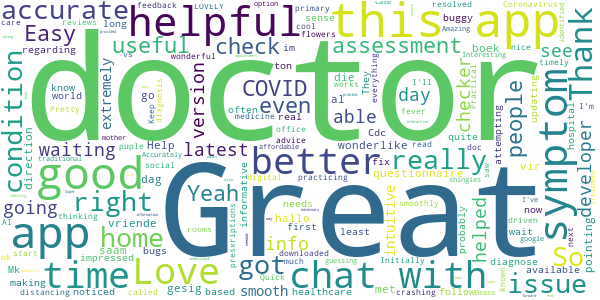
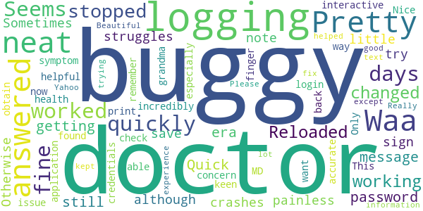
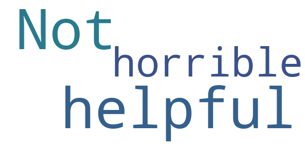

# Sydney Care
App version ``3.0.2``

Analyzed with [covid-apps-observer](http://github.com/covid-apps-observer) project, version ``0.1``

## App overview
| | |
|-------------------------|-------------------------| 
| **Name**&nbsp;&nbsp;&nbsp;&nbsp;&nbsp;&nbsp;&nbsp;&nbsp;&nbsp;&nbsp;&nbsp;&nbsp;&nbsp;&nbsp;&nbsp;&nbsp;&nbsp;&nbsp;&nbsp;&nbsp;&nbsp;&nbsp;&nbsp;&nbsp;&nbsp;&nbsp;&nbsp;&nbsp;&nbsp;&nbsp;&nbsp;&nbsp;&nbsp;&nbsp;&nbsp;&nbsp;&nbsp;&nbsp;&nbsp;&nbsp;  | Sydney Care |
| **Unique identifier** | ai.carespree |
| **Link to Google Play** | [https://play.google.com/store/apps/details?id=ai.carespree](https://play.google.com/store/apps/details?id=ai.carespree) |
| **Summary**  | Primary Care Anytime, Anywhere |
| **Privacy policy** | [https://www.sydneycare.ai/privacy-policy.html](https://www.sydneycare.ai/privacy-policy.html) |
| **Latest version** | 3.0.2 |
| **Last update** | 2021-02-24 21:02:58 |
| **Recent changes** | Fixed a login issue for returned users.  |
| **Installs**  | 100,000+ |
| **Category** | Medical |
| **First release** | Jul 30, 2019 |
| **Size**  | 89M |
| **Supported Android version**  | 5.0 and up |

### Description
> Worried about Coronavirus?
 The outbreak of COVID-19 Coronavirus continues to be a health challenge both in the US and globally. Screen yourself and assess your risk for free with a COVID-19 Assessment available now through Sydney Care.
  
 •	Assess your risk for free based on CDC guidance
 •	Get personalized guidance about what to do next
 •	Connect with doctors via text chat or video
 •	Read curated information from authoritative sources
 Sydney Care offers personalized symptom checking, real-time treatment from real doctors, prescriptions and labs ordered, all from your device
 Fast and Free
 Take as little as 4 minutes to answer questions 
 on your symptoms.
 Answers Tailored to You
 Get personalized answers based on your
 gender, age and medical history.
 Convenient and Accessible
 Available 24/7, 365 days a year.
 Path to Treatment
 Get information on what OTC medicine to take,
 and see projected recovery times.
 Download Sydney Care℠ to get smarter about your symptoms

### User interface
The developers of the app provide the following screenshots in the Google play store.
| | | |
|:-------------------------:|:-------------------------:|:-------------------------:|
 |   |   |   | 
 |   |   |   | 

## Development team
In the following we report the main information provided by the development team in the Google play store.

| | |
|-------------------------|-------------------------|
| **Developer**  | CareMarket Inc. |
| **Website**  | [https://www.sydneycare.ai](https://www.sydneycare.ai) |
| **Email** | support@sydneycare.ai |
| **Physical address**  | - |
| **Other developed apps**  | [https://play.google.com/store/apps/developer?id=CareMarket+Inc.](https://play.google.com/store/apps/developer?id=CareMarket+Inc.) |

## Android support

| | |
|-------------------------|-------------------------|
| **Declared target Android version**  | Android10, version 10 (API level 29) |
| **Effective target Android version**  | Android10, version 10 (API level 29) |
| **Minimum supported Android version**  | Nougat, version 7.0 (API level 24) |
| **Maximum target Android version**  | - |

The larger the difference between the minimum and maximum supported Android versions, the better. A larger difference means a wider audience. For example, old phones have a very low Android version, so a high minimum supported Android version means that the app cannot be used by users with old phones, thus leading to accessibility problems. 

## Requested permissions

In the following we report the complete list of the permissions requested by the app. 

| **Permission** | **Protection level** | **Description** | 
|-------------------------|-------------------------|-------------------------|
 **ai.carespree.permission C2D_MESSAGE** | - | - 
 **android.permission ACCESS_COARSE_LOCATION** | :warning:**Dangerous** | Allows an app to access approximate location. 
 **android.permission ACCESS_FINE_LOCATION** | :warning:**Dangerous** | Allows an app to access precise location. 
 **android.permission ACCESS_NETWORK_STATE** | Normal | Allows applications to access information about networks. 
 **android.permission ACCESS_WIFI_STATE** | Normal | Allows applications to access information about Wi-Fi networks. 
 **android.permission BLUETOOTH** | Normal | Allows applications to connect to paired bluetooth devices. 
 **android.permission CAMERA** | :warning:**Dangerous** | Required to be able to access the camera device. 
 **android.permission FLASHLIGHT** | - | - 
 **android.permission GET_TASKS** | Deprecated | This constant was deprecated in API level 21. No longer enforced. 
 **android.permission INTERNET** | Normal | Allows applications to open network sockets. 
 **android.permission MODIFY_AUDIO_SETTINGS** | Normal | Allows an application to modify global audio settings. 
 **android.permission READ_APP_BADGE** | - | - 
 **android.permission READ_CALENDAR** | :warning:**Dangerous** | Allows an application to read the user's calendar data. 
 **android.permission RECEIVE_BOOT_COMPLETED** | Normal | Allows an application to receive the Intent.ACTION_BOOT_COMPLETED that is broadcast after the system finishes booting. 
 **android.permission RECORD_AUDIO** | :warning:**Dangerous** | Allows an application to record audio. 
 **android.permission USE_BIOMETRIC** | Normal | Allows an app to use device supported biometric modalities. 
 **android.permission USE_FINGERPRINT** | Normal | This constant was deprecated in API level 28. Applications should request USE_BIOMETRIC instead 
 **android.permission VIBRATE** | Normal | Allows access to the vibrator. 
 **android.permission WAKE_LOCK** | Normal | Allows using PowerManager WakeLocks to keep processor from sleeping or screen from dimming. 
 **android.permission WRITE_CALENDAR** | :warning:**Dangerous** | Allows an application to write the user's calendar data. 
 **android.permission WRITE_EXTERNAL_STORAGE** | :warning:**Dangerous** | Allows an application to write to external storage. 
 **com.anddoes.launcher.permission UPDATE_COUNT** | - | - 
 **com.android.vending CHECK_LICENSE** | - | - 
 **com.google.android.c2dm.permission RECEIVE** | - | - 
 **com.google.android.finsky.permission BIND_GET_INSTALL_REFERRER_SERVICE** | - | - 
 **com.htc.launcher.permission READ_SETTINGS** | - | - 
 **com.htc.launcher.permission UPDATE_SHORTCUT** | - | - 
 **com.huawei.android.launcher.permission CHANGE_BADGE** | - | - 
 **com.huawei.android.launcher.permission READ_SETTINGS** | - | - 
 **com.huawei.android.launcher.permission WRITE_SETTINGS** | - | - 
 **com.majeur.launcher.permission UPDATE_BADGE** | - | - 
 **com.oppo.launcher.permission READ_SETTINGS** | - | - 
 **com.oppo.launcher.permission WRITE_SETTINGS** | - | - 
 **com.sec.android.provider.badge.permission READ** | - | - 
 **com.sec.android.provider.badge.permission WRITE** | - | - 
 **com.sonyericsson.home.permission BROADCAST_BADGE** | - | - 
 **com.sonymobile.home.permission PROVIDER_INSERT_BADGE** | - | - 
 **me.everything.badger.permission BADGE_COUNT_READ** | - | - 
 **me.everything.badger.permission BADGE_COUNT_WRITE** | - | - 

## Mentioned servers

| **Server** | **Registrant** | **Registrant country** | **Creation date** | 
|-------------------------|-------------------------|-------------------------|-------------------------|
 | apache.org | The Apache Software Foundation | :us: US | 1995-04-11 04:00:00 |
 | xml.org | OASIS Open | :us: US | 1997-02-03 05:00:00 |
 | w3.org | W3C | :us: US | 1994-07-06 04:00:00 |
 | purl.org | Internet Archive | :us: US | 1996-01-01 05:00:00 |
 | adobe.com | Adobe Inc. | :us: US | 1986-11-17 05:00:00 |
 | bugsnag.com | Bugsnag Inc. | GB | 2011-08-18 03:26:10 |
 | iptc.org | Whois Privacy Service | :us: US | 1995-12-27 05:00:00 |
 | useplus.org | PLUS COALITION | :us: US | 2003-11-18 19:31:25 |
 | npes.org | NPES | :us: US | 1996-01-30 05:00:00 |
 | aiim.org | Association for Information and Image Management International | :us: US | 1995-10-18 04:00:00 |
 | appboy.com | Braze, Inc. | :us: US | 2008-10-06 23:28:32 |
 | braze.com | Braze, Inc. | :us: US | 2000-01-19 02:18:28 |
 | github.com | GitHub, Inc. | :us: US | 2007-10-09 18:20:50 |
 | facebook.com | Facebook, Inc. | :us: US | 1997-03-29 05:00:00 |
 | google.com | Google LLC | :us: US | 1997-09-15 04:00:00 |
 | pinterest.com | DNStination Inc. | :us: US | 2009-11-26 19:21:23 |
 | twitter.com | Twitter, Inc. | :us: US | 2000-01-21 16:28:17 |
 | drewnoakes.com | REDACTED FOR PRIVACY | GB | 2002-04-04 10:00:05 |
 | android.com | Google LLC | :us: US | 1997-06-23 04:00:00 |
 | googlesyndication.com | Google LLC | :us: US | 2003-01-21 06:17:24 |
 | app-measurement.com | Google LLC | :us: US | 2015-06-19 20:13:31 |
 | microblink.com | WhoisGuard, Inc. | PA | 2014-07-22 18:19:52 |
 | googleapis.com | Google LLC | :us: US | 2005-01-25 17:52:26 |
 | stripe.com | - | :us: US | 1995-09-12 04:00:00 |

## Security analysis 

Below we report the main security warnings raised by our execution of the [Androwarn](https://github.com/maaaaz/androwarn) security analysis tool.

**Telephony identifiers leakage**
> - This application reads the ISO country code equivalent for the SIM provider's country code 
> - This application reads the MCC+MNC of the provider of the SIM 
> - This application reads the Service Provider Name (SPN) 
> - This application reads the device phone type value 
> - This application reads the numeric name (MCC+MNC) of current registered operator 
> - This application reads the operator name 
> - This application reads the phone number string for line 1, for example, the MSISDN for a GSM phone 
> - This application reads the phone's current state 
> - This application reads the radio technology (network type) currently in use on the device for data transmission 

**Location lookup**
> - This application reads location information from all available providers (WiFi, GPS etc.) 

**Connection interfaces exfiltration**
> - This application reads details about the currently active data network 
> - This application tries to find out if the currently active data network is metered 

**Audio video eavesdropping**
> - This application records audio from the 'CAMCORDER' source  
> - This application records audio from the 'MIC' source  
> - This application captures video from the 'CAMERA' source 
> - This application captures video from the 'SURFACE' source 

**Suspicious connection establishment**
> - This application opens a Socket and connects it to the remote address '' on the 'N/A' port  
> - This application opens a Socket and connects it to the remote address 'Ljava/lang/StringBuilder;->toString()Ljava/lang/String;' on the ': connect, resolve' port  
> - This application opens a Socket and connects it to the remote address 'Ljava/lang/StringBuilder;->toString()Ljava/lang/String;' on the 'N/A' port  
> - This application opens a Socket and connects it to the remote address 'Ljava/net/Proxy;->type()Ljava/net/Proxy$Type;' on the 'N/A' port  
> - This application opens a Socket and connects it to the remote address 'timeout' on the 'N/A' port  

**Pim data leakage**
> - This application accesses the downloads folder 
> - This application accesses data stored in the clipboard 

**Code execution**
> - This application loads a native library 
> - This application loads a native library: 'Ljava/util/Iterator;->next()Ljava/lang/Object;' 
> - This application loads a native library: 'bugsnag-ndk' 
> - This application loads a native library: 'bugsnag-plugin-android-anr' 
> - This application loads a native library: 'tool-checker' 
> - This application executes a UNIX command 
> - This application executes a UNIX command containing this argument: '2' 
> - This application executes a UNIX command containing this argument: 'getprop' 
> - This application executes a UNIX command containing this argument: 'mount' 

## User ratings and reviews

Below we provide information about how end users are reacting to the app in terms of ratings and reviews in the Google Play store.

### Ratings

The Sydney Care app has been installed by more than **100000** times. At this time, **270** rated the app and its average score is **3.3168316**. Below we show the distribution of the ratings across the usual star-based rating of Google Play

:star::star::star::star::star:: 126

:star::star::star::star:: 24

:star::star::star:: 21

:star::star:: 8

:star:: 91

### Reviews 

#### 5-star reviews

> Easy, intuitive, smooth and extremely helpful  :date: __2021-02-21 18:10:32__

> The COVID questionnaire was very helpful. Thank you!  :date: __2020-11-13 17:18:38__

> hallo vir al my vriende in die gesig boek 'n wonderlike dag saam met my  :date: __2020-09-11 01:54:56__

> Great Great Help  :date: __2020-08-05 18:46:28__

> This app is great for pointing you on the direction you should go regarding symptoms.  :date: __2020-05-29 07:24:20__

> Good  :date: __2020-05-16 03:49:11__

> Mk  :date: __2020-05-02 01:27:53__

> Very informative & helpful even follow up check up !!!  :date: __2020-04-23 00:25:23__

> Accurate  :date: __2020-04-13 16:06:49__

> I know it not a real diagnose. But at least you can get a sense of what condition you have.. So thank you. Its a really good app..  :date: __2020-04-12 15:43:05__

#### 4-star reviews

> Pretty neat!  :date: __2021-01-19 19:06:41__

> Waa answered quickly.  :date: __2020-11-13 00:42:16__

> Seems buggy It worked fine for few days then stopped working. Reloaded changed password still getting era message.  :date: __2020-10-10 01:03:24__

> Quick and painless, although a little buggy. Sometimes it struggles to sign me in, and when I try to save a doctor's note it just crashes. Otherwise incredibly helpful, especially now.  :date: __2020-09-08 01:20:22__

> Nice way to obtain health concern with an MD :)  :date: __2020-06-12 20:01:23__

> This application is very interactive for symptom check. Only issue my grandma found is she was not able to login back with her finger print after logging out. She was so keen about it because she did not want to remember her credentials.  :date: __2020-06-06 02:17:19__

> Was very accurate in the information. Really helped me a lot.  :date: __2020-04-23 06:26:53__

> Yahoo  :date: __2020-04-10 21:02:26__

> The experience was good except it kept logging me out when trying to text with the doctor. Please fix that.  :date: __2020-04-04 18:55:35__

> Beautiful ❤️❤️😍  :date: __2020-03-19 03:07:29__

#### 3-star reviews

> This would be better if the doctors were instantly available. There will be hours and hours of waiting and reconnecting and retrying and re-launching the app. I did get to meet with a doctor twice. Once they looked at me, and the next time they actually called in a prescription to my local pharmacy for me.  :date: __2020-11-26 17:31:05__

> Need to go to home page  :date: __2020-05-14 00:14:29__

> Haven't had it yet.  :date: __2020-04-30 09:01:44__

> I loved this app when it worked! Now it keeps crashing. Every time I open it, it freezes and nothing shows up. I tried to see if there was an update but there's not :(  :date: __2020-04-09 11:09:00__

> Impossible to use, this app crashes right when you get to the section that asks you questions. I've tried two different devices with the same result on each. Update, the related issue was fixed so I've updated my rating. This app still needs a better user experience, so 3 stars now.  :date: __2020-03-26 21:39:51__

> Doesn't recognize my symptoms to suggest correct treatment. Additionally you are only providing two genders. There should be an option for gender fluid and non binary and the respective pronouns.  :date: __2019-10-11 21:02:53__

#### 2-star reviews

> Not helpful  :date: __2020-05-03 17:16:17__

> horrible  :date: __2020-04-06 22:57:58__

#### 1-star reviews

> Initial wait to speak with a doctor was 1 hour, which I honestly didn't mind considering the current world events. What really irritated me was the actual chat with the doctor. It took 3.5 hours mostly because the doctor took between 10-15 minutes to respond to me. I believe the longest I waited for him to respond was 30 minutes. On top of all that, I was told he wasn't currently able to provide a doctor's note due to current limitations within the app. Waste of money and time.  :date: __2021-01-04 22:56:02__

> Clunky, confusing setup process. There is a lot of configuration of personal settings even after connecting to the main Sydney health app and my Anthem account. Once you have it set, it still makes you go through the symptom checker before you can use its touted features for communicating with medical experts. Even that might be workable, but there are huge gaps in the symptom checker. I can't start with hypertension or high blood pressure as a symptom? Terrible, frustrating design.  :date: __2021-01-02 16:19:48__

> Think I have Covid but private healthcare is a fail. Horrible App (and somehow I pay for this experience). I have anthem blue cross blue shield and their sydney care app to figure out the covid testing I need with symptoms is a fail. Tries to link accounts but won't login and the reset password doesn't work to the email on file or phone. I can login to their other sydney app just fine. This sydney business has been a wreck since they sought to disconnect it from the name of the provider.  :date: __2020-12-23 04:54:25__

> It will not allow me to get any info over to my work. Will not allow me to download my doctor visit information to my phone or fax it to my work or email to my HR department.  :date: __2020-11-09 21:15:41__

> I have to answer the same questions every time I log in. It doesn't pick up where we left off.  :date: __2020-10-24 13:32:00__

> Dumb app does not work!! You can not get passed the login!  :date: __2020-09-07 02:37:52__

> App crashes more than all Nascar drivers together. Cant even download an attachment referral. Also have to sign in 8 times just to send one message because it crashes then requires login credentials. Fought with this app for 60 min before I told the doctor to just cancel everything we discussed and I was uninstalling this piece of trash crash app.  :date: __2020-09-03 18:39:31__

> Dont download. Cant put in code to register  :date: __2020-08-29 17:27:15__

> Keeps going back to main menu, no matter if I try to link it and login with my Sydney health info or try making a new account. There is no in-app chat or trouble shooting. Basically it's impossible to use. I have had this insurance plan for a year and a half and have tried using this"resource" multiple times. I have a doctorate, and my husband literally writes computer code for a living so this is not user error. If he and I can't figure out how to make it work, it just doesn't work.  :date: __2020-08-12 16:03:30__

> This app sucks I can't even log in...I enter a password and it says my password cannot be my username or part of my username or email even though my password is not!  :date: __2020-08-01 01:54:54__

