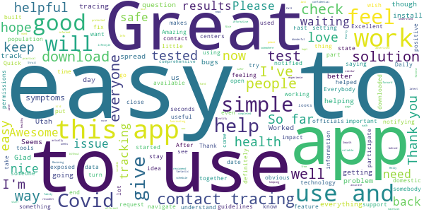
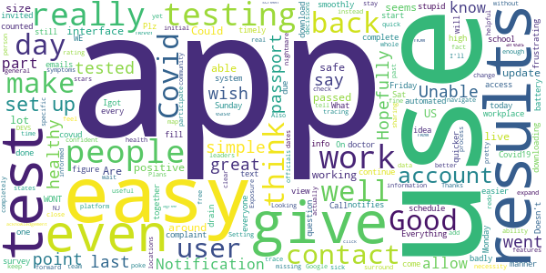
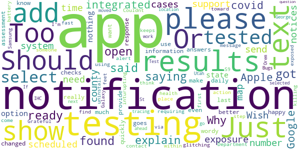
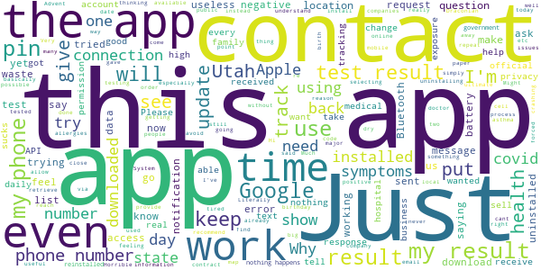

# Healthy Together - COVID-19
App version ``1.4.0``

Analyzed with [covid-apps-observer](http://github.com/covid-apps-observer) project, version ``0.1``

## App overview
| | |
|-------------------------|-------------------------| 
| **Name**&nbsp;&nbsp;&nbsp;&nbsp;&nbsp;&nbsp;&nbsp;&nbsp;&nbsp;&nbsp;&nbsp;&nbsp;&nbsp;&nbsp;&nbsp;&nbsp;&nbsp;&nbsp;&nbsp;&nbsp;&nbsp;&nbsp;&nbsp;&nbsp;&nbsp;&nbsp;&nbsp;&nbsp;&nbsp;&nbsp;&nbsp;&nbsp;&nbsp;&nbsp;&nbsp;&nbsp;&nbsp;&nbsp;&nbsp;&nbsp;  | Healthy Together - COVID-19 |
| **Unique identifier** | co.twenty.stop.spread |
| **Link to Google Play** | [https://play.google.com/store/apps/details?id=co.twenty.stop.spread](https://play.google.com/store/apps/details?id=co.twenty.stop.spread) |
| **Summary**  | Join the effort to reopen our communities safely |
| **Privacy policy** | [https://healthytogether.io/legal/privacy](https://healthytogether.io/legal/privacy) |
| **Latest version** | 1.4.0 |
| **Last update** | 2020-11-19 05:19:29 |
| **Recent changes** | Healthy Together has now launched in Florida featuring:  - Real-time test results from Florida’s Department of Health  - Contact tracing interviews  - Public health announcements and more |
| **Installs**  | 50,000+ |
| **Category** | Health & Fitness |
| **First release** | Apr 21, 2020 |
| **Size**  | 39M |
| **Supported Android version**  | 7.0 and up |

### Description
> Healthy Together is available in Utah & Florida.
 Healthy Together helps stop the spread of COVID-19 through:
 - Daily symptom assessments that can be shared with your doctor, office or school
 - Providing access to testing centers and appointments
 - Real time delivery of in-app test results
 - Clearing of employees/students for work/school
 - Augmented and guided contact tracing
 - Notifications regarding the status of your area and guidelines on how to stay safe
 - Complete COVID-19 response platform anchored in CDC guidelines
 The Healthy Together app is now launching for all Florida’s residents and will offer these key features:
 - Universal Test Delivery: Florida residents who take a COVID-19 test from any provider in the State will be able to receive their expedited test results directly through the app.
 - Self-Serve Contact Tracing Interview: Anyone who tests positive for COVID-19 will be prompted to take an in-app interview, including questions on their exposure history.
 - Real-Time Public Health Announcements: The app will serve as a notification center for state-wide updates and alerts from Public Health, including SMS alerts and automated notifications.
 User Data, Privacy & Security
 - There is no mandate to participate in this effort, users choose to opt-in.
 - Users are in full control of their personal data. They decide what data to share, can reverse those decisions as well as delete their data any moment they choose.
 - All symptom data is automatically de-identified after 30-days.
 - Data is encrypted in transit and at rest.
 - The use of this data is limited to COVID-19 response efforts, public health & research purposes.
 View our full Privacy Policy at www.healthytogether.io/legal/privacy

### User interface
The developers of the app provide the following screenshots in the Google play store.
| | | |
|:-------------------------:|:-------------------------:|:-------------------------:|
 |   |   |   | 
 |   |   |   | 
 |   |  

## Development team
In the following we report the main information provided by the development team in the Google play store.

| | |
|-------------------------|-------------------------|
| **Developer**  | Twenty Inc. |
| **Website**  | [https://healthytogether.io/](https://healthytogether.io/) |
| **Email** | info@healthytogether.io |
| **Physical address**  | [280 Park Ave 41st Floor New York, NY 10017](https://www.google.com/maps/search/280%20Park%20Ave%2041st%20Floor%20New%20York,%20NY%2010017) (Google Maps) |
| **Other developed apps**  | [https://play.google.com/store/apps/developer?id=Twenty+Inc.](https://play.google.com/store/apps/developer?id=Twenty+Inc.) |

## Android support

| | |
|-------------------------|-------------------------|
| **Declared target Android version**  | - |
| **Effective target Android version**  | - |
| **Minimum supported Android version**  | Nougat, version 7.0 (API level 24) |
| **Maximum target Android version**  | - |

The larger the difference between the minimum and maximum supported Android versions, the better. A larger difference means a wider audience. For example, old phones have a very low Android version, so a high minimum supported Android version means that the app cannot be used by users with old phones, thus leading to accessibility problems. 

## Requested permissions

In the following we report the complete list of the permissions requested by the app. 

| **Permission** | **Protection level** | **Description** | 
|-------------------------|-------------------------|-------------------------|
 **android.permission ACCESS_FINE_LOCATION** | :warning:**Dangerous** | Allows an app to access precise location. 
 **android.permission ACCESS_NETWORK_STATE** | Normal | Allows applications to access information about networks. 
 **android.permission ACCESS_WIFI_STATE** | Normal | Allows applications to access information about Wi-Fi networks. 
 **android.permission BLUETOOTH** | Normal | Allows applications to connect to paired bluetooth devices. 
 **android.permission BLUETOOTH_ADMIN** | Normal | Allows applications to discover and pair bluetooth devices. 
 **android.permission CAMERA** | :warning:**Dangerous** | Required to be able to access the camera device. 
 **android.permission FOREGROUND_SERVICE** | Normal | Allows a regular application to use Service.startForeground. 
 **android.permission INTERNET** | Normal | Allows applications to open network sockets. 
 **android.permission READ_CONTACTS** | :warning:**Dangerous** | Allows an application to read the user's contacts data. 
 **android.permission RECEIVE_BOOT_COMPLETED** | Normal | Allows an application to receive the Intent.ACTION_BOOT_COMPLETED that is broadcast after the system finishes booting. 
 **android.permission USE_BIOMETRIC** | Normal | Allows an app to use device supported biometric modalities. 
 **android.permission USE_FINGERPRINT** | Normal | This constant was deprecated in API level 28. Applications should request USE_BIOMETRIC instead 
 **android.permission VIBRATE** | Normal | Allows access to the vibrator. 
 **android.permission WAKE_LOCK** | Normal | Allows using PowerManager WakeLocks to keep processor from sleeping or screen from dimming. 
 **com.google.android.c2dm.permission RECEIVE** | - | - 
 **com.google.android.finsky.permission BIND_GET_INSTALL_REFERRER_SERVICE** | - | - 

## Mentioned servers

| **Server** | **Registrant** | **Registrant country** | **Creation date** | 
|-------------------------|-------------------------|-------------------------|-------------------------|
 | googlesyndication.com | Google LLC | :us: US | 2003-01-21 06:17:24 |
 | google.com | Google LLC | :us: US | 1997-09-15 04:00:00 |
 | app-measurement.com | Google LLC | :us: US | 2015-06-19 20:13:31 |
 | cloudinary.com | Cloudinary Ltd. | :israel: IL | 2011-05-24 12:52:37 |
 | amazonaws.com | Amazon.com, Inc. | :us: US | 2005-08-18 02:10:45 |
 | adobe.com | Adobe Inc. | :us: US | 1986-11-17 05:00:00 |
 | googleadservices.com | Google LLC | :us: US | 2003-06-19 16:34:53 |
 | mapbox.com | Whois Privacy Service | :us: US | 2003-11-27 11:15:57 |
 | healthytogether.io | Domains By Proxy, LLC | :us: US | 2020-04-09 16:47:40 |
 | crashlytics.com | Google LLC | :us: US | 2011-01-21 15:30:40 |
 | twentylabs.co | Domains By Proxy, LLC | :us: US | 2020-04-04 22:49:56 |

## Security analysis 

Below we report the main security warnings raised by our execution of the [Androwarn](https://github.com/maaaaz/androwarn) security analysis tool.

**Telephony identifiers leakage**
> - This application reads the numeric name (MCC+MNC) of current registered operator 
> - This application reads the operator name 
> - This application reads the radio technology (network type) currently in use on the device for data transmission 

**Connection interfaces exfiltration**
> - This application reads details about the currently active data network 
> - This application tries to find out if the currently active data network is metered 

**Telephony services abuse**
> - This application makes phone calls 

**Suspicious connection establishment**
> - This application opens a Socket and connects it to the remote address '; exhausted proxy configurations: ' on the 'N/A' port  
> - This application opens a Socket and connects it to the remote address 'Ljava/net/Proxy;->type()Ljava/net/Proxy$Type;' on the 'N/A' port  
> - This application opens a Socket and connects it to the remote address 'Proxy.address() is not an InetSocketAddress:   returned no addresses for  Ljava/net/SocketException;' on the 'N/A' port  
> - This application opens a Socket and connects it to the remote address 'timeout' on the 'N/A' port  

**Code execution**
> - This application loads a native library 
> - This application loads a native library: 'mapbox-gl' 

## User ratings and reviews

Below we provide information about how end users are reacting to the app in terms of ratings and reviews in the Google Play store.

### Ratings

The Healthy Together - COVID-19 app has been installed by more than **50000** times. At this time, **558** rated the app and its average score is **3.6732674**. Below we show the distribution of the ratings across the usual star-based rating of Google Play

:star::star::star::star::star:: 316

:star::star::star::star:: 60

:star::star::star:: 22

:star::star:: 5

:star:: 155

### Reviews 

#### 5-star reviews

> It help me a lots,.  :date: __2020-11-29 20:37:19__

> Excellent staff  :date: __2020-11-29 20:15:52__

> Great  :date: __2020-11-29 02:45:40__

> Very accurate.  :date: __2020-11-28 06:13:45__

> So far everything has been great the only thing I wish is that the test results on the same page and the date that you had your test completed.  :date: __2020-11-27 11:45:02__

> Excellent very informative  :date: __2020-11-26 23:06:19__

> Amazing  :date: __2020-11-26 20:28:43__

> Poorly  :date: __2020-11-26 16:14:10__

> Easy and efficient  :date: __2020-11-26 13:58:57__

> Seems easy to use and understsnd  :date: __2020-11-26 04:05:43__

#### 4-star reviews

> Everything went smoothly. Results were back in a timely manner. The app was easy to use.  :date: __2020-11-28 13:51:03__

> Good  :date: __2020-11-27 16:16:06__

> Good app, easy to use.  :date: __2020-11-25 17:40:38__

> I had my test done last Friday. Sat Igot a text that my results where on this app. Unable to start at all. Sunday and today Monday unable to access the info. Call the # 0n one of my emails and the automated system says WE WONT GIVE YOU THE RESULTS . What is the point of even downloading this stupid app. Plz make it simple and easy.. very frustrating  :date: __2020-11-24 12:23:43__

> Works well! Allows me to view my workplace Covid-19 test results in this app!  :date: __2020-11-03 00:11:00__

> It is a good app, easy to use. My only complaint is that after I fill out my school's passport, it still notifies me to complete a healthy together survey every day. I wish the passport counted for both.  :date: __2020-10-10 15:40:38__

> I think this is a great idea. Hopefully people will continue to download it. I do wish it was easier to figure out how to schedule tests.  :date: __2020-08-20 19:14:09__

> Doesn't drain battery badly. I think the question "Have you been tested for Covid19?", should say "Have you been tested for covud 19 in the last 20 days?" Notification for test results come back quicker than my doctor can contact me.  :date: __2020-07-23 16:00:57__

> Great app and I have invited everyone in my contacts due to the high necessity to know how healthy the people you surround yourself with. The even better part about this app is the fact that if you allow it to trace you (and you should), it can tell you about other users being sick or testing positive if you've been around them and you don't even have to know the person! I would, however, like it a lot more (or give it 5 stars), if it would update the map of testing areas. A lot missing.  :date: __2020-06-27 23:00:50__

> It seems to work really well now.  :date: __2020-06-26 19:24:06__

#### 3-star reviews

> Just got a text saying my results are ready open app and said not found explain please  :date: __2020-11-27 17:24:44__

> Should show all results  :date: __2020-11-25 13:52:14__

> Why isn't this app integrated with Google and Apple's covid exposure notification system? Please add support for that.  :date: __2020-11-19 20:53:41__

> Wish the app would send notices for the number of cases in the county at a scheduled time not just a map.  :date: __2020-10-03 22:07:45__

> You need to add an option to state nothing has changed since last assessment so you can quickly provide answers. You could even have it show up in the notification as a response. It would really make it much better.  :date: __2020-09-16 18:38:18__

> Too wordy for daily use...  :date: __2020-08-29 06:38:47__

> Not happy with the app  :date: __2020-08-09 17:42:37__

> I want to know where the information goes? Who checks this? Department of health? Or who?  :date: __2020-07-20 13:41:27__

> App keeps glitching. I get inturupting notifications requiring action.  :date: __2020-07-07 20:01:21__

> Couldnt find the testing place and how to get tested  :date: __2020-05-11 23:48:56__

#### 2-star reviews

> Haven't seen any information relevant to my personal information yet.  :date: __2020-11-18 16:58:40__

> Pretty useless. Tells me to quarantine just because I live with someone who's tested positive regardless of how long ago that was.  :date: __2020-10-17 09:35:27__

> This app tells you to get tested for COVID if you have one symptom. Sometimes people have body aches because they did a hard work out. Sometimes people get a sore throat because they are too much sugar. There are other reasons to have some of these symptoms.  :date: __2020-09-28 22:17:10__

> Does not show the areas of covid on map. Shows absolutely nothing on the map.  :date: __2020-09-04 18:37:29__

> I suppose i don't hate it for its functionality. But i do hate how I'm forced to use it, and every time I work out it says i need to get tested because I'm sore and I have to show these results to employers/professors.  :date: __2020-09-01 17:56:32__

> Digital contact tracing turned off? This is the apps main feature. I can find mom way to turn it back on. Very frustrating.  :date: __2020-08-29 15:34:43__

> The app has killed my battery. It seems like it could be useful, but an app on a dead phone can only do so much.  :date: __2020-07-29 23:11:19__

> It's Draining my battery at 45% usage over my other apps and I only use it briefly for one moment of the day. Plus the state of utah isn't using the tracking feature. Please update the app.  :date: __2020-07-29 14:47:28__

> This was quickly rolled out, however no serious advertising whatsoever after, therefore no real impact with only a limited user base. Coronavirus is still spreading and could have been mitigated by better contact tracing and aggressive testing.  :date: __2020-07-27 19:57:36__

> It needs more white space and adds too many ads. It blocks my work at most inconvenient times with full screen. I removed it and had to add it back to see covid test from hospital. Also no place to record antibody test.  :date: __2020-07-18 14:21:26__

#### 1-star reviews

> I forgot my pin , and the app doesn't allow me to re set it .  :date: __2020-11-30 01:17:08__

> I was sent home after 15 minutes with high blood pressure and chest pain. Just because they decided not to treat me and just do a Covid-19 test. Came back negative what else do you need? Inappropriate to invade negative patients privacy for $ of a contract with FL Advent health hospital. F this app and F Advent health hospital I have always been discriminated by this hospital.  :date: __2020-11-30 00:22:27__

> This is stupid. Where are my results.?  :date: __2020-11-29 23:42:21__

> Why won't ,my results show just other apps keep popping up  :date: __2020-11-29 22:12:04__

> I cannot even retrieve a pin number. When i request it with my phone number i keep getting a connection error message that pops up. My connection on my phone is good. I have also sent an e mail twice and have gotten no reply.  :date: __2020-11-29 20:46:35__

> You can not turn off notifications! Also, pay close attention to the wheel when selecting your birthday, changing numbers also changes the month.  :date: __2020-11-29 15:45:15__

> Installed several times. No result. Asked for assistance. No response.  :date: __2020-11-29 14:09:58__

> my test results are now blocked because my date of birth was input incorrectly  :date: __2020-11-27 21:45:03__

> I gave permission to receive my test results by phone or email. But when I received a message letting me know my results were ready, instead of just informing me of what the results are I had to install this app. Even after installing and verifying my identity, I get a message saying "No results found." Why can't I just get my test results in a text message like I was supposed to? I still don't know if my test was negative or positive. *ETA- Thank you, email sent.  :date: __2020-11-27 19:10:57__

> I cant even get on the app. It wants me to put in a pin, so when I request one it saids lost connection. This sucks how else do I get my results?  :date: __2020-11-27 16:37:48__

