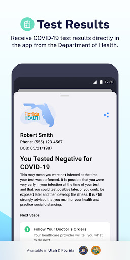
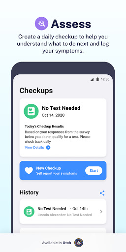
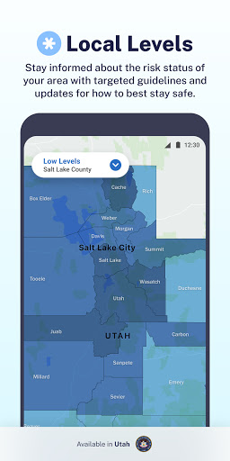
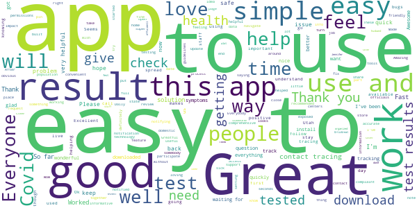
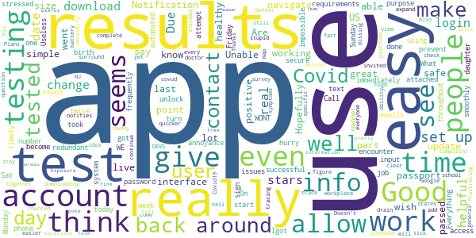
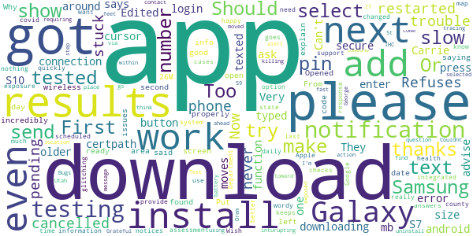
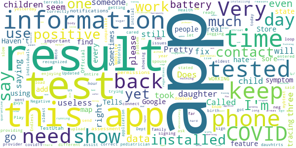
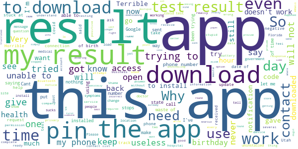

# Healthy Together - COVID-19
App version ``1.4.19``

Analyzed with [covid-apps-observer](http://github.com/covid-apps-observer) project, version ``0.1``

## App overview
| | |
|-------------------------|-------------------------| 
| **Name**&nbsp;&nbsp;&nbsp;&nbsp;&nbsp;&nbsp;&nbsp;&nbsp;&nbsp;&nbsp;&nbsp;&nbsp;&nbsp;&nbsp;&nbsp;&nbsp;&nbsp;&nbsp;&nbsp;&nbsp;&nbsp;&nbsp;&nbsp;&nbsp;&nbsp;&nbsp;&nbsp;&nbsp;&nbsp;&nbsp;&nbsp;&nbsp;&nbsp;&nbsp;&nbsp;&nbsp;&nbsp;&nbsp;&nbsp;&nbsp;  | Healthy Together - COVID-19 |
| **Unique identifier** | co.twenty.stop.spread |
| **Link to Google Play** | [https://play.google.com/store/apps/details?id=co.twenty.stop.spread](https://play.google.com/store/apps/details?id=co.twenty.stop.spread) |
| **Summary**  | Join the effort to reopen our communities safely |
| **Privacy policy** | [https://healthytogether.io/legal/privacy](https://healthytogether.io/legal/privacy) |
| **Latest version** | 1.4.19 |
| **Last update** | 2020-12-10 18:53:58 |
| **Recent changes** | Healthy Together has now launched in Florida featuring:  - Real-time test results from Florida’s Department of Health  - Contact tracing interviews  - Public health announcements and more |
| **Installs**  | 100,000+ |
| **Category** | Health & Fitness |
| **First release** | Apr 21, 2020 |
| **Size**  | 39M |
| **Supported Android version**  | 7.0 and up |

### Description
> Healthy Together is available in Utah & Florida.
 Healthy Together helps stop the spread of COVID-19 through:
 - Daily symptom assessments that can be shared with your doctor, office or school
 - Providing access to testing centers and appointments
 - Real time delivery of in-app test results
 - Clearing of employees/students for work/school
 - Augmented and guided contact tracing
 - Notifications regarding the status of your area and guidelines on how to stay safe
 - Complete COVID-19 response platform anchored in CDC guidelines
 The Healthy Together app is now launching for all Florida’s residents and will offer these key features:
 - Universal Test Delivery: Florida residents who take a COVID-19 test from any provider in the State will be able to receive their expedited test results directly through the app.
 - Self-Serve Contact Tracing Interview: Anyone who tests positive for COVID-19 will be prompted to take an in-app interview, including questions on their exposure history.
 - Real-Time Public Health Announcements: The app will serve as a notification center for state-wide updates and alerts from Public Health, including SMS alerts and automated notifications.
 User Data, Privacy & Security
 - There is no mandate to participate in this effort, users choose to opt-in.
 - Users are in full control of their personal data. They decide what data to share, can reverse those decisions as well as delete their data any moment they choose.
 - All symptom data is automatically de-identified after 30-days.
 - Data is encrypted in transit and at rest.
 - The use of this data is limited to COVID-19 response efforts, public health & research purposes.
 View our full Privacy Policy at www.healthytogether.io/legal/privacy

### User interface
The developers of the app provide the following screenshots in the Google play store.
| | | |
|:-------------------------:|:-------------------------:|:-------------------------:|
 |   |   |   | 
 |   |   |   | 
 |   |  

## Development team
In the following we report the main information provided by the development team in the Google play store.

| | |
|-------------------------|-------------------------|
| **Developer**  | Twenty Inc. |
| **Website**  | [https://healthytogether.io/](https://healthytogether.io/) |
| **Email** | support@healthytogether.zendesk.com |
| **Physical address**  | [280 Park Ave 41st Floor New York, NY 10017](https://www.google.com/maps/search/280%20Park%20Ave%2041st%20Floor%20New%20York,%20NY%2010017) (Google Maps) |
| **Other developed apps**  | [https://play.google.com/store/apps/developer?id=Twenty+Inc.](https://play.google.com/store/apps/developer?id=Twenty+Inc.) |

## Android support

| | |
|-------------------------|-------------------------|
| **Declared target Android version**  | - |
| **Effective target Android version**  | - |
| **Minimum supported Android version**  | Nougat, version 7.0 (API level 24) |
| **Maximum target Android version**  | - |

The larger the difference between the minimum and maximum supported Android versions, the better. A larger difference means a wider audience. For example, old phones have a very low Android version, so a high minimum supported Android version means that the app cannot be used by users with old phones, thus leading to accessibility problems. 

## Requested permissions

In the following we report the complete list of the permissions requested by the app. 

| **Permission** | **Protection level** | **Description** | 
|-------------------------|-------------------------|-------------------------|
 **android.permission ACCESS_FINE_LOCATION** | :warning:**Dangerous** | Allows an app to access precise location. 
 **android.permission ACCESS_NETWORK_STATE** | Normal | Allows applications to access information about networks. 
 **android.permission ACCESS_WIFI_STATE** | Normal | Allows applications to access information about Wi-Fi networks. 
 **android.permission BLUETOOTH** | Normal | Allows applications to connect to paired bluetooth devices. 
 **android.permission BLUETOOTH_ADMIN** | Normal | Allows applications to discover and pair bluetooth devices. 
 **android.permission CAMERA** | :warning:**Dangerous** | Required to be able to access the camera device. 
 **android.permission FOREGROUND_SERVICE** | Normal | Allows a regular application to use Service.startForeground. 
 **android.permission INTERNET** | Normal | Allows applications to open network sockets. 
 **android.permission READ_CONTACTS** | :warning:**Dangerous** | Allows an application to read the user's contacts data. 
 **android.permission RECEIVE_BOOT_COMPLETED** | Normal | Allows an application to receive the Intent.ACTION_BOOT_COMPLETED that is broadcast after the system finishes booting. 
 **android.permission USE_BIOMETRIC** | Normal | Allows an app to use device supported biometric modalities. 
 **android.permission USE_FINGERPRINT** | Normal | This constant was deprecated in API level 28. Applications should request USE_BIOMETRIC instead 
 **android.permission VIBRATE** | Normal | Allows access to the vibrator. 
 **android.permission WAKE_LOCK** | Normal | Allows using PowerManager WakeLocks to keep processor from sleeping or screen from dimming. 
 **com.google.android.c2dm.permission RECEIVE** | - | - 
 **com.google.android.finsky.permission BIND_GET_INSTALL_REFERRER_SERVICE** | - | - 

## Mentioned servers

| **Server** | **Registrant** | **Registrant country** | **Creation date** | 
|-------------------------|-------------------------|-------------------------|-------------------------|
 | googlesyndication.com | Google LLC | :us: US | 2003-01-21 06:17:24 |
 | cloudinary.com | Cloudinary Ltd. | :israel: IL | 2011-05-24 12:52:37 |
 | amazonaws.com | Amazon.com, Inc. | :us: US | 2005-08-18 02:10:45 |
 | mapbox.com | Whois Privacy Service | :us: US | 2003-11-27 11:15:57 |
 | google.com | Google LLC | :us: US | 1997-09-15 04:00:00 |
 | healthytogether.io | Domains By Proxy, LLC | :us: US | 2020-04-09 16:47:40 |
 | app-measurement.com | Google LLC | :us: US | 2015-06-19 20:13:31 |
 | googleadservices.com | Google LLC | :us: US | 2003-06-19 16:34:53 |
 | crashlytics.com | Google LLC | :us: US | 2011-01-21 15:30:40 |
 | android.com | Google LLC | :us: US | 1997-06-23 04:00:00 |
 | twentylabs.co | Domains By Proxy, LLC | :us: US | 2020-04-04 22:49:56 |

## Security analysis 

Below we report the main security warnings raised by our execution of the [Androwarn](https://github.com/maaaaz/androwarn) security analysis tool.

**Telephony identifiers leakage**
> - This application reads the numeric name (MCC+MNC) of current registered operator 
> - This application reads the operator name 
> - This application reads the radio technology (network type) currently in use on the device for data transmission 

**Connection interfaces exfiltration**
> - This application reads details about the currently active data network 
> - This application tries to find out if the currently active data network is metered 

**Telephony services abuse**
> - This application makes phone calls 

**Suspicious connection establishment**
> - This application opens a Socket and connects it to the remote address '; port is out of range' on the 'N/A' port  
> - This application opens a Socket and connects it to the remote address 'Ljava/net/Proxy;->type()Ljava/net/Proxy$Type;' on the 'N/A' port  
> - This application opens a Socket and connects it to the remote address 'Lkw2;->U(Ljava/lang/String;)Ljava/lang/StringBuilder;' on the 'N/A' port  
> - This application opens a Socket and connects it to the remote address 'timeout' on the 'N/A' port  

**Code execution**
> - This application loads a native library 
> - This application loads a native library: 'mapbox-gl' 

## User ratings and reviews

Below we provide information about how end users are reacting to the app in terms of ratings and reviews in the Google Play store.

### Ratings

The Healthy Together - COVID-19 app has been installed by more than **100000** times. At this time, **2434** rated the app and its average score is **4.3349514**. Below we show the distribution of the ratings across the usual star-based rating of Google Play

:star::star::star::star::star:: 1809

:star::star::star::star:: 266

:star::star::star:: 35

:star::star:: 17

:star:: 307

### Reviews 

#### 5-star reviews

> My test was done quickly and efficientl thanks alot  :date: __2020-12-20 16:47:48__

> Thanks for fest result.  :date: __2020-12-20 16:26:24__

> good stuff  :date: __2020-12-20 04:03:11__

> Fast,organized, friendly staff.  :date: __2020-12-20 03:05:12__

> Everyone did an excellent job  :date: __2020-12-20 02:00:46__

> Jennifer OrtizGreat  :date: __2020-12-20 01:31:51__

> My husband and I had no trouble getting our results. Please with how fast it was.🐰  :date: __2020-12-19 14:53:11__

> Excelent page  :date: __2020-12-18 23:20:23__

> simple App clear info  :date: __2020-12-18 22:33:37__

> If this is the app I was using I am trying to speak with you. Thank you I just got the call i was waiting for.  :date: __2020-12-18 22:09:53__

#### 4-star reviews

> My daughter and I took the test the same time and I haven't got hers  :date: __2020-12-18 21:51:38__

> Good  :date: __2020-12-18 00:22:52__

> The app was helpful but would not allow me to change the date of birth to see other results attached to my phone number.  :date: __2020-12-16 18:02:03__

> I didn't encounter any download/login issues + really like the real time results. I just don't see the purpose of having to unlock my results after using a secure password and login to use the app each time. My info has been saved to my account so it seems over redundant to sign in to my account and then immediately turn around again to input more info. Due to my job requirements I get tested frequently throughout the week. So you could see why that could become an annoyance and prevent 5 stars.  :date: __2020-12-12 10:46:54__

> I had to attempt it twice before i was successful. I think i was in a hurry and stressed to get the results.  :date: __2020-12-11 16:25:58__

> Useless impossible to navigate  :date: __2020-12-06 13:49:19__

> Everything went smoothly. Results were back in a timely manner. The app was easy to use.  :date: __2020-11-28 13:51:03__

> Good  :date: __2020-11-27 16:16:06__

> Good app, easy to use.  :date: __2020-11-25 17:40:38__

> I had my test done last Friday. Sat Igot a text that my results where on this app. Unable to start at all. Sunday and today Monday unable to access the info. Call the # 0n one of my emails and the automated system says WE WONT GIVE YOU THE RESULTS . What is the point of even downloading this stupid app. Plz make it simple and easy.. very frustrating  :date: __2020-11-24 12:23:43__

#### 3-star reviews

> This App Refuses to Download...First it was stuck on 63% so I cancelled the download and restarted my phone. Now the download is just pending. I have never had trouble downloading an app even when the app size is 8+ mb.  :date: __2020-12-20 16:15:03__

> I have an android cannot get on the app says secure certpath connection error please try again. please advise. thanks Carrie  :date: __2020-12-18 22:40:22__

> Very slow install but got results after a while.  :date: __2020-12-12 17:58:45__

> They ask for a pin but do not send one.  :date: __2020-12-10 16:33:59__

> Can't even login. Had a pin texted to me. I typed the numbers but there is no button to press for enter and the "next" function just moves the cursor around. Edited to add: could not make app work on Samsung Galaxy S10 but it did work on older S7.  :date: __2020-12-04 20:12:08__

> App was incredibly slow to download and install. I have a galaxy 7 and no issues with other apps. My wireless is in the 26M area. Just left the install to the next day. Opened properly on the second try. From there all good. Put in info, got code, got date screen and results. Thanks  :date: __2020-12-01 23:45:56__

> Just got a text saying my results are ready open app and said not found explain please  :date: __2020-11-27 17:24:44__

> Should show all results  :date: __2020-11-25 13:52:14__

> Why isn't this app integrated with Google and Apple's covid exposure notification system? Please add support for that.  :date: __2020-11-19 20:53:41__

> Wish the app would send notices for the number of cases in the county at a scheduled time not just a map.  :date: __2020-10-03 22:07:45__

#### 2-star reviews

> I am not enjoying the app. It shows me a neg and a positive result for my dauvhtrts. I do t k n ow which is right. I have cared my daughter pediatrician and they don't know why I have two different results for my daughters  :date: __2020-12-18 19:24:53__

> It won't let me put in my birth year.  :date: __2020-12-14 22:16:51__

> Why did this app send me a Negative test result yesterday and Health Dept. Called me today and said it was Positive??  :date: __2020-12-14 00:10:11__

> I have 2 children under my same phone #. I only get results for myself but can't get the others because it only recognized me when logging in under phone #.  :date: __2020-12-12 23:18:44__

> I went and got my children and myself tested. The app stated that the results were ready for us all however, I'm trying to get the results for my oldest child, however it's not providing me results when the contact information is the same for all three individuals. Can someone please assist me in getting the information for my eldest child. Updated: The provider has the correct information and it was entered correctly, yet the results are still not showing for the my entire family.  :date: __2020-12-12 18:50:22__

> Very slow to down load. Does not ask if your a spouse. Keeps saying not connect. The time took 1 hour.  :date: __2020-12-12 18:38:01__

> Endless loop, I keep signing in (4 times so far) and it keeps saying it will be installed. Pretty useless. And I can't get the results of my covid19 test.  :date: __2020-12-07 13:55:23__

> This app is terreblo you can not dowload the application you guys need to fix this ploblem i need mybtest result  :date: __2020-12-06 20:55:51__

> Can't seem to get back in after the initial upload and sign in.  :date: __2020-12-05 01:50:11__

> App says installed in Google Play Store, but cannot find the app on my phone. Have Motorola Moto G7 and app store says my phone is compatible with the app. Have no issues installing and running other apps.  :date: __2020-11-30 23:20:47__

#### 1-star reviews

> There is no way to recover a forgotten pin. When I uninstalled the app so I could reinstall it and start over, the app stopped downloading @ 63% and refused to progress farther.  :date: __2020-12-20 17:25:49__

> Stopped downloading at 63%  :date: __2020-12-20 16:28:31__

> Cant open it  :date: __2020-12-20 16:20:29__

> The app won't download. It gets to 65% and stops there.  :date: __2020-12-20 16:03:26__

> Waste of time trying to get this to work.  :date: __2020-12-20 15:39:32__

> Not showing any of the tests I had and not the latest one neither.  :date: __2020-12-20 15:24:34__

> Download stuck at 63% as well  :date: __2020-12-20 05:05:30__

> Stuck at 63% for 3 hrs.🥴  :date: __2020-12-20 04:26:36__

> I can not get the app to download completely! I am trying to download from Google play store and it stops at 63% and will not go any further.  :date: __2020-12-20 03:58:21__

> I don't know what password are you referring?  :date: __2020-12-20 02:10:58__

