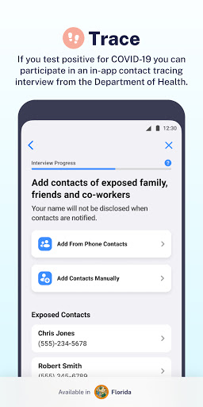
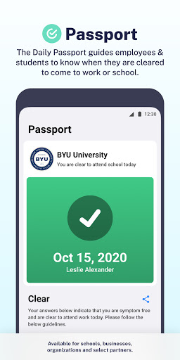
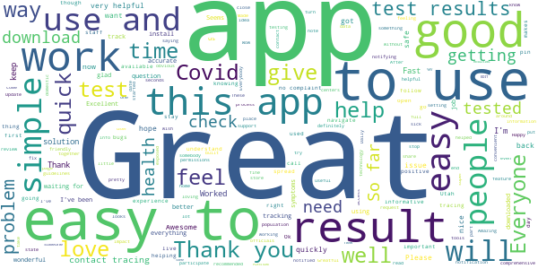
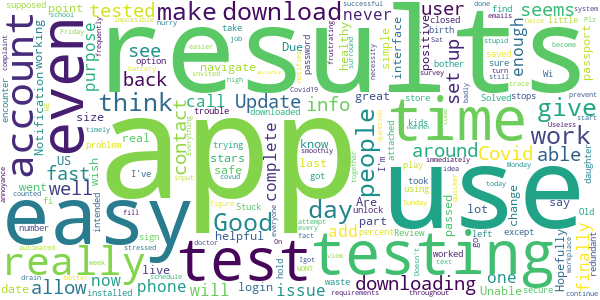
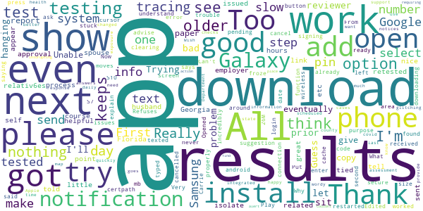
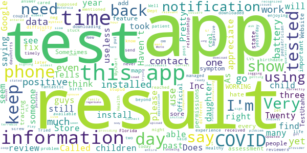
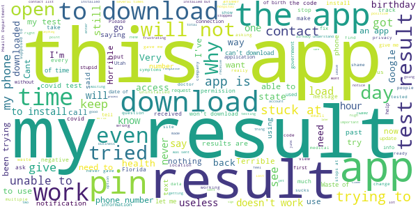

# Healthy Together - COVID-19
App version ``1.4.30``

Analyzed with [covid-apps-observer](http://github.com/covid-apps-observer) project, version ``0.1``

## App overview
| | |
|-------------------------|-------------------------| 
| **Name**&nbsp;&nbsp;&nbsp;&nbsp;&nbsp;&nbsp;&nbsp;&nbsp;&nbsp;&nbsp;&nbsp;&nbsp;&nbsp;&nbsp;&nbsp;&nbsp;&nbsp;&nbsp;&nbsp;&nbsp;&nbsp;&nbsp;&nbsp;&nbsp;&nbsp;&nbsp;&nbsp;&nbsp;&nbsp;&nbsp;&nbsp;&nbsp;&nbsp;&nbsp;&nbsp;&nbsp;&nbsp;&nbsp;&nbsp;&nbsp;  | Healthy Together - COVID-19 |
| **Unique identifier** | co.twenty.stop.spread |
| **Link to Google Play** | [https://play.google.com/store/apps/details?id=co.twenty.stop.spread](https://play.google.com/store/apps/details?id=co.twenty.stop.spread) |
| **Summary**  | Join the effort to reopen our communities safely |
| **Privacy policy** | [https://healthytogether.io/legal/privacy](https://healthytogether.io/legal/privacy) |
| **Latest version** | 1.4.30 |
| **Last update** | 2020-12-23 04:47:37 |
| **Recent changes** | Healthy Together has now launched in Florida featuring:  - Real-time test results from Florida’s Department of Health  - Contact tracing interviews  - Public health announcements and more |
| **Installs**  | 100,000+ |
| **Category** | Health & Fitness |
| **First release** | Apr 21, 2020 |
| **Size**  | 39M |
| **Supported Android version**  | 7.0 and up |

### Description
> Healthy Together is available in Utah & Florida.
 Healthy Together helps stop the spread of COVID-19 through:
 - Daily symptom assessments that can be shared with your doctor, office or school
 - Providing access to testing centers and appointments
 - Real time delivery of in-app test results
 - Clearing of employees/students for work/school
 - Augmented and guided contact tracing
 - Notifications regarding the status of your area and guidelines on how to stay safe
 - Complete COVID-19 response platform anchored in CDC guidelines
 The Healthy Together app is now launching for all Florida’s residents and will offer these key features:
 - Universal Test Delivery: Florida residents who take a COVID-19 test from any provider in the State will be able to receive their expedited test results directly through the app.
 - Self-Serve Contact Tracing Interview: Anyone who tests positive for COVID-19 will be prompted to take an in-app interview, including questions on their exposure history.
 - Real-Time Public Health Announcements: The app will serve as a notification center for state-wide updates and alerts from Public Health, including SMS alerts and automated notifications.
 User Data, Privacy & Security
 - There is no mandate to participate in this effort, users choose to opt-in.
 - Users are in full control of their personal data. They decide what data to share, can reverse those decisions as well as delete their data any moment they choose.
 - All symptom data is automatically de-identified after 30-days.
 - Data is encrypted in transit and at rest.
 - The use of this data is limited to COVID-19 response efforts, public health & research purposes.
 View our full Privacy Policy at www.healthytogether.io/legal/privacy

### User interface
The developers of the app provide the following screenshots in the Google play store.
| | | |
|:-------------------------:|:-------------------------:|:-------------------------:|
 |   |   |   | 
 |   |   |   | 
 |   |  

## Development team
In the following we report the main information provided by the development team in the Google play store.

| | |
|-------------------------|-------------------------|
| **Developer**  | Twenty Inc. |
| **Website**  | [https://healthytogether.io/](https://healthytogether.io/) |
| **Email** | support@healthytogether.zendesk.com |
| **Physical address**  | [280 Park Ave 41st Floor New York, NY 10017](https://www.google.com/maps/search/280%20Park%20Ave%2041st%20Floor%20New%20York,%20NY%2010017) (Google Maps) |
| **Other developed apps**  | [https://play.google.com/store/apps/developer?id=Twenty+Inc.](https://play.google.com/store/apps/developer?id=Twenty+Inc.) |

## Android support

| | |
|-------------------------|-------------------------|
| **Declared target Android version**  | - |
| **Effective target Android version**  | - |
| **Minimum supported Android version**  | Nougat, version 7.0 (API level 24) |
| **Maximum target Android version**  | - |

The larger the difference between the minimum and maximum supported Android versions, the better. A larger difference means a wider audience. For example, old phones have a very low Android version, so a high minimum supported Android version means that the app cannot be used by users with old phones, thus leading to accessibility problems. 

## Requested permissions

In the following we report the complete list of the permissions requested by the app. 

| **Permission** | **Protection level** | **Description** | 
|-------------------------|-------------------------|-------------------------|
 **android.permission ACCESS_FINE_LOCATION** | :warning:**Dangerous** | Allows an app to access precise location. 
 **android.permission ACCESS_NETWORK_STATE** | Normal | Allows applications to access information about networks. 
 **android.permission ACCESS_WIFI_STATE** | Normal | Allows applications to access information about Wi-Fi networks. 
 **android.permission BLUETOOTH** | Normal | Allows applications to connect to paired bluetooth devices. 
 **android.permission BLUETOOTH_ADMIN** | Normal | Allows applications to discover and pair bluetooth devices. 
 **android.permission CAMERA** | :warning:**Dangerous** | Required to be able to access the camera device. 
 **android.permission FOREGROUND_SERVICE** | Normal | Allows a regular application to use Service.startForeground. 
 **android.permission INTERNET** | Normal | Allows applications to open network sockets. 
 **android.permission READ_CONTACTS** | :warning:**Dangerous** | Allows an application to read the user's contacts data. 
 **android.permission RECEIVE_BOOT_COMPLETED** | Normal | Allows an application to receive the Intent.ACTION_BOOT_COMPLETED that is broadcast after the system finishes booting. 
 **android.permission USE_BIOMETRIC** | Normal | Allows an app to use device supported biometric modalities. 
 **android.permission USE_FINGERPRINT** | Normal | This constant was deprecated in API level 28. Applications should request USE_BIOMETRIC instead 
 **android.permission VIBRATE** | Normal | Allows access to the vibrator. 
 **android.permission WAKE_LOCK** | Normal | Allows using PowerManager WakeLocks to keep processor from sleeping or screen from dimming. 
 **com.google.android.c2dm.permission RECEIVE** | - | - 
 **com.google.android.finsky.permission BIND_GET_INSTALL_REFERRER_SERVICE** | - | - 

## Mentioned servers

| **Server** | **Registrant** | **Registrant country** | **Creation date** | 
|-------------------------|-------------------------|-------------------------|-------------------------|
 | app-measurement.com | Google LLC | :us: US | 2015-06-19 20:13:31 |
 | healthytogether.io | Domains By Proxy, LLC | :us: US | 2020-04-09 16:47:40 |
 | mapbox.com | Whois Privacy Service | :us: US | 2003-11-27 11:15:57 |
 | googleadservices.com | Google LLC | :us: US | 2003-06-19 16:34:53 |
 | googlesyndication.com | Google LLC | :us: US | 2003-01-21 06:17:24 |
 | google.com | Google LLC | :us: US | 1997-09-15 04:00:00 |
 | cloudinary.com | Cloudinary Ltd. | :israel: IL | 2011-05-24 12:52:37 |
 | amazonaws.com | Amazon.com, Inc. | :us: US | 2005-08-18 02:10:45 |
 | android.com | Google LLC | :us: US | 1997-06-23 04:00:00 |
 | crashlytics.com | Google LLC | :us: US | 2011-01-21 15:30:40 |
 | twentylabs.co | Domains By Proxy, LLC | :us: US | 2020-04-04 22:49:56 |

## Security analysis 

Below we report the main security warnings raised by our execution of the [Androwarn](https://github.com/maaaaz/androwarn) security analysis tool.

**Telephony identifiers leakage**
> - This application reads the numeric name (MCC+MNC) of current registered operator 
> - This application reads the operator name 
> - This application reads the radio technology (network type) currently in use on the device for data transmission 

**Connection interfaces exfiltration**
> - This application reads details about the currently active data network 
> - This application tries to find out if the currently active data network is metered 

**Telephony services abuse**
> - This application makes phone calls 

**Suspicious connection establishment**
> - This application opens a Socket and connects it to the remote address '; port is out of range' on the 'N/A' port  
> - This application opens a Socket and connects it to the remote address 'LNx2;->T(Ljava/lang/String;)Ljava/lang/StringBuilder;' on the 'N/A' port  
> - This application opens a Socket and connects it to the remote address 'Ljava/net/Proxy;->type()Ljava/net/Proxy$Type;' on the 'N/A' port  
> - This application opens a Socket and connects it to the remote address 'timeout' on the 'N/A' port  

**Code execution**
> - This application loads a native library 
> - This application loads a native library: 'mapbox-gl' 

## User ratings and reviews

Below we provide information about how end users are reacting to the app in terms of ratings and reviews in the Google Play store.

### Ratings

The Healthy Together - COVID-19 app has been installed by more than **100000** times. At this time, **3450** rated the app and its average score is **4.574124**. Below we show the distribution of the ratings across the usual star-based rating of Google Play

:star::star::star::star::star:: 2745

:star::star::star::star:: 381

:star::star::star:: 83

:star::star:: 46

:star:: 195

### Reviews 

#### 5-star reviews

> Excellent, easy.  :date: __2020-12-28 00:13:59__

> Easy to open and easy to read.  :date: __2020-12-26 21:12:54__

> great  :date: __2020-12-26 21:00:09__

> Great  :date: __2020-12-25 18:07:57__

> EDIT: YAY!!! THANK YOU FOR RESOLVING THE PROBLEM WITH PLAYSTORE SO QUICKLY. 😃 ❤💚 Awful!!! I want my results today. It's ready. App stops at 63%. 12/24/20.  :date: __2020-12-25 11:04:05__

> Good  :date: __2020-12-24 01:59:07__

> Very nice pleasant experience  :date: __2020-12-23 20:44:37__

> quick & accurate test results.  :date: __2020-12-23 19:47:34__

> I have no complaints  :date: __2020-12-23 19:05:39__

> Great app seems pretty cool so far  :date: __2020-12-23 17:59:22__

#### 4-star reviews

> Stuck downloading at 63 percent. If you have this problem take it off Wi-fi. Solved the issue for me. Other than that easy to use except I couldn't find the option to add one of my kids.  :date: __2020-12-25 20:19:55__

> Testing was fast,easy.results were fast enough for me.  :date: __2020-12-25 15:41:07__

> Update: The app finally downloaded and I was able to get my results. I'm not sure what the hold up was, but I just left it at 63% and never closed the play store and it finally installed 100%. Old Review: App will not complete download. I've been trying to download now for 2 days and it stops at 63% and won't go no further. What a waste of time. Don't even bother. Just make the phone call to get your results.  :date: __2020-12-21 03:35:11__

> The app did what it was supposed to do. I had a little trouble downloading, but after that it worked for its intended purpose.  :date: __2020-12-20 18:08:45__

> My daughter and I took the test the same time and I haven't got hers  :date: __2020-12-18 21:51:38__

> Good  :date: __2020-12-18 00:22:52__

> The app was helpful but would not allow me to change the date of birth to see other results attached to my phone number.  :date: __2020-12-16 18:02:03__

> I didn't encounter any download/login issues + really like the real time results. I just don't see the purpose of having to unlock my results after using a secure password and login to use the app each time. My info has been saved to my account so it seems over redundant to sign in to my account and then immediately turn around again to input more info. Due to my job requirements I get tested frequently throughout the week. So you could see why that could become an annoyance and prevent 5 stars.  :date: __2020-12-12 10:46:54__

> I had to attempt it twice before i was successful. I think i was in a hurry and stressed to get the results.  :date: __2020-12-11 16:25:58__

> Useless impossible to navigate  :date: __2020-12-06 13:49:19__

#### 3-star reviews

> Does not work with older phones.  :date: __2020-12-25 02:14:33__

> Had same problem as prior reviewer. Trying to download app and it keeps hanging at 63%. Too bad. Guess I'll let it sit a while and see if it downloads eventually. :(  :date: __2020-12-23 17:01:35__

> Unable to get paper copy of report to give employer  :date: __2020-12-22 18:47:42__

> Good  :date: __2020-12-22 15:49:30__

> I think it's a great app. But it should also have the option to open a spouse's or a relativ6es results with their approval of course but not just because it's tied to or related to phone #. I'm in Georgia n my husband is in Florida and he sent his test results link but it does not open me.  :date: __2020-12-22 15:40:22__

> All it does is show results. There is nothing in this app for tracing, etc. All it does is show your results and even that, they only appear hours, day after it is issued. Don't see the point of this app... Really.  :date: __2020-12-22 15:19:49__

> it's a good system, they just don't tell u the next step in this process, no one told me when to get retested or to self isolate, just a little more helpful info would be nice  :date: __2020-12-22 03:30:16__

> Thank you for your suggestion. After clearing the Google Play cache it froze again at 63% (same as before). Then I had to cancel the download again and then try again and then it worked.  :date: __2020-12-21 13:18:36__

> App doesn't download  :date: __2020-12-20 23:53:55__

> I don't understand. What is the purpose of signing on here if we already received our results?  :date: __2020-12-20 22:30:25__

#### 2-star reviews

> I too am having difficulty downloading this app.  :date: __2020-12-27 23:29:39__

> Well, Healthy Reviews has reached Florida just in time to screw up my life. As other reviewers have mentioned, I'm stuck at 63% and the stupid app won't install past that. Don't you guys at Twenty Inc. think there might be a problem? (New review) I appreciate the answer from Twenty Inc. I managed to get the app d/l on my own a couple of days later using many years of experience with PCs. However, my Covid test results were not there or in MyChart where CVS was supposed to post them.  :date: __2020-12-25 22:59:56__

> I have received the notification that my results are available, which I think it's fantastic and timely, however I can't get past my birthdate and relationship to patient.... I have not been able to see my results.  :date: __2020-12-24 03:37:53__

> Tried to install 5 times, never able to get it downloaded beyond 67%  :date: __2020-12-23 17:02:54__

> I am not enjoying the app. It shows me a neg and a positive result for my dauvhtrts. I do t k n ow which is right. I have cared my daughter pediatrician and they don't know why I have two different results for my daughters  :date: __2020-12-18 19:24:53__

> It won't let me put in my birth year.  :date: __2020-12-14 22:16:51__

> Why did this app send me a Negative test result yesterday and Health Dept. Called me today and said it was Positive??  :date: __2020-12-14 00:10:11__

> I have 2 children under my same phone #. I only get results for myself but can't get the others because it only recognized me when logging in under phone #.  :date: __2020-12-12 23:18:44__

> I went and got my children and myself tested. The app stated that the results were ready for us all however, I'm trying to get the results for my oldest child, however it's not providing me results when the contact information is the same for all three individuals. Can someone please assist me in getting the information for my eldest child. Updated: The provider has the correct information and it was entered correctly, yet the results are still not showing for the my entire family.  :date: __2020-12-12 18:50:22__

> Very slow to down load. Does not ask if your a spouse. Keeps saying not connect. The time took 1 hour.  :date: __2020-12-12 18:38:01__

#### 1-star reviews

> I got the code numbers but couldn't get back to the original page to enter it. Why not use your last 4 of your phone number.  :date: __2020-12-28 00:38:29__

> Been trying to download for 4 hours says it is installed ,but no sign of it.  :date: __2020-12-27 20:09:15__

> Horrible. Have not been able to open, even after following directions multiple times.  :date: __2020-12-27 15:38:36__

> 5 hours later still has not downloaded  :date: __2020-12-27 01:53:15__

> Couldn't get it  :date: __2020-12-26 22:27:09__

> Will not load will not do anything.  :date: __2020-12-26 20:31:38__

> This application is a total disaster! Have tried 5 time download it to get my results and it never worked. I am glad that my health care provider was able to give me my results and didn't have to deal with this trash of application. Leave it to the Florida department of health to choose the crappiest application to deal with such an important process! What a joke!!  :date: __2020-12-26 20:13:55__

> Can't get on my phone  :date: __2020-12-26 17:26:22__

> This app is junk does not work and this is important stuff that the tested need to know.they should just give us a call and leave us a voice message because this b\*\*\*\*\*\** out does not work and it's not cool it's not fair it's not right we're talking about a person's health.  :date: __2020-12-26 16:26:19__

> I cannot open this app with the code I was sent. I have been trying since 12-24-20 without success.  :date: __2020-12-26 16:15:27__

