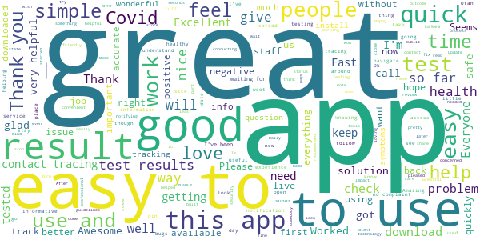
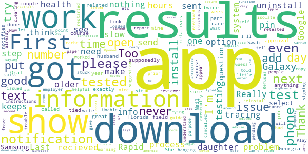
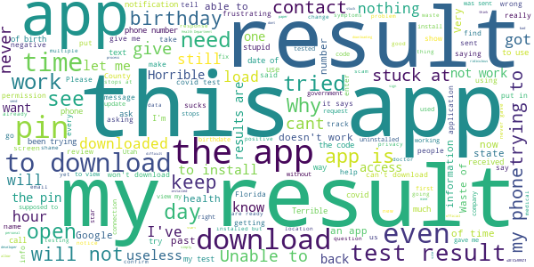

# Healthy Together - COVID-19
App version ``1.4.35``

Analyzed with [covid-apps-observer](http://github.com/covid-apps-observer) project, version ``0.1``

## App overview
| | |
|-------------------------|-------------------------| 
| **Name**&nbsp;&nbsp;&nbsp;&nbsp;&nbsp;&nbsp;&nbsp;&nbsp;&nbsp;&nbsp;&nbsp;&nbsp;&nbsp;&nbsp;&nbsp;&nbsp;&nbsp;&nbsp;&nbsp;&nbsp;&nbsp;&nbsp;&nbsp;&nbsp;&nbsp;&nbsp;&nbsp;&nbsp;&nbsp;&nbsp;&nbsp;&nbsp;&nbsp;&nbsp;&nbsp;&nbsp;&nbsp;&nbsp;&nbsp;&nbsp;  | Healthy Together - COVID-19 |
| **Unique identifier** | co.twenty.stop.spread |
| **Link to Google Play** | [https://play.google.com/store/apps/details?id=co.twenty.stop.spread](https://play.google.com/store/apps/details?id=co.twenty.stop.spread) |
| **Summary**  | Join the effort to reopen our communities safely |
| **Privacy policy** | [https://healthytogether.io/legal/privacy](https://healthytogether.io/legal/privacy) |
| **Latest version** | 1.4.35 |
| **Last update** | 2020-12-30 02:52:09 |
| **Recent changes** | Healthy Together has now launched in Florida featuring:  - Real-time test results from Florida’s Department of Health  - Contact tracing interviews  - Public health announcements and more |
| **Installs**  | 100,000+ |
| **Category** | Health & Fitness |
| **First release** | Apr 21, 2020 |
| **Size**  | 39M |
| **Supported Android version**  | 7.0 and up |

### Description
> Healthy Together is available in Utah & Florida.
 Healthy Together helps stop the spread of COVID-19 through:
 - Daily symptom assessments that can be shared with your doctor, office or school
 - Providing access to testing centers and appointments
 - Real time delivery of in-app test results
 - Clearing of employees/students for work/school
 - Augmented and guided contact tracing
 - Notifications regarding the status of your area and guidelines on how to stay safe
 - Complete COVID-19 response platform anchored in CDC guidelines
 The Healthy Together app is now launching for all Florida’s residents and will offer these key features:
 - Universal Test Delivery: Florida residents who take a COVID-19 test from any provider in the State will be able to receive their expedited test results directly through the app.
 - Self-Serve Contact Tracing Interview: Anyone who tests positive for COVID-19 will be prompted to take an in-app interview, including questions on their exposure history.
 - Real-Time Public Health Announcements: The app will serve as a notification center for state-wide updates and alerts from Public Health, including SMS alerts and automated notifications.
 User Data, Privacy & Security
 - There is no mandate to participate in this effort, users choose to opt-in.
 - Users are in full control of their personal data. They decide what data to share, can reverse those decisions as well as delete their data any moment they choose.
 - All symptom data is automatically de-identified after 30-days.
 - Data is encrypted in transit and at rest.
 - The use of this data is limited to COVID-19 response efforts, public health & research purposes.
 View our full Privacy Policy at www.healthytogether.io/legal/privacy

### User interface
The developers of the app provide the following screenshots in the Google play store.
| | | |
|:-------------------------:|:-------------------------:|:-------------------------:|
 |   |   |   | 
 |   |   |   | 
 |   |  

## Development team
In the following we report the main information provided by the development team in the Google play store.

| | |
|-------------------------|-------------------------|
| **Developer**  | Twenty Inc. |
| **Website**  | [https://healthytogether.io/](https://healthytogether.io/) |
| **Email** | support@healthytogether.zendesk.com |
| **Physical address**  | [280 Park Ave 41st Floor New York, NY 10017](https://www.google.com/maps/search/280%20Park%20Ave%2041st%20Floor%20New%20York,%20NY%2010017) (Google Maps) |
| **Other developed apps**  | [https://play.google.com/store/apps/developer?id=Twenty+Inc.](https://play.google.com/store/apps/developer?id=Twenty+Inc.) |

## Android support

| | |
|-------------------------|-------------------------|
| **Declared target Android version**  | - |
| **Effective target Android version**  | - |
| **Minimum supported Android version**  | Nougat, version 7.0 (API level 24) |
| **Maximum target Android version**  | - |

The larger the difference between the minimum and maximum supported Android versions, the better. A larger difference means a wider audience. For example, old phones have a very low Android version, so a high minimum supported Android version means that the app cannot be used by users with old phones, thus leading to accessibility problems. 

## Requested permissions

In the following we report the complete list of the permissions requested by the app. 

| **Permission** | **Protection level** | **Description** | 
|-------------------------|-------------------------|-------------------------|
 **android.permission ACCESS_FINE_LOCATION** | :warning:**Dangerous** | Allows an app to access precise location. 
 **android.permission ACCESS_NETWORK_STATE** | Normal | Allows applications to access information about networks. 
 **android.permission ACCESS_WIFI_STATE** | Normal | Allows applications to access information about Wi-Fi networks. 
 **android.permission BLUETOOTH** | Normal | Allows applications to connect to paired bluetooth devices. 
 **android.permission BLUETOOTH_ADMIN** | Normal | Allows applications to discover and pair bluetooth devices. 
 **android.permission CAMERA** | :warning:**Dangerous** | Required to be able to access the camera device. 
 **android.permission FOREGROUND_SERVICE** | Normal | Allows a regular application to use Service.startForeground. 
 **android.permission INTERNET** | Normal | Allows applications to open network sockets. 
 **android.permission READ_CONTACTS** | :warning:**Dangerous** | Allows an application to read the user's contacts data. 
 **android.permission RECEIVE_BOOT_COMPLETED** | Normal | Allows an application to receive the Intent.ACTION_BOOT_COMPLETED that is broadcast after the system finishes booting. 
 **android.permission USE_BIOMETRIC** | Normal | Allows an app to use device supported biometric modalities. 
 **android.permission USE_FINGERPRINT** | Normal | This constant was deprecated in API level 28. Applications should request USE_BIOMETRIC instead 
 **android.permission VIBRATE** | Normal | Allows access to the vibrator. 
 **android.permission WAKE_LOCK** | Normal | Allows using PowerManager WakeLocks to keep processor from sleeping or screen from dimming. 
 **com.google.android.c2dm.permission RECEIVE** | - | - 
 **com.google.android.finsky.permission BIND_GET_INSTALL_REFERRER_SERVICE** | - | - 

## Mentioned servers

| **Server** | **Registrant** | **Registrant country** | **Creation date** | 
|-------------------------|-------------------------|-------------------------|-------------------------|
 | mapbox.com | Whois Privacy Service | :us: US | 2003-11-27 11:15:57 |
 | googlesyndication.com | Google LLC | :us: US | 2003-01-21 06:17:24 |
 | google.com | Google LLC | :us: US | 1997-09-15 04:00:00 |
 | healthytogether.io | Domains By Proxy, LLC | :us: US | 2020-04-09 16:47:40 |
 | app-measurement.com | Google LLC | :us: US | 2015-06-19 20:13:31 |
 | cloudinary.com | Cloudinary Ltd. | :israel: IL | 2011-05-24 12:52:37 |
 | amazonaws.com | Amazon.com, Inc. | :us: US | 2005-08-18 02:10:45 |
 | googleadservices.com | Google LLC | :us: US | 2003-06-19 16:34:53 |
 | crashlytics.com | Google LLC | :us: US | 2011-01-21 15:30:40 |
 | android.com | Google LLC | :us: US | 1997-06-23 04:00:00 |
 | twentylabs.co | Domains By Proxy, LLC | :us: US | 2020-04-04 22:49:56 |

## Security analysis 

Below we report the main security warnings raised by our execution of the [Androwarn](https://github.com/maaaaz/androwarn) security analysis tool.

**Telephony identifiers leakage**
> - This application reads the numeric name (MCC+MNC) of current registered operator 
> - This application reads the operator name 
> - This application reads the radio technology (network type) currently in use on the device for data transmission 

**Connection interfaces exfiltration**
> - This application reads details about the currently active data network 
> - This application tries to find out if the currently active data network is metered 

**Telephony services abuse**
> - This application makes phone calls 

**Suspicious connection establishment**
> - This application opens a Socket and connects it to the remote address '; port is out of range' on the 'N/A' port  
> - This application opens a Socket and connects it to the remote address 'Ljava/net/Proxy;->type()Ljava/net/Proxy$Type;' on the 'N/A' port  
> - This application opens a Socket and connects it to the remote address 'Lmy2;->S(Ljava/lang/String;)Ljava/lang/StringBuilder;' on the 'N/A' port  
> - This application opens a Socket and connects it to the remote address 'timeout' on the 'N/A' port  

**Code execution**
> - This application loads a native library 
> - This application loads a native library: 'mapbox-gl' 

## User ratings and reviews

Below we provide information about how end users are reacting to the app in terms of ratings and reviews in the Google Play store.

### Ratings

The Healthy Together - COVID-19 app has been installed by more than **100000** times. At this time, **4238** rated the app and its average score is **4.5783663**. Below we show the distribution of the ratings across the usual star-based rating of Google Play

:star::star::star::star::star:: 3342

:star::star::star::star:: 486

:star::star::star:: 121

:star::star:: 102

:star:: 187

### Reviews 

#### 5-star reviews

> it's been great not having to look around and just have one place to check on my status.  :date: __2021-01-09 01:23:53__

> Fast on time notifications.  :date: __2021-01-08 23:55:24__

> Best app. quick results  :date: __2021-01-08 18:01:11__

> Excellent  :date: __2021-01-08 17:24:45__

> Quick  :date: __2021-01-08 16:35:53__

> I feel better to know I have a negative results👏🏽👏🏽  :date: __2021-01-08 15:19:03__

> I love it  :date: __2021-01-07 22:36:57__

> Excellent Service  :date: __2021-01-07 19:24:56__

> Im sick as a dog but not covid . I'd like this test to at least tell me what i do have. Im full of mucus  :date: __2021-01-07 15:17:55__

> this app is Ezekiel excellent  :date: __2021-01-07 10:55:54__

#### 4-star reviews

> Easy to use  :date: __2021-01-08 16:49:01__

> im ok  :date: __2021-01-07 02:48:10__

> It did what it was designed to do which was provide the results of a covid19 text. Everything worked fine.  :date: __2021-01-06 19:08:33__

> it gives a lot of information  :date: __2021-01-04 23:39:14__

> I'm ok with what your doing  :date: __2021-01-04 04:48:13__

> Helpful but delayed results, I get my email with my results before I get notified on the app  :date: __2021-01-02 22:38:55__

> Stuck downloading at 63 percent. If you have this problem take it off Wi-fi. Solved the issue for me. Other than that easy to use except I couldn't find the option to add one of my kids.  :date: __2020-12-25 20:19:55__

> Testing was fast,easy.results were fast enough for me.  :date: __2020-12-25 15:41:07__

> Update: The app finally downloaded and I was able to get my results. I'm not sure what the hold up was, but I just left it at 63% and never closed the play store and it finally installed 100%. Old Review: App will not complete download. I've been trying to download now for 2 days and it stops at 63% and won't go no further. What a waste of time. Don't even bother. Just make the phone call to get your results.  :date: __2020-12-21 03:35:11__

> The app did what it was supposed to do. I had a little trouble downloading, but after that it worked for its intended purpose.  :date: __2020-12-20 18:08:45__

#### 3-star reviews

> First, I'm not sure where the problem is? The wife and I had both the Rapid and the Oral Swab done exactly the same time. She had her Rapid results in a couple hours. I never recieved mine? I called the day after and got my results. The text and E-Mail notification was supposedly sent to me, I never recieved anything? This is not the first time. Last year, the same issue? So, if the app is part of the process there is an issue.  :date: __2021-01-04 01:04:15__

> I think it's a great app. But it should also have the option to open a spouse's or a relatives results with their approval of course but not just because it's tied to or related to phone #. I'm in Georgia n my husband is in Florida and he sent his test results link but it does not open me.  :date: __2021-01-01 21:17:35__

> I work in the health care field and get tested twice a week and my job notifies me of my test results. There should be more instructions or questions to guide people. I had my daughter tested this morning so when I loaded the app do I put her information in, or my own. I put my information in and all of my test results show up. Will my daughters show under my information because it's the same phone number, or do I need to uninstall and reinstall it with her information to get her results?  :date: __2020-12-29 17:10:50__

> Does not work with older phones.  :date: __2020-12-25 02:14:33__

> Had same problem as prior reviewer. Trying to download app and it keeps hanging at 63%. Too bad. Guess I'll let it sit a while and see if it downloads eventually. :(  :date: __2020-12-23 17:01:35__

> Unable to get paper copy of report to give employer  :date: __2020-12-22 18:47:42__

> Good  :date: __2020-12-22 15:49:30__

> All it does is show results. There is nothing in this app for tracing, etc. All it does is show your results and even that, they only appear hours, day after it is issued. Don't see the point of this app... Really.  :date: __2020-12-22 15:19:49__

> it's a good system, they just don't tell u the next step in this process, no one told me when to get retested or to self isolate, just a little more helpful info would be nice  :date: __2020-12-22 03:30:16__

> Thank you for your suggestion. After clearing the Google Play cache it froze again at 63% (same as before). Then I had to cancel the download again and then try again and then it worked.  :date: __2020-12-21 13:18:36__

#### 2-star reviews

> Can't find my results  :date: __2021-01-08 21:30:50__

> Very difficult for older and others that Try to see results by phone.. I finally was able to confirm my appt Results are back today... Having issues to look at my result... Been trying for almost 2 hrs  :date: __2021-01-08 18:12:50__

> Wont download  :date: __2021-01-06 01:21:01__

> I have no idea what my test results are. If they are posted for my viewing, I'd sure like to know where.  :date: __2021-01-02 02:52:04__

> I can't get the date of birth in. It keeps throwing me out  :date: __2021-01-01 22:53:40__

> I have downloaded the app and provided all required information. However I am not able to access my test results. It is trying to confirm and March my DOB with what the testing provider has in their system. Although the date is correct but the app isn't letting me access the result. I don't see any option to collect with the customer support. Please help.  :date: __2021-01-01 19:46:22__

> I'm trying to find my test results without any success. All i have found is Robert Smith. I assume its an example not a true person.  :date: __2021-01-01 16:29:14__

> None, yet  :date: __2021-01-01 16:08:45__

> No problem downloading the app but it wont let me see results. I don't get past the birthdate and relationship question. When I called the doctor's office they said that they are getting many, many calls about this app and that every single person hasn't been able to get past this screen, and they aren't able to rectify the problem. Now what??  :date: __2020-12-31 19:25:34__

> I don't know. I could not get past the "enter dob and relationship" part. I entered my information correctly. After reading reviews and replies I'm going to guess the medical facility entered something wrong. I thankfully have my results printed out from the facility so I guess I'll settle for what the hospital gave me.  :date: __2020-12-31 19:07:32__

#### 1-star reviews

> This site doesn't even work....... ! I can't even get passed log in!  :date: __2021-01-09 16:11:17__

> HORRIBLE!!!! I can't get pass B'day. Keeps telling me doesn't match. I KNOW MY B'DAY. IDIOTS. Starting to think it's just another way to hack and get personal information. Get rid of this app or FIX IT ASAP. Now the damn thing won't even let me send and/or post my review. Ill give it a 1star only to see if it will then allow my review to post ,but it actually deserves -100 stars. Yeah its just that bad!!  :date: __2021-01-09 10:54:02__

> Can't get by the birthdate@  :date: __2021-01-09 03:16:04__

> The app would not accept the code that was texted to me. What a frustrating waste of time!  :date: __2021-01-09 01:20:17__

> Put in my sons birthday and it tells me not valid birthday. Give me break, this app is not recommended.  :date: __2021-01-08 21:30:05__

> Does not work!  :date: __2021-01-08 19:53:26__

> The code was too fast and I couldn't put it in So in other words it did nothing for me . It popped up too fast and I didn't even know what I was supposed to do with it before it was gone  :date: __2021-01-08 16:29:11__

> Why do I have pay to get results, when my insurance company has already been charged, sounds like just another way of some agency making more money from a senior citizen that can't afford it. Down on east coast (Palm Beach County) even the test + results are free. I had pay thru my insurance company, otherwise no test in Okeechobee County, also saw County was only given 500 Vaccines for 70 yrs & older this past Tuesday, we have 20 x's that in this County, it's all about the money !  :date: __2021-01-08 16:20:13__

> I am not interested in getting this app yet it keeps hijacking the official link by showing up before I can sign in  :date: __2021-01-08 13:08:34__

> How do you get this app to work?  :date: __2021-01-07 19:03:28__

