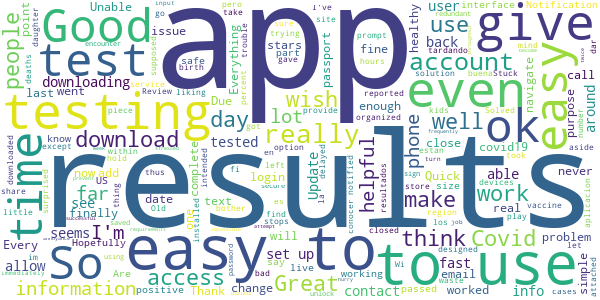
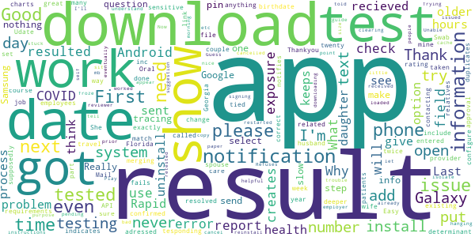
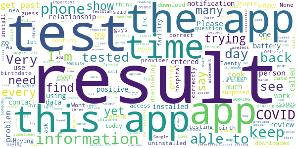
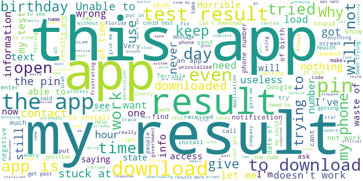

# Healthy Together - COVID-19
App version ``1.4.56``

Analyzed with [covid-apps-observer](http://github.com/covid-apps-observer) project, version ``0.1``

## App overview
| | |
|-------------------------|-------------------------| 
| **Name**&nbsp;&nbsp;&nbsp;&nbsp;&nbsp;&nbsp;&nbsp;&nbsp;&nbsp;&nbsp;&nbsp;&nbsp;&nbsp;&nbsp;&nbsp;&nbsp;&nbsp;&nbsp;&nbsp;&nbsp;&nbsp;&nbsp;&nbsp;&nbsp;&nbsp;&nbsp;&nbsp;&nbsp;&nbsp;&nbsp;&nbsp;&nbsp;&nbsp;&nbsp;&nbsp;&nbsp;&nbsp;&nbsp;&nbsp;&nbsp;  | Healthy Together - COVID-19 |
| **Unique identifier** | co.twenty.stop.spread |
| **Link to Google Play** | [https://play.google.com/store/apps/details?id=co.twenty.stop.spread](https://play.google.com/store/apps/details?id=co.twenty.stop.spread) |
| **Summary**  | Join the effort to reopen our communities safely |
| **Privacy policy** | [https://healthytogether.io/legal/privacy](https://healthytogether.io/legal/privacy) |
| **Latest version** | 1.4.56 |
| **Last update** | 2021-01-15 21:41:34 |
| **Recent changes** | Thank you for joining the Healthy Together cause. We have made the following improvements:  - Bug fixes and performance improvements |
| **Installs**  | 100,000+ |
| **Category** | Health & Fitness |
| **First release** | Apr 21, 2020 |
| **Size**  | 40M |
| **Supported Android version**  | 7.0 and up |

### Description
> Healthy Together is available in Utah & Florida.
 Healthy Together helps stop the spread of COVID-19 through:
 - Daily symptom assessments that can be shared with your doctor, office or school
 - Providing access to testing centers and appointments
 - Real time delivery of in-app test results
 - Clearing of employees/students for work/school
 - Augmented and guided contact tracing
 - Notifications regarding the status of your area and guidelines on how to stay safe
 - Complete COVID-19 response platform anchored in CDC guidelines
 The Healthy Together app is now launching for all Florida’s residents and will offer these key features:
 - Universal Test Delivery: Florida residents who take a COVID-19 test from any provider in the State will be able to receive their expedited test results directly through the app.
 - Self-Serve Contact Tracing Interview: Anyone who tests positive for COVID-19 will be prompted to take an in-app interview, including questions on their exposure history.
 - Real-Time Public Health Announcements: The app will serve as a notification center for state-wide updates and alerts from Public Health, including SMS alerts and automated notifications.
 User Data, Privacy & Security
 - There is no mandate to participate in this effort, users choose to opt-in.
 - Users are in full control of their personal data. They decide what data to share, can reverse those decisions as well as delete their data any moment they choose.
 - All symptom data is automatically de-identified after 30-days.
 - Data is encrypted in transit and at rest.
 - The use of this data is limited to COVID-19 response efforts, public health & research purposes.
 View our full Privacy Policy at www.healthytogether.io/legal/privacy

### User interface
The developers of the app provide the following screenshots in the Google play store.
| | | |
|:-------------------------:|:-------------------------:|:-------------------------:|
 |   |   |   | 
 |   |   |   | 
 |   |  

## Development team
In the following we report the main information provided by the development team in the Google play store.

| | |
|-------------------------|-------------------------|
| **Developer**  | Twenty Inc. |
| **Website**  | [https://healthytogether.io/](https://healthytogether.io/) |
| **Email** | support@healthytogether.zendesk.com |
| **Physical address**  | [280 Park Ave 41st Floor New York, NY 10017](https://www.google.com/maps/search/280%20Park%20Ave%2041st%20Floor%20New%20York,%20NY%2010017) (Google Maps) |
| **Other developed apps**  | [https://play.google.com/store/apps/developer?id=Twenty+Inc.](https://play.google.com/store/apps/developer?id=Twenty+Inc.) |

## Android support

| | |
|-------------------------|-------------------------|
| **Declared target Android version**  | - |
| **Effective target Android version**  | - |
| **Minimum supported Android version**  | Nougat, version 7.0 (API level 24) |
| **Maximum target Android version**  | - |

The larger the difference between the minimum and maximum supported Android versions, the better. A larger difference means a wider audience. For example, old phones have a very low Android version, so a high minimum supported Android version means that the app cannot be used by users with old phones, thus leading to accessibility problems. 

## Requested permissions

In the following we report the complete list of the permissions requested by the app. 

| **Permission** | **Protection level** | **Description** | 
|-------------------------|-------------------------|-------------------------|
 **android.permission ACCESS_FINE_LOCATION** | :warning:**Dangerous** | Allows an app to access precise location. 
 **android.permission ACCESS_NETWORK_STATE** | Normal | Allows applications to access information about networks. 
 **android.permission ACCESS_WIFI_STATE** | Normal | Allows applications to access information about Wi-Fi networks. 
 **android.permission BLUETOOTH** | Normal | Allows applications to connect to paired bluetooth devices. 
 **android.permission BLUETOOTH_ADMIN** | Normal | Allows applications to discover and pair bluetooth devices. 
 **android.permission CAMERA** | :warning:**Dangerous** | Required to be able to access the camera device. 
 **android.permission FOREGROUND_SERVICE** | Normal | Allows a regular application to use Service.startForeground. 
 **android.permission INTERNET** | Normal | Allows applications to open network sockets. 
 **android.permission READ_CONTACTS** | :warning:**Dangerous** | Allows an application to read the user's contacts data. 
 **android.permission RECEIVE_BOOT_COMPLETED** | Normal | Allows an application to receive the Intent.ACTION_BOOT_COMPLETED that is broadcast after the system finishes booting. 
 **android.permission USE_BIOMETRIC** | Normal | Allows an app to use device supported biometric modalities. 
 **android.permission USE_FINGERPRINT** | Normal | This constant was deprecated in API level 28. Applications should request USE_BIOMETRIC instead 
 **android.permission VIBRATE** | Normal | Allows access to the vibrator. 
 **android.permission WAKE_LOCK** | Normal | Allows using PowerManager WakeLocks to keep processor from sleeping or screen from dimming. 
 **com.google.android.c2dm.permission RECEIVE** | - | - 
 **com.google.android.finsky.permission BIND_GET_INSTALL_REFERRER_SERVICE** | - | - 

## Mentioned servers

| **Server** | **Registrant** | **Registrant country** | **Creation date** | 
|-------------------------|-------------------------|-------------------------|-------------------------|
 | googlesyndication.com | Google LLC | :us: US | 2003-01-21 06:17:24 |
 | app-measurement.com | Google LLC | :us: US | 2015-06-19 20:13:31 |
 | mapbox.com | Whois Privacy Service | :us: US | 2003-11-27 11:15:57 |
 | google.com | Google LLC | :us: US | 1997-09-15 04:00:00 |
 | googleadservices.com | Google LLC | :us: US | 2003-06-19 16:34:53 |
 | healthytogether.io | Domains By Proxy, LLC | :us: US | 2020-04-09 16:47:40 |
 | android.com | Google LLC | :us: US | 1997-06-23 04:00:00 |
 | apple.com | Apple Inc. | :us: US | 1987-02-19 05:00:00 |
 | aomedia.org | Contact Privacy Inc. Customer 1243324949 | :canada: CA | 2015-08-24 14:07:31 |
 | crashlytics.com | Google LLC | :us: US | 2011-01-21 15:30:40 |
 | w3.org | W3C | :us: US | 1994-07-06 04:00:00 |
 | twentylabs.co | Domains By Proxy, LLC | :us: US | 2020-04-04 22:49:56 |
 | cloudinary.com | Cloudinary Ltd. | :israel: IL | 2011-05-24 12:52:37 |

## Security analysis 

Below we report the main security warnings raised by our execution of the [Androwarn](https://github.com/maaaaz/androwarn) security analysis tool.

**Telephony identifiers leakage**
> - This application reads the ISO country code equivalent of the current registered operator's MCC (Mobile Country Code) 
> - This application reads the MCC+MNC of the provider of the SIM 
> - This application reads the numeric name (MCC+MNC) of current registered operator 
> - This application reads the operator name 
> - This application reads the radio technology (network type) currently in use on the device for data transmission 

**Connection interfaces exfiltration**
> - This application reads details about the currently active data network 
> - This application tries to find out if the currently active data network is metered 

**Telephony services abuse**
> - This application makes phone calls 

**Suspicious connection establishment**
> - This application opens a Socket and connects it to the remote address '; port is out of range' on the 'N/A' port  
> - This application opens a Socket and connects it to the remote address 'LOx2;->S(Ljava/lang/String;)Ljava/lang/StringBuilder;' on the 'N/A' port  
> - This application opens a Socket and connects it to the remote address 'Ljava/net/Proxy;->type()Ljava/net/Proxy$Type;' on the 'N/A' port  
> - This application opens a Socket and connects it to the remote address 'timeout' on the 'N/A' port  

**Code execution**
> - This application loads a native library 
> - This application loads a native library: 'mapbox-gl' 

## User ratings and reviews

Below we provide information about how end users are reacting to the app in terms of ratings and reviews in the Google Play store.

### Ratings

The Healthy Together - COVID-19 app has been installed by more than **100000** times. At this time, **7442** rated the app and its average score is **4.702825**. Below we show the distribution of the ratings across the usual star-based rating of Google Play

:star::star::star::star::star:: 6157

:star::star::star::star:: 849

:star::star::star:: 168

:star::star:: 50

:star:: 218

### Reviews 

#### 5-star reviews

> Every thing it was very organised. And the waiting was not to long. Thank you for all the help to the public to be safe. May God bless you all.  :date: __2021-01-23 07:25:57__

> This app is helpful and easy i got my result as soon as i enter my info.👍👍  :date: __2021-01-23 00:47:28__

> (☞ ͡° ͜ʖ ͡°)☞ ℱ𝒶𝒷𝓊𝓁ℴ𝓊𝓈  :date: __2021-01-22 19:45:04__

> Very professional!  :date: __2021-01-22 17:22:35__

> Finally .a negative..very fast results.thanks  :date: __2021-01-22 16:00:41__

> Great, fast reliable 👍  :date: __2021-01-22 15:54:53__

> Very good experience and good service  :date: __2021-01-22 15:52:03__

> Thank you!  :date: __2021-01-22 15:47:17__

> What a relief, wish health care proxy n children legally obligated to speak and make all decisions for should b entitled to the same comprehensive test results, heart rates, medications, procedures, and the like while the loved on is incapacitated in the hospital. I am being forced t[ to agree with a dangerous procedure without being aloud to explain it to her to aid them in her being compliant. Patient portals to hospital record n chart needs to be granted to those legally entitled to infor.  :date: __2021-01-22 15:43:19__

> pretty simple and straight forward  :date: __2021-01-22 15:18:28__

#### 4-star reviews

> easy access  :date: __2021-01-22 15:00:04__

> Every thing was well organized at the Testing site.  :date: __2021-01-20 17:45:56__

> la aplicacion es buena, pero estan tardando en dar a conocer los resultados  :date: __2021-01-19 19:04:05__

> prompt results easy to access wish access to vaccine was the same thus far not even close  :date: __2021-01-19 16:00:20__

> Great App for Covid Results  :date: __2021-01-17 03:11:35__

> Quick results which give me piece of mind  :date: __2021-01-14 16:55:32__

> It was easy and ok.  :date: __2021-01-13 02:18:02__

> Good service! I was surprised to get a solution to my problem within a few hours.  :date: __2021-01-12 23:54:50__

> Thank you! It wouldn't let me share to other devices on my phone, aside from that, not too bad.  :date: __2021-01-10 15:33:10__

> Easy to use  :date: __2021-01-08 16:49:01__

#### 3-star reviews

> This app needs to configure merging existing charts. It creates way too many duplicates in the system for employees which creates more work in contacting patients.  :date: __2021-01-17 18:31:58__

> What is my result  :date: __2021-01-15 19:08:46__

> need check deeper  :date: __2021-01-14 16:31:50__

> First, I'm not sure where the problem is? The wife and I had both the Rapid and the Oral Swab done exactly the same time. She had her Rapid results in a couple hours. I never recieved mine? I called the day after and got my results. The text and E-Mail notification was supposedly sent to me, I never recieved anything? This is not the first time. Last year, the same issue? So, if the app is part of the process there is an issue.  :date: __2021-01-04 01:04:15__

> I think it's a great app. But it should also have the option to open a spouse's or a relatives results with their approval of course but not just because it's tied to or related to phone #. I'm in Georgia n my husband is in Florida and he sent his test results link but it does not open me.  :date: __2021-01-01 21:17:35__

> I work in the health care field and get tested twice a week and my job notifies me of my test results. There should be more instructions or questions to guide people. I had my daughter tested this morning so when I loaded the app do I put her information in, or my own. I put my information in and all of my test results show up. Will my daughters show under my information because it's the same phone number, or do I need to uninstall and reinstall it with her information to get her results?  :date: __2020-12-29 17:10:50__

> Does not work with older phones.  :date: __2020-12-25 02:14:33__

> Had same problem as prior reviewer. Trying to download app and it keeps hanging at 63%. Too bad. Guess I'll let it sit a while and see if it downloads eventually. :(  :date: __2020-12-23 17:01:35__

> Unable to get paper copy of report to give employer  :date: __2020-12-22 18:47:42__

> Good  :date: __2020-12-22 15:49:30__

#### 2-star reviews

> I just uninstalled your app because it interfered with all my other apps or instillation s o I took it off my phone  :date: __2021-01-23 05:31:04__

> Can't download my results  :date: __2021-01-11 19:38:39__

> Doesn't always do what supposed to.  :date: __2021-01-10 16:17:19__

> Can't find my results  :date: __2021-01-08 21:30:50__

> Very difficult for older and others that Try to see results by phone.. I finally was able to confirm my appt Results are back today... Having issues to look at my result... Been trying for almost 2 hrs  :date: __2021-01-08 18:12:50__

> Wont download  :date: __2021-01-06 01:21:01__

> I have no idea what my test results are. If they are posted for my viewing, I'd sure like to know where.  :date: __2021-01-02 02:52:04__

> I can't get the date of birth in. It keeps throwing me out  :date: __2021-01-01 22:53:40__

> I have downloaded the app and provided all required information. However I am not able to access my test results. It is trying to confirm and March my DOB with what the testing provider has in their system. Although the date is correct but the app isn't letting me access the result. I don't see any option to collect with the customer support. Please help.  :date: __2021-01-01 19:46:22__

> I'm trying to find my test results without any success. All i have found is Robert Smith. I assume its an example not a true person.  :date: __2021-01-01 16:29:14__

#### 1-star reviews

> Doesn't open can't get my covid results. Have to go back in person.  :date: __2021-01-23 03:34:36__

> This app is almost useless. I followed every step and just couldn't get through.  :date: __2021-01-22 22:48:17__

> Does not work. Tried multiple times. Just get "an error occurred"  :date: __2021-01-22 20:05:13__

> I kept getting messages that I had test results, but I had already gotten the results from the test provider. I finally downloaded this app just to make sure I wasn't missing anything... And no, I wasn't. What a waste of time and needlessly shared information. I'm deleting the app and am creeped out!  :date: __2021-01-22 19:52:08__

> Told me my results were ready to view. App wont even download fully to view any information.  :date: __2021-01-22 18:58:06__

> I cannot even open the app. It jusr keeps buffering  :date: __2021-01-22 16:56:11__

> The installation process freezes at 66%  :date: __2021-01-22 00:57:21__

> If you can contact my phone through a text why can't you send my results there instead of downloading a useless app, to complicate the process  :date: __2021-01-20 18:13:30__

> I can't even get signed in. It just keeps giving me an undiscribed error when I put in my phone number.  :date: __2021-01-20 15:54:25__

> The app want even download to get the results  :date: __2021-01-20 02:50:20__

