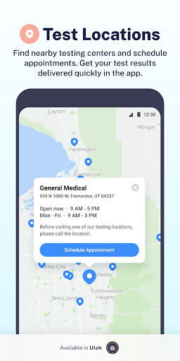
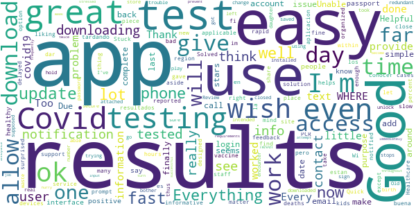
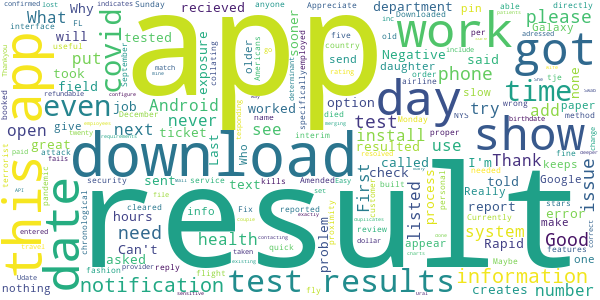
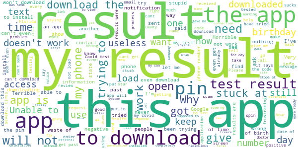

# Healthy Together - COVID-19
App version ``1.4.66``

Analyzed with [covid-apps-observer](http://github.com/covid-apps-observer) project, version ``0.1``

## App overview
| | |
|-------------------------|-------------------------| 
| **Name**                                          | Healthy Together - COVID-19 |
| **Unique identifier** | co.twenty.stop.spread |
| **Link to Google Play** | [https://play.google.com/store/apps/details?id=co.twenty.stop.spread](https://play.google.com/store/apps/details?id=co.twenty.stop.spread) |
| **Summary**  | Join the effort to reopen our communities safely |
| **Privacy policy** | [https://healthytogether.io/legal/privacy](https://healthytogether.io/legal/privacy) |
| **Latest version** | 1.4.66 |
| **Last update** | 2021-02-04 05:22:54 |
| **Recent changes** | Thank you for joining the Healthy Together cause. We have made the following improvements:  - Bug fixes and performance improvements |
| **Installs**  | 100,000+ |
| **Category** | Health & Fitness |
| **First release** | Apr 21, 2020 |
| **Size**  | 40M |
| **Supported Android version**  | 7.0 and up |

### Description
> Healthy Together is available in Utah & Florida.
 Healthy Together helps stop the spread of COVID-19 through:
 - Daily symptom assessments that can be shared with your doctor, office or school
 - Providing access to testing centers and appointments
 - Real time delivery of in-app test results
 - Clearing of employees/students for work/school
 - Augmented and guided contact tracing
 - Notifications regarding the status of your area and guidelines on how to stay safe
 - Complete COVID-19 response platform anchored in CDC guidelines
 The Healthy Together app is now launching for all Florida’s residents and will offer these key features:
 - Universal Test Delivery: Florida residents who take a COVID-19 test from any provider in the State will be able to receive their expedited test results directly through the app.
 - Self-Serve Contact Tracing Interview: Anyone who tests positive for COVID-19 will be prompted to take an in-app interview, including questions on their exposure history.
 - Real-Time Public Health Announcements: The app will serve as a notification center for state-wide updates and alerts from Public Health, including SMS alerts and automated notifications.
 User Data, Privacy & Security
 - There is no mandate to participate in this effort, users choose to opt-in.
 - Users are in full control of their personal data. They decide what data to share, can reverse those decisions as well as delete their data any moment they choose.
 - All symptom data is automatically de-identified after 30-days.
 - Data is encrypted in transit and at rest.
 - The use of this data is limited to COVID-19 response efforts, public health & research purposes.
 View our full Privacy Policy at www.healthytogether.io/legal/privacy

### User interface
The developers of the app provide the following screenshots in the Google play store.
| | | |
|:-------------------------:|:-------------------------:|:-------------------------:|
 |   |   |   | 
 |   |   |   | 
 |   |  

## Development team
In the following we report the main information provided by the development team in the Google play store.

| | |
|-------------------------|-------------------------|
| **Developer**  | Twenty Inc. |
| **Website**  | [https://healthytogether.io/](https://healthytogether.io/) |
| **Email** | support@healthytogether.zendesk.com |
| **Physical address**  | [280 Park Ave 41st Floor New York, NY 10017](https://www.google.com/maps/search/280%20Park%20Ave%2041st%20Floor%20New%20York,%20NY%2010017) (Google Maps) |
| **Other developed apps**  | [https://play.google.com/store/apps/developer?id=Twenty+Inc.](https://play.google.com/store/apps/developer?id=Twenty+Inc.) |

## Android support

| | |
|-------------------------|-------------------------|
| **Declared target Android version**  | - |
| **Effective target Android version**  | - |
| **Minimum supported Android version**  | Nougat, version 7.0 (API level 24) |
| **Maximum target Android version**  | - |

The larger the difference between the minimum and maximum supported Android versions, the better. A larger difference means a wider audience. For example, old phones have a very low Android version, so a high minimum supported Android version means that the app cannot be used by users with old phones, thus leading to accessibility problems. 

## Requested permissions

In the following we report the complete list of the permissions requested by the app. 

| **Permission** | **Protection level** | **Description** | 
|-------------------------|-------------------------|-------------------------|
 **android.permission ACCESS_FINE_LOCATION** | :warning:**Dangerous** | Allows an app to access precise location. 
 **android.permission ACCESS_NETWORK_STATE** | Normal | Allows applications to access information about networks. 
 **android.permission ACCESS_WIFI_STATE** | Normal | Allows applications to access information about Wi-Fi networks. 
 **android.permission BLUETOOTH** | Normal | Allows applications to connect to paired bluetooth devices. 
 **android.permission BLUETOOTH_ADMIN** | Normal | Allows applications to discover and pair bluetooth devices. 
 **android.permission CAMERA** | :warning:**Dangerous** | Required to be able to access the camera device. 
 **android.permission FOREGROUND_SERVICE** | Normal | Allows a regular application to use Service.startForeground. 
 **android.permission INTERNET** | Normal | Allows applications to open network sockets. 
 **android.permission READ_CONTACTS** | :warning:**Dangerous** | Allows an application to read the user's contacts data. 
 **android.permission RECEIVE_BOOT_COMPLETED** | Normal | Allows an application to receive the Intent.ACTION_BOOT_COMPLETED that is broadcast after the system finishes booting. 
 **android.permission USE_BIOMETRIC** | Normal | Allows an app to use device supported biometric modalities. 
 **android.permission USE_FINGERPRINT** | Normal | This constant was deprecated in API level 28. Applications should request USE_BIOMETRIC instead 
 **android.permission VIBRATE** | Normal | Allows access to the vibrator. 
 **android.permission WAKE_LOCK** | Normal | Allows using PowerManager WakeLocks to keep processor from sleeping or screen from dimming. 
 **com.google.android.c2dm.permission RECEIVE** | - | - 
 **com.google.android.finsky.permission BIND_GET_INSTALL_REFERRER_SERVICE** | - | - 

## Mentioned servers

| **Server** | **Registrant** | **Registrant country** | **Creation date** | 
|-------------------------|-------------------------|-------------------------|-------------------------|
 | healthytogether.io | Domains By Proxy, LLC | :us: US | 2020-04-09 16:47:40 |
 | googlesyndication.com | Google LLC | :us: US | 2003-01-21 06:17:24 |
 | google.com | Google LLC | :us: US | 1997-09-15 04:00:00 |
 | app-measurement.com | Google LLC | :us: US | 2015-06-19 20:13:31 |
 | mapbox.com | Whois Privacy Service | :us: US | 2003-11-27 11:15:57 |
 | googleadservices.com | Google LLC | :us: US | 2003-06-19 16:34:53 |
 | android.com | Google LLC | :us: US | 1997-06-23 04:00:00 |
 | apple.com | Apple Inc. | :us: US | 1987-02-19 05:00:00 |
 | aomedia.org | Contact Privacy Inc. Customer 1243324949 | :canada: CA | 2015-08-24 14:07:31 |
 | crashlytics.com | Google LLC | :us: US | 2011-01-21 15:30:40 |
 | w3.org | W3C | :us: US | 1994-07-06 04:00:00 |
 | twentylabs.co | Domains By Proxy, LLC | :us: US | 2020-04-04 22:49:56 |
 | cloudinary.com | Cloudinary Ltd. | :israel: IL | 2011-05-24 12:52:37 |

## Security analysis 

Below we report the main security warnings raised by our execution of the [Androwarn](https://github.com/maaaaz/androwarn) security analysis tool.

**Telephony identifiers leakage**
> - This application reads the ISO country code equivalent of the current registered operator's MCC (Mobile Country Code) 
> - This application reads the MCC+MNC of the provider of the SIM 
> - This application reads the numeric name (MCC+MNC) of current registered operator 
> - This application reads the operator name 
> - This application reads the radio technology (network type) currently in use on the device for data transmission 

**Connection interfaces exfiltration**
> - This application reads details about the currently active data network 
> - This application tries to find out if the currently active data network is metered 

**Telephony services abuse**
> - This application makes phone calls 

**Suspicious connection establishment**
> - This application opens a Socket and connects it to the remote address '; port is out of range' on the 'N/A' port  
> - This application opens a Socket and connects it to the remote address 'LPy2;->S(Ljava/lang/String;)Ljava/lang/StringBuilder;' on the 'N/A' port  
> - This application opens a Socket and connects it to the remote address 'Ljava/net/Proxy;->type()Ljava/net/Proxy$Type;' on the 'N/A' port  
> - This application opens a Socket and connects it to the remote address 'timeout' on the 'N/A' port  

**Code execution**
> - This application loads a native library 
> - This application loads a native library: 'mapbox-gl' 

## User ratings and reviews

Below we provide information about how end users are reacting to the app in terms of ratings and reviews in the Google Play store.

### Ratings

The Healthy Together - COVID-19 app has been installed by more than **100000** times. At this time, **10002** rated the app and its average score is **4.577391**. Below we show the distribution of the ratings across the usual star-based rating of Google Play

:star::star::star::star::star:: 7995

:star::star::star::star:: 1052

:star::star::star:: 295

:star::star:: 60

:star:: 600

### Reviews 

#### 5-star reviews

> Great app works perfectly very easy to operate thank you five star rating  :date: __2021-02-06 09:08:54__

> Good service  :date: __2021-02-05 21:01:53__

> Quick and accurate  :date: __2021-02-05 19:51:37__

> Works like a charm  :date: __2021-02-05 18:18:22__

> testing was easy and done quickly  :date: __2021-02-05 17:13:53__

> It was fast and very helpful give me piece of mind.  :date: __2021-02-05 16:40:31__

> excellent  :date: __2021-02-05 00:07:00__

> Good all  :date: __2021-02-04 17:33:29__

> Very infornational  :date: __2021-02-04 16:04:23__

> great app  :date: __2021-02-04 15:52:02__

#### 4-star reviews

> a little slow to update test results.  :date: __2021-02-05 22:43:14__

> Good and fast  :date: __2021-02-05 20:19:45__

> Too many notifications but its very informative  :date: __2021-02-04 16:33:03__

> everything helps right now  :date: __2021-02-01 01:29:43__

> Great  :date: __2021-01-27 01:20:05__

> So far I'm liking the app. I do wish it gave information for my region such as reported cases and deaths.  :date: __2021-01-25 18:48:27__

> ok  :date: __2021-01-25 15:15:58__

> easy access  :date: __2021-01-22 15:00:04__

> Every thing was well organized at the Testing site.  :date: __2021-01-20 17:45:56__

> la aplicacion es buena, pero estan tardando en dar a conocer los resultados  :date: __2021-01-19 19:04:05__

#### 3-star reviews

> Is anyone else not able to download the app?  :date: __2021-02-04 19:30:05__

> So what do I do if my name is listed wrong and therefore cannot see my results  :date: __2021-02-02 21:03:21__

> This app does a great job of collating test results in chronological order, appears to use proper security, and has a useful interface. Test results from NYS reported to FL are listed too. Currently, none of my results from before December 2020 are listed, nor are employed the personal proximity features that were built for Android specifically for the Covid-19 pandemic that kills more Americans per day than died on the terrorist attack on our country on 11 September 2001. Fix for five stars.  :date: __2021-02-02 17:11:31__

> The test took 6 days ,I asked for tje test results to be sooner I was told no more then 3 days,so I had a flight to n.y. booked ,I needed the papers cleared of covid which I am negative.but didn't get them on time so the airline said I could not fly with out it..So ticket was none refundable ,so I not only I could not go to n.y. I also lost the 200 dollar ticket I paid for....Again i asked for the results to be sooner and it took 6 days.  :date: __2021-02-01 17:06:29__

> Udate..issues being adressed..will change my rating once resolved ..Thankyou twenty inc for tesponding.  :date: __2021-01-26 02:37:58__

> Easy to set up however, birthdate field fails. I entered correct date, confirmed it is the date on file with me provider, app indicates error, dates don't match.  :date: __2021-01-25 18:14:10__

> Good app but for COVID tests the report of the results it gives does not include the resulted date, just the date of the taken same. This resulted test date is determinant for some travel requirements that are time sensitive.  :date: __2021-01-25 04:39:13__

> Why doesn't this app use the exposure notifications API in Android?  :date: __2021-01-24 01:04:24__

> This app needs to configure merging existing charts. It creates way too many duplicates in the system for employees which creates more work in contacting patients.  :date: __2021-01-17 18:31:58__

> What is my result  :date: __2021-01-15 19:08:46__

#### 2-star reviews

> It's useless if it only downloads 67%NOW its just spinning and spinning and said not all features available in Florida....grrrrr  :date: __2021-02-06 16:29:03__

> Cannot get pin no. To verify phone no. Use mobile instead of land line and it works fine.  :date: __2021-02-05 18:17:36__

> I just uninstalled your app because it interfered with all my other apps or instillation s o I took it off my phone  :date: __2021-01-23 05:31:04__

> Can't download my results  :date: __2021-01-11 19:38:39__

> Doesn't always do what supposed to.  :date: __2021-01-10 16:17:19__

> Can't find my results  :date: __2021-01-08 21:30:50__

> Very difficult for older and others that Try to see results by phone.. I finally was able to confirm my appt Results are back today... Having issues to look at my result... Been trying for almost 2 hrs  :date: __2021-01-08 18:12:50__

> Wont download  :date: __2021-01-06 01:21:01__

> I have no idea what my test results are. If they are posted for my viewing, I'd sure like to know where.  :date: __2021-01-02 02:52:04__

> I can't get the date of birth in. It keeps throwing me out  :date: __2021-01-01 22:53:40__

#### 1-star reviews

> Spin, spin,spin circle of doom, won't install on Samsung A50. #WasteOfTime  :date: __2021-02-06 17:32:22__

> It sucks can't log in  :date: __2021-02-06 17:06:56__

> Terrible, I need to know my results to prepare for surgery and can not get them  :date: __2021-02-06 16:43:28__

> Won't download  :date: __2021-02-06 15:56:46__

> Can't even download the app. It's been stuck on "67% downloaded" for hours.  :date: __2021-02-06 15:50:02__

> I can't even get the app to download. Stuck on 67%  :date: __2021-02-06 15:39:02__

> Unable to get into the app.  :date: __2021-02-06 15:35:38__

> Trying to install and it hangs up at 67%. Can't install, can't use, so it gets only 1 star.  :date: __2021-02-06 09:02:59__

> Don't need another app paid $40.00 for the test Don't need another app to get my result please send my result to my mailbox. Don't send me a link to download another app.  :date: __2021-02-06 02:59:50__

> Results ready caant download app been trying for days?????  :date: __2021-02-06 01:45:34__

