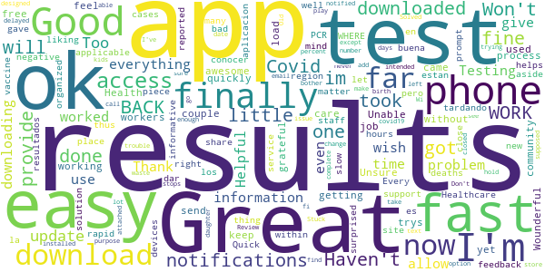
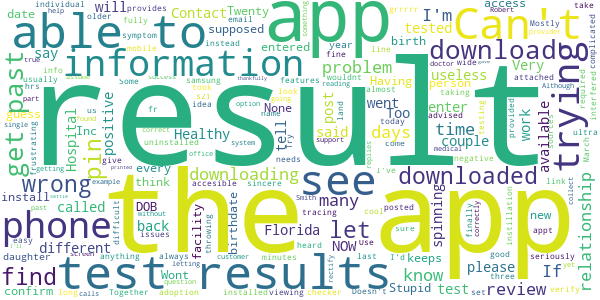
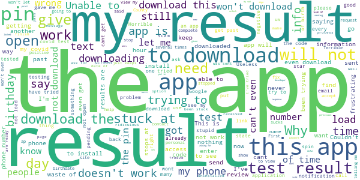

# Healthy Together - COVID-19
App version ``1.4.80``

Analyzed with [covid-apps-observer](http://github.com/covid-apps-observer) project, version ``0.1``

## App overview
| | |
|-------------------------|-------------------------| 
| **Name**                                          | Healthy Together - COVID-19 |
| **Unique identifier** | co.twenty.stop.spread |
| **Link to Google Play** | [https://play.google.com/store/apps/details?id=co.twenty.stop.spread](https://play.google.com/store/apps/details?id=co.twenty.stop.spread) |
| **Summary**  | Join the effort to reopen our communities safely |
| **Privacy policy** | [https://healthytogether.io/legal/privacy](https://healthytogether.io/legal/privacy) |
| **Latest version** | 1.4.80 |
| **Last update** | 2021-02-11 20:00:36 |
| **Recent changes** | Thank you for joining the Healthy Together cause. We have made the following improvements:  - Bug fixes and performance improvements |
| **Installs**  | 500,000+ |
| **Category** | Health & Fitness |
| **First release** | Apr 21, 2020 |
| **Size**  | 40M |
| **Supported Android version**  | 7.0 and up |

### Description
> Healthy Together is available in Utah & Florida.
 Healthy Together helps stop the spread of COVID-19 through:
 - Daily symptom assessments that can be shared with your doctor, office or school
 - Providing access to testing centers and appointments
 - Real time delivery of in-app test results
 - Clearing of employees/students for work/school
 - Augmented and guided contact tracing
 - Notifications regarding the status of your area and guidelines on how to stay safe
 - Complete COVID-19 response platform anchored in CDC guidelines
 The Healthy Together app is now launching for all Florida’s residents and will offer these key features:
 - Universal Test Delivery: Florida residents who take a COVID-19 test from any provider in the State will be able to receive their expedited test results directly through the app.
 - Self-Serve Contact Tracing Interview: Anyone who tests positive for COVID-19 will be prompted to take an in-app interview, including questions on their exposure history.
 - Real-Time Public Health Announcements: The app will serve as a notification center for state-wide updates and alerts from Public Health, including SMS alerts and automated notifications.
 User Data, Privacy & Security
 - There is no mandate to participate in this effort, users choose to opt-in.
 - Users are in full control of their personal data. They decide what data to share, can reverse those decisions as well as delete their data any moment they choose.
 - All symptom data is automatically de-identified after 30-days.
 - Data is encrypted in transit and at rest.
 - The use of this data is limited to COVID-19 response efforts, public health & research purposes.
 View our full Privacy Policy at www.healthytogether.io/legal/privacy

### User interface
The developers of the app provide the following screenshots in the Google play store.
| | | |
|:-------------------------:|:-------------------------:|:-------------------------:|
 |   |   |   | 
 |   |   |   | 
 |   |  

## Development team
In the following we report the main information provided by the development team in the Google play store.

| | |
|-------------------------|-------------------------|
| **Developer**  | Twenty Inc. |
| **Website**  | [https://healthytogether.io/](https://healthytogether.io/) |
| **Email** | support@healthytogether.zendesk.com |
| **Physical address**  | [280 Park Ave 41st Floor New York, NY 10017](https://www.google.com/maps/search/280%20Park%20Ave%2041st%20Floor%20New%20York,%20NY%2010017) (Google Maps) |
| **Other developed apps**  | [https://play.google.com/store/apps/developer?id=Twenty+Inc.](https://play.google.com/store/apps/developer?id=Twenty+Inc.) |

## Android support

| | |
|-------------------------|-------------------------|
| **Declared target Android version**  | - |
| **Effective target Android version**  | - |
| **Minimum supported Android version**  | Nougat, version 7.0 (API level 24) |
| **Maximum target Android version**  | - |

The larger the difference between the minimum and maximum supported Android versions, the better. A larger difference means a wider audience. For example, old phones have a very low Android version, so a high minimum supported Android version means that the app cannot be used by users with old phones, thus leading to accessibility problems. 

## Requested permissions

In the following we report the complete list of the permissions requested by the app. 

| **Permission** | **Protection level** | **Description** | 
|-------------------------|-------------------------|-------------------------|
 **android.permission ACCESS_FINE_LOCATION** | :warning:**Dangerous** | Allows an app to access precise location. 
 **android.permission ACCESS_NETWORK_STATE** | Normal | Allows applications to access information about networks. 
 **android.permission ACCESS_WIFI_STATE** | Normal | Allows applications to access information about Wi-Fi networks. 
 **android.permission BLUETOOTH** | Normal | Allows applications to connect to paired bluetooth devices. 
 **android.permission BLUETOOTH_ADMIN** | Normal | Allows applications to discover and pair bluetooth devices. 
 **android.permission CAMERA** | :warning:**Dangerous** | Required to be able to access the camera device. 
 **android.permission FOREGROUND_SERVICE** | Normal | Allows a regular application to use Service.startForeground. 
 **android.permission INTERNET** | Normal | Allows applications to open network sockets. 
 **android.permission READ_CONTACTS** | :warning:**Dangerous** | Allows an application to read the user's contacts data. 
 **android.permission RECEIVE_BOOT_COMPLETED** | Normal | Allows an application to receive the Intent.ACTION_BOOT_COMPLETED that is broadcast after the system finishes booting. 
 **android.permission USE_BIOMETRIC** | Normal | Allows an app to use device supported biometric modalities. 
 **android.permission USE_FINGERPRINT** | Normal | This constant was deprecated in API level 28. Applications should request USE_BIOMETRIC instead 
 **android.permission VIBRATE** | Normal | Allows access to the vibrator. 
 **android.permission WAKE_LOCK** | Normal | Allows using PowerManager WakeLocks to keep processor from sleeping or screen from dimming. 
 **com.google.android.c2dm.permission RECEIVE** | - | - 
 **com.google.android.finsky.permission BIND_GET_INSTALL_REFERRER_SERVICE** | - | - 

## Mentioned servers

| **Server** | **Registrant** | **Registrant country** | **Creation date** | 
|-------------------------|-------------------------|-------------------------|-------------------------|
 | healthytogether.io | Domains By Proxy, LLC | :us: US | 2020-04-09 16:47:40 |
 | googlesyndication.com | Google LLC | :us: US | 2003-01-21 06:17:24 |
 | google.com | Google LLC | :us: US | 1997-09-15 04:00:00 |
 | app-measurement.com | Google LLC | :us: US | 2015-06-19 20:13:31 |
 | mapbox.com | Whois Privacy Service | :us: US | 2003-11-27 11:15:57 |
 | googleadservices.com | Google LLC | :us: US | 2003-06-19 16:34:53 |
 | android.com | Google LLC | :us: US | 1997-06-23 04:00:00 |
 | apple.com | Apple Inc. | :us: US | 1987-02-19 05:00:00 |
 | aomedia.org | Contact Privacy Inc. Customer 1243324949 | :canada: CA | 2015-08-24 14:07:31 |
 | crashlytics.com | Google LLC | :us: US | 2011-01-21 15:30:40 |
 | w3.org | W3C | :us: US | 1994-07-06 04:00:00 |
 | twentylabs.co | Domains By Proxy, LLC | :us: US | 2020-04-04 22:49:56 |
 | cloudinary.com | Cloudinary Ltd. | :israel: IL | 2011-05-24 12:52:37 |

## Security analysis 

Below we report the main security warnings raised by our execution of the [Androwarn](https://github.com/maaaaz/androwarn) security analysis tool.

**Telephony identifiers leakage**
> - This application reads the ISO country code equivalent of the current registered operator's MCC (Mobile Country Code) 
> - This application reads the MCC+MNC of the provider of the SIM 
> - This application reads the numeric name (MCC+MNC) of current registered operator 
> - This application reads the operator name 
> - This application reads the radio technology (network type) currently in use on the device for data transmission 

**Connection interfaces exfiltration**
> - This application reads details about the currently active data network 
> - This application tries to find out if the currently active data network is metered 

**Telephony services abuse**
> - This application makes phone calls 

**Suspicious connection establishment**
> - This application opens a Socket and connects it to the remote address '; port is out of range' on the 'N/A' port  
> - This application opens a Socket and connects it to the remote address 'LPy2;->S(Ljava/lang/String;)Ljava/lang/StringBuilder;' on the 'N/A' port  
> - This application opens a Socket and connects it to the remote address 'Ljava/net/Proxy;->type()Ljava/net/Proxy$Type;' on the 'N/A' port  
> - This application opens a Socket and connects it to the remote address 'timeout' on the 'N/A' port  

**Code execution**
> - This application loads a native library 
> - This application loads a native library: 'mapbox-gl' 

## User ratings and reviews

Below we provide information about how end users are reacting to the app in terms of ratings and reviews in the Google Play store.

### Ratings

The Healthy Together - COVID-19 app has been installed by more than **500000** times. At this time, **12431** rated the app and its average score is **4.6862454**. Below we show the distribution of the ratings across the usual star-based rating of Google Play

:star::star::star::star::star:: 10298

:star::star::star::star:: 1331

:star::star::star:: 295

:star::star:: 55

:star:: 452

### Reviews 

#### 5-star reviews

> Great app very good information  :date: __2021-03-13 20:31:43__

> Wonderful  :date: __2021-03-13 09:40:13__

> Good  :date: __2021-03-13 01:14:34__

> proud to see the guard helping with the vaccines God bless them every one.  :date: __2021-03-12 22:25:12__

> it made things a lot easier  :date: __2021-03-12 15:37:21__

> Great app to have for you to keep up with your covid results  :date: __2021-03-12 09:54:45__

> When I got my covid-19 test result, I was in the hospital. I'm not positive they ever got the report. Part of the excuses offered was that their computers weren't talking to each other. It was much more involved but I appreciate your app communication with me.  :date: __2021-03-12 00:17:32__

> Quick and easy.  :date: __2021-03-12 00:17:28__

> Really quick and for me, such a relief. Thanks!  :date: __2021-03-11 18:53:51__

> Muy buena y segura.  :date: __2021-03-11 16:19:36__

#### 4-star reviews

> awesome  :date: __2021-03-11 00:00:35__

> Great  :date: __2021-03-08 13:59:41__

> I finally got my results. It took a couple trys but it's ok.  :date: __2021-03-08 01:08:24__

> im feel great BACK to WORK  :date: __2021-03-06 02:56:48__

> Ok  :date: __2021-03-04 17:31:39__

> Great.!!  :date: __2021-03-03 22:22:46__

> I keep getting notifications without a test  :date: __2021-02-28 18:23:08__

> great job  :date: __2021-02-26 16:38:54__

> Won't download. Now downloaded and working fine. Thanks  :date: __2021-02-24 21:59:02__

> very fast results!  :date: __2021-02-22 14:07:35__

#### 3-star reviews

> I need my results and they won't give me the pin to unlock the results  :date: __2021-03-08 18:10:30__

> Pain to get setup. But then its ok i guess  :date: __2021-02-26 15:44:55__

> Nice app fast results ,Can you make it available for Samsung tablets  :date: __2021-02-20 22:15:15__

> 3 werewolf 31st Weren't 2ee 3rd r=we w wet we r q we 4 we w2 re were e w w wet 3rd equip4a2 were wee we ewe we wert e 13th 3 wee 2 we 31st 14th e1 wet 2q33 31st q we 25thmentwe 23rd r  :date: __2021-02-16 17:18:35__

> Tool of tyranny. Actually it's okay, functions well.  :date: __2021-02-16 16:19:39__

> Can't get the app to download. It has the results for my covid test. Amended review! Appreciate the quick reply from customer service. In the interim I did the old fashion method and called the Health department directly and got my results:Negative!!@  :date: __2021-02-13 16:15:50__

> this app didn't work. wouldn't even download. Maybe doesn't work on a Sunday. Downloaded it on a Monday and it worked fine  :date: __2021-02-08 12:39:13__

> Is anyone else not able to download the app?  :date: __2021-02-04 19:30:05__

> So what do I do if my name is listed wrong and therefore cannot see my results  :date: __2021-02-02 21:03:21__

> This app does a great job of collating test results in chronological order, appears to use proper security, and has a useful interface. Test results from NYS reported to FL are listed too. Currently, none of my results from before December 2020 are listed, nor are employed the personal proximity features that were built for Android specifically for the Covid-19 pandemic that kills more Americans per day than died on the terrorist attack on our country on 11 September 2001. Fix for five stars.  :date: __2021-02-02 17:11:31__

#### 2-star reviews

> Can't see the result  :date: __2021-03-13 18:46:01__

> I downloaded the app and this link says the app is installed but I cannot find anything called Healthy Together. Is there a different name for this app?  :date: __2021-03-05 00:46:16__

> Some of us are not attached to our phone the results should have come by email.  :date: __2021-03-02 19:28:50__

> This app needs to work for samsung s21 ultra. Not cool.  :date: __2021-03-01 16:56:08__

> Its not fully downloading the apps  :date: __2021-02-14 18:11:34__

> Mostly useless. Contact tracing isn't good sincere there isn't wide adoption. If the symptom checker tells you to get tested, it provides contact information which is usually wrong. Test results take days to post here - long after I've heard back from other sources.  :date: __2021-02-13 19:55:56__

> please be advised that I went and I get three negative test and I went to the Hospital and get tested positive couple days after however the individual that's doing the test are not taking it seriously  :date: __2021-02-11 04:43:44__

> It been trying to download fr the last 30 minutes  :date: __2021-02-10 17:09:21__

> Too complicated. Not easy accesible.  :date: __2021-02-10 15:19:06__

> It's useless if it only downloads 67%NOW its just spinning and spinning and said not all features available in Florida....grrrrr  :date: __2021-02-06 16:29:03__

#### 1-star reviews

> It's seems like the app is to keep track of people and the government knows where you are at!  :date: __2021-03-14 12:56:13__

> I really hate that idk how to get my security use! How to fix this?  :date: __2021-03-14 00:09:31__

> App won't open  :date: __2021-03-13 19:10:49__

> Couldn't get password  :date: __2021-03-13 17:58:07__

> ASKING US TO SIGN OFF ON VIOLATION OF OUR RIGHTS IN YOUR TERMS OF SERVICE IS A NICE TOUCH! DO NOT DOWNLOAD THIS IF YOU VALUE YOUR FREEDOM!!!  :date: __2021-03-13 14:52:55__

> no matter what I do, I cannot get my results. I got a message saying result was ready, I followed the instructions over and over, but constantly says "something went wrong". I did the troubleshoots, cleared caches, wrote u a reply text, and get No help at all. It's a Covid result, not some super private AIDS test. How can I get my results?????  :date: __2021-03-13 14:09:22__

> App sucks meatballs  :date: __2021-03-11 22:13:20__

> Does not load can not get pin  :date: __2021-03-11 21:13:24__

> Unauthorized download. This just started downloading after an update on its own. Crazy, I never wanted to have the app.  :date: __2021-03-11 17:11:21__

> Been attempting to download the app for three hours. I scanned the code square which brought me to the browser. From the browser it brought me to the app store to install from online. Then after logging into my Google account to give permission, it said that it would notify me when completed. It's been 3 hours. I then just tried this time from Google Play Store and it's still swirling for ten minutes. This is the "easiest" way to get my results?  :date: __2021-03-10 17:58:59__

