# Healthy Together - COVID-19
App version ``1.5.7``

Analyzed with [covid-apps-observer](http://github.com/covid-apps-observer) project, version ``0.1``

## App overview
| | |
|-------------------------|-------------------------| 
| **Name**&nbsp;&nbsp;&nbsp;&nbsp;&nbsp;&nbsp;&nbsp;&nbsp;&nbsp;&nbsp;&nbsp;&nbsp;&nbsp;&nbsp;&nbsp;&nbsp;&nbsp;&nbsp;&nbsp;&nbsp;&nbsp;&nbsp;&nbsp;&nbsp;&nbsp;&nbsp;&nbsp;&nbsp;&nbsp;&nbsp;&nbsp;&nbsp;&nbsp;&nbsp;&nbsp;&nbsp;&nbsp;&nbsp;&nbsp;&nbsp;  | Healthy Together - COVID-19 |
| **Unique identifier** | co.twenty.stop.spread |
| **Link to Google Play** | [https://play.google.com/store/apps/details?id=co.twenty.stop.spread](https://play.google.com/store/apps/details?id=co.twenty.stop.spread) |
| **Summary**  | Join the effort to reopen our communities safely |
| **Privacy policy** | [https://healthytogether.io/legal/privacy](https://healthytogether.io/legal/privacy) |
| **Latest version** | 1.5.7 |
| **Last update** | 2021-03-31 09:01:51 |
| **Recent changes** | Thank you for joining the Healthy Together cause. We have made the following improvements:  - Bug fixes and performance improvements |
| **Installs**  | 500,000+ |
| **Category** | Health & Fitness |
| **First release** | Apr 21, 2020 |
| **Size**  | 40M |
| **Supported Android version**  | 7.0 and up |

### Description
> Healthy Together helps stop the spread of COVID-19 through:
 - Real time in-app test result delivery
 - Access to testing, vaccine information and appointments
 - Symptom assessments that are shareable with your doctor
 - Daily passport for clearing employees, students and faculty for work or school
 - Augmented and guided contact tracing
 - Notification center for public health announcements
 - User Data, Privacy & Security
 - There is no mandate to participate in this effort, users choose to opt-in.
 - Users are in full control of their personal data. They decide what they share and can reverse those decisions as well as delete their data at any time.
 - All symptom data is automatically de-identified after 30-days.
 - Data is encrypted in transit and at rest. The use of this data is limited to COVID-19 response efforts, public health & research purposes.
 - View our full Privacy Policy at www.healthytogether.io/legal/privacy

### User interface
The developers of the app provide the following screenshots in the Google play store.
| | | |
|:-------------------------:|:-------------------------:|:-------------------------:|
 |   | 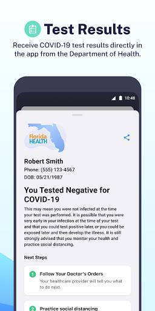  | 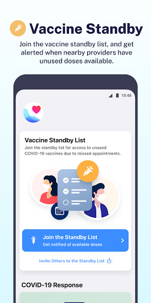  | 
 | 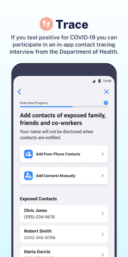  | 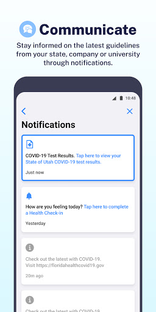  | 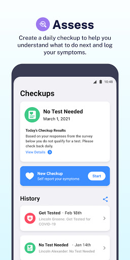  | 
 | 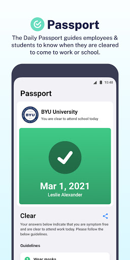  | 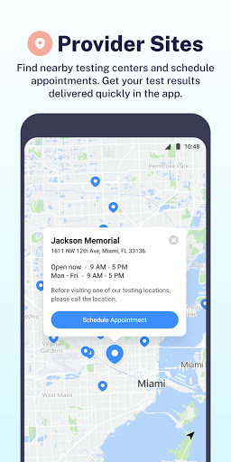 

## Development team
In the following we report the main information provided by the development team in the Google play store.

| | |
|-------------------------|-------------------------|
| **Developer**  | Twenty Inc. |
| **Website**  | [https://healthytogether.io/](https://healthytogether.io/) |
| **Email** | support@healthytogether.zendesk.com |
| **Physical address**  | [280 Park Ave 41st Floor New York, NY 10017](https://www.google.com/maps/search/280%20Park%20Ave%2041st%20Floor%20New%20York,%20NY%2010017) (Google Maps) |
| **Other developed apps**  | [https://play.google.com/store/apps/developer?id=Twenty+Inc.](https://play.google.com/store/apps/developer?id=Twenty+Inc.) |

## Android support

| | |
|-------------------------|-------------------------|
| **Declared target Android version**  | - |
| **Effective target Android version**  | - |
| **Minimum supported Android version**  | Nougat, version 7.0 (API level 24) |
| **Maximum target Android version**  | - |

The larger the difference between the minimum and maximum supported Android versions, the better. A larger difference means a wider audience. For example, old phones have a very low Android version, so a high minimum supported Android version means that the app cannot be used by users with old phones, thus leading to accessibility problems. 

## Requested permissions

In the following we report the complete list of the permissions requested by the app. 

| **Permission** | **Protection level** | **Description** | 
|-------------------------|-------------------------|-------------------------|
 **android.permission ACCESS_FINE_LOCATION** | :warning:**Dangerous** | Allows an app to access precise location. 
 **android.permission ACCESS_NETWORK_STATE** | Normal | Allows applications to access information about networks. 
 **android.permission ACCESS_WIFI_STATE** | Normal | Allows applications to access information about Wi-Fi networks. 
 **android.permission BLUETOOTH** | Normal | Allows applications to connect to paired bluetooth devices. 
 **android.permission BLUETOOTH_ADMIN** | Normal | Allows applications to discover and pair bluetooth devices. 
 **android.permission CAMERA** | :warning:**Dangerous** | Required to be able to access the camera device. 
 **android.permission FOREGROUND_SERVICE** | Normal | Allows a regular application to use Service.startForeground. 
 **android.permission INTERNET** | Normal | Allows applications to open network sockets. 
 **android.permission READ_CONTACTS** | :warning:**Dangerous** | Allows an application to read the user's contacts data. 
 **android.permission RECEIVE_BOOT_COMPLETED** | Normal | Allows an application to receive the Intent.ACTION_BOOT_COMPLETED that is broadcast after the system finishes booting. 
 **android.permission USE_BIOMETRIC** | Normal | Allows an app to use device supported biometric modalities. 
 **android.permission USE_FINGERPRINT** | Normal | This constant was deprecated in API level 28. Applications should request USE_BIOMETRIC instead 
 **android.permission VIBRATE** | Normal | Allows access to the vibrator. 
 **android.permission WAKE_LOCK** | Normal | Allows using PowerManager WakeLocks to keep processor from sleeping or screen from dimming. 
 **com.google.android.c2dm.permission RECEIVE** | - | - 
 **com.google.android.finsky.permission BIND_GET_INSTALL_REFERRER_SERVICE** | - | - 

## Mentioned servers

| **Server** | **Registrant** | **Registrant country** | **Creation date** | 
|-------------------------|-------------------------|-------------------------|-------------------------|
 | adobe.com | Adobe Inc. | :us: US | 1986-11-17 05:00:00 |
 | google.com | Google LLC | :us: US | 1997-09-15 04:00:00 |
 | cloudinary.com | Cloudinary Ltd. | :israel: IL | 2011-05-24 12:52:37 |
 | mapbox.com | Whois Privacy Service | :us: US | 2003-11-27 11:15:57 |
 | googlesyndication.com | Google LLC | :us: US | 2003-01-21 06:17:24 |
 | healthytogether.io | Domains By Proxy, LLC | :us: US | 2020-04-09 16:47:40 |
 | app-measurement.com | Google LLC | :us: US | 2015-06-19 20:13:31 |
 | googleadservices.com | Google LLC | :us: US | 2003-06-19 16:34:53 |
 | crashlytics.com | Google LLC | :us: US | 2011-01-21 15:30:40 |
 | apple.com | Apple Inc. | :us: US | 1987-02-19 05:00:00 |
 | aomedia.org | Contact Privacy Inc. Customer 1243324949 | :canada: CA | 2015-08-24 14:07:31 |
 | twentylabs.co | Domains By Proxy, LLC | :us: US | 2020-04-04 22:49:56 |
 | w3.org | W3C | :us: US | 1994-07-06 04:00:00 |

## Security analysis 

Below we report the main security warnings raised by our execution of the [Androwarn](https://github.com/maaaaz/androwarn) security analysis tool.

**Telephony identifiers leakage**
> - This application reads the ISO country code equivalent of the current registered operator's MCC (Mobile Country Code) 
> - This application reads the MCC+MNC of the provider of the SIM 
> - This application reads the numeric name (MCC+MNC) of current registered operator 
> - This application reads the operator name 
> - This application reads the radio technology (network type) currently in use on the device for data transmission 

**Connection interfaces exfiltration**
> - This application reads details about the currently active data network 
> - This application tries to find out if the currently active data network is metered 

**Telephony services abuse**
> - This application makes phone calls 

**Suspicious connection establishment**
> - This application opens a Socket and connects it to the remote address '; port is out of range' on the 'N/A' port  
> - This application opens a Socket and connects it to the remote address 'LXX2;->R(Ljava/lang/String;)Ljava/lang/StringBuilder;' on the 'N/A' port  
> - This application opens a Socket and connects it to the remote address 'Ljava/net/Proxy;->type()Ljava/net/Proxy$Type;' on the 'N/A' port  
> - This application opens a Socket and connects it to the remote address 'timeout' on the 'N/A' port  

**Code execution**
> - This application loads a native library 
> - This application loads a native library: 'mapbox-gl' 

## User ratings and reviews

Below we provide information about how end users are reacting to the app in terms of ratings and reviews in the Google Play store.

### Ratings

The Healthy Together - COVID-19 app has been installed by more than **500000** times. At this time, **16577** rated the app and its average score is **4.6878276**. Below we show the distribution of the ratings across the usual star-based rating of Google Play

:star::star::star::star::star:: 13750

:star::star::star::star:: 1738

:star::star::star:: 376

:star::star:: 173

:star:: 540

### Reviews 

#### 5-star reviews

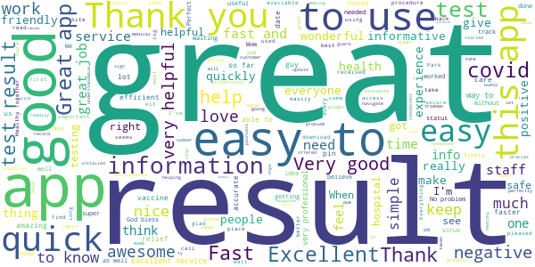

> It worked, I was able to sign up easily and was able to access my test results  :date: __2021-04-04 06:34:04__

> Good  :date: __2021-04-03 21:18:47__

> Excellent  :date: __2021-04-03 01:45:55__

> way faster results than the Dr. Office.  :date: __2021-04-02 06:51:11__

> Fast  :date: __2021-04-01 15:30:42__

> Still pending for update  :date: __2021-03-31 23:57:51__

> good app to easily see covid results  :date: __2021-03-31 23:43:30__

> Easy to read and use  :date: __2021-03-31 18:06:44__

> Easy to use and load information.  :date: __2021-03-31 17:06:57__

> Good to know by Telephone and 2 days only. Tks Everyone.  :date: __2021-03-31 15:15:59__

#### 4-star reviews

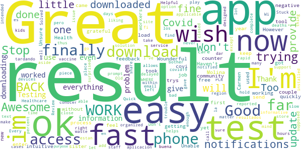

> Awesome tool  :date: __2021-03-30 21:46:52__

> Im trying to get my sister Carmen M .Molina (covi result.  :date: __2021-03-29 14:28:53__

> Great  :date: __2021-03-28 08:11:54__

> Works now! However I wish you didn't have to enter the year first as it's counter intuitive.  :date: __2021-03-26 20:07:05__

> Stop :)  :date: __2021-03-25 11:31:34__

> Great  :date: __2021-03-23 15:07:53__

> Ok  :date: __2021-03-19 23:54:06__

> awesome  :date: __2021-03-11 00:00:35__

> Great  :date: __2021-03-08 13:59:41__

> I finally got my results. It took a couple trys but it's ok.  :date: __2021-03-08 01:08:24__

#### 3-star reviews

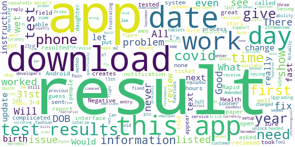

> seems to repeatedly give me the same results??  :date: __2021-04-02 17:56:12__

> Would not let me change birth year. Did receive fast support text saying I heeded to enter year first, which I did and then it worked. They have a fix planned for next revision.  :date: __2021-03-30 22:50:11__

> Recent update broke ability to view results because date of birth can't be changed from year 2001. Will revise review when fixed. Update: the developers instruction does fix the DOB entry problem but it really should not be so complicated. The previous DOB interface was frustrating as well but it did work. Not sure why it is so complicated. Upgrading to three stars as most people still won't be able to figure out the DOB trick.  :date: __2021-03-26 17:08:49__

> 👍👍  :date: __2021-03-22 06:10:11__

> W was m  :date: __2021-03-20 19:54:07__

> I need my results and they won't give me the pin to unlock the results  :date: __2021-03-08 18:10:30__

> Pain to get setup. But then its ok i guess  :date: __2021-02-26 15:44:55__

> Nice app fast results ,Can you make it available for Samsung tablets  :date: __2021-02-20 22:15:15__

> 3 werewolf 31st Weren't 2ee 3rd r=we w wet we r q we 4 we w2 re were e w w wet 3rd equip4a2 were wee we ewe we wert e 13th 3 wee 2 we 31st 14th e1 wet 2q33 31st q we 25thmentwe 23rd r  :date: __2021-02-16 17:18:35__

> Tool of tyranny. Actually it's okay, functions well.  :date: __2021-02-16 16:19:39__

#### 2-star reviews

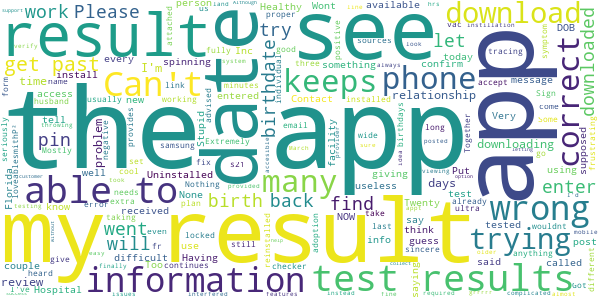

> I received a message saying that my results were in the app. But I don't see it  :date: __2021-04-03 17:48:42__

> Extremely difficult to use. I do not plan on using it again  :date: __2021-04-02 16:16:08__

> App is not working. I enter my information and it keeps giving me an error message saying “something went wrong. Please try again". The birth dates are correct, but it still doesn't work. I even Uninstalled and reinstalled the app to see if it would fix it. Nothing!  :date: __2021-03-31 21:05:36__

> Sign in for extra vac keeps giving today date & wrong date of birth, won't let me correct  :date: __2021-03-31 01:12:32__

> Put correct info in n locked me out,after many trys Got in!  :date: __2021-03-28 15:23:23__

> I have put my birthdate, and for my husband as well, and it continues to go back to the date already on the form...it will not accept our proper birthdays.  :date: __2021-03-27 14:31:24__

> loveablesmithP²  :date: __2021-03-26 02:56:34__

> It wouldnt let me set a pin.  :date: __2021-03-20 23:12:48__

> The app will say test results are in and when I enter my information, they tell me that the info is wrong and will not give me my results. Very frustrating.  :date: __2021-03-15 17:37:11__

> Can't see the result  :date: __2021-03-13 18:46:01__

#### 1-star reviews

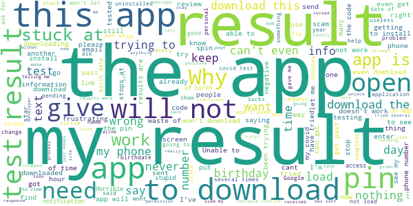

> Results were never given  :date: __2021-04-04 00:00:42__

> I need to go back to work and I can't seem to download this app to get my results.IT KEEPS GOING IN CIRCLES. Im reading so many negative comments so what is really going on.. are you guys fixing this thing because it's frustrating. Please don't say email because I tried that too and it says invalid email. WE NEED TECH SUPPORT NOT JUST A RESPONSE SAYING SORRY.  :date: __2021-04-02 04:37:54__

> What is ur purpose. It sucks  :date: __2021-04-01 21:04:16__

> I do not want to be in a database you do not have my consent  :date: __2021-04-01 21:03:08__

> Will not load can not read results  :date: __2021-04-01 17:41:28__

> The app just stay in the phone number  :date: __2021-03-31 21:15:38__

> Not helpful. You can't enter in you are in the hospital with covid  :date: __2021-03-31 20:31:17__

> The birthdate would not change to get any results  :date: __2021-03-30 00:09:43__

> I can no longer assess symptoms or use this to show that a test isn't needed, the screen is gone.  :date: __2021-03-29 23:58:30__

> Will not allow me to enter birth date keeps default to 2001. My birth year is 1955  :date: __2021-03-29 21:48:12__

