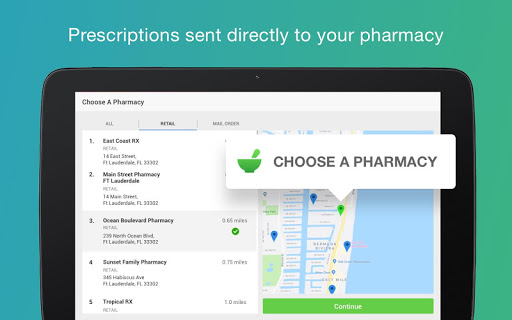
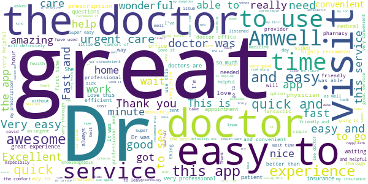
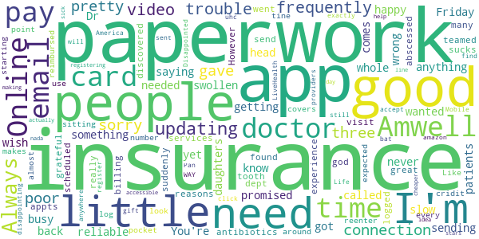
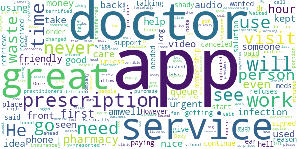
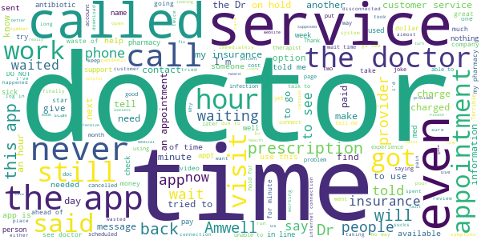

# Amwell: Doctor Visits 24/7
App version ``12.10.01.005_01``

Analyzed with [covid-apps-observer](http://github.com/covid-apps-observer) project, version ``0.1``

## App overview
| | |
|-------------------------|-------------------------| 
| **Name**                                          | Amwell: Doctor Visits 24/7 |
| **Unique identifier** | com.americanwell.android.member.amwell |
| **Link to Google Play** | [https://play.google.com/store/apps/details?id=com.americanwell.android.member.amwell](https://play.google.com/store/apps/details?id=com.americanwell.android.member.amwell) |
| **Summary**  | See a doctor anytime. Doctors are available 24/7, no appointment needed. |
| **Privacy policy** | [https://www.americanwell.com/privacy-policy/](https://www.americanwell.com/privacy-policy/) |
| **Latest version** | 12.10.01.005_01 |
| **Last update** | 2021-04-24 00:20:48 |
| **Recent changes** | We continue to improve the patient experience with these new features: • Performance enhancements to increase reliability and speed |
| **Installs**  | 1,000,000+ |
| **Category** | Medical |
| **First release** | Oct 6, 2013 |
| **Size**  | 56M |
| **Supported Android version**  | 5.0 and up |

### Description
> High-quality, affordable medical care is in the palm of your hands — and on-demand — with Amwell.
 Amwell is the best way to see a doctor from home or on-the-go. Our telehealth app connects you to board-certified, experienced medical providers. High-quality healthcare is now available, 24/7, with on-demand service or scheduled appointments, often with next-day availability.
 Amwell brings healthcare home through the power of telemedicine so you can feel better faster.
 AMWELL IS EASY AS 1 -2 -3
 1. Download the app
 2. Choose the type of visit
 3. Choose your provider
 No more driving to the doctor or sitting in waiting rooms. With Amwell, quality medical providers are available 24/7, to help you feel better faster.
 AMWELL DOCTORS HAVE SEEN IT ALL
 Our experienced clinicians can provide the care you need quickly. Common patients concerns include:
 • Urgent Care: bronchitis, sinus & respiratory infections, sore throat, diarrhea, cold/flu, gout, strep throat, urinary tract infections, pink eye, hypertension, migraines, pneumonia
 • Therapy: depression & anxiety, ADHD/ADD, bereavement, trauma, couples therapy, stress, divorce, sleep disorders
 • Psychiatry: anorexia, bipolar disorder, panic attacks, PTSD, OCD, psychosis, insomnia, substance abuse
 • Nutrition: weight concerns, food allergies, meal planning, high blood pressure, pediatric nutrition, digestive disorders, pregnancy diets
 • Lactation Consulting: breastfeeding help
 AFFORDABLE PRICES FOR SERVICES YOU NEED
 We believe quality healthcare should be accessible and affordable. That’s why before insurance, Amwell costs:
 • $79 or less for urgent care
 • $99 starting cost or less for online therapy
 • $269 initial online psychiatry visit, follow-up visit starting at $99
 • $70 or less for nutrition counseling visits
 • $129 initial breastfeeding support visit, follow-up visit $75
 Have health insurance? Many major carriers cover Amwell visits. To check if yours does, simply enter your health insurance information to see the price you will pay for your visit. It’s that easy.
 100% SECURE & CONFIDENTIAL
 We take your privacy very seriously. Your visit with the doctor is confidential and HIPAA compliant.
 AWARDS AND RECOGNITION
 • Most Popular Mobile Telehealth Platform of 2014-2016 – App Annie
 • Best Telemedicine App of 2016 – Healthline
 • First telehealth service awarded accreditation by the American Telemedicine Association
 CONNECT WITH US
 To learn more or get your questions answered, please reach out to us!
 • Web: www.amwell.com
 • Facebook: www.facebook.com/amwellpatient
 • Twitter: www.twitter.com/amwell
 • Email: support@americanwell.com
 Please note that telehealth is not for emergencies. If you’re having a medical emergency, call 911.
 Any customer review may be used in marketing materials such as emails, fliers, blogs, or other promotional assets. Publishing a review is considered a grant of permission to share the review outside of the App Store. The review will be published anonymously.

### User interface
The developers of the app provide the following screenshots in the Google play store.
| | | |
|:-------------------------:|:-------------------------:|:-------------------------:|
 |   |   |   | 
 |   |   |   | 
 |   |   |   | 
 |   |   |   | 
 |   |   |   | 

## Development team
In the following we report the main information provided by the development team in the Google play store.

| | |
|-------------------------|-------------------------|
| **Developer**  | American Well |
| **Website**  | [http://www.americanwell.com](http://www.americanwell.com) |
| **Email** | support@americanwell.com |
| **Physical address**  | - |
| **Other developed apps**  | [https://play.google.com/store/apps/developer?id=American+Well](https://play.google.com/store/apps/developer?id=American+Well) |

## Android support

| | |
|-------------------------|-------------------------|
| **Declared target Android version**  | Android10, version 10 (API level 29) |
| **Effective target Android version**  | Android10, version 10 (API level 29) |
| **Minimum supported Android version**  | Lollipop, version 5.0 (API level 21) |
| **Maximum target Android version**  | - |

The larger the difference between the minimum and maximum supported Android versions, the better. A larger difference means a wider audience. For example, old phones have a very low Android version, so a high minimum supported Android version means that the app cannot be used by users with old phones, thus leading to accessibility problems. 

## Requested permissions

In the following we report the complete list of the permissions requested by the app. 

| **Permission** | **Protection level** | **Description** | 
|-------------------------|-------------------------|-------------------------|
 **android.permission ACCESS_COARSE_LOCATION** | :warning:**Dangerous** | Allows an app to access approximate location. 
 **android.permission ACCESS_FINE_LOCATION** | :warning:**Dangerous** | Allows an app to access precise location. 
 **android.permission ACCESS_LOCATION_EXTRA_COMMANDS** | Normal | Allows an application to access extra location provider commands. 
 **android.permission ACCESS_NETWORK_STATE** | Normal | Allows applications to access information about networks. 
 **android.permission ACCESS_WIFI_STATE** | Normal | Allows applications to access information about Wi-Fi networks. 
 **android.permission BLUETOOTH** | Normal | Allows applications to connect to paired bluetooth devices. 
 **android.permission BROADCAST_STICKY** | Normal | Allows an application to broadcast sticky intents. 
 **android.permission CAMERA** | :warning:**Dangerous** | Required to be able to access the camera device. 
 **android.permission GET_TASKS** | Deprecated | This constant was deprecated in API level 21. No longer enforced. 
 **android.permission INTERNET** | Normal | Allows applications to open network sockets. 
 **android.permission MODIFY_AUDIO_SETTINGS** | Normal | Allows an application to modify global audio settings. 
 **android.permission READ_EXTERNAL_STORAGE** | :warning:**Dangerous** | Allows an application to read from external storage. 
 **android.permission READ_PHONE_STATE** | :warning:**Dangerous** | Allows read only access to phone state, including the phone number of the device, current cellular network information, the status of any ongoing calls, and a list of any PhoneAccounts registered on the device. 
 **android.permission RECEIVE_BOOT_COMPLETED** | Normal | Allows an application to receive the Intent.ACTION_BOOT_COMPLETED that is broadcast after the system finishes booting. 
 **android.permission RECORD_AUDIO** | :warning:**Dangerous** | Allows an application to record audio. 
 **android.permission REORDER_TASKS** | Normal | Allows an application to change the Z-order of tasks. 
 **android.permission SYSTEM_ALERT_WINDOW** | Signature - preinstalled - appop - pre23 - development | Allows an app to create windows using the type WindowManager.LayoutParams.TYPE_APPLICATION_OVERLAY, shown on top of all other apps. 
 **android.permission USE_BIOMETRIC** | Normal | Allows an app to use device supported biometric modalities. 
 **android.permission USE_FINGERPRINT** | Normal | This constant was deprecated in API level 28. Applications should request USE_BIOMETRIC instead 
 **android.permission VIBRATE** | Normal | Allows access to the vibrator. 
 **android.permission WAKE_LOCK** | Normal | Allows using PowerManager WakeLocks to keep processor from sleeping or screen from dimming. 
 **android.permission WRITE_EXTERNAL_STORAGE** | :warning:**Dangerous** | Allows an application to write to external storage. 
 **com.facebook.katana.provider ACCESS** | - | - 
 **com.google.android.c2dm.permission RECEIVE** | - | - 
 **com.google.android.finsky.permission BIND_GET_INSTALL_REFERRER_SERVICE** | - | - 

## Mentioned servers

| **Server** | **Registrant** | **Registrant country** | **Creation date** | 
|-------------------------|-------------------------|-------------------------|-------------------------|
 | amwell.com | American Well Corporation | :us: US | 2004-02-13 19:02:32 |
 | facebook.com | Facebook, Inc. | :us: US | 1997-03-29 05:00:00 |
 | doubleclick.net | Google Inc. | :us: US | 1996-01-16 05:00:00 |
 | googleadservices.com | Google LLC | :us: US | 2003-06-19 16:34:53 |
 | google.com | Google LLC | :us: US | 1997-09-15 04:00:00 |
 | googlesyndication.com | Google LLC | :us: US | 2003-01-21 06:17:24 |
 | google-analytics.com | Google LLC | :us: US | 2005-07-18 19:24:32 |
 | appboy.com | Braze, Inc. | :us: US | 2008-10-06 23:28:32 |
 | braze.com | Braze, Inc. | :us: US | 2000-01-19 02:18:28 |
 | app-measurement.com | Google LLC | :us: US | 2015-06-19 20:13:31 |
 | optimizely.com | Optimizely | :us: US | 2010-01-11 03:01:32 |
 | twitter.com | Twitter, Inc. | :us: US | 2000-01-21 16:28:17 |
 | branch.io | Branch | :us: US | 2011-11-10 13:52:13 |
 | gstatic.com | Google LLC | :us: US | 2008-02-11 15:31:25 |
 | crashlytics.com | Google LLC | :us: US | 2011-01-21 15:30:40 |
 | bnc.lt | - | - | 2016-11-14 00:00:00 |
 | ggpht.com | Google LLC | :us: US | 2008-01-16 18:55:33 |

## Security analysis 

Below we report the main security warnings raised by our execution of the [Androwarn](https://github.com/maaaaz/androwarn) security analysis tool.

**Telephony identifiers leakage**
> - This application reads the ISO country code equivalent for the SIM provider's country code 
> - This application reads the ISO country code equivalent of the current registered operator's MCC (Mobile Country Code) 
> - This application reads the device phone type value 
> - This application reads the numeric name (MCC+MNC) of current registered operator 
> - This application reads the operator name 
> - This application reads the phone's current state 
> - This application reads the radio technology (network type) currently in use on the device for data transmission 

**Connection interfaces exfiltration**
> - This application reads details about the currently active data network 
> - This application tries to find out if the currently active data network is metered 

**Telephony services abuse**
> - This application makes phone calls 

**Audio video eavesdropping**
> - This application records audio from the 'VOICE_RECOGNITION' source  
> - This application captures video from the 'CAMERA' source 

**Suspicious connection establishment**
> - This application opens a Socket and connects it to the remote address ' returned no addresses for  ; port is out of range' on the 'N/A' port  
> - This application opens a Socket and connects it to the remote address '' on the 'N/A' port  
> - This application opens a Socket and connects it to the remote address 'Ljava/net/Proxy;->type()Ljava/net/Proxy$Type;' on the 'N/A' port  
> - This application opens a Socket and connects it to the remote address 'timeout' on the 'N/A' port  

**Code execution**
> - This application loads a native library 
> - This application executes a UNIX command containing this argument: '2' 

## User ratings and reviews

Below we provide information about how end users are reacting to the app in terms of ratings and reviews in the Google Play store.

### Ratings

The Amwell: Doctor Visits 24/7 app has been installed by more than **1000000** times. At this time, **7836** rated the app and its average score is **4.200511**. Below we show the distribution of the ratings across the usual star-based rating of Google Play

:star::star::star::star::star:: 5845

:star::star::star::star:: 420

:star::star::star:: 130

:star::star:: 180

:star:: 1261

### Reviews 

#### 5-star reviews

> Excellent and prompt. Shows concern for patients and great diagnosis.  :date: __2021-04-30 18:06:30__

> Wonderful experience. Dr asked a lot of questions before prescribing me different medications. She was excellent. Can't thank her enough.  :date: __2021-04-30 17:22:20__

> Clarity and clear speech simple access  :date: __2021-04-29 21:03:16__

> Dr. Gindy is an amazing Physician  :date: __2021-04-21 18:31:23__

> I've used this twice and had wonderful experiences, quick, efficient and knowledgeable doctors. Way better than driving to and waiting at an urgent care. Plus it saves your information so you don't have to re-enter in all of your insurance and all that stuff every time you use it. I hate all those forms at the doctor's office.  :date: __2021-04-19 04:43:47__

> I've used amwell a few times. I've gotten great advice, and been treated with utmost respect by the Dr's that have seen me. Thank you Amwell!  :date: __2021-04-18 20:43:04__

> I was absolutely shocked by how easy this was and how thorough they were.  :date: __2021-04-16 18:38:22__

> I wish all doctor appointments were like this!  :date: __2021-04-15 19:31:29__

> Quick and easy, love it!  :date: __2021-04-10 14:42:08__

> Very good  :date: __2021-04-06 16:30:45__

#### 4-star reviews

> Quick useful service  :date: __2021-04-25 20:48:16__

> Pretty straightforward. Make sure to have a good wifi connection. Unfortunately where I live, we don't have great internet.  :date: __2020-12-31 17:30:33__

> Questions after ER Muscle spasms, severe pain, numbness.  :date: __2020-11-14 17:10:21__

> The provider was great and the app was convenient and very easy to use. The only problem was the technical difficulties they had yesterday. It prevented me from getting to see the doctor at all.  :date: __2020-10-23 21:04:16__

> I had sprained my ankle really bad and I didn't think I needed to go to a hospital and risk getting Covid. The doctor was great very informative and answered all my questions. The downside is the app has a section for emailing your doctor and the one I selected did not receive them. That information should of been on the description of the doctor. I also needed a doctors note she said she'd get it but forgot. Contacted support multiple times till after almost 2 days I got my doctors note.  :date: __2020-09-30 00:53:59__

> Dr responded at midnite. Ordered antibiotics. Able to avoid ER or acute care to possibly be exposed to Covid-19.  :date: __2020-09-13 05:54:30__

> Quick and easy  :date: __2020-09-07 15:20:25__

> Good experience and the app was easy to use.  :date: __2020-08-28 19:55:33__

> Anxiety depression  :date: __2020-08-22 02:05:53__

> Twice now the video did not connect  :date: __2020-08-14 23:45:37__

#### 3-star reviews

> Always updating, frequently have trouble with app, video connection pretty poor.  :date: __2020-03-22 15:54:59__

> I'm sorry I only gave you a three but when I am promised paperwork on a Friday and don't get it there's something wrong you got what you wanted from me but yet I don't get anything from you I know it's busy but I need my paperwork that's all I'm saying You're a little slow getting paperwork to your patients or your emails I wish your daughters were a little more reliable when it comes to sending paperwork  :date: __2020-03-16 04:33:01__

> not happy Dr never called me back my whole head was swollen and I needed antibiotics for an abscessed tooth didn't get them  :date: __2020-03-05 19:02:19__

> I have been having a great experience with both the app and Amwell services. It has been a god-send for me for many reasons. I am very grateful my insurance has teamed up with Amwell. However, as time went on I discovered the billing dept really sucks! I had appts scheduled and when I logged in I found that I suddenly had to pay for the visit out of my pocket, but my insurance covers it 100%. I was expected to pay for it and be reimbursed by my insurance. Like I have $80 just sitting around.  :date: __2019-11-13 14:10:22__

> Need to use it more. It's a good starting point.  :date: __2019-10-25 18:44:01__

> Its good but every tine i log in it makes me reenter my cridit card number.  :date: __2019-09-20 01:59:16__

> The look of the app is almost exactly the same as LiveHealth Online Mobile. Has WAY more insurance providers... But still can't find anywhere that will accept Pan America Life insurance. Very disappointing.  :date: __2019-08-15 04:50:44__

> Disappointed off the bat. was sent an email from uhc to click and register to get an amazon gift card for registering. nada. its a good idea for doctors... help people out by making it cheaper and more accessible during the times of day when people actually get sick. so 3 stars.  :date: __2019-05-25 22:29:37__

> 1 doctor online and 8 people in line.  :date: __2019-04-03 12:16:45__

> Not impressed. The doctor was nice enough. felt very rushed. Diagnosed pink eye but had an issue with my prescription and no way to follow up on it. Probably wont use again.  :date: __2019-03-23 17:12:25__

#### 2-star reviews

> The app was good, dr was friendly. Just an ear infection i wanted some meds. Doctor said i should go to in person urgent care. Then why did the hell did i waste 80$ and use amwell?????  :date: __2021-03-21 17:41:06__

> The app and service is great, as long as you're paying. I didn't need to continue using the service so I canceled after talking to the doctor and getting the help I needed. However, the pharmacy didn't get my prescription order, and Amwell support refuses to give it to me unless I start my membership again. That seems shady to me. I paid for a service and received it, but didn't get to retrieve the solution (prescription), which was the reason I signed up in the first place.  :date: __2021-01-26 17:19:05__

> Basically an app to purchase a doctors note for work or school. The doctors or nurse practitioners seem terrified to write any prescription that isn't OTC. I deleted it.  :date: __2021-01-17 17:44:50__

> So frustrating to use. Never works right and I get over charged.  :date: __2020-12-02 22:35:46__

> The service is a great idea and fast. But the app will not allow pictures to be uploaded forcing a video visit. Once they get that fixed, it will be great.  :date: __2020-08-28 15:18:06__

> Video of my doctor was not good, nor was the audio with the doctor, we resorted to a phone call for the audio portion. I have been using " Doxy me " for other doctor visits and it works much better.  :date: __2020-06-04 19:12:11__

> Not the biggest fan, my insurance wasn't found but the company was listed.  :date: __2020-05-02 17:23:27__

> Waited with 11 people ahead of me, only to get to the front, wait another half hour, and then be transferred to someone else, only to be pushed back in the queue even more. When I got to the front of that person's queue, after 15 minutes the app forcefully logged me out! I feel terrible and this was 4.5 hours of my time wasted! Not cool! I really need to see someone.  :date: __2020-03-29 03:24:08__

> First visit for my son went great. Doctor was friendly and listened and helpful. Second visit was for me. The doctor couldn't even work his camera correctly so all you could see was the top of his head. He then was very condescending. He didn't even know about one of the medications I was taking (it's used off label for my treatment). He kept insisting it's never used for that I must take it for something else. 🙄 You can't go back to file a complaint.  :date: __2020-01-24 11:24:41__

> Don't be surprised that the app doesn't work just when you need it. Today is Sunday and just when I need it, it is not working. Not very 24/7.  :date: __2020-01-13 06:46:21__

#### 1-star reviews

> When the app opens it now says that their services are not available in my state of Florida. But it is available....just for 'better insurance' such as Blue Cross Blue shield and the like.  :date: __2021-04-20 23:42:21__

> Not used  :date: __2021-04-19 05:04:06__

> App keeps crashing. I need to see my therapist. This sucks. What if someone was snowballing into a crisis situation and needed to talk? I'm pretty annoyed.  :date: __2021-04-09 13:28:51__

> Every update makes the app worse. Can't find insurance, can't see or hear doctor, can't leave doctor reviews anymore, doctors seem to be rood a lot. Very frustrating.  :date: __2021-04-03 22:49:08__

> Doc canceled video chat mid meeting w/o reason-she couldn't be seen or heard at 1st, then I could barely her even tho my Galaxy Note 20 Ultra 5G was on the highest volume. She said she was typing so she couldn't turn on the camera at the same time. Mina Rizwan was found under Women's Health and her profile stated it is her profession. I had uploaded images of my health report since I was looking for a 2nd opinion, all she told me was to go to my OBGYN n hung up on me. POINTLESS APP!RUDE DOCTOR!  :date: __2021-04-03 18:17:37__

> Doesn't have healthfirst so beware.  :date: __2021-03-07 09:51:03__

> I HATE THIS APP!! It constantly crashes, won't load, or won't even stay open. I got kicked out of another appointment and that's not good. Especially for people who are paying their hard earned money for the services provided. Please fix.  :date: __2021-03-03 20:12:02__

> Got someone who allegedly graduated from NYU School of Med, but had no idea bacteria grew in the large intestine. Not even exaggerating this. Don't use this app unless you have no other options. I'd better not be charged the copay for this.  :date: __2021-03-03 02:15:31__

> Sucks  :date: __2021-02-27 22:23:22__

> Uninstalled immediately after the signup page. I am a trans person who came across their services recommended as being LGBTQ+ friendly but the app has a signup form with no options for gender other than male/female, and no option for a social name. This tells me everything I need to know about how I might be treated. Terrible.  :date: __2021-02-18 17:43:38__

