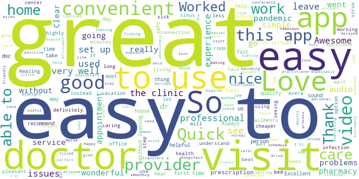

# AveraNow
App version ``12.9.01.000_00``

Analyzed with [covid-apps-observer](http://github.com/covid-apps-observer) project, version ``0.1``

## App overview
| | |
|-------------------------|-------------------------| 
| **Name**&nbsp;&nbsp;&nbsp;&nbsp;&nbsp;&nbsp;&nbsp;&nbsp;&nbsp;&nbsp;&nbsp;&nbsp;&nbsp;&nbsp;&nbsp;&nbsp;&nbsp;&nbsp;&nbsp;&nbsp;&nbsp;&nbsp;&nbsp;&nbsp;&nbsp;&nbsp;&nbsp;&nbsp;&nbsp;&nbsp;&nbsp;&nbsp;&nbsp;&nbsp;&nbsp;&nbsp;&nbsp;&nbsp;&nbsp;&nbsp;  | AveraNow |
| **Unique identifier** | com.americanwell.android.member.avera |
| **Link to Google Play** | [https://play.google.com/store/apps/details?id=com.americanwell.android.member.avera](https://play.google.com/store/apps/details?id=com.americanwell.android.member.avera) |
| **Summary**  | Connect with a provider anytime for an online video visit using a mobile device. |
| **Privacy policy** | [http://www.avera.org/patients-visitors/privacy-policy/](http://www.avera.org/patients-visitors/privacy-policy/) |
| **Latest version** | 12.9.01.000_00 |
| **Last update** | 2021-04-01 17:25:12 |
| **Recent changes** | We continue to improve the patient experience with these new features: • Performance enhancements to increase reliability and speed |
| **Installs**  | 10,000+ |
| **Category** | Medical |
| **First release** | Jun 3, 2015 |
| **Size**  | 50M |
| **Supported Android version**  | 5.0 and up |

### Description
> The free AveraNow app gives mobile users an easy way to connect with a live provider for an online video visit using your own mobile device. It’s simple, fast and you can use it anywhere — 24 hours a day, 7 days a week — whether you're already an Avera patient or not. It’s medicine for the modern age.
  
 AveraNow is a live video interaction between you and a trusted provider. Use AveraNow for urgent care symptoms and conditions such as:
  
 •         Cold
 •         Flu
 •         Rash
 •         Urinary tract infection
 •         Pink eye
 •         Allergies
 •         Vomiting
 •         Diarrhea
 •         Sore throat
 •         Sinus infection
 •         Fever
  
 An online consult with AveraNow eliminates wasting time traveling to an acute care center or retail clinic, or waiting for an appointment at a doctor’s office. And, it costs less. If you have already enrolled in AveraNow via the Web, your username and password will work on the mobile app. If you haven’t enrolled yet, download the app now or visit Avera.org/now and enroll — it’s easy!
  
 Connect immediately to an Avera Medical Group medical provider for a live health care visit via your mobile device, 24 hours a day. A virtual video chat makes receiving care for common ailments affordable, convenient and fast. Features include:
  
 • Live visits, with secure chat features
 • Experienced Avera Medical Group providers
 • Prescriptions as appropriate
 • Online credit card payment

### User interface
The developers of the app provide the following screenshots in the Google play store.
| | | |
|:-------------------------:|:-------------------------:|:-------------------------:|
 |   |   |   | 
 |   |   |   | 
 |   |   |   | 
 |   |   |   | 

## Development team
In the following we report the main information provided by the development team in the Google play store.

| | |
|-------------------------|-------------------------|
| **Developer**  | Avera Health |
| **Website**  | [http://www.avera.org](http://www.avera.org) |
| **Email** | averanow@avera.org |
| **Physical address**  | - |
| **Other developed apps**  | [https://play.google.com/store/apps/developer?id=Avera+Health](https://play.google.com/store/apps/developer?id=Avera+Health) |

## Android support

| | |
|-------------------------|-------------------------|
| **Declared target Android version**  | Android10, version 10 (API level 29) |
| **Effective target Android version**  | Android10, version 10 (API level 29) |
| **Minimum supported Android version**  | Lollipop, version 5.0 (API level 21) |
| **Maximum target Android version**  | - |

The larger the difference between the minimum and maximum supported Android versions, the better. A larger difference means a wider audience. For example, old phones have a very low Android version, so a high minimum supported Android version means that the app cannot be used by users with old phones, thus leading to accessibility problems. 

## Requested permissions

In the following we report the complete list of the permissions requested by the app. 

| **Permission** | **Protection level** | **Description** | 
|-------------------------|-------------------------|-------------------------|
 **android.permission ACCESS_COARSE_LOCATION** | :warning:**Dangerous** | Allows an app to access approximate location. 
 **android.permission ACCESS_FINE_LOCATION** | :warning:**Dangerous** | Allows an app to access precise location. 
 **android.permission ACCESS_LOCATION_EXTRA_COMMANDS** | Normal | Allows an application to access extra location provider commands. 
 **android.permission ACCESS_NETWORK_STATE** | Normal | Allows applications to access information about networks. 
 **android.permission ACCESS_WIFI_STATE** | Normal | Allows applications to access information about Wi-Fi networks. 
 **android.permission BLUETOOTH** | Normal | Allows applications to connect to paired bluetooth devices. 
 **android.permission BROADCAST_STICKY** | Normal | Allows an application to broadcast sticky intents. 
 **android.permission CAMERA** | :warning:**Dangerous** | Required to be able to access the camera device. 
 **android.permission GET_TASKS** | Deprecated | This constant was deprecated in API level 21. No longer enforced. 
 **android.permission INTERNET** | Normal | Allows applications to open network sockets. 
 **android.permission MODIFY_AUDIO_SETTINGS** | Normal | Allows an application to modify global audio settings. 
 **android.permission READ_EXTERNAL_STORAGE** | :warning:**Dangerous** | Allows an application to read from external storage. 
 **android.permission READ_PHONE_STATE** | :warning:**Dangerous** | Allows read only access to phone state, including the phone number of the device, current cellular network information, the status of any ongoing calls, and a list of any PhoneAccounts registered on the device. 
 **android.permission RECEIVE_BOOT_COMPLETED** | Normal | Allows an application to receive the Intent.ACTION_BOOT_COMPLETED that is broadcast after the system finishes booting. 
 **android.permission RECORD_AUDIO** | :warning:**Dangerous** | Allows an application to record audio. 
 **android.permission REORDER_TASKS** | Normal | Allows an application to change the Z-order of tasks. 
 **android.permission SYSTEM_ALERT_WINDOW** | Signature - preinstalled - appop - pre23 - development | Allows an app to create windows using the type WindowManager.LayoutParams.TYPE_APPLICATION_OVERLAY, shown on top of all other apps. 
 **android.permission USE_BIOMETRIC** | Normal | Allows an app to use device supported biometric modalities. 
 **android.permission USE_FINGERPRINT** | Normal | This constant was deprecated in API level 28. Applications should request USE_BIOMETRIC instead 
 **android.permission VIBRATE** | Normal | Allows access to the vibrator. 
 **android.permission WAKE_LOCK** | Normal | Allows using PowerManager WakeLocks to keep processor from sleeping or screen from dimming. 
 **android.permission WRITE_EXTERNAL_STORAGE** | :warning:**Dangerous** | Allows an application to write to external storage. 
 **com.americanwell.android.member.avera.permission C2D_MESSAGE** | - | - 
 **com.facebook.katana.provider ACCESS** | - | - 
 **com.google.android.c2dm.permission RECEIVE** | - | - 
 **com.google.android.finsky.permission BIND_GET_INSTALL_REFERRER_SERVICE** | - | - 

## Mentioned servers

| **Server** | **Registrant** | **Registrant country** | **Creation date** | 
|-------------------------|-------------------------|-------------------------|-------------------------|
 | amwell.com | American Well Corporation | :us: US | 2004-02-13 19:02:32 |
 | facebook.com | Facebook, Inc. | :us: US | 1997-03-29 05:00:00 |
 | doubleclick.net | Google Inc. | :us: US | 1996-01-16 05:00:00 |
 | googleadservices.com | Google LLC | :us: US | 2003-06-19 16:34:53 |
 | google.com | Google LLC | :us: US | 1997-09-15 04:00:00 |
 | googlesyndication.com | Google LLC | :us: US | 2003-01-21 06:17:24 |
 | google-analytics.com | Google LLC | :us: US | 2005-07-18 19:24:32 |
 | appboy.com | Braze, Inc. | :us: US | 2008-10-06 23:28:32 |
 | braze.com | Braze, Inc. | :us: US | 2000-01-19 02:18:28 |
 | app-measurement.com | Google LLC | :us: US | 2015-06-19 20:13:31 |
 | optimizely.com | Optimizely | :us: US | 2010-01-11 03:01:32 |
 | twitter.com | Twitter, Inc. | :us: US | 2000-01-21 16:28:17 |
 | branch.io | Branch | :us: US | 2011-11-10 13:52:13 |
 | gstatic.com | Google LLC | :us: US | 2008-02-11 15:31:25 |
 | crashlytics.com | Google LLC | :us: US | 2011-01-21 15:30:40 |
 | bnc.lt | - | - | 2016-11-14 00:00:00 |
 | ggpht.com | Google LLC | :us: US | 2008-01-16 18:55:33 |

## Security analysis 

Below we report the main security warnings raised by our execution of the [Androwarn](https://github.com/maaaaz/androwarn) security analysis tool.

**Telephony identifiers leakage**
> - This application reads the ISO country code equivalent for the SIM provider's country code 
> - This application reads the ISO country code equivalent of the current registered operator's MCC (Mobile Country Code) 
> - This application reads the device phone type value 
> - This application reads the numeric name (MCC+MNC) of current registered operator 
> - This application reads the operator name 
> - This application reads the phone's current state 
> - This application reads the radio technology (network type) currently in use on the device for data transmission 

**Connection interfaces exfiltration**
> - This application reads details about the currently active data network 
> - This application tries to find out if the currently active data network is metered 

**Telephony services abuse**
> - This application makes phone calls 

**Audio video eavesdropping**
> - This application records audio from the 'VOICE_RECOGNITION' source  
> - This application captures video from the 'CAMERA' source 

**Suspicious connection establishment**
> - This application opens a Socket and connects it to the remote address ' returned no addresses for  ; port is out of range' on the 'N/A' port  
> - This application opens a Socket and connects it to the remote address '' on the 'N/A' port  
> - This application opens a Socket and connects it to the remote address 'Ljava/net/Proxy;->type()Ljava/net/Proxy$Type;' on the 'N/A' port  
> - This application opens a Socket and connects it to the remote address 'timeout' on the 'N/A' port  

**Code execution**
> - This application loads a native library 
> - This application executes a UNIX command containing this argument: '2' 

## User ratings and reviews

Below we provide information about how end users are reacting to the app in terms of ratings and reviews in the Google Play store.

### Ratings

The AveraNow app has been installed by more than **10000** times. At this time, **298** rated the app and its average score is **4.627451**. Below we show the distribution of the ratings across the usual star-based rating of Google Play

:star::star::star::star::star:: 250

:star::star::star::star:: 23

:star::star::star:: 8

:star::star:: 0

:star:: 17

### Reviews 

#### 5-star reviews

> Worked very well  :date: __2021-03-16 18:30:43__

> This made seeing my dr easy + safe.  :date: __2021-03-10 18:11:01__

> Clear and no problems.  :date: __2020-12-14 23:15:21__

> Easy to use and I didn't have to goto a covid filled doctors office.  :date: __2020-11-01 17:29:26__

> Very easy to use and my practitioner was very easy to talk to. I'll use it again.  :date: __2020-09-29 23:56:08__

> So easy to use. Quality of video and audio we perfect.  :date: __2020-09-27 23:35:09__

> App works great 👍  :date: __2020-09-21 16:11:45__

> Easy and convenient  :date: __2020-09-18 15:46:39__

> Very good. Professional app  :date: __2020-08-24 16:47:46__

> this is a great app...especially during the pandemic. once in a while I have to wait for a doc, but they are doctors... 99% I have no wait and no problems at all. thanks for making my healthcare safe and easy.  :date: __2020-08-04 17:56:54__

#### 4-star reviews

> Everything went well I was able to talk in discuss everything with my doctor. But towards the end I could not hear her hardly at all...she had to write the medicine on a piece of paper and show me so I would know what to get over the counter.  :date: __2020-11-02 19:02:43__

> Could not get video to work  :date: __2020-10-31 16:13:59__

> Good, some delay in sound this time.  :date: __2020-06-01 21:33:00__

> Really liked this "office visit"! I didn't have to hurry through traffic, no fussing with my dog who thinks she needs to come with every time I back the car out.! I still think if you have something you need to have the doctor look at, it is best to go in, but I did enjoy this!!  :date: __2020-05-05 15:11:51__

> Easy to use,but audio choppy on 4G connection.  :date: __2020-04-27 18:43:30__

> It makes it easier to get to a doctor when you're on the road or not able to physically be seen by your doctor. It's a good and easy app to use.  :date: __2020-01-28 16:39:45__

> It would be better if credit card info was asked early on in the process rather than at the very end. It would also be better experience if credit card info could be tied to Google Pay or Apple pay to make it quicker to load payment information.  :date: __2020-01-07 13:20:00__

> great app.  :date: __2019-07-13 13:17:04__

> Quick and easy, better than dragging a sick kid out. Had some trouble 
connecting at first, but switched to a different provider and it worked 
fine.  :date: __2018-07-14 15:45:54__

#### 3-star reviews

> Works fine the first had trouble the second time had to use a different app  :date: __2020-05-14 10:01:55__

> Hard to get logged in. Low return audio. Very hard to understand Dr.  :date: __2020-04-27 17:17:41__

> Some issues connecting. Had to make a second appointment. But once it was up, it worked great. Smoothly.  :date: __2020-04-23 23:18:33__

> my video feed kept interrupting  :date: __2019-04-29 20:50:54__

#### 2-star reviews

> I think itd be awesome BUT I wasnt able to use it yet because there is no option for Medicaid  :date: __2020-04-05 02:21:34__

#### 1-star reviews

> I've been seeing my Psychiatrist for over a year, yet I can't send her a message via the app. I've received messages from her office, but I can't respond. Not great for someone dealing with bipolar disorder. FIX IT!!!  :date: __2020-09-22 01:47:06__

> This was not thought thru. When I had my first appointment, I had to wait and wait, then I did get through it kept dropping me out then I got a "physician is not available". In, addition, although my phone is Android, I use Mac's at home. The app is not compatible with Mac but only iPhone and iPad. Kind of dumb. No, l et me rephrase that, " kind of stupid". A person should be able to use AveraNow on "all" devices.  :date: __2020-07-01 17:51:11__

> I downloaded the first time had my appointment. Now due to new updates it will not download.  :date: __2020-05-07 18:27:25__

> Waited around 2 hours and never got to talk to a physician  :date: __2019-12-30 18:11:31__

> The app indicates 2 available physicians but doesnt let me connect to either.  :date: __2019-03-21 14:00:07__

