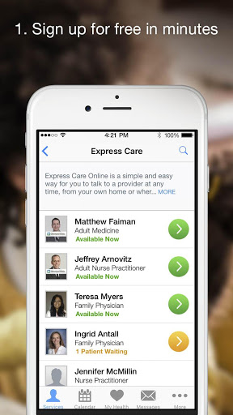
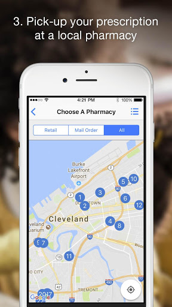
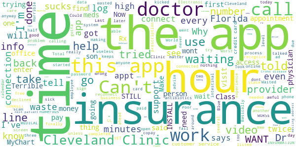

# Cleveland Clinic Express Care® Online
App version ``12.0.19.010_02``

Analyzed with [covid-apps-observer](http://github.com/covid-apps-observer) project, version ``0.1``

## App overview
| | |
|-------------------------|-------------------------| 
| **Name**&nbsp;&nbsp;&nbsp;&nbsp;&nbsp;&nbsp;&nbsp;&nbsp;&nbsp;&nbsp;&nbsp;&nbsp;&nbsp;&nbsp;&nbsp;&nbsp;&nbsp;&nbsp;&nbsp;&nbsp;&nbsp;&nbsp;&nbsp;&nbsp;&nbsp;&nbsp;&nbsp;&nbsp;&nbsp;&nbsp;&nbsp;&nbsp;&nbsp;&nbsp;&nbsp;&nbsp;&nbsp;&nbsp;&nbsp;&nbsp;  | Cleveland Clinic Express Care® Online |
| **Unique identifier** | com.americanwell.android.member.clevelandclinic |
| **Link to Google Play** | [https://play.google.com/store/apps/details?id=com.americanwell.android.member.clevelandclinic](https://play.google.com/store/apps/details?id=com.americanwell.android.member.clevelandclinic) |
| **Summary**  | Connect to your Cleveland Clinic doctor from home or work on your mobile device. |
| **Privacy policy** | [https://my.clevelandclinic.org/about/website/privacy-security#telemedicine-tab](https://my.clevelandclinic.org/about/website/privacy-security#telemedicine-tab) |
| **Latest version** | 12.0.19.010_02 |
| **Last update** | 2020-11-19 18:08:28 |
| **Recent changes** | We continue to improve the patient experience with these new features: • Performance enhancements to increase reliability and speed |
| **Installs**  | 100,000+ |
| **Category** | Medical |
| **First release** | Sep 16, 2014 |
| **Size**  | 53M |
| **Supported Android version**  | 5.0 and up |

### Description
> Cleveland Clinic Express Care® Online offers 24/7 care from anywhere via your smartphone or tablet. During your  virtual visit, a healthcare provider can offer  a diagnosis, treatment, and medication if appropriate – no appointment needed. 
 How can Express Care Online benefit me?
 • Connect in minutes to a healthcare provider – save time vs. an in-person visit
 • Can be used by your entire family, ages 2 and up
 • $55 or less per visit, with many insurance plans accepted
 • All visits are secure and confidential.
 • We treat many common conditions, including cough and cold, sinus infections, allergies, rash, and pink eye
 • Many Cleveland Clinic providers also offer virtual follow-up visits to select patients
 Commonly Treated Conditions (Ages 2+)
 • Asthma*
 • Bronchitis*
 • Conjunctivitis
 • Cough and cold symptoms
 • Earaches*
 • Minor back and shoulder pain*
 • Minor medical concerns
 • Minor trauma, burns or lacerations*
 • Sinus infections
 • Urinary tract infections*
 • Yeast infections*
 • Rash
 • Flu Symptom
 *Adult patients only

### User interface
The developers of the app provide the following screenshots in the Google play store.
| | | |
|:-------------------------:|:-------------------------:|:-------------------------:|
 |   |   |   | 
 |   |   |   | 
 |   |   |   | 
 |   |   |   | 
 |   |   |   | 

## Development team
In the following we report the main information provided by the development team in the Google play store.

| | |
|-------------------------|-------------------------|
| **Developer**  | Cleveland Clinic |
| **Website**  | [http://www.clevelandclinic.org](http://www.clevelandclinic.org) |
| **Email** | clevelandclinicmobile@gmail.com |
| **Physical address**  | - |
| **Other developed apps**  | [https://play.google.com/store/apps/developer?id=Cleveland+Clinic](https://play.google.com/store/apps/developer?id=Cleveland+Clinic) |

## Android support

| | |
|-------------------------|-------------------------|
| **Declared target Android version**  | Pie, version 9 (API level 28) |
| **Effective target Android version**  | Pie, version 9 (API level 28) |
| **Minimum supported Android version**  | Lollipop, version 5.0 (API level 21) |
| **Maximum target Android version**  | - |

The larger the difference between the minimum and maximum supported Android versions, the better. A larger difference means a wider audience. For example, old phones have a very low Android version, so a high minimum supported Android version means that the app cannot be used by users with old phones, thus leading to accessibility problems. 

## Requested permissions

In the following we report the complete list of the permissions requested by the app. 

| **Permission** | **Protection level** | **Description** | 
|-------------------------|-------------------------|-------------------------|
 **android.permission ACCESS_COARSE_LOCATION** | :warning:**Dangerous** | Allows an app to access approximate location. 
 **android.permission ACCESS_FINE_LOCATION** | :warning:**Dangerous** | Allows an app to access precise location. 
 **android.permission ACCESS_LOCATION_EXTRA_COMMANDS** | Normal | Allows an application to access extra location provider commands. 
 **android.permission ACCESS_NETWORK_STATE** | Normal | Allows applications to access information about networks. 
 **android.permission ACCESS_WIFI_STATE** | Normal | Allows applications to access information about Wi-Fi networks. 
 **android.permission BLUETOOTH** | Normal | Allows applications to connect to paired bluetooth devices. 
 **android.permission BROADCAST_STICKY** | Normal | Allows an application to broadcast sticky intents. 
 **android.permission CAMERA** | :warning:**Dangerous** | Required to be able to access the camera device. 
 **android.permission GET_TASKS** | Deprecated | This constant was deprecated in API level 21. No longer enforced. 
 **android.permission INTERNET** | Normal | Allows applications to open network sockets. 
 **android.permission MODIFY_AUDIO_SETTINGS** | Normal | Allows an application to modify global audio settings. 
 **android.permission READ_EXTERNAL_STORAGE** | :warning:**Dangerous** | Allows an application to read from external storage. 
 **android.permission READ_PHONE_STATE** | :warning:**Dangerous** | Allows read only access to phone state, including the phone number of the device, current cellular network information, the status of any ongoing calls, and a list of any PhoneAccounts registered on the device. 
 **android.permission RECEIVE_BOOT_COMPLETED** | Normal | Allows an application to receive the Intent.ACTION_BOOT_COMPLETED that is broadcast after the system finishes booting. 
 **android.permission RECORD_AUDIO** | :warning:**Dangerous** | Allows an application to record audio. 
 **android.permission REORDER_TASKS** | Normal | Allows an application to change the Z-order of tasks. 
 **android.permission SYSTEM_ALERT_WINDOW** | Signature - preinstalled - appop - pre23 - development | Allows an app to create windows using the type WindowManager.LayoutParams.TYPE_APPLICATION_OVERLAY, shown on top of all other apps. 
 **android.permission USE_BIOMETRIC** | Normal | Allows an app to use device supported biometric modalities. 
 **android.permission USE_FINGERPRINT** | Normal | This constant was deprecated in API level 28. Applications should request USE_BIOMETRIC instead 
 **android.permission VIBRATE** | Normal | Allows access to the vibrator. 
 **android.permission WAKE_LOCK** | Normal | Allows using PowerManager WakeLocks to keep processor from sleeping or screen from dimming. 
 **android.permission WRITE_EXTERNAL_STORAGE** | :warning:**Dangerous** | Allows an application to write to external storage. 
 **com.americanwell.android.member.clevelandclinic.permission C2D_MESSAGE** | - | - 
 **com.facebook.katana.provider ACCESS** | - | - 
 **com.google.android.c2dm.permission RECEIVE** | - | - 
 **com.google.android.finsky.permission BIND_GET_INSTALL_REFERRER_SERVICE** | - | - 

## Mentioned servers

| **Server** | **Registrant** | **Registrant country** | **Creation date** | 
|-------------------------|-------------------------|-------------------------|-------------------------|
 | amwell.com | American Well Corporation | :us: US | 2004-02-13 19:02:32 |
 | facebook.com | Facebook, Inc. | :us: US | 1997-03-29 05:00:00 |
 | doubleclick.net | Google Inc. | :us: US | 1996-01-16 05:00:00 |
 | googleadservices.com | Google LLC | :us: US | 2003-06-19 16:34:53 |
 | google.com | Google LLC | :us: US | 1997-09-15 04:00:00 |
 | googlesyndication.com | Google LLC | :us: US | 2003-01-21 06:17:24 |
 | googleapis.com | Google LLC | :us: US | 2005-01-25 17:52:26 |
 | google-analytics.com | Google LLC | :us: US | 2005-07-18 19:24:32 |
 | app-measurement.com | Google LLC | :us: US | 2015-06-19 20:13:31 |
 | appboy.com | Braze, Inc. | :us: US | 2008-10-06 23:28:32 |
 | braze.com | Braze, Inc. | :us: US | 2000-01-19 02:18:28 |
 | branch.io | Branch | :us: US | 2011-11-10 13:52:13 |
 | optimizely.com | Optimizely | :us: US | 2010-01-11 03:01:32 |
 | twitter.com | Twitter, Inc. | :us: US | 2000-01-21 16:28:17 |
 | crashlytics.com | Google LLC | :us: US | 2011-01-21 15:30:40 |
 | bnc.lt | - | - | 2016-11-14 00:00:00 |
 | gstatic.com | Google LLC | :us: US | 2008-02-11 15:31:25 |
 | ggpht.com | Google LLC | :us: US | 2008-01-16 18:55:33 |

## Security analysis 

Below we report the main security warnings raised by our execution of the [Androwarn](https://github.com/maaaaz/androwarn) security analysis tool.

**Telephony identifiers leakage**
> - This application reads the ISO country code equivalent for the SIM provider's country code 
> - This application reads the ISO country code equivalent of the current registered operator's MCC (Mobile Country Code) 
> - This application reads the MCC+MNC of the provider of the SIM 
> - This application reads the device phone type value 
> - This application reads the numeric name (MCC+MNC) of current registered operator 
> - This application reads the operator name 
> - This application reads the phone's current state 
> - This application reads the radio technology (network type) currently in use on the device for data transmission 

**Connection interfaces exfiltration**
> - This application reads details about the currently active data network 
> - This application tries to find out if the currently active data network is metered 

**Telephony services abuse**
> - This application makes phone calls 

**Audio video eavesdropping**
> - This application captures video from the 'CAMERA' source 

**Suspicious connection establishment**
> - This application opens a Socket and connects it to the remote address '' on the 'N/A' port  
> - This application opens a Socket and connects it to the remote address 'Ljava/lang/StringBuilder;->toString()Ljava/lang/String;' on the 'N/A' port  
> - This application opens a Socket and connects it to the remote address 'Ljava/net/Proxy;->type()Ljava/net/Proxy$Type;' on the 'N/A' port  
> - This application opens a Socket and connects it to the remote address 'timeout' on the 'N/A' port  

**Code execution**
> - This application loads a native library 
> - This application loads a native library: 'VidyoClientApp' 
> - This application loads a native library: 'ndkVideoClient' 
> - This application executes a UNIX command containing this argument: '2' 

## User ratings and reviews

Below we provide information about how end users are reacting to the app in terms of ratings and reviews in the Google Play store.

### Ratings

The Cleveland Clinic Express Care® Online app has been installed by more than **100000** times. At this time, **1872** rated the app and its average score is **4.5531917**. Below we show the distribution of the ratings across the usual star-based rating of Google Play

:star::star::star::star::star:: 1496

:star::star::star::star:: 159

:star::star::star:: 79

:star::star:: 39

:star:: 99

### Reviews 

#### 5-star reviews

> Pleasant interaction  :date: __2020-11-28 18:21:15__

> Awesome  :date: __2020-11-24 15:56:55__

> Quick, efficient and the provider Jordan Alexander was phenomenal.  :date: __2020-11-22 18:00:49__

> It is always great!  :date: __2020-11-22 15:59:04__

> Required patience to be seen, but would SO much rather wait in my home than doctor's office waiting room! Practioner was excellent and I felt genuinely cared for. Definitely worth the $49.  :date: __2020-11-21 18:47:13__

> Very nice and easy to navigate  :date: __2020-11-20 21:39:18__

> Really pleasant helpful and convenient experience. Thank you.  :date: __2020-11-20 16:10:38__

> Great got me what I needed  :date: __2020-11-20 14:23:52__

> Wow, fast, easy, very effective way to resolve my matter in the comfort of my home.  :date: __2020-11-18 22:38:18__

> Very fast service, pleasant experience  :date: __2020-11-17 20:31:38__

#### 4-star reviews

> life saver  :date: __2020-10-26 10:37:41__

> I had my first visit on May 10 2020. The doctor was fabulous. I just needed an asthma inhaler refill. Walgreens pharmacy said the script didn't list generic as acceptable. Put shortly, it was resolved. However, the inhalers were recalled a few months later. I came back to Express Care to explain I needed a new script. Others need returned. Again, doc was great. What upsets me is getting charged $55. I paid for 2 visits & 4 inhalers unnecessarily. Disappointed  :date: __2020-10-05 22:10:48__

> Had to re enter things a couple times. I hear they're working on it.  :date: __2020-09-15 00:49:25__

> Was hard to hear  :date: __2020-09-09 19:01:59__

> Huge bug--video wouldn't come through on my doctor's side!! Please fix it soon.  :date: __2020-08-05 17:27:04__

> Positive once the bugs were worked out.  :date: __2020-07-17 16:22:28__

> The doctor was good. The issue I have is if you take too long inputting information after you choose a provider, it will kick you off and say that the provider is no longer available and you have to start over again.  :date: __2020-07-06 21:44:07__

> It's a touch laggy but it works.  :date: __2020-06-24 16:33:45__

> Ok  :date: __2020-06-22 17:45:00__

> Next Level  :date: __2020-06-09 22:13:06__

#### 3-star reviews

> Connection was weak. Lots of questions to answer.  :date: __2020-11-17 02:55:23__

> Very cumbersome. It should connect automatically with my chart so I don't have to answer 1000 questions already on file.  :date: __2020-09-13 01:27:51__

> Okay sometimes, but has glitches. Use of third parties in a health care app is not acceptable.  :date: __2020-07-25 20:55:49__

> Good all because of doctor!😁  :date: __2020-07-08 16:01:32__

> Video froze and reconnected twice during a 20-minute call. Good picture and sound quality otherwise.  :date: __2020-06-23 15:25:05__

> Video wouldn't connect, but provider was able to call me directly. Was able to send pictures too.  :date: __2020-06-22 15:33:08__

> Good  :date: __2020-06-18 03:27:19__

> Dropped call.  :date: __2020-06-02 15:37:35__

> It takes way too long to get to the doctor by trying to figure out how to use this.  :date: __2020-05-30 00:12:46__

> It would not find my drug store or insurance.  :date: __2020-05-28 19:17:10__

#### 2-star reviews

> Medicare is not listed Didn't have enough money  :date: __2020-07-25 18:16:48__

> Glitchy and doesn't usually connect very well. Definitely prefer Duo to do video calls with my doctors. Love the remote capabilities, but this app just isn't quite cutting it yet.  :date: __2020-07-22 19:19:29__

> Got it installed . Will use the app for a virtual appt. With my primary tomorrow.  :date: __2020-05-12 00:06:06__

> Being on hold more than two hours finally left  :date: __2020-04-08 09:33:15__

> I could hear him but no video came through At all  :date: __2020-01-29 22:57:22__

> Get to filling all the paper work out and their connection speed from going to page to page is so slow. Ive been trying make arrangements for like 3 hours now. Hopfefully this app gets better.  :date: __2019-10-04 12:47:10__

> unable to transfer my chart to newer phone. can not access my chart from previous phone.  :date: __2019-03-22 13:21:20__

> I had connection issues a couple minutes after the appointment started. I disconnected and tried to reconnect, but the app wouldn't let me do that. I ended up just doing the appointment over a phone call, much simpler and more reliable that way.  It's also annoying that it makes you fill out payment info and other forms right when you're supposed to have your appointment, instead of letting you do that in advance.  :date: __2017-09-02 05:19:50__

> I have yet to be able to contact anyone on this app and there is no phone number to get help with this app  :date: __2016-03-14 15:21:44__

#### 1-star reviews

> Slow  :date: __2020-11-16 18:25:56__

> I tried 3 times to use this, every time when it got to the video it just stopped loading. Total wate of time when I was really sick and needed to see a Dr. That was after it froze numerous times on the beginning screen. I had to reinstall twice and log back in, even call the customer service to reset my password moments after I'd been logged in and it kicked me out.  :date: __2020-10-15 07:45:30__

> Tried to connect 4 times. The app told me I was connected but was waiting for the provider. My appt was cancelled 4 times by the provider. Every time I tried remaking the appointment I had to wait in line, so clearly the problem wasn't with the provider's connection. This app was a giant waste of 1.5 hours of my day.  :date: __2020-10-04 21:04:51__

> I can't even open the app anymore. It just crashes outright.  :date: __2020-10-04 20:57:21__

> It didn't work the first 3 times because of the video connection. Then made connection video started to work and went out, audio only...only choice was to reconnect and lose my place in line again. Poor app wasted a lot of my valuable time.  :date: __2020-09-21 23:16:46__

> MY INFORMATION IS CORRECT!! YET I STILL CAN'T LOG IN!!!!  :date: __2020-09-03 04:21:33__

> Terrible. Can't even get set up. Have tried numerous times, just keeps looking for my insurance info...  :date: __2020-08-29 21:16:01__

> Terrible! Just awful. You have to reenter everything if you go off the app! The number for help doesn't work! The damn thing doesn't lists all insurance! It's just awful! Worst thing to happen to Cleveland Clinic since parking down town!  :date: __2020-08-02 18:46:04__

> Constant issues with downloading the app  :date: __2020-05-28 15:53:34__

> No connection it sucks I dont know why it wont connect  :date: __2020-05-21 20:17:33__

