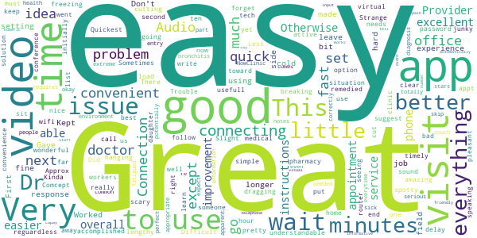
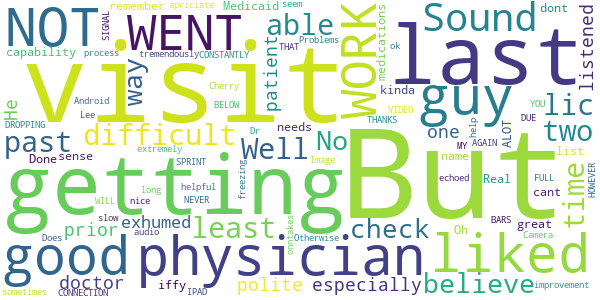
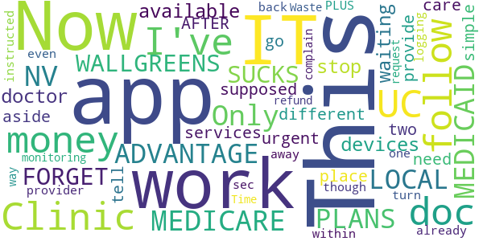

# NowClinic
App version ``12.1.00.005_01``

Analyzed with [covid-apps-observer](http://github.com/covid-apps-observer) project, version ``0.1``

## App overview
| | |
|-------------------------|-------------------------| 
| **Name**                                          | NowClinic |
| **Unique identifier** | com.americanwell.android.member.optum |
| **Link to Google Play** | [https://play.google.com/store/apps/details?id=com.americanwell.android.member.optum](https://play.google.com/store/apps/details?id=com.americanwell.android.member.optum) |
| **Summary**  | Live visits with a provider right on your mobile device.  No appointment needed. |
| **Privacy policy** | [http://mynowclinic.com/privacy](http://mynowclinic.com/privacy) |
| **Latest version** | 12.1.00.005_01 |
| **Last update** | 2021-01-14 15:37:28 |
| **Recent changes** | We continue to improve the patient experience with these new features: • Performance enhancements to increase reliability and speed |
| **Installs**  | 50,000+ |
| **Category** | Medical |
| **First release** | Oct 17, 2013 |
| **Size**  | 52M |
| **Supported Android version**  | 5.0 and up |

### Description
> The NowClinic Mobile app instantly connects you with a doctor, nurse or other healthcare professional right on your iPhone or iPad. You can have a personal and private visit with a live doctor—at anytime, from anywhere. Choose when you’d like to receive care—on-demand or by appointment. Getting the right care at the right time has never been easier. It’s simple, convenient and immediate – and designed to bring healthcare to you, wherever you are. 
 For more information, visit learnmore.nowclinic.com.

### User interface
The developers of the app provide the following screenshots in the Google play store.
| | | |
|:-------------------------:|:-------------------------:|:-------------------------:|
 |   |   |   | 
 |   |   |   | 
 |   |   |   | 
 |   |   |   | 

## Development team
In the following we report the main information provided by the development team in the Google play store.

| | |
|-------------------------|-------------------------|
| **Developer**  | HEALTH PLAN OF NEVADA, INC. |
| **Website**  | [http://www.americanwell.com](http://www.americanwell.com) |
| **Email** | jon.freshman@americanwell.com |
| **Physical address**  | - |
| **Other developed apps**  | [https://play.google.com/store/apps/developer?id=HEALTH+PLAN+OF+NEVADA,+INC.](https://play.google.com/store/apps/developer?id=HEALTH+PLAN+OF+NEVADA,+INC.) |

## Android support

| | |
|-------------------------|-------------------------|
| **Declared target Android version**  | Android10, version 10 (API level 29) |
| **Effective target Android version**  | Android10, version 10 (API level 29) |
| **Minimum supported Android version**  | Lollipop, version 5.0 (API level 21) |
| **Maximum target Android version**  | - |

The larger the difference between the minimum and maximum supported Android versions, the better. A larger difference means a wider audience. For example, old phones have a very low Android version, so a high minimum supported Android version means that the app cannot be used by users with old phones, thus leading to accessibility problems. 

## Requested permissions

In the following we report the complete list of the permissions requested by the app. 

| **Permission** | **Protection level** | **Description** | 
|-------------------------|-------------------------|-------------------------|
 **android.permission ACCESS_COARSE_LOCATION** | :warning:**Dangerous** | Allows an app to access approximate location. 
 **android.permission ACCESS_FINE_LOCATION** | :warning:**Dangerous** | Allows an app to access precise location. 
 **android.permission ACCESS_LOCATION_EXTRA_COMMANDS** | Normal | Allows an application to access extra location provider commands. 
 **android.permission ACCESS_NETWORK_STATE** | Normal | Allows applications to access information about networks. 
 **android.permission ACCESS_WIFI_STATE** | Normal | Allows applications to access information about Wi-Fi networks. 
 **android.permission BLUETOOTH** | Normal | Allows applications to connect to paired bluetooth devices. 
 **android.permission BROADCAST_STICKY** | Normal | Allows an application to broadcast sticky intents. 
 **android.permission CAMERA** | :warning:**Dangerous** | Required to be able to access the camera device. 
 **android.permission GET_TASKS** | Deprecated | This constant was deprecated in API level 21. No longer enforced. 
 **android.permission INTERNET** | Normal | Allows applications to open network sockets. 
 **android.permission MODIFY_AUDIO_SETTINGS** | Normal | Allows an application to modify global audio settings. 
 **android.permission READ_EXTERNAL_STORAGE** | :warning:**Dangerous** | Allows an application to read from external storage. 
 **android.permission READ_PHONE_STATE** | :warning:**Dangerous** | Allows read only access to phone state, including the phone number of the device, current cellular network information, the status of any ongoing calls, and a list of any PhoneAccounts registered on the device. 
 **android.permission RECEIVE_BOOT_COMPLETED** | Normal | Allows an application to receive the Intent.ACTION_BOOT_COMPLETED that is broadcast after the system finishes booting. 
 **android.permission RECORD_AUDIO** | :warning:**Dangerous** | Allows an application to record audio. 
 **android.permission REORDER_TASKS** | Normal | Allows an application to change the Z-order of tasks. 
 **android.permission SYSTEM_ALERT_WINDOW** | Signature - preinstalled - appop - pre23 - development | Allows an app to create windows using the type WindowManager.LayoutParams.TYPE_APPLICATION_OVERLAY, shown on top of all other apps. 
 **android.permission USE_BIOMETRIC** | Normal | Allows an app to use device supported biometric modalities. 
 **android.permission USE_FINGERPRINT** | Normal | This constant was deprecated in API level 28. Applications should request USE_BIOMETRIC instead 
 **android.permission VIBRATE** | Normal | Allows access to the vibrator. 
 **android.permission WAKE_LOCK** | Normal | Allows using PowerManager WakeLocks to keep processor from sleeping or screen from dimming. 
 **android.permission WRITE_EXTERNAL_STORAGE** | :warning:**Dangerous** | Allows an application to write to external storage. 
 **com.americanwell.android.member.optum.permission C2D_MESSAGE** | - | - 
 **com.facebook.katana.provider ACCESS** | - | - 
 **com.google.android.c2dm.permission RECEIVE** | - | - 
 **com.google.android.finsky.permission BIND_GET_INSTALL_REFERRER_SERVICE** | - | - 

## Mentioned servers

| **Server** | **Registrant** | **Registrant country** | **Creation date** | 
|-------------------------|-------------------------|-------------------------|-------------------------|
 | amwell.com | American Well Corporation | :us: US | 2004-02-13 19:02:32 |
 | facebook.com | Facebook, Inc. | :us: US | 1997-03-29 05:00:00 |
 | doubleclick.net | Google Inc. | :us: US | 1996-01-16 05:00:00 |
 | googleadservices.com | Google LLC | :us: US | 2003-06-19 16:34:53 |
 | google.com | Google LLC | :us: US | 1997-09-15 04:00:00 |
 | googlesyndication.com | Google LLC | :us: US | 2003-01-21 06:17:24 |
 | google-analytics.com | Google LLC | :us: US | 2005-07-18 19:24:32 |
 | app-measurement.com | Google LLC | :us: US | 2015-06-19 20:13:31 |
 | appboy.com | Braze, Inc. | :us: US | 2008-10-06 23:28:32 |
 | braze.com | Braze, Inc. | :us: US | 2000-01-19 02:18:28 |
 | optimizely.com | Optimizely | :us: US | 2010-01-11 03:01:32 |
 | twitter.com | Twitter, Inc. | :us: US | 2000-01-21 16:28:17 |
 | branch.io | Branch | :us: US | 2011-11-10 13:52:13 |
 | gstatic.com | Google LLC | :us: US | 2008-02-11 15:31:25 |
 | crashlytics.com | Google LLC | :us: US | 2011-01-21 15:30:40 |
 | bnc.lt | - | - | 2016-11-14 00:00:00 |
 | ggpht.com | Google LLC | :us: US | 2008-01-16 18:55:33 |

## Security analysis 

Below we report the main security warnings raised by our execution of the [Androwarn](https://github.com/maaaaz/androwarn) security analysis tool.

**Telephony identifiers leakage**
> - This application reads the ISO country code equivalent for the SIM provider's country code 
> - This application reads the ISO country code equivalent of the current registered operator's MCC (Mobile Country Code) 
> - This application reads the MCC+MNC of the provider of the SIM 
> - This application reads the device phone type value 
> - This application reads the numeric name (MCC+MNC) of current registered operator 
> - This application reads the operator name 
> - This application reads the phone's current state 
> - This application reads the radio technology (network type) currently in use on the device for data transmission 

**Connection interfaces exfiltration**
> - This application reads details about the currently active data network 
> - This application tries to find out if the currently active data network is metered 

**Telephony services abuse**
> - This application makes phone calls 

**Audio video eavesdropping**
> - This application captures video from the 'CAMERA' source 

**Suspicious connection establishment**
> - This application opens a Socket and connects it to the remote address ' returned no addresses for  ; port is out of range' on the 'N/A' port  
> - This application opens a Socket and connects it to the remote address '' on the 'N/A' port  
> - This application opens a Socket and connects it to the remote address 'Ljava/net/Proxy;->type()Ljava/net/Proxy$Type;' on the 'N/A' port  
> - This application opens a Socket and connects it to the remote address 'timeout' on the 'N/A' port  

**Code execution**
> - This application loads a native library 
> - This application executes a UNIX command containing this argument: '2' 

## User ratings and reviews

Below we provide information about how end users are reacting to the app in terms of ratings and reviews in the Google Play store.

### Ratings

The NowClinic app has been installed by more than **50000** times. At this time, **2082** rated the app and its average score is **4.8701925**. Below we show the distribution of the ratings across the usual star-based rating of Google Play

:star::star::star::star::star:: 1922

:star::star::star::star:: 100

:star::star::star:: 30

:star::star:: 10

:star:: 20

### Reviews 

#### 5-star reviews

> The doctors are very helpful very pleased with the doctors and this service. I'm extremely leery about going to a hospital or urgent care or even a doctor's office right now because of covid-19 this helps extremely in the fact that I can stay home and still see a doctor.  :date: __2021-02-13 01:23:25__

> Best THING EVER SEE JERRY NISBET!!!! I REFUSE TONSEE ANY OTHER DR NOW!!  :date: __2021-02-11 22:49:43__

> This is an amazing Convenient and Useful Way to Get medical attention 24 hours A-day For myself and my children I would have never ever thought I would use something of the sort to get medical attention Have you seen this service multiple times for myself I also use the service for my two-year-old Baby. and after my visit For myself and my baby I felt satisfied my medical Needs were addressed And properly Cared for and my Prescriptions were sent to the pharmacy of my choice. THANK YOU!  :date: __2021-02-11 11:34:33__

> What's perfect thank you  :date: __2021-02-11 01:13:51__

> This app was very helpful and the Dr was very nice.  :date: __2021-02-10 19:07:17__

> Awesome. Very helpful  :date: __2021-02-10 17:27:13__

> Very good people help me alot  :date: __2021-02-09 23:31:59__

> Great people! And I didn't even have to leave my house  :date: __2021-02-08 08:18:55__

> Great app during this pandemic.  :date: __2021-02-07 17:53:47__

> Better than going in  :date: __2021-02-06 06:39:45__

#### 4-star reviews

> easy to use app. for quick follow-up appointment with the Dr  :date: __2021-02-09 17:30:35__

> Great service. Provider excellent. The only improvement I would suggest is to have a better idea of wait time or having app phone us when we are 5 minutes away from seeing doctor  :date: __2021-01-25 00:18:37__

> Easy set up. So easy that I forget the password or where I put it but once I was in clear instructions and timely visit. Less than one hour overall.  :date: __2021-01-13 22:51:34__

> Except for freezing a little , it was usefull  :date: __2020-12-30 20:40:03__

> Great app  :date: __2020-12-03 23:06:26__

> Good  :date: __2020-11-25 17:29:06__

> great  :date: __2020-10-27 01:58:53__

> Very easy to use but sound was breaking up toward the end of the visit.  :date: __2020-10-16 01:17:57__

> Difficult to load app.  :date: __2020-10-14 20:44:24__

> Easy quick  :date: __2020-09-26 00:52:58__

#### 3-star reviews

> Well in all past visits I was having a difficult time getting lic. Physicians. But the last two Visits I was able to get the physician s, at least I believe so.? No way to check. But I especially liked the doctor visit prior to this last one. He was polite, listened to patient, exhumed capability, and good sense. I liked him ALOT. i just cant remember his name. Real Good guy.. Oh I dont like the Medicaid's medications list it's kinda iffy. Done  :date: __2020-11-03 03:16:01__

> great but needs improvement  :date: __2020-09-22 16:02:46__

> Getting onntakes too long  :date: __2020-09-02 22:15:21__

> Dr. Cherry Lee was extremely helpful and very nice and I apriciate her help tremendously.... HOWEVER THE CONNECTION WAS CONSTANTLY DROPPING THE VIDEO BUT NOT DUE TO SPRINT MY SIGNAL NEVER WENT BELOW FULL BARS SO WORK ON THAT AND YOU GUYS WILL GET THE 5 \*\*\*\** THANKS AGAIN  :date: __2020-07-10 08:49:04__

> Camera went on and off. Sound echoed sometimes. Otherwise it was ok  :date: __2020-04-21 22:19:48__

> Image and sound freezing Does not seem to work with an IPAD  :date: __2020-04-09 21:05:50__

> Problems with audio on Android  :date: __2019-11-03 22:04:50__

> the process was very slow  :date: __2019-06-30 18:50:29__

#### 2-star reviews

> Its not available on all devices  :date: __2021-02-09 14:14:12__

> This app doesn't work for me because when I was with waiting for the doctor the app stop  :date: __2019-11-20 03:32:03__

> The Now Clinic is supposed to provide services aside from or in place of the urgent care. I've had two different doc's tell me that I need to go into an UC for a simple follow up AFTER I've already been there and the UC instructed me to follow up with the NOW CLINIC provider! PLUS I don't get money back even though the N C Doc's turn me away within 60 sec of logging on. There is no one monitoring this so no way to complain or request a refund. This is a Waste Of Time and Money!  :date: __2019-11-11 02:33:43__

> There's a message button, but doesn't work. Cannot select the provider to message them like it says you can. Please correct  :date: __2019-01-29 17:23:33__

#### 1-star reviews

> Worst app that I have ever used. It can't connect properly to my insurance on every visit and their personnel don't seem to actually know how to fix the situation each time that I have tried to use it. Also, the damn thing will suddenly kick you off of the appointment while you're waiting once you give up on getting a free appointment and pay for it. Don't use this unless they fix their massive problems. This thing is a mess!  :date: __2020-12-06 17:44:15__

> Didn't cancel appointment I canceled, cannot maneuver to find covid test results, but liked my physician on 3/31  :date: __2020-08-03 21:55:38__

> No longer connects well. Since the update it says you are connected, waiting for the physician to connect...then it doesn't connect and the doctor cancels  :date: __2020-07-31 18:04:15__

> Always technical issues. I have the newer smart phone and I pay for the internet. It always kicks me out.  :date: __2020-07-04 16:50:39__

> I waited for the doctor, the app said "you have connected and are waiting for the doctor to connect". After about a minute, another message that said "The doctor cancelled the call".  :date: __2020-07-02 12:39:26__

> Couldn't even connect  :date: __2020-07-01 23:41:53__

> Made to use this app because of Corona virus, 200$ for a normal check up? No thanks I'd rather die.  :date: __2020-05-18 12:28:23__

> It doesn't open 😠 I've tried and tried and nothing!!  :date: __2020-04-12 03:17:30__

> Why, oh why...when I do my initial login, after the app sends me an email verification code, does the app kick me back to the initial login screen when I switch my phone screen to said email to obtain said verification code, thereby invalidating the aforementioned verification code? When I put my credentials back in, I am sent a new verification code. Rinse, lather...repeat... Will I ever be able to login without requiring a secondary device just to check my email???  :date: __2020-04-04 03:09:35__

> Tried to call customer service and after 30 minutes listening to the elevator music and please hold on I decided that I want a more responsive experience. They suck!  :date: __2020-03-31 01:20:18__

