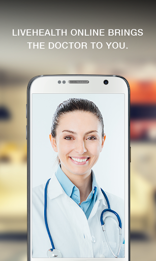
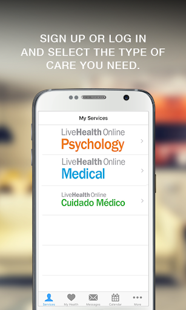
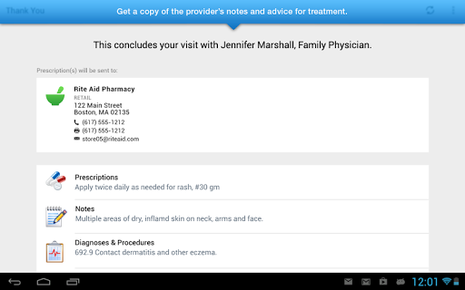
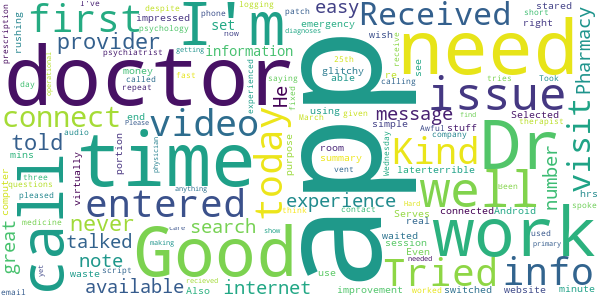

# LiveHealth Online Mobile
App version ``12.0.19.010_02``

Analyzed with [covid-apps-observer](http://github.com/covid-apps-observer) project, version ``0.1``

## App overview
| | |
|-------------------------|-------------------------| 
| **Name**&nbsp;&nbsp;&nbsp;&nbsp;&nbsp;&nbsp;&nbsp;&nbsp;&nbsp;&nbsp;&nbsp;&nbsp;&nbsp;&nbsp;&nbsp;&nbsp;&nbsp;&nbsp;&nbsp;&nbsp;&nbsp;&nbsp;&nbsp;&nbsp;&nbsp;&nbsp;&nbsp;&nbsp;&nbsp;&nbsp;&nbsp;&nbsp;&nbsp;&nbsp;&nbsp;&nbsp;&nbsp;&nbsp;&nbsp;&nbsp;  | LiveHealth Online Mobile |
| **Unique identifier** | com.americanwell.android.member.wellpoint |
| **Link to Google Play** | [https://play.google.com/store/apps/details?id=com.americanwell.android.member.wellpoint](https://play.google.com/store/apps/details?id=com.americanwell.android.member.wellpoint) |
| **Summary**  | The LHO app gives mobile users an easy way to connect with a live doctor. |
| **Privacy policy** | [https://www.livehealthonline.com/mobile-privacy-policy](https://www.livehealthonline.com/mobile-privacy-policy) |
| **Latest version** | 12.0.19.010_02 |
| **Last update** | 2020-12-18 23:07:16 |
| **Recent changes** | We continue to improve the patient experience with these new features: • Performance enhancements to increase reliability and speed |
| **Installs**  | 500,000+ |
| **Category** | Medical |
| **First release** | Oct 9, 2013 |
| **Size**  | 50M |
| **Supported Android version**  | 5.0 and up |

### Description
> Using LiveHealth Online you can visit with board-certified doctors, licensed therapists, lactation consultants, registered dieticians and more through live video on your smartphone, tablet or computer. It’s an easy and convenient way to get the care you need whether you’re at home, at work or on the go! Just download the app and sign up to get started.
 Talk to a doctor 24/7, with no appts or long wait times
 Why spend time going to urgent care, use LiveHealth Online to talk to a doctor in minutes through live video. Just sign up or log in and select the doctor you would like to see. Then you’ll be connected through private and secure video in about 10 minutes or less. Doctors using LiveHealth Online provide care for common health conditions like: the flu, pink eye, sinus infection, bronchitis, allergies, fever, cough, cold, urinary tract infection, skin infection, skin rash, diarrhea and more! It’s a great option for care when your own doctor isn’t available. Doctors can assess your condition, provide a treatment plan and send prescriptions to the pharmacy you select if needed.
 Our Spanish language online visit experience is available using Cuidado Medico on LiveHealth Online. Spanish speaking doctors are available by appointment from 7am-11pm. Same day appointments are available in most states.
 El servicio de consultas por internet en español se presta  a través de Cuidado Médico de LiveHealth Online.  La disponibilidad de citas con médicos que hablan español es de  7 a.m. a 11 p.m.  En la mayoría de los estados encontrarás  citas disponibles para el mismo día.
 See a therapist in 4 days or less!
 Use LiveHealth Online Psychology to talk with a licensed therapist or psychologist from the comfort and privacy of home. In most cases you can schedule an appointment and talk to a therapist in just a few days. Therapists can help you when you’re dealing with a wide range of issues like stress, anxiety, coping with grief, relationship issues and more!
 Video visits using LiveHealth Online are covered by many insurance plans. 
 For 18 million Americans online visits using LiveHealth Online are a covered benefit under their health plan. Just enter your health insurance information within your account settings to see how much a video visit will cost you after your insurance is applied.
 Please note that telehealth is not for emergencies. If you’re having a medical emergency, call 911.

### User interface
The developers of the app provide the following screenshots in the Google play store.
| | | |
|:-------------------------:|:-------------------------:|:-------------------------:|
 |   |   |   | 
 |   |   |   | 
 |   |   |   | 
 |   |   |   | 

## Development team
In the following we report the main information provided by the development team in the Google play store.

| | |
|-------------------------|-------------------------|
| **Developer**  | American Well |
| **Website**  | [http://www.livehealthonline.com](http://www.livehealthonline.com) |
| **Email** | help@livehealthonline.com |
| **Physical address**  | - |
| **Other developed apps**  | [https://play.google.com/store/apps/developer?id=American+Well](https://play.google.com/store/apps/developer?id=American+Well) |

## Android support

| | |
|-------------------------|-------------------------|
| **Declared target Android version**  | Android10, version 10 (API level 29) |
| **Effective target Android version**  | Android10, version 10 (API level 29) |
| **Minimum supported Android version**  | Lollipop, version 5.0 (API level 21) |
| **Maximum target Android version**  | - |

The larger the difference between the minimum and maximum supported Android versions, the better. A larger difference means a wider audience. For example, old phones have a very low Android version, so a high minimum supported Android version means that the app cannot be used by users with old phones, thus leading to accessibility problems. 

## Requested permissions

In the following we report the complete list of the permissions requested by the app. 

| **Permission** | **Protection level** | **Description** | 
|-------------------------|-------------------------|-------------------------|
 **android.permission ACCESS_COARSE_LOCATION** | :warning:**Dangerous** | Allows an app to access approximate location. 
 **android.permission ACCESS_FINE_LOCATION** | :warning:**Dangerous** | Allows an app to access precise location. 
 **android.permission ACCESS_LOCATION_EXTRA_COMMANDS** | Normal | Allows an application to access extra location provider commands. 
 **android.permission ACCESS_NETWORK_STATE** | Normal | Allows applications to access information about networks. 
 **android.permission ACCESS_WIFI_STATE** | Normal | Allows applications to access information about Wi-Fi networks. 
 **android.permission BLUETOOTH** | Normal | Allows applications to connect to paired bluetooth devices. 
 **android.permission BROADCAST_STICKY** | Normal | Allows an application to broadcast sticky intents. 
 **android.permission CAMERA** | :warning:**Dangerous** | Required to be able to access the camera device. 
 **android.permission GET_TASKS** | Deprecated | This constant was deprecated in API level 21. No longer enforced. 
 **android.permission INTERNET** | Normal | Allows applications to open network sockets. 
 **android.permission MODIFY_AUDIO_SETTINGS** | Normal | Allows an application to modify global audio settings. 
 **android.permission READ_EXTERNAL_STORAGE** | :warning:**Dangerous** | Allows an application to read from external storage. 
 **android.permission READ_PHONE_STATE** | :warning:**Dangerous** | Allows read only access to phone state, including the phone number of the device, current cellular network information, the status of any ongoing calls, and a list of any PhoneAccounts registered on the device. 
 **android.permission RECEIVE_BOOT_COMPLETED** | Normal | Allows an application to receive the Intent.ACTION_BOOT_COMPLETED that is broadcast after the system finishes booting. 
 **android.permission RECORD_AUDIO** | :warning:**Dangerous** | Allows an application to record audio. 
 **android.permission REORDER_TASKS** | Normal | Allows an application to change the Z-order of tasks. 
 **android.permission SYSTEM_ALERT_WINDOW** | Signature - preinstalled - appop - pre23 - development | Allows an app to create windows using the type WindowManager.LayoutParams.TYPE_APPLICATION_OVERLAY, shown on top of all other apps. 
 **android.permission USE_BIOMETRIC** | Normal | Allows an app to use device supported biometric modalities. 
 **android.permission USE_FINGERPRINT** | Normal | This constant was deprecated in API level 28. Applications should request USE_BIOMETRIC instead 
 **android.permission VIBRATE** | Normal | Allows access to the vibrator. 
 **android.permission WAKE_LOCK** | Normal | Allows using PowerManager WakeLocks to keep processor from sleeping or screen from dimming. 
 **android.permission WRITE_EXTERNAL_STORAGE** | :warning:**Dangerous** | Allows an application to write to external storage. 
 **com.americanwell.android.member.wellpoint.permission C2D_MESSAGE** | - | - 
 **com.facebook.katana.provider ACCESS** | - | - 
 **com.google.android.c2dm.permission RECEIVE** | - | - 
 **com.google.android.finsky.permission BIND_GET_INSTALL_REFERRER_SERVICE** | - | - 

## Mentioned servers

| **Server** | **Registrant** | **Registrant country** | **Creation date** | 
|-------------------------|-------------------------|-------------------------|-------------------------|
 | amwell.com | American Well Corporation | :us: US | 2004-02-13 19:02:32 |
 | facebook.com | Facebook, Inc. | :us: US | 1997-03-29 05:00:00 |
 | doubleclick.net | Google Inc. | :us: US | 1996-01-16 05:00:00 |
 | googleadservices.com | Google LLC | :us: US | 2003-06-19 16:34:53 |
 | google.com | Google LLC | :us: US | 1997-09-15 04:00:00 |
 | googlesyndication.com | Google LLC | :us: US | 2003-01-21 06:17:24 |
 | google-analytics.com | Google LLC | :us: US | 2005-07-18 19:24:32 |
 | app-measurement.com | Google LLC | :us: US | 2015-06-19 20:13:31 |
 | appboy.com | Braze, Inc. | :us: US | 2008-10-06 23:28:32 |
 | braze.com | Braze, Inc. | :us: US | 2000-01-19 02:18:28 |
 | optimizely.com | Optimizely | :us: US | 2010-01-11 03:01:32 |
 | twitter.com | Twitter, Inc. | :us: US | 2000-01-21 16:28:17 |
 | branch.io | Branch | :us: US | 2011-11-10 13:52:13 |
 | gstatic.com | Google LLC | :us: US | 2008-02-11 15:31:25 |
 | crashlytics.com | Google LLC | :us: US | 2011-01-21 15:30:40 |
 | bnc.lt | - | - | 2016-11-14 00:00:00 |
 | ggpht.com | Google LLC | :us: US | 2008-01-16 18:55:33 |

## Security analysis 

Below we report the main security warnings raised by our execution of the [Androwarn](https://github.com/maaaaz/androwarn) security analysis tool.

**Telephony identifiers leakage**
> - This application reads the ISO country code equivalent for the SIM provider's country code 
> - This application reads the ISO country code equivalent of the current registered operator's MCC (Mobile Country Code) 
> - This application reads the MCC+MNC of the provider of the SIM 
> - This application reads the device phone type value 
> - This application reads the numeric name (MCC+MNC) of current registered operator 
> - This application reads the operator name 
> - This application reads the phone's current state 
> - This application reads the radio technology (network type) currently in use on the device for data transmission 

**Connection interfaces exfiltration**
> - This application reads details about the currently active data network 
> - This application tries to find out if the currently active data network is metered 

**Telephony services abuse**
> - This application makes phone calls 

**Audio video eavesdropping**
> - This application captures video from the 'CAMERA' source 

**Suspicious connection establishment**
> - This application opens a Socket and connects it to the remote address ' returned no addresses for  ; port is out of range' on the 'N/A' port  
> - This application opens a Socket and connects it to the remote address '' on the 'N/A' port  
> - This application opens a Socket and connects it to the remote address 'Ljava/net/Proxy;->type()Ljava/net/Proxy$Type;' on the 'N/A' port  
> - This application opens a Socket and connects it to the remote address 'timeout' on the 'N/A' port  

**Code execution**
> - This application loads a native library 
> - This application executes a UNIX command containing this argument: '2' 

## User ratings and reviews

Below we provide information about how end users are reacting to the app in terms of ratings and reviews in the Google Play store.

### Ratings

The LiveHealth Online Mobile app has been installed by more than **500000** times. At this time, **4525** rated the app and its average score is **4.6651983**. Below we show the distribution of the ratings across the usual star-based rating of Google Play

:star::star::star::star::star:: 3849

:star::star::star::star:: 339

:star::star::star:: 59

:star::star:: 59

:star:: 219

### Reviews 

#### 5-star reviews

> Excellent  :date: __2021-01-28 22:42:07__

> by far the best experience I've ever had when dealing with an illness from start to finish was maybe 25-30 min and I never even had to put my shoes on! highly recommended wish I could give 10 stars  :date: __2021-01-28 22:11:32__

> Dr. Michael Gray was such a great doctor  :date: __2021-01-28 05:33:01__

> Dr. Stratton was Great!!!  :date: __2021-01-27 18:15:37__

> Great and fast service  :date: __2021-01-27 15:26:30__

> I had an excellent experience today. I would recommend them to my friends and family.  :date: __2021-01-26 16:47:21__

> This app has made it very easy for me to see a doctor when I am too sick to leave the house. The app is pretty easy for me to use, easier than sitting in urgent care. I Haven't had any trouble with it so far. I like that I can choose between a number of good doctors and that they can see me quick from my couch. The fact that I can see a doctor outside of normal business hours is great too. Very convenient.  :date: __2021-01-26 02:03:56__

> It is very convenient to see a doctor. It saves a lot of time. I recommend it highly  :date: __2021-01-25 00:51:30__

> Love online health, they are very convenient when I cannot get into my doctor. Dr . Ronald Stratton is the best.  :date: __2021-01-23 17:01:28__

> Very fast answers to different issues.  :date: __2021-01-23 15:44:19__

#### 4-star reviews

> Good doctor, hard to hear at times but overall great experience in short matter of time.  :date: __2021-01-29 15:34:50__

> My first time to use this company app was good and well use again .  :date: __2021-01-21 02:52:06__

> Easy to use. Wish there was a place where I could keep notes for myself on whatever was discussed  :date: __2021-01-19 16:48:29__

> My only concern is I can not figure how to raise the volume to hear the physician. Other than that I highly recommend this app. The doctors are always pleasant and they listen so they can diagnose. I am grateful to use this option even in the wee hours of the morning.  :date: __2021-01-18 00:08:44__

> Fast and professional  :date: __2020-12-30 21:51:16__

> 1st time to use app. Worked great and had a good Dr. Will use again  :date: __2020-12-20 01:18:11__

> Very convenient and helpful. Doesn't take the place of in person though where tests can be run. Great to be able to talk to a professional about what's ailing you.  :date: __2020-11-25 19:45:38__

> First time using app. First time I did an appointment, the doctor had to cancel due to technical issues. I wasnt charged for it. The second time I was able to get ahold of a doctor and she was very nice. Recommend if you are unable to make a same day appointment with doctor.  :date: __2020-11-18 17:10:06__

> App is great. Physicians can be rude.  :date: __2020-10-15 02:37:32__

> Great first experience! First time I used the app and it ran smoothly. I didn't give it 5 stars only because the video to submit pictures wouldn't work.  :date: __2020-10-10 18:57:33__

#### 3-star reviews

> Tried using the app for the first time today. Selected a dr, entered all my info, waited for about 15 mins to get connected just to have the video not work & the Dr end the session. Tried again, re-entered all my info and the app switched me to an emergency room Dr on its own. Kind of glitchy. Received my visit summary 12 hrs later. Serves its purpose but needs some improvement.  :date: __2020-10-10 03:17:22__

> I didn't like it the doctor was kind of rushing through it it was a waste of time & money  :date: __2020-10-07 20:32:24__

> Was not able to connect virtually. Also no where to see notes on your visit.  :date: __2020-10-01 18:16:06__

> The video call portion does not work. Even the provider told me to use a computer and the website because the Android app never works right. Good provider, terrible app.  :date: __2020-08-03 15:42:43__

> I had a good experience with this I was impressed with it, real simple, easy after I stared at for a minute but I'm not good with this internet stuff. I just wish they had a psychiatrist a doctor of psychology. I need a therapist as well as a doctor, I'm in need of medicine & need to vent a well.  :date: __2020-07-28 19:00:33__

> I'm pleased with the doctors available but the app has given me an issue with the audio each time I've used it. Is there a patch available?  :date: __2020-07-20 00:37:19__

> Not great at all. Took three tries to get through. I can't message the Dr. I talked to and I don't think the prescription was called in. Awful experience! It is fixed now after calling the company. They had to call in the script. Been on the phone most of the day.  :date: __2020-05-11 21:53:32__

> Pharmacy search didn't work first time. Time out too short. After logging in again, had to repeat same questions, but pharmacy search worked.  :date: __2020-04-11 20:48:29__

> Great app when it connects, have experienced issues with that despite having fast internet with no issues.  :date: __2020-03-28 15:30:45__

> I need a number to contact. I talked with a doctor on this app today, Wednesday March 25th. He told me I would receive an email or a message on the app from him saying we spoke and he diagnoses for me. I never recieved anything! I needed a doctor's note as well as information to show my primary care physician. Please is there a number to call to find out why I have not received this information yet?  :date: __2020-03-26 01:42:11__

#### 2-star reviews

> In theory it seems good I'm having a difficult time finding any doctors. Very little appointment??  :date: __2021-01-22 05:10:08__

> Haven't used much yet. Can't see the option for answers down below.  :date: __2021-01-19 03:30:10__

> App is very frustrating. Filled out my information and accidentally put in my credit card instead of my HSA card. I immediately cancelled and later, I received an email from my CC company stating my credit card was charged. I had to start over entering all my my information along with my son's ailments. I selected to see the first Dr. available. The app said someone would be with me soon. No estimate on how much time so I am sitting staring at my phone thinking soon would be 5 minutes.  :date: __2020-12-25 04:23:36__

> Audio is not working properly. Every update fixes one thing but creates another. Bad connection abound. I live in Ohio and there are not enough therapist available and no psychiatrist so no one to manage medication. So only half treatment is available.  :date: __2020-11-04 22:45:22__

> The visit went well however i need a prior auth for an eye medication for my eyes it has been since September 2nd and it is now sept 5th and i have absolutely nothing for my eye so it went from " allergy pink eye" to full blown pink eye in my right eye i cannot contact the doctor nor can i send her a message i paid 58 dollars to see this doctor and now i have to waste time going to an urgent care just a suggestion check insurance to make sure a prior auth is not needed b 4 prescribing a med.  :date: __2020-09-05 22:30:20__

> I really wish it was easier to schedule an appointment with my same therapist. There should be an option to schedule my next appointment when I've finished my session. It's frustrating to have to pick dates and find my therapist's name  :date: __2020-08-22 14:46:16__

> Trying to see a doctor all day but the system won't verify my insurance. It wants me to pay full price then wait for reimbursement. Customer service was no help. Just told me there was no ETA to have the system running correctly. Just told me to keep trying back. Poor form LiveHealth.  :date: __2020-08-09 23:39:36__

> I have full covrage insurance and they tryed to tell me they cant find my provider... And all information i did twice just to be sure it was not messed up i dont have the money and nore should i pay for it when i have insurance..  :date: __2020-06-20 17:20:03__

> The video portion kept freezing and then halfway through my session it cut the audio down so low that I could barely hear the person on the other end. I'm really disappointed that I had to end my session all because your application could not keep the audio up.  :date: __2020-06-15 22:41:13__

> App worked well and I was able to get a phone call with a doctor in a few minutes. HOWEVER the phone call only lasted 3 minutes and the doctor was very rude. I wasn't even given the opportunity to share all my symptoms before he told me I should just go to urgent care. I was prescribed generic medicine for the flu. So that's good I guess but I wish I could have gotten a doctor that cared. Save your money and find a different virtual website or just go to urgent care. I'm dissapointed :(  :date: __2020-05-15 00:36:45__

#### 1-star reviews

> Doctor told me to drink more water. Regular doctor told me to go to the ER. This app is a scam and dangerous.  :date: __2021-01-28 15:32:09__

> It is not worth it.  :date: __2021-01-27 02:20:19__

> This is a scam. They took my payment then sat on a waiting screen for 30 minutes and no dr ever came to the appt. The number listed is not working either. This is a total scam and should be illegal.  :date: __2021-01-23 00:11:12__

> Bad  :date: __2021-01-13 20:24:36__

> Horrible will never use again  :date: __2021-01-12 23:01:24__

> Doesn't work  :date: __2021-01-12 03:23:49__

> Dosent load  :date: __2021-01-08 20:36:02__

> Can't update card number and therefore can't even make appointments. Customer service said they'd "open a ticket for me" so I am left waiting to be able to see a dr until they're tech system is fixed for something that should be completely routine, like updating a credit card. Greedy company with garbage technology.  :date: __2021-01-06 18:52:40__

> $59 for a visit, the doctor recommended that I receive a COVID-19 test but the catch is, no testing sight within a hundred miles of my area would take the recommendation because this company can't send it in a fax. Had to be seen for another visit and evaluation in person and pay ANOTHER co-pay to get tested. Wasted $59 dollars. Great virtual doctor and was able to prescribe non-conrtolled substance medication, just that they're basically treated as illegitimate by actual health care facilities.  :date: __2021-01-04 04:41:43__

> Never used. Idk why it wants me to review??  :date: __2021-01-03 04:32:20__

