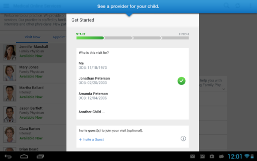
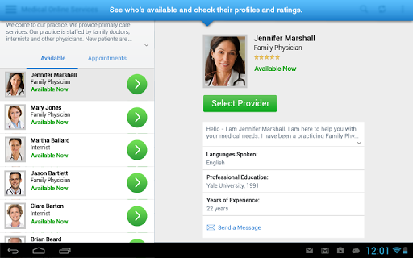
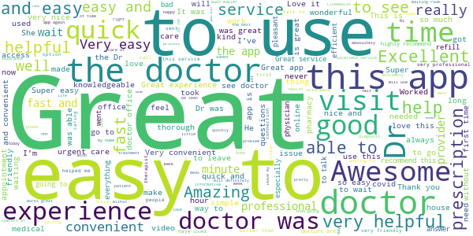
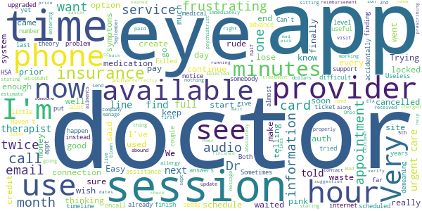
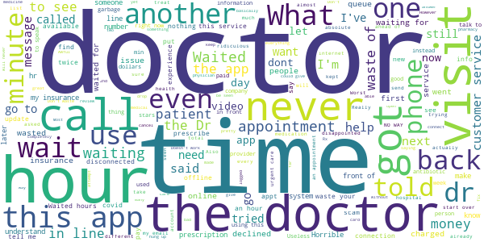

# LiveHealth Online Mobile
App version ``12.10.01.005_01``

Analyzed with [covid-apps-observer](http://github.com/covid-apps-observer) project, version ``0.1``

## App overview
| | |
|-------------------------|-------------------------| 
| **Name**&nbsp;&nbsp;&nbsp;&nbsp;&nbsp;&nbsp;&nbsp;&nbsp;&nbsp;&nbsp;&nbsp;&nbsp;&nbsp;&nbsp;&nbsp;&nbsp;&nbsp;&nbsp;&nbsp;&nbsp;&nbsp;&nbsp;&nbsp;&nbsp;&nbsp;&nbsp;&nbsp;&nbsp;&nbsp;&nbsp;&nbsp;&nbsp;&nbsp;&nbsp;&nbsp;&nbsp;&nbsp;&nbsp;&nbsp;&nbsp;  | LiveHealth Online Mobile |
| **Unique identifier** | com.americanwell.android.member.wellpoint |
| **Link to Google Play** | [https://play.google.com/store/apps/details?id=com.americanwell.android.member.wellpoint](https://play.google.com/store/apps/details?id=com.americanwell.android.member.wellpoint) |
| **Summary**  | The LHO app gives mobile users an easy way to connect with a live doctor. |
| **Privacy policy** | [https://www.livehealthonline.com/mobile-privacy-policy](https://www.livehealthonline.com/mobile-privacy-policy) |
| **Latest version** | 12.10.01.005_01 |
| **Last update** | 2021-05-20 17:00:15 |
| **Recent changes** | We continue to improve the patient experience with these new features: • Performance enhancements to increase reliability and speed |
| **Installs**  | 500,000+ |
| **Category** | Medical |
| **First release** | Oct 9, 2013 |
| **Size**  | 51M |
| **Supported Android version**  | 5.0 and up |

### Description
> Using LiveHealth Online you can visit with board-certified doctors, licensed therapists, lactation consultants, registered dieticians and more through live video on your smartphone, tablet or computer. It’s an easy and convenient way to get the care you need whether you’re at home, at work or on the go! Just download the app and sign up to get started.
 Talk to a doctor 24/7, with no appts or long wait times
 Why spend time going to urgent care, use LiveHealth Online to talk to a doctor in minutes through live video. Just sign up or log in and select the doctor you would like to see. Then you’ll be connected through private and secure video in about 10 minutes or less. Doctors using LiveHealth Online provide care for common health conditions like: the flu, pink eye, sinus infection, bronchitis, allergies, fever, cough, cold, urinary tract infection, skin infection, skin rash, diarrhea and more! It’s a great option for care when your own doctor isn’t available. Doctors can assess your condition, provide a treatment plan and send prescriptions to the pharmacy you select if needed.
 Our Spanish language online visit experience is available using Cuidado Medico on LiveHealth Online. Spanish speaking doctors are available by appointment from 7am-11pm. Same day appointments are available in most states.
 El servicio de consultas por internet en español se presta  a través de Cuidado Médico de LiveHealth Online.  La disponibilidad de citas con médicos que hablan español es de  7 a.m. a 11 p.m.  En la mayoría de los estados encontrarás  citas disponibles para el mismo día.
 See a therapist in 4 days or less!
 Use LiveHealth Online Psychology to talk with a licensed therapist or psychologist from the comfort and privacy of home. In most cases you can schedule an appointment and talk to a therapist in just a few days. Therapists can help you when you’re dealing with a wide range of issues like stress, anxiety, coping with grief, relationship issues and more!
 Video visits using LiveHealth Online are covered by many insurance plans. 
 For 18 million Americans online visits using LiveHealth Online are a covered benefit under their health plan. Just enter your health insurance information within your account settings to see how much a video visit will cost you after your insurance is applied.
 Please note that telehealth is not for emergencies. If you’re having a medical emergency, call 911.

### User interface
The developers of the app provide the following screenshots in the Google play store.
| | | |
|:-------------------------:|:-------------------------:|:-------------------------:|
 |   |   |   | 
 |   |   |   | 
 |   |   |   | 
 |   |   |   | 

## Development team
In the following we report the main information provided by the development team in the Google play store.

| | |
|-------------------------|-------------------------|
| **Developer**  | American Well |
| **Website**  | [http://www.livehealthonline.com](http://www.livehealthonline.com) |
| **Email** | help@livehealthonline.com |
| **Physical address**  | - |
| **Other developed apps**  | [https://play.google.com/store/apps/developer?id=American+Well](https://play.google.com/store/apps/developer?id=American+Well) |

## Android support

| | |
|-------------------------|-------------------------|
| **Declared target Android version**  | Android10, version 10 (API level 29) |
| **Effective target Android version**  | Android10, version 10 (API level 29) |
| **Minimum supported Android version**  | Lollipop, version 5.0 (API level 21) |
| **Maximum target Android version**  | - |

The larger the difference between the minimum and maximum supported Android versions, the better. A larger difference means a wider audience. For example, old phones have a very low Android version, so a high minimum supported Android version means that the app cannot be used by users with old phones, thus leading to accessibility problems. 

## Requested permissions

In the following we report the complete list of the permissions requested by the app. 

| **Permission** | **Protection level** | **Description** | 
|-------------------------|-------------------------|-------------------------|
 **android.permission ACCESS_COARSE_LOCATION** | :warning:**Dangerous** | Allows an app to access approximate location. 
 **android.permission ACCESS_FINE_LOCATION** | :warning:**Dangerous** | Allows an app to access precise location. 
 **android.permission ACCESS_LOCATION_EXTRA_COMMANDS** | Normal | Allows an application to access extra location provider commands. 
 **android.permission ACCESS_NETWORK_STATE** | Normal | Allows applications to access information about networks. 
 **android.permission ACCESS_WIFI_STATE** | Normal | Allows applications to access information about Wi-Fi networks. 
 **android.permission BLUETOOTH** | Normal | Allows applications to connect to paired bluetooth devices. 
 **android.permission BROADCAST_STICKY** | Normal | Allows an application to broadcast sticky intents. 
 **android.permission CAMERA** | :warning:**Dangerous** | Required to be able to access the camera device. 
 **android.permission GET_TASKS** | Deprecated | This constant was deprecated in API level 21. No longer enforced. 
 **android.permission INTERNET** | Normal | Allows applications to open network sockets. 
 **android.permission MODIFY_AUDIO_SETTINGS** | Normal | Allows an application to modify global audio settings. 
 **android.permission READ_EXTERNAL_STORAGE** | :warning:**Dangerous** | Allows an application to read from external storage. 
 **android.permission READ_PHONE_STATE** | :warning:**Dangerous** | Allows read only access to phone state, including the phone number of the device, current cellular network information, the status of any ongoing calls, and a list of any PhoneAccounts registered on the device. 
 **android.permission RECEIVE_BOOT_COMPLETED** | Normal | Allows an application to receive the Intent.ACTION_BOOT_COMPLETED that is broadcast after the system finishes booting. 
 **android.permission RECORD_AUDIO** | :warning:**Dangerous** | Allows an application to record audio. 
 **android.permission REORDER_TASKS** | Normal | Allows an application to change the Z-order of tasks. 
 **android.permission SYSTEM_ALERT_WINDOW** | Signature - preinstalled - appop - pre23 - development | Allows an app to create windows using the type WindowManager.LayoutParams.TYPE_APPLICATION_OVERLAY, shown on top of all other apps. 
 **android.permission USE_BIOMETRIC** | Normal | Allows an app to use device supported biometric modalities. 
 **android.permission USE_FINGERPRINT** | Normal | This constant was deprecated in API level 28. Applications should request USE_BIOMETRIC instead 
 **android.permission VIBRATE** | Normal | Allows access to the vibrator. 
 **android.permission WAKE_LOCK** | Normal | Allows using PowerManager WakeLocks to keep processor from sleeping or screen from dimming. 
 **android.permission WRITE_EXTERNAL_STORAGE** | :warning:**Dangerous** | Allows an application to write to external storage. 
 **com.americanwell.android.member.wellpoint.permission C2D_MESSAGE** | - | - 
 **com.facebook.katana.provider ACCESS** | - | - 
 **com.google.android.c2dm.permission RECEIVE** | - | - 
 **com.google.android.finsky.permission BIND_GET_INSTALL_REFERRER_SERVICE** | - | - 

## Mentioned servers

| **Server** | **Registrant** | **Registrant country** | **Creation date** | 
|-------------------------|-------------------------|-------------------------|-------------------------|
 | amwell.com | American Well Corporation | :us: US | 2004-02-13 19:02:32 |
 | facebook.com | Facebook, Inc. | :us: US | 1997-03-29 05:00:00 |
 | doubleclick.net | Google Inc. | :us: US | 1996-01-16 05:00:00 |
 | googleadservices.com | Google LLC | :us: US | 2003-06-19 16:34:53 |
 | google.com | Google LLC | :us: US | 1997-09-15 04:00:00 |
 | googlesyndication.com | Google LLC | :us: US | 2003-01-21 06:17:24 |
 | google-analytics.com | Google LLC | :us: US | 2005-07-18 19:24:32 |
 | appboy.com | Braze, Inc. | :us: US | 2008-10-06 23:28:32 |
 | braze.com | Braze, Inc. | :us: US | 2000-01-19 02:18:28 |
 | app-measurement.com | Google LLC | :us: US | 2015-06-19 20:13:31 |
 | optimizely.com | Optimizely | :us: US | 2010-01-11 03:01:32 |
 | twitter.com | Twitter, Inc. | :us: US | 2000-01-21 16:28:17 |
 | branch.io | Branch | :us: US | 2011-11-10 13:52:13 |
 | gstatic.com | Google LLC | :us: US | 2008-02-11 15:31:25 |
 | crashlytics.com | Google LLC | :us: US | 2011-01-21 15:30:40 |
 | bnc.lt | - | - | 2016-11-14 00:00:00 |
 | ggpht.com | Google LLC | :us: US | 2008-01-16 18:55:33 |

## Security analysis 

Below we report the main security warnings raised by our execution of the [Androwarn](https://github.com/maaaaz/androwarn) security analysis tool.

**Telephony identifiers leakage**
> - This application reads the ISO country code equivalent for the SIM provider's country code 
> - This application reads the ISO country code equivalent of the current registered operator's MCC (Mobile Country Code) 
> - This application reads the device phone type value 
> - This application reads the numeric name (MCC+MNC) of current registered operator 
> - This application reads the operator name 
> - This application reads the phone's current state 
> - This application reads the radio technology (network type) currently in use on the device for data transmission 

**Connection interfaces exfiltration**
> - This application reads details about the currently active data network 
> - This application tries to find out if the currently active data network is metered 

**Telephony services abuse**
> - This application makes phone calls 

**Audio video eavesdropping**
> - This application records audio from the 'VOICE_RECOGNITION' source  
> - This application captures video from the 'CAMERA' source 

**Suspicious connection establishment**
> - This application opens a Socket and connects it to the remote address ' returned no addresses for  ; port is out of range' on the 'N/A' port  
> - This application opens a Socket and connects it to the remote address '' on the 'N/A' port  
> - This application opens a Socket and connects it to the remote address 'Ljava/net/Proxy;->type()Ljava/net/Proxy$Type;' on the 'N/A' port  
> - This application opens a Socket and connects it to the remote address 'timeout' on the 'N/A' port  

**Code execution**
> - This application loads a native library 
> - This application executes a UNIX command containing this argument: '2' 

## User ratings and reviews

Below we provide information about how end users are reacting to the app in terms of ratings and reviews in the Google Play store.

### Ratings

The LiveHealth Online Mobile app has been installed by more than **500000** times. At this time, **5023** rated the app and its average score is **4.552268**. Below we show the distribution of the ratings across the usual star-based rating of Google Play

:star::star::star::star::star:: 4113

:star::star::star::star:: 386

:star::star::star:: 79

:star::star:: 79

:star:: 366

### Reviews 

#### 5-star reviews

> Quick.  :date: __2021-05-29 21:10:56__

> Easy & I was taken care of without waiting :)  :date: __2021-05-29 20:24:29__

> First time using  :date: __2021-05-29 20:22:07__

> It was great  :date: __2021-05-26 22:57:58__

> Amazing!!!  :date: __2021-05-25 14:30:01__

> Therapist is awesome.  :date: __2021-05-25 05:58:59__

> This is great you can see a Dr anytime of day and they are very helpful  :date: __2021-05-25 05:30:16__

> Convenient and easy to use!  :date: __2021-05-25 02:11:36__

> Works great. My Dept offered it instead of office visits. Far cheaper and Rx are sent straight to my local CVS for same day pick up. I don't like going in to the Dr unless I have too.  :date: __2021-05-24 01:32:20__

> Very convenient  :date: __2021-05-23 17:05:41__

#### 4-star reviews

> I couldn't find a way to switch to the back camera of the phone. Since Dr needed to look at my feet, using front facing camera was difficult. I had to guess where I was aiming.  :date: __2021-05-28 23:17:00__

> kept cutting off  :date: __2021-05-23 19:22:14__

> Ok. Difficult to tell if the other person is not talking our that the audio has cut out. Consider a visual clue? (Doctor's mouth not always visible.)  :date: __2021-05-15 16:16:46__

> Looking for a health coach.  :date: __2021-05-09 19:45:45__

> This is almost perfect. I would suggest everyone keep in mind the importance of being as thorough as possible with interaction. If you have a temperature and blood pressure gauge use it during visit.  :date: __2021-04-03 20:19:38__

> Easy to use  :date: __2021-03-30 22:03:02__

> Good service. I would like a better or ore robust user interface.  :date: __2021-03-23 21:17:49__

> Sometimes there are glitches like loss of volume ,or one day we couldn't connect at all but over all I like it.  :date: __2021-03-18 16:53:31__

> The app is convenient but the doctor I had was rude, didn't really listen to my issues and kept interrupting me.  :date: __2021-03-11 02:42:13__

> Great  :date: __2021-03-08 20:12:22__

#### 3-star reviews

> Make sure you enter your health insurance correctly or you'll end up paying full out of pocket  :date: __2021-05-07 12:22:02__

> Its a great app and idea 💡 👍 but the video never wants to work and some of the providers will just call 📞 you👍 but some do not Other than the video issues its great would be 5 stars but lame  :date: __2021-03-27 00:52:20__

> Tried using the app for the first time today. Selected a dr, entered all my info, waited for about 15 mins to get connected just to have the video not work & the Dr end the session. Tried again, re-entered all my info and the app switched me to an emergency room Dr on its own. Kind of glitchy. Received my visit summary 12 hrs later. Serves its purpose but needs some improvement.  :date: __2020-10-10 03:17:22__

> I didn't like it the doctor was kind of rushing through it it was a waste of time & money  :date: __2020-10-07 20:32:24__

> Was not able to connect virtually. Also no where to see notes on your visit.  :date: __2020-10-01 18:16:06__

> The video call portion does not work. Even the provider told me to use a computer and the website because the Android app never works right. Good provider, terrible app.  :date: __2020-08-03 15:42:43__

> I had a good experience with this I was impressed with it, real simple, easy after I stared at for a minute but I'm not good with this internet stuff. I just wish they had a psychiatrist a doctor of psychology. I need a therapist as well as a doctor, I'm in need of medicine & need to vent a well.  :date: __2020-07-28 19:00:33__

> I'm pleased with the doctors available but the app has given me an issue with the audio each time I've used it. Is there a patch available?  :date: __2020-07-20 00:37:19__

> Not great at all. Took three tries to get through. I can't message the Dr. I talked to and I don't think the prescription was called in. Awful experience! It is fixed now after calling the company. They had to call in the script. Been on the phone most of the day.  :date: __2020-05-11 21:53:32__

> Pharmacy search didn't work first time. Time out too short. After logging in again, had to repeat same questions, but pharmacy search worked.  :date: __2020-04-11 20:48:29__

#### 2-star reviews

> I've tried to use this app twice in the last 3 years. Both times my account was already locked. The phone number they give you for assistance said they didn't know why it was locked but they would create a ticket and somebody would email me. No timeline. Not the level of support you want from an oncall medical service. It's been 1 hour so far and no email.  :date: __2021-04-29 13:52:04__

> App was useful for a couple of months but it hasn't had available providers for months now. I scheduled an appt with a doctor a month in advance and was cancelled with no notice the day of. Useless and demeaning.  :date: __2021-02-05 05:16:50__

> In theory it seems good I'm having a difficult time finding any doctors. Very little appointment??  :date: __2021-01-22 05:10:08__

> Haven't used much yet. Can't see the option for answers down below.  :date: __2021-01-19 03:30:10__

> App is very frustrating. Filled out my information and accidentally put in my credit card instead of my HSA card. I immediately cancelled and later, I received an email from my CC company stating my credit card was charged. I had to start over entering all my my information along with my son's ailments. I selected to see the first Dr. available. The app said someone would be with me soon. No estimate on how much time so I am sitting staring at my phone thinking soon would be 5 minutes.  :date: __2020-12-25 04:23:36__

> Audio is not working properly. Every update fixes one thing but creates another. Bad connection abound. I live in Ohio and there are not enough therapist available and no psychiatrist so no one to manage medication. So only half treatment is available.  :date: __2020-11-04 22:45:22__

> The visit went well however i need a prior auth for an eye medication for my eyes it has been since September 2nd and it is now sept 5th and i have absolutely nothing for my eye so it went from " allergy pink eye" to full blown pink eye in my right eye i cannot contact the doctor nor can i send her a message i paid 58 dollars to see this doctor and now i have to waste time going to an urgent care just a suggestion check insurance to make sure a prior auth is not needed b 4 prescribing a med.  :date: __2020-09-05 22:30:20__

> I really wish it was easier to schedule an appointment with my same therapist. There should be an option to schedule my next appointment when I've finished my session. It's frustrating to have to pick dates and find my therapist's name  :date: __2020-08-22 14:46:16__

> Trying to see a doctor all day but the system won't verify my insurance. It wants me to pay full price then wait for reimbursement. Customer service was no help. Just told me there was no ETA to have the system running correctly. Just told me to keep trying back. Poor form LiveHealth.  :date: __2020-08-09 23:39:36__

> I have full covrage insurance and they tryed to tell me they cant find my provider... And all information i did twice just to be sure it was not messed up i dont have the money and nore should i pay for it when i have insurance..  :date: __2020-06-20 17:20:03__

#### 1-star reviews

> I registered on this app tells me my email is in use, so I go to sign in with same email, the app tells me it doesnt have my email on file. Wasted effort since I want to talk to a Dr about the side effects Im experiencing from 2nd Covid vaccine. Anthem BCBS "pretends" to have a patients interest at heary but sets up roadblocks making it difficult to see a doctor online. If I get charged for trying to register or attempting to sign on, I'll contact the insurance commissioner.  :date: __2021-05-24 22:04:09__

> Unable to complete a simppe video call appointment. Appointments randomly cancelled and rescheduled. KICKED OUT OF APPOINTMENTS IN THE MIDDLE WITH NO WAY TO ACCESS THEM AGAIN. CONSISTENTLY OVERCHARGED BY HUNDREDS OF DOLLARS FOR VISITS EVEN IF THEY WEREN'T COMPLETED. THIS APP CANNOT HANDLE A SIMPLE VIDEO CALL.  :date: __2021-05-19 16:08:11__

> I download the put my info in logged in and the only doctor that they put with is psychology and I just want to see a doctor for my allergies this app is stupid  :date: __2021-05-05 03:09:30__

> Never any choice between more than one therapist. Perhaps I am looking at wrong time!?  :date: __2021-05-01 23:57:30__

> The doctor on the other line said that telemedicine doctors aren't allowed to treat UTIs.... It would have been nice if they told me that BEFORE they charged me $59. What a scam.  :date: __2021-05-01 04:33:54__

> Don't waste your money, I paid $59 and they can't even prescribe medicine that you actually need. Go to a real doctor!  :date: __2021-04-24 22:05:37__

> keeps crashing!  :date: __2021-04-23 05:07:19__

> Big scam I have a sinus infection I know what allergies feels like this is not allergies doctor didn't listen to a thing I said told them I have tried nasal sprays, sudafed, and one of the meds I had listed was zytec and ill be damned if the idiot didn't turn around and tell me to use afrin nasal spray and zytec all I needed was antibiotics I have had this for 4 or 5 days and it is getting worse dont waste your money on this big scam all they want is for you to come back in a week  :date: __2021-04-10 19:37:11__

> 30 minutes and waiting for a doctor .. so no, this app is in no way even a tiny bit of replacement for a good old call to a hospital. If you have a cold, a sneeze or anything insignificant to get checked, something that you didn't get checked wouldn't make a difference.. rely on this app.. anything more than that and you're rolling a dice and taking your chances.  :date: __2021-04-10 08:38:40__

> If I could give them -47 stars I would. This is by far the absolute worst company every. They know that I am fully covered to use their services with no co pay. My insurance company cannot stop them from charging me. I have been on 3 way calls with my insurance and them and livehealth online still cannot fix the system issue. I have to paid for services that are supposed to be free and they still have not refunded my money. I think this is the best scam on the planet. Run Fast!!  :date: __2021-04-06 04:06:00__

