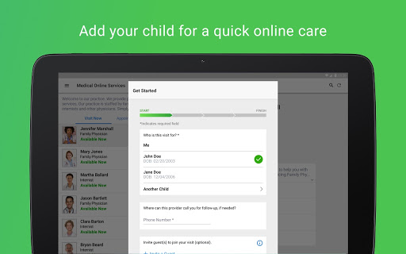
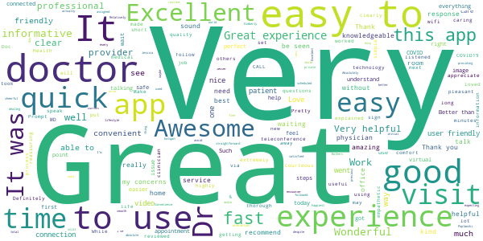

# Augusta Virtual Care
App version ``12.9.01.000_00``

Analyzed with [covid-apps-observer](http://github.com/covid-apps-observer) project, version ``0.1``

## App overview
| | |
|-------------------------|-------------------------| 
| **Name**&nbsp;&nbsp;&nbsp;&nbsp;&nbsp;&nbsp;&nbsp;&nbsp;&nbsp;&nbsp;&nbsp;&nbsp;&nbsp;&nbsp;&nbsp;&nbsp;&nbsp;&nbsp;&nbsp;&nbsp;&nbsp;&nbsp;&nbsp;&nbsp;&nbsp;&nbsp;&nbsp;&nbsp;&nbsp;&nbsp;&nbsp;&nbsp;&nbsp;&nbsp;&nbsp;&nbsp;&nbsp;&nbsp;&nbsp;&nbsp;  | Augusta Virtual Care |
| **Unique identifier** | com.augustahealth.android.augh.expresscare |
| **Link to Google Play** | [https://play.google.com/store/apps/details?id=com.augustahealth.android.augh.expresscare](https://play.google.com/store/apps/details?id=com.augustahealth.android.augh.expresscare) |
| **Summary**  | AU Health Virtual Care |
| **Privacy policy** | [https://www.americanwell.com/privacy-policy/](https://www.americanwell.com/privacy-policy/) |
| **Latest version** | 12.9.01.000_00 |
| **Last update** | 2021-04-08 17:06:51 |
| **Recent changes** | We continue to improve the patient experience with these new features: • Performance enhancements to increase reliability and speed |
| **Installs**  | 10,000+ |
| **Category** | Medical |
| **First release** | Mar 9, 2020 |
| **Size**  | 53M |
| **Supported Android version**  | 5.0 and up |

### Description
> At Augusta University Health we’re bringing back the house call to you by offering virtual visits. You can conveniently access a provider for the care you need today simply by using your phone. It's all about powering you to enjoy the best of health.
 How can AU Health Virtual Care Online benefit me?
 • Access care – 24/7
 • Connect in minutes to a healthcare provider – save time vs. an in-person visit
 • Can be used by your entire family, ages 2 and up
 • All visits are secure and confidential
 • We treat many common conditions, including cough and cold, sinus infections, allergies, rash, and pink eye
 • Many AU Health providers also offer virtual follow-up visits to select patients

### User interface
The developers of the app provide the following screenshots in the Google play store.
| | | |
|:-------------------------:|:-------------------------:|:-------------------------:|
 |   |   |   | 
 |   |   |   | 
 |   |   |   | 
 |   |   |   | 

## Development team
In the following we report the main information provided by the development team in the Google play store.

| | |
|-------------------------|-------------------------|
| **Developer**  | Augusta University |
| **Website**  | - |
| **Email** | itc@americanwell.com |
| **Physical address**  | - |
| **Other developed apps**  | [https://play.google.com/store/apps/developer?id=Augusta+University](https://play.google.com/store/apps/developer?id=Augusta+University) |

## Android support

| | |
|-------------------------|-------------------------|
| **Declared target Android version**  | Android10, version 10 (API level 29) |
| **Effective target Android version**  | Android10, version 10 (API level 29) |
| **Minimum supported Android version**  | Lollipop, version 5.0 (API level 21) |
| **Maximum target Android version**  | - |

The larger the difference between the minimum and maximum supported Android versions, the better. A larger difference means a wider audience. For example, old phones have a very low Android version, so a high minimum supported Android version means that the app cannot be used by users with old phones, thus leading to accessibility problems. 

## Requested permissions

In the following we report the complete list of the permissions requested by the app. 

| **Permission** | **Protection level** | **Description** | 
|-------------------------|-------------------------|-------------------------|
 **android.permission ACCESS_COARSE_LOCATION** | :warning:**Dangerous** | Allows an app to access approximate location. 
 **android.permission ACCESS_FINE_LOCATION** | :warning:**Dangerous** | Allows an app to access precise location. 
 **android.permission ACCESS_LOCATION_EXTRA_COMMANDS** | Normal | Allows an application to access extra location provider commands. 
 **android.permission ACCESS_NETWORK_STATE** | Normal | Allows applications to access information about networks. 
 **android.permission ACCESS_WIFI_STATE** | Normal | Allows applications to access information about Wi-Fi networks. 
 **android.permission BLUETOOTH** | Normal | Allows applications to connect to paired bluetooth devices. 
 **android.permission BROADCAST_STICKY** | Normal | Allows an application to broadcast sticky intents. 
 **android.permission CAMERA** | :warning:**Dangerous** | Required to be able to access the camera device. 
 **android.permission GET_TASKS** | Deprecated | This constant was deprecated in API level 21. No longer enforced. 
 **android.permission INTERNET** | Normal | Allows applications to open network sockets. 
 **android.permission MODIFY_AUDIO_SETTINGS** | Normal | Allows an application to modify global audio settings. 
 **android.permission READ_EXTERNAL_STORAGE** | :warning:**Dangerous** | Allows an application to read from external storage. 
 **android.permission READ_PHONE_STATE** | :warning:**Dangerous** | Allows read only access to phone state, including the phone number of the device, current cellular network information, the status of any ongoing calls, and a list of any PhoneAccounts registered on the device. 
 **android.permission RECEIVE_BOOT_COMPLETED** | Normal | Allows an application to receive the Intent.ACTION_BOOT_COMPLETED that is broadcast after the system finishes booting. 
 **android.permission RECORD_AUDIO** | :warning:**Dangerous** | Allows an application to record audio. 
 **android.permission REORDER_TASKS** | Normal | Allows an application to change the Z-order of tasks. 
 **android.permission SYSTEM_ALERT_WINDOW** | Signature - preinstalled - appop - pre23 - development | Allows an app to create windows using the type WindowManager.LayoutParams.TYPE_APPLICATION_OVERLAY, shown on top of all other apps. 
 **android.permission USE_BIOMETRIC** | Normal | Allows an app to use device supported biometric modalities. 
 **android.permission USE_FINGERPRINT** | Normal | This constant was deprecated in API level 28. Applications should request USE_BIOMETRIC instead 
 **android.permission VIBRATE** | Normal | Allows access to the vibrator. 
 **android.permission WAKE_LOCK** | Normal | Allows using PowerManager WakeLocks to keep processor from sleeping or screen from dimming. 
 **android.permission WRITE_EXTERNAL_STORAGE** | :warning:**Dangerous** | Allows an application to write to external storage. 
 **com.augustahealth.android.augh.expresscare.permission C2D_MESSAGE** | - | - 
 **com.facebook.katana.provider ACCESS** | - | - 
 **com.google.android.c2dm.permission RECEIVE** | - | - 
 **com.google.android.finsky.permission BIND_GET_INSTALL_REFERRER_SERVICE** | - | - 

## Mentioned servers

| **Server** | **Registrant** | **Registrant country** | **Creation date** | 
|-------------------------|-------------------------|-------------------------|-------------------------|
 | amwell.com | American Well Corporation | :us: US | 2004-02-13 19:02:32 |
 | facebook.com | Facebook, Inc. | :us: US | 1997-03-29 05:00:00 |
 | doubleclick.net | Google Inc. | :us: US | 1996-01-16 05:00:00 |
 | googleadservices.com | Google LLC | :us: US | 2003-06-19 16:34:53 |
 | google.com | Google LLC | :us: US | 1997-09-15 04:00:00 |
 | googlesyndication.com | Google LLC | :us: US | 2003-01-21 06:17:24 |
 | google-analytics.com | Google LLC | :us: US | 2005-07-18 19:24:32 |
 | app-measurement.com | Google LLC | :us: US | 2015-06-19 20:13:31 |
 | appboy.com | Braze, Inc. | :us: US | 2008-10-06 23:28:32 |
 | braze.com | Braze, Inc. | :us: US | 2000-01-19 02:18:28 |
 | optimizely.com | Optimizely | :us: US | 2010-01-11 03:01:32 |
 | twitter.com | Twitter, Inc. | :us: US | 2000-01-21 16:28:17 |
 | branch.io | Branch | :us: US | 2011-11-10 13:52:13 |
 | gstatic.com | Google LLC | :us: US | 2008-02-11 15:31:25 |
 | crashlytics.com | Google LLC | :us: US | 2011-01-21 15:30:40 |
 | bnc.lt | - | - | 2016-11-14 00:00:00 |
 | ggpht.com | Google LLC | :us: US | 2008-01-16 18:55:33 |

## Security analysis 

Below we report the main security warnings raised by our execution of the [Androwarn](https://github.com/maaaaz/androwarn) security analysis tool.

**Telephony identifiers leakage**
> - This application reads the ISO country code equivalent for the SIM provider's country code 
> - This application reads the ISO country code equivalent of the current registered operator's MCC (Mobile Country Code) 
> - This application reads the MCC+MNC of the provider of the SIM 
> - This application reads the device phone type value 
> - This application reads the numeric name (MCC+MNC) of current registered operator 
> - This application reads the operator name 
> - This application reads the phone's current state 
> - This application reads the radio technology (network type) currently in use on the device for data transmission 

**Connection interfaces exfiltration**
> - This application reads details about the currently active data network 
> - This application tries to find out if the currently active data network is metered 

**Telephony services abuse**
> - This application makes phone calls 

**Audio video eavesdropping**
> - This application captures video from the 'CAMERA' source 

**Suspicious connection establishment**
> - This application opens a Socket and connects it to the remote address ' returned no addresses for  ; port is out of range' on the 'N/A' port  
> - This application opens a Socket and connects it to the remote address '' on the 'N/A' port  
> - This application opens a Socket and connects it to the remote address 'Ljava/net/Proxy;->type()Ljava/net/Proxy$Type;' on the 'N/A' port  
> - This application opens a Socket and connects it to the remote address 'timeout' on the 'N/A' port  

**Code execution**
> - This application loads a native library 
> - This application executes a UNIX command containing this argument: '2' 

## User ratings and reviews

Below we provide information about how end users are reacting to the app in terms of ratings and reviews in the Google Play store.

### Ratings

The Augusta Virtual Care app has been installed by more than **10000** times. At this time, **419** rated the app and its average score is **4.69**. Below we show the distribution of the ratings across the usual star-based rating of Google Play

:star::star::star::star::star:: 358

:star::star::star::star:: 33

:star::star::star:: 8

:star::star:: 4

:star:: 16

### Reviews 

#### 5-star reviews

> Very essy to use  :date: __2021-06-27 05:33:32__

> The video and sound is clear.  :date: __2021-05-28 20:28:14__

> It was professional just as and office appointment but virtual and my provider's did a good job  :date: __2021-03-16 21:24:57__

> It's made it easy to do my dr visits from home! It still feels private and works for my lifestyle in today's world.  :date: __2021-03-12 20:54:08__

> I loved it. It took 5 minutes and I can avoid a covid hotspot  :date: __2021-02-24 16:58:56__

> Very helpful thanks  :date: __2020-12-15 17:58:19__

> It was great and I'm satisfied!!!  :date: __2020-12-07 20:19:35__

> Great interaction with doctor.  :date: __2020-10-20 21:26:43__

> Wonderful  :date: __2020-09-24 20:56:55__

> Good app works fine  :date: __2020-08-19 15:07:31__

#### 4-star reviews

> I don't don't know why everyone's having a problem with this app. So far I haven't had any problems except for an occasional freeze here and there but besides that everything is good.  :date: __2021-01-25 20:44:29__

> Efficient process. Thanks  :date: __2020-05-19 02:33:01__

> Beats the traditional waiting room! Very informative  :date: __2020-05-11 21:16:30__

> Had a problem getting online . But Tech Support was very fast in helping me . And the Dr. Was very helpful  :date: __2020-05-03 17:52:41__

> Good note to have  :date: __2020-04-22 01:38:51__

> Thank yall  :date: __2020-04-10 21:57:53__

> Love it  :date: __2020-04-08 18:53:41__

> A little glitchy with the sound but other than that it works great.  :date: __2020-04-06 16:19:14__

#### 3-star reviews

> Escapism or Stastical Exhaustion  :date: __2021-03-07 23:13:28__

> Does not include a quick link to drive thru testing sites  :date: __2020-05-01 18:58:23__

#### 2-star reviews

No recent reviews available with 2 stars.

#### 1-star reviews

> I'm not sure how its got 4.8 stars, I've had nothing but problems with this thing. Garbage. Have it rebuilt and don't rush next time.  :date: __2021-01-11 21:11:34__

> I was directed to dowmload the app for a virtial COVID screen. There is no link for a COVID screen.  :date: __2021-01-09 13:36:52__

> Useless... Installed hoping to make a telemedicine appointment. Calendar shows unavailable and message says check back later. Later when? There are no appointments for next week, next month? App does not indicate. Just a single screen. Truly disappointing since our Governor has mentioned and the State Dept of Health cites as a good tool for Covid screening.  :date: __2020-07-29 23:22:50__

> This app was not helpful.  :date: __2020-05-18 18:00:10__

> This app does not work!!!! It continues to NOT log me in and tells me my internet access does not work and to try again.  :date: __2020-04-02 23:02:21__

